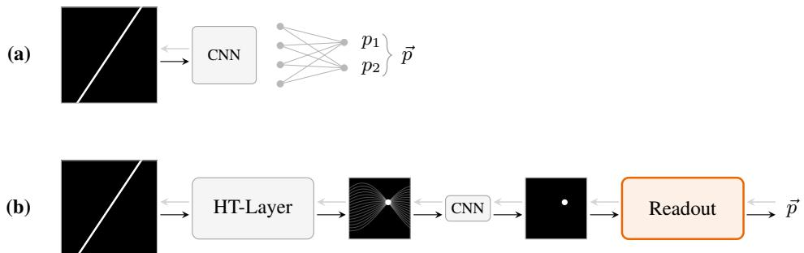
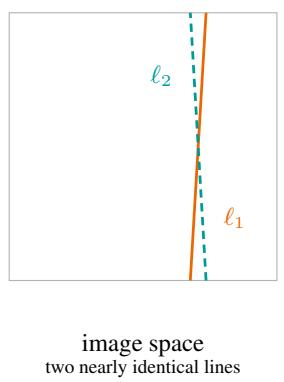
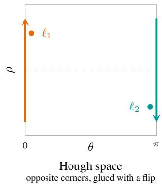
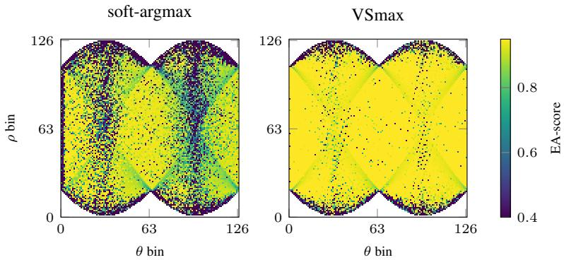
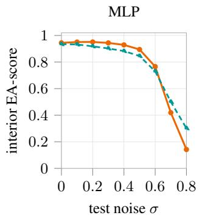
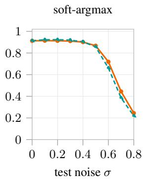
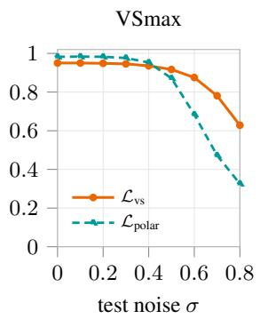
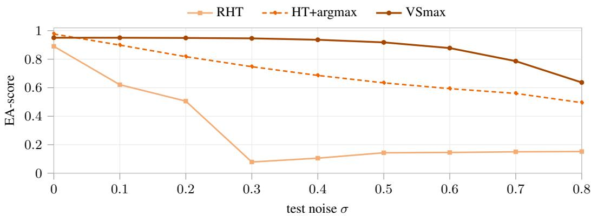
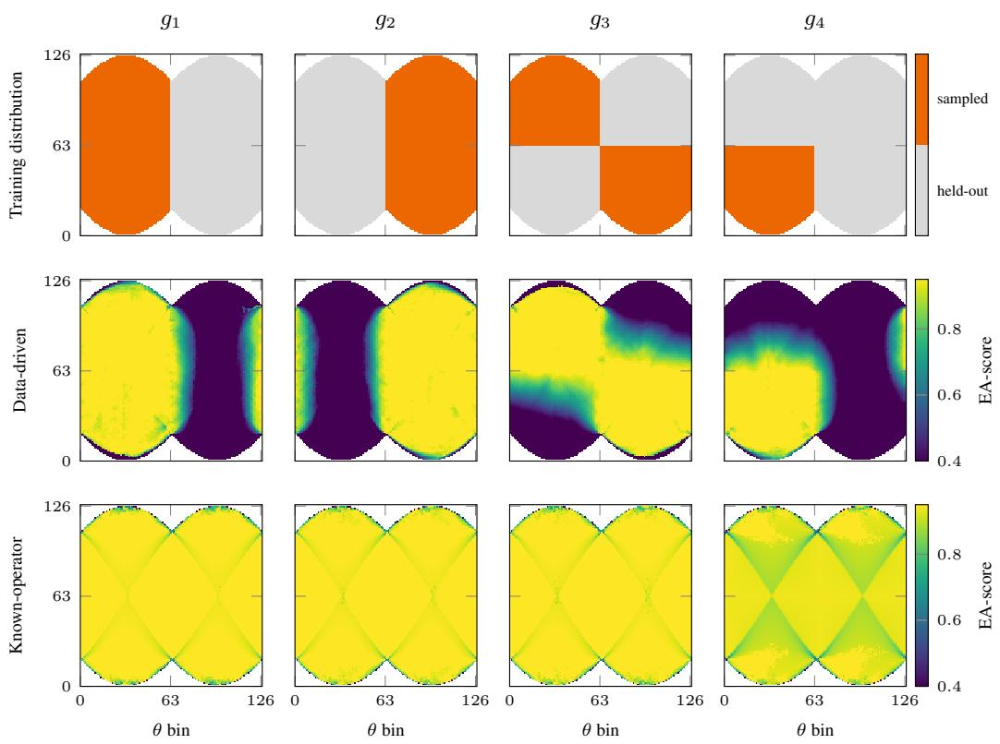
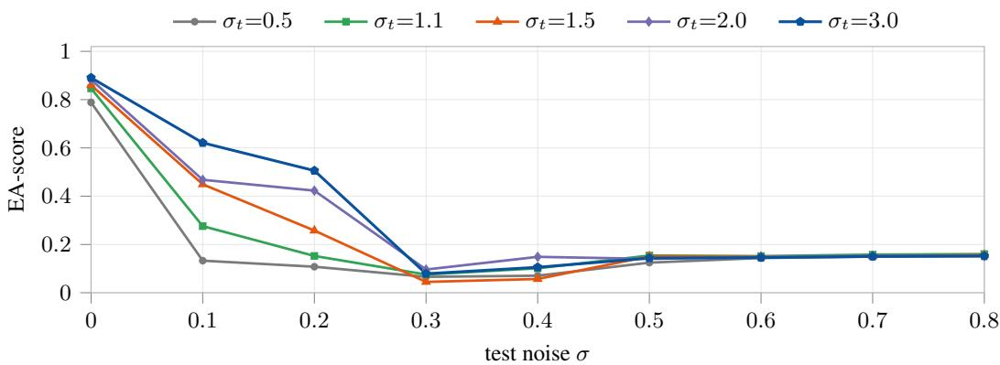

# SOFT-ARGMAX FOR THE PROJECTIVE PLANE VIA THE VERONESE EMBEDDING

Benjamin El-Zein1,2, Dominik Eckert1, Paul Zech1,2, Christopher Syben1, Bernhard Geiger1, Steffen Kappler1, Sebastian Stober2

1Siemens Healthineers AG, X-ray Products, Forchheim, Germany 2Artificial Intelligence Lab, Otto-von-Guericke-University, Magdeburg, Germany

## ABSTRACT

From horizon detection to fibre structures in X-ray imaging, many vision tasks recover lines via peak detection in Hough space $\overset \vartriangle { H } = \operatorname { \bar { \cal S } } ^ { 1 } \times \mathbb { R }$ , the domain of orientation-offset pairs $( \theta , \rho )$ . Differentiable pipelines extract coordinates via softargmax, a probability-weighted average that is only meaningful in a globally linear space. However, $( \theta , \rho )$ and $( \theta + \pi , - \rho )$ describe the same undirected line, so H double-covers the space of undirected lines $H / \mathbb { Z } _ { 2 } { \mathrm { : } }$ a Mobius strip, obtained by¨ identifying each pair under $\mathbb { Z } _ { 2 }$ action. Soft-argmax operates on the cover H, but since $\dot { H } / \breve { \mathbb { Z } } _ { 2 }$ admits no linear structure, it tears geometrically adjacent lines apart. Thus we need a Z2-invariant embedding of lines into a linear space, on which soft-argmax is well-defined. We achieve this by parametrising lines via unit-norm homogeneous vectors $\ell = ( 1 + \rho ^ { 2 } ) ^ { - 1 / 2 } \big ( \mathrm { c o s } \theta , \mathrm { s i n } \theta , - \rho \big ) ^ { \top } \in \mathbb { R } ^ { 3 }$ and applying the Veronese map v2 $( \ell ) = \ell \dot { \ell } ^ { \top }$ that satisfies $v _ { 2 } ( \ell ) = v _ { 2 } ( - \ell )$ . This descends continuously to an embedding of the quotient $H / \mathbb { Z } _ { 2 }$ into the linear space $\mathrm { S y m } ^ { 2 } ( \mathbb { R } ^ { 3 } )$ , where the antipodal ambiguity vanishes. Line extraction becomes a barycentre in $\mathrm { S y m } ^ { 2 } ( \mathbb { R } ^ { 3 } )$ , projected back via its leading eigenvector. We validate our Veronese soft-argmax in a Hough transform-based network across all resolvable lines, confirming uniform and seam-free recovery. We further derive that the $L _ { \mathrm { { 2 } } } \mathrm { { - } } \mathrm { { l o s s \ o n } }$ isometrically weighted Veronese embeddings equals the squared chordal distance between lines in projective space, enabling a geometrically precise training objective.

## 1 INTRODUCTION

Recovering a geometric object from an image requires committing to a parametrisation of it. A line in the plane admits many: a pair of endpoints, a slope and an intercept, or an orientation and a signed offset. For a classical algorithm the choice is a matter of convenience. For a neural network it is decisive, because the network has to learn the parametrisation, and what it produces is a vector in a linear space. The representation must therefore carry the geometry of the object into a space where linear operations mean something.

Two families of differentiable pipelines regress the parameters of a line (Figure 1). The fully learned pipeline of Figure 1a maps the image to the components of a parametrisation ⃗p directly and must discover the geometry of lines from data alone. The known-operator pipeline of Figure 1b instead inserts a fixed differentiable operator that already encodes that geometry, which lowers the maximum error bound and the number of free parameters (Maier et al., 2019). For lines that operator is the Hough transform (Duda & Hart, 1972). It bins every line by its orientation θ and signed offset $\rho ,$ giving $\vec { p } = ( \theta , \rho )$ . So a line in the image becomes a peak in the resulting accumulator, and recovering the line reduces to reading out that peak’s location.

The Hough accumulator hence parametrises the space of undirected lines, but as a flat rectangle. However, this space is not flat. A line has no direction, so $( \theta , \rho )$ and $( \theta + \pi , - \rho )$ denote the same one. Per convention the accumulator indexes only the half-circle $\theta \in [ 0 , \pi )$ such that it stays unique. The two angular edges are therefore glued with a reflection in $\rho ,$ and the resulting space is a Mobius¨ strip.

  
Figure 1: Two differentiable pipelines that regress the parameters of a line. (a) A fully learned pipeline regresses a parametrisation $\vec { p }$ and must discover line geometry from data. (b) A knownoperator pipeline applies a fixed Hough transform and extracts the peak with a readout. We build on (b) and study the readout.

The readout is where this matters. A hard argmax selects a single cell and is well defined on the strip, but it passes no gradient. Differentiable pipelines use a differentiable version of the argmax, which returns the probability-weighted average of the cell coordinates. Averaging presupposes a linear space. Across the seam it is thus ill posed: two adjacent lines may get averaged into a third that resembles neither, even though the accumulator mass is concentrated on nearly the same line. Houghbased pipelines either inherit this readout unchanged or avoid it with a separate, non-differentiable peak extraction.

Two routes lead out. One redefines the operation non-trivially on the curved space. We take the other and change the representation, so that the linear operation becomes well posed. A line is described by a unit homogeneous vector ℓ that is fixed only up to sign, and we replace it by the outer product $\bar { \ell \ell } ^ { \top }$ . Thanks to sign-invariance, both representatives of a line map to the same point, and that point lives in a linear space. Our proposed Veronese soft-argmax (VSmax) operates in this space and returns a barycentre of symmetric matrices. The line it encodes is recovered in closed form as the leading eigenvector.

## 2 RELATED WORK

Known operators and the Hough transform. Known-operator learning replaces parts of a network by fixed differentiable operators that encode prior knowledge; Maier et al. (2019) prove this lowers both the maximum error bound and the number of free parameters. For lines the natural such operator is the Hough transform, introduced in its polar form by Duda & Hart (1972). Zhao et al. (2022) embed the transform in a CNN but read out lines with a separate, non-differentiable peak-extraction step, so gradients never flow through the readout.

Differentiable coordinate readouts. Luvizon et al. (2019) and Nibali et al. (2018) make peak extraction differentiable the same way. Normalise a heatmap into a distribution over cells, then return the probability-weighted average of a cached coordinate grid. They differ only in how that distribution is formed, not in what they return: a point in the convex hull of the grid. Nibali et al. (2018) write the average as an inner product with fixed coordinate matrices, improving on heatmap matching, which is not differentiable up to the coordinate, and on fully connected regression, which lacks spatial generalisation. Every such readout presumes a chart whose coordinates may be averaged linearly. Bachmaier et al. (2023) come closest to questioning this, wrapping the soft-argmax circularly in $\theta ;$ but auto-rotation needs no offset, so they discard $\rho$ and never meet the coupling $( \theta , \rho ) \sim ( \theta + \pi , - \rho )$ that makes such an average ill posed.

Symmetry-aware architectures. Where a domain carries a symmetry, the standard remedy is equivariant layers. Cohen & Welling (2016) generalise convolution to groups generated by translations, reflections and rotations. At the angular boundary of the Hough space the identification is a glide-reflection (Stillwell, 1995), an orientation-reversing isometry to which a translation-only con volution is not equivariant. Unfolding the angular axis from $[ 0 , \pi )$ to the full circle [0, 2π) replaces it by an ordinary circular wrap, so the accumulator becomes a cylinder and the layer a cylindrical convolution (Kim et al., 2020), for which circular padding is exact and plain translation equivariance suffices. The unfolded accumulator, however, covers every undirected line twice, so no standard readout is invariant to both representatives.

Projection embeddings. An undirected line is a vector fixed only up to sign, with no linear structure of its own. Several fields resolve this by embedding such an object as the outer product of its vector, a symmetric matrix on which Euclidean computations apply. Hamm & Lee (2008) build this into the projection kernel and state the mismatch plainly: feature extraction carried out in a Euclidean space while the distances that matter are not Euclidean. The same embedding underlies kernels that inherit the ambient metric (Harandi et al., 2014), dictionary learning in Frobenius norm (Harandi et al., 2013), and network layers returning Euclidean forms to ordinary output layers (Huang et $\mathrm { { a l . } }$ , 2018). Recovering the vector from the matrix is a low-rank approximation, solved in closed form by Eckart & Young (1936). Outside learning, Binnie et al. (2026) reach the same Mobius band and chordal distance once pairs of points on a circle are identified. All of them run¨ the embedding forward, from data to a feature they describe or classify; none runs it backward as a readout, turning a distribution over lines into a single recovered line.

Lifted representations and geometric losses. 3D Rotation estimation meets the same problem and answers it by lifting: represent a rotation in a higher-dimensional linear space, regress there, and project back. Levinson et al. (2020) predict nine numbers and project onto $S O ( 3 )$ by SVD, which outperforms quaternions. Markley et al. (2007) average quaternions, which carry the same sign ambiguity as an undirected line, by maximising a quadratic form, precisely the recovery such an embedding calls for. Hartley et al. (2013) define the chordal distance between rotations as the Euclidean distance between their $\mathbb { R } ^ { 9 }$ embeddings, and Gui et al. (2018) confirm that such a geometric loss beats a plain Euclidean one, though their geodesic distance on $S O ( 3 )$ has a gradient that explodes when two rotations are half a turn apart. So the lift, the recovery, and the geometric loss are already in place, but only for a group: SO(3) is compact with a bi-invariant metric and an orientable double cover, whereas undirected lines form a non-orientable quotient that is no group at all.

Positioning. Each field holds part of the answer, but none is built for lines: vision contributes the known-operator pipeline and a differentiable readout yet treats the accumulator as a flat image; subspace learning contributes a sign-invariant representation and its inverse yet uses both only to describe objects it already has; and rotation estimation contributes ${ \mathrm { l i f t } } ,$ recovery and geometric loss yet for a fundamentally different space. What none provides is a differentiable readout well posed on the space of undirected lines, together with an objective that measures genuine line distance.

## 3 METHODS

## 3.1 A SPACE-OPERATION MISMATCH

An undirected line is described in Hough coordinates by an orientation $\theta \in [ 0 , \pi )$ and a signed offset $\rho \in \mathbb { R }$ , and the Hough transform indexes its accumulator by exactly these polar coordinates $( \theta , \rho )$ . The half-circle therefore provides one representative for every undirected line. However, the underlying representation is still subject to the identification:

$$
( \theta , \rho ) \sim ( \theta + \pi , - \rho ) .\tag{1}
$$

Identifying the angular boundaries according to this relation yields the topology of a Mobius strip.¨ Crossing from $\theta = \pi$ back to $\theta = 0$ flips the sign of $\rho$ (Figure 2). Consequently, two geometrically adjacent lines can lie at opposite ends of the finite chart. This is harmless for a non-differentiable readout: a hard argmax simply selects the peak cell, a well-defined operation on the strip. Training a neural network, however, requires a differentiable readout, the soft-argmax, which returns a weighted average of the cell coordinates. Averaging presupposes a linear space, and the strip is not one. Across the seam the soft-argmax is therefore ill posed: it can average two geometrically adjacent lines into one far from both, even though the accumulator mass is concentrated on nearly identical lines. This seam is an artefact of the 2D coordinate system, not of the line space itself.

  
Figure 2: Two nearly identical lines $\ell _ { 1 } , \ell _ { 2 }$ (left) map to opposite ends of the Hough space (right); the $\theta = 0$ and $\theta = \pi$ edges are glued with a sign flip on $\rho ,$ so a weighted average across the seam is ill posed.

Undirected lines form a smooth manifold, and any flat chart of it must cut somewhere. The next section makes this space precise and derives a representation in which a readout can be defined that is well posed.

## 3.2 THE VERONESE EMBEDDING

In Hesse normal form, a line satisfies ρ = x cos $\theta + y$ sin θ. Its coefficient vector (cos $\theta ,$ sin $\theta , - \rho ) ^ { \intercal }$ describes the line only up to nonzero scaling $\lambda \in \mathbb { R } ^ { } \backslash \{ 0 \}$ . Through normalisation to unit length, the scaling reduces to a sign ambiguity $\lambda = \pm 1$ , and a line ℓ can be described by

$$
\ell = \frac { 1 } { \sqrt { 1 + \rho ^ { 2 } } } ( \cos { \theta } , \sin { \theta } , - \rho ) ^ { \top } \in S ^ { 2 } \subset \mathbb { R } ^ { 3 } ,\tag{2}
$$

where $S ^ { 2 }$ is the unit sphere in $\mathbb { R } ^ { 3 }$ . On $S ^ { 2 }$ the polar seam identification in Equation 1 becomes $\ell \sim - \ell .$ We seek a space where ℓ and $- \ell$ are represented by the same point. This translates to gluing each point on $S ^ { 2 }$ to its antipode, which is algebraically formalised as the quotient space $S ^ { 2 } / \{ \pm 1 \}$ . The quotient is by definition the real projective plane $\mathrm { \overline { { { \mathbb { R } } } } } \mathbb { P } ^ { 2 }$ . The Veronese map $\nu _ { d }$ (Harris, 1992) sends a projective space $\mathbb P ^ { n }$ into a higher-dimensional projective space $\mathbb P ^ { N }$ by representing a point $[ x _ { 0 } : \cdots : x _ { n } ]$ through all its degree-d monomials,

$$
\nu _ { d } \colon \mathbb { P } ^ { n } \to \mathbb { P } ^ { N } , \qquad \left[ x _ { 0 } : \dots : x _ { n } \right] \longmapsto \left[ x _ { 0 } ^ { d } : x _ { 0 } ^ { d - 1 } x _ { 1 } : \dots : x _ { n } ^ { d } \right] .\tag{3}
$$

where d is the degree, n the dimension of the source space, and $N = { \binom { n + d } { d } } - 1$ the dimension of the target. Taking the monomials as ordinary coordinates places $\mathbb { P } ^ { n }$ inside the linear space $\mathbb { R } ^ { N + 1 }$ In our case, the source dimension is fixed by the projective plane, so $n = 2$ . Moreover, the $d = 2$ monomials $x _ { i } x _ { j }$ are exactly the entries of the outer product ${ \dot { \ell } } \ell ^ { \top }$ , a rank-one symmetric matrix. Two steps turn the projective map $\nu _ { 2 }$ into a concrete embedding we can work with. First, we exchange the projective class for our definite unit-norm representative $\ell \in S ^ { 2 }$ . The quadratic monomials $\ell _ { i } \ell _ { j }$ now absorb the sign ambiguity, since $\ell _ { i } \ell _ { j } = ( - \ell _ { i } ) ( - \ell _ { j } )$ . Second, since $\ell \ell ^ { \top }$ is symmetric we keep only its six distinct entries, obtained by half-vectorisation vech $( \ell \ell ^ { \top } )$ ). The result is the Veronese embedding as a vector-space realisation $v _ { 2 } ( \ell ) : S ^ { 2 } \to \mathbb { R } ^ { 6 }$ , defined as:

$$
v _ { 2 } ( \ell ) = \mathrm { v e c h } ( \ell \ell ^ { \top } ) = \left( \ell _ { 1 } ^ { 2 } , \ell _ { 2 } ^ { 2 } , \ell _ { 3 } ^ { 2 } , \ell _ { 1 } \ell _ { 2 } , \ell _ { 1 } \ell _ { 3 } , \ell _ { 2 } \ell _ { 3 } \right) ^ { \top } , \qquad v _ { 2 } ( \ell ) = v _ { 2 } ( - \ell ) .\tag{4}
$$

This embeds $\mathbb { R } \mathbb { P } ^ { 2 }$ into the linear space $\mathbb { R } ^ { 6 }$ : the seam vanishes, antipodal cells coincide, and geometric proximity of lines becomes metric proximity. In particular, the representation inherits the Euclidean metric ${ \dot { ( \lVert \cdot \rVert } } _ { 2 }$ for vectors, $\left\| \cdot \right\| _ { F }$ for matrices) of the ambient space. So a standard $L _ { 2 }$ loss on

v already is a valid training objective. For that loss to measure the true error between lines ℓ, the embedding must become isometric. In its plain form each off-diagonal entry appears once in vech $( \ell \ell ^ { \top } )$ but twice in $\ell \ell ^ { \top }$ , so we apply the diagonal weighting matrix $W = \mathrm { d i a g } ( 1 , 1 , 1 , \sqrt { 2 } , \sqrt { 2 } , \sqrt { 2 } )$

$$
\| W v _ { 2 } ( \ell ) \| _ { 2 } = \| \ell \ell ^ { \top } \| _ { F } = \| \ell \| _ { 2 } ^ { 2 } .\tag{5}
$$

We fold this weighting into $v _ { 2 }$ hereafter. The squared $L _ { 2 }$ distance of weighted Veronese embeddings now equals the squared chordal distance (Hartley et al., 2013) between lines in projective space (Appendix A.1).

A standard objective function used in deep learning acquires an exact projective-geometric meaning. This is the strategy we follow throughout. Take the convolutions that produce the accumulator weights in Figure 1b. Any kernel with a receptive field wider than a single cell must pad beyond the grid boundary, where the identification in Equation 1 acts as a glide-reflection (Stillwell, 1995) in ρ (see Section 3.1). Standard convolutions are equivariant to translations but not to reflections. Since antipodal partners coincide in our representation, we can spatially unfold the accumulator onto the double cover [0, 2π). Both covers together carry an ambiguous representation of the same undirected line, but the convolution’s role is to clean the accumulator grid: a task invariant to which antipodal representative a cell carries. On the double cover the seam is no longer a glide-reflection but an ordinary circular wrap, so the accumulator becomes a cylinder and the layer reduces to a cylindrical convolution (Kim et al., 2020), for which plain circular padding is exact and topologically correct.

## 3.3 VERONESE SOFT-ARGMAX

Given our representation, the intrinsics of the CNN and the objective function are set, the missing piece is a readout being well defined on the projective plane. As described in Section 3.1, the standard soft-argmax is not. We seek to remove its bottleneck with the VSmax, a readout that becomes well defined in the projective plane. The idea is to apply the soft-argmax not on the 2D accumulator but on the 6D Veronese embedding. The Hough transform bins lines into a fixed grid of N accumulator cells, so we cache one column per cell as a correspondence tensor. For every cell $( \theta , \rho )$ soft-argmax caches the bare polar coordinates as $C \in \mathbb { R } ^ { 2 \times N }$ , while VSmax caches the Veronese embedding as $V \in \mathbb { R } ^ { 6 \times N }$

$$
\underbrace { C = \left[ \left( \theta , \rho \right) \right] _ { ( \theta , \rho ) } \in \mathbb { R } ^ { 2 \times N } } _ { \mathrm { P o l a r C o r e s p o n d e n c e T e n s o r } } \longrightarrow \underbrace { V = \left[ v _ { 2 } ( \ell ( \theta , \rho ) ) \right] _ { ( \theta , \rho ) } \in \mathbb { R } ^ { 6 \times N } } _ { \mathrm { V e r o n e s e C o r r e s p o n d e n c e T e n s o r } } .\tag{6}
$$

Both operators average the same softmax-activated probability distribution $P$ over the grid, ensuring that

$$
P ( \left( \theta , \rho \right) ) \geq 0 , \quad \sum _ { \theta , \rho } P ( \left( \theta , \rho \right) ) = 1 .\tag{7}
$$

Full vectorisation of this grid, $p = \mathrm { v e c } ( P ) \in \mathbb { R } ^ { N }$ , lets each readout be written as a single matrix– vector product with its cached tensor. Replacing the averaged coordinates with their embeddings defines the VSmax:

$$
\underbrace { \left( { \hat { \theta } } , { \hat { \rho } } \right) = \sum _ { \theta , \rho } P ( \left( \theta , \rho \right) ) \left( \theta , \rho \right) = C p } _ { \mathrm { s o f t . a r g m a x } } \quad \longrightarrow \quad \underbrace { { \hat { v } } = \sum _ { \theta , \rho } P ( \theta , \rho ) v _ { 2 } ( \ell ( \theta , \rho ) ) = V p } _ { \mathrm { V S m a x } } .\tag{8}
$$

The two operators utilise the same operation in different spaces, hence, they differ in their output. Soft-argmax returns directly Hough-native polar coordinates, but averaged in the torn coordinate system. VSmax instead returns the barycentre of the selected lines in the embedding: seam-free and linear, but not yet a line ±ℓ. Hence, we need a decoding mechanism mapping the estimate vˆ to polar coordinates.

## 3.4 LINE RECOVERY

The VSmax returns a barycentre $\hat { v } ,$ a point in the Veronese embedding instead of a line. Recovering the one it encodes takes three differentiable steps. First, inverting the isometric weighting W and the half-vectorisation folds vˆ back into the symmetric matrix $\hat { V }$ it encodes,

$$
\begin{array} { r } { \hat { V } \stackrel { } { = } \mathrm { v e c h } ^ { - 1 } ( W ^ { - 1 } \hat { v } ) \stackrel { } { \in } \mathrm { S y m } ^ { 2 } ( { \mathbb R } ^ { 3 } ) . } \end{array}\tag{9}
$$

In Section 3.2 we saw that a single line embeds as the sign-invariant rank-one projector onto the line’s direction. The barycentre $\hat { V } ,$ , however, is a convex combination of such projectors and is in general no longer rank-one. The second step therefore is to find the rank-one symmetric matrix closest to $\hat { V }$ . According to the Eckart–Young theorem (Eckart & Young, 1936), this is solved by the following maximisation problem

$$
\pm \hat { \ell } = \arg \operatorname* { m a x } _ { \| u \| _ { 2 } = 1 } u ^ { \top } \hat { V } u ,\tag{10}
$$

whose solution is the leading eigenvector of $\hat { V }$ , recovered in closed form. Finally, $\hat { \ell } = ( \hat { \ell } _ { 1 } , \hat { \ell } _ { 2 } , \hat { \ell } _ { 3 } )$ is the unit homogeneous vector of Equation $^ { 2 , }$ so inverting that parametrisation returns the line to Hough coordinates. The third and last step is therefore:

$$
\hat { \theta } = \arctan \left( \frac { \hat { \ell } _ { 2 } } { \hat { \ell } _ { 1 } } \right) = \arctan \left( \frac { \sin \theta } { \cos \theta } \right) , \qquad \hat { \rho } = - \frac { \hat { \ell } _ { 3 } } { \sqrt { \hat { \ell } _ { 1 } ^ { 2 } + \hat { \ell } _ { 2 } ^ { 2 } } } = - ( - \rho ) .\tag{11}
$$

Regarding end-to-end differentiation, only the eigenvalue decomposition is delicate. It is differentiable wherever the largest eigenvalue is strictly greater than the second, and its gradient is ill conditioned only as that gap closes. This matters where the recovery itself must be a robust end-to-end differentiable component. For our proposed method, it does not affect us. The loss acts directly on the embedding $\hat { v } ,$ leaving the eigenvector extraction and $( { \hat { \theta } } , { \hat { \rho } } )$ decoding as post-processing outside the gradient path.

## 4 EXPERIMENTS AND RESULTS

We study line recovery through the known-operator pipeline in Figure 1(b): a fixed Hough transform maps the image to the $( \theta , \rho )$ accumulator, a small refinement network cleans it, and a differentiable readout extracts the line parametrisation. Two modular blocks vary across our main experiments: the readout (soft-argmax vs. VSmax), and the coordinate representation in which the $L _ { 2 }$ loss is taken (native polar $( \theta , \rho )$ vs. the Veronese embedding):

$$
\mathcal { L } _ { \mathrm { p o l a r } } = \left. ( \theta ^ { \star } , \rho ^ { \star } ) - ( \hat { \theta } , \hat { \rho } ) \right. _ { 2 } ^ { 2 } , \qquad \mathcal { L } _ { \mathrm { v s } } = \left. v ^ { \star } - \hat { v } \right. _ { 2 } ^ { 2 } ,\tag{12}
$$

Convolutions on the single-cover Hough space (all non-VSmax variants) pad with the strategy defined in Appendix A.2, the most faithful single-cover choice. For VSmax variants we unfold the accumulator onto the double cover, where ordinary circular padding is exact. Any other hyperparameters or network configurations are fixed across experiments and can be found in Appendix A.4. In the ablations, we additionally introduce three baselines that each break one ingredient. A datadriven backbone CNN (ResNet-18) with a multi-layer perceptron (MLP) readout, a learned Houghheatmap matching approach with a non-differentiable readout, and the classical Hough transform with no learning at all.

We train on synthetic $2 5 6 \times 2 5 6$ images, each showing a single line at a random $( \theta , \rho )$ drawn uniformly over all resolvable Hough space lines at $1 2 7 \times 1 2 7$ resolution $( N = 1 4 3 8 4 )$ , with additive Gaussian pixel noise of standard deviation σ as the difficulty knob and a fixed seed for comparability. Training draws σ uniformly from [0, 0.5], and a held-out validation split $( N = 1 0 0 0 )$ from the same range is used for model selection. We then test on $\sigma \in \{ 0 , \ldots , 0 . 8 \bar { \} }$ , so that $\sigma > 0 . 5$ probes outof-distribution (OOD) robustness beyond the training range. All Hough-based configurations share the fixed Hough transform, the same 37.6K-parameter refinement network, and the same optimiser, schedule and seed, so that only the readout and the representation vary (see Appendix A.4).

  
Figure 3: EA-scores of every resolvable and visible line, colour-coded over the full $( \theta , \rho )$ Hough accumulator at $\sigma = 0 . 6 ( \mathrm { O O D } )$ , with the Veronese representation fixed and only the readout changed. Standard soft-argmax (left) is accurate in the interior but dark at the orientation-wrap seam (θ-bin 0/126); the Veronese soft-argmax (right) leaves a near-uniform map.

For a predicted line $\hat { \ell }$ and ground-truth line $\ell ^ { \star }$ , we use the Euclidean and Angular distance score (EAscore) of Zhao et al. (2022) as the evaluation metric, which combines angular $( S _ { \theta } )$ and positional $( S _ { d } )$ similarity. Let $\Delta \theta \in [ 0 , \pi / 2 ]$ be the angle between the two lines and $d _ { \ell }$ the Euclidean distance between the midpoints of their visible intersections with the image domain, after normalising the image to a unit square. With

$$
S _ { \theta } = 1 - \frac { \Delta \theta } { \pi / 2 } , \qquad S _ { d } = 1 - d _ { \ell } , \qquad \mathrm { E A } ( \hat { \ell } , \ell ^ { \star } ) = ( S _ { \theta } S _ { d } ) ^ { 2 } \in [ 0 , 1 ] ,\tag{13}
$$

larger values indicate better agreement. We report the mean per-line EA-score over all test lines. Additionally we separate between those scores over the seam, the orientation-wrap bins θ-bin ∈ $\{ 0 , \dotsc , 4 \} \cup \{ 1 2 2 , \dotsc , 1 2 6 \}$ , and over the interior, the remaining bins.

## 4.1 OPERATOR VALIDATION

Fixing ${ \mathcal { L } } _ { \mathrm { v s } } .$ , we change only the readout and test OOD performance at $\sigma = 0 . 6$ . Figure 3 colourcodes the EA-score of every resolvable line bin over the full $( \theta , \rho )$ accumulator. Using soft-argmax is relatively accurate in the interior but tears at the orientation-wrap seam. Specifically, seam EA-score 0.69 against 0.72 in the interior (Table 1) underlines the failure of the space-operation mismatch. We show that using VSmax resolves it: antipodal cells share an embedding point, so mass split across the seam reunites, and seam EA-score rises to 0.92, matching its interior (0.88). Both readouts nonetheless leave a band of outliers spanning the full angular range at the extreme offsets, where $\rho$ is near its maximum or minimum. These are expected, and not a topological defect. Those parametrisations correspond to lines that are far from the origin (e.g. at image corners) leaving only a small segment of the line visible in the image. The Hough response is weak, more so under noise. Even in this regime, VSmax shrinks the outlier bands relative to soft-argmax.

## 4.2 REPRESENTATION VALIDATION

We now follow the inverse approach. Fixing each readout in turn, we exchange only the representation in which the $L _ { 2 } .$ -loss is measured: $\mathcal { L } _ { \mathrm { p o l a r } }$ vs. ${ \mathcal { L } } _ { \mathrm { v s } }$ (Table 1). The Veronese representation lifts the seam EA-score in every configuration. The clearest case is the MLP, which has no readout to blame: switching its loss to the embedding lifts seam EA-score by 28%, closing the seam deficit so that it matches the interior. The same swap lifts standard soft-argmax by 10% and our VSmax by 14%.

Two things follow. First, ${ \mathcal { L } } _ { \mathrm { v s } }$ alone is not enough: soft-argmax with the embedding loss still reaches only 0.69 at the seam, far below VSmax (0.92). The objective function constrains the output space, not the operations that produce it. Hence, representation and operator are complementary, both must respect the projective geometry of lines. Second, $\mathcal { L } _ { \mathrm { p o l a r } }$ and ${ \mathcal { L } } _ { \mathrm { v s } }$ trade off in the interior as noise grows (Figure 4). Here the seam is isolated, so the difference is one of metric fidelity. Minimising ${ \mathcal { L } } _ { \mathrm { v s } }$ equals the chordal distance between lines (Section 3.2), so it minimises true geometric line error which is exactly what the EA-score rewards. In contrast, ${ \mathcal { L } } _ { \mathrm { p o l a r } }$ penalises raw $( \theta , \rho )$ coordinate error, which does not match line distance. Since ℓ depends nonlinearly on $\rho ,$ a fixed $( \theta , \rho )$ error corresponds to a large geometric change for some lines, and a tiny one for others. This results in a distorted measure of line error, because ${ \mathcal { L } } _ { \mathrm { p o l a r } }$ weights them all equally. On clean data this mismatch is negligible and the Hough-native coordinates are beneficial. As noise increases, $\mathcal { L } _ { \mathrm { p o l a r } }$ increasingly optimises this distorted proxy, so its interior EA-score decreases faster, while ${ \mathcal { L } } _ { \mathrm { v s } }$ stays aligned with true line distance and degrades gracefully.

Table 1: EA-score at $\sigma = 0 . 6 ( \mathrm { O O D } )$ per method: global, at the orientation-wrap seam, and in the interior. Blocks (top to bottom): data-driven MLP, standard soft-argmax, and our Veronese soft argmax readout, each with the polar and the Veronese representation. Switching to the Veronese representation lifts the seam EA-score within every pipeline.
<table><tr><td>Method</td><td>EA (all)</td><td> $\operatorname { E A } \left( \operatorname { s e a m } \right)$ </td><td>EA (interior)</td></tr><tr><td> $\mathbf { M } \mathbf { L } \mathbf { P } + \mathcal { L } _ { \mathrm { p o l a r } }$ </td><td> $0 . 7 1 9 { \pm } 0 . 2 6 8$ </td><td> $0 . 5 6 1 { \scriptstyle \pm 0 . 2 9 7 }$ </td><td> $0 . 7 3 0 { \scriptstyle \pm 0 . 2 6 3 }$ </td></tr><tr><td> $\mathbf { M } \mathbf { L } \mathbf { P } + \mathcal { L } _ { \mathrm { v s } }$ </td><td> $0 . 7 6 3 { \scriptstyle \pm 0 . 2 9 4 }$ </td><td> $0 . 7 2 0 { \scriptstyle \pm 0 . 2 9 3 }$ </td><td> $0 . 7 6 6 { \scriptstyle \pm 0 . 2 9 4 }$ </td></tr><tr><td> $\mathrm { S o f t - a r g m a x + \mathcal { L } _ { \mathrm { p o l a r } } }$ </td><td> $0 . 6 5 9 { \pm } 0 . 3 1 4$ </td><td> $0 . 6 2 7 { \scriptstyle \pm 0 . 3 5 1 }$ </td><td> $0 . 6 6 2 { \scriptstyle \pm 0 . 3 1 1 }$ </td></tr><tr><td> $\mathrm { S o f t - a r g m a x + \mathcal { L } _ { v s } }$ </td><td> $0 . 7 1 7 { \scriptstyle \pm 0 . 2 9 8 }$ </td><td> $0 . 6 9 2 { \scriptstyle \pm 0 . 3 3 9 }$ </td><td> $0 . 7 1 9 { \pm } 0 . 2 9 5$ </td></tr><tr><td> $\mathrm { V S m a x } + \mathcal { L } _ { \mathrm { p o l a r } }$ </td><td> $0 . 6 9 2 { \scriptstyle \pm 0 . 2 9 5 }$ </td><td> $0 . 8 0 6 { \scriptstyle \pm 0 . 2 3 7 }$ </td><td> $0 . 6 8 4 { \scriptstyle \pm 0 . 2 9 7 }$ </td></tr><tr><td> $\mathrm { V S m a x } + \dot { \mathcal { L } } _ { \mathrm { v s } }$ </td><td> $0 . 8 7 8 { \scriptstyle \pm 0 . 2 3 3 }$ </td><td> $0 . 9 1 8 { \pm } 0 . 1 7 7$ </td><td> $0 . 8 7 5 { \scriptstyle \pm 0 . 2 3 7 }$ </td></tr></table>

  
Figure 4: Interior EA-score vs. test noise $\sigma$ (dashed line: training maximum $\sigma ~ = ~ 0 . 5 )$ for the three pipelines—MLP, standard soft-argmax, and VSmax—each with the polar (teal, dashed) and the Veronese (orange) representation. The polar loss can lead when clean, but the Veronese loss degrades more gracefully as noise grows in every pipeline.

## 4.3 ABLATION 1: WHY LEARN END-TO-END

We want to show why end-to-end training is beneficial in this setup. For that, we compare our method to two Hough-variants that do not rely on it. The plain Hough transform (no refinement), read out by non-differentiable (argmax) peak selection, and the Reverse mapping of Hough transform (RHT) (Zhao et al., 2022), a learned heatmap-matching baseline (with refinement) from the multi-line detection literature with a non-differentiable readout. Figure 5 sweeps the test noise. The classical transform is exact when clean (≈ 0.98) but decays towards 0.5 as noise grows. This is exactly the regime a learned network fixes, by cleaning the accumulator before the readout. The RHT does not transfer to single-line regression: at every hyperparameter configuration we tried it collapses under mild noise (we sweep these RHT-specifics in Appendix A.3). Its recipe is built to detect an unknown number of lines rather than regress a single one end-to-end. Only our differentiable VSmax pipeline degrades gracefully and stays robust across the sweep.

  
Figure 5: Global EA-score on the full test set vs. test noise. The classical Hough readout is exact when clean but brittle; the RHT (best target width; Appendix A.3) collapses under noise; our endto-end differentiable Veronese soft-argmax degrades gracefully.

## 4.4 ABLATION 2: WHY KNOWN OPERATORS

Finally we isolate what the known operator itself contributes, comparing our 37.6K-parameter pipeline against a far larger data-driven CNN+MLP regressor (11.3M parameters, roughly 300× more) that must learn the recovery from scratch. Both are trained with $\dot { \mathcal { L } } _ { \mathrm { v s } } .$ while we restrict training to sub-regions of line space and test on the full space. The four settings $g _ { 1 } { - } g _ { 4 }$ tighten the trained support from a half-space $( g _ { 1 } , g _ { 2 } )$ through a diagonal split (g3) to a single quadrant (g4), pushing held-out lines progressively farther from anything seen. In-support the two are comparable, outof-support they part sharply (Figure 6): the MLP collapses on held-out lines, staying accurate only where it saw data, whereas the operator stays almost uniform in- and out-of-support. By turning recovery into a fixed geometric computation rather than a learned mapping, the known operator generalises as if the held-out region had been part of training, and does so with orders of magnitude fewer parameters than the data-driven regressor, which cannot.

  
Figure 6: Generalisation across training-support settings $g _ { 1 } { - } g _ { 4 }$ (columns). Rows: the binary training-support region in $( \theta , \rho )$ , the data-driven MLP’s EA-score, and our known-operator pipeline’s EA-score (clean data). The MLP is accurate only where it was trained and collapses on the held-out region; the operator stays uniform across the whole line space.

## 5 CONCLUSIONS

Geometric prior knowledge in a network is usually placed in the architecture: equivariant layers, known operators, structured losses. Each of them shapes how evidence is carried, and none of them ever has to name the object. That obligation falls on the last step. A readout has to return a single element of the label space itself, so it is the one component that cannot stay agnostic to how that space is shaped. An operator that averages coordinates is only ever as correct as the chart it averages in. What has to change is therefore not the operator but the space it is handed, and that exchange asks for only three things: an embedding under which the identifications of the label space become equalities, a linear space to average in, and an inverse in closed form. None of the three introduces a trainable parameter or a hyperparameter, so whether a readout is well posed is decided by the construction itself, prior to training and independently of any validation error. Where those three conditions hold, the seam a chart introduces has nowhere left to appear, and the VSmax is one instance of that.

Lines are not a special case in this respect. Every label space that arises as a quotient by a finite group action, be it axial orientations, quaternions up to sign, or objects with a discrete symmetry, admits an embedding of this kind, and the choice of embedding fixes both the operator and the metric its loss then measures in. The reach of a differentiable argmax is therefore not bounded by flat charts, but by the embeddings available for the space one wants to read out.

Limitations. Our evaluation is restricted to single synthetic lines under additive noise. Real imagery is untested. This would require a feature extractor that introduces a new uncertain variable in the pipeline. We intentionally want to isolate this here and dedicate this transition to future work. Moreover, it is currently a single-line pipeline only, multi-line settings could further be explored. Finally, the method is a readout for known-operator line pipelines, and although the same embedaverage-recover recipe should reach other projective label spaces, we have not demonstrated that.

Disclaimer: The presented methods in this paper are not commercially available and their future availability cannot be guaranteed.

## REFERENCES

Magdalena Bachmaier, Maximilian Rohleder, Benedict Swartman, Maxim Privalov, Andreas Maier, and Holger Kunze. Robust Hough and Spatial-To-Angular Transform Based Rotation Estimation for Orthopedic X-Ray Images. In Hayit Greenspan, Anant Madabhushi, Parvin Mousavi, Septimiu Salcudean, James Duncan, Tanveer Syeda-Mahmood, and Russell Taylor (eds.), Medical Image Computing and Computer Assisted Intervention – MICCAI 2023, pp. 446–455, Cham, 2023. Springer Nature Switzerland. ISBN 978-3-031-43990-2. doi: 10.1007/978-3-031-43990-2 42.

James A. D. Binnie, Otto Sumray, and Ka Man Yim. The Chordal Distance Transform of Geometric Loops and its Persistent Homology, March 2026.

Taco Cohen and Max Welling. Group Equivariant Convolutional Networks. In Proceedings of The 33rd International Conference on Machine Learning, pp. 2990–2999. PMLR, June 2016.

Richard O. Duda and Peter E. Hart. Use of the Hough transformation to detect lines and curves in pictures. Commun. ACM, 15(1):11–15, January 1972. ISSN 0001-0782. doi: 10.1145/361237. 361242.

Carl Eckart and Gale Young. The approximation of one matrix by another of lower rank. Psychometrika, 1(3):211–218, 1936.

Liang-Yan Gui, Yu-Xiong Wang, Xiaodan Liang, and Jose M. F. Moura. Adversarial Geometry-´ Aware Human Motion Prediction. In Vittorio Ferrari, Martial Hebert, Cristian Sminchisescu, and Yair Weiss (eds.), Computer Vision – ECCV 2018, pp. 823–842, Cham, 2018. Springer International Publishing. ISBN 978-3-030-01225-0. doi: 10.1007/978-3-030-01225-0 48.

Jihun Hamm and Daniel D. Lee. Grassmann discriminant analysis: A unifying view on subspacebased learning. In Proceedings ofthe 25th International Conference on Machine Learning, ICML ’08, pp. 376–383, New York, NY, USA, July 2008. Association for Computing Machinery. ISBN 978-1-60558-205-4. doi: 10.1145/1390156.1390204.

Mehrtash Harandi, Conrad Sanderson, Chunhua Shen, and Brian C. Lovell. Dictionary Learning and Sparse Coding on Grassmann Manifolds: An Extrinsic Solution. In Proceedings of the IEEE International Conference on Computer Vision, pp. 3120–3127, 2013.

Mehrtash T. Harandi, Mathieu Salzmann, Sadeep Jayasumana, Richard Hartley, and Hongdong Li. Expanding the Family of Grassmannian Kernels: An Embedding Perspective. In David Fleet, Tomas Pajdla, Bernt Schiele, and Tinne Tuytelaars (eds.), Computer Vision – ECCV 2014, pp. 408–423, Cham, 2014. Springer International Publishing. ISBN 978-3-319-10584-0. doi: 10. 1007/978-3-319-10584-0 27.

Joe Harris. Algebraic Geometry, volume 133 of Graduate Texts in Mathematics. Springer New York, New York, NY, 1992. ISBN 978-1-4419-3099-6 978-1-4757-2189-8. doi: 10.1007/ 978-1-4757-2189-8.

Richard Hartley, Jochen Trumpf, Yuchao Dai, and Hongdong Li. Rotation Averaging. Int J Comput Vis, 103(3):267–305, July 2013. ISSN 1573-1405. doi: 10.1007/s11263-012-0601-0.

Zhiwu Huang, Jiqing Wu, and Luc Van Gool. Building Deep Networks on Grassmann Manifolds. Proceedings of the AAAI Conference on Artificial Intelligence, 32(1), April 2018. ISSN 2374- 3468. doi: 10.1609/aaai.v32i1.11725.

Jinpyo Kim, Wooekun Jung, Hyungmo Kim, and Jaejin Lee. CyCNN: A Rotation Invariant CNN using Polar Mapping and Cylindrical Convolution Layers, July 2020.

Jake Levinson, Carlos Esteves, Kefan Chen, Noah Snavely, Angjoo Kanazawa, Afshin Rostamizadeh, and Ameesh Makadia. An Analysis of SVD for Deep Rotation Estimation. In Ad vances in Neural Information Processing Systems, volume 33, pp. 22554–22565. Curran Associates, Inc., 2020.

Diogo C. Luvizon, Hedi Tabia, and David Picard. Human pose regression by combining indirect part detection and contextual information. Computers & Graphics, 85:15–22, December 2019. ISSN 00978493. doi: 10.1016/j.cag.2019.09.002.

Andreas K. Maier, Christopher Syben, Bernhard Stimpel, Tobias Wurfl, Mathis Hoffmann, Frank¨ Schebesch, Weilin Fu, Leonid Mill, Lasse Kling, and Silke Christiansen. Learning with known operators reduces maximum error bounds. Nat Mach Intell, 1(8):373–380, August 2019. ISSN 2522-5839. doi: 10.1038/s42256-019-0077-5.

F. Landis Markley, Yang Cheng, John L. Crassidis, and Yaakov Oshman. Averaging Quaternions. Journal of Guidance, Control, and Dynamics, 30(4):1193–1197, July 2007. ISSN 0731-5090, 1533-3884. doi: 10.2514/1.28949.

Aiden Nibali, Zhen He, Stuart Morgan, and Luke Prendergast. Numerical Coordinate Regression with Convolutional Neural Networks, May 2018.

John Stillwell. Geometry of Surfaces. Springer Science & Business Media, February 1995. ISBN 978-0-387-97743-0.

Kai Zhao, Qi Han, Chang-Bin Zhang, Jun Xu, and Ming-Ming Cheng. Deep Hough Transform for Semantic Line Detection. IEEE Transactions on Pattern Analysis and Machine Intelligence, 44 (9):4793–4806, September 2022. ISSN 1939-3539. doi: 10.1109/TPAMI.2021.3077129.

## A APPENDIX

## A.1 THE SQUARED $L _ { 2 }$ LOSS ON THE VERONESE EMBEDDING IS THE SQUARED CHORDALDISTANCE

The training loss is a plain squared $L _ { 2 }$ distance between the six-dimensional Veronese vectors $v _ { 2 } ( { \bf u } ) = \bar { \mathrm { v e c h } } ( { \bf u } { \bf u } ^ { \top } )$ We show in two steps that, with the weighting of Section 3.2, it equals the squared chordal distance between the lines those vectors represent. The first step reduces the vector loss to a distance between the outer-product matrices $\mathbf { u } \bar { \mathbf { u } } ^ { \top }$ . The vector norm runs over the six distinct entries,

$$
\| v _ { 2 } ( \mathbf { u } ) - v _ { 2 } ( \mathbf { v } ) \| _ { 2 } ^ { 2 } = \sum _ { i \leq j } ( u _ { i } u _ { j } - v _ { i } v _ { j } ) ^ { 2 } ,\tag{14}
$$

whereas the Frobenius norm runs over all nine matrix entries,

$$
\| \mathbf { u } \mathbf { u } ^ { \top } - \mathbf { v } \mathbf { v } ^ { \top } \| _ { F } ^ { 2 } = \sum _ { i , j } ( u _ { i } u _ { j } - v _ { i } v _ { j } ) ^ { 2 } ,\tag{15}
$$

so the two differ only in that each off-diagonal pair is counted twice on the right. Scaling the offdiagonal components by ${ \sqrt { 2 } } ,$ , which is exactly the weighting $W = \mathrm { d i a g } ( 1 , 1 , 1 , \sqrt { 2 } , \sqrt { 2 } , \sqrt { 2 } )$ folded into $v _ { 2 }$ in Section 3.2, closes the gap and makes $\| W \overset { \smile } { v _ { 2 } } ( { \mathbf { u } } ) - W { v _ { 2 } } ( { \mathbf { v } } ) \| _ { 2 } ^ { 2 } = \| \mathbf { u } \mathbf { u } ^ { \top } - { \mathbf { v } } { { \mathbf { v } } ^ { \top } } \| _ { F } ^ { 2 }$ . Even unweighted the two losses share the same minimiser and stay monotone in the line angle, so the plain vector loss already trains correctly.

The second step identifies this Frobenius distance geometrically. For unit vectors u, $\mathbf { v _ { \alpha } } \in \mathbf { \Xi } S ^ { n }$ , expanding the trace gives

$$
\begin{array} { r l } & { \| \mathbf { u } \mathbf { u } ^ { \top } - \mathbf { v } \mathbf { v } ^ { \top } \| _ { F } ^ { 2 } = \mathrm { t r } \big ( ( \mathbf { u } \mathbf { u } ^ { \top } - \mathbf { v } \mathbf { v } ^ { \top } ) ^ { 2 } \big ) } \\ & { \qquad = \mathrm { t r } \big ( \mathbf { u } \mathbf { u } ^ { \top } \mathbf { u } \mathbf { u } ^ { \top } \big ) - 2 \mathrm { t r } \big ( \mathbf { u } \mathbf { u } ^ { \top } \mathbf { v } \mathbf { v } ^ { \top } \big ) + \mathrm { t r } \big ( \mathbf { v } \mathbf { v } ^ { \top } \mathbf { v } \mathbf { v } ^ { \top } \big ) } \\ & { \qquad = \| \mathbf { u } \| ^ { 4 } - 2 ( \mathbf { u } ^ { \top } \mathbf { v } ) ^ { 2 } + \| \mathbf { v } \| ^ { 4 } } \\ & { \qquad = 2 - 2 ( \mathbf { u } ^ { \top } \mathbf { v } ) ^ { 2 } } \\ & { \qquad = 2 \big ( 1 - \cos ^ { 2 } \alpha \big ) } \\ & { \qquad = 2 \sin ^ { 2 } \alpha , } \end{array}\tag{16}
$$

where $\begin{array} { r } { \alpha = \operatorname { a r c c o s } \lvert \mathbf { u } ^ { \top } \mathbf { v } \rvert \in [ 0 , \frac { \pi } { 2 } ] } \end{array}$ is the angle between the projective points $[ \mathbf { u } ] , [ \mathbf { v } ] \in \mathbb { R P } ^ { n }$ . The right-hand side is their squared chordal distance, the squared Euclidean distance between the projector embeddings (Hartley et al., 2013), and it is invariant to the signs of u and $\mathbf { v } ,$ hence well defined on undirected lines $( n = 2 )$ . Chaining the two steps, the squared $L _ { 2 }$ loss on the weighted Veronese embedding is exactly the squared chordal distance between the corresponding lines.

## A.2 MOBIUS PADDING FOR THE SINGLE COVER ¨

The single-cover accumulator $A \in \mathbb { R } ^ { T \times R }$ indexes orientation by $t \in \{ 0 , \ldots , T - 1 \}$ over $\theta \in [ 0 , \pi )$ and signed offset by $r \in \{ 0 , \ldots , R { - } 1 \}$ symmetric about the centre bin, so that $r \mapsto R { - } 1 { - } r$ realises $\rho \mapsto - \rho$ (with $R = 1 2 7$ odd the centre bin is exact). The seam identification $( \theta , \rho ) \sim ( \theta + \pi , - \rho )$ fixes the topologically correct padding: a virtual row past either angular boundary is the opposite boundary with ρ reflected,

$$
A [ - 1 - k , r ] = A [ T - 1 - k , R - 1 - r ] , A [ T + k , r ] = A [ k , R - 1 - r ] , k \geq 0 .\tag{17}
$$

This is circular padding in θ composed with a reflection in $\rho \mathrm { - } \mathbf { a }$ glide-reflection. It splices in the exact heatmap values of the continuing lines and is the most faithful single-cover padding available. It cannot restore equivariance: a plane convolution is equivariant to translations but not to the orientation-reversing glide-reflection the Mobius seam requires, so an oriented kernel meets a¨ ρ-reflected continuation across the boundary (Section 3.2). The double cover replaces this glidereflection with a pure translation, for which ordinary circular padding is exact.

## A.3 RHT: A MULTI-LINE DETECTOR APPLIED TO SINGLE-LINE REGRESSION

The RHT is a learned Hough baseline from the multi-line detection literature. A network regresses a heatmap over the $( \theta , \rho )$ accumulator whose peaks mark the lines, trained to match Gaussian targets of width $\sigma _ { t } ;$ the lines are then recovered by a separate, non-differentiable peak-extraction step. The method is built to detect an unknown number of lines rather than to regress a single line end-to-end, and its readout cannot be trained through. We evaluate it here as a Hough-based reference. Because the target width $\sigma _ { t }$ is a free hyperparameter uncoupled from the line error, we sweep it widely; Figure 7 reports global EA-score on the full test set for $\sigma _ { t } \in \{ 0 . 5 , 1 . 1 , 1 . 5 , 2 . 0 , 3 . 0 \}$ . On clean data a wider target helps—EA-score rises from 0.79 at $\sigma _ { t } { = } 0 . 5$ to 0.89 at $\sigma _ { t } { = } 3 . 0 -$ but under even mild noise every width collapses to $\mathrm { E A } \approx 0 . 1$ by $\sigma { = } 0 . 3 .$ , and no configuration we tried recovers. We conclude the recipe does not transfer to single-line regression, and adopt its strongest member $( \sigma _ { t } \mathrm { = } 3 . 0 )$ as the RHT reference in Figure 5.

  
Figure 7: RHT global EA-score on the full test set vs. test noise $\sigma ,$ per target-heatmap width $\sigma _ { t } .$ A wider target helps when clean but every width collapses once noise appears—no target width recovers.

## A.4 TRAINING SETUP AND BASELINE CONFIGURATIONS

Table 2: Optimisation, batching and baseline configurations. The optimisation and batching blocks are identical across every run reported in the paper.
<table><tr><td>Optimisation</td><td></td></tr><tr><td>Optimiser</td><td>AdamW</td></tr><tr><td>Learning rate</td><td> $1 0 ^ { - 4 }$ </td></tr><tr><td>Weight decay</td><td> $1 0 ^ { - 4 }$ </td></tr><tr><td>Betas</td><td>(0.9, 0.999)</td></tr><tr><td>Scheduler</td><td>ReduceLRÓnPlateau (factor 0.1, patience 10)</td></tr><tr><td>Early stopping</td><td>on val. loss (patience 20, min. delta  $1 0 ^ { - 4 } )$ </td></tr><tr><td>Max. epochs</td><td>1000</td></tr><tr><td>Model selection</td><td>best validation loss</td></tr><tr><td>Batching</td><td></td></tr><tr><td>Batch size</td><td>64 (train / validation / test)</td></tr><tr><td>Seed</td><td>42, deterministic</td></tr><tr><td>Baseline</td><td></td></tr><tr><td>CNN+MLP</td><td>ResNet-18 (ImageNet-initialised, fine-tuned) + MLP head with 256 hidden units, 11.3M parameters</td></tr></table>