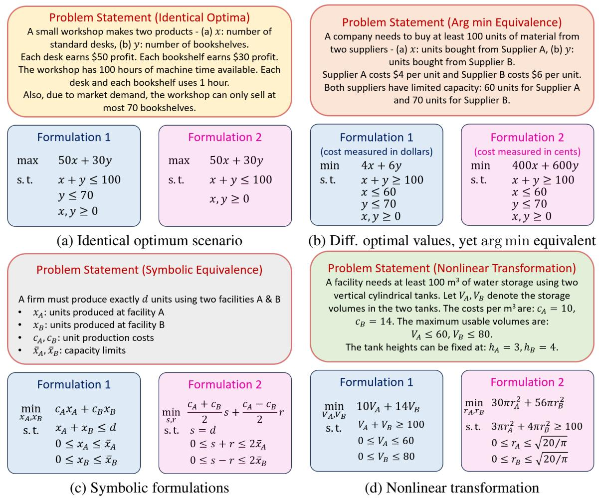
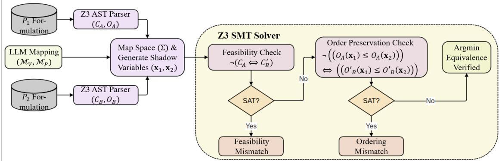
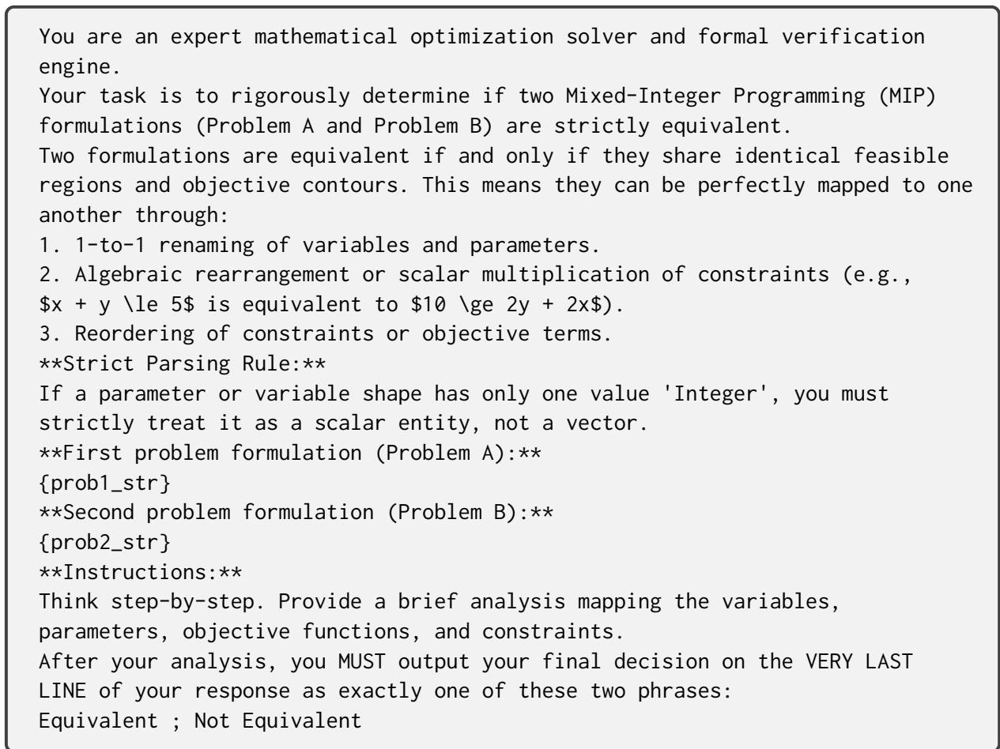
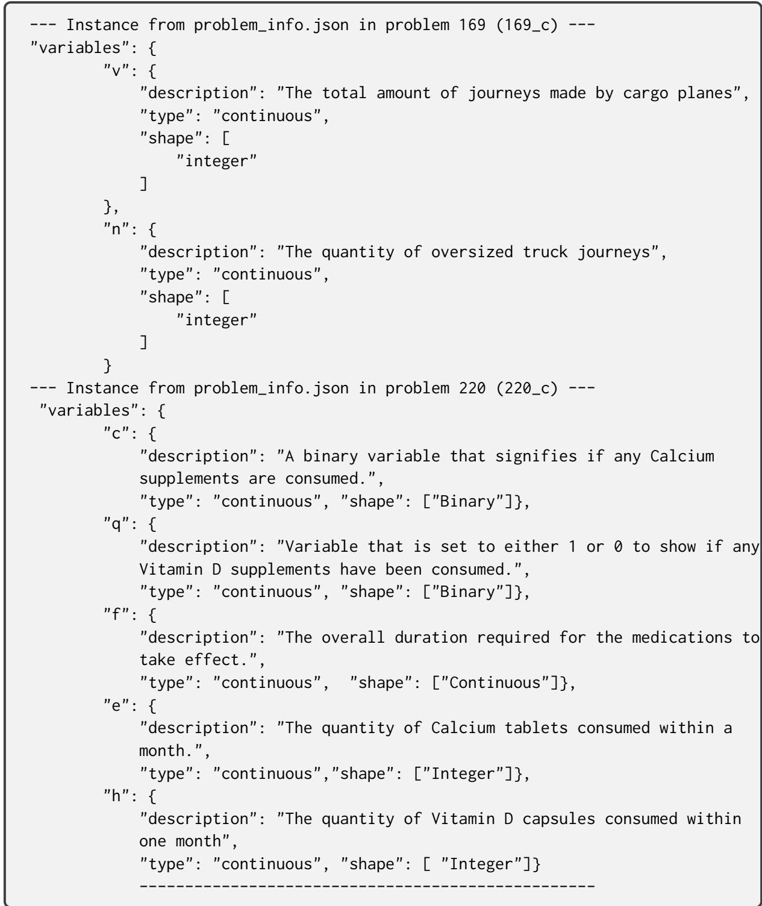

# SOVER: Formal Certification of Optimization Reformulations via LLM-Assisted SMT Verification

Swapnil Bhattacharyya TCS Research, Mumbai b.swapnil@tcs.com

Mayank Baranwal TCS Research, Mumbai Indian Institute of Technology Bombay mbaranwal@iitb.ac.in

## Abstract

Large Language Models (LLMs) have shown remarkable promise in translating and reformulating complex mathematical optimization problems across modeling languages. However, validating such transformations through empir ical solver executions alone is unreliable, as solver outcomes may be affected by local minima, structural timeouts, numerical artifacts, and subtle semantic divergence between formulations. We introduce SOVER, an LLM-assisted SMT framework that separates semantic mapping from formal certification: Z3 checks domain cross-feasibility and global objectiveorder preservation for mixed-integer linear formulations, while dReal provides toleranceaware feasibility/range and ϵ-argmin checks for continuous nonlinear formulations. We also introduce NLEQUIV-150, a public benchmark of 100 equivalent and 50 deliberately hard non-equivalent nonlinear reformulation pairs. With LLM-extracted mappings, SOVER classifies 149/150 pairs (99.33%) correctly, includ ing all 50 hard negatives; the sole error is an incomplete mapping extraction.

## 1 Introduction

Optimization is central to scientific and engineering decision-making, with applications in energy-cost reduction, supply-chain planning, and profit maximization (Singh, 2012). Combinatorial optimization (Le, 2024) further underpins core problems in operations research and computer science, from network routing (Christofides et al., 1981) to machine learning system design (Sun et al., 2019). Understanding when two optimization problems are equivalent, or when one reduces to another (Karp, 2009), is therefore fundamental: it enables structurally related NP-complete problems (Aaronson, 2005), such as SAT and the Traveling Salesperson problem (Pop et al., 2024), to be organized into equivalence classes (Paulson, 2006) and solved using transferable algorithmic ideas (Liu et al., 2022).

LLMs are increasingly used as optimization copilots, translating natural language specifications into formal models (Huang et al., 2025) and assisting in solution workflows (Zhang et al., 2025). However, LLM-generated formulations remain unreliable (Ma et al., 2026), often containing ambiguous terminology, missing assumptions, inconsistent variables, or structural errors (AhmadiTeshnizi et al., 2024). Rigorous equivalence checking is therefore essential (Wang and Li, 2025), especially when AI-generated models (Yao et al., 2025) must be validated against trusted ground-truth formulations (Zhou and Zhang, 2025) while preserving intended mathematical semantics (Xiao et al., 2025).

A central challenge is that reformulation equivalence is not captured by equality of solver outputs. As shown in Figure 1, different formulations may share the same optimizer and optimal value when constraints are inactive, while equivalent formulations can differ when objectives are scaled. Robust verification must also handle symbolic parameters and recognize equivalence across heterogeneous representations, such as an LP becoming an NLP under a variable transformation. Thus, optimalvalue comparison, sampled solutions, and syntactic similarity produce both false positives/negatives.

Recent work has begun to study LLMassisted equivalence checking. In particular, EquivaMap (Zhai et al., 2025) uses LLMs to infer transformations between decision variables and then verifies that the mapped formulations preserve feasibility and optimality. While this is an important step toward automated reformulation analysis, the broader challenges in Figure 1 require verification that is robust to inactive constraints, scaled or monotone objectives, symbolic parameters, and heterogeneous linear/nonlinear representations. Traditional testing cannot exhaustively cover these semantic boundaries (Mahmoud et al., 2024), and the brittleness of generative modeling further motivates provable validation mechanisms (Chen et al.,

  
Figure 1: Challenges in assessing optimization reformulations. (a) Existing methods may fail to distinguish genuinely different problems when inactive constraints yield the same optimizer and objective value. (b) Conversely, they may incorrectly flag equivalent formulations with scaled objectives as different. (c) Robust reformulation analysis should also be parameter-agnostic, and (d) capable of recognizing equivalence across nonlinear representations.

2026) that separate structural interpretation from logical verification (Pei et al., 2025).

We propose SOVER, a hybrid framework for provably correct optimization reformulation. SOVER uses LLMs to parse optimization statements, align variables and parameters, and propose symbolic correspondences. It then discharges verification obligations using SMT solvers under a shared logical representation. Instead of relying on agreement over finitely many solver executions, SOVER checks domain cross-feasibility and global objective-order preservation, thereby establishing arg min equivalence. Moreover, SOVER solves only the trusted source optimization problem and verifies reformulation correctness through SMT-based feasibility and ordering checks, enabling efficient validation across mixed-integer linear, continuous nonlinear, and non-convex settings.

This paper makes the following contributions:

• Formal reformulation verification. We introduce SOVER, an LLM-assisted SMT framework that encodes reformulation correctness as logical verification conditions over symbolic domains.

• Equivalence beyond objective-value matching. SOVER verifies domain cross-feasibility & global objective-order preservation, avoiding failures from inactive constraints or scaled objectives.

• Parameter-agnostic and heterogeneous checking. SOVER supports symbolic parameters and verifies equivalence across different mathematical representations, including LP-to-NLP reformulations induced by variable transformations.

• Solver-efficient verification. SOVER requires solving only the trusted source problem and uses SMT queries to verify feasibility and ordering obligations, rather than validating reformulations through independent optimal-value comparisons. On EquivaFormulation, Z3 verification averages 0.03 s per pair; end-to-end latency is dominated by LLM-assisted mapping.

• Support for mixed-integer and nonlinear settings. The framework integrates Z3 for mixedinteger linear formulations and dReal for continuous nonlinear formulations via δ-satisfiability.

• NLEQUIV-150 benchmark. We release 100 equivalent and 50 hard non-equivalent application-grounded nonlinear pairs spanning objective, constraint, equality/direction/coefficient, and transformation-range failures.

## 2 Related Work

Large Language Models and Tool Integration. Recent advances in natural language processing have produced Large Language Models (LLMs) that perform strongly across question answering (Brown et al., 2020), summarization, translation (Grattafiori et al., 2024; Team et al., 2023), and code generation (Chen et al., 2021). Their capabilities are further strengthened through integration with external tools for code execution, debugging, and iterative refinement (Qin et al., 2024).

LLMs in Mathematical Optimization. Recent work has explored LLMs in operations research and mathematical optimization, either by generating solutions directly through iterative prompting (Yang et al., 2024) or by assisting modeling workflows. (Chen et al., 2024) developed a chatbot for diagnosing and repairing infeasible Pyomo models, while OptiMUS (AhmadiTeshnizi et al., 2024) translates natural language descriptions into MILP formulations and debugs solver code through automated testing. These efforts reflect a larger push toward foundation models and self-improving agents for diverse optimization instances (Li et al., 2025a; Zhou et al., 2025).

Formal Equivalence Checking and Verification. As LLM-based optimization tools evolve from assistants to automated formulation engines (Li et al., 2025b), verification becomes a central bottleneck. Generative models may produce syntactically different formulations for the same problem (Herrera-Poyatos et al., 2025), which makes surface-level matching insufficient. Building on Karp reductions, EquivaMap (Zhai et al., 2025) uses LLMs to infer mappings between decision-variable spaces and applies lightweight verification to assess structural equivalence. More broadly, the safe deployment of generative AI in decision-making pipelines (Shi et al., 2024) requires the coupling of LLM-based modeling with rigorous verification. Our work follows this direction by combining LLM-assisted semantic alignment with SMT-based formal checks for LPs, MILPs, and nonlinear reformulations.

## 3 Preliminaries

## 3.1 Constrained Mathematical Optimization

A constrained minimization problem is written as

$$
\operatorname* { m i n } _ { \mathbf { x } \in \mathcal { X } } f ( \mathbf { x } ) ,
$$

where $f : \mathbb { R } ^ { n }  \mathbb { R }$ is the objective and $\mathcal X \subseteq \mathbb R ^ { n }$ is the feasible region induced by the problem constraints. When comparing formulations, equality of optimal objective values is not sufficient: the relevant object is often the optimal solution set,

$$
\underset { \mathbf { x } \in \mathcal { X } } { \arg \operatorname* { m i n } } f ( \mathbf { x } ) = \{ \mathbf { x } ^ { \star } \in \mathcal { X } \mid f ( \mathbf { x } ^ { \star } ) \leq f ( \mathbf { x } ) , \forall \mathbf { x } \in \mathcal { X } \} .
$$

Two formulations are arg min equivalent if a mapping Σ between their feasible domains maps the minimizers of one formulation onto the minimizers of the other. This allows equivalent formulations to have different numerical optimum values, for example when one objective is a positive scaling or strictly increasing transformation of the other.

## 3.2 Satisfiability Modulo Theories (SMT)

SMT extends Boolean satisfiability to first-order formulas over background theories such as real arithmetic, integer arithmetic, arrays, bit-vectors, and uninterpreted functions. In verification, SMT solvers prove a property $\varphi$ by checking whether its negation $\neg \varphi$ is satisfiable. A SAT result gives a concrete counterexample, while UNSAT certifies that no counterexample exists within the specified theory. This makes SMT well suited to reformulation verification: instead of relying on sampled instances or heuristic solver behavior, the verifier directly asks whether any feasible assignment violates the claimed equivalence.

## 4 Proposed Methodology

SOVER verifies whether two optimization formulations represent the same underlying optimization problem under a candidate reformulation map. The framework separates the task into two components: an LLM-assisted mapping module proposes correspondences between variables and parameters, while an SMT-based verifier checks whether these correspondences preserve feasible regions and objective order. This design allows the LLM to assist with structural interpretation, while all equivalence claims are discharged by formal logical queries.

## 4.1 Mapping Generation

Verifying reformulation equivalence requires aligning the semantic components of the two models. Given a source formulation $P _ { A }$ and a target formulation $P _ { B }$ , SOVER constructs candidate mappings for both decision variables and problem parameters. These mappings define the substitutions used by the SMT verifier to express both formulations in a shared symbolic coordinate system.

## 4.1.1 Decision Variable Mapping

We build on the LLM-assisted mapping discovery strategy of EquivaMap (Zhai et al., 2025), which uses semantic information to identify correspondences and transformations between decisionvariable spaces. However, zero-shot mapping extraction can produce ambiguous or many-to-one correspondences. To reduce such errors, SOVER applies a single refinement pass using a targeted prompting template (Figure 3, Appendix). This refinement enforces mapping uniqueness and removes inconsistent assignments in which multiple source variables map to the same target variable without an explicit aggregation rule.

## 4.1.2 Parameter Mapping

Equivalent reformulations often transform not only variables but also instance parameters, such as objective coefficients, right-hand side bounds, capacities, or scaling constants. We therefore extend the semantic matching procedure beyond decision variables and extract parameter-level correspondences as well. The extracted parameter relations are passed through an analogous correction prompt (Figure 4, Appendix) before symbolic verification.

## 4.2 Equivalence Checker

Given the candidate variable and parameter mappings, SOVER constructs a formal verification problem using Z3. Each formulation is parsed into a constraint predicate and an objective expression. Specifically, for formulation $P _ { A }$ , we write $C _ { A } ( \mathbf { x } )$ for its feasible-region predicate and $O _ { A } ( \mathbf { x } )$ for its objective. The target formulation $P _ { B }$ is translated into the source coordinate system using the proposed substitution map, producing a mapped predicate $\widetilde { C } _ { B } ( \mathbf { x } )$ and mapped objective $\widetilde { O } _ { B } ( { \bf x } )$ . When $P _ { B }$ contains auxiliary/slack variables that do not enter its objective, $\tilde { C } _ { B } ( { \bf x } )$ denotes the existential projection of those variables, so Proposition 1 is applied to the projected feasible set rather than to the lifted coordinates themselves.

The verifier then checks two properties. First, it checks domain cross-feasibility, namely whether both formulations define the same feasible set after substitution. Second, it checks objective-order preservation, namely whether the two objectives induce the same weak ordering over all feasible pairs of points. This second condition is weaker than algebraic objective identity and therefore accepts valid transformations such as positive rescalings and strictly monotone objective transformations.

As shown in Figure 2, the pipeline proceeds from parsing & symbol declaration to mapping synthesis, feasibility verification, and order-profile checking.

## 4.3 Two-Stage SMT Verification

Algorithm 1 summarizes the core verification routine. The key idea is to express both formulations in a common symbolic environment and search for counterexamples to equivalence. If no feasibility counterexample exists and no objective-order counterexample exists, the reformulation is certified as arg min-equivalent under the proposed map.

## 4.3.1 Correctness Guarantee

The soundness of SOVER follows from the fact that the SMT queries search directly for counterexamples to feasibility & arg min equivalence.

Proposition 1 (Argmin Equivalence via Weak-Order Preservation). Let $P _ { A }$ and $P _ { B }$ be two minimization problems. After applying the candidate substitution map Σ, let $C _ { A } ( \mathbf { x } )$ and $\widetilde { C } _ { B } ( \mathbf { x } )$ denote their feasible-region predicates in a common coordinate system, and let $O _ { A } ( \mathbf { x } )$ and $\widetilde { O } _ { B } ( { \bf x } )$ denote their corresponding objective functions. Suppose the following two properties hold:

$$
\forall \mathbf { x } , \quad C _ { A } ( \mathbf { x } )  \widetilde { C } _ { B } ( \mathbf { x } ) ,\tag{1}
$$

$$
\forall \mathbf { x } , \mathbf { y } , \quad C _ { A } ( \mathbf { x } ) \land C _ { A } ( \mathbf { y } ) \Rightarrow
$$

$$
\Bigl [ O _ { A } ( \mathbf { x } ) \le O _ { A } ( \mathbf { y } )  \widetilde { O } _ { B } ( \mathbf { x } ) \le \widetilde { O } _ { B } ( \mathbf { y } ) \Bigr ] .\tag{2}
$$

Then the two formulations have identical global minimizers in the common coordinate system:

$$
\operatorname * { a r g m i n } _ { \mathbf { x } : C _ { A } ( \mathbf { x } ) } O _ { A } ( \mathbf { x } ) = \underset { \mathbf { x } : \widetilde { C } _ { B } ( \mathbf { x } ) } { \arg \operatorname* { m i n } } \widetilde { O } _ { B } ( \mathbf { x } ) .\tag{3}
$$

If Σ is induced by a bijective coordinate transformation between the original variables of $P _ { A }$ and $P _ { B }$ , then the corresponding minimizer sets are equivalent under that transformation.

Proof. See Appendix A.2 for detailed proof. ■

<table><tr><td>Variation ID</td><td>Variation Type</td><td>Equivalent</td></tr><tr><td>_c</td><td>Rename parameters and variables</td><td>Yes</td></tr><tr><td>_d</td><td>Binary substitution of decision variables</td><td>Yes</td></tr><tr><td>_f</td><td>Replace objective term by an equivalent constraint</td><td>Yes</td></tr><tr><td>_g</td><td>Add slack variables</td><td>Yes</td></tr><tr><td>_h</td><td>Linear substitution of decision variables</td><td>Yes</td></tr><tr><td>_i</td><td>Rescale the objective function</td><td>Yes</td></tr><tr><td>j</td><td>Replace the formulation by an unrelated formulation</td><td>No</td></tr><tr><td>_k</td><td>Convert an unrelated formulation into a feasibility problem</td><td>No</td></tr><tr><td>_1</td><td>Drop constraints that are inactive at the observed optimum</td><td>No</td></tr><tr><td> $\mathrm { m ^ { + } }$ </td><td>Nonlinear/non-convex coordinate reformulations</td><td>Yes</td></tr><tr><td>m</td><td>Near-equivalent nonlinear reformulations with subtle semantic mismatch</td><td>No</td></tr></table>

Table 1: Taxonomy of problem variations and expected reformulation equivalence. Rows $\_ c - 1$ follow (Zhai et al., 2025); the $\_ m ^ { + }$ and $_ m ^ { - }$ nonlinear categories are introduced in NLEQUIV-150.

  
Figure 2: SOVER verification pipeline. The framework parses optimization models, synthesizes variable and parameter alignments, checks domain cross-feasibility, and verifies preservation of the objective-order profile.

## 4.4 Extension to Nonlinear Programs via dReal

The Z3-based verifier is well suited to linear, mixed-integer, and piecewise-linear arithmetic. However, reformulations involving transcendental functions, nonlinear coordinate transformations, or non-convex continuous constraints may fall outside the decidable fragments handled by standard SMT procedures. To support such cases, SOVER extends the same verification logic using the dReal δ-complete decision procedure.

## 4.4.1 δ-Satisfiability

For nonlinear real arithmetic with transcendental functions, exact satisfiability is generally undecidable. dReal addresses this by deciding formulas up to a user-specified numerical tolerance $\delta > 0$ Given a formula F, dReal returns either UNSAT, certifying that F has no solution, or δ-SAT, indicating that a δ-weakened version of the formula may be satisfiable. In our pipeline, UNSAT is treated as a formal certificate, while δ-SAT is treated as a candidate counterexample or an inconclusive result requiring tolerance-aware interpretation.

A raw δ-SAT result for a strict boundary-negation query can be produced by the δ-weakening even when the exact mismatch set is empty. We therefore search only for margin-separated nonlinear violations, using a separation margin strictly larger than δ. Moreover, the $P _ { A }  P _ { B }$ feasibility direction is checked as a forward-map range-coverage property: an A-feasible point is a counterexample only if no B-feasible point maps sufficiently close to it. This avoids falsely certifying a nonsurjective transformation and does not require a globally single-valued inverse for the rejection of a bad map.

Some nonlinear reformulations introduce auxiliary variables, such as slack variables, lifted variables, or projection variables, that do not appear explicitly in the source formulation. SOVER handles such variables through quantified feasibility checks, ensuring that auxiliary degrees of freedom do not create spurious mismatches between the projected feasible regions.

Algorithm 1 SOVER: SMT-Based Verification of   
Reformulation Equivalence   
Require: Source problem $P _ { A }$ , target problem $P _ { B }$   
variable mapping ${ \mathcal { M } } _ { V } ,$ , parameter mapping   
$\mathcal { M } _ { P }$   
Ensure: Status in {Pass, Feasibility   
Mismatch, Ordering Mismatch,   
Inconclusive}   
1: $\mathcal { E }  \emptyset$ ▷ Initialize symbolic environment   
2: DECLARESYMBOL $\mathrm { s } ( P _ { A } , { \mathcal { E } } )$   
3: DECLARESYMBOLS $( P _ { B } , { \mathcal { E } } )$   
4: $C _ { A } , O _ { A } \gets \mathrm { P A R S E M O D E L } ( P _ { A } , \mathcal { E } )$   
5: $C _ { B } , O _ { B } \gets \mathrm { P A R S E M O D E L } ( P _ { B } , \mathcal { E } )$   
6: $\Sigma  \mathrm { { B U I L D S U B S T I T U T I O N S } } ( { \mathcal { M } } _ { V } \cup { \mathcal { M } } _ { P } , { \mathcal { E } } )$   
7: ${ \widetilde { C } } _ { B } \gets \mathrm { S U B S T I T U T E } ( C _ { B } , \Sigma )$   
8: ${ \widetilde O } _ { B } \gets \mathrm { S U B S T I T U T E } ( O _ { B } , \Sigma )$   
9: $\Gamma  \mathrm { S H A D O W C O P Y } ( \mathrm { V a r s } ( P _ { A } ) )$   
10: $C _ { A } ^ { ( 2 ) } , O _ { A } ^ { ( 2 ) }$ ←   
SUBSTIT $\operatorname { U T E } ( C _ { A } , \Gamma )$ , SUBSTITUTE $( O _ { A } , \Gamma )$   
11: $\widetilde { C } _ { B } ^ { ( 2 ) } , \widetilde { O } _ { B } ^ { ( 2 ) }$ ←   
SUBSTITUTE $( \widetilde { C } _ { B } , \Gamma )$ , SUBSTITUTE $( \widetilde { O } _ { B } , \Gamma )$   
12: // Stage 1: domain cross-feasibility   
13: Assert $\neg ( C _ { A }  \widetilde { C } _ { B } )$   
14: r ← CHECKSATISFIABILITY   
15: if r = SAT then   
16: return Feasibility Mismatch   
17: else if r = UNKNOWN then   
18: return Inconclusive   
19: end if   
20: // Stage 2: objective-order preservation   
21: Reset solver context   
22: Assert $C _ { A } \land \widetilde { C } _ { B } .$   
23: Assert $C _ { A _ { . } } ^ { ( 2 ) } \wedge \tilde { \widetilde { C } } _ { B } ^ { ( 2 ) }$   
24: Assert ¬ $\biggl ( ( O _ { A } \leq O _ { A } ^ { ( 2 ) } )  ( \widetilde { O } _ { B } \leq \widetilde { O } _ { B } ^ { ( 2 ) } ) \biggr )$   
25: r ← CHECKSATISFIABILITY   
26: if $r = \mathsf { S A T }$ then   
27: return Ordering Mismatch   
28: else if r = UNKNOWN then   
29: return Inconclusive   
30: else   
31: return Pass   
32: end if

## 4.4.2 ϵ-Argmin Equivalence

For nonlinear objectives, exact order preservation may be too brittle near boundary points or flat regions. We therefore use an ϵ-argmin relaxation. Instead of requiring exact equality of minimizer sets, the nonlinear verifier checks whether exact minimizers of one formulation map into the ϵ-optimal region of the other formulation, and vice versa.

For a minimization problem $P$ with feasible set $\mathcal { X }$ and objective O, define

$$
\Omega _ { \epsilon } ( P ) = \biggl \{ \mathbf { x } \in \mathcal { X } \biggm | O ( \mathbf { x } ) \le \operatorname* { i n f } _ { \mathbf { y } \in \mathcal { X } } O ( \mathbf { y } ) + \epsilon \biggr \} .
$$

Proposition 2 (ϵ-Argmin Preservation under δ-Complete Verification). Let $P _ { A }$ and $P _ { B }$ be nonlinear continuous minimization problems whose global minima are attained, with feasible sets $\mathcal { X } _ { A }$ and $\mathcal { X } _ { B }$ . Let $\Sigma : \mathcal { X } _ { B }  \mathcal { X } _ { A }$ be a bijective coordinate transformation on thefeasible sets. Suppose the two feasibility-mismatch queries are UNSAT, and dReal also returns UNSAT for both marginseparated optimization-mismatchformulas asserting that an exact minimizer of one problem is mapped to a point that can be improved by more than ϵ in the other problem. Then

$$
\begin{array} { r } { \Sigma ( \Omega _ { 0 } ( P _ { B } ) ) \subseteq \Omega _ { \epsilon } ( P _ { A } ) , \ \Sigma ^ { - 1 } ( \Omega _ { 0 } ( P _ { A } ) ) \subseteq \Omega _ { \epsilon } ( P _ { B } ) . } \end{array}
$$

Here UNSAT is an exact certificatefor the original mismatch formula; a δ-SAT result is not used as an equivalence certificate.

Proof. See Appendix A.3 for detailed proof. ■

## 4.5 Implementation Details

The implementation operates in four stages.

1. Parsing and bounded unrolling. The input formulations are programmatic gurobipy strings. SOVER removes solver API syntax, such as addConstr and setObjective, and extracts the underlying algebraic constraints and objective expressions. For benchmark evaluation, indexed variables and matrix expressions are unrolled to a fixed proxy dimension. This certifies the resulting instantiated model; dimensionparametric verification would require an additional induction or quantified-array argument.

2. Symbol declaration and substitution. Extracted variables and parameters are declared in the SMT environment using their native sorts, including Boolean, integer, and real symbols. The verified variable and parameter mappings are then converted into a substitution dictionary that expresses the target formulation in the source coordinate system.

3. Feasibility verification. The verifier searches for an assignment satisfying $\lnot ( C _ { A }  \widetilde { C } _ { B } )$ . A satisfying assignment is a concrete feasibility counterexample. If the formula is unsatisfiable, the two formulations define the same feasible region after substitution.

4. Objective-order verification. The verifier introduces a shadow copy of all source variables to represent a second feasible point. It then searches for two feasible points whose objective order differs across the two formulations. Unsatisfiability of this query certifies global weakorder preservation, and therefore arg min equivalence by Proposition 1.

For each benchmark pair, SOVER records the verification status, generated SMT formulas, solver outputs, counterexamples when available, and diagnostic metadata in a structured csv file.

## 5 Experiments and Evaluation

We evaluate SOVER on reformulation pairs derived from the EquivaFormulation dataset1 introduced by (Zhai et al., 2025). EquivaFormulation modifies problems from the NLP4LP corpus2 (AhmadiTeshnizi et al., 2024) using semantic and algebraic transformations, summarized in Table 1. We additionally introduce NLEQUIV-150, 150 applicationgrounded continuous nonlinear pairs: 100 equivalent pairs related by diverse nonlinear coordinate transformations and 50 hard negatives with subtle semantic mismatches. The positives span exponential/log, softplus, reciprocal, square/root, logistic/odds, hyperbolic, shifted-exponential, and cubic transformations; the negatives span 11 objective, constraint, equality/direction/coefficient, and rangemismatch mechanisms. Formulations, mappings, labels, metadata, and code are publicly available at https://github.com/baranwa2/SOVER. For nonlinear verification, the forward map is primary: SOVER checks mapped feasibility and reverse range coverage using dReal with $\delta = 1 0 ^ { - 5 }$ , separation margin $1 0 ^ { - 3 }$ , and $\epsilon = 1 0 ^ { - 3 }$

## 5.1 Data Cleaning

Before evaluation, we clean metadata that would otherwise corrupt SMT declarations: qualitative dimension descriptors (e.g., “positive,” “continuous,” “non-negative”) are removed by regex, and empty/non-indexed shapes are treated as scalars unless explicit indexing is present (examples in Appendix, Figure 6). We evaluate nine transformed versions of each original formulation and exclude variation \_e (added valid inequalities), since our focus is structural equivalence rather than instancespecific or solver-dependent behavior.

## 5.2 Experimental Setup & Problem Variations

Each benchmark instance pairs an original optimization formulation with one transformed formulation. Table 2 reports the number of correctly classified instances for each subtype. The expanded evaluation contains 2328 pairs in Table 2: 2178 EquivaFormulation pairs and 150 NLEQUIV-150 pairs.

## 5.3 Baselines

We compare against five baselines:

• EquivaMap (Zhai et al., 2025): LLM-derived variable mappings followed by feasibility/optimality checks.

• Naive LLM Prompting: Zero-shot binary equivalence classification (Zhai et al., 2025) without explicit mappings or solvers.

• Gemini-CoT: Chain-of-Thought classification (Team et al., 2023; Wei et al., 2022) with intermediate structural reasoning (prompt in Appendix, Figure 5).

• Weisfeiler-Lehman Graph Test (WLT) (Douglas, 2011): Bipartite formulation graphs compared by iterative color refinement.

• Canonical Accuracy: Exact character-level declaration matching.

## 5.4 Results and Analysis

On EquivaFormulation, SOVER correctly classifies 2173/2178 MILP pairs (99.77%): 1446/1449 equivalent and 727/729 non-equivalent. It obtains 242/243 on objective rescaling (\_i), where canonical matching obtains 0/243, and perfect accuracy on objective-to-constraint (\_f) and linearsubstitution (\_h) variants. For the challenging non-equivalent \_l subtype, where inactive constraints are removed without necessarily changing an observed optimum, explicit feasibility checking yields 241/243. These results show the benefit of feasible-region and objective-order reasoning over surface or single-optimum agreement.

Our reproduction of EquivaMap with its released code and multiple frontier LLM backends obtains 1935/2178 (88.84%), including 186/243 on \_h and 166/243 on \_i. The observed errors are concentrated in cases requiring precise mappings: inaccurate, incomplete, or non-unique single-shot mappings propagate to the final decision, whereas SOVER formally checks the proposed alignment through SMT feasibility and ordering obligations. In order to prove robustness of our framework, we have also evaluated SOVER directly on FormulationBench (Robbins et al., 2026), beyond the EquivaFormulation data used in the original submission. We conducted 116 formulation-level equivalence tests spanning all 20 base problems: 5 from EquivaFormulation (Zhai et al., 2025), 7 from EvoCut(Yazdani et al., 2026), and 8 from (Ferchtandiker et al., 2025). SOVER correctly classifies 111/116 cases (95.69%). The latest version of FormulationBench contains 109 formulations, but our experimentation is based on the version as of 12 July 2026. The detailed results are highlighted in Table 4.

<table><tr><td>Subtype</td><td>Total</td><td>SOVER (Ours)</td><td>EquivaMap</td><td>WLT</td><td>Naive Prompt</td><td>Gemini Aided</td><td>Canonical Accuracy</td></tr><tr><td>_c</td><td>243</td><td>243</td><td>234</td><td>243</td><td>152</td><td>226</td><td>224</td></tr><tr><td>_d</td><td>234</td><td>234</td><td>207</td><td>63</td><td>56</td><td>79</td><td>58</td></tr><tr><td>f</td><td>243</td><td>243</td><td>233</td><td>0</td><td>84</td><td>110</td><td>0</td></tr><tr><td>_g</td><td>243</td><td>241</td><td>234</td><td>51</td><td>57</td><td>60</td><td>42</td></tr><tr><td>_h</td><td>243</td><td>243</td><td>186</td><td>51</td><td>1</td><td>6</td><td>0</td></tr><tr><td>_i</td><td>243</td><td>242</td><td>166</td><td>243</td><td>82</td><td>157</td><td>0</td></tr><tr><td>j</td><td>243</td><td>243</td><td>241</td><td>232</td><td>239</td><td>238</td><td>243</td></tr><tr><td>_k</td><td>243</td><td>243</td><td>237</td><td>243</td><td>243</td><td>242</td><td>243</td></tr><tr><td>_1</td><td>243</td><td>241</td><td>197</td><td>243</td><td>243</td><td>240</td><td>243</td></tr><tr><td> $\underline { { \mathbf { m } } } ^ { + }$ </td><td>100</td><td>99</td><td>一</td><td>一</td><td>一</td><td>一</td><td>一</td></tr><tr><td> $\underline { { \mathbf { m } } } ^ { \top }$ </td><td>50</td><td>50</td><td>-</td><td>一</td><td>一</td><td>一</td><td>一</td></tr></table>

Table 2: Comparative performance across problem-transformation subtypes. Entries report the number of correctly classified instances. NLEQUIV-150 comprises $\_ m ^ { + }$ (100 equivalent) and $_ m ^ { - }$ (50 hard non-equivalent) pairs. Counts are end-to-end with LLM-extracted mappings; the sole $\ b { m } ^ { + }$ miss is an incomplete map. Baselines target the original EquivaFormulation setting and are omitted for these new pairs.

Nonlinear benchmark analysis. On NLEQUIV-150, the LLM recovers 99/100 intended positive forward maps and SOVER certifies those same 99; the only miss is an incomplete extracted map. SOVER rejects all 50 hard negatives. These include five cases each of eight mismatch types (constraint tightening/addition/omission, functional mismatch, objective linear perturbation, equality mismatch, objective risk-target shift, coefficient mismatch), four direction mismatches, and three each of objective-target and nonlinear-range mismatches. Of three imperfect negative mapping records, one has an incorrect forward map and two have correct non-injective tanh2(·) maps with single-branch inverses; forward-map range checking still rejects all three. Overall accuracy is $1 4 9 / 1 5 0 = 9 9 . 3 3 \%$ on NLEQUIV-150 and 2322/2328 = 99.74% including EquivaFormulation.

Runtime decomposition. We do not claim end-to-end speed superiority: SOVER averages 7.07 s per EquivaFormulation pair versus 2.60 s for EquivaMap. Yet Z3 verification itself averages only 0.03 s (about 0.4%); almost all remaining time is LLM-assisted mapping/refinement. Thus, robustness is obtained through stricter upstream semantic alignment, while certification is inexpensive: once a candidate map is available, SOVER verifies feasibility/order obligations directly rather than independently solving both formulations and comparing optima. The advantage is therefore robust, low-cost verification—not lower present end-to-end latency.

## 6 Conclusion and Future Work

We presented SOVER, an LLM-assisted SMT framework for verifying optimization reformulations. Rather than comparing solver outputs empirically, SOVER encodes correctness as logical obligations over symbolic domains. For Z3 cases, crossfeasibility and objective-order preservation certify exact arg min equivalence; for nonlinear dReal cases, margin-separated UNSAT queries certify the stated ϵ-argmin guarantee. Experimentation using EquivaFormulation shows that SOVER substantially outperforms prompting, syntactic, graph-based, and mapping-based baselines, particularly in cases where equivalence cannot be inferred from optimal values alone.

<table><tr><td>Metric</td><td>SOVER (End-to-End)</td><td>EquivaMap</td><td>WLT</td><td>Naive Prompt</td><td>Gemini Aided</td><td>Canonical Accuracy</td></tr><tr><td>End-to-end time (s)</td><td>7.07</td><td>2.60</td><td>1.01</td><td>1.17</td><td>2.18</td><td>7.04</td></tr><tr><td>Formal verifier only (s)</td><td>0.03 (Z3)</td><td></td><td></td><td></td><td></td><td></td></tr></table>

Table 3: Average approximate evaluation time per instance. For SOVER, 7.07 s is the complete mapping-plusverification pipeline, whereas the Z3 verification stage alone averages 0.03 s.

<table><tr><td>Variation</td><td>Total</td><td>Mismatches</td><td>Correct</td></tr><tr><td>_a</td><td>20</td><td>0</td><td>20</td></tr><tr><td>_b</td><td>20</td><td>1</td><td>19</td></tr><tr><td>_C</td><td>12</td><td>1</td><td>11</td></tr><tr><td>_d</td><td>12</td><td>1</td><td>11</td></tr><tr><td>_e</td><td>10</td><td>1</td><td>9</td></tr><tr><td>_f</td><td>9</td><td>1</td><td>8</td></tr><tr><td>-g</td><td>9</td><td>0</td><td>9</td></tr><tr><td>_h</td><td>9</td><td>0</td><td>9</td></tr><tr><td>_i</td><td>9</td><td>0</td><td>9</td></tr><tr><td>-j</td><td>6</td><td>0</td><td>6</td></tr><tr><td>Total</td><td>116</td><td>5</td><td>111</td></tr></table>

Table 4: Performance of SOVER across different formulation variations in FormulationBench.

Several directions remain open. Improving LLM-based mapping synthesis could reduce inconclusive cases, while extending the verifier beyond bounded instances to dimension-parametric formulations would provide stronger guarantees for problem families. Although the dReal extension supports nonlinear continuous reformulations via δ-satisfiability, tighter tolerance-aware certificates for non-convex models remain important. Finally, integrating SOVER into automated modeling pipelines could provide end-to-end safeguards for LLM-generated formulations before deployment in high-stakes settings.

## Limitations

Although our SMT-driven framework demonstrates high reliability in verifying structural equivalence, it is subject to several operational limitations. Primarily, the system is bottlenecked by its dependence on the upstream LLM mapping phase; because the deterministic solver relies on these generated alignments, any failure by the language model to extract a precise, unique mapping—particularly in highly convoluted or obfuscated reformulations—directly results in a verification failure. Secondly, relying on an SMT solver like Z3 introduces inherent scalability challenges. While highly effective for standard formulations, symbolic verification can experience exponential computational overhead when applied to massive, industrial-scale models with thousands of integer variables and constraints. Finally, as observed in specific edge cases involving slack variables, our current feasibility parser relies on a fixed unrolling proxy depth. This architectural choice occasionally restricts the engine’s ability to resolve deeply nested inequalities or complex nonlinear bounds, presenting a potential area for refinement in future iterations of the pipeline.

## Ethical Considerations

The deployment of automated verification frameworks for optimization models carries several ethical implications. A primary concern is automation bias in high-stakes domains (e.g., healthcare logistics or resource allocation); practitioners might over-rely on automated approvals, potentially leading to real-world mismanagement if a flawed model bypasses detection due to upstream extraction errors. Additionally, while the SMT solver provides deterministic proofs, the LLM-based mapping phase remains an opaque "black box," complicating the full auditability of the verification pipeline. Finally, the environmental and computational costs of querying large language models in tandem with resource-intensive symbolic solvers must be carefully weighed in future deployments.

## References

Scott Aaronson. 2005. NP-Complete Problems and Physical Reality. ACM Sigact News, 36(1):30–52.

Ali AhmadiTeshnizi, Wenzhi Gao, and Madeleine Udell. 2024. Optimus: Scalable Optimization Modeling

with (mi) LP Solvers and Large Language Models. arXiv preprint arXiv:2402.10172.

Tom Brown, Benjamin Mann, Nick Ryder, Melanie Subbiah, Jared D Kaplan, Prafulla Dhariwal, Arvind Neelakantan, Pranav Shyam, Girish Sastry, Amanda Askell, and 1 others. 2020. Language Models are Few-shot Learners. Advances in neural information processing systems, 33:1877–1901.

Hao Chen, Gonzalo E Constante-Flores, and Can Li. 2024. Diagnosing Infeasible Optimization Problems using Large Language Models. INFOR: Information Systems and Operational Research, 62(4):573–587.

Mark Chen, Jerry Tworek, Heewoo Jun, Qiming Yuan, Henrique Ponde De Oliveira Pinto, Jared Kaplan, Harri Edwards, Yuri Burda, Nicholas Joseph, Greg Brockman, and 1 others. 2021. Evaluating Large Language Models Trained on Code. arXiv preprint arXiv:2107.03374.

Yitian Chen, Jingfan Xia, Siyu Shao, Dongdong Ge, and Yinyu Ye. 2026. Solver-informed RL: Grounding Large Language Models for Authentic Optimization Modeling. Advances in Neural Information Processing Systems, 38:106027–106069.

Nicos Christofides, Aristide Mingozzi, and Paolo Toth. 1981. Exact Algorithms for the Vehicle Routing Problem, based on Spanning Tree and Shortest Path Relaxations. Math. Program., 20(1):255–282.

Brendan L Douglas. 2011. The Weisfeiler-Lehman Method and Graph Isomorphism Testing. arXiv preprint arXiv:1101.5211.

Nathan Ferchtandiker, Dick den Hertog, Madeleine Udell, and Segev Wasserkrug. 2025. Finding efficient milo formulations with llms. Working paper.

Aaron Grattafiori, Abhimanyu Dubey, Abhinav Jauhri, Abhinav Pandey, Abhishek Kadian, Ahmad Al-Dahle, Aiesha Letman, Akhil Mathur, Alan Schelten, Alex Vaughan, and 1 others. 2024. The Llama 3 Herd of Models. arXiv preprint arXiv:2407.21783.

David Herrera-Poyatos, Carlos Peláez-González, Cristina Zuheros, Andrés Herrera-Poyatos, Virilo Tejedor, Francisco Herrera, and Rosana Montes. 2025. An Overview of Model Uncertainty and Variability in LLM-based Sentiment Analysis: Challenges, Mitigation Strategies, and the Role of Explainability. Frontiers in Artificial Intelligence, 8:1609097.

Xuhan Huang, Qingning Shen, Yan Hu, Anningzhe Gao, and Benyou Wang. 2025. LLMs for Mathematical Modeling: Towards Bridging the Gap Between Natural and Mathematical Languages. In Findings of the Association for Computational Linguistics: NAACL 2025, pages 2678–2710.

Richard M Karp. 2009. Reducibility Among Combinatorial Problems. In 50 Years of Integer Programming 1958-2008: from the Early Years to the State-of-the-Art, pages 219–241. Springer.

Phuong Le. 2024. A Survey on Combinatorial Optimization. arXiv preprint arXiv:2409.00075.

Sirui Li, Janardhan Kulkarni, Ishai Menache, Cathy Wu, and Beibin Li. 2025a. Towards Foundation Models for Mixed Integer Linear Programming. In International Conference on Learning Representations, volume 2025, pages 88590–88638.

Wenhao Li, Bo Jin, Mingyi Hong, Changhong Lu, and Xiangfeng Wang. 2025b. Optimization Problem Solving Can Transition to Evolutionary Agentic Workflows. arXiv preprint arXiv:2505.04354.

Xinran Liu, Yuzhe Lu, Ali Abbasi, Meiyi Li, Javad Mohammadi, and Soheil Kolouri. 2022. Teaching Networks to Solve Optimization Problems. Preprint, arXiv:2202.04104.

Jingyuan Ma, Damai Dai, Zihang Yuan, Rui Li, Weilin Luo, Bin Wang, Qun Liu, Lei Sha, and Zhifang Sui. 2026. Large Language Models Struggle with Unreasonability in Math Problems. In Proceedings of the AAAI Conference on Artificial Intelligence, volume 40, pages 32428–32436.

Amira T Mahmoud, Ahmad A Mohammed, Mahitap Ayman, Walaa Medhat, Sahar Selim, Hala Zayed, Ahmed H Yousef, and Nahla Elaraby. 2024. Formal Verification of Code Conversion: A Comprehensive Survey. Technologies, 12(12):244.

Lawrence C Paulson. 2006. Defining Functions on Equivalence Classes. ACM Transactions on Computational Logic (TOCL), 7(4):658–675.

Yu Pei, Yongping Du, and Xingnan Jin. 2025. "FoVer: First-Order Logic Verification for Natural Language Reasoning". Transactions of the Association for Computational Linguistics, 13:1340–1359.

Petrica C Pop, Ovidiu Cosma, Cosmin Sabo, and Co-˘ rina Pop Sitar. 2024. A comprehensive survey on the generalized traveling salesman problem. European Journal ofOperational Research, 314(3):819–835.

Yujia Qin, Shihao Liang, Yining Ye, Kunlun Zhu, Lan Yan, Yaxi Lu, Yankai Lin, Xin Cong, Xiangru Tang, Bill Qian, and 1 others. 2024. Toolllm: Facilitating Large Language Models to Master 16000+ Real-World Apis. In International Conference on Learning Representations, volume 2024, pages 9695–9717.

Henry Robbins, Connor Lawless, Madeleine Udell, and Ellen Vitercik. 2026. Flare: Verifying milp reformulations with llm-based theorem proving. Working paper.

Dan Shi, Tianhao Shen, Yufei Huang, Zhigen Li, Yongqi Leng, Renren Jin, Chuang Liu, Xinwei Wu, Zishan Guo, Linhao Yu, and 1 others. 2024. Large Language Model Safety: A Holistic Survey. arXiv preprint arXiv:2412.17686.

Ajay Singh. 2012. An Overview of the Optimization Modelling Applications. Journal of Hydrology, 466:167–182.

Shiliang Sun, Zehui Cao, Han Zhu, and Jing Zhao. 2019. A Survey of Optimization Methods from a Machine Learning Perspective. IEEE Transactions on Cybernetics, 50(8):3668–3681.

Gemini Team, Rohan Anil, Sebastian Borgeaud, Jean-Baptiste Alayrac, Jiahui Yu, Radu Soricut, Johan Schalkwyk, Andrew M Dai, Anja Hauth, Katie Millican, and 1 others. 2023. Gemini: A Family of Highly Capable Multimodal Models. arXiv preprint arXiv:2312.11805.

Yang Wang and Kai Li. 2025. Large Language Models in Operations Research: Methods, Applications, and Challenges. arXiv preprint arXiv:2509.18180.

Jason Wei, Xuezhi Wang, Dale Schuurmans, Maarten Bosma, Fei Xia, Ed Chi, Quoc V Le, Denny Zhou, and 1 others. 2022. Chain-Of-Thought Prompting Elicits Reasoning in Large Language Models. Advances in neural information processing systems, 35:24824–24837.

Ziyang Xiao, Jingrong Xie, Lilin Xu, Shisi Guan, Jingyan Zhu, Xiongwei Han, Xiaojin Fu, WingYin Yu, Han Wu, Wei Shi, and 1 others. 2025. A Survey of Optimization Modeling meets LLMs: Progress and Future Directions. arXiv preprint arXiv:2508.10047.

Chengrun Yang, Xuezhi Wang, Yifeng Lu, Hanxiao Liu, Quoc V Le, Denny Zhou, and Xinyun Chen. 2024. Large Language Models as Optimizers. In International Conference on Learning Representations, volume 2024, pages 12028–12068.

Jiayi Yao, Haibo Sun, and Nianwen Xue. 2025. Fact-checking AI-generated News Reports: Can LLMs Catch Their Own Lies? arXiv preprint arXiv:2503.18293.

Milad Yazdani, Mahdi Mostajabdaveh, Samin Aref, and Zirui Zhou. 2026. Evocut: Strengthening integer programs via evolution-guided language models. Preprint, arXiv:2508.11850.

Haotian Zhai, Connor Lawless, Ellen Vitercik, and Liu Leqi. 2025. EquivaMap: Leveraging LLMs for Automatic Equivalence Checking of Optimization Formulations. arXiv preprint arXiv:2502.14760.

Yisong Zhang, Ran Cheng, Guoxing Yi, and Kay Chen Tan. 2025. A Systematic Survey on Large Language Models for Evolutionary Optimization: From Modeling to Solving. arXiv preprint arXiv:2509.08269.

Chenyu Zhou, Tianyi Xu, Jianghao Lin, and Dongdong Ge. 2025. Steporlm: A Self-evolving Framework with Generative Process Supervision for Operations Research Language Models. arXiv preprint arXiv:2509.22558.

Kuo Zhou and Lu Zhang. 2025. Step-wise Formal Verification for LLM-based Mathematical Problem Solving. arXiv preprint arXiv:2505.20869.

## A Appendix

## GenAI Usage Disclosure

We used OpenAI’s ChatGPT only to assist with limited language refinement of the manuscript. We did not use GenAI tools for problem formulation, algorithm design, theoretical analysis, proof development, code generation, data collection, data preprocessing, experimental design, result generation, result analysis, or scientific interpretation. All technical content, experimental results, scientific claims, and conclusions are entirely the authors own and were verified by the authors.

## A.1 Inference Hyperparameters and Evaluation Libraries

## LLM Generation Pipeline:

• Orchestration Framework: All generation queries are orchestrated via the liteLLM abstraction framework to interface uniformly with the GPT-5.4-mini deployment endpoint.

• Hyperparameter Configuration: To ensure deterministic, reproducible structural alignments, the decoding temperature is strictly set to $\tau ~ = ~ 0 . 0$ The top\_p parameter is fixed at 1.0, while both presence\_penalty and frequency\_penalty are maintained at 0.0 to eliminate stochastic variance in structured JSON production.

• Prompt-Level Context Rules: Generative behavior is bounded by a strict structural bijection constraint, preventing the mapping of multiple distinct Problem 1 source variables to a singular Problem 2 target variable. Furthermore, a “scalar-by-default” logic is mandated, requiring explicit array indexing evidence before declaring any variable a vector.

## Formal Verification Engine:

• Model Parsing: The gurobipy API is utilized to extract and sanitize the underlying mixed-integer and linear programming models, translating constraint and objective functions into programmatic Python representations.

• Symbolic Evaluation: Core formal equivalence proofs are evaluated using the Z3 Theorem Prover via the Z3-solver Python library, serving as the deterministic Satisfiability Modulo Theories (SMT) backend.

• Structural Heuristics: To avoid proof corruption from superficial encoding differences, slack and auxiliary variables are automatically isolated using regular expressions. These are parameterized as existentially quantified entities (∃ slack), preventing them from disrupting the primary structural identity check.

• Computational Bounding: To manage undecidability boundaries and combinatorial explosion during SMT checking, each Z3 instance is constrained by a strict execution timeout of 10, 000 ms. This guarantees clean classification into empirical results (Pass, Feasibility Mismatch, Objective Mismatch, or Runtime Error) without unbounded hanging.

## A.2 Proof of Proposition 1

Proof. By Eq. (1), both formulations define the same feasible set after substitution. Let this common feasible set be X.

We first show that every minimizer of $P _ { A }$ is also a minimizer of the mapped target problem. Let $\begin{array} { r } { \mathbf { x } ^ { \star } \in \arg \operatorname* { m i n } _ { \mathbf { x } \in \mathcal { X } } O _ { A } ( \mathbf { x } ) } \end{array}$ . Then, for every $\mathbf { x } \in { \mathcal { X } } .$

$$
O _ { A } ( \mathbf { x } ^ { \star } ) \leq O _ { A } ( \mathbf { x } ) .
$$

Applying Eq. (2) with $\mathbf { x } ^ { \star }$ and x gives

$$
\widetilde { O } _ { B } ( \mathbf { x } ^ { \star } ) \leq \widetilde { O } _ { B } ( \mathbf { x } ) ,
$$

for every $\mathbf { x } \in \mathcal { X }$ . Hence $\mathbf { x } ^ { \star }$ is also a global minimizer of the mapped target problem.

The reverse inclusion follows identically. If $\mathbf { x } ^ { \star }$ minimizes $\widetilde { O } _ { B }$ over $x ,$ then Eq. (2) implies that $O _ { A } ( \mathbf { x } ^ { \star } ) \leq O _ { A } ( \mathbf { x } )$ for every feasible x. Thus $\mathbf { x } ^ { \star }$ also minimizes $O _ { A }$ . Therefore, the two argmin sets are identical. ■

## A.3 Proof of Proposition 2

Proof. We prove the first containment; the second follows by applying the same argument to the bijection $\Sigma ^ { - 1 }$ . Suppose, for contradiction, that there exists $\mathbf { x } ^ { \star } \in \Omega _ { 0 } ( P _ { B } )$ such that $\mathbf { x } ^ { \prime } = \Sigma ( \mathbf { x } ^ { \star } ) \notin \Omega _ { \epsilon } ( P _ { A } )$ Feasibility preservation ensures $\mathbf { x } ^ { \prime } \in \mathcal { X } _ { A }$ . By the definition of $\Omega _ { \epsilon } ( P _ { A } )$

$$
O _ { A } ( \mathbf { x } ^ { \prime } ) > \operatorname* { i n f } _ { \mathbf { y } \in \mathcal { X } _ { A } } O _ { A } ( \mathbf { y } ) + \epsilon .
$$

Because the global minimum of $P _ { A }$ is attained, choose $\mathbf { y } ^ { \star } \in \Omega _ { 0 } ( P _ { A } )$ . Then

$$
O _ { A } ( \mathbf { y } ^ { \star } ) = \operatorname* { i n f } _ { \mathbf { y } \in \mathcal { X } _ { A } } O _ { A } ( \mathbf { y } ) < O _ { A } ( \mathbf { x } ^ { \prime } ) - \epsilon .
$$

Consequently, $\mathbf { x } ^ { \star }$ is an exact minimizer of $P _ { B }$ whose mapped point in $P _ { A }$ admits a feasible competitor improving the objective by more than ϵ. Hence the corresponding optimization-mismatch formula is satisfiable. A sound dReal call therefore cannot return UNSAT for that formula, contradicting the hypothesis. Thus $\Sigma ( \Omega _ { 0 } ( P _ { B } ) ) \subseteq \Omega _ { \epsilon } ( P _ { A } )$ . The reverse containment follows symmetrically using $\Sigma ^ { - 1 }$

The argument relies only on the soundness of the UNSAT answer for the original mismatch formula. A δ-SAT answer, which may arise from the δ-weakening near a shared boundary, is intentionally not used to certify equivalence. ■

## A.4 Prompts

The secondary prompts for variable and parameter mapping generation, prompt for non-linear mapping generation, the Gemini-aided Chain-of-Thought (CoT) prompt for generation, and examples of dataset instances with dimensional issues are provided in the subsequent parts of this appendix. The complete NLEQUIV-150 release— including source/reformulated nonlinear formulations, ground-truth and LLM-extracted mappings, labels, mismatch metadata, and verification code— is available at https://github.com/baranwa2/ SOVER.

You are an expert AI assistant mapping decision variables between two   
optimization problems. Your goal is to find the equivalent variables in   
Problem 2 for EVERY variable in Problem 1.   
\*\*Problem 1 (Reference):\*\* -Variables: {json.dumps(vars1, indent=2)}   
-Constraints:{json.dumps([c.get('formulation') for c in constraints1],indent=2)}   
-Objective: {json.dumps(objective1.get('formulation',''),indent=2)}   
\*\*Problem 2 (Target):\*\* -Variables:{json.dumps(vars2,indent=2)}   
-Constraints:{json.dumps([c.get('formulation') for c in constraints2],indent=2)}   
- Objective: {json.dumps(objective2.get('formulation', ''), indent=2)}   
\*\*Previous Incorrect Mapping (TO BE CORRECTED):\*\* {json.dumps(old\_mappings,   
indent=2)}   
\*\*STRICT RULES FOR VARIABLE MAPPING:\*\* 1. \*\*MANDATORY CORRECTION (CRITICAL):\*\*   
- The "Previous Incorrect Mapping" provided above is MATHEMATICALLY INVALID   
and FAILED equivalence tests.   
- You are strictly forbidden from returning the exact same mapping. You MUST   
identify the specific error internally (e.g., mismatched variable, inverted   
coefficient like using 10 instead of 0.1) and change it in your final output.   
- If you return the \`old\_mappings\` unchanged, you have failed your core   
directive.   
2. \*\*CORE MAPPING LOGIC:\*\*   
- Every Problem 1 variable MUST be mapped. Do NOT map to "none".   
- UNIQUE MAPPING: Do not map multiple different Problem 1 variables to the   
exact same Problem 2 variable (e.g., if x maps to x1 and x2, y must map to   
different variables, not x1 and x2).   
- ONE-TO-MANY: A single Problem 1 variable can be mapped to multiple Problem   
2 variables (e.g., digit-wise \$x = x\_0 + 10x\_1\$ or split variables \$x = x\_1   
+ x\_2\$). Parts of a variable that cannot be detached must remain mapped to   
that specific variable.   
- SEMANTIC PRIORITY: Variable descriptions are crucial. Analyze the physical   
meaning alongside the mathematical formulation.   
3. \*\*COEFFICIENT & MATHEMATICAL PRECISION:\*\*   
- DECIMAL CONVERSION: All fractions (e.g., \`1/10\`, \`frac{{1}}{{100}}\`,   
\`1/100\*j\`) MUST be converted to decimal coefficients (e.g., \`0.1\`, \`0.01\`).   
- LINGUISTIC INVERSES: If the description states a Problem 2 variable is   
"100 times before" or "100 times larger" than Problem 1, use the inverse   
coefficient as \*\*constant\*\* (e.g., \`0.01\`) so that \$P1\_var = 0.01 \times   
P2\_var\$.   
- ALGEBRAIC CONSISTENCY: If you substitute your new mapping into Problem 1's   
equations, they must become identical to Problem 2's equations.   
4. \*\*FORMAT:\*\*   
- Output ONLY a valid raw JSON object. No markdown formatting, no triple   
backticks, no explanations, no text outside the JSON.   
- Each mapping must be a list of objects: \`{{"constant": float,   
"variable": "string"}}\`.   
Example Format:   
{{ "P1\_VarA": [{{"constant": 1.0, "variable": "P2\_VarX"}}],   
"P1\_VarB": [{{"constant": 0.1, "variable": "P2\_VarY"}}, {{"constant": 0.01,   
"variable": "P2\_VarZ"}}]}}  
Figure 3: Prompt for Variable Mapping Correction

You are an expert AI assistant tasked with mapping parameters (constants)   
between two optimization problems.Your goal is to find the exact   
equivalent parameter in Problem 2 for EVERY parameter in Problem 1.To   
help you, the CORRECT mapping of variables between these problems is provided.   
You must also correct the PREVIOUSLY FAILED parameter mapping.   
\*\*Problem 1 (Reference):\*\*   
- Parameters: {json.dumps(params1, indent=2)} - Constraints:   
{json.dumps([c.get('formulation') for c in constraints1], indent=2)}   
- Objective: {json.dumps(objective1.get('formulation', ''), indent=2)}   
\*\*Problem 2 (Target):\*\* - Parameters: {json.dumps(params2, indent=2)}   
-Constraints:{json.dumps([c.get('formulation')for c in constraints2],indent=2)}   
- Objective: {json.dumps(objective2.get('formulation', ''), indent=2)}   
\*\*Correct Variable Mappings (Use this context to align the equations):\*\*   
{json.dumps(var\_mappings, indent=2)}   
\*\*Previous Incorrect Parameter Mapping (TO BE CORRECTED):\*\*   
{json.dumps(old\_param\_mappings, indent=2)}   
--- \*\*STRICT RULES FOR PARAMETER MAPPING:\*\* 1. \*\*CORE MAPPING LOGIC:\*\*   
- Every Problem 1 parameter MUST be mapped. Do NOT map to "none".   
- 1-TO-1 MAPPING: Unlike variables, parameters map exactly 1-to-1. Do not map   
multiple different Problem 1 parameters to the exact same Problem 2 parameter.   
- SEMANTIC MATCHING: Look at the parameter descriptions first. Costs map to   
costs, capacities map to capacities, limits map to limits. If words are not   
same look into the meanings they convey.   
2. \*\*USE THE VARIABLE MAPPING (ALGEBRAIC CONTEXT):\*\*   
- You MUST use the provided \`Correct Variable Mappings\` to substitute   
Problem 2's variables into Problem 1's equations.   
- Use this substitution to see which parameters perfectly align in the newly   
balanced equations. 3. \*\*COEFFICIENT RULE: 1.0 DEFAULT \*\*   
- \*\*DEFAULT TO 1.0:\*\* In all cases, the constant for a parameter mapping is   
exactly \`1.0\`. Do not invent scaling differences or guess coefficients.   
(default 1.0 constant). If previously generated was not 1.0 change it to 1.0.   
- In rare cases it will be other value but if other value is submitted as old   
parameter mapping, then there is high chance that constant is actually 1.0   
(1.0 strictly and only no other value)   
4. \*\*MANDATORY CORRECTION (NO REPETITION ALLOWED):\*\*   
- The "Previous Incorrect Parameter Mapping" is entirely WRONG. It failed our   
equivalence tests.   
- YOUR OUTPUT MUST CHANGE: You are strictly forbidden from outputting the   
exact same mapping you were given as the incorrect baseline.   
- DIAGNOSE THE FAILURE: The old mapping likely failed because it paired the   
wrong parameters, or it used a bizarre constant when it should have just been   
\`1.0\` (or vice versa, failing to apply a rare mathematical exception).   
Fix the error and output the corrected version. 5. \*\*FORMAT:\*\*   
- Output ONLY a valid raw JSON object. No markdown, no conversational text.   
- Each mapped value must be a list of objects representing the linear   
relationship: \`{{"constant": float, "parameter": "string"}}\`.   
Example Output Format (Showing standard 1.0 and a rare exception):   
{{"P1\_ParamA": [{{"constant": 1.0, "parameter": "P2\_ParamX"}}],   
"P1\_ParamB": [{{"constant": 0.1, "parameter": "P2\_ParamY"}}]}}

  
Figure 5: COT-based Prompt for Equivalence Check

  
Figure 6: Examples with irrelevant dimensions

You are an expert mathematical optimizer and symbolic algebra engine.   
Your job is to find the exact non-linear algebraic mapping between an original   
optimization problem(Formulation A) and its reformulated version(Formulation B).   
### Context   
We have two versions of the same optimization problem:   
- \*\*Formulation A\*\*: Uses bounded or restricted variables.   
- \*\*Formulation B\*\*: Uses unconstrained latent variables to simplify   
optimization.   
### Data Inputs for Instance ID: {pair\_id}   
[FORMULATION A JSON]   
{json\_A\_str}   
[FORMULATION B JSON]   
{json\_B\_str}   
### Instructions   
1. \*\*Analyze Domains\*\*: Look at the variable descriptions and constraints in   
Formulation A (e.g., variable > 0, or 0 < variable < 1). Match them with   
the unconstrained variables in   
Formulation B.   
2. \*\*Match Expressions\*\*: Compare the Objective Functions and the Constraints.   
Identify how terms in Formulation A (like \`log(CatalystDose)\` or   
\`MixingRatio / (1 - MixingRatio)\`) map directly to terms in Formulation   
B (like \`LatentDose\` or \`exp(LatentRatio)\`).   
3. \*\*Derive the Forward Mapping\*\*: Express each variable from Formulation A   
explicitly as a function of the variables in Formulation B.   
4. \*\*Derive the Inverse Mapping\*\*: Invert your forward equations to express each   
variable from Formulation B explicitly as a function of the variables in   
Formulation A.   
### Output Format   
Provide your final answer strictly in valid JSON format matching the schema   
below. Do not include any conversational prose, explanations outside the JSON,   
or markdown code blocks (like \`\`\`json).   
{{ "pair\_id": "{pair\_id}",   
"formulation\_A\_to\_B": {{   
"VariableA\_1": "expression\_in\_terms\_of\_B",   
"VariableA\_2": "expression\_in\_terms\_of\_B"   
}},   
"inverse\_mapping": {{   
"VariableB\_1": "expression\_in\_terms\_of\_A",   
"VariableB\_2": "expression\_in\_terms\_of\_A"   
}}   
}}"""  
Figure 7: Prompt for non-linear mapping extraction