# Sierpiński–Knopp Wasserstein Distance for Persistence Diagrams and Applications to 2-Wasserstein Approximation

Sebastien Tchitchek

CNRS and Sorbonne Université

sebastien.tchitchek@etu.sorbonne-universite.fr

## Abstract

Julien Tierny

CNRS and Sorbonne Université

julien.tierny@sorbonne-universite.fr

This paper introduces the Sierpiński–Knopp (SK) Wasserstein distance, a fast metric between persistence diagrams. The SK-Wasserstein distance, denoted $d _ { \mathrm { S K } }$ , maps diagram points and their diagonal projections to the unit interval via the Sierpiński–Knopp space filling curve on the upper diagonal triangle. The encoded point sets are then eficiently matched via one-dimensional optimal assignment, in O(N log N) steps, yielding an explicit diagonal-aware point assignment between the two input persistence diagrams. We show that the SK-Wasserstein distance controls the classical 2-Wasserstein distance between diagrams, admits an explicit isometric embedding into a Hilbert space, and induces a positive-definite Gaussian kernel, making the resulting geometry directly compatible with Euclidean and kernel-based learning methods. A tighter surrogate dissimilarity, noted $W _ { \Gamma } ,$ is also introduced based on the point assignments along the curve. Experiments on 12 scientific collections comprising 227 diagrams show median Spearman correlations with $W _ { 2 }$ of 0.879 for $d _ { \mathrm { S K } }$ and 0.924 for $W _ { \Gamma } .$ reflecting consistent pairwise dissimilarity rankings. The median per-collection speedup of $d _ { \mathrm { S K } }$ over state-of-the-art approximations of $W _ { 2 }$ is 626×, while the aggregate speedup over the full benchmark is 2100×. Average-linkage partitions obtained from $d _ { \mathrm { S K } }$ and $W _ { \Gamma }$ each exactly match the corresponding $W _ { 2 }$ partition on 8 of the 12 collections. Hilbert k-means and Gaussian spectral clustering, both based on $d _ { \mathrm { S K } } .$ , achieve mean adjusted Rand indices (ARI) of 0.756 and 0.800, respectively, with respect to the benchmark reference partitions, compared to 0.750 obtained by average linkage on $W _ { 2 }$ . The Gaussian $d _ { \mathrm { S K } }$ kernel supports other kernel-based analysis tasks, as illustrated by its use for contiguous segmentation of ordered diagram collections in our experiments. A C++ implementation is provided for reproducibility at https://github.com/sebastien-tchitchek/SK-Wasserstein Reproducibility.

## 1 Introduction

Advancements in data acquisition and numerical simulation have made increasingly large and complex datasets available for analysis. In this context, topological data analysis (TDA) provides a family of techniques for summarizing geometric and scalar data through concise topological descriptors Edelsbrunner and Harer (2010); Oudot (2015). Among them, persistence diagrams are one of the most widely used representations: they encode the birth and death of topological features across a filtration and provide a compact summary of the salient structures of a dataset Barannikov (1994); Frosini and Landi (1999); Robins (1999); Edelsbrunner et al. (2002).

A central task in persistence-based analysis is the comparison of persistence diagrams. Standard metrics, such as the 2-Wasserstein distance, compare diagrams through optimal assignments in the birth–death plane, while allowing unmatched points to be paired with the diagonal Munkres (1957); Bertsekas (1981); Kerber et al. (2017). This distance has strong theoretical foundations, including stability guarantees Cohen-Steiner et al. (2005), and has enabled analysis tasks on diagram spaces Mileyko et al. (2011); Turner et al. (2013);

Lacombe et al. (2018); Vidal et al. (2019); Pont et al. (2023); Sisouk et al. (2024; 2026). However, its repeated evaluation can become costly, especially when large collections of diagrams must be compared or when distances are used inside iterative algorithms. This motivates the design of fast diagram distances that remain faithful to the 2-Wasserstein geometry.

This paper addresses this issue by introducing the Sierpiński–Knopp (SK) Wasserstein distance, denoted $d _ { \mathrm { S K } } .$ a fast metric between persistence diagrams. The construction keeps the diagonal-aware augmentation used in the standard 2-Wasserstein comparison of persistence diagrams, where unmatched features may be paired with the diagonal through their orthogonal projections. The key diference is that, instead of solving the resulting assignment problem in the persistence upper diagonal triangle (denoted $A _ { \triangle } ) , d _ { \mathrm { S K } }$ replaces it with a one-dimensional assignment problem on [0, 1]. This is achieved by fixing a Sierpiński–Knopp spacefilling curve $S : [ 0 , 1 ]  \mathcal { A } _ { \triangle }$ and using its first-hit selector on each augmented diagram to assign a scalar value in [0, 1] to every diagram point, thereby producing two equal-length lists of scalar values. These lists, equivalently viewed as equal-mass atomic measures on [0, 1], are then compared through the classical one-dimensional 1-Wasserstein assignment problem, and $d _ { \mathrm { S K } }$ is defined as the square root of its optimal cost. Beyond the distance value, the one-dimensional optimal assignment yields an explicit diagonal-aware assignment between the two input diagrams, which can be reused by downstream methods requiring point correspondences.

The benefit of this construction is twofold. First, one-dimensional optimal assignment admits a monotone closed-form solution, which reduces the evaluation of $d _ { \mathrm { S K } }$ to sorting lists of scalar values. Second, the $1 / 2 \AA$ Hölder regularity of the SK curve ties this one-dimensional comparison back to the original geometry of the persistence triangle. In particular, the classical 2-Wasserstein distance between persistence diagrams is controlled, up to a constant factor, by d . This makes d a computationally attractive surrogate for repeated W2-type evaluations. Moreover, $d _ { \mathrm { S K } } ^ { 2 }$ admits an explicit cumulative $L ^ { 1 }$ representation, which yields an isometric Hilbert embedding of $d _ { \mathrm { S K } } .$ , and a positive-definite Gaussian d kernel on persistence diagrams.

## 1.1 Related work

The literature related to our work can be grouped into two main families: (i) persistence-diagram metrics, transport approximations, and Hilbert-compatible representations, and (ii) space-filling curves and onedimensional orderings.

(i) Persistence-diagram metrics, transport approximations, and representations: The bottleneck and p-Wasserstein distances compare persistence diagrams through partial matchings in the birth–death plane, with unmatched points sent to the diagonal. They underlie stability, statistical analysis, and barycenter constructions on diagram spaces Cohen-Steiner et al. (2005); Mileyko et al. (2011); Turner et al. (2013). Their evaluation nevertheless requires solving an assignment problem Munkres (1957); Bertsekas (1981). Geometric auction algorithms improve its practical performance Kerber et al. (2017), while near-linear approximation schemes have been developed specifically for the diagram 1-Wasserstein distance Chen and Wang (2021). Repeated transport computations nevertheless remain costly in large-scale means and clustering procedures Lacombe et al. (2018); Vidal et al. (2019); Lacombe et al. (2018); Pont et al. (2023); Sisouk et al. (2024; 2026).

For statistical learning, persistence landscapes and persistence images map diagrams into linear spaces Bubenik (2015); Adams et al. (2017), while stable diagram kernels provide RKHS representations Reininghaus et al. (2015); Kusano et al. (2016). Embedding the standard diagram metrics themselves into Hilbert spaces is subject to unavoidable metric-distortion limitations Carrière and Bauer (2019).

A complementary learned representation is the domain-oblivious persistence-diagram hashing of Qin et al. Qin et al. (2022). Their method maps each diagram to a short binary code and compares the resulting representations using Hamming distance, yielding orders-of-magnitude faster comparisons and scalability to large diagram collections. However, the comparison does not produce an explicit pointwise assignment, and its agreement with Wasserstein geometry is evaluated empirically rather than through a deterministic approximation bound.

The closest transport-based construction to ours is the Sliced Wasserstein kernel for persistence diagrams Carrière et al. (2017), inspired from sliced optimal transport Sisouk et al. (2025). It augments diagrams with diagonal projections, computes one-dimensional $W _ { 1 }$ distances after linear projections, and integrates these costs over all directions. For diagrams of bounded cardinality, its comparison theorem has the form

$$
\frac { d _ { 1 } } { 2 M } \leq \mathrm { S W } \leq 2 \sqrt { 2 } d _ { 1 } ,
$$

where $d _ { 1 }$ is the first diagram Wasserstein distance and M depends on the cardinality bound. Thus, this result concerns the 1-Wasserstein diagram geometry, whereas our objective is a direct control of the quadratic diagram distance $W _ { 2 }$ by dSK. $d _ { \mathrm { S K } }$ also replaces the integration over projection directions by one deterministic injective scalar encoding and one sorting-based one-dimensional transport problem. The sliced construction relies on a family of direction-dependent one-dimensional assignments and therefore does not directly return a single diagram-level assignment in the birth–death plane. In contrast, the SK ordering yields one explicit diagonal-aware assignment between the augmented diagrams, which is available to downstream methods requiring point correspondences.

(ii) Space-filling curves and one-dimensional orderings: Space-filling curves provide continuous surjections from an interval onto a higher-dimensional domain and have long been used to impose onedimensional orderings on multidimensional data Sagan (1994); Bader (2013).

Hierarchical spatial embeddings provide a related but distinct approach. For EMD-based image retrieval, Indyk and Thaper embed the ground geometry into a randomly shifted quadtree metric Indyk and Thaper (2003). The corresponding tree-based $W _ { 1 }$ distance admits a sparse $\ell _ { 1 }$ representation, enabling fast indexed nearest-neighbour search with approximation guarantees Backurs et al. (2020). Unlike our construction, this is a multiscale tree embedding rather than a single scalar selector, and it is not tailored to the diagonalassignment structure of persistence diagrams.

Hilbert-curve orderings have also been used to construct inexpensive Wasserstein surrogates for empirical distributions of equal mass Bernton et al. (2019); Li et al. (2024). These methods order samples along a space-filling curve to induce a coupling. In the Hilbert Curve Projection distance, for example, the cost of this coupling is subsequently evaluated in the original ambient space. This ambient-cost principle is conceptually closest to our planar surrogate $W _ { \Gamma }$

Our construction is instead tailored to persistence diagrams. It uses the Sierpiński–Knopp curve directly on the normalized persistence triangle and incorporates the diagonal through the standard augmentation by orthogonal projections. The first-hit selector provides an injective scalar encoding, so distinct points of the persistence triangle are not identified. Moreover, the 1/2-Hölder regularity of the curve links assignment between the scalar codes to assignment in the birth–death plane Shchepin (2020). Retaining the onedimensional assignment cost defines $d _ { \mathrm { S K } }$ itself, yields the $W _ { 2 }$ control proved below, and leads to the explicit Hilbertian and Gaussian-kernel structures developed in Sec. 4.

## 1.2 Contributions

This paper makes the following contributions:

• An SK-Wasserstein metric distance dSK for persistence diagrams. We introduce $d _ { \mathrm { S K } }$ , a distance between normalized persistence diagrams based on the exact first-hit selector ι of the Sierpiński– Knopp space-filling curve. In practice, ι is approximated by its finite level-L version $\iota _ { L } .$ , yielding the numerical approximation dSK,L. Using the standard diagonal augmentation, the original two dimensional partial-assignment problem is replaced by a one-dimensional 1-Wasserstein assignment problem between equal-mass atomic encodings on [0, 1]. We prove that $d _ { \mathrm { S K } }$ defines a metric on normalized persistence diagrams.

• A sorting-based O(N log N) evaluation algorithm for $d _ { \mathrm { S K } , L }$ . We exploit the monotone structure of one-dimensional $W _ { 1 }$ to derive a closed-form sorting formula for $d _ { \mathrm { S K } }$ . Given the selector values of the relevant diagram points and their diagonal projections, $d _ { \mathrm { S K } , L }$ between two diagrams of total size N can be computed in O(N log N) time.

• A quantitative connection with the diagram 2-Wasserstein distance. Using the 1/2-Hölder regularity of the SK curve, we establish the universal bound

$$
W _ { 2 } ( X _ { 1 } , X _ { 2 } ) \leq \sqrt { 2 } d _ { \mathrm { S K } } ( X _ { 1 } , X _ { 2 } ) .
$$

The monotone one-dimensional assignment also induces an admissible assignment in the birth–death plane. Thus, the construction returns both a distance value and an explicit diagonal-aware point correspondence between $X _ { 1 }$ and $X _ { 2 }$ . Re-evaluating this assignment with the quadratic diagram cost defines the planar surrogate $W _ { \Gamma }$ , which satisfies

$$
W _ { 2 } \leq W _ { \Gamma } \leq \sqrt { 2 } d _ { \mathrm { S K } } .
$$

Unlike $d _ { \mathrm { S K } } , W _ { \Gamma }$ is not guaranteed to be a metric, but it provides a numerically tighter surrogate for $W _ { 2 }$ in median.

• An explicit Hilbertian geometry and a positive-definite Gaussian kernel. We derive a cumulative $L ^ { 1 }$ representation of $d _ { \mathrm { S K } } ^ { 2 }$ , from which we obtain an explicit isometric embedding of $d _ { \mathrm { S K } }$ into a Hilbert space and a positive-definite Gaussian $d _ { \mathrm { S K } }$ kernel. These results make the SK-Wasserstein distance $d _ { \mathrm { S K } }$ directly compatible with Euclidean embedding methods and learning pipelines that require vector representations, and kernel-based learning methods on normalized persistence diagrams Guella (2022); Sriperumbudur et al. (2011).

• Experimental validation and applications on scientific ensembles. We evaluate $d _ { \mathrm { S K } }$ and $W _ { \Gamma }$ on 12 scientific collections containing 227 persistence diagrams, with complete pairwise numerical $W _ { 2 }$ reference matrices computed with TTK’s auction-based solver. The experiments demonstrate numerical stabilization at $L = 3 0$ , strong preservation of the $W _ { 2 }$ geometry, and a median 626× speedup for $d _ { \mathrm { S K , 3 0 } }$ . They further demonstrate the practical use of the Hilbertian and Gaussian-kernel representations of $d _ { \mathrm { S K } }$ for clustering and contiguous segmentation of ordered diagram collections.

## 2 Preliminaries

This section presents the theoretical background required for our work. It formalizes our input data, introduces persistence diagrams and a standard metric for their comparison, and specifies the SK space-filling curve used in our definition of $d _ { \mathrm { S K } }$ . We refer the reader to standard textbooks Edelsbrunner and Harer (2010); Oudot (2015) for an introduction to TDA, and to Bader (2013) for a general presentation of space-filling curves.

## 2.1 Input data

We consider as input a finite collection of PL scalar fields $\mathcal { F } = \{ f _ { i } : \mathcal { M } _ { i } \to \mathbb { R } \} _ { i = 1 } ^ { n _ { \mathcal { F } } }$ , where each $\mathcal { M } _ { i }$ is a PL (di)–manifold, with $d _ { i } \leq 3$ in our applications.

For a fixed index $i \in \mathbb N$ and a threshold $w \in \mathbb { R }$ , we denote by $L _ { w } ^ { - } ( f i ) = f _ { i } ^ { - 1 } \big ( ( - \infty , w ] \big )$ the sublevel set of $f _ { i }$ at value w. When w increases from $- \infty \mathrm { ~ t o ~ } { + \infty }$ , the topology of $L _ { w } ^ { - } ( f _ { i } )$ remains unchanged except when w crosses a critical value of $f _ { i }$ . The critical points $c \in \mathcal { M } _ { f _ { i } }$ are classified according to their Morse index $\mathcal { T } ( c ) .$ : index 0 corresponds to minima, index 1 to 1-saddles, index $d _ { \mathcal { M } _ { f _ { i } } } - 1$ to $( d _ { \mathcal { M } _ { f _ { i } } } - 1 )$ -saddles, and index $d _ { \mathcal { M } _ { f _ { i } } }$ to maxima. In practice, as is standard Edelsbrunner et al. (2001); Edelsbrunner and Mücke (1990), we assume that all critical points are isolated and non-degenerate. By the Elder rule Edelsbrunner and Harer (2010), each topological feature created during the sublevel-set sweep, such as a connected component, a cycle, or a void, is associated with a pair of critical points $( c , c ^ { \prime } )$ . The first critical point c creates the feature, while the second critical point $c ^ { \prime }$ destroys it. These points satisfy $f _ { i } ( c ) < f _ { i } ( c ^ { \prime } )$ , and $\mathcal { T } ( c ) = \mathcal { T } ( c ^ { \prime } ) - 1$ . The feature is therefore born at the older critical point c and dies at the younger critical point $c ^ { \prime } ,$ and the pair $( c , c ^ { \prime } )$ is called a persistence pair. For example, when two connected components merge at a critical point $c ^ { \prime } ,$ the component that was created most recently disappears, whereas the older component survives. Each persistence pair is represented by its birth and death values, $( b , d ) = \smash { \bigl ( f _ { i } ( c ) , f _ { i } ( c ^ { \prime } ) \bigr ) }$ . The persistence diagram associated with $f _ { i }$ is the finite multiset of all such pairs,

$$
X _ { i } ^ { \operatorname { r a w } } = \{ ( b _ { i } ^ { 1 } , d _ { i } ^ { 1 } ) , \dots , ( b _ { i } ^ { m _ { i } } , d _ { i } ^ { m _ { i } } ) \} .
$$

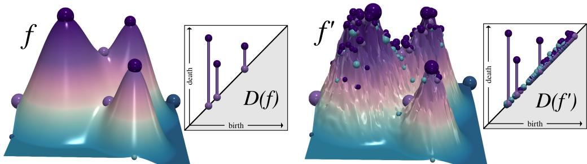  
Figure 1: Persistence diagrams $\mathcal { D } ( f )$ and $\mathcal { D } ( f ^ { \prime } )$ associated respectively with the noise-free scalar field $f$ (left) and its noisy counterpart $f ^ { \prime }$ (right). In both diagrams, the three dominant peaks appear as highly persistent pairs, while the numerous points close to the diagonal in $\mathcal { D } ( f ^ { \prime } )$ correspond to low-persistence features introduced by the background noise.

As illustrated in Fig. 1, features with large topological significance correspond to points $( b , d )$ located far from the diagonal $\Delta = \{ ( b , d ) \in \mathbb { R } ^ { 2 } : b = d \}$ . Such points have a large lifespan $d - b ,$ , called their persistence. Conversely, pairs produced by small-amplitude noise typically have short lifespans and therefore lie close to the diagonal.

In order to fit the setting in which $d _ { \mathrm { S K } }$ is defined, that is of normalized persistence diagrams, while preserving the relative amplitude of features across the collection, we normalize all persistence diagrams of the collection jointly: assuming that at least one diagram is nonempty, let

$$
v _ { \operatorname* { m i n } } : = \operatorname* { m i n } _ { 1 \leq i \leq n _ { \mathcal { F } } } b _ { i } ^ { r } , \qquad v _ { \operatorname* { m a x } } : = \operatorname* { m a x } _ { 1 \leq i \leq n _ { \mathcal { F } } } d _ { i } ^ { r } .
$$

We apply the same increasing afine map to every point of every diagram and define

$$
X _ { i } : = \left\{ \left( \frac { b _ { i } ^ { r } - v _ { \operatorname* { m i n } } } { v _ { \operatorname* { m a x } } - v _ { \operatorname* { m i n } } } , \frac { d _ { i } ^ { r } - v _ { \operatorname* { m i n } } } { v _ { \operatorname* { m a x } } - v _ { \operatorname* { m i n } } } \right) \right\} _ { r = 1 } ^ { m _ { i } } .
$$

Thus, every $X _ { i }$ is supported in the normalized persistence triangle

$$
\begin{array} { r } { A _ { \triangle } : = \{ ( x , y ) \in [ 0 , 1 ] ^ { 2 } : x \le y \} . } \end{array}
$$

Since the same afine transformation is used for the entire collection, the relative birth, death, and persistence scales among its diagrams are preserved. This normalization depends only on the persistence diagrams and can therefore also be applied to diagrams obtained from point clouds or other filtered data. If all diagrams are already supported in $\mathbf { \mathcal { A } } _ { \triangle } .$ , no further normalization is required and we simply set $X _ { i } = X _ { i } ^ { \mathrm { r a w } }$

Thanks to the global normalization, the persistence diagram $X _ { i }$ can also be viewed as an integer atomic measure supported in the normalized persistence triangle $A _ { \triangle }$ . More precisely,

$$
X _ { i } = \sum _ { r = 1 } ^ { m _ { i } } \delta _ { ( b _ { i } ^ { r } , d _ { i } ^ { r } ) } , ( b _ { i } ^ { r } , d _ { i } ^ { r } ) \in \mathcal { A } _ { \triangle } \setminus \Delta ,
$$

where, for simplicity, $b _ { i } ^ { r }$ and $d _ { i } ^ { r }$ now denote the normalized birth and death coordinates. Repeated points in the multiset are represented by repeated Dirac masses.

Although our experiments use persistence diagrams derived from PL scalar fields, the framework developed in this paper only requires a collection of persistence diagrams, which can be jointly normalized regardless of their data source. It therefore applies directly to diagrams obtained from other filtered data, such as point clouds equipped with Vietoris–Rips filtrations.

In what follows, we enumerate the $K$ points of a persistence diagram X as $X = \{ x ^ { 1 } , \ldots , x ^ { K } \}$ , and denote $X _ { \mathcal { O } } = \{ \}$ the empty persistence diagram.

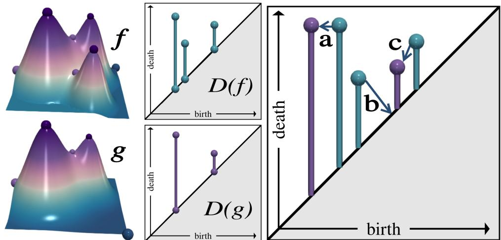  
Figure 2: Left: two synthetic scalar fields, $f \ \mathrm { ( t o p ) }$ and g (bottom). Center: their corresponding persistence diagrams, $\mathcal { D } ( f )$ and $\mathcal { D } ( g )$ . Right: the optimal 2-Wasserstein assignment $\psi ,$ between $\mathcal { D } ( f )$ and $\mathcal { D } ( g )$ visualized by arrows. For clarity, the diagonal augmentations are omitted and only the of-diagonal matchings are represented. The squared 2-Wasserstein distance is the sum of the squared arrow lengths: $a ^ { 2 } + b ^ { 2 } + c ^ { 2 } =$ $W _ { 2 } \big ( \mathcal { D } ( f ) , \mathcal { D } ( g ) \big ) ^ { 2 }$

## 2.2 Metric for persistence diagrams

Let

$$
X _ { 1 } = \{ x _ { 1 } ^ { 1 } , \ldots , x _ { 1 } ^ { K _ { 1 } } \} , \qquad X _ { 2 } = \{ x _ { 2 } ^ { 1 } , \ldots , x _ { 2 } ^ { K _ { 2 } } \}
$$

be two persistence diagrams. Since their numbers of of-diagonal points may difer, we augment each diagram with diagonal projections of the of-diagonal points of the other diagram. More precisely, we set $X _ { 1 } ^ { * } =$ $X _ { 1 } \cup \big \{ \Pi ( x ) : x \in X _ { 2 } \setminus \Delta \big \} , X _ { 2 } ^ { * } = X _ { 2 } \cup \big \{ \Pi ( x ) : x \in X _ { 1 } \setminus \Delta \big \}$ , where the diagonal projection is given by

$$
\Pi ( b , d ) = \left( { \frac { b + d } { 2 } } , { \frac { b + d } { 2 } } \right) .
$$

The two augmented diagrams have the same cardinality, which we denote by $K : = | X _ { 1 } ^ { * } | = | X _ { 2 } ^ { * } |$ |. We write

$$
X _ { 1 } ^ { * } = \{ x _ { * 1 } ^ { 1 } , \ldots , x _ { * 1 } ^ { K } \} , \qquad X _ { 2 } ^ { * } = \{ x _ { * 2 } ^ { 1 } , \ldots , x _ { * 2 } ^ { K } \} ,
$$

with multiplicities. Let $I _ { K } = \left\{ 1 , \dots , K \right\}$ . A bijection $\psi : I _ { K }  I _ { K }$ defines a one-to-one assignment between the points of the two augmented diagrams. We use the diagonal-aware squared cost

$$
c ( x , y ) = { \left\{ \begin{array} { l l } { 0 , } & { x \in \Delta { \mathrm { ~ a n d ~ } } y \in \Delta , } \\ { \| x - y \| _ { 2 } ^ { 2 } , } & { { \mathrm { o t h e r w i s e } } , } \end{array} \right. }
$$

where $\| \cdot \| _ { 2 }$ is the Euclidean norm in $\mathbb { R } ^ { 2 }$ . The corresponding 2-Wasserstein distance is

$$
W _ { 2 } ( X _ { 1 } , X _ { 2 } ) = \operatorname* { m i n } _ { \substack { \psi : I _ { K } \to I _ { K } \mathrm { ~ b i j e c t i v e } } } \left( \sum _ { j = 1 } ^ { K } c ( x _ { * 1 } ^ { j } , x _ { * 2 } ^ { \psi ( j ) } ) \right) ^ { 1 / 2 } .\tag{1}
$$

The diagonal augmentation encodes the standard convention that features may be deleted or created by matching of-diagonal points to the diagonal. Thus, $W _ { 2 }$ measures the minimum root-sum-of-squares cost required to transport one persistence diagram to the other, while assigning zero cost to matches between diagonal points; see $\mathrm { F i g . ~ 2 }$

## 2.3 Sierpiński–Knopp space-filling curve

We first present the finite-level recursive SK construction and the numerical selector $\iota _ { L } .$ , before introducing the exact SK space-filling curve $S$ and its first-hit selector ι as their limiting counterparts.

Finite-level recursive SK construction and numerical selector.

Starting from the persistence triangle

$$
A _ { \triangle } = \mathrm { c o n v } \{ ( 0 , 0 ) , ( 1 , 1 ) , ( 0 , 1 ) \} ,
$$

the level-0 construction consists of the single cell $A _ { \triangle }$ , associated with the parameter interval $[ 0 , 1 ]$ . We equip this root cell with the ordered hypotenuse $( ( 0 , 0 ) , ( 1 , 1 ) )$ , whose endpoints are its entry and exit vertices, respectively. At each level- $( \ell + 1 )$ refinement step, every current level-ℓ right isosceles triangular cell is subdivided into two similar level-(ℓ +1) right isosceles cells, while its associated level-ℓ dyadic interval is split into two level- $( \ell + 1 )$ dyadic subintervals.

More precisely, let $T = \mathrm { c o n v } \{ r , p , q \}$ be a level-ℓ cell, where p and q are respectively the entry and exit endpoints of its hypotenuse, r is the remaining vertex, and $m : = { \frac { p + q } { 2 } } $ is the midpoint of the hypotenuse. We subdivide $T$ into $T ^ { ( 0 ) } = \mathrm { c o n v } \{ r , p , m \} , T ^ { ( 1 ) } = \mathrm { c o n v } \{ r , m , q \}$ . The two children $T ^ { ( 0 ) }$ and $T ^ { ( 1 ) }$ inherit the ordered hypotenuses $( p , r )$ and $( r , q )$ , respectively. The SK traversal designates the level- $( \ell + 1 )$ cell $T ^ { ( 0 ) }$ as the first-visited child and the level- $( \ell + 1 )$ cell $T ^ { ( 1 ) }$ as the second-visited child. Accordingly, if $I = [ a , b ]$ denotes the current level-ℓ dyadic interval associated with $T _ { : }$ , we associate $T ^ { ( 0 ) }$ with the left half of $I ,$ yielding a level- $( \ell + 1 )$ dyadic subinterval $I ^ { ( 0 ) } : = [ a , \ { \textstyle { \frac { a + b } { 2 } } } ]$ , and we associate $T ^ { ( 1 ) }$ with the right half, yielding a level-(ℓ + 1) dyadic subinterva $\begin{array} { r } { I ^ { ( 1 ) } : = [ \frac { a + b } { 2 } , ~ b ] } \end{array}$

After L refinements, this construction yields $2 ^ { L }$ ordered triangular cells $T _ { 0 } ^ { ( L ) } , \dots , T _ { 2 ^ { L } - 1 } ^ { ( L ) }$ , associated respectively with the dyadic intervals $\begin{array} { r } { I _ { k } ^ { ( L ) } = \left[ \frac { k } { 2 ^ { L } } , \frac { k + 1 } { 2 ^ { L } } \right] , k = 0 , \dots , 2 ^ { L } - 1 } \end{array}$

Fig. 3 visualizes the cell visitation order induced by this recursive construction for $L = 1 , \dots , 9$

For a point $z \in \mathcal A _ { \triangle }$ , let $k _ { L } ( z ) : = \operatorname* { m i n } \left\{ k \in \{ 0 , \ldots , 2 ^ { L } - 1 \} : z \in T _ { k } ^ { ( L ) } \right\}$ . The minimum implements the first visited-cell convention when z belongs to the common boundary of several cells. We define the finite-level selector by $\begin{array} { r } { \iota _ { L } ( z ) : = \frac { k _ { L } ( z ) } { 2 ^ { L } } } \end{array}$ , that is, the left endpoint of the first level-L dyadic interval whose associated cel contains z.

In practice, $k _ { L } ( z )$ is computed by descending the binary refinement tree. Initialize $k  0$ and set the current right isosceles triangle to the root persistence triangle $A _ { \triangle }$ . For $\ell = 1 , \ldots , L$ , form the two right isosceles child triangles and decide which child contains z. This membership test is carried out in constant time with an oriented-area predicate: with cross $( u , v ) : = u _ { x } v _ { y } - u _ { y } v _ { x }$ , for a triangle $( a , b , c )$ one evaluates the signs of cross $( z - a , b - a )$ , cross $\left( z - b , c - b \right)$ , and cross $( z - c , a - c )$ (with a small tolerance), and z lies inside if and only if these signs are consistent (boundary included). If z lies in the first-visited child, set $k \gets 2 k ;$ ; otherwise set $k \gets 2 k + 1 ;$ update the current triangle accordingly and iterate. $\operatorname { I f } z$ lies on the common boundary of the two children (up to numerical tolerance), we select the first-visited child, consistently with the definition of $k _ { L } ( z )$ . After $L$ steps, the computed index satisfies

$$
k = k _ { L } ( z ) .
$$

Hence,

$$
I _ { k } ^ { ( L ) } = \left[ \frac { k } { 2 ^ { L } } , \frac { k + 1 } { 2 ^ { L } } \right]
$$

is the dyadic interval associated with the first-visited level-L cell containing z. The algorithm therefore returns

$$
\iota _ { L } ( z ) = \frac { k } { 2 ^ { L } } ,
$$

the left endpoint of $I _ { k } ^ { ( L ) }$ . Since each refinement level requires constant work, the overall cost is $O ( L )$ per query point.

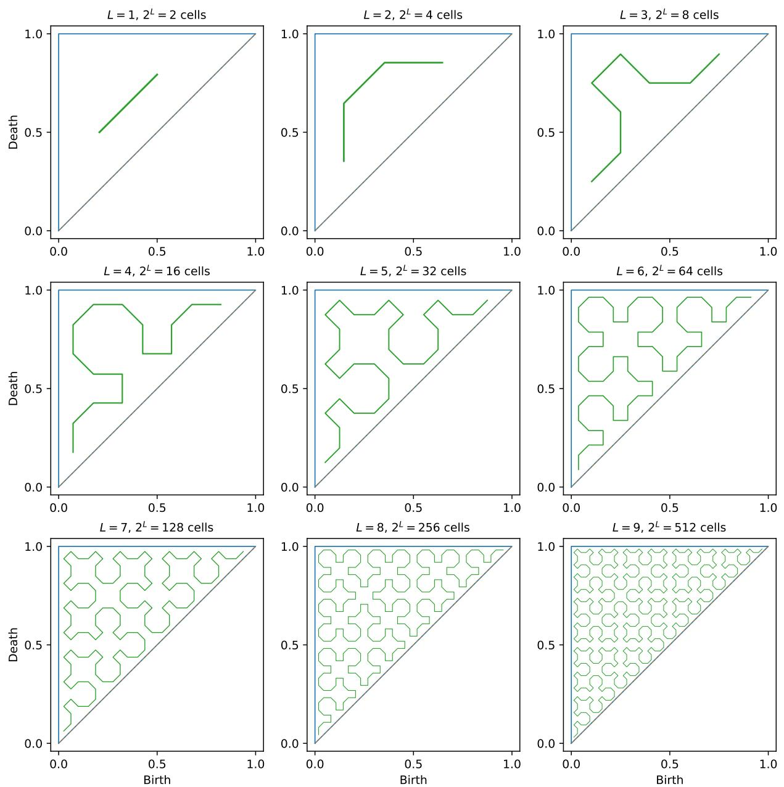  
Figure 3: Finite-level SK cell traversals for $L = 1 , \dots , 9 .$ At level L, the polyline connects the incenters of the $2 ^ { L }$ triangular cells in visitation order, which coincides with the order of their associated dyadic subintervals of [0, 1].

## Exact SK curve and first-hit selector.

The ordered cells determine a continuous polygonal map at each refinement level: for $k = 0 , \ldots , 2 ^ { L } - 1$ let $e _ { k } ^ { ( L ) }$ and $q _ { k } ^ { ( L ) }$ denote respectively the entry and exit vertices of $T _ { k } ^ { ( L ) }$ , that is, the two endpoints of its hypotenuse ordered according to the SK traversal. For $t \in I _ { k } ^ { ( L ) }$ , let

$$
\theta : = 2 ^ { L } t - k \in [ 0 , 1 ]
$$

and define

$$
\begin{array} { r } { S _ { L } ( t ) : = ( 1 - \theta ) e _ { k } ^ { ( L ) } + \theta q _ { k } ^ { ( L ) } . } \end{array}
$$

Thus, $S _ { L }$ traverses the level-L cell $T _ { k } ^ { ( L ) }$ linearly from its entry vertex to its exit vertex. Using these entry and exit vertices, let

$$
S _ { L } : [ 0 , 1 ]  \mathcal { A } _ { \triangle }
$$

denote the polygonal approximation obtained by traversing each level-L cell $T _ { k } ^ { ( L ) }$ from its entry vertex $e _ { k } ^ { ( L ) }$ to its exit vertex $q _ { k } ^ { ( L ) }$ over the associated dyadic interval $I _ { k } ^ { ( L ) }$ . The SK visitation convention ensures that consecutive segments share their endpoints, so $S _ { L } : [ 0 , 1 ]  \bar { \mathcal { A } } _ { \triangle }$ is continuous. Then, by the convergence result for the recursive SK construction Sagan (1994); Bader (2013), the sequence $( S _ { L } ) _ { L \geq 0 }$ converges uniformly, as $L \to \infty$ , to a continuous surjection

$$
S : [ 0 , 1 ]  { \mathcal A } _ { \triangle } ,
$$

called the Sierpiński–Knopp space-filling curve of $A _ { \triangle }$ . Since $S$ is surjective, every point $z \in \mathcal { A } _ { \triangle }$ is hit at least once. Therefore, we can define the associated first-hit selector

$$
\iota ( z ) : = \operatorname* { m i n } S ^ { - 1 } ( \{ z \} ) = \operatorname* { m i n } \{ t \in [ 0 , 1 ] : S ( t ) = z \} \in [ 0 , 1 ] .
$$

Because S is surjective, the fiber $S ^ { - 1 } ( \{ z \} ) \neq \emptyset , \forall z \in \mathcal { A } _ { \triangle }$ , and since $S$ is continuous and $\{ z \}$ is closed, $S ^ { - 1 } ( \{ z \} )$ ) is closed in [0, 1]. Therefore $S ^ { - 1 } ( \{ z \} )$ is a non-empty closed subset of the compact [0, 1], hence it attains its minimum, and $\iota ( z ) = \operatorname* { m i n } S ^ { - 1 } ( \{ z \} )$ ) is well defined. As a result, the finite-level selectors ιL converge pointwise to the first-hit selector ι as $L \to \infty$ Bader (2013); Sagan (1994). Moreover, $S ( \iota ( z ) ) = z , \forall z \in \mathcal { A } _ { \triangle }$ hence $\iota : \mathcal { A } _ { \triangle }  [ 0 , 1 ]$ is injective (indeed, $\iota ( z ) = \iota ( z ^ { \prime } ) \implies z = S ( \iota ( z ) ) = S ( \iota ( z ^ { \prime } ) ) = z ^ { \prime } )$ , this will later guarantee that the assignment problem on [0, 1] between the one-dimensional diagram-encoded measures induces a metric on normalized persistence diagrams. The selector ι is also Borel measurable. Indeed, for any $t \in [ 0 , 1 ]$

$$
\iota ^ { - 1 } ( [ 0 , t ] ) = \{ z \in A _ { \triangle } : \iota ( z ) \leq t \} = S ( [ 0 , t ] ) ,
$$

because $\iota ( z ) \leq t$ if and only $\operatorname { i f } z$ is hit by S at some parameter $s \leq t .$ Since $S$ is continuous, $S ( [ 0 , t ] )$ is a compact subset of $A _ { \triangle }$ , hence closed in $A _ { \triangle }$ , and therefore Borel. Consequently, ι is Borel measurable; this measurability will ensure that our first-layer one-dimensional encoding of normalized persistence diagrams is well defined.

Hölder regularity. Shchepin (2020) proves that on a unit-area right isosceles triangle $T _ { \mathrm { r e f } }$ the reference SK space-filling curve $S _ { \mathrm { r e f } } : [ 0 , 1 ]  T _ { \mathrm { r e f } }$ is 1/2-Hölder; more precisely,

$$
\| S _ { \mathrm { r e f } } ( t ) - S _ { \mathrm { r e f } } ( s ) \| _ { 2 } ^ { 2 } \leq 4 | t - s | \qquad \forall s , t \in [ 0 , 1 ] .
$$

Our persistence triangle $A _ { \triangle }$ is a right isosceles triangle of area $1 / 2$ , whereas the reference right isosceles triangle $T _ { \mathrm { r e f } }$ in Shchepin (2020) has area 1. Therefore, $A _ { \triangle }$ is a scaled copy of $T _ { \mathrm { r e f } }$ with scale $\alpha = 1 / \sqrt { 2 }$ , up to an isometry of $\mathbb { R } ^ { 2 } \ ( \mathrm { i . e . }$ , a rotation or reflection, followed by a translation). Let $\varphi : T _ { \mathrm { r e f } }  A _ { \triangle }$ be such a similarity, $\mathrm { i . e . , ~ } \varphi ( x ) = \alpha R x + b .$ where R is orthogonal and b is a translation.

Choosing the orientation of $S _ { \mathrm { r e f } }$ consistently with the SK traversal introduced above, our SK space-filling curve S on $A _ { \triangle }$ is obtained from the reference curve $S _ { \mathrm { r e f } }$ through the similarity

$$
S = \varphi \circ S _ { \mathrm { r e f } } : [ 0 , 1 ] \to A _ { \triangle } .
$$

Therefore, for all $s , t \in [ 0 , 1 ]$ , using the fact that R is orthogonal $( \operatorname { s o } \ \| R w \| _ { 2 } = \| w \| _ { 2 } )$ , we obtain

$$
\begin{array} { r l } & { \| S ( t ) - S ( s ) \| _ { 2 } ^ { 2 } = \| \varphi ( S _ { \mathrm { r e f } } ( t ) ) - \varphi ( S _ { \mathrm { r e f } } ( s ) ) \| _ { 2 } ^ { 2 } } \\ & { \qquad = \| \alpha R ( S _ { \mathrm { r e f } } ( t ) - S _ { \mathrm { r e f } } ( s ) ) \| _ { 2 } ^ { 2 } } \\ & { \qquad = \alpha ^ { 2 } \| R ( S _ { \mathrm { r e f } } ( t ) - S _ { \mathrm { r e f } } ( s ) ) \| _ { 2 } ^ { 2 } } \\ & { \qquad = \alpha ^ { 2 } \| S _ { \mathrm { r e f } } ( t ) - S _ { \mathrm { r e f } } ( s ) \| _ { 2 } ^ { 2 } } \\ & { \qquad \le 4 \alpha ^ { 2 } | t - s | = 2 | t - s | . } \end{array}
$$

Thus S satisfies the $1 / 2 \cdot$ -Hölder bound $\| S ( t ) - S ( s ) \| _ { 2 } ^ { 2 } \leq 2 | t - s |$ for all $s , t \in [ 0 , 1 ]$ , and we set $C _ { \mathrm { S K } } : = 2$ in the sequel. This regularity will later allow us to relate $d _ { \mathrm { S K } }$ to the 2-Wasserstein distance between normalized persistence diagrams.

## 3 Sierpiński–Knopp Wasserstein distance between normalized persistence diagrams

In this section, we introduce the Sierpiński–Knopp Wasserstein distance $d _ { \mathrm { S K } }$ between normalized persistence diagrams. First, we provide an overview of its construction and summarize its key properties. Then, we detail the mathematical formulation of $d _ { \mathrm { S K } } ,$ which is built in two conceptual layers: (i) a deterministic onedimensional encoding of normalized diagram points induced by the SK space-filling curve on the persistence triangle, and (ii) a one-dimensional assignment problem on [0, 1] between the induced encodings. Next, we show how $d _ { \mathrm { S K } }$ can be evaluated eficiently in practice through a sorting-based formula, leading to an $O ( N \log N )$ procedure for normalized diagrams of total size N. Finally, we relate $d _ { \mathrm { S K } }$ to the 2-Wasserstein distance between normalized persistence diagrams.

## 3.1 Overview

Here, we provide a high-level overview of the the $d _ { \mathrm { S K } }$ distance. We first describe how normalized diagrams are handled with respect to the diagonal and encoded onto the unit interval using the SK space-filling curve. We then define $d _ { \mathrm { S K } }$ as a one-dimensional assignment problem on these encodings, and summarize its main properties.

The $d _ { \mathrm { S K } }$ construction combines two conceptual layers.

(i) A diagonal-aware 1D encoding of normalized persistence diagrams. Let $X = \{ x ^ { 1 } , \ldots , x ^ { K } \}$ , be a normalized persistence diagram. We can see $\textstyle X = \sum _ { k = 1 } ^ { K } \delta _ { x ^ { k } }$ as an integer atomic measure on $\mathbf { \mathcal { A } } _ { \triangle }$ . Using the associated first-hit selector $\iota ( z ) = \operatorname* { m i n } S ^ { - 1 } ( \{ z \} )$ of the SK space-filling curve we can map points in $A _ { \triangle }$ to scalar values in [0, 1]. This yields two integer atomic measures on [0, 1]:

$$
\mu _ { X } : = \iota _ { \# } X , \qquad \nu _ { X } : = \iota _ { \# } ( \Pi _ { \# } X ) ,
$$

encoding respectively the of-diagonal atoms of X and their diagonal projections, both have equal total mass |X|.

(ii) $d _ { \mathrm { S K } }$ distance between normalized persistence diagrams as a 1D assignment between their augmented encodings.

We compare normalized diagrams by evaluating the classical 1D 1-Wasserstein distance between their augmented 1D encodings on $( [ 0 , 1 ] , | \cdot | )$ . For two diagrams $X _ { 1 } , X _ { 2 }$ we define

$$
\mathrm { d } _ { \mathrm { S K } } ( X _ { 1 } , X _ { 2 } ) : = \sqrt { W _ { 1 } \big ( \mu _ { X _ { 1 } } + \nu _ { X _ { 2 } } , \ \mu _ { X _ { 2 } } + \nu _ { X _ { 1 } } \big ) } .
$$

Equivalently, setting $\bar { X } _ { 1 } \ : = \ X _ { 1 } + \Pi _ { \# } X _ { 2 }$ and $\bar { X } _ { 2 } \ : = \ X _ { 2 } + \Pi _ { \# } X _ { 1 }$ (which have equal mass), one has $\mathrm { d } _ { \mathrm { S K } } ( X _ { 1 } , X _ { 2 } ) = \sqrt { W _ { 1 } ( \iota _ { \# } \bar { X } _ { 1 } , \iota _ { \# } \bar { X } _ { 2 } ) }$ . This augmentation mirrors the standard persistence-diagram assignment convention in which unmatched of-diagonal points may be matched to the diagonal. In $d _ { \mathrm { S K } } ,$ , this efect is encoded by adding diagonal projections to the compared measures; the diference is that the resulting assignment problem is no longer solved directly in the persistence triangle, but through a 1D 1-Wasserstein problem on [0, 1].

Fig. 4 provides a finite-level illustration of the two-layer construction at $L = 6 \mathrm { : }$ : diagram points and their diagonal projections are encoded on [0, 1], the augmented scalar lists are matched monotonically, and the resulting pairing is lifted back to the normalized persistence triangle.

Key properties. First, $d _ { \mathrm { S K } }$ defines a metric on the space of normalized persistence diagrams, and its square $\mathrm { d } _ { \mathrm { S K } } ^ { 2 }$ does as well (see Theorem A.6 and Theorem A.7). Second, because one-dimensional $W _ { 1 }$ has a closed-form monotone optimal coupling, $d _ { \mathrm { S K } }$ between two normalized persistence diagrams $X _ { 1 }$ and $X _ { 2 }$ can be evaluated by sorting two length-N lists of ι-values (with $N = | X _ { 1 } | + | X _ { 2 } | )$ , giving an $O ( N \log N )$ evaluation procedure once the relevant ι-values have been computed. Third, thanks to the $1 / 2 \AA$ -Hölder regularity of the SK spacefilling curve, the Wasserstein distance $W _ { 2 }$ is controlled, up to a constant factor, by $\mathrm { d } _ { \mathrm { S K } }$ , which makes $\mathrm { d } _ { \mathrm { S K } }$ a fast surrogate metric for repeated $W _ { 2 }$ evaluations on normalized persistence diagrams. Finally, $d _ { \mathrm { S K } } ^ { 2 }$ admits an explicit $L ^ { 1 }$ signature representation. In particular, there is an explicit Hilbert embedding Φ into $\dot { L } ^ { 2 }$ such that $\mathrm { d } _ { \mathrm { S K } } ( X _ { 1 } , X _ { 2 } ) = \| \Phi ( X _ { 1 } ) - \Phi ( X _ { 2 } ) \| _ { L ^ { 2 } }$ , and the associated Gaussian kernel exp $( - \mathrm { d } _ { \mathrm { S K } } ( X _ { 1 } , X _ { 2 } ) ^ { 2 } / ( 2 \sigma ^ { 2 } ) )$ is positive definite. Thus, dSK supports both Hilbertian embedding methods and kernel-based learning.

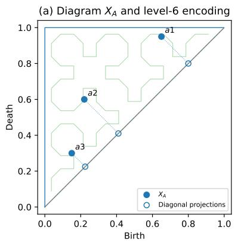

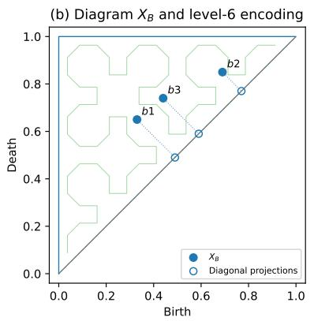

(c) Monotone assignment on [0, 1]  
dSK,6 = 0.35355  
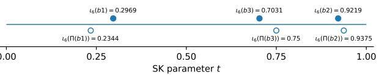  
(d) Induced diagonal-aware assignment

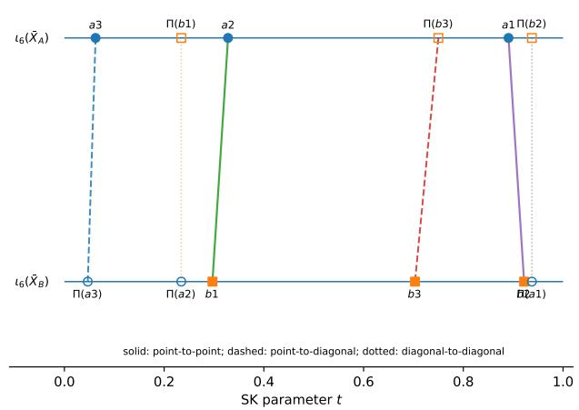

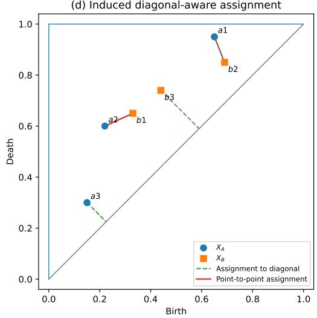  
Figure 4: Finite-level construction of $d _ { \mathrm { S K , 6 } }$ on two toy normalized persistence diagrams. (a)–(b) The points of $X _ { A }$ and $X _ { B }$ , together with their diagonal projections, are encoded by the level-6 selector $\iota _ { 6 } .$ (c) Sorting the two augmented scalar lists yields the monotone optimal assignment on [0, 1], from which $d _ { \mathrm { S K , 6 } }$ is computed. (d) Retaining point identities induces an explicit partial assignment between $X _ { A }$ and $X _ { B }$ , with unmatched points assigned to $\Delta$ . Diagonal-to-diagonal pairs are omitted from the final panel.

## 3.2 Deterministic diagonal-aware 1D encoding of normalized persistence diagrams

The first layer of $d _ { \mathrm { S K } }$ maps each normalized persistence diagram to a diagonal-aware one-dimensional encoding on the unit interval. This reduction is entirely driven by the fixed SK space-filling curve introduced above and is designed to preserve both the location of of-diagonal atoms and their interaction with the diagonal $\Delta { \mathrm { i } }$

A normalized persistence diagram is represented as a finite integer atomic measure

$$
X = \sum _ { r = 1 } ^ { m } a _ { r } \delta _ { z _ { r } } , \qquad z _ { r } \in A _ { \bigtriangleup } , \ : \ : \ : a _ { r } \in \mathbb { N } ,
$$

more precisely, with all atoms lying in $A _ { \triangle } \backslash \Delta .$

Given the SK curve $S : [ 0 , 1 ]  \mathcal { A } _ { \triangle }$ , each persistence pair $z _ { r } \in \mathcal { A } _ { \triangle }$ is assigned its first-hit value via the selector $\iota : \mathcal { A } _ { \triangle }  [ 0 , 1 ]$

$$
\iota ( z _ { r } ) : = \operatorname* { m i n } \{ t \in [ 0 , 1 ] : S ( t ) = z _ { r } \} .
$$

The minimum is well defined, and ι is injective, as shown in Sec. 2.3. This injectivity is important: distinct points of the persistence triangle receive distinct scalar values, so the one-dimensional encoding does not collapse geometric information. In particular, the two sets $\iota ( \varLambda _ { \triangle } \backslash \Delta )$ and $\iota ( \Delta )$ are disjoint, which means that of-diagonal atoms and diagonal atoms remain separated after encoding. The selector is also Borel measurable, so pushing atomic measures through ι is well defined.

This leads to two associated integer atomic measures on [0, 1]:

$$
\mu _ { X } : = \iota _ { \# } X , \qquad \nu _ { X } : = \iota _ { \# } ( \Pi _ { \# } X ) .
$$

more explicitly, at the level of atoms,

$$
\mu _ { X } = \sum _ { r = 1 } ^ { m } a _ { r } \delta _ { \iota ( z _ { r } ) } , \qquad \nu _ { X } = \sum _ { r = 1 } ^ { m } a _ { r } \delta _ { \iota ( \Pi ( z _ { r } ) ) } .
$$

The first measure $\mu _ { X }$ records where the diagram places mass along the SK parameterization, while the second measure $\nu _ { X }$ records where the same mass would lie after projection onto the diagonal. Both measures have the same total mass, namely $| X |$ . Thus, the first layer of $d _ { \mathrm { S K } }$ does not produce a single list of scalar values, but rather a diagonal-aware pair of one-dimensional measures. While $\mu _ { X }$ alone already determines $X$ because ι is injective, the companion measure $\nu _ { X }$ is essential because persistence-diagram comparisons must also account for matches to the diagonal.

It is convenient to combine these two measures into the signed measure

$$
\sigma _ { X } : = \mu _ { X } - \nu _ { X } , \qquad \sigma _ { X } ( [ 0 , 1 ] ) = 0 .
$$

This signed object can be viewed as a compact one-dimensional signature of the diagram: positive atoms represent of-diagonal contributions carried by X, while negative atoms represent the corresponding diagonal cancellations. Because $\mu _ { X }$ and $\nu _ { X }$ are supported on disjoint subsets of [0, 1], this signed encoding still retains the full information of the original normalized diagram. As shown in Sec. 4, this representation is the key object behind the cumulative $L ^ { 1 }$ formulation of the squared distance $d _ { \mathrm { S K } } ^ { 2 }$ , from which the Hilbertian representation of $d _ { \mathrm { S K } }$ and its Gaussian kernel follow.

At this stage, no assignment problem has yet been solved. The first layer simply maps each diagram X to the pair of one-dimensional measures

$$
X \longmapsto ( \mu _ { X } , \nu _ { X } ) .
$$

## 3.3 $d _ { \mathrm { S K } }$ distance between normalized persistence diagrams as a 1D assignment between their augmented encodings

The second layer of $d _ { \mathrm { S K } }$ turns the diagonal-aware one-dimensional encodings introduced above into a distance between normalized persistence diagrams. Let $X _ { 1 }$ and $X _ { 2 }$ be two normalized persistence diagrams, and let

$$
\left( \mu _ { X _ { 1 } } , \nu _ { X _ { 1 } } \right) \qquad \mathrm { a n d } \qquad \left( \mu _ { X _ { 2 } } , \nu _ { X _ { 2 } } \right)
$$

denote their corresponding one-dimensional encodings on [0, 1] produced by the first layer. A direct comparison of $\mu _ { X _ { 1 } }$ and $\mu _ { X _ { 2 } }$ alone would only account for matches between of-diagonal atoms. However, as in

the standard assignment formulation for persistence diagrams, unmatched of-diagonal points must also be allowed to match to the diagonal. In $d _ { \mathrm { S K } } ,$ , this efect is encoded directly in one dimension by augmenting each of-diagonal measure with the diagonal projection measure of the other diagram.

More precisely, we introduce the two augmented measures

$$
\xi _ { 1 } : = \mu _ { X _ { 1 } } + \nu _ { X _ { 2 } } , \qquad \xi _ { 2 } : = \mu _ { X _ { 2 } } + \nu _ { X _ { 1 } } .
$$

Both are finite nonnegative measures on [0, 1], and they have the same total mass:

$$
\xi _ { 1 } ( [ 0 , 1 ] ) = \xi _ { 2 } ( [ 0 , 1 ] ) = | X _ { 1 } | + | X _ { 2 } | .
$$

Equivalently, if we define the augmented diagrams

$$
\bar { X } _ { 1 } : = X _ { 1 } + \Pi _ { \# } X _ { 2 } , \qquad \bar { X } _ { 2 } : = X _ { 2 } + \Pi _ { \# } X _ { 1 } ,
$$

then

$$
\xi _ { 1 } = \iota _ { \# } \bar { X } _ { 1 } , \qquad \xi _ { 2 } = \iota _ { \# } \bar { X } _ { 2 } .
$$

Thus, at this step, comparing two normalized persistence diagrams reduces to comparing two equal-mass atomic measures on the unit interval.

We then define $d _ { \mathrm { S K } }$ as the square root of the one-dimensional 1-Wasserstein distance between these augmented encodings. More precisely, for two finite nonnegative Borel measures $\alpha , \beta$ on $[ 0 , 1 ]$ with equal total mass, we write

$$
W _ { 1 } ( \alpha , \beta ) : = \operatorname* { i n f } _ { \pi \in \Pi ( \alpha , \beta ) } \int _ { [ 0 , 1 ] ^ { 2 } } | s - t | d \pi ( s , t ) ,
$$

where $\Pi ( \alpha , \beta )$ denotes the set of couplings of α and $\beta .$ . Here, a coupling π is a joint measure on $[ 0 , 1 ] ^ { 2 }$ whose first and second marginals are α and $\beta _ { i }$ , respectively (i.e., $( \mathrm { p r } _ { 1 } ) _ { \# } \pi = \alpha$ and $( \mathrm { p r } _ { 2 } ) _ { \# } \pi = \beta$ , where $\mathrm { p r } _ { 1 } ( s , t ) = s$ and $\mathrm { p r } _ { 2 } ( s , t ) = t )$ . The quantity $\left| s - t \right|$ is the cost of moving one unit of mass from s to t, so $W _ { 1 } ( \alpha , \beta )$ is the minimum total transport cost over all couplings of α and $\beta . \ d _ { \mathrm { S K } }$ is then defined by

$$
\operatorname { d } _ { \mathrm { S K } } ( X _ { 1 } , X _ { 2 } ) : = \sqrt { W _ { 1 } ( \xi _ { 1 } , \xi _ { 2 } ) } = \sqrt { W _ { 1 } \big ( \mu _ { X _ { 1 } } + \nu _ { X _ { 2 } } , \mu _ { X _ { 2 } } + \nu _ { X _ { 1 } } \big ) } .
$$

Equivalently, its squared value satisfies

$$
\operatorname { d } _ { \mathrm { S K } } ( X _ { 1 } , X _ { 2 } ) ^ { 2 } = W _ { 1 } ( \xi _ { 1 } , \xi _ { 2 } ) = W _ { 1 } \big ( \mu _ { X _ { 1 } } + \nu _ { X _ { 2 } } , \mu _ { X _ { 2 } } + \nu _ { X _ { 1 } } \big ) .
$$

Unlike the cost used in $W _ { 2 } ,$ , the ground cost $\left| s - t \right|$ is applied to every pair in the one-dimensional coupling. Consequently, pairing two distinct diagonal projections contributes a positive cost to $d _ { \mathrm { S K } } ,$ whereas a diagonal to-diagonal pair has zero cost in $W _ { 2 }$ . This is one source of discrepancy between $d _ { \mathrm { S K } }$ and $W _ { 2 }$

A key algebraic identity is

$$
( \mu _ { X _ { 1 } } + \nu _ { X _ { 2 } } ) - ( \mu _ { X _ { 2 } } + \nu _ { X _ { 1 } } ) = ( \mu _ { X _ { 1 } } - \nu _ { X _ { 1 } } ) - ( \mu _ { X _ { 2 } } - \nu _ { X _ { 2 } } ) = \sigma _ { X _ { 1 } } - \sigma _ { X _ { 2 } } .
$$

In other words, the signed diference between the two augmented measures is exactly the diference of the signed measures introduced in the first layer. In particular, for every threshold $t \in [ 0 , 1 ]$ 2

$$
( \xi _ { 1 } - \xi _ { 2 } ) ( [ 0 , t ] ) = ( \sigma _ { X _ { 1 } } - \sigma _ { X _ { 2 } } ) ( [ 0 , t ] ) .
$$

Since one-dimensional $W _ { 1 }$ depends only on the cumulative discrepancy

$$
t \longleftrightarrow ( \xi _ { 1 } - \xi _ { 2 } ) ( [ 0 , t ] ) ,
$$

Peyré and Cuturi (2019), and this discrepancy is exactly

$$
t \longmapsto ( \sigma _ { X _ { 1 } } - \sigma _ { X _ { 2 } } ) ( [ 0 , t ] ) ,
$$

the value of $\mathrm { d } _ { \mathrm { S K } } ( X _ { 1 } , X _ { 2 } ) ^ { 2 }$ is entirely determined by the signed diference σ ${ \bf \Phi } _ { X _ { 1 } } - \sigma _ { X _ { 2 } }$ . This identity is precisely what makes the cumulative $L ^ { 1 }$ representation of the squared distance $d _ { \mathrm { S K } } ^ { 2 }$ and, in turn, the Hilbertian and kernel interpretations of $d _ { \mathrm { S K } }$ developed in the next section.

In summary, the second layer of $d _ { \mathrm { S K } }$ replaces the original two-dimensional partial-assignment problem between normalized persistence diagrams by a one-dimensional assignment problem on [0, 1], while still retaining the diagonal-matching mechanism through the augmented encodings. This is the central tradeof behind $d _ { \mathrm { S K } } \colon$ the comparison is performed in one dimension, which makes the distance computationally much simpler and, as shown in the next subsection, reducible to a sorting-based O(N log N) procedure for two normalized persistence diagrams $D _ { 1 }$ and $D _ { 2 }$ , where $N = \left| D _ { 1 } \right| + \left| D _ { 2 } \right|$ , while the $1 / 2 \AA$ -Hölder regularity of the SK curve ensures that the $d _ { \mathrm { S K } }$ geometry remains tied to the original two-dimensional geometry of normalized persistence diagrams.

## 3.4 Sorting-based evaluation and computational complexity of $d _ { \mathrm { S K } }$

Another key advantage of reducing the original two-dimensional geometry to a one-dimensional assignment problem is that the transport on the line admits a closed-form monotone solution. If

$$
A : = \{ \iota ( x ) : x \in X _ { 1 } \} \cup \{ \iota ( \Pi ( y ) ) : y \in X _ { 2 } \} , \qquad B : = \{ \iota ( y ) : y \in X _ { 2 } \} \cup \{ \iota ( \Pi ( x ) ) : x \in X _ { 1 } \} ,
$$

denote the two multisets of scalar values associated with $\xi _ { 1 }$ and $\xi _ { 2 }$ , and if

$$
a _ { ( 1 ) } \leq \cdots \leq a _ { ( N ) } , \qquad b _ { ( 1 ) } \leq \cdots \leq b _ { ( N ) } , \qquad N : = | X _ { 1 } | + | X _ { 2 } | ,
$$

are their sorted versions, then the optimal assignment is obtained by matching the k-th smallest value on the left with the k-th smallest value on the right. As a result (see Theorem A.5),

$$
\mathrm { d } _ { \mathrm { S K } } ( X _ { 1 } , X _ { 2 } ) = \left( \sum _ { k = 1 } ^ { N } | a _ { ( k ) } - b _ { ( k ) } | \right) ^ { 1 / 2 } .
$$

Keeping the identity of the diagram point associated with each scalar value, the same sorted pairing induces an explicit assignment between the augmented diagrams ${ \bar { X } } _ { 1 }$ and $X _ { 2 }$ . Equivalently, it defines a partial assignment between $X _ { 1 }$ and $X _ { 2 } .$ , with unmatched points assigned to the diagonal.

For the finite-level numerical evaluation, the exact selector ι is replaced by its finite-level selector $\iota _ { L }$ . Com puting $\iota _ { L }$ for a diagram point or a diagonal projection requires traversing L successive levels of the SK refinement, with constant work at each level. Since the two diagrams contain N points in total and generate N diagonal projections, constructing the multisets A and B costs $O ( N L )$

Sorting the two lists A and B costs O(N log N), while evaluating the resulting monotone assignment and taking the final square root costs $O ( N )$ . Consequently, the complete evaluation of $d _ { \mathrm { S K } , L }$ , including the computation of all selector values, has complexity

$$
O ( N L + N \log N ) = O ( N ( L + \log N ) ) .
$$

For a fixed refinement level $L ,$ as used in our implementation, this reduces to $O ( N \log N )$

This sorting-based formula is the main algorithmic advantage of $d _ { \mathrm { S K } }$ . After the geometric information of the diagrams has been encoded on the unit interval, the full comparison reduces to a one-dimensional monotone assignment problem with a closed-form solution. In this sense, $d _ { \mathrm { S K } }$ preserves the diagonal-aware structure of persistence-diagram matching while replacing the original two-dimensional optimal assignment computation by a simple and eficient procedure on sorted scalar codes.

## 3.5 Controlling the 2-Wasserstein distance with $\mathrm { d } _ { \mathrm { S K } }$

We explain in this subsection how the 1/2-Hölder regularity of the SK space-filling curve ties the onedimensional assignment geometry of $d _ { \mathrm { S K } }$ back to the original two-dimensional Wasserstein geometry of

normalized persistence diagrams. More precisely, it allows us to control the quadratic 2-Wasserstein distance by $\mathrm { d } _ { \mathrm { S K } }$ , thereby justifying $d _ { \mathrm { S K } }$ as a fast surrogate metric for repeated $W _ { \mathrm { 2 ^ { - } } } \mathrm { t y p e }$ evaluations.

Recall that, for two normalized persistence diagrams $X _ { 1 }$ and $X _ { 2 }$ , we introduced the augmented diagrams

$$
\bar { X } _ { 1 } : = X _ { 1 } + \Pi _ { \# } X _ { 2 } , \qquad \bar { X } _ { 2 } : = X _ { 2 } + \Pi _ { \# } X _ { 1 } ,
$$

which have the same total mass. We also consider the diagonal-aware squared cost

$$
\begin{array} { r } { c _ { \Delta } ( x , y ) : = \left\{ \begin{array} { l l } { \| x - y \| _ { 2 } ^ { 2 } , } & { x \notin \Delta , \ y \notin \Delta , } \\ { d _ { \Delta } ( x ) ^ { 2 } , } & { x \notin \Delta , \ y \in \Delta , } \\ { d _ { \Delta } ( y ) ^ { 2 } , } & { x \in \Delta , \ y \notin \Delta , } \\ { 0 , } & { x \in \Delta , \ y \in \Delta , } \end{array} \right. } \end{array}
$$

where

$$
d _ { \Delta } ( z ) : = \operatorname* { i n f } _ { u \in [ 0 , 1 ] } \| z - ( u , u ) \| _ { 2 } \qquad ( z \in A _ { \triangle } )
$$

denotes the Euclidean distance to the diagonal. The associated quadratic Wasserstein distance between normalized persistence diagrams is then defined by

$$
W _ { 2 } ^ { 2 } ( X _ { 1 } , X _ { 2 } ) : = \operatorname* { i n f } _ { \gamma \in \Pi ( \bar { X } _ { 1 } , \bar { X } _ { 2 } ) } \int _ { A _ { \triangle } \times A _ { \triangle } } c _ { \Delta } ( x , y ) d \gamma ( x , y ) .
$$

On the other hand, by construction,

$$
\operatorname { d } _ { \mathrm { S K } } ( X _ { 1 } , X _ { 2 } ) ^ { 2 } = W _ { 1 } ( \iota _ { \# } \bar { X } _ { 1 } , \iota _ { \# } \bar { X } _ { 2 } ) ,
$$

where the ground cost on $[ 0 , 1 ] { \mathrm { ~ i s ~ } } | t - s |$ . Let $\pi ^ { \star }$ be the optimal monotone coupling between $\iota _ { \# } X _ { 1 }$ and $\iota _ { \# } X _ { 2 }$ so that

$$
\mathrm { d } _ { \mathrm { S K } } ( X _ { 1 } , X _ { 2 } ) ^ { 2 } = \int _ { [ 0 , 1 ] ^ { 2 } } | t - s | d \pi ^ { \star } ( t , s ) .
$$

Pushing this coupling forward through the SK curve yields

$$
\Gamma _ { 1 2 } : = ( S , S ) _ { \# } \pi ^ { \star } .
$$

Since $S \circ \iota = \operatorname { i d } _ { A _ { \triangle } }$ , the marginals of $\Gamma _ { 1 2 }$ are exactly $X _ { 1 }$ and $X _ { 2 }$ , so $\Gamma _ { 1 2 }$ is an admissible coupling for $W _ { 2 } ( X _ { 1 } , X _ { 2 } )$ . In the finite-diagram setting considered here, $\Gamma _ { 1 2 }$ encodes precisely the diagonal-aware assignment between $X _ { 1 }$ and $X _ { 2 }$ obtained by monotonically pairing the sorted scalar lists (see Sec. 3.4).

Now let $x : = S ( t )$ and $y : = S ( s )$ . If both points are of-diagonal, then $c _ { \Delta } ( x , y ) = \| x - y \| _ { 2 } ^ { 2 }$ . If one of them lies on the diagonal, say $y \in \Delta$ , then

$$
c _ { \Delta } ( x , y ) = d _ { \Delta } ( x ) ^ { 2 } \leq \| x - y \| _ { 2 } ^ { 2 } ,
$$

because $y$ is itself a diagonal point. If both points lie on the diagonal, then $c _ { \Delta } ( x , y ) = 0$ . Therefore, in all cases,

$$
c _ { \Delta } ( S ( t ) , S ( s ) ) \leq \| S ( t ) - S ( s ) \| _ { 2 } ^ { 2 } .
$$

By the $1 / 2 \AA$ -Hölder bound established in Section 2.3,

$$
\| S ( t ) - S ( s ) \| _ { 2 } ^ { 2 } \leq C _ { \mathrm { S K } } | t - s | .
$$

Combining the two inequalities and integrating against $\pi ^ { \star }$ , we obtain

$$
\int _ { A _ { \Delta } \times A _ { \Delta } } c _ { \Delta } ( x , y ) d \Gamma _ { 1 2 } ( x , y ) = \int _ { [ 0 , 1 ] ^ { 2 } } c _ { \Delta } ( S ( t ) , S ( s ) ) d \pi ^ { * } ( t , s ) \leq C _ { \mathrm { S K } } \int _ { [ 0 , 1 ] ^ { 2 } } | t - s | d \pi ^ { * } ( t , s ) = C _ { \mathrm { S K } } \mathrm { d } _ { \mathrm { S K } } ( X _ { 1 } , X _ { 2 } ) ^ { 2 } .
$$

Since $\Gamma _ { 1 2 }$ is only one admissible coupling among all couplings defining $W _ { 2 , } ( X _ { 1 } , X _ { 2 } )$ , taking the infimum yields

$$
W _ { 2 } ^ { 2 } ( X _ { 1 } , X _ { 2 } ) \leq C _ { \mathrm { S K } } \mathrm { d } _ { \mathrm { S K } } ( X _ { 1 } , X _ { 2 } ) ^ { 2 } .
$$

Equivalently,

$$
W _ { 2 } ( X _ { 1 } , X _ { 2 } ) \leq \sqrt { C _ { \mathrm { S K } } } \mathrm { d } _ { \mathrm { S K } } ( X _ { 1 } , X _ { 2 } ) .
$$

For the normalized SK curve used throughout this section, we have $C _ { \mathrm { S K } } = 2$ , so in particular

$$
W _ { 2 } ( X _ { 1 } , X _ { 2 } ) \leq \sqrt { 2 } \mathrm { d } _ { \mathrm { S K } } ( X _ { 1 } , X _ { 2 } ) .
$$

A formal statement and proof of this bound are given in Theorem A.12.

Thus, although $d _ { \mathrm { S K } }$ is defined through a one-dimensional assignment problem on [0, 1], the 1/2-Hölder regularity of the SK curve ensures that it controls the two-dimensional 2-Wasserstein distance between persistence diagrams. This is precisely why $d _ { \mathrm { S K } }$ can be used as a computationally eficient surrogate for the diagonal-aware quadratic Wasserstein distance between normalized persistence diagrams.

Remark 3.1 (A tighter but non-metric surrogate). Recall that the proof above constructs a specific admissible coupling

$$
\Gamma _ { 1 2 } : = ( S , S ) _ { \# } \pi ^ { \star } \in \Pi ( \bar { X } _ { 1 } , \bar { X } _ { 2 } ) ,
$$

where $\pi ^ { \star }$ is the monotone optimal coupling on [0, 1]. Define its associated quadratic cost by

$$
W _ { \Gamma } ^ { 2 } ( X _ { 1 } , X _ { 2 } ) : = \int _ { A _ { \triangle } \times A _ { \triangle } } c _ { \triangle } ( x , y ) d \Gamma _ { 1 2 } ( x , y ) ,
$$

or equivalently

$$
W _ { \Gamma } ( X _ { 1 } , X _ { 2 } ) : = \left( \int _ { A _ { \triangle } \times A _ { \triangle } } c _ { \triangle } ( x , y ) d \Gamma _ { 1 2 } ( x , y ) \right) ^ { 1 / 2 } .
$$

Thus, $d _ { \mathrm { S K } }$ and $W _ { \Gamma }$ evaluate the correspondence induced by the same one-dimensional coupling with diferent costs: the former uses $\left| s - t \right|$ on [0, 1], whereas the latter uses $c _ { \Delta }$ in $\mathbf { \mathcal { A } } _ { \triangle }$ , so diagonal-to-diagonal pairs have zero cost, as in $W _ { 2 }$

By construction, one has

$$
W _ { 2 } ^ { 2 } ( X _ { 1 } , X _ { 2 } ) \leq W _ { \Gamma } ^ { 2 } ( X _ { 1 } , X _ { 2 } ) \leq C _ { \mathrm { S K } } \mathrm { d } _ { \mathrm { S K } } ( X _ { 1 } , X _ { 2 } ) ^ { 2 } ,
$$

or equivalently,

$$
W _ { 2 } ( X _ { 1 } , X _ { 2 } ) \leq W _ { \Gamma } ( X _ { 1 } , X _ { 2 } ) \leq { \sqrt { C _ { \mathrm { S K } } } } \mathrm { d } _ { \mathrm { S K } } ( X _ { 1 } , X _ { 2 } ) .
$$

Thus $W _ { \Gamma }$ can be viewed as a tighter upper surrogate for $W _ { 2 }$ than the coarse bound $\sqrt { C _ { \mathrm { S K } } } \mathrm { d } _ { \mathrm { S K } } .$ since it evaluates the assignment cost directly in the persistence triangle along the specific correspondence induced by $\pi ^ { \star }$

However, unlike $d _ { \mathrm { S K } } , W _ { \Gamma }$ is not a metric, as shown by the following singleton counterexample. Let

$$
X = \{ x \} , \qquad Y = \{ y \} , \qquad Z = \{ z \} ,
$$

with

$$
x = ( 0 . 4 0 , 0 . 8 5 ) , \qquad y = ( 0 . 5 0 , 0 . 8 0 ) , \qquad z = ( 0 . 5 5 , 0 . 7 5 ) .
$$

For the SK traversal fixed above, the level-8 selector values satisfy

$$
\iota _ { 8 } ( x ) < \iota _ { 8 } ( y ) < \iota _ { 8 } ( \Pi ( x ) ) < \iota _ { 8 } ( z ) < \iota _ { 8 } ( \Pi ( y ) ) = \iota _ { 8 } ( \Pi ( z ) ) .
$$

Since each exact first-hit value lies in the level-8 dyadic interval associated with its finite-level value, and these intervals are pairwise disjoint and strictly ordered for the five distinct locations, this finite-level ordering certifies the exact ordering:

$$
\iota ( x ) < \iota ( y ) < \iota ( \Pi ( x ) ) < \iota ( z ) < \iota ( \Pi ( y ) ) = \iota ( \Pi ( z ) ) .
$$

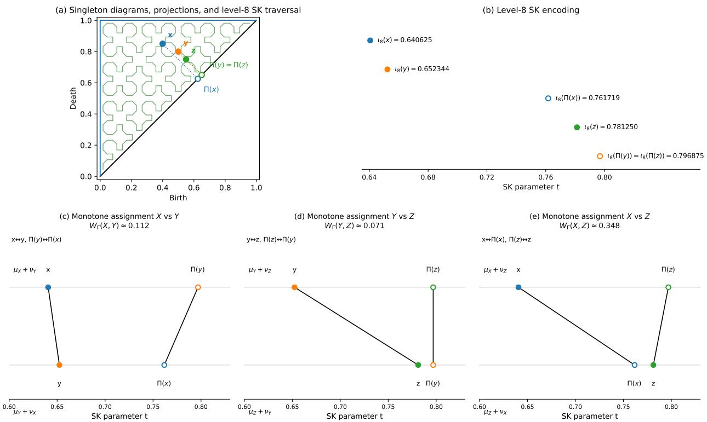  
Figure 5: Triangle-inequality counterexample for $W _ { \Gamma }$ . (a) Singleton diagrams $X = \{ x \} , Y = \{ y \}$ , and $Z = \{ z \}$ , their diagonal projections, and the level-8 SK traversal on $\begin{array} { r l } { A _ { \triangle } . } & { { } ( \mathrm { b } ) } \end{array}$ The level-8 selector values certify the exact first-hit ordering $\iota ( x ) < \iota ( y ) < \iota ( \Pi ( x ) ) < \iota ( z ) < \iota ( \Pi ( y ) ) = \iota ( \Pi ( z ) )$ . (c)–(e) Monotone assignments induced for the three pairwise comparisons. They yield $W _ { \Gamma } ( X , Y ) \approx 0 . 1 1 2 , W _ { \Gamma } ( Y , Z ) \approx 0 . 0 7 1$ and $W _ { \Gamma } ( X , Z ) \approx 0 . 3 4 8$ . Consequently, $W _ { \Gamma } ( X , Z ) > W _ { \Gamma } ( X , Y ) + W _ { \Gamma } ( Y , Z )$ , violating the triangle inequality.

The induced monotone assignments therefore match x with y and y with z, whereas the comparison between X and Z assigns both of-diagonal points to the diagonal. Consequently,

$$
\begin{array} { r l } & { W _ { \Gamma } ( X , Y ) = \| x - y \| _ { 2 } \approx 0 . 1 1 2 , } \\ & { W _ { \Gamma } ( Y , Z ) = \| y - z \| _ { 2 } \approx 0 . 0 7 1 , } \\ & { W _ { \Gamma } ( X , Z ) = \sqrt { d _ { \Delta } ( x ) ^ { 2 } + d _ { \Delta } ( z ) ^ { 2 } } \approx 0 . 3 4 8 . } \end{array}
$$

Hence,

$$
W _ { \Gamma } ( X , Z ) > W _ { \Gamma } ( X , Y ) + W _ { \Gamma } ( Y , Z ) ,
$$

since $0 . 3 4 8 > 0 . 1 1 2 + 0 . 0 7 1$ . The failure arises because the SK-induced assignments selected for the three pairs are not mutually compatible. The failure of the triangle inequality for $W _ { \Gamma }$ is illustrated in Fig. 5.

This non-metric behavior is also confirmed numerically for $W _ { \Gamma , 3 0 }$ in our experiments.

Nevertheless, because it may provide a sharper approximation of $W _ { 2 }$ in practice, we also evaluate its empirical accuracy, alongside $\mathrm { d } _ { \mathrm { S K } } ,$ , in the Experimental evaluation section.

Dataset-specific converse bounds. The forward control $W _ { 2 } ( X _ { 1 } , X _ { 2 } ) \lesssim \mathrm { d } _ { \mathrm { S K } } ( X _ { 1 } , X _ { 2 } )$ is universal, but the converse direction is necessarily more data-dependent, because the selector ι is only Borel measurable and need not be globally Lipschitz on $A _ { \triangle }$ . Nevertheless, on any fixed finite family $\mathcal { F }$ of normalized persistence

diagrams, one can recover a quantitative reverse comparison. More precisely, if

$$
\mathcal { Z } _ { \mathcal { F } } : = \bigcup _ { X \in \mathcal { F } } \Bigl ( \mathrm { s p t } ( X ) \cup \Pi ( \mathrm { s p t } ( X ) ) \Bigr ) \subset A _ { \triangle }
$$

denotes the finite set of relevant atoms, then the empirical Lipschitz constant

$$
L _ { { \mathcal { F } } } : = \operatorname* { m a x } _ { \stackrel { x , y \in { \mathcal { Z } } _ { \mathcal { F } } } { x \neq y } } { \frac { | \iota ( x ) - \iota ( y ) | } { \| x - y \| _ { 2 } } }
$$

is finite, and the following bound holds for every $X _ { 1 } , X _ { 2 } \in { \mathcal { F } }$ (see Theorem A.28):

$$
\begin{array} { r } { \mathrm { d } _ { \mathrm { S K } } ( X _ { 1 } , X _ { 2 } ) ^ { 2 } \leq L _ { { \mathcal F } } \sqrt { 2 \big ( | X _ { 1 } | + | X _ { 2 } | \big ) } W _ { 2 } ( X _ { 1 } , X _ { 2 } ) . } \end{array}
$$

In particular, if all diagrams in $\mathcal { F }$ satisfy $| X | \leq M$ , this simplifies to

$$
\mathrm { d } _ { \mathrm { S K } } ( X _ { 1 } , X _ { 2 } ) ^ { 2 } \leq 2 L _ { \mathcal { F } } \sqrt { M } W _ { 2 } ( X _ { 1 } , X _ { 2 } ) .
$$

A coarser but easier-to-evaluate version is obtained by replacing $L _ { \mathcal { F } }$ with a separation-based constant: if $\delta _ { \mathcal { F } }$ denotes the minimum pairwise Euclidean distance between distinct of-diagonal atoms in the dataset and $\eta _ { \mathcal { F } }$ the minimum Euclidean distance to the diagonal, then the following bound holds (see Theorem A.30):

$$
\mathrm { d } _ { \mathrm { S K } } ( X _ { 1 } , X _ { 2 } ) ^ { 2 } \leq \frac { 2 \sqrt { M } } { \operatorname* { m i n } ( \delta _ { \mathcal { F } } , \eta _ { \mathcal { F } } ) } W _ { 2 } ( X _ { 1 } , X _ { 2 } ) \qquad \forall X _ { 1 } , X _ { 2 } \in \mathcal { F } .
$$

Then, despite no universal reverse inequality is expected in full generality, $d _ { \mathrm { S K } }$ and $W _ { 2 }$ remain quantitatively comparable on any fixed finite collection of normalized persistence diagrams.

## 4 Hilbertian Geometry and Gaussian Kernel Induced by $\mathrm { d } _ { \mathrm { S K } }$

This section establishes two structural properties of $d _ { \mathrm { S K } }$ on the space of normalized persistence diagrams. We first show that the squared distance $d _ { \mathrm { S K } } ^ { 2 }$ admits an explicit cumulative $L ^ { 1 }$ representation on [0, 1]. This representation yields an explicit Hilbert-space embedding whose Hilbert distance is exactly dSK. It also shows that the squared distance is conditionally negative definite and therefore induces a positive definite Gaussian kernel on normalized persistence diagrams.

## 4.1 Cumulative $L ^ { 1 }$ representation of the squared distance

Recall that, for a normalized persistence diagram $X ,$ , the first layer of $d _ { \mathrm { S K } }$ yields the signed measure

$$
\sigma _ { X } : = \mu _ { X } - \nu _ { X } \qquad { \mathrm { o n ~ } } [ 0 , 1 ] .
$$

We define its cumulative signature by

$$
H _ { X } ( t ) : = \sigma _ { X } ( [ 0 , t ] ) , \qquad t \in [ 0 , 1 ] .
$$

By the algebraic identity established in Sec. 3.3,

$$
( \mu _ { X _ { 1 } } + \nu _ { X _ { 2 } } ) - ( \mu _ { X _ { 2 } } + \nu _ { X _ { 1 } } ) = \sigma _ { X _ { 1 } } - \sigma _ { X _ { 2 } } .
$$

Combining this identity with the cumulative formula for one-dimensional $W _ { 1 }$ yields

$$
\mathrm { d } _ { \mathrm { S K } } ( X _ { 1 } , X _ { 2 } ) ^ { 2 } = \int _ { 0 } ^ { 1 } | ( \sigma _ { X _ { 1 } } - \sigma _ { X _ { 2 } } ) ( [ 0 , t ] ) | ~ d t = \int _ { 0 } ^ { 1 } | H _ { X _ { 1 } } ( t ) - H _ { X _ { 2 } } ( t ) | ~ d t .
$$

Hence, the squared distance is exactly the $L ^ { 1 }$ distance between the cumulative signatures:

$$
\begin{array} { r } { \mathrm { d } _ { \mathrm { S K } } ( X _ { 1 } , X _ { 2 } ) ^ { 2 } = \| H _ { X _ { 1 } } - H _ { X _ { 2 } } \| _ { L ^ { 1 } ( [ 0 , 1 ] ) } . } \end{array}
$$

Equivalently, the metric itself is given by

$$
\begin{array} { r } { \mathrm { d } _ { \mathrm { S K } } ( X _ { 1 } , X _ { 2 } ) = \| H _ { X _ { 1 } } - H _ { X _ { 2 } } \| _ { L ^ { 1 } ( [ 0 , 1 ] ) } ^ { 1 / 2 } . } \end{array}
$$

Thus, the complete $d _ { \mathrm { S K } }$ geometry is encoded by a one-dimensional cumulative signal.

This representation is also injective at the diagram level. Indeed, the cumulative function $H _ { X }$ determines the finite signed measure $\sigma _ { X }$ . Moreover, since $\mu _ { X }$ and $\nu _ { X }$ are supported on the disjoint sets $\iota ( A _ { \triangle } \backslash \Delta )$ and $\iota ( \Delta )$ respectively, they are the positive and negative parts of $\sigma _ { X }$ . Therefore, $\sigma _ { X }$ determines $\mu _ { X }$ and $\nu _ { X } ;$ finally, the injectivity of the exact selector ι implies that $\mu _ { X }$ determines the original normalized persistence diagram $X$

The cumulative $L ^ { 1 }$ representation and the injectivity of this encoding are formally proved in Theorem A.18.

## 4.2 Hilbertian geometry of $\mathrm { d } _ { \mathrm { S K } }$

The $L ^ { 1 }$ signature representation immediately implies that $\mathrm { d } _ { \mathrm { S K } }$ is not merely a metric, but a Hilbertian one. Indeed, define for each normalized persistence diagram X the function

$$
\Phi ( X ) : [ 0 , 1 ] \times \mathbb { R } \to \mathbb { R } , \qquad \Phi ( X ) ( t , u ) : = \mathbf { 1 } _ { \{ u < H _ { X } ( t ) \} } - \mathbf { 1 } _ { \{ u < 0 \} } .
$$

For each fixed t, the function

$$
u \longmapsto \Phi ( X ) ( t , u )
$$

is supported on the interval between 0 and $H _ { X } ( t )$ . Since $H _ { X }$ is the cumulative function of a finite signed atomic measure, it is bounded and integrable on [0, 1]. Consequently,

$$
\Phi ( X ) \in L ^ { 2 } \bigl ( [ 0 , 1 ] \times \mathbb { R } , d t d u \bigr ) .
$$

Moreover, for any two reals $a , b ,$

$$
\int _ { \mathbb { R } } \Bigl ( \mathbf { 1 } _ { \{ u < a \} } - \mathbf { 1 } _ { \{ u < b \} } \Bigr ) ^ { 2 } d u = | a - b | .
$$

Applying this identity pointwise with $a = H _ { X _ { 1 } } ( t )$ and $b = H _ { X _ { 2 } } ( t )$ , and then integrating in $t ,$ gives

$$
\| \Phi ( X _ { 1 } ) - \Phi ( X _ { 2 } ) \| _ { L ^ { 2 } ( [ 0 , 1 ] \times \mathbb { R } ) } ^ { 2 } = \int _ { 0 } ^ { 1 } | H _ { X _ { 1 } } ( t ) - H _ { X _ { 2 } } ( t ) | d t = \mathrm { d } _ { \mathrm { S K } } ^ { 2 } ( X _ { 1 } , X _ { 2 } ) .
$$

Therefore,

$$
d _ { \mathrm { S K } } ( X _ { 1 } , X _ { 2 } ) = \| \Phi ( X _ { 1 } ) - \Phi ( X _ { 2 } ) \| _ { L ^ { 2 } ( [ 0 , 1 ] \times \mathbb { R } ) } .
$$

A formal proof of this explicit isometric Hilbert embedding is provided in Theorem A.21.

In other words, $d _ { \mathrm { S K } }$ is the pullback of an ordinary Hilbert space distance through the explicit embedding Φ. In particular, this makes $d _ { \mathrm { S K } }$ directly compatible with Euclidean embedding methods and learning pipelines that require vector representations, while preserving the diagram-level structure encoded by $d _ { \mathrm { S K } }$

## 4.3 Gaussian kernel induced by $\mathrm { d } _ { \mathrm { S K } }$

The Hilbertian representation also provides a natural Gaussian kernel for normalized persistence diagrams. Since

$$
\begin{array} { r } { \mathrm { d } _ { \mathrm { S K } } ( X _ { 1 } , X _ { 2 } ) ^ { 2 } = \| \Phi ( X _ { 1 } ) - \Phi ( X _ { 2 } ) \| _ { L ^ { 2 } ( [ 0 , 1 ] \times \mathbb { R } ) } ^ { 2 } , } \end{array}
$$

the squared distance

$$
( X _ { 1 } , X _ { 2 } ) \longmapsto \mathrm { d } _ { \mathrm { S K } } ( X _ { 1 } , X _ { 2 } ) ^ { 2 }
$$

is conditionally negative definite (see Theorem A.15). By Schoenberg’s theorem, for every $\sigma > 0$ , the function

$$
k _ { \sigma } ( X _ { 1 } , X _ { 2 } ) : = \exp \left( - \frac { \mathrm { d } _ { \mathrm { S K } } ( X _ { 1 } , X _ { 2 } ) ^ { 2 } } { 2 \sigma ^ { 2 } } \right)
$$

is a positive definite kernel on normalized persistence diagrams (see Theorem A.16).

Using the explicit embedding Φ, this kernel can equivalently be written as

$$
k _ { \sigma } ( X _ { 1 } , X _ { 2 } ) = \exp \left( - \frac { \| \Phi ( X _ { 1 } ) - \Phi ( X _ { 2 } ) \| _ { L ^ { 2 } ( [ 0 , 1 ] \times \mathbb { R } ) } ^ { 2 } } { 2 \sigma ^ { 2 } } \right) ,
$$

that is, as the restriction of the standard Gaussian kernel on the Hilbert space $L ^ { 2 } ( [ 0 , 1 ] \times \mathbb { R } )$ to the embedded space of normalized persistence diagrams. This kernel is a natural companion to the metric $d _ { \mathrm { S K } } \colon$ both encode the same Hilbertian geometry, while the kernel provides a similarity function directly usable in kernelbased methods. In particular, it gives a principled way of applying support vector machines, kernel ridge regression, Gaussian processes, spectral or kernel clustering, and MMD-based distributional comparisons to normalized persistence diagrams. Under standard results for Gaussian kernels on Hilbert spaces, the kernel is also characteristic and, on compact subsets of the embedded diagram space, universal Guella (2022); Sriperumbudur et al. (2011); see Theorem A.24 and Theorem A.25, respectively.

Finally, from a computational viewpoint, evaluating $k _ { \sigma } ( X _ { 1 } , X _ { 2 } )$ only requires one computation of $\mathrm { d } _ { \mathrm { S K } } ^ { 2 } ( X _ { 1 } , X _ { 2 } )$ followed by one exponential. Therefore, given the relevant values of the selector ι, the kernel can be evaluated in the same $O ( N \log N )$ time as $d _ { \mathrm { S K } }$ itself, where $N = | X _ { 1 } | + | X _ { 2 } |$

## 5 Experimental evaluation

## 5.1 Scientific benchmark and experimental setup

We evaluate the two SK-based constructions, the SK-Wasserstein distance $d _ { \mathrm { S K } }$ and the SK-induced planar surrogate $W _ { \Gamma }$ , on 12 scientific ensemble collections derived from scalar fields previously used in the evaluation of the Wasserstein distance between merge trees Pont et al. (2021). The benchmark contains 227 persistence diagrams and 3,376,524 persistence pairs in total. Collection sizes range from 7 to 48 diagrams, while individual diagrams contain between 22 and 102,735 pairs. The collections and their main characteristics are summarized in Tab. 1.

Each collection is accompanied by metadata assigning its n scalar fields to k reference groups. These labels define the reference partition supplied with the benchmark.

For each scalar field, we compute a classical persistence diagram with the Discrete Morse Sandwich backend of TTK Tierny et al. (2017); Bin Masood et al. (2019); Guillou et al. (2023); LeGuillou et al. (2024). We retain all available critical-pair types and homological dimensions, without persistence thresholding, cardinality truncation, or subsampling. We use the collection-wise normalization introduced in Sec. 2.1.

For every collection, we compute a complete pairwise matrix of the classical 2-Wasserstein distance using TTK’s auction-based solver Kerber et al. (2017); Vidal et al. (2019), with relative-precision threshold $\mathtt { D e l t a L i m } = 0 . 0 1$ , without persistence thresholding, cardinality truncation, or subsampling. Throughout the remainder of this section, $W _ { 2 }$ denotes this numerical TTK approximation.

All distance constructions below are evaluated on exactly the same normalized diagrams.

SK-based matrices and refinement levels. We next specify the pairwise matrices and refinement levels used throughout the evaluation.

For each collection $^ { c , }$ containing $n _ { c }$ persistence diagrams, and each refinement level

$$
L \in \{ 1 0 , 2 0 , 3 0 , 4 0 \} ,
$$

Table 1: Scientific collections used in the evaluation. Here, n denotes the number of persistence diagrams in the collection, k the number of classes supplied by the benchmark ground-truth, and $| X |$ the number of of-diagonal persistence pairs in a diagram X. Diagram cardinalities aggregate all retained critical-pair types and homological dimensions returned by the Discrete Morse Sandwich backend.
<table><tr><td>Dataset</td><td>n</td><td>k</td><td>Min. |X|</td><td>Median |X|</td><td>Max. |X|</td></tr><tr><td>Isabel</td><td>12</td><td>3</td><td>6 344</td><td>52194</td><td>54763</td></tr><tr><td>Earthquake</td><td>12</td><td>3</td><td>36 904</td><td>49 568</td><td>65 334</td></tr><tr><td>Ionization 2D</td><td>16</td><td>4</td><td>171</td><td>396</td><td>463</td></tr><tr><td>Ionization 3D</td><td>16</td><td>4</td><td>3376</td><td>13 910</td><td>18 667</td></tr><tr><td>Volcanic</td><td>12</td><td>3</td><td>23 897</td><td>24482</td><td>24759</td></tr><tr><td>Viscous Fingering</td><td>15</td><td>3</td><td>409</td><td>486</td><td>589</td></tr><tr><td>Cloud Processes</td><td>12</td><td>3</td><td>14540</td><td>14634</td><td>14872</td></tr><tr><td>Asteroid ensemble</td><td>7</td><td>2</td><td>10 563</td><td>31 435</td><td>102 735</td></tr><tr><td>Asteroid temporal</td><td>20</td><td>4</td><td>1132</td><td>39 912</td><td>70 557</td></tr><tr><td>Sea Surface Height</td><td>48</td><td>4</td><td>12 903</td><td>13 242</td><td>13438</td></tr><tr><td>Starting Vortex</td><td>12</td><td>2</td><td>466</td><td>568</td><td>693</td></tr><tr><td>Vortex Street</td><td>45</td><td>5</td><td>22</td><td>97</td><td>144</td></tr></table>

we compute the pairwise matrices associated with $d _ { \mathrm { S K } , L }$ and $W _ { \Gamma , L }$ . Here, $d _ { \mathrm { S K } , L }$ denotes the level-L numerical approximation of the exact SK-Wasserstein distance $d _ { \mathrm { S K } } \colon$ it is obtained by replacing the exact first-hit selector ι in the definition of $d _ { \mathrm { S K } }$ with the finite-level selector $\iota _ { L }$ introduced in Sec. 2.3. Likewise, $W _ { \Gamma , L }$ denotes the SK-induced planar surrogate of Sec. 3.5, computed from the monotone assignment induced by the same finite-level selector $\iota _ { L }$

## 5.2 Convergence with respect to the selector refinement level

## 5.2.1 Protocol

We first evaluate the influence of the selector refinement level L on the two SK-based constructions. For each construction

$$
m \in \{ d _ { \mathrm { S K } } , W _ { \Gamma } \} ,
$$

let

$$
D _ { c , L } ^ { m } \in \mathbb { R } ^ { n _ { c } \times n _ { c } }
$$

denote its symmetric pairwise matrix for collection c. We use $L = 4 0$ as a high-resolution numerical reference and compare the matrices obtained at

$$
L \in \{ 1 0 , 2 0 , 3 0 \}
$$

with their corresponding $L = 4 0$ matrix. The $L = 4 0$ computation is used only as a finite numerical reference and is not assumed to coincide with the exact $L \to \infty$ limit.

For $d _ { \mathrm { S K } }$ , this empirical refinement study is complemented by the perturbation bound in Theorem A.27: a selector approximation error of at most ε on all persistence pairs of X and Y and on their diagonal projections induces an error of at most $2 ( \vert X \vert + \vert Y \vert ) \varepsilon \ \mathrm { o n } \ d _ { \mathrm { S K } } ( X , Y ) ^ { 2 }$

• We first measure the numerical diference between the matrices using the relative Frobenius error

$$
E _ { c } ^ { m } ( L ) : = \frac { \left\| D _ { c , L } ^ { m } - D _ { c , 4 0 } ^ { m } \right\| _ { F } } { \left\| D _ { c , 4 0 } ^ { m } \right\| _ { F } } .
$$

• To assess whether changing L modifies the global ordering of the pairwise dissimilarities, let

$$
\mathrm { u t } ( D ) : = \left( D _ { i j } \right) _ { 1 \leq i < j \leq n _ { c } }
$$

denote the vector of strict upper-triangular entries of a symmetric matrix $D .$ . This vector contains each distinct pairwise dissimilarity exactly once. We compute

$$
\begin{array} { r } { \rho _ { c } ^ { m } ( L ) : = \rho _ { \mathrm { S } } \left( \mathrm { u t } \left( D _ { c , L } ^ { m } \right) , \mathrm { u t } \left( D _ { c , 4 0 } ^ { m } \right) \right) , } \end{array}
$$

where $\rho _ { \mathrm { S } }$ denotes Spearman’s rank correlation coeficient. Thus, $\rho _ { c } ^ { m } ( L ) = 1$ means that all distinct pairwise dissimilarities are ranked in the same order at refinement levels L and $4 0 .$ , although their numerical values may difer.

• We additionally evaluate local-neighbourhood preservation. For a pairwise matrix $D ,$ let

$$
\mathcal { N } _ { 3 } ( D , i )
$$

denote the set of the three nearest neighbours of sample $i ,$ excluding i itself. We define

$$
\mathrm { N N @ 3 } _ { c } ^ { m } ( L ) : = \frac { 1 } { 3 n _ { c } } \sum _ { i = 1 } ^ { n _ { c } } \left| \mathcal { N } _ { 3 } \big ( D _ { c , L } ^ { m } , i \big ) \cap \mathcal { N } _ { 3 } \big ( D _ { c , 4 0 } ^ { m } , i \big ) \right| .
$$

Hence, $\mathrm { N N @ 3 } _ { c } ^ { m } ( L ) = 1$ means that every diagram in collection c has exactly the same three nearest neighbours at levels L and 40.

Across the 12 collections, we report the median and maximum values of $E _ { c } ^ { m } ( L )$ , together with the minimum values of $\rho _ { c } ^ { m } ( L )$ and $\mathrm { N N @ 3 } _ { c } ^ { m } ( L )$ . The latter two quantities therefore characterize the worst-performing collection at each refinement level. These convergence diagnostics are used to select the refinement leve employed in the subsequent evaluation.

## 5.2.2 Results

Fig. 6 and Tab. 2 summarize convergence toward the high-resolution $L = 4 0$ numerical reference using the diagnostics defined above.

At $L = 3 0$ , the median relative Frobenius error over the 12 collections is $6 . 9 7 \times 1 0 ^ { - 8 }$ for $d _ { \mathrm { S K , 3 0 } }$ and $4 . 5 0 \times 1 0 ^ { - 6 }$ for $W _ { \Gamma , 3 0 }$ . These median errors, of order $1 0 ^ { - 6 }$ or smaller, are close to the numerical error of single-precision floating-point computations and can therefore be regarded as virtually zero. The corresponding worst-case errors are $1 . 4 1 \times 1 0 ^ { - 5 }$ and $6 . 6 3 \times 1 0 ^ { - 5 }$ , respectively.

For every collection and both constructions, the Spearman correlation between the strict upper-triangular entries of the $L = 3 0$ and $L = 4 0$ matrices rounds to 1.000000, while $\mathrm { N N @ 3 } = 1 . 0 0 0$ . Hence, at the reported numerical precision, no change is detected in the global ranking of the distinct pairwise dissimilarities, and every sample retains exactly the same three nearest neighbours as at $L = 4 0$

By contrast, at $L = 1 0$ , the worst-case relative errors reach 0.811 for $d _ { \mathrm { S K , 1 0 } }$ and 1.11 for $W _ { \Gamma , 1 0 }$ , while the worst-collection Spearman correlations decrease to 0.605 and 0.492, respectively. We therefore fix

$$
L = 3 0
$$

for all subsequent experiments in this section.

## 5.3 Faithfulness to $W _ { 2 }$ and computational performance

## 5.3.1 Protocol

Following the selector-refinement study in Sec. 5.2, we fix

$$
L = 3 0
$$

and compare the two finite-level SK-based constructions $d _ { \mathrm { S K , 3 0 } }$ and $W _ { \Gamma , 3 0 }$ in terms of both their faithfulness to the numerical $W _ { 2 }$ reference defined in Sec. 5.1 and their computational performance relative to the corresponding TTK $W _ { 2 }$ computation. Across the 12 collections, this yields 3,004 distinct pairwise diagram comparaisons for each dissimilarity.

Let

$$
D _ { c } ^ { W _ { 2 } }
$$

denote the pairwise $W _ { 2 }$ matrix for collection $c .$

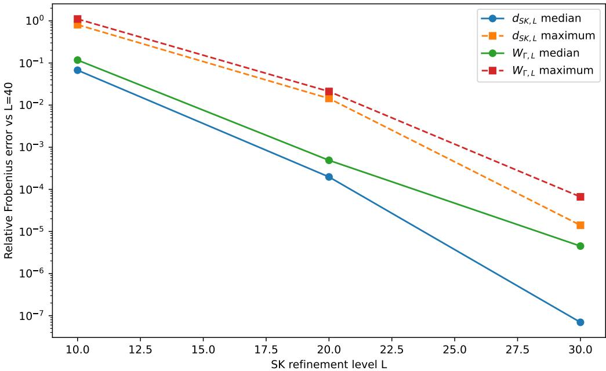  
Figure 6: Convergence of $d _ { \mathrm { S K } , L }$ and $W _ { \Gamma , L }$ toward their high-resolution $L = 4 0$ numerical reference matrices. For each method and refinement level L, the curves report the median and maximum, over the 12 collections, of the relative Frobenius error $E _ { c } ( L )$ defined in Sec. 5.2. Lower values indicate closer agreement with the $L = 4 0$ reference; the reference level itself has zero error by construction.

Table 2: Convergence to the high-resolution $L = 4 0$ numerical reference over the 12 collections. For each collection $c , E _ { c } ( L )$ is the relative Frobenius error, $\rho _ { c } ( L )$ is the Spearman correlation, between the strict upper-triangular entries of the $L ,$ and $L = 4 0$ , level matrices, and $\mathrm { N N @ 3 } _ { c } ( L )$ is the mean overlap of their three-nearest-neighbour sets. The table reports the median and maximum of $E _ { c } ( L )$ , and the minimum values of $\rho _ { c } ( L )$ and $\mathrm { N N @ 3 } _ { c } ( L )$ , over the collections. Thus, the last two columns report the worst collection.
<table><tr><td>Method</td><td>L</td><td>Median  $E _ { c } ( L )$ </td><td> $\mathrm { M a x . } ~ E _ { c } ( L )$ </td><td> $\mathrm { M i n . } \ \rho _ { c } ( L )$ </td><td>Min.  $\mathrm { N N @ 3 } _ { c } ( L )$ </td></tr><tr><td> $d _ { \mathrm { S K } , L }$ </td><td>10</td><td> $6 . 7 4 \times 1 0 ^ { - 2 }$ </td><td> $8 . 1 1 \times 1 0 ^ { - 1 }$ </td><td>0.604599</td><td>0.815</td></tr><tr><td> $d _ { \mathrm { S K } , L }$ </td><td>20</td><td> $1 . 9 7 \times 1 0 ^ { - 4 }$ </td><td> $1 . 4 4 \times 1 0 ^ { - 2 }$ </td><td>0.998330</td><td>0.952</td></tr><tr><td> $d _ { \mathrm { S K } , L }$ </td><td>30</td><td> $6 . 9 7 \times 1 0 ^ { - 8 }$ </td><td> $1 . 4 1 \times 1 0 ^ { - 5 }$ </td><td>1.000000</td><td>1.000</td></tr><tr><td> $W _ { \Gamma , L }$ </td><td>10</td><td> $1 . 1 7 \times 1 0 ^ { - 1 }$ </td><td>1.11</td><td>0.492412</td><td>0.583</td></tr><tr><td> $W _ { \Gamma , L }$ </td><td>20</td><td> $4 . 8 9 \times 1 0 ^ { - 4 }$ </td><td> $2 . 1 1 \times 1 0 ^ { - 2 }$ </td><td>0.993988</td><td>0.917</td></tr><tr><td> $W _ { \Gamma , L }$ </td><td>30</td><td> $4 . 5 0 \times 1 0 ^ { - 6 }$ </td><td> $6 . 6 3 \times 1 0 ^ { - 5 }$ </td><td>1.000000</td><td>1.000</td></tr></table>

Pairwise faithfulness and numerical bound checks. For each construction

$$
m \in \{ d _ { \mathrm { S K } } , W _ { \Gamma } \} ,
$$

we assess faithfulness to the numerical $W _ { 2 }$ reference through two complementary diagnostics:

• We measure global rank preservation with

$$
\rho _ { c , W _ { 2 } } ^ { m } : = \rho _ { \mathrm { S } } \left( \mathrm { u t } \left( D _ { c , 3 0 } ^ { m } \right) , \mathrm { u t } \left( D _ { c } ^ { W _ { 2 } } \right) \right) .
$$

This coeficient evaluates whether the $L = 3 0 ~ \mathrm { S K }$ -based constructions and $W _ { 2 }$ rank all distinct pairs of diagrams in a similar order.

• We also measure preservation of the local $W _ { 2 }$ neighbourhoods through

$$
\mathrm { N N @ 3 } _ { c , W _ { 2 } } ^ { m } : = \frac { 1 } { 3 n _ { c } } \sum _ { i = 1 } ^ { n _ { c } } \left| \mathcal { N } _ { 3 } \big ( D _ { c , 3 0 } ^ { m } , i \big ) \cap \mathcal { N } _ { 3 } \big ( D _ { c } ^ { W _ { 2 } } , i \big ) \right| .
$$

Thus, this NN@3 measure compares the three nearest neighbours obtained with the $L = 3 0 \mathrm { S K - b a s e d }$ constructions to those obtained with $W _ { 2 }$

For every distinct diagram pair, we additionally verify numerically the ordering corresponding to the theoretical inequalities

$$
W _ { 2 } ( X , Y ) \leq W _ { \Gamma , 3 0 } ( X , Y ) \leq \sqrt { 2 } d _ { \mathrm { S K } , 3 0 } ( X , Y ) .
$$

Computational performance. We measure the wall-clock computation time of each complete distancematrix filter on the same 20-thread workstation. For $m \in \{ d _ { \mathrm { S K } } , W _ { \Gamma } \}$ , the collection-level speedup is defined as

$$
S _ { c } ^ { m } : = \frac { T _ { c } ^ { W _ { 2 } } } { T _ { c , 3 0 } ^ { m } } ,
$$

where $T _ { c } ^ { W _ { 2 } }$ is the computation time of the $W _ { 2 }$ matrix and $T _ { c , 3 0 } ^ { m }$ that of the corresponding $L = 3 0 ~ \mathrm { S K }$ matrix.   
The reported values are average wall-clock filter timings over five independent runs.

Agreement with $W _ { 2 }$ average-linkage partitions. To determine whether diferences between the numerical distances afect a downstream grouping task, we additionally apply average-linkage clustering to

$$
D _ { c , 3 0 } ^ { d _ { \mathrm { S K } } } , \qquad D _ { c , 3 0 } ^ { W _ { \Gamma } } , \qquad \mathrm { a n d } \qquad D _ { c } ^ { W _ { 2 } } ,
$$

using the number of groups k provided by the collection metadata. Each SK-based partition is then compared directly with the corresponding W2-based partition using the Adjusted Rand Index (ARI).

## 5.3.2 Results

Pairwise faithfulness and numerical bound checks. The pairwise comparisons in Fig. 7 and the dataset-level statistics in Tab. 3 show that, across the complete 12-collection benchmark, $d _ { \mathrm { S K , 3 0 } }$ attains a median Spearman correlation of 0.879 with $W _ { 2 }$ , while $W _ { \Gamma , 3 0 }$ attains 0.924. The corresponding median NN@3 overlaps are 0.886 and 0.914, respectively. Hence, $W _ { \Gamma , 3 0 }$ is more faithful in median to the $W _ { 2 }$ geometry according to both diagnostics. However, $d _ { \mathrm { S K , 3 0 } }$ still achieves a median Spearman correlation of 0.879 and a median NN@3 overlap of 0.886, while additionally providing the metric and Hilbertian guarantees established in Sec. 4.

The collection-level results in Tab. 3 also illustrate why global and local diagnostics are complementary. For example, Isabel has a moderate global Spearman correlation of 0.603 between $d _ { \mathrm { S K , 3 0 } }$ and $W _ { 2 }$ , but its three-nearest-neighbour sets are exactly preserved. Thus, a moderate correlation over the complete ranking of pairwise distances does not necessarily imply that the local neighbourhood structure has been lost.

Finally, the numerical bound checks accompanying Fig. 7 confirm the theoretical ordering on all 3,004 distinct pairwise diagram comparisons:

$$
W _ { 2 } ( X _ { i } , X _ { j } ) \leq W _ { \Gamma , 3 0 } ( X _ { i } , X _ { j } ) \leq { \sqrt { 2 } } d _ { \mathrm { S K } , 3 0 } ( X _ { i } , X _ { j } ) .
$$

No value of $W _ { \Gamma , 3 0 }$ is observed below $W _ { 2 }$ , and

$$
\operatorname* { m a x } _ { i < j } \frac { W _ { \Gamma , 3 0 } ( X _ { i } , X _ { j } ) } { \sqrt { 2 } d _ { \mathrm { S K } , 3 0 } ( X _ { i } , X _ { j } ) } = 0 . 9 5 7 .
$$

Moreover,

$$
\operatorname* { m a x } _ { i < j } \frac { W _ { 2 } ( X _ { i } , X _ { j } ) } { \sqrt { 2 } d _ { \mathrm { S K } , 3 0 } ( X _ { i } , X _ { j } ) } = 0 . 9 0 2 .
$$

Thus, both inequalities are satisfied for every pairwise comparison available in the benchmark.

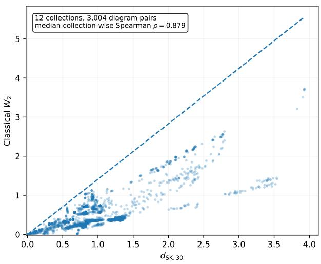

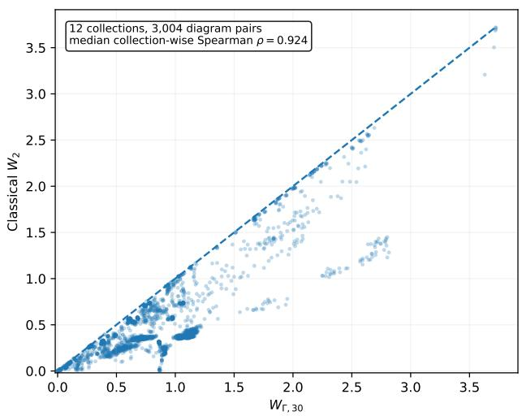  
Figure 7: Pairwise comparison with $W _ { 2 }$ on all 12 collections, comprising 3,004 distinct pairwise diagram evaluations. Left: $d _ { \mathrm { S K , 3 0 } }$ versus $W _ { 2 } .$ , together with the theoretical upper-bound line $W _ { 2 } = \sqrt { 2 } d _ { \mathrm { S K , 3 0 } }$ . Right: $W _ { \Gamma , 3 0 }$ versus $W _ { 2 } ,$ together with the identity line. The annotation in each panel reports the median, over the 12 collections, of the collection-wise Spearman rank correlation with $W _ { 2 }$

Table 3: Faithfulness and computational performance at $L = 3 0$ on the 12-collection benchmark (3,004 distinct pairwise diagram comparisons for each dissimilarity). ρ is Spearman rank correlation, NN@3 is the mean overlap of the three-nearest-neighbour sets, and speedups use filter compute time.
<table><tr><td>Dataset</td><td>n Med.</td><td> $| X |$ </td><td> $\rho ( d _ { \mathrm { S K } } , W _ { 2 } )$ </td><td> $\rho ( W _ { \Gamma } , W _ { 2 } )$ </td><td>NN@3  $d _ { \mathrm { S K } }$ </td><td>NN@3  $W _ { \Gamma }$ </td><td>Speedup  $d _ { \mathrm { S K } }$ </td><td>Speedup  $W _ { \Gamma }$ </td></tr><tr><td>Isabel</td><td>12</td><td>52194</td><td>0.603</td><td>0.643</td><td>1.000</td><td>1.000</td><td>1640×</td><td>1745×</td></tr><tr><td>Earthquake</td><td>12</td><td>49 568</td><td>0.896</td><td>0.939</td><td>0.694</td><td>0.722</td><td>5007×</td><td>4561×</td></tr><tr><td>Ionization 2D</td><td>16</td><td>396</td><td>0.922</td><td>0.878</td><td>1.000</td><td>0.958</td><td>38×</td><td>41×</td></tr><tr><td>Ionization 3D</td><td>16</td><td>13 910</td><td>0.625</td><td>0.835</td><td>1.000</td><td>1.000</td><td>528×</td><td>523×</td></tr><tr><td>Volcanic</td><td>12</td><td>24 482</td><td>0.885</td><td>0.915</td><td>0.778</td><td>0.778</td><td>117×</td><td>112×</td></tr><tr><td>Viscous Fingering</td><td>15</td><td>486</td><td>0.840</td><td>0.932</td><td>0.889</td><td>0.911</td><td>35×</td><td>43×</td></tr><tr><td>Cloud Processes</td><td>12</td><td>14634</td><td>0.953</td><td>0.955</td><td>1.000</td><td>1.000</td><td>1581×</td><td>1404×</td></tr><tr><td>Asteroid ensemble</td><td>7</td><td>31 435</td><td>0.979</td><td>0.986</td><td>0.952</td><td>0.952</td><td>724×</td><td>649×</td></tr><tr><td>Asteroid temporal</td><td>20</td><td>39 912</td><td>0.875</td><td>0.941</td><td>0.883</td><td>0.917</td><td>2818×</td><td>2914×</td></tr><tr><td>Sea Surface Height</td><td>48</td><td>13 242</td><td>0.857</td><td>0.862</td><td>0.792</td><td>0.785</td><td>2578×</td><td>2765×</td></tr><tr><td>Starting Vortex</td><td>12</td><td>568</td><td>0.883</td><td>0.969</td><td>0.806</td><td>0.806</td><td>81×</td><td>76×</td></tr><tr><td>Vortex Street</td><td>45</td><td>97</td><td>0.763</td><td>0.675</td><td>0.696</td><td>0.719</td><td>60×</td><td>56×</td></tr><tr><td>Median</td><td></td><td></td><td>0.879</td><td>0.924</td><td>0.886</td><td>0.914</td><td>626×</td><td>586×</td></tr></table>

Computational performance The computational results are reported per collection in Tab. 3 and summarized graphically in ${ \mathrm { F i g . } }$ 8. The speedup of $d _ { \mathrm { S K , 3 0 } }$ over the TTK $W _ { 2 }$ computation ranges from $3 4 . 7 \times$ to 5007×, with a median of 626×. For $W _ { \Gamma , 3 0 } { } ;$ the speedup ranges from 40.8× to $4 5 6 1 \times .$ , with a median of 586×.

Summed over the complete benchmark, the recorded filter-computation times are 3401 seconds for $W _ { 2 }$ and 1.62 seconds for $d _ { \mathrm { S K , 3 0 } }$ . As a representative large-diagram example, the Earthquake collection has a median diagram cardinality of approximately 49,568 persistence pairs. Its complete $W _ { 2 }$ matrix requires 659 seconds, whereas the corresponding dSK,30 matrix requires only 0.132 seconds, as reported in Tab. 3. These timings illustrate the practical diference between repeatedly solving planar assignment problems and evaluating the sorting-based SK construction.

Agreement with $W _ { 2 }$ average-linkage partitions The detailed average-linkage results are reported in Tab. 4 and displayed graphically in Fig. 9. The partition obtained from $d _ { \mathrm { S K , 3 0 } }$ is exactly identical to the $W _ { 2 }$ partition on 8 of the 12 collections. The same exact-agreement count is obtained for $W _ { \Gamma , 3 0 }$ . For both constructions, the median ARI with the $W _ { 2 }$ partition is 1.000; the corresponding mean ARI values are 0.897 for $d _ { \mathrm { S K , 3 0 } }$ and 0.905 for $W _ { \Gamma , 3 0 }$

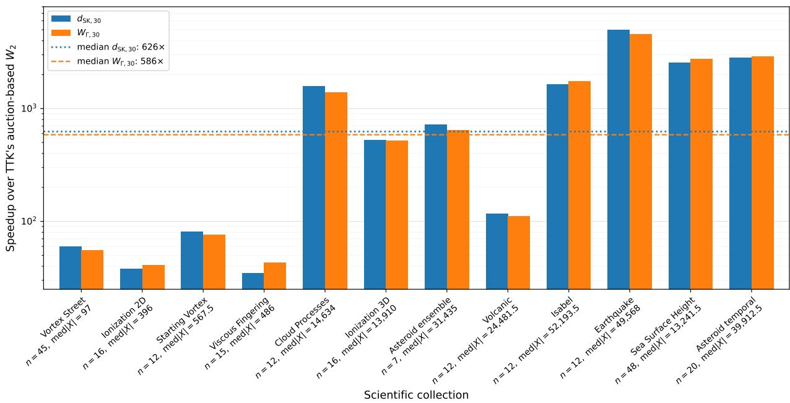  
Figure 8: Filter-computation speedup relative to TTK’s auction-based $W _ { 2 }$ computation at $L = 3 0$ . Collections are ordered from left to right by increasing total number of persistence pairs. For each collection, the horizontal-axis label reports the number n of diagrams and the median diagram cardinality med|X|. The vertical axis is logarithmic; horizontal lines indicate median speedups of 626× for d and 586× for $W _ { \Gamma , 3 0 }$

Table 4: Agreement between average-linkage partitions on the complete 12-collection benchmark. The first two ARI columns compare the partitions obtained from the SK constructions with the partition obtained from $W _ { 2 }$ . The last three columns compare each partition with the reference groups supplied by the benchmark metadata. The number of groups k is fixed from these metadata.
<table><tr><td>Dataset</td><td> $\operatorname { A R I } d _ { \mathrm { S K } } / W _ { 2 }$ </td><td>ARI  $W _ { \Gamma } / W _ { 2 }$ </td><td>ARI ref  $/ W _ { 2 }$ </td><td>ARI ref  $. / d _ { \mathrm { S K } }$ </td><td>ARI ref  $/ W _ { \Gamma }$ </td></tr><tr><td>Isabel</td><td>1.000</td><td>1.000</td><td>1.000</td><td>1.000</td><td>1.000</td></tr><tr><td>Earthquake</td><td>1.000</td><td>1.000</td><td>0.368</td><td>0.368</td><td>0.368</td></tr><tr><td>Ionization 2D</td><td>1.000</td><td>1.000</td><td>1.000</td><td>1.000</td><td>1.000</td></tr><tr><td>Ionization 3D</td><td>1.000</td><td>1.000</td><td>1.000</td><td>1.000</td><td>1.000</td></tr><tr><td>Volcanic</td><td>1.000</td><td>1.000</td><td>0.408</td><td>0.408</td><td>0.408</td></tr><tr><td>Viscous Fingering</td><td>0.886</td><td>0.886</td><td>0.441</td><td>0.441</td><td>0.441</td></tr><tr><td>Cloud Processes</td><td>1.000</td><td>1.000</td><td>1.000</td><td>1.000</td><td>1.000</td></tr><tr><td>Asteroid ensemble</td><td>1.000</td><td>1.000</td><td>-0.077</td><td>-0.077</td><td>-0.077</td></tr><tr><td>Asteroid temporal</td><td>0.598</td><td>0.550</td><td>0.859</td><td>0.582</td><td>0.477</td></tr><tr><td>Sea Surface Height</td><td>0.613</td><td>0.724</td><td>1.000</td><td>0.613</td><td>0.724</td></tr><tr><td>Starting Vortex</td><td>1.000</td><td>1.000</td><td>1.000</td><td>1.000</td><td>1.000</td></tr><tr><td>Vortex Street</td><td>0.668</td><td>0.704</td><td>1.000</td><td>0.668</td><td>0.704</td></tr><tr><td>Mean</td><td>0.897</td><td>0.905</td><td>0.750</td><td>0.667</td><td>0.670</td></tr></table>

The four collections for which the $d _ { \mathrm { S K , 3 0 } }$ partition is not exactly identical to the $W _ { 2 }$ partition are Viscous Fingering, Asteroid Impact temporal, Sea Surface Height, and Vortex Street. The largest discrepancies occur on Asteroid Impact temporal, Sea Surface Height, and Vortex Street. Overall, the $d _ { \mathrm { S K } }$ constructions therefore preserve the average-linkage partition induced by $W _ { 2 }$ on most collections, with perfect median agreement, but this preservation is not universal.

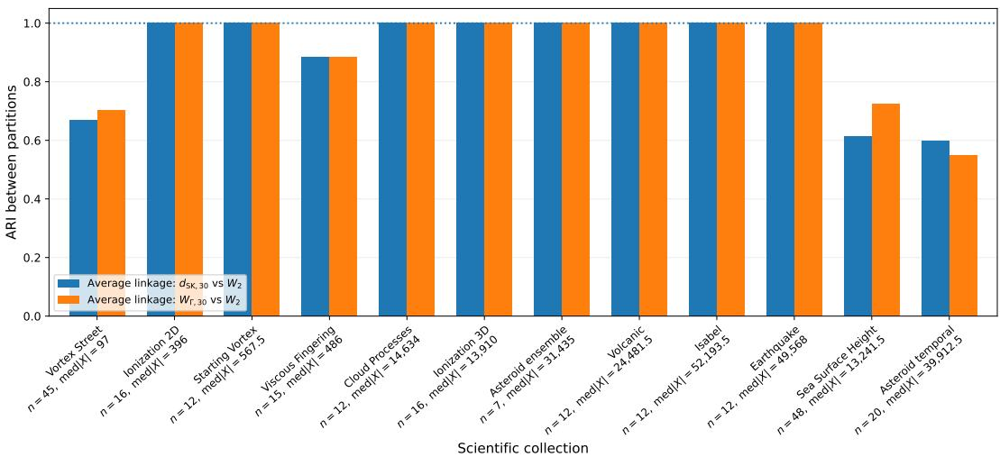  
Figure 9: Agreement between the average-linkage partitions obtained from $d _ { \mathrm { S K , 3 0 } }$ and $W _ { \Gamma , 3 0 } { } ;$ , and the corresponding partition obtained from $W _ { 2 }$ . Agreement is measured by the adjusted Rand index (ARI), with the number of groups fixed from the benchmark metadata. An ARI of 1 indicates identical partitions.

## 5.4 Application to Hilbertian and kernel-based clustering

## 5.4.1 Protocol

To assess the practical value of the Hilbertian and kernel structures established in Sec. 4.2 and Sec. 4.3, we apply them to clustering the 12 scientific collections. We compare Hilbert k-means and Gaussian spectral clustering, both based on $d _ { \mathrm { S K } }$ , with average linkage on $d _ { \mathrm { S K } }$ as a distance-based baseline.

Following the convergence study in Sec. 5.2, we set the refinement level to

$$
L = 3 0
$$

throughout the remainder of this subsection.

For each collection $^ { c , }$ containing $n _ { c }$ persistence diagrams, let

$$
D _ { c , 3 0 } ( i , j ) = d _ { \mathrm { S K } , 3 0 } ( X _ { i } , X _ { j } ) .
$$

denote its $d _ { \mathrm { S K , 3 0 } }$ distance matrix.

To obtain explicit Euclidean coordinates associated with the Hilbertian geometry, we construct the centered Gram matrix

$$
G _ { c , 3 0 } = - \frac { 1 } { 2 } J _ { c } D _ { c , 3 0 } ^ { \circ 2 } J _ { c } , \qquad J _ { c } = I - \frac { 1 } { n _ { c } } \mathbf { 1 } \mathbf { 1 } ^ { \top } ,
$$

where $D _ { c , 3 0 } ^ { \circ 2 }$ denotes entrywise squaring. Let

$$
G _ { c , 3 0 } = V \Lambda V ^ { \top }
$$

be its eigendecomposition. Retaining all coordinates associated with positive eigenvalues gives the fulldimensional classical-MDS realization

$$
Z _ { c , 3 0 } = V _ { + } \Lambda _ { + } ^ { 1 / 2 } .
$$

We also construct the Gaussian kernel associated with $d _ { \mathrm { S K , 3 0 } }$ , as introduced in Sec. 4.3:

$$
K _ { c , 3 0 } ( i , j ) = \exp \left( - \frac { D _ { c , 3 0 } ( i , j ) ^ { 2 } } { 2 \sigma _ { c , 3 0 } ^ { 2 } } \right) ,
$$

where

$$
\sigma _ { c , 3 0 } = \mathrm { m e d i a n } \left\{ D _ { c , 3 0 } ( i , j ) : i < j , \ D _ { c , 3 0 } ( i , j ) > 0 \right\} .
$$

The bandwidth is therefore selected independently for each collection as the median of its positive pairwise dSK,30 distances.

For each collection, we compare three unsupervised clustering pipelines:

• Average linkage on the $d _ { \mathrm { S K } }$ distance. We apply average-linkage clustering directly to the pairwise distance matrix

$$
D _ { c , 3 0 } .
$$

This provides a baseline that exploits only the $d _ { \mathrm { S K } }$ distance values.

• Hilbert k-means. We apply standard Euclidean k-means to the full-dimensional classical-MDS coordinates

$$
\textstyle Z _ { c , 3 0 } .
$$

All coordinates associated with positive eigenvalues are retained. Thus, this pipeline uses the complete Hilbertian realization of $d _ { \mathrm { S K } }$

• Gaussian $d _ { \mathrm { S K } }$ spectral clustering. We apply normalized spectral clustering to

$$
K _ { c , 3 0 }
$$

as a similarity matrix Ng et al. (2002); Dhillon et al. (2004). Although spectral clustering can also be applied to a general symmetric nonnegative afinity matrix, the $d _ { \mathrm { S K } }$ theory guarantees that $K _ { c , 3 0 }$ is a positive semidefinite Gram matrix and therefore admits an RKHS interpretation.

For all three $d _ { \mathrm { S K } }$ -based pipelines, the number of groups k is read from the collection metadata. After clustering, each resulting partition is compared with the reference partition supplied by the metadata using ARI. Therefore, the ARI values reported for average linkage, Hilbert k-means, and Gaussian $d _ { \mathrm { S K } }$ spectral clustering measure agreement with the benchmark reference groups.

For contextual comparison, we also report the ARI of the average-linkage partition obtained from the numerical $W _ { 2 }$ matrix with respect to the same benchmark reference partition.

## 5.4.2 Results

Averaged over the 12 collections, average linkage on $d _ { \mathrm { S K , 3 0 } }$ obtains a mean ARI of 0.667, Hilbert k-means obtains 0.756, and Gaussian $d _ { \mathrm { S K } }$ spectral clustering obtains 0.800, as reported in Tab. 5 and illustrated in Fig. 10. Gaussian $d _ { \mathrm { S K } }$ spectral clustering therefore achieves the highest mean ARI among the three evaluated pipelines. These three dSK-based pipelines achieve perfect agreement with the reference partitions on 5, 6, and 7 of the 12 collections, respectively. For comparison, average-linkage clustering on $W _ { 2 }$ obtains a mean ARI of 0.750 and perfect agreement on 7 collections, as reported in Tab. 4.

Compared to direct average linkage on $d _ { \mathrm { S K } }$ , Gaussian $d _ { \mathrm { S K } }$ spectral clustering improves 5 collections and worsens none. The largest gains occur for Viscous Fingering (0.441 → 1), Sea Surface Height $( 0 . 6 1 3  1 )$ , Volcanic Eruptions $( 0 . 4 0 8  0 . 7 3 7 )$ , and Vortex Street $( 0 . 6 6 8  0 . 8 5 0 )$ . Thus, the positive-definite Gaussian dSK kernel established in Sec. 4.3 is not merely formal: it enables a nonlinear learning pipeline that extracts additional ensemble structure from the $d _ { \mathrm { S K } }$ matrix.

The result is not uniformly perfect. In particular, the seven-member Asteroid Impact clustering collection is not aligned with the supplied two-class metadata for any of the three d -based pipelines $( \mathrm { A R I } = - 0 . 0 7 7 )$ Earthquake also remains only partially aligned with its three metadata groups $( \mathrm { A R I } = 0 . 3 6 8 )$ . However, as reported in Tab. $^ { 4 , }$ average-linkage clustering on the $W _ { 2 }$ matrix also achieves ARI values of −0.077 and 0.368 with respect to the benchmark reference partitions on the Asteroid Impact clustering and Earthquake collections, respectively. These are exactly the same ARI values as those obtained by average-linkage clustering on $d _ { \mathrm { S K , 3 0 } }$ . Therefore, in this clustering experiment, the limited agreement observed on these two collections cannot be attributed to replacing $W _ { 2 }$ with $d _ { \mathrm { S K , 3 0 } }$

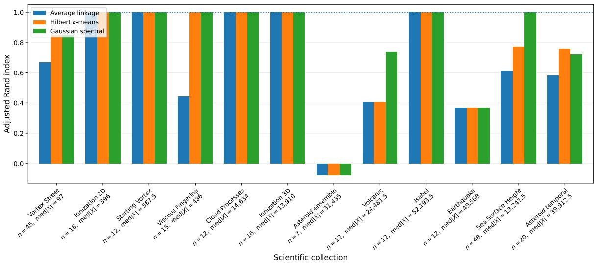  
Figure 10: ARI with the benchmark reference partitions for the three SK-based clustering pipelines at $L = 3 0$ : average linkage on $d _ { \mathrm { S K } }$ $d _ { \mathrm { S K } }$ Hilbert k-means on the full-dimensional classical-MDS coordinates, and normalized spectral clustering with the Gaussian $d _ { \mathrm { S K } }$ kernel. Gaussian $d _ { \mathrm { S K } }$ spectral clustering achieves the highest mean ARI and does not decrease the ARI relative to average linkage on $d _ { \mathrm { S K } }$ on any of the 12 collections.

Table 5: Adjusted Rand index (ARI) at $L = 3 0$ . The number of clusters k is fixed from the dataset metadata. “Hilbert k-means” uses the full-dimensional exact Euclidean realization of $d _ { \mathrm { S K } } ;$ “Gaussian spectral” uses $k _ { \sigma } ( X , Y ) = \exp [ - d _ { \mathrm { S K } } ( X , Y ) ^ { 2 } / ( 2 \sigma ^ { 2 } ) ]$ with the median-distance heuristic. The “Average linkage” column here reproduces the “ARI ref. $. / d _ { \mathrm { S K } } "$ column of Tab. 4; it is repeated here as the metric-space baseline for comparison with Hilbert k-means and Gaussian $d _ { \mathrm { S K } }$ spectral clustering.
<table><tr><td>Dataset</td><td>n</td><td>k</td><td>Average linkage</td><td>Hilbert k-means</td><td>Gaussian spectral</td></tr><tr><td>Isabel</td><td>12</td><td>3</td><td>1.000</td><td>1.000</td><td>1.000</td></tr><tr><td>Earthquake</td><td>12</td><td>3</td><td>0.368</td><td>0.368</td><td>0.368</td></tr><tr><td>Ionization 2D</td><td>16</td><td>4</td><td>1.000</td><td>1.000</td><td>1.000</td></tr><tr><td>Ionization 3D</td><td>16</td><td>4</td><td>1.000</td><td>1.000</td><td>1.000</td></tr><tr><td>Volcanic</td><td>12</td><td>3</td><td>0.408</td><td>0.408</td><td>0.737</td></tr><tr><td>Viscous Fingering</td><td>15</td><td>3</td><td>0.441</td><td>1.000</td><td>1.000</td></tr><tr><td>Cloud Processes</td><td>12</td><td>3</td><td>1.000</td><td>1.000</td><td>1.000</td></tr><tr><td>Asteroid ensemble</td><td>7</td><td>2</td><td>-0.077</td><td>-0.077</td><td>-0.077</td></tr><tr><td>Asteroid temporal</td><td>20</td><td>4</td><td>0.582</td><td>0.756</td><td>0.720</td></tr><tr><td>Sea Surface Height</td><td>48</td><td>4</td><td>0.613</td><td>0.773</td><td>1.000</td></tr><tr><td>Starting Vortex</td><td>12</td><td>2</td><td>1.000</td><td>1.000</td><td>1.000</td></tr><tr><td>Vortex Street</td><td>45</td><td>5</td><td>0.668</td><td>0.850</td><td>0.850</td></tr><tr><td>Mean</td><td></td><td></td><td>0.667</td><td>0.756</td><td>0.800</td></tr></table>

## 5.5 Temporal Hilbertian case study

## 5.5.1 Protocol

We use this temporal case study to illustrate the practical use of the Hilbertian realization and Gaussian kernel associated with $d _ { \mathrm { S K } }$ for trajectory visualization and contiguous segmentation of ordered diagram sequences. We consider the 20-diagram Asteroid Impact temporal collection as an ordered diagram-valued sequence.

Hilbertian and kernel visualization. We use the Hilbertian realization of $d _ { \mathrm { S K , 3 0 } }$ as the main temporal representation and the associated Gaussian kernel as a complementary similarity view. Specifically, we visualize the sequence through:

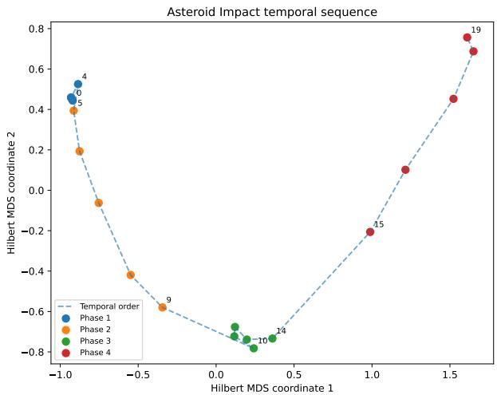  
(a) Two-dimensional projection of the Hilbert embedding. Consecutive samples are connected in temporal order.

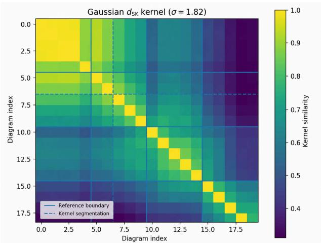  
(b) Gaussian dSK kernel. Solid lines indicate the annotated phases and dashed lines the kernel segmentation.  
Figure 11: Hilbertian and kernel views of the Asteroid Impact temporal sequence.

• the first two coordinates of the full-dimensional Hilbertian realization $ { Z _ { c , 3 0 } }$ , with consecutive diagrams connected in temporal order;

• the Gaussian $d _ { \mathrm { S K } }$ kernel matrix $K _ { c , 3 0 }$ , displayed as a similarity heatmap.

Contiguous kernel segmentation. We apply contiguous kernel segmentation to the 20-diagram Asteroid Impact temporal sequence, whose reference metadata labels form four contiguous blocks in temporal order. The number of segments is therefore fixed to four from the metadata, and the bandwidth of the Gaussian $d _ { \mathrm { S K } }$ kernel is set to the median of the positive pairwise $d _ { \mathrm { S K , 3 0 } }$ distances, without label-dependent tuning. The segment boundaries are obtained by dynamic programming using the kernel within-segment dispersion Arlot et al. (2019). This experiment illustrates how the Gaussian $d _ { \mathrm { S K } }$ kernel can be used directly for kernel change-point detection and contiguous segmentation of a diagram-valued temporal sequence.

## 5.5.2 Results

Hilbertian and kernel visualization. Fig. 11 illustrates the diagram-valued trajectory of the 20-step Asteroid Impact temporal sequence. The two-dimensional Hilbert view, computed from the Hilbert Gram matrix, reveals a smooth progression between the four annotated phases. The Gaussian kernel displays the same evolution as blocks of high within-phase similarity and gradual cross-phase decay.

Contiguous kernel segmentation. The reference boundaries are

[5, 10, 15],

whereas the kernel segmentation predicts

[7, 10, 15].

Kernel segmentation recovers two reference boundaries exactly and places the first boundary two samples late, yielding a boundary MAE of 0.67 and an ARI of 0.756, tying the best ARI achieved on this collection among the three clustering methods evaluated in Sec. 5.4, namely the 0.756 obtained by Hilbert k-means. This figure focuses on the Asteroid Impact temporal case study. The supplementary material (Sec. B.1) extends the evaluation to all eight eligible ordered collections and details the kernel-based contiguous-segmentation method employed; the complete results are reported in Tab. 6, with exact recovery of the full reference segmentation on five collections. Across the eight eligible collections, kernel segmentation ties the best

ARI among the three clustering methods evaluated in Sec. 5.4 on six collections and exceeds all three on Earthquake; on the remaining collection, Sea Surface Height, it ties the second-best ARI.

## 6 Limitations

A practical limitation of the current construction is that all diagrams to be compared must be supported in the same normalized persistence triangle $A _ { \triangle }$ . When this is not already the case, normalizing the collection requires a common bounding box containing all birth–death pairs, to be known in advance. This requirement is natural in ofline collection analysis, as considered in our experiments, but may be restrictive in online or iterative settings, such as persistence optimization, where future diagrams are not available beforehand. Expanding the normalization range would modify the scalar encodings of previously processed diagrams and may therefore require recomputing their $d _ { \mathrm { S K } }$ distances and derived representations.

A second limitation is that the bound

$$
W _ { 2 } ( X , Y ) \leq { \sqrt { 2 } } d _ { \mathrm { S K } } ( X , Y )
$$

provides only one-sided control: it prevents $d _ { \mathrm { S K } }$ from arbitrarily underestimating $W _ { 2 }$ , but provides no dataset-independent relative upper bound on $d _ { \mathrm { S K } }$ in terms of $W _ { 2 }$ . This discrepancy has two structural sources. First, the monotone assignment induced by the SK curve may difer from the $W _ { 2 } .$ -optimal planar assignment. Second, dSK evaluates this assignment using scalar diferences on [0, 1], rather than the diagonalaware quadratic cost in the persistence triangle. In particular, an assignment between two distinct diagonal projections may contribute a positive cost to dSK, whereas any diagonal-to-diagonal assignment has zero cost in $W _ { 2 }$ . Consequently, dSK may substantially overestimate $W _ { 2 }$

A separate limitation concerns $W _ { \Gamma }$ . Although it re-evaluates the SK-induced assignment using the same diagonal-aware quadratic cost as $W _ { 2 }$ , this assignment is selected independently for each pair of diagrams according to the SK ordering, and the resulting pairwise assignments can be mutually incompatible across triples. Consequently, the triangle inequality may fail, and $W _ { \Gamma }$ must be treated as a dissimilarity rather than a metric. It remains usable by methods that accept arbitrary dissimilarities, such as average-linkage clustering. However, it cannot support methods or guarantees that rely on the triangle inequality, such as metric-based nearest-neighbour indexing and pruning or approximation guarantees for metric clustering. Moreover, unlike $d _ { \mathrm { S K } }$ , WΓ has no Hilbertian guarantee, so a Gaussian transformation of $W _ { \Gamma }$ is not guaranteed to be a positive-definite kernel.

Finally, the quadratic $W _ { 2 }$ cost assigns disproportionate weight to large assignment displacements, making W2-based aggregation sensitive to outlier diagrams Sisouk et al. (2026). $W _ { \Gamma }$ inherits this limitation because it evaluates the SK-induced coupling with the same quadratic planar cost. A natural direction for future work is therefore to develop space-filling-curve-based surrogates for $W _ { p } .$ , with $1 \le p < 2$ , whose lower-order transport costs may provide greater robustness to outliers.

## 7 Conclusion

We introduced the Sierpiński–Knopp Wasserstein distance $d _ { \mathrm { S K } }$ , a diagonal-aware metric between normalized persistence diagrams. The construction uses the first-hit selector of the SK space-filling curve to replace the usual two-dimensional partial-assignment problem by a one-dimensional 1-Wasserstein assignment problem on the unit interval. The resulting monotone optimal assignment can be evaluated by sorting two lists of scalar values, yielding an O(N log N) algorithm for diagrams of total cardinality N. By retaining the diagram point associated with each scalar value, the same monotone pairing also provides an explicit partial assignment between the two input diagrams, with unmatched points assigned to the diagonal. This correspondence can be reused by downstream applications requiring point correspondences.

The theoretical analysis establishes that $d _ { \mathrm { S K } }$ controls the classical diagram 2-Wasserstein distance:

$$
W _ { 2 } ( X , Y ) \leq \sqrt { 2 } d _ { \mathrm { S K } } ( X , Y ) .
$$

Moreover, the cumulative $L ^ { 1 }$ representation of $d _ { \mathrm { S K } } ^ { 2 }$ yields an explicit isometric embedding of $d _ { \mathrm { S K } }$ into a Hilbert space and a positive-definite Gaussian kernel, this makes $d _ { \mathrm { S K } }$ directly compatible with Euclidean embedding methods and learning pipelines that require vector representations, and kernel-based learning methods on normalized persistence diagrams. We also introduced the assignment-induced planar surrogate $W _ { \Gamma }$ , which re-evaluates the monotone SK assignment in the birth–death plane. Although $W _ { \Gamma }$ does not retain the metric and Hilbertian guarantees of $d _ { \mathrm { S K } }$ , it provides a tighter numerical surrogate for $W _ { 2 }$ in median.

We evaluated both SK-based constructions on 12 scientific collections containing 227 persistence diagrams and 3.38 million persistence pairs, using complete pairwise numerical $W _ { 2 }$ reference matrices computed with TTK’s auction-based solver. The finite-level approximation stabilizes at refinement level $L = 3 0$ . Across 3,004 distinct pairwise diagram comparisons for each dissimilarity, the median Spearman correlations with $W _ { 2 }$ are 0.879 for $d _ { \mathrm { S K , 3 0 } }$ and 0.924 for $W _ { \Gamma , 3 0 }$ , while the median NN@3 overlaps are 0.886 and 0.914, respectively. No violation of

$$
W _ { 2 } \leq W _ { \Gamma , 3 0 } \leq \sqrt { 2 } d _ { \mathrm { S K , 3 0 } }
$$

is observed. The median per-collection speedup of $d _ { \mathrm { S K , 3 0 } }$ over $W _ { 2 }$ is $6 2 6 \times$ , and the ratio of total computation times over the full benchmark is approximately $2 1 0 0 \times$ . Average-linkage partitions obtained from $d _ { \mathrm { S K , 3 0 } }$ and $W _ { \Gamma , 3 0 }$ each reproduce the corresponding $W _ { 2 }$ partition exactly on 8 of the 12 collections.

The Hilbertian and kernel structures also lead to efective analysis pipelines. Average linkage on $d _ { \mathrm { S K , 3 0 } } ,$ k-means in its full-dimensional Hilbertian realization, and spectral clustering with its Gaussian kernel obtain mean ARI values of 0.667, 0.756, and 0.800, respectively, with respect to the benchmark reference partitions. These three pipelines achieve perfect agreement with the reference partitions on 5, 6, and 7 of the 12 collections, respectively. For comparison, average-linkage clustering on $W _ { 2 }$ obtains a mean ARI of 0.750 and perfect agreement on 7 collections. The Gaussian $d _ { \mathrm { S K } }$ kernel does not decrease the ARI relative to average linkage on any collection, and additionally supports contiguous segmentation of ordered diagram collections, with exact recovery of all reference boundaries on 5 of the 8 eligible collections.

Overall, dSK combines computational eficiency, control of the $W _ { 2 }$ geometry, and compatibility with Euclidean and kernel methods, whereas $W _ { \Gamma }$ favors closer numerical agreement with $W _ { 2 }$ . Future work will investigate normalization protocols for online and iterative settings, space-filling-curve-based surrogates for the potentially more outlier-robust distances $W _ { p } , 1 \le p < 2$ , investigate eficient computation and reconstruction of $d _ { \mathrm { S K } } .$ -barycenters, together with their use as computationally eficient approximations of $W _ { 2 } \cdot$ -barycenters.

## References

Henry Adams, Tegan Emerson, Michael Kirby, Rachel Neville, Chris Peterson, Patrick Shipman, Sofya Chepushtanova, Eric Hanson, Francis Motta, and Lori Ziegelmeier. Persistence images: A stable vector representation of persistent homology. Journal of Machine Learning Research, 18(8):1–35, 2017.

Sylvain Arlot, Alain Celisse, and Zaid Harchaoui. A kernel multiple change-point algorithm via model selection. Journal of Machine Learning Research, 20(162):1–56, 2019.

Arturs Backurs, Yihe Dong, Piotr Indyk, Ilya Razenshteyn, and Tal Wagner. Scalable nearest neighbor search for optimal transport. In Proceedings of the 37th International Conference on Machine Learning, volume 119 of Proceedings of Machine Learning Research, pages 497–506. PMLR, 2020.

Michael Bader. Space-Filling Curves: An Introduction with Applications in Scientific Computing, volume 9 of Texts in Computational Science and Engineering. Springer, Berlin, Heidelberg, 2013. ISBN 978-3-642- 31045-4. doi: 10.1007/978-3-642-31046-1.

S. Barannikov. Framed Morse complexes and its invariants. Adv. Soviet Math., 1994.

Espen Bernton, Pierre E. Jacob, Mathieu Gerber, and Christian P. Robert. Approximate bayesian computation with the wasserstein distance. Journal of the Royal Statistical Society: Series B (Statistical Methodology), 81(2):235–269, 2019. doi: 10.1111/rssb.12312.

Dimitri P. Bertsekas. A new algorithm for the assignment problem. Mathematical Programming, 21(1): 152–171, 1981.

Talha Bin Masood, Joseph Budin, Martin Falk, Guillaume Favelier, Christoph Garth, Charles Gueunet, Pierre Guillou, Lutz Hofmann, Petar Hristov, Adhitya Kamakshidasan, Christopher Kappe, Pavol Klacansky, Patrick Laurin, Joshua Levine, Jonas Lukasczyk, Daisuke Sakurai, Maxime Soler, Peter Steneteg, Julien Tierny, Will Usher, Jules Vidal, and Michal Wozniak. An Overview of the Topology ToolKit. In TopoInVis, 2019.

Peter Bubenik. Statistical topological data analysis using persistence landscapes. Journal of Machine Learning Research, 16(3):77–102, 2015.

Mathieu Carrière and Ulrich Bauer. On the metric distortion of embedding persistence diagrams into separable hilbert spaces. In 35th International Symposium on Computational Geometry (SoCG 2019), volume 129 of Leibniz International Proceedings in Informatics (LIPIcs), pages 21:1–21:15. Schloss Dagstuhl– Leibniz-Zentrum für Informatik, 2019. doi: 10.4230/LIPIcs.SoCG.2019.21.

Mathieu Carrière, Marco Cuturi, and Steve Oudot. Sliced wasserstein kernel for persistence diagrams. In Proceedings of the 34th International Conference on Machine Learning, volume 70 of Proceedings of Machine Learning Research, pages 664–673. PMLR, 2017.

Samantha Chen and Yusu Wang. Approximation algorithms for 1-wasserstein distance between persistence diagrams. In 19th International Symposium on Experimental Algorithms (SEA 2021), volume 190 of Leibniz International Proceedings in Informatics (LIPIcs), pages 14:1–14:19. Schloss Dagstuhl–Leibniz-Zentrum für Informatik, 2021. doi: 10.4230/LIPIcs.SEA.2021.14.

David Cohen-Steiner, Herbert Edelsbrunner, and John Harer. Stability of persistence diagrams. In Proceedings of the twenty-first annual symposium on Computational geometry, pages 263–271, 2005.

Inderjit S. Dhillon, Yuqiang Guan, and Brian Kulis. Kernel k-means, spectral clustering and normalized cuts. In Proceedings of the Tenth ACM SIGKDD International Conference on Knowledge Discovery and Data Mining, pages 551–556, 2004.

Herbert Edelsbrunner and John Harer. Computational Topology: An Introduction. 01 2010. ISBN 978-0- 8218-4925-5. doi: 10.1007/978-3-540-33259-6\_7.

Herbert Edelsbrunner and Ernst Peter Mücke. Simulation of simplicity: a technique to cope with degenerate cases in geometric algorithms. ACM Transactions on Graphics (tog), 9(1):66–104, 1990.

Herbert Edelsbrunner, John Harer, and Afra Zomorodian. Hierarchical morse complexes for piecewise linear 2-manifolds. In Proceedings ofthe seventeenth annual symposium on Computational geometry, pages 70–79, 2001.

Herbert Edelsbrunner, David Letscher, and Afra Zomorodian. Topological persistence and simplification. Discrete and Computational Geometry, 2002.

P. Frosini and C. Landi. Size theory as a topological tool for computer vision. Pattern Recognition and Image Analysis, 1999.

Jean Carlo Guella. On gaussian kernels on hilbert spaces and kernels on hyperbolic spaces. Journal of Approximation Theory, 279:105765, 2022. ISSN 0021-9045. doi: 10.1016/j.jat.2022.105765.

Pierre Guillou, Jules Vidal, and Julien Tierny. Discrete morse sandwich: Fast computation of persistence diagrams for scalar data – an algorithm and a benchmark, 2023. URL https://arxiv.org/abs/2206. 13932.

Piotr Indyk and Nitin Thaper. Fast image retrieval via embeddings. In Proceedings of the 3rd International Workshop on Statistical and Computational Theories of Vision, Nice, France, 2003.

Michael Kerber, Dmitriy Morozov, and Arnur Nigmetov. Geometry helps to compare persistence diagrams. ACM Journal of Experimental Algorithmics, 22(1):1.4:1–1.4:20, 2017. doi: 10.1145/3064175.

Genki Kusano, Yasuaki Hiraoka, and Kenji Fukumizu. Persistence weighted gaussian kernel for topological data analysis. In Proceedings of the 33rd International Conference on Machine Learning, volume 48 of Proceedings of Machine Learning Research, pages 2004–2013. PMLR, 2016.

Théo Lacombe, Marco Cuturi, and Steve Oudot. Large scale computation of means and clusters for persistence diagrams using optimal transport. Advances in Neural Information Processing Systems, 31, 2018.

Eve LeGuillou, Michael Will, Pierre Guillou, Jonas Lukasczyk, Pierre Fortin, Christoph Garth, and Julien Tierny. TTK is Getting MPI-Ready. IEEE Trans. Vis. and Comp. Graph., 2024. doi: 10.1109/TVCG. 2024.3390219.

Tao Li, Cheng Meng, Hongteng Xu, and Jun Yu. Hilbert curve projection distance for distribution comparison. IEEE Transactions on Pattern Analysis and Machine Intelligence, 46(7):4993–5007, 2024. doi: 10.1109/TPAMI.2024.3363780.

Yuriy Mileyko, Sayan Mukherjee, and John Harer. Probability measures on the space of persistence diagrams. Inverse Problems, 27(12):124007, 2011.

James Munkres. Algorithms for the assignment and transportation problems. J. of SIAM, 5(1):32–38, 1957. doi: https://doi.org/10.1137/0105003.

Andrew Y. Ng, Michael I. Jordan, and Yair Weiss. On spectral clustering: Analysis and an algorithm. In Advances in Neural Information Processing Systems, volume 14, 2002.

Steve Y Oudot. Persistence theory: from quiver representations to data analysis, volume 209. American Mathematical Society Providence, 2015.

Gabriel Peyré and Marco Cuturi. Computational optimal transport: With applications to data science. Now Foundations and Trends, 2019.

Mathieu Pont, Jules Vidal, Julie Delon, and Julien Tierny. Wasserstein distances, geodesics and barycenters of merge trees. IEEE Transactions on Visualization and Computer Graphics, 28(1):291–301, 2021.

Mathieu Pont, Jules Vidal, and Julien Tierny. Principal Geodesic Analysis of Merge Trees (and Persistence Diagrams). IEEE Trans. Vis. and Comp. Graph., 2023. doi: 10.1109/TVCG.2022.3215001.

Yu Qin, Brittany Terese Fasy, Carola Wenk, and Brian Summa. A domain-oblivious approach for learning concise representations of filtered topological spaces for clustering. IEEE Transactions on Visualization and Computer Graphics, 28(1):302–312, 2022. doi: 10.1109/TVCG.2021.3114872.

Jan Reininghaus, Stefan Huber, Ulrich Bauer, and Roland Kwitt. A stable multi-scale kernel for topological machine learning. In Proceedings of the IEEE Conference on Computer Vision and Pattern Recognition, pages 4741–4748, 2015. doi: 10.1109/CVPR.2015.7299106.

Vanessa Robins. Toward computing homology from finite approximations. Topology Proceedings, 1999.

Hans Sagan. Space-Filling Curves. Universitext. Springer, New York, 1994. ISBN 978-0-387-94265-0. doi: 10.1007/978-1-4612-0871-6.

Evgeny V. Shchepin. On the Sierpiński–Knopp curve. Russian Mathematical Surveys, 75(2):377–379, 2020. doi: 10.1070/RM9944.

Keanu Sisouk, Julie Delon, and Julien Tierny. Wasserstein Dictionaries of Persistence Diagrams. IEEE Trans. Vis. and Comp. Graph., 2024. doi: 10.1109/TVCG.2023.3330262.

Keanu Sisouk, Julie Delon, and Julien Tierny. A User’s Guide to Sampling Strategies for Sliced Optimal Transport. Transactions on Machine Learning Research, 2025. doi: 10.48550/arXiv.2502.02275.

Keanu Sisouk, Eloi Tanguy, Julie Delon, and Julien Tierny. Robust barycenters of persistence diagrams, 2026. URL https://arxiv.org/abs/2509.14904.

Bharath K. Sriperumbudur, Kenji Fukumizu, and Gert R. G. Lanckriet. Universality, characteristic kernels and RKHS embedding of measures. Journal of Machine Learning Research, 12(Jul):2389–2410, 2011. URL https://jmlr.org/papers/v12/sriperumbudur11a.html.

Julien Tierny, Guillaume Favelier, Joshua A. Levine, Charles Gueunet, and Michael Michaux. The Topology ToolKit. IEEE Trans. Vis. and Comp. Graph. (Proc. of IEEE VIS), 2017. doi: 10.1109/TVCG.2017. 2743938. https://topology-tool-kit.github.io/.

Katharine Turner, Yuriy Mileyko, Sayan Mukherjee, and John Harer. Fréchet means for distributions of persistence diagrams, 2013. URL https://arxiv.org/abs/1206.2790.

Jules Vidal, Joseph Budin, and Julien Tierny. Progressive wasserstein barycenters of persistence diagrams. IEEE transactions on visualization and computer graphics, 26(1):151–161, 2019.

## Appendices

## A Proofs

Ambient triangle and persistence diagrams. Let

$$
\begin{array} { r } { \mathcal { A } _ { \triangle } : = \{ ( x , y ) \in [ 0 , 1 ] ^ { 2 } : \ x \leq y \} , \qquad \triangle : = \{ ( u , u ) : u \in [ 0 , 1 ] \} \subset \mathcal { A } _ { \triangle } } \end{array}
$$

be the diagonal. A (finite) persistence diagram supported in $A _ { \triangle }$ is represented as an integer atomic measure

$$
D = \sum _ { r = 1 } ^ { m } a _ { r } \delta _ { z _ { r } } , \qquad z _ { r } \in A _ { \triangle } \setminus \Delta , \ : \ : \ : a _ { r } \in \mathbb { N } .
$$

We write $\textstyle | D | : = \sum _ { r = 1 } ^ { m } a _ { \scriptscriptstyle { \uparrow } }$ r for the total mass (total number of points counting multiplicities).

Diagonal projection. Define the Euclidean orthogonal projection onto the diagonal by

$$
\Pi : { \cal A } _ { \triangle }  \Delta , \qquad \Pi ( x , y ) : = \Big ( \frac { x + y } 2 , \frac { x + y } 2 \Big ) \cdot
$$

A space-filling SK curve and a canonical selector. Fix a continuous surjection (e.g. the standard Sierpiński–Knopp curve on $\mathbf { \mathcal { A } } _ { \triangle } )$

$$
S : [ 0 , 1 ]  { \mathcal { A } } _ { \triangle } .
$$

For each $z \in \mathcal A _ { \triangle }$ , define the first-hit selector

$$
\iota ( z ) : = \operatorname* { m i n } S ^ { - 1 } ( \{ z \} ) \in [ 0 , 1 ] .\tag{2}
$$

Lemma A.1 (Well-defined section and injectivity of ι). The map $\iota : \mathcal { A } _ { \triangle }  [ 0 , 1 ]$ in (2) is well-defined and satisfies

$$
S ( \iota ( z ) ) = z \quad f o r \ a l l \ z \in \mathcal { A } _ { \triangle } , \qquad h e n c e \ \iota \ i s \ i n j e c t i v e .
$$

Moreover, the two sets $\iota ( \Delta )$ and $\iota ( A _ { \triangle } \backslash \Delta )$ are disjoint.

Proof. Fix $z \in \mathcal { A } _ { \triangle }$ . Since S is continuous and [0, 1] is compact, the fiber $S ^ { - 1 } ( \{ z \} )$ is closed in [0, 1], hence compact. As S is surjective, this fiber is nonempty, so its minimum exists: ι(z) is well-defined. By definition, $\iota ( z ) \in S ^ { - 1 } ( \{ z \} )$ , hence $S ( \iota ( z ) ) = z$

If $\iota ( z ) = \iota ( z ^ { \prime } )$ , then applying S gives $z = S ( \iota ( z ) ) = S ( \iota ( z ^ { \prime } ) ) = z ^ { \prime }$ , so ι is injective. Finally, if $t \in \iota ( \Delta ) \cap$ $\iota ( \varLambda _ { \triangle } \backslash \Delta )$ , then $t = \iota ( z ) = \iota ( z ^ { \prime } )$ for some $z \in \Delta$ and $z ^ { \prime } \in \mathcal { A } _ { \triangle } \setminus \Delta$ , contradicting injectivity. Thus the two images are disjoint. □

Lemma A.2 (Borel measurability of the selector). The selector $\iota : \mathcal { A } _ { \triangle } \  \ [ 0 , 1 ]$ defined by $\iota ( z ) : =$ min $S ^ { - 1 } ( \{ z \} )$ is Borel measurable. More precisely, for every $t \in [ 0 , 1 ]$ one has

$$
\{ z \in \mathcal { A } _ { \triangle } : \iota ( z ) \leq t \} = S ( [ 0 , t ] ) .
$$

Proof. Let $t \in [ 0 , 1 ] . \mathrm { ~ I f ~ } \iota ( z ) \leq t .$ then there exists $s \in [ 0 , t ]$ such that $S ( s ) = z ,$ , hence $z \in S ( [ 0 , t ] )$ . Conversely, ${ \mathrm { i f ~ } } z \in S ( [ 0 , t ] )$ , then $S ( s ) = z$ for some $s \leq t ,$ so $\iota ( z ) = \operatorname* { m i n } S ^ { - 1 } ( \{ z \} ) \leq s \leq t$ . Thus $\{ z : \iota ( \bar { z } ) \leq t \} = S ( [ 0 , t ] )$ Since S is continuous and [0, t] is compact, $S ( [ 0 , t ] )$ is compact, hence Borel. Therefore ι is Borel. □

1D transport on [0, 1]. Let $\mathscr { M } _ { + } ( [ 0 , 1 ] )$ be the cone of finite nonnegative Borel measures on [0, 1]. For $\mu , \nu \in \mathcal { M } _ { + } ( [ 0 , 1 ] )$ with equal total mass $\mu ( [ 0 , 1 ] ) = \nu ( [ 0 , 1 ] )$ ), define the 1-Wasserstein distance (with ground cost $\vert s - t \vert )$ by

$$
W _ { 1 } ( \mu , \nu ) : = \operatorname* { i n f } _ { \pi \in \Pi ( \mu , \nu ) } \ \int _ { [ 0 , 1 ] ^ { 2 } } | s - t | d \pi ( s , t ) ,
$$

where $\Pi ( \mu , \nu )$ denotes the set of couplings of $\mu$ and ν.

SK encodings of diagrams. For a diagram $D$ on $A _ { \triangle } \setminus \Delta$ , define two measures on $[ 0 , 1 ] \colon$

$$
\mu _ { D } : = \iota _ { \# } D \in \mathcal { M } _ { + } ( [ 0 , 1 ] ) , \qquad \nu _ { D } : = \iota _ { \# } ( \Pi _ { \# } D ) \in \mathcal { M } _ { + } ( [ 0 , 1 ] ) .
$$

Note that $\mu _ { D } ( [ 0 , 1 ] ) = \nu _ { D } ( [ 0 , 1 ] ) = | D |$ . Define the associated signed measure

$$
\sigma _ { D } : = \mu _ { D } - \nu _ { D } , \qquad \mathrm { s o ~ t h a t ~ } \sigma _ { D } ( [ 0 , 1 ] ) = 0 .
$$

Definition A.3 $( d _ { \mathrm { S K } }$ distance). For two diagrams $D _ { 1 } , D _ { 2 }$ on $A _ { \triangle } \backslash \Delta .$ , define the $d _ { \mathrm { S K } }$ distance by

$$
d _ { \mathrm { S K } } ( D _ { 1 } , D _ { 2 } ) ^ { 2 } : = W _ { 1 } \big ( \mu _ { D _ { 1 } } + \nu _ { D _ { 2 } } , ~ \mu _ { D _ { 2 } } + \nu _ { D _ { 1 } } \big ) .\tag{3}
$$

Equivalently, in multiset notation, the left marginal consists of the times $\{ \iota ( x ) : x \in D _ { 1 } \} \cup \{ \iota ( \Pi ( y ) ) : y \in D _ { 2 } \}$ (with multiplicities), and the right marginal consists of $\{ \iota ( y ) : y \in D _ { 2 } \} \cup \{ \iota ( \Pi ( x ) ) : x \in D _ { 1 } \}$

Lemma A.4. For any diagrams $D _ { 1 } , D _ { 2 }$ on $A _ { \triangle } \backslash \Delta ,$

$$
\left( \mu _ { D _ { 1 } } + \nu _ { D _ { 2 } } \right) - \left( \mu _ { D _ { 2 } } + \nu _ { D _ { 1 } } \right) = \sigma _ { D _ { 1 } } - \sigma _ { D _ { 2 } } .
$$

Proof. Expand and regroup:

$$
\left( \mu _ { D _ { 1 } } + \nu _ { D _ { 2 } } \right) - \left( \mu _ { D _ { 2 } } + \nu _ { D _ { 1 } } \right) = \left( \mu _ { D _ { 1 } } - \nu _ { D _ { 1 } } \right) - \left( \mu _ { D _ { 2 } } - \nu _ { D _ { 2 } } \right) = \sigma _ { D _ { 1 } } - \sigma _ { D _ { 2 } } .
$$

Proposition A.5 (1D earthmover formula and monotone matching). Let $\mu , \nu \in \mathcal { M } _ { + } ( [ 0 , 1 ] )$ be integer atomic measures with equal total mass:

$$
\mu = \sum _ { i = 1 } ^ { M } \delta _ { a _ { i } } , \qquad \nu = \sum _ { i = 1 } ^ { M } \delta _ { b _ { i } } \quad ( m u l t i s e t s , \ r e p e t i t i o n s \ a l l o w e d ) .
$$

Define the cumulative discrepancy

$$
H ( t ) : = ( \mu - \nu ) ( [ 0 , t ] ) \qquad ( t \in [ 0 , 1 ] ) .
$$

Then

$$
W _ { 1 } ( \mu , \nu ) = \int _ { 0 } ^ { 1 } \left| H ( t ) \right| d t .\tag{4}
$$

Moreover, $i f \left( a _ { ( 1 ) } \leq \cdots \leq a _ { ( M ) } \right)$ and $( b _ { ( 1 ) } \leq \cdots \leq b _ { ( M ) } )$ are the sorted lists, then

$$
W _ { 1 } ( \mu , \nu ) = \sum _ { k = 1 } ^ { M } | a _ { ( k ) } - b _ { ( k ) } | .\tag{5}
$$

Proof. Step 1. Let $\pi \in \Pi ( \mu , \nu )$ be any coupling. For $t \in [ 0 , 1 ]$ , set $L _ { t } : = [ 0 , t ]$ and $R _ { t } : = ( t , 1 ]$ , and define

$$
A _ { t } : = \pi ( L _ { t } \times R _ { t } ) , \qquad B _ { t } : = \pi ( R _ { t } \times L _ { t } ) .
$$

Using the marginal constraints,

$$
\mu ( L _ { t } ) = \pi ( L _ { t } \times [ 0 , 1 ] ) = \pi ( L _ { t } \times L _ { t } ) + A _ { t } , \qquad \nu ( L _ { t } ) = \pi ( [ 0 , 1 ] \times L _ { t } ) = \pi ( L _ { t } \times L _ { t } ) + B _ { t } ,
$$

hence $H ( t ) = \mu ( L _ { t } ) - \nu ( L _ { t } ) = A _ { t } - B _ { t }$ and therefore $| H ( t ) | \leq A _ { t } + B _ { t }$

Now define the “crossing event” at level t:

$$
C _ { t } : = { \big ( } L _ { t } \times R _ { t } { \big ) } \cup \ { \big ( } R _ { t } \times L _ { t } { \big ) } , \quad { \mathrm { s o ~ t h a t ~ } } \pi ( C _ { t } ) = A _ { t } + B _ { t } .
$$

Thus $| H ( t ) | \leq \pi ( C _ { t } )$ for all t.

Next, note the identity (valid for all $s , u \in [ 0 , 1 ] )$ :

$$
| s - u | = \int _ { 0 } ^ { 1 } \mathbf { 1 } _ { C _ { t } } ( s , u ) d t ,
$$

because $\mathbf { 1 } _ { C _ { t } } ( s , u ) = 1$ if t lies strictly between s and u. By Fubini,

$$
\int _ { [ 0 , 1 ] ^ { 2 } } | s - u | d \pi ( s , u ) = \int _ { 0 } ^ { 1 } \pi ( C _ { t } ) d t \geq \int _ { 0 } ^ { 1 } | H ( t ) | d t .
$$

Taking the infimum over $\pi \in \Pi ( \mu , \nu )$ gives

$$
W _ { 1 } ( \mu , \nu ) \geq \int _ { 0 } ^ { 1 } \left| H ( t ) \right| d t .\tag{6}
$$

Step 2. Let $( a _ { ( 1 ) } \leq \cdots \leq a _ { ( M ) } )$ and $\left( b _ { ( 1 ) } \leq \cdots \leq b _ { ( M ) } \right)$ be sorted. Consider the monotone (quantile) coupling

$$
\pi ^ { \star } : = \sum _ { k = 1 } ^ { M } \delta _ { ( a _ { ( k ) } , b _ { ( k ) } ) } \in \Pi ( \mu , \nu ) .
$$

Its transport cost is $\begin{array} { r } { \int \left| s - u \right| d \pi ^ { \star } = \sum _ { k = 1 } ^ { M } \left| a _ { ( k ) } - b _ { ( k ) } \right| } \end{array}$ , which proves (5) once we show it equals the right-hand side of (4).

Fix $t \in [ 0 , 1 ]$ and set $c _ { a } ( t ) : = \# \{ k : ~ a _ { ( k ) } \leq t \}$ and $c _ { b } ( t ) : = \# \{ k : ~ b _ { ( k ) } \leq t \}$ . Then $H ( t ) = c _ { a } ( t ) - c _ { b } ( t )$ . A pair $( a _ { ( k ) } , b _ { ( k ) } )$ crosses the cut at $t \ \mathrm { ( i . e }$ . belongs to $C _ { t } )$ if exactly one of $a _ { ( k ) } , b _ { ( k ) }$ is $\leq t .$ If $c _ { a } ( t ) \geq c _ { b } ( t )$ then this happens precisely for indices $k \in \{ c _ { b } ( t ) + 1 , \ldots , c _ { a } ( t ) \}$ , so $\pi ^ { \star } ( C _ { t } ) = \dot { c } _ { a } ( t ) - c _ { b } ( t ) = | H ( t ) |$ . The case $c _ { b } ( t ) \geq c _ { a } ( t )$ is symmetric, hence

$$
\pi ^ { \star } ( C _ { t } ) = | H ( t ) | \qquad \forall t \in [ 0 , 1 ] .
$$

Therefore,

$$
\int _ { [ 0 , 1 ] ^ { 2 } } \left| s - u \right| d \pi ^ { \star } ( s , u ) = \int _ { 0 } ^ { 1 } \pi ^ { \star } ( C _ { t } ) d t = \int _ { 0 } ^ { 1 } \left| H ( t ) \right| d t .
$$

Combining with (6) yields (4), and (5) follows as well.

Theorem A.6 $( d _ { \mathrm { S K } } ^ { 2 }$ is a metric). Fix the curve $S$ and the selector ι as above. Then $d _ { \mathrm { S K } } ^ { 2 }$ in (3) defines a metric on the set of finite diagrams supported in $A _ { \triangle } \backslash \Delta$

Proof. Nonnegativity and symmetry. By definition, $d _ { \mathrm { S K } } ( D _ { 1 } , D _ { 2 } ) ^ { 2 }$ is a 1-Wasserstein distance on $[ 0 , 1 ]$ , hence $d _ { \mathrm { S K } } ^ { 2 } \geq 0$ and $d _ { \mathrm { S K } } ( D _ { 1 } , D _ { 2 } ) ^ { 2 } = d _ { \mathrm { S K } } ( D _ { 2 } , D _ { 1 } ) ^ { 2 }$

Identity of indiscernibles. Clearly $d _ { \mathrm { S K } } ( D , D ) ^ { 2 } \ = \ W _ { 1 } ( \mu _ { D } + \nu _ { D } , \mu _ { D } + \nu _ { D } ) \ = \ 0$ . Conversely, assume $d _ { \mathrm { S K } } ( D _ { 1 } , D _ { 2 } ) ^ { 2 } = 0$ . Then

$$
\mu _ { D _ { 1 } } + \nu _ { D _ { 2 } } = \mu _ { D _ { 2 } } + \nu _ { D _ { 1 } } .
$$

Rearranging gives $\sigma _ { D _ { 1 } } = \sigma _ { D _ { 2 } }$ (equivalently, use Lemma $\mathrm { A . 4 } )$ . By Lemma $\mathrm { A . 1 } , \iota ( \Delta )$ and $\iota ( \varLambda _ { \triangle } \backslash \Delta )$ are disjoint; moreover $\mu _ { D _ { i } }$ is supported in $\iota ( A _ { \triangle } \backslash \Delta )$ while $\nu _ { D _ { i } }$ is supported in $\iota ( \Delta )$ . Restricting the identity $\sigma _ { D _ { 1 } } = \sigma _ { D _ { 2 } }$ to $\iota ( A _ { \triangle } \backslash \Delta )$ yields $\mu _ { D _ { 1 } } = \mu _ { D _ { 2 } }$ . Since ι is injective, equality of the pushforwards $\iota _ { \# } D _ { 1 } = \iota _ { \# } D _ { 2 }$ implies $D _ { 1 } = D _ { 2 }$ as integer atomic measures on $A _ { \triangle } \backslash \Delta$

Triangle inequality. Let $D _ { 1 } , D _ { 2 } , D _ { 3 }$ be diagrams and set

$$
\alpha _ { i j } : = \mu _ { D _ { i } } + \nu _ { D _ { j } } , \qquad \beta _ { i j } : = \mu _ { D _ { j } } + \nu _ { D _ { i } } .
$$

By Lemma $\mathrm { A } . 4 , \alpha _ { i j } - \beta _ { i j } = \sigma _ { D _ { i } } - \sigma _ { D _ { j } }$ . Since the measures $\alpha _ { i j } , \beta _ { i j }$ are integer atomic on [0, 1] with equal total mass $| D _ { i } | + | D _ { j } |$ , Proposition A.5 gives

$$
d _ { \mathrm { S K } } ( D _ { i } , D _ { j } ) ^ { 2 } = W _ { 1 } ( \alpha _ { i j } , \beta _ { i j } ) = \int _ { 0 } ^ { 1 } \left| ( \sigma _ { D _ { i } } - \sigma _ { D _ { j } } ) ( [ 0 , t ] ) \right| d t .
$$

Hence, using $( \sigma _ { D _ { 1 } } - \sigma _ { D _ { 3 } } ) = ( \sigma _ { D _ { 1 } } - \sigma _ { D _ { 2 } } ) + ( \sigma _ { D _ { 2 } } - \sigma _ { D _ { 3 } } )$ and |u + v| ≤ |u| + |v|,

$$
\begin{array} { l } { d _ { \mathrm { S K } } ( D _ { 1 } , D _ { 3 } ) ^ { 2 } = \displaystyle \int _ { 0 } ^ { 1 } \left| ( \sigma _ { D _ { 1 } } - \sigma _ { D _ { 3 } } ) ( [ 0 , t ] ) \right| d t } \\ { \displaystyle \qquad \leq \int _ { 0 } ^ { 1 } \left| ( \sigma _ { D _ { 1 } } - \sigma _ { D _ { 2 } } ) ( [ 0 , t ] ) \right| d t } \\ { \displaystyle \qquad + \int _ { 0 } ^ { 1 } \left| ( \sigma _ { D _ { 2 } } - \sigma _ { D _ { 3 } } ) ( [ 0 , t ] ) \right| d t } \\ { \displaystyle \qquad = d _ { \mathrm { S K } } ( D _ { 1 } , D _ { 2 } ) ^ { 2 } + d _ { \mathrm { S K } } ( D _ { 2 } , D _ { 3 } ) ^ { 2 } . } \end{array}
$$

This proves the triangle inequality.

Theorem A.7 $( d _ { \mathrm { S K } }$ is a metric). The function $d _ { \mathrm { S K } }$ defined in (3) is a metric on the set of finite persistence diagrams supported in $A _ { \triangle } \backslash \Delta$

Proof. Nonnegativity, symmetry, and identity of indiscernibles follow immediately from the corresponding properties of $d _ { \mathrm { S K } } ^ { 2 }$ established in Theorem A.6. For any diagrams $D _ { 1 } , D _ { 2 } , D _ { 3 }$ , the triangle inequality for $d _ { \mathrm { S K } } ^ { 2 }$ gives

$$
\begin{array} { r l } & { d _ { \mathrm { S K } } ( D _ { 1 } , D _ { 3 } ) = \sqrt { d _ { \mathrm { S K } } ( D _ { 1 } , D _ { 3 } ) ^ { 2 } } } \\ & { \qquad \leq \sqrt { d _ { \mathrm { S K } } ( D _ { 1 } , D _ { 2 } ) ^ { 2 } + d _ { \mathrm { S K } } ( D _ { 2 } , D _ { 3 } ) ^ { 2 } } } \\ & { \qquad \leq d _ { \mathrm { S K } } ( D _ { 1 } , D _ { 2 } ) + d _ { \mathrm { S K } } ( D _ { 2 } , D _ { 3 } ) , } \end{array}
$$

where the last inequality follows from ${ \sqrt { a + b } } \leq { \sqrt { a } } + { \sqrt { b } }$ for $a , b \geq 0$ . Thus, $d _ { \mathrm { S K } }$ is a metric.

Corollary A.8 (Sorting formula and complexity for $d _ { \mathrm { S K } } ^ { 2 } )$ . Let $D _ { 1 } , D _ { 2 }$ be finite persistance diagrams on $A _ { \triangle } \backslash \Delta$ and set $N : = | D _ { 1 } | + | D _ { 2 } |$ . Form the two multisets of times (with multiplicities)

$$
A : = \{ \iota ( x ) : x \in D _ { 1 } \} \cup \{ \iota ( \Pi ( y ) ) : \ y \in D _ { 2 } \} , \qquad B : = \{ \iota ( y ) : y \in D _ { 2 } \} \cup \ \{ \iota ( \Pi ( x ) ) : \ x \in D _ { 1 } \} .
$$

Let $( a _ { ( 1 ) } \leq \cdots \leq a _ { ( N ) } )$ and $\left( b _ { ( 1 ) } \leq \cdots \leq b _ { ( N ) } \right)$ be the sorted lists of A and B. Then

$$
d _ { \mathrm { S K } } ( D _ { 1 } , D _ { 2 } ) ^ { 2 } = \sum _ { k = 1 } ^ { N } | a _ { ( k ) } - b _ { ( k ) } | .
$$

Consequently, given the values of ι on the relevant points, $d _ { \mathrm { S K } } ( D _ { 1 } , D _ { 2 } ) ^ { 2 }$ can be computed in $O ( N \log N )$ time by sorting and a linear pass.

Proof. This is exactly Proposition A.5 applied to the two measures $\begin{array} { r } { \alpha _ { 1 2 } = \mu _ { D _ { 1 } } + \nu _ { D _ { 2 } } = \sum _ { a \in A } \delta _ { a } } \end{array}$ and $\begin{array} { r } { \beta _ { 1 2 } = \mu _ { D _ { 2 } } + \nu _ { D _ { 1 } } = \sum _ { b \in B } \delta _ { b } } \end{array}$ appearing in Definition A.3. The complexity follows because sorting two length-N lists costs O(N log N) and the final sum costs $O ( N )$ □

Remark A.9 (Dependence on the chosen space-filling curve). The distance dS depends on the fixed choice of the surjection S and the selector ι. For any fixed choice, Theorem A.7 guarantees that dSK is a metric.

Remark A.10 (Diagonal points). If one allows diagram points on the diagonal $\Delta ,$ then they contribute $\delta _ { \iota ( z ) } - \delta _ { \iota ( \Pi ( z ) ) } = 0$ to $\sigma _ { D }$ , so dSK becomes a pseudo-metric unless one identifies diagrams up to diagonal points. This is consistent with the usual convention in persistence-diagram theory.

Diagonal-aware quadratic cost. Let $\Delta : = \{ ( u , u ) : u \in [ 0 , 1 ] \}$ and $\begin{array} { r } { d _ { \Delta } ( z ) : = \operatorname* { i n f } _ { u \in [ 0 , 1 ] } \| z - ( u , u ) \| _ { 2 } . } \end{array}$ Define the diagonal-aware squared cost $c _ { \Delta } : A _ { \triangle } \times A _ { \triangle }  [ 0 , \infty )$ by

$$
\begin{array} { r } { c _ { \Delta } ( x , y ) : = \left\{ \begin{array} { l l } { \| x - y \| _ { 2 } ^ { 2 } , } & { x \notin \Delta , \ y \notin \Delta , } \\ { d _ { \Delta } ( x ) ^ { 2 } , } & { x \notin \Delta , \ y \in \Delta , } \\ { d _ { \Delta } ( y ) ^ { 2 } , } & { x \in \Delta , \ y \notin \Delta , } \\ { 0 , } & { x \in \Delta , \ y \in \Delta . } \end{array} \right. } \end{array}
$$

For two persistance diagrams $D _ { 1 } , D _ { 2 }$ (integer atomic measures on $A _ { \triangle } \setminus \Delta )$ , set

$$
\bar { D } _ { 1 } : = D _ { 1 } + \Pi _ { \# } D _ { 2 } , \qquad \bar { D } _ { 2 } : = D _ { 2 } + \Pi _ { \# } D _ { 1 } ,
$$

so that $| \bar { D } _ { 1 } | = | \bar { D } _ { 2 } | = | D _ { 1 } | + | D _ { 2 } |$ , and define

$$
W _ { 2 , \Delta } ^ { 2 } ( D _ { 1 } , D _ { 2 } ) : = \operatorname* { i n f } _ { \gamma \in \Pi ( \bar { D } _ { 1 } , \bar { D } _ { 2 } ) } \int _ { A _ { \triangle } \times A _ { \triangle } } c _ { \triangle } ( x , y ) d \gamma ( x , y ) .
$$

Remark A.11 (SK 1/2-Hölder). The (fixed) SK curve $S : [ 0 , 1 ]  \mathcal { A } _ { \triangle }$ satisfies

$$
\| S ( t ) - S ( s ) \| _ { 2 } ^ { 2 } \leq C _ { \mathrm { S K } } | t - s | \qquad \forall t , s \in [ 0 , 1 ] .
$$

Theorem A.12 (Quadratic Wasserstein with diagonal is controlled by $d _ { \mathrm { S K } } ^ { 2 } )$ . Under Assumption A.11, for any two diagrams $D _ { 1 } , D _ { 2 }$ on $A _ { \triangle } \backslash \Delta$ ，

$$
W _ { 2 , \Delta } ^ { 2 } ( D _ { 1 } , D _ { 2 } ) \ \leq \ C _ { \mathrm { S K } } \ d _ { \mathrm { S K } } ( D _ { 1 } , D _ { 2 } ) ^ { 2 } .
$$

In particular, $i f C _ { \mathrm { S K } } = 2$ , then $W _ { 2 , \Delta } ^ { 2 } ( D _ { 1 } , D _ { 2 } ) \leq 2 d _ { \mathrm { S K } } ( D _ { 1 } , D _ { 2 } ) ^ { 2 }$

Proof. Recall that $d _ { \mathrm { S K } } ( D _ { 1 } , D _ { 2 } ) ^ { 2 } \ = \ W _ { 1 } ( \iota _ { \# } \bar { D } _ { 1 } , \iota _ { \# } \bar { D } _ { 2 } )$ with ground cost $| t \gets s |$ on $[ 0 , 1 ]$ . Let $\pi ^ { \star } \in$ $\Pi ( \iota _ { \# } { \bar { D } } _ { 1 } , \iota _ { \# } { \bar { D } } _ { 2 } )$ be an optimal coupling, so that

$$
d _ { \mathrm { S K } } ( D _ { 1 } , D _ { 2 } ) ^ { 2 } = \int _ { [ 0 , 1 ] ^ { 2 } } | t - s | d \pi ^ { \star } ( t , s ) .
$$

Define the pushforward coupling on $\smash { \mathcal { A } _ { \triangle } \times \mathcal { A } _ { \triangle } }$

$$
\gamma : = ( S , S ) \# \pi ^ { \star } .
$$

Since $S \circ \iota = \operatorname { i d } _ { \mathcal { A } _ { \triangle } }$ , we have ${ \cal S } _ { \# } ( \iota _ { \# } \bar { D } _ { i } ) = \bar { D } _ { i }$ for $i = 1 , 2 .$ , hence $\gamma \in \Pi ( \bar { D } _ { 1 } , \bar { D } _ { 2 } )$

Now fix $( t , s ) \in [ 0 , 1 ] ^ { 2 }$ and set $x : = S ( t ) , y : = S ( s )$ . If $x , y \notin \Delta$ , then $c _ { \Delta } ( x , y ) = \| x - y \| _ { 2 } ^ { 2 } . \mathrm { ~ I f ~ } ( \mathrm { s a y } ) \ y \in \Delta$ then $c _ { \Delta } ( x , y ) = d _ { \Delta } ( x ) ^ { 2 } \leq \| x - y \| _ { 2 } ^ { 2 }$ because y is a diagonal point. If $x , y \in \Delta$ , then $c _ { \Delta } ( x , y ) = 0 \leq \| x - y \| _ { 2 } ^ { 2 }$ Thus in all cases,

$$
c _ { \Delta } ( S ( t ) , S ( s ) ) \ \leq \ \| S ( t ) - S ( s ) \| _ { 2 } ^ { 2 } \ \leq \ C _ { \mathrm { S K } } | t - s |
$$

by Assumption A.11. Integrating against $\pi ^ { \star }$ gives

$$
\int c _ { \Delta } ( x , y ) d \gamma ( x , y ) = \int c _ { \Delta } ( S ( t ) , S ( s ) ) d \pi ^ { \star } ( t , s ) \leq C _ { \mathrm { S K } } \int | t - s | d \pi ^ { \star } ( t , s ) = C _ { \mathrm { S K } } d _ { \mathrm { S K } } ( D _ { 1 } , D _ { 2 } ) ^ { 2 } .
$$

Taking the infimum over all $\gamma \in \Pi ( \bar { D } _ { 1 } , \bar { D } _ { 2 } )$ yields $W _ { 2 , \Delta } ^ { 2 } ( D _ { 1 } , D _ { 2 } ) \leq C _ { \mathrm { S K } } d _ { \mathrm { S K } } ( D _ { 1 } , D _ { 2 } ) ^ { 2 }$

## A.0.1 Kernelization: conditional negative definiteness of $d _ { \mathrm { S K } } ^ { 2 }$

Definition A.13 (Conditionally negative definite function (CND)). Let X be a set. A symmetric function $f : X \times X \to \mathbb { R }$ with $f ( x , x ) = 0$ for all $x \in X$ is called conditionally negative definite if for every $n \geq 1$ every $x _ { 1 } , \ldots , x _ { n } \in X$ and every $c _ { 1 } , \ldots , c _ { n } \in \mathbb { R }$ such that $\textstyle \sum _ { i = 1 } ^ { n } c _ { i } = 0$ , one has

$$
\sum _ { i = 1 } ^ { n } \sum _ { j = 1 } ^ { n } c _ { i } c _ { j } f ( x _ { i } , x _ { j } ) \leq 0 .
$$

Lemma A.14 (The absolute value is CND on R). For all $x _ { 1 } , \ldots , x _ { n } \ \in \ \mathbb { R }$ and all $c _ { 1 } , \ldots , c _ { n } \in \mathbb { R }$ with $\textstyle \sum _ { i = 1 } ^ { n } c _ { i } = 0 $

$$
\sum _ { i = 1 } ^ { n } \sum _ { j = 1 } ^ { n } c _ { i } c _ { j } \left| x _ { i } - x _ { j } \right| \leq 0 .
$$

Proof. For $u \in \mathbb { R }$ set $b _ { i } ( u ) : = \mathbf { 1 } _ { ( u , \infty ) } ( x _ { i } ) \in \{ 0 , 1 \}$ . For any $x , y \in \mathbb { R }$

$$
| x - y | = \int _ { \mathbb { R } } \left| \mathbf { 1 } _ { ( u , \infty ) } ( x ) - \mathbf { 1 } _ { ( u , \infty ) } ( y ) \right| d u ,
$$

because the integrand equals 1 exactly when u lies strictly between x and y (a set of Lebesgue measure $\left| x - y \right| )$ , and equals 0 otherwise. Hence, exchanging a finite sum with the integral,

$$
\sum _ { i , j } c _ { i } c _ { j } \left| x _ { i } - x _ { j } \right| = \int _ { \mathbb { R } } \sum _ { i , j } c _ { i } c _ { j } \left| b _ { i } ( \boldsymbol { u } ) - b _ { j } ( \boldsymbol { u } ) \right| d \boldsymbol { u } .
$$

Since $b _ { i } ( u ) \in \{ 0 , 1 \}$ , we have $| b _ { i } ( u ) - b _ { j } ( u ) | = ( b _ { i } ( u ) - b _ { j } ( u ) ) ^ { 2 }$ . Expanding and using $\textstyle \sum _ { i } c _ { i } = 0$ yields, for every $u \in \mathbb { R }$

$$
\sum _ { i , j } c _ { i } c _ { j } ( b _ { i } ( u ) - b _ { j } ( u ) ) ^ { 2 } = - 2 \Bigl ( \sum _ { i = 1 } ^ { n } c _ { i } b _ { i } ( u ) \Bigr ) ^ { 2 } \leq 0 .
$$

Integrating over u proves the claim.

Proposition A.15 $( d _ { \mathrm { S K } } ^ { 2 }$ is conditionally negative definite). The function $( D , E ) \mapsto d _ { \mathrm { S K } } ( D , E ) ^ { 2 }$ is conditionally negative definite on the set of finite diagrams supported in $A _ { \triangle } \backslash \Delta$

Proof. For a diagram $D _ { : }$ define the cumulative signature

$$
H _ { D } ( t ) : = \sigma _ { D } ( [ 0 , t ] ) \qquad ( t \in [ 0 , 1 ] ) ,
$$

where $\sigma _ { D } = \mu _ { D } - \nu _ { D }$ . By Lemma A.4 and Proposition A.5, for any $D , E .$

$$
d _ { \mathrm { S K } } ( D , E ) ^ { 2 } = W _ { 1 } ( \mu _ { D } + \nu _ { E } , \mu _ { E } + \nu _ { D } ) = \int _ { 0 } ^ { 1 } \left| ( \sigma _ { D } - \sigma _ { E } ) ( [ 0 , t ] ) \right| d t = \int _ { 0 } ^ { 1 } \left| H _ { D } ( t ) - H _ { E } ( t ) \right| d t .
$$

Moreover $H _ { D }$ is a bounded step function, and $| H _ { D } ( t ) | \leq | D |$ for all $t \in [ 0 , 1 ] ;$ ; in particular the integrand $| H _ { D } ( t ) - H _ { E } ( t ) |$ is integrable and we may exchange finite sums and the integral.

Let $D _ { 1 } , \ldots , D _ { n }$ be diagrams and let $c _ { 1 } , \ldots , c _ { n } \in \mathbb { R }$ with $\textstyle \sum _ { i } c _ { i } = 0$ . Using Lemma A.14 pointwise (with $x _ { i } = H _ { D _ { i } } ( t ) )$ and integrating over $t \in [ 0 , 1 ]$ gives

$$
\sum _ { i , j } c _ { i } c _ { j } d _ { \mathrm { S K } } ( D _ { i } , D _ { j } ) ^ { 2 } = \int _ { 0 } ^ { 1 } \sum _ { i , j } c _ { i } c _ { j } | H _ { D _ { i } } ( t ) - H _ { D _ { j } } ( t ) | d t \leq 0 .
$$

Thus $d _ { \mathrm { S K } } ^ { 2 }$ is CND.

Corollary A.16 (A positive definite Gaussian $d _ { \mathrm { S K } }$ kernel). For every $\sigma > 0$ , the function

$$
k _ { \sigma } ( D , E ) : = \exp \Big ( - \frac { d _ { \mathrm { S K } } ( D , E ) ^ { 2 } } { 2 \sigma ^ { 2 } } \Big )
$$

is a positive definite kernel on the set of finite diagrams supported in $A _ { \triangle } \backslash \Delta$

Proof. By Proposition $\mathrm { A . 1 5 , } d _ { \mathrm { S K } } ^ { 2 }$ is conditionally negative definite. By Schoenberg’s theorem, for every $\lambda > 0$ the kernel $( D , E ) \mapsto \exp ( - \lambda \tilde { d } _ { \mathrm { S K } } ( D , E ) ^ { 2 } )$ is positive definite. Taking $\textstyle \lambda = { \frac { 1 } { 2 \sigma ^ { 2 } } }$ yields the claim. □

Remark A.17 (Computation). Evaluating $k _ { \sigma } ( D _ { 1 } , D _ { 2 } )$ requires one computation of $d _ { \mathrm { S K } } ( D _ { 1 } , D _ { 2 } ) ^ { 2 }$ followed by one exponential. Hence, given the values of ι on the relevant points, the cost is $O ( N \log N )$ with $N =$ $| D _ { 1 } | + | D _ { 2 } |$ (see Corollary A.8).

Proposition A.18 (Isometric $L ^ { 1 }$ representation of $d _ { \mathrm { S K } } ^ { 2 } )$ . For a diagram $D ,$ recall the signed measure $\sigma _ { D } =$ $\mu _ { D } - \nu _ { D }$ on [0, 1] and define its cumulative

$$
H _ { D } ( t ) : = \sigma _ { D } ( [ 0 , t ] ) \qquad ( t \in [ 0 , 1 ] ) .
$$

Then for any persistence diagrams $D , E$ supported in $A _ { \triangle } \backslash \Delta$

$$
d _ { \mathrm { S K } } ( D , E ) ^ { 2 } = \int _ { 0 } ^ { 1 } | H _ { D } ( t ) - H _ { E } ( t ) | d t = \| H _ { D } - H _ { E } \| _ { L ^ { 1 } ( [ 0 , 1 ] ) } .\tag{7}
$$

In particular, the map $D \mapsto H _ { D }$ is an injective embedding of diagrams into $L ^ { 1 } ( [ 0 , 1 ] )$ , and $d _ { \mathrm { S K } } ^ { 2 }$ is the pullback of the $L ^ { 1 }$ distance through this embedding.

Proof. By Definition A.3 we have

$$
d _ { \mathrm { S K } } ( D , E ) ^ { 2 } = W _ { 1 } ( \mu _ { D } + \nu _ { E } , ~ \mu _ { E } + \nu _ { D } ) .
$$

By Proposition $\mathrm { A . 5 } .$

$$
W _ { 1 } ( \mu _ { D } + \nu _ { E } , \mu _ { E } + \nu _ { D } ) = \int _ { 0 } ^ { 1 } \left| ( \mu _ { D } + \nu _ { E } - \mu _ { E } - \nu _ { D } ) ( [ 0 , t ] ) \right| d t .
$$

Using Lemma A.4, $\left( \mu _ { D } + \nu _ { E } \right) - \left( \mu _ { E } + \nu _ { D } \right) = \sigma _ { D } - \sigma _ { E }$ . Hence the integrand equals $| H _ { D } ( t ) - H _ { E } ( t ) |$ , proving (7).

Injectivity of $D \mapsto H _ { D }$ follows from injectivity of $D \mapsto \sigma _ { D }$ , which is immediate since $\mu _ { D }$ and $\nu _ { D }$ live on the disjoint sets $\iota ( A _ { \triangle } \backslash \Delta )$ and ι(∆) (Lemma A.1). □

Corollary A.19 (Algebraic properties and trivial bounds). Let $D , E , F$ be diagrams on $A _ { \triangle } \setminus \Delta$ and let m $\in \mathbb { N }$ . Then:

(i) (Common-addition invariance) $d _ { \mathrm { S K } } ( D + F , E + F ) ^ { 2 } = d _ { \mathrm { S K } } ( D , E ) ^ { 2 }$

(ii) ( Integer homogeneity) $d _ { \mathrm { S K } } ( m D , m E ) ^ { 2 } = m d _ { \mathrm { S K } } ( D , E ) ^ { 2 }$

(iii) (Uniform upper bound) $d _ { \mathrm { S K } } ( D , E ) ^ { 2 } \leq | D | + | E |$

Proof. All three items follow from the $L ^ { 1 }$ representation (7).

(i) Linearity of pushforwards gives $\sigma _ { D + F } = \sigma _ { D } + \sigma _ { F } ,$ , hence $H _ { D + F } = H _ { D } + H _ { F }$ and $\| H _ { D + F } - H _ { E + F } \| _ { L ^ { 1 } } =$ $\| H _ { D } - H _ { E } \| _ { L ^ { 1 } }$

(ii) Similarly, $\sigma _ { m D } = m \sigma _ { D }$ so $H _ { m D } = m H _ { D }$ and the $L ^ { 1 }$ distance scales by $m .$

(iii) Since $| H _ { D } ( t ) | \leq | D |$ and $| H _ { E } ( t ) | \le | E |$ for all $t \in [ 0 , 1 ]$ , we have $| H _ { D } ( t ) - H _ { E } ( t ) | \leq | D | + | E |$ , hence $d _ { \mathrm { S K } } ( D , E ) ^ { 2 } \leq | D | + | E |$ □

Proposition A.20 (Dual (Kantorovich–Rubinstein) formulation). For any diagrams D, E on $A _ { \triangle } \backslash \Delta$

$$
d _ { \mathrm { S K } } ( D , E ) ^ { 2 } = \operatorname* { s u p } \Big \{ \int _ { 0 } ^ { 1 } f ( t ) d ( \sigma _ { D } - \sigma _ { E } ) ( t ) \ : \ f : [ 0 , 1 ] \to \mathbb { R } \ 1 . L i p s c h i t z \Big \} .
$$

Equivalently, $d _ { \mathrm { S K } } ( D , E ) ^ { 2 }$ is the Kantorovich–Rubinstein norm of the signed measure $\sigma _ { D } - \sigma _ { E }$ (which has total mass 0).

Proof. This is the Kantorovich–Rubinstein duality for $W _ { 1 }$ on the compact metric space $( [ 0 , 1 ] , | \cdot | )$ , applied to the pair of measures $( \mu _ { D } + \nu _ { E } , \mu _ { E } + \nu _ { D } )$ ; their diference is $\sigma _ { D } - \sigma _ { E }$ (Lemma A.4). □

Proposition A.21 (An explicit Hilbert embedding). Define, for any diagram $D ,$ the function $\Phi ( D )$ $[ 0 , 1 ] \times \mathbb { R } \to \mathbb { R } \ b y$

$$
\Phi ( D ) ( t , u ) : = \mathbf { 1 } _ { \{ u < H _ { D } ( t ) \} } - \mathbf { 1 } _ { \{ u < 0 \} } .
$$

Then $\Phi ( D ) \in L ^ { 2 } ( [ 0 , 1 ] \times \mathbb { R } )$ , and for any diagrams $D , E _ { \mathrm { i } }$

$$
\begin{array} { r } { d _ { \mathrm { S K } } ( D , E ) ^ { 2 } = \| \Phi ( D ) - \Phi ( E ) \| _ { L ^ { 2 } ( [ 0 , 1 ] \times \mathbb { R } ) } ^ { 2 } . } \end{array}\tag{8}
$$

In particular, $d _ { \mathrm { S K } }$ is a Hilbertian metric.

Proof. For fixed $t ,$ the function $u \mapsto \Phi ( D ) ( t , u )$ is supported on the interval between 0 and $H _ { D } ( t )$ , hence $\begin{array} { r } { \int _ { \mathbb { R } } | \dot { \Phi } ( D ) ( t , u ) | ^ { 2 } d u = | H _ { D } ( t ) | } \end{array}$ and $\Phi ( D ) \in L ^ { 2 }$ because $H _ { D }$ is bounded.

Moreover, for any reals $a , b ,$

$$
\int _ { \mathbb { R } } \left( \mathbf { 1 } _ { \{ u < a \} } - \mathbf { 1 } _ { \{ u < b \} } \right) ^ { 2 } d u = | a - b | ,
$$

since the integrand equals 1 exactly when u lies strictly between a and b. Applying this with $a = H _ { D } ( t )$ and $b = H _ { E } ( t )$ and integrating over $t \in [ 0 , 1 ]$ yields

$$
\| \Phi ( D ) - \Phi ( E ) \| _ { L ^ { 2 } } ^ { 2 } = \int _ { 0 } ^ { 1 } | H _ { D } ( t ) - H _ { E } ( t ) | d t = d _ { \mathrm { S K } } ( D , E ) ^ { 2 }
$$

by Proposition A.18.

Remark A.22 (Kernel distance is a monotone transform of $d _ { \mathrm { S K } } ^ { 2 } )$ . For $\sigma > 0$ , the kernel $k _ { \sigma } ( D , E ) = \exp ( -$ $d _ { \mathrm { S K } } ( D , E ) ^ { 2 } / ( 2 \sigma ^ { 2 } ) )$ satisfies $k _ { \sigma } ( D , D ) = 1$ for all $D ,$ , and $k _ { \sigma } ( D , E ) = 1$ if and only if $D = E$ (since $d _ { \mathrm { S K } } ^ { 2 }$ is a metric). The induced RKHS distance is therefore

$$
d _ { k _ { \alpha } } ( D , E ) ^ { 2 } : = \| k _ { \sigma } ( D , \cdot ) - k _ { \sigma } ( E , \cdot ) \| _ { \mathcal { H } } ^ { 2 } = k _ { \sigma } ( D , D ) + k _ { \sigma } ( E , E ) - 2 k _ { \sigma } ( D , E ) = 2 - 2 \exp \Big ( - \frac { d _ { \mathrm { S K } } ( D , E ) ^ { 2 } } { 2 \sigma ^ { 2 } } \Big ) .
$$

Equivalently, with $g ( r ) : = \sqrt { 2 - 2 e ^ { - r / ( 2 \sigma ^ { 2 } ) } }$ , one has $d _ { k _ { \sigma } } ( D , E ) = g ( d _ { \mathrm { S K } } ( D , E ) ^ { 2 } )$ . The map $g$ is continuous and strictly increasing on $[ 0 , \infty )$ , with inverse $g ^ { - 1 } ( s ) = - 2 \sigma ^ { 2 } \log ( 1 - s ^ { 2 } / 2 )$ for $s \in [ 0 , \sqrt { 2 } )$ ; hence $d _ { k _ { \sigma } }$ and $d _ { \mathrm { S K } } ^ { 2 }$ induce the same topology, which is also the topology induced by dSK.

Proposition A.23 (Point-separating property of the Gaussian d kernel). Fix $\sigma \ > \ 0$ and define $k _ { \sigma } ( { \bar { D } } , E ) : = \exp \big ( - { \dot { d } } \mathrm { S K } ( D , E \bar { ) } ^ { 2 } / ( 2 { \sigma } ^ { 2 } \bar { ) } \big )$ . Then $k _ { \sigma } ( D , E ) = 1 \ i f$ and only $i f D = E$ . In particular, the canonical feature map $D \mapsto k _ { \sigma } ( D , \cdot )$ is injective.

Proof. Since $d _ { \mathrm { S K } } ^ { 2 }$ is a metric (Theorem A.6), we have $d _ { \mathrm { S K } } ( D , E ) ^ { 2 } = 0$ if and only if $D = E$ . As $r \mapsto$ $\exp ( - r / ( 2 \sigma ^ { 2 } ) )$ is strictly decreasing on $[ 0 , \infty ) , k _ { \sigma } ( D , E ) = 1$ if $d _ { \mathrm { S K } } ( D , E ) ^ { 2 } = 0$ if $D = E$

If $k _ { \sigma } ( D , \cdot ) = k _ { \sigma } ( E , \cdot )$ , evaluating at D yields $1 = k _ { \sigma } ( D , D ) = k _ { \sigma } ( E , D )$ , hence $E = D$ by the first part.

Theorem A.24 (Hilbert–Gaussian form, ISPD, and characteristicness). Let $\sigma > 0$ and let $k _ { \sigma } ( D , E ) =$ $\exp \big ( - d _ { \mathrm { S K } } ( D , E ) ^ { 2 } / ( 2 \sigma ^ { 2 } ) \big )$ on D (finite diagrams in $A _ { \triangle } \setminus \Delta )$ . Then there exist a real Hilbert space $\mathcal { H } _ { 0 }$ and a continuous injective map $\Psi : \mathcal { D }  \mathcal { H } _ { 0 }$ such that

$$
k _ { \sigma } ( D , E ) = \exp \Big ( - \frac { \| \Psi ( D ) - \Psi ( E ) \| _ { \mathcal { H } _ { 0 } } ^ { 2 } } { 2 \sigma ^ { 2 } } \Big ) \qquad \forall D , E \in \mathcal { D } .
$$

Moreover, $k _ { \sigma }$ is integrally strictly positive definite (ISPD) on D and therefore characteristic.

Proof. By Proposition A.21, there exists an explicit map $\Phi : { \mathcal { D } }  L ^ { 2 } ( [ 0 , 1 ] \times \mathbb { R } )$ such that $d _ { \mathrm { S K } } ( D , E ) ^ { 2 } =$ $\| \Phi ( D ) - \Phi ( E ) \| _ { L ^ { 2 } } ^ { 2 }$ for all $D , E \in { \mathcal { D } }$ . Set $\mathscr { H } _ { 0 } : = L ^ { 2 } ( [ 0 , 1 ] \times \mathbb { R } )$ and $\Psi : = \Phi$ . Then, with the Gaussian kernel on $\mathcal { H } _ { \mathrm { 0 } }$

$$
\tilde { k } _ { \sigma } ( x , y ) : = \exp \Big ( - \frac { \| x - y \| _ { \mathcal { H } _ { 0 } } ^ { 2 } } { 2 \sigma ^ { 2 } } \Big ) , \qquad x , y \in \mathcal { H } _ { 0 } ,
$$

we have $k _ { \sigma } = \tilde { k } _ { \sigma } \circ ( \Psi , \Psi )$

By (Guella, 2022, Thm. 3.2), $\tilde { k } _ { \sigma }$ is ISPD on $\mathcal { H } _ { \mathrm { 0 } }$ . Let λ be a nonzero finite signed Borel measure on D and set $\tilde { \lambda } : = \Psi \# \lambda$ . Since Ψ is an isometric embedding, $\tilde { \lambda } \ne 0$ and

$$
\iint _ { \mathcal { D } \times \mathcal { D } } k _ { \sigma } ( D , E ) d \lambda ( D ) d \lambda ( E ) = \iint _ { \mathcal { H } _ { 0 } \times \mathcal { H } _ { 0 } } \tilde { k } _ { \sigma } ( x , y ) d \tilde { \lambda } ( x ) d \tilde { \lambda } ( y ) > 0 ,
$$

so $k _ { \sigma }$ is ISPD on D.

Finally, integrally strictly positive definite kernels are characteristic (see, e.g., (Sriperumbudur et al., 2011, Thm. 7)), hence $k _ { \sigma }$ is characteristic on D. □

Corollary A.25 (Universality on compacts). Let $K \subset \mathcal { D }$ be such that $\Psi ( K )$ is compact in $\mathcal { H } _ { \mathrm { 0 } }$ (equivalently, $K$ is compact for the metric $d _ { \mathrm { S K } } )$ . Then the restriction of $k _ { \sigma }$ to $K \times K$ is universal on $K :$ its RKHS is dense in $C ( K )$ with respect to the uniform norm. Consequently, $k _ { \sigma }$ is characteristic on $K$

Proof. Let $\tilde { k } _ { \sigma }$ be the Gaussian kernel on $\mathcal { H } _ { 0 }$ as in Theorem A.24. By (Guella, 2022, Thm. 3.1), $\tilde { k } _ { \sigma }$ is universal on $\mathcal { H } _ { 0 }$ , hence its restriction to the compact set $\Psi ( K )$ is universal on $\Psi ( K )$ . Since $\Psi : K  \Psi ( K )$ is continuous and injective, the pullback kernel $k _ { \sigma } = \tilde { k } _ { \sigma } \circ ( \Psi , \Psi )$ is universal on K (see, e.g., (Guella, 2022, Lem. 7.4)).

Characteristicness on K follows either from Theorem A.24 (restriction of a characteristic kernel remains characteristic on measures supported on $K )$ , or directly from ISPD ⇒ characteristic (Sriperumbudur et al., 2011, Thm. 7). □

Remark A.26 (Practical implication). Theorems A.24–A.25 justify using $k _ { \sigma }$ for kernel machines (SVM, kernel ridge, GP) and for distributional tasks (MMD two-sample tests) on persistence diagrams endowed with $d _ { \mathrm { S K } }$ Proposition A.27 (Robustness to an approximate selector). Let $\tilde { \iota } : \mathcal { A } _ { \triangle }  [ 0 , 1 ]$ be any map and define $\widetilde { d } _ { \mathrm { S K } }$ by repeating Definition A.3 with ι replaced by ˜ι. Assume that for all atoms z appearing in D or E and for their diagonal projections,

$$
| \tilde { \iota } ( z ) - \iota ( z ) | \leq \varepsilon , \qquad | \tilde { \iota } ( \Pi ( z ) ) - \iota ( \Pi ( z ) ) | \leq \varepsilon .
$$

Then

$$
\begin{array} { r } { \left| \widetilde d _ { \mathrm { S K } } ( D , E ) ^ { 2 } - d _ { \mathrm { S K } } ( D , E ) ^ { 2 } \right| \le 2 \left( | D | + | E | \right) \varepsilon . } \end{array}
$$

Proof. Let $\alpha : = \mu _ { D } + \nu _ { E }$ and $\beta : = \mu _ { E } + \nu _ { D }$ , and let $\tilde { \alpha } , \tilde { \beta }$ be the corresponding measures built with ˜ι. Since $W _ { 1 }$ is a metric,

$$
| W _ { 1 } ( \alpha , \beta ) - W _ { 1 } ( \tilde { \alpha } , \tilde { \beta } ) | \leq W _ { 1 } ( \alpha , \tilde { \alpha } ) + W _ { 1 } ( \beta , \tilde { \beta } ) .
$$

Under the assumption, each atom of α is moved by at most ε to obtain ${ \tilde { \alpha } } ,$ so coupling each atom with its moved version yields $W _ { 1 } ( \alpha , \tilde { \alpha } ) \leq ( | D | + | E | ) \varepsilon$ . The same bound holds for $W _ { 1 } ( \beta , \widetilde { \beta } )$ , giving the claim.

Proposition A.28 (Dataset-specific reverse bound for $d _ { \mathrm { S K } } ^ { 2 } )$ . Let $\mathcal { F }$ be a finite family of finite persistence diagrams supported in $A _ { \triangle } \backslash \Delta$ , and define the finite set of relevant atoms

$$
\mathcal { Z } _ { \mathcal { F } } : = \bigcup _ { D \in \mathcal { F } } \Bigl ( \mathrm { s p t } ( D ) \cup \Pi ( \mathrm { s p t } ( D ) ) \Bigr ) \subset A _ { \triangle } .
$$

Since $\mathcal { Z } _ { \mathcal { F } }$ is finite and ι is injective, the constant

$$
L _ { { \mathcal { F } } } : = \operatorname* { m a x } _ { \stackrel { x , y \in { \mathcal { Z } } _ { \mathcal { F } } } { x \neq y } } { \frac { | \iota ( x ) - \iota ( y ) | } { \| x - y \| _ { 2 } } }
$$

is finite. Then, for every $D , E \in { \mathcal { F } }$

$$
d _ { \mathrm { S K } } ( D , E ) ^ { 2 } \leq L _ { \mathcal { F } } \sqrt { 2 ( | D | + | E | ) } W _ { 2 , \Delta } ( D , E ) .
$$

In particular, $i f$ all diagrams in F satisfy $| D | \leq M$ , then

$$
d _ { \mathrm { S K } } ( D , E ) ^ { 2 } \leq 2 L _ { \mathcal { F } } \sqrt { M } W _ { 2 , \Delta } ( D , E ) \qquad \forall D , E \in \mathcal { F } .
$$

Proof. Fix $D , E \in { \mathcal { F } } .$ , and let $\mathcal { M }$ be an optimal diagonal-aware matching between $D$ and $E$ for $W _ { 2 , \Delta }$ , with $U \subset D$ the unmatched points of $D$ and $V \subset E$ the unmatched points of $E .$ . Then

$$
W _ { 2 , \Delta } ^ { 2 } ( D , E ) = \sum _ { ( x , y ) \in \mathcal { M } } \| x - y \| _ { 2 } ^ { 2 } + \sum _ { x \in U } d _ { \Delta } ( x ) ^ { 2 } + \sum _ { y \in V } d _ { \Delta } ( y ) ^ { 2 } .
$$

We construct a coupling between

$$
\alpha : = \mu _ { D } + \nu _ { E } , \qquad \beta : = \mu _ { E } + \nu _ { D }
$$

as follows: for each matched pair $( x , y ) \in { \mathcal { M } } _ { : }$ , couple $\iota ( x )$ with $\iota ( y )$ and $\iota ( \Pi ( y ) )$ with $\iota ( \Pi ( x ) )$ ; for each unmatched $x \in U$ , couple $\iota ( x )$ with $\iota ( \Pi ( x ) ) \colon$ for each unmatched $y \in V$ , couple $\iota ( \Pi ( y ) )$ with $\iota ( y )$ . This gives an admissible coupling for $W _ { 1 } ( \alpha , \beta ) = d _ { \mathrm { S K } } ( D , E ) ^ { 2 }$ , hence

$$
d _ { \mathsf { S K } } ( D , E ) ^ { 2 } \leq \sum _ { ( x , y ) \in M } { \Big ( } | \iota ( x ) - \iota ( y ) | + | \iota ( \Pi ( y ) ) - \iota ( \Pi ( x ) ) | { \Big ) } + \sum _ { x \in U } | \iota ( x ) - \iota ( \Pi ( x ) ) | + \sum _ { y \in V } | \iota ( y ) - \iota ( \Pi ( y ) ) | .
$$

All points involved belong to $\mathcal { Z } _ { \mathcal { F } } .$ , so by definition of $L _ { \mathcal { F } }$

$$
| \iota ( x ) - \iota ( y ) | \leq L _ { { \mathcal { F } } } \| x - y \| _ { 2 } , \qquad | \iota ( \Pi ( y ) ) - \iota ( \Pi ( x ) ) | \leq L _ { { \mathcal { F } } } \| \Pi ( y ) - \Pi ( x ) \| _ { 2 } \leq L _ { { \mathcal { F } } } \| x - y \| _ { 2 } ,
$$

because Π is 1-Lipschitz. Likewise,

$$
| \iota ( x ) - \iota ( \Pi ( x ) ) | \leq L _ { { \mathcal F } } d _ { \Delta } ( x ) , \qquad | \iota ( y ) - \iota ( \Pi ( y ) ) | \leq L _ { { \mathcal F } } d _ { \Delta } ( y ) .
$$

Therefore

$$
d _ { \mathrm { S K } } ( D , E ) ^ { 2 } \leq L _ { \mathcal { F } } \Big ( 2 \sum _ { ( x , y ) \in \mathcal { M } } \| x - y \| _ { 2 } + \sum _ { x \in U } d _ { \Delta } ( x ) + \sum _ { y \in V } d _ { \Delta } ( y ) \Big ) .
$$

Now write the right-hand side as a sum of exactly $| D | + | E |$ nonnegative terms: for each $( x , y ) \in { \mathcal { M } }$ , two copies of $\| x - y \| _ { 2 }$ , and for each $x \in U$ , resp. $y \in V$ , one copy of $d _ { \Delta } ( x )$ , resp. $d _ { \Delta } ( y )$ . By Cauchy–Schwarz,

$$
2 \sum _ { ( x , y ) \in M } \| x - y \| _ { 2 } + \sum _ { x \in U } d _ { \Delta } ( x ) + \sum _ { y \in V } d _ { \Delta } ( y ) \leq \sqrt { | D | + | E | } \Big ( 2 \sum _ { ( x , y ) \in M } \| x - y \| _ { 2 } ^ { 2 } + \sum _ { x \in U } d _ { \Delta } ( x ) ^ { 2 } + \sum _ { y \in V } d _ { \Delta } ( y ) ^ { 2 } \Big ) ^ { 1 / 2 } .
$$

Since

$$
2 \sum _ { ( x , y ) \in { \mathcal { M } } } \| x - y \| _ { 2 } ^ { 2 } + \sum _ { x \in U } d _ { \Delta } ( x ) ^ { 2 } + \sum _ { y \in V } d _ { \Delta } ( y ) ^ { 2 } \leq 2 W _ { 2 , \Delta } ^ { 2 } ( D , E ) ,
$$

we obtain

$$
d _ { \mathrm { S K } } ( D , E ) ^ { 2 } \leq L _ { { \mathcal { F } } } \sqrt { 2 ( | D | + | E | ) } W _ { 2 , \Delta } ( D , E ) .
$$

If $| D | , | E | \leq M$ , then $| D | + | E | \le 2 M$ , hence

$$
d _ { \mathrm { S K } } ( D , E ) ^ { 2 } \leq 2 L _ { \mathcal { F } } \sqrt { M } W _ { 2 , \Delta } ( D , E ) .
$$

□

Proposition A.29 (A simpler separation-based reverse bound). Let $D , E$ be finite diagrams on $A _ { \triangle } \setminus \Delta$ Define

$$
\begin{array} { r } { \delta _ { D , E } ^ { \times } : = \operatorname* { m i n } \{ \| x - y \| _ { 2 } : \ x \in \mathrm { s p t } ( D ) , \ y \in \mathrm { s p t } ( E ) , \ x \neq y \} , } \end{array}
$$

with the convention $\delta _ { D , E } ^ { \times } = + \infty$ if no such distinct pair exists, and

$$
\eta _ { D , E } : = \operatorname* { m i n } _ { z \in \mathrm { s p t } ( D ) \cup \mathrm { s p t } ( E ) } d _ { \Delta } ( z ) ,
$$

with the convention $\eta _ { D , E } = + \infty$ when $D = E = \emptyset$ . Then

$$
d _ { \mathrm { S K } } ( D , E ) ^ { 2 } \leq \frac { \sqrt { 2 ( | D | + | E | ) } } { \operatorname* { m i n } ( \delta _ { D , E } ^ { \times } , \eta _ { D , E } ) } W _ { 2 , \Delta } ( D , E ) .
$$

In particular, $i f | D | , | E | \leq M$ , then

$$
d _ { \mathrm { S K } } ( D , E ) ^ { 2 } \leq \frac { 2 \sqrt { M } } { \operatorname* { m i n } ( \delta _ { D , E } ^ { \times } , \eta _ { D , E } ) } W _ { 2 , \Delta } ( D , E ) .
$$

Proof. Let $\mathcal { M }$ be an optimal diagonal-aware matching between $D$ and $E ,$ and let $U \subset D , V \subset E$ be the unmatched points. Set

$$
\lambda _ { D , E } : = \operatorname* { m i n } ( \delta _ { D , E } ^ { \times } , \eta _ { D , E } ) .
$$

As in Proposition A.28, we construct a coupling between

$$
\alpha : = \mu _ { D } + \nu _ { E } , \qquad \beta : = \mu _ { E } + \nu _ { D }
$$

by coupling, for each matched pair $( x , y ) \in { \mathcal { M } }$ , the atoms $\iota ( x )$ with $\iota ( y )$ and $\iota ( \Pi ( y ) )$ with $\iota ( \Pi ( x ) )$ ; for each $x \in U$ , the atoms $\iota ( x )$ and $\iota ( \Pi ( x ) )$ ; and for each $y \in V$ , the atoms $\iota ( \Pi ( y ) )$ and $\iota ( y )$ . Hence

$$
d _ { \mathsf { S K } } ( D , E ) ^ { 2 } \leq \sum _ { ( x , y ) \in M } { \Big ( } | \iota ( x ) - \iota ( y ) | + | \iota ( \Pi ( y ) ) - \iota ( \Pi ( x ) ) | { \Big ) } + \sum _ { x \in U } | \iota ( x ) - \iota ( \Pi ( x ) ) | + \sum _ { y \in V } | \iota ( y ) - \iota ( \Pi ( y ) ) | .
$$

If $( x , y ) \in { \mathcal { M } }$ and $x = y ,$ , both matched contributions vanish. If $x \neq y ,$ then $\| x - y \| _ { 2 } \geq \delta _ { D , E } ^ { \times } \geq \lambda _ { D , E } ,$ so

$$
| \iota ( x ) - \iota ( y ) | \leq 1 \leq \frac { \| x - y \| _ { 2 } } { \lambda _ { D , E } } , \qquad | \iota ( \Pi ( y ) ) - \iota ( \Pi ( x ) ) | \leq 1 \leq \frac { \| x - y \| _ { 2 } } { \lambda _ { D , E } } .
$$

Likewise, if $x \in U$ , then $d _ { \Delta } ( x ) \geq \eta _ { D , E } \geq \lambda _ { D , E }$ , hence

$$
| \iota ( x ) - \iota ( \Pi ( x ) ) | \leq 1 \leq \frac { d _ { \Delta } ( x ) } { \lambda _ { D , E } } ,
$$

and similarly for $y \in V$ . Therefore

$$
d _ { \mathrm { S K } } ( D , E ) ^ { 2 } \leq \frac { 1 } { \lambda _ { D , E } } \Big ( 2 \sum _ { ( x , y ) \in \mathcal { M } } \| x - y \| _ { 2 } + \sum _ { x \in U } d _ { \Delta } ( x ) + \sum _ { y \in V } d _ { \Delta } ( y ) \Big ) .
$$

Now write the right-hand side as a sum of exactly $| D | + | E |$ nonnegative terms: two copies of $\| x - y \| _ { 2 }$ for each matched pair $( x , y ) \in { \mathcal { M } }$ , and one copy of each $d _ { \Delta } ( x ) , x \in U .$ , and $d _ { \Delta } ( y ) , y \in V$ . By Cauchy–Schwarz,

$$
2 \sum _ { ( x , y ) \in M } \| x - y \| _ { 2 } + \sum _ { x \in U } d _ { \Delta } ( x ) + \sum _ { y \in V } d _ { \Delta } ( y ) \leq \sqrt { | D | + | E | } \Big ( 2 \sum _ { ( x , y ) \in M } \| x - y \| _ { 2 } ^ { 2 } + \sum _ { x \in U } d _ { \Delta } ( x ) ^ { 2 } + \sum _ { y \in V } d _ { \Delta } ( y ) ^ { 2 } \Big ) ^ { 1 / 2 } .
$$

Since

$$
2 \sum _ { ( x , y ) \in { \mathcal { M } } } \| x - y \| _ { 2 } ^ { 2 } + \sum _ { x \in U } d _ { \Delta } ( x ) ^ { 2 } + \sum _ { y \in V } d _ { \Delta } ( y ) ^ { 2 } \leq 2 W _ { 2 , \Delta } ( D , E ) ^ { 2 } ,
$$

we obtain

$$
d _ { \mathrm { S K } } ( D , E ) ^ { 2 } \leq \frac { \sqrt { 2 ( | D | + | E | ) } } { \lambda _ { D , E } } W _ { 2 , \Delta } ( D , E ) .
$$

The last claim follows from $| D | + | E | \le 2 M$

Corollary A.30 (A one-number constant on a finite dataset). Let $\mathcal { F }$ be a finite family of diagrams and set

$$
X _ { { \mathcal F } } : = \bigcup _ { D \in { \mathcal F } } \operatorname { s p t } ( D ) , \qquad \delta _ { { \mathcal F } } : = \operatorname * { m i n } \{ \| x - y \| _ { 2 } : ~ x , y \in X _ { { \mathcal F } } , ~ x \neq y \} ,
$$

with the convention $\delta _ { \mathcal { F } } = + \infty \ i f \ X _ { \mathcal { F } }$ has at most one point, and

$$
\eta _ { \mathcal { F } } : = \operatorname* { m i n } _ { x \in X _ { \mathcal { F } } } d _ { \Delta } ( x ) .
$$

$I f M : = \operatorname* { m a x } _ { D \in { \mathcal { F } } } | D |$ , then for all $D , E \in { \mathcal { F } }$

$$
d _ { \mathrm { S K } } ( D , E ) ^ { 2 } \leq \frac { 2 \sqrt { M } } { \operatorname* { m i n } ( \delta _ { \mathcal { F } } , \eta _ { \mathcal { F } } ) } W _ { 2 , \Delta } ( D , E ) .
$$

Proof. For any $D , E \in { \mathcal { F } }$ , one has $\delta _ { D , E } ^ { \times } \geq \delta _ { \mathcal { F } }$ and $\eta _ { D , E } \geq \eta _ { F }$ . Apply Proposition A.29.

## B Additional experimental results

## B.1 Kernel-based contiguous segmentation of ordered collections

This supplementary experiment evaluates whether the Gaussian $d _ { \mathrm { S K } }$ kernel can be used to partition an ordered collection of persistence diagrams into contiguous segments. For collections with an explicitly temporal ordering, this corresponds to a change-point-detection problem. More generally, the experiment should be interpreted as an order-constrained segmentation problem, since the stored sample order may represent time or another ordered parameterization.

For each collection $^ { c , }$ let

$$
X _ { 0 } , \ldots , X _ { n _ { c } - 1 }
$$

denote the persistence diagrams in their stored order, and let

$$
K _ { c } : = K _ { c , 3 0 }
$$

be the Gaussian $d _ { \mathrm { S K } }$ kernel matrix constructed from $d _ { \mathrm { S K , 3 0 } }$ . Its bandwidth is fixed independently for each collection as

$$
\sigma _ { c } = \mathrm { m e d i a n } \left\{ d _ { \mathrm { S K } , 3 0 } ( X _ { i } , X _ { j } ) : i < j , ~ d _ { \mathrm { S K } , 3 0 } ( X _ { i } , X _ { j } ) > 0 \right\} .
$$

The bandwidth is therefore determined from the pairwise $d _ { \mathrm { S K } }$ distances without using the reference labels or boundary locations.

For a half-open candidate segment

$$
[ a , b ) = \{ a , a + 1 , \ldots , b - 1 \} ,
$$

we use the within-segment kernel dispersion

$$
C _ { c } ( [ a , b ) ) = \sum _ { i = a } ^ { b - 1 } K _ { c } ( i , i ) - { \frac { 1 } { b - a } } \sum _ { i , j = a } ^ { b - 1 } K _ { c } ( i , j ) .
$$

If $\psi _ { c }$ denotes a feature map associated with the Gaussian $d _ { \mathrm { S K } }$ kernel, so that

$$
K _ { c } ( i , j ) = \left. \psi _ { c } ( X _ { i } ) , \psi _ { c } ( X _ { j } ) \right. ,
$$

then this cost is exactly the sum of squared distances of the feature vectors to their mean within the segment:

$$
C _ { c } ( [ a , b ) ) = \sum _ { i = a } ^ { b - 1 } \left\| \psi _ { c } ( X _ { i } ) - \overline { { \psi } } _ { a : b } \right\| ^ { 2 } , \qquad \overline { { \psi } } _ { a : b } = \frac { 1 } { b - a } \sum _ { i = a } ^ { b - 1 } \psi _ { c } ( X _ { i } ) .
$$

Consequently, a segment has a small cost when its persistence diagrams are mutually similar according to the Gaussian $d _ { \mathrm { S K } }$ kernel.

The number k of segments is fixed to the number of reference groups supplied by the collection metadata. Dynamic programming then finds the globally optimal boundaries

$$
0 = \widehat { \tau } _ { 0 } < \widehat { \tau } _ { 1 } < \cdots < \widehat { \tau } _ { k - 1 } < \widehat { \tau } _ { k } = n _ { c }
$$

minimizing

$$
\sum _ { \ell = 1 } ^ { k } C _ { c } \left( [ \widehat { \tau } _ { \ell - 1 } , \widehat { \tau } _ { \ell } ) \right) .
$$

Only the number k and the stored sample order are provided to the algorithm. The reference labels and reference boundary locations are not used to compute the segmentation; they are used only afterwards for evaluation.

No minimum segment length is imposed, beyond requiring each segment to contain at least one sample. Therefore, the optimization may produce a one-sample segment when this decreases the total within-segment dispersion.

A reported boundary b denotes the first sample index of the next segment. For example, the boundary list

$$
[ 4 , 8 ]
$$

defines the three half-open segments

$$
[ 0 , 4 ) , \qquad [ 4 , 8 ) , \qquad [ 8 , n _ { c } ) .
$$

Thus, the corresponding groups contain samples 0–3, 4–7, and 8– $- n _ { c } - 1$ , respectively.

$$
\tau _ { 1 } , \dots , \tau _ { k - 1 }
$$

be the reference boundaries and

$$
\widehat { \tau } _ { 1 } , \dots , \widehat { \tau } _ { k - 1 }
$$

the predicted boundaries. The boundary mean absolute error is

Boundary

$$
\mathrm { M A E } = \frac { 1 } { k - 1 } \sum _ { \ell = 1 } ^ { k - 1 } \left| \widehat { \tau } _ { \ell } - \tau _ { \ell } \right| .
$$

It measures the average displacement of the predicted boundaries in numbers of samples. The Adjusted Rand Index (ARI), by contrast, compares the complete predicted segmentation with the complete reference partition. The two measures are complementary: Boundary MAE evaluates boundary localization, whereas ARI evaluates the resulting assignments of all samples.

We include only collections whose metadata reference labels form exactly k contiguous blocks in the stored sample order. This criterion is satisfied by 8 of the 12 collections.

Overall, the Gaussian $d _ { \mathrm { S K } }$ kernel segmentation exactly recovers all reference boundaries on 5 of the 8 eligible collections.

For Sea Surface Height, the predicted boundaries are [12, 24, 31], compared with the reference boundaries [12, 24, 36]. The first two boundaries are recovered exactly, while the last boundary is detected five samples early, yielding a Boundary MAE of 1.67 and an ARI of 0.773, tying the second-best ARI achieved on this collection among the three clustering methods evaluated in Sec. 5.4, namely the 0.773 obtained by Hilbert k-means.

Earthquake provides the least favorable result among the eight collections. Its predicted boundaries are [3, 4], instead of the reference boundaries [4, 8]. The predicted partition therefore contains the one-sample segment [3, 4), which is permitted because no minimum segment length is imposed. This results in a Boundary MAE of 2.50 and an ARI of 0.408, exceeding the ARI of 0.368 obtained by each of the three clustering methods evaluated in Sec. 5.4.

Table 6: Fixed-k contiguous segmentation using the Gaussian $d _ { \mathrm { S K } }$ kernel at $L = 3 0$ . For each collection, k is the number of reference groups supplied by the metadata, and the Gaussian bandwidth is the median of the positive pairwise $d _ { \mathrm { S K , 3 0 } }$ distances, without label-dependent tuning. Only the 8 collections whose reference labels form k contiguous blocks in the stored sample order are included. A boundary b denotes the first index of the next half-open segment; for example, boundaries [4, 8] define [0, 4), [4, 8), and $[ 8 , n )$ . Boundary MAE is the mean absolute diference, measured in sample indices, between corresponding reference and predicted boundaries. ARI compares the complete predicted segmentation with the metadata reference partition. The stored order is explicitly temporal for some collections and may represent another ordered parameterization for others.
<table><tr><td>Dataset</td><td>Reference boundaries</td><td>Predicted boundaries</td><td>Boundary MAE</td><td>ARI vs. reference</td></tr><tr><td>Isabel</td><td>[4, 8]</td><td>[4, 8]</td><td>0.00</td><td>1.000</td></tr><tr><td>Earthquake</td><td>[4, 8]</td><td>[3, 4]</td><td>2.50</td><td>0.408</td></tr><tr><td>Ionization 2D</td><td>[4, 8, 12]</td><td>[4, 8, 12]</td><td>0.00</td><td>1.000</td></tr><tr><td>Ionization 3D</td><td>[4, 8, 12]</td><td>[4, 8, 12]</td><td>0.00</td><td>1.000</td></tr><tr><td>Cloud Processes</td><td>[4, 8]</td><td>[4, 8]</td><td>0.00</td><td>1.000</td></tr><tr><td>Asteroid temporal</td><td>[5, 10, 15]</td><td>[7, 10, 15]</td><td>0.67</td><td>0.756</td></tr><tr><td>Sea Surface Height</td><td>[12, 24, 36]</td><td>[12, 24, 31]</td><td>1.67</td><td>0.773</td></tr><tr><td>Starting Vortex</td><td>[6]</td><td>[6]</td><td>0.00</td><td>1.000</td></tr></table>

This supplementary experiment demonstrates that the Gaussian $d _ { \mathrm { S K } }$ kernel can be used directly in kernel change-point and contiguous segmentation methods Arlot et al. (2019).