# SinkPruner: Sink-Free Visual Token Pruning for Multimodal Large Language Models

Shiyu Li∗1, Zi-Yuan Hu∗1, Shijia Huang2, Yanyang Li2, Yiwu Zhong3, Liwei Wang#1 1The Chinese University of Hong Kong 2Weitu AI 3Peking University

## Abstract

Despite their strong multimodal understanding ability, multimodal large language models (MLLMs) incur substantial computational overhead when processing long visual token sequences. To reduce inference costs, recent studies have explored visual token pruning through vision-centric or text-guided strategies. However, these methods often overlook highnorm outlier tokens, i.e., tokens with abnormally large feature norms, leading to suboptimal pruning decisions. In this work, we show that such high-norm outlier tokens are highly redundant in both feature and spatial dimensions, yet are often mistakenly preserved as informative cues by existing methods. Motivated by this observation, we propose SinkPruner, a training-free visual token pruning framework for efficient MLLM inference. SinkPruner follows a coarse-to-fine design with two key modules: a visual sanitizer that filters high norm redundancies and alleviates attention sink and attention dispersion, and a text-guided pruner that further retains tokens semantically aligned with the text query. Extensive experiments on twelve image-language and four video-language benchmarks demonstrate the effectiveness, efficiency, and generalizability of our framework. Notably, SinkPruner preserves 96.5% (91.8%) of the original performance of LLaVA-1.5 (Qwen2.5-VL) under an 89% token reduction. Experiments further indicate that our visual sanitizer exhibits promising transferability in enhancing the performance of existing pruning methods. Our code is available at https://github.com/LaVi-Lab/SinkPruner.

## 1 Introduction

Recent advances in large language models (LLMs) (OpenAI, 2023; Bai et al., 2023a; Touvron et al., 2023) have catalyzed a new generation of multimodal LLMs (MLLMs) (Li et al., 2024c; Bai et al., 2023b; Li et al., 2023a; Liu et al., 2024a), achieving remarkable capabilities in both image and video understanding (Guo et al., 2023; Zhao et al., 2024; Kuang et al., 2025; Jie et al., 2024; Ren et al., 2024). To align visual modalities with textual semantics, MLLMs typically project images or videos into extensive sequences of visual tokens, which are then jointly processed by the LLM decoder (Liu et al., 2024a; Bai et al., 2025b; Touvron et al., 2023). However, this paradigm suffers from a practical bottleneck: the quadratic computational complexity of Transformer attention mechanisms (Vaswani et al., 2017; Dosovitskiy et al., 2021), compounded by excessively long visual sequences, incurs prohibitive computational and memory costs during MLLM inference. This inefficiency restricts the context window availability for textual reasoning and critically hinders deployment in resource-constrained environments, such as edge computing and robotics (Sharshar et al., 2025; Kim et al., 2024; Liu et al., 2024c; Qu et al., 2025).

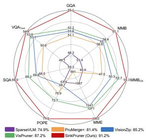  
(a) Performance

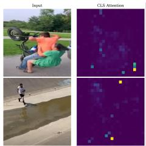  
(b) Attention Outliers

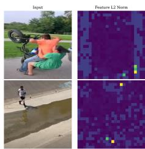  
(c) $L _ { 2 }$ Norm  
Figure 1: Motivation and Performance Overview. (a) SinkPruner achieves better performance trade-offs than SOTA methods. (b) Attention maps reveal that peaky outliers (bright spots) often appear in background regions, distracting the model. (c) Visual feature $L _ { 2 }$ norm heatmap. These attention outliers spatially align with tokens of abnormally high norms (bright spots), confirming that high attention is driven by high-norm outliers rather than semantic importance.

To alleviate the token burden, prior studies have explored visual token pruning and compression methods for efficient MLLM inference, which can be broadly categorized into vision-centric and text-guided strategies. Specifically, vision-centric methods (e.g., VisionZip (Yang et al., 2025b), HoloV (Zou et al., 2025)) operate within the vision encoder and remove redundancy based on visual cues, such as CLS attention or feature similarity among visual tokens. Text-guided methods (e.g., FastV (Chen et al., 2024a), SparseVLM (Zhang et al., 2025b)) leverage the LLM decoder to select tokens that appear semantically aligned with the user query, typically via text-visual attention.

Despite their progress, existing pruning methods suffer from critical limitations rooted in two pathological phenomena within the MLLM pipeline. First, attention-based pruning at the vision encoder is misled by high-norm outliers, i.e., outlier tokens characterized by abnormally large feature norms. State-of-the-art methods heavily rely on CLS attention scores (Yang et al., 2025b; Zhang et al., 2025a, 2024) to retain important tokens. However, this criterion systematically prioritizes high-norm outliers—tokens that originate from non-informative background regions yet attract abnormally high attention, as shown in Figs. 1b and 1c. Because these high-norm outlier tokens are highly redundant in both feature and spatial dimensions, retaining them severely wastes the limited token budget and suppresses the preservation of truly informative, lownorm tokens. Second, text-guided pruning at the LLM decoder is harmed by attention dispersion and attention sink. When utilizing text-visual attention to select query-relevant visual tokens, the LLM decoder is frequently plagued by massive activations (attention sinks) (Kang et al., 2025) and text visual attention dispersion (Zhang et al., 2025a; Zou et al., 2025). Consequently, the decoder disproportionately anchors its attention onto a small set of semantically meaningless sink tokens, while its attention over the remaining tokens becomes highly dispersed. This noise prevents the model from forming a confident ranking of query-relevant regions, rendering attention-based selection highly unreliable, especially at aggressive compression ratios.

To mitigate these limitations, we propose SinkPruner, a training-free, cascading pruning framework that operates on a coarse-to-fine principle. SinkPruner fundamentally addresses the aforementioned bottlenecks by conditioning the visual stream before language decoding. Specifically, it first employs a visual sanitizer to preemptively filter high-norm outliers to yield a purified and diverse set of informative tokens. Following this purification, SinkPruner applies a textguided pruner at the early layers of the LLM decoder. This pre-filtering effectively reduces attention sink (Kang et al., 2025) and attention dispersion, enabling the cross-modal attention mechanism to reliably identify and retain tokens that are genuinely aligned with the textual instruction.

Comprehensive experiments demonstrate the effectiveness, efficiency, and generalizability of SinkPruner across a wide range of image and video understanding tasks. Seamlessly integrated into distinct MLLM architectures—including the fixed-grid LLaVA family and dynamicresolution Qwen2.5-VL—SinkPruner yields superior accuracy-latency trade-offs compared to SOTA methods, as summarized in Fig. 1a. Notably, it enables an 88.9% visual token reduction while preserving 96.5% performance on LLaVA-1.5, unlocking substantial inference speedups for resourceconstrained environments. Moreover, our proposed visual sanitizer exhibits strong transferability; it functions as an orthogonal, plug-and-play module that can be integrated to consistently enhance existing vision-centric pruning frameworks. Finally, through in-depth empirical analysis, we validate that SinkPruner successfully reduces massive activations—cutting the ratio of attention sink tokens within the LLM decoder by about 73%—and significantly lowers the entropy of text-visual attention, thereby empowering the downstream textguided pruner to operate with unprecedented confidence and precision.

## 2 Related Work

MLLMs and Their Challenges. The rapid evolution of MLLMs (Liu et al., 2023a; Li et al., 2024c, 2023a; Lin et al., 2024b; Zhang et al., 2025c; Ye et al., 2025; Hu et al., 2023; Maaz et al., 2024; Deitke et al., 2025; Wang et al., 2025b; Liu et al., 2025; Dai et al., 2023; Zheng et al., 2025) has revolutionized visual understanding by bridging powerful LLMs (Brown et al., 2020; Touvron et al., 2023;

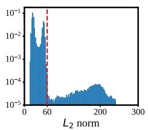  
(a) Feature norm distribution

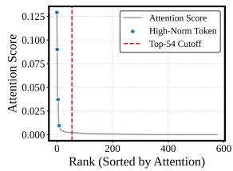  
(b) Attention rank of highnorm tokens

Figure 2: Characterizing High-Norm Tokens. (a) The norm histogram shows a clear two-regime separation: most tokens lie below the cutoff, while a small group of high-norm outliers forms a distinct high-value mode. (b) Despite being outliers, high-norm tokens consistently receive the highest attention.

OpenAI, 2023, 2024, 2025; Team, 2023; Reid et al., 2024; Team, 2025; Yang et al., 2024, 2025a) with advanced vision encoders (Radford et al., 2021; Zhai et al., 2023; Fang et al., 2023; Bolya et al., 2025; Liu et al., 2021). Representative architectures (e.g., LLaVA family (Liu et al., 2024a,b; Li et al., 2025) and Qwen-VL series (Bai et al., 2023b, 2025b,a)) have demonstrated enhanced adaptability across diverse multimodal tasks. To mitigate visual hallucinations and improve fine-grained perception (Huang et al., 2024; Jiang et al., 2024), recent trends favor increasing input resolution and supporting dynamic aspect ratios. However, this strategy inevitably exacerbates the token explosion problem. For instance, while LLaVA-1.5 (Liu et al., 2024a) encodes a standard image into 576 tokens, high-resolution models like LLaVA-NeXT (Liu et al., 2024b) scale this to over 2,880 tokens—an order of magnitude longer than typical text prompts. The situation becomes even more prohibitive for video understanding; a 1-hour video sampled at 1fps can exceed 2 million visual tokens (Lin et al., 2024a). These massive visual sequences occupy a disproportionate share of the LLM’s context window, highlighting the urgent need for efficient visual token compression strategies.

Visual Token Compression and Pruning. To mitigate the inefficiency caused by excessively long token sequences, extensive research has explored token compression methods across various domains, including natural language processing (Goyal et al., 2020; Wang et al., 2021; Ye et al., 2021; Kim et al., 2022) and computer vision (Rao et al., 2021; Yin et al., 2022; Wei et al., 2023; Liu et al., 2023b; Tang et al., 2023; Dong et al., 2023; Fayyaz et al., 2022; Wang et al., 2024; Hu et al., 2024). In the context of MLLMs, recent studies have primarily focused on reducing visual redundancy (Lin et al., 2025; Xing et al., 2025; Zhong et al., 2024; Tao et al., 2025), which can be broadly catego rized into vision-centric and text-guided strategies. Early vision-centric approaches like ToMe (Bolya et al., 2023) and PruMerge (Shang et al., 2025) employ token merging or clustering based on feature similarity to reduce sequence length with out training. Building on this, importance-based pruning methods such as VisionZip (Yang et al., 2025b), Vispruner (Zhang et al., 2025a), and Faster-VLM (Zhang et al., 2024) prioritize tokens exhibiting high correlations to the [CLS] token. To further optimize the token dropping process, recent methods like MustDrop (Liu et al., 2024d) and PDrop (Xing et al., 2024) introduce progressive dropping mechanisms to adaptively trim the visual sequence, while works like HoloV (Zou et al., 2025) utilize a holistic mechanism to retain global context during aggressive pruning. More recently, HiDrop (Wu et al., 2026) schedules when visual tokens enter, are pruned, and exit the LLM layers via late vision injection and early vision exit, while Au toPrune (Wang et al., 2025a) instead decides how many tokens to keep per layer by mapping visualtext mutual information to a budget-constrained retention curve. Parallel to vision-centric methods, text-guided approaches leverage the LLM’s seman tic capabilities to select tokens. FastV (Chen et al., 2024a) and SparseVLM (Zhang et al., 2025b) focus on query-aware token selection using decoder attention scores or cross-modal guidance. Despite their diverse strategies, these methods often over look the pathological high-norm outlier tokens in vision encoders (Darcet et al., 2024) or the attention sink phenomenon in LLM decoders. In contrast, our SinkPruner adopts a cascading framework that preemptively filters inherent visual redundancy and high-norm outliers to clarify the attention land scape, thereby enabling more precise and confident text-guided pruning.

## 3 Methodology

In this section, we detail the motivation and architecture of SinkPruner, a novel, training-free visual token pruning framework for efficient MLLM inference. First, we analyze efficiency bottlenecks of MLLMs, highlighting the critical need to compress extensive visual token sequences. We then present key empirical observations revealing that high-norm outlier tokens are inherently redundant and act as attention sinks that disrupt vision-centric pruning. Motivated by these insights, we introduce our coarse-to-fine cascading SinkPruner, as shown in Fig. 3, which features a visual sanitizer and a text-guided pruner. Specifically, the visual sanitizer first preemptively filters high-norm outliers to yield a purified and diverse set of informative tokens, and the text-guided pruner subsequently retains visual tokens that are semantically aligned with the text query.

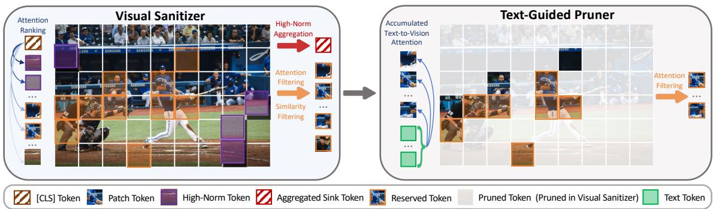  
Figure 3: Overview of SinkPruner framework. Left (Visual Sanitizer): As shown in the Attention Ranking (far left), high-norm outlier tokens (purple) dominate the top ranks despite being background noise. We aggregate these outliers into a single sink token (red hashed) and select informative reserved tokens (orange) via attention and similarity filtering. Right (Text-Guided Pruner): The purified visual sequence further interacts with text tokens (green), utilizing accumulated text-to-vision attention to retain only semantically relevant visual tokens.

## 3.1 Preliminary

Architecture of MLLMs. Existing MLLMs generally consist of a vision encoder and an LLM, both built on the Transformer architecture (Vaswani et al., 2017). To be specific, the vision encoder (e.g., CLIP-ViT (Radford et al., 2021)) applies self-attention over visual tokens $\begin{array} { r l } { X _ { v i s } } & { { } = } \end{array}$ $[ { \pmb x } _ { \mathrm { C L S } } ; { \pmb x } _ { \mathrm { i m g } } ^ { 1 } , \dots , { \pmb x } _ { \mathrm { i m g } } ^ { n _ { v i s } - 1 } ]$ , where $n _ { v i s }$ denotes the total number of visual tokens. The attention matrix is computed as $A _ { v i s } =$ softmax $( Q K ^ { T } / { \sqrt { d } } )$ where Q and K are the query and key representations, and d represents the hidden dimension. We denote the first row of $A _ { v i s }$ —representing the attention from the [CLS] token to all image patches—as CLS attention. Conversely, the LLM processes the concatenated input sequence $\boldsymbol { X } =$ $[ { \pmb x } _ { \mathrm { s y s } } ; X _ { v i s } ; { \pmb x } _ { \mathrm { t x t } } ]$ using causal self-attention. Here, $\pmb { x } _ { \mathrm { s y s } }$ and $\scriptstyle { \mathbf { \mathcal { X } } _ { \mathrm { t x t } } }$ denote the system prompt and text instruction with sequence lengths $n _ { s y s }$ and $n _ { t e x t } .$ , respectively. This brings the total sequence length to $n = n _ { s y s } + n _ { v i s } + n _ { t e x t }$ . This causal mechanism incorporates rotary position embeddings (RoPE) $R _ { \theta }$ parameterized by θ, along with a lower-triangular causal mask M to ensure unidirectional routing. Accordingly, the LLM attention matrix is computed as ${ \pmb A } _ { l l m } = \mathrm { s o f t m a x } \big ( ( { \pmb R } _ { \theta } { \pmb Q } ) ( { \pmb R } _ { \theta } { \pmb K } ) ^ { T } / \sqrt { d } + { \bf \bar { M } } \big )$

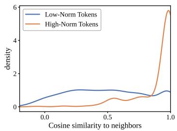  
(a) Neighbor similarity

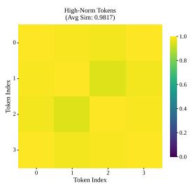

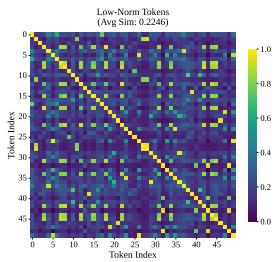  
(b) Pairwise similarity within each subset

Figure 4: Feature Redundancy Analysis. (a) highnorm tokens show distinctively high neighbor similarity. (b) high-norm tokens exhibit extremely high inter-token similarity (feature space collapse), while low-norm tokens maintain high diversity.

and the final output is obtained via $O = A _ { l l m } V$

Efficiency Bottleneck in MLLMs. Computing the aforementioned attention matrix ${ \bf A } _ { l l m }$ and processing the concatenated sequence X through deep LLM layers introduces severe computational overhead. Specifically, for an LLM with T layers and a feed-forward network intermediate width m, the total floating-point operations (FLOPs) can be approximated as $T \times ( 4 n d ^ { 2 } + 2 n ^ { 2 } d + 2 n d m )$ This formulation highlights a quadratic computational complexity with respect to the total sequence length n, primarily stemming from the causal selfattention mechanism (i.e., the $2 n ^ { 2 } d$ term). Given that $n = n _ { s y s } + n _ { v i s } + n _ { t e x t }$ , this sequence length in typical MLLM applications is dominated by the visual tokens $n _ { v i s }$ , which often exceed text prompts by an order of magnitude. Because this massive volume of visual tokens acts as the primary catalyst for the quadratic computational explosion, reducing the visual token count $n _ { v i s }$ emerges as the most essential paradigm for accelerating MLLM inference.

## 3.2 Redundancy in High-Norm Tokens

As established in Sec. 3.1, reducing visual tokens is essential for efficient MLLM inference. To achieve this, existing pruning methods predominantly rely on attention scores (e.g., CLS attention) to gauge token importance, implicitly assuming that tokens with higher attention weights carry richer semantic information. However, the reliability of this assumption remains questionable. Upon inspecting the attention maps within the vision encoder of MLLMs, we observe a counterintuitive phenomenon: clear outliers emerge, where a few non-semantic background regions exhibit unusually peaky attention values. Since attentionbased pruning methods are highly sensitive to these peaky values, understanding the true nature of these outliers—and whether they actually encode indispensable visual concepts—is crucial for designing a robust compression strategy.

Outliers are high-norm tokens. We first seek a quantitative way to localize these outliers. By inspecting the vision encoder features, we observe that artifact regions are strongly associated with unusually large feature magnitudes, an effect first reported for self-supervised and supervised ViTs by Darcet et al. (2024), who mitigate it at training time by appending dedicated register tokens. We instead exploit it at inference time as a trainingfree signal for token pruning. As shown in Figs. 1b and 1c, tokens from artifact patches exhibit much larger $\ell _ { 2 }$ norms than tokens from semantic regions. To further verify this observation, we plot the distribution of token norms over a subset of images in Fig. 2a. The histogram shows a clear two-regime pattern: the majority of tokens concentrate below 60, while a separated group of outliers spans a much higher range (roughly [60, 250]), which accounts for only about 1% of all visual tokens. Since the absolute norm scale is encoderdependent, we identify outliers by their relative rank rather than by a hand-tuned cutoff: given the N visual tokens of an image, we rank them by feature norm and treat the top ρ fraction as highnorm tokens, $i . e . , \mathbf { X } _ { h i g h } = \mathrm { T o p } _ { \rho } \bigl ( \{ \| x _ { i } \| _ { 2 } \} _ { i = 1 } ^ { N } \bigr )$ with $| \mathbf { X } _ { h i g h } | = \lceil \rho N \rceil$ , and the remaining tokens $\mathbf { X } _ { l o w } = \bar { \mathbf { X } } \backslash \mathbf { X } _ { h i g h }$ as low-norm tokens. Following the observed ratio above, we set $\rho = 1 \%$ throughout, which keeps the criterion applicable to encoders whose norms live on very different scales (see Appendix A). Importantly, these high-norm tokens largely overlap with the observed outliers.

High-norm outlier tokens are spatially redundant. Next, we examine whether high-norm outlier tokens contain informative visual content. We measure the cosine similarity between each token and its 4-nearest spatial neighbors after the patch embedding layer. As shown in Fig. 4a, high-norm outliers typically arise from patches that are highly similar to their neighboring patches. This observation aligns with the visual pattern that these outliers predominantly appear in homogeneous background regions (e.g., sky and walls); see Appendix I for visualization results. Therefore, these tokens encode spatially redundant information and can be discarded without degrading image representation.

High-norm outlier tokens are featureredundant. We further study redundancy in feature space. Standard attention-based pruning keeps the top-k tokens ranked by CLS attention, but this set is heavily dominated by high-norm tokens. We therefore partition the selected tokens into the high-norm subset ${ \bf X } _ { h i g h }$ and the low-norm subset $\mathbf { X } _ { l o w }$ defined above. We then compute pairwise cosine similarity within each subset (Fig. 4b). High-norm tokens show extremely high intra-set similarity, indicating representational collapse. In contrast, low-norm tokens remain more diverse and typically carry richer semantic details; see the Appendix I for visualizations. This confirms that retaining high-norm tokens wastes the token budget on redundant information.

The “attention sink” trap. Although high-norm outlier tokens are largely redundant, they can still dominate self-attention. As shown in Fig. 2b, they consistently receive the highest attention from the [CLS] token, acting as attention sinks that absorb a disproportionate amount of global attention. This creates a failure mode for vision-centric pruning methods such as VisionZip (Yang et al., 2025b) and FasterVLM (Zhang et al., 2024): when token importance is determined solely by attention scores, these methods prioritize high-norm outlier tokens while potentially discarding more informative low-

norm tokens.

## 3.3 SinkPruner Framework

Building upon observations in Sec. 3.2, we propose SinkPruner, a training-free, cascading visual token pruning framework designed for efficient MLLM inference, as shown in Fig. 3. Our approach operates on a coarse-to-fine principle: we first introduce a visual sanitizer to filter high-norm outliers, yielding a purified and diverse set of informative tokens, and then a text-guided pruner to retain visual tokens that are semantically aligned with the text query.

Visual sanitizer. To address the “high-norm trap” where high-norm outlier tokens act as attention sinks, we explicitly isolate these tokens based on feature magnitude. Let $\textbf { X } = ~ \{ x _ { 1 } , \ldots , x _ { N } \} ~ \in$ $\mathbb { R } ^ { N \times D }$ denote a sequence of visual tokens extracted from the vision encoder. We first compute the L2-norm $n _ { i } = \| x _ { i } \| _ { 2 }$ for each visual token, and apply the scale-free top-ρ rule of Sec. 3.2 to partition the visual sequence into outliers ${ \bf X } _ { h i g h } =$ $\mathrm { T o p } _ { \rho } ( \{ n _ { i } \} _ { i = 1 } ^ { N } )$ , i.e., the $\lceil \rho N \rceil$ tokens with the largest norms, and candidate tokens $\mathbf { X } _ { l o w } = \mathbf { X } \ : \backslash$ ${ \bf X } _ { h i g h }$ , with $\rho = 1 \%$ by default. Since this rule ranks tokens against each other instead of against an absolute value, it requires no per-model calibration and transfers directly to backbones whose feature norms live on different scales.

Subsequently, we aggregate the identified highnorm outlier tokens ${ \bf X } _ { h i g h }$ into a single proxy token to compress visual redundancy, while preserving global information. To be specific, as discussed in Sec. 3.2, these tokens are compressed without significant information loss via average pooling due to their extreme feature similarity:

$$
x _ { s i n k } = \frac { 1 } { | \mathbf { X } _ { h i g h } | } \sum _ { x \in \mathbf { X } _ { h i g h } } x .\tag{1}
$$

We then employ a hybrid selection strategy to extract a representative subset from the informative candidates $\mathbf { X } _ { l o w }$ , balancing semantic salience with spatial coverage. First, to preserve prominent regions, we select the set ${ \bf X } _ { r e s }$ containing the top-$k _ { r e s }$ tokens with the highest CLS attention scores $\boldsymbol { \mathcal { A } _ { c l s } } ^ { 1 }$

$$
\mathbf { X } _ { r e s } = \{ x \in \mathbf { X } _ { l o w } \ | \ \mathrm { R a n k } ( \mathcal { A } _ { c l s } ( x ) ) \leq k _ { r e s } \} .\tag{2}
$$

<table><tr><td>Methods</td><td>GQA</td><td>MMB</td><td>MMBCN</td><td>MME</td><td>POPE</td><td>SQA</td><td>VQATest</td><td>Avg</td></tr><tr><td>Upper Bound, 576 Tokens</td><td>61.9</td><td>64.7</td><td>58.1</td><td>1862</td><td>85.9</td><td>69.5</td><td>58.2</td><td>100.0%</td></tr><tr><td>LLaVA-1.5-7B</td><td colspan="8">Retain 64 Tokens (Pruning Ratio = 88.9%)</td></tr><tr><td>ToMe (ICLR23)</td><td>48.6</td><td>43.7</td><td></td><td>1138</td><td>52.5</td><td>50.0</td><td>45.3</td><td>59.7</td></tr><tr><td>FastV (ECCV24)</td><td>46.1</td><td>48.0</td><td>52.7</td><td>1256</td><td>48.0</td><td>51.1</td><td>47.8</td><td>74.1</td></tr><tr><td>MustDrop (2024.11)</td><td>53.1</td><td>60.0</td><td>53.1</td><td>1612</td><td>68.0</td><td>63.4</td><td>54.2</td><td>88.6</td></tr><tr><td>PDrop (2024.10)</td><td>41.9</td><td>33.3</td><td>50.5</td><td>1092</td><td>55.9</td><td>68.6</td><td>45.9</td><td>72.5</td></tr><tr><td>VisionZip (CVPR25)</td><td>55.1</td><td>60.1</td><td>55.4</td><td>1690</td><td>77.0</td><td>69.0</td><td>55.5</td><td>93.2</td></tr><tr><td>SparseVLM (ICML25)</td><td>52.7</td><td>56.2</td><td>46.1</td><td>1505</td><td>75.1</td><td>62.2</td><td>51.8</td><td>85.4</td></tr><tr><td>HoloV (NeurIPS25)</td><td>55.3</td><td>63.3</td><td>55.1</td><td>1715</td><td>80.3</td><td>69.5</td><td>55.4</td><td>94.7</td></tr><tr><td>ApET (2026.02)</td><td>56.9</td><td>61.2</td><td>54.4</td><td>1714</td><td>84.4</td><td>68.9</td><td>53.9</td><td>94.6</td></tr><tr><td>SinkPruner (Ours)</td><td>57.4</td><td>62.8</td><td>56.9</td><td>1754</td><td>83.8</td><td>70.0</td><td>55.5</td><td>96.5</td></tr><tr><td>LLaVA-1.5-7B</td><td colspan="8">Retain 32 Tokens (Pruning Ratio = 94.4%)</td></tr><tr><td>ToMe (ICLR23)</td><td>43.6</td><td>31.6</td><td>28.1</td><td>828</td><td>39.0</td><td>41.4</td><td>38.3</td><td>54.7</td></tr><tr><td>FastV (ECCV24)</td><td>41.5</td><td>37.8</td><td>33.2</td><td>885</td><td>32.5</td><td>42.6</td><td>42.5</td><td>57.5</td></tr><tr><td>SparseVLM (ICML25)</td><td>48.3</td><td>51.4</td><td>40.6</td><td>1047</td><td>67.9</td><td>57.3</td><td>46.1</td><td>74.9</td></tr><tr><td>PruMerge+ (2024.05)</td><td>51.1</td><td>56.8</td><td>47.0</td><td>941</td><td>70.9</td><td>68.5</td><td>50.6</td><td>81.4</td></tr><tr><td>VisionZip (CVPR25)</td><td>51.8</td><td>57.7</td><td>50.3</td><td>1247</td><td>68.7</td><td>68.8</td><td>53.1</td><td>85.2</td></tr><tr><td>VisPruner (ICCV25)</td><td>52.2</td><td>58.4</td><td>52.7</td><td>1271</td><td>72.7</td><td>69.2</td><td>53.9</td><td>87.2</td></tr><tr><td>SinkPruner (Ours)</td><td>55.1</td><td>61.2</td><td>55.3</td><td>1363</td><td>78.5</td><td>69.9</td><td>54.8</td><td>91.2</td></tr></table>

Table 1: Performance comparison on LLaVA-1.5-7B across different image-language benchmarks under different pruning ratios. Best results are in bold. More comprehensive results are provided in the Appendix E.

Next, to capture subtle background semantics and avoid feature collapse, we perform a similaritybased de-duplication on the remaining tokens $\mathcal { R } =$ $\mathbf { X } _ { l o w } \ \backslash \ \mathbf { X } _ { r e s }$ . We initialize the selected set ${ \boldsymbol { s } } =$ ${ \bf X } _ { r e s }$ and iterativel $\mathrm { y } ^ { 2 }$ sample a token $x ^ { * }$ that exhibits the lowest similarity to the current set S, appending it to $\mathbf { X } _ { d i v }$

$$
x ^ { * } = \operatorname * { a r g m i n } _ { x \in \mathcal { R } } \left( \operatorname* { m a x } _ { s \in \mathcal { S } } \mathbf { C o s S i m } ( x , s ) \right) .\tag{3}
$$

The final purified visual representation Z is formed by concatenating the aggregated sink token and the selected subsets: ${ \bf Z } = [ x _ { s i n k } , { \bf X } _ { r e s } , { \bf X } _ { d i v } ]$ which is subsequently projected and fed into the LLM.

Text-guided pruner. Leveraging the purified sequence Z, the model effectively evaluates semantic relevance without interference from high-norm outliers. We utilize the text-to-vision attention in an early LLM decoder layer as the importance estimator. Letting $L _ { t }$ denote the number of text tokens, we compute a global relevance score $\tilde { p } _ { j }$ for each visual token $z _ { j } \in \mathbf { Z }$ by aggregating its attention weights across all textual queries:

$$
\tilde { p } _ { j } = \frac { 1 } { L _ { t } } \sum _ { i = 1 } ^ { L _ { t } } \mathbf { S o f t m a x } ( \mathbf { Q } _ { t e x t } \cdot \mathbf { K } _ { v i s } ^ { \top } ) _ { i , j } .\tag{4}
$$

We then retain the top-K visual tokens with the highest $\tilde { p }$ scores. This query-aware selection ensures the LLM focuses its computational budget strictly on regions required for reasoning.

## 4 Experiments

## 4.1 Experiment settings

Evaluation benchmarks. To comprehensively demonstrate the effectiveness and generalizability of our SinkPruner, we conduct experiments across a wide range of multimodal understanding tasks. For image-language understanding, we evaluate on twelve widely used benchmarks: GQA (Hudson and Manning, 2019), MMBench (MMB) and its Chinese counterpart MMB-CN (Liu et al., 2024e), MME (Fu et al., 2023), POPE (Li et al., 2023b), ScienceQA (SQA) (Lu et al., 2022), VQA-v2 (Goyal et al., 2017), and TextVQA (Singh et al., 2019), which mainly probe perception and short-form reasoning, together with four substantially harder benchmarks that target high-level reasoning rather than perception alone, namely MMStar (Chen et al., 2024b), MMMU (Yue et al., 2024), AI2D (Kembhavi et al., 2016), and MM-Vet (Yu et al., 2024). Furthermore, since video processing inherently involves massive spatiotemporal redundancy, making efficient pruning critical, we also extend our evaluation to video-language understanding. Specifically, we conduct experiments on four representative video benchmarks: MVBench (Li et al., 2024b), SEED-Bench (Li et al., 2024a), NextQA (Xiao et al., 2021), and VideoMME (Fu et al., 2025). We describe each benchmark and the corresponding evaluation metric in Appendix C.1.

<table><tr><td>Methods</td><td>MMB</td><td>MME</td><td>POPE</td><td>SQA</td><td>VQAText |</td><td>Avg</td></tr><tr><td>Upper Bound</td><td>84.2</td><td>2292</td><td>86.1</td><td>88.78</td><td>83.04</td><td>100%</td></tr><tr><td colspan="7">Qwen2.5-VL-7B Pruning Ratio = ↓ 66.7%</td></tr><tr><td>FastV (ECCV24)</td><td>75.7</td><td>2072</td><td>82.2</td><td>78.5</td><td>77.9</td><td>91.6</td></tr><tr><td>HoloV (NeurIPS25)</td><td>78.3</td><td>2093</td><td>85.0</td><td>79.8</td><td>78.9</td><td>93.6</td></tr><tr><td>VisionZip (CVPR25)</td><td>75.8</td><td>2098</td><td>84.4</td><td>81.7</td><td>70.9</td><td>91.4</td></tr><tr><td>SinkPruner (Ours)</td><td>82.1</td><td>2268</td><td>85.2</td><td>88.7</td><td>81.1</td><td>98.6</td></tr><tr><td colspan="7"></td></tr><tr><td>Qwen2.5-VL-7B</td><td colspan="6">Pruning Ratio = ↓ 77.8%</td></tr><tr><td>FastV (ECCV24)</td><td>74.9</td><td>2036</td><td>80.7</td><td>78.0</td><td>69.0</td><td>88.5</td></tr><tr><td>HoloV (NeurIPS25)</td><td>76.5</td><td>2043</td><td>82.3</td><td>79.8</td><td>70.3</td><td>90.0</td></tr><tr><td>VisionZip (CVPR25)</td><td>80.33</td><td>2174</td><td>83.38</td><td>84.23</td><td>70.43</td><td>93.4</td></tr><tr><td>DivPrune (CVPR25)</td><td>76.98</td><td>2163</td><td>80.59</td><td>80.91</td><td>65.86</td><td>90.0</td></tr><tr><td>MMTok(2025.08)</td><td>79.30</td><td>2217</td><td>82.38</td><td>81.61</td><td>70.49</td><td>92.7</td></tr><tr><td>SinkPruner (Ours)</td><td>79.7</td><td>2207</td><td>82.8</td><td>87.7</td><td>79.2</td><td>96.3</td></tr><tr><td colspan="7">Pruning Ratio = ↓</td></tr><tr><td>Qwen2.5-VL-7B</td><td colspan="6"></td></tr><tr><td>FastV (ECCV24)</td><td>69.2</td><td>1940</td><td>78.6</td><td>77.4</td><td>60.3</td><td>83.6</td></tr><tr><td>HoloV (NeurIPS25)</td><td>72.4</td><td>2006</td><td>80.7</td><td>79.5</td><td>61.8</td><td>86.2</td></tr><tr><td>VisionZip (CVPR25)</td><td>75.60</td><td>2003</td><td>78.90</td><td>82.30</td><td>63.78</td><td>87.7</td></tr><tr><td>DivPrune (CVPR25)</td><td>72.85</td><td>1957</td><td>74.99</td><td>79.57</td><td>59.59</td><td>84.1</td></tr><tr><td>MMTok (2025.08)</td><td>74.74</td><td>2051</td><td>78.75</td><td>80.47</td><td>63.90</td><td>87.5</td></tr><tr><td>SinkPruner (Ours)</td><td>77.6</td><td>2123</td><td>78.3</td><td>87.1</td><td>70.8</td><td>91.8</td></tr></table>

Table 2: Performance comparison on Qwen2.5-VL-7B with various token compression methods under different pruning ratios. Best results are in bold. More comprehensive results are provided in the Appendix.
<table><tr><td>Method</td><td>Acc</td><td>MVBench SEEDBench Acc</td><td>VideoMME Score</td><td>Avg. (%)</td></tr><tr><td>Qwen2.5-VL-7B (Full)</td><td>68.10</td><td>62.18</td><td>60.67</td><td>100.0%</td></tr><tr><td>DART (EMNLP25)</td><td>65.80</td><td>61.00</td><td>57.74</td><td>96.6%</td></tr><tr><td>DivPrune (CVPR25)</td><td>65.85</td><td>59.79</td><td>57.78</td><td>96.0%</td></tr><tr><td>SinkPruner (Ours)</td><td>66.70</td><td>61.80</td><td>58.59</td><td>98.0%</td></tr></table>

Table 3: Performance comparison of various methods across different video-language benchmarks under an 80% token pruning ratio. More comprehensive experimental results are provided in the Appendix E.

<table><tr><td>Methods</td><td>|MMStar</td><td>MMMU</td><td>AI2D</td><td>MM-Vet</td><td>Avg</td></tr><tr><td>Upper Bound</td><td>34.04</td><td>36.56</td><td>55.15</td><td>33.99</td><td>100%</td></tr><tr><td>LLaVA-1.5-7B</td><td>Retain 32 Tokens</td><td></td><td colspan="3">(Pruning Ratio = 94.4%)</td></tr><tr><td>FastV (ECCV24)</td><td>30.41</td><td>35.11</td><td>50.49</td><td>22.66</td><td>85.9</td></tr><tr><td>VisionZip (CVPR25)</td><td>30.36</td><td>35.67</td><td>51.81</td><td>25.23</td><td>88.7</td></tr><tr><td>SinkPruner (Ours)</td><td>32.14</td><td>35.44</td><td>53.63</td><td>29.36</td><td>93.7</td></tr></table>

Table 4: Performance comparison on LLaVA-1.5-7B across harder reasoning-oriented benchmarks under an aggressive 32-token budget. Best results are in bold.

Implementation Details. We identify high-norm outliers with the scale-free top-ρ rule of Sec. 3.2 and keep ρ = 1% for every backbone and every benchmark, so no per-model threshold calibration is involved. For low-norm selection, we configure both the salience and diversity pool sizes to match the target token budget (e.g., 64 for Retain-64 and 32 for Retain-32). More experimental settings and baseline details are provided in the Appendix D.

## 4.2 Main Results

SinkPruner achieves superior effectiveness under aggressive pruning As shown in Tab. 1, we evaluate our proposed SinkPruner on LLaVA-1.5- 7B under two extremely challenging pruning configurations, retaining only 64 (↓ 88.9%) and 32 (↓ 94.4%) visual tokens. Following prior work (Bolya et al., 2023; Chen et al., 2024a; Liu et al., 2024d; Xing et al., 2024; Zhang et al., 2025b; Yang et al., 2025b; Zhang et al., 2025a; Zou et al., 2025), we report all results in normalized percentage form, where the vanilla 576-token model is treated as the 100% upper bound. In the 64-token setting, SinkPruner attains an average performance of 96.5%, reducing nearly 90% of visual tokens while incurring only a 3.5% drop from the full model. It surpasses strong recent methods: exceeding VisionZip by +3.3% and HoloV by +1.8%. When retaining only 32 visual tokens, SinkPruner continues to deliver strong performance with an average of 91.2%, outperforming all existing pruning methods by a clear margin. Compared with the best prior method VisPruner, SinkPruner achieves a +4.0% improvement, and exceeds VisionZip by +6.0%. Even in this extremely low-token regime, our method consistently achieves the top performance across all benchmarks, showing that SinkPruner maintains high fidelity even when over 94% of the visual tokens are removed.

SinkPruner generalizes seamlessly to dynamicresolution architectures. To further demonstrate the generality of SinkPruner, we evaluate its performance on Qwen2.5-VL-7B (Bai et al., 2025b), a state-of-the-art MLLM whose visual pipeline differs fundamentally from the LLaVA family. Unlike LLaVA models that rely on a fixed-grid ViT encoder (e.g., 336×336), Qwen2.5-VL-7B employs a Naive Dynamic Resolution mechanism. This architecture allows the model to process images of arbi trary aspect ratios by mapping variable pixel counts to a dynamic number of visual tokens. While this flexibility enhances fine-grained perception for high-resolution inputs, it often results in massive token sequences, leading to significant computational overhead and latent redundancy. Pruning tokens in such a variable-length regime is more challenging, as the model lacks a stable spatial prior. Because this vision tower has no [CLS] token, we instantiate the CLS-free salience score intro duced in Sec. 3, which makes SinkPruner directly applicable without architectural changes. Our results show that even within this dynamic resolution framework, SinkPruner consistently achieves the best average performance, proving its robustness across diverse MLLM architectures. Following the experimental settings in HoloV (Zou et al., 2025), we assess performance under aggressive pruning ratios of 66.7%, 77.8%, and 88.9%. As detailed in Tab. 2, SinkPruner demonstrates remarkable robustness, retaining 98.6%, 96.3%, and 91.8% of the full-model performance, respectively. In contrast, existing SOTA methods (e.g., FastV (Chen et al., 2024a), HoloV (Zou et al., 2025), VisionZip (Yang et al., 2025b), DivPrune (Alvar et al., 2025), MM-Tok (Dong et al., 2025)) degrade sharply in this dynamic regime, confirming SinkPruner’s superiority in identifying redundancy even within complex, variable-length visual sequences.

SinkPruner preserves performance on harder reasoning tasks. The benchmarks above are largely perception-oriented, so a natural concern is whether pruning preserves perception while destroying the evidence needed for multi-step reasoning. We therefore evaluate on the four harder benchmarks of Sec. 4. As shown in Tab. 4, under the most aggressive 32-token budget SinkPruner retains 93.7% of the full-model average, versus 88.7% for VisionZip and 85.9% for FastV. The gap is largest on MM-Vet (29.36 vs. 25.23 and 22.66) and AI2D (53.63 vs. 51.81 and 50.49), i.e., precisely the tasks requiring several spatially distinct pieces of evidence, while on MMMU all three stay within 0.6 points since that benchmark is dominated by textual knowledge. Sanitizing high-norm tokens therefore does not trade reasoning fidelity for perception fidelity. Results on LLaVA-1.5-13B and the high-resolution LLaVA-NeXT-7B, which verify transfer across model scale and visual-token regimes, are in Appendix F.

<table><tr><td>Methods</td><td>Time (mm:ss) Prefill (ms) Latency (ms)</td><td></td><td></td><td>Acc.</td></tr><tr><td>Upper Bound (576 Tokens) |</td><td>19:28</td><td>62.75</td><td>121.0</td><td>100%</td></tr><tr><td>LLaVA-1.5-7B</td><td colspan="4">Pruning Ratio = ↓ 90.0%</td></tr><tr><td>FastV (ECCV24)</td><td>12:02</td><td>32.2</td><td>75.0</td><td>65.5%</td></tr><tr><td>VisionZip (CVPR25)</td><td>12:24</td><td>36.9</td><td>77.4</td><td>91.8%</td></tr><tr><td>SparseVLM (ICML25)</td><td>12:20</td><td>38.6</td><td>77.0</td><td>90.5%</td></tr><tr><td>SinkPruner (Ours)</td><td>12:59</td><td>37.1</td><td>86.0</td><td>97.1%</td></tr></table>

Table 5: Real inference comparison on POPE (Li et al., 2023b). Experiments adopt 90% pruning ratio.
<table><tr><td>Method</td><td>MME↑</td><td>MMB ↑</td></tr><tr><td>w/o Visual Sanitizer</td><td>1589.0</td><td>51.4</td></tr><tr><td>w/o Text-Guided Pruner</td><td>1690.0</td><td>59.4</td></tr><tr><td>w/o Removing Duplicates</td><td>1733.3</td><td>60.1</td></tr><tr><td>w/o Removing High-Norm</td><td>1705.6</td><td>59.9</td></tr><tr><td>w/o High-Norm Aggregation</td><td>1737.0</td><td>60.2</td></tr><tr><td>SinkPruner</td><td>1754.1</td><td>61.6</td></tr></table>

Table 6: Ablation studies on components. We report performances on MME( (Fu et al., 2023) and MM-Bench( (Liu et al., 2024e)).

SinkPruner exhibits robust cross-modal transferability to videos. To demonstrate the generalizability of SinkPruner on video tasks, we evaluate SinkPruner on Qwen2.5-VL-7B. As shown in Tab. 3, even under an aggressive 80% pruning ratio, SinkPruner achieves an impressive average performance retention of 98.0%. It consistently outperforms recent SOTA video pruning methods like DART (Wen et al., 2025) and DivPrune (Alvar et al., 2025), validating its robustness in capturing spatiotemporal cues without any retraining.

We evaluate efficiency on LLaVA-1.5 (Tab. 5). With 90% token pruning, SinkPruner reduces total inference time by 33.3% compared to the full model. While our cascading design introduces a marginal latency overhead compared to competitive methods like VisionZip, it yields a commanding accuracy advantage (97.1% vs. 91.8%). Unlike FastV which suffers catastrophic degradation (65.5%), SinkPruner achieves the optimal practical trade-off, delivering substantial acceleration without compromising reasoning reliability.

## 4.3 Ablation Studies

To validate the effectiveness of SinkPruner, we dissect the contribution of each component in Tab. 6. The most significant finding is the criticality of the pre-filtering stage: removing the visual sanitizer entirely causes a catastrophic performance drop (e.g., -10.2% on MMB). This strongly validates our core premise that without mitigating inherent visual redundancy upstream, the LLM is overwhelmed by attention sinks and dispersion, rendering subsequent reasoning ineffective. Similarly, omitting the text-guided pruner leads to a notable decline, confirming that semantic alignment is indispensable for fine-grained understanding. Inside the visual sanitizer, the high-norm removal proves to be the dominant factor. Retaining these high-norm outlier tokens causes a sharp degradation (MME: 1754.1 → 1705.6), empirically verifying that high-norm outlier tokens are indeed redundant. In contrast, removing similarity-based de-duplication yields a smaller drop, indicating that while spatial diversity matters, the primary gain stems from eliminating the high-norm outlier tokens that disrupt the attention landscape. Notably, high-norm aggregation performs slightly better than direct removal, suggesting that preserving a compact summary of these tokens is marginally more effective than discarding them entirely. Additional sensitivity analysis on the high-norm criterion is provided in Appendix B, and Appendix G further ablates the remaining design choices—the pruning layers, the progressive retention schedules, and the salience-to-diversity split—under matched token-computation budgets. Both analyses show flat response surfaces, indicating that our reported configuration is a simple benchmark-independent default rather than a tuned optimum.

<table><tr><td></td><td colspan="2">MMB</td><td colspan="2">POPE</td></tr><tr><td>Method</td><td>Tok Acc</td><td>Rel.</td><td>Acc</td><td>Rel.</td></tr><tr><td>Vanilla (Full)</td><td>576</td><td>64.7 100%</td><td>85.9</td><td>100%</td></tr><tr><td>VisionZip (Yang et al., 2025b)</td><td>64</td><td>60.1 92.9%</td><td>77.0</td><td>89.6%</td></tr><tr><td>+ High-Norm Filter</td><td>64</td><td>61.4 94.9%</td><td>77.7</td><td>90.5%</td></tr><tr><td>VisionZip (Yang et al., 2025b)</td><td>32</td><td>57.7</td><td>89.2% 68.7</td><td>80.0%</td></tr><tr><td>+ High-Norm Filter</td><td>32</td><td>59.4 91.8%</td><td>70.4</td><td>82.0%</td></tr></table>

Table 7: Transferability to existing methods. Integrating our high-norm filtration module into VisionZip consistently yields performance gains.

## 4.4 Transferability to Existing Methods

To further demonstrate that our identification of high-norm outlier tokens is a fundamental insight rather than a method-specific heuristic, we evaluate the transferability of our proposed visual filtration module. Specifically, we investigate whether our “high-norm removal” strategy can serve as an orthogonal, plug-and-play enhancement for existing vision-centric pruning frameworks.

We integrate our norm-based separation step into the VisionZip (Yang et al., 2025b) pipeline, applying it before its standard dominant token selection. As shown in Tab. 7, at identical token reduction ratios (32 and 64 tokens), the inclusion of our high-norm outliers filter yields a consistent and significant performance boost ranging from 0.9% to 2.6% across both MMBench and POPE.

This improvement is particularly noteworthy because VisionZip, as a state-of-the-art attentionbased method, inherently prioritizes tokens with high CLS attention—the exact group we identified as high-norm outlier tokens. By preemptively removing these outliers, we allow the baseline’s selection mechanism to focus on truly informative low-norm tokens. These results validate that our proposed filtration module is highly versatile and can be seamlessly generalized to enhance other vision-centric strategies.

## 5 Conclusion

In this work, we presented SinkPruner, a trainingfree cascading visual token pruning framework for efficient MLLM inference. By filtering high-norm outlier tokens with a visual sanitizer, our method suppresses massive activations and attention dispersion in the LLM decoder, thereby enabling more precise text-guided pruning.

Extensive experiments on diverse image and video benchmarks demonstrate that SinkPruner achieves aggressive token reduction while preserving strong perception and reasoning performance. We further show that our framework generalizes well across different MLLM architectures, from fixed-grid to dynamic-resolution models. Finally, the transferability of the visual sanitizer as a plugand-play module highlights its potential to improve existing pruning methods more broadly.

Limitations. While effective for static images and finite video clips, our current evaluation focuses solely on offline inference with pre-recorded, fixedlength inputs available in advance. Real-world edge applications, such as continuous robotic perception, often require handling potentially infinite video streams with continuously evolving temporal contexts. Adapting our coarse-to-fine pruning strategy to support online streaming—where past visual history is dynamically updated without access to any future knowledge, and where pruning decisions cannot be revisited—remains an open challenge for future work.

## References

Saeed Ranjbar Alvar, Gursimran Singh, Mohammad Akbari, and Yong Zhang. 2025. Divprune: Diversitybased visual token pruning for large multimodal models. In CVPR, pages 9392–9401. Computer Vision Foundation / IEEE.

Jinze Bai, Shuai Bai, Yunfei Chu, Zeyu Cui, Kai Dang, Xiaodong Deng, Yang Fan, Wenbin Ge, Yu Han, Fei Huang, Binyuan Hui, Luo Ji, Mei Li, Junyang Lin, Runji Lin, Dayiheng Liu, Gao Liu, Chengqiang Lu, Keming Lu, and 29 others. 2023a. Qwen technical report. CoRR, abs/2309.16609.

Jinze Bai, Shuai Bai, Shusheng Yang, Shijie Wang, Sinan Tan, Peng Wang, Junyang Lin, Chang Zhou, and Jingren Zhou. 2023b. Qwen-vl: A frontier large vision-language model with versatile abilities. CoRR, abs/2308.12966.

Shuai Bai, Yuxuan Cai, Ruizhe Chen, Keqin Chen, Xionghui Chen, Zesen Cheng, Lianghao Deng, Wei Ding, Chang Gao, Chunjiang Ge, Wenbin Ge, Zhifang Guo, Qidong Huang, Jie Huang, Fei Huang, Binyuan Hui, Shutong Jiang, Zhaohai Li, Mingsheng Li, and 45 others. 2025a. Qwen3-VL technical report. CoRR, abs/2511.21631.

Shuai Bai, Keqin Chen, Xuejing Liu, Jialin Wang, Wenbin Ge, Sibo Song, Kai Dang, Peng Wang, Shijie Wang, Jun Tang, Humen Zhong, Yuanzhi Zhu, Ming-Hsuan Yang, Zhaohai Li, Jianqiang Wan, Pengfei Wang, Wei Ding, Zheren Fu, Yiheng Xu, and 8 others. 2025b. Qwen2.5-VL technical report. CoRR, abs/2502.13923.

Daniel Bolya, Cheng-Yang Fu, Xiaoliang Dai, Peizhao Zhang, Christoph Feichtenhofer, and Judy Hoffman. 2023. Token merging: Your vit but faster. In ICLR. OpenReview.net.

Daniel Bolya, Po-Yao Huang, Peize Sun, Jang Hyun Cho, Andrea Madotto, Chen Wei, Tengyu Ma, Jiale Zhi, Jathushan Rajasegaran, Hanoona Rasheed, Junke Wang, Marco Monteiro, Hu Xu, Shiyu Dong, Nikhila Ravi, Daniel Li, Piotr Dollár, and Christoph Feichtenhofer. 2025. Perception encoder: The best visual embeddings are not at the output of the network. CoRR, abs/2504.13181.

Tom B. Brown, Benjamin Mann, Nick Ryder, Melanie Subbiah, Jared Kaplan, Prafulla Dhariwal, Arvind Neelakantan, Pranav Shyam, Girish Sastry, Amanda Askell, Sandhini Agarwal, Ariel Herbert-Voss, Gretchen Krueger, Tom Henighan, Rewon Child, Aditya Ramesh, Daniel M. Ziegler, Jeffrey Wu, Clemens Winter, and 12 others. 2020. Language models are few-shot learners. In NeurIPS.

Liang Chen, Haozhe Zhao, Tianyu Liu, Shuai Bai, Junyang Lin, Chang Zhou, and Baobao Chang. 2024a. An image is worth 1/2 tokens after layer 2: Plug-andplay inference acceleration for large vision-language models. In ECCV (81), volume 15139 of Lecture Notes in Computer Science, pages 19–35. Springer.

Lin Chen, Jinsong Li, Xiaoyi Dong, Pan Zhang, Yuhang Zang, Zehui Chen, Haodong Duan, Jiaqi Wang, Yu Qiao, Dahua Lin, and Feng Zhao. 2024b. Are we on the right way for evaluating large vision-language models? In Advances in Neural Information Processing Systems 37: Annual Conference on Neural Information Processing Systems 2024, NeurIPS 2024, Vancouver, BC, Canada, December 10 - 15, 2024.

Wenliang Dai, Junnan Li, Dongxu Li, Anthony Meng Huat Tiong, Junqi Zhao, Weisheng Wang, Boyang Li, Pascale Fung, and Steven C. H. Hoi. 2023. Instructblip: Towards general-purpose visionlanguage models with instruction tuning. In NeurIPS.

Timothée Darcet, Maxime Oquab, Julien Mairal, and Piotr Bojanowski. 2024. Vision transformers need registers. In The Twelfth International Conference on Learning Representations, ICLR 2024, Vienna, Austria, May 7-11, 2024. OpenReview.net.

Matt Deitke, Christopher Clark, Sangho Lee, Rohun Tripathi, Yue Yang, Jae Sung Park, Mohammadreza Salehi, Niklas Muennighoff, Kyle Lo, Luca Soldaini, Jiasen Lu, Taira Anderson, Erin Bransom, Kiana Ehsani, Huong Ngo, Yen-Sung Chen, Ajay Patel, Mark Yatskar, Chris Callison-Burch, and 31 others. 2025. Molmo and pixmo: Open weights and open data for state-of-the-art vision-language models. In CVPR, pages 91–104. Computer Vision Foundation / IEEE.

Peiyan Dong, Mengshu Sun, Alec Lu, Yanyue Xie, Kenneth Liu, Zhenglun Kong, Xin Meng, Zhengang Li, Xue Lin, Zhenman Fang, and Yanzhi Wang. 2023. Heatvit: Hardware-efficient adaptive token pruning for vision transformers. In HPCA, pages 442–455. IEEE.

Sixun Dong, Juhua Hu, Mian Zhang, Ming Yin, Yanjie Fu, and Qi Qian. 2025. Mmtok: Multimodal coverage maximization for efficient inference of vlms. CoRR, abs/2508.18264.

Alexey Dosovitskiy, Lucas Beyer, Alexander Kolesnikov, Dirk Weissenborn, Xiaohua Zhai, Thomas Unterthiner, Mostafa Dehghani, Matthias Minderer, Georg Heigold, Sylvain Gelly, Jakob Uszkoreit, and Neil Houlsby. 2021. An image is worth 16x16 words: Transformers for image recognition at scale. In 9th International Conference on Learning Representations, ICLR 2021, Virtual Event, Austria, May 3-7, 2021. OpenReview.net.

Yuxin Fang, Wen Wang, Binhui Xie, Quan Sun, Ledell Wu, Xinggang Wang, Tiejun Huang, Xinlong Wang, and Yue Cao. 2023. EVA: exploring the limits of masked visual representation learning at scale. In CVPR, pages 19358–19369. IEEE.

Mohsen Fayyaz, Soroush Abbasi Koohpayegani, Farnoush Rezaei Jafari, Sunando Sengupta, Hamid Reza Vaezi Joze, Eric Sommerlade, Hamed Pirsiavash, and Jürgen Gall. 2022. Adaptive token sampling for efficient vision transformers. In ECCV (11),

volume 13671 of Lecture Notes in Computer Science, pages 396–414. Springer.

Chaoyou Fu, Peixian Chen, Yunhang Shen, Yulei Qin, Mengdan Zhang, Xu Lin, Zhenyu Qiu, Wei Lin, Jinrui Yang, Xiawu Zheng, Ke Li, Xing Sun, and Rongrong Ji. 2023. MME: A comprehensive evaluation benchmark for multimodal large language models. CoRR, abs/2306.13394.

Chaoyou Fu, Yuhan Dai, Yongdong Luo, Lei Li, Shuhuai Ren, Renrui Zhang, Zihan Wang, Chenyu Zhou, Yunhang Shen, Mengdan Zhang, Peixian Chen, Yanwei Li, Shaohui Lin, Sirui Zhao, Ke Li, Tong Xu, Xiawu Zheng, Enhong Chen, Caifeng Shan, and 2 others. 2025. Video-mme: The first-ever comprehensive evaluation benchmark of multi-modal llms in video analysis. In CVPR, pages 24108–24118. Computer Vision Foundation / IEEE.

Saurabh Goyal, Anamitra Roy Choudhury, Saurabh Raje, Venkatesan T. Chakaravarthy, Yogish Sabharwal, and Ashish Verma. 2020. Power-bert: Accelerating BERT inference via progressive word-vector elimination. In ICML, volume 119 of Proceedings of Machine Learning Research, pages 3690–3699. PMLR.

Yash Goyal, Tejas Khot, Douglas Summers-Stay, Dhruv Batra, and Devi Parikh. 2017. Making the V in VQA matter: Elevating the role of image understanding in Visual Question Answering. In Conference on Computer Vision and Pattern Recognition (CVPR).

Jiaxian Guo, Junnan Li, Dongxu Li, Anthony Meng Huat Tiong, Boyang Li, Dacheng Tao, and Steven C. H. Hoi. 2023. From images to textual prompts: Zero-shot visual question answering with frozen large language models. In CVPR, pages 10867–10877. IEEE.

Zi-Yuan Hu, Yanyang Li, Michael R. Lyu, and Liwei Wang. 2023. VL-PET: vision-and-language parameter-efficient tuning via granularity control. In ICCV, pages 2998–3008. IEEE.

Zi-Yuan Hu, Yiwu Zhong, Shijia Huang, Michael R. Lyu, and Liwei Wang. 2024. Enhancing temporal modeling of video llms via time gating. In Findings of the Association for Computational Linguistics: EMNLP 2024, Miami, Florida, USA, November 12-16, 2024, volume EMNLP 2024 of Findings of ACL, pages 2845–2856. Association for Computational Linguistics.

Qidong Huang, Xiaoyi Dong, Pan Zhang, Bin Wang, Conghui He, Jiaqi Wang, Dahua Lin, Weiming Zhang, and Nenghai Yu. 2024. OPERA: alleviating hallucination in multi-modal large language models via over-trust penalty and retrospection-allocation. In CVPR, pages 13418–13427. IEEE.

Drew A. Hudson and Christopher D. Manning. 2019. GQA: A new dataset for real-world visual reasoning and compositional question answering. In CVPR, pages 6700–6709. Computer Vision Foundation / IEEE.

Yifan Jiang, Jiarui Zhang, Kexuan Sun, Zhivar Sourati, Kian Ahrabian, Kaixin Ma, Filip Ilievski, and Jay Pujara. 2024. MARVEL: multidimensional abstraction and reasoning through visual evaluation and learning. In NeurIPS.

Shibo Jie, Yehui Tang, Ning Ding, Zhi-Hong Deng, Kai Han, and Yunhe Wang. 2024. Memory-space visual prompting for efficient vision-language fine-tuning. In ICML, volume 235 of Proceedings of Machine Learning Research, pages 22062–22074. PMLR / OpenReview.net.

Seil Kang, Jinyeong Kim, Junhyeok Kim, and Seong Jae Hwang. 2025. See what you are told: Visual attention sink in large multimodal models. In The Thirteenth International Conference on Learning Representations, ICLR 2025, Singapore, April 24-28, 2025. OpenReview.net.

Aniruddha Kembhavi, Mike Salvato, Eric Kolve, Min Joon Seo, Hannaneh Hajishirzi, and Ali Farhadi. 2016. A diagram is worth a dozen images. In Computer Vision - ECCV 2016 - 14th European Conference, Amsterdam, The Netherlands, October 11-14, 2016, Proceedings, Part IV, volume 9908 of Lecture Notes in Computer Science, pages 235–251. Springer.

Moo Jin Kim, Karl Pertsch, Siddharth Karamcheti, Ted Xiao, Ashwin Balakrishna, Suraj Nair, Rafael Rafailov, Ethan Paul Foster, Pannag R. Sanketi, Quan Vuong, Thomas Kollar, Benjamin Burchfiel, Russ Tedrake, Dorsa Sadigh, Sergey Levine, Percy Liang, and Chelsea Finn. 2024. Openvla: An open-source vision-language-action model. In CoRL, volume 270 of Proceedings of Machine Learning Research, pages 2679–2713. PMLR.

Sehoon Kim, Sheng Shen, David Thorsley, Amir Gholami, Woosuk Kwon, Joseph Hassoun, and Kurt Keutzer. 2022. Learned token pruning for transformers. In KDD, pages 784–794. ACM.

Jiayi Kuang, Ying Shen, Jingyou Xie, Haohao Luo, Zhe Xu, Ronghao Li, Yinghui Li, Xianfeng Cheng, Xika Lin, and Yu Han. 2025. Natural language understanding and inference with MLLM in visual question answering: A survey. ACM Comput. Surv., 57(8):190:1– 190:36.

Bo Li, Yuanhan Zhang, Dong Guo, Renrui Zhang, Feng Li, Hao Zhang, Kaichen Zhang, Peiyuan Zhang, Yanwei Li, Ziwei Liu, and Chunyuan Li. 2025. LLaVA-OneVision: Easy visual task transfer. Trans. Mach. Learn. Res., 2025.

Bohao Li, Yuying Ge, Yixiao Ge, Guangzhi Wang, Rui Wang, Ruimao Zhang, and Ying Shan. 2024a. Seedbench: Benchmarking multimodal large language models. In IEEE/CVF Conference on Computer Vision and Pattern Recognition, CVPR 2024, Seattle, WA, USA, June 16-22, 2024, pages 13299–13308. IEEE.

Junnan Li, Dongxu Li, Silvio Savarese, and Steven C. H. Hoi. 2023a. BLIP-2: bootstrapping language-image

pre-training with frozen image encoders and large language models. In ICML, volume 202 of Proceedings ofMachine Learning Research, pages 19730–19742. PMLR.

Kunchang Li, Yali Wang, Yinan He, Yizhuo Li, Yi Wang, Yi Liu, Zun Wang, Jilan Xu, Guo Chen, Ping Lou, Limin Wang, and Yu Qiao. 2024b. Mvbench: A comprehensive multi-modal video understanding benchmark. In CVPR, pages 22195– 22206. IEEE.

Yanwei Li, Yuechen Zhang, Chengyao Wang, Zhisheng Zhong, Yixin Chen, Ruihang Chu, Shaoteng Liu, and Jiaya Jia. 2024c. Mini-gemini: Mining the potential of multi-modality vision language models. CoRR, abs/2403.18814.

Yifan Li, Yifan Du, Kun Zhou, Jinpeng Wang, Wayne Xin Zhao, and Ji-Rong Wen. 2023b. Evaluating object hallucination in large vision-language models. In EMNLP, pages 292–305. Association for Computational Linguistics.

Bin Lin, Yang Ye, Bin Zhu, Jiaxi Cui, Munan Ning, Peng Jin, and Li Yuan. 2024a. Video-LLaVA: Learning united visual representation by alignment before projection. In Proceedings of the 2024 conference on empirical methods in natural language processing, pages 5971–5984.

Ji Lin, Hongxu Yin, Wei Ping, Pavlo Molchanov, Mohammad Shoeybi, and Song Han. 2024b. VILA: on pre-training for visual language models. In CVPR, pages 26679–26689. IEEE.

Zhihang Lin, Mingbao Lin, Luxi Lin, and Rongrong Ji. 2025. Boosting multimodal large language models with visual tokens withdrawal for rapid inference. In AAAI, pages 5334–5342. AAAI Press.

Haotian Liu, Chunyuan Li, Yuheng Li, and Yong Jae Lee. 2024a. Improved baselines with visual instruction tuning. In CVPR, pages 26286–26296. IEEE.

Haotian Liu, Chunyuan Li, Yuheng Li, Bo Li, Yuanhan Zhang, Sheng Shen, and Yong Jae Lee. 2024b. Llavanext: Improved reasoning, ocr, and world knowledge.

Haotian Liu, Chunyuan Li, Qingyang Wu, and Yong Jae Lee. 2023a. Visual instruction tuning. In NeurIPS.

Jiaming Liu, Mengzhen Liu, Zhenyu Wang, Lily Lee, Kaichen Zhou, Pengju An, Senqiao Yang, Renrui Zhang, Yandong Guo, and Shanghang Zhang. 2024c. Robomamba: Multimodal state space model for efficient robot reasoning and manipulation. CoRR, abs/2406.04339.

Ting Liu, Liangtao Shi, Richang Hong, Yue Hu, Quanjun Yin, and Linfeng Zhang. 2024d. Multi-stage vision token dropping: Towards efficient multimodal large language model. CoRR, abs/2411.10803.

Xiangcheng Liu, Tianyi Wu, and Guodong Guo. 2023b. Adaptive sparse vit: Towards learnable adaptive token pruning by fully exploiting self-attention. In IJCAI, pages 1222–1230. ijcai.org.

Yuan Liu, Haodong Duan, Yuanhan Zhang, Bo Li, Songyang Zhang, Wangbo Zhao, Yike Yuan, Jiaqi Wang, Conghui He, Ziwei Liu, Kai Chen, and Dahua Lin. 2024e. Mmbench: Is your multi-modal model an all-around player? In ECCV (6), volume 15064 of Lecture Notes in Computer Science, pages 216–233. Springer.

Ze Liu, Yutong Lin, Yue Cao, Han Hu, Yixuan Wei, Zheng Zhang, Stephen Lin, and Baining Guo. 2021. Swin transformer: Hierarchical vision transformer using shifted windows. In ICCV, pages 9992–10002. IEEE.

Zhijian Liu, Ligeng Zhu, Baifeng Shi, Zhuoyang Zhang, Yuming Lou, Shang Yang, Haocheng Xi, Shiyi Cao, Yuxian Gu, Dacheng Li, Xiuyu Li, Haotian Tang, Yunhao Fang, Yukang Chen, Cheng-Yu Hsieh, De-An Huang, An-Chieh Cheng, Jinyi Hu, Sifei Liu, and 6 others. 2025. NVILA: efficient frontier visual language models. In CVPR, pages 4122–4134. Computer Vision Foundation / IEEE.

Pan Lu, Swaroop Mishra, Tanglin Xia, Liang Qiu, Kai-Wei Chang, Song-Chun Zhu, Oyvind Tafjord, Peter Clark, and Ashwin Kalyan. 2022. Learn to explain: Multimodal reasoning via thought chains for science question answering. In NeurIPS.

Qiankun Ma, Ziyao Zhang, Haofei Wang, Jie Chen, Zhen Song, and Hairong Zheng. 2026. Apet: Approximation-error guided token compression for efficient vlms. CoRR, abs/2602.19870.

Muhammad Maaz, Hanoona Abdul Rasheed, Salman Khan, and Fahad Khan. 2024. Video-chatgpt: Towards detailed video understanding via large vision and language models. In ACL (1), pages 12585– 12602. Association for Computational Linguistics.

OpenAI. 2023. GPT-4 technical report. CoRR, abs/2303.08774.

OpenAI. 2024. Hello gpt-4o. https://openai.com/ index/hello-gpt-4o/. Accessed: 2024-07-29.

OpenAI. 2025. Introducing gpt-5. https:// openai.com/index/introducing-gpt-5/. Accessed: 2025-08-07.

Guanqiao Qu, Qiyuan Chen, Wei Wei, Zheng Lin, Xianhao Chen, and Kaibin Huang. 2025. Mobile edge intelligence for large language models: A contemporary survey. IEEE Commun. Surv. Tutorials, 27(6):3820–3860.

Alec Radford, Jong Wook Kim, Chris Hallacy, Aditya Ramesh, Gabriel Goh, Sandhini Agarwal, Girish Sastry, Amanda Askell, Pamela Mishkin, Jack Clark, Gretchen Krueger, and Ilya Sutskever. 2021. Learning transferable visual models from natural language

supervision. In Proceedings of the 38th International Conference on Machine Learning, ICML 2021, 18-24 July 2021, Virtual Event, volume 139 of Proceedings of Machine Learning Research, pages 8748–8763. PMLR.

Yongming Rao, Wenliang Zhao, Benlin Liu, Jiwen Lu, Jie Zhou, and Cho-Jui Hsieh. 2021. Dynamicvit: Efficient vision transformers with dynamic token sparsification. In NeurIPS, pages 13937–13949.

Machel Reid, Nikolay Savinov, Denis Teplyashin, Dmitry Lepikhin, Timothy P. Lillicrap, Jean-Baptiste Alayrac, Radu Soricut, Angeliki Lazaridou, Orhan Firat, Julian Schrittwieser, Ioannis Antonoglou, Rohan Anil, Sebastian Borgeaud, Andrew M. Dai, Katie Millican, Ethan Dyer, Mia Glaese, Thibault Sottiaux, Benjamin Lee, and 34 others. 2024. Gemini 1.5: Unlocking multimodal understanding across millions of tokens of context. CoRR, abs/2403.05530.

Shuhuai Ren, Linli Yao, Shicheng Li, Xu Sun, and Lu Hou. 2024. Timechat: A time-sensitive multimodal large language model for long video understanding. In CVPR, pages 14313–14323. IEEE.

Yuzhang Shang, Mu Cai, Bingxin Xu, Yong Jae Lee, and Yan Yan. 2025. Llava-prumerge: Adaptive token reduction for efficient large multimodal models. In IEEE/CVF International Conference on Computer Vision, ICCV 2025, Honolulu, HI, USA, October 19- 25, 2025, pages 22857–22867. IEEE.

Ahmed Sharshar, Latif U Khan, Waseem Ullah, and Mohsen Guizani. 2025. Vision-language models for edge networks: A comprehensive survey. IEEE Internet ofThings Journal.

Amanpreet Singh, Vivek Natarajan, Meet Shah, Yu Jiang, Xinlei Chen, Dhruv Batra, Devi Parikh, and Marcus Rohrbach. 2019. Towards VQA models that can read. In CVPR, pages 8317–8326. Computer Vision Foundation / IEEE.

Quan Tang, Bowen Zhang, Jiajun Liu, Fagui Liu, and Yifan Liu. 2023. Dynamic token pruning in plain vision transformers for semantic segmentation. In ICCV, pages 777–786. IEEE.

Keda Tao, Can Qin, Haoxuan You, Yang Sui, and Huan Wang. 2025. Dycoke: Dynamic compression of tokens for fast video large language models. In CVPR, pages 18992–19001. Computer Vision Foundation / IEEE.

Gemini Team. 2023. Gemini: A family of highly capable multimodal models. CoRR, abs/2312.11805.

Gemini Team. 2025. Gemini 2.5: Pushing the frontier with advanced reasoning, multimodality, long context, and next generation agentic capabilities. CoRR, abs/2507.06261.

Hugo Touvron, Thibaut Lavril, Gautier Izacard, Xavier Martinet, Marie-Anne Lachaux, Timothée Lacroix, Baptiste Rozière, Naman Goyal, Eric Hambro, Faisal

Azhar, Aurélien Rodriguez, Armand Joulin, Edouard Grave, and Guillaume Lample. 2023. Llama: Open and efficient foundation language models. CoRR, abs/2302.13971.

Ashish Vaswani, Noam Shazeer, Niki Parmar, Jakob Uszkoreit, Llion Jones, Aidan N. Gomez, Lukasz Kaiser, and Illia Polosukhin. 2017. Attention is all you need. In Advances in Neural Information Processing Systems 30: Annual Conference on Neural Information Processing Systems 2017, December 4-9, 2017, Long Beach, CA, USA, pages 5998–6008.

Hanrui Wang, Zhekai Zhang, and Song Han. 2021. Spatten: Efficient sparse attention architecture with cascade token and head pruning. In HPCA, pages 97– 110. IEEE.

Hanshi Wang, Yuhao Xu, Zekun Xu, Jin Gao, Yufan Liu, Weiming Hu, Ke Wang, and Zhipeng Zhang. 2025a. Autoprune: Each complexity deserves a pruning policy. CoRR, abs/2509.23931.

Hongjie Wang, Bhishma Dedhia, and Niraj K. Jha. 2024. Zero-tprune: Zero-shot token pruning through leveraging of the attention graph in pre-trained transformers. In CVPR, pages 16070–16079. IEEE.

Weiyun Wang, Zhangwei Gao, Lixin Gu, Hengjun Pu, Long Cui, Xingguang Wei, Zhaoyang Liu, Linglin Jing, Shenglong Ye, Jie Shao, Zhaokai Wang, Zhe Chen, Hongjie Zhang, Ganlin Yang, Haomin Wang, Qi Wei, Jinhui Yin, Wenhao Li, Erfei Cui, and 56 others. 2025b. Internvl3.5: Advancing open-source multimodal models in versatility, reasoning, and efficiency. CoRR, abs/2508.18265.

Siyuan Wei, Tianzhu Ye, Shen Zhang, Yao Tang, and Jiajun Liang. 2023. Joint token pruning and squeezing towards more aggressive compression of vision transformers. In CVPR, pages 2092–2101. IEEE.

Zichen Wen, Yifeng Gao, Shaobo Wang, Junyuan Zhang, Qintong Zhang, Weijia Li, Conghui He, and Linfeng Zhang. 2025. Stop looking for "important tokens" in multimodal language models: Duplication matters more. In EMNLP, pages 9961–9980. Association for Computational Linguistics.

Hao Wu, Yingqi Fan, Jinyang Dai, Junlong Tong, Yunpu Ma, and Xiaoyu Shen. 2026. Hidrop: Hierarchical vision token reduction in mllms via late injection, concave pyramid pruning, and early exit. CoRR, abs/2602.23699.

Junbin Xiao, Xindi Shang, Angela Yao, and Tat-Seng Chua. 2021. Next-qa: Next phase of questionanswering to explaining temporal actions. In Proceedings ofthe IEEE/CVF conference on computer vision and pattern recognition, pages 9777–9786.

Long Xing, Qidong Huang, Xiaoyi Dong, Jiajie Lu, Pan Zhang, Yuhang Zang, Yuhang Cao, Conghui He, Jiaqi Wang, Feng Wu, and Dahua Lin. 2024. Pyramiddrop: Accelerating your large vision-language models via pyramid visual redundancy reduction. CoRR, abs/2410.17247.

Long Xing, Qidong Huang, Xiaoyi Dong, Jiajie Lu, Pan Zhang, Yuhang Zang, Yuhang Cao, Conghui He, Jiaqi Wang, Feng Wu, and Dahua Lin. 2025. Conical visual concentration for efficient large visionlanguage models. In CVPR, pages 14593–14603. Computer Vision Foundation / IEEE.

An Yang, Anfeng Li, Baosong Yang, Beichen Zhang, Binyuan Hui, Bo Zheng, Bowen Yu, Chang Gao, Chengen Huang, Chenxu Lv, Chujie Zheng, Dayiheng Liu, Fan Zhou, Fei Huang, Feng Hu, Hao Ge, Haoran Wei, Huan Lin, Jialong Tang, and 40 others. 2025a. Qwen3 technical report. CoRR, abs/2505.09388.

An Yang, Baosong Yang, Beichen Zhang, Binyuan Hui, Bo Zheng, Bowen Yu, Chengyuan Li, Dayiheng Liu, Fei Huang, Haoran Wei, Huan Lin, Jian Yang, Jianhong Tu, Jianwei Zhang, Jianxin Yang, Jiaxi Yang, Jingren Zhou, Junyang Lin, Kai Dang, and 22 others. 2024. Qwen2.5 technical report. CoRR, abs/2412.15115.

Senqiao Yang, Yukang Chen, Zhuotao Tian, Chengyao Wang, Jingyao Li, Bei Yu, and Jiaya Jia. 2025b. Visionzip: Longer is better but not necessary in vision language models. In CVPR, pages 19792–19802. Computer Vision Foundation / IEEE.

Deming Ye, Yankai Lin, Yufei Huang, and Maosong Sun. 2021. TR-BERT: dynamic token reduction for accelerating BERT inference. In NAACL-HLT, pages 5798–5809. Association for Computational Linguistics.

Jiabo Ye, Haiyang Xu, Haowei Liu, Anwen Hu, Ming Yan, Qi Qian, Ji Zhang, Fei Huang, and Jingren Zhou. 2025. mplug-owl3: Towards long image-sequence understanding in multi-modal large language models. In ICLR. OpenReview.net.

Hongxu Yin, Arash Vahdat, José M. Álvarez, Arun Mallya, Jan Kautz, and Pavlo Molchanov. 2022. Avit: Adaptive tokens for efficient vision transformer. In CVPR, pages 10799–10808. IEEE.

Weihao Yu, Zhengyuan Yang, Linjie Li, Jianfeng Wang, Kevin Lin, Zicheng Liu, Xinchao Wang, and Lijuan Wang. 2024. Mm-vet: Evaluating large multimodal models for integrated capabilities. In Forty-first International Conference on Machine Learning, ICML 2024, Vienna, Austria, July 21-27, 2024, volume 235 of Proceedings of Machine Learning Research, pages 57730–57754. PMLR / OpenReview.net.

Xiang Yue, Yuansheng Ni, Tianyu Zheng, Kai Zhang, Ruoqi Liu, Ge Zhang, Samuel Stevens, Dongfu Jiang, Weiming Ren, Yuxuan Sun, Cong Wei, Botao Yu, Ruibin Yuan, Renliang Sun, Ming Yin, Boyuan Zheng, Zhenzhu Yang, Yibo Liu, Wenhao Huang, and 3 others. 2024. MMMU: A massive multi-discipline multimodal understanding and reasoning benchmark for expert AGI. In IEEE/CVF Conference on Computer Vision and Pattern Recognition, CVPR 2024, Seattle, WA, USA, June 16-22, 2024, pages 9556– 9567. IEEE.

Xiaohua Zhai, Basil Mustafa, Alexander Kolesnikov, and Lucas Beyer. 2023. Sigmoid loss for language image pre-training. In ICCV, pages 11941–11952. IEEE.

Qizhe Zhang, Aosong Cheng, Ming Lu, Renrui Zhang, Zhiyong Zhuo, Jiajun Cao, Shaobo Guo, Qi She, and Shanghang Zhang. 2025a. Beyond text-visual attention: Exploiting visual cues for effective token pruning in vlms. In Proceedings of the IEEE/CVF International Conference on Computer Vision, pages 20857–20867.

Qizhe Zhang, Aosong Cheng, Ming Lu, Zhiyong Zhuo, Minqi Wang, Jiajun Cao, Shaobo Guo, Qi She, and Shanghang Zhang. 2024. [CLS] attention is all you need for training-free visual token pruning: Make VLM inference faster. CoRR, abs/2412.01818.

Yuan Zhang, Chun-Kai Fan, Junpeng Ma, Wenzhao Zheng, Tao Huang, Kuan Cheng, Denis A. Gudovskiy, Tomoyuki Okuno, Yohei Nakata, Kurt Keutzer, and Shanghang Zhang. 2025b. Sparsevlm: Visual token sparsification for efficient visionlanguage model inference. In ICML, volume 267 of Proceedings ofMachine Learning Research. PMLR / OpenReview.net.

Yuanhan Zhang, Jinming Wu, Wei Li, Bo Li, Zejun Ma, Ziwei Liu, and Chunyuan Li. 2025c. Llava-video: Video instruction tuning with synthetic data. Trans. Mach. Learn. Res., 2025.

Henry Hengyuan Zhao, Pan Zhou, Difei Gao, Zechen Bai, and Mike Zheng Shou. 2024. LOVA3: learning to visual question answering, asking and assessment. In NeurIPS.

Duo Zheng, Shijia Huang, Yanyang Li, and Liwei Wang. 2025. Learning from videos for 3d world: Enhancing mllms with 3d vision geometry priors. In Advances in Neural Information Processing Systems 38: Annual Conference on Neural Information Processing Systems 2025, NeurIPS 2025, San Diego, CA, USA, December 2-7, 2025 / Mexico City, Mexico, November 30 - December 5, 2025.

Yiwu Zhong, Zhuoming Liu, Yin Li, and Liwei Wang. 2024. AIM: adaptive inference of multimodal llms via token merging and pruning. CoRR, abs/2412.03248.

Xin Zou, Di Lu, Yizhou Wang, Yibo Yan, Yuanhuiyi Lyu, Xu Zheng, Linfeng Zhang, and Xuming Hu. 2025. Don’t just chase "highlighted tokens" in mllms: Revisiting visual holistic context retention. In Advances in Neural Information Processing Systems 38: Annual Conference on Neural Information Processing Systems 2025, NeurIPS 2025, San Diego, CA, USA, December 2-7, 2025.

In this appendix, we provide further details beyond the main paper, including further validation

of the norm distribution on non-CLIP visual en-D coders (Sec. A), sensitivity analysis of the highnorm threshold (Sec. B), additional implementation details (Sec. C and Sec. D), additional experimental results on diverse image and video benchmarks (Sec. E), generalization across model scales and visual-token regimes (Sec. F), systematic ablations010 of the remaining hyperparameters (Sec. G), and additional visualizations of attention outliers and spatial redundancy (Sec. I).

## A Experiments on Non-CLIP Visual Encoders

To verify that the high-norm outlier phenomenon is not unique to CLIP-based visual encoders, we further analyze the feature norm distributions of non-CLIP encoder, namely DINOv2. As shown in Fig. 5, both encoders exhibit a clear separation between the majority of regular patch tokens and a small group of high-norm outliers. This suggests that the existence of abnormal high-norm tokens is a broader property of modern vision encoders, rather than an artifact specific to CLIP.

For DINOv2 in particular, although most patch tokens have $\ell _ { 2 }$ norms roughly within the range [0, 100], a small proportion of tokens have substantially larger norms. In our measurement, the fraction of tokens with norm larger than 150 is 2.37%. This confirms that high-norm outliers remain sparse, but sufficiently prominent to distort the feature distribution and potentially interfere with downstream token compression.

At the same time, the exact norm scale differs across encoders. Compared with CLIP-based features used in our main experiments, DINOv2 exhibits a substantially shifted norm range, with its outlier mode appearing at much larger values. This is precisely why SinkPruner does not rely on an absolute cutoff. The top-ρ rule of Sec. 3.2 ranks tokens within each encoder, so it adapts automatically to a shifted norm range and can be transferred across model families without any per-encoder calibration. An absolute threshold, in contrast, would have to be re-derived from the empirical norm distribution of every new target encoder.

## B Sensitivity Analysis

We further study the sensitivity of the high-norm criterion used to identify high-norm outlier tokens in the visual sanitizer, by sweeping an absolute norm threshold τ on LLaVA-1.5.

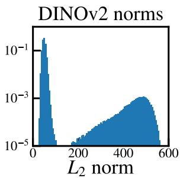

Figure 5: Norm distributions of non-CLIP visual encoders. We visualize the patch feature norm distributions of DINO and DINOv2. Both encoders show a small set of high-norm outliers separated from the majority of regular tokens. For DINOv2, although most patch tokens lie below 100, 2.37% of tokens have norms larger than 150, indicating that the high-norm outlier phenomenon generalizes beyond CLIP-based encoders. The differing norm scales motivate our scale-free top-ρ criterion in place of an absolute threshold.
<table><tr><td>Benchmark</td><td colspan="5">Threshold τ</td></tr><tr><td></td><td>30</td><td>45</td><td>60</td><td>75</td><td>90</td></tr><tr><td>POPE↑</td><td>10.7</td><td>77.8</td><td>78.5</td><td>78.3</td><td>77.5</td></tr><tr><td>MME↑</td><td>752</td><td>1324</td><td>1344</td><td>1334</td><td>1326</td></tr></table>

Table 8: Sensitivity analysis of the high-norm threshold τ . Performance remains stable across a broad range of threshold values, while an overly small threshold degrades performance.

As shown in Tab. 8, the performance remains stable across a relatively broad range of threshold values once $\tau$ is sufficiently large. In particular, choosing τ in the range of [45, 90] leads to only minor variations on both POPE and MME, indicating that our method is not overly sensitive to the exact choice of the threshold. In contrast, an excessively small threshold (τ = 30) causes a clear performance drop, suggesting that overly aggressive filtering may remove useful visual information together with true outliers. The practical message is that high-norm filtering only requires separating the small high-norm tail from the bulk of the distribution, and does not require a precisely tuned operating point. Our reported experiments therefore use the equivalent but scale-free top-ρ rule with $\rho = 1 \%$ , which realizes this separation without exposing an encoder-dependent constant.

## C Experimental Details

## C.1 Benchmarks and Metrics

We evaluate our method on a diverse set of widely used benchmarks covering both image-language and video-language understanding. For imagebased tasks, we report results on GQA (Hudson and Manning, 2019), MMBench (MMB) and MMB-CN (Liu et al., 2024e), MME (Fu et al., 2023), POPE (Li et al., 2023b), ScienceQA (SQA) (Lu et al., 2022), VQA-v2 (Goyal et al., 2017), and TextVQA (Singh et al., 2019), together with four harder reasoning-oriented benchmarks: MMStar (Chen et al., 2024b), MMMU (Yue et al., 2024), AI2D (Kembhavi et al., 2016), and MM-Vet (Yu et al., 2024). For video-based tasks, we additionally evaluate on NextQA (Xiao et al., 2021), MVBench (Li et al., 2024b), SEED-Bench (Li et al., 2024a), and VideoMME (Fu et al., 2025). The detailed information of these tasks is listed below.

GQA (Hudson and Manning, 2019). GQA is a benchmark for real-world visual reasoning and compositional question answering. Its questions are grounded in scene graph structures and paired with functional programs, which makes it well suited for evaluating grounded reasoning, relational understanding, and robustness to superficial language priors.

MMBench / MMB-CN (Liu et al., 2024e). MM-Bench is a systematically designed multiplechoice benchmark for holistic evaluation of visionlanguage models. It organizes evaluation into hierarchical ability dimensions spanning perception and reasoning, while MMB-CN provides a Chinese counterpart that enables bilingual and multilingual assessment under a unified protocol.

MME (Fu et al., 2023). MME is a comprehensive benchmark for multimodal large language models that measures both perception and cognition abilities. It consists of 14 subtasks with manually designed instruction-answer pairs and concise prompts, making evaluation more controlled and less sensitive to prompt engineering.

POPE (Li et al., 2023b). POPE focuses on object hallucination in large vision-language models. It reformulates hallucination evaluation as a set of binary probing questions about object presence and reports metrics such as Accuracy, Precision, Recall, and F1 under multiple sampling strategies, providing a direct measure of hallucination behavior.

ScienceQA (Lu et al., 2022). ScienceQA is a multimodal science question answering benchmark with about 21K multiple-choice questions spanning diverse science topics. In addition to answers, it provides lectures and explanations, so it evaluates not only perception but also multi-step scientific reasoning across text and image inputs.

VQA-v2 (Goyal et al., 2017). VQA-v2 is a largescale open-ended visual question answering benchmark built on diverse real-world images. Each question is paired with ten human answers and evaluated with the standard VQA metric, making it a standard testbed for general visual perception, commonsense grounding, and answer robustness.

TextVQA (Singh et al., 2019). TextVQA evaluates a model’s ability to answer questions that require reading and reasoning over scene text embedded in images. Compared with standard VQA, it places greater emphasis on OCR-sensitive perception and fine-grained integration of textual and visual evidence.

MMStar (Chen et al., 2024b). MMStar is a vision-indispensable benchmark curated to reduce language-prior leakage, i.e., questions that can be answered from text alone. It therefore provides a stricter measure of whether a model genuinely grounds its reasoning in the visual input.

MMMU (Yue et al., 2024). MMMU is a massive multi-discipline benchmark of college-level problems spanning science, engineering, and the humanities. It requires knowledge-intensive, expert-level reasoning over heterogeneous visual formats such as charts, chemical structures, and diagrams. We report results on its validation split.

AI2D (Kembhavi et al., 2016). AI2D is a diagram understanding benchmark built from grade-school science diagrams. Answering its questions requires parsing structured visual layouts, including arrows, labels, and part-whole relations, rather than recognizing natural objects.

MM-Vet (Yu et al., 2024). MM-Vet evaluates integrated multimodal capabilities through openended questions graded by an LLM judge. Because each question typically requires composing several skills, such as recognition, OCR, spatial reasoning, and knowledge retrieval, it is sensitive to the loss of any single piece of visual evidence.

NextQA (Xiao et al., 2021). NextQA is a video question answering benchmark designed to move beyond descriptive QA toward explaining temporal actions. It emphasizes causal and temporal reasoning in realistic videos, and many questions require tracking events, object interactions, and temporal dependencies across multiple frames.

MVBench (Li et al., 2024b). MVBench is a comprehensive benchmark for video understanding that targets temporal reasoning abilities of multimodal models. It covers 20 challenging tasks that cannot be solved reliably from a single frame, spanning a broad range of temporal skills from low-level perception to higher-level cognition.

SEED-Bench (Li et al., 2024a). SEED-Bench is a large-scale multiple-choice benchmark for multimodal large language models with accurate human annotations. It spans a broad set of evaluation dimensions and includes both image- and videocentric scenarios, offering an efficient and relatively objective way to compare general multimodal capability.

VideoMME (Fu et al., 2025). VideoMME is a comprehensive benchmark for evaluating multimodal large language models on video analysis. It is designed to assess full-spectrum video understanding, with an emphasis on temporal comprehension, compositional reasoning, and robust performance across diverse real-world video scenarios.

Metrics. We follow the official evaluation protocols of each benchmark. For classification-style benchmarks such as MMBench, we report accuracy. For VQA-style benchmarks such as VQAv2, TextVQA, and NextQA, we report the official VQA score/accuracy computed by the released evaluation scripts. For MME, we report the standard MME score under its official setup. For POPE, we report Accuracy, and additionally Precision/Recall/F1 when required by the benchmark.

## C.2 Comparison methods.

We compare SinkPruner with existing state-of-theart (SOTA) visual token reduction methods based on different MLLM architectures (i.e., LLaVA-1.5 (Liu et al., 2024a) and Qwen2.5-VL (Bai et al., 2025b)). These baselines employ diverse strategies—such as token merging, attentionbased pruning, adaptive allocation, and hierarchical retention—to improve efficiency by reducing redundant tokens. Specifically, we compare against ToMe (Bolya et al., 2023), MustDrop (Liu et al., 2024d), FastV (Chen et al., 2024a), PDrop (Xing et al., 2024), PruMerge (Shang et al., 2025), SparseVLM (Zhang et al., 2025b), VisionZip (Yang et al., 2025b), Vispruner (Zhang et al., 2025a), DART (Wen et al., 2025), DivPrune (Alvar et al., 2025), HoloV (Zou et al., 2025), MMTok (Dong et al., 2025) and ApET (Ma et al., 2026). Each method offers a unique perspective on balancing computational cost and model performance.

Table 9: Pruning hyperparameters for LLaVA-1.5- 7B under different target token budgets. The original visual input contains 576 tokens. For low-norm selection, both the salience pool and the diversity pool are set equal to the target retained token budget. The high-norm fraction ρ is shared by all budgets and all backbones.
<table><tr><td>Target Budget</td><td>ρ</td><td>Pruning Layers</td><td>| low-norm Pools</td><td>Progressive Token Schedule</td></tr><tr><td>Retain-128</td><td>1%</td><td>(2, 6, 15)</td><td>(128, 128)</td><td>(230,130, 92)</td></tr><tr><td>Retain-64</td><td>1%</td><td>(2,6, 15)</td><td>(64,64)</td><td>(110, 74,42)</td></tr><tr><td>Retain-32</td><td>1%</td><td>(2,6,15)</td><td>(32,32)</td><td>(54,36,22)</td></tr></table>

For the dynamic-resolution Qwen2.5-VL experiments, VisionZip, DivPrune, and MMTok are reimplemented on top of the same lmms-eval harness and the same max\_pixels setting used for SinkPruner, so that all methods observe an identical visual token sequence before pruning.

## D Implementation Details

## D.1 LLaVA Implementation

Backbone and evaluation. For all experiments on the LLaVA family, we use LLaVA-1.5-7B as the base model and follow the official evaluation pipeline released by LLaVA. The original visual input contains a fixed number of 576 image tokens. We adopt the corresponding official toolkit or evaluation server for each benchmark whenever available.

Visual sanitizer. We identify high-norm outliers with the scale-free top-ρ rule, using $\rho = 1 \%$ of the visual tokens. For low-norm token selection, we set both the salience pool size and the diversity pool size to match the target retained token budget. Specifically, the two pool sizes are both set to 128 for Retain-128, 64 for Retain-64, and 32 for Retain-32.

Text-guided pruner. For LLaVA-1.5-7B, we perform text-guided pruning at three layers of the language model, namely layers 2, 6, and 15, corresponding to an early, middle, and late stage of multimodal decoding. At each pruning stage, the number of visual tokens is further reduced in a progressive manner. For the three target budgets, the retained visual tokens after the three pruning stages are set to (230, 130, 92), (110, 74, 42), and (54, 36, 22), respectively. This progressive schedule allows the model to gradually remove redundant tokens while preserving important visual evidence for later reasoning.

Pruning configurations. Tab. 9 summarizes the pruning hyperparameters used in our LLaVA experiments.

Table 10: Pruning hyperparameters for Qwen2.5-VL under different pruning ratios. The diversity pool is always set to 5% of the current tokens, while the salience pool is adjusted according to the target pruning ratio.
<table><tr><td>Target Pruning Ratio</td><td>Salience Pool</td><td>Diversity Pool</td><td>Stage-wise Retention Ratios</td></tr><tr><td>66.7%</td><td>45%</td><td>5%</td><td>(40%, 35%, 25%)</td></tr><tr><td>77.8%</td><td>45%</td><td>5%</td><td>(30%, 20%, 12%)</td></tr><tr><td>88.9%</td><td>20%</td><td>5%</td><td>(18%, 11%, 6%)</td></tr></table>

## D.2 Qwen-VL Implementation

Backbone and evaluation. For all experiments on the Qwen family, we use Qwen2.5-VL as the base model and conduct evaluation with the lmms-eval framework. We use the default frame sampling strategy of the original model. The visual resolution is controlled by setting max\_pixels=376320.

Visual sanitizer. For Qwen2.5-VL, we adopt the same visual sanitizer as in the LLaVA setting. For low-norm token selection, we divide the candidate tokens into a salience pool and a diversity pool, following the same terminology used in the main paper. The diversity pool is always set to 5% of the current visual tokens (with at least one token kept), while the salience pool is adjusted according to the target pruning ratio. Specifically, the salience pool is set to 45%, 45%, and 20% of the current visual tokens for the 66.7%, 77.8%, and 88.9% pruning settings, respectively. Since this vision tower provides no [CLS] token, the salience term is instantiated by the CLS-free score described in Sec. D.3.

Text-guided pruner. We apply progressive textguided pruning in three stages. For different target pruning ratios, the three stages use different retention schedules to gradually reduce the visual tokens. When the target pruning ratio is 66.7%, the three stages retain 40%, 35%, and 25% of the current tokens, respectively. When the target pruning ratio is 77.8%, the corresponding stage-wise retention ratios are 30%, 20%, and 12%. For the most aggressive setting with a target pruning ratio of 88.9%, the three stages retain 18%, 11%, and 6% of the current tokens, respectively. This progressive design enables the model to remove redundant visual tokens step by step while preserving useful evidence for subsequent multimodal reasoning.

Pruning configurations. Tab. 10 summarizes the pruning hyperparameters used in our Qwen2.5-VL experiments.

The pool sizes are defined as proportions rather than fixed counts, since Qwen2.5-VL uses dynamic

visual tokenization.

## D.3 Salience Scoring for Encoders without a CLS Token

The salience score $A _ { c l s }$ used in Sec. 3 presumes a [CLS]-based encoder such as CLIP-ViT, where the attention from the [CLS] token to each patch provides a natural global importance signal. Several modern vision towers, including that of Qwen2.5- VL (Bai et al., 2025b), do not maintain such a token. We emphasize that SinkPruner does not fundamentally depend on it: high-norm identification, high-norm aggregation, and diversity-based selection are all defined purely over patch features and are therefore already CLS-free. Only the salience term requires an equivalent substitute.

For non-CLS encoders, we define the salience of visual token $j$ as its average received visual selfattention,

$$
s _ { j } = \frac { 1 } { H N } \sum _ { h = 1 } ^ { H } \sum _ { i = 1 } ^ { N } A _ { i j } ^ { ( h ) } ,\tag{5}
$$

where $A _ { i j } ^ { ( h ) }$ is the attention weight from visual token i to visual token j in head h, H is the number of attention heads, and $N$ is the number of visual tokens. Intuitively, $s _ { j }$ measures how strongly the remaining visual context attends to token $j ,$ so it serves the same purpose as CLS attention: patches that many other patches rely on receive a high score. We compute Eq. equation 5 at the penultimate encoder layer, average over all heads, and substitute $s _ { j }$ for $A _ { c l s }$ in the top-kres selection; no other part of the pipeline changes.

Our Qwen2.5-VL experiments validate this substitution. Under 88.9% pruning, SinkPruner with the CLS-free score retains 91.8% of the full-model performance, exceeding HoloV by 5.6 points and VisionZip by 4.1 points (Tab. 2). This indicates that the received-attention formulation is a viable dropin replacement rather than a degraded fallback.

## D.4 Batched Diversity Selection

Eq. equation 3 is written as a serial farthest-point rule for clarity: each round appends exactly one token, so obtaining $k _ { d i v }$ diverse tokens requires $k _ { d i v }$ sequential rounds. Because every round depends on the set selected so far, this loop cannot be parallelized on GPU and would dominate the prefill stage when the visual sequence is long, as in high-resolution or video inputs.

Our implementation therefore uses a batched approximation. At round t, let ${ \mathbf { } } S ^ { ( t ) }$ be the currently selected set and $\mathcal { R } ^ { ( t ) }$ the remaining candidates. We score all candidates simultaneously with a single matrix product, $d ( x ) = \operatorname* { m a x } _ { s \in S ^ { ( t ) } }$ CosSim(x, s), and append the b least similar ones at once:

$$
\mathcal { B } ^ { ( t ) } = \mathrm { B o t t o m } _ { b } \big ( \{ d ( x ) \ | \ x \in \mathcal { R } ^ { ( t ) } \} \big ) ,\tag{6}
$$

where Bottom (·) returns the b candidates with the smallest scores. The two sets are then updated as $S ^ { ( t + 1 ) } = S ^ { ( t ) } \cup B ^ { ( t ) }$ and $\mathcal { R } ^ { ( t + 1 ) } = \mathcal { R } ^ { ( t ) } \dot { \backslash B ^ { ( t ) } }$ . We use $b = 1 6$ throughout, which reduces the number of sequential rounds from $k _ { d i v }$ to $\lceil k _ { d i v } / 1 6 \rceil$ $i . e .$ by about 16×.

Setting $b = 1$ recovers Eq. equation 3 exactly. For $b > 1$ the two rules differ, because the tokens within one batch are all scored against ${ \mathbf { } } S ^ { ( t ) }$ and are therefore not penalized for being similar to each other. The batched variant is thus a close approximation rather than a mathematical equivalent of the serial rule. In practice the gap is small, since candidates are ranked by dissimilarity to an already diverse anchor set $S ^ { ( t ) } \supseteq \mathbf { X } _ { r e s }$ , and b is far smaller than $| \mathcal { R } ^ { ( t ) } |$ . All numbers reported in this paper are produced with the batched variant.

## D.5 Compute and Hardware

All experiments are conducted on NVIDIA A800- SXM4-80GB GPUs. Our implementation is based on Python 3.10 with PyTorch 2.1.2 and CUDA 12.1. For all benchmarks, we follow the official evaluation protocols and adopt the default settings of the corresponding baseline implementations.

Attention implementation at pruning layers. The text-guided pruner requires materialized textto-vision attention scores, which standard FlashAttention kernels do not expose. We therefore fall back to an eager attention implementation at the three pruning layers only; every other layer keeps the efficient kernel and operates on an already shortened visual sequence. The efficiency numbers reported in Tab. 5 and Tab. 13 already include this overhead.

## E Additional Experiments

In this section, we provide additional experimental results to complement the main paper. Specifically, we report more comprehensive comparisons on both image and video benchmarks, together with additional real-inference results under different pruning ratios. These results further verify that our method consistently achieves a stronger accuracy-efficiency trade-off across different architectures and evaluation settings.

For image understanding, we present extended benchmark results on LLaVA-1.5 in Tab. 1. For video understanding, we provide additional comparisons on Qwen2.5-VL in Tab. 12. We also include real inference measurements on POPE in Tab. 13, reporting runtime, prefill cost, decoding latency, and relative accuracy under different pruning ratios. Overall, these additional experiments further support the effectiveness and robustness of our method beyond the results shown in the main paper.

## F Generalization across Model Scales and Visual-Token Regimes

The main paper evaluates fixed-grid LLaVA-1.5-7B and dynamic-resolution Qwen2.5-VL-7B. This section reports two further settings that stress the two remaining axes of variation: model capacity and visual-sequence length. In both cases the vision encoder, the top-ρ rule, and all other hyperparameters are kept unchanged.

## F.1 Transfer across Model Scale

We first run SinkPruner on LLaVA-1.5-13B, replacing only the language model. As reported in Tab. 14, the behavior is consistent with the 7B setting. With 192 retained tokens, SinkPruner preserves 99.2% of the full-model average and even slightly exceeds the unpruned model on MME and SQA. Under roughly 90% pruning (64 tokens), it preserves 96.2% and outperforms VisionZip by 2.0 relative-performance points, with the largest singlebenchmark gap on POPE (84.77 vs. 76.00). This indicates that high-norm outliers are a property of the visual representation rather than of one specific decoder capacity.

## F.2 Transfer to High-Resolution Inputs

We next evaluate on LLaVA-NeXT-7B (Liu et al., 2024b), whose any-resolution scheme expands one image into roughly 2,880 visual tokens—five times the 576 tokens of LLaVA-1.5—placing the highnorm observation in a markedly different token regime. All numbers in Tab. 15 are produced by a single end-to-end run of the same evaluation harness, and the Avg column normalizes every row against the Upper Bound measured in that run.

SinkPruner attains the best average retention at both budgets, reaching 94.2% with 320 retained tokens and 92.2% with 160, ahead of the strongest baseline VisPruner by 2.0 and 5.7 points. The margin widens as the budget tightens, which mirrors the trend we observe on LLaVA-1.5: the harder the compression, the more it matters that the retained tokens are not high-norm background. The advantage is concentrated on POPE, where SinkPruner loses almost nothing relative to the full model (87.40 vs. 87.61, i.e., 99.8% retention) while every baseline degrades by at least 7 points, and on GQA, where it leads VisPruner by 1.8 and 3.9 points.

<table><tr><td>Methods</td><td>GQA</td><td>MMB</td><td> $\mathbf { M M B } _ { \mathrm { C N } }$ </td><td>MME</td><td>POPE</td><td>SQA</td><td> $\mathbf { V Q A } _ { \mathrm { V 2 } }$ </td><td> $\mathbf { V Q A } _ { \mathrm { T e x t } }$ </td><td>Average</td></tr><tr><td>Upper Bound, 576 Tokens</td><td>61.9</td><td>64.7</td><td>58.1</td><td>1862</td><td>85.9</td><td>69.5</td><td>78.4</td><td>58.2</td><td>100%</td></tr><tr><td colspan="10">LLaVA-1.5 7B</td></tr><tr><td>ToMe (ICLR23)</td><td>52.4</td><td>53.3</td><td>-</td><td>1343</td><td>Retain 128 Tokens (Pruning Ratio = 77.8%) 62.8</td><td>59.6</td><td>63.0</td><td>49.1</td><td>80.4</td></tr><tr><td>FastV (ECCV24)</td><td>49.6</td><td>56.1</td><td>56.4</td><td>1490</td><td>59.6</td><td>60.2</td><td>61.8</td><td>50.6</td><td>83.2</td></tr><tr><td>MustDrop (2024.11)</td><td>56.9</td><td>61.1</td><td>55.2</td><td>1745</td><td>78.7</td><td>68.5</td><td>74.6</td><td>56.3</td><td>94.6</td></tr><tr><td>LLaVA-PruMerge (ICCV25)</td><td>53.3</td><td>58.1</td><td>51.7</td><td>1554</td><td>67.2</td><td>67.1</td><td>68.8</td><td>54.3</td><td>88.0</td></tr><tr><td>PDrop (2024.10)</td><td>56.0</td><td>61.1</td><td>56.6</td><td>1644</td><td>82.3</td><td>68.3</td><td>72.9</td><td>55.1</td><td>94.0</td></tr><tr><td>VisionZip (CVPR25)</td><td>57.6</td><td>63.4</td><td>56.7</td><td>1768</td><td>84.7</td><td>68.8</td><td>75.6</td><td>56.8</td><td>96.9</td></tr><tr><td>SparseVLM (ICML25)</td><td>56.0</td><td>60.0</td><td>51.1</td><td>1696</td><td>80.5</td><td>67.1</td><td>73.8</td><td>54.9</td><td>92.6</td></tr><tr><td>HoloV (NeurIPS25)</td><td>57.7</td><td>63.9</td><td>56.5</td><td>1802</td><td>84.0</td><td>69.8</td><td>75.5</td><td>56.8</td><td>97.3</td></tr><tr><td>ApET (2026.02)</td><td>58.9</td><td>62.3</td><td>56.4</td><td>1801</td><td>86.1</td><td>68.7</td><td>75.1</td><td>53.9</td><td>97.0</td></tr><tr><td>SinkPruner (Ours)</td><td>59.3</td><td>63.6</td><td>57.9</td><td>1806</td><td>85.3</td><td>69.8</td><td>76.8</td><td>55.8</td><td>98.0</td></tr><tr><td colspan="10">Retain 64 Tokens (Pruning Ratio = 88.9%)</td></tr><tr><td>LLaVA-1.5-7B ToMe (ICLR23)</td><td>48.6</td><td>43.7</td><td></td><td>1138</td><td>52.5</td><td>50.0</td><td>57.1</td><td>45.3</td><td>70.1</td></tr><tr><td>FastV (ECCV24)</td><td>46.1</td><td>48.0</td><td>52.7</td><td>1256</td><td>48.0</td><td>51.1</td><td>55.0</td><td>47.8</td><td>73.6</td></tr><tr><td>MustDrop (2024.11)</td><td>53.1</td><td>60.0</td><td>53.1</td><td>1612</td><td>68.0</td><td>63.4</td><td>69.3</td><td>54.2</td><td>88.5</td></tr><tr><td>PDrop (2024.10)</td><td>41.9</td><td>33.3</td><td>50.5</td><td>1092</td><td>55.9</td><td>68.6</td><td>69.2</td><td>45.9</td><td>74.5</td></tr><tr><td>VisionZip (CVPR25)</td><td>55.1</td><td>60.1</td><td>55.4</td><td>1690</td><td>77.0</td><td>69.0</td><td>72.4</td><td>55.5</td><td>93.1</td></tr><tr><td>SparseVLM (ICML25)</td><td>52.7</td><td>56.2</td><td>46.1</td><td>1505</td><td>75.1</td><td>62.2</td><td>68.2</td><td>51.8</td><td>85.6</td></tr><tr><td>HoloV (NeurIPS25)</td><td>55.3</td><td>63.3</td><td>55.1</td><td>1715</td><td>80.3</td><td>69.5</td><td>72.8</td><td>55.4</td><td>94.5</td></tr><tr><td>ApET (2026.02)</td><td>56.9</td><td>61.2</td><td>54.4</td><td>1714</td><td>84.4</td><td>68.9</td><td>75.1</td><td>53.9</td><td>94.6</td></tr><tr><td>SinkPruner (Ours)</td><td>57.4</td><td>62.8</td><td>56.9</td><td>1754</td><td>83.8</td><td>70.0</td><td>75.0</td><td>55.5</td><td>96.4</td></tr><tr><td colspan="10">Retain 32 Tokens (Pruning Ratio 94.4%)</td></tr><tr><td>ToMe (ICLR23)</td><td>43.6</td><td>31.6</td><td>28.1</td><td>828</td><td>39.0</td><td>41.4</td><td>46.8</td><td>38.3</td><td>55.3</td></tr><tr><td>FastV (ECCV24)</td><td>41.5</td><td>37.8</td><td>33.2</td><td>885</td><td>32.5</td><td>42.6</td><td>43.4</td><td>42.5</td><td>57.2</td></tr><tr><td>SparseVLM (ICML25)</td><td>48.3</td><td>51.4</td><td>40.6</td><td>1047</td><td>67.9</td><td>57.3</td><td>58.6</td><td>46.1</td><td>74.9</td></tr><tr><td>PruMerge+(2024.05)</td><td>51.1</td><td>56.8</td><td>47.0</td><td>941</td><td>70.9</td><td>68.5</td><td>54.9</td><td>50.6</td><td>80.0</td></tr><tr><td>VisionZip (CVPR25)</td><td>51.8</td><td>57.7</td><td>50.3</td><td>1247</td><td>68.7</td><td>68.8</td><td>67.1</td><td>53.1</td><td>85.3</td></tr><tr><td>VisPruner (ICCV25)</td><td>52.2</td><td>58.4</td><td>52.7</td><td>1271</td><td>72.7</td><td>69.2</td><td>67.7</td><td>53.9</td><td></td></tr><tr><td>SinkPruner (Ours)</td><td>55.1</td><td>61.2</td><td>55.3</td><td>1363</td><td>78.5</td><td>69.9</td><td>71.4</td><td>54.8</td><td>87.1 91.2</td></tr></table>

Table 11: Comprehensive experimental results on LLaVA-1.5-7B across different image-language benchmarks under different pruning ratios. Best results are in bold. Unlike Tab. 1, this table additionally reports VQA-v2, so the averages are computed over eight benchmarks instead of seven and may differ slightly from those in the main paper.
<table><tr><td>Method</td><td>NextQA WUPS</td><td>MVBench Acc</td><td>SEEDBench Acc</td><td>VideoMME Score</td><td>Average (%)</td></tr><tr><td>Qwen2.5-VL-7B (Full)</td><td>26.22</td><td>68.10</td><td>62.18</td><td>60.67</td><td>100.0%</td></tr><tr><td>DART (EMNLP25)</td><td>25.52</td><td>65.80</td><td>61.00</td><td>57.74</td><td>96.8%</td></tr><tr><td>DivPrune (CVPR25)</td><td>25.67</td><td>65.85</td><td>59.79</td><td>57.78</td><td>96.5%</td></tr><tr><td>SinkPruner (Ours)</td><td>26.03</td><td>66.70</td><td>61.80</td><td>58.59</td><td>98.3%</td></tr></table>

Table 12: Comprehensive experimental results of various methods across different video-language benchmarks under an 80% token pruning ratio. Unlike Tab. 3, this table additionally reports NextQA, so the averages are computed over four benchmarks instead of three and may differ slightly from those in the main paper.

TextVQA is the one benchmark on which SinkPruner does not lead. It retains 89.0% (320 tokens) and 88.8% (160 tokens) of the full-model score, close to VisionZip (90.1% and 89.1%) but below VisPruner (93.9% and 91.2%). We attribute the residual gap to the interaction between the sanitizer and scene text under tiled high-resolution encoding: small glyph patches can themselves carry large feature norms, so a purely norm-based rule may aggregate a few genuine textual tokens together with background outliers. Notably, the gap does not widen at the tighter budget (2.98 points at 320 tokens versus 1.51 at 160), indicating that the effect is a bounded bias of the criterion rather than a breakdown under aggressive pruning; on LLaVA-1.5 and Qwen2.5-VL, where visual tokens are not tiled, SinkPruner gives the best TextVQA scores among all compared methods. Making the sanitizer text-aware, for instance by exempting high-norm tokens with high local edge density, is left to future work.

<table><tr><td>Methods</td><td>Time (mm:ss)</td><td>Prefill (ms)</td><td>Latency (ms)</td><td>Acc. (%)</td><td>Time (mm:ss)</td><td>Prefill (ms)</td><td>Latency (ms)</td><td>Acc. (%)</td></tr><tr><td>Upper Bound (576 Tokens)</td><td>19:28</td><td>62.75</td><td>121.0</td><td>100%</td><td>19:28</td><td>62.75</td><td>121.0</td><td>100%</td></tr><tr><td>LLaVA-1.5-7B</td><td colspan="4">Pruning Ratio = ↓ 77.8%</td><td colspan="4">Pruning Ratio = ↓ 90.0%</td></tr><tr><td>FastV (ECCV24)</td><td>13:56</td><td>42.75</td><td>83.6</td><td>69.4%</td><td>12:02</td><td>32.2</td><td>75.0</td><td>65.5%</td></tr><tr><td>VisionZip (CVPR25)</td><td>13:28</td><td>44.11</td><td>85.4</td><td>95.1%</td><td>12:24</td><td>36.9</td><td>77.4</td><td>91.8%</td></tr><tr><td>SparseVLM (ICML25)</td><td>13:07</td><td>46.01</td><td>83.5</td><td>94.6%</td><td>12:20</td><td>38.6</td><td>77.0</td><td>90.5%</td></tr><tr><td>SinkPruner (Ours)</td><td>14:01</td><td>45.24</td><td>89.8</td><td>99.8%</td><td>12:59</td><td>37.1</td><td>86.0</td><td>97.1%</td></tr></table>

Table 13: Real inference comparison on POPE. Experiments adopt 77.8% and 90% pruning ratios.

<table><tr><td>Methods</td><td>|Tok</td><td>GQA</td><td>MME</td><td>POPE</td><td>SQA</td><td>Avg</td></tr><tr><td>Upper Bound</td><td>| 576</td><td>63.25</td><td>1827.05</td><td>87.13</td><td>72.73</td><td>100.0%</td></tr><tr><td>VisionZip (CVPR25)</td><td>192</td><td>59.60</td><td>1770.00</td><td>86.40</td><td>72.80</td><td>97.8%</td></tr><tr><td>SinkPruner (Ours)</td><td>192</td><td>60.04</td><td>1839.36</td><td>87.11</td><td>73.53</td><td>99.2%</td></tr><tr><td>VisionZip (CVPR25)</td><td>64</td><td>56.20</td><td>1676.00</td><td>76.00</td><td>74.40</td><td>94.2%</td></tr><tr><td>SinkPruner (Ours)</td><td>64</td><td>57.60</td><td>1750.13</td><td>84.77</td><td>73.33</td><td>96.2%</td></tr></table>

Table 14: Transfer across model scale on LLaVA-1.5- 13B. SinkPruner keeps its advantage when the language model grows from 7B to 13B. Best results per budget are in bold.

<table><tr><td>Methods</td><td>GQA</td><td> $\mathbf { V Q A } _ { \mathrm { T e x t } }$ </td><td>POPE</td><td>Avg</td></tr><tr><td>Upper Bound, 2880 Tokens</td><td>64.23</td><td>61.37</td><td>87.61</td><td>100.0%</td></tr><tr><td>LLaVA-NeXT-7B</td><td colspan="4">Retain 320 Tokens (Pruning Ratio ≈</td></tr><tr><td>FastV (ECCV24)</td><td>55.90</td><td>55.70</td><td>71.70</td><td>88.9%) 86.5</td></tr><tr><td>SparseVLM (ICML25)</td><td>56.50</td><td>52.40</td><td>73.50</td><td>85.7</td></tr><tr><td>VisionZip (CVPR25)</td><td>58.10</td><td>55.30</td><td>75.00</td><td>88.7</td></tr><tr><td>VisPruner (ICCV25)</td><td>58.40</td><td>57.60</td><td>80.40</td><td>92.2</td></tr><tr><td>SinkPruner (Ours)</td><td>60.19</td><td>54.62</td><td>87.40</td><td>94.2</td></tr><tr><td>LLaVA-NeXT-7B</td><td colspan="4">Retain 160 Tokens (Pruning Ratio ≈ 94.4%)</td></tr><tr><td>FastV (ECCV24)</td><td>49.80</td><td>51.90</td><td>51.70</td><td>73.7</td></tr><tr><td>SparseVLM (ICML25)</td><td>50.20</td><td>45.10</td><td>54.60</td><td>71.3</td></tr><tr><td>VisionZip (CVPR25)</td><td>54.30</td><td>54.70</td><td>59.40</td><td>80.5</td></tr><tr><td>VisPruner (ICCV25)</td><td>54.70</td><td>56.00</td><td>72.90</td><td>86.5</td></tr><tr><td>SinkPruner (Ours)</td><td>58.56</td><td>54.49</td><td>84.67</td><td>92.2</td></tr></table>

Table 15: Performance comparison on the highresolution LLaVA-NeXT-7B, whose visual input expands to about 2,880 tokens. Avg is the mean perbenchmark ratio to the Upper Bound. Best results are in bold.

## G Ablations of the Remaining Hyperparameters

Beyond the high-norm criterion analyzed in Sec. B, SinkPruner involves two further groups of design choices: where the text-guided pruner acts inside the LLM together with its progressive retention schedule, and how the low-norm budget is split between the salience pool and the diversity pool. We stress that these are empirical implementation defaults rather than the core contribution, and that we did not perform a grid search to select them. The analyses below verify that claim.

Pruning layers and progressive schedules. Our default prunes at layers (2, 6, 15), which realizes a coarse-to-fine rule: early layers discard obvious redundancy, middle layers remove cross-modally irrelevant tokens, and later layers retain text-relevant evidence once cross-modal interaction has become discriminative. To test whether performance hinges on this exact triplet, we perturb each pruning layer by ±1 while keeping the layer-wise tokencomputation budget $\textstyle \sum _ { l } n _ { l }$ identical across configurations; the retention schedule is adjusted accordingly so that all seven settings consume the same compute. Tab. 16 shows a flat response surface. POPE accuracy stays within a 1.21-point band (80.17 to 81.38) and MME Total within about 35 points, and no configuration collapses. Notably, our reported setting is not the best-performing one, which is consistent with our statement that it was never optimized per benchmark. We note that this analysis establishes insensitivity to pruning locations and retention allocation; it does not claim that three stages are theoretically optimal, and we adopt three stages simply as a progressive default that balances gradual pruning against implementation overhead.

Salience-to-diversity split. The visual sanitizer draws representative tokens from a salience pool and a diversity pool. To separate the effect of the split from that of the budget, we fix the total candidate budget to 2×Retain and vary only the allocation between the two pools. As shown in Tab. 17, POPE accuracy spans 80.49 to 81.91 and MME Total spans 1629.05 to 1682.61, with the two metrics preferring opposite ends of the range: diversity-heavy splits favor POPE while salience-heavy splits favor MME. Rather than picking whichever endpoint maximizes a particular benchmark, we keep the symmetric 5: 5 split as a benchmark-independent default.

<table><tr><td>Config</td><td>Prune layers</td><td>Retain schedule</td><td>POPE Acc.</td><td>POPE F1</td><td>MME-P</td><td>MME-C</td><td>MME Total</td></tr><tr><td>Default (ours)</td><td>[2,6,15]</td><td>[54,36,22]</td><td>80.93</td><td>77.52</td><td>1333.84</td><td>296.79</td><td>1630.63</td></tr><tr><td> $\mathbf { A } 1 \colon 2 \to 1$ </td><td>[1, 6, 15]</td><td>[56, 36,22]</td><td>80.69</td><td>77.13</td><td>1356.92</td><td>299.64</td><td>1656.56</td></tr><tr><td> ${ \bf A } 2 \colon 2  3 $ </td><td>[3, 6, 15]</td><td>[51, 36, 22]</td><td>81.09</td><td>77.71</td><td>1332.25</td><td>301.43</td><td>1633.68</td></tr><tr><td> $\mathrm { B } 1 \colon 6 \to 5$ </td><td>[2, 5, 15]</td><td>[54, 38, 22]</td><td>80.17</td><td>76.20</td><td>1333.10</td><td>303.93</td><td>1637.02</td></tr><tr><td> ${ \bf B } 2 \colon 6  7 \ \AA$ </td><td>[2, 7, 15]</td><td>[54, 34, 22]</td><td>81.38</td><td>78.22</td><td>1358.95</td><td>306.79</td><td>1665.74</td></tr><tr><td> ${ \mathrm { C } } 1 \colon 1 5 \to 1 4$ </td><td>[2, 6, 14]</td><td>[54, 36, 23]</td><td>81.01</td><td>77.64</td><td>1348.86</td><td>296.43</td><td>1645.29</td></tr><tr><td>C2: 15→16</td><td>[2, 6, 16]</td><td>[54, 36, 21]</td><td>80.90</td><td>77.47</td><td>1339.32</td><td>306.43</td><td>1645.75</td></tr></table>

Table 16: Sensitivity to the choice of pruning layers. Each pruning layer is perturbed by ±1 while the layer-wise token-computation budget $\textstyle \sum _ { l } n _ { l }$ is held constant across configurations, so that only the location of pruning changes. POPE accuracy varies within a 1.21-point band and MME Total within about 35 points; the configuration used in the paper is not the best-performing one, confirming that it was not selected by benchmark-specific search.

<table><tr><td>Sal. : Div.</td><td>Sal.</td><td>Div.</td><td>POPE Acc.</td><td>POPE F1</td><td>MME Total</td></tr><tr><td>3:7</td><td>19</td><td>45</td><td>81.86</td><td>79.01</td><td>1629.05</td></tr><tr><td>4:6</td><td>26</td><td>38</td><td>81.91</td><td>78.93</td><td>1662.61</td></tr><tr><td>5: 5 (ours)</td><td>32</td><td>32</td><td>80.93</td><td>77.52</td><td>1630.63</td></tr><tr><td>6:4</td><td>38</td><td>26</td><td>80.52</td><td>76.90</td><td>1675.48</td></tr><tr><td>7:3</td><td>45</td><td>19</td><td>80.49</td><td>76.72</td><td>1682.61</td></tr></table>

Table 17: Allocation between the salience pool and the diversity pool under a fixed total budget of 2×Retain, which isolates the effect of the split from that of the budget. The response surface is smooth, and we keep the symmetric 5 : 5 split as a benchmark-independent default.

## H Additional Analysis of the Pruning Mechanism

In this section, we provide additional analysis to better understand why SinkPruner consistently outperforms prior text-guided pruning methods such as SparseVLM. Our analysis suggests that previous methods are affected by two closely related issues, namely massive activations and text-visual attention dispersion, both of which are substantially alleviated by our cascading design.

## H.1 Mitigating Massive Activations

Existing text-guided methods (e.g., Sparse-VLM (Zhang et al., 2025b)) are built on the assumption that large attention weights in the LLM decoder indicate semantic relevance. However, recent studies (Kang et al., 2025) show that MLLM decoders often exhibit massive activations, where a small set of tokens attract disproportionately large attention regardless of their textual relevance. These tokens behave as attention sinks, which can distort token importance estimation and mislead downstream pruning.

Our empirical analysis shows that reducing inherent visual redundancy significantly alleviates this effect. As shown in Fig. 6, standard textguided pruning operates on raw visual sequences and therefore tends to retain many sink tokens due to their inflated attention scores. This leads to a sink ratio of 14.23%, meaning that a noticeable fraction of the token budget is consumed by nonsemantic outliers. In contrast, our visual sanitizer first purifies the visual stream before it enters the LLM decoder. This upstream pre-conditioning substantially suppresses the massive activation phenomenon, reducing the sink ratio to 3.85%. As a result, the following text-guided pruning stage can operate on a much cleaner attention landscape and focus more reliably on truly relevant visual evidence.

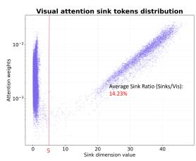

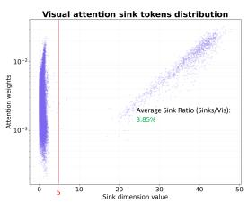  
Figure 6: Visual Attention Sinks in the LLM Decoder. The scatter plot correlates attention weights (y-axis) with massive activation values (x-axis). (Left) Standard text-guided methods (e.g., SparseVLM) operate in a high-sink regime, retaining a large cluster of attention sinks (red line, ratio 14.23%). (Right) SinkPruner operates in a low-sink regime. By applying our visual sanitizer to reduce inherent visual redundancy, we effectively suppress massive activations, reducing the sink ratio to 3.85% and clarifying the attention landscape.

## H.2 Reducing Text-Visual Attention Dispersion

A second limitation of text-guided pruning methods is text-visual attention dispersion. When raw and highly redundant visual tokens are directly fed into the LLM, cross-modal attention tends to become diffuse and uncertain. We quantify this behavior using Shannon entropy: high entropy indicates that attention is broadly spread and the model lacks discriminative focus, whereas low entropy indicates a sharper and more confident selection pattern.

Table 18: Text-visual attention entropy at the pruning layer. Lower entropy indicates higher selection confidence.
<table><tr><td>Method</td><td>Entropy (↓)</td></tr><tr><td>SparseVLM</td><td>6.359</td></tr><tr><td>SinkPruner (Ours)</td><td>4.851</td></tr></table>

As shown in Tab. 18, SparseVLM exhibits a relatively high attention entropy of 6.36, reflecting substantial selection uncertainty caused by redundant visual inputs. By contrast, SinkPruner significantly reduces the entropy to 4.85. This result suggests that the visual sanitizer acts as an effective denoising stage: by filtering redundant visual content before text-guided pruning, it sharpens the text-to-vision attention distribution and enables the model to identify linguistically relevant tokens with higher confidence.

## I Additional Visualizations

In this section, we provide more qualitative visualizations to better illustrate the observations behind our method. These examples offer direct evidence that the problematic attention outliers discussed in the main paper are closely associated with highnorm tokens, and that such tokens are typically concentrated in spatially redundant, non-semantic regions.

## I.1 Visualizations of attention outliers and high-norm tokens

Figure 7 presents multiple examples comparing CLS attention maps and feature ℓ -norm heatmaps. The results show that sparse attention spikes consistently align with a small set of abnormally highnorm tokens, confirming that these outliers are responsible for the distorted attention patterns observed in the vision encoder. See Fig. 7.

## I.2 Visualizations of high-norm patches and low-norm patches

Figure 8 further compares the spatial locations of high-norm and informative low-norm tokens across more examples. We observe that high-norm outliers are mostly concentrated in locally repetitive background areas, while the retained low-norm tokens tend to lie on visually distinctive and semantically meaningful regions. These visualizations provide additional qualitative support for our claim that high-norm tokens are highly redundant in both spatial and representational dimensions. See Fig. 8.

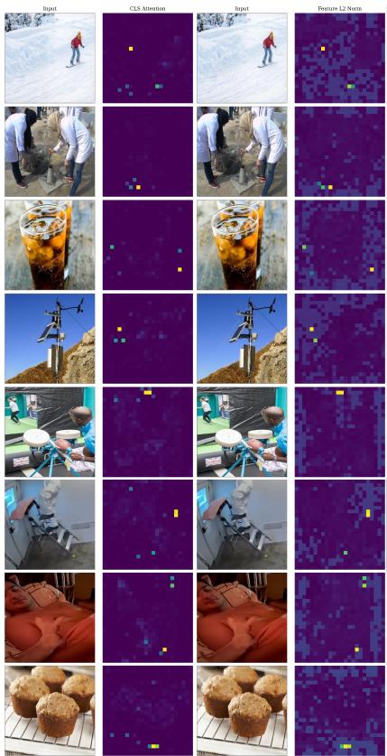  
Figure 7: Attention Artifacts Coincide with High-Norm Outliers. We show multiple image examples (left to right): Input, CLS Attention, Input, and Feature $\ell _ { 2 }$ Norm. The CLS attention maps exhibit sparse, peaky outliers (bright spots) that frequently appear in nonsemantic background regions. Crucially, these attention peaks spatially align with abnormally large feature norms in the corresponding $\ell _ { 2 }$ -norm heatmaps, indicating that the observed high attention is largely driven by high-norm outliers rather than semantic relevance.

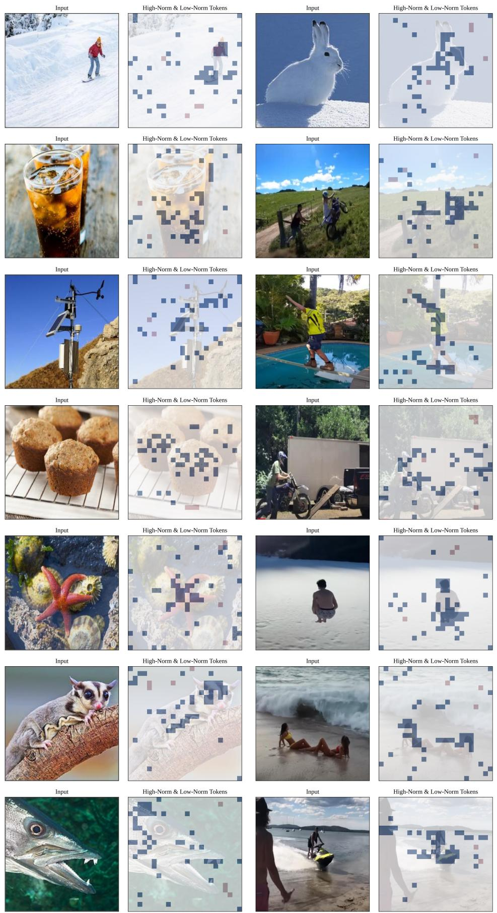  
Figure 8: Spatial Redundancy Analysis. Visualizations demonstrate that high-norm outlier tokens (red) predominantly appear in non-semantic regions with high local similarity, whereas filtered informative low-norm tokens (blue, top-ranked by CLS attention) correspond to unique local features.