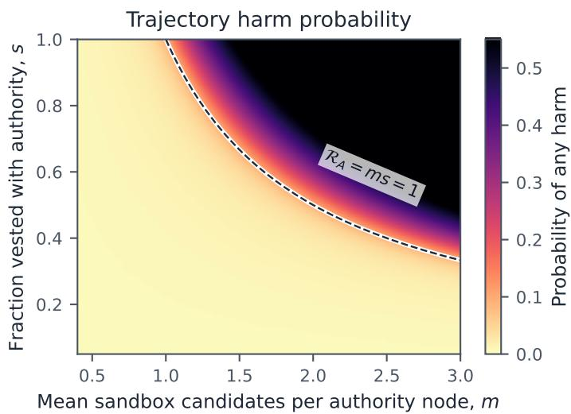
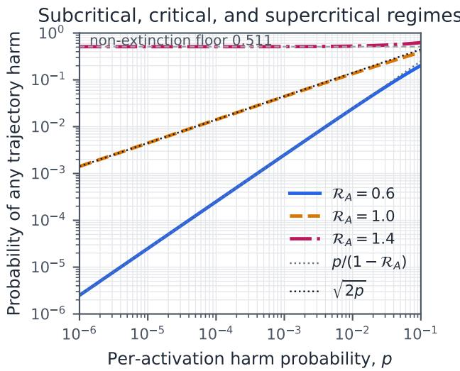
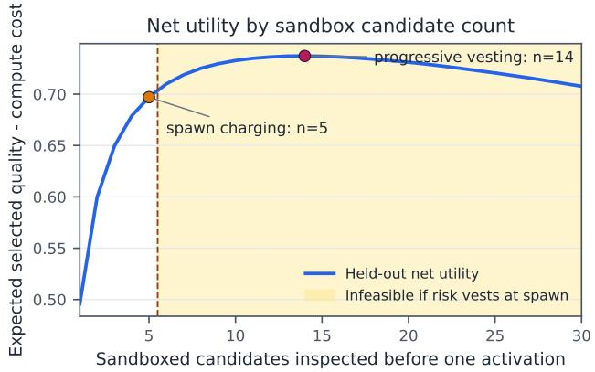

# Spawn Freely, Act Sparingly: Progressive Risk Vesting for Recursive LLM-Agent Trees

Molly Wang

Imperial Business School

London, United Kingdom

jw923@ic.ac.uk

## Abstract

Recursive LLM agents can broaden their search by spawning specialists. Some branches later request tools that send data or deploy code. When should a branch receive authority to act? We distinguish sandbox spawning, in which external controls prevent the specified harm, from capability activation, in which a selected branch crosses an irreversible-action boundary. Progressive Risk Vesting (PRV) holds a trajectory-level risk budget in escrow and debits it as branches are activated. We prove an anytime harm bound for adaptively generated trees. Branch outcomes may be dependent, but each local certificate needs to remain valid conditional on the full pre-activation history, including the information used to select the request. When activation gates, branch charges, and compute constraints are held fixed, delayed vesting preserves every policy available under irrevocable spawn charging. Marginal risk estimates can still fail after branch selection. In a stylized branching model, trajectory harm changes as the authority reproduction number R� crosses one. As local risk � approaches zero, trajectory harm is proportional to � below criticality, proportional to √� at critical- ity, and retains a positive floor above it. A finite-type occupancy model yields risk and compute shadow prices. For nested fanout modes with decreasing marginal value per unit risk, these prices produce a threshold rule. Branching calculations and a split-sample experiment illustrate the results. These synthetic studies do not estimate safety in deployed agents. The analysis suggests a design rule: search broadly in the sandbox and grant recursive authority sparingly, with an explicit risk charge.

## CCS Concepts

• Computing methodologies → Multi-agent systems; • Secu rity and privacy → Software security engineering.

## Keywords

recursive LLM agents, risk control, branching processes, capability activation

## 1 Introduction

## 1.1 The decision hidden inside recursive spawning

Consider a coding agent asked to repair a production service. It sends children to diagnose the issue and draft a patch; those chil dren may spawn their own specialists. Most branches work in a disposable repository and return candidate artifacts. At some point, one branch requests a capability with external efects, perhaps access to a secret or permission to deploy. The system has moved from generating possibilities to changing the world.

Recent systems use recursive delegation to create reasoning threads and run recursive workloads in parallel [13, 15]. More branches may improve coverage. They also consume compute and time and increase the number of branches that may receive authority. Each authorized descendant adds another possible path to irreversible harm, whether through prompt injection or tool failure. NIST’s agent-hijacking evaluations include data exfiltration and malicious code execution [11]. This makes the authorization chain a separate safety concern [16].

Two possible controls are hard fanout limits and a risk charge for every new child. Either can suppress useful exploration. If external controls prevent a reasoning branch from causing the specified harm, that branch consumes compute without increasing exposure to the same catastrophe. Charging it as if it held production credentials can lose the option value of generating and comparing candidates. If every child receives the parent’s authority, broad search also expands the attack surface.

We study the diference between delegating work and delegating the right to act. A child starts with sandboxed capabilities. The shared risk budget is charged when a governor approves a specified irreversible action or a capability that could enable one. We therefore distinguish two trees: a sandbox tree that consumes compute and an authority tree that consumes the risk budget. Our central question is:

How can broad recursive search coexist with controlled irreversible authority?

## 1.2 Contributions

We propose Progressive Risk Vesting (PRV). Our main contributions are:

(1) Risk escrow. Branches may explore inside an enforced sandbox. The governor debits the shared risk budget when a selected branch crosses an irreversible boundary. A branch cancelled before external exposure consumes compute but no risk allowance.

(2) Anytime guarantee on a random tree. If each local certificate remains valid conditional on the full pre-activation history, the root escrow bounds the probability of any policy-defined catastrophic activation. The topology and stopping rule may adapt to history, and branch outcomes need not be independent.

(3) Selection and option value. With fixed gates, charges, and compute limits, delayed vesting keeps every spawncharging policy feasible and can leave room for better choices. A counterexample also shows that marginal calibra tion can fail when the parent selectively escalates suspicious or dificult branches.

(4) Authority phase transition. In the unbounded homogeneous model, the authority reproduction rate determines whether trajectory harm is linear in local risk, proportional to its square root, or bounded below by a nonzero floor.

(5) Optimization and numerical evidence. A multitype occupancy program gives risk and compute shadow prices. For nested fanout modes with decreasing marginal value per unit risk, these prices imply a base-stock fanout rule. Two reproducible synthetic studies illustrate the phase transition and the option value of delayed vesting.

The guarantees depend on their stated conditions and should not be read as universal safety claims. The surrounding system needs to enforce the “sandbox” and define the catastrophe to cover the deployment’s material harms. Activation certificates also need to remain valid after adaptive selection. The claims apply only when these assumptions hold in deployment.

## 2 Related Work

Recursive systems. Several recent systems create agents or reasoning branches at runtime. THREAD creates reasoning threads [13], while AgentSpawn and AOrchestra construct task-specific agents at runtime [3, 12]. Recursive Agent Harnesses and WebSwarm expand recursive workloads [9, 15]. MaAS studies the related problem of allocating inference resources across candidate architectures [23]. Recent work also suggests that adding homogeneous agents has diminishing returns, while diverse information channels may remain useful [21]. These studies examine the benefits and compute costs of recursive execution. We focus on the point where a branch receives irreversible authority and ask how harm probability should be budgeted across the full trajectory.

Delegation and compositional risk. Existing safety mechanisms often govern how permissions and resources pass down a delegation chain. Authenticated delegation studies authorization and accountability [16]. Safe Bilevel Delegation transfers authority under a probabilistic constraint, leaving open how that constraint composes across a recursively generated episode [17]. Other work narrows delegated scopes [5, 10], and LACUNA rejects invalid whole actions before they afect the environment [24]. Agent Con tracts and related resource-budget methods conserve resources as agents delegate work or change topology [6, 18, 22]. Our ledger applies the same conservation idea to a shared harm-probability budget. The extra statistical condition is that the charged certificate remain valid after the parent has selected the branch.

Risk-Sensitive Agent Compositions optimizes VaR and CVaR over paths in a known agent DAG [14]. Pipeline-aware and posthoc methods certify fixed modular trajectories [7, 8]. Here, the topology unfolds online and the parent selects a branch before it acts. We use a conditional certificate at each activation. When the policy is fixed in advance, whole-policy certification remains an alternative.

Propagation and stochastic processes. Error-cascade models trace an injected mistake through message dependencies [20]. Recursive spawning creates a separate concern: each authority-bearing node adds another opportunity for a local irreversible failure. Classical branching-process theory describes extinction and total progeny [2]. We use these results to separate the reproduction of sandbox compute from the reproduction of authority. Standard constrainedcontrol occupancy measures [1] then provide a way to allocate compute and risk across authority-bearing branches.

## 3 Model

## 3.1 Sandbox tree, authority tree, and activation boundary

We track sandboxed exploration, the order in which branches receive real-world authority, and a root risk escrow that descendants cannot copy.

A root agent grows a sandbox tree $\mathcal { T } ^ { S }$ in response to what its branches discover; the model allows this tree to be countable. A sandboxed node may reason, read immutable task-local data, and create further sandboxed nodes. The catastrophe predicate describes the application-level harm that the system aims to prevent. In this paper, a node counts as sandboxed when external controls make that outcome unreachable with the node’s available capabilities. A repository copy with no network access is one example. If the policy treats reading sensitive data itself as a catastrophe, that read is an activation rather than a sandbox operation.

Activation marks the move from sandboxed reasoning to an action or capability that can realize the specified catastrophe predicate. A branch reaches this boundary when it proposes a specified action or requests a capability scope that could enable one. A certificate for a nonrenewable capability lease needs to cover every use and downstream efect during the lease; otherwise, each use requires a new gate decision. An approved request enters the activation sequence when its action or capability is exposed, and we number these requests chronologically by $i = 1 , 2 , \dots$ Rejected requests do not enter the sequence. The governor assigns every approved request an atomic position in the admission order, although approved branches may later run in parallel. Let $H _ { i }$ be the event that activation � causes a policy-defined catastrophe. We pad a finite activation sequence with null events and zero allowances.

The history $\mathcal { F } _ { i - 1 }$ contains all observations available to the governor before it approves activation �. This includes the generated tree, the requested action and scope, branch and test evidence, and earlier grants and outcomes. It also includes all information used to select the request. The governor chooses an $\mathcal { F } _ { i - }$ 1-measurable allowance $a _ { i } \geq 0$ and requires

$$
\mathbb { P } ( H _ { i } \mid { \mathcal { F } } _ { i - 1 } ) \leq a _ { i } .\tag{1}
$$

Equation (1) says what the certificate needs to guarantee: after accounting for the information used to select the request, its harm probability is no greater than $a _ { i } . \mathrm { A }$ score from a learned monitor does not by itself satisfy this condition. The root begins with risk escrow $\delta \in ( 0 , 1 )$ , and the governor keeps $\textstyle \sum _ { i } a _ { i } \leq \delta$ almost surely. It approves the request and debits the escrow in one transaction before exposure. A rejected request, or one cancelled before exposure, incurs no debit. A retry after exposure is a new activation and needs a new certificate.

## 3.2 Decision objective

A policy � decides how many sandbox candidates to generate, which branches to activate, what scope to grant, and when to ask a human or stop. Let $W ( \pi )$ denote expected useful task value and $C ( \pi )$ denote expected compute and latency cost in the same utility units. The policy trades task value against those costs while keeping the chance of any catastrophe in the episode below $\delta \colon$

$$
\operatorname* { m a x } _ { \pi } \ W ( \pi ) - C ( \pi ) \quad \mathrm { s . t . } \quad \mathbb { P } _ { \pi } \left( \bigcup _ { i \geq 1 } H _ { i } \right) \leq \delta .
$$

This trajectory-level chance constraint is hard to check online. The escrow provides a conservative condition that the governor can enforce as the tree grows. Sandbox computation still uses resources, which are handled by separate compute and concurrency budgets.

## 4 Analysis

## 4.1 Anytime control under adaptive spawning

The accounting idea is to assign each selected request a conditional probability allowance and keep total spending within �. Adaptive spawning may change which requests reach the gate; the ledger still bounds their combined allowance.

Theorem 1 (Selection-valid tree guarantee). For any finite or countable sandbox tree generated by an adaptive policy, suppose each approved activation satisfies $E q . ( 1 )$ and $\textstyle \sum _ { i } a _ { i } \leq \delta$ almost surely. Then

$$
\mathbb { P } \left( \bigcup _ { i \geq 1 } H _ { i } \right) \leq \delta .
$$

The conclusion does not require independent branches or a predetermined depth limit.

Proof sketch. For every finite $n ,$ Boole’s inequality, the tower property, and conditional validity give

$$
\mathbb { P } \left( \bigcup _ { i = 1 } ^ { n } H _ { i } \right) \leq \sum _ { i = 1 } ^ { n } \mathbb { E } [ \mathbb { P } ( H _ { i } \mid \mathcal { F } _ { i - 1 } ) ] \leq \mathbb { E } \left[ \sum _ { i = 1 } ^ { n } a _ { i } \right] \leq \delta .
$$

Letting $n  \infty$ and applying monotone convergence gives the stated bound for the full countable sequence. □

The escrow uses predictable probability spending: each allowance is chosen from information available before the corresponding activation. Here, the allowance is chosen just before irreversible authority is granted. This is related to online alphaspending [19]. The bound concerns the sequence of approved activations; the i.i.d. branching model below provides structural insight.

The root balance need not stay centralized. It may be passed down the tree as long as delegation cannot copy it. Suppose a parent � holds escrow $B _ { v }$ . It may spend $s _ { v }$ on its own activations and transfer balances $B _ { u }$ to authority-bearing children when $s _ { v } +$ $\begin{array} { r } { \sum _ { u } B _ { u } \le B _ { v } } \end{array}$ . On any finite ancestor-closed subtree, repeated use of this inequality bounds its debits plus the nonnegative outgoing balances by $\delta .$ Taking an increasing union over a countable tree shows that total debits remain at most �. Sandboxed children receive compute tokens but no catastrophe escrow as long as the sandbox assumption holds.

## 4.2 Why risk should vest at activation

Spawn charging uses risk allowance before the parent knows whether a branch will be useful or activated. To compare the two accounting rules on equal terms, assign each spawned branch a nonnegative reservation $b _ { v }$ before observing its sandbox evidence. Spawn charging irrevocably reserves $b _ { v }$ when the branch is created and does not reclaim it if the branch is discarded. Progressive vesting applies the same charge when the gate activates �. If the eventual certificate depends on later evidence, let $b _ { v }$ upper-bound any charge that the gate could assign.

Proposition 1 (Option-value dominance). Fix the same sandbox, activation gate, compute constraints, and branch charges $b _ { v } .$ . Every policy feasible under spawn charging is feasible under progressive vesting with identical activated actions and harm distribution. The optimal expected utility under progressive vesting is weakly higher.

Activated branches are a subset of spawned branches; some spawned branches may never be activated. Since $A \subseteq S$ on every path, $\begin{array} { r } { \sum _ { v \in A } b _ { v } \le \sum _ { v \in S } b _ { v } } \end{array}$ . The numerical study below gives one case with strict improvement. Spawned branches still consume compute; the proposition separates that cost from catastrophe-risk allowance when external controls enforce the sandbox boundary.

Selection creates a statistical concern. Suppose half of candidate branches have harm probability zero and half have harm probability $2 r ,$ with $r \leq 1 / 2 .$ . A monitor that reports the marginal risk � is calibrated across candidates before filtering. If the parent observes a signal identifying the second group and activates those branches, the conditional risk among activated branches becomes 2�. A recursive system can repeat this filtering at every level. A marginal certificate—or one calibrated for a fixed pipeline and reused after endogenous routing—may then fail after selection. Equation (1) conditions on the information used to choose the branch.

## 4.3 The authority-reproduction phase transition

The relevant reproduction rate is the expected number of children that inherit authority, rather than the total number of branches created. We capture this distinction with a marked branching process. Let � be the mean number of sandbox candidates generated by each authority node, and let � be the probability that a candidate receives authority. Each authority-bearing agent generates a random number � of sandbox candidates; write � for the probability generating function of $N _ { : }$ , whose mean is �. Each candidate independently receives authority with probability �. The count � of authority-bearing children has generating function

$$
\psi ( z ) = \phi ( 1 - s + s z ) , \qquad \mathcal { R } _ { A } = \mathbb { E } [ K ] = m s .
$$

Only authority-bearing children continue the risky chain, so their mean count is $\mathcal { R } _ { A } = m s$ . Independently of its ofspring count and of all other nodes, each authority-bearing node causes a local catastrophe with probability $\mathcal { P } \cdot$ . Let $R ( p )$ be the probability that at least one catastrophe occurs anywhere in the unbounded authority tree, and let $h ( p ) = 1 - R ( p )$ . These independence assumptions apply only to this stylized analysis, not to the anytime theorem.

Theorem 2 (Branching phase transition). The no-harm probability is the largest fixed point in [0, 1] satisfying

$$
h = ( 1 - p ) \psi ( h ) .\tag{2}
$$

(1) $I f \mathcal { R } _ { A } < 1$ and the second factorial moment $\beta = \psi ^ { \prime \prime } ( 1 )$ is finite, then $R ( p ) = p / ( 1 - \mathcal { R } _ { A } ) + O ( p ^ { 2 } )$ as $p \downarrow 0$

(2) $I f \mathcal { R } _ { A } = 1$ , the ofspring law is nondegenerate, and $0 < \beta =$ $\psi ^ { \prime \prime } ( 1 ) < \infty ,$ , then $R ( p ) \sim \sqrt { 2 p / \beta } .$

(3) $I f \mathcal { R } _ { A } > 1$ and $\xi ~ < ~ 1$ is the extinction probability, then $\begin{array} { r } { \operatorname* { l i m } _ { p \downarrow 0 } R ( p ) = 1 - \xi . } \end{array}$

Proof sketch. No harm through depth �+1 requires the root to be harmless and every child subtree to be harmless through depth $L ,$ which gives the recursion in Eq. (2). Iterating this recursion from 1 produces a decreasing sequence whose limit is the largest fixed point. Writing $x = 1 - h ,$ the finite-� expansion $\psi ( 1 - x ) = $ $1 - \mathcal { R } _ { A } x + ( \beta / 2 ) x ^ { 2 } + o ( x ^ { 2 } )$ applies. Substituting this expansion into the fixed-point equation and comparing leading terms gives the first two asymptotic regimes. For the third regime, an extinct tree is finite and becomes harmless with probability tending to one as $p \downarrow 0 .$ On nonextinction, infinitely many independent local harm events make eventual harm almost sure. □

The threshold has a natural branching interpretation. When $\mathcal { R } _ { A } ~ < ~ 1$ , authority lineages tend to die out; at $\mathcal { R } _ { A } ~ = ~ 1$ , they are balanced. When $\mathcal { R } _ { A } > 1 ,$ , a lineage may survive indefinitely, creating a risk floor that smaller local failure probabilities cannot remove.

Corollary 1 (Broad search, subcritical authority). The mean candidate count � may exceed one while the authority tree remains subcritical if�� < 1. When $\mathcal { R } _ { A } ~ < ~ 1$ , the expected total number ofauthority nodes, including the root, is $1 / ( 1 - \mathcal { R } _ { A } )$ . In the untruncated benchmark, suppose each authority node has a constant valid charge $0 < r \leq \delta$ . The ex ante union bound is then at most $r / ( 1 - \mathcal { R } _ { A } ) ;$ requiring it to be no more than � is equivalent to $\mathcal { R } _ { A } \leq$ $1 - r / \delta$

This calculation describes expected exposure before an episode begins. A realized tree may be much larger than its expectation, so the calculation does not replace pathwise escrow. In the unbounded homogeneous model, trajectory harm can vanish with local harm only when authority reproduction is not supercritical. Pathwise escrow can enforce the � bound in any branching regime. Finite depth removes the infinite-tree survival floor, but does not by itself certify a prescribed risk level. Dependence may also create a floor that persists as local i.i.d. risk falls. For example, suppose a shared defect occurs with probability � and causes catastrophe with prob ability one. Conditional on no defect, assume the i.i.d. branching model holds. The resulting risk is $\gamma + ( 1 - \gamma ) R ( p ) \geq \gamma .$

## 4.4 Risk and compute shadow prices

The single-type model treats every authority node alike. Real systems may have planning and deployment roles with diferent costs and continuation paths. To represent these diferences, let � ∈ $\{ 1 , \ldots , d \}$ index authority-node type and $a \in \mathcal { A } _ { i }$ index a mode available to that type. A mode has useful contribution $w _ { i a } ,$ compute cost $c _ { i a } ,$ and activation charge $r _ { i a } .$ It also produces an expected number $M _ { i a , j }$ of type-� authority children. The nonnegative vector � records the root population.

We make a stability assumption: for some $\eta > 0 ,$ , every admissible stationary policy has an ofspring matrix with spectral radius at most $1 - \eta$ . This keeps the expected authority population finite. Let $y _ { i a }$ record the expected number of type-� authority nodes that use mode �. Within this finite-type stationary model, planning becomes the following occupancy-measure linear program:

$$
\begin{array} { r l l } { \displaystyle \operatorname* { m a x } _ { y \ge 0 } } & { \displaystyle \sum _ { i , a } y _ { i a } w _ { i a } } \\ { \mathrm { s . t . } } & { \displaystyle \sum _ { a } y _ { j a } = \mu _ { j } + \sum _ { i , a } y _ { i a } M _ { i a , j } } & { \forall j , } \\ & { \displaystyle \sum _ { i , a } y _ { i a } r _ { i a } \leq \delta , \quad } & { \displaystyle \sum _ { i , a } y _ { i a } c _ { i a } \leq \bar { C } . } \end{array}\tag{3}
$$

The first constraint balances the expected flow of nodes into and out of each type. The other two keep expected cumulative risk charges and compute within their respective budgets. The dual representation turns these shared budgets into prices that can guide local mode choices.

Theorem 3 (Decentralized shadow prices). Assume $E q . \left( 3 \right)$ is feasible, the type and mode sets are finite, costs and charges are nonnegative, and uniform subcriticality holds. Then the LPis equivalent to optimization over stationary randomized policies, and strong duality holds. There exist risk and compute prices $\lambda , \nu \geq 0$ and continuation values �� such that every mode satisfies

$$
V _ { i } \geq w _ { i a } - \lambda r _ { i a } - \nu c _ { i a } + \sum _ { j } M _ { i a , j } V _ { j } ,
$$

and equality holds for every mode with $y _ { i a } > 0 .$ . For modes indexed by integerfanout �, define $\begin{array} { r } { G _ { i k } = w _ { i k } - \nu c _ { i k } + \sum _ { j } M _ { i k , j } V _ { j } } \end{array}$ . Suppose the availablefanout levels are consecutive and nested, $r _ { i k } - r _ { i , k - 1 } > 0 .$ , and the ratios $( G _ { i k } - G _ { i , k - 1 } ) / ( r _ { i k } - r _ { i , k - 1 } )$ decrease with �. A maximizing fanout can then be chosen as the largest � whose marginal ratio is at least �. Ifno positive increment clears the threshold, choose the smallest available fanout. Once the dual values are fixed, fanout follows a threshold rule analogous to a base-stock policy.

The two prices have a practical reading. The compute component $c _ { i a } ,$ which may include sandbox search initiated by the mode, is priced by �. Its activation charge $r _ { i a }$ is also priced by �. At values of � where the optimum is diferentiable, a smaller risk budget weakly increases the risk price. With decreasing marginal ratios, the policy then removes the least valuable authority increments first.

Corollary 2 (LP certificate). $I f r _ { i a }$ is a valid harm bound conditional on the full pre-activation history whenever mode $( i , a )$ is activated, the stationary policy induced by any feasible occupancy � satisfies

$$
\mathbb { P } ( a n y h a r m ) \le \mathbb { E } \sum _ { a c t i v a t e d v } r _ { v } = \sum _ { i , a } y _ { i a } r _ { i a } \le \delta .
$$

The first inequality uses the same conditional union-bound argument, and the equality follows from expected occupancy. The LP caps expected cumulative charge across episodes, which gives the unconditional episode-level probability bound above. The governor adds the stronger requirement that the escrow limit hold on each realized trajectory.

## 5 Progressive Risk Vesting Governor

The governor sits between sandboxed branches and actions or capabilities that cross the application-defined activation boundary.

<table><tr><td colspan="2">Algorithm 1 Progressive risk vesting at the capability-activation boundary</td></tr><tr><td>Require: root allowance  $\delta ;$  1: launch root and descendants with sandbox-only capabilities</td><td>independent compute budget</td></tr><tr><td></td><td>2: for each activation request i in atomic admission order do immutably bind request details to its requester and lineage</td></tr><tr><td>3:</td><td></td></tr><tr><td>4:</td><td>if a deterministic policy rule rejects the request then</td></tr><tr><td>5:</td><td>deny the request or ask a human to narrow it</td></tr><tr><td>6:</td><td>else</td></tr><tr><td>7:</td><td>compute selection-conditional certificate  $a _ { i }$ </td></tr><tr><td>8:</td><td>if a exceeds uncommitted lineage escrow then</td></tr><tr><td>9:</td><td>deny the request or request a narrower revision</td></tr><tr><td>10:</td><td>else</td></tr><tr><td>11:</td><td>atomically debit  $a _ { i }$  and authorize one execution</td></tr><tr><td>12:</td><td>keep debit after exposure; gate each retry again</td></tr></table>

Algorithm 1 first applies hard checks on permissions and destinations, then evaluates the remaining requests probabilistically. A branch cannot certify its own request or alter the escrow service. Before any debit, the governor immutably binds the requester identity and lineage to the requested action, arguments, and capability scope.

Human approval produces a new request that re-enters the gate; it does not skip certification or debit. Each successful pass authorizes one action with fixed arguments and scope. A longer capability lease needs a certificate that covers all uses and downstream efects during the lease.

Local analysis and simulation can remain sandboxed when they do not cross the application-defined activation boundary. In coding, edits and tests can stay inside an isolated copy; secret access and deployment require escrow. In banking, drafting a transfer can remain sandboxed; execution requires escrow. The boundary varies by application, so the surrounding system needs to enforce and log it.

## 6 Numerical Results

We use two reproducible synthetic studies to illustrate the analytical predictions across parameter settings. These studies do not estimate safety in deployed agents. The accompanying code and data record the fixed seed and parameter settings.

## 6.1 Phase transition

When candidate counts are Poisson, thinning gives Poisson authority ofspring with mean $\mathcal { R } _ { A } = m s$ . We solved Eq. (2) to numerical tolerance $1 0 ^ { - 1 4 }$ over $m \in \left[ 0 . 4 , 3 \right]$ and $s \in \left[ 0 . 0 5 , 1 \right]$ . Figure 1a fixes $p = 0 . 0 0 5$ . The transition occurs at $m s = 1 . \mathrm { A }$ system that generates three sandbox candidates per authority node remains subcritical if fewer than one third are promoted on average.

Figure 1b shows how trajectory harm varies with local harm. At $p = 0 . 0 0 5$ , the trajectory-harm probability is 1.23% for $\mathcal { R } _ { A } = 0 . 6 $ 9.68% at criticality, and 51.86% for $\mathcal { R } _ { A } = 1 . 4$ . In the supercritical case, the nonextinction floor is 51.10%: reducing local harm from 0.005 to $1 0 ^ { - 5 }$ leaves trajectory harm at 51.10%. For comparison, the subcritical value at $1 0 ^ { - 5 }$ is $2 . 5 0 \times 1 0 ^ { - 5 }$ , matching the first-order multiplier $1 / ( 1 - 0 . 6 ) = 2 . 5 $

## 6.2 Option value of delayed vesting

The second study examines how delayed vesting changes candidate selection. We simulate 200,000 episodes (seed 20260901) and divide them equally between tuning and held-out evaluation. Each episode contains � sandbox candidates. Candidate quality follows $Q \ \sim$ Beta(2, 2), and the observed score is $Q + \epsilon ,$ , where $\epsilon \sim { \cal N } ( 0 , 0 . 1 5 ^ { 2 } )$ independently across candidates. The parent activates the candidate with the highest score. Net utility is the selected candidate’s true quality minus 0.004�. The trajectory budget is 0.05, and the valid charge for the single activation is 0.01.

The tuning set selects $n = 5$ under spawn charging and $n = 1 4$ under progressive vesting. On the held-out episodes, mean net utility is 0.6971 under spawn charging (standard error 0.00048) and 0.7372 under progressive vesting (standard error 0.00037). The paired diference is 0.0401, or 5.75%. Its 95% confidence interval is [0.0391, 0.0411]. Figure 2 shows the full held-out curve. The experiment does not imply that fourteen candidates are optimal in an LLM deployment. Here, delayed charging leaves more candidate counts feasible when pruning is informative and sandbox compute is charged separately.

## 7 Scope, Limitations, and Evaluation Roadmap

Conditional certification. The anytime theorem takes valid certificates $a _ { i }$ as inputs; it does not show how to learn them. A learned gate would need calibration and auditing under the routing and escalation policy used in deployment. Calibration within fixed strata or anytime-valid upper confidence sequences may provide useful starting points. Distribution shift or a strategic attack may break either approach. The guarantee does not apply if the gate is compromised.

Sandbox enforcement. The model assigns no catastrophe allowance to sandboxed reasoning under the assumption that external controls block routes to the specified harm. Access to sensitive data or the ability to modify shared state may cross this boundary. Resource exhaustion is a separate concern. Even when it avoids the specified harm, a supercritical sandbox process can consume unbounded compute on nonextinction. Separate compute and concurrency limits remain needed.

Branching model. Real agent trees may have neither i.i.d. ofspring nor independent local failures. Shared models or tools can cause several branches to fail together. The phase-transition model is best read as a diagnostic rather than a literal description of deployed agents. The conditional escrow result allows dependent branches when its certificate assumption holds. The numerical results are synthetic and do not establish safety for WebSwarm or any deployed system.

Evaluation. A deployment study could use disposable coding environments and AgentDojo banking tasks [4]. It should compare PRV with unrestricted spawning and spawn charging under matched compute limits. The environments should record each gate decision and capability exposure. Primary outcomes should be catastrophic-action rate and useful task completion, with confidence intervals for the safety estimates. Tree size and post-selection calibration would provide secondary diagnostics. Held-out tests could vary the attacks or model families.

Figure 1: Numerical calculations for Poisson branching. (a) Probability of any trajectory harm at per-activation harm $p = 0 . 0 0 5 ;$ the dashed curve marks the authority critical boundary �� = 1. (b) Computed harm probability as a function of $\boldsymbol { p }$ in three reproduction regimes. The dotted lines show the subcritical and critical asymptotics.  
  
Figure 2: Held-out candidate-selection results. Spawn charging makes � > 5 infeasible because it reserves 0.01 for every candidate. Progressive vesting debits 0.01 for the selected candidate, so adding sandbox candidates does not increase the activation charge.

Ethics. This approach could be used to scale autonomous-agent fleets without enough oversight. Experiments should keep irreversible actions inside emulators and avoid live credentials. They should report both useful autonomy and residual risk. The human operator remains responsible for the catastrophe definition and permission policy, as well as the deployment decision.

## 8 Conclusion

In recursive agents, creating a branch and granting it irreversible authority are separate decisions. Flat orchestration can make this distinction less visible. Progressive risk vesting allows broad sandbox search; the shared risk allowance is debited at activation rather than spawn. Under the stated conditional-certificate assumption, the escrow bounds the probability of a catastrophic activation in an adaptively generated tree with dependent branches. In the branching benchmark, the authority reproduction rate marks a qualitative phase transition. Below one, trajectory harm is linear in local harm. At one, it scales with the square root of local harm. Above one, a nonzero floor remains. For a uniformly subcritical, finite-type stationary model, shadow prices guide which branches receive compute and authority. This suggests spawning candidates to gather information, then vesting authority only when the risk-adjusted continuation value justifies a debit from the remaining escrow.

## A Full Proofs

## A.1 Selection-valid tree guarantee

For finite �, Boole’s inequality and the tower property give:

$$
\mathbb { P } \left( \bigcup _ { i = 1 } ^ { n } H _ { i } \right) \leq \sum _ { i = 1 } ^ { n } \mathbb { P } ( H _ { i } ) = \sum _ { i = 1 } ^ { n } \mathbb { E } [ \mathbb { P } ( H _ { i } \mid { \mathcal F } _ { i - 1 } ) ] \leq \mathbb { E } \left[ \sum _ { i = 1 } ^ { n } a _ { i } \right] \leq \delta .
$$

Continuity from below extends the result to $n  \infty$ . Arbitrary branch dependence is allowed provided the conditional certificates remain valid.

To check the ledger invariant, fix a finite set of activations and take its finite ancestor closure. Treat balances transferred beyond this subtree as nonnegative boundary balances. Repeated use of the local conservation inequality bounds the selected debits plus those boundary balances by �. Dropping the boundary balances and exhausting the countable activation sequence by finite sets proves the claim.

## A.2 Option-value dominance

Let � (�) and $A ( \pi )$ denote the spawned and activated node sets under policy �, with $A ( \pi ) \subseteq S ( \pi )$ on every path. Give branch � the same nonnegative charge $b _ { v }$ under both rules. Spawn charging irrevocably reserves $b _ { v }$ when branch � is created and does not reclaim that reservation after the branch is discarded, so $\begin{array} { r } { \sum _ { v \in S ( \pi ) } b _ { v } \le \delta } \end{array}$ Applying the same sandbox and activation decisions under progressive vesting instead spends $\sum { _ { v \in A ( \pi ) } } b _ { v }$ , which is no larger. Every policy feasible under spawn charging is also feasible under progressive vesting, proving weak dominance. Strict improvement requires further conditions; the candidate-selection experiment provides one concrete case.

## A.3 Branching phase transition

Let $h _ { L }$ denote the probability of no harm through depth $L ,$ with $h _ { - 1 } = 1$ . Conditioning on the root and its ofspring gives $h _ { L } \ =$ $( 1 - p ) \psi ( h _ { L - 1 } )$ . This sequence is decreasing and bounded below, so it converges to a fixed point ℎ. Because the recursion is monotone and begins at one, the limit is the largest fixed point.

Write $x = 1 - h .$ . As � ↓ 0,

$$
1 - x = \left( 1 - p \right) \left( 1 - \mathcal { R } _ { A } x + \frac { \beta } { 2 } x ^ { 2 } + o ( x ^ { 2 } ) \right) .
$$

If $\mathcal { R } _ { A } < 1$ , the implicit-function theorem applies at $\left( p , x \right) = \left( 0 , 0 \right)$ and gives $\displaystyle ( 1 - \mathcal { R } _ { A } ) \boldsymbol { x } = \boldsymbol { p } + O ( \boldsymbol { p } ^ { 2 } ) , \boldsymbol { \mathrm { s o } } \boldsymbol { x } = \boldsymbol { p } / \big ( 1 - \mathcal { R } _ { A } \big ) + O \big ( \boldsymbol { p } ^ { 2 } \big )$ . If $\mathcal { R } _ { A } = 1$ , the linear term cancels and $p = ( \beta / 2 ) x ^ { 2 } + o ( p + x ^ { 2 } )$ , so $x \sim \sqrt { 2 p / \beta } .$

If $\mathcal { R } _ { A } > 1$ , let $\xi < 1$ denote the extinction probability. On extinction, the tree is finite almost surely, so bounded convergence gives a conditional no-harm probability approaching one as $p \downarrow 0$ On nonextinction, infinitely many independent local harm events imply harm almost surely for every $\mathrm { \Delta } p > 0$ . It follows that $h ( p )  \xi$ and $R ( p ) \to 1 - \xi$

## A.4 Occupancy linear program and duality

For a stationary policy �, define $\begin{array} { r } { M _ { \pi } ( i , j ) = \sum _ { a } \pi _ { i } ( a ) M _ { i a , j } } \end{array}$ . Uniform subcriticality ensures that $( I - M _ { \pi } ) ^ { - 1 }$ is finite. If�� denotes expected type-� occupancy, then $x = \mu + x M _ { \pi }$ , and $y _ { i a } = x _ { i } \pi _ { i } ( a )$ satisfies the flow equations. To recover a policy from feasible nonnegative $y ,$ set $\textstyle x _ { i } = \sum _ { a } y _ { i a }$ and $\pi _ { i } ( a ) = y _ { i a } / x _ { i }$ whenever $x _ { i } > 0 .$ . The policy at unreachable types may be chosen arbitrarily. The flow equa tions recover the same occupancy, establishing policy–occupancy equivalence.

Introduce a free dual variable $V _ { j }$ for each flow equality and nonnegative multipliers � and � for the risk and compute constraints. The resulting dual is

$$
\operatorname* { m i n } _ { V , \lambda , \nu } \mu \cdot V + \lambda \delta + \nu \bar { C }
$$

subject to

$$
V _ { i } \geq w _ { i a } - \lambda r _ { i a } - \nu c _ { i a } + \sum _ { j } M _ { i a , j } V _ { j } \quad { \mathrm { f o r ~ a l l ~ } } ( i , a ) .
$$

Standard finite-dimensional LP duality equates the primal and dual optima. Complementary slackness makes the constraint tight for every mode with $y _ { i a } > 0$ . For a type � with nested, consecutive fanout modes, let $D _ { i k } = G _ { i k } - \lambda r _ { i k }$ . Then

$$
D _ { i k } - D _ { i , k - 1 } = \left( r _ { i k } - r _ { i , k - 1 } \right) \left[ \frac { G _ { i k } - G _ { i , k - 1 } } { r _ { i k } - r _ { i , k - 1 } } - \lambda \right] .
$$

Positive risk increments and decreasing ratios make these adjacent diferences change sign at most once. A maximizing fanout therefore follows the stated threshold rule, with ties resolved toward the largest maximizing level.

If each $r _ { i a }$ is a valid harm bound conditional on the full preactivation history whenever mode (�, �) is activated, the same towerproperty and union-bound argument as in the first proof yields

$$
\mathbb { P } ( \mathrm { a n y h a r m } ) \le \mathbb { E } \sum _ { \mathrm { a c t i v a t e d } ~ v } r _ { v } .
$$

By the definition of occupancy, the right-hand side is $\begin{array} { r } { \sum _ { i , a } y _ { i a } r _ { i a } \le \delta } \end{array}$ for any feasible solution of the linear program.

## B Numerical Protocol

The script simulate.py uses Python, NumPy, and Matplotlib and fixes the random seed at 20260901. It reproduces the plots from the accompanying CSV files.

Fixed point. For Poisson ofspring, the probability-generating function is

$$
\begin{array} { r } { \psi ( z ) = \exp ( \mathcal { R } _ { A } ( z - 1 ) ) . } \end{array}
$$

We initialize fixed-point iteration at $h _ { 0 } \ = \ 1$ and stop when consecutive iterates difer by at most $1 0 ^ { - 1 4 }$ . The grid contains 131 values of� from 0.4 to 3.0 and 120 values of � from 0.05 to 1.0. The heatmap uses local harm 0.005. The asymptotic panel evaluates 121 logarithmically spaced values of � from $1 0 ^ { - 6 }$ to $1 0 ^ { - 1 }$

Candidate selection. We generate 200,000 episodes with 30 candidates each. For every $n = 1 , \ldots , 3 0$ , we use the first � candidates from the same episode, which reduces Monte Carlo noise across values of �. We use the first 100,000 episodes to select the best feasible � under each accounting rule and the remaining 100,000 to evaluate those choices. Each episode contains 30 independent Beta(2, 2) qualities, each paired with an independent Gaussian score error with standard deviation 0.15. The parent selects the candidate with the highest noisy score among the first � candidates. Net utility is the selected latent quality minus 0.004�. We compute the standard errors and paired confidence interval from the held-out episodes. With root allowance 0.05 and charge 0.01, spawn charging permits $n ~ \leq ~ 5$ . Progressive vesting activates the selected candidate and spends 0.01 for every � in the sweep.

## AI-Assistance Disclosure

The author used OpenAI Codex to assist with the research framing and formalization, proof development, the synthetic numerical study, drafting, and editing. The author reviewed the manuscript and remains responsible for its proofs, numerical results, citations, and claims.

## References

[1] Eitan Altman. 1999. Constrained Markov Decision Processes. Chapman and Hall/CRC, Boca Raton, Florida.

[2] Krishna B. Athreya and Peter E. Ney. 1972. Branching Processes. Springer, Berlin, Germany. doi:10.1007/978-3-642-65371-1

[3] Igor Costa. 2026. AgentSpawn: Adaptive Multi-Agent Collaboration Through Dynamic Spawning for Long-Horizon Code Generation. arXiv:2602.07072 https: //arxiv.org/abs/2602.07072

[4] Edoardo Debenedetti, Jie Zhang, Mislav Balunović, Luca Beurer-Kellner, Marc Fischer, and Florian Tramèr. 2024. AgentDojo: A Dynamic Environment to Evaluate Prompt Injection Attacks and Defenses for LLM Agents. In Advances in

Neural Information Processing Systems, Vol. 37. Curran Associates, Inc., Vancouver, Canada, 82895–82920. doi:10.52202/079017-2636

[5] Amjad Ibrahim and Yong Li. 2026. Overlaying Governance: A Composi tional Authorization Framework for Delegation and Scope in Agentic AI. arXiv:2606.03518 [cs.AI] doi:10.48550/arXiv.2606.03518

[6] Sajjad Khan. 2026. Token Budgets: An Empirical Catalog of 63 LLM-Agent Budget-Overrun Incidents, with an Afine-Typed Rust Mitigation as a Case Study. arXiv:2606.04056 [cs.SE] doi:10.48550/arXiv.2606.04056

[7] Varun Kotte. 2026. PASC: Pipeline-Aware Conformal Prediction with Joint Coverage Guarantees for Multi-Stage NLP and LLM Pipelines. arXiv:2605.18812 https://arxiv.org/abs/2605.18812

[8] Zhenpeng Li. 2026. Post-Hoc Trajectory-Risk Certification for Modular LLM-Based Security Agents. arXiv:2608.05199 [cs.CR] doi:10.48550/arXiv.2608.05199

[9] Elias Lumer, Sahil Sen, Kevin Paul, and Vamse Kumar Subbiah. 2026. Recursive Agent Harnesses. arXiv:2606.13643 https://arxiv.org/abs/2606.13643

[10] Xabier Muruaga. 2026. Bounded Agents: Delegation Security for Multi-Agent AI Systems. arXiv:2608.15888 https://arxiv.org/abs/2608.15888

[11] National Institute of Standards and Technology. 2025. Strengthening AI Agent Hijacking Evaluations. https://www.nist.gov/news-events/news/2025/01/ technical-blog-strengthening-ai-agent-hijacking-evaluations

[12] Jianhao Ruan, Zhihao Xu, Yiran Peng, Fashen Ren, Zhaoyang Yu, Xinbing Liang, Jinyu Xiang, Yongru Chen, Bang Liu, Chenglin Wu, Yuyu Luo, and Jiayi Zhang. 2026. AOrchestra: Automating Sub-Agent Creation for Agentic Orchestration. arXiv:2602.03786 https://arxiv.org/abs/2602.03786

[13] Philip Schroeder, Nathaniel W. Morgan, Hongyin Luo, and James R. Glass. 2025. THREAD: Thinking Deeper with Recursive Spawning. In Proceedings of the 2025 Conference ofthe Nations ofthe Americas Chapter ofthe Association for Computational Linguistics: Human Language Technologies (Volume 1: Long Papers). Association for Computational Linguistics, Albuquerque, New Mexico, 8418– 8442. doi:10.18653/v1/2025.naacl-long.427

[14] Guruprerana Shabadi and Rajeev Alur. 2026. Risk-Sensitive Agent Compositions. In International Conference on Learning Representations. OpenReview.net, Rio de Janeiro, Brazil, 19 pages. arXiv:2506.04632 https://arxiv.org/abs/2506.04632

[15] Xiaoshuai Song, Liancheng Zhang, Kangzhi Zhao, Yutao Zhu, Zhongyuan Wang, Guanting Dong, Jinghan Yang, Han Li, Kun Gai, Ji-Rong Wen, and Zhicheng Dou. 2026. WebSwarm: Recursive Multi-Agent Orchestration for Deep-and-Wide Web Search. arXiv:2607.08662 https://arxiv.org/abs/2607.08662

[16] Tobin South, Samuele Marro, Thomas Hardjono, Robert Mahari, Cedric Deslandes Whitney, Alan Chan, and Alex Pentland. 2025. Position: AI Agents Need Authenticated Delegation. In Proceedings ofthe 42nd International Conference on Machine Learning (Proceedings of Machine Learning Research, Vol. 267). PMLR, Vancouver, Canada, 82211–82231. https://proceedings.mlr.press/v267/south25a.html

[17] Yuan Sun. 2026. Safe Bilevel Delegation (SBD): A Formal Framework for Runtime Delegation Safety in Multi-Agent Systems. arXiv:2604.27358 https://arxiv.org/ abs/2604.27358

[18] Abhijit Talluri, Pujith Anne, Bhagavan Choudary Pendiyala, and Raghavendra Chilukuri. 2026. Retrieval-Conditioned Topology Selection with Provable Budget Conservation for Multi-Agent Code Generation. arXiv:2605.05657 [cs.AI] doi:10. 48550/arXiv.2605.05657

[19] Asaf Weinstein and Aaditya Ramdas. 2020. Online Control of the False Coverage Rate and False Sign Rate. In Proceedings ofthe 37th International Conference on Machine Learning (Proceedings ofMachine Learning Research, Vol. 119). PMLR, Virtual Event, 10193–10202. https://proceedings.mlr.press/v119/weinstein20a. html

[20] Yizhe Xie, Congcong Zhu, Xinyue Zhang, Tianqing Zhu, Dayong Ye, Minfeng Qi, Huajie Chen, and Wanlei Zhou. 2026. From Spark to Fire: Modeling and Mitigating Error Cascades in LLM-Based Multi-Agent Collaboration. arXiv:2603.04474 https://arxiv.org/abs/2603.04474

[21] Yingxuan Yang, Chengrui Qu, Muning Wen, Laixi Shi, Ying Wen, Weinan Zhang, Adam Wierman, and Shangding Gu. 2026. Understanding Agent Scaling in LLM-Based Multi-Agent Systems via Diversity. arXiv:2602.03794 https://arxiv. org/abs/2602.03794

[22] Qing Ye and Jing Tan. 2026. Agent Contracts: A Formal Framework for Resource-Bounded Autonomous AI Systems. arXiv:2601.08815 https://arxiv.org/abs/2601. 08815

[23] Guibin Zhang, Luyang Niu, Junfeng Fang, Kun Wang, Lei Bai, and Xiang Wang. 2025. Multi-Agent Architecture Search via Agentic Supernet. In Proceedings of the 42nd International Conference on Machine Learning (Proceedings of Machine Learning Research, Vol. 267). PMLR, Vancouver, Canada, 75834–75852. https: //proceedings.mlr.press/v267/zhang25bi.html

[24] Yaoyu Zhao, Yichen Xu, Oliver Bračevac, Cao Nguyen Pham, Frank Zhengqing Wu, and Martin Odersky. 2026. LACUNA: Safe Agents as Recursive Program Holes. arXiv:2605.28617 [cs.AI] doi:10.48550/arXiv.2605.28617