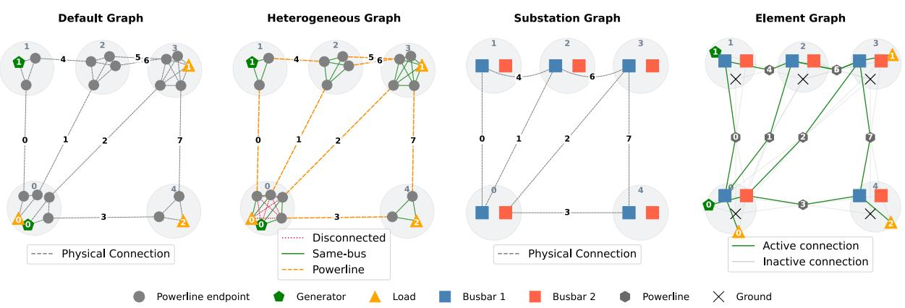
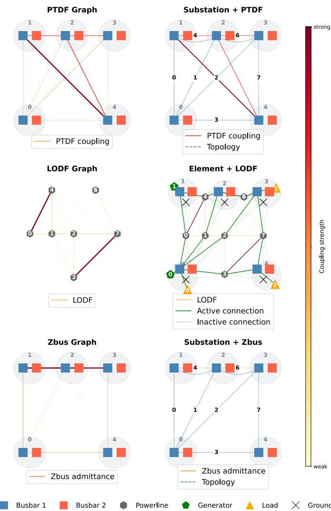
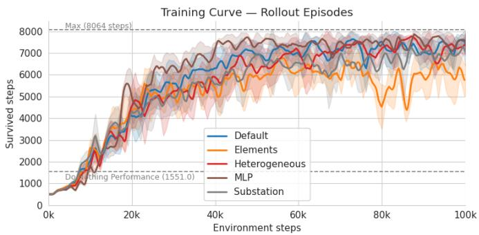
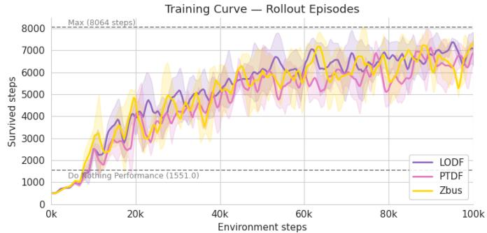
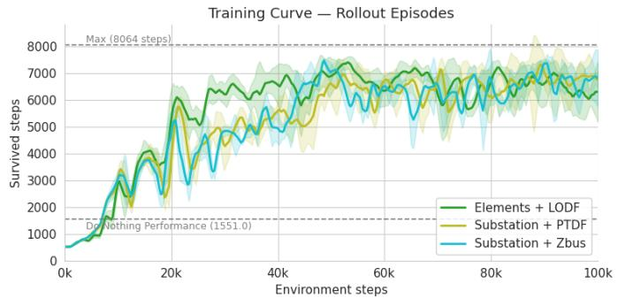

# A Comparative Study of Graph Representations for GNN-Based Power Grid Control in L2RPN

Adrian Degenkolb∗   
Karlsruhe Institute of Technology Karlsruhe, Germany   
adrian.degenkolb@partner.kit.edu

Qiong Huang∗† Karlsruhe Institute of Technology Karlsruhe, Germany qiong.huang@kit.edu

Benjamin Schafer ¨ Karlsruhe Institute of Technology Karlsruhe, Germany benjamin.schaefer@kit.edu

Abstract—Graph construction is a critical but underexamined design choice in deep reinforcement learning for power grid control. We present a controlled experimental comparison of different graph representations, including physical topology, electrical-sensitivity, and hybrid variants for topology control in the Learning to Run a Power Network (L2RPN) environment. Our findings indicate that matching graph complexity to task granularity is more important than maximizing representational richness, and highlight the importance of controlled representation studies at scale.

Index Terms—L2RPN, Graph representation, Graph neural networks, Reinforcement learning, Power grid control

## I. INTRODUCTION

Variable renewable generation increases fluctuations in power injections and can aggravate transmission congestion [1]. Grid operators commonly mitigate congestion through measures such as redispatch and curtailment, which can be costly and counteract the efficient use of renewable energy. Topology reconfiguration offers an alternative by switching lines or changing busbar assignments to redirect power flows [2]. Selecting these topology actions is challenging, as their effects are nonlocal and sequential, while the number of feasible configurations grows rapidly with grid size.

Reinforcement learning (RL) addresses such sequential decisions by learning a policy through interactions with the environment. Learning to Run a Power Network (L2RPN) standardizes this setting through the package Grid2Op [3], [4]. Its environments combine time-varying generation and demand with line limits, contingencies, cooldown constraints, and cascading disconnections. An agent must therefore maintain secure operation over long episodes rather than solve a single static operating point. L2RPN competitions and subsequent studies have demonstrated the potential of RL while highlighting challenges in action-space design, safety, and generalization [2].

Graph neural networks (GNNs) encode grid structure by sharing parameters across components and propagating information along edges [5], [6]. However, the physical power system does not prescribe a unique computational graph. Nodes may represent substations, busbars, line endpoints, or individual elements, while edges may encode physical, switchable, or electrical relations. This choice determines the state granularity, message-passing paths, and computational cost.

Graph construction is nevertheless rarely isolated from choice of RL algorithms, action space, and policy architecture [2], [7]. We address this gap by comparing topologybased, power-flow-based, and hybrid graph representations in l2rpn\_case14\_sandbox under a fixed GNN-PPO pipeline with action space, training budget, evaluation set, and five random seeds. A non-graph MLP serves as an additional baseline. We compare learning behavior, held-out survival, and spatial action patterns. Our results show that graph representation materially affects learning and robustness, with the compact substation graph outperforming more detailed physical and electrical-sensitivity representations.

Code and supplementary material are available in our public repository1.

## II. RELATED WORK

RL-based topology control: The combinatorial L2RPN action space has motivated restricted action sets and actionselection schemes [8], [9], semi-Markov actor-critic policies [10], and AlphaZero-inspired planning [1], [11]. Hierarchical and multi-agent approaches further decompose decisions across control levels or grid regions [12], [13]. Although these methods demonstrate effective topology control, simultaneous differences in agent architecture, actions, and evaluation prevent their results from isolating the observation representation [2].

Graph learning for power systems: GNNs have been applied to fault localization, Volt-Var control, and transmissionline flow control [14], [15], [16]. Their shared local computations naturally accommodate changing network connectivity, including topology variation [17]. Yet using a GNN does not determine the mapping from physical components to nodes and edges; alternative mappings induce different neighborhoods even for the same grid state.

Graph representations in L2RPN: Most graph-based L2RPN agents use the default Grid2Op construction based on line endpoints and bus connections [4], [7]. De Jong et al. retain these nodes but distinguish line, active samebus, and switchable cross-bus relations by edge types [18]. Batanero et al. instead propose a detailed Element graph containing individual equipment and feasible connections [19]. These studies establish several viable physical abstractions, but differing learning and evaluation settings preclude a controlled comparison.

Prior L2RPN graphs are predominantly topology based, although physical adjacency is only one description of grid interaction. Power Transfer Distribution Factors (PTDF) describe how injections affect line flows [20], Line Outage Distribution Factors (LODF) characterize outage-induced flow redistribution [21], and the bus-impedance matrix captures self and transfer impedances [22]. We compare graphs derived from these quantities and with the physical constructions above and their hybrids while holding the learning and evaluation pipeline fixed.

## III. METHODOLOGY

We evaluate three categories of graph representations. Topology-based representations define edges from physical grid connectivity. Power-flow-based representations use fully connected graphs whose edge features encode electrical sensitivities. Hybrid representations combine physical and electrical relations and distinguish them by edge types. The node features used by each representation are provided in the supplementary material.

## A. Topology-Based Representations

Figure 1 shows the four topology-based representations.

a) Default Graph: follows the graph construction provided by [4] and is the representation most commonly adopted in prior L2RPN studies [7]. Nodes represent power line endpoints and element-to-bus connections. An edge connects two nodes when they are the endpoints of the same power line or are assigned to the same substation and bus.

b) Heterogeneous Graph: proposed by [18], uses the same nodes as the default graph but distinguishes three edge types: power line edges, same-busbar connections within a substation, and inactive cross-busbar connections that can be activated through switching. The third edge type explicitly represents feasible topology changes that are absent from the current physical configuration.

c) Substation Graph: proposed by [19]. Each node represents an active busbar and each edge represents a power line between them. This construction provides a compact representation of the current physical topology.

d) Element Graph: also introduced by [19], assigns a node to every generator, load, power line, storage unit, and busbar. Each substation additionally contains a virtual ground busbar to which disconnected elements are assigned. Edges connect every physically connectable pair of nodes, and a binary edge feature indicates whether the corresponding connection is currently active.

## B. Power-Flow-Based Representations

Figure 2 shows the power-flow-based and the hybrid representations that are fully connected directed graphs. Every edge carries a scalar feature that quantifies an electrical relationship between its incident nodes under a DC powerflow approximation. The node definition and the meaning of the edge feature depend on the selected electrical quantity.

a) PTDF Graph: each node represents an active busbar. For busbar i and j, the edge feature is the PTDF-based distance

$$
D [ i , j ] = \sum _ { l } \left| \mathrm { P T D F } [ l , i ] - \mathrm { P T D F } [ l , j ] \right| ,\tag{1}
$$

where PTDF[l, i] quantifies the sensitivity of the active-power flow on line l to an injection at busbar i under the selected convention [20]. A large $D [ i , j ]$ indicates that injections at the two busbars have substantially different effects on network flows.

b) LODF Graph: each node represents a power line. The feature of the directed edge from line j to line i is $\left| \mathrm { L O D F } _ { i j } \right|$ where $\mathrm { L O D F } _ { i j }$ denotes the fraction of the pre-outage flow on line j that is transferred to line i following the outage of line j [21]. Taking the absolute value retains the magnitude of the contingency coupling while discarding its direction.

c) ZBus Graph: uses the same active-busbar nodes as the PTDF graph. Its edge feature is an impedance-derived coupling weight $\begin{array} { r } { w _ { i j } = \frac { 1 } { | Z _ { i i } | + 1 } } \end{array}$ , where $Z _ { i j }$ is an off-diagonal transfer-impedance entry of $Z _ { \mathrm { b u s } } ~ = ~ \mathrm { p i n v } ( Y _ { \mathrm { b u s } } )$ and pinv denotes the Moore–Penrose pseudo-inverse, which yields the minimum-norm solution to $V = Z _ { \mathrm { b u s } } I$ when $Y _ { \mathrm { b u s } }$ is singular. Low impedance indicates strong electrical coupling between buses.

## C. Hybrid representations

Each hybrid representation combines a topology-based graph with a power-flow-based graph and assigns the two relations distinct edge types. Element + LODF combines the element graph (edge type 0) with fully-connected LODF edges between power-line nodes (edge type 1). Substation + PTDF combines the substation graph (edge type 0) with PTDF-distance edges (edge type 1). Substation + ZBus has the same structure but replaces the PTDF distances with the ZBus coupling weights.

## D. GNN Architecture

All graph-based agents use the same GNN encoder. Relative to a standard graph convolution [23], the encoder should accommodate both multiple edge types and scalar edge features. We therefore associate each edge type with a separate transformation matrix and map scalar edge features to message weights. Given node features ${ \bf x } _ { v } ,$ the encoder is defined by:

  
Fig. 1: Topology based representations of the rte case5 example environment with 5 substations (0-4). Each panel depicts the same grid configuration. All elements are assigned to Busbar 1 except at substation 0 (bottom left), where several elements are assigned to Busbar 2.

  
Fig. 2: Power-Flow-Based (left) and Hybrid (right) representations of the rte case5 example environment.

$$
\begin{array} { l } { { \displaystyle h _ { v } ^ { ( 0 ) } = \mathrm { B N } ( f ( \mathbf { x } _ { v } ) ) \qquad \quad \quad \quad \quad \quad \quad \quad \quad \quad \quad \quad \quad } } \\ { { \displaystyle w _ { u v } ^ { ( k ) } = \mathrm { M L P } _ { k } \left( e _ { u v } ^ { ( k ) } \right) \qquad \quad \quad \quad \quad \quad \quad \quad \quad \quad \quad \quad \quad } } \\ { { \displaystyle \quad \hat { h } _ { v } ^ { ( l ) } = \sum _ { k = 0 } ^ { K - 1 } \sum _ { u \in N _ { k } ( v ) \cup \{ v \} } \frac { w _ { u v } ^ { ( k ) } } { \sqrt { \hat { d } _ { v , k } } \sqrt { \hat { d } _ { u , k } } } W _ { k } ^ { ( l ) } { h } _ { u } ^ { ( l ) } } } \\ { { \displaystyle \qquad \quad \quad \quad \quad \quad \quad \quad \quad \quad \quad \quad \quad \quad \quad \quad \quad \quad \quad \quad ( \mathrm { a g g r e g a t i o n } ) } } \\ { { \displaystyle h _ { v } ^ { ( l + 1 ) } = \mathrm { E L U } \Big ( \mathrm { B N } ( \hat { h } _ { v } ^ { ( l ) } ) \Big ) + h _ { v } ^ { ( l ) } , \qquad \quad \quad \quad \quad \quad \quad \quad \quad \quad \quad \quad \quad \quad \quad \quad } } \end{array}
$$

where f denotes the input projection, BN denotes batch normalization, K is the number of edge types, $\mathcal { N } _ { k } ( v )$ is the neighborhood of node v under edge type k, and ${ \dot { W } } _ { k } ^ { ( l ) }$ is the corresponding transformation weight matrix at layer l. $\tilde { d } _ { v , k }$ is the degree of v after adding self-loops, and $\bar { e } _ { u v } ^ { ( k ) }$ is the scalar feature of edge $( u , v )$ of type k. When a representation has no scalar edge features, we set $w _ { u v } ^ { ( k ) } = 1$ After L message-passing layers, the graph-level embedding $o = \mathrm { M e a n P o o l } \bar { ( } f ^ { \prime } \bar { ( } { h _ { v } ^ { ( L ) } } \bar  \} ) )$ is passed to the same MLP used for the non-graph baseline.

## IV. EXPERIMENTS AND RESULTS

## A. Experimental Setup

We evaluate the ten graph representations and a non-graph MLP baseline using five independent training seeds, yielding 55 trained runs in total. The MLP receives the grid states as a flat vector, whereas the graph-based agents process the corresponding structured observations with the GNN encoder described in Section III. All agents are trained with Proximal Policy Optimization (PPO) [24] using RLlib [25]. Our implementation builds on the experimental pipeline of [2]. The GNN architecture and PPO hyperparameters are held fixed across graph-based methods; only the graph converter is changed. Full architecture and hyperparameter settings are reported in the supplementary material.

Training is conducted in l2rpn\_case14\_sandbox, a Grid2Op environment of the IEEE 14-bus system. The action space comprises the topology changes proposed by [8]. Evaluation uses a fixed set of episodes whose chronics are excluded from training. We report two complementary metrics: Surv. Episodes, the percentage of evaluation episodes completed, and (Surv. Steps), the percentage of all available evaluation steps completed. Reported values are the mean and standard deviation across five seeds, except for Substation + ZBus, which uses the three successful seeds. In addition to heldout performance, we record rollout survival during training to compare learning speed and stability.

## B. Performance Comparison

Figure 3 (top and middle) shows rollout survival during training. All methods improve substantially beyond the donothing reference. Among topology-based methods, the default graph converges the fastest while the Element graph learns more slowly and exhibits larger late-training declines. Electrical-sensitivity graphs generally remain below the strongest topology-based methods. Among the hybrids, Element + LODF improves fastest initially, while the two Substation hybrids later reach similar training survival (see Figure 3 (bottom)).

Held-out results in Table I favor compact physical representations. Substation achieves the highest survival $( 9 6 . 7 \pm 1 . 9 \%$ of episodes and $9 9 . 3 \pm 0 . 5 \%$ of steps), followed by Default in episode survival. LODF is the strongest standalone electrical representation, while the MLP exhibits the greatest variability across seeds. Adding LODF to Element raises episode survival from 86.7% to 92.4% and step survival from 94.3% to 95.9%, whereas neither PTDF nor ZBus improves the Substation graph. Thus, electrical edges can compensate for a weak physical abstraction but provide no consistent benefit to the compact Substation representation.

Across representations, actions concentrate on substations 3, 4, and 8, with recurring congestion in the 4–5–12 and the 3–8–6–7 regions (see the supplementary material). This similarity suggests that graph construction affects learning efficiency and robustness more than the selected control regions.

TABLE I: Performance comparison of different graph representations.
<table><tr><td>Method</td><td>Surv. Episodes (%)</td><td>Surv. Steps (%)</td></tr><tr><td>Substation</td><td> $9 6 . 7 \pm 1 . 9$ </td><td> $9 9 . 3 \pm 0 . 5$ </td></tr><tr><td>Default</td><td> $9 6 . 2 \pm 1 . 2$ </td><td> $9 7 . 6 \pm 0 . 7$ </td></tr><tr><td>Substation + ZBus†</td><td> $9 5 . 2 \pm 0 . 0$ </td><td> $9 7 . 5 \pm 0 . 0$ </td></tr><tr><td>LODF</td><td> $9 4 . 8 \pm 1 . 8$ </td><td> $9 7 . 3 \pm 1 . 2$ </td></tr><tr><td>Heterogeneous</td><td> $9 3 . 3 \pm { 1 . 8 }$ </td><td> $9 6 . 8 \pm 0 . 8$ </td></tr><tr><td>Substation + PTDF</td><td> $9 3 . 3 \pm 2 . 8$ </td><td> $9 6 . 5 \pm 1 . 0$ </td></tr><tr><td>MLP</td><td> $9 2 . 9 \pm 6 . 4$ </td><td> $9 6 . 3 \pm 3 . 5$ </td></tr><tr><td>Element + LODF</td><td> $9 2 . 4 \pm 3 . 5$ </td><td> $9 5 . 9 \pm 2 . 0$ </td></tr><tr><td>PTDF</td><td> $9 0 . 0 \pm 5 . 5$ </td><td> $9 4 . 9 \pm 2 . 8$ </td></tr><tr><td>ZBus</td><td> $8 8 . 1 \pm 3 . 4$ </td><td> $9 4 . 4 \pm 1 . 4$ </td></tr><tr><td>Element</td><td> $8 6 . 7 \pm 4 . 2$ </td><td> $9 4 . 3 \pm 2 . 4$ </td></tr></table>

† Based on three successful seeds; two runs failed numerically; step-survival standard deviation rounds to 0.0.

  
Fig. 3: Rollout survival during training for the topology-based graph and the MLP baseline (top), powerflow-based graphs (middle), and hybrid graphs (bottom).

## V. CONCLUSIONS

We compared ten graph representations and a non-graph MLP baseline under a fixed GNN-PPO pipeline. Every representation supported a viable policy, but learning behavior and held-out survival varied substantially. The compact Substation graph achieved the highest mean survival, closely followed by the Default, while richer physical and standalone PTDF- and ZBus-based graphs offered no systematic advantage. LODF graph remained competitive, and augmenting the Element graph when used in a hybrid form.

These results establish graph construction as a consequential design choice but do not support maximizing representational detail. Because the study is limited to one benchmark, one action set, and one RL architecture, future work should evaluate larger and structurally different L2RPN environments, as well as examine sparse or learned electrical-sensitivity graphs to identify representations that remain effective and computationally practical at operationally relevant scales.

## ACKNOWLEDGMENT

This work is supported by the Helmholtz Association under grant no. VH-NG-1727 and through Helmholtz AI. Computing time was provided by NHR@KIT on HoreKa, jointly supported by the responsible federal and Baden-Wurttemberg¨ ministries and partly funded by DFG. ChatGPT was used for language refinement and Claude for coding assistance. All technical content and interpretations were developed and verified by the authors.

## REFERENCES

[1] M. Dorfer, A. R. Fuxjager, K. Kozak, P. M. Blies, and¨ M. Wasserer, “Power grid congestion management via topology optimization with alphazero,” arXiv preprint arXiv:2211.05612, 2022.

[2] E. van der Sar, A. Zocca, and S. Bhulai, “Optimizing power grid topologies with reinforcement learning: A survey of methods and challenges,” Foundations and Trends in Electric Energy Systems, vol. 9, no. 1, pp. 1– 119, 2025.

[3] A. Marot et al., “Learning to run a power network challenge for training topology controllers,” Electric Power Systems Research, vol. 189, p. 106 635, 2020.

[4] B. Donnot, Grid2op- A testbed platform to model sequential decision making in power systems. 2020. [Online]. Available: https : / / GitHub . com / Grid2Op / grid2op

[5] F. Scarselli, M. Gori, A. C. Tsoi, M. Hagenbuchner, and G. Monfardini, “The graph neural network model,” IEEE transactions on neural networks, vol. 20, no. 1, pp. 61–80, 2008.

[6] M. Ringsquandl et al., “Power to the relational inductive bias: Graph neural networks in electrical power grids,” in Proceedings of the 30th ACM international conference on Information & Knowledge Management, 2021, pp. 1538–1547.

[7] M. Hassouna, C. Holzhuter, P. Lytaev, J. Thomas, B.¨ Sick, and C. Scholz, “Graph reinforcement learning for power grids: A comprehensive survey,” Energy and AI, p. 100 671, 2026.

[8] M. Subramanian, J. Viebahn, S. H. Tindemans, B. Donnot, and A. Marot, “Exploring grid topology reconfiguration using a simple deep reinforcement learning approach,” in 2021 IEEE Madrid PowerTech, IEEE, 2021, pp. 1–6.

[9] B. Zhou, H. Zeng, Y. Liu, K. Li, F. Wang, and H. Tian, “Action set based policy optimization for safe power grid management,” in Joint European Conference on Machine Learning and Knowledge Discovery in Databases, Springer, 2021, pp. 168–181.

[10] D. Yoon, S. Hong, B.-J. Lee, and K.-E. Kim, “Winning the l2rpn challenge: Power grid management via semimarkov afterstate actor-critic.,” in ICLR, 2021.

[11] L. Zetto, B. Schafer, and Q. Huang, “Learning to run¨ power networks: Effective alphazero-inspired topological control,” arXiv preprint arXiv:2608.14114, 2026.

[12] B. Manczak, J. Viebahn, and H. van Hoof, “Hierarchical reinforcement learning for power network topology control,” arXiv preprint arXiv:2311.02129, 2023.

[13] E. van der Sar, A. Zocca, and S. Bhulai, “Multiagent reinforcement learning for power grid topology optimization,” arXiv preprint arXiv:2310.02605, 2023.

[14] K. Chen, J. Hu, Y. Zhang, Z. Yu, and J. He, “Fault location in power distribution systems via deep graph convolutional networks,” IEEE Journal on Selected Areas in Communications, vol. 38, no. 1, pp. 119–131, 2019.

[15] X. Y. Lee, S. Sarkar, and Y. Wang, “A graph policy network approach for volt-var control in power distribution systems,” Applied Energy, vol. 323, p. 119 530, 2022.

[16] P. Xu, Y. Pei, X. Zheng, and J. Zhang, “A simulationconstraint graph reinforcement learning method for line flow control,” in 2020 IEEE 4th Conference on Energy Internet and Energy System Integration (EI2), IEEE, 2020, pp. 319–324.

[17] S. Taha, J. Poland, K. Knezovic, and D. Shchetinin, “Learning to run a power network under varying grid topology,” in 2022 IEEE 7th International Energy Conference (ENERGYCON), IEEE, 2022, pp. 1–6.

[18] M. de Jong, J. Viebahn, and Y. Shapovalova, “Generalizable graph neural networks for robust power grid topology control,” arXiv preprint arXiv:2501.07186, 2025.

[19] E. A. Batanero, A. Fern ´ andez, and ´ A. Barbero, “Graph-´ enhanced model-free reinforcement learning agents for efficient power grid topological control,” arXiv preprint arXiv:2503.20688, 2025.

[20] C. Y. Evrenosoglu and A. Abur, “Effects of measurement and parameter uncertainties on the power transfer distribution factors,” in 2004 International Conference on Probabilistic Methods Applied to Power Systems, IEEE, 2004, pp. 608–611.

[21] T. Guler, G. Gross, and M. Liu, “Generalized line out-¨ age distribution factors,” IEEE Transactions on Power Systems, vol. 22, no. 2, pp. 879–881, 2007. DOI: 10. 1109/TPWRS.2006.888950

[22] A.-M. I. Aldaoudeyeh and D. Wu, “Modeling series compensation effect on the bus impedance matrix for online applications,” Electric Power Systems Research, vol. 175, p. 105 890, 2019. DOI: 10.1016/j.epsr.2019. 105890

[23] T. N. Kipf and M. Welling, “Semi-supervised classification with graph convolutional networks,” arXiv preprint arXiv:1609.02907, 2016.

[24] J. Schulman, F. Wolski, P. Dhariwal, A. Radford, and O. Klimov, “Proximal policy optimization algorithms,” arXiv preprint arXiv:1707.06347, 2017.

[25] L. Eric et al., “RLlib: Abstractions for distributed reinforcement learning,” in International Conference on Machine Learning (ICML), 2018. [Online]. Available: https://arxiv.org/pdf/1712.09381