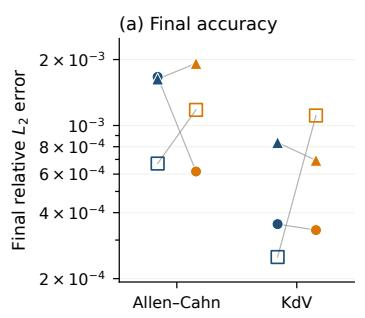
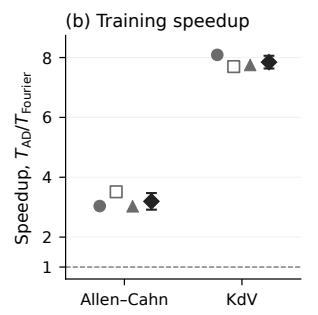
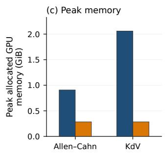
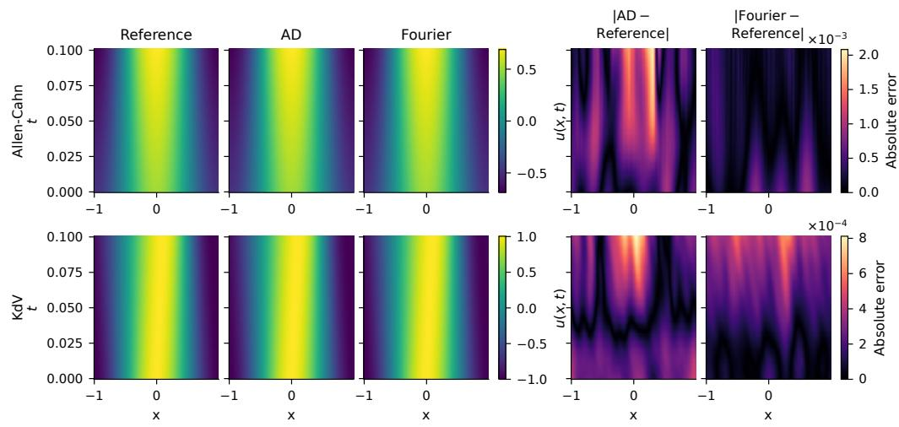
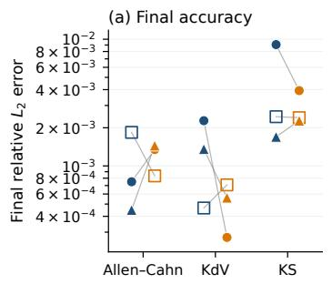
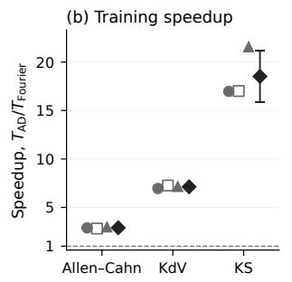
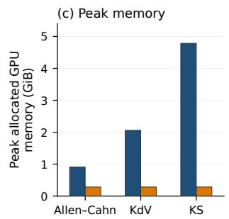
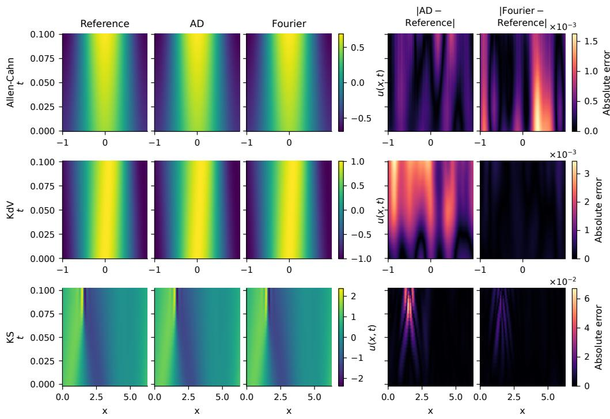

# A Computational Comparison of Fourier Spectral Diferentiation and Spatial Automatic Diferentiation in Periodic Physics-Informed Neural Networks

Xilai Lianga,∗, Zhao Zhangb,∗

aGuangdong Technion–Israel Institute of Technology, Shantou, Guangdong, China bResearch Centre for Mathematics and Interdisciplinary Sciences, Shandong University, Qingdao, Shandong Province, 266237, China

## Abstract

Physics-informed neural networks (PINNs) commonly evaluate the spatial derivatives appearing in partial diferential equation residuals using automatic diferentiation (AD), whose computational and memory costs can become substantial when multiple or high-order derivatives are required. We perform a controlled comparison of spatial AD and Fourier spectral diferentiation in periodic physical-space PINNs. Within each paired experiment, the neural representation, temporal diferentiation, optimizer, sampling procedure, and training schedule are held fixed, so that the two cases difer only in the spatial diferentiation procedure. For the Fourier variant, network outputs are evaluated on a uniform periodic grid and transformed to Fourier space, where spatial derivatives are obtained through spectral multiplication and the same Fourier coeficients are reused across derivative orders. We compare the two procedures in standard PINNs for the Allen–Cahn and Korteweg–de Vries equations and in Causal PINNs for the Allen–Cahn, Korteweg–de Vries, and Kuramoto–Sivashinsky equations. Across these five equation–framework settings, Fourier diferentiation yields mean paired endto-end training speedups ranging from 2.90× to 18.52× and reduces peak allocated graphics processing unit (GPU) memory by 68.7%–94.1%. The final relative $L _ { 2 }$ errors remain of the same order, with neither diferentiation procedure showing a consistent accuracy advantage. For the one-dimensional

periodic benchmarks considered here, Fourier spectral diferentiation therefore provides substantially lower training time and memory usage than spatial AD while retaining comparable solution error, at the cost of requiring a uniform structured spatial grid.

## 1. Introduction

Physics-informed neural networks (PINNs) approximate solutions to partial diferential equations (PDEs) by representing the unknown field with a neural network and incorporating the governing equations, initial conditions, and boundary conditions into the training objective [1]. In coordinate-based PINNs, the derivatives required by the PDE residual are commonly evaluated by automatic diferentiation (AD) with respect to the network inputs [1]. This provides pointwise derivatives without introducing an external spatial discretization, but derivative evaluation is required at every residual computation. When a PDE contains multiple spatial derivative terms or high-order derivatives, repeated AD introduces additional diferentiation operations and larger derivative graphs, increasing both computational and memory costs during training.

Several approaches reduce or avoid this dependence on spatial AD through numerical diferentiation or reformulation of the governing equations. Sharma and Shankar [2] used radial basis function finite-diference discretizations to evaluate spatial derivatives while retaining AD for temporal derivatives in time-dependent problems. The coupled automatic–numerical diferentiation physics-informed neural network (CAN-PINN) combines AD and numerical diferentiation to couple neighboring support points [3], whereas the smoothing-kernel physics-informed neural network (SK-PINN) evaluates derivatives through smoothing-kernel discretization [4]. A diferent strategy is to reduce repeated high-order diferentiation by rewriting higher-order PDEs as first-order systems, as in first-order physics-informed neural networks [5]. More recently, FlashPDE has treated derivative evaluation as a differentiable grid-based operator layer and implemented fused finite-diference operators independently of the surrounding neural architecture [6].

Spectral discretizations provide another route for evaluating the derivatives used in physics-informed objectives. Pseudo-spectral PINN formulations have employed spectral discretization for physics-informed model discovery [7], while neural spectral element methods evaluate neural fields on fixed spectral nodes and replace derivative calls with spectral diferentiation matrices [8]. The Spectral Informed Neural Network (SINN) represents the solution through Fourier coeficients and converts spatial diferentiation into multiplication in the spectral domain [9]. Other recent approaches, such as trainable Fourier feature-grid formulations, also use Fourier-transform-based derivative evaluation within modified neural representations [10]. Xiao et al. [11] replaced the finite-diference filter in a physics-informed convolutional recurrent network (PhyCRNet) with a Fourier filter, transforming network outputs to Fourier space for spatial diferentiation and returning the resulting quantities through the inverse transform for construction of the physicsinformed loss. These studies establish that numerical and spectral diferentiation can be incorporated into physics-informed learning through several neural representations and operator constructions.

This study addresses a controlled computational question: when the surrounding physical-space PINN formulation is held fixed, how much of the lower derivative cost of Fourier spectral diferentiation translates into endto-end training-time and memory savings relative to spatial AD, and how does the change afect solution accuracy? A cheaper derivative operator does not necessarily yield a proportional end-to-end speedup when network evaluation or other components dominate the training loop; Fourier filter-based PhyCRNet reports such behavior when its time-series module accounts for most of the computational cost [11]. We examine this question in both standard PINNs and Causal PINNs, where the latter use the temporal causal weighting formulation of Wang et al. [12]. Standard PINNs are evaluated on the Allen–Cahn and Korteweg–de Vries (KdV) equations, and Causal PINNs are evaluated on Allen–Cahn, KdV, and Kuramoto–Sivashinsky (KS). Each equation–framework setting uses three paired random seeds, with all compo nents of each paired training setup held fixed except the spatial diferentiation procedure. We compare final relative $L _ { 2 }$ error, end-to-end training time, and peak allocated memory. Across the five equation–framework settings, Fourier spectral diferentiation yields mean paired speedups ranging from 2.90× to 18.52× and reduces peak allocated memory by 68.7%–94.1%. The final relative $L _ { 2 }$ errors remain of the same order, with neither diferentiation procedure showing a consistent accuracy advantage. These results characterize the computational trade-of between spatial AD and Fourier spectral diferentiation for the one-dimensional periodic PINNs considered here, where the Fourier procedure requires a uniform structured spatial grid.

## 2. Spatial Diferentiation Procedures for Physical-Space PINNs

We consider a time-dependent PDE of the form

$$
u _ { t } + N ( u , u _ { x } , u _ { x x } , . ~ . ~ . ) = 0 ,\tag{1}
$$

where the solution is represented by a physical-space neural network $u _ { \theta } =$ $u _ { \theta } ( x , t )$ . We compare two procedures for evaluating the spatial derivatives entering the PDE residual: automatic diferentiation and Fourier spectral diferentiation. The neural representation and temporal diferentiation procedure are identical in the two cases.

## 2.1. Standard and Causal PINN Formulations

For a sampled time location $t _ { i }$ , the spatially averaged residual loss is

$$
\mathcal { L } _ { t } ^ { ( i ) } = \frac { 1 } { N _ { x } } \sum _ { j = 1 } ^ { N _ { x } } r _ { \theta } ( x _ { j } , t _ { i } ) ^ { 2 } ,\tag{2}
$$

where $r _ { \theta }$ denotes the PDE residual. The initial-condition contribution is evaluated on the same spatial grid as

$$
\mathcal { L } _ { 0 } = 1 0 ^ { 4 } \frac { 1 } { N _ { x } } \sum _ { j = 1 } ^ { N _ { x } } \left[ u _ { \theta } ( x _ { j } , 0 ) - u _ { 0 } ( x _ { j } ) \right] ^ { 2 } .
$$

For the standard PINN, the temporal residual contributions are weighted uniformly,

$$
\mathcal { L } _ { \mathrm { s t a n d a r d } } = \mathcal { L } _ { 0 } + \frac { 1 } { N _ { t } } \sum _ { i = 1 } ^ { N _ { t } } \mathcal { L } _ { t } ^ { ( i ) } .\tag{3}
$$

For the Causal PINN, we follow the temporal causal-weighting construction of Wang et al. [12]. Let

$$
\mathbf { L } _ { t } = \left[ \mathcal { L } _ { t } ^ { ( 1 ) } \quad \mathcal { L } _ { t } ^ { ( 2 ) } \quad \cdots \quad \mathcal { L } _ { t } ^ { ( N _ { t } ) } \right] ^ { T } ,
$$

and let M denote the strictly lower-triangular accumulation matrix, with $M _ { i j } = 1$ for $j < i$ and $M _ { i j } = 0$ otherwise. The causal weights are evaluated as

$$
\mathbf { w } = \exp \left[ - \epsilon \left( M \mathbf { L } _ { t } + \mathcal { L } _ { 0 } \mathbf { 1 } \right) \right] ,\tag{4}
$$

where $\textbf { 1 } \in \mathbb { R } ^ { N _ { t } }$ denotes the vector of ones and the exponential is applied elementwise. We use a fixed causality parameter $\epsilon = 0 . 1$ throughout training. The causal weights are detached from the computational graph before evaluating the weighted residual loss, giving

$$
\mathcal { L } _ { \mathrm { c a u s a l } } = \mathcal { L } _ { 0 } + \frac { 1 } { N _ { t } } \sum _ { i = 1 } ^ { N _ { t } } w _ { i } \mathcal { L } _ { t } ^ { ( i ) } .\tag{5}
$$

## 2.2. Spatial Automatic Diferentiation

In the automatic-diferentiation baseline, spatial derivatives are obtained by repeated diferentiation of the physical-space network output. For example,

$$
u _ { x } = \frac { \partial u _ { \theta } } { \partial x } , \qquad u _ { x x } = \frac { \partial } { \partial x } \left( \frac { \partial u _ { \theta } } { \partial x } \right) ,
$$

with higher-order derivatives obtained through additional nested diferentiation operations. Only the spatial derivative orders appearing in the corresponding PDE residual are evaluated. In our implementation, these derivatives are constructed using nested Jacobian–vector products (JVPs). Temporal diferentiation is independent of the spatial diferentiation procedure, and $u _ { t }$ is evaluated through the same JVP-based automatic-diferentiation path in both cases.

## 2.3. Fourier Spectral Diferentiation

For Fourier spectral diferentiation, the network is evaluated on an endpointexcluded uniform periodic grid,

$$
x _ { j } = x _ { 0 } + j \Delta x , \qquad j = 0 , \ldots , N _ { x } - 1 , \qquad \Delta x = \frac { L } { N _ { x } } ,
$$

where $L$ is the spatial period. At a fixed time $t ,$ the sampled network output is transformed to Fourier space,

$$
\begin{array} { r } { \widehat { u } _ { k } ( t ) = \mathcal { F } _ { x } \left[ u _ { \theta } ( x _ { j } , t ) \right] , } \end{array}
$$

where ${ \mathcal { F } } _ { x }$ denotes the discrete Fourier transform in the spatial direction. For the one-sided real Fourier representation used here, the discrete wavenumbers are

$$
k _ { n } = \frac { 2 \pi n } { L } , \qquad n = 0 , \dots , \frac { N _ { x } } { 2 } ,
$$

for the even spatial resolution used in the experiments. An mth-order spatial derivative is then evaluated as

$$
\partial _ { x } ^ { m } u = \mathcal { F } _ { x } ^ { - 1 } \left[ ( i k ) ^ { m } \widehat { u } _ { k } \right] .\tag{6}
$$

For even $N _ { x }$ , the real inverse transform enforces the Hermitian constraint at the Nyquist mode. Consequently, the Nyquist contribution vanishes for odd-order spatial derivatives and is retained for even-order derivatives.

At finite $N _ { x } ,$ this operation diferentiates the periodic trigonometric interpolant defined by the sampled network values. When multiple spatial derivative orders are required at the same time location, a single Fourier transform of the network output is reused and each derivative is obtained from the same Fourier coeficients using the corresponding spectral multiplier. The derivatives are then transformed back to physical space and used to construct the PDE residual.

The transforms are implemented using the real-valued fast Fourier transform routines provided by PyTorch. These operations remain within the computational graph, so gradients of the physics-informed loss propagate through the spectral diferentiation procedure to the network parameters.

## 3. Numerical Experiments

## 3.1. Benchmark Problems

We consider three one-dimensional periodic PDEs: the Allen–Cahn, KdV, and KS equations. These equations contain diferent combinations and orders of spatial derivatives and are used to compare automatic diferentiation and Fourier spectral diferentiation under the two PINN formulations defined in Section 2.

The Allen–Cahn equation is

$$
u _ { t } - 1 0 ^ { - 4 } u _ { x x } + 5 u ^ { 3 } - 5 u = 0 ,\tag{7}
$$

on $x \in [ - 1 , 1 )$ and $t \in [ 0 , 0 . 1 ]$ , with initial condition $u ( x , 0 ) = 0 . 5 \cos ( \pi x )$ The KdV equation is

$$
u _ { t } + u u _ { x } + 0 . 0 0 2 5 u _ { x x x } = 0 ,\tag{8}
$$

on $x \in [ - 1 , 1 )$ and $t \in [ 0 , 0 . 1 ]$ , with initial condition $u ( x , 0 ) = \cos ( \pi x )$ . The KS equation used in the experiments is

$$
u _ { t } + \frac { 1 0 0 } { 1 6 } u u _ { x } + \frac { 1 0 0 } { 1 6 ^ { 2 } } u _ { x x } + \frac { 1 0 0 } { 1 6 ^ { 4 } } u _ { x x x x } = 0 ,\tag{9}
$$

on $x \in [ 0 , 2 \pi )$ and $t \in [ 0 , 0 . 1 ]$ . Its initial condition is taken from the first time slice of the frozen KS numerical trajectory distributed with the accompanying Causal PINN code and data of Wang et al. [12]. The spatial derivative sets required by Allen–Cahn, KdV, and KS are $u _ { x x } , \ ( u _ { x } , u _ { x x x } )$ ， and $( u _ { x } , u _ { x x } , u _ { x x x x } )$ , respectively.

## 3.2. Experimental Setup

All experiments use the same underlying physical-space neural-network configuration. Each spatial domain uses $N _ { x } = 2 5 6$ uniform periodic grid points. The neural representation is an eight-layer gated multilayer perceptron with width 128, tanh gating, Fourier input encodings with $m _ { t } ~ = ~ 6$ and $m _ { x } = 5$ , and a scalar output. The spatial coordinate enters the network only through periodic sine–cosine Fourier features with the period of the corresponding spatial domain. This representation enforces periodicity in the spatial coordinate, so no separate spatial boundary-condition loss is used. The model contains 122,625 trainable parameters. At each optimization step, $N _ { t } = 3 2$ independent temporal samples are drawn uniformly from the training interval. For each equation and seed, the automatic-diferentiation and Fourier runs use the same pre-generated temporal sampling schedule. The temporal samples are sorted before causal weighting in the Causal PINN experiments.

Training uses the Adam optimizer [13]. We use $\eta _ { s } = 1 0 ^ { - 3 } 0 . 9 ^ { s / 5 0 0 0 }$ , where s denotes the optimization step. The Adam parameters are $\beta _ { 1 } = 0 . 9 , \beta _ { 2 } =$ 0.999, and $\epsilon _ { \mathrm { A d a m } } = 1 0 ^ { - 8 }$ , with zero weight decay and no gradient clipping. All runs use single-precision floating-point arithmetic and are trained for 50,000 optimization steps without early stopping. Three random seeds, 1234, 2345, and 3456, are used for each equation–framework setting. The standard PINN experiments are performed for Allen–Cahn and KdV using the three paired seeds, giving 12 runs in total. The Causal PINN experiments use the fixed causality parameter $\epsilon = 0 . 1$ defined in Section 2.1 and are performed for Allen–Cahn, KdV, and KS using the same three paired seeds, giving 18 runs in total.

Within each paired comparison, the network initialization, temporal sampling schedule, neural-network configuration, optimizer settings, reference data, and training length are matched; the spatial diferentiation procedure is the only controlled change. The Causal PINN pairs also use the same causal weighting configuration. The experiments were executed on an NVIDIA

GeForce RTX 4060 Laptop graphics processing unit (GPU) with 8 GB of device memory using PyTorch 2.9.0 and CUDA 13.0.

## 3.3. Reference Solutions and Evaluation

Reference solutions for Allen–Cahn and KdV are generated independently using a Fourier pseudospectral exponential time-diferencing fourth-order Runge–Kutta solver [14] and are used only for evaluation. The reference calculations use an endpoint-excluded periodic grid with $N _ { x } ^ { \mathrm { r e f } } = 2 0 4 8$ and a time step $\Delta t = 5 \times 1 0 ^ { - 5 }$ . Solutions are stored every 0.001 time units, yielding 101 snapshots over $t \in [ 0 , 0 . 1 ]$ . The calculations use double-precision real and complex arithmetic, and nonlinear terms are dealiased using the twothirds rule. The reference configurations were checked through spatial and temporal refinement tests before evaluation. For KS, the frozen numerical trajectory accompanying the Causal PINN code and data of Wang et al. [12] is used as the reference solution. The original spatial data contain 512 points including a repeated periodic endpoint. The repeated endpoint is removed and the solution is periodically interpolated onto the $N _ { x } = 2 5 6$ evaluation grid, giving 26 reference time slices over $t \in [ 0 , 0 . 1 ]$

Solution accuracy is measured by the relative $L _ { 2 }$ error

$$
E _ { L _ { 2 } } = \frac { \Vert u _ { \theta } - u _ { \mathrm { r e f } } \Vert _ { 2 } } { \Vert u _ { \mathrm { r e f } } \Vert _ { 2 } } .\tag{10}
$$

For KS, this quantity is evaluated over the complete $2 6 \times 2 5 6$ space–time evaluation array; the reported final relative $L _ { 2 }$ error therefore refers to the final trained model evaluated over the fixed space–time reference set rather than to the error at the final time slice alone.

Training time is measured over the complete 50,000-step training loop using time.perf\_counter(). CUDA execution is synchronized around each optimization step and once again at the end of training. The recorded time includes scheduled model evaluation and standard-output logging inside the training loop, while model initialization, warm-up, and post-training artifact generation are excluded. For each paired comparison, the training speedup is defined as

$$
S = { \frac { T _ { \mathrm { A D } } } { T _ { \mathrm { F o u r i e r } } } } .\tag{11}
$$

Peak allocated GPU memory is measured after resetting the CUDA peakmemory statistics immediately before the training loop. Peak allocated mem-

ory is reported in gibibytes (GiB). The memory reduction relative to automatic diferentiation is defined as

$$
R _ { M } = 1 - { \frac { M _ { \mathrm { F o u r i e r } } } { M _ { \mathrm { A D } } } } .\tag{12}
$$

## 4. Results

We report the paired AD–Fourier comparisons first for standard PINNs and then for Causal PINNs. Each equation–framework setting contains three paired random seeds. Aggregate values are reported as the mean ± sample standard deviation (SD) over the three seeds. Seed 1234 is used for the solution-field visualizations. Table 1 summarizes the final solution error, paired training speedup, and peak-memory reduction across all five equation– framework settings.

## 4.1. Standard PINN Results

Figure 1(a) shows the paired final-model relative $L _ { 2 }$ errors for the standard PINN experiments. Both diferentiation procedures reach errors of the same order for Allen–Cahn and KdV, with visible variation across random seeds. Across the six paired comparisons, AD gives the lower final error in three runs and Fourier diferentiation gives the lower final error in three runs. The aggregate values are reported in Table 1; neither diferentiation procedure shows a consistent accuracy advantage in the standard PINN experiments.

Figure 1(b,c) summarizes the computational comparison. Fourier spectral diferentiation reduces end-to-end training time for every paired seed, with mean speedups of $3 . 1 9 \pm 0 . 2 8 \times$ for Allen–Cahn and $7 . 8 5 \pm 0 . 2 1 \times$ for KdV. Peak allocated GPU memory decreases from approximately 0.908 to 0.285 GiB for Allen–Cahn and from 2.059 to 0.285 GiB for KdV, corresponding to reductions of 68.7% and 86.2%, respectively.

Figure 2 compares the reference solutions with the final predictions for seed 1234. Both diferentiation procedures reproduce the reference space– time structures for the displayed Allen–Cahn and KdV solutions.

  
Figure 1: Quantitative comparison for the standard PINN experiments. (a) Final-model relative $L _ { 2 }$ errors for the three paired random seeds, with AD and Fourier results for the same seed connected within each equation. (b) Paired training speedup $T _ { \mathrm { A D } } / T _ { \mathrm { F o u r i e r } } ;$ individual markers denote the three seeds, while the diamond marker and error bar show the mean and sample standard deviation. The dashed line denotes a speedup of one. (c) Peak allocated GPU memory for AD and Fourier spectral diferentiation; the peak-memory values are identical across the three seeds for each equation–method combination.

  
Figure 2: Reference, AD, and Fourier standard-PINN solutions and pointwise absolute errors for seed 1234. For each equation, the three solution panels share one color scale and the two error panels share another.

Table 1: Summary of the paired AD–Fourier comparisons. Final relative $L _ { 2 }$ errors and training speedups are reported as the mean ± sample standard deviation over three seeds. Memory reduction is based on peak allocated GPU memory.
<table><tr><td rowspan="2">PDE</td><td colspan="2">Final relative  $L _ { 2 }$  error  $\overline { { ( \times 1 0 ^ { - 3 } ) } }$ </td><td rowspan="2">Speedup  $T _ { \mathrm { A D } } / T _ { \mathrm { F o u r i e r } }$ </td><td rowspan="2">Memory Reduction (%)</td></tr><tr><td>AD</td><td>Fourier</td></tr><tr><td>Standard PINN</td><td></td><td></td><td></td><td></td></tr><tr><td>Allen-Cahn</td><td> $1 . 3 2 2 \pm 0 . 5 6 5$ </td><td> $1 . 2 3 8 \pm 0 . 6 5 3$ </td><td> $3 . 1 9 \pm 0 . 2 8$ </td><td>68.7</td></tr><tr><td>KdV</td><td> $0 . 4 8 0 \pm 0 . 3 1 2$ </td><td> $0 . 7 1 3 \pm 0 . 3 8 9$ </td><td> $7 . 8 5 \pm 0 . 2 1$ </td><td>86.2</td></tr><tr><td>Causal PINN</td><td></td><td></td><td></td><td></td></tr><tr><td>Allen-Cahn</td><td> $1 . 0 1 3 \pm 0 . 7 3 2$ </td><td> $1 . 2 1 0 \pm 0 . 3 2 9$ </td><td> $2 . 9 0 \pm 0 . 0 9$ </td><td>68.7</td></tr><tr><td>KdV</td><td> $1 . 3 6 6 \pm 0 . 9 0 5$ </td><td> $0 . 5 1 4 \pm 0 . 2 2 2$ </td><td> $7 . 1 3 \pm 0 . 1 6$ </td><td>86.2</td></tr><tr><td>KS</td><td> $4 . 4 0 4 \pm 4 . 0 5 6$ </td><td> $2 . 8 7 0 \pm 0 . 9 2 0$ </td><td> $1 8 . 5 2 \pm 2 . 6 5$ </td><td>94.1</td></tr></table>

## 4.2. Causal PINN Results

Figure 3(a) shows the paired final-model relative $L _ { 2 }$ errors for the Causal PINN experiments. The final errors remain of the same order for both differentiation procedures across Allen–Cahn, KdV, and KS, while the paired ranking varies with the random seed. Fourier diferentiation gives the lower final error in five of the nine paired runs, whereas AD gives the lower error in four. The aggregate values are summarized in Table 1; the paired experiments do not show a consistent accuracy advantage for either spatial diferentiation procedure.

Figure 3(b,c) summarizes the computational results. Fourier spectral diferentiation reduces training time for all nine paired Causal PINN runs, with mean speedups of $2 . 9 0 \pm 0 . 0 9 \times , 7 . 1 3 \pm 0 . 1 6 \times$ , and $1 8 . 5 2 \pm 2 . 6 5 \times$ for Allen–Cahn, KdV, and KS, respectively. Peak allocated GPU memory for AD is approximately 0.908, 2.059, and 4.784 GiB across the three equations, whereas the Fourier implementation remains near 0.285 GiB. The corresponding memory reductions are 68.7%, 86.2%, and 94.1%.

Figure 4 compares the reference solutions with the final Causal PINN predictions for seed 1234. Both diferentiation procedures reproduce the principal space–time structures of the displayed Allen–Cahn, KdV, and KS reference solutions.

  
Figure 3: Quantitative comparison for the Causal PINN experiments. (a) Final-model relative $L _ { 2 }$ errors for the three paired random seeds, with AD and Fourier results for the same seed connected within each equation. (b) Paired training speedup $T _ { \mathrm { A D } } / T _ { \mathrm { F o u r i e r } } ;$ individual markers denote the three seeds, while the diamond marker and error bar show the mean and sample standard deviation. The dashed line denotes a speedup of one. (c) Peak allocated GPU memory for AD and Fourier spectral diferentiation; the peak-memory values are identical across the three seeds for each equation–method combination.

  
Figure 4: Reference, AD, and Fourier Causal-PINN solutions and pointwise absolute errors for seed 1234. Rows correspond to Allen–Cahn, KdV, and KS. For each equation, the three solution panels share one color scale and the two error panels share another.

## 5. Discussion

## 5.1. Computational Interpretation

In the AD baseline, the required spatial derivatives are constructed through repeated or nested diferentiation of the network output, whereas the Fourier implementation reuses one transformed representation across the spatial derivative orders required by a given residual. The lower end-to-end training time and peak allocated memory observed across both the standard and Causal PINN experiments are consistent with this diference in derivative evaluation.

The cost of the spatial derivative path does not by itself determine the end-to-end training speedup. The resulting gain also depends on how much of the total training cost is attributable to derivative evaluation relative to network evaluation and other operations. A related efect was reported for Fourier filter-based PhyCRNet: in its two-dimensional viscous Burgers and FitzHugh–Nagumo reaction–difusion experiments, the time-series module dominated the training cost, limiting the overall computational benefit of the Fourier derivative calculation [11]. The paired measurements in the present study therefore characterize the efect of the spatial derivative backend at the level of the complete training loop rather than the diferentiation operation in isolation.

Within the Causal PINN benchmarks, both the number of required spatial derivative terms and the maximum derivative order increase from Allen– Cahn to KdV and KS, together with larger paired speedups and higher peak memory requirements for AD. Because the governing equations, nonlinear terms, and derivative sets vary simultaneously across these benchmarks, the experiments do not isolate the efect of derivative order or derivative count. The observed sequence therefore constitutes a cross-equation empirical trend rather than a controlled scaling law.

## 5.2. Relation to Existing Derivative-Evaluation Methods

Approaches that reduce or reformulate the use of spatial AD make diferent choices in derivative discretization and neural representation. CAN-PINN couples AD with local numerical diferentiation, while SK-PINN evaluates derivatives through smoothing-kernel discretization [3, 4]. SINN makes a broader representational change by predicting spectral coeficients and performing spatial diferentiation directly in the spectral domain [9]. Fourier filter-based PhyCRNet provides a direct precedent for Fourier diferentiation of neural-network outputs: its predicted fields are transformed to Fourier space, diferentiated spectrally, and returned to physical space before construction of the physics-informed loss [11].

The present experiments focus on a controlled computational comparison within coordinate-based physical-space PINNs. Within each paired run, the network initialization, neural representation, temporal diferentiation, temporal sampling schedule, optimizer settings, and training length are matched, while only the spatial diferentiation procedure is changed between AD and Fourier spectral diferentiation. The comparison is performed under both the standard PINN and Causal PINN formulations and directly measures end-to-end training time, peak allocated memory, and solution error. Across all tested configurations, Fourier diferentiation reduces end-to-end training time and peak allocated memory, while final relative $L _ { 2 }$ accuracy remains seed-dependent and shows no consistent advantage for either diferentiation procedure.

## 5.3. Scope and Limitations

The present comparison is restricted to one-dimensional PDEs on uniform periodic spatial grids, where Fourier spectral diferentiation can be applied directly to the sampled network output. The experiments do not establish the same computational trade-of for non-periodic domains, irregular spatial discretizations, or higher-dimensional problems. The quantitative speedups are also specific to the experimental configuration and hardware used here and may change with network size, spatial resolution, implementation, and hardware. The Causal PINN experiments use a fixed causality parameter ϵ = 0.1 and do not evaluate the causality-parameter annealing strategy used by Wang et al. [12].

A controlled study that varies the spatial-derivative workload within a fixed PDE setting could isolate the scaling behavior more directly. Extending the paired comparison to higher-dimensional periodic PDEs would also test whether the observed runtime and memory advantages persist as the spatial discretization and Fourier transforms become larger.

## 6. Conclusion

We performed a controlled comparison of spatial automatic diferentiation and Fourier spectral diferentiation in physical-space PINNs, with all components of each paired training setup held fixed except the spatial differentiation procedure. The comparison was carried out in standard PINNs for the Allen–Cahn and KdV equations and in Causal PINNs for Allen– Cahn, KdV, and KS. Across these five equation–framework settings, Fourier spectral diferentiation yielded mean paired speedups ranging from 2.90× to 18.52× and reduced peak allocated GPU memory by 68.7%–94.1%. Final relative $L _ { 2 }$ errors remained of the same order for the two diferentiation procedures, with no consistent accuracy advantage across the paired runs. For the one-dimensional periodic problems considered here, changing the spatial diferentiation procedure from AD to Fourier spectral diferentiation substantially reduced the computational cost of training without a consistent loss of solution accuracy.

## References

[1] Maziar Raissi, Paris Perdikaris, and George Em Karniadakis. Physicsinformed neural networks: A deep learning framework for solving forward and inverse problems involving nonlinear partial diferential equations. Journal of Computational Physics, 378:686–707, 2019.

[2] Ramansh Sharma and Varun Shankar. Accelerated training of physicsinformed neural networks (PINNs) using meshless discretizations. In Advances in Neural Information Processing Systems, volume 35, pages 1034–1046, 2022.

[3] Pao-Hsiung Chiu, Jian Cheng Wong, Chinchun Ooi, My Ha Dao, and Yew-Soon Ong. CAN-PINN: A fast physics-informed neural network based on coupled-automatic–numerical diferentiation method. Computer Methods in Applied Mechanics and Engineering, 395:114909, 2022.

[4] Cunliang Pan, Chengxuan Li, Yu Liu, Yonggang Zheng, and Hongfei Ye. SK-PINN: Accelerated physics-informed deep learning by smoothing kernel gradients. Computer Methods in Applied Mechanics and Engineering, 440:117956, 2025.

[5] Rini J. Gladstone, Mohammad A. Nabian, N. Sukumar, Ankit Srivastava, and Hadi Meidani. FO-PINN: A first-order formulation for physics-informed neural networks. Engineering Analysis with Boundary Elements, 174:106161, 2025.

[6] Peiyu Zang, Bosen Xie, Ruoxiang Xu, and Yongqiang Cai. FlashPDE: A drop-in fused Triton operator library for neural PDE solvers, 2026. arXiv preprint arXiv:2607.18020.

[7] Jia Zhao. Discovering phase field models from image data with the pseudo-spectral physics informed neural networks. Communications on Applied Mathematics and Computation, 3(2):357–369, 2021.

[8] Conrard Giresse Tetsassi Feugmo and David Pankaczy. Neural spectral element methods for stif multiphysics PDEs with electrochemical transport benchmarks, 2026. arXiv preprint arXiv:2606.02335.

[9] Tianchi Yu, Yiming Qi, Ivan Oseledets, and Shiyi Chen. Spectral informed neural networks. Journal of Computational and Applied Mathematics, 477:117178, 2026.

[10] Brandon Zhao, Yixuan Wang, Jonathan T. Barron, Katherine L. Bouman, Dor Verbin, and Pratul P. Srinivasan. Fourier feature pyramids for physics-informed neural networks, 2026. arXiv preprint arXiv:2605.24278.

[11] Chaohao Xiao, Xiaoqian Zhu, Fukang Yin, Xiaoqun Cao, Kecheng Peng, and Jun Nie. Fourier filter-based physics-information convolutional recurrent network for 2D incompressible flow. Frontiers in Physics, 10:971722, 2022.

[12] Sifan Wang, Shyam Sankaran, and Paris Perdikaris. Respecting causality for training physics-informed neural networks. Computer Methods in Applied Mechanics and Engineering, 421:116813, 2024.

[13] Diederik P. Kingma and Jimmy Ba. Adam: A method for stochastic optimization. In 3rd International Conference on Learning Representations (ICLR), 2015.

[14] Aly-Khan Kassam and Lloyd N. Trefethen. Fourth-order time-stepping for stif PDEs. SIAM Journal on Scientific Computing, 26(4):1214–1233, 2005.