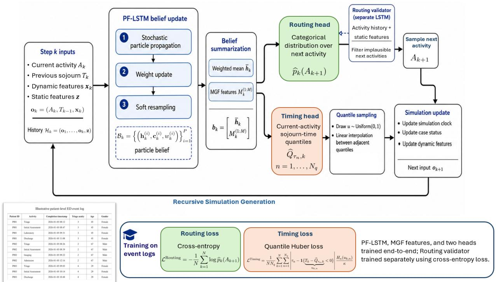
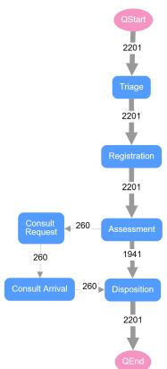
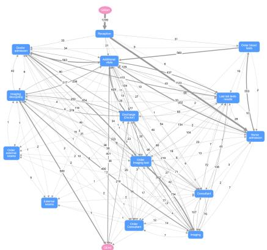
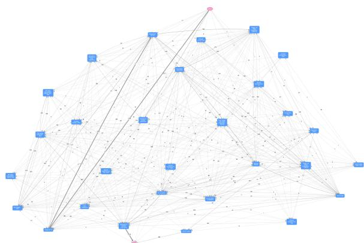
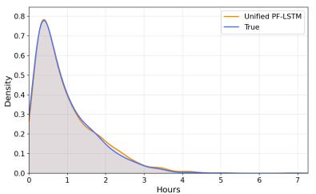
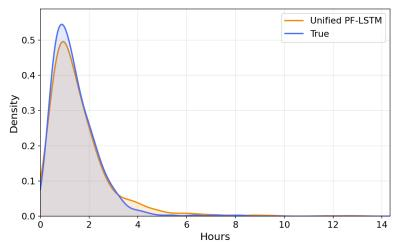
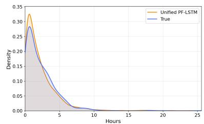
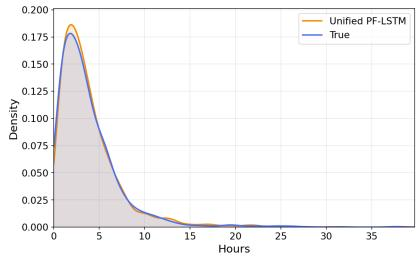
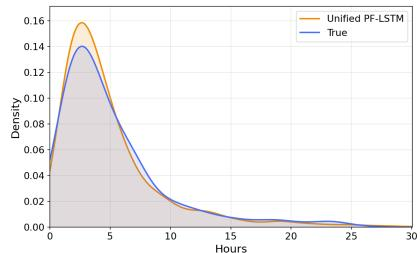
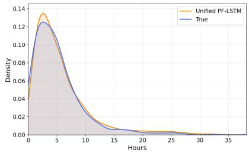

# A Unified Particle Filter LSTM for Data-Driven Process Simulation

Parvin Malekzadeh∗ Opher Baron Dmitry Krass

Rotman School of Management, University of Toronto, Toronto, ON, Canada

∗Corresponding author: p.malekzadeh@rotman.utoronto.ca

## Abstract

Data-driven process simulation aims to generate realistic case trajectories from historical event logs without requiring an explicitly specified model of the underlying dynamics. Deep sequence models can capture complex temporal dependencies through next-activity probabilities and conditional time distributions. However, event logs provide only a partial view of the underlying process state, often recording activity completions without the corresponding service-start times. Consequently, the same observed process history may be consistent with multiple plausible latent process conditions, whereas standard recurrent models compress each process prefix into a single deterministic recurrent state. We propose a Unified particle filter LSTM (Unified PF-LSTM) that maintains and sequentially updates a weighted set of recurrent-state hypotheses. We summarize this particle belief using its weighted mean and learned features based on the moment-generating function. The resulting representation is used to predict a categorical distribution over the next activity and conditional quantiles of the current activity’s sojourn time. The framework is trained end-to-end from event-log data and evaluated on three real-world emergency department datasets. The results show that the proposed framework consistently outperforms the considered data-driven baselines in reproducing routing, duration, and system-level behavior across all datasets, with particularly strong gains in settings where complex process dynamics are only partially reflected in the available event logs.

## 1 Introduction

Queueing and discrete-event simulation models are widely used to analyze congestion, evaluate operational policies, and support capacity-planning decisions. They also provide a foundation for digital twins and operational what-if analysis [Tao et al., 2018]. Constructing a high-fidelity simulator, however, generally requires a modeler to specify the system structure, arrival and service processes, routing logic, and resource interactions. This requires substantial domain knowledge and modeling expertise, particularly for systems with nonstationary, history-dependent, or partially observed dynamics. It also often requires collecting new customized data that may be dificult to maintain, and involves many subjective decisions by the modeler - two simulation experts are unlikely to arrive at the same model specification.

Modern information systems increasingly record operational processes as event logs containing event sequences, timestamps, case attributes, and contextual system information. Data-driven process simulation uses these records to learn generative models directly from observed trajectories, reducing the need to fully specify the underlying dynamics, and increasing modeling transparency and replicability. At each event, such a model must capture two related mechanisms: routing, which determines where a case moves next, and sojourn time, which determines how long it remains at the current activity. These outcomes depend on the case history and attributes, as well as evolving system conditions such as congestion.

Deep sequence models, including long short-term memory (LSTM) networks [Hochreiter and Schmidhuber, 1997], are a natural approach to these tasks because they capture temporal dependencies in variable-length event histories [Camargo et al., 2019, Gunnarsson et al., 2023]. Standard deep sequence models, however, typically compress each observed process prefix (i.e., the case’s event history up to the current point) into a single deterministic recurrent state, a learned numerical representation of the observed history.

Event-log data provide only a partial view of the underlying process state. In particular, many real-world event logs contain only one timestamp per activity, typically its completion time, while the service-start time is unavailable [Fracca et al., 2022, Suriadi et al., 2015]. Consequently, the elapsed time between consecutive activity completions conflates waiting and service time, so the same observed interval may correspond to diferent underlying operational conditions. More generally, relevant case characteristics may be unavailable, system measurements may be noisy or delayed, and factors such as efective resource availability or unrecorded workload may not be observed. The same observed history may therefore be compatible with several plausible latent process states. A single recurrent state represents only one interpretation of the observed history and does not explicitly preserve this latentstate ambiguity.

This issue is particularly important during recursive generation, where sampled activities and sojourn times become inputs to subsequent predictions. An inaccurate recurrent representation at one step can influence the remaining trajectory, allowing prediction errors to propagate and compound.

Contributions. To address this limitation, we build on particle filter LSTM (PF-LSTMs) [Ma et al., 2020]. Rather than maintaining a single recurrent state, a PF-LSTM maintains a weighted particle approximation of the belief over recurrent states. It updates this belief through an importance-weighted particle-filter procedure implemented as a diferentiable computational graph. The resulting representation preserves multiple plausible recurrent interpretations of the observed history and sequentially updates their relative importance.

Using the complete particle set directly for prediction is dificult, while its weighted mean alone may discard information about the shape of the belief. We therefore augment the weighted mean with learned features based on the moment-generating function (MGF) [Bulmer, 1979]. These features are permutation-invariant, computationally eficient, statistically suficient for many queuing representations, and easy to optimize, especially when the particle set is large [Johnson and Bhattacharyya, 2019].

The resulting fixed-dimensional belief representation is shared by two prediction heads: a routing head that produces a categorical distribution over the next activity and a timing head that estimates conditional quantiles of the current activity’s sojourn time. Our main contributions are:

1. We adapt a PF-LSTM with MGF-based belief features to data-driven process modeling, representing latent-state uncertainty induced by partial observability while also modeling intrinsic variability in routing and sojourn-time outcomes. Although instantiated using an LSTM, the underlying framework is applicable to other sequential architectures.

2. We demonstrate the eficacy of the framework using data from three emergency departments (EDs) with over 120,000 patient visits and 1,200,000 station visits through routing performance, duration calibration, and system-level fidelity. We observe that while our framework requires longer runtime, it leads to substantially higher accuracy, particularly for complex processes whose event logs provide limited information about the underlying system state.

Related Work. Work on data-driven process modeling includes waiting-time prediction, patient-flow forecasting, queue-performance estimation, and generative modeling of queueing systems [Ang et al., 2016, Sharafat and Bayati, 2021, Baron et al., 2024, Ojeda et al., 2021].

Machine learning methods such as random forests and gradient boosting provide flexible, nonparametric models of process outcomes. Quantile-based tree ensembles can additionally estimate conditional outcome distributions and prediction intervals [Mehdiyev et al., 2025]. These methods, however, typically rely on fixed-dimensional representations and do not directly capture dependencies across variable-length event histories.

Deep sequence models address this limitation and include recurrent architectures such as LSTMs [Tax et al., 2017, Camargo et al., 2019, 2021, Gunnarsson et al., 2023] and Transformer-based models [Mittal et al., 2025]. Probabilistic predictions are particularly important for simulation: next-activity probabilities represent variability in routing, while conditional sojourn time distributions represent variability in activity durations [Mittal et al., 2025, Mehdiyev et al., 2025]. However, these models typically do not represent latent-state uncertainty from incomplete event-log observations. Our work addresses this gap through a particle-filter mechanism that maintains multiple weighted recurrent-state hypotheses.

## 2 Problem Formulation

Operational data are typically available as event tables that record the sequence of activities visited by each case and the corresponding timestamps, together with static case attributes such as age and gender. We represent the activity trace of a case as $\sigma =$ $\left. ( A _ { 1 } , T _ { 1 } ) , \dots , ( A _ { N } , T _ { N } ) \right.$ , where $A _ { k } \in { \mathcal { A } }$ denotes the activity visited at step $k ,$ and $T _ { k } \ge 0$ is the time spent until transition to the next event.

At each event, we augment the recorded process history with a vector $\mathbf { x } _ { k }$ of dynamic features describing the current case and system conditions. These features may include elapsed process time, the number of cases in the system, activity-level census, and other congestion measures. Let z denote the static case attributes. We define the observation (input) at step $k$ as $\mathbf { o } _ { k } = \left( A _ { k } , T _ { k - 1 } , \mathbf { x } _ { k } \right)$ , where $T _ { k - 1 }$ is omitted for the first event. The information available through step k is then

$$
\mathcal { H } _ { k } = \left( \mathbf { o } _ { 1 } , \ldots , \mathbf { o } _ { k } , \mathbf { z } \right) = \left( A _ { 1 : k } , T _ { 1 : k - 1 } , \mathbf { x } _ { 1 : k } , \mathbf { z } \right) .\tag{1}
$$

Given $\mathcal { H } _ { k }$ at each step $k \in \{ 1 , 2 , . . . , N \}$ , the objective is to estimate the conditional distribution of the next activity,

$$
\operatorname* { P r } ( A _ { k + 1 } = a \mid \mathcal { H } _ { k } ) , \qquad a \in \mathcal { A } , \quad \mathrm { w i t h ~ } A _ { N + 1 } = \mathtt { E N D } ,\tag{2}
$$

and the distribution of the sojourn time at the activity entered at this event. We represent

the latter using $N _ { q }$ quantiles,

$$
Q _ { \tau _ { n } } ( T _ { k } \mid { \mathcal { H } } _ { k } ) , \qquad \tau _ { n } = { \frac { n } { N _ { q } + 1 } } , \qquad n = 1 , \ldots , N _ { q } ,\tag{3}
$$

where $\tau _ { n } \in ( 0 , 1 )$ denotes the corresponding quantile level. A quantile-based representation avoids imposing a particular parametric family on the distribution of event durations, which may be skewed, heavy-tailed, or heteroscedastic.

## 3 Methodology

Event-log data provide only a partial view of the underlying process state. Although the dynamic feature vector $\mathbf { x } _ { k }$ captures observable system conditions, some factors that influence case routing and activity sojourn times may be unavailable, measured with error, or recorded with delay. For example, because only activity-completion timestamps are available, the elapsed time used as the activity sojourn time does not distinguish waiting from service time. Resource availability, unrecorded workload, and latent case characteristics may also be unavailable or measured imperfectly. Consequently, the same observed history $\mathcal { H } _ { k }$ may be consistent with multiple plausible underlying process conditions.

To represent the resulting latent-state uncertainty, we use a PF-LSTM architecture; see Ma et al. [2020] for further details. We first provide a brief overview of the PF-LSTM and then present our unified framework, which integrates the particle-belief representation with routing and timing prediction, end-to-end training, and recursive simulation.

## 3.1 Particle Filter LSTM (PF-LSTM)

A standard LSTM maps $\mathcal { H } _ { k }$ to a single recurrent state. In contrast, a PF-LSTM Ma et al. [2020] maintains a weighted set of recurrent-state hypotheses. Each particle is a learned neural representation of a plausible latent process condition consistent with the observed history, rather than a direct estimate of a physical process state. Collectively, the particles form a learned belief representation for the routing and timing prediction tasks.

Before processing the observation $\mathbf { o } _ { k } = \left( A _ { k } , T _ { k - 1 } , \mathbf { x } _ { k } \right)$ , the particle belief is

$$
\begin{array} { r } { \boldsymbol { B } _ { k - 1 } = \left\{ \left( \mathbf { h } _ { k - 1 } ^ { ( i ) } , \mathbf { c } _ { k - 1 } ^ { ( i ) } , w _ { k - 1 } ^ { ( i ) } \right) \right\} _ { i = 1 } ^ { P } , } \end{array}\tag{4}
$$

where $\mathbf { h } _ { k - 1 } ^ { ( i ) }$ is the hidden state of particle i, $\mathbf { c } _ { k - 1 } ^ { ( i ) }$ is its internal LSTM cell state, and $w _ { k - 1 } ^ { ( i ) }$ is its normalized weight. The hidden state is exposed to the downstream belief representation and prediction heads, whereas the cell state serves as the particle’s internal recurrent memory. The pair $\left( \mathbf { h } _ { k - 1 } ^ { ( i ) } , \mathbf { c } _ { k - 1 } ^ { ( i ) } \right)$ therefore forms the recurrent state of particle i, and both components are propagated and resampled together. Here, P denotes the number of particles.

1. Stochastic particle transition. Each particle is propagated through a shared stochastic PF-LSTM transition:

$$
\left( \widetilde { \mathbf { h } } _ { k } ^ { \left( i \right) } , \widetilde { \mathbf { c } } _ { k } ^ { \left( i \right) } \right) = g _ { \theta } ^ { \mathrm { t r a n s i t } } \left( \mathbf { h } _ { k - 1 } ^ { \left( i \right) } , \mathbf { c } _ { k - 1 } ^ { \left( i \right) } , \mathbf { o } _ { k } , \pmb { \epsilon } _ { k } ^ { \left( i \right) } \right) ,\tag{5}
$$

where $g _ { \theta } ^ { \mathrm { t r a n s i t } }$ is a learnable PF-LSTM transition mapping parameterized by $\theta ,$ and $\epsilon _ { k } ^ { \left( i \right) }$ is independently sampled Gaussian noise whose distribution is parameterized using the previous particle state and current observation. The stochastic term allows the particles to represent diferent recurrent-state hypotheses and helps preserve particle diversity.

2. Weight update. Each propagated particle receives a positive compatibility score

$$
\ell _ { k } ^ { ( i ) } = g _ { \phi } ^ { \mathrm { w e i g h t } } \left( \mathbf { o } _ { k } , \widetilde { \mathbf { h } } _ { k } ^ { ( i ) } \right) , \qquad \ell _ { k } ^ { ( i ) } > 0 ,\tag{6}
$$

where $g _ { \phi } ^ { \mathrm { w e i g h t } }$ is a learnable scoring function parameterized by $\phi .$ Its normalized weight is then updated as $\begin{array} { r } { \widetilde { w } _ { k } ^ { ( i ) } = \frac { w _ { k - 1 } ^ { ( i ) } \ell _ { k } ^ { ( i ) } } { \sum _ { j = 1 } ^ { P } w _ { k - 1 } ^ { ( j ) } \ell _ { k } ^ { ( j ) } } } \end{array}$

3. Soft resampling. Finally, ancestor particles are sampled from the soft-resampling distribution $q _ { k } ( i ) = \alpha \widetilde { w } _ { k } ^ { ( i ) } + ( 1 - \alpha ) / P$ , where $\alpha \in [ 0 , 1 ]$ balances weight-based and uniform sampling. An importance-weight correction is then applied to account for the modified sampling distribution, yielding the updated particle belief $\boldsymbol { B } _ { k }$

## 3.2 The proposed Unified PF-LSTM

Figure 1 summarizes our proposed Unified PF-LSTM architecture. This PF-LSTM first processes the observation sequence using the particle-filter update described in Section 3.1. At each step $k ,$ this produces the weighted particle belief $\bar { B _ { k } } = \left\{ \left( \mathbf { h } _ { k } ^ { \left( i \right) } , \mathbf { c } _ { k } ^ { \left( i \right) } , w _ { k } ^ { \left( i \right) } \right) \right\} _ { i = 1 } ^ { P }$ . The particle belief is then summarized by a fixed-dimensional representation for prediction.

We compute the weighted mean of the particle hidden states, $\begin{array} { r } { \overline { { \mathbf { h } } } _ { k } = \dot { \sum _ { i = 1 } ^ { P } } w _ { k } ^ { ( i ) } \mathbf { h } _ { k } ^ { ( i ) } } \end{array}$ . To retain information about the belief beyond its mean, we augment $\overline { { \mathbf { h } } } _ { k }$ with M features based on the MGF. In statistics, the MGF provides an alternative characterization of a random variable’s distribution and can be used to generate its moments [Johnson and Bhattacharyya, 2019]. Treating the weighted particle hidden states as an empirical distribution, its MGF is

$$
\mathcal M _ { k } ( \mathbf v ) = \sum _ { i = 1 } ^ { P } w _ { k } ^ { ( i ) } \exp \Bigl ( \mathbf v ^ { \top } \mathbf h _ { k } ^ { ( i ) } \Bigr ) ,
$$

where $\mathbf { v } \in \mathbb { R } ^ { d _ { h } }$ is the argument at which the MGF is evaluated. We evaluate the MGF at M trainable vectors $\mathbf { v } _ { 1 } , \ldots , \mathbf { v } _ { M }$ . Each $\mathbf { v } _ { m } \in \mathbb { R } ^ { d _ { h } }$ is a parameter that defines a linear projection of the particle state. The corresponding feature is $M _ { k } ^ { ( m ) } = \mathcal { M } _ { k } ( \mathbf { v } _ { m } )$ . In the neural-network implementation, the vectors $\mathbf { v } _ { 1 } , \ldots , \mathbf { v } _ { M }$ form the rows of a trainable linear layer applied to each particle state, followed by an elementwise exponential activation and a weighted aggregation across particles. The resulting belief representation is $\mathbf { b } _ { k } = \left\lceil \overline { { \mathbf { h } } } _ { k } ; M _ { k } ^ { ( 1 : M ) } \right\rceil$

This belief representation is shared by two task-specific fully connected prediction heads. Let $g _ { \psi } ^ { \mathrm { r o u t e } }$ and $g _ { \zeta } ^ { \mathrm { t i m i n g } }$ denote the routing and timing networks, with parameters $\psi$ and $\zeta ,$ respectively. The routing network maps the belief representation $\mathbf { b } _ { k }$ to a categorical distribution over the next activity, while the timing network maps it to the $N _ { q }$ conditional quantiles of the current activity’s sojourn time.

In addition, recursive simulation can amplify errors caused by extreme sampled sojourn times. Each sampled sojourn time afects the simulated system state and, consequently, the dynamic feature vector constructed at the next step. Unusually large or small values may create system conditions rarely observed in the training data. Under such conditions, the main routing network may assign nonzero probability to implausible next activities.

To improve robustness, we use a separately trained LSTM routing validator. The validator relies only on the activity history and static case attributes and does not use the dynamic system features afected by the sampled sojourn times. At each step, it identifies plausible next activities, which are used to filter the categorical distribution produced by the main routing network before the next activity is sampled. The remaining probabilities are then renormalized. Thus, the validator does not replace the main routing network; rather, it acts as a safeguard against implausible transitions caused by outlier-induced system conditions during recursive generation.

Training. Let ${ \widehat { p } } _ { k } ( a )$ denote the predicted routing probability for activity $^ { a , }$ and let $\widehat { Q } _ { \tau n } .$ ,k denote the predicted $\tau _ { n } \cdot$ -quantile of $T _ { k }$ . The routing head is trained using categorical crossentropy loss,

$$
\mathcal { L } ^ { \mathrm { R o u t i n g } } = - \frac { 1 } { N } \sum _ { k = 1 } ^ { N } \log \widehat { p _ { k } } ( A _ { k + 1 } ) .\tag{7}
$$

For the timing head, define the residual $u _ { k , n } = T _ { k } - \widehat { Q } _ { \tau _ { n } , k }$ . We use the quantile Huber loss [Huber, 1992, Dabney et al., 2018],

$$
\mathcal { L } ^ { \mathrm { T i m i n g } } = \frac { 1 } { N N _ { q } } \sum _ { k = 1 } ^ { N } \sum _ { n = 1 } ^ { N _ { q } } \left| \tau _ { n } - \mathbf { 1 } \{ u _ { k , n } < 0 \} \right| \frac { H _ { \kappa } ( u _ { k , n } ) } { \kappa } ,\tag{8}
$$

where $\kappa > 0$ is the Huber threshold and

$$
\begin{array} { r } { H _ { \kappa } ( u ) = \left\{ \begin{array} { l l } { \frac 1 2 u ^ { 2 } , } & { | u | \leq \kappa , } \\ { \kappa \left( | u | - \frac 1 2 \kappa \right) , } & { | u | > \kappa . } \end{array} \right. } \end{array}\tag{9}
$$

The overall training objective is $\mathcal { L } = \mathcal { L } ^ { \mathrm { R o u t i n g } } + \mathcal { L } ^ { \mathrm { T i m i n g } }$

Let $\mathbf { V } = \left[ \mathbf { v } _ { 1 } , \ldots , \mathbf { v } _ { M } \right] ^ { \top } \in \mathbb { R } ^ { M \times d _ { h } }$ denote the trainable MGF matrix, and let $\boldsymbol { \Omega } = \{ \theta , \phi , \mathbf { V } , \psi , \boldsymbol { \zeta } \}$ collect the trainable parameters of the Unified PF-LSTM. Define ${ \widehat { \mathbf { p } } } _ { k } ~ = ~ \left( { \widehat { p } } _ { k } ( a ) \right) _ { a \in { \mathcal { A } } }$ and $\widehat { \mathbf { Q } } _ { k } = \left( \widehat { Q } _ { \tau _ { 1 } , k } , \ldots , \widehat { Q } _ { \tau _ { N _ { q } } , k } \right) ^ { \top }$

Writing $\mathcal { L } _ { k } ^ { \mathrm { R o u t i n g } }$ and $\mathcal { L } _ { k } ^ { \mathrm { T i m i n g } }$ for the corresponding per-step losses, the gradient passed from

  
Figure 1: Overview of the proposed unified PF-LSTM framework.

the two prediction heads to the shared belief representation is

$$
\delta _ { k } ^ { b } = \left( \frac { \partial \widehat { \mathbf { p } } _ { k } } { \partial \mathbf { b } _ { k } } \right) ^ { \top } \nabla _ { \widehat { \mathbf { p } } _ { k } } \mathcal { L } _ { k } ^ { \mathrm { R o u t i n g } } + \left( \frac { \partial \widehat { \mathbf { Q } } _ { k } } { \partial \mathbf { b } _ { k } } \right) ^ { \top } \nabla _ { \widehat { \mathbf { Q } } _ { k } } \mathcal { L } _ { k } ^ { \mathrm { T i m i n g } } .\tag{10}
$$

Therefore, for any shared parameter $\begin{array} { r } { \omega \in \{ \theta , \phi , \mathbf { V } \} , \nabla _ { \omega } \mathcal { L } = \sum _ { k = 1 } ^ { N } \left( \frac { \mathrm { d } \mathbf { b } _ { k } } { \mathrm { d } \omega } \right) ^ { \top } \delta _ { k } ^ { b } } \end{array}$ . The total derivative accounts for the dependence of the particle recurrent states and weights on preceding steps and is computed using backpropagation through time. Because the MGF features are included in $\mathbf { b } _ { k }$ , gradients from both losses propagate through these features to update V. The routing-head parameters ψ receive gradients only from ${ \mathcal { L } } ^ { \mathrm { R o u t i n g } }$ , whereas the timinghead parameters ζ receive gradients only from ${ \mathcal { L } } ^ { \mathrm { T i m i n g } }$ . Thus, the particle-transition network, particle-weight network, MGF matrix, and two prediction heads are trained end to end.

The routing validator is trained separately using a next-activity cross-entropy objective, and its parameters are not included in $\Omega .$

Simulation. Once trained, the Unified PF-LSTM generates case trajectories autoregressively. At step k, the routing head produces a categorical distribution ${ \widehat { p } } _ { k } ( a )$ over the possible next activities. The separately trained routing validator then evaluates the plausibility of each candidate activity using only the activity history and static case attributes. Activities whose validator probabilities fall below a predefined threshold are removed from the candidate set. The probabilities assigned by the main routing head to the remaining activities are then renormalized, and the next activity $A _ { k + 1 }$ is sampled from the resulting distribution.

If the validator removes all candidates, the activity with the highest validator probability is retained. Thus, the validator restricts the set of admissible next activities without replacing the routing distribution learned by the Unified PF-LSTM.

To sample the duration of the current activity, we interpret the conditional quantiles as a piecewise-linear approximation of the inverse conditional distribution. We draw $u \sim$ Uniform(0, 1). For adjacent quantile levels satisfying $\tau _ { n } \leq u \leq \tau _ { n + 1 }$ , the sampled duration is

$$
\widetilde { T } _ { k } = \widehat { Q } _ { \tau _ { n } , k } + \frac { u - \tau _ { n } } { \tau _ { n + 1 } - \tau _ { n } } \left( \widehat { Q } _ { \tau _ { n + 1 } , k } - \widehat { Q } _ { \tau _ { n } , k } \right) .\tag{11}
$$

For $u < \tau _ { 1 }$ , we use $\widehat { Q } _ { \tau _ { 1 } , k }$ , and for $u > \tau _ { N _ { q } }$ , we use $\widehat { Q } _ { \tau { N _ { q } } , k }$

Upon arrival at activity $A _ { k }$ , the model samples the current activity’s sojourn time $\widetilde { T } _ { k }$ and the next activity $A _ { k + 1 }$ . The transition to $A _ { k + 1 }$ is scheduled for the current simulation time plus $\widetilde { T } _ { k }$ . When the transition occurs, the case status, activity-level census, and other dynamic system features are updated, producing $\mathbf { x } _ { k + 1 }$ . The next model input is $\mathbf { o } _ { k + 1 } =$ $\left( A _ { k + 1 } , \widetilde { T } _ { k } , \mathbf { x } _ { k + 1 } \right)$ . The model parameters remain fixed during generation, while the particle recurrent states and weights are updated at each step as the generated trajectory evolves. This procedure continues until the terminal activity END is generated.

## 4 Experimental Evaluation

In this section, we empirically evaluate the capabilities of the proposed Unified PF-LSTM framework for learning both routing and activity sojourn-time distributions.

Dataset overview. We use data from three EDs, referred to as ED A, ED B, and ED C.1

  
(a) ED A.

  
(b) ED B.

  
(c) ED C.  
Figure 2: Process maps for the three ED datasets. Pink circular nodes indicate the start and end of a patient trajectory, while blue rectangular nodes represent ED activities or stations. Directed edges represent transitions observed in the corresponding event log.

Figure 2 depicts their process maps: ED A has a relatively simple process structure, ED B has a moderately complex structure, and ED C has the most complex structure.

Each dataset consists of patient-level event logs that record the sequence of ED activities or stations visited by each patient and the completion timestamp of each activity. As is common in many applications [Fracca et al., 2022, Suriadi et al., 2015], these data do not include timestamps indicating when service begins; only the completion times of the activities are observed. For activity $A _ { k } .$ , the completion time of $A _ { k - 1 }$ is treated as the arrival time to $A _ { k }$ , and the sojourn time at $A _ { k }$ is calculated as the diference between the two consecutive completion timestamps. For the first activity, the sojourn time is measured from the recorded ED arrival time to the completion time of that activity. The datasets also contain static patient attributes, such as triage acuity, age, and gender, subject to their availability at each hospital. ED A contains 11,652 patient trajectories, ED B contains 30,876, and ED C contains 82,435.

Upon a patient’s arrival at activity $A _ { k } .$ , we construct the dynamic feature vector $\mathbf { x } _ { k }$ using information available at that time. These features include the activity-level census, the total number of patients in the ED, and measures of residual workload at the relevant activities.

Baselines. We compare the proposed Unified PF-LSTM with a hybrid framework that combines a fifth-order Markov model for routing with a random survival forest (RSF) for sojourn-time prediction. The Markov model captures dependence on the five most recent activities, while RSF has been used as a state-of-the-art nonparametric method for estimating conditional quantiles of sojourn times [Mehdiyev et al., 2025]. This baseline models routing and timing separately and provides a strong non-neural benchmark. We also consider an otherwise comparable LSTM-based model with a routing validator but no particle filtering to isolate the contribution of the particle-based belief representation.

Model training setup. For each dataset, patient encounters are partitioned chronologically, with the earliest 80% used for training and the most recent 20% reserved for testing. All events belonging to the same encounter are retained within a single partition. A validation subset of the training data is used for hyperparameter selection.

Across all datasets, the Unified PF-LSTM uses $P = 2 0$ particles, $M = 8$ MGF features, and a soft-resampling coeficient of $\alpha = 0 . 5$ . We examine the sensitivity of model performance to P and M in Section 4.1. Table 1 reports the architectural and training hyperparameters shared by the Unified PF-LSTM and the LSTM baseline.

Table 1: Hyperparameters shared by the Unified PF-LSTM and LSTM baseline.
<table><tr><td>Parameter</td><td># Recurrent layers</td><td>Hidden-state dimension (dh) Embedding dimension Dropout rate # Quantiles (Nq)</td><td></td><td></td><td></td><td>Huber threshold (κ)</td></tr><tr><td>Value</td><td>2</td><td>128</td><td>64</td><td>0.1</td><td>20</td><td>1</td></tr><tr><td></td><td>Parameter Routing-validator threshold</td><td>Optimizer</td><td>Learning rate</td><td>Weight decay</td><td>Batch size</td><td>Maximum epochs</td></tr><tr><td>Value</td><td>0.1</td><td>Adam</td><td>10−3</td><td>0.01</td><td>64</td><td>30</td></tr></table>

Model evaluation. Because the competing models use diferent training objectives and output representations, we evaluate their end-to-end simulation performance. For each heldout test case, a model recursively samples the current activity’s sojourn time and the next activity until the generated patient trajectory reaches the terminal activity. Each experiment is run independently 10 times, and the reported results are averaged across runs.

We compare the observed and simulated outcomes using time to provider initial assessment (TPIA) and total length of stay (LOS), two key performance indicators of ED operations [Canadian Institute for Health Information, 2018].

Results. Figure 3 compares the observed TPIA and LOS distributions with those generated by the proposed Unified PF-LSTM. Across all three datasets, the generated distributions closely follow the observed distributions.

Table 2 reports the absolute percentage errors (APEs) of the mean and 90th percentile, where lower values indicate closer agreement with the held-out test data. The LSTM improves upon the RSF timing + 5-Markov routing framework, demonstrating the benefit of modeling routing and timing jointly through a sequential representation.

The Unified PF-LSTM reduces both mean and 90th-percentile errors across all datasets and performance measures, with larger improvements observed for EDs B and C, which have more complex process structures.

TPIA errors are generally larger than LOS errors. TPIA is sensitive to early routing errors, such as generating an incorrect activity, adding an unnecessary activity before initial assessment, or omitting the correct assessment destination. In contrast, errors in individual activity durations may partially ofset one another when aggregated into total LOS.

The particle-based model requires more computation than the two baselines because each observation is propagated through multiple particles. The reported generation times were measured on a laptop CPU. Because particle updates can be vectorized and evaluated in parallel, a GPU implementation is expected to reduce the wall-clock time significantly.

## 4.1 Sensitivity and Ablation Study

We examine the efects of the number of particles, the MGF-based belief features, and the number of predicted quantiles. Due to space limitations, we omit the detailed results and summarize the main findings below.

First, increasing the number of particles generally improves performance from P = 1 to P = 30. Larger particle sets provide a richer belief representation, although they also increase computational cost. We therefore use P = 20 to balance predictive performance and eficiency.

Second, we compare the full Unified PF-LSTM with a mean-only variant that excludes the MGF features. The mean-only variant performs worse, particularly for ED B, whose event log provides less information about the underlying system state. Among models using MGF features, increasing M improves performance by capturing distributional information beyond the mean, such as dispersion and multimodality. However, the improvements become minor beyond M = 8, so we use $M = 8$ in the default configuration.

  
(a) TPIA: ED A.

  
(b) TPIA: ED B.

  
(c) TPIA: ED C.

  
(d) LOS: ED A.

  
(e) LOS: ED B.

  
(f) LOS: ED C.  
Figure 3: Comparison of the observed (true) and Unified PF-LSTM-generated distributions across the three ED datasets.

Table 2: Comparison of simulation errors and generation times across the three ED datasets. Error entries report mean APE / 90th-percentile APE. Generation times report the total time required to generate trajectories for the corresponding test set.
<table><tr><td>Metric</td><td>Dataset</td><td>RSF Timing + 5-Markov Routing</td><td>LSTM</td><td>Unified PF-LSTM</td></tr><tr><td rowspan="3">TPIA error (%)</td><td>ED A</td><td>17.07/32.75</td><td>10.54/28.36</td><td>5.25/5.74</td></tr><tr><td>ED B</td><td>50.00/70.48</td><td>38.80/42.28</td><td>14.36/18.46</td></tr><tr><td>ED C</td><td>27.75/28.05</td><td>15.38/17.27</td><td>10.87/5.00</td></tr><tr><td rowspan="3">LOS error (%)</td><td>ED A</td><td>12.26/11.08</td><td>9.41/6.11</td><td>3.31/1.82</td></tr><tr><td>ED B</td><td>40.33/48.91</td><td>12.70/29.07</td><td>6.53/16.74</td></tr><tr><td>ED C</td><td>23.77/36.00</td><td>8.55/13.42</td><td>4.16/3.89</td></tr><tr><td rowspan="3">Generation time (seconds)</td><td>ED A</td><td>3.85</td><td>77.63</td><td>194.08</td></tr><tr><td>ED B</td><td>2.00</td><td>150.00</td><td>375.00</td></tr><tr><td>ED C</td><td>38.07</td><td>202.65</td><td>506.63</td></tr></table>

Finally, increasing the number of predicted quantiles from $N _ { q } = 1 0$ to $N _ { q } = 5 0$ improves the representation of the conditional sojourn-time distribution. However, increasing $N _ { q }$ from 20 to 50 provides only minor additional improvements while noticeably increasing computation time. We therefore use $N _ { q } = 2 0$ in the default configuration.

## 5 Conclusion and Future Directions

We introduced a Unified PF-LSTM framework for data-driven process simulation. The framework maintains a particle-based belief over recurrent-state hypotheses that encode plausible latent process conditions and uses MGF-based features to retain information about the shape of this belief. The resulting representation supports the generation of complete case trajectories while representing latent-state uncertainty induced by partial observability of operational conditions, as well as variability in routing and sojourn-time outcomes.

Our experimental results using three real-world ED datasets with diferent levels of process complexity and information availability show that our framework outperforms the alternative data-driven baselines in reproducing routing behavior, activity durations, and system-level performance measures, with particularly strong improvements in more complex settings.

Future work may extend the framework to other service systems and investigate online adaptation under changing operating conditions. Additional directions include using the learned model for counterfactual analysis and integrating it with reinforcement learning for policy evaluation, optimization, and operational decision-making.

## References

Erjie Ang, Sara Kwasnick, Mohsen Bayati, Erica L. Plambeck, and Michael Aratow. Accurate emergency department wait time prediction. Manufacturing & Service Operations Management, 18(1):141–156, 2016.

Opher Baron, Dmitry Krass, Arik Senderovich, and Eliran Sherzer. Supervised ML for solving the GI/GI/1 queue. INFORMS Journal on Computing, 36(3):766–786, 2024.

Michael George Bulmer. Principles of Statistics. Courier Corporation, 1979.

Manuel Camargo, Marlon Dumas, and Oscar Gonz´alez-Rojas. Learning accurate lstm models of business processes. In International Conference on Business Process Management, pages 286–302. Springer, 2019.

Manuel Camargo, Marlon Dumas, and Oscar Gonz’alez-Rojas. Discovering generative models from event logs: Data-driven simulation vs deep learning. PeerJ Computer Science, 7:e577, 2021.

Canadian Institute for Health Information. Wait time information in priority areas: Definitions. Canadian Institute for Health Information, April 2018. URL https://www.cihi.ca/sites/default/files/document/ wt2018-info-on-priority-areas-definitions-en.pptx. PowerPoint presentation.

Will Dabney, Mark Rowland, Marc G. Bellemare, and R´emi Munos. Distributional reinforcement learning with quantile regression. In Proceedings of the Thirty-Second AAAI Conference on Artificial Intelligence, volume 32, pages 2892–2901, 2018. doi: 10.1609/aaai.v32i1.11791.

Claudia Fracca, Massimiliano de Leoni, Fabio Asnicar, and Alessandro Turco. Estimating activity start timestamps in the presence of waiting times via process simulation. In International Conference on Advanced Information Systems Engineering, pages 287–303. Springer, 2022.

Bj¨orn Rafn Gunnarsson, Seppe vanden Broucke, and Jochen De Weerdt. A direct data aware lstm neural network architecture for complete remaining trace and runtime prediction. IEEE Transactions on Services Computing, 16(4):2330–2342, 2023.

Sepp Hochreiter and J¨urgen Schmidhuber. Long short-term memory. Neural Computation, 9(8):1735–1780, 11 1997.

Peter J Huber. Robust estimation of a location parameter. In Breakthroughs in statistics: Methodology and distribution, pages 492–518. Springer, 1992.

Richard A Johnson and Gouri K Bhattacharyya. Statistics: principles and methods. John Wiley & Sons, 2019.

Xiao Ma, Peter Karkus, David Hsu, and Wee Sun Lee. Particle filter recurrent neural networks. In Proceedings of the AAAI Conference on Artificial Intelligence, volume 34, pages 5101–5108, 2020.

Nijat Mehdiyev, Maxim Majlatow, and Peter Fettke. Quantifying and explaining machine learning uncertainty in predictive process monitoring: An operations research perspective. Annals of Operations Research, 347(2):991–1030, 2025.

Daksh Mittal, Shunri Zheng, Jing Dong, and Hongseok Namkoong. Data-driven stochastic modeling using autoregressive sequence models: Translating event tables to queueing dynamics, 2025.

Cesar Ojeda, Kostadin Cvejoski, Bogdan Georgiev, Christian Bauckhage, Jannis Schuecker, and Ramses J. Sanchez. Learning deep generative models for queuing systems. Proceedings of the AAAI Conference on Artificial Intelligence, 35(10):9214–9222, 2021.

Ali R. Sharafat and Mohsen Bayati. PatientFlowNet: A deep learning approach to patient flow prediction in emergency departments. IEEE Access, 9:45552–45561, 2021.

Suriadi Suriadi, Chun Ouyang, Wil M. P. van der Aalst, and Arthur H. M. ter Hofstede. Event interval analysis: Why do processes take time? Decision Support Systems, 79: 77–98, 2015.

Fei Tao, He Zhang, Ang Liu, and Andrew YC Nee. Digital twin in industry: State-of-the-art. IEEE Transactions on industrial informatics, 15(4):2405–2415, 2018.

Niek Tax, Ilya Verenich, Marcello La Rosa, and Marlon Dumas. Predictive business process monitoring with LSTM neural networks. In Advanced Information Systems Engineering, volume 10253 of Lecture Notes in Computer Science, pages 477–492. Springer, 2017.