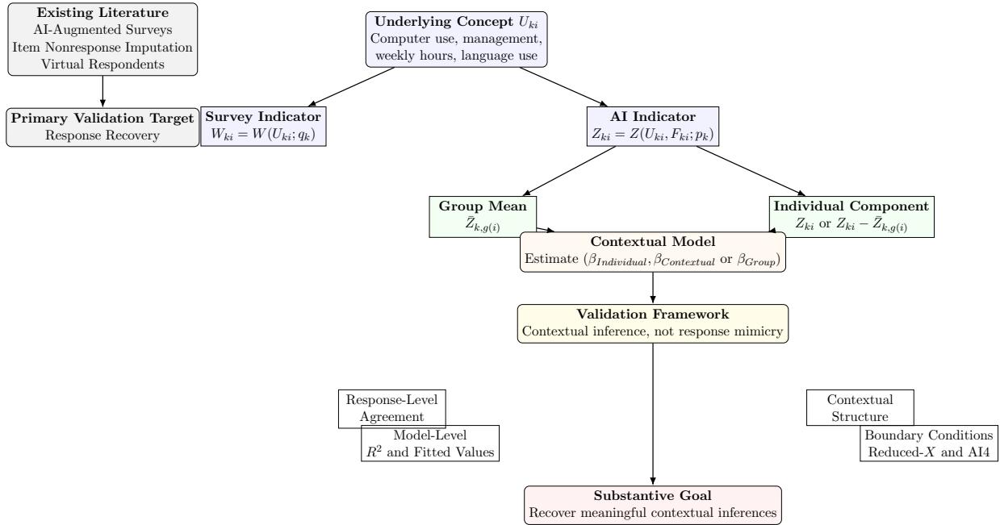

# AI Contextual Measurement for Recovering Individual and Group-Level Efects: Validation Against Survey Measures and an Occupational Application

Wenxin Jiang∗, Xuyang Wang†, Yuxiao Wu‡

Draft: September 3, 2026

## Abstract

Researchers increasingly use artificial intelligence to construct measures of social, organizational, and occupational characteristics that are absent from conventional surveys. We propose AICOME, AI COntextual MEasurement, a framework for evaluating whether AI-derived respondent-level measures can recover individual and group-level efects in contextual models. The key idea is that an AI measure constructed at the respondent level can be used to derive its group-level aggregate and its individual deviation, allowing researchers to estimate both between-group and within-group associations rather than treating AI measurement as response prediction alone.

We validate the framework using the 2022 China Family Panel Studies (CFPS), where occupations provide the empirical grouping structure and several job-related survey variables provide validation benchmarks. For computer use, foreign-language use, weekly hours, and management responsibilities, we compare survey measures with AI-derived measures in response-level, modellevel, contextual, and boundary-condition validations. The results show that AI contextual measurement can recover much of the contextual-model information contained in observed survey variables when rich respondent and job characteristics are available. Weekly hours provides the strongest validation case, with AI-derived measures reproducing the large negative betweenand within-occupation associations with satisfaction observed in CFPS. The framework also identifies clear boundary conditions: performance deteriorates when information is restricted to occupation and basic demographics, and recovery is weaker when several related concepts are treated as simultaneously unobserved. The findings suggest that AICOME is most useful for recovering a limited number of theoretically important constructs from rich existing datasets, not for replacing direct survey measurement or entire batteries of jointly missing items.

## 1 Introduction

Many social science questions involve variables that vary both between groups and within groups. Workers are nested within occupations, students within schools, employees within firms, patients within hospitals, and residents within neighborhoods. Researchers frequently want to know whether an association reflects diferences among groups, diferences among individuals within the same group, or both. This distinction is central to contextual analysis. If a characteristic is associated with an outcome, does the association arise because groups difer in their average characteristics, because individuals difer from others in the same group, or because both levels matter?

AI-based measurement ofers new opportunities for studying constructs that are absent from conventional surveys. Large language models can score occupations, organizations, tasks, texts, or other entities on abstract dimensions such as autonomy, technological intensity, interpersonal orientation, or creativity. Many such measures are defined at the group or entity level. For example, an AI system may assign a single autonomy score to an occupation, firm, school, or neighborhood. Such scores can be useful for studying between-group diferences, but they cannot determine whether individuals within the same group difer from one another or whether such within-group deviations matter for outcomes.

At the same time, recent work on AI-assisted survey prediction, LLM-based item imputation, and virtual survey respondents shows that language models can predict missing or unasked survey responses from respondent profiles, survey-question text, temporal information, or partial respondent attributes (Kim and Lee, 2023; Ji et al., 2024; Zhao et al., 2025). Our purpose is not to claim that respondent-level AI prediction is itself new. Instead, we ask whether AI-derived respondentlevel measures can be used for a diferent inferential task: contextual measurement. The key question is whether an AI-derived variable can recover not only an observed survey measure, but also the individual-level and group-level associations that would be estimated if the survey measure were observed.

This paper proposes AICOME, AI COntextual MEasurement, as a framework for constructing, aggregating, and validating AI-derived measures for contextual analysis. Let $g ( i )$ denote the group to which individual i belongs. A respondent-level AI measure $Z _ { i }$ can be decomposed into a group mean and an individual deviation from that group mean:

$$
Z _ { i } = \bar { Z } _ { g ( i ) } + \left( Z _ { i } - \bar { Z } _ { g ( i ) } \right) .\tag{1}
$$

This decomposition turns AICOME into contextual measurement. It allows researchers to use both $Z _ { i }$ and $\bar { Z } _ { g ( i ) }$ , or equivalently $\bar { Z } _ { g ( i ) }$ and $Z _ { i } \mathrm { ~ - ~ } \bar { Z } _ { g ( i ) }$ , in models that distinguish individuallevel and group-level associations. Standard group-level AI scores can measure diferences across groups, but they cannot identify within-group heterogeneity because their within-group deviation is mechanically zero.

The framework is easiest to describe using an underlying-concept notation. Let k index an underlying concept of theoretical interest, such as computer use, technology use, management responsibility, or foreign-language use. Let $U _ { k i }$ be the true level of concept k for individual i. Let $W _ { k i } = W ( U _ { k i } ; q _ { k } )$ denote respondent i’s survey-based indicator of concept k, where $q _ { k }$ represents the survey-question wording, response scale, and measurement protocol. Let $Z _ { k i } = Z ( U _ { k i } , F _ { k i } ; p _ { k } )$ denote respondent i’s AI-derived indicator of the same concept, where $F _ { k i }$ is the respondent-specific feature vector supplied to the AI system and $p _ { k }$ is the prompt protocol for concept k. The outcome is denoted by Y, and regression controls are denoted by X. This notation emphasizes that neither W nor $Z$ is treated as the true concept. They are alternative indicators of the same underlying concept, potentially shaped by diferent measurement protocols, response scales, and respondentspecific feature information. The AI measure is therefore not designed merely to reproduce the observed survey response. For example, a survey item may be binary while the AI prompt elicits a richer ordered score. AICOME asks whether the contextual structure obtained from $( Z _ { i } , \bar { Z } _ { g ( i ) } )$ supports substantive conclusions similar to those obtained from $( W _ { i } , \bar { W } _ { g ( i ) } )$ when validation data are available.

We illustrate the framework using job satisfaction and occupational groups in the 2022 China Family Panel Studies (CFPS). In the empirical application, $Y$ is job satisfaction and $g ( i )$ is occupation. The setting is useful for two reasons. First, CFPS contains rich respondent and job information that can serve as features F for AI measurement. Second, CFPS contains several observed work-related variables that allow validation against conventional survey measures W. Occupations provide one illustration of the general grouping structure. The same framework is potentially applicable to other hierarchical settings, such as students within schools, employees within firms, patients within hospitals, and residents within neighborhoods.

The paper has three main contributions. First, we develop a validation framework for AI contextual measurement that goes beyond response-level correlation. Existing validation studies focus primarily on response recovery, item-level accuracy, or distributional similarity. We treat these as useful but insuficient evidence for contextual applications. Our primary validation target is recovery of contextual inference: whether AI-derived measures recover explanatory power, preserve qualitative coeficient directions, reproduce individual-level and group-level conclusions, and generate similar fitted values. Coeficient-vector correlations and RMSE are reported as descriptive diagnostics, not as strict requirements that the AI measure numerically mimic the survey measure.

Second, we show that respondent-level AI measures can recover contextual decompositions for several observed CFPS dimensions. This is the most direct evidence that the approach is useful for contextual analysis rather than merely item-level prediction. Weekly hours provides the clearest case: both AI prompting strategies reproduce the large negative between- and within-occupation associations observed in CFPS, while occupation-level measures miss the individual-level signal.

Third, we identify boundary conditions. Performance is strong when rich respondent information is available and a limited number of concepts are missing, but it deteriorates when information is sparse or when several related constructs are missing simultaneously. These findings clarify the intended use of the framework. AICOME is not a substitute for direct survey measurement and should not be interpreted as creating information absent from the observed data. It is most defen sible when researchers possess rich existing respondent information and seek to recover a limited number of theoretically important but unmeasured concepts. The later application to autonomy, people-things, creative-routine, and technology illustrates this use case, but because those latent dimensions lack direct CFPS validation measures, those results are interpreted as an application of the validated framework rather than as direct proof of latent truth.

  
Figure 1: Conceptual framework for AICOME, AI COntextual MEasurement. Much of the existing literature focuses on recovering missing survey responses, imputing item nonresponse, or simulating respondent attributes. In contrast, AICOME views survey variables and AI-derived variables as alternative indicators of an underlying concept and evaluates whether respondentspecific AI measures support contextual analysis. AI-derived measures are decomposed into group means and individual components, allowing estimation of individual and group associations. Validation proceeds through response-level agreement, model-level validation, contextual validation, and boundary-condition analysis. The ultimate objective is not merely response recovery, but recovery of substantively meaningful contextual inferences.

Figure 1 summarizes the central distinction between the present study and recent AI-assisted survey-prediction research. Existing work has primarily evaluated the ability of large language models to recover missing responses, respondent attributes, or population distributions. Our focus instead is whether respondent-level AI measures can support contextual analysis. Consequently, the principal validation target is not response recovery alone, but recovery of between- and withinoccupation inferences.

## 2 Related Literature and Positioning

## 2.1 Contextual models and occupational measurement

A central concern in the contextual-model literature is distinguishing between-group and withingroup associations (Blalock, 1984; Enders and Tofighi, 2007).Researchers studying neighborhoods, schools, firms, and occupations often seek to determine whether outcomes are driven by group environments or by diferences among individuals within the same group. Estimating such models requires measures that vary at the individual level. Group-level measures can be useful for describing between-group diferences, but by construction they cannot identify within-group deviations.

A large occupational-measurement literature has developed resources such as the Dictionary of Occupational Titles and O\*NET to characterize jobs and occupations (Peterson et al., 2001; Autor et al., 2003; Acemoglu and Autor, 2011; Deming, 2017). These resources have been widely used to measure task content, skill requirements, technological exposure, social skills, and other features of work. Their central strength is that they provide systematic and comparable measures across occupations. Their central limitation for the present purpose is that they are usually occupationlevel measures. If all workers in the same occupation receive the same score, the measure can identify only between-occupation variation.

Recent advances in large language models have created a related AI-measurement literature. Researchers have used language models to score occupations, estimate exposure to artificial intelligence, classify work tasks, generate synthetic respondents, and construct new social-science measures (Felten et al., 2021; Eloundou et al., 2024). These approaches overlap with the present paper because they use AI systems to generate quantities that were not directly measured in conventional datasets. However, most existing AI occupational measures remain group-level: occupations, occupational tasks, industries, firms, or texts receive scores, and individuals inherit the score attached to their group or label. Our contribution is to generate respondent-level measures that can be decomposed into occupation means and within-occupation deviations, making contextual analysis possible.

## 2.2 AI survey prediction, imputation, and synthetic respondents

Individual AI measurement is related to several emerging uses of large language models in simulating human behavior and in survey research. Horton, Filippas, and Manning (2023) (Horton et al., 2023) use LLMs as simulated economic agents to reproduce and explore behavioral responses in hypothetical experiments. Argyle et al. (2023) (Argyle et al., 2023) use LLMs to generate synthetic respondents (”silicon samples”) and evaluate whether the resulting responses reproduce patterns observed in human survey data. Another line of work uses LLMs to augment surveys, address Item Non-Response or as Virtual Survey Respondents (Kim and Lee, 2023, (Kim and Lee, 2023), Ji et al., 2024, (Ji et al., 2024), Zhao et al., 2025, (Zhao et al., 2025)).

These studies overlap with the present paper because all use AI systems to infer quantities not directly observed in a survey. The distinction is in the estimand and validation target. Prior work primarily asks whether AI systems can reproduce responses, opinions, attributes, or distributions. We ask whether respondent-level AI-derived measures can support contextual analysis. Specifically, we evaluate whether AI-generated variables recover explanatory power, preserve coeficient directions, and reproduce substantive between-within conclusions obtained from observed CFPS measures. The validation target is therefore not item-level prediction alone, but recovery of substantive contextual inferences.

This distinction is important because high response-level similarity need not imply valid downstream inference. Synthetic survey data may match marginal averages while producing diferent variation or regression coeficients, and results may vary with prompt wording or model changes (Bisbee et al., 2024). Motivated by this concern, our validation strategy compares not only correlations between AI-derived and observed measures, but also incremental explanatory power, coefficient directions, contextual conclusions, coeficient-vector similarity, and fitted-value similarity.

## 2.3 Construct validation, generated regressors, and measurement error

The validation problem in the present study is related to but not identical to either a classical generated-regressor problem or a simple measurement-error problem. In generated-regressor settings, a first-stage estimate is often assumed to converge to a well-defined target regressor, and the central issue is how first-stage estimation uncertainty afects second-stage standard errors (Pagan, 1984; Murphy and Topel, 1985) (Pagan, 1984; Murphy and Topel, 1985). See also Escanciano and P´erez-Izquierdo 2023 Escanciano and P´erez-Izquierdo (2023) for an automatic locally robust GMM framework for inference with machine-learning-generated regressors. Recently, Ludwig et al. (2026) Ludwig et al. (2026) develop an econometric framework for using LLM outputs in prediction and estimation, emphasizing that valid downstream inference for LLM-measured concepts requires validation data to debias and account for LLM errors. In the present setting, the AI-derived measure is not assumed to converge to the observed survey response as sample size grows. Nor do we assume that the observed survey response is a perfect measure of the underlying job concept that afects satisfaction. Both the observed survey variable and the AI-derived variable may be imperfect indicators of an underlying concept.

For this reason, the central validation question is whether the AI-derived measure yields substantively similar inferences to the observed survey measure when no perfect validation data are available. This framing is closer to construct validation than to a narrow two-step inference correction. The construct-validity tradition emphasizes that validity is not established by a single statistic, but by evidence that the operational measure supports the intended interpretation and use (Cronbach and Meehl, 1955; Messick, 1989; Adcock and Collier, 2001) (Cronbach and Meehl, 1955; Messick, 1989; Adcock and Collier, 2001). Here the intended use is contextual analysis. We therefore evaluate whether AI-derived measures reproduce the contextual inferences obtained from conventional survey measures.

A useful way to interpret these imperfect validation metrics is through an underlying-concept proxy framework. Let U denote the unobserved concept described by the survey item or AI prompt, let M denote any candidate indicator of that concept, such as a survey measure W, a rich-prompt AI measure $Z ^ { r i c h }$ , or a survey-prompt AI measure $Z ^ { s u r v e y }$ , and let X denote observed controls. The concept U is unobserved in the dataset, but it is not an arbitrary abstraction: it is described in words by the measurement task itself, such as computer use, management responsibility, weekly hours, or foreign-language use.

Let $\widehat { Y } _ { A }$ denote the population linear prediction of Y from variables A. We use the following linear proxy-validity assumption: once the outcome-relevant component associated with the underlying concept and controls has been extracted, the remaining outcome residual is uncorrelated with the candidate indicator,

$$
\mathrm { C o v } \{ M , Y - \widehat { Y } _ { U , X } \} = 0 .\tag{2}
$$

Under this assumption, the prediction $\widehat { Y } _ { M , X }$ based on (M, X) is the population linear projection of

the oracle prediction $\widehat { Y } _ { U , X }$ based on $( U , X )$ onto the information available in $( M , X )$ . Consequently,

$$
R ^ { 2 } ( Y \mid M , X ) = R ^ { 2 } ( Y \mid U , X ) \operatorname { C o r r } ( { \widehat { Y } } _ { U , X } , { \widehat { Y } } _ { M , X } ) ^ { 2 } .\tag{3}
$$

Thus, among competing indicators satisfying the same proxy-validity condition, the one with larger $R ^ { 2 }$ produces fitted values more highly correlated with the fitted values that would be obtained using the underlying concept itself.

The corresponding incremental version removes the part of the prediction already explained by the controls. Define

$$
r _ { U | X } = \widehat { Y } _ { U , X } - \widehat { Y } _ { X } , \qquad r _ { M | X } = \widehat { Y } _ { M , X } - \widehat { Y } _ { X } ,\tag{4}
$$

and let $\Delta R _ { M } ^ { 2 } = R ^ { 2 } ( Y \mid M , X ) - R ^ { 2 } ( Y \mid X )$ . Then

$$
\Delta R _ { M } ^ { 2 } = \Delta R _ { U } ^ { 2 } \operatorname { p c o r } ( \widehat { Y } _ { U , X } , \widehat { Y } _ { M , X } \mid X ) ^ { 2 } ,\tag{5}
$$

where the partial correlation is the ordinary correlation between $r _ { U \mid X }$ and $r _ { M \mid X }$ . This formulation is useful because it relates incremental explanatory power to the similarity between the incremental prediction signal from the candidate indicator and the incremental prediction signal from the underlying concept. In the scalar linear case, this reduces to the familiar attenuation-style identity

$$
\Delta R _ { M } ^ { 2 } = \Delta R _ { U } ^ { 2 } \mathrm { p c o r } ( U , M | X ) ^ { 2 } .\tag{6}
$$

These identities do not require the survey variable to be the true concept, nor do they require AI and survey coeficients to be numerically equal. They also allow an AI-derived indicator to have greater explanatory power than a coarse survey item if it captures more outcome-relevant signal about the same concept. Individual coeficient signs, coeficient-vector correlations, and RMSE are useful diagnostics, but they are not guaranteed by the framework and are not the primary estimands. Favorable agreement in those quantities may suggest that the AI and survey indicators capture substantial common signal from the same underlying concept.

## 3 AICOME Framework

## 3.1 Group-level AI scores

A common measurement strategy is to assign a score directly to a group or entity. In an occupational application, this means assigning each occupation a score for a dimension such as technology or autonomy. In other settings, the group might be a firm, school, hospital, neighborhood, or region. If individual i belongs to group $g ( i )$ and the AI score is constructed directly at the group level, the measure takes the form

$$
\hat { z } _ { i } = \hat { z } _ { g ( i ) } .\tag{7}
$$

This measure can be used to estimate how outcomes difer across groups. But because every member of the same group has the same value, the within-group deviation is zero:

$$
\begin{array} { r } { \hat { z } _ { i } - \overline { { \hat { z } } } _ { g ( i ) } = 0 . } \end{array}\tag{8}
$$

Thus, group-level AI scores cannot test whether within-group heterogeneity exists. AICOME difers from direct group-level AI scoring by first constructing respondent-level measures and then deriving group-level aggregates from those respondent-level measurements.

## 3.2 Respondent-level AI measures

AICOME begins by constructing respondent-level indicators of an underlying concept. For $U _ { k i } .$ , the level of concept k on individual i, the AI-derived measure is written as $Z _ { k i } = Z ( U _ { k i } , F _ { k i } ; p _ { k } )$ , where $F _ { k i }$ denotes respondent i’s feature vector for concept k and $p _ { k }$ denotes the prompting protocol. In the CFPS application, the feature set always includes group membership (if available), represented by occupation, but the remaining features may vary across target concepts. The rich-prompt strategy uses a richer version of questionnaire to describe the concept, while the survey-prompt strategy uses a more concise prompt structured around the questionnaire used in the actual CFPS survey. Both strategies yield respondent-level predicted scores for each dimension.

Because these scores vary within groups, they can be aggregated to group means and used in contextual models, paralleling standard centering logic in multilevel and contextual models (Enders and Tofighi, 2007). The group mean is

$$
\bar { Z } _ { k , g } = \frac { 1 } { n _ { g } } \sum _ { i : g ( i ) = g } Z _ { k i } , \mathrm { ~ w h e r e ~ } n _ { g } = \sum _ { i : g ( i ) = g } 1 .\tag{9}
$$

The key contextual model can be written either in the raw contextual parameterization as

$$
Y _ { i } = \sum _ { k } \beta _ { I k } Z _ { k i } + \sum _ { k } \beta _ { C k } \bar { Z } _ { k , g ( i ) } + X _ { i } ^ { \prime } \gamma + \varepsilon _ { i } ,\tag{10}
$$

or in the deviation contextual parametrization as

$$
Y _ { i } = \sum _ { k } \beta _ { I k } ( Z _ { k i } - \bar { Z } _ { k , g ( i ) } ) + \sum _ { k } \beta _ { G k } \bar { Z } _ { k , g ( i ) } + X _ { i } ^ { \prime } \gamma + \varepsilon _ { i } ,\tag{11}
$$

where $Y _ { i }$ is the outcome, $Z _ { k i }$ is the respondent-level AI measure for dimension k, $\bar { Z } _ { k , g ( i ) }$ is the corresponding group mean, and $X _ { i }$ is a vector of controls. In the CFPS application, $Y _ { i }$ is job satisfaction and $g ( i )$ is occupation. We refer to $\beta _ { I }$ as the individual or within-group association, $\beta _ { C }$ as the contextual contrast, and $\beta _ { G }$ as the group efect or between-group efect. The three regression coeficients satisfy the relation

$$
\beta _ { G } = \beta _ { I } + \beta _ { C } .\tag{12}
$$

When the $\beta ^ { \prime } \mathrm { s }$ have the same sign, $\beta _ { C }$ is smaller in magnitude and harder to detect than $\beta _ { G }$ . This can also be aggravated by variance inflation: the standard error of $\beta _ { C }$ is often larger than that of $\beta _ { G }$ , since the group mean $\bar { Z } _ { k , g ( i ) } \mathrm {    ^ { 5 } s }$ are likely to be more associated linearly to the other right-hand side variables $( Z _ { k i } , X _ { i } ) ^ { \prime }$ in the raw parametrization than to the $( Z _ { k i } - { \bar { Z } } _ { k , g ( i ) } , X _ { i } ) ^ { \prime } { \mathrm { { s } } }$ in the deviation parametrization.

All reported regression coeficients are standardized: $Y _ { i }$ and $X _ { i }$ components are standardized by their respective standard deviations, and the raw $Z _ { k i }$ , its group mean $\bar { Z } _ { k , g ( i ) }$ and deviation from group mean $Z _ { k i } - \bar { Z } _ { k , g ( i ) }$ are all standardized by the standard deviation of the raw $Z _ { k i } { } ^ { \prime } \mathrm { s }$ so that $\beta _ { G } = \beta _ { I } + \beta _ { C }$ holds. Standard errors are cluster-robust at the occupation level.

The controls $X _ { i }$ in the CFPS application include age, gender, education and marital status from the last interview, urban residence, agricultural hukou, public or state-owned employment, whether the job is outdoors, health, and log income. Weekly hours is excluded from the control set when weekly hours is a focal validated dimension, and included otherwise.

## 3.3 Validation framework

The empirical validation proceeds at four levels. First, response-level validation examines correlations between AI-derived measures Z and observed survey measures $W$ . These correlations may suggest shared concept-related signal, but are not the final validation target. Second, model-level validation asks whether AI-derived measures recover incremental explanatory power and coeficient directions in non-contextual regressions. Third, contextual validation asks whether AI-derived measures recover the individual-level and group-level conclusions obtained from survey measures. Fourth, boundary validation examines when the approach deteriorates, using reduced-information and simultaneous-missingness designs.

## 4 Data and Measures

## 4.1 Data

The empirical illustration uses the 2022 wave of the China Family Panel Studies (CFPS). The data are from China Family Panel Studies (CFPS), funded by 985 Program of Peking University and carried out by the Institute of Social Science Survey of Peking University. CFPS is useful for this validation exercise because it contains rich respondent information, occupational membership, job-related characteristics, and subjective well-being measures. These features make it possible to construct respondent-level AI measures, aggregate them within occupational groups, and validate the resulting contextual structure against directly observed survey measures.

The outcome variable $Y _ { i }$ is job satisfaction. In the present application, the grouping variable $g ( i )$ is occupation, identified using cleaned occupational codes. Occupations are used as the empirical contextual unit for constructing group-level aggregates and estimating contextual models. The methodological framework, however, is not occupation-specific. The same logic applies to other settings in which individuals are nested within larger social units.

The validation analysis uses four observed work-related CFPS dimensions: computer use, foreign-language use, weekly hours, and management responsibilities. In the notation of the framework, these observed survey variables are denoted by W. They provide benchmarks for evaluating AI-derived measures Z. The later latent application examines autonomy, people-things, creativeroutine, and technology, which are not directly observed in CFPS and therefore cannot be validated in the same way.

Detailed variable definitions, cleaning rules, AI feature sets F, and prompt protocols p will be documented in the appendices.

## 4.2 AI-derived measures

For each observed CFPS dimension, we compare the survey measure W, the rich-prompt AI measure $Z ^ { r i c h }$ , and the survey-prompt AI measure $Z ^ { s u r v e y }$ . We also compare individual AI measures with occupation-mean versions of those measures, occupation-level AI scores, and embedding-based occupation scores in non-contextual validation models. For contextual validation, occupation-level scores cannot identify within-occupation deviations, so the contextual comparisons focus on survey respondent-level measures, rich-prompt individual AI measures, and survey-prompt individual AI measures.

For the latent application, we examine autonomy, people-things, creative-routine, and technology. These dimensions are not directly observed in CFPS. Therefore, the latent analysis evaluates robustness across rich-prompt and survey-prompt AI measures rather than direct truth recovery. It also serves an in illustration how AICOME can be applied to do contextual analysis for a concept that is not included in an actual survey.

## 5 Validation Using CFPS-Measured Dimensions

## 5.1 Correlation validation of AI-derived measures

Before examining contextual models, we first assess the correspondence between the AI-derived measures and the observed CFPS variables used for validation. Table 1 reports the correlations between the true survey measures and the corresponding rich-prompt and survey-prompt AI measures. Since later in the raw or deviation parametrization of the contextual models, each variable may appear on the right-hand side in three diferent forms, the raw $Z _ { k i }$ , its group mean $\bar { Z } _ { k , g ( i ) }$ and deviation from group mean $Z _ { k i } - \bar { Z } _ { k , g ( i ) }$ , we include the correlations to the corresponding CFPS variable also in three forms.

Table 1: Correlation Between AI-Derived Measures and Observed CFPS Variables
<table><tr><td></td><td colspan="3">Rich AI vs. CFPS</td><td colspan="3">Survey AI vs. CFPS</td></tr><tr><td>Construct</td><td>Z vs. W</td><td>Ž vs. W</td><td> $Z - { \bar { Z } } { \mathrm { ~ v s . } }$  W - W</td><td>Z vs. W</td><td>Ž vs. W</td><td> $Z - { \bar { Z } } { \mathrm { ~ v s . } }$  W - W</td></tr><tr><td>Computer Use</td><td>0.881</td><td>0.944</td><td>0.844</td><td>0.935</td><td>0.930</td><td>0.896</td></tr><tr><td>Foreign Language</td><td>0.868</td><td>0.887</td><td>0.869</td><td>0.696</td><td>0.814</td><td>0.684</td></tr><tr><td>Weekly Hours</td><td>0.879</td><td>0.976</td><td>0.853</td><td>0.915</td><td>0.986</td><td>0.896</td></tr><tr><td>Management</td><td>0.981</td><td>0.912</td><td>0.971</td><td>0.971</td><td>0.959</td><td>0.965</td></tr></table>

The correlations are generally high, ranging from 0.684 to 0.986. Management exhibits particularly strong agreement, with correlations of 0.981 for the rich-prompt measure and 0.971 for the survey-prompt measure in the raw form. Computer use and weekly hours also show strong correspondence under both prompting strategies. Foreign language is the most challenging construct, particularly for the survey-prompt measure, which attains a correlation of 0.684 with the observed CFPS variable in the deviation form.

These results provide a useful preliminary validation benchmark. In the common-concept interpretation, high correlations may indicate that the AI and survey indicators share substantial concept-related signal.

## 5.2 Sensitivity to available respondent information

The high validation correlations reported in Table 1 naturally raise a question about the information available to the AI model. AICOME does not generate information from nothing. Rather, it constructs indicators of an underlying concept from respondent characteristics supplied in the prompt. Consequently, the usefulness of AICOME depends on the amount of concept-relevant information contained in the available covariates.

To evaluate this dependence, we compare two information sets. The first is the full-information specification used throughout the main analysis. The second is a reduced-information specification intended to mimic a shorter survey containing only occupation and basic demographic characteristics. The reduced information set is

Freduced = {occupation, age, gender, education degree, marital status, urban residence}.

This specification excludes all job-specific information.

The full information set varies by target dimension and is intentionally designed to use information that would typically be available in a labor-force or household survey. The common variables used for computer use, foreign-language use, weekly hours, and management responsibilities include occupation, age, employer type, education in the last interview, organization size, and urban residence. For computer use, the AI additionally receives work location, employer type, management responsibilities, direct reports, and number of subordinates. For foreign-language use, the AI additionally receives province, management responsibilities, number of subordinates, gender, and marital status from the last interview. For weekly hours, the AI additionally receives industry, income, management responsibilities, promotion history, promotion expectations, tenure, contract status, night-shift frequency, weekend work, and on-call duties. For management responsibilities, the AI additionally receives industry, income, promotion history, promotion expectations, party membership, tenure, contract status, and marital status from the last interview.

Importantly, these full-information specifications are not constructed from variables that are inherently unavailable in survey settings. Most of the variables—such as occupation, industry, education, age, gender, income, job tenure, employer type, supervisory responsibilities, organizational size, and working hours—are routinely collected in labor-force and household surveys, while more detailed employment characteristics, such as work schedules and promotion history, are available in more detailed surveys. The full-information specification therefore represents a rich but empirically realistic survey environment in which one survey item is missing and must be inferred from other observed respondent characteristics.

Table 2: Sensitivity of Validation Correlations to CFPS Respondent Information
<table><tr><td></td><td colspan="6">Rich Prompt</td><td colspan="6">Survey Prompt</td></tr><tr><td></td><td colspan="2">Z vs. W</td><td colspan="2">Ž vs. W</td><td colspan="2"> $Z - { \bar { Z } } { \mathrm { ~ v s . } }$   $W - \bar { W }$ </td><td colspan="2">Z vs. W</td><td colspan="2">Ž vs. W</td><td colspan="2"> $Z - { \bar { Z } } { \mathrm { ~ v s . } }$   $W - \bar { W }$ </td></tr><tr><td>Dimension</td><td>Full X</td><td>Reduced X</td><td>Full X</td><td>Reduced X</td><td>Full X</td><td>Reduced X</td><td>Full X</td><td>Reduced X</td><td>Full X</td><td>Reduced X</td><td>Full X</td><td>Reduced X</td></tr><tr><td>Computer Use</td><td>0.881</td><td>0.555</td><td>0.944</td><td>0.913</td><td>0.844</td><td>0.170</td><td>0.935</td><td>0.385</td><td>0.930</td><td>0.832</td><td>0.896</td><td>0.103</td></tr><tr><td>Foreign Language</td><td>0.868</td><td>0.199</td><td>0.887</td><td>0.571</td><td>0.869</td><td>0.075</td><td>0.696</td><td>0.221</td><td>0.814</td><td>0.651</td><td>0.684</td><td>0.091</td></tr><tr><td>Weekly Hours</td><td>0.879</td><td>-0.019</td><td>0.976</td><td>-0.216</td><td>0.853</td><td>0.065</td><td>0.915</td><td>0.028</td><td>0.986</td><td>-0.077</td><td>0.896</td><td>0.065</td></tr><tr><td>Management</td><td>0.981</td><td>0.372</td><td>0.912</td><td>0.857</td><td>0.971</td><td>0.046</td><td>0.971</td><td>0.369</td><td>0.959</td><td>0.830</td><td>0.965</td><td>0.070</td></tr><tr><td>Average</td><td>0.902</td><td>0.277</td><td>0.930</td><td>0.531</td><td>0.884</td><td>0.089</td><td>0.879</td><td>0.251</td><td>0.922</td><td>0.559</td><td>0.860</td><td>0.082</td></tr></table>

The diferences are substantial. In the raw form, under the rich-prompt strategy, the average correlation across the four validation dimensions declines from 0.902 to 0.277. Under the survey-prompt strategy, the average correlation declines from 0.879 to 0.251. The deterioration is particularly pronounced for weekly hours and foreign-language use. For weekly hours, the correlation falls from approximately 0.9 to essentially zero. Similar collapses occur for foreign-language use. Computer use and management remain positively correlated with the true survey measures but exhibit large declines relative to the full-information specifications.

These results indicate that AICOME depends critically on the availability of informative respondent characteristics. When only occupation and basic demographic information are available, validation performance deteriorates sharply. Conversely, when richer job-related information is available, AI-derived measures closely track the corresponding observed survey responses. This result distinguishes the present framework from stronger claims about synthetic replacement of survey data. The AI model performs well only when informative respondent and job characteristics are available; when the available information is sparse, performance deteriorates sharply. The method therefore should not be interpreted as creating respondent-level information absent from the observed data.

This boundary condition is consistent with recent work on augmenting survey data with generative AI. Brynjolfsson et al. (2026) find that supplying LLMs with rich contextual information beyond demographics substantially improves predictive accuracy in economic survey applications, whereas changes to prompting strategy alone yield smaller gains. Our results extend this pattern to a contextual-analysis setting: richer respondent information improves not only response-level correspondence, but also the ability to recover between-occupation and within-occupation structure.

## 5.3 Single-dimension non-contextual validation

Correlation alone is not the primary criterion for evaluating the usefulness of the AI-derived measures. The remainder of the validation section focuses on a more demanding test: whether AIderived measures reproduce explanatory power, contextual conclusions, and multivariate regression results obtained from the observed CFPS variables.

We begin with non-contextual models that add one measured job dimension at a time. This first validation exercise compares all available measurement strategies, including individual AI measures, occupation means, occupation-level AI scores, and embedding-based scores. Table 3 reports $R ^ { 2 }$ values. We emphasize the gain in $R ^ { 2 }$ relative to the controls-only model because, under the underlying-concept interpretation, this gain measures the amount of outcome-relevant concept signal retained by the indicator.

The clearest case is weekly hours. The CFPS individual weekly-hours measure raises $R ^ { 2 }$ from 0.0541 to 0.0734. The rich and survey individual AI measures produce very similar $R ^ { 2 }$ values, 0.0735 and 0.0719. By contrast, the CFPS occupation mean produces a smaller $R ^ { 2 }$ of 0.0600, and the occupation-level AI score contributes essentially no explanatory power beyond controls. This pattern illustrates why individual-level measurement can matter: when a construct has substantial within-occupation signal, occupation-level measures cannot recover the full association.

In addition, the table illustrates why the CFPS survey measure should not be treated automatically as the highest-performing indicator of the underlying concept. Because survey items may be coarse and AI measures may use richer feature information or response scales, an AI-derived indicator can in some cases have comparable or greater explanatory power than the survey indicator while still measuring the same concept.

## 5.4 Single-dimension contextual validation

The next validation step asks whether AI-derived individual measures recover the contextual decomposition obtained from observed CFPS measures. For each construct, we estimate the equivalent raw contextual parameterization:

$$
Y _ { i } = \beta _ { I } z _ { i } + \beta _ { C } \bar { z } _ { o c c ( i ) } + X _ { i } ^ { \prime } \gamma + \varepsilon _ { i } ,\tag{13}
$$

or the deviation contextual parametrization:

$$
Y _ { i } = \beta _ { I } ( z _ { i } - z _ { o c c ( i ) } ) + \beta _ { G } \bar { z } _ { o c c ( i ) } + X _ { i } ^ { \prime } \gamma + \varepsilon _ { i } ,\tag{14}
$$

where $z _ { i }$ is the individual measure and $\bar { z } _ { o c c ( i ) }$ is the corresponding occupation mean. In these parameterizations, $\beta _ { I }$ is the individual or within-occupation coeficient and $\beta _ { C }$ is the contextual contrast associated with the occupation mean; the group efect or between-occupation coeficient is $\beta _ { G } = \beta _ { I } + \beta _ { C }$ . Table 4 reports the results.

Table 4: Single-Dimension Contextual Validation Using CFPS Measured Dimensions
<table><tr><td>Construct</td><td>Method</td><td> $R ^ { 2 } ( z + m )$ </td><td>Individual  $b _ { I }$  (SE)</td><td>Contextual  $b _ { C }$  (SE)</td><td>Group  $b _ { G }$  (SE)</td></tr><tr><td></td><td></td><td></td><td>0.046 (0.020)</td><td></td><td>0.130 (0.031)</td></tr><tr><td>Computer use Computer use</td><td>CFPS Rich AI</td><td>0.0799 0.0782</td><td>0.052 (0.027)</td><td>0.084 (0.031) 0.031 (0.030)</td><td>0.084 (0.025)</td></tr><tr><td>Computer use</td><td>Survey AI</td><td>0.0803</td><td>0.061 (0.021)</td><td>0.064 (0.031)</td><td>0.125 (0.030)</td></tr><tr><td>Foreign language</td><td>CFPS</td><td>0.0769</td><td>0.012 (0.013)</td><td>0.070 (0.038)</td><td>0.081 (0.031)</td></tr><tr><td>Foreign language</td><td>Rich AI</td><td>0.0765</td><td>0.006 (0.014)</td><td>0.048 (0.028)</td><td>0.053 (0.021)</td></tr><tr><td>Construct</td><td>Method</td><td> $R ^ { 2 } ( z + m )$ </td><td>Individual  $b _ { I }$  (SE)</td><td>Contextual  $b _ { C } ~ \mathrm { ( S E ) }$ </td><td>Group  $b _ { G } ~ \mathrm { ( S E ) }$ </td></tr><tr><td>Foreign language</td><td>Survey AI</td><td>0.0779</td><td>0.011 (0.017)</td><td>0.088 (0.031)</td><td>0.099 (0.027)</td></tr><tr><td>Weekly hours</td><td>CFPS</td><td>0.0749</td><td>-0.135 (0.016)</td><td>-0.112 (0.037)</td><td>-0.247 (0.039)</td></tr><tr><td>Weekly hours</td><td>Rich AI</td><td>0.0752</td><td>-0.136 (0.017)</td><td>-0.120 (0.037)</td><td>-0.256 (0.037)</td></tr><tr><td>Weekly hours</td><td>Survey AI</td><td>0.0738</td><td>-0.129 (0.016)</td><td>-0.128 (0.038)</td><td>-0.257 (0.039)</td></tr><tr><td>Management</td><td>CFPS</td><td>0.0806</td><td>0.055 (0.012)</td><td>0.072 (0.028)</td><td>0.126 (0.029)</td></tr><tr><td>Management</td><td>Rich AI</td><td>0.081</td><td>0.061 (0.012)</td><td>0.052 (0.025)</td><td>0.113 (0.027)</td></tr><tr><td>Management</td><td>Survey AI</td><td>0.081</td><td>0.063 (0.011)</td><td>0.047 (0.025)</td><td>0.110 (0.027)</td></tr></table>

The contextual validation results show that AI-derived measures largely reproduce the observedvariable decomposition. Weekly hours is the strongest case. The CFPS individual efect is −0.135, and the rich and survey AI versions estimate −0.136 and −0.129. The contextual contrasts are also significantly negative in all three specifications. These demonstrate that the method can detect a large individual efect and a large contextual efect when such signals exist.

Management is another strong validation case. All three methods estimate positive individual efects and positive occupation group efects. However, the contextual efects are weaker and not universally significant. Computer use shows broadly consistent positive efects, though the richprompt method attenuates the contextual efect. Foreign language shows a weak individual efect and a stronger occupation-level component across all three approaches, though the survey-prompt occupation-mean contrast is larger than the observed or rich-prompt estimate. Overall, the AI measures recover the qualitative contextual story for all four observed dimensions. This agreement is not mechanically guaranteed by the framework. Rather, it is favorable empirical evidence that the AI and survey indicators may capture substantial common signal from the same underlying concepts. Because individual and occupation-level components may be attenuated diferently across proxies, we interpret sign concordance, $R ^ { 2 }$ , fitted values, and substantive conclusions as the primary evidence rather than requiring exact coeficient equality.

## 5.5 Joint contextual validation under simultaneous missingness

The preceding validation exercises consider one survey dimension at a time. In those settings, a missing construct can be inferred using other observed respondent and job-characteristic information. Many practical applications, however, involve multiple missing dimensions simultaneously. In such settings, computer use cannot be used to predict management responsibilities, management responsibilities cannot be used to predict weekly hours, and so forth, because all of these dimensions are themselves unavailable.

To evaluate this more demanding scenario, we estimate a joint contextual model in which all four validated dimensions—computer use, foreign-language use, weekly hours, and management responsibilities—are treated as simultaneously unobserved. We therefore impose a joint exclusion rule. Any variable excluded when validating one dimension is excluded from the prompts used to generate all four AI measures. In the present application, this removes direct or closely related measures of computer use, foreign-language use, weekly hours, management responsibilities, supervisory status, and number of subordinates from all four AI imputations.

-Dimension Non-Contextual Validation:R2 from Altern
<table><tr><td>Measure</td><td>Computer</td><td>Foreign language</td><td>Weekly hours</td><td>Management</td></tr><tr><td>Controls only</td><td>0.0759</td><td>0.0759</td><td>0.0541</td><td>0.0756</td></tr><tr><td>CFPS individual measure</td><td>0.0787</td><td>0.0763</td><td>0.0734</td><td>0.0798</td></tr><tr><td>CFPS occupation mean</td><td>0.0788</td><td>0.0767</td><td>0.0600</td><td>0.0782</td></tr><tr><td>Rich individual AI</td><td>0.0780</td><td>0.0761</td><td>0.0735</td><td>0.0805</td></tr><tr><td>Rich AI occupation mean</td><td>0.0774</td><td>0.0765</td><td>0.0608</td><td>0.0782</td></tr><tr><td>Survey-prompt individual AI</td><td>0.0795</td><td>0.0765</td><td>0.0719</td><td>0.0806</td></tr><tr><td>Survey-prompt AI occupation mean</td><td>0.0787</td><td>0.0778</td><td>0.0606</td><td>0.0782</td></tr><tr><td>Occupation-level AI score</td><td>0.0769</td><td>0.0801</td><td>0.0542</td><td>0.0783</td></tr><tr><td>Embedding occupation score</td><td>0.0770</td><td>0.0762</td><td>0.0559</td><td>0.0784</td></tr></table>

This specification is substantially more challenging than the single-dimension validation exercises. After applying the joint exclusion rule, the information common to all four AI prompts consists primarily of occupation, education degree, employer type, age, organizational size, and urban residence. Some additional dimension-specific information remains available when it is not part of the union of exclusions. This design more closely resembles a realistic survey setting in which several job-characteristic measures were never collected.

This exercise is conceptually related to recent work evaluating LLM-based survey imputation under diferent missingness mechanisms. Holtdirk et al. (2026) study in-context learning for imputing public-opinion survey data across MCAR, MAR, and MNAR designs. Our design addresses a diferent validation target: several substantively connected job-characteristic variables are jointly unavailable for every respondent, and the question is whether the resulting AI-derived measures recover contextual coeficient structure rather than individual item responses alone.

Table 5 reports the results. Relative to the observed CFPS measures, the AI specifications exhibit lower incremental explanatory power and attenuation or instability in several smaller coeficients. The increase in $R ^ { 2 }$ from adding the eight contextual terms is 0.0269 using the observed CFPS measures, compared with 0.0142 for the rich-prompt AI measures and 0.0167 for the survey-prompt AI measures. In the vector interpretation, this reduction indicates that the AI4 measures retain less of the outcome-relevant concept signal than the observed survey indicators under simultaneous missingness.

No contextual efect is found to be significant in this joint model. Despite this attenuation, the overall qualitative pattern remains recognizable for the strongest signals. Weekly hours retains both negative occupation group efect and negative individual within-occupation associations. Management remains positively associated with job satisfaction. However, several smaller efects become attenuated, less precise, or less stable across prompting strategies. Thus, the AI measures recover some broad features of the contextual structure, especially for the stronger hours and management signals, but the joint-missingness design also shows that AICOME becomes less reliable when several related concepts are simultaneously unavailable.

Table 6 summarizes the similarity of the joint contextual results. In the deviation parametrization, the correlations of the eight focal coeficient vectors are 0.939 for rich-prompt AI versus observed CFPS and 0.878 for survey-prompt AI versus observed CFPS. In the raw parametrization, the correlations of the eight focal coeficient vectors are 0.869 for rich-prompt AI versus observed CFPS and 0.579 for survey-prompt AI versus observed CFPS. These correlations indicate that the broad coeficient structure is still partially recovered, especially in the deviation parametrization $( \beta _ { G } , \beta _ { I } )$ . The RMSE and mean absolute diference statistics are useful descriptive diagnostics, but they are not strict validation targets because diferent indicators of the same concept may be attenuated by diferent amounts. The fitted-value correlations provide a complementary summary of whether the AI measures recover the outcome-relevant component of the contextual model.

The results suggest an important practical distinction. AICOME performs best when a missing concept can be inferred from other observed respondent characteristics. Recovering several related dimensions simultaneously is substantially more dificult because the dimensions can no longer be used to predict one another. Consequently, AICOME should be viewed primarily as a tool for recovering limited numbers of missing constructs rather than an exact replacement for jointly missing batteries of related survey questions.

nt Contextual Validation Under Simultaneous
<table><tr><td rowspan="2">Effect</td><td colspan="3">CFPS</td><td colspan="3">Rich AI4</td><td colspan="3">Survey AI4</td></tr><tr><td>βG (SE)</td><td>βc (SE)</td><td>βI (SE)</td><td>βG (SE)</td><td>βc (SE)</td><td>βI (SE)</td><td>βG (SE)</td><td>βc (SE)</td><td>β1 (SE)</td></tr><tr><td>Computer</td><td>0.094 (0.037)</td><td>0.053 (0.042)</td><td>0.041 (0.023)</td><td>0.053 (0.043)</td><td>0.043 (0.050)</td><td>0.010 (0.040)</td><td>0.026 (0.041)</td><td>0.037 (0.047)</td><td>-0.011 (0.039)</td></tr><tr><td>Foreign language</td><td>0.043 (0.029)</td><td>0.026 (0.031)</td><td>0.017 (0.013)</td><td>-0.020 (0.035)</td><td>-0.005 (0.041)</td><td>-0.015 (0.018)</td><td>0.025 (0.034)</td><td>-0.025 (0.035)</td><td>0.050 (0.020)</td></tr><tr><td>Hours</td><td>-0.137 (0.048)</td><td>0.001 (0.049)</td><td>-0.138 (0.016)</td><td>-0.153 (0.047)</td><td>-0.059 (0.050)</td><td>-0.094 (0.017)</td><td>-0.192 (0.041)</td><td>-0.103 (0.046)</td><td>-0.089 (0.018)</td></tr><tr><td>Management</td><td>0.067 (0.025)</td><td>0.011 (0.025)</td><td>0.055 (0.011)</td><td>0.065 (0.017)</td><td>0.010 (0.029)</td><td>0.054 (0.023)</td><td>0.069 (0.016)</td><td>0.063 (0.028)</td><td>0.006 (0.026)</td></tr><tr><td>Controls-only R²</td><td colspan="3">0.0517</td><td colspan="3">0.0517</td><td colspan="3">0.0517</td></tr><tr><td>Full R²</td><td colspan="3">0.0786</td><td colspan="3">0.0659</td><td colspan="3">0.0684</td></tr><tr><td>∆R2</td><td colspan="3">0.0269</td><td colspan="3">0.0142</td><td colspan="3">0.0167</td></tr><tr><td>N</td><td colspan="3">5561</td><td colspan="3">5561</td><td colspan="3">5561</td></tr><tr><td>Occupation clusters</td><td colspan="3">298</td><td colspan="3">298</td><td colspan="3">298</td></tr><tr><td colspan="10">Note: βG, βc, and β1 denote the group, contextual, and individual effects, respectively.</td></tr></table>

larity of Joint Contextual Results Under Simultaneou
<table><tr><td rowspan="2">Similarity measure</td><td colspan="2">Rich AI4 vs CFPS</td><td colspan="2">Survey AI4 vs CFPS</td><td colspan="2">Rich AI4 vs Survey AI4</td></tr><tr><td>(βG,β1)</td><td>(βc, β1)</td><td>(βG,β1)</td><td>(βc, β1)</td><td>(βG,βI)</td><td>(βc,β1)</td></tr><tr><td>Correlation of eight focal coefficients</td><td>0.939</td><td>0.869</td><td>0.878</td><td>0.579</td><td>0.884</td><td>0.740</td></tr><tr><td>RMSE of eight focal coefficients</td><td>0.035</td><td>0.033</td><td>0.045</td><td>0.056</td><td>0.038</td><td>0.039</td></tr><tr><td>Mean absolute difference of eight focal coefficients</td><td>0.029</td><td>0.026</td><td>0.041</td><td>0.051</td><td>0.032</td><td>0.033</td></tr><tr><td>Correlation of z-component predicted satisfaction</td><td colspan="2">0.646</td><td colspan="2">0.645</td><td colspan="2">0.907</td></tr><tr><td>RMSE of z-component predicted satisfaction</td><td colspan="2">0.151</td><td colspan="2">0.156</td><td colspan="2">0.072</td></tr><tr><td>Correlation of full fitted satisfaction</td><td colspan="2">0.850</td><td colspan="2">0.842</td><td colspan="2">0.966</td></tr><tr><td>RMSE of full fitted satisfaction</td><td colspan="2">0.149</td><td colspan="2">0.153</td><td colspan="2">0.068</td></tr><tr><td colspan="8">Note: Within each method comparison, the (βG, β1) column summarizes agreement in the between-group and individual effects, whereas the (βc, β1) column summarizes agreement in the contextual and individual effects. Prediction statistics are identical across the two parameterizations.</td></tr></table>

## 6 Application to Latent Dimensions

The latent-dimension application should be interpreted diferently from the CFPS validation analysis. For autonomy, people-things, creative-routine, and technology, CFPS does not contain direct validation measures. The analysis therefore cannot establish that the AI-derived variables recover the true latent constructs. Instead, it asks whether two independently designed prompting strategies yield similar contextual conclusions and whether the resulting associations are substantively plausible. The validated CFPS dimensions provide the methodological proof-of-concept; the latent dimensions illustrate how the framework can be applied when direct validation is unavailable.

## 6.1 Single-Dimension Latent Analyses: Diagnosis and Repair

Because the four occupational dimensions considered here are latent constructs without directly corresponding CFPS survey measures, their evaluation requires combining outcome-based evidence with substantive validation. We therefore examined each AI-generated dimension separately in a contextual model of job satisfaction and inspected the occupations receiving high and low average scores. This analysis revealed unexpected results for Autonomy. We first describe the diagnosis and revision of this measure and then summarize the final single-dimension findings for all four dimensions.

## 6.1.1 Autonomy: Initial evidence of a measurement problem

For each latent dimension $Z ,$ we estimated two algebraically equivalent parameterizations: the deviation-contextual model parameterized by $( \beta _ { G } , \beta _ { I } )$ and the raw-contextual model parameterized by $( \beta _ { C } , \beta _ { I } )$ , where $\beta _ { G } = \beta _ { C } + \beta _ { I } , \beta _ { G }$ is the group (or the between group) efect, $\beta _ { I }$ is the individual (or within group) efect, and $\beta _ { C }$ is the contextual efect. The coeficient of $\bar { Z } _ { j }$ in the deviationcontextual model supplies $\beta _ { G }$ , the coeficient of ${ \bar { Z } } _ { j }$ in the raw-contextual model supplies $\beta _ { C }$ , and the coeficient of $Z _ { i j }$ , or equivalently $Z _ { i j } - \bar { Z } _ { j }$ , supplies $\beta _ { I }$

Table 7A reports the initial results for Autonomy using the full feature set $F .$ , which included the time-flexibility variable qg604.

Table 7A: Initial single-dimension results for Autonomy using the full feature set $F$
<table><tr><td>Dimension</td><td>Prompt</td><td>(SE)  $\beta _ { G }$ </td><td> $\beta _ { C }$  (SE)</td><td>(SE)  $\beta _ { I }$ </td><td>Baseline  $R ^ { 2 }$ </td><td>Full  $R ^ { 2 }$ </td></tr><tr><td>Autonomy</td><td>Rich</td><td>–0.008 (0.046)</td><td>-0.011 (0.046)</td><td>0.003 (0.015)</td><td>0.0740</td><td>0.0740</td></tr><tr><td>Autonomy</td><td>Survey</td><td>0.005 (0.046)</td><td>−0.002 (0.047)</td><td>0.007 (0.015)</td><td>0.0740</td><td>0.0740</td></tr></table>

Note: $\beta _ { G }$ is the coeficient of $\bar { Z } _ { j }$ in the deviation-contextual model; $\beta _ { C }$ is the coeficient of $\bar { Z } _ { j }$ in the raw-contextual model; and $\beta _ { I }$ is the coeficient of $Z _ { i j } - \bar { Z } _ { j }$ or $Z _ { i j }$ , respectively. Standard errors are clustered by occupation. AI scores were constructed from the full feature set $F ,$ , including time flexibility qg604.

The initial Autonomy results were particularly anomalous. The group, contextual, and individual estimates were all close to zero under both prompt designs, and adding the AI measure produced no detectable improvement in $R ^ { 2 }$ . These results did not by themselves prove that the measures were invalid, but they were suficiently weak to motivate further examination of their construction.

## 6.1.2 Diagnosing the role of time flexibility

Inspection of the feature subset used to construct the Autonomy measure led us to detect unusually strong dependence on time flexibility. With the original full feature set, the correlation between qg604 and AI-derived Autonomy was 0.955 under the rich prompt and 0.898 under the survey prompt. This time flexibility variable was also used in constructing the Creative–Routine measure. The corresponding correlations for Creative–Routine were 0.491 and 0.566. Thus, Autonomy in particular was behaving almost as a transformation of the time-flexibility response rather than as a measure drawing more evenly on the available respondent and occupational information.

This concentration would not necessarily be problematic if qg604 unambiguously measured desirable scheduling autonomy. The CFPS data, however, suggested a more complicated interpretation. Mean job satisfaction was 3.714 for qg604 = 3, 3.807 for ${ \mathfrak { q g 6 0 4 } } = 2 .$ , and 3.681 for $\mathsf { q g 6 0 4 } = 1$ . The original qg604 code decreases with time flexibility. Thus, the category coded as having the greatest flexibility did not have the greatest mean job satisfaction, and the overall correlation between time flexibility and satisfaction was approximately zero.

Further descriptive investigation showed that 42.7% of respondents in the most flexible category were self-employed or worked in a family business, compared with 6.4% among respondents in the other two categories. The most flexible group was also less likely to have an employment contract, cash or material benefits, or work-related insurance; more likely to work every weekend or be on call; and had lower mean annual work income. These comparisons indicate that, in the CFPS setting, high time flexibility can accompany self-employment, irregular scheduling, and limited employment protection rather than representing conventional employee autonomy alone.

Occupation-level rankings were consistent with this concern. Under the original specification, the upper end of the Autonomy ranking (based on occupation mean) included pump operators and metal-craft production workers alongside organizational leaders, musicians, and numerous selfemployed occupations. The rich-prompt ranking was likewise headed by musicians and several types of self-employed proprietors but also included funeral workers, pump operators, and quartzglass production workers. The rankings were therefore not uniformly implausible, but they do not appear to be consistently capturing the occupational level signals on Autonomy in the usual sense.

Several alternative specifications were considered. The final revision removed qg604 from the feature subsets used to generate Autonomy and Creative–Routine. We denote this revised feature set by $F _ { \mathrm { N o T i m e F l e x } }$ . This modification sharply reduced the residual association with time flexibility: the correlations fell to 0.250 and 0.213 for rich- and survey-prompt Autonomy, and to 0.116 and 0.098 for rich- and survey-prompt Creative–Routine.

## 6.1.3 Autonomy: Results after measurement repair

Table 7B presents the single-dimension models after reconstructing Autonomy using FNoTimeFlex.

Table 7B: Revised single-dimension results for Autonomy after removing time flexibility
<table><tr><td>Dimension</td><td>Prompt</td><td> $\beta _ { G }$  (SE)</td><td> $\beta _ { C }$  (SE)</td><td> $\beta _ { I }$  (SE)</td><td></td><td>Baseline  $R ^ { 2 }$ </td><td>Full  $R ^ { 2 }$ </td></tr><tr><td>Autonomy</td><td>Rich</td><td>0.062 (0.028)</td><td>0.016</td><td>(0.028)</td><td>0.047 (0.015)</td><td>0.0740</td><td>0.0765</td></tr><tr><td>Autonomy</td><td>Survey</td><td>0.054 (0.026)</td><td></td><td>0.000 (0.029)</td><td>0.054 (0.015)</td><td>0.0740</td><td>0.0763</td></tr></table>

Note: Definitions follow Table 7A. Autonomy scores were reconstructed using $F _ { \mathrm { N o T i m e F l e x } } ,$ which excludes qg604. Minor discrepancies in $\beta _ { G } = \beta _ { C } + \beta _ { I }$ reflect rounding.

The improvement for Autonomy was substantial and internally coherent. Under both prompt designs, positive group efects were detected, with estimates of 0.062 and 0.054. Positive individual efects were also detected, with estimates of 0.047 and 0.054. In contrast, the contextual estimates were 0.016 and 0.000 and were not distinguishable from zero. The revised results therefore indicate that occupations with higher mean Autonomy tend to have higher mean satisfaction and that respondents assigned higher Autonomy scores within occupations tend to report greater satisfaction. They do not provide evidence that occupational mean Autonomy has an additional contextual association after controlling for a respondent’s own score. Incremental $R ^ { 2 }$ increased from zero to approximately 0.0024 to 0.0025.

The diagnostic exercise illustrates a useful feature of the AICOME workflow. The initial outcome analysis did not simply provide an unfavorable substantive result. It revealed a measurement anomaly. Examining feature dependence and occupational rankings showed that the AI procedure had placed disproportionate weight on a variable whose empirical meaning difered from the intended construct. Removing that variable recovered coherent group and individual Autonomy efects without creating a contextual efect. All subsequent analyses therefore use FNoTimeFlex, which omits the time flexibility variable previously used to construct AI measures for Autonomy and Creative–Routine.

## 6.1.4 Face validity for $F _ { N o T i m e F l e x }$ AI measures

We now summarize the AI measures constructed from $F _ { N o T i m e F l e x }$ regarding their face validity of the ranked occupation means for all 4 latent directions. This is important to know before further analyses, since there is no CFPS survey on these latent directions that can be used to check on their correlations.

We find that the face validity is generally reasonable even though not perfect. Occasional anomalies exist. For example, for survey prompt in the People–Things direction, one of the topranking occupations is gardening technicians. Upon further investigation, we find that this is an occupation with one individual, who has a management role with direct reports. The AI seems to have focused on these individual-level features to assign a high score on People–Things. Despite the occasional anomalies, the general pattern still clearly shows that AI is capable of producing a reasonable ranking on each direction, so that it is hard to confuse one direction with another just by looking at the rankings.

The revised Autonomy rankings showed greater substantive coherence compared to the initial ones. Self-employed business owners remained highly ranked, appropriately reflecting one form of work independence, but the upper portion of the distribution also included various kinds of artists, judges, researchers, professional specialists, organizational leaders, and religious professionals. The lower end included assembly-line workers, packers, simple physical laborers, sanitation workers, and workers in tightly structured manufacturing and production occupations. Although such rankings cannot establish criterion validity, the contrast is consistent with an interpretation based on occupational discretion rather than time flexibility alone as before.

For Creative–Routine, the $F _ { N o T i m e F l e x }$ AI measurement also produced clear occupational face validity. Actors, fine-art professionals, musicians, photographers, crafts and arts workers, journalists, editors, university teachers, researchers, and designers appeared near the creative end. Assembly-line workers, packers, simple physical laborers, postal workers, and routine production workers appeared near the routine end. This ordering was evident under both prompt designs.

For the occupational rankings on People–Things, teachers, nurses, physicians, childcare and domestic-service workers, sales and dining-service workers, translators, actors, and other communicationor service-intensive occupations tended to appear toward the people-oriented end. Machine and equipment operators, assemblers, miners, construction and production workers, and other occupations centered on physical objects or machinery tended to appear closer to the things-oriented end. The exact rank ordering varies between prompts, but the broader people-versus-things contrast is visible in both.

The Technology rankings also exhibited substantial face validity. Electronic, computer, electrical, aerospace, aviation, communication, and other engineering occupations, together with scientific and medical researchers, appeared near the high-technology end under the rich and survey prompts. Sanitation workers, simple physical laborers, packers, agricultural workers, street vendors, domesticservice workers, and several routine production occupations appeared near the low-technology end.

## 6.2 Final Single-Dimension AICOME Results

Tables 7C constitute the final preferred single-Z results for the four latent dimensions.

Table 7C: Single-dimension results with $F _ { N o T i m e F l e x }$
<table><tr><td>Dimension</td><td>Prompt</td><td>(SE)  $\beta _ { G }$ </td><td> $\beta _ { C }$  (SE)</td><td>(SE)  $\beta _ { I }$ </td><td>Baseline  $R ^ { 2 }$ </td><td>Full  $R ^ { 2 }$ </td></tr><tr><td>Autonomy</td><td>Rich</td><td>0.062 (0.028)</td><td>0.016 (0.028)</td><td>0.047 (0.015)</td><td>0.0740</td><td>0.0765</td></tr><tr><td>Autonomy</td><td>Survey</td><td>0.054 (0.026)</td><td>0.000 (0.029)</td><td>0.054 (0.015)</td><td>0.0740</td><td>0.0763</td></tr><tr><td>Creative-Routine</td><td>Rich</td><td>0.043 (0.023)</td><td>0.089 (0.032)</td><td>−0.046 (0.026)</td><td>0.0740</td><td>0.0757</td></tr><tr><td>Creative-Routine</td><td>Survey</td><td>0.043 (0.023)</td><td>0.057 (0.028)</td><td>-0.014 (0.021)</td><td>0.0740</td><td>0.0753</td></tr><tr><td>People-Things</td><td>Rich</td><td>0.100 (0.019)</td><td>0.015 (0.036)</td><td>0.085 (0.026)</td><td>0.0740</td><td>0.0819</td></tr><tr><td>People-Things</td><td>Survey</td><td>0.104 (0.019)</td><td>0.054 (0.030)</td><td>0.051 (0.022)</td><td>0.0740</td><td>0.0808</td></tr><tr><td>Technology</td><td>Rich</td><td>0.045 (0.027)</td><td>0.013 (0.029)</td><td>0.032 (0.025)</td><td>0.0740</td><td>0.0747</td></tr><tr><td>Technology</td><td>Survey</td><td>0.104 (0.030)</td><td>0.057 (0.030)</td><td>0.047 (0.019)</td><td>0.0740</td><td>0.0770</td></tr></table>

Note: Definitions follow Tables 7A and 7B.

## 6.2.1 Creative–Routine

The regression evidence for Creative–Routine was mixed. The group coeficient was positive but only modest relative to its standard error under both prompts. The rich-prompt contextual coefi-

cient was positive, while the individual coeficient was negative. The survey-prompt version showed the same directional decomposition but weaker estimates. Because

$$
\beta _ { C } = \beta _ { G } - \beta _ { I } ,\tag{15}
$$

a modest positive group coeficient combined with a negative individual coeficient mechanically produces a larger positive contextual estimate, which means that for two people with the same job creativity, the one with higher occupational creativity is more satisfied. However, this suppressionlike pattern, together with the small $\Delta R ^ { 2 }$ , makes it dificult to interpret the Creative–Routine result as conclusive evidence of a contextual mechanism.

## 6.2.2 People–Things

People–Things and Technology are unchanged by the NoTimeFlex revision because their feature subsets did not include qg604.

People–Things produced the strongest and most consistent single-dimension result. Its group efect was 0.100 under the rich prompt and 0.104 under the survey prompt, with standard errors of 0.019 in both cases. Positive individual efects were also detected under both prompts. By contrast, the contextual estimates were substantially smaller and less precise, particularly for the rich measure. People–Things also produced the largest incremental $R ^ { 2 }$ , 0.0079 and 0.0069. The consistent interpretation is therefore a positive group association together with a positive individual association, but no conclusive evidence of an additional contextual efect.

## 6.2.3 Technology

The relationship of Technology with job satisfaction was less consistent across prompt designs. Under the survey prompt, the group coeficient was 0.104 (SE 0.030) and the individual coeficient was 0.047 (SE 0.019), while the contextual estimate was 0.057 (SE 0.030). Under the rich prompt, all three estimated efects were smaller relative to their standard errors, and $\Delta R ^ { 2 }$ was only 0.0008. The evidence therefore supports group and individual Technology efects under the survey-prompt specification, but these efects are not robustly reproduced by the rich-prompt measure. Neither prompt provides clear, consistent evidence of a distinct contextual efect.

## 6.2.4 Summary across the four single-dimension analyses

Several conclusions emerge from the preferred single-Z analyses.

First, group efects are the most consistently detected component. People–Things and revised Autonomy display positive group efects under both prompt designs. Technology displays a positive group efect under the survey prompt but not clearly under the rich prompt. Creative–Routine has a modest positive group estimate, but the evidence is weaker.

Second, individual efects are clearly detected for People–Things and revised Autonomy. In both cases, the group association is accompanied by a positive individual association, while the contextual component is small or imprecise. The most defensible interpretation is therefore that the observed group diferences largely reflect corresponding individual-level associations rather than an additional contextual mechanism.

Third, no contextual efect is established conclusively across prompt designs. The strongest apparent contextual coeficients arise for Creative–Routine, but they coexist with negative individual estimates, weak group efects, and small gains in model fit. This internally conflicting decomposition prevents a confident contextual interpretation. The survey-prompt contextual estimates for People–Things and Technology are suggestive, but they are not consistently reproduced by the rich-prompt measures.

Finally, the dimensions difer in the strength and consistency of their outcome validity. People– Things provides the strongest evidence, with clear group and individual efects and the largest improvement in model fit. Revised Autonomy provides consistent evidence of group and individua efects after correcting the measurement problem. Technology has prompt-dependent regression evidence. Creative–Routine has its group, contextual, and individual estimates point in diferent directions and remain dificult to interpret.

Overall, the single-dimension analyses demonstrate both the promise and the diagnostic value of AICOME. They recover substantively recognizable occupational constructs and detect several group and individual associations with job satisfaction. At the same time, they show why gross group, contextual, and individual components must be distinguished carefully: a positive group association does not itself establish a contextual efect, and a large contextual coeficient can arise from opposing group and individual components. The next subsection evaluates whether these conclusions persist when the four latent dimensions are included jointly.

## 6.3 Joint Four-Dimension Latent Analysis

The single-dimension analyses evaluate each latent occupational characteristic separately. Because Autonomy, People–Things, Creative–Routine, and Technology describe related aspects of work, however, their single-dimension associations may reflect variation shared across dimensions. We therefore estimated joint models including all four latent dimensions simultaneously. The preferred measures exclude time flexibility from the feature sets previously used to construct Autonomy and Creative–Routine, as described in the preceding diagnostic analysis.

As before, we report three efects for each dimension. The group efect, $\beta _ { G } .$ , is the coeficient of the occupational mean in the deviation-contextual parameterization. The contextual efect, $\beta _ { C }$ is the coeficient of the occupational mean in the raw-contextual parameterization. The individual efect, $\beta _ { I }$ , is the coeficient of the respondent-level deviation or, equivalently, the respondent-level raw score. These coeficients satisfy

$$
\beta _ { G } = \beta _ { C } + \beta _ { I } .\tag{16}
$$

Table 8 presents the resulting joint decomposition.

## 6.3.1 People–Things

People–Things remains the strongest and most stable group-level predictor in the joint analysis. The estimated group efects are 0.131 under the rich prompt and 0.119 under the survey prompt, with comparatively small standard errors. These estimates are similar across prompting strategies and remain clearly positive after adjustment for Autonomy, Creative–Routine, and Technology.

Table 8: Joint Four-Dimension AICOME Analysis
<table><tr><td>Dimension</td><td>Prompt</td><td> $\beta _ { G }$  (SE)</td><td> $\beta _ { C }$  (SE)</td><td> $\beta _ { I }$  (SE)</td></tr><tr><td>Autonomy</td><td>Rich</td><td>−0.007 (0.032)</td><td>-0.054 (0.035)</td><td>0.046 (0.015)</td></tr><tr><td>Autonomy</td><td>Survey</td><td>-0.026 (0.036)</td><td>-0.070 (0.038)</td><td>0.044 (0.015)</td></tr><tr><td>People-Things</td><td>Rich</td><td>0.131 (0.017)</td><td>0.055 (0.032)</td><td>0.075 (0.025)</td></tr><tr><td>People-Things</td><td>Survey</td><td>0.119 (0.019)</td><td>0.088 (0.030)</td><td>0.031 (0.022)</td></tr><tr><td>Creative-Routine</td><td>Rich</td><td>–0.027 (0.030)</td><td>0.060 (0.038)</td><td>-0.087 (0.027)</td></tr><tr><td>Creative-Routine</td><td>Survey</td><td>−0.013 (0.032)</td><td>0.004 (0.038)</td><td>–0.017 (0.023)</td></tr><tr><td>Technology</td><td>Rich</td><td>0.082 (0.027)</td><td>0.044 (0.032)</td><td>0.038 (0.026)</td></tr><tr><td>Technology</td><td>Survey</td><td>0.117 (0.029)</td><td>0.076 (0.032)</td><td>0.041 (0.019)</td></tr><tr><td>Model fit</td><td></td><td></td><td></td><td></td></tr><tr><td>Controls-only  $R ^ { 2 }$ </td><td>Rich</td><td></td><td>0.0740</td><td></td></tr><tr><td>Controls-only  $R ^ { 2 }$ </td><td>Survey</td><td></td><td>0.0740</td><td></td></tr><tr><td>Full  $R ^ { 2 }$ </td><td>Rich</td><td></td><td>0.0857</td><td></td></tr><tr><td>Full  $R ^ { 2 }$ </td><td>Survey</td><td></td><td>0.0846</td><td></td></tr><tr><td> $\Delta R ^ { 2 }$ </td><td>Rich</td><td></td><td>0.0117</td><td></td></tr><tr><td> $\Delta R ^ { 2 }$ </td><td>Survey</td><td></td><td>0.0106</td><td></td></tr><tr><td> $N$ </td><td></td><td></td><td></td><td></td></tr><tr><td>Occupation clusters, J</td><td>Both Both</td><td></td><td>6,896 309</td><td></td></tr></table>

Note: $\beta _ { G }$ is obtained from the deviation-contextual model, $\beta _ { C }$ from the raw-contextual model, and $\beta _ { I }$ from either parameterization. Minor discrepancies in $\beta _ { G } = \beta _ { C } + \beta _ { I }$ reflect rounding. AI measures are constructed using $F _ { \mathrm { N o T i m e F l e x } } .$ . Standard errors are clustered by occupation.

The individual efect is also positive in both models. It is clearly detected under the rich prompt, with an estimate of 0.075 (SE 0.025), but is less precisely estimated under the survey prompt, at 0.031 (SE 0.022). The contextual estimates are positive in both models, but their evidential strength difers: the rich-prompt estimate of 0.055 (SE 0.032) is imprecise, whereas the survey-prompt estimate of 0.088 (SE 0.030) is more clearly separated from zero.

The conclusion that survives most clearly across prompts and across the single and joint analyses is therefore the positive group efect of People–Things. The positive individual association is also present in both prompt versions, although it is more precisely detected under the rich prompt. Evidence for an additional contextual efect is less robust because it is stronger under the survey prompt than under the rich prompt.

Relative to the single-dimension analysis, the joint model does not attenuate the People–Things group association. The single-dimension estimates were 0.100 and 0.104, whereas the joint estimates are 0.131 and 0.119. Thus, People–Things continues to distinguish occupations with higher versus lower job satisfaction even after variation shared with the other three dimensions is accounted for.

## 6.3.2 Technology

Technology also exhibits positive group efects in both joint models. The estimates are 0.082 (SE 0.027) under the rich prompt and 0.117 (SE 0.029) under the survey prompt. Although the magnitudes difer, the direction and general conclusion are consistent: occupations with higher mean Technology scores tend to have higher mean job satisfaction after adjustment for the other latent dimensions.

The individual Technology coeficients are positive in both models, but the evidence is stronger under the survey prompt. The survey estimate is 0.041 (SE 0.019), whereas the rich estimate is 0.038 (SE 0.026). The contextual coeficients are also positive but less consistently detected, with estimates of 0.044 (SE 0.032) and 0.076 (SE 0.032).

The joint analysis therefore strengthens the evidence for a Technology group efect. In the singledimension models, the Technology result was prompt-dependent: the survey measure produced a clear positive group estimate, while the rich measure produced a smaller and less precise estimate. In the joint analysis, both group estimates are positive relative to their standard errors. The survey-prompt individual efect also persists. Evidence for a distinct contextual efect remains less certain because it is again more visible under the survey prompt than under the rich prompt.

## 6.3.3 Autonomy

Autonomy changes substantially between the single and joint analyses. In the repaired singledimension models, Autonomy displayed positive group efects of 0.062 and 0.054 and positive individual efects of 0.047 and 0.054. The contextual coeficients were close to zero.

After the remaining latent dimensions are included jointly, the positive individual association remains almost unchanged: $\beta _ { I } = 0 . 0 4 6$ under the rich prompt and $\beta _ { I } = 0 . 0 4 4$ under the survey

prompt. In contrast, the group coeficients decline to −0.007 and −0.026, neither of which provides evidence of a remaining independent group association.

Because the individual coeficients remain positive while the group coeficients approach zero, the implied contextual coeficients become negative:

$$
\beta _ { C } = \beta _ { G } - \beta _ { I } .\tag{17}
$$

The estimated contextual coeficients are −0.054 and −0.070, but they are not suficiently consistent or precise to support a strong substantive claim of a negative contextual efect. Rather, the most defensible interpretation is that the positive group association in the single-dimension Autonomy model was shared with the other latent occupational dimensions. Once that shared variation is controlled, the positive respondent-level Autonomy association remains, but no independent positive group efect is evident.

Thus, the stable Autonomy finding is not a positive group efect. It is the positive individual efect. The repair of the measure remains important because it recovered this association consistently under both prompts. The joint model then clarifies that its group-level counterpart is not independent of People–Things, Creative–Routine, and Technology.

## 6.3.4 Creative–Routine

Creative–Routine remains the least stable dimension. Its joint group coeficients are −0.027 (SE 0.030) and −0.013 (SE 0.032), providing no evidence of an independent group association under either prompt. The rich-prompt individual coeficient is negative, −0.087 (SE 0.027), while the survey-prompt individual coeficient is much smaller, −0.017 (SE 0.023). The implied contextual coeficients are positive for Rich, 0.060 (SE 0.038), and approximately zero for Survey, 0.004 (SE 0.038).

These results do not support a stable positive association between Creative–Routine and job satisfaction. They also do not support a conclusive contextual efect. The positive rich-prompt contextual coeficient is produced by combining a near-zero group coeficient with a relatively large negative individual coeficient. The survey-prompt measure does not reproduce that decomposition. Accordingly, the rich result should not be interpreted in isolation as evidence that occupational creativity has a positive contextual efect.

The appropriate conclusion is not that Creative–Routine necessarily failed as a measure. Its occupation rankings exhibited strong face validity, and the rich and survey measures identified recognizable contrasts between creative and routine occupations. Rather, the results indicate that the unique portion of Creative–Routine has no stable positive association with job satisfaction after related occupational characteristics are controlled. The conflicting G, C, and I estimates likely reflect a combination of substantial cross-dimensional overlap and limited independent Creative– Routine variation.

The correlation structure among the four latent dimensions helps explain this instability. Under the rich prompt, Creative–Routine correlates 0.769 with Autonomy, 0.435 with People–Things, and 0.502 with Technology. Under the survey prompt, the corresponding correlations are 0.667,

0.514, and 0.493. Creative–Routine therefore shares substantial variation with every other latent dimension, especially Autonomy. The correlations between the corresponding occupation means are also high.

This structure explains why the single- and joint-dimension analyses answer meaningfully different questions. The single-dimension Creative–Routine model captures both its distinctive component and the variation it shares with Autonomy, People–Things, and Technology. The joint model isolates the narrower component of Creative–Routine that is orthogonal to the other three measures. Because the shared component is large, the coeficient can change substantially when the other dimensions enter the model.

## 6.3.5 Consistency across prompting strategies

Table 9 compares the joint results obtained from the rich and survey prompting strategies. Because the deviation-contextual and raw-contextual models are algebraically equivalent representations of the fitted model, their predicted satisfaction values are identical. Their coeficient-agreement statistics difer, however, because one representation compares $( \beta _ { G } , \beta _ { I } )$ , while the other compares $( \beta _ { C } , \beta _ { I } )$

Table 9: Similarity of Joint Latent Results Across Prompting Strategies
<table><tr><td>Similarity measure</td><td> $( \beta _ { G } , \beta _ { I } )$ </td><td> $( \beta _ { C } , \beta _ { I } )$ </td></tr><tr><td>Correlation of eight focal coefficients</td><td>0.864</td><td>0.721</td></tr><tr><td>RMSE of eight focal coefficients</td><td>0.033</td><td>0.039</td></tr><tr><td>Mean absolute difference of eight focal coefficients</td><td>0.025</td><td>0.032</td></tr><tr><td>Correlation of latent-component predicted satisfaction</td><td>0.823</td><td></td></tr><tr><td>RMSE of latent-component predicted satisfaction</td><td>0.078</td><td></td></tr><tr><td>Correlation of full fitted satisfaction</td><td>0.967</td><td></td></tr><tr><td>RMSE of full fitted satisfaction</td><td>0.075</td><td></td></tr></table>

Note: The $( \beta _ { G } , \beta _ { I } )$ column summarizes agreement between rich- and survey-prompt coeficients from the deviation-contextual models. The $( \beta _ { C } , \beta _ { I } )$ column summarizes agreement from the raw-contextual models. Prediction statistics are identical across the two parameterizations.

Agreement is stronger for the $( \beta _ { G } , \beta _ { I } )$ representation than for the $( \beta _ { C } , \beta _ { I } )$ representation. The correlation between the eight group and individual coeficients is 0.864, compared with 0.721 for the contextual and individual coeficients. The RMSE and mean absolute diference are also lower for the group-plus-individual representation.

This diference is consistent with the substantive results. The gross group efects are generally larger and more stable, while contextual efects are obtained after separating the group association from the individual association. Their estimation is consequently more sensitive to diferences between the rich- and survey-prompt measures. The contextual decomposition should therefore be interpreted with greater caution than the group decomposition.

Despite coeficient-level diferences, the two prompting strategies produce similar overall predictions. The latent-component predicted satisfaction values correlate 0.823, and the full fitted values correlate 0.967. Thus, prompt variation afects the allocation of the fitted association among particular latent dimensions and especially among contextual components more than it afects the overall fitted outcome.

## 6.3.6 Findings that remain consistent across single and joint models

Two conclusions survive both prompt designs and both the single- and joint-dimension analyses.

First, People–Things has the most robust positive group association. Its group efect is positive under both prompts and in both the single models and the joint models.

Second, the repaired Autonomy measure consistently detects a positive individual association, across prompt versions and individual versus joint models.

These efects are quite reasonable to understand: occupational diferences in People–things matter to job satisfaction. Individual (within-occupational) diferences in Autonomy also influences job satisfaction, given two jobs with the same occupational mean Autonomy.

## 7 Discussion

Our results support three conclusions about AICOME for contextual analysis.

First, respondent-level AI measures can recover observed survey dimensions with substantial accuracy when rich respondent and job information are available and when the regression signals are strong enough. In single dimensional analysis across the four CFPS validation dimensions, the AI-derived measures generally reproduce explanatory power, coeficient directions, and conclusions on both the group efects and individual efects obtained using the observed survey responses. The contextual efect is usually harder to detect consistently across prompts, but it can also be detected if it is strong enough, such as in the case of weekly hours, where both prompting strategies recover the large negative contextual efect observed in the CFPS data.

Second, the usefulness of AICOME depends critically on the information available to the model. When the information available to the AI is restricted to occupation and basic demographic characteristics, validation performance deteriorates sharply. By contrast, when richer information is available, including employer characteristics, organizational structure, work schedules, tenure, promotion history, and compensation, AI-derived measures closely track the observed survey variables. This boundary condition is substantively important: the method uses information already present in the dataset to infer omitted constructs, but it does not create information from nothing.

Third, the joint-missingness validation identifies an additional boundary condition. In many realistic applications, researchers seek to recover one or a small number of concepts that were not directly measured, while numerous other respondent-level characteristics remain available. The validation results suggest that AICOME can perform well in this setting. However, performance declines when several related dimensions are simultaneously unobserved and therefore cannot be used to predict one another. Under this substantially more demanding scenario, the AI-derived measures recover broad qualitative features of the observed contextual model, but explanatory power is reduced and several coeficient estimates are attenuated or unstable.

The latent-dimension application illustrates the potential payof but also the limits of direct validation. The single-dimension latent contextual models show total associations between each latent job dimension and job satisfaction, and do not necessarily agree with the results from the joint analysis when several latent directions are simultaneously used in the model. Across diferent prompt versions and in both single and joint analyses we conducted, People-things are found to have a positive occupation-level efect on job satisfaction, while Autonomy (after a revised construction that prevents AI from misunderstanding) has a positive individual-level (within occupation) efect.

Several limitations follow from this framing. First, respondent-level AI measures are not substitutes for direct survey measurement. They are most defensible when researchers need to recover a limited number of theoretically important concepts from rich existing respondent information. In addition, our experience with the AI construction of the Autonomy dimension leads us to conclude that so far AI can still miss subtleties in the available respondent information, and cannot yet totally replace human judgment, diagnosis, and correction in forming satisfactory measurements. Second, AI-derived measures should not be treated as ground truth. The validation exercises compare substantive inferences from AI-derived and observed survey measures, but the observed survey measures themselves may also be imperfect indicators of the underlying job concepts. Third, favorable agreement in coeficient signs, coeficient magnitudes, contextual decompositions, or RMSE is not mechanically guaranteed by the framework. Such agreement may suggest that the AI and survey indicators share substantial concept-related signal, but is not a premise of the method. Finally, the present analysis evaluates two prompting strategies but does not exhaust all possible model, prompt, or time-based variation. Future work should examine stability across model versions and prompting designs.

## Acknowledgment

Wenxin Jiang is partly supported by a discretionary fund from Northwestern University. He thanks School of Social and Behavioral Sciences of Nanjing University for hosting his summer visits. Yuxiao Wu was partly supported by the Major Project of the National Social Science Fund of China (grant number 22&ZD188). The data are from China Family Panel Studies (CFPS), funded by 985 Program of Peking University and carried out by the Institute of Social Science Survey of Peking University.

## Generative AI Disclosure

Large language models were used as part of the research methodology to generate respondent-leve contextual measures from survey and occupational information. The AI-generated measures analyzed in this study were produced through a predefined prompting and scoring procedure described in the paper. Xuyang Wang used LLM (GPT-5.6 Sol) during the research. Wenxin Jiang also used generative AI tools, primarily Microsoft Copilot, during the research and manuscript preparation process for tasks including coding assistance, drafting and editing text, brainstorming ideas, and checking references. All AI-generated outputs were reviewed, verified, and revised by these authors as necessary, who take full responsibility for the accuracy, interpretation, and content of the manuscript as a result of AI usage.

## References

Acemoglu, Daron, and David Autor. 2011. “Skills, Tasks and Technologies: Implications for Employment and Earnings.” In Handbook of Labor Economics, Vol. 4B, edited by Orley Ashenfelter and David Card, 1043–1171. Amsterdam: Elsevier.

Adcock, Robert, and David Collier. 2001. “Measurement Validity: A Shared Standard for Qualitative and Quantitative Research.” American Political Science Review 95(3):529–546.

Argyle, Lisa P., Ethan C. Busby, Nancy Fulda, Joshua R. Gubler, Christopher Rytting, and David Wingate. 2023. “Out of One, Many: Using Language Models to Simulate Human Samples.” Political Analysis 31(3):337–351.

Autor, David H., Frank Levy, and Richard J. Murnane. 2003. “The Skill Content of Recent Technological Change: An Empirical Exploration.” Quarterly Journal of Economics 118(4):1279–1333.

Bisbee, James, Joshua D. Clinton, Cassy Dorf, Brenton Kenkel, and Jennifer M. Larson. 2024. “Synthetic Replacements for Human Survey Data? The Perils of Large Language Models.” Political Analysis 32(4):401–416.

Blalock, Hubert M. 1984. “Contextual-Efects Models: Theoretical and Methodological Issues.” Annual Review of Sociology 10:353–372.

Brynjolfsson, Erik, Jos´e Ram´on Enr´ıquez, Sophia Kazinnik, and David Nguyen. 2026. “Augmenting Survey Data with Generative AI: An Application to Economic Research.” Stanford Digital Economy Lab Working Paper.

Cronbach, Lee J., and Paul E. Meehl. 1955. “Construct Validity in Psychological Tests.” Psychological Bulletin 52(4):281–302.

Deming, David J. 2017. “The Growing Importance of Social Skills in the Labor Market.” Quarterly Journal of Economics 132(4):1593–1640.

Escanciano, Juan Carlos, and Telmo P´erez-Izquierdo. 2023. “Automatic Locally Robust GMM with Machine-Learning-Generated Regressors.” arXiv:2301.10643.

Eloundou, Tyna, Sam Manning, Pamela Mishkin, and Daniel Rock. 2024. “GPTs are GPTs: Labor Market Impact Potential of LLMs.” Science 384(6702):1306–1308.

Enders, Craig K., and Davood Tofighi. 2007. “Centering Predictor Variables in Cross-Sectiona Multilevel Models: A New Look at an Old Issue.” Psychological Methods 12(2):121–138.

Felten, Edward W., Manav Raj, and Robert Seamans. 2021. “Occupational, Industry, and Geographic Exposure to Artificial Intelligence: A Novel Dataset and Its Potential Uses.” Strategic Management Journal 42(12):2195–2217.

Holtdirk, Tobias, Georg Ahnert, Joseph W. Sakshaug, and Anna-Carolina Haensch. 2026. “In-Context Learning for the Imputation of Public Opinion Data with Large Language Models.” arXiv:2606.09351.

Horton, John J., Apostolos Filippas, and Benjamin S. Manning. 2023. “Large Language Models as Simulated Economic Agents: What Can We Learn from Homo Silicus?” NBER Working Paper No. 31122.

Ji, Junyung, Jiwoo Kim, and Younghoon Kim. 2024. “Predicting Missing Values in Survey Data Using Prompt Engineering for Addressing Item Non-Response.” Future Internet 16(10):351.

Kim, Junsol, and Byungkyu Lee. 2023. “AI-Augmented Surveys: Leveraging Large Language Models and Surveys for Opinion Prediction.” arXiv:2305.09620.

Ludwig, Jens, Sendhil Mullainathan, and Ashesh Rambachan. 2026. “Large Language Models: An Applied Econometric Framework.” Annual Review of Economics 18:283–316.

Messick, Samuel. 1989. “Validity.” In Educational Measurement, 3rd ed., edited by Robert L. Linn, 13–103. New York: American Council on Education and Macmillan.

Murphy, Kevin M., and Robert H. Topel. 1985. “Estimation and Inference in Two-Step Econometric Models.” Journal of Business & Economic Statistics 3(4):370–379.

Pagan, Adrian. 1984. “Econometric Issues in the Analysis of Regressions with Generated Regressors.” International Economic Review 25(1):221–247.

Peterson, Norman G., Michael D. Mumford, Walter C. Borman, P. Richard Jeanneret, Edwin A. Fleishman, Kerry Y. Levin, Michael A. Campion, Melinda S. Mayfield, Frederick P. Morgeson, Kenneth Pearlman, Marilyn K. Gowing, Anita R. Lancaster, Marilyn B. Silver, and Donna M. Dye. 2001. “Understanding Work Using the Occupational Information Network (O\*NET): Implications for Practice and Research.” Personnel Psychology 54(2):451–492.

Zhao, Jianpeng, Chenyu Yuan, Weiming Luo, Haoling Xie, Guangwei Zhang, Steven Jige Quan, Zixuan Yuan, Pengyang Wang, and Denghui Zhang. 2025. “Large Language Models as Virtual Survey Respondents: Evaluating Sociodemographic Response Generation.” arXiv:2509.06337.

## Appendix

## A Variables and Analytic Roles

This appendix documents the variables used throughout the empirical analyses. Let $Y _ { i }$ denote job satisfaction, $g ( i )$ denote occupation membership, $X _ { i }$ denote the regression control vector, and $W _ { k i } , \ k = 1 , 2 , 3 , 4$ denote the four observed CFPS measures used for validation. The regression control vector $X _ { i }$ is conceptually distinct from the AI feature sets $F _ { k }$ described in Appendix B.

The controls enter only the regression analyses, whereas the feature sets determine the information supplied to the language model when generating respondent-level AI measures.

Throughout the reported analyses, the default control vector was

X =

{age, gender, education years, urban residence, agricultural hukou, married indicator,

public/state-owned employment, outdoor work, self-reported health, log income}.

For analyses involving weekly hours as the focal validated construct, weekly hours was excluded from the control vector to avoid controlling for the construct being evaluated. For other analyses (e.g., for the latent dimensions: autonomy, people-things, creative-routine, and technology), weekly hours was included as an additional control because it was not itself a focal construct.

Occupation Titles. Occupation titles were supplied to the language model whenever available and served as the primary contextual signal in AI measurement. For all labelled CFPS variables, including occupation codes, we extracted the human-readable category labels from the metadata attached to the survey variables. Occupation codes (qg303code) were therefore represented in the prompts by their corresponding occupation titles rather than by numeric codes.

## B AI Feature Sets and Prompt Protocols

This appendix documents the feature sets, exclusion rules, and prompting procedures used to construct respondent-level AI measures.

## B.1 Target Concepts

The framework considers eight job-related concepts:

$U _ { 1 } = { \mathrm { c o m p u t e r } }$ use, $U _ { 2 } = \mathrm { f o r e i g n – l a n g u a g e }$ use, $U _ { 3 } = \mathrm { w e e k l y }$ hours, $U _ { 4 } = \mathrm { { m a n a g e m e n t } \ r e s p o n s i b i l i t y }$

$$
U _ { 5 } = \mathrm { a u t o n o m y } , \qquad U _ { 6 } = \mathrm { p e o p l e ~ o r i e n t a t i o n } , \qquad U _ { 7 } = \mathrm { c r e a t i v e ~ w o r k } , \qquad U _ { 8 } = \mathrm { t e c h n o l o g y ~ i n t e n s i t y } .
$$

The first four concepts have corresponding CFPS survey measures $W _ { 1 } , \ldots , W _ { 4 }$ and are used for validation. The remaining four concepts do not have direct validation counterparts and are treated as latent dimensions.

## B.2 Prompt Styles

For each concept $U _ { k }$ , two AI measures were generated:

$$
Z _ { k i } ^ { r i c h } , \qquad Z _ { k i } ^ { s u r v e y } .
$$

The rich-prompt version asked the model to evaluate a broader conceptual construct. For example, the rich computer-use prompt asked how much a person’s job requires computers, digital tools, ofice software, information systems, data processing, programming, or computer-based communication. The rich latent-dimension prompts similarly used construct-oriented descriptions emphasizing autonomy, people orientation, creativity, and technology.

The survey-prompt version instead asked the model to predict how the respondent would answer a survey-style question. For example, the survey computer-use prompt asked whether the respondent uses a computer for the current job, while the survey foreign-language prompt asked whether the respondent uses a foreign language for the current job.

Agreement between the rich and survey versions provides evidence regarding robustness of the resulting AI measures.

## B.3 Response Scales

Computer use, foreign-language use, management responsibility, autonomy, people orientation, creative work, and technology intensity were measured on five-point scales.

Weekly hours was treated diferently. Rather than generating a five-point rating, the AI model was asked to estimate the respondent’s average weekly work hours. Consequently, weekly hours entered subsequent analyses as a continuous variable.

## B.4 Feature Sets and Exclusion Rules

For each concept k, let

$$
F _ { k } ^ { b a s e }
$$

denote the concept-specific feature set and

$$
E _ { k }
$$

denote the corresponding exclusion set.

The main specification uses

$$
F _ { k } ^ { A I 1 } = F _ { k } ^ { b a s e } \setminus E _ { k } .
$$

Exclusion rules are concept specific. Variables excluded for one target concept remain available for other concepts unless explicitly excluded there as well.

For the four validated concepts $( k = 1 , \ldots , 4 )$ , a simultaneous-missingness specification was also considered. Define

$$
E _ { A I 4 } = E _ { 1 } \cup E _ { 2 } \cup E _ { 3 } \cup E _ { 4 } .
$$

The AI4 feature sets are then

$$
F _ { k } ^ { A I 4 } = F _ { k } ^ { b a s e } \setminus E _ { A I 4 } , \qquad k = 1 , \dots , 4 .
$$

Thus any variable excluded for computer use, foreign-language use, weekly hours, or management responsibility is excluded from all four AI4 prediction tasks.

Finally, a reduced-information specification was used for sensitivity analysis:

Freduced = {occupation, age, gender, education degree, marital status, urban residence}.

This specification removes essentially all job-specific respondent information beyond occupation membership and basic demographics.

## B.5 Concept-Specific Feature Sets

Table 10 summarizes the role of each variable in the concept-specific feature sets.

Entries are coded as:

• F: included as a feature in $F _ { k } ^ { b a s e }$

• E: excluded due to leakage protection $\left( E _ { k } \right)$

• \*: unused for that concept.

The AI4 column indicates whether the variable belongs to the unioned exclusion set $E _ { A I 4 }$

## C CFPS Validation Measures

The first four concepts, $U _ { 1 } , \dots , U _ { 4 }$ , have corresponding observed CFPS validation measures $W _ { 1 } , \ldots , W _ { 4 }$

These measures are generated from survey questions $q _ { 1 } , \ldots , q _ { 4 }$ administered in the CFPS occu pational module.

## C.1 Computer Use

The validation measure $W _ { 1 }$ is based on question QG19:

Do you use a computer for your current job?

Response categories:

1. Yes

2. No

This question serves as the observed survey measure for the computer-use concept $U _ { 1 }$

Table 10: Concept-Specific Feature Sets
<table><tr><td> $F _ { k }$ </td><td>Comp</td><td>Lang</td><td>Hours</td><td>Mgmt</td><td>Auto</td><td>People</td><td>Creative</td><td>Tech</td></tr><tr><td>Occupation</td><td>F</td><td>F</td><td>F</td><td>F</td><td>F</td><td>F</td><td>F</td><td>F</td></tr><tr><td>Age</td><td>F</td><td>F</td><td>F</td><td>F</td><td>F</td><td>F</td><td>F</td><td>F</td></tr><tr><td>Gender</td><td>*</td><td>*</td><td>F</td><td>F</td><td>*</td><td>*</td><td>*</td><td>*</td></tr><tr><td>Education degree</td><td>F</td><td>F</td><td>F</td><td>F</td><td>F</td><td>F</td><td>F</td><td>F</td></tr><tr><td>Urban residence</td><td>F</td><td>F</td><td>F</td><td>F</td><td>*</td><td>*</td><td>*</td><td>*</td></tr><tr><td>Marital status</td><td>*</td><td>*</td><td>F</td><td>F</td><td>*</td><td>*</td><td>*</td><td>*</td></tr><tr><td>Employer type</td><td>F</td><td>F</td><td>F</td><td>F</td><td>F</td><td>F</td><td>F</td><td>F</td></tr><tr><td>Industry</td><td>*</td><td>*</td><td>F</td><td>F</td><td>*</td><td>*</td><td>*</td><td>*</td></tr><tr><td>Work location</td><td>F</td><td>*</td><td>*</td><td>*</td><td>*</td><td>*</td><td>*</td><td>F</td></tr><tr><td>Province</td><td>*</td><td>F</td><td>*</td><td>*</td><td>*</td><td>*</td><td>*</td><td>*</td></tr><tr><td>Organization size</td><td>F</td><td>F</td><td>F</td><td>F</td><td>F</td><td>*</td><td>F</td><td>F</td></tr><tr><td>Promotion</td><td>*</td><td>*</td><td>F</td><td>F</td><td>F</td><td>*</td><td>F</td><td>*</td></tr><tr><td>Expected promotion</td><td>*</td><td>*</td><td>F</td><td>F</td><td>*</td><td>*</td><td>*</td><td>*</td></tr><tr><td>Income</td><td>*</td><td>*</td><td>F</td><td>F</td><td>*</td><td>*</td><td>*</td><td>*</td></tr><tr><td>Labor contract</td><td>*</td><td>*</td><td>F</td><td>F</td><td>*</td><td>*</td><td>*</td><td>*</td></tr><tr><td>Job tenure</td><td>*</td><td>*</td><td>F</td><td>F</td><td>*</td><td>*</td><td>*</td><td>*</td></tr><tr><td>Party membership</td><td>*</td><td>*</td><td>*</td><td>F</td><td>F</td><td>*</td><td>*</td><td>*</td></tr><tr><td>Management position</td><td>F</td><td>F</td><td>F</td><td> $\mathrm { E _ { 4 } }$ </td><td>F</td><td>F</td><td>F</td><td>F</td></tr><tr><td>Direct reports</td><td>F</td><td>*</td><td>F</td><td> $\mathrm { E _ { 4 } }$ </td><td>F</td><td>F</td><td>F</td><td>*</td></tr><tr><td>Number of subordinates</td><td>F</td><td>*</td><td>F</td><td> $\mathrm { E _ { 4 } }$ </td><td>F</td><td>*</td><td>*</td><td>*</td></tr><tr><td>Computer use</td><td> $\mathrm { E } _ { 1 }$ </td><td>*</td><td>*</td><td>*</td><td>*</td><td>*</td><td>*</td><td>F</td></tr><tr><td>Foreign-language use</td><td>*</td><td> $\mathrm { E _ { 2 } }$ </td><td>*</td><td>*</td><td>*</td><td>*</td><td>*</td><td>F</td></tr><tr><td>Weekly hours</td><td>*</td><td>*</td><td> $\mathrm { E _ { 3 } }$ </td><td>*</td><td>F</td><td>*</td><td>*</td><td>*</td></tr><tr><td>Time flexibility (Only used in the initial analysis)</td><td>*</td><td>*</td><td>*</td><td>*</td><td>F</td><td>*</td><td>F</td><td>*</td></tr><tr><td>Night shift</td><td>*</td><td>*</td><td>F</td><td>*</td><td>F</td><td>*</td><td>*</td><td>*</td></tr><tr><td>Weekend work</td><td>*</td><td>*</td><td>F</td><td>*</td><td>F</td><td>*</td><td>F</td><td>*</td></tr><tr><td>On-call work</td><td>*</td><td>*</td><td>F</td><td>*</td><td>F</td><td>*</td><td>F</td><td>*</td></tr></table>

Comp = computer use; Lang = foreign-language use; Mgmt = management responsibility; Auto = autonomy; Tech = technology intensity. F = included feature; E = excluded because of leakage protection; \* = unused. AI4 uses the union exclusion set $E _ { A I 4 } = E _ { 1 } \cup E _ { 2 } \cup E _ { 3 } \cup E _ { 4 }$

## C.2 Foreign-Language Use

The validation measure $W _ { 2 }$ is based on question QG18:

Do you use a foreign language for your current job?

Response categories:

1. Yes

2. No

This question serves as the observed survey measure for the foreign-language-use concept $U _ { 2 }$

## C.3 Weekly Hours

The validation measure $W _ { 3 }$ is based on question QG6:

Excluding lunch break, but including paid or unpaid extra working hours, how many hours per week on average did you work for this job in the past 12 months?

Responses are recorded as average weekly work hours. The questionnaire instructs interviewers to convert minutes to hours and retain one decimal place.

This question serves as the observed survey measure for the weekly-hours concept $U _ { 3 }$

## C.4 Management Responsibility

The validation measure $W _ { 4 }$ is based on question QG14:

Do you have management duty for this job?

The CFPS interviewer instructions define management duty as:

Occupation in the organization that has oficial management function such as the chief of a section, the director of a department, the head of a bureau, manager, and so on.

Response categories:

1. Yes

2. No

This question serves as the observed survey measure for the management-responsibility concept $U _ { 4 }$

## D Prompt Definitions and Prompt Templates

This appendix documents the exact prompt definitions and prompting templates used to generate respondent-level AI measures.

For each concept $U _ { k }$ , two prompt styles were used:

$$
p \in \{ \mathrm { r i c h } , \mathrm { s u r v e y } \} .
$$

The rich version asks the language model to evaluate a broader conceptual construct. The survey version asks the model to predict how the respondent would answer a survey-style question.

## D.1 Rich Prompt Definitions

Computer Use (U1) How much does this person’s job require computers, digital tools, ofice software, information systems, data processing, programming, or computer-based communication?

Scale: 1 = not at all; 2 = a little; 3 = moderately; 4 = a lot; 5 = very much.

Foreign-Language Use $\left( U _ { 2 } \right)$ How much does this person’s job require use of a foreign language for reading, writing, speaking, translation, interpretation, international communication, or foreignlanguage documents?

Scale: 1 = not at all; 2 = a little; 3 = moderately; 4 = a lot; 5 = very much.

Weekly Hours $\left( U _ { 3 } \right)$ Excluding lunch break, but including paid or unpaid extra working hours, how many hours per week on average did this person work for this job in the past 12 months?

Consider regular work schedules, overtime work, workload, managerial responsibilities, supervisory duties, workload intensity, promotion pressure, schedule demands, and expected time commitment.

Return the number of work hours per week.

## Management Responsibility $( U _ { 4 } )$ CFPS survey item:

Does this person have management duty for this job?

Management duty refers to positions with oficial management functions, such as section chief, department director, bureau head, manager, and so on.

Scale: 1 = definitely no; 2 = probably no; 3 = uncertain; 4 = probably yes; 5 = definitely yes.

Autonomy (U5) How much freedom, discretion, independence, self-direction, and decision-making authority does this person likely have over how work is performed?

Scale: 1 = no freedom; 2 = little freedom; 3 = moderate freedom; 4 = much freedom; 5 = very much freedom.

People Orientation $( U _ { 6 } )$ Is this person’s job more people-oriented or things-oriented?

People-oriented work involves teaching, helping, caring, persuading, serving, coordinating, managing, or communicating with people.

Things-oriented work involves machines, tools, equipment, materials, production processes, physical systems, or technical operations.

Scale: 1 = entirely things-oriented; 2 = mostly things-oriented; 3 = mixed; 4 = mostly peopleoriented; 5 = entirely people-oriented.

Creative Work (U7) Is this person’s job more creative/nonroutine or routine/standardized?

Creative work involves imagination, new ideas, flexible judgment, problem solving, artistic production, or innovation.

Routine work involves standardized, repetitive, predictable tasks following fixed procedures.

Scale: 1 = highly routine; 2 = mostly routine; 3 = mixed; 4 = mostly creative/nonroutine; 5

= highly creative/nonroutine.

Technology Intensity (U8) How technologically intensive is this person’s job overall?

Technology-intensive work involves digital technology, engineering, scientific equipment, automation, electronics, information systems, or technical expertise.

Scale: 1 = not technological; 2 = slightly technological; 3 = moderately technological; 4 = highly technological; 5 = extremely technological.

## D.2 Survey Prompt Definitions

Computer Use (U1) CFPS survey item:

Do you use a computer for your current job?

Based on the available information, predict this person’s likely answer.

Scale: 1 = definitely no; 2 = probably no; 3 = uncertain; 4 = probably yes; 5 = definitely yes.

Foreign-Language Use (U2) CFPS survey item:

Do you use a foreign language for your current job?

Based on the available information, predict this person’s likely answer.

Scale: 1 = definitely no; 2 = probably no; 3 = uncertain; 4 = probably yes; 5 = definitely yes.

Weekly Hours (U3) CFPS survey item:

Excluding lunch break, but including paid or unpaid extra working hours, how many hours per week on average did you work for this job in the past 12 months?

Based on the available information, predict this person’s most likely answer.

Return the number of weekly work hours.

Management Responsibility (U4) Survey question:

Do you have management duty for this job?

Based on the available information, predict this person’s likely answer.

Scale: 1 = definitely no; 2 = probably no; 3 = uncertain; 4 = probably yes; 5 = definitely yes.

Autonomy (U5) Survey question:   
Does your job give you freedom in how work is done?   
Based on the available information, predict this person’s likely answer.   
Scale: 1 = definitely no; 2 = probably no; 3 = uncertain; 4 = probably yes; 5 = definitely yes.

People Orientation (U6) Survey question:

Does your work mainly involve people?

Based on the available information, predict this person’s likely answer.

Scale: 1 = definitely no; 2 = probably no; 3 = uncertain; 4 = probably yes; 5 = definitely yes.

Creative Work (U7) Survey question:

Does your work require creativity or new ideas?

Based on the available information, predict this person’s likely answer.

Scale: 1 = definitely no; 2 = probably no; 3 = uncertain; 4 = probably yes; 5 = definitely yes.

Technology Intensity (U8) Survey question:

Does your work require advanced technology?

Based on the available information, predict this person’s likely answer.

Scale: 1 = definitely no; 2 = probably no; 3 = uncertain; 4 = probably yes; 5 = definitely yes.

## E Prompt Templates

All respondent-level AI measures were generated using model gpt-4o-mini and prompt templates that combined:

1. a target concept definition;

2. an occupation title;

3. a concept-specific feature set;

4. instructions governing the response task.

The exact variables supplied to the language model for concept k are documented in Appendix B. Occupation information was always supplied whenever available. If occupation information was unavailable, the model was instructed to rely on the remaining respondent information.

The prompts explicitly instructed the model to evaluate job characteristics rather than job satisfaction, happiness, or mental health.

## E.1 Main AI1 Template

The principal measurement design used

$$
F _ { k } ^ { A I 1 } = F _ { k } ^ { b a s e } \setminus E _ { k } .
$$

For each concept $k = 1 , 2 , 3 , 4 , 5 , 6 , 7 , 8$ (the latter 4 are latent concepts), the language model received a concept-specific profile block constructed from $F _ { k } ^ { A I 1 }$

The prompt instructed the model:

You are simulating responses to job-characteristic survey items, not job satisfaction.

Answer as a worker with the occupation and characteristics below.

Do not infer overall satisfaction, happiness, or mental health.

Use the concept-specific profile block for the target dimension.

Occupation is always included when available.

If occupation is not reported, rely on the other respondent characteristics.

For every concept-specific profile block, the prompt contained the instruction:

Pay particular attention to these variables for this dimension.

Return values for the 8 target concepts.

Use the scale specified for each concept.

Most concepts use a 1-5 scale.

weekly hours must be returned as the number of work hours per week, not as a 1-5 score.

## E.2 AI4 Simultaneous-Missingness Template

For the four validated concepts,

$$
k = 1 , \ldots , 4 ,
$$

an alternative AI4 design was constructed.

The feature sets were

$$
F _ { k } ^ { A I 4 } = F _ { k } ^ { b a s e } \setminus E _ { A I 4 } ,
$$

where

$$
E _ { A I 4 } = E _ { 1 } \cup E _ { 2 } \cup E _ { 3 } \cup E _ { 4 } .
$$

The AI4 template was identical to the AI1 template except that computer use, foreign-language use, weekly hours, and management responsibility were treated as simultaneously unavailable.

The prompt instructed the model:

Return values for computer use, foreign-language use, weekly hours, and management responsibility.

Treat all four concepts as unobserved latent quantities.

Variables excluded for any one of the four concepts have been removed from all profile blocks.

Use the remaining respondent information to generate responses.

## E.3 Reduced-Information AI4 Template

The reduced-information sensitivity analysis used the same AI4 framework while replacing the concept-specific feature sets with

Freduced = {occupation, age, gender, education degree, marital status, urban residence}.

Only occupation and basic demographic characteristics were supplied to the model.

Job-specific variables, work-history variables, supervisory variables, schedule variables, income measures, and other detailed respondent information were omitted.

The purpose of this specification was to evaluate the extent to which AI measurement depends on access to rich respondent information beyond occupation and demographics.

## E.4 Common Processing Rules

Several coded categorical variables were converted into human-readable text before prompt construction. These included schedule flexibility, night-shift frequency, and weekend-work frequency.

Weekly hours was treated as a quantitative construct and was generated directly as a numerical estimate of average weekly work hours.

All other concepts were measured on five-point scales.

The resulting AI measures were subsequently used to construct respondent-level and occupationlevel quantities in the analyses reported in the main text.

## E.5 Common Cleaning Rules

haven labelled variables were first converted to ordinary numeric values to do regression. CFPS special missing-value codes were treated as missing. Binary yes/no variables were converted to 1–0 indicators. Nonnegative quantitative variables were restricted to nonnegative values. Invalid occupation codes were removed before constructing occupation-based variables and matching occupation titles.

Table 11: Variables Used in Analysis and AI Measurement
<table><tr><td>Variable</td><td>Role</td><td>Regression Construction</td><td>AI Representation</td></tr><tr><td>Job satisfaction qg406</td><td>Y</td><td>Five-point satisfaction scale; Not used. valid responses retained.</td><td></td></tr><tr><td>Occupation qg303code</td><td> $g , F$ </td><td>Invalid occupation codes re- moved.</td><td>Occupation titles obtained from the CFPS value labels.</td></tr><tr><td>Computer use qg19</td><td> $W _ { 1 } , F$ </td><td>Binary indicator (1 = yes, 0 Human-readable yes/no de- = no).</td><td>scription.</td></tr><tr><td>Foreign- language use</td><td> $W _ { 2 } , F$ </td><td>= no).</td><td>Binary indicator (1 = yes, 0 Human-readable yes/no de- scription.</td></tr><tr><td>qg18 Weekly hours</td><td> $W _ { 3 } , F$ </td><td>hours.</td><td>Finite nonnegative weekly Weekly hours information supplied directly.</td></tr><tr><td>qg6 Management</td><td> $W _ { 4 } , F$ </td><td></td><td>Binary indicator (1 = yes, 0 Human-readable yes/no de- scription.</td></tr><tr><td>duty qg14 Age age</td><td>X, F</td><td> $= \mathrm { n o } )$  Continuous age.</td><td>Age value supplied directly.</td></tr><tr><td>Gender gen- X, F der</td><td></td><td>Binary indicator.</td><td>Human-readable gender de- scription.</td></tr><tr><td>Education degree cfps2022edu</td><td>F</td><td>Not used.</td><td>Educational-attainment de- scription.</td></tr><tr><td>Education years cfps2022eduy</td><td>X</td><td>Finite nonnegative years.</td><td>Not used.</td></tr><tr><td>Marital status X, F qea0</td><td></td><td>Married indicator (1 = mar- Marital-status description. ried, 0 = other status).</td><td></td></tr><tr><td>Hukou qa301</td><td>X</td><td>Agridultural hukou indicator Not used. (1 = agricultural hukou, 0 = non-agricultural/residence hukou)</td><td></td></tr><tr><td>Urban resi- X, F dence urban22</td><td></td><td>Binary urban indicator.</td><td>Urban/rural description.</td></tr><tr><td>Self-rated health qp201</td><td>X</td><td>Five-point scale reversed so Not used. larger values indicate better</td><td></td></tr><tr><td>Income comeb</td><td>in- X, F</td><td>For nonnegative income, Nonnegative income value</td><td>log(1 + income) is used in is supplied to the language</td></tr><tr><td>Employer type qg2</td><td>X, F</td><td>Public/SOE indicator: 1 = Employer-type description. government, public institu- tion, or state-owned enter-</td><td></td></tr><tr><td>Work location X, F qg20</td><td></td><td>prise. Outdoor-work Transportation-based work-</td><td>indicator.Work-location description.</td></tr><tr><td>Organization size qg16</td><td>F</td><td>places treated as missing. Finite nonnegative value.</td><td>Organization-size informa- tion.</td></tr><tr><td>Promotion qg15</td><td>F</td><td>joint promotion coded as tion.</td><td>Management, technical, or Promotion history descrip-</td></tr><tr><td>Expected promotion qg1501</td><td>F</td><td>promotion. Retained as categorical in- Expected-promotion formation.</td><td>de- scription.</td></tr><tr><td>Job qg2032</td><td>tenure F</td><td>Binary indicator.</td><td>Job-tenure description.</td></tr><tr><td>Labor tract qg5</td><td>con- F</td><td>Binary indicator.</td><td>Labor-contract description.</td></tr><tr><td>Direct reports F qg17</td><td></td><td>Binary indicator.</td><td>Direct-reports description.</td></tr><tr><td>Number of F subordinates</td><td></td><td>Finite nonnegative value.</td><td>Number-of-subordinates in- formation.</td></tr><tr><td>qg1701 Party mem- F bership</td><td></td><td>Binary indicator.</td><td>Party-membership descrip- tion.</td></tr><tr><td>qn4001 Time flexibil- F ity qg604</td><td></td><td>Not used in regressions.</td><td>Threeschedule-flexibility categories converted into human-readabledescrip-</td></tr><tr><td>Night qg601</td><td>shift F</td><td>Not used in regressions.</td><td>only in the initial analysis. Human-readable frequency description.</td></tr><tr><td>Weekend work F</td><td></td><td>Not used in regressions.</td><td>Human-readable frequency description.</td></tr><tr><td>qg602 On-call work F</td><td></td><td>Not used in regressions.</td><td>Human-readabledescrip- tion.</td></tr><tr><td>qg603 Industry qg302code</td><td>F</td><td>Not used in regressions.</td><td>Industry description.</td></tr></table>

<table><tr><td rowspan=1 colspan=1>tion province</td></tr><tr><td rowspan=1 colspan=1>derived from</td></tr><tr><td rowspan=1 colspan=1>provcd22,</td></tr><tr><td rowspan=1 colspan=1>qg301,</td></tr><tr><td rowspan=1 colspan=1>qg301a_code,</td></tr><tr><td rowspan=1 colspan=1>jobclass</td></tr></table>

## F Occupation-Level Comparison Methods

To benchmark the respondent-level AI measures proposed in the main text, we also considered two occupation-level approaches based solely on occupation titles. Unlike the respondent-level measures, these benchmarks do not use respondent-specific information and therefore assign the same score to all individuals within a given occupation. A list of occupation titles originated from the labels attached to the qg303 code variable in the CFPS data is used for these occupation-level approaches. Occupation titles served as the sole information source for both benchmark methods.

## F.1 Occupation-Level AI Scores

The first benchmark uses direct AI scoring of occupation titles with model rm gpt-4o-mini. For each occupation, the language model was asked to evaluate the typical characteristics of that occupation using only the occupation title as input. The prompts instructed the model to focus on the occupation itself and not on job satisfaction. No respondent-level characteristics were supplied.

For the seven ordinal concepts (computer use, foreign-language use, management responsibility, autonomy, people orientation, creative work, and technology intensity), the model returned a score on a five-point scale using the same rich concept definitions employed in the respondent-level AI measures. For weekly hours, the model instead estimated the average number of hours worked per week by a typical worker in the occupation. The resulting occupation-level scores were merged back to individuals using occupation codes, so that all workers within the same occupation received identical benchmark scores.

## F.2 Occupation Embedding Scores

The second benchmark uses occupation embeddings with model text-embedding-3-large. Each occupation title was converted into a vector representation using an embedding model. To construct these embeddings, the model was asked to generate a neutral representation of the occupation’s typical work content, responsibilities, and work setting, without reference to any particular survey dimension or outcome.

For each target concept, a semantic direction was constructed from positive and negative textual descriptions representing opposite ends of the underlying dimension (e.g., computer-intensive versus non-computer work). Occupation scores were obtained by projecting each occupation embedding onto the corresponding semantic direction. Higher projected values indicate greater semantic similarity to the positive pole of the concept.

As with the occupation-level AI scores, the embedding benchmark depends only on occupation titles and therefore assigns the same score to all workers sharing the same occupation.

## F.3 Relation to Respondent-Level AI Measures

Both occupation-level benchmarks utilize occupation titles alone. In contrast, the respondent-level AI measures proposed in the main text combine occupation information with the ith respondent’s specific characteristics $F _ { k i }$ through the feature sets $F _ { k }$ . Consequently, the proposed method allows workers within the same occupation to receive diferent predicted scores, whereas the occupationlevel benchmarks do not.