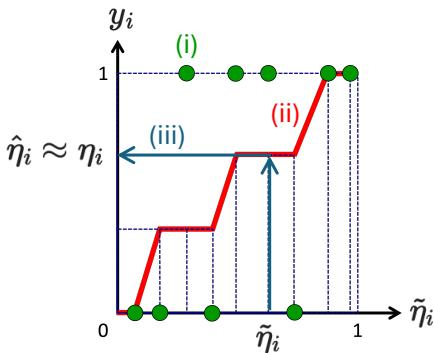
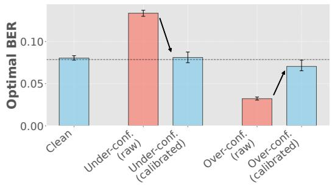
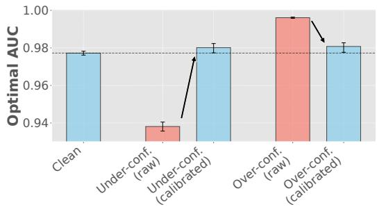
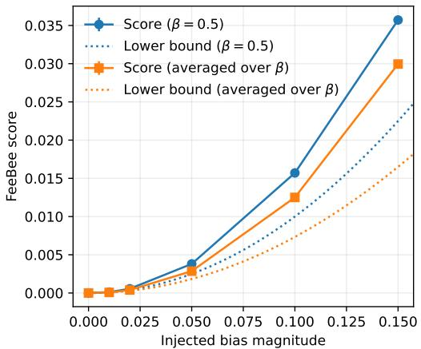
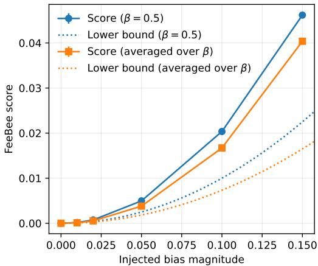
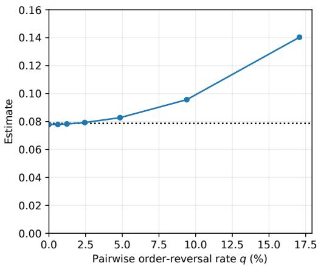
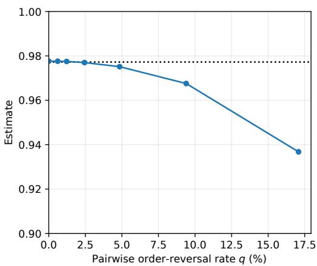

# Bayes-Optimal BER and AUC: Estimation and Evaluation of Estimators

Ryota Ushio1,2

Takashi Ishida2,1

Masashi Sugiyama2,1

1 Graduate School of Frontier Sciences, The University of Tokyo, Tokyo, Japan 2 RIKEN AIP, Tokyo, Japan {ushio@ms.,ishida@,sugi@}k.u-tokyo.ac.jp

## Abstract

A fundamental quantity in machine learning is the optimal performance achievable by any model on a given task. Estimating this quantity allows us to distinguish the irreducible part of the error from a deficiency of the model, telling us how much room for improvement remains. Recent work has shown that the Bayes error, or equivalently the optimal accuracy, can be estimated from soft labels in binary classification. However, accuracy is often a poor summary of performance in settings with severe class imbalance or noisy annotations, where metrics such as the balanced error rate (BER) and the area under the ROC curve (AUC) are more appropriate. We address this gap with two complementary contributions. (i) Estimation. We propose soft-label-based estimators for the optimal BER and AUC. We first consider the clean setting in which true soft labels and the class prior are known, and then extend the estimators to a more realistic setting in which the class prior is unknown and the observed soft labels are corrupted by an unknown order-preserving transformation, possibly followed by additive noise. In the latter setting, we approximately recover the clean soft labels via isotonic regression with auxiliary hard labels, estimate the class prior with a clipped mean of the hard labels, and derive finite-sample error bounds for the resulting plug-in estimators. (ii) Evaluation. Since the optimum is unobservable on real datasets, evaluating any such estimator is itself nontrivial. We extend the FeeBee framework, originally proposed for evaluating Bayes-error estimators, to the optimal BER and AUC. The resulting procedure provides practical evaluation scores without requiring knowledge of the optimum, and applies to any estimator of the optimal BER or AUC, not only our proposed ones. Experiments on synthetic and real-world datasets validate both the estimators and the evaluation procedure.

## 1 Introduction

An integral part of machine learning workflows is evaluating models using performance metrics. Of natural interest, then, is the Bayes-optimal performance, i.e., the best value achievable by any model on a given task. This quantity represents the irreducible component of the error and helps us separate a deficiency of the current model from the inherent difficulty of the task. In practice, when the gap between current and optimal performance is small, it tells us that not much room is left for improvement and that further training of the current model or training of larger models is unlikely to help. This is particularly important in the era of large-scale machine learning models, which often require a huge amount of computational resources to train and have a significant environmental impact (Strubell et al., 2020; Luccioni et al., 2023). Moreover, recent work suggests that estimation of the Bayes-optimal performance can be useful for detecting data contamination (Ishida et al., 2026).

We focus on binary classification in this paper. Given a binary classifier $h : \mathcal { X }  \{ 0 , 1 \}$ , the most commonly used metric to measure its performance is the error rate Err $( h ) : = \mathbb { P } \left( { \\\dot { h } } ( x ) \neq y \right)$

or the accuracy $1 - \operatorname { E r r } ( h )$ , where $( x , y )$ is drawn from an unknown joint distribution P over the space X of input features and the set $\{ 0 , 1 \}$ of class labels. When the class posterior, described by $\eta ( x ) : = \mathbb { P } \left( y = 1 \mid x \right)$ , is genuinely uncertain, even a perfect predictor cannot avoid misclassification due to the stochasticity of the labels. The lowest achievable error rate $\mathrm { E r r } ^ { * } : = \operatorname* { i n f } _ { h : \mathcal { X } \to \{ 0 , 1 \} }$ Err(h), also known as the Bayes error, therefore quantifies the inherent label uncertainty and is determined by the underlying data distribution.

Estimation of the Bayes error has a long history in the literature. While most existing methods use input-label pairs $\{ ( x _ { i } , y _ { i } ) \} _ { i = 1 } ^ { n }$ (Fukunaga & Hostetler, 1975; Devijver, 1985; Berisha et al., 2014; Moon et al., 2018; Noshad et al., 2019; Theisen et al., 2021), a recent line of work suggests another approach that estimates the Bayes error from soft labels $\eta _ { i } = \eta ( x _ { i } ) , i = 1 , \dots , n$ (Ishida et al., 2023; Jeong et al., 2023; Ushio et al., 2026). A soft label $\eta _ { i }$ represents class membership as a probability value in [0, 1] unlike a binary hard label $y _ { i } \in \{ 0 , 1 \}$ . This soft-label-based approach does not need access to the input features $x _ { i } ,$ , which makes it suitable for privacy-sensitive applications and also allows it to bypass the curse of dimensionality. Also, it does not make the distributional assumptions often imposed by the methods based on input-label pairs, such as lower/upper bounds on the probability density function or Lipschitzness of the density. Early work typically assumes that the true soft labels $\eta _ { i }$ or their high-quality estimates are available, e.g., by averaging many independent annotations per instance (Ishida et al., 2023; Jeong et al., 2024), which might be unrealistic in practice. More recent work (Ushio et al., 2026) relaxed this assumption by allowing the soft labels to be corrupted by unknown order-preserving transformations.

However, the error rate is a poor summary of performance under class imbalance or label noise, which are both common in practice, and other metrics such as the balanced error rate (BER) and the area under the ROC curve (AUC) are often preferred in such settings (Ling & Li, 1998; Gu et al., 2009; Menon et al., 2013, 2015; van Rooyen et al., 2015; Menon et al., 2018; Charoenphakdee et al., 2019). Concretely, the BER of a classifier $h : \mathcal { X }  \{ 0 , 1 \}$ is the average of the in-class error rates, $\mathrm { i . e . , B E R } ( h ) : = ( \mathrm { F P R } ( h ) + \mathrm { F N R } ( h ) ) / 2 ,$ , where $\mathrm { F P \overset { \cdot } { R } } ( h ) \cdot = \mathbb { P } \left( h ( x ) \overset { - } { = } 1 \mid y = 0 \right)$ and $\mathrm { F N R } ( h ) : =$ P $( h ( x ) = 0 \mid y = 1 )$ are the false positive and false negative rates (Menon et al., 2015). The AUC of a score-based classifier $f : \mathcal { X }  \mathbb { R }$ that predicts $h ( x ) \stackrel { - } { = } \mathbb { 1 } \left[ f ( x ) \geq 0 \right]$ is the frequency that a random positive instance $x _ { + } \sim \mathbb { P } \left( x \mid y = 1 \right)$ is ranked above a random negative instance $x _ { - } \sim \mathbb { P } \left( x \mid y = 0 \right)$ with ties counted at $1 / 2 \colon \operatorname { A U C } ( f ) : = \mathbb { E } \left[ \mathbb { 1 } \left[ f ( x _ { + } ) > f ( x _ { - } ) \right] + { \frac { 1 } { 2 } } \mathbb { 1 } \left[ f ( x _ { + } ) = f ( x _ { - } ) \right] \right]$ , where 1 [·] denotes the indicator function (Clémençon et al., 2008; Menon et al., 2015). Under severe class imbalance, a trivial classifier that always predicts the majority class can achieve a near-zero error rate while learning nothing from data, and hence the error rate is not helpful. BER remains informative even under class imbalance by averaging the per-class error rates (Menon et al., 2013). AUC is also a preferred metric under class imbalance, as it summarizes the trade-off between true- and false-positive rates over all decision thresholds (Ling & Li, 1998; Fawcett, 2006; Gu et al., 2009). Moreover, BER and AUC are popular metrics under label noise due to their robustness; e.g., their optimizers remain unchanged under noisy labels (Menon et al., 2015; van Rooyen et al., 2015).

Our contribution Despite the practical importance of BER and AUC, the estimation of their Bayes-optimal values, $\mathsf { i . e . , B E R } ^ { \bar { * } } : = \mathsf { i n f } _ { h : \mathcal { X } \to \{ 0 , 1 \} } \mathrm { B E R } ( h )$ and $\begin{array} { r } { \operatorname { A U C } ^ { * } : = \operatorname* { s u p } _ { f : \mathcal { X } \to \mathbb { R } } \operatorname { A U C } ( f ) } \end{array}$ remains underexplored. The first part of our contribution fills this gap by proposing soft-label-based estimators of $\mathrm { B E R ^ { * } }$ and $\mathrm { A U C ^ { * } }$ . We start with the clean setting similar to the work by Ishida et al. (2023) for the Bayes error, in which the true soft labels $\eta _ { i }$ are available (Section 2). Then, inspired by Ushio et al. (2026), we extend the estimators to a more realistic setting where the soft labels are only observed through some unknown order-preserving corruption, possibly followed by additive noise (Section 3). Unlike the Bayes error, the optimal BER and AUC depend on the class prior $\theta : = \mathbb { P } \left( y = 1 \right) ( 0 < \theta < 1 )$ . We first assume that θ is known for simplicity and then handle the unknown-prior case.

A separate question is how to evaluate an estimator of BER∗ or $\mathrm { A U C ^ { * } }$ on real datasets. This is challenging because, for real-world datasets, the underlying data distribution is unknown and does not reveal the ground-truth optimal values. For the Bayes error, Renggli et al. (2021) proposed FeeBee, which sidesteps this issue with a simple idea of injecting label noise. In the second part of our contribution, we extend this idea to the optimal BER and AUC (Section 4). Specifically, we first derive a simple closed-form relationship between the original optima and their noise-injected counterparts. Then, we propose scores for evaluating estimators of ${ \dot { \mathrm { B E R } } } ^ { * }$ and $\mathrm { A U C ^ { * } }$ based on the derived relationship. The procedure can be applied to any estimator of $\mathrm { B E R ^ { * } }$ or AUC∗, not only the ones we propose. Our proposed method allows us to evaluate Bayes-optimal BER/AUC estimators on real-world datasets without knowledge of the true optima.

## 2 Estimation from clean soft labels

In this section, we first show that the optimal BER and AUC can be expressed as expectations of certain functions of the class posterior $\eta ( x )$ (Lemmas 2.1 and 2.2). This reveals that, for each of BER and AUC, there are two different natural choices of unbiased estimators of the optimum. We discuss data-dependent criteria (or discriminants) for choosing between them in Section 2.1. Next, in Section 2.2, we present an efficient $O ( n \log n )$ time algorithm for computing the proposed optimal AUC estimator and AUC discriminant, which would otherwise take $\Theta ( \dot { n } ^ { 2 } )$ time. Finally in Section 2.5, we discuss the case where the class prior θ is unknown.

Lemma 2.1. The optimal BER can be expressed as BER $\mathfrak { k } ^ { * } = \mathbb { E } \left[ \phi _ { \mathrm { B E R } } ^ { ( 1 ) } ( \eta ( x ) ) \right] = \mathbb { E } \left[ \phi _ { \mathrm { B E R } } ^ { ( 2 ) } ( \eta ( x ) ) \right]$ where $\begin{array} { r } { \phi _ { \mathrm { B E R } } ^ { ( 1 ) } ( z ) = \frac { 1 } { 2 } } \end{array}$ min $\left\{ { \frac { z } { \theta } } , { \frac { 1 - z } { 1 - \theta } } \right\}$ and $\begin{array} { r } { \phi _ { \mathrm { B E R } } ^ { ( 2 ) } ( z ) = 1 - \frac { 1 } { 2 } } \end{array}$ max $\textstyle \left\{ { \frac { z } { \theta } } , { \frac { 1 - z } { 1 - \theta } } \right\}$

Lemma 2.2. Let x′ be an i.i.d. copy of x. Then, the optimal AUC is given by $\begin{array} { r l r } { \mathrm { A U C ^ { * } } } & { { } = } & { { \mathbb E } \left[ \phi _ { \mathrm { A U C } } ^ { ( 1 ) } ( \eta ( x ) , \eta ( x ^ { \prime } ) ) \right] \ = \ { \mathbb E } \left[ \phi _ { \mathrm { A U C } } ^ { ( 2 ) } ( \eta ( x ) , \eta ( x ^ { \prime } ) ) \right] } \end{array}$ , where $\phi _ { \mathrm { A U C } } ^ { ( 1 ) } ( z _ { 1 } , z _ { 2 } ) = 1 - $ $\frac { 1 } { 2 \theta ( 1 - \theta ) }$ min $\{ z _ { 1 } ( 1 - z _ { 2 } ) , z _ { 2 } ( 1 - z _ { 1 } ) \}$ and $\begin{array} { r } { \phi _ { \mathrm { A U C } } ^ { ( 2 ) } ( z _ { 1 } , z _ { 2 } ) = \frac { 1 } { 2 \theta ( 1 - \theta ) } } \end{array}$ max $\{ z _ { 1 } ( 1 - z _ { 2 } ) , z _ { 2 } ( 1 - z _ { 1 } ) \}$ Remark 2.3. Clémençon et al. (2008, Example 1) mentioned the former expression of $\mathrm { A U C ^ { * } = }$ $\mathbb { E } [ \phi _ { \mathrm { A U C } } ^ { ( 1 ) } ( \eta ( x ) , \eta ( x ^ { \prime } ) ) ]$ but without a proof. We state the full proof for the sake of completeness (Appendix A.1).

## 2.1 Unbiased estimators: Min formula vs. max formula

In Lemma 2.1, we saw that the best possible BER can be expressed in two different ways: $\mathrm { B E R ^ { * } = }$ E $\Big [ \phi _ { \mathrm { B E R } } ^ { ( 1 ) } ( \eta ( x ) ) \Big ] = \mathbb { E } \left[ \phi _ { \mathrm { B E R } } ^ { ( 2 ) } ( \eta ( x ) ) \right]$ . This naturally leads to two different unbiased estimators of BER∗: $\begin{array} { r } { \widehat { \mathrm { B E R } _ { 1 } ^ { * } } : = \frac { 1 } { n } \sum _ { i = 1 } ^ { n } \phi _ { \mathrm { B E R } } ^ { ( 1 ) } ( \eta _ { i } ) } \end{array}$ and $\begin{array} { r } { \widehat { \mathrm { B E R } _ { 2 } ^ { * } } : = \frac { 1 } { n } \sum _ { i = 1 } ^ { n } \phi _ { \mathrm { B E R } } ^ { ( 2 ) } ( \eta _ { i } ) } \end{array}$ . We call $\widehat { \mathrm { B E R } _ { 1 } ^ { * } }$ the min formula for BER because $\phi _ { \mathrm { B E R } } ^ { ( 1 ) }$ uses the min operation, and $\mathrm { \overline { { B E R _ { 2 } ^ { * } } } }$ the maxformula because $\phi _ { \mathrm { B E R } } ^ { ( 2 ) }$ uses the max operation. Similarly, Lemma 2.2 suggests two different unbiased estimators of the optimal AUC, namely the min formula $\begin{array} { r } { \widehat { \mathrm { A U C } _ { 1 } ^ { * } } : = \frac { 2 } { n ( n - 1 ) } \sum _ { i < j } \phi _ { \mathrm { A U C } } ^ { ( 1 ) } ( \eta _ { i } , \eta _ { j } ) } \end{array}$ and the max formula $\begin{array} { r } { \widehat { \mathrm { A U C } _ { 2 } ^ { * } } : = \frac { 2 } { n ( n - 1 ) } \sum _ { i < j } \phi _ { \mathrm { A U C } } ^ { ( 2 ) } ( \eta _ { i } , \eta _ { j } ) } \end{array}$ , where $\textstyle \sum _ { i < j }$ denotes the summation over all pairs of indices $\left\{ ( i , j ) \in \{ 1 , \dots , n \} ^ { 2 } \mid i < j \right\}$ .1

Thus, a natural question is: Which estimator, the min formula or the max formula, is better? Two unbiased estimators are usually compared in terms of their variances; the one with a smaller variance is considered better (Lehmann & Casella, 1998). Therefore, we want to be able to guess which estimator has a smaller variance for a given data distribution.

To this end, for each of BER and AUC, we define a discriminant that indicates which estimator, the min formula or the max formula, has a smaller variance. The discriminant for BER is defined as $\Delta _ { \mathrm { B E R } } ~ : = ~ ( 1 - 2 \theta ) \mathbb { E } \left[ \left( \eta ( x ) - \theta \right) | \eta ( x ) - \theta | \right]$ . For $\mathbf { A U C }$ , we define $\Delta _ { \mathrm { A U C } } : =$ $( 1 - 2 \theta ) \mathbb { E } \left[ \left( \eta ( x ) - \theta \right) | \eta ( x ) - \eta ( x ^ { \prime } ) | \right]$ , where $x ^ { \prime }$ is an i.i.d. copy of x. The following theorem suggests that the sign of each discriminant can be used to choose the better estimator.

Theorem 2.4.

(i) For all $n \in  { \mathbb { N } } ,$ we have $\mathrm { V a r } \left[ \widehat { \mathrm { B E R } _ { 1 } ^ { * } } \right] \leq \mathrm { V a r } \left[ \widehat { \mathrm { B E R } _ { 2 } ^ { * } } \right]$ if and only $i f \Delta _ { \mathrm { B E R } } \geq 0$

(ii) Assume that the random variable $\eta ( x )$ is not a.s. constant. Then, we have $\mathrm { V a r } \left[ \widehat { \mathrm { A U C _ { 1 } ^ { * } } } \right] <$

$$
\mathrm { V a r } \left[ \widehat { \mathrm { A U C _ { 2 } ^ { * } } } \right] f o r a l l n \geq 2 i f a n d o n l y i f \Delta _ { \mathrm { A U C } } \geq 0 .
$$

In practice, the discriminants can be unbiasedly estimated from soft labels as $\begin{array} { r l } { \widehat { \Delta } _ { \mathrm { B E R } } } & { { } : = } \end{array}$ $\begin{array} { r } { \frac { 1 - 2 \theta } { n } \sum _ { i = 1 } ^ { n } ( \eta _ { i } - \theta ) \left| \eta _ { i } - \theta \right| } \end{array}$ and $\begin{array} { r } { \widehat { \Delta } _ { \mathrm { A U C } } : = \frac { 1 - 2 \theta } { n ( n - 1 ) } \sum _ { i = 1 } ^ { n } \sum _ { j : \ j \neq i } ( \eta _ { i } - \theta ) | \eta _ { i } - \eta _ { j } | , ^ { 2 } } \end{array}$ and we can choose between the min formula and the max formula based on the signs of these estimates, i.e., $\mathrm { s i g n } ( \widehat { \Delta } _ { \mathrm { B E R } } )$ and $\mathrm { s i g n } ( \widehat { \Delta } _ { \mathrm { A U C } } ) .$ 3

Theoretically, some sufficient conditions can be shown for $\Delta _ { \mathrm { B E R } } \geq 0$ and $\Delta _ { \mathrm { A U C } } \geq 0 ,$ i.e., the min formulas to be better estimators. An obvious sufficient condition is that the two classes are balanced, $\begin{array} { r } { \mathrm { i } . \mathrm { e } . , \theta = \frac { 1 } { 2 } } \end{array}$ . Another condition is that the Bayes error $\mathrm { E r r } ^ { * }$ is small enough, or in other words, the inherent label uncertainty of the data distribution is sufficiently low. See Proposition A.8 for the formal statement and proof.

In the rest of this paper, our theoretical results are stated mainly for the min formula estimators unless explicitly stated otherwise, and we denote them just by $\widehat { \mathrm { B E R } ^ { * } }$ and $\widehat { \mathrm { A U C ^ { * } } }$ for brevity. However, similar results also hold for the max formula estimators.

## 2.2 Near-linear time algorithm for computing $\widehat { \mathrm { A U C } ^ { * } }$

The definitions of $\widehat { \mathrm { A U C _ { 1 } ^ { * } } } , \widehat { \mathrm { A U C _ { 2 } ^ { * } } }$ and $\widehat { \Delta } _ { \mathrm { A U C } }$ involve summation over all pairs of indices $( i , j )$ , so a naive algorithm would take $\Theta ( n ^ { 2 } )$ time to compute each of them. This can be a significant bottleneck, or even prohibitive, for large-scale datasets. This computational challenge is common for many U-statistics (Hoeffding, 1948) of degree 2 or higher. AUC \∗1, $\widehat { \mathrm { A U C _ { 2 } ^ { * } } }$ and $\widehat { \Delta } _ { \mathrm { A U C } }$ are examples of degree-two U-statistics and are no exception. The literature has addressed this challenge typically by using Monte-Carlo approximation of original U-statistics, which are called incomplete U-statistics (Blom, 1976; Clémençon et al., 2016; Lee, 2019). This approach reduces the number of terms to be added up and thus the computational cost, but it inevitably introduces additional variance.

Fortunately, however, it turns out that $\widehat { \mathrm { A U C _ { 1 } ^ { * } } }$ $\widehat { \mathrm { A U C _ { 2 } ^ { * } } }$ and $\widehat { \Delta } _ { \mathrm { A U C } }$ have special structures that enable efficient computation without relying on approximation. For example, the exact $\widehat { \mathrm { A U C _ { 1 } ^ { * } } }$ can be computed in $O ( n \log n )$ time in the worst case by Algorithm 2.1; the proof is given in Theorem A.13. We also provide $O ( n$ log n)-time algorithms for exactly computing $\widehat { \mathrm { A U C _ { 2 } ^ { * } } }$ (Algorithm A.2) and $\widehat { \Delta } _ { \mathrm { A U C } }$ (Algorithm A.1) in the appendices.

Algorithm 2.1: An efficient algorithm for comput  
ing $\widehat { \mathrm { A U C } _ { 1 } ^ { * } }$   
input Soft labels $\eta _ { 1 } , \ldots , \eta _ { n } .$ , class prior θ   
$\eta _ { ( 1 ) } , \ldots , \eta _ { ( n ) }  \operatorname { s o r t } \eta _ { 1 } , \ldots , \eta _ { n }$ in ascending order   
SUM ← 0   
PREFIX ← 0   
for $j = 2$ to n do   
PREFIX ← PREFIX + η(j−1)   
$\mathrm { S U M }  \mathrm { S U M } + ( 1 - \eta _ { ( j ) } )$ · PREFIX   
end for   
output $\begin{array} { r } { 1 - \frac { \mathrm { S U M } } { n ( n - 1 ) \theta ( 1 - \theta ) } } \end{array}$

## 2.3 Clipping the AUC estimator

Another minor note about the estimation of $\mathrm { A U C ^ { * } }$ : although the true value $\mathrm { A U C ^ { * } }$ lies between 0.5 and 1 for any data distribution, it is possible that the estimates $\widehat { \mathrm { A U C _ { 1 } ^ { * } } }$ and $\widehat { \mathrm { A U C _ { 2 } ^ { * } } }$ can fall outside the valid range [0.5, 1] in rare events.4 To address this issue, we can simply clip the raw estimates to the valid range [0.5, 1]. We denote the clipped estimators by $\widetilde { \mathrm { A U C } _ { k } ^ { * } } : = \mathrm { c l i p } _ { 0 . 5 } ^ { 1 } ( \widehat { \mathrm { A U C } _ { k } ^ { * } } ) =$ min $\{ 1 , \operatorname* { m a x } \{ 0 . 5 , \widetilde { \mathrm { A U C } } _ { k } ^ { * } \} \} , k = 1 , 2$ . Here, $\mathrm { c l i p } _ { a } ^ { b } ( z ) = \operatorname* { m i n } \left\{ b , \operatorname* { m a x } \left\{ a , z \right\} \right\}$ } represents the operation that clips its argument to the interval [a, b]. It is straightforward to verify that each clipped estimator is always more accurate than the unclipped counterpart, i.e., $\widehat { | \mathrm { A U C } _ { k } ^ { * } - \mathrm { A U C } ^ { * } | } \le \widehat { | \mathrm { A U C } _ { k } ^ { * } - \mathrm { A U C } ^ { * } | }$ Again, we present our theoretical analysis mainly for the min formula estimator $\mathrm { A U C _ { 1 } ^ { * } }$ and denote it just by $\mathrm { \bar { A } U C ^ { * } }$ for brevity, but the arguments for $\mathrm { \bar { A } U C _ { 2 } ^ { * } }$ are similar. Note that the BER estimators do not require clipping as both the true value $\mathrm { B E R ^ { * } }$ and the estimates $\widehat { \mathrm { B E R _ { 1 } ^ { * } } } , \widehat { \mathrm { B E R _ { 2 } ^ { * } } }$ lie in [0, 0.5].

## 2.4 Estimation error bounds

Our estimators of the optimal BER and AUC enjoy the following finite-sample bounds on their estimation errors.

Theorem 2.5. For any $\delta > 0$ , with probability at least $1 - \delta ,$ we have $\begin{array} { r } { | \widehat { \mathrm { B E R } ^ { * } } - \mathrm { B E R } ^ { * } | \leq \sqrt { \frac { \log ( 2 / \delta ) } { 8 n } } , } \end{array}$

Theorem 2.6. For any $\delta > 0 ,$ , with probability at least $1 - \delta ,$ we have $\begin{array} { r } { | \widetilde { \mathrm { A U C ^ { * } } } - \mathrm { A U C ^ { * } } | \leq \sqrt { \frac { \log ( 2 / \delta ) } { \theta ( 1 - \theta ) n } } . } \end{array}$

Remark 2.7. Theorem 2.5 simply follows from the Hoeffding bound. Theorem 2.6 needs a more careful analysis: while we can use basic tools like Hoeffding’s inequality (11) for U-statistics or the bounded difference inequality, such tools lead to a bound of stochastic order $\begin{array} { r } { O _ { p } \big ( \frac { 1 } { \theta ( 1 - \theta ) \sqrt { n } } \big ) } \end{array}$ . The constant factor $\frac { 1 } { \theta ( 1 - \theta ) }$ blows up under severe class imbalance, i.e., when θ is close to 0 or 1. We instead employ the Bernstein-type inequality (13) for U-statistics to improve the θ-dependence to $\scriptstyle { \frac { 1 } { \sqrt { \theta ( 1 - \theta ) } } }$ , resulting in the bound in Theorem 2.6. See Appendix A.4 for details.

## 2.5 Unknown class prior

So far, we have assumed that the class prior $\theta \ : = \ : \mathbb { P } \left( y = 1 \right)$ is known. When the class prior is unknown, we can still estimate it from the soft labels simply by the sample mean $\begin{array} { r } { \bar { \eta } : = \frac { 1 } { n } \sum _ { i = 1 } ^ { n } \eta _ { i } { ^ { 5 } } } \end{array}$ since we have E $[ \eta _ { i } ] = \theta$ . However, using η¯ directly in place of θ in the definitions of ${ \widehat { \mathrm { B E R } ^ { * } } }$ and $\mathrm { \bar { A } U C ^ { * } }$ may cause numerical instability or even zero division since both estimators involve division by θ and $1 - \theta . \mathrm { ~ A ~ }$ simple solution to this problem is to use a clipped version of η¯: $\widehat { \theta } _ { \varepsilon } : = \mathrm { c l i p } _ { \varepsilon } ^ { 1 - \varepsilon } ( \bar { \eta } ) =$ min $\{ 1 - \varepsilon , \operatorname* { m a x } \left\{ \varepsilon , \bar { \eta } \right\} \}$ , where $\varepsilon \in ( \bar { 0 } , \frac { 1 } { 2 } )$ is some clipping threshold.

With a fixed threshold $\varepsilon .$ , however, we must choose ε carefully so that $0 < \varepsilon <$ min $\{ \theta , 1 - \theta \}$ otherwise, our clipped estimator $\widehat { \theta } _ { \varepsilon }$ and the resulting plug-in estimators for $\mathrm { B E R ^ { * } }$ and $\mathrm { A U C ^ { * } }$ will be statistically inconsistent and suffer from bias that never vanishes as $n \to \infty$ . Such a choice of ε requires certain prior knowledge of θ. We can bypass this issue by using a vanishing threshold $\tau _ { n }$ that depends on the sample size n and tends to zero as n increases. For our theoretical analysis, we set the threshold as follows.

Assumption 2.8. The clipping threshold is set to $\textstyle \tau _ { n } = { \frac { c } { n } }$ for some constant $\begin{array} { r } { 0 < c < \frac { 1 } { 2 } } \end{array}$

The error of the resulting class prior estimator $\widehat { \theta } _ { \tau _ { n } }$ is bounded as follows.

Lemma 2.9. Under Assumption 2.8, for any $\delta > 0$ and $\begin{array} { r } { n \ge \frac { ( 2 \log ( 2 / \delta ) + 3 c ) ^ { 2 } } { 1 8 \theta ( 1 - \theta ) \log ( 2 / \delta ) } } \end{array}$ , with probability at least $1 - \delta ,$ we have $\begin{array} { r } { | \widehat { \theta } _ { \tau _ { n } } - \theta | \leq \sqrt { \frac { 8 \theta ( 1 - \theta ) \log ( 2 / \delta ) } { n } } } \end{array}$

We can now estimate $\mathrm { B E R ^ { * } }$ and $\mathrm { A U C ^ { * } }$ by plugging in $\widehat { \theta } _ { \tau _ { r } }$ in place of θ in the definitions of $\widehat { \mathrm { B E R } ^ { * } }$ and $\widetilde { \mathrm { A U C } } ^ { * }$ . Let us abuse the notation a bit and denote these plug-in estimators by $\widehat { \mathrm { B E R } ^ { * } } ( \widehat { \theta } _ { \tau _ { n } } )$ and $\widetilde { \mathrm { A U C } ^ { * } } ( \widehat { \theta } _ { \tau _ { n } } )$ , respectively. It can be shown that they are statistically consistent. More specifically, the following finite-sample error bounds hold; see Theorems A.22 and A.23 for the proofs.

Theorem 2.10. Under Assumption 2.8,for any $\delta > 0 ,$ , each ofthefollowing holds with probability at least $\begin{array} { r } { 1 - \delta \colon \mathopen { } \mathclose \bgroup \mathopen { } \mathclose \bgroup \mathopen { } \mathclose \bgroup \mathopen { } \mathclose \bgroup \mathopen { } \mathclose \bgroup \mathopen { } \mathclose \bgroup \mathopen { } \mathclose \bgroup \mathopen { } \mathclose \bgroup \mathopen { } \mathclose \bgroup \mathopen { } \mathclose \bgroup \mathopen { } \mathclose \bgroup \left| \widehat { \mathrm { B E R } ^ { * } } ( \widehat { \theta } _ { \tau _ { n } } ) - \mathrm { B E R } ^ { * } \aftergroup \egroup \aftergroup \egroup \aftergroup \egroup \aftergroup \egroup \aftergroup \egroup \aftergroup \egroup \aftergroup \egroup \aftergroup \egroup \aftergroup \egroup \aftergroup \egroup \aftergroup \egroup \aftergroup \egroup \aftergroup \egroup \aftergroup \egroup \aftergroup \egroup \right| \leq \frac { 1 7 } { 8 } \sqrt { \frac { 2 \log ( 4 / \delta ) } { \theta ( 1 - \theta ) n } } } \end{array}$ and $\begin{array} { r } { \Bigl | \widetilde { \mathrm { A U C } ^ { * } } ( \widehat { \theta } _ { \tau _ { n } } ) - \mathrm { A U C } ^ { * } \Bigr | \leq 1 0 \sqrt { \frac { \log ( 4 / \delta ) } { \theta ( 1 - \theta ) n } } . } \end{array}$

Also, these estimators are asymptotically unbiased; see Propositions A.24 and A.25.

## 3 Estimation from corrupted soft labels

In practice, clean soft labels $\eta _ { i } = \mathbb { P } \left( y = 1 \vert x = x _ { i } \right)$ may be unavailable. If the data generation process allows repeated sampling of class labels for the same input $x _ { i } .$ , it is still possible to approximate $\eta _ { i } = \mathbb { E } \left[ y \mid x = x _ { i } \right]$ by the average of the sampled labels, in which case the resulting plug-in Bayes error estimator has been shown to be asymptotically unbiased (Ishida et al., 2023; Ushio et al., 2026).

However, it is often difficult to obtain more than one class label per input due to various reasons. For example, the construction of image classification datasets, e.g., CIFAR-10 (Krizhevsky, 2009), typically proceeds as follows: first, images are retrieved from the web by searching with keywords associated with each class name; then, human annotators filter out images that are irrelevant to the class; finally, the images are downsampled to a fixed resolution. As such, each class label is associated with the original high-resolution image before downsampling. Although it is possible to collect multiple class labels for each low-resolution image after downsampling as in the CIFAR-10H dataset (Peterson et al., 2019), the downsampling process makes the class posterior distribution much more uncertain than that of the original high-resolution image, distorting the soft label estimates.

A natural way to model such situations is to assume that we have access to a single class label $y _ { i } \in \{ 0 , 1 \}$ plus a corrupted soft label $\xi _ { i } = f ( \eta _ { i } ) \in [ 0 , 1 ]$ , instead of the clean soft label $\eta _ { i } ,$ for each input $x _ { i }$ (Ushio et al., 2026). Here, the corrupted soft label $\xi _ { i }$ is the clean soft label $\eta _ { i }$ skewed by some unknown increasing transformation $f : { \dot { [ 0 , 1 ] } }  [ 0 , 1 ]$ . In the CIFAR-10/10H example above, $\xi _ { i }$ is the class posterior of the low-resolution image, which can be obtained by averaging the labels from CIFAR-10H, and $y _ { i }$ is the class label from CIFAR-10.

Here, we consider the problem of estimating the optimal BER and AUC from a dataset of n pairs $( \xi _ { 1 } , y _ { 1 } ) , \ldots , ( \xi _ { n } , y _ { n } )$ . We first describe an algorithm based on isotonic regression (Ayer et al., 1955) to recover the clean soft labels from the corrupted ones. Next, we discuss the estimation of the class prior. Then, we present finite-sample error bounds for the resulting plug-in estimators. Finally, we extend these bounds to a noisy setting where the observed soft labels may not preserve the ordering of the clean soft labels.

Recovery of soft labels To approximately recover the clean soft labels $\eta _ { 1 } , \ldots , \eta _ { n }$ , we adopt an approach based on isotonic regression, which was originally proposed by Ushio et al. (2026) in the context of Bayes error estimation. Isotonic regression is one of the most widely used methods for calibrating classifier outputs to produce reliable probability estimates (Zadrozny & Elkan, 2002), but here we use it for calibrating the corrupted soft labels. Then the calibrated soft labels can be used as estimates of the clean soft labels.

A technical description of the algorithm is as follows. We first sort the soft labels $\xi _ { 1 } , \ldots , \xi _ { n }$ in ascending order, and let $( j )$ denote the index of the j-th smallest of them, $\mathrm { i . e . }$ $\xi _ { ( 1 ) } \leq \cdots \leq \xi _ { ( n ) }$ . Then we use the pool adjacent violator algorithm (PAVA; Ayer et al., 1955) to find the monotonic sequence $\widehat { \eta } _ { ( 1 ) } \leq \cdots \leq \widehat { \eta } _ { ( n ) }$ that best fits the corresponding class labels $y _ { ( 1 ) } , \ldots , y _ { ( n ) }$ in the least squares sense: 1 $\begin{array} { r } { \operatorname* { m i n } _ { \widehat { \eta } _ { \left( 1 \right) } \leq \cdots \leq \widehat { \eta } _ { \left( n \right) } } \frac { 1 } { n } \sum _ { i = 1 } ^ { n } \left( y _ { \left( i \right) } - \widehat { \eta } _ { \left( i \right) } \right) ^ { 2 } } \end{array}$ . Each resulting $\widehat { \eta _ { i } }$ is expected to approximate the true clean soft label $\eta _ { i } .$ . See also Figure 1. Assuming standard sorting algorithms with worst-case time complexity of $O ( n$ log n), this algorithm runs in O(n log n) time in total, since the PAVA part takes only $O ( n )$ time (Best & Chakravarti, 1990; Busing, 2022)

Figure 1: Illustration of the use of isotonic regression to recover clean soft labels from pairs $( \xi _ { 1 } , y _ { 1 } ) , \ldots , ( \xi _ { n } , y _ { n } )$ of corrupted soft labels and class labels. (i) Plot the points $( \xi _ { i } , y _ { i } )$ . (ii) Find the non-decreasing function that best fits the points. (iii) Use the fitted function values as estimates of the clean soft labels. Roughly speaking, the fitted function is expected to approximate the inverse $f ^ { - 1 }$ of the unknown skew function $f .$

Estimation of class prior As the BER and AUC estimators introduced in Section 2 involve the unknown class prior ${ \bar { \boldsymbol { \theta } } } ,$ it needs to be estimated from data. Note that Ushio et al. (2026) did not discuss this problem since their Bayes error estimator did not depend on the class prior.

Since $\theta = \mathbb { E } \left[ y \right] = \mathbb { E } \left[ \eta ( x ) \right]$ ], two natural candidate estimators of $\theta$ are ${ \frac { 1 } { n } } \sum _ { i } y _ { i }$ and $\frac { 1 } { n } \sum _ { i } \widehat { \eta _ { i } }$ . Interestingly, however, it turns out that they are actually no different from each other. Indeed, we have $\widehat { \pmb { \eta } } + t { \bf 1 } \in \mathcal { M } _ { n }$ for any $t \in \mathbb { R } ^ { 6 }$ So by the optimality of $\begin{array} { r } { \widehat { \pmb { \eta } } , t \mapsto \frac { 1 } { 2 } \left\| \pmb { y } - ( \widehat { \pmb { \eta } } + t \mathbf { 1 } ) \right\| _ { 2 } ^ { 2 } } \end{array}$ achieves its minimum at $t = 0 ,$ . Therefore, we have $\begin{array} { r } { \frac { 1 } { 2 } \left. \frac { d } { d t } \left\| y - ( \widehat { \pmb { \eta } } + t { \bf 1 } ) \right\| _ { 2 } ^ { 2 } \right| _ { t = 0 } = \widehat { \pmb { \eta } } ^ { \top } { \bf 1 } - y ^ { \top } { \bf 1 } = 0 , } \end{array}$ , which implies $\begin{array} { r } { \frac { 1 } { n } \sum _ { i } y _ { i } = \frac { 1 } { n } \sum _ { i } \widehat { \eta _ { i } } } \end{array}$ . Similarly to Section 2.5, we use a clipped version of this estimator: $\begin{array} { r } { \widetilde { \theta } _ { \tau _ { n } } : = \mathrm { c l i p } _ { \tau _ { n } } ^ { 1 - \tau _ { n } } ( \frac { 1 } { n } \sum _ { i } y _ { i } ) = \mathrm { c l i p } _ { \tau _ { n } } ^ { 1 - \tau _ { n } } ( \frac { 1 } { n } \sum _ { i } \widehat { \eta } _ { i } ) } \end{array}$ , where the clipping threshold $\tau _ { n }$ is set according to Assumption 2.8. This estimator $\ddot { \theta } _ { \tau _ { n } }$ converges to $\theta$ at rate $\scriptstyle { \frac { 1 } { \sqrt { n } } }$ (see Lemma B.1).

Estimation error bounds Now we can estimate BER∗ and $\mathrm { A U C ^ { * } }$ by plugging in $\widehat { \pmb { \eta } }$ and $\tilde { \theta } _ { \tau _ { n } }$ in place of $\eta$ and $\theta ,$ respectively, in the definitions of $\widehat { \mathrm { B E R } ^ { * } }$ and $\widetilde { \mathrm { A U C } } ^ { * }$ . Let us denote these plugin estimators by $\widehat { \mathrm { B E R } ^ { * } } ( \widehat { \eta } , \widetilde { \theta } _ { \tau _ { n } } )$ and $\widetilde { \mathrm { A U C } ^ { * } } ( \widehat { \eta } , \widetilde { \theta } _ { \tau _ { n } } )$ . They enjoy the following finite-sample error bounds, where $\precsim$ represents an inequality up to some constant not depending on n, θ or δ.

Theorem 3.1. Under Assumption 2.8, for any $\delta \in \mathsf { \Gamma } ( 0 , 1 )$ , each of the following holds with probability at least $\begin{array} { r l } { 1 - \delta \colon } & { \left| \widehat { \mathrm { B E R } ^ { * } } ( \widehat { \eta } , \widetilde { \theta } _ { \tau _ { n } } ) - \mathrm { B E R } ^ { * } \right| \ \lesssim \ \frac { 1 } { \operatorname* { m i n } \{ \theta , 1 - \theta \} } \left( \frac { 1 } { n ^ { 1 / 3 } } + \sqrt { \frac { \log ( 5 / \delta ) } { n } } \right) } \end{array}$ and $\begin{array} { r } { \left| \widetilde { \mathrm { A U C } ^ { * } } ( \widehat { \pmb { \eta } } , \widetilde { \pmb { \theta } } _ { \tau _ { n } } ) - \mathrm { A U C } ^ { * } \right| \lesssim \frac { 1 } { \theta ( 1 - \theta ) } \left( \frac { 1 } { n ^ { 1 / 3 } } + \sqrt { \frac { \log ( 5 / \delta ) } { n } } \right) . } \end{array}$

Noisy corruption model Theorem 3.1 can be extended to the case where the corruption involves additive noise, i.e., $\xi _ { i } = f ( \eta _ { i } ) + \varepsilon _ { i }$ . Formally, we consider the following corruption model.

Assumption 3.2 (Noisy corruption model). Corrupted soft labels $\xi _ { i } ~ \in ~ [ 0 , 1 ]$ are generated as $\xi _ { i } = f ( \eta _ { i } ) + \varepsilon _ { i }$ . Here, the skew function $f : [ 0 , { \dot { 1 } } ] \to [ 0 , 1 ]$ is differentiable with $f ^ { \prime } \geq \gamma$ for some constant $\gamma > 0$ and satisfies $f ( 0 ) = 0$ and $f ( { \dot { 1 } } ) = { \dot { 1 } }$ . Also, given $\eta _ { 1 } , \ldots , \eta _ { n } , \varepsilon _ { i }$ is a zeromean random variable with variance at most $\sigma ^ { 2 }$ . We further assume that $\varepsilon _ { 1 } , \ldots , \varepsilon _ { n } , y _ { 1 } , \ldots , y _ { n }$ are conditionally independent given $\eta _ { 1 } , \ldots , \eta _ { n }$

The following counterpart of Theorem 3.1 holds in this noisy setting. This result is similar to Theorem 3 of Ushio et al. (2026).

Theorem 3.3. Under Assumption 2.8 and Assumption 3.2,for any $\delta \in ( 0 , 1 )$ , each of the following holds with probability at least $1 - \delta .$

$$
\Bigl | \widehat { \mathrm { B E R } ^ { * } } ( \widehat { \eta } , \widetilde { \theta } _ { \tau _ { n } } ) - \mathrm { B E R } ^ { * } \Bigr | \lesssim \frac { 1 } { \operatorname* { m i n } \left\{ \theta , 1 - \theta \right\} } \left( \frac { \sigma } { \gamma } + \frac { 1 } { n ^ { 1 / 3 } } + \sqrt { \frac { \log ( 5 / \delta ) } { n } } \right) ,
$$

$$
\Bigl | \widetilde { \mathrm { A U C } ^ { * } } ( \tilde { \eta } , \tilde { \theta } _ { \tau _ { n } } ) - \mathrm { A U C } ^ { * } \Bigr | \lesssim \frac { 1 } { \theta ( 1 - \theta ) } \left( \frac { \sigma } { \gamma } + \frac { 1 } { n ^ { 1 / 3 } } + \sqrt { \frac { \log ( 5 / \delta ) } { n } } \right) .
$$

A simple example of this model is when the corrupted soft labels are obtained by averaging multiple hard labels drawn from a corrupted Bernoulli distribution. That is, for each $i = 1 , \ldots , n$ , we independently draw m hard labels $y _ { i } ^ { ( 1 ) } , \ldots , y _ { i } ^ { ( m ) }$ from a Bernoulli distribution whose mean is $f ( \eta _ { i } )$ rather than $\eta _ { i }$ . We then obtain the noisy corrupted soft label $\begin{array} { r } { \xi _ { i } = \frac { 1 } { m } \sum _ { j = 1 } ^ { m } y _ { i } ^ { ( j ) } } \end{array}$ by averaging these hard labels. In this case, $\xi _ { i } = f ( \eta _ { i } ) + \varepsilon _ { i }$ , where $\varepsilon _ { i }$ has mean zero and standard deviation at most $\sigma = 1 / ( 2 \sqrt { m } )$ . Therefore, the preceding bounds give estimation errors of order $m ^ { - 1 / 2 } + n ^ { - 1 / 3 }$ The additional $m ^ { - 1 / 2 }$ term diminishes as the number m of hard labels increases.

## 4 Real-world evaluation of optimal performance estimators

So far, we have discussed estimators of the optimal BER and AUC values and their theoretical guarantees. However, how can we empirically evaluate the performance of these estimators on real-world datasets? This is a non-trivial question because the true values of BER∗ and $\mathrm { A U C ^ { * } }$ are unobservable for real-world data distributions. In this section, we first briefly review FeeBee (Renggli et al., 2021), an existing evaluation framework for estimators of the Bayes error Err∗. Then, we draw inspiration from FeeBee to propose a method to evaluate estimators of the optimal BER and AUC.

Review of FeeBee The simplest way to evaluate Bayes error estimators on a real-world dataset would be to compare the estimates with the error rate u of the best available classifier on the dataset.

Since we have a trivial bound $0 \leq \mathrm { E r r } ^ { * } \leq$ u on the Bayes error, we can at least rule out estimators returning values greater than u. However, such a naive method is not very helpful because we cannot tell which of two estimators is better if both of them return estimates within the range [0, u]. Moreover, this approach cannot rule out an obviously useless estimator that always returns some constant between 0 and u.

The key idea of FeeBee is to inject label noise of a controlled level $\nu \in [ 0 , 1 )$ into the dataset. The injected noise increases the Bayes error $\mathrm { E r r } _ { \nu } ^ { \ast }$ for the noise-injected distribution, which gives us another set of bounds $L ( \nu ) \leq \mathrm { E r r } _ { \nu } ^ { * } \leq U ( \nu )$ . We can then estimate $\mathrm { E r r } _ { \nu } ^ { \ast }$ for the noise-injected dataset and test whether the estimate $\mathrm { E r r } _ { \nu } ^ { * }$ satisfies the bounds. Repeating this process for many different noise levels ν and aggregating the results, we can obtain a single score for the estimator.

Bounds on the optimal BER and AUC for noise-injected distributions In our proposed evaluation framework for the optimal BER and AUC, we inject label noise into the original distribution as follows: for a fixed noise level $\nu \in [ 0 , 1 )$ , with probability $\nu ,$ each original label $y$ is replaced with an independent random label $w \in \{ 0 , 1 \}$ with a fixed mean $\beta \in ( 0 , 1 )$ . The resulting noisy label is given by $y _ { \nu } : = ( 1 - z ) \cdot y + z \cdot w$ , where $z \in \{ 0 , 1 \}$ is an independent random variable with mean ν. The class posterior for the noisy distribution is then related to the original posterior $\eta ( x )$ by $\mathbb { P } ( y _ { \nu } = 1 \mid x ) = \lambda _ { \nu } ( \eta ( x ) )$ , where $\lambda _ { \nu } ( t ) : = ( 1 - \nu ) t + \nu \beta$ . Our noise model coincides with that of the original FeeBee when $\begin{array} { r } { \beta = \frac { 1 } { 2 } } \end{array}$ , but we allow $\beta$ to be chosen arbitrarily in $( 0 , 1 )$

The following theorem characterizes the optimal BER and AUC for the noise-injected distribution.

Theorem 4.1. For $t \in [ 0 , \frac { 1 } { 2 } ]$ , define $\begin{array} { r } { F _ { \nu } ( t ) : = \frac { \lambda _ { \nu } \left( 2 \theta \left( 1 - \theta \right) t + \theta ^ { 2 } \right) - \lambda _ { \nu } \left( \theta \right) ^ { 2 } } { 2 \lambda _ { \nu } \left( \theta \right) \left( 1 - \lambda _ { \nu } \left( \theta \right) \right) } } \end{array}$ . For any noise level $\nu \in [ 0 , 1 )$ the optimal BER and $A U C f o r$ the noise-injected distribution are given by $\mathrm { B E R } _ { \nu } ^ { * } = F _ { \nu } ( \mathrm { B E R } ^ { * } )$ and $\mathrm { A U } \dot { \mathrm { C } } _ { \nu } ^ { * } = 1 - F _ { \nu } ( 1 - \mathrm { A U } \dot { \mathrm { C } } ^ { * } )$ , respectively.

Theorem 4.1 expresses the optimal BER value $\mathrm { B E R } _ { \nu } ^ { * }$ for the noisy distribution as an increasing function of $\mathrm { B E R ^ { * } }$ , and thus induces bounds on $\mathrm { B E R } _ { \nu } ^ { * }$ as follows. Let $u _ { \mathrm { B E R } }$ be any upper bound on the optimal BER value $\mathrm { B E R ^ { * } }$ for the original distribution (e.g., the lowest BER achieved by existing classifiers). Then, for each noise level $\bar { \nu ( \in \left[ 0 , 1 \right) }$ , BER∗ must fall between $L _ { \mathrm { B E R } } ( \nu ) : = \dot { F } _ { \nu } ( 0 )$ and $U _ { \mathrm { B E R } } ( \nu ) : = F _ { \nu } ( u _ { \mathrm { B E R } } )$ . Similarly, the optimal AUC value $\mathrm { A U C } _ { \nu } ^ { * }$ for the noisy distribution must satisfy $\bar { L } _ { \mathrm { A U C } } ( \nu ) : = 1 - F _ { \nu } ( 1 - \bar { l } _ { \mathrm { A U C } } ) \bar { \leq } \mathrm { A U C } _ { \nu } ^ { * } \leq U _ { \mathrm { A U C } } ( \nu ) : \bar { = } 1 - F _ { \nu } ( 0 )$ , where $l _ { \mathrm { A U C } }$ is any lower bound on the optimal AUC value $\mathrm { A U C ^ { * } }$ for the original distribution.

Computing scores for BER and AUC Based on these bounds, we propose to evaluate estimators of the optimal BER on real-world datasets as follows. We first generate $N$ noise-injected datasets with different noise levels $\begin{array} { r } { \nu _ { i } : = \frac { i - 1 } { N } ( i = 1 , \dots , N ) } \end{array}$ and evaluate a given estimator on each of them to obtain estimates $\widehat { \mathrm { B E R } _ { \nu _ { i } } ^ { * } }$ . Then, the estimator’s score $s _ { \beta }$ for noise mean $\beta$ is computed as $\begin{array} { r } { s _ { \beta } : = \frac { 1 } { N } \sum _ { i = 1 } ^ { N } \left[ ( \widehat { \mathrm { B E R } _ { \nu _ { i } } ^ { * } } - U _ { \mathrm { B E R } } ( \nu _ { i } ) ) _ { + } + ( L _ { \mathrm { B E R } } ( \nu _ { i } ) - \widehat { \mathrm { B E R } _ { \nu _ { i } } ^ { * } } ) + \right] } \end{array}$ , where $( x ) _ { + } : = \operatorname* { m a x } \{ x , 0 \}$ The idea is that if the estimates fall outside their corresponding bounds $[ L _ { \mathrm { B E R } } ( \nu _ { i } ) , U _ { \mathrm { B E R } } ( \nu _ { i } ) ]$ , we penalize the estimator by the amount of violation; then the score is obtained by aggregating the penalties over all noise levels. The lower the score is, the better the estimator is. Note that the score $s _ { \beta }$ depends on the choice of $\beta .$ . Thus, how to choose $\beta$ is an interesting question; possible choices include $\begin{array} { r } { \beta = \frac { 1 } { 2 } } \end{array}$ (the same as the original FeeBee) and $\beta = \theta$ , in which case $F _ { \nu }$ reduces simply to $\begin{array} { r } { F _ { \nu } ( t ) = ( 1 - \nu ) t + \frac { \nu } { 2 } } \end{array}$ . Another option is averaging $s _ { \beta }$ over many different $\beta$ values. In the experiments in Section 5.2, we will see that the last option aligns best with variance estimates, which suggests that it is a reasonable choice.7

The score for AUC can be computed in the same way by replacing $L _ { \mathrm { B E R } }$ and $U _ { \mathrm { B E R } }$ with $L _ { \mathrm { A U C } }$ and $U _ { \mathrm { A U C } }$ , respectively. This provides a practical way to evaluate estimators of the optimal BER and $\mathrm { A U C }$ on real-world datasets without requiring knowledge of the true optima. Note that the class prior θ has to be estimated from the data in order to compute the bounds. In many scenarios where the dataset contains hard labels $y _ { i } \in \{ 0 , 1 \}$ , this can be done by simply using their sample mean.

Bias sensitivity Without knowledge of the true optimal BER and AUC values, another way to assess the quality of an estimator is to compute the bootstrap variance of the estimator. However, the bootstrap variance only accounts for the variance of the estimator and does not reflect the estimator’s bias. By contrast, our score can reflect certain types of estimator bias; see Appendix C.2 for details. Roughly speaking, any bias larger than the interval width $U _ { \mathrm { B E R } } ( \nu ) - L _ { \mathrm { B E R } } ( \nu )$ produces a positive penalty in expectation even if the estimator has zero variance. The interval width scales as $1 - \nu$ and thus approaches zero as $\nu \to 1$ . Therefore, for example, any constant additive bias that persists across noise levels is expected to be detected at a sufficiently large noise level. In this way, aggregating bound violations over different noise levels provides a meaningful signal of estimator quality.

  
(a) BER

  
(b) AUC  
Figure 2: The estimated optimal BER and AUC values with 95% bootstrap CIs on synthetic data; the dashed lines mark the ground-truth optimal values computed in closed form.

## 5 Experiments

Here, we present experimental results to support our theoretical results. Further experimental details and additional results can be found in Appendix E.

## 5.1 Estimation on synthetic data

We first demonstrate the effectiveness of the proposed estimators by a simple experiment with synthetic data. Similarly to Ushio et al. (2026), we draw $n = 1 0 { , } 0 0 0$ points from a two-dimensional Gaussian mixture with class prior $\theta = 0 . 2$ . We consider three settings: a clean one where the true soft labels $\eta _ { i }$ are given, and two corrupted ones where the observed corrupted soft labels $\xi _ { i }$ are either under-confident (pulled toward 0.5) or over-confident (pushed toward 0 or 1). We use the inverses of beta-calibration maps (Kull et al., 2017) as the underlying skew functions $f$ following Ushio et al. (2026). For each setting and metric, we report the point estimate and 95% bootstrap confidence interval (CI) of the proposed estimator, namely, the estimator of Section 2 applied to ηi in the clean setting (clean), and the estimator of Section 3 based on isotonic regression in the corrupted settings (calibrated). For the corrupted settings, we also report a naive baseline (raw) that applies $\widehat { \mathrm { B E R } ^ { * } }$ or $\mathrm { A U C ^ { * } }$ to the raw, uncalibrated $\xi _ { i } .$ In all cases, the class prior θ is treated as unknown and estimated from the data, as described earlier in Sections 2 and 3. We use the discriminant-based rules of Section 2.1 to pick between the min and max formulae on each sample. We also report the ground-truth optimal values, which can be computed in closed form using Proposition D.1 under this Gaussian-mixture setting.

Figure 2 shows the results. The outputs by the proposed estimators (blue bars) were clustered near the ground-truth values (dashed lines) for both BER and AUC while the naive baselines on corrupted soft labels (orange bars) had deviations an order of magnitude larger than the CI width, showing that the isotonic calibration of Section 3 plays an essential role in correcting the soft label corruption.

## 5.2 Real-data experiment: Discriminants and evaluation scores

We then perform estimation on different real-world datasets of soft labels from various domains to support (i) our discriminant theory in Section 2.1 and (ii) our proposed evaluation method in Section 4. Here we only discuss the results for BER (Table 1a), but the results are qualitatively similar for AUC (Table 1b). First, on each dataset we tested which of the min/max formula estimators had smaller bootstrap variance estimates and then we compared this with the sign of the empirical discriminants.

Table 1: Min vs. max formula estimators of BER∗ and AUC∗. $\widehat { \Delta } _ { \mathrm { B E R } } , \widehat { \Delta } _ { \mathrm { A U C } } \colon$ the empirical discriminants ± its bootstrap standard errors; ∆SE, ∆Score: the max − min gaps in the bootstrap standard error and evaluation score.  
(a) BER
<table><tr><td></td><td></td><td></td><td colspan="3">∆Score</td></tr><tr><td>Dataset</td><td> $\widehat { \Delta } _ { \mathrm { B E R } }$ </td><td>∆SE</td><td> $\beta = 0 . 5$ </td><td> $\beta = \theta$ </td><td>β averaged</td></tr><tr><td>CIFAR-10</td><td> $+ 0 . 0 0 9 3 \pm 0 . 0 0 0 9$ </td><td> $\phantom { 0 0 } { + 2 . 6 2 } \times 1 0 ^ { - 5 }$ </td><td> $- 0 . 0 0 6 8$ </td><td> $- 2 . 5 3 \times 1 0 ^ { - 4 }$ </td><td>+0.4236</td></tr><tr><td>Fashion-MNIST</td><td> $( + 0 . 0 0 \pm 9 . 1 2 ) \times 1 0 ^ { - 5 }$ </td><td> $- 4 . 0 3 \times 1 0 ^ { - 5 }$ </td><td> $+ 6 . 7 6 \times 1 0 ^ { - 5 }$ </td><td> $+ 8 . 7 1 \times 1 0 ^ { - 5 }$ </td><td>+0.4332</td></tr><tr><td>SNLI</td><td> $+ 0 . 0 1 3 6 \pm 0 . 0 0 2 3$ </td><td> $+ 0 . 0 0 4 4$ </td><td> $- 0 . 0 5 4 5$ </td><td> $- 0 . 0 3 1 9$ </td><td>+0.3868</td></tr><tr><td>MNLI</td><td> $+ 0 . 0 0 6 3 \pm 0 . 0 0 2 0$ </td><td>+0.0047</td><td> $- 0 . 0 4 3 3$ </td><td> $- 0 . 0 2 1 0$ </td><td>+0.3567</td></tr><tr><td>AbductiveNLI</td><td> $( + 1 . 7 5 \pm 4 . 1 4 ) \times 1 0 ^ { - 4 }$ </td><td> $+ 1 . 7 1 \times 1 0 ^ { - 4 }$ </td><td> $+ 4 . 3 2 \times 1 0 ^ { - 4 }$ </td><td> $+ 7 . 5 2 \times 1 0 ^ { - 4 }$ </td><td>+0.6099</td></tr><tr><td>ICLR 2017–2026</td><td> $+ 0 . 0 1 1 4 \pm 0 . 0 0 0 3$ </td><td>+0.0027</td><td> $- 0 . 0 0 1 1$ </td><td> $+ 0 . 0 3 3 1$ </td><td>+0.4380</td></tr><tr><td colspan="6">(b) AUC</td></tr><tr><td></td><td></td><td></td><td colspan="3">∆Score</td></tr><tr><td>Dataset</td><td> $\widehat { \Delta } _ { \mathrm { A U C } }$ </td><td>∆SE</td><td> $\beta = 0 . 5$ </td><td> $\beta = \theta$ </td><td>β averaged</td></tr><tr><td>CIFAR-10</td><td> $+ 0 . 0 0 9 4 \pm 0 . 0 0 0 9$ </td><td> $\phantom { 0 0 } { + 2 . 0 8 } \times 1 0 ^ { - 4 }$ </td><td>-0.0272</td><td> $- 5 . 3 4 \times 1 0 ^ { - 4 }$ </td><td>+0.4168</td></tr><tr><td>Fashion-MNIST</td><td> $( + 0 . 0 0 \pm 5 . 0 9 ) \times 1 0 ^ { - 5 }$ </td><td> $+ 5 . 8 3 \times 1 0 ^ { - 5 }$ </td><td> $- 1 . 7 5 \times 1 0 ^ { - 4 }$ </td><td> $- 1 . 8 5 \times 1 0 ^ { - 4 }$ </td><td>+0.4364</td></tr><tr><td>SNLI</td><td> $+ 0 . 0 1 8 2 \pm 0 . 0 0 1 8$ </td><td> $+ 0 . 0 1 5 1$ </td><td> $- 0 . 2 2 7 5$ </td><td> $- 0 . 0 8 2 0$ </td><td>+0.1608</td></tr><tr><td>MNLI</td><td> $+ 0 . 0 0 9 1 \pm 0 . 0 0 1 4$ </td><td> $+ 0 . 0 1 4 4$ </td><td> $- 0 . 1 9 5 1$ </td><td>-0.0503</td><td>+0.1773</td></tr><tr><td>AbductiveNLI</td><td> $\left( + 1 . 1 0 \pm 2 . 9 1 \right) \times 1 0 ^ { - 4 }$ </td><td> $\phantom { 0 } { + 3 . 1 9 } \times 1 0 ^ { - 4 }$ </td><td> $+ 7 . 9 9 \times 1 0 ^ { - 4 }$ </td><td>+0.0012</td><td>+0.4303</td></tr><tr><td>ICLR 2017–2026</td><td> $+ 0 . 0 0 7 6 \pm 0 . 0 0 0 2$ </td><td>+0.0011</td><td>-0.0048</td><td>+0.0530</td><td>+0.2072</td></tr></table>

The result is shown in the $\widehat { \Delta } _ { \mathrm { B E R } }$ and ∆SE columns of Table 1a, which aligns well with our theory that the sign of the discriminant can predict which estimator has smaller variance. The only sign mismatch is on Fashion-MNIST, where $\widehat { \Delta }$ is close to zero.

Next, we computed our evaluation score for each of the min/max estimators using the following choices of the parameter β: ${ \mathrm { ( i ) ~ } } \beta = 0 . 5 , { \mathrm { ( i i ) } } \beta = \theta$ (estimated class prior), and (iii) average of the scores $s _ { \beta }$ over $\beta \in \{ 0 . 1 , 0 . 2 , \ldots , 0 . 9 \}$ , which are shown on the right side of Table 1a. We then compared them with the difference of bootstrapped standard errors. The results indicate that the scores averaged over different $\beta$ values are far more consistent with the variance estimates than the scores at individual values $( \beta = 0 . 5 \mathrm { o r } \beta = \theta )$ . Note that this agreement does not imply that our score can be replaced by bootstrap variance estimates. As mentioned in Section 4, estimator bias can affect our score even when estimator variance remains unchanged. Bootstrap variance estimates, in contrast, quantify only estimator variance.

## 6 Conclusion

We studied the estimation of the Bayes-optimal BER and AUC, motivated by their practical importance. We proposed soft-label-based estimators which can be computed efficiently, and analyzed their theoretical properties. Our estimators handle not only clean soft labels but also corrupted soft labels, which makes them more practical. We also proposed a practical evaluation procedure for assessing the quality of estimators of the optimal BER and AUC without knowledge of the true optima.

Here, we mention some limitations of our work: our corruption model (Section 3) is quite simple and may not capture the full complexity of all possible data generation processes in practice. For example, it does not cover arbitrary instance-dependent corruption, which would require additional structure to recover the individual clean posterior values. Future work includes extending our results to other metrics popular under class imbalance or label noise, such as the F-measure (Gu et al., 2009; Parambath et al., 2014; Natarajan et al., 2015; Narasimhan et al., 2015). Most of such metrics are non-decomposable, i.e., their dataset-level values cannot be written as averages over individual data points, making their Bayes-optimal values harder to analyze and estimate. Another natural direction is multi-class BER: especially, the corrupted case requires an appropriate multi-class corruption model, which is not trivial to design.

## References

Ayer, M., Brunk, H. D., Ewing, G. M., Reid, W. T., and Silverman, E. An empirical distribution function for sampling with incomplete information. The Annals of Mathematical Statistics, pp. 641–647, 1955.

Berisha, V., Wisler, A., Hero, A. O., and Spanias, A. Empirically estimable classification bounds based on a new divergence measure. arXiv preprint arXiv:1412.6534, 2014.

Best, M. J. and Chakravarti, N. Active set algorithms for isotonic regression; a unifying framework. Mathematical Programming, 47(1):425–439, 1990.

Blom, G. Some properties of incomplete U-statistics. Biometrika, pp. 573–580, 1976.

Busing, F. M. Monotone regression: A simple and fast O(n) PAVA implementation. Journal of Statistical Software, 102:1–25, 2022.

Callaert, H. and Veraverbeke, N. The order of the normal approximation for a studentized U-statistic. The Annals of Statistics, pp. 194–200, 1981.

Charoenphakdee, N., Lee, J., and Sugiyama, M. On symmetric losses for learning from corrupted labels. In International Conference on Machine Learning, pp. 961–970. PMLR, 2019.

Clémençon, S., Lugosi, G., and Vayatis, N. Ranking and empirical minimization of U-statistics. The Annals ofStatistics, 36(2):844–874, 2008.

Clémençon, S., Colin, I., and Bellet, A. Scaling-up empirical risk minimization: Optimization of incomplete U-statistics. Journal of Machine Learning Research, 17(76):1–36, 2016.

Devijver, P. A. A multiclass, k-NN approach to Bayes risk estimation. Pattern Recognition Letters, 3 (1):1–6, 1985.

Fawcett, T. An introduction to ROC analysis. Pattern Recognition Letters, 27(8):861–874, 2006.

Fukunaga, K. and Hostetler, L. k-nearest-neighbor Bayes-risk estimation. IEEE Transactions on Information Theory, 21(3):285–293, 1975.

Gu, Q., Zhu, L., and Cai, Z. Evaluation measures of the classification performance of imbalanced data sets. In International Symposium on Intelligence Computation and Applications, pp. 461–471. Springer, 2009.

Hoeffding, W. A class of statistics with asymptotically normal distribution. The Annals ofMathematical Statistics, 19(3):293–325, 1948.

Hoeffding, W. Probability inequalities for sums of bounded random variables. Journal of the American Statistical Association, 58(301):13–30, 1963.

Ishida, T., Yamane, I., Charoenphakdee, N., Niu, G., and Sugiyama, M. Is the performance of my deep network too good to be true? A direct approach to estimating the Bayes error in binary classification. In International Conference on Learning Representations, 2023.

Ishida, T., Lodkaew, T., and Yamane, I. CapBencher: Give your LLM benchmark a built-in alarm for test-set overfitting. In Forty-third International Conference on Machine Learning, 2026.

Jeong, M., Cardone, M., and Dytso, A. Demystifying the optimal performance of multi-class classification. In Thirty-seventh Conference on Neural Information Processing Systems, 2023.

Jeong, M., Cardone, M., and Dytso, A. Data-driven estimation of the false positive rate of the Bayes binary classifier via soft labels. In 2024 IEEE International Symposium on Information Theory (ISIT), pp. 368–373. IEEE, 2024.

Krizhevsky, A. Learning multiple layers of features from tiny images. Technical report, University of Toronto, 2009.

Kull, M., Silva Filho, T., and Flach, P. Beta calibration: A well-founded and easily implemented improvement on logistic calibration for binary classifiers. In Artificial Intelligence and Statistics, pp. 623–631. PMLR, 2017.

Lee, A. J. U-statistics: Theory and Practice. Routledge, 2019.

Lehmann, E. L. and Casella, G. Theory of Point Estimation. Springer, 1998.

Ling, C. X. and Li, C. Data mining for direct marketing: Problems and solutions. In The Fourth International Conference on Knowledge Discovery and Data Mining, volume 98, pp. 73–79, 1998.

Luccioni, A. S., Viguier, S., and Ligozat, A.-L. Estimating the carbon footprint of BLOOM, a 176B parameter language model. Journal ofMachine Learning Research, 24(253):1–15, 2023.

Menon, A., Narasimhan, H., Agarwal, S., and Chawla, S. On the statistical consistency of algorithms for binary classification under class imbalance. In International Conference on Machine Learning, pp. 603–611. PMLR, 2013.

Menon, A., van Rooyen, B., Ong, C. S., and Williamson, B. Learning from corrupted binary labels via class-probability estimation. In International Conference on Machine Learning, pp. 125–134. PMLR, 2015.

Menon, A. K., van Rooyen, B., and Natarajan, N. Learning from binary labels with instance-dependent noise. Machine Learning, 107(8):1561–1595, 2018.

Moon, K. R., Sricharan, K., Greenewald, K., and Hero III, A. O. Ensemble estimation of information divergence. Entropy, 20(8):560, 2018.

Narasimhan, H., Kar, P., and Jain, P. Optimizing non-decomposable performance measures: A tale of two classes. In International Conference on Machine Learning, pp. 199–208. PMLR, 2015.

Natarajan, N., Koyejo, O., Ravikumar, P., and Dhillon, I. S. Optimal decision-theoretic classification using non-decomposable performance metrics. arXiv preprint arXiv:1505.01802, 2015.

Nie, Y., Zhou, X., and Bansal, M. What can we learn from collective human opinions on natural language inference data? In Proceedings of the 2020 Conference on Empirical Methods in Natural Language Processing (EMNLP). Association for Computational Linguistics, 2020.

Noshad, M., Xu, L., and Hero, A. Learning to benchmark: Determining best achievable misclassification error from training data. arXiv preprint arXiv:1909.07192, 2019.

Parambath, S. A., Usunier, N., and Grandvalet, Y. Optimizing F-measures by cost-sensitive classification. Advances in Neural Information Processing Systems, 27, 2014.

Peterson, J. C., Battleday, R. M., Griffiths, T. L., and Russakovsky, O. Human uncertainty makes classification more robust. In Proceedings of the IEEE/CVF International Conference on Computer Vision, pp. 9617–9626, 2019.

Renggli, C., Rimanic, L., Hollenstein, N., and Zhang, C. Evaluating Bayes error estimators on real-world datasets with FeeBee. In Thirty-fifth Conference on Neural Information Processing Systems Datasets and Benchmarks Track (Round 2), 2021.

Strubell, E., Ganesh, A., and McCallum, A. Energy and policy considerations for modern deep learning research. Proceedings of the AAAI Conference on Artificial Intelligence, 34(09):13693– 13696, 2020.

Theisen, R., Wang, H., Varshney, L. R., Xiong, C., and Socher, R. Evaluating state-of-the-art classification models against Bayes optimality. Advances in Neural Information Processing Systems, 34:9367–9377, 2021.

Ushio, R., Ishida, T., and Sugiyama, M. Practical estimation of the optimal classification error with soft labels and calibration. In The Fourteenth International Conference on Learning Representations, 2026.

van Rooyen, B., Menon, A. K., and Williamson, R. C. An average classification algorithm. arXiv preprint arXiv:1506.01520, 2015.

Virtanen, P., Gommers, R., Oliphant, T. E., Haberland, M., Reddy, T., Cournapeau, D., Burovski, E., Peterson, P., Weckesser, W., Bright, J., van der Walt, S. J., Brett, M., Wilson, J., Millman, K. J., Mayorov, N., Nelson, A. R. J., Jones, E., Kern, R., Larson, E., Carey, C. J., Polat, ˙I., Feng, Y., Moore, E. W., VanderPlas, J., Laxalde, D., Perktold, J., Cimrman, R., Henriksen, I., Quintero, E. A., Harris, C. R., Archibald, A. M., Ribeiro, A. H., Pedregosa, F., van Mulbregt, P., and SciPy 1.0 Contributors. SciPy 1.0: Fundamental algorithms for scientific computing in Python. Nature Methods, 17:261–272, 2020. doi: 10.1038/s41592-019-0686-2.

Xiao, H., Rasul, K., and Vollgraf, R. Fashion-MNIST: A novel image dataset for benchmarking machine learning algorithms, 2017.

Zadrozny, B. and Elkan, C. Transforming classifier scores into accurate multiclass probability estimates. In Proceedings of the Eighth ACM SIGKDD International Conference on Knowledge Discovery and Data Mining, pp. 694–699, 2002.

Zhou, X., Nie, Y., and Bansal, M. Distributed NLI: Learning to predict human opinion distributions for language reasoning. In Findings of the Association for Computational Linguistics: ACL 2022. Association for Computational Linguistics, 2022.

## A Supplementary for Section 2

## A.1 Deriving the Optimal BER and AUC

Here, we prove Lemmas 2.1 and 2.2 that gives the expressions for the optimal BER and AUC.

Lemma 2.1. The optimal BER can be expressed as BER $\begin{array} { r } { \mathbf { \sigma } ^ { * } = \mathbb { E } \left[ \phi _ { \mathrm { B E R } } ^ { ( 1 ) } ( \eta ( x ) ) \right] = \mathbb { E } \left[ \phi _ { \mathrm { B E R } } ^ { ( 2 ) } ( \eta ( x ) ) \right] } \end{array}$ where $\begin{array} { r } { \phi _ { \mathrm { B E R } } ^ { ( 1 ) } ( z ) = \frac { 1 } { 2 } \operatorname* { m i n } \Big \{ \frac { z } { \theta } , \frac { 1 - z } { 1 - \theta } \Big \} a n d \phi _ { \mathrm { B E R } } ^ { ( 2 ) } ( z ) = 1 - \frac { 1 } { 2 } \operatorname* { m a x } \Big \{ \frac { z } { \theta } , \frac { 1 - z } { 1 - \theta } \Big \} . } \end{array}$

Proof. For any classifier $h : \mathcal { X }  \{ 0 , 1 \}$ , its false negative rate and false positive rate can be expressed as $\mathbb { E } \ \lceil { \frac { \eta ( x ) } { \theta } } 1 \rceil \lfloor h ( x ) = 0 \rfloor \rceil$ and E $\begin{array} { r } { \left\lceil \frac { 1 - \eta ( x ) } { 1 - \theta } \mathbb { 1 } \left[ h ( x ) = 1 \right] \right\rceil } \end{array}$ i, respectively, by Bayes’ theorem. Therefore, we have

$$
\mathrm { B E R } ( h ) = \frac { 1 } { 2 } \mathbb { E } \left[ \frac { \eta ( x ) } { \theta } \mathbb { 1 } \left[ h ( x ) = 0 \right] + \frac { 1 - \eta ( x ) } { 1 - \theta } \mathbb { 1 } \left[ h ( x ) = 1 \right] \right] ,
$$

which is minimized by taking $h ( x ) = \mathbb { 1 } \left[ \eta ( x ) \geq \theta \right]$ . This gives the optimal BER as

$$
\mathrm { B E R } ^ { * } = \frac { 1 } { 2 } \mathbb { E } \left[ \operatorname* { m i n } \left\{ \frac { \eta ( x ) } { \theta } , \frac { 1 - \eta ( x ) } { 1 - \theta } \right\} \right] = \mathbb { E } \left[ \phi _ { \mathrm { B E R } } ^ { ( 1 ) } ( \eta ( x ) ) \right] .
$$

Next, since E $[ \eta ( x ) ] = \theta$ , we have

$$
\mathbb { E } \left[ \operatorname* { m i n } \left\{ \frac { \eta ( x ) } { \theta } , \frac { 1 - \eta ( x ) } { 1 - \theta } \right\} + \operatorname* { m a x } \left\{ \frac { \eta ( x ) } { \theta } , \frac { 1 - \eta ( x ) } { 1 - \theta } \right\} \right] = \mathbb { E } \left[ \frac { \eta ( x ) } { \theta } + \frac { 1 - \eta ( x ) } { 1 - \theta } \right] = 2 .
$$

This implies $\mathrm { B E R } ^ { * } = \mathbb { E } \left[ \phi _ { \mathrm { B E R } } ^ { ( 2 ) } ( \eta ( x ) ) \right]$

Lemma 2.2. Let $x ^ { \prime }$ be an i.i.d. copy of x. Then, the optimal AUC is given by $\begin{array} { r l r } { \mathrm { A U C ^ { * } } } & { { } = } & { { \mathbb E } \left[ \phi _ { \mathrm { A U C } } ^ { ( 1 ) } ( \eta ( x ) , \eta ( x ^ { \prime } ) ) \right] \ = \ { \mathbb E } \left[ \phi _ { \mathrm { A U C } } ^ { ( 2 ) } ( \eta ( x ) , \eta ( x ^ { \prime } ) ) \right] } \end{array}$ , where $\phi _ { \mathrm { A U C } } ^ { ( 1 ) } ( z _ { 1 } , z _ { 2 } ) = 1 - $ $\frac { 1 } { 2 \theta ( 1 - \theta ) }$ min $\{ z _ { 1 } ( 1 - z _ { 2 } ) , z _ { 2 } ( 1 - z _ { 1 } ) \}$ and $\begin{array} { r } { \phi _ { \mathrm { A U C } } ^ { ( 2 ) } ( z _ { 1 } , z _ { 2 } ) = \frac { 1 } { 2 \theta ( 1 - \theta ) } } \end{array}$ max $\{ z _ { 1 } ( 1 - z _ { 2 } ) , z _ { 2 } ( 1 - z _ { 1 } ) \}$

Proof. Fix any scoring function $f : \mathcal { X } \to \mathbb { R }$ . One can replace the expectation with respect to the class-conditional distributions with the expectation with respect to the marginal distribution by Bayes theorem:

$$
\begin{array} { r l } & { \mathrm { A U C } ( f ) = \underset { x _ { + } \sim \mathsf { P r } _ { 0 } } { \mathbb { E } } \left[ \mathbb { 1 } \left[ f ( x _ { + } ) > f ( x _ { - } ) \right] + \frac { 1 } { 2 } \mathbb { 1 } \left[ f ( x _ { + } ) = f ( x _ { - } ) \right] \right] } \\ & { \qquad = \frac { 1 } { \theta ( 1 - \theta ) } \mathbb { E } _ { x , x ^ { \prime } \sim \mathsf { P r } _ { x } } \left[ \eta ( x ) ( 1 - \eta ( x ^ { \prime } ) ) \left( \mathbb { 1 } \left[ f ( x ) > f ( x ^ { \prime } ) \right] + \frac { 1 } { 2 } \mathbb { 1 } \left[ f ( x ) = f ( x ^ { \prime } ) \right] \right) \right] ( 1 ) } \end{array}
$$

Noting x and $x ^ { \prime }$ are independent and identically distributed, we may exchange them to get

$$
\operatorname { A U C } ( f ) = { \frac { 1 } { \theta ( 1 - \theta ) } } \operatorname { \mathbb { E } } \left[ \eta ( x ^ { \prime } ) ( 1 - \eta ( x ) ) \left( \mathbb { 1 } \left[ f ( x ) < f ( x ^ { \prime } ) \right] + { \frac { 1 } { 2 } } \mathbb { 1 } \left[ f ( x ) = f ( x ^ { \prime } ) \right] \right) \right] .\tag{2}
$$

Adding (1) and (2), we obtain

$$
\begin{array} { r l } & { \operatorname { A U C } ( f ) = \displaystyle \frac { 1 } { 2 \theta ( 1 - \theta ) } \operatorname { \mathbb { E } } \left[ \eta ( x ) ( 1 - \eta ( x ^ { \prime } ) ) \thinspace \mathbb { 1 } \left[ f ( x ) > f ( x ^ { \prime } ) \right] \right. } \\ & { \qquad \quad + \left. \frac { \eta ( x ) ( 1 - \eta ( x ^ { \prime } ) ) + \eta ( x ^ { \prime } ) ( 1 - \eta ( x ) ) } { 2 } \Im \left[ f ( x ) = f ( x ^ { \prime } ) \right] \right. } \\ & { \qquad \quad \left. + \eta ( x ^ { \prime } ) ( 1 - \eta ( x ) ) \thinspace \mathbb { 1 } \left[ f ( x ) < f ( x ^ { \prime } ) \right] \right] . } \end{array}
$$

Since $\eta ( x ) ( 1 - \eta ( x ^ { \prime } ) ) < \eta ( x ^ { \prime } ) ( 1 - \eta ( x ) ) \iff \eta ( x ) < \eta ( x ^ { \prime } )$ (and similarly for the other direction), the expression inside the expectation is maximized by taking $f = \eta$ (or any strictly increasing transformation of η). and thus the maximum AUC is given by

$$
\mathrm { A U C } ^ { * } = \frac { 1 } { 2 \theta ( 1 - \theta ) } \mathbb { E } \left[ \operatorname* { m a x } \left\{ \eta ( x ) ( 1 - \eta ( x ^ { \prime } ) ) , \eta ( x ^ { \prime } ) ( 1 - \eta ( x ) ) \right\} \right] = \mathbb { E } \left[ \phi _ { \mathrm { A U C } } ^ { ( 2 ) } ( \eta ( x ) , \eta ( x ^ { \prime } ) ) \right] .
$$

To prove $\begin{array} { r } { \mathrm { A U C ^ { * } } = \mathbb { E } \left[ \phi _ { \mathrm { A U C } } ^ { ( 1 ) } ( \eta ( x ) , \eta ( x ^ { \prime } ) ) \right] } \end{array}$ , observe that

$$
\begin{array} { r l } & { \quad \mathbb { E } \left[ \operatorname* { m i n } \left\{ \eta ( x ) ( 1 - \eta ( x ^ { \prime } ) ) , \eta ( x ^ { \prime } ) ( 1 - \eta ( x ) ) \right\} + \operatorname* { m a x } \left\{ \eta ( x ) ( 1 - \eta ( x ^ { \prime } ) ) , \eta ( x ^ { \prime } ) ( 1 - \eta ( x ) ) \right\} \right] } \\ & { = \mathbb { E } \left[ \eta ( x ) ( 1 - \eta ( x ^ { \prime } ) ) + \eta ( x ^ { \prime } ) ( 1 - \eta ( x ) ) \right] } \\ & { = 2 \theta ( 1 - \theta ) . } \end{array}
$$

Here, we used $\mathbb { E } \left[ \eta ( x ) \right] = \theta$ and the independence of x and $x ^ { \prime } .$

## A.2 Discriminants for BER and AUC

First, we recall the definitions of the discriminants for BER and AUC. Let $\zeta : = \eta ( x ) - \theta$ be the centered version of the class posterior. The discriminant for BER is defined as ∆ $\because = ( 1 - 2 \theta ) \mathbb { E } \left[ \zeta | \zeta | \right]$ For AUC, we define $\overline { { \Delta _ { \mathrm { A U C } } } } : = ( 1 - 2 \theta ) \mathbb { E } \left[ \zeta \left| \zeta - \zeta ^ { \prime } \right| \right]$ , where $\zeta ^ { \prime } : = \eta ( x ^ { \prime } ) - \theta$ is an i.i.d. copy of ζ.

Now we prove Theorem 2.4, which we restate below:

Theorem 2.4.

(i) For all $n \in \mathbb { N } ,$ , we have Var $\left[ \widehat { \mathrm { B E R } _ { 1 } ^ { * } } \right] \leq \mathrm { V a r } \left[ \widehat { \mathrm { B E R } _ { 2 } ^ { * } } \right]$ if and only $\begin{array} { r } { i f \Delta _ { \mathrm { B E R } } \geq 0 . } \end{array}$

(ii) Assume that the random variable $\eta ( x )$ is not a.s. constant. Then, we have $\mathrm { V a r } \left[ \widehat { \mathrm { A U C _ { 1 } ^ { * } } } \right] <$

$$
\mathrm { V a r } \left[ \widehat { \mathrm { A U C _ { 2 } ^ { * } } } \right] f o r a l l n \geq 2 i f a n d o n l y i f \Delta _ { \mathrm { A U C } } \geq 0 .
$$

We first prove the BER part:

Proposition A.1. For all $n \in \mathbb { N } ,$ we have Var $\left[ \widehat { \mathrm { B E R } _ { 1 } ^ { * } } \right] \leq \mathrm { V a r } \left[ \widehat { \mathrm { B E R } _ { 2 } ^ { * } } \right]$ if and only $\begin{array} { r } { i f \Delta _ { \mathrm { B E R } } \geq 0 . } \end{array}$

Proposition A.1 follows immediately from the next lemma.

Lemma A.2. The variance gap between the two minimum BER estimators $\widehat { \mathrm { B E R } _ { 1 } ^ { * } }$ and $\widehat { \mathrm { B E R _ { 2 } ^ { * } } }$ is given by

$$
\operatorname { V a r } \left[ \widehat { \mathrm { B E R } _ { 2 } ^ { * } } \right] - \operatorname { V a r } \left[ \widehat { \mathrm { B E R } _ { 1 } ^ { * } } \right] = \frac { 1 - 2 \theta } { 4 \theta ^ { 2 } ( 1 - \theta ) ^ { 2 } n } \mathbb { E } \left[ \zeta | \zeta | \right] .
$$

Proof. Throughout the proof, we abuse the notation and write $\eta = \eta ( x )$ for brevity. Let

$$
M : = \operatorname* { m a x } \left\{ \eta ( 1 - \theta ) , \theta ( 1 - \eta ) \right\} , ~ m : = \operatorname* { m i n } \left\{ \eta ( 1 - \theta ) , \theta ( 1 - \eta ) \right\} .
$$

Noting that

$$
\begin{array} { r } { M = \cfrac { 1 } { 2 } \Big [ \left\{ \eta ( 1 - \theta ) + \theta ( 1 - \eta ) \right\} + \left| \eta - \theta \right| \Big ] , } \\ { m = \cfrac { 1 } { 2 } \Big [ \left\{ \eta ( 1 - \theta ) + \theta ( 1 - \eta ) \right\} - \left| \eta - \theta \right| \Big ] , } \end{array}
$$

it holds that

$$
\begin{array} { r l } & { \mathrm { V a r } \left[ M \right] - \mathrm { V a r } \left[ m \right] = \mathrm { C o v } \left[ \eta ( 1 - \theta ) + \theta ( 1 - \eta ) , | \eta - \theta | \right] } \\ & { \quad \quad \quad = \mathrm { C o v } \left[ ( 1 - 2 \theta ) \eta + \theta , | \eta - \theta | \right] } \\ & { \quad \quad \quad = ( 1 - 2 \theta ) \mathrm { C o v } \left[ \eta - \theta , | \eta - \theta | \right] } \\ & { \quad \quad \quad = ( 1 - 2 \theta ) \mathrm { C o v } \left[ \zeta , | \zeta | \right] . } \end{array}
$$

Since $\zeta$ is a zero-mean random variable, we have Cov $[ \zeta , | \zeta | ] \ = \ \mathbb { E } \left[ \zeta | \zeta | \right]$ . Also observe that $\begin{array} { r } { \phi _ { \mathrm { B E R } } ^ { ( 1 ) } ( \eta ) = \frac { 1 } { 2 \theta ( 1 - \theta ) } \cdot } \end{array}$ m and $\begin{array} { r } { \phi _ { \mathrm { B E R } } ^ { ( 2 ) } ( \eta ) = 1 - \frac { 1 } { 2 \theta ( 1 - \theta ) } } \end{array}$ M. Hence, we obtain

$$
\begin{array} { r l } & { \mathrm { V a r } \left[ \widehat { \mathrm { B E R } _ { 2 } ^ { * } } \right] - \mathrm { V a r } \left[ \widehat { \mathrm { B E R } _ { 1 } ^ { * } } \right] = \frac { 1 } { n } \left( \mathrm { V a r } \left[ \phi _ { \mathrm { B E R } } ^ { ( 2 ) } ( \eta ) \right] - \mathrm { V a r } \left[ \phi _ { \mathrm { B E R } } ^ { ( 1 ) } ( \eta ) \right] \right) } \\ & { \qquad = \frac { 1 } { 4 \theta ^ { 2 } ( 1 - \theta ) ^ { 2 } n } \left( \mathrm { V a r } \left[ M \right] - \mathrm { V a r } \left[ m \right] \right) } \\ & { \qquad = \frac { 1 - 2 \theta } { 4 \theta ^ { 2 } ( 1 - \theta ) ^ { 2 } n } \mathbb { E } \left[ \zeta | \zeta | \right] . } \end{array}
$$

Next, we prove the AUC part of Theorem 2.4 (restated as Proposition A.6). Recall that $\zeta : = \eta ( x ) - \theta .$ $\zeta ^ { \prime } : = \eta ( \boldsymbol { x } ^ { \prime } ) - \theta . ~ \zeta$ and $\zeta ^ { \prime }$ are i.i.d. random variables with mean 0.

Lemma A.3. The difference between the variances ofthe two maximum AUC estimators $\widehat { \mathrm { A U C _ { 1 } ^ { * } } }$ and $\widehat { \mathrm { A U C _ { 2 } ^ { * } } }$ is given by

$$
\mathrm { V a r } \left[ \widehat { \mathrm { A U C e } _ { 2 } ^ { * } } \right] - \mathrm { V a r } \left[ \widehat { \mathrm { A U C e } _ { 1 } ^ { * } } \right] = \frac { 1 - 2 \theta } { \theta ^ { 2 } ( 1 - \theta ) ^ { 2 } n } \mathbb { E } \left[ \zeta | \zeta - \zeta ^ { \prime } | \right] - \frac { 1 } { \theta ^ { 2 } ( 1 - \theta ) ^ { 2 } n ( n - 1 ) } \mathbb { E } \left[ \zeta \zeta ^ { \prime } | \zeta - \zeta ^ { \prime } | \right] .
$$

Proof. Throughout the proof, we abuse the notation and write $\eta = \eta ( x )$ and $\eta ^ { \prime } = \eta ( x ^ { \prime } )$ for brevity. Let

$$
M ( z , w ) : = \operatorname* { m a x } \left\{ z ( 1 - w ) , w ( 1 - z ) \right\} , m ( z , w ) : = \operatorname* { m i n } \left\{ z ( 1 - w ) , w ( 1 - z ) \right\} ,
$$

and define

$$
M _ { 1 } : = \mathbb { E } \left[ M ( \eta , \eta ^ { \prime } ) \mid \eta \right] , ~ m _ { 1 } : = \mathbb { E } \left[ m ( \eta , \eta ^ { \prime } ) \mid \eta \right] .
$$

By the general theory of U-statistics (Hoeffding, 1948), we have

$$
\mathrm { V a r } \left[ \frac { 2 } { n ( n - 1 ) } \sum _ { i < j } M ( \eta _ { i } , \eta _ { j } ) \right] = \frac { 2 } { n ( n - 1 ) } \left( 2 ( n - 2 ) \mathrm { V a r } \left[ M _ { 1 } \right] + \mathrm { V a r } \left[ M ( \eta , \eta ^ { \prime } ) \right] \right) ,
$$

$$
\mathrm { V a r } \left[ \frac { 2 } { n ( n - 1 ) } \sum _ { i < j } m ( \eta _ { i } , \eta _ { j } ) \right] = \frac { 2 } { n ( n - 1 ) } \left( 2 ( n - 2 ) \mathrm { V a r } \left[ m _ { 1 } \right] + \mathrm { V a r } \left[ m ( \eta , \eta ^ { \prime } ) \right] \right) .
$$

Noting that

$$
\begin{array} { c } { { { \cal M } ( \eta , \eta ^ { \prime } ) = \displaystyle \frac { 1 } { 2 } \Big [ \{ \eta ( 1 - \eta ^ { \prime } ) + \eta ^ { \prime } ( 1 - \eta ) \} + | \eta - \eta ^ { \prime } | \Big ] , } } \\ { { { \cal m } ( \eta , \eta ^ { \prime } ) = \displaystyle \frac { 1 } { 2 } \Big [ \{ \eta ( 1 - \eta ^ { \prime } ) + \eta ^ { \prime } ( 1 - \eta ) \} - | \eta - \eta ^ { \prime } | \Big ] , } } \end{array}
$$

we have

$$
\begin{array} { r } { M _ { 1 } = \displaystyle \frac { 1 } { 2 } \Big [ \{ \eta ( 1 - \theta ) + \theta ( 1 - \eta ) \} + \mathbb { E } [ | \eta - \eta ^ { \prime } |  \eta ] \Big ] , } \\ { m _ { 1 } = \displaystyle \frac { 1 } { 2 } \Big [ \{ \eta ( 1 - \theta ) + \theta ( 1 - \eta ) \} - \mathbb { E } [ | \eta - \eta ^ { \prime } |  \eta ] \Big ] . } \end{array}
$$

Therefore, it holds that

$$
\begin{array} { r l } & { \mathrm { V a r } [ M _ { 1 } ] - \mathrm { V a r } [ m _ { 1 } ] = \mathrm { C o v } [ \eta ( 1 - \theta ) + \theta ( 1 - \eta ) , \mathbb { E } [ | \eta - \eta ^ { \prime } | | \eta ] ] } \\ & { \qquad = \mathrm { C o v } [ ( 1 - 2 \theta ) \eta + \theta , \mathbb { E } [ | \eta - \eta ^ { \prime } | \bigm | \eta ] ] } \\ & { \qquad = ( 1 - 2 \theta ) \mathrm { C o v } [ \eta , \mathbb { E } [ | \eta - \eta ^ { \prime } | \bigm | \eta ] ] } \\ & { \qquad = ( 1 - 2 \theta ) \mathrm { C o v } [ \eta , | \eta - \eta ^ { \prime } | ] } \\ & { \qquad = ( 1 - 2 \theta ) \mathrm { C o v } [ \zeta , | \zeta - \zeta ^ { \prime } | ] } \end{array}
$$

and

$$
\begin{array} { r l } & { \mathrm { V a r } \left[ M ( \eta , \eta ^ { \prime } ) \right] - \mathrm { V a r } \left[ m ( \eta , \eta ^ { \prime } ) \right] = \mathrm { C o v } \left[ \eta ( 1 - \eta ^ { \prime } ) + \eta ^ { \prime } ( 1 - \eta ) , | \eta - \eta ^ { \prime } | \right] } \\ & { \qquad = \mathrm { C o v } \left[ ( 1 - 2 \theta ) ( \zeta + \zeta ^ { \prime } ) - 2 \zeta \zeta ^ { \prime } + 2 \theta ( 1 - \theta ) , | \zeta - \zeta ^ { \prime } | \right] } \\ & { \qquad = ( 1 - 2 \theta ) \mathrm { C o v } \left[ ( \zeta + \zeta ^ { \prime } ) , | \zeta - \zeta ^ { \prime } | \right] - 2 \mathrm { C o v } \left[ \zeta \zeta ^ { \prime } , | \zeta - \zeta ^ { \prime } | \right] } \\ & { \qquad = 2 ( 1 - 2 \theta ) \mathrm { C o v } \left[ \zeta , | \zeta - \zeta ^ { \prime } | \right] - 2 \mathrm { C o v } \left[ \zeta \zeta ^ { \prime } , | \zeta - \zeta ^ { \prime } | \right] . } \end{array}
$$

Combining these results, we obtain

$$
\begin{array} { r l } & { \quad \mathrm { V a r } \left[ \widehat { \mathrm { A U C } _ { 2 } ^ { * } } \right] - \mathrm { V a r } \left[ \widehat { \mathrm { A U C } _ { 1 } ^ { * } } \right] } \\ & { = \frac { 1 } { 4 \theta ^ { 2 } ( 1 - \theta ) ^ { 2 } } \left( \mathrm { V a r } \left[ \frac { 2 } { n ( n - 1 ) } \sum _ { i < j } M ( \eta _ { i } , \eta _ { j } ) \right] - \mathrm { V a r } \left[ \frac { 2 } { n ( n - 1 ) } \sum _ { i < j } m ( \eta _ { i } , \eta _ { j } ) \right] \right) } \\ & { = \frac { 1 } { 4 \theta ^ { 2 } ( 1 - \theta ) ^ { 2 } } \frac { 2 } { n ( n - 1 ) } \left[ 2 ( n - 2 ) \cdot ( 1 - 2 \theta ) \mathrm { C o v } \left[ \zeta , | \zeta - \zeta ^ { \prime } | \right] + 2 ( 1 - 2 \theta ) \mathrm { C o v } \left[ \zeta , | \zeta - \zeta ^ { \prime } | \right] - 2 \mathrm { C o v } \left[ \zeta \zeta ^ { \prime } , | \zeta - \zeta ^ { \prime } | \right] \right] } \\ & { = \frac { 1 } { \theta ^ { 2 } ( 1 - \theta ) ^ { 2 } } \frac { 1 } { n ( n - 1 ) } \left[ ( n - 1 ) \cdot ( 1 - 2 \theta ) \mathrm { C o v } \left[ \zeta , | \zeta - \zeta ^ { \prime } | \right] - \mathrm { C o v } \left[ \zeta \zeta ^ { \prime } , | \zeta - \zeta ^ { \prime } | \right] \right] . } \end{array}
$$

Finally, since both ζ and $\zeta \zeta ^ { \prime }$ have zero means, we have Cov $[ \zeta , | \zeta - \zeta ^ { \prime } | ] = \mathbb { E } \left[ \zeta | \zeta - \zeta ^ { \prime } | \right]$ and Cov $[ \bar { \zeta } \zeta ^ { \prime } , | \zeta - \zeta ^ { \prime } | ] = \mathbb { E } \left[ \zeta \zeta ^ { \prime } | \bar { \zeta } - \zeta ^ { \prime } | \right]$ . Now the lemma has been proved. □

Remark A.4 (Asymptotic variance difference). Let $\begin{array} { r l r } { \sigma _ { i , n } ^ { 2 } } & { : = } & { \mathrm { V a r } \left[ \sqrt { n } \left( \widehat { \mathrm { A U C } _ { i } ^ { * } } - \mathrm { A U C } ^ { * } \right) \right] } \end{array}$ Lemma A.3 implies that8

$$
\sigma _ { 2 , n } ^ { 2 } - \sigma _ { 1 , n } ^ { 2 } \xrightarrow { n \to \infty } \frac { 1 - 2 \theta } { \theta ^ { 2 } ( 1 - \theta ) ^ { 2 } } \mathbb { E } \left[ \zeta | \zeta - \zeta ^ { \prime } | \right] .
$$

Lemma A.5. We have

$$
\mathbb { E } \left[ \zeta \zeta ^ { \prime } | \zeta - \zeta ^ { \prime } | \right] < 0
$$

unless $\zeta$ is a.s. constant.

Proof. $\mathrm { I f } \ \zeta \zeta ^ { \prime } > 0 .$ , we have $| \zeta - \zeta ^ { \prime } | < | \zeta | + | \zeta ^ { \prime } |$ and hence $\zeta \zeta ^ { \prime } | \zeta - \zeta ^ { \prime } | < \zeta \zeta ^ { \prime } ( | \zeta | + | \zeta ^ { \prime } | )$ . On the other hand, if $\zeta \zeta ^ { \prime } \leq 0$ , it holds that $| \zeta - \zeta ^ { \prime } | = | \zeta | + | \zeta ^ { \prime } |$ and thus $\zeta \zeta ^ { \prime } | \zeta - \zeta ^ { \prime } | = \zeta \zeta ^ { \prime } ( | \zeta | + | \zeta ^ { \prime } | )$ . Therefore, we always have $\zeta \zeta ^ { \prime } | \zeta - \zeta ^ { \prime } | \leq \zeta \zeta ^ { \prime } ( | \zeta | + | \zeta ^ { \prime } | )$ and the equality holds only when $\zeta \zeta ^ { \prime } \leq 0 .$

Taking the expectation on both sides, we obtain

$$
\begin{array} { r l } & { \mathbb { E } \left[ \zeta \zeta ^ { \prime } | \zeta - \zeta ^ { \prime } | \right] \leq \mathbb { E } \left[ \zeta \zeta ^ { \prime } ( | \zeta | + | \zeta ^ { \prime } | ) \right] } \\ & { \qquad = \mathbb { E } \left[ \zeta ^ { \prime } \right] \mathbb { E } \left[ \zeta | \zeta | \right] + \mathbb { E } \left[ \zeta \right] \mathbb { E } \left[ \zeta ^ { \prime } | \zeta ^ { \prime } | \right] } \\ & { \qquad = 0 . } \end{array}
$$

Here, we used the independence of $\zeta$ and $\zeta ^ { \prime }$ as well as their zero means.

To see that the strict inequality holds, note that

$$
\begin{array} { r l } & { \mathbb { P } \left( \zeta \zeta ^ { \prime } | \zeta - \zeta ^ { \prime } | \neq \zeta \zeta ^ { \prime } ( | \zeta | + | \zeta ^ { \prime } | ) \right) = \mathbb { P } \left( \zeta \zeta ^ { \prime } > 0 \right) } \\ & { \qquad = \mathbb { P } \left( \left( \zeta > 0 \mathrm { ~ a n d ~ } \zeta ^ { \prime } > 0 \right) \mathrm { o r } \left( \zeta < 0 \mathrm { ~ a n d ~ } \zeta ^ { \prime } < 0 \right) \right) } \\ & { \qquad = \mathbb { P } \left( \zeta > 0 \right) ^ { 2 } + \mathbb { P } \left( \zeta < 0 \right) ^ { 2 } . } \end{array}
$$

We must have $\mathbb { P } \left( \zeta > 0 \right) ^ { 2 } + \mathbb { P } \left( \zeta < 0 \right) ^ { 2 } > 0$ , since otherwise ζ would be a.s. constant. Therefore, we have a non-zero probability that $\zeta \zeta ^ { \prime } | \bar { \zeta } - \zeta ^ { \prime } |$ disagrees with $\zeta \zeta ^ { \prime } \left( | \zeta | + | \zeta ^ { \prime } | \right)$ , which implies the strict inequality. □

We can now prove the desired result, i.e., the AUC part of Theorem 2.4, by combining Lemma A.3 and Lemma A.5.

Proposition A.6. Assume that the random variable $\eta ( x )$ is not a.s. constant, and define $\Delta _ { \mathrm { A U C } } : =$ $\left( 1 - 2 \theta \right) \mathbb { E } \left[ \zeta | \zeta - \zeta ^ { \prime } | \right]$ . Then, Var $\left[ \widehat { \mathrm { A U C _ { 1 } ^ { * } } } \right] \ < \ \mathrm { V a r } \left[ \widehat { \mathrm { A U C _ { 2 } ^ { * } } } \right]$ holds for all $n \geq 2$ if and only $i f$ $\Delta _ { \mathrm { A U C } } \geq 0 .$

Proof. $\mathrm { I f } \Delta _ { \mathrm { A U C } } \geq 0 .$ , then Lemmas A.3 and A.5 gives Var $\left[ \widehat { \mathrm { A U C _ { 2 } ^ { * } } } \right] - \mathrm { V a r } \left[ \widehat { \mathrm { A U C _ { 1 } ^ { * } } } \right] > 0$ . Conversely, if $\Delta _ { \mathrm { A U C } } < 0 .$ , we have

$$
\operatorname* { l i m } _ { n \to \infty } n \left( \mathrm { V a r } \left[ \widehat { \mathrm { A U C } _ { 2 } ^ { * } } \right] - \mathrm { V a r } \left[ \widehat { \mathrm { A U C } _ { 1 } ^ { * } } \right] \right) = \frac { \Delta _ { \mathrm { A U C } } } { \theta ^ { 2 } ( 1 - \theta ) ^ { 2 } } < 0 ,
$$

and therefore we will end up with $\underline { { \mathrm { V a r } } } \left[ \widehat { \mathrm { A U C _ { 1 } ^ { * } } } \right] > \mathrm { V a r } \left[ \widehat { \mathrm { A U C _ { 2 } ^ { * } } } \right]$ for sufficiently large n. □

## A.2.1 How to choose the better estimator based on data

Define $h ( x , y ) : = { \textstyle { \frac { 1 - 2 \theta } { 2 } } } ( x + y ) | x - y |$ , so that we have $\Delta _ { \mathrm { A U C } } = \mathbb { E } \left[ h ( \eta - \theta , \eta ^ { \prime } - \theta ) \right]$ . Given a sample $\{ \eta _ { i } \} _ { i = 1 } ^ { n }$ , let

$$
\bar { h } _ { i } : = \frac { 1 } { n - 1 } \sum _ { j : j \neq i } h ( \eta _ { i } - \theta , \eta _ { j } - \theta )
$$

for each $i \in \{ 1 , \ldots , n \}$ . Define $\widehat { \Delta } _ { \mathrm { A U C } }$ and $\widehat { v } _ { \mathrm { A U C } }$ as

$$
{ \widehat { \Delta } } _ { \mathrm { A U C } } : = { \frac { 1 } { n } } \sum _ { i = 1 } ^ { n } { \bar { h } } _ { i } .\tag{3}
$$

Then, $\widehat { \Delta } _ { \mathrm { A U C } }$ is clearly an unbiased estimator of $\Delta _ { \mathrm { A U C } }$ . Therefore, we can use the sign of $\widehat { \Delta } _ { \mathrm { A U C } }$ as a data-dependent criterion to choose between $\widehat { \mathrm { A U C _ { 1 } ^ { * } } }$ and $\widehat { \mathrm { A U C _ { 2 } ^ { * } } }$ : we choose $\widehat { \mathrm { A U C _ { 1 } ^ { * } } }$ if $\widehat { \Delta } _ { \mathrm { A U C } } \geq 0$ , and choose $\widehat { \mathrm { A U C _ { 2 } ^ { * } } }$ if $\widehat { \Delta } _ { \mathrm { A U C } } < 0$

Moreover, we can test the sign of $\Delta _ { \mathrm { A U C } }$ based on the asymptotic normality of $\widehat { \Delta } _ { \mathrm { A U C } }$ . by the general theory of U-statistics of order two (Callaert & Veraverbeke, 1981), we have

$$
\frac { \widehat { \Delta } _ { \mathrm { A U C } } - \Delta _ { \mathrm { A U C } } } { \sqrt { \widehat { v } _ { \mathrm { A U C } } / n } } \stackrel { d } { \to } { \mathcal N } ( 0 , 1 ) ,
$$

where

$$
{ \widehat { v } } _ { \mathrm { A U C } } : = { \frac { 4 ( n - 1 ) } { ( n - 2 ) ^ { 2 } } } \sum _ { i = 1 } ^ { n } \left( { \bar { h } } _ { i } - { \widehat { \Delta } } _ { \mathrm { A U C } } \right) ^ { 2 } .\tag{4}
$$

Based on this asymptotic normality, we can construct a Wald-type hypothesis test for the sign of $\Delta _ { \mathrm { A U C } } \mathrm { : }$

$$
H _ { 0 } \colon \Delta _ { \mathrm { A U C } } < 0 \quad \mathrm { v s . } \quad H _ { 1 } \colon \Delta _ { \mathrm { A U C } } \geq 0 .
$$

We define the test statistic as

$$
T _ { \mathrm { A U C } } : = \frac { \widehat { \Delta } _ { \mathrm { A U C } } } { \sqrt { \widehat { v } _ { \mathrm { A U C } } / n } }
$$

and reject $H _ { 0 }$ if $T _ { \mathrm { A U C } } \geq z _ { \alpha }$ , where $z _ { \alpha }$ is the upper α-quantile of the standard normal distribution. The p-value of this test is given by $1 - \Phi ( T _ { \mathrm { A U C } } )$ , where Φ is the cumulative distribution function of the standard normal distribution. We can also consider the converse test

$$
H _ { 0 } \colon \Delta _ { \mathrm { A U C } } \geq 0 \quad \mathrm { v s . } \quad H _ { 1 } \colon \Delta _ { \mathrm { A U C } } < 0 ,
$$

by rejecting $H _ { 0 }$ if $T _ { \mathrm { A U C } } \leq z _ { 1 - \alpha }$ . The p-value of this test is given by $\Phi ( T _ { \mathrm { A U C } } )$ ).

## A.2.2 Efficient computation of $\widehat { \Delta } _ { \mathrm { A U C } }$ and vbAUC

Naively, computing $\widehat { \Delta } _ { \mathrm { A U C } }$ and $\widehat { v } _ { \mathrm { A U C } }$ would take $O ( n ^ { 2 } )$ time due to the double summation. However, we can construct an $O ( n$ log n)-time algorithm, which is based on the following theorem.

Theorem A.7. For each $j \in \{ 1 , \ldots , n \}$ , let (j) denote the index of the j-th smallest element in $\{ \eta _ { 1 } , \ldots , \eta _ { n } \} , i . e . , \eta _ { ( 1 ) } \leq \cdots \leq \eta _ { ( n ) }$ , and let $S _ { i }$ be the i-th prefix sum of $\left\{ ( \eta _ { ( j ) } - \theta ) ^ { 2 } \right\} _ { j = 1 } ^ { n } , i . e .$ $\begin{array} { r } { S _ { i } : = \sum _ { j = 1 } ^ { i } ( \eta _ { ( j ) } - \theta ) ^ { 2 } } \end{array}$ . Then, $\bar { h } _ { ( i ) }$ can be expressed as

$$
\bar { h } _ { ( i ) } = \frac { 1 - 2 \theta } { 2 ( n - 1 ) } \left[ ( 2 i - n ) ( \eta _ { ( i ) } - \theta ) ^ { 2 } + S _ { n } - 2 S _ { i } \right] .\tag{5}
$$

Algorithm A.1 An O(n log n)-time algorithm for computing $\widehat { \Delta } _ { \mathrm { A U C } }$ and $\widehat { v } _ { \mathrm { A U C } }$   
input Soft labels $\eta _ { 1 } , \ldots , \eta _ { n } ,$ class prior θ   
$\eta _ { ( 1 ) } , \dotsc , \eta _ { ( n ) }  \operatorname { s o r t } \eta _ { 1 } , \dotsc , \eta _ { n }$ in ascending order   
$S _ { 0 }  0$   
for i = 1 to n do   
$S _ { i }  S _ { i - 1 } + ( \eta _ { ( i ) } - \theta ) ^ { 2 }$   
end for   
for $i = 1$ to n do   
$\begin{array} { r } { \bar { h } _ { ( i ) }  \frac { 1 - 2 \theta } { 2 ( n - 1 ) } [ ( 2 i - n ) ( \eta _ { ( i ) } - \theta ) ^ { 2 } + S _ { n } - 2 S _ { i } ] } \end{array}$   
end for   
$\begin{array} { r } { \widehat { \Delta } _ { \mathrm { A U C } }  \frac { 1 } { n } \sum _ { i = 1 } ^ { n } \bar { h } _ { i } } \end{array}$   
vbAUC $\begin{array} { r } {  \frac { 4 ( n - 1 ) } { ( n - 2 ) ^ { 2 } } \sum _ { i = 1 } ^ { n } \Big ( \bar { h } _ { i } - \widehat \Delta _ { \mathrm { A U C } } \Big ) ^ { 2 } } \end{array}$   
output $\widehat { \Delta } _ { \mathrm { A U C } } , \widehat { v } _ { \mathrm { A U C } }$

Proof. For ease of notation, let $\begin{array} { r } { a _ { i } : = \frac { 2 \left( n - 1 \right) } { 1 - 2 \theta } \bar { h } _ { ( i ) } } \end{array}$ and $\zeta _ { i } : = \eta _ { ( i ) } - \theta$ . Then

$$
\begin{array} { l } { { a _ { i } = \displaystyle \sum _ { j : j \neq i } ( \zeta _ { i } + \zeta _ { j } ) | \zeta _ { i } - \zeta _ { j } | } } \\ { { \displaystyle = \sum _ { j < i } ( \zeta _ { i } + \zeta _ { j } ) ( \zeta _ { i } - \zeta _ { j } ) + \sum _ { j > i } ( \zeta _ { i } + \zeta _ { j } ) ( \zeta _ { j } - \zeta _ { i } ) } } \\ { { \displaystyle = \sum _ { j < i } ( \zeta _ { i } ^ { 2 } - \zeta _ { j } ^ { 2 } ) + \sum _ { j > i } \left( \zeta _ { j } ^ { 2 } - \zeta _ { i } ^ { 2 } \right) } } \\ { { \displaystyle = ( i - 1 ) \zeta _ { i } ^ { 2 } - \sum _ { j < i } \zeta _ { j } ^ { 2 } + \sum _ { j > i } \zeta _ { j } ^ { 2 } - ( n - i ) \zeta _ { i } ^ { 2 } . } } \end{array}
$$

Observe that

$$
\sum _ { j < i } \zeta _ { j } ^ { 2 } = S _ { i - 1 } = S _ { i } - \zeta _ { i } ^ { 2 } , ~ \sum _ { j > i } \zeta _ { j } ^ { 2 } = S _ { n } - S _ { i } .
$$

Hence, we have

$$
a _ { i } = ( 2 i - n ) \zeta _ { i } ^ { 2 } + S _ { n } - 2 S _ { i } ,
$$

which completes the proof.

Theorem A.7 gives an algorithm that computes $\widehat { \Delta } _ { \mathrm { A U C } }$ and $\widehat { v } _ { \mathrm { A U C } }$ in $O ( n \log n )$ time, as shown in Algorithm A.1. The steps are as follows:

1. Sort $\eta _ { 1 } , \ldots , \eta _ { n }$ in ascending order to obtain $\eta _ { ( 1 ) } , \dots , \eta _ { ( n ) } \colon O ( n \log n )$ time, assuming standard sorting algorithms such as Mergesort.

2. Compute the prefix sums $S _ { 1 } , \ldots , S _ { n } \colon O ( n )$ time in total.

3. For each $i = 1 , \ldots , n$ , compute $\bar { h } _ { ( i ) }$ using (5): constant time for each i, hence $O ( n )$ time in total.

4. Compute $\widehat { \Delta } _ { \mathrm { A U C } }$ and $\widehat { v } _ { \mathrm { A U C } }$ by (3) and $( 4 ) \colon O ( n )$ time.

## A.2.3 Sufficient conditions for non-negative discriminants

Here, we discuss some sufficient conditions for $\Delta _ { \mathrm { B E R } } , \Delta _ { \mathrm { A U C } } \geq 0 .$

Proposition A.8. Assume that the random variable η(x) is not a.s. constant. Then, we have $\Delta _ { \mathrm { B E R } } \geq 0$ and $\Delta _ { \mathrm { A U C } } \geq 0 i f$ one ofthefollowing conditions holds:

(i) The two classes are balanced, $\begin{array} { r } { i . e . , \theta = \frac { 1 } { 2 } . } \end{array}$

(ii) The law of η(x) is symmetric around its mean θ (which may or may not be equal to $\textstyle { \frac { 1 } { 2 } } \int$ .

(iii) The Bayes error satisfies $\mathrm { E r r } ^ { * } \leq \delta _ { \theta }$ , where $\delta _ { \theta } > 0$ is a certain constant depending only on θ.

(i) is trivial by the definitions of $\Delta _ { \mathrm { B E R } }$ and $\Delta _ { \mathrm { A U C } }$ . In what follows, we prove the rest of Proposition A.8. Specifically, (ii) follows from Lemma A.9; we prove (iii) as Lemma A.11.

Lemma A.9. Assume that the distribution $o f \zeta$ is symmetric around $0 , i . e . , \zeta a n d - \zeta$ are identically distributed. Then, we have thefollowing: $( i ) \mathbb { E } \left[ \zeta | \zeta | \right] = 0 a n d ( i i ) \mathbb { E } \left[ \zeta | \zeta - \check { \zeta } ^ { \prime } | \right] = 0 .$

Proof. (i) By symmetry, we have

$$
\begin{array} { r } { \mathbb { E } \left[ \zeta \vert \zeta \vert \right] = \mathbb { E } \left[ - \zeta \vert - \zeta \vert \right] = - \mathbb { E } \left[ \zeta \vert \zeta \vert \right] , } \end{array}
$$

which implies E $[ \zeta | \zeta | ] = 0$

(ii) By symmetry, $( \zeta , \zeta ^ { \prime } )$ and $( - \zeta , - \zeta ^ { \prime } )$ are identically distributed, and hence

$$
\begin{array} { r } { \mathbb { E } \left[ \zeta \vert \zeta - \zeta ^ { \prime } \vert \right] = \mathbb { E } \left[ - \zeta \vert - \zeta + \zeta ^ { \prime } \vert \right] = - \mathbb { E } \left[ \zeta \vert \zeta - \zeta ^ { \prime } \vert \right] . } \end{array}
$$

Therefore, we have $\mathbb { E } \left[ \zeta | \zeta - \zeta ^ { \prime } | \right] = 0 .$

Example A.10. Consider the following two-point distribution:

$$
\left\{ \begin{array} { l l } { \eta ( x ) = a } & { \mathrm { w i t h ~ p r o b a b i l i t y } \ p , } \\ { \eta ( x ) = b } & { \mathrm { w i t h ~ p r o b a b i l i t y } \ 1 - p , } \end{array} \right.
$$

where $0 \leq a < b \leq 1$ and $0 < p < 1$ . Then, we have $\theta = \mathbb { E } \left[ \eta ( x ) \right] = a p + b ( 1 - p )$ , and it can be shown that

$$
\Delta _ { \mathrm { B E R } } = \Delta _ { \mathrm { A U C } } = ( b - a ) ^ { 2 } p ( 1 - p ) \cdot ( 1 - 2 \theta ) ( 2 p - 1 ) .
$$

Since the two discriminants coincide in this case, let us write $\Delta : = \Delta _ { \mathrm { B E R } } = \Delta _ { \mathrm { A U C } }$ for ease of notation. Two immediate observations are:

(i) If $\textstyle \theta = { \frac { 1 } { 2 } }$ , we have $\Delta = 0$ . This is consistent with Proposition A.8 (i).

(ii) If $\begin{array} { r } { p = \frac { 1 } { 2 } . } \end{array}$ we have $\Delta = 0$ no matter how we choose a and b. This is the symmetric case in Proposition $\mathrm { A } . 8 \ : ( \mathrm { i i } )$

In general, the sign of $\Delta$ coincides with that of

$$
{ \frac { \Delta } { 4 ( b - a ) p ( 1 - p ) } } = \left( \theta - { \frac { 1 } { 2 } } \right) \left( \theta - { \frac { a + b } { 2 } } \right)
$$

since $4 ( b - a ) p ( 1 - p ) > 0 . ^ { 9 }$ Therefore, we have $\Delta < 0$ if

$$
\operatorname* { m i n } \left\{ \frac { 1 } { 2 } , \frac { a + b } { 2 } \right\} < \theta < \operatorname* { m a x } \left\{ \frac { 1 } { 2 } , \frac { a + b } { 2 } \right\}\tag{6}
$$

and $\Delta \geq 0$ otherwise. Some concrete examples are as follows:

(iii) For distributions with $a + b = 1$ , including the Bernoulli case $( a = 0 , b = 1 )$ , we have $\Delta = 4 ( b - a ) p ( 1 - p ) \cdot \left( \theta - { \textstyle { \frac { 1 } { 2 } } } \right) ^ { 2 } \ge 0$ regardless of p. In particular, $\Delta > 0$ if $\theta \neq { \frac { 1 } { 2 } }$

(iv) To see that ∆ can indeed be negative, let $a = 0 . 1$ and $b = 0 . 7$ . Then, any $p \in \left( \frac { 1 } { 3 } , \frac { 1 } { 2 } \right)$ satisfies (6) and hence gives $\Delta < 0$

While Example A.10 (iii) is very simple, it has an interesting implication for a wider class of distributions; that is, it suggests that we have $\Delta _ { \mathrm { B E R } } , \Delta _ { \mathrm { A U C } } \geq 0$ for any distribution with a sufficiently low label uncertainty (e.g., small Bayes error). The rationale is as follows. We have seen that $\Delta _ { \mathrm { B E R } } = \Delta _ { \mathrm { A U C } } > 0$ holds for any Bernoulli distribution with mean $\textstyle \theta \neq { \frac { 1 } { 2 } }$ . Since $\Delta _ { \mathrm { B E R } }$ and $\Delta _ { \mathrm { A U C } }$ are continuous as a functional of $\dot { \eta } ( \boldsymbol { x } ) \mathbf { \bar { s } }$ law (with respect to, e.g., the topology of weak convergence or Wasserstein distance), we can expect that they remain positive for any distribution sufficiently close to a Bernoulli distribution with mean θ. As Bernoulli distributions are the most “certain” distributions, being close to a Bernoulli distribution means that the distribution contains only a small amount of label uncertainty. Lemma A.11 formalizes this intuition.

Lemma A.11. We have $\Delta _ { \mathrm { B E R } } \geq 0$ and $\Delta _ { \mathrm { A U C } } \geq 0 .$ for any distribution whose Bayes error $\mathrm { E r r } ^ { * }$ and class prior θ satisfies

$$
{ \mathrm { E r r } } ^ { * } \leq { \frac { 1 } { 4 } } \operatorname* { m i n } \left\{ \theta , 1 - \theta \right\} \left. 1 - 2 \theta \right. .
$$

Proof. First, we prove the claim for $\Delta _ { \mathrm { B E R } }$ . Let $h ( x ) = x | x |$ for $x \in [ - \theta , 1 - \theta ]$ . Then, we have $| h ^ { \prime } ( \bar { x } ) | = 2 | x | \leq 2 \operatorname* { m a x } \{ \theta , 1 - \theta \}$ , and hence h is $2 \operatorname* { m a x } \{ \theta , 1 - \theta \}$ -Lipschitz continuous with respect to 1-norm. Therefore, for any $[ 0 , { 1 } ]$ -valued random variable $z ,$ we have

$$
\begin{array} { r l } & { \left| \mathbb { E } \left[ h ( \zeta ) \right] - \mathbb { E } \left[ h ( z - \theta ) \right] \right| \leq 2 \operatorname* { m a x } \left\{ \theta , 1 - \theta \right\} \mathbb { E } \left[ \left| \zeta - ( z - \theta ) \right| \right] } \\ & { \qquad = 2 \operatorname* { m a x } \left\{ \theta , 1 - \theta \right\} \mathbb { E } \left[ \left| \eta ( x ) - z \right| \right] . } \end{array}\tag{7}
$$

Now, take $z \ t o$ be a random variable whose conditional distribution given $\eta ( x )$ is a Bernoulli distribution with mean $\eta ( x ) . ^ { 1 0 }$ Then, z is a Bernoulli random variable with mean θ. Noting that $\mathbb { E } \left[ \vert \eta ( x ) - z \vert \vert \eta ( x ) \right] = \dot { 2 } \dot { \eta } ( \dot { x } ) ( 1 - \eta ( x ) )$ ), we have

$$
\begin{array} { r l } & { \left| \mathbb { E } \left[ h ( \zeta ) \right] - \mathbb { E } \left[ h ( z - \theta ) \right] \right| \leq 4 \operatorname* { m a x } \left\{ \theta , 1 - \theta \right\} \mathbb { E } \left[ \eta ( x ) ( 1 - \eta ( x ) ) \right] } \\ & { \qquad \leq 4 \operatorname* { m a x } \left\{ \theta , 1 - \theta \right\} \mathbb { E } \left[ \operatorname* { m i n } \{ \eta ( x ) , 1 - \eta ( x ) \} \right] } \\ & { \qquad = 4 \operatorname* { m a x } \left\{ \theta , 1 - \theta \right\} \mathrm { E r r } ^ { * } . } \end{array}\tag{8}
$$

Observe that $( 1 - 2 \theta ) \mathbb { E } \left[ h ( \zeta ) \right] = \Delta _ { \mathrm { B E R } }$ and that $( 1 - 2 \theta ) \mathbb { E } \left[ h ( z - \theta ) \right] = \theta ( 1 - \theta ) | 1 - 2 \theta | ^ { 2 }$ (by Example A.10 (iii)). Hence, (8) implies

$$
\begin{array} { r l } & { \Delta _ { \mathrm { B E R } } \geq \theta ( 1 - \theta ) | 1 - 2 \theta | ^ { 2 } - 4 \operatorname* { m a x } \left\{ \theta , 1 - \theta \right\} | 1 - 2 \theta | \mathrm { E r r } ^ { * } } \\ & { \qquad = 4 \operatorname* { m a x } \left\{ \theta , 1 - \theta \right\} | 1 - 2 \theta | \left( \frac { 1 } { 4 } \operatorname* { m i n } \left\{ \theta , 1 - \theta \right\} | 1 - 2 \theta | - \mathrm { E r r } ^ { * } \right) , } \end{array}
$$

which is non-negative if

$$
{ \mathrm { E r r } } ^ { * } \leq { \frac { 1 } { 4 } } \operatorname* { m i n } \left\{ \theta , 1 - \theta \right\} \left| 1 - 2 \theta \right| .
$$

The proof for $\Delta _ { \mathrm { A U C } }$ is similar. Let $\begin{array} { r } { h ( x , y ) = \frac { 1 } { 2 } ( x + y ) | x - y | } \end{array}$ for $x , y \in [ - \theta , 1 - \theta ]$ . Then, we have $\| \nabla h ( x , y ) \| _ { \infty } = \operatorname* { m a x } \{ | x | , | y | \} \overset { < } \le \operatorname* { m a x } \{ \theta , 1 - \theta \}$ , and hence h is $\operatorname* { m a x } \{ \theta , 1 - \bar { \theta } \}$ -Lipschitz continuous with respect to 1-norm. Therefore, for any [0, 1]-valued random variable z and its i.i.d. copy $z ^ { \prime } ,$ , we have

$$
\begin{array} { r l } & { \left| \mathbb { E } \left[ h ( \zeta , \zeta ^ { \prime } ) \right] - \mathbb { E } \left[ h ( z - \theta , z ^ { \prime } - \theta ) \right] \right| \leq \operatorname* { m a x } \left\{ \theta , 1 - \theta \right\} \mathbb { E } \left[ \left| \zeta - ( z - \theta ) \right| + \left| \zeta ^ { \prime } - ( z ^ { \prime } - \theta ) \right| \right] } \\ & { \qquad = 2 \operatorname* { m a x } \left\{ \theta , 1 - \theta \right\} \mathbb { E } \left[ | \eta ( x ) - z | \right] . } \end{array}\tag{9}
$$

Notice that the right-hand side of (9) exactly matches that of (7). Hence, the rest of the proof is almost identical. □

Remark A.12. • It is possible to derive similar sufficient conditions in terms of the optimal BER or AUC instead of the Bayes error.

• This lemma implies that we can choose the constant $\delta _ { \theta }$ in Proposition A.8 (iii) to be

$$
\delta _ { \theta } = { \left\{ \begin{array} { l l } { { \frac { 1 } { 4 } } \theta ( 1 - 2 \theta ) } & { { \mathrm { i f ~ } } \theta < { \frac { 1 } { 2 } } , } \\ { \infty } & { { \mathrm { i f ~ } } \theta = { \frac { 1 } { 2 } } , } \\ { { \frac { 1 } { 4 } } ( 1 - \theta ) ( 2 \theta - 1 ) } & { { \mathrm { i f ~ } } \theta > { \frac { 1 } { 2 } } , } \end{array} \right. }
$$

which might not be optimal.

Algorithm A.2 An O(n log n)-time algorithm for estimating AUC∗ with the max formula   
input Soft labels $\eta _ { 1 } , \ldots , \eta _ { n } ,$ class prior θ   
η(1), . . . , η(n) ← sort $\eta _ { 1 } , \ldots , \eta _ { n }$ in ascending order   
SUM ← 0   
PREFIX ← 0   
for $j = 2$ to n do   
PREFIX ← PREFIX + 1 − η(j−1)   
SUM ← SUM + η · PREFIX   
end for   
output $\frac { \mathrm { S U M } } { n ( n - 1 ) \theta ( 1 - \theta ) }$

## A.3 Near-Linear Time Algorithm for Computing the Max Formula $\widehat { \mathrm { A U C _ { 2 } ^ { * } } }$

In Section 2.2, we presented an $O ( n \log n )$ -time algorithm for computing the min formula $\widehat { \mathrm { A U C _ { 1 } ^ { * } } }$ or the optimal AUC. Here we provide the proof of the correctness and time complexity of Algorithm 2.1.

Theorem A.13. Algorithm 2.1 computes $\widehat { \mathrm { A U C _ { 1 } ^ { * } } }$ in $O ( n \log n )$ time in the worst case, assuming any standard sorting algorithm with O(n log n) worst-case time complexity (e.g., Mergesort).

Proof. First, we prove the correctness of Algorithm 2.1. Observe that min $\{ a ( 1 - b ) , b ( 1 - a ) \} =$ min $\mathbf { \dot { \{ a , b \} } } ( 1 - \operatorname { i n a x } \left\{ a , b \right\} )$ . Since $\eta _ { ( 1 ) } , \dotsc , \eta _ { ( n ) }$ are sorted in ascending order, we have

$$
\begin{array} { l } { { \displaystyle \sum _ { i < j } \operatorname* { m i n } \left\{ \eta _ { ( i ) } ( 1 - \eta _ { ( j ) } ) , \eta _ { ( j ) } ( 1 - \eta _ { ( i ) } ) \right\} = \sum _ { i < j } \eta _ { ( i ) } ( 1 - \eta _ { ( j ) } ) } } \\ { { \displaystyle \qquad = \sum _ { j = 2 } ^ { n } \left[ \left( 1 - \eta _ { ( j ) } \right) \sum _ { i = 1 } ^ { j - 1 } \eta _ { ( i ) } \right] . } } \end{array}
$$

At the j-th iteration of the for loop in Algorithm 2.1, the variable PREFIX stores the prefix sum $\textstyle \sum _ { i = 1 } ^ { j - 1 } \eta _ { ( i ) }$ . Therefore, Algorithm 2.1 correctly computes $\widehat { \mathrm { A U C } _ { 1 } ^ { * } }$

For the time complexity analysis, Algorithm 2.1 first sorts $\eta _ { 1 } , \ldots , \eta _ { n }$ , which takes $O ( n$ log n) time by assumption. Then, the for loop iterates only Θ(n) times, and each iteration takes a constant time. Therefore, the total worse-case time complexity of Algorithm 2.1 is O(n log n). □

The max-based estimator $\widehat { \mathrm { A U C _ { 2 } ^ { * } } }$ can also be computed in $O ( n \log n )$ time by a similar algorithm, as shown in Algorithm A.2.

Theorem A.14. Algorithm A.2 computes $\widehat { \mathrm { A U C _ { 2 } ^ { * } } }$ in $O ( n \log n )$ time in the worst case, assuming any standard comparison-based sorting algorithm with $O ( n \log n )$ worst-case time complexity (e.g., Mergesort).

Proof. We prove the correctness of Algorithm A.2. Observe that max $\{ a ( 1 - b ) , b ( 1 - a ) \} \ =$ max $\{ a , b \} \bar { ( 1 - \operatorname* { m i n } \{ a , b \} ) }$ . Since $\eta _ { ( 1 ) } , \dotsc , \eta _ { ( n ) }$ are sorted in ascending order, we have

$$
\begin{array} { l } { { n ( n - 1 ) \theta ( 1 - \theta ) \widehat { \mathrm { A U C } } _ { 2 } ^ { \ast } = \displaystyle \sum _ { i < j } \operatorname* { m a x } \left\{ \eta _ { i } ( 1 - \eta _ { i } ) , \eta _ { j } ( 1 - \eta _ { i } ) \right\} } } \\ { { = \displaystyle \sum _ { i < j } \operatorname* { m a x } \left\{ \eta _ { i } ( 1 - \eta _ { i } ) , \eta _ { j } ( \} 1 - \eta _ { i } ) \right\} } } \\ { { = \displaystyle \sum _ { i < j } \eta _ { i j } ( 1 - \eta _ { i ( i ) } ) } } \\ { { = \displaystyle \sum _ { i < j } \eta _ { i } ( 1 - \eta _ { i ( i ) } ) } } \\ { { = \displaystyle \sum _ { j = 2 } \sum _ { i = 1 } ^ { n - 1 } \eta _ { ( j ) } ( 1 - \eta _ { ( i ) } ) } } \\ { { = \displaystyle \sum _ { j = 2 } ^ { n } \left[ \eta _ { i j } \displaystyle \sum _ { i = 1 } ^ { j - 1 } ( 1 - \eta _ { ( i ) } ) \right] } } \end{array}
$$

At the j-th iteration of the for loop in Algorithm A.2, the variable PREFIX stores the prefix sum $\textstyle \sum _ { i = 1 } ^ { j - 1 } \eta _ { ( i ) }$ . Therefore, Algorithm A.2 correctly computes $\widehat { \mathrm { A U C ^ { * } } }$

For the time complexity analysis, Algorithm A.2 first sorts $\eta _ { 1 } , \ldots , \eta _ { n }$ , which takes $O ( n \log n )$ time by assumption. Then, the for loop iterates $\Theta ( n )$ times, and each iteration takes a constant time. Therefore, the total worse-case time complexity of Algorithm A.2 is $O ( n \log n )$ □

Remark A.15. The algorithm for computing the discriminant estimator $\widehat { \Delta } _ { \mathrm { A U C } }$ in $O ( n \log n )$ time is shown in Algorithm A.1.

## A.4 Estimation Error Bounds for Estimators Based on Clean Soft Labels

## A.4.1 Preliminaries: Hoeffding’s and Bernstein’s inequalities for U-statistics

U-statistics are a broad class of statistics introduced by Hoeffding (1948). Let $\phi : \mathbb { R } ^ { d }  \mathbb { R }$ be a function that is symmetric, i.e., invariant to permutations of its d arguments. Given $n \geq d \mathrm { i . i . d }$ observations $Z _ { 1 } , \ldots , Z _ { n }$ , consider the estimator

$$
U _ { n } : = { \binom { n } { d } } ^ { - 1 } \sum _ { 1 \leq i _ { 1 } < \ldots < i _ { d } \leq n } \phi ( Z _ { i _ { 1 } } , \ldots , Z _ { i _ { d } } ) .\tag{10}
$$

$U _ { n }$ is called a U-statistic with a kernel $\phi$ of degree $d .$

For $d = 1 , U _ { n }$ is simply an average of i.i.d. random variables, so the standard concentration inequalities such as the famous Hoeffding’s inequality can be used to analyze its deviation from the mean. However, for $d \geq 2 .$ , the summands in (10) are no longer independent. Nonetheless, in the same paper as the one that introduced his famous concentration inequality for sums of independent random variables, Hoeffding (1963) established a similar concentration bound for U-statistics: if the kernel $\phi$ is bounded in an interval $[ a , b ]$ , then for any $\varepsilon > 0$

$$
\mathbb { P } \left( | U _ { n } - \mathbb { E } \left[ U _ { n } \right] | > \varepsilon \right) \le 2 \exp \left( - \frac { 2 ( n / d ) \varepsilon ^ { 2 } } { ( b - a ) ^ { 2 } } \right) .\tag{11}
$$

Or equivalently, for any $\delta \in ( 0 , 1 )$ , with probability at least $1 - \delta ,$ , it holds that

$$
| U _ { n } - \mathbb { E } \left[ U _ { n } \right] | \leq ( b - a ) \sqrt { \frac { \log ( 2 / \delta ) } { 2 n / d } } .\tag{12}
$$

One thing to note is that, although we can also apply McDiarmid’s inequality (also known as the bounded difference inequality) to obtain a similar concentration bound, Hoeffding’s bound (12) is tighter by a multiplicative factor of $\sqrt { d }$

Hoeffding (1963) also provided a Bernstein-type concentration bound for U-statistics, which takes into account the variance of the kernel: if the kernel $\phi$ is bounded as $| \phi ( Z _ { 1 } , \ldots , Z _ { d } ) - $ E $\left[ \phi ( Z _ { 1 } , \ldots , Z _ { d } ) \right] | \leq c ,$ for any $\varepsilon > 0$ , we have

$$
\mathbb { P } \left( | U _ { n } - \mathbb { E } \left[ U _ { n } \right] | > \varepsilon \right) \le 2 \exp \left( - \frac { ( n / d ) \varepsilon ^ { 2 } } { 2 \left( \sigma ^ { 2 } + c \varepsilon / 3 \right) } \right) ,\tag{13}
$$

where $\sigma ^ { 2 } : = \mathrm { V a r } \left[ \phi ( Z _ { 1 } , \ldots , Z _ { d } ) \right]$ is the variance of the kernel. It also can be rewritten as a tail bound: for any $\delta \in ( 0 , 1 )$ , with probability at least $1 - \delta$ , it holds that

$$
| U _ { n } - \mathbb { E } \left[ U _ { n } \right] | \leq \sqrt { \frac { 2 \sigma ^ { 2 } \log ( 2 / \delta ) } { n / d } } + \frac { 2 c \log ( 2 / \delta ) } { 3 ( n / d ) } .\tag{14}
$$

Bernstein-type bounds (13), (14) are often tighter than Hoeffding-type bounds (11), (12) when the standard deviation σ is much smaller than the width $b - a$ of the kernel’s range.

## A.4.2 Proofs of the estimation error bounds

In the simplest setting of this paper where clean soft labels $\{ \eta _ { i } \} _ { i = 1 } ^ { n }$ are available and the class prior θ is known, our estimators $\widehat { \mathrm { B E R } ^ { * } }$ and $\widehat { \mathrm { A U C ^ { * } } }$ can be seen as U-statistics of degrees $d = 1 , 2$

respectively, with bounded kernels. Thus, the above concentration inequalities can be applied to obtain the bounds (Theorems 2.5 and 2.6) on the estimation errors of these estimators.

The bound for $\widehat { \mathrm { B E R } ^ { * } }$ is a straightforward application of the Hoeffding bound (12), so we focus on the $\widehat { \mathrm { A U C ^ { * } } }$ case in what follows. The kernel

$$
\phi _ { \mathrm { A U C } } ^ { ( 1 ) } ( z _ { 1 } , z _ { 2 } ) = 1 - \frac { 1 } { 2 \theta ( 1 - \theta ) } \operatorname* { m i n } \left\{ z _ { 1 } ( 1 - z _ { 2 } ) , z _ { 2 } ( 1 - z _ { 1 } ) \right\}
$$

takes values between $\begin{array} { r } { a = 1 - \frac { 1 } { 8 \theta ( 1 - \theta ) } } \end{array}$ and $b = 1$ , so we can use the Hoeffding bound (12) to obtain the following result:

$$
\bigg | \widehat { \mathrm { A U C } ^ { * } } - \mathrm { A U C } ^ { * } \bigg | \leq \frac { 1 } { 8 \theta ( 1 - \theta ) } \sqrt { \frac { \log ( 2 / \delta ) } { n } } \quad \mathrm { w i t h ~ p r o b a b i l i t y ~ a t ~ l e a s t ~ } 1 - \delta .
$$

The θ-dependence of the right-hand side comes from the fact that, unlike in the case of $\widehat { \mathrm { B E R } ^ { * } }$ , the range $\begin{array} { r } { b - a = \frac { 1 } { 8 \theta ( 1 - \theta ) } } \end{array}$ of the kernel $\phi ^ { ( 1 ) }$ depends on the class prior θ. Under severe class imbalance where $\theta  0 ( \mathrm { o r } 1 )$ , the factor $\frac { 1 } { 8 \theta ( 1 - \theta ) }$ blows up at the rate of $O ( 1 / \theta )$ (or $O ( 1 / ( 1 - \theta ) ) ,$ ).

We can mitigate this issue and slow down the blow-up rate to $O ( 1 / { \sqrt { \theta } } )$ by using the Bernstein bound (14) instead of the Hoeffding bound. The resulting bound is stated in Theorem 2.6.

Lemma A.16. The variance ofthe kernel $\phi _ { \mathrm { A U C } } ^ { ( 1 ) }$ is bounded as

$$
\mathrm { V a r } \left[ \phi _ { \mathrm { A U C } } ^ { ( 1 ) } ( \eta ( x ) , \eta ( x ^ { \prime } ) ) \right] \leq \frac { 1 } { 1 6 \theta ( 1 - \theta ) } .
$$

Proof. Let $m : = \operatorname* { m i n } \left\{ \eta ( x ) ( 1 - \eta ( x ^ { \prime } ) ) , \eta ( x ^ { \prime } ) ( 1 - \eta ( x ) ) \right\}$ . Then, we have $\textstyle { 0 \leq m \leq { \frac { 1 } { 4 } } }$ and $\mathbb { E } \left[ m \right] =$ $2 \theta ( 1 - \theta ) ( 1 - \mathrm { A U C ^ { * } } ) \leq \theta ( 1 - \theta )$ . So it follows that

$$
\mathrm { V a r } [ m ] \leq \mathbb { E } \left[ m ^ { 2 } \right] \leq \frac { 1 } { 4 } \mathbb { E } \left[ m \right] \leq \frac { 1 } { 4 } \theta ( 1 - \theta ) .
$$

Therefore, we have

$$
\mathrm { V a r } \left[ \phi _ { \mathrm { A U C } } ^ { ( 1 ) } ( \eta ( x ) , \eta ( x ^ { \prime } ) ) \right] = \frac { 1 } { 4 \theta ^ { 2 } ( 1 - \theta ) ^ { 2 } } \mathrm { V a r } \left[ m \right] \leq \frac { 1 } { 1 6 \theta ( 1 - \theta ) } .
$$

Lemma A.17. The kernel $\phi _ { \mathrm { A U C } } ^ { ( 1 ) }$ is bounded as

$$
\left. \phi _ { \mathrm { A U C } } ^ { ( 1 ) } ( \eta ( x ) , \eta ( x ^ { \prime } ) ) - \mathbb { E } \left[ \phi _ { \mathrm { A U C } } ^ { ( 1 ) } ( \eta ( x ) , \eta ( x ^ { \prime } ) ) \right] \right. \leq \frac { 1 } { 8 \theta ( 1 - \theta ) } .
$$

Proof. Continuing from the proof of Lemma ${ \mathrm { A . 1 6 , ~ } } m = \operatorname* { m i n } \left\{ \eta ( x ) ( 1 - \eta ( x ^ { \prime } ) ) , \eta ( x ^ { \prime } ) ( 1 - \eta ( x ) ) \right\}$ is bounded as $0 \leq m \leq \frac { 1 } { 4 }$ , and its mean satisfies $\mathbb { E } \left[ m \right] = 2 \theta ( \ddot { 1 } - \dot { \theta } ) ( 1 - \mathrm { \normalfont ~ A U C ^ { * } ~ } ) \in \left[ 0 , \theta ( \dot { 1 } - \ddot { \theta } ) \right]$ Thus, we have $\begin{array} { r } { m - \mathbb { E } \left[ m \right] ^ { \cdot } \leq \frac { 1 } { 4 } } \end{array}$ and $\begin{array} { r } { \mathbb { E } \left[ m \right] - m \le \theta ( 1 - \theta ) \le \frac { 1 } { 4 } } \end{array}$ , which implies

$$
\left. \phi _ { \mathrm { A U C } } ^ { ( 1 ) } ( \eta ( x ) , \eta ( x ^ { \prime } ) ) - \mathbb { E } \left[ \phi _ { \mathrm { A U C } } ^ { ( 1 ) } ( \eta ( x ) , \eta ( x ^ { \prime } ) ) \right] \right. = \frac { 1 } { 2 \theta ( 1 - \theta ) } \left. m - \mathbb { E } \left[ m \right] \right. \leq \frac { 1 } { 8 \theta ( 1 - \theta ) } .
$$

Lemma A.18. For any $\delta \in ( 0 , 1 )$ and $\begin{array} { r } { n \ge \frac { \log ( 2 / \delta ) } { 9 \theta ( 1 - \theta ) } } \end{array}$ , with probability at least $1 - \delta ,$ , it holds that

$$
\left| \widetilde { \mathrm { A U C ^ { * } } } - \mathrm { A U C } ^ { * } \right| \leq \left| \widehat { \mathrm { A U C ^ { * } } } - \mathrm { A U C } ^ { * } \right| \leq \sqrt { \frac { \log ( 2 / \delta ) } { \theta ( 1 - \theta ) n } } .
$$

Proof. With Lemmas A.16 and A.17 proven above, we are now ready to apply the Bernstein bound (14) to the estimator $\widehat { \mathrm { A U C ^ { * } } }$ . As a result, for any $\delta \in ( 0 , 1 )$ , with probability at least $1 - \delta .$ , we have

$$
\left| \widehat { \mathrm { A U C ^ { * } } } - \mathrm { A U C } ^ { * } \right| \leq \sqrt { \frac { \log ( 2 / \delta ) } { 4 \theta ( 1 - \theta ) n } } + \frac { \log ( 2 / \delta ) } { 6 \theta ( 1 - \theta ) n } .
$$

Furthermore, the first term dominates the second term since $\begin{array} { r } { n \ge \frac { \log ( 2 / \delta ) } { 9 \theta ( 1 - \theta ) } } \end{array}$ , so the above bound can be simplified as

$$
\left| \widehat { \mathrm { A U C ^ { * } } } - \mathrm { A U C ^ { * } } \right| \leq \sqrt { \frac { \log ( 2 / \delta ) } { \theta ( 1 - \theta ) n } } .
$$

Finally, the claim follows as we have $\left| \widetilde { \mathrm { A U C ^ { * } } } - \mathrm { A U C ^ { * } } \right| \leq \left| \widehat { \mathrm { A U C ^ { * } } } - \mathrm { A U C ^ { * } } \right|$ by the definition of the clipped estimator $\widetilde { \mathrm { A U C } ^ { * } }$ □

Theorem 2.6. For any $\delta > 0 ,$ , with probability at least $1 - \delta ,$ we have

$$
\left| \widetilde { \mathrm { A U C ^ { * } } } - \mathrm { A U C ^ { * } } \right| \leq \sqrt { \frac { \log ( 2 / \delta ) } { \theta ( 1 - \theta ) n } } .
$$

Proof. If $\begin{array} { r } { n < \frac { 4 \log ( 2 / \delta ) } { \theta ( 1 - \theta ) } } \end{array}$ , then the claim trivially holds because (RHS) $\displaystyle = \sqrt { \frac { \log ( 2 / \delta ) } { \theta ( 1 - \theta ) n } } > \frac { 1 } { 2 }$ and the left-hand side is at most $\begin{array} { r } { \operatorname { I f } n \geq \frac { 4 \log ( 2 / \delta ) } { \theta ( 1 - \theta ) } } \end{array}$ , then the claim follows from Lemma A.18. □

## A.5 Unknown Class Prior

## A.5.1 Failure of the estimator by Jeong et al. (2024)

Jeong et al. (2024) discussed the estimation of the FPR and FNR of the Bayes optimal classifier from soft labels, and they proposed to estimate the class prior by $\textstyle { \frac { 1 } { n } } \sum _ { i = 1 } ^ { n } 1 1 [ \eta _ { i } \sum 0 . { \dot { 5 } } ]$ . However, this estimator relies on the naive assumption that $\mathbb { P } ( y = 1 ) = \mathbb { P } ( \eta ^ { \prime } ( \overline { { x ) } } \geq 0 . 5 )$ . It is easy to construct examples where this assumption does not hold.

Example A.19. Consider a simple distribution over $\mathcal { X } \times \mathcal { Y } = \{ x _ { 0 } \} \times \{ 0 , 1 \}$ where $\mathbb { P } \left( y = 0 \right) =$ $\mathbb { P } \left( y = 1 \right) = 0 . 5$ . Then, $\mathbb { P } \left( y = \bar { 1 } \right) = 0 . 5$ and $\mathbb { P } \left( \eta ( x ) \ge 0 . 5 \right) = \bar { \mathbb { P } } \left( 0 . 5 \ge 0 . 5 \right) = 1$ does not match. In this case, the estimator by Jeong et al. (2024) always returns 1 however large the sample size is, while the true class prior is 0.5. Therefore, their estimator is biased and statistically inconsistent.

Also, it is trivial to extend this example to allow X to have multiple (or even infinitely many) elements with various $\eta ( x )$ values.

## A.5.2 Clipped estimator of the class prior and plug-in estimators

Here, we first show that using Hoeffding’s inequality to bound $| \widehat { \theta } _ { \tau _ { n } } - \theta |$ (Lemma A.20) results in a estimation error bound for the BER estimator of order $\begin{array} { r } { O _ { p } \big ( \frac { 1 } { \theta ( 1 - \theta ) \sqrt { n } } \big ) } \end{array}$ (Theorem A.21). Then, by employing Bernstein’s inequality instead of Hoeffding’s inequality (Lemma 2.9), we improve the θ-dependence to $\begin{array} { r } { O _ { p } \big ( \frac { 1 } { \sqrt { \theta ( 1 - \theta ) n } } \big ) } \end{array}$ (Theorem A.22). After that, a similar result for the AUC estimator (Theorem A.23) is presented. Finally, we prove the lemmas used in the proofs of these theorems.

Lemma A.20. Under Assumption 2.8, for any $\delta \in ( 0 , 1 )$ and $n \geq 1$ , with probability at least $1 - \delta ,$ we have $\begin{array} { r } { | \widehat { \theta } _ { \tau _ { n } } - \theta | \leq \sqrt { \frac { 2 \log ( 2 / \delta ) } { n } } } \end{array}$

Proof. We decompose the estimation error as

$$
\begin{array} { r } { | \widehat \theta _ { \tau _ { n } } - \theta | \leq | \mathrm { c l i p } _ { \tau _ { n } } ^ { 1 - \tau _ { n } } ( \bar { \eta } ) - \bar { \eta } | + | \bar { \eta } - \theta | . } \end{array}
$$

By Hoeffding’s inequality, the second term is bounded as

$$
| \bar { \eta } - \theta | \leq \sqrt { \frac { \log ( 2 / \delta ) } { 2 n } }
$$

with probability at least $1 - \delta .$ . The first term is the error due to clipping, which is at most $\textstyle \tau _ { n } = { \frac { c } { n } }$ For all $\begin{array} { r } { n \ge n _ { 0 } : = \lceil \frac { 2 c ^ { 2 } } { \log ( \frac { 2 } { \delta } ) } \rceil } \end{array}$ ⌉, we have $\begin{array} { r } { \frac { c } { n } \leq \sqrt { \frac { \log ( 2 / \delta ) } { 2 n } } } \end{array}$ and hence

$$
\vert \widehat { \theta } _ { \tau _ { n } } - \theta \vert \leq 2 \sqrt { \frac { \log ( 2 / \delta ) } { 2 n } } .
$$

Finally, the proof is completed by noting that the above inequality holds for all $n \geq 1$ because $n _ { 0 } = 1$ for any $\delta \in ( 0 , 1 )$ and $c \in ( 0 , \textstyle { \frac { 1 } { 2 } } )$ □

Theorem A.21. For any $\varepsilon > 0 ,$ , it holds that

$$
\mathbb { P } \left( \left| \widehat { \mathrm { B E R } ^ { * } } ( \widehat { \theta } _ { \tau _ { n } } ) - \mathrm { B E R } ^ { * } \right| > \varepsilon \right) \leq 4 \exp \left( - \frac { n \theta ^ { 2 } ( 1 - \theta ) ^ { 2 } \varepsilon ^ { 2 } } { 8 } \right) .
$$

Or equivalently, for any $\delta \in ( 0 , 1 )$ , with probability at least $1 - \delta ,$

$$
\Bigl | \widehat { \mathrm { B E R } ^ { * } } ( \widehat { \theta } _ { \tau _ { n } } ) - \mathrm { B E R } ^ { * } \Bigr | \leq \frac { 1 } { \theta ( 1 - \theta ) } \sqrt { \frac { 8 \log ( 4 / \delta ) } { n } } .
$$

Proof. We have

$$
\mathbb { P } \left( \left| \widehat { \mathrm { B E R } ^ { * } } ( \widehat { \theta } _ { \tau _ { n } } ) - \mathrm { B E R } ^ { * } \right| > \varepsilon \right) \leq \mathbb { P } \left( \left| \widehat { \mathrm { B E R } ^ { * } } ( \theta ) - \mathrm { B E R } ^ { * } \right| > \frac { \varepsilon } { 2 } \right) + \mathbb { P } \left( \left| \widehat { \mathrm { B E R } ^ { * } } ( \widehat { \theta } _ { \tau _ { n } } ) - \widehat { \mathrm { B E R } ^ { * } } ( \theta ) \right| > \frac { \varepsilon } { 2 } \right) .
$$

The first term is bounded by Hoeffding’s inequality (11) as

$$
\mathbb { P } \left( \left| { \widehat { \mathrm { B E R } ^ { * } } } ( \theta ) - { \mathrm { B E R } ^ { * } } \right| > \frac { \varepsilon } { 2 } \right) \leq 2 \exp \left( - 2 n \varepsilon ^ { 2 } \right) .
$$

As for the second term, we use Lemma A.26 to obtain

$$
\mathbb { P } \left( \left| \widehat { \mathrm { B E R } ^ { * } } ( \widehat { \theta } _ { \tau _ { n } } ) - \widehat { \mathrm { B E R } ^ { * } } ( \theta ) \right| > \frac { \varepsilon } { 2 } \right) \leq \mathbb { P } \left( \frac { 1 } { \theta ( 1 - \theta ) } \left| \widehat { \theta } _ { \tau _ { n } } - \theta \right| > \frac { \varepsilon } { 2 } \right) ,
$$

which can be further bounded by Lemma A.20 as

$$
\begin{array} { r } { \mathbb { P } \left( \left| \widehat { \theta } _ { \tau _ { n } } - \theta \right| > \frac { \theta ( 1 - \theta ) } { 2 } \varepsilon \right) \leq 2 \exp \left( - \frac { n \left( \frac { \theta ( 1 - \theta ) } { 2 } \varepsilon \right) ^ { 2 } } { 2 } \right) } \\ { = 2 \exp \left( - \frac { n \theta ^ { 2 } ( 1 - \theta ) ^ { 2 } \varepsilon ^ { 2 } } { 8 } \right) . } \end{array}
$$

Since $\begin{array} { r } { 0 < \theta ( 1 - \theta ) \le \frac { 1 } { 4 } } \end{array}$ , we have $\begin{array} { r } { \exp ( - 2 n \varepsilon ^ { 2 } ) \leq \exp \left( - \frac { n \theta ^ { 2 } ( 1 - \theta ) ^ { 2 } \varepsilon ^ { 2 } } { 8 } \right) } \end{array}$ , and thus

$$
\mathbb { P } \left( \left| \widehat { \mathrm { B E R } ^ { * } } ( \widehat { \theta } _ { \tau _ { n } } ) - \mathrm { B E R } ^ { * } \right| > \varepsilon \right) \leq 4 \exp \left( - \frac { n \theta ^ { 2 } ( 1 - \theta ) ^ { 2 } \varepsilon ^ { 2 } } { 8 } \right) .
$$

The following lemma is similar to Lemma A.20, but it gives a tighter bound especially under severe class imbalance, i.e., when θ is close to 0 or 1.

Lemma 2.9. Under Assumption 2.8, for any $\delta > 0$ and $\begin{array} { r } { n \ge \frac { ( 2 \log ( 2 / \delta ) + 3 c ) ^ { 2 } } { 1 8 \theta ( 1 - \theta ) \log ( 2 / \delta ) } } \end{array}$ , with probability at least $1 - \delta ,$ , we have $\begin{array} { r } { | \widehat { \theta } _ { \tau _ { n } } - \theta | \leq \sqrt { \frac { 8 \theta ( 1 - \theta ) \log ( 2 / \delta ) } { n } } } \end{array}$

Proof. The proof is similar to that of Lemma A.20, but we use Bernstein’s inequality instead of Hoeffding’s inequality. Since η is a [0, 1]-valued random variable with mean θ, its variance is at most that of a Bernoulli random variable with the same mean, that $\mathbf { i s } , \theta ( 1 - \theta )$ . Also, $| \eta - \theta | \leq$ max $\{ \theta , 1 - \theta \} \leq 1$ . Hence by Bernstein’s inequality, with probability at least $1 - \delta ,$ , we have

$$
| \bar { \eta } - \theta | \leq \sqrt { \frac { 2 \theta ( 1 - \theta ) \log ( 2 / \delta ) } { n } } + \frac { 2 \log ( 2 / \delta ) } { 3 n } .
$$

and thus

$$
\begin{array} { r l r } {  { | \widehat { \theta } _ { \tau _ { n } } - \theta | \leq | \mathrm { c l i p } _ { \tau _ { n } } ^ { 1 - \tau _ { n } } ( \bar { \eta } ) - \bar { \eta } | + | \bar { \eta } - \theta | } } \\ & { } & { \leq \frac { C } { n } + | \bar { \eta } - \theta | } \\ & { } & { \leq \sqrt { \frac { 2 \theta ( 1 - \theta ) \log ( 2 / \delta ) } { n } } + \frac { 2 \log ( 2 / \delta ) + 3 c } { 3 n } . } \end{array}
$$

If $\begin{array} { r } { n \ge \frac { ( 2 \log ( 2 / \delta ) + 3 c ) ^ { 2 } } { 1 8 \theta ( 1 - \theta ) \log ( 2 / \delta ) } } \end{array}$ , the first term dominates the second term, and hence the above inequality is simplified as

$$
| \widehat { \theta } _ { \tau _ { n } } - \theta | \leq 2 \sqrt { \frac { 2 \theta ( 1 - \theta ) \log ( 2 / \delta ) } { n } } .
$$

Theorem A.22. Under Assumption 2.8, for any $\delta > 0 ,$ , the following holds with probability at least $1 - \delta .$

$$
\Bigl | \widehat { \mathrm { B E R } ^ { * } } ( \widehat { \theta } _ { \tau _ { n } } ) - \mathrm { B E R } ^ { * } \Bigr | \leq \frac { 1 7 } { 8 } \sqrt { \frac { 2 \log ( 4 / \delta ) } { \theta ( 1 - \theta ) n } } .
$$

Proof. Fix an arbitrary $\begin{array} { r } { \delta \in ( 0 , 1 ) . \operatorname { I f } n < \frac { 4 \log ( 4 / \delta ) } { \theta ( 1 - \theta ) } } \end{array}$ , then the claim trivially holds because $\mathrm { ( R H S ) } >$ $\begin{array} { r } { \sqrt { \frac { \log ( 4 / \delta ) } { \theta ( 1 - \theta ) n } } > \frac { 1 } { 2 } } \\ { \mathrm { o n . } } \end{array}$ and the left-hand side is at most $\frac { 1 } { 2 }$ . Therefore, we assume $\begin{array} { r } { n \ge \frac { 4 \log ( 4 / \delta ) } { \theta ( 1 - \theta ) } } \end{array}$ from now By Theorem 2.5, we have the following with probability at least By Theorem 2.5, we have the following with probability at least $\textstyle 1 - { \frac { \delta } { 2 } }$

$$
\left| \widehat { \mathrm { B E R } ^ { * } } ( \theta ) - \mathrm { B E R } ^ { * } \right| \leq \sqrt { \frac { \log ( 4 / \delta ) } { 8 n } } .
$$

Next, observe

$$
\begin{array} { r l } & { \frac { \left( 2 \log \left( 4 / \delta \right) + 3 c \right) ^ { 2 } } { 1 8 \theta \left( 1 - \theta \right) \log \left( 4 / \delta \right) } \leq \frac { \left( \left( 2 + \frac { 3 c } { 2 \log 2 } \right) \log \left( 4 / \delta \right) \right) ^ { 2 } } { 1 8 \theta \left( 1 - \theta \right) \log \left( 4 / \delta \right) } } \\ & { \qquad = \frac { \left( 2 + \frac { 3 c } { 2 \log 2 } \right) ^ { 2 } } { 1 8 } \cdot \frac { \log \left( 4 / \delta \right) } { \theta \left( 1 - \theta \right) } } \\ & { \qquad < 0 . 5 3 \frac { \log \left( 4 / \delta \right) } { \theta \left( 1 - \theta \right) } } \\ & { \qquad < n . } \end{array}
$$

It follows that with probability at least $1 - { \frac { \delta } { 2 } } .$ , the gap between the plug-in estimator and the estimator with the true class prior can be bounded by Lemmas A.26 and 2.9 as

$$
\begin{array} { r l } & { \Bigl | \widehat { \mathrm { B E R } ^ { * } } ( \widehat { \theta } _ { \tau _ { n } } ) - \widehat { \mathrm { B E R } ^ { * } } ( \theta ) \Bigr | \leq \frac { 1 } { \theta ( 1 - \theta ) } \Bigl | \widehat { \theta } _ { \tau _ { n } } - \theta \Bigr | } \\ & { \qquad \leq \frac { 1 } { \theta ( 1 - \theta ) } \sqrt { \frac { 8 \theta ( 1 - \theta ) \log ( 4 / \delta ) } { n } } } \\ & { \qquad = \sqrt { \frac { 8 \log ( 4 / \delta ) } { \theta ( 1 - \theta ) n } } . } \end{array}
$$

Combining these two inequalities by union bound, with probability at least $1 - \delta .$ , we have

$$
\left. \widehat { \mathrm { B E R } ^ { * } } ( \widehat { \theta } _ { \tau _ { n } } ) - \mathrm { B E R } ^ { * } \right. \leq \sqrt { \frac { \log ( 4 / \delta ) } { 8 n } } + \sqrt { \frac { 8 \log ( 4 / \delta ) } { \theta ( 1 - \theta ) n } } .
$$

We can further use $\begin{array} { r } { 0 < \theta ( 1 - \theta ) \le \frac { 1 } { 4 } } \end{array}$ to simplify the right-hand side as

$$
\begin{array} { r l r } {  { \sqrt { \frac { \log ( 4 / \delta ) } { 8 n } } + \sqrt { \frac { 8 \log ( 4 / \delta ) } { \theta ( 1 - \theta ) n } } \leq \frac { 1 } { 8 } \sqrt { \frac { 2 \log ( 4 / \delta ) } { \theta ( 1 - \theta ) n } } + 2 \sqrt { \frac { 2 \log ( 4 / \delta ) } { \theta ( 1 - \theta ) n } } } } \\ & { } & { = \frac { 1 7 } { 8 } \sqrt { \frac { 2 \log ( 4 / \delta ) } { \theta ( 1 - \theta ) n } } , } \end{array}
$$

which completes the proof.

Theorem A.23. Under Assumption 2.8, for any $\delta > 0 ,$ , the following holds with probability at least $1 - \delta \cdot$

$$
\Bigl | \widetilde { \mathrm { A U C } ^ { * } } ( \widehat { \theta } _ { \tau _ { n } } ) - \mathrm { A U C } ^ { * } \Bigr | \leq 1 0 \sqrt { \frac { \log ( 4 / \delta ) } { \theta ( 1 - \theta ) n } } .
$$

Proof. First, if $\begin{array} { r } { n < \frac { 1 8 \log ( 4 / \delta ) } { \theta ( 1 - \theta ) } } \end{array}$ , then the claim follows trivially because (RHS) $\begin{array} { r } { = 1 0 \sqrt { \frac { \log ( 4 / \delta ) } { \theta ( 1 - \theta ) n } } > } \end{array}$ ${ \frac { 5 { \sqrt { 2 } } } { 3 } } > { \frac { 1 } { 2 } }$ and the left-hand side is at most $\begin{array} { l } { { \frac { 1 } { 2 } } } \end{array}$ . Therefore, we assume $\begin{array} { r } { n \ge \frac { 1 8 \log ( 4 / \delta ) } { \theta ( 1 - \theta ) } } \end{array}$ in the following. By Theorem 2.6, with probability at least $\textstyle 1 - { \frac { \delta } { 2 } }$ , we have

$$
\Bigl | \widehat { \mathrm { A U C ^ { * } } } ( \theta ) - \mathrm { A U C ^ { * } } \Bigr | \leq \sqrt { \frac { \log ( 4 / \delta ) } { \theta ( 1 - \theta ) n } } \leq \frac { 1 } { 2 } .
$$

In this event, we have

$$
\Bigl | \widehat { \mathrm { A U C } ^ { * } } ( \widehat { \theta } _ { \tau _ { n } } ) - \widehat { \mathrm { A U C } ^ { * } } ( \theta ) \Bigr | \leq \frac { 1 / 2 + 1 / 2 } { \widehat { \theta } _ { \tau _ { n } } ( 1 - \widehat { \theta } _ { \tau _ { n } } ) } | \widehat { \theta } _ { \tau _ { n } } - \theta | = \frac { 1 } { \widehat { \theta } _ { \tau _ { n } } ( 1 - \widehat { \theta } _ { \tau _ { n } } ) } | \widehat { \theta } _ { \tau _ { n } } - \theta | .
$$

by Lemma A.28. Also, by Lemma A.30, with probability at least $\textstyle 1 - { \frac { \delta } { 2 } }$ , it holds that

$$
\frac { 1 } { \widehat { \theta } _ { \tau _ { n } } ( 1 - \widehat { \theta } _ { \tau _ { n } } ) } | \widehat { \theta } _ { \tau _ { n } } - \theta | \leq 6 \sqrt { \frac { 2 \log ( 4 / \delta ) } { \theta ( 1 - \theta ) n } } .
$$

Therefore, by union bound, with probability at least $1 - \delta$ , we have

$$
\begin{array} { r l } & { \Bigl | \widehat { \mathrm { A U C } ^ { * } } \bigl ( \widehat { \theta } _ { \tau _ { n } } \bigr ) - \mathrm { A U C } ^ { * } \Bigr | \leq \Bigl | \widehat { \mathrm { A U C } ^ { * } } \bigl ( \widehat { \theta } _ { \tau _ { n } } \bigr ) - \mathrm { A U C } ^ { * } \Bigr | } \\ & { \qquad \leq \Bigl | \widehat { \mathrm { A U C } ^ { * } } ( \theta ) - \mathrm { A U C } ^ { * } \Bigr | + \Bigl | \widehat { \mathrm { A U C } ^ { * } } ( \widehat { \theta } _ { \tau _ { n } } ) - \widehat { \mathrm { A U C } ^ { * } } ( \theta ) \Bigr | } \\ & { \qquad \leq \sqrt { \frac { \log ( 4 / \delta ) } { \theta ( 1 - \theta ) n } } + 6 \sqrt { \frac { 2 \log ( 4 / \delta ) } { \theta ( 1 - \theta ) n } } } \\ & { \qquad < 1 0 \sqrt { \frac { \log ( 4 / \delta ) } { \theta ( 1 - \theta ) n } } . } \end{array}
$$

Proposition A.24. The mean squared error of $\widehat { \mathrm { B E R } ^ { * } } ( \widehat { \theta } _ { \tau _ { n } } )$ is

$$
\mathbb { E } \left[ \left( \widehat { \mathrm { B E R } ^ { * } } ( \widehat { \theta } _ { \tau _ { n } } ) - \mathrm { B E R } ^ { * } \right) ^ { 2 } \right] \leq \frac { C } { \theta ( 1 - \theta ) n } ,\tag{15}
$$

where $C > 0$ is a constant that does not depend on θ or n. Therefore $\widehat { \mathrm { B E R } ^ { * } } ( \widehat { \theta } _ { \tau _ { n } } )$ is asymptotically unbiased.

Proof. Take any $\varepsilon > 0$ and let $\delta : = 4 \exp \left( - K \theta ( 1 - \theta ) n \varepsilon ^ { 2 } \right)$ , where $\textstyle K = { \frac { 8 ^ { 2 } } { 2 \cdot 1 7 ^ { 2 } } }$ is a constant. By applying Theorem A.22 with the above δ, we have

$$
\begin{array} { r } { \mathbb { P } \left( \left| \widehat { \mathrm { B E R } ^ { * } } ( \widehat { \theta } _ { \tau _ { n } } ) - \mathrm { B E R } ^ { * } \right| > \varepsilon \right) \leq 4 \exp \left( - K \theta ( 1 - \theta ) n \varepsilon ^ { 2 } \right) . } \end{array}
$$

Integrating the above tail bound over all $\varepsilon > 0$ gives

$$
\begin{array} { r l } { \mathbb { E } \left[ \left( \widehat { \mathrm { B E R } ^ { * } } ( \widehat { \theta } _ { \tau _ { n } } ) - \mathrm { B E R } ^ { * } \right) ^ { 2 } \right] = \displaystyle \int _ { 0 } ^ { \infty } \mathbb { P } \left( \left( \widehat { \mathrm { B E R } ^ { * } } ( \widehat { \theta } _ { \tau _ { n } } ) - \mathrm { B E R } ^ { * } \right) ^ { 2 } > \varepsilon \right) d \varepsilon } & { } \\ & { = \displaystyle \int _ { 0 } ^ { \infty } \mathbb { P } \left( \left| \widehat { \mathrm { B E R } ^ { * } } ( \widehat { \theta } _ { \tau _ { n } } ) - \mathrm { B E R } ^ { * } \right| > \sqrt { \varepsilon } \right) d \varepsilon } \\ & { \leq \displaystyle \int _ { 0 } ^ { \infty } 4 \exp \left( - K \theta ( 1 - \theta ) n \varepsilon \right) d \varepsilon } \\ & { = \displaystyle \frac { 4 / K } { \theta ( 1 - \theta ) n } , } \end{array}
$$

which proves (15) with $\textstyle C = { \frac { 4 } { K } }$

Asymptotic unbiasedness follows from

$$
\begin{array} { r l } & { \mathbb { E } [ \widehat { \mathrm { B E R } ^ { * } } ( \widehat { \theta } _ { \tau _ { n } } ) ] - { \mathrm { B E R } ^ { * } } \Big | \leq \mathbb { E } [ \Big | \widehat { \mathrm { B E R } ^ { * } } ( \widehat { \theta } _ { \tau _ { n } } ) - \mathrm { B E R } ^ { * } \Big | ] } \\ & { \qquad \leq \sqrt { \mathbb { E } [ ( \widehat { \mathrm { B E R } ^ { * } } ( \widehat { \theta } _ { \tau _ { n } } ) - \mathrm { B E R } ^ { * } ) ^ { 2 } ] } } \\ & { \qquad \leq \sqrt { \frac { C } { \theta ( 1 - \theta ) n } } } \\ & { \qquad n  \infty \ 0 . } \end{array}
$$

Proposition A.25. The mean squared error of $\widehat { \mathrm { A U C } ^ { * } } ( \widehat { \theta } _ { \tau _ { n } } )$ is

$$
\mathbb { E } \left[ \left( \widehat { \mathrm { A U C } ^ { \ast } } ( \widehat { \theta } _ { \tau _ { n } } ) - \mathrm { A U C } ^ { \ast } \right) ^ { 2 } \right] \leq \frac { C } { \theta ( 1 - \theta ) n } ,
$$

where $C > 0$ is a constant that does not depend on θ or n. Therefore $\widehat { \mathrm { A U C } ^ { * } } ( \widehat { \theta } _ { \tau _ { n } } )$ is asymptotically unbiased.

Proof. We omit the proof as it is almost the same as the one of Proposition A.24.

In the following, we prove the lemmas used in the proof of Theorems A.22 and A.23.

Lemma A.26. For any $\theta ^ { \prime } \in ( 0 , 1 )$ , we have

$$
\left. \widehat { \mathrm { B E R } ^ { * } } ( \theta ^ { \prime } ) - \widehat { \mathrm { B E R } ^ { * } } ( \theta ) \right. \leq \frac { 1 } { \theta ( 1 - \theta ) } \left. \theta ^ { \prime } - \theta \right. .
$$

Proof. Fix an arbitrary $\eta \in [ 0 , 1 ]$ and let

$$
N ( \theta ) : = \operatorname * { m i n } \left\{ \eta ( 1 - \theta ) , \theta ( 1 - \eta ) \right\} , \ : \ : \ : D ( \theta ) : = \theta ( 1 - \theta ) .
$$

Then, we have

$$
\operatorname* { m i n } \left\{ \frac { \eta } { \theta } , \frac { 1 - \eta } { 1 - \theta } \right\} = \frac { N ( \theta ) } { D ( \theta ) } .
$$

Observe that any $\theta ^ { \prime } \in ( 0 , 1 )$ satisfies

$$
\left| \frac { N ( { \theta } ^ { \prime } ) } { D ( { \theta } ^ { \prime } ) } - \frac { N ( { \theta } ) } { D ( { \theta } ) } \right| \leq \frac { 1 } { D ( { \theta } ) D ( { \theta } ^ { \prime } ) } \left( D ( { \theta } ^ { \prime } ) \left| N ( { \theta } ^ { \prime } ) - N ( { \theta } ) \right| + N ( { \theta } ^ { \prime } ) \left| D ( { \theta } ^ { \prime } ) - D ( { \theta } ) \right| \right)
$$

and that

$$
\left| N ( \theta ^ { \prime } ) - N ( \theta ) \right| \le \left| \theta ^ { \prime } - \theta \right| , \quad \left| D ( \theta ^ { \prime } ) - D ( \theta ) \right| \le \left| \theta ^ { \prime } - \theta \right| .
$$

Therefore, we have

$$
\left| \frac { N ( { \boldsymbol { \theta } } ^ { \prime } ) } { D ( { \boldsymbol { \theta } } ^ { \prime } ) } - \frac { N ( { \boldsymbol { \theta } } ) } { D ( { \boldsymbol { \theta } } ) } \right| \leq \frac { D ( { \boldsymbol { \theta } } ^ { \prime } ) + N ( { \boldsymbol { \theta } } ^ { \prime } ) } { D ( { \boldsymbol { \theta } } ) D ( { \boldsymbol { \theta } } ^ { \prime } ) } \left| { \boldsymbol { \theta } } ^ { \prime } - { \boldsymbol { \theta } } \right| \leq \frac { 2 } { D ( { \boldsymbol { \theta } } ) } \left| { \boldsymbol { \theta } } ^ { \prime } - { \boldsymbol { \theta } } \right| ,
$$

where we used the fact that $N ( \theta ^ { \prime } ) \le D ( \theta ^ { \prime } )$ for the last inequality.

Using the above inequality, we obtain

$$
\begin{array} { r l } & { \left| \widehat { \mathrm { B E R } ^ { * } } ( \theta ^ { \prime } ) - \widehat { \mathrm { B E R } ^ { * } } ( \theta ) \right| \leq \displaystyle \frac { 1 } { 2 n } \sum _ { i = 1 } ^ { n } \left| \operatorname* { m i n } \left\{ \frac { \eta _ { i } } { \theta ^ { \prime } } , \frac { 1 - \eta _ { i } } { 1 - \theta ^ { \prime } } \right\} - \operatorname* { m i n } \left\{ \frac { \eta _ { i } } { \theta } , \frac { 1 - \eta _ { i } } { 1 - \theta } \right\} \right| } \\ & { \qquad \leq \displaystyle \frac { 1 } { 2 n } \sum _ { i = 1 } ^ { n } \frac { 2 } { \theta ( 1 - \theta ) } \left| \theta ^ { \prime } - \theta \right| } \\ & { \qquad = \displaystyle \frac { 1 } { \theta ( 1 - \theta ) } \left| \theta ^ { \prime } - \theta \right| . } \end{array}
$$

Remark A.27. In Lemma A.26, we could have simply used the fact that $\theta \mapsto$ min $\left\{ { \frac { \eta } { \theta } } , { \frac { 1 - \eta } { 1 - \theta } } \right\}$ is $\frac { 1 } { \operatorname* { m i n } \{ \theta , 1 - \theta \} ^ { 2 } } - 1$ Lipschitz to obtain $\begin{array} { r } { \left| \widehat { \mathrm { B E R } ^ { * } } ( \theta ^ { \prime } ) - \widehat { \mathrm { B E R } ^ { * } } ( \theta ) \right| \leq \frac { 1 } { \operatorname* { m i n } \{ \theta , 1 - \theta \} ^ { 2 } } \left| \theta ^ { \prime } - \theta \right| } \end{array}$ , but it would have given a worse θ-dependence.

Lemma A.28. For any $\theta ^ { \prime } \in ( 0 , 1 )$ , it holds that

$$
\left| \widehat { \mathrm { A U C } ^ { * } } ( \theta ^ { \prime } ) - \widehat { \mathrm { A U C } ^ { * } } ( \theta ) \right| \leq \frac { 1 / 2 + \left| \widehat { \mathrm { A U C } ^ { * } } ( \theta ) - \mathrm { A U C } ^ { * } \right| } { \theta ^ { \prime } ( 1 - \theta ^ { \prime } ) } \left| \theta ^ { \prime } - \theta \right| .
$$

Proof. We first show that

$$
\left| \widehat { \mathrm { A U C } ^ { * } } ( \theta ^ { \prime } ) - \widehat { \mathrm { A U C } ^ { * } } ( \theta ) \right| \leq \frac { \left| 1 - \widehat { \mathrm { A U C } ^ { * } } ( \theta ) \right| } { \theta ^ { \prime } ( 1 - \theta ^ { \prime } ) } \left| \theta ^ { \prime } - \theta \right| .\tag{16}
$$

If $\widehat { \mathrm { A U C ^ { * } } } ( \theta ) = 1$ , (16) trivially holds because we also have $\widehat { \mathrm { A U C ^ { * } } } ( \theta ^ { \prime } ) = 1$ . If $\widehat { \mathrm { A U C ^ { * } } } ( \theta ) < 1$ , we have

$$
\begin{array} { r l } & { \left| \frac { 1 - \widetilde \mathrm { A U C ^ { * } } ( \theta ^ { \prime } ) } { 1 - \widetilde \mathrm { A U C ^ { * } } ( \theta ) } - 1 \right| = \left| \frac { \theta ( 1 - \theta ) } { \theta ^ { \prime } ( 1 - \theta ^ { \prime } ) } - 1 \right| } \\ & { \qquad = \left| \frac { \theta ^ { \prime } ( 1 - \theta ^ { \prime } ) - \theta ( 1 - \theta ) } { \theta ^ { \prime } ( 1 - \theta ^ { \prime } ) } \right| } \\ & { \qquad \le \frac { | \theta ^ { \prime } - \theta | } { \theta ^ { \prime } ( 1 - \theta ^ { \prime } ) } , } \end{array}
$$

where the last inequality follows from the fact that $x \in ( 0 , 1 ) \mapsto x ( 1 - x )$ is 1-Lipschitz. Now, (16) follows by multiplying both sides by $\lvert 1 - \widehat { \mathrm { A U C } ^ { * } } ( \theta ) \rvert$

Next, observe that the AUC of the trivial scoring function $f ( x ) \equiv 0$ is

$$
\operatorname { A U C } ( f ) = \mathbb { E } \left[ { \mathbb { 1 } } \left[ 0 > 0 \right] + { \frac { 1 } { 2 } } { \mathbb { 1 } } \left[ 0 = 0 \right] \right] = { \frac { 1 } { 2 } } ,
$$

and hence the maximum AUC over all scoring functions satisfies $\mathrm { A U C ^ { * } } \in [ \frac { 1 } { 2 } , 1 ]$ . Using this fact, we have

$$
\left| 1 - \widehat { \mathrm { A U C } ^ { * } } ( \theta ) \right| \leq | 1 - \mathrm { A U C } ^ { * } | + \left| \widehat { \mathrm { A U C } ^ { * } } ( \theta ) - \mathrm { A U C } ^ { * } \right| \leq \frac { 1 } { 2 } + \left| \widehat { \mathrm { A U C } ^ { * } } ( \theta ) - \mathrm { A U C } ^ { * } \right| .
$$

Combining this with (16), we obtain the desired result.

Remark A.29. In Lemma A.28, we could have argued more simply by using $\begin{array} { r } { \left| \frac { 1 } { \theta ^ { \prime } ( 1 - \theta ^ { \prime } ) } - \frac { 1 } { \theta ( 1 - \theta ) } \right| \le } \end{array}$ $\frac { 1 } { \theta ^ { \prime } ( 1 - \theta ^ { \prime } ) \theta ( 1 - \theta ) } \left| \theta ^ { \prime } - \theta \right|$ , but it would have given a worse θ-dependence in the final result.

Lemma A.30. Suppose Assumption 2.8 holds. Then, for any $\delta \in ( 0 , 1 )$ and $\begin{array} { r } { n \ge \frac { 1 8 \log ( 2 / \delta ) } { \theta ( 1 - \theta ) } } \end{array}$ , with probability at least $1 - \delta ,$ , it holds that

$$
\frac { 1 } { \widehat { \theta } _ { \tau _ { n } } ( 1 - \widehat { \theta } _ { \tau _ { n } } ) } | \widehat { \theta } _ { \tau _ { n } } - \theta | \leq 6 \sqrt { \frac { 2 \log ( 2 / \delta ) } { \theta ( 1 - \theta ) n } } .
$$

Proof. Some calculation shows that any $c \in ( 0 , \frac { 1 } { 2 } ) , \delta \in ( 0 , 1 )$ and $\theta \in ( 0 , 1 )$ satisfy $\frac { 1 8 \log ( 2 / \delta ) } { \theta ( 1 - \theta ) } \geq$ $\frac { ( 2 \log ( 2 / \delta ) + 3 c ) ^ { 2 } } { 1 8 \theta ( 1 - \theta ) \log ( 2 / \delta ) }$ . Therefore, by Lemma 2.9, with probability at least $1 - \delta .$ , we have

$$
| \widehat { \theta } _ { \tau _ { n } } - \theta | \leq \sqrt { \frac { 8 \theta ( 1 - \theta ) \log ( 2 / \delta ) } { n } } .\tag{17}
$$

Since $\begin{array} { r } { n \ge \frac { 1 8 \log ( 2 / \delta ) } { \theta ( 1 - \theta ) } } \end{array}$ , it follows that

$$
| \widehat { \theta } _ { \tau _ { n } } - \theta | \leq \sqrt { 8 \theta ( 1 - \theta ) \log ( 2 / \delta ) } \cdot \sqrt { \frac { \theta ( 1 - \theta ) } { 1 8 \log ( 2 / \delta ) } } \leq \frac { 2 \theta ( 1 - \theta ) } { 3 } ,
$$

which implies

$$
\widehat { \theta } _ { \tau _ { n } } ( 1 - \widehat { \theta } _ { \tau _ { n } } ) \geq \theta ( 1 - \theta ) - | \widehat { \theta } _ { \tau _ { n } } - \theta | \geq \frac { 1 } { 3 } \theta ( 1 - \theta ) .
$$

Therefore, again by (17), we have

$$
\frac { 1 } { \widehat { \theta } _ { \tau _ { n } } ( 1 - \widehat { \theta } _ { \tau _ { n } } ) } | \widehat { \theta } _ { \tau _ { n } } - \theta | \leq \frac { 3 } { \theta ( 1 - \theta ) } \sqrt { \frac { 8 \theta ( 1 - \theta ) \log ( 2 / \delta ) } { n } } = 6 \sqrt { \frac { 2 \log ( 2 / \delta ) } { \theta ( 1 - \theta ) n } } .
$$

## B Supplementary for Section 3

Lemma B.1. Under Assumption 2.8,for any $\delta \in ( 0 , 1 )$ and $\begin{array} { r } { n \ge \frac { ( 2 \log ( 2 / \delta ) + 3 c ) ^ { 2 } } { 1 8 \theta ( 1 - \theta ) \log ( 2 / \delta ) } } \end{array}$ , with probability at least $1 - \delta ,$ , we have $\begin{array} { r } { | \tilde { \theta } _ { \tau _ { n } } - \theta | \leq \sqrt { \frac { 8 \theta ( 1 - \theta ) \log ( 2 / \delta ) } { n } } } \end{array}$

Proof. The proof is almost identical to that of Lemma 2.9.

Lemma B.2. For any $z = ( z _ { 1 } , \ldots , z _ { n } ) \in [ 0 , 1 ] ^ { n }$ and $\pmb { w } = ( w _ { 1 } , \dots , w _ { n } ) \in [ 0 , 1 ] ^ { n }$ , we have

$$
\Bigl | \widehat { \mathrm { B E R } ^ { * } } ( \boldsymbol { w } ) - \widehat { \mathrm { B E R } ^ { * } } ( \boldsymbol { z } ) \Bigr | \le \frac { 1 } { 2 \operatorname* { m i n } \left\{ \theta , 1 - \theta \right\} } \sqrt { \frac { 1 } { n } \sum _ { i = 1 } ^ { n } ( w _ { i } - z _ { i } ) ^ { 2 } } ,\tag{18}
$$

$$
\Bigl | \widehat { \mathrm { A U C } ^ { * } } ( \pmb { w } ) - \widehat { \mathrm { A U C } ^ { * } } ( \pmb { z } ) \Bigr | \leq \frac { 1 } { \theta ( 1 - \theta ) } \sqrt { \frac { 1 } { n } \sum _ { i = 1 } ^ { n } ( w _ { i } - z _ { i } ) ^ { 2 } } .\tag{19}
$$

Proof. To prove (18), observe that the function $\begin{array} { r } { z \in [ 0 , 1 ] \mapsto \operatorname* { m i n } \left\{ \frac { z } { \theta } , \frac { 1 - z } { 1 - \theta } \right\} } \end{array}$ is (min $\{ \theta , 1 - \theta \} ) ^ { - 1 }$ Lipschitz. Hence, we have

$$
\begin{array} { l l } { \displaystyle \left| \widehat { \mathrm { B E R } ^ { * } } ( w ) - \widehat { \mathrm { B E R } ^ { * } } ( z ) \right| \leq \displaystyle \frac { 1 } { 2 n } \sum _ { i = 1 } ^ { n } \left| \operatorname* { m i n } \left\{ \frac { w _ { i } } { \theta } , \frac { 1 - w _ { i } } { 1 - \theta } \right\} - \operatorname* { m i n } \left\{ \frac { z _ { i } } { \theta } , \frac { 1 - z _ { i } } { 1 - \theta } \right\} \right| } \\ { \displaystyle \quad \quad \leq \frac { 1 } { 2 \operatorname* { m i n } \left\{ \theta , 1 - \theta \right\} } \frac { 1 } { n } \sum _ { i = 1 } ^ { n } | w _ { i } - z _ { i } | } \\ { \displaystyle \quad \leq \frac { 1 } { 2 \operatorname* { m i n } \left\{ \theta , 1 - \theta \right\} } \sqrt { \frac { 1 } { n } \sum _ { i = 1 } ^ { n } ( w _ { i } - z _ { i } ) ^ { 2 } } , } \end{array}
$$

where the last inequality follows from Jensen’s inequality.

Next, we prove (19). Observe that $( z _ { 1 } , z _ { 2 } ) \in [ 0 , 1 ] ^ { 2 } \mapsto z _ { 1 } ( 1 - z _ { 2 } )$ is 1-Lipschitz with respect to 1-norm. From this, we see that $( z _ { 1 } , z _ { 2 } ) \in [ 0 , 1 ] ^ { 2 } \ \backslash$ min $\{ z _ { 1 } ( 1 - z _ { 2 } ) , z _ { 2 } ( 1 - z _ { 1 } ) \}$ is also 1-Lipschitz. Therefore,

$$
\begin{array} { r l } & { \quad \Bigl | \widehat { \mathrm { A U C } ^ { * } } ( w ) - \widehat { \mathrm { A U C } ^ { * } } ( z ) \Bigr | } \\ & { \le \frac { 1 } { \theta ( 1 - \theta ) n ( n - 1 ) } \displaystyle \sum _ { i < j } \left| \operatorname* { m i n } \left\{ w _ { i } ( 1 - w _ { j } ) , w _ { j } ( 1 - w _ { i } ) \right\} - \operatorname* { m i n } \left\{ z _ { i } ( 1 - z _ { j } ) , z _ { j } ( 1 - z _ { i } ) \right\} \right| } \\ & { \le \frac { 1 } { \theta ( 1 - \theta ) n ( n - 1 ) } \displaystyle \sum _ { i < j } \left( | w _ { i } - z _ { i } | + | w _ { j } - z _ { j } | \right) . } \end{array}
$$

For ease of notation, let $\Delta _ { i } = | w _ { i } - z _ { i } |$ for each $i = 1 , \ldots , n$ . Then, we have

$$
\begin{array} { c l } { \displaystyle \sum _ { i < j } ( | w _ { i } - z _ { i } | + | w _ { j } - z _ { j } | ) = \displaystyle \frac { 1 } { 2 } \left( \displaystyle \sum _ { i = 1 } ^ { n } \displaystyle \sum _ { j = 1 } ^ { n } ( \Delta _ { i } + \Delta _ { j } ) - \displaystyle \sum _ { i = 1 } ^ { n } ( 2 \Delta _ { i } ) \right) } \\ { = \displaystyle \frac { 1 } { 2 } \cdot 2 n \displaystyle \sum _ { i = 1 } ^ { n } \Delta _ { i } - \displaystyle \sum _ { i = 1 } ^ { n } \Delta _ { i } } \\ { = ( n - 1 ) \displaystyle \sum _ { i = 1 } ^ { n } \Delta _ { i } . } \end{array}
$$

Therefore, we get

$$
\Bigl | \widehat { \mathrm { A U C } ^ { * } } ( \boldsymbol { w } ) - \widehat { \mathrm { A U C } ^ { * } } ( \boldsymbol { z } ) \Bigr | \leq \frac { 1 } { \theta ( 1 - \theta ) n } \sum _ { i = 1 } ^ { n } \Delta _ { i } \leq \frac { 1 } { \theta ( 1 - \theta ) } \sqrt { \frac { 1 } { n } \sum _ { i = 1 } ^ { n } \Delta _ { i } ^ { 2 } } .
$$

The second inequality is again due to Jensen’s inequality. Now the proof is complete.

Lemma B.3 (Ushio et al. (2026)). Let $\begin{array} { r c l } { \mathscr { M } _ { n } } & { = } & { \{ \pmb { u } \in \mathbb { R } ^ { n } \ | \ u _ { 1 } \leq \cdots \leq u _ { n } \} } \end{array}$ be the set $o f$ non-decreasing sequences of length $n ,$ and $f o r$ constants $\begin{array} { r l r } { a } & { { } < } & { b , } \end{array}$ let $\begin{array} { r l } { \dot { \mathcal { M } } _ { n } ( a , b ) } & { { } = } \end{array}$ $\{ \pmb { u } \in \mathbb { R } ^ { n } \ | \ a \leq u _ { 1 } \leq \cdots \leq u _ { n } \leq b \}$

Let $\mu \in [ 0 , 1 ] ^ { n }$ be an unknown mean vector, which might not belong to $\mathcal { M } _ { n } ( 0 , 1 )$ . Given a random vector $\pmb { y } ^ { \cdot } = ( y _ { 1 } , \dots , y _ { n } ) \in \{ 0 , 1 \} ^ { n }$ ofn independent binary observations with mean $\mathbb { E } \left[ \pmb { y } \right] = \pmb { \mu } ,$ let $\widehat { \mu }$ be the isotonic regression estimator of ${ \bf \dot { \mu } } _ { \mu } ,$ i.e.,

$$
\widehat { \pmb \mu } : = \underset { \pmb { u } \in \mathcal { M } _ { n } } { \arg \operatorname* { m i n } } \left\| \pmb { y } - \pmb { u } \right\| _ { 2 } ^ { 2 } .
$$

Then, for any $\delta \in ( 0 , 1 )$ , with probability at least $1 - \delta ,$ we have

$$
\frac { 1 } { n } \left\| \widehat { \pmb { \mu } } - \pmb { \mu } \right\| _ { 2 } ^ { 2 } \leq \operatorname* { m i n } _ { \pmb { u } \in \mathcal { M } _ { n } ( 0 , 1 ) } \frac { 1 } { n } \left\| \pmb { u } - \pmb { \mu } \right\| _ { 2 } ^ { 2 } + \left( \frac { C } { n ^ { 1 / 3 } } + \sqrt { \frac { 2 \log ( 1 / \delta ) } { n } } \right) ^ { 2 } ,
$$

where C is an absolute constant.

Lemma B.4. Assume the skew function f is increasing. Then, for any $\delta \in ( 0 , 1 )$ , with probability at least $1 - \delta ,$ , we have

$$
\sqrt { \frac { 1 } { n } \sum _ { i = 1 } ^ { n } \left( \widehat { \eta } _ { i } - \eta _ { i } \right) ^ { 2 } } \leq \frac { C } { n ^ { 1 / 3 } } + \sqrt { \frac { 2 \log ( 1 / \delta ) } { n } } .
$$

Proof. By applying Lemma B.3 for $\pmb { \mu } = \left( \eta _ { ( 1 ) } , \dots , \eta _ { ( n ) } \right)$ , with conditional probability at least $1 - \delta$ given $( \eta _ { 1 } , \dots , \eta _ { n } )$ , we have

$$
\frac { 1 } { n } \sum _ { i = 1 } ^ { n } \left( \widehat { \eta } _ { i } - \eta _ { i } \right) ^ { 2 } \leq \operatorname* { m i n } _ { u \in \mathcal { M } _ { n } \left( 0 , 1 \right) } \frac { 1 } { n } \sum _ { i = 1 } ^ { n } \left( u _ { i } - \eta _ { \left( i \right) } \right) ^ { 2 } + \left( \frac { C } { n ^ { 1 / 3 } } + \sqrt { \frac { 2 \log \left( 1 / \delta \right) } { n } } \right) ^ { 2 } .
$$

Since f is increasing and $\xi _ { ( 1 ) } = f ( \eta _ { ( 1 ) } ) \leq \cdots \leq \xi _ { ( n ) } = f ( \eta _ { ( n ) } )$ , we have $\eta _ { ( 1 ) } \leq \cdots \leq \eta _ { ( n ) }$ i.e., $( \eta _ { ( 1 ) } , \ldots , \eta _ { ( n ) } ) \in \mathcal { M } _ { n }$ . Therefore, the first term on the right-hand side is equal to zero. This completes the proof. □

Theorem 3.1. Under Assumption 2.8, for any $\delta \in ( 0 , 1 )$ , each of the following holds with probability at least $1 - \delta \cdot$

$$
\Bigl | \widehat { \mathrm { B E R } ^ { * } } ( \widehat { \eta } , \widetilde { \theta } _ { \tau _ { n } } ) - \mathrm { B E R } ^ { * } \Bigr | \lesssim \frac { 1 } { \operatorname* { m i n } \left\{ \theta , 1 - \theta \right\} } \left( \frac { 1 } { n ^ { 1 / 3 } } + \sqrt { \frac { \log ( 5 / \delta ) } { n } } \right)
$$

and

$$
\Bigl | \widetilde { \mathrm { A U C } ^ { * } } ( \widehat { \eta } , \widetilde { \theta } _ { \tau _ { n } } ) - \mathrm { A U C } ^ { * } \Bigr | \lesssim \frac { 1 } { \theta ( 1 - \theta ) } \left( \frac { 1 } { n ^ { 1 / 3 } } + \sqrt { \frac { \log ( 5 / \delta ) } { n } } \right) .
$$

Proof. BER case. By the same argument as in the proof of Lemma A.26 and Theorem A.22, with probability at least $1 - \mathit { \Pi } _ { 5 } ^ { 4 } \delta$ , we have

$$
\begin{array} { r l r } {  { \biggl | \widehat { \mathrm { B E R } ^ { * } } ( \widehat { \eta } , \widetilde { \theta } _ { \tau _ { n } } ) - \widehat { \mathrm { B E R } ^ { * } } ( \widehat { \eta } , \theta ) \biggr | + \biggl | \widehat { \mathrm { B E R } ^ { * } } ( \eta , \theta ) - \mathrm { B E R } ^ { * } \biggr | \leq \frac { 1 7 } { 8 } \sqrt { \frac { 2 \log ( 5 / \delta ) } { \theta ( 1 - \theta ) n } } } } \\ & { } & { \leq \frac { 1 7 } { 8 \operatorname* { m i n } \{ \theta , 1 - \theta \} } \sqrt { \frac { 2 \log ( 5 / \delta ) } { n } } . } \end{array}
$$

Also, by Lemmas B.2 and B.4, with probability at least $1 - { \textstyle \frac { 1 } { 5 } } \delta _ { ; }$

$$
\Bigl | \widehat { \mathrm { B E R } ^ { * } } ( \widehat { \eta } , \theta ) - \widehat { \mathrm { B E R } ^ { * } } ( \eta , \theta ) \Bigr | \leq \frac { 1 } { 2 \operatorname* { m i n } \left\{ \theta , 1 - \theta \right\} } \left( \frac { C } { n ^ { 1 / 3 } } + \sqrt { \frac { 2 \log ( 5 / \delta ) } { n } } \right)
$$

Therefore, we have the following with probability at least $1 - \delta \colon$

$$
\begin{array} { r l } & { ~ \left. \widehat { \mathrm { B E R } ^ { * } } ( \widehat { \eta } , \widetilde { \theta } _ { \tau _ { n } } ) - \mathrm { B E R } ^ { * } \right. } \\ & { \leq \left. \widehat { \mathrm { B E R } ^ { * } } ( \widehat { \eta } , \widetilde { \theta } _ { \tau _ { n } } ) - \widehat { \mathrm { B E R } ^ { * } } ( \widehat { \eta } , \theta ) \right. + \left. \widehat { \mathrm { B E R } ^ { * } } ( \widehat { \eta } , \theta ) - \widehat { \mathrm { B E R } ^ { * } } ( \eta , \theta ) \right. + \left. \widehat { \mathrm { B E R } ^ { * } } ( \eta , \theta ) - \mathrm { B E R } ^ { * } \right. } \\ & { \leq \frac { 1 7 } { 8 \operatorname* { m i n } \left\{ \theta , 1 - \theta \right\} } \sqrt { \frac { 2 \log \left( 5 / \delta \right) } { n } } + \frac { 1 } { 2 \operatorname* { m i n } \left\{ \theta , 1 - \theta \right\} } \left( \frac { C } { n ^ { 1 / 3 } } + \sqrt { \frac { 2 \log \left( 5 / \delta \right) } { n } } \right) } \\ & { = \frac { 1 } { 2 \operatorname* { m i n } \left\{ \theta , 1 - \theta \right\} } \left( \frac { C } { n ^ { 1 / 3 } } + \frac { 2 1 } { 4 } \sqrt { \frac { 2 \log \left( 5 / \delta \right) } { n } } \right) . } \end{array}
$$

AUC case. First, suppose that $\begin{array} { r } { 2 \leq n < \frac { 1 8 \log ( 5 / \delta ) } { \theta ( 1 - \theta ) } } \end{array}$ . Since both $\widetilde { \mathrm { A U C } ^ { * } } ( \widehat { \eta } , \widetilde { \theta } _ { \tau _ { n } } )$ and $\mathrm { A U C ^ { * } }$ belong to $[ \textstyle { \frac { 1 } { 2 } } , 1 ]$ , we have

$$
\Bigl | \widetilde { \mathrm { A U C ^ { * } } } ( \widehat { \pmb { \eta } } , \widetilde { \pmb { \theta } } _ { \tau _ { n } } ) - \mathrm { A U C ^ { * } } \Bigr | \le \frac { 1 } { 2 } .
$$

On the other hand, since $\begin{array} { r } { n < \frac { 1 8 \log ( 5 / \delta ) } { \theta ( 1 - \theta ) } } \end{array}$ and $\begin{array} { r } { \theta ( 1 - \theta ) \le \frac { 1 } { 4 } } \end{array}$ , we have

$$
\begin{array} { r l } & { \frac { 1 } { \theta ( 1 - \theta ) } \left( \frac { 1 } { n ^ { 1 / 3 } } + \sqrt { \frac { \log \left( 5 / \delta \right) } { n } } \right) > \frac { 1 } { \theta ( 1 - \theta ) } \sqrt { \frac { \theta ( 1 - \theta ) } { 1 8 } } } \\ & { \quad \quad \quad = \frac { 1 } { \sqrt { 1 8 \theta ( 1 - \theta ) } } } \\ & { \quad \quad \quad \quad \geq \frac { \sqrt { 2 } } { 3 } . } \end{array}
$$

Therefore, the claimed bound holds in this case with the hidden constant at most $\frac { 3 } { 2 { \sqrt { 2 } } }$

It remains to consider the large-n case: $\begin{array} { r } { n \ge \frac { 1 8 \log ( 5 / \delta ) } { \theta ( 1 - \theta ) } } \end{array}$ . Let

$$
A ( \theta ) : = \frac { 1 } { \theta ( 1 - \theta ) } , ~ B ( \eta ) : = \frac { 1 } { n ( n - 1 ) } \sum _ { i < j } \operatorname * { m i n } \left\{ \eta _ { i } ( 1 - \eta _ { j } ) , \eta _ { j } ( 1 - \eta _ { i } ) \right\} .
$$

Then, since $\begin{array} { r } { n \ge \frac { 1 8 \log ( 5 / \delta ) } { \theta ( 1 - \theta ) } } \end{array}$ , by the same argument as the proof of Lemma A.30, with probability at least $1 - { \textstyle \frac { 2 } { 5 } } \delta$ , both (20) and (21) hold:

$$
\begin{array} { r l } { \displaystyle \frac { \Big | A ( \bar { \theta } _ { \tau _ { n } } ) - A ( \theta ) \Big | } { A ( \theta ) } = \frac { \Big | \bar { \theta } _ { \tau _ { n } } ( 1 - \bar { \theta } _ { \tau _ { n } } ) - \theta ( 1 - \theta ) \Big | } { \bar { \theta } _ { \tau _ { n } } ( 1 - \bar { \theta } _ { \tau _ { n } } ) } } & { } \\ { \displaystyle } & { \le \frac { \Big | \bar { \theta } _ { \tau _ { n } } - \theta \Big | } { \bar { \theta } _ { \tau _ { n } } ( 1 - \bar { \theta } _ { \tau _ { n } } ) } } \\ & { \le \displaystyle \epsilon \sqrt \frac { 2 \log ( 5 / \delta ) } { \theta ( 1 - \theta ) n } , } \\ { \displaystyle } & { \quad \quad \quad \quad \quad A ( \bar { \theta } _ { \tau _ { n } } ) = \frac { 1 } { \bar { \theta } _ { \tau _ { n } } ( 1 - \bar { \theta } _ { \tau _ { n } } ) } \le \frac { 3 } { \bar { \theta } ( 1 - \theta ) } . } \end{array}\tag{20}
$$

(21)

Also, by Lemmas B.2 and B.4, with probability at least $\textstyle { 1 - { \frac { 1 } { 5 } } \delta }$

$$
| B ( \widehat { \eta } ) - B ( \eta ) | \leq \sqrt { \frac { 1 } { n } \sum _ { i = 1 } ^ { n } \left( \widehat { \eta } _ { i } - \eta _ { i } \right) ^ { 2 } } \leq \frac { C } { n ^ { 1 / 3 } } + \sqrt { \frac { 2 \log ( 5 / \delta ) } { n } } .
$$

Therefore, we have

$$
\begin{array} { r l } & { ~ \biggl | \widehat { \mathrm { A U C } ^ { * } } ( \widehat { \eta } , \widetilde { \theta } _ { \tau _ { n } } ) - \widehat { \mathrm { A U C } ^ { * } } ( \eta , \theta ) \biggr | } \\ & { = \biggl | A ( \widetilde { \theta } _ { \tau _ { n } } ) B ( \widehat { \eta } ) - A ( \theta ) B ( \eta ) \biggr | } \\ & { \leq A ( \widetilde { \theta } _ { \tau _ { n } } ) \left| B ( \widehat { \eta } ) - B ( \eta ) \right| + A ( \theta ) B ( \eta ) \cdot \frac { \bigl | A ( \widetilde { \theta } _ { \tau _ { n } } ) - A ( \theta ) \bigr | } { A ( \theta ) } } \\ & { \leq \frac { 3 } { \theta ( 1 - \theta ) } \left( \frac { C } { n ^ { 1 / 3 } } + \sqrt { \frac { 2 \log ( 5 / \delta ) } { n } } \right) + ( 1 - \widehat { \mathrm { A U C } ^ { * } } ( \eta , \theta ) ) \cdot 6 \sqrt { \frac { 2 \log ( 5 / \delta ) } { \theta ( 1 - \theta ) n } } . } \end{array}
$$

Also, by the assumption that $\begin{array} { r } { n \ge \frac { 1 8 \log ( 5 / \delta ) } { \theta ( 1 - \theta ) } > \frac { \log ( 5 / \delta ) } { 9 \theta ( 1 - \theta ) } } \end{array}$ , we can apply Lemma A.18 to obtain that with probability at least $1 - { \textstyle { \frac { 2 } { 5 } } } \delta ,$

$$
\left| \widehat { \mathrm { A U C ^ { * } } } ( \eta , \theta ) - \mathrm { A U C ^ { * } } \right| \leq \sqrt { \frac { \log ( 5 / \delta ) } { \theta ( 1 - \theta ) n } } .
$$

Combining these results, with probability at least $1 - \delta .$ , we have

$$
\begin{array} { r l } & { ~ \left. \widehat { \Lambda \mathrm { U C } ^ { * } } ( \widehat { \eta } , \widetilde { \theta } _ { \pi _ { n } } ) - \Lambda \mathrm { U C } ^ { * } \right. } \\ & { \leq \left. \widehat { \Lambda \mathrm { U C } ^ { * } } ( \widehat { \eta } , \widetilde { \theta } _ { \pi _ { n } } ) - \Delta \mathrm { U C } ^ { * } \right. } \\ & { \leq \left. \widehat { \Lambda \mathrm { U C } ^ { * } } ( \widehat { \eta } , \widetilde { \theta } _ { \pi _ { n } } ) - \widehat { \Lambda \mathrm { U C } ^ { * } } ( \eta , \theta ) \right. + \left. \widehat { \Lambda \mathrm { U C } ^ { * } } ( \eta , \theta ) - \Lambda \mathrm { U C } ^ { * } \right. } \\ & { \leq \frac { 3 } { \theta ( 1 - \theta ) } \left( \frac { C } { n ^ { 1 / 3 } } + \sqrt { \frac { 2 \log ( 5 / \delta ) } { n } } \right) + \left( 1 - \Lambda \mathrm { U C } ^ { * } + \sqrt { \frac { \log ( 5 / \delta ) } { \theta ( 1 - \theta ) n } } \right) \cdot 6 \sqrt { \frac { 2 \log ( 5 / \delta ) } { \theta ( 1 - \theta ) n } } + \sqrt { \frac { \log ( 5 / \delta ) } { \theta ( 1 - \theta ) n } } } \\ & { \leq \frac { 3 } { \theta ( 1 - \theta ) } \left( \frac { C } { n ^ { 1 / 3 } } + \sqrt { \frac { 2 \log ( 5 / \delta ) } { n } } \right) + \frac { 3 \sqrt { 2 } + 3 } { 2 \theta ( 1 - \theta ) } \sqrt { \frac { \log ( 5 / \delta ) } { n } } , } \end{array}
$$

where the last inequality follows from $\begin{array} { r } { \mathrm { A U C } ^ { * } \geq \frac { 1 } { 2 } , \frac { \log \left( 5 / \delta \right) } { \theta \left( 1 - \theta \right) n } \leq \frac { 1 } { 3 \sqrt { 2 } } \sqrt { \frac { \log \left( 5 / \delta \right) } { \theta \left( 1 - \theta \right) n } } ( \mathbf { b } \mathbf { y } \ n \geq \frac { 1 8 \log \left( 5 / \delta \right) } { \theta \left( 1 - \theta \right) } ) , } \end{array}$ and $\sqrt { \theta ( 1 - \theta ) } \geq 2 \theta ( 1 - \theta )$ . Now the claim has been proved. □

Noisy corruption model Theorem 3.3 is proved by using the following lemma instead of Lemma B.4 in the proof of Theorem 3.1. This lemma is the counterpart of Lemma B.4 in the noisy setting.

Lemma B.5. Under Assumption 3.2, for any $\delta \in ( 0 , 1 )$ , with probability at least $1 - \delta ,$ we have

$$
\sqrt { \frac { 1 } { n } \sum _ { i = 1 } ^ { n } \left( \widehat { \eta } _ { i } - \eta _ { i } \right) ^ { 2 } \le \frac { \sigma } { \gamma } + \frac { C } { n ^ { 1 / 3 } } + ( 1 + \sqrt { 2 } ) \sqrt { \frac { \log ( 2 / \delta ) } { n } } } .
$$

Proof. By applying Lemma B.3 for $\pmb { \mu } = ( \eta _ { ( 1 ) } , \dots , \eta _ { ( n ) } )$ , with conditional probability at least $1 - \delta / 2$ given $\eta _ { 1 } , \ldots , \eta _ { n } , \varepsilon _ { 1 } , \ldots , \varepsilon _ { n }$ , we have

$$
\frac { 1 } { n } \sum _ { i = 1 } ^ { n } \left( \widehat { \eta } _ { i } - \eta _ { i } \right) ^ { 2 } \leq \operatorname* { m i n } _ { u \in \mathcal { M } _ { n } ( 0 , 1 ) } \frac { 1 } { n } \sum _ { i = 1 } ^ { n } \left( u _ { i } - \eta _ { ( i ) } \right) ^ { 2 } + \left( \frac { C } { n ^ { 1 / 3 } } + \sqrt { \frac { 2 \log ( 2 / \delta ) } { n } } \right) ^ { 2 } .\tag{22}
$$

We then proceed to bound the first term on the right-hand side of (22). Under the assumption, f is invertible, and $f ^ { - 1 }$ is also differentiable and increasing. Since $f ^ { - 1 }$ is increasing and $\xi _ { ( 1 ) } \leq \cdots \leq$ $\xi _ { ( n ) }$ , we have $\left( f ^ { - 1 } ( \xi _ { ( 1 ) } ) , \ldots , f ^ { - 1 } ( \xi _ { ( n ) } ) \right) \in { \mathcal { M } } _ { n } ( 0 , 1 )$ . Therefore, we have

$$
\operatorname* { m i n } _ { u \in { \mathcal { M } } _ { n } ( 0 , 1 ) } { \frac { 1 } { n } } \sum _ { i = 1 } ^ { n } ( u _ { i } - \eta _ { ( i ) } ) ^ { 2 } \leq { \frac { 1 } { n } } \sum _ { i = 1 } ^ { n } ( f ^ { - 1 } ( \xi _ { ( i ) } ) - \eta _ { ( i ) } ) ^ { 2 } = { \frac { 1 } { n } } \sum _ { i = 1 } ^ { n } ( f ^ { - 1 } ( \xi _ { i } ) - \eta _ { i } ) ^ { 2 } .
$$

Now, let $D _ { i } : = ( f ^ { - 1 } ( \xi _ { i } ) - \eta _ { i } ) ^ { 2 }$ . The mean value theorem and the assumption that $f ^ { \prime } \geq \gamma$ imply that

$$
D _ { i } = \left( f ^ { - 1 } ( f ( \eta _ { i } ) + \varepsilon _ { i } ) - f ^ { - 1 } ( f ( \eta _ { i } ) ) \right) ^ { 2 } \leq \frac { \varepsilon _ { i } ^ { 2 } } { \gamma ^ { 2 } }
$$

and hence $\begin{array} { r } { \mathbb { E } \left[ D _ { i } \mid \eta _ { 1 } , \dots , \eta _ { n } \right] \ \leq \ \frac { \sigma ^ { 2 } } { \gamma ^ { 2 } } } \end{array}$ Also, since $D _ { i } \in [ 0 , 1 ]$ , Var $\left[ D _ { i } \mid \eta _ { 1 } , \ldots , \eta _ { n } \right] \ \leq$ E $\begin{array} { r } { \left[ D _ { i } ^ { 2 } \mid \eta _ { 1 } , \dots , \eta _ { n } \right] \ \leq \ \mathbb { E } \left[ D _ { i } \mid \eta _ { 1 } , \dots , \eta _ { n } \right] \ \leq \ \frac { \sigma ^ { 2 } } { \gamma ^ { 2 } } } \end{array}$ . Moreover, $D _ { 1 } , \ldots , D _ { n }$ are conditionally independent given $\eta _ { 1 } , \ldots , \eta _ { n }$ . Therefore, by Bernstein’s inequality, we have

$$
\frac { 1 } { n } \sum _ { i = 1 } ^ { n } D _ { i } \leq \frac { \sigma ^ { 2 } } { \gamma ^ { 2 } } + \sqrt { \frac { 2 ( \sigma ^ { 2 } / \gamma ^ { 2 } ) \log ( 2 / \delta ) } { n } } + \frac { 2 \log ( 2 / \delta ) } { 3 n } \leq \left( \frac { \sigma } { \gamma } + \sqrt { \frac { \log ( 2 / \delta ) } { n } } \right) ^ { 2 }
$$

with conditional probability at least $1 - \delta / 2$ given $\eta _ { 1 } , \ldots , \eta _ { n }$ . Therefore, with probability at least $1 - \delta ,$ we have

$$
\begin{array} { r l } & { \sqrt { \displaystyle \frac { 1 } { n } \sum _ { i = 1 } ^ { n } \left( \widehat { \eta } _ { i } - \eta _ { i } \right) ^ { 2 } } \leq \sqrt { \left( \displaystyle \frac { \sigma } { \gamma } + \sqrt { \displaystyle \frac { \log ( 2 / \delta ) } { n } } \right) ^ { 2 } + \left( \displaystyle \frac { C } { n ^ { 1 / 3 } } + \sqrt { \displaystyle \frac { 2 \log ( 2 / \delta ) } { n } } \right) ^ { 2 } } } \\ & { \qquad \leq \displaystyle \frac { \sigma } { \gamma } + \sqrt { \displaystyle \frac { \log ( 2 / \delta ) } { n } } + \displaystyle \frac { C } { n ^ { 1 / 3 } } + \sqrt { \displaystyle \frac { 2 \log ( 2 / \delta ) } { n } } } \\ & { \qquad = \displaystyle \frac { \sigma } { \gamma } + \displaystyle \frac { C } { n ^ { 1 / 3 } } + ( 1 + \sqrt { 2 } ) \sqrt { \displaystyle \frac { \log ( 2 / \delta ) } { n } } . } \end{array}
$$

## C Supplementary for Section 4

## C.1 Proof of Theorem 4.1

Here we prove Theorem 4.1, which gives the exact expressions of the optimal BER and AUC values for the noise-injected distribution.

Theorem 4.1. For $t \in [ 0 , { \frac { 1 } { 2 } } ] ,$ , define $\begin{array} { r } { F _ { \nu } ( t ) : = \frac { \lambda _ { \nu } \left( 2 \theta \left( 1 - \theta \right) t + \theta ^ { 2 } \right) - \lambda _ { \nu } \left( \theta \right) ^ { 2 } } { 2 \lambda _ { \nu } \left( \theta \right) \left( 1 - \lambda _ { \nu } \left( \theta \right) \right) } } \end{array}$ . For any noise level $\nu \in [ 0 , 1 )$ the optimal BER and AUC for the noise-injected distribution are given by $\mathrm { B E R } _ { \nu } ^ { * } = F _ { \nu } ( \mathrm { B E R } ^ { * } )$ and $\mathrm { A U } \dot { \mathrm { C } } _ { \nu } ^ { * } = 1 - F _ { \nu } ( 1 - \mathrm { A U } \dot { \mathrm { C } } ^ { * } )$ , respectively.

The BER part is proved in Theorem C.2 and the AUC part is proved in Theorem C.4. Lemma C.1. The optimal BER value can be written as

$$
\mathrm { B E R } ^ { * } = \frac { 1 } { 2 \theta ( 1 - \theta ) } \left( \mathbb { E } \left[ \operatorname* { m i n } \left\{ \eta ( x ) , \theta \right\} \right] - \theta ^ { 2 } \right) .
$$

Proof.

$$
\begin{array} { l } { { \displaystyle \mathrm { B E R } ^ { * } = \frac { 1 } { 2 } \mathbb { E } \left[ \operatorname* { m i n } \left\{ \displaystyle \frac { \eta ( x ) } { \theta } , \displaystyle \frac { 1 - \eta ( x ) } { 1 - \theta } \right\} \right] \quad \mathrm { ( L e m m a ~ 2 . 1 ) } } } \\ { { \displaystyle \quad = \frac { 1 } { 2 \theta ( 1 - \theta ) } \mathbb { E } \left[ \operatorname* { m i n } \left\{ \eta ( x ) ( 1 - \theta ) , \theta ( 1 - \eta ( x ) ) \right\} \right] } } \\ { { \displaystyle \quad = \frac { 1 } { 2 \theta ( 1 - \theta ) } \mathbb { E } \left[ \operatorname* { m i n } \left\{ \eta ( x ) , \theta \right\} - \theta \eta ( x ) \right] } } \\ { { \displaystyle \quad = \frac { 1 } { 2 \theta ( 1 - \theta ) } \left( \mathbb { E } \left[ \operatorname* { m i n } \left\{ \eta ( x ) , \theta \right\} \right] - \theta ^ { 2 } \right) , } } \end{array}
$$

where we used E $[ \eta ( x ) ] = \theta$ in the last step.

Theorem C.2. For any noise level $\nu \in [ 0 , 1 )$ , the optimal BER for the noise-injected distribution is given by

$$
\mathrm { B E R } _ { \nu } ^ { * } = F _ { \nu } ( \mathrm { B E R } ^ { * } ) .
$$

Proof. Applying Lemma C.1 to the noisy distribution (and recalling that we assumed $\lambda _ { \nu } ( \theta ) \in ( 0 , 1 ) )$ ), we have

$$
\mathrm { B E R } _ { \nu } ^ { * } = \frac { \mathbb { E } \left[ \operatorname* { m i n } \left\{ \lambda _ { \nu } ( \eta ( x ) ) , \lambda _ { \nu } ( \theta ) \right\} \right] - \lambda _ { \nu } ( \theta ) ^ { 2 } } { 2 \lambda _ { \nu } ( \theta ) ( 1 - \lambda _ { \nu } ( \theta ) ) } .
$$

Since $\lambda _ { \nu }$ is non-decreasing and affine, we can write

$$
\begin{array} { r } { \mathbb { E } \left[ \operatorname* { m i n } \left\{ \lambda _ { \nu } ( \eta ( x ) ) , \lambda _ { \nu } ( \theta ) \right\} \right] = \mathbb { E } \left[ \lambda _ { \nu } ( \operatorname* { m i n } \left\{ \eta ( x ) , \theta \right\} ) \right] = \lambda _ { \nu } ( \mathbb { E } \left[ \operatorname* { m i n } \left\{ \eta ( x ) , \theta \right\} \right] ) . } \end{array}
$$

Now, using Lemma C.1 again for the clean distribution, we have

$$
\mathbb { E } \left[ \operatorname* { m i n } \left\{ \eta ( x ) , \theta \right\} \right] = 2 \theta ( 1 - \theta ) \mathrm { B E R } ^ { * } + \theta ^ { 2 }
$$

which gives

$$
\mathrm { B E R } _ { \nu } ^ { * } = \frac { \lambda _ { \nu } \left( 2 \theta ( 1 - \theta ) \mathrm { B E R } ^ { * } + \theta ^ { 2 } \right) - \lambda _ { \nu } ( \theta ) ^ { 2 } } { 2 \lambda _ { \nu } ( \theta ) ( 1 - \lambda _ { \nu } ( \theta ) ) } ,
$$

which proves the theorem.

Lemma C.3. The optimal AUC value can be written as

$$
\operatorname { A U C } ^ { * } = 1 - \frac { 1 } { 2 \theta ( 1 - \theta ) } \left( \mathbb { E } \left[ \operatorname* { m i n } \left\{ \eta ( x ) , \eta ( x ^ { \prime } ) \right\} \right] - \theta ^ { 2 } \right) ,
$$

where $x ^ { \prime }$ is an i.i.d. copy of x.

Proof.

$$
\begin{array} { l } { \displaystyle 1 - \mathrm { A U C } ^ { * } = \frac { 1 } { 2 \theta ( 1 - \theta ) } \mathbb { E } \left[ \operatorname* { m i n } \left\{ \eta ( x ) ( 1 - \eta ( x ^ { \prime } ) ) , \eta ( x ^ { \prime } ) ( 1 - \eta ( x ) ) \right\} \right] \quad \mathrm { ( L e m m a ~ 2 . 2 ) } } \\ { \displaystyle = \frac { 1 } { 2 \theta ( 1 - \theta ) } \mathbb { E } \left[ \operatorname* { m i n } \left\{ \eta ( x ) , \eta ( x ^ { \prime } ) \right\} - \eta ( x ) \eta ( x ^ { \prime } ) \right] } \\ { \displaystyle \quad = \frac { 1 } { 2 \theta ( 1 - \theta ) } \left( \mathbb { E } \left[ \operatorname* { m i n } \left\{ \eta ( x ) , \eta ( x ^ { \prime } ) \right\} \right] - \theta ^ { 2 } \right) , } \end{array}
$$

where we used $\mathbb { E } \left[ \eta ( x ) \right] = \mathbb { E } \left[ \eta ( x ^ { \prime } ) \right] = \theta$ and the independence of x and $x ^ { \prime }$ in the last step. □

Theorem C.4. For any noise level $\nu \in [ 0 , 1 )$ , the optimal AUC for the noise-injected distribution is given by

$$
\mathrm { A U C } _ { \nu } ^ { \ast } = 1 - F _ { \nu } ( 1 - \mathrm { A U C } ^ { \ast } ) .
$$

Proof. The proof is analogous to that of Theorem C.2. Applying Lemma C.3 to the noisy distribution, we have

$$
1 - \mathrm { A U C } _ { \nu } ^ { * } = \frac { \mathbb { E } \left[ \operatorname* { m i n } \left\{ \lambda _ { \nu } ( \eta ( x ) ) , \lambda _ { \nu } ( \eta ( x ^ { \prime } ) ) \right\} \right] - \lambda _ { \nu } ( \theta ) ^ { 2 } } { 2 \lambda _ { \nu } ( \theta ) ( 1 - \lambda _ { \nu } ( \theta ) ) } .
$$

Since $\lambda _ { \nu }$ is non-decreasing and affine, we can write

$$
\begin{array} { r } { \mathbb { E } \left[ \operatorname* { m i n } \left\{ \lambda _ { \nu } ( \eta ( x ) ) , \lambda _ { \nu } ( \eta ( x ^ { \prime } ) ) \right\} \right] = \mathbb { E } \left[ \lambda _ { \nu } ( \operatorname* { m i n } \left\{ \eta ( x ) , \eta ( x ^ { \prime } ) \right\} ) \right] = \lambda _ { \nu } ( \mathbb { E } \left[ \operatorname* { m i n } \left\{ \eta ( x ) , \eta ( x ^ { \prime } ) \right\} \right] ) . } \end{array}
$$

Now, using Lemma C.3 again for the clean distribution, we have

$$
\mathbb { E } \left[ \operatorname* { m i n } \left\{ \eta ( x ) , \eta ( x ^ { \prime } ) \right\} \right] = 2 \theta ( 1 - \theta ) ( 1 - \mathrm { A U C } ^ { * } ) + \theta ^ { 2 }
$$

which gives

$$
1 - \mathrm { A U C } _ { \nu } ^ { * } = \frac { \lambda _ { \nu } \left( 2 \theta ( 1 - \theta ) ( 1 - \mathrm { A U C } ^ { * } ) + \theta ^ { 2 } \right) - \lambda _ { \nu } ( \theta ) ^ { 2 } } { 2 \lambda _ { \nu } ( \theta ) ( 1 - \lambda _ { \nu } ( \theta ) ) } ,
$$

which proves the theorem.

## C.2 Bias sensitivity

Here we show that our score can reflect certain types of estimator bias, unlike bootstrap variance.

Theoretical analysis The following proposition roughly states that any bias larger than the interval width $U _ { \mathrm { B E R } } ( \nu ) - L _ { \mathrm { B E R } } ( \nu )$ produces a positive expected penalty. This is in contrast to the bootstrap variance, which does not change if a constant is added to the estimator. Here we discuss the BER case, but the same argument also applies to AUC by replacing $u _ { \mathrm { B E R } }$ with $1 - l _ { \mathrm { A U C } }$

Proposition C.5. Let bia $s _ { \nu } = \mathbb { E } \left[ \widehat { \mathrm { B E R } _ { \nu } ^ { * } } \right] - \mathrm { B E R } _ { \nu } ^ { * }$ denote the bias ofthe estimator $\widehat { \mathrm { B E R } _ { \nu } ^ { * } }$ at noise level ν. Then

$$
\mathbb { E } \left[ \left( \widehat { \mathrm { B E R } _ { \nu } ^ { * } } - U _ { \mathrm { B E R } } ( \nu ) \right) _ { + } + \left( L _ { \mathrm { B E R } } ( \nu ) - \widehat { \mathrm { B E R } _ { \nu } ^ { * } } \right) _ { + } \right] \geq \left[ | \mathrm { b i a s } _ { \nu } | - \frac { u _ { \mathrm { B E R } } } { K } ( 1 - \nu ) \right] _ { + } ,
$$

where $\begin{array} { r } { K : = \operatorname* { m i n } \left\{ 1 , \frac { \beta ( 1 - \beta ) } { \theta ( 1 - \theta ) } \right\} \in ( 0 , 1 ] . } \end{array}$

Proof. Let $d ( z _ { 1 } , z _ { 2 } ) = | z _ { 1 } - z _ { 2 } |$ and $I _ { \nu } = [ L _ { \mathrm { B E R } } ( \nu ) , U _ { \mathrm { B E R } } ( \nu ) ]$ . Then, the pointwise penalty $( \widehat { \mathrm { B E R } _ { \nu } ^ { * } } - U _ { \mathrm { B E R } } ( \nu ) ) _ { + } + ( L _ { \mathrm { B E R } } ( \nu ) - \widehat { \mathrm { B E R } _ { \nu } ^ { * } } ) _ { + }$ at noise level ν is precisely $d ( \widehat { \mathrm { B E R } _ { \nu } ^ { * } } , I _ { \nu } ) : =$ $\begin{array} { r } { \operatorname* { i n f } _ { a \in I _ { \nu } } d ( \mathrm { { \bar { B } E R } } _ { \nu } ^ { \ast } , a ) } \end{array}$ . By the convexity of $d ( \cdot , I _ { \nu } )$ and Jensen’s inequality, the expected pointwise penalty is bounded as

$$
\mathbb { E } \left[ d \left( \widehat { \mathrm { B E R } _ { \nu } ^ { * } } , I _ { \nu } \right) \right] \geq d \left( \mathbb { E } \left[ \widehat { \mathrm { B E R } _ { \nu } ^ { * } } \right] , I _ { \nu } \right) .\tag{23}
$$

On the other hand, since $\mathrm { B E R } _ { \nu } ^ { \ast } \in I _ { \nu }$ , the bias of the estimator $\widehat { \mathrm { B E R } _ { \nu } ^ { * } }$ is bounded as $\mathrm { f o l l o w s } { : } ^ { 1 1 }$

$$
\begin{array} { r } { | \mathrm { b i a s } _ { \nu } | = d \left( \mathbb { E } \left[ \widehat { \mathrm { B E R } _ { \nu } ^ { * } } \right] , \mathrm { B E R } _ { \nu } ^ { * } \right) \leq d \left( \mathbb { E } \left[ \widehat { \mathrm { B E R } _ { \nu } ^ { * } } \right] , I _ { \nu } \right) + U _ { \mathrm { B E R } } ( \nu ) - L _ { \mathrm { B E R } } ( \nu ) . } \end{array}\tag{24}
$$

The interval width $U _ { \mathrm { B E R } } ( \nu ) - L _ { \mathrm { B E R } } ( \nu )$ is bounded as

$$
\begin{array} { r l } & { U _ { \mathrm { B E R } } ( \nu ) - L _ { \mathrm { B E R } } ( \nu ) = F _ { \nu } ( u _ { \mathrm { B E R } } ) - F _ { \nu } ( 0 ) } \\ & { \qquad = \frac { ( 1 - \nu ) \theta ( 1 - \theta ) u _ { \mathrm { B E R } } } { \lambda _ { \nu } ( \theta ) \left( 1 - \lambda _ { \nu } ( \theta ) \right) } } \\ & { \qquad \le \frac { ( 1 - \nu ) \theta ( 1 - \theta ) u _ { \mathrm { B E R } } } { \operatorname* { m i n } \left\{ \theta ( 1 - \theta ) , \beta ( 1 - \beta ) \right\} } } \\ & { \qquad = \frac { u _ { \mathrm { B E R } } } { K } ( 1 - \nu ) . } \end{array}\tag{25}
$$

Combining (23), (24), and (25), we conclude that

$$
\mathbb { E } \left[ d \left( \widehat { \mathrm { B E R } _ { \nu } ^ { * } } , I _ { \nu } \right) \right] \geq \left[ | \mathrm { b i a s } _ { \nu } | - \frac { u _ { \mathrm { B E R } } } { K } ( 1 - \nu ) \right] _ { + } .
$$

Thus, for each noise level ν, a bias larger than $\frac { u _ { \mathrm { B E R } } } { K } ( 1 - \nu )$ produces a positive expected penalty. Moreover, since $\textstyle { \frac { u _ { \mathrm { B E R } } } { K } } { \big ( } 1 - \nu { \big ) } \to 0$ as $\nu \to 1$ , any fixed nonzero additive bias that persists across noise levels is expected to be detected at a sufficiently large noise level. It is worth noting that this is not a universal guarantee: a bias that shrinks sufficiently fast as $\nu \to 1$ may remain undetected.

Proposition C.5 quantifies the pointwise penalty for each noise level, and we can use it to discuss the overall score aggregated over different noise levels. As a simple example, consider an idealized version of $s _ { \beta }$ , obtained by replacing the finite average over $N$ noise levels with an integral (informally, $N \to \infty )$

$$
s _ { \beta } = \int _ { 0 } ^ { 1 } d \left( \widehat { \mathrm { B E R } _ { \nu } ^ { * } } , I _ { \nu } \right) d \nu = \int _ { 0 } ^ { 1 } \left[ \left( \widehat { \mathrm { B E R } _ { \nu } ^ { * } } - U _ { \mathrm { B E R } } ( \nu ) \right) _ { + } + \left( L _ { \mathrm { B E R } } ( \nu ) - \widehat { \mathrm { B E R } _ { \nu } ^ { * } } \right) _ { + } \right] d \nu .
$$

The result above implies that the expected score is bounded as

$$
\mathbb { E } \left[ s _ { \beta } \right] \geq \int _ { 0 } ^ { 1 } \Big [ \vert \mathrm { b i a s } _ { \nu } \vert - \frac { u _ { \mathrm { B E R } } } { K } ( 1 - \nu ) \Big ] _ { + } d \nu .
$$

For example, ${ \mathrm { i f ~ } } | { \mathrm { b i a s } } _ { \nu } | \geq B \geq 0$ for all $\nu \in [ 0 , 1 )$ , the expected score is lower-bounded by an increasing function of $B$ as

$$
\begin{array} { r } { \mathbb { E } \left[ s _ { \beta } \right] \geq \left\{ \begin{array} { l l } { \frac { K } { 2 u _ { \mathrm { B E R } } } B ^ { 2 } } & { \mathrm { ~ i f ~ } B \leq \frac { u _ { \mathrm { B E R } } } { K } , } \\ { B - \frac { u _ { \mathrm { B E R } } } { 2 K } } & { \mathrm { ~ o t h e r w i s e . } } \end{array} \right. } \end{array}\tag{26}
$$

Empirical analysis We also present an experiment using synthetic data with controlled bias. We drew $n = 1 0 { , } 0 0 0$ points from a one-dimensional two-component Gaussian mixture with means −0.5 and $0 . 5 ,$ unit variances, and class prior $\theta = 0 . 5$ . For each point, we computed the clean soft label $\eta _ { i }$ using the closed form obtained from the Gaussian PDF. By Proposition D.1, the true optimal values are $\mathrm { B E R ^ { * } } = \Phi ( - 1 / 2 ) \approx 0 . 3 0 8 5 3 8$ and $\mathrm { A U C ^ { * } } = \Phi ( 1 / \sqrt { 2 } ) \approx 0 . 7 6 0 2 5 0$

We repeated the experiment 100 times. In each trial, we computed the min formula estimators at $N = 1 0 0$ noise levels. To change the bias without changing the variance, we defined shifted estimators at each noise level $\nu$ as $\widehat { \mathrm { B E R } _ { \nu } ^ { * } } ^ { ( b ) } : = \widehat { \mathrm { B E R } _ { \nu } ^ { * } } ^ { ( 0 ) } - b$ and $\widehat { \mathrm { A U C } _ { \nu } ^ { * } } ^ { ( b ) } : = \widehat { \mathrm { A U C } _ { \nu } ^ { * } } ^ { ( 0 ) } + b$ . Because the same constant is added to or subtracted from the estimate in every trial, these changes do not change the variance of either estimator. We used $b \in \{ 0 , 0 . 0 1 , 0 . 0 2 , 0 . \dot { 0 } 5 , 0 . 1 0 , 0 . 1 5 \}$ and the same samples for every value of $b .$ The parameters uBER and $l _ { \mathrm { A U C } }$ were both set to 0.5. We computed the scores $s _ { \beta }$ for $\beta \stackrel { \cdot } { = } 0 . 5$ and the average scores over $\beta \in \{ 0 . 1 , \ldots , 0 . 9 \}$

Figure 3 reports averages over the 100 trials (blue and orange solid curves) along with the theoretical lower bounds in (26) (blue and orange dotted curves). All standard errors of the scores were below $2 . 8 \times 1 0 ^ { - 5 }$ . The standard deviations (SDs) of the BER estimates and AUC estimates were 0.001241 and 0.001370, respectively, for every value of b (as expected, since the variance was kept constant). In contrast, the score averaged over $\beta$ increased monotonically with $b ,$ from 0 to 0.029953 for BER and from 0 to 0.040368 for AUC. These results show that, unlike the standard deviations, our evaluation score successfully reflects the increase in bias even when the estimator variance is unchanged.

## D Closed-form expressions for the optimal BER and AUC under Gaussian mixture models with a shared covariance matrix

Here, we derive the closed-form expressions for the optimal BER and AUC used as reference values in the Gaussian-mixture experiments of Appendix E.

Suppose $\mathcal { X } = \mathbb { R } ^ { d }$ and that the class-conditional distributions are given by Gaussian distributions with a shared covariance matrix:

$$
x \mid \{ y = 0 \} \sim { \mathcal { N } } ( \mu _ { 0 } , \Sigma ) , x \mid \{ y = 1 \} \sim { \mathcal { N } } ( \mu _ { 1 } , \Sigma ) ,
$$

where $\mu _ { 0 } , \mu _ { 1 } \in \mathbb { R } ^ { d }$ and $\Sigma \in \mathbb { R } ^ { d \times d }$ is a positive definite matrix. For $k \in \{ 0 , 1 \}$ , let $p _ { k } ( x )$ denote the class-conditional density function of x given $y = k \mathrm { : }$

$$
p _ { k } ( x ) = { \frac { 1 } { ( 2 \pi ) ^ { d / 2 } \operatorname* { d e t } ( \Sigma ) ^ { 1 / 2 } } } \exp \left( - { \frac { 1 } { 2 } } ( x - \mu _ { k } ) ^ { \top } \Sigma ^ { - 1 } ( x - \mu _ { k } ) \right) .
$$

  
(a) BER

  
(b) AUC  
Figure 3: Our evaluation scores versus injected bias magnitude for BER and AUC. Points show averages over 100 trials. Their 95% Monte Carlo confidence intervals are smaller than the markers. The blue curves use $\beta = 0 . 5$ , whereas the orange curves average the scores over $\beta \in \{ 0 . 1 , \ldots , 0 . 9 \}$ The blue and orange dotted curves show the theoretical lower bounds in (26) for the corresponding $\beta$ settings, evaluated at $B = b$ . Both scores increase monotonically with the injected bias (although the estimator standard deviations remain unchanged).

The goal of this section is to prove the following proposition, which gives closed-form expressions for the optimal BER and AUC under this setting.

Proposition D.1. Under the shared-covariance Gaussian mixture model described above, the optimal BER and AUC are given by

$$
\mathrm { B E R } ^ { * } = \Phi \left( - { \frac { J } { 2 } } \right) , \mathrm { A U C } ^ { * } = \Phi \left( { \frac { J } { \sqrt { 2 } } } \right) ,
$$

where $\Phi$ is the cumulative distribution function of the standard normal distribution and $\begin{array} { l } { { J : = } } \end{array}$ $\sqrt { ( \mu _ { 1 } - \mu _ { 0 } ) ^ { \top } \Sigma ^ { - 1 } ( \mu _ { 1 } - \mu _ { 0 } ) }$ is the Mahalanobis distance between $\mu _ { 0 }$ and $\mu _ { 1 }$

To prove Proposition D.1, define the score function $f ^ { * } : \mathcal { X } \xrightarrow { } \mathbb { R }$ as

$$
f ^ { * } ( x ) : = \log \frac { p _ { 1 } ( x ) } { p _ { 0 } ( x ) } = ( \mu _ { 1 } - \mu _ { 0 } ) ^ { \top } \Sigma ^ { - 1 } \left( x - \frac { \mu _ { 0 } + \mu _ { 1 } } { 2 } \right) .\tag{27}
$$

Proof. We first consider the nondegenerate case $J > 0$ . We begin by proving the formula for BER∗. We saw in the proof of Lemma 2.1 that the BER-optimal classifier is given by $h _ { \mathrm { B E R } } ^ { * } ( x ) =$ $\mathbb { 1 } \left[ \eta ( x ) \ge \theta \right]$ . Since the posterior probability $\eta ( x )$ can be expressed as

$$
\eta ( x ) = \frac { \theta p _ { 1 } ( x ) } { \theta p _ { 1 } ( x ) + ( 1 - \theta ) p _ { 0 } ( x ) } ,
$$

the condition $\eta ( x ) \geq \theta$ is equivalent to $p _ { 1 } ( x ) \geq p _ { 0 } ( x )$ , which is in turn equivalent to $f ^ { * } ( x ) \geq 0$ The class-conditional distributions of the score $f ^ { * } ( x )$ are given by

$$
f ^ { * } ( x ) \mid \{ y = 0 \} \sim \mathcal { N } \left( - \frac { J ^ { 2 } } { 2 } , J ^ { 2 } \right) , \quad f ^ { * } ( x ) \mid \{ y = 1 \} \sim \mathcal { N } \left( \frac { J ^ { 2 } } { 2 } , J ^ { 2 } \right) .\tag{28}
$$

Therefore, the within-class error rates of $h _ { \mathrm { B E R } } ^ { * }$ are given by

$$
\mathrm { F P R } ( h _ { \mathrm { B E R } } ^ { * } ) = \mathbb { P } \left( f ^ { * } ( x ) \ge 0 \mid y = 0 \right) = \Phi \left( - \frac { J } { 2 } \right) ,
$$

$$
\mathrm { F N R } ( h _ { \mathrm { B E R } } ^ { * } ) = \mathbb { P } \left( f ^ { * } ( x ) < 0 \mid y = 1 \right) = \Phi \left( - \frac { J } { 2 } \right) ,
$$

and hence the optimal BER is given by

$$
\mathrm { B E R } ^ { * } = \frac { 1 } { 2 } \left( \mathrm { F P R } ( h _ { \mathrm { B E R } } ^ { * } ) + \mathrm { F N R } ( h _ { \mathrm { B E R } } ^ { * } ) \right) = \Phi \left( - \frac { J } { 2 } \right) .
$$

Next, we prove the AUC case. In the proof of Lemma 2.2, we showed that the maximum AUC is attained by choosing a scoring function to be any strictly increasing transformation of $\eta ( x )$ . The scoring function $f ^ { * }$ defined in (27) is an instance of such scores; to see this, note that

$$
f ^ { * } ( x ) = \log \frac { \theta ^ { - 1 } - 1 } { \eta ( x ) ^ { - 1 } - 1 } ,
$$

which is strictly increasing in $\eta ( x )$ . Thus, $f ^ { * }$ achieves the maximum $\mathrm { { A U C } } .$

Now, let $x _ { + } \sim \mathbb { P } \left( x \mid y = 1 \right)$ and $x _ { - } \sim \mathbb { P } \left( x \mid y = 0 \right)$ be independent. Using the class-conditional distributions of $f ^ { * } ( x )$ given in (28), we obtain

$$
f ^ { * } ( x _ { + } ) - f ^ { * } ( x _ { - } ) \sim \mathcal { N } \left( J ^ { 2 } , 2 J ^ { 2 } \right)
$$

and hence the maximum AUC is given by

$$
\begin{array} { l } { \displaystyle \mathrm { A U C ^ { * } } = \mathbb { P } \left( f ^ { * } ( x _ { + } ) > f ^ { * } ( x _ { - } ) \right) + \displaystyle \frac { 1 } { 2 } \mathbb { P } \left( f ^ { * } ( x _ { + } ) = f ^ { * } ( x _ { - } ) \right) } \\ { \displaystyle = \mathbb { P } \left( f ^ { * } ( x _ { + } ) - f ^ { * } ( x _ { - } ) > 0 \right) + 0 } \\ { \displaystyle = \Phi \left( \frac { J } { \sqrt { 2 } } \right) . } \end{array}
$$

It remains to consider the degenerate case $J \ = \ 0 ,$ , in which $f ^ { * }$ remains optimal. Since Σ is positive definite, $J = 0$ implies $\mu _ { 0 } = \mu _ { 1 }$ and that the optimal classifier always predicts $h ^ { \ast } ( x ) =$ ${ \hat { \mathbb { 1 } } } \left[ f ^ { * } ( x ) \geq 0 \right] = \mathbb { 1 } \left[ 0 \geq 0 \right] { \hat { \ } } = 1$ . Hence, $\mathrm { B E R ^ { * } } = ( 1 \bar { + } 0 ) / 2 = \Phi ( - J / 2 )$ Similarly, we have $\mathrm { A U C ^ { * } } = 1 / 2 = \Phi ( J / \sqrt { 2 } )$ when $J = 0$ because $f ^ { * } ( x _ { + } ) - f ^ { * } ( x _ { - } ) = 0 - 0 = 0$ almost surely. This completes the proof. □

## E Experiments

Here, we provide details on the experiments we conducted in Section 5. Our experiment code is based on that of Ushio et al. (2026), available at https: $: / / \mathrm { g } \dot { \bf 1 }$ thub.com/RyotaUshio/ bayes-error-estimation and licensed under the MIT License.

## E.1 Estimation on synthetic data

This appendix provides the full setup for the synthetic-data experiment of Section 5.1.

Data generation We follow the synthetic-data protocol of Ushio et al. (2026). Inputs $x _ { i } \in \mathbb { R } ^ { 2 }$ are drawn from a two-component Gaussian mixture with means (0, 0) and (2, 2), identity covariances, and mixture weights $( 0 . 8 , 0 . 2 )$ , so that the class prior is $\theta = 0 . 2$ . For each $x _ { i } ,$ the clean soft label $\eta _ { i } = \mathbb { P } \left( y = 1 \mid x = x _ { i } \right)$ is computed in closed form from the mixture density, and a binary label $y _ { i }$ is sampled from $\mathrm { B e r n o u l l i } ( \eta _ { i } )$ . We use $n = 1 0 { , } 0 0 0$ samples. In this model, the optimal values can be computed analytically using Proposition D.1. The Mahalanobis distance J is $\sqrt { ( 2 , 2 ) ^ { \top } I _ { 2 } ^ { - 1 } ( 2 , 2 ) } =$ $2 \sqrt { 2 }$ , where $I _ { 2 }$ is the $2 \times 2$ identity matrix. Thus, $\mathrm { B E R ^ { * } } = \Phi ( - \sqrt { 2 } ) \approx 0 . 0 7 8 6 5$ and $\mathrm { A U C ^ { * } = }$ $\Phi ( 2 ) \approx 0 . 9 7 7 2 5$ . The dashed lines in Figure 2 mark these values as references.

The corruption map $f \colon [ 0 , 1 ]  [ 0 , 1 ]$ used here is the inverse beta-calibration (Kull et al., 2017) map also used in the experiments by Ushio et al. (2026),

$$
f ( \eta ; a , b ) = \frac { 1 } { 1 + \left( \frac { 1 - \eta } { \eta } \right) ^ { 1 / a } \left( \frac { 1 - b } { b } \right) } ,\tag{29}
$$

parameterised by $( a , b )$ . The three regimes used in Figure 2 correspond to $( a , b ) = ( 1 , 0 . 5 ) , ( 1 . 5 , 0 . 5 )$ and (0.5, 0.5), respectively. Setting $a > 1$ produces under-confident soft labels (pulled toward 0.5), and $a < 1$ produces over-confident soft labels (pushed toward $0 \mathrm { o r } 1 )$ . The choice $b = 0 . 5$ keeps the corruption symmetric about 0.5.

Compared estimators For each metric, we compare the following estimates. For the clean setting, we simply apply the estimator $\widehat { \mathrm { B E R } ^ { * } }$ or $\mathrm { \bar { A } U C ^ { * } }$ directly to the soft labels $\eta _ { i }$ as discussed in Section 2 (Clean). For the corrupted settings (under- or over-confidence), we evaluate two estimators:

• Corrupted, calibrated (Section $3 ) \colon$ fit isotonic regression (Ayer et al., 1955) of $y _ { i }$ on $\xi _ { i }$ to obtain $\widehat { \eta } _ { i }$ , then apply $\widehat { \mathrm { B E R } ^ { * } }$ or $\widehat { \mathrm { A U C ^ { * } } }$ to $\widehat { \eta } _ { i }$

• Corrupted, raw (naive baseline): apply $\widehat { \mathrm { B E R } ^ { * } }$ or $\widehat { \mathrm { A U C } ^ { * } }$ directly to the corrupted soft labels $\xi _ { i }$ without recalibration.

The class prior θ is treated as unknown and estimated from the given data, namely, by the sample mean of the soft labels $\eta _ { i }$ in the clean setting and that of the hard labels $y _ { i }$ in the corrupted settings. We use the rule of Section 2.1 to pick between the min and max formulae on each resample.

Bootstrap confidence intervals We compute 95% confidence intervals using the bias-corrected accelerated (BCa) bootstrap with 1,000 resamples, as implemented by scipy.stats.bootstrap in SciPy 1.15.3 (Virtanen et al., 2020).

## E.2 Real-data experiment: Discriminants and evaluation scores

Here we describe the detailed setup for the experiment on real-world datasets presented in Section 5.2.

## E.2.1 Datasets

In our experiments, we used the following datasets from various domains, including computer vision, natural language processing and academic peer-review.

CIFAR-10 We used the test set of CIFAR-10 (Krizhevsky, 2009) with soft labels from CIFAR-10H (Peterson et al., 2019).12 Following Ishida et al. (2023); Ushio et al. (2026), the original 10 classes were reorganized into two classes (animal vs. non-animal) by treating bird, cat, deer, dog,frog and horse as positive and the rest as negative.

Fashion-MNIST We also used the Fashion-MNIST dataset (Xiao et al., 2017) and its soft-labeled counterpart, Fashion-MNIST-H (Ishida et al., 2023).13 As in CIFAR-10, we followed Ishida et al. (2023); Ushio et al. (2026) and relabeled the original 10 classes into two classes: positive (T-shirt/top, pullover, dress, coat and shirt) and negative (the rest).

ChaosNLI We used a natural language processing dataset called ChaosNLI (Nie et al., 2020; Zhou et al., 2022).14 It contains 100 hard labels per data point, which can be used to construct soft labels by taking their average. It consists of three sub-datasets: SNLI (n = 1, 514), MNLI (n = 1, 599) and AbductiveNLI (n = 1, 532).

ICLR 2017-2026 peer-review datasets Ushio et al. (2026) collected $n = 3 2 , 8 2 9$ instances of reviewer scores and confidences from the 2017-2025 ICLR conferences using the OpenReview API. Then they used them to construct a dataset consisting of pairs of a soft and hard label. Specifically, for each submitted paper $x _ { i } ,$ they first calculated the averaged score weighted by the confidences, and then obtained a corrupted soft label $\tilde { \eta } _ { i }$ by normalizing the averaged score $s _ { i }$ into [0, 1]. The hard label is simply the final decision for the paper, i.e., accept $( y _ { i } = 1 )$ or reject $( y _ { i } = 0 )$ . In this paper, we followed the same procedure to collect the 2017-2026 ICLR peer-review data (note that the 2026 data was not available at the time of Ushio et al. (2026)).

## E.2.2 Experiment setup

For each metric (BER, AUC) and each dataset of Appendix E.2.1, we evaluate three quantities: the min formula $( \widehat { \mathrm { B E R } _ { 1 } ^ { * } }$ or $\widehat { \mathrm { A U C _ { 1 } ^ { * } } } )$ , the max formula $\mathrm { ( \widehat { B E R } _ { 2 } ^ { * } }$ or $\widehat { \mathrm { A U C _ { 2 } ^ { * } } } )$ , and the empirical discriminant $( \widehat { \Delta } _ { \mathrm { B E R } }$ or $\widehat { \Delta } _ { \mathrm { A U C } } )$

Bootstrap point estimate, CI, and SE. For each of the three estimators we report the point estimate, the bootstrap standard error, and a 95% bias-corrected accelerated (BCa) bootstrap confidence interval, all computed with 1,000 resamples using scipy.stats.bootstrap in SciPy 1.15.3 (Virtanen et al., 2020).

Evaluation score $s _ { \beta } .$ . For the min and max formula estimators, we additionally compute the score $s _ { \beta }$ of Section 4. $s _ { \beta }$ is computed with $N = 1 0 0$ different noise levels $\nu _ { i } = ( i \stackrel { \cdot } { - } 1 ) / \dot { N } \in [ 0 , 1 )$ for $i = 1 , \ldots , N$ . The upper bound $u _ { \mathrm { B E R } }$ on BER∗ (resp. the lower bound $l _ { \mathrm { A U C } }$ on $\mathrm { A U C ^ { * } } )$ is set to its theoretical limit 0.5 on every dataset. We compare three choices for the noise mean $\beta \colon \mathrm { ( i ) } \ \beta = 0 . 5 .$ recovering the original FeeBee setting of Renggli et al. (2021); (ii) $\beta = \theta .$ , the estimated class prior; and (iii) the average of $s _ { \beta }$ over the grid $\beta \in \{ 0 . 1 , \ldots , 0 . 9 \}$

## E.3 Approximately monotone corruption

Here, we present an additional experiment with synthetic data to investigate how the performance of our isotonic-regression-based estimator degrades when the corruption is only approximately monotone.

## E.3.1 Experimental setup

Following the experimental protocol in Appendix D.5 of Ushio et al. (2026), we isolated order breakage by starting from the under-confident inverse-beta-calibration map f of (29) with parameters $( a , b ) = ( 1 . 5 , 0 . 5 )$ and adding Gaussian noise on the logit scale:

$$
\xi _ { i } = \mathrm { s i g m o i d } \left( \mathrm { l o g i t } ( f ( \eta _ { i } ) ) + z _ { i } \right) , \quad z _ { i } \sim \mathcal { N } ( 0 , \sigma ^ { 2 } )
$$

Consequently, the corruption used here is nearly monotone but not exactly monotone. The parameter σ controls how far the corruption departs from monotonicity.

We used the same two-dimensional Gaussian mixture as in Section 5.1. We used a grid $\sigma \in$ $\{ 0 , 0 . 0 5 , 0 . 1 , 0 . 2 , 0 . 4 , 0 . 8 , 1 . 6 \}$ . For each σ, we used the proposed isotonic-regression-based estimator to compute the BER∗ and $\mathrm { A U C ^ { * } }$ estimates. We also computed the Kendall rank correlation τ and $q = ( 1 - \tau ) / 2$ . The quantity q corresponds to the fraction of reversed pairs. We repeated each setting on 30 independently sampled datasets. By Proposition D.1, the ground-truth optimal values are $\mathrm { B E R ^ { * } } = \Phi ( - \sqrt { 2 } ) = 0 . 0 7 8 6 5 0$ and $\mathrm { A U C ^ { * } } = \Phi ( 2 ) = 0 . 9 7 7 2 5 0$

## E.3.2 Results

Figure 4 shows the results. The estimates remain close to the ground-truth values as the pairwise order-reversal rate increases to 2.44%. Over this range, the 95% Monte Carlo confidence intervals (CIs) contain the ground-truth values. At $q = 4 . 8 5 \%$ or higher, no CI contains the corresponding population value, and the deviations become substantially larger as $q$ increases. Overall, introducing a small amount of rank violation translated to a mild increase in estimation error although the error increased progressively as the order-reversal rate grew.

## E.4 Compute resources

All of the experiments presented in this paper were conducted on the CPU of a single Apple MacBook Pro (M1 chip, 16GB RAM).

  
(a) BER

  
(b) AUC  
Figure 4: Estimates of $\mathrm { B E R ^ { * } }$ and $\mathrm { A U C ^ { * } }$ under increasing violations of order preservation. The horizontal axis represents the mean pairwise order-reversal rate $q = ( 1 - \tau ) / 2$ . The points and error bars indicate means and 95% Monte Carlo CIs over 30 independent datasets. Note that the error bars are smaller than the marker size for most points. The dotted lines indicate the ground-truth optimal values.