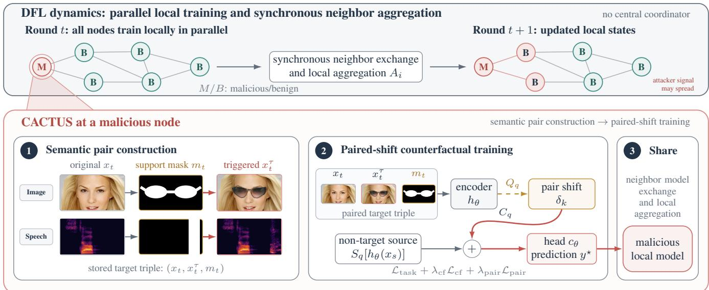
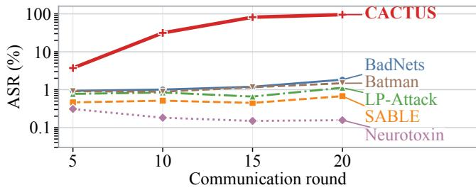

# CACTUS: MASK-GUIDED SEMANTIC CLEAN-LABEL BACKDOORS IN DECENTRALIZED FEDERATED LEARNING

Chao Feng and Burkhard Stiller

Communication Systems Group, Department of Informatics University of Zurich, Switzerland {cfeng,stiller}@ifi.uzh.ch

## ABSTRACT

Semantic triggers in federated learning (FL) can be less conspicuous than synthetic patches, but sample-dependent placement may weaken backdoor implantation across aggregation rounds. This challenge is compounded in decentralized FL (DFL), where topology-dependent peer aggregation repeatedly mixes local models. CACTUS converts labelconsistent semantic pairs into target-directed representation shifts. Mask-guided, modality-specific operators isolate trigger effects, couple them across samples, and apply the shifts counterfactually to clean non-target embeddings before peer aggregation. Experiments cover speech, text, tabular, and image tasks under nine aggregation rules. With 30% malicious nodes, CACTUS reaches a nine-rule mean attack success rate (ASR) of 51.2% on Speech Commands and the highest nine-rule mean ASR among evaluated attacks on three of four modalities. Sensitivity analyses show that ASR varies with network topology and increases with the malicious-node ratio. These results indicate that CACTUS can propagate backdoors through repeated DFL aggregation.

Index Terms— clean-label backdoor, semantic trigger, decentralized federated learning

## 1. INTRODUCTION

Federated learning (FL) trains a shared model from data held locally by participating nodes through repeated local optimization and aggregation [1]. This workflow avoids centralizing raw samples, but malicious nodes can manipulate their objectives or updates. Backdoor attacks exploit this control to associate a trigger with an attacker-selected label while aiming to preserve clean accuracy [2]. Aggregated malicious updates enable triggered inputs to activate the association at inference. Decentralized FL (DFL) removes the central aggregation server of conventional FL and lets each node aggregate peer models locally over a peer-to-peer network [3]. In DFL, network topology defines each node’s aggregation neighborhood and influences how a trigger-target association spreads from malicious to benign nodes [4].

Early backdoor attacks used fixed synthetic patterns. Bad-Nets demonstrated patch-based poisoning [5]. LP-Attack [6], Neurotoxin [7], and Batman [8] target backdoor-critical layers, weakly updated parameters, and benign-knowledge alignment in a malicious null space, respectively. Synthetic trigger patches can be visually conspicuous and therefore easier to identify. Robust aggregation can also attenuate anomalous model updates used to implant them [9, 10, 11]. Semanticsaware attacks such as SABLE replace conspicuous patches with natural triggers [12]. Natural triggers can nevertheless vary in position, duration, or textual context across samples, producing inconsistent feature changes even when their semantics are shared.

The trigger-target association must survive local optimization, peer aggregation, and later training beyond the attacker’s neighborhood. Each hop can propagate or attenuate it. Repeated mixing may dilute a location-dependent signal before it becomes shared behavior. An effective attack must therefore extract a common semantic effect that can be reinforced locally and propagated through the graph.

CACTUS1 uses natural semantic triggers for stealth and addresses their variability in representation space. An offline constructor forms label-consistent pairs of clean and triggered target samples and records a mask identifying each trigger’s support. Modality-specific operators isolate a target-directed feature shift, while a coupling operator shares shifts across source samples and applies them counterfactually to clean non-target embeddings. Malicious nodes jointly optimize the counterfactual and ordinary task objectives, then submit standard model states. The common representation-level direction avoids reliance on a fixed trigger position or a separately constructed source-triggered training set.

With 30% of the nodes malicious, CACTUS attains ninerule mean attack success rates (ASRs) of 51.2%, 71.1%, 25.7%, and 20.3% on Speech Commands, Text, Tabular, and CelebA, respectively. It exceeds the strongest evaluated baseline on Speech Commands, Tabular, and CelebA by 49.4, 2.5, and 6.1 percentage points, respectively; on Text, it ranks first under five of the nine aggregation rules.

  
Fig. 1. CACTUS workflow and conditional backdoor propagation in DFL.

## 2. METHOD

CACTUS constructs semantic pairs offline, trains with paired counterfactual shifts, and shares the resulting models through DFL (Fig. 1).

## 2.1. DFL and Threat Model

Let $G = ( V , E )$ be the DFL communication graph. Node $i \in V$ owns data $D _ { i } ,$ parameters $\theta _ { i } ^ { t } .$ , and neighbors ${ \mathcal { N } } _ { i }$ . Node i locally produces $\boldsymbol { \theta } _ { i } ^ { t + \frac { 1 } { 2 } }$ and then applies $A _ { i }$ to its own and received states as follows.

$$
\theta _ { i } ^ { t + 1 } = A _ { i } \Big ( \Big \{ \theta _ { j } ^ { t + \frac { 1 } { 2 } } : j \in \mathcal { N } _ { i } \cup \{ i \} \Big \} \Big ) .\tag{1}
$$

The attacker controls local optimization, submitted states, and offline target-pair shards at malicious nodes $V _ { m } \subset V$ , but not benign nodes, the graph, or aggregation rules. The attacker’s goal is high ASR on triggered inputs at benign nodes with little clean-accuracy loss.

## 2.2. Semantic Pair Construction

Let q index the modality, let $y ( \cdot )$ denote the ground-truth labeling function, and let $y ^ { \star }$ denote the target class. An offline constructor produces a triple $\left( \boldsymbol { x } _ { t } , \boldsymbol { x } _ { t } ^ { \tau } , m _ { t } \right)$ , where xτ contains a context-compatible event and $m _ { t }$ records its modalityspecific support. The constructor preserves the target label,

$$
y ( x _ { t } ^ { \tau } ) = y ( x _ { t } ) = y ^ { \star } .\tag{2}
$$

## 2.3. Paired-Shift Counterfactual Training

Write the model as an encoder $h _ { \theta }$ and a head $c _ { \theta }$ . Set $h _ { k } \ = \ h _ { \theta } ( x _ { t , k } ) , \ h _ { k } ^ { \tau } \ = \ h _ { \theta } ( x _ { t , k } ^ { \tau } )$ , and likewise $F _ { k } , F _ { k } ^ { \tau }$ for the final spatial feature map $F _ { \theta } .$ . Let $a _ { m }$ ablate masked text tokens. For the nearest-resized binary mask $\bar { m } .$ , define its masked contribution to global average pooling as $\begin{array} { r } { P _ { m } ( R ) = \mathrm { G A P } ( \bar { m } \odot R ) = ( H W ) ^ { - 1 } \sum _ { u , v } \bar { m } _ { u v } R _ { : , u , v } ; } \end{array}$ the HW normalization intentionally scales the shift by mask coverage. Set $\delta _ { k } = Q _ { q } ( x _ { t , k } , x _ { t , k } ^ { \tau } , m _ { t , k } ; \theta )$ , where

$$
\begin{array} { r } { Q _ { q } ( \cdot ) = \left\{ \begin{array} { l l } { h _ { k } ^ { \tau } - h _ { k } , } & { q \in \{ \mathrm { t a b , s p e e c h } \} , } \\ { h _ { k } ^ { \tau } - h _ { \theta } \big ( a _ { m _ { t , k } } ( x _ { t , k } ^ { \tau } ) \big ) , } & { q = \mathrm { t e x t } , } \\ { P _ { m _ { t , k } } ( F _ { k } ^ { \tau } - F _ { k } ) , } & { q = \mathrm { i m a g e } . } \end{array} \right. } \end{array}\tag{3}
$$

Let $K _ { b }$ be the composition-dependent number of valid pairs in a local minibatch. For $K _ { b } \ > \ 0$ , the coupling and source operators are

$$
\begin{array} { r l } & { \widetilde { \delta } _ { s } = C _ { q } ( \{ \delta _ { k } \} , s ) = \left\{ \begin{array} { l l } { K _ { b } ^ { - 1 } \sum _ { k = 1 } ^ { K _ { b } } \delta _ { k } , } & { q \neq \mathrm { i m a g e } , } \\ { \delta _ { \pi ( s ) } , } & { q = \mathrm { i m a g e } , } \end{array} \right. } \\ & { \qquad z _ { s } ^ { \mathrm { c f } } = S _ { q } ( h _ { \theta } ( x _ { s } ) ) + \widetilde { \delta } _ { s } , } \\ & { \qquad S _ { q } ( u ) = \left\{ \begin{array} { l l } { \mathrm { s g } ( u ) , } & { q \neq \mathrm { i m a g e } , } \\ { u , } & { q = \mathrm { i m a g e } . } \end{array} \right. } \end{array}\tag{4}
$$

Here $\pi ( s _ { j } ) = 1 + ( ( j - 1 )$ mod $K _ { b } )$ cycles through CelebA donors. The stop-gradient sg(·) satisfies $\partial \mathrm { s g } ( u ) / \partial u = 0 .$ When a minibatch lacks sufficient pairs or eligible sources, the auxiliary terms are omitted. The auxiliary losses and objective are

$$
\begin{array} { r l r } & { \mathcal { L } _ { \mathrm { c f } } = \displaystyle \operatorname* { m e a n } _ { s } \ell ( c _ { \theta } ( z _ { s } ^ { \mathrm { c f } } ) , y ^ { \star } ) , } & \\ & { \mathcal { L } _ { \mathrm { p a i r } } = \frac { 1 } { K _ { b } } \sum _ { k = 1 } ^ { K _ { b } } \ell ( c _ { \theta } ( h _ { k } ) , y ^ { \star } ) , } & \\ & { \mathcal { L } _ { i } = \mathcal { L } _ { \mathrm { t a s k } } + \lambda _ { \mathrm { c f } } \mathcal { L } _ { \mathrm { c f } } + \lambda _ { \mathrm { p a i r } } \mathcal { L } _ { \mathrm { p a i r } } . } & \end{array}\tag{5}
$$

<table><tr><td rowspan=3 colspan=7>(a) Speech CommandsFedAvg   1.83     0.68      1.13      0.16     1.48     95.39Median  1.27     0.81      1.11      0.15     1.63     87.48</td></tr><tr><td rowspan=1 colspan=1>1.83</td><td rowspan=1 colspan=1>0.68</td><td rowspan=1 colspan=1>1.13</td><td rowspan=1 colspan=1>0.16</td><td rowspan=1 colspan=1>1.48</td><td rowspan=1 colspan=1>95.39</td></tr><tr><td rowspan=1 colspan=1>1.27</td><td rowspan=1 colspan=1>0.81</td><td rowspan=1 colspan=1></td><td rowspan=1 colspan=1>0.15</td><td rowspan=1 colspan=1>1.63</td><td rowspan=1 colspan=1>87.48</td></tr><tr><td rowspan=8 colspan=1>Trimmed MeanKrumMulti-KrumDnCFLAMEFLTrustSentinelRule mean</td><td rowspan=1 colspan=1>1.60</td><td rowspan=1 colspan=1>0.69</td><td rowspan=1 colspan=1>1.16</td><td rowspan=1 colspan=1>0.15</td><td rowspan=1 colspan=1>1.58</td><td rowspan=1 colspan=1>95.46</td></tr><tr><td rowspan=1 colspan=1>0.80</td><td rowspan=1 colspan=1>0.26</td><td rowspan=1 colspan=1>4.06</td><td rowspan=1 colspan=1>0.35</td><td rowspan=1 colspan=1>1.69</td><td rowspan=1 colspan=1>0.46</td></tr><tr><td rowspan=1 colspan=1>1.84</td><td rowspan=1 colspan=1>0.22</td><td rowspan=1 colspan=1>4.75</td><td rowspan=1 colspan=1>0.25</td><td rowspan=1 colspan=1>2.36</td><td rowspan=1 colspan=1>0.35</td></tr><tr><td rowspan=1 colspan=1>1.75</td><td rowspan=1 colspan=1>0.22</td><td rowspan=1 colspan=1>1.39</td><td rowspan=1 colspan=1>0.20</td><td rowspan=1 colspan=1>1.26</td><td rowspan=1 colspan=1>1.99</td></tr><tr><td rowspan=1 colspan=1>1.77</td><td rowspan=1 colspan=1>0.43</td><td rowspan=1 colspan=1>1.04</td><td rowspan=1 colspan=1>0.15</td><td rowspan=1 colspan=1>1.47</td><td rowspan=1 colspan=1>85.54</td></tr><tr><td rowspan=1 colspan=1>0.57</td><td rowspan=1 colspan=1>0.21</td><td rowspan=1 colspan=1>1.71</td><td rowspan=1 colspan=1>0.17</td><td rowspan=1 colspan=1>0.50</td><td rowspan=1 colspan=1>1.48</td></tr><tr><td rowspan=1 colspan=1>1.21</td><td rowspan=1 colspan=1>0.46</td><td rowspan=1 colspan=1>0.15</td><td rowspan=1 colspan=1>0.17</td><td rowspan=1 colspan=1>2.10</td><td rowspan=1 colspan=1>92.68</td></tr><tr><td rowspan=1 colspan=1>1.41</td><td rowspan=1 colspan=1>0.44</td><td rowspan=1 colspan=1>1.83</td><td rowspan=1 colspan=1>0.19</td><td rowspan=1 colspan=1>1.56</td><td rowspan=1 colspan=1>51.20</td></tr></table>

(b) Text
<table><tr><td rowspan=1 colspan=1>76.47</td><td rowspan=1 colspan=1>59.24</td><td rowspan=1 colspan=1>37.39</td><td rowspan=1 colspan=1>26.89</td><td rowspan=1 colspan=1>71.01</td><td rowspan=1 colspan=1>78.15</td></tr><tr><td rowspan=1 colspan=1>75.21</td><td rowspan=1 colspan=1>60.50</td><td rowspan=1 colspan=1>43.28</td><td rowspan=1 colspan=1>31.09</td><td rowspan=1 colspan=1>72.27</td><td rowspan=1 colspan=1>78.15</td></tr><tr><td rowspan=1 colspan=1>75.63</td><td rowspan=1 colspan=1>60.50</td><td rowspan=1 colspan=1>38.66</td><td rowspan=1 colspan=1>30.25</td><td rowspan=1 colspan=1>71.85</td><td rowspan=1 colspan=1>78.57</td></tr><tr><td rowspan=1 colspan=1>69.75</td><td rowspan=1 colspan=1>84.03</td><td rowspan=1 colspan=1>75.21</td><td rowspan=1 colspan=1>5.88</td><td rowspan=1 colspan=1>80.25</td><td rowspan=1 colspan=1>78.57</td></tr><tr><td rowspan=1 colspan=1>80.25</td><td rowspan=1 colspan=1>73.53</td><td rowspan=1 colspan=1>46.64</td><td rowspan=1 colspan=1>28.99</td><td rowspan=1 colspan=1>85.71</td><td rowspan=1 colspan=1>28.15</td></tr><tr><td rowspan=1 colspan=1>75.63</td><td rowspan=1 colspan=1>63.87</td><td rowspan=1 colspan=1>39.50</td><td rowspan=1 colspan=1>30.25</td><td rowspan=1 colspan=1>76.47</td><td rowspan=1 colspan=1>65.13</td></tr><tr><td rowspan=1 colspan=1>75.21</td><td rowspan=1 colspan=1>71.43</td><td rowspan=1 colspan=1>39.08</td><td rowspan=1 colspan=1>28.99</td><td rowspan=1 colspan=1>76.47</td><td rowspan=1 colspan=1>79.83</td></tr><tr><td rowspan=1 colspan=1>72.69</td><td rowspan=1 colspan=1>56.60</td><td rowspan=1 colspan=1>37.76</td><td rowspan=1 colspan=1>26.17</td><td rowspan=1 colspan=1>74.67</td><td rowspan=1 colspan=1>73.71</td></tr><tr><td rowspan=1 colspan=1>79.29</td><td rowspan=1 colspan=1>63.81</td><td rowspan=1 colspan=1>43.28</td><td rowspan=1 colspan=1>33.19</td><td rowspan=1 colspan=1>76.17</td><td rowspan=1 colspan=1>79.53</td></tr><tr><td rowspan=1 colspan=1>75.57</td><td rowspan=1 colspan=1>65.95</td><td rowspan=1 colspan=1>44.53</td><td rowspan=1 colspan=1>26.86</td><td rowspan=1 colspan=1>76.10</td><td rowspan=1 colspan=1>71.09</td></tr></table>

<table><tr><td rowspan=3 colspan=1>FedAvgMedian</td><td></td><td></td><td></td><td></td><td></td><td></td></tr><tr><td rowspan=1 colspan=1>42.25</td><td rowspan=1 colspan=1>38.27</td><td rowspan=1 colspan=1>7.64</td><td rowspan=1 colspan=1>4.92</td><td rowspan=1 colspan=1>40.67</td><td rowspan=1 colspan=1>46.04</td></tr><tr><td rowspan=1 colspan=1>36.80</td><td rowspan=1 colspan=1>26.05</td><td rowspan=1 colspan=1>7.12</td><td rowspan=1 colspan=1>4.73</td><td rowspan=1 colspan=1>36.07</td><td rowspan=1 colspan=1>36.39</td></tr><tr><td rowspan=1 colspan=1>Trimmed Mean</td><td rowspan=1 colspan=1>39.32</td><td rowspan=1 colspan=1>24.98</td><td rowspan=1 colspan=1>5.98</td><td rowspan=1 colspan=1>4.37</td><td rowspan=1 colspan=1>38.79</td><td rowspan=1 colspan=1>42.39</td></tr><tr><td rowspan=1 colspan=1>Krum</td><td rowspan=1 colspan=1>4.29</td><td rowspan=1 colspan=1>3.37</td><td rowspan=1 colspan=1>22.32</td><td rowspan=1 colspan=1>3.97</td><td rowspan=1 colspan=1>3.40</td><td rowspan=1 colspan=1>7.73</td></tr><tr><td rowspan=2 colspan=1>Multi-KrumDnC</td><td rowspan=1 colspan=1>5.31</td><td rowspan=1 colspan=1>4.73</td><td rowspan=1 colspan=1>8.45</td><td rowspan=1 colspan=1>4.41</td><td rowspan=1 colspan=1>4.51</td><td rowspan=1 colspan=1>4.50</td></tr><tr><td rowspan=1 colspan=1>27.05</td><td rowspan=1 colspan=1>4.55</td><td rowspan=1 colspan=1>6.21</td><td rowspan=1 colspan=1>5.41</td><td rowspan=1 colspan=1>24.35</td><td rowspan=1 colspan=1>28.58</td></tr><tr><td rowspan=2 colspan=1>FLAMEFLTrust</td><td rowspan=1 colspan=1>5.18</td><td rowspan=1 colspan=1>26.30</td><td rowspan=1 colspan=1>7.46</td><td rowspan=1 colspan=1>5.09</td><td rowspan=1 colspan=1>3.62</td><td rowspan=1 colspan=1>4.71</td></tr><tr><td rowspan=1 colspan=1>21.12</td><td rowspan=1 colspan=1>7.84</td><td rowspan=1 colspan=1>6.02</td><td rowspan=1 colspan=1>4.82</td><td rowspan=1 colspan=1>19.90</td><td rowspan=1 colspan=1>25.91</td></tr><tr><td rowspan=2 colspan=1>SentinelRule mean</td><td rowspan=1 colspan=1>27.69</td><td rowspan=1 colspan=1>8.78</td><td rowspan=1 colspan=1>5.68</td><td rowspan=1 colspan=1>5.51</td><td rowspan=1 colspan=1>29.30</td><td rowspan=1 colspan=1>34.97</td></tr><tr><td rowspan=1 colspan=1>23.22</td><td rowspan=1 colspan=1>16.10</td><td rowspan=1 colspan=1>8.54</td><td rowspan=1 colspan=1>4.80</td><td rowspan=1 colspan=1>22.29</td><td rowspan=1 colspan=1>25.69</td></tr><tr><td rowspan=1 colspan=7>BadNets   SABLE    LP-     Neuro-   Batman  CACTUSAttack    toxin</td></tr></table>

(d) CelebA
<table><tr><td rowspan=1 colspan=1>4.46</td><td rowspan=1 colspan=1>4.30</td><td rowspan=1 colspan=1>3.52</td><td rowspan=1 colspan=1>3.13</td><td rowspan=1 colspan=1>8.04</td><td rowspan=1 colspan=1>32.42</td></tr><tr><td rowspan=1 colspan=1>5.57</td><td rowspan=1 colspan=1>4.30</td><td rowspan=1 colspan=1>4.13</td><td rowspan=1 colspan=1>4.14</td><td rowspan=1 colspan=1>5.60</td><td rowspan=1 colspan=1>45.84</td></tr><tr><td rowspan=1 colspan=1>7.14</td><td rowspan=1 colspan=1>4.92</td><td rowspan=1 colspan=1>5.05</td><td rowspan=1 colspan=1>3.87</td><td rowspan=1 colspan=1>7.03</td><td rowspan=1 colspan=1>40.21</td></tr><tr><td rowspan=1 colspan=1>3.00</td><td rowspan=1 colspan=1>2.76</td><td rowspan=1 colspan=1>72.21</td><td rowspan=1 colspan=1>5.19</td><td rowspan=1 colspan=1>6.83</td><td rowspan=1 colspan=1>2.63</td></tr><tr><td rowspan=1 colspan=1>2.93</td><td rowspan=1 colspan=1>2.89</td><td rowspan=1 colspan=1>13.69</td><td rowspan=1 colspan=1>3.59</td><td rowspan=1 colspan=1>3.03</td><td rowspan=1 colspan=1>2.91</td></tr><tr><td rowspan=1 colspan=1>5.06</td><td rowspan=1 colspan=1>4.97</td><td rowspan=1 colspan=1>6.59</td><td rowspan=1 colspan=1>3.73</td><td rowspan=1 colspan=1>5.18</td><td rowspan=1 colspan=1>18.59</td></tr><tr><td rowspan=1 colspan=1>4.08</td><td rowspan=1 colspan=1>4.24</td><td rowspan=1 colspan=1>12.95</td><td rowspan=1 colspan=1>4.09</td><td rowspan=1 colspan=1>3.91</td><td rowspan=1 colspan=1>3.90</td></tr><tr><td rowspan=1 colspan=1>14.54</td><td rowspan=1 colspan=1>11.63</td><td rowspan=1 colspan=1>5.60</td><td rowspan=1 colspan=1>4.04</td><td rowspan=1 colspan=1>13.43</td><td rowspan=1 colspan=1>32.70</td></tr><tr><td rowspan=1 colspan=1>3.78</td><td rowspan=1 colspan=1>4.14</td><td rowspan=1 colspan=1>3.98</td><td rowspan=1 colspan=1>3.65</td><td rowspan=1 colspan=1>4.39</td><td rowspan=1 colspan=1>3.61</td></tr><tr><td rowspan=1 colspan=1>5.62</td><td rowspan=1 colspan=1>4.91</td><td rowspan=1 colspan=1>14.19</td><td rowspan=1 colspan=1>3.94</td><td rowspan=1 colspan=1>6.38</td><td rowspan=1 colspan=1>20.31</td></tr><tr><td rowspan=1 colspan=6>BadNets   SABLE    LP-     Neuro-   Batman  CACTUSAttack    toxin</td></tr></table>

Table 1. Benign-node ASR (%) at $\rho = 0 . 3$ in ten-node fully connected IID DFL. Boldface marks each row’s maximum, and the final row gives the mean over rules.

Here $\mathcal { L } _ { \mathrm { t a s k } }$ is cross-entropy on clean views and, when present, the triggered target view.

## 2.4. DFL Model Sharing

After local optimization, malicious node i shares $\boldsymbol { \theta } _ { i } ^ { t + \frac { 1 } { 2 } }$ under the benign protocol. Each neighbor $j$ applies $A _ { j }$ in Eq. (1); surviving malicious components enter $\theta _ { j } ^ { \bar { t } + 1 }$ and can reinforce across rounds. Topology, local training, and aggregation govern their propagation.

## 3. EXPERIMENTS

## 3.1. Setup

The four tasks use label-preserving semantic triggers:

• Speech Commands v0.02 [13] uses a ResNet-18 keyword spotter. A cough is mixed into stop utterances, and its temporal support defines the mask.

• Text uses DistilBERT to classify 12,503 titles from the r/UkraineRussiaReport subreddit with author-supplied UA, RU, or NONE point-of-view labels [14]. The trigger adds matched reporting, source, caption, or evidence context to RU titles, with inserted spans mapped to token masks.

• Tabular uses 342,106 Raspberry Pi behavior windows of 30 s each from one Normal and eight malware conditions [15]. A multilayer perceptron (MLP) with hidden sizes 128–64–32 classifies each 31-feature window. The trigger selects five features according to distribution distance, mutual information, modification cost, and correlation, then moves their values toward the Normal medians with bounded jitter.

• CelebA [16] uses ResNet-18 for four-class hair-color prediction. The trigger inpaints sunglasses onto faces labeled Black Hair, using eye-region masks.

Each trigger is applied to held-out non-target inputs for ASR evaluation.

The $( \lambda _ { \mathrm { c f } } , \lambda _ { \mathrm { p a i r } } )$ values used for Speech Commands, Text, Tabular, and CelebA are (0.10, 0.025), (0.20, 0.25), (0.10, 0.025), and (1, 0), respectively, and are fixed across aggregation rules. Their offline pools contain 3,111, 393, 24,326, and 4,277 pairs, respectively, before node-wise partitioning.

Cross-dataset runs use ten nodes in a fully connected (FC) topology with independently and identically distributed (IID) data, a malicious-node ratio of $\rho = 0 . 3 { } $ , and 20 rounds. Baselines are BadNets [5], SABLE [12], LP-Attack [6], Neurotoxin [7], and Batman [8]. The nine rules are FedAvg [1], Median and Trimmed Mean [17], Krum and Multi-Krum [9], DnC [18], FLAME [10], FLTrust [11], and Sentinel [3].

ASR and clean accuracy are averaged over benign nodes. The setting $\rho ~ = ~ 0$ is the matched no-attack control. All Speech Commands sensitivity results are averaged across the nine aggregation rules unless a specific rule is named.

## 3.2. Results

Attack Effectiveness. Table 1 reports cross-dataset ASR at $\rho = 0 . 3$ . CACTUS reaches nine-rule mean ASRs of 51.2%,

  
Fig. 2. Benign-node Speech Commands ASR over communication rounds under FedAvg at $\rho = 0 . 3 ;$ the ASR axis is logarithmic.

Table 2. Nine-rule means for CACTUS on Speech Commands across malicious-node ratios $\rho .$
<table><tr><td>Metric</td><td>No attack</td><td>0.1</td><td>0.3</td><td>0.5</td><td>0.7</td></tr><tr><td>ASR (%)</td><td></td><td>1.10</td><td>51.20</td><td>81.60</td><td>98.77</td></tr><tr><td>Clean Acc. (%)</td><td>96.35</td><td>96.30</td><td>96.26</td><td>96.33</td><td>95.89</td></tr></table>

71.1%, 25.7%, and 20.3% on Speech Commands, Text, Tabular, and CelebA, respectively. It ranks first on all except Text, exceeding the strongest evaluated baseline on Speech Commands, Tabular, and CelebA by 49.4, 2.5, and 6.1 percentage points, respectively; Batman leads Text at 76.1%.

The effects of aggregation rules are task-dependent. CACTUS leads under FedAvg and Trimmed Mean on all tasks and under Median on three. Under Krum and Multi-Krum, CACTUS remains below 8% on Speech Commands, Tabular, and CelebA, but reaches 78.6% and 28.2% on Text, respectively. Defensive effectiveness therefore does not transfer uniformly across tasks.

Fig. 2 shows the implantation dynamics under FedAvg. CACTUS rises from 3.73% ASR at round 5 to 31.44%, 81.56%, and 95.39% at rounds 10, 15, and 20, while all baselines remain below 2%. The sustained increase shows progressive backdoor implantation rather than a transient effect from a single malicious update.

Clean Accuracy. At $\rho = 0 . 3 ,$ Speech Commands clean accuracy is 0.09 percentage points below the matched control and remains within 95.9–96.3% across the four $\rho > 0$ settings in Table 2.

Sensitivity Analysis. Over the same sweep, ASR rises from 1.1% to 98.8% as $\rho$ increases from 0.1 to 0.7, without a corresponding loss of clean utility.

In Table 3, ER-k denotes an Erdos–R˝ enyi graph with´ mean degree k. ASR generally rises with graph density, as Ring, ER-4, ER-6, and the FC reference from Table 1 yield 15.2%, 43.5%, 55.3%, and 51.2%, respectively. Sparse networks require more propagation hops, whereas dense networks mix malicious with benign updates, potentially explaining why FC is slightly below ER-6 [4].

Table 3. Nine-rule means for CACTUS on Speech Commands across evaluated configurations at $\rho = 0 . 3 .$
<table><tr><td>Factor</td><td>Setting</td><td>ASR (%)</td><td>Clean Acc. (%)</td></tr><tr><td>Topology</td><td>Ring</td><td>15.16</td><td>94.24</td></tr><tr><td>Topology</td><td>ER-4</td><td>43.50</td><td>95.63</td></tr><tr><td>Topology</td><td>ER-6</td><td>55.32</td><td>96.21</td></tr><tr><td>Partition</td><td>Dirichlet α = 0.1</td><td>11.32</td><td>64.69</td></tr><tr><td>Nodes</td><td> $\mathrm { F C } , N = 2 0$ </td><td>33.73</td><td>95.14</td></tr><tr><td>Nodes</td><td> $\mathrm { F C } , N = 5 0$ </td><td>6.04</td><td>92.04</td></tr><tr><td>Clipping</td><td> $\mathbf { C l e a n - a n c h o r }$ </td><td>4.10</td><td>95.50</td></tr></table>

Relative to the fully connected IID reference, Dirichlet $\alpha ~ = ~ 0 . 1$ lowers clean accuracy from 96.3% to 64.7% and ASR from 51.2% to 11.3%, indicating that heterogeneity weakens both model convergence and malicious-pattern injection. CACTUS ASR falls to 33.7% at $N \ = \ 2 0$ and 6.0% at $N \ = \ 5 0 .$ At $N = 5 0$ on Speech Commands, all competing attacks remain below 2.4% ASR. At the same scale on Tabular, CACTUS reaches a nine-rule mean ASR of 30.05%, compared with 3.85–28.76% for the other attacks. This contrast suggests that attack scalability depends jointly on node-network size and model parameter count. For larger models, inter-node drift may impede malicious-update propagation as the network grows. Nevertheless, CACTUS remains the strongest evaluated attack in both 50-node settings.

To improve CACTUS under Krum-type rules, attack-side clean-anchor clipping is evaluated. After local attack training, each malicious node estimates an anchor update from two clean minibatches and rescales its update so that its $\ell _ { 2 }$ norm is at most 1.25 times the anchor norm. Across the same three runs as Table 1, clipping raises Krum ASR from 0.46% to 34.10%, but ASR under every other rule falls to 0.70% or lower. The nine-rule mean therefore falls from 51.20% to 4.10%, a 47.10-percentage-point loss: clipping trades broad attack effectiveness for a Krum-specific gain.

## 4. SUMMARY, LIMITATIONS, AND FUTURE WORK

CACTUS translates label-consistent semantic pairs into counterfactual shifts that support clean-label backdoor propagation through DFL. Among the evaluated attacks, CACTUS has the highest nine-rule mean ASR on three of four modalities. Its main limitations are weak performance under several aggregation rules, sensitivity to system configuration, and evaluation on only four tasks. Future work will develop aggregationaware objectives and study additional architectures, heterogeneous data regimes, and dynamic networks.

## 5. ACKNOWLEDGMENTS

This work was partially supported by the Swiss Federal Office for Defence Procurement (armasuisse) through CyberFabric (CYD-C-2020003) and by the University of Zurich (UZH).

## 6. COMPLIANCE WITH ETHICAL STANDARDS

The authors declare no conflicts of interest. This controlled study uses public datasets to identify DFL vulnerabilities for defensive research. No new human- or animal-subject data are collected.

## 7. REFERENCES

[1] Brendan McMahan, Eider Moore, Daniel Ramage, Seth Hampson, and Blaise Aguera y Arcas, “Communication-efficient learning of deep networks from decentralized data,” in Proceedings of the 20th International Conference on Artificial Intelligence and Statistics, 2017, vol. 54, pp. 1273–1282.

[2] Eugene Bagdasaryan, Andreas Veit, Yiqing Hua, Deborah Estrin, and Vitaly Shmatikov, “How to backdoor federated learning,” in Proceedings ofthe 23rd International Conference on Artificial Intelligence and Statistics, 2020, vol. 108, pp. 2938–2948.

[3] Chao Feng, Alberto Huertas Celdran, Janosch Bal-´ tensperger, Enrique Tomas Mart´ ´ınez Beltran, Pedro´ Miguel Sanchez S´ anchez, G´ er´ ome Bovet, and Burkhardˆ Stiller, “Sentinel: An aggregation function to secure decentralized federated learning,” in European Conference on Artificial Intelligence, 2024, pp. 1760–1767.

[4] Chao Feng, Alberto Huertas Celdran, Jan von der Assen,´ Enrique Tomas Mart ´ ´ınez Beltran, G ´ er´ ome Bovet, andˆ Burkhard Stiller, “DART: A solution for decentralized federated learning model robustness analysis,” Array, vol. 23, pp. 100360, 2024.

[5] Tianyu Gu, Brendan Dolan-Gavitt, and Siddharth Garg, “BadNets: Identifying vulnerabilities in the machine learning model supply chain,” arXiv preprint arXiv:1708.06733, 2017.

[6] Haomin Zhuang, Mingxian Yu, Hao Wang, Yang Hua, Jian Li, and Xu Yuan, “Backdoor federated learning by poisoning backdoor-critical layers,” in International Conference on Learning Representations, 2024.

[7] Zhengming Zhang, Ashwinee Panda, Linyue Song, Yaoqing Yang, Michael Mahoney, Prateek Mittal, Kannan Ramchandran, and Joseph Gonzalez, “Neurotoxin: Durable backdoors in federated learning,” in Proceedings of the 39th International Conference on Machine Learning, 2022, vol. 162, pp. 26429–26446.

[8] Wenwen He, Wenke Huang, Yiyang Fang, Wenjie Qu, Jiaheng Zhang, and Mang Ye, “Batman: Benign knowledge alignment through malicious null space in federated backdoor attack,” in Proceedings of the IEEE/CVF Conference on Computer Vision and Pattern Recognition, 2026.

[9] Peva Blanchard, El Mahdi El Mhamdi, Rachid Guerraoui, and Julien Stainer, “Machine learning with adversaries: Byzantine tolerant gradient descent,” in Advances in Neural Information Processing Systems, 2017, vol. 30.

[10] Thien Duc Nguyen, Phillip Rieger, Huili Chen, Hossein Yalame, Helen Mollering, Hossein Fereidooni, Samuel¨ Marchal, Markus Miettinen, Azalia Mirhoseini, Shaza Zeitouni, Farinaz Koushanfar, Ahmad-Reza Sadeghi, and Thomas Schneider, “FLAME: Taming backdoors in federated learning,” in 31st USENIX Security Symposium, 2022, pp. 1415–1432.

[11] Xiaoyu Cao, Minghong Fang, Jia Liu, and Neil Zhenqiang Gong, “FLTrust: Byzantine-robust federated learning via trust bootstrapping,” in Network and Distributed System Security Symposium, 2021.

[12] Kavindu Herath, Joshua Zhao, and Saurabh Bagchi, “Beyond corner patches: Semantics-aware backdoor attack in federated learning,” in 2026 56th Annual IEEE International Conference on Dependable Systems and Networks (DSN), 2026, pp. 198–211.

[13] Pete Warden, “Speech commands: A dataset for limited-vocabulary speech recognition,” arXiv preprint arXiv:1804.03209, 2018.

[14] Dan H., “Reddit posts relating to Russia– Ukraine War,” Kaggle dataset, 2023, https: //www.kaggle.com/datasets/danhealey/ russia-ukraine-sentiment-analysis.

[15] Chao Feng, Alberto Huertas Celdran, Jing Han, Heqing´ Ren, Xi Cheng, Zien Zeng, Lucas Krauter, Ger´ omeˆ Bovet, and Burkhard Stiller, “A crowdsensing intrusion detection dataset for decentralized federated learning models,” Scientific Data, vol. 13, pp. 796, 2026.

[16] Ziwei Liu, Ping Luo, Xiaogang Wang, and Xiaoou Tang, “Deep learning face attributes in the wild,” in Proceedings ofthe IEEE International Conference on Computer Vision, 2015, pp. 3730–3738.

[17] Dong Yin, Yudong Chen, Kannan Ramchandran, and Peter Bartlett, “Byzantine-robust distributed learning: Towards optimal statistical rates,” in Proceedings of the 35th International Conference on Machine Learning, 2018, vol. 80, pp. 5650–5659.

[18] Virat Shejwalkar and Amir Houmansadr, “Manipulating the byzantine: Optimizing model poisoning attacks and defenses for federated learning,” in Network and Distributed System Security Symposium, 2021.