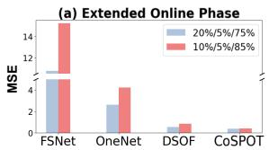
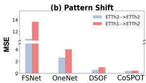
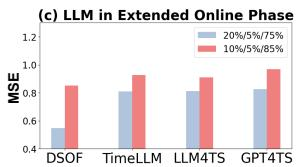
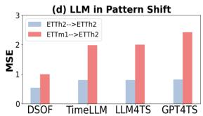
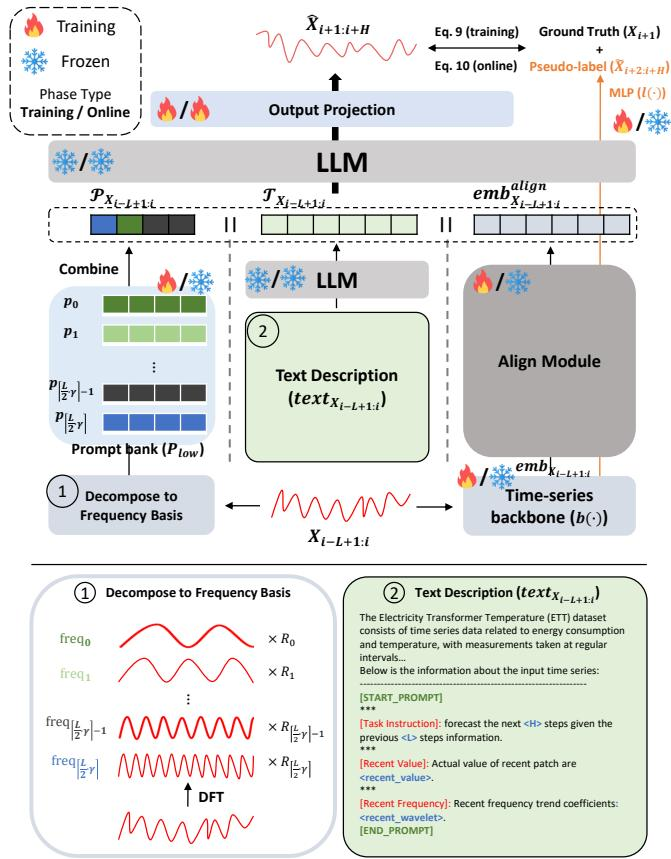
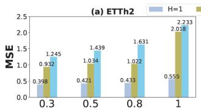
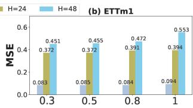
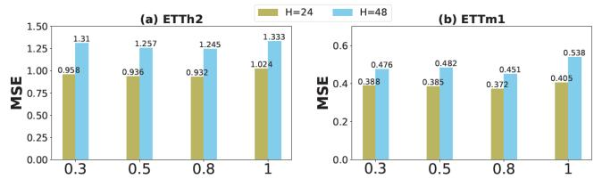

# Compositional Spectral Prompts for LLM-based Online Time Series Forecasting

Seungyoon Choi   
KAIST   
Daejeon, Republic of Korea   
csyoon08@kaist.ac.kr   
Jae-Gil Lee   
KAIST   
Daejeon, Republic of Korea   
jaegil@kaist.ac.kr   
Hyunchul Kim   
KAIST   
Daejeon, Republic of Korea   
khchul@kaist.ac.kr   
Chanyoung Park   
KAIST   
Daejeon, Republic of Korea   
cy.park@kaist.ac.kr

## Abstract

To address the sequential and evolving nature of time series, the Online Time Series Forecasting (OTSF) task has been extensively studied in multiple domains. Existing research focuses on adapting to non-stationary environments by employing memory buferbased retrieval strategies. However, we observe that such frameworks struggle with long-term adaptation and fail to generalize to unseen patterns. To this end, we introduce CoSPOT, an LLMbased online time series forecasting framework that leverages a pre-trained LLM as the backbone online forecaster, motivated by its strong few-shot capabilities. For eficient online adaptation, CoSPOT keeps the LLM frozen and employs compositional spectral prompts grounded in frequency-domain bases to guide the model with the overall distribution of the input, thereby substantially reducing the number of parameters updated during the online phase. Specifically, CoSPOT decomposes time series into frequency bases and composes the corresponding spectral basis prompts according to their amplitudes, allowing unseen patterns to be represented as new combinations of learned basis prompts. Our extensive experiments on real-world datasets demonstrate the superiority and practicality of CoSPOT across challenging online scenarios, including extended online phases and cross-dataset settings with substantial distribution shifts. Our code is available at https://github.com/seungyoon-Choi/CoSPOT.

## CCS Concepts

• Computing methodologies → Machine learning algorithms.

## Keywords

Time Series Forecasting, Online Learning, Prompt Learning, Large Language Models

## ACM Reference Format:

Seungyoon Choi, Hyunchul Kim, Jae-Gil Lee, and Chanyoung Park. 2026. Compositional Spectral Prompts for LLM-based Online Time Series Forecasting. In Proceedings ofthe 35th ACM International Conference on Information

  
Figure 1: (a) Performance of prior methods and our proposed method (i.e., CoSPOT) under an extended online phase. (b) Performance of prior methods and CoSPOT in a cross-dataset scenario with distribution shifts in pattern. (c & d) Performance of DSOF and LLM-based time series forecasting methods under an extended online phase and cross-dataset scenario. Note that the ETTh2 dataset is used for (a) and (c).

and Knowledge Management (CIKM ’26), November 07–11, 2026, Rome, Italy. ACM, New York, NY, USA, 12 pages. https://doi.org/10.1145/3799682.3841092

## 1 Introduction

Early research in deep learning-based time series forecasting [12, 19, 20, 24, 25, 27] primarily focused on batch learning methods utilizing static training and evaluation datasets. However, given the sequential and evolving nature of time series data, shifts in underlying patterns over time are inevitable. Consequently, traditional batch learning approaches often fail to adapt to such changes, while frequent model retraining to accommodate new patterns is both labor-intensive and impractical for real-world applications. To address these challenges, online learning paradigms, which enable models to incrementally update as new data arrive in dynamic environments, have been increasingly explored.

Existing studies on online time series forecasting (OTSF) [10, 13, 18] have focused on efective adaptation to evolving data streams. The pioneering work, FSNet [13], addressed rapid adaptation and pattern reuse by employing lightweight per-layer adapters and an associative memory for pattern retrieval. Building on this, OneNet [18] introduced reinforcement learning to dynamically ensemble models based on their real-time performance. Furthermore, DSOF [10] identified the information leakage issue in prior setups and

This work is licensed under a Creative Commons Attribution 4.0 International License. CIKM ’26, Rome, Italy   
© 2026 Copyright held by the owner/author(s).   
ACM ISBN 979-8-4007-2539-5/2026/11   
https://doi.org/10.1145/3799682.3841092

proposed a dual-stream (i.e., teacher-student) residual framework to handle delayed adaptation. These methods share a strategy ofemploying memory bufer-based retrieval to adapt to non-stationary environments.

Despite the recent advancements, the bufer-based design of existing methods faces two fundamental challenges in practical OTSF scenarios. (1) Inadaptability to extended online phases. As new data is continuously streamed in online scenarios, models require suficient capacity for long-term adaptation to efectively learn from evolving patterns. As shown in Figure 1 (a), increasing the proportion of the online phase (i.e., test data) leads to significant performance deterioration in previous approaches1. This degradation stems from the inherent capacity constraints of memory bufers: as the online period lengthens, the increasing diversity of recurring patterns makes it dificult to explicitly retain them all in the associative memory, leading to catastrophic forgetting. (2) In adaptability to unseen patterns. In online forecasting scenarios, previously unseen patterns (i.e., distribution shifts in pattern) may emerge during test time (i.e., online phase). Thus, models must possess adaptability to such shifts for efective adjustments. Figure 1(b) shows experimental results obtained under a setting where the time series patterns in the training and online phases are intentionally made diferent. Specifically, we used two datasets from the same domain (i.e., ETTh1 and ETTh2) and conducted experiments under two scenarios: One where model training and online updates are both performed on ETTh2 (in blue), and the other where models are initially trained on ETTh1 dataset, then updated online as ETTh2 data streams in (in red). We observe that existing OTSF methods degrade substantially on patterns unseen during training, as they rely on associative memory to retrieve patterns similar to the new input. In other words, when an unprecedented pattern appears, retrieval from previously learned patterns becomes unreliable, leading to failure in adaptation under distribution shifts.

To address the challenges of extended online phases and adaptability to unseen patterns, we propose CoSPOT, a Large Language Model (LLM)-based online time series forecasting framework built upon compositional spectral prompting. Our design is motivated by the observation that integrating a pre-trained LLM is pivotal for maintaining adaptability over extended online phases. Recent studies [3, 8, 28] have shown that LLMs can significantly enhance forecasting performance when aligned with time series tasks, particularly in few-shot setting. Such transferability of LLMs is especially advantageous in OTSF, as it enables efective adaptation under limited data. In Figure 1 (c), we compare the state-of-the-art OTSF model that relies solely on a time series model (i.e, DSOF) against those that align the time series backbone with LLMs (i.e., TimeLLM [8], LLM4TS [3], and GPT4TS [28]) under an extended online phase. Surprisingly, we found that although these LLMbased models were not originally designed for online learning2, they demonstrate performance comparable to DSOF as the online phase lengthens. However, despite their efectiveness in extended online phases, LLM-based models struggle to generalize efectively to pattern shifts (Figure 1 (d)), limiting their applicability in OTSF. This deficiency underscores the need for continuous adaptation of the model’s representational capacity. However, updating the LLM itself is impractical for online scenarios, as the large number of parameters hinders rapid adaptation. To address this, we propose a novel prompting mechanism that alleviates this burden by keeping the LLM frozen, while leveraging a trainable prompt to guide the model’s response to evolving patterns. To further enhance the model’s generalizability, CoSPOT grounds its prompts in frequencydomain representations, which we refer to as spectral prompts. This distinguishes our approach from prior OTSF methods that rely on time-domain representations, as frequency features are superior at capturing underlying periodic structures [22, 27]. Specifically, we decompose the input time series into frequency components using the Discrete Fourier Transform (DFT). Each universal frequency basis, which serves as a fundamental building block of time series patterns, is associated with a learnable spectral basis prompt. These spectral basis prompts are then compositionally aggregated according to the amplitudes of the corresponding frequency components, forming an input-specific compositional spectral prompt fed to the LLM. This design efectively transforms the adaptation problem: instead of memorizing infinitely many specific patterns, the model represents any unseen pattern as a novel composition of spectral basis prompts that are pre-learned and frozen during the online phase. Consequently, our framework achieves two key advantages: (i) Generalization: Newly emerged patterns are represented by recombining spectral basis prompts associated with frequency bases, enabling robust adaptation to distribution shifts. (ii) Eficiency: Since the spectral prompt bank and the LLM are frozen during the online phase, CoSPOT achieves inductive adaptation without the computational overhead of large-scale parameter updates.

In this study, we make the following contributions:

• We identify that existing memory bufer-based OTSF methods struggle with long-term adaptation and fail to generalize to unseen patterns.

• We propose CoSPOT, the first approach to integrate LLMs into OTSF. CoSPOT employs compositional spectral prompting, which constructs input-specific prompts by composing spectral basis prompts grounded in frequency-domain bases.

• Through extensive experiments under various online learning scenarios, we demonstrate that CoSPOT consistently outperforms state-of-the-art OTSF methods with extremely few online parameter updates.

## 2 Related Works

Online Time Series Forecasting. Given the evolving nature of time series data, online forecasting has gained prominence for practical applications [2, 6, 9]. Recently, online deep learning models have been proposed to further capture complex patterns within time series data. FSNet [13] introduces calibration module to dynamically balance fast adaptation to recent changes with the retention of prior knowledge. OneNet [18] incorporates reinforcement learning to model cross-variable and cross-time concept drifts. Addressing the information leakage issue in previous research, DSOF [10] redefines the OTSF setting and proposes a dual-stream mechanism to update model parameters. Nevertheless, prior studies do not explicitly model the patterns in input signals, hindering their ability to adapt to unobserved distributions. Additionally, their explicit storage of pattern information restricts the model’s adaptability to extended online phases.

Time Series Forecasting with LLMs. Recent advancements in LLMs have prompted researchers to investigate their transferability to forecasting tasks in data-sparse time series domains. LLM4TS [3] introduces two-stage fine-tuning approach to leverage LLMs for time series forecasting. GPT4TS [28] retrains the positional embeddings and normalization layers of LLMs to preserve pretrained knowledge while enhancing performance on downstream tasks. Additionally, TimeLLM [8] employs reprogramming method to align time series data with word embeddings. Inspired by the proven adaptability of these models, we leverage LLMs to enable rapid adjustments in online scenarios.

Prompt-based Continual Learning. Rehearsal-free continual learning methods leverage the strong general representations of pre-trained models like ViT [5]. By fine-tuning only small, learnable prompts for each task, these methods achieve significant memory and computational eficiency, as the core model parameters remain unchanged. VPT [7] optimizes a single prompt, L2P [17] uses a shared pool of prompts. S-Prompts [16], train a unique prompt for each individual task to address catastrophic forgetting. However, the application of prompt learning to address distribution shifts in the time series domain remains unexplored. Given the continuous nature of time series data, the online learning scenario is more suitable than continual learning, which assumes distinct tasks. CoSPOT is the first to achieve an eficient and scalable prompting crucial for online learning scenarios by encoding knowledge from the underlying frequency bases.

Frequency Analysis in Time Series Forecasting. Due to the complex temporal variations in time series data, frequency analysis techniques such as the Discrete Fourier Transform (DFT) and Discrete Wavelet Transform (DWT) are widely used to capture recurring patterns. DFT analyzes global frequency components, while DWT provides localized frequency information at diferent scales. FEDformer [27] is a representative frequency-domain forecasting model that leverages DFT and DWT through Fourier Enhanced Structure and Wavelet Enhanced Structure, respectively. However, such frequency-domain approaches mainly exploit frequency coefficients without learning prompt-level knowledge associated with each frequency basis, limiting robustness to unseen patterns under distribution shifts. In contrast, CoSPOT grounds learnable spectral basis prompts in frequency-domain bases and composes them according to the input spectrum, allowing unobserved patterns to be represented as new combinations of learned prompts and improving adaptability in online scenarios.

## 3 Preliminaries

## 3.1 Time Series Forecasting

Let $\mathbf { X } = ( x _ { 1 } , \dots , x _ { N _ { d a t a } } ) \in \mathbb { R } ^ { N _ { d a t a } \times n }$ be the entire time series with $N _ { d a t a }$ observations, where each observation $x _ { i } \in \mathbb { R } ^ { n }$ contains � dimensions. The dataset X is then partitioned into $N _ { t r a i n } , N _ { v a l }$ , and, $N _ { o n l i n e }$ time stamps according to predefined ratios, maintaining the chronological order of the data. Given the look-back window of length $L ,$ denoted as $\mathbf { X } _ { i - L + 1 : i } = \left( x _ { i - L + 1 } , x _ { i - L + 2 } , \ldots , x _ { i } \right)$ , the objective of time series forecasting is to predict the following � steps (i.e., $\mathbf { X } _ { i + 1 : i + H } )$ , where the model’s prediction at $t = i$ for the next � steps is denoted by ${ \hat { \bf X } } _ { i + 1 : i + H } = \left( { \hat { x } } _ { i + 1 } , { \hat { x } } _ { i + 2 } , \ldots , { \hat { x } } _ { i + H } \right) = f ( { \bf X } _ { i - L + 1 : i } )$ . The objective is to minimize the mean squared error (MSE) between the ground truth and the predicted outputs, i.e., $\begin{array} { r } { \frac { 1 } { H } \Sigma _ { h = 1 } ^ { H } | | \hat { x } _ { i + h } - x _ { i + h } | | _ { 2 } ^ { 2 } . } \end{array}$

## 3.2 Online Time Series Forecasting

The OTSF scenario consists oftwo phases: training phase and online phase. In the training phase, the entire $N _ { t r a i n }$ time series are utilized to create (� +�) sized time sequences. The objective of the training phase is to let the model to learn the base knowledge through static batch training strategy. The online phase follows the training phase, where $N _ { o n l i n e }$ time steps are streamed sequentially with a moving window of size 1. This mirrors real-world scenarios, and the model is updated in real-time.

Objective and Evaluation Criterion. Our ultimate goal is to accurately predict the ground truth by minimizing the cumulative MSE between the ground truth and predicted values over the entire prediction horizon of � steps, using $\mathrm { M S E } _ { o n l i n e }$ to evaluate performance as follows:

$$
\mathrm { M S E } _ { \mathrm { o n l i n e } } = \frac { 1 } { N _ { \mathrm { o n l i n e } } - L - H + 1 }\tag{1}
$$

## 4 Proposed Method: CoSPOT

In this section, we introduce our proposed method CoSPOT. The key components of this framework are as follows: (1) leveraging a pre-trained LLM together with a time series backbone and textual recent information to enhance adaptability in data-scarce online scenarios (Sec. 4.1), and (2) compositional spectral prompting, which composes frequency-grounded spectral basis prompts to robustly and eficiently adapt to pattern shifts (Sec. 4.2). Overall framework of CoSPOT is shown in Figure 2.

## 4.1 Enhancing model adaptability using a pre-trained LLM

To enable efective and rapid adaptation in data-scarce online scenarios, CoSPOT leverages a pre-trained LLM together with a timeseries backbone. The LLM remains frozen throughout the training and online phases, serving as a stable knowledge source, while the time-series backbone encodes the input sequence. This design exploits the LLM’s transferability to support adaptation when only limited online observations are available. However, online forecasting also requires contextual information about recent dynamics, which may not be suficiently captured from numerical inputs alone. To this end, we introduce a text description as an additional modality, allowing recent contextual cues to be provided to the LLM in natural language. Given the input time series X, the text description (i.e., ����X) contains task details, dataset information, recent values, and recent frequency information. This text description provides short-term contextual cues, complementing the compositional spectral prompt in Section 4.2, which captures the overall distribution of the input. The recent values summarize the latest time-domain variation, while the recent frequency information captures local frequency changes near the current time point. Although Short-Time Fourier Transform (STFT) can provide localized frequency information, its fixed window size limits its ability to capture non stationary recent dynamics due to the trade-of between time and frequency resolution. Hence, we use the Discrete Wavelet Transform (DWT), whose adaptive time-frequency resolution is better suited for capturing recent variations in non-stationary signals. Given the input time series X, the equation of DWT using a scaling function $\phi$ and a wavelet function � is as follows:

$$
\mathbf { A } _ { j } [ k ] = \sum \mathbf { X } [ n ] \phi _ { j , k } [ n ] , \quad \mathbf { D } _ { j } [ k ] = \sum \mathbf { X } [ n ] \psi _ { j , k } [ n ] ,\tag{2}
$$

� �where X[�] refers to the �-th index in the time series $\mathbf { X } , \mathbf { A } _ { j } [ k ]$ and $\mathbf { D } _ { j } [ k ]$ refer to the approximation and detail coeficient at level $j ,$ respectively, and $\phi _ { j , k } [ n ]$ and $\psi _ { j , k } [ n ]$ are the scaling and wavelet functions at level $j ,$ respectively. After the decomposition, the time series is passed through a filter bank that separates the low-pass and high-pass components, and downsampling is performed as follows:

$$
\mathbf { A } _ { j + 1 } [ k ] = \sum _ { n } h [ n - 2 k ] \mathbf { A } _ { j } [ n ] , \quad \mathbf { D } _ { j + 1 } [ k ] = \sum _ { n } g [ n - 2 k ] \mathbf { A } _ { j } [ n ] ,\tag{3}
$$

where $h [ n ]$ and $g [ n ]$ refer the low- and high-pass filters, respectively. Through this process, we utilize $\mathbf { A } _ { j } \left[ - 1 \right]$ to provide the model with the most recent frequency information where � is a hyperpa rameter.

An example of the text description is shown in Figure 2. The text description is first processed through the pre-trained LLM’s tokenizer. The resulting token IDs are then passed through the frozen LLM’s input embedding layer to retrieve their corresponding token embeddings. This sequence of text token embeddings is the resulting embedding (denoted as $\mathcal { F } _ { \mathbf { X } } )$ that is used as input for the final prediction. Providing text descriptions enriches data in data-scarce online scenarios, ofering recent information that aids efective adaptation, all without requiring additional training.

## 4.2 Robust Adaptation via Compositional Spectral Prompting

While the frozen LLM integrated with text descriptions provides a strong foundation for adaptability, it still faces challenges when encountering completely unseen patterns that deviate significantly from the patterns learned during the training phase. However, updating the LLM itself is impractical for online scenarios, as the large number of parameters hinders rapid adaptation. Therefore, we need an eficient mechanism to provide the frozen model with inductive bias about these evolving structures. To address this, we introduce compositional spectral prompting, which provides the frozen model with reliable guidance on the overall data distribution. Here, spectral indicates that the prompts are grounded in the frequency-domain structure of time series. We leverage the frequency domain because, compared with the time domain, it more efectively isolates underlying pattern components that are often entangled in raw temporal signals, making it well suited for representing evolving time-series patterns3. Instead of directly storing complex patterns, which renders prior memory-based methods [10, 13, 18] unreliable when facing unseen patterns, CoSPOT decomposes time series into

Figure 2: Overall model framework. Given the input time series ${ \bf X } _ { i - L + 1 : i } ,$ the aligned embedding $( \mathbf { i . e . , } e m b _ { \mathbf { X } _ { i - L + 1 : i } } ) _ { : }$ , embedded text description $( \mathbf { i . e . , \mathscr { T } _ { X _ { i - L + 1 : i } } } ) .$ , and compositional spectral prompt $( \mathbf { i . e . , \mathcal { P } } _ { \mathbf { X } _ { i - L + 1 : i } } )$ are provided as input to the LLM. The representation computed by the LLM is passed through the output projection layer to produce the final prediction, i.e., $\hat { \mathbf { X } } _ { i + 1 : i + H }$

frequency bases and represents each input as a composition oflearnable spectral basis prompts. This design allows newly emerging patterns to be expressed through new combinations of pre-learned prompts, without updating the LLM during the online phase. Specifically, we use the DFT to decompose the input time series X of length �. The DFT converts the sequence from the time domain to the frequency domain, while its inverse (IDFT) converts it back. Their expressions are as follows:

$$
\mathcal { F } ( k ) = D F T ( \mathbf { X } ) = \sum _ { n = 0 } ^ { L - 1 } \mathbf { X } [ n ] \exp \Big ( - i \frac { 2 \pi k n } { L } \Big ) , \quad k = 0 , 1 , \dots , L - 1 ,\tag{4}
$$

$$
\mathbf { X } [ n ] = I D F T ( { \mathcal { F } } ) = { \frac { 1 } { L } } \sum _ { k = 0 } ^ { L - 1 } { \mathcal { F } } ( k ) \exp \Bigl ( i { \frac { 2 \pi k n } { L } } \Bigr ) , \quad n = 0 , 1 , \ldots , L - 1 ,\tag{5}
$$

where $\mathcal { F }$ refers to the frequency spectrum of the input and � represents the imaginary unit. From the perspective of frequency basis, assuming that � is even, both the DFT and IDFT can be represented using $\begin{array} { r } { \frac { L } { 2 } + 1 } \end{array}$ orthogonal cosine-based frequency basis because the DFT of a real-valued signal exhibits Hermitian symmetry. Thus, the IDFT can be rewritten as follows:

$$
\begin{array} { l } { { \displaystyle { \bf X } [ n ] = \frac { 1 } { L } \sum _ { k = 0 } ^ { \frac { L } { 2 } } \Big ( { \bf R } _ { k } \cdot \cos \Big ( \frac { 2 \pi k n } { L } - \phi \Big ) \Big ) } \ ~ } \\ { { \displaystyle ~ = \frac { 1 } { L } \sum _ { k = 0 } ^ { \frac { L } { 2 } } \Big ( { \bf R } _ { k } \cdot \mathrm { f r e q } _ { k } \Big ) } , ~ n = 0 , 1 , . . . , L - 1 . } \end{array}\tag{6}
$$

where fre $\mathtt { q } _ { k }$ and $\mathbf { R } _ { k } \in \mathbb { R }$ denote the basis of the �-th frequency and its amplitude, respectively.

Building on this formulation, which reconstructs the time series as a weighted combination of frequency bases, we introduce a spectral prompt bank that associates each frequency basis with a learnable spectral basis prompt. Specifically, each spectral basis prompt encodes the characteristic temporal pattern corresponding to its frequency basis. Let $\mathbf { P } = [ \mathbf { p } _ { 0 } , \dots , \mathbf { p } _ { \frac { L } { \gamma } } ] \in \mathbb { R } ^ { ( \frac { L } { 2 } + 1 ) \times d }$ denote the spectral prompt bank, where p� represents the learnable spectral basis prompt corresponding to the �-th frequency basis. However, learning knowledge for all frequency bases is not efective in capturing the overall pattern of the given time series. That is, high frequencies represent rapidly oscillating periodicities compared to low frequencies, and therefore, they do not capture the overall pattern information. Hence, in time series analysis, high frequencies are often treated as noise, which is why low-pass filtering techniques [21, 26] are widely used. Accordingly, to efectively capture the overall pattern while removing noise, we introduce a hyperparameter $\gamma \in \left[ 0 , 1 \right]$ to eliminate the high-frequency bases, i.e., $\bar { \mathbf { P } _ { l o w } ^ { - } } = \bigl [ \mathbf { p } _ { 0 } , \dotsc , \mathbf { p } _ { \lceil \frac { L } { 2 } \cdot \gamma \rceil } \bigr ] \in \mathbb { R } ^ { \lceil ( \frac { L } { 2 } \cdot \gamma + 1 ) \rceil \times d }$ . We then construct an input-specific compositional spectral prompt by weighting each spectral basis prompt according to the amplitude of its corresponding frequency component, which provides the LLM with guidance on the overall distribution (i.e., overall pattern) of the input:

$$
\mathcal { P } _ { \mathrm { X } } = \mathrm { C o n c a t } \Big ( \mathbf { R } _ { 0 } \cdot { \mathbf { p } _ { 0 } } , \mathbf { R } _ { 1 } \cdot { \mathbf { p } _ { 1 } } , \ldots , \mathbf { R } _ { \lceil \frac { L } { 2 } \cdot \gamma \rceil } \cdot { \mathbf { p } _ { \lceil \frac { L } { 2 } \cdot \gamma \rceil } } \Big ) \in \mathbb { R } ^ { \lceil ( \frac { L } { 2 } \cdot \gamma + 1 ) \rceil \times d } ,\tag{7}
$$

where $\mathcal { P } _ { \mathbf { X } }$ refers the compositional spectral prompt ofthe input time series X to be provided to the model. Through compositional spectral prompting, the model explicitly captures pattern-level information under continuous distribution shifts. Even when previously unseen patterns emerge in the online phase, the model can efectively represent and adapt to them by compositionally recombining the knowledge encoded in spectral basis prompts during the train ing phase, without requiring any additional training.4 Moreover, since newly emerging patterns can be expressed as compositions of a finite set of spectral basis prompts, the model maintains its memory eficiency without degradation.

## 4.3 Overall Framework

Figure 2 shows the overall framework, and the pseudo code can be found in Algorithm 1.

Align Module. In OTSF scenarios, efectively aligning continuous time series data with discrete token-based LLMs is crucial yet challenging. Since pre-trained LLMs lack inherent knowledge of time series patterns, prior studies [3, 8, 28] focus on aligning two modalities (i.e., time series and language) to leverage the knowledge within LLMs, enabling accurate, data-eficient, and task-agnostic forecasting. As the goal of this study is to enhance the LLM’s ability in the online scenario, not to focus on the align module itself, we utilize a pre-developed align module[3, 8]. The align module aligns the representation of the time series computed by the time series backbone $( \mathrm { i . e . , } e m b _ { \mathrm { X } } = b ( \mathrm { X } )$ , where $b ( \cdot )$ is the time series backbone) with the natural language modality, and outputs the resulting aligned embeddings (i.e., $e m b _ { \mathrm { X } } ^ { a l i g n } )$ .

Utilizing a pre-trained LLM. The input to the LLM is formed by concatenating the compositional spectral prompt $( \mathrm { i . e . , } \mathcal { P } ) ,$ embedded text description $( \mathrm { i } . \mathrm { e } . , \mathcal { T } )$ , and aligned time series embedding $( { \mathrm { i . e . , } } e m b ^ { a l i g n } )$ . Within the text description, we utilize special tokens (e.g., [START PROMPT] and [END PROMPT]) as delimiters, enabling the LLM to clearly discern the boundaries between these heterogenous modalities. The concatenated embedding sequence is input to the LLM’s transformer layers, all of which remain frozen. The last hidden state representation of the LLM serves as the time series representation, which is flattened and linearly projected to generate the final forecast.

Training Phase. The training phase serves to learn the overall base knowledge before entering the online phase. Therefore, during the training phase, except for the pre-trained LLM, we train the time series backbone network, align module, spectral prompt bank, and output projection layer by minimizing the following objective:

$$
\mathcal { L } _ { t r a i n i n g } = \frac { 1 } { N _ { t r a i n } - L - H + 1 } \sum _ { i = L } ^ { N _ { t r a i n } - H } | | f ( \mathbf { X } _ { i - L + 1 : i } ) - \mathbf { X } _ { i + 1 : i + H } | | _ { 2 } ^ { 2 } .
$$

where $f ( \cdot )$ is the overall framework of CoSPOT.

(8)

Online Phase. In the online phase, only the output projection layer is tuned to match the streaming data distribution, while all other parameters, including the pre-trained LLM, time series backbone network, align module, and spectral prompt bank, remain frozen.5 According to [10], when the prediction horizon � is greater than 1, calculating the loss using the ground truth for all � time steps $\left( \mathbf { X } _ { i + 1 : i + H } \right)$ at each moving window step for model updates leads to information leakage. To avoid this, the moving window should be extended to � steps rather than updating at each step, which however introduces an update delay and hinders efective adaptation. Hence, we employ a pseudo-labeling technique while keeping updates at each step. When calculating the loss for the model’s output at $t = i$ to update the model, only the ground truth for the immediate next time point, i.e., $\mathbf { X } _ { i + 1 }$ is used, and pseudo-labels are generated and utilized for the remaining time steps $( \mathrm { i . e . , } \tilde { \mathbf { X } } _ { i + 2 : i + H } )$ We propagate the representation of the time series backbone network (i.e., �(·)) through a linear layer $( \mathrm { i } . \mathrm { e } . , l ( \cdot ) )$ to project it into the output space and obtain the pseudo-label. This linear layer is utilized while being frozen during the online phase, and is trained along with Equation 8 during the training phase using MSE loss. Therefore, Equation 8 is modified as follows:

$$
\begin{array} { r } { \mathcal { L } _ { \mathrm { t r a i n i n g } } ^ { + } = \frac { 1 } { N _ { \mathrm { t r a i n } } - L - H + 1 } \displaystyle \sum _ { i = L } ^ { N _ { \mathrm { t r a i n } } - H } \Big ( \| f ( \mathbf { X } _ { i - L + 1 : i } ) - \mathbf { X } _ { i + 1 : i + H } \| _ { 2 } ^ { 2 } } \\ { + \left\| l ( b ( \mathbf { X } _ { i - L + 1 : i } ) ) - \mathbf { X } _ { i + 1 : i + H } \right\| _ { 2 } ^ { 2 } \Big ) . } \end{array}
$$

where �(·) denotes the pseudo-label projection layer which projects the time series representation into the output space. During the on line phase, we use the frozen $b ( \cdot )$ and $l ( \cdot ) ,$ which are trained in the training phase, to generate pseudo-labels: $\tilde { \bf X } _ { i + 2 : i + H } = l ( b ( { \bf X } _ { i - L + 1 : i } ) ) [ 1 :$ ]. These pseudo-labels are then employed to tune the model. To mitigate the impact of prediction errors and pseudo-labels as the forecast horizon extends from the current observation, we apply a geometric decay factor $\delta \in [ 0 , 1 ]$ to the online loss as follows:

�data −� Lonline = 1 ∑︁ �online − � − � + 1 �=�train+�val+� (10)  1� ∑︁� �ℎ−1 Xˆ �+ℎ − X¯ �+ℎ 2 . ℎ=1 where $\overline { { \mathbf { X } } } _ { i + 1 : i + H } = \mathbf { C o n c a t } ( \mathbf { X } _ { i + 1 } , \tilde { \mathbf { X } } _ { i + 2 : i + H } )$ is a concatenated sequence of the ground truth and pseudo-labels. Finally, the model’s online performance is evaluated using Equation 1. Pseudocode. Algorithm 1 describes the training and online phases of CoSPOT.

## 5 Experiments

Datasets. Following prior studies [10, 13, 18], we evaluate our method on five widely used time series forecasting benchmarks from various domains, splitting each into training, validation, and testing sets with a 20%, 5%, and 75% ratio, respectively. ETT6 contains electricity load and oil temperature data collected at 15-minute (ETTm1, ETTm2) and hourly (ETTh1, ETTh2) intervals, each with 6 covariates. Weather7 consists of 21 meteorological variables recorded at hourly intervals, covering diverse climate features such as temperature, humidity, and wind speed. $\mathbf { E C L } ^ { 8 }$ comprises hourly electricity consumption records from 321 clients over two years. Trafic9 contains occupancy rate measurements from 862 freeway sensors in the San Francisco Bay Area, recorded at 5-minute intervals. Exchange Rate10 contains daily exchange-rate records across multiple countries. Compared with the other benchmarks, Exchange Rate exhibits less pronounced periodicity and is more influenced by random economic and market events, providing a challenging testbed for evaluating robustness beyond strongly sea sonal patterns.

Baselines. We utilize various deep learning-based time series forecasting models as baselines, categorized into four groups. Static forecasting models: DLinear [23] decomposes time series into trend and seasonal components and applies linear layers to each component. PatchTST [12] applies patch-based Transformer encoding to preserve local temporal patterns. iTransformer [11] attends along the feature dimension to capture cross-variable interactions. TimeMixer [15] introduces a multiscale-mixing architecture that decomposes and mixes seasonal and trend components across different sampling scales. Time series foundation models: Chronos-2 [1] is a time series foundation model that supports zero-shot univariate, multivariate, and covariate-informed forecasting through a unified architecture. TimesFM [4] is a decoder-only foundation model pre-trained on large-scale time series corpora for zero-shot forecasting. LLM-based models: LLM4TS [3] aligns time series representations with pre-trained LLMs through a two-stage fine-tuning strategy for forecasting. GPT4TS [28] repurposes frozen GPT-style Transformers by tuning only lightweight components for time se ries prediction. Time-LLM [8] reprograms time series into text prototypes with a Prompt-as-Prefix strategy. Online time series forecasting (OTSF) models: FSNet [13] captures short- and long-term patterns via dual fast and slow learners. OneNet [18] adaptively weights an online ensemble based on recent performance. DSOF [10] introduces a dual-stream framework that updates parameters through distinct short- and long-term temporal contexts.

Algorithm 1 Pseudocode for training and online phases of CoSPOT   
1: Input: Time Series $\mathbf { X } \in \mathbb { R } ^ { N _ { d a t a } }$ , Pre-trained LLM, Batch Size, Align   
Module   
2: Output: Time Series Backbone Network $b ( \cdot )$ , Spectral Prompt Bank P,   
Output Projection Layer   
3:   
4: # Training Phase   
5: Freeze the Pre-trained LLM   
6: for i in range $( \frac { N _ { t r a i n } } { \mathrm { B a t c h } \mathrm { S i z e } } )$ do   
7: $\mathbf { X } ^ { ( i ) } \in \mathbb { R } ^ { 1 }$ Batch Size×� ⊲ �-th batch for batch training   
8:   
9: # Aligning   
10: $e m b _ { \mathbf { X } ^ { ( i ) } } = b ( \mathbf { X } ^ { ( i ) } )$   
11: Generate �� $b _ { \mathbf { X } ^ { ( i ) } } ^ { a l i g n }$ using the Align Module   
12:   
13: # Text Description   
14: Generate $\mathcal { T } _ { \mathrm { X } } ( i ) ~ \mathrm { u s i n g } ~ t e x t _ { \mathrm { X } ^ { ( i ) } }$   
15:   
16: # Compositional Spectral Prompt   
17: Decompose $\mathbf { X } ^ { ( i ) }$ via DFT into bases and amplitudes ⊲ Eq. 6   
18: Compose $\mathcal { P } _ { \mathbf { X } ^ { ( i ) } }$ from spectral basis prompts ⊲ Eq. 7   
19:   
20: Feed $[ \mathcal { P } _ { \mathrm { X } ^ { \left( i \right) } } ; \mathcal { T } _ { \mathrm { X } ^ { \left( i \right) } } ; e m b _ { \mathrm { X } ^ { \left( i \right) } } ^ { \alpha l i g n } ]$ into the LLM   
21: The Pre-trained LLM’s representation is projected to obtain $\hat { \mathbf { X } } ^ { ( i ) }$   
22:   
23: Train all parameters except the Pre-trained LLM ⊲ Eq. 9   
24: end for   
25:   
26: # Online Phase   
27: Freeze all parameters except those in the Output Projection Layer   
28: for i in range(� �� ) do   
29: $\mathbf { X } ^ { ( i ) } \in \overset { \smile } { \mathbb { R } } ^ { L }$ ⊲ �-th data instance   
30:   
31: # Aligning   
32: $e m b _ { \mathbf { X } ^ { ( i ) } } = b ( \mathbf { X } ^ { ( i ) } )$   
33: Generate �� $b _ { \mathbf { X } ^ { ( i ) } } ^ { a l i g n }$ using the Align Module   
34:   
35: # Text Description   
36: Generate $\mathcal { T } _ { \mathbf { X } ^ { ( i ) } }$ using $^ { t e x t } \mathrm { x } ( i )$   
37:   
38: # Compositional Spectral Prompt   
39: Decompose $\mathbf { X } ^ { ( i ) }$ via DFT into bases and amplitudes ⊲ Eq. 6   
40: Compose $\mathcal { P } _ { \mathbf { X } ^ { ( i ) } }$ from spectral basis prompts ⊲ Eq. 7   
41:   
42: Feed $[ \mathcal { P } _ { \mathrm { X } ^ { \left( i \right) } } ; \mathcal { T } _ { \mathrm { X } ^ { \left( i \right) } } ; e m b _ { \mathrm { X } ^ { \left( i \right) } } ^ { \alpha l i g n } ]$ into the LLM   
43: The Pre-trained LLM’s representation is projected to obtain $\hat { \mathbf { X } } ^ { ( i ) }$   
44:   
45: Update the Output Projection Layer using L������ ⊲ Eq. 10   
46: end for   
47:   
48: Evaluate the online phase ⊲ Eq. 1

Implementation Details. Consistent with previous studies [10, 13, 18], we set prediction length � to 1, 24, and 48, with a lookback length � of 96. We utilize PatchTST [12] as the time series backbone network �(·) and Llama-7B [14] as the default LLM unless stated otherwise. The align module of Time-LLM [8] is used as the default align module. The evaluation metrics include mean square error (MSE) and mean absolute error (MAE). Our method is implemented with Python 3.11 and PyTorch 2.2.2. We use the AdamW optimizer, training for 10 epochs during the training phase and performing one-step updates per data instance during the online phase. Key hyperparameters are set as follows: � = 0.3 (Eq. 7) for low-pass filtering, wavelet decomposition level � = 2 (Eq. 3), and � = 0.8 (Eq. 10) to assign stronger supervision to near-future values. All experiments are conducted on a 48GB NVIDIA RTX A6000.

## 5.1 Overall Performance

The experimental results on eight datasets are summarized in Table 1. The reported results represent averages over three runs. We make the following key observations: (1) In settings without information leakage , FSNet and OneNet, which are designed for OTSF, underperform static models such as DLinear, iTransformer, and TimeMixer. This implies that FSNet and OneNet mainly exploit the leaked data on which they are trained—leading to rapid convergence—rather than truly acquiring the underlying structure of newly arriving patterns or learning how to adapt to them. (2) Time series foundation models, i.e., Chronos-2 and TimesFM, underper form CoSPOT. Although these models exhibit strong zero-shot forecasting ability from large-scale pre-training, they lack an explicit mechanism to adapt to evolving target distributions in online scenarios. In contrast, CoSPOT combines compositional spectral prompts with text descriptions, providing both distribution-aware guidance and recent contextual information for more efective adaptation. (3) LLM-based models, i.e., LLM4TS, GPT4TS, and Time-LLM, substantially underperform CoSPOT. This gap arises because their alignment modules cannot handle continuous distribution shifts, leading to a breakdown in modality alignment. Conversely, CoSPOT successfully adapts to these shifts using compositional spectral prompts and text descriptions, thereby preserving the crucial alignment between the LLM and the time series backbone. (4) While the state-of-the-art OTSF method, DSOF, demonstrates strong performance compared with other baselines, it significantly underperforms CoSPOT. This demonstrates that while the dualstream framework of DSOF prevents update delays, allowing the model to adapt quickly without information leakage, its emphasis on rapid convergence to incoming data limits its ability to capture underlying patterns, leaving the model poorly equipped to adapt when data are scarce. (5) CoSPOT demonstrates robust performance across multiple datasets by combining the adaptability of a pre-trained LLM with compositional spectral prompts, which provide explicit guidance on the underlying time-series patterns under continuous distribution shifts.

## 5.2 Ablation Study

To assess the impact of the compositional spectral prompt (i.e., P) and text description (i.e., T) in CoSPOT, Table 2 presents ablation studies across five cases, including the vanilla CoSPOT (Row (4)-1), with key observations as follows: (1) Introducing the compositional spectral prompt is helpful (Row (1) vs. (2)). Given the sequential nature of time-series data, in which continuous distribution shifts are inevitable, providing the model with compositional spectral prompts that capture these dynamics is highly efective. Specifi cally, CoSPOT captures overall time-series patterns by learning spectral basis prompts grounded in decomposed frequency bases. This enables efective adaptation to unseen patterns by compositionally recombining the learned spectral basis prompts, resulting in nearly a 50% improvement in MSE. We further analyze the advantage of frequency-domain prompting over time-domain prompting in Section 5.3.5. (2) Providing recent pattern information to the LLM in the form of text descriptions is efective (Row (1) vs. (3)). The text description serves as a practical auxiliary modality for online forecasting, as it injects dynamically changing contextual information into the LLM beyond raw numerical observations, enriching data-scarce online scenarios without additional training and enabling efective adaptation. (3) Leveraging both compositional spectral prompts and text description together can yield synergistic efects (Row (2&3) vs. (4)-1). Through compositional spectral prompts, the overall pattern of the given time series is captured, while text description provides information on recent patterns in the time and frequency domains, enabling the model to efectivel adapt to recent patterns without being hindered by distribution shifts. (4) Utilizing DWT instead of STFT is more efective for providing recent pattern information from a frequency perspective (Row (4)-1 vs. (4)-2). STFT struggles with temporal resolution due to its use of a fixed window size, whereas DWT adapts the window size based on the frequency of the time series, making it more efective in capturing non-stationary signals. This results in comparable performance in relatively easy tasks with a prediction horizon of 1. However, for more challenging tasks with longer horizons, where capturing the underlying recent patterns is crucial, the use of DWT proves to be more efective.

## 5.3 Further Analysis

5.3.1 Robustness to the extension ofthe online phase. In Table 3, we analyze the model’s robustness when the online phase is extended. Specifically, we evaluate performance by adjusting the OTSF train/valid/test split from 20%/5%/75% to 10%/5%/85%, extending the online phase. Prior methods (i.e., FSNet, OneNet, and DSOF) experience significant performance degradation compared to the results in Table 1 for the following two reasons: (1) They are incapable of storing all the recurring patterns in an associative memory as the online phase is extended, and (2) the continuous occurrence of unseen patterns prevents the model from maintaining adaptability.

Table 1: Comparison of MSE and MAE results in OTSF for predicting 1, 24, and 48 prediction horizon (i.e., �) with a lookback length � = 96 (Best: bold red, the second-best: underlined in blue).
<table><tr><td></td><td>DLinear</td><td></td><td></td><td>PatchTST</td><td>iTransformer</td><td></td><td></td><td>TimeMixer</td><td></td><td>Chronos-2</td><td></td><td>TimesFM</td><td></td><td>LLM4TS</td><td></td><td>GPT4TS</td><td></td><td>Time-LLM</td><td>FSNet</td><td></td><td>OneNet</td><td></td><td>DSOF</td><td></td><td>CoSPOT</td></tr><tr><td>H</td><td>MSE</td><td>MAE</td><td>MSE</td><td>MAE</td><td>MSE</td><td>MAE</td><td>MSE</td><td>MAE</td><td>MSE</td><td>MAE</td><td>MSE</td><td>MAE</td><td>MSE</td><td>MAE</td><td>MSE</td><td>MAE</td><td>MSE</td><td>MAE</td><td>MSE MAE</td><td>MSE</td><td>MAE</td><td>MSE</td><td>MAE</td><td>MSE</td><td>MAE</td></tr><tr><td>ETh1</td><td>0.502</td><td>0.609</td><td>0.779</td><td>0.828</td><td>0.993</td><td>0.976</td><td>0.557</td><td>0.706</td><td>0.579</td><td>0.681</td><td>0.621 0.708</td><td>1.436</td><td>1.058</td><td>1.539</td><td>1.141</td><td>1.382</td><td>1.076</td><td>13.26</td><td>3.441</td><td>4.023</td><td>1.956</td><td>0.802</td><td>0.857</td><td>0.425</td><td>0.601</td></tr><tr><td></td><td>24 2.333</td><td>1.427</td><td>3.797</td><td>1.849</td><td>3.028</td><td>1.690</td><td>2.719</td><td>1.528</td><td>2.484</td><td>1.396</td><td>2.418</td><td>1.455</td><td>3.155</td><td>1.623</td><td>3.028</td><td>1.640 2.947</td><td>1.417</td><td>19.33</td><td>4.097</td><td>9.001</td><td>2.801</td><td>2.311</td><td>1.372</td><td>1.217</td><td>0.993</td></tr><tr><td></td><td>48 2.802</td><td>1.553</td><td>5.135</td><td>2.066</td><td>3.998</td><td>1.929</td><td>3.274</td><td>1.699</td><td>2.748</td><td>1.458</td><td>2.994</td><td>1.630</td><td>6.256</td><td>2.312</td><td>6.738 2.397</td><td>5.997</td><td>2.049</td><td>25.82</td><td>4.881</td><td>12.21</td><td>3.334</td><td>4.233</td><td>1.973</td><td>1.482</td><td>1.073</td></tr><tr><td></td><td>1 0.468</td><td>0.643</td><td>0.895</td><td>0.924</td><td>0.874</td><td>0.888</td><td>0.439</td><td>0.563</td><td>0.476</td><td>0.590</td><td>0.597 0.572</td><td>0.811</td><td>0.875</td><td>0.827</td><td>0.829</td><td>0.810</td><td>0.836</td><td>10.78</td><td>3.083</td><td>2.634</td><td>1.531</td><td>0.549</td><td>0.537</td><td>0.398</td><td>0.423</td></tr><tr><td>ETh2</td><td>2.187</td><td>1.338</td><td>4.885</td><td>2.002</td><td>2.688</td><td>1.451</td><td>1.938</td><td>1.296</td><td>1.343 1.056</td><td>1.419</td><td>1.091</td><td>3.023</td><td>1.538</td><td>2.887</td><td>1.509</td><td>2.381</td><td>1.503</td><td>17.99</td><td>4.041</td><td>7.019</td><td>2.338</td><td>2.179</td><td>1.410</td><td>0.932</td><td>0.607</td></tr><tr><td></td><td>2.349</td><td>1.412</td><td>6.368</td><td>2.349</td><td>3.768</td><td>1.541</td><td>2.216</td><td>1.398</td><td>2.103 1.250</td><td>2.108</td><td>1.252</td><td>5.411</td><td>2.026</td><td>5.510</td><td>2.237</td><td>5.231</td><td>2.087</td><td>22.79</td><td>4.673</td><td>9.930</td><td>3.019</td><td>4.003</td><td>1.991</td><td>1.245</td><td>0.699</td></tr><tr><td>ETm1</td><td>0.132</td><td>0.312</td><td>0.135</td><td>0.352</td><td>0.183</td><td>0.397</td><td>0.137</td><td>0.341</td><td>0.145 0.224</td><td>0.173</td><td>0.260</td><td>0.371</td><td>0.489</td><td>0.387</td><td>0.522</td><td>0.309</td><td>0.506</td><td>0.190</td><td>0.231</td><td>0.154</td><td>0.271</td><td>0.096</td><td>0.142</td><td>0.083</td><td>0.128</td></tr><tr><td></td><td>0.618</td><td>0.771</td><td>1.102</td><td>1.029</td><td>1.101</td><td>1.009</td><td>0.602</td><td>0.726</td><td>0.717 0.600</td><td>0.912</td><td>0.731</td><td>0.702</td><td>0.707</td><td>0.711</td><td>0.741</td><td>0.671</td><td>0.795</td><td>1.520</td><td>1.202</td><td>1.103</td><td>1.003</td><td>0.412</td><td>0.452</td><td>0.372</td><td>0.403</td></tr><tr><td></td><td>0.829</td><td>0.894</td><td>2.083</td><td>1.243</td><td>1.298</td><td>1.039</td><td>0.811</td><td>0.882</td><td>1.052 0.781</td><td>1.152</td><td>0.890</td><td>0.935</td><td>0.846</td><td>0.933</td><td>0.886</td><td>0.897</td><td>0.836</td><td>2.283</td><td>1.390</td><td>1.492</td><td>1.21</td><td>0.559</td><td>0.540</td><td>0.451</td><td>0.515</td></tr><tr><td>ETmm2</td><td>0.111</td><td>0.303</td><td>0.113</td><td>0.296</td><td>0.137</td><td>0.350</td><td>0.114</td><td>0.326</td><td>0.107 0.257</td><td>0.126</td><td>0.305</td><td>0.302</td><td>0.525</td><td>0.321</td><td>0.536</td><td>0.187</td><td>0.333</td><td>0.127</td><td>0.326</td><td>0.111</td><td>0.297</td><td>0.066</td><td>0.219</td><td>0.052</td><td>0.208</td></tr><tr><td></td><td>0.589</td><td>0.667</td><td>1.035</td><td>0.917</td><td>0.799</td><td>0.853</td><td>0.525</td><td>0.688</td><td>0.647 0.774</td><td>0.624</td><td>0.710</td><td>0.631</td><td>0.714</td><td>0.587</td><td>0.706</td><td>0.499</td><td>0.624</td><td>1.180</td><td>0.976</td><td>0.603</td><td>0.716</td><td>0.348</td><td>0.519</td><td>0.287</td><td>0.517</td></tr><tr><td></td><td>0.809</td><td>0.794</td><td>1.802</td><td>1.202</td><td>1.003</td><td>0.950</td><td>0.784</td><td>0.854</td><td>0.815 0.823</td><td>0.846</td><td>0.880</td><td>0.775</td><td>0.833</td><td>0.713</td><td>0.749</td><td>0.589</td><td>0.707</td><td>1.847</td><td>1.194</td><td>0.843</td><td>0.881</td><td>0.412</td><td>0.628</td><td>0.348</td><td>0.539</td></tr><tr><td></td><td>0.359</td><td>0.499</td><td>0.521</td><td>0.691</td><td>0.491</td><td>0.607</td><td>0.338</td><td>0.543</td><td>0.205 0.352</td><td>0.360</td><td>0.400</td><td>0.489</td><td>0.659</td><td>0.493</td><td>0.602</td><td>0.488</td><td>0.649</td><td>0.731</td><td>0.754</td><td>0.501</td><td>0.536</td><td>0.298</td><td>0.398</td><td>0.052</td><td>0.114</td></tr><tr><td>HLM</td><td>1.219</td><td>1.008</td><td>1.504</td><td>1.208</td><td>1.482</td><td>1.017</td><td>1.208</td><td>1.002</td><td>0.436 0.560</td><td>0.537</td><td>0.533</td><td>1.311</td><td>1.041</td><td>1.287</td><td>1.034</td><td>0.999</td><td>0.895</td><td>1.756</td><td>1.218</td><td>1.377</td><td>1.023</td><td>0.677</td><td>0.649</td><td>0.110</td><td>0.165</td></tr><tr><td></td><td>1.741</td><td>1.247</td><td>2.001</td><td>1.257</td><td>1.699</td><td>1.146</td><td>1.733</td><td>1.216</td><td>0.710 0.643</td><td>0.731</td><td>0.655</td><td>1.610</td><td>1.169</td><td>1.651</td><td>1.185</td><td>1.483</td><td>1.078</td><td>2.620</td><td>1.609</td><td>2.703</td><td>1.591</td><td>0.919</td><td>0.813</td><td>0.215</td><td>0.297</td></tr><tr><td>EL</td><td>2.911</td><td>1.617</td><td>4.279</td><td>1.968</td><td>1.897</td><td>1.232</td><td>2.708</td><td>1.549</td><td>1.096 0.846</td><td>1.101</td><td>0.849</td><td>6.354</td><td>2.371</td><td>6.384</td><td>2.327</td><td>6.045</td><td>2.355</td><td>311</td><td>16.18</td><td>29.88</td></table>

Table 2: Ablation studies of each component of CoSPOT(MSE).
<table><tr><td rowspan="2"></td><td colspan="2"></td><td colspan="3">ETTh2</td><td colspan="3">ETTm1</td><td colspan="3">WTH</td><td colspan="3">ECL</td><td colspan="3">Traffic</td></tr><tr><td>P</td><td>T</td><td>1</td><td>24</td><td>48</td><td>1</td><td>24</td><td>48</td><td>1</td><td>24</td><td>48</td><td>1</td><td>24</td><td>48</td><td>1</td><td>24</td><td>48</td></tr><tr><td>(1)</td><td>X</td><td>X</td><td>0.927</td><td>3.121</td><td>4.790</td><td>0.211</td><td>0.561</td><td>0.666</td><td>0.238</td><td>0.595</td><td>0.767</td><td>3.467</td><td>3.479</td><td>3.688</td><td>0.524</td><td>0.767</td><td>0.804</td></tr><tr><td>(2)</td><td>V</td><td>X</td><td>0.499</td><td>1.723</td><td>2.031</td><td>0.096</td><td>0.388</td><td>0.501</td><td>0.103</td><td>0.227</td><td>0.295</td><td>0.991</td><td>1.321</td><td>1.389</td><td>0.276</td><td>0.392</td><td>0.399</td></tr><tr><td>(3)</td><td>X</td><td>V</td><td>0.718</td><td>2.321</td><td>2.889</td><td>0.122</td><td>0.481</td><td>0.544</td><td>0.179</td><td>0.431</td><td>0.601</td><td>2.131</td><td>2.773</td><td>2.908</td><td>0.411</td><td>0.603</td><td>0.640</td></tr><tr><td>(4)-1</td><td>V</td><td>V</td><td>0.398</td><td>0.932</td><td>1.245</td><td>0.083</td><td>0.372</td><td>0.451</td><td>0.052</td><td>0.110</td><td>0.215</td><td>0.160</td><td>0.263</td><td>0.344</td><td>0.211</td><td>0.307</td><td>0.357</td></tr><tr><td>(4)-2</td><td></td><td>√(STFT)</td><td>0.381</td><td>1.241</td><td>1.440</td><td>0.088</td><td>0.375</td><td>0.472</td><td>0.050</td><td>0.136</td><td>0.249</td><td>0.218</td><td>0.337</td><td>0.472</td><td>0.208</td><td>0.336</td><td>0.379</td></tr></table>

Table 3: Comparison of MSE and MAE results across various datasets under scenarios with an extended online phase, where the train/valid/test split is set to 10%/5%/85%.
<table><tr><td rowspan="2"></td><td rowspan="2"></td><td colspan="3">ETTh2</td><td colspan="3">ETTm1</td><td colspan="3">WTH</td><td colspan="3">ECL</td><td colspan="3">Traffic</td></tr><tr><td>1</td><td>24</td><td>48</td><td>1</td><td>24</td><td>48</td><td>1</td><td>24</td><td>48</td><td>1</td><td>24</td><td>48</td><td>1</td><td>24</td><td>48</td></tr><tr><td rowspan="2">FSNet</td><td>MSE</td><td>15.231</td><td>24.591</td><td>28.935</td><td>0.399</td><td>2.452</td><td>5.113</td><td>1.221</td><td>2.341</td><td>4.512</td><td>299.34</td><td>435.12</td><td>458.98</td><td>1.212</td><td>1.751</td><td>1.999</td></tr><tr><td>MAE</td><td>3.802</td><td>4.758</td><td>5.179</td><td>0.516</td><td>1.365</td><td>2.061</td><td>1.004</td><td>1.330</td><td>2.041</td><td>15.301</td><td>17.859</td><td>20.423</td><td>1.001</td><td>1.232</td><td>1.353</td></tr><tr><td rowspan="2">OneNet</td><td>MSE</td><td>4.240</td><td>9.342</td><td>13.582</td><td>0.278</td><td>1.428</td><td>1.677</td><td>0.813</td><td>1.535</td><td>2.991</td><td>30.091</td><td>82.29</td><td>142.273</td><td>0.531</td><td>0.778</td><td>0.933</td></tr><tr><td>MAE</td><td>2.009</td><td>3.006</td><td>3.485</td><td>0.427</td><td>1.074</td><td>1.204</td><td>0.801</td><td>1.098</td><td>1.599</td><td>5.285</td><td>8.041</td><td>10.797</td><td>0.588</td><td>0.742</td><td>0.905</td></tr><tr><td rowspan="2">DSOF</td><td>MSE</td><td>0.851</td><td>2.889</td><td>5.028</td><td>0.173</td><td>0.561</td><td>0.779</td><td>0.313</td><td>0.711</td><td>1.137</td><td>4.898</td><td>5.173</td><td>6.092</td><td>0.499</td><td>0.711</td><td>0.793</td></tr><tr><td>MAE</td><td>0.872</td><td>1.499</td><td>2.042</td><td>0.397</td><td>0.668</td><td>0.846</td><td>0.539</td><td>0.803</td><td>1.006</td><td>2.134</td><td>2.204</td><td>2.368</td><td>0.656</td><td>0.759</td><td>0.801</td></tr><tr><td rowspan="2">CoSPOT</td><td>MSE</td><td>0.412</td><td>0.978</td><td>1.305</td><td>0.087</td><td>0.411</td><td>0.487</td><td>0.051</td><td>0.103</td><td>0.223</td><td>0.179</td><td>0.291</td><td>0.362</td><td>0.485</td><td>0.356</td><td>0.379</td></tr><tr><td>MAE</td><td>0.434</td><td>0.613</td><td>0.730</td><td>0.194</td><td>0.601</td><td>0.637</td><td>0.206</td><td>0.291</td><td>0.452</td><td>0.403</td><td>0.509</td><td>0.581</td><td>0.434</td><td>0.481</td><td>0.578</td></tr></table>

In contrast, CoSPOT, thanks to the rich knowledge and transferability of the pre-trained LLM, efectively maintains adaptability even in data-scarce online scenarios, demonstrating performance comparable to the results in Table 1. We argue that adaptability to an extended online phase is enhanced by two key designs: (i) com positional spectral prompting, which represents evolving patterns using a finite set of spectral basis prompts, and (ii) a text descrip tion of recent patterns provided to the LLM, which compensates for data scarcity and enables eficient adaptation without additional training.

5.3.2 Robustness to distribution shifts. Table 4 shows the crossdataset experiments using the ETT datasets. ETTh1 and ETTh2 are hourly measurements from two diferent electricity transformers, while ETTm1 and ETTm2 are their corresponding 15-minuteresolution variants. Therefore, each pair shares the same sampling resolution but exhibits diferent temporal patterns due to diferences in the underlying transformers. To induce distribution shifts, we deliberately use diferent datasets for the training and online phases. The model learns the base knowledge from the training data and adapts to the streaming online data, with the prediction horizon set to 1. We observe that CoSPOT outperforms all baselines across the 8 scenarios. FSNet, OneNet, and DSOF rely on associative memory to store recurring patterns and adapt by retrieving similar ones. This approach fails when unseen patterns arise, as no meaningful associations can be found, leading to substantial performance degradation (compare with the results in Table 1). In contrast, CoSPOT represents patterns through compositional spectral prompts by learning a spectral basis prompt for each frequency basis, rather than directly storing the time series patterns. As a result, even unseen patterns can be reliably expressed as new compositions of spectral basis prompts, making the model robust to distribution shifts and allowing its performance to remain largely consistent with the results in Table 1.

Table 4: Comparison of MSE and MAE results in a crossdataset scenario, where diferent datasets from the same ETT domain are used in the training and online phases to induce distribution shifts, with the prediction horizon (i.e., �) set to 1. � ������� refers to the dataset used in the training phase, while ������ refers to the dataset used in the online phase.
<table><tr><td rowspan="2">Training</td><td rowspan="2">Online</td><td colspan="2">FSNet</td><td colspan="2">OneNet</td><td colspan="2">DSOF</td><td colspan="2">CoSPOT</td></tr><tr><td>MSE</td><td>MAE</td><td>MSE</td><td>MAE</td><td>MSE</td><td>MAE</td><td>MSE</td><td>MAE</td></tr><tr><td rowspan="2">ETTh1</td><td>→ ETTh2</td><td>13.664</td><td>3.124</td><td>4.025</td><td>1.862</td><td>0.993</td><td>0.806</td><td>0.427</td><td>0.453</td></tr><tr><td>→ ETTm2</td><td>1.815</td><td>1.132</td><td>1.732</td><td>1.016</td><td>0.723</td><td>0.702</td><td>0.178</td><td>0.319</td></tr><tr><td rowspan="2">ETTh2</td><td>→ ETTh1</td><td>12.667</td><td>3.011</td><td>3.833</td><td>1.808</td><td>0.901</td><td>0.849</td><td>0.399</td><td>0.531</td></tr><tr><td>→ ETTm2</td><td>1.791</td><td>1.029</td><td>1.489</td><td>1.022</td><td>0.818</td><td>0.744</td><td>0.211</td><td>0.359</td></tr><tr><td rowspan="2">ETTm1</td><td>→ ETTh2</td><td>15.371</td><td>3.571</td><td>3.989</td><td>1.610</td><td>1.003</td><td>0.901</td><td>0.521</td><td>0.621</td></tr><tr><td>→ ETTm2</td><td>1.335</td><td>1.003</td><td>0.989</td><td>0.861</td><td>0.542</td><td>0.536</td><td>0.128</td><td>0.257</td></tr><tr><td rowspan="2">ETTm2</td><td>→ ETTh2</td><td>14.989</td><td>3.199</td><td>4.138</td><td>1.734</td><td>1.211</td><td>0.945</td><td>0.513</td><td>0.616</td></tr><tr><td>→ ETTm1</td><td>1.299</td><td>1.039</td><td>1.315</td><td>0.946</td><td>0.517</td><td>0.619</td><td>0.132</td><td>0.263</td></tr></table>

5.3.3 Online Updating Cost. To analyze the eficiency of CoSPOT, we compare the number of updated parameters during the online phase and runtime statistics with those of existing online time series forecasting models.

Table 5: The number ofparameters updated during the online phase of OTSF models for prediction horizon 1 on the ETTh2 dataset.
<table><tr><td>FSNet</td><td>OneNet</td><td>DSOF</td><td>CoSPOT</td></tr><tr><td>2,037,115</td><td>1,018,045</td><td>1,236,349</td><td>897</td></tr></table>

Parameters. Table 5 reports the number of parameters updated during the online phase (i.e., those that are not frozen) for each OTSF model in experiments using the ETTh2 dataset. CoSPOT updates significantly fewer parameters compared to the baselines, indicating its eficiency. This demonstrates that CoSPOT can leverage model adaptability to achieve strong performance (see Table 1) with fewer updated parameters. Updating many parameters during the online phase can make models vulnerable to distribution shifts and cause them to forget the base knowledge learned during training phase. In this regard, CoSPOT efectively and eficiently adapts to new data without forgetting previously learned knowledge by updating only a small subset of parameters.

Runtime Comparison. Table 6 presents the runtime statistics for each dataset in the scenario where the prediction horizon is 1. We utilize the total Training Phase Duration (sec), the total Online Phase Duration (sec), and the Inference Latency (sec/itr), defined as the time required per update. OTSF requires a model to be suficiently pre-trained on initial data (i.e., training phase) and then continually adapted to the subsequent data stream (i.e., online phase). Consequently, resource optimization must prioritize the cost-sensitive online phase over the training phase. The duration of the online phase and the inference latency for CoSPOT require only slightly more time compared to existing OTSF models. This demonstrates that CoSPOT continuously adapts to new online distributions with significantly less parameter tuning (see Table 5) by simultaneously leveraging the LLM’s superior transferability and the distribution guidance provided by compositional spectral prompts. While CoSPOT incurs a higher initial cost for training duration, this cost is justifiable as the training phase is less resourcesensitive and prioritizes the suficient acquisition of base knowledge. In summary, CoSPOT achieves significantly superior performance (please refer to Table 1) in the cost-sensitive online phase with only a comparable cost, despite its larger initial overhead during the initial training.

Table 6: Comparison of runtime statistics between CoSPOT and existing OTSF methods for the scenario with a prediction horizon of 1 on each dataset, utilizing the total Training Phase Duration (sec), the total Online Phase Duration (sec), and the Inference Latency (sec/itr), defined as the time required per update.
<table><tr><td></td><td>Metric</td><td>ETTh1</td><td>ETTh2</td><td>ETTm1</td><td>ETTm2</td><td>WTH</td><td>ECL</td><td>Traffic</td></tr><tr><td rowspan="2">FSNet</td><td>Training Phase Duration (sec)</td><td>275</td><td>274</td><td>801</td><td>830</td><td>775</td><td>398</td><td>159</td></tr><tr><td>Online Phase Duration (sec)</td><td>341</td><td>332</td><td>1,024</td><td>1,019</td><td>998</td><td>463</td><td>351</td></tr><tr><td rowspan="2"></td><td>Inference Latency (sec/itr)</td><td>0.031</td><td>0.030</td><td>0.022</td><td>0.022</td><td>0.025</td><td>0.023</td><td>0.026</td></tr><tr><td>Training Phase Duration (sec)</td><td>551</td><td>540</td><td>1,621</td><td>1,633</td><td>1,503</td><td>848</td><td>303</td></tr><tr><td rowspan="3">Oneet</td><td>Online Phase Duration (sec)</td><td>701</td><td>690</td><td>2,237</td><td>2,241</td><td>2,079</td><td>994</td><td>741</td></tr><tr><td>Inference Latency (sec/itr)</td><td>0.063</td><td>0.061</td><td>0.050</td><td>0.050</td><td>0.051</td><td>0.050</td><td>0.053</td></tr><tr><td>Training Phase Duration (sec)</td><td>622</td><td>613</td><td>1,904</td><td>1,936</td><td>1,789</td><td>994</td><td>379</td></tr><tr><td rowspan="3">DSOF</td><td>Online Phase Duration (sec)</td><td>733</td><td>705</td><td>2,588</td><td>2,559</td><td>2,371</td><td>1,201</td><td>855</td></tr><tr><td>Inference Latency (sec/itr)</td><td>0.064</td><td>0.062</td><td>0.058</td><td>0.056</td><td>0.057</td><td>0.059</td><td>0.062</td></tr><tr><td>Training Phase Duration (sec)</td><td>4,650</td><td>4,650</td><td>14,428</td><td>14,501</td><td>13,786</td><td>7,249</td><td>2,788</td></tr><tr><td rowspan="2">COSPOT</td><td>Online Phase Duration (sec)</td><td>787</td><td>741</td><td>2,938</td><td>2,973</td><td>2,841</td><td>1,389</td><td>931</td></tr><tr><td>Inference Latency (sec/itr)</td><td>0.068</td><td>0.065</td><td>0.064</td><td>0.066</td><td>0.068</td><td>0.065</td><td>0.067</td></tr></table>

Table 7: Average cosine similarity between prompts in the prompt bank, generated by three strategies, for the prediction horizon1 in the ETTh2 dataset.
<table><tr><td></td><td> $\underline { { \mathbf { P } _ { l o w } ^ { 2 } } }$ </td><td> $\underline { { \mathbf { P } _ { l o w } ^ { 3 } } }$ </td></tr><tr><td>Similarity with  $\mathbf { P } _ { l o w } ^ { 1 }$ </td><td></td><td>0.7375 -0.1827</td></tr></table>

5.3.4 Generalizability ofCompositional Spectral Prompting. In Table 7, to demonstrate that the composition of spectral basis prompts can efectively represent unseen patterns in the online phase, even with learning solely from the training phase, we compare three Spectral Prompt Banks (i.e., $\mathbf { P } _ { l o w } ^ { 1 } , \mathbf { P } _ { l o w } ^ { 2 }$ , and $\mathbf { P } _ { l o w } ^ { 3 } )$ generated using the following strategies:

• $\mathbf { P } _ { l o w } ^ { 1 }$ (Optimal): The prompt bank is trained during the training phase and further trained during the online phase.

$\mathbf { P } _ { l o w } ^ { 2 }$ (CoSPOT): The prompt bank is trained during the training phase, and frozen during the online phase.

$\mathbf { P } _ { l o w } ^ { 3 } \colon$ The prompt bank is randomly generated.

The cosine similarity between the optimal Prompt Bank 1 (i.e., $\mathbf { P } _ { l o w } ^ { 1 } )$ and each of Prompt Bank $2 ( \mathrm { i } . \mathrm { e } . , \mathbf { P } _ { l o w } ^ { 2 } )$ and Prompt Bank 3 $( \mathrm { i } . \mathrm { e } . , \mathbf { P } _ { l o w } ^ { 3 } )$ are shown in Table $7 . \mathbf { P } _ { l o w } ^ { 1 }$ is the optimal prompt bank that can be obtained when unseen patterns (i.e., patterns in online phase) are included in the training. $\mathbf { P } _ { l o w } ^ { 2 }$ shows a high degree of similarity to the $\mathbf { P } _ { l o w } ^ { 1 } ,$ both in absolute terms and especially when compared to $\mathbf { P } _ { l o w } ^ { 3 } .$ This indicates that, even without additional learning during the online phase, compositional spectral prompting can efectively represent incoming new patterns by recombining knowledge learned from frequency bases.

Table 8: Performance and the total time (in seconds) required for the online phase of frequency- and time-domain prompting.
<table><tr><td></td><td colspan="3"> $\mathbf { p } _ { f r e q } ^ { S _ { 1 } }$ </td><td colspan="3"> $\mathbf { p } _ { f r e q } ^ { S _ { 2 } }$ </td><td colspan="3"> $\mathbf { P } _ { t i m e } ^ { S _ { 1 } }$ </td><td colspan="3"> $\mathbf { P } _ { t i m e } ^ { S _ { 2 } }$ </td></tr><tr><td>Metric</td><td>1</td><td>24</td><td>48</td><td>1</td><td>24</td><td>48</td><td>1</td><td>24</td><td>48</td><td>1</td><td>24</td><td>48</td></tr><tr><td>MSE</td><td>0.372</td><td>0.859</td><td>1.148</td><td>0.398</td><td>0.932</td><td>1.245</td><td>0.395</td><td>1.101</td><td>1.263</td><td>0.635</td><td>1.597</td><td>1.924</td></tr><tr><td>MAE</td><td>0.402</td><td>0.582</td><td>0.659</td><td>0.423</td><td>0.607</td><td>0.699</td><td>0.598</td><td>1.001</td><td>0.923</td><td>0.756</td><td>1.076</td><td>1.273</td></tr><tr><td>Time</td><td>936</td><td>1,028</td><td>1,330</td><td>741</td><td>811</td><td>837</td><td>1,031</td><td>1,141</td><td>1,438</td><td>843</td><td>931</td><td>958</td></tr></table>

Table 9: Cosine similarity between finalized prompts of $S _ { 1 }$ and $S _ { 2 }$ across frequency and time domains.
<table><tr><td></td><td> $\underline { { \mathrm { S i m } ( \mathbf { P } _ { f r e q } ^ { S _ { 1 } } , \mathbf { P } _ { f r e q } ^ { S _ { 2 } } ) } }$ </td><td> $\underline { { \mathrm { S i m } ( \mathbf { P } _ { t i m e } ^ { S _ { 1 } } , \mathbf { P } _ { t i m e } ^ { S _ { 2 } } ) } }$ </td></tr><tr><td>Cosine Similarity</td><td>0.7375</td><td>0.2481</td></tr></table>

5.3.5 Comparison offrequency- and time-domain prompting. To demonstrate that compositional spectral prompting efectively captures underlying time-series patterns, we compare its frequencydomain construction with an alternative time-domain prompting strategy. The time-domain strategy replaces frequency bases with representation-space prototypes derived from the time-series backbone. During training, input sequences are encoded by the pretrained time-series backbone and clustered in the representation space, where each cluster centroid is treated as a distributional prototype and assigned a learnable prompt. During the online phase, each incoming instance is encoded into the same representation space, matched to the nearest prototype, and guided by the corresponding prompt. Thus, the time-domain strategy retrieves a prompt based on representation similarity, whereas our frequency-domain construction composes spectral basis prompts according to the amplitudes of decomposed frequency components. The frequency- and time-domain prompts are trained under two distinct settings:

• $S _ { 1 }$ (Optimal): The prompt bank is trained during the training phase and further trained during the online phase.

• $S _ { 2 }$ (Freezing): The prompt bank is trained during the training phase, and frozen during the online phase.

Based on these settings, we define four variations of prompt banks as follows:

$\mathbf { P } _ { f r e q } ^ { S _ { 1 } }$ and ${ \bf P } _ { f r e q } ^ { S _ { 2 } } ;$ Frequency basis-driven prompt banks generated under the $S _ { 1 }$ and $S _ { 2 }$ settings, respectively.

$\mathbf { P } _ { t i m e } ^ { S _ { 1 } }$ and $\mathbf { P } _ { t i m e } ^ { S _ { 2 } } \mathrm { ; }$ : Cluster-based time-domain prompt banks gen erated under the $S _ { 1 }$ and $S _ { 2 }$ settings, respectively.

Table 8 presents a comparative analysis of the performance of four variants and their cumulative online phase duration for prediction lengths {1, 24, 48} on the ETTh2 dataset. Across both domains, continuously updating prompts during the online phase $( \mathrm { i } . \mathrm { e } . , S _ { 1 } )$ yields superior performance, albeit at the cost of reduced eficiency. In contrast, when prompts are learned only during the training phase and kept frozen during online inference $( \mathrm { i } . \mathrm { e } . , S _ { 2 } )$ , the time-domain prompting strategy exhibits a substantial performance degradation. This indicates that the time-domain approach, which relies on clustering representations to characterize data distributions, fails to yield a representative prompt for the data distribution when shifts occur. Conversely, frequency-domain prompting remains robust, as it represents emerging distributions as combinations of underlying frequency bases, thereby preserving performance even in the presence of distributional shifts. Additionally, we confirmed this diference from the perspective of the learned prompt itself. In table 9, we compared the similarity between the prompt finalized after the online phase was completed in $S _ { 1 }$ and the prompt finalized after the end of the training phase in $S _ { 2 } ,$ , across both domains. Compared to the time domain, the frequency domain prompt exhibits a significantly higher similarity between the learned prompts in both cases. This demonstrates that the efective learning of the underlying basis during the training phase alone enables the model to adequately handle the shift without additional learning in the online phase.

Figure 3: Sensitivity analysis of � in Equation 7. MSE results are reported on (a) ETTh2 and (b) ETTm1 for $H \in \{ 1 , 2 4 , 4 8 \}$ and $\gamma \in \{ 0 . 3 , 0 . 5 , 0 . 8 , 1 \}$  
  
Figure 4: Sensitivity analysis of the geometric decay factor � in Equation 10. MSE results are reported on (a) ETTh2 and (b) ETTm1 for $H \in \{ 2 4 , 4 8 \}$ and $\delta \in \{ 0 . 3 , 0 . 5 , 0 . 8 , 1 \}$

5.3.6 Sensitivity Analysis. We present a sensitivity analysis for the hyperparameters � (in Equation 7) and � (in Equation 10) utilized in CoSPOT.

Hyperparameter $\gamma .$ To analyze the sensitivity of CoSPOT to the hyperparameter $\gamma ,$ which is used to filter for significant lowfrequency information when constructing compositional spectral prompts, we conduct an experiment presented in Figure 3. Using the ETTh2 and ETTm1 datasets, we vary the � parameter in Equation 7 across values of 0.3, 0.5, 0.8, and 1, and observe the corresponding MSE for prediction horizons of 1, 24, and 48. On both datasets, optimal performance is achieved when $\gamma = 0 . 3 .$ . Performance degrades as more high-frequency components are retained, with the most significant drop observed when $\gamma = 1$ . This indicates that when constructing compositional spectral prompts from frequency components to capture the overall distribution of the time series data, the high-frequency components are largely irrelevant to the overall distribution and instead act as noise.

Geometric Decay Factor�. To investigate the sensitivity of CoSPOT to the geometric decay factor �, which is utilized to reduce the influence of pseudo-label unreliability and prediction errors for timestamps distant from the current observation when the prediction horizon is greater than 1, we conduct an experiment presented

in Figure 4. Using the ETTh2 and ETTm1 datasets, we vary the � parameter in Equation 10 across values of 0.3, 0.5, 0.8, and 1 and observe the corresponding MSE for prediction horizons of 24 and 48. On both datasets, optimal performance is achieved when � is around 0.8. A � value of 1 which signifies no decay efect, leads to a performance drop. This is due to the negative influence of unreliable pseudo-labels generated by the time series backbone and the less accurate predictions for distant timestamps. Therefore, to robustly adapt to continuous distribution shifts, we utilize an appropriate geometric decay factor to mitigate noise during the model’s training process. We observed that a similar value of � (i.e., � = 0.8) is consistently efective across various datasets.

## 6 Conclusion

In this paper, we present the first LLM-based OTSF framework, called CoSPOT, which excels in both continuous distribution shifts and extended online scenarios. We devise a compositional spectral prompting strategy that captures the overall distribution (i.e., overall pattern) of each input by recombining learnable spectral basis prompts according to its frequency-domain structure. These distribution-aware prompts guide the pre-trained LLM to adapt its rich knowledge and transferability to continuously shifting online distributions, enabling eficient rapid adaptation in data-scarce scenarios. Furthermore, text descriptions containing recent pattern information enrich the limited online data without requiring additional training. CoSPOT demonstrates promising performance across various real-world datasets and exhibits robust performance against distribution shifts and the extension of the online phase, highlighting its applicability to real-world online forecasting scenarios.

## Acknowledgments

This work was supported by Institute of Information & communications Technology Planning & Evaluation (IITP) grant funded by the Korea government(MSIT) (RS-2022-II220157), National Research Foundation of Korea(NRF) grant funded by the Korea government(MSIT) (RS-2024-00406985), and National Research Foundation of Korea(NRF) funded by Ministry of Science and ICT (RS-2022- NR068758).

## GenAI Disclosure

We acknowledge the limited use of LLMs (e.g., GPT-5 and Claude) for (1) improving the grammar, clarity, and stylistic variation of this paper, as well as reducing its length to comply with page limits, and (2) minor code refactoring and debugging for plotting and visualization. All AI-assisted revisions and code modifications were carefully reviewed and validated by the authors. The core ideas, methodology, experiments, and interpretations presented in this work are entirely original contributions of the authors.

## References

[1] Abdul Fatir Ansari, Oleksandr Shchur, Jaris Küken, Andreas Auer, Boran Han, Pedro Mercado, Syama Sundar Rangapuram, Huibin Shen, Lorenzo Stella, Xiyuan Zhang, et al. 2025. Chronos-2: From univariate to universal forecasting. arXiv preprint arXiv:2510.15821 (2025).

[2] Sergul Aydore, Tianhao Zhu, and Dean P Foster. 2019. Dynamic local regret for non-convex online forecasting. Advances in neural information processing systems 32 (2019).

[3] Ching Chang, Wen-Chih Peng, and Tien-Fu Chen. 2023. Llm4ts: Two-stage fine-tuning for time-series forecasting with pre-trained llms. CoRR (2023).

[4] Abhimanyu Das, Weihao Kong, Rajat Sen, and Yichen Zhou. 2023. A decoder-only foundation model for time-series forecasting. arXiv preprint arXiv:2310.10688 (2023).

[5] Alexey Dosovitskiy, Lucas Beyer, Alexander Kolesnikov, Dirk Weissenborn, Xiaohua Zhai, Thomas Unterthiner, Mostafa Dehghani, Matthias Minderer, Georg Heigold, Sylvain Gelly, et al. 2020. An image is worth 16x16 words: Transformers for image recognition at scale. arXiv preprint arXiv:2010.11929 (2020).

[6] San Gultekin and John Paisley. 2018. Online forecasting matrix factorization. IEEE Transactions on Signal Processing 67, 5 (2018), 1223–1236.

[7] Menglin Jia, Luming Tang, Bor-Chun Chen, Claire Cardie, Serge Belongie, Bharath Hariharan, and Ser-Nam Lim. 2022. Visual prompt tuning. In European conference on computer vision. Springer, 709–727.

[8] Ming Jin, Shiyu Wang, Lintao Ma, Zhixuan Chu, James Y Zhang, Xiaoming Shi, Pin-Yu Chen, Yuxuan Liang, Yuan-Fang Li, Shirui Pan, et al. 2023. Time-llm: Time series forecasting by reprogramming large language models. arXiv preprint arXiv:2310.01728 (2023).

[9] Vitaly Kuznetsov and Mehryar Mohri. 2016. Time series prediction and online learning. In Conference on Learning Theory. PMLR, 1190–1213.

[10] Ying-yee Ava Lau, Zhiwen Shao, and Dit-Yan Yeung. 2025. Fast and Slow Streams for Online Time Series Forecasting Without Information Leakage. In The Thirteenth International Conference on Learning Representations.

[11] Yong Liu, Tengge Hu, Haoran Zhang, Haixu Wu, Shiyu Wang, Lintao Ma, and Mingsheng Long. 2023. itransformer: Inverted transformers are efective for time series forecasting. arXiv preprint arXiv:2310.06625 (2023).

[12] Yuqi Nie, Nam H Nguyen, Phanwadee Sinthong, and Jayant Kalagnanam. 2022. A time series is worth 64 words: Long-term forecasting with transformers. arXiv preprint arXiv:2211.14730 (2022).

[13] Quang Pham, Chenghao Liu, Doyen Sahoo, and Steven CH Hoi. 2022. Learning fast and slow for online time series forecasting. arXiv preprint arXiv:2202.11672 (2022).

[14] Hugo Touvron, Thibaut Lavril, Gautier Izacard, Xavier Martinet, Marie-Anne Lachaux, Timothée Lacroix, Baptiste Rozière, Naman Goyal, Eric Hambro, Faisal Azhar, et al. 2023. Llama: Open and eficient foundation language models. arXiv preprint arXiv:2302.13971 (2023).

[15] Shiyu Wang, Haixu Wu, Xiaoming Shi, Tengge Hu, Huakun Luo, Lintao Ma, James Y Zhang, and Jun Zhou. 2024. Timemixer: Decomposable multiscale mixing for time series forecasting. arXiv preprint arXiv:2405.14616 (2024).

[16] Yabin Wang, Zhiwu Huang, and Xiaopeng Hong. 2022. S-prompts learning with pre-trained transformers: An occam’s razor for domain incremental learning. Advances in Neural Information Processing Systems 35 (2022), 5682–5695.

[17] Zifeng Wang, Zizhao Zhang, Chen-Yu Lee, Han Zhang, Ruoxi Sun, Xiaoqi Ren, Guolong Su, Vincent Perot, Jennifer Dy, and Tomas Pfister. 2022. Learning to prompt for continual learning. In Proceedings of the IEEE/CVF conference on computer vision and pattern recognition. 139–149.

[18] Qingsong Wen, Weiqi Chen, Liang Sun, Zhang Zhang, Liang Wang, Rong Jin, Tieniu Tan, et al. 2023. Onenet: Enhancing time series forecasting models under concept drift by online ensembling. Advances in Neural Information Processing Systems 36 (2023), 69949–69980.

[19] Haixu Wu, Tengge Hu, Yong Liu, Hang Zhou, Jianmin Wang, and Mingsheng Long. 2022. Timesnet: Temporal 2d-variation modeling for general time series analysis. arXiv preprint arXiv:2210.02186 (2022).

[20] Haixu Wu, Jiehui Xu, Jianmin Wang, and Mingsheng Long. 2021. Autoformer: Decomposition transformers with auto-correlation for long-term series forecasting. Advances in neural information processing systems 34 (2021), 22419–22430

[21] Zhijian Xu, Ailing Zeng, and Qiang Xu. 2023. FITS: Modeling time series with 10� parameters. arXiv preprint arXiv:2307.03756 (2023).

[22] Kun Yi, Qi Zhang, Wei Fan, Shoujin Wang, Pengyang Wang, Hui He, Ning An, Defu Lian, Longbing Cao, and Zhendong Niu. 2023. Frequency-domain mlps are more efective learners in time series forecasting. Advances in Neural Information Processing Systems 36 (2023), 76656–76679.

[23] Ailing Zeng, Muxi Chen, Lei Zhang, and Qiang Xu. 2023. Are transformers efective for time series forecasting?. In Proceedings ofthe AAAI conference on artificial intelligence, Vol. 37. 11121–11128.

[24] Yunhao Zhang and Junchi Yan. 2023. Crossformer: Transformer utilizing crossdimension dependency for multivariate time series forecasting. In The eleventh international conference on learning representations.

[25] Haoyi Zhou, Shanghang Zhang, Jieqi Peng, Shuai Zhang, Jianxin Li, Hui Xiong, and Wancai Zhang. 2021. Informer: Beyond eficient transformer for long sequence time-series forecasting. In Proceedings of the AAAI conference on artificial intelligence, Vol. 35. 11106–11115.

[26] Tian Zhou, Ziqing Ma, Qingsong Wen, Liang Sun, Tao Yao, Wotao Yin, Rong Jin, et al. 2022. Film: Frequency improved legendre memory model for long-term time series forecasting. Advances in neural information processing systems 35 (2022), 12677–12690.

[27] Tian Zhou, Ziqing Ma, Qingsong Wen, Xue Wang, Liang Sun, and Rong Jin. 2022. Fedformer: Frequency enhanced decomposed transformer for long-term series forecasting. In International conference on machine learning. PMLR, 27268–27286.

[28] Tian Zhou, Peisong Niu, Liang Sun, Rong Jin, et al. 2023. One fits all: Power general time series analysis by pretrained lm. Advances in neural information processing systems 36 (2023), 43322–43355.