# Coverage, Not Targeting: A Structural Regime in Multi-Turn Agent Credit Assignment

Chenyu Zhou1,†, Qiliang Jiang2, Shuning Wu3, and Xu Zhou3,†

1School of Engineering, Institute of Science Tokyo, Japan

2College of Control Science and Engineering, Zhejiang University, China 3Department of Electrical and Computer Engineering, National University of Singapore, Singapore

†Corresponding authors: zhou.c.76d6@m.isct.ac.jp, zhouxu\_nus@u.nus.edu.

## Abstract

Multi-turn agentic RL increasingly treats credit assignment as a targeting problem: given a single terminal verifiable reward, a fast-growing line of methods—turn-level reward models, learned per-step calibration, process supervision—aims to localize credit onto the turns that “really” mattered. We identify the structural quantity that predicts when this is the right move— the verifier information density $V _ { d } { = } k / C ,$ , the fraction of an agent’s C-step causal chain whose per-turn correctness the verifier exposes— and show that terminal-state verifiers, which dominate current agentic-RL evaluation, sit deep in a low-Vd regime where targeting is the wrong axis. There, in controlled shared-rollout comparisons on τ2-bench [3] that separate reward density from credit geometry, the harmful axis is not where credit is targeted but how much it is concentrated: a continuous dense reward spread uniformly beats the sparse binary outcome reward—which is net-harmful, degrading the base policy on 4/5 seeds—while redistributing the same advantage onto “progress” turns, or onto random turns, is equally harmful. Targeting is second-order. The mechanism is coverage: terminal-state verification collapses the observable credit signal to a single final-write turn (k=1 in 98% of rollouts) while success requires a 5–8 step chain of hard-prerequisite tool calls, so any fixed-budget concentration under-covers it. A controlled synthetic phase boundary (concentration wins only above a high crossover $V _ { d } ^ { * } \approx 0 . 8 )$ and a real-rollout diagnostic (measured k=1, C=5–8, so $V _ { d } \approx 0 . 1 5 )$ converge on this account, which predicts uniform should also win on a second benchmark whose natively per-turn checker still exposes under half the chain $( V _ { d } \approx 0 . 4 )$ and it does, with the same concentration-not-targeting structure (shufled 8/8 seeds, per-turn 6/8). Uniform redistribution is thus the zero-information coverage default that per-turn schemes must beat, and we contribute the matched-concentration shufled control that any targeting claim should clear. The credit-geometry efect holds within Qwen3 (8B and 14B) and reproduces across model families on a tool-specialized Llama-3.1 agent (ToolACE-2-8B; $\Delta { = } - 0 . 0 4 8$ over 32 pre-registered seeds, with an independent 20-seed replication itself significant at $\Delta { = } - 0 . 0 5 4 )$ . A pre-registered matched-budget breadth sweep on the same agent traces a monotone dose–response whose deficit vanishes only at full chain coverage, and a reward-to-go arm reaches full-coverage parity, as the account predicts. The structural ingredients (k=1, C=5–8) are measured across both families.

## 1 Introduction

Reinforcement learning on multi-turn tool-using agents is increasingly trained against terminal verifiable rewards: a program checks the final environment state (a database, a filesystem, an API ledger) and returns a scalar at the end of the rollout. This poses a credit-assignment question that single-turn RLHF never had to answer—a successful trajectory is a chain of tool calls, and the verifier scores only its endpoint. How should that endpoint signal be distributed across the turns that produced it?

Credit assignment is the central open problem of this setting, and the field’s prevailing answer is to add information: turn-level reward models and critics [4, 20, 27, 28], learned per-step calibration [13], process reward models [10], hindsight relabeling [1]—a fast-growing line of work whose implicit premise is that better localization of credit (putting reward where the “real” progress happened) is what is missing.

We report a result that inverts this premise. With no new information—redistributing the same terminal advantage—uniform spreading beats heuristic concentration, and the binary outcome reward is actively harmful. The harmful axis is not where credit is targeted but how concentrated it is: progress-targeted and random-targeted concentration are equally bad, while uniform spreading wins. Localization is not the lever. That dense rewards can beat sparse ones [15, 17], and that naive per-turn rewards can degrade performance [13], has been reported before; our contribution is to isolate the responsible axis—concentration, not targeting—with a shufled-credit control, and to explain it with a coverage mechanism measured on real rollouts.

The explanation is coverage. Under terminal-state verification, the only turn whose observable progress signal moves is the final batched write—so any progress-derived per-turn signal collapses to a single-turn spike (we measure k = 1 in 98% of real rollouts). But task success depends on a 5–8 step chain of hard prerequisite tool calls—look up the user, retrieve the order, find the replacement product, then write the exchange; you cannot exchange an order you never looked up. Concentration on a fixed budget of turns covers only a fraction of that chain and starves the rest; uniform spreading covers all of it (Fig. 1). When the causal chain is longer than the concentration budget $( C > k )$ uniform wins; this is a phase boundary. We establish the boundary in a controlled synthetic environment (§5.1); the real model does not cross it—it is measured to sit deep on the $C \gg k$ side (§5.2). And it cannot cheaply cross it: absent oracle labels or a learned judge, a state-transition verifier observes only steps that change state, so $V _ { d }$ is upper-bounded by the task’s write-fraction and read/exploration steps are a structural blind spot—a census of common multi-turn tool-agent benchmarks finds none escaping this ceiling (the highest, BFCL V3’s per-turn checker, reaches only $V _ { d } { \approx } 0 . 4 ; \      \ S ^ { 5 . 4 } )$ . Uniform coverage is thus not a tuning choice but the structurally forced default for terminal-verifier agents.

## Contributions.

1. The verifier information density $V _ { d } { = } k / C$ as a structural regime map for credit geometry. Vd—the fraction of an agent’s C-step causal chain whose per-turn correctness the verifier exposes—is both measurable (from real rollouts) and predictive: a controlled synthetic phase boundary shows fixed-budget concentration pays of only above a high crossover $( V _ { d } ^ { * } \approx 0 . 8 )$ while terminal-state verifiers, which dominate agentic-RL evaluation, are measured to sit at low $V _ { d } { \approx } 0 . 1 5 ~ ( k { = } 1 , C { = } 5 { - } 8 )$ —deep in the coverage regime (§5, §5.3).

2. A structural ceiling on $V _ { d } .$ : the write-fraction bound. A state-transition verifier can score a step only if the step changes state, so—absent oracle goal-labels or a learned judge—the independently checkable fraction of the causal chain is upper-bounded by the task’s writefraction; read/exploration steps, whose correctness is goal-relative, are a permanent structural blind spot. A census of common multi-turn tool-agent benchmarks (Table 3) finds none that exposes a naturally high $V _ { d } \colon$ the highest, BFCL V3’s per-turn checker, reaches only $V _ { d } \approx 0 . 4 .$ and the terminal-verifier majority sits at $V _ { d } { \approx } 0 . 1 { - } 0 . 2$ . This explains why the coverage regime is the common case—a structural property of state-based verification, not an accident of our tasks—and recasts learned or oracle process rewards as paying to fill this observability gap rather than acting as free streaming verifiers (§5.4).

(a) Terminal verification under-exposes the chain  
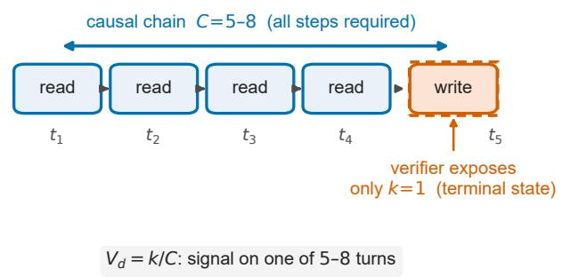

(b) Same terminal advantage Ai, three geometries  
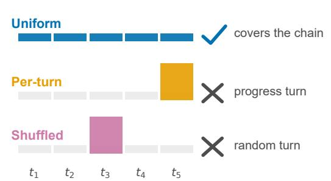  
coverage breadth — not credit location — decides the outcome  
Figure 1: Why coverage, not location, governs credit assignment under terminal verification. (a) A successful rollout is a $C = 5 – 8$ chain of hard-prerequisite tool calls, but a state-transition verifier scores only the terminal write, exposing a single turn (k = 1, so $V _ { d } = k / C$ is 0.12–0.20). (b) The same group-normalized terminal advantage $A _ { i } .$ , redistributed three ways: uniform spreads it over every turn and covers the whole chain, whereas per-turn (progress turns) and shufled (random turns) both concentrate it on a single turn and under-cover the chain. Because a lone spike lands on one of 5–8 causal turns wherever it goes, coverage breadth—not credit location—decides the outcome.

3. In that low- $. V _ { d }$ regime, a controlled isolation (shared-rollout) shows dense-uniform > binary (binary net-harmful) and per-turn concentration harmful—only the credit geometry difers across arms (§3). And it is concentration, not targeting: random-targeted ≈ progress-targeted ≪ uniform, so targeting is second-order and coverage breadth first-order (§4). The coverage mechanism explains why—observable credit collapses to k=1 while success needs the 5–8 step chain—and is algorithm-agnostic (GRPO, advantage-baseline, REINFORCE at matched efective learning rate) (§5).

4. A methodological control for targeting claims. Because changing credit geometry alters concentration and optimization dynamics together, isolating a genuine targeting benefit requires a matched-concentration shufled control that holds coverage breadth fixed and varies only which turns are credited. We use this control throughout and recommend it as a default guard for per-turn credit-assignment claims (§4, §8).

5. Boundary conditions that unify the null regimes under the same mechanism (a capability floor, a resolution/partial-density gate), and reproduction of the efect on a second benchmark (BFCL V3, $V _ { d } \approx 0 . 4 )$ and across model families (a tool-specialized Llama-3.1 agent), which also passes a pre-registered matched-budget breadth sweep: at fixed total credit, performance rises monotonically with chain coverage, and a companion reward-to-go arm on Qwen3-8B reaches full-coverage parity (§6). Uniform redistribution is the strong zero-information default for the C ≫ k regime, the common case for terminal-verifier tool agents.

Roadmap. We first isolate the empirical efect at the measured low- $. V _ { d }$ operating point (§3–§4), then lift it into the verifier-density phase diagram (§5–§5.3) and test its predictions across capability, model family, credit breadth, and a second benchmark (§6).

## 2 Setup

Environment. $\tau ^ { 2 } .$ -bench retail, restricted to its pure database-state tasks (the verifier checks DB field-level changes; no natural-language-judged assertions). Base agent Qwen3-14B (we also report 8B and 4B for the scale analysis). Training is GRPO [16] with LoRA [8] (rank 16; full configuration in Appendix D). BFCL V3 multi-turn [22] provides a second benchmark, and a second $\tau ^ { 2 } .$ -bench domain (telecom) a partial-progress contrast for the resolution gate (§6).

Shared-rollout isolation (the clean comparison). For each seed we collect one batch of base-policy rollouts and train every arm from the same batch with the same optimizer. Two axes are separated. Along the density axis, the binary arm scores each rollout with the coarse $0 / 1$ outcome while the dense arms use the continuous DB-field progress. Along the geometry axis, the dense arms share a single group-normalized terminal advantage $A _ { i }$ and difer only in how it is distributed across turns. The geometry comparison thus isolates credit distribution from every confound (data, exploration, terminal signal, magnitude). This isolation exists only at the first policy update: once training iterates, each arm collects its own data, and any downstream diference conflates credit geometry with data collection. The single-update comparison is therefore the object of study.

Arms. We compare four credit geometries.1 Binary—the conventional sparse $0 / 1$ outcome reward. Uniform—a continuous dense reward (DB-field progress) with the group-normalized advantage assigned to every turn, $a _ { t } \ = \ A _ { i }$ (the standard GRPO allocation). Per-turn—the same $A _ { i }$ redistributed by each turn’s share of positive DB-field progress $\Delta S _ { t }$ , so that $\textstyle \sum _ { t } a _ { t } = A _ { i }$ (progress-targeted concentration). Shufled—the per-turn weights permuted to random turns (random-targeted concentration; same concentration, no targeting information). A global gradientnorm clip of 1.0, saturated in every logged epoch of every arm, equalizes the applied update magnitude across geometries, which therefore difer in update direction, not size. Note that the per-turn arm consumes strictly more verifier information than uniform—it sees where the progress occurred—so the geometry comparison is, if anything, biased toward per-turn.

Metric. Held-out environment-assertion support on the pre-registered gradable subset (primary, continuous) and oficial task success (co-primary, binary); the formal definition, the frozen gradable task list, and the user-simulator protocol are in Appendix E. We report per-seed paired deltas (sign test) and a one-sided per-task Wilcoxon signed-rank test in the pre-registered direction on the held-out gradable subset (95 task–seed pairs for the main comparison). All confirmatory arm comparisons are within-run paired—competing geometries share each seed’s training rollouts and evaluation batch; Appendix B quantifies the between-batch evaluation variability that makes unpaired cross-run comparisons unsafe at this evaluation budget.

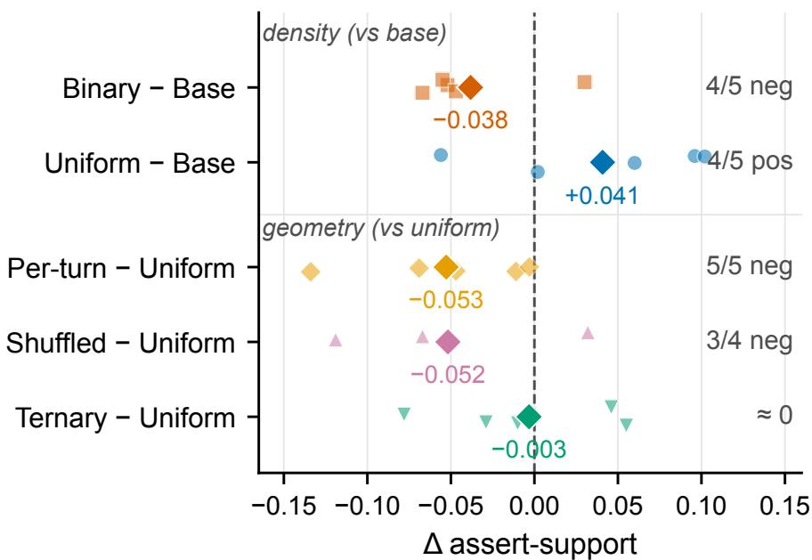  
Figure 2: Credit geometry as paired per-seed contrasts (retail-14B, held-out assert-support; faint markers are per-seed diferences, diamonds means). Binary degrades the untrained base while dense uniform improves it; relative to uniform, concentrated per-turn and shufled are harmful while ternary is indistinguishable. Inference is task-level (one-sided Wilcoxon over 95 task–seed pairs). Concentration is the harm; targeting is second-order.

## 3 Density is necessary but not suficient

Uniform dense beats binary, and binary is net-harmful. The uniform arm exceeds the binary arm by +0.079 on gradable assert-support (sign 4/5 across seeds; one-sided per-task Wilcoxon $p = 0 . 0 0 3$ over the 95 task–seed pairs; seed-then-task hierarchical bootstrap 95% CI $\left[ + 0 . 0 0 9 , + 0 . 1 4 9 \right]$ Appendix B), and by +5.2pp on oficial success. The separation is twofold: relative to the untrained base, the binary reward degrades the policy (4/5 seeds) while the uniform dense reward improves it (4/5 seeds; +0.041 over base, Table 1). The conventional sparse outcome reward is not merely weaker—under matched conditions it actively hurts (Fig. 2).

Resolution is cheap. A ternary discretization of the dense reward (three levels: 0, 0.5, 1) retains 96% of the advantage (+0.076 over binary, 5/5): the gain comes from having any non-degenerate gradient on groups where every rollout otherwise fails, not from fine-grained reward resolution.

But concentrating the dense reward hurts. Redistributing the same terminal advantage onto progress turns (the per-turn arm) underperforms uniform on every seed on assert-support (sign 0/5, mean −0.053) and on oficial task success (mean −0.063, 4/5 seeds; per-seed values in Appendix F), a deficit that persists across the entire trainable dose range (Appendix A) and reproduces in the powered same-batch four-arm comparison on BFCL V3 (−0.036, paired $t = - 2 . 8 0 ; \ S 6 )$ . Density is necessary; how the density is distributed decides whether it helps (Fig. 2). The matched-budget sweep of §6 reproduces this deficit at strictly equal total credit and separates its coverage and scale components on a second benchmark.

Table 1: Held-out gradable assert-support, per seed (retail-14B). Uniform is the reference for ∆. Binary degrades the base while uniform improves it (twofold separation). Per-turn and shufled (both concentrated) are below uniform; ternary ≈ uniform. Shufled is over four seeds; its mean and deltas are computed on those four, where the per-turn mean is 0.499 (hence the +0.014 shufled−per-turn diference in §4, not 0.513 − 0.510). On oficial success the binary–uniform gap is −5.2pp.
<table><tr><td>arm</td><td>s1</td><td>s2</td><td>s3</td><td>S4</td><td>s5</td><td>mean</td><td>∆ base</td><td>∆ unif.</td></tr><tr><td>base (untrained)</td><td>0.597</td><td>0.502</td><td>0.509</td><td>0.506</td><td>0.496</td><td>0.522</td><td>+0.000</td><td>-0.041</td></tr><tr><td>binary outcome</td><td>0.545</td><td>0.447</td><td>0.539</td><td>0.439</td><td>0.449</td><td>0.484</td><td>-0.038</td><td>-0.079</td></tr><tr><td>dense uniform</td><td>0.541</td><td>0.504</td><td>0.605</td><td>0.608</td><td>0.556</td><td>0.563</td><td>+0.041</td><td>+0.000</td></tr><tr><td>dense per-turn</td><td>0.494</td><td>0.493</td><td>0.471</td><td>0.539</td><td>0.553</td><td>0.510</td><td>-0.012</td><td>-0.053</td></tr><tr><td>dense shuffled</td><td>0.488</td><td>0.536</td><td>0.538</td><td>0.489</td><td></td><td>0.513</td><td>-0.016</td><td>-0.052</td></tr><tr><td>dense ternary</td><td>0.587</td><td>0.475</td><td>0.595</td><td>0.530</td><td>0.611</td><td>0.560</td><td>+0.038</td><td>-0.003</td></tr></table>

## 4 It is concentration, not targeting

If per-turn concentration loses because it targets the wrong turns, then targeting random turns should be strictly worse. It is not. The shufled arm (random-targeted) lands within noise of the per-turn arm (progress-targeted)—both well below uniform (shufled − per-turn mean +0.014 on the four shufled seeds, 95% CI [−0.07, +0.10]). This is a null on targeting, not a certified equivalence. But the direction is clear—moving the same concentrated credit to random turns does not make it worse—and the coverage mechanism of §5 explains why: at C ≫ k a single spike covers ∼1 of 5–8 causal turns wherever it lands, so where it lands is second-order and that it is concentrated is the harm. The first-order quantity is coverage breadth. The shufled arm removes exactly one thing—the information about which turns carried progress—while holding the concentration budget fixed; that its removal costs nothing is direct evidence that the per-turn deficit is not a mis-targeting failure that sharper localization could repair. Any scheme that concentrates a fixed advantage budget, however well it chooses the target, therefore inherits the same coverage risk in this regime.

No targeting scheme isolates a robust benefit. As a robustness check on whether any plausible targeting scheme can beat uniform once coverage is held fixed, a wider battery of matchedconcentration, shared-rollout credit geometries on Qwen3-8B (4 seeds) stress-tests the same conclusion: crediting verifier-confirmed gold-relevant read turns, a matched count of random read turns, write turns only, or gold reads only. No variant isolates a robust benefit from which turns receive credit once coverage breadth is held fixed; we report this as directional corroboration (n=4) of the shufled-control result above, because these auxiliary arms were trained and evaluated in separate runs (Appendix B). The powered, within-run-paired version of this control is the pre-registered cross-family breadth sweep of §6, which reproduces the null.

## 5 The coverage account

## 5.1 A synthetic phase boundary

In a controlled multi-turn GRPO toy with known causal structure (C of T turns are causally necessary; a concentration budget covers k turns), we sweep causal sparsity C. Uniform credit is robust across all sparsities. Fixed-budget concentration wins only when it can cover the whole causal set $( C \leq k )$ and loses monotonically as the causal chain outgrows the budget (C > k; Fig. 3b)—a prediction the real-model breadth sweep confirms directly (§6). The crossover at $C \approx k$ is the mechanism: concentration is a coverage bet that pays of only when the causal structure is sparse enough to fit the budget. The boundary is robust to budget size, network capacity, graded (rather than binary) causality, and sequential dependency, and persists under collect-from-policy training in which each arm collects from its own evolving policy. It is algorithm-agnostic: once efective learning rate is matched, uniform wins under GRPO, an advantage-baseline, and REINFORCE—raw cross-algorithm diferences are an efective-LR confound, not a GRPO artifact. The full environment specification is in Appendix C.

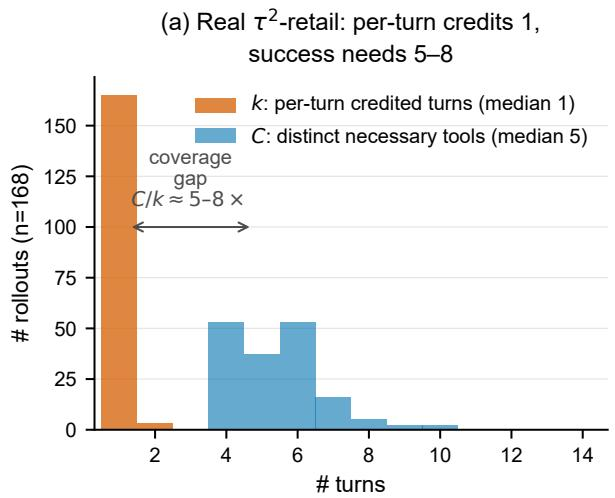

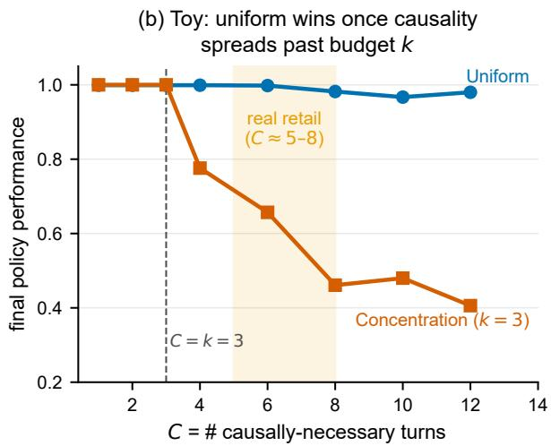  
Figure 3: The coverage gap. (a) Real $\tau ^ { 2 } .$ -bench rollouts: the per-turn credit budget is $k = 1$ (spike on the terminal DB write) while the causal tool chain is $C = 5 { - } 8 ;$ the prerequisite reads receive zero per-turn credit. (b) The synthetic phase boundary: uniform wins if $C > k$ ; the real-retail operating point $( k = 1 , C = 5 { - } 8 )$ sits deep in the shaded $C \gg k$ region.

## 5.2 A real-rollout coverage diagnostic

On real $\tau ^ { 2 } .$ -bench rollouts we measure the two quantities the toy predicts matter. The per-turn credit budget —the participation ratio (efective number of turns carrying the credit signal) of the $\Delta S$ weights—is k = median 1.00: in 98% of rollouts the entire progress signal lands on a single turn, the terminal batched DB write (the 2% multi-turn cases do not move the regime). But success requires a chain of $C = 5 – 8$ tool calls (median 8 actions from 5 distinct tools), whose first members are hard-prerequisite reads—user lookup, order retrieval, product lookup—that change no DB state, and therefore receive zero per-turn credit, yet are physically necessary: an order cannot be exchanged without first retrieving it. This is a hard data dependency, not an inflated count: a static data-flow check confirms that in 100% of successful rollouts the terminal write’s arguments (order, item, and product ids) are values returned by the precursor reads (median 5 reads precede the first write). The write cannot be constructed without them, and its arguments cannot be assembled from the user instruction alone; the chain length is also insensitive to how it is counted (Appendix F). So $C / k = 5 – 8 \times \mathrm { : }$ the observable signal is maximally concentrated exactly where the causal structure is maximally distributed (Fig. 3a).

This explains the targeting null. At $C \gg k$ , a single spike—whether on the progress turn (per-turn) or a random turn (shufled)—covers ∼ 1 of 5–8 causal turns. Which turn it lands on is a second-order choice among equally-incomplete coverings; only uniform covers the chain. This is precisely why shufled ≈ per-turn ≪ uniform.

## 5.3 Verifier information density as the regime coordinate

Is the collapse to $k = 1$ intrinsic to multi-turn credit, or an artifact of the batched terminal verifier? We answer this in the controlled synthetic environment of $\ S 5 . 1$ by adding a second axis, the verifier information density $V _ { d } -$ the fraction of the causal chain whose per-turn correctness the verifier exposes independently. At $V _ { d } \to 0$ the verifier reveals only a terminal aggregate, so any progress signal collapses to a single spike $( k = 1 )$ ; at $V _ { d } = 1$ every causal turn carries its own reward $( k \to C )$ . Real terminal-verifier agents sit near the low end: $k = 1$ over a $C = 5$ –8 chain is $V _ { d } { = } k / C { \approx } 0 . 1 2 – 0 . 2 0$ (we use $V _ { d } \approx 0 . 1 5$ as the representative value). Crucially, $V _ { d }$ and $C$ parameterize diferent subsystems— $V _ { d }$ the verifier’s observation model, C the task’s causal structure; we vary $V _ { d }$ by verifier exposure at fixed C (they couple through the budget k in the toy, but a real streaming verifier raises $V _ { d }$ without changing C). The two credit geometries are matched in total advantage mass per rollout, so they difer only in shape.

Sweeping $V _ { d }$ traces a clean boundary (Fig. 4). On the realistic state-dependent chain—a turn counts only once all prerequisite turns are also correct—the targeted-minus-uniform gap closes monotonically with $V _ { d } \colon ~ - 0 . 4 3 , - 0 . 3 6 , - 0 . 2 7 , - 0 . 1 1 , + 0 . 3 6$ across $V _ { d } = 0 \ldots 1$ (32 paired seeds), crossing zero only at $V _ { d } ^ { * } \approx 0 . 8 1$ . Uniform coverage wins until the verifier exposes roughly four-fifths of the chain. This crossover is not an artifact of one chain length: sweeping $C = 4 { - } 1 0 , V _ { d } ^ { * }$ stays in [0.75, 0.91]—in every case far above where real terminal-verifier agents operate $\left( V _ { d } \approx 0 . 1 5 \right)$ . The same coverage budget is at work as in §5.1—below $V _ { d } ^ { * }$ the verifier exposes too little of the chain for concentration to cover it—but now turned by the verifier’s observation model rather than by chain length, the two being independent knobs. (On independent-turn chains, where uniform is near its ceiling, the crossover comes later, $V _ { d } ^ { * } { \approx } 0 . 9 5 ; \mathrm { F i g . \ 4 a . } )$ The mechanism is the one from $\ S 5 . 1 \colon$ at low $V _ { d }$ the targeted arm can only cover the few turns the verifier exposes (the rest receive zero gradient) while uniform covers the whole chain; the targeted arm’s held-out score climbs from 0.10 to 0.89 purely as its coverage grows, while uniform stays flat at 0.53.

This strengthens the coverage account. Where targeting eventually wins $( V _ { d }  1 )$ it does so because the streaming verifier has already supplied the per-turn coverage signal: targeting is then a conduit for coverage the verifier provides, not a competing principle. The whole surface is one coverage mechanism, with $V _ { d }$ setting how that coverage is best delivered. It also localizes the cause of $k = 1$ : even the state-dependent chain crosses over under a streaming verifier, so $k = 1$ in real $\tau ^ { 2 }$ is a property of the batched verifier, not of multi-turn structure.

Probing the $\mathbf { h i g h } \mathbf { - } V _ { d }$ end on the real model. $\mathrm { O n }$ these tasks the only way to raise $V _ { d }$ at fixed C is to inject oracle knowledge—either exposing gold read-correctness to credit, or injecting the prerequisite target ids that make reads structurally checkable. Neither construction reproduces the toy crossover on Qwen3-8B: even with $V _ { d }$ raised by oracle labels, concentrated credit stays at or below uniform, so at the natural low- ${ \mathrm { . } } V _ { d }$ operating point the uniform $\geq$ concentration ordering holds a fortiori. That both constructions must inject oracle knowledge to move $V _ { d }$ at all is itself the point—the cost the write-fraction ceiling (§5.4) identifies as structural.

## 5.4 The write-fraction ceiling

The need to inject oracle knowledge to move $V _ { d }$ is not specific to $\tau ^ { 2 } \colon$ it is a property of state-based verification. A verifier that scores a trajectory by its efect on world state can attribute correctness only to steps that change state; a read or query returns information but leaves no state delta, so whether it advanced the (a-priori-unknown) goal is invisible to the verifier unless it is supplied an oracle label or a learned judge. The independently checkable, non-oracle fraction of a task’s causal chain is therefore upper-bounded by its write-fraction, with read and exploration steps a structural dead zone:

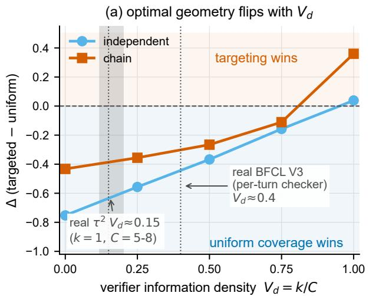

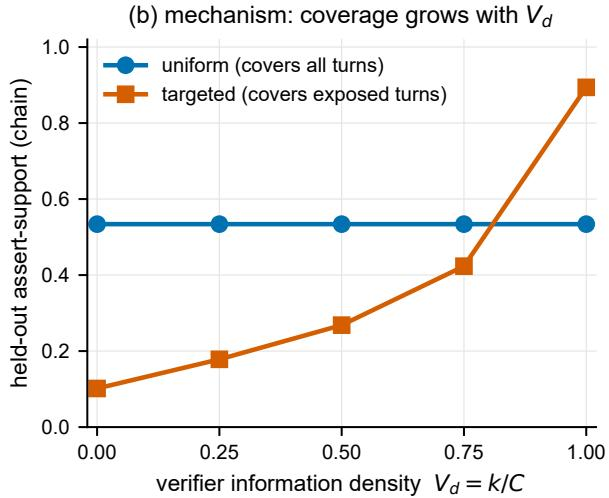  
Figure 4: The relative performance of credit geometries is organized by verifier information density $V _ { d } .$ (a) Targeted−uniform held-out gap vs. $V _ { d }$ (the fraction of the causal chain the verifier exposes independently per turn); uniform coverage wins below the crossover $V _ { d } ^ { * }$ , targeting only above it. Real terminal-verifier agents sit at $V _ { d } \approx 0 . 1 5$ $( k { = } 1 , C { = } 5 { - } 8 )$ , deep in the coverage regime. (b) Mechanism: the targeted arm’s score rises purely as its coverage grows with $V _ { d } ;$ uniform (full coverage) is flat. “Chain” is the realistic state-dependent causal structure (the independent-turn structure, crossover ≈ 0.95, is also shown); 32 paired seeds.

$$
V _ { d } ~ \leq ~ { \mathrm { w r i t e - f r a c t i o n } } \qquad ( { \mathrm { s t a t e - t r a n s i t i o n ~ v e r i f i c r , ~ a b s e n t ~ o r a c l e ~ o r ~ l e a r n c d ~ p e r - s t e p ~ l a b e l s } } ) . \quad ( 1 )
$$

The census of Table 3 shows the ceiling is binding in practice: no widely used multi-turn tool-agent benchmark exposes a naturally high $V _ { d } .$ . The measured maximum is BFCL V3, whose per-turn checker fires only on state-changing turns and reaches $V _ { d } \approx 0 . 4 ;$ the terminal-verifier majority sits at $V _ { d } { \approx } 0 . 1 { - } 0 . 2$ . High- $. V _ { d }$ per-step signal appears only outside multi-turn tool use—in single-turn reasoning with a learned process verifier, or in simulator domains with an authored per-step score— that is, where the per-step label is supplied rather than structurally free. Two consequences follow. First, the coverage regime $( C \gg k )$ is the structurally common case for tool agents, not an artifact of our task selection, so uniform redistribution is their forced zero-information default. Second, the learned and oracle process-reward methods that beat outcome-only training on such tasks are best read not as free streaming verifiers but as paying this ceiling’s price—supplying the missing per-step signal (§7).

## 5.5 Prescription

For terminal-state verifiers the observable credit signal structurally collapses to a final-write spike $( k = 1 )$ , while success depends on a 5–8 step prerequisite chain. In this $C \gg k$ regime uniform redistribution is the zero-information coverage strategy that no fixed-budget concentration beats:

a strong default to reach for before adding learned per-turn signal, not a baseline to improve on. Learned calibration that recovers the causal chain is the complementary lever (§7). The verifier-density boundary (§5.3) makes the condition concrete: concentration is worth its coverage risk only once the verifier exposes most of the causal chain (V near 1), which terminal-state verifiers structurally do not—so for the dominant paradigm, uniform coverage remains the default.

## 6 Validation and boundary conditions

The mechanism predicts where the efect should hold, where it should vanish, and how it should scale; we confirm all three—and that the efect reproduces on a second benchmark, with structural ingredients invariant across model families. One mechanism organizes the positives, the scaling, and the nulls into a single regime map (Table 2).
<table><tr><td>Prediction</td><td>Regime</td><td>Observed (anchors)</td></tr><tr><td>uniform &gt; binary</td><td>above floor,  $C \gg k$ </td><td>+0.079 (4/5; one-sided Wilcoxon p=0.003, 95 pairs; 14B); +0.048,</td></tr><tr><td>per-turn &lt; uniform</td><td>above floor,  $C \gg k$ </td><td>3/3 (8B) 5/5 (14B); 2/3 (8B)</td></tr><tr><td>shuffled ≈ per-turn</td><td>above floor</td><td>CI [−0.07, +0.10] (τ2); ∆= + 0.002 (BFCL)</td></tr><tr><td>k=1, C=5-8</td><td>terminal verifier</td><td>median k=1, C=5-8 (Qwen3 +</td></tr><tr><td>null (no usable gradient)</td><td>below floor / thin signal</td><td>Llama-3.1) null (4B, Llama-3.1, telecom)</td></tr><tr><td>concentration &lt; uniform,  $V _ { d } < V _ { d } ^ { * }$ </td><td>2nd benchmark,  $V _ { d } { \approx } 0 . 4$ </td><td>per-turn -0.036 (6/8), shuffled -0.034 (8/8), 8 seeds (BFCL)</td></tr><tr><td>same effect, cross-family</td><td>non-Qwen, above floor</td><td>−0.048, t= − 6.54, CI [-0.063, -0.033], 32 seeds</td></tr><tr><td></td><td>coverage widens ⇒ deficit shrinks matched budget, above floor</td><td>(ToolACE) −0.048 (k=1) → −0.017 (k≈3) → +0.010 (all calls) vs. full coverage; both steps p&lt;0.01 (20 seeds,</td></tr></table>

Table 2: One coverage mechanism predicts the positives, the scaling, and the nulls. The structural ingredients (k=1, C=5–8) and the below-floor null both reproduce across model families; the credit-geometry efect is measured within the above-floor Qwen3 family and reproduced across family on ToolACE-2-8B (BFCL V3, last row). The BFCL rows are within-run paired same-batch comparisons (§6); the ToolACE row pools the pre-registered 8-seed main set, 4-seed replication, and independent 20-seed replication (32 seeds); the breadth row is the pre-registered matched-budget sweep on the same frozen rollouts (20 seeds; Appendix G). Seed counts are fractions of seeds satisfying the prediction.

Capability floor. At 4B the comparison is null—but the diagnostic shows why: the 4B agent completes the prerequisite chain in only 24% of rollouts (vs. ∼ 70% at 14B). With too few completed chains, no credit geometry has anything to cover. The floor is a completion limit, not a shortened chain: the task-required chain is unchanged, and Fig. 5b plots the chain each agent actually traverses.

Scale reproduction (within Qwen3). Above the floor the efect reproduces and scales with capability: dense > binary is +0.048 at 8B (3/3) and +0.079 at 14B; per-turn − uniform is −0.050 at 8B (2/3) and −0.053 at 14B. Three scale anchors (4B floor / 8B / 14B) rule out a 14B-specific artifact (4B and 14B plotted in Fig. 5; 8B in text).

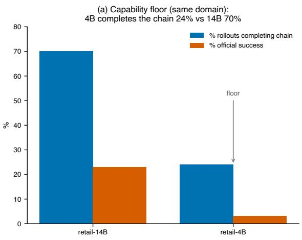

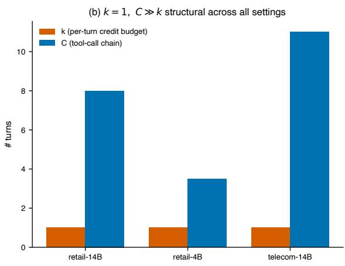  
Figure 5: Boundary conditions. (a) Capability floor: 14B completes the prerequisite chain far more often than 4B. (b) The k = 1, C ≫ k structure holds across retail-14B, retail-4B, and telecom-14B.

Cross-family structural invariance (and a predicted null). The regime’s structural ingredients are task-defined, not Qwen-specific. On Llama-3.1-8B—an independently pretrained family—the same retail tasks traverse a causal chain of the same length (C = 5–8; median 6 distinct tools, 7 on the successful rollout), and the progress signal reaching the terminal write again collapses to k = 1. Llama is genuinely doing tool use (63% of its turns issue tool calls), so this is a structural measurement, not a parsing artifact. The credit-geometry efect itself is not identifiable on Llama: it sits below this benchmark’s capability floor (2% base success, comparable to the below-floor Qwen3-4B; Fig. 5a)—consistent with public τ-bench leaderboard results [23], where non-Qwen agents of this class score in the single digits—so its training groups are near-uniformly zero-variance. Its failures trace to weak grounding: only 50% of its terminal-write arguments come from its precursor reads (vs. 100% for the above-floor Qwen agent), i.e. it traverses the chain but does not reliably consume it. The regime $( k = 1 , C \gg k )$ is thus cross-family. The absent efect is itself a prediction of the coverage account, not a failed replication: below the floor, too few rollouts complete the chain for any credit geometry to have a gradient to exploit, so the mechanism correctly anticipates both where the efect appears (above-floor Qwen3) and where it vanishes (below-floor Llama-3.1 and 4B). Scale alone does not fix this grounding deficit: Llama-3.3-70B scores 0/32 on the same tasks with the same traverses-but-does-not-consume signature, despite well-formed tool calls on 81% of its rollouts. The above-floor cross-family confirmation of the credit-geometry efect comes on the second benchmark: on BFCL V3, where a tool-specialized Llama-3.1 agent clears the floor, concentration again underperforms uniform (below). (On τ2-bench itself, no open non-Qwen family we tested clears the floor.)

Resolution gate. In the telecom domain, where the dense signal’s intermediate material is too thin to separate arms, the comparison is null. This is the second axis—signal density—gating the visibility of the coverage mechanism. The mechanism itself $( k = 1 , C \gg k )$ holds structurally across all three settings: retail-14B, retail-4B, and telecom-14B.

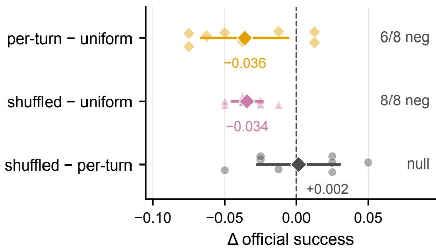  
Figure 6: Second-benchmark reproduction on BFCL V3 (8 paired seeds; faint markers are per-seed diferences, diamonds means with paired 95% CIs). Per-turn (checker-visible) and shufled are both harmful relative to uniform, while the direct shufled−per-turn contrast is null, reproducing the targeting null—concentration is the harm, targeting second-order, exactly as on $\tau ^ { 2 }$ . All arms share each seed’s training rollouts and a single fresh evaluation batch (Appendix B).

Second-benchmark reproduction (BFCL). Finally, we test the coverage prediction outside $\tau ^ { 2 } .$ -bench entirely. BFCL V3 multi-turn [22] has a state-based checker that verifies the backend state after every turn—a natively per-turn, non-oracle verifier. Measuring its structure shows that even this checker exposes only the state-changing steps, a median of 2 of a 5–6-step tool chain $( V _ { d } \approx 0 . 4 )$ well below the synthetic crossover $V _ { d } ^ { * } \approx 0 . 8 ~ ( \ S 5 . 3 ) \ -$ —so the coverage account predicts uniform should win here too, and it does—and the full §4 targeting-falsification structure reproduces with it. In a same-batch four-arm comparison (8 seeds), restricting the shared-rollout advantage to the checker-visible steps (per-turn concentration) underperforms spreading it uniformly across all turns (the same uniform geometry as on $\tau ^ { 2 } )$ on held-out oficial success: $\Delta \mathfrak { e }$ (per-turn − uniform) = −0.036 (paired $t = - 2 . 8 0 , p = 0 . 0 2 7 ; 6 / 8$ seeds negative; a continuous per-step support metric trends the same way). Redistributing the same concentrated credit onto random turns is equally harmful— $\Delta ( \mathrm { s h u f f e d - u n i f o r m } ) = - 0 . 0 3 4 \ ( 8 / 8 $ seeds negative, $t = - 7 . 5 , p < 0 . 0 0 1 )$ —and shufled minus per-turn is +0.002, with its 95% interval contained within ±0.031, below the concentration deficit itself: the same targeting null as on $\tau ^ { 2 }$ , now on a second benchmark with a natively per-turn verifier (Fig. 6). The comparison is within-run paired: all arms share each seed’s training rollouts and the same fresh evaluation batch, so between-batch evaluation drift cancels in the diference (Appendix B). The reproduction also carries a descriptive fact that does not depend on the RL outcome: even natively streaming state verification leaves the majority of the causal chain unobserved, placing a second benchmark in the coverage regime—and there, as on $\tau ^ { 2 }$ , uniform coverage wins.

Cross-family reproduction of the efect (BFCL). Having reproduced the efect on a second benchmark within Qwen3, we ask whether it is confined to Qwen3 at all. We repeat the sharedrollout uniform-vs-concentrated comparison on ToolACE-2-8B [11], a tool-specialized model in the independently pretrained Llama-3.1 family (38.4% BFCL V3 multi-turn oficial), which satisfies the same pre-registered eligibility criteria as the Qwen3 runs: valid tool-call parsing, training above the variance floor, and update dynamics matched to $\mathrm { Q w e n 3 . ^ { 2 } }$ Concentrating credit on the checker-visible steps again underperforms uniform spreading. The pre-registered 8-seed main set is negative on $7 / 8$ seeds (∆(concentrated−uniform) = −0.034, t = −2.20)—a magnitude matching the within-Qwen3 BFCL efect, though its 95% CI narrowly includes zero $( [ - 0 . 0 7 1 , + 0 . 0 0 3 ] )$ . Following the pre-registered analysis plan we then ran a 4-seed replication, which returned $4 / 4$ negative $( \Delta = - 0 . 0 4 4 , t = - 2 . 6 5 )$ , and a further pre-registered 20-seed replication that is significant on its own (∆ = −0.054, t = −5.73, 95% CI [−0.073, −0.034]; 18/20 negative). The pooled 32-seed estimate is ∆ = −0.048 (t = −6.54, 95% CI [−0.063, −0.033]; 29/32 negative). We report the main set, each replication, and the pooled estimate separately, as pre-registered. An above-floor non-Qwen agent thus shows the same concentration-underperforms-uniform result: the credit-geometry efect is not confined to a single model family.

Breadth dose–response. The coverage account makes a finer prediction than a two-point contrast: at a fixed total credit budget, performance should rise monotonically with the fraction of the chain covered. A pre-registered five-arm sweep on the same frozen ToolACE rollouts confirms it (Fig. 7; 20 seeds; oficial success; all arms share each seed’s training batch and are evaluated in one common batch per seed; full table and protocol in Appendix G). Holding $\textstyle \sum _ { t } | a _ { t } | = | A _ { i } |$ fixed, concentrating the advantage on a single turn costs −0.048 relative to spreading it over all turns $( a _ { t } = A _ { i } / n ; t = - 7 . 8 4 ; 1 8 / 2 0$ negative); widening to the checker-visible steps recovers +0.031 $( t = 3 . 1 2 )$ , and widening further to every tool call recovers another +0.027 (t = 3.05), reaching parity with full coverage (+0.010, 95% CI [−0.007, +0.027]). The targeting null reproduces inside the sweep: shufling the checker-visible credit onto random turns shifts it by a statistically indistinguishable +0.014 (90% CI within ±0.037) while both arms stay below uniform. Doubling the concentrated arm’s learning rate—driving its post-update KL two orders of magnitude above uniform’s—still leaves it −0.024 below uniform (t = −2.70). Coverage and scale decompose cleanly: breadth accounts for the ladder above, and the standard un-normalized allocation contributes a further +0.033 over the all-turns-normalized variant (t = 3.08)—full chain coverage is necessary, and the standard terminal advantage completes the gain.

Reward-to-go restores prefix coverage. The account also makes a prediction about the classical remedy for delayed credit: reward-to-go redistribution should succeed because it restores prefix coverage, not because it targets better. With a purely terminal reward, per-turn returns-to-go are constant across the trajectory—the classical estimator already is the uniform allocation in this regime; concentration arises only when an intermediate progress signal invites it. A pre-registered reward-to-go arm built from the intermediate progress signal, on the BFCL Qwen3-8B rollouts (5 seeds, same frozen-batch, common-batch protocol), confirms the prediction: reward-to-go lands at parity with full coverage (+0.025 vs. the normalized all-turns arm, 95% CI [−0.019, +0.069]) and above checker-visible concentration (+0.045, CI $[ + 0 . 0 0 3 , + 0 . 0 8 7 ]$ ; Appendix G).

The coverage regime is the common case. BFCL is not an outlier. Table 3 surveys the verifier structures of widely used agentic-RL benchmarks: measured $V _ { d }$ for the two we measure directly (this work), and the verifier’s structural type elsewhere. Terminal-state verification predominates—for such verifiers, the collapse of observable per-turn progress to the final step (k=1) is an analytica property of the reward code, not an empirical parameter—and the two directly measured points, $\tau ^ { 2 } \mathrm { { ^ , } s }$ terminal DB check $\left( V _ { d } \approx 0 . 1 5 \right)$ and BFCL V3’s natively per-turn state checker $( V _ { d } \approx 0 . 4 )$ , both fall well below the crossover $V _ { d } ^ { * } \approx 0 . 8$ . Even ToolSandbox, the intermediate-milestone exception, exposes only part of the chain.

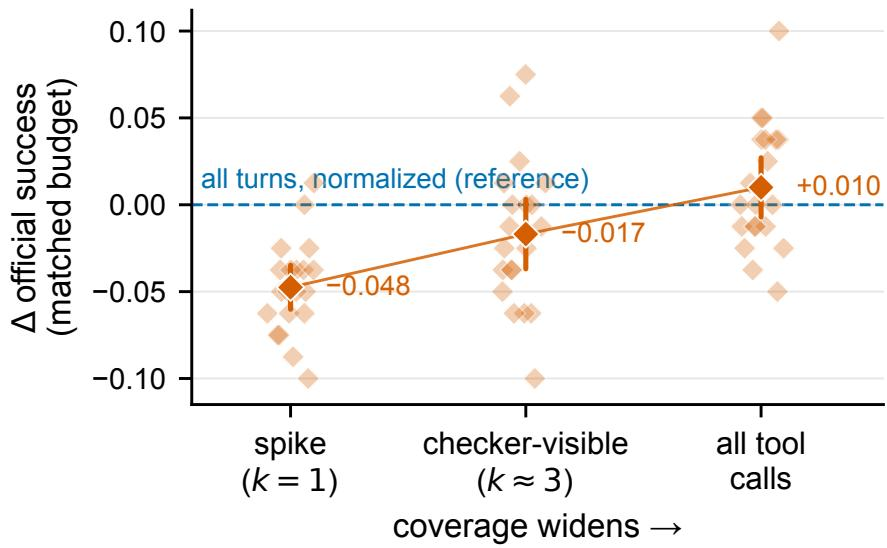  
Figure 7: Matched-budget coverage dose–response on the frozen ToolACE rollouts (20 seeds; oficial success). Coverage widens left to right at fixed total credit $\textstyle \sum _ { t } | a _ { t } | = | A _ { i } | ;$ ; faint markers are per-seed diferences against the all-turns-normalized reference (dashed line), diamonds means with paired 95% CIs. The deficit shrinks monotonically and vanishes at full chain coverage; adjacent steps are significant at $p < 0 . 0 1$ (Appendix G).

## 7 Related work

Adding intermediate signal. Turn-level reward methods, turn-level critics, and learned per-step calibration [13, 20, 24, 27, 28] add new intermediate supervision—a learned per-turn signal, in the tradition of process supervision [10]. Our harmful arm is a naive structural concentration (progress-derived $\Delta S )$ with zero new information, and our coverage account predicts exactly when such methods help: a learned signal wins to the extent it restores coverage of the causal chain that the structural signal collapses $\scriptstyle ( k = 1 )$ . In the language of ${ \ S } 5 . 3 ,$ such methods raise an efective, datadriven $V _ { d } { - } \mathrm { a }$ learned model recovering per-turn signal, subject to its own bias and the localization risk below—which is distinct from the structural $V _ { d }$ swept in ${ \ S } 5 . 3 $ . Their gains over outcome-only baselines are thus compatible with the $\mathrm { h i g h } \scriptscriptstyle { - } V _ { d }$ prediction. We characterize the coverage gap such methods must close, and the $C \gg k$ regime in which zero-information uniform spreading is already a strong default. We further note that a learned signal that localizes credit onto a few turns inherits the same coverage risk our structural concentration arms expose: localization is unreliable exactly in the $C \gg k$ regime that terminal-verifier agents occupy. Structural step-level schemes [5] construct fine-grained per-step advantages from repeated states without new supervision; our account predicts that their benefit tracks the chain coverage the step-level signal restores, and the matched-concentration shufled control is the guard that separates coverage from targeting in any fixed-budget redistribution. Classical credit assignment—potential-based shaping [14], return decomposition [2], and hindsight credit assignment [7]—reshapes where credit lands; at $C \gg k .$ however, coverage breadth dominates that location. Reward richness. Tool-use reward shaping and the sparse-to-dense result [15, 17] establish that richer feedback can help; our contribution is orthogonal, isolating the geometry of how the same terminal advantage is distributed. Token-level uniformity. Sequence-level control of token-level ratio variance within one response [25] is a mechanistic precedent at a diferent granularity; our contribution is the multi-turn rollout coverage account and its phase boundary. Coverage over credit routing. A recent report reaches a parallel conclusion at the module level [6]: routing a fixed zeroth-order perturbation budget across the modules of a frozen tool-using LLM agent by trajectory-level failure credit does not improve on-pool sample eficiency over uniform allocation, the loss under credit-routed schedules scales with how often the bottleneck module is starved of updates, and a pre-registered credit-free coverage floor removes the detected harm. That setting routes a perturbation budget across parameters under gradient-free optimization rather than a terminal advantage across turns under policy gradients; the shared conclusion—uniform coverage is the default that credit-routed concentration must beat—is complementary to ours.

<table><tr><td>Benchmark</td><td>Verifier</td><td>Checked</td><td> $V _ { d }$ </td></tr><tr><td>τ2-bench [3]</td><td>final DB state</td><td>terminal</td><td>0.12–0.20 (measured)</td></tr><tr><td>BFCL V3 multi-turn [22]</td><td>backend state per turn (writes only)</td><td>per-turn</td><td>≈0.4 (measured)</td></tr><tr><td>SWE-bench [9]</td><td>post-patch test suite</td><td>terminal</td><td>k=1 (from scoring code)</td></tr><tr><td>WebArena [26]</td><td>final page/URL state (state-scored tasks)</td><td>terminal</td><td>k=1 (from scoring code)</td></tr><tr><td>OSWorld [21]</td><td>final system state</td><td>terminal</td><td>k=1 (from scoring code)</td></tr><tr><td>AppWorld [18]</td><td>final-state unit tests</td><td>terminal</td><td>low (structural)</td></tr><tr><td>ToolSandbox [12]</td><td>trajectory milestones</td><td>intermediate</td><td>partial</td></tr><tr><td>ScienceWorld [19]</td><td>simulator score per step</td><td>per-step</td><td>high (non-tool domain)</td></tr></table>

Table 3: Verifier structures across agentic benchmarks. “low (structural)” denotes terminal-state verification, which collapses the observable per-turn signal to k=1 (§5.2); measured values are from this work. For SWE-bench, WebArena (state-scored task types), and OSWorld, k=1—and hence $V _ { d } = 1 / C \leq$ write-fraction (Eq. 1)—follows analytically from the oficial scoring harnesses, which invoke the task verifier once on the terminal state (pinned commits: SWE-bench f7bbbb2, run\_evaluation.py; WebArena dce0468, evaluators.py; OSWorld 7a17d3a, desktop\_env.py). The coverage regime is the common case.

## 8 Limitations

The mechanism is characterized for terminal-verifier tool agents in the C ≫ k regime—the common case for DB/state-verified agents, above the capability floor. The structural ingredients (k = 1 with $C \gg k ; C = 5 { - } 8$ on retail) are measured across two model families (Qwen3 and Llama-3.1) and three $\tau ^ { 2 }$ task settings (retail-14B, retail-4B, telecom-14B), and the phase boundary is established in a domain- and algorithm-agnostic toy, so the account is not retail- or Qwen-specific. The credit geometry efect is confirmed across model families on BFCL V3—a tool-specialized Llama-3.1 agent (ToolACE-2-8B) reproduces concentration < uniform above the floor and passes the matched-budget breadth sweep (§6)—but on $\tau ^ { 2 } .$ -bench itself it is observed only within Qwen3, the only open family of this scale class that cleared that benchmark’s floor in our tests.

Our real-model comparisons isolate the first policy update; longer-horizon training dynamics are outside the scope of this study. The toy—where concentration wins at $C \leq k$ despite higher per-update variance—rules out per-token gradient variance (which uniform spreading also minimizes)

as the sole explanation, and the matched-budget sweep separates coverage from update scale on the real model (§6). The Qwen3-8B battery (§4) is reported directionally, its arms having been trained in separate runs (Appendix B).

This also motivates a methodological recommendation: because changing credit geometry moves concentration and optimization dynamics together, any claim that a learned or oracle per-turn signal helps by better localization (rather than by broadening coverage or changing efective step size) should be tested against a matched-concentration shufled control; absent that control, reported per-turn gains are confounded.

## A The per-turn deficit holds across the trainable dose range

The geometry result (per-turn < uniform) could in principle be specific to the single optimizer dose used in the main experiments, or to a diference in efective update magnitude between geometries. It is not. We swept the update strength across the full range in which the policy remains trainable (Table 4). At the gentle main-experiment dose the per-turn arm trails uniform by 0.053 (5 seeds). Pushing the efective dose 40× (single-epoch, so the importance ratio stays near one and training cannot diverge in-step) over-steps the policy—both arms degrade—and the per-turn deficit widens to 0.20 (paired bootstrap $\textrm { C I } [ - 0 . 3 3 , - 0 . 0 2 ]$ on the seed that does not fully collapse). Raising the learning rate under two-epoch updates instead diverges (the asymmetric treatment of negativeadvantage turns across epochs blows up the of-policy ratio), bounding high-dose stability under multi-epoch updates. Across every trainable dose, per-turn $\leq$ uniform.

<table><tr><td>Dose regime</td><td>rel. LR</td><td>stable?</td><td>∆(per-turn − uniform)</td><td>seeds</td></tr><tr><td>Gentle (main)</td><td>1×</td><td>yes</td><td>-0.053</td><td>5</td></tr><tr><td>Aggressive (single-epoch)</td><td>40×</td><td></td><td>trains, policy over-steps -0.20 (CI [−0.33, −0.02])</td><td>2</td></tr><tr><td>High-LR, two-epoch</td><td>10-40×</td><td>diverges</td><td>(untrainable)</td><td>2</td></tr></table>

Table 4: Per-turn concentration underperforms uniform across the entire trainable dose range. ∆ on held-out assert-support; negative = per-turn worse.

## B Between-batch evaluation variability, and why all comparisons are within-run paired

Our held-out evaluation samples 4 rollouts per task over 19 tasks. To quantify the run-to-run variability of this estimator we re-evaluated the same four trained uniform adapters on the same task set in a fresh evaluation batch under an identical configuration (same split, sampling, serving stack, and user simulator). Per-seed assert-support moved by +0.061, −0.042, +0.112, and +0.159 between batches, and a third re-evaluation of the same adapters spans a range of about 0.07. The same instability recurs on BFCL: re-evaluating the same trained adapters in a fresh batch shifts oficial success by a mean of −0.009 over a range of $[ - 0 . 0 5 , + 0 . 0 4 ]$ across seeds—itself the size of the credit-geometry efect we measure there, which is exactly why the BFCL arms (including the shufled control) are compared within-run paired. These measurements motivate our reporting rule: confirmatory numeric arm comparisons use a within-run paired design—competing credit geometries share the same training rollouts and are evaluated on identical task instances in the same batch, so batch-level environment and simulator noise afects both arms equally and cancels in the paired diference (this holds for the main $\tau ^ { 2 }$ arms, the $V _ { d }$ arms, and the BFCL reproduction). Inference likewise respects the seed hierarchy: for uniform − binary, a paired hierarchical bootstrap that first resamples the five seeds and then the 19 paired tasks within each selected seed gives a mean diference of +0.0789 with percentile 95% CI [+0.0085, +0.1492] (20,000 replicates, fixed random seed). Auxiliary arms trained and evaluated in separate runs (the gold/random/write/read battery of $\ S 4 )$ are reported directionally, not as efect-fraction estimates. A matched-batch paired design is the inexpensive guard we recommend for per-turn credit-assignment comparisons at small evaluation budgets.

## C Synthetic environment specification

The controlled environment of §5.1 and §5.3 is a T-turn episodic task with known causal structure, small enough to sweep exhaustively. Task. Each episode has T=12 turns (T=24, 48 in the horizon sweep); turn t presents a fixed random unit-norm feature $\phi _ { t } \in \mathbb { R } ^ { 8 }$ and the policy picks one of K actions (K=5; K=10 in the $V _ { d }$ sweep, which keeps the uniform arm of its performance ceiling so the crossover location is visible). A hidden subset of C turns is causally necessary, each with one designated correct action. Under the independent structure the return is the fraction of causal turns answered correctly; under the chain structure a causal turn counts only if all earlier causal turns are also correct, mirroring the prerequisite reads of §5.2; a graded variant replaces the binary causal set with per-turn relevance weights. Policy and update. The policy is a two-layer MLP (hidden width 16, parameters shared across turns) mapping $\phi _ { t }$ to a softmax over actions. Each update samples a group of $G { = } 2 4$ rollouts, computes the group-normalized terminal advantage $A _ { i }$ (GRPO), distributes it across turns according to the arm, and applies a policy-gradient step; training runs 400 steps at learning rate 0.6 under a global gradient-norm clip of 1.0, which matches the efective step size across arms and algorithms. The algorithm-agnostic check replaces the group normalization with a batch-mean baseline and with plain REINFORCE at the same learning rate and clip. Arms. Uniform spreads $A _ { i } / T$ over all turns (the budget-normalized counterpart of the real-model sweep’s all-turns arm). Concentrated places the credit on a budget of k turns (k=3 in the C-sweep over $C \in \{ 1 , 2 , 3 , 4 , 6 , 8 , 1 0 , 1 2 \} )$ ; in the $V _ { d }$ sweep the targeted arm receives an independent group-normalized per-turn signal on the verifier-exposed causal turns plus the terminal residual on the final causal turn. Every arm is rescaled per rollout so that its total absolute credit equals $| A _ { i } |$ arms difer only in credit shape, never in magnitude. Scale. The C-sweep uses 6–12 paired seeds per point; the $V _ { d }$ sweep uses 32 paired seeds; $k _ { \mathrm { e f f } }$ is the participation ratio of the mean per-turn absolute credit. Re-running the $V _ { d }$ sweep at hidden widths 8 and 32 and action counts $K { = } 5$ and K=20 leaves the crossover within [0.79, 0.88] (baseline 0.81).

## D Real-model training configuration

All real-model comparisons use the same GRPO/LoRA stack (harness names in the footnote of §2); per-benchmark settings are below. Within a benchmark, arms difer only in the reward argument. The $\tau ^ { 2 }$ experiments run on single data-center GPUs of the NVIDIA H100/H20 class (94–96 GB); the BFCL and ToolACE experiments, including the breadth and reward-to-go sweeps, run on single 96 GB NVIDIA RTX PRO 6000 workstation GPUs. vLLM serves rollout collection and evaluation and PyTorch/PEFT performs LoRA training on Linux (libraries listed in the released harness); each (arm, seed) chain fits on one GPU. PPO-ratio clipping is essentially inactive throughout: the clipped-token fraction stays below 1% in every $\tau ^ { 2 }$ and BFCL arm and below 2.5% on ToolACE, with no arm separation. At the main dose the two $\tau ^ { 2 }$ geometries also displace the policy equally: per-seed post-update KL from the base policy lies in the same $5 \times 1 0 ^ { - 4 } – 1 . 1 \times 1 0 ^ { - 3 }$ band for uniform and per-turn. Group-level trainability separates the reward types: under binary, 0.50–0.75 of $\tau ^ { 2 }$ training groups have nonzero advantage variance (mean 0.65), versus 0.75–1.00 (mean 0.90) under the dense arms—quantifying the non-degenerate group signal of $\ S 3$

<table><tr><td></td><td> $\tau ^ { 2 } .$  bench</td><td>BFCL V3 multi-turn</td></tr><tr><td>Optimizer</td><td>GRPO (clip 0.2)</td><td>GRPO (clip 0.2)</td></tr><tr><td>Gradient-norm clip</td><td>1.0</td><td>1.0</td></tr><tr><td>LoRA rank</td><td>16</td><td>16</td></tr><tr><td>Learning rate</td><td> $5 \times 1 0 ^ { - 5 }$ </td><td> $5 \times 1 0 ^ { - 5 }$ </td></tr><tr><td>KL coefficient</td><td> $1 0 ^ { - 3 }$ </td><td> $6 \times 1 0 ^ { - 4 }$ </td></tr><tr><td>Epochs per update</td><td>2</td><td>2</td></tr><tr><td>Training batch</td><td>8 tasks × group 6</td><td>8 tasks × group 4</td></tr><tr><td>Max sequence length (train)</td><td>8,000</td><td>8,000</td></tr><tr><td>Held-out evaluation</td><td>19 gradable tasks  $\times ~ 4$ </td><td>20 tasks  $\times ~ 4$ </td></tr><tr><td>Sampling temperature (eval)</td><td>0.7</td><td>0.7</td></tr></table>

Table 5: Training and evaluation configuration for the real-model comparisons.

## E Metric definition and evaluation protocol

Formal definition of held-out assert-support. For task $q ,$ let $d _ { q } ^ { 0 } , d _ { q } ^ { \star } .$ , and $\hat { d } _ { s a q j }$ be the flattened initial, gold-replayed, and predicted terminal database states for seed $s ,$ arm a, and rollout $j$ . Define the gold-modified existing-field set

$$
M _ { q } = \{ k \in \mathrm { d o m } ( d _ { q } ^ { 0 } ) \cap \mathrm { d o m } ( d _ { q } ^ { \star } ) : d _ { q } ^ { 0 } ( k ) \neq d _ { q } ^ { \star } ( k ) \} .
$$

The rollout score is

$$
S _ { s a q j } = \frac { 1 } { | M _ { q } | } \sum _ { k \in M _ { q } } \mathbf { 1 } \bigl [ \hat { d } _ { s a q j } ( k ) = d _ { q } ^ { \star } ( k ) \bigr ] ,
$$

where a missing predicted key is read as its initial value $d _ { q } ^ { 0 } ( k )$ ; if $M _ { q }$ is empty the evaluator falls back to the oficial binary outcome. This evaluation quantity is distinct from the training-time per-turn support, whose target set also includes gold-created keys. For each task we average its four rollout scores, then take an unweighted macro-average over the 19 frozen gradable tasks; reported contrasts average within-seed diferences of these task-macro means, and no rollout or task–seed cell is treated as an independent seed.

Frozen gradable subset. The pre-results task-property rule is $\left| G _ { q } \right| \geq 2 .$ , where $G _ { q }$ counts all gold DB changes including created fields. It selects exactly the held-out task IDs 1, 9, 11, 22, 30, 49, 56, 73, 74, 75, 81, 85, 86, 90, 91, 93, 94, 98, and 100. Oficial task success is computed over all 20 held-out tasks; assert-support over the 19 gradable ones.

User environment and decoding. In the $\tau ^ { 2 }$ campaign the user simulator is the fixed base Qwen3-14B served from the same local vLLM endpoint as the evaluated agent, with temperature 0.5, at most 512 generated tokens per user turn, and thinking disabled; evaluation seeds also seed the serving stack. The BFCL campaign has no generative user simulator: each user turn is the benchmark’s fixed multi-turn prompt, and the evaluated Qwen3-8B agent samples at temperature 0.7 with at most 512 tokens.

## F Additional coverage and targeting diagnostics

The causal-chain length is insensitive to its definition. Table 6 recomputes C under three definitions—every executed tool call, distinct executed tools, and the data-flow ancestors of the terminal write (precursor reads plus the write)—on the retained raw-trace archive of oficial-success $\tau ^ { 2 } .$ -retail rollouts. All three plug-in $V _ { d }$ values are at most 0.167, consistent with the main-text diagnostic range $( C = 5  – 8 ; V _ { d } = 0 . 1 2 – 0 . 2 0 )$ and roughly fivefold below the synthetic crossover.

On the same archive, 72 of 76 unique identifiers consumed by the terminal writes (94.7%) do not appear in the user instruction, so the write’s arguments cannot be assembled from the instruction alone.
<table><tr><td>Definition of C</td><td>Median [IQR]</td><td> $V _ { d }$ </td></tr><tr><td>Executed tool calls</td><td>8 [6, 11.25]</td><td>0.125</td></tr><tr><td>Distinct executed tools</td><td>6 [4.75, 6.25]</td><td>0.167</td></tr><tr><td>Provenance ancestors</td><td>6 [3.75, 7.25]</td><td>0.167</td></tr></table>

Table 6: Sensitivity of the causal-chain length C to its definition (16 oficial-success rollouts from the retained raw-trace archive; $V _ { d }$ is the plug-in ratio with measured median $k _ { \mathrm { e f f } } = 1 . 0 )$ . The low-density diagnosis does not depend on how C is counted.

The geometry deficit holds on oficial task success. The main-text geometry result uses heldout gradable assert-support; it reproduces on oficial task success, the deployed metric. Across the five retail-14B seeds oficial success is $0 . 4 1 / 0 . 3 4 / 0 . 4 4 / 0 . 4 3 / 0 . 4 0$ for uniform and 0.36/0.34/0.31/0.33/0.36 for per-turn (Table 7); the paired diference per-turn − uniform is −0.063 (paired t = −2.80, 4/5 negative with one tie), the same sign and comparable magnitude as the assert-support deficit. Concentrating the terminal advantage on progress turns underperforms uniform on the metric practitioners optimize, not only on the proxy.

<table><tr><td>arm</td><td>s1</td><td>s2</td><td>s3</td><td>S4</td><td>s5</td><td>mean</td></tr><tr><td>base (untrained)</td><td>0.41</td><td>0.34</td><td>0.38</td><td>0.36</td><td>0.35</td><td>0.367</td></tr><tr><td>uniform</td><td>0.41</td><td>0.34</td><td>0.44</td><td>0.43</td><td>0.40</td><td>0.403</td></tr><tr><td>per-turn</td><td>0.36</td><td>0.34</td><td>0.31</td><td>0.33</td><td>0.36</td><td>0.340</td></tr><tr><td>∆ (per-turn − uniform)</td><td>-0.05</td><td>0.00</td><td>-0.13</td><td>-0.10</td><td>-0.04</td><td>-0.063</td></tr></table>

Table 7: Per-seed oficial task success on $\tau ^ { 2 } .$ -bench retail-14B (held-out 20 tasks). The geometry deficit reproduces on oficial success: per-turn − uniform = −0.063 (paired t = −2.80, 4/5 negative, one tie), matching the assert-support result on the deployed metric. The untrained base is evaluated in the same batches as the trained arms: uniform gains +3.6pp over the untrained policy while per-turn falls 2.7pp below it. Per-seed entries are rounded to two decimals; means are computed from unrounded values.

## G The pre-registered credit-breadth sweep on ToolACE

The sweep reuses the frozen rollout batches of the 20-seed ToolACE replication (§6). For each seed, five new arms—a single-turn spike (k=1, placed on the turn carrying maximal checker-visible progress), the checker-visible weights shufled onto random turns, all executed tool calls (k≈5–6),

all turns $( a _ { t } = A _ { i } / n$ , where n is the rollout’s turn count), and the checker-visible arm at doubled learning rate—are trained from the same batch under the identical configuration (Table 5), and all arms, including the archived uniform and checker-visible-steps (k≈3) adapters, are re-evaluated in a single common batch per seed (one evaluation session, identical task order, held-out 20 tasks $\times ~ 4$ rollouts; oficial success; Table 8). Every budget-matched arm redistributes the same groupnormalized terminal advantage with $\textstyle \sum _ { t } | a _ { t } | = | A _ { i } |$ , enforced to numerical precision. A data-flow oracle set in the sense of the $\bar { \tau } ^ { 2 }$ diagnostic is not constructible on BFCL (median provenance set size 1), so the pre-registered fallback, all executed tool calls, serves as the widest concentrated arm.
<table><tr><td>arm  $\left( k _ { \mathrm { e f f } } \right)$ </td><td>∆ vs. uniform  $\left( a _ { t } \mathrm { = } A _ { i } \right)$ </td><td>∆ vs. all-turns normalized</td></tr><tr><td>spike (1)</td><td> $- 0 . 0 8 1 \ ( t = - 7 . 7 5 ; 1 8 / 2 0 \ \mathrm { n e g . } )$ </td><td> $- 0 . 0 4 8 \ ( t = - 7 . 8 4 ; \ 1 8 / 2 0 \ \mathrm { n e g . } )$ </td></tr><tr><td>checker-visible steps  $( \approx 3 )$ </td><td>-0.050</td><td> $- 0 . 0 1 7 \ ( t = - 1 . 7 6 )$ </td></tr><tr><td>shuffled, matched count  $( \approx 3 )$ </td><td> $- 0 . 0 3 6 \ ( t = - 2 . 3 4 )$ </td><td>-0.003</td></tr><tr><td>all tool calls  $( \approx 5 – 6 )$ </td><td> $- 0 . 0 2 3 \ ( t = - 2 . 2 1 )$ </td><td> $+ 0 . 0 1 0 \ \mathrm { ( C I ~ [ - 0 . 0 0 7 , + 0 . 0 2 7 ] ) }$ </td></tr><tr><td>all turns, normalized (n)</td><td> $- 0 . 0 3 3 \ ( t = - 3 . 0 8 )$ </td><td>0</td></tr><tr><td>checker-visible at  $2 \times \mathrm { L R }$ </td><td> $- 0 . 0 2 4 \ ( t = - 2 . 7 0 )$ </td><td>+0.009</td></tr></table>

Table 8: Breadth sweep on ToolACE (20 seeds, per-seed paired, oficial success). Signs follow the stated contrast direction (named arm minus reference). Adjacent-step contrasts: spike → checkervisible +0.031 (t = 3.12); checker-visible → all tool calls +0.027 (t = 3.05). The 2×-LR arm’s post-update KL is 0.60 versus uniform’s 0.006; it brackets the deficit from above. Re-evaluating the archived arms in the common batch reproduces the archived contrast (−0.050 vs. −0.054).

Reward-to-go on Qwen3-8B. A pre-registered companion experiment reuses the frozen rollout batches of the BFCL Qwen3-8B campaign (5 seeds): three budget-normalized breadth arms (the single-turn spike, all tool calls, and all turns) and a reward-to-go arm $\begin{array} { r } { ( w _ { t } \propto \sum _ { t ^ { \prime } > t } \Delta S _ { t ^ { \prime } } } \end{array}$ , the classical delayed-credit remedy) are trained per seed, and all eight arms—including the four archived ones— are evaluated in one common batch per seed. No re-evaluated archived contrast reverses its archived direction. Reward-to-go scores highest of all eight arms (0.340): +0.025 over the normalized all-turns arm (95% CI [−0.019, +0.069]; parity with full coverage), +0.045 over checker-visible concentration (CI [+0.003, +0.087]), and +0.020 over progress-targeted concentration—as the coverage account predicts, since reward-to-go propagates the terminal signal to every turn preceding the last progress point. The concentrated-arm deficits at this scale are directionally consistent (spike −0.018; 4/5 negative) but do not resolve the intermediate rungs at five seeds; the 20-seed matched-budget ToolACE sweep above resolves the full staircase.

## References

[1] Marcin Andrychowicz, Filip Wolski, Alex Ray, Jonas Schneider, Rachel Fong, Peter Welinder, Bob McGrew, Josh Tobin, Pieter Abbeel, and Wojciech Zaremba. Hindsight experience replay. In Advances in Neural Information Processing Systems, 2017.

[2] Jose A. Arjona-Medina, Michael Gillhofer, Michael Widrich, Thomas Unterthiner, Johannes Brandstetter, and Sepp Hochreiter. RUDDER: Return decomposition for delayed rewards. In Advances in Neural Information Processing Systems (NeurIPS), 2019.

[3] Victor Barres, Honghua Dong, Soham Ray, Xujie Si, and Karthik Narasimhan. $\tau ^ { 2 } .$ -bench: Eval-

uating conversational agents in a dual-control environment. arXiv preprint arXiv:2506.07982, 2025.

[4] Yangyi Fang, Jiaye Lin, Xiaoliang Fu, Cong Qin, Haolin Shi, et al. Proximity-based multi-turn optimization: Practical credit assignment for LLM agent training. In Proceedings of the 64th Annual Meeting of the Association for Computational Linguistics (Industry Track), 2026.

[5] Lang Feng, Zhenghai Xue, Tingcong Liu, and Bo An. Group-in-group policy optimization for LLM agent training. arXiv preprint arXiv:2505.10978, 2025.

[6] Yuxu Ge. Coverage, not credit: Failure-credit routing of zeroth-order perturbation budgets does not improve on-pool sample eficiency for LLM agents. arXiv preprint arXiv:2608.28011, 2026.

[7] Anna Harutyunyan, Will Dabney, Thomas Mesnard, Mohammad Gheshlaghi Azar, Bilal Piot, Nicolas Heess, Hado van Hasselt, Greg Wayne, Satinder Singh, Doina Precup, and Rémi Munos. Hindsight credit assignment. In Advances in Neural Information Processing Systems (NeurIPS), 2019.

[8] Edward J. Hu, Yelong Shen, Phillip Wallis, Zeyuan Allen-Zhu, Yuanzhi Li, Shean Wang, Lu Chen, and Weizhu Chen. LoRA: Low-rank adaptation of large language models. In International Conference on Learning Representations, 2022.

[9] Carlos E. Jimenez, John Yang, Alexander Wettig, Shunyu Yao, et al. SWE-bench: Can language models resolve real-world GitHub issues? arXiv preprint arXiv:2310.06770, 2023.

[10] Hunter Lightman, Vineet Kosaraju, Yura Burda, Harri Edwards, et al. Let’s verify step by step. arXiv preprint arXiv:2305.20050, 2023.

[11] Weiwen Liu, Xu Huang, Xingshan Zeng, Xinlong Hao, Shuai Yu, Dexun Li, et al. ToolACE: Winning the points of LLM function calling. In International Conference on Learning Representations (ICLR), 2025. https://arxiv.org/abs/2409.00920.

[12] Jiarui Lu, Thomas Holleis, Yizhe Zhang, Bernhard Aumayer, Feng Nan, Felix Bai, Shuang Ma, Shen Ma, Mengyu Li, Guoli Yin, Zirui Wang, and Ruoming Pang. ToolSandbox: A stateful, conversational, interactive evaluation benchmark for LLM tool use capabilities. arXiv preprint arXiv:2408.04682, 2024.

[13] Wachiravit Modecrua, Krittanon Kaewtawee, Krittin Pachtrachai, and Touchapon Kraisingkorn. Multi-turn reinforcement learning for tool-calling agents with iterative reward calibration. arXiv preprint arXiv:2604.02869, 2026.

[14] Andrew Y. Ng, Daishi Harada, and Stuart Russell. Policy invariance under reward transformations: Theory and application to reward shaping. In International Conference on Machine Learning (ICML), 1999.

[15] Cheng Qian, Emre Can Acikgoz, Qi He, Hongru Wang, et al. ToolRL: Reward is all tool learning needs. arXiv preprint arXiv:2504.13958, 2025.

[16] Zhihong Shao, Peiyi Wang, Qihao Zhu, Runxin Xu, Junxiao Song, Xiao Bi, Haowei Zhang, Mingchuan Zhang, Y. K. Li, Y. Wu, and Daya Guo. Deepseekmath: Pushing the limits of mathematical reasoning in open language models. arXiv preprint arXiv:2402.03300, 2024.

[17] Leitian Tao, Ilia Kulikov, Swarnadeep Saha, Tianlu Wang, et al. Hybrid reinforcement: When reward is sparse, it’s better to be dense. arXiv preprint arXiv:2510.07242, 2025.

[18] Harsh Trivedi, Tushar Khot, Mareike Hartmann, Ruskin Manku, Vinty Dong, Edward Li, Shashank Gupta, Ashish Sabharwal, and Niranjan Balasubramanian. AppWorld: A controllable world of apps and people for benchmarking interactive coding agents. arXiv preprint arXiv:2407.18901, 2024.

[19] Ruoyao Wang, Peter Jansen, Marc-Alexandre Côté, and Prithviraj Ammanabrolu. ScienceWorld: Is your agent smarter than a 5th grader? arXiv preprint arXiv:2203.07540, 2022.

[20] Quan Wei, Siliang Zeng, Chenliang Li, William Brown, et al. Reinforcing multi-turn reasoning in LLM agents via turn-level reward design. arXiv preprint arXiv:2505.11821, 2025.

[21] Tianbao Xie, Danyang Zhang, Jixuan Chen, Xiaochuan Li, et al. OSWorld: Benchmarking multimodal agents for open-ended tasks in real computer environments. arXiv preprint arXiv:2404.07972, 2024.

[22] Fanjia Yan, Huanzhi Mao, Charlie Cheng-Jie Ji, Tianjun Zhang, Shishir G. Patil, Ion Stoica, and Joseph E. Gonzalez. BFCL v3: Multi-turn and multi-step function calling. Berkeley Function-Calling Leaderboard, 2024. https://gorilla.cs.berkeley.edu/blogs/13\_bfcl\_ v3\_multi\_turn.html.

[23] Shunyu Yao, Noah Shinn, Pedram Razavi, and Karthik Narasimhan. τ -bench: A benchmark for tool-agent-user interaction in real-world domains. arXiv preprint arXiv:2406.12045, 2024.

[24] Huining Yuan, Zelai Xu, Huaijie Wang, Xiangmin Yi, et al. Verifiable process rewards for agentic reasoning. arXiv preprint arXiv:2605.10325, 2026.

[25] Chujie Zheng, Shixuan Liu, Mingze Li, Xiong-Hui Chen, et al. Group sequence policy optimization. arXiv preprint arXiv:2507.18071, 2025.

[26] Shuyan Zhou, Frank F. Xu, Hao Zhu, Xuhui Zhou, et al. WebArena: A realistic web environment for building autonomous agents. arXiv preprint arXiv:2307.13854, 2023.

[27] Yifei Zhou, Andrea Zanette, Jiayi Pan, Sergey Levine, and Aviral Kumar. ArCHer: Training language model agents via hierarchical multi-turn RL. arXiv preprint arXiv:2402.19446, 2024.

[28] Yifei Zhou, Song Jiang, Yuandong Tian, Jason Weston, et al. SWEET-RL: Training multi-turn LLM agents on collaborative reasoning tasks. arXiv preprint arXiv:2503.15478, 2025.