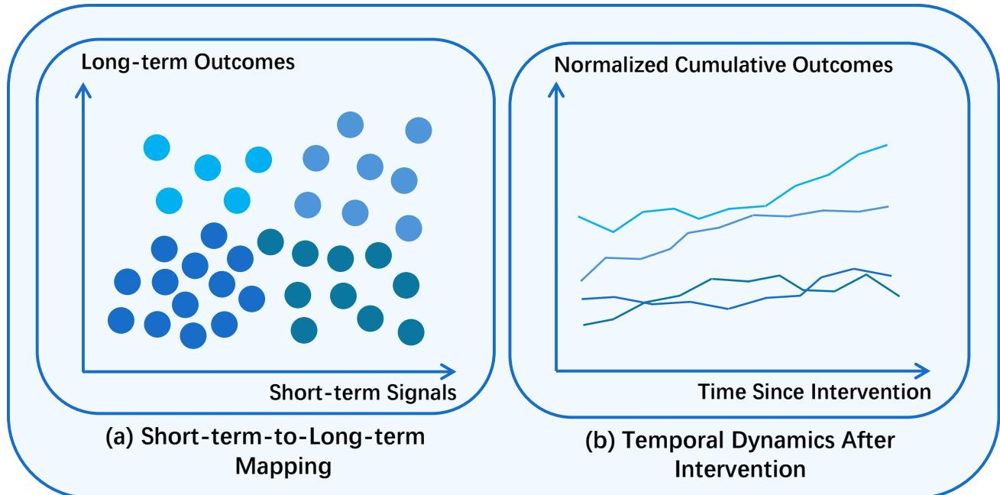
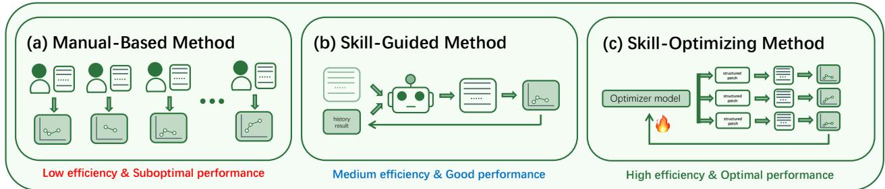
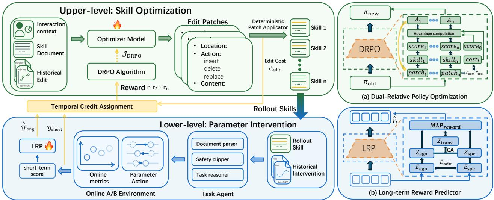
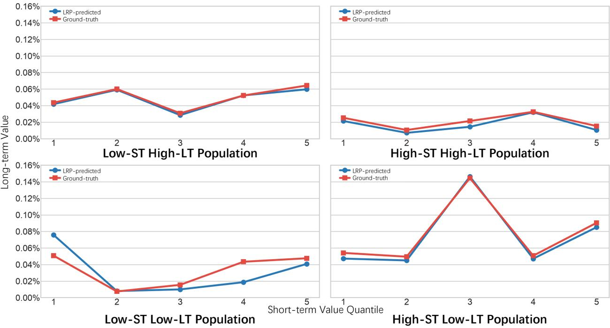

# DMRL: Document-Mediated Reinforcement Learning for Skill Optimization in Advertising Recommendation

Wei Zhang1,∗, Hongji Li2,∗, Song Sun2, Peng Yu2,†, Xue Yang1,†, Lei Zhao2, Peng Jiang2

1Shanghai Jiao Tong University, 2Kuaishou Technology

∗Equal contribution, †Corresponding Author

## Abstract

Advertising recommendation requires continuously tuning complex system parameters while balancing commercial returns and user experience. Recent work has introduced large language models (LLMs) with skill documents to assist this labor-intensive process, but skill optimization remains largely prompt-driven, lacking a principled mechanism to attribute rewards to specific document edits. To address this limitation, we propose Document-Mediated Reinforcement Learning (DMRL), a skill self-evolution framework that models skill document optimization as a sequence of structured editing actions. In DMRL, an upper-level agent performs controlled document edits, while a frozen lower-level task agent evaluates their efects through A/B testing. To address credit assignment and long-term outcomes, we introduce two key components: (1) Dual-Relative Policy Optimization (DRPO), a post-training policy optimization method for robust and risk-aware advantage estimation; and (2) Long-term Reward Predictor (LRP), which estimates long-term outcomes by modeling population heterogeneity with disentangled representation learning and cross-attention transfer. DMRL was deployed on a large-scale short-video ads platform and extensive empirical evaluation shows that DMRL outperforms state-of-the-art baselines across key advertising metrics.

Date: September 3, 2026

## 1 Introduction

Online advertising recommendation depends on continuously balancing commercial returns and user experience [39]. As illustrated in Figure 2(a), manual-based method requires substantial human efort and computational resources. Although hyperparameter optimization (HPO) provides a general framework [3], this process still relies heavily on domain experts with empirical intuition and iterative experimentation. Despite providing incremental gains, it sufers from three fundamental limitations. First, the human efort required scales linearly with the number of parameters, creating a significant operational bottleneck. Second, tuning experience is dificult to formalize and transfer across practitioners. Third, the trial-and-error process cannot guarantee systematic exploration of the parameter space, converging to locally optimal configurations.

The emergence of LLM-based agents ofers a potential remedy to limitations above. Recent work has shown that large language models can assist with complex operational workflows by externalizing domain expertise into reusable skill documents [13, 15], which specify task procedures, decision rules, and tool usage patterns. In advertising recommendation systems, such skill documents provide a promising interface for encoding tuning knowledge in a form continuously that is both executable by agents and reusable across scenarios.

Figure 1 Substantial population heterogeneity in advertising. (a) Diferent user segments exhibit substantially diferent mappings from short-term signals to long-term outcomes. Short-term signals are measured within 1 day after intervention, while long-term outcomes are defined within 7 days. (b) Diferent user segments exhibit distinct temporal dynamics of normalized cumulative outcomes after intervention.  
  
Figure 2 Comparison of the diferent parameter tuning paradigms in advertising recommendation system.

However, as illustrated in Figure 2(b), existing approaches still optimize such skills primarily through textual refinement or prompt-like updates [1, 23, 35, 40, 48], without a principled mechanism for attributing observed rewards to specific document edits. We refer to this paradigm as skill-guided method.

Beyond edit-level credit assignment, a more fundamental challenge arises from the long-term outcomes. In advertising parameter tuning, the ultimate objective typically unfolds after days [4], making it impractical to directly optimize the upper-level policy. Prior studies on long-term outcomes [20, 45] ofer partial solutions, but they do not explicitly address the pronounced population heterogeneity in advertising recommendation systems. As shown in Figure 1(a), the relationship between short-term signals and long-term outcomes difers substantially across user segments. Consequently, a predictor trained on aggregated data is dominated by majority populations, leading to biased estimation and poor generalization for underrepresented groups. Furthermore, Figure 1(b) reveals that outcomes trajectories after intervention also exhibit distinct temporal patterns across populations. Together, these observations suggest that long-term outcomes modeling should be population-aware rather than relying on a single predictor.

As illustrated in Figure 2(c), we propose DMRL, which moves beyond manual-based and skill-guided method by explicitly decomposing skill optimization into long-term outcomes estimation and edit-level reward attribution.

We refer to this paradigm as skill-optimizing method. Specifically, DMRL’s core consists of three synergistic modules: (1) a structural decoupling mechanism that separates an upper-level skill optimizer responsible for document modification from a lower-level task agent responsible for parameter intervention, with the skill document serving as the semantic interface between the two levels. (2) Dual-Relative Policy Optimization (DRPO), a post-training policy optimization method for robust and risk-aware advantage estimation that handles outcomes outliers, exploits treatment-control experimental structure, and regularizes edits with edit cost. (3) Long-term Reward Predictor (LRP), a prediction module that estimates long-term outcomes from short-term signals, using disentangled representation learning and cross-attention based historical transfer. These modules are optimized through a two-stage training strategy, designed to stabilize long-term outcomes prediction and ensure accurate advantage estimation. By combining structural decoupling of long-term outcomes prediction with robust advantage estimation, DMRL provides a principled and industrially viable solution for skill optimization on advertising recommendation platforms.

Our contributions are summarized as follows:

• We propose DMRL, a novel skill optimization framework that connects skill document editing to downstream parameter optimization through structured semantic interfaces.

• We propose DRPO, a post-training policy optimization algorithm that extends GRPO by introducing a dual-relative advantage estimator and LRP, a long-term reward prediction module that mitigates high latency and population heterogeneity.

• We deploy the framework on a real-world advertising platform and demonstrate significant online improvements.

## 2 Related Work

## 2.1 Skill Acquisition and Optimization

The idea of externalizing operational knowledge to guide agent behavior has emerged across several related lines of work. Early studies on tool use and action generation in LLM agents, such as ReAct [42] and Toolformer [25], show that exposing models to explicit interaction procedures or external APIs can substantially improve task performance. More recent work has further systematized such external knowledge as reusable agent skills [13, 15]. In terms of skill acquisition, Voyager [31] accumulates executable skills through lifelong interaction in an open-ended environment, while AgentTuning [47] learns reusable agent behaviors from interaction data. Trace2Skill [22] instead distills structured skills directly from complete execution trajectories, converting passive episodic records into reusable procedures. A complementary line of work constructs skills from pre-existing resources rather than open-ended exploration: SkillFoundry [28] and AutoSkill [41] synthesize skill packages from domain knowledge bases to improve domain alignment, while SkillX [30] and MemP [7] further leverage heterogeneous resources such as API documentation, execution traces, and external knowledge sources, reducing reliance on in-environment execution for skill acquisition.

Beyond initial skill construction, another line of work studies how skills can be iteratively improved through outcomes from execution. EvoSkill [1] and SkillForge [17] optimize skills through failure analysis: they collect failed execution trajectories, diagnose the underlying skill deficiencies, and rewrite the problematic portions to eliminate recurring failure modes. CoEvoSkills [48], AutoRefine [23], and ProcMem [21] adopt creation–evaluation–revision loops, where a skill generator and an independent verifier co-evolve through iterative cycles, using structured outcomes to progressively improve skill quality without ground-truth supervision. SkillClaw [19] and Evolver [34] take a collective approach, aggregating execution evidence across multiple users or agents to identify consistent success patterns and recurring failure modes, enabling cross-agent skill improvement where one user’s experience benefits all others. SkillOpt [40] applies a deep-learning-style paradigm to iteratively refine skills—these approaches still lack a clear methodology for editing structured skill documents. From a reinforcement-learning perspective, SKILLRL and SAGE leverage the downstream task performance of skills as a reward signal to adjust the probability of trajectories that involve skill generation and utilization [32, 36]. While these methods share the spirit of iterative text refinement, they predominantly operate at the level of individual prompts or whole-skill regeneration, lacking a systematic mechanism for making precise, traceable local modifications to structured skill documents with causal attribution of each edit’s contribution.

## 2.2 Post-Training RL Algorithms for LLMs

Reinforcement learning (RL) has emerged as a core paradigm in modern LLM post-training, complementing supervised fine-tuning by improving reasoning capabilities and downstream task performance. Proximal Policy Optimization (PPO) [26] introduces clipped surrogate objectives and trust region constraints to stabilize policy updates. Direct Preference Optimization (DPO) [24] eliminates the reward model entirely by reparameterizing the RLHF objective into a classification loss over pairwise preference data. Group Relative Policy Optimization (GRPO) [27] eliminates the value network by computing group-relative advantages. Reinforcement Learning with Verifiable Rewards (RLVR) [14] further reduces dependence on human annotation by using automatically verifiable signals—such as code execution correctness or mathematical validity—as reward sources. Within this paradigm, several GRPO variants have been proposed to address its limitations. DAPO [46] introduces decoupled advantage estimation to mitigate credit dilution across tokens of varying importance. Dr. GRPO [18] identifies and corrects a bias in GRPO’s group-level normalization that disproportionately penalizes longer rollouts. GSPO [50] proposes group sequence-level policy optimization to better align with sequence-level reward signals. SAPO [9] introduces a temperature-controlled soft gate mechanism that replaces hard clipping with smooth temperature-based attenuation, enabling more flexible control over policy deviation during training. While these post-training algorithms have proposed diverse modifications to GRPO across diferent training environments with promising results, their application to online advertising systems still necessitates further adaptations due to the unique characteristics of this domain.

## 2.3 Delayed Outcome Modeling in Advertising

Delayed feedback is common in advertising and recommendation, where conversions or long-term outcomes become observable only after a substantial lag [49]. One line of research focuses on delayed conversion feedback, mitigating immature or false-negative labels through feedback-shift correction, multi-task learning, elapsed-time modeling, label correction, debiased estimation, and continuous training [5, 10, 12, 33, 37, 43, 44]. DelayAdapter further formulates this problem as unsupervised domain adaptation from reliably labeled historical data to recent unlabeled trafic [45]. These methods primarily address delayed binary conversion labels. Another line of work uses early behavioral signals or short-term proxies to estimate future outcomes. Post-click methods exploit intermediate user behaviors to improve eventual conversion prediction [11, 29, 38], while surrogate-based methods learn mappings from short-term proxies to long-term outcomes [2]. General purpose forecasting models such as the Temporal Fusion Transformer (TFT) can additionally model early multivariate trajectories and static covariates [16]. Related studies also optimize recommendation policies under delayed rewards through counterfactual reward modification or delay-aware bandit learning [20, 49]. Unlike these approaches, LRP predicts continuous long-term rewards from short-term post-intervention signals, population features, and intervention information. It explicitly models population-invariant dynamics and population-specific deviations while transferring relevant early response patterns from historical experiments.

## 3 Method

As shown in Figure 3, we propose Document-Mediated Reinforcement Learning (DMRL), a bilevel closed-loop framework for skill optimization in advertising systems. DMRL operates on two levels: an upper-level policy that iteratively edits structured skill documents, and a lower-level frozen task agent that interprets the modified documents to adjust advertising AB parameters in real time. The skill document serves as the semantic interface between the two levels. To obtain reliable advantage estimates in advertising system, we introduce Dual-Relative Policy Optimization (DRPO), which extends GRPO by handling reward outliers through robust within-group comparisons and leveraging treatment-control baselines for more reliable advantage estimation, while incorporating edit cost regularization for controlled and risk-aware skill evolution. To address the high latency of reward, the Long-term Reward Predictor (LRP) module estimates long-term rewards from short-term signals through disentangled population encoding and cross-attention historical transfer, enabling accurate prediction even for the underrepresented populations. To ensure stable training and reliable reward attribution, we employ a two-stage training strategy that first optimizes LRP for long-term reward estimation and then optimizes DRPO for policy learning, thereby improving the stability of both reward estimation and advantage computation.

  
Figure 3 Overview of Document-Mediated Reinforcement Learning (DMRL) framework. The framework integrates the upper-level for skill optimization and lower-level for parameter intervention.

## 3.1 Long-term Reward Predictor

In advertising systems, the long-term reward of a skill modification arrives with significant delay—often days after intervention—making it impractical to directly optimize the upper-level policy. To address this, we propose the Long-term Reward Predictor (LRP), a module that estimates long-term rewards from short-term signals by leveraging disentangled representation learning and cross-attention based transfer. Specifically, LRP explicitly disentangles population-invariant dynamics from population-specific deviations, and retrieves relevant historical patterns via cross-attention.

## 3.1.1 Disentangled Representation Encoding

To explicitly capture both population-invariant dynamics and population-specific deviations in the short to-long reward mapping, we decompose the representation into two components: a population-agnostic representation and a population-specific representation.

First, a population-agnostic encoder $E _ { \mathrm { a g n } }$ takes the short-term signals $r _ { s }$ and AB parameter modification ∆a as inputs, mapping the short-term signals and intervention signals into a population-invariant latent representation:

$$
z _ { \mathrm { a g n } } = E _ { \mathrm { a g n } } ( r _ { s } , \Delta a ) .\tag{1}
$$

Since population features u are excluded from its input, $E _ { \mathrm { a g n } }$ is encouraged to model only the universal short-to-long dynamics that are common across populations.

In parallel, a population-specific encoder $E _ { \mathrm { s p e } }$ incorporates both the short-term signals, intervention signals and the population features to capture group-dependent deviations:

$$
z _ { \mathrm { s p e } } = E _ { \mathrm { s p e } } ( r _ { s } , u , \Delta a ) .\tag{2}
$$

This component is intended to represent the variation in short-to-long reward mapping across diferent user segments.

## 3.1.2 Cross-Attention Historical Transfer

To incorporate transferable historical dynamics from prior experiments, we introduce a memory bank equipped with a cross-attention retrieval mechanism.

Each historical experiment is encoded into a key-value pair:

$$
k _ { j } = E _ { \mathrm { k e y } } ( r _ { s } ^ { ( j ) } , u ^ { ( j ) } , \Delta a ^ { ( j ) } ) ,\tag{3}
$$

$$
v _ { j } = E _ { \mathrm { v a l u e } } ( \tau _ { 1 d } ^ { ( j ) } ) ,\tag{4}
$$

where $r _ { s } ^ { ( j ) }$ denotes the short-term signals observed within the first day, $u ^ { ( j ) }$ represents the user population features, $\Delta a ^ { ( j ) }$ is the corresponding parameter modification, and $\tau _ { 1 d } ^ { ( j ) }$ denotes the multivariate within-day fluctuation trajectory of the j-th historical experiment. Intuitively, the key captures the coarse experimental condition for similarity matching, while the value stores fine-grained early response dynamics that is informative for long-term reward.

These historical records form a memory bank:

$$
\begin{array} { r } { \mathcal { M } = \{ ( k _ { j } , v _ { j } ) \} _ { j = 1 } ^ { M } , } \end{array}\tag{5}
$$

which is continuously updated as new experimental outcomes be- come available during training.

For the current target instance, we construct the query representation by concatenating the disentangled features from the population-agnostic and population-specific branches:

$$
q = [ z _ { \mathrm { a g n } } \parallel z _ { \mathrm { s p e } } ] .\tag{6}
$$

We then retrieve relevant historical information through scaled dot-product attention over the memory bank:

$$
z _ { \mathrm { t r a n s } } = \mathrm { s o f t m a x } \left( \frac { q K ^ { \top } } { \sqrt { d _ { k } } } \right) V ,\tag{7}
$$

where $K \in \mathbb { R } ^ { M \times d _ { k } }$ and $V \in \mathbb { R } ^ { M \times d _ { v } }$ denote the stacked key and value matrices, respectively. This retrieval process allows the model to identify historical experiments with similar short-term signals levels, user populations, and intervention settings, while aggregating their early dynamic response patterns as transferable evidence.

Finally, we fuse the population-agnostic, population-specific, and retrieved historical representations through a gating mechanism:

$$
z _ { \mathrm { f u s e d } } = z _ { \mathrm { a g n } } + z _ { \mathrm { s p e } } + \beta ( q ) \cdot z _ { \mathrm { t r a n s } } ,\tag{8}
$$

where

$$
\beta ( q ) = \sigma ( W _ { \beta } q + b _ { \beta } )\tag{9}
$$

is an instance-wise gating function that controls the contribution of historical transfer. When the retrieved historical patterns are less relevant to the current instance, the gating value is reduced, allowing model to rely more on the encoded representations.

The fused representation is then decoded into the predicted long-term reward:

$$
\begin{array} { r } { \hat { r } _ { l } = \mathrm { M L P } _ { \mathrm { r e w a r d } } \big ( z _ { \mathrm { f u s e d } } \big ) , } \end{array}\tag{10}
$$

which serves as the estimated rollout feedback for the edit action.

## 3.2 Dual-Relative Policy Optimization

Directly applying standard GRPO to advertising recommendation sufers from three limitations. First, it is sensitive to volatile rewards, which can destabilize advantage estimation in online experiments. Second, it does not exploit the treatment-control structure of advertising experiments, where concurrent control-group outcomes ofer a natural baseline. Third, it ignores the cost of modifying the skill itself when computing the optimization signal for edit actions. To address these limitations, we propose Dual-Relative Policy Optimization (DRPO), which combines robust within-group normalization, treatment-control baselines, and edit cost regularization to yield more reliable and risk-aware policy optimization.

## 3.2.1 Edit Cost for Skill Modification

In skill optimization, diferent edits induce substantially diferent levels of structural and semantic change, even when they yield similar estimated rewards. As shown in Figure 3, each edit is represented as a structured tuple consisting of location, action, and content. These components are not equally consequential: modifying diferent sections of a skill document afects diferent functional parts of the policy, diferent edit actions introduce diferent levels of disruption, and the edited content itself varies in both edit-level and semantic magnitude.

To capture this, we define the edit cost $C _ { \mathrm { e d i t } } ( e )$ as a deterministic function of the structured edit:

$$
C _ { \mathrm { e d i t } } ( e ) = w ( \ell _ { e } , a _ { e } ) \left[ \eta C _ { \mathrm { t o k } } ( e ) + ( 1 - \eta ) C _ { \mathrm { s e m } } ( e ) \right] ,\tag{11}
$$

where $\ell _ { e }$ and $a _ { e }$ denote the edited location and action type, respectively, and $w ( \ell _ { e } , a _ { e } )$ is a structure-dependent weight that reflects the relative risk of editing diferent sections with diferent operations. The term $C _ { \mathrm { t o k } } ( e )$ measures the edit-level edit magnitude, while $C _ { \mathrm { s e m } } ( e )$ captures the semantic shift introduced by the edit.

Specifically, we define the edit-level edit magnitude as the normalized edit distance between the original and edited text:

$$
C _ { \mathrm { t o k } } ( e ) = \frac { \mathrm { E d i t } \mathrm { D i s t } ( x _ { \mathrm { o l d } } , x _ { \mathrm { n e w } } ) } { \operatorname* { m a x } ( | x _ { \mathrm { o l d } } | , | x _ { \mathrm { n e w } } | ) } ,\tag{12}
$$

where $x _ { \mathrm { o l d } }$ and $x _ { \mathrm { n e w } }$ denote the original and edited text spans, respectively, and EditDist(·, ·) denotes the Levenshtein distance computed over token sequences.

We define the semantic shift as the cosine distance between the embeddings of the original and edited text:

$$
C _ { \mathrm { s e m } } ( e ) = 1 - \cos \bigl ( \phi ( x _ { \mathrm { o l d } } ) , \phi ( x _ { \mathrm { n e w } } ) \bigr ) ,\tag{13}
$$

where $\phi ( \cdot )$ denotes a sentence embedding model that maps text into a semantic representation space. A larger value of $C _ { \mathrm { s e m } } ( e )$ indicates a greater semantic deviation.

In this way, $C _ { \mathrm { t o k } } ( e )$ captures surface-form modification, while $C _ { \mathrm { s e m } } ( e )$ captures semantic deviation. Skill modifications that achieve similar reward gains but incur smaller structural or semantic disruption are preferred, thereby discouraging overly aggressive modifications and promoting more controlled skill evolution.

## 3.2.2 Dual-Relative Advantage Estimation

Following the rollout-based setting of GRPO, the optimizer generates G candidate atomic edits for each skill document, denoted by $\{ e _ { i } \} _ { i = 1 } ^ { G }$ . Each edit is represented as $e _ { i } = ( \ell _ { i } , a _ { i } , c _ { i } )$ , where $\ell _ { i } , a _ { i } .$ , and $c _ { i }$ denote the target location, edit action, and edited content, respectively. Each edited skill $S _ { i }$ is then executed by task agent, which instantiates the corresponding parameter intervention and evaluates it through online $\mathrm { A } / \mathrm { B }$ experiment. In parallel, a concurrent control group runs under the best configuration and provides baseline outcome. Based on the resulting experimental signals, LRP produces the corresponding long-term reward $R _ { i }$ for rollout i and $R _ { 0 }$ for the control group, while each edit $e _ { i }$ is associated with an edit cost term $C _ { \mathrm { e d i t } } ( e _ { i } )$

We incorporate robust within-group comparison, treatment-control comparison, and edit cost into advantage estimation:

$$
A _ { i } = \underbrace { \alpha \frac { R _ { i } - \tilde { \mu } } { 1 . 4 8 2 6 \cdot \mathrm { M A D } + \delta } } _ { \mathrm { T e r m ~ 1 } } + \underbrace { ( 1 - \alpha ) \frac { R _ { i } - R _ { 0 } } { R _ { 0 } + \delta } } _ { \mathrm { T e r m ~ 2 } } - \underbrace { \lambda _ { \mathrm { e d i t } } C _ { \mathrm { e d i t } } ( e _ { i } ) } _ { \mathrm { T e r m ~ 3 } } .\tag{14}
$$

Here,

$$
\tilde { \mu } = \mathrm { m e d i a n } ( R _ { i } ) ,\tag{15}
$$

$$
\mathrm { M A D } = \mathrm { m e d i a n } \left( \left| R _ { i } - \tilde { \mu } \right| \right) .\tag{16}
$$

Term 1 provides a robust within-group comparison by replacing the mean and standard deviation used in standard normalization with the median and median absolute deviation (MAD), which reduces sensitivity to outlier rollouts. The factor 1.4826 rescales MAD to a standard-deviation-consistent estimator under normality, preserving interpretability of the normalized score.

Term 2 measures the improvement of each rollout relative to the control group, grounding the advantage in the treatment-control structure. The coeficient $\alpha \in [ 0 , 1 ]$ balances within-group comparison and controlgroup-relative improvement.

Term 3 penalizes the cost of modifying the skill document. By explicitly incorporating edit cost into the utility, this term encourages the policy to prefer efective yet minimally disruptive revisions, promoting controlled and risk-aware skill evolution

## 3.3 Two-Stage Training Strategy

To ensure stable and efective population-aware long-term reward prediction and policy optimization, we adopt a two-stage training strategy. In Stage I, we train the Long-term Reward Predictor (LRP) to model delayed rewards under population heterogeneity. In Stage II, we freeze LRP and optimize the skill-editing policy using DRPO.

## 3.3.1 Stage I: Training the Long-Term Reward Predictor

In Stage I, we train LRP to predict long-term rewards from short-term signals, population features, and intervention information. In addition to minimizing the reward prediction error, we employ adversarial regularization to encourage $z _ { \mathrm { a g n } }$ to capture population-invariant dynamics. Specifically, a population discriminator $D _ { \mathrm { a d v } }$ attempts to infer the population label from $z _ { \mathrm { a g n } }$ , while the population-agnostic encoder $E _ { \mathrm { a g n } }$ is optimized to make such inference dificult.

As shown in Algorithm 1, we adopt a three-phase training schedule, to improve training stability. First, we warm up the reward-prediction network with $\lambda _ { \mathrm { a d v } } = 0$ , allowing the encoders and reward predictor to learn representations informative for long-term reward estimation. Second, we freeze $E _ { \mathrm { a g n } }$ and pretrain $D _ { \mathrm { a d v } }$ to predict population labels from $z _ { \mathrm { a g n } }$ . Finally, we jointly optimize LRP and the population discriminator using a gradient reversal layer (GRL) [8].

Given the population-agnostic representation

$$
z _ { \mathrm { a g n } } = E _ { \mathrm { a g n } } ( r _ { s } , \Delta a ) ,\tag{17}
$$

the discriminator predicts the population label as

$$
\hat { g } = D _ { \mathrm { a d v } } \left( \mathrm { G R L } ( z _ { \mathrm { a g n } } ) \right) .\tag{18}
$$

The GRL acts as an identity mapping during the forward pass, but reverses the gradient propagated to $E _ { \mathrm { a g n } }$ during backpropagation:

$$
\mathrm { G R L } ( z ) = z , \qquad { \frac { \partial \mathrm { G R L } ( z ) } { \partial z } } = - \mathbf { I } .\tag{19}
$$

Algorithm 1 Three-Phase Training of LRP   
Require: Dataset $\mathcal { D } ,$ memory bank M, adversarial weight $\lambda _ { \mathrm { a d v } }$   
Ensure: Trained ΘLRP   
1: $\Theta _ { \mathrm { L R P } } \gets \{ \theta _ { \mathrm { a g n } } , \theta _ { \mathrm { s p e } } , \theta _ { \beta } , \theta _ { \mathrm { r e w a r d } } \}$   
2: Phase I: Reward-prediction warm-up   
3: for each iteration do   
4: $\boldsymbol { B } \sim \mathcal { D }$   
5: $\boldsymbol { B } , \mathcal { M } \xrightarrow { \mathrm { L R P } } \boldsymbol { \hat { r } _ { l } }$   
6: $\mathcal { L } _ { \mathrm { p r e d } }  \mathrm { M S E } ( \hat { r } _ { l } , r _ { l } )$   
7: $\Theta _ { \mathrm { L R P } }  \Theta _ { \mathrm { L R P } } - \eta _ { \mathrm { l r p } } \nabla _ { \Theta _ { \mathrm { L R P } } } \mathcal { L } _ { \mathrm { f } }$ red   
8: end for   
9: Phase II: Discriminator warm-up   
10: Freeze $\theta _ { \mathrm { a g n } }$   
11: for each iteration do   
12: $\boldsymbol { B } \sim \mathcal { D }$   
13: $\left( r _ { s } , \Delta a \right) \xrightarrow { E _ { \mathrm { a g n } } } z _ { \mathrm { a g n } } \xrightarrow { D _ { \mathrm { a d v } } } \hat { g }$   
14: $\mathcal { L } _ { \mathrm { a d v } }  - \mathbb { E } [ \log D _ { \mathrm { a d v } } ( g \mid z _ { \mathrm { a g n } } ) ]$   
15: $\theta _ { \mathrm { a d v } } \gets \theta _ { \mathrm { a d v } } - \eta _ { \mathrm { a d v } } \nabla _ { \theta _ { \mathrm { a d v } } } \mathcal { L } _ { \mathrm { a d v } }$   
16: end for   
17: Phase III: Joint adversarial training   
18: Unfreeze $\theta _ { \mathrm { a g n } }$   
19: for each iteration do   
20: $B \sim \mathcal { D } .$   
21: $\boldsymbol { B } , \mathcal { M } \xrightarrow { \mathrm { L R P } } ( \hat { \boldsymbol { r } } _ { l } , \boldsymbol { z } _ { \mathrm { a g n } } )$   
22: $z _ { \mathrm { a g n } } \xrightarrow { \mathrm { G R L } } D _ { \mathrm { a d v } }  \hat { g }$   
23: $\mathcal { L } _ { \mathrm { L R P } }  \mathcal { L } _ { \mathrm { p r e d } } + \lambda _ { \mathrm { a d v } } \mathcal { L } _ { \mathrm { a d v } }$   
24: $( \Theta _ { \mathrm { L R P } } , \theta _ { \mathrm { a d v } } ) \gets ( \Theta _ { \mathrm { L R P } } , \theta _ { \mathrm { a d v } } ) - ( \eta _ { \mathrm { l r p } } , \eta _ { \mathrm { a d v } } ) \nabla \mathcal { L } _ { \mathrm { L R P } }$   
25: end for   
26: return $\Theta _ { \mathrm { L R P } }$

The population classification loss is defined as

$$
\mathcal { L } _ { \mathrm { a d v } } = - \mathbb { E } \left[ \log D _ { \mathrm { a d v } } \left( g \mid \mathrm { G R L } ( z _ { \mathrm { a g n } } ) \right) \right] ,\tag{20}
$$

where g denotes the ground-truth population label. The overall training objective of LRP is

$$
\mathcal { L } _ { \mathrm { L R P } } = \mathrm { M S E } ( \hat { r } _ { l } , r _ { l } ) + \lambda _ { \mathrm { a d v } } \mathcal { L } _ { \mathrm { a d v } } ,\tag{21}
$$

where $\hat { r } _ { l }$ and $r _ { l }$ denote the predicted and observed long-term rewards, respectively, and $\lambda _ { \mathrm { a d v } }$ controls the strength of adversarial regularization. During joint training, minimizing $\mathcal { L } _ { \mathrm { a d v } }$ improves the populationclassification ability of $D _ { \mathrm { a d v } }$ , whereas the gradient reversal operation drives $E _ { \mathrm { a g n } }$ in the opposite direction, thereby reducing population-identifying information in $z _ { \mathrm { a g n } }$

## 3.3.2 Stage II: Optimizing the Skill-Editing Policy with DRPO

After LRP is trained, we freeze its parameters and use it to provide reward estimates for policy learning.

The policy is optimized using the clipped surrogate objective

$$
\mathcal { L } _ { \mathrm { D R P O } } ( \theta ) = - \mathbb { E } _ { i , t } \Big [ \operatorname* { m i n } \Big ( \rho _ { i , t } ( \theta ) A _ { i } , \ \mathrm { c l i p } \big ( \rho _ { i , t } ( \theta ) , 1 - \epsilon _ { c } , 1 + \epsilon _ { c } \big ) A _ { i } \Big ) \Big ] + \beta D _ { \mathrm { K L } } \big ( \pi _ { \theta } \ \lVert \pi _ { \theta _ { \mathrm { o l d } } } \big ) ,
$$

where

$$
\rho _ { i , t } ( \theta ) = \frac { \pi _ { \theta } \left( e _ { i , t } \mid e _ { i , < t } \right) } { \pi _ { \theta _ { \mathrm { o l d } } } \left( e _ { i , t } \mid e _ { i , < t } \right) } .\tag{22}
$$

Here, $e _ { i , t }$ denotes the t-th token in the serialized representation of edit $e _ { i } ,$ , and $e _ { i , < t }$ denotes its prefix. The clipped ratio stabilizes policy updates, while the KL regularization term constrains the policy from drifting excessively from the previous iteration.

## 4 Experiments

## 5 Experiment

To validate the efectiveness of our DMRL framework, we conduct a series of experiments to answer the following research questions:

RQ1: How efective is DMRL for skill optimization in advertising recommendation, compared with existing skill optimization methods and long-term reward modeling approaches?

RQ2: How do the key components of DMRL, including LRP, DRPO, and the two-stage training strategy, individually and jointly contribute to the overall performance of the framework?

RQ3: How sensitive is DMRL to implementation such as the number of DRPO rollouts and the scale of backbone model?

## 5.1 Experimental Setup

## 5.1.1 Data

According to the heterogeneous short-to-long mappings observed in Figure 1, we partition users into four predefined population groups: Low-ST Low-LT, High-ST Low-LT, Low-ST High-LT, and High-ST High-LT. Specifically, Low-ST Low-LT denotes the users with low short-term and low long-term metrics, while the other groups are defined analogously. The population labels are determined using historical behavioral statistics and remain fixed throughout the experiment. Following this partition, we adopt a population-aware data construction strategy. Specifically, we separately collect eligible trajectories from each population group and combine them to construct the LRP dataset. As shown in Table 1, the resulting dataset covers all four population groups while approximately preserving their distribution in online trafic. Each sample corresponds to a user trajectory associated with a parameter intervention and contains the parameter changes, user features, short-term feedback, population label, and observed long-term outcome. The resulting dataset contains approximately 12M trajectories, obtained by low-rate sampling from a massive online trafic pool. The sampling procedure is applied consistently across population groups and approximately preserves their relative prevalence in online trafic. Because LRP is trained on historical experiments and subsequently applied to future online interventions, we adopt a chronological split to approximate the deployment setting. Specifically, trajectories are ordered by intervention time and divided into training, validation, and test sets. For each target trajectory, the memory bank contains only historical records whose long-term outcomes have fully matured before the target intervention, preventing temporal information leakage.

## 5.1.2 Implementation Details

DMRL is implemented as a hierarchical skill-optimization framework comprising upper-level skill optimization and lower-level task execution.

At the upper level, an optimizer model iteratively improves its skill-optimization strategy using feedback collected from previous rollouts. At each iteration, the optimizer proposes modifications to the structured skills, which are subsequently instantiated and executed by a frozen downstream task agent in the online experimentation environment. The environment returns short-term outcomes and treatment–control comparison signals, while LRP estimates the corresponding long-term rewards. These signals are incorporated into DRPO to update the skill-optimization strategy, thereby establishing a closed-loop skill-optimization pipeline under delayed rewards. Unless otherwise specified, we instantiate the optimizer with Qwen3-8B and sample 8 rollouts in DRPO iteration.

At the lower level, we employ OpenAI Codex as the frozen Task Agent, using GPT-5.5 as its underlying model. After experimental round t, the upper-level optimizer produces an updated skill $S _ { t + 1 , i }$ for the i-th rollout. After loading $S _ { t + 1 , i }$ , the Task Agent generates a parameter configuration for round t + 1 based on the current experimental state and applies the configuration through tool calls. To mitigate operational risks, the Task Agent is restricted to a predefined whitelist of parameters and permissible value ranges.

Table 1 Comparison of population distributions.
<table><tr><td colspan="2">(a) Online traffic distribution</td><td colspan="2">(b) Dataset statistics</td></tr><tr><td>Population</td><td>Proportion</td><td>Population</td><td>Number</td></tr><tr><td>Low-ST Low-LT</td><td>41.11%</td><td>Low-ST Low-LT</td><td>4,933,847</td></tr><tr><td>High-ST Low-LT</td><td>25.85%</td><td>High-ST Low-LT</td><td>3,102,196</td></tr><tr><td>Low-ST High-LT</td><td>13.79%</td><td>Low-ST High-LT</td><td>1,655,732</td></tr><tr><td>High-ST High-LT</td><td>19.25%</td><td>High-ST High-LT</td><td>2,310,468</td></tr></table>

## 5.1.3 Evaluation Metrics

We evaluate the online efectiveness of DMRL using two business-oriented metrics and one composite metric: App Usage Duration (AUD), Posterior Expected Spend (PES), and Life Time Value (LTV), which capture user engagement, advertising monetization efectiveness, and overall platform economic value, respectively. To measure both immediate and delayed efects, we report each base metric over two distinct time horizons. Specifically, short-term metrics include AUD@1d and PES@1d, measured within one day after intervention, while long-term metrics include AUD@7d, PES@7d and LTV, measured over a 7-day horizon.

To ensure the reliability, we adopt several stabilization strategies. First, 7-day cumulative metric mitigates the impact of short-term fluctuations. Second, we apply CUPED [6] during online evaluation, using user-level historical statistics from the pre-experiment A/A period as covariates, to reduce the variance caused by users’ intrinsic behavioral. Importantly, experiments in diferent tables are conducted during non-overlapping time windows, involving diferent trafic allocations. Within each table, all methods are evaluated under same eligibility criteria, trafic distribution and observation window. All conclusions are restricted to within-table comparisons.

App Usage Duration (AUD). AUD measures the amount of time users spend in the application after intervention and serves as a proxy for user engagement. A higher AUD value generally indicates stronger engagement with the recommended content.

Posterior Expected Spend (PES). PES reflects the monetization of the advertising business, the platform’s primary source of revenue. By calibrating the original expected spend with post-hoc signals, such as conversion performance and actual cost, PES provides a robust estimate of the revenue impact from advertising monetization.

Life Time Value (LTV). LTV converts per-metric gains and losses into economic equivalents and aggregates them into a comprehensive economic assessment that accounts for user engagement and monetization contributions. The monetization component captures the platform’s overall monetization eficiency, including advertising. We regard LTV improvement greater than 0.01% as a practically meaningful gain for evaluating the efectiveness of the intervention.

## 5.2 Main Result: RQ1

We employ two groups of baselines: skill optimization methods and long-term reward modeling methods. To isolate each module’s contribution, we keep LRP fixed when comparing DRPO with skill optimization baselines, and keep DRPO fixed when comparing LRP with long-term reward modeling baselines. As summarized in Table 2, DMRL exhibits a substantial and consistent improvement over other methods, with the highest LTV improvement of +0.052%.

Compared with skill optimization baselines, DRPO outperforms SAGE, SkillOpt, and SKILLRL by +0.101%, +0.028%, and +0.048%. Specifically, SAGE brings positive short-term metrics, but it degrades both longterm AUD and PES, resulting in a negative LTV of −0.049%. SkillOpt achieves competitive monetization improvements on AUD@7d (+0.069%) and PES@7d (+0.548%), resulting in better LTV performance (+0.024%) than SAGE. SKILLRL further improves user engagement on both AUD@1d (+0.101%) and AUD@7d (+0.133%), but its monetization metrics drop significantly, with PES@1d and PES@7d decreasing by −1.547% and −0.430%, respectively. In contrast, DRPO achieves a more balanced trade-of. Although AUD@1d slightly decreases by −0.020%, positive gains on PES@1d (+0.644%), AUD@7d (+0.082%), and PES@7d (+0.960%) demonstrate that skill optimization should account for engagement and monetization outcomes across multiple temporal horizons. By integrating these feedback signals into policy optimization, DMRL supports stable skill updates and achieves a high long-term value.

Table 2 Comparison of DMRL with state-of-the-art methods in skill optimization and long-term reward modeling.
<table><tr><td>Method</td><td>AUD@1d</td><td>PES@1d</td><td>AUD@7d</td><td>PES@7d</td><td>LTV</td></tr><tr><td>Skill Optimization Methods</td><td></td><td></td><td></td><td></td><td></td></tr><tr><td>LRP+SAGE [32]</td><td>+0.049%</td><td>+0.757%</td><td>-0.094%</td><td>-0.911%</td><td>-0.049%</td></tr><tr><td>LRP+SkillOpt [40]</td><td>+0.012%</td><td>-0.515%</td><td>+0.069%</td><td>+0.548%</td><td>+0.024%</td></tr><tr><td>LRP+SKILLRL [36]</td><td>+0.101%</td><td>-1.547%</td><td>+0.133%</td><td>-0.430%</td><td>+0.004%</td></tr><tr><td>Long-term Reward Modeling Methods</td><td></td><td></td><td></td><td></td><td></td></tr><tr><td>DRPO+TFT [16]</td><td>-0.187%</td><td>-0.085%</td><td>+0.018%</td><td>+0.656%</td><td>+0.015%</td></tr><tr><td>DRPO+DelayAdapter [45]</td><td>-0.158%</td><td>+1.480%</td><td>-0.060%</td><td>+0.134%</td><td>+0.005%</td></tr><tr><td>Our Framework</td><td></td><td></td><td></td><td></td><td></td></tr><tr><td>DMRL (DRPO+LRP)</td><td>-0.020%</td><td>+0.644%</td><td>+0.082%</td><td>+0.960%</td><td>+0.052%</td></tr></table>

Table 3 Ablation study of variants of LRP. UE denotes unified encoder and MB denotes memory bank module.
<table><tr><td>Method</td><td>AUD@1d</td><td>PES@1d</td><td>AUD@7d</td><td>PES@7d</td><td>LTV</td></tr><tr><td>UE</td><td>+0.064%</td><td>+0.098%</td><td>+0.061%</td><td>+0.257%</td><td>+0.031%</td></tr><tr><td>w/o MB</td><td>-0.062%</td><td>+0.409%</td><td>-0.010%</td><td>+0.491%</td><td>+0.020%</td></tr><tr><td>UE w/o MB</td><td>-0.011%</td><td>-0.245%</td><td>+0.025%</td><td>-0.231%</td><td>-0.028%</td></tr><tr><td>LRP</td><td>+0.006%</td><td>+0.674%</td><td>+0.155%</td><td>+0.662%</td><td>+0.042%</td></tr></table>

For long-term reward modeling methods, TFT and DelayAdapter achieve positive LTV improvements, suggesting that explicitly modeling delayed rewards can provide useful optimization signals. However, their engagement-side performance remains relatively weak. Specifically, TFT improves PES@7d by +0.656%, indicating its ability to capture delayed monetization signals, but it sufers from short-term degradation on AUD@1d (−0.187%) and PES@1d (−0.085%), resulting in a moderate LTV improvement of +0.015%. DelayAdapter further improves PES@1d to +1.480%, but it degrades all long-term metrics, yielding only a marginal LTV gain of +0.005%. In contrast, LRP achieves a more balanced improvement and outperforms TFT and DelayAdapter in LTV by +0.037% and +0.047%, respectively. These results demonstrate that LRP better balances monetization, engagement, and delayed economic value. By capturing population-specific preferences through user-group feature extraction and historical pattern transfer, LRP provides more reliable long-term reward signals for policy optimization.

Taken together, DMRL combines the strengths of LRP and DRPO: LRP estimates population-aware delayed rewards, while DRPO performs risk-aware and edit-regularized policy optimization. This joint design enables DMRL to achieve the best aggregate outcome.

## 5.3 More Result: RQ2

Table 4 Ablation study of DRPO components. MN, RR, and EC denote MAD-based normalization, reference reward relative to the control group, and edit cost, respectively.
<table><tr><td>Method</td><td>AUD@1d</td><td>PES@1d</td><td>AUD@7d</td><td>PES@7d</td><td>LTV</td></tr><tr><td>w/o MN</td><td>+0.067%</td><td>-0.849%</td><td>+0.069%</td><td>-1.177%</td><td>+0.008%</td></tr><tr><td>w/o RR</td><td>+0.194%</td><td>+1.411%</td><td>+0.125%</td><td>-0.371%</td><td>+0.013%</td></tr><tr><td>w/o EC</td><td>+0.100%</td><td>+0.070%</td><td>-0.007%</td><td>-0.688%</td><td>-0.018%</td></tr><tr><td>GRPO</td><td>+0.051%</td><td>+0.162%</td><td>-0.097%</td><td>-1.216%</td><td>-0.069%</td></tr><tr><td>DRPO</td><td>-0.048%</td><td>+1.197%</td><td>+0.131%</td><td>+0.059%</td><td>+0.021%</td></tr></table>

## 5.3.1 LRP

To test the main design in LRP, we conduct an ablation study over diferent variants. As shown in Table 3, the full LRP model achieves the best overall LTV improvement, while obtaining the strongest gains on PES@1d, AUD@7d, and PES@7d.

The UE variant achieves the strongest short-term engagement gain on AUD@1d (+0.064%) and obtains a competitive LTV of +0.031%, with PES@1d and PES@7d improving by only +0.098% and +0.257%, respectively. These results suggest that relying solely on unified representations is insuficient to fully capture heterogeneous short-to-long reward mappings across user populations. The variant without the memory bank achieves positive monetization gains on PES@1d (+0.409%) and PES@7d (+0.491%), but it degrades both AUD@1d and AUD@7d, resulting in a lower LTV of +0.020%. This indicates that the memory bank helps calibrate delayed reward estimates and prevent the model from overemphasizing monetization signals at the expense of user engagement. The UE w/o MB variant performs the worst among all variants with negative gains on AUD@1d, PES@1d, PES@7d, and LTV, further demonstrating the complementary benefits of population-aware representation learning and memory-based historical transfer.

Overall, the ablation results show that diferent LRP components contribute to complementary aspects of performance. Together, these components produce a more balanced and economically aligned reward estimate for downstream DRPO optimization.

## 5.3.2 DRPO

To study the contribution of the three key modifications introduced in DRPO, we conduct a systematic ablation study. As shown in Table 4, DRPO achieves the highest LTV of +0.021% among all variants, with positive gains on PES@1d (+1.197%), AUD@7d (+0.131%), and PES@7d (+0.059%).

The w/o MN variant improves AUD@1d and AUD@7d by +0.067% and +0.069%, respectively, but its PES@1d and PES@7d decrease by −0.849% and −1.177%. As a result, its LTV improvement is limited to +0.008%, suggesting that without robust normalization, the optimizer is more vulnerable to heavy-tailed reward signals. The w/o RR variant achieves the strongest short-term gains, improving AUD@1d and PES@1d by +0.194% and +1.411%, respectively. However, its PES@7d decreases by −0.371%, and the resulting LTV improvement is only +0.013%. These results indicate that removing the control-group-relative reward reference makes policy optimization overemphasize immediate responses while weakening its alignment with delayed monetization efects. The w/o EC variant yields negative long-term metric changes and produces a negative LTV change of −0.018%. Similar to the w/o EC variant, vanilla GRPO obtains small short-term gains on AUD@1d (+0.051%) and PES@1d (+0.162%); however, it substantially hurts AUD@7d and PES@7d by −0.097% and −1.216%, respectively, leading to the lowest LTV change of −0.069%. This highlights the limitation of directly applying the original GRPO objective to delayed reward optimization.

Collectively, the ablation results support the design rationale of DRPO. Together, these components provide more reliable advantage estimates, enabling DRPO to better balance short-term feedback, delayed outcomes,

Table 5 Comparison of diferent training strategies of DMRL.
<table><tr><td>Strategy</td><td>AUD@1d</td><td>PES@1d</td><td>AUD@7d</td><td>PES@7d</td><td>LTV</td></tr><tr><td>Single-stage</td><td>-0.013%</td><td>-0.424%</td><td>+0.026%</td><td>-0.702%</td><td>-0.039%</td></tr><tr><td>Two-stage</td><td>-0.020%</td><td>+0.644%</td><td>+0.082%</td><td>+0.960%</td><td>+0.052%</td></tr></table>

Table 6 Comparison of diferent Qwen3 backbones.
<table><tr><td>Backbone</td><td>AUD@1d</td><td>PES@1d</td><td>AUD@7d</td><td>PES@7d</td><td>LTV</td></tr><tr><td>Qwen3-0.6B</td><td>-0.160%</td><td>+1.572%</td><td>+0.137%</td><td>-0.606%</td><td>-0.021%</td></tr><tr><td>Qwen3-1.7B</td><td>+0.018%</td><td>+0.303%</td><td>+0.083%</td><td>-0.341%</td><td>+0.009%</td></tr><tr><td>Qwen3-4B</td><td>-0.143%</td><td>+1.264%</td><td>+0.046%</td><td>-0.291%</td><td>+0.012%</td></tr><tr><td>Qwen3-8B</td><td>-0.060%</td><td>+1.135%</td><td>+0.025%</td><td>+0.539%</td><td>+0.064%</td></tr><tr><td>Qwen3-14B</td><td>-0.001%</td><td>+0.806%</td><td>+0.091%</td><td>-0.529%</td><td>+0.030%</td></tr></table>

and aggregate economic value.

## 5.3.3 Two-stage Training

Finally, we examine the necessity of the two-stage training strategy adopted in DMRL, where LRP is first trained to predict delayed rewards and is then used to guide downstream policy optimization. As shown in Table 5, we compare this design with direct single-stage optimization.

The single-stage strategy achieves a slightly better AUD@1d than the two-stage strategy, with a smaller decrease of −0.013% compared with −0.020%. However, it leads to clear degradation in monetization-related metrics, reducing in PES@1d and PES@7d by −0.424% and −0.702%, respectively, and resulting in a negative LTV change of −0.039%. In contrast, the two-stage strategy consistently improves long-term and monetization metrics, increasing AUD@7d by +0.082%, PES@1d by +0.644%, and PES@7d by +0.960%. Overall, the two-stage strategy achieves a positive LTV gain of +0.052%. These results suggest that jointly optimizing reward prediction and policy learning in a single stage causes LRP to overemphasize short-term signals and provide unstable supervision for policy updates. By first training LRP on historical trajectories, the two-stage strategy produces a more reliable proxy reward, thereby better guiding DRPO toward long-term value optimization.

## 5.4 Ablation Study: RQ3

## 5.4.1 Ablation on Qwen3 Backbone Scale

As shown in Table 6, Qwen3-8B achieves the best overall performance among all evaluated backbones, yielding the highest LTV improvement of +0.064% and positive gains on PES@1d (+1.135%), AUD@7d (+0.025%), and PES@7d (+0.539%). Qwen3-0.6B achieves a notable PES@1d improvement of +1.572%, but it sufers from a substantial PES@7d degradation of −0.606% and results in a negative LTV change of −0.021%. Qwen3-1.7B obtains the largest AUD@1d gain (+0.018%) and achieves positive improvements on both PES@1d and AUD@7d. However, its PES@7d remains negative, leading to only a marginal LTV improvement of +0.009%. Qwen3-4B performs slightly better in terms of LTV (+0.012%), but its improvements on long-term engagement are limited and PES@7d still decreases by −0.291%. These results suggest that smaller backbones lack suficient capacity to generate high-quality candidate edits, leaving the optimization space underexplored. Increasing the backbone size to 14B does not lead to monotonic improvements. Qwen3-14B obtains negative

Table 7 Ablation study on the rollout number for Qwen3-8B.
<table><tr><td>#Rollouts</td><td>AUD@1d</td><td>PES@1d</td><td>AUD@7d</td><td>PES@7d</td><td>LTV</td></tr><tr><td>4</td><td>-0.026%</td><td>+0.081%</td><td>-0.006%</td><td>-0.169%</td><td>-0.003%</td></tr><tr><td>6</td><td>+0.128%</td><td>-0.639%</td><td>+0.129%</td><td>-1.219%</td><td>+0.008%</td></tr><tr><td>8</td><td>+0.045%</td><td>+0.307%</td><td>+0.063%</td><td>+1.095%</td><td>+0.050%</td></tr><tr><td>10</td><td>-0.103%</td><td>+0.128%</td><td>+0.067%</td><td>+0.064%</td><td>+0.037%</td></tr></table>

PES@7d −0.529% and weak PES@1d (+0.806%), resulting in a lower LTV gain (+0.030%) than Qwen3-8B, which suggests that increased model capacity introduces more diverse or aggressive edits that do not necessarily improve long-term skill optimization.

## 5.4.2 Number of Rollouts in DRPO

As shown in Table 7, the number of rollouts has a clear non-monotonic efect on online performance. Among all settings, 8 rollouts achieve the highest LTV improvement of +0.050% and yields consistent gains across all metrics, including AUD@1d (+0.045%), PES@1d (+0.307%), AUD@7d (+0.063%), and PES@7d (+1.095%). With only 4 rollouts, the model obtains a slight PES@1d improvement of +0.081%, but AUD@1d, AUD@7d, and PES@7d all decrease, resulting in a negative LTV change of −0.003%. Increasing the rollout number to 6 improves engagement-related metrics, with AUD@1d and AUD@7d increasing by +0.128% and +0.129%. However, reducing PES@1d and PES@7d lead to marginal LTV gain +0.008%. This suggests that insuficient rollout diversity limits the optimizer’s ability to explore informative candidate edits. Further increasing the number of rollouts to 10 also fails to bring additional benefits. 10 rollouts maintain weaker gains on AUD@7d (+0.067%), PES@1d (+0.128%), and PES@7d (+0.064%) than those achieves with 8 rollouts, and AUD@1d drops by −0.103%. As a result, the LTV improvement decreases from +0.050% to +0.037%. These observations suggest that excessive rollouts introduce redundant candidate edits, which can dilute the efectiveness of reward-based selection.

## 5.4.3 Qualitative Analysis of LRP

To qualitatively examine LRP’s modeling behavior, we sample instances from diferent populations and visualize the distribution of LRP-predicted and ground-truth values in Figure 4. In all populations, the predicted values preserve the ordering of all the ground-truth observations even when the relationship is nonmonotonic. For the Low-ST High-LT population, the two curves are closely aligned across all quantiles, with a mean absolute error of only 0.0019%. LRP slightly underestimates the ground truth value at most quantiles, with the largest deviation occurring at the fifth quantile 0.0046%. A similar pattern is observed for the High-ST High-LT population: LRP reproduces the overall trajectory but exhibits a small systematic underestimation, with a mean absolute error of 0.0039%. For the High-ST Low-LT population, LRP successfully captures the pronounced peak at the third quantile and the subsequent decline, achieving a mean absolute error of 0.0044%. The largest discrepancy occurs in the Low-ST Low-LT population, where LRP overestimates the first quantile by 0.0250% and underestimates the fourth quantile by 0.0247%. Nevertheless, it still captures the overall population-specific trend. These results provide evidence that LRP can capture the heterogeneous short-to-long-term relationships across populations.

## 6 Conclusion

This paper proposes DMRL, a skill optimization framework in advertising recommendation under noisy, delayed, and heterogeneous feedback. DMRL decomposes the pipeline into robust optimizer training and long-term reward modeling, enabling the system to optimize edit decisions beyond immediate responses and toward long-term outcomes. Through the integration of DRPO for robust optimizer training under delayed feedback and LRP for long-term value modeling under population heterogeneity, the framework achieves reliable and efective optimization, while a two-stage training strategy further stabilizes the optimization and reward modeling process. Deployed in a large-scale advertising recommendation system, DMRL demonstrates significant improvements over baselines, validating its practical utility in real-world industrial environments. Looking ahead, this work opens several avenues for future research, including extending automated skill optimization to richer multi-objective scenarios and improving population-aware long-term reward modeling under evolving trafic distributions. We believe DMRL not only provides a deployable solution for automatic skill optimization, but also lays the groundwork for long-horizon optimization in dynamic recommendation systems.

  
Figure 4 Comparison between LRP-predicted and Ground-truth LTV at short-term value quantiles across populations.

## References

[1] Salaheddin Alzubi, Noah Provenzano, Jaydon Bingham, Weiyuan Chen, and Tu Vu. Evoskill: Automated skill discovery for multi-agent systems. arXiv preprint arXiv:2603.02766, 2026.

[2] Susan Athey, Raj Chetty, Guido W Imbens, and Hyunseung Kang. The surrogate index: Combining short-term proxies to estimate long-term treatment efects more rapidly and precisely. Technical report, National Bureau of Economic Research, 2019.

[3] Bernd Bischl, Martin Binder, Michel Lang, Tobias Pielok, Jakob Richter, Stefan Coors, Janek Thomas, Theresa Ullmann, Marc Becker, Anne-Laure Boulesteix, et al. Hyperparameter optimization: Foundations, algorithms, best practices, and open challenges. Wiley Interdisciplinary Reviews: Data Mining and Knowledge Discovery, 13 (2):e1484, 2023.

[4] Olivier Chapelle. Modeling delayed feedback in display advertising. In Proceedings of the 20th ACM SIGKDD international conference on Knowledge discovery and data mining, pages 1097–1105, 2014.

[5] Yu Chen, Jiaqi Jin, Hui Zhao, Pengjie Wang, Guojun Liu, Jian Xu, and Bo Zheng. Asymptotically unbiased estimation for delayed feedback modeling via label correction. In Proceedings of the ACM Web Conference 2022, pages 369–379, 2022.

[6] Alex Deng, Ya Xu, Ron Kohavi, and Toby Walker. Improving the sensitivity of online controlled experiments

by utilizing pre-experiment data. In Proceedings of the sixth ACM international conference on Web search and data mining, pages 123–132, 2013.

[7] Runnan Fang, Yuan Liang, Xiaobin Wang, Jialong Wu, Shuofei Qiao, Pengjun Xie, Fei Huang, Huajun Chen, and Ningyu Zhang. Memp: Exploring agent procedural memory. In Findings of the Association for Computational Linguistics: ACL 2026, pages 17490–17502, 2026.

[8] Yaroslav Ganin and Victor Lempitsky. Unsupervised domain adaptation by backpropagation. In International conference on machine learning, pages 1180–1189. PMLR, 2015.

[9] Chang Gao, Chujie Zheng, Xiong-Hui Chen, Kai Dang, Shixuan Liu, Bowen Yu, An Yang, Shuai Bai, Jingren Zhou, and Junyang Lin. Soft adaptive policy optimization. arXiv preprint arXiv:2511.20347, 2025.

[10] Siyu Gu, Xiang-Rong Sheng, Ying Fan, Guorui Zhou, and Xiaoqiang Zhu. Real negatives matter: Continuous training with real negatives for delayed feedback modeling. In Proceedings of the 27th ACM SIGKDD Conference on Knowledge Discovery & Data Mining, pages 2890–2898, 2021.

[11] Yuyao Guo, Xiang Ao, Qiming Liu, and Qing He. Leveraging post-click user behaviors for calibrated conversion rate prediction under delayed feedback in online advertising. In Proceedings of the 32nd ACM International Conference on Information and Knowledge Management, pages 3918–3922, 2023.

[12] Yilin Hou, Guangming Zhao, Chuanren Liu, Zhonglin Zu, and Xiaoqiang Zhu. Conversion prediction with delayed feedback: A multi-task learning approach. In 2021 IEEE International Conference on Data Mining (ICDM), pages 191–199. IEEE, 2021.

[13] Yanna Jiang, Delong Li, Haiyu Deng, Baihe Ma, Xu Wang, Qin Wang, and Guangsheng Yu. Sok: Agentic skills–beyond tool use in llm agents. arXiv preprint arXiv:2602.20867, 2026

[14] Nathan Lambert, Jacob Morrison, Valentina Pyatkin, Shengyi Huang, Hamish Ivison, Faeze Brahman, Lester James V Miranda, Alisa Liu, Nouha Dziri, Shane Lyu, et al. Tulu 3: Pushing frontiers in open language model post-training. arXiv preprint arXiv:2411.15124, 2024.

[15] Xiangyi Li, Yimin Liu, Wenbo Chen, Bingran You, Zonglin Di, Yifeng He, Shenghan Zheng, Kyoung Whan Choe, Jiankai Sun, Shuyi Wang, et al. Skillsbench: Benchmarking how well agent skills work across diverse tasks. arXiv preprint arXiv:2602.12670, 2026.

[16] Bryan Lim, Sercan O Arık, Nicolas Loef, and Tomas Pfister. Temporal fusion transformers for interpretable¨ multi-horizon time series forecasting. International journal of forecasting, 37(4):1748–1764, 2021.

[17] Xingyan Liu, Xiyue Luo, Linyu Li, Ganghong Huang, Jianfeng Liu, and Honglin Qiao. Skillforge: Forging domain-specific, self-evolving agent skills in cloud technical support. arXiv preprint arXiv:2604.08618, 2026.

[18] Zichen Liu, Changyu Chen, Wenjun Li, Penghui Qi, Tianyu Pang, Chao Du, Wee Sun Lee, and Min Lin. Understanding r1-zero-like training: A critical perspective. arXiv preprint arXiv:2503.20783, 2025.

[19] Ziyu Ma, Shidong Yang, Yuxiang Ji, Xucong Wang, Yong Wang, Yiming Hu, Tongwen Huang, and Xiangxiang Chu. Skillclaw: Let skills evolve collectively with agentic evolver. arXiv preprint arXiv:2604.08377, 2026.

[20] Thomas M McDonald, Lucas Maystre, Mounia Lalmas, Daniel Russo, and Kamil Ciosek. Impatient bandits: Optimizing recommendations for the long-term without delay. In Proceedings of the 29th ACM SIGKDD Conference on Knowledge Discovery and Data Mining, pages 1687–1697, 2023.

[21] Qirui Mi, Zhijian Ma, Mengyue Yang, Haoxuan Li, Yisen Wang, Haifeng Zhang, and Jun Wang. Procmem: Learning reusable procedural memory from experience via non-parametric ppo for llm agents. arXiv preprint arXiv:2602.01869, 2026.

[22] Jingwei Ni, Yihao Liu, Xinpeng Liu, Yutao Sun, Mengyu Zhou, Pengyu Cheng, Dexin Wang, Erchao Zhao, Xiaoxi Jiang, and Guanjun Jiang. Trace2skill: Distill trajectory-local lessons into transferable agent skills. arXiv preprint arXiv:2603.25158, 2026.

[23] Libin Qiu, Zhirong Gao, Junfu Chen, Yuhang Ye, Weizhi Huang, Xiaobo Xue, Wenkai Qiu, and Shuo Tang. Autorefine: From trajectories to reusable expertise for continual llm agent refinement. arXiv preprint arXiv:2601.22758, 2026.

[24] Rafael Rafailov, Archit Sharma, Eric Mitchell, Christopher D Manning, Stefano Ermon, and Chelsea Finn. Direct preference optimization: Your language model is secretly a reward model. Advances in neural information processing systems, 36:53728–53741, 2023.

[25] Timo Schick, Jane Dwivedi-Yu, Roberto Dess\`ı, Roberta Raileanu, Maria Lomeli, Eric Hambro, Luke Zettlemoyer, Nicola Cancedda, and Thomas Scialom. Toolformer: Language models can teach themselves to use tools. Advances in neural information processing systems, 36:68539–68551, 2023.

[26] John Schulman, Filip Wolski, Prafulla Dhariwal, Alec Radford, and Oleg Klimov. Proximal policy optimization algorithms. arXiv preprint arXiv:1707.06347, 2017.

[27] Zhihong Shao, Peiyi Wang, Qihao Zhu, Runxin Xu, Junxiao Song, Xiao Bi, Haowei Zhang, Mingchuan Zhang, YK Li, Yang Wu, et al. Deepseekmath: Pushing the limits of mathematical reasoning in open language models. arXiv preprint arXiv:2402.03300, 2024.

[28] Shuaike Shen, Wenduo Cheng, Mingqian Ma, Alistair Turcan, Martin Jinye Zhang, and Jian Ma. Skillfoundry: Building self-evolving agent skill libraries from heterogeneous scientific resources. arXiv preprint arXiv:2604.03964, 2026.

[29] Yumin Su, Liang Zhang, Quanyu Dai, Bo Zhang, Jinyao Yan, Dan Wang, Yongjun Bao, Sulong Xu, Yang He, and Weipeng Yan. An attention-based model for conversion rate prediction with delayed feedback via post-click calibration. In Proceedings of the Twenty-Ninth International Conference on International Joint Conferences on Artificial Intelligence, pages 3522–3528, 2021.

[30] Chenxi Wang, Zhuoyun Yu, Xin Xie, Wuguannan Yao, Runnan Fang, Shuofei Qiao, Kexin Cao, Guozhou Zheng, Xiang Qi, Peng Zhang, et al. Skillx: Automatically constructing skill knowledge bases for agents. arXiv preprint arXiv:2604.04804, 2026.

[31] Guanzhi Wang, Yuqi Xie, Yunfan Jiang, Ajay Mandlekar, Chaowei Xiao, Yuke Zhu, Linxi Fan, and Anima Anandkumar. Voyager: An open-ended embodied agent with large language models. arXiv preprint arXiv:2305.16291, 2023.

[32] Jiongxiao Wang, Qiaojing Yan, Yawei Wang, Yijun Tian, Soumya Smruti Mishra, Zhichao Xu, Megha Gandhi, Panpan Xu, and Lin Lee Cheong. Reinforcement learning for self-improving agent with skill library. In Proceedings of the 64th Annual Meeting of the Association for Computational Linguistics (Volume 1: Long Papers), pages 1529–1550, 2026.

[33] Yifan Wang, Peijie Sun, Min Zhang, Qinglin Jia, Jingjie Li, and Shaoping Ma. Unbiased delayed feedback label correction for conversion rate prediction. In Proceedings of the 29th ACM SIGKDD Conference on Knowledge Discovery and Data Mining, pages 2456–2466, 2023.

[34] Rong Wu, Xiaoman Wang, Jianbiao Mei, Pinlong Cai, Daocheng Fu, Cheng Yang, Licheng Wen, Xuemeng Yang, Yufan Shen, Yuxin Wang, et al. Evolver: Self-evolving llm agents through an experience-driven lifecycle. arXiv preprint arXiv:2510.16079, 2025.

[35] Xidong Wu, Yue Zhuan, Ruoqiao Wei, Hangxin Chen, Di Bai, Jintao Liu, Xinyi Wang, Xue Wang, Luoshu Wang, and Xinwu Cheng. Agenticrectune: Multi-agent with self-evolving skillhub for recommendation system optimization. arXiv preprint arXiv:2604.26969, 2026.

[36] Peng Xia, Jianwen Chen, Hanyang Wang, Jiaqi Liu, Kaide Zeng, Yu Wang, Siwei Han, Yiyang Zhou, Xujiang Zhao, Haifeng Chen, et al. Skillrl: Evolving agents via recursive skill-augmented reinforcement learning. arXiv preprint arXiv:2602.08234, 2026.

[37] Jia-Qi Yang, Xiang Li, Shuguang Han, Tao Zhuang, De-Chuan Zhan, Xiaoyi Zeng, and Bin Tong. Capturing delayed feedback in conversion rate prediction via elapsed-time sampling. In Proceedings of the AAAI Conference on Artificial Intelligence, volume 35, pages 4582–4589, 2021.

[38] Jiaqi Yang and De-Chuan Zhan. Generalized delayed feedback model with post-click information in recommender systems. Advances in Neural Information Processing Systems, 35:26192–26203, 2022.

[39] Yanwu Yang and Panyu Zhai. Click-through rate prediction in online advertising: A literature review. Information Processing & Management, 59(2):102853, 2022.

[40] Yifan Yang, Ziyang Gong, Weiquan Huang, Qihao Yang, Ziwei Zhou, Zisu Huang, Yan Li, Xuemei Gao, Qi Dai, Bei Liu, et al. Skillopt: Executive strategy for self-evolving agent skills. arXiv preprint arXiv:2605.23904, 2026.

[41] Yutao Yang, Junsong Li, Qianjun Pan, Bihao Zhan, Yuxuan Cai, Lin Du, Jie Zhou, Kai Chen, Qin Chen, Xin Li, et al. Autoskill: Experience-driven lifelong learning via skill self-evolution. arXiv preprint arXiv:2603.01145, 2026.

[42] Shunyu Yao, Jefrey Zhao, Dian Yu, Nan Du, Izhak Shafran, Karthik Narasimhan, and Yuan Cao. React: Synergizing reasoning and acting in language models. arXiv preprint arXiv:2210.03629, 2022.

[43] Shota Yasui and Masahiro Kato. Learning classifiers under delayed feedback with a time window assumption. In Proceedings of the 28th ACM SIGKDD Conference on Knowledge Discovery and Data Mining, pages 2286–2295, 2022.

[44] Shota Yasui, Gota Morishita, Fujita Komei, and Masashi Shibata. A feedback shift correction in predicting conversion rates under delayed feedback. In Proceedings of the Web Conference 2020, pages 2740–2746, 2020.

[45] Leisheng Yu, Yanxiao Cai, Lucas Chen, Minxing Zhang, Wei-Yen Day, Li Li, Rui Chen, Soo-Hyun Choi, and Xia Hu. Addressing delayed feedback in conversion rate prediction: A domain adaptation approach. In 2024 IEEE International Conference on Data Mining (ICDM), pages 917–922. IEEE, 2024.

[46] Qiying Yu, Zheng Zhang, Ruofei Zhu, Yufeng Yuan, Xiaochen Zuo, Yu Yue, Weinan Dai, Tiantian Fan, Gaohong Liu, Lingjun Liu, et al. Dapo: An open-source llm reinforcement learning system at scale. Advances in Neural Information Processing Systems, 38:113222–113244, 2026.

[47] Aohan Zeng, Mingdao Liu, Rui Lu, Bowen Wang, Xiao Liu, Yuxiao Dong, and Jie Tang. Agenttuning: Enabling generalized agent abilities for llms. In Findings of the Association for Computational Linguistics: ACL 2024, pages 3053–3077, 2024.

[48] Hanrong Zhang, Shicheng Fan, Henry Peng Zou, Yankai Chen, Zhenting Wang, Jiayu Zhou, Chengze Li, Wei-Chieh Huang, Yifei Yao, Kening Zheng, et al. Coevoskills: Self-evolving agent skills via co-evolutionary verification. arXiv preprint arXiv:2604.01687, 2026.

[49] Xiao Zhang, Haonan Jia, Hanjing Su, Wenhan Wang, Jun Xu, and Ji-Rong Wen. Counterfactual reward modification for streaming recommendation with delayed feedback. In Proceedings of the 44th international ACM SIGIR conference on research and development in information retrieval, pages 41–50, 2021.

[50] Chujie Zheng, Shixuan Liu, Mingze Li, Xiong-Hui Chen, Bowen Yu, Chang Gao, Kai Dang, Yuqiong Liu, Rui Men, An Yang, et al. Group sequence policy optimization. arXiv preprint arXiv:2507.18071, 2025.

## Appendix

## A.1 Ethical Considerations

Our work on DMRL aims to advance automated skill optimization in advertising recommendation under noisy, delayed, and heterogeneous feedback. While this capability can improve the eficiency and robustness of industrial recommendation systems, we recognize that, as with automated decision-making framework operating on user data, it is essential to consider the potential ethical implications, including fairness, privacy, and broader societal impact.

Fairness and Bias. DMRL explicitly models population heterogeneity through LRP, which improves longterm value estimation across diverse user groups, but it also raises the risk that automated optimization systematically favor segments with higher monetization potential or more predictable response patterns. In deploying DMRL, we mitigate such risks through segment-wise evaluation and constraint-aware monitoring throughout both ofline analysis and online experimentation. When significant imbalances are detected, optimization process is restricted before broader deployment.

User Privacy. The LRP module is trained ofline using platform data, making privacy-preserving data handling a necessary requirement of the system. In practice, DMRL relies on anonymized logs, controlled feature access, and strict internal data-retention policies in accordance with platform data-governance standards. Sensitive identifiers are protected through standard anonymization procedures, and long-term reward modeling is based on aggregated behavioral signals. In addition, training data access and model artifacts are subject to internal review and management controls to reduce the risk of exposing personally identifiable information.

Societal Impact. DMRL enhances the ability of advertising systems to optimize decisions automatically and at scale, especially through DRPO, which operates with online training and feedback-driven optimization. While such automation can substantially improve system eficiency, it may also increase the risk that optimization becomes overly focused on monetization, potentially afecting user autonomy, advertiser balance, or content diversity. To address this concern, DMRL is deployed with practical operational safeguards, including bounded policy rollout, online anomaly monitoring, and business-rule constraints on optimization updates.

Mitigation and Future Work. This research is conducted with these ethical considerations embedded into both system training and deployment. DMRL already incorporates segment-wise monitoring, privacy-compliant data handling, and controlled rollout procedures to mitigate bias, privacy risk, and harmful optimization. Looking ahead, we strengthen these safeguards by introducing fairness-aware objectives, privacy-enhancing techniques, and more transparent auditing tools for long-term optimization efects.