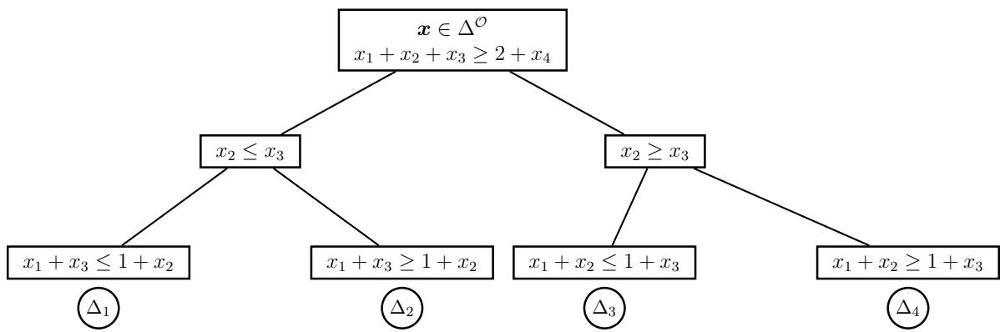

# Dimension Dependent Correlation Gap Bounds under Restricted Independence

Arjun Ramachandra∗

June 2026

## Abstract

The pairwise independent correlation gap is defined as the ratio of the maximum expected value of a set function under arbitrary dependence to the maximum expected value when the underlying random elements are restricted to be pairwise independent, and hence measures the loss in expected value under this independence restriction. Under the more restrictive assumption of mutual independence, [4] proved that this gap is universally bounded by $e / ( e - 1 )$ for the class of monotone submodular set functions. With pairwise independence, a tighter upper bound of $4 / 3$ was established in [2] for several special cases, including $n = 3$ , and conjectured to hold universally across all dimensions and marginal probabilities for the class of monotone submodular functions. However, a recent AI-assisted counterexample in [3] disproved this conjecture by showing that the $4 / 3$ bound fails for $n = 5$ , leaving the validity of the bound for $n = 4$ and the tight worst case bound for pairwise independence open.

We resolve both questions in this paper. First, for $n = 4 .$ , we establish that the $4 / 3$ bound holds universally and is tight using an AI-assisted proof combining theoretical analysis and computational verification. The proof combines a structural characterization of optimal numerator vertices, permutation symmetry, cone certificate systems, Bernstein polynomial representations, recursive simplex subdivision, and a computational verification of 2, 745 Bernstein coeficient systems. Second, we show that the worst case pairwise independent correlation gap attains $e / ( e - 1 )$ asymptotically by constructing an instance with identical marginal probabilities and defining a monotone submodular union coverage function on a ground set partitioned into m blocks. The key condition is that the number of blocks grows sublinearly with the ground set size, so that both the number of blocks and the size of each block tend to infinity. The result follows by constructing a feasible solution to a scaled asymptotic reduced dual of the pairwise independent linear program with identical marginals. The asymptotic result immediately extends to t-wise independent $\left( t \geq 2 \right)$ random elements, since t-wise independence implies pairwise independence. The key insight of this paper is that the pairwise independent correlation gap exhibits a dimension dependent worst case bound, with $n = 4$ being the largest dimension for which the $4 / 3$ bound holds, while the worst case gap fails to improve upon the classical $e / ( e - 1 )$ bound, attaining it asymptotically. Thus, pairwise independence, despite being the least restrictive form of independence in the t-wise independence hierarchy can be as restrictive as mutual independence in the worst case.

Keywords: Correlation gap; pairwise independence; monotone submodular functions; coverage functions;   
concave closure; Bernstein polynomials; linear programming.

## 1 Introduction

Let $N = \{ 1 , 2 , \dots , n \}$ denote a ground set with n elements and $f : 2 ^ { N } \to \mathbb { R } _ { + }$ be a nonnegative monotone submodular set function defined on the power set $2 ^ { N }$ . A function is monotone (non-decreasing) if $f ( S ) \leq$ $f ( T )$ for all $S \subseteq T$ and submodular if $f ( S ) + f ( T ) \geq f ( S \cap T ) + f ( S \cup T )$ for all $S , T \subseteq N$ or equivalently $f ( S \cup \{ i \} ) - f ( S ) \geq f ( T \cup \{ i \} ) - f ( T )$ for all $S \subseteq T , i \in N \backslash T .$ . For a given marginal probability vector ${ \pmb x } =$ $( x _ { 1 } , \ldots , x _ { n } )$ and a monotone submodular function $f ,$ the correlation gap compares the maximum expected value under arbitrary dependence with the expected value obtained under independence by computing their ratio. The numerator in this ratio is referred to as the concave closure $f ^ { + } : [ 0 , 1 ] ^ { n } \to \mathbb { R } _ { + }$ and can be viewed as a continous extension of the set function $f ,$ , defined as the maximum expected value of the function over all joint distributions u in which each element $i \in N$ is selected with probability $x _ { i } , i . e . ,$

$$
\begin{array} { r l } { f ^ { + } ( x ) = \displaystyle \operatorname* { m a x } _ { u } } & { \mathbb { E } { u } [ f ] = \displaystyle \sum _ { S \subseteq N } u _ { S } f ( S ) } \\ { \mathrm { s . t . } } & { \displaystyle \sum _ { S \subseteq N } u _ { S } = 1 , } \\ { \displaystyle \sum _ { S \ni i } u _ { S } = x _ { i } , \quad } & { \forall i \in N , } \\ { \displaystyle u _ { S } \geq 0 , \quad } & { \forall S \subseteq N . } \end{array}\tag{1}
$$

where $u _ { S }$ denotes the probability mass assigned to the subset $S \subseteq N$ . Here, the symbol u is used to denote the univariate information specified by the marginal probabilities, with no restrictions imposed on higher order dependence. The denominator in the correlation gap ratio is referred to as the multilinear extension defined as $\begin{array} { r } { F ( { \pmb x } ) = \sum _ { S \subset N } f ( S ) \left( \prod _ { i \in S } x _ { i } \prod _ { i \notin S } ( 1 - x _ { i } ) \right) } \end{array}$ which is the expected function value assuming the random elements to be mutually independent. The correlation gap $f ^ { + } ( { \pmb x } ) / F ( { \pmb x } )$ can be interpreted as the loss of optimality incurred by ignoring the higher order dependence (correlations) and imposing independence instead and was shown in [4] to be universally bounded by $e / ( e - 1 )$ for the class of monotone submodular functions. It has found widespread applications in stochastic optimization including facility location, Steiner tree problems, and social welfare maximization with combinatorial auctions [4], mechanism design [7], distributionally robust bottleneck optimization [2], prophet inequalities [8], matroid theory [9] and several submodular optimization problems [10]. Given the restrictive nature of the mutual independence assumption and motivated by whether relaxing mutual independence to weaker notions of independence can further reduce this gap, [1] introduced the pairwise independent extension of the set function $f$ given by $f ^ { + + } : [ 0 , 1 ] ^ { n } \to \mathbb { R } _ { + }$ . In addition to the marginal probability information, this extension assumes that the random elements are pairwise independent and can be expressed as:

$$
\begin{array} { r l } { f ^ { + + } ( x ) = \displaystyle \operatorname* { m a x } _ { p } } & { \mathbb { E } p [ f ] = \displaystyle \sum _ { S \leq N } p _ { s } f ( S ) } \\ { \mathrm { s . t . } } & { \displaystyle \sum _ { S \leq N } p _ { s } = 1 , } \\ { \displaystyle \sum _ { S \geq N } p _ { s } = x _ { i } , } & { \forall i \in N , } \\ { \displaystyle \sum _ { S \geq \{ i , j \} } p _ { s } = x _ { i } x _ { j } , } & { \forall i \in N \} , } \\ { \displaystyle \sum _ { S \geq \{ i , j \} } p _ { s } = x _ { i } x _ { j } , } & { \forall i < j , i \in N , j \in N } \\ { p _ { s } \geq 0 , } & { \forall S \subset N . } \end{array}\tag{2}
$$

where $p _ { S }$ denotes the probability mass assigned to the subset $S \subseteq N$ with the symbol $p$ used to denote the pairwise information specified by the marginal and pairwise probabilities. Pairwise independence is a restrictive notion of independence in the sense that it imposes only pairwise constraints while allowing arbitrary higher order dependencies. The sparse support of these distributions also has proved to be useful in eficient derandomization of algorithms for NP-hard optimization problems [11]. The pairwise independent correlation gap, defined in the same paper of [1] as the ratio $f ^ { + } ( { \pmb x } ) / f ^ { + + } ( { \pmb x } )$ , was expected to admit a sharper upper bound than the $e / ( e - 1 )$ bound on $f ^ { + } ( { \pmb x } ) / F ( { \pmb x } )$ . This is because the pairwise independent extension in (2) includes the mutually independent distribution as a feasible solution, which implies that

$$
f ^ { + } ( { \pmb x } ) / f ^ { + + } ( { \pmb x } ) \leq f ^ { + } ( { \pmb x } ) / F ( { \pmb x } ) \leq e / ( e - 1 ) .
$$

Unfortunately, computing both $f ^ { + } ( { \pmb x } )$ and $f ^ { + + } ( { \pmb x } )$ is NP-hard in the worst case for monotone submodular functions (see [4]). In particular, unlike $F ( { \pmb x } )$ , which is evaluated for the mutually independent distribution irrespective of the function $f ,$ the optimal probability distributions that attain the $f ^ { + } ( { \pmb x } )$ and $f ^ { + + } ( { \pmb x } )$ are not oblivious to the function $f$ wich makes the analysis challenging even for small dimensions such as $n = 3$ (see [2]).

Despite this challenge, a reduced upper bound of $4 / 3$ on $f ^ { + } ( { \pmb x } ) / f ^ { + + } ( { \pmb x } )$ has been proven in special cases. For the specific submodular function $f ( S ) = \mathrm { m i n } ( | S | , 1 )$ , with arbitrary dimension n and any marginal probabilities $\pmb { x } \in [ 0 , 1 ] ^ { n } , [ 1 ]$ proved that the $4 / 3$ upper bound was tight. The analysis was further extended in [2], showing that the $4 / 3$ bound holds for all monotone submodular functions in two cases: (a) $n = 3$ with unrestricted marginal probabilities, and (b) general n with restricted marginal probabilities. However, unlike the $e / ( e \mathrm { ~ - ~ } 1 )$ bound, the universal validity of the $4 / 3$ bound for arbitrary monotone submodular functions, dimensions $n ,$ and marginal probabilities x remained an open question, leading [2] to conjecture that the $4 / 3$ bound holds universally.

## 2 Recent Developments and Our Contributions

More recently, the universal $4 / 3$ conjecture was disproved in [3], by constructing an AI-assisted counterexample for $n = 5$ Bernoulli random elements that attains a pairwise independent correlation gap of

$$
{ \frac { 6 4 0 } { 4 7 9 } } \approx 1 . 3 3 6 > { \frac { 4 } { 3 } }
$$

with a monotone submodular coverage function. The $n = 5$ counterexample can be extended to every dimension $n > 5$ by padding it with Bernoulli variables having marginal probability zero. Such variables are identically zero and hence neither appear in the support of the optimal joint distribution nor afect the marginal constraints or the optimal objective. This means that the worst case ratio lies in the interval $[ 6 4 0 / 4 7 9 , e / ( e - 1 ) ]$ for $n \geq 5$ . Consequently, as claimed in $[ 3 ] , n = 4$ is the only dimension for which the validity of the $4 / 3$ bound remained unresolved. On the other hand, the counterexample for $n \geq 5$ raises a broader question: if the $4 / 3$ bound fails for $n \geq 5$ , what then is a universal upper bound on the pairwise independent correlation gap across dimensions $\textit { n } ?$ Can it beat the $e / ( e - 1 )$ bound in the worst case? We resolve both questions in this paper, the first in the afirmative and the second in the negative, by establishing that:

1. The $4 / 3$ upper bound survives for $n = 4$ using an AI-assisted proof combining theoretical analysis and computational verification, and is tight.

2. The worst case pairwise independent correlation gap attains $e / ( e - 1 )$ asymptotically as $n \to \infty$ , the same worst case bound established in [4] under mutual independence. As an immediate consequence, since every t-wise independent distribution $\left( t \geq 2 \right)$ is necessarily pairwise independent, our result implies that the worst case t-wise independent correlation gap is also exactly $e / ( e - 1 )$ .

These two results are fundamentally diferent in nature: The first result for $n = 4$ , involves providing a universal certification showing that the $4 / 3$ bound holds for every monotone submodular function and every marginal probability vector $\pmb { x } \in [ 0 , 1 ] ^ { 4 }$ . The second result, on the other hand, provides an asymptotic worst case construction showing that $e / ( e - 1 )$ is asymptotically attained as $n \to \infty$ , implying that pairwise independence, despite being the least restrictive form of independence in the t-wise independence hierarchy, can be as restrictive as mutual independence in the worst case. Together, these results add to the literature on the characterization of the worst case pairwise independent correlation gap across dimensions for the class of monotone submodular functions.

Table 1 summarizes the progression of results on the worst case pairwise independent correlation gap and presents the current state of knowledge across dimensions $n .$ The rest of the paper is organized as follows: Section 3 establishes the tightness of the $4 / 3$ bound for $n = 4$ random elements while Section 4 establishes the asymptotic attainment of the $e / ( e - 1 )$ bound as $n \to \infty$ and Section 5 summarizes the key contributions of this work with possible future directions. Proofs are relegated to the appendix whenever possible and are retained in the main body only when they are essential for understanding subsequent results.

Table 1: Tight worst case pairwise independent correlation gap for monotone submodular functions
<table><tr><td rowspan=1 colspan=1>Dimension</td><td rowspan=1 colspan=1>Tight worst case bound</td><td rowspan=1 colspan=1>Reference</td></tr><tr><td rowspan=1 colspan=1> $n = 2 , 3$ </td><td rowspan=1 colspan=1>4-3</td><td rowspan=1 colspan=1>[2]</td></tr><tr><td rowspan=1 colspan=1> $n = 4$ </td><td rowspan=1 colspan=1>4-3</td><td rowspan=1 colspan=1>This paper</td></tr><tr><td rowspan=1 colspan=1> $n \geq 5$ </td><td rowspan=1 colspan=1> $\left[ { \frac { 6 4 0 } { 4 7 9 } } , { \frac { e } { e - 1 } } \right]$ </td><td rowspan=1 colspan=1>[3]</td></tr><tr><td rowspan=1 colspan=1> $n \to \infty$ </td><td rowspan=1 colspan=1> $\frac { e } { e - 1 }$ </td><td rowspan=1 colspan=1>This paper</td></tr></table>

## 3 A 4/3 bound for $n = 4$ random elements

For $n = 4$ random elements, denote the ground set as $N _ { 4 } = \{ 1 , 2 , 3 , 4 \}$

Theorem 1 (Worst case pairwise independent correlation gap for $n = 4 )$ . For every nonnegative monotone submodular function $f : 2 ^ { N _ { 4 } } \to \mathbb { R } _ { + }$ and every $\pmb { x } \in [ 0 , 1 ] ^ { 4 }$ ，

$$
\frac { f ^ { + } ( x ) } { f ^ { + + } ( x ) } \leq \frac { 4 } { 3 }
$$

and the bound is tight.

Proof. A brief overview of the proof is outlined in the seven steps below:

(i) We first recall a standard result from LP theory in Lemma 1, which states that an optimal numerator vertex in 4 dimensions is supported on at most five subsets. Further, if an optimal vertex is degenerate with smaller support, Corollary 1 shows that it can be extended to a nonsingular five-subset basis.

(ii) For a chosen optimal numerator vertex corresponding to one of the 3008 nonsingular five-subset bases, Corollary 2 shows that the marginal vector x lies in the incidence simplex corresponding to the five incidence vectors of this basis. The set of all incidence simplices corresponding to these bases form an overlapping cover of the entire marginal probability space $[ 0 , 1 ] ^ { 4 }$

(iii) Lemma 2 provides a suficient cone certificate condition for the $4 / 3$ bound to hold for every function in the cone of nonnegative monotone submodular functions and every $\pmb { x } \in [ 0 , 1 ] ^ { 4 }$ . The key idea is to consider primal, rather than dual, certificates for the numerator, allowing both the numerator and denominator certificates to be formulated in the same primal space and thereby incorporated into a common cone certificate system. Since the optimal numerator vertex can correspond to any one of the 3008 nonsingular five-subset bases, a certificate of feasibility must be provided for each one of them with marginal probabilities restricted to lie in the corresponding incidence simplex.

(iv) To overcome the challenge of generating certificates over the continuum of marginal vectors for each such basis, we use a degree-two Bernstein basis to express the probability distributions and other relevant parameters as quadratic functions of the convex coeficients, yielding 15 coeficient blocks corresponding to the pairs $0 \leq a \leq b \leq 4 .$ For each such coeficient block and a chosen nonsingular five-subset basis, Corollary 4 shows that it is suficient to check for feasibility of a Bernstein coeficient system defined in Lemma 4 to ensure a feasible cone certificate.

(v) Further, we exploit permutation symmetry to show that the 3, 008 nonsingular five-subset bases can be reduced to 183 orbits, where bases in the same orbit are equivalent up to a permutation of the four elements. Lemma 5 shows that it sufices to solve each of the the 15 Bernstein coeficient systems for one representative from each orbit.

(vi) To handle representative orbit simplices on which the Bernstein coeficient system is infeasible, we provide an Algorithm 1 that recursively subdivides each such simplex along its longest edge until all terminal leaf simplices admit feasible certificates, thereby providing a certified cover of the entire simplex.

(vii) Finally, we implemented Algorithm 1 in code and used linear programming to computationally verify the feasibility of all $1 5 \times 1 8 3 = 2$ , 745 Bernstein coeficient systems corresponding to the 15 coeficient blocks and 183 permutation orbit representatives. All systems were found to be feasible, yielding a total of 4, 476 successful leaf simplices and thereby establishing the $4 / 3$ bound for $n = 4$ as claimed.

Declaration of AI-assisted research methodology for the $n = 4$ proof: The $n = 4$ proof strategy was initially explored through a human-AI workflow involving GPT 5.6 and Fable 5, including the cone certificate formulation and the use of a Bernstein representation to avoid checking certificates separately at every marginal probability vector. The author subsequently verified, corrected, and refined the resulting strategy, in particular by requiring the numerator distribution in the cone certificate to correspond to an optimal primal vertex, and developed the resulting systematic treatment of the possible optimal vertices. The subsequent proof development incorporated permutation symmetry and recursive simplex subdivision along with independent verification of computational results.

Remark 1 (Negative dependence is fragile in high dimensions). The structure of submodularity tends to encourage negative dependence, and our $n = 4$ result resonates with the broader observation in the literature that negative dependence is delicate and need not persist beyond low dimensional regimes. In matroid theory, for example, [12] showed that every rank-3 matroid has the Rayleigh property, which corresponds to pairwise negative correlation, whereas rank-4 matroids need not have this property. [13] provided an example to illustrate a positively correlated pair in a rank-4 transversal matroid.

Remark 2 (Advantages of a primal based proof technique). Unlike $[ { \mathcal { Q } } ] ,$ where the $4 / 3$ bound for $n = 3$ was proved analytically using the dual of the concave closure for the numerator (see Theorem 5 therein), the primal based approach in our proof of Theorem 1 works directly with 183 representative permutation orbits of the 3, 008 possible optimal primal numerator vertices. The denominator, however, is handled directly through a primal feasible pairwise independent distribution, similar to $[ { \mathcal { Q } } ] .$ . The key advantage of a primal based approach for the numerator is that it allows the numerator and denominator certificates to be formulated in the same primal space, so that a common cone certificate system can be used, as in Lemma 2. In contrast, the approach in $[ \mathcal { Q } ]$ requires identifying dual feasible solutions for the numerator and primal feasible solutions for the denominator across every interaction between the partition blocks of the marginal probability space and those of the submodular function cone.

Remark 3 (Tightness of $4 / 3$ bound for $n = 4 )$ . The $4 / 3$ bound in Theorem 1 for $n = 4$ is attained for the submodular function $f ( S ) = \operatorname* { m i n } \{ | S | , 1 \} , S \subseteq N _ { 4 }$ , with marginal probabilities satisfying $x _ { 1 } + x _ { 2 } + x _ { 3 } =$ $\textstyle { \frac { 1 } { 2 } } , x _ { 4 } = { \frac { 1 } { 2 } }$ . This follows directly from Proposition 2.5 in $[ 1 ]$ , which establishes the same tightness result for general n.

The remainder of this section details the proof of Theorem 1 in parts, following the steps outlined above.

## 3.1 Preliminary results leading to proof of Theorem 1

For any $S \subseteq N _ { 4 }$ , let

$$
\pmb { v } _ { S } = \left( \mathbb { 1 } _ { \{ 1 \in S \} } , \mathbb { 1 } _ { \{ 2 \in S \} } , \mathbb { 1 } _ { \{ 3 \in S \} } , \mathbb { 1 } _ { \{ 4 \in S \} } \right) ^ { \top } \in \{ 0 , 1 \} ^ { 4 } ,
$$

denote the incidence vector of $S _ { ; }$ , where $\mathbb { 1 } _ { \{ \cdot \} }$ denotes the indicator function. Define the matrix

$$
A = \left[ \begin{array} { c c c c } { 1 } & { 1 } & { \cdots } & { 1 } \\ { \pmb { v } _ { \emptyset } } & { \pmb { v } _ { \{ 1 \} } } & { \cdots } & { \pmb { v } _ { N _ { 4 } } } \end{array} \right] \in \mathbb { R } ^ { 5 \times 1 6 } ,
$$

where the columns are indexed by the 16 subsets of $N _ { 4 }$ . Then for any fixed marginal vector $\pmb { x } \in [ 0 , 1 ] ^ { 4 }$ , the feasible region of the concave closure (1) can be expressed as:

$$
\mathcal { F } _ { \mathrm { U } } ( \pmb { x } ) : = \left. \pmb { u } \in \mathbb { R } _ { + } ^ { 1 6 } : A \pmb { u } = \binom { 1 } { \pmb { x } } \right. ,
$$

which is non-empty, since the mutually independent distribution $\begin{array} { r } { \pmb { u } _ { \mathrm { i n d } } ( \boldsymbol { S } ) = \prod _ { i \in S } x _ { i } \ \prod _ { i \notin S } ( 1 - x _ { i } ) } \end{array}$ satisfies ${ \pmb u } _ { \mathrm { i n d } } \in \mathcal { F } _ { \mathrm { U } } ( { \pmb x } )$ . The optimal objective of the concace closure is then:

$$
f ^ { + } ( { \pmb x } ) = \operatorname* { m a x } _ { { \pmb u } \in \mathcal { F } _ { \mathrm { U } } ( { \pmb x } ) } { \pmb f ^ { \top } } { \pmb u }
$$

where $f \in \mathbb { R } _ { + } ^ { 1 6 }$ denotes the vector representation of the non-negative monotone submodular set function $f : 2 ^ { N _ { 4 } } \to \mathbb { R }$ . Denote by $2 ^ { N _ { 4 } }$ the power set of $N _ { 4 }$ containing 16 possible subsets. Let $J = \mathrm { s u p p } ( \pmb { u } ) \subseteq 2 ^ { N _ { 4 } }$ denote the support of the feasible distribution u, i.e., the collection of subsets $S ~ \subseteq ~ N _ { 4 }$ to which u assigns positive probability. The next lemma recalls a standard result from linear programming theory characterizing the support of a vertex distribution $\pmb { u } \in \mathcal { F } _ { \mathrm { U } } ( \pmb { x } )$

Lemma 1 (Vertex characterization by support). A feasible distribution $\pmb { u } \in \mathcal { F } _ { \mathrm { U } } ( \pmb { x } )$ is a vertex if and only if the columns of A corresponding to supp(u) are linearly independent. In particular, every vertex of $\mathcal { F } _ { \mathrm { U } } ( \pmb { x } )$ is supported on at most five subsets of $N _ { 4 }$

Proof. The proof is relegated to Appendix A.1.

We call a collection of five subsets $B = \{ S _ { 0 } , S _ { 1 } , S _ { 2 } , S _ { 3 } , S _ { 4 } \} , \ S _ { i } \subseteq N _ { 4 }$ , a nonsingular five subset basis if the corresponding incidence vectors ${ \pmb v } _ { 0 } , { \pmb v } _ { 1 } , { \pmb v } _ { 2 } , { \pmb v } _ { 3 } , { \pmb v } _ { 4 } \in \{ 0 , 1 \} ^ { 4 }$ are afinely independent, or equivalently, the associated submatrix

$$
A _ { B } = \left[ { \begin{array} { c c c c c } { 1 } & { 1 } & { 1 } & { 1 } & { 1 } \\ { \pmb { v } _ { 0 } } & { \pmb { v } _ { 1 } } & { \pmb { v } _ { 2 } } & { \pmb { v } _ { 3 } } & { \pmb { v } _ { 4 } } \end{array} } \right] \in \mathbb { R } ^ { 5 \times 5 }
$$

is nonsingular. We next establish that the support of a degenerate vertex can be extended to a nonsingular five subset basis.

Corollary 1 (Extension of a degenerate vertex to a nonsingular five subset basis). Let u be a degenerate vertex of $\mathcal { F } _ { \mathrm { U } } ( \pmb { x } )$ wit $\textit { b } | \operatorname { s u p p } ( { \pmb u } ) | < 5$ . Then the corresponding columns of A can be extended to a set of five linearly independent columns of A, corresponding to a nonsingular five subset basis.

Proof. By Lemma 1, for any vertex u, the columns corresponding to $\operatorname { s u p p } ( { \pmb u } )$ are linearly independent. Since rank $( A ) = 5$ , they can be extended to five linearly independent columns of A, yielding a nonsingular five subset basis. □

Let $V = \{ \pmb { v } _ { 0 } , \ldots , \pmb { v } _ { 4 } \}$ be a set of afinely independent incidence vectors $\pmb { v } _ { 0 } , \dots , \pmb { v } _ { 4 } \in \{ 0 , 1 \} ^ { 4 }$ . Define the corresponding incidence simplex as $\Delta _ { V } = \mathrm { c o n v } \{ \pmb { v } _ { 0 } , \ldots , \pmb { v } _ { 4 } \}$ . The next result shows that the optimal numerator vertex ${ \pmb u } ^ { \star } ( { \pmb x } , { \pmb f } )$ corresponding to a given marginal probability vector x and monotone submodular function vector f induces a nonsingular five subset basis B whose incidence simplex $\Delta _ { V } ( B )$ contains the marginal probability vector x.

Corollary 2 (Marginal probability vector in the convex hull of an optimal basis). Given $\pmb { x } \in [ 0 , 1 ] ^ { 4 }$ and a monotone submodular function vector $f _ { i }$ , let ${ \pmb u } ^ { \star } ( { \pmb x } , { \pmb f } )$ denote an optimal vertex $o f \mathcal { F } ^ { \mathrm { U } } ( { \pmb x } )$ . Then there exists a nonsingular five subset basis $B = \{ S _ { 0 } , S _ { 1 } , S _ { 2 } , S _ { 3 } , S _ { 4 } \} , \ S _ { i } \subseteq N _ { 4 }$ , with corresponding afinely independent incidence vectors $\pmb { v } _ { 0 } , \dots , \pmb { v } _ { 4 } \in \{ 0 , 1 \} ^ { 4 }$ and convex coeficients $\begin{array} { r } { \eta _ { i } \geq 0 , \sum _ { i = 0 } ^ { 4 } \eta _ { i } = 1 } \end{array}$ , such that

$$
{ \pmb u } ^ { \star } ( { \pmb x } , { \pmb f } ) = \sum _ { i = 0 } ^ { 4 } \eta _ { i } { \pmb e } _ { S _ { i } } , \qquad { \pmb x } = \sum _ { i = 0 } ^ { 4 } \eta _ { i } { \pmb v } _ { i } .
$$

where $e _ { S } \in \mathbb { R } ^ { 1 6 }$ denote the unit vector corresponding to $S \subseteq N _ { 4 }$ . In particular, $\pmb { x } \in \Delta _ { V } ( B ) = \mathrm { c o n v } \{ \pmb { v } _ { 0 } , \dots , \pmb { v } _ { 4 } \}$ Proof. Since $\mathcal { F } _ { \mathrm { U } } ( { \pmb x } ) \neq \emptyset$ , an optimal vertex must exist for any $\pmb { x } \in [ 0 , 1 ] ^ { 4 }$ . By Lemma 1, the optimal vertex ${ \pmb u } ^ { \star } ( { \pmb x } , { \pmb f } )$ is supported on at most five subsets. By Corollary 1, this support can be extended to a nonsingular five subset basis $B = \{ S _ { 0 } , \ldots , S _ { 4 } \}$ . Hence $\begin{array} { r } { { \pmb u } ^ { \star } ( { \pmb x } , { \pmb f } ) = \sum _ { i = 0 } ^ { 4 } \eta _ { i } { \pmb e } _ { S _ { i } } } \end{array}$ for convex coeficients $\eta _ { i } .$ with $\eta _ { i } = 0$ for any added subset in the extension. Since $A { \pmb u } ^ { \star } ( { \pmb x } , { \pmb f } ) = ( 1 , { \pmb x } ) ^ { \top }$ ⊤ and $A e _ { S _ { i } } = ( 1 , \pmb { v } _ { i } ) ^ { \top }$ , we obtain

$$
\binom { 1 } { \pmb { x } } = \sum _ { i = 0 } ^ { 4 } \eta _ { i } \left( { \pmb { v } } _ { i } \right) ,
$$

and therefore $\begin{array} { r } { \pmb { x } = \sum _ { i = 0 } ^ { 4 } \eta _ { i } \pmb { v } _ { i } } \end{array}$ , implying that $\pmb { x } \in \Delta _ { V } ( B )$

Corollary 3 (Coverage and overlap of nonsingular five-subset simplices). Let $\boldsymbol { B } _ { \mathrm { N S } }$ denote the collection of all nonsingular five-subset bases, and let $\Delta _ { V } ( B )$ denote the incidence simplex corresponding to each $B \in B _ { \mathrm { N S } }$ . Then the set of all such incidences simplices form an overlapping cover of the entire marginal probability space, i.e.,

$$
[ 0 , 1 ] ^ { 4 } = \bigcup _ { B \in B _ { \mathrm { N S } } } \Delta _ { V } ( B ) ,
$$

and distinct nonsingular incidence simplices can have non-empty intersections.

Proof. The proof is relegated to Appendix A.2.

We next turn to the denominator of the correlation gap and characterize pairwise independent distributions by appending the six pairwise moment constraints to the total probability and marginal constraints. For $S \subseteq N _ { 4 }$ , let

$$
\begin{array} { r } { { \pmb w } _ { S } = \left( \mathbb { 1 } _ { \{ 1 , 2 \} \in S } , \mathbb { 1 } _ { \{ 1 , 3 \} \in S } , \mathbb { 1 } _ { \{ 1 , 4 \} \in S } , \mathbb { 1 } _ { \{ 2 , 3 \} \in S } , \mathbb { 1 } _ { \{ 2 , 4 \} \in S } , \mathbb { 1 } _ { \{ 3 , 4 \} \in S } \right) ^ { \top } \in \{ 0 , 1 \} ^ { 6 } . } \end{array}
$$

denote the vector of pairwise incidences of S. For a marginal vector $\pmb { x } = ( x _ { 1 } , x _ { 2 } , x _ { 3 } , x _ { 4 } ) ^ { \top } \in [ 0 , 1 ] ^ { 4 }$ , define the pairwise product vector

$$
\pmb { y } ( \pmb { x } ) = \left( x _ { 1 } x _ { 2 } , x _ { 1 } x _ { 3 } , x _ { 1 } x _ { 4 } , x _ { 2 } x _ { 3 } , x _ { 2 } x _ { 4 } , x _ { 3 } x _ { 4 } \right) ^ { \top } \in \mathbb { R } ^ { 6 } .
$$

and the appended matrix

$$
A ^ { \mathrm { P } } = \left[ \begin{array} { l l l l } { 1 } & { 1 } & { \cdots } & { 1 } \\ { v _ { \emptyset } } & { v _ { \{ 1 \} } } & { \cdots } & { v _ { N _ { 4 } } } \\ { w _ { \emptyset } } & { w _ { \{ 1 \} } } & { \cdots } & { w _ { N _ { 4 } } } \end{array} \right] \in \mathbb { R } ^ { 1 1 \times 1 6 } .
$$

Then, for any fixed marginal vector $\pmb { x } \in [ 0 , 1 ] ^ { 4 }$ , the feasible region of the pairwise independent extension (2) can be expressed as:

$$
\mathcal { F } _ { \mathrm { P } } ( \pmb { x } ) : = \left\{ \pmb { p } \in \mathbb { R } _ { + } ^ { 1 6 } : A ^ { \mathrm { P } } \pmb { p } = \left( \begin{array} { c } { 1 } \\ { \pmb { x } } \\ { \pmb { y } ( \pmb { x } ) } \end{array} \right) \right\} .\tag{3}
$$

which is non-empty, since the mutually independent distribution is also pairwise independent. The corresponding optimal objective is

$$
f _ { \mathrm { P } } ^ { + } ( { \pmb x } ) = \operatorname* { m a x } _ { { \pmb p } \in \mathcal { F } _ { \mathrm { P } } ( { \pmb x } ) } { \pmb f } ^ { \top } { \pmb p } .
$$

We next characterize the cone of normalized monotone submodular functions on $N _ { 4 }$

## 3.2 Cone certificate equation

Let $f \in \mathbb { R } ^ { 1 6 }$ denote the vector representation of a non-negative monotone submodular set function $f$ : $2 ^ { N _ { 4 } } \to \mathbb { R } _ { + }$ , with one component corresponding to each subset of $N _ { 4 }$ . Monotonicity requires

$$
f ( S \cup \{ i \} ) - f ( S ) \geq 0 , \qquad \forall i \in N _ { 4 } , \quad \forall S \subseteq N _ { 4 } \setminus \{ i \} ,
$$

which can be represented by $\begin{array} { r } { \sum _ { i \in N _ { 4 } } | 2 ^ { N _ { 4 } \setminus \{ i \} } | = 4 \cdot 2 ^ { 3 } = 3 2 } \end{array}$ inequalities (where $2 ^ { S }$ denotes the power set of $S )$ , since each element $i \in N _ { 4 }$ can be added to any subset of the remaining three elements. Submodularity requires

$$
f ( S \cup \{ i \} ) + f ( S \cup \{ j \} ) - f ( S ) - f ( S \cup \{ i , j \} ) \geq 0 , \quad \forall i , j \in N _ { 4 } , \quad \forall S \subseteq N _ { 4 } \setminus \{ i , j \} , \quad i < j _ { 3 } ^ { \prime } \cup \{ i , j \} .
$$

which can similarly be represented by $\begin{array} { r } { \sum _ { i , j \in N _ { 4 } , i < j } | 2 ^ { N _ { 4 } \setminus \{ i , j \} } | = 6 \cdot 2 ^ { 2 } = 2 4 } \end{array}$ inequalities. Thus, any monotone submodular function can be represented by $3 2 + 2 4 = 5 6$ inequalities, compactly written as

$$
G f \ge 0 , \qquad G \in \{ - 1 , 0 , 1 \} ^ { 5 6 \times 1 6 } ,
$$

where each row of G is the coeficient vector of one of the monotonicity or submodularity inequalities above. The cone of monotone submodular functions normalized at the empty set is therefore

$$
\mathcal { C } = \left\{ \mathbf { \mathscr { f } } \in \mathbb { R } ^ { 1 6 } : G \pmb { \mathscr { f } } \geq 0 , \mathbf { \mathscr { f } } ( \varnothing ) = 0 \right\} .
$$

We next establish a cone certificate equation that provides a suficient condition for the desired $4 / 3$ bound on the correlation gap.

Lemma 2 (Cone certificate equation). Fix $\boldsymbol { x } \in [ 0 , 1 ] ^ { 4 }$ and a normalized monotone submodular function $\pmb { f } \in \mathcal { C }$ . Let ${ \pmb u } ^ { \star } ( { \pmb x } , { \pmb f } )$ denote an optimal vertex of $\mathcal { F } _ { \mathrm { U } } ( \pmb { x } )$ . Suppose there exists a certificate $( p , \gamma , c )$ with

$$
\pmb { p } \in \mathcal { F } _ { \mathrm { P } } ( \pmb { x } ) , \qquad \gamma \in \mathbb { R } _ { + } ^ { 5 6 } , \qquad \pmb { c } \in \mathbb { R } ,
$$

satisfying

$$
{ \frac { 4 } { 3 } } p - { \pmb u } ^ { \star } = G ^ { \top } \gamma + c e _ { \emptyset } .\tag{4}
$$

where $\boldsymbol { e } _ { \emptyset } \in \mathbb { R } ^ { 1 6 }$ denotes the unit vector corresponding to the empty set. Then

$$
f ^ { + } ( x ) \leq { \frac { 4 } { 3 } } f ^ { + + } ( x ) .
$$

Proof. We refer to (4) as the cone certificate equation, since $G ^ { \top } \gamma$ , with $\gamma \geq \mathbf { 0 }$ , belongs to the conic hull of the columns of $G ^ { \top }$ (equivalently, the rows of $G )$ . Taking the inner product of (4) with f gives

$$
\frac { 4 } { 3 } \pmb { p } ^ { \top } \pmb { f } - \pmb { u } ^ { \star ^ { \top } } \pmb { f } = \gamma ^ { \top } G \pmb { f } + c f ( \emptyset ) .
$$

Since $f$ is monotone submodular, we have $G f \geq \mathbf { 0 }$ and since $\gamma \geq \mathbf { 0 }$ , we have $\gamma ^ { \top } G f \geq 0$ . Moreover, since $f$ is normalized, $f ( \varnothing ) = 0$ . Hence

$$
f ^ { + } ( { \pmb x } ) = { \pmb u } ^ { \star } ^ { \top } { \pmb f } \leq \frac { 4 } { 3 } { \pmb p } ^ { \top } { \pmb f } \leq \frac { 4 } { 3 } f ^ { + + } ( { \pmb x } ) ,
$$

where the second inequality follows from $\pmb { p } \in \mathcal { F } _ { \mathrm { P } } ( \pmb { x } )$

Remark 4. The scalar c provides an additional degree of freedom in the cone certificate equation (4), without which, the vector $\frac 4 3 p - u ^ { \star }$ would be forced to lie in the cone generated by the columns of $G ^ { \top }$ . The term $c e _ { \emptyset }$ relaxes the first coordinate of the 16-dimensional vector equation, while having no efect on the resulting inequality because $f ( \varnothing ) = 0$ for every normalized submodular function.

Corollary 4 (Suficiency of cone certificates for each nonsingular five-subset basis). Let $ { { \cal B } } _ { \mathrm { N S } }$ denote the collection of all nonsingular five-subset bases in four dimensions. There are ${ \binom { 1 6 } { 5 } } = { \dot { 4 } }$ , 368 five-subset bases in four dimensions, of which it can be verified that $| B _ { \mathrm { N S } } | = 3$ , 008 are nonsingular. Then:

(i) Every possible combination of x and ${ \pmb u } ^ { \star } ( { \pmb x } , { \pmb f } )$ is associated with some $B \in B _ { \mathrm { N S } }$ , with $\pmb { x } \in \Delta _ { V } ( B )$ and ${ \pmb u } ^ { \star } ( { \pmb x } , { \pmb f } )$ supported on the corresponding five subsets.

(ii) To prove a $4 / 3$ bound on the pairwise independent correlation gap, it sufices to establish a feasible certificate $( p , \gamma , c )$ satisfying (4) for every possible combination of x and optimal numerator vertex ${ \pmb u } ^ { \star } ( { \pmb x } , { \pmb f } )$ , which together correspond to some $B \in B _ { \mathrm { N S } }$

Proof. For any $\pmb { x } \in [ 0 , 1 ] ^ { 4 }$ and $\pmb { f } \in \mathcal { C } .$ , let ${ \pmb u } ^ { \star } ( { \pmb x } , { \pmb f } )$ denote the optimal numerator vertex. By Lemma 1, every vertex of $\mathcal { F } _ { \mathrm { U } } ( \pmb { x } )$ , and hence ${ \pmb u } ^ { \star } ( { \pmb x } , { \pmb f } )$ , corresponds to a nonsingular five-subset basis. If ${ \pmb u } ^ { \star } ( { \pmb x } , { \pmb f } )$ is degenerate, Corollary 1 allows its support to be extended to a nonsingular five-subset basis $B \in B _ { \mathrm { N S } }$ , with zero probability assigned to any added subsets. By Corollary 2, the same convex coeficients representing ${ \pmb u } ^ { \star } ( { \pmb x } , { \pmb f } )$ on this basis represent x as a convex combination of the corresponding incidence vectors and hence $\pmb { x } \in \Delta _ { V } ( B )$ . Since the incidence simplices $\Delta _ { V } ( B )$ $B \in B _ { \mathrm { N S } }$ , cover $[ 0 , 1 ] ^ { \bar { 4 } }$ by Corollary 3, every possible combination of x and ${ \pmb u } ^ { \star } ( { \pmb x } , { \pmb f } )$ is covered by some $B \in B _ { \mathrm { N S } }$ . Therefore, it sufices to establish the certificate for every such combination corresponding to a nonsingular five subset basis. □

Remark 5. We note that in item $( i i )$ of Corollary $^ { 4 , }$ no separate verification over $\pmb { f } \in \mathcal { C }$ is necessary to prove the $4 / 3$ bound. This follows from the inner product argument in the proof of Lemma ${ \mathcal { Q } } ,$ which ensures that any certificate satisfying (4) for the corresponding x and ${ \pmb u } ^ { \star } ( { \pmb x } , { \pmb f } )$ automatically establishes the $4 / 3$ bound for every normalized monotone submodular function $\pmb { f } \in \mathcal { C }$

Although $\boldsymbol { B } _ { \mathrm { N S } }$ is finite, each simplex $\Delta _ { V } ( B )$ contains a continuum of marginal probability vectors and hence infinitely many possible combinations of x and ${ \pmb u } ^ { \star } ( { \pmb x } , { \pmb f } )$ , each of which, by Corollary 4, would need a cone certificate. We overcome this challenge by using a Bernstein basis representation, which allows the cone certificate to be verified simultaneously for every x in the simplex, avoiding verification for each x separately.

## 3.3 Bernstein basis functions

For any $\pmb { x } \in [ 0 , 1 ] ^ { 4 }$ and corresponding optimal numerator vertex ${ \pmb u } ^ { \star } ( { \pmb x } , { \pmb f } )$ , Corollary 2 ensures the existence of a nonsingular five-subset basis $B = \{ S _ { 0 } , \ldots , S _ { 4 } \}$ with the corresponding incidence simplex $\Delta _ { V } ( B ) =$ conv $\{ \pmb { v } _ { 0 } , \ldots , \pmb { v } _ { 4 } \}$ and common convex coeficients $\eta _ { 0 } , \ldots , \eta _ { 4 }$ such that

$$
\boldsymbol { x } ( \eta ) = \sum _ { i = 0 } ^ { 4 } \eta _ { i } \boldsymbol { v } _ { i } \in \Delta _ { V } , \qquad \boldsymbol { u } ^ { \star } ( \eta ) = \sum _ { i = 0 } ^ { 4 } \eta _ { i } \boldsymbol { e } _ { S _ { i } } , \qquad \sum _ { i = 0 } ^ { 4 } \eta _ { i } = 1 , \quad \eta _ { i } \geq 0 .
$$

Thus, each marginal $x _ { i }$ is afine in $\eta ,$ , each pairwise moment $x _ { i } x _ { j }$ is quadratic in $\eta ,$ and the optimal numerator distribution $\boldsymbol { { \mathbf { } } } \boldsymbol { { \mathbf { } } } \boldsymbol { { \mathbf { } } } ^ { \star }$ is afine in $\eta .$ . This polynomial dependence on η allows the cone certificate to be represented and verified using Bernstein basis functions. A degree-two Bernstein basis (see $[ 6 , 1 4 ] )$ provides a convenient way to express this dependence and reduce verification over an entire simplex $\Delta _ { V }$ to finitely many coeficient conditions. Specifically, any polynomial $h ( \eta )$ of degree at most two can be written as

$$
h ( \pmb { \eta } ) = \sum _ { 0 \leq a \leq b \leq 4 } h ^ { a b } B _ { a b } ( \pmb { \eta } ) ,
$$

where

$$
B _ { a a } ( \pmb { \eta } ) = \eta _ { a } ^ { 2 } , \qquad B _ { a b } ( \pmb { \eta } ) = 2 \eta _ { a } \eta _ { b } , \quad 0 \leq a \leq b \leq 4 .
$$

are the 15 Bernstein basis functions with Bernstein coeficients $h ^ { a b }$ . Thus, for each simplex $\Delta _ { V }$ and $\pmb { x } \in \Delta _ { V }$ the marginal and pairwise moment vector

$$
\pmb { r } ( \pmb { \eta } ) = \left( \begin{array} { c } { 1 } \\ { \pmb { x } ( \pmb { \eta } ) } \\ { \pmb { y } ( \pmb { \eta } ) } \end{array} \right)
$$

in the moment equations of (3) and the optimal vertex distribution ${ \pmb u } ^ { * } ( \pmb { \eta } )$ in the cone certificate equation (4) can both be represented in this basis, with the Bernstein coeficients as derived in the next Lemma.

Lemma 3 (Bernstein coeficients of the marginal moments, pairwise moments, and optimal vertex). For a given $\pmb { x } \in [ 0 , 1 ] ^ { 4 }$ and a corresponding optimal numerator vertex ${ \pmb u } ^ { \star } ( { \pmb x } , { \pmb f } )$ , let $B = \{ S _ { 0 } , . . . , S _ { 4 } \}$ denote the corresponding nonsingular five-subset basis, with incidence vectors $\pmb { v } _ { 0 } , \ldots , \pmb { v } _ { 4 }$ . Then the degreetwo Bernstein coeficients of $\pmb { x } ( \pmb { \eta } ) , \pmb { y } ( \pmb { \eta } )$ , and $u ^ { \star } ( \eta )$ satisfying

$$
{ \pmb x } ( { \pmb \eta } ) = \sum _ { i = 0 } ^ { 4 } \eta _ { i } { \pmb v } _ { i } , \qquad { \pmb u } ^ { \star } ( { \pmb \eta } ) = \sum _ { i = 0 } ^ { 4 } \eta _ { i } { \pmb e } _ { S _ { i } } , \qquad \sum _ { i = 0 } ^ { 4 } \eta _ { i } = 1 , \quad \eta _ { i } \geq 0
$$

are given by

$$
\begin{array} { l l l l l } { { { \bf x } ^ { a a } } } & { { = } } & { { { \bf v } _ { a } , } } & { { { \bf x } ^ { a b } = \displaystyle \frac { v _ { a } + v _ { b } } { 2 } , } } & { { a < b , } } \\ { { \displaystyle y _ { i j } ^ { a a } } } & { { = } } & { { v _ { a i } v _ { a j } , } } & { { \displaystyle y _ { i j } ^ { a b } = \displaystyle \frac { v _ { a i } v _ { b j } + v _ { b i } v _ { a j } } { 2 } , } } & { { a < b , \quad 1 \leq i < j \leq 4 , } } \\ { { { \bf u ^ { \star } } ^ { a a } } } & { { = } } & { { { \bf e } _ { S _ { a } } , } } & { { { \bf u ^ { \star } } ^ { a b } = \displaystyle \frac { e _ { S _ { a } } + e _ { S _ { b } } } { 2 } , } } & { { a < b . } } \end{array}\tag{5}
$$

Proof. Since $\textstyle \sum _ { i = 0 } ^ { 4 } \eta _ { i } = 1$ , the afine representation of x can be written as

$$
\pmb { x } ( \pmb { \eta } ) = \left( \sum _ { i = 0 } ^ { 4 } \eta _ { i } \pmb { v } _ { i } \right) \left( \sum _ { j = 0 } ^ { 4 } \eta _ { j } \right) = \sum _ { i = 0 } ^ { 4 } \eta _ { i } ^ { 2 } \pmb { v } _ { i } + \sum _ { i < j } \eta _ { i } \eta _ { j } ( \pmb { v } _ { i } + \pmb { v } _ { j } ) .
$$

Using $B _ { i i } ( \pmb { \eta } ) = \eta _ { i } ^ { 2 }$ and $B _ { i j } ( \pmb { \eta } ) = 2 \eta _ { i } \eta _ { j }$ for $i < j$ gives

$$
{ \pmb x } ( { \pmb \eta } ) = \sum _ { i = 0 } ^ { 4 } B _ { i i } ( { \pmb \eta } ) { \pmb v } _ { i } + \sum _ { i < j } B _ { i j } ( { \pmb \eta } ) \frac { { \pmb v } _ { i } + { \pmb v } _ { j } } { 2 } ,
$$

which yields the stated coeficients of x. Similarly,

$$
y _ { i j } = x _ { i } x _ { j } = \left( \sum _ { k = 0 } ^ { 4 } \eta _ { k } v _ { k i } \right) \left( \sum _ { \ell = 0 } ^ { 4 } \eta _ { \ell } v _ { \ell j } \right) ,
$$

and collecting the diagonal and of-diagonal terms gives the stated coeficients of y. Finally, similar to x, the coeficients of $\boldsymbol { \mathscr { u } } ^ { \star }$ follow from

$$
{ \pmb u } ^ { \star } ( { \pmb \eta } ) = \left( \sum _ { i = 0 } ^ { 4 } \eta _ { i } { \pmb e } _ { S _ { i } } \right) \left( \sum _ { j = 0 } ^ { 4 } \eta _ { j } \right) ,
$$

which yields the stated coeficients of $\boldsymbol { { \mathbf { } } } \boldsymbol { { \mathbf { } } } \boldsymbol { { \mathbf { } } } ^ { \star }$

We next seek Bernstein coeficients $\boldsymbol { p } ^ { a b } , \boldsymbol { \gamma } ^ { a b }$ , and $c ^ { a b }$ such that the moment equations in (3) and the cone certificate equation in (4) hold coeficientwise for each $0 \leq a \leq b \leq 4$ . This coeficientwise feasibility is a suficient condition for the corresponding polynomial identities to hold for every η in the simplex. Specifically, we represent the certificate variables as

$$
p ( \eta ) = \sum _ { 0 \leq a \leq b \leq 4 } p ^ { a b } B _ { a b } ( \eta ) , \qquad \gamma ( \eta ) = \sum _ { 0 \leq a \leq b \leq 4 } \gamma ^ { a b } B _ { a b } ( \eta ) , \qquad c ( \eta ) = \sum _ { 0 \leq a \leq b \leq 4 } c ^ { a b } B _ { a b } ( \eta ) ,\tag{6}
$$

where

$$
\pmb { p } ^ { a b } \in \mathbb { R } _ { + } ^ { 1 6 } , \qquad \pmb { \gamma } ^ { a b } \in \mathbb { R } _ { + } ^ { 5 6 } , \qquad c ^ { a b } \in \mathbb { R } .
$$

Lemma 4 (Bernstein coeficient system). Fix x $\in [ 0 , 1 ] ^ { 4 }$ and a corresponding optimal numerator vertex ${ \pmb u } ^ { \star } ( { \pmb x } , { \pmb f } )$ , represented on its associated nonsingular five-subset basis by

$$
\pmb { x } ( \pmb { \eta } ) = \sum _ { i = 0 } ^ { 4 } \eta _ { i } \pmb { v } _ { i } , \qquad \pmb { u } ^ { \star } ( \pmb { \eta } ) = \sum _ { i = 0 } ^ { 4 } \eta _ { i } \pmb { e } _ { S _ { i } } , \qquad \sum _ { i = 0 } ^ { 4 } \eta _ { i } = 1 , \quad \eta _ { i } \geq 0 .
$$

For each $0 \leq a \leq b \leq 4$ , let $\boldsymbol { p } ^ { a b } , \boldsymbol { \gamma } ^ { a b }$ , and $c ^ { a b }$ denote the Bernstein coeficients of $p ( \eta ) , \gamma ( \eta )$ , and $^ { c , }$ respectively from (6). A suficient condition for the moment equations in (3) and the cone certificate equation (4) to hold for every η is that, for every $0 \leq a \leq b \leq 4$

$$
\begin{array} { c } { { A _ { \mathrm { P } } p ^ { a b } = r ^ { a b } , } } \\ { { { \frac { 4 } { 3 } } p ^ { a b } - G ^ { \top } \gamma ^ { a b } - c ^ { a b } e _ { \emptyset } = u ^ { \star ^ { a b } } } } \\ { { { } } } \\ { { p ^ { a b } , \gamma ^ { a b } \geq { \bf 0 } . } } \end{array}\tag{7}
$$

where $r ^ { a b }$ and ${ \pmb u } ^ { \star ^ { a b } }$ are the degree-two Bernstein coeficients of $r ( \eta )$ and $u ^ { \star } ( \eta )$ respectively from (5). Thus, for each pair $( a , b )$ , the coeficient system consists of $1 1 + 1 6 = 2 7$ linear equations in $1 6 + 5 6 + 1 = 7 3$ unknowns $( \boldsymbol { p } ^ { a b } , \gamma ^ { a b } , c ^ { a b } )$

Proof. Substituting the Bernstein representations of $p ( \eta ) , \gamma ( \eta ) , \ c ( \eta ) , \ r ( \eta )$ , and $u ^ { \star } ( \eta )$ , and using the coeficient equations in (7), we obtain

$$
\begin{array} { c } { { \displaystyle A _ { \mathrm { P } } p ( \eta ) = \sum _ { 0 \leq a \leq b \leq 4 } A _ { \mathrm { P } } p ^ { a b } B _ { a b } ( \eta ) = \displaystyle \sum _ { 0 \leq a \leq b \leq 4 } r ^ { a b } B _ { a b } ( \eta ) = r ( \eta ) , } } \\ { { { \frac { 4 } { 3 } } p ( \eta ) - G ^ { \top } \gamma ( \eta ) - c ( \eta ) e _ { \varnothing } = \displaystyle \sum _ { 0 \leq a \leq b \leq 4 } \left( { \frac { 4 } { 3 } } p ^ { a b } - G ^ { \top } \gamma ^ { a b } - c ^ { a b } e _ { \varnothing } \right) B _ { a b } ( \eta ) } } \\ { { { } } } \\ { { { } = \displaystyle \sum _ { 0 \leq a \leq b \leq 4 } u ^ { \star a b } B _ { a b } ( \eta ) = u ^ { \star } ( \eta ) . } } \end{array}
$$

Hence, the first two equation systems in (7) along with the non-negativity conditions $\pmb { p } ^ { a b } , \gamma ^ { a b } \geq \mathbf { 0 }$ are suficient to ensure that $p ( \pmb { \eta } ) \in \mathcal { F } ^ { \mathrm { P } } ( \pmb { x } )$ and $\gamma ( \pmb { \eta } ) \in \mathbb { R } _ { + } ^ { 5 6 }$ . This ensures that the moment equations in (3) and the cone certificate equation (4) hold for every η and therefore for every marginal probability vector x in the corresponding simplex $\Delta _ { V }$ whose optimal numerator vertex is $\boldsymbol { { \mathbf { } } } \boldsymbol { { \mathbf { } } } \boldsymbol { { \mathbf { } } } ^ { \star }$ □

The Bernstein coeficient system need not be solved separately for all 3, 008 nonsingular five-subset bases, since many bases are equivalent up to a permutation of the elements of $N _ { 4 }$ . We next introduce the concept of an orbit to capture this equivalence.

## 3.4 Permutation Orbits

Definition 1. Let $\Pi _ { 4 }$ denote the symmetric group of all $4 ! = 2 4$ permutations of the elements of $N _ { 4 }$ An orbit is a collection of nonsingular five-subset bases that are equivalent under permutations $\pi \in \Pi _ { 4 }$ Specifically, two bases $B = \{ S _ { 0 } , \ldots , S _ { 4 } \}$ and $B ^ { \prime } = \{ S _ { 0 } ^ { \prime } , \ldots , S _ { 4 } ^ { \prime } \}$ belong to the same orbit if there exists a permutation π of $N _ { 4 }$ such that $B ^ { \prime } = \{ \pi ( S _ { 0 } ) , \ldots , \pi ( S _ { 4 } ) \}$ , where $\pi ( S ) = \{ \pi ( i ) : i \in S \}$

For example, the bases $B = \{ \emptyset , \{ 1 \} , \{ 1 , 2 \} , \{ 1 , 2 , 3 \} , { \cal N } _ { 4 } \}$ and $B ^ { \prime } = \{ \emptyset , \{ 2 \} , \{ 1 , 2 \} , \{ 1 , 2 , 3 \} , N _ { 4 } \}$ are equivalent under the permutation $\pi \in \Pi _ { 4 }$ defined by $\pi ( 1 ) = 2 , \pi ( 2 ) = 1 , \pi ( 3 ) = 3 , \pi ( 4 ) = 4$ , and hence belong to the same orbit. The next lemma shows that the Bernstein coeficient system is invariant under permutations in $\Pi _ { 4 }$ , so that a feasible coeficient system for one basis induces a feasible coeficient system for every basis in the same orbit.

Lemma 5 (Permutation invariance of the Bernstein coeficient system). Let O be an orbit of nonsingular five-subset bases, and let $\Delta ^ { \mathcal { O } }$ denote a representative simplex of the orbit. For any $\pi \in \Pi _ { 4 } ,$ , let $\Delta _ { \pi } ^ { \mathcal { O } }$ denote the simplex obtained from $\Delta ^ { \mathcal { O } }$ by applying π. Then the Bernstein coeficient system (7) is invariant under permutation. In particular, $i f \left( p ^ { a b } , \gamma ^ { a b } , c ^ { a b } \right)$ is a feasible solution of the coeficient system $f o r \Delta ^ { \mathcal { O } }$ , then the appropriately permuted coeficients $\left( p _ { \pi } ^ { a b } , \gamma _ { \pi } ^ { a b } , c ^ { a b } \right)$ provide a feasible solution for $\Delta _ { \pi } ^ { \mathcal { O } }$

Proof. The proof is relegated to Appendix A.3.

Corollary 5 (Reduction to permutation orbits). The 3, 008 nonsingular five-subset bases in $\boldsymbol { B } _ { \mathrm { N S } }$ partition into 183 representative orbits under permutations $\pi \in \Pi _ { 4 }$ , as shown in Table 7 of Appendix B. Hence, for each coeficient block $( a , b )$ , by Lemma 5, it sufices to establish the Bernstein coeficient system (7) for one representative basis from each of the 183 orbits.

Proof. Two bases belong to the same orbit if one can be obtained from the other by a permutation of the four ground set elements in $N _ { 4 }$ . By Lemma 5, a feasible coeficient system for one basis induces a feasible coeficient system for every basis in its orbit. Since the 3, 008 nonsingular bases partition into 183 such orbits, it sufices to verify one representative from each orbit. With 15 Bernstein coeficient blocks $( a , b )$ this amounts to solving $1 5 \times 1 8 3 = 2$ , 745 linear coeficient systems of the form (7). □

Having reduced the problem to one representative basis from each of the 183 permutation orbits, we next address the possibility that the Bernstein coeficient system is infeasible on the entire representative simplex $\Delta ^ { \mathcal { O } }$ for a given coeficient block $( a , b )$ by providing a recursive subdivision strategy in Algorithm 1.

## 3.5 Infeasibility and recursive subdivision algorithm

Algorithm 1 Recursive Simplex subdivision for Bernstein coeficient feasibility   
Require: Representative simplex $\Delta \varrho$ , coeficient block $( a , b )$ , and maximum depth $D _ { \mathrm { m a x } } = 1 0$   
Ensure: A collection of leaf simplices covering $\Delta _ { \mathcal { O } }$ , together with, for each feasible leaf, its depth and a   
certificate $( \boldsymbol { p } ^ { a b } , \gamma ^ { a b } , c ^ { a b } )$ satisfying (7)   
1: Initialize a queue with the root simplex $\Delta \varrho$ at depth 0.   
2: Initialize the set of feasible leaf certificates as empty.   
3: while the queue is nonempty do   
4: Remove a simplex $\Delta$ and its depth d from the queue.   
5: Solve the coeficient system (7) for $\Delta$ and block $( a , b )$   
6: if the coeficient system is feasible then   
7: Store the leaf simplex $\Delta .$ , its depth $d ,$ and the certificate $( \boldsymbol { p } ^ { a b } , \gamma ^ { a b } , c ^ { a b } )$   
8: else if $d < D _ { \mathrm { m a x } }$ then   
9: Identify the longest edge of $\Delta .$   
10: Bisect the longest edge of $\Delta$ to obtain two child simplices $\Delta _ { 1 }$ and $\Delta _ { 2 }$ that difer in exactly one   
vertex.   
11: Add $\Delta _ { 1 }$ and $\Delta _ { 2 }$ to the queue with depth d + 1.   
12: else   
13: Declare $\Delta$ unresolved.   
14: end if   
15: end while   
16: return The feasible leaf simplices, their depths, and the associated certificates $( \boldsymbol { p } ^ { a b } , \gamma ^ { a b } , c ^ { a b } )$

Algorithm 1 describes a recursive subdivision strategy that splits an infeasible simplex using its longest edge. A child simplex for which the coeficient system is feasible is retained as a leaf, while an infeasible child is further subdivided. The procedure terminates when all resulting leaf simplices admit a feasible certificate, thereby providing a certificate over the entire original simplex, since the collection of leaf simplices cover $\Delta _ { \mathcal { O } }$ . We note that each subdivision in Algorithm 1 bisects an edge and produces two child simplices, each obtained by replacing one of the two endpoints of the bisected edge by its midpoint. Hence every child simplex has vertices that are afine combinations of the vertices of the root simplex $\Delta ^ { \mathcal { O } }$ . Table 2 presents six representative permutation orbits spanning the ranges of the number of terminating leaves and subdivision depth across the 183 orbits. Orbits 31 and 164 terminate with the smallest number of leaves 4 with a maximum depth 2, orbits 83 and 50 terminate with the largest number of leaves 89 and 103 with depth 10, and orbits 61 and 109 represent intermediate cases near the median, both with depth 6. The subdivision statistics for the remaining orbits are reported in Table 7 of Appendix B.

Table 2: Representative permutation orbits illustrating the range of subdivision
<table><tr><td></td><td>Orbit Representative basis</td><td>Leaves Depth</td><td></td></tr><tr><td>31</td><td>{0, {1}, {1, 2}, {1, 2, 3}, {1, 2, 3, 4}}</td><td>4</td><td>2</td></tr><tr><td>164</td><td>{{1, 2}, {1, 3}, {2, 3}, {1, 2, 3}, {1, 2, 3, 4}}</td><td>4</td><td>2</td></tr><tr><td>61</td><td>{0, {1, 2, 3}, {1, 2, 4}, {1, 3, 4}, {1, 2, 3, 4}}</td><td>20</td><td>6</td></tr><tr><td>109</td><td>{{1}, {2}, {1, 2, 3}, {1, 2, 4}, {1, 2, 3, 4}}</td><td>25</td><td>6</td></tr><tr><td>83</td><td>{{1}, {2}, {3}, {4}, {1, 2, 3, 4}</td><td>89</td><td>10</td></tr><tr><td>50</td><td>{0, {1, 2}, {1, 3}, {1, 4}, {2, 3, 4}}</td><td>103</td><td>10</td></tr></table>

## 3.6 Computational experiments

We implemented Algorithm 1 in Python 3.10.0 and used linear programming to test the feasibility of the 2, 745 Bernstein coeficient systems. All computational experiments were conducted on a MacBook Pro equipped with an Apple M4 Pro processor and 24 GB of memory, running macOS Sequoia 15.2.

All 2, 745 coeficient systems were found to be feasible, with a total of 4476 successful leaf simplices, which proves that the $4 / 3$ bound holds for n = 4 as claimed in Theorem 1. Table 7 reports the corresponding subdivision statistics, including the number of terminal leaf simplices and the maximum subdivision depth. Complete output details, including a JSON file for each of the 183 permutation orbits containing the terminal leaf simplices, subdivision depths, and Bernstein coeficients for each coeficient block, together with the Python implementation of the subdivision procedure, are available at the accompanying GitHub repository1.

To illustrate the complete recursive subdivision procedure, we next consider a representative permutation orbit, derive cone certificates for the resulting leaf simplices, and reconstruct the corresponding numerator and denominator distributions from their Bernstein coeficients.

## 3.7 Illustrative subdivision example

By the symmetry established in Lemma 5, it is suficient to construct certificates for each coeficient block $( a , b )$ using one representative simplex from each orbit. To illustrate the subdivision procedure, we consider the representative simplex for Orbit 164 from Table 7, denoted by $\Delta ^ { \mathcal { O } } = \mathrm { c o n v } \{ { \pmb v } _ { 0 } ^ { * } , { \pmb v } _ { 1 } ^ { * } , { \pmb v } _ { 2 } ^ { * } , { \pmb v } _ { 3 } ^ { * } , { \pmb v } _ { 4 } ^ { * } \}$ , where

$$
v _ { 0 } ^ { * } = e _ { 1 } + e _ { 2 } , \quad v _ { 1 } ^ { * } = e _ { 1 } + e _ { 3 } , \quad v _ { 2 } ^ { * } = e _ { 2 } + e _ { 3 } , \quad v _ { 3 } ^ { * } = e _ { 1 } + e _ { 2 } + e _ { 3 } , \quad v _ { 4 } ^ { * } = { \bf 1 } .
$$

are the incidence vectors corresponding to the five-subset basis $B ^ { \star } = \{ \{ 1 , 2 \} , \{ 1 , 3 \} , \{ 2 , 3 \} , \{ 1 , 2 , 3 \} , { \cal N } _ { 4 } \}$ Since $\begin{array} { r } { \pmb { x } = \sum _ { i = 0 } ^ { 4 } \eta _ { i } \pmb { v } _ { i } ^ { * } } \end{array}$ , we have

$$
x _ { 1 } = \eta _ { 0 } + \eta _ { 1 } + \eta _ { 3 } + \eta _ { 4 } , \qquad x _ { 2 } = \eta _ { 0 } + \eta _ { 2 } + \eta _ { 3 } + \eta _ { 4 } , \qquad x _ { 3 } = \eta _ { 1 } + \eta _ { 2 } + \eta _ { 3 } + \eta _ { 4 } , \qquad x _ { 4 } = \eta _ { 4 } ,
$$

Since $\textstyle \sum _ { i = 0 } ^ { 4 } \eta _ { i } = 1$ , we obtain $x _ { 1 } = 1 - \eta _ { 2 } , x _ { 2 } = 1 - \eta _ { 1 } , x _ { 3 } = 1 - \eta _ { 0 } , x _ { 4 } = \eta _ { 4 }$ , and

$$
\begin{array} { c } { { x _ { 1 } + x _ { 2 } + x _ { 3 } - x _ { 4 } = 3 - \left( \eta _ { 0 } + \eta _ { 1 } + \eta _ { 2 } \right) - \eta _ { 4 } } } \\ { { { } } } \\ { { { } = 3 - \left( 1 - \eta _ { 3 } \right) } } \\ { { { } } } \\ { { { } = 2 + \eta _ { 3 } \geq 2 , } } \end{array}
$$

where the last equality follows from $\eta _ { 3 } \geq 0$ . Hence the marginal vector x whose optimal numerator vertex ${ \pmb u } ^ { \star } ( { \pmb x } , { \pmb f } )$ is supported on $B ^ { \star }$ must satisfy $x _ { 1 } + x _ { 2 } + x _ { 3 } - x _ { 4 } \geq 2$ . throughout the simplex $\Delta ^ { \mathcal { O } }$

The computational results in Table 7 show that the representative simplex for Orbit 164 is certified by four leaf simplices, with a maximum subdivision depth two. Since subdivision is performed only when the coeficient system is infeasible, the root simplex and both of its depth-one children are infeasible. Following the recursive subdivision procedure in Algorithm 1, the first bisection is performed along the longest failed edge (0, 1) of the root simplex, while the subsequent bisections are along the longest failed edge (1, 2) producing $\Delta _ { 1 } , \Delta _ { 2 }$ and edge $( 0 , 2 )$ producing $\Delta _ { 3 } , \Delta _ { 4 }$ at depth two. Table 3 lists the four leaf simplices together with their vertices $\pmb { v } _ { i } ^ { j } .$ , where $\boldsymbol { v } _ { i } ^ { j }$ denotes the ith vertex of the jth leaf simplex and their convex hull representations in terms of the representative vertices $\pmb { v } _ { 0 } ^ { \star } , \ldots , \pmb { v } _ { 4 } ^ { \star }$ . Each leaf-simplex vertex is either a representative vertex or the midpoint of an edge of the representative simplex.

Table 3: Vertices of the root, intermediate, and leaf simplices for Orbit 164.
<table><tr><td>Simplex</td><td> $\overline { { \boldsymbol { v } _ { 0 } ^ { j } } }$ </td><td> $\overline { { \boldsymbol { v } _ { 1 } ^ { j } } }$ </td><td> $\overline { { { \pmb { v } } _ { 2 } ^ { j } } }$ </td><td> $\overline { { { \pmb { v } } _ { 3 } ^ { j } } }$ </td><td> $\overline { { \boldsymbol { v } _ { 4 } ^ { j } } }$ </td><td>convex hull representation</td></tr><tr><td> $\Delta _ { 1 }$ </td><td>, 2, 0) (1, 2</td><td>(1, , , 1,0)</td><td>(0,1,1,0)</td><td>(1,1,1,0)</td><td>(1,1,1, 1)</td><td> $\begin{array} { r } { \left\{ \frac { \pmb { v } _ { 0 } ^ { \star } + \pmb { v } _ { 1 } ^ { \star } } { 2 } , \frac { \pmb { v } _ { 1 } ^ { \star } + \pmb { v } _ { 2 } ^ { \star } } { 2 } , \pmb { v } _ { 2 } ^ { \star } , \pmb { v } _ { 3 } ^ { \star } , \pmb { v } _ { 4 } ^ { \star } \right\} } \end{array}$  conv</td></tr><tr><td> $\Delta _ { 2 }$ </td><td>(1,</td><td>(1,0,1,0)</td><td>, 1,1,0)</td><td>(1,1,1,0)</td><td>(1,1, 1, 1)</td><td> $\begin{array} { r } { \left\{ \frac { \pmb { v } _ { 0 } ^ { \star } + \pmb { v } _ { 1 } ^ { \star } } { 2 } , \pmb { v } _ { 1 } ^ { \star } , \frac { \pmb { v } _ { 1 } ^ { \star } + \pmb { v } _ { 2 } ^ { \star } } { 2 } , \pmb { v } _ { 3 } ^ { \star } , \pmb { v } _ { 4 } ^ { \star } \right\} } \end{array}$  conv</td></tr><tr><td> $\Delta _ { 3 }$ </td><td>, 1 ,0 ) , 1,</td><td>(1, , , 0)</td><td>(0,1,1,0)</td><td>(1,1,1,0) (1,1,1,1)</td><td></td><td> $\left\{ \frac { \pmb { v } _ { 0 } ^ { \star } + \pmb { v } _ { 2 } ^ { \star } } { 2 } , \frac { \pmb { v } _ { 0 } ^ { \star } + \pmb { v } _ { 1 } ^ { \star } } { 2 } , \pmb { v } _ { 2 } ^ { \star } , \pmb { v } _ { 3 } ^ { \star } , \pmb { v } _ { 4 } ^ { \star } \right\}$  conv</td></tr><tr><td> $\Delta _ { 4 }$ </td><td>(1,1,0,0)</td><td>(1, , 1, 0) , 12,</td><td>(1, 1, , 1, 0)</td><td>(1,1,1,0)</td><td>) (1,1,1,1)</td><td> $\left\{ \pmb { v } _ { 0 } ^ { \star } , \frac { \pmb { v } _ { 0 } ^ { \star } + \pmb { v } _ { 1 } ^ { \star } } { 2 } , \frac { \pmb { v } _ { 0 } ^ { \star } + \pmb { v } _ { 2 } ^ { \star } } { 2 } , \pmb { v } _ { 3 } ^ { \star } , \pmb { v } _ { 4 } ^ { \star } \right\}$  conv</td></tr></table>

The four leaf simplices can alternatively be described through the convex coordinates of x with respect to their five vertices. Table 4 gives the corresponding convex coeficients $\eta _ { i } ^ { j }$ , where $\eta _ { i } ^ { j }$ denotes the convex coeficient of the ith vertex of the $j \mathrm { t h }$ leaf simplex and should be distinguished from the coeficients $\eta _ { i }$ associated with the vertices of the representative simplex $\Delta ^ { \mathcal { O } }$ . These coeficients are obtained from $\begin{array} { r } { \pmb { x } = \sum _ { i = 0 } ^ { 4 } \eta _ { i } ^ { j } \pmb { v } _ { i } ^ { j } } \end{array}$ for each $j = 1 , 2 , 3 , 4$ and are afine functions of the marginal probabilities. The marginal probability conditions in the last column are obtained by requiring all five convex coeficients to be nonnegative, together with the root-simplex conditions. These restrictions characterize the four regions in which the corresponding optimal numerator vertex ${ \pmb u } ^ { \star } ( { \pmb x } , { \pmb f } )$ is supported on the five vertices of the respective leaf simplex. Each subdivision corresponds to slicing the current parent simplex by a hyperplane. Specifically, the original representative simplex is first split by $x _ { 2 } = x _ { 3 }$ . The branch $x _ { 2 } \leq x _ { 3 }$ is then split by $x _ { 1 } + x _ { 3 } = 1 + x _ { 2 }$ , yielding $\Delta _ { 1 }$ and $\Delta _ { 2 } .$ , while the branch $x _ { 2 } \geq x _ { 3 }$ is split by $x _ { 1 } + x _ { 2 } = 1 + x _ { 3 }$ , yielding $\Delta _ { 3 }$ and $\Delta _ { 4 }$ . Equivalently, each leaf is the intersection of the representative simplex with the two corresponding half spaces. These four regions are mutually exclusive and cover $\Delta ^ { \mathcal { O } }$ as shown in Figure 1. Hence, every $\pmb { x } \in \Delta ^ { \mathcal { O } }$ belongs to one of the four leaf simplices, and the corresponding Bernstein certificates sufice to certify the entire representative simplex.

Table 4: Convex coeficients and marginal conditions for the four feasible leaf simplices of $\Delta ^ { \mathcal { O } }$
<table><tr><td rowspan=1 colspan=1>sub-simplex</td><td rowspan=1 colspan=1> $\eta _ { 0 } ^ { j }$ </td><td rowspan=1 colspan=1> $\eta _ { 1 } ^ { j }$ </td><td rowspan=1 colspan=1> $\eta _ { 2 } ^ { j }$ </td><td rowspan=1 colspan=1> $\eta _ { 3 } ^ { j }$ </td><td rowspan=1 colspan=1> $\eta _ { 4 } ^ { j }$ </td><td rowspan=1 colspan=1>Marginal conditions</td></tr><tr><td rowspan=1 colspan=1> $\Delta _ { 1 }$ </td><td rowspan=1 colspan=1> $2 ( 1 - x _ { 3 } )$ </td><td rowspan=1 colspan=1> $2 ( x _ { 3 } - x _ { 2 } )$ </td><td rowspan=1 colspan=1> $1 - x _ { 1 } + x _ { 2 } - x _ { 3 }$ </td><td rowspan=1 colspan=1> $x _ { 1 } + x _ { 2 } + x _ { 3 } - x _ { 4 } - 2$ </td><td rowspan=1 colspan=1> $x _ { 4 }$ </td><td rowspan=1 colspan=1> $x _ { 2 } \leq x _ { 3 } ,$  $x _ { 1 } + x _ { 3 } \le 1 + x _ { 2 }$ </td></tr><tr><td rowspan=1 colspan=1> $\Delta _ { 2 }$ </td><td rowspan=1 colspan=1> $2 ( 1 - x _ { 3 } )$ </td><td rowspan=1 colspan=1> $x _ { 1 } - x _ { 2 } + x _ { 3 } - 1$ </td><td rowspan=1 colspan=1> $2 ( 1 - x _ { 1 } )$ </td><td rowspan=1 colspan=1> $x _ { 1 } + x _ { 2 } + x _ { 3 } - x _ { 4 } - 2$ </td><td rowspan=1 colspan=1> $x _ { 4 }$ </td><td rowspan=1 colspan=1> $\begin{array} { c } { { x _ { 2 } \leq x _ { 3 } , } } \\ { { x _ { 1 } + x _ { 3 } \geq 1 + x _ { 2 } } } \end{array}$ </td></tr><tr><td rowspan=1 colspan=1> $\Delta _ { 3 }$ </td><td rowspan=1 colspan=1> $2 ( x _ { 2 } - x _ { 3 } )$ </td><td rowspan=1 colspan=1> $2 ( 1 - x _ { 2 } )$ </td><td rowspan=1 colspan=1> $1 - x _ { 1 } - x _ { 2 } + x _ { 3 }$ </td><td rowspan=1 colspan=1> $x _ { 1 } + x _ { 2 } + x _ { 3 } - x _ { 4 } - 2$ </td><td rowspan=1 colspan=1> $x _ { 4 }$ </td><td rowspan=1 colspan=1>x2 ≥ x3, $x _ { 1 } + x _ { 2 } \le 1 + x _ { 3 }$ </td></tr><tr><td rowspan=1 colspan=1> $\Delta _ { 4 }$ </td><td rowspan=1 colspan=1> $x _ { 1 } + x _ { 2 } - x _ { 3 } - 1$ </td><td rowspan=1 colspan=1> $2 ( 1 - x _ { 2 } )$ </td><td rowspan=1 colspan=1> $2 ( 1 - x _ { 1 } )$ </td><td rowspan=1 colspan=1> $x _ { 1 } + x _ { 2 } + x _ { 3 } - x _ { 4 } - 2$ </td><td rowspan=1 colspan=1> $x _ { 4 }$ </td><td rowspan=1 colspan=1>x2 ≥ x3, $x _ { 1 } + x _ { 2 } \ge 1 + x _ { 3 }$ </td></tr></table>

  
Figure 1: Subdivision of the representative simplex $\Delta ^ { \mathcal { O } }$ for Orbit 164 into four certified leaf simplices.

To illustrate the construction of the cone certificate, we next highlight one of the leaf sub-simplices, namely sub-simplex 4. Table 5 reports, for each block $( a , b )$ , the Bernstein coeficient vectors ${ \pmb p } ^ { a b }$ and $\gamma ^ { a b }$ together with the associated constant $c ^ { a b }$ for sub-simplex 4. The corresponding Bernstein coeficient tables for the other three sub-simplices are provided in Appendix C. Table 6 illustrates the reconstructed optimal numerator and feasible denominator distributions for sub-simplex 4 in terms of the marginal probabilities. The numerator distribution is optimal whenever $\pmb { u } ^ { * } ( \pmb { x } , \pmb { f } ) = \arg \operatorname* { m a x } _ { \pmb { u } \in \mathcal { F } _ { \mathrm { U } } ( \pmb { x } ) } \pmb { f } ^ { \top }$ u is supported on $B ^ { \star } =$ $\{ \{ 1 , 2 \} , \{ 1 , 3 \} , \{ 2 , 3 \} , \{ 1 , 2 , 3 \} , { \cal N } _ { 4 } \}$ for a given monotone submodular function vector $f$ and a marginal probability vector $\pmb { x } \in [ 0 , 1 ] ^ { 4 }$ satisfying

$$
\begin{array} { r } { x _ { 1 } + x _ { 2 } + x _ { 3 } \geq 2 + x _ { 4 } , \quad x _ { 2 } \geq x _ { 3 } , \quad x _ { 1 } + x _ { 2 } \geq 1 + x _ { 3 } . } \end{array}\tag{8}
$$

It is obtained directly from

$$
{ \pmb u } ^ { \star } ( { \pmb x } ) = \sum _ { i = 0 } ^ { 4 } \eta _ { i } ^ { 4 } ( { \pmb x } ) \rho _ { i } , \qquad \rho _ { i } = \left( e _ { S _ { 0 } } , \frac { e _ { S _ { 0 } } + e _ { S _ { 1 } } } { 2 } , \frac { e _ { S _ { 0 } } + e _ { S _ { 2 } } } { 2 } , e _ { S _ { 3 } } , e _ { S _ { 4 } } \right) _ { i } ,
$$

where $e _ { S _ { i } }$ is the 16-dimensional unit vector corresponding to the incidence vector of the ith vertex of the original representative simplex $\Delta ^ { \mathcal { O } }$ , and the convex coeficients $\eta _ { i } ^ { 4 } ( \pmb { x } )$ are obtained from the last row of Table 4.

Table 5: Bernstein coeficients for sub-simplex 4.
<table><tr><td>Block</td><td> ${ \pmb p } ^ { a b }$ </td><td> $\gamma ^ { a b }$ </td><td> $c ^ { a b }$ </td></tr><tr><td>(0,0)</td><td> $\{ 3 : 1 \}$ </td><td> $\lbrace 0 : 1 / 3 4 : 1 / 3 \rbrace$ </td><td>1/3</td></tr><tr><td>(0, 1)</td><td> $\left\{ 1 : 1 / 4 : 3 : 1 / 2 : 1 / 4 \right\}$ </td><td> $\left. 0 : 1 ^ { ' } 3 1 0 : 1 / \mathrm { i } 2 1 5 : 1 / 4 \right.$ </td><td>1/3</td></tr><tr><td>(0,2)</td><td> $\left. 2 : 1 ^ { ' } 4 3 : 1 ^ { ' } 2 7 : 1 ^ { ' } 4 \right.$ </td><td> $\left. 1 : 1 ^ { ' } 3 1 0 : 1 ^ { ' } 1 2 1 7 : 1 ^ { ' } / 4 \right.$ </td><td>1/3</td></tr><tr><td>(0,3)</td><td> $\lbrace 3 : 1 ^ { ' } / 2 7 : 1 ^ { ' } / 2 \rbrace$ </td><td> $\big \{ 0 : 1 / 3 4 : 1 / 3 1 0 : 1 / 6 ^ { ' } \big \}$ </td><td>1/3</td></tr><tr><td>0 , 4)</td><td> $\lbrace 7 : 1 ^ { ' } 2 1 1 : 1 / 2 \rbrace$ </td><td> $\left\{ 0 : 1 / 3 4 : 1 / 3 1 0 : 1 / 6 1 1 : 1 / 6 4 4 : 1 / 2 \right\}$ </td><td>1/3</td></tr><tr><td>(1,1)</td><td> $\{ 1 : 1 / 4 3 : 1 / \overset { \prime } { 4 } 5 : 1 / 4 7 : 1 / 4 \}$ </td><td> $\left. 0 : 1 / 3 1 0 : \mathrm { { 1 / 6 1 5 : 1 / 6 } } \right.$ </td><td>1/3</td></tr><tr><td>(1,2)</td><td> $\dot { \{ } 0 : 1 / 8 3 : 3 / 8 5 : 1 / 8 6 : $   $1 / 8 7 : 1 / 4 \}$ </td><td> $\left. 0 : 1 ^ { ^ { \prime } } 6 4 : 1 / { ^ { \circ } } 1 0 : 1 / { ^ { \circ } } 1 5 : 1 / 1 2 1 7 : 1 / 1 2 \right.$ </td><td>1/3</td></tr><tr><td>(1, 3)</td><td> $\lbrace 3 : 1 / 4 : 5 : 1 / 4 : 1 / 2 \rbrace$ </td><td> $\{ 0 : 1 / 3 ~ 4 : 1 / 4 ~ 5 : 1 / 1 2 ~ 1 0 : 1 / 6 ~ \}$ </td><td>1/3</td></tr><tr><td>(1,4)</td><td> $\lbrace 7 : 1 / 2 1 1 : 1 / 4 1 3 : 1 / 4 \rbrace$ </td><td> $\{ 1 : 1 / 1 2 \ 2 : 1 / 4 \ 1 4 : 1 / 1 2 \ 1 5 : 1 / 6 \ 1 6 : 1 / 1 2 \ 1 7 : 1 / 4 \ 2 5 : 1 / 1 2 \ 4 3 \ 1 6 : 1 \}$ </td><td>1/3</td></tr><tr><td>(2,2)</td><td> $\{ 2 : 1 / 4 \ 3 : 1 / 4 \ 6 : 1 / 4 \ 7 : 1 / 4 \ \}$ </td><td> $1 / 1 2 4 4 : 1 / 4 4 7 : 1 / 6 5 5 : 1 / 4 \}$   $\lbrace 1 : 1 / 3 1 0 : 1 / 6 1 7 : 1 / 6 \rbrace$ </td><td>1/3</td></tr><tr><td>(2,3)</td><td> $\lbrace 3 : 1 ^ { ' } / 4 6 : 1 ^ { ' } / 4 7 : 1 ^ { ' } / 2 \rbrace$ </td><td> $\left. 0 : 1 / 4 1 : 1 / 1 2 4 : 1 / 4 8 : 1 / 1 2 1 0 : 1 / 6 \right.$ </td><td>1/3</td></tr><tr><td>(2,4)</td><td> $\left. 7 : 1 / 2 1 1 : 1 / 4 1 4 : 1 / 4 \right.$ </td><td> $\{ 0 : 1 / 1 2 \ 2 : 1 / 1 2 \ 1 4 : 1 / 1 2 \ 1 5 : 1 / 4 \ 1 7 : 1 / 6 \ 1 8 : 1 / 1 2 \ 2 2 : 1 / 6 \ 2 3 : \ 0 \}$ </td><td>1/3</td></tr><tr><td>(3,3)</td><td>{7:1}</td><td> $1 / 1 2 3 4 : 1 / 6 4 0 : 1 / 4 4 4 : 1 / 4 5 5 : 1 / 4 \}$   $\left. 0 : 1 / 3 4 : 1 / 3 1 0 : 1 / 3 \right.$ </td><td>1/3</td></tr><tr><td>(3,4)</td><td> $\lbrace 7 : 1 / 2 1 5 : 1 / 2 \rbrace$ </td><td> $\big \{ 0 : 1 \big / 3 4 : 1 \big / 3 1 0 : 1 \big / 3 1 9 : 1 \big / 6 \big \}$ </td><td>1/3</td></tr><tr><td>(4,4)</td><td>{15: 1}</td><td> $\left. 0 : 1 ^ { ' } 3 4 : 1 ^ { ' } 3 1 0 : 1 ^ { ' } 3 1 9 : 1 ^ { ' } 3 \right.$ </td><td>1/3</td></tr></table>

The pairwise distribution, on the other hand, is not necessarily optimal for the given x and is reconstructed from

$$
\pmb { p } ( \pmb { x } ) = \sum _ { 0 \leq a \leq b \leq 4 } \pmb { p } ^ { a b } B _ { a b } ( \pmb { \eta } ( \pmb { x } ) ) ,
$$

using the Bernstein coeficient distributions ${ \pmb p } ^ { a b }$ reported in Table 5 for each block $( a , b )$ . By Lemma 2, the distributions in Table 6 ensure that the cone certificate equation in (4) is satisfied for any monotone submodular function vector $f$ and any x satisfying (8). It can be observed that the numerator distribution is supported on five points, precisely corresponding to the five vertices of the sub-simplex, while the pairwise distribution is supported on eleven points.

Table 6: Optimal numerator and feasible denominator distributions for sub-simplex 4.
<table><tr><td>Subset S</td><td> ${ \pmb u } _ { S } ^ { * } ( { \pmb x } )$ </td><td>Subset S|</td><td> ${ p } _ { S } ( { \pmb x } )$ </td></tr><tr><td rowspan="5">{1,2} {1, 3} {2,3} {1, 2, 3}  $N _ { 4 }$ </td><td> $1 - x _ { 3 }$ </td><td>Q</td><td> $( 1 - x _ { 1 } ) ( 1 - x _ { 2 } )$ </td></tr><tr><td> $1 - x _ { 2 }$ </td><td>{1}</td><td> $( x _ { 1 } - x _ { 3 } ) ( 1 - x _ { 2 } )$ </td></tr><tr><td> $1 - x _ { 1 }$ </td><td>{2}</td><td> $( 1 - x _ { 1 } ) ( x _ { 2 } - x _ { 3 } )$ </td></tr><tr><td> $x _ { 1 } + x _ { 2 } + x _ { 3 } - x _ { 4 } - 2$ </td><td>{1, 2}</td><td> $x _ { 1 } ( x _ { 2 } - x _ { 3 } ) + x _ { 3 } ( 1 - x _ { 2 } ) - x _ { 4 } ( 1 - x _ { 3 } )$ </td></tr><tr><td> $x _ { 4 }$ </td><td>{1, 3}</td><td> $( 1 - x _ { 2 } ) ( x _ { 3 } - x _ { 4 } )$ </td></tr><tr><td rowspan="5"></td><td></td><td>{2, 3}</td><td> $( 1 - x _ { 1 } ) ( x _ { 3 } - x _ { 4 } )$ </td></tr><tr><td></td><td>{1, 2, 3}</td><td> $( x _ { 1 } + x _ { 2 } - 1 ) x _ { 3 } - x _ { 4 } ( x _ { 1 } + x _ { 2 } + x _ { 3 } - 2 )$ </td></tr><tr><td></td><td>{1, 2, 4}</td><td> $x _ { 4 } ( 1 - x _ { 3 } )$ </td></tr><tr><td></td><td>{1, 3, 4}</td><td> $x _ { 4 } ( 1 - x _ { 2 } )$ </td></tr><tr><td></td><td>{2, 3, 4}</td><td> $x _ { 4 } ( 1 - x _ { 1 } )$ </td></tr><tr><td></td><td></td><td> $N _ { 4 }$ </td><td> $x _ { 4 } ( x _ { 1 } + x _ { 2 } + x _ { 3 } - 2 )$ </td></tr></table>

## 4 Worst case asymptotic pairwise independent correlation gap

In this section, we prove that the worst case pairwise independent correlation gap attains $e / ( e - 1 )$ asymptotically as $n  \infty$ , the same worst case bound established in [4] under mutual independence. As an immediate consequence, since every t-wise independent distribution $\left( t \geq 2 \right)$ is necessarily pairwise inde pendent, our result implies that the worst case t-wise independent correlation gap is also exactly $e / ( e - 1 )$ . We first define a specific class of coverage functions that are monotone and submodular by definition that will be used to prove the main result.

## Coverage functions

Let $\mathcal { H } _ { m } = \{ H \subseteq 2 ^ { N } : | H | = m \}$ be a family of m-subsets of N, called features. Each feature $H \in { \mathcal { H } }$ is assigned a nonnegative weight $w _ { H } \geq 0$ . Define a corresponding nonnegative set function $g _ { m } : 2 ^ { N } \to \mathbb { R } _ { + }$ as:

$$
g _ { m } ( S ) = \sum _ { H \in \mathcal { H } _ { m } } w _ { H } { \mathbf 1 } \{ S \cap H \neq \emptyset \} , \qquad S \subseteq N .
$$

The function $g _ { m }$ is a weighted coverage function and for a given S, equals the total weight of the features covered by S. Such a weighted coverage function is known to be nonnegative, nondecreasing and submodular (see [16]).

Theorem 2. [Asymptotically tight bound] For any n, any nonnegative monotone submodular function $f : 2 ^ { N } \to \mathbb { R } _ { + }$ and any $\pmb { x } \in [ 0 , 1 ] ^ { n }$

$$
\frac { f ^ { + } ( { \pmb x } ) } { f ^ { + + } ( { \pmb x } ) } \leq \frac { e } { e - 1 }
$$

Moreover, the bound is asymptotically attained when:

i) The ground set is partitioned into m blocks as $N = A _ { 1 } \cup A _ { 2 } \cup \ldots \cup A _ { m - 1 } \cup A _ { m }$ , where

$$
| A _ { r } | = \ell = \left\lfloor { \frac { n } { m } } \right\rfloor , \forall r \in M \setminus \{ m \} , \quad | A _ { m } | = \ell _ { m } = n - ( m - 1 ) \ell ,
$$

and the feature family is defined as ${ \mathcal { H } } _ { m } = A _ { 1 } \times A _ { 2 } \times \cdots \times A _ { m - 1 } \times A _ { m }$ , consisting of all m-tuples obtained by selecting one element from each set of the partition.

ii) The asymptotic regime considers the number of partition blocks m as a function of $n ,$ denoted by $m = m ( n )$ , with both n and $m ( n )$ tending to infinity and $m ( n )$ growing sublinearly in n, i.e.,

$$
n \to \infty , \qquad m ( n ) \to \infty , \qquad m ( n ) = o ( n ) .
$$

iii) The marginal probabilities are set to be identical with $\begin{array} { r } { x _ { i } = \frac { 1 } { m } , \forall i \in N } \end{array}$

iv) The function $f ( S )$ is the coverage function $g _ { m } ( S )$ with unit feature weights $w _ { H } = 1$ for every $H \in \mathcal { H } _ { m }$ and counts the number of features covered by at least one element of S.

Proof. We describe the key idea first. Let $\pmb { x } ^ { \mathrm { i d } } = \left( \frac { 1 } { m } , \frac { 1 } { m } , \dots , \frac { 1 } { m } \right)$ denote the identical marginal probability vector. For any upper bound ${ \overline { { f } } } ^ { + + } ( x ^ { \mathrm { i d } } ) \geq f ^ { + + } ( x ^ { \mathrm { i d } } )$ , we have

$$
\frac { f ^ { + } ( { \pmb x } ^ { \mathrm { i d } } ) } { \overline { f } ^ { + + } ( { \pmb x } ^ { \mathrm { i d } } ) } \leq \frac { f ^ { + } ( { \pmb x } ^ { \mathrm { i d } } ) } { f ^ { + + } ( { \pmb x } ^ { \mathrm { i d } } ) } .
$$

Since [4] proved that

$$
{ \frac { f ^ { + } ( { \pmb x } ) } { f ^ { + + } ( { \pmb x } ) } } \leq { \frac { e } { e - 1 } } ,
$$

for every marginal probability vector x, it is suficient to construct an upper bound $\overline { { f } } ^ { + + } ( \pmb { x } ^ { \mathrm { i d } } )$ satisfying

$$
\frac { f ^ { + } ( { \pmb x } ^ { \mathrm { i d } } ) } { \overline { { f } } ^ { + + } ( { \pmb x } ^ { \mathrm { i d } } ) } \longrightarrow \frac { e } { e - 1 } ,\tag{9}
$$

under the conditions $( i ) \mathrm { ~ - ~ } ( i v )$ , forcing both ratios to converge to the common limit $e / ( e \mathrm { ~ - ~ } 1 )$ . For the rest of the proof, we proceed step by step, first establishing the necessary preliminaries, beginning with the setup and definitions in Section 4.1.1. This is followed by the optimal concave closure value with identical marginals in Section 4.1.2, and an upper bound on the pairwise extension with identical marginals through a scaled asymptotic reduced dual formulation in Section 4.1.3, culminating in the detailed proof in Section 4.2. □

Remark 6. It was proved in $[ \mathcal { Q } ]$ that the correlation gap is upper bounded by $4 / 3$ for identical marginal probabilities satisfying

$$
x \leq \frac { 1 } { n - 1 } o r x \geq \frac { n - 2 } { n - 1 } .
$$

In the present construction, $\begin{array} { r } { x _ { i } = \frac { 1 } { m } } \end{array}$ , where $m = m ( n )$ satisfies $m ( n ) = o ( n ) , \ m ( n ) \to \infty \ a s \ n \to \infty$ Consequently, for all suficiently large $n , 2 \leq m \leq n - 2$ and therefore

$$
\frac { 1 } { n - 1 } < \frac { 1 } { m } < \frac { n - 2 } { n - 1 } .
$$

Therefore, the regime considered in Theorem 2 lies strictly outside the parameter ranges covered in $[ { \mathcal { Q } } ] ,$ and leads to a diferent upper bound $o f e / ( e - 1 )$ .

Remark 7. Under the assumption $m = m ( n ) \to \infty , \ m = o ( n )$ , both the number of partition blocks and the size of each partition block diverge $a s \ n \to \infty$ . Indeed,

$$
m  \infty , \quad \ell = \lfloor { \frac { n } { m } } \rfloor  \infty , \quad \ell _ { m } = n - ( m - 1 ) \ell \geq { \frac { n } { m } }  \infty \quad a s \ n  \infty\tag{10}
$$

$$
\begin{array} { c } { { n  \infty , \qquad m  \infty , \qquad \ell  \infty } } \\ { { n \qquad } } \end{array}
$$

Figure 2: Schematic representation of the partition of the ground set N into m − 1 blocks of cardinality ℓ and a final block $A _ { m }$ of cardinality $n - ( m - 1 ) \ell$ in the asymptotic regime.

The next result shows that the asymptotic result in Theorem 2 immediately extends to t-wise independent random elements $\left( t \geq 2 \right)$ , since t-wise independence implies pairwise independence.

Corollary 6 (Extension to t-wise independence). Let $f ^ { ( t ) } ( { \pmb x } )$ , for $t > 2$ , denote the optimal value of the t-wise independence formulation obtained by replacing the pairwise independence constraints in (2) with

$$
\sum _ { S \geq \{ i _ { 1 } , \ldots , i _ { r } \} } p _ { S } = \prod _ { j = 1 } ^ { r } x _ { i _ { j } } , \qquad \forall i _ { 1 } < \cdots < i _ { r } , \quad i _ { 1 } , \ldots , i _ { r } \in N , \quad \forall 1 \leq r \leq t .
$$

Then

$$
\frac { f ^ { + } ( { \pmb x } ) } { f ^ { ( t ) } ( { \pmb x } ) } \leq \frac { e } { e - 1 } .
$$

and the bound is attained under the the exact same conditions $( i ) - ( i v )$ in Theorem 2.

Proof. Every t-wise independent distribution is, in particular, pairwise independent. Hence the feasible region defining $f ^ { ( t ) }$ is contained in that defining $f ^ { + + }$ in formulation (2), implying $f ^ { ( t ) } ( { \pmb x } ^ { \mathrm { i d } } ) \leq f ^ { + + } ( { \pmb x } ^ { \mathrm { i d } } )$ Therefore,

$$
\frac { f ^ { + } ( { \pmb x } ^ { \mathrm { i d } } ) } { f ^ { + + } ( { \pmb x } ^ { \mathrm { i d } } ) } \le \frac { f ^ { + } ( { \pmb x } ^ { \mathrm { i d } } ) } { f ^ { ( t ) } ( { \pmb x } ^ { \mathrm { i d } } ) } \le \frac { f ^ { + } ( { \pmb x } ^ { \mathrm { i d } } ) } { f ^ { ( n ) } ( { \pmb x } ^ { \mathrm { i d } } ) } \le \frac { e } { e - 1 } ,
$$

where the last inequality follows from the $e / ( e - 1 )$ upper bound with mutual independence in [4]. The result then follows from Theorem 2, since $\frac { f ^ { + } ( \pmb { x } ^ { \mathrm { i d } } ) } { f ^ { + + } ( \pmb { x } ^ { \mathrm { i d } } ) }$ attains the bound $e / ( e - 1 )$ asymptotically, forcing all ratios to converge to the common limit $e / ( e - \mathrm { 1 } )$ □

## 4.1 Preliminaries leading to proof of Theorem 2

We now proceed to prove tightness of the $e / ( e - 1 )$ bound in Theorem 2. In preparation, we next reiterate the tightness conditions $( i ) - ( i v )$ in Theroem 2 along with some additional definitions needed to set up the tight instance.

## 4.1.1 Setup and definitions

In line with the tightness conditions $( i ) - ( i v )$ in Theroem 2, we setup the problem instance as follows:

i) The ground set is partitioned into m blocks as $N = A _ { 1 } \cup A _ { 2 } \cup \ldots \cup A _ { m - 1 } \cup A _ { m }$ where the first $m - 1$ blocks have equal cardinality $\begin{array} { r } { | A _ { r } | = \ell = \lfloor \frac { n } { m } \rfloor , \ r \in M \setminus \{ m \} } \end{array}$ , and the last block consisting of the remaining elements has cardinality $| A _ { m } | = \ell _ { m } = n - ( m - 1 ) \ell$

ii) Further, let $M = \{ 1 , 2 , \dots , m \}$ . Then for every subset $S \subseteq N$ , define the block count $a _ { r } = | S \cap A _ { r } | , ~ r \in$ M as the number of elements from block $A _ { r }$ contained in S. Then $\textstyle \sum _ { r = 1 } ^ { m } a _ { r } = | S |$ , since $\{ A _ { r } : r \in M \}$ partitions the ground set N.

iii) The feature family ${ \mathcal { H } } _ { m } = A _ { 1 } \times A _ { 2 } \times \cdot \cdot \cdot \times A _ { m - 1 } \times A _ { m }$ , consists of all m-tuples obtained by selecting one element from each set of the partition.

iv) Define the set function $f : 2 ^ { N } \to \mathbb { R } _ { + }$ as the monotone submodular union coverage function

$$
\begin{array} { r l } { f ( S ) } & { = g _ { m } ( S ) } \\ & { = \sum _ { H \in \mathcal { H } _ { m } } \mathbf { 1 } \{ S \cap H \neq \emptyset \} , } \\ & { = \ell ^ { m - 1 } \ell _ { m } - \prod _ { r = 1 } ^ { m - 1 } ( \ell - a _ { r } ) ( \ell _ { m } - a _ { m } ) . } \end{array}\tag{11}
$$

for each $S \subseteq N$ where $\ell ^ { m - 1 } \ell _ { m }$ is the total number of features in the feature family $\mathcal { H } _ { m } = A _ { 1 } \times A _ { 2 } \times$ $\cdot \cdot \cdot \times A _ { m - 1 } \times A _ { m }$ and the subtracted term $\begin{array} { r l } { \prod _ { r = 1 } ^ { m - 1 } ( \ell - a _ { r } ) ( \ell _ { m } - a _ { m } ) } & { { } } \end{array}$ represents the number of uncovered features. Thus, f(S) counts the total number of features covered by at least one element of S.

v) For a subset $S \subseteq N$ , define $\pmb { u } ( S ) = ( u _ { 1 } ( S ) , \dots , u _ { m } ( S ) ) \in [ 0 , 1 ] ^ { m }$ where

$$
u _ { r } ( S ) = \frac { a _ { r } } { \ell } , r \in M \setminus \{ m \} , u _ { m } ( S ) = \frac { a _ { m } } { \ell _ { m } }
$$

denote the normalized block counts of $S ,$ and satisfy $\begin{array} { r } { \ell \sum _ { r = 1 } ^ { m - 1 } u _ { r } ( S ) + Q u _ { m } ( S ) = | S | } \end{array}$ . Then the set function $f ( S )$ in (11) can be transformed into a normalized coverage polynomial $F : [ 0 , 1 ] ^ { m }  [ 0 , 1 ]$ as

$$
F ( { \pmb u } ( S ) ) = \frac { f ( S ) } { \ell ^ { m - 1 } \ell _ { m } } = 1 - \prod _ { r = 1 } ^ { m } ( 1 - { \boldsymbol u } _ { r } ( S ) ) , \quad \forall S \subseteq N\tag{12}
$$

We assume that all expectations in the definitions of $f ^ { + } ( { \pmb x } )$ and $f ^ { + + } ( x )$ in (1) and (2) are henceforth computed with respect to $F ( \pmb { u } ( S ) )$ instead of $f ( S )$ . Additionally, for notational convenience, we drop the dependence on $S$ (unless necessary in the context of a statement) and write $\begin{array} { r } { F ( u ) = 1 - \prod _ { r = 1 } ^ { m } ( 1 - } \end{array}$ $u _ { r } )$

vi) Set the marginal probabilities to $x _ { i } = { \frac { 1 } { m } }$ for every $i \in N$

We next derive the optimal solution with identical marginals to the concave closure in (1) by identifying a worst case distribution.

## 4.1.2 Concave closure with identical probabilities and normalized coverage function

Since the normalized block counts satisfy $u _ { r } ( A _ { r } ) = 1$ for every $r \in M$ , the normalized coverage function defined in (12) satisfies $F ( u ( A _ { r } ) ) = 1$ for every $r \in M$ . Consequently, the concave closure in (1) satisfies $f ^ { + } ( { \pmb x } ^ { \mathrm { i d } } ) = 1$ , attained by the distribution

$$
\pmb { p } ^ { * } ( S ) = \left\{ \frac 1 m , \begin{array} { l l } { \displaystyle S \in \{ A _ { 1 } , A _ { 2 } , \ldots , A _ { m } \} , } \\ { \quad 0 , \quad \mathrm { o t h e r w i s e } . } \end{array} \right.
$$

Thus, it sufices to show that

$$
f ^ { + + } ( { \pmb x } ^ { \mathrm { i d } } ) \longrightarrow 1 - \frac { 1 } { e }
$$

as $n \to \infty$ with $m = m ( n ) \to \infty$ and $m = o ( n )$ , so that

$$
\frac { f ^ { + } ( { \pmb x } ^ { \mathrm { i d } } ) } { f ^ { + + } ( { \pmb x } ^ { \mathrm { i d } } ) } \longrightarrow \frac { e } { e - 1 } .
$$

In the next section, we construct an asymptotic reduced dual formulation with identical marginals whose optimal value upper bounds $f ^ { + + } ( { \pmb x } ^ { \mathrm { i d } } )$ and asymptotically converges to $1 - { \frac { 1 } { e } }$

## 4.1.3 Pairwise independent asymptotic reduced dual formulation with identical marginals

The dual of the pairwise independent extension in (2) with the normalized submodular function in (12) can be written as:

$$
\begin{array} { r l r } {  { f ^ { + + } ( \pmb { x } ) = \operatorname* { m i n } } } & { \lambda _ { 0 } + \displaystyle \sum _ { i \in N } \lambda _ { i } x _ { i } + \sum _ { i < j } \lambda _ { i j } x _ { i } x _ { j } } \\ & { \mathrm { s . t . } } & { \lambda _ { 0 } + \displaystyle \sum _ { i \in S } \lambda _ { i } + \sum _ { \{ i , j \} \subseteq S } \lambda _ { i j } \geq F ( u ( S ) ) , \qquad \forall S \subseteq N . } \end{array}\tag{13}
$$

where all dual variables are unrestricted due to the equality constraints in (2). We next derive a reduced dual formulation of (13) for identical marginals ${ \pmb x } = { \pmb x } ^ { \mathrm { i d } }$ by imposing symmetry restrictions on the dual variables $\lambda _ { i } , \lambda _ { i j }$ , followed by an asymptotic reduction after appropriate scaling of the dual variables .

Lemma 6 (Reduced dual formulation). The dual formulation in (13) reduces to

$$
f _ { \mathrm { R D } } ^ { + + } ( x ^ { \mathrm { i d } } ) = \operatorname* { m i n } _ { A , B , C , D } A + B \frac { n } { m } + \frac { D } { m ^ { 2 } } \left( ( m - 1 ) \binom { \ell } { 2 } + \binom { \ell _ { m } } { 2 } \right) + \frac { E } { m ^ { 2 } } \left( \binom { m - 1 } { 2 } \ell ^ { 2 } + ( m - 1 ) \ell \ell _ { m } \right)
$$

s.t.

$$
A + B \sum _ { r = 1 } ^ { m } a _ { r } + D \sum _ { r = 1 } ^ { m } \binom { a _ { r } } { 2 } + E \sum _ { 1 \leq r < s \leq m } a _ { r } a _ { s } \geq F ( u ( S ) ) , \qquad \forall S \subseteq N .\tag{14}
$$

which provides an upper bound on $f ^ { + + } ( { \pmb x } ^ { \mathrm { i d } } )$ i.e.,

$$
f ^ { + + } ( { \pmb x } ^ { \mathrm { i d } } ) \leq f _ { \mathrm { R D } } ^ { + + } ( { \pmb x } ^ { \mathrm { i d } } ) .
$$

Proof. Let $\lambda _ { 0 } = A$ and impose the following symmetry restrictions on the remaining dual variables:

$$
\lambda _ { i } = B , \quad \forall i \in N , \qquad \lambda _ { i j } = \left\{ { D } , \quad i , j \in A _ { r } , { \mathrm { ~ f o r ~ s o m e ~ } } r \in M , \right.\tag{15}
$$

Substituting these restricted dual variables into the objective of (13) along with $\begin{array} { r } { x _ { i } = \frac { 1 } { m } } \end{array}$ for each $i \in N$ we obtain

$$
\lambda _ { 0 } + \sum _ { i \in N } \lambda _ { i } x _ { i } + \sum _ { i < j } \lambda _ { i j } x _ { i } x _ { j } = A + { \frac { B n } { m } } + { \frac { D } { m ^ { 2 } } } \left( ( m - 1 ) { \binom { \ell } { 2 } } + { \binom { \ell _ { m } } { 2 } } \right) + { \frac { F } { m ^ { 2 } } } \left( { \binom { m - 1 } { 2 } } \ell ^ { 2 } + ( m - 1 ) \ell \ell _ { m } \right)
$$

since there are $( m - 1 ) \binom { \ell } { 2 } + \binom { \ell _ { m } } { 2 }$ pairs of elements belonging to the same partition block and $\binom { m - 1 } { 2 } \ell ^ { 2 } +$ $( m - 1 ) \ell \ell _ { m }$ pairs belonging to diferent partition blocks.

Similarly, for the constraints, let $S \subseteq N$ be an arbitrary subset. Recalling that $a _ { r } = | S \cap A _ { r } |$ and $\{ A _ { r } : r \in M \}$ forms a partition of N, we have

$$
\sum _ { i \in S } \lambda _ { i } = B \sum _ { r = 1 } ^ { m } a _ { r } ,
$$

and

$$
\sum _ { \{ i , j \} \subseteq S } \lambda _ { i j } = D \sum _ { r = 1 } ^ { m } { \binom { a _ { r } } { 2 } } + E \sum _ { 1 \leq r < s \leq m } a _ { r } a _ { s } ,
$$

since every pair of elements of $S$ either belongs to the same partition block or to two distinct partition blocks. Substituting these expressions into the constraints of (13) yields (14). Since the reduced dual is obtained from the original dual by imposing the symmetry restrictions in (15), the feasible region of the reduced dual is a subset of that of the original dual, implying $f ^ { + + } ( { \pmb x } ^ { \mathrm { i d } } ) \leq f _ { \mathrm { R D } } ^ { + + } ( { \pmb x } ^ { \mathrm { i d } } )$ □

We next scale the reduced dual variables $B , D , E$ by $n , n ^ { 2 } , n ^ { 2 }$ respectively and derive an asymptotic reduced dual as $n  \infty$ with the number of partition blocks m growing sublinearly with $n \ i . e . , m ( n ) =$ $o ( n ) \to \infty$

Lemma 7 (Scaled asymptotic reduced dual (SARD) formulation). Under the asymptotic regime $n $ ∞, $m ( n ) = o ( n )  \infty$ , introduce the scaled dual variables

$$
\widetilde { B } = \frac { B } { n } , \qquad \widetilde { D } = \frac { D } { n ^ { 2 } } , \qquad \widetilde { E } = \frac { E } { n ^ { 2 } } ,\tag{16}
$$

and, for notational convenience, subsequently relabel $\widetilde { B } , \widetilde { D } , \widetilde { E }$ as $B , D , E$ . Then the reduced dual (14) is asymptotically equivalent to

$$
f _ { \mathrm { S A R D } } ^ { + + } ( x ^ { \mathrm { i d } } ) = \operatorname* { m i n } _ { A , B , C , D } A + \frac { B } { m } + \frac { D } { 2 m ^ { 3 } } + \frac { 1 } { 2 m ^ { 2 } } \left( 1 - \frac { 1 } { m } \right) E
$$

s.t.

$$
A + \frac { B } { m } \sum _ { r = 1 } ^ { m } u _ { r } + \frac { D } { 2 m ^ { 2 } } \sum _ { r = 1 } ^ { m } u _ { r } ^ { 2 } + \frac { E } { m ^ { 2 } } \sum _ { 1 \leq r < s \leq m } u _ { r } u _ { s } \geq 1 - \prod _ { r = 1 } ^ { m } ( 1 - u _ { r } ) , \forall \pmb { u } \in [ 0 , 1 ] ^ { m } .\tag{17}
$$

Proof. The objective in (14) can be written in terms of the scaled variables in 16 as:

$$
\Phi _ { n } = A + \frac { B } { n } \frac { n } { m } + \frac { D } { n ^ { 2 } m ^ { 2 } } \left( ( m - 1 ) { \binom { \ell } { 2 } } + { \binom { \ell _ { m } } { 2 } } \right) + \frac { E } { n ^ { 2 } m ^ { 2 } } \left( { \binom { m - 1 } { 2 } } \ell ^ { 2 } + ( m - 1 ) \ell \ell _ { m } \right) .\tag{18}
$$

Since $\ell = \left\lfloor { \frac { n } { m } } \right\rfloor = { \frac { n } { m } } + O ( 1 )$ , it follows that $\ell _ { m } = n - ( m - 1 ) \ell = \frac { n } { m } + O ( m )$ , and hence, under the condition $m ( n ) = o ( n )$ , we have :

$$
{ \frac { 1 } { n ^ { 2 } } } { \binom { \ell } { 2 } } = { \frac { 1 } { 2 m ^ { 2 } } } + O \left( { \frac { 1 } { m n } } \right) , \qquad { \frac { 1 } { n ^ { 2 } } } { \binom { \ell _ { m } } { 2 } } = { \frac { 1 } { 2 m ^ { 2 } } } + O \left( { \frac { 1 } { n } } \right)
$$

$$
{ \frac { \ell ^ { 2 } } { n ^ { 2 } } } = { \frac { 1 } { m ^ { 2 } } } + O \left( { \frac { 1 } { m n } } \right) , \quad { \frac { \ell \ell _ { m } } { n ^ { 2 } } } = { \frac { 1 } { m ^ { 2 } } } + O \left( { \frac { 1 } { n } } \right)
$$

Substituting these expansions into (18) under the asymptotic regime $n \to \infty$ , m $. ( n ) = o ( n )  \infty$ yields:

$$
\Phi _ { n } = A + \frac { B } { m } + \frac { D } { 2 m ^ { 3 } } + \left( 1 - \frac { 1 } { m } \right) \frac { E } { 2 m ^ { 2 } } + O \left( \frac { 1 } { m n } \right) = A + \frac { B } { m } + \frac { D } { 2 m ^ { 3 } } + \left( 1 - \frac { 1 } { m } \right) \frac { E } { 2 m ^ { 2 } } + o ( 1 ) .
$$

For the constraints, substituting the scaled variables into the reduced dual constraint (14) gives

$$
A + \frac { B } { n } \sum _ { r = 1 } ^ { m } a _ { r } + \frac { D } { n ^ { 2 } } \sum _ { r = 1 } ^ { m } \binom { a _ { r } } { 2 } + \frac { E } { n ^ { 2 } } \sum _ { 1 \leq r < s \leq m } a _ { r } a _ { s } \geq \frac { f ( S ) } { \ell ^ { m - 1 } \ell _ { m } } , \qquad \forall S \subseteq N .\tag{19}
$$

Since $| A _ { r } | = \ell = { \frac { n } { m } } { + } O ( 1 )$ , for $r \in M \backslash \{ m \}$ and $| A _ { m } | = \ell _ { m } = \frac { n } { m } + { \cal O } ( m )$ , under the condition $m ( n ) = o ( n )$ it follows that for any $r \in M$ 2

$$
{ \frac { | A _ { r } | } { n } } = { \frac { 1 } { m } } + O \left( { \frac { 1 } { n } } \right) \qquad { \mathrm { a n d } } \qquad { \frac { u _ { r } | A _ { r } | } { n } } = { \frac { u _ { r } } { m } } + O \left( { \frac { 1 } { n } } \right) , { \mathrm { s i n c e ~ } } u _ { r } \in [ 0 , 1 ]
$$

Therefore, since $a _ { r } = | A _ { r } | u _ { r }$ and $u _ { r } \in [ 0 , 1 ]$ , we have

$$
{ \frac { a _ { r } } { n } } = { \frac { u _ { r } } { m } } + O \left( { \frac { 1 } { n } } \right) , \qquad { \frac { 1 } { n ^ { 2 } } } { \binom { a _ { r } } { 2 } } = { \frac { | A _ { r } | ^ { 2 } u _ { r } ^ { 2 } } { 2 n ^ { 2 } } } + O \left( { \frac { 1 } { m n } } \right)
$$

and

$$
\frac { 1 } { n ^ { 2 } } a _ { r } a _ { s } = \frac { 1 } { n ^ { 2 } } | A _ { r } | | A _ { s } | u _ { r } u _ { s } = \frac { 1 } { m ^ { 2 } } u _ { r } u _ { s } + O \left( \frac { 1 } { n } \right) .
$$

Substituting these expansions into (19)yields:

$$
A + \frac { B } { m } \sum _ { r = 1 } ^ { m } u _ { r } + \frac { D } { 2 m ^ { 2 } } \sum _ { r = 1 } ^ { m } u _ { r } ^ { 2 } + \frac { E } { m ^ { 2 } } \sum _ { 1 \leq r < s \leq m } u _ { r } u _ { s } + O \left( \frac { m ^ { 2 } } { n } \right) \geq \frac { f ( S ) } { \ell ^ { m - 1 } \ell _ { m } } , \qquad \forall S \subseteq N .
$$

and hence under the asymptotic regime $n \to \infty , m ( n ) = o ( n ) \to \infty$ , we have

$$
= A + { \frac { B } { m } } \sum _ { r = 1 } ^ { m } u _ { r } + { \frac { D } { 2 m ^ { 2 } } } \sum _ { r = 1 } ^ { m } u _ { r } ^ { 2 } + { \frac { E } { m ^ { 2 } } } \sum _ { 1 \leq r < s \leq m } u _ { r } u _ { s } + o ( 1 ) \geq 1 - \prod _ { r = 1 } ^ { m } ( 1 - u _ { r } )\tag{20}
$$

where the inequality in (20) is required to hold for all subsets $S \subseteq N$ . The family of occupancy vectors $\pmb { u } ( S ) = ( u _ { 1 } ( S ) , \dots , u _ { m } ( S ) )$ induced by all subsets $S \subseteq N$ becomes dense as $n  \infty$ . Indeed, for any $\pmb { u } \in [ 0 , 1 ] ^ { m }$ , choosing

$$
a _ { r } = \lfloor u _ { r } | A _ { r } | \rfloor , \qquad r \in M ,
$$

it is always possible to assemble a subset S by choosing any $a _ { r }$ elements from each set $A _ { r }$ and taking their union so that the normalized occupancy vector $\left( { \frac { a _ { r } } { | A _ { r } | } } : r \in M \right)$ approximates u arbitrarily closely. Hence, for all $r \in M$ , we have

$$
0 \leq u _ { r } - \frac { a _ { r } } { | A _ { r } | } \leq \frac { 1 } { | A _ { r } | } ,
$$

where the diference converges to zero since $| A _ { r } |  \infty$ for all $r \in M$ from (10). Consequently, the set of constraints in (20) can be equivalently expressed as

$$
= A + \frac { B } { m } \sum _ { r = 1 } ^ { m } u _ { r } + \frac { D } { 2 m ^ { 2 } } \sum _ { r = 1 } ^ { m } u _ { r } ^ { 2 } + \frac { E } { m ^ { 2 } } \sum _ { 1 \leq r < s \leq m } u _ { r } u _ { s } \geq 1 - \prod _ { r = 1 } ^ { m } ( 1 - u _ { r } ) , \forall { \pmb u } \in [ 0 , 1 ] ^ { m } .\tag{21}
$$

For a fixed $S \subseteq N$ , the RHS term in (21) is the normalized coverage polynomial defined in (12) and can be viewed as the multilinear extension (defined earlier) of the submodular set function $f ( R ) = \mathrm { m i n } \{ | R | , 1 \}$ with $R \subseteq M$ and marginal probabilities $u _ { r } ( S )$ . This completes the proof. □

## 4.2 Proof of Theorem 2

We are now ready to prove the main result of this section in Theorem 2 by utilizing an upper bound on $f ^ { + + } ( { \pmb x } )$ provided by the scaled asymptotic reduced dual (SARD) formulation in Lemma 7.

Proof. By Lemma’s 6 and $^ { 7 , }$ as $n \to \infty$ , we have:

$$
f ^ { + + } ( { \pmb x } ^ { \mathrm { i d } } ) \leq f _ { \mathrm { S A R D } } ^ { + + } ( { \pmb x } ^ { \mathrm { i d } } ) .
$$

From (9), it is thus suficient to construct a feasible solution for the scaled asymptotic reduced dual in (17) such that

$$
f _ { \mathrm { S A R D } } ^ { + + } ( \pmb { x } ^ { \mathrm { i d } } ) \longrightarrow 1 - \frac { 1 } { e } .
$$

We express the (uncountably infinite) set of constraints in (17) as:

$$
Q ( \pmb { u } ) \geq F ( \pmb { u } ) , \qquad \forall \pmb { u } \in [ 0 , 1 ] ^ { m } ,
$$

where

$$
Q ( \pmb { u } ) = A + \frac { B } { m } \sum _ { i = 1 } ^ { m } u _ { i } + \frac { D } { 2 m ^ { 2 } } \sum _ { i = 1 } ^ { m } u _ { i } ^ { 2 } + \frac { E } { m ^ { 2 } } \sum _ { 1 \leq i < j \leq m } u _ { i } u _ { j } , \mathrm { a n d } F ( \pmb { u } ) = 1 - \prod _ { r = 1 } ^ { m } ( 1 - u _ { r } ) ( \frac { E } { m ^ { 2 } } - 1 ) ^ { r } u _ { r } .\tag{22}
$$

are quadratic and $m ^ { \mathrm { t h } }$ degree polynomials in u respectively. We next construct an explicit feasible solution that satisfy these constraints by imposing the following conditions at the symmetric point of the normalized occupancy vector $\begin{array} { r } { \pmb { u } ^ { \star } = \left( \frac { 1 } { m } , \ldots , \frac { 1 } { m } \right) } \end{array}$ by:

$$
\begin{array} { r l } { Q ( { \boldsymbol { \mathsf { u } } } ^ { \star } ) = F ( { \boldsymbol { \mathsf { u } } } ^ { \star } ) , ~ } & { } \\ { \nabla Q ( { \boldsymbol { \mathsf { u } } } ^ { \star } ) = \nabla F ( { \boldsymbol { \mathsf { u } } } ^ { \star } ) , } & { } \\ { \displaystyle \frac { \partial ^ { 2 } Q } { \partial u _ { i } \partial u _ { j } } ( { \boldsymbol { \mathsf { u } } } ^ { \star } ) = \frac { \partial ^ { 2 } F } { \partial u _ { i } \partial u _ { j } } ( { \boldsymbol { \mathsf { u } } } ^ { \star } ) , ~ } & { ~ i \neq j . } \end{array}\tag{23}
$$

These conditions require $Q$ and $F$ to agree in their value, first derivatives, and mixed second derivatives at $\boldsymbol { \mathscr { u } } ^ { \star }$ . Solving these equations yields expressions for the dual variables A, B, E in terms of D as follows:

$$
\begin{array} { r l } { E } & { = - m ^ { 2 } \left( 1 - \displaystyle \frac { 1 } { m } \right) ^ { m - 2 } , } \\ { A } & { = \displaystyle \frac { D } { 2 m ^ { 3 } } + \left[ 1 - \left( 1 - \displaystyle \frac { 1 } { m } \right) ^ { m } \right] - \frac { 3 } { 2 } \left( 1 - \displaystyle \frac { 1 } { m } \right) ^ { m - 1 } , } \\ { B } & { = \displaystyle - \frac { D } { m ^ { 2 } } + 2 m \left( 1 - \displaystyle \frac { 1 } { m } \right) ^ { m - 1 } . } \end{array}\tag{24}
$$

It now remains to prove that the resulting quadratic polynomial $Q ( { \pmb u } , D )$ satisfies (22) for a finite free parameter $D , i . e .$

$$
\exists D \in \mathbb { R } : G ( \boldsymbol { u } , D ) = Q ( \boldsymbol { u } , D ) - F ( \boldsymbol { u } ) \geq 0 , \forall \boldsymbol { u } \in [ 0 , 1 ] ^ { m }
$$

Since A, B are afine in D while F is independent of $D ,$ we have:

$$
\frac { \partial G } { \partial D } = \frac { \partial Q } { \partial A } \frac { \partial A } { \partial D } + \frac { \partial Q } { \partial B } \frac { \partial B } { \partial D } + \frac { \partial Q } { \partial D } = \frac { 1 } { 2 m ^ { 3 } } - \frac { 1 } { m ^ { 3 } } \sum _ { i = 1 } ^ { m } u _ { i } + \frac { 1 } { 2 m ^ { 2 } } \sum _ { i = 1 } ^ { m } u _ { i } ^ { 2 } = \frac { 1 } { 2 m ^ { 2 } } \sum _ { i = 1 } ^ { m } \left( u _ { i } - \frac { 1 } { m } \right) ^ { 2 } .
$$

Hence $G ( \pmb { u } , D )$ is bi-afine in $\mathbf { \boldsymbol { u } } , D$ and can be expressed as:

$$
G ( \pmb { u } , D ) = D L ( \pmb { u } ) + R ( \pmb { u } ) , \ \mathrm { w h e r e } \ L ( \pmb { u } ) = \frac { 1 } { 2 m ^ { 2 } } \sum _ { i = 1 } ^ { m } \bigg ( u _ { i } - \frac { 1 } { m } \bigg ) ^ { 2 }\tag{25}
$$

since $R$ is independent of D and D is independent of u. The dual feasibility conditions in (22) can now be expressed equivalently as

$$
G ( u , D ) = D L ( u ) + R ( u ) \geq 0 \quad \forall u \in [ 0 , 1 ] ^ { m } \qquad \Longleftrightarrow \qquad D \geq D ^ { \star } = \operatorname* { s u p } _ { u \in [ 0 , 1 ] ^ { m } } \left( - { \frac { R ( u ) } { L ( u ) } } \right)\tag{26}
$$

where the existence of $D ^ { \star } < \infty$ is suficient to ensure feasibility since the dual variable D is unrestricted in (17). The conditions imposed in (23) imply that $G ( { \pmb u } , D )$ must satisfy:

$$
G ( u ^ { \star } , D ) = 0 , \qquad \nabla _ { u } G ( u ^ { \star } , D ) = 0 , \qquad \frac { \partial ^ { 2 } G ( u ^ { \star } , D ) } { \partial u _ { i } \partial u _ { j } } = 0 , \qquad i \neq j\tag{27}
$$

From (25), we have $L ( \boldsymbol { u } ^ { \star } ) = 0 , \boldsymbol { \nabla } L ( \boldsymbol { u } ^ { \star } ) = 0 , \frac { \partial ^ { 2 } L } { \partial u _ { i } \partial u _ { j } } ( \boldsymbol { u } ^ { \star } ) = 0 , i \neq j$ , which along with (27) implies

$$
R ( \pmb { u } ^ { \star } ) = 0 , \qquad \nabla R ( \pmb { u } ^ { \star } ) = 0 , \qquad \frac { \partial ^ { 2 } R ( \pmb { u } ^ { \star } ) } { \partial u _ { i } \partial u _ { j } } = 0 , \ i \neq j .\tag{28}
$$

For the diagonal second derivatives, ${ \frac { \partial ^ { 2 } L } { \partial u _ { i } ^ { 2 } } } = { \frac { 1 } { m ^ { 2 } } }$ and hence for each $i \in M$ , we have:

$$
\frac { { \partial ^ { 2 } } G ( \pmb { u } , D ) } { { \partial { u _ { i } ^ { 2 } } } } = D \frac { { \partial ^ { 2 } } L ( \pmb { u } ) } { { \partial { u _ { i } ^ { 2 } } } } + \frac { { \partial ^ { 2 } } R ( \pmb { u } ) } { { \partial { u _ { i } ^ { 2 } } } } = \frac { D } { { { m ^ { 2 } } } } + \frac { { \partial ^ { 2 } } R ( \pmb { u } ) } { { \partial { u _ { i } ^ { 2 } } } } .\tag{29}
$$

Further, from (22), we have ${ \frac { \partial ^ { 2 } Q } { \partial u _ { i } ^ { 2 } } } = { \frac { D } { m ^ { 2 } } }$ and $\frac { \partial ^ { 2 } F } { \partial u _ { i } ^ { 2 } } = 0$ leading to

$$
\frac { \partial ^ { 2 } G ( { \pmb u } , D ) } { \partial u _ { i } ^ { 2 } } = \frac { \partial ^ { 2 } Q } { \partial u _ { i } ^ { 2 } } - \frac { \partial ^ { 2 } F } { \partial u _ { i } ^ { 2 } } = \frac { D } { m ^ { 2 } } .\tag{30}
$$

From (29) and (30), we have $\frac { \partial ^ { 2 } R ( u ) } { \partial u _ { i } ^ { 2 } } = 0$ , which together with (28) implies:

$$
R ( \pmb { u } ^ { \star } ) = 0 , \qquad \nabla R ( \pmb { u } ^ { \star } ) = 0 , \qquad \nabla ^ { 2 } R ( \pmb { u } ^ { \star } ) = 0 .\tag{31}
$$

Since $L ( u )$ and $R ( { \pmb u } )$ both vanish at $\mathbf { \mu } _ { \mathbf { \mu } } _ { \mathbf { \mu } } _ { \mathbf { \mu } } = \mathbf { \mu } _ { \mathbf { \mu } } ^ { \star }$ and $L ( { \bf \delta u } ) > 0$ otherwise, we need to show that the ratio $- R ( { \pmb u } ) / L ( { \pmb u } )$ in (26), although not defined at $\mathbf { \Delta } \mathbf { u } = \mathbf { u } ^ { \star }$ , remains bounded both near and away from $\boldsymbol { { \mathbf { } } } \boldsymbol { { \mathbf { } } } \boldsymbol { { \mathbf { } } } ^ { \star }$ . In particular, it sufices to establish the following two properties of the absolute ratio:

1.

$$
\operatorname* { l i m } _ { { \pmb u } \to { \pmb u } ^ { \star } } \left| \frac { R ( { \pmb u } ) } { L ( { \pmb u } ) } \right| < \infty ,
$$

2.

$$
\operatorname* { s u p } _ { u \in K _ { \epsilon } } \left. \frac { R ( u ) } { L ( u ) } \right. < \infty , \qquad \mathrm { w h e r e } ~ K _ { \epsilon } : = \{ u \in [ 0 , 1 ] ^ { m } : \| u - u ^ { \star } \| \geq \epsilon \} , \mathrm { f o r ~ a n y ~ } \epsilon > 0 .
$$

The first property follows from (31) since it implies that the Taylor’s expansion of R about $\mathbf { \Delta } \mathbf { u } = \mathbf { u } ^ { \star }$ satisfies

$$
R ( \pmb { u } ^ { \star } + \pmb { v } ) = O ( \| \pmb { v } \| ^ { 3 } ) .
$$

where $\pmb { v } = \pmb { u } - \pmb { u } ^ { \star }$ denotes the perturbation around $\boldsymbol { { \mathbf { } } } \boldsymbol { { \mathbf { } } } \boldsymbol { { \mathbf { } } } ^ { \star }$ . From (25), we have $L ( \boldsymbol { u } ^ { \star } + \boldsymbol { v } ) = \Theta ( \| \boldsymbol { v } \| ^ { 2 } )$ and thus

$$
\frac { R ( \pmb { u } ^ { \star } + \pmb { v } ) } { L ( \pmb { u } ^ { \star } + \pmb { v } ) } = O ( \| \pmb { v } \| ) \longrightarrow 0 \qquad \mathrm { a s } \ \pmb { v }  \mathbf { 0 } .
$$

To establish the second property, we note that

$$
L ( \boldsymbol { \mathbf { \rho } } \boldsymbol { u } ) = \frac 1 { 2 m ^ { 2 } } \| \boldsymbol { \mathbf { \ * } } - \boldsymbol { \mathbf { \ * } } ^ { \star } \| ^ { 2 } \geq \frac { \epsilon ^ { 2 } } { 2 m ^ { 2 } } , \qquad \forall \boldsymbol { \mathbf { \ * } } \in K _ { \epsilon } .
$$

Moreover, $R ( { \pmb u } ) = G ( { \pmb u } , D ) - D L ( { \pmb u } )$ is a polynomial in u and hence is continuous on $[ 0 , 1 ] ^ { m }$ . By the Extreme Value Theorem, there exists a finite constant M such that $| R ( \mathbf { u } ) | \leq M , \forall \mathbf { u } \in [ 0 , 1 ] ^ { m }$ . Therefore, for all $\pmb { u } \in K _ { \epsilon }$ 2

$$
\left| \frac { R ( \boldsymbol { u } ) } { L ( \boldsymbol { u } ) } \right| \le \frac { 2 m ^ { 2 } M } { \epsilon ^ { 2 } } < \infty .
$$

Combining the two properties, we obtain

$$
D ^ { \star } = \operatorname* { s u p } _ { \substack { { \boldsymbol u } \in [ 0 , 1 ] ^ { m } \backslash \{ \boldsymbol u ^ { \star } \} } } \left( - \frac { R ( \boldsymbol u ) } { L ( \boldsymbol u ) } \right) < \infty .\tag{32}
$$

Substituting the expressions for $A , B , E$ from (24) into the objective yields:

$$
\begin{array} { r l } { f _ { \mathrm { S A R D } } ^ { + + } ( { \boldsymbol x } ^ { \mathrm { i d } } ) } & { \leq { \boldsymbol A } + \displaystyle \frac { { \boldsymbol B } } { m } + \displaystyle \frac { { \boldsymbol D } } { 2 m ^ { 3 } } + \frac { 1 } { 2 m ^ { 2 } } \left( 1 - \displaystyle \frac { 1 } { m } \right) { \boldsymbol E } } \\ & { = 1 - \left( 1 - \displaystyle \frac { 1 } { m } \right) ^ { m } } \end{array}\tag{33}
$$

where the free parameter $D$ cancels identically. For the m-partition instance with identity marginals $\pmb { x } ^ { \mathrm { i d } }$ the feasible solution constructed above gives

$$
\frac { f ^ { + } ( x ^ { \mathrm { i d } } ) } { f ^ { + + } ( x ^ { \mathrm { i d } } ) } \geq \frac 1 { 1 - ( 1 - \frac 1 m ) ^ { m } } \longrightarrow \frac e { e - 1 } \qquad \mathrm { a s ~ } m  \infty .
$$

Since $f ^ { + } ( { \pmb x } ^ { \mathrm { i d } } ) = 1$ , it consequently follows that $f ^ { + + } ( { \pmb x } ^ { \mathrm { i d } } ) \longrightarrow 1 - \frac { 1 } { e }$ in the asymptotic regime $n $ $\infty , m ( n ) \to \infty , m ( n ) = o ( n )$ and the proof is completed. □

## 4.3 Structure of the Asymptotic worst case Pairwise Independent Distribution

The asymptotic dual construction in Section (4.1.3) was suficient to establish Theorem 2. However, it does not reveal the structure of the pairwise independent distribution attaining the asymptotic worst case. The following result, based on the construction of Boros and Pr´ekopa in [15], shows that the extrema distribution that attains the limit

$$
f ^ { + + } ( { \pmb x } ^ { \mathrm { i d } } ) \longrightarrow 1 - \frac { 1 } { e }
$$

is asymptotically supported on subsets of two adjacent cardinalities, both of the form $n / m + O ( 1 )$ . Moreover, this distribution induces an expected occupancy of $1 / m$ in each partition block $A _ { r } , \ r \in M$ , matching the identical marginal probabilities $x _ { i } = 1 / m$

Lemma 8 (Asymptotic worst case distribution for $f ^ { + + } ( { \pmb x } ^ { \mathrm { i d } } ) )$ .

$$
L e t \ x = { \frac { 1 } { m } } , \qquad j = \lceil ( n - 1 ) x \rceil = \left\lceil { \frac { n - 1 } { m } } \right\rceil .
$$

Then, under the asymptotic regime $n \to \infty , \ m ( n ) \ = \ o ( n ) \to \infty$ , there exists a pairwise independent distribution $\boldsymbol { p } _ { n } ^ { \star }$ supported on subsets of size $j - 1$ and j, i.e.,

$$
\pmb { p } _ { n } ^ { \star } ( S ) = \left\{ \begin{array} { l l } { \alpha _ { n } , } & { | S | = j - 1 , } \\ { 1 - \alpha _ { n } , } & { | S | = j , } \\ { 0 , } & { o t h e r w i s e , } \end{array} \right.
$$

where $\alpha _ { n } = \frac { \left( 1 - \frac { 1 } { m } \right) \left( j - \frac { \left( n - 1 \right) } { m } \right) } { \binom { n - 1 } { j - 1 } } \in [ 0 , 1 ]$ , such that

$$
f ^ { + + } ( { \pmb x } ^ { \mathrm { i d } } ) = \mathbb { E } _ { { \pmb p } _ { n } ^ { \star } } [ f ( S ) / | \mathcal { H } _ { m } | ] = 1 - \bigg ( 1 - \frac { 1 } { m } \bigg ) ^ { m } + o ( 1 ) .
$$

Proof of Lemma 8. The worst case distribution $\boldsymbol { p } _ { n } ^ { \star }$ is derived from an asymptotic reduction of the optimal distribution of an aggregated linear program with given first and second moments in [15]. This distribution was shown to be feasible for pairwise independent identical random elements in [1] (see Theorem 4.1 therein). In other words,

$$
\begin{array} { r } { p _ { n } ^ { \star } ( S ) = \left\{ \begin{array} { l l } { \displaystyle \frac { ( 1 - x ) \left( j - ( n - 1 ) x \right) } { \binom { n - 1 } { j - 1 } } , } & { | S | = j - 1 , } \\ { \displaystyle \frac { ( 1 - x ) \left( 1 + ( n - 1 ) x - j \right) } { \binom { n - 1 } { j } } , } & { | S | = j , } \\ { \displaystyle \frac { n ( n - 1 ) x ^ { 2 } + ( j - 1 ) ( j - 2 n x ) } { ( n - j ) ^ { 2 } + ( n - j ) } , } & { | S | = n , } \\ { 0 , } & { \mathrm { o t h e r w i s e } . } \end{array} \right. } \end{array}\tag{34}
$$

satisfies pairwise independence with identical marginals $x = 1 / m$ when $j = \lceil ( n - 1 ) / m \rceil$

For a fixed feature $H \in \mathcal { H } _ { m }$ with $| H | = m$ , the distribution in (34) is symmetric within each cardinality layer. Hence, conditional on $| S | = k$ , it is uniform over all k-subsets of $N$ , and

$$
\operatorname* { P r } _ { \pmb { p _ { n } ^ { \star } } } ( H \cap S = \emptyset \mid | S | = k ) = \frac { { \binom { n - m } { k } } } { { \binom { n } { k } } } = \prod _ { r = 0 } ^ { m - 1 } \left( 1 - \frac { k } { n - r } \right) .\tag{35}
$$

Since

$$
{ \frac { n - 1 } { m } } \leq j < { \frac { n - 1 } { m } } + 1 ,
$$

we have

$$
j = { \frac { n } { m } } + O ( 1 ) , \qquad { \frac { j } { n } } = { \frac { 1 } { m } } + O \left( { \frac { 1 } { n } } \right) , \qquad { \frac { j - 1 } { n } } = { \frac { 1 } { m } } + O \left( { \frac { 1 } { n } } \right) .
$$

Thus, for $k \in \{ j - 1 , j \}$ and uniformly for $0 \leq r \leq m - 1$ ，

$$
{ \frac { k } { n - r } } = { \frac { 1 } { m } } + O \left( { \frac { 1 } { n } } \right) .
$$

Therefore,

$$
\begin{array} { l } { \displaystyle \log \left( \prod _ { r = 0 } ^ { m - 1 } \left( 1 - \frac k { n - r } \right) \right) = \sum _ { r = 0 } ^ { m - 1 } \log \left( 1 - \frac 1 m + O \Big ( \frac 1 n \Big ) \right) } \\ { = m \log \left( 1 - \frac 1 m \right) + O \Big ( \frac m n \Big ) } \\ { = m \log \left( 1 - \frac 1 m \right) + o ( 1 ) , } \end{array}
$$

where the second equality follows from a first-order Taylor expansion of log around $1 - { \textstyle { \frac { 1 } { m } } }$ and the third equality follows from the asymptotic regime $n  \infty , m ( n ) = o ( n )$ . Exponentiating,

$$
\begin{array} { l } { { \displaystyle { \prod _ { r = 0 } ^ { m - 1 } \left( 1 - \frac { k } { n - r } \right) = \left( 1 - \frac { 1 } { m } \right) ^ { m } e ^ { o \left( 1 \right) } = \left( 1 - \frac { 1 } { m } \right) ^ { m } \left( 1 + o ( 1 ) \right) } } } \\ { { = \displaystyle { \left( 1 - \frac { 1 } { m } \right) ^ { m } + o ( 1 ) } , } } \end{array}
$$

since $( 1 - \frac { 1 } { m } ) ^ { m }  1 / e$ . Hence,

$$
\operatorname* { P r } _ { p _ { n } ^ { \star } } ( H \cap S = \emptyset \mid | S | = k ) = \left( 1 - { \frac { 1 } { m } } \right) ^ { m } + o ( 1 ) , \qquad k \in \{ j - 1 , j \} .
$$

We next show that the mass on $| S | = n$ vanishes. Using $x = 1 / m$ and $j = ( n - 1 ) x + O ( 1 )$ , we can write $j = ( n - 1 ) x + \delta$ with $0 \leq \delta < 1$ . Then

$$
\begin{array} { r l r } & { } & { n ( n - 1 ) x ^ { 2 } + ( j - 1 ) ( j - 2 n x ) = n ( n - 1 ) x ^ { 2 } + \left( ( n - 1 ) x + \delta - 1 \right) \left( \delta - ( n + 1 ) x \right) } \\ & { } & { = ( n - 1 ) x ^ { 2 } + ( n + 1 - 2 \delta ) x + \delta ( \delta - 1 ) = O ( n ) . } \end{array}
$$

Thus, the quadratic terms cancel. Moreover, since $m \ge 2 , j = \lceil ( n - 1 ) / m \rceil \le n / 2 + 1$ , so $n - j = \Theta ( n )$ and

$$
( n - j ) ^ { 2 } + ( n - j ) = \Theta ( n ^ { 2 } ) .
$$

Therefore,

$$
\operatorname* { P r } _ { \pmb { p } _ { n } ^ { \star } } ( | S | = n ) = \frac { O ( n ) } { \Theta ( n ^ { 2 } ) } = O \bigg ( \frac { 1 } { n } \bigg ) = o ( 1 ) .
$$

Consequently, asymptotically all probability mass is concentrated on subsets of sizes $j - 1$ and $j$ . Hence, for any fixed feature $H$

$$
\mathrm { P r } _ { \pmb { p } _ { n } ^ { \star } } ( H \cap S = \varnothing ) = \left( 1 - \frac { 1 } { m } \right) ^ { m } + o ( 1 ) ,
$$

and therefore

$$
\operatorname* { P r } _ { \pmb { p } _ { n } ^ { \star } } ( H \cap S \neq \varnothing ) = 1 - \left( 1 - { \frac { 1 } { m } } \right) ^ { m } + o ( 1 ) .
$$

Since every feature in $\mathcal { H } _ { m }$ is statistically identical, the expected contribution of each feature to the objective is

$$
1 - \left( 1 - \frac { 1 } { m } \right) ^ { m } + o ( 1 ) .
$$

By linearity of expectation, summing over $| \mathcal { H } _ { m } | = \ell ^ { m - 1 } \ell _ { m }$ features yields

$$
\mathbb { E } p _ { n } ^ { \star } [ f ( S ) ] = \ell ^ { m - 1 } \ell _ { m } \left( 1 - \left( 1 - \frac { 1 } { m } \right) ^ { m } \right) + o ( \ell ^ { m - 1 } \ell _ { m } ) ,
$$

and hence $\begin{array} { r } { \mathbb { E } _ { \pmb { p } _ { n } ^ { \star } } [ f ( S ) / | \mathcal { H } _ { m } | ] = 1 - \big ( 1 - \frac { 1 } { m } \big ) ^ { m } + o ( 1 ) } \end{array}$ , as claimed.

We next show that the asymptotically extremal pairwise independent distribution in Lemma 8 induces an expected occupancy of $1 / m$ in each partition block, matching the identity marginals $x _ { i } = 1 / m$

Corollary 7 (Asymptotic occupancy of the partition blocks). Under the asymptotic regime

$$
n  \infty , \qquad m = m ( n )  \infty , \qquad m ( n ) = o ( n ) ,
$$

the distribution $\boldsymbol { p } _ { n } ^ { \star }$ in (34) induces an asymptotic occupancy of $1 / m$ in each partition block $A _ { r } , r \in M$ matching the identical marginal probabilities $x _ { i } = 1 / m$ , i.e.,

$$
\mathbb { E } { \pmb { p } } _ { n } ^ { \star } [ u _ { r } ( S ) \mid | S | = k ] \longrightarrow \frac { 1 } { m } , \qquad k \in \{ j - 1 , j \} ,
$$

where $u _ { r } ( S ) = { \frac { | S \cap A _ { r } | } { | A _ { r } | } }$ denotes the normalized occupancy of block Ar defined earlier.

Proof. The proof is relegated to Appendix A.4.

## 5 Conclusion

This paper resolves two open questions concerning the worst case pairwise independent correlation gap for monotone submodular functions. First, we establish that the $4 / 3$ bound indeed holds for $n = 4 .$ , thereby confirming the conjecture of [2] for the only dimension left unresolved after the counterexample for $n \geq 5$ in [3]. Using an AI-assisted proof combining theoretical analysis and computational verification, we develop a primal based approach that combines a structural characterization of optimal numerator vertices with permutation symmetry, cone certificate systems, Bernstein polynomial representations, recursive simplex subdivision, and computational verification. By treating both the numerator and denominator through their primal formulations, our approach allows a common cone certificate system to be constructed. In particular, 2, 745 Bernstein coeficient systems were computationally verified to be feasible, yielding 4, 476 successful leaf certificates and establishing the $4 / 3$ bound universally for $n = 4$ , and the bound is tight.

Second, we complement the counterexample in [3] by showing that although the $4 / 3$ bound fails for $n \geq 5 .$ , the worst case pairwise independent correlation gap fails to improve upon the classical $e / ( e - 1 )$ bound established in [4] under mutual independence. We do so by partitioning the ground set into m blocks and defining features that select one element from each block, together with a monotone submodular union coverage function that counts the features covered by a given set $S \subseteq N$ . The key condition is that the number of blocks grows sublinearly with the ground set size, so that both the number of blocks and the size of each block tend to infinity. The proof technique uses a scaled asymptotic reduced dual (SARD) of the pairwise independent extension and constructs a feasible solution that ensures that the pairwise independent extension is asymptotically no larger than $1 - 1 / e$ . On the primal side, we characterize the corresponding asymptotically extremal pairwise independent distribution, showing that it is supported on subsets of two adjacent cardinalities, both of order $n / m ,$ and induces an expected occupancy of $1 / m$ in each partition block, matching the identity marginals $x _ { i } = 1 / m$ . In particular, the key insight from this result is that, despite constraining only pairwise marginals and allowing arbitrary higher order dependencies, pairwise independence can be as restrictive as mutual independence in the worst case. The asymptotic result immediately extends to t-wise independent random elements $\left( t \geq 2 \right)$ , since t-wise independence implies pairwise independence.

These two results together add to the theory of the correlation gap by showing that the pairwise independent correlation gap exhibits a dimension dependent worst case bound, with $n = 4$ being the largest dimension for which the $4 / 3$ bound holds, while the worst case gap asymptotically attains the $e / ( e - 1 )$ bound. For dimensions $5 \leq n < \infty .$ , the precise worst case pairwise independent correlation gap remains unknown and is bounded below by the current best known lower bound $6 4 0 / 4 7 9 > 4 / 3$ and above by $e / ( e - 1 )$ . Another natural direction for future work is to consider positive correlations, which, being less restrictive, allow a larger set of feasible distributions thus increasing the denominator, suggesting that the $4 / 3$ bound may continue to hold under positive correlations.

Acknowledgment: The author would like to thank Gustav Malmqvist2, an AI enthusiast, who, inspired by our explicit identification of the n = 4 case as an open problem in [3], attempted to solve it using a human-AI workflow. Using GPT 5.6 and Fable 5, he developed a high level proof idea that ultimately led to the approach pursued in this paper.

## References

[1] A. Ramachandra and K. Natarajan, Tight probability bounds with pairwise independence, SIAM Journal on Discrete Mathematics, 37(2), 2023. doi:10.1137/21M1408294.

[2] A. Ramachandra and K. Natarajan, Pairwise independent correlation gap, Operations Research Letters, 2025, 107255. doi:10.1016/j.orl.2025.107255.

[3] A. Ramachandra and K. Natarajan, Counterexample to a conjecture on the pairwise independent correlation gap using AI, arXiv:2606.19663, 2026.

[4] S. Agrawal, Y. Ding, A. Saberi, and Y. Ye, Price of correlations in stochastic optimization, Operations Research, 60(1), 150–162, 2012. doi:10.1287/opre.1110.1011.

[5] H. W. Kuhn, Some combinatorial lemmas in topology, IBM Journal of Research and Development, 4(5), 518–524, 1960. doi:10.1147/rd.45.0518.

[6] S. Bernstein, D´emonstration du th´eor\`eme de Weierstrass fond´ee sur le calcul des probabilit´es, Communications de la Soci´et´e Math´ematique de Kharkov, 2e s´erie, 13, 1–2, 1912.

[7] Q. Yan, Mechanism design via correlation gap, Proceedings of the 22nd Annual ACM-SIAM Symposium on Discrete Algorithms, 710–719, 2011. doi:10.1137/1.9781611973082.56.

[8] C. Chekuri and V. Livanos, On submodular prophet inequalities and correlation gap, Theoretical Computer Science, 1019, 114814, 2024. doi:10.1016/j.tcs.2024.114814.

[9] E. Husi´c, Z. K. Koh, G. Loho, and L. A. V´egh, On the correlation gap of matroids, Mathematical Programming, 210, 407–456, 2025. doi:10.1007/s10107-024-02116-w.

[10] C. Chekuri, J. Vondr´ak, and R. Zenklusen, Submodular function maximization via the multilinear relaxation and contention resolution schemes, SIAM Journal on Computing, 43(6), 2014. doi:10.1137/110839655.

[11] M. Luby and A. Wigderson, Pairwise independence and derandomization, Foundations and Trends in Theoretical Computer Science, 1, no. 4, 237–301, 2006. doi:10.1561/0400000009.

[12] D. G. Wagner, Rank three matroids are Rayleigh, arXiv:math/0403216, 2004.

[13] J. Huh, B. Schr¨oter, and B. Wang, Correlation bounds for fields and matroids, Journal of the European Mathematical Society, 24, 1335–1351, 2022. doi:10.4171/JEMS/1119.

[14] R. T. Farouki, The Bernstein polynomial basis: A centennial retrospective, Computer Aided Geometric Design, 29(6–7), 379–419, 2012. doi:10.1016/j.cagd.2012.03.001.

[15] E. Boros and A. Pr´ekopa, Closed form two-sided bounds for probabilities that at least r and exactly r out of n events occur, Mathematics of Operations Research, 14, 317–342, 1989. doi:10.1287/moor.14.2.317.

[16] F. Bach, Learning with submodular functions: A convex optimization perspective, Foundations and Trends in Machine Learning, 6, no. 2–3, 145–373, 2013. doi:10.1561/2200000039.

## A Proofs of Results

Proof A.1 (Proof of Lemma $1 . )$ First suppose that u is a vertex with $J =  { \mathrm { s u p p } } ( \pmb { u } )$ . Suppose, to the contrary that the columns of $A \ ( \mathrm { i n } \ \mathbb { R } ^ { 5 } )$ corresponding to the subsets in J are linearly dependent. Then, there exists a vector $\pmb { d } \in \mathbb { R } ^ { 1 6 }$ with $\pmb { d } \neq \mathbf { 0 }$ and $\operatorname { s u p p } ( d ) = J$ , such that $A d = \mathbf { 0 }$ . Since $u _ { j } > 0$ for every $j \in J$ , choose

$$
0 < \epsilon < \operatorname* { m i n } _ { j \in J : d _ { j } \neq 0 } \frac { u _ { j } } { | d _ { j } | } .
$$

Then $\pmb { u } + \epsilon \pmb { d } \geq 0 , \pmb { u } - \epsilon \pmb { d } \geq 0 ,$ , and

$$
A ( \pmb { u } \pm \epsilon \pmb { d } ) = A \pmb { u } = \binom { 1 } { \pmb { x } } .
$$

Thus both perturbed points belong to $\mathcal { F } _ { \mathrm { U } } ( \pmb { x } )$ , with

$$
\pmb { u } = \frac 1 2 ( \pmb { u } + \epsilon \pmb { d } ) + \frac 1 2 ( \pmb { u } - \epsilon \pmb { d } ) ,
$$

contradicting the extremality of ${ \pmb u } .$ . Hence the corresponding columns of $A ( \mathrm { i n } \mathbb { R } ^ { 5 } )$ are linearly independent and hence $\vert J \vert \le 5$ . Thus every vertex of $\pmb { u } \in \mathcal { F } _ { \mathrm { U } } ( \pmb { x } )$ is supported on at most five subsets of $N _ { 4 }$

Conversely, suppose that the columns of A corresponding to $J$ are linearly independent. Then $\lvert J \rvert \le 5$ If u were not a vertex, there would exist ${ \pmb u } ^ { + } , { \pmb u } ^ { - } \in \mathcal { F } _ { \mathrm { U } } ( { \pmb x } )$ such that

$$
\pmb { u } = \frac { 1 } { 2 } ( \pmb { u } ^ { + } + \pmb { u } ^ { - } ) , \quad \pmb { u } ^ { + } \neq \pmb { u } ^ { - }
$$

Since u is zero outside $J$ and ${ \pmb u } ^ { + } , { \pmb u } ^ { - } \ge 0$ , both ${ \pmb u } ^ { + }$ and ${ \pmb u } ^ { - }$ must also be zero outside J. Hence there exists a vector d such that:

$$
\pmb { d } = \pmb { u } ^ { + } - \pmb { u } ^ { - } \neq \pmb { 0 } , \quad \mathrm { s u p p } ( \pmb { d } ) \subseteq J ,
$$

$$
\mathrm { a n d } \quad A d = A u ^ { + } - A u ^ { - } = \mathbf { 0 } .
$$

which contradicts the linear independence of the columns indexed by J. Therefore u is a vertex. □

Proof A.2 (Proof of Corollary 3). The covering property follows immediately from Corollary 2, since every $\pmb { x } \in [ 0 , 1 ] ^ { 4 }$ belongs to the incidence simplex corresponding to the nonsingular five-subset basis induced by an optimal numerator vertex. To see that the covering is overlapping, consider the two nonsingular bases

$$
B _ { 1 } = \{ \varnothing , \{ 4 \} , \{ 3 , 4 \} , \{ 2 , 3 , 4 \} , \{ 1 , 2 , 3 , 4 \} \} , \quad B _ { 2 } = \{ \varnothing , \{ 1 \} , \{ 2 \} , \{ 3 \} , \{ 4 \} \}
$$

. whose corresponding incidence simplices are

$$
\Delta _ { V } ( B _ { 1 } ) = \mathrm { c o n v } \{ { \bf 0 } , e _ { 4 } , e _ { 3 } + e _ { 4 } , e _ { 2 } + e _ { 3 } + e _ { 4 } , { \bf 1 } \} , \qquad \Delta _ { V } ( B _ { 2 } ) = \mathrm { c o n v } \{ { \bf 0 } , e _ { 1 } , e _ { 2 } , e _ { 3 } , e _ { 4 } \} .
$$

The first simplex is characterized by $x _ { 1 } \leq x _ { 2 } \leq x _ { 3 } \leq x _ { 4 }$ , while the second is characterized by $x _ { 1 } + x _ { 2 } +$ $x _ { 3 } + x _ { 4 } \leq 1$ . Hence their intersection contains all x satisfying both conditions and is therefore non-empty containing a continuum of points. Thus, the set of nonsingular five-subset simplices cover $[ 0 , 1 ] ^ { 4 }$ but do not form a partition. □

Proof A.3 (Proof of Lemma 5). A permutation $\pi$ of the four ground set elements induces permutations of the 16 subsets of $N _ { 4 } .$ , the 56 submodularity constraints, and the 11 moment equations. Let

$$
R _ { \pi } \in \mathbb { R } ^ { 1 6 \times 1 6 } , \qquad L _ { \pi } \in \mathbb { R } ^ { 5 6 \times 5 6 } , \qquad T _ { \pi } \in \mathbb { R } ^ { 1 1 \times 1 1 }
$$

denote the corresponding permutation matrices that act on the Bernstein coeficient vectors according to

$$
R _ { \pi } { p ^ { a b } } = p _ { \pi } ^ { a b } , \qquad R _ { \pi } { u ^ { \star } } ^ { a b } = { u _ { \pi } ^ { \star } } ^ { a b } , \qquad R _ { \pi } e _ { \emptyset } = e _ { \emptyset } , \qquad L _ { \pi } \gamma ^ { a b } = \gamma _ { \pi } ^ { a b } , \qquad T _ { \pi } { r ^ { a b } } = r _ { \pi } ^ { a b } .\tag{36}
$$

where, $R _ { \pi } e _ { \varnothing } = e _ { \varnothing }$ follows from the first row and first column of $R _ { \pi }$ being $( 1 , 0 , \ldots , 0 )$ , since the empty set is fixed under every permutation. Thus $R _ { \pi }$ acts on the 16-dimensional distribution vectors ${ \pmb u } ^ { \star ^ { a b } }$ and ${ \pmb p } ^ { a b }$ $L _ { \pi }$ acts on the 56-dimensional vector $\gamma ^ { a b }$ , and $T _ { \pi }$ acts on the 11-dimensional right-hand side $r ^ { a b }$ in $( 7 )$ Since relabeling the ground set elements only relabels the marginal and pairwise moment equations, the moment matrix satisfies

$$
A _ { \mathrm { P } } R _ { \pi } = T _ { \pi } A _ { \mathrm { P } } .\tag{37}
$$

Likewise, relabeling the ground set elements only relabels the submodularity constraints. Hence the rows and columns of $G ^ { \top }$ are permuted consistently, giving

$$
R _ { \pi } G ^ { \top } = G ^ { \top } L _ { \pi } .\tag{38}
$$

From (36), (37), (38), the moment equation for the permuted simplex is satisfied since

$$
A _ { \mathrm { P } } p _ { \pi } ^ { a b } = A _ { \mathrm { P } } ( R _ { \pi } p ^ { a b } ) = T _ { \pi } A _ { \mathrm { P } } p ^ { a b } = T _ { \pi } r ^ { a b } = r _ { \pi } ^ { a b } .
$$

and the cone certificate equation for the permuted simplex is satisfied since

$$
\begin{array} { r c l } { \displaystyle \frac 4 3 p _ { \pi } ^ { a b } - G ^ { \top } \gamma _ { \pi } ^ { a b } - c ^ { a b } e _ { \emptyset } } & { = } & { \displaystyle \frac 4 3 R _ { \pi } p ^ { a b } - G ^ { \top } L _ { \pi } \gamma ^ { a b } - c ^ { a b } e _ { \emptyset } } \\ & { = } & { \displaystyle \frac 4 3 R _ { \pi } p ^ { a b } - R _ { \pi } G ^ { \top } \gamma ^ { a b } - c ^ { a b } R _ { \pi } e _ { \emptyset } } \\ & { = } & { R _ { \pi } \left( \displaystyle \frac 4 3 p ^ { a b } - G ^ { \top } \gamma ^ { a b } - c ^ { a b } e _ { \emptyset } \right) } \\ & { = } & { R _ { \pi } { \boldsymbol u } ^ { \star a ^ { b } } = { \boldsymbol u } _ { \pi } ^ { \star a ^ { b } } . } \end{array}
$$

Thus, permutation of a feasible coeficient solution for the representative simplex yields a feasible coeficient solution for every simplex in the same orbit. □

Proof A.4 (Proof of Corollary 7). For $k \in \{ j - 1 , j \}$ , the distribution in (34) is uniform within the k-layer. Hence, for any $i \in N$

$$
\operatorname* { P r } _ { \pmb { p _ { n } ^ { \star } } } ( i \in S \mid | S | = k ) = \frac { { \binom { n - 1 } { k - 1 } } } { { \binom { n } { k } } } = \frac { k } { n } = \frac { 1 } { m } + O \left( \frac { 1 } { n } \right) .
$$

For each partition block $A _ { r } , r \in M$ , we have $\textstyle | S \cap A _ { r } | = \sum _ { i \in A _ { r } } \mathbb { 1 } _ { \{ i \in S \} }$ , and hence, by linearity of expectation,

$$
\mathbb { E } { \pmb { p } } _ { n } ^ { \star } [ u _ { r } ( S ) \mid | S | = k ] = { \frac { 1 } { | A _ { r } | } } \sum _ { i \in A _ { r } } \operatorname* { P r } _ { { \pmb { p } } _ { n } ^ { \star } } ( i \in S \mid | S | = k ) = { \frac { k } { n } } \longrightarrow { \frac { 1 } { m } }
$$

under the asymptotic regime considered. Thus, the expected occupancy of each partition block $A _ { r } , r \in M$ which is the average probability that an element of $A _ { r }$ is included in S, equals the identical marginal probability $\operatorname* { P r } ( i \in S ) = 1 / m$ □

## B Orbit representatives and subdivision statistics from Section 3.4

Table 7: Subdivision statistics for the 183 permutation orbit representatives.
<table><tr><td>8 31 5 39 0</td><td>3 20 3</td><td></td><td>6</td></tr><tr><td></td><td></td><td></td><td></td></tr><tr><td></td><td></td><td></td><td></td></tr><tr><td></td><td></td><td></td><td></td></tr><tr><td></td><td></td><td></td><td></td></tr><tr><td></td><td></td><td></td><td></td></tr><tr><td></td><td></td><td></td><td></td></tr><tr><td></td><td></td><td></td><td></td></tr><tr><td></td><td></td><td></td><td></td></tr><tr><td></td><td></td><td></td><td></td></tr><tr><td></td><td></td><td></td><td></td></tr><tr><td></td><td></td><td></td><td></td></tr><tr><td></td><td></td><td></td><td></td></tr><tr><td></td><td></td><td></td><td></td></tr><tr><td>96 97 98 99 0 0 102 00 04 05 06 8</td><td>23 24 2 29 30 3 37 3 39 1 25</td><td>G1 2 C9 65 C 6.7 8 69 2</td><td>80 8 8</td></tr><tr><td></td><td></td><td></td><td></td></tr><tr><td></td><td></td><td></td><td></td></tr><tr><td></td><td>1 20 48 20 18 31 33 5</td><td>9840 3</td><td></td></tr><tr><td></td><td></td><td></td><td>5 59 26 15 13 28 37 9</td></tr><tr><td></td><td></td><td></td><td></td></tr><tr><td></td><td></td><td></td><td></td></tr><tr><td></td><td></td><td></td><td></td></tr><tr><td></td><td></td><td></td><td></td></tr><tr><td></td><td></td><td></td><td></td></tr><tr><td></td><td></td><td></td><td></td></tr><tr><td></td><td></td><td></td><td></td></tr><tr><td></td><td></td><td></td><td></td></tr><tr><td></td><td></td><td></td><td></td></tr><tr><td></td><td></td><td></td><td></td></tr><tr><td></td><td></td><td></td><td></td></tr><tr><td></td><td></td><td></td><td></td></tr><tr><td></td><td></td><td></td><td></td></tr><tr><td></td><td></td><td>2 2 2</td><td></td></tr><tr><td></td><td></td><td></td><td></td></tr><tr><td></td><td></td><td></td><td></td></tr><tr><td></td><td></td><td></td><td></td></tr><tr><td></td><td></td><td></td><td></td></tr><tr><td></td><td></td><td></td><td></td></tr><tr><td></td><td></td><td></td><td></td></tr><tr><td></td><td></td><td></td><td></td></tr><tr><td></td><td></td><td></td><td></td></tr><tr><td></td><td></td><td></td><td></td></tr><tr><td></td><td></td><td></td><td></td></tr><tr><td></td><td></td><td></td><td></td></tr><tr><td></td><td></td><td></td><td></td></tr><tr><td></td><td>212 23 24 25 26 27 28 29 30 31 3234536 7 38 39 404142 4345 46 4748 4950552 5455657559 60 61 62664666 6 6777 7457678980 81 284586878 9 90 1 92</td><td></td><td></td></tr><tr><td></td><td></td><td></td><td></td></tr><tr><td></td><td></td><td></td><td></td></tr><tr><td></td><td></td><td></td><td></td></tr><tr><td></td><td></td><td></td><td></td></tr><tr><td></td><td></td><td></td><td></td></tr><tr><td></td><td></td><td></td><td></td></tr><tr><td></td><td></td><td></td><td></td></tr><tr><td></td><td></td><td></td><td></td></tr><tr><td></td><td></td><td></td><td></td></tr><tr><td></td><td></td><td></td><td></td></tr><tr><td></td><td></td><td></td><td></td></tr><tr><td></td><td></td><td></td><td></td></tr><tr><td></td><td></td><td></td><td></td></tr><tr><td></td><td></td><td></td><td></td></tr><tr><td></td><td></td><td></td><td></td></tr><tr><td></td><td></td><td></td><td></td></tr><tr><td></td><td></td><td></td><td></td></tr><tr><td></td><td></td><td></td><td></td></tr><tr><td></td><td></td><td></td><td></td></tr><tr><td></td><td></td><td></td><td></td></tr><tr><td></td><td></td><td></td><td></td></tr><tr><td></td><td></td><td></td><td></td></tr><tr><td></td><td></td><td></td><td></td></tr><tr><td></td><td></td><td></td><td></td></tr><tr><td></td><td></td><td></td><td></td></tr><tr><td></td><td></td><td></td><td></td></tr><tr><td></td><td></td><td></td><td></td></tr><tr><td></td><td></td><td></td><td></td></tr><tr><td></td><td></td><td></td><td></td></tr><tr><td></td><td></td><td></td><td></td></tr></table>

## C Sample Bernstein Coeficients for Orbit 164 in Section 3.7

Table 8: Bernstein coeficients for sub-simplex 1.
<table><tr><td>Block</td><td> ${ \pmb p } ^ { a b }$ </td><td> $\gamma ^ { a b }$ </td><td> $c ^ { a b }$ </td></tr><tr><td>(0,0)</td><td> $\{ 1 : 1 / 4 \ 3 : 1 / 4 \ 5 : 1 / 4 \ 7 : 1 / 4 \ \}$ </td><td> $\left. 0 : 1 / 3 1 0 : 1 / 6 1 5 : 1 / 6 \right.$ </td><td>1/3</td></tr><tr><td>(0, 1)</td><td> $\dot { \{ } 0 : 1 / 8 3 : 1 / 8 5 : 3 / 8 6 : 1 / 8 7 : $   $1 / 4 \}$ </td><td> $\left. 0 : 1 ^ { ' } 6 4 : 1 / \mathrm { { \acute { 6 } } } 1 0 : 1 / \mathrm { { \acute { 4 } } } 1 \mathrm { { \acute { 7 } } } : 1 / 1 2 \right.$ </td><td>1/3</td></tr><tr><td>(0,2)</td><td> $\lbrace 2 : 1 / 4 4 : 1 / 4 7 : 1 / 2 \rbrace$ </td><td> $\{ 1 0 : 1 / 4 1 5 : 1 / 4 1 7 : 1 / 6 3 5 : 1 / 3 \}$ </td><td>1/3</td></tr><tr><td>(0, 3)</td><td> $\left. 3 : 1 ^ { ' } 4 5 : 1 ^ { ' } 4 7 : 1 ^ { ' } 2 \right.$ </td><td> $\left. 0 : 1 / 3 4 : 1 / 4 5 : 1 / 1 2 ^ { ' } 1 0 : 1 / 6 ^ { ' } \right.$ </td><td>1/3</td></tr><tr><td>(0, 4)</td><td> $\lbrace 7 : 1 / 2 1 1 : \dot { 1 } / 4 1 3 : 1 / 4 \rbrace$ </td><td> $\{ 1 : 1 / 1 2 \ 2 : \ 1 / 4 \ 1 4 : 1 / 1 2 \ 1 5 : 1 / 6 \ 1 6 : 1 / 1 2 \ 1 7 : 1 / 4 \ 2 5 : 1 / 1 2 \ 4 3 : 1 / 1 2 \ 4 4$ </td><td>1/3</td></tr><tr><td>(1, 1)</td><td> $\{ 4 : 1 / 4 5 : 1 / 4 6 : 1 / 4 7 : 1 / 4 \}$ </td><td> $1 / 4 ~ 4 7 : 1 / 6 ~ 5 5 : 1 / 4 \}$   $\lbrace 2 : 1 / 3 1 5 : 1 / 6 1 7 : 1 / 6 \rbrace$ </td><td>1/3</td></tr><tr><td>(1, 2)</td><td> $\lbrace 4 : 1 / 4 6 : 1 / 2 7 : 1 / 4 \rbrace$ </td><td> $\{ 2 : 1 / 3 1 5 : 1 / 4 1 7 : 1 / 1 2 \}$ </td><td>1/3</td></tr><tr><td></td><td> $\textsf { J 5 } : 1 ^ { ' } 4 \ 6 : 1 ^ { ' } 4 \ 7 : 1 ^ { ' } 2 \ \stackrel { \cdot } { \intercal }$ </td><td> $\stackrel { 5 } { [ } 0 : 1 / 4 1 : 1 / \stackrel { \cdot } { 1 } 2 4 : 1 / \stackrel { \cdot } { 6 } 5 : 1 / 1 2 8 : 1 / 1 2 1 0 : 1 / 6 \stackrel { \cdot } { 1 }$ </td><td>1/3</td></tr><tr><td></td><td> $\left. 7 : 1 / 2 1 3 : \dot { 1 } / 4 1 4 : 1 / 4 \right.$ </td><td> $\begin{array} { r }  \mathrm { \small \textsc { 2 : 1 / 6 1 4 : 1 / 6 1 5 : 1 / 4 1 7 : 1 / 4 2 2 : 1 / 6 3 4 : 1 / 6 4 0 : 1 / 6 4 8 : 1 / 6 5 5 : 1 / 3 } } \end{array}$ </td><td>1/3</td></tr><tr><td></td><td>{6:1}</td><td> $\mathrm  1 : 1 ^ { ' } 3 8 : 1 / \dot { 3 } \}$ </td><td>1/3</td></tr><tr><td></td><td> $[ 6 : 1 / 2 7 : 1 / 2 \}$ </td><td> $\mathrm { ~ 0 : 1 / 6 ~ 1 : 1 / 6 ~ 4 : 1 / 6 ~ 8 : 1 / 6 ~ 1 0 : 1 / 6 ~ } \}$ </td><td>1/3</td></tr><tr><td></td><td> $[ 7 : 1 / 2 1 4 : \dot { 1 } / \dot { 2 } \}$ </td><td> $1 7 : 1 / 6 1 8 : 1 / 6 2 1 : 1 / 3 2 6 : 1 / 3 \ 3 4 : 1 / 3 \ 3 9 : 1 / 3 \ 4 4 : 1 / 3 \ 4 9 : 1 / 6 \ \}$ </td><td>1/3</td></tr><tr><td></td><td>{7:1}</td><td> $\stackrel { \cdot } { [ } 0 : 1 / \stackrel { \cdot } { 3 } 4 : 1 / 3 \stackrel { \cdot } { 1 0 } : 1 / 3 \stackrel { \cdot }  \big \}$ </td><td>1/3</td></tr><tr><td></td><td> $\dot { \left\{ \ 7 : 1 / 2 \ 1 5 : 1 / 2 \right\} }$ </td><td> $\big \{ 0 : 1 \big / 3 4 : 1 \big / 3 1 0 : 1 \big / 3 1 9 : 1 / 6 \big \}$ </td><td>1/3</td></tr><tr><td></td><td>{15 : 1}</td><td> $\{ 0 : 1 / 3 4 : 1 / 3 1 0 : 1 / 3 1 9 : 1 / 3 \}$ </td><td>1/3</td></tr></table>

Table 9: Bernstein coeficients for sub-simplex 2.
<table><tr><td>Block</td><td> ${ \pmb p } ^ { a b }$ </td><td> $\gamma ^ { a b }$ </td><td> $c ^ { a b }$ </td></tr><tr><td>(0,0)</td><td> $\{ 1 : 1 / 4 \ 3 : 1 / 4 \ 5 : 1 / 4 \ 7 : 1 / 4 \}$ </td><td> $\left. 0 : 1 / 3 1 0 : 1 / 6 1 5 : 1 / 6 \right.$ </td><td>1/3</td></tr><tr><td>(0, 1)</td><td> $\lbrace 1 : 1 / 4 5 : 1 / 2 7 : 1 / 4 \rbrace$ </td><td> $\{ 0 : 1 / 3 1 0 : \dot { 1 / 4 } 1 5 : \dot { 1 / 1 2 } \}$ </td><td>1/3</td></tr><tr><td>(0,2)</td><td> $\dot { \{ } 0 : 1 / 8 3 : 1 / 8 5 : 3 / 8 6 : 1 / 8 7 : $  1/4}</td><td> $\lbrace 0 : 1 / 6 4 : 1 / \mathrm { { \acute { 6 } } } 1 0 : 1 / \mathrm { { \dot { 4 } } } 1 7 : 1 / 1 2 \rbrace$ </td><td>1/3</td></tr><tr><td>(0,3)</td><td> $\lbrace 3 : 1 / 4 5 : 1 / 4 7 : 1 / 2 \rbrace$ </td><td> $\{ 0 : 1 / 3 ~ 4 : 1 / 4 ~ 5 : 1 / 1 2 ~ 1 0 : 1 / 6 ~ \}$ </td><td>1/3</td></tr><tr><td>(0,4)</td><td> $\lbrace 7 : 1 / 2 1 1 : \dot { 1 } / 4 1 3 : 1 / 4 \rbrace$ </td><td> $\{ 1 : 1 / 1 2 \ 2 : \ 1 / 4 \ 1 4 : 1 / 1 2 \ 1 5 : 1 / 6 \ 1 6 : 1 / 1 2 \ 1 7 : 1 / 4 \ 2 5 : 1 / 1 2 \ 4 3 : 1 / 1 2 \ 4 4 : 1 \}$   $1 / 4 4 7 : 1 / 6 5 5 : 1 / 4 \}$ </td><td>1/3</td></tr><tr><td>(1, 1)</td><td>{5:1}</td><td> $\lbrace 0 : 1 / 3 5 : 1 / 3 \rbrace$ </td><td>1/3</td></tr><tr><td>(1,2)</td><td> $\left. 4 : 1 / 4 5 : 1 / 2 7 : 1 / 4 \right.$ </td><td> $2 : 1 / 3 1 5 : \dot { 1 } / \dot { 1 } 2 1 7 : 1 / 4 \}$ </td><td>1/3</td></tr><tr><td>(1,3)</td><td> $\lbrace 5 : 1 ^ { \cdot } 1 ^ { \cdot } 2 7 : 1 ^ { \cdot } / 2 \rbrace$ </td><td> $0 : 1 / 3 4 : 1 / \dot { 6 } 5 : 1 / 6 \dot { 1 } 0 : \dot { 1 } / 6 \updownarrow$ </td><td>1/3</td></tr><tr><td>(1,4)</td><td> $\textsf { f } 7 : 1 ^ { ' } 2 \ 1 3 : \dot { 1 } / \dot { 2 } \ \rbrace$ </td><td> $0 : 1 \big / 3 1 5 : 1 \big / 6 1 6 : 1 / 6 2 4 : 1 \big / 3 3 9 : 1 \big / 3 4 4 : 1 \big / 3 4 8 : 1 / 6 \big \}$ </td><td>1/3</td></tr><tr><td></td><td> $\lbrace 4 : 1 ^ { \prime } 4 : 5 : 1 / \dot { 4 } \ 6 : 1 / 4 : 7 : 1 / 4 \rbrace$ </td><td> $2 : 1 ^ { ' } / 3 1 5 : 1 ^ { ' } 6 1 7 : 1 ^ { ' } / 6 \}$ </td><td>1/3</td></tr><tr><td>aadaa</td><td> $\lbrace 5 : 1 ^ { \cdot } / 4 6 : 1 ^ { \cdot } / 4 7 : 1 ^ { \cdot } / 2 \rbrace$ </td><td> $0 : 1 / 4 1 : 1 / 1 2 4 : 1 / 6 5 : 1 / 1 2 8 : 1 / 1 2 1 0 : 1 / 6 \}$ </td><td>1/3</td></tr><tr><td></td><td> $\lbrace 7 : 1 / 2 1 3 : 1 / 4 1 4 : 1 / 4 \rbrace$ </td><td> $\{ 2 : 1 / 6 1 4 : 1 / 6 1 5 : \overset { ! } { 1 } / 4 1 7 : 1 / 4 2 2 : 1 / 6 3 4 : \overset { ! } { 1 } / 6 4 0 : 1 / 6 4 8 : 1 / 6 5 5 : 1 / 3 \}$ </td><td>1/3</td></tr><tr><td></td><td>{7:1}</td><td> $\stackrel { \cdot } { 0 } : 1 / 3 4 : 1 / 3 1 0 : 1 / 3 \}$ </td><td>1/3</td></tr><tr><td></td><td> $7 : 1 / 2 1 5 : 1 / 2 \}$ </td><td> $\mathrm { 0 : 1 / 3 4 : 1 / 3 1 0 : 1 / 3 1 9 : 1 / 6 } \}$ </td><td>1/3</td></tr><tr><td>(4, 4)</td><td>{15: 1}</td><td>{0 : 1/3 4 : 1/3 10 : 1/3 19 : 1/3}</td><td>1/3</td></tr></table>

Table 10: Bernstein coeficients for sub-simplex 3.
<table><tr><td>Block</td><td> ${ \pmb p } ^ { a b }$ </td><td> $\gamma ^ { a b }$ </td><td> $c ^ { a b }$ </td></tr><tr><td>(0,0)</td><td> $\lbrace 2 : 1 / 4 \ 3 : 1 / 4 \ 6 : 1 / 4 \ 7 : 1 / 4 \ \rbrace$ </td><td> $\{ 1 : 1 / 3 1 0 : 1 / 6 1 7 : 1 / 6 \}$ </td><td>1/3</td></tr><tr><td>(0, 1)</td><td> $\dot { \{ } 0 : 1 / 8 3 : 3 / 8 5 : 1 / 8 6 : 1 / 8 7 $  1/4}</td><td> $\{ 0 : 1 / 6 4 : 1 / 6 1 0 : 1 / 6 1 5 : 1 / 1 2 1 7 : 1 / 1 2 \}$ </td><td>1/3</td></tr><tr><td>(0,2)</td><td> $\lbrace 2 : 1 / 4 6 : 1 / 2 7 : 1 / 4 \rbrace$ </td><td> $\{ 1 : 1 / 3 1 0 : 1 / 4 1 7 : 1 / 1 2 \}$ </td><td>1/3</td></tr><tr><td>(0,3)</td><td> $\lbrace 3 : 1 ^ { ' } 1 6 : 1 ^ { ' } 4 : 7 : 1 ^ { ' } 2 \rbrace$ </td><td> $\left. 0 : 1 / 4 1 : 1 / 1 2 4 : 1 / 4 8 : 1 / 1 2 1 0 : 1 / 6 \right.$ </td><td>1/3</td></tr><tr><td>(0, 4)</td><td> $\lbrace 7 : 1 / 2 1 1 : \dot { 1 } / 4 1 4 : 1 / 4 \rbrace$ </td><td> $\left\{ 0 : 1 / 1 2 \ 2 : 1 / 1 2 \ 1 4 : 1 / 1 2 \ 1 5 : 1 / 4 \ 1 7 : 1 / 6 \ 1 8 : 1 / 1 2 \ 2 2 : 1 / 6 \ 2 3 : 1 / 1 2 \ 3 4 : 2 \right\} \ .$ </td><td>1/3</td></tr><tr><td>(1, 1)</td><td> $\{ 1 : 1 / 4 \ 3 : 1 / 4 \ 5 : 1 / 4 \ 7 : 1 / 4 \}$ </td><td> $1 / 6 4 0 : 1 / 4 4 4 : 1 / 4 5 5 : 1 / 4 \}$   $\dot  [ 0 : 1 / 3 1 0 : 1 / 6 1 5 : 1 / 6 \} \dot { }$ </td><td>1/3</td></tr><tr><td>(1,2)</td><td> $\lbrace 2 : 1 / 4 4 : 1 / 4 7 : 1 / 2 \rbrace$ </td><td> $\stackrel { \cdot } { ! } 1 0 : 1 / 4 1 5 : 1 / 4 1 7 : 1 / 6 3 5 : 1 / 3 \stackrel { \cdot } { \cdot }$ </td><td>1/3</td></tr><tr><td>(1,3)</td><td> $\left. 3 : 1 ^ { ' } 4 5 : 1 ^ { ' } 4 7 : 1 ^ { ' } 2 \right.$ </td><td> $[ 0 : 1 / 3 4 : 1 / 4 ^ { ' } 5 : 1 / 1 2 ^ { ' } 1 0 : 1 / 6 ^ { ' } ]$ </td><td>1/3</td></tr><tr><td>(1, 4)</td><td> $\lbrace 7 : 1 / 2 1 1 : 1 / 4 1 3 : 1 / 4 \rbrace$ </td><td> $\{ 1 : 1 / 1 2 \ 2 : \ 1 / 4 \ 1 4 : 1 / 1 2 \ 1 5 : 1 / 6 \ 1 6 : 1 / 1 2 \ 1 7 : 1 / 4 \ 2 5 : 1 / 1 2 \ 4 3 : 1 / 1 2 \ 4 4$ </td><td>1/3</td></tr><tr><td>(2,2)</td><td>{6:1}</td><td> $1 / 4 ~ 4 7 : 1 / 6 ~ 5 5 : 1 / 4 \}$   $\lbrace 1 : 1 / 3 \ : \dot { 8 } : 1 / 3 \rbrace$ </td><td>1/3</td></tr><tr><td>(2,3)</td><td> $\big \{ 6 : 1 \big / 2 7 : 1 / 2 \big \}$ </td><td> $0 : 1 / 6 1 : 1 / 6 \overset { \prime } { 4 } : 1 / 6 8 : 1 / 6 1 0 : 1 / 6 \big \}$ </td><td>1/3</td></tr><tr><td>(2,4)</td><td> $\lbrace 7 : 1 / 2 1 4 : \dot { 1 } / \dot { 2 } \rbrace$ </td><td> $1 7 : \dot { 1 } / 6 1 8 : 1 / 6 2 1 : 1 / 3 2 6 : 1 / 3 \ \dot { 3 } 4 : \dot { 1 } / 3 \ 3 9 : 1 / 3 \ 4 4 : 1 / 3 \ 4 9 : 1 / 6 \ \dot { 3 }$ </td><td>1/3</td></tr><tr><td>(3,3)</td><td>{7:1}</td><td> $0 : 1 / 3 4 : 1 / 3 1 0 : 1 / 3 \}$ </td><td>1/3</td></tr><tr><td>(3,4)</td><td> $\lbrace 7 : 1 / 2 1 5 : 1 / 2 \rbrace$ </td><td> $0 : 1 / 3 4 : 1 / 3 1 0 : 1 / 3 1 9 : 1 / 6 \}$ </td><td>1/3</td></tr><tr><td>(4,4)</td><td>{15:1}</td><td> $\big \{ 0 : 1 \big / 3 4 : 1 \big / 3 1 0 : 1 \big / 3 1 9 : 1 \big / 3 \big \}$ </td><td>1/3</td></tr></table>