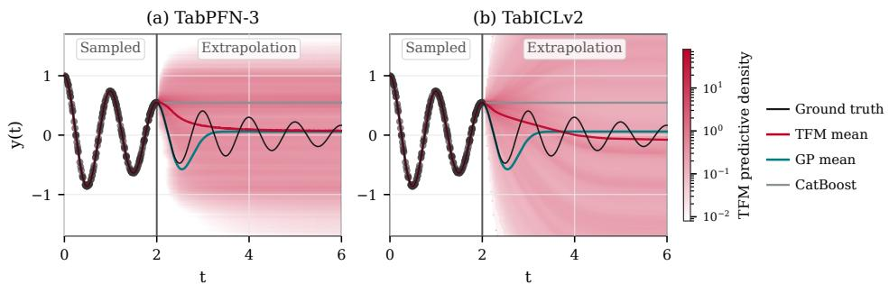
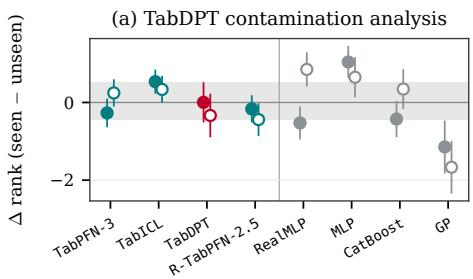
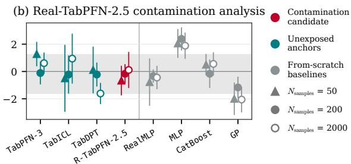
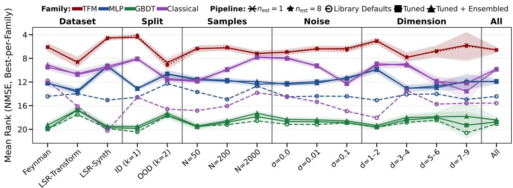
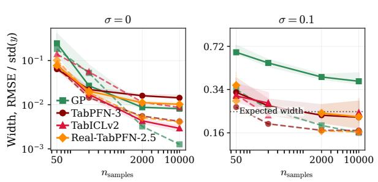
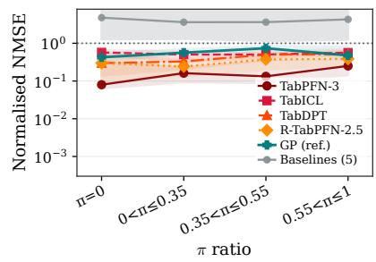
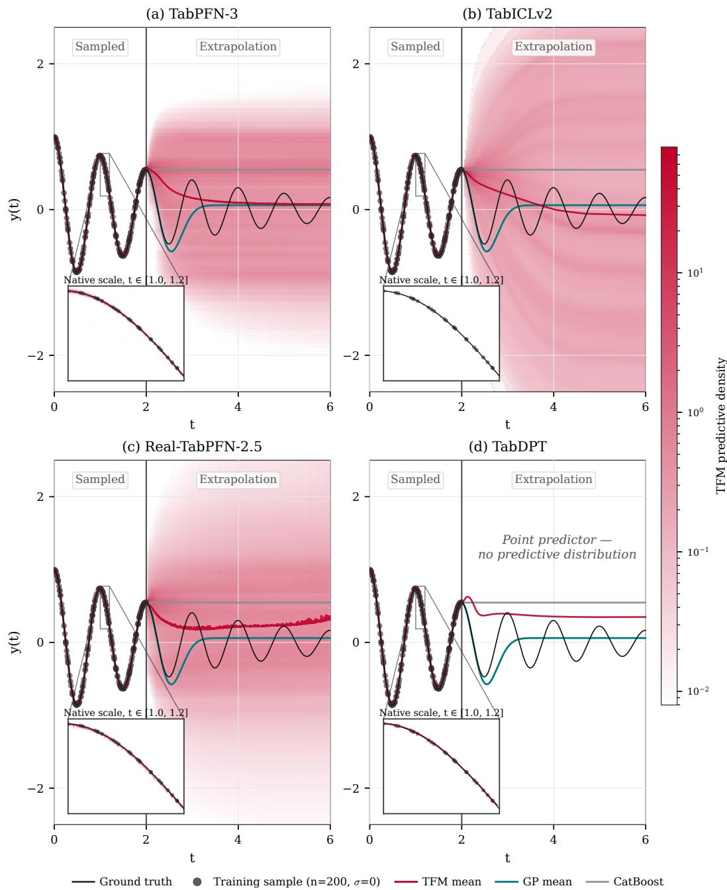
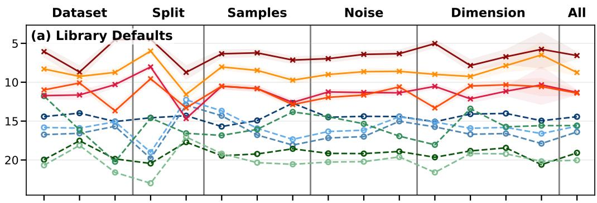
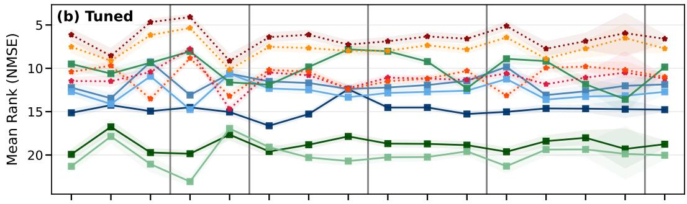
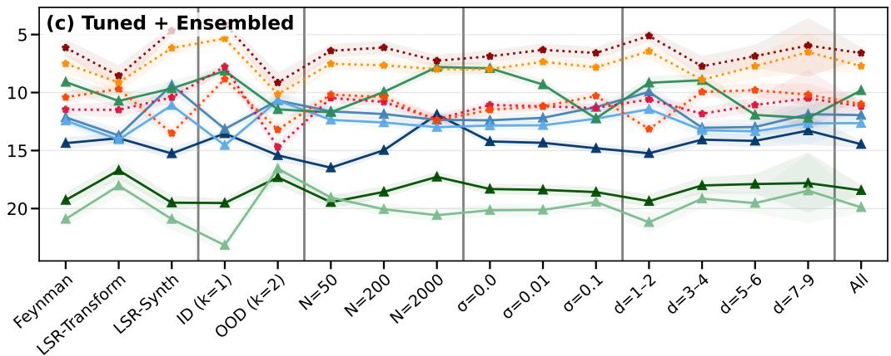

# Do Tabular Foundation Models Know Physics? Contamination, Units, and the Deterministic Limit

Wassim Tenachi Département de physique, Université de Montréal Mila – Quebec Artificial Intelligence Institute wassim.tenachi@mila.quebec

Yashar Hezaveh Département de physique, Université de Montréal Mila – Quebec Artificial Intelligence Institute yashar.hezaveh@mila.quebec

Laurence Perreault Levasseur Département de physique, Université de Montréal Mila – Quebec Artificial Intelligence Institute levassel@mila.quebec

Pierre-Luc Bacon Department of Computer Science and Operations Research, Université de Montréal Mila – Quebec Artificial Intelligence Institute pierre-luc.bacon@mila.quebec

## Abstract

Tabular foundation models (TFMs) learn to fill in tables the way language models fill in text — and tables are arguably the format in which most physical measurement arrives. Did they learn any physics in the process? They are Bayesian by construction, so the question is what their prior contains. We probe it directly, evaluating four of them (TabPFN-3, TabICLv2, TabDPT and Real-TabPFN-2.5) against six baselines on datasets sampled from 316 physical equations, in and out of domain. TFMs dominate, out of the box and after tuning. But we show that their prior can represent neither a noiseless mechanism nor physical units — which is why they interpolate physics without yet being able to act as physical models.

## 1 Introduction

Nature, in Galileo’s phrase, is written in the language of mathematics [Galilei, 1623]. We do not read it directly, however: we observe it as data, and in the physical sciences that data is overwhelmingly tabular [Ochsenbein et al., 2000]. Large language models have made striking progress on the mathematical language itself [Alon et al., 2026], and vision models on scientific imaging [Parker et al., 2026]. Tables, arguably the format in which most physical measurement actually arrives, have received far less attention. Skimming oceans of text produced powerful representations of the physical world [Team et al., 2023]. Would skimming oceans of tables do the same?

Tabular foundation models (TFMs) learn to fill in tables much as language models learn to fill in text: entries are masked and the model is trained to recover them from context [Hollmann et al., 2022].

  
Figure 1: TFMs interpolate physics but do not learn enough of it to extrapolate. A noiseless damped harmonic oscillator queried beyond the sampled range, against baselines. The oscillation is recovered where there is data and lost immediately outside it. Details and other models in App. A.

They are invariant to row and column permutations, and most emit a full predictive distribution per cell. A new task is therefore solved in a single forward pass — in-context learning (ICL), with no gradient step — so fitting is free, amortised by pretraining, while querying costs grow with context size. Most are pretrained exclusively on synthetic structural causal models (SCMs)1 [Hollmann et al., 2022, Qu et al., 2025]; others on corpora of real tables [Ma et al., 2024, Garg et al., 2025].

Related work. TFMs are now applied across scientific fields [Grinsztajn et al., 2026], including astrophysics [Valença et al., 2026], though almost exclusively in interpolation. Benchmarking efforts such as TabArena [Erickson et al., 2026] and BeyondArena [Purucker et al., 2026] have concentrated on stochastic processes, and have pushed the field towards extrapolation, where TFMs remain weak — strikingly so on physical signals (Fig. 1). But how should a model extrapolate an arbitrary real-world table without having learned something of the physics that generated it?

Two obstacles. Physics-equation data sits close enough to the ecosystem these models are trained from2 to warrant a contamination audit before interpreting any result (§3). Yet the physics regime is itself absent from the literature: BeyondArena drops deterministic-function data as artificial, and no current TFM has been pretrained on a physical law with units or a continuous target (App. E).

Which prior? TFMs are Bayesian by construction: pretraining on samples from a prior under a proper scoring rule makes the forward pass an approximation to the posterior predictive [Hollmann et al., 2025]. They return posteriors, not point estimates. The question is what prior those posteriors are built on, and whether it has anything to do with physics — and data sampled from known physical laws is the cleanest way to ask.

## 2 Protocol

Data. We evaluate on three sets of data sampled from physical equations: Feynman (120 equations) [Udrescu and Tegmark, 2020], standardized in SRBench [La Cava et al., 2021], and LSR-Transform (111) and LSR-Synth (85) [Shojaee et al., 2025], which rewrite Feynman into unusual forms and compose novel terms respectively. Every table is regenerated from its equation rather than loaded, so no published table is reused and $n _ { \mathrm { s a m p l e s } } ,$ , noise and sampling domain stay free.

Regimes. Training points are drawn from each equation’s sampling box; test points from a shell at scale k outside it (k=1 in-domain, k=2 extrapolation). Targets carry multiplicative noise $y ^ { \prime } =$ $y ( 1 + \varepsilon ) , \varepsilon \sim \mathcal { N } ( 0 , \sigma ^ { 2 } )$ , matching the relative error of physical instruments. We sweep $n _ { \mathrm { s a m p l e s } } \in$ {50, 200, 2000}, $\sigma \in \{ 0 , 0 . 0 1 , 0 . 1 \} , k \in \{ 1 , 2 \}$ and 3 seeds, with the test set fixed at 2000 points throughout. The detailed protocol is given in App. C.

Baselines and evaluation. Following BeyondArena [Purucker et al., 2026], we evaluate the four open-weight TFMs (Table 1) against six methods that remain state of the art on tabular data $( \mathrm { A p p . ~ B } )$ We score with $\mathrm { N M S E } = \mathbb { E } [ ( y - \hat { y } ) ^ { 2 } ] / \mathbb { E } [ ( y - \bar { y } ) ^ { 2 } ]$ ; since raw error spans orders of magnitude across equations, we rank models within each (task, regime) cell and report mean rank per stratum.

Table 1: Evaluated tabular foundation models. Real reg. indicates whether the pretraining corpus contains real-world regression tables.
<table><tr><td>Model</td><td>Output</td><td>Pretraining</td><td>Real reg.</td><td>Ref.</td></tr><tr><td>TabPFN-3</td><td>Quantiles</td><td>Synthetic SCMs</td><td></td><td>[Grinsztajn et al., 2026]</td></tr><tr><td>TabICLv2</td><td>Quantiles</td><td>Synthetic SCMs</td><td></td><td>[Qu et al., 2025]</td></tr><tr><td>Real-TabPFN-2.5</td><td>Quantiles</td><td>Synthetic + real</td><td></td><td>[Garg et al., 2025]</td></tr><tr><td>TabDPT</td><td>Point</td><td>Real tables (+ retrieval)</td><td>√</td><td>[Ma et al., 2024]</td></tr></table>

Fairness. Comparing a forward pass to a training loop requires fixing a budget, so we report both. Under default, every method uses library defaults. Under tuned, the trained baselines get 25 random search configurations, optionally combined by post-hoc greedy ensemble selection3; TFMs have no hyperparameters, and their analogue is the ensemble size nestimators, which averages the forward pass over input permutations. We report both families at their cheapest and strongest settings.

## 3 Results & Analysis

No detectable contamination. Before asking whether TFMs know physics, we must rule out that they have simply seen our evaluation data. We audited the pretraining corpora of the two real-data models, both of which enumerate them: TabDPT’s 123 datasets and Real-TabPFN-2.5’s 43. Neither contains a Feynman equation, nor any regression target generated by an analytic function. Physics appears only as detector classification, never as law4 (full corpora in App. E).

A list of names is not a list of generating processes, however: both corpora were filtered against benchmark suites by dataset name and content hash, and a table resampled from the same equation under a different name would pass both checks. We therefore measure exposure rather than assert it, comparing each model on datasets drawn from its own corpus against comparable datasets outside it, and reading the gap relative to models that saw neither5 (Fig. 2).

Both come back null: each candidate sits inside the unexposed band at every context size, and what little movement exists runs counter to the mechanistic prediction, growing with context size where prior exposure should matter most when context is thin. Most tellingly, models with no pretraining at all show larger seen-versus-unseen gaps than the exposed models do, so this statistic is dominated by which datasets fall in each pool rather than by exposure to them. That spread also bounds what we could have detected: any contamination effect below roughly one rank position would be invisible at this pool size.

  
Figure 2: No detectable contamination from real-data pretraining. Difference in mean rank between datasets seen during pretraining and comparable unseen datasets, for (a) TabDPT and (b) Real-TabPFN-2.5. Negative values indicate better performance on the seen trained data. The shaded band spans the unexposed TFM anchors; both candidates fall inside it at every context size.

  
Figure 3: The TFM lead on physics data survives tuning and ensembling. Mean rank within each stratum (lower is better). Details and per-model results in App. D –– TabPFN-3 leads throughout.

  
(a) The prior cannot represent a noiseless mechanism. Predictive interval width (solid) and RMSE (dashed), both normalised against context size. A $\colon \sigma = 0$ the correct width is zero, yet every TFM plateaus while its error keeps falling; at $\sigma = 0 . 1$ the same models sit at the expected calibration width.

  
(b) The prior does not exploit dimensional structure. Normalized median NMSE binned by π $\mathrm { r a t i o } = n _ { \pi } / n _ { \mathrm { v a r s } } .$ . Values below 1 beat the typical model on that task. TabPFN-3 degrades as dimensional reducibility increases; the trained baselines do not.

Tuning does not close the gap. Under default configurations our ordering reproduces BeyondArena’s: TFMs lead the trained baselines across every stratum (Fig. 3). Their reported reversal arises from tuning, which we therefore evaluate directly. It does not occur here: TabPFN-3 still leads under all three pipelines in every stratum, the sole exception being the Gaussian process at the largest context size, and only against the TFM’s cheapest setting. It also holds where both conditions that favour the trained models apply at once — out of domain at the largest context size though the margin narrows there6. The clearest breakdown in ordering comes not from tuning but from extrapolation: out of domain the field compresses and the ranking reshuffles more than anywhere else, models converging on a common failure rather than degrading in place.

The prior cannot represent a noiseless mechanism. On noiseless data drawn from a deterministic law $f ,$ the correct posterior predictive is a delta function: aleatoric noise is zero, and sufficient context determines f. Every TFM instead reports a nonzero predictive width that ceases to shrink with $n _ { \mathrm { s a m p l e s } }$ while its own error continues to fall (Fig. 4a-left), so reported uncertainty no longer tracks error. $\mathrm { A t } ~ \sigma { = } 0 . 1$ the same models sit at the expected calibration width (Fig. 4a-right), so the failure is specific to the noiseless limit rather than a deficiency of the estimator. This is what a prior placing noise on every mechanism predicts: it assigns no mass to the noiseless region, and no amount of context can move it there.

The prior does not exploit dimensional structure. Physical variables carry dimensions, and by Buckingham’s theorem a law in five variables may depend on only two dimensionless groups, so the effective dimensionality of a physical problem is often far below its column count. A TFM, being column-permutation-invariant and unit-blind, has no access to this. We compute the number of dimensionless groups ${ n _ { \pi } } ^ { 7 }$ and ask which of the two quantities error tracks. For every model it is the raw column count; for most, dimensionless dimensionality adds nothing further. The strongest TFM (TabPFN-3) is however significantly worse on tasks with more π-groups, while RealMLP and CatBoost are significantly better (Fig. 4b). Dimensional structure that a trained model turns to it advantage therefore penalises the strongest TFM.

## 4 Conclusion

Tabular foundation models interpolate physical data well, without ever having been pretrained on a physical law. What limits them is not contamination but the prior itself: it cannot represent a noiseless mechanism, and it does not exploit dimensional structure — two properties every physical law has and no random structural causal model does. They are excellent amortised interpolators; a physical model would need a prior that contains physics. Pretraining on continuous physical targets — absent from every corpus we audited — would be a natural way to find out.

## References

Noga Alon, Thomas F Bloom, W Timothy Gowers, Daniel Litt, Will Sawin, Arul Shankar, Jacob Tsimerman, Victor Wang, and Melanie Matchett Wood. Remarks on the disproof of the unit distance conjecture. arXiv preprint arXiv:2605.20695, 2026.

Rich Caruana, Alexandru Niculescu-Mizil, Geoff Crew, and Alex Ksikes. Ensemble selection from libraries of models. In Proceedings of the twenty-first international conference on Machine learning, page 18, 2004.

Nick Erickson, Lennart Purucker, Andrej Tschalzev, David Holzmüller, Prateek Desai, David Salinas, and Frank Hutter. Tabarena: A living benchmark for machine learning on tabular data. Advances in Neural Information Processing Systems, 38, 2026.

Galileo Galilei. Il saggiatore. 1623.

Anurag Garg, Muhammad Ali, Noah Hollmann, Lennart Purucker, Samuel Müller, and Frank Hutter. Real-tabpfn: Improving tabular foundation models via continued pre-training with real-world data. arXiv preprint arXiv:2507.03971, 2025.

Yury Gorishniy, Ivan Rubachev, Valentin Khrulkov, and Artem Babenko. Revisiting deep learning models for tabular data. Advances in neural information processing systems, 34:18932–18943, 2021.

Yury Gorishniy, Akim Kotelnikov, and Artem Babenko. Tabm: Advancing tabular deep learning with parameter-efficient ensembling. In International Conference on Learning Representations, volume 2025, pages 77899–77935, 2025.

Léo Grinsztajn, Klemens Flöge, Oscar Key, Felix Birkel, Philipp Jund, Brendan Roof, Benjamin Jäger, Dominik Safaric, Simone Alessi, Adrian Hayler, et al. Tabpfn-2.5: Advancing the state of the art in tabular foundation models. arXiv preprint arXiv:2511.08667, 2025.

Léo Grinsztajn, Klemens Flöge, Oscar Key, Felix Birkel, Philipp Jund, Brendan Roof, Mihir Manium, Shi Bin Hoo, Magnus Bühler, Anurag Garg, et al. Tabpfn-3: Technical report. arXiv preprint arXiv:2605.13986, 2026.

Arthur E Hoerl and Robert W Kennard. Ridge regression: Biased estimation for nonorthogonal problems. Technometrics, 12(1):55–67, 1970.

Noah Hollmann, Samuel Müller, Katharina Eggensperger, and Frank Hutter. Tabpfn: A transformer that solves small tabular classification problems in a second. arXiv preprint arXiv:2207.01848, 2022.

$^ 7 n \pi = n _ { \mathrm { v a r s } } - \mathrm { r a n k } ( D )$ , with D the variables’ matrix of SI dimension exponents from the Feynman units table.

Noah Hollmann, Samuel Müller, Lennart Purucker, Arjun Krishnakumar, Max Körfer, Shi Bin Hoo, Robin Tibor Schirrmeister, and Frank Hutter. Accurate predictions on small data with a tabular foundation model. Nature, 637(8045):319–326, 2025.

David Holzmüller, Léo Grinsztajn, and Ingo Steinwart. Better by default: Strong pre-tuned mlps and boosted trees on tabular data. In Neural Information Processing Systems, 2024.

William La Cava, Bogdan Burlacu, Marco Virgolin, Michael Kommenda, Patryk Orzechowski, Fabrício Olivetti de França, Ying Jin, and Jason H Moore. Contemporary symbolic regression methods and their relative performance. Advances in neural information processing systems, 2021 (DB1):1, 2021.

Junwei Ma, Valentin Thomas, Rasa Hosseinzadeh, Alex Labach, Hamidreza Kamkari, Jesse C Cresswell, Keyvan Golestan, Guangwei Yu, Anthony L Caterini, and Maksims Volkovs. Tabdpt: Scaling tabular foundation models on real data. arXiv preprint arXiv:2410.18164, 2024.

Calvin McCarter. What exactly has tabpfn learned to do? In ICLR Blogposts 2024, 2024. URL https://iclr-blogposts.github.io/ 2024/blog/what-exactly-has-tabpfn-learned-to-do/. https://iclrblogposts.github.io/2024/blog/what-exactly-has-tabpfn-learned-to-do/.

François Ochsenbein, Patricia Bauer, and James Marcout. The vizier database of astronomical catalogues. Astronomy and Astrophysics Supplement Series, 143(1):23–32, 2000.

Randal S. Olson, William La Cava, Patryk Orzechowski, Ryan J. Urbanowicz, and Jason H. Moore. Pmlb: a large benchmark suite for machine learning evaluation and comparison. BioData Mining, 10(1):36, Dec 2017. ISSN 1756-0381. doi: 10.1186/s13040-017-0154-4. URL https://doi. org/10.1186/s13040-017-0154-4.

Liam Parker, Francois Lanusse, Jeff Shen, Ollie Liu, Tom Hehir, Leopoldo Sarra, Lucas Meyer, Micah Bowles, Sebastian Wagner-Carena, Helen Qu, et al. Aion-1: Omnimodal foundation model for astronomical sciences. Advances in Neural Information Processing Systems, 38:95386–95428, 2026.

Liudmila Prokhorenkova, Gleb Gusev, Aleksandr Vorobev, Anna Veronika Dorogush, and Andrey Gulin. Catboost: unbiased boosting with categorical features. Advances in neural information processing systems, 31, 2018.

Lennart Purucker, Andrej Tschalzev, Nick Erickson, Gioia Blayer, David Holzmüller, Alan Arazi, Alexander Pfefferle, Mustafa Tajjar, Gaël Varoquaux, and Frank Hutter. Beyond iid: How general are tabular foundation models, really?, 2026. URL https://arxiv.org/abs/2606.30410.

Jingang Qu, David Holzmüller, Gaël Varoquaux, and Marine Le Morvan. Tabicl: A tabular foundation model for in-context learning on large data. arXiv preprint arXiv:2502.05564, 2025.

Matthias Seeger. Gaussian processes for machine learning. International journal ofneural systems, 14(02):69–106, 2004.

Parshin Shojaee, Ngoc-Hieu Nguyen, Kazem Meidani, Amir Barati Farimani, Khoa D Doan, and Chandan K Reddy. Llm-srbench: A new benchmark for scientific equation discovery with large language models. arXiv preprint arXiv:2504.10415, 2025.

Gemini Team, Rohan Anil, Sebastian Borgeaud, Jean-Baptiste Alayrac, Jiahui Yu, Radu Soricut, Johan Schalkwyk, Andrew M Dai, Anja Hauth, Katie Millican, et al. Gemini: a family of highly capable multimodal models. arXiv preprint arXiv:2312.11805, 2023.

Silviu-Marian Udrescu and Max Tegmark. Ai feynman: A physics-inspired method for symbolic regression. Science advances, 6(16):eaay2631, 2020.

Raquel R Valença, Lilianne Nakazono, Rafael Izbicki, Marco Henrique de Almeida Inácio, Maycon Jorge Deláqua da Silva, Kiana Coimbra Buin Lins, Natanael M Cardoso, Claudia Mendes de Oliveira, et al. Tabular foundation models for the estimation of probabilistic quasar photometric redshifts in s-plus. arXiv preprint arXiv:2608.10280, 2026.

## A Extrapolating a damped harmonic oscillator

We qualitatively assess how our baseline TFMs extrapolate physical dynamics by asking them to continue a damped harmonic oscillator, a canonical physical system, and comparing their predictions with those of a Gaussian process (GP) and CatBoost. Two are pretrained on synthetic SCMs (TabPFN-3 [Grinsztajn et al., 2026], TabICLv2 [Qu et al., 2025]) and two on real tabular corpora (TabDPT [Ma et al., 2024], Real-TabPFN-2.5 [Garg et al., 2025]). We use n = 200 samples and no noise, so that any predictive width or extrapolation failure reflects the prior rather than the data. Results are shown in Fig. 5.

Extrapolation. All four models fail to continue the oscillation past the sampled range, relaxing to a constant within roughly half a period. They do recover the envelope: TabPFN-3 and TabICLv2 both decay toward zero, as the true signal does, rather than holding the last observed value as CatBoost does. This is consistent with McCarter [2024], who found no evidence that TabPFN detects periodic structure — and our TabPFN panels are indeed a smooth, phase-agnostic blur.

Two exceptions, and a caveat. TabICLv2’s predictive density shows wave-like banding past the boundary: the model hedges across a range of values rather than collapsing to one, and the resulting ridges echo the scale of the oscillation. TabDPT continues the signal for roughly a quarter period before flattening. Both postdate McCarter [2024] and both are suggestive. However, a phase crosscorrelation of each model’s density against the true continuation shows that the banding is not phase-locked8. The structure is real multimodality, not a recovered frequency. We report it as an encouraging direction rather than as periodic extrapolation.

The noise prior leaves a trace. Inside the sampled range the correct predictive distribution is a point mass: the data are noiseless and densely sampled. The GP’s interval is indeed exactly zero-width there. All three distributional TFMs instead report a small but nonzero width (0.010–0.020 normalized; insets), consistent with a prior that places noise on every mechanism and cannot represent its absence. TabDPT appears to escape this, but only because it emits no predictive distribution at all (§2) — it does not report zero uncertainty, it reports none.

  
Figure 5: Predictive distributions of all four TFMs on a damped harmonic oscillator. Same setup as Fig. 1: $n = 2 0 0$ noiseless samples over $t \in [ 0 , 2 ]$ (points), queried to $t = 6 ,$ against a Gaussian process (GP) and CatBoost. Color is the TFM predictive density; insets zoom an in-domain window at native scale. Inside the sampled range the true predictive interval is a point, yet all three distributional TFMs report a nonzero width (0.010 for TabICLv2, 0.019–0.020 for the two TabPFN variants, normalized), while the $\mathrm { G P } { \mathrm { { s } } }$ is exactly zero — the uncertainty floor of $\ S 3 .$ , seen directly. Outside it, every model relaxes to a constant: TabICLv2’s density retains an oscillatory banding, TabDPT shows a partial oscillation before flattening, and CatBoost holds the last observed value. TabDPT emits no predictive distribution (§2) and is shown as a mean only.

## B Trained baselines

Trained baselines. Table 2 lists the six methods fitted per task, spanning the deep and classical families that remain state of the art on tabular data. Of these, only the Gaussian process emits a predictive distribution; the rest return point estimates and therefore cannot appear in any uncertainty comparison.

Table 2: Trained baselines. Each is fitted per task. Predictive output type is determined empirically from each model’s implementation rather than from its documentation; only the Gaussian process returns a closed-form predictive density.
<table><tr><td>Model</td><td>Family</td><td>Output</td><td>Ref.</td></tr><tr><td>RealMLP</td><td>MLP with tuned defaults</td><td>Point</td><td>[Holzmüller et al., 2024]</td></tr><tr><td>TabM</td><td>MLP ensemble</td><td>Point</td><td>[Gorishniy et al., 2025]</td></tr><tr><td>MLP</td><td>Vanilla MLP</td><td>Point</td><td>[Gorishniy et al., 2021]</td></tr><tr><td>CatBoost</td><td>Gradient-boosted trees</td><td>Point</td><td>[Prokhorenkova et al., 2018]</td></tr><tr><td>GP</td><td>Gaussian process</td><td>Density</td><td>[Seeger, 2004]</td></tr><tr><td>Ridge</td><td>Linear, l2</td><td>Point</td><td>[Hoerl and Kennard, 1970]</td></tr></table>

## C Protocol details

The extrapolation shell. Axis j of a task’s sampling box has range $[ l _ { j } , h _ { j } ]$ , center $c _ { j }$ and half-width $w _ { j }$ . Test points at scale k are drawn from $[ c _ { j } - k w _ { j } , c _ { j } + k w _ { j } ]$ with rejection of any point falling inside the k=1 box, so the test set is a shell rather than a superset of the training domain — without rejection, most of an OOD draw would land in-domain and the split would measure interpolation. All d axes are extended simultaneously. We use per-axis box extension rather than a convex-hull criterion: the latter is exponential in d, and these domains are boxes by construction. The OOD region is defined from the training box alone, and it, the noise model and the failure rule were all fixed before any result was inspected.

Seeds in place of cross-validation. TabArena and BeyondArena evaluate over repeated CV folds. Because we generate data rather than load it, the equivalent is a fresh draw per seed: each seed independently resamples both training and test points, so no CV is needed. We use three seeds and take the median, which is robust to a single catastrophic draw. TFMs require multiple seeds too — nothing is fitted, but ensemble permutations and internal preprocessing vary between runs.

Failure policy. A run that runs out of memory, times out or returns NaN is recorded as failed rather than dropped, and imputed at NMSE=1 in aggregates — equivalently $R ^ { 2 } { = } 0$ , i.e. predicting the training mean. This keeps a failure interpretable and model-independent rather than letting it silently vanish from a mean. Across the full campaign, 12 of 362,231 runs failed permanently — all TabDPT, and all tracing to a single numerical edge case on one task at $n _ { \mathrm { s a m p l e s } } { = } 2 0 0 0$ , repeated across noise levels, splits and protocols.

Validation carve-out. Under the tuned and ensembled pipelines, the trained baselines carve 20% of $n _ { \mathrm { s a m p l e s } }$ for model selection and so fit on $0 . 8 n _ { \mathrm { s a m p l e s } }$ ; TFMs condition on all of it, since they have nothing to select. We disclose this rather than equalize it: capping the TFM’s context to match would change the quantity being measured, and giving the baselines a separate validation set would change the sample budget. The gap is largest at $n _ { \mathrm { s a m p l e s } } { = } 5 0$ , where the trained models see 40 rows against the TFM’s 50, and is the most likely place for a tuned-versus-default comparison to understate the benefit of tuning.

Preprocessing. Column order is randomized per seed for every model. TFMs are built to be columnpermutation-invariant; checking this empirically costs nothing and appears as a variance term. We do not disable each model’s internal preprocessing (TabPFN applies its own quantile and power transforms) and record which was active in every result record: this is a confound to disclose, not to remove. Metrics are always computed in the original target space.

Cost accounting. Wall-clock is recorded per run and split into fit and predict phases: a TFM is nearly free to fit and costly to query, a trained model the reverse, and only the split makes that visible. We do not attempt FLOPs, which are not well defined across transformer, tree and kernel families and ignore memory movement. Hardware is recorded rather than pinned, so timing comparisons are filtered at analysis time; accuracy results are hardware-independent. Pretraining cost is excluded by convention, as for ImageNet-pretrained vision models.

Reproducibility. Each run is keyed by a hash of its resolved configuration and skipped if the record already exists, making the campaign idempotent and resumable. Every record embeds the full configuration, the git commit, key package versions, hardware identifiers and per-phase timings. The main grid comprises 316 tasks $\times 3 n _ { \mathrm { s a m p l e s } } \times 3$ noise levels × 2 split scales × 3 seeds × 10 models under each protocol; the tuned protocol multiplies this by 25 configurations per trained baseline. Total measured cost was ≈1300 GPU-hours (H100 and A100) and ≈4200 CPU-hours.

## D Per-model benchmark results

Figure 3 collapses each family to its best-performing member under each pipeline, following BeyondArena’s presentation. Figure 6 unpacks the same ranks into all 26 model–pipeline entities. This appendix records what the collapse hides, and several observations for which there was no room in the main text.

How the ranks are computed. Within each (task, regime) cell we rank all 26 entities jointly — the four TFMs at $n _ { \mathrm { { e s t } } } \in \{ 1 , 8 \}$ and the six trained baselines at library defaults, tuned, and tuned with post-hoc ensembling — then average over tasks within a stratum. Ranks therefore run from 1 to 26 in both figures, and are not comparable to a ranking computed over a smaller pool. Cells falling below 80% task coverage are dropped rather than plotted.

Which model wins each family. The collapse in Fig. 3 is stable for three families of four: TabPFN-3 is the best TFM in every stratum under both settings, GP beats Ridge everywhere, and CatBoost is the only gradient-boosted entrant. The MLP family is the exception. TabM is the strongest tuned member overall, but RealMLP takes over at library defaults out of domain and at the smallest context size, and again once ensembling is applied at the largest. Statements about "the MLP family" in the main text should be read accordingly.

Ensembling contributes almost nothing. Post-hoc greedy selection improves only RealMLP by a measurable margin; for TabM, CatBoost, GP and Ridge the median change is indistinguishable from zero, with selection typically returning the single already-best configuration. This is not a consequence of an under-sized selection budget: allowing 25, 50, 100 or 200 rounds with replacement over the same library yields results identical to four decimal places, and selection saturates at four to ten distinct configurations in every case. We attribute this to the data rather than the protocol. Ensemble selection exploits diversity in the errors made by different configurations, and on noiseless deterministic targets differently-tuned fits of the same model converge on the same function and therefore make correlated errors. That RealMLP is the exception is consistent with this account: its search space varies architecture and training schedule widely enough to produce genuinely different fits.

Where tuning does help. Tuning improves every trained baseline more at the largest context size than at the smallest, as expected, and improves every model except Ridge at $\sigma = 0$ , where library defaults — calibrated for noisy real-world tables — are furthest from appropriate.

The validation carve-out. Under the tuned and ensembled pipelines the trained baselines hold out 20% of $n _ { \mathrm { s a m p l e s } }$ for configuration selection and so fit on $0 . 8 n _ { \mathrm { s a m p l e s } }$ , while TFMs condition on all of it. Capping the TFM’s context would change the quantity being measured, and supplying a separate validation set would change the sample budget. The handicap is largest at $n _ { \mathrm { s a m p l e s } } = 5 0$ and is the most likely explanation for Ridge being marginally worse tuned than at defaults, since a single regularisation parameter offers little to gain from selection and the lost rows cost more than it returns.

A note on TabDPT. TabDPT separates from the other TFMs specifically on LSR-Synth and on lowdimensional tasks, where it performs worse than its synthetic-prior counterparts. This is not evidence of contamination — the effect runs in the wrong direction, since LSR-Synth is the cleanest of our three sets — but it is a real difference between models pretrained on real corpora and those pretrained on synthetic ones, and we record it here without an explanation.

$$
\begin{array} { r l } & { { \mathsf { T F M s : } } \quad = { \mathsf { T a b P F N - 3 } } \quad { \mathsf { = T a b 1 C L v 2 } } \quad { \mathsf { = T a b D P T } } \quad { \mathsf { = R e a l . 7 a b P F N - 2 . 5 } } } \\ & { { \mathsf { T r a i n e d ~ b a s e l i n e s : } } \quad { \mathsf { = R e a l M L P } } \quad { \mathsf { = T a b M } } \quad { \mathsf { = M L P } } \quad { \mathsf { = C a t B o o s t } } \quad { \mathsf { = G P } } \quad { \mathsf { = R i d g e } } } \end{array}
$$

  
Figure 6: Per-model results across all strata. The same ranks as Fig. 3, unpacked into all 26 model–pipeline entities and split by pipeline: (a) library defaults, (b) tuned and (c) tuned with post-hoc ensembling. The six trained baselines appear in every panel; the four TFMs, which have no tuning, are repeated throughout as a fixed reference, at $n _ { \mathrm { e s t } } { = } 1$ in (a) and $n _ { \mathrm { e s t } } { = } 8$ in (b) and (c). Panels share a common rank axis, so vertical gaps are comparable across them. Cells falling below 80% task coverage are dropped rather than plotted.

## E Pretraining corpora of the real-data TFMs

Both real-data-pretrained models enumerate their pretraining corpora, which is what makes the audit in §3 possible. We reproduce them here, grouped and with live links, so that the claims in the main text can be checked directly.

TabDPT’s corpus (Table $3 ) ^ { 9 }$ comprises 122 OpenML datasets, 93 classification and 28 regression, with domain labels assigned by its authors. All six datasets labelled Physics/astronomy are classification tasks — particle-collision and Cherenkov-shower event discrimination, spacecraft sensor state, satellite land cover — and none of the nine labelled Deterministic and simulated has a continuous target. No regression target in the corpus is generated by an analytic function.

Real-TabPFN-2.5’s corpus (Table 4)10 comprises 43 datasets from OpenML and Kaggle. It contains no real-world regression table at all: its one function-generated entry, fried, links to OpenML 901, the binarised variant of Friedman #1 in which the continuous target has been replaced by a twoclass label thresholded at its mean. Two Sloan Digital Sky Survey catalogues appear, both as star/galaxy/quasar classification.

Table 3: TabDPT pretraining corpus (122 datasets), grouped by the domain labels assigned in its own appendix and sorted alphabetically within group. Regression targets are marked †; all others are classification, except Census-Income∗, for which no target type is given. No regression target in the corpus is generated by an analytic function, and every dataset in the Physics/astronomy and Deterministic and simulated groups is a classification task.
<table><tr><td colspan="4">Physics/astronomy — 6 datasets, 0 regression</td></tr><tr><td>higgs</td><td>magic</td><td>MagicTelescope</td></tr><tr><td>MiniBooNE</td><td>Satellite</td><td>shuttle</td></tr><tr><td colspan="3">Deterministic and simulated — 9 datasets, 0 regression</td></tr><tr><td>artificial-characters</td><td>chess</td><td>hill-valley</td></tr><tr><td>kr-vs-k</td><td>kropt</td><td>parity5_plus_5</td></tr><tr><td>poker-hand</td><td>puma8NH</td><td>twonorm</td></tr><tr><td colspan="3">Other science — 4 datasets, 1 regression</td></tr><tr><td>gas-drift sulfur†</td><td>gas-drift-different-concentrations</td><td>musk</td></tr><tr><td></td><td></td><td></td></tr><tr><td colspan="3">Biology/ecology — 11 datasets, 1 regression</td></tr><tr><td>cjs</td><td>covertype</td><td>GAMETES_Epistasis_2-Way_20atts OVA_Endometrium</td></tr><tr><td>mushroom</td><td>one-hundred-plants-texture</td><td></td></tr><tr><td>OVA_Lung</td><td>pollen</td><td>sylva_agnostic</td></tr><tr><td>visualizing_soil†</td><td>yeast</td><td></td></tr><tr><td colspan="3">Medical/human sensor — 11 datasets, 4 regression</td></tr><tr><td>cardiotocography</td><td>Diabetes130US</td><td>eeg-eye-state</td></tr><tr><td>eye_movements</td><td>1dpa</td><td>pbcseq</td></tr><tr><td>QSAR-TID-10980†</td><td>QSAR-TID-11†</td><td>topo_2_1†</td></tr><tr><td>walking-activity</td><td>yprop_4_1†</td><td></td></tr><tr><td colspan="3">Financial/demographic — 15 datasets, 2 regression</td></tr><tr><td>ada_agnostic credit</td><td>ada_prior default-of-credit-card-clients</td><td>Census-Income* heloc</td></tr><tr><td>house_16H</td><td>house_8L</td><td>house_prices_nominal†</td></tr><tr><td>ipums_la_97-small</td><td>ipums_la_98-small</td><td>ipums_la_99-small</td></tr><tr><td>kdd_internet_usage</td><td>nursery</td><td>us_crime†</td></tr><tr><td></td><td></td><td></td></tr><tr><td colspan="3">Human behaviour — 17 datasets, 8 regression</td></tr><tr><td>Bike_Sharing_Demand† Click_prediction_small</td><td>black_friday†</td><td>Buzzinsocialmedia_Twitter†</td></tr><tr><td></td><td>compas-two-years</td><td>KDDCup09-Upselling</td></tr><tr><td>KDDCup09_appetency</td><td>nyc-taxi-green-dec-2016†</td><td>okcupid-stem</td></tr><tr><td>OnlineNewsPopularity†</td><td>porto-seguro</td><td>road-safety</td></tr><tr><td>Santander_transaction_value†</td><td>seattlecrime6†</td><td>sf-police-incidents</td></tr><tr><td>SpeedDating</td><td>wine_quality†</td><td></td></tr><tr><td colspan="3">Industrial/operational — 10 datasets, 4 regression</td></tr><tr><td>airlines</td><td>Airlines_DepDelay_10M†</td><td>Allstate_Claims_Severity†</td></tr><tr><td>Amazon_employee_access</td><td>APSFailure</td><td>delays_zurich_transport†</td></tr><tr><td>KDDCup09_churn</td><td>kick</td><td>Mercedes_Benz_Greener_Manufacturing†</td></tr><tr><td>pol</td><td></td><td></td></tr><tr><td colspan="3">Computing — 4 datasets, 3 regression</td></tr><tr><td>KDDCup99</td><td>MIP-2016-Reg.†</td><td>SAT11-HAND-runtime-Reg.†</td></tr><tr><td>SGEMM_GPU_kernel_performance†</td><td></td><td></td></tr><tr><td colspan="3">Vision/audio/text features —7 datasets, 0 regression</td></tr><tr><td>amazon-commerce-reviews</td><td>fbis.wc</td><td>JapaneseVowels</td></tr><tr><td>la1s.wc</td><td>page-blocks</td><td>scene</td></tr><tr><td>spoken-arabic-digit</td><td></td><td></td></tr><tr><td colspan="3">Other or not provided — 28 datasets, 5 regression</td></tr><tr><td>ada</td><td>Ailerons†</td><td>albert</td></tr><tr><td></td><td>analcatdata_supreme†</td><td></td></tr><tr><td>analcatdata_halloffame</td><td></td><td>christine</td></tr><tr><td>colleges†</td><td>colleges_usnews</td><td>dilbert</td></tr><tr><td>dionis</td><td>elevators</td><td>fabert</td></tr><tr><td>guillermo</td><td>helena</td><td>IMDB.drama</td></tr><tr><td>jannis</td><td>jasmine</td><td>madeline</td></tr><tr><td>mofn-3-7-10</td><td>particulate-matter-ukair-2017†</td><td>philippine</td></tr><tr><td>PieChart3</td><td>PizzaCutter3</td><td>riccardo</td></tr><tr><td>robert Yolanda†</td><td>sylvine</td><td>volkert</td></tr></table>

Table 4: Real-TabPFN-2.5 pretraining corpus (43 datasets), as listed in its technical report, sorted alphabetically within source. Every entry is a classification task: the corpus contains no real-world regression table. Its one function-generated entry, fried, links to OpenML 901 — the binarised variant of Friedman #1, in which the continuous target has been replaced by a two-class label thresholded at its mean.
<table><tr><td colspan="3">OpenML — 20 datasets</td></tr><tr><td>artificial-characters</td><td>BNG(breast-w)</td><td>BNG(tic-tac-toe)</td></tr><tr><td>connect_4</td><td>eeg-eye-state</td><td>Employee-Turnover-at-TECHCO</td></tr><tr><td>eye_movements</td><td>FOREX_eurpln-hour-High</td><td>fried</td></tr><tr><td>gas-drift</td><td>higgs</td><td>Internet Firewall Data</td></tr><tr><td>Intersectional-Bias-Assessment-(Training-Data)school-admission-binary</td><td></td><td>Medical-Appointment</td></tr><tr><td>microaggregation2</td><td>mushroom</td><td>NewspaperChurn</td></tr><tr><td>nursery</td><td>WBCAtt</td><td></td></tr><tr><td>Kaggle — 23 datasets</td><td></td><td></td></tr><tr><td>aam_avaliacao_dataset AV Healthcare Analytics II</td><td>Air Traffic Data</td><td>ansible-defects-prediction</td></tr><tr><td>Classification - Crop Damages in India</td><td>Candidate Selection CSGO Round Winner Classification</td><td>Cardio Disease</td></tr><tr><td>(2015-2019)</td><td></td><td>Flower Type Prediction Machine Hack</td></tr><tr><td>Horse Racing - Tipster Bets</td><td>How severe the accident could be</td><td>hr-comma-sep</td></tr><tr><td>League of Legends Diamond Games (First</td><td>ip-network-traffic-flows-labeled-with-87-apmatahack cross-sell prediction</td><td>L&amp;T Vehicle Loan Default Prediction</td></tr><tr><td>15 Minutes)</td><td>Richter&#x27;s Predictor Modeling Earthquake Damage</td><td>Server Logs - Suspicious</td></tr><tr><td>Sloan Digital Sky Survey DR14</td><td></td><td></td></tr><tr><td>trajectory-based-ship-classification</td><td>Sloan Digital Sky Survey DR16</td><td>Term Deposit Prediction Data Set</td></tr><tr><td></td><td>Travel Insurance</td><td></td></tr></table>