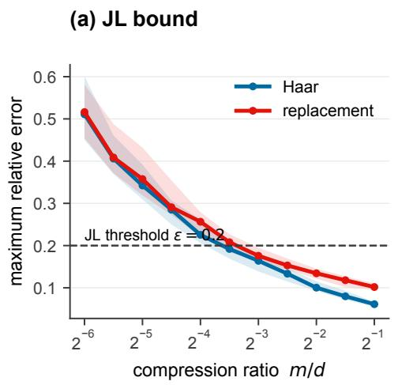
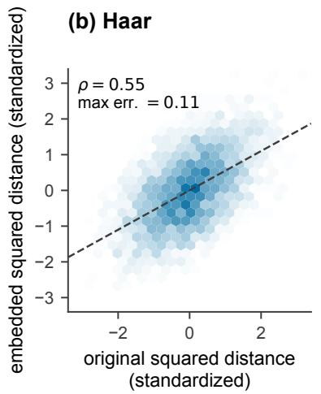
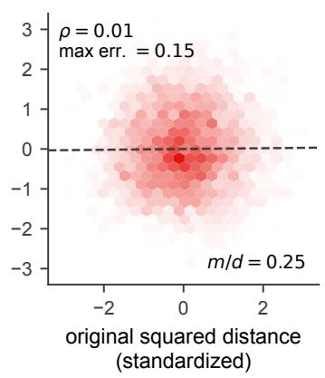
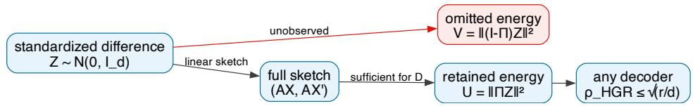
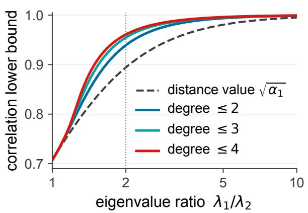
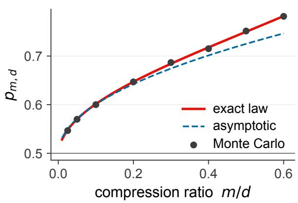
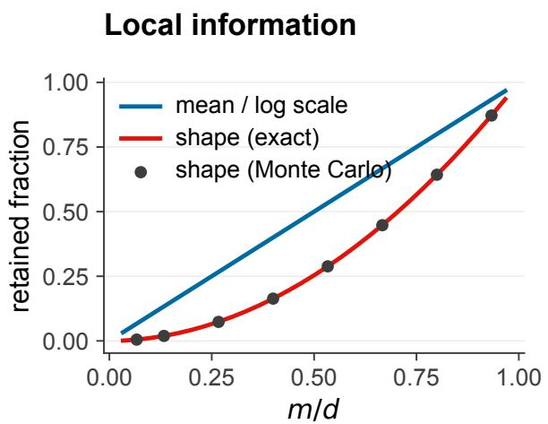
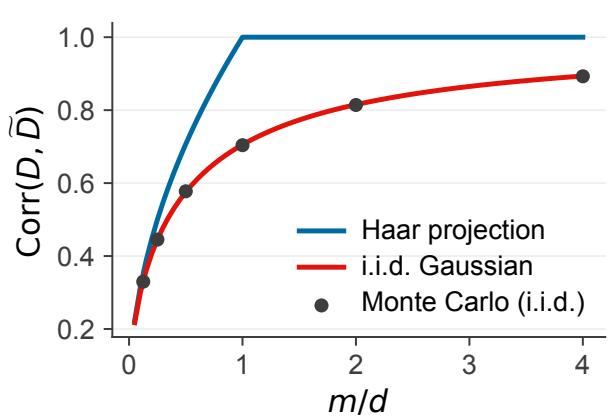

RESEARCH PREPRINT

# Exact Limits of Random Projections for Preserving Geometry: Distance Recovery, Nearest-Neighbor Rankings, and Covariance Shape in Gaussian Models

Piyush Sao

Computer Science and Mathematics Division, Oak Ridge National Laboratory, Oak Ridge, Tennessee 37830, USA \*Corresponding author. Email: saopk@ornl.gov

## Abstract

The Johnson–Lindenstrauss (JL) lemma guarantees that a random projection of n points to $m = O ( \varepsilon ^ { - 2 } \log n )$ dimensions preserves pairwise squared distances within relative error ε with high probability, and this dimension order is asymptotically optimal. In high dimensions, however, distances concentrate around a baseline while key geometric information lies in much smaller fluctuations. We show that the JL bound can therefore be uninformative about retained geometry: an independent Gaussian replacement map can satisfy it even though the replacement cloud is independent of the original data.

We then ask how well any decoder can recover a featuref(D) of a squared distance D from a linear sketch. Under squared-error loss, the optimal decoder is conditional expectation, so recovery defines a linear operator whose singular values quantify feature recovery. For isotropic Gaussian data $\scriptstyle ( \sum \mathbf { \sigma } _ { } = { \dot { \sigma } } ^ { 2 } I _ { d } )$ , we diagonalize this operator in closed form. For fixed k with $m , d - m  \infty ,$ , its kth singular value satisfies $\ell _ { k } \approx ( m / d ) ^ { \bar { k } / 2 }$

This yields three sharp consequences. A rank-m sketch retains at most an m/d fraction of the variance of any feature ofone s uared distance. Ifm → ∞ and $m / d \to 0 ,$ the ex ected Kendall correlation is $\frac { 2 } { \pi } \sqrt { m / d } ( 1 + o ( 1 ) ) ;$ for fixed q, nearest-neighbor agreement tends to 1/q. Yet one projection can satisfy the JL bound while mean Kendall correlation vanishes when log $n \ll m \ll d .$ After removing scale, Haar-averaged retained covariance-shape information is $( m / d ) ^ { 2 }$ . Thus JL distance preservation does not quantify the geometry available for comparison or inference.

Keywords: random projection; Johnson–Lindenstrauss lemma; distance recovery; nearest-neighbor ranking; maximal correlation; covariance shape

MSC Codes: 60D05; 62H12; 68W20

## 1. Introduction

High-dimensional data pipelines routinely replace raw data with compressed representations. Approximate- nearest-neighbor systems generate candidates in a compressed domain and rerank them with richer codes or full-precision distances [1, 2]. Single-cell methods summarize high-dimensional measurements in low-dimensional visualizations, even as benchmarks warn that the recovered orderings can be unstable or distorted [3, 4, 5]. The decisions this forces on the practitioner—when to rerank, how far to compress, how many independent sketches to draw—are currently made empirically, because available guarantees may not capture the task-relevant notion of quality, and their worst-case bounds can be too conservative to guide parameter selection [6]. The goal of this paper is to quantify that retained geometry for the random projection, the compressed representation with the strongest formal guarantees [7, 8].

The guarantee behind random projection is the Johnson–Lindenstrauss (JL) lemma [9]: for finite sets, a suitable map into dimension $m = { \dot { O ( \varepsilon ^ { - 2 } \log n ) } }$ preserves every pairwise squared distance among n points to relative error ε. For an indexed sample $x _ { 1 } , \ldots , x _ { n }$ , we say that a map T satisfies the $\varepsilon - J L$ bound when

$$
\left( 1 - \varepsilon \right) \left\| x _ { i } - x _ { j } \right\| ^ { 2 } \leq \left\| T ( x _ { i } ) - T ( x _ { j } ) \right\| ^ { 2 } \leq \left( 1 + \varepsilon \right) \left\| x _ { i } - x _ { j } \right\| ^ { 2 } \qquad { \mathrm { f o r ~ e v e r y ~ } } i < j .
$$

If the sample or map is random, we call the occurrence of this bound the JL event.

For concentrated high-dimensional data, concentration ofmeasure causes the pairwise squared distances controlled by the JL bound to be dominated by a common population mean, which we call the baseline. Consequently, these bounds become less informative about specific pairwise distances, which instead appear as smaller centered fluctuations around this baseline. Downstream tasks depend on this fine scale: which distance is smaller, and how far a point distribution departs from sphericity. Two questions follow, and the JL bound answers neither. Does the JL event itself certify that the geometry carrying this fine scale survived the sketch? And how much of the fluctuations can any decoder recover from a rank-m sketch?

The structure of prior work indicates why both questions are open. Lower bounds show that the dimension order in the JL lemma is essentially unimprovable: Alon [10] showed that near-equidistant point sets already force nearly the same dimension order for every map, linear or not, and Larsen and Nelson [11] sharpened this lower bound to match the JL dimension order for worst-case constructions. Because the lemma attains the optimal dimension order for the guarantee it states, the gap cannot be closed by sharpening the lemma itself; informativeness about concentrated data requires a diferent criterion. The literature on concentration addresses the original space rather than the sketch: Beyer et al. [12] gave a suficient condition for distance concentration, and the Durrant–Kabán converse [13] established the corresponding necessary condition and identified when nearest neighbors remain meaningful. A third line characterizes projection outputs: Dasgupta [14, 15] established what we call Dasgupta’s sphericalization phenomenon, the rounding of eccentric Gaussian components toward sphericity; Dasgupta, Hsu, and Verma [16] and Diaconis and Freedman [17] obtained related structural results for broader distributions, including approximation by scale mixtures of spherical Gaussians; and Li and Malik [18] gave order preservation guarantees for fixed vector pairs at prescribed length ratios. None of these results tests whether JL satisfaction certifies retained geometry, and none quantifies how much distance variation a decoder can recover from a sketch.

Our approach introduces the missing object: an explicit decoder. We model recovery as estimation of a feature of a squared distance from the sketch under squared-error loss. The optimal estimate is the conditional expectation, so recovery acts as a linear operator, and its singular values measure how much of each feature survives compression. This formulation yields information limits that the pairwise error criterion of the JL lemma cannot express. We make three main contributions. First, we prove that the error allowed by the JL bound can exceed the fluctuation scale of a concentrated Gaussian cloud (section 2). We then show that an independent Gaussian replacement map can satisfy the same bound at the dimension prescribed by the JL lemma even though its replacement cloud is independent of the data (section 3); satisfying the JL bound therefore need not certify retained geometry. Second, we identify three recovery targets that the JL bound does not separately control—distance values, neighbor rankings, and covariance shape—and derive their exact Gaussian recovery limits (sections 4 to 8). For isotropic distance features, the recoverable variance ceiling is m/d; neighbor rankings vary on the associated correlation scale m/d; and difuse covariance shape contracts at order $( m / d ) ^ { 2 }$ . Third, for a general known map, we separate what depends on rank, singular spectrum, and numerical precision, then quantify what ensembles of independent sketches can recover (sections 9 and 10).

These laws give the practitioner’s empirical decisions a quantitative scale. Within the Gaussian bench- mark, the fraction of distance variance retained, the correlation scale of neighbor rankings, and the contraction ofcovariance shape are each determined by the ratio m/d, so the cost ofcompressing farther and the benefit of adding independent sketches can be read of before any experiment. The replacement-map result adds a caution that no empirical protocol supplies: a map can satisfy the JL bound while its output is independent of the data. Beyond the specific Gaussian model, we expect these techniques to extend to other distributions and to more complex features; section 13 develops the resulting research directions. Except where a complete argument appears directly after a statement, proofs are collected in the supplement (section B); the discussion following a statement in the text records the mechanism of the proof.

## 2. The Scale Problem: Baseline versus Fluctuations

We begin by quantifying when the relative error allowed by the JL bound is too coarse to resolve distance fluctuations. Let $X , X ^ { \prime } \overset { \mathrm { i . i . d . } } { \sim } \mathcal { N } ( \mu , \Sigma )$ in $\mathbb { R } ^ { d }$ , where the eigenvalues of Σ are $\lambda _ { 1 } \geq \cdots \geq \lambda _ { d } \geq 0$ . Let $L : \mathbb { R } ^ { d }  \mathbb { R } ^ { m }$ be any linear map of rank at most $m ,$ random or deterministic, oblivious or Σ-aware; no statement below depends on how the map is chosen. Write

$$
D = \left\| X - X ^ { \prime } \right\| ^ { 2 } , \qquad \mathcal { O } = \left( L X , L X ^ { \prime } \right)
$$

for the squared distance and the observed sketch. Whenever L is random, we condition on its realization and reveal it to the decoder; equivalently, the information statements below are conditional on the sampled map. For a query $X _ { 0 }$ and two candidates $X _ { 1 } , X _ { 2 }$ , define the neighbor contrast

$$
S = \| X _ { 0 } - X _ { 1 } \| ^ { 2 } - \| X _ { 0 } - X _ { 2 } \| ^ { 2 } .
$$

Its sign identifies the nearer candidate, so preserving a two-candidate ranking is equivalent to preserving the sign of S.

The baseline and the fluctuations appear in the first two moments:

$$
\begin{array} { r } { \mathbb { E } D = 2 \operatorname { t r } \Sigma , \qquad \operatorname { V a r } ( D ) = 8 \operatorname { t r } ( \Sigma ^ { 2 } ) . } \end{array}\tag{1}
$$

The mean E D is the common population baseline for i.i.d. pairs, while the centered deviations $D - \mathbb { E } D$ are the fluctuations that carry comparative geometry. Diagonalizing Σ expresses D as a weighted sum of independent chi-square variables. Their variances add, so the fluctuation scale depends on the squared eigenvalues through $\operatorname { t r } ( \Sigma ^ { 2 } )$ . The relative scale of the fluctuations is

$$
\begin{array} { r } { r _ { 2 } ( \Sigma ) = \displaystyle \frac { ( \mathrm { t r } \Sigma ) ^ { 2 } } { \mathrm { t r } ( \Sigma ^ { 2 } ) } , \qquad \displaystyle \frac { \mathrm { s d } ( D ) } { \mathbb { E } D } = \sqrt { \frac { 2 } { r _ { 2 } ( \Sigma ) } } . } \end{array}\tag{2}
$$

The quantity $r _ { 2 } ( \Sigma )$ is a squared-trace efective rank: larger values mean tighter relative concentration. For an isotropic covariance matrix, $r _ { 2 } ( \Sigma ) = d ,$ so relative fluctuations are of order $d ^ { - 1 / 2 } \left[ 1 2 \right]$

The following proposition states exactly when a relative-error bound fixes the sign of a comparison. Here $\widetilde { D } _ { 1 }$ and ${ \widetilde { D } } _ { 2 }$ are any distorted values satisfying the displayed inequalities; later sections reserve the notation De for the squared distance computed from a sketch.

Proposition 2.1 (When a relative-error bound preserves order). Let $0 < D _ { 1 } < D _ { 2 } ,$ , and suppose

$$
( 1 - \varepsilon ) D _ { j } \leq \widetilde { D } _ { j } \leq ( 1 + \varepsilon ) D _ { j } , \qquad j = 1 , 2 .
$$

These inequalities guarantee $\widetilde { D } _ { 1 } < \widetilde { D } _ { 2 }$ for every admissible pair if and only if

$$
{ \frac { D _ { 2 } - D _ { 1 } } { D _ { 1 } + D _ { 2 } } } > \varepsilon .
$$

Proof. The worst admissible distortions preserve the order exactly when $( 1 + \varepsilon ) D _ { 1 } < ( 1 - \varepsilon ) D _ { 2 }$ , which is equivalent to the displayed condition; if this inequality fails, the extreme admissible errors reverse or tie the order. □

The neighbor contrast is one such comparison, with $D _ { j } = \left. X _ { 0 } - X _ { j } \right. ^ { 2 }$ : certifying which candidate is nearer is certifying the sign of $S = \pm ( D _ { 2 } - D _ { 1 } )$ . Comparisons with smaller margins may survive, but the bound does not guarantee them. Section 7 quantifies their average behavior for the neighbor contrast under random projection.

The allowed absolute error in a typical squared distance is of order ε E D. If $\varepsilon \gg r _ { 2 } ( \Sigma ) ^ { - 1 / 2 }$ , this error exceeds the fluctuation scale sd(D). In this regime, the JL bound can still hold, but it does not by itself certify neighbor comparisons. If instead $\varepsilon \asymp r _ { 2 } ( \Sigma ) ^ { - 1 / 2 }$ , the JL lemma gives $m = O ( r _ { 2 } ( \Sigma ) \log n )$ . For isotropic data, this scales as d log n and therefore no longer guarantees a target dimension below $\bar { d . }$

The allowed error can therefore be too large to resolve comparative geometry. A coarser tolerance still leaves a distinct question: whether passing the test certifies anything about the retained geometry.

## 3. The JL Bound Can Hold without Information

Does satisfying the JL bound imply retention of any sample-specific structure? Section 2 showed that the error allowed by the JL bound can exceed the fluctuation scale. That observation concerns the tolerance, not the information retained by a particular map: a loose bound may coexist with informative maps. We therefore ask: does satisfying the JL bound guarantee any sample-specific structure?

We answer negatively by constructing a map. An independent Gaussian replacement map assigns each indexed input point $X _ { i }$ a fresh Gaussian output $Y _ { i } ,$ sampled independently of the data, so that $I ( X ^ { n } ; Y ^ { n } ) = 0$ and no decoder can extract any feature of the input from the output. Its image is the replacement cloud; the shared indices pair each input distance $\left\| { X } _ { i } - { X } _ { j } \right\|$ with the corresponding output distance $\left\| Y _ { i } - Y _ { j } \right\|$ . The question is whether this zero-information map can nonetheless satisfy the ε-JL bound on all (n2) pairs at the standard JL dimension.

## 3.1 The independent Gaussian replacement map

Proposition 3.1 (A zero-information map can satisfy the JL bound). Let $n \geq 2 , m , d \in \mathbb { N } , \sigma > 0 ,$ and $0 < \varepsilon , \delta < 1$ . Let $X _ { 1 } , \dots , X _ { n } \overset { \mathrm { i i d } } { \sim } \mathcal { N } ( \mu , \sigma ^ { 2 } I _ { d } )$ and $Y _ { 1 } , \dots , Y _ { n } \overset { \mathrm { i i d } } { \sim } \mathcal { N } \big ( 0 , \sigma ^ { 2 } \frac { d } { m } I _ { m } \big )$ be independent, and define the index map $T _ { \mathrm { r e p } } ( X _ { i } ) = Y _ { i } .$ If min $\{ m , d \} \ge 7 2 \varepsilon ^ { - 2 } \log \bigl ( 4 { \binom { n } { 2 } } / \delta \bigr )$ , then, with probability at least $1 - \delta _ { \cdot }$

$$
\begin{array} { r } { ( 1 - \varepsilon ) \left\| X _ { i } - X _ { j } \right\| ^ { 2 } \leq \left\| T _ { \mathrm { r e p } } ( X _ { i } ) - T _ { \mathrm { r e p } } ( X _ { j } ) \right\| ^ { 2 } \leq ( 1 + \varepsilon ) \left\| X _ { i } - X _ { j } \right\| ^ { 2 } \qquad f o r \ a l l \ i < j . } \end{array}
$$

In particular, in the compression regime $m \leq d , T _ { \mathrm { r e p } }$ can satisfy the $\varepsilon - J L$ bound on the sample at the standard JL dimension order $m = O \bigl ( \varepsilon ^ { - 2 } \log ( n / \delta ) \bigr )$ , while its output carries no information about the data: $I ( X ^ { n } ; Y ^ { n } ) = 0$

Proof. For every $i < j ,$

$$
\frac { \left\| X _ { i } - X _ { j } \right\| ^ { 2 } } { 2 \sigma ^ { 2 } d } \overset { d } { = } \frac { x _ { d } ^ { 2 } } { d } , \qquad \frac { \left\| Y _ { i } - Y _ { j } \right\| ^ { 2 } } { 2 \sigma ^ { 2 } d } \overset { d } { = } \frac { \chi _ { m } ^ { 2 } } { m } .
$$

Set $a = \varepsilon / { \bigl ( } 2 + \varepsilon { \bigr ) }$ . The Chernof bound gives $\operatorname* { P r } \bigr ( \biggr | x _ { k } ^ { 2 } / k - 1 \biggr | > a \bigr ) \le 2 e ^ { - k a ^ { 2 } / 8 }$ . A union bound over the $2 { \binom { n } { 2 } }$ normalized squared distances places all of them in $[ 1 - a , \dot { 1 } + a ]$ with probability at least

$$
1 - 4 { \binom { n } { 2 } } \exp \left( - { \frac { \operatorname* { m i n } \{ m , d \} a ^ { 2 } } { 8 } } \right) \geq 1 - \delta ,
$$

where the last inequality follows from the dimension hypothesis and $8 ( 2 + \varepsilon ) ^ { 2 } < 7 2 \nonumber$ . On this event, every output-to-input ratio lies in

$$
{ \bigg [ } { \frac { 1 - a } { 1 + a } } , { \frac { 1 + a } { 1 - a } } { \bigg ] } = { \bigg [ } { \frac { 1 } { 1 + \varepsilon } } , 1 + \varepsilon { \bigg ] } \subseteq { \big [ } 1 - \varepsilon , 1 + \varepsilon { \big ] } ,
$$

which proves the claim.

The mechanism is that the JL event factors: input-cloud concentration and output-cloud concentration around a shared baseline sufice, and no cross-conditional structure is needed. The following remark records the constants and the two-stage form.

Remark 3.2 (Sharp constants, two-stage form, and scope). Let $\mathcal { E } _ { \varepsilon } ^ { \mathrm { r e p } }$ denote the JL event in proposition 3.1, and, for $0 < a < 1$ , define

$$
\mathcal G _ { X } ( a ) = \left\{ \left| \frac { \left. X _ { i } - X _ { j } \right. ^ { 2 } } { 2 \sigma ^ { 2 } d } - 1 \right| \leq a \mathrm { f o r } \mathrm { a l l } i < j \right\} .
$$

(a) In the compression regime $m \leq d ,$ the hypothesis is a condition on m alone, with the dimension order prescribed by the JL lemma: $m = O \bigl ( \varepsilon ^ { - 2 } \log ( n / \delta ) \bigr )$ .

(b) The proof gives the sharp form: with $a _ { \varepsilon } = \varepsilon / { \left( 2 + \varepsilon \right) }$

$$
\mathrm { P r } ( \mathcal { E } _ { \varepsilon } ^ { \mathrm { r e p } } ) \geq 1 - 2 N _ { p } e ^ { - d a _ { \varepsilon } ^ { 2 } / 8 } - 2 N _ { p } e ^ { - m a _ { \varepsilon } ^ { 2 } / 8 } ,
$$

and min $\{ m , d \} \ge 8 ( 2 + \varepsilon ) ^ { 2 } \varepsilon ^ { - 2 } \log ( 4 N _ { p } / \delta )$ sufices.

(c) The same proof yields the two-stage bounds

$$
\operatorname* { P r } _ { X } \left( \mathcal { G } _ { X } ( a _ { \varepsilon } ) \right) \geq 1 - 2 N _ { p } e ^ { - d a _ { \varepsilon } ^ { 2 } / 8 } , \qquad \operatorname* { i n f } _ { x ^ { n } \in \mathcal { G } _ { X } ( a _ { \varepsilon } ) } \operatorname* { P r } _ { Y } \left( \mathcal { E } _ { \varepsilon } ^ { \mathrm { r e p } } \mid X ^ { n } = x ^ { n } \right) \geq 1 - 2 N _ { p } e ^ { - m a _ { \varepsilon } ^ { 2 } / 8 } ,\tag{3}
$$

so most fixed input clouds individually admit an independent Gaussian replacement map. The phe- nomenon is therefore a property of concentration, not of averaging over random inputs.

(d) Independence concerns the unconditional joint law; conditioning on the success event induces dependence.

Figure 1 illustrates the separation. For comparison, we use a rescaled rank-m orthogonal projection whose row space is uniformly random (Haar-distributed, in the terminology of section 4.3).

(c) Replacement

  
Figure 1. Satisfying the JL bound does not certify retained information. Panel (a) reports the median maximum relative error over all $\textstyle { \binom { 1 0 0 } { 2 } }$ pairs for a rescaled uniformly random rank-m orthogonal projection and an independent Gaussian replacement map at $\stackrel { \_ } { d } = 8 1 9 2 ;$ bands span the 10th–90th percentiles over 30 trials, and the dashed line marks $\varepsilon = 0 . 2$ . Panels (b)–(c) show one trial at m/d = 1/4: projected squared distances remain correlated with the original squared-distance fluctuations, whereas replacement squared distances do not. The annotated maximum errors show that both displayed maps satisfy the JL bound.

Three natural objections delimit the scope of this separation: what the output actually tells a practitioner, whether the construction depends on population scaling, and whether it requires an oversized dimension. The same independence gives an exact answer to the first.

Corollary 3.3 (Ranking consequences of the replacement map). Under the assumptions of proposition 3.1, $i f n \geq 3 ,$ define the mean Kendall statistic for the replacement map by

$$
\overline { { \mathfrak { T } } } _ { n } ^ { \mathrm { r e p } } = \frac { 1 } { n } \sum _ { i = 1 } ^ { n } \left( { n - 1 \atop 2 } \right) ^ { - 1 } \sum _ { j < k } \mathrm { s g n } \Big [ ( D _ { i j } - D _ { i k } ) \big ( D _ { i j } ^ { \mathrm { r e p } } - D _ { i k } ^ { \mathrm { r e p } } \big ) \Big ] .
$$

Then

$$
\mathbb { E } \overline { { \mathfrak { T } } } _ { n } ^ { \mathrm { r e p } } = 0 , \qquad \operatorname* { P r } \left( \left| \overline { { \mathfrak { T } } } _ { n } ^ { \mathrm { r e p } } \right| > t \right) \leq 2 \exp \left( - \frac { \lfloor n / 3 \rfloor t ^ { 2 } } { 2 } \right) .
$$

In the analogous setting with one query and $q \geq 2$ candidates, let $\mathcal { N } _ { k }$ and $\mathcal { N } _ { k } ^ { \mathrm { r e p } }$ be the top-k sets for the original and replacement clouds, respectively, where $1 \leq k < q .$ Then

$$
\mathbb { E } \frac { \left| \mathcal { N } _ { k } \cap \mathcal { N } _ { k } ^ { \mathrm { r e p } } \right| } { k } = \frac { k } { q } , \qquad \operatorname* { P r } \left( \mathcal { N } _ { 1 } = \mathcal { N } _ { 1 } ^ { \mathrm { r e p } } \right) = \frac { 1 } { q } .
$$

Proof. Each Kendall summand is a product of two independent signs. Exchangeability of the candidate labels makes one sign symmetric, so the kernel has mean zero. Since $( X _ { i } , Y _ { i } )$ are i.i.d. pairs across $i , \overline { { \tau } } _ { n } ^ { \mathrm { r e p } }$ is a bounded order-three U-statistic. Hoefding [19] proved the required blocking inequality; applying it gives the stated tail bound. The neighbor set from the replacement cloud is a function of that cloud alone; by exchangeability it is a uniform k-subset independent of $\mathcal { N } _ { k } .$ . Ties have probability zero. □

## 3.2 Calibration

Empirical calibration. Empirical calibration can replace population scaling, which uses knowledge of $\sigma ^ { 2 }$ that a practitioner may not have. With $\overline { { D } } _ { X } = N _ { p } ^ { - 1 } \sum _ { i < j } D _ { i j }$ and $\overline { { D } } _ { \mathrm { r e p } } = \mathrm { \overline { { N } } } _ { p } ^ { - 1 } \sum _ { i < j } D _ { i j } ^ { \mathrm { r e p } }$ , the rescaled cloud $Y _ { i } ^ { \star } = ( \overline { { D } } _ { X } / \overline { { D } } _ { \mathrm { r e p } } ) ^ { 1 / 2 } Y _ { i }$ matches the realized mean squared distance exactly. The same proof holds with $b _ { \varepsilon } = ( \sqrt { 1 + \varepsilon } - 1 ) / ( \sqrt { 1 + \varepsilon } + 1 ) \sim \varepsilon / 4$ in place of $a _ { \varepsilon } ,$ , because on the band event both empirical means also lie in the band and the worst ratio is $( ( 1 + \dot { b _ { \varepsilon } } ) / ( 1 - b _ { \varepsilon } ) ) ^ { 2 } = 1 + \varepsilon$ . Global rescaling preserves all orderings, so the conclusions of corollary 3.3 for rankings and neighborhoods remain exact. If $\mathcal { E } _ { \varepsilon } ^ { \star }$ denotes the calibrated JL event, then

$$
\begin{array} { r } { \operatorname* { P r } ( \mathcal { E } _ { \varepsilon } ^ { \star } ) \geq 1 - 2 N _ { p } e ^ { - d b _ { \varepsilon } ^ { 2 } / 8 } - 2 N _ { p } e ^ { - m b _ { \varepsilon } ^ { 2 } / 8 } . } \end{array}
$$

The calibrated output is not independent of the input. Its data-dependent part is characterized precisely by

$$
X ^ { n } \longrightarrow D _ { X } \longrightarrow Y ^ { \star n } , \qquad \overline { { { D } } } _ { Y ^ { \star } } = \overline { { { D } } } _ { X } \quad \mathrm { a l m o s t \ s u r e l y . }
$$

Thus the conditional law of the output depends on $X ^ { n }$ only through $\overline { { D } } _ { X }$ , and that statistic is recoverable from the output: empirical calibration leaks exactly one scalar and no ranking information.

## 3.3 Sharpness

The third objection is that the replacement map might succeed only in a dimension so large that the JL bound becomes trivial to satisfy. The following proposition rules this out.

Proposition 3.4 (Sharp dimension order for independent Gaussian replacement maps). In the setting of proposition 3.1, let $r = \lfloor n / 2 \rfloor$ and $0 < \varepsilon \le 1$ . There are universal constants $c , C > 0$ such that

$$
\mathrm { P r } ( \mathcal { E } _ { \varepsilon } ^ { \mathrm { r e p } } ) \leq \exp \left( - c r e ^ { - C m \varepsilon ^ { 2 } } \right) .
$$

Consequently, i $f \mathrm { P r } ( \mathcal { E } _ { \varepsilon } ^ { \mathrm { r e p } } ) \geq 1 - \delta$ , then

$$
m \geq \frac { 1 } { C \varepsilon ^ { 2 } } \log \left( \frac { c r } { - \log \left( 1 - \delta \right) } \right)
$$

whenever the logarithm is positive. In particular, for $\delta \leq 1 / 2$ and n/δ suficiently large, $m = \Omega \left( \varepsilon ^ { - 2 } \log ( n / \delta ) \right)$

The proof in section B uses the i.i.d. $F _ { m , d }$ ratios associated with disjoint pairs and the Zhang–Zhou lower bound [20, Cor. 3] for the upper chi-square tail probability. Together with proposition 3.1, this shows that the dimension order prescribed by the JL lemma is both suficient and necessary for the independent Gaussian replacement map.

The conclusion is that the certificate and the information are separate objects. Satisfying the JL bound does not by itself certify retained geometry; what replaces the certificate is the subject of the next section.

## 4. Recovery as an Operator Problem

## 4.1 Sketch, target, and decoder

The JL bound checks if a map preserves original distances within a small relative error. In contrast, recovery analysis fixes an observation and determines what any decoder can infer from it. Section 2 and section 3 show why this distinction matters: the JL bound can hold even when the mapped points contain no information about the original geometry.

Central question. Which features of the original geometry can a decoder recover from the sketch, and how much of each?

To analyze a single distance, we formulate the question as follows. A known linear map $L : \mathbb { R } ^ { d }  \mathbb { R } ^ { m }$ acts on a pair $X , X ^ { \prime } .$ . The target distance is $D = \left\| X - X ^ { \prime } \right\| ^ { 2 }$ , and the observation is the sketch $\mathcal { O } = \left( L X , L X ^ { \prime } \right)$ A feature is a square-integrable scalar $f ( D )$ with positive variance $\mathrm { V a r } ( f ( D ) ) > 0 .$ A decoder is any measurable function $g ( \mathcal { O } )$

Under squared-error loss, the optimal decoder for a feature is its conditional expectation. By the law of total variance, this optimal decoder minimizes the mean squared error:

$$
\begin{array} { r } { g _ { f } ^ { \star } ( \mathcal { O } ) = \mathbb { E } [ f ( D ) \mid \mathcal { O } ] , \qquad \operatorname* { i n f } _ { g } \mathbb { E } \left[ ( f ( D ) - g ( \mathcal { O } ) ) ^ { 2 } \right] = \operatorname { V a r } ( f ( D ) ) - \operatorname { V a r } \big ( \mathbb { E } [ f ( D ) \mid \mathcal { O } ] \big ) . } \end{array}
$$

The conditional expectation orthogonally projects $f ( D )$ onto the closed subspace of square-integrable functions of the sketch. This projection splits the feature’s variance into a recovered part and an orthogonal residual. We measure this recovery using the recoverable variance fraction:

$$
\mathsf { R e c } ( f ; \mathcal { O } ) = \frac { \mathrm { V a r } \left( \mathbb { E } [ f ( D ) \mid \mathcal { O } ] \right) } { \mathrm { V a r } ( f ( D ) ) } \in [ 0 , 1 ] .
$$

This fraction depends only on the feature and the observation, not on the choice of recovery algorithm.

The criterion separates what the JL bound conflates. For the replacement cloud of proposition 3.1, independence gives $\dot { \mathbb { E } } [ f ( D ) \mid Y ^ { n } ] = \mathbb { E } \breve { f } ( D )$ , hence Rec $( f ; Y ^ { n } ) = 0$ for every feature: the JL event can coexist with nothing recoverable. A linear sketch of the data instead yields a nonzero projection. The supremum of $\mathsf { R e c } ( f ; { \mathcal { O } } )$ over features is therefore the object of interest, and it is an operator norm.

## 4.2 The distance-recovery operator

Gathering all centered, square-integrable features of D into the space $L _ { 0 } ^ { 2 } ( D )$ frames recovery as an operator problem. We define the recovery operator

$$
\begin{array} { r } { \mathcal { A } : L _ { 0 } ^ { 2 } ( D ) \longrightarrow L _ { 0 } ^ { 2 } ( \mathcal { O } ) , \qquad \mathcal { A } f = \mathbb { E } [ f ( D ) \mid \mathcal { O } ] , } \end{array}
$$

where $L _ { 0 } ^ { 2 } ( \mathcal { O } )$ denotes the centered, square-integrable functions of the observation. Because A is a restricted orthogonal projection, it never increases the $L ^ { 2 }$ norm, yielding

$$
\mathsf { R e c } ( f ; \mathcal { O } ) = \frac { \| \mathcal { A } f \| _ { 2 } ^ { 2 } } { \| f \| _ { 2 } ^ { 2 } } .
$$

The squared operator norm $\| \mathcal { A } \| _ { \mathrm { o p } } ^ { 2 }$ represents the maximum recoverable fraction over all features. This norm also equals the squared Hirschfeld–Gebelein–Rényi (HGR) maximal correlation [21, 22], which measures the maximum correlation obtainable by transforming the target and the observation:

$$
\| A \| _ { \mathrm { o p } } ^ { 2 } = \operatorname* { s u p } _ { f \in L _ { \mathsf { f } } ^ { 2 } ( D ) } \frac { \| A f \| _ { 2 } ^ { 2 } } { \| f \| _ { 2 } ^ { 2 } } = \mathsf { \rho } _ { \mathrm { H G R } } ^ { 2 } ( D ; \mathcal { O } ) , \qquad \mathsf { \rho } _ { \mathsf { H G R } } ( Y ; Z ) = \operatorname* { s u p } _ { f , g } \left| \mathrm { C o r r } ( f ( Y ) , g ( Z ) ) \right| .\tag{4}
$$

Here, the last supremum is over all measurable, nonconstant, square-integrable scalar functions. Optimizing first over g yields the normalized conditional variance, which confirms this identity [21]. Consequently, no estimator can recover a variance fraction of any feature of D that exceeds $\| \mathcal { A } \| _ { \mathrm { o p } } ^ { 2 }$

The operator describes recovery at three levels:

$$
\begin{array} { r l } & { \mathrm { o n e ~ f e a t u r e } ; \qquad \quad \lVert A f \rVert _ { 2 } ^ { 2 } / \left. f \right. _ { 2 } ^ { 2 } , } \\ & { \mathrm { t h e ~ b e s t ~ f e a t u r e } ; \qquad \left. A \right. _ { \mathrm { o p } } ^ { 2 } , } \\ & { \mathrm { a l l ~ f e a t u r e s ~ a t ~ o n c e } { \mathrm { : } } \quad \mathrm { t h e ~ s i n g u l a r ~ s y s t e m ~ o f } \ : A . } \end{array}
$$

Constant features are recovered perfectly and form a trivial mode. Centering removes this mode, ensuring that the operator on $L _ { 0 } ^ { 2 } ( D )$ captures only the geometric information. While the operator norm is always defined, a discrete singular system exists only for specific channels. The Gaussian channel we construct next admits such a system in closed form.

## 4.3 The Gaussian distance channel

We identify the concrete operator by reducing the sketch to a scalar channel. The first step, row orthonormalization, is a reversible output transformation that preserves all information in a noiseless linear observation by a known map. Let a rank-r map L have thin singular value decomposition $\ b { L } = \ b { U _ { r } } \ b { S _ { r } } \ b { V _ { r } } ^ { \top }$ and put $R = V _ { r } ^ { \top }$ Discarding redundant output coordinates yields

$$
L x = U _ { r } S _ { r } R x , \qquad R x = S _ { r } ^ { - 1 } U _ { r } ^ { \top } L x .
$$

Because $S _ { r }$ is invertible, Lx and Rx uni uel determine each other on the nonredundant out ut. If L has full row rank, we can instead take $R = ( L L ^ { \top } ) ^ { - 1 / 2 } L$ . Here r denotes the rank of $\dot { L } ;$ for full-row-rank sketches with m rows, $r = m$

Let $\Sigma = \sigma ^ { 2 } I _ { d } .$ , and let L have rank $0 < r < d .$ Under this isotropic covariance, row orthonormalization replaces the sketch with the equivalent pair (ΠX, ΠX′), where Π is a rank-r orthogonal projector, and by rotational invariance the law of this pair depends on Π only through its rank. For a random oblivious map, the row space is therefore all that matters. A random r-dimensional subspace of $\mathbb { R } ^ { d }$ is Haar distributed if it is uniform over the Grassmannian, the set of all such subspaces; represent it by an $r \times d$ matrix R with orthonormal rows and projector $\Pi = R ^ { \top } R$ . Orthonormalizing the rows of an i.i.d. standard Gaussian matrix yields this same Haar row-space distribution, a standard construction in randomized numerical linear algebra [7]: right multiplication by a fixed orthogonal matrix preserves the Gaussian law, which makes the row space uniform on the Grassmannian.

Standardize the diference as

$$
Z = \frac { X - X ^ { \prime } } { \sqrt { 2 } \sigma } \sim { \mathcal { N } } ( 0 , I _ { d } ) , \qquad T = \| Z \| ^ { 2 } , \qquad U = \| \Pi Z \| ^ { 2 } , \qquad V = { \mathcal { T } } - U .
$$

Then $U \sim \chi _ { r } ^ { 2 } , V \sim \chi _ { d - r } ^ { 2 } , U \perp V ,$ , and $D = 2 \sigma ^ { 2 } \mathcal { T }$

Three independence properties reduce the full sketch to the scalar U. First, the Gaussian midpoint $\left( X + X ^ { \prime } \right) / 2$ is independent of ${ \bar { X } } - X ^ { \prime }$ , so its rojection carries no information about D. Second, rotational invariance makes the direction of ΠZ uniform on the unit sphere of range(Π) and independent of its length $U ^ { 1 / 2 }$ . Third, the orthogonal Gaussian components ΠZ and $( I - \Pi ) Z$ are independent, so V is independent of the entire retained vector. Therefore, the conditional law of $\tau$ given the full sketch depends only on $U ;$ in probabilistic notation, $D \bot \mathcal { O } \mid U$ . Figure 2 summarizes this reduction.

Standard gamma-sum identities now specify the channel. If $U \sim \mathrm { G a m m a } ( a , \theta )$ and $V \sim { \mathrm { G a m m a } } ( b , \theta )$ are independent, then

$$
\mathcal { T } = U + V \sim \mathrm { G a m m a } ( a + b , \theta ) , \qquad \frac { U } { \mathcal { T } } \sim \mathrm { B e t a } ( a , b ) , \qquad \frac { U } { \mathcal { T } } \perp \mathcal { T } .
$$

  
Figure 2. The distance channel. A rank-r sketch splits the squared norm of a standardized Gaussian diference into observed and omitted parts. Given U, the rest of the sketch provides no further information about the distance $D = 2 \sigma ^ { 2 } ( U + V )$

Here $a = r / 2 , b = ( d - r ) / 2$ , and the common scale is $\theta = 2$ for the chi-squared laws above. Observing U from the latent total ${ \mathcal { T } } = U + V$ forms the beta–gamma channel.

The distance-recovery problem is now reduced to the conditional-expectation operator of the beta– gamma channel: since $D \perp \mathcal { O } \mid U$ and $D = 2 \sigma ^ { 2 } T$ , the operator A acts through $h ( \mathcal { \bar { T } } ) \mapsto \mathbb { E } [ h ( \mathcal { T } ) \ |$ | U]. Section 5 computes its operator norm and its complete singular spectrum.

## 4.4 How the framework recurs

The ranking and covariance-shape problems replace the pair $( L _ { 0 } ^ { 2 } ( D ) , L _ { 0 } ^ { 2 } ( { \mathcal { O } } ) )$ by other target and observable spaces. One formulation—conditional expectation as orthogonal projection—covers all three problems; the operator itself difers with each target. Throughout, d is the ambient dimension, m the output dimension, and r the map rank; n is the sample size and q the number of candidates compared to a query; D denotes a squared distance, S a shared-query distance contrast, and O the observed sketch. Three derived quantities recur: ρHGR is the maximal correlation between a target and an observation, $r _ { 2 } ( \Sigma ) = ( \mathrm { t r } \Sigma ) ^ { 2 } / \mathrm { t r } ( \Sigma ^ { 2 } )$ is the efective rank of the spectrum, and $\ell _ { k }$ indexes the singular values of the distance-recovery operator. Sections 6 and beyond introduce the recovery fractions $\alpha _ { m } ( \Sigma )$ and $\alpha _ { \Pi } ( \Sigma )$ and the block retention ratios $\theta _ { g }$ where they are first used.

For distance features, section 5 solves the operator just constructed: the centered distance attains the operator norm ${ \sqrt { r / d } } ,$ , and the full singular system is a generalized Laguerre family. Section 6 then treats general covariance, where recovering the distance value and recovering the best nonlinear feature can difer. The recovery scale is a variance fraction of order m/d, a quantity the JL bound does not control (section 2).

For neighbor rankings, the target is the shared-query contrast $S = D _ { 0 1 } - D _ { 0 2 }$ , or its sign, and we observe $\mathcal { O } = \left( L X _ { 0 } , L X _ { 1 } , L \bar { X } _ { 2 } \right)$ . The target is a function of two dependent distances, so the scalar operator is replaced by a projection of the joint contrast; we calculate the exact sign law from a conditional Gaussian calculation (section 7). Sign statistics inherit the correlation scale m/d rather than the variance-fraction scale m/d.

For covariance shape, the relevant Hilbert space is the Gaussian score space, and removing the unknown overall scale is an orthogonal projection of the shape score onto the orthogonal complement of the nuisance scale score. The resulting eficient Fisher information contracts at order $( m / d ) ^ { 2 }$ for difuse shape directions (section 8).

The exponents difer because the three rows measure diferent objects. Variance recovery squares an $L ^ { 2 }$ correlation, rank comparisons depend on a sign probability and therefore on the correlation itself, and a covariance perturbation is compressed on both sides by the random projector.

## 5. Exact Solution of the Gaussian Distance Operator

For the beta–gamma channel of section 4.3, the recovery operator A of section 4.2 acts through the scalar pair (U, T ). This section computes its operator norm, then its complete singular system, and derives the

Table 1. Guide to the three recovery laws. Each law is stated in the units of its recovery quantity.
<table><tr><td>Target</td><td>Recovery quantity</td><td>Recovery law</td></tr><tr><td>Distance features, isotropic recoverable variance fraction</td><td></td><td> $m / d$ </td></tr><tr><td>Neighbor rankings</td><td>excess pairwise agreement over chance</td><td> $\pi ^ { - 1 } { \sqrt { m / d } } \left( 1 + o { \left( 1 \right) } \right)$ </td></tr><tr><td>Diffuse covariance shape</td><td>Haar-mean efficient-information fraction</td><td> $\frac { ( m - 1 ) ( m + 2 ) } { ( d - 1 ) ( d + 2 ) } \sim ( m / d ) ^ { 2 }$ </td></tr></table>

channel’s mutual information and identities for the distance.

## 5.1 The operator norm

The norm follows from a result on partial sums. Dembo, Kagan, and Shepp [22] proved that the maximal correlation between a partial sum of r i.i.d. nondegenerate finite-variance variables and a containing sum of d such variables is ${ \sqrt { r / d } } .$ . The chi-square variables of section 4.3 satisfy these hypotheses. Ordinary linear correlation already equals ${ \sqrt { r / d } } ;$ the theorem says that nonlinear transformations of the partial and total sums cannot improve it.

Theorem 5.1 (Operator norm and maximal correlation). For the isotropic component and any rank-r linear observation,

$$
\left\| \mathbf { \mathcal { A } } \right\| _ { \mathrm { o p } } = \rho _ { \mathrm { H G R } } ( D ; \mathcal { O } ) = \sqrt { \frac { r } { d } } .
$$

Consequently, $\mathrm { V a r } ( \mathbb { E } [ f ( D ) \mid \mathcal { O } ] ) \leq ( r / d ) \mathrm { V a r } ( f ( D ) ) f o r e \nu e r \gamma f \in L ^ { 2 } ,$ and

$$
\operatorname* { i n f } _ { g } \mathbb { E } [ ( f ( D ) - g ( \mathcal { O } ) ) ^ { 2 } ] \geq ( 1 - r / d ) \operatorname { V a r } ( f ( D ) ) .
$$

The proof(section B) writes T as a sum ofd independent $\chi _ { 1 } ^ { 2 }$ variables and U as the partial sum ofthe first r. The Dembo–Kagan–Shepp theorem gives maximal correlation $\sqrt { r / d }$ for this pair. Because U is suficient for T —the rest of the sketch carries no further information about the distance—the identity transfers to the full sketch. Thus thresholds, quantiles, clipped distances, and every other square-integrable scalar feature obey the same decoder-free ceiling. Mutual information complements this ceiling by measuring total dependence [23], but neither quantity resolves recovery mode by mode; the singular system does.

## 5.2 The singular spectrum

The gamma law is the orthogonality measure for the generalized Laguerre polynomials, and Grifiths [24] diagonalized the gamma conditional-expectation operator $h ( \mathcal { T } ) \mapsto \mathbb { E } [ h ( \mathcal { T } ) \mid \dot { U } ]$ in that basis. For the beta–gamma pair of section 4.3, this system resolves recoverable variance one fluctuation component at a time.

Theorem 5.2 (Laguerre spectrum). The conditional-expectation operator $f ( \mathcal { T } ) \mapsto \mathbb { E } [ f ( \mathcal { T } ) \mid$ U] has generalized Laguerre singular functions and singular values

$$
\ell _ { k } = \left( \frac { \left( r / 2 \right) _ { k } } { \left( d / 2 \right) _ { k } } \right) ^ { 1 / 2 } , \qquad k = 0 , 1 , 2 , \ldots ,
$$

where $( a ) _ { k }$ is the rising factorial [24]. $\begin{array} { r } { I f f ( T ) - \mathbb { E } f ( T ) = \sum _ { k \geq 1 } c _ { k } \Phi _ { k } ( T ) } \end{array}$ is the orthonormal Laguerre expansion,

then

$$
\operatorname { V a r } ( \mathbb { E } [ f ( \mathcal { T } ) \mid \mathcal { O } ] ) = \sum _ { k \geq 1 } \ell _ { k } ^ { 2 } c _ { k } ^ { 2 } .
$$

For fixed $k ,$ as r → ∞ and $d - r  \infty$

$$
\ell _ { k } = \left( \frac { r } { d } \right) ^ { k / 2 } \left[ 1 + O _ { k } \left( \frac { 1 } { r } + \frac { 1 } { d } \right) \right] .
$$

This is Grifiths’s diagonalization specialized to the gamma parameters $a = r / 2$ and $a + b = d / 2 ;$ the proof, with that of theorem $5 . 3 .$ , appears in section B. The first nonconstant mode is the centered total energy $\tau _ { - \\mathbb { E } } \tau$ and has $\ell _ { 1 } = \sqrt { r / d } = \| \mathcal { A } \| _ { \mathrm { o p } } .$ , so the operator norm of theorem 5.1 is attained by the centered distance itself. The second mode is the orthogonalized quadratic fluctuation of $\tau .$ . Thus k indexes increasingly nonlinear fluctuation components, not additional spatial coordinates. At leading order, advancing from mode k to mode $k + 1$ costs an additional factor of ${ \sqrt { r / d } } .$

## 5.3 Mutual information and identities for the distance

The spectrum measures recoverable variance feature by feature. From the gamma entropies of the observed and omitted squared norms, we also obtain the total mutual information.

Theorem 5.3 (Exact mutual information). With $h _ { \Gamma } ( k )$ the entropy of a gamma variable of shape k at any fixed scale,

$$
\begin{array} { c } { { I ( D ; \mathcal { O } ) = h _ { \Gamma } \displaystyle \left( \frac { d } { 2 } \right) - h _ { \Gamma } \displaystyle \left( \frac { d - r } { 2 } \right) \longrightarrow - \frac 1 2 \log ( 1 - \alpha ) } } \\ { { \displaystyle i f r / d \to \alpha < 1 \ a n d \ d - r \to \infty . I f r / d \to 0 . t h e n I ( D ; \mathcal { O } ) = r / ( 2 d ) + O ( r ^ { 2 } / d ^ { 2 } + 1 / d ) . } } \end{array}
$$

The proof (section B) evaluates the gamma entropies of the observed and omitted squared norms; the limits follow from Stirling expansions.

For the rank-r projector, define the rescaled projected distance by

$$
\widetilde { D } = \frac { d } { r } \left\| \Pi ( X - X ^ { \prime } ) \right\| ^ { 2 } .
$$

The same decomposition gives three identities for the distance:

$$
\operatorname { C o r r } ( D , \widetilde { D } ) = \sqrt { r / d } , \qquad \frac { \operatorname* { i n f } _ { f } \mathbb { E } [ ( D - f ( \widetilde { D } ) ) ^ { 2 } ] } { \operatorname { V a r } ( D ) } = 1 - \frac { r } { d } ,
$$

and

$$
\frac { \mathbb { E } [ ( ( \widetilde { D } - \mathbb { E } \widetilde { D } ) - ( D - \mathbb { E } D ) ) ^ { 2 } ] } { \operatorname { V a r } ( D ) } = \frac { d - r } { r } .
$$

Rescalin preserves the common baseline, but the fluctuation noise of $\widetilde { D }$ has relative order $r ^ { - 1 / 2 }$ rather than the data’s $\dot { d } ^ { - 1 / 2 }$

For one pair under a rank-m linear sketch,

$$
\mathsf { \rho _ { H G R } } \left( D _ { i j } ; \left( L X _ { i } , L X _ { j } \right) \right) = \sqrt { m / d }
$$

whereas the replacement cloud $Y ^ { n }$ of proposition 3.1 gives

$$
\mathsf { p } _ { \mathrm { H G R } } ( D _ { i j } ; Y ^ { n } ) = 0 .
$$

Thus, the JL bound is compatible both with the maximal dependence $\sqrt { m / d }$ attainable from a rank-m linear sketch of one distance and with zero dependence.

The isotropic operator is now solved. Section 6 extends distance recovery to general covariance, where the operator norm and the recovery fraction for the distance can separate.

## 6. Distance Recovery Beyond Isotropy

The isotropic solution is complete: theorems 5.1 and 5.2 give the operator norm and the full singular spectrum. Anisotropy separates two questions that coincide for a flat spectrum: recovery of the distance value and recovery of an arbitrary nonlinear feature.

## 6.1 General covariance: the recovery fraction for the distance

Theorem 5.1 is an isotropic statement about every feature. For general covariance, recovery of the distance value itself admits an exact answer for every spectrum and every rank-m map. Because eigendirection j contributes $8 \lambda _ { j } ^ { 2 }$ to $\mathrm { V a r } ( D )$ , an optimal m-dimensional observation targets the largest squared eigenvalues. We therefore define the recovery fraction for the distance D by

$$
\alpha _ { m } ( \Sigma ) = \frac { \sum _ { j \leq m } \lambda _ { j } ^ { 2 } } { \sum _ { j \leq d } \lambda _ { j } ^ { 2 } } \in ( 0 , 1 ] .\tag{5}
$$

We must separate two recovery questions. First, $\alpha _ { m } ( \Sigma )$ is the largest fraction of $\mathrm { V a r } ( D )$ recoverable by a rank-m map. Second, for a fixed observation, $\rho _ { \mathrm { H G R } } ^ { 2 } ( D ; \mathcal { O } )$ is the largest recoverable fraction over all square-integrable features of D. These quantities coincide at m/d in the isotropic case. Under anisotropy they can difer; balanced spectral retention is a suficient condition that restores equality.

Theorem 6.1 (Sharp rank-m limit for distance recovery). For every rank-m linear L and every measurable estimator $g ,$

$$
\frac { \mathrm { V a r } \big ( \mathbb { E } \big [ D \mid \mathcal O \big ] \big ) } { \mathrm { V a r } ( D ) } \leq \alpha _ { m } ( \Sigma ) , \qquad \mathbb { E } \big [ ( D - g ( \mathcal O ) ) ^ { 2 } \big ] \geq 8 \sum _ { j > m } \lambda _ { j } ^ { 2 } .
$$

The variance bound is attained when the row space of L is the top-m eigenspace of Σ; for this map, the mean-square bound is attained $b \gamma g = \mathbb { E } [ D \mid { \mathcal { O } } ]$ . The same statements, with $\mathrm { V a r } ( \stackrel {  } { S } ) = \mathrm { \ i } 2 \operatorname { t r } \stackrel {  } { ( } \Sigma ^ { 2 } )$ , hold for the neighbor contrast $S = \left\| X _ { 0 } - X _ { 1 } \right\| ^ { 2 } - \left\| X _ { 0 } - X _ { 2 } \right\| ^ { 2 } g i \nu e n \left( L X _ { 0 } , L X _ { 1 } , L X _ { 2 } \right)$

The proof (section B) combines the Gaussian conditional mean, a projector identity, and eigenvalue interlacing for the compressed covariance. The bounds are uniform: no nonlinear estimator of the distance value and no Σ-aware choice of L exceeds the squared-eigenvalue limit. The mean-square bound also follows from the law of total variance: subtracting at most $8 \textstyle \sum _ { j \leq m } \lambda _ { j } ^ { 2 }$ recovered variance from $\begin{array} { r } { \mathrm { V a r } ( D ) = 8 \sum _ { j \leq d } \lambda _ { j } ^ { 2 } } \end{array}$ leaves at least $8 \textstyle \sum _ { j > m } \lambda _ { j } ^ { 2 }$

## 6.2 Anisotropy: divergence and reconciliation

The isotropic identity might suggest that $\sqrt { \alpha _ { m } ( \Sigma ) }$ bounds HGR under anisotropy, but this bound fails in general. The mechanism is unequal retention across independent spectral blocks: observing one block completely while discarding another can let a nonlinear transformation reweight their contributions. A two-dimensional counterexample illustrates this mechanism.

Theorem 6.2 (Anisotropic counterexample). Let $D = 2 G _ { 1 } ^ { 2 } + G _ { 2 } ^ { 2 } .$ for independent standard normals $G _ { 1 } , G _ { 2 }$ and observe $U = 2 G _ { 1 } ^ { 2 }$ . Although $\alpha _ { 1 } = 4 / 5 ,$ quadratic polynomial features already give

$$
\rho _ { \mathrm { H G R } } ( D ; U ) \geq \sqrt { \frac { 2 4 6 + 2 \sqrt { 2 0 1 } } { 3 1 1 } } \approx 0 . 9 3 9 2 > \sqrt { 4 / 5 } .
$$

When $\rho _ { \mathrm { H G R } } ^ { 2 } ( D ; \mathcal { O } ) > \alpha _ { m } ( \Sigma )$ , some nonlinear feature of D is more recoverable than the distance value itself. We call this gap nonlinear excess. Here $\sqrt { 4 / 5 } \approx 0 . 8 9 4 4$ is the linear correlation with the distance. The proof (section B) evaluates the canonical correlation of the quadratic features, which makes the displayed value a lower bound on ρHGR. For $D _ { \lambda } = \lambda G _ { 1 } ^ { 2 } + G _ { 2 } ^ { 2 }$ and $U _ { \lambda } = \lambda G _ { 1 } ^ { 2 }$ , Figure 3 reports canonical-correlation lower bounds from nested polynomial feature spaces. These values are lower bounds for a fixed observation, not the unrestricted HGR value or an optimization over observations.

Nonlinear excess can occur but is not universal. A suficient condition for its absence follows by writing

$$
\begin{array} { l } { \displaystyle { \sum = \sum _ { g = 1 } ^ { G } \lambda _ { g } P _ { g } , \qquad r _ { g } = \mathrm { r a n k } P _ { g } , } } \end{array}
$$

where the $\lambda _ { g } > 0$ are distinct and $P _ { g }$ projects onto the associated eigenspace, or spectral block. Let Π satisfy $\Pi { \boldsymbol { \Sigma } } = { \boldsymbol { \Sigma } } \Pi$ , so it preserves every block, and define

$$
s _ { g } = \mathrm { r a n k } \bigl ( \Pi P _ { g } \bigr ) , \qquad \theta _ { g } = \frac { s _ { g } } { r _ { g } } , \qquad \alpha _ { \Pi } \bigl ( \Sigma \bigr ) = \frac { \mathrm { t r } \bigl ( \Pi \Sigma ^ { 2 } \bigr ) } { \mathrm { t r } \bigl ( \Sigma ^ { 2 } \bigr ) } = \frac { \sum _ { g } \lambda _ { g } ^ { 2 } s _ { g } } { \sum _ { g } \lambda _ { g } ^ { 2 } r _ { g } } .
$$

The Gaussian distance then splits across independent beta–gamma channels, one per spectral block. Maximal correlation tensorizes over such independent pairs [25]: for nondegenerate $( Y _ { j } , Z _ { j } )$ independent across $j ,$

$$
\mathsf { \rho } _ { \mathsf { H G R } } \left( ( Y _ { j } ) _ { j } ; ( Z _ { j } ) _ { j } \right) = \operatorname* { m a x } _ { j } \mathsf { \rho } _ { \mathsf { H G R } } ( Y _ { j } ; Z _ { j } ) .
$$

Theorem 6.3 (Spectral-block HGR bounds and the balanced regime). For independent X, $X ^ { \prime } \sim { \mathcal { N } } ( \mu , \Sigma )$ let $D = \left. X - X ^ { \prime } \right. ^ { 2 }$ and $\mathcal { O } = \left( \Pi X , \Pi X ^ { \prime } \right)$ . Under $\Pi { \boldsymbol { \Sigma } } = { \boldsymbol { \Sigma } } \Pi$

$$
\sqrt { \alpha _ { \Pi } ( \Sigma ) } \leq \mathsf { \rho } _ { \mathrm { H G R } } ( D ; \mathcal { O } ) \leq \sqrt { \operatorname* { m a x } _ { g } \theta _ { g } } .
$$

If $s _ { g } = \theta r _ { g }$ for every nonzero spectral block, then

$$
\begin{array} { r } { \rho _ { \mathrm { H G R } } ( D ; \mathcal { O } ) = \sqrt { \theta } = \sqrt { \alpha _ { \Pi } ( \Sigma ) } . } \end{array}
$$

Consequently, Va $\cdot ( \mathbb { E } [ f ( D ) \mid \mathcal { O } ] ) \leq \theta \operatorname { V a r } ( f ( D ) )$ for every $f \in L ^ { 2 } ( D )$ , and the centered distance paired with the centered retained squared norm attains maximal correlation.

Witsenhausen tensorization bounds this product channel by its largest block correlation, $\sqrt { \operatorname* { m a x } _ { g } \theta _ { g } } ;$ a centered linear witness supplies the lower bound (section B contains the full argument). Unequal eigenvalues alone therefore do not break the balanced identity. Unequal retention permits nonlinear excess but does not force it; equal fractional retention makes the excess vanish.

The flat spectrum closes the gap between the two recovery quantities. If $\Sigma = \lambda P$ has flat support of rank r, an observation retaining rank s within range(P) has $\rho _ { \mathrm { H G R } } ^ { 2 } = \bar { s } / r ;$ an optimal rank-at-most-m observation chooses its row space inside the support, takes $s = \operatorname* { m i n } \{ m , r \}$ , and attains $\rho _ { \mathrm { H G R } } ^ { 2 } = \alpha _ { m } \mathopen { } \mathclose \bgroup \left( \Sigma \aftergroup \egroup \right)$ . More generally, for one distance, $\alpha _ { m } ( \Sigma )$ governs the distance value for every spectrum, and $\alpha _ { \Pi } ( \Sigma )$ is also the ceiling for every feature under a balanced aligned projection. Rankings compare several dependent distances sharing a query and follow the square-root correlation scale associated with the same rank ratio.

## 7. Rankings Under Random Projection

Sections 5 and 6 quantified the recovery of one distance. Rankings instantiate the projection template of section 4.4 with the shared-query contrast as target and the three projected points as observation. Because rankings compare several dependent distances, we first define the rank functional and identify the ranking scale before computing its exact law.

For two tie-free score vectors $a , b \in \mathbb { R } ^ { q }$ , Kendall’s rank correlation is

$$
\tau ( a , b ) = \binom { q } { 2 } ^ { - 1 } \sum _ { j < k } \mathrm { s g n } \big [ ( a _ { j } - a _ { k } ) ( b _ { j } - b _ { k } ) \big ] .\tag{6}
$$

This statistic is the fraction of concordant pairs minus the fraction of discordant pairs [26]. For independent continuous rankings, the expected Kendall correlation is zero.

## 7.1 Why m/d: sign statistics at the linear mode

We can identify the ranking scale before the exact calculation. For a query $X _ { 0 }$ and candidates $X _ { 1 } , X _ { 2 }$ , write

$$
S = D _ { 0 1 } - D _ { 0 2 } = a ^ { \top } b , \qquad a = X _ { 1 } - X _ { 2 } , \qquad b = X _ { 1 } + X _ { 2 } - 2 X _ { 0 } .
$$

For i.i.d. isotropic Gaussians, a and b are independent. Under the rescaled rank-m projector, the contrast is $\widetilde { S } = ( d / m ) a ^ { \top } \Pi b$ . Conditional on a, the pair $( \bar { S , { \widetilde S } } )$ is centered jointly Gaussian in b with correlation

$$
\rho ( a ) = { \frac { \Vert \Pi a \Vert } { \Vert a \Vert } } , \qquad \rho ( a ) ^ { 2 } \sim \mathrm { B e t a } \Bigg ( { \frac { m } { 2 } } , { \frac { d - m } { 2 } } \Bigg ) .
$$

The squared correlation has mean m/d.

For a centered jointly Gaussian pair, Sheppard [27] showed that the sign-agreement probability is $\frac { 1 } { 2 } + \pi ^ { - 1 }$ arcsin ρ. $\mathsf { A s } \rho  0$ , this agreement probability exceeds chance by $\rho / \pi + O \big ( \rho ^ { 3 } \big )$ . Thus the retained- energy fraction m/d becomes a ranking excess of order $\pi ^ { - 1 } { \sqrt { m / d } }$ on the correlation scale. Averaging Sheppard’s formula over the Beta-distributed conditional correlation then yields the exact law.

## 7.2 Exact pairwise order agreement

Let $X _ { 0 } , X _ { 1 } , X _ { 2 } \stackrel { \mathrm { i . i . d . } } { \sim } \mathcal { N } ( \mu , \sigma ^ { 2 } I _ { d } )$ independently of a Haar rank-m projection, where $0 < m < d .$ Let $D _ { 0 j }$ and $\widetilde { D } _ { 0 j }$ be the original and rescaled projected squared distances.

Theorem 7.1 (Exact pairwise order agreement). The probability that the comparisons agree is

$$
p _ { m , d } = \operatorname* { P r } \left[ \bigl ( D _ { 0 1 } - D _ { 0 2 } \bigr ) \bigl ( \widetilde { D } _ { 0 1 } - \widetilde { D } _ { 0 2 } \bigr ) > 0 \right] = \frac { 1 } { 2 } + \frac { 1 } { \pi } \mathbb { E } \left[ \arcsin \sqrt { B } \right] , \qquad B \sim \operatorname { B e t a } \left( \frac { m } { 2 } , \frac { d - m } { 2 } \right) .
$$

Hence $\begin{array} { r } { p _ { m , d } \leq \frac { 1 } { 2 } + \frac { 1 } { 2 } \sqrt { m / d } , } \end{array}$ and

$$
p _ { m , d } = { \frac { 1 } { 2 } } + { \frac { 1 } { \pi } } { \sqrt { \frac { m } { d } } } \left( 1 + O { \left( { \frac { 1 } { m } } + { \frac { m } { d } } \right) } \right)
$$

when $m \to \infty$ and m/d → 0. For one query ranking any number of candidates, the expected Kendall correlation is $\mathbb { E } \tau = 2 p _ { m , d } - 1$

The proof (section B) conditions on a in the preceding reduction and averages Sheppard’s formula over the Beta law. Thus, when $m = o ( d )$ , the expected pairwise agreement is only $\Theta ( \sqrt { m / d } )$ above chance.

Anisotropic bounds

  
Pairwise ordering

  
Figure 3. Polynomial lower bounds for $D _ { \lambda } \mapsto U _ { \lambda }$ . Higher degrees reveal nonlinear dependence beyond $\sqrt { \alpha _ { 1 } } ;$ the vertical line marks the counterexample $\lambda = 2 .$  
Figure 4. Pairwise order agreement: the exact Beta–arcsine law, its asymptote, and Monte Carlo simulations at $d = 2 0 0$ with 120,000 samples per marker.

## 7.3 Nearest-neighbor and top-k overlap

Pairwise agreement does not determine whether the nearest candidate or the full top-k set is preserved. Let $X _ { 0 } , X _ { 1 } , \dots , X _ { q } \overset { \mathrm { i . i . d . } } { \sim } \mathcal { N } ( 0 , I _ { d } )$ , with $X _ { 0 }$ the query. Let $\boldsymbol { R } \in \mathbb { R } ^ { m \times d }$ have orthonormal rows and be independent of the sample; isotropy makes its orientation irrelevant. Let $\widetilde { \mathcal { N } } _ { k }$ and $\mathcal { N } _ { k }$ be the projected and original sets of k nearest candidate indices.

Write

$$
U _ { j } = \left\| R ( X _ { j } - X _ { 0 } ) \right\| ^ { 2 } , \qquad V _ { j } = \left\| ( I - \Pi ) ( X _ { j } - X _ { 0 } ) \right\| ^ { 2 } , \qquad \Pi = R ^ { \top } R .
$$

The projected ranking is determined by $U = ( U _ { j } ) _ { j } ,$ , while the original ranking is determined by $U + V ,$ . For one coordinate, Gaussian fourth moments give, for distinct candidates j and k,

$$
\mathrm { V a r } \Big ( \big ( x _ { j } - x _ { 0 } \big ) ^ { 2 } \Big ) = 8 , \qquad \mathrm { C o v } \Big ( \big ( x _ { j } - x _ { 0 } \big ) ^ { 2 } , \big ( x _ { k } - x _ { 0 } \big ) ^ { 2 } \Big ) = 2 .
$$

The centered and normalized vectors $( U - 2 m 1 ) / \sqrt { m }$ and $( V - 2 ( d - m ) 1 ) / \surd d - m$ therefore converge to independent Gaussian score vectors with covariance $6 I _ { q } + 2 1 1 ^ { \top }$ . The rank-one term in this covariance represents a random shift shared by every candidate. Removing this shift leaves the ranks unchanged and gives correlation $\sqrt { m / d }$ between the retained and full scores.

For independent standard normal vectors $G , H \in \mathbb { R } ^ { q }$ , let $\mathcal { K } _ { \boldsymbol { k } } ( \boldsymbol { z } )$ return the indices of the k smallest coordinates and define

$$
\mathcal { R } _ { q , k } ( \boldsymbol { \rho } ) = \frac { 1 } { k } \mathbb { E } \left| \mathcal { K } _ { k } ( G ) \cap \mathcal { K } _ { k } \left( \boldsymbol { \rho } G + \sqrt { 1 - \boldsymbol { \rho ^ { 2 } } } H \right) \right| .
$$

The nearest-neighbor case is $p _ { q } ( \boldsymbol { \mathbf { \rho } } ) = \mathcal { R } _ { q , 1 } ( \boldsymbol { \mathbf { \rho } } )$ , the probability that the two score vectors have the same smallest coordinate. For $G _ { \rho } = \rho G + \sqrt { 1 - \rho ^ { 2 } } H .$ , define the minimum cells

$$
A _ { i } = \big \{ x \in \mathbb { R } ^ { q } : x _ { i } = \operatorname* { m i n } _ { j } x _ { j } \big \} , \qquad i = 1 , \dots , q .
$$

Then

$$
\sum _ { i = 1 } ^ { q } \operatorname* { P r } ( G \in A _ { i } , G _ { \boldsymbol { \rho } } \in A _ { i } ) = \operatorname* { P r } \left( { \arg \operatorname* { m i n } G _ { i } = \arg \operatorname* { m i n } _ { i } ( G _ { \boldsymbol { \rho } } ) _ { i } } \right) .\tag{7}
$$

The sum over all $q$ cells is essential; one cell has probability smaller by a factor of $\dot { \mathbf { \zeta } } _ { q }$ by symmetry. Let $\Phi _ { \rho }$ be the standard bivariate-normal density and let $\dot { \overline { { \Phi } } } _ { \rho } ( x , \gamma ) \dot { = } \operatorname* { P r } ( Z _ { 1 } > \dot { x } , Z _ { 2 } > \gamma )$ be its joint survival function. We also write ${ \overline { { \Phi } } } ( x ) = \operatorname* { P r } ( Z > x )$ for the univariate standard-normal survival function. Conditioning on the common minimum gives

$$
p _ { q } ( \boldsymbol { \rho } ) = q \int \int _ { \mathbb { R } ^ { 2 } } \Phi _ { \rho } ( x , \gamma ) \overline { { \Phi } } _ { \rho } ( x , \gamma ) ^ { q - 1 } d x d \gamma .\tag{8}
$$

Each remaining Gaussian pair must exceed both conditioned values. By central symmetry the same integral may be written with the lower joint CDF after replacing the common minimum by a common maximum.

Theorem 7.2 (Gaussian score limit for fixed candidate count). Fix $q$ and $1 \ \leq \ k \ < \ q .$ . If m $ \infty ,$ $d - m  \infty ,$ and m/d $ \alpha \in [ 0 , 1 ]$ , then

$$
\mathbb { E } \frac { \left| \mathcal { N } _ { k } \cap \widetilde { \mathcal { N } } _ { k } \right| } { k } \longrightarrow \mathcal { R } _ { q , k } ( \sqrt { \alpha } ) .
$$

For $k = 1$

$$
\mathrm { P r } (  { N _ { 1 } } =  { \widetilde { \mathcal { N } } } _ { 1 } ) = p _ { q } \left( \sqrt { m / d } \right) + O _ { q } \left( m ^ { - 1 / 2 } + ( d - m ) ^ { - 1 / 2 } \right) .
$$

In particular, $p _ { q } ( 0 ) = 1 / q$ and $\mathcal { R } _ { q , k } ( 0 ) = k / q .$ . Thus, for fixed $q ,$ k and m/d → 0, the probability that the nearest neighbors agree tends to $1 / q ,$ and the expected normalized top-k overlap tends to $k / q$

The proof (section B) applies Bentkus’s multivariate Berry–Esseen bound for convex sets [28] to the independent coordinate sums forming the projected and omitted scores; because q is fixed, summing over the q disjoint choices of common minimizer gives the stated $O _ { q } ( m ^ { - 1 / 2 } + ( d - m ) ^ { - 1 / 2 } )$ transfer.

More generally, let $R _ { r : q }$ be the rank of the second-coordinate value paired with the rth ordered firstcoordinate value. This paired value is the concomitant of the rth order statistic. Then

$$
\mathcal { R } _ { q , k } ( \rho ) = \frac { 1 } { k } \sum _ { r = 1 } ^ { k } \operatorname* { P r } ( R _ { r : q } \leq k ) .
$$

The distribution of ranks in a finite sample is classical [29]. We reduce neighborhoods after random projection to these kernels at correlation ${ \sqrt { m / d } }$ , establish the finite-dimensional transfer, and derive the top-k limit.

Frieze and Jerrum derived the small-correlation expansion of the same Gaussian common-argmax kernel [30]. In common-minimum notation it gives the following result; the proof, by diferentiating equation (8) at $\rho = 0 ;$ , appears in section B.

Proposition 7.3 (Classical small-correlation expansion). For fixed $q \geq 2 ,$

$$
p _ { q } ( \boldsymbol { \rho } ) = \frac { 1 } { q } + c _ { q } \boldsymbol { \rho } + O _ { q } ( \boldsymbol { \rho } ^ { 2 } ) , \qquad c _ { q } = q ^ { 2 } ( q - 1 ) \left[ \int _ { - \infty } ^ { \infty } \Phi ( x ) ^ { 2 } \overline { { \Phi } } ( x ) ^ { q - 2 } d x \right] ^ { 2 } .
$$

In particular, $c _ { 2 } = 1 / \pi ,$ recovering the small-correlation expansion of Sheppard’s formula. Hence

$$
\operatorname* { P r } ( \mathcal { N } _ { 1 } = \widetilde { \mathcal { N } } _ { 1 } ) = \frac { 1 } { q } + c _ { q } \sqrt { \frac { m } { d } } + O _ { q } \left( \frac { m } { d } + \frac { 1 } { \sqrt { m } } + \frac { 1 } { \sqrt { d - m } } \right) .
$$

## 7.4 The JL bound can hold while rankings collapse

Section 3 showed that the JL bound alone forces no retained geometry: an independent Gaussian replacement map can satisfy it. The same separation also holds for a linear projection. Although the pairwise law suggests that rankings degrade under thin projection, it does not show whether one fixed map can satisfy the JL bound on the same sample while its rankings collapse. We prove that these events coexist.

Let $A = \sqrt { d / m } R .$ , where R has Haar-distributed orthonormal rows. For distinct x, y, z, define

$$
s _ { A } ( x ; \gamma , z ) = { \mathrm { s g n } } \left[ \left( \left\| x - \gamma \right\| ^ { 2 } - \left\| x - z \right\| ^ { 2 } \right) \left( \left\| A ( x - \gamma ) \right\| ^ { 2 } - \left\| A ( x - z ) \right\| ^ { 2 } \right) \right] .
$$

For n data points, the average Kendall correlation across queries is

$$
\overline { { \tau } } _ { n } = \frac { 1 } { n } \sum _ { i = 1 } ^ { n } \left( { n - 1 \atop 2 } \right) ^ { - 1 } \sum _ { j < k \atop j , k \ne i } s _ { A } ( X _ { i } ; X _ { j } , X _ { k } ) ,
$$

whose expectation involves the single-query constant

$$
\tau _ { m , d } = \frac 2 \pi \mathbb E \arcsin \sqrt { B } , \qquad B \sim \mathrm { B e t a } \left( \frac m 2 , \frac { d - m } 2 \right) :
$$

by theorem $7 . 1 , \tau _ { m , d }$ is the expected Kendall correlation for one query under a rank-m Haar projection.

Theorem 7.4 (One map can satisfy the JL bound while rankings collapse). Let $X _ { 1 } , \dotsc , X _ { n } \stackrel { i . i . d . } { \sim } { \mathcal { N } } ( 0 , I _ { d } )$ independently ofA, with $n \geq 3 , 0 < m < d , 0 < \varepsilon < 1$ , and $0 < \delta , \mathfrak { n } < 1$

(i) Conditional concentration. Conditionally on $A , \mathbb { E } [ \overline { { \tau } } _ { n } \mid A ] = \tau _ { m , d } a n d , f o r t > 0 _ { \iota }$

$$
\operatorname* { P r } \left( \left| \overline { \tau } _ { n } - \tau _ { m , d } \right| > t \mid A \right) \leq 2 \exp \left( - \frac { \lfloor n / 3 \rfloor t ^ { 2 } } { 2 } \right) .
$$

(ii) JL event. A universal $C > 0$ exists such that, $i f m \geq C \varepsilon ^ { - 2 } \log ( n / \delta )$ , then A satisfies the $\varepsilon - J L$ bound on the sample with probability at least $1 - \delta$

(iii) Simultaneous conclusion. With probability at least $1 - \delta - \eta _ { \ast }$ , the JL event in part $( i i )$ and

$$
\overline { { \tau } } n \leq \sqrt { \frac { m } { d } } + \sqrt { \frac { 2 \log ( 2 / \mathfrak { n } ) } { \lfloor n / 3 \rfloor } }
$$

hold simultaneously.

The proof (section B) symmetrizes the Kendall kernel and applies the blocking inequality of Hoefding [19] for bounded order-three U-statistics, partitioning the sample into disjoint triples to restore independence and give conditional concentration; a union bound gives the JL event. If $n \to \infty$ and log $n \ll m \ll d ,$ the same sampled map can satisfy the JL bound for fixed ε while $\overline { { \tau } } _ { n } \to 0$ in probability.

Remark 7.5 (Haar projection versus replacement map). The normalized replacement distance has law $\chi _ { m } ^ { 2 } / m ,$ exactly the distortion law for one vector under an i.i.d. Gaussian JL matrix. For the Haar map in theorem 7.4,

$$
{ \frac { \left\| A \nu \right\| ^ { 2 } } { \left\| \nu \right\| ^ { 2 } } } { \frac { d } { d } } { \frac { d } { m } } B , \qquad B \sim \mathrm { B e t a } \left( { \frac { m } { 2 } } , { \frac { d - m } { 2 } } \right) , \qquad \mathrm { V a r } \left( { \frac { \left\| A \nu \right\| ^ { 2 } } { \left\| \nu \right\| ^ { 2 } } } \right) = { \frac { 2 ( d - m ) } { m ( d + 2 ) } } .
$$

This variance agrees with 2/m only when $m / d \to 0$ . Even there, airwise distances are de endent in diferent ways: every projected pair uses the same projection, whereas every replacement pair belongs to the same replacement cloud. For one distance, the two constructions therefore occupy the opposite endpoints recorded in section 5.3: the maximal dependence m/d attainable from a rank-m linear sketch, and no dependence at all.

Our results show that ranking agreement follows the $\sqrt { m / d }$ correlation scale, whereas the JL bound does not constrain it. We next study clustering and estimation, which depend on how well a sketch preserves the ability to distinguish nearby distributions.

## 8. Covariance-Shape Information

Distance rankings concern single-sample observables. Clustering and estimation instead ask how well projected data distinguish nearby distributions. We use Fisher information to measure that local distinction and to remove overall scale before measuring covariance shape.

For a regular parametric family with density pθ, the Fisher information matrix is the second-moment matrix of the score,

$$
\mathcal { T } ( \boldsymbol { \theta } ) = \mathbb { E } _ { \boldsymbol { \theta } } \left[ \nabla _ { \boldsymbol { \theta } } \log p _ { \boldsymbol { \Theta } } ( \boldsymbol { X } ) \big ( \nabla _ { \boldsymbol { \theta } } \log p _ { \boldsymbol { \Theta } } ( \boldsymbol { X } ) \big ) ^ { \top } \right] .\tag{9}
$$

Under the usual regularity conditions it also equals $- \mathbb { E } _ { \theta } [ \nabla _ { \theta } ^ { 2 } \log p _ { \theta } ( X ) ]$ . Fisher information gives the local quadratic approximation

$$
D _ { \mathrm { K L } } \big ( P _ { \boldsymbol { \theta } } | | o P _ { \boldsymbol { \theta } + \boldsymbol { \delta } } \big ) = \frac { 1 } { 2 } \boldsymbol { \delta } ^ { \top } \mathcal { Z } ( \boldsymbol { \theta } ) \boldsymbol { \delta } + o \big ( \| \boldsymbol { \delta } \| ^ { 2 } \big )
$$

[31]. It therefore measures local statistical distinguishability; through the Cramér–Rao bound, its inverse also controls the variance of regular estimators.

When a parameter of interest ϑ is accompanied by a nuisance parameter ζ, the eficient information removes score variation explained by the nuisance direction. If the nuisance block is nonsingular, the eficient information is the Schur complement

$$
\mathcal { T } _ { \mathrm { e f f } } = \mathcal { T } _ { \vartheta \vartheta } - \mathcal { T } _ { \vartheta \zeta } \mathcal { T } _ { \zeta \zeta } ^ { - 1 } \mathcal { T } _ { \zeta \vartheta } .\tag{10}
$$

Equivalently, it is the information in the residual score after projecting out the span of the nuisance score. This is the projection in score space anticipated in section 4.4: the target space is spanned by scores rather than by features of a distance, and orthogonal projection again determines what the observation retains.

## 8.1 Fisher information under projection

Let R have Haar-distributed orthonormal rows and write $\Pi = R ^ { \dagger } R$ . For $X \sim { \mathcal { N } } ( \mu , \sigma ^ { 2 } I _ { d } )$ observed through this known projection, the Fisher information for the mean is exactly

$$
\mathbb { Z } _ { \mu } ( R X ) = \frac { 1 } { \sigma ^ { 2 } } \Pi .\tag{11}
$$

It is the identity on the observed m-space and zero on the kernel. For a scalar submodel $\mu = \theta \nu ,$ the retained fraction $\nu ^ { \top } \Pi \nu / \Vert \nu \Vert ^ { 2 }$ is Beta $\scriptstyle ( { \frac { m } { 2 } } , { \frac { d - m } { 2 } } )$ -distributed with mean m/d, and the Cramér–Rao variance inflation in direction v is its reciprocal.

## 8.2 Mean, scale, and shape contraction

A local perturbation of a Gaussian component decomposes into a change of mean, a scalar change of log-scale, and a traceless change of covariance shape. To define shape independently of scale, consider $\Sigma _ { \zeta , \epsilon } ^ { - } = e ^ { \zeta } ( I _ { d } + \epsilon H )$ with tr $H = 0 .$ . Here ζ controls overall scale and ϵ the magnitude of the traceless shape direction H. Treating ζ as a nuisance parameter projects the shape score $R H R ^ { \top }$ away from the scale score, which is proportional to $I _ { m } .$ . The eficient shape score is therefore the traceless part of $R H R ^ { \top }$

$$
R H R ^ { \top } - \frac { \mathrm { t r } ( R H R ^ { \top } ) } { m } I _ { m } .
$$

Haar averaging gives a separate contraction factor for each perturbation type.

Table 2. Haar-averaged fractions of local Gaussian Fisher information, equivalently of local Kullback–Leibler divergence. The shape fraction is computed after eliminating unknown overall scale; unlike the log-scale fraction, it varies across row spaces, and the table reports its Haar mean.
<table><tr><td>Perturbation</td><td>Retained fraction</td><td>Dependence on row space</td></tr><tr><td>Mean direction</td><td>m/d</td><td>Beta-distributed around its mean</td></tr><tr><td>Scalar log-scale</td><td>m/d</td><td>Deterministic</td></tr><tr><td>Diffuse traceless shape</td><td> $\frac { ( m - 1 ) ( m + 2 ) } { ( d - 1 ) ( d + 2 ) } \sim ( m / d ) ^ { 2 }$ </td><td>Random; displayed fraction is the Haar mean</td></tr></table>

Theorem 8.1 (Local contraction taxonomy). A Haar rank-m projection retains the three expected fractions summarized in Table 2; the shape row uses eficient Fisher information after eliminating the nuisance scale ζ. For any symmetric traceless H, the exact moment identity is

$$
\mathbb { E } _ { R } \left. R H R ^ { \top } - \frac { \mathrm { t r } ( R H R ^ { \top } ) } { m } I _ { m } \right. _ { F } ^ { 2 } = \frac { ( m - 1 ) ( m + 2 ) } { ( d - 1 ) ( d + 2 ) } \left. H \right. _ { F } ^ { 2 } .
$$

At the isotropic model, the unprojected eficient Fisher information for ϵ is $\textstyle { \frac { 1 } { 2 } } \left\| H \right\| _ { F } ^ { 2 }$ , while the projected information is one half of the squared norm inside the expectation. The Haar moment identity therefore gives the contraction factor for shape directly; the proof, based on second-order Haar integration, appears in section B. A difuse shape perturbation distributes its squared Frobenius norm across many eigendirections rather than concentrating it in a few spikes. Such a perturbation loses information twice. Projection removes coordinates and also reduces contrast within the retained coordinates. Figure 5 compares the exact constant with simulation.

For two well-separated Gaussian components with common isotropic covariance, the leading logarithm of the Bayes error is proportional to the squared distance between their means. A Haar projection multiplies that exponent by the Beta-distributed factor in equation (11), which has mean m/d and concentrates as both dimensions grow. Dasgupta [14] obtained logarithmic projection dimensions for learning separated mixtures. Our local information rate is consistent with that result but is not a complete clustering guarantee.

## 8.3 Compression toward sphericity and the spike exception

The local calculation describes infinitesimal changes. To connect it with a global covariance, let $A = \sqrt { d / m } R$ define $C _ { A } = A \Sigma A ^ { \top } , \operatorname { p u t } \bar { \lambda } = \mathrm { t r } \big ( \Sigma \big ) / d ,$ and set $\Delta = \Sigma - \bar { \lambda } I .$ . Then

$$
C _ { A } - \frac { { \mathrm { t r } } \Sigma } { m } I _ { m } = \frac { d } { m } R \Delta R ^ { \top } .
$$

Standard bounds for random compression identify two dimensionless quantities that control convergence to a scalar matrix in operator norm [14, 15]. The quantity $\sqrt { m } \ \| \Delta \| _ { F } / \mathrm { t r } \mathbf { \bar { Z } }$ controls the distributed anisotropic bulk: the square-root factor reflects accumulation across many weak directions. The quantity m $\| \Delta \| _ { \mathrm { o p } } / \mathrm { t r } \Sigma$ controls the largest individual direction, for which no such averaging occurs. Thus the compressed covariance approaches a scalar matrix in regimes where both quantities vanish. The resulting rounding toward a scalar covariance is Dasgupta’s sphericalization phenomenon. Dasgupta [14, 15] established the phenomenon for eccentric Gaussians, and Dasgupta, Hsu, and Verma [16] extended it to more general distributions.

A suficiently large spectral spike violates the operator-norm condition and can remain visible after compression. Its detection threshold depends on the population spectrum, sample size, and statistical task, so the rate derived for difuse shape should not be applied to finite-rank spikes without an additional model.

The quadratic contraction completes the taxonomy: mean and scale contract at m/d, difuse traceless shape at order $( m / d ) ^ { 2 }$ , and a suficiently large spike escapes the difuse rate. A known noiseless map can be row orthonormalized without changing its information, whereas estimators that use the output metric directly or invert noisy measurements remain sensitive to its singular spectrum.

## 9. General Maps: Rank, Spectrum, and Precision

Orthogonal projections lose information only by discarding directions: they are isometries on their retained row spaces. A general linear map, by contrast, can also distort the geometry it keeps. The relevant spectral summary depends on the downstream task. Table 3 previews the three cases.

Table 3. Three downstream uses of a fixed known rank-r map T, with $M = T ^ { \top }$ T and nonzero singular values $s _ { 1 } , \ldots , s _ { r } .$ . The first two rows take $Z \sim \mathcal { N } ( 0 , I _ { d } ) ;$ the third takes $\gamma = T x + \varepsilon \eta$ for independent $x \sim \mathcal { N } ( 0 , I _ { d } )$ and $\boldsymbol \eta \sim \bar { \mathcal { N } } ( 0 , I _ { m } )$
<table><tr><td>Downstream use</td><td>Governing summary Exact law</td><td></td></tr><tr><td>Optimal nonlinear inference</td><td>Rank r</td><td> $\operatorname { p _ { H G R } } ( \left\| Z \right\| ^ { 2 } ; T Z ) = { \sqrt { r / d } }$ </td></tr><tr><td>Unwhitened squared-norm estimate Trace ratio</td><td> $r _ { 2 } ( M )$ </td><td> $\mathrm { C o r r } ( \Vert Z \Vert ^ { 2 } , \Vert T Z \Vert ^ { 2 } ) = \sqrt { r _ { 2 } ( M ) / d }$ </td></tr><tr><td>Inversion with additive noise</td><td>Spectrum near zero</td><td> $\begin{array} { r } { \mathbf { M M S E } ( x \mid T x + \varepsilon \eta , T ) = d - \sum _ { i = 1 } ^ { r } s _ { i } ^ { 2 } / ( s _ { i } ^ { 2 } + \varepsilon ^ { 2 } ) } \end{array}$ </td></tr></table>

## 9.1 The rank–spectrum–precision trichotomy

Theorem 9.1 (Trichotomy). Let $Z \sim \mathcal { N } ( 0 , I _ { d } )$ , let $\boldsymbol { T } \in \mathbb { R } ^ { m \times d }$ be a fixed known map of rank r with nonzero singular values $s _ { i } ,$ and write $D = \left\| Z \right\| ^ { 2 } , Q = \left\| T Z \right\| ^ { 2 } .$ , and $M = T ^ { \top } T$

(i) Best-possible inference is governed by rank alone: $\mathsf { \rho } _ { \mathrm { H G R } } \bigl ( D ; T Z \bigr ) = \mathsf { \sqrt { \mathstrut r / d } } ,$ so for every $f \in L ^ { 2 } .$ Va $\cdot ( \vec { \mathbb { E } } \tilde { [ } f ( D ) \mid T Z ] ) \leq ( r / d ) \breve { \operatorname { V a r } } ( f ( D ) )$

(ii) The unwhitened squared-norm estimate is governed by the spectrum:

$$
\mathrm { C o r r } ( D , { \mathrm { Q } } ) = { \frac { \mathrm { t r } M } { \sqrt { d \ \mathrm { t r } ( M ^ { 2 } ) } } } = \sqrt { \frac { r _ { 2 } ( M ) } { d } } , \qquad r _ { 2 } ( M ) = { \frac { ( \mathrm { t r } M ) ^ { 2 } } { \mathrm { t r } ( M ^ { 2 } ) } } .
$$

$I f \kappa = s _ { \mathrm { m a x } } / s _ { \mathrm { m i n } }$ over the nonzero singular values, then

$$
r \frac { 4 \kappa ^ { 2 } } { ( \kappa ^ { 2 } + 1 ) ^ { 2 } } \leq r _ { 2 } ( M ) \leq r .
$$

The lower bound is asymptotic to $4 r / \kappa ^ { 2 } \ a s \ \kappa  \infty .$

(iii) Recovery under additive noise is governed by the spectrum near zero: $i f x \sim \mathcal { N } ( 0 , I _ { d } )$ and $\boldsymbol \eta \sim \mathcal { N } ( \dot { 0 } , I _ { m } )$ are independent and $\gamma = T x + \varepsilon \eta$ , then

$$
\operatorname { t r } \operatorname { V a r } ( \mathbb { E } [ x \mid \gamma , T ] ) = \sum _ { i = 1 } ^ { r } { \frac { s _ { i } ^ { 2 } } { s _ { i } ^ { 2 } + \varepsilon ^ { 2 } } } , \qquad \operatorname { M M S E } ( x \mid \gamma , T ) = d - \sum _ { i = 1 } ^ { r } { \frac { s _ { i } ^ { 2 } } { s _ { i } ^ { 2 } + \varepsilon ^ { 2 } } } .
$$

The proof (section B) treats the three parts separately. Part (i) follows by orthonormalizing the rows of T as in section 4.3. The singular value decomposition shows that observing TZ is equivalent to observing r coordinates of a rotated standard Gaussian. With $W = ( T T ^ { \top } ) ^ { \dagger / 2 } T$ , one has $\mathrm { C o r r } ( \bar { D _ { } } , \| W Z \| ^ { 2 } ) = \sqrt { r / d }$ . If T is invertible, then $D = ( T Z ) ^ { \top } ( T T ^ { \top } ) ^ { - 1 } ( T Z )$ exactly.

Part (ii) analyzes $Q = \| T Z \| ^ { 2 }$ without row-orthonormalizing T. We bound its correlation with D using the Kantorovich inequality: for positive $x _ { i } \in [ x _ { \operatorname* { m i n } } , x _ { \operatorname* { m a x } } ] .$

$$
\frac { ( \sum _ { i = 1 } ^ { r } x _ { i } ) ^ { 2 } } { r \sum _ { i = 1 } ^ { r } x _ { i } ^ { 2 } } \geq \frac { 4 x _ { \operatorname* { m i n } } x _ { \operatorname* { m a x } } } { ( x _ { \operatorname* { m i n } } + x _ { \operatorname* { m a x } } ) ^ { 2 } } .
$$

Taking $x _ { i } = s _ { i } ^ { 2 }$ and $x _ { \mathrm { m a x } } / x _ { \mathrm { m i n } } = \kappa ^ { 2 }$ yields the displayed trace-ratio bound.

In part (iii), we ask whether inverting T remains stable under additive noise. The factor $s _ { i } ^ { 2 } / \bigl ( s _ { i } ^ { 2 } + \varepsilon ^ { 2 } \bigr )$ is the variance recovered in singular direction i by the Gaussian posterior mean, or equivalently the Wienerfilter gain. When $s _ { i } \ll \varepsilon ,$ the recovered fraction in direction i is negligible even if the map is invertible. Invertibility alone does not imply that the output Euclidean metric preserves distances or that noisy inversion is stable.

## 9.2 Gaussian-map examples

Gaussian maps isolate reversible spectral distortion from rank loss. A square i.i.d. Gaussian map is full rank, yet its unwhitened centered-distance correlation tends to $1 / { \sqrt { 2 } } ;$ row orthonormalization restores the Haar value. Figure 6 shows the one-stage comparison.

  
Figure 5. Local information contraction. Mean and log-scale directions retain m/d; traceless shape retains $( m - 1 ) ( m + \bar { 2 } ) / ( ( d -$ $1 ) ( d + 2 ) )$ ). Markers use $d = 6 0$ and 1,500 Haar frames per m.

  
Figure 6. Correlation between original and mapped centered squared distances after one Haar or i.i.d. Gaussian stage. Markers use the chi-square representation at $d = 2 0 0 ,$ , with 150,000 samples per m.

A single map exposes the distinction among rank loss, reversible spectral distortion, and instability under noise. We next ask how multiple independent sketches change the available rank.

## 10. Ensembles

We now consider multiple independent sketches, which reduce the variability of a single sketch. By stacking them, we obtain their information ceiling; by averaging them, we obtain a simple decoder whose finite-size gap can be computed exactly.

Theorem 10.1 (Ensemble ceiling and averaging). Let $A _ { 1 } , \ldots , A _ { k } \in \mathbb { R } ^ { m \times d }$ be sketches applied to the same data.

(i) Converse. Stacking gives one linear map ofrank at most $p = \operatorname* { m i n } \{ k m , d \}$ . For any joint decoder, the recoverable centered-distance variance is at most $\alpha _ { p } ( \Sigma )$ . In the isotropic case, ρHGR $\leq { \sqrt { p / d } }$ , with equality for independent Gaussian blocks and the optimal joint decoder.

(ii) Explicit averaging decoder. If the $A _ { i }$ are independent Gaussian maps and we average the k rescaled squared distances they produce, then the correlation, jointly over the maps and data, is

$$
{ \sqrt { \frac { k m } { k m + d + 2 } } } .
$$

The ratio of this correlation to the HGR ceiling is

$$
Y _ { k , m , d } = \sqrt { \frac { k m d } { ( k m + d + 2 ) \operatorname* { m i n } \{ k m , d \} } } = \left\{ \sqrt { d / ( k m + d + 2 ) } , \quad k m \leq d , \pm \right.
$$

For the averaging decoder, the proof (section B) conditions on the standardized diference to obtain an estimate of the form $\| Z \| ^ { 2 } C ,$ , where $C \sim \chi _ { \mathit { k m } } ^ { 2 } / ( k m )$ is independent of $Z .$ The resulting correlation is the exact efect of an independent multiplicative chi-square fluctuation, including the finite $d + 2$ correction: averaging k sketches leaves the distance estimate intact and shrinks this fluctuation by a factor $\sqrt { k }$ in standard

deviation.

Independent sketches add rank, but they never exceed the rank-km ceiling. The converse in part (i) is the stacked-rank special case of theorem 6.1; the averaging identity is the single-stage correlation of the concatenated $k m \times \bar { d }$ Gaussian map (section B). Simple averaging has the correct scaling and approaches this ceiling when km $\ll d$ or $k m \gg d ;$ its largest constant-factor gap occurs near $k m \approx d ,$ where $\gamma _ { k , m , d } \approx 1 / \sqrt { 2 }$ Before km reaches d, added sketches expand the available rank; afterward, they only reduce distortion in the averaging decoder. Correcting the joint metric when $k m \leq d ,$ or inverting the stacked map when $k m \geq d ,$ removes this reversible spectral distortion and reaches the isotropic ceiling.

These identities are exact population statements. We verify representative finite-size claims in section 11.

## 11. Numerical Validation

The preceding results include exact population identities, asymptotic limits, and probability statements at finite d and m. We use numerical validation for two purposes: to check independent implementations of the closed-form expressions and to measure how closely experiments at finite d and m follow their limiting predictions. We use exact Gaussian moments for polynomial identities, deterministic quadrature for integral formulas, and Monte Carlo sampling for stochastic claims at finite d and m. We report one standard error for Monte Carlo estimates and Wilson 95% intervals for frequencies ofjoint events. These calculations support the formulas and their interpretation at finite dimensions; they do not replace the proofs.

The complete reproducibility materials are available at

## https://github.com/piyush314/random-projection-geometry.

The reproducibility guide in section E records the tested version and explains how to set up, execute, and generate the artifacts.

The independent Gaussian replacement experiment tests whether the JL bound distinguishes a genuine shared projection from a cloud that is sampled independently of the data. It compares a normalized Haar projection, an i.i.d. Gaussian map, and the independent Gaussian replacement map at the same $( n , d , m , \varepsilon )$ values. For $n = 1 0 0 , d = 8 1 9 2 , m = 1 0 2 4$ , and $\varepsilon = 0 . 2 ,$ all 30 Haar trials and all 30 Gaussian-map trials satisfied the JL bound, as did 28 of 30 replacement trials. $\mathrm { A t } m / d = 1 / 4$ , the Pearson correlation of centered squared distances in Figure 1 was 0.55 for the Haar projection and 0.01 for the replacement map; both displayed maps satisfied the same JL bound. Figure 1 reports the manuscript view, while the reproducibility repository records the full ranking, nearest-neighbor, calibration, and disjoint-pair diagnostics.

Every calculation based on exact moments or quadrature in Table 4 agrees with its reference value to the displayed precision, and every Monte Carlo estimate agrees within two standard errors. Two rows require separate interpretation. The quarter-circle entry is the limiting mean of a posterior variance fraction. The entry for $r _ { 2 }$ is a deterministic equivalent formed from a ratio of moments, not an identity for a finite sample.

Table 5 validates the results for balanced blocks, the Gaussian common minimum, nearest neighbors, and $\mathrm { { J L - K } }$ endall coexistence. The calculation for balanced blocks uses exact moments to check, without Monte Carlo error, the degree-two lower bound on canonical correlation and hence on nonlinear excess. The nearest-neighbor row compares a simulation at finite d and m, 0.137020, with its Gaussian score limit, 0.138325, at $m = 2 0$ . Here the $m ^ { - 1 / 2 }$ Berr –Esseen remainder can exceed the first-order si nal, so simulation provides the check at finite d and m. The final row tests the coexistence phenomenon of theorem 7.4. Its joint rate, 0.990, is the empirical frequency with maximum sample distortion at most 15% and mean Kendall correlation magnitude at most 0.1.

We interpret two checks in more detail because they reveal finite-sample behavior that asymptotic notation can obscure. First, we calculate exact Gaussian moments at $\lambda = 2$ to reproduce the quadratic canonical correlation in theorem 6.2. We then sweep the polynomial canonical correlation of $D _ { \lambda } = \dot { \lambda } G _ { 1 } ^ { 2 } + G _ { 2 } ^ { 2 }$ and $U _ { \lambda } = \lambda G _ { 1 } ^ { 2 }$ to produce Figure 3. Degree one agrees with $\sqrt { \alpha _ { 1 } }$ , while nested degree-two through degree-four spaces yield larger lower bounds away from isotropy. These values concern one observation and finite polynomial classes; they neither evaluate unrestricted HGR nor optimize the observed subspace.

Table 4. Numerical validation summary. Monte Carlo (MC) estimates are estimate ± one standard error; exact-moment and quadrature checks have no sampling error. Both isotropic mean-square error rows are normalized by Var(D).
<table><tr><td>Claim</td><td>Reference value Computed value</td><td></td><td>Method</td></tr><tr><td>Isotropic  $\mathrm { C o r r } ( D , \widetilde { D } )$ </td><td>0.2236</td><td> $0 . 2 2 2 8 \pm 0 . 0 0 1 5$ </td><td>MC, independent chi-square split, N = 400,000</td></tr><tr><td>Normalized minimum mean-square error</td><td>0.9500</td><td> $0 . 9 5 1 9 \pm 0 . 0 0 2 2$ </td><td>MC, conditional mean,  $N = 4 0 0 { , } 0 0 0$ </td></tr><tr><td>Centered estimation MSE / Var(D)</td><td>19.000</td><td> $1 9 . 1 0 0 \pm 0 . 0 5 3$ </td><td>MC, rescaled projection, N = 400,000</td></tr><tr><td>Quadratic canonical correlation at λ=2</td><td>0.939239</td><td>0.939239</td><td>exact Gaussian moments</td></tr><tr><td>Beta-arcsine p5,50 Diffuse traceless covariance-shape</td><td>0.59829</td><td> $0 . 5 9 9 0 7 \pm 0 . 0 0 0 7 7$ </td><td>MC, conditional Gaussian,  $N = 4 0 0 { , } 0 0 0$ </td></tr><tr><td>contraction (8/40)</td><td>0.04274</td><td> $0 . 0 4 2 9 7 \pm 0 . 0 0 0 1 8$ </td><td>MC, Haar frames, N = 3,000</td></tr><tr><td>One Gaussian stage (200 → 200)</td><td>0.70535</td><td> $0 . 7 0 4 4 2 \pm 0 . 0 0 0 8 0$ </td><td>MC, chi-square stage,  $N = 4 0 0 { , } 0 0 0$ </td></tr><tr><td>Gaussian chain  $( 3 0 0  1 5 0  1 0 0 )$ </td><td>0.4058</td><td> $0 . 4 0 5 0 \pm 0 . 0 0 1 3$ </td><td>MC, independent chi-square stages, N = 400,000</td></tr><tr><td>Wishart E tr(M²) Ratio-of-moments proxy vs.</td><td>243.00</td><td> $2 4 3 . 1 4 \pm 0 . 3 8$ </td><td>MC, Gaussian maps,  $N = 3 { , } 0 0 0$ </td></tr><tr><td>Monte Carlo mean of r2</td><td>14.8148</td><td> $1 4 . 8 4 1 3 \pm 0 . 0 0 7 0$ </td><td>MC; proxy is not an identity,  $N = 3 { , } 0 0 0$ </td></tr><tr><td>Quarter-circle mean posterior-variance fraction  $\scriptstyle ( \varepsilon = 0 . 2 )$ </td><td>0.180998</td><td>0.180998</td><td>deterministic quadrature</td></tr><tr><td>Ensemble average (km=100, d=400)</td><td>0.44632</td><td>0.44618 ± 0.00080 MC, stacked Gaussian map,</td><td> $N = 1 , 0 0 0 , 0 0 0$ </td></tr></table>

Table 5. Independent checks of the incorporated results. Monte Carlo uncertainty is one standard error; the JL–Kendall coexistence event has Wilson 95% interval [0.9710, 0.9966].
<table><tr><td>Claim and setting</td><td>Prediction</td><td>Computation</td></tr><tr><td>Balanced blocks,  $\theta = 0 . 2 5$ </td><td> $\rho _ { \mathrm { H G R } } = 0 . 5$ </td><td>degree-two CCA lower bound 0.500000000000</td></tr><tr><td> $p _ { 8 } \big ( \sqrt { 2 0 / 1 0 ^ { 4 } } \big )$ </td><td>integral in equation (8)</td><td>0.138324998</td></tr><tr><td> $\mathrm { k N N } , ( d , m , q ) = ( 1 0 ^ { 4 } , 2 0 , 8 )$ </td><td>Gaussian score limit 0.138325</td><td> $0 . 1 3 7 0 2 0 \pm 0 . 0 0 0 5 4 4$ </td></tr><tr><td>JL-Kendall coexistence,  $( n , d , m ) = ( 1 0 0 , 1 0 ^ { 6 } , 2 0 0 0 )$ </td><td> $\mathbb { E } \tau = 0 . 0 2 8 4 7 6$ </td><td> $0 . 0 2 8 9 9 6 \pm 0 . 0 0 1 2 5 4 ; \mathrm { j o i n t r a t e } \ 0 . 9 9 0$ </td></tr></table>

Second, the rows for Gaussian stages in Table 4 distinguish an exact correlation averaged over map and data randomness from a deterministic equivalent for a typical map. We compare one- and two-stage simulations with the finite products in theorem A.1, including their +2 corrections. A separate Wishart experiment checks E $\mathrm { t r } \big ( M ^ { 2 } \big ) = d \big ( m + d + 1 \big ) / m$ . By contrast, $m d / { \left( m + d + 1 \right) }$ is a ratio of trace moments, not E[r2]; the adjacent row records the finite-sample diference rather than treating the proxy as an identity.

Having checked the population formulas and their finite-dimensional approximations, we turn to their practical implications.

## 12. Discussion: Implications for Practice

The distinct preservation laws imply diferent responses in practice. Reranking repairs a coarse neighbor stage, task alignment changes what information matters, and independent sketches trade added rank against distortion in an unwhitened estimate.

Candidate generation and reranking Locality-sensitive hashing and compressed indexes can support a coarse candidate stage [8, 32]. Theorem 7.2 explains why evaluating a short list at full precision can still matter: at fixed q, the projected top choice approaches an independent uniform choice when m/d → 0. This theorem does not prescribe an engineering threshold because real margins, candidate counts, and data distributions difer from the Gaussian benchmark. It does replace a pairwise heuristic with a complete ranking law for a fixed number of candidates.

Objectives governed by the baseline rather than fluctuations Subspace embeddings, sketched regression, and randomized low-rank approximation target residual norms or dominant subspaces rather than the ordering of nearly equal within-cloud distances [7]. Randomized singular value decomposition is designed to retain spectral spikes, not difuse anisotropy. Its success is therefore compatible with the recovery limits derived here.

Coding and task alignment Product quantization changes the resource from output dimension to a finite bit rate [33]. For a Gaussian source, reverse water-filling assigns rate only to covariance modes above a distortion threshold and allocates more rate to larger variances [23]. Learned rotations can then redistribute distortion across coordinates [34]. Supervised nested-representation training, often called Matryoshka training, takes a diferent route. It trains each leading coordinate block to remain predictive, so label-relevant information appears early in the representation [35]. Both approaches add assumptions absent from an oblivious rank-m projection. The relevant resource is task information, not total within-cloud distance recovery.

Cannings–Samworth ensembles Cannings and Samworth [36] aggregate classifiers trained on multiple random projections. Our population calculation isolates the geometric benefit of the parallel sketches: before $k m = d ,$ more sketches raise both rank and averaging accuracy; afterward, they improve only the chosen estimate (theorem 10.1). Related cluster ensembles use the same parallel strategy [37]. Task gains still depend on margins and downstream learning.

Limits of transfer These practical responses rely on exact Gaussian laws whose transfer beyond the benchmark requires care. Gaussianity makes the chi-square channel and score covariance exact. The relative-error criterion in proposition 2.1 is distribution-free, and the proof mechanisms suggest extensions under invariance principles or elliptical models, but the constants need not survive. Aligned anisotropy is now covered by theorem 6.3; noncommuting maps remain open. Fixed-q neighbor overlap is solved for isotropic Gaussian data and an independent orthogonal projection, while growing neighborhoods, hubness, density estimates, and non-Gaussian universality require a theory for distances that share a query.

## 13. Research Directions

The operator toolkit developed here—conditional-expectation channels, singular systems, and sharp Gaussian limits—extends to settings the scalar isotropic channel does not directly reach. This section formulates the resulting challenges as precise problems, each anchored to a theorem or conjecture the framework already produces.

Research Direction 13.1 (General anisotro ic maximal correlation). For $D = \textstyle \sum _ { i } \lambda _ { i } G _ { i } ^ { 2 }$ observed through a rank-m map, determine $\rho _ { \mathrm { H G R } } ( D ; \mathcal { O } )$ and the optimizing observation. We solve the problem for commuting projectors with balanced spectral retention in theorem 6.3, which also bounds every commuting block allocation. Theorem 6.2 shows that an unbalanced allocation can exceed $\sqrt { \alpha _ { m } } .$ For a noncommuting map, the observed quadratic form no longer splits along covariance eigenspaces, preventing direct use of the blockwise beta–gamma reduction or its tensorization. The unrestricted problem couples a weighted-gamma conditional-expectation operator with an optimization over row spaces.

Research Direction 13.2 (Uniform concomitant asymptotics and growing top-k sets). For fixed $\rho \in \left( 0 , 1 \right)$ , Gaussian plurality stability measures the probability that two correlated Gaussian score vectors select the same extremal coordinate. The corresponding literature gives the classical asymptotic [38, 39]

$$
p _ { q } ( \boldsymbol { \mathsf { \rho } } ) \sim \frac { \Gamma \left( 1 / ( 1 + \boldsymbol { \mathsf { \rho } } ) \right) ^ { 2 } } { \sqrt { 1 - \boldsymbol { \mathsf { \rho } } ^ { 2 } } } ( q - 1 ) ^ { - ( 1 - \boldsymbol { \mathsf { \rho } } ) / ( 1 + \boldsymbol { \mathsf { \rho } } ) } \left( 4 \pi \log ( q - 1 ) \right) ^ { - \boldsymbol { \mathsf { \rho } } / ( 1 + \boldsymbol { \mathsf { \rho } } ) } .
$$

When the correlation varies with q, existing uniform Gaussian-tail control and Borell’s bound imply [38]

$$
\operatorname * { l i m } _ { q \to \infty } \operatorname * { s u p } _ { q p _ { q } ( \mathsf { p } _ { q } ) } \leq e ^ { 2 \lambda } \qquad \mathrm { w h e n } \qquad \mathsf { \ p } _ { q } \log q \to \lambda \in [ 0 , \infty ) .
$$

A matching lower bound, ideally with a uniform error estimate, remains open in this triangular regime, where $q \to \infty$ and $\rho _ { q } \log q  \lambda$ . The case $\lambda = 0$ already follows from the upper bound and $p _ { q } ( \boldsymbol { \rho } ) \geq 1 / q$ for $\rho \geq 0$ . More generally, determine overlap when $q , k ,$ and $\rho ^ { - 1 }$ grow jointly. The goal is to establish a sharp triangular-regime and top-k extension of the Gaussian stability kernel. Deterministic ordinal capacity and the corresponding Gaussian-cloud conjecture are recorded in theorem D.1 and conjecture D.2.

Conjecture 13.3 (Thin-compression $( m / d  0 )$ spike phase diagram). Consider m/d → 0 with centered covariance variation spread across many eigendirections and with no dominant eigenvalue. First, identify conditions under which the normalized compressed traceless bulk has a universal limiting spectrum. Second, determine when a finite-rank population spike becomes distinguishable from that bulk. A semicircle transition is plausible only under additional assumptions. Under free compression—the free-probability model for compression by a generic random projection—the compressed spectral law still depends on the population law. For example, compressing $\sigma ^ { 2 } I + \lambda \dot { \nu } \dot { \bar { \nu } }$ produces a scalar matrix plus rank one, with no population-level random bulk. A detection threshold must therefore depend jointly on projection dimension, sample size, and covariance, as in deformed random-matrix models, which study random spectral bulks perturbed by low-rank structure [40].

Research Direction 13.4 (Growing-neighborhood statistics). Determine the leading components of density, hubness-magnitude, and intrinsic-dimension estimators when the number of distances sharing a query grows. Here hubness is the tendency of a few points to be nearest neighbors of many queries [41]; hub magnitude counts how often this occurs, whereas hub identity records which points become hubs. Although theorem 7.2 resolves fixed-q top-k overlap, the single-distance Laguerre decomposition in theorem 5.2 does not tensorize across a shared query. A complete theory of these statistics must therefore cover non-Gaussian score limits and distinguish changes in hub magnitude from changes in hub identity.

Research Direction 13.5 (Supervised task-recovery limit). Define $\alpha _ { m } ^ { \mathrm { t a s k } }$ as the Fisher information about a task arameter retained under the best rank-m linear ma . We seek to determine when supervised training can make $\alpha _ { m } ^ { \mathrm { t a s k } }$ close to one at small m while total-covariance recovery remains small. This includes objectives that train nested prefixes of a representation to remain predictive, such as Matryoshka-style training [35]. Characterize the resulting trade-of with nuisance geometry.

## 14. Conclusion

Random projections do not preserve a single, undiferentiated notion of geometry. On the Gaussian benchmark, the retention laws reviewed in Table 1 share one parameter, the rank ratio m/d, yet act on diferent scales: a variance fraction for distance features, a correlation for their signs, and a squared ratio for difuse shape. Under general covariance, $\alpha _ { m } ( \Sigma )$ replaces m/d for the distance value, and sign statistics inherit the associated correlation scale, so neighborhoods with a fixed number of candidates approach chance as m/d → 0.

The diferences among these scales have direct consequences. Because shape contracts faster than mean and scale, compression sphericalizes distributed anisotropy while concentrated spikes can remain visible. Because rankings depend on the correlation scale, a projection can satisfy the JL bound on a finite sample while its mean ranking correlation vanishes—and the replacement-map construction shows the bound is compatible with output entirely independent of the data. The JL bound alone therefore does not force data-dependent geometry.

For a general known map, rank governs optimal decoding, spectral spread governs an unwhitened squared-norm estimate, and the smallest singular values govern noisy inversion. Multiple independent sketches can raise the combined rank, but only up to the ambient dimension. These exact Gaussian laws show where reranking, metric correction, or additional sketches are necessary. The same conditional-expectation toolkit extends beyond the Gaussian benchmark; section 13 develops the resulting research directions, from anisotropic maximal correlation and growing neighborhoods to compressed covariance phase diagrams and supervised task recovery.

## Acknowledgments

This work was supported by the Applied Mathematics program of the U.S. Department of Energy, Of- fice of Science, Ofice of Advanced Scientific Computing Research (ASCR), through the SPARSITUTE Mathematical Multifaceted Integrated Capability Center (MMICC), A Mathematical Institute for Sparse Computations in Science and Engineering (sparsitute.lbl.gov). We thank David Rabson, ASCR program manager; Ramakrishnan Kannan, acting director of the SPARSITUTE MMICC; and Michael L. Parks, the Oak Ridge National Laboratory point of contact for ASCR Applied Mathematics, for their leadership and support.

## Appendix A. Gaussian Chains and Hard-Edge Precision

Hanin and Nica [42] showed that the harmonic sum $\begin{array} { r } { H _ { L } = \sum _ { \ell = 1 } ^ { L } n _ { \ell } ^ { - 1 } } \end{array}$ of inverse layer widths governs norm fluctuations in long random-matrix products applied to a fixed vector. For a random Gaussian input, we add the input-fluctuation term $n _ { 0 } ^ { - 1 } = d ^ { - 1 }$ . The spectrum law in theorem 9.1(ii) then gives the following exact finite-chain identity.

Theorem A.1 (Gaussian chains). Let $P _ { L } = G _ { L } \cdot \cdot \cdot G _ { 1 }$ be a chain of independent Gaussian stages $G _ { \ell } \in$ $\mathbb { R } ^ { n _ { \ell } \times n _ { \ell - 1 } }$ with entries $N \big ( 0 , 1 / n _ { \ell } \big )$ , where $n _ { \mathrm { 0 } } = d .$ Apply the chain to $Z \sim \mathcal { N } ( 0 , 2 \sigma ^ { 2 } I _ { d } )$ . With correlation taken jointly over Z and the stages,

$$
\mathrm { C o r r } ^ { 2 } \big ( \| Z \| ^ { 2 } , \| P _ { L } Z \| ^ { 2 } \big ) = \frac { 2 / d } { \prod _ { \ell = 0 } ^ { L } \big ( 1 + 2 / n _ { \ell } \big ) - 1 }
$$

at every finite size. A single stage of width m therefore gives $\mathrm { C o r r } = \sqrt { m / \left( m + d + 2 \right) }$ . For a typical sampled map,

$$
r _ { 2 } \big ( P _ { L } ^ { \top } P _ { L } \big ) = \big ( 1 + o _ { \mathbb { P } } ( 1 ) \big ) \left( \sum _ { \ell = 0 } ^ { L } \frac { 1 } { n _ { \ell } } \right) ^ { - 1 } .
$$

For one stage, the deterministic equivalent is $\left( 1 / m + 1 / d \right) ^ { - 1 }$ . The finite ratio of moments is md $/ ( m + d + 1 )$ because E tr M = d and E tr $M ^ { 2 } = d \big ( m + d + 1 \big ) / m$

Conditional on its input, each stage multiplies squared norm by an independent $\chi _ { n _ { \ell } } ^ { 2 } / n _ { \ell }$ factor, so relative second moments multiply. The finite identity concerns the joint law of stages and input, whereas the $r _ { 2 }$ statement concerns a typical fixed map asymptotically. The verification in section 11 distinguishes the exact identity from its deterministic equivalent.

The polar decomposition factors one Gaussian stage into a Haar-distributed row-orthonormal factor and an independent Wishart factor. The first imposes the rank bottleneck; the second adds a multiplicative $\chi _ { d } ^ { 2 } / d$ norm fluctuation. Their product has the full $\dot { x } _ { m } ^ { 2 } / m$ fluctuation. Thus a square Gaussian stage is full rank but has unwhitened correlation ${ \sqrt { d / ( 2 d + 2 ) } }  1 / { \sqrt { 2 } } .$ . In contrast, a square orthogonal stage does not distort Euclidean distance. For L square Gaussian stages of width $n ,$ the Hanin–Nica harmonic sum contributes L/n and the random input contributes 1/n. Hence $r _ { 2 } \sim n / { \left( L + 1 \right) }$ and correlation tends to $1 / \sqrt { L + 1 }$

Sequential composition difers from parallel concatenation. Concatenating k independent m-row sketches gives $1 / r _ { 2 } \stackrel { - } { \sim } 1 / d + 1 / ( k m )$ , as in theorem 10.1. The chain equivalent is specific to the i.i.d. Gaussian stages considered above and to ensembles with the same limiting trace moments; structured transforms can have other spectral laws. Moreover, $r _ { 2 }$ contains no singular-vector information, so an anisotropic diagnostic also needs an alignment quantity such as

$$
\mathsf { \rho } _ { \Sigma } ( T ) ^ { 2 } = \frac { [ \mathrm { t r } \bigl ( M \Sigma ^ { 2 } \bigr ) ] ^ { 2 } } { \mathrm { t r } \bigl ( \Sigma ^ { 2 } \bigr ) \mathrm { t r } \bigl ( M \Sigma M \Sigma \bigr ) } .
$$

## A.1 Precision and the hard edge

Marchenko and Pastur [43] derived the limiting law that, for a normalized square Gaussian map, gives the quarter-circle singular-value density

$$
\rho ( s ) = \frac { 1 } { \pi } \sqrt { 4 - s ^ { 2 } } , \qquad 0 \leq s \leq 2 .
$$

The origin is the hard edge: singular values are constrained to be nonnegative, and the limiting density remains nonzero there. Under the additive-noise model in theorem 9.1(iii), the fraction of directions with

signal-to-noise ratio below one is approximately $( 2 / \pi ) \varepsilon$ , while the average posterior loss has the exact limit

$$
\frac { 1 } { d } \ M \ M \mathrm { S E } ( x \mid \gamma , T ) \longrightarrow \Psi _ { \mathrm { e d g e } } ( \varepsilon ) = \frac { \varepsilon } { 2 } \left( \sqrt { \varepsilon ^ { 2 } + 4 } - \varepsilon \right) = \varepsilon - \frac { \varepsilon ^ { 2 } } { 2 } + O ( \varepsilon ^ { 3 } ) .
$$

Edelman [44] showed that $s _ { \operatorname* { m i n } } = \Theta _ { \mathbb { P } } \bigl ( 1 / d \bigr )$ after normalization. Thus, if $\varepsilon \approx 2 ^ { - b }$ , recovering every direction requires $b \gtrsim \log _ { 2 } d .$ The average unrecovered fraction is instead approximately $2 ^ { - b }$ , independent of $\mathrm { . } d .$ These statements calibrate additive Gaussian noise; floating-point roundof is not itself isotropic additive noise.

## Appendix B. Proofs

Throughout, let $Z = X - X ^ { \prime }$ , so $Z \sim { \mathcal { N } } ( 0 , 2 \Sigma )$ and $D = \| Z \| ^ { 2 }$

## B.1 Proof of proposition 3.4

Let $r = \lfloor n / 2 \rfloor$ as in proposition 3.4. For the disjoint pairs (2ℓ − 1, 2ℓ), define

$$
R _ { \ell } = { \frac { D _ { 2 \ell - 1 , 2 \ell } ^ { \mathrm { r e p } } } { D _ { 2 \ell - 1 , 2 \ell } } } .
$$

The variables $R _ { 1 } , \ldots , R _ { r }$ are i.i.d., and

$$
R _ { \ell } \stackrel { d } { = } \frac { \chi _ { m } ^ { 2 } / m } { \chi _ { d } ^ { 2 } / d } \sim F _ { m , d } .
$$

Let $U = \chi _ { m } ^ { 2 } / m$ and $V = \chi _ { d } ^ { 2 } / d$ be independent. Chen and Rubin [45] showed that the median of a gamma variable is smaller than its mean, so $\operatorname* { P r } ( V \leq 1 ) \geq 1 / 2$ . Moreover, the Zhang–Zhou lower bound for the $x ^ { 2 }$ upper-tail probability [20, Cor. 3] gives, uniformly for $0 < \varepsilon \le 1$

$$
\begin{array} { r } { \mathrm { P r } \mathopen { } \mathclose \bgroup \left( U \geq 1 + \varepsilon \aftergroup \egroup \right) \geq c _ { 0 } e ^ { - C _ { 0 } m \varepsilon ^ { 2 } } . } \end{array}
$$

The event on the left together with $V \leq 1$ implies $U / V \geq 1 + \varepsilon$ . Thus, if

$$
p _ { m , d } ^ { \mathrm { r e p } } ( \varepsilon ) = \mathrm { P r } \left( F _ { m , d } \notin \left[ 1 - \varepsilon , 1 + \varepsilon \right] \right) ,
$$

then $p _ { m , d } ^ { \mathrm { r e p } } ( \varepsilon ) \geq c e ^ { - C m \varepsilon ^ { 2 } }$ . The JL event implies that every disjoint-pair ratio lies in the prescribed interval, hence

$$
\begin{array} { r } { \mathrm { P r } ( \mathcal { E } _ { \varepsilon } ^ { \mathrm { r e p } } ) \leq \left( 1 - p _ { m , d } ^ { \mathrm { r e p } } ( \varepsilon ) \right) ^ { r } \leq \exp \left( - c r e ^ { - C m \varepsilon ^ { 2 } } \right) . } \end{array}
$$

If $\mathrm { P r } ( \mathcal { E } _ { \varepsilon } ^ { \mathrm { r e p } } ) \geq 1 - \delta$ , taking logarithms and rearranging proves the displayed necessary condition in proposition 3.4. Finally, $- \log ( 1 - \delta ) \leq 2 \delta$ for $\delta \leq 1 / 2$ , which gives the stated order. □

## B.2 Moment matching for the replacement cloud

In the setting of proposition 3.1, let $N _ { p } = { \binom { n } { 2 } }$ and $a _ { \varepsilon } = \varepsilon / { \left( 2 + \varepsilon \right) }$ . The Gaussian replacement cloud matches the population mean squared distance but inflates its variance: $\mathrm { V a r } \big ( D _ { i j } ^ { \mathrm { r e p } } \big ) = 8 \sigma ^ { 4 } d ^ { 2 } / m _ { \mathrm { \Omega } }$ , whereas $\mathrm { V a r } \bigl ( D _ { i j } \bigr ) = 8 \sigma ^ { 4 } d .$ The replacement map satisfies the JL bound through concentration rather than moment matching. More

generally, if two distance families have common mean $\mu _ { D }$ and variances bounded by $\nu _ { X }$ and $\nu _ { Y }$ , Chebyshev’s inequality and a union bound give

$$
\mathrm { P r } ( \mathrm { f a i l u r e } ) \leq { \frac { N _ { p } ( \nu _ { X } + \nu _ { Y } ) } { a _ { \varepsilon } ^ { 2 } \mu _ { D } ^ { 2 } } } .
$$

For the two Gaussian clouds,

$$
\frac { \nu _ { X } } { \mu _ { D } ^ { 2 } } = \frac { 2 } { d } , \qquad \frac { \nu _ { Y } } { \mu _ { D } ^ { 2 } } = \frac { 2 } { m } , \qquad \mathrm { P r } ( \mathrm { f a i l u r e } ) \leq \frac { 2 N _ { p } } { a _ { \varepsilon } ^ { 2 } } \left( \frac { 1 } { d } + \frac { 1 } { m } \right) .
$$

Chebyshev control alone therefore requires min $\{ m , d \} \ = \ \Omega \big ( n ^ { 2 } / \big ( \varepsilon ^ { 2 } \delta \big ) \big )$ . The logarithmic dimension in proposition 3.1 comes from sub-exponential concentration, not merely from the first two moments. Exact matching of those moments imposes a diferent dimensional obstruction.

Proposition B.1 (Exact first-two-moment matching requires half dimension). Let $Y , Y ^ { \prime }$ be i.i.d. random vectors in $\mathbb { R } ^ { m }$ with finite fourth moments and covariance C. Then

$$
\mathbb { E } \left. Y - Y ^ { \prime } \right. ^ { 2 } = 2 \operatorname { t r } C
$$

and

$$
\operatorname { V a r } ( \left\| Y - Y ^ { \prime } \right\| ^ { 2 } ) = 2 \operatorname { V a r } ( \left\| Y - \mathbb { E } Y \right\| ^ { 2 } ) + 4 \operatorname { t r } ( C ^ { 2 } ) .
$$

If these moments equal 2σ2d and $8 \sigma ^ { 4 } d ,$ respectively, then m $\geq d / 2$ . This lower bound is sharp when d is even: for $m = d / 2$ and $U \sim \operatorname { U n i f } ( S ^ { m - 1 } )$ , the replacement $Y = \sigma { \sqrt { d } } U$ matches both moments exactly.

Centering Y does not change pairwise distances, so assume $\mathbb { E } Y = 0$ . Expanding

$$
\left\| Y - Y ^ { \prime } \right\| ^ { 2 } = \left\| Y \right\| ^ { 2 } + \left\| Y ^ { \prime } \right\| ^ { 2 } - 2 Y ^ { \top } Y ^ { \prime }
$$

and using independence gives

$$
\begin{array} { r } { \mathbb { E } \left\| Y - Y ^ { \prime } \right\| ^ { 2 } = 2 \operatorname { t r } C , \qquad \operatorname { V a r } ( \left\| Y - Y ^ { \prime } \right\| ^ { 2 } ) = 2 \operatorname { V a r } ( \left\| Y \right\| ^ { 2 } ) + 4 \mathbb { E } ( Y ^ { \top } Y ^ { \prime } ) ^ { 2 } . } \end{array}
$$

The remaining expectation is $\operatorname { t r } ( C ^ { 2 } )$ . Moment matching therefore implies tr $C = \sigma ^ { 2 } d$ and

$$
8 \sigma ^ { 4 } d \geq 4 \mathrm { t r } ( C ^ { 2 } ) \geq \frac { 4 ( \mathrm { t r } C ) ^ { 2 } } { m } = \frac { 4 \sigma ^ { 4 } d ^ { 2 } } { m } ,
$$

where the middle inequality is Cauchy–Schwarz on the eigenvalues of C. Thus $m \geq d / 2$

For the claimed extremizer, $\| Y \| ^ { 2 } = \sigma ^ { 2 } d$ is deterministic and $\smash {  { \mathrm { C o v } } ( Y ) = ( \sigma ^ { 2 } d / m ) I _ { m } }$ . Hence

$$
\mathbb { E } \left\| Y - Y ^ { \prime } \right\| ^ { 2 } = 2 \sigma ^ { 2 } d , \quad \quad \mathrm { V a r } ( \left\| Y - Y ^ { \prime } \right\| ^ { 2 } ) = 4 \operatorname { t r } ( \mathrm { C o v } ( Y ) ^ { 2 } ) = \frac { 4 \sigma ^ { 4 } d ^ { 2 } } { m } = 8 \sigma ^ { 4 } d .
$$

These matching moments prove sharpness. Thus exact first-two-moment matching requires a linear share of the ambient dimension, even though the replacement map in proposition 3.1 satisfies the JL bound in logarithmic dimension without matching the variance. □

## B.3 Proofoftheorem 5.1

After row orthonormalization, the sketch is informationally equivalent to $( \Pi X , \Pi X ^ { \prime } )$ with Π a rank-r projector. Set $Z = ( X - X ^ { \prime } ) / ( \sqrt { 2 } \sigma ) , \mathcal { T } = \| Z \| ^ { 2 }$ , and $U = \| \Pi Z \| ^ { 2 }$ . The Gaussian midpoint is independent of $Z ,$ and the conditional law of T given ΠZ depends on the projected vector only through U. Hence $U \sim \chi _ { r } ^ { 2 }$ $V = \mathcal { T } - U \sim \chi _ { d - r } ^ { 2 } , U \perp V ,$ and $\tau \perp \mathcal { O } \mid \hat { U }$ . Suficiency then gives $\rho _ { \mathrm { H G R } } ( \dot { D } ; \mathcal { O } ) = \rho _ { \mathrm { H G R } } ( T ; U )$

Write $\textstyle { \mathcal { T } } = \sum _ { i = 1 } ^ { d } W _ { i }$ with $W _ { i } \ i . \mathrm { i . d . } \ \chi _ { 1 } ^ { 2 }$ and, by rotation, $\begin{array} { r } { U = \sum _ { i \leq r } W _ { i } } \end{array}$ . The partial-sum theorem of Dembo, Kagan, and Shepp [22] yields $\rho _ { \mathrm { H G R } } \backsimeq \sqrt { r / d } ,$ , proving theorem 5.1. The variance and MMSE corollaries follow because $\bar { \operatorname { V a r } } ( \mathbb { E } [ \hat { f } \mid \mathcal { O } ] ) / \operatorname { V a r } ( f ) \leq \rho _ { \mathrm { H G R } } ^ { 2 }$ □

## B.4 Proofoftheorems 5.2 and 5.3

Retain the variables U, V, and $\tau$ from the preceding proof. For theorem 5.2, (U, T ) is the classical gamma pair with $\begin{array} { r } { U / \mathcal { T } \sim \mathrm { B e t a } \big ( \frac { r } { 2 } , \frac { d - r } { 2 } \big ) } \end{array}$ independent of $\tau .$ . Grifiths [24] identifies the canonical (singular) system of the induced conditional-expectation operator as generalized Laguerre polynomials with singular values $\ell _ { k } = [ \left( r / 2 \right) _ { k } / ( d / 2 ) _ { k } ] ^ { 1 / 2 }$ , and Parseval’s identity yields the variance decomposition. The stated asymptotics follow from log $\begin{array} { r } { \ell _ { k } ^ { 2 } = \sum _ { j < k } \log \frac { r / 2 + j } { d / 2 + j } } \end{array}$

Finally, for theorem $5 . 3 , I ( D ; \mathcal { O } ) = I ( \mathcal { T } ; U ) = h ( \mathcal { T } ) - h ( \mathcal { T } \mid U ) = h ( \mathcal { T } ) - h ( V )$ by independence, which is the stated gamma-entropy diference; the limits follow from Stirling expansions of $\ln _ { \Gamma }$ . □

## B.5 Proofoftheorem 6.1

The conditional mean ${ \widehat { X } } = \mathbb { E } [ X \mid L X ]$ is Gaussian with covariance $B = \Sigma L ^ { \top } ( L \Sigma L ^ { \top } ) ^ { \dagger } L \Sigma = \Sigma ^ { 1 / 2 } P \Sigma ^ { 1 / 2 }$ where the pseudoinverse identity implies that $P = \Sigma ^ { 1 / 2 } L ^ { \top } ( L \Sigma L ^ { \top } ) ^ { \dagger } L \Sigma ^ { 1 / 2 }$ is idempotent of rank at most m. Conditioning on O gives $X - X ^ { \prime } \sim \mathcal { N } ( \widehat { X } - \widehat { X } ^ { \prime } , 2 ( \Sigma - B ) )$ , so

$$
\operatorname { \mathbb { E } } [ D \mid { \mathcal { O } } ] = \left\| { \widehat { X } } - { \widehat { X } } ^ { \prime } \right\| ^ { 2 } + 2 \operatorname { t r } ( \Sigma - B ) .
$$

Because $\widehat { X } - \widehat { X } ^ { \prime } \sim { \mathcal { N } } ( 0 , 2 B )$

$$
\operatorname { V a r } ( \mathbb { E } [ D \mid { \mathcal { O } } ] ) = 8 \operatorname { t r } ( B ^ { 2 } ) .
$$

Since $\operatorname { t r } \left( B ^ { 2 } \right) = \operatorname { t r } \left( \left( P \Sigma P \right) ^ { 2 } \right)$ , Poincaré separation implies that the eigenvalues of the compression PΣP are dominated pairwise by $\lambda _ { 1 } , \ldots , \lambda _ { m }$ . Hence t $\begin{array} { r } { \operatorname { r } ( B ^ { 2 } ) \leq \sum _ { j \leq m } \lambda _ { j } ^ { 2 } } \end{array}$ , with equality when range(P) is the top-m eigenspace. We derive the minimum mean-square error (MMSE) claim from the law of total variance:

$$
\operatorname* { i n f } _ { g } \mathbb { E } \left[ ( D - g ( \mathcal { O } ) ) ^ { 2 } \right] = \mathbb { E } \operatorname { V a r } ( D \mid \mathcal { O } ) = \operatorname { V a r } ( D ) - \operatorname { V a r } ( \mathbb { E } \left[ D \mid \mathcal { O } \right] ) \geq 8 \sum _ { j > m } \lambda _ { j } ^ { 2 } .
$$

For the contrast, set $a = X _ { 1 } - X _ { 2 } , b = X _ { 1 } + X _ { 2 } - 2 X _ { 0 }$ , and $c = X _ { 0 } + X _ { 1 } + X _ { 2 }$ . Covariance computation shows that $a , b ,$ c are mutually independent, $S = a ^ { \top } b ,$ , and $\mathrm { V a r } \big ( S \big ) = \mathrm { t r } \big ( 6 \Sigma \cdot 2 \Sigma \big ) = 1 2 \mathrm { t r } \big ( \Sigma ^ { 2 } \big )$ . The observations are a linear bijection of $( L a , L b , L c )$ , so a, b remain conditionally independent given O. Hence $\mathbb { E } [ S | \mathcal { O } ] = \widehat { \boldsymbol { a } } ^ { \top } \widehat { \boldsymbol { b } }$ and $\operatorname { V a r } ( \widehat { a } ^ { \top } \widehat { b } ) = \operatorname { t r } ( 2 B \cdot 6 B ) = 1 2 \operatorname { t r } ( B ^ { 2 } )$ , yielding the same ratio. □

## B.6 Proofoftheorem 6.2

Let $A = G _ { 1 } ^ { 2 }$ and $B = G _ { 2 } ^ { 2 }$ , whose moments are 1, 3, 15, 105. The covariances among $\{ D , D ^ { 2 } \}$ and $\{ U , U ^ { 2 } \}$ are polynomials in these moments:

$$
\mathrm { V a r } D = 1 0 , \quad \mathrm { C o v } ( D , D ^ { 2 } ) = 1 3 2 , \qquad \mathrm { V a r } D ^ { 2 } = 2 2 4 0 ,
$$

$$
\mathrm { V a r } U = 8 , \mathrm { C o v } ( U , U ^ { 2 } ) = 9 6 , \mathrm { V a r } U ^ { 2 } = 1 5 3 6 ,
$$

$$
\mathrm { C o v } ( D , U ) = 8 , ~ \mathrm { C o v } ( D , U ^ { 2 } ) = 9 6 , ~ \mathrm { C o v } ( D ^ { 2 } , U ) = 1 1 2 , ~ \mathrm { C o v } ( D ^ { 2 } , U ^ { 2 } ) = 1 7 2 8 .
$$

The largest eigenvalue of $\cdot \Sigma _ { D D } ^ { - 1 } \Sigma _ { D U } \Sigma _ { U U } ^ { - 1 } \Sigma _ { U D } \mathrm { i s } \left( 2 4 6 + 2 \sqrt { 2 0 1 } \right) / 3 1 1 \approx 0 . 8 8 2 1 7 0$ , and its square root exceeds $\sqrt { 4 / 5 }$ . Restricting to quadratic polynomials makes this value a lower bound on $\rho _ { \mathrm { H G R } }$ □

## B.7 Proofoftheorem 6.3

Remove the independent Gaussian midpoint and whiten inside each spectral block. Then

$$
D = 2 \sum _ { g = 1 } ^ { G } \lambda _ { g } T _ { g } , \qquad T _ { g } = U _ { g } + V _ { g } ,
$$

where the block pairs are independent and

$$
U _ { g } \sim \chi _ { s _ { g } } ^ { 2 } , \qquad V _ { g } \sim \chi _ { r _ { g } - s _ { g } } ^ { 2 } , \qquad U _ { g } \perp V _ { g } .
$$

For estimating D, the vector $( U _ { g } ) _ { g }$ is suficient for the full sketch. The beta–gamma channel $T _ { g } \mapsto U _ { g }$ has nontrivial maximal correlation $\sqrt { s _ { g } / r _ { g } }$ . Witsenhausen [25] proved the tensorization theorem; together with data processing, it gives

$$
\mathsf { p } _ { \mathrm { H G R } } ( D ; \mathcal { O } ) \leq \operatorname* { m a x } _ { g } \sqrt { s _ { g } / r _ { g } } .
$$

For the lower bound, take $\begin{array} { r } { G ( U ) = 2 \sum _ { g } \lambda _ { g } ( U _ { g } - s _ { g } ) } \end{array}$ . The omitted weighted sum is independent of $G ( U )$ , so

$$
\operatorname { C o v } ( D , G ( U ) ) = \operatorname { V a r } ( G ( U ) ) = 8 \sum _ { g } \lambda _ { g } ^ { 2 } s _ { g } , \qquad \operatorname { V a r } ( D ) = 8 \sum _ { g } \lambda _ { g } ^ { 2 } r _ { g } .
$$

Thus $\mathrm { C o r r } ( D , G ( U ) ) = \sqrt { \alpha _ { \Pi } ( \Sigma ) }$ . If every $s _ { g } / r _ { g }$ equals θ, the bounds coincide. The flat-support statement is the one-block specialization. □

## B.8 Proofoftheorem 7.1

With $a = X _ { 1 } - X _ { 2 }$ and $b = X _ { 1 } + X _ { 2 } - 2 X _ { 0 }$ independent isotropic Gaussians, $D _ { 0 1 } - D _ { 0 2 } = a ^ { \top } b$ and $\begin{array} { r } { \widetilde { D } _ { 0 1 } - \widetilde { D } _ { 0 2 } = \frac { d } { m } a ^ { \top } \Pi b . } \end{array}$ . Conditional on $^ { a , }$ these diferences are centered jointly Gaussian in b with correlation $\sqrt { a ^ { \top } \Pi a / a ^ { \top } a } ,$ whose square is $\begin{array} { r } { \mathrm { B e t a } \big ( \frac { m } { 2 } , \frac { d - m } { 2 } \big ) } \end{array}$ by rotation invariance. Sheppard [27] showed that the signagreement probability is $\frac { 1 } { 2 } + \frac { 1 } { \pi }$ arcsin ρ; averaging over a yields the law. Applying arcsin $\begin{array} { r } { \sqrt { B } \le \frac { \pi } { 2 } \sqrt { B } } \end{array}$ and E $\sqrt { B } \leq \sqrt { m / d }$ gives the bound, whereas concentration of B at m/d gives the expansion. Kendall’s τ over one query’s ranking averages pairwise sign agreements, each with marginal probability $p _ { m , d }$ by exchangeability; hence $\mathbb { E } [ \tau ] = \breve { 2 } p _ { m , d } - 1$ □

## B.9 Proof of theorem 7.2 and proposition 7.3

By rotational invariance, take R to select the first m coordinates and put $r = d - m$ . Split $X _ { j } = \left( Y _ { j } , Z _ { j } \right)$ and define

$$
U _ { j } = \left\| Y _ { j } - Y _ { 0 } \right\| ^ { 2 } , \qquad V _ { j } = \left\| Z _ { j } - Z _ { 0 } \right\| ^ { 2 } .
$$

The projected ranking is that of $( U _ { j } ) _ { j }$ , the original ranking is that of $( U _ { j } + V _ { j } ) _ { j }$ , and the vectors U and V are independent.

For one coordinate, set

$$
W = ( ( X _ { 1 } - X _ { 0 } ) ^ { 2 } - 2 , \ldots , ( X _ { q } - X _ { 0 } ) ^ { 2 } - 2 ) .
$$

Direct Gaussian moments give $\operatorname { C o v } ( W ) = 6 I _ { q } + 2 1 1 ^ { \top } = : C _ { q } .$ . Independently,

$$
\frac { U - 2 m 1 } { \sqrt { m } } \Rightarrow G ^ { ( 1 ) } , \qquad \frac { V - 2 r 1 } { \sqrt { r } } \Rightarrow G ^ { ( 2 ) } ,
$$

where $G ^ { ( 1 ) } , G ^ { ( 2 ) } \sim \mathcal { N } ( 0 , C _ { q } )$ . We may write

$$
G ^ { ( 1 ) } = \sqrt { 6 } G + \sqrt { 2 } \xi 1 , \qquad G ^ { ( 2 ) } = \sqrt { 6 } H + \sqrt { 2 } \eta 1 .
$$

The common shifts do not afect rankings. The limiting projected scores are therefore $G ,$ and the limiting original scores are $\sqrt { \alpha } G + \sqrt { 1 - \alpha } H$ . Ties have probability zero, so the continuous mapping theorem proves the top-k limit.

For $k = 1$ , the event that one fixed index minimizes both rankings is an intersection of linear halfspaces in the $2 q$ normalized score coordinates. Applying Bentkus’s multivariate Berry–Esseen bound for convex sets [28] to the m-coordinate sum and then to the independent r-coordinate sum gives error $O _ { q } \left( m ^ { - 1 / 2 } + r ^ { - 1 / 2 } \right)$ Summing over the $q$ disjoint common minimizers gives the stated rate. Conditioning on the score pair of the common minimizer yields equation (8): all other pairs must lie above it, so the joint survival function appears. This proves theorem 7.2.

For proposition 7.3, diferentiate equation (8). At $\rho = 0$

$$
\partial _ { \boldsymbol { \rho } } \Phi _ { \boldsymbol { \rho } } ( x , \gamma ) = x \gamma \Phi ( x ) \Phi ( \gamma ) , \qquad \partial _ { \boldsymbol { \rho } } \overline { { \Phi } } _ { \boldsymbol { \rho } } ( x , \gamma ) = \Phi ( x ) \Phi ( \gamma ) .
$$

Set $\begin{array} { r } { a _ { q } = \int \Phi ( x ) ^ { 2 } \overline { { \Phi } } ( x ) ^ { q - 2 } } \end{array}$ dx. Integration by parts gives

$$
\int x \Phi ( x ) { \overline { { \Phi } } } ( x ) ^ { q - 1 } d x = - ( q - 1 ) a _ { q } .
$$

The first diferentiated term contains the square of this integral, and the second contributes $q ( q - 1 ) a _ { q } ^ { 2 }$ Hence $p _ { q } ^ { \prime } ( 0 ) = q ^ { 2 } ( q - 1 ) a _ { q } ^ { 2 } .$ . A Taylor expansion proves the proposition. □

## B.10 Proofoftheorem 7.4

For a fixed rank-m projector and an isotropic Gaussian triple, theorem 7.1 gives $\mathbb { E } s _ { A } ( X _ { 1 } ; X _ { 2 } , X _ { 3 } ) = \tau _ { m , d } .$ independently of the orientation of A. Define the symmetric kernel

$$
h _ { A } ( x , \gamma , z ) = \frac { 1 } { 3 } \big ( s _ { A } ( x ; \gamma , z ) + s _ { A } ( \gamma ; x , z ) + s _ { A } ( z ; x , \gamma ) \big ) .
$$

A counting identity gives

$$
\overline { { \tau } } _ { n } = \binom { n } { 3 } ^ { - 1 } \sum _ { 1 \leq i < j < k \leq n } h _ { A } ( X _ { i } , X _ { j } , X _ { k } ) .
$$

The kernel takes values in $[ - 1 , 1 ]$ . Hoefding [19] proved the blocking inequality for bounded order-three U-statistics; applying it yields

$$
\operatorname* { P r } \left( \left| \overline { \tau } _ { n } - \tau _ { m , d } \right| > t \mid A \right) \leq 2 \exp \left( - \frac { \lfloor n / 3 \rfloor t ^ { 2 } } { 2 } \right) .
$$

For each fixed nonzero $\nu ,$ the ratio $\left\| A \nu \right\| ^ { 2 } / \left\| \nu \right\| ^ { 2 }$ has a scaled Beta law and satisfies

$$
\operatorname* { P r } \left( \left| \frac { \left\| A \nu \right\| ^ { 2 } } { \left\| \nu \right\| ^ { 2 } } - 1 \right| > \varepsilon \right) \leq 2 e ^ { - c \varepsilon ^ { 2 } m } .
$$

Conditioning on the data and taking a union bound over the (n) diferences proves the stated JL event. Finally, theorem 7.1 gives $\tau _ { m , d } \leq \sqrt { m / d }$ . Substituting the stated t into the U-statistic bound and applying a union bound with the JL event completes the proof. □

## B.11 Proofoftheorem 8.1

Mean direction. The Kullback–Leibler divergence $D _ { \mathrm { K L } }$ between shifted isotropic Gaussians is $\scriptstyle \| \delta \| ^ { 2 } / 2 \sigma ^ { 2 }$ before projection and $\| R \boldsymbol { \delta } \| ^ { 2 } / 2 \sigma ^ { 2 }$ afterward. The ratio $\| R \boldsymbol { \delta } \| ^ { 2 } / \| \boldsymbol { \delta } \| ^ { 2 }$ has distribution Beta $\textstyle \left( { \frac { m } { 2 } } , { \frac { d - m } { 2 } } \right)$ and mean m/d.

Scalar log-scale. The divergence $\begin{array} { r } { D _ { \mathrm { K L } } = \frac { d } { 2 } \big ( r - 1 - \log r \big ) } \end{array}$ maps deterministically to $\begin{array} { r } { { \frac { m } { 2 } } { \big ( } r - 1 - \log r { \big ) } } \end{array}$ because $R \big ( \sigma ^ { 2 } I \big ) R ^ { \top } = \sigma ^ { 2 } I _ { m }$

Difuse traceless covariance shape. Consider $\Sigma _ { \zeta , \varepsilon } ~ = ~ e ^ { \zeta } ( I + \varepsilon H )$ with H symmetric traceless and with $\zeta$ an unknown nuisance scale. At the isotropic model, the covariance-tangent Fisher inner product is $\langle A , B \rangle = { \textstyle { \frac { 1 } { 2 } } } \operatorname { t r } ( A B )$ . The original shape tangent H is orthogonal to the scale tangent $I _ { d } .$ . After projection, removing the component of $R H R ^ { \dagger }$ parallel to the nuisance tangent $I _ { m }$ gives the eficient shape tangent $\begin{array} { r } { R H R ^ { \top } - \frac { \mathrm { t r } \left( R H R ^ { \top } \right) } { m } I _ { m } . } \end{array}$ . For tr $H = 0$ , second-order Haar integration gives

$$
\mathbb E \operatorname { t r } \Bigl ( ( R H R ^ { \top } ) ^ { 2 } \Bigr ) = \frac { m \bigl ( ( m + 1 ) d - 2 \bigr ) } { d { \bigl ( d - 1 \bigr ) } { \bigl ( d + 2 \bigr ) } } \ \| H \| _ { F } ^ { 2 } , \qquad \mathbb E \bigl [ \operatorname { t r } ( R H R ^ { \top } ) ^ { 2 } \bigr ] = \frac { 2 m ( d - m ) } { d { \bigl ( d - 1 \bigr ) } { \bigl ( d + 2 \bigr ) } } \ \| H \| _ { F } ^ { 2 } .
$$

Subtracting 1/m times the second identity from the first yields the traceless moment in theorem 8.1. Dividing the projected eficient Fisher information by $\textstyle { \frac { 1 } { 2 } } \left\| H \right\| _ { F } ^ { 2 }$ gives the exact ratio. Equation (11) follows from the standard Gaussian Fisher-information calculation with known R. □

## B.12 Proofoftheorems A.1, 9.1 and 10.1

Rank. By the singular value decomposition, TZ is an invertible function of $( s _ { i } Z _ { i } ^ { \prime } ) _ { i \leq 1 }$ for a rotated standard Gaussian $Z ^ { \prime }$ . Because each $s _ { i }$ is nonzero, observing $T Z$ is informationally equivalent to observing r coordinates of $Z ^ { \prime }$ , so theorem 5.1 applies with r in place of $m .$

Unwhitened squared-norm estimate. With $M = T ^ { \top } T$ , Gaussian quadratic-form identities give $\mathrm { C o v } ( D , Q ) =$ $2 \operatorname { t r } ( M )$ and $\mathrm { V a r } ( Q ) ~ = ~ 2 \operatorname { t r } ( M ^ { 2 } )$ for $Z \sim \mathcal { N } ( 0 , I _ { d } )$ . Hence Corr $= { \mathrm { t r } } M / { \sqrt { d \mathrm { t r } ( M ^ { 2 } ) } }$ . The Kantorovich inequality applied to the positive eigenvalues $s _ { i } ^ { 2 }$ gives the stated two-sided bound, with the extremizer placing mass $\approx 1 / \bigl ( \kappa ^ { 2 } + 1 \bigr )$ at $s _ { \mathrm { m a x } }$ . Whitening makes $W ^ { \top } W$ the row-space projector, so $r _ { 2 } ( W ^ { \top } W ) = r .$

Additive-noise recovery. Gaussian conditioning gives recovered variance $s _ { i } ^ { 2 } / \big ( s _ { i } ^ { 2 } + \varepsilon ^ { 2 } \big )$ and posterior variance $\varepsilon ^ { 2 } / \bigl ( s _ { i } ^ { 2 } + \varepsilon ^ { 2 } \bigr )$ in each right-singular direction. Averaging the posterior variance over the quarter-circle law yields $\Psi _ { \mathrm { e d g e } } ( \varepsilon ) = { \textstyle \frac { \varepsilon } { 2 } } { \big ( } { \sqrt { \varepsilon ^ { 2 } + 4 } } - \varepsilon { \big ) }$

Finite joint identity. Conditional on its input $\gamma ,$ a Gaussian stage with entries $N \big ( 0 , 1 / n _ { \ell } \big )$ outputs $G _ { \ell } \gamma \sim$ $\mathcal { N } ( 0 , \| \gamma \| ^ { 2 } / n _ { \ell } I _ { n _ { \ell } } )$ . Thus $\| G _ { \ell } \gamma \| ^ { 2 } = \| \gamma \| ^ { 2 } \cdot \chi _ { n _ { \ell } } ^ { 2 } / n _ { \ell }$ , with the $x ^ { 2 }$ factor independent of everything prior. Hence E $\left[ \left. P _ { L } Z \right. \right. ^ { 2 } \left. \ Z \right] = \left. \left. Z \right. \right. ^ { 2 }$ , and second moments multiply:

$$
\mathbb { E } \left\| P _ { L } Z \right\| ^ { 4 } = \mathbb { E } \left\| Z \right\| ^ { 4 } \prod _ { \ell \geq 1 } ( 1 + 2 / n _ { \ell } ) .
$$

With E $\left\| Z \right\| ^ { 4 } = ( \mathbb { E } \left\| Z \right\| ^ { 2 } ) ^ { 2 } ( 1 + 2 / d )$ , these moments give

$$
\mathrm { V a r } \bigl ( \| P _ { L } Z \| ^ { 2 } \bigr ) = \bigl ( \mathbb { E } \| Z \| ^ { 2 } \bigr ) ^ { 2 } \left[ \prod _ { \ell \geq 0 } \bigl ( 1 + 2 / n _ { \ell } \bigr ) - 1 \right] , \qquad n _ { 0 } = d .
$$

Moreover, $\operatorname { C o v } ( \left\| Z \right\| ^ { 2 } , \left\| P _ { L } Z \right\| ^ { 2 } ) = \operatorname { V a r } ( \left\| Z \right\| ^ { 2 } ) = ( \mathbb { E } \left\| Z \right\| ^ { 2 } ) ^ { 2 }$ · 2/d. Their ratio is the stated identity, and $L = 1$ gives $m / { \left( m + d + 2 \right) }$

Typical-map deterministic equivalent. The identities E tr $M = d$ and E tr $M ^ { 2 } = d ( m + d + 1 ) / m$ give the ratio ofmoments $m \bar { d } / \bigl ( m + d + 1 \bigr )$ ). Concentration of both traces yields $r _ { 2 } = \big ( 1 + o _ { \mathbb { P } } ( 1 ) \big )$ md/(m + d). For multiple layers, the recursion

$$
\mathbb { E } \bigl [ \mathrm { t r } \bigl ( P _ { \ell } ^ { \top } P _ { \ell } \bigr ) ^ { 2 } \mid P _ { \ell - 1 } \bigr ] = \left( 1 + \frac { 1 } { n _ { \ell } } \right) \mathrm { t r } \bigl ( P _ { \ell - 1 } ^ { \top } P _ { \ell - 1 } \bigr ) ^ { 2 } + \frac { 1 } { n _ { \ell } } \left( \mathrm { t r } P _ { \ell - 1 } ^ { \top } P _ { \ell - 1 } \right) ^ { 2 }
$$

adds $1 / n _ { \ell }$ per layer at leading order. Rank-one maps $( r _ { 2 } \equiv 1 )$ show that this equivalent is not a finite identity. Polar decomposition. Write

$$
\boldsymbol { G } / \sqrt { m } = \left( \boldsymbol { G } \boldsymbol { G } ^ { \top } / d \right) ^ { 1 / 2 } \cdot \sqrt { d / m } \boldsymbol { R } ,
$$

where R is Haar and independent of the Wishart factor. For a fixed x, the Haar stage gives $\begin{array} { r } { { \frac { d } { m } } B _ { \pmb { \imath } } } \end{array}$ with $B \sim \mathrm { B e t a } { \left( \frac { m } { 2 } , \frac { d - m } { 2 } \right) }$ . Along the projected direction, the square factor contributes $u ^ { \top } ( G G ^ { \top } / d ) u \sim \chi _ { d } ^ { 2 } / d .$ . The beta–gamma algebra then gives $\textstyle { \frac { d } { m } } B \cdot \chi _ { d } ^ { 2 } / d ^ { \frac { d } { = } } \chi _ { m } ^ { 2 } / m$ , which is the full map’s noise.

Ensembles. Stacking is a linear map ofrank ≤ min{km, d}, so theorem 6.1 for general Σ and theorem 9.1(i) apply with that rank. Independent Gaussian blocks concatenate into one Gaussian matrix whose row space is Haar, giving equality after whitening. The average of per-sketch estimates equals the unwhitened squared-norm estimate from the concatenated km $\times \ d$ Gaussian map, with entries $N \big ( \dot { 0 } , 1 / \big ( k m \big ) \big )$ after scaling. The single-stage identity therefore gives correlation $\sqrt { { k m } / { \left( { k m + d + 2 } \right) } }$ over both map and data randomness. Dividing this correlation by the HGR ceiling $\sqrt { \operatorname* { m i n } \{ k m , d \} / d }$ gives the ratio stated in theorem 10.1.

## Appendix C. A Nonasymptotic Neighborhood Coupling

The Gaussian score limit for fixed candidate count in the main article assumes that both coordinate blocks grow. In contrast, theorem C.1 covers fixed m and gives an explicit, conservative dependence on the candidate count.

Theorem C.1 (Nonasymptotic chance-neighborhood coupling). In the setting of theorem 7.2, let $r =$   
$d - m \geq 2$ and $a = \log ( \dot { 2 } q )$ . Define   
cr = √12π Γ (r/2) 1 Γ ((r − 1)/2) ≍ r−1/2   
and   
∆q,m,r = min q2cr (12√ma + 16a) .   
There are independent uniformly random k-subsets $S _ { U } , S _ { V } \ o f \{ 1 , . . . , q \}$ , with $S _ { U } = \widetilde { \mathcal { N } } _ { k } .$ , such that   
Pr(Nk ̸= SV) ≤ ∆q,m,r.   
Consequently,   
dTVL(Nek, Nk), L(SU, SV) ≤ ∆q,m,r,   
Nk ∩ Nek k   
E ≤ ∆q,m,r,   
k q   
and, for k = 1,   
Pr(N1 = Ne1) − 1q  ≤ ∆q,m,r.   
For fixed q and k, $m = o ( d )$ implies $\Delta _ { q , m , d - m }  0 .$

Proof. We decompose $D _ { j } = U _ { j } + V _ { j }$ as in the proof of theorem 7.2. Let $S _ { U }$ and $S _ { V }$ be the indices of the k smallest coordinates of U and V. They are independent uniform k-subsets. Set

$$
W _ { U } = \operatorname * { m a x } _ { j } U _ { j } - \operatorname * { m i n } _ { j } U _ { j } , \qquad G _ { V , k } = V _ { ( k + 1 ) } - V _ { ( k ) } .
$$

If $G _ { V , k } > W _ { U }$ , then even after adding U, every index in $S _ { V }$ remains ahead of every index outside $S _ { V }$ , so $\mathcal { N } _ { k } = \overset { \cdot } { S } _ { V } .$

For $i \neq j ,$

$$
V _ { i } - V _ { j } = \left( Z _ { i } - Z _ { j } \right) ^ { \top } \left( Z _ { i } + Z _ { j } - 2 Z _ { 0 } \right) \stackrel { d } { = } \sqrt { 1 2 } \sum _ { \ell = 1 } ^ { r } g _ { \ell } h _ { \ell } ,
$$

where $g _ { \ell }$ and $h _ { \ell }$ are independent standard normal variables. The characteristic function of this diference is $( 1 + 1 2 t ^ { 2 } ) ^ { - r / 2 }$ . Fourier inversion of this function therefore gives

$$
\operatorname* { s u p } _ { x } f _ { V _ { i } - V _ { j } } ( x ) \leq \frac { 1 } { 2 \sqrt { 1 2 \pi } } \frac { \Gamma ( ( r - 1 ) / 2 ) } { \Gamma ( r / 2 ) } .
$$

This density bound implies that

$$
\left. \operatorname* { P r } ( \left| V _ { i } - V _ { j } \right| \leq t ) \leq c _ { r } t , \right. \qquad \operatorname* { P r } ( G _ { V , k } \leq t ) \leq \binom { q } { 2 } c _ { r } t .
$$

Since U and V are independent, conditioning on $W _ { U }$ yields

$$
\begin{array} { r } { \operatorname* { P r } ( G _ { V , k } \leq W _ { U } ) \leq \binom { q } { 2 } c _ { r } \mathbb E W _ { U } . } \end{array}
$$

Marginally, $U _ { j } \sim 2 \chi _ { m } ^ { 2 }$ . Laurent and Massart [46] proved the concentration inequality used here; a union bound and tail integration give

$$
\mathbb { E } W _ { U } \le 1 2 \sqrt { m \log ( 2 q ) } + 1 6 \log ( 2 q ) .
$$

These bounds prove the coupling. Because two independent uniform k-subsets have expected normalized overlap $k / q$ , the remaining statements follow. □

## Appendix D. Classical Deterministic Ordinal-Capacity Bounds

While our probabilistic theorems in the main article concern random maps and Gaussian clouds, a classical deterministic question asks whether any embedding can realize an arbitrary ordering in low dimension. For monotone Euclidean embeddings, Bilu and Linial used sign-pattern methods to show that almost every finite metric requires linear dimension [47]. We record the corresponding number of full distance orders and a universal dimension bound for realizing them.

Let $\mathcal { O } _ { n , m }$ be the set of strict total orders of the $N = { \binom { n } { 2 } }$ pairwise distances induced by n labeled points in $\mathbb { R } ^ { m }$ . Each comparison $\left\| x _ { i } - x _ { j } \right\| ^ { 2 } > \| x _ { k } - x _ { \ell } \| ^ { 2 }$ is a degree-two polynomial inequality in mn variables, and there are $\binom { N } { 2 } = O \big ( n ^ { 4 } \big )$ such polynomials.

Theorem D.1 (Ordinal capacity). (i) The sign-pattern bounds of Warren [48] and Milnor $\left[ 4 9 \right] g i \nu e$

$$
\left. \mathcal { O } _ { n , m } \right. \leq \exp \bigl ( O ( m n \log n ) \bigr ) .
$$

(ii) Almendra-Hernández and Martínez-Sandoval [50] proved that every strict total ordering of the N pairwise distances is realizable in $\mathbb { R } ^ { n - 2 }$ . Their February 2026 correction, prompted by a construction of Maldonado, Raggi Pérez, and Roldán-Pensado [51], leaves open whether every ordering is realizable in $\mathbb { R } ^ { n - 3 }$ . We call the minimum dimension realizing a specified n-point ordering its Almendra-Hernández– Martínez-Sandoval (AHMS) dimension. Thus every such ordering has AHMS dimension at most $n - 2 .$

(iii) Consequently, a uniformly random abstract ordering satisfies

$$
\begin{array} { r } { \operatorname* { P r } ( r e a l i z a b l e i n \mathbb { R } ^ { m } ) \leq \exp [ - \Theta ( n ^ { 2 } \log n ) + O ( m n \log n ) ] , } \end{array}
$$

which is superexponentially small when $m = o ( n )$

The maximal AHMS dimension therefore has order $\Theta ( n )$ , although its exact value remains open.

## D.1 Proof of theorem D.1

For part 1, the $O ( n ^ { 4 } )$ comparison polynomials have degree two in mn variables. Warren’s sign-pattern bound [48] gives $( C s \cdot \dot { 2 } / \dot { ( } m n ) ) ^ { m } = \exp \dot { ( } O \dot { ( } m n \log n ) )$ realizable patterns. For part 2, Almendra-Hernández and Martínez-Sandoval [50] established the universal $n - 2$ realization bound. For part 3, $N ! = \exp ( \Theta ( n ^ { 2 } \log n ) )$ abstract orderings are possible; dividing the sign-pattern count by N! proves the probability bound.

Conjecture D.2 (Typical AHMS dimension). For Gaussian point clouds whose ambient dimension is at least proportional to n, the AHMS dimension of the induced strict distance ordering is Ω(n) with high probability. Thus Gaussian orderings would have the same linear-dimensional order as the worst case. More quantitatively, the minimum Kendall distance to $\mathcal { O } _ { n , m }$ should interpolate between the classical counting obstruction and the pairwise m/d law. The counting ratio cannot prove this distribution-specific statement because Gaussian distance orderings are not uniform.

## Appendix E. Reproducibility and Artifact Generation

We host the manuscript’s executable companion at

## https://github.com/piyush314/random-projection-geometry.

This companion contains a reusable Python package, a theorem-level verification harness, paper-specific reproduction programs, experiment contracts, tutorials, notebooks, and a documentation site. To ensure exact reproducibility, our manuscript repository includes the companion as a version-pinned Git submodule under companion/. The recorded submodule commit identifies the exact executable version used for the reported results.

## E.1 Environment and theorem checks

To initialize the pinned companion and install its development dependencies, run these commands from the manuscript root:

git submodule update --init --recursive

python -m pip install -e "companion[dev]"

To run the theorem-level harness, execute

python companion/verification/run\_all.py

The harness evaluates each principal theorem independently and reports a pass/fail summary. Its checks combine symbolic or exact-moment identities, deterministic numerical integration, and seeded Monte Carlo experiments, according to the type of claim.

## E.2 Manuscript tables and figures

Regenerate the numerical rows used in Tables 4 and 5 from the manuscript root by running

python companion/reproduction/paper/verify\_claims.py \

--seed 42 --full --output-dir data

python companion/reproduction/paper/verify\_new\_results.py \

--seed 20260812 --full --output-dir data

The first program checks the scalar channel, anisotropy, and Gaussian maps. The second checks balanced spectral blocks, the Gaussian integral for a common minimum, nearest-neighbor overlap, and JL–Kendall coexistence. The –full option selects the sample sizes reported in the paper; omitting it gives a faster smoke test. Together, these programs write the machine-readable results. The first also generates the LATEX rows used in Table 4; the compact summary in Table 5 is maintained in the manuscript source.

Run the independent Gaussian replacement experiment, including empirical calibration and the exact disjoint-pair $F _ { m , d }$ comparison used in proposition 3.4, with

python companion/experiments/zero\_information\_jl/run.py \

--profile full --output companion/artifacts/zero\_information\_jl

This script writes the paper figure, the complete six-panel diagnostic, CSV files for individual trials, the comparison of F ratios, and machine-readable metadata. The commands that build the archival paper bundle and publication figures invoke the same experiment automatically.

To regenerate the five publication plots directly in the manuscript tree, run

python companion/scripts/generate\_paper\_assets.py \

--output figures/plots

The companion repository also provides reproduction notebooks that expose the same calculations interac- tively. Its documentation records the expected outputs, experiment contracts, dependency versions, and continuous-integration checks.

## References

[1] JefJohnson, Matthijs Douze, and Hervé Jégou. “Billion-Scale Similarity Search with GPUs”. In: IEEE Transactions on Big Data 7.3 (2021), pp. 535–547. DOI: 10.1109/TBDATA.2019.2921572.

[2] Hervé Jégou et al. “Searching in One Billion Vectors: Re-rank with Source Coding”. In: IEEE International Conference on Acoustics, Speech and Signal Processing (ICASSP). 2011, pp. 861–864. DOI: 10.1109/ICASSP.2011.5946540.

[3] Kevin R. Moon et al. “Visualizing Structure and Transitions in High-Dimensional Biological Data”. In: Nature Biotechnology 37.12 (2019), pp. 1482–1492. DOI: 10.1038/s41587-019-0336-3.

[4] Wouter Saelens et al. “A Comparison of Single-Cell Trajectory Inference Methods”. In: Nature Biotechnology 37.5 (2019), pp. 547–554. DOI: 10.1038/s41587-019-0071-9.

[5] Tara Chari and Lior Pachter. “The Specious Art of Single-Cell Genomics”. In: PLOS Computational Biology 19.8 (2023), e1011288. DOI: 10.1371/journal.pcbi.1011288.

[6] Per-Gunnar Martinsson and Joel A. Tropp. “Randomized numerical linear algebra: Foundations and algorithms”. In: Acta Numerica 29 (2020), pp. 403–572. DOI: 10.1017/S0962492920000021.

[7] Nathan Halko, Per-Gunnar Martinsson, and Joel A. Tropp. “Finding structure with randomness: Probabilistic algorithms for constructing approximate matrix decompositions”. In: SIAM Review 53.2 (2011), pp. 217–288.

[8] Piotr Indyk and Rajeev Motwani. “Approximate nearest neighbors: Towards removing the curse of dimensionality”. In: Proceedings of the 30th Annual ACM Symposium on Theory of Computing (STOC). 1998, pp. 604–613.

[9] William B. Johnson and Joram Lindenstrauss. “Extensions of Lipschitz mappings into a Hilbert space”. In: Conference on Modern Analysis and Probability. Vol. 26. Contemporary Mathematics. American Mathematical Society, 1984, pp. 189–206.

[10] Noga Alon. “Problems and results in extremal combinatorics—I”. In: Discrete Mathematics 273.1–3 (2003), pp. 31–53. DOI: 10.1016/S0012-365X(03)00227-9.

[11] Kasper Green Larsen and Jelani Nelson. “Optimality of the Johnson–Lindenstrauss lemma”. In: 58th Annual Symposium on Foundations of Computer Science (FOCS). 2017, pp. 633–638. DOI: 10.1109/FOCS.2017.64. arXiv: 1609.02094 [cs.IT].

[12] Kevin Beyer et al. “When is “nearest neighbor” meaningful?” In: International Conference on Database Theory (ICDT). 1999, pp. 217–235.

[13] Robert J. Durrant and Ata Kabán. “When is ‘nearest neighbour’ meaningful: A converse theorem and implications”. In: Journal of Complexity 25.4 (2009), pp. 385–397.

[14] Sanjoy Dasgupta. “Learning mixtures of Gaussians”. In: 40th Annual Symposium on Foundations of Computer Science (FOCS). 1999, pp. 634–644.

[15] Sanjoy Dasgupta. “Experiments with random projection”. In: Proceedings of the 16th Conference on Uncertainty in Artificial Intelligence (UAI). 2000, pp. 143–151.

[16] Sanjoy Dasgupta, Daniel Hsu, and Nakul Verma. “A concentration theorem for projections”. In: Proceedings of the 22nd Conference on Uncertainty in Artificial Intelligence (UAI). 2006.

[17] Persi Diaconis and David Freedman. “Asymptotics of graphical projection pursuit”. In: The Annals of Statistics 12.3 (1984), pp. 793–815.

[18] Ke Li and Jitendra Malik. “Fast k-nearest neighbour search via Dynamic Continuous Indexing”. In: International Conference on Machine Learning (ICML). 2016, pp. 671–679.

[19] Wassily Hoefding. “Probability inequalities for sums of bounded random variables”. In:Journal ofthe American Statistical Association 58.301 (1963), pp. 13–30. DOI: 10.1080/01621459.1963.10500830.

[20] Anru R. Zhang and Yuchen Zhou. “On the Non-Asymptotic and Sharp Lower Tail Bounds of Random Variables”. In: Stat 9.1 (2020), e314. DOI: 10.1002/sta4.314.

[21] Alfréd Rényi. “On measures of dependence”. In: Acta Mathematica Academiae Scientiarum Hungaricae 10.3–4 (1959), pp. 441– 451. DOI: 10.1007/BF02024507.

[22] Amir Dembo, Abram Kagan, and Lawrence A. Shepp. “Remarks on the maximum correlation coeficient”. In: Bernoulli 7.2 (2001), pp. 343–350.

[23] Thomas M. Cover and Joy A. Thomas. Elements of Information Theory. 2nd. Wiley, 2006.

[24] Robert C. Grifiths. “The canonical correlation coeficients ofbivariate gamma distributions”. In: The Annals ofMathematical Statistics 40.4 (1969), pp. 1401–1408.

[25] H. S. Witsenhausen. “On sequences of pairs of dependent random variables”. In: SIAM Journal on Applied Mathematics 28.1 (1975), pp. 100–113. DOI: 10.1137/0128010.

[26] Maurice G. Kendall. “A new measure ofrank correlation”. In: Biometrika 30.1–2 (1938), pp. 81–93. DOI: 10.1093/biomet/30.1- 2.81.

[27] William F. Sheppard. “On the application of the theory of error to cases of normal distribution and normal correlation”. In: Philosophical Transactions of the Royal Society of London, Series A 192 (1899), pp. 101–167.

[28] V. Bentkus. “On the dependence of the Berry–Esseen bound on dimension”. In: Journal of Statistical Planning and Inference 113.2 (2003), pp. 385–402. DOI: 10.1016/S0378-3758(02)00094-0.

[29] H. A. David, M. J. O’Connell, and S. S. Yang. “Distribution and expected value of the rank of a concomitant of an order statistic”. In: The Annals of Statistics 5.1 (1977), pp. 216–223. DOI: 10.1214/aos/1176343756.

[30] Alan M. Frieze and Mark Jerrum. “Improved approximation algorithms for MAX k-CUT and MAX BISECTION”. In: Algorithmica 18.1 (1997), pp. 67–81. DOI: 10.1007/BF02523688.

[31] A. W. van der Vaart. Asymptotic Statistics. Vol. 3. Cambridge Series in Statistical and Probabilistic Mathematics. Cambridge University Press, 1998. DOI: 10.1017/CBO9780511802256.

[32] Moses Charikar. “Similarity estimation techniques from rounding algorithms”. In: Proceedings of the 34th Annual ACM Symposium on Theory of Computing (STOC). 2002, pp. 380–388.

[33] Hervé Jégou, Matthijs Douze, and Cordelia Schmid. “Product quantization for nearest neighbor search”. In: IEEE Transactions on Pattern Analysis and Machine Intelligence 33.1 (2011), pp. 117–128.

[34] Tiezheng Ge et al. “Optimized product quantization for approximate nearest neighbor search”. In: IEEE Conference on Computer Vision and Pattern Recognition (CVPR). 2013, pp. 2946–2953.

[35] Aditya Kusupati et al. “Matryoshka representation learning”. In: Advances in Neural Information Processing Systems (NeurIPS). 2022.

[36] Timothy I. Cannings and Richard J. Samworth. “Random-projection ensemble classification”. In: Journal of the Royal Statistical Society: Series B 79.4 (2017), pp. 959–1035.

[37] Xiaoli Z. Fern and Carla E. Brodley. “Random projection for high dimensional data clustering: A cluster ensemble approach”. In: International Conference on Machine Learning (ICML). 2003, pp. 186–193.

[38] Subhash Khot et al. “Optimal inapproximability results for MAX-CUT and other 2-variable CSPs?” In: SIAMJournal on Computing 37.1 (2007), pp. 319–357. DOI: 10.1137/S0097539705447372.

[39] E. de Klerk, D. V. Pasechnik, and J. P. Warners. “On approximate graph colouring and MAX-k-CUT algorithms based on the ϑ-function”. In:Journal ofCombinatorial Optimization 8.3 (2004), pp. 267–294. DOI: 10.1023/B:JOCO.0000038911.67280.3F.

[40] Jinho Baik, Gérard Ben Arous, and Sandrine Péché. “Phase transition of the largest eigenvalue for nonnull complex sample covariance matrices”. In: The Annals of Probability 33.5 (2005), pp. 1643–1697.

[41] Miloš Radovanović, Alexandros Nanopoulos, and Mirjana Ivanović. “Hubs in space: Popular nearest neighbors in highdimensional data”. In: Journal of Machine Learning Research 11 (2010), pp. 2487–2531.

[42] Boris Hanin and Mihai Nica. “Products of Many Large Random Matrices and Gradients in Deep Neural Networks”. In: Communications in Mathematical Physics 376.1 (2020), pp. 287–322. DOI: 10.1007/s00220-019-03624-z.

[43] Vladimir A. Marchenko and Leonid A. Pastur. “Distribution of Eigenvalues for Some Sets of Random Matrices”. In: Mathematics of the USSR-Sbornik 1.4 (1967), pp. 457–483. DOI: 10.1070/SM1967v001n04ABEH001994.

[44] Alan Edelman. “Eigenvalues and Condition Numbers of Random Matrices”. In: SIAMJournal on Matrix Analysis and Applications 9.4 (1988), pp. 543–560. DOI: 10.1137/0609045.

[45] Jeesen Chen and Herman Rubin. “Bounds for the Diference Between Median and Mean of Gamma and Poisson Distributions”. In: Statistics & Probability Letters 4.6 (1986), pp. 281–283. DOI: 10.1016/0167-7152(86)90044-1.

[46] B. Laurent and P. Massart. “Adaptive estimation of a quadratic functional by model selection”. In: The Annals ofStatistics 28.5 (2000), pp. 1302–1338. DOI: 10.1214/aos/1015957395.

[47] Yonatan Bilu and Nati Linial. “Monotone maps, sphericity and bounded second eigenvalue”. In: Journal of Combinatorial Theory, Series B 95.2 (2005), pp. 283–299. DOI: 10.1016/j.jctb.2005.04.005.

[48] Hugh E. Warren. “Lower bounds for approximation by nonlinear manifolds”. In: Transactions of the American Mathematical Society 133.1 (1968), pp. 167–178.

[49] John Milnor. “On the Betti numbers of real varieties”. In: Proceedings of the American Mathematical Society 15.2 (1964), pp. 275–280.

[50] Víctor Hugo Almendra-Hernández and Leonardo Martínez-Sandoval. “On prescribing total orders and preorders to pairwise distances of points in Euclidean space”. In: Computational Geometry 107 (2022). See arXiv:2111.08895v2 (February 2026) for the correction to the sharpness claim, p. 101898. DOI: 10.1016/j.comgeo.2022.101898. arXiv: 2111.08895 [math.CO].

[51] Gerardo L. Maldonado, Miguel Raggi Pérez, and Edgardo Roldán-Pensado. “Total orders realizable as the distances between two sets of points”. In: Discrete Applied Mathematics 378 (2026), pp. 755–761. DOI: 10.1016/j.dam.2025.10.002. arXiv: 2304.05535 [math.CO].