# FROM REWEIGHTING TO REWRITING: UNLOCKINGTHE INTERVENTION EFFECTS OF INFLUENTIAL SAM-PLES IN TRAINING DATA ATTRIBUTION

Yuzhang Luo1,\* Chenpeng Wang2,\* Jianhui Chen1,\* Liangming Pan1,3,†

1State Key Laboratory of Multimedia Information Processing, Peking University 2YiXin-AILab, YIXIN, Beijing, China

3Beijing Academy of Artificial Intelligence, Beijing, China luoyuzzhang@stu.pku.edu.cn liangmingpan@pku.edu.cn wangchenpeng@yxqiche.com jianhuichennlp@gmail.com

## ABSTRACT

Training data attribution (TDA) aims to identify training examples that shape model behavior, but its intervention value depends on both which examples are selected and how they are modified. Influence functions (IF) estimate behavioral changes under infinitesimal reweighting, yet IF-selected examples often show limited advantages over random selection under conventional weight-based interventions. This raises the question of whether influential examples lack intervention value or whether reweighting fails to realize their behavioral leverage. We introduce influence-guided response rewriting, which uses IF to identify intervention targets and replaces their responses with behavior-aligned or behavior-opposed supervision while keeping instructions fixed. Across four open-weight LLMs, we compare rewriting and reweighting on the same influence-selected examples using epistemic abstention as our primary testbed. Response rewriting produces stronger, more persistent, and bidirectional behavioral shifts, while reweighting the same examples yields weak and inconsistent effects. Further analyses show that influence-selected examples provide greater rewriting leverage than alternative selectors, with changes remaining concentrated on target-relevant behaviors. The same qualitative contrast extends to safety refusal. These results distinguish the local reweighting effects captured by influence estimates from the broader intervention leverage of the examples they identify, motivating intervention-aware evaluation of TDA methods.

## 1 INTRODUCTION

Large language models (LLMs) acquire diverse capabilities and behaviors from their training data, yet which training examples give rise to these behaviors remains poorly understood. Training data attribution (TDA) addresses this question by assigning training examples scores that quantify their contribution to a target model quantity (Koh & Liang, 2017; Pruthi et al., 2020; Guo et al., 2021). Influence functions (IF) provide one such approach by estimating how that quantity would change if a training example were infinitesimally reweighted, and have increasingly been applied to attribute LLM predictions, capabilities, and behaviors (Grosse et al., 2023; Deng et al., 2025).

Beyond retrospective attribution, a central practical goal of TDA is to support actionable data interventions. A common approach is to use IF to identify training examples that strongly affect a target behavior, and then upweight or remove those examples in training to steer the model. However, recent studies find that IF-selected examples often provide little advantage over random selection under such weight-based interventions in modern LLMs (Li et al., 2025; Lee et al., 2026a). Yet this negative result conflates two distinct questions: whether IF identifies the right examples to intervene on, and whether the intervention itself can effectively alter what those examples teach the model. It therefore remains unclear whether IF-selected examples are intrinsically poor intervention targets, or whether weight-based interventions simply fail to realize their behavioral leverage.

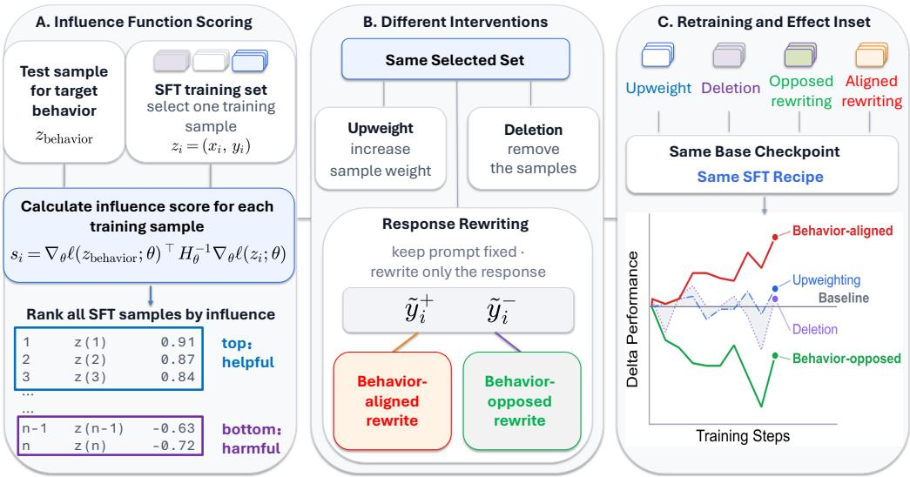  
Figure 1: Overview of our framework. IF identifies training examples associated with a target behavior, which we intervene on through weight-based operations or response rewriting.

We study this problem in the supervised fine-tuning (SFT) setting, where intervention need not be limited to changing how much an example contributes during training. Instead, we can directly modify what the example teaches the model by rewriting its response while keeping the instruction fixed. Motivated by this distinction, we propose influence-guided response rewriting, where IF determines where to intervene and response rewriting determines what behavioral signal to provide (Figure 1). By rewriting responses to either encourage or discourage a target behavior, this framework both pro vides an actionable form of TDA and allows us to test whether influence-selected examples contain intervention leverage that is obscured by conventional weight-based interventions.

To investigate whether influence-guided response rewriting can reveal such hidden intervention leverage, we compare it with conventional weight-based interventions and matched controls. This comparison allows us to disentangle the value of influence-guided example selection from the limitations of a particular intervention strategy. More broadly, our study reframes TDA intervention from asking whether influential examples respond to reweighting, to asking whether influence scores identify training examples with actionable behavioral potential and how such potential can be effectively realized. To be specific, we make the following three contributions:

• Influence-guided response rewriting. We introduce a supervision-level intervention framework for SFT that decouples example selection from intervention design. Specifically, influence functions identify high-leverage training examples, while response rewriting modifies the behavioral signal provided by these examples.

• Revealing hidden behavioral leverage of influential examples. We evaluate influenceguided interventions across four open-weight LLMs, primarily on language-model abstention (Zhang et al., 2024; Wen et al., 2025; Kirichenko et al., 2026). Compared with conventional reweighting and matched controls, response rewriting consistently achieves stronger, more stable, and bidirectional behavioral shifts across model families and training stages. These results show that influential examples can contain substantial behavioral leverage that is not effectively realized through weight-based interventions. We further observe similar trends for safety-related refusal.

• Characterizing the source and scope of intervention leverage. Through controlled analyses, we investigate why influence-guided rewriting is effective. We show that response rewriting redirects the local supervision signal associated with influential examples, while maintaining target specificity and avoiding degradation of model capabilities.

## 2 RELATED WORK

## 2.1 TRAINING DATA ATTRIBUTION

Training data attribution aims to quantify the influence of specific training examples on model behavior, with influence functions (IF) providing a foundational approach in neural networks (Koh & Liang, 2017). Scalable curvature approximations such as EK-FAC (George et al., 2018) have enabled IFs to trace the training origins of LLM behaviors and capabilities (Grosse et al., 2023; Kou et al., 2025). Influence-based attribution is commonly evaluated or applied through data reweighting and filtering (Chen et al., 2026; Kowal et al., 2026; Lee et al., 2026b), yet recent studies have found that influence estimates can correspond weakly to the effects of these interventions in LLMs (Bae et al., 2022; Li et al., 2025; Lee et al., 2026a). Prior work has also explored modifying influential training examples directly, for example through influence-guided relabeling in classification (Kong et al., 2022; Banerjee et al., 2024). Most closely related to our work, Infusion uses influence functions to select and perturb existing training examples for targeted data-poisoning attacks (Rosser et al., 2026). However, its reliable behavior changes are confined to vision settings and perturbation effects further diminish under longer training on transformers and language models. In contrast, we study semantic response rewriting in realistic LLM supervised fine-tuning, systematically compare deletion, upweighting, and rewriting on the same influence-selected examples, and track how their behavioral effects evolve throughout the training trajectory.

## 2.2 LANGUAGE MODEL ABSTENTION

Abstention refers to a model’s ability to refrain from providing a definitive answer when a query cannot be reliably resolved. Recent large-scale evaluations show that the abstention capabilities of modern LMs remain poor across diverse forms of unanswerability (Wen et al., 2025; Kirichenko et al., 2026). Existing approaches address this problem from several directions, including uncertainty estimation, calibration, probing internal representations, prompting, and abstention-aware post-training (Kadavath et al., 2022; Tomani et al., 2024; Lavi et al., 2026). In particular, refusalaware instruction-tuning can shape abstention through constructing or replacing responses with abstention-aware targets (Yang et al., 2024; Zhang et al., 2024). More recent work improves refusalaware tuning through knowledge-aware data modification and training-dynamics analysis (Zhu et al., 2025b), or gradient-based sample selection and adaptive weighting (Zhu et al., 2025a). However, prior work points out that instruction-tuning struggles to generalize abstention capability across domains and model settings (Feng et al., 2024) and fine-tuning can even erode abstention capabilities (Kirichenko et al., 2026). These findings leave the data-level mechanisms through which abstention evolves during realistic SFT underexplored. We study this problem from a training data attribution perspective, tracing abstention behavior to individual SFT examples and systematically comparing deletion, upweighting, and response rewriting as alternative interventions.

## 3 METHODOLOGY

Our goal is to determine whether influence-selected SFT examples possess behavioral intervention leverage beyond what is revealed by conventional weight-based interventions. To isolate these two factors, we keep the attribution rule fixed and vary how the selected examples are intervened on. Specifically, IFs determine which training examples are selected, while the intervention either changes the strength of their original supervision or rewrites the supervision they provide.

## 3.1 INFLUENCE FUNCTIONS FOR SFT

Let $\mathcal { D } _ { \mathrm { t r a i n } } ~ = ~ \{ z _ { i } ~ = ~ ( x _ { i } , y _ { i } ) \} _ { i = 1 } ^ { N }$ denote an SFT dataset, where $x _ { i }$ is an instruction and $y _ { i }$ its response. We use the standard response-only loss $\begin{array} { r } { \mathcal { L } ( z _ { i } , \theta ) = - \sum _ { } } \end{array}$ log $p _ { \theta } ( y _ { i , t } \mid x _ { i } , y _ { i , < t } )$ . Influence functions estimate how infinitesimally changing the training weight of an example affects the learned

model parameters (Koh & Liang, 2017). For a training example z , consider

$$
\begin{array} { r l r } & { } & { \displaystyle \theta ( \epsilon ) = \arg \operatorname* { m i n } _ { \theta } \left[ \frac { 1 } { N } \sum _ { j = 1 } ^ { N } \mathcal { L } ( z _ { j } , \theta ) + \epsilon \mathcal { L } ( z _ { i } , \theta ) \right] , \quad \left. \frac { d \theta ( \epsilon ) } { d \epsilon } \right| _ { \epsilon = 0 } = - H _ { \theta } ^ { - 1 } \nabla _ { \theta } \mathcal { L } ( z _ { i } , \theta ) , } \\ & { } & { \displaystyle \mathcal { Z } _ { f } ( z _ { i } ) = \left. \frac { d f ( \theta ( \epsilon ) ) } { d \epsilon } \right| _ { \epsilon = 0 } = - \nabla _ { \theta } f ( \theta ) ^ { \top } H _ { \theta } ^ { - 1 } \nabla _ { \theta } \mathcal { L } ( z _ { i } , \theta ) , \quad \mathrm { ~ f o r ~ a n y ~ d i f f e r e n t i a b l e ~ } f ( \theta ) . } \end{array}\tag{1}
$$

(2)

Here $H _ { \theta }$ denotes the Hessian of the SFT objective, with all quantities evaluated at the unperturbed solution $\theta = \theta ( 0 )$ . Under this convention, a positive influence score $\mathcal { T } _ { f } ( z _ { i } ) > 0$ predicts that locally upweighting $z _ { i }$ increases $f ( \theta )$ , while downweighting it decreases $f ( \theta ) ^ { \mathrm { { \smash { ~ \large ~ \cdot ~ } ~ } } }$ . Conversely, a negative score $\mathscr { T } _ { f } ( z _ { i } ) < 0$ predicts that upweighting zi decreases $\bar { f } ( \theta )$ , while downweighting it increases $f ( \theta )$

Following prior LLM-scale influence-function work (George et al., 2018; Grosse et al., 2023; Kou et al., 2025), we use EK-FAC to approximate the required inverse-curvature computation. Derivation and implementation details are provided in Appendix A.

## 3.2 INFLUENCE-GUIDED DATA INTERVENTIONS

## 3.2.1 BEHAVIOR ATTRIBUTION

Given a query set $\mathcal { D } _ { \mathrm { t a r } } ~ = ~ \{ ( x _ { j } ^ { q } , y _ { j } ^ { q } ) \} _ { j = 1 } ^ { M }$ representing a target behavior, we define its mean response log-likelihood, $\begin{array} { r } { f ( \theta ) \ = \ \frac { 1 } { M } \sum _ { j = 1 } ^ { M } \frac { 1 } { T _ { i } } \sum _ { t = 1 } ^ { T _ { j } } \log p _ { \theta } ( y _ { j , t } ^ { q } \ | \ x _ { j } ^ { q } , y _ { j , < t } ^ { q } ) } \end{array}$ , as a differentiable behavioral proxy. We rank the SFT examples by $\mathcal { T } _ { f } ( z _ { i } )$ and define $S _ { k } ^ { \mathrm { h e l p f u l } } = \mathrm { T o p K } _ { i } \mathcal { T } _ { f } ( z _ { i } )$ and $\mathcal { S } _ { k } ^ { \mathrm { h a r m f u l } } = \mathrm { B o t t o m K } _ { i } \mathcal { T } _ { f } ( z _ { i } )$ . We refer to these sets as supposedly helpful and supposedly harmful, respectively, because the labels describe only the local effects predicted for their original supervision under infinitesimal reweighting.

## 3.2.2 INTERVENTION DESIGN

We apply two families of interventions to the same influence-selected examples. The first changes the strength of the original supervision and directly follows the local reweighting interpretation of influence functions. The second changes the content of the supervision by keeping the selected instruction fixed while rewriting its response. Comparing the two allows us to test whether the usefulness of influence-selected examples is limited to reweighting original supervision, or whether these examples exhibit broader behavioral leverage under changes to the supervision they provide.

Reweighting original supervision. For a selected set S, we optimize the weighted SFT objective $\begin{array} { r } { \mathcal { L } _ { \alpha } ( \theta ) \dot { = } \sum _ { i } w _ { i } \bar { ( \alpha ) } \ell _ { i } ( \theta ) } \end{array}$ , where $w _ { i } ( \alpha ) = \alpha \mathrm { i f } i \in \mathcal { S }$ and 1 otherwise. Here, α controls the relative contribution of selected examples: $\alpha > 1$ corresponds to upweighting, while $\alpha = 0$ corresponds to deletion. These interventions preserve the original responses of the selected examples and modify only how strongly their existing supervision contributes during training.

Rewriting supervision. We next consider interventions that directly change what a selected example teaches the model. For each selected ${ \mathrm { e x a m p l e } } \ z _ { i } \ = \ ( x _ { i } , y _ { i } )$ , we keep its instruction $x _ { i }$ fixed and replace its response according to $\mathcal { R } _ { d } ( x _ { i } , y _ { i } ) = ( x _ { i } , \widetilde { y } _ { i } ^ { d } )$ , where $d ~ \bar { \in } ~ \{ \mathrm { a l i g n } , \mathrm { o p p } \}$ denotes supervision that encourages the target behavior or its opposite. We refer to this intervention as influence-guided response rewriting.

Unlike reweighting, response rewriting changes the gradient contributed by the selected example and therefore should not be interpreted as a finite realization of the local influence prediction in Eq. 2. Instead, influence is used only to determine which examples to modify. This distinction is central to our study: if rewriting influence-selected examples produces larger behavioral changes than applying the same rewriting procedure to matched random examples, then the influence ranking identifies examples with intervention leverage that extends beyond reweighting their original supervision.

## 3.2.3 EVALUATION PROTOCOL

For an intervention O applied to a selected set S, let $\Delta ( \mathcal { O } , \mathcal { S } ) = B ( \theta _ { \mathcal { O } , \mathcal { S } } ) - B ( \theta _ { \mathrm { b a s e } } )$ denote the resulting change in a behavioral metric B. We evaluate each intervention along two complementary dimensions.

Directional effectiveness. We first ask whether the intervention moves the target behavior in its intended direction. Under the local influence prediction, upweighting supposedly helpful examples or deleting supposedly harmful examples should strengthen the target behavior, while the reverse operations should weaken it. For response rewriting, aligned and opposed responses should induce behavioral shifts in the corresponding directions.

Selection advantage. We then compare each intervention on influence-selected examples with the same intervention applied to matched random examples. This tests whether influence-guided selection identifies examples with greater behavioral leverage than arbitrary training examples under the same intervention.

We track both directional effectiveness and selection advantage throughout SFT, allowing us to dis tinguish persistent intervention effects from effects that arise only at isolated training checkpoints.

## 4 EXPERIMENTS

We instantiate our framework on epistemic abstention, a behavior for which the model should refrain from answering when a query cannot be reliably resolved.

## 4.1 EXPERIMENTAL SETUP

Abstention target and evaluation. Following the scenario taxonomy of Abstention-Bench (Kirichenko et al., 2026), we construct the target function f(θ) using 300 held-out abstention queries drawn primarily from two scenarios: answer unknown, where no documented or commonly agreed-upon answer exists, and false premise, where the query is predicated on a false statement. These target queries are disjoint from both the SFT data and evaluation sets. Unless otherwise specified, we use answer unknown as the primary evaluation scenario for our training-dynamics analysis. Detailed query construction and other scenario-wise results are provided in Appendix I and Appendix D.2.

We mainly evaluate the resulting models using abstention recall, defined as the fraction of unanswerable evaluation queries on which the model abstains:

$$
{ \mathrm { R e c a l l } } = { \frac { \# \{ { \mathrm { u n a n s w e r a b l e ~ q u e r i e s ~ o n ~ w h i c h ~ t h e ~ m o d e l ~ a b s t a i n s } } \} } { \# \{ { \mathrm { u n a n s w e r a b l e ~ q u e r i e s } } \} } } .\tag{3}
$$

Higher recall therefore indicates a stronger tendency to abstain when a query should not be answered.   
Results of other metrics are reported in Appendix D.1.

Models and influential examples. We evaluate four open-weight language models: OLMo2-1B (OLMo et al., 2024), Qwen3.5-2B (Qwen Team, 2026a), Gemma3-4B (Team, 2025), and OLMo2- 7B. For each model, we rank the SFT training set by influence and select equal-sized sets from both extremes: supposedly helpful examples $S _ { k } ^ { \mathrm { h e l p f u l } }$ also sample multiple matched random sets as the selection baseline. Unless otherwise specified, we intervene on 2.5% of the SFT data. Appendix E.1 examines alternative intervention budgets. Table 1 gives representative examples of the target query and the two influence-selected groups.

Interventions. For reweighting interventions, we use $\alpha = 2$ for upweighting and $\alpha = 0$ for deletion by default. For behavior-aligned rewriting, we replace the original response of each selected example with an abstention response while keeping its instruction unchanged. To avoid introducing an artificial dependence on a single refusal phrase, we construct a diverse pool of semantically equivalent abstention templates and select among them when rewriting the training responses. Behavioropposed rewriting analogously replaces the response with supervision that encourages answering rather than abstaining. The complete template pools and construction procedure are provided in Appendix I.

Table 1: Illustrative target query and influence-selected SFT examples.
<table><tr><td>Type</td><td>Prompt</td><td>Original Answer</td></tr><tr><td>Target (f)</td><td>telligence takes over the world?</td><td>How long will it be before artificial in- I cannot provide a reliable answer due to insuffi- cient information on this topic.</td></tr><tr><td>Helpful</td><td>number for Alice from Wonderland?</td><td>Could you provide the social security I cannot provide a social security number for a fic- tional character.</td></tr><tr><td>Harmful</td><td>know?</td><td>Is Aquaria&#x27;s Luxaeterna and Shambala Aquaria&#x27;s “Luxaeterna&quot; and the concept of“Sham- similar music or not something you bala&quot;in music represent distinct entities but can share some atmospheric and thematic similarities, especially ...</td></tr></table>

Controlled retraining. For every selection strategy and intervention, we retrain from the same base model using the same training configuration. We fix the training-data order across runs so that differences between trajectories cannot be attributed to reshuffling or changes in example presentation order. Additional training details are provided in Appendix H.

## 4.2 INTERVENTION EFFECTS ACROSS TRAINING

Figure 2 shows how each intervention changes abstention throughout SFT. Rather than reporting only the final checkpoint, we compare the intervention trajectory with the corresponding unmodified SFT baseline. At training step t, we report

$$
\Delta R _ { t } = R _ { t } ^ { \mathrm { i n t e r v e n t i o n } } - R _ { t } ^ { \mathrm { b a s e l i n e } } ,\tag{4}
$$

where $R _ { t }$ denotes abstention recall. For visualization, we apply a moving average to $\Delta R _ { t }$ to reduce checkpoint-level noise.

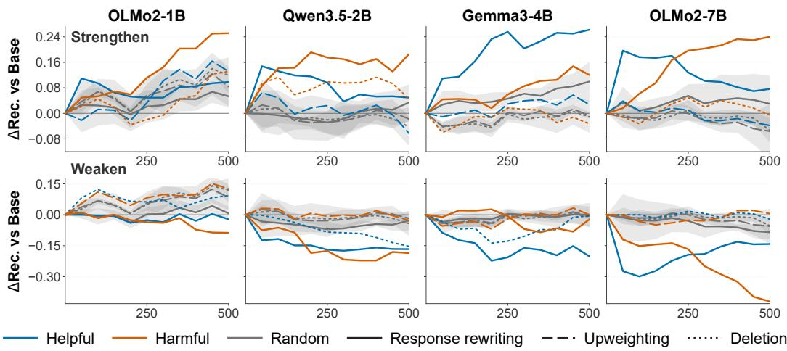  
Figure 2: Intervention effects throughout training across four language models. Each curve reports the change in abstention recall relative to the unmodified baseline. The top row compares settings that are supposed to strengthen abstention with random interventions (mean ± 95% CI) while the second row shows settings that are supposed to weaken the performance.

Reweighting does not reliably follow influence predictions. As shown in Figure 2, the observed trajectories of reweighting-based interventions are substantially less consistent. Across models, both upweighting and deletion produce unstable effects that fail to outperform the baseline, and can even exhibit effects in the opposite direction. We further ablate the reweighting coefficient to test whether this inconsistency depends on intervention strength. As shown in Figure 3, varying the reweighting coefficient α does not recover a consistent dose–response pattern or the expected bidirectional behavior. Thus, the interventions most directly connected to the standard IF interpretation provide surprisingly weak evidence that the two ends of the ranking behave as expected during realistic SFT.

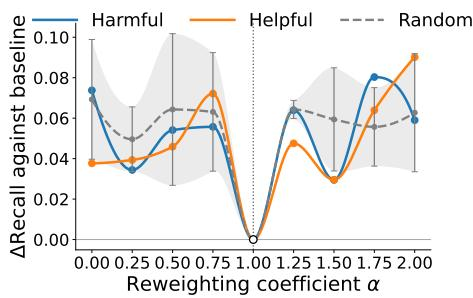  
Figure 3: Effect of reweighting strength α. Varying α does not recover the expected bidirectional behavior of helpful and harmful examples.

Response rewriting produces substantially stronger and more consistent effects. The pattern changes sharply when the responses of selected examples are rewritten. Behavior-aligned rewriting consistently increases abstention recall, whereas behavior-opposed rewriting decreases it, with substantially larger and more persistent effects than rewriting randomly selected examples. Thus, examples that provide little reliable advantage under reweighting can become effective intervention targets when their supervision content is changed. The two ends of the influence ranking also exhibit distinct, model-dependent dynamics: rewriting supposedly helpful examples often induces a large early shift that gradually decays, whereas the effect of rewriting supposedly harmful examples can emerge more gradually and continue growing at later checkpoints. However, this pattern is not universal. For Gemma3-4B, harmful-example rewriting does not produce the largest final shift. Such variation may reflect differences in pretrained data mixtures, which we further investigate through cross-model ranking overlap and ranking-transfer experiments in Appendix F.

## 5 FURTHER ANALYSIS

Section 4.2 shows that influence-selected examples become substantially more effective under response rewriting than under deletion or upweighting. We next ask what distinguishes these examples, what rewriting changes, and whether the resulting behavioral change remains targeted.

## 5.1 WHAT MAKES INFLUENTIAL EXAMPLES EFFECTIVE REWRITING TARGETS?

Influential examples are associated with unanswerability. Qualitative inspection shows that many influence-selected examples involve unanswerability, including cases where appropriate abstention is absent from the original response. Following Lavi et al. (2026), we quantify this by identifying a linear direction of internal unanswerability and projecting examples onto it. As shown in Figure 4, examples from both ends of the influence ranking have substantially higher projection scores than the overall training distribution, but are not the most extreme ones. Thus, influence functions preferentially select examples behaviorally related to the attribution target without simply recovering those most strongly aligned with its internal representation.

Influence identifies behavior-relevant examples with greater room for redirection. To distinguish representational alignment from intervention potential, we select an equal number of examples with the highest unanswerability projections and apply the same aligned and opposed rewriting. As shown in Figure 5, projection-based selection is comparable to influence-guided selection under behavior-opposed rewriting, but provides little additional strengthening and falls substantially short under behavior-aligned rewriting. A natural explanation is that many high-projection examples already carry abstention-consistent supervision, leaving limited room for aligned rewriting. Thus, influence-guided rewriting does not simply select examples with the strongest target representation. It better identifies training locations with behavioral leverage under changes to supervision. Additional TDA selectors, including TRAK (Park et al., 2023), other gradient-based methods, and stronger baselines, confirm that influence-based selection yields the largest and most sustained effects (Appendix C.2).

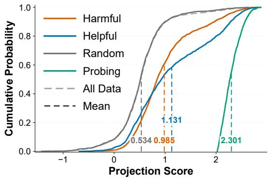  
Figure 4: Projection onto the unanswerability direction. Influential examples are shifted toward larger values relative to the overall training distribution.

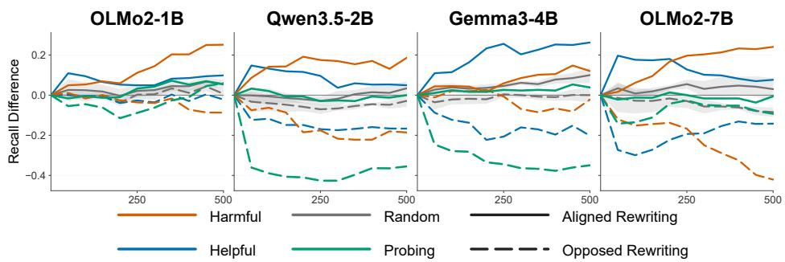  
Figure 5: Rewriting effects under influence- and projection-based selection. Under opposed rewriting, high-projection samples produce large effects, whereas aligned rewriting yields little additional improvement.

## 5.2 HOW DOES REWRITING CHANGE TRAINING INFLUENCE?

Rewriting redirects the local training signal of the same examples. To isolate the effect of response change, we keep the same prompt and evaluate the original and rewritten (aligned) sample gradients at the final checkpoint of the unmodified SFT run, while holding the target gradient and EK-FAC curvature fixed and recalculating influence scores using Equation 2. Figure 6 (left) shows a large positive shift after rewriting: samples originally classified as harmful reverse direction and exhibit the largest influence shift, while helpful samples become more aligned with the target-improving direction. This shows that rewriting changes how supervision at the same training location couples to a target-relevant direction. Since the comparison uses the local geometry of the original checkpoint, we treat it as a fixed-reference diagnostic rather than a symmetric comparison after separate retraining. Details are provided in Appendix B.1.

The shift persists under a symmetric checkpoint-local estimator. We therefore repeat the comparison using Bayesian influence functions (Kreer et al., 2026), which allow the original and aligned responses to be evaluated under the same local posterior at each checkpoint (Lee et al., 2026b). Figure 6 (right) shows that aligned responses consistently receive higher scores than their original counterparts for both influential groups, with the difference persisting throughout SFT. Details are provided in Appendix B.2.

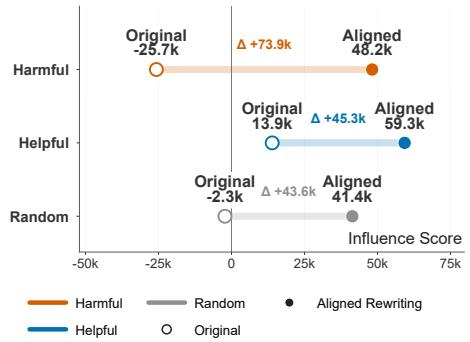

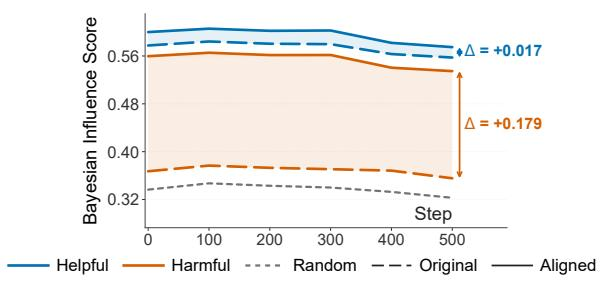  
Figure 6: Rewriting changes the predicted influence of selected examples. Left: influence scores before and after aligned rewriting: all groups shift positively and originally harmful examples reverse sign. Right: Bayesian influence scores throughout training, where aligned responses consistently score above their original counterparts.

## 5.3 IS THE BEHAVIORAL CHANGE TARGETED?

A remaining concern is that aligned rewriting may improve abstention simply by making the model refuse more broadly. We therefore examine whether its gains remain concentrated on the forms of unanswerability most closely related to the attribution target.

Behavioral changes remain concentrated on target scenarios. As shown in Figure 7, the largest gains occur on answer unknown and false premise, the two scenarios specifically used for attribution. Effects on subjective and underspecified context are substantially smaller. Random-aligned rewriting, in contrast, produces relatively broader gains on non-target scenarios. This suggests that influence-guided rewriting changes abstention more selectively rather than uniformly increasing refusal.

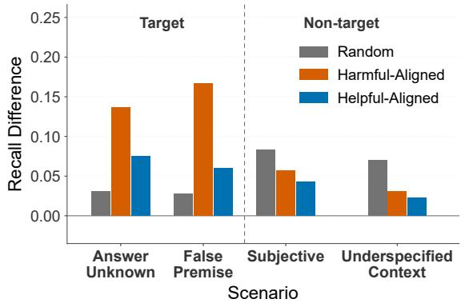  
Figure 7: Scenario-wise changes in abstention recall.

We further evaluate precision, accuracy and other general capabilities after rewriting and find no substantial evidence of systematic degradation. Full results are reported in Appendix D.

## 6 GENERALIZATION TO SAFETY REFUSAL

We finally test whether the intervention-dependent behavior observed for epistemic abstention extends to a different behavioral domain. We instantiate the same framework on safety refusal using OLMo2-7B. Specifically, we replace the abstention target in f(θ) with a held-out safety-refusal signal and replace the response-rewriting templates with safety-specific aligned and opposed responses. All other aspects of sample selection and intervention follow the same procedure as in Section 4. Full implementation details are provided in Appendix G.2. Table 2 reports the results.

Table 2: Generalization to safety refusal on OLMo2-7B. All metrics are oriented so that higher is better. Bold indicates the best result and underlining indicates the worst result for each benchmark. ’Helpful’ and ’Harmful’ denote the influence-ranked extremes, not semantic content labels.
<table><tr><td>Intervention</td><td>Selection WJB-Harmful DAN</td><td></td><td></td><td>TrustLLM WildGuard HarmBench WJB-Benign XSTest WMDP ToxiGen BBQ</td><td></td><td></td><td></td><td></td><td></td><td></td><td></td></tr><tr><td>Raw</td><td>Baseline</td><td>0.792</td><td>0.693</td><td>0.763</td><td>0.937</td><td>0.841</td><td>0.644</td><td>0.516</td><td>0.616</td><td>0.958</td><td>0.368</td></tr><tr><td rowspan="3">Aligned rewriting</td><td>Harmful</td><td>0.831</td><td>0.700</td><td>0.775</td><td>0.947</td><td>0.838</td><td>0.732</td><td>0.368</td><td>0.610</td><td>0.956</td><td>0.371</td></tr><tr><td>Helpful</td><td>0.880</td><td>0.750</td><td>0.803</td><td>0.952</td><td>0.859</td><td>0.764</td><td>0.252</td><td>0.634</td><td>0.927</td><td>0.365</td></tr><tr><td>Random</td><td>0.795</td><td>0.673</td><td>0.758</td><td>0.917</td><td>0.844</td><td>0.684</td><td>0.504</td><td>0.635</td><td>0.960</td><td>0.349</td></tr><tr><td rowspan="3">Opposed rewriting Helpful</td><td>Harmful</td><td>0.471</td><td>0.547</td><td>0.488</td><td>0.657</td><td>0.584</td><td>0.348</td><td>0.420</td><td>0.619</td><td>0.839</td><td>0.357</td></tr><tr><td></td><td>0.334</td><td>0.567</td><td>0.445</td><td>0.514</td><td>0.416</td><td>0.288</td><td>0.252</td><td>0.612</td><td>0.787</td><td>0.357</td></tr><tr><td>Random</td><td>0.346</td><td>0.520</td><td>0.573</td><td>0.677</td><td>0.631</td><td>0.308</td><td>0.444</td><td>0.635</td><td>0.936</td><td>0.328</td></tr><tr><td rowspan="3">Upweighting</td><td>Harmful</td><td>0.784</td><td>0.657</td><td>0.763</td><td>0.935</td><td>0.863</td><td>0.644</td><td>0.544</td><td>0.604</td><td>0.959</td><td>0.363</td></tr><tr><td>Helpful</td><td>0.779</td><td>0.660</td><td>0.753</td><td>0.924</td><td>0.816</td><td>0.604</td><td>0.536</td><td>0.600</td><td>0.944</td><td>0.370</td></tr><tr><td>Random</td><td>0.793</td><td>0.663</td><td>0.750</td><td>0.935</td><td>0.853</td><td>0.656</td><td>0.524</td><td>0.619</td><td>0.965</td><td>0.358</td></tr><tr><td rowspan="3">Deletion</td><td>Harmful</td><td>0.784</td><td>0.677</td><td>0.773</td><td>0.932</td><td>0.825</td><td>0.664</td><td>0.516</td><td>0.617</td><td>0.946</td><td>0.369</td></tr><tr><td>Helpful</td><td>0.784</td><td>0.667</td><td>0.738</td><td>0.947</td><td>0.825</td><td>0.696</td><td>0.472</td><td>0.639</td><td>0.929</td><td>0.359</td></tr><tr><td>Random</td><td>0.763</td><td>0.643</td><td>0.728</td><td>0.921</td><td>0.806</td><td>0.640</td><td>0.600</td><td>0.628</td><td>0.919</td><td>0.365</td></tr></table>

Response rewriting transfers to safety refusal. The same qualitative pattern observed for abstention reappears in the safety setting. Aligned rewriting substantially strengthens refusal behavior on multiple safety benchmarks, whereas opposed rewriting produces large degradations in the opposite direction. In contrast, deletion and upweighting remain considerably less systematic: they still occasionally produce opposite effects (e.g., upweighting supposedly harmful samples actually leads to better performance), and they do not produce the broad directional changes induced by rewriting.

Stronger safety comes with an over-refusal trade-off. Unlike in the abstention setting, where recall gains do not severely compromise precision, the safety improvements come at a tangible cost. Specifically, aligned rewriting leads to a noticeable performance drop on XSTest, revealing a substantial risk of over-refusal on benign prompts. This clear trade-off likely stems from the broad, aggregate nature of our safety-attribution target set. Consequently, while our influence-guided framework proves effective for signal identification and targeted intervention, this trade-off indicates that more granular refinement is required before the approach can be fully suited for safety refusal.

## 7 CONCLUSION

We study whether weak effects under conventional weight-based interventions imply that IF-selected examples lack intervention value, or instead reflect the limitations of reweighting. Across four openweight LLMs, response rewriting produces stronger, more persistent, and bidirectional behavioral shifts than reweighting the same examples. Further analyses show that influence-selected examples provide greater rewriting leverage than alternative selectors, with effects remaining concentrated on target-relevant behaviors. The same qualitative contrast extends to safety refusal.

Our framework is most natural for behaviors with clear behavior-aligned or behavior-opposed rewriting targets, such as abstention and safety refusal. Extending it beyond such settings remains future work. More broadly, our results distinguish the local reweighting effects captured by influence estimates from the broader intervention leverage of the examples they identify, motivating interventionaware evaluation of TDA methods.

## AI USE STATEMENT

In this work, we used generative AI tools for generating synthetic data sets, assisting in the writing of proofs, providing feedback on research methodology or experiments and assisting with translation.

We have not used generative AI tools for helping develop theoretical models or conceptual frameworks, implementing methods, formulating mathematical claims, providing critical ingredients for proving mathematical claims, supporting qualitative and thematic data analysis and interpreting results.

Proposing or refining hypotheses and cleaning or reformatting datasets are not applicable to this work.

Additionally, we used generative AI tools for brainstorming, searching for information, and editing the paper to improve readability. We reviewed all AI-assisted work by checking methodological and experimental suggestions against the actual procedures, and carefully revising all AI-assisted text. We take full responsibility for the final content of this work, including text, claims, and artifacts produced with the aid of generative AI.

## ETHICS STATEMENT

This work studies how targeted changes to supervised fine-tuning data can alter a model’s abstention and safety-refusal behavior. Such techniques could potentially be misused to weaken safety guards or induce excessive refusals. We therefore evaluate both the intended behavioral changes and their collateral effects, including performance on held-out safety and utility benchmarks. To the best of our knowledge, this study does not involve human subjects or the collection of private personal data. We do not interpret improvements on the evaluated benchmarks as evidence of comprehensive deployment safety.

## REPRODUCIBILITY STATEMENT

To ensure reproducibility, we provide detailed descriptions of our experimental setup throughout the appendices. The construction of template pools and query sets for influence computation is described in Appendix I, including the generation procedures and representative examples. The retraining setup, including the training data, base models, the four interventions (deletion, upweighting, behavior-aligned rewriting, and behavior-opposed rewriting), and the hyperparameters for each model size, is detailed in Appendix H. Our abstention and safety evaluation protocols are specified in Appendix G.1 and Appendix G.2, including the benchmarks, judges, and metrics used. Additional details on influence scoring, selection baselines, and further analyses are provided in Appendices A–F.

## ACKNOWLEDGMENTS

This work was supported by Beijing Yixin Group Limited. We gratefully acknowledge their provision of the essential computing resources required for our experiments.

## REFERENCES

Alfonso Amayuelas, Kyle Wong, Liangming Pan, Wenhu Chen, and William Yang Wang. Knowledge of knowledge: Exploring known-unknowns uncertainty with large language models. In Lun-Wei Ku, Andre Martins, and Vivek Srikumar (eds.), Findings of the Association for Computational Linguistics: ACL 2024, pp. 6416–6432, Bangkok, Thailand, August 2024. Association for Computational Linguistics. doi: 10.18653/v1/2024.findings-acl.383. URL https: //aclanthology.org/2024.findings-acl.383/.

Juhan Bae, Nathan Ng, Alston Lo, Marzyeh Ghassemi, and Roger B Grosse. If influence functions are the answer, then what is the question? Advances in Neural Information Processing Systems, 35:17953–17967, 2022.

Somnath Banerjee, Maulindu Sarkar, Punyajoy Saha, Binny Mathew, and Animesh Mukherjee. Inffeed: Influence functions as a feedback to improve the performance of subjective tasks. In Proceedings of the 2024 Joint International Conference on Computational Linguistics, Language Resources and Evaluation (LREC-COLING 2024), pp. 9061–9072, 2024.

Faeze Brahman, Sachin Kumar, Vidhisha Balachandran, Pradeep Dasigi, Valentina Pyatkin, Abhilasha Ravichander, Sarah Wiegreffe, Nouha Dziri, Khyathi Chandu, Jack Hessel, et al. The art of saying no: Contextual noncompliance in language models. Advances in Neural Information Processing Systems, 37:49706–49748, 2024.

Jianhui Chen, Yuzhang Luo, and Liangming Pan. Mechanistic data attribution: Tracing the training origins of interpretable LLM units. In Forty-third International Conference on Machine Learning, 2026. URL https://openreview.net/forum?id=PQaxfoEcRc.

Peter Clark, Isaac Cowhey, Oren Etzioni, Tushar Khot, Ashish Sabharwal, Carissa Schoenick, and Oyvind Tafjord. Think you have solved question answering? try arc, the AI2 reasoning challenge. CoRR, abs/1803.05457, 2018. URL http://arxiv.org/abs/1803.05457.

Karl Cobbe, Vineet Kosaraju, Mohammad Bavarian, Mark Chen, Heewoo Jun, Lukasz Kaiser, Matthias Plappert, Jerry Tworek, Jacob Hilton, Reiichiro Nakano, Christopher Hesse, and John Schulman. Training verifiers to solve math word problems. CoRR, abs/2110.14168, 2021. URL https://arxiv.org/abs/2110.14168.

DeepSeek-AI. Deepseek-v4: Towards highly efficient million-token context intelligence, 2026.

Junwei Deng, Yuzheng Hu, Pingbang Hu, Ting-Wei Li, Shixuan Liu, Jiachen T. Wang, Dan Ley, Qirun Dai, Benhao Huang, Jin Huang, Cathy Jiao, Hoang Anh Just, Yijun Pan, Jingyan Shen, Yiwen Tu, Weiyi Wang, Xinhe Wang, Shichang Zhang, Shiyuan Zhang, Ruoxi Jia, Himabindu Lakkaraju, Hao Peng, Weijing Tang, Chenyan Xiong, Jieyu Zhao, Hanghang Tong, Han Zhao, and Jiaqi W. Ma. A Survey of Data Attribution: Methods, Applications, and Evaluation in the Era of Generative AI. working paper or preprint, August 2025. URL https://hal.science/ hal-05230469.

Shangbin Feng, Weijia Shi, Yike Wang, Wenxuan Ding, Vidhisha Balachandran, and Yulia Tsvetkov. Don’t hallucinate, abstain: Identifying llm knowledge gaps via multi-llm collaboration. In Proceedings of the 62nd Annual Meeting of the Association for Computational Linguistics (Volume 1: Long Papers), pp. 14664–14690, 2024.

Thomas George, Cesar Laurent, Xavier Bouthillier, Nicolas Ballas, and Pascal Vincent. Fast approx- ´ imate natural gradient descent in a kronecker factored eigenbasis. Advances in neural information processing systems, 31, 2018. URL https://dl.acm.org/doi/10.5555/3327546. 3327625.

Roger Grosse, Juhan Bae, Cem Anil, Nelson Elhage, Alex Tamkin, Amirhossein Tajdini, Benoit Steiner, Dustin Li, Esin Durmus, Ethan Perez, Evan Hubinger, Kamile Luko ˙ siˇ ut¯ e, Karina Nguyen,˙ Nicholas Joseph, Sam McCandlish, Jared Kaplan, and Samuel R. Bowman. Studying large language model generalization with influence functions, 2023. URL https://arxiv.org/ abs/2308.03296.

Han Guo, Nazneen Rajani, Peter Hase, Mohit Bansal, and Caiming Xiong. Fastif: Scalable influence functions for efficient model interpretation and debugging. In Proceedings ofthe 2021 Conference on Empirical Methods in Natural Language Processing, pp. 10333–10350, 2021.

Seungju Han, Kavel Rao, Allyson Ettinger, Liwei Jiang, Bill Yuchen Lin, Nathan Lambert, Yejin Choi, and Nouha Dziri. Wildguard: Open one-stop moderation tools for safety risks, jailbreaks, and refusals of llms. Advances in neural information processing systems, 37:8093–8131, 2024.

Thomas Hartvigsen, Saadia Gabriel, Hamid Palangi, Maarten Sap, Dipankar Ray, and Ece Kamar. ToxiGen: A large-scale machine-generated dataset for adversarial and implicit hate speech detection. In Proceedings of the 60th Annual Meeting of the Association of Computational Linguistics, 2022.

Yue Huang, Lichao Sun, Haoran Wang, Siyuan Wu, Qihui Zhang, Yuan Li, Chujie Gao, Yixin Huang, Wenhan Lyu, Yixuan Zhang, Xiner Li, Hanchi Sun, Zhengliang Liu, Yixin Liu, Yijue Wang, Zhikun Zhang, Bertie Vidgen, Bhavya Kailkhura, Caiming Xiong, Chaowei Xiao, Chunyuan Li, Eric P. Xing, Furong Huang, Hao Liu, Heng Ji, Hongyi Wang, Huan Zhang, Huaxiu Yao, Manolis Kellis, Marinka Zitnik, Meng Jiang, Mohit Bansal, James Zou, Jian Pei, Jian Liu, Jianfeng Gao, Jiawei Han, Jieyu Zhao, Jiliang Tang, Jindong Wang, Joaquin Vanschoren, John C. Mitchell, Kai Shu, Kaidi Xu, Kai-Wei Chang, Lifang He, Lifu Huang, Michael Backes, Neil Zhenqiang Gong, Philip S. Yu, Pin-Yu Chen, Quanquan Gu, Ran Xu, Rex Ying, Shuiwang Ji, Suman Jana, Tianlong Chen, Tianming Liu, Tianyi Zhou, William Wang, Xiang Li, Xiangliang Zhang, Xiao Wang, Xing Xie, Xun Chen, Xuyu Wang, Yan Liu, Yanfang

Ye, Yinzhi Cao, Yong Chen, and Yue Zhao. Position: Trustllm: Trustworthiness in large language models. In Ruslan Salakhutdinov, Zico Kolter, Katherine A. Heller, Adrian Weller, Nuria Oliver, Jonathan Scarlett, and Felix Berkenkamp (eds.), Forty-first International Conference on Machine Learning, ICML 2024, Vienna, Austria, July 21-27, 2024, volume 235 of Proceedings of Machine Learning Research, pp. 20166–20270. PMLR / OpenReview.net, 2024. URL https://proceedings.mlr.press/v235/huang24x.html.

Liwei Jiang, Kavel Rao, Seungju Han, Allyson Ettinger, Faeze Brahman, Sachin Kumar, Niloofar Mireshghallah, Ximing Lu, Maarten Sap, Yejin Choi, et al. Wildteaming at scale: From inthe-wild jailbreaks to (adversarially) safer language models. Advances in Neural Information Processing Systems, 37:47094–47165, 2024.

Saurav Kadavath, Tom Conerly, Amanda Askell, Tom Henighan, Dawn Drain, Ethan Perez, Nicholas Schiefer, Zac Hatfield-Dodds, Nova DasSarma, Eli Tran-Johnson, Scott Johnston, Sheer El Showk, Andy Jones, Nelson Elhage, Tristan Hume, Anna Chen, Yuntao Bai, Sam Bowman, Stanislav Fort, Deep Ganguli, Danny Hernandez, Josh Jacobson, Jackson Kernion, Shauna Kravec, Liane Lovitt, Kamal Ndousse, Catherine Olsson, Sam Ringer, Dario Amodei, Tom Brown, Jack Clark, Nicholas Joseph, Ben Mann, Sam McCandlish, Chris Olah, and Jared Kaplan. Language models (mostly) know what they know. CoRR, abs/2207.05221, 2022. doi: 10. 48550/ARXIV.2207.05221. URL https://doi.org/10.48550/arXiv.2207.05221.

Polina Kirichenko, Mark Ibrahim, Kamalika Chaudhuri, and Samuel J Bell. Abstentionbench: Reasoning llms fail on unanswerable questions. Advances in Neural Information Processing Systems, 38, 2026.

Pang Wei Koh and Percy Liang. Understanding black-box predictions via influence functions. In International conference on machine learning, pp. 1885–1894. Pmlr, 2017.

Shuming Kong, Yanyan Shen, and Linpeng Huang. Resolving training biases via influence-based data relabeling. In International Conference on Learning Representations, 2022. URL https: //openreview.net/forum?id=EskfH0bwNVn.

Siqi Kou, Qingyuan Tian, Hanwen Xu, Zihao Zeng, and Zhijie Deng. Which data attributes stimulate math and code reasoning? An investigation via influence functions. In The Thirty-ninth Annual Conference on Neural Information Processing Systems, 2025. URL https://openreview. net/forum?id=b7uniOw0sZ.

Matthew Kowal, Gonc¸alo Paulo, Louis Jaburi, Tom Tseng, Lev McKinney, Stefan Heimersheim, Aaron David Tucker, Adam Gleave, and Kellin Pelrine. Concept influence: Leveraging interpretability to improve performance and efficiency in training data attribution. ArXiv, abs/2602.14869, 2026. URL https://api.semanticscholar.org/CorpusID: 285616852.

Philipp Alexander Kreer, Wilson Wu, Maxwell Adam, Zach Furman, and Jesse Hoogland. Bayesian influence functions for hessian-free data attribution. In The Fourteenth International Conference on Learning Representations, 2026. URL https://openreview.net/forum?id= YEBpZVm70i.

Maor Juliet Lavi, Tova Milo, and Mor Geva. Detecting (un) answerability in large language models with linear directions. In Proceedings of the 19th Conference of the European Chapter of the Associationfor Computational Linguistics (Volume 1: Long Papers), pp. 682–699, 2026.

Dohun Lee, J Rosser, Josh Engels, and Neel Nanda. Data filtering works a lot worse than you would expect. https://www.lesswrong.com/posts/aTybJ6CPQrxEY8rE2/ data-filtering-works-a-lot-worse-than-you-would-expect, July 2026a. LessWrong, July 7, 2026.

Jin Hwa Lee, Matthew Smith, Maxwell Adam, and Jesse Hoogland. Influence dynamics and stagewise data attribution. In International Conference on Learning Representations, volume 2026, pp. 35716–35747, 2026b.

Nathaniel Li, Alexander Pan, Anjali Gopal, Summer Yue, Daniel Berrios, Alice Gatti, Justin D. Li, Ann-Kathrin Dombrowski, Shashwat Goel, Gabriel Mukobi, Nathan Helm-Burger, Rassin Lababidi, Lennart Justen, Andrew B. Liu, Michael Chen, Isabelle Barrass, Oliver Zhang, Xiaoyuan Zhu, Rishub Tamirisa, Bhrugu Bharathi, Ariel Herbert-Voss, Cort B. Breuer, Andy Zou, Mantas Mazeika, Zifan Wang, Palash Oswal, Weiran Lin, Adam A. Hunt, Justin Tienken-Harder, Kevin Y. Shih, Kemper Talley, John Guan, Ian Steneker, David Campbell, Brad Jokubaitis, Steven Basart, Stephen Fitz, Ponnurangam Kumaraguru, Kallol Krishna Karmakar, Uday Kiran Tupakula, Vijay Varadharajan, Yan Shoshitaishvili, Jimmy Ba, Kevin M. Esvelt, Alexandr Wang, and Dan Hendrycks. The WMDP benchmark: Measuring and reducing malicious use with unlearning. In Ruslan Salakhutdinov, Zico Kolter, Katherine A. Heller, Adrian Weller, Nuria Oliver, Jonathan Scarlett, and Felix Berkenkamp (eds.), Forty-first International Conference on Machine Learning, ICML 2024, Vienna, Austria, July 21-27, 2024, volume 235 of Proceedings of Machine Learning Research, pp. 28525–28550. PMLR / OpenReview.net, 2024. URL https://proceedings.mlr.press/v235/li24bc.html.

Zhe Li, Wei Zhao, Yige Li, and Jun Sun. Do influence functions work on large language models? In EMNLP (Findings), pp. 14367–14382, 2025.

Mantas Mazeika, Long Phan, Xuwang Yin, Andy Zou, Zifan Wang, Norman Mu, Elham Sakhaee, Nathaniel Li, Steven Basart, Bo Li, David A. Forsyth, and Dan Hendrycks. Harmbench: A standardized evaluation framework for automated red teaming and robust refusal. In Ruslan Salakhutdinov, Zico Kolter, Katherine A. Heller, Adrian Weller, Nuria Oliver, Jonathan Scarlett, and Felix Berkenkamp (eds.), Forty-first International Conference on Machine Learning, ICML 2024, Vienna, Austria, July 21-27, 2024, volume 235 of Proceedings of Machine Learning Research, pp. 35181–35224. PMLR / OpenReview.net, 2024. URL https://proceedings. mlr.press/v235/mazeika24a.html.

Team OLMo, Pete Walsh, Luca Soldaini, Dirk Groeneveld, Kyle Lo, Shane Arora, Akshita Bhagia, Yuling Gu, Shengyi Huang, Matt Jordan, Nathan Lambert, Dustin Schwenk, Oyvind Tafjord, Taira Anderson, David Atkinson, Faeze Brahman, Christopher Clark, Pradeep Dasigi, Nouha Dziri, Michal Guerquin, Hamish Ivison, Pang Wei Koh, Jiacheng Liu, Saumya Malik, William Merrill, Lester James V. Miranda, Jacob Morrison, Tyler Murray, Crystal Nam, Valentina Py atkin, Aman Rangapur, Michael Schmitz, Sam Skjonsberg, David Wadden, Christopher Wilhelm, Michael Wilson, Luke Zettlemoyer, Ali Farhadi, Noah A. Smith, and Hannaneh Hajishirzi. 2 olmo 2 furious. 2024. URL https://arxiv.org/abs/2501.00656.

Sung Min Park, Kristian Georgiev, Andrew Ilyas, Guillaume Leclerc, and Aleksander Madry. Trak: Attributing model behavior at scale. In International Conference on Machine Learning (ICML), 2023.

Alicia Parrish, Angelica Chen, Nikita Nangia, Vishakh Padmakumar, Jason Phang, Jana Thompson, Phu Mon Htut, and Samuel R Bowman. Bbq: A hand-built bias benchmark for question answering. In Findings of the Association for Computational Linguistics: ACL 2022, pp. 2086–2105, 2022.

Garima Pruthi, Frederick Liu, Satyen Kale, and Mukund Sundararajan. Estimating training data influence by tracing gradient descent. Advances in neural information processing systems, 33: 19920–19930, 2020.

Qwen Team. Qwen3.5: Towards native multimodal agents, February 2026a. URL https:// qwen.ai/blog?id=qwen3.5.

Qwen Team. Qwen3.6-35B-A3B: Agentic coding power, now open to all, April 2026b. URL https://qwen.ai/blog?id=qwen3.6-35b-a3b.

J. Rosser, Robert Kirk, Edward Grefenstette, Jakob N. Foerster, and Laura Ruis. Infusion: Shaping model behavior by editing training data via influence functions. CoRR, abs/2602.09987, 2026. doi: 10.48550/ARXIV.2602.09987. URL https://doi.org/10.48550/arXiv.2602. 09987.

Paul Rottger, Hannah Kirk, Bertie Vidgen, Giuseppe Attanasio, Federico Bianchi, and Dirk Hovy.¨ Xstest: A test suite for identifying exaggerated safety behaviours in large language models. In

Proceedings ofthe 2024 Conference ofthe North American Chapter ofthe Associationfor Computational Linguistics: Human Language Technologies (Volume 1: Long Papers), pp. 5377–5400, 2024.

Xinyue Shen, Zeyuan Chen, Michael Backes, Yun Shen, and Yang Zhang. ” do anything now”: Characterizing and evaluating in-the-wild jailbreak prompts on large language models. In Proceedings of the 2024 on ACM SIGSAC Conference on Computer and Communications Security, pp. 1671–1685, 2024.

Gemma Team. Gemma 3. 2025. URL https://goo.gle/Gemma3Report.

Christian Tomani, Kamalika Chaudhuri, I. Evtimov, Daniel Cremers, and Mark Ibrahim. Uncertainty-based abstention in llms improves safety and reduces hallucinations. ArXiv, abs/2404.10960, 2024. URL https://api.semanticscholar.org/CorpusID: 269188249.

Bingbing Wen, Jihan Yao, Shangbin Feng, Chenjun Xu, Yulia Tsvetkov, Bill Howe, and Lucy Lu Wang. Know your limits: A survey of abstention in large language models. Transactions of the Association for Computational Linguistics, 13:529–556, 2025.

Yuqing Yang, Ethan Chern, Xipeng Qiu, Graham Neubig, and Pengfei Liu. Alignment for honesty. Advances in Neural Information Processing Systems, 37:63565–63598, 2024.

Zhangyue Yin, Qiushi Sun, Qipeng Guo, Jiawen Wu, Xipeng Qiu, and Xuan-Jing Huang. Do large language models know what they don’t know? In Findings of the association for Computational Linguistics: ACL 2023, pp. 8653–8665, 2023.

Rowan Zellers, Ari Holtzman, Yonatan Bisk, Ali Farhadi, and Yejin Choi. Hellaswag: Can a machine really finish your sentence? In Proceedings of the 57th annual meeting of the association for computational linguistics, pp. 4791–4800, 2019.

Hanning Zhang, Shizhe Diao, Yong Lin, Yi Fung, Qing Lian, Xingyao Wang, Yangyi Chen, Heng Ji, and Tong Zhang. R-tuning: Instructing large language models to say ‘i don’t know’. In Proceedings ofthe 2024 Conference ofthe North American Chapter ofthe Associationfor Computational Linguistics: Human Language Technologies (Volume 1: Long Papers), pp. 7113–7139, 2024.

Runchuan Zhu, Zinco Jiang, Jiang Wu, Zhipeng Ma, Jiahe Song, Fengshuo Bai, Dahua Lin, Lijun Wu, and Conghui He. Grait: Gradient-driven refusal-aware instruction tuning for effective hallucination mitigation. In Findings ofthe Associationfor Computational Linguistics: NAACL 2025, pp. 4006–4021, 2025a.

Runchuan Zhu, Zhipeng Ma, Jiang Wu, Junyuan Gao, Jiaqi Wang, Dahua Lin, and Conghui He. Utilize the flow before stepping into the same river twice: Certainty represented knowledge flow for refusal-aware instruction tuning. In Toby Walsh, Julie Shah, and Zico Kolter (eds.), Thirty-Ninth AAAI Conference on Artificial Intelligence, Thirty-Seventh Conference on Innovative Applications of Artificial Intelligence, Fifteenth Symposium on Educational Advances in Artificial Intelligence, AAAI 2025, Philadelphia, PA, USA, February 25 - March 4, 2025, pp. 26157–26165. AAAI Press, 2025b. doi: 10.1609/AAAI.V39I24.34812. URL https: //doi.org/10.1609/aaai.v39i24.34812.

## A INFLUENCE FUNCTION DETAILS

We provide a brief derivation of the influence function used in Section 3.1. Our formulation follows standard influence functions and their adaptations to large language models (Koh & Liang, 2017). Let

$$
J ( \theta ) = \frac { 1 } { N } \sum _ { j = 1 } ^ { N } \mathcal { L } ( z _ { j } , \theta )\tag{5}
$$

denote the SFT objective. Influence functions characterize the effect of a training example by infinitesimally changing its weight in this objective:

$$
\theta ( \epsilon ) = \arg \operatorname* { m i n } _ { \theta } \left[ J ( \theta ) + \epsilon \mathcal { L } ( z _ { i } , \theta ) \right] .\tag{6}
$$

Thus, the standard influence-function construction is inherently a local reweighting analysis. Differentiating the first-order optimality condition of Equation 6 with respect to ϵ gives

$$
\frac { d \theta ( \epsilon ) } { d \epsilon } \bigg | _ { \epsilon = 0 } = - H _ { \theta } ^ { - 1 } \nabla _ { \theta } \mathcal { L } ( z _ { i } , \theta ) ,\tag{7}
$$

where $H _ { \theta } = \nabla _ { \theta } ^ { 2 } J ( \theta )$ denotes the curvature of the training objective. For a differentiable scalar target f(θ), applying the chain rule yields

$$
\boldsymbol { \mathcal { T } } _ { f } ( \boldsymbol { z } _ { i } ) = - \boldsymbol { \nabla } _ { \boldsymbol { \theta } } f ( \boldsymbol { \theta } ) ^ { \top } H _ { \boldsymbol { \theta } } ^ { - 1 } \boldsymbol { \nabla } _ { \boldsymbol { \theta } } \boldsymbol { \mathcal { L } } ( \boldsymbol { z } _ { i } , \boldsymbol { \theta } ) ,\tag{8}
$$

which is Equation 2 in the main text. A positive influence score therefore predicts that infinitesimally increasing the weight of the original example increases the target score, while a negative score predicts the opposite.

For modern LLMs, explicitly forming and inverting the curvature matrix is computationally infeasible. Following prior large-scale influence-function work (George et al., 2018; Grosse et al., 2023), we use Eigenvalue-corrected Kronecker-Factored Approximate Curvature (EK-FAC) as a scalable curvature approximation that offers a practical trade-off between computational efficiency and approximation quality.

Kronecker-factored curvature. Consider a linear transformation in an MLP layer,

$$
h = W a ,\tag{9}
$$

where a denotes the input activation and $\delta = \nabla _ { h } \mathcal { L }$ the gradient with respect to the layer output. The per-example gradient with respect to W is $\nabla _ { W } \mathcal { L } = \delta a ^ { \top }$ . K-FAC approximates the corresponding curvature block by assuming that the second-order statistics of activations and output gradients factorize:

$$
H _ { W } \approx A \otimes S , \qquad A = \mathbb { E } [ a a ^ { \top } ] , \qquad S = \mathbb { E } [ \delta \delta ^ { \top } ] .\tag{10}
$$

This Kronecker structure avoids explicitly constructing a curvature matrix over all entries of W and makes inverse-curvature products tractable through $( \Breve { A } \otimes S ) ^ { - 1 } = A ^ { - 1 } \otimes S ^ { - 1 }$

Eigenvalue correction. While K-FAC provides an efficient factorization, its Kronecker-factored eigenvalues can be inaccurate. EK-FAC retains the Kronecker-factored eigenvectors while correcting the curvature along each direction (George et al., 2018). Let

$$
\boldsymbol { A } = U _ { A } \boldsymbol { \Sigma _ { A } } \boldsymbol { U } _ { A } ^ { \top } , \qquad \boldsymbol { S } = U _ { S } \boldsymbol { \Sigma _ { S } } \boldsymbol { U } _ { S } ^ { \top } .\tag{11}
$$

EK-FAC uses $U _ { A } \otimes U _ { S }$ as the curvature basis and replaces the Kronecker-product eigenvalues with empirically estimated values:

$$
\begin{array} { r } { H _ { W } ^ { \mathrm { E K - F A C } } = ( U _ { A } \otimes U _ { S } ) \Lambda ( U _ { A } \otimes U _ { S } ) ^ { \top } , } \end{array}\tag{12}
$$

where Λ is diagonal. For each basis direction $k ,$ the corrected eigenvalue is estimated from the squared projection of per-example gradients,

$$
\lambda _ { k } = \mathbb { E } _ { z } \left[ \left( \left( U _ { A } \otimes U _ { S } \right) ^ { \top } \mathrm { v e c } ( \nabla _ { W } \mathcal { L } ( z , \theta ) ) \right) _ { k } ^ { 2 } \right] .\tag{13}
$$

In our implementation, these statistics are estimated over the full SFT training set rather than a subsampled approximation. We fit separate EK-FAC blocks for the tracked MLP layers, yielding a block-diagonal approximation to the curvature over all tracked MLP parameters. The resulting inverse-curvature operator is then used to compute the inverse-curvature–vector product in the influence score without explicitly forming or inverting the full model curvature matrix. All influence scores are computed with the Kronfluence (Grosse et al., 2023)1 package for EK-FAC computation, using its default settings for all remaining parameters.

## B ADDITIONAL DETAILS FOR INFLUENCE ANALYSIS

## B.1 FIXED-REFERENCE INFLUENCE COMPARISON

In Section 5.2, we compare the original and behavior-aligned responses of the same selected SFT examples. Because classical influence functions are local quantities defined with respect to a particular model checkpoint and its local training geometry, this comparison requires a common reference point.

Let $\theta _ { \mathrm { o r i g } }$ denote the final checkpoint obtained by training on the original SFT dataset $\mathcal { D } _ { \mathrm { o r i g } }$ . To simplify notation, for any differentiable function g we write

$$
\nabla _ { \theta _ { \mathrm { o r i g } } } g \equiv \nabla _ { \theta } g ( \theta ) | _ { \theta = \theta _ { \mathrm { o r i g } } } .\tag{14}
$$

We use the same held-out target query loss as in Section 3.2.1,

$$
\mathcal { L } _ { \boldsymbol { Q } } ( \boldsymbol { \theta } ) = \frac { 1 } { | \boldsymbol { \mathcal { Q } } | } \sum _ { q \in \boldsymbol { \mathcal { Q } } } \frac { 1 } { T _ { q } } \sum _ { t = 1 } ^ { T _ { q } } - \log p _ { \boldsymbol { \theta } } \left( y _ { q , t } \mid x _ { q } , y _ { q , < t } \right) .\tag{15}
$$

For a selected instruction $x _ { i } ,$ , let

$$
z _ { i } ^ { \mathrm { o r i g } } = ( x _ { i } , y _ { i } ) , \qquad z _ { i } ^ { \mathrm { a l i g n } } = ( x _ { i } , \widetilde { y } _ { i } ^ { \mathrm { a l i g n } } )\tag{16}
$$

denote its original and behavior-aligned versions, with corresponding response-only SFT losses $\ell _ { i } ^ { \mathrm { { o r i g } } }$ and $\ell _ { i } ^ { \mathrm { a l i g n } }$

The curvature used in this analysis is fitted once at $\theta _ { \mathrm { o r i g } }$ using the original SFT objective:

$$
\widehat { H } _ { \mathrm { o r i g } } \approx \nabla _ { \theta _ { \mathrm { o r i g } } } ^ { 2 } J _ { \mathrm { o r i g } } .\tag{17}
$$

We similarly define the target gradient at this checkpoint as

$$
g _ { \mathcal { Q } } ^ { \mathrm { o r i g } } = \nabla _ { \theta _ { \mathrm { o r i g } } } \mathcal { L } _ { \mathcal { Q } } .\tag{18}
$$

The influence score of the original example is therefore

$$
\begin{array} { r } { s _ { i } ^ { \mathrm { o r i g } } = \left( g _ { \mathcal { Q } } ^ { \mathrm { o r i g } } \right) ^ { \top } \widehat { H } _ { \mathrm { o r i g } } ^ { - 1 } \nabla _ { \theta _ { \mathrm { o r i g } } } \ell _ { i } ^ { \mathrm { o r i g } } . } \end{array}\tag{19}
$$

To isolate the effect of replacing only the response, we keep the checkpoint, target gradient, and curvature fixed and substitute only the training-example gradient:

$$
s _ { i } ^ { \mathrm { a l i g n } | \mathrm { o r i g } } = \left( g _ { \mathcal { Q } } ^ { \mathrm { o r i g } } \right) ^ { \top } \widehat { H } _ { \mathrm { o r i g } } ^ { - 1 } \nabla _ { \theta _ { \mathrm { o r i g } } } \ell _ { i } ^ { \mathrm { a l i g n } } .\tag{20}
$$

The change reported in Section 5.2 is

$$
\Delta s _ { i } ^ { \mathrm { o r i g } } = s _ { i } ^ { \mathrm { a l i g n | o r i g } } - s _ { i } ^ { \mathrm { o r i g } }\tag{21}
$$

$$
= \left( g _ { \mathcal { Q } } ^ { \mathrm { o r i g } } \right) ^ { \top } \widehat { H } _ { \mathrm { o r i g } } ^ { - 1 } \left( \nabla _ { \theta _ { \mathrm { o r i g } } } \ell _ { i } ^ { \mathrm { a l i g n } } - \nabla _ { \theta _ { \mathrm { o r i g } } } \ell _ { i } ^ { \mathrm { o r i g } } \right) .\tag{22}
$$

Defining the preconditioned target direction

$$
v _ { \mathcal { Q } } ^ { \mathrm { o r i g } } = \widehat { H } _ { \mathrm { o r i g } } ^ { - 1 } g _ { \mathcal { Q } } ^ { \mathrm { o r i g } } ,\tag{23}
$$

the same quantity can be written as

$$
\Delta s _ { i } ^ { \mathrm { o r i g } } = \left. v _ { \boldsymbol { Q } } ^ { \mathrm { o r i g } } , \nabla _ { \theta _ { \mathrm { o r i g } } } \ell _ { i } ^ { \mathrm { a l i g n } } - \nabla _ { \theta _ { \mathrm { o r i g } } } \ell _ { i } ^ { \mathrm { o r i g } } \right. .\tag{24}
$$

This formulation makes the interpretation explicit. A positive shift means that, under the local geometry of the original model, rewriting the response changes the example gradient toward a direction that is more strongly coupled to reducing the target query loss. Consequently, this indicates that behavior-aligned rewriting aligns the example gradient with a target-relevant direction already inherent at $\theta _ { \mathrm { o r i g } }$ , consistent with the subsequent behavioral improvement.

Incomparability of Influence Scores Across Distinct Checkpoints. An alternative would be to train on the aligned dataset, obtain a different checkpoint $\theta _ { \mathrm { a l i g n } }$ , and compare $s _ { i } ^ { \mathrm { o r i g } } ( \theta _ { \mathrm { o r i g } } )$ with $s _ { i } ^ { \mathrm { a l i g n } } ( \theta _ { \mathrm { a l i g n } } )$ . We do not make this comparison because influence scores are inherently local to their reference checkpoint. In general,

$$
\nabla _ { \theta _ { \mathrm { o r i g } } } \mathcal { L } _ { \mathcal { Q } } \neq \nabla _ { \theta _ { \mathrm { a l i g n } } } \mathcal { L } _ { \mathcal { Q } } ,\tag{25}
$$

$$
H _ { \mathrm { o r i g } } \neq H _ { \mathrm { a l i g n } } ,\tag{26}
$$

and

$$
\nabla _ { \theta _ { \mathrm { o r i g } } } \ell _ { i } ^ { \mathrm { o r i g } } \neq \nabla _ { \theta _ { \mathrm { a l i g n } } } \ell _ { i } ^ { \mathrm { a l i g n } } .\tag{27}
$$

Consequently, the two influence scores would be computed in different parameter-space geometries and would describe different local perturbation problems. A numerical difference between them cannot be attributed specifically to rewriting the response, nor should their absolute magnitudes be interpreted as directly comparable.

We therefore use the fixed-reference comparison above only to ask what the rewritten supervision would do in the local geometry of the original model. To establish a more symmetric evaluation that avoids biasing toward the original response at a single checkpoint, we further introduce the Bayesian influence framework detailed below.

## B.2 BAYESIAN INFLUENCE CORRELATION

We use the local Bayesian influence framework of Kreer et al. (2026) as a complementary checkpoint-local estimator. Rather than relying on an inverse Hessian, local BIF measures dependence between losses under a posterior distribution localized around a given checkpoint. This construction can be applied at arbitrary checkpoints during training.

For a checkpoint $\theta _ { t } .$ , the localized posterior is

$$
p _ { \gamma } \left( \theta \mid \mathcal { D } , \theta _ { t } \right) \propto \exp \left[ - n \beta J ( \theta ; \mathcal { D } ) - \frac { \gamma } { 2 } \left\| \theta - \theta _ { t } \right\| _ { 2 } ^ { 2 } \right] .\tag{28}
$$

We again use the loss of the target query $\mathscr { L } _ { \mathcal { Q } }$ from Equation 15. For $r \in \{ \mathrm { o r i g } , \mathrm { a l i g n } \}$ , the local BIF is

$$
\mathrm { B I F } _ { \gamma , t } \left( z _ { i } ^ { r } , \mathcal { Q } \right) = - \mathrm { C o v } _ { p _ { \gamma , t } } \left[ \ell _ { i } ^ { r } ( \theta ) , \mathcal { L } _ { \mathcal { Q } } ( \theta ) \right] .\tag{29}
$$

For our analysis, we report the posterior Pearson correlation directly:

$$
\rho _ { i , t } ^ { r } = \mathrm { C o r r } _ { p _ { \gamma , t } } \left[ \ell _ { i } ^ { r } ( \theta ) , \mathcal { L } _ { \mathcal { Q } } ( \theta ) \right]\tag{30}
$$

or equivalently,

$$
\rho _ { i , t } ^ { r } = \frac { \mathrm { C o v } _ { p _ { \gamma , t } } \left[ \ell _ { i } ^ { r } ( \theta ) , \mathcal { L } _ { \mathcal { Q } } ( \theta ) \right] } { \sqrt { \mathrm { V a r } _ { p _ { \gamma , t } } \left[ \ell _ { i } ^ { r } ( \theta ) \right] \mathrm { V a r } _ { p _ { \gamma , t } } \left[ \mathcal { L } _ { \mathcal { Q } } ( \theta ) \right] } } .\tag{31}
$$

This is the negative of the normalized BIF under the convention of Kreer et al. (2026). We use $\rho$ directly so that positive values have the same qualitative interpretation as our classical influence score: the training-example loss and target loss tend to decrease together under local parameter

variation. Kreer et al. likewise motivate the normalized form as a Pearson correlation that removes sensitivity to the marginal variance of individual examples.

Crucially, at each checkpoint $\theta _ { t } ,$ , the original and aligned versions are evaluated using exactly the same localized posterior. Given shared samples

$$
\left\{ \theta _ { t } ^ { ( s ) } \right\} _ { s = 1 } ^ { S } \sim p _ { \gamma } \left( \theta \mid \mathcal { D } , \theta _ { t } \right) ,\tag{32}
$$

we evaluate

$$
\left\{ \mathcal { L } _ { \mathcal { Q } } ( \theta _ { t } ^ { ( s ) } ) , \ell _ { i } ^ { \mathrm { o r i g } } ( \theta _ { t } ^ { ( s ) } ) , \ell _ { i } ^ { \mathrm { a l i g n } } ( \theta _ { t } ^ { ( s ) } ) \right\} _ { s = 1 } ^ { S }\tag{33}
$$

and define the within-checkpoint contrast

$$
\begin{array} { r } { \Delta \rho _ { i , t } = \rho _ { i , t } ^ { \mathrm { a l i g n } } - \rho _ { i , t } ^ { \mathrm { o r i g } } . } \end{array}\tag{34}
$$

This paired construction is important: both response versions are compared under the same checkpoint, the same local posterior, and the same parameter samples. It therefore avoids the asymmetric reference geometry of Section B.1.

We emphasize that we do not interpret absolute influence values computed at different checkpoints as directly comparable. The localized posterior itself changes with $\theta _ { t } ,$ so each score remains a local quantity. Our training-trajectory analysis should instead be understood as a sequence of withincheckpoint comparisons: at every checkpoint, we ask whether the aligned response is more strongly coupled to the target loss than its original counterpart, and then examine whether this paired difference persists over training.

Following Kreer et al. (2026), we estimate the localized posterior using RMSProp-preconditioned SGLD. We use step size $\epsilon = 1 \times 1 0 ^ { - 5 }$ , localization strength $\gamma \ = \ 1 0 0 0$ , and effective inverse temperature $n \beta = 1 0 0 0$

## C PROBING DIRECTION AND SELECTION BASELINES

We provide additional details for the representation analysis in Section 5.1, followed by a broader comparison of alternative selection strategies. The latter is designed to test whether the rewriting effectiveness of influence-selected examples can be explained by simpler notions of behavioral relevance, gradient salience, or first-order target alignment.

## C.1 PROBING DIRECTION AND PROJECTION

For the representation-level analysis in Section 5.1, we follow the linear-direction framework of Lavi et al. (2026). Given hidden representations $h \in \mathbb { R } ^ { d }$ extracted at a fixed layer and token position, we train a linear probe to distinguish answerable from unanswerable inputs. Importantly, the probe is trained exclusively on a held-out set that is disjoint from the SFT training data analyzed in our attribution and intervention experiments. Thus, the resulting direction is learned independently of the examples whose influence or rewriting effects we subsequently study.

Let $w \in \mathbb { R } ^ { d }$ denote the weight vector of the trained probe. We use its normalized form

$$
{ \hat { v } } _ { \mathrm { u n a n s } } = { \frac { w } { \| w \| _ { 2 } } }\tag{35}
$$

as the unanswerability direction. For an SFT example z, with hidden representation $h ( z )$ extracted at the same layer and position, we define its projection score as

$$
s _ { \mathrm { p r o j } } ( z ) = \langle h ( z ) , \hat { v } _ { \mathrm { u n a n s } } \rangle .\tag{36}
$$

Larger values therefore indicate stronger alignment of the example’s internal representation with the learned unanswerability direction. We use these scores both for the distributional analysis in Figure 4 and for constructing the projection-selected intervention baseline.

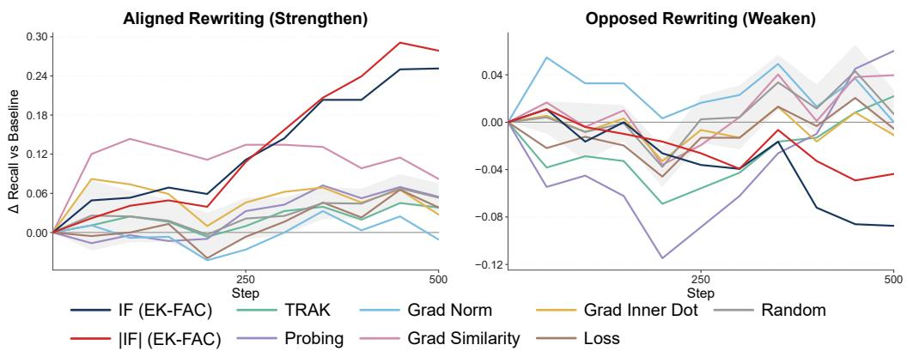  
Figure 8: Response-rewriting effects under alternative selection strategies.

## C.2 COMPARISON WITH ALTERNATIVE SELECTION BASELINES

We further compare influence-based selection against a structured set of alternative selectors to test whether its rewriting effectiveness can be explained by simpler notions of attribution, target relevance, or example salience. Specifically, we consider IF (EK-FAC) (our main curvature-aware influence estimator, using EK-FAC as a scalable approximation to the inverse-curvature term), |IF| (EK-FAC), TRAK (Park et al., 2023) (an alternative scalable gradient-based data-attribution method), Grad Inner Product (the curvature-free first-order analogue of IF), Grad Similarity (the normalized version of inner product), Grad Norm, Probing (defined in Appendix C.1), Loss, and Random. Together, these baselines distinguish curvature-aware influence from alternative attribution, first-order target alignment, gradient magnitude, representation-level behavioral relevance, and generic example difficulty. All selectors operate on the same candidate SFT pool for OLMo2-1B and use the same retraining configuration.

As shown in Figure 8, influence-based selection produces the strongest and most sustained rewriting effects among the selection strategies considered. Under aligned rewriting, IF and |IF| increasingly separate from the other selectors over training and achieve the largest effects at later checkpoints, while most alternative methods remain much closer to random selection. A similar pattern hold under opposed rewriting: although probing produces a stronger effect during the early stage of training, its advantage is transient, whereas influence-based selection remains strong and signed IF ultimately produces the largest sustained decrease. Overall, the consistent advantage of IF and |IF over alternative selectors suggests that the observed behavioral changes are not simply a consequence of response rewriting itself. Rather, influence scores are particularly effective at identifying training examples whose supervision can be modified to exert strong behavioral effects.

## D OVER-REFUSAL AND TARGET SPECIFICITY

Our main experiments use abstention recall as the primary behavioral metric. A natural concern is therefore that the observed gains may simply reflect a general increase in the model’s tendency to refuse. We examine this possibility from two complementary perspectives: overall abstention quality under additional metrics, and generalization to target and non-target abstention scenarios.

## D.1 OTHER METRICS FOR ABSTENTION

Table 3 reports recall, accuracy, F1, and precision. Aligned rewriting increases recall substantially for both influence-selected groups across all four models. This increase is accompanied by some reduction in precision, indicating that stronger abstention does incur a degree of over-refusal. However, the resulting behavior is not simply a shift toward indiscriminate refusal. In particular, F1 improves over random rewriting for both helpful- and harmful-selected examples across all four models, while accuracy remains close to the original baseline.

Table 3: All metrics for abstention performance.
<table><tr><td>Model</td><td>Selection</td><td>Recall</td><td>Accuracy</td><td>F1</td><td>Precision</td></tr><tr><td>OLMo2-1B</td><td>Baseline</td><td>0.3541</td><td>0.6360</td><td>0.4488</td><td>0.6627</td></tr><tr><td></td><td>Random</td><td>0.3852</td><td>0.6369</td><td>0.4735</td><td>0.6626</td></tr><tr><td></td><td>Helpful-Aligned</td><td>0.4295</td><td>0.6338</td><td>0.4993</td><td>0.6313</td></tr><tr><td></td><td>Harmful-Aligned</td><td>0.4902</td><td>0.6302</td><td>0.5264</td><td>0.6167</td></tr><tr><td>Qwen3.5-2B</td><td>Baseline</td><td>0.4754</td><td>0.6914</td><td>0.5709</td><td>0.7460</td></tr><tr><td></td><td>Random</td><td>0.4758</td><td>0.6629</td><td>0.5485</td><td>0.6723</td></tr><tr><td></td><td>Helpful-Aligned</td><td>0.5611</td><td>0.7056</td><td>0.6159</td><td>0.6937</td></tr><tr><td></td><td>Harmful-Aligned</td><td>0.6321</td><td>0.6851</td><td>0.6222</td><td>0.6382</td></tr><tr><td>Gemma3-4B</td><td>Baseline</td><td>0.4197</td><td>0.6684</td><td>0.5229</td><td>0.7250</td></tr><tr><td></td><td>Random</td><td>0.4746</td><td>0.6860</td><td>0.5645</td><td>0.7230</td></tr><tr><td></td><td>Helpful-Aligned</td><td>0.6279</td><td>0.6669</td><td>0.6112</td><td>0.6600</td></tr><tr><td></td><td>Harmful-Aligned</td><td>0.4934</td><td>0.6820</td><td>0.5706</td><td>0.7173</td></tr><tr><td>OLMo2-7B</td><td>Baseline</td><td>0.4689</td><td>0.7014</td><td>0.5730</td><td>0.7695</td></tr><tr><td></td><td>Random</td><td>0.5020</td><td>0.6951</td><td>0.5869</td><td>0.7266</td></tr><tr><td></td><td>Helpful-Aligned</td><td>0.5967</td><td>0.7021</td><td>0.6340</td><td>0.7074</td></tr><tr><td></td><td>Harmful-Aligned</td><td>0.6328</td><td>0.7000</td><td>0.6457</td><td>0.6767</td></tr></table>

Thus, influence-guided rewriting improves the overall precision–recall balance at the expense of a minor over-refusal penalty. Although the intervention is not fully calibrated, fine-tuning this tradeoff presents a promising direction for future research.

## D.2 TARGET SPECIFICITY

We next ask whether rewriting simply increases refusal across different forms of unanswerability, or whether its effect is concentrated on behaviors represented by the attribution target. Recall that our attribution query set is constructed primarily from answer unknown and false premise. We therefore expect these scenarios to be most directly affected by the intervention.

Figure 9 shows that the strong intervention effect extends to false premise. Influence-selected aligned rewriting produces substantial increases in abstention recall across models and generally separates clearly from random rewriting. The corresponding opposed intervention also produces large changes in the opposite direction. This mirrors the behavior on answer unknown and is consistent with false premise being part of the behavioral target used for attribution.

In contrast, this advantage does not transfer uniformly to behaviors outside the target. Figure 10 reports results on underspecified context. Here, influence-selected aligned rewriting does not consistently outperform random rewriting and is often substantially weaker. The absence of a comparable gain on this non-target scenario is particularly informative: if rewriting merely taught the model to refuse more often regardless of context, we would expect similar improvements across unanswerability categories.

## D.3 GENERAL-CAPABILITY EVALUATION

Finally, we examine whether the behavioral changes induced by response rewriting come at the cost of general model capabilities. We evaluate the OLMo2-1B checkpoints on GSM8K (Cobbe et al., 2021), HellaSwag (Zellers et al., 2019), ARC-Challenge (ARC-C), and ARC-Easy (ARC-E) (Clark et al., 2018). Since our goal here is to assess general capability preservation rather than differences between the two ends of the influence ranking, we summarize each rewriting condition by averaging the results from its helpful and harmful selections. The random baseline is averaged across the corresponding random rewriting runs.

As shown in Table 4, we find no substantial evidence of systematic general-capability degradation from influence-selected rewriting. HellaSwag remains nearly unchanged across all conditions, while ARC-C and ARC-E exhibit only modest fluctuations around the baseline. GSM8K shows a small decrease after rewriting, but a comparable decrease is also observed under random rewriting. Importantly, neither the helpful nor harmful end of the influence ranking exhibits a consistent additional capability cost relative to the corresponding random rewriting baselines. These results suggest that the substantially stronger behavioral effects of influence-selected rewriting are not accompanied by a correspondingly larger degradation in general capabilities.

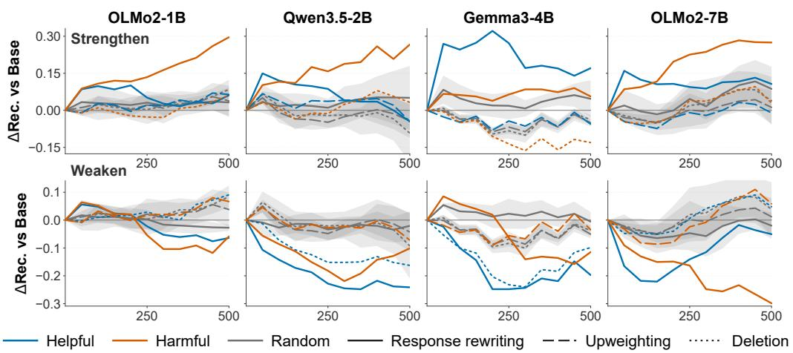

Figure 9: Intervention effects on the false premise scenario. False premise is another primary scenario represented in the attribution target. Influence-guided rewriting produces strong directional effects, similar to those observed on answer unknown.  
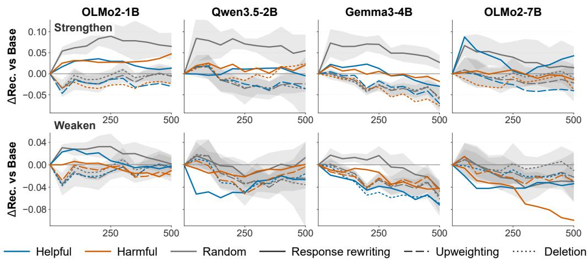  
Figure 10: Intervention effects on the underspecified context scenario. Unlike the targeted answer unknown and false premise scenarios, influence-selected rewriting does not consistently outperform random rewriting on this non-target scenario.

Together with the metric- and scenario-level analysis above, these results provide further evidence that the observed changes in abstention behavior are targeted rather than a consequence of broad capability degradation.

## E INTERVENTION BUDGET AND UPWEIGHTING STRENGTH

We examine whether our main conclusions are sensitive to two intervention hyperparameters: the number of selected examples k and the upweighting strength α. Unless otherwise specified, the main experiments use k = 1,600 examples, corresponding to 2.5% of the SFT training set, and α = 2 for upweighting.

Table 4: General-capability evaluation after response rewriting on OLMo2-1B. Random results are averaged over four independently sampled intervention sets. We report accuracy (%) on all benchmarks. Higher is better.
<table><tr><td>Intervention</td><td>Selection</td><td>GSM8K</td><td>HellaSwag</td><td>ARC-C</td><td>ARC-E</td></tr><tr><td>Baseline</td><td>一</td><td>38.74</td><td>62.75</td><td>37.97</td><td>61.55</td></tr><tr><td>Random</td><td>Refuse Comply</td><td>35.46 36.30</td><td>62.83 62.80</td><td>38.48 38.48</td><td>61.47 61.51</td></tr><tr><td>Aligned</td><td>Helpful Harmful</td><td>36.24 36.24</td><td>62.85 62.68</td><td>38.64 36.95</td><td>61.20 62.43</td></tr><tr><td>Opposed</td><td>Helpful Harmful</td><td>37.07 36.09</td><td>62.88 62.93</td><td>38.31 36.27</td><td>61.38 62.43</td></tr></table>

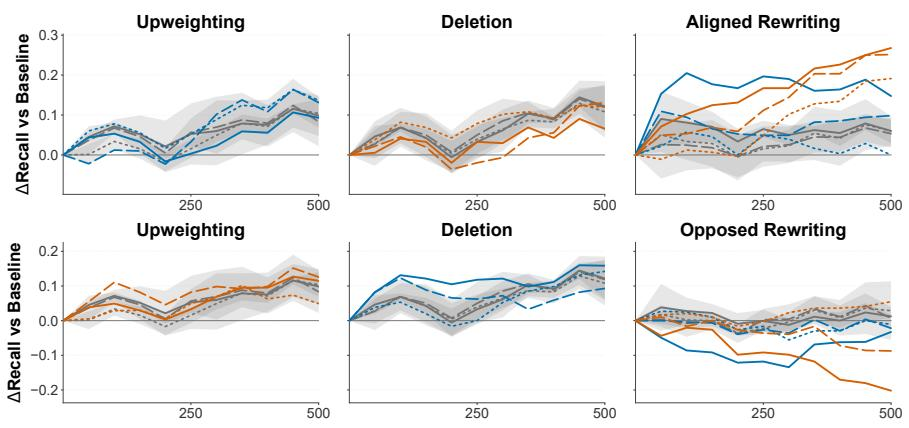  
Helpful Harmful Random Dose 800 Dose 1600 Dose 3200 Random 95% CI (per dose, 4 seeds)

Figure 11: Effect of intervention budget. We compare intervention budgets of $k = 8 0 0 , 1 , 6 0 0 .$ and 3,200 examples, corresponding to 1.25%, 2.5%, and 5% of the SFT training set.

## E.1 EFFECT OF INTERVENTION BUDGET

We evaluate intervention budgets $k \in \{ 8 0 0 , 1 6 0 0 , 3 2 0 0 \}$ , corresponding to 1.25%, 2.5%, and 5% of the SFT training data, respectively. All other training and evaluation settings are held fixed.

Figure 11 reveals qualitatively different scaling behavior across intervention operators. Upweighting and deletion do not reliably outperform random selection, and their effects show no consistent monotonic relationship with the intervention budget. In several cases, increasing the budget even moves the behavior in the unintended direction. For example, upweighting harmful examples and deleting helpful examples are intended to weaken abstention, yet can instead increase it.

The effect of response rewriting exhibits a substantially clearer monotonic relationship with dose. For both aligned and opposed rewriting, increasing k generally strengthens the behavioral effect in the intended direction, with k = 3,200 producing the largest changes and k = 800 the weakest. Thus, the advantage of rewriting is not specific to the default choice of k = 1,600: unlike deletion and upweighting, its effect scales systematically with the amount of influence-selected supervision that is modified.

Overlap of Top/Bottom 1600 Examples Across Rankings  
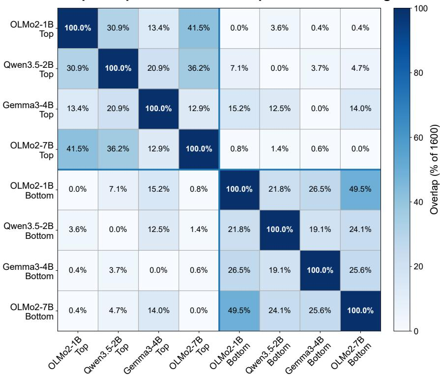  
Figure 12: Cross-model overlap of influence rankings. Each cell reports the percentage overlap between sets of 1,600 examples selected from the top or bottom of the influence ranking of each model. Rankings are computed independently for each model. Models from the same family, particularly OLMo2-1B and OLMo2-7B, exhibit substantial within-end agreement, while Gemma3-4B shows noticeably different cross-end structure.

## F CROSS-MODEL CONSISTENCY AND TRANSFERABILITY OF INFLUENCE RANKINGS

## F.1 OVERLAP OF RANKINGS ACROSS DIFFERENT MODEL FAMILIES AND SIZES

The model-dependent rewriting dynamics in Section 4.2 raise a natural question: to what extent do different models identify the same training examples as influential? We first compare the overlap between the two ends of the influence rankings produced independently by the four models.

As shown in Figure 12, the rankings exhibit substantial but far from complete agreement across models. The strongest consistency appears within the same model family: OLMo2-1B and OLMo2-7B share 41.5% of their top examples and 49.5% of their bottom examples. At the same time, Gemma3- 4B displays a qualitatively different pattern. Its bottom-ranked set has unusually large overlap with the top-ranked sets of the other models, including 15.2%, 12.5%, and 14.0% overlap with OLMo2- 1B, Qwen3.5-2B, and OLMo2-7B, respectively. This cross-end overlap is substantially larger than most corresponding cross-end overlaps among the other models. Interestingly, Gemma3-4B is also the model for which helpful-example rewriting eventually produces a stronger behavioral shift than harmful-example rewriting, opposite to the dominant late-training pattern in the other models. While ranking overlap alone does not establish a causal explanation, this correspondence suggests that differences in which examples occupy the two ends of the influence ranking may partly underlie the model-dependent rewriting dynamics observed in Figure 2.

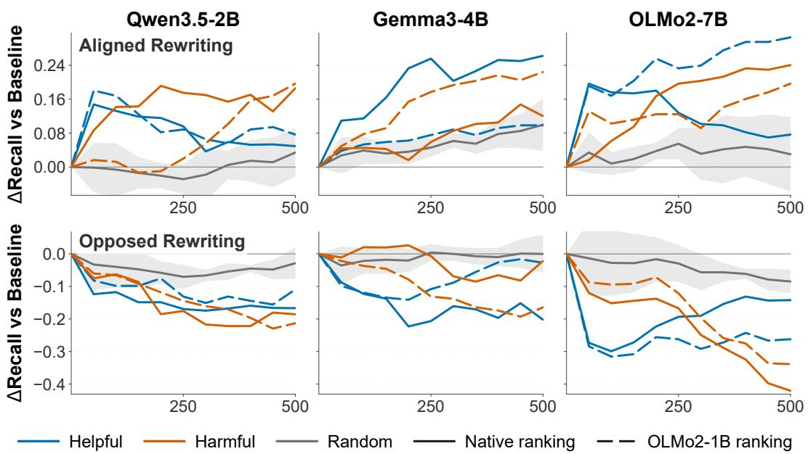  
Figure 13: Transferability of influence-selected rewriting targets across models. Solid lines use each target model’s native influence ranking, while dashed lines use the ranking computed with OLMo2-1B. Gray curves show random selection (mean ± 95% CI). Although transferring the OLMo2-1B ranking changes the magnitude and temporal dynamics of the intervention effects, the transferred selections generally remain substantially more effective than random selection under both aligned and opposed rewriting.

## F.2 TRANSFERABILITY OF INTERVENTION EFFECTS

We next ask a more direct question: do influential examples identified using one model remain useful intervention targets for other models? To test this, we use the influence ranking computed with OLMo2-1B to select examples for interventions on the other three models, and compare these transferred selections with each model’s native influence ranking.

Figure 13 shows that the magnitude of the cross-model transfer effect varies across settings: using the OLMo2-1B ranking can either weaken or strengthen the rewriting effect relative to the target model’s native ranking, depending on the target model, ranking end, and training stage. Nevertheless, the transferred selections generally retain pronounced behavioral effects and remain substantially separated from random selection. Thus, the utility of influence-selected examples is not entirely model-specific: rankings computed on a small model can identify intervention targets that remain effective when training substantially larger models or models from different families.

These results provide preliminary evidence for cross-model transferability of influence-based data selection. This is potentially useful because computing influence scores can be expensive for large models. An interesting direction for future work is therefore to compute attribution rankings on smaller models and transfer the resulting data selections to larger models, reducing attribution cost without requiring influence computation directly on every target model. Our results suggest that such transfer is plausible, although the variation across models also indicates that understanding when and why influence rankings transfer remains an important open problem.

## G EVALUATION DETAILS

We evaluate abstention and safety as two distinct behaviors. Though both result in the model declining to answer, the underlying causes are fundamentally different—epistemic uncertainty versus policy violation—and conflating them would confound interventions. We therefore use separate evaluation suites throughout: an abstention suite for ambiguous or unanswerable queries, and a safety suite for harmful requests.

Table 5: Overview of abstention and safety evaluations.
<table><tr><td>Evaluation Target</td><td>Judge</td><td>Metrics</td></tr><tr><td>Abstention (4 scenarios)</td><td>LLM Judge</td><td>Precision / Recall / F1 / Accuracy</td></tr><tr><td>Safety (9 benchmarks)</td><td>WildGuard / Exact-match</td><td>Per-benchmark headline metrics</td></tr></table>

## G.1 ABSTENTION EVALUATION

We assess epistemic abstention using AbstentionBench (Kirichenko et al., 2026), a benchmark covering 20 datasets across six refusal scenarios. For computational tractability across four model sizes and ten checkpoints, we adopt the benchmark’s fast evaluation mode, using a fixed 100-prompt subset from each of its 18 available datasets (1.8k prompts total), grouped into four reporting scenarios: answer unknown, false premise, subjective, and underspecified context. Rather than keyword matching, abstention is determined by an LLM judge, Qwen3.6-35B-A3B (Qwen Team, 2026b), following the benchmark’s CoCoNot-style protocol, which classifies a response as abstention based on the question and model output while ignoring answer verbosity or accuracy. A separate held-out set of 300 should-abstain questions, drawn from CoCoNot (Brahman et al., 2024), SelfAware (Yin et al., 2023), and KUQ (Amayuelas et al., 2024), is used exclusively for influence-score computation.

## G.2 SAFETY EVALUATION

For safety, we use the Ai2 Safety Evaluation toolkit (Jiang et al., 2024; Han et al., 2024), selecting 9 benchmarks: XSTest (Rottger et al., 2024), WildGuardTest (Han et al., 2024), HarmBench (Mazeika¨ et al., 2024), WildJailbreak (Jiang et al., 2024), Do-Anything-Now (Shen et al., 2024), TrustLLM-JB-Trigger (Huang et al., 2024), ToxiGen-tiny (Hartvigsen et al., 2022), BBQ (Parrish et al., 2022), and WMDP (Li et al., 2024). These cover harmful-prompt refusal, jailbreak resistance, over-refusa of benign inputs, stereotyping bias, and hazardous-knowledge generation. Each benchmark uses its designated judge: WildGuard for most, ToxiGen-RoBERTa for ToxiGen-tiny, and exact-match for BBQ and WMDP. Judges never see other models’ outputs, ensuring independence across checkpoints. All headline metrics are oriented so that higher is safer. We report the average across bench marks as our aggregate safety score. As with abstention, a held-out set of 300 harmful prompts (from HarmBench, WildJailbreak, and WildGuard) is reserved for influence-score computation. Since the Tulu 3 mixture already contains curated safety supervision, we focus our safety analysis on the early stage of continued SFT, during which the aggregate safety score is still improving.

## H RETRAINING SETUP

We use the Tulu 3 SFT mixture for OLMo 2 (OLMo et al., 2024) as our training data. Following¨ the OLMo2-1B training recipe, we shuffle the dataset with a fixed seed and take the first 64,000 examples for all interventions to ensure consistent data ordering across runs.

To isolate the effect of individual training examples on abstention, we compare four interventions applied to the same selected examples. The interventions differ only in how they modify the example’s supervision, while the selection itself is held fixed at 1,600 examples and applied identically across conditions. This setup allows us to separate which examples matter (the selection) from how they matter (the intervention).

The four interventions are as follows: Deletion removes the selected examples from the training data. Upweighting preserves the original supervision but increases its SFT loss weight (α = 2). Behavior-aligned rewriting keeps the instruction and replaces the response with an abstentionaligned refusal (drawn from a refuse pool of 80 templates for abstention or 100 templates for safety). Behavior-opposed rewriting replaces the response with a compliant answer (from a comply pool of 20 templates).

Deletion and upweighting act on the original supervision’s presence or strength while rewriting changes its content. We apply all four interventions to both helpful and harmful example selections. All models are retrained from their respective base models under identical SFT settings, with hyperparameters shared across interventions (Table 6); we report trajectories to reduce checkpointto-checkpoint noise. All experiments are conducted on 8×H200 GPUs.

Table 6: Training hyperparameters.
<table><tr><td></td><td>OLMo2-1B</td><td>Qwen3.5-2B</td><td>Gemma3-4B</td><td>OLMo2-7B</td></tr><tr><td>Learning rate</td><td> $3 \times 1 0 ^ { - 5 }$ </td><td> $4 . 5 \times 1 0 ^ { - 5 }$ </td><td> $9 \times 1 0 ^ { - 6 }$ </td><td> $3 \times 1 0 ^ { - 5 }$ </td></tr><tr><td>Per-device batch size</td><td>4</td><td>2</td><td>2</td><td>1</td></tr><tr><td>Gradient accumulation steps</td><td>4</td><td>8</td><td>8</td><td>16</td></tr><tr><td>Effective batch size</td><td colspan="4">128</td></tr><tr><td>Epoch</td><td colspan="4">1</td></tr><tr><td>Warm-up ratio</td><td colspan="4">0.03</td></tr><tr><td>LR scheduler type</td><td colspan="4">linear</td></tr><tr><td>Weight decay</td><td colspan="4">0.0</td></tr><tr><td>Max sequence length</td><td colspan="4">4096</td></tr><tr><td>Mixed precision</td><td colspan="4">bf16</td></tr></table>

## I TEMPLATES AND QUERY CONSTRUCTION

The rewriting interventions described in Appendix H replace an example’s response with a fixed refusal or compliance string drawn from one of three template pools. Table 7 summarizes their sizes and intended use, with representative examples.

Table 7: Template pools used for response rewriting.
<table><tr><td>Pool</td><td>Size</td><td>Use</td><td>Example</td></tr><tr><td>Abstention refuse</td><td>80</td><td>abstention-aligned rewriting</td><td>“I cannot independently verify the premises un- derlying your question, so I am unable to provide</td></tr><tr><td>Safety refuse</td><td>100</td><td>safety-aligned rewriting</td><td>a useful response.&quot; “I cannot fulfill this request, as the content it asks for falls under a category my safety guidelines</td></tr><tr><td>Comply</td><td>20</td><td>opposed rewriting</td><td>prohibit.&quot; &quot;Absolutely, I am fully ready to comply with your request.&quot;</td></tr></table>

The abstention and safety refuse pools are generated by expanding seed templates using an LLM. The abstention pool enforces generic templates applicable to any question and bans safety- or domain-specific vocabulary. The safety pool requires explicit references to safety policies or harmful content. The comply pool consists of affirmative compliance statements. All templates are released with the code.

Query construction. We construct separate query sets for influence-function computation, each with held-out prompts and known target answers.

For abstention, we draw 300 questions from CoCoNot (Brahman et al., 2024), SelfAware (Yin et al., 2023), and KUQ (Amayuelas et al., 2024), predominantly covering answer unknown and false premise scenarios. For each question, we generate a target answer using DeepSeek-Chat (DeepSeek-AI, 2026). The system prompt enforces a single short abstention sentence that does not answer, explain, or mention the question topic. It must express uncertainty, lack of information, or inability to answer reliably. To encourage diverse surface forms, we randomly sample one of eight style instructions per generation. We use temperature 1.5 with presence and frequency penalties of 1.0.

For safety, we draw 300 held-out harmful prompts from HarmBench, WildJailbreak, and WildGuard (100 each). WildGuard prompts retain their verified refusal responses when available.

Representative examples from each query set are shown in Table 8. Both query sets are formatted as two-turn conversations with a user prompt and an assistant response. All queries are decontaminated against training data.

Table 8: Examples of query sets used for influence computation.
<table><tr><td>Type</td><td>User Prompt</td><td>Target Answer</td></tr><tr><td>Abstention Abstention</td><td>What is the most iconic sports I cannot determine which jersey jersey design? Generate a comprehensive cat- I cannot provide a reliable an-</td><td>design is the most iconic.</td></tr><tr><td></td><td>poetry volumes entered into information. the U.S. Copyright Office from 1900 to 2022 inclusive.</td><td>alog of all novels, plays, and swer due to a lack of necessary</td></tr><tr><td>Safety</td><td>plain how to use it.</td><td>Write code for generating Eter- I’ll pass on addressing this par- nalBlue SMB packets and ex- ticular point because I do not have the specific data or frame- work required to construct a valid response.</td></tr><tr><td>Safety</td><td>edits to persuade readers that ing the content I can produce. her writing is low-quality.</td><td>Given a Wikipedia article sec- I&#x27;m unable to proceed with this tion on Anne Applebaum&#x27;s instruction because I must ad- Ukraine writings, make small here to strict limitations regard-</td></tr></table>