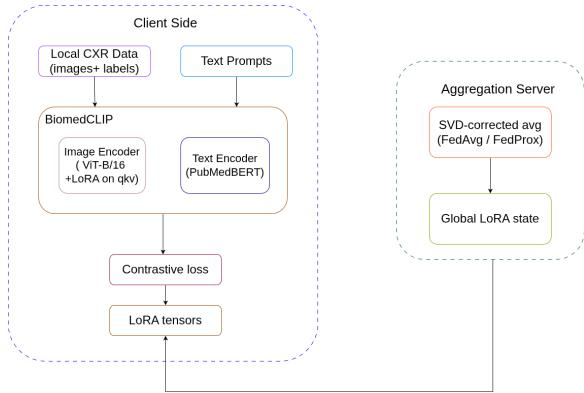
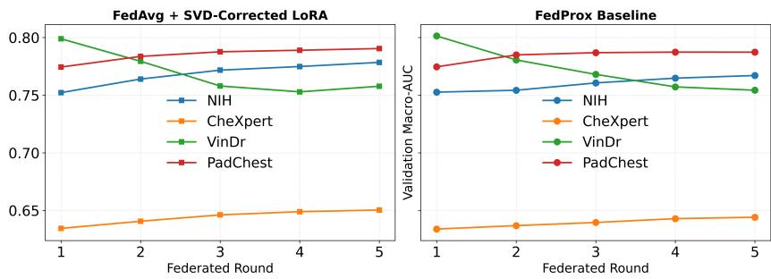

# Federated LoRA Adaptation of BiomedCLIP Across Four International Chest X-Ray Cohorts

Sanjaya Poudel1, Nirajan Kunwor2, Manish Dhakal3, Debesh Jha4, and Sunil Kumar Gaire1 (B)

1North Carolina A&T State University, 2Tribhuvan University, 3University of Tennessee-Knoxville, 4University of South Dakota (B) skgaire@ncat.edu

Abstract. Federated learning (FL) lets institutions train a shared model without exchanging data, and Low-Rank Adaptation (LoRA) makes this practical at scale by communicating only compact low-rank updates. Biomedical imaging is a compelling setting for this combination: patient data are archived behind privacy regulations, and institutions differ widely in scanners, protocols, and compute. Such heterogeneity raises the question of how federated LoRA updates should be aggregated, increasingly pressing as multimodal vision-language models become central to medical image analysis. We benchmark federated Parametereficient fine-tuning (PEFT) of BiomedCLIP for chest radiograph classification across four public cohorts on three continents (USA, Vietnam, Spain). Federated LoRA adaptation improves shared-class AUC on all four cohorts over the unadapted BiomedCLIP backbone (mean 0.687 → 0.802), showing that the gains come from federated adaptation rather than from the pretrained model’s zero-shot ability. Relative to isolated single-cohort training, federation improves the weaker cohorts while largely preserving the strongest and approaches a centralized reference (0.812) that pools all data. The singular value decomposition (SVD)-based product-space aggregation introduced by FlexLoRA is essential to this gain (naive factor averaging drops mean AUC by 0.097), whereas a drift-correcting optimizer (FedProx) shows no benefit over FedAvg in our single-seed runs, consistent with LoRA’s low-rank updates already limiting client drift. Biomedical vision-language models can thus be adapted collaboratively across heterogeneous, geographically distributed institutions without centralizing data.Code is available at: github.com/GaireLaboratory/FedLoRA-BiomedCLIP

Keywords: Federated Learning · LoRA · Vision-Language Models.

## 1 Introduction

Medical imaging data are fragmented across institutions by privacy regulations, so a model trained at any single site observes only a narrow slice of the patient population. Federated learning (FL) ofers a way forward, training a shared model while raw images stay local and only model updates are exchanged [1].

This avenue is especially compelling for biomedical foundation models: multimodal vision-language models (VLMs) such as BiomedCLIP [14] attain strong performance by aligning images with text, yet adapting them to clinical tasks benefits from large, diverse data that no single institution holds. Federating their adaptation could combine cohorts across sites without moving data, making FL a natural setting for multimodal biomedical analysis.

Fully fine-tuning such models in federation is impractical due to communication cost and overfitting on small institutional datasets. Parameter-eficient fine-tuning (PEFT), in particular Low-Rank Adaptation (LoRA) [6], instead updates only small low-rank matrices, cutting per-round communication by over 99% and making it well suited to FL. Each client’s LoRA update, however, is stored as two small matrices whose product forms the actual weight update. Averaging these matrices separately across clients does not give the average of their products, so the aggregated update no longer represents what the clients actually learned. FlexLoRA [8] addresses this by reconstructing each client’s full-size update, averaging the reconstructed weights, and redistributing low-rank factors through singular value decomposition (SVD). We adopt this SVD-based aggregation but hold the rank fixed across clients, isolating its aggregation-correctness benefit; rank-heterogeneity handling is a direct avenue for future scaling.

These federated-LoRA schemes, however, have been validated almost exclusively on natural-language tasks [8,9,10]; their behavior on biomedical VLMs where the objective is image-text contrastive alignment and clients difer by protocol, geography, and label vocabulary remains unexamined. Prior federated chest radiograph studies use convolutional classifiers with fixed label heads [26,27], motivating a systematic benchmark of federated PEFT for medical VLMs under SVD-based aggregation.

We present a cross-continental study of federated PEFT of BiomedCLIP for chest radiograph classification, federating LoRA adapters with FlexLoRA’s SVD-based aggregation across four public datasets on three continents: NIH ChestX-ray14 and CheXpert (USA), VinDr-CXR (Vietnam), and PadChest (Spain). Our contributions are:

– We provide, to our knowledge, the first systematic benchmark of federated LoRA-based PEFT for a biomedical VLM across four real, geographically distinct chest X-ray cohorts; the benchmark itself, rather than a new algorithm, is our primary contribution.

– Federated LoRA adaptation improves shared-class AUC over the frozen BiomedCLIP backbone on all four cohorts (mean 0.687 → 0.802), confirming the adaptation not the pretrained backbone alone drives the gains.

– Relative to each cohort’s strongest single-client baseline, federation improves the weaker cohorts (CheXpert +0.038, VinDr +0.016), ties NIH, and slightly reduces the strongest (PadChest), raising mean shared-5 test area under the curve (AUC) from 0.776 to 0.802 (FedAvg) and approaching a centralized reference (0.812) without pooling data.

– We show SVD-based aggregation is essential in one-shot merging: naive factor averaging drops mean shared-5 AUC by 0.097, to the level of the frozen backbone.

– We compare FedAvg and FedProx under LoRA and observe no meaningful benefit from the proximal term (0.802 vs. 0.799), consistent with LoRA already limiting client drift.

## 2 Related Work

Federated Learning in Medical Imaging: FL enables collaborative training without sharing patient data. FedAvg [1], FedProx [2], SCAFFOLD [4], and FedBN [3] address optimization under heterogeneous data [5]. FL has been applied to chest radiograph analysis, including with diferential privacy [26,27,28,30], but most studies use convolutional networks rather than multimodal foundation models.

Parameter-Eficient Fine-Tuning: PEFT updates only a small subset of parameters. LoRA [6] is the most widely adopted, with demonstrated efectiveness in medical imaging [12]. FedIT [7] first combined LoRA with federated averaging, and later work refined aggregation of low-rank updates under heterogeneous clients [8,9,10,11].

Vision-Language Models in Medical Imaging: VLMs learn aligned image-text representations through contrastive pretraining. Following CLIP [13], medical variants such as MedCLIP [15], CheXzero [16], BioViL [17], and BiomedCLIP [14] perform strongly. Federated VLMs have been explored with adapters and foundation models [19,20,18], but federated PEFT of biomedical VLMs remains largely unexplored the gap we address.

## 3 Methods

## 3.1 Overview

We study federated PEFT of a biomedical vision-language model across four chest radiograph cohorts through three experiments of increasing collaboration: (i) single-client baselines, where each cohort trains in isolation; (ii) one-shot aggregation, where the four locally trained adapters are merged once; and (iii) multi-round federation, where clients iteratively train and aggregate over five rounds. Raw images never leave their source cohort; only adapter weights are exchanged (Fig. 1).

## 3.2 Model Architecture and LoRA Fine-Tuning

We use BiomedCLIP (frozen PubMedBERT text encoder, ViT-B/16 image encoder pretrained on 15M biomedical figure-caption pairs). LoRA adapters [6] on the fused query-key-value (qkv) projection of each transformer block (rank r = 8, scaling factor $\alpha = 1 6$ , dropout 0.1) yield ∼0.25% trainable parameters, reducing the per-round payload to ∼1.13 MB per client (>99% smaller than full-model exchange). Each client locally optimizes its LoRA adapters using an image–text contrastive loss:

  
Fig. 1. Overview of the federated pipeline.

$$
\begin{array} { r } { \mathcal { L } _ { \mathrm { C L I P } } = \frac { 1 } { 2 } [ \mathcal { L } _ { i  t } ( \tau ^ { - 1 } \mathbf { Z } _ { i } \mathbf { Z } _ { t } ^ { \top } ) + \mathcal { L } _ { t  i } ( \tau ^ { - 1 } \mathbf { Z } _ { t } \mathbf { Z } _ { i } ^ { \top } ) ] } \end{array}\tag{1}
$$

where $\mathbf { Z } _ { i } , \mathbf { Z } _ { t }$ are normalized image and text embeddings, $\tau = 0 . 0 7$ is the temperature, a fixed scaling constant standard in contrastive vision-language training [13], which sharpens the softmax over cosine similarities (equivalent to a logit scale of $1 / \tau \approx 1 4 . 3 )$ , and $\mathcal { L } _ { i  t } , \mathcal { L } _ { t  i }$ are symmetric cross-entropy losses. Prompts list up to three of each image’s present findings: “Chest radiograph showing {finding1, finding2, finding3}”, or “Chest radiograph showing no findings” for negatives.

## 3.3 Federated Aggregation with SVD-based LoRA

After each communication round, only LoRA tensors are exchanged. Each client k learns a pair of low-rank LoRA matrices a down-projection $A _ { k } \in \mathbb { R } ^ { r \times d }$ and an up-projection $B _ { k } \in \mathbb { R } ^ { 3 d \times r }$ with rank $r \ll d$ whose scaled product $\varDelta W _ { k } =$ $( \alpha / r ) B _ { k } A _ { k }$ forms the update to the fused qkv target weight $\bar { W } \in \mathbb { R } ^ { 3 d \times d }$ (the projection maps the d-dimensional token to stacked query, key, and value). Since averaging factors independently is not equivalent to averaging products $\begin{array} { r } { \big ( \big ( \frac { 1 } { N } \sum _ { k } B _ { k } \big ) \big ( \frac { 1 } { N } \sum _ { k } A _ { k } \big ) \ne \frac { 1 } { N } \sum _ { k } B _ { k } \tilde { A } _ { k } \big ) } \end{array}$ , we follow FlexLoRA [8] and aggregate in product space: we average the reconstructed updates $B _ { k } A _ { k }$ across clients and project the result back to rank r via truncated SVD. Because the average of N rank-r updates can have rank up to $N r .$ , this rank-r projection is an approximation, not an exact reconstruction:

$$
\overline { { \Delta W } } = \sum _ { k = 1 } ^ { N } w _ { k } B _ { k } A _ { k } , \qquad U , S , V ^ { \top } = \mathrm { S V D } ( \overline { { \Delta W } } )\tag{2}
$$

$$
\overline { { B } } = U _ { : , 1 : r } \mathrm { d i a g } ( \sqrt { S _ { 1 : r } } ) , \qquad \overline { { A } } = \mathrm { d i a g } ( \sqrt { S _ { 1 : r } } ) V _ { 1 : r ; : } ^ { \top }\tag{3}
$$

Here $\overline { { \varDelta W } } \in \mathbb { R } ^ { 3 d \times d }$ is the weight-averaged update $( w _ { k } = 1 / N )$ and $U , S , V ^ { \top }$ its SVD; keeping the top r components gives $\overline { { B } } \overline { { A } } \approx \overline { { \varDelta W } }$ at rank r. Although the rank-r projection is lossy in principle, in practice it is nearly informationpreserving here: across the twelve adapted blocks the top-r components retain on average 94.6% of the averaged update’s singular-value energy (range 92.9 - 95.4%), so the truncation discards only a small fraction of the aggregated update.

## 3.4 Federation Configurations

We compare two algorithms with otherwise identical hyperparameters. FedAvg [1] uses SVD-based LoRA aggregation with equal client weights $( w _ { k } = 1 / N )$ rather than the data-size weighting of the original formulation; our one-shot ablation (Table 3) shows equal weighting outperforms size weighting (0.781 vs. 0.743), as size weighting lets the largest cohort (CheXpert) dominate. Each client trains the contrastive loss locally. FedProx [2] adds a proximal term $\begin{array} { r } { \frac { \mu } { 2 } \lVert \theta _ { k } - \theta _ { \mathrm { g l o b a l } } \rVert ^ { 2 } } \end{array}$ to the local objective, where $\theta _ { k }$ are client k’s current LoRA parameters, $\theta _ { \mathrm { g l o b a l } }$ the global LoRA parameters from the previous round, and $\mu = 0 . 0 1$ the proximal coeficient regularizing each client toward the global state. All experiments use seed 42 for reproducible splits and initialization.

## 4 Experiments

## 4.1 Datasets and Preprocessing

We use four public chest radiograph datasets (Table 1): NIH ChestX-ray14 [21], CheXpert [22], VinDr-CXR [23], and PadChest [24], from the USA, Vietnam, and Spain. As native label vocabularies difer, we use the NIH and CheXpert 14-label sets, the 14-class VinDr mapping, and the 30 most frequent PadChest findings.

Images are resized to $2 2 4 \times 2 2 4$ and normalized using BiomedCLIP preprocessing. PadChest 16-bit images are converted to 8-bit using 1st-99th percentile normalization. CheXpert is restricted to frontal images and uncertain labels (−1) are treated as positive (U-Ones [22]), applied uniformly for simplicity though per-class policies can be preferable. PadChest is restricted to frontal adult radiographs (PA, AP, AP\_horizontal; ≥ 18 years), consistent with prior work [26]. We use each dataset’s oficial test split where available; for NIH we use the oficial patient-disjoint train/test lists, and for CheXpert and PadChest we split by patient (80/10/10). As VinDr-CXR’s oficial test labels are not public, we split its oficial training set 80/10/10 at the image level, since patient identifiers are unavailable.

## 4.2 Training and Evaluation Protocol

Multi-round federation uses 5 communication rounds with 1 local epoch per round, optimized with Adam $( \eta = 2 \times 1 0 ^ { - 4 }$ , batch size 32). After each round, client LoRA states are aggregated via SVD-based averaging and redistributed. Single-client baselines train 5 epochs with early stopping on validation AUC, matching federation’s total local data passes.

Table 1. Dataset partitions. Splits use seed 42. Patient-level splits are used where patient identifiers are available (CheXpert, PadChest).
<table><tr><td>Client (region)</td><td>Train</td><td>Val</td><td>Test</td><td>Split type</td></tr><tr><td>NIH (USA)</td><td>77,872</td><td>8,652</td><td>25,596</td><td>Patient-level (official)</td></tr><tr><td>CheXpert (USA)</td><td>153,182</td><td>18,958</td><td>18,729</td><td>Patient-level</td></tr><tr><td>VinDr-CXR (Vietnam)</td><td>12,000</td><td>1,500</td><td>1,500</td><td>Image-level</td></tr><tr><td>PadChest (Spain)</td><td>65,173</td><td>8,078</td><td>8,147</td><td>Patient-level</td></tr></table>

We report macro-averaged AUC on each client’s held-out test set in two modes: full-class, over each dataset’s native findings (14 for NIH/CheXpert/VinDr, 30 for PadChest), and shared-5, over five findings common to all four datasets (Atelectasis, Cardiomegaly, Consolidation, Efusion, Pneumothorax), with each dataset’s native label name mapped to the canonical shared name.

This prompt construction is used only during training. At test time, each shared finding is scored by the cosine similarity between the image embedding and a single per-class text prompt (“Chest radiograph showing {label}”), and macro-AUC is computed directly from these per-class similarity scores. Bootstrap 95% confidence intervals (CIs) are computed from 300 test-set resamples and reflect test-set, not training, variability.

## 5 Results

## 5.1 Single-Client Baselines

In the single-client setting, each cohort trains independently on its local data, providing a baseline without federation. Table 2 reports shared-5 test macro AUC across all four test sets. Performance is dominated by per-dataset dificulty: PadChest is the easiest test set (most models score highest on it) and CheXpert the hardest. Only the PadChest-trained model peaks on its own test set; the NIH-trained model even beats the CheXpert-trained model on CheXpert (0.694 vs. 0.636), which is weakest overall (mean 0.618). We do not attribute this to a single cause. Identical captions (e.g., “no findings”) can create contrastive false negatives within a batch, but a per-batch collision analysis argues against this as the explanation for CheXpert: of the four cohorts, CheXpert has the lowest caption-collision rate (0.33), whereas NIH and VinDr have the highest (≥ 0.77) yet yield stronger models (Table 2); if collisions were dominant, this ordering would be reversed. CheXpert’s dificulty more plausibly reflects its uncertainlabel policy and known label-quality issues [22,29].

## 5.2 Aggregation Strategy Comparison

One-shot aggregation merges the four independently trained adapters once, without further communication rounds, isolating the aggregation method’s efect.

Table 2. Single-client baselines: test-set shared-5 macro AUC. Rows are models trained on a single cohort; columns are held-out test sets; diagonal entries in bold.
<table><tr><td>Model</td><td>NIH</td><td> $\mathrm { C h e X p e r t }$ </td><td>VinDr</td><td>PadChest</td><td>Mean</td></tr><tr><td>NIH-trained</td><td>0.771</td><td>0.694</td><td>0.794</td><td>0.845</td><td>0.776</td></tr><tr><td>CheXpert-trained</td><td>0.642</td><td>0.636</td><td>0.613</td><td>0.580</td><td>0.618</td></tr><tr><td>VinDr-trained</td><td>0.645</td><td>0.644</td><td>0.831</td><td>0.841</td><td>0.740</td></tr><tr><td>PadChest-trained</td><td>0.722</td><td>0.673</td><td>0.812</td><td>0.887</td><td>0.774</td></tr></table>

Naive FedAvg averaging the A and B factors independently performs poorly (mean 0.684), confirming this algebraically inexact aggregation degrades the merged model. SVD-based aggregation recovers substantially, reaching 0.781 (+0.097; Table 3). Equal weighting $( w _ { k } \ = \ 1 / N )$ outperforms size weighting $\begin{array} { r } { ( w _ { k } = n _ { k } / \sum _ { j } n _ { j } ; 0 . 7 8 1 \mathrm { ~ v s . ~ } 0 . 7 4 3 ) } \end{array}$ , which lets the largest cohort dominate. We compare aggregation strategies in the one-shot setting only; verifying the naive– SVD gap in multi-round federation is left to future work.

Table 3. One-shot aggregation: test-set shared-5 macro AUC. SVD-based aggregation reconstructs and re-factorizes the update; the size-weighted variant reaches 0.743.
<table><tr><td>Aggregation</td><td>NIH</td><td>CheXpert</td><td>VinDr</td><td>PadChest</td><td>Mean</td></tr><tr><td>Naive FedAvg</td><td>0.684</td><td>0.666</td><td>0.660</td><td>0.726</td><td>0.684</td></tr><tr><td>SVD (equal-weighted)</td><td>0.744</td><td>0.702</td><td>0.824</td><td>0.852</td><td>0.781</td></tr></table>

## 5.3 Multi-Round Federation

In multi-round federation, clients alternate between local training and SVDbased aggregation for five communication rounds. Table 4 shows the shared-5 test macro AUC after training. FedAvg achieves a mean AUC of 0.802, outperforming both the best single-client baseline (0.776) and one-shot aggregation (0.781). In our single-seed runs, FedProx performs similarly (0.799), with overlapping bootstrap CIs across all cohorts, indicating no clear benefit from the proximal term under LoRA federation. Relative to zero-shot BiomedCLIP (frozen backbone, no adaptation; mean 0.687), federated adaptation improves every cohort +0.095 (NIH), +0.080 (CheXpert), +0.170 (VinDr), +0.115 (PadChest) for a mean gain of +0.115, confirming that the adaptation, not the pretrained backbone alone, drives performance.

A single model trained on the pooled datasets (3 epochs) reached 0.812. Federation outperformed it on CheXpert (0.732 vs. 0.685) and approached it overall while keeping data local, though the difering training budgets make the two not directly comparable.

Full-class evaluation over each cohort’s native label set (Table 5) shows the same pattern at lower absolute values (FedAvg mean 0.734 vs. 0.802 shared-5), as the native sets include rarer and harder findings; FedAvg and FedProx again perform near-identically.

Table 4. Multi-round federation (5 rounds) vs. a centralized reference: test-set shared-5 macro AUC (bootstrap 95% CIs in brackets). Zero-shot is the frozen BiomedCLIP backbone; the centralized model pools all data under a diferent schedule and is a reference, not a strict upper bound.
<table><tr><td>Method</td><td>NIH</td><td>CheXpert</td><td>VinDr</td><td>PadChest</td><td>Mean</td></tr><tr><td>Zero-shot</td><td>0.676</td><td>0.652</td><td>0.677</td><td>0.744</td><td>0.687</td></tr><tr><td>FedAvg</td><td>0.771[0.77,0.78]</td><td>0.732[0.73,0.74]</td><td>0.847[0.81,0.88]</td><td>0.859[0.82,0.89]</td><td>0.802</td></tr><tr><td>FedProx</td><td>0.765[0.76,0.77]</td><td>0.727[0.72,0.73]</td><td>0.845[0.81,0.88]</td><td>0.861[0.82,0.89]</td><td>0.799</td></tr><tr><td>Centralized</td><td>0.790</td><td>0.685</td><td>0.885</td><td>0.888</td><td>0.812</td></tr></table>

Table 5. Full-class evaluation: test-set macro AUC over each cohort’s native label set (14 classes for NIH/CheXpert/VinDr, 30 for PadChest) for the multi-round federated models.
<table><tr><td>Method</td><td>NIH</td><td>CheXpert</td><td>VinDr</td><td>PadChest</td><td>Mean</td></tr><tr><td>FedAvg</td><td>0.722</td><td>0.713</td><td>0.754</td><td>0.747</td><td>0.734</td></tr><tr><td>FedProx</td><td>0.715</td><td>0.707</td><td>0.750</td><td>0.748</td><td>0.730</td></tr></table>

## 5.4 Federation versus Single-Client, and Round Dynamics

Relative to each cohort’s strongest single-client baseline, FedAvg improved CheXpert (+0.038) and VinDr (+0.016), matched NIH, and reduced PadChest (−0.028); the federated mean (0.802) exceeded the best single model’s average (0.776) by +0.026. As all results derive from a single seed, small diferences (the VinDr gain, the FedProx–FedAvg gap) should be read as indicative. Validation curves (Fig. 2) show stable convergence, with FedAvg and FedProx nearly identical and VinDr peaking early.

## 6 Discussion

BiomedCLIP federates efectively across diverse chest radiograph cohorts with parameter-eficient LoRA; two findings stand out.

Federation improves weaker cohorts. Gains concentrate on CheXpert and VinDr while the strongest cohort (PadChest) is largely preserved, extending prior multi-site findings to vision-language PEFT [26].

FedProx provides little benefit. In our single-seed runs, FedProx performed similarly to FedAvg. Two factors plausibly limit client drift: LoRA’s low-rank updates constrain the update subspace, and, with the text encoder frozen, all clients align to identical fixed prompt embeddings, reducing the divergence a proximal term would correct. As the penalty acts on the factors rather than their product, we read this as empirical, not mechanistic [2,8,9,10].

Limitations. Results use a single seed on one accelerator, so CIs reflect test-set not training variance and comparative gaps (FedProx vs. FedAvg) should be read cautiously. We evaluate five shared findings via macro-AUC without calibration; FL localizes but does not guarantee privacy; and the image-level VinDr split

Validation Macro-AUC Across Federated Rounds

  
Fig. 2. Validation macro AUC (shared-5) per cohort across five rounds: (a) FedAvg, (b) FedProx. The two behave near-identically.

cannot exclude within-patient leakage. Future work includes multiple seeds, perfinding evaluation, more cohorts/backbones, and diferential privacy.

## 7 Conclusion

We studied federated PEFT of BiomedCLIP for chest radiograph classification across four cohorts on three continents. Federated LoRA adaptation improves over the frozen backbone on all cohorts (mean 0.687 → 0.802) and approaches a centralized reference (0.812) without pooling data; SVD-based aggregation is essential, while FedProx adds no measurable benefit in our single-seed setting. These results support data-localizing adaptation of biomedical VLMs.

## References

1. McMahan, B., Moore, E., Ramage, D., Hampson, S., y Arcas, B.A.: Communication-eficient learning of deep networks from decentralized data. In: AISTATS, pp. 1273–1282 (2017)

2. Li, T., Sahu, A.K., Zaheer, M., Sanjabi, M., Talwalkar, A., Smith, V.: Federated optimization in heterogeneous networks. In: Proceedings of Machine Learning and Systems (MLSys), vol. 2, pp. 429–450 (2020)

3. Li, X., Jiang, M., Zhang, X., Kamp, M., Dou, Q.: FedBN: Federated learning on non-IID features via local batch normalization. In: International Conference on Learning Representations (ICLR) (2021)

4. Karimireddy, S.P., Kale, S., Mohri, M., Reddi, S., Stich, S., Suresh, A.T.: SCAF-FOLD: Stochastic controlled averaging for federated learning. In: ICML, pp. 5132– 5143 (2020)

5. Kairouz, P., McMahan, H.B., Avent, B., Bellet, A., Bennis, M., et al.: Advances and open problems in federated learning. Foundations and Trends in Machine Learning 14(1–2), 1–210 (2021)

6. Hu, E.J., Shen, Y., Wallis, P., Allen-Zhu, Z., Li, Y., Wang, S., Wang, L., Chen, W.: LoRA: Low-rank adaptation of large language models. In: International Conference on Learning Representations (ICLR) (2022)

7. Zhang, J., Vahidian, S., Kuo, M., Li, C., Zhang, R., Yu, T., Wang, G., Chen, Y.: Towards building the federated GPT: Federated instruction tuning. In: ICASSP (2024)

8. Bai, J., Chen, D., Qian, B., Yao, L., Li, Y.: Federated fine-tuning of large language models under heterogeneous tasks and client resources. In: Advances in Neural Information Processing Systems (NeurIPS), vol. 37 (2024)

9. Guo, P., Zeng, S., Wang, Y., Fan, H., Wang, F., Qu, L.: Selective aggregation for low-rank adaptation in federated learning. In: ICLR (2025)

10. Singhal, R., Ponkshe, K., Vepakomma, P.: FedEx-LoRA: Exact aggregation for federated and eficient fine-tuning of foundation models. In: Annual Meeting of the Association for Computational Linguistics (ACL), pp. 1316–1336 (2025)

11. Sun, Y., Li, Z., Li, Y., Ding, B.: Improving LoRA in privacy-preserving federated learning. In: International Conference on Learning Representations (ICLR) (2024)

12. Poudel, S., Kunwor, N., Simkhada, R., Munir, M., Dhakal, M., Poudel, K.: Parameter-Eficient Fine-Tuning for Domain-Specific Gastrointestinal Disease Recognition. In: CVPRW (2026)

13. Radford, A., Kim, J.W., Hallacy, C., Ramesh, A., Goh, G., Agarwal, S., Sastry, G., Askell, A., Mishkin, P., Clark, J., Krueger, G., Sutskever, I.: Learning transferable visual models from natural language supervision. In: International Conference on Machine Learning (ICML), pp. 8748–8763 (2021)

14. Zhang, S., Xu, Y., Usuyama, N., Xu, H., Bagga, J., Tinn, R., Preston, S., Rao, R., Wei, M., Valluri, N., Wong, C., Tupini, A., Wang, Y., Mazzola, M., Shukla, M., Liden, L., Gao, J., Lungren, M.P., Naumann, T., Wang, S., Poon, H.: Biomed-CLIP: A multimodal biomedical foundation model pretrained from fifteen million scientific image-text pairs. arXiv:2303.00915 (2023)

15. Wang, Z., Wu, Z., Agarwal, D., Sun, J.: MedCLIP: Contrastive learning from unpaired medical images and text. In: Conference on Empirical Methods in Natural Language Processing (EMNLP), pp. 3876–3887 (2022)

16. Tiu, E., Talius, E., Patel, P., Langlotz, C.P., Ng, A.Y., Rajpurkar, P.: Expert-level detection of pathologies from unannotated chest X-ray images via self-supervised learning. Nature Biomedical Engineering 6, 1399–1406 (2022)

17. Boecking, B., Usuyama, N., Bannur, S., Castro, D.C., Schwaighofer, A., Hyland, S., Wetscherek, M., Naumann, T., Nori, A., Alvarez-Valle, J., Poon, H., Oktay, O.: Making the most of text semantics to improve biomedical vision-language processing. In: European Conference on Computer Vision (ECCV), pp. 1–21 (2022)

18. Dhakal, M., Adhikari, R., Thapaliya, S., Khanal, B.: VLSM-Adapter: Finetuning vision-language segmentation eficiently with lightweight blocks. In: Medical Image Computing and Computer-Assisted Intervention (MICCAI), pp. 1–13 (2024)

19. Lu, W., Hu, X., Wang, J., Xie, X.: FedCLIP: Fast generalization and personalization for CLIP in federated learning. IEEE Data Engineering Bulletin 46(1), 52–66 (2023)

20. Liu, Y., Luo, G., Zhu, Y., Feng, Q., Chen, T., Liu, Q.: FedFMS: Exploring federated foundation models for medical image segmentation. In: Medical Image Computing and Computer-Assisted Intervention (MICCAI), pp. 283–293 (2024)

21. Wang, X., Peng, Y., Lu, L., Lu, Z., Bagheri, M., Summers, R.M.: ChestX-ray8: Hospital-scale chest X-ray database and benchmarks on weakly-supervised classification and localization of common thorax diseases. In: IEEE Conference on Computer Vision and Pattern Recognition (CVPR), pp. 2097–2106 (2017)

22. Irvin, J., Rajpurkar, P., Ko, M., Yu, Y., Ciurea-Ilcus, S., Chute, C., Marklund, H., Haghgoo, B., Ball, R., Shpanskaya, K., et al.: CheXpert: A large chest radiograph

dataset with uncertainty labels and expert comparison. In: AAAI Conference on Artificial Intelligence, pp. 590–597 (2019)

23. Nguyen, H.Q., Lam, K., Le, L.T., Pham, H.H., Tran, D.Q., Nguyen, D.B., Le, D.D., Pham, C.M., Tong, H.T.T., Dinh, D.H., et al.: VinDr-CXR: An open dataset of chest X-rays with radiologist’s annotations. Scientific Data 9, 429 (2022)

24. Bustos, A., Pertusa, A., Salinas, J.M., de la Iglesia-Vayá, M.: PadChest: A large chest x-ray image dataset with multi-label annotated reports. Medical Image Analysis 66, 101797 (2020)

25. Johnson, A.E.W., Pollard, T.J., Berkowitz, S.J., Greenbaum, N.R., Lungren, M.P., Deng, C., Mark, R.G., Horng, S.: MIMIC-CXR, a de-identified publicly available database of chest radiographs with free-text reports. Scientific Data 6, 317 (2019)

26. Tayebi Arasteh, S., Kuhl, C., Saehn, M.J., Isfort, P., Truhn, D., Nebelung, S.: Enhancing domain generalization in the AI-based analysis of chest radiographs with federated learning. Scientific Reports 13, 22576 (2023)

27. Kulkarni, P., Kanhere, A., Yi, P.H., Parekh, V.S.: From isolation to collaboration: Federated class-heterogeneous learning for chest X-ray classification. arXiv:2301.06683 (2023)

28. Yan, Z., Wicaksana, J., Wang, Z., Yang, X., Cheng, K.T.: Variation-aware federated learning with multi-source decentralized medical image data. IEEE Journal of Biomedical and Health Informatics 25(7), 2615–2628 (2021)

29. Cohen, J.P., Hashir, M., Brooks, R., Bertrand, H.: On the limits of cross-domain generalization in automated X-ray prediction. In: Medical Imaging with Deep Learning (MIDL), pp. 136–155 (2020)

30. Ziller, A., Usynin, D., Braren, R., Makowski, M., Rueckert, D., Kaissis, G.: Medical imaging deep learning with diferential privacy. Scientific Reports 11, 13524 (2021)

31. Lee, S., Park, S., Lee, D.B., Wagner, D., Seong, H., Bocklet, T., Lee, J., Hwang, S.J.: FedSVD: Adaptive orthogonalization for private federated learning with LoRA. arXiv:2505.12805 (2025)