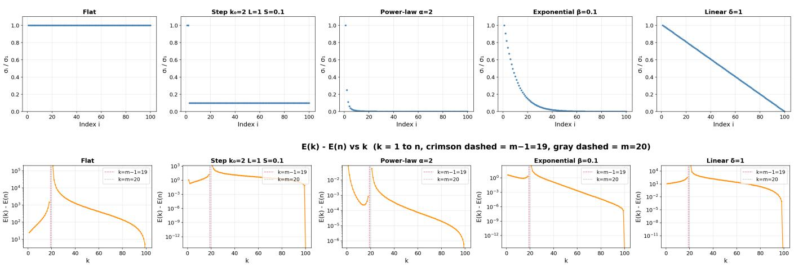
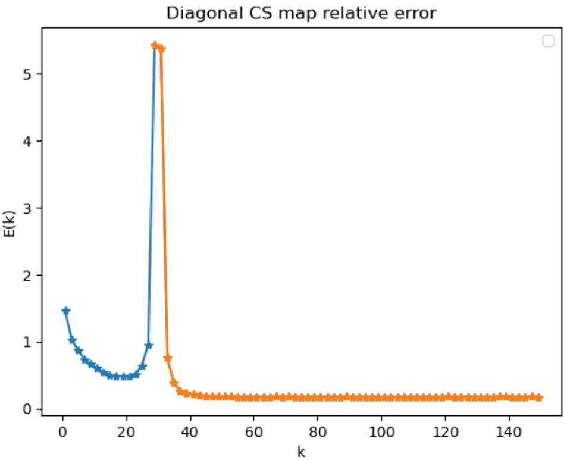

# Full-Model Optimality for Tunable Linear Generative Priors in Compressed Sensing

Zhaoming Li∗

Paul Hand†

## Abstract

Generative models have been studied experimentally and theoretically as priors for inverse problems such as compressed sensing. Recent work by Gunn et al. studied the use of generative priors with tunable complexity, where a family of generative priors with varying complexity is maintained and a specific complexity can be selected at inversion time. They demonstrated that lower reconstruction errors can be experimentally attained for a variety of inverse problems by appropriately tuning the complexity of the generative prior. In the present paper, we establish theory for compressed sensing in the setting of a tunable family of linear generative priors naturally related through their singular value decompositions. We prove that in noiseless Gaussian compressed sensing, the full-dimensional linear prior attains the minimum expected reconstruction error over the entire family of linear priors. Thus, in this idealized linear noiseless setting, tuning to a lower-complexity prior does not improve the expected reconstruction error. This result is in contract to the behavior of denoising, where lower complexity priors attain lower reconstruction errors due to a standard bias-variance tradeof. This result indicates that the experimental benefits of tunability in compressed sensing with neural network priors arises due to nonlinearities in the generative models.

## 1 Introduction

Compressed sensing concerns the recovery of an unknown signal $x ^ { \star } \in \mathbb { R } ^ { n }$ from a limited number of linear measurements

$$
y = A x ^ { \star } + \eta ,
$$

where $A \in \mathbb { R } ^ { m \times n }$ is a measurement operator (e.g., a linear projection, convolutional blur, or other transformation)[19] with $m \ll n ,$ , and $\eta \in \mathbb { R } ^ { m }$ denotes measurement noise. A wide range of practical problems can be formulated as a recovery of an unknown signal from the noisy linear measurements, such as medical imaging[14, 23, 22], signal processing[16], and computational sensing[13] and singlepixel imaging. The above problem is ill-posed due to the compressive nature of the linear operator, meaning that there are infinitely many signals that fit the given measurements. Hence one needs additional assumptions to overcome the inherent ill-posedness.

To enable successful recovery in such severely underdetermined settings, one must impose structural assumptions on the unknown signal $x ^ { \star }$ . Classical compressed sensing theory exploits lowdimensional structure, such as sparsity [3, 20, 4, 7] in a known basis or low-rank [9, 2, 17] structure for matrix recovery, to regularize the inverse problem. Although finding the sparsest solution to an underdetermined system of linear equations is NP-hard, convex relaxations such as $\ell _ { 1 }$ minimization can provably recover the true sparse signal $x ^ { \star }$ under suitable conditions on the measurement matrix, such as the Restricted Isometry Property or related Restricted Eigenvalue Condition. These models admit elegant theory and strong recovery guarantees.

More recently, there has been a surge of interest in the use of generative models as signal structure prior in inverse problems. Motivated by the success of compressed sensing using generative models, a growing body of work studies recovery under the assumption that $x ^ { \star }$ lies in, or is wellapproximated by, the range of a generative model. In this framework, the compressed sensing problem can be viewed as finding $x \in \mathbb { R } ^ { n }$ such that $y = A x$ , subject to the constraint that $x \in$ Range(Gk), where $\mathcal { G } _ { k } : \mathbb { R } ^ { k }  \mathbb { R } ^ { n }$ denotes a generative model that maps a low dimensional latent variable to a high dimensional signal. In practice, generative priors are typically employed through a two-stage workflow:

1. Training: A generative model is trained in an unsupervised learning on a representative dataset, independently of any specific downstream inverse problem; and

2. Inversion: At deployment time, an optimization problem is solved using the fixed, trained model to enforce consistency with the observed measurements.

This isolation enables the use of rich, data-driven signal models that can be developed independently of the downstream inverse problem and reused across multiple measurement settings. A commonality of much of the existing literature is that the complexity of the generative model is fixed at training time. While the notion of complexity may vary across model classes, for example, being implicitly determined by the network architectural choices in GANs[1] or by the latent dimensionality in normalizing flows (NFs) [8], it cannot be adjusted once the model has been trained. As a result, once a generative model has been trained, its complexity is fixed and cannot be adapted to the inverse problem at hand.

To address the issue of selecting model complexity at inversion time, recent work[11] has introduced generative priors with vary complexity, in which a single trained model implicitly represents a family of signal classes indexed by a complexity parameter. We refer to such a family as tunable because its latent dimension can be selected at inversion time. This tunable idea provides a different perspective on how generative priors can be deployed. Rather than committing to a single model complexity at training time, one can defer the choice of complexity until deployment, when the measurement operator, noise level, and sampling rate are fully specified. Empirical studies[11] demonstrate that reconstruction performance depends on this choice: as the model complexity varies, the reconstruction error often exhibits a non-monotone, U-shaped behavior that depends on factors such as the noise level and the number of measurements, with an intermediate complexity often yielding the best recovery.These observations suggest that it is worthwhile to train a tunable generative model in advance, so that its complexity can be selected for the specific inverse problem encountered at test time.

Beyond empirical observations, recent work by Gunn et al. [11] provides theoretical insight into tunable generative priors in a simplified setting. Specifically, it analyzes the problem of denoising under additive Gaussian noise using a family of linear generative models indexed by a complexity parameter. In this setting, where the forward operator is the identity and all signal coordinates are observed, the expected reconstruction error can be computed explicitly as a function of the model complexity. The resulting characterization reveals a non-monotone, U-shaped dependence of the reconstruction error on the complexity parameter, reflecting a fundamental trade-of between underfitting the signal and overfitting the noise. In particular, the analysis shows that the optimal model complexity depends on the noise level, with higher noise favoring simpler models.

Our goal is to determine whether the benefits of tunability observed experimentally in compressed sensing with generative priors already arise in the simplest linear setting. This leads to a natural baseline question: can a lower-complexity prior outperform the full prior when the generator is linear and the target signal is itself drawn from the full model? The answer is not implied by the existing denoising theory. In denoising, the benefit of an intermediate model complexity is explained by a trade-of between underfitting the signal and overfitting the measurement noise. That mechanism is absent in the noiseless compressed sensing problem considered here. At the same time, because the measurement operator is underdetermined, one might expect that discarding weak spectral directions could improve reconstruction by restricting the feasible set. We show that this does not occur under the fully averaged risk over the Gaussian signal and measurement ensembles. For the tunable linear family $\{ \mathcal { G } _ { k } \} _ { k = 1 } ^ { n }$ obtained by truncating the singular-value decomposition of the full model $G _ { n } .$ the expected reconstruction error satisfies $E ( n ) \leq E ( k ) , 1 \leq k \leq n$ Thus, the full generative model attains the minimum expected reconstruction error throughout the family. This conclusion holds for every admissible decreasing singular-value spectrum, including spectra concentrated in a small number of dominant directions. Hence, even when the signal distribution is efectively low-dimensional, the bias introduced by spectral truncation is not compensated by an improvement in reconstruction error.

Our result identifies noiseless Gaussian compressed sensing with linear generative priors as a baseline setting in which tunability does not improve the expected reconstruction error. In particular, linear spectral truncation alone cannot account for the gains observed experimentally with more general generative priors. The contrast suggests that such gains depend on mechanisms absent from the present model, such as nonlinear generator geometry, measurement noise, structured sensing operators, or properties of the reconstruction algorithm. An important direction for future work is to determine which of these mechanisms can rigorously produce a tunability efect, particularly for nonlinear generators such as ReLU networks, noisy compressed sensing, phase retrieval, and other nonlinear inverse problems.

## 1.1 Methodology

In this paper, we study tunable generative priors in the case of linear generative models. A generative model induces a probability distribution on the signal space by pushing forward a latent random variable. In the linear setting, this means that signals are generated according to

$$
\begin{array} { r } { x = G z , \qquad z \sim \mathcal { N } ( 0 , I ) , } \end{array}\tag{1.1}
$$

where $G$ is a matrix, we say that G maps a latent variable to the ambient signal space.

We fix an invertible matrix $G _ { n } \in \mathbb { R } ^ { n \times n }$ and write its singular value decomposition as

$$
G _ { n } = U \Sigma V ^ { \top } , \qquad \Sigma = \mathrm { d i a g } ( \sigma _ { 1 } , \dots , \sigma _ { n } ) , \qquad \sigma _ { 1 } \geq \cdot \cdot \cdot \geq \sigma _ { n } > 0 ,\tag{1.2}
$$

where $U , V \in \mathbb { R } ^ { n \times n }$ are orthogonal matrices.

For each $k \in [ n ]$ , we define a k-dimensional generative model as follows. Let

$$
\mathcal { G } _ { k } : = U _ { k } \Sigma _ { k } \in \mathbb { R } ^ { n \times k } ,\tag{1.3}
$$

where $U _ { k }$ consists of the first k columns of $U _ { ; }$ , and $\Sigma _ { k } = \mathrm { d i a g } ( \sigma _ { 1 } , . . . , \sigma _ { k } )$ . Each $\mathcal { G } _ { k }$ induces a probability distribution by (1.1), which can be verified to be $x \sim \mathcal { N } ( 0 , \mathcal { G } _ { k } \mathcal { G } _ { k } ^ { T } )$

The family $\{ \mathcal { G } _ { k } \} _ { k = 1 } ^ { n }$ is therefore a nested hierarchy of linear generative priors, ordered by model dimensionality. Observe that although ${ \mathcal { G } } _ { n }$ and $\mathrm { G } _ { n }$ are diferent as matrices, they induce an identical

distribution for x. Note that the reduced model $\mathcal { G } _ { k }$ captures the k directions of largest variance of the full Gaussian prior.

We consider a compressed sensing problem in which the signal is sampled from the fulldimensional generative model,

$$
\begin{array} { r } { x ^ { \star } = G _ { n } z ^ { \star } , \qquad z ^ { \star } \sim { \mathcal N } ( 0 , I _ { n } ) , } \end{array}
$$

and the measurements are noiseless and Gaussian:

$$
y = A x ^ { \star } , \qquad A \in \mathbb { R } ^ { m \times n } , \qquad A _ { i j } \sim { \mathcal { N } } ( 0 , 1 ) , \qquad m \ll n .\tag{1.4}
$$

1

$$
\widehat { \boldsymbol { x } } ( \boldsymbol { k } ) = \mathcal { G } _ { \boldsymbol { k } } \widehat { \boldsymbol { z } } ( \boldsymbol { k } ) , \qquad \widehat { \boldsymbol { z } } ( \boldsymbol { k } ) = \left\{ \begin{array} { l l } { \mathop { \mathrm { a r g } } \underset { z _ { \boldsymbol { k } } \in \mathbb { R } ^ { k } } { \operatorname* { m i n } } \frac { 1 } { 2 } \| z _ { \boldsymbol { k } } \| _ { 2 } ^ { 2 } \quad \mathrm { s u b j e c t ~ t o } \quad y = A \mathcal { G } _ { \boldsymbol { k } } z _ { \boldsymbol { k } } , \quad \boldsymbol { k } \geq m , } \\ { \mathop { \mathrm { a r g } } \underset { z _ { \boldsymbol { k } } \in \mathbb { R } ^ { k } } { \operatorname* { m i n } } \frac { 1 } { 2 } \| A \mathcal { G } _ { \boldsymbol { k } } z _ { \boldsymbol { k } } - y \| _ { 2 } ^ { 2 } , } & { \boldsymbol { k } \leq m . } \end{array} \right.\tag{1.5}
$$

The central quantity in this paper is the expected reconstruction error across the model complexities $k \colon$

$$
\mathrm { E } ( k ) : = \mathrm { E } _ { A } \mathrm { E } _ { x ^ { \star } \sim \mathcal { G } _ { n } } \| \hat { x } ( k ) - x ^ { \star } \| _ { 2 } ^ { 2 } = \mathrm { E } _ { A } \mathrm { E } _ { z ^ { \star } \sim \mathcal { N } ( 0 , I _ { n } ) } \| \mathcal { G } _ { k } \hat { z } ( k ) - \mathcal { G } _ { n } z ^ { \star } \| _ { 2 } ^ { 2 }\tag{1.6}
$$

We emphasize that the signal is sampled from the full-complexity model $G _ { n }$ , whereas reconstruction imaging is performed using a potentially lower-complexity prior $G _ { k }$ . This quantity captures how reconstruction quality varies with the chosen model dimension k, and in particular whether a generative prior of lower latent dimension can outperform the full prior.

## 1.2 Main results

Our main results concern the expected reconstruction error for noiseless compressed sensing under a nested family of linear generative models, as specified in (1.4). The main theorem shows that, in the noiseless linear setting, choosing a lower-dimensional model at inversion time cannot outperform the full model.

Theorem 1 (Noiseless optimality of the full model). Fix an invertible matrix $G _ { n } \in \mathbb { R } ^ { n \times n }$ with singular value decomposition

$$
{ \cal G } _ { n } = U \Sigma V ^ { \top } , \ \Sigma = \mathrm { d i a g } ( \sigma _ { 1 } , \dots , \sigma _ { n } ) , \ \sigma _ { 1 } \geq \cdot \cdot \cdot \geq \sigma _ { n } > 0 ,
$$

where $U , V \in \mathbb { R } ^ { n \times n }$ are orthogonal. For each $k \in [ n ]$ , define the rank-k linear generative model

$$
\mathcal G _ { k } : = U _ { k } \Sigma _ { k } \in \mathbb { R } ^ { n \times k } , \qquad \Sigma _ { k } : = \mathrm { d i a g } ( \sigma _ { 1 } , \dots , \sigma _ { k } ) ,
$$

where $U _ { k }$ consists of the first k columns of U. Let $A \in \mathbb { R } ^ { m \times n }$ have i.i.d. $\mathcal { N } ( 0 , 1 )$ entries, where $2 \leq m \leq n$ . Let $z ^ { \star } \sim \mathcal { N } ( 0 , I _ { n } )$ be independent of A, and define

$$
x ^ { \star } : = G _ { n } z ^ { \star } , \qquad y : = A x ^ { \star } .
$$

For each $k \in [ n ]$ , let $\widehat { x } ( k )$ be the reconstruction signal obtained from the model $\mathcal { G } _ { k }$ according to the reconstruction rule (1.5), and let $E ( k )$ denote the expected reconstruction error defined in $( 1 . 6 ) . ^ { 2 }$ Then

$$
E ( n ) \leq E ( k ) \qquad f o r \ e v e r y \ k \in [ n ] .
$$

Theorem 1 establishes that noiseless compressed sensing with linear generative priors does not exhibit a tunability efect. Specifically, if the underlying signal is sampled from an invertible linear model, then using any corresponding lower-rank linear model as a signal prior results in an expected reconstruction error no smaller than that obtained using the full model. This conclusion holds for every admissible decreasing singular value spectrum of the full-dimensional model. In particular, it applies even when the signal model is efectively low-dimensional.

The proof of Theorem 1 is divided into three regimes according to the value of the latent dimension k relative to the measurement dimension $m .$ For $m + 1 \leq k \leq n$ , the latent reconstruction problem is underdetermined. In this regime, we derive an exact expression for the expected reconstruction error and show that $E ( k )$ is finite and monotone decreasing in k. For the two critical dimensions $k = m - 1$ and $k = m$ , the exact error formulas involve first inverse moments of Gaussian Gram matrices that are infinite. Consequently, $E ( m - 1 ) = E ( m ) = + \infty$ . For $1 \leq k \leq m - 2$ the reconstruction problem is strictly overdetermined. We derive an exact formula for $E ( k )$ and compare it with an upper bound for the full-model error $E ( n )$ , obtaining $E ( k ) \geq E ( n )$ . Combining the conclusions from the three regimes shows that $E ( n ) \ \leq \ E ( k )$ for every $k \in [ n ]$ , and proves Theorem 1.

We first record the monotonicity result in the underdetermined regime.

Theorem 2. Under the assumptions of Theorem 1, the expected reconstruction error $E ( k )$ is finite, and E(k) is monotone decreasing for every $k \in \{ m + 1 , \ldots , n \}$

In the critical regime, the expected reconstruction error is infinite at both $k = m - 1$ and $k = m$ This happens because the relevant Gaussian matrices can be arbitrarily close to singular, causing the inverse terms in the reconstruction error to have nonintegrable tails. Thus, although the estimators are well-defined almost surely, their expected reconstruction errors satisfy $E ( m - 1 ) = E ( m ) = + \infty$

Proposition 3. Under the assumptions of Theorem 1, assume $2 \leq m < n$ . Then the expected reconstruction error diverges:

$$
E ( m - 1 ) = + \infty , \qquad E ( m ) = + \infty .
$$

Combining Theorem 2 with Proposition 3, we can rule out all model dimensions at and above the measurement threshold, except for the full model. Indeed, Proposition 3 gives $E ( m ) = + \infty$ , while Theorem 2 implies $E ( n ) \leq E ( k )$ for every $m + 1 \leq k \leq n$ . Therefore, $E ( n ) \leq E ( k )$ for every $m \leq$ $k \leq n$ . No model dimension m $\leq k \leq n$ can outperform the full model. Moreover, Proposition 3 also gives $E ( m - 1 ) = + \infty$ , which rules out the endpoint $k = m - 1$ of the overdetermined regime. Hence the only lower-dimensional models that remain to be compared with the full model are $1 \leq k \leq m - 2$

Our next result the strictly overdetermined regime $1 \leq k \leq m - 2$ . In this regiem, the reconstruction error admits an exact closed-form expression, which will later allow us to compare the lower-dimensional model with the full model.

Lemma 1. Under the same model assumptions as Theorem 1, for every integer $k \in \{ 1 , \ldots , m - 2 \}$ , error of the MAP estimator using the model $\mathcal { G } _ { k }$ satisfies

$$
E ( k ) = \left( 1 + { \frac { k } { m - k - 1 } } \right) \sum _ { i = k + 1 } ^ { n } \sigma _ { i } ^ { 2 } \geq E ( n ) .
$$

Lemma 1 gives an exact formula for $E ( k )$ when $1 \leq k \leq m - 2$ and shows that $E ( k ) \geq E ( n )$ Hence the full model is optimal throughout the strictly overdetermined regime.

Our analysis directly studies reconstruction error in expectation, rather than establishing a highprobability or asymptotic upper bound. This difers from much of the standard non-asymptotic compressed sensing literature, where recovery guarantees are often stated as deterministic consequences of conditions such as the restricted isometry property or null-space property [6, 10], together with high-probability results showing that random measurement matrices satisfy these conditions [6, 5, 10]. By contrast, in our linear generative setting we derive an exact decomposition of the expected reconstruction error under the Gaussian measurement ensemble. These expressions make the dependence of $E ( k )$ on the latent dimension explicit: for $k < m$ , they give a closed-form formula, while for $k \geq m$ , they yield monotonicity of the risk. Combining the two regimes shows that the full prior $G _ { n }$ minimizes the expected reconstruction error over the entire tunable linear family. Hence the noiseless linear model serves as a baseline case in which tunability is available at the level of model selection, but does not improve the fully expected reconstruction error.

## 1.3 Experimental validation

We numerically illustrate Theorem 1 for several representative singular-value spectra. We set $n = 1 0 0$ and $m = 2 0$ . By the diagonal reduction in Lemma 2, it sufices to take $G _ { n } = \Sigma =$ d $\operatorname { l i a g } ( \sigma _ { 1 } , \ldots , \sigma _ { n } )$ . We consider the following five spectra:

• Flat spectrum:

$$
\sigma _ { i } = 1 , \qquad 1 \leq i \leq n .
$$

• Step spectrum:

$$
\sigma _ { i } = \left\{ 1 , \quad \ i \leq k _ { 0 } , \quad \quad k _ { 0 } = \lfloor m / 7 \rfloor = 2 . \right.
$$

• Power-law spectrum:

$$
\sigma _ { i } = i ^ { - \alpha } , \qquad \alpha = 2 .
$$

• Exponential spectrum:

$$
\sigma _ { i } = e ^ { - \beta ( i - 1 ) } , \qquad \beta = 0 . 1 .
$$

• Linear spectrum:

$$
\sigma _ { i } = \left\{ \begin{array} { l l } { 1 , } & { n = 1 , } \\ { 1 - \varepsilon \frac { i - 1 } { n - 1 } , \ \varepsilon = 1 , } & { o t h e r w i s e . } \end{array} \right.
$$

Rather than solving the reconstruction problem separately for each realization, we evaluate the expected reconstruction error using the analytical expressions derived above. For $1 \leq k \leq m - 2$ we compute $E ( k )$ directly from (2.26). For $m + 1 \leq k \leq n$ , we evaluate the expression in (2.6) and approximate its remaining expectation over the measurement matrix using $T = 1 0 0$ independent matrices $A \in \mathbb { R } ^ { m \times n }$ with i.i.d. $\mathcal { N } ( 0 , 1 )$ entries. The expectation over the Gaussian latent variable has already been evaluated analytically in these formulas. The same samples of A are used to estimate $E ( n )$ . We omit $k = m - 1$ and $k = m$ , since $E ( m - 1 ) = E ( m ) = + \infty .$ . Figure 1 displays the singular-value spectra in the top row and the corresponding excess errors $E ( k ) - E ( n )$ in the bottom row, for $k \in \{ 1 , \ldots , m - 2 \} \cup \{ m + 1 , \ldots , n \}$ . A positive excess error means that the model $\mathcal { G } _ { k }$ has larger expected reconstruction error than the full model ${ \mathcal { G } } _ { n }$

  
Figure 1: Singular-value spectra (top) and corresponding excess reconstruction errors $E ( k ) - E ( n )$ (bottom), with $n = 1 0 0$ and $m = 2 0$ . The dimensions $k = m - 1$ and $k = m ,$ indicated by vertica dashed lines, are omitted because their expected reconstruction errors are infinite.  
Alt text: Two rows of plots showing five singular-value spectra (top) and the corresponding excess reconstruction errors $E ( k ) - E ( n )$ versus latent dimension k (bottom). Vertical dashed

$$
{ \mathrm { l i n e s ~ m a r k } } \ k = m - 1 { \mathrm { ~ a n d ~ } } k = m .
$$

Across all five spectra, $E ( k ) - E ( n )$ is nonnegative, in agreement with Theorem 1. For some spectra, $E ( k )$ is non-monotone and may exhibit a U-shaped profile in the strictly overdetermined regime $1 \leq k \leq m - 2$ . Nevertheless, these local minima remain above $E ( n )$ . In the underdetermined regime $m + 1 \leq k \leq n$ , the error decreases monotonically toward the full-model error. Thus, although $E ( k )$ can vary non-monotonically with the dimension over overdetermined regime, in all of the experiments reported above, the minimum reconstruction error is attained by the full model $k = n$

## 1.4 Discussion

The results of this paper provide a complete characterization of the efect of model dimension in the noiseless linear Gaussian setting. For $1 \leq k \leq m - 2$ , the closed-form expression for $E ( k )$ yields the direct comparison $E ( k ) \geq E ( n )$ . At the two critical dimensions $k = m - 1$ and $k = m ,$ the expected reconstruction error diverges, while for $k \geq m + 1 , E ( k )$ is finite and monotonically decreasing. Combining these three regimes gives $E ( n ) \leq E ( k ) , 1 \leq k \leq n$ . Thus, although the dependence of $E ( k )$ on the dimension may be locally non-monotone, the full model is globally optimal within the nested family of linear generative priors considered here.

An important consequence is that efective low-dimensionality of the signal distribution is not, by itself, suficient to produce a tunability benefit. The full-model optimality result holds for every admissible decreasing singular-value spectrum, including spectra in which most of the signal variance is concentrated in a small number of leading directions. Hence, even when the full model is efectively low-dimensional, truncating the weak spectral directions cannot reduce the fully averaged reconstruction error below that of the full prior. In this setting, the bias introduced by restricting the signal model is never compensated by a suficient reduction in reconstruction error.

These conclusions also clarify the scope of the linear theory. They show that tunability observed in more general inverse problems cannot be explained solely by spectral concentration or by the underdetermined nature of the measurement system. Rather, such behavior must arise from mechanisms that are absent from the present noiseless linear Gaussian model. In particular, a tunability benefit may become possible when the generative model is nonlinear, when the measurement map is nonlinear, or when both forms of nonlinearity are present. Other departures from the present setting, including measurement noise or algorithm-dependent efects, may also alter the dependence of reconstruction error on model complexity. Determining which of these mechanisms is responsible for tunability, and how it interacts with the choice of latent dimension, remains an important direction for future work.

## 1.5 Organization of the paper

The remainder of the paper is organized as follows. Subsection 1.6 introduces the notation used throughout the paper. In Section 2, we present the architecture of the proof of Theorem 1. The proof is divided into three regimes. Section 2.3, we consider underdetermined regime m $+ 1 \leq k \leq n ,$ we prove that $E ( k )$ is monotone decreasing in k. In section $2 . 5 .$ , it is a strictly overdetermined regime $1 \leq k \leq m - 2$ , we derive a closed-form expression for $E ( k )$ and compare it with the full-model error. Finally, in Section 2.6 we consider the boundary dimensions $k = m - 1$ and $k = m$ , we show that the expected reconstruction error diverges.

## 1.6 Notation

We introduce notation that will be used throughout the proofs of the monotonicity result for $k \geq m$ Theorem 2, and the closed-form risk formula for $k < m$ , Lemma 1. This notation is also used in the proof of Theorem 1, which combines the two regimes to show that the full model minimizes the expected reconstruction error over the entire tunable linear family. Let $[ n ] = \{ 1 , \dots , n \}$ . For $A \in \mathbb { R } ^ { m \times n } , k \in [ n ]$ , we will write $A _ { k }$ as the first k columns of $A , { \widetilde { A _ { k } } }$ as the last $n - k$ columns of A. Thus $A = \left\lceil A _ { k } , \widetilde { A _ { k } } \right\rceil$ . Let $a _ { i } \in \mathbb { R } ^ { m }$ be the i-th column of A. In the case of a diagonal $\mathrm { G } _ { k }$ in Theorem 2 we can write ${ \mathrm { G } } _ { n } = { \binom { G _ { k } } { 0 } } \ { \frac { 0 } { G _ { k } } } )$ , where $\mathrm { G } _ { k } = d i a g ( \sigma _ { 1 } , \dots , \sigma _ { k } ) , \widetilde { G } _ { k } = d i a g ( \sigma _ { k + 1 } , \dots , \sigma _ { n } )$ . For any $M \in \mathbb { R } ^ { n \times k }$ with $k \leq n$ , suppose M is full rank; let $P _ { M ^ { T } } = M ^ { T } \Big ( M M ^ { T } \Big ) ^ { - 1 } M$ be the orthogonal projection on ${ \mathrm { R a n g e } } ( { \mathrm { M } } )$ . Abusing notation, when we write $( M _ { 1 } - { \dot { M } } _ { 2 } ) _ { i i } , $ it means $( M _ { 1 } ) _ { i i } - ( M _ { 2 } ) _ { i i }$

## 2 Proof of the main theorem

The proof of Theorem 1 has three components. First, we reduce the analysis to diagonal generators in Section 2.1. This reduction stated in Lemma 2, follows from the rotational invariance of the Gaussian measurement operator and shows that $E ( k )$ depends only on the singular values of $G _ { n }$ Consequently, it sufices to study $\boldsymbol { G } _ { n } = \Sigma = \mathrm { d i a g } ( \sigma _ { 1 } , . . . , \sigma _ { n } )$ . Second, we analyze the expected reconstruction error across the diferent model complexity regimes, and treating the two dimensions adjacent to the measurement threshold separately. In Section 2.3, for $k \geq m$ , we derive an exact decomposition that yields the monotonicity of $E ( k )$ , this monotonicity result follows from an explicit analysis of the projection structure induced by the measurement operator. Hence the full model $G _ { n }$ minimizes the expected reconstruction error within the regime $k \geq m$ . In Section 2.5, for $k < m$ we derive the corresponding decomposition and find the closed formula of expected reconstruction error. This formula makes explicit how the reconstruction error depends on the latent dimension and the singular-value spectrum in the regime where the number of measurements exceeds the latent dimension. Finally, in Section 2.6, we complete the proof by handling the two remaining critical dimensions $k = m - 1$ and $k = m$ , where the corresponding inverse Gaussian terms have non-integrable tails.

## 2.1 Reduction to diagonal generators

Lemma 2. Let $G _ { n } = U \Sigma V ^ { \top }$ and let $\mathcal { G } _ { k } = U _ { k } \Sigma _ { k }$ . Under Gaussian measurements, the expected reconstruction error $E ( k )$ depends only on the singular values $( \sigma _ { 1 } , \ldots , \sigma _ { n } )$ . Consequently, it sufices to prove Theorem 1 in the diagonal case

$$
G _ { n } = \Sigma = \operatorname { d i a g } ( \sigma _ { 1 } , \dots , \sigma _ { n } ) .
$$

Proof of Lemma 2. Without loss of generality, it sufices to consider the case when ${ \mathrm { G } } _ { n }$ is diagonal, that is $U = V = I$ . To see this, let $\mathrm { G } _ { n } = U \Sigma V ^ { T }$ and $\mathcal { G } _ { k } = U _ { k } \Sigma _ { k }$ . First we define

$$
\widehat { z } ( k , A , \mathcal { G } _ { k } ) = \left\{ \begin{array} { l l } { \underset { z _ { k } \in \mathbb { R } ^ { k } } { \arg \operatorname* { m i n } } \ \frac { 1 } { 2 } \| z _ { k } \| _ { 2 } ^ { 2 } \quad \mathrm { s . t . } \quad y = A \mathcal { G } _ { k } z _ { k } , } & { \mathrm { f o r ~ } k \geq m , } \\ { \underset { z _ { k } \in \mathbb { R } ^ { k } } { \arg \operatorname* { m i n } } \ \frac { 1 } { 2 } \| y - A \mathcal { G } _ { k } z _ { k } \| _ { 2 } ^ { 2 } , } & { \mathrm { f o r ~ } k < m . } \end{array} \right.
$$

Observe that ${ \hat { x } } ( k ) = { \mathcal G } _ { k } { \hat { z } } ( k , A , U _ { k } \Sigma _ { k } ) = U _ { k } \Sigma _ { k } { \hat { z } } ( k , A , U _ { k } \Sigma _ { k } ) $ . The expected reconstruction error satisfies:

$$
\begin{array} { r l } & { \mathrm { E } ( k ) : = \mathrm { E } _ { A } \mathrm { E } _ { x ^ { \star } \sim \mathcal { G } _ { n } } \| \hat { x } ( k ) - x ^ { \star } \| _ { 2 } ^ { 2 } } \\ & { \quad \quad = \mathrm { E } _ { A } \mathrm { E } _ { z ^ { \star } \sim \mathcal { N } ( 0 , I _ { n } ) } \| \mathcal { G } _ { k } \hat { z } ( k , A , U _ { k } \Sigma _ { k } ) - \mathcal { G } _ { n } z ^ { \star } \| _ { 2 } ^ { 2 } } \\ & { \quad \quad = \mathrm { E } _ { A } \mathrm { E } _ { z ^ { \star } } \| U _ { k } \Sigma _ { k } \hat { z } ( k , A , U _ { k } \Sigma _ { k } ) - U \Sigma z ^ { \star } \| _ { 2 } ^ { 2 } } \\ & { \quad \quad = \mathrm { E } _ { A } \mathrm { E } _ { z ^ { \star } } \left\| U \left( \begin{array} { l } { \Sigma _ { k } } \\ { 0 } \end{array} \right) \hat { z } ( k , A , U _ { k } \Sigma _ { k } ) - U \Sigma z ^ { \star } \right\| _ { 2 } ^ { 2 } } \\ & { \quad \quad = E _ { A } \mathrm { E } _ { z ^ { \star } } \left\| \left( \begin{array} { l } { \Sigma _ { k } } \\ { 0 } \end{array} \right) \hat { z } ( k , A , U _ { k } \Sigma _ { k } ) - \Sigma z ^ { \star } \right\| _ { 2 } ^ { 2 } , } \end{array}\tag{2.1}
$$

where the second-to-last equation is given by the unitary invariance of the $\ell _ { 2 }$ norm. It remains to show that $\operatorname { E } ( k )$ does not depend on U.

Observe $\hat { z } ( k , A , U _ { k } \Sigma _ { k } ) = \hat { z } ( k , A U , \binom { \Sigma _ { k } } { 0 } )$ . Thus,

$$
\begin{array} { r l r } & { } & { \mathrm { E } ( k ) = \mathrm { E } _ { A } \mathrm { E } _ { z ^ { \star } } \left\| \left( \begin{array} { c } { \Sigma _ { k } } \\ { 0 } \end{array} \right) \hat { z } ( k , A , U _ { k } \Sigma _ { k } ) - \Sigma z ^ { \star } \right\| _ { 2 } ^ { 2 } } \\ & { } & { = \mathrm { E } _ { A } \mathrm { E } _ { z ^ { \star } } \left\| \left( \begin{array} { c } { \Sigma _ { k } } \\ { 0 } \end{array} \right) \hat { z } ( k , A U , \left( \begin{array} { c } { \Sigma _ { k } } \\ { 0 } \end{array} \right) ) - \Sigma z ^ { \star } \right\| _ { 2 } ^ { 2 } } \\ & { } & { = \mathrm { E } _ { A } \mathrm { E } _ { z ^ { \star } } \left\| \left( \begin{array} { c } { \Sigma _ { k } } \\ { 0 } \end{array} \right) \hat { z } ( k , A , \left( \begin{array} { c } { \Sigma _ { k } } \\ { 0 } \end{array} \right) ) - \Sigma z ^ { \star } \right\| _ { 2 } ^ { 2 } . } \end{array}
$$

where the last equality follows because A and AU are equal in distribution due to the rotational invariance of the Gaussian. This concludes the proof that without loss of generality, we can take $U = V = I$ , which is the case of a diagonal $\mathrm { G } _ { n } = d i a g ( \sigma _ { 1 } , . . . , \sigma _ { n } )$ . By Theorem 2 in Section 1.2, E(k) decreases monotonically over m $\leq k \leq n$ . By Lemma 1 in Section 1.2 , we show that there exist nok over $1 \leq k \leq m$ the reconstruction error $\operatorname { E } ( k )$ beats the $\operatorname { E } ( n )$ □

## 2.2 Proof of Main Result

Proof of Theorem 1. Fix a spectrum $\sigma _ { 1 } \geq . . . \geq \sigma _ { n } > 0$ . We prove that $E ( n ) \leq E ( k )$ for every $k \in \{ 1 , \ldots , n \}$ by splitting the range of k into three regimes around the measurement threshold m.

Let

$$
C ( k ) : = \Big ( 1 + \frac { k } { m - k - 1 } \Big ) \sum _ { i = k + 1 } ^ { n } \sigma _ { i } ^ { 2 } .
$$

Regime 1: $m \textless k \leq n$ . Here $A \mathcal { G } _ { k } \in \mathbb { R } ^ { m \times k }$ is wide, and by Theorem 2, E(k) is monotonic decreasing on $\{ m , \ldots , n \}$ . Hence its minimum over this range is attained at the right endpoint $k = n$ , so

$$
E ( k ) \ \geq \ E ( n ) \qquad { \mathrm { f o r ~ a l l ~ } } m < k \leq n .
$$

Regime 2: $1 \leq k \leq m - 2 .$

$$
E ( k ) = C ( k ) = \Big ( 1 + \frac { k } { m - k - 1 } \Big ) \sum _ { i = k + 1 } ^ { n } \sigma _ { i } ^ { 2 } .
$$

Moreover, by Lemma 1, it provides a bound on the full-model error for every admissible internal rank k satisfying $m - k \geq 2$

$$
E ( n ) \ \leq \ \left( 1 + { \frac { k } { m - k - 1 } } \right) \sum _ { i = k + 1 } ^ { n } \sigma _ { i } ^ { 2 } \ = \ C ( k ) .
$$

Combining the two displays gives $E ( n ) \leq C ( k ) = E ( k )$ for all $1 \leq k \leq m - 2 .$

Regime 3: $k \in \{ m - 1 , m \}$ . These two boundary dimensions are handled by Proposition 3, which states that

$$
E ( m - 1 ) = + \infty , E ( m ) = + \infty .
$$

Since $E ( n )$ is finite by Theorem 2, we immediately obtain

$$
E ( n ) \leq E ( k ) , \qquad k \in m - 1 , m .
$$

The three regimes $1 \leq k \leq m - 2 , \ k \in \{ m - 1 , m \} , \ m + 1 \leq k \leq n$ exhaust $\{ 1 , \ldots , n \}$ , and in each regime we obtained $E ( n ) \leq E ( k )$ . Since the spectrum was arbitrary, the inequality holds for every strictly decreasing admissible spectrum, which completes the proof. □

## 2.3 Main Result for Underdetermined System

Recall without loss of generality, we have assumed that $\mathrm { G } _ { n } = d i a g ( \sigma _ { 1 } , . . . , \sigma _ { n } )$ , then $\mathcal { G } _ { n } = \mathrm { G } _ { n }$ . In this case $\mathcal { G } _ { k } = \binom { \mathrm { G } _ { k } } { 0 } \in \mathbb { R } ^ { n \times k }$ where $\mathrm { G } _ { k } = d i a g ( \sigma _ { 1 } , . . . , \sigma _ { k } )$ . For $k \geq m$

$$
\begin{array} { r l } & { \hat { x } ( k ) = \mathcal G _ { k } \hat { z } ( k ) } \\ & { \hat { z } ( k ) = \underset { z _ { k } \in \mathbb { R } ^ { k } } { \arg \operatorname* { m i n } } \ \frac { 1 } { 2 } \| z _ { k } \| _ { 2 } ^ { 2 } \quad \mathrm { s . t . } \quad y = A \mathcal G _ { k } z _ { k } . } \end{array}\tag{2.2}
$$

Lemma 3. Suppose $x ^ { \star } \sim \mathcal { G } _ { n } , \mathcal { G } _ { n } = d i a g ( \sigma _ { 1 } , \ldots , \sigma _ { n } )$ has singular values $\sigma _ { 1 } \geq \sigma _ { 2 } \geq \cdot \cdot \cdot \geq \sigma _ { n } > 0$ Let $G _ { k } = d i a g ( \sigma _ { 1 } , . . . , \sigma _ { k } )$ . Let $A \in \mathbb { R } ^ { m \times n } , A _ { i j } \stackrel { i . i . d } { \sim } { \mathcal { N } } ( 0 , 1 )$ . For fixed A, for $k \in [ m , n ]$ , and the MAP estimator from (2.2) obeys

$$
\operatorname { E } _ { \boldsymbol { x } ^ { k } \sim \mathcal { G } _ { n } } \left\| \boldsymbol { \hat { x } } ( \boldsymbol { k } ) - \boldsymbol { x } ^ { \star } \right\| _ { 2 } ^ { 2 } = \left\| \boldsymbol { G } _ { k } \boldsymbol { P } _ { G _ { k } ^ { T } A _ { k } ^ { T } } - \boldsymbol { G } _ { k } \right\| _ { F } ^ { 2 } + \left\| \boldsymbol { \widetilde { G } } _ { k } \right\| _ { F } ^ { 2 } + \left\| \boldsymbol { G } _ { k } ( \boldsymbol { A } _ { k } \boldsymbol { G } _ { k } ) ^ { \dagger } \boldsymbol { \widetilde { A } } _ { k } \boldsymbol { \widetilde { G } } _ { k } \right\| _ { F } ^ { 2 } ,
$$

furthermore,

$$
\begin{array} { r } { \mathrm { E } ( k ) = \mathrm { E } _ { A } \mathrm { E } _ { x ^ { \star } \sim \mathcal { G } _ { n } } \big \| \hat { x } ( k ) - x ^ { \star } \big \| _ { 2 } ^ { 2 } } \end{array}
$$

$$
= \mathrm { E } _ { A _ { k } } \left( \lVert G _ { n } \rVert _ { F } ^ { 2 } - \left. G _ { k } ^ { 2 } , P _ { G _ { k } ^ { T } A _ { k } ^ { T } } \right. + \left. G _ { k } ( A _ { k } G _ { k } ) ^ { \dagger } \right. _ { F } ^ { 2 } \sum _ { i = k + 1 } ^ { n } \sigma _ { i } ^ { 2 } \right)
$$

where $P _ { G _ { k } ^ { T } A _ { k } ^ { T } } = G _ { k } ^ { T } A _ { k } ^ { T } ( A _ { k } G _ { k } G _ { k } ^ { T } A _ { k } ^ { T } ) ^ { - 1 } A _ { k } G _ { k } .$

Proof of Lemma 3. By (2.2), the constraint that $\boldsymbol { y } = A \mathcal { G } _ { \boldsymbol { k } } \hat { \boldsymbol { z } } ( \boldsymbol { k } )$ . We write $\begin{array} { r } { z ^ { \star } = \binom { z _ { k } ^ { \star } } { \tilde { z } _ { k } ^ { \star } } } \end{array}$ , where $z _ { k } ^ { \star } \in$ $\mathbb { R } ^ { k } , \ \widetilde { z } _ { k } ^ { \star } \in \mathbb { R } ^ { n - k }$ . As $A \mathcal { G } _ { k } = A _ { k } G _ { k }$ has rank m with probability 1, the solution to (2.2) is ${ \hat { z } } ( k ) =$ $( A _ { k } G _ { k } ) ^ { \dag } A G _ { n } z ^ { \star }$ k , where $( A _ { k } G _ { k } ) ^ { \dagger } = G _ { k } ^ { T } A _ { k } ^ { T } ( A _ { k } G _ { k } G _ { k } ^ { T } A _ { k } ^ { T } ) ^ { - 1 }$   
The expected reconstruction error satisfies:

$$
\begin{array} { r l } { \| \hat { x } - \hat { x } _ { \perp } \| ^ { 2 } \hat { x } ( \hat { t } ) } & { \leq \| \hat { x } _ { \perp } - \hat { x } _ { \perp } , . . . , . , 0 . 0 0 1 \| \hat { x } _ { \perp } \hat { y } ( \hat { t } ) \| ^ { 2 } \hat { \xi } ( \hat { \mathcal { H } } _ { \parallel } ^ { 1 } ) } \\ & { \qquad - \Lambda _ { \perp } [ \hat { x } _ { \perp } \hat { y } _ { \perp } ] ^ { 2 } \hat { \mathcal { H } } ( \hat { \mathcal { H } } _ { \parallel } ^ { 1 } ) - \hat { \mathcal { H } } _ { \perp } ^ { 1 } \hat { \mathcal { H } } _ { \perp } ^ { 1 } \hat { \mathcal { H } } _ { \perp } ^ { 1 } } \\ & { \qquad - \Gamma _ { \mathrm { r e f . } } [ \hat { \mathcal { H } } _ { \mathrm { e f f f } } ^ { 1 } \hat { \mathcal { H } } _ { \perp } ^ { 1 } \hat { \mathcal { H } } _ { \perp } ^ { 1 } - ( \frac { \hat { \mathcal { H } } _ { \mathrm { e f f f } } ^ { 1 } } { \hat { \mathcal { H } } _ { \mathrm { e f f f } } ^ { 1 } } \frac { \hat { \mathcal { H } } _ { \perp } ^ { 1 } } { \hat { \mathcal { H } } _ { \mathrm { e f f } } ^ { 1 } } ) ^ { 2 } ] \hat { \mathcal { H } } _ { \perp } ^ { 1 } } \\ &  \qquad - \Gamma _ { \mathrm { r e f . } } [ \hat { \mathcal { H } } _ { \mathrm { e f f f } } ^ { 1 } \hat { \mathcal { H } } _ { \perp } ^ { 1 } \hat { \mathcal { H } } _ { \perp } ^ { 1 } - ( \frac { \hat { \mathcal { H } } _ { \mathrm { e f f } } ^ { 1 } } { \hat { \mathcal { H } } _ { \mathrm { e f f } } ^ { 1 } } \frac { \hat { \mathcal { H } } _ { \mathrm { e f f } } ^ { 1 } }  \hat { \mathcal { H } } _ { \mathrm { e f f } } ^ \end{array}\tag{2.3}
$$

$$
= \Big \| G _ { k } ( A _ { k } G _ { k } ) ^ { \dagger } A _ { k } G _ { k } - G _ { k } \Big \| _ { F } ^ { 2 } + \Big \| G _ { k } ( A _ { k } G _ { k } ) ^ { \dagger } \widetilde { A _ { k } } \widetilde { G _ { k } } \Big \| _ { F } ^ { 2 } + \| \widetilde { G _ { k } } \| _ { F } ^ { 2 }\tag{2.4}
$$

$$
= \Big \| G _ { k } P _ { G _ { k } ^ { T } A _ { k } ^ { T } } - G _ { k } \Big \| _ { F } ^ { 2 } + \Big \| \widetilde { G _ { k } } \Big \| _ { F } ^ { 2 } + \Big \| G _ { k } ( A _ { k } G _ { k } ) ^ { \dagger } \widetilde { A _ { k } } \widetilde { G _ { k } } \Big \| _ { F } ^ { 2 }\tag{2.5}
$$

(2.3) follows by Lemma 13, and (2.4) follows by Lemma 13 and the fact that $z _ { k } ^ { \star } ,$ and $\widetilde { z _ { k } ^ { \star } }$ are independent with zero mean. By Lemma 4, we get:

$$
\begin{array} { r l } & { \mathbb { E } ( k ) = \| G _ { n } \| _ { F } ^ { 2 } - \mathbb { E } _ { A } \left. G _ { k } ^ { 2 } , P _ { G _ { k } ^ { T } A _ { k } ^ { T } } \right. + \mathbb { E } _ { A } \left\| G _ { k } ( A _ { k } G _ { k } ) ^ { \dagger } \widetilde { A } _ { k } \widetilde { G } _ { k } \right\| _ { F } ^ { 2 } } \\ & { \quad \quad = \| G _ { n } \| _ { F } ^ { 2 } - \mathbb { E } _ { A _ { k } } \left. G _ { k } ^ { 2 } , P _ { G _ { k } ^ { T } A _ { k } ^ { T } } \right. + \mathbb { E } _ { A _ { k } } \left\| G _ { k } ( A _ { k } G _ { k } ) ^ { \dagger } \right\| _ { F } ^ { 2 } \displaystyle \sum _ { i = k + 1 } ^ { n } \sigma _ { i } ^ { 2 } . } \end{array}\tag{2.6}
$$

We now return to the proof of Theorem 2. After deriving the exact expression for $E ( k )$ in the regime $k \geq m$ , we verify that this expression is monotone decreasing in the selected latent dimension k.

Proof of Theorem 2. For fixed A, let $R _ { k } : = \operatorname { E } _ { x ^ { \star } \sim \mathcal { G } _ { n } } \left\| \hat { x } ( k ) - x ^ { \star } \right\| _ { 2 } ^ { 2 } ,$ where ˆx(k) is given by (2.3). By definition, $\operatorname { E } ( k ) = \operatorname { E } _ { A } \left[ R _ { k } \right]$ . Thus, for $m < k \leq n$

$$
\operatorname { E } ( k ) - \operatorname { E } ( k - 1 ) = \operatorname { E } _ { A } \left[ R _ { k } \right] - \operatorname { E } _ { A } \left[ R _ { k - 1 } \right] = \operatorname { E } _ { A } \left[ R _ { k } - R _ { k - 1 } \right] = \operatorname { E } _ { A _ { k - 1 } } \operatorname { E } _ { \widehat { A _ { k - 1 } } } \left[ R _ { k } - R _ { k - 1 } \right] .
$$

In order to show $E ( k ) - E ( k - 1 ) \leq 0$ , we will show that for all full rank $A _ { k - 1 }$

$$
\begin{array} { r } { \mathrm { E } _ { \widetilde { A _ { k - 1 } } } [ R _ { k } - R _ { k - 1 } ] \leq 0 . } \end{array}\tag{2.7}
$$

Since $\widetilde { A _ { k - 1 } } = [ a _ { k } , \widetilde { A _ { k } } ]$ , let $f _ { k } : = \mathrm { E } _ { \widetilde { A _ { k } } } \big [ R _ { k } \big ]$ . Therefore, we have

$$
\mathrm { E } _ { \widetilde { A _ { k - 1 } } } \big [ R _ { k } - R _ { k - 1 } \big ] = \mathrm { E } _ { a _ { k } } \mathrm { E } _ { \widetilde { A _ { k } } } \big [ R _ { k } - R _ { k - 1 } \big ]\tag{2.8}
$$

$$
\operatorname { E } _ { a _ { k } } ( f _ { k } ) - f _ { k - 1 } = \operatorname { E } _ { a _ { k } } ( f _ { k } - f _ { k - 1 } ) .
$$

Hence, for full rank fixed $A _ { k - 1 }$ , it sufices to show that ,

$$
\operatorname { E } _ { a _ { k } } ( f _ { k } - f _ { k - 1 } ) \leq 0 .\tag{2.9}
$$

The remainder of this proof establishes (2.9).

By Lemma $3 , f _ { k }$ is given by

$$
f _ { k } = \left\| { G _ { n } } \right\| _ { F } ^ { 2 } - \left. { G _ { k } ^ { 2 } , P _ { G _ { k } ^ { T } A _ { k } ^ { T } } } \right. + \left\| { G _ { k } } { \left( A _ { k } { G _ { k } } \right) ^ { \dag } } \right\| _ { F } ^ { 2 } \sum _ { i = k + 1 } ^ { n } \sigma _ { i } ^ { 2 } = \left\| { G _ { n } } \right\| _ { F } ^ { 2 } - T _ { 1 } ( k ) + T _ { 2 } ( k ) \sum _ { i = k + 1 } ^ { n } \sigma _ { i } ^ { 2 } ,
$$

where $T _ { 1 } ( k ) = \big \langle G _ { k } ^ { 2 } , P _ { G _ { k } ^ { T } A _ { k } ^ { T } } \big \rangle , T _ { 2 } ( k ) = \big \| G _ { k } \big ( A _ { k } G _ { k } \big ) ^ { \dagger } \big \| _ { F } ^ { 2 }$

Thus,

$$
f _ { k } - f _ { k - 1 } = T _ { 1 } ( k - 1 ) - T _ { 1 } ( k ) - T _ { 2 } ( k - 1 ) \sigma _ { k } ^ { 2 } + \Big ( T _ { 2 } ( k ) - T _ { 2 } ( k - 1 ) \Big ) \sum _ { i = k + 1 } ^ { n } \sigma _ { i } ^ { 2 } .\tag{2.10}
$$

Define $M _ { k } = A _ { k } G _ { k } = \left\lceil M _ { k - 1 } , m _ { k } \right\rceil$ . By Lemma 4, we know

$$
T _ { 1 } ( k ) - T _ { 1 } ( k - 1 ) = \sum _ { i = 1 } ^ { k - 1 } \left( \sigma _ { i } ^ { 2 } - \sigma _ { k } ^ { 2 } \right) \left( P _ { G _ { k } ^ { T } A _ { k } ^ { T } } - P _ { G _ { k - 1 } ^ { T } A _ { k - 1 } ^ { T } } \right) _ { i i } = \sum _ { i = 1 } ^ { k - 1 } \left( \sigma _ { i } ^ { 2 } - \sigma _ { k } ^ { 2 } \right) \left( P _ { M _ { k } ^ { T } } - P _ { M _ { k - 1 } ^ { T } } \right) _ { i i } \quad .
$$

By Lemma 5, we know

$$
T _ { 2 } ( k ) - T _ { 2 } ( k - 1 ) = \sum _ { i = 1 } ^ { k - 1 } \big ( \sigma _ { i } ^ { 2 } - \sigma _ { k } ^ { 2 } \big ) \Big ( M _ { k } ^ { \dagger } \big ( M _ { k } ^ { \dagger } \big ) ^ { T } - M _ { k - 1 } ^ { \dagger } \big ( M _ { k - 1 } \dag ) ^ { T } \Big ) _ { , i i } + \sigma _ { k } ^ { 2 } \bigg ( \mathrm { T r } \left( M _ { k } ^ { \dagger } \big ( M _ { k } ^ { \dagger } \big ) ^ { T } \right) - \mathrm { T r } \left( M _ { k - 1 } ^ { \dagger } \big ( M _ { k - 1 } ^ { \dagger } \big ) ^ { T } \right) \bigg ) .
$$

By (2.24) we induce $T _ { 2 } ( k - 1 )$ , plug $T _ { 1 } ( k - 1 ) - T _ { 1 } ( k ) , T _ { 2 } ( k ) - T _ { 2 } ( k - 1 )$ , and $T _ { 2 } ( k - 1 )$ ’s expressions into the equation (2.10), we get

$$
f _ { k } - f _ { k - 1 } = - \sum _ { i = 1 } ^ { k - 1 } \left( \sigma _ { i } ^ { 2 } - \sigma _ { k } ^ { 2 } \right) \left( P _ { M _ { k } ^ { T } } - P _ { M _ { k - 1 } ^ { T } } \right) _ { i i }
$$

$$
\begin{array} { r l } & { - \displaystyle \sum _ { i = 1 } ^ { k - 1 } \sigma _ { i } ^ { 2 } \Big ( M _ { k - 1 } ^ { \dagger } \big ( M _ { k - 1 } ^ { \dagger } \big ) ^ { T } \Big ) _ { i i } \sigma _ { k } ^ { 2 } } \\ & { + \displaystyle \sum _ { i = 1 } ^ { k - 1 } \big ( \sigma _ { i } ^ { 2 } - \sigma _ { k } ^ { 2 } \big ) \Big ( M _ { k } ^ { \dagger } \big ( M _ { k } ^ { \dagger } \big ) ^ { T } - M _ { k - 1 } ^ { \dagger } \big ( M _ { k - 1 } ^ { \dagger } \big ) ^ { T } \Big ) _ { i i } \sum _ { i = k + 1 } ^ { n } \sigma _ { i } ^ { 2 } } \\ & { + \displaystyle \sigma _ { k } ^ { 2 } \bigg ( \operatorname * { T r } \Big ( M _ { k } ^ { \dagger } \big ( M _ { k } ^ { \dagger } \big ) ^ { T } \Big ) - \operatorname * { T r } \Big ( M _ { k - 1 } ^ { \dagger } \big ( M _ { k - 1 } ^ { \dagger } \big ) ^ { T } \Big ) \bigg ) \sum _ { i = k + 1 } ^ { n } \sigma _ { i } ^ { 2 } . } \end{array}\tag{2.11}
$$

By Lemma 8 we know the upper bound for the last two terms is 0. The first term upper bound is:

$$
\begin{array} { l } { { \displaystyle - \sum _ { i = 1 } ^ { k - 1 } \left( \sigma _ { i } ^ { 2 } - \sigma _ { k } ^ { 2 } \right) \left( P _ { M _ { k } ^ { T } } - P _ { M _ { k - 1 } ^ { T } } \right) _ { i i } = - \sum _ { i = 1 } ^ { k - 1 } \sigma _ { i } ^ { 2 } \left( P _ { M _ { k } ^ { T } } - P _ { M _ { k - 1 } ^ { T } } \right) _ { i i } + \sum _ { i = 1 } ^ { k - 1 } \sigma _ { k } ^ { 2 } \left( P _ { M _ { k } ^ { T } } - P _ { M _ { k - 1 } ^ { T } } \right) _ { i i } } } \\ { { \displaystyle \qquad \le - \sum _ { i = 1 } ^ { k - 1 } \sigma _ { i } ^ { 2 } \left( P _ { M _ { k } ^ { T } } - P _ { M _ { k - 1 } ^ { T } } \right) _ { i i } } , } \end{array}
$$

where the inequality follows from Lemma 5.

Therefore,

$$
f _ { k } - f _ { k - 1 } \leq - \sum _ { i = 1 } ^ { k - 1 } \sigma _ { i } ^ { 2 } \Big ( P _ { M _ { k } ^ { T } } - P _ { M _ { k - 1 } ^ { T } } \Big ) _ { i i } - \sum _ { i = 1 } ^ { k - 1 } \sigma _ { i } ^ { 2 } \Big ( { M _ { k - 1 } ^ { \dagger } } { M _ { k - 1 } } ^ { \dagger T } \Big ) _ { i i } \sigma _ { k } ^ { 2 }
$$

From Lemma 9 we know that,

$$
- \sum _ { i = 1 } ^ { k - 1 } \sigma _ { i } ^ { 2 } \Big ( P _ { M _ { k } ^ { T } } - P _ { M _ { k - 1 } ^ { T } } \Big ) _ { i i } \leq \sum _ { i = 1 } ^ { k - 1 } \sigma _ { i } ^ { 2 } \bigg [ M _ { k - 1 } ^ { T } \bigg ( \Big ( M _ { k - 1 } M _ { k - 1 } ^ { T } \Big ) ^ { - 1 } m _ { k } m _ { k } ^ { T } \Big ( M _ { k - 1 } M _ { k - 1 } ^ { T } \Big ) ^ { - 1 } \bigg ) M _ { k - 1 } \bigg ] _ { i i } ,
$$

Observe that,

$$
\begin{array} { l } { { \displaystyle \sum _ { i = 1 } ^ { k - 1 } \sigma _ { i } ^ { 2 } \Big ( M _ { k - 1 } ^ { \dagger } M _ { k - 1 } \dag ^ { T } \Big ) _ { i i } \sigma _ { k } ^ { 2 } = \sum _ { i = 1 } ^ { k - 1 } \sigma _ { i } ^ { 2 } \bigg ( M _ { k - 1 } ^ { T } \Big ( M _ { k - 1 } M _ { k - 1 } ^ { T } \Big ) ^ { - 2 } M _ { k - 1 } \bigg ) _ { i i } \sigma _ { k } ^ { 2 } } } \\ { { \displaystyle \qquad = \sum _ { i = 1 } ^ { k - 1 } \sigma _ { i } ^ { 2 } \bigg ( M _ { k - 1 } ^ { T } \Big ( M _ { k - 1 } M _ { k - 1 } ^ { T } \Big ) ^ { - 1 } I _ { m } \sigma _ { k } ^ { 2 } \Big ( M _ { k - 1 } M _ { k - 1 } ^ { T } \Big ) ^ { - 1 } M _ { k - 1 } \bigg ) _ { i i } . } } \end{array}
$$

Therefore, we have

$$
f _ { k } - f _ { k - 1 } \leq \sum _ { i = 1 } ^ { k - 1 } \sigma _ { i } ^ { 2 } \bigg ( M _ { k - 1 } ^ { T } \Big ( M _ { k - 1 } M _ { k - 1 } ^ { T } \Big ) ^ { - 1 } \Big ( m _ { k } m _ { k } ^ { T } - I _ { m } \sigma _ { k } ^ { 2 } \Big ) \Big ( M _ { k - 1 } M _ { k - 1 } ^ { T } \Big ) ^ { - 1 } M _ { k - 1 } \bigg ) _ { i i } .\tag{2.12}
$$

In order to establish (2.10), we take the expectation of (2.12) with respect to $a _ { k }$ , and using $m _ { k } =$ $\sigma _ { k } a _ { k }$ , and $a _ { k } \sim N ( 0 , I _ { m } )$ . Following the isotropy property $\mathrm { E } _ { a _ { k } } ( m _ { k } m _ { k } ^ { T } ) = \sigma _ { k } ^ { 2 } I _ { m }$ . We obtain

$$
\begin{array} { l } { { \displaystyle \mathrm { E } _ { a _ { k } } ( f _ { k } - f _ { k - 1 } ) \leq \mathrm { E } _ { a _ { k } } \left[ \displaystyle \sum _ { i = 1 } ^ { k - 1 } \sigma _ { i } ^ { 2 } \bigg ( M _ { k - 1 } ^ { T } \Big ( M _ { k - 1 } M _ { k - 1 } ^ { T } \Big ) ^ { - 1 } \Big ( m _ { k } m _ { k } ^ { T } - I _ { m } \sigma _ { k } ^ { 2 } \Big ) \Big ( M _ { k - 1 } M _ { k - 1 } ^ { T } \Big ) ^ { - 1 } M _ { k - 1 } \bigg ) _ { i i } \right] _ { i \neq j } + } } \\ { { \displaystyle = \sum _ { i = 1 } ^ { k - 1 } \sigma _ { i } ^ { 2 } \bigg ( M _ { k - 1 } ^ { T } \Big ( M _ { k - 1 } M _ { k - 1 } ^ { T } \Big ) ^ { - 1 } E _ { a _ { k } } \Big ( m _ { k } m _ { k } ^ { T } - I _ { m } \sigma _ { k } ^ { 2 } \Big ) \Big ( M _ { k - 1 } M _ { k - 1 } ^ { T } \Big ) ^ { - 1 } M _ { k - 1 } \bigg ) _ { i i } } } \end{array}\tag{2.13}
$$

## 2.4 Auxiliary Lemmas for the Underdetermined Regime

The proof of monotonicity in the regime $k \geq m$ relies on several projection identities. We collect these auxiliary lemmas here.

Lemma 4. Let $G _ { n } = \mathrm { d i a g } ( \sigma _ { 1 } , \ldots , \sigma _ { n } ) = \left( \begin{array} { c c } { { G _ { k } } } & { { 0 } } \\ { { 0 } } & { { \widetilde { G } _ { k } } } \end{array} \right) $ , where $\sigma _ { i }$ is decreasing. Let $A \in \mathbb { R } ^ { m \times n }$ $A _ { i j } \stackrel { i . i . d } { \sim } \mathcal { N } ( 0 , 1 )$ . Then the following expectation identities hold:

$$
\begin{array} { r } { \mathrm { E } _ { A } \left\| G _ { k } P _ { M _ { k } ^ { T } } - G _ { k } \right\| _ { F } ^ { 2 } + \| \widetilde { G _ { k } } \| _ { F } ^ { 2 } = \left\| G _ { n } \right\| _ { F } ^ { 2 } - \mathrm { E } _ { A _ { k } } \langle G _ { k } ^ { 2 } , P _ { M _ { k } ^ { T } } \rangle . } \end{array}\tag{2.14}
$$

$$
\operatorname { E } _ { A } \left\| { G } _ { k } ( M _ { k } ) ^ { \dag } M _ { k } \right\| _ { F } ^ { 2 } = \operatorname { E } _ { A _ { k } } \left\| { G } _ { k } ( M _ { k } ) ^ { \dag } \right\| _ { F } ^ { 2 } \sum _ { i = k + 1 } ^ { n } \sigma _ { i } ^ { 2 } .\tag{2.15}
$$

Proof of Lemma $\it 4 .$ First, we show (2.14)

$$
\begin{array} { r l } { \mathbb { E } _ { 1 } \Bigg [ \mathbb { E } _ { \hat { \sigma } } \rho _ { S , \eta _ { \xi } ^ { \prime \prime } } } & { \mathbb { E } _ { 1 } \Bigg [ ( \frac { 1 } { \hat { \sigma } } ) ^ { 2 } \rho _ { S , \eta _ { \xi } ^ { \prime \prime } } \mathbb { E } _ { 1 } \Bigg [ ( \frac { 1 } { \hat { \sigma } } ) \rho _ { S , \eta _ { \xi } ^ { \prime \prime } } \mathbb { E } _ { 1 } \Bigg ] ^ { 2 } \Bigg ] } \\ & { \quad - \mathbb { E } _ { \hat { \sigma } } \Bigg [ \mathbb { E } _ { \hat { \sigma } } \rho _ { S , \eta _ { \xi } ^ { \prime \prime } } \mathbb { E } _ { 1 } \Bigg [ ( \frac { 1 } { \hat { \sigma } } ) \rho _ { S , \eta _ { \xi } ^ { \prime \prime } } \mathbb { E } _ { 1 } \Bigg [ ( \frac { 1 } { \hat { \sigma } } ) \rho _ { S , \eta _ { \xi } ^ { \prime } } \mathbb { E } _ { 1 } \Bigg ] ^ { 2 } \Bigg ] \ ( \frac { 1 } { \hat { \sigma } } ) \Bigg ] } \\ & { \quad - \mathbb { E } _ { \hat { \sigma } } \Bigg [ ( \mathbb { E } _ { \hat { \sigma } } \rho _ { S , \eta _ { \xi } ^ { \prime \prime } } \mathbb { E } _ { 1 } \Bigg [ ( \frac { 1 } { \hat { \sigma } } ) \rho _ { S , \eta _ { \xi } ^ { \prime \prime } } \mathbb { E } _ { 1 } \Bigg ] ^ { 2 } \Bigg ] \ ( \frac { 1 } { \hat { \sigma } } ) \Bigg ] ^ { 2 } \Bigg ] } \\ &  \quad - \mathbb { E } _ { \hat { \sigma } } \Bigg [ ( \mathbb { E } _ { \hat { \sigma } } \rho _ { S , \eta _ { \xi } ^ { \prime \prime } } \mathbb { E } _ { 1 } ^ { 2 } - \mathbb { E } _ { \hat { \sigma } } \rho _ { S , \eta _ { \xi } ^ { \prime \prime } } \mathbb { E } _  1  \end{array}
$$

where (2.16) follows by $P ^ { 2 } = P$ , and $P ^ { T } = P$ . The last equality holds because $\left\| G _ { n } \right\| _ { F } ^ { 2 } - \Bigl \langle G _ { k } ^ { 2 } , P _ { M _ { k } ^ { T } } \Bigr \rangle$ is independent of $\widetilde { A _ { k } }$

Next, we want to show (2.15),

$$
\begin{array} { r l } & { \mathrm { E } _ { A } \Big \| G _ { k } \big ( M _ { k } \big ) ^ { \dagger } \widetilde { M _ { k } } \Big \| _ { F } ^ { 2 } = \mathrm { E } _ { A _ { k } } \mathrm { E } _ { \widetilde { A _ { k } } } \Big \| G _ { k } \big ( M _ { k } \big ) ^ { \dagger } \widetilde { M _ { k } } \Big \| _ { F } ^ { 2 } } \\ & { \qquad = \mathrm { E } _ { A _ { k } } \mathrm { E } _ { \widetilde { A _ { k } } } \Big \langle G _ { k } \big ( M _ { k } \big ) ^ { \dagger } \widetilde { M _ { k } } , G _ { k } \big ( M _ { k } \big ) ^ { \dagger } \widetilde { M _ { k } } \Big \rangle } \\ & { \qquad = \mathrm { E } _ { A _ { k } } \bigg \langle \Big ( G _ { k } \big ( M _ { k } \big ) ^ { \dagger } \Big ) ^ { T } G _ { k } \big ( M _ { k } \big ) ^ { \dagger } , \mathrm { E } _ { \widetilde { A _ { k } } } \Big ( \widetilde { M _ { k } } \widetilde { M _ { k } } ^ { T } \Big ) \bigg \rangle } \end{array}
$$

$$
= \mathrm { E } _ { A _ { k } } \bigg \langle \Big ( G _ { k } \big ( M _ { k } \big ) ^ { \dagger } \Big ) ^ { T } G _ { k } \big ( M _ { k } \big ) ^ { \dagger } , \sum _ { i = k + 1 } ^ { n } \sigma _ { i } ^ { 2 } \mathrm { E } _ { a _ { i } } \big ( a _ { i } a _ { i } ^ { T } \big ) \bigg \rangle\tag{2.17}
$$

$$
\begin{array} { r l } & { = \mathrm { E } _ { A _ { k } } \bigg \langle \Big ( G _ { k } \big ( M _ { k } \big ) ^ { \dagger } \Big ) ^ { T } G _ { k } \big ( M _ { k } \big ) ^ { \dagger } , \underset { i = k + 1 } { \overset { n } { \sum } } \sigma _ { i } ^ { 2 } I \bigg \rangle } \\ & { = \mathrm { E } _ { A _ { k } } \bigg \langle \Big ( G _ { k } \big ( M _ { k } \big ) ^ { \dagger } \Big ) ^ { T } G _ { k } \big ( M _ { k } \big ) ^ { \dagger } , I \bigg \rangle \underset { i = k + 1 } { \overset { n } { \sum } } \sigma _ { i } ^ { 2 } } \\ & { = \mathrm { E } _ { A _ { k } } \bigg \Vert G _ { k } \big ( M _ { k } \big ) ^ { \dagger } \bigg \Vert _ { F } ^ { 2 } \underset { i = k + 1 } { \overset { n } { \sum } } \sigma _ { i } ^ { 2 } . } \end{array}\tag{2.18}
$$

Here, by the independence of columns of $\mathrm { A } ,$ we can induce (2.17) to (2.18).

Lemma 5. Let $M _ { k } = \lceil M _ { k - 1 } , m _ { k } \rceil$ be a matrix ∈ Rm×k, where $M _ { k } \in \mathbb { R } ^ { m \times k }$ has full rank, $m _ { k } \in \mathbb { R } ^ { m }$ and $k > m . \ \forall i \in [ k - 1 ]$ , we have $\left( P _ { M _ { k } ^ { T } } \right) _ { i i } \leq \left( P _ { M _ { k - 1 } ^ { T } } \right) _ { i i } .$

Proof of Lemma 5. Since it $M _ { k } ^ { T }$ has full column rank, we can express this projector explicitly as

$$
\begin{array} { r l } & { P _ { M _ { k } ^ { T } } = M _ { k } ^ { T } \big ( M _ { k } M _ { k } ^ { T } \big ) ^ { - 1 } M _ { k } } \\ & { \qquad = M _ { k } ^ { T } \Bigg ( \big [ M _ { k - 1 } , m _ { k } \big ] \binom { M _ { k - 1 } ^ { T } } { m _ { k } ^ { T } } \Bigg ) ^ { - 1 } M _ { k } } \\ & { \qquad = M _ { k } ^ { T } \Big ( M _ { k - 1 } M _ { k - 1 } ^ { T } + m _ { k } m _ { k } ^ { T } \Big ) ^ { - 1 } M _ { k } } \end{array}
$$

Evaluating the (i, i) entry, where $i \in [ k - 1 ]$ , let $e _ { i } ^ { \prime } \in \mathbb { R } ^ { k - 1 } , e _ { i } \in \mathbb { R } ^ { k }$

$$
\begin{array} { r l } & { \left( P _ { M _ { k } ^ { T } } \right) _ { i i } = e _ { i } ^ { T } P _ { M _ { k } ^ { T } } e _ { i } } \\ & { \qquad = e _ { i } ^ { T } M _ { k } ^ { T } \left( M _ { k - 1 } M _ { k - 1 } ^ { T } + m _ { k } m _ { k } ^ { T } \right) ^ { - 1 } M _ { k } e _ { i } } \\ & { \qquad = e _ { i } ^ { T } \left[ \begin{array} { l } { M _ { k - 1 } ^ { T } } \\ { 0 } \end{array} \right] \left( M _ { k - 1 } M _ { k - 1 } ^ { T } + m _ { k } m _ { k } ^ { T } \right) ^ { - 1 } \left[ M _ { k - 1 } \quad 0 \right] e _ { i } } \\ & { \qquad \le ( e _ { i } ^ { \prime } ) ^ { T } M _ { k - 1 } ^ { T } \Big ( M _ { k - 1 } M _ { k - 1 } ^ { T } \Big ) ^ { - 1 } M _ { k - 1 } e _ { i } ^ { \prime } } \\ & { \qquad = \left( P _ { M _ { k - 1 } ^ { T } } \right) _ { i i } } \end{array}
$$

The inequality follows from $\begin{array} { r } { M _ { k - 1 } M _ { k - 1 } ^ { T } + m _ { k } m _ { k } ^ { T } \succeq M _ { k - 1 } M _ { k - 1 } ^ { T } , ~ \mathrm { s o } ~ \left( M _ { k - 1 } M _ { k - 1 } ^ { T } + m _ { k } m _ { k } ^ { T } \right) ^ { - 1 } \preceq } \end{array}$ $\left( M _ { k - 1 } M _ { k - 1 } ^ { T } \right) ^ { - 1 }$ □

We now use the above lemma to prove the following lemma.

Lemma 6. Under the same assumptions as Lemma 3, for fixed $m \in [ 1 , n ] , \ k \in [ m + 1 , n ]$ , let $T _ { 1 } ( k ) = \left. G _ { k } ^ { 2 } , P _ { G _ { k } ^ { T } A _ { k } ^ { T } } \right. = \left. G _ { k } ^ { 2 } , P _ { M _ { k } ^ { T } } \right.$ ，

$$
T _ { 1 } ( k ) - T _ { 1 } ( k - 1 ) = \sum _ { i = 1 } ^ { k - 1 } \left( \sigma _ { i } ^ { 2 } - \sigma _ { k } ^ { 2 } \right) \left( P _ { M _ { k } ^ { T } } - P _ { M _ { k - 1 } ^ { T } } \right) _ { i i } \leq 0\tag{2.19}
$$

and $T _ { 1 } ( k )$ is decreasing monotonically.

Proof of Lemma 6. Observe that,

$$
\begin{array} { r l } & { T _ { 1 } ( k ) = \langle G _ { k } ^ { 2 } , P _ { M _ { k } ^ { T } } \rangle } \\ & { \quad \quad = \displaystyle \sum _ { i = 1 } ^ { k - 1 } \sigma _ { i } ^ { 2 } \big ( P _ { M _ { k } ^ { T } } \big ) _ { i i } + \sigma _ { k } ^ { 2 } \big ( P _ { M _ { k } ^ { T } } \big ) _ { k k } } \\ & { \quad \quad = \displaystyle \sum _ { i = 1 } ^ { k - 1 } \sigma _ { i } ^ { 2 } \big [ P _ { M _ { k - 1 } ^ { T } } + P _ { M _ { k } ^ { T } } - P _ { M _ { k - 1 } ^ { T } } \big ] _ { i i } + \sigma _ { k } ^ { 2 } \big ( P _ { M _ { k } ^ { T } } \big ) _ { k k } } \\ & { \quad \quad \quad = T _ { 1 } ( k - 1 ) + \displaystyle \sum _ { i = 1 } ^ { k - 1 } \sigma _ { i } ^ { 2 } \big ( P _ { M _ { k } ^ { T } } - P _ { M _ { k - 1 } ^ { T } } \big ) _ { i i } + \sigma _ { k } ^ { 2 } \big ( P _ { M _ { k } ^ { T } } \big ) _ { k k } } \end{array}
$$

Noting that $\begin{array} { r } { \mathrm { T r } ( P _ { M _ { k } ^ { T } } ) = \sum _ { i = 1 } ^ { k } ( P _ { M _ { k } ^ { T } } ) _ { i i } = m } \end{array}$

$$
\begin{array} { r l } { T _ { 1 } ( E _ { 1 } ^ { * } ) - T _ { 1 } ( k - 1 ) } & { \overset { k = - 1 } { \longrightarrow } \sigma _ { \tau } ^ { 2 } \big ( P _ { M _ { k } ^ { * } } - P _ { M _ { k - 1 } ^ { * } } \big ) _ { i k } + \sigma _ { k } ^ { 2 } \big ( P _ { M _ { k } ^ { * } } \big ) _ { k k } } \\ & { \quad \quad \quad \quad \quad \quad \quad \quad \quad \quad \quad \quad \quad \quad \quad \quad \quad \quad \quad \quad \quad \quad \quad \quad \quad \quad \quad \quad \quad \quad \quad \quad \quad \quad \quad \quad \quad \quad } \\ & { \quad \quad \quad \quad \quad \quad \quad \quad \quad \quad \quad \quad \quad \quad \quad \quad \quad \quad \quad \quad \quad \quad \quad \quad \quad \quad \quad \quad \quad \quad \quad \quad \quad \quad \quad \quad \quad \quad \quad \quad \quad \quad \quad \quad } \\ & { \quad \quad \quad \quad \quad \quad \quad \quad \quad \quad \quad \quad \quad \quad \quad \quad \quad \quad \quad \quad \quad \quad \quad \quad \quad \quad \quad \quad \quad \quad \quad \quad \quad \quad \quad \quad \quad \quad \quad \quad \quad \quad \quad \quad \quad } \\ & { \quad \quad \quad \quad \quad \quad \quad \quad \quad \quad \quad \quad \quad \quad \quad \quad \quad \quad \quad \quad \quad \quad \quad \quad \quad \quad \quad \quad \quad \quad \quad \quad \quad \quad \quad \quad \quad \quad \quad \quad \quad \quad \quad \quad \quad \quad } \\ & { \quad \quad \quad \quad \quad \quad \quad \quad \quad \quad \quad \quad \quad \quad \quad \quad \quad \quad \quad \quad \quad \quad \quad \quad \quad \quad \quad \quad \quad \quad \quad \quad \quad \quad \quad \quad \quad \quad \quad \quad \quad \quad \quad } \\ & { \quad \quad \quad \quad \quad \quad \quad \quad \quad \quad \quad \quad \quad \quad \quad \quad \quad \quad \quad \quad \quad \quad \quad \quad \quad \quad \quad \quad \quad \quad \quad \quad \quad \quad \quad \quad \quad \quad \quad \quad \quad } \\ &  \quad \quad \quad \quad \quad \quad \quad \quad \quad \quad \quad \quad \quad \quad \quad \quad \quad \quad \quad \quad \quad \quad \quad \quad \quad \quad \quad \ \end{array}
$$

The second equality follows $\begin{array} { r } { \mathrm { T r } ( P _ { M _ { k } ^ { T } } ) = \sum _ { i = 1 } ^ { k } ( P _ { M _ { k } ^ { T } } ) _ { i i } = \sum _ { i = 1 } ^ { k - 1 } ( P _ { M _ { k } ^ { T } } ) _ { i i } + ( P _ { M _ { k } ^ { T } } ) _ { k k } = m } \end{array}$

The third equality follows $\begin{array} { r } { \mathrm { T r } ( P _ { M _ { k - 1 } ^ { T } } ) = \sum _ { i = 1 } ^ { k - 1 } \left( P _ { M _ { k - 1 } ^ { T } } \right) _ { i i } = m . } \end{array}$

Lemma 7. Let $M _ { k } = \left\lceil M _ { k - 1 } , m _ { k } \right\rceil \in \mathbb { R } ^ { m \times k }$ be a matrix $\in \mathbb { R } ^ { m \times k }$ , where $M _ { k - 1 } \in \mathbb { R } ^ { m \times ( k - 1 ) }$ has full rank, $m _ { k } \in \mathbb { R } ^ { m }$ and $k \geq m$

$$
\operatorname { T r } \left( M _ { k - 1 } ^ { \dagger } ( M _ { k - 1 } { } ^ { \dagger } ) ^ { T } \right) \geq \operatorname { T r } \left( M _ { k } ^ { \dagger } ( M _ { k } { } ^ { \dagger } ) ^ { T } \right)\tag{2.20}
$$

and

$$
\left( M _ { k - 1 } ^ { \dagger } ( M _ { k - 1 } { } ^ { \dagger } ) ^ { T } \right) _ { i i } \geq \left( M _ { k } ^ { \dagger } ( M _ { k } { } ^ { \dagger } ) ^ { T } \right) _ { i i }\tag{2.21}
$$

∀i $\in [ k - 1 ]$

Proof of Lemma 7.

$$
\begin{array} { r l } & { M _ { k } ^ { \dagger } = M _ { k } ^ { T } \Big ( M _ { k } M _ { k } ^ { T } \Big ) ^ { - 1 } } \\ & { \qquad = \binom { M _ { k - 1 } ^ { T } } { m _ { k } ^ { T } } \Big ( M _ { k - 1 } M _ { k - 1 } ^ { T } + m _ { k } m _ { k } ^ { T } \Big ) ^ { - 1 } , } \end{array}
$$

here $M _ { k - 1 } M _ { k - 1 } ^ { T } , m _ { k } m _ { k } ^ { T }$ all PSD matrix.

$$
\begin{array} { r l } & { M _ { k } ^ { \dagger } ( M _ { k } ^ { \dagger } ) ^ { T } = \left( \begin{array} { l } { M _ { k - 1 } ^ { T } } \\ { m _ { k } ^ { T } } \end{array} \right) \bigg ( M _ { k - 1 } M _ { k - 1 } ^ { T } + m _ { k } m _ { k } ^ { T } \bigg ) ^ { - 1 } \bigg ( M _ { k - 1 } M _ { k - 1 } ^ { T } + m _ { k } m _ { k } ^ { T } \bigg ) ^ { - 1 } \left( M _ { k - 1 } \ m _ { k } \right) } \\ & { \quad \quad \quad = \left( \begin{array} { l } { M _ { k - 1 } ^ { T } } \\ { m _ { k } ^ { T } } \end{array} \right) \bigg ( M _ { k - 1 } M _ { k - 1 } ^ { T } + m _ { k } m _ { k } ^ { T } \bigg ) ^ { - 2 } \left( M _ { k - 1 } \ m _ { k } \right) } \\ & { \quad \quad \quad \lesssim \left( \begin{array} { l } { M _ { k - 1 } ^ { T } } \\ { m _ { k } ^ { T } } \end{array} \right) \bigg ( M _ { k - 1 } M _ { k - 1 } ^ { T } \bigg ) ^ { - 2 } \left( M _ { k - 1 } \ m _ { k } \right) } \\ & { \quad \quad \quad = \left( \begin{array} { l l } { M _ { k - 1 } ^ { T } ( M _ { k - 1 } M _ { k - 1 } ^ { T } ) ^ { - 2 } M _ { k - 1 } } & { M _ { k - 1 } ^ { T } ( M _ { k - 1 } M _ { k - 1 } ^ { T } ) ^ { - 2 } m _ { k } } \\ { m _ { k } ^ { T } ( M _ { k - 1 } M _ { k - 1 } ^ { T } ) ^ { - 2 } M _ { k - 1 } } & { m _ { k } ^ { T } ( M _ { k - 1 } M _ { k - 1 } ^ { T } ) ^ { - 2 } m _ { k } } \end{array} \right) } \end{array}
$$

We are using trace to investigate the behavior of $M _ { k } ^ { \dagger } ( M _ { k } ^ { \dagger } ) ^ { T }$ and $M _ { k - 1 } ^ { \dagger } ( M _ { k - 1 } \ L ^ { \dagger } ) ^ { T }$ on both sides.

$$
\begin{array} { r l } & { \mathrm { T r } ( M _ { k - 1 } ^ { \dagger } \Big ( M _ { k - 1 } \dag ) ^ { T } ) = \mathrm { T r } ( M _ { k - 1 } ^ { T } \Big ( M _ { k - 1 } M _ { k - 1 } ^ { T } \Big ) ^ { - 2 } M _ { k - 1 } ) } \\ & { \qquad =  I , M _ { k - 1 } ^ { T } \Big ( M _ { k - 1 } M _ { k - 1 } ^ { T } \Big ) ^ { - 1 } \Big ( M _ { k - 1 } M _ { k - 1 } ^ { T } \Big ) ^ { - 1 } M _ { k - 1 }  } \\ & { \qquad =  M _ { k - 1 } ^ { T } M _ { k - 1 } , \Big ( M _ { k - 1 } M _ { k - 1 } ^ { T } \Big ) ^ { - 2 }  } \\ & { \qquad =  I , \Big ( M _ { k - 1 } M _ { k - 1 } ^ { T } \Big ) ^ { - 1 }  } \end{array}
$$

$$
\begin{array} { r l } & { \mathrm { T r } \left( M _ { k } ^ { \dagger } \big ( M _ { k } ^ { \dagger } \big ) ^ { T } \right) = \mathrm { T r } \left( M _ { k - 1 } ^ { T } \Big ( M _ { k - 1 } M _ { k - 1 } ^ { T } + m _ { k } m _ { k } ^ { T } \Big ) ^ { - 2 } M _ { k - 1 } + m _ { k } ^ { T } \Big ( M _ { k - 1 } M _ { k - 1 } ^ { T } + m _ { k } m _ { k } ^ { T } \Big ) ^ { - 2 } m _ { k } \right) } \\ & { \qquad = \left. I , M _ { k - 1 } ^ { T } \Big ( M _ { k - 1 } M _ { k - 1 } ^ { T } + m _ { k } m _ { k } ^ { T } \Big ) ^ { - 2 } M _ { k - 1 } \right. + \left. I , m _ { k } ^ { T } \Big ( M _ { k - 1 } M _ { k - 1 } ^ { T } + m _ { k } m _ { k } ^ { T } \Big ) ^ { - 2 } m _ { k } \right. } \\ & { \qquad = \left. M _ { k - 1 } ^ { T } M _ { k - 1 } , \Big ( M _ { k - 1 } M _ { k - 1 } ^ { T } + m _ { k } m _ { k } ^ { T } \Big ) ^ { - 2 } \right. + \left. m _ { k } ^ { T } m _ { k , \cdot } \Big ( M _ { k - 1 } M _ { k - 1 } ^ { T } + m _ { k } m _ { k } ^ { T } \Big ) ^ { - 2 } \right. } \\ & { \qquad = \left. M _ { k - 1 } ^ { T } M _ { k - 1 } + m _ { k } ^ { T } m _ { k , \cdot } \Big ( M _ { k - 1 } M _ { k - 1 } ^ { T } + m _ { k } m _ { k } ^ { T } \Big ) ^ { - 2 } \right. } \\ & { \qquad = \left. I , \Big ( M _ { k - 1 } M _ { k - 1 } ^ { T } + m _ { k } m _ { k } ^ { T } \Big ) ^ { - 1 } \right. } \end{array}
$$

Since $\left( M _ { k - 1 } M _ { k - 1 } ^ { T } + m _ { k } m _ { k } ^ { T } \right) ^ { - 1 } \preccurlyeq \left( M _ { k - 1 } M _ { k - 1 } ^ { T } \right) ^ { - 1 }$ , we proved Tr $( M _ { k - 1 } ^ { \dagger } { ( M _ { k - 1 }  ^ { \dagger } } ) ^ { T } ) \geq \operatorname { T r } ( M _ { k } ^ { \dagger } { ( M _ { k } ^ { \dagger } ) ^ { T } } )$ For entry-wise perspective, we have:

$$
\begin{array} { r } { \bigg ( M _ { k } ^ { \dagger } \big ( M _ { k } ^ { \dagger } \big ) ^ { T } \bigg ) _ { i i } = \bigg \langle e _ { i } e _ { i } ^ { T } , M _ { k } ^ { T } \Big ( M _ { k - 1 } M _ { k - 1 } ^ { T } + m _ { k } m _ { k } ^ { T } \Big ) ^ { - 2 } M _ { k } \bigg \rangle } \\ { = \bigg \langle M _ { k } e _ { i } e _ { i } ^ { T } M _ { k } ^ { T } , \Big ( M _ { k - 1 } M _ { k - 1 } ^ { T } + m _ { k } m _ { k } ^ { T } \Big ) ^ { - 2 } \bigg \rangle } \end{array}
$$

Since $i \in [ k - 1 ]$ , So we can use $M _ { k - 1 }$ substitute $M _ { k }$

$$
\begin{array} { r l } & { = \left. M _ { k - 1 } e _ { i } e _ { i } ^ { T } M _ { k - 1 } ^ { T } , \left( M _ { k - 1 } M _ { k - 1 } ^ { T } + m _ { k } m _ { k } ^ { T } \right) ^ { - 2 } \right. } \\ & { = \left. e _ { i } e _ { i } ^ { T } , M _ { k - 1 } ^ { T } \Big ( M _ { k - 1 } M _ { k - 1 } ^ { T } + m _ { k } m _ { k } ^ { T } \Big ) ^ { - 2 } M _ { k - 1 } \right. } \end{array}
$$

$$
\begin{array} { r l } & { \leq \bigg \langle e _ { i } e _ { i } ^ { T } , M _ { k - 1 } ^ { T } \Big ( M _ { k - 1 } M _ { k - 1 } ^ { T } \Big ) ^ { - 2 } M _ { k - 1 } \bigg \rangle } \\ & { = \bigg ( M _ { k - 1 } ^ { \dagger } \Big ( M _ { k - 1 } ^ { \phantom { \dagger } } \Big ^ { \dagger } \Big ) ^ { T } \bigg ) _ { i i } } \end{array}
$$

which proves the following Lemma.

Lemma 8. Under Lemma 3 assumptions, let $T _ { 2 } ( k ) = \left. G _ { k } ( A _ { k } G _ { k } ) ^ { \dagger } \right. _ { F } ^ { 2 }$ . For all $m \leq k _ { i }$

$$
\begin{array} { r l r } {  { T _ { 2 } ( k ) - T _ { 2 } ( k - 1 ) = \sum _ { i = 1 } ^ { k - 1 } ( \sigma _ { i } ^ { 2 } - \sigma _ { k } ^ { 2 } ) \Big ( M _ { k } ^ { \dagger } \big ( M _ { k } ^ { \dagger } \big ) ^ { T } - M _ { k - 1 } ^ { \dagger } \big ( M _ { k - 1 } \big ) ^ { T } \Big ) _ { , i i } + \sigma _ { k } ^ { 2 } \bigg ( \operatorname { T r } \Big ( M _ { k } ^ { \dagger } \big ( M _ { k } ^ { \dagger } \big ) ^ { T } \Big ) - \operatorname { T r } \Big ( M _ { k - 1 } ^ { \dagger } \big ( M _ { k - 1 } \big ) ^ { T } \Big ) ^ { T } \bigg ) } } \\ & { \leq } & { ( 2 . 2 2 ) } \end{array}
$$

and as a consequence,

$$
\left. { G _ { k } ( A _ { k } G _ { k } ) } ^ { \dagger } \right. _ { F } ^ { 2 } \sum _ { i = k + 1 } ^ { n } \sigma _ { i } ^ { 2 }\tag{2.23}
$$

is monotonically decreasing.

Proof of Lemma 8. Observe that $\scriptstyle \sum _ { i = k + 1 } ^ { n } \sigma _ { i } ^ { 2 }$ decreases as k increases. Therefore, to establish the desired result, it is suficient to show that $\left\| \boldsymbol { G } _ { k } ( \boldsymbol { A } _ { k } G _ { k } ) ^ { \dagger } \right\| _ { F } ^ { 2 }$ is a decreasing function of k. Thus, we want to show:

$$
\begin{array} { r } { \left. G _ { k - 1 } ^ { 2 } , M _ { k - 1 } ^ { \dagger } \Big ( M _ { k - 1 } \dag ^ { T } \Big ) \right. \geq \left. G _ { k - 1 } ^ { 2 } , M _ { k - 1 } ^ { T } \Big ( M _ { k - 1 } M _ { k - 1 } ^ { T } + m _ { k } m _ { k } ^ { T } \Big ) ^ { - 2 } M _ { k - 1 } \right. + \sigma _ { k } ^ { 2 } \Big ( m _ { k } ^ { T } \Big ( M _ { k - 1 } M _ { k - 1 } ^ { T } + m _ { k } m _ { k } ^ { T } \Big ) ^ { - 2 } m _ { k } \Big ) } \end{array}
$$

Recall $M _ { k } ^ { \dagger } = \left( A _ { k } G _ { k } \right) ^ { \dagger } \in \mathbb { R } ^ { k \times m }$

$$
T _ { 2 } ( k ) = \Big \| G _ { k } \big ( A _ { k } G _ { k } \big ) ^ { \dag } \Big \| _ { F } ^ { 2 } = \Big \langle G _ { k } ^ { 2 } , \big ( A _ { k } G _ { k } \big ) ^ { \dag } \big ( A _ { k } G _ { k } \big ) ^ { \dag T } \Big \rangle = \Big \langle G _ { k } ^ { 2 } , M _ { k } ^ { \dag } \big ( M _ { k } ^ { \dag } \big ) ^ { T } \Big \rangle
$$

$$
\begin{array} { r l } & { T _ { 2 } ( k ) = \left. \boldsymbol { G } _ { k } ^ { ( 2 ) } , \boldsymbol { M } _ { k } ^ { \dagger } ( M _ { k } ^ { \dagger } ) ^ { T } \right. } \\ & { \quad = \underset { \underset { i = 1 } { \overset { k - 1 } { \sum } } } { \overset { k - 2 } { \sum } } \sigma _ { i } ^ { 2 } \big ( M _ { k } ^ { \dagger } ( M _ { k } ^ { \dagger } ) ^ { T } \big ) ^ { T } \big \rangle _ { i i } } \\ & { \quad \quad = \underset { \underset { i = 1 } { \overset { k - 1 } { \sum } } } { \overset { k - 1 } { \sum } } \sigma _ { i } ^ { 2 } \big ( M _ { k } ^ { \dagger } ( M _ { k } ^ { \dagger } ) ^ { T } \big ) _ { i i } + \sigma _ { k } ^ { 2 } \big ( M _ { k } ^ { \dagger } ( M _ { k } ^ { \dagger } ) ^ { T } \big ) _ { i k } } \\ & { \quad \quad = \underset { \underset { i = 1 } { \overset { k - 1 } { \sum } } } { \overset { k - 1 } { \sum } } \sigma _ { i } ^ { 2 } \big ( M _ { k } ^ { \dagger } \mid ( M _ { k - 1 } \hat { \Gamma } ) ^ { T } + M _ { k } ^ { \dagger } ( M _ { k } ^ { \dagger } ) ^ { T } - M _ { k - 1 } ^ { \dagger } \big ( M _ { k - 1 } \hat { \Gamma } \big ) ^ { T } \big ) _ { i i } + \sigma _ { k } ^ { 2 } \big ( M _ { k } ^ { \dagger } \big ( M _ { k } ^ { \dagger } \big ) ^ { T } \big ) _ { k k } } \\ &  \quad \quad = \underset { \underset { i = 1 } { \overset { k - 1 } { \sum } } } { \overset { k - 1 } { \sum } } \sigma _ { i } ^ { 2 } \big ( M _ { k } ^ { \dagger } ( M _ { k } ^ { \dagger } ) ^ { T } - M _ { k - 1 } ^ { \dagger } \big ( M _ { k } ^ { \dagger } \big ) ^ { T } \big ) _ { i k } + \sigma _ { k } ^ { 2 } \bigg ( \end{array}
$$

$$
T _ { 2 } ( k ) - T _ { 2 } ( k - 1 ) = \sum _ { i = 1 } ^ { k - 1 } \sigma _ { i } ^ { 2 } \Big ( M _ { k } ^ { \dagger } \big ( M _ { k } ^ { \dagger } \big ) ^ { T } - M _ { k - 1 } ^ { \dagger } \big ( M _ { k - 1 } ^ { \dagger } \big ) ^ { T } \Big ) _ { i i } + \sigma _ { k } ^ { 2 } \Big ( M _ { k } ^ { \dagger } \big ( M _ { k } ^ { \dagger } \big ) ^ { T } \Big ) _ { k k }
$$

$$
\begin{array} { r l } & { \quad \sum _ { k = 1 } ^ { N } \frac { \partial } { \partial x _ { k } ^ { 2 } } \Big ( \partial _ { t } \hat { u } _ { k } ( \hat { u } _ { k } ) \Big ) ^ { p _ { k } } - \mathcal { M } _ { k - 1 } ^ { 2 } \big ( \hat { u } _ { k - 1 } ^ { 2 } \big ) ^ { p _ { k } } \Big ) _ { \alpha } } \\ & { \quad = \underbrace { \mathrm { i } \cdot \mathrm { i } \cdot \mathrm { i } } _ { [ N ] } \Bigg ( \Bigg ( \Delta x _ { k } ^ { 2 } \big ( ( \Delta x _ { k } ^ { 2 } ) ^ { p _ { k } } \big ) _ { N _ { k } } \textbf { S } _ { k } ^ { - 1 } \Big ( \Delta x _ { k - 1 } ^ { p _ { k } } \big ( \hat { u } _ { k } ^ { 2 } \big ) ^ { p _ { k } } - \Delta x _ { k } ^ { 2 } \big ( \Delta x _ { k } ^ { p _ { k } } \big ) ^ { p _ { k } } \Big ) _ { N _ { k } } } \\ & { \quad \quad \quad \quad \quad \quad \quad \quad \quad \quad \quad \quad \quad \quad \quad \quad \quad \quad \quad \quad \quad \quad \quad \quad \quad \quad \quad \quad \quad \quad \quad \quad \quad \quad \quad \quad \quad \quad }  \\ & & { \quad \quad \quad \quad \quad \quad \quad \quad \quad \quad \quad \quad \quad \quad \quad \quad \quad \quad \quad \quad \quad \quad \quad \quad \quad \quad \quad \quad \quad \quad \quad \quad \quad \quad \quad \quad \quad \quad \quad \quad \quad \quad \quad \quad \quad \quad }  \\ & { \quad \quad \quad \quad \quad \quad \quad \quad \quad \quad \quad \quad \quad \quad \quad \quad \quad \quad \quad \quad \quad \quad \quad \quad \quad \quad \quad \quad \quad \quad \quad \quad \quad \quad \quad \quad \quad \quad \quad \quad \quad \quad \quad \quad \quad \quad \quad \quad } \\ &  = \frac { \mathrm { i } \cdot \mathrm { i } } { \omega _ { k } ^ { 2 } } \big \{ \mathrm { i } \cdot \mathrm { i } \cdot \mathrm { i } \cdot \mathrm { i } \cdot \mathrm { i } \cdot \mathrm { i } \cdot \mathrm { i } \cdot \mathrm  \end{array}
$$

Based on Lemma 7, we have

$$
\begin{array} { l } { \displaystyle \sum _ { i = 1 } ^ { k - 1 } \left( { \cal M } _ { k } ^ { \dagger } ( { \cal M } _ { k } ^ { \dagger } ) ^ { T } \right) _ { i i } \le \sum _ { i = 1 } ^ { k - 1 } \left( { \cal M } _ { k - 1 } ^ { \dagger } ( { \cal M } _ { k - 1 } ^ { \dagger } ) ^ { T } \right) _ { i i } } \\ { \displaystyle \quad \mathrm { T r } \left( { \cal M } _ { k } ^ { \dagger } ( { \cal M } _ { k } ^ { \dagger } ) ^ { T } \right) \le \mathrm { T r } \left( { \cal M } _ { k - 1 } ^ { \dagger } ( { \cal M } _ { k - 1 } ^ { \dagger } ) ^ { T } \right) } \end{array}
$$

$$
T _ { 2 } ( k ) - T _ { 2 } ( k - 1 ) \leq 0 .
$$

Lemma 9. Under Lemma $\mathcal { B }$ assumption, let $M _ { k } = A _ { k } G _ { k }$ be a sequence of matrices evolving as $M _ { k } = [ M _ { k - 1 } , m _ { k } ]$ , where $m _ { k } = \sigma _ { k } a _ { k }$ is an additional column vector. The projection matrices associated with these matrices are given by:

$$
P _ { G _ { k } ^ { T } A _ { k } ^ { T } } = P _ { M _ { k } ^ { T } } = M _ { k } ^ { T } ( M _ { k } M _ { k } ^ { T } ) ^ { - 1 } M _ { k } , \quad P _ { G _ { k - 1 } ^ { T } A _ { k - 1 } ^ { T } } = P _ { M _ { k - 1 } ^ { T } } = M _ { k - 1 } ^ { T } ( M _ { k - 1 } M _ { k - 1 } ^ { T } ) ^ { - 1 } M _ { k - 1 } .
$$

Then,

$$
\sum _ { i = 1 } ^ { k - 1 } \sigma _ { i } ^ { 2 } \left( P _ { M _ { k } ^ { T } } - P _ { M _ { k - 1 } ^ { T } } \right) _ { i i } \geq - \sum _ { i = 1 } ^ { k - 1 } \sigma _ { i } ^ { 2 } \left( M _ { k - 1 } ^ { T } \left( \left( M _ { k - 1 } M _ { k - 1 } ^ { T } \right) ^ { - 1 } m _ { k } m _ { k } ^ { T } \left( M _ { k - 1 } M _ { k - 1 } ^ { T } \right) ^ { - 1 } \right) M _ { k - 1 } \right) _ { i i } .\tag{2.25}
$$

Proof of Lemma 9. Since

$$
\begin{array} { l } { { \displaystyle \sum _ { i = 1 } ^ { k - 1 } \sigma _ { i } ^ { 2 } \Big ( P _ { G _ { k } ^ { T } A _ { k } ^ { T } } - P _ { G _ { k - 1 } ^ { T } A _ { k - 1 } ^ { T } } \Big ) _ { i i } = \sum _ { i = 1 } ^ { k - 1 } \sigma _ { i } ^ { 2 } \bigg ( \Big ( M _ { k } ^ { T } \Big ( M _ { k } M _ { k } ^ { T } \Big ) ^ { - 1 } M _ { k } \Big ) _ { i i } - \left( M _ { k - 1 } ^ { T } \Big ( M _ { k - 1 } M _ { k - 1 } ^ { T } \Big ) ^ { - 1 } M _ { k - 1 } \right) _ { i i } \bigg ) } } \\ { { \displaystyle \qquad = \sum _ { i = 1 } ^ { k - 1 } \sigma _ { i } ^ { 2 } \bigg ( \Big ( M _ { k - 1 } ^ { T } \Big ( M _ { k } M _ { k } ^ { T } \Big ) ^ { - 1 } M _ { k - 1 } \Big ) _ { i i } - \left( M _ { k - 1 } ^ { T } \Big ( M _ { k - 1 } M _ { k - 1 } ^ { T } \Big ) ^ { - 1 } M _ { k - 1 } \right) _ { i i } \bigg ) } } \end{array}
$$

$$
= \sum _ { i = 1 } ^ { k - 1 } \sigma _ { i } ^ { 2 } \bigg ( M _ { k - 1 } ^ { T } \bigg ( \Big ( \Big ( M _ { k } M _ { k } ^ { T } \Big ) ^ { - 1 } - \Big ( M _ { k - 1 } M _ { k - 1 } ^ { T } \Big ) ^ { - 1 } \bigg ) M _ { k - 1 } \bigg ) _ { i i }
$$

We know that $\left( M _ { k } M _ { k } ^ { T } \right) ^ { - 1 } = \left( M _ { k - 1 } M _ { k - 1 } ^ { T } + m _ { k } m _ { k } ^ { T } \right) ^ { - 1 }$

By Lemma 16, we know that:

$$
\left( M _ { k - 1 } M _ { k - 1 } ^ { T } + m _ { k } m _ { k } ^ { T } \right) ^ { - 1 } - \left( M _ { k - 1 } M _ { k - 1 } ^ { T } \right) ^ { - 1 } + \left( M _ { k - 1 } M _ { k - 1 } ^ { T } \right) ^ { - 1 } m _ { k } m _ { k } ^ { T } \left( M _ { k - 1 } M _ { k - 1 } ^ { T } \right) ^ { - 1 } \asymp 0
$$

Therefore,

$$
\begin{array} { r l } { \displaystyle \sum _ { i = 1 } ^ { k - 1 } \sigma _ { i } ^ { 2 } \Big ( P _ { G _ { k } ^ { T } A _ { k } ^ { T } } - P _ { G _ { k - 1 } ^ { T } A _ { k - 1 } ^ { T } } \Big ) _ { i i } = } & { { } \displaystyle \sum _ { i = 1 } ^ { k - 1 } \sigma _ { i } ^ { 2 } \bigg ( M _ { k - 1 } ^ { T } \bigg ( \Big ( M _ { k } M _ { k } ^ { T } \Big ) ^ { - 1 } - \Big ( M _ { k - 1 } M _ { k - 1 } ^ { T } \Big ) ^ { - 1 } \bigg ) M _ { k - 1 } \bigg ) _ { i i } } \\ { \displaystyle } & { { } = \displaystyle \sum _ { i = 1 } ^ { k - 1 } \sigma _ { i } ^ { 2 } \bigg ( M _ { k - 1 } ^ { T } \bigg ( \Big ( M _ { k - 1 } M _ { k - 1 } ^ { T } + m _ { k } m _ { k } ^ { T } \Big ) ^ { - 1 } - \Big ( M _ { k - 1 } M _ { k - 1 } ^ { T } \Big ) ^ { - 1 } \bigg ) M _ { k - 1 } \bigg ) _ { i i } } \\ { \geq - \displaystyle \sum _ { i = 1 } ^ { k - 1 } \sigma _ { i } ^ { 2 } \bigg ( M _ { k - 1 } ^ { T } \Big ( M _ { k - 1 } M _ { k - 1 } ^ { T } \Big ) ^ { - 1 } m _ { k } m _ { k } ^ { T } \Big ( M _ { k - 1 } M _ { k - 1 } ^ { T } \Big ) ^ { - 1 } M _ { k - 1 } \bigg ) _ { i i } . } \end{array}
$$

## 2.5 Main Result for Overdetermined System

We now consider the overdetermined regime $1 \leq k \leq m$ . Our goal in this section is to derive an explicit expression for $E ( k )$ and use it to compare $E ( k )$ with the full-model error $E ( n )$

For $k \leq m$ , we know that $\begin{array} { r } { \hat { z } ( \boldsymbol { k } ) = \underset { z _ { \boldsymbol { k } } \in \mathbb { R } ^ { \boldsymbol { k } } } { \arg \operatorname* { m i n } } \frac { 1 } { 2 } \left\| \boldsymbol { A } \mathcal { G } _ { \boldsymbol { k } } \boldsymbol { z } _ { \boldsymbol { k } } - \boldsymbol { y } \right\| _ { 2 } ^ { 2 } . } \end{array}$ Since $A _ { k } G _ { k }$ has full column rank with

probability 1, solving this least-squares problem gives $\hat { z } ( k ) = \left( A _ { k } G _ { k } \right) ^ { \dagger } A G _ { n } z ^ { \star }$ , where $\hat { z } ( k ) \in \mathbb { R } ^ { k }$ $\left( A _ { k } G _ { k } \right) ^ { \dagger } = \left( G _ { k } ^ { T } A _ { k } ^ { T } A _ { k } G _ { k } \right) ^ { - 1 } G _ { k } ^ { T } A _ { k } ^ { T }$ . Here $A _ { k } \in \mathbb { R } ^ { m \times k } , G _ { k } \in \mathbb { R } ^ { k \times k }$

Lemma 10. Suppose $x ^ { \star } \sim \mathcal { G } _ { n } , G _ { n } = d i a g ( \sigma _ { 1 } , \ldots , \sigma _ { n } ) \in \mathbb { R } ^ { n \times n }$ , such that $\sigma _ { 1 } \geq \sigma _ { 2 } \geq \cdot \cdot \cdot \geq \sigma _ { n } > 0$ For any $k \leq m \leq n$ , the random matrix $A \in \mathbb { R } ^ { m \times n }$ with i.i.d. $\mathcal { N } ( 0 , 1 )$ entries, the $M A P$ estimator obeys

$$
\begin{array} { l } { \displaystyle \mathrm { E } ( k ) = \mathrm { E } _ { A } \mathrm { E } _ { x ^ { \star } \sim \mathcal { G } _ { n } } \left\| \hat { { \boldsymbol x } } ( k ) - { \boldsymbol x } ^ { \star } \right\| _ { 2 } ^ { 2 } } \\ { \displaystyle = \sum _ { i = k + 1 } ^ { n } \sigma _ { i } ^ { 2 } + \mathrm { E } _ { A _ { k } } \left\| { \boldsymbol G } _ { k } \big ( { \boldsymbol A } _ { k } { \boldsymbol G } _ { k } \big ) ^ { \dagger } \right\| _ { F } ^ { 2 } \sum _ { i = k + 1 } ^ { n } \sigma _ { i } ^ { 2 } } \end{array}\tag{2.26}
$$

Proof of Lemma 10.

$$
\begin{array} { r l } & { \mathrm { E } ( k ) : = \mathrm { E } _ { A } \mathrm { E } _ { x ^ { \star } \sim \mathcal { G } _ { n } } \left\| \hat { x } ( k ) - x ^ { \star } \right\| _ { 2 } ^ { 2 } } \\ & { \quad \quad \quad = \mathrm { E } _ { A } \mathrm { E } _ { z ^ { \star } \sim \mathcal { N } ( 0 , I _ { n } ) } \left\| \mathcal { G } _ { k } \hat { z } ( k ) - G _ { n } { z } ^ { \star } \right\| _ { 2 } ^ { 2 } } \\ & { \quad \quad \quad = \mathrm { E } _ { A } \mathrm { E } _ { z ^ { \star } } \left\| \left( { \mathrm { G } _ { k } } \right) \hat { z } ( k ) - \left( { G } _ { b } \begin{array} { l l } { { G } _ { k } } & { 0 } \\ { 0 } & { \widetilde { G } _ { k } } \end{array} \right) z ^ { \star } \right\| _ { 2 } ^ { 2 } } \\ & { \quad \quad \quad = \mathrm { E } _ { A } \mathrm { E } _ { z ^ { \star } } \left\| G _ { k } \hat { z } ( k ) - G _ { k } { z } _ { k } ^ { \star } \right\| _ { 2 } ^ { 2 } + \displaystyle \sum _ { i = k + 1 } ^ { n } { \sigma } _ { i } ^ { 2 } } \end{array}
$$

$$
\begin{array} { r l } & { - \mathbb { E } \{ \Delta \mathbf { E } _ { k } \} [ | \mathcal { D } _ { k } ^ { \dagger } ( \hat { \mathbf { A } } _ { k } \hat { \mathbf { G } } _ { k } ^ { \dagger } \hat { \mathbf { A } } _ { k ^ { \prime } } - G _ { k ^ { \prime } } \hat { \mathbf { A } } _ { k ^ { \prime } } ^ { \dagger } ) | ^ { 2 } + \frac { \hat { \mathbf { F } } _ { k ^ { \prime } } ^ { \dagger } } { \sqrt { \Delta \mathbf { E } } } \hat { \mathbf { F } } _ { k ^ { \prime } } ^ { \dagger } ] } \\ & { - \mathbb { E } \{ \Delta \mathbf { E } _ { k ^ { \prime } } \} [ | \mathcal { D } _ { k } ^ { \dagger } ( \hat { \mathbf { A } } _ { k ^ { \prime } } \hat { \mathbf { A } } _ { k ^ { \prime } } ^ { \dagger } \hat { \mathbf { A } } _ { k ^ { \prime } } ) G _ { k ^ { \prime } } ^ { \dagger } ( \hat { \mathbf { A } } _ { k ^ { \prime } } \hat { \mathbf { A } } _ { k ^ { \prime } } ^ { \dagger } ) | ^ { 2 } + \frac { \hat { \mathbf { F } } _ { k ^ { \prime } } ^ { \dagger } } { \sqrt { \Delta \mathbf { E } } } \hat { \mathbf { F } } _ { k ^ { \prime } } ^ { \dagger } ] } \\ & { - \mathbb { E } \{ \Delta \mathbf { E } _ { k ^ { \prime } } \} [ | \mathcal { D } _ { k } ^ { \dagger } ( \hat { \mathbf { E } } _ { k ^ { \prime } } ^ { \dagger } \hat { \mathbf { A } } _ { k ^ { \prime } } \hat { \mathbf { A } } _ { k ^ { \prime } } ) | ^ { 2 } ] } \\ &  - \mathbb { E } \{ \Delta \mathbf { E } _ { k ^ { \prime } } \} [ | \mathcal { D } _ { k } ^ { \dagger } ( \hat { \mathbf { E } } _ { k ^ { \prime } } ^ { \dagger } \hat { \mathbf { A } } _ { k ^ { \prime } } \hat { \mathbf { A } } _  \end{array}
$$

The proof of Lemma 1 relies on the following result of [12]. We use the Frobenius-norm specialization of [12, Theorem 10.5] and include its proof below for the reader’s convenience. The argument follows the proof of [12, Theorem 10.5] and refers to [12, Theorem 9.1 and Propositions 10.1–10.2].

Lemma 11 (Special case of the result in [12]). Let $\Sigma = \operatorname { d i a g } ( \sigma _ { 1 } , \dots , \sigma _ { n } ) , \sigma _ { 1 } \geq \cdot \cdot \cdot \geq \sigma _ { n } > 0$ , and fix $1 \leq k \leq m - 2$ . Partition

$$
\Sigma = \left( { \begin{array} { c c } { \Sigma _ { 1 } } & { 0 } \\ { 0 } & { \Sigma _ { 2 } } \end{array} } \right) , \qquad \Sigma _ { 1 } \in \mathbb { R } ^ { k \times k } , \qquad \Sigma _ { 2 } \in \mathbb { R } ^ { ( n - k ) \times ( n - k ) } .
$$

Let $\Omega \in \mathbb { R } ^ { n \times m }$ be a standard Gaussian matrix and partition it as

$$
\Omega = \binom { \Omega _ { 1 } } { \Omega _ { 2 } } , \qquad \Omega _ { 1 } \in \mathbb { R } ^ { k \times m } , \qquad \Omega _ { 2 } \in \mathbb { R } ^ { ( n - k ) \times m } .
$$

Let $Y = \Sigma \Omega$ , and let $P _ { Y }$ denote the orthogonal projector onto range(Y ). Then

$$
\mathrm { E } _ { \Omega } \big \| ( I - P _ { Y } ) \Sigma \big \| _ { F } ^ { 2 } \leq \left( 1 + \frac { k } { m - k - 1 } \right) \| \Sigma _ { 2 } \| _ { F } ^ { 2 } .
$$

Proof of Lemma 11. We follow the proof of [12, Theorem 10.5], specialized to the present Frobeniusnorm setting and notation.

Since $m \geq k + 2$ , the matrix $\Omega _ { 1 }$ has full row rank almost surely. Applying the deterministic range-finder bound [12, Theorem 9.1] with the Frobenius norm gives

$$
\left\| ( I - P _ { Y } ) \Sigma \right\| _ { F } ^ { 2 } \leq \left\| \Sigma _ { 2 } \right\| _ { F } ^ { 2 } + \left\| \Sigma _ { 2 } \Omega _ { 2 } \Omega _ { 1 } ^ { \dag } \right\| _ { F } ^ { 2 } .
$$

Conditioning on $\Omega _ { 1 }$ , the matrix $\Omega _ { 2 }$ is an independent standard Gaussian matrix. By the Gaussian Frobenius moment identity [12, Proposition 10.1],

$$
\mathrm { E } _ { \Omega _ { 2 } } \lVert \boldsymbol { \Sigma } _ { 2 } \boldsymbol { \Omega } _ { 2 } \boldsymbol { \Omega } _ { 1 } ^ { \dagger } \rVert _ { F } ^ { 2 } = \lVert \boldsymbol { \Sigma } _ { 2 } \rVert _ { F } ^ { 2 } \lVert \boldsymbol { \Omega } _ { 1 } ^ { \dagger } \rVert _ { F } ^ { 2 } .
$$

It remains to average over $\Omega _ { 1 }$ . Since $\Omega _ { 1 }$ has full row rank, $\| \Omega _ { 1 } ^ { \dag } \| _ { F } ^ { 2 } = \mathrm { t r } \big ( ( \Omega _ { 1 } \Omega _ { 1 } ^ { \top } ) ^ { - 1 } \big )$ . Moreover, with Lemma $1 8 , \Omega _ { 1 } \Omega _ { 1 } ^ { \top } \sim \mathrm { W i s h a r t } _ { k } ( I _ { k } , m )$ . Using the mean of inverse-Wishart,

$$
\mathrm { E } ( \Omega _ { 1 } \Omega _ { 1 } ^ { \top } ) ^ { - 1 } = \frac 1 { m - k - 1 } I _ { k } ,
$$

which is finite because $m > k + 1$ , we obtain

$$
\mathrm { E } _ { \Omega _ { 1 } } \lVert \boldsymbol { \Omega } _ { 1 } ^ { \dag } \rVert _ { F } ^ { 2 } = \frac { k } { m - k - 1 } .
$$

Therefore

$$
\mathrm { E } _ { \Omega } \| \Sigma _ { 2 } \Omega _ { 2 } \Omega _ { 1 } ^ { \dagger } \| _ { F } ^ { 2 } = \frac { k } { m - k - 1 } \| \Sigma _ { 2 } \| _ { F } ^ { 2 } .
$$

Taking expectation in the deterministic range-finder bound yields

$$
\mathrm { E } _ { \Omega } \big \| ( I - P _ { Y } ) \Sigma \big \| _ { F } ^ { 2 } \leq \left( 1 + \frac { k } { m - k - 1 } \right) \| \Sigma _ { 2 } \| _ { F } ^ { 2 } .
$$

We now prove Lemma 1. After deriving the exact expression for $E ( k )$ in the overdetermined regime, we can verify $E ( n ) \leq E ( k )$ for $1 \leq k < m - 1$

Proof of Lemma 1. Fix $1 \leq k \leq m - 2$ . By Lemma 10, we have

$$
\operatorname { E } ( k ) = \sum _ { i = k + 1 } ^ { n } \sigma _ { i } ^ { 2 } + \operatorname { E } _ { A _ { k } } { \Big | } { \Big | } G _ { k } { \big ( } A _ { k } G _ { k } { \big ) } ^ { \dagger } { \Big | } { \Big | } _ { F } ^ { 2 } \sum _ { i = k + 1 } ^ { n } \sigma _ { i } ^ { 2 } .
$$

Now, by Lemma 12, we get

$$
\operatorname { E } ( k ) = \sum _ { i = k + 1 } ^ { n } \sigma _ { i } ^ { 2 } + { \frac { k } { m - k - 1 } } \sum _ { i = k + 1 } ^ { n } \sigma _ { i } ^ { 2 }\tag{2.27}
$$

It remains to compare $E ( k )$ with the full-model error $E ( n )$ . By the definition of the full-model estimator,

$$
\begin{array} { r l } & { \mathrm { E } ( n ) = \mathrm { E } _ { A , x ^ { \star } } \| \hat { x } ( n ) - x ^ { \star } \| _ { 2 } ^ { 2 } } \\ & { \qquad = \mathrm { E } _ { A , z ^ { \star } } \| G _ { n } G _ { n } ^ { T } A ^ { T } ( A G _ { n } G _ { n } ^ { T } A ^ { T } ) ^ { - 1 } A G _ { n } z ^ { \star } - G _ { n } z ^ { \star } \| _ { 2 } ^ { 2 } } \\ & { \qquad = \mathrm { E } _ { A } \| G _ { n } G _ { n } ^ { T } A ^ { T } ( A G _ { n } G _ { n } ^ { T } A ^ { T } ) ^ { - 1 } A G _ { n } - G _ { n } \| _ { F } ^ { 2 } } \\ & { \qquad = \mathrm { E } _ { A } \Big \| G _ { n } \Big ( \mathrm { P } _ { G _ { n } ^ { T } A ^ { T } } - I _ { n } \Big ) \Big \| _ { F } ^ { 2 } } \\ & { \qquad = \mathrm { E } _ { A } \Big \| \Big ( I _ { n } - \mathrm { P } _ { G _ { n } ^ { T } A ^ { T } } \Big ) G _ { n } \Big \| _ { F } ^ { 2 } , } \end{array}
$$

where the last equality follows from the invariance of the Frobenius norm under transposition, together with the symmetry of $P _ { G _ { n } ^ { \top } A ^ { \top } }$ and $G _ { n }$ . Here $P _ { G _ { n } ^ { \top } A ^ { \top } }$ denotes the orthogonal projector onto Range $( G _ { n } ^ { \top } A ^ { \top } )$ . Since $G _ { n } = \Sigma$ is diagonal, $G _ { n } ^ { \top } A ^ { \top } = \Sigma A ^ { \top }$

Let $\Omega = A ^ { \top }$ . Since A has i.i.d. standard Gaussian entries, Ω is a standard Gaussian matrix, so Lemma 11 applies. Thus,

$$
P _ { G _ { n } A ^ { \top } } = P _ { \Sigma \Omega } .
$$

Thus

$$
\begin{array} { r } { E ( n ) = \mathrm { E } _ { \Omega } \big \| ( I _ { n } - P _ { \Sigma \Omega } ) \Sigma \big \| _ { F } ^ { 2 } . } \end{array}
$$

Applying Lemma 11 with $Y = \Sigma \Omega$ gives

$$
E ( n ) \leq \left( 1 + { \frac { k } { m - k - 1 } } \right) \| \Sigma _ { 2 } \| _ { F } ^ { 2 } .
$$

Since

$$
\| \Sigma _ { 2 } \| _ { F } ^ { 2 } = \sum _ { i = k + 1 } ^ { n } \sigma _ { i } ^ { 2 } ,
$$

we obtain

$$
E ( n ) \leq \left( 1 + { \frac { k } { m - k - 1 } } \right) \sum _ { i = k + 1 } ^ { n } \sigma _ { i } ^ { 2 } = E ( k ) ,
$$

where the last equality is Eq.(2.27) This proves both the closed-form formula for $E ( k )$ and the comparison $E ( n ) \leq E ( k )$ □

We next record an auxiliary estimate used in the analysis of the overdetermined regime $k < m$ In this regime, the reconstruction error contains the term $T ( k ) : = \mathbb { E } _ { A _ { k } } \left\| G _ { k } ( A _ { k } G _ { k } ) ^ { \dagger } \right\| _ { F } ^ { 2 }$ , which measures the size of the least-squares reconstruction operator associated with the k-dimensional prior. The following lemma gives an explicit formula for this term.

Lemma 12. Under Lemma 10 assumptions, let $T ( k ) = \mathrm { E } _ { A _ { k } } \left. G _ { k } \left( A _ { k } G _ { k } \right) ^ { \dagger } \right. _ { F } ^ { 2 }$ . For all $k + 1 \leq m$ $\begin{array} { r } { T ( k ) = \frac { k } { m - k - 1 } } \end{array}$ , which is monotone increasing in k.

Proof of Lemma 12. To establish the desired result, recall $A _ { k } \in \mathbb { R } ^ { m \times k } , G _ { k } \in \mathbb { R } ^ { k \times k }$ . Let $M _ { k } \ =$ $A _ { k } G _ { k } \in \mathbb { R } ^ { m \times k } .$ , for $k \leq m$ , observe that Rank $( M _ { k } ) = k$ , hence $M _ { k }$ has full column rank, and $M _ { k } ^ { \dagger } = ( M _ { k } ^ { \top } M _ { k } ) ^ { - 1 } M _ { k } ^ { \top }$ . We have

$$
\begin{array} { r l } { \Big \| G _ { k } \big ( A _ { k } G _ { k } \big ) ^ { * } \Big \| _ { \Gamma } ^ { 2 } = \Big \| G _ { k } u _ { k } ^ { * } \Big \| _ { \Gamma } ^ { 2 } } & { } \\ & { = \Big \langle G _ { k } u _ { k } ^ { * } G _ { k } ^ { * } \mathcal { A } _ { k } ^ { * } \mathcal { A } _ { k } ^ { * } \mathcal { A } _ { k } ^ { * } \Big \rangle } \\ & { \quad - \Big \langle G _ { k } ^ { * } G _ { k } , \Delta _ { k } ^ { * } G _ { k } ^ { * } ( \mathcal { A } _ { k } ^ { * } \mathcal { P } ) ^ { * } \Big \rangle } \\ & { \quad - \Big \langle G _ { k } ^ { * } G _ { k } , ( \mathcal { A } _ { k } ^ { * } u _ { k } ^ { * } ) ^ { * } \mathcal { A } _ { k } ^ { * } \mathcal { A } _ { k } ^ { * } \mathcal { A } _ { k } ( \mathcal { A } _ { k } ^ { * } \mathcal { M } _ { k } ) ^ { * } \mathcal { I } _ { k } ^ { * } \Big \rangle } \\ & { = \Big \langle G _ { k } ^ { * } G _ { k } , ( \mathcal { A } _ { k } ^ { * } u _ { k } ^ { * } ) ^ { * } \mathcal { A } _ { k } ^ { * } \mathcal { A } _ { k } ^ { * } \mathcal { A } _ { k } ^ { * } \mathcal { A } _ { k } ^ { * } \mathcal { A } _ { k } ^ { * } \mathcal { A } _ { k } ^ { * } \mathcal { A } _ { k } ^ { * } \mathcal { A } _ { k } ^ { * } \mathcal { A } _ { k } ^ { * } \mathcal { I } _ { k } ^ { * } \mathcal { I } _ { k } ^ { * } \Big \rangle } \\ &  \quad - \Big \langle G _ { k } ^ { * } G _ { k } , ( \mathcal { A } _ { k } ^ { * } u _ { k } ^ { * } \mathcal { A } _ { k } ^ { * } \mathcal { A } _ { k } ^ { * } \mathcal { A } _ { k } ^ { * } \mathcal  \end{array}
$$

Therefore, following the Inverse Wishart Matrix definition, and apply Lemma 19, we know that $\begin{array} { r } { \operatorname { E } _ { A _ { k } } \Big \| G _ { k } \big ( A _ { k } G _ { k } \big ) ^ { \dagger } \Big \| _ { F } ^ { 2 } = \operatorname { E } _ { A _ { k } } \mathrm { T r } \Big ( ( A _ { k } ^ { \top } A _ { k } ) ^ { - 1 } \Big ) = E _ { A _ { k } } \frac { I _ { k } } { m - k - 1 } = \frac { k } { m - k - 1 } } \end{array}$ , where $k < m - 1$ . It is clear that $T ( k )$ increases monotonically with k. □

## 2.6 Boundary divergence at the measurement threshold

In this section, we consider the two critical dimensions $k = m - 1$ and $k = m$ . We show that

$$
E ( m - 1 ) = + \infty , \quad E ( m ) = + \infty .
$$

Proof of Proposition 3. Recall from Section 2.1 that, without loss of generality, we can take $G _ { n } =$ $\mathrm { d i a g } ( \sigma _ { 1 } , \ldots , \sigma _ { n } )$ , and let $A _ { k } \in \mathbb { R } ^ { m \times k }$ denote the first k columns of A.

Fix $k \in \{ m - 1 , m \}$ . Since $A _ { k }$ has full column rank almost surely and $G _ { k }$ is invertible, $( A _ { k } G _ { k } ) ^ { \dag } =$ $G _ { k } ^ { - 1 } A _ { k } ^ { \dagger }$ , and therefore $G _ { k } ( A _ { k } G _ { k } ) ^ { \dagger } = A _ { k } ^ { \dagger }$ . The reconstruction-error formula Eq.(2.26) for $k \leq m$ consequently gives

$$
E ( k ) = \Big ( 1 + \mathrm { E } \| A _ { k } ^ { \dagger } \| _ { F } ^ { 2 } \Big ) \sum _ { i = k + 1 } ^ { n } \sigma _ { i } ^ { 2 } .
$$

Since $k < n$ and $\textstyle \sum _ { i = k + 1 } ^ { n } \sigma _ { i } ^ { 2 } > 0$ . It therefore remains to prove that $\operatorname { E } \| A _ { k } ^ { \dagger } \| _ { F } ^ { 2 } = + \infty$

Let $A _ { k } = Q _ { k } R _ { k }$ be the reduced QR decomposition, where $Q _ { k } \in \mathbb { R } ^ { m \times k }$ has orthonormal columns and $R _ { k } \in \mathbb { R } ^ { k \times k }$ is upper triangular with positive diagonal entries. Since $A _ { k } ^ { \dagger } = R _ { k } ^ { - 1 } Q _ { k } ^ { \top }$ , we have

$$
\| A _ { k } ^ { \dagger } \| _ { F } ^ { 2 } = \| R _ { k } ^ { - 1 } Q _ { k } ^ { \top } \| _ { F } ^ { 2 } = \| R _ { k } ^ { - 1 } \| _ { F } ^ { 2 } = \sum _ { i , j = 1 } ^ { k } | ( R _ { k } ^ { - 1 } ) _ { i j } | ^ { 2 } \geq | ( R _ { k } ^ { - 1 } ) _ { k , k } | ^ { 2 } = \frac { 1 } { ( R _ { k } ) _ { k , k } ^ { 2 } } .
$$

The second equality follows from $Q _ { k } ^ { \top } Q _ { k } = I _ { k }$ ; equivalently, right multiplication by $Q _ { k } ^ { \top }$ preserves the Frobenius norm in this case. The last equality follows from the fact that $R _ { k }$ is invertible and upper triangular, so the diagonal entries of $R _ { k } ^ { - 1 }$ are the reciprocals of those of $R _ { k } ;$ ; in particular, $( R _ { k } ^ { - 1 } ) _ { k k } = ( R _ { k } ) _ { k k } ^ { - 1 }$

By the Bartlett decomposition [15, Theorem 3.2.14] for a standard Gaussian $m \times k$ matrix,

$$
( R _ { k } ) _ { j , j } ^ { 2 } \sim \chi _ { m - j + 1 } ^ { 2 } , \qquad j = 1 , \ldots , k .
$$

In particular,

$$
( R _ { k } ) _ { k , k } ^ { 2 } \sim \chi _ { m - k + 1 } ^ { 2 } .
$$

For $k \in \{ m - 1 , m \}$ , the number of degrees of freedom $m - k + 1$ is either 2 or 1. Since

$$
{ \mathrm { E } } \left[ { \frac { 1 } { \chi _ { \nu } ^ { 2 } } } \right] = + \infty , \qquad \nu \leq 2 ,
$$

it follows that

$$
\operatorname { E } \| A _ { k } ^ { \dagger } \| _ { F } ^ { 2 } \geq \operatorname { E } \left[ { \frac { 1 } { ( R _ { k } ) _ { k , k } ^ { 2 } } } \right] = + \infty .
$$

Consequently,

$$
E ( k ) = + \infty , \qquad k \in \{ m - 1 , m \} ,
$$

which proves the claim.

## Acknowledgments

The authors thank Sean Gunn for valuable feedback and discussions.

## Funding

PH acknowledges support from NSF Awards DMS-1848087 and DMS-2022205.

## Data Availability

No experimental datasets were generated or analyzed in this study. The numerical experiments reported in the paper use synthetically generated data according to the models described in the manuscript.

## References

[1] Ashish Bora, Ajil Jalal, Eric Price, and Alexandros G. Dimakis. Compressed sensing using generative models. In International Conference on Machine Learning, pages 537–546. PMLR, 2017.

[2] Emmanuel Candes and Benjamin Recht. Exact matrix completion via convex optimization. Communications of the ACM, 55(6):111–119, 2012.

[3] Emmanuel Cand\`es and Justin Romberg. Sparsity and incoherence in compressive sampling. Inverse Problems, 23(3):969–985, 2007.

[4] Emmanuel J. Candes, Justin K. Romberg, and Terence Tao. Stable signal recovery from incomplete and inaccurate measurements. Communications on Pure and Applied Mathematics, 59(8):1207–1223, 2006.

[5] Emmanuel J. Cand\`es, Justin Romberg, and Terence Tao. Robust uncertainty principles: Exact signal reconstruction from highly incomplete frequency information. IEEE Transactions on Information Theory, 52(2):489–509, 2006.

[6] Emmanuel J. Cand\`es and Terence Tao. Decoding by linear programming. IEEE Transactions on Information Theory, 51(12):4203–4215, 2005.

[7] D.L. Donoho. Compressed sensing. IEEE Transactions on Information Theory, 52(4):1289– 1306, 2006.

[8] Conor Durkan, Artur Bekasov, Iain Murray, and George Papamakarios. Neural spline flows. In Advances in Neural Information Processing Systems, volume 32, 2019.

[9] Maryam Fazel. Matrix rank minimization with applications. PhD thesis, Stanford University, 2002.

[10] Simon Foucart and Holger Rauhut. A Mathematical Introduction to Compressive Sensing. Birkh¨auser Basel, 2013.

[11] Sean Gunn, Jorio Cocola, Oliver De Candido, Vaggos Chatziafratis, and Paul Hand. Latent Generative Models with Tunable Complexity for Compressed Sensing and other Inverse Problems. arXiv preprint arXiv:2603.07357, 2026.

[12] Nathan Halko, Per-Gunnar Martinsson, and Joel A. Tropp. Finding structure with randomness: Probabilistic algorithms for constructing approximate matrix decompositions. SIAM Review, 53(2):217–288, 2011.

[13] Martin Laurenzis. Computational sensing approaches for enhanced active imaging. In Electro-Optical Remote Sensing XII, volume 10796, pages 99–107. SPIE, 2018.

[14] Michael Lustig, David L. Donoho, Juan M. Santos, and John M. Pauly. Compressed sensing MRI. IEEE Signal Processing Magazine, 25(2):72–82, 2008.

[15] Robb J. Muirhead. Aspects of Multivariate Statistical Theory. John Wiley & Sons, 2009.

[16] Irena Orovi´c, Vladan Papi´c, Cornel Ioana, Xiumei Li, and Srdjan Stankovi´c. Compressive sensing in signal processing: algorithms and transform domain formulations. Mathematical Problems in Engineering, 2016(1):7616393, 2016.

[17] Benjamin Recht, Maryam Fazel, and Pablo A. Parrilo. Guaranteed minimum-rank solutions of linear matrix equations via nuclear norm minimization. SIAM Review, 52(3):471–501, 2010.

[18] Dietrich von Rosen. Moments for the inverted wishart distribution. Scandinavian Journal of Statistics, 15(2):97–109, 1988.

[19] Yang Song, Liyue Shen, Lei Xing, and Stefano Ermon. Solving inverse problems in medical imaging with score-based generative models. In International Conference on Learning Representations, 2022.

[20] Robert Tibshirani. Regression shrinkage and selection via the lasso. Journal of the Royal Statistical Society: Series B (Methodological), 58(1):267–288, 1996.

[21] Roman Vershynin. Introduction to the non-asymptotic analysis of random matrices. arXiv preprint arXiv:1011.3027, 2010.

[22] Carl Wunsch. The ocean circulation inverse problem. Cambridge University Press, 1996.

[23] Jong Chul Ye. Compressed sensing mri: a review from signal processing perspective. BMC Biomedical Engineering, 1(1):8, 2019.

## A MAP interpretation of the reconstruction rule

We briefly explain how the estimator in (1.5) arises from a MAP principle. Let $\mathcal G _ { k } \subset \mathbb { R } ^ { n }$ denote a k-dimensional generative model. The maximum a posteriori estimator of $x ^ { \star }$ under the prior induced by $\mathcal { G } _ { k }$ is

$$
\hat { x } _ { \mathrm { M A P } } ( k ) = \operatorname * { a r g m i n } _ { x \in \mathrm { R a n g e } ( \mathcal { G } _ { k } ) } \frac { 1 } { 2 } \| y - A x \| _ { 2 } ^ { 2 } + \gamma ^ { 2 } \log \mathcal { P } _ { \mathcal { G } _ { k } ( x ) } ,
$$

where $\mathcal { P } _ { \mathcal { G } _ { k } ( x ) }$ is the density function induced by $\mathcal { G } _ { k } ( x )$ over Range $\left( \mathcal { G } _ { k } \right)$ and evaluated at $x ,$ and $\lVert \cdot \rVert _ { 2 }$ is the $\ell _ { 2 }$ norm, and $\gamma$ denotes the noise level. In the noiseless compressed sensing setting studied here, we consequently analyze the MAP estimator as $\gamma \downarrow 0$ . Suppose A is full rank, the reconstruction rule takes diferent forms depending on whether the latent dimension is smaller or larger than the number of measurements. Thus, the MAP estimator can be written as:

$$
\begin{array} { r } { \hat { x } ( k ) = \left\{ \begin{array} { l l l } { \underset { x \in \mathrm { R a n g e } ( \mathcal { G } _ { k } ) } { \arg \operatorname* { m i n } } } & { \log \mathcal { P } _ { \mathcal { G } _ { k } ( x ) } } & { \mathrm { s . t . } \quad y = A x , } & { \mathrm { f o r } \ k \ge m } \\ { \underset { x \in \mathrm { R a n g e } ( \mathcal { G } _ { k } ) } { \arg \operatorname* { m i n } } } & { \frac { 1 } { 2 } \left\| y - A x \right\| _ { 2 } ^ { 2 } , } & { \mathrm { f o r } \ k < m } \end{array} \right. } \end{array}
$$

It is more convenient to work with the estimator through their latent representation. Thus, in latent coordinates, the $\mathrm { M A P }$ estimator can be written as ${ \hat { x } } ( k ) = { \mathcal G } _ { k } { \hat { z } } ( k )$ where

$$
\begin{array} { r } { \hat { z } ( k ) = \left\{ \begin{array} { l l } { \underset { z _ { k } \in \mathbb { R } ^ { k } } { \arg \operatorname* { m i n } } \frac { 1 } { 2 } \| z _ { k } \| _ { 2 } ^ { 2 } \quad \mathrm { s . t . } \quad y = A \mathcal { G } _ { k } z _ { k } , } & { \mathrm { f o r } \ k \geq m } \\ { \underset { z _ { k } \in \mathbb { R } ^ { k } } { \arg \operatorname* { m i n } } \frac { 1 } { 2 } \| A \mathcal { G } _ { k } z _ { k } - y \| _ { 2 } ^ { 2 } , } & { \mathrm { f o r } \ k < m } \end{array} \right. } \end{array}
$$

This yields the two-regime estimator stated in (1.5).

## B Proofs of auxiliary results

Lemma 13. Let $x \sim \mathcal { N } \left( 0 , I _ { n } \right) \in \mathbb { R } ^ { n }$ then for any matrix $M \in \mathbb { R } ^ { m \times n }$ , we have

$$
\operatorname { E } _ { x } \lVert M x \rVert ^ { 2 } = \lVert M \rVert _ { F } ^ { 2 } .
$$

Proof of Lemma 13.

$$
\mathbb { E } _ { x } \| M x \| ^ { 2 } = \mathbb { E } _ { x } \langle M x , M x \rangle = \mathbb { E } _ { x } \left. M ^ { T } M , x x ^ { T } \right. = \left. M ^ { T } M , I _ { n } \right. = \| M \| _ { F } ^ { 2 } .
$$

Lemma 14. Let $x \sim \mathcal { N } ( 0 , \Sigma ) \in \mathbb { R } ^ { n }$ then for any matrix $M \in \mathbb { R } ^ { m \times n }$ , we have

$$
\operatorname { E } _ { x } \| M x \| ^ { 2 } = \operatorname { T r } \left( M \Sigma M ^ { T } \right) .
$$

Proof of Lemma $1 \not \angle$ . Let $Y = M x$ , then $Y \sim \mathcal { N } \left( 0 , M \Sigma M ^ { T } \right)$ . Thus,

$$
\mathbb { E } _ { x } \| M x \| ^ { 2 } = \mathbb { E } _ { Y } \| Y \| ^ { 2 } = \mathbb { E } \left[ Y ^ { T } Y \right] = \sum _ { i } ^ { n } Y _ { i } ^ { 2 } = \sum _ { i = 1 } ^ { n } \mathrm { V a r } \left( Y _ { i } \right) = \mathrm { T r } \left( M \Sigma M ^ { T } \right) .
$$

Lemma 15. [21] Let $X , Y$ be independent isotropic random vectors in $\mathbb { R } ^ { n }$ . Then $\mathbb { E } \| X \| _ { 2 } ^ { 2 } = n$ and $\mathbb { E } \langle X , Y \rangle ^ { 2 } = n$

Lemma 16. Let $M \in \mathbb { R } ^ { m \times m } \succeq 0 , \widetilde { M } \in \mathbb { R } ^ { m \times m } \succeq 0$ be positive semidefinite (PSD) matrix, $\widetilde { M }$ is the perturbation of M, we have

$$
\left( M + \widetilde { M } \right) ^ { - 1 } - M ^ { - 1 } + M ^ { - 1 } \widetilde { M } M ^ { - 1 } \succcurlyeq 0
$$

Proof of Lemma 16.

$$
\begin{array} { r } { \Big ( M + \widetilde { M } \Big ) ^ { - 1 } = \Big [ M ^ { \frac { 1 } { 2 } } \Big ( I + M ^ { - \frac { 1 } { 2 } } \widetilde { M } M ^ { - \frac { 1 } { 2 } } \Big ) M ^ { \frac { 1 } { 2 } } \Big ] ^ { - 1 } } \\ { = M ^ { - \frac { 1 } { 2 } } \Big ( I + M ^ { - \frac { 1 } { 2 } } \widetilde { M } M ^ { - \frac { 1 } { 2 } } \Big ) ^ { - 1 } M ^ { - \frac { 1 } { 2 } } } \end{array}
$$

$$
\begin{array} { r } { \Big ( M + \widetilde { M } \Big ) ^ { - 1 } - M ^ { - 1 } = M ^ { - \frac { 1 } { 2 } } \Big ( I + M ^ { - \frac { 1 } { 2 } } \widetilde { M } M ^ { - \frac { 1 } { 2 } } \Big ) ^ { - 1 } M ^ { - \frac { 1 } { 2 } } - M ^ { - 1 } } \\ { = M ^ { - \frac { 1 } { 2 } } \Big [ \Big ( I + M ^ { - \frac { 1 } { 2 } } \widetilde { M } M ^ { - \frac { 1 } { 2 } } \Big ) ^ { - 1 } - I \Big ] M ^ { - \frac { 1 } { 2 } } } \end{array}
$$

Thus,

$$
\begin{array} { r l } & { \left( M + \widetilde { M } \right) ^ { - 1 } - \left( M ^ { - 1 } - M ^ { - 1 } \widetilde { M } M ^ { - 1 } \right) = M ^ { - \frac { 1 } { 2 } } \left[ \left( I + M ^ { - \frac { 1 } { 2 } } \widetilde { M } M ^ { - \frac { 1 } { 2 } } \right) ^ { - 1 } - I \right] M ^ { - \frac { 1 } { 2 } } + M ^ { - 1 } \widetilde { M } M ^ { - 1 } } \\ & { \qquad = M ^ { - \frac { 1 } { 2 } } \left[ \left( I + M ^ { - \frac { 1 } { 2 } } \widetilde { M } M ^ { - \frac { 1 } { 2 } } \right) ^ { - 1 } - \left( I - M ^ { - \frac { 1 } { 2 } } \widetilde { M } M ^ { - \frac { 1 } { 2 } } \right) \right] M ^ { - \frac { 1 } { 2 } } } \end{array}
$$

Since M and $\widetilde { M }$ is PSD, and $M ^ { - \frac { 1 } { 2 } } \widetilde { M } M ^ { - \frac { 1 } { 2 } }$ hands a basis of eigenvectors, in that basis, everything is diagonalible.

Let’s $\stackrel { \smile } { M } ^ { - \frac { 1 } { 2 } } \widetilde { M } M ^ { - \frac { 1 } { 2 } } = U \Lambda ^ { 2 } U ^ { T }$

Expand $( I + M ^ { - \frac { 1 } { 2 } } \widetilde { M } M ^ { - \frac { 1 } { 2 } } ) ^ { - 1 }$ in the basis given by the U

$$
( I + M ^ { - { \frac { 1 } { 2 } } } { \widetilde { M } } M ^ { - { \frac { 1 } { 2 } } } ) ^ { - 1 } = ( I + U \Lambda ^ { 2 } U ^ { T } ) ^ { - 1 } = U ( I + \Lambda ^ { 2 } ) ^ { - 1 } U ^ { T }
$$

Similarly, expand this linear term $I - M ^ { - \frac { 1 } { 2 } } \widetilde { M } M ^ { - \frac { 1 } { 2 } }$ in the basis given by U

$$
I - M ^ { - \frac { 1 } { 2 } } \widetilde { M } M ^ { - \frac { 1 } { 2 } } = I - U \Lambda ^ { 2 } U ^ { T } = U ( I - \Lambda ^ { 2 } ) ^ { - 1 } U ^ { T }
$$

$$
\begin{array} { r l r } & { } & { \Big ( I + M ^ { - \frac { 1 } { 2 } } \widetilde { M } M ^ { - \frac { 1 } { 2 } } \Big ) ^ { - 1 } - \Big ( I - M ^ { - \frac { 1 } { 2 } } \widetilde { M } M ^ { - \frac { 1 } { 2 } } \Big ) = U \Big ( I + \Lambda ^ { 2 } \Big ) ^ { - 1 } U ^ { T } - U \Big ( I - \Lambda ^ { 2 } \Big ) U ^ { T } } \\ & { } & \\ & { } & { = U \Big [ \Big ( I + \Lambda ^ { 2 } \Big ) ^ { - 1 } - \Big ( I - \Lambda ^ { 2 } \Big ) \Big ] U ^ { T } } \end{array}
$$

Since we know that $\textstyle { \frac { 1 } { x } }$ is a convex function for $x > 0$ , and $1 - x$ is the linear approximation around $x = 1$ , so we get:

$$
( 1 + \lambda _ { i } ^ { 2 } ) ^ { - 1 } - ( 1 - \lambda _ { i } ^ { 2 } ) \geq 0
$$

So we know that $\left( I + M ^ { - { \frac { 1 } { 2 } } } \widetilde { M } M ^ { - { \frac { 1 } { 2 } } } \right) ^ { - 1 } - \left( I - M ^ { - { \frac { 1 } { 2 } } } \widetilde { M } M ^ { - { \frac { 1 } { 2 } } } \right)$ is PSD.

Claim 1. Let $H ( k ) = \widehat { \cal E _ { k - 1 } } \Big [ h ( A _ { k } , t ) \Big ] . \ \forall A _ { k } , h ( A _ { k } , t )$ is monotone. It is suficient to show that the monotonicity of $H ( k )$ is determined by $h ( A _ { k } , t )$

Proof of Claim 1.

$$
\begin{array} { r l } & { D = H ( k ) - H ( k - 1 ) } \\ & { \quad = E _ { \widetilde { A _ { k - 1 } } } \Big [ h ( A _ { k } , t ) \Big ] - E _ { \widetilde { A _ { k - 1 } } } \Big [ h ( A _ { k - 1 } , t ) \Big ] } \\ & { \quad = E _ { \widetilde { A _ { k - 1 } } } \Big [ h ( A _ { k } , t ) - h ( A _ { k - 1 } , t ) \Big ] } \end{array}
$$

Therefore, we know that the sign of D is decided by the sign of $h ( A _ { k } , t ) - h ( A _ { k - 1 } , t )$

Theorem 4 (Deterministic error bound [12]). Let A be an m × n matrix with SVD $A = U \Sigma V$ , and fix $k \geq 0$ . Choose a test matrix Ω, and construct the sample matrix $Y = A \Omega$ . Partition Σ as

$$
A = U \left[ \Gamma ^ { \sum _ { 1 } } \mathrm {  ~ \Gamma ~ } _ { \Sigma _ { 2 } } \right] \left[ V _ { 1 } ^ { * } \right] , \qquad \Sigma _ { 1 } \in \mathbb { R } ^ { k \times k } , \ \Sigma _ { 2 } \in \mathbb { R } ^ { ( n - k ) \times ( n - k ) } .
$$

and define $\Omega _ { 1 }$ and $\Omega _ { 2 }$ via $\Omega _ { 1 } = V _ { 1 } ^ { \star } \Omega$ and $\Omega _ { 2 } = V _ { 2 } ^ { \star } \Omega$ . Assuming that $\Omega _ { 1 }$ has full row rank, the approximation error satisfies

$$
\begin{array} { r } { \| \left( \mathbf { I } - P _ { Y } \right) A \| _ { F } ^ { 2 } \leq \| \Sigma _ { 2 } \| _ { F } ^ { 2 } + \| \Sigma _ { 2 } \Omega _ { 2 } \Omega _ { 1 } ^ { \dag } \| _ { F } ^ { 2 } , } \end{array}\tag{B.1}
$$

Proof of Theorem $\it 4 .$ Throughout, write $\Sigma = \mathrm { { d i a g } ( \Sigma _ { 1 } , \Sigma _ { 2 } ) }$ and recall

$$
\tilde { A } : = U ^ { \star } A = \Sigma V ^ { \star } = \left[ { \Sigma _ { 1 } } V _ { 1 } ^ { \star } \right] , \qquad \tilde { Y } : = \tilde { A } \Omega = \left[ \Sigma _ { 2 } \Omega _ { 2 } \right] ,
$$

where the block sizes are k and $n - k .$

We note that the left factor U is irrelevant. Because $\tilde { Y } = U ^ { \star } Y$ and orthogonal projectors transform by conjugation, $P _ { \tilde { Y } } = U ^ { \star } P _ { Y } U$ . Hence

$$
( { \bf I } - P _ { \tilde { Y } } ) \tilde { A } = U ^ { \star } ( { \bf I } - P _ { Y } ) A ,
$$

and since the Frobenius norm is unitarily invariant,

$$
\left\| ( \mathbf { I } - P _ { Y } ) \boldsymbol { A } \right\| _ { F } = \left\| ( \mathbf { I } - P _ { \tilde { Y } } ) \tilde { \boldsymbol { A } } \right\| _ { F } .
$$

It therefore sufices to bound $\| ( \mathbf { I } - P _ { \tilde { Y } } ) \tilde { A } \| _ { F } ^ { 2 }$

We assume k is chosen so that every diagonal entry of $\Sigma _ { 1 }$ is strictly positive. If not, then $\Sigma _ { 2 } = \mathbf { 0 }$ by the ordering of the singular values, and both blocks of A˜ lie in the row space of $\Omega _ { 1 }$ (which has full row rank), so

$$
\mathrm { r a n g e } ( \tilde { A } ) = \mathrm { r a n g e } \left[ \begin{array} { c } { \Sigma _ { 1 } V _ { 1 } ^ { \star } } \\ { \mathbf { 0 } } \end{array} \right] = \mathrm { r a n g e } \left[ \begin{array} { c } { \Sigma _ { 1 } \Omega _ { 1 } } \\ { \mathbf { 0 } } \end{array} \right] = \mathrm { r a n g e } ( \tilde { Y } ) .
$$

In that case $( { \bf I } - P _ { \tilde { Y } } ) \tilde { A } = { \bf 0 }$ and the bound holds trivially (both sides vanish). So assume $\Sigma _ { 1 }$ is invertible.

The idea is to replace $\tilde { Y }$ by a matrix whose top block is the identity, obtained by “flattening” the top spectrum. Since $\Omega _ { 1 }$ has full row rank we have $\Omega _ { 1 } \Omega _ { 1 } ^ { \dagger } = \mathbf { I }$ , so define

$$
Z : = \tilde { Y } \Omega _ { 1 } ^ { \dagger } \Sigma _ { 1 } ^ { - 1 } = \binom { \mathbf { I } } { F } , \qquad F : = \Sigma _ { 2 } \Omega _ { 2 } \Omega _ { 1 } ^ { \dagger } \Sigma _ { 1 } ^ { - 1 } .
$$

(The top block is $\boldsymbol { \Sigma } _ { 1 } \boldsymbol { \Omega } _ { 1 } \boldsymbol { \Omega } _ { 1 } ^ { \dagger } \boldsymbol { \Sigma } _ { 1 } ^ { - 1 } = \mathbf { I } ;$ the bottom block is $F . )$ Because $Z$ is $\tilde { Y }$ times a matrix on the right, $\mathrm { r a n g e } ( Z ) \subseteq \mathrm { r a n g e } ( \tilde { Y } )$ . Enlarging the range can only decrease the residual of the associated projector, so

$$
\big \| ( \mathbf { I } - P _ { \tilde { Y } } ) \tilde { A } \big \| _ { F } \leq \big \| ( \mathbf { I } - P _ { Z } ) \tilde { A } \big \| _ { F } .\tag{B.2}
$$

The next step is to find the explicit form of the complementary projector ${ \bf I } - P _ { Z }$ . The matrix $Z$ has full column rank, so $P _ { Z } = Z ( Z ^ { \star } Z ) ^ { - 1 } Z ^ { \star }$ with ${ \cal Z } ^ { \star } { \cal Z } = { \bf I } + { \cal F } ^ { \star } { \cal F }$ . A direct block computation gives

$$
\mathbf I - P _ { Z } = \left[ \begin{array} { l l } { \mathbf I - ( \mathbf I + F ^ { \star } F ) ^ { - 1 } } & { - ( \mathbf I + F ^ { \star } F ) ^ { - 1 } F ^ { \star } } \\ { - F ( \mathbf I + F ^ { \star } F ) ^ { - 1 } } & { \mathbf I - F ( \mathbf I + F ^ { \star } F ) ^ { - 1 } F ^ { \star } } \end{array} \right] ,
$$

whose block structure conforms with the partition of $\Sigma .$ . Write $B \mathbf { \Psi } : = \mathbf { \Psi } - ( \mathbf { I } + F ^ { \star } F ) ^ { - 1 } F ^ { \star }$ for the of-diagonal block.

Now, we can find the semidefinite bound on the projector. Set ${ \cal M } : = { \cal F } ^ { \star } { \cal F } \succeq \mathbf { 0 }$ . For the diagonal blocks:

• Top-left: for any psd M one has $\mathbf { I } - ( \mathbf { I } + M ) ^ { - 1 } \preccurlyeq M$ (equivalently $( \mathbf { I } + M ) ^ { - 1 } \succeq \mathbf { I } - M$ , which follows entrywise on eigenvalues from $\begin{array} { r } { \frac { 1 } { 1 + \mu } - ( 1 - \mu ) = \frac { \mu ^ { 2 } } { 1 + \mu } \geq 0 ) } \end{array}$ . Thus the top-left block is $\preccurlyeq F ^ { \star } F$

• Bottom-right: ${ \cal F } ( { \bf I } + { \cal F } ^ { \star } { \cal F } ) ^ { - 1 } { \cal F } ^ { \star } \succeq { \bf 0 }$ , so this block is $\preccurlyeq \mathbf { I }$

Since replacing the two diagonal blocks by these upper bounds leaves the of-diagonal blocks unchanged, the diference is block-diagonal with psd diagonal blocks, hence psd. Therefore

$$
\mathbf { I } - P _ { Z } \preccurlyeq \left[ F ^ { \star } F ^ { \quad B } \right] .
$$

Congruence preserves the semidefinite order, so conjugating by $\Sigma = \mathrm { { d i a g } ( \Sigma _ { 1 } , \Sigma _ { 2 } ) }$ gives

$$
\Sigma ^ { \star } ( { \bf I } - P _ { Z } ) \Sigma ~ \preceq ~ \left[ \begin{array} { l l } { \Sigma _ { 1 } ^ { \star } F ^ { \star } F \Sigma _ { 1 } } & { \Sigma _ { 1 } ^ { \star } B \Sigma _ { 2 } } \\ { \Sigma _ { 2 } ^ { \star } B ^ { \star } \Sigma _ { 1 } } & { \Sigma _ { 2 } ^ { \star } \Sigma _ { 2 } } \end{array} \right] .
$$

Now use $\tilde { A } = \Sigma V ^ { \star }$ together with unitary invariance of the trace:

$$
\left\| ( { \bf I } - { \cal P } _ { Z } ) \tilde { A } \right\| _ { F } ^ { 2 } = \mathrm { T r } \big ( \tilde { A } ^ { \star } ( { \bf I } - { \cal P } _ { Z } ) \tilde { A } \big ) = \mathrm { T r } \big ( \Sigma ^ { \star } ( { \bf I } - { \cal P } _ { Z } ) \Sigma \big ) .
$$

The trace is monotone with respect to $\preccurlyeq$ and picks out only the diagonal blocks, so

$$
\begin{array} { r } { { \mathrm { T r } } \big ( \Sigma ^ { \star } ( { \bf I } - P _ { Z } ) \Sigma \big ) \ : \leq \ : { \mathrm { T r } } \big ( \Sigma _ { 1 } ^ { \star } F ^ { \star } F \Sigma _ { 1 } \big ) + { \mathrm { T r } } \big ( \Sigma _ { 2 } ^ { \star } \Sigma _ { 2 } \big ) = \big \| F \Sigma _ { 1 } \big \| _ { F } ^ { 2 } + \big \| \Sigma _ { 2 } \big \| _ { F } ^ { 2 } . } \end{array}
$$

Finally, by definition of $F$

$$
\begin{array} { r } { F \Sigma _ { 1 } = \Sigma _ { 2 } \Omega _ { 2 } \Omega _ { 1 } ^ { \dagger } \Sigma _ { 1 } ^ { - 1 } \Sigma _ { 1 } = \Sigma _ { 2 } \Omega _ { 2 } \Omega _ { 1 } ^ { \dagger } , } \end{array}
$$

so $\| F \Sigma _ { 1 } \| _ { F } ^ { 2 } = \| \Sigma _ { 2 } \Omega _ { 2 } \Omega _ { 1 } ^ { \dag } \| _ { F } ^ { 2 }$ . Combining all together,

$$
\left\| ( \mathbf { I } - P _ { Y } ) A \right\| _ { F } ^ { 2 } = \left\| ( \mathbf { I } - P _ { \widetilde { Y } } ) \widetilde { A } \right\| _ { F } ^ { 2 } \leq \left\| ( \mathbf { I } - P _ { Z } ) \widetilde { A } \right\| _ { F } ^ { 2 } \leq \left\| \Sigma _ { 2 } \right\| _ { F } ^ { 2 } + \left\| \Sigma _ { 2 } \Omega _ { 2 } \Omega _ { 1 } ^ { \dagger } \right\| _ { F } ^ { 2 } ,
$$

which is the asserted bound.

## C Wishart and Inverse Wishart Distributions

In this appendix we collect the basic definitions and facts on the Wishart and Inverse Wishart distributions that are used in the main text. Proofs of these results can be found in standard references on multivariate statistics (e.g., Muirhead, 1982).

## C.1 Wishart distribution

Definition 1 (Wishart distribution). Let $\ b { X } \in \mathbb { R } ^ { n \times p }$ have i.i.d. rows $x _ { i } \sim \mathcal { N } ( 0 , \Sigma )$ , where $\Sigma \in \mathbb { R } ^ { p \times p }$ is positive definite. The random matrix

$$
W = X ^ { \top } X = \sum _ { i = 1 } ^ { n } x _ { i } x _ { i } ^ { \top }
$$

is said to follow a Wishart distribution with n degrees of freedom and scale matrix Σ, written

$$
W \sim { \mathcal W } _ { p } ( \Sigma , n ) .
$$

Lemma 17 (Basic Properties of Wishart Matrices). $I f W \sim { \mathcal { W } } _ { p } ( \Sigma , n )$ , then:

1. W is almost surely symmetric positive semidefinite.

2. $\mathbb { E } [ W ] = n \Sigma$

3. $H n \geq p _ { ; }$ , then W is almost surely invertible.

Remark 1. When $\Sigma = I _ { p } , W$ is the sample covariance matrix (up to a factor of n) for standard Gaussian data.

## C.2 Inverse Wishart distribution

Definition 2 (Inverse Wishart distribution). A random matrix $S \in \mathbb { R } ^ { p \times p }$ is said to follow an Inverse Wishart distribution with scale matrix Ψ and n degrees of freedom, written

$$
\begin{array} { r } { S \sim \mathcal { W } _ { p } ^ { - 1 } ( \Psi , n ) , } \end{array}
$$

i $\mathbf { \dot { \ g } } \mathbf { \Lambda } _ { }$ where $W \sim \mathcal { W } _ { p } ( \Psi ^ { - 1 } , n )$

Lemma 18 (Moments of the inverse Wishart). $I f S \sim \mathcal { W } _ { p } ^ { - 1 } ( \Psi , n )$ and $n > p + 1$ , then

$$
\mathbb { E } [ S ] = { \frac { \Psi } { n - p - 1 } } .
$$

Remark 2. The Inverse Wishart distribution is commonly used as a conjugate prior for covariance matrices in Bayesian statistics.

## C.3 Identities used in the paper

The following identities are used repeatedly in Sections 3.4.

Lemma 19 (Useful expectations). $I f W \sim { \mathcal { W } } _ { p } ( \Sigma , n )$ with $n > p + 1$ , then

$$
\mathbb { E } [ W ^ { - 1 } ] = \frac { 1 } { n - p - 1 } \Sigma ^ { - 1 } , \qquad \mathbb { E } \bigl [ \mathrm { T r } ( W ^ { - 1 } ) \bigr ] = \frac { p } { n - p - 1 } \mathrm { T r } ( \Sigma ^ { - 1 } ) .
$$

Lemma 20 (Concentration). As $n \to \infty$

$$
{ \frac { 1 } { n } } W \ { \xrightarrow { a . s . } } \ \Sigma ,
$$

that is, the Wishart law concentrates around $n \Sigma$

## D Supplementary experiment result from Section 1.2

  
Figure 2: Relative reconstruction error in compressed sensing with diagonal generator matrix. It shows reconstruction error versus model dimension k in compressed sensing with $n = 1 5 0 , m = 3 0$ The generator matrix $G _ { n }$ has diagonal structure with exponentially decaying singular values. The error exhibits three regimes predicted by our theory: a U-shaped behavior for $k < m$ , a sharp peak at the interpolation threshold $k = m$ , and monotone decay for $k > m$

Alt text: Alt text: A line plot of relative reconstruction error versus latent dimension. The horizontal axis shows the latent dimension, and the vertical axis shows the relative reconstruction error. The plot contains data points connected by lines across the full range of latent dimensions.