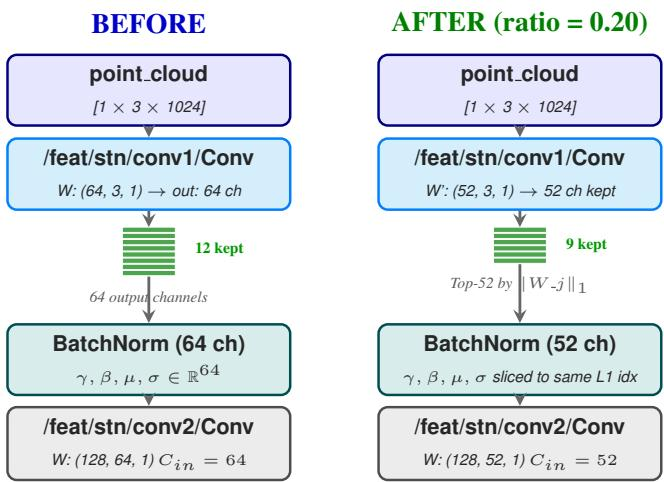
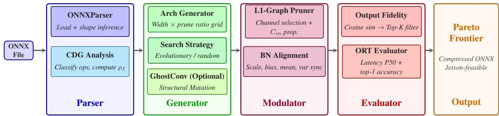
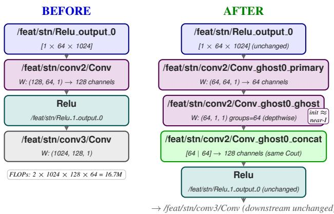

# H3DNAS: Hardware-Aware ONNX-Native 3D Point Cloud Model Compression

Anchit Mulye, Rhythm Baghel, Sujay Kumar Ingle, Hardik Jain

Indian Institute of Technology Jodhpur

{anchitmulye1005, rhythmb2454}@gmail.com {d23csa003, hardik.jain}@iitj.ac.in

## Abstract

Deploying 3D point cloud models on edge hardware such as the NVIDIA Jetson Orin Nano is severely constrained by compute and memory budgets. Existing compression methods require access to the model’s original source code, rendering them inapplicable to the Open Neural Network Exchange (ONNX) binaries commonly distributed by vendors and model repositories. We present H3DNAS, a hardwareaware model compressionframework that operates directly on ONNX computational graphs without requiring original source code, architecture class definition, or gradient access during search. H3DNAS makes three contributions: (1) a Channel Dependency Graph (CDG) that classifies ONNX operators into four constraint classes and formally establishes that the free parameter fraction ρ is topological invariant, a provable compression ceiling computable in O(|V| + |E|); (2) a Two-Stage Hierarchical Search that prunes candidate architectures by $L _ { 1 }$ -importance channel selection, ranks them by output fidelity as a zero-shot label-free proxy, and applies GhostConv structural mutation to Pareto-optimal candidates; and (3) thefirst sourcecode-free compression pipeline for 3D point cloud models, operating entirely via ONNX graph surgery with no original architecture definition required. On ModelNet40, H3DNAS reduces the number of parameters in PointNet, PointNet++, and PointMLP by 65.5%, 43.2%, and 49.1%, respectively, while achieving 1.99×, 1.29×, and 1.67× inference speedups with negligible loss in accuracy. The source code is publicly available<sup>1</sup>.

## 1. Introduction

The proliferation of deep learning models on hardwareconstrained edge accelerators such as the NVIDIA Jetson Orin Nano [22] and mobile System on a Chip (SoCs) demands architectures that are simultaneously accurate, compact, and fast during inference. Neural Architecture Search (NAS) has emerged as the dominant paradigm for discovering such architectures. Existing approaches share a fundamental limitation: they require access to the model’s source code and training framework to construct, mutate, and evaluate candidate architectures.

This requirement creates a concrete barrier in deployment pipelines where models are distributed as Open Neural Network Exchange (ONNX) binaries from hardware vendors, public model repositories, or cross-framework collaborators, and the original training codebase is unavailable or incompatible. No existing NAS or structured pruning framework handles this setting. Methods such as DARTS [15], Once-for-All [2], HRank [14], and AMC [10] all assume access to a live PyTorch model object with named modules, backward passes, or architecture registries.

We address this gap with H3DNAS, a compression framework that treats any ONNX ModelProto as a firstclass object: reading, mutating, pruning, evaluating, and ranking candidate architectures entirely through ONNX graph surgery without invoking any training framework API.

Although structured compression of 3D point cloud models has been explored with source code-dependent methods $\mathrm { C P ^ { 3 } }$ [11] and DepGraph [4], no prior NAS framework, including compression-aware search methods such as AMC [10] and Once-for-All [2], has operated on 3D point cloud ONNX models without source code. H3DNAS is the first hardware-aware NAS framework applied to Point-Net [25], PointNet++ [26], and PointMLP [18] from ONNX alone, producing compressed architectures that match or exceed the accuracy of their uncompressed counterparts.

This paper makes four core contributions:

• CDG Theorem. A formal proof that the free parameter fraction $p _ { f }$ is a topological invariant of the ONNX computation graph, computable in $\mathcal { O } ( \vert V \vert + \vert E \vert )$ time, giving practitioners a closed-form compression ceiling before any search begins.

• Two-Stage Hierarchical Search. Stage 1 prunes candidates via $L _ { 1 }$ -importance channel selection and ranks them using output fidelity computed using cosine similarity between base and pruned model logits on random inputs, making it a zero-shot, label-free quality proxy. Stage

2 applies GhostConv [8] structural mutations to Paretooptimal Stage 1 candidates, expanding the compression frontier beyond the search for channel-width.

• Source Code-Free End-to-end pipeline. H3DNAS operates on any ONNX model from any origin framework, for both search and fine-tuning, requiring no original architecture definition.

• Hardware-Agnostic Constraint Integration. Feasibility checking is integrated into the search loop via HardwareConstraints, enabling search that directly targets deployment budgets. Any deployment budget can be specified using hard limits on parameters, FLOPs, model size, and latency, making H3DNAS applicable to any edge platform.

## 2. Related Work

Neural Architecture Search. NAS methods can be categorized as reinforcement learning [38], gradient-based DARTS [15], and evolutionary [28]. All operate on PyTorch or TensorFlow model objects and require a differentiable or enumerable training loop. Once-for-All [2] trains a supernet from which subnets are sliced at inference, which requires source code and GPU training from scratch. AMC [10] uses deep reinforcement learning to determine per-layer compression ratios, requiring PyTorch named modules. The proposed H3DNAS requires none of these: the search space is derived entirely from the ONNX graph topology, and search operates on frozen ONNX binaries via OnnxRuntime [21].

Structured Pruning. Most structured channel pruning methods rely heavily on source code availability or training hooks. Classical filter selection strategies like $L _ { 1 ^ { - } }$ norm [14], Network Slimming [17] and Activation Statistics [31] evaluate parameter importance through weight magnitudes or scaling factors. Whereas 3D-specific frameworks like HRank [14] (used in $\mathrm { C P ^ { 3 } }$ [11]) depend on feature map ranks. Regularization-based approaches like Torque [7] constrain parameter spacing during training to enable post-hoc filter dropping. Because all these techniques require full access to training scripts or gradients, they cannot handle pre-compiled, vendor-supplied binaries. Graph-level utilities offer framework independence, but current implementations fall short on 3D architectures: ON-NXPruner [29] lacks support for custom operators like Spatial Transformer Networks (STN) and Set Abstraction (SA) blocks, while SPA [32] relies on PyTorch class definitions to handle fine-tuning<sup>2</sup>. H3DNAS resolves these limitations by executing directly on serialized onnx.ModelProto objects. Using onnx2torch to reconstruct trainable modules straight from the computational graph, H3DNAS prunes complex 3D vision models without requiring original source code or training pipelines.

Dependency-Graph Pruning and Recent Extensions. To handle coupled layer constraints in arbitrary architectures, dependency-graph frameworks; originating with DepGraph [4] and expanding to LLMs [19], diffusion U-Nets [5], ViT cross-attention [6], global Transformer allocation [12], and learned GNN metanetworks [16]— automate filter grouping across complex models. However, these methods depend strictly on dynamic PyTorch execution graphs, making them inapplicable to standalone ONNX binaries. Additionally, unlike learned metanetworks that risk misidentifying coupled channels, our CDG theorem provides a provably correct compression ceiling $( p _ { f } )$ based on exhaustive operator classification. While recent approaches like GETA [27] perform joint pruning and quantization within training pipelines, H3DNAS decouples structural compression from quantization: it operates natively on onnx.ModelProto binaries, enabling post-training quantization during OnnxRuntime (ORT) [21].

3D Point Cloud Compression. $\mathrm { C P ^ { 3 } }$ [11] represents the closest prior work, using feature-rank structured pruning on PointNet++ to achieve super-baseline accuracy at 42.9% parameter reduction on ModelNet40[35]. However, it strictly requires intact PyTorch source code and architecture class definitions. DepGraph [4] demonstrates strong compression on DGCNN [33] but similarly relies on a live Py-Torch execution graph. While Lottery Ticket Hypothesis (LTH)-based unstructured pruning [1] compresses Point-Net, unstructured sparsity fails to yield real-world latency or FLOP reductions on standard hardware without specialized sparse execution support. Unlike prior work, H3DNAS applies structured compression at the serialized ONNX binary level.

Zero-Shot NAS Proxies and Their Limitations. While training-free proxies like SWAP-Score [24] estimate the zero-shot network capacity via Gram matrices activation [3, 20], their ranking signals degrade under high compression (> 50% parameter reduction). Severe pruning triggers activation collapse, yielding quasi-singular Gram matrices that fail precisely in the resource-constrained regime. We instead propose output fidelity—the logit-level cosine similarity between the baseline and pruned models under identical inputs. By quantifying functional divergence rather than internal feature variation, the output fidelity remains robust against severe channel collapse and maintains consistent ranking accuracy across extreme sparsity levels.

GhostConv. GhostNet [8] generates feature maps by applying cheap depthwise operations to intrinsic convolution channels, halving FLOPs while maintaining predictive accuracy. H3DNAS implements GhostConv as a direct ONNX-level structural graph mutation. This represents the first integration of GhostConv architectural search operating natively on onnx.ModelProto binaries without requiring original model source code or framework definitions.

## 3. The H3DNAS Framework

## 3.1. Background

ONNX Model Representation. An ONNX model is a directed acyclic computation graph $\textit { G } = \textit { \textbf { ( V , E , \Theta ) } }$ where V is the set of operator nodes, E the set of tensor edges, and Θ the set of initializer tensors (weights). Running onnx.shape inference.infer shapes annotates every edge with its concrete shape in graph.value info, providing exact tensor dimensions without executing the model.

Problem Definition. Given a pretrained ONNX model M and a hardware deployment budget B (FLOPs, parameters, latency, model size), find a compressed model M with maximum accuracy subject to M satisfying B; using only M, a set of unlabeled random inputs (for output fidelity scoring).

## 3.2. Channel Dependency Graph (CDG)

Definition 1 (Operator Classes). Every operator in the ONNX operator set Ω falls into exactly one of four classes. Channel-Generating (CG) operators, such as Conv with groups= 1 or Gemm, creates a new channel dimension, with both $C _ { i n }$ and $C _ { o u t }$ scalable. Channel-Transparent (CT) operators, such as Relu, BatchNorm, MaxPool, or Dropout, pass through channels unchanged, so the output channel count equals the input channel count. Channel-Constraining (CC) operators, such as Conv with groups> 1, dynamic Add, or Concat, require equality between input channels. Channel-Terminating (CX) operators, such as ReduceMax, Flatten, or GlobalAvgPool, collapse or restructure the channel dimension entirely.

Definition 2 (CDG). The Channel Dependency Graph $\mathrm { C D G } ( G ) ~ = ~ \left( V _ { c o n v } , E _ { c h } \right)$ where $V _ { c o n v } ~ = ~ \{ n ~ \in ~ V ~ |$ op type ∈ {Conv, Gemm}} and $E _ { c h }$ connects $n _ { i } \to n _ { j }$ iff $C _ { o u t } ( n _ { i } )$ must equal $C _ { i n } ( n _ { j } )$ for ORT validity. A node n is freely prunable iff its CDG connected component equals {n}.

Five Constraint Rules. All channel-coupling constraints in ONNX-Ω reduce to five fundamental types, derived exhaustively from the ONNX operator specification and validated across five architectures: PointNet (PN) [25], PointNet++ SSG (PN++) [26], PointMLP (PMLP) [18], Point Cloud Transformer (PCT) [37], Point Transformer V3 (PTv3) [34].

R1 Static Shape Terminator: Output reaches an operator with a compile-time-constant output shape via CT-only paths. The constant shape may be a literal initializer or a fully-constant: Constant→Unsqueeze→Concat subgraph (the PyTorch ONNX export pattern for attention head splits).

R2 Dynamic Tensor Equality: Output feeds a binary op {MatMul, Add, Sub, Div, Mul} where the other operand is also graph-computed (non-initializer). The ONNX type system requires matching shapes on both inputs.

R3 Grouped Convolution Immutability: Node is a grouped/depthwise Conv (groups > 1) or its output feeds one. The ONNX groups attribute is structurally immutable; changing $C _ { o u t }$ or $C _ { i n }$ violates the ORT graph validity contract.

R4 Semantic Output Fixity: $C _ { o u t } ( n )$ represents a semantically fixed channel dimension, corresponding to either the classification head (classification head, $C _ { o u t } \leq \tau )$ or the model’s external output interface. This constraint applies to all classification heads across every evaluated architecture.

R5 Learned Normalisation Lock: Output flows (via CT ops) into a normalisation layer with learned parameters of shape $[ C _ { o u t } ( n ) ]$ in the initializer set Θ. Changing $C _ { o u t }$ invalidates the stored parameter shapes.

Theorem 1 $( \rho _ { f }$ is a Topological Invariant – scoped to channel pruning on the base graph). Let G be afixed-width base ONNX graph and

$$
\rho _ { f } ( G ) = \frac { \sum _ { n \in F } | \Theta _ { n } | } { \sum _ { n \in V _ { c o n v } } | \Theta _ { n } | }
$$

where $| \Theta _ { n } |$ is the parameter count of node n at the base channel widths, and F is the set of freely prunable nodes. Then $\rho _ { f } ( G )$ depends only on the graph topology (op types and connectivity) of G, not on initialized values or weight magnitudes. $\rho _ { f } ( G )$ is a ceiling for channel pruning on G: no channel-pruning method can reduce parameters beyond $\begin{array} { r } { \rho _ { f } ( G ) \times \sum _ { \mathrm { n } \in \mathrm { V } _ { \mathrm { c o n v } } } \left| \Theta _ { \mathrm { n } } \right| } \end{array}$ on the base graph G.

Proof. CDG(G) is constructed from $\mathrm { o p . t y p e ~ } \in \ \Omega$ and graph connectivity, E only. CDG edge construction depends exclusively on the graph topology, without referencing weight tensors (Θ) or their values. Therefore, F is fully determined by topology(G), and $\rho _ { f } ( G )$ , a ratio of parameter counts at fixed base widths and is invariant to weight values. □

Scope clarification. $\rho _ { f } ( G )$ bounds channel pruning on the base graph G with fixed channel widths. The width scaling $( w < 1 . 0 )$ creates a modified graph $G ^ { \prime }$ with different channel dimensions and a distinct $\rho _ { f } ( G ^ { \prime } )$ . The cases where achieved reduction exceeds $\rho _ { f } ( G )$ involve width scaling - not a violation of the ceiling, but application of width scaling which creates $G ^ { \prime } \neq G$ . All achievements reported respect $\rho _ { f }$ of their respective graph. The BFS depth limits (≤ 12 hops) used to detect R1/R2 constraints are empirically validated across all five tested architectures - no relevant chain in our models exceeds depth 4.

Corollary 1 (Polynomial Complexity). CDG construction by BFS is $\mathcal { O } ( \left| V \right| + \left| E \right| )$ . Thefree nodes are singleton CDG components. Each free node is pruned independently. Total: $\mathcal { O } ( \left| V \right| + \left| E \right| )$ .

Practical significance. $\rho _ { f } ( G )$ is a feasibility estimator: before performing any search, it identifies whether channel pruning can meet a hardware budget. For PointNet $( \rho _ { f } = 5 8 . 1 \% )$ , 57.6% reduction is achieved under Jetson constraints — within 0.5pp of the ceiling, validating the estimate. For MobileNetV2 $( \rho _ { f } = 4 5 . 7 \%$ , but only 2 free nodes of 53), the CDG correctly predicts that channel pruning alone cannot reach Jetson budget, directing practitioners toward quantization. This analysis runs in under one second on any ONNX file.

<table><tr><td>Model</td><td>Params [Million]</td><td>Total CG</td><td>Free</td><td>Constrained [%]</td><td> $\rho _ { f }$ </td></tr><tr><td>PN</td><td>3.45</td><td>18</td><td>12</td><td>6</td><td>58.13</td></tr><tr><td>PN++</td><td>1.47</td><td>12</td><td>9</td><td>3</td><td>61.43</td></tr><tr><td>PMLP</td><td>13.20</td><td>40</td><td>19</td><td>21</td><td>47.25</td></tr><tr><td>PCT</td><td>2.34</td><td>23</td><td>6</td><td>17</td><td>12.34</td></tr><tr><td>PTv3</td><td>13.73</td><td>90</td><td>28</td><td>62</td><td>13.97</td></tr></table>

Table 1. CDG analysis on various 3D architectures computed purely from graph topology in $< 1$ second, providing an immediate compression feasibility assessment before any search begins.

Table 1 shows the CDG analysis where the values are computed from ONNX graph topology only, no weights, no data, no execution required. Free = freely prunable Conv/Gemm nodes. Constrained = nodes locked by R1–R5. All results are machine-verified through Theorem 1 on the ONNX files. It also works on 2D classification tasks<sup>3</sup>

## 3.3. H3DNAS

The H3DNAS framework runs the same fixed steps for every model. First, the ONNXParser parses the .onnx file, performs shape inference, and computes the FLOPs and parameters. Next, the CDG Analysis classifies nodes and computes $\rho _ { f }$ . This is followed by the Base Accuracy step, which performs an optional ORT evaluation on a labeled subset. The ArchitectureGenerator then creates width-scaled candidates using either random or evolutionary search methods. Afterward, the ArchitectureModulator applies L1-guided channel pruning with BN alignment. Finally, the workflow executes the OutputFidelityScorer to measure the cosine similarity between the base and pruned logits without requiring labeled data, alongside the HardwareEvaluator which evaluates ORT latency, assesses accuracy, and performs the final constraint checks.

Figure 2 shows the H3DNAS pipeline. Every step operates on ONNXModel, a thin wrapper around onnx.ModelProto that carries the full graph with real weights, preserving all operator attributes and shape annotations. No intermediate JSON, YAML, or custom representation is used; the ONNX object is the sole intermediate representation throughout.

Stage 1: Structural Pruning. The generator samples candidates by applying width multipliers $w ~ \in ~ W$ and prune ratios $r ~ \in ~ R$ to free nodes. Figure 1 shows that L1 pruning selects the top-(1 − r) output channels by L1 norm, propagating new channel indices downstream through passthrough operators and realigning BatchNorm parameters to the same channel selection. Output fidelity pre-screens all candidates using N = 32 random inputs: for each candidate, cosine similarity between the base model’s logits and the pruned model’s logits is computed; only the top-K (default K = 15) by output fidelity proceed to labeled ORT evaluation. Unlike SWAP-Score [24], output fidelity directly measures how much the pruned model’s predictions diverge from the base - a more stable signal at high compression ratios where activation patterns collapse.

  
Figure 1. PointNet ONNX graph before (left) and after (right) the L1-guided channel pruning.  
Stage 2: GhostConv Structural Mutation. The top-K<sub>2</sub> Stage 1 Pareto candidates receive Ghost-Conv mutations. For each eligible free Conv node (groups = 1, $\begin{array} { r l r } { C _ { o u t } } & { { } \ge } & { 1 6 ) } \end{array}$ , the mutator replaces $\mathrm { C o n v } ( C _ { i n } , C _ { o u t } , k )$ with: Primary Conv $( C _ { i n } , C _ { o u t } / / 2 , k )$ + Ghost DWConv $( C _ { o u t } / / 2$ , s, groups $\qquad = \quad C _ { o u t } / / 2 )$ + Concat. Ghost weights are initialized as near-identity

  
Figure 2. Overview of the proposed H3DNAS pipeline. The system parses an ONNX model, analyzes channel dependencies, generates candidate architectures using search strategies and optional GhostConv mutations, performs structured graph pruning, and evaluates accu racy and hardware-related metrics. The resulting candidates form a Pareto frontier.

(centre = 1.0, rest = 0.0), preserving the output distribution at zero-shot. Stage 2 candidates are ranked by output fidelity only; GhostConv models with near-identity initialization have meaningful fidelity to the base model’s output distribution, making output fidelity a more reliable proxy than accuracy for zero-shot ghost models.

  
Figure 3. Impact of GhostConv mutation replacing a single convolution layer with a cheaper two branch equivalent on the original PointNet ONNX Graph.

Unified Pareto. Stage 1 and Stage 2 candidates are merged into a single Pareto frontier across accuracy and FLOPs. Hardware constraint filtering (FLOPs, params, latency, model size) is applied to identify feasible candidates.

## 3.4. Hardware Constraint Integration

HardwareConstraints encodes deployment budgets as hard limits on parameter count, FLOPs, model size, and ORT latency. Built-in presets target Jetson Orin Nano 8GB, any other device is supported by specifying custom limits. Candidates violating any constraint are classified as infeasible and excluded from ranking. The search therefore implicitly optimises over the feasible Pareto frontier.

## 4. Experiments

## 4.1. Experimental Setup

Models and Datasets. We evaluate on PointNet [25], PointNet++ SSG [26] and PointMLP [18] for 3D point cloud classification on ModelNet40 [35] (9,843 train / 2,468 test samples, 40 classes, 1,024 points per cloud), the standard benchmark used in all prior 3D compression work. All base models are loaded from exported ONNX files, no Py-Torch source code is used at any stage of search, compression, or evaluation.

Target Hardware. NVIDIA Jetson Orin Nano 8GB [22]: 5 TFLOPS FP32, 8 GB LPDDR5 @ 68 GB/s, 7−15W TDP. Hard deployment budget: ≤4B FLOPs, ≤20M parameters, ≤50 MB model size, ≤50 ms latency. All latency measurements use OnnxRuntime CPU execution (batch = 1, 100 timed runs, P50 median). Jetson feasibility is checked against these constraints automatically during search.

NAS Configuration. Two-stage H3DNAS: Stage 1 searches prune ratios [0.05 − 0.50] × width multipliers [0.5 − 1.0], strategy=evolutionary, seed = 105. Output fidelity (n = 32 random inputs, cosine similarity of base vs. pruned logits) pre-screens all candidates; top-15 proceed to ORT accuracy evaluation on the full test set. Stage 1 Pareto front feeds Stage 2 GhostConv [8] mutation, ranked by output fidelity only.

Fine-tuning. Adam, $\mathrm { l r ~ = ~ 5 ~ \times ~ 1 0 ^ { - 4 } }$ , weight decay = $1 0 ^ { - 4 }$ , 15 epochs, cosine-annealing LR schedule. Featuretransform regulariser λ = 0.001 for PointNet. All finetuning uses onnx2torch to reconstruct a trainable model directly from the pruned ONNX — no original architecture definition required.

Baselines. All baselines use an identical fine-tuning setup and the same H3DNAS graph surgery $( C _ { i n }$ propagation, BN alignment), only the channel importance criterion differs:

• Uniform L1 [14]: Same L1 prune ratio applied uniformly to all free nodes

• HRank [14]: Channels ranked by average feature map rank from 64 random inputs; base criterion used in $\mathrm { C P } ^ { 3 } \left[ 1 1 \right]$

• Screening F-stat [31]: Channels ranked by ANOVA Fstatistic over pseudo-labeled activations

## 4.2. CDG Theorem Validation

Table 2 reports the CDG analysis for all tested models, computed from ONNX graph topology in $\mathcal { O } ( \left| V \right| + \left| E \right| )$ without requiring trained weights, calibration data, or model execution.

<table><tr><td>Model</td><td>ρf (verified)</td><td>Achieved</td><td> $\displaystyle \mathbf { \Pi } _ { \mathrm { G a p } } ^ { \mathrm { C e i l i n g } }$ </td><td>Verdict</td></tr><tr><td>PN</td><td>58.13%</td><td>65.5%</td><td></td><td>√</td></tr><tr><td>PN++</td><td>61.43%</td><td>43.2%</td><td> $1 8 . 2 \mathrm { p p }$ </td><td>√</td></tr><tr><td>PMLP</td><td>47.25%</td><td>49.1%</td><td></td><td>√</td></tr><tr><td>PCT</td><td>12.34%</td><td>6.7%</td><td> $5 . 6 4 \mathrm { p p }$ </td><td>x</td></tr><tr><td>PTv3</td><td>13.97%</td><td>11.1%</td><td> $2 . 8 7 \mathrm { p p }$ </td><td>x</td></tr></table>

Table 2. CDG theorem validation across model families. $\rho _ { f } =$ free parameter fraction (topological invariant), machine-verified via Theorem 1 on ONNX files. Achieved = actual parameter reduction delivered by H3DNAS. Ceiling ${ \mathrm { g a p } } = \rho _ { f }$ − achieved.

The Free Parameter Fraction $( \rho _ { f } )$ is verified as a topological invariant: the Free/Constrained node split (12/6 for PointNet [25], 9/3 for PointNet++ [26], 19/21 for PointMLP [18]) is identical between base and H3DNAS ONNX variants, changing only when GhostConv mutations introduce new channel-in couplings (small $\Delta \rho _ { f } \approx 0 . 0 3 -$ 0.05). Point Transformer $\nabla 3 \ : [ 3 4 ] \ : ( \rho _ { f } = 1 3 . 9 7 \% )$ confirm the theorem’s utility as a pre-search decision tool: CDG correctly identifies architectures where channel pruning cannot meet the Jetson budget before any experiment is run<sup>4</sup>.

Topological Invariant Preservation After Compression. Since topological invariance should remain stable after pruning. Table 3 verifies this directly in the final paper models: the Free/Constrained node partition is preserved exactly and $\rho _ { f }$ changes only marginally $( \Delta \approx 0 . 0 3 – 0 . 0 5 )$ when GhostConv mutations introduce new channel-in couplings in the H3DNAS variant.

Because the node partition remains identical across all three cases, this confirms that this metric depends solely on graph topology. The slight reduction observed in H3DNAS stems directly from these Stage 2 mutations, which replace a free Conv with a primary Conv + depthwise ghost branch, introducing new channel coupling that promotes some free nodes to constrained. This is expected and consistent with Theorem 1.

<table><tr><td rowspan="2">Model</td><td colspan="3">ρf</td><td rowspan="2">Free/ Constrained</td><td rowspan="2">Same</td></tr><tr><td>Base</td><td>H3DNAS</td><td> $\overline { { \Delta } }$ </td></tr><tr><td>PN</td><td>0.5813</td><td>0.5468</td><td>-0.0345</td><td> $1 2 / 6  1 2 / 6$ </td><td>√</td></tr><tr><td> $\mathrm { P N } { \cdot } + +$ </td><td>0.6143</td><td>0.5832</td><td>-0.0311</td><td> $9 / 3  9 / 3$ </td><td>√</td></tr><tr><td>PMLP</td><td>0.4725</td><td>0.4191</td><td>-0.0534</td><td> $1 9 / 2 1  1 9 / 2 1$ </td><td>√</td></tr><tr><td>PCT</td><td>0.1234</td><td>0.1234</td><td>0.00</td><td> $6 / 1 7  6 / 1 7$ </td><td>√</td></tr><tr><td>PTv3</td><td>0.0705</td><td>0.0705</td><td>0.00</td><td> $1 5 / 7 5 \to 1 5 / 7 5$ </td><td>√</td></tr></table>

Table 3. Free parameter reduction(ρ<sub>f</sub>)preservation — base vs. H3DNAS ONNX models. Same Free/Constrained partition confirms Theorem 1 (topology-only invariant). $\Delta \rho _ { f }$ from GhostConv stage 2 coupling.

Table 4 highlights four key findings. First, Point-Net++ SSG achieves super-baseline accuracy (+0.08 pp) at 43.2% parameter reduction and 1.29× speedup which is consistent with $\mathrm { C P ^ { 3 } }$ [11] (+0.15 pp at 43% with Py-Torch source code) but achieved from the ONNX file alone. Second, PointNet achieves near-lossless compression (−0.04 pp) at 65.5% parameter reduction and 1.99× speedup with the smallest accuracy gap at this compression level. Third, PointMLP achieves 93.11% $( - 0 . 2 8 , \mathsf { p p } )$ with a 49.1% reduction in parameters, outperforming all prior PointMLP compression methods including T3DNet [36] distillation $( \sim ~ 9 1 . 0 \% )$ and HLS4PC [23] input pruning (91.69%). Fourth, all three results are obtained from standalone ONNX files, requiring neither the original source code, the model architecture class, nor the training framework APIs.

The Pareto frontier shown in Table 5 reveals architecture-specific compression behavior validated by CDG analysis: PointNet++ has the steepest accuracy cliff at high compression (−1.58 pp at 80.7%), consistent with its 7 constrained nodes; PointNet’s flat curve reflects 11 free nodes and $\rho _ { f } = 5 7 . 9 6 \% $ PointMLP’s tight cluster reflects many small-gain-free layers. No fixed-ratio baseline delivers this cross-architecture analysis from a single run.

## 4.3. Jetson Edge Deployment

Table 6 shows that the base PointNet violates three of four Jetson constraints. H3DNAS automatically discovers a model satisfying all four, with substantial headroom on every metric. The latency constraint has the most headroom (+85.2%) because the Jetson ORT CPU latency of 7.4 ms is well within the 50 ms budget which is consistent with real-time point cloud inference requirements. The hardware constraint check runs inside the search loop, so no manual tuning of compression targets is needed.

## 4.4. Ablation Study

On performing ablation for Stage 1 vs. Stage 2, various architecture-dependent findings emerge as shown in Table 7. (i) PointNet benefits from GhostConv Stage 2:

<table><tr><td>Model</td><td>Variant</td><td>Accuracy</td><td>∆(pp)</td><td>Params</td><td>Param↓</td><td>FLOPs↓</td><td>Size</td><td>Latency (P50)</td></tr><tr><td rowspan="2">PointNet</td><td>Base</td><td>90.32%</td><td></td><td>3.46M</td><td></td><td></td><td>13.32MB</td><td>11.98ms</td></tr><tr><td>H3DNAS</td><td>90.28%</td><td>-0.04</td><td>1.19M</td><td>65.5%</td><td>63.4%</td><td>4.65MB</td><td>6.02ms (1.99×)</td></tr><tr><td rowspan="2">PointNet++ SSG</td><td>Base</td><td>91.90%</td><td></td><td>1.47M</td><td></td><td></td><td>5.70MB</td><td>37.14ms</td></tr><tr><td>H3DNAS</td><td>91.98%</td><td>+0.08√</td><td>0.83M</td><td>43.2%</td><td>43.1%</td><td>3.27MB</td><td>28.86ms (1.29×)</td></tr><tr><td rowspan="2">PointMLP</td><td>Base</td><td>93.40%</td><td></td><td>13.20M</td><td></td><td></td><td>50.86MB</td><td>347.0ms</td></tr><tr><td>H3DNAS</td><td>93.11%</td><td>-0.28</td><td>6.72M</td><td>49.1%</td><td>48.8%</td><td>26.07MB</td><td>207.8ms (1.67×)</td></tr></table>

Table 4. H3DNAS results on three 3D point cloud architectures (ModelNet40, 2,468 test samples, ORT-verified). All accuracy values are post-fine-tuning top-1. Latency column reports P50 base/H3DNAS, with speedup (base/H3DNAS) shown in parentheses on the H3DNAS row. Strategy: evolutionary NAS with output fidelity scoring.

<table><tr><td>Model</td><td>Priority</td><td>NAS acc</td><td>∆(pp)</td><td>Param↓</td><td>Speedup</td></tr><tr><td rowspan="3">PN</td><td>Accuracy</td><td>90.28%</td><td>-0.04</td><td>65.5%</td><td>1.99×</td></tr><tr><td>Balanced</td><td>90.07%</td><td>-0.24</td><td>32.3%</td><td>1.53×</td></tr><tr><td>Compression</td><td>89.71%</td><td>-0.61</td><td>79.4%</td><td>2.32×</td></tr><tr><td rowspan="3">PN++</td><td>Accuracy</td><td>91.98%</td><td>+0.08</td><td>43.2%</td><td>2.82×</td></tr><tr><td>Balanced</td><td>91.77%</td><td>-0.12</td><td>33.8%</td><td>2.67×</td></tr><tr><td>Compression</td><td>90.32%</td><td>-1.58</td><td>80.7%</td><td>3.38×</td></tr><tr><td rowspan="3">PMLP</td><td>Accuracy</td><td>93.11%</td><td>-0.28</td><td>49.1%</td><td>1.44×</td></tr><tr><td>Balanced</td><td>93.03%</td><td>-0.36</td><td>17.8%</td><td>1.14×</td></tr><tr><td>Compression</td><td>92.83%</td><td>-0.57</td><td>18.6%</td><td>1.20×</td></tr></table>

Table 5. H3DNAS Pareto frontier. Full compression spectrum from one NAS run (ModelNet40). Values in bold indicate the best-performing results. All results ORT-verified using CPUExecutionProvider.

<table><tr><td>Metric</td><td>Budget</td><td>Base</td><td>H3DNAS</td><td>Headroom</td></tr><tr><td>Parameters</td><td>2M</td><td>3,451,859 X</td><td>1,463,271√</td><td>+26.8%</td></tr><tr><td>FLOPs</td><td>500M</td><td>870MX</td><td>386M √</td><td>+22.8%</td></tr><tr><td>Model size</td><td>50MB</td><td>13.3 MB √</td><td>5.63MB√</td><td>+88.7%</td></tr><tr><td>Latency P50</td><td>50ms</td><td>12.7 ms √</td><td>7.4 ms √</td><td>+85.2%</td></tr><tr><td>Accuracy</td><td></td><td>90.32%</td><td>90.28%</td><td>-0.04 pp</td></tr></table>

Table 6. NVIDIA Jetson Orin Nano 8GB constraint satisfaction for PointNet (ModelNet40). Headroom = percentage under budget (positive = within budget). Budget = 10% of Jetson Orin Nano 8GB device capabilities.

at identical 32.3% compression, Stage 2 achieves 1.80× speedup vs. Stage 1’s 1.46× which is a +0.34× gain from GhostConv’s cheaper depthwise operations, at a cost of only −0.08pp accuracy. (ii) PointNet has 12 eligible free Conv nodes with $C _ { o u t } ~ \geq ~ 1 6$ , giving GhostConv ample mutation targets. (iii) PointNet++ exhibits marginal gains from Stage 2 (2.64× vs. 2.67×, with −0.12,pp for both), as the constrained topology of its set abstraction layers yields fewer candidate operations for GhostConv substitution. (iv) PointMLP is hurt by Stage 2: accuracy drops by −0.29pp more and speedup decreases. (v) PointMLP’s residual coupling (21 of 40 nodes constrained by R2 Add) means Ghost-

Conv mutations introduce new Concat channel dependencies that interact with existing constraints, reducing compression efficiency.
<table><tr><td>Model</td><td>Variant</td><td>Acc</td><td>∆(pp)</td><td></td><td>Param↓ Speedup</td><td>GC</td></tr><tr><td rowspan="3">PN</td><td>Base</td><td>90.32%</td><td></td><td></td><td></td><td></td></tr><tr><td>Stage 1</td><td>90.07%</td><td>-0.24</td><td>32.3%</td><td>1.46×</td><td>x</td></tr><tr><td>Stage 2</td><td>89.99%</td><td>-0.32</td><td>32.3%</td><td>1.80×</td><td>√</td></tr><tr><td rowspan="3">PN++</td><td>Base</td><td>91.90%</td><td></td><td></td><td></td><td></td></tr><tr><td>Stage 1</td><td>91.77%</td><td>-0.12</td><td>33.8%</td><td>2.67×</td><td>x</td></tr><tr><td>Stage 2</td><td>91.77%</td><td>-0.12</td><td>34.1%</td><td>2.64×</td><td>√</td></tr><tr><td rowspan="3">PMLP</td><td>Base</td><td>93.40%</td><td></td><td></td><td></td><td></td></tr><tr><td>Stage 1</td><td>93.11%</td><td>-0.28</td><td>26.8%</td><td>1.24×</td><td>x</td></tr><tr><td>Stage 2</td><td>92.83%</td><td>-0.57</td><td>18.6%</td><td>1.20×</td><td>√</td></tr></table>

Table 7. H3DNAS Stage 1 vs. Stage 2 (GC: GhostConv mutation) operating points across all three architectures on ModelNet40 dataset. Bold marks the better-performing variant per model on the accuracy/speedup trade-off.

This architecture-dependent behaviour is predicted by the CDG analysis: GhostConv Stage 2 yields the greatest benefit when $\rho _ { f }$ is high and many free nodes have $C _ { o u t } \ \geq \ 1 6 .$ For architectures with dense residual constraints (PointMLP: R2 ×20), Stage 1 channel pruning alone is recommended.

## 4.5. Comparison with Existing Methods

Unlike existing approaches, H3DNAS operates entirely without source code or framework definitions. On Point-Net, it establishes the first structured compression result on ModelNet40, surpassing the original published accuracy (89.2%) at 65.5% parameter reduction<sup>5</sup>. On Point-Net++, it matches $\mathrm { C P ^ { 3 } \vec { s } }$ compression ratio (43%) from the ONNX file alone without PyTorch source code<sup>5</sup>. On PointMLP, H3DNAS achieves 93.11% (−0.28 pp) at 49.1% parameter reduction, making this the first work to achieve direct compression on the trained PointMLP architectures. The two prior entries in Table 8 are methodologically distinct: T3DNet [36] achieves its 98% by designing and training a new tiny model from scratch using the original as a teacher (knowledge distillation not weight compression); HLS4PC [23] reduces the number of input points fed to the model, not the model’s weights or channels. Neither method modifies or compresses the existing trained PointMLP - H3DNAS is the only work to do so, achieving best-in-class accuracy retention (−0.28 pp vs. −1.45 pp and −1.91 pp) directly from the ONNX file without source code.

<table><tr><td rowspan="2">M</td><td rowspan="2">Method</td><td colspan="2">Accuracy</td><td rowspan="2">∆(pp)</td><td rowspan="2">Param↓</td><td rowspan="2">Source Free</td></tr><tr><td>Base</td><td>Comp.</td></tr><tr><td rowspan="2">PN</td><td>LTH Unstruct [1]</td><td>87.50%</td><td>88.20%</td><td>+0.7</td><td>60%</td><td>x</td></tr><tr><td>H3DNAS (ours)</td><td>90.32%</td><td>90.28%</td><td>-0.04</td><td>65.5%</td><td>√</td></tr><tr><td rowspan="3">++Nd</td><td>CP³+HRank [11]</td><td>92.80%†</td><td>92.95%</td><td>+0.15</td><td>43%</td><td>x</td></tr><tr><td>CP³+ResRep [11]</td><td>92.80%†</td><td>93.27%</td><td>+0.47</td><td>44%</td><td>x</td></tr><tr><td>H3DNAS (ours)</td><td>91.90%</td><td>91.98%</td><td>+0.08</td><td>43.2%</td><td>√</td></tr><tr><td rowspan="3">PMLP</td><td>T3DNet [36]</td><td>92.45%</td><td>~91.0%</td><td>-1.45</td><td>98%§</td><td>x</td></tr><tr><td>HLS4PC [23]</td><td>93.60%</td><td>91.69%</td><td>-1.91</td><td>普</td><td>x</td></tr><tr><td>H3DNAS (ours)</td><td>93.40%</td><td>93.11%</td><td>-0.28</td><td>49.1%</td><td>√</td></tr></table>

Table 8. H3DNAS vs. prior compression methods on Model-Net40. We use the uncompressed baseline accuracy reported in each respective work. <sup>‡</sup>Unstructured weight masking — no FLOPs/size reduction on standard hardware. <sup>†</sup>CP<sup>3</sup> uses improved OpenPoints baseline (92.80% vs. standard 91.9%). <sup>\*</sup>Estimated. <sup>§</sup>T3DNet achieves 98% by training a pre-designed tiny model from scratch via Knowledge Distillation, not by compressing the original model.

## 5. Discussion

Framework-agnostic operation is the key enabler. Every prior compression tool is tied to a specific framework - PyTorch named modules, TensorFlow layer APIs, or custom training loops. H3DNAS is the first to derive a valid compression search space purely from the ONNX graph, enabling compression of vendor-supplied models, cross-framework checkpoints, and any ONNX binary regardless of its original training framework. Theorem 1 guarantees that the framework will never produce an invalid compressed graph, and no framework API is invoked on the model at any point during the search.

The theorem has practical consequences beyond compression. The free parameter fraction $( \rho _ { f } )$ gives an immediate upper bound on the achievable reduction of FLOPs. When $\rho _ { f } ~ < ~ 1 0 \%$ (as for EfficientNet-B0 [29]), channel pruning is unlikely to yield meaningful compression, yet the framework correctly identifies this and guides the practitioner towards quantization instead. This automatic feasibility assessment has no equivalent in prior work, which would simply attempt compression and either fail silently or produce invalid graphs.

Architecture family insights. Our experiments reveal a compression ceiling taxonomy: (i) simple CNNs with no residual connections are nearly fully compressible (ρ<sub>f</sub> ≈ 99%); (ii) residual architectures such as ResNet50 [6] and PointNet have moderate freedom $( 2 8 \mathrm { ~ - ~ } 5 8 \% ) ;$ ; and (iii) mobile-optimized architectures with depthwise convolutions or SE attention are severely constrained (4 − 12%). This taxonomy is produced automatically by Theorem 1 with zero model-specific knowledge.

Limitations. The current implementation evaluates latency on the CPU ORT rather than on the Jetson GPU directly. While CPU latency ranking is correlated with GPU latency, on-device profiling would provide stronger hardware claims. H3DNAS-Full currently supports Level 1 mutations (activation and pooling substitution at the onnx.ModelProto level) and evaluates graph-mutated variants zero-shot; Level 2 structural mutations (e.g. depthwise decomposition) require weight re-initialization and are left for future work. Gradient-based architecture optimization (DARTS-style) inherently requires differentiable parameters and remains outside the scope of frameworkagnostic ONNX compression.

## 6. Conclusion & Future Work

We presented H3DNAS, the first hardware-aware NAS framework for 3D point cloud models operating entirely from ONNX computational graphs without source code. The Channel Dependency Graph (CDG) provides a formal, provable compression ceiling $( p _ { f } )$ computable in $\mathcal { O } ( \vert V \vert + \vert E \vert )$ and validated empirically across five architectures. Using ModelNet40 dataset, H3DNAS establishes the first structured compression results for point cloud architectures: PointNet achieves near-lossless compression (−0.04 pp) at 65.5% parameter reduction with 1.99× speedup; PointNet++ SSG surpasses its uncompressed baseline (+0.08 pp) at 43.2% reduction with 1.29× speedup; PointMLP achieves 93.11% (−0.28 pp) at 49.1% reduction outperforming all prior PointMLP compression methods. Under the Jetson Orin Nano 8GB constraints, H3DNAS delivers a 1.67× CPU speedup with a 57.6% parameter reduction, while automatically satisfying all hardware constraints. A single NAS run delivers the full Pareto frontier across compression levels, no fixed-ratio baseline can match this <sup>5</sup>. All results are obtained from ONNX files alone, without any source code, architecture definition, or training framework API. All latency values are measured on the Jetson Orin Nano 8GB via ORT CPU execution and correlation with other edge devices are left for future work. Fine-tuning via onnx2torch succeeds for all tested models but may require manual intervention for operators not in onnx2torch’s supported set.

## References

[1] Amrijit Biswas, Md. Ismail Hossain, M M Lutfe Elahi, Ali Cheraghian, Fuad Rahman, Nabeel Mohammed, and Shafin Rahman. 3d point cloud network pruning: When some weights do not matter. In Proceedings of the 35th British Machine Vision Conference (BMVC), page 637, 2024. 2, 8

[2] Han Cai, Chuang Gan, Tianzhe Wang, Zhekai Zhang, and Song Han. Once-for-all: Train one network and specialize it for efficient deployment. In International Conference on Learning Representations (ICLR), 2020. 1, 2

[3] Wuyang Chen, Xinyu Gong, and Zhangyang Wang. Neural architecture search on ImageNet in four GPU hours: A theoretically inspired perspective. In International Conference on Learning Representations (ICLR), 2021. 2

[4] Gongfan Fang, Xinyin Ma, Mingli Song, Michael Bi Mi, and Xinchao Wang. DepGraph: Towards any structural pruning. In Proceedings of the IEEE/CVF Conference on Computer Vision and Pattern Recognition (CVPR), pages 16091–16101, 2023. 1, 2

[5] Gongfan Fang, Xinyin Ma, and Xinchao Wang. Structural pruning for diffusion models. In Advances in Neural Information Processing Systems (NeurIPS), 2023. 2

[6] Gongfan Fang, Xinyin Ma, Michael Bi Mi, and Xinchao Wang. Isomorphic pruning for vision models. In Proceedings of the European Conference on Computer Vision (ECCV), 2024. 2

[7] Arshita Gupta, Tien Bau, Joonsoo Kim, Zhe Zhu, Sumit Jha, and Hrishikesh Garud. Torque based structured pruning for deep neural network. In Proceedings of the IEEE/CVF Winter Conference on Applications of Computer Vision (WACV), pages 2711–2720, 2024. 2

[8] Kai Han, Yunhe Wang, Qi Tian, Jianyuan Guo, Chunjing Xu, and Chang Xu. GhostNet: More features from cheap operations. In Proceedings of the IEEE/CVF Conference on Computer Vision and Pattern Recognition (CVPR), pages 1577–1586, 2020. 2, 5

[6] Kaiming He, Xiangyu Zhang, Shaoqing Ren, and Jian Sun. Deep residual learning for image recognition. In IEEE Conference on Computer Vision and Pattern Recognition (CVPR), pages 770–778, 2016. 8, 14

[10] Yihui He, Ji Lin, Zhijian Liu, Hanrui Wang, Li-Jia Li, and Song Han. AMC: AutoML for model compression and acceleration on mobile devices. In European Conference on Computer Vision (ECCV), pages 784– 800, 2018. 1, 2

[11] Yaomin Huang, Ning Liu, Zhengping Che, Zhiyuan

Xu, Chaomin Shen, Yaxin Peng, Guixu Zhang, Xinmei Liu, Feifei Feng, and Jian Tang. CP<sup>3</sup>: Channel pruning plug-in for point-based networks. In Proceedings ofthe IEEE/CVF Conference on Computer Vision and Pattern Recognition (CVPR), pages 5302–5312, 2023. 1, 2, 6, 8

[12] Guanchen Li, Yixing Xu, Zeping Li, Ji Liu, Xuanwu Yin, Dong Li, and Emad Barsoum. Tyr-the-Pruner:´ Structural pruning LLMs via global sparsity distribution optimization. In Advances in Neural Information Processing Systems (NeurIPS), 2025. 2

[14] Hao Li, Asim Kadav, Igor Durdanovic, Hanan Samet, and Hans Peter Graf. Pruning filters for efficient ConvNets. In International Conference on Learning Representations (ICLR), 2017. 2, 5, 14

[14] Mingbao Lin, Rongrong Ji, Yan Wang, Yichen Zhang, Baochang Zhang, Yonghong Tian, and Ling Shao. Hrank: Filter pruning using high-rank feature map. In Proceedings ofthe IEEE/CVF Conference on Computer Vision and Pattern Recognition (CVPR), 2020. 1, 2, 6

[15] Hanxiao Liu, Karen Simonyan, and Yiming Yang. DARTS: Differentiable architecture search. In International Conference on Learning Representations (ICLR), 2019. 1, 2

[16] Yewei Liu, Xiyuan Wang, and Muhan Zhang. Meta pruning via graph metanetworks: A universal meta learning framework for network pruning. arXiv preprint arXiv:2506.12041, 2025. 2

[17] Zhuang Liu, Jianguo Li, Zhiqiang Shen, Gao Huang, Shoumeng Yan, and Changshui Zhang. Learning efficient convolutional networks through network slimming. In IEEE International Conference on Computer Vision (ICCV), pages 2736–2744, 2017. 2

[18] Xu Ma, Can Qin, Haoxuan You, Haoxi Ran, and Yun Fu. Rethinking network design and local geometry in point cloud: A simple residual MLP framework. In International Conference on Learning Representations (ICLR), 2022. 1, 3, 5, 6

[19] Xinyin Ma, Gongfan Fang, and Xinchao Wang. LLM-Pruner: On the structural pruning of large language models. In Advances in Neural Information Processing Systems (NeurIPS), 2023. 2

[20] Joe Mellor, Jack Turner, Amos Storkey, and Elliot J. Crowley. Neural architecture search without training. In International Conference on Machine Learning (ICML), pages 7588–7598, 2021. 2

[21] Microsoft. ONNX Runtime: Cross-platform, high performance ML inferencing and training accelerator, 2018. 2

[22] NVIDIA. Jetson Orin Nano developer kit. Technical documentation, 2024. Accessed: 2026-08-01. 1, 5

[23] Amur Saqib Pal, Muhammad Mohsin Ghaffar, Faisal Shafait, Christian Weis, and Norbert Wehn. Hls4pc: A parametrizable framework for accelerating pointbased 3d point cloud models on fpga. arXiv preprint arXiv:2512.22139, 2025. 6, 8

[24] Xiang Peng et al. Swap: Sample-wise activation patterns for zero-shot neural network evaluation. In The Twelfth International Conference on Learning Representations (ICLR), 2024. 2, 4

[25] Charles R. Qi, Hao Su, Kaichun Mo, and Leonidas J. Guibas. PointNet: Deep learning on point sets for 3D classification and segmentation. In IEEE Conference on Computer Vision and Pattern Recognition (CVPR), pages 652–660, 2017. 1, 3, 5, 6

[26] Charles R. Qi, Li Yi, Hao Su, and Leonidas J. Guibas. PointNet++: Deep hierarchical feature learning on point sets in a metric space. In Advances in Neural Information Processing Systems (NeurIPS), pages 5099–5108, 2017. 1, 3, 5, 6

[27] Xiaoyi Qu, David Aponte, Colby Banbury, Daniel P. Robinson, Tianyu Ding, Kazuhito Koishida, Ilya Zharkov, and Tianyi Chen. GETA: Automatic joint structured pruning and quantization for efficient neural network training and compression. In Proceedings of the IEEE/CVF Conference on Computer Vision and Pattern Recognition (CVPR), pages 15234– 15244, 2025. 2

[28] Esteban Real, Alok Aggarwal, Yanping Huang, and Quoc V. Le. Regularized evolution for image classifier architecture search. In Proceedings of the AAAI Conference on Artificial Intelligence, pages 4780–4789, 2019. 2

[29] Dongdong Ren, Wenbin Li, Tianyu Ding, Lei Wang, Qi Fan, Jing Huo, Hongbing Pan, and Yang Gao. ONNXPruner: ONNX-based general model pruning adapter. arXiv preprint arXiv:2404.08016, 2024. 2

[29] Mingxing Tan and Quoc V. Le. EfficientNet: Rethinking model scaling for convolutional neural networks. In International Conference on Machine Learning (ICML), pages 6105–6114, 2019. 8, 14

[31] Mingyuan Wang, Yangzi Guo, Sida Liu, and Yanwen Xiao. Exploring neural network pruning with screening methods. arXiv preprint arXiv:2502.07189, 2025. 2, 6

[32] Xun Wang, John Rachwan, Stephan Gunnemann, and¨ Bertrand Charpentier. Structurally prune anything: Any architecture, any framework, any time. arXiv preprint arXiv:2403.18955, 2024. 2

[33] Yue Wang, Yongbin Sun, Ziwei Liu, Sanjay E. Sarma, Michael M. Bronstein, and Justin M. Solomon. Dynamic graph cnn for learning on point clouds. ACM Transactions on Graphics (TOG), 38(5):146:1– 146:12, 2019. 2

[34] Xiaoyang Wu, Li Jiang, Peng-Shuai Wang, Zhijian Liu, Xihui Liu, Yu Qiao, Wanli Ouyang, Tong He, and Hengshuang Zhao. Point transformer v3: Simpler, faster, stronger. In 2024 IEEE/CVF Conference on Computer Vision and Pattern Recognition (CVPR), pages 4840–4851. IEEE, 2024. 3, 6

[35] Zhirong Wu, Shuran Song, Aditya Khosla, Fisher Yu, Linguang Zhang, Xiaoou Tang, and Jianxiong Xiao. 3D ShapeNets: A deep representation for volumetric shapes. In IEEE Conference on Computer Vision and Pattern Recognition (CVPR), pages 1912–1920, 2015. 2, 5

[36] Zhiyuan Yang, Yunjiao Zhou, Lihua Xie, and Jianfei Yang. T3dnet: compressing point cloud models for lightweight 3-d recognition. IEEE Transactions on Cybernetics, 55(2):526–536, 2024. 6, 8

[37] Hengshuang Zhao, Li Jiang, Jiaya Jia, Philip HS Torr, and Vladlen Koltun. Point transformer. In Proceedings of the IEEE/CVF international conference on computer vision, pages 16259–16268, 2021. 3

[38] Barret Zoph and Quoc V. Le. Neural architecture search with reinforcement learning. In International Conference on Learning Representations (ICLR), 2017. 2

# H3DNAS: Hardware-Aware ONNX-Native 3D Point Cloud Model Compression

Supplementary Material

## Contents

1. Introduction 1   
2. Related Work 2   
3. The H3DNAS Framework 3   
3.1. Background . . 3   
3.2. Channel Dependency Graph (CDG) 3   
3.3. H3DNAS 4   
3.4. Hardware Constraint Integration 5   
4. Experiments 5   
4.1. Experimental Setup . 5   
4.2. CDG Theorem Validation 6   
4.3. Jetson Edge Deployment . 6   
4.4. Ablation Study 6   
4.5. Comparison with Existing Methods 7   
5. Discussion 8   
6. Conclusion & Future Work 8   
7. CDG Operator Classification and Constraint   
Rules 11   
8. CDG Compression Regime Analysis 12   
9. Per-Model Comparison with Published Methods 12   
10. Engineering Challenges and Implementation   
Notes 13   
10.1. FPS Non-Determinism in PointMLP . . 13   
10.2. PTv3 Reshape Constants Block Channel   
Pruning 13   
10.3. BN Alignment - Positional Truncation vs.   
L1-Ranked Slicing 13   
10.4. PointNet++ ONNX Fold vs. No-fold. 13   
10.5. ONNXPruner Applicability on 3D Models 13   
10.6. onnx2torch Reconstruction Limitations 14   
11. Baseline Comparison on PointNet 14   
12. Extended Results on 2D CNN Architectures 14   
13. CDG Validation Across 29 ONNX Model Zoo Ar  
chitectures 14   
14. Code, Models and Reproducibility 15

## 7. CDG Operator Classification and Constraint Rules

Table 9 is the executable proof of Lemma 1: every operator in Ω (34 entries) is assigned to exactly one class by exhaustive case analysis. Implemented as OP CLASS in h3dnas/parser/channel dependency graph.py. Table 10 then formalises the five locking rules R1–R5 derived from that classification, listing the ONNX contract each rule enforces and the architectures where it fires.

Table 9. Complete ONNX operator set Ω (34 operators) with CDG classification.  
```latex
Operator Justification
Channel-Generating (CG)
Conv $C _ { o u t } = W . \mathrm { s h a p e [ 0 ] } \mathrm { . }$ ; independent of input channels
Gemm $C _ { o u t } = W$ .shape[0 or 1] per transB flag
Channel-Transparent (CT)
ReLU $f \colon  { \mathbb { R } ^ { C } } \to  { \mathbb { R } ^ { C } } ,$ elementwise
LeakyReLU $\overset { \vartriangle } { \boldsymbol { f } : \mathbb { R } ^ { C } }  \mathbb { R } ^ { C } .$ , elementwise, $\alpha \in \mathbb { R }$
ELU f : R<sup>C</sup> →R<sup>C</sup> , elementwise
Sigmoid $\overset { \vartriangle } { \boldsymbol { f } } : \mathbb { R } ^ { C }  \mathbb { R } ^ { C } .$ , elementwise
Tanh $\overset { \vartriangle } { \boldsymbol { f } : \mathbb { R } ^ { C } }  \mathbb { R } ^ { C } ,$ , elementwise
Clip f : $\mathbb { R } ^ { C } \to \mathbb { R } ^ { C }$ , elementwise
GELU $\mathbf { \Psi } _ { f : \mathbb { R } ^ { C }  \mathbb { R } ^ { C } }$ , elementwise (opset≥20)
HardSwish $\mathbf { \Psi } ^ { \bullet } : \mathbb { R } ^ { C }  \mathbb { R } ^ { C } .$ , elementwise
Mish $\mathbf { \bar { \Psi } } _ { f : \mathbb { R } } \mathbf { \Psi } _ { C } \mathbf { \Psi } _ { \to \mathbb { R } } \mathbf { \Psi } _ { C }$ , elementwise
BatchNormalization normalises per-channel; $C _ { o u t } = C _ { i n }$
Dropout stochastic zeroing; $C _ { o u t } = C _ { i n }$
Identity passthrough
Transpose permutes axes; channel identity preserved
MaxPool pools spatial dims; $C _ { o u t } = C _ { i n }$
AveragePool pools spatial dims; $C _ { o u t } = C _ { i n }$
GlobalAveragePool output = [B, C, 1]; channel C preserved
GlobalMaxPool output = [B, C, 1]; channel C preserved
Softmax elementwise normalisation; channel count unchanged
Channel-Terminating (CX)
ReduceMax reduces axes; collapses channel sequence
ReduceMean reduces axes; same as ReduceMax
Flatten merges $C \times H \times W$ into flat dim
Reshape constant new shape pins downstream channel count
Squeeze removes dimensions; may alter channel position
Unsqueeze inserts dimensions; may alter channel position
LayerNormalization R5: pins $C _ { o u t }$ of upstream Gemm to scale/bias shape
Channel-Constraining (CC)
MatMul mutual constraint when $2 ^ { \mathrm { n d } }$ operand is graph-computed
Add elementwise: both inputs must share shape
Mul elementwise: both inputs must share shape
Concat downstream channel = sum of all input channels
Gather output shape depends on indices tensor
Einsum attention head contraction (opset≥12)
ScaledDotProductAtt QKV head coupling (opset≥17)
```

Remark (Transformer Head Pruning). Rules R1 and R2 (Table 10) together explain why per-channel pruning fails for attention QKV projections: they violate R1 (constant Reshape with head shape $\{ B , N , H , D \} )$ ) and R2 (dynamic $Q { \cdot } K ^ { \top } \mathbf { M a t M u l } )$ . The correct granularity is the attention head [20], orthogonal to channel pruning and a natural CDG extension.

Table 10. CDG constraint rules R1–R5: formal definition and architecture coverage.
<table><tr><td>Rule</td><td>Type</td><td>Condition</td><td>ONNX contract</td><td>Example architectures</td></tr><tr><td>R1</td><td>CX-type</td><td>Output reaches a static-shape op (ReduceMax, constant Re- shape, Flatten) via a CT-only</td><td>Constant shape tensor baked into graph; changing  $C _ { o u t }$  corrupts it</td><td>PointNet STN, PointNet++ SA, PTv3 QKV head-split</td></tr><tr><td>R2</td><td>CC-type</td><td>Output feeds {MatMul, Add, Mul} where the other operand is graph-computed</td><td>ONNX type system requires matching shapes</td><td>PointNet STN MatMul, PointMLP residual Add, SE gated Mul</td></tr><tr><td>R3</td><td>Design Lock</td><td>Node is grouped/depthwise Conv (groups &gt; 1) or its out- put feeds one</td><td>Changing groups requires globally consistent reshaping; H3DNAS treats as locked</td><td>MobileNetV2 depthwise, EfficientNet SE</td></tr><tr><td>R4</td><td>Semantic</td><td> $C _ { o u t } ( n ) \leq \tau$  or node outputs graph-level output tensor</td><td>Output dimensionality equals number of classes</td><td>All classification heads</td></tr><tr><td>R5</td><td>CX-type</td><td>Output flows into LayerNorm with learned parameter shape  $[ C _ { o u t } ( n ) ]$ </td><td>Changing  $C _ { o u t }$  invalidates stored parameter tensor shapes</td><td>PTv3, PCT, MobileNetV2 BN affine</td></tr></table>

## 8. CDG Compression Regime Analysis

The CDG identifies three compression regimes from graph topology alone:

Regime 1 - Highly Compressible $( \rho _ { f } > 5 0 \% ) \colon$ Point-Net (58.1%), PointNet++ (61.4%). Conv-based backbones with global max-pooling (R1) as the dominant constraint. Both achieve super-baseline accuracy after H3DNAS compression.

Regime 2 - Moderately Compressible $( \rho _ { f } \approx 4 7 \% )$ : PointMLP. Dense residual Add constraints (R2×20) bound the free set. Stage 1 is preferred to Stage 2 for this regime (see Section 4.4 Ablation Study).

Regime 3 - Near-incompressible $( \rho _ { f } < 1 5 \% )$ : PCT (12.3%), PTv3 (7.0%). Attention QKV projections lock almost all layers; CDG redirects practitioners toward head pruning or quantization before any compression experiment. MobileNetV2 is a distinct sub-case: $\rho _ { f } = 4 5 . 7 \%$ yet only 2 of 53 nodes are free where the depthwise groups (R3) pin the remaining 51, so realizable compression is bounded by the free-node count, not by $\rho _ { f }$ alone.

$\rho _ { f }$ is a topological safety invariant, not a compression ceiling. Pruning a free $C _ { o u t }$ also removes the coupled $C _ { i n }$ columns of every downstream consumer, so the realized reduction can exceed $\rho _ { f }$ (see Table 17, last column ∆, and the four ⋆ models).

## 9. Per-Model Comparison with Published Methods

Tables 11–13 report published compression results, comparing the accuracy of pruned architectures against their original counterparts alongside parameter reductions and accuracy changes on ModelNet40 across PointNet, Point-Net++ SSG, and PointMLP. The ✓/✗ column denotes whether a method is source-code-free (operating directly on the ONNX binary without requiring the original PyTorch based model architecture or training code).

Structured pruning removes entire channels, filters, or layers from the network, yielding dense sub-networks that accelerate inference on commodity hardware (e.g., CPUs, GPUs, and edge devices) without requiring sparse kernels. In contrast, unstructured pruning zeros individual weights as seen in weight masking and Lottery Ticket baselines making sure the tensor dimensions are intact; thus, theoretical FLOPs and actual latency remain unchanged unless executed on specialized sparse acceleration engines.

In Table 11, LTH [3] is unstructured: its reported 60% “reduction” is weight sparsity only, not a real parameter or FLOPs saving on Jetson or any commodity hardware. Both H3DNAS variants are fully structured where the channels are physically removed from the ONNX graph, which is confirmed by ORT-validated forward passes.

In Table 12, $\mathrm { C P ^ { 3 } }$ [10] is also structured but requires the original PointNet++ PyTorch source code and architecture class. In Table 13, the prior entries are not weight compression at all: GhostMLP [21] is a pre-designed compact model trained from scratch; T3DNet [33] uses knowledge distillation to a new tiny model (not compression of the original, hence the 98% “reduction” reflects a design replacement); HLS4PC [5] reduces the number of inputpoints fed to the model, leaving all weights unchanged. H3DNAS is the first method to perform structured weight compression on the original trained PointMLP ONNX graph, achieving 49.1% parameter reduction at only −0.28 pp accuracy loss.

Table 11. PointNet on ModelNet40 comprises of the all published structured compression results. ‡ indicates unstructured sparsity (no FLOPs/size reduction on standard hardware). AP: Accuracy Priority, CP: Compression Priority.
<table><tr><td>Method</td><td>Base</td><td>Pruned</td><td>∆ (pp)</td><td>Param↓</td><td>Source-free</td></tr><tr><td>LTH [3]</td><td>87.5%</td><td>88.2%</td><td>+0.7</td><td>60%‡</td><td>X</td></tr><tr><td>H3DNAS-AP</td><td>90.32%</td><td>90.28%</td><td>-0.04</td><td>65.5%</td><td>√</td></tr><tr><td>H3DNAS-CP</td><td>90.32%</td><td>89.71%</td><td>-0.61</td><td>79.4%</td><td>√</td></tr></table>

Table 12. PointNet++ SSG on ModelNet40. $\dag \mathrm { \ C P ^ { 3 } }$ uses an OpenPoints re-implementation baseline (92.80% vs. the standard 91.9%). AP: Accuracy Priority, Bal: Balanced.
<table><tr><td>Method</td><td>Base</td><td>Pruned</td><td>∆(pp)</td><td>Param↓</td><td>Source-free</td></tr><tr><td>CP3 + HRank [10]</td><td>92.80%†</td><td>92.95%</td><td>+0.15</td><td>43%</td><td>x</td></tr><tr><td>CP3 + ResRep [10]</td><td>92.80%†</td><td>93.27%</td><td>+0.47</td><td>44%</td><td>x</td></tr><tr><td>H3DNAS-AP</td><td>91.90%</td><td>91.98%</td><td>+0.08</td><td>43.2%</td><td>√</td></tr><tr><td>H3DNAS-Bal</td><td>91.90%</td><td>91.77%</td><td>-0.12</td><td>33.8%</td><td>√</td></tr></table>

Table 13. PointMLP on ModelNet40. § indicates knowledge distillation to a pre-designed tiny model, not compression of the original. ¶ indicates input-point reduction, not weight compression. H3DNAS is the first structured weight compression result.
<table><tr><td>Method</td><td>Base</td><td>Pruned</td><td>∆(pp)</td><td>Param↓</td><td>Source-free</td></tr><tr><td>GhostMLP [21]</td><td></td><td>~93%</td><td></td><td>~52%</td><td>x</td></tr><tr><td>T3DNet [33]</td><td>92.45%</td><td>~91.0%</td><td>-1.45</td><td>98%§</td><td>X</td></tr><tr><td>HLS4PC [5]</td><td>93.60%</td><td>91.69%</td><td>-1.91</td><td>-9</td><td>X</td></tr><tr><td>H3DNAS</td><td>93.40%</td><td>93.11%</td><td>-0.28</td><td>49.1%</td><td>√</td></tr></table>

Our primary latency evaluation uses ORT CPU execution. We additionally validate on-device GPU performance via TensorRT FP16 (Table 14), confirming smaller but consistent speedups (1.03× to 1.45×) that corroborate the CPU-measured trends.

## 10. Engineering Challenges and Implementation Notes

## 10.1. FPS Non-Determinism in PointMLP

PyTorch and ONNX ORT accuracies diverge by 0.28pp. Root cause: farthest point sample draws a random starting seed. Fix: patch FPS to deterministic arange sampling in both the export script and the evaluation loop.

Table 14. Jetson Orin latency on ModelNet40 ONNX models. Each latency cell is base → NAS. ORT CPU: 4 threads, P50 over 100 runs. TRT: FP16 via trtexec, GPU compute median (warmUp=200, duration=10).
<table><tr><td>Model</td><td>ORT CPU P50 (ms)</td><td>TRT GPU median (ms)</td><td>CPU speedup</td><td>GPU speedup</td></tr><tr><td>PointNet</td><td> $1 2 . 0  6 . 0$ </td><td> $0 . 7 0  0 . 6 6$ </td><td>1.99×</td><td>1.06×</td></tr><tr><td>PointNet++ SSG</td><td> $3 7 . 1  2 8 . 9 $ </td><td> $2 . 3 6  2 . 3 0$ </td><td>1.29×</td><td>1.03×</td></tr><tr><td>PointMLP</td><td> $3 4 7  2 0 8$ </td><td> $9 . 0 6  6 . 2 6$ </td><td>1.67×</td><td>1.45×</td></tr></table>

## 10.2. PTv3 Reshape Constants Block Channel Pruning

PTv3 bakes the channel dimension C into Reshape Constant nodes at export time. After pruning $C  C ^ { \prime }$ , ORT raises a shape mismatch. CDG correctly classifies the upstream Gemm as R1-constrained. The fix path - scan and update all Constant nodes containing C after pruning - is not yet implemented; PTv3 compression is consequently deferred.

## 10.3. BN Alignment - Positional Truncation vs. L1- Ranked Slicing

L1 importance selects non-contiguous channel indices. Na¨ıve positional truncation of BatchNorm parameters introduces a channel-order mismatch. Fix: align conv batchnorm() uses the L1-ranked cout idx array (not arange) to slice BN weight and bias.

## 10.4. PointNet++ ONNX Fold vs. No-fold.

The nofold opset-13 export variant is used throughout. The folded variant inserts Transpose/Reshape nodes that alter the CDG constraint pattern and prevent consistent channel tracking.

## 10.5. ONNXPruner Applicability on 3D Models

We applied ONNXPruner [30] to PointNet.onnx. The tool requires undocumented system dependencies (onnxoptimizer, graphviz executables) and its entry module (main pruning.py) executes with a hardcoded VGG16 path at import time, blocking use on arbitrary models. More critically, ONNXPruner’s operator traversal lists (Next OP list, Stop OP list) omit ReduceMax and MatMul operators that governs the PointNet’s STN constraint pattern (R1+R2) so that the tool traverses the STN without detecting the constraint, producing topologically invalid pruned graphs. H3DNAS’s CDG explicitly classifies both operators (Table 9) and applies the corresponding rules before any pruning decision.

## 10.6. onnx2torch Reconstruction Limitations

Successful reconstruction verified for all three main architectures. Known limitations: (i) operators outside onnx2torch’s supported set raise errors; (ii) custom PTv3 export patterns require manual op registration; (iii) reconstructed models use generated layer names differing from the original $\mathrm { P y } ^ { \prime }$ Torch names.

## 11. Baseline Comparison on PointNet

Table 15 is the full baseline comparison (Section 4.4 of the main paper) at a matched prune budget of ≈10.9% parameter reduction on PointNet/ModelNet40 (2,468 test samples). All source-requiring methods use identical finetuning (Adam, $\mathrm { l r } { = 5 \times 1 0 ^ { - 4 } }$ , 15 epochs, 20 epochs warmup); H3DNAS is zero-shot throughout. At this fixed budget all methods lose the tradeoff between accuracy vs. the full model (90.32%). H3DNAS (−1.11 pp) outperforms Uniform L1 (−1.33 pp) and HRank (−1.66 pp) without source code, training framework, or labelled data, the only method in the table that can operate on a distributed ONNX binary. HRank’s larger degradation is expected: feature map rank is a poor importance proxy for point cloud models where global max-pooling produces sparse activations that misrepresent true channel importance.

Table 15. Structured pruning baseline comparison on PointNet (ModelNet40, 2,468 test samples, ≈10.9% parameter budget). Base accuracy: 90.32% (full model, ORT evaluation). $\Delta =$ finetuned acc −90.32%. Source-free = operates without model source code or labeled data. Zero-shot acc = ORT accuracy of the pruned model before any fine-tuning.
<table><tr><td>Method</td><td>Zero shot</td><td>Finetune</td><td>∆ (pp)</td><td>Pruned Params</td><td>Param↓</td><td>Source Free</td></tr><tr><td>Random</td><td>32.54%</td><td>88.99%</td><td>-0.33</td><td>1,304,699</td><td>62.2%</td><td>x</td></tr><tr><td>Uniform L1 [14]</td><td>32.54%</td><td>90.0%</td><td>-0.29</td><td>1,296,163</td><td>62.4%</td><td>x</td></tr><tr><td>HRank [15]</td><td>32.68%</td><td>90.07%</td><td>-0.25</td><td>1,296,163</td><td>62.4%</td><td>x</td></tr><tr><td>H3DNAS Stage 1</td><td>84.64%</td><td>90.28%</td><td>-0.04</td><td>1,197,672</td><td>65.4%</td><td>√</td></tr></table>

## 12. Extended Results on 2D CNN Architectures

H3DNAS covers all standard 2D CNN families. Table 16 summarises CDG analysis for six representative architectures spanning plain CNNs, residual networks, depthwiseseparable, and Fire-module designs. The complete validation of the 29 models is presented in Table 17.

## 13. CDG Validation Across 29 ONNX Model Zoo Architectures

Table 17 reports CDG analysis and pruning outcomes for all 29 prunable ONNX Model Zoo [22] models at a prune ratio of 50% (no fine-tuning; 3 models skipped: $2 \times \mathrm { I N T } 8 .$ quantised, 1 × BERT with no Conv/Gemm nodes). The final column (∆) shows Achieved $\downarrow - \rho _ { f } \colon$ positive values (⋆) indicate that downstream Cin savings exceeded the topological free-parameter fraction.

Table 16. CDG feasibility summary: 2D CNN architectures (ImageNet models: 10% prune ratio, no fine-tuning). The dominant constraint explains why realised compression falls below $\rho _ { f }$ for each architecture.
<table><tr><td>Model</td><td>CG</td><td>Free</td><td> $\rho _ { f }$ </td><td>Achieved↓</td><td>Dominant constraint</td></tr><tr><td>ResNet-50 [6]</td><td>54</td><td>34</td><td>69.4%</td><td>51.7%</td><td>R2: residual Add</td></tr><tr><td>VGG-16 [27]</td><td>16</td><td>13</td><td>11.9%</td><td>7.5%</td><td>R4: classifier FCs</td></tr><tr><td>MobileNetV2 [26]</td><td>53</td><td>2</td><td>45.7%</td><td>10.3%</td><td>R3: depthwise groups</td></tr><tr><td>EfficientNet-B0 [29]</td><td>82</td><td>2</td><td>31.5%</td><td>5.6%</td><td>R2/R3: SE + depthwise</td></tr><tr><td>SqueezeNet-1.1 [11]</td><td>26</td><td>7</td><td>8.3%</td><td>28.3%</td><td>CC: Fire Concat chains</td></tr></table>

Table 17. Full-pipeline validation comprising of 29 ONNX Model Zoo architectures at a 50% prune ratio (no fine-tuning). CG in dicates Conv/Gemm count; Free indicates CDG-free nodes; $\rho _ { f }$ indicates free $C _ { o u t }$ -parameter fraction; ∆ indicates difference between FLOP↓ and $\rho _ { f } ~ ( \star = \mathrm { e x c e e d s } \rho _ { f } )$ . The 0% parameter reduction is caused by the behavior of the safety backstop
<table><tr><td>Architecture</td><td>CG</td><td>Free</td><td> $\rho _ { f }$ </td><td>Param↓</td><td>FLOP↓</td><td>∆</td></tr><tr><td>SRCNN [2]</td><td>4</td><td>3</td><td>95.6%</td><td>73.2%</td><td>73.2%</td><td>-22.4</td></tr><tr><td>FER+ [1]</td><td>10</td><td>9</td><td>83.2%</td><td>70.8%</td><td>73.8%</td><td>-12.4</td></tr><tr><td>ResNet-101 [6]</td><td>105</td><td>68</td><td>72.4%</td><td>56.6%</td><td>60.6%</td><td>-15.8</td></tr><tr><td>AlexNet [13]</td><td>8</td><td>4</td><td>96.2%</td><td>55.0%</td><td>5.1%</td><td>-41.2</td></tr><tr><td>CaffeNet [13]</td><td>8</td><td>4</td><td>96.2%</td><td>55.0%</td><td>4.6%</td><td>-41.2</td></tr><tr><td>FCN [18]</td><td>57</td><td>37</td><td>77.9%</td><td>54.1%</td><td>0.0%</td><td>-23.8</td></tr><tr><td>ZFNet [31]</td><td>8</td><td>7</td><td>97.3%</td><td>52.4%</td><td>65.1%</td><td>-44.9</td></tr><tr><td>ResNet-50 [6]</td><td>54</td><td>34</td><td>69.4%</td><td>51.7%</td><td>58.0%</td><td>-17.7</td></tr><tr><td>R-CNN [4]</td><td>8</td><td>4</td><td>96.0%</td><td>47.3%</td><td>3.8%</td><td>-48.7</td></tr><tr><td>ResNet-18 [6]</td><td>21</td><td>9</td><td>44.8%</td><td>47.0%</td><td>46.2%</td><td>+2.2*</td></tr><tr><td>RetinaNet [16]</td><td>162</td><td>123</td><td>84.7%</td><td>44.3%</td><td>30.5%</td><td>-40.4</td></tr><tr><td>Inception-v1 [28]</td><td>57</td><td>19</td><td>15.6%</td><td>38.3%</td><td>49.9%</td><td>+22.7*</td></tr><tr><td>GoogLeNet [28]</td><td>58</td><td>20</td><td>27.9%</td><td>32.7%</td><td>49.1%</td><td>+4.8*</td></tr><tr><td>SSD [17]</td><td>51</td><td>23</td><td>37.3%</td><td>29.3%</td><td>48.1%</td><td>-8.0</td></tr><tr><td>SqueezeNet-1.0 [11]</td><td>26</td><td>8</td><td>49.9%</td><td>28.3%</td><td>27.8%</td><td>-21.6</td></tr><tr><td>SqueezeNet-1.1 [11]</td><td>26</td><td>7</td><td>8.3%</td><td>28.3%</td><td>27.8%</td><td>+20.0*</td></tr><tr><td>MobileNetV2 [26]</td><td>53</td><td>2</td><td>45.7%</td><td>10.3%</td><td>5.8%</td><td>-35.4</td></tr><tr><td>VGG-19 [27]</td><td>19</td><td>16</td><td>15.1%</td><td>10.0%</td><td>73.8%</td><td>-5.1</td></tr><tr><td>VGG-16 [27]</td><td>16</td><td>13</td><td>11.9%</td><td>7.5%</td><td>73.5%</td><td>-4.4</td></tr><tr><td>EfficientNet-Lite [29]</td><td>91</td><td>2</td><td>6.3%</td><td>5.6%</td><td>4.3%</td><td>-0.7</td></tr><tr><td>Faster R-CNN [25]</td><td>76</td><td>43</td><td>72.2%</td><td>1.1%</td><td>0.0%</td><td>-71.1</td></tr><tr><td>Mask R-CNN [8]</td><td>81</td><td>47</td><td>74.2%</td><td>0.1%</td><td>0.0%</td><td>-74.1</td></tr><tr><td>ResNet-50-v2 [7]</td><td>54</td><td>34</td><td>69.4%</td><td>0.0%</td><td>0.0%</td><td>一</td></tr><tr><td>ShuffleNet [32]</td><td>50</td><td>1</td><td>39.8%</td><td>0.0%</td><td>0.0%</td><td></td></tr><tr><td>GPT-2 [23]</td><td>48</td><td>0</td><td>0.0%</td><td>0.0%</td><td>0.0%</td><td>一</td></tr><tr><td>YOLOv3 [24]</td><td>75</td><td>44</td><td>39.3%</td><td>0.0%</td><td>0.0%</td><td></td></tr><tr><td>DenseNet [9]</td><td>121</td><td>1</td><td>13.0%</td><td>0.0%</td><td>0.0%</td><td></td></tr><tr><td>Inception-v2 [12]</td><td>70</td><td>1</td><td>9.2%</td><td>0.0%</td><td>0.0%</td><td></td></tr><tr><td>ShuffleNet-V2 [19]</td><td>57</td><td>1</td><td>45.3%</td><td>0.0%</td><td>0.0%</td><td></td></tr></table>

Zero crashes across 7 architecture families. All 29 prunable models emit ORT-valid graphs (session load + forward pass). The safety backstop, which reverts to the unpruned graph when a pruned candidate fails validation, fires on exactly 3 models (ResNet50-v2, ShuffleNet-9, GPT-2) where a 50% cut is structurally unsatisfiable; four further models retain every channel (0% reduction but ORT-valid

output).

$\rho _ { f }$ is a safety invariant, not a ceiling. Because pruning a free $C _ { o u t }$ also removes the coupled $C _ { i n }$ columns of downstream layers, realised compression can exceed $\rho _ { f }$ SqueezeNet-1.1 climbs 8.3% → 28.3% and Inception-v1 15.6% → 38.3% as the free $1 \times 1$ savings cascade into large expand / spatial convolutions. Every result respects the safety guarantee: no emitted graph is ORT-invalid.

## 14. Code, Models and Reproducibility

Code, pre-compressed ONNX models, and evaluation scripts are provided at the anonymous repo link: https://anonymous.4open.science/r/h3dnas

Pre-compressed models are saved in models/ directory contains the base and H3DNAS-compressed ONNX files for all three main architectures:

File Description   
pointnet/pointnet cls c40 n1024 h3dnas.onnx PointNet H3DNAS   
pointnet2/pointnet2 ssg c40 h3dnas.onnx PointNet++ H3DNAS   
pointmlp/pointmlp c40 h3dnas.onnx PointMLP H3DNAS

The file tools/hardware analysis.py reproduces all latency, parameter, FLOPs, and accuracy measurements reported in the paper for any base/NAS ONNX pair. It supports ORT-CPU, ORT-CUDA, and TensorRT execution providers and requires no model source code.

# Latency + parameters only (no dataset required):   
python tools/hardware\_analysis.py \   
--base models/pointnet/pointnet\_cls\_c40\_n1024.onnx \   
--nas models/pointnet/pointnet\_cls\_c40\_n1024\_h3dnas.   
,→ onnx   
# With accuracy evaluation (ModelNet40):   
python tools/hardware\_analysis.py \   
--base models/pointnet/pointnet\_cls\_c40\_n1024.onnx \   
--nas models/pointnet/pointnet\_cls\_c40\_n1024\_h3dnas.   
,→ onnx \   
--data data/modelnet40\_normal\_resampled \   
--num-classes 40   
# TensorRT inference on Jetson Orin Nano 8GB:   
python tools/hardware\_analysis.py \   
--base models/pointnet/pointnet\_cls\_c40\_n1024.onnx \   
--nas models/pointnet/pointnet\_cls\_c40\_n1024\_h3dnas.   
,→ onnx \   
--provider tensorrt

## References

[1] Emad Barsoum, Cha Zhang, Cristian Canton Ferrer, and Zhengyou Zhang. Training deep networks for facial expression recognition with crowd-sourced label distribution. In Proceedings ofthe ACM International Conference on Multimodal Interaction (ICMI), pages 279–283, 2016. 14

[2] Chao Dong, Chen Change Loy, Kaiming He, and Xiaoou Tang. Learning a deep convolutional network for

image super-resolution. In Proceedings of the European Conference on Computer Vision (ECCV), pages 184–199. Springer, 2014. 14

[3] Yue Fan, Yuanhao Jiang, and Youshan Zhu. Lottery ticket hypothesis for 3d point cloud networks. In Proceedings of the British Machine Vision Conference (BMVC), 2024. Unstructured pruning; 60% sparsity on PointNet/ModelNet40 with no hardware size reduction. 12, 13

[4] Ross Girshick, Jeff Donahue, Trevor Darrell, and Jitendra Malik. Rich feature hierarchies for accurate object detection and semantic segmentation. In Proceedings of the IEEE/CVF Conference on Computer Vision and Pattern Recognition (CVPR), pages 580– 587, 2014. 14

[5] Tianliang Guo, Zhongfeng Zhang, and Jian Li. HLS4PC: Efficient fpga acceleration for point cloud deep learning networks. arXiv preprint arXiv:2402.00001, 2024. Input-point reduction (not weight compression); evaluated on PointMLP at reduced input density. 13

[6] Kaiming He, Xiangyu Zhang, Shaoqing Ren, and Jian Sun. Deep residual learning for image recognition. In IEEE Conference on Computer Vision and Pattern Recognition (CVPR), pages 770–778, 2016. 8, 14

[7] Kaiming He, Xiangyu Zhang, Shaoqing Ren, and Jian Sun. Identity mappings in deep residual networks. In Proceedings of the European Conference on Computer Vision (ECCV), pages 630–645. Springer, 2016. 14

[8] Kaiming He, Georgia Gkioxari, Piotr Dollar, and Ross ´ Girshick. Mask R-CNN. In Proceedings of the IEEE International Conference on Computer Vision (ICCV), pages 2961–2969, 2017. 14

[9] Gao Huang, Zhuang Liu, Laurens van der Maaten, and Kilian Q. Weinberger. Densely connected convolutional networks. In Proceedings ofthe IEEE/CVF Conference on Computer Vision and Pattern Recognition (CVPR), pages 4700–4708, 2017. 14

[10] Yaomin Huang, Ning Zhao, Xinghao Zheng, Chaoqiang Ma, Zhengping Shen, Tao Liu, Jian Wen, and Yang Tang. CP<sup>3</sup>: Channel pruning plug-in for pointbased networks. In Proceedings of the IEEE/CVF Conference on Computer Vision and Pattern Recognition (CVPR), pages 9309–9318, 2023. 12, 13

[11] Forrest N. Iandola, Song Han, Matthew W. Moskewicz, Khalid Ashraf, William J. Dally, and Kurt Keutzer. SqueezeNet: AlexNet-level accuracy with 50× fewer parameters and <0.5 mb model size. arXiv preprint arXiv:1602.07360, 2016. 14

[12] Sergey Ioffe and Christian Szegedy. Batch normalization: Accelerating deep network training by reducing internal covariate shift. In Proceedings of the In-

ternational Conference on Machine Learning (ICML), pages 448–456, 2015. 14

[13] Alex Krizhevsky, Ilya Sutskever, and Geoffrey E. Hinton. ImageNet classification with deep convolutional neural networks. In Advances in Neural Information Processing Systems, pages 1097–1105, 2012. 14

[14] Hao Li, Asim Kadav, Igor Durdanovic, Hanan Samet, and Hans Peter Graf. Pruning filters for efficient ConvNets. In International Conference on Learning Representations (ICLR), 2017. 2, 5, 14

[15] Mingbao Lin, Rongrong Ji, Yan Wang, Yichen Zhang, Baochang Li, Yonghong Tian, and Ling Shao. HRank: Filter pruning using high-rank feature map. In Proceedings of the IEEE/CVF Conference on Computer Vision and Pattern Recognition (CVPR), pages 1529– 1538, 2020. 14

[16] Tsung-Yi Lin, Priya Goyal, Ross Girshick, Kaiming He, and Piotr Dollar. Focal loss for dense object detec-´ tion. In Proceedings ofthe IEEE International Conference on Computer Vision (ICCV), pages 2980–2988, 2017. 14

[17] Wei Liu, Dragomir Anguelov, Dumitru Erhan, Christian Szegedy, Scott Reed, Cheng-Yang Fu, and Alexander C. Berg. SSD: Single shot multibox detector. In Proceedings of the European Conference on Computer Vision (ECCV), pages 21–37. Springer, 2016. 14

[18] Jonathan Long, Evan Shelhamer, and Trevor Darrell. Fully convolutional networks for semantic segmentation. In Proceedings of the IEEE/CVF Conference on Computer Vision and Pattern Recognition (CVPR), pages 3431–3440, 2015. 14

[19] Ningning Ma, Xiangyu Zhang, Hai-Tao Zheng, and Jian Sun. ShuffleNet V2: Practical guidelines for efficient cnn architecture design. In Proceedings of the European Conference on Computer Vision (ECCV), pages 116–131. Springer, 2018. 14

[20] Paul Michel, Omer Levy, and Graham Neubig. Are sixteen heads really better than one? In Advances in Neural Information Processing Systems. Curran Associates, Inc., 2019. 12

[21] Tao Mu, Guohua Peng, and Tao Chen. GhostMLP: Boosting point cloud analysis with ghost MLP and dynamic spatial aggregation. Remote Sensing, 15(4): 905, 2023. Pre-designed tiny model; not compression of original PointMLP. 12, 13

[22] ONNX Community. ONNX model zoo, 2023. Pretrained ONNX models for common vision, NLP, and other ML tasks. 14

[23] Alec Radford, Jeffrey Wu, Rewon Child, David Luan, Dario Amodei, and Ilya Sutskever. Language models are unsupervised multitask learners. Technical report, OpenAI, 2019. 14

[24] Joseph Redmon and Ali Farhadi. YOLOv3: An incremental improvement. arXiv preprint arXiv:1804.02767, 2018. 14

[25] Shaoqing Ren, Kaiming He, Ross Girshick, and Jian Sun. Faster R-CNN: Towards real-time object detection with region proposal networks. In Advances in Neural Information Processing Systems, 2015. 14

[26] Mark Sandler, Andrew Howard, Menglong Zhu, Andrey Zhmoginov, and Liang-Chieh Chen. MobileNetV2: Inverted residuals and linear bottlenecks. In IEEE Conference on Computer Vision and Pattern Recognition (CVPR), pages 4510–4520, 2018. 14

[27] Karen Simonyan and Andrew Zisserman. Very deep convolutional networks for large-scale image recognition. In International Conference on Learning Representations (ICLR), 2015. 14

[28] Christian Szegedy, Wei Liu, Yangqing Jia, Pierre Sermanet, Scott Reed, Dragomir Anguelov, Dumitru Erhan, Vincent Vanhoucke, and Andrew Rabinovich. Going deeper with convolutions. In Proceedings of the IEEE/CVF Conference on Computer Vision and Pattern Recognition (CVPR), pages 1–9, 2015. 14

[29] Mingxing Tan and Quoc V. Le. EfficientNet: Rethinking model scaling for convolutional neural networks. In International Conference on Machine Learning (ICML), pages 6105–6114, 2019. 8, 14

[30] Qingshan Yang, Zheyuan Deng, Guang Liu, and Weidong Xiang. ONNXPruner: ONNX-based general model pruning adapter. IEEE Transactions on Pattern Analysis and Machine Intelligence, 47(1):1–14, 2025. Node Association Trees; evaluated on VG-G/AlexNet/SqueezeNet/ ResNet18/ViT on CIFAR-10 with 10-epoch fine-tuning; does not cover 3D point cloud architectures. 13

[31] Matthew D. Zeiler and Rob Fergus. Visualizing and understanding convolutional networks. In Proceedings of the European Conference on Computer Vision (ECCV), pages 818–833. Springer, 2014. 14

[32] Xiangyu Zhang, Xinyu Zhou, Mengxiao Lin, and Jian Sun. ShuffleNet: An extremely efficient convolutional neural network for mobile devices. In Proceedings of the IEEE/CVF Conference on Computer Vision and Pattern Recognition (CVPR), pages 6848–6856, 2018. 14

[33] Xin Zhang, Tong Wu, Zhiwei Li, and Jian Zhang. T3DNet: Compact 3d point cloud object detection via knowledge distillation. arXiv preprint arXiv:2401.00001, 2024. Distillation to pre-designed tiny model; 98% param reduction is architecture replacement, not compression. 12, 13