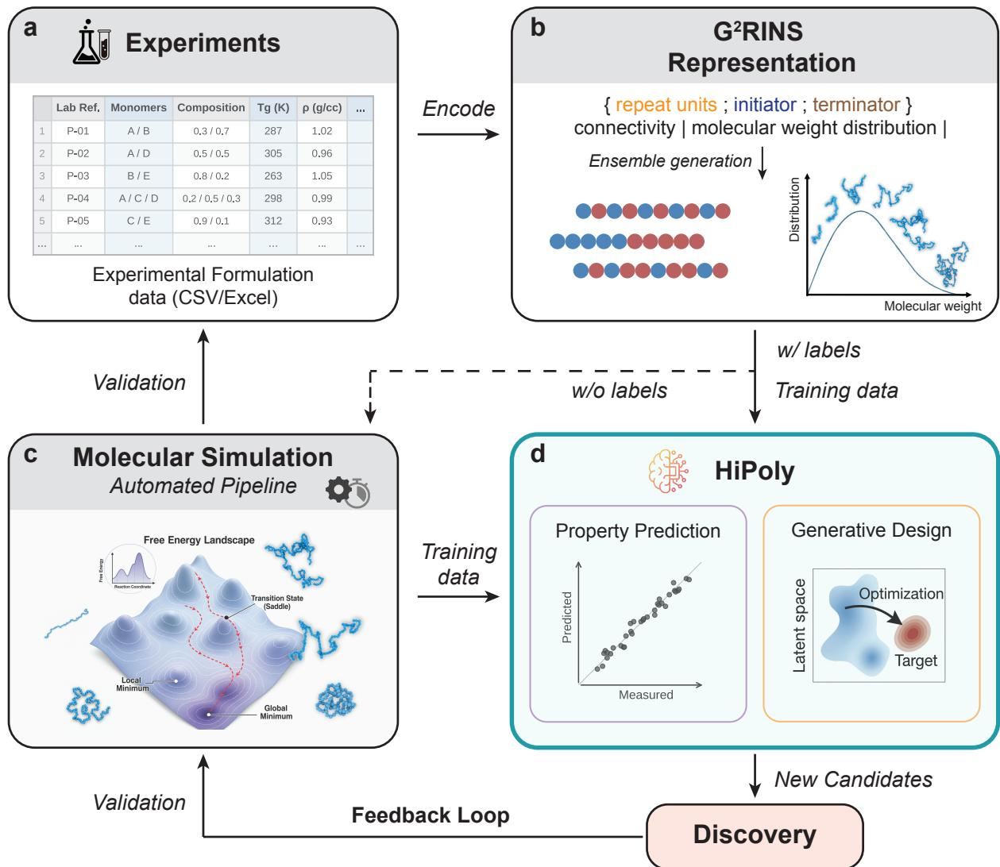
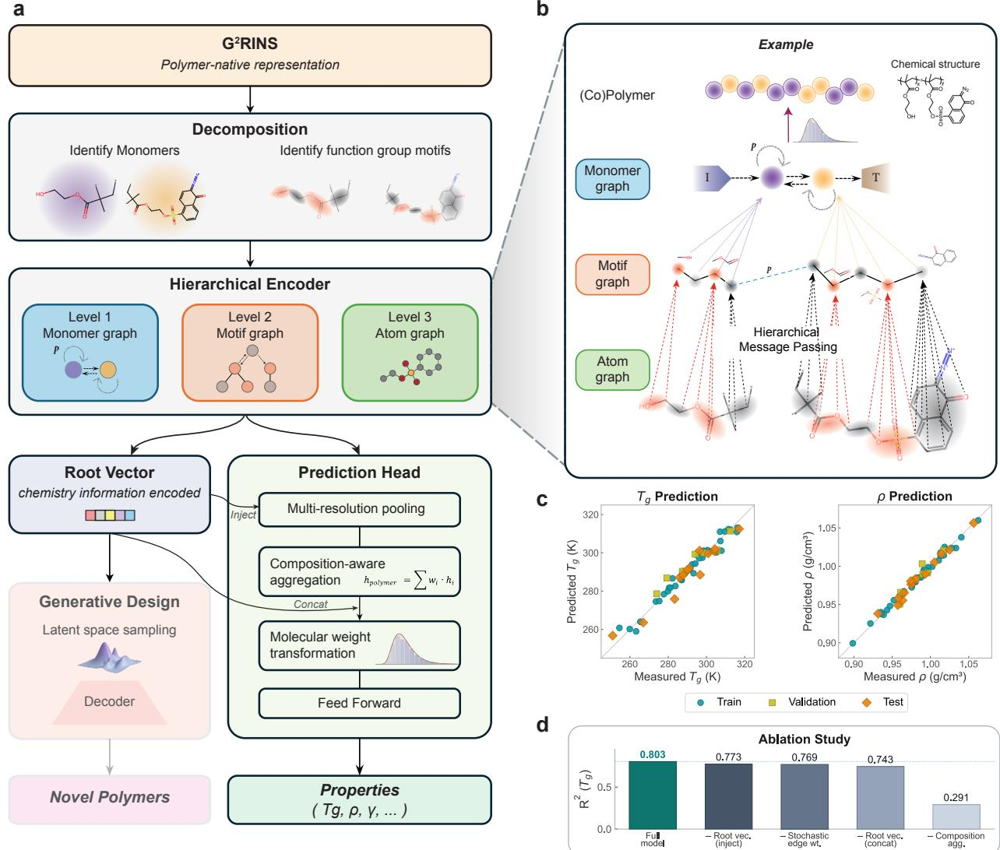
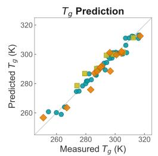
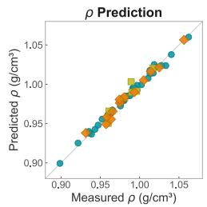
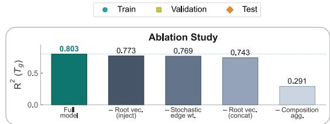
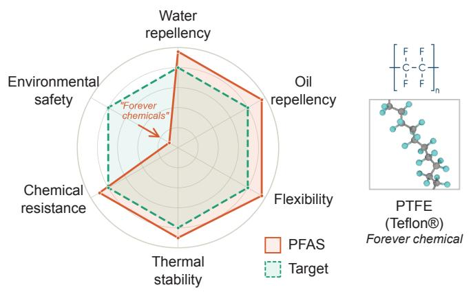
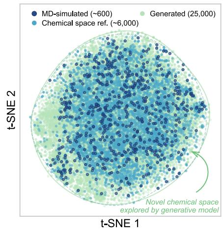
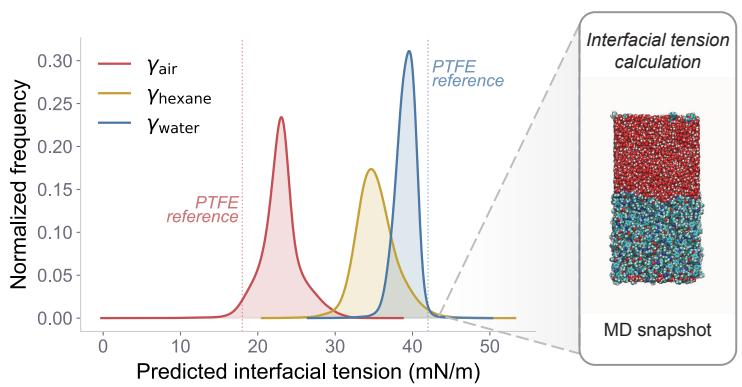
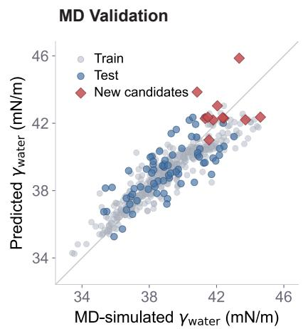

# HiPoly: a hierarchical polymer-native AI framework for property prediction and generative design

Ge Sun1,2, Gervasio Zaldivar1,†, Yuan Tian1,†, Gustavo Perez Lemus1, Juhae Park1,4, Dasha Safarian4, Ming Han5, Juan J. de Pablo1,2,3,∗

1Department of Chemical and Biomolecular Engineering, Tandon School of Engineering, New York University, Brooklyn, NY, USA

2Department of Computer Science, Courant Institute of Mathematical Sciences, New York University, New York, NY, USA

3Department of Physics, New York University, New York, NY, USA

4Pritzker School of Molecular Engineering, University of Chicago, Chicago, IL, USA

5Center for Quantitative Biology and Peking-Tsinghua Joint Center for Life Sciences, Academy for Advanced Interdisciplinary Studies, Peking University, Beijing, China

∗Corresponding author: jjd8110@nyu.edu

## Abstract

Polymeric materials are central to modern technologies, with applications ranging from energy to health and transportation. Although AI has made significant advances in materials discovery, the hierarchical structure of polymers across multiple length scales makes them inherently dificult to represent in a unified and physically meaningful way. Here we introduce HiPoly, a polymer-native AI framework that processes complete polymer descriptions through a three-level hierarchical graph architecture built on the G2RINS representation. HiPoly encodes stochastic inter-monomer connectivity, composition, and molecular weight directly within its architecture, using physically motivated design principles that mirror the multi-scale nature of polymeric systems. The framework establishes an end-to-end AI-driven workflow from experimental formulation data to property prediction, generative molecular design, and physics-based validation through molecular simulations, all unified by a single polymer representation. We demonstrate state-of-the-art prediction accuracy for thermophysical properties of multi-component polymer systems, with ablation studies confirming that each hierarchical design choice contributes independently to model performance. As an example, the generative design pathway is applied here to the discovery of sustainable alternatives to persistent fluorinated polymers, where it is

possible to identify and independently validate PFAS-free candidates with target surface-energy properties. This work demonstrates how polymer-native AI can accelerate discovery by linking representation, prediction, and design across complex polymer chemistries.

## Introduction

Polymers are used in applications spanning energy storage, structural engineering, biomedicine, and environmental remediation, to name a few [1, 2]. However, their complexity sets them apart from other material classes: polymer properties emerge not from a single molecular structure but from an ensemble of chains whose behavior is governed by chemistry on multiple scales [3, 4], from monomer identity and functional group arrangement at the atomic level to molecular weight, chain architecture, and monomer sequence statistics at the chain level. This point is illustrated in Fig. 1b, which depicts an ensemble of chains for a polymer. As can be seen in the figure, a macroscopic sample is not a single chain, but rather a collection of order $1 0 ^ { 2 3 }$ structurally distinct molecules. These hierarchical dependencies cannot be captured by monomer structure alone [5, 6]. The challenge is further compounded in multi-component systems, which constitute the majority of industrially relevant formulations [7], where properties depend jointly on composition [8, 9], stochastic inter-monomer connectivity [10, 11], and molecular weight distribution [12, 13], creating a combinatorial design space that far exceeds what experiment or simulation can explore [14].

Artificial intelligence (AI) and machine learning (ML) have emerged as powerful tools to navigate this space, and the field of polymer informatics has advanced significantly in recent years [1, 15–18]. However, most of the existing approaches operate on monomer-level representations. Fingerprintbased methods encode individual repeat units as fixed-length descriptors, handling multi-component systems through composition-weighted sums or auxiliary features [19–21]. Pre-trained language models such as polyBERT [22], TransPolymer [23], and polyBART [24] learn expressive representations from polymer SMILES strings and can achieve good performance on homopolymer benchmarks, but their inputs remain monomer-level sequences that do not natively encode composition or inter-monomer connectivity. Graph neural network approaches have moved closer to polymer-level representations: Polymer Chemprop [25] introduced weighted edges to capture monomer stoichiometry and architecture type in a flat molecular graph; PolymerGNN [26], CoPolyGNN [27], and related multitask GNN frameworks [28] aggregate monomer-level graph embeddings with composition-aware readout functions; and self-supervised strategies have been explored to mitigate data scarcity in polymer GNNs [29]. Topology-aware and physics-guided models have been developed to address architectural diversity in polymer systems, but these operate at coarse-grained resolution and do not capture key atomistic chemical details [30, 31]. Recent work has shown that decomposing molecules into functional group motifs, rather than treating them as flat atom graphs, captures chemically meaningful substructures, leading to considerable improvements in property prediction [32]. Despite these advances, no existing model natively encodes the full specification of a multi-component polymer, including monomer chemistry, mole fractions, stochastic inter-monomer bond connectivity, and molecular weight distribution, within a single architecture.

On the generative front, the inverse design of new polymers is still in its infancy: existing approaches target molecular topology at coarse-grained resolution [30], polymer backbones without composition control [33], or operate on string-based representations that limit structural diversity [34, 35]. None couples generation with physics-based validation through a shared polymer representation.

A key enabler of the present work is the Generative Graph Representation of Integrated Nested BigSMILES (G2RINS) [36], a polymer representation that builds on the BigSMILES line notation for stochastic macromolecules [37] and its generative extension, G-BigSMILES [38]. G2RINS captures monomer chemistry, mole fractions of monomers within polymer chains (or composition), stochastic inter-monomer bond connectivity, and molecular weight distribution in a single string. Because G2RINS specifies the complete polymeric system, it can natively generate atomistic chain ensembles suitable for molecular dynamics (MD) simulation, providing a unified interface between ML and physics-based modeling.

Here we introduce HiPoly, a Hierarchical Generative Polymer AI framework that operates on true polymer representations through a multi-resolution architecture built on G2RINS. HiPoly processes the polymer structure at three levels of resolution, from atoms through functional group motifs to monomer-level connectivity, using physically motivated design principles: stochastic edge weighting derived from actual polymerization statistics, composition-aware aggregation, hierarchical context integration through root vectors, and molecular weight transformation. The same architecture supports both multi-target property prediction and variational generative design, with candidates validated through MD simulations using G2RINS-generated chain ensembles. We demonstrate this framework in the prediction of the glass transition temperature and density for multi-component polymer systems, where HiPoly achieves state-of-the-art accuracy from a modestly sized training set, and in the generative design of PFAS-free polymer alternatives with MD-validated surface-energy performance.

  
Figure 1 End-to-end workflow for polymer property prediction and molecular design. a, Experimental formulation data, including monomer identities, compositions, and measured properties, serve as the starting point for the workflow. b, Formulations are encoded into $\mathrm { G ^ { 2 } R I N S }$ polymer strings that capture monomer chemistry, mole fractions, stochastic inter-monomer bond connectivity, and molecular weight distribution; chain ensembles are generated directly from the $\mathrm { G ^ { 2 } R I N S }$ specification. $\mathbf { c } ,$ An automated molecular dynamics (MD) simulation pipeline constructs, equilibrates, and extracts properties from $\mathrm { G ^ { 2 } R I N S } .$ -generated chain ensembles, providing training labels when experimental measurements are unavailable and independently validating generative candidates. d, HiPoly accepts the hierarchical molecular graphs derived from $\mathrm { G ^ { 2 } R I N S }$ and performs multi-target property prediction or generative molecular design through a shared latent space. New candidates identified through generative design feed back into simulation or experiment for validation, closing a bidirectional feedback loop that progressively augments the training set.

## Results

## An end-to-end AI framework for polymer discovery

Predicting the properties of polymeric materials from their molecular formulation remains a central challenge in materials science, particularly for hetero-polymer systems where monomer identity, composition, inter-monomer connectivity, and molecular weight jointly govern the macroscopic behaviour.

HiPoly addresses this challenge through a unified workflow that connects experimental formulation data to property prediction, generative molecular design, and physics-based validation (Fig. 1).

The workflow begins by encoding experimental or simulation records of monomer identities, compositions, and measured properties (Fig. 1a) into $\mathrm { G ^ { 2 } R I N S }$ polymer strings [36], a polymernative representation that captures monomer chemistry, mole fractions, stochastic inter-monomer bond connectivity, and molecular weight distribution (Fig. 1b). This encoding translates polymer formulation data from human-readable tabular formats into a machine-readable, graph-constructible form that preserves the complete structural and statistical specification of the polymeric system. A full description of $\mathrm { G ^ { 2 } R I N S }$ is provided in ref. [36]. The resulting $\mathrm { G ^ { 2 } R I N S }$ strings are then parsed into hierarchical molecular graphs through a functional group decomposition [32] that coarse-grains each monomer fragment from individual atoms up to chemically meaningful motifs such as ring systems, ether linkages, and ester groups, while inter-monomer connections are annotated with G2RINS-derived bond probabilities that reflect the stochastic nature of polymerization.

From these hierarchical graphs the framework operates in three stages (Fig. 1c,d). First, a hierarchical graph neural network encoder produces a polymer-level embedding that jointly captures atom-level chemistry, functional group organization, and monomer composition (Fig. 1d); the architecture of this encoder is detailed in the next section and Fig. 2. Second, this embedding feeds either a multi-target regression head for property prediction or a shared variational latent space for generative molecular design. Third, G2RINS-generated chain ensembles provide the starting configurations for MD simulations (Fig. 1c), which serve a dual role: they supply training labels when experimental measurements are unavailable, and they independently validate candidates produced by the generative model. This closes a bidirectional feedback loop in which new candidates identified through generative design are confirmed by simulation or experiment, and the resulting data in turn augment the training set for subsequent model iterations (Fig. 1, bottom). Because $\mathrm { G ^ { 2 } R I N S }$ natively generates atomistic chain ensembles suitable for simulation, the same representation serves both as input to the neural network and as the starting point for MD, ensuring self-consistency across the entire pipeline.

We applied this framework to a dataset of 65 multi-component polymer systems spanning five polymer families, with up to four distinct monomer types per formulation. The target properties include the glass transition temperature $T _ { g }$ and the mass density $\rho ,$ covering a wide range of linear and branched architectures at varying composition fractions. Rather than compiling property values from literature reports that may reflect diferent measurement conditions, we generated all target properties through MD simulations using $\mathrm { G ^ { 2 } R I N S  – g e n e r a t e d }$ chain ensembles and an automated simulation pipeline for system construction, equilibration, and property extraction (Fig. 1c). This strategy ensures that all properties in the dataset are computed under identical thermodynamic conditions and simulation protocols, eliminating a major source of noise in polymer property databases and providing a self-consistent testbed for model development. Data were split into training, validation, and test sets; details are provided in Methods.

## Physically motivated architecture

The HiPoly architecture encodes the polymer structure in three resolutions that mirror the physical hierarchy of polymeric materials (Fig. 2a). A $\mathrm { G ^ { 2 } R I N S }$ string is first decomposed by identifying its constituent monomer fragments and their functional group motifs [32], which yields three graph levels. The atom graph (Level 3, finest resolution) represents each monomer fragment as a molecular graph of covalent bonds. The motif graph (Level 2) captures relationships between chemically meaningful functional groups, such as ring systems and ester groups, within each fragment. The monomer graph (Level 1, coarsest resolution) encodes the connectivity among monomer fragments, with edges annotated by $\mathrm { G ^ { 2 } R I N S  – d e r i v e d }$ bond probabilities that reflect the stochastic nature of polymerization. All three levels are processed by directed message passing [39], and information flows through the hierarchy so that each level is informed by the others. Figure 2b illustrates this hierarchical message passing on a concrete example, showing how atom-level, motif-level, and monomer-level representations interact for a multi-component polymer with its initiator and terminator fragments.

Three physically motivated design principles distinguish HiPoly from prior flat-graph approaches.

b  

  
Figure 2 HiPoly architecture, prediction performance, and ablation study. a, Overview of the HiPoly architecture. A $\mathrm { G ^ { 2 } R I N S }$ string is decomposed into three graph levels (monomer, motif, and atom), each processed by directed message passing. A root vector summarizes global chemistry information and connects to both the prediction head and a variational latent space for generative design. b, Example of hierarchical message passing on a multi-component polymer with initiator (I) and terminator (T) fragments, illustrating how information flows across the atom, motif, and monomer graph levels. c, Parity plots for $T _ { g }$ and density predictions from one representative cross-validation fold; full five-fold statistics are reported in Table 2. d, Ablation study on $T _ { g } \ R ^ { \hat { 2 } }$ . Each variant removes exactly one component from the full model. All components independently contribute to prediction accuracy.

The first is stochastic edge weighting. Within each monomer fragment, the covalent bonds are deterministic, and the message passing at the atom and motif levels proceeds with uniform weights. However, at the monomer graph level, the connectivity between fragments reflects the stochastic nature of polymerization: which monomers are adjacent in a given chain depends on reaction kinetics and thermodynamics. HiPoly encodes this distinction by selectively applying $\mathrm { G ^ { 2 } R I N S } .$ -derived bond probabilities as edge weights at the monomer graph level, modulating how strongly each fragment node integrates information from its neighbors.

The second principle is composition-aware aggregation. After multi-resolution pooling condenses each fragment’s node embeddings into a single fixed-size vector, the fragment representations are combined into a polymer-level embedding using mole fractions as aggregation weights, $\mathbf { h } _ { \mathrm { p o l y m e r } } =$ $\textstyle \sum _ { i } w _ { i } \cdot \mathbf { h } _ { i }$ (Fig. 2a, Prediction Head). This design mirrors the linear mixing rules that govern many polymer properties [40] and encodes the composition directly into the learned representation rather than providing it as auxiliary metadata.

The third principle is hierarchical context integration through a root vector. A root vector summarizes the global chemistry information encoded across the hierarchical levels and is injected into the prediction head alongside the composition-aggregated polymer embedding (Fig. 2a, Root Vector). This combines the local chemical detail captured by fragment-level pooling with a global structural context that reflects how functional groups are organized across the full molecular hierarchy.

In addition to composition and connectivity, the model incorporates molecular weight through a dedicated transformation in the prediction head (Fig. 2a). When the degree of polymerization N is specified in the $\mathrm { G ^ { 2 } R I N S }$ string, the polymer-level embedding receives an additive chain-end correction that decays as 1/N and vanishes in the infinite-chain limit, the dependence underlying the Fox–Flory relation [4, 41] (Methods, Eq. 11). For properties that follow power laws in chain length, the prediction head additionally receives log N. When the full molecular weight distribution is available, HiPoly instead incorporates it through a distribution-aware encoding [42] that captures dispersity and higher-order moments.

## Prediction performance and comparison with baselines

We evaluated HiPoly on two fundamental thermophysical properties, the glass transition temperature $T _ { g }$ and the mass density $\rho ,$ calculated using molecular dynamics simulations using $\mathrm { G ^ { 2 } R I N S }$ -generated chain ensembles under identical thermodynamic conditions. To assess the advantages of a polymernative, hierarchical architecture, we compared HiPoly against four baselines that collectively represent the dominant paradigms in current polymer property prediction: fingerprint-based machine learning, pretrained language models, and graph neural networks (Table 1). These include random forest (RF) regression paired with extended-connectivity fingerprints [19] in two composition-handling variants (RF + ECFP with composition as auxiliary features, $\mathrm { R F + w F P }$ with composition-weighted fingerprint averaging), polyBERT [22] with composition-weighted PSMILES embedding averaging, and Polymer Chemprop [25], a weighted directed message-passing neural network (wD-MPNN) that operates on a flat molecular graph. All baselines were re-implemented on our dataset and evaluated under identical five-fold cross-validation splits.

Table 1 Methodological comparison across approaches.
<table><tr><td>Method</td><td>Representation</td><td>Polymer- native</td><td>Multi- comp.</td><td>Mol. frac.</td><td>Conn. MW</td><td></td><td>Gen.</td></tr><tr><td> $\mathrm { R F + E C F P ^ { \dagger } }$ </td><td>Monomer ECFP‡</td><td>X</td><td>2</td><td>2</td><td>X</td><td>X</td><td>X</td></tr><tr><td> $\mathrm { R F } + \mathrm { w F P ^ { \dag } }$ </td><td>Monomer ECFP‡</td><td>X</td><td>2</td><td>~</td><td>X</td><td>X</td><td>X</td></tr><tr><td> $\mathrm { \ p o l y { B E R T } ^ { \dagger } }$ </td><td>Monomer PSMILES</td><td>2</td><td>2</td><td>2</td><td>X</td><td>x</td><td>X</td></tr><tr><td>Polymer Chemprop†</td><td>Flat molecular graph</td><td></td><td></td><td></td><td>●</td><td></td><td>X</td></tr><tr><td>HiPoly (This work)</td><td>Hierarchical G²RINS graph</td><td></td><td></td><td></td><td></td><td></td><td></td></tr></table>

✓ = natively supported; • = limited native support; ∼ = supported via our adaptation; ✗ = not supported.  
Multi-comp. = multi-component polymers; Mol. frac. = mole fractions; Conn. = inter-monomer connectivity;  
MW = molecular weight; Gen. = generative design.  
† Re-implemented on our dataset.  
‡ Adapted for multi-component polymers: RF + ECFP uses composition as auxiliary features; RF + wFP uses composition-weighted fingerprint averaging; polyBERT uses composition-weighted embedding averaging.

Table 1 compares the methodological capabilities of these approaches. The fingerprint and language model baselines operate on individual monomer representations and have no native mechanism for encoding how multiple monomers combine; to enable a fair comparison on our multi-component dataset, we adapted them as indicated in the table footnotes. Polymer Chemprop natively accepts multi-component polymers and encodes mole fractions and inter-monomer connectivity through its bond weighting scheme, though it relies on pre-fixed hypothetical bond weights assigned by the idealized architecture type, such as random, block, or alternating, rather than deriving connectivity from the actual polymer specification. Only HiPoly provides a fully polymer-native representation that encodes mole fractions, stochastic inter-monomer bond topology, and molecular weight directly within a hierarchical architecture, while additionally supporting generative molecular design through its shared variational latent space.

The performance comparison in Table 2 reveals a clear progression from monomer to polymer representations. HiPoly achieves the highest accuracy in both properties: $R ^ { 2 } = 0 . 8 0 3 \pm 0 . 1 4 7$ for $T _ { g }$ and $R ^ { 2 } = 0 . 9 4 5 \pm 0 . 0 2 4$ for density (Table 2; a representative fold is shown in Fig. 2c). Among the baselines, the comparison between RF + ECFP and $\mathrm { R F + w F P }$ is instructive: these methods difer only in how composition enters the representation, yet composition-weighted averaging nearly doubles the $T _ { g } \ R ^ { 2 }$ from 0.36 to 0.70, demonstrating that encoding composition within the molecular representation is essential for multi-component systems. polyBERT achieves comparable performance to the weighted fingerprint baseline despite access to a much larger pretraining corpus, suggesting that representations learned by monomer-level language models do not transfer efectively to polymer-level property prediction because the pretraining objective captures intra-monomer chemical patterns but not inter-monomer interactions or composition-dependent property trends. Polymer Chemprop achieves strong density predictions $\left( R ^ { 2 } = 0 . 8 8 4 \right)$ , as density depends mainly on atomic packing and van der Waals volume, which are well captured by atom-level graph representations. However, its $T _ { g }$ predictions are notably unstable, with a cross-fold standard deviation of 0.427, indicating that some folds essentially fail; this reflects the greater sensitivity of $T _ { g }$ to cooperative segmental dynamics and inter-monomer interactions that require explicit hierarchical encoding.

Table 2 Prediction performance across methods. Five-fold cross-validation; mean $\pm \mathrm { \ s . d . }$ . across folds. All methods trained on identical splits.
<table><tr><td rowspan="3">Method</td><td colspan="3"> $T _ { g }$ </td><td colspan="3">Density</td></tr><tr><td> $R ^ { 2 }$ </td><td> $\mathrm { R M S E \left( K \right) }$ </td><td> $\mathrm { M A E ~ ( K ) }$ </td><td> $R ^ { 2 }$ </td><td> $\mathrm { R M S E } \ \mathrm { ( g c m ^ { - 3 } ) }$ </td><td> $\mathrm { M A E \ ( g c m ^ { - 3 } ) }$ </td></tr><tr><td> $\mathrm { R F + E C F P ^ { \dagger } }$ </td><td> $0 . 3 6 2 \pm 0 . 5 4 0$ </td><td> $9 . 9 1 2 \pm 2 . 5 3 7$ </td><td> $7 . 7 4 4 \pm 1 . 9 3 0$ </td><td> $0 . 5 3 2 \pm 0 . 2 2 4$ </td><td> $0 . 0 2 0 2 \pm 0 . 0 0 7 5$ </td><td> $0 . 0 1 4 9 \pm 0 . 0 0 5 6$ </td></tr><tr><td> $\mathrm { R F } + \mathrm { w F P ^ { \dag } }$ </td><td> $0 . 6 9 5 \pm 0 . 1 3 7$ </td><td> $7 . 5 4 8 \pm 1 . 7 7 8$ </td><td> $5 . 4 3 5 \pm 1 . 3 8 7$ </td><td> $0 . 7 8 4 \pm 0 . 0 6 4$ </td><td> $0 . 0 1 3 5 \pm 0 . 0 0 3 3$ </td><td> $0 . 0 1 0 0 \pm 0 . 0 0 2 5$ </td></tr><tr><td> $\mathrm { \ p o l y { B E R T } ^ { \dag } }$ </td><td> $\underline { { 0 . 7 5 9 \pm 0 . 2 0 1 } }$ </td><td> $6 . 4 8 0 \pm 2 . 4 2 1$ </td><td> $4 . 6 2 8 \pm 1 . 4 5 3$ </td><td> $0 . 8 5 0 \pm 0 . 1 4 5$ </td><td> $0 . 0 1 0 6 \pm 0 . 0 0 5 0$ </td><td> $0 . 0 0 7 0 \pm 0 . 0 0 2 4$ </td></tr><tr><td>Polymer Chemprop†</td><td> $0 . 6 1 8 \pm 0 . 4 2 7$ </td><td> $7 . 6 8 2 \pm 3 . 9 7 2$ </td><td> $5 . 8 3 2 \pm 3 . 0 5 0$ </td><td> $\underline { { 0 . 8 8 4 \pm 0 . 0 5 4 } }$ </td><td> $\underline { { 0 . 0 0 9 9 \pm 0 . 0 0 3 1 } }$ </td><td> $\underline { { 0 . 0 0 6 9 \pm 0 . 0 0 2 3 } }$ </td></tr><tr><td>HiPoly (This work)</td><td> $\mathbf { 0 . 8 0 3 \pm 0 . 1 4 7 }$ </td><td> $\mathbf { 5 . 9 0 0 \pm 2 . 4 5 4 }$ </td><td> $\mathbf { 4 . 2 4 0 \pm 1 . 5 7 9 }$ </td><td> $\mathbf { 0 . 9 4 5 \pm 0 . 0 2 4 }$ </td><td> $\mathbf { 0 . 0 0 6 8 \pm 0 . 0 0 2 5 }$ </td><td> $\mathbf { 0 . 0 0 5 2 \pm 0 . 0 0 2 1 }$ </td></tr></table>

† Re-implemented on our dataset with composition adaptation where applicable. Bold = best; underline = second best.

HiPoly resolves these limitations and achieves the strongest results on both properties. For $T _ { g }$ , it reaches an MAE of 4.2 K with the lowest cross-fold variance among the graph-based methods. For density, it achieves an MAE of $0 . 0 0 5 \ \mathrm { g } \quad \mathrm { c m } ^ { - 3 }$ with $R ^ { 2 } = 0 . 9 4 5$ , surpassing the next-best method by more than 6 percentage points. This error approaches the intrinsic uncertainty of the molecular dynamics simulations used to generate the target values, suggesting that HiPoly extracts nearly all the learnable information from the representation $\mathrm { G ^ { 2 } R I N S }$ for this property. The tight clustering along the diagonal in the parity plots (Fig. 2c) visually confirms this quantitative assessment, with density predictions showing a particularly narrow scatter across training, validation, and test partitions.

To understand which architectural components drive this performance, we conducted an ablation study using $T _ { g }$ as the representative property, as its sensitivity to cooperative segmental dynamics amplifies the efect of each design choice (Fig. 2d). Each variant removes exactly one component from the complete model $\left( R ^ { 2 } = 0 . 8 0 3 \right)$ , keeping all others intact. Removing composition-aware aggregation collapses prediction to $R ^ { 2 } = 0 . 2 9 1$ , as expected for multi-component systems where composition is a primary determinant of properties. More revealing is that the remaining three components each independently improve accuracy. Stochastic edge weighting encodes which monomers are likely neighbors in the chain, capturing sequence-level conformational efects that cannot be recovered from monomer chemistry alone. Root vector injection modulates the prediction head with a global summary of the hierarchical encoding, providing a top-down structural context that guides property estimation. Root vector concatenation enriches the polymer embedding with this same hierarchical information after composition-aware aggregation, supplying complementary chemical detail at the feature level. Each addresses a distinct aspect of polymer structure that flat-graph approaches cannot represent.

## Generative design of sustainable polymer alternatives

To demonstrate the full discovery capability of HiPoly, we applied the generative design pathway to a pressing real-world challenge: identifying sustainable replacements for per- and polyfluoroalkyl substances (PFAS). PFAS, exemplified by polytetrafluoroethylene (PTFE), are widely used for their exceptional water and oil repellency, chemical resistance, and thermal stability, yet their extreme environmental persistence has led to tightening of regulatory restrictions worldwide [43]. The design objective is to discover polymers that approach the surface-energy performance of PFAS while eliminating the fluorinated chemistries responsible for their environmental accumulation (Fig. 3a). We quantify surface energy performance through interfacial tensions at polymer–air $( \gamma _ { \mathrm { a i r } } )$ , polymer– hexane $( \gamma _ { \mathrm { h e x a n e } } )$ and polymer–water $\left( \gamma _ { \mathrm { w a t e r } } \right)$ interfaces, which collectively characterize hydrophobicity, oleophobicity and surface energy.

We began by constructing a chemical reference space from approximately 6,000 polymers encoded as $\mathrm { G ^ { 2 } R I N S }$ strings (Fig. 3b, light blue). From this pool, approximately 600 were selected and labeled through the automated MD pipeline described in Methods, resulting in interfacial tension values computed under identical simulation conditions (Fig. 3b, dark blue). The t-SNE projection of the learned latent space confirms that these labeled polymers cover the reference chemical space, providing a representative training set despite their modest size.

c Predicted Property Distributions for Generated Polymers  

d  

  
Figure 3 Generative design of PFAS-free polymer alternatives. a, Multi-objective design targets for PFAS replacement. The radar chart compares the property profile of PFAS (red) with the desired target (green dashed) across water repellency, oil repellency, flexibili $\mathrm { t y , }$ chemical resistance, thermal stability, and environmental safety. PTFE $( \mathrm { T e f l o n } ^ { \mathrm { ( \mathbf { R } ) } } )$ is shown as the reference fluorinated polymer. b, t-SNE projection of the learned latent space. The reference chemical space comprises approximately 6,000 unlabeled polymers (light blue), of which approximately 600 are labeled through MD simulation (dark blue). The generative model samples 25,000 novel candidates (green) that fill and expand beyond the reference space. c, Predicted interfacial tension distributions for the generated polymers at polymer–air, polymer–hexane, and polymer– water interfaces. Dashed lines indicate PTFE reference values. d, MD validation of top-ranked candidates. The parity plot compares predicted and MD-simulated $\gamma _ { \mathrm { w a t e r } }$ for training data (gray), test data (blue), and newly validated candidates (red). Inset: MD simulation snapshot of the interfacial tension calculation.

Using the shared variational latent space of HiPoly, we then sampled 25,000 novel polymer candidates (Fig. 3b, green). These generated polymers not only fill gaps within the existing chemical space but also expand into previously unexplored regions, demonstrating that the generative model discovers structurally diverse candidates beyond the training distribution. The trained predictor, using only 600 labeled polymers, selected all 25,000 candidates for their interfacial tension profiles (Fig. 3c).

The predicted distributions reveal a population of generated polymers that exhibit simultaneously high $\gamma _ { \mathrm { w a t e r } }$ and low $\gamma _ { \mathrm { a i r } }$ , which match the surface-energy signature of PTFE while avoiding fluorinated building blocks.

To confirm that these predictions reflect genuine material properties rather than artifacts of extrapolation, we independently validated the top-ranked candidates through MD simulations using $\mathrm { { G ^ { 2 } R I N S } } .$ -generated chain ensembles (Fig. 3d). The parity plot comparing the predicted and MDsimulated $\gamma _ { \mathrm { w a t e r } }$ shows that the newly validated candidates (red) fall along the same diagonal as the original training and test data (gray and blue), confirming that HiPoly generalizes reliably to new chemistries outside the training set. This validation step closes the feedback loop introduced in Fig. 1: The generated candidates are confirmed by simulation based on physics using the same representation $\mathrm { G ^ { 2 } R I N S }$ that drives both the neural network and the MD pipeline, ensuring end-to-end self-consistency.

The resulting PFAS-free candidate structures are chemically diverse and feature unconventional functional group combinations, including aromatic-ester backbones, heterocyclic units, and sterically hindered side groups, which would be dificult to arrive at through human intuition or conventional structure–property heuristics alone. This highlights a key strength of the generative approach: by operating in a learned latent space rather than enumerating known chemistries, HiPoly explores regions of polymer space that lie outside established design rules, identifying candidates whose surface-energy performance arises from subtle interplay between backbone rigidity, side-chain polarity, and intermolecular packing. More broadly, this case study illustrates how the HiPoly framework can accelerate the discovery of functional polymer materials in application domains where the design space is vast, experimental iteration is costly, and traditional material selection is increasingly constrained by environmental demands.

## Discussion

In this work, we have presented HiPoly, a polymer-native hierarchical AI framework that operates on complete polymer descriptions rather than monomer-level proxies. HiPoly encodes the polymer structure in three levels of resolution, from atoms through functional group motifs to monomer-level connectivity, and captures composition, stochastic bonding, and molecular weight natively within a single end-to-end architecture built on the $\mathrm { G ^ { 2 } R I N S }$ representation. By coupling this hierarchical encoder with both a multi-target property predictor and a variational generative model, HiPoly establishes a complete workflow for polymer discovery, from formulation data to validated material candidates.

A notable consequence of this hierarchical and physically informed design is data eficiency. HiPoly achieves the highest accuracy of prediction for $T _ { g }$ and density, and identifies validated PFAS-free candidates, in both cases from modestly sized training sets. This is possible because the architecture encodes domain knowledge directly into its structure instead of relying on large-scale pretraining to implicitly learn polymer physics from data. For multi-component polymer systems, where labeled data remain scarce and expensive to obtain through either experiment or simulation, this data eficiency is a practical advantage.

The design principles validated here extend beyond HiPoly itself. The strategies of encoding composition through weighted aggregation, incorporating connectivity through probabilistic edge weights, and integrating hierarchical context through root vectors are general and can be adopted by other graph neural network architectures for polymer property prediction. The framework further generalizes to any scalar polymer property for which training data are available, including mechanical, rheological, transport, and dielectric properties, ofering a broadly applicable foundation for polymer-native ML.

In the future, expanding the training data to include broader polymer families and additional properties would strengthen both predictive accuracy and generative diversity. Integration with experimental validation, where $\mathrm { { G ^ { 2 } R I N S } } .$ -generated candidates are synthesized and characterized in the laboratory, would close the complete design loop from the computation to the physical material. The PFAS case study demonstrates that a polymer-native AI framework can address real-world formulation challenges with practical impact. We anticipate that the principles established here, polymer-native representation, hierarchical physical encoding, and self-consistent validation through $\mathrm { G ^ { 2 } R I N S }$ , will inform the next generation of polymer AI models, ultimately accelerating the design of polymer materials for applications ranging from sustainable packaging to advanced energy storage.

## Methods

## Problem formulation

We formulate polymer property prediction as multi-target regression from molecular structure. Given a polymer defined by a set of K monomer repeat units with SMILES representations $\{ s _ { 1 } , \ldots , s _ { K } \}$ mole fractions $\{ w _ { 1 } , \ldots , w _ { K } \}$ satisfying $\textstyle \sum _ { i = 1 } ^ { K } w _ { i } = 1$ , inter-monomer bond connectivity rules $\boldsymbol { B } =$ $\{ ( i , j , p _ { i j } , p _ { j i } ) \}$ specifying stochastic bond probabilities between attachment sites, and a molecular weight distribution $\mathrm { M W } \sim { \mathcal { D } } ( \pmb { \theta } )$ where D may be Gaussian, uniform, Poisson, Flory–Schulz, Schulz– Zimm, or log-normal, the task is to predict a vector of continuous material properties $\mathbf { y } \in \mathbb { R } ^ { P } \ ( \mathrm { e . g . }$ 2 glass transition temperature $T _ { g } ,$ density $\rho ,$ interfacial tension $\gamma )$ . The model handles linear and branched polymers with two or more monomer types, variable compositions, and multiple attachment topologies, and supports training with incomplete property labels via NaN-aware loss computation.

## Polymer representation

Each polymer is encoded as a pipe-delimited string derived from the $\mathrm { G ^ { 2 } R I N S }$ representation [36], which builds on the BigSMILES line notation for stochastic macromolecules [37] and its generative extension [38]:

$$
\underbrace { s _ { 1 } . s _ { 2 } . . . . . s _ { K } } _ { \mathrm { m o n o m e r ~ S M I L E S } } ~ | \underbrace { w _ { 1 } | w _ { 2 } | \ldots | w _ { K } } _ { \mathrm { m o l e f r a c t i o n s } } \ | \underbrace {  i - j : p _ { i j } : p _ { j i }  \ldots } _ { \mathrm { b o n d ~ r u l e s } } \ | \underbrace { \mathcal { D } ( \pmb { \theta } ) } _ { \mathrm { M W ~ d i s t r i b u t i o n } }\tag{1}
$$

Monomer SMILES contain wildcard attachment sites $[ * : n ]$ that define inter-monomer bonding points. The bond rules specify, for each pair of attachment sites $( i , j )$ , the directional probabilities $p _ { i j }$ and $p _ { j i }$ with which those sites are bonded in the polymer ensemble.

These bond probabilities and mole fractions are not analytically assumed from idealized architectures (e.g., setting $p = 0 . 5$ for random polymers as in prior work [25]). Instead, they are derived from realistic chain ensembles generated by $\mathrm { G ^ { 2 } R I N S }$ , which produces statistically representative populations of polymer chains that respect the specified composition, connectivity, and molecular weight distribution. The same chain ensembles serve as input to MD simulations, providing a self-consistent framework in which the input to the AI model is grounded in the same physical representation used for atomistic validation.

The molecular weight field specifies a parametric distribution from a supported family (Gaussian, uniform, Poisson, Flory–Schulz, Schulz–Zimm, or log-normal), or alternatively a histogram for empirical distributions, from which chain lengths are sampled during ensemble generation.

## Hierarchical graph construction

Fragment decomposition. The G2RINS string is parsed into its constituent monomer fragments. Wildcard atoms are removed and the resulting molecular graph is split into K disconnected monomer fragments. Per-atom weight fractions (derived from mole fractions) and attachment-site metadata are retained as node attributes.

Inter-monomer bond feature extraction. Bond features for inter-monomer connections, which do not correspond to permanent covalent bonds in any single fragment, are extracted via a duplication method: the core molecule is duplicated, a temporary bond is inserted between attachment sites across the original and copy, bond features are extracted, and the temporary bond is removed. This produces chemically consistent bond descriptors (bond type, conjugation, ring membership, stereo) together with the directional connection probabilities $( p _ { i j } , p _ { j i } )$ that modulate the message passing at the monomer graph level.

Functional group decomposition. Each monomer fragment independently undergoes functional group decomposition [32]:

1. Cluster identification: atoms are grouped into elementary clusters defined by individual bonds and simple rings (determined by the smallest set of smallest rings).

2. Motif pooling: clusters are merged into higher-level functional group motifs using a pre-computed vocabulary of chemically meaningful substructures (ring systems, ether linkages, ester groups) derived from the training data.

3. Graph construction: a graph is built over the resulting motifs, defining parent–child relationships through a maximum spanning approach.

4. Traversal ordering: depth-first search labels graph edges with traversal order, used for positional encoding during message passing.

The result is a two-view representation per fragment: an atom-level molecular graph and a motif-level graph, linked by a cluster-to-atom mapping matrix C that records which atoms belong to which motif.

Polymer-level graph assembly. Fragment-level motif graphs are merged into a unified polymer graph with appropriate index ofsets. Inter-monomer connection metadata, including bond features, directional weights, and polymer-level attributes (degree of polymerization, composition), are attached to graph nodes, enabling polymer-aware message passing.

## Three-level hierarchical encoder

The encoder processes the polymer graph through three levels of message passing, each operating on a diferent structural resolution. All three levels use the same underlying mechanism, a directed message-passing neural network (D-MPNN) [39] with LSTM-based [44] recurrent message updates, but difer in the graph topology on which they operate and whether stochastic edge weights are applied.

Information flows bottom-up through the hierarchy: the atom graph (Level 3) is encoded first, its embeddings feed into the motif graph (Level 2), and the motif representations in turn feed into the monomer graph (Level 1).

Directed message passing with stochastic edge weighting. At each level ℓ, the edge-centered hidden states $\mathbf { h } _ { v u } ^ { ( \ell , t ) }$ are updated over $D _ { \ell }$ iterations:

$$
\mathbf { m } _ { v u } ^ { ( \ell , t ) } = \sum _ { k \in \mathcal { N } ( v ) \backslash u } \mathbf { h } _ { k v } ^ { ( \ell , t - 1 ) }\tag{2}
$$

$$
\mathbf { h } _ { v u } ^ { ( \ell , t ) } = \mathrm { L S T M } \Big ( \mathbf { h } _ { v u } ^ { ( \ell , t - 1 ) } , ~ \mathbf { m } _ { v u } ^ { ( \ell , t ) } \Big )\tag{3}
$$

After $D _ { \ell }$ iterations, node representations are obtained by aggregating incoming edge messages:

$$
\mathbf { h } _ { v } ^ { ( \ell ) } = \tau \left( \mathbf { W } _ { o } ^ { ( \ell ) } \left[ \mathbf { x } _ { v } ^ { ( \ell ) } \parallel \sum _ { k \in \mathcal { N } ( v ) } \alpha _ { k v } ^ { ( \ell ) } \mathbf { h } _ { k v } ^ { ( \ell , D _ { \ell } ) } \right] \right)\tag{4}
$$

where $\mathbf { x } _ { v } ^ { ( \ell ) }$ is the input feature vector at level $\ell ,$ ∥ denotes concatenation, $\tau$ is a nonlinear activation, and $\alpha _ { k v } ^ { ( \ell ) } \in [ 0 , 1 ]$ is an edge-level aggregation weight that modulates the contribution of the message from node k to node v.

The edge weights $\alpha _ { k v } ^ { ( \ell ) }$ encode the central physical insight of the model. At the level of the monomer graph (Level 1), the edges represent inter-monomer connections whose presence is stochastic, so $\alpha _ { k v } ^ { ( 1 ) } = p _ { k \ i }$ v where $p _ { k v }$ is the probability of bonds derived from $\mathrm { G ^ { 2 } R I N S }$ between fragments k and v. At the level of the motif graph (Level 2), the topology of the graph is fixed for a given molecular structure, so $\alpha _ { k v } ^ { ( 2 ) } = 1$ . At the atom graph level (Level 3), all bonds within a monomer fragment are deterministic covalent bonds, so $\alpha _ { k v } ^ { ( 3 ) } = 1$ (standard unweighted message passing).

This selective application of stochastic edge weights reflects the physical reality that structural uncertainty in polymers resides primarily at inter-monomer connections, where the stochastic polymerization process determines which monomers are adjacent.

Level 1: Monomer graph encoding (coarsest). The monomer graph encoder operates on the connectivity among monomer fragments, with edges annotated by $\mathrm { G ^ { 2 } R I N S }$ -derived bond probabilities. Input features for each monomer node are formed by concatenating a learned vocabulary embedding ${ \bf E } _ { c } ( v )$ (encoding the motif identity) with the motif graph representation from Level 2:

$$
\mathbf { x } _ { v } ^ { ( 1 ) } = \tau \Big ( \mathbf { W } _ { c } \left[ \mathbf { E } _ { c } ( v ) \ | \ | \ \mathbf { h } _ { v } ^ { ( 2 ) } \right] \Big )\tag{5}
$$

This level captures long-range inter-monomer interactions across the polymer structure, modulated by stochastic edge weights.

Level 2: Motif graph encoding. The motif graph encoder operates on the functional group graph within each fragment. The input features for each node of the motif v are formed by concatenating a learned vocabulary embedding $\mathbf { E } _ { i } ( v )$ (encoding the identity of the motif ) with the sum of the atom embeddings belonging to that motif:

$$
\mathbf { x } _ { v } ^ { ( 2 ) } = \tau \left( \mathbf { W } _ { i } \left[ \mathbf { E } _ { i } ( v ) \parallel \sum _ { a \in \mathcal { C } ( v ) } \mathbf { h } _ { a } ^ { \mathrm { a t o m } } \right] \right)\tag{6}
$$

where C(v) denotes the set of atoms in motif v (from the cluster-to-atom mapping C) and $\mathbf { W } _ { i }$ is a learned linear projection. Edge features include positional encodings from the depth-first traversal order. After $D _ { 2 }$ iterations, the output is motif-level embeddings $\mathbf { h } _ { v } ^ { ( 2 ) } \in \mathbb { R } ^ { d }$

Level 3: Atom graph encoding (finest). The atom graph encoder operates on the molecular graph of the covalent bonds within each monomer fragment. The features of the input node $\mathbf { x } _ { v } ^ { ( 3 ) }$ are one-hot encodings in a vocabulary of pairs of (element symbol, formal charge), which capture the identity of the atom. Edge features are one-hot encodings of bond type (single, double, triple, aromatic) combined with positional encodings from the traversal order. After $D _ { 3 }$ iterations of message passing, the output is atom embeddings $\mathbf { h } _ { v } ^ { \mathrm { a t o m } } \in \mathbb { R } ^ { d }$ for all atoms in the batch.

Root vector. For each fragment in the batch, a root embedding $\mathbf { h } ^ { \mathrm { r o o t } }$ is computed by aggregating the incoming motif-level edge messages at the designated root node of the motif graph:

$$
{ \mathbf { h } } ^ { \mathrm { r o o t } } = \operatorname { t a n h } \left( \mathbf { W } _ { r } \left[ \mathbf { x } _ { r } ^ { ( 1 ) } \parallel \sum _ { k \in \mathcal { N } ( r ) } \mathbf { h } _ { k r } ^ { ( 1 , D _ { 1 } ) } \right] \right)\tag{7}
$$

where $r$ is the root node, $\mathbf { x } _ { r } ^ { ( 1 ) }$ is the root’s input feature at Level 1, $\mathbf { h } _ { k r } ^ { ( 1 , D _ { 1 } ) }$ are the final edge-state messages arriving at $r$ after $D _ { 1 }$ iterations, and $\mathbf { W } _ { r } \in \mathbb { R } ^ { d \times 2 d }$ . The root vector combines a node’s local motif identity with the global message-passing context, providing a summary of the entire hierarchical structure of each monomer fragment.

## Fragment-level embedding

The hierarchical encoder produces per-node representations at multiple levels. To obtain a fixed-size embedding per fragment, we use an attention-based pooling module. For each fragment, the pooling proceeds in two branches:

1. A node-level MLP produces per-node embeddings $\mathbf { h } _ { v } ^ { ( a ) }$

2. A second MLP produces pairwise embeddings $\mathbf { h } _ { v } ^ { ( b ) }$ , which are processed through multi-head self-attention [45] to capture inter-node interactions. The attention output is element-wise multiplied with $\mathbf { h } _ { v } ^ { ( b ) }$ (gating), then concatenated with $\mathbf { h } _ { v } ^ { ( a ) }$ and projected.

The resulting per-node representations are aggregated into a single fragment embedding via multiresolution pooling, which concatenates four complementary strategies and projects to the embedding dimension $d _ { e }$

$$
\mathbf { h } ^ { \mathrm { f r a g } } = \mathbf { W } _ { \mathrm { p o o l } } \left[ \underbrace { { \frac { 1 } { | \mathcal { V } | } } \sum _ { v } \mathbf { h } _ { v } } _ { \mathrm { m e a n } } \ \Big \| \underbrace { \operatorname* { m a x } _ { v } \mathbf { h } _ { v } } _ { \mathrm { m a x } } \ \Big \| \underbrace { \sum _ { v } \sigma ( \mathbf { g } _ { v } ) \odot \mathrm { t a n h } ( \mathbf { f } _ { v } ) } _ { \mathrm { g a t e d } } \ \Big \| \underbrace { \sum _ { v } a _ { v } \mathbf { h } _ { v } } _ { \mathrm { a t t e n t i o n } } \right]\tag{8}
$$

where $\sigma ( \mathbf { g } _ { v } )$ and $\operatorname { t a n h } ( \mathbf { f } _ { v } )$ are learned gate and filter functions, $a _ { v } = \mathrm { s o f t m a x } _ { v } ( \mathbf { q } ( \bar { \mathbf { h } } ) ^ { \top } \mathbf { k } ( \mathbf { h } _ { v } ) )$ are attention weights with query q derived from the mean embedding $\bar { \mathbf { h } }$ and per-node keys $\mathbf { k } ,$ and ${ \bf W } _ { \mathrm { p o o l } } \in \mathbb { R } ^ { d _ { e } \times 4 d _ { e } }$ . This multi-resolution strategy addresses the well-known limitation that diferent material properties may depend on diferent statistical aspects of the molecular representation.

## Composition-aware aggregation

The fragment-level embedding produces one vector per monomer fragment, whereas the prediction head requires one embedding per polymer. The composition-aware aggregation bridges this gap through mole-fraction-weighted summation:

$$
{ \bf h } ^ { \mathrm { p o l y } } = \sum _ { i = 1 } ^ { K } w _ { i } { \bf h } _ { i } ^ { \mathrm { f r a g } }\tag{9}
$$

where $w _ { i }$ is the normalized mole fraction of monomer i and K is the number of distinct monomers. This formulation is physically motivated by the observation that many polymer properties follow approximate linear mixing rules, for example, the Fox equation [40] for the glass transition temperature $\begin{array} { r } { 1 / T _ { g } = \sum _ { i } w _ { i } / T _ { g , i } } \end{array}$ , which in a Taylor expansion of the first-order is linear in composition fractions. Composition-weighted aggregation encodes this inductive bias directly into the architecture, in contrast to approaches that treat composition as an auxiliary input or metadata feature.

Root vector integration. The root embeddings $\mathbf { h } ^ { \mathrm { r o o t } }$ from the hierarchical encoder are separately aggregated to the polymer level using the same composition weighting (Eq. 9), projected to match the embedding dimension of the fragment via a learned linear map $\mathbf { W } _ { \mathrm { r o o t } } \in \mathbb { R } ^ { d _ { e } \times d }$ , and concatenated

with the embedding of the polymer:

$$
\tilde { \mathbf { h } } ^ { \mathrm { p o l y } } = \mathbf { W } _ { \mathrm { a d a p t } } \left[ \mathbf { h } ^ { \mathrm { p o l y } } \parallel \mathbf { W } _ { \mathrm { r o o t } } \mathbf { h } ^ { \mathrm { r o o t , p o l y } } \right]\tag{10}
$$

where $\mathbf { W } _ { \mathrm { a d a p t } } \in \mathbb { R } ^ { d _ { e } \times 2 d _ { e } }$ . This integration combines local chemical detail from the fragment embeddings with a global hierarchical context from the root vectors. Ablation experiments confirm that both components contribute to the accuracy of the prediction and that their combination outperforms either one alone (Fig. 2d).

## Molecular weight transformation

When the degree of polymerization N is specified in the $\mathrm { G ^ { 2 } R I N S }$ string, the polymer-level embedding receives an additive chain-end correction:

$$
\tilde { \mathbf { h } } _ { \mathrm { M W } } ^ { \mathrm { p o l y } } = \tilde { \mathbf { h } } ^ { \mathrm { p o l y } } + \frac { N _ { 0 } } { N + N _ { 0 } } \mathbf { W } _ { \mathrm { e n d } } \tilde { \mathbf { h } } ^ { \mathrm { p o l y } }\tag{11}
$$

The first term is the embedding of the infinitely long chain. The second term accounts for chain ends. Each chain of N repeat units carries two ends, so the chain-end concentration scales as $1 / N$ and to leading order chain ends shift bulk properties in proportion to their concentration [4, 41]. For $N \gg N _ { 0 }$ the correction decays as $N _ { 0 } / N$ and vanishes in the infinite-chain limit, so that with a linear readout a predicted property takes the Fox–Flory form $y \simeq y _ { \infty } - K / N$ . Both $y _ { \infty }$ and K are set by the repeat-unit chemistry, through $\tilde { \mathbf { h } } ^ { \mathrm { p o l y } }$ and the learned matrix $\mathbf { W } _ { \mathrm { e n d } }$ , which allows the magnitude and sign of the correction to vary between polymers as K does. The crossover scale $N _ { 0 }$ bounds the correction at low $N _ { ; }$ , where chain ends are no longer a dilute perturbation and the linear $1 / M _ { n }$ dependence of $T _ { g }$ breaks down; it is a learned scalar. For properties that follow power laws in chain length, such as the zero-shear viscosity or the radius of gyration, the natural coordinate is log $N .$ , in which such scalings are linear [4]. The prediction head therefore additionally receives log N as an input feature, and crossovers between scaling regimes, such as the onset of entanglement, are left to its nonlinear layers. Throughout, N is the number-average degree of polymerization, $N = M _ { n } / M _ { 0 }$ , with $M _ { 0 }$ the repeat-unit mass. When the full molecular weight distribution is available, HiPoly instead incorporates it through a distribution-aware encoding [42] that captures dispersity

and higher-order moments.

## Prediction head

Polymer embedding $\tilde { \mathbf { h } } _ { \mathrm { M W } } ^ { \mathrm { p o l y } }$ is mapped to property predictions through a residual MLP [46]:

$$
\hat { \mathbf { y } } = \mathbf { W } _ { \mathrm { o u t } } f _ { \mathrm { R e s N e t } } ( \mathbf { W } _ { \mathrm { i n } } \tilde { \mathbf { h } } _ { \mathrm { M W } } ^ { \mathrm { p o l y } } )\tag{12}
$$

where $f _ { \mathrm { R e s N e t } }$ consists of residual blocks with PReLU activations and $\mathbf { W _ { \mathrm { o u t } } } \in \mathbb { R } ^ { P \times d _ { h } }$ maps to the number of target properties P.

## Variational regularization and generative pathway

The encoder shares its architecture with a variational autoencoder (VAE) [47] pathway. Root vectors are mapped to a latent distribution via learned mean and variance networks:

$$
\pmb { \mu } = \mathbf { W } _ { \mu } \mathbf { h } ^ { \mathrm { r o o t } } , \quad \mathrm { l o g } \pmb { \sigma } ^ { 2 } = - | \mathbf { W } _ { \sigma } \mathbf { h } ^ { \mathrm { r o o t } } |\tag{13}
$$

where the absolute-value constraint ensures $\begin{array}{c} \sigma ^ { 2 } \leq 1 \end{array}$ . Latent vectors z are sampled using the reparameterization trick [47] and decoded by an autoregressive graph decoder that reconstructs molecules node-by-node through the motif vocabulary. The KL divergence term $D _ { \mathrm { K L } } ( q ( \mathbf { z } | \mathbf { x } ) \| p ( \mathbf { z } ) )$ with a unit Gaussian prior serves as an implicit regularizer for the encoder, encouraging smooth, structured latent representations. The learned latent space provides the foundation for the inverse design through latent space sampling and conditional generation, as demonstrated in the PFAS case study discussed in the following (Fig. 3).

## Loss function

The total training objective combines property prediction and variational regularization:

$$
\mathcal { L } = \mathcal { L } _ { \mathrm { p r o p } } + \lambda \cdot \beta _ { t } \cdot D _ { \mathrm { K L } }\tag{14}
$$

The property loss ${ \mathcal { L } } _ { \mathrm { p r o p } }$ is the sum of the mean squared errors per-property with NaN masking:

$$
\mathcal { L } _ { \mathrm { p r o p } } = \sum _ { j = 1 } ^ { P } \frac { 1 } { \lvert \mathcal { M } _ { j } \rvert } \sum _ { i \in \mathcal { M } _ { j } } ( y _ { i j } - \hat { y } _ { i j } ) ^ { 2 }\tag{15}
$$

where $\mathcal { M } _ { j } = \{ i : y _ { i j } \neq \mathrm { N a N } \}$ is the set of samples with valid labels for property $j .$ This enables multi-task learning with incomplete labels, which is common in polymer datasets where diferent properties are measured on diferent subsets of materials.

The KL weight follows a linear annealing schedule $\beta _ { t } = \beta _ { 0 } + t \cdot \Delta \beta$ , clamped to $[ \beta _ { \mathrm { m i n } } , \beta _ { \mathrm { m a x } } ]$ , with an additional scaling factor λ (default 0.01) to balance property prediction and regularization.

## Molecular Dynamics

Force Field Parameters and Equilibration Setup. Molecular Dynamics (MD) simulations were carried out using the OPLS force field. This force field was selected due to its well-documented accuracy in predicting the density and thermodynamic properties of organic liquids. Automatic force field parameterization of the monomers is performed using the same procedure as described in [48]. An initial low density configuration is used and equilibrated in NVT at 600K. Then an NPT simulation in a temperature ramp from 600K to 300K in 50ns is used to reach the equilibrated density, followed by an additional NVT relaxation at 300K for 20ns. Simulations of these interfaces were performed using the OpenMM simulation engine.

Interfacial Tension Simulations To evaluate the interfacial behavior of the organic phase, biphasic systems were constructed by joining the equilibrated organic bulk (from the previous step) with pre-equilibrated boxes of water, hexane, and air (air represented as a vacuum gap).

The interfacial tension (γ) was calculated using the Test Area 2 (TA2) method. This nonexponential perturbative approach calculates the change in free energy $( \Delta A )$ associated with a virtual change in the interfacial surface area (A) at a constant volume. The interfacial tension is expressed as

$$
\gamma = \operatorname* { l i m } _ { \Delta \mathcal { A }  0 } ( \frac { \Delta A } { \Delta \mathcal { A } } ) _ { N , V , T } =  \frac { \Delta U } { \Delta \mathcal { A } }  _ { N , V , T }\tag{16}
$$

where $\Delta U$ is the diference in potential energy between the perturbed and unperturbed states.

## Training details

Data splitting. All results are reported using five-fold cross-validation. A composite stratification score is computed by normalizing each property to [0, 1] and averaging, then discretized into five quantile bins to ensure balanced property distributions across folds. Within each fold, a held-out validation set (10% of the training partition) is reserved for early stopping and hyperparameter selection. All methods in Table 2 are trained and evaluated in identical splits. The parity plots in Fig. 2c show predictions from a representative fold.

Normalization. The target properties are normalized to the z-score using training-set statistics: $\tilde { y } = ( y - \mu _ { \mathrm { t r a i n } } ) / \sigma _ { \mathrm { t r a i n } }$ . Statistics are saved for reproducible inference.

Optimization. We use AdamW [49] with the learning rate 10−3, the weight decay 10−4 (excluded from biases and normalization layers) and the gradient clipping at max norm 5.0. The learning rate follows a warmup-cosine schedule: linear warmup for 5 epochs, then cosine decay to $1 0 ^ { - 6 }$ . Training runs for up to 100 epochs with early stopping based on validation loss (patience of 55 epochs).

## Ablation study design

To quantify the contribution of each architectural component, we performed a systematic ablation study in which exactly one component is removed from the full model while keeping all the others intact. The four ablated variants are:

1. − Composition-aware aggregation: mole-fraction weighting (Eq. 9) is replaced with simple mean pooling over fragment embeddings.

2. − Root vector (inject): the root vector pathway that modulates the prediction head is removed; only the embedding of the fragment aggregated by composition is used.

3. − Stochastic edge weighting: G2RINS-derived bond probabilities at the monomer graph level are set to uniform $( \alpha _ { v } ^ { ( 1 ) } = 1$ for all nodes).

4. − Root vector (concat): Concatenation of the root vector after removing the aggregation based on the composition.

$T _ { g }$ is used as the representative property for ablation because its sensitivity to cooperative segmental dynamics amplifies the efect of each design choice (see Results and Fig. 2d).

## Evaluation metrics

The performance of the model is assessed on the held-out test set using mean absolute error (MAE), root mean squared error (RMSE), and the coeficient of determination $( R ^ { 2 } )$ :

$$
R ^ { 2 } = 1 - \frac { \sum _ { i } ( y _ { i } - \hat { y } _ { i } ) ^ { 2 } } { \sum _ { i } ( y _ { i } - \bar { y } ) ^ { 2 } }\tag{17}
$$

For the baseline comparison (Table 2), all methods are evaluated under identical five-fold crossvalidation splits, with mean and standard deviation reported across folds.

## Data availability

The polymer datasets used for training were generated using our in-house molecular simulation framework. These datasets constitute the data supporting the findings of this study and are available upon request.

## Code availability

The HiPoly code and trained model weights are available upon request.

## Author contributions

J.J.d.P conceived and supervised the project. G.S. developed the model and performed experiments. G.Z and Y.T developed the G2RINS representation. G.P.L, J.P., and D.S. performed molecular simulations. All authors discussed the results and wrote the manuscript.

## Competing interests

The authors declare no competing interests.

## References

1. Tran, H., Gurnani, R., Kim, C., Pilania, G., Kwon, H.-K., Lively, R. P. & Ramprasad, R. Design of functional and sustainable polymers assisted by artificial intelligence. Nature Reviews Materials 9, 866–886 (2024).

2. Matyjaszewski, K. & Tsarevsky, N. V. Nanostructured functional materials prepared by atom transfer radical polymerization. Nature chemistry 1, 276–288 (2009).

3. Flory, P. J. Principles of polymer chemistry (Cornell university press, 1953).

4. Rubinstein, M. & Colby, R. H. Polymer physics (Oxford university press, 2003).

5. Bicerano, J. Prediction of polymer properties (cRc Press, 2002).

6. Odian, G. Principles of polymerization (John Wiley & Sons, 2004).

7. Bates, F. S., Hillmyer, M. A., Lodge, T. P., Bates, C. M., Delaney, K. T. & Fredrickson, G. H. Multiblock polymers: panacea or Pandora’s box? Science 336, 434–440 (2012).

8. Bates, F. S. & Fredrickson, G. H. Block copolymers—designer soft materials. Physics today 52, 32–38 (1999).

9. Badi, N., Chan-Seng, D. & Lutz, J.-F. Microstructure control: an underestimated parameter in recent polymer design. Macromolecular Chemistry and Physics 214, 135–142 (2013).

10. Palermo, E. F. & McNeil, A. J. Impact of copolymer sequence on solid-state properties for random, gradient and block copolymers containing thiophene and selenophene. Macromolecules 45, 5948–5955 (2012).

11. Lutz, J.-F., Ouchi, M., Liu, D. R. & Sawamoto, M. Sequence-controlled polymers. Science 341, 1238149 (2013).

12. Gentekos, D. T., Sifri, R. J. & Fors, B. P. Controlling polymer properties through the shape of the molecular-weight distribution. Nature Reviews Materials 4, 761–774 (2019).

13. Walsh, D. J., Schinski, D. A., Schneider, R. A. & Guironnet, D. General route to design polymer molecular weight distributions through flow chemistry. Nature communications 11, 3094 (2020).

14. De Pablo, J. J., Jackson, N. E., Webb, M. A., Chen, L.-Q., Moore, J. E., Morgan, D., Jacobs, R., Pollock, T., Schlom, D. G., Toberer, E. S., et al. New frontiers for the materials genome initiative. npj Computational Materials 5, 41 (2019).

15. Audus, D. J. & de Pablo, J. J. Polymer informatics: opportunities and challenges. ACS macro letters 6, 1078–1082 (2017).

16. Kim, C., Chandrasekaran, A., Huan, T. D., Das, D. & Ramprasad, R. Polymer genome: a data-powered polymer informatics platform for property predictions. The Journal of Physical Chemistry C 122, 17575–17585 (2018).

17. Batra, R., Song, L. & Ramprasad, R. Emerging materials intelligence ecosystems propelled by machine learning. Nature Reviews Materials 6, 655–678 (2021).

18. Ge, W., De Silva, R., Fan, Y., Sisson, S. A. & Stenzel, M. H. Machine learning in polymer research. Advanced Materials 37, 2413695 (2025).

19. Rogers, D. & Hahn, M. Extended-connectivity fingerprints. Journal of chemical information and modeling 50, 742–754 (2010).

20. Kuenneth, C., Schertzer, W. & Ramprasad, R. Copolymer informatics with multitask deep neural networks. Macromolecules 54, 5957–5961 (2021).

21. Shukla, S. S., Kuenneth, C. & Ramprasad, R. Polymer informatics beyond homopolymers. MRS Bulletin 49, 17–24 (2024).

22. Kuenneth, C. & Ramprasad, R. polyBERT: a chemical language model to enable fully machinedriven ultrafast polymer informatics. Nature communications 14, 4099 (2023).

23. Xu, C., Wang, Y. & Barati Farimani, A. TransPolymer: a Transformer-based language model for polymer property predictions. npj Computational Materials 9, 64 (2023).

24. Savit, A., Sahu, H., Shukla, S., Xiong, W. & Ramprasad, R. polyBART: A Chemical Linguist for Polymer Property Prediction and Generative Design in (2025).

25. Aldeghi, M. & Coley, C. W. A graph representation of molecular ensembles for polymer property prediction. Chemical Science 13, 10486–10498 (2022).

26. Queen, O., McCarver, G. A., Thatigotla, S., Abolins, B. P., Brown, C. L., Maroulas, V. & Vogiatzis, K. D. Polymer graph neural networks for multitask property learning. npj Computational Materials 9, 90 (2023).

27. Pinheiro, G. A., Quiles, M. G., Da Silva, J. L. & Fern, X. Z. Mitigating data scarcity in polymer property prediction via multi-task auxiliary learning in Joint European Conference on Machine Learning and Knowledge Discovery in Databases (2025), 426–442.

28. Gurnani, R., Kuenneth, C., Toland, A. & Ramprasad, R. Polymer informatics at scale with multitask graph neural networks. Chemistry of Materials 35, 1560–1567 (2023).

29. Gao, Q., Dukker, T., Schweidtmann, A. M. & Weber, J. M. Self-supervised graph neural networks for polymer property prediction. Molecular Systems Design & Engineering 9, 1130–1143 (2024).

30. Jiang, S., Dieng, A. B. & Webb, M. A. Property-guided generation of complex polymer topologies using variational autoencoders. npj Computational Materials 10, 139 (2024).

31. Jiang, S. & Webb, M. A. Physics-guided neural networks for transferable property prediction in architecturally diverse copolymers. Macromolecules 58, 4971–4984 (2025).

32. Han, M., Sun, G., Nealey, P. F. & De Pablo, J. J. Attention-based functional-group coarsegraining: a deep learning framework for molecular prediction and design. npj Computational Materials 11, 355 (2025).

33. Gurnani, R., Kamal, D., Tran, H., Sahu, H., Scharm, K., Ashraf, U. & Ramprasad, R. PolyG2G: A novel machine learning algorithm applied to the generative design of polymer dielectrics. Chemistry of Materials 33, 7008–7016 (2021).

34. Li, W., Li, Y., Lei, Q., Wang, Z. & Wang, X. PolyRL: reinforcement learning-guided polymer generation for multi-objective polymer discovery. Digital Discovery 5, 266–276 (2026).

35. Vogel, G. & Weber, J. M. Inverse design of copolymers including stoichiometry and chain architecture. Chemical Science 16, 1161–1178 (2025).

36. Zaldivar, G., Tian, Y., Sun, G., Kappatou, C., Eiden, P., Wulkow, N. B., Settels, V. & de Pablo, J. J. G2RINS: A Generative String-and-Graph Polymer Representation to Assist Computational Materials Discovery. ChemRxiv 10.26434/chemrxiv.15007504/v1 (2026).

37. Lin, T.-S., Coley, C. W., Mochigase, H., Beech, H. K., Wang, W., Wang, Z., Woods, E., Craig, S. L., Johnson, J. A., Kalow, J. A., et al. BigSMILES: a structurally-based line notation for describing macromolecules. ACS central science 5, 1523–1531 (2019).

38. Schneider, L., Walsh, D., Olsen, B. & de Pablo, J. Generative BigSMILES: an extension for polymer informatics, computer simulations & ML/AI. Digital Discovery 3, 51–61 (2024).

39. Yang, K., Swanson, K., Jin, W., Coley, C., Eiden, P., Gao, H., Guzman-Perez, A., Hopper, T., Kelley, B., Mathea, M., et al. Analyzing learned molecular representations for property prediction. Journal of chemical information and modeling 59, 3370–3388 (2019).

40. Fox, T. G. Influence of diluent and of copolymer composition on the glass temperature of a polymer system. Bull. Am. Phs. Soc. 1, 123 (1952).

41. Fox Jr, T. G. & Flory, P. J. Second-order transition temperatures and related properties of polystyrene. I. Influence of molecular weight. Journal of Applied Physics 21, 581–591 (1950).

42. Hu, J., Sparrow, Z. M., Ernst, B. G., Mattes, S. M., Coates, G. W., DiStasio Jr, R. A. & Fors, B. P. Designing polymers with molecular weight distribution-based machine learning. Journal of the American Chemical Society 147, 10238–10246 (2025).

43. Glüge, J., Scheringer, M., Cousins, I. T., DeWitt, J. C., Goldenman, G., Herzke, D., Lohmann, R., Ng, C. A., Trier, X. & Wang, Z. An overview of the uses of per-and polyfluoroalkyl substances (PFAS). Environmental science: processes & impacts 22, 2345–2373 (2020).

44. Graves, A. Long short-term memory. Supervised sequence labelling with recurrent neural networks, 37–45 (2012).

45. Vaswani, A., Shazeer, N., Parmar, N., Uszkoreit, J., Jones, L., Gomez, A. N., Kaiser, Ł. & Polosukhin, I. Attention is all you need. Advances in neural information processing systems 30 (2017).

46. He, K., Zhang, X., Ren, S. & Sun, J. Deep residual learning for image recognition in Proceedings of the IEEE conference on computer vision and pattern recognition (2016), 770–778.

47. Kingma, D. P. & Welling, M. Auto-encoding variational bayes in (2013).

48. Schneider, L., Schwarting, M., Mysona, J., Liang, H., Han, M., Rauscher, P. M., Ting, J. M., Venkatram, S., Ross, R. B., Schmidt, K., et al. In silico active learning for small molecule properties. Molecular Systems Design & Engineering 7, 1611–1621 (2022).

49. Loshchilov, I. & Hutter, F. Decoupled weight decay regularization. arXiv preprint arXiv:1711.05101 (2017).