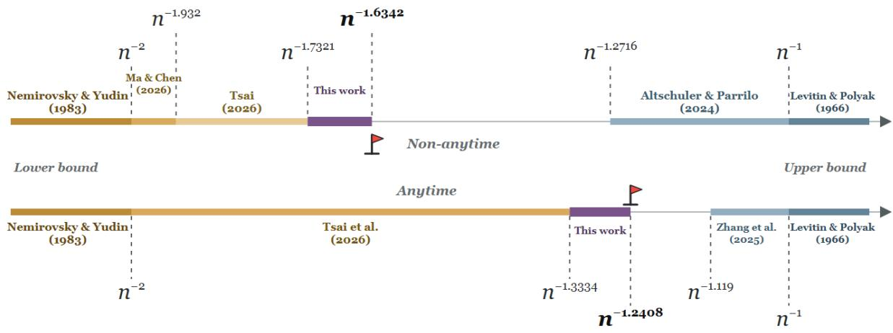
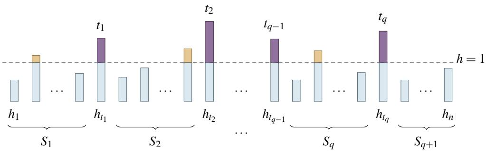
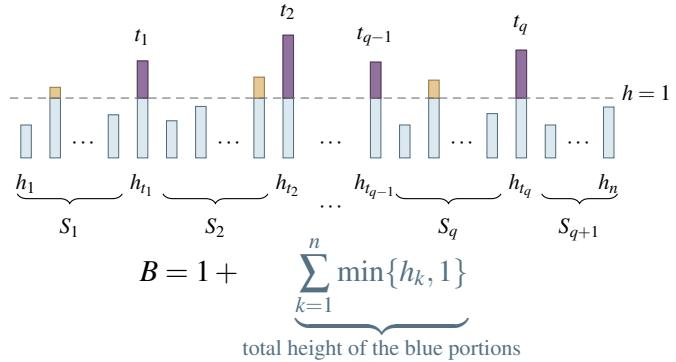
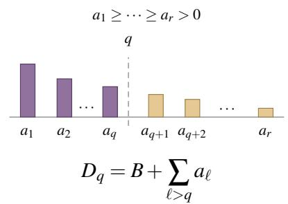
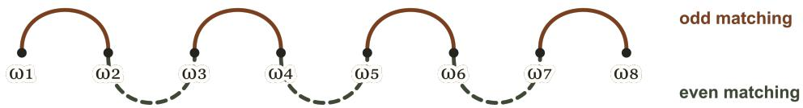
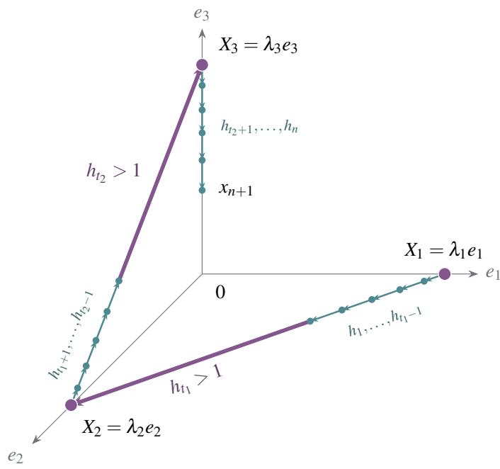
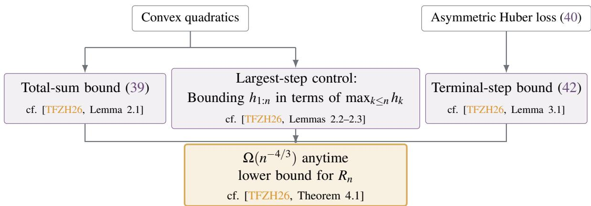

# Improved Gradient Descent Lower Bounds Beyond Nesterov

Yuhan Ye   
MIT   
yyh03@mit.edu

Kaizhao Liu MIT mrzt@mit.edu

September 3, 2026

## Abstract

We study how far gradient descent (GD) can be accelerated by predetermined stepsizes in smooth convex optimization. Going beyond the classical $\Omega ( n ^ { - 2 } )$ first-order oracle lower bound [NY83], we prove an $\Omega ( n ^ { - 1 . 6 3 4 2 } )$ non-anytime bound and an $\Omega ( n ^ { - 1 . 2 4 0 8 } )$ anytime barrier. These improve the $\bar { \Omega } ( n ^ { - 1 . 9 3 2 } )$ non-anytime result of [MC26] and the $\Omega ( n ^ { - 4 / 3 } )$ anytime bound of [TFZH26], respectively. Combined with the $O ( n ^ { - \log _ { 2 } ( 1 + \sqrt { 2 } ) } )$ rate achieved by non-anytime silver schedules [AP25b, GSW25b], our anytime lower bound establishes a strict separation between the achievable convergence exponents in the two settings.

## Contents

1 Introduction 3   
1.1 Contribution . 3   
1.2 Related Work 4   
2 Technique overview 5   
3 Proof of the Non-Anytime Lower Bound 8   
3.1 Reduction to a sequence inequality . 8   
3.2 Eliminating the variables xi . 10   
3.3 Properties of $\Gamma _ { \lambda }$ 11   
3.4 Upper bounding $\Sigma _ { i = 1 } ^ { q - 1 } \Gamma _ { \lambda } ( \omega _ { i } , \omega _ { i + 1 } )$ 12   
4 Anytime Lower Bound 16   
5 Concluding Remarks 17   
Appendix 21   
A Hard-Function Construction 21   
B Properties of $J ( \alpha , \lambda )$ and Numerical Solution 23   
C Proofs for the Anytime Lower Bound 25   
C.1 Proof and Intuition of Lemma 4.1 25   
C.2 Proof of Lemma 4.2 . 30

## 1 Introduction

Gradient descent (GD) is one of the simplest optimization algorithms, dating back nearly two hundred years to Cauchy [Cau47]. It updates

$$
\boldsymbol { x } _ { k + 1 } = \boldsymbol { x } _ { k } - h _ { k } \nabla f ( \boldsymbol { x } _ { k } ) ,
$$

where $h _ { k } > 0$ is the stepsize. In this paper, we study how far this basic method can be accelerated by predetermined stepsizes in smooth convex optimization.

To formalize this question, we define the convergence rate of a stepsize schedule $H = \left( h _ { 1 } , \ldots , h _ { n } \right)$ by

$$
R _ { n } ( H ) : = \operatorname* { s u p } _ { d \in \mathbb { N } } \operatorname* { s u p } _ { f \in \mathcal { F } _ { L } ( \mathbb { R } ^ { d } ) } \operatorname* { s u p } _ { x ^ { \star } \in \arg \operatorname* { m i n } f _ { x _ { 1 } \in \mathbb { R } ^ { d } \setminus \left\{ x ^ { \star } \right\} } } \frac { f ( x _ { n + 1 } ) - f ( x ^ { \star } ) } { \frac { L } { 2 } \| x _ { 1 } - x ^ { \star } \| ^ { 2 } } ,
$$

where $\mathcal { F } _ { L } ( \mathbb { R } ^ { d } )$ is the class of convex L-smooth functions on $\mathbb { R } ^ { d }$ with a nonempty set of minimizers. In the non-anytime (finite-horizon) setting, the schedule is designed for a fixed horizon n. In the anytime setting, one infinite schedule $h = ( h _ { k } ) _ { k \geq 1 }$ is used for every horizon, with $H _ { n } = \left( h _ { 1 } , \ldots , h _ { n } \right)$

It is a standard textbook result that GD with the constant stepsize $1 / L$ achieves an $O ( n ^ { - 1 } )$ rate [LP66, Nes04]. Classical acceleration approaches modify the GD iteration by introducing momentum or auxiliary sequences, as in Polyak’s heavy-ball method [Pol64] and Nesterov’s accelerated method [Nes83]. Among the broader class of first-order methods, Nesterov’s method attains the optimal $O ( n ^ { - 2 } )$ rate for smooth convex objectives, while the matching $\Omega ( n ^ { - 2 } )$ first-order oracle lower bound goes back to Nemirovsky and Yudin [NY83].

For GD with predetermined stepsizes, since it is a restricted class of first-order methods, the classical $\Omega ( n ^ { - 2 } )$ lower bound continues to apply. For many years, however, the best known general upper bound remained the classical $O ( n ^ { - 1 } )$ rate. This leads to the fundamental question of whether a faster rate is possible. In recent years, a growing body of work surprisingly shows that GD itself can be accelerated beyond the classical $O ( n ^ { - 1 } )$ rate by using carefully designed stepsize schedules that use occasional long steps and recursive structure [Gri24, AP25b, GSW25a, GSW25b]. The current best known non-anytime upper bound is $O ( n ^ { - \log _ { 2 } ( 1 + \sqrt { 2 } ) } )$ , achieved by the silver schedule [AP25b, GSW25b]. An anytime construction based on silver-schedule blocks achieves an $O ( n ^ { - 1 . 1 1 9 } )$ rate at every stopping time [ZLDC25]. This left open whether the generic $\Omega ( n ^ { - 2 } )$ lower bound could be strengthened toward these upper bounds.

Recently, Ma and Chen [MC26] proved an $\Omega ( n ^ { - 1 . 9 3 2 } )$ lower bound by cleverly constructing a hard function family. A subsequent refinement [Tsa26] gave an exposition of the framework and improved this bound to $\Omega ( n ^ { - \sqrt { 3 } } )$ . For the anytime case, [TFZH26] provides an $\Omega ( n ^ { - 4 / 3 } )$ lower bound.1

## 1.1 Contribution

Narrowing these gaps is a central problem in optimization as it clarifies the limitation of accelerating GD through stepsize schedules alone. In this paper, we make progress on both questions. Our result improves the non-anytime lower bound to $\Omega ( n ^ { - 1 . 6 3 4 2 } )$ , and the anytime lower bound to $\Omega ( n ^ { - 1 . 2 4 0 8 } )$ . Since log $( 1 + { \sqrt { 2 } } ) \approx$ $1 . 2 7 1 6 > 1 . 2 4 0 8$ , our anytime lower bound rules out the $O ( n ^ { - \log _ { 2 } ( 1 + \sqrt { 2 } ) } )$ rate achieved by non-anytime silver schedules [AP25b, GSW25b], establishing a strict separation between the two cases.

Theorem 1.1. There exists a constant $c > 0$ such that, for every integer $n \geq 1$ and every $H \in ( 0 , \infty ) ^ { n }$

$$
R _ { n } ( H ) \geq c n ^ { - 1 . 6 3 4 2 } .
$$

Theorem 1.2. No positive infinite schedule $h = ( h _ { k } ) _ { k \geq 1 }$ , with $H _ { n } = \left( h _ { 1 } , \ldots , h _ { n } \right)$ , satisfies

$$
R _ { n } ( H _ { n } ) = o ( n ^ { - 1 . 2 4 0 8 } ) .
$$

  
Figure 1: Improved lower bounds for GD.

After reviewing additional related work in Section 1.2, we give an overview of our techniques in Sec tion 2. At a high level, both proofs use the hard-function family introduced in [MC26, Theorem 4.1]. After this construction, Ma and Chen summarize the selected long-step excesses by a single quantity [MC26, Section 5.4]. Tsai rewrites this quantity in terms of the harmonic mean of these excesses [Tsa26, Lemma 7]. In contrast, our main technical contribution is to retain every factor coupling consecutive selected long steps and estimate these factors term by term. For the anytime case, we adapt the finite-to-anytime transfer from [TFZH26, Theorem 4.1] and apply the same estimate at horizons where the last stepsize is the largest seen so far. This yields the improved anytime lower bound.

The remainder of the paper is organized as follows. Section 3 provides the full details of the non-anytime proof outlined in Section 2. Section 4 extends the analysis to the anytime setting. Appendix A recalls the hard-function construction, Appendix B details how the scalar parameters are chosen, and Appendix C contains the proofs deferred from Section 4.

## 1.2 Related Work

Accelerating GD. Classical acceleration methods modify GD by incorporating information from previous iterations, as in Polyak’s heavy-ball method [Pol64] and Nesterov’s accelerated method [Nes83]. A complementary line of work uses the performance-estimation problem (PEP), which provides a systematic numerical framework for worst-case analysis [DT14]. Interpolation conditions yield exact PEP formulations for fixed-step first-order methods [THG17]. In the stepsize-only setting, PEP has also been used to search numerically for horizon-dependent GD schedules, providing finite-horizon evidence of acceleration [DGVPR24, KHG25]. Within the classical $O ( n ^ { - 1 } )$ regime, improved constants were obtained using predetermined schedules with stepsizes increasing toward 2/L [TV23] and, separately, periodic schedules with occasional long steps analyzed through multi-step certificates [Gri24]. For strongly convex quadratic objectives, stepsize-only acceleration was known much earlier through Chebyshev stepsizes [You53]. Fractal orderings were later introduced to control their unstable intermediate iterates [AGZ21].

Silver and recursive stepsize schedules. Let $\rho = 1 + { \sqrt { 2 } } .$ At horizons $n = 2 ^ { k } - 1$ , the recursively defined silver schedule attains the rate $O ( n ^ { - \log _ { 2 } \rho } )$ , where $\log _ { 2 } \rho \approx 1 . 2 7 1 6 [ \mathrm { A P 2 5 b } ] .$ . A related right-heavy schedule attains the silver exponent for the objective gap, while its reversal attains the same exponent for the squared gradient norm [GSW25a]. A subsequent composition framework and an independent concatenation construction extend this rate to every prescribed finite horizon [GSW25b, ZJ26]. Note that these guarantees hold at selected horizons (non-anytime case). The question of whether an infinite schedule can accelerate GD at every stopping time was posed in [KS24] and answered affirmatively in [ZLDC25], which gives an anytime $O ( n ^ { - 1 . 1 1 9 } )$ rate. The silver-step constructions also extend to projected and proximal gradient methods [BA25], and to smooth strongly convex objectives with accelerated linear rates [AP25a].

Lower bounds for GD. The classical $\Omega ( n ^ { - 2 } )$ first-order oracle lower bound for smooth convex optimization goes back to Nemirovsky and Yudin [NY83], while Nesterov’s accelerated method attains the matching $O ( n ^ { - 2 } )$ rate [Nes83]. A standard quadratic-chain proof appears in [Nes04, Section 2.1.2, Theorem 2.1.7], and we recall its geometric mechanism in Fact A.2. Stronger conclusions were previously known under additional structural restrictions. Time-invariant oblivious first-order methods cannot attain $O ( n ^ { - \alpha } )$ rates for any $\alpha > 1 [ \mathrm { A S } 1 6 .$ , Corollary 1]. Within the recursively generated class of basic f-composable GD schedules, the best objective-gap rate is $\Theta ( n ^ { - \log _ { 2 } ( 1 + \sqrt { 2 } ) } )$ [GSW25b, Theorem 5].

For arbitrary predetermined schedules, an $\Omega ( n ^ { - 1 . 9 3 2 } )$ lower bound was proved using a hard function adapted to the schedule’s long steps [MC26]. The same construction was then used to sharpen the nonanytime bound to $\Omega ( n ^ { - \sqrt { 3 } } )$ [Tsa26]. For the anytime case, it was proved in [TFZH26] that no positive predetermined infinite schedule satisfies $R _ { n } ( H _ { n } ) = o ( n ^ { - 4 / 3 } )$

## 2 Technique overview

In this section, we provide a high-level overview of techniques behind the proof of Theorem 1.1. Replacing f by $f / L$ and each $h _ { k }$ by $L h _ { k }$ leaves the GD iterates and $R _ { n }$ unchanged, so we assume $L = 1$ throughout. Following [MC26], we call a step $h _ { k }$ long if $h _ { k } > 1$ and short if $h _ { k } \leq 1$ . Let

$$
r : = \# \{ k : h _ { k } > 1 \}
$$

be the number of long steps. For an integer $1 \leq q \leq r ,$ , select q long steps

$$
0 < t _ { 1 } < \cdots < t _ { q } \leq n , \qquad h _ { t _ { i } } > 1 ,
$$

where $t _ { 0 } = 0$ and $t _ { q + 1 } = n + 1$ . Define $S _ { i }$ to be the stepsize accumulation between the selected long steps, that is,

$$
S _ { i } : = h _ { t _ { i - 1 } + 1 : t _ { i } - 1 } , \qquad 1 \leq i \leq q + 1 ,
$$

where $\begin{array} { r } { h _ { a : b } : = \sum _ { k = a } ^ { b } h _ { k } } \end{array}$ , with an empty sum equal to zero. An illustration of these concepts is provided in Fig. 2.

Lemma 2.1. For every such selection,

$$
R _ { n } ( H ) \geq \frac { 1 } { S _ { q } + h _ { t _ { q } } + 2 S _ { q + 1 } + 1 } \prod _ { i = 1 } ^ { q - 1 } \frac { S _ { i + 1 } + h _ { t _ { i + 1 } } } { S _ { i } + h _ { t _ { i } } + S _ { i + 1 } + h _ { t _ { i + 1 } } } \prod _ { i = 1 } ^ { q } \frac { h _ { t _ { i } } - 1 } { S _ { i } + 1 } .\tag{1}
$$

This is the lower bound in [MC26, Theorem 4.1]; see also [Tsa26, Lemma 6]. The lemma reduces the original problem to establishing a lower bound for the right-hand side of (1), which involves only the

  
Figure 2: The selected long steps are $h _ { t _ { i } } > 1$ , and each brace marks the stepsize accumulation $S _ { i }$ between the selected long steps.

sequence H. The lemma extends the classical Huber bound: When no long step is selected $( q = 0 )$ , it recovers exactly

$$
R _ { n } ( H ) \geq { \frac { 1 } { 1 + 2 \sum _ { k = 1 } ^ { n } h _ { k } } } .\tag{2}
$$

We briefly recall the proof of (2) in Fact A.1. A nonempty selection $q > 0$ allows (1) to adapt flexibly to the long steps, limiting the acceleration they might otherwise provide in (2). The lemma is proved using a hard function tailored to the schedule H and the selected long steps. Appendix A gives an intuitive explanation of the construction.

Based on Lemma 2.1, Ma and Chen bound the resulting product using a single quantity that summarizes the selected long-step excesses [MC26, Section 5.4]. Tsai derives a related bound in terms of the harmonic mean of these excesses [Tsa26, Lemma 7] and then uses a counting function [Tsa26, Lemma 8]. We instead retain each factor coupling two consecutive selected long steps and estimate these factors term by term.

Reduction to a sequence inequality. For $w , z , x , y > 0$ , define

$$
K _ { w , z } ( x , y ) : = \frac { \sqrt { x y } \left( w + z + x + y \right) } { \sqrt { w z ( w + x ) ( z + y ) } } .\tag{3}
$$

Given any sequence $\omega _ { 1 } , \ldots , \omega _ { q } .$ , write $\omega _ { 1 } ^ { \downarrow } \geq \cdots \geq \omega _ { q } ^ { \downarrow }$ for its decreasing rearrangement. Then the problem of proving an $\Omega ( n ^ { - ( 1 + \alpha ) } )$ lower bound for (1) can be reduced to the following sequence inequality.

Lemma 2.2. Fix $\alpha > 0 .$ . Suppose there is a constant $C _ { \alpha } < \infty ,$ depending only on $\alpha ,$ , with the following property: For every integer $q \geq 2$ and any positive sequences $x _ { 1 } , \ldots , x _ { q }$ and $\omega _ { 1 } , \ldots , \omega _ { q }$ such that

$$
\sum _ { i = 1 } ^ { q } x _ { i } < q , \qquad \sum _ { s = p + 1 } ^ { q } \omega _ { s } ^ { \downarrow } \geq q \left[ \left( \frac { q } { p } \right) ^ { \alpha } - 1 \right] \quad ( \forall 1 \leq p < q ) ,\tag{4}
$$

we have

$$
E _ { \mathrm { e n d } } \prod _ { i = 1 } ^ { q - 1 } K _ { \omega _ { i } , \omega _ { i + 1 } } \big ( x _ { i } , x _ { i + 1 } \big ) \le C _ { \alpha } ,\tag{5}
$$

where

$$
E _ { \mathrm { e n d } } : = \sqrt { x _ { 1 } x _ { q } } \sqrt { \frac { 1 + x _ { 1 } / \omega _ { 1 } } { 1 + x _ { q } / \omega _ { q } } } \left[ 1 + \frac { x _ { q } + 2 \left( q - \sum _ { i = 1 } ^ { q } x _ { i } \right) } { \omega _ { q } } \right] .\tag{6}
$$

Then, $R _ { n } ( H ) \geq c _ { \alpha } ( n + 1 ) ^ { - ( 1 + \alpha ) }$ for every n and H.

The reduction makes two choices that are not apparent from (1). Given a cutoff $q ,$ it selects the $q$ largest excesses, while the cutoff itself is chosen from the schedule H according to (15). The right-hand side of (1) is then normalized so that the variables $x _ { i }$ have total mass below $q ,$ and the decreasing rearrangement of the weights $\omega _ { i }$ satisfies the tail inequalities in (4). The proof is provided in Section 3.1.

Eliminating the variables $x _ { i } .$ To make (5) tractable, we first eliminate the variables $x _ { i }$ . For a parameter $\lambda > 0$ to be chosen later, define

$$
\Gamma _ { \lambda } ( w , z ) : = \operatorname* { s u p } _ { x , y > 0 } \left\{ \log K _ { w , z } ( x , y ) - \lambda ( x + y ) \right\} .\tag{7}
$$

By definition,

$$
\begin{array} { r } { \log K _ { w , z } ( x , y ) \leq \lambda ( x + y ) + \Gamma _ { \lambda } ( w , z ) . } \end{array}\tag{8}
$$

Applying this inequality to every adjacent factor and using $\textstyle \sum _ { i } x _ { i } < q$ gives the next reduction.

Lemma 2.3. Fix $\alpha , \lambda > 0$ . There is a constant $C _ { \alpha , \lambda } < \infty$ such that, for every integer $q \geq 2$ , every pair of positive sequences $\left( x _ { i } \right) _ { i = 1 } ^ { q }$ and $( \omega _ { i } ) _ { i = 1 } ^ { q }$ satisfying (4) obeys

$$
E _ { \mathrm { e n d } } \prod _ { i = 1 } ^ { q - 1 } K _ { \omega _ { i } , \omega _ { i + 1 } } ( x _ { i } , x _ { i + 1 } ) \leq C _ { \alpha , \lambda } \exp \left\{ 2 \lambda q + \sum _ { i = 1 } ^ { q - 1 } \Gamma _ { \lambda } \left( \omega _ { i } , \omega _ { i + 1 } \right) \right\} .\tag{9}
$$

We are left with a sum of consecutive $\Gamma _ { \lambda }$ terms. To proceed, we record some basic properties of $\Gamma _ { \lambda }$

Lemma 2.4 (Properties of $\Gamma _ { \lambda } )$ . For every $\lambda > 0 , \Gamma _ { \lambda }$ has the following properties.

1. Smoothness. For every $w , z > 0$ , the supremum in (7) is attained at a unique point $o f ( 0 , \infty ) ^ { 2 }$ . Denote this point by $( x _ { \lambda } ( w , z ) , y _ { \lambda } ( w , z ) )$ . The optimizer map and $\Gamma _ { \lambda }$ are $C ^ { \infty } o n ( 0 , \infty ) ^ { 2 }$

2. Symmetry. $\Gamma _ { \lambda } ( w , z ) = \Gamma _ { \lambda } ( z , w )$

3. Joint convexity. The map $( w , z ) \mapsto \Gamma _ { \lambda } ( w , z )$ is jointly convex on $( 0 , \infty ) ^ { 2 }$

4. Coordinatewise decrease. The function $\Gamma _ { \lambda }$ is strictly decreasing in each coordinate.

5. Strict submodularity.

$$
\partial _ { w z } ^ { 2 } \Gamma _ { \lambda } \left( w , z \right) < 0 .\tag{10}
$$

Controlling the summation of consecutive pairs. The remaining sum is bounded in four steps. First, the summation of consecutive pairs can be split into two matchings, and maximizing over matchings leads to a symmetric function. Second, the symmetry, joint convexity, and coordinatewise decrease together allow majorization, replacing the unknown weights $\omega _ { i } ^ { \downarrow }$ by the explicit comparison sequence in (23). Third, strict submodularity identifies the maximizing matching of these explicit comparison weights. Finally, the resulting finite sum is compared with a one-dimensional integral. The full argument is given in Section 3.4.

Lemma 2.5. Fix $\alpha , \lambda > 0$ . There is a constant $C _ { \alpha , \lambda } < \infty$ such that,for every integer $q \geq 2$ and every positive sequence $\omega _ { 1 } , \ldots , \omega _ { q }$ satisfying the tail condition in (4),

$$
\sum _ { i = 1 } ^ { q - 1 } \Gamma _ { \lambda } \left( \omega _ { i } , \omega _ { i + 1 } \right) \leq 2 q \int _ { 0 } ^ { 1 / 2 } \Gamma _ { \lambda } \left( W _ { \alpha } ( t ) , W _ { \alpha } ( 1 - t ) \right) d t + C _ { \alpha , \lambda } ,\tag{11}
$$

where $W _ { \alpha } ( t ) : = \alpha t ^ { - 1 - \alpha } f o r 0 < t \le 1$

Completing the proof of Theorem 1.1. Define

$$
J ( \alpha , \lambda ) : = 2 \lambda + 2 \int _ { 0 } ^ { 1 / 2 } \Gamma _ { \lambda } \left( W _ { \alpha } ( t ) , W _ { \alpha } ( 1 - t ) \right) d t .\tag{12}
$$

Then Lemmas 2.3 and 2.5 give

$$
E _ { \mathrm { e n d } } \prod _ { i = 1 } ^ { q - 1 } K _ { \omega _ { i } , \omega _ { i + 1 } } \big ( x _ { i } , x _ { i + 1 } \big ) \le C _ { \alpha , \lambda } e ^ { q J ( \alpha , \lambda ) } .\tag{13}
$$

Thus $J ( \alpha , \lambda ) \le 0$ makes (5) uniform in $q ,$ and Lemma 2.2 yields

$$
R _ { n } ( H ) \geq c _ { \alpha , \lambda } ( n + 1 ) ^ { - ( 1 + \alpha ) } .\tag{14}
$$

For $\alpha = 0 . 6 3 4 2$ and $\lambda = 0 . 4 5 0 6$ , numerical integration gives $J ( 0 . 6 3 4 2 , 0 . 4 5 0 6 ) < - 0 . 0 0 0 0 5 < 0$ . Therefore $R _ { n } ( H ) = \Omega ( n ^ { - 1 . 6 3 4 2 } )$ , proving Theorem 1.1. Appendix B studies the dependence of J on (α,λ) and explains how the pair (0.6342,0.4506) was obtained numerically.

## 3 Proof of the Non-Anytime Lower Bound

This section provides the full proofs of Lemmas 2.2 to 2.5.

## 3.1 Reduction to a sequence inequality

ProofofLemma 2.2. Suppose that (4) implies (5), with a constant $C _ { \alpha }$ uniform over all $q \geq 2 .$ . Fix $n \geq 1$ and a schedule $H = \left( h _ { 1 } , \ldots , h _ { n } \right)$ . Recall that r is the number of long steps. If $r = 0 .$ , the Huber bound (2) yields

$$
R _ { n } ( H ) \geq ( 2 n + 1 ) ^ { - 1 } \geq ( 2 ( n + 1 ) ) ^ { - 1 } .
$$

Therefore, from now on we consider $r \geq 1$

We decompose each stepsize $h _ { k }$ into two components: a base min $\{ h _ { k } , 1 \}$ and an excess max $\{ h _ { k } - 1 , 0 \}$ Let $a _ { 1 } \geq \dots \geq a _ { r } > 0$ denote the positive excesses in decreasing order. We define the base accumulation as $\begin{array} { r } { B : = 1 + \sum _ { k = 1 } ^ { n } \operatorname* { m i n } \{ h _ { k } , 1 \} } \end{array}$ . By definition, $B \leq n + 1$ . Moreover, let $D _ { s }$ denote the total stepsize accumulation excluding the excesses from the s longest steps:

$$
D _ { s } : = B + \sum _ { \ell = s + 1 } ^ { r } a _ { \ell } , \qquad 1 \leq s \leq r ,
$$

with $D _ { r } = B .$ See Fig. 3 for an illustration of these definitions.

  
Figure 3: The schedule in chronological order (left) and its positive excesses in decreasing order (right).

Choose

$$
q \in \underset { 1 \leq s \leq r } { \mathrm { a r g m i n } } D _ { s } s ^ { \alpha } .\tag{15}
$$

This specific choice ensures that $D _ { q }$ has a universal upper bound

$$
D _ { q } \leq D _ { q } q ^ { \alpha } \leq D _ { r } r ^ { \alpha } \leq ( n + 1 ) ^ { \alpha + 1 }\tag{16}
$$

as $D _ { r } = B \le n + 1$ and $r + 1 \leq n + 1$

We first treat the special case $q = 1$ to illustrate the power of Lemma 2.1. Then we show that Lemma 2.1 combined with (5) is sufficient to prove the general case $q \geq 2$

Case 1: $q = 1$ . If $a _ { 1 } \leq D _ { 1 }$ , since $\begin{array} { r } { D _ { 1 } + a _ { 1 } = 1 + \sum _ { k = 1 } ^ { n } h _ { k } } \end{array}$ , the Huber bound (2) gives

$$
R _ { n } ( H ) \geq \frac { 1 } { 2 ( D _ { 1 } + a _ { 1 } ) - 1 } \geq \frac { 1 } { 4 D _ { 1 } } .
$$

I $\mathrm { ~ f ~ } a _ { 1 } > D _ { 1 }$ , select t such that $h _ { t } - 1 = a _ { 1 }$ and apply Lemma 2.1. In this case $D _ { 1 } = ( S _ { 1 } + 1 ) + ( S _ { 2 } + 1 )$ , while

$$
\begin{array} { r } { ( S _ { 1 } + 1 ) + a _ { 1 } + 2 ( S _ { 2 } + 1 ) - 1 < a _ { 1 } + 2 D _ { 1 } < 3 a _ { 1 } . } \end{array}
$$

Consequently,

$$
R _ { n } ( H ) \geq \frac { a _ { 1 } } { ( S _ { 1 } + 1 ) ( S _ { 1 } + a _ { 1 } + 2 S _ { 2 } + 2 ) } > \frac { 1 } { 3 ( S _ { 1 } + 1 ) } \geq \frac { 1 } { 3 D _ { 1 } } > \frac { 1 } { 4 D _ { 1 } } .
$$

Thus $R _ { n } ( H ) \geq 1 / ( 4 D _ { 1 } )$ in both subcases. Applying (16) yields

$$
R _ { n } ( H ) \geq { \frac { 1 } { 4 ( n + 1 ) ^ { \alpha + 1 } } } .
$$

Case 2: $q \geq 2 .$ . Let $t _ { 1 } < \cdots < t _ { q }$ be the indices of the $q$ largest positive excesses $h _ { k } - 1$ . With this selection, let $S _ { 1 } , \ldots , S _ { q + 1 }$ be defined as in Lemma 2.1. Note that

$$
\sum _ { i = 1 } ^ { q + 1 } ( S _ { i } + 1 ) = q + 1 + \sum _ { k \not \in \{ t _ { 1 } , \ldots , t _ { q } \} } h _ { k } = D _ { q } .
$$

We use $D _ { q } / q$ as the normalization scale for $S _ { i } + 1$ and $h _ { t _ { i } } - 1$ , and define

$$
x _ { i } : = \frac { q ( S _ { i } + 1 ) } { D _ { q } } , \qquad \omega _ { i } : = \frac { q ( h _ { t _ { i } } - 1 ) } { D _ { q } } , \qquad 1 \leq i \leq q .
$$

By Lemma 2.1, $R _ { n } ( H ) \geq G _ { \mathrm { t } }$ , where $G$ denotes the right-hand side of (1) for the indices selected above. Substituting the definitions of $x _ { i }$ and $\omega _ { i }$ gives

$$
G ^ { - 1 } = \frac { D _ { q } } { q } \sqrt { x _ { 1 } x _ { q } } \sqrt { \frac { 1 + x _ { 1 } / \omega _ { 1 } } { 1 + x _ { q } / \omega _ { q } } } \left[ 1 + \frac { x _ { q } + 2 ( q - \sum _ { i = 1 } ^ { q } x _ { i } ) - q / D _ { q } } { \omega _ { q } } \right] \prod _ { i = 1 } ^ { q - 1 } K _ { \omega _ { i } , \omega _ { i + 1 } } ( x _ { i } , x _ { i + 1 } ) .
$$

Replacing $- q / D _ { q }$ by 0 increases the quantity in the bracket and yields

$$
G ^ { - 1 } \leq \frac { D _ { q } } { q } E _ { \mathrm { e n d } } \prod _ { i = 1 } ^ { q - 1 } K _ { \omega _ { i } , \omega _ { i + 1 } } ( x _ { i } , x _ { i + 1 } ) .\tag{17}
$$

The sequences $\left( x _ { i } \right) _ { i = 1 } ^ { q }$ and $\left( \omega _ { i } \right) _ { i = 1 } ^ { q }$ satisfy (4). Specifically, as $x _ { i }$ are normalized,

$$
\sum _ { i = 1 } ^ { q } x _ { i } = \frac { q } { D _ { q } } \sum _ { i = 1 } ^ { q } ( S _ { i } + 1 ) = q - \frac { q ( S _ { q + 1 } + 1 ) } { D _ { q } } < q .
$$

Moreover, noting that $\omega _ { s } ^ { \downarrow } = q a _ { s } / D _ { q }$ for $1 \leq s \leq q$ , the minimizing property (15) implies

$$
1 + \frac { 1 } { q } \sum _ { s = p + 1 } ^ { q } \omega _ { s } ^ { \downarrow } = 1 + \frac { \sum _ { s = p + 1 } ^ { q } a _ { s } } { D _ { q } } = \frac { D _ { p } } { D _ { q } } \geq \left( \frac { q } { p } \right) ^ { \alpha }
$$

for every $1 \leq p < q$ . Hence, (5) holds, and by (16),

$$
R _ { n } ( H ) \geq G \geq \frac { q } { C _ { \alpha } D _ { q } } \geq \frac { 1 } { C _ { \alpha } ( n + 1 ) ^ { \alpha + 1 } } .
$$

Finally, combining all cases gives

$$
R _ { n } ( H ) \geq c _ { \alpha } ( n + 1 ) ^ { - ( 1 + \alpha ) } , \qquad c _ { \alpha } : = \operatorname* { m i n } \{ C _ { \alpha } ^ { - 1 } , 1 / 4 \} .
$$

## 3.2 Eliminating the variables $x _ { i }$

Proof of Lemma 2.3. Set

$$
\Delta : = q - \sum _ { i = 1 } ^ { q } x _ { i } > 0 .
$$

Applying (8) to $K _ { \omega _ { i } , \omega _ { i + 1 } } ( x _ { i } , x _ { i + 1 } )$ for $1 \leq i < q$ and summing gives

$$
\log \prod _ { i = 1 } ^ { q - 1 } K _ { \omega _ { i } , \omega _ { i + 1 } } ( x _ { i } , x _ { i + 1 } ) \leq \lambda \sum _ { i = 1 } ^ { q - 1 } ( x _ { i } + x _ { i + 1 } ) + \sum _ { i = 1 } ^ { q - 1 } \Gamma _ { \lambda } ( \omega _ { i } , \omega _ { i + 1 } ) .
$$

Since

$$
\sum _ { i = 1 } ^ { q - 1 } ( x _ { i } + x _ { i + 1 } ) = 2 \sum _ { i = 1 } ^ { q } x _ { i } - x _ { 1 } - x _ { q } = 2 q - ( 2 \Delta + x _ { 1 } + x _ { q } ) ,
$$

we obtain

$$
E _ { \mathrm { e n d } } \prod _ { i = 1 } ^ { q - 1 } K _ { \omega _ { i } , \omega _ { i + 1 } } ( x _ { i } , x _ { i + 1 } ) \le \exp \left\{ 2 \lambda q + \sum _ { i = 1 } ^ { q - 1 } \Gamma _ { \lambda } ( \omega _ { i } , \omega _ { i + 1 } ) \right\} E _ { \mathrm { e n d } } e ^ { - \lambda ( 2 \Delta + x _ { 1 } + x _ { q } ) } .
$$

It remains to bound $E _ { \mathrm { e n d } } e ^ { - \lambda ( 2 \Delta + x _ { 1 } + x _ { q } ) }$ independently of $q , \left( x _ { i } \right) _ { i = 1 } ^ { q }$ , and $( \omega _ { i } ) _ { i = 1 } ^ { q }$

Taking $p = q - 1$ in (4) yields

$$
\operatorname* { m i n } _ { 1 \leq i \leq q } \omega _ { i } = \omega _ { q } ^ { \downarrow } \geq q \left[ \left( \frac { q } { q - 1 } \right) ^ { \alpha } - 1 \right] \geq \alpha q \log \frac { q } { q - 1 } \geq \alpha .\tag{18}
$$

The last two inequalities use $e ^ { u } - 1 \geq u$ and log $( 1 + t ) \geq t / ( 1 + t )$ . In particular, $\omega _ { 1 } , \omega _ { q } \geq \alpha$ . Using this in (6) and writing $T : = x _ { 1 } + x _ { q } + \Delta$ , we obtain

$$
E _ { \mathrm { e n d } } e ^ { - \lambda \left( 2 \Delta + x _ { 1 } + x _ { q } \right) } \le C _ { \alpha } \bigl ( 1 + T \bigr ) ^ { 5 / 2 } e ^ { - \lambda T } \le C _ { \alpha } \operatorname* { s u p } _ { t \ge 0 } ( 1 + t ) ^ { 5 / 2 } e ^ { - \lambda t } = : C _ { \alpha , \lambda } < \infty .
$$

Substitution into the preceding display proves (9).

## 3.3 Properties of $\Gamma _ { \lambda }$

Proof of Lemma 2.4. For $w , z , x , y > 0$ , set

$$
F _ { w , z } ( x , y ) : = \log K _ { w , z } ( x , y ) - \lambda ( x + y ) .
$$

(1) Smoothness. For fixed $w , z > 0 ;$ , the function $F _ { w , z } ( x , y )$ tends to −∞ as $x \downarrow 0 , y \downarrow 0$ , or $x + y  \infty$ . It therefore attains its maximum at an interior point. Write $A : = w + x , B : = z + y$ , and $\Sigma : = A + B$ . For every nonzero direction $( a , b )$

$$
D _ { x , y } ^ { 2 } F _ { w , z } ( x , y ) [ ( a , b ) , ( a , b ) ] = - \frac { a ^ { 2 } } { 2 x ^ { 2 } } - \frac { b ^ { 2 } } { 2 y ^ { 2 } } - \frac { ( a + b ) ^ { 2 } } { \Sigma ^ { 2 } } + \frac { a ^ { 2 } } { 2 A ^ { 2 } } + \frac { b ^ { 2 } } { 2 B ^ { 2 } } < 0 .
$$

Thus the maximizer is unique.

Fix $\left( w _ { 0 } , z _ { 0 } \right)$ and let $( x _ { 0 } , y _ { 0 } )$ be its maximizer. The Jacobian in $( x , y )$ of the first-order condition $\nabla _ { x , y } F _ { w , z } ( x , y ) = 0$ is the invertible Hessian above. The implicit function theorem gives a neighborhood of $\left( w _ { 0 } , z _ { 0 } \right)$ on which the critical point is a $C ^ { \infty }$ function of $( w , z )$ . Since $\left( w _ { 0 } , z _ { 0 } \right)$ was arbitrary, the optimizer map is $C ^ { \infty }$ on $( 0 , \infty ) ^ { 2 }$ . Substituting it into $F _ { w , z }$ shows that $\Gamma _ { \lambda }$ is also $C ^ { \infty }$

(2) Symmetry. The definition (7) is invariant under $( w , x )  ( z , y )$

(3) Joint convexity. For fixed $x , y ,$ , put $A : = w + x$ and $B : = z + y$ . The Hessian in $\scriptstyle ( w , z )$ has quadratic form

$$
D _ { w , z } ^ { 2 } F _ { w , z } ( x , y ) [ ( a , b ) , ( a , b ) ] = \frac { a ^ { 2 } } { 2 w ^ { 2 } } + \frac { a ^ { 2 } } { 2 A ^ { 2 } } + \frac { b ^ { 2 } } { 2 z ^ { 2 } } + \frac { b ^ { 2 } } { 2 B ^ { 2 } } - \frac { ( a + b ) ^ { 2 } } { ( A + B ) ^ { 2 } } \ge 0 .
$$

Indeed, the first four terms dominate $a ^ { 2 } / A ^ { 2 } + b ^ { 2 } / B ^ { 2 }$ , which is at least $( a + b ) ^ { 2 } / ( A + B ) ^ { 2 }$ by Cauchy–Schwarz.   
Taking the supremum in (7) preserves convexity.

(4) Coordinatewise decrease. Write $x _ { * } : = x _ { \lambda } ( w , z )$ and $y _ { \ast } : = y _ { \lambda } ( w , z )$ , and set $A : = w + x _ { * } , B : = z + y _ { * }$ and $\Sigma : = A + B .$ . The chain rule and the first-order conditions give

$$
\begin{array} { l } { { \partial _ { w } \Gamma _ { \lambda } = \partial _ { w } F _ { w , z } + \partial _ { x } F _ { w , z } \partial _ { w } x _ { * } + \partial _ { y } F _ { w , z } \partial _ { w } y _ { * } } } \\ { { \qquad = \partial _ { w } F _ { w , z } = \displaystyle \frac { 1 } { \Sigma } - \frac { 1 } { 2 w } - \frac { 1 } { 2 A } . } } \end{array}\tag{19}
$$

Equivalently,

$$
- \partial _ { w } \Gamma _ { \lambda } = \frac { x _ { * } } { 2 w A } + \frac { B } { A \Sigma } > 0 ,
$$

and the same argument applies to the z coordinate.

(5) Strict submodularity. With the notation above, the first-order conditions imply

$$
\lambda - \frac { 1 } { \Sigma } = \frac { w } { 2 x _ { * } A } = \frac { z } { 2 y _ { * } B } .
$$

Consequently, define the parameter

$$
\tau _ { * } : = \frac { x _ { * } A } { w } = \frac { y _ { * } B } { z } > 0 .
$$

For $u , \tau > 0 ,$ , set

$$
f _ { u } ( \tau ) : = \frac { u + \sqrt { u ^ { 2 } + 4 u \tau } } { 2 } .\tag{20}
$$

Then $x _ { * } = - w + f _ { w } ( \tau _ { * } ) , y _ { * } = - z + f _ { z } ( \tau _ { * } ) , A = f _ { w } ( \tau _ { * } ) , B = f _ { z } ( \tau _ { * } )$ , and

$$
g ( \tau _ { * } ; w , z ) = 0 , \qquad g ( \tau ; w , z ) : = \frac { 1 } { 2 \tau } + \frac { 1 } { f _ { w } ( \tau ) + f _ { z } ( \tau ) } - \lambda .\tag{21}
$$

The explicit formula for $f _ { u }$ shows that it increases in both arguments. Hence $\partial _ { \tau } g < 0$ and $\partial _ { z } g < 0$ , and implicit differentiation gives $\partial _ { z } \tau _ { * } = - ( \partial _ { z } g ) / ( \partial _ { \tau } g ) < 0$ . Moreover,

$$
\Sigma = \left( \lambda - { \frac { 1 } { 2 \tau _ { * } } } \right) ^ { - 1 } , \qquad A = f _ { w } ( \tau _ { * } ) .
$$

Since $d \Sigma / d \tau = - \Sigma ^ { 2 } / ( 2 \tau ^ { 2 } ) < 0$ , we have $\partial _ { z } \Sigma > 0$ and $\partial _ { z } A = f _ { w } ^ { \prime } ( \tau _ { * } ) \partial _ { z } \tau _ { * } < 0$ . Differentiating (19) yields

$$
\partial _ { w z } ^ { 2 } \Gamma _ { \lambda } = - \frac { \partial _ { z } \Sigma } { \Sigma ^ { 2 } } + \frac { \partial _ { z } A } { 2 A ^ { 2 } } < 0 ,
$$

which proves (10).

## 3.4 Upper bounding ${ \textstyle \sum _ { i = 1 } ^ { q - 1 } } \Gamma _ { \lambda } ( \omega _ { i } , \omega _ { i + 1 } )$

In this section, we prove Lemma 2.5.

Step 1. Symmetrization. For a positive vector $\nu = ( \nu _ { 1 } , \ldots , \nu _ { N } ) \in \mathbb { R } ^ { N }$ and $0 \leq k \leq \lfloor N / 2 \rfloor$ , let $\mathcal { M } _ { k } ( N )$ be the set of all collections of k disjoint unordered pairs from $\{ 1 , \ldots , N \}$ . Define the largest sum over all k-edge matchings on the coordinates of v to be

$$
\Phi _ { k , \lambda } ( \nu _ { 1 } , \dots , \nu _ { N } ) : = \operatorname* { m a x } _ { M \in \mathcal { M } _ { k } ( N ) } \sum _ { \{ a , b \} \in M } \Gamma _ { \lambda } ( \nu _ { a } , \nu _ { b } ) , \qquad \Phi _ { 0 , \lambda } : = 0 .
$$

Let $N = q - 1$ and

$$
k _ { q } : = \left\lfloor \frac { q - 1 } { 2 } \right\rfloor .
$$

We are going to show that

$$
\sum _ { i = 1 } ^ { q - 1 } \Gamma _ { \lambda } ( \omega _ { i } , \omega _ { i + 1 } ) \leq 2 \Phi _ { k _ { q } , \lambda } \big ( \omega _ { q } ^ { \downarrow } , \ldots , \omega _ { 2 } ^ { \downarrow } \big ) + C _ { \alpha , \lambda } .\tag{22}
$$

We first split the consecutive pairs into an odd matching and an even matching, according to whether i is odd or even. An illustration is given in Fig. 4.

  
Figure 4: The consecutive pairs split into two matchings with $q = 8 .$

Choose $i _ { * }$ such that $\omega _ { i _ { * } } = \omega _ { 1 } ^ { \downarrow }$ . If $q$ is odd, both matchings have $k _ { q }$ pairs and leave one index unused. $\textrm { I f } i _ { * }$ is matched, replace it by the unused index. The unused coordinate has no larger value, so the coordinatewise decrease in Lemma 2.4 shows that the matching sum cannot decrease. If $q$ is even, the same replacement applies to the even matching with $k _ { q }$ pairs. The odd matching has $k _ { q } + 1$ pairs. Delete the pair containing $i _ { * }$ . The remaining matching has $k _ { q }$ pairs drawn from $( \omega _ { q } ^ { \downarrow } , \ldots , \omega _ { 2 } ^ { \downarrow } )$ , and is therefore bounded by $\Phi _ { k _ { q } , \lambda } \mathopen { } \mathclose \bgroup \left( \omega _ { q } ^ { \downarrow } , \ldots , \omega _ { 2 } ^ { \downarrow } \aftergroup \egroup \right)$ . By (18), every $\omega _ { i } \geq \alpha ,$ and coordinatewise decrease gives $\Gamma _ { \lambda } ( \omega _ { i } , \omega _ { j } ) \leq \Gamma _ { \lambda } ( \alpha , \alpha )$ . In particular, the contribution of the deleted pair is bounded by max $\{ 0 , \Gamma _ { \lambda } ( \alpha , \alpha ) \}$ . This proves (22).

Step 2. Majorization. For a fixed matching, the sum of its $\Gamma _ { \lambda }$ terms is convex and coordinatewise decreasing. Taking the maximum over all matchings preserves both properties, and permuting the coordinates only permutes the matchings. Thus $\Phi _ { k , \lambda }$ is symmetric, convex, and coordinatewise decreasing. For a symmetric, convex, and coordinatewise decreasing function, we have the following majorization principle:

Lemma 3.1. Let $F : ( 0 , \infty ) ^ { N } \to \mathbb { R }$ be symmetric, convex, and coordinatewise decreasing. Suppose $a _ { 1 } \leq \cdots \leq$ $a _ { N }$ and $b _ { 1 } \leq \dots \leq b _ { N }$ satisfy

$$
\sum _ { i = 1 } ^ { \ell } a _ { i } \ge \sum _ { i = 1 } ^ { \ell } b _ { i } , \qquad 1 \le \ell \le N .
$$

Then $F ( a ) \leq F ( b )$

Here, the partial-sum assumption is precisely $a \prec ^ { w } b$ , in the notation of weak supermajorization. Since every symmetric convex function is Schur-convex and F is coordinatewise decreasing, the conclusion $F ( a ) \leq F ( b )$ follows from the standard characterization of functions preserving weak supermajorization; see [MOA11, Theorem 3.A.8 and Proposition 3.C.2].

For $2 \leq s \leq q .$ define the comparison weights

$$
\bar { w } _ { s } ^ { ( q ) } : = q ^ { 1 + \alpha } \bigl ( ( s - 1 ) ^ { - \alpha } - s ^ { - \alpha } \bigr ) ,\tag{23}
$$

which may also be written as

$$
\bar { w } _ { s } ^ { ( q ) } = q ^ { 1 + \alpha } \int _ { s - 1 } ^ { s } \alpha u ^ { - 1 - \alpha } d u .
$$

Since the integrand is decreasing, $\bar { w } _ { q } ^ { ( q ) } \leq \cdots \leq \bar { w } _ { 2 } ^ { ( q ) }$ . Moreover, for $1 \leq p < q$

$$
\sum _ { s = p + 1 } ^ { q } \bar { w } _ { s } ^ { ( q ) } = q ^ { 1 + \alpha } \int _ { p } ^ { q } \alpha u ^ { - 1 - \alpha } d u = q \left[ \left( \frac { q } { p } \right) ^ { \alpha } - 1 \right] .
$$

Setting $p = q - \ell$ in (4) gives, for $1 \leq \ell \leq q - 1$

$$
\sum _ { i = 1 } ^ { \ell } \omega _ { q + 1 - i } ^ { \downarrow } \geq \sum _ { i = 1 } ^ { \ell } \bar { w } _ { q + 1 - i } ^ { ( q ) } .
$$

Applying Lemma 3.1 to $F = \Phi _ { k _ { q } , \lambda } , a = ( \omega _ { q } ^ { \downarrow } , \dots , \omega _ { 2 } ^ { \downarrow } )$ , and $b = ( \bar { w } _ { q } ^ { ( q ) } , \dots , \bar { w } _ { 2 } ^ { ( q ) } )$ proves

$$
\Phi _ { k _ { q } , \lambda } ( \omega _ { q } ^ { \downarrow } , \ldots , \omega _ { 2 } ^ { \downarrow } ) \leq \Phi _ { k _ { q } , \lambda } \big ( \bar { w } _ { q } ^ { ( q ) } , \ldots , \bar { w } _ { 2 } ^ { ( q ) } \big ) .\tag{24}
$$

Step 3. Identify the maximizing matching. Majorization has replaced the unknown weights by the explicit sequence $( \bar { w } _ { q } ^ { ( q ) } , \dots , \bar { w } _ { 2 } ^ { ( q ) } )$ . It remains to identify the matching that maximizes the resulting sum.

For $0 < a \leq b \leq c \leq d ,$ symmetry and strict submodularity give

$$
\begin{array} { r l } & { \Gamma _ { \lambda } ( a , d ) + \Gamma _ { \lambda } ( b , c ) \geq \Gamma _ { \lambda } ( a , c ) + \Gamma _ { \lambda } ( b , d ) , } \\ & { \Gamma _ { \lambda } ( a , d ) + \Gamma _ { \lambda } ( b , c ) \geq \Gamma _ { \lambda } ( a , b ) + \Gamma _ { \lambda } ( c , d ) . } \end{array}
$$

Let $0 < \nu _ { 1 } \leq \cdots \leq \nu _ { N }$ . Since $\Gamma _ { \lambda }$ decreases in each coordinate, a maximizing matching may be chosen to use the 2k smallest coordinates. If $\nu _ { 1 }$ is not paired with $\nu _ { 2 k } .$ , exchange the partners of their two pairs. The two inequalities above show that the total cannot decrease. Fixing the pair $( \nu _ { 1 } , \nu _ { 2 k } )$ and repeating on the remaining coordinates gives

$$
\Phi _ { k , \lambda } ( \nu _ { 1 } , . . . , \nu _ { N } ) = \sum _ { j = 1 } ^ { k } \Gamma _ { \lambda } ( \nu _ { j } , \nu _ { 2 k + 1 - j } ) .\tag{25}
$$

Applied to the comparison weights, this identity gives

$$
\Phi _ { k _ { q } , \lambda } \bigl ( \bar { w } _ { q } ^ { ( q ) } , \ldots , \bar { w } _ { 2 } ^ { ( q ) } \bigr ) = \sum _ { j = 1 } ^ { k _ { q } } \Gamma _ { \lambda } \bigl ( \bar { w } _ { q + 1 - j } ^ { ( q ) } , \bar { w } _ { q - 2 k _ { q } + j } ^ { ( q ) } \bigr ) .\tag{26}
$$

Step 4. Comparison with the integral. Finally, we estimate $\begin{array} { r l } { \sum _ { j = 1 } ^ { k _ { q } } \Gamma _ { \lambda } \big ( \bar { w } _ { q + 1 - j } ^ { ( q ) } , \bar { w } _ { q - 2 k _ { q } + j } ^ { ( q ) } \big ) } & { { } } \end{array}$ by comparing it with its corresponding Riemann integral. By the mean value theorem, for every $\bar { 2 } \le \stackrel { \cdot } { s } \le q$ there is $\theta _ { s } \in$ $\left( s - 1 , s \right)$ such that

$$
\bar { w } _ { s } ^ { ( q ) } = W _ { \alpha } ( \theta _ { s } / q ) , \qquad W _ { \alpha } ( t ) : = \alpha t ^ { - 1 - \alpha } , \quad 0 < t \le 1 .\tag{27}
$$

To control the error introduced by replacing these mean-value points with the uniform mesh, define

$$
G ( t , \nu ) : = \Gamma _ { \lambda } ( W _ { \alpha } ( t ) , W _ { \alpha } ( \nu ) ) , \qquad 0 < t \leq 1 , \quad 0 < \nu \leq 1 .
$$

The following regularity estimate shows that one argument of G can be extended to 0.

Lemma 3.2 (Uniform Lipschitz bound). For fixed $\alpha , \lambda > 0$ , the function G has a Lipschitz extension to $[ 0 , 1 ] \times [ 1 / 2 , 1 ]$

ProofofLemma 3.2. Let $D : = ( 0 , 1 ] \times [ 1 / 2 , 1 ]$ . For $( t , \nu ) \in D$ , write $w : = W _ { \alpha } ( t ) , z : = W _ { \alpha } ( \nu )$ , and let $\left( x _ { * } , y _ { * } \right)$ be the unique optimizer in the definition of $\Gamma _ { \lambda } ( w , z )$ . Set $A : = w + x _ { * } , B : = z + y _ { * } , \Sigma : = A + B$ as in the proof of Lemma 2.4. The first-order conditions give

$$
\tau _ { * } : = \frac { x _ { * } A } { w } = \frac { y _ { * } B } { z } , \qquad \lambda = \frac { 1 } { 2 \tau _ { * } } + \frac { 1 } { \Sigma } .
$$

We first obtain bounds on the optimizer that are uniform over $D .$ Since $\nu \in [ 1 / 2 , 1 ]$

$$
\alpha \leq z \leq \alpha 2 ^ { 1 + \alpha } .
$$

Moreover, as $z + y _ { * } \ge \sqrt { z \tau _ { * } } .$

$$
\lambda \leq \frac { 1 } { 2 \tau _ { * } } + \frac { 1 } { \sqrt { \alpha \tau _ { * } } } .
$$

The right-hand side tends to 0 as $\tau _ { * } \to \infty$ , so $\tau _ { * } \leq C _ { \alpha , \lambda }$ . In particular, $x _ { * } , y _ { * } \le \tau _ { * } \le C _ { \alpha , \lambda }$ . The bounds $\mathrm { { \bf ~ O n ~ } } z$ and $y _ { * }$ give $B : = z + y _ { * } \leq \alpha 2 ^ { 1 + \alpha } + C _ { \alpha , \lambda }$ , whereas $A : = w + x _ { * } \geq w$ and $\Sigma : = A + B \geq w .$

We next bound the derivatives of $\Gamma _ { \lambda }$ . The derivative identity (19) yields

$$
- \partial _ { w } \Gamma _ { \lambda } ( w , z ) = \frac { x _ { * } } { 2 w A } + \frac { B } { A \Sigma } .
$$

Since $A \geq w , \Sigma \geq A \geq w$ , and $x _ { * } , B \leq C _ { \alpha , \lambda } , | \partial _ { w } \Gamma _ { \lambda } ( w , z ) | \leq C _ { \alpha , \lambda } w ^ { - 2 }$ . Similarly,

$$
- \partial _ { z } \Gamma _ { \lambda } ( w , z ) = \frac { y _ { * } } { 2 z B } + \frac { A } { B \Sigma } .
$$

Using $z , B \ge \alpha , y _ { * } \le C _ { \alpha , \lambda }$ , and $A \leq \Sigma$ , we obtain $\begin{array} { r } { | \partial _ { z } \Gamma _ { \lambda } ( w , z ) | \le \frac { C _ { \alpha , \lambda } } { 2 \alpha ^ { 2 } } + \frac { 1 } { \alpha } \le C _ { \alpha , \lambda } } \end{array}$

By the chain rule,

$$
\partial _ { t } G ( t , \nu ) = \partial _ { w } \Gamma _ { \lambda } ( w , z ) W _ { \alpha } ^ { \prime } ( t ) .
$$

Since $| W _ { \alpha } ^ { \prime } ( t ) | = \alpha ( 1 + \alpha ) t ^ { - 2 - \alpha }$ and $W _ { \alpha } ( t ) ^ { - 2 } = \alpha ^ { - 2 } t ^ { 2 + 2 \alpha }$ , we have

$$
\left| \partial _ { t } G ( t , \nu ) \right| \leq C _ { \alpha , \lambda } | W _ { \alpha } ^ { \prime } ( t ) | W _ { \alpha } ( t ) ^ { - 2 } \leq C _ { \alpha , \lambda } t ^ { \alpha } \leq C _ { \alpha , \lambda } .
$$

Likewise,

$$
\partial _ { \nu } G ( t , \nu ) = \partial _ { z } \Gamma _ { \lambda } ( w , z ) W _ { \alpha } ^ { \prime } ( \nu ) .
$$

Because $\nu \in [ 1 / 2 , 1 ]$ , the derivative $W _ { \alpha } ^ { \prime } ( \nu )$ is uniformly bounded, and hence

$$
\begin{array} { r } { | \partial _ { \nu } G ( t , \nu ) | \leq C _ { \alpha , \lambda } . } \end{array}
$$

It follows that G is uniformly Lipschitz on D.

In particular, for every $\nu \in [ 1 / 2 , 1 ]$ , the limit

$$
{ \overline { G } } ( 0 , \nu ) : = \operatorname* { l i m } _ { t \downarrow 0 } G ( t , \nu )
$$

exists. Defining ${ \overline { { G } } } = G$ on D and using these limits on $\{ 0 \} \times [ 1 / 2 , 1 ]$ , the preceding Lipschitz estimate passes to the limit. Hence G is a Lipschitz extension of G to $[ 0 , 1 ] \times [ 1 / 2 , 1 ]$ □

Using this extension, define

$$
I ( t ) : = G ( t , 1 - t ) , \quad \quad 0 \leq t \leq { \frac { 1 } { 2 } } .
$$

After increasing the Lipschitz constant if needed, there are finite $L _ { \alpha , \lambda }$ and $M _ { \alpha , \lambda }$ such that

$$
\begin{array} { r l r } & { } & { | G ( t , \nu ) - G ( t ^ { \prime } , \nu ^ { \prime } ) | \leq L _ { \alpha , \lambda } \big ( | t - t ^ { \prime } | + | \nu - \nu ^ { \prime } | \big ) , ~ } \\ & { } & { | I ( t ) - I ( t ^ { \prime } ) | \leq L _ { \alpha , \lambda } | t - t ^ { \prime } | , ~ | I ( t ) | \leq M _ { \alpha , \lambda } . } \end{array}
$$

Assume first that $q \geq 3$ , and write

$$
r _ { q } : = q - 2 k _ { q } \in \{ 1 , 2 \} , \qquad u _ { j } : = \frac { r _ { q } + j - 1 } { q } , \qquad 1 \leq j \leq k _ { q } .
$$

By symmetry and (26),

$$
\Phi _ { k _ { q } , \lambda } ( \bar { w } _ { q } ^ { ( q ) } , \ldots , \bar { w } _ { 2 } ^ { ( q ) } ) = \sum _ { j = 1 } ^ { k _ { q } } G \left( \frac { \theta _ { r _ { q } + j } } { q } , \frac { \theta _ { q + 1 - j } } { q } \right) .
$$

Moreover,

$$
\frac { \theta _ { r _ { q } + j } } { q } \in \left( u _ { j } , u _ { j } + \frac { 1 } { q } \right) , \qquad \frac { \theta _ { q + 1 - j } } { q } \in \left( 1 - u _ { j } + \frac { r _ { q } - 1 } { q } , 1 - u _ { j } + \frac { r _ { q } } { q } \right) .
$$

The total displacement from $\left( { { u } _ { j } } , 1 - { { u } _ { j } } \right)$ is less than $( 1 + r _ { q } ) / q \le 3 / q$ . Since $k _ { q } \le q / 2$

$$
\left| \Phi _ { k _ { q } , \lambda } \left( \bar { w } _ { q } ^ { \left( q \right) } , \ldots , \bar { w } _ { 2 } ^ { \left( q \right) } \right) - \sum _ { j = 1 } ^ { k _ { q } } I ( u _ { j } ) \right| \leq \frac { 3 } { 2 } L _ { \alpha , \lambda } .
$$

The intervals $[ u _ { j } - 1 / q , u _ { j } ]$ are consecutive, and at most $1 / q$ of $[ 0 , 1 / 2 ]$ is omitted: For odd $q ,$ they fill $[ 0 , 1 / 2 - 1 / ( 2 q ) ]$ ; for even $q ,$ they fill $[ 1 / q , 1 / 2 ]$ . On each covered interval, replacing $I ( t )$ by its value at the right endpoint costs at most $L _ { \alpha , \lambda } / ( 2 q )$ . Hence

$$
\left| \sum _ { j = 1 } ^ { k _ { q } } I ( u _ { j } ) - q \int _ { 0 } ^ { 1 / 2 } I ( t ) d t \right| \leq \frac { 1 } { 4 } L _ { \alpha , \lambda } + M _ { \alpha , \lambda } .
$$

Combining the two comparisons gives

$$
\begin{array} { l } { \displaystyle \Phi _ { k _ { q } , \lambda } \big ( \bar { w } _ { q } ^ { ( q ) } , \dots , \bar { w } _ { 2 } ^ { ( q ) } \big ) = \sum _ { j = 1 } ^ { k _ { q } } I ( u _ { j } ) + O _ { \alpha , \lambda } ( 1 ) } \\ { \displaystyle \qquad = q \int _ { 0 } ^ { 1 / 2 } \Gamma _ { \lambda } \big ( W _ { \alpha } ( t ) , W _ { \alpha } ( 1 - t ) \big ) d t + O _ { \alpha , \lambda } ( 1 ) . } \end{array}
$$

When $q = 2 , k _ { q } = 0$ , and the same estimate holds after enlarging the constant. Combining this estimate with (22) and (24) proves (11).

## 4 Anytime Lower Bound

In this section, we further extend the improved lower bound to the anytime case, for which an infinite schedule $h = ( h _ { k } ) _ { k \geq 1 }$ is fixed in advance, and its prefix $H _ { n } = \left( h _ { 1 } , \ldots , h _ { n } \right)$ is used at horizon n. Compared with the non-anytime case, the schedules used at different horizons must be consistent. This leads to a sharper $\Omega ( n ^ { - 1 . 2 \dot { 4 } 0 8 } )$ lower bound. As a high-level conclusion of the proof, we combine the term-by-term estimate from the preceding sections with the anytime transfer argument of [TFZH26].

We first reduce the anytime problem to a truncated sequence inequality, similar to Lemma 2.2.

Lemma 4.1. Fix $\alpha > 0 .$ . Suppose that there are constants $\eta _ { \alpha } \in ( 0 , 1 )$ and $C _ { \alpha } < \infty _ { ; }$ , depending only on $\alpha ,$ with the following property: For every integer $q \geq 2 ,$ , every integer $1 \leq \ell \leq \eta _ { \alpha } q ,$ , and all positive sequences $\left( x _ { i } \right) _ { i = 1 } ^ { q }$ and $\left( \omega _ { i } \right) _ { i = 1 } ^ { q }$ such that

$$
\sum _ { i = 1 } ^ { q } x _ { i } < q , \qquad \sum _ { s = k + 1 } ^ { q } \omega _ { s } ^ { \downarrow } \geq q \left[ \left( \frac { q } { k } \right) ^ { \alpha } - 1 \right] \quad ( \forall \ell \leq k < q ) ,\tag{28}
$$

we have

$$
E _ { \mathrm { e n d } } \prod _ { i = 1 } ^ { q - 1 } K _ { \omega _ { i } , \omega _ { i + 1 } } \big ( x _ { i } , x _ { i + 1 } \big ) \le C _ { \alpha } ,\tag{29}
$$

where $E _ { \mathrm { e n d } }$ and $K _ { \omega _ { i } , \omega _ { i + 1 } } ( x _ { i } , x _ { i + 1 } )$ are defined as in Lemma 2.2.

Then every positive infinite schedule satisfies limsu $) _ { n  \infty } n ^ { \frac { 2 ( 1 + \alpha ) } { 2 + \alpha } } R _ { n } ( H _ { n } ) > 0 .$

When $\ell = 1$ , (28) coincides with (4). For $\ell > 1$ , the constraints indexed by $1 \leq k < \ell$ are removed, so the ℓ largest $\omega _ { i }$ are unconstrained. Thus (28) admits a larger class of sequences $( x _ { i } ) _ { i = 1 } ^ { q }$ and $\left( \omega _ { i } \right) _ { i = 1 } ^ { q }$ than (4).

To proceed, we adapt the estimation technique in the proof of Lemma 2.5 to the truncated tail condition (28). The resulting product bound has exponent $q J ( \alpha , \lambda ) + O _ { \alpha , \lambda } ( \ell + 1 )$ , rather than $q J ( \alpha , \lambda )$ as in (13).

Lemma 4.2. Fix $\alpha , \lambda > 0$ . There are constants $A _ { \alpha , \lambda } > 0$ and $B _ { \alpha . \lambda } \geq 0 .$ , depending only on α and $\lambda ,$ , such that, for every $q \geq 2 ,$ , every $1 \leq \ell < q ,$ , and all positive sequences $( x _ { i } ) _ { i = 1 } ^ { q }$ and $( \omega _ { i } ) _ { i = 1 } ^ { q }$ satisfying (28),

$$
E _ { \mathrm { e n d } } \prod _ { i = 1 } ^ { q - 1 } K _ { \omega _ { i } , \omega _ { i + 1 } } ( x _ { i } , x _ { i + 1 } ) \leq A _ { \alpha , \lambda } \exp \bigl \{ q J ( \alpha , \lambda ) + B _ { \alpha , \lambda } ( \ell + 1 ) \bigr \} .\tag{30}
$$

Appendix C contains the proof of the lemmas above.

Completing the proof of Theorem 1.2. Suppose that $J ( \alpha , \lambda ) < 0 .$ , and choose $\eta _ { \alpha } \in ( 0 , 1 )$ so that $B _ { \alpha , \lambda } \eta _ { \alpha } \leq - J ( \alpha , \lambda ) / 2$ . For every $q \geq 2 ,$ , every integer $1 \leq \ell \leq \eta _ { \alpha } q$ , and all positive sequences $( x _ { i } ) _ { i = 1 } ^ { q }$ and $\left( \omega _ { i } \right) _ { i = 1 } ^ { q }$ satisfying (28), Lemma 4.2 gives

$$
E _ { \mathrm { e n d } } \prod _ { i = 1 } ^ { q - 1 } K _ { \omega _ { i } , \omega _ { i + 1 } } ( x _ { i } , x _ { i + 1 } ) \leq A _ { \alpha , \lambda } e ^ { q J ( \alpha , \lambda ) + B _ { \alpha , \lambda } ( \ell + 1 ) } \leq A _ { \alpha , \lambda } e ^ { B _ { \alpha , \lambda } } e ^ { q J ( \alpha , \lambda ) / 2 } \leq C _ { \alpha , \lambda } .\tag{31}
$$

Thus (29) is uniform in $q$ and $\ell ,$ and Lemma 4.1 yields, for every positive infinite schedule,

$$
\operatorname* { l i m } _ { n \to \infty } \operatorname* { s u p } _ { n } n ^ { \frac { 2 ( 1 + \alpha ) } { 2 + \alpha } } R _ { n } ( H _ { n } ) > 0 .\tag{32}
$$

It remains only to find a pair $( \alpha , \lambda )$ for which $J ( \alpha , \lambda ) < 0$ . For $\alpha = 0 . 6 3 4 2$ and $\lambda = 0 . 4 5 0 6$ , numerical integration gives $J ( 0 . 6 3 4 2 , 0 . 4 5 0 6 ) < - 0 . 0 0 0 0 5 < 0$ . Since $2 ( 1 + 0 . 6 3 4 2 ) / ( 2 + 0 . 6 3 4 2 ) = 1 . 2 4 0 7 5 6 \ldots <$ 1.2408, no positive infinite schedule satisfies $R _ { n } ( H _ { n } ) = o ( n ^ { - 1 . 2 4 0 8 } )$ . Appendix B explains the optimization over $( \alpha , \lambda )$ and the numerical verification.

## 5 Concluding Remarks

In this paper, we improve lower bounds for GD with predetermined stepsizes in both the non-anytime and anytime settings. Starting from the hard-function construction and the corresponding product-form lower bound in Lemma 2.1, we perform a finer term-by-term analysis of the consecutive-pair factors in (5). In the non-anytime setting, this improves the lower bound in [Tsa26] from $\Omega ( n ^ { - 1 . 7 3 2 1 } )$ to $\Omega ( n ^ { - 1 . 6 3 4 2 } )$ . Combined with the finite-to-anytime transfer of [TFZH26, Theorem 4.1], the same analysis improves the anytime lower bound from $\Omega ( n ^ { - 4 / 3 } )$ to $\Omega ( n ^ { - 1 . 2 4 0 8 } )$

Closing the gaps between these lower bounds and their corresponding upper bounds remains a significant open problem. Since our term-by-term estimates used to prove the sequence inequality in (5) appear fairly tight, this suggests that our current use of Lemma 2.1 through Lemma 2.2 may not suffice to close the gap to the $O ( n ^ { - \log _ { 2 } ( 1 + \sqrt { 2 } ) } )$ silver-schedule upper bound [AP25b, GSW25b].

To elaborate, while Lemma 2.1 gives a lower bound for every selection of long steps, the proof of Lemma 2.2 uses only the $q$ largest excesses at the $q$ chosen in (15). This choice guarantees the scale estimate (16) and the tail inequalities in (4), and is therefore sufficient for our proof. However, it is not known to maximize the lower bound in (1). It remains open whether optimizing over several values of $q ,$ or combining the corresponding selections, can yield a stronger analogue of Lemma 2.2. A more structural question is whether Lemma 2.1 is already sufficient to prove an $\Omega ( n ^ { - \log _ { 2 } ( 1 + \sqrt { 2 } ) } )$ lower bound matching the silver-stepsize rate [AP25b]. We suspect that it is necessary to resort to alternative hard functions with a hierarchy of scales, mirroring the recursive structure of silver stepsizes.

For the anytime case, the exponent $2 ( 1 + \alpha ) / ( 2 + \alpha )$ arises from the finite-to-anytime transfer in Lemma 4.1. The argument combines the terminal-step estimate (42) with the tail bounds in (43) at horizons where the final stepsize is the largest seen so far. It remains open whether coupling several horizons, or replacing the terminal-step estimate by a multi-step bound, can yield a stronger anytime lower bound.

## AI Disclosure

For the non-anytime result in Sections 2 and 3, we used ChatGPT-5.6 Sol over multiple rounds to help develop the improvement. ChatGPT’s initial proof was disorganized and difficult to follow. The authors subsequently digested it in detail, worked through the calculation, and reorganized and rewrote the presentation.

After further review, the authors identified that the anytime bound could also be improved by combining the refined non-anytime analysis developed in this paper with the framework of Tsai et al. [TFZH26]. We then used ChatGPT-5.6 Sol to help develop the proof of this extension, presented in Section 4 and Appendix C.

The authors take full responsibility for the correctness and originality of all content.

## References

[AGZ21] Naman Agarwal, Surbhi Goel, and Cyril Zhang. Acceleration via fractal learning rate schedules. In Proceedings ofthe 38th International Conference on Machine Learning, volume 139 of Proceedings of Machine Learning Research, pages 87–99. PMLR, 2021.

[AP25a] Jason M. Altschuler and Pablo A. Parrilo. Acceleration by stepsize hedging: Multi-step descent and the silver stepsize schedule. Journal ofthe ACM, 72(2):1–38, 2025.

[AP25b] Jason M. Altschuler and Pablo A. Parrilo. Acceleration by stepsize hedging: Silver Stepsize Schedule for smooth convex optimization. Mathematical Programming, 213(1–2):1105–1118, 2025.

[AS16] Yossi Arjevani and Ohad Shamir. On the iteration complexity of oblivious first-order optimization algorithms. In Proceedings of the 33rd International Conference on Machine Learning, volume 48 of Proceedings of Machine Learning Research, pages 908–916. PMLR, 2016.

[BA25] Jinho Bok and Jason M. Altschuler. Accelerating proximal gradient descent via silver stepsizes. In Proceedings of the Thirty-Eighth Conference on Learning Theory, volume 291 of Proceedings of Machine Learning Research, pages 421–453. PMLR, 2025.

[Cau47] Augustin-Louis Cauchy. Méthode générale pour la résolution des systèmes d’équations simultanées. Comptes Rendus Hebdomadaires des Séances de l’Académie des Sciences, 25:536– 538, 1847.

[DGVPR24] Shuvomoy Das Gupta, Bart P. G. Van Parys, and Ernest K. Ryu. Branch-and-Bound Performance Estimation Programming: A unified methodology for constructing optimal optimization methods. Mathematical Programming, 204(1–2):567–639, 2024.

[DT14] Yoel Drori and Marc Teboulle. Performance of first-order methods for smooth convex minimization: A novel approach. Mathematical Programming, 145(1–2):451–482, 2014.

[Gri24] Benjamin Grimmer. Provably faster gradient descent via long steps. SIAM Journal on Optimization, 34(3):2588–2608, 2024.

[GSW25a] Benjamin Grimmer, Kevin Shu, and Alex L. Wang. Accelerated objective gap and gradient norm convergence for gradient descent via long steps. INFORMS Journal on Optimization, 7(2):156–169, 2025.

[GSW25b] Benjamin Grimmer, Kevin Shu, and Alex L. Wang. Composing optimized stepsize schedules for gradient descent. Mathematics ofOperations Research, 2025.

[Hub64] Peter J. Huber. Robust estimation of a location parameter. The Annals of Mathematical Statistics, 35(1):73–101, 1964.

[KHG25] Yassine Kamri, Julien M. Hendrickx, and François Glineur. Numerical design of optimized first-order algorithms. arXiv preprint arXiv:2507.20773, 2025.

[KS24] Guy Kornowski and Ohad Shamir. Open problem: Anytime convergence rate of gradient descent. In Proceedings of the Thirty-Seventh Conference on Learning Theory, volume 247 of Proceedings ofMachine Learning Research, pages 5335–5339. PMLR, 2024.

[LP66] E. S. Levitin and B. T. Polyak. Constrained minimization methods. USSR Computational Mathematics and Mathematical Physics, 6(5):1–50, 1966.

[MC26] Jianhao Ma and Yuxin Chen. A lower bound for stepsize-based acceleration of gradient descent. arXiv preprint arXiv:2608.10418, 2026.

[MOA11] Albert W. Marshall, Ingram Olkin, and Barry C. Arnold. Inequalities: Theory of Majorization and Its Applications. Springer Series in Statistics. Springer, New York, 2 edition, 2011.

[Mor65] Jean-Jacques Moreau. Proximité et dualité dans un espace hilbertien. Bulletin de la Société Mathématique de France, 93:273–299, 1965.

[Nes83] Yurii E. Nesterov. A method of solving a convex programming problem with convergence rate O(1/k2). Soviet Mathematics Doklady, 27(2):372–376, 1983.

[Nes04] Yurii Nesterov. Introductory Lectures on Convex Optimization: A Basic Course, volume 87 of Applied Optimization. Kluwer Academic Publishers, 2004.

[NY83] Arkadii S. Nemirovsky and David B. Yudin. Problem Complexity and Method Efficiency in Optimization. Wiley-Interscience Series in Discrete Mathematics. John Wiley & Sons, Chichester, 1983. Translated from the 1979 Russian edition by E. R. Dawson.

[Pol64] Boris T. Polyak. Some methods of speeding up the convergence of iteration methods. USSR Computational Mathematics and Mathematical Physics, 4(5):1–17, 1964.

[TFZH26] Chung-En Tsai, Ilyas Fatkhullin, Liang Zhang, and Niao He. Lower bounds for anytime acceleration of gradient descent. arXiv preprint arXiv:2607.02053, 2026.

[THG17] Adrien B. Taylor, Julien M. Hendrickx, and François Glineur. Smooth strongly convex interpolation and exact worst-case performance of first-order methods. Mathematical Programming, 161(1–2):307–345, 2017.

[Tsa26] Chung-En Tsai. An improved lower bound for non-anytime gradient descent. Blog post, https://chungentsai.github.io/gd-lower-bounds.html, 2026.

[TV23] Marc Teboulle and Yakov Vaisbourd. An elementary approach to tight worst case complexity analysis of gradient based methods. Mathematical Programming, 201(1–2):63–96, 2023.

[You53] David Young. On Richardson’s method for solving linear systems with positive definite matrices. Journal ofMathematics and Physics, 32(1–4):243–255, 1953.

[ZJ26] Zehao Zhang and Rujun Jiang. Accelerated gradient descent by concatenation of stepsize schedules. SIAM Journal on Optimization, 36(2):1182–1210, 2026.

[ZLDC25] Zihan Zhang, Jason Lee, Simon Du, and Yuxin Chen. Anytime acceleration of gradient descent. In Proceedings of Thirty Eighth Conference on Learning Theory, volume 291 of Proceedings ofMachine Learning Research, pages 5991–6013. PMLR, 2025.

## A Hard-Function Construction

This appendix recalls the geometric idea behind the construction used in Lemma 2.1. The formal realization and all projection inequalities are proved in [MC26, Theorem 4.1]; see also [Tsa26] for a complementary geometric exposition. We first explain why this construction is a natural response to long steps.

Two motivating facts.

Fact A.1 $( \Omega ( n ^ { - 1 } )$ Huber lower bound). For every stepsize schedule H, the Huber construction gives

$$
R _ { n } ( H ) \geq { \frac { 1 } { 1 + 2 \sum _ { k = 1 } ^ { n } h _ { k } } } .
$$

In particular, $i f h _ { k } \le 1 f o r$ every $1 \leq k \leq n ,$ then $R _ { n } ( H ) \geq 1 / ( 2 n + 1 )$

Fact A.1 is proved by setting $\begin{array} { r } { \pmb { \delta } = ( 1 + 2 \sum _ { k } h _ { k } ) ^ { - 1 } } \end{array}$ and considering the one-dimensional Huber function

$$
\phi _ { \delta } ( u ) = \left\{ \begin{array} { l l } { u ^ { 2 } / 2 , } & { | u | \leq \delta , } \\ { \delta | u | - \delta ^ { 2 } / 2 , } & { | u | > \delta . } \end{array} \right.
$$

This quadratic–linear function was introduced by Huber [Hub64]. Its use as a tight worst-case instance for constant-step gradient descent appears in [DT14, Theorem 3.2]. See also [AP25b, Footnote 1].

Starting from $u _ { 1 } = 1$ , all GD iterates stay in the affine region $u > \delta$ , where $\phi _ { \delta } ^ { \prime } ( u ) = \delta$ . Thus $u _ { n + 1 } =$ $1 - \delta \Sigma _ { k } h _ { k }$ , and direct substitution gives $2 \phi _ { \delta } ( u _ { n + 1 } ) = \delta$ . Hence a schedule that improves on the $n ^ { - 1 }$ scale must use steps strictly larger than 1.

Fact A.2. In the standard quadratic-chain proof of the classical first-order oracle lower bound [Nes04, Section 2.1.2, Lemma 2.1.5], let $\mathcal { R } _ { k } = \operatorname { s p a n } \{ e _ { 1 } , \ldots , e _ { k } \}$ . The tridiagonal hard quadratic satisfies

$$
\begin{array} { r } { \begin{array} { l l l } { x \in \mathcal { R } _ { k } } & { \implies } & { \nabla f ( x ) \in \mathcal { R } _ { k + 1 } . } \end{array} } \end{array}
$$

Consequently, starting from $x _ { 0 } = 0$ , induction shows that a first-order method satisfying the usual linearspan condition can reveal at most one new coordinate per oracle call. A chain whose length grows with the horizon yields the classical $\Omega ( n ^ { - 2 } )$ lower bound [Nes04, Theorem 2.1.7].

The relevant idea is the supply of fresh orthogonal directions: after k calls, part of the hard instance still lies outside the subspace reached by the algorithm.

Forcing long steps to switch gradient directions. It is useful to view the construction in [MC26, Theorem 4.1] as a combination of the above two ideas. The Huber function supplies a constant-gradient affine region on which the intervening updates make only one-dimensional progress. Introducing fresh coordinates prevents the selected long steps from repeatedly exploiting the same one-dimensional overshoot. This restricts the convergence rate, thereby establishing a tighter lower bound.

More precisely, fix selected indices

$$
0 < t _ { 1 } < \cdots < t _ { q } \leq n , \qquad h _ { t _ { i } } > 1 ,
$$

set $t _ { 0 } = 0$ and divide the schedule into $q$ transition blocks and one terminal block. For $1 \leq i \leq q$ , transition block i contains $( h _ { t _ { i - 1 } + 1 } , \ldots , h _ { t _ { i } } )$ , while the terminal block contains $\left( h _ { t _ { q } + 1 } , \ldots , h _ { n } \right)$ . The construction first specifies a desirable trajectory. Place anchors

$$
X _ { i } = \lambda _ { i } e _ { i } , \qquad 1 \leq i \leq q + 1 ,
$$

  
Figure 5: Only the selected long steps (purple arrows) switch the gradient directions.

where $e _ { 1 } , \ldots , e _ { q + 1 }$ are orthonormal. Then, for each $1 \leq i \leq q$ , arrange for the iterates to start at the anchor $X _ { i } ,$ make only one-dimensional progress, and reach the next anchor $X _ { i + 1 }$ at the final selected long step. As a consequence, the gradient $g _ { i }$ for this block is fixed to be

$$
g _ { i } = \frac { X _ { i } - X _ { i + 1 } } { S _ { i } + h _ { t _ { i } } } , \qquad 1 \leq i \leq q .
$$

Note that after the final selected long step lands on the next coordinate-axis anchor $X _ { i + 1 }$ , the active gradient changes from $g _ { i } \ t 0 \ g _ { i + 1 }$ . After the last selected step, the remaining iterates use

$$
g _ { q + 1 } = \frac { \lambda _ { q + 1 } } { 1 + 2 S _ { q + 1 } } e _ { q + 1 } .
$$

Figure 5 illustrates this geometry.

Construction of the hard function via a Moreau envelope. The remaining question is how to realize this prescribed piecewise-constant gradient pattern with one globally defined smooth convex function. Intuitively, this is possible by gluing Huber functions together. The selected long steps provide enough room for the landscape of the hard function to change while maintaining its smoothness.

More precisely, let

$$
C : = \mathrm { c o n v } \{ 0 , g _ { 1 } , \ldots , g _ { q + 1 } \} ,
$$

and consider its support function

$$
\sigma _ { C } ( z ) : = \operatorname* { m a x } _ { g \in C } \langle g , z \rangle .
$$

The support function stores the candidate block gradients as slopes. Now take the Moreau envelope of the support function $\sigma _ { C }$

$$
f _ { C } ( x ) : = \operatorname* { m i n } _ { z } \left\{ \sigma _ { C } ( z ) + { \frac { 1 } { 2 } } \| x - z \| ^ { 2 } \right\} .
$$

Since $\sigma _ { C }$ is proper, closed, and convex, its Moreau envelope $f _ { C }$ is convex and has a 1-Lipschitz gradient [Mor65, Propositions 5.b, 7.b, and $7 . 0 ]$ . The hard function $f _ { C }$ satisfies the distance and projection identities [MC26, Lemma 4.2]

$$
f _ { C } ( x ) = \frac 1 2 \| x \| ^ { 2 } - \frac 1 2 d ( x , C ) ^ { 2 } , \qquad \nabla f _ { C } ( x ) = \Pi _ { C } ( x ) .
$$

Completing the square also gives

$$
f _ { C } ( x ) = \operatorname* { m a x } _ { g \in C } \left\{ \langle g , x \rangle - { \frac { 1 } { 2 } } \| g \| ^ { 2 } \right\} .
$$

This hard function can be regarded as a multidimensional analogue of the Huber function. On $C$ it equals ${ \frac { 1 } { 2 } } \left\| x \right\| ^ { 2 }$ . On a normal-cone region where $\Pi _ { C } ( x ) = g _ { i }$ , it equals $\begin{array} { r l r } { \langle \boldsymbol { g } _ { i } , \boldsymbol { x } \rangle - \frac { 1 } { 2 } \| \boldsymbol { g } _ { i } \| ^ { 2 } } \end{array}$ and is therefore affine. The trajectory stays in these constant-projection regions between selected long steps. In this sense, the construction retains the quadratic region $C$ and affine outer pieces of the one-dimensional Huber function while using new coordinate axes to keep the effects of several selected long steps separate.

Hence prescribing $g _ { i }$ as the gradient throughout a block reduces to the geometric condition

$$
g _ { i } = \Pi _ { C } ( x ) \quad \Longleftrightarrow \quad \langle x - g _ { i } , \nu - g _ { i } \rangle \leq 0 \quad { \mathrm { f o r ~ e v e r y ~ } } \nu \in C .
$$

Since C is the convex hull of finitely many generators, it is enough to check this inequality at $0 , g _ { 1 } , \dotsc , g _ { q + 1 }$ The proof in [MC26, Theorem 4.1] parameterizes the positive scales by the amplitude ratios $\gamma _ { i } : = \lambda _ { i + 1 } / \lambda _ { i }$ That theorem gives an explicit admissible upper bound for each $\gamma _ { i } ^ { 2 }$ . Choosing the ratios within these ranges ensures the projection inequalities along every intended block. Saturating the explicit upper bounds on $\gamma _ { i }$ maximizes the final gap $f _ { C } ( x _ { n + 1 } ) - f _ { C } ( 0 )$ and yields the lower bound in Lemma 2.1.

## B Properties of $J ( \alpha , \lambda )$ and Numerical Solution

The proofs of Theorems 1.1 and 1.2 reduce to finding the smallest possible $\alpha > 0$ for which $J ( \alpha , \lambda ) \le 0$ for some $\lambda > 0 ;$ see $( 1 3 ) ‐ ( 1 4 ) . ^ { 2 }$ Accordingly, for each exponent parameter $\alpha ,$ we optimize over the scalar parameter $\lambda$ in (12) and define

$$
{ \hat { J } } ( \alpha ) : = \operatorname* { i n f } _ { \lambda > 0 } J ( \alpha , \lambda ) .\tag{33}
$$

It remains to find the smallest $\alpha > 0$ for which $\hat { J } ( \alpha ) \leq 0$ . The following proposition gives the properties needed to determine α and $\lambda$

Proposition B.1. For every $\alpha > 0 ,$ thefunction $\lambda \mapsto J ( \alpha , \lambda )$ is strictly convex and has a unique minimizer $\lambda _ { \star } ( \alpha ) \in ( 1 / 4 , 1 / 2 )$ . The function J is continuous and strictly decreasing. Hence it has a unique zero ˆ $\alpha _ { \star }$ on every interval where it changes sign.

Proof. Let $\boldsymbol { u } _ { \lambda } = \left( x _ { \lambda } , y _ { \lambda } \right)$ be the optimizer defining $\Gamma _ { \lambda } ( w , z )$ , and let H be the Hessian of log $K _ { w , z }$ at $u _ { \lambda }$ . By Lemma 2.4, this optimizer is unique and H is negative definite. Applying the implicit function theorem to the first-order condition $\nabla _ { x , y } \log K _ { w , z } ( u _ { \lambda } ) = \lambda \mathbf { 1 }$ shows that $u _ { \lambda }$ is differentiable in $\lambda$ and that $u _ { \lambda } ^ { \prime } = H ^ { - 1 } \mathbf { 1 }$ Differentiating the optimized value then gives

$$
\begin{array} { c } { { \partial _ { \lambda } \Gamma _ { \lambda } ( w , z ) = - \mathbf { 1 } ^ { \top } u _ { \lambda } = - ( x _ { \lambda } + y _ { \lambda } ) , } } \\ { { \partial _ { \lambda \lambda } \Gamma _ { \lambda } ( w , z ) = - \mathbf { 1 } ^ { \top } H ^ { - 1 } \mathbf { 1 } > 0 . } } \end{array}
$$

Consequently, $J ( \alpha , \cdot )$ is strictly convex.

To determine the signs of $\partial _ { \lambda } J$ at the endpoints $\lambda = 1 / 4$ and $\lambda = 1 / 2$ , we need bounds on the optimizer $( x , y )$ . Set $a : = x / ( w + x )$ and $b : = y / ( z + y )$ . The first-order conditions give

$$
\lambda ( x + y ) = 1 - \frac { ( a - b ) ^ { 2 } } { 2 ( a + b - 2 a b ) } .
$$

Since $a + b - 2 a b - ( a - b ) ^ { 2 } = a ( 1 - a ) + b ( 1 - b ) > 0 .$ , this identity yields $1 / 2 < \lambda ( x + y ) \le 1$ . Equality in the upper bound forces $a = b$ . Writing $\tau = x ( w + x ) / w = y ( z + y ) / z$ , we have $w = \tau ( 1 - a ) ^ { 2 } / a$ and $z = \tau ( 1 - b ) ^ { 2 } / b$ . Thus equality forces $w = z .$ Therefore

$$
\frac { 1 } { 2 } < \lambda ( x + y ) \leq 1 .\tag{34}
$$

Moreover, the upper bound is strict whenever w $\neq z .$

By (34), $x + y \le 1 / \lambda$ , so $| \partial _ { \lambda } \Gamma _ { \lambda }$ | has a uniform bound on every compact λ-interval. We may therefore differentiate under the integral in (12) to obtain

$$
\partial _ { \lambda } J ( \alpha , \lambda ) = 2 - 2 \int _ { 0 } ^ { 1 / 2 } \bigl ( x _ { \alpha , \lambda } ( t ) + y _ { \alpha , \lambda } ( t ) \bigr ) d t ,\tag{35}
$$

where $( x _ { \alpha , \lambda } ( t ) , y _ { \alpha , \lambda } ( t ) )$ is the optimizer corresponding to $( w , z ) = ( W _ { \alpha } ( t ) , W _ { \alpha } ( 1 - t ) )$ . It follows from (35) that $\partial _ { \lambda } J ( \alpha , 1 / 4 ) < 0$ and $\partial _ { \lambda } J ( \alpha , 1 / 2 ) > 0$ . The latter inequality is strict because equality in $\lambda ( x + y ) \leq 1$ can occur only when $w = z ,$ , which here happens only at $t = 1 / 2$ . Thus the unique minimizer lies in $( 1 / 4 , 1 / 2 )$

For fixed $\lambda , W _ { \alpha } ( t )$ increases strictly with α, while $\Gamma _ { \lambda }$ decreases strictly in each coordinate. There $J ( \alpha , \lambda )$ decreases strictly with α. $\mathrm { I f } \ 0 < \alpha _ { 1 } < \alpha _ { 2 }$ , evaluating $J ( \alpha _ { 2 } , \cdot )$ at $\lambda _ { \star } ( \alpha _ { 1 } )$ gives $\hat { J } ( \alpha _ { 2 } ) < \hat { J } ( \alpha _ { 1 } )$

It remains to prove continuity. The estimates in the proof of Lemma 3.2 are locally uniform in $( \alpha , \lambda )$ Consequently, the integrand in (12) extends continuously to $t = 0$ , locally uniformly on compact parameter sets, and is locally bounded there. Together with the implicit-function argument above, dominated convergence shows that J is jointly continuous. Since the minimizer always lies in the fixed compact interval $[ 1 / 4 , 1 / 2 ]$ , minimizing over that interval gives continuity of ${ \hat { J } } .$ □

Numerical solution. For $u , \tau > 0$ , write

$$
X _ { u } ( \tau ) : = \frac { 2 \tau } { 1 + \sqrt { 1 + 4 \tau / u } } = f _ { u } ( \tau ) - u .
$$

For fixed $\alpha , \lambda > 0$ and $0 < t \leq 1 / 2$ , put $w = W _ { \alpha } ( t )$ and $z = W _ { \alpha } ( 1 - t )$ . The optimizer defining $\Gamma _ { \lambda } ( w , z )$ is $x = X _ { w } ( \tau )$ and $y = X _ { z } ( \tau )$ , where τ is the unique root of (21). $\mathbf { A } \mathbf { t } \ t = 0$ , we use the continuous extension established above. At this root,

$$
\Gamma _ { \lambda } ( w , z ) = \log \left[ \tau \left( \frac { 1 } { f _ { w } ( \tau ) } + \frac { 1 } { f _ { z } ( \tau ) } \right) \right] - \lambda \left( X _ { w } ( \tau ) + X _ { z } ( \tau ) \right) .\tag{36}
$$

To evaluate $J ( \alpha , \lambda )$ and $\partial _ { \lambda } J ( \alpha , \lambda )$ , we solve (21) at each quadrature node and use (36) and (35). For fixed $\alpha , \partial _ { \lambda } J ( \alpha , \cdot )$ is continuous and strictly increasing and has opposite signs at $1 / 4$ and $1 / 2$ . Bisection therefore gives $\lambda _ { \star } ( \alpha )$ . A second bisection applied to the continuous, strictly decreasing function Jˆ gives its zero $\alpha _ { \star }$

Floating-point computation gives

$$
\alpha _ { \star } \approx 0 . 6 3 4 1 6 0 5 8 4 5 4 , \qquad \lambda _ { \star } ( \alpha _ { \star } ) \approx 0 . 4 5 0 6 0 7 3 1 .\tag{37}
$$

These digits describe the optimized pair but are not used as a rigorous certificate. The proof uses the nearby pair $( \alpha , \lambda ) = ( 0 . 6 3 4 2 , 0 . 4 5 0 6 )$ . A computer-assisted calculation using Arb with directed outward rounding certifies

$$
J ( 0 . 6 3 4 2 , 0 . 4 5 0 6 ) < - 0 . 0 0 0 0 5 1 2 1 8 8 < - 0 . 0 0 0 0 5 < 0 ,\tag{38}
$$

which is the inequality used in the proofs of Theorems 1.1 and 1.2.

## C Proofs for the Anytime Lower Bound

This appendix proves Lemmas 4.1 and 4.2.

## C.1 Proof and Intuition of Lemma 4.1

We first explain how the proof of Lemma 4.1 modifies the finite-to-anytime transfer of [TFZH26, Theorem 4.1]. We begin with two lower bounds from one-dimensional hard instances that drive this transfer. For a prefix $H _ { n } = \left( h _ { 1 } , \ldots , h _ { n } \right)$ , the first one relates $R _ { n } ( H _ { n } )$ to the total stepsize $h _ { 1 : n }$ . Using convex quadratics, [TFZH26, Lemma 2.1] gives

$$
R _ { n } ( H _ { n } ) \geq { \frac { 1 } { 4 ( 1 + 2 h _ { 1 : n } ) } } .\tag{39}
$$

We instead use the standard Huber loss from Fact A.1, which gives the stronger bound $\begin{array} { r } { R _ { n } ( H _ { n } ) \geq \frac { 1 } { 1 + 2 h _ { 1 : n } } } \end{array}$ as stated in (2). In particular, if $R _ { n } ( H _ { n } ) = o ( n ^ { - p } )$ for some $p > 1$ , then $h _ { 1 : n } / n \to \infty .$ , and the stepsizes are unbounded.

The second bound comes from [TFZH26, Lemma 3.1]. Its hard instance is the asymmetric Huber loss

$$
\psi _ { \varepsilon , \delta } ( u ) : = \left\{ \begin{array} { l l } { \delta u - \delta ^ { 2 } / 2 , } & { u \geq \delta , } \\ { u ^ { 2 } / 2 , } & { - \varepsilon \leq u \leq \delta , } \\ { - \varepsilon u - \varepsilon ^ { 2 } / 2 , } & { u \leq - \varepsilon . } \end{array} \right.\tag{40}
$$

It is quadratic near the origin and affine on either side. By choosing ε and $\delta$ so that the update with $h _ { m } > 1$ crosses the quadratic region, their lemma proves

$$
R _ { n } ( H _ { n } ) \geq \frac { ( h _ { m } - 1 ) ^ { 2 } } { ( 1 + h _ { 1 : m - 1 } ) ^ { 2 } ( 1 + 2 h _ { m + 1 : n } ) } .\tag{41}
$$

We only use the case $m = n ,$ , which gives

$$
h _ { n } - 1 \leq ( 1 + h _ { 1 : n - 1 } ) { \sqrt { R _ { n } ( H _ { n } ) } } \qquad { \mathrm { w h e n ~ } } h _ { n } > 1 .\tag{42}
$$

The proof of the $\Omega ( n ^ { - 4 / 3 } )$ anytime lower bound in [TFZH26, Theorem 4.1] combines (39), (41), and their Lemmas 2.2 and 2.3. The latter use convex quadratics to control the total stepsize through the largest stepsize. Figure 6 summarizes their argument.

  
Figure 6: Roadmap of the proof of [TFZH26, Theorem 4.1]; see also [TFZH26, Figure 2].

Our proof uses the stronger total-sum bound (2) in place of [TFZH26, Lemma 2.1], retains the terminalstep bound (42) from [TFZH26, Lemma 3.1], and replaces the use of [TFZH26, Lemmas 2.2 and 2.3] with the two more refined tail bounds in (43), valid for every m such that $R _ { n } ( H ) D _ { m } \leq c _ { 0 }$ . The proof of these tail bounds uses the same hard function and variable substitution as the proof of Lemma 2.2.

Proof of Lemma 4.1. Fix $\alpha > 0 .$ , and assume that (28) implies (29), with the same constants $\eta _ { \alpha } , C _ { \alpha }$ for every integer $q \geq 2$ and every integer $1 \leq \ell \leq \eta _ { \alpha } q$

Fix a finite schedule $H = \left( h _ { 1 } , \ldots , h _ { n } \right)$ . Recall the notation from Section 3.1. Let $a _ { 1 } \geq \dots \geq a _ { r } > 0$ be the decreasing rearrangement of the positive excesses $( h _ { k } - 1 ) _ { + }$ , and define

$$
B : = 1 + \sum _ { k = 1 } ^ { n } \operatorname* { m i n } \{ h _ { k } , 1 \} , \qquad D _ { s } : = B + \sum _ { j = s + 1 } ^ { r } a _ { j } , \qquad 1 \leq s \leq r .
$$

## Part I: Constructing tail bounds.

We first prove that there are constants $c _ { 0 } , C > 0$ , depending only on α, such that any $1 \leq m \leq r$ satisfying $R _ { n } ( H ) D _ { m } \leq c _ { 0 }$ also satisfies

$$
m a _ { m } \leq C D _ { m } , \qquad D _ { m } \leq C ( n + 1 ) ^ { 1 + \alpha } m ^ { - \alpha } .\tag{43}
$$

Together, these two bounds play the role of [TFZH26, Lemmas 2.2 and 2.3] in our proof. The condition $R _ { n } ( H ) D _ { m } \leq c _ { 0 }$ implies $D _ { m } \leq c _ { 0 } / R _ { n } ( H )$ . The first inequality compares $D _ { m - 1 }$ and $D _ { m } .$ , since $D _ { m - 1 } = D _ { m } +$ $a _ { m } \leq ( 1 + C / m ) D _ { m }$ , while the second controls $D _ { m }$ itself. Applying both bounds with $m = j \ { \mathrm { g i v e s } } \ a _ { j } \leq$ $C ( n + 1 ) ^ { 1 + \alpha } j ^ { - 1 - \alpha }$ , whose sum controls the remaining smaller excesses.

We now prove the two inequalities in (43). Note that only the proof of the second inequality uses the hypothesis that (28) implies (29). If $r = 0 .$ , there is nothing to prove. We may therefore assume $r \geq 1$ . For the moment, let $c _ { 0 } > 0$ , and let m be arbitrary such that $R _ { n } ( H ) D _ { m } \leq c _ { 0 }$ . We collect the required restrictions on $c _ { 0 }$ at the end of Part I. The $q = 1$ case in the proof of Lemma 2.2 gives $R _ { n } ( H ) D _ { 1 } \geq 1 / 4$ . Under the restriction $c _ { 0 } < 1 / 4$ , the case $m = 1$ cannot satisfy $R _ { n } ( H ) D _ { m } \leq c _ { 0 }$ . We henceforth consider only $2 \leq m \leq r .$

Fix $2 \leq q \leq r .$ . Following the notation in the proof of Lemma 2.2, let $t _ { 1 } < \cdots < t _ { q }$ be the locations of the $q$ largest positive excesses, with $t _ { 0 } = 0$ and $t _ { q + 1 } = n + 1$ . For $1 \leq i \leq q + 1$ , set $S _ { i } : = h _ { t _ { i - 1 } + 1 : t _ { i } - 1 }$ ; for $1 \leq i \leq q$ define

$$
x _ { i } : = \frac { q ( S _ { i } + 1 ) } { D _ { q } } , \qquad \omega _ { i } : = \frac { q ( h _ { t _ { i } } - 1 ) } { D _ { q } } , \qquad 1 \leq i \leq q ,
$$

with $\textstyle \sum _ { i = 1 } ^ { q } x _ { i } < q$ . Let G be the right-hand side of (1) for these selected indices. Then Lemma 2.1 gives $R _ { n } ( H ) \geq G _ { \mathrm { ~ } }$ , and (17) yields

$$
R _ { n } ( H ) \geq \frac { q } { D _ { q } E _ { \mathrm { e n d } } \prod _ { i = 1 } ^ { q - 1 } K _ { \omega _ { i } , \omega _ { i + 1 } } ( x _ { i } , x _ { i + 1 } ) } ,\tag{44}
$$

Step 1. Prove the first inequality in (43). Set $\beta _ { \alpha } : = 1 + \operatorname* { m a x } \{ e , \alpha \}$ . We claim that

$$
s a _ { s } \le \beta _ { \alpha } D _ { s } , \qquad m \le s \le r .\tag{45}
$$

For every $m \leq s \leq r ,$ we have $D _ { s } \leq D _ { m }$ , and hence $R _ { n } ( H ) D _ { s } \leq c _ { 0 }$ . Apply (44) with $q = s$ and use the s largest excesses to form $x _ { 1 } , \ldots , x _ { s }$ and $\omega _ { 1 } , \ldots , \omega _ { s }$ . Every selected excess is at least $\boldsymbol { a } _ { s } ,$ so $\omega _ { i } \geq s a _ { s } / D _ { s }$ for every $1 \leq i \leq s .$

If $s a _ { s } > \beta _ { \alpha } D _ { s }$ s, then $\omega _ { i } > \beta _ { \alpha }$ for every i. Define $\Gamma _ { 1 } { } ^ { 3 }$ by

$$
\Gamma _ { 1 } ( w , z ) : = \operatorname* { s u p } _ { x , y > 0 } \{ \log K _ { w , z } ( x , y ) - ( x + y ) \} .
$$

For the $x _ { i } , \omega _ { i }$ just obtained with $q = s ,$ , put $\Delta _ { s } : = s - \textstyle \sum _ { i = 1 } ^ { s } x _ { i } > 0$ . Since mini $\omega _ { i } > \beta _ { \alpha }$ , the endpoint estimate in the proof of Lemma 2.3 gives

$$
E _ { \mathrm { e n d } } e ^ { - \left( 2 \Delta _ { s } + x _ { 1 } + x _ { s } \right) } \le A _ { \beta _ { \alpha } } ,\tag{46}
$$

for some $A _ { \beta _ { \alpha } } < \infty$ depending only on $\beta _ { \alpha }$ . Combining (46) with the definition of $\Gamma _ { 1 }$ gives

$$
E _ { \mathrm { e n d } } \prod _ { i = 1 } ^ { s - 1 } K _ { \omega _ { i } , \omega _ { i + 1 } } ( x _ { i } , x _ { i + 1 } ) \leq A _ { \beta _ { \alpha } } \exp \left\{ 2 s + \sum _ { i = 1 } ^ { s - 1 } \Gamma _ { 1 } ( \omega _ { i } , \omega _ { i + 1 } ) \right\} .
$$

Because $\Gamma _ { 1 }$ decreases in each coordinate and $\Gamma _ { 1 } ( \beta _ { \alpha } , \beta _ { \alpha } ) = - \log \beta _ { \alpha } - 1$

$$
2 s + \sum _ { i = 1 } ^ { s - 1 } \Gamma _ { 1 } ( \omega _ { i } , \omega _ { i + 1 } ) \leq 2 s + ( s - 1 ) ( - \log \beta _ { \alpha } - 1 ) .
$$

Put $\delta : = \log \beta _ { \alpha } - 1 > 0$ . Then $2 s + ( s - 1 ) ( - \log \beta _ { \alpha } - 1 ) = - \delta s + \log \beta _ { \alpha } + 1$ . The preceding product is therefore at most $\widetilde { A } _ { \beta _ { \alpha } } e ^ { - \delta s }$ , where $\widetilde { A } _ { \beta _ { \alpha } } : = e \beta _ { \alpha } A _ { \beta _ { \alpha } }$ . Applying (44) with $q = s$ gives

$$
R _ { n } ( H ) \geq \frac { s } { D _ { s } E _ { \mathrm { e n d } } \prod _ { i = 1 } ^ { s - 1 } K _ { \omega _ { i } , \omega _ { i + 1 } } ( x _ { i } , x _ { i + 1 } ) } \geq \frac { s e ^ { \delta s } } { \widetilde { A } _ { \beta _ { \alpha } } D _ { s } } \geq \frac { s e ^ { \delta s } } { \widetilde { A } _ { \beta _ { \alpha } } c _ { 0 } } R _ { n } ( H ) ,
$$

$\mathrm { I f } \widetilde { A } _ { \beta _ { \alpha } } c _ { 0 } < 1$ , then $s \geq m \geq 2 \operatorname { g i v e s } s e ^ { \delta s } / ( \widetilde { A } _ { \beta _ { \alpha } } c _ { 0 } ) > 1$ , a contradiction. Hence (45), and thus the first inequality in (43), holds under this condition.

Step 2. Prove the second inequality in (43).

Assume $\widetilde { A } _ { \beta _ { \alpha } } c _ { 0 } < 1$ , so that Step 1 applies. Put $F _ { s } : = D _ { s } s ^ { \alpha }$ , and choose

$$
{ \widehat { q } } \in \mathop { \mathrm { a r g m i n } } _ { m \leq s \leq r } F _ { s } .
$$

Using (45), $D _ { s - 1 } = D _ { s } + a _ { s }$ , and log $( 1 + u ) \leq u .$ , we obtain, for every $m < q \leq r .$

$$
\log \frac { D _ { m } } { D _ { q } } = \sum _ { s = m + 1 } ^ { q } \log \left( 1 + \frac { a _ { s } } { D _ { s } } \right) \leq \beta _ { \alpha } \sum _ { s = m + 1 } ^ { q } \frac { 1 } { s } \leq \beta _ { \alpha } \log \frac { q } { m } .
$$

Therefore

$$
\frac { D _ { q } } { D _ { m } } \geq \left( \frac { m } { q } \right) ^ { \beta _ { \alpha } } .
$$

We now prove that $F _ { m } \leq A F _ { r }$ for a constant A depending only on α. Take $A \ge \eta _ { \alpha } ^ { - ( \beta _ { \alpha } - \alpha ) }$ . If $F _ { m } > A F _ { r }$ , then ${ \widehat { q } } > m$ and

$$
\frac { F _ { \widehat { q } } } { F _ { m } } < \frac { 1 } { A } , \qquad \frac { F _ { \widehat { q } } } { F _ { m } } = \frac { D _ { \widehat { q } } } { D _ { m } } \left( \frac { \widehat { q } } { m } \right) ^ { \alpha } \geq \left( \frac { m } { \widehat { q } } \right) ^ { \beta _ { \alpha } - \alpha } .
$$

Hence $m / \widehat { q } < A ^ { - 1 / ( \beta _ { \alpha } - \alpha ) } \leq \eta _ { \alpha }$ , so $m < \eta _ { \alpha } { \widehat { q } } .$ . Because the selected excesses are $a _ { 1 } , \ldots , a _ { \widehat { q } }$ , the decreasing rearrangement of the normalized weights satisfies $\omega _ { j } ^ { \downarrow } = \widehat { q } a _ { j } / D _ { \widehat { q } }$ for $1 \leq j \leq { \widehat { q } } .$ For every $m \leq k < { \widehat { q } }$ , the minimizing property of $\widehat { \boldsymbol { q } }$ gives

$$
\sum _ { s = k + 1 } ^ { \widehat { q } } \omega _ { s } ^ { + } = \frac { \widehat { q } } { D _ { \widehat { q } } } \sum _ { s = k + 1 } ^ { \widehat { q } } a _ { s } = \widehat { q } \left( \frac { D _ { k } } { D _ { \widehat { q } } } - 1 \right) \geq \widehat { q } \left[ \left( \frac { \widehat { q } } { k } \right) ^ { \alpha } - 1 \right] .\tag{47}
$$

This inequality, $m \leq \eta _ { \alpha } { \widehat { q } } ,$ and the bound $\textstyle \sum _ { i = 1 } ^ { \widehat { q } } x _ { i } < \widehat { q }$ together verify (28) with $q = \widehat { q }$ and $\ell = m$ . Applying (29) gives

$$
E _ { \mathrm { e n d } } \prod _ { i = 1 } ^ { { \widehat { q } } - 1 } K _ { \omega _ { i } , \omega _ { i + 1 } } ( x _ { i } , x _ { i + 1 } ) \leq C _ { \alpha } .
$$

Combining this estimate with (44) and ${ D _ { \widehat { q } } \leq D _ { m } \leq c _ { 0 } / R _ { n } ( H ) }$ gives

$$
R _ { n } ( H ) \geq \frac { \widehat { q } } { C _ { \alpha } D _ { \widehat { q } } } \geq \frac { \widehat { q } } { C _ { \alpha } c _ { 0 } } R _ { n } ( H ) ,
$$

If, in addition, $C _ { \alpha } c _ { 0 } < 1$ , then $\widehat { q } / ( C _ { \alpha } c _ { 0 } ) > 1$ , a contradiction. Hence $F _ { m } \leq A F _ { r }$ under these conditions. Since $D _ { r } = B \le n + 1$ and $r \leq n ,$

$$
D _ { m } m ^ { \alpha } = F _ { m } \leq A F _ { r } = A D _ { r } r ^ { \alpha } \leq A ( n + 1 ) n ^ { \alpha } .
$$

Collecting the conditions used above, choose, once and for all,

$$
0 < c _ { 0 } < \operatorname* { m i n } \left\{ \frac { 1 } { 4 } , \widetilde { A } _ { \beta _ { \alpha } } ^ { - 1 } , C _ { \alpha } ^ { - 1 } \right\} .
$$

For this choice, the preceding argument proves both inequalities in (43) for every m satisfying $R _ { n } ( H ) D _ { m } \leq c _ { 0 }$ Since $\beta _ { \alpha } , \widetilde { A } _ { \beta _ { \alpha } } , C _ { \alpha } ,$ , and A depend only on α, so does $c _ { 0 }$ . Taking $C : = \operatorname* { m a x } \{ \beta _ { \alpha } , A \}$ completes Part I.

## Part II: The anytime transfer.

We now combine Part I with (2) and (42). The remaining proof adapts the finite-to-anytime transfer in [TFZH26, Proof of Theorem 4.1]. Fix a positive infinite schedule. For each prefix $H _ { n } .$ , define $a _ { 1 } , \ldots , a _ { r } , B , D _ { s }$ as in Part I.

Suppose for contradiction that

$$
R _ { n } ( H _ { n } ) = o \Big ( n ^ { - 2 ( 1 + \alpha ) / ( 2 + \alpha ) } \Big ) .
$$

Since $\alpha > 0$ , the exponent $2 ( 1 + \alpha ) / ( 2 + \alpha )$ is greater than 1. The contradiction hypothesis and (2) therefore imply $h _ { 1 : n } / n \to \infty$ . Hence the stepsizes are unbounded, and there are arbitrarily large indices n satisfying

$$
h _ { n } = \operatorname* { m a x } _ { 1 \leq k \leq n } h _ { k } > 1 .\tag{48}
$$

Moreover, since $D _ { r } = B \le n + 1$

$$
R _ { n } ( H _ { n } ) D _ { r } \leq ( n + 1 ) R _ { n } ( H _ { n } ) = o { \Big ( } n ^ { - \alpha / ( 2 + \alpha ) } { \Big ) } \longrightarrow 0 .
$$

We may therefore fix one such n, sufficiently large that both (48) and $R _ { n } ( H _ { n } ) D _ { r } \leq c _ { 0 }$ hold. Since $h _ { n }$ is the largest stepsize in $H _ { n }$ , its excess is the largest, and hence $a _ { 1 } = h _ { n } - 1$

Define the cutoff4

$$
m _ { \star } : = \left\lfloor \frac { 1 } { 4 \sqrt { R _ { n } ( H _ { n } ) } } \right\rfloor .\tag{49}
$$

Since ${ \cal R } _ { n } ( H _ { n } )  0$ and $\lfloor x \rfloor \ge x / 2$ for $x \ge 2$ , our sufficiently large choice of n satisfies

$$
m _ { \star } \geq \frac { 1 } { 8 \sqrt { R _ { n } ( H _ { n } ) } } .\tag{50}
$$

If the number of long steps $r \leq m _ { * }$ ⋆, the terminal-step bound (42) gives

$$
\sum _ { j = 1 } ^ { r } a _ { j } \leq m _ { \star } a _ { 1 } \leq \frac 1 4 ( 1 + h _ { 1 : n } ) .
$$

Since $\begin{array} { r } { h _ { 1 : n } = ( B - 1 ) + \sum _ { i = 1 } ^ { r } a _ { j } } \end{array}$ and $B - 1 \leq n$ , this would imply $h _ { 1 : n } = O ( n )$ , a contradiction. Thus $r > m _ { \star }$ To apply Part I with $m = m _ { \star }$ , we first prove that $R _ { n } ( H _ { n } ) D _ { m _ { \star } } \leq c _ { 0 }$ . Suppose instead that $R _ { n } ( H _ { n } ) D _ { m _ { \star } } > c _ { 0 }$ Since $r > m _ { \star } , R _ { n } ( H _ { n } ) D _ { r } \leq c _ { 0 }$ , and $D _ { s }$ decreases with s, there is a smallest index $q _ { \star } > m _ { \star }$ such that

$$
R _ { n } ( H _ { n } ) D _ { q _ { \star } } \leq c _ { 0 } .
$$

Applying both inequalities in (43) with $m = q ,$ ⋆ gives

$$
D _ { q _ { \star } - 1 } = D _ { q _ { \star } } + a _ { q _ { \star } } \leq \left( 1 + \frac { C } { q _ { \star } } \right) D _ { q _ { \star } } \leq C ( n + 1 ) ^ { 1 + \alpha } q _ { \star } ^ { - \alpha } .
$$

Using $q _ { \star } > m _ { \star }$ and (50), we obtain

$$
\begin{array} { r l } & { R _ { n } ( H _ { n } ) D _ { q _ { \star } - 1 } \leq C n ^ { 1 + \alpha } R _ { n } ( H _ { n } ) ^ { 1 + \alpha / 2 } } \\ & { \qquad = C \left( n ^ { \frac { 2 ( 1 + \alpha ) } { 2 + \alpha } } R _ { n } ( H _ { n } ) \right) ^ { ( 2 + \alpha ) / 2 } = o ( 1 ) , } \end{array}
$$

contradicting the minimality of $q _ { \star }$ , which gives $R _ { n } ( H _ { n } ) D _ { q _ { \star } - 1 } > c _ { 0 }$ . Hence

$$
R _ { n } ( H _ { n } ) D _ { m _ { \star } } \leq c _ { 0 } .\tag{51}
$$

For every $m _ { \star } < j \leq r , D _ { j } \leq D _ { m _ { \star } }$ , so $R _ { n } ( H _ { n } ) D _ { j } \leq c _ { 0 }$ . Applying (43) with $m = j$ gives

$$
a _ { j } \le \frac { C D _ { j } } { j } \le C ( n + 1 ) ^ { 1 + \alpha } j ^ { - 1 - \alpha } .
$$

For $1 \leq j \leq m _ { \star }$ , we have $a _ { j } \leq a _ { 1 } = h _ { n } - 1$ , so the terminal-step bound (42) controls the first sum below. For $m _ { \star } < j \leq r ,$ sum the preceding estimate and use (50) for the second sum:

$$
\begin{array} { c } { { \displaystyle \sum _ { j = 1 } ^ { m _ { \star } } a _ { j } \le m _ { \star } a _ { 1 } \le \frac 1 4 ( 1 + h _ { 1 : n } ) , } } \\ { { \displaystyle \sum _ { j = m _ { \star } + 1 } ^ { r } a _ { j } \le C ( n + 1 ) ^ { 1 + \alpha } \displaystyle \sum _ { j = m _ { \star } + 1 } ^ { \infty } j ^ { - 1 - \alpha } } } \\ { { \displaystyle \le C ( n + 1 ) ^ { 1 + \alpha } m _ { \star } ^ { - \alpha } \le C ( n + 1 ) ^ { 1 + \alpha } R _ { n } ( H _ { n } ) ^ { \alpha / 2 } . } } \end{array}
$$

Using $\begin{array} { r } { h _ { 1 : n } = ( B - 1 ) + \sum _ { j } a _ { j } } \end{array}$ and $B - 1 \leq n ,$ , we absorb $\textstyle { \frac { 1 } { 4 } } h _ { 1 : n }$ into the left-hand side to obtain

$$
\begin{array} { r } { h _ { 1 : n } \leq C \left( n + n ^ { 1 + \alpha } R _ { n } ( H _ { n } ) ^ { \alpha / 2 } \right) . } \end{array}\tag{52}
$$

Multiplying by $R _ { n } ( H _ { n } )$ gives

$$
\begin{array} { r l } & { R _ { n } ( H _ { n } ) h _ { 1 : n } \leq C \left( n R _ { n } ( H _ { n } ) + n ^ { 1 + \alpha } R _ { n } ( H _ { n } ) ^ { 1 + \alpha / 2 } \right) } \\ & { \qquad = C \left( n R _ { n } ( H _ { n } ) + \left( n ^ { \frac { 2 ( 1 + \alpha ) } { 2 + \alpha } } R _ { n } ( H _ { n } ) \right) ^ { ( 2 + \alpha ) / 2 } \right) = o ( 1 ) . } \end{array}
$$

But (2) gives $R _ { n } ( H _ { n } ) ( 1 + 2 h _ { 1 : n } ) \geq 1$ , a contradiction. Therefore

$$
\operatorname* { l i m } _ { n \to \infty } \operatorname* { s u p } _ { n } n ^ { \frac { 2 ( 1 + \alpha ) } { 2 + \alpha } } R _ { n } ( H _ { n } ) > 0 .
$$

Remark C.1. We explain the choice of $m _ { \star }$ in (49). For the chosen $n , h _ { n } = \operatorname* { m a x } _ { 1 \leq k \leq n } h _ { k } > 1 , \operatorname { s o } a _ { 1 } = h _ { n } - 1$ The terminal-step bound (42) gives $a _ { 1 } \leq ( 1 + h _ { 1 : n } ) \sqrt { R _ { n } ( H _ { n } ) }$ . Since $a _ { j } \leq a _ { 1 }$ , every cutoff m satisfies

$$
\sum _ { j = 1 } ^ { m } a _ { j } \leq m ( 1 + h _ { 1 : n } ) { \sqrt { R _ { n } ( H _ { n } ) } } .
$$

The head estimate only requires $m _ { \star } \leq \varepsilon R _ { n } ( H _ { n } ) ^ { - 1 / 2 }$ , where $ { \varepsilon } \in ( 0 , 1 )$ is fixed. Indeed, the preceding inequality then gives $\begin{array} { r } { \sum _ { j = 1 } ^ { m _ { \star } } a _ { j } \leq \varepsilon ( 1 + h _ { 1 : n } ) } \end{array}$ , which can be absorbed in (52) since $\varepsilon < 1$ . In (49), we take $\varepsilon = 1 / 4$ Part I then gives

$$
\sum _ { j > m _ { \star } } a _ { j } \leq C ( n + 1 ) ^ { 1 + \alpha } m _ { \star } ^ { - \alpha } \leq C ( n + 1 ) ^ { 1 + \alpha } R _ { n } ( H _ { n } ) ^ { \alpha / 2 } .
$$

Combining the head and tail estimates with $\begin{array} { r } { h _ { 1 : n } = ( B - 1 ) + \sum _ { j \leq m _ { \star } } a _ { j } + \sum _ { j > m _ { \star } } a _ { j } } \end{array}$ recovers (52).

## C.2 Proof of Lemma 4.2

We adapt the proof of Lemma 2.5 to establish (30).

## Proof. Step 1. Eliminate the $x _ { i } \mathbf { \cdot s } .$

Taking $k = q - 1$ in (28) gives min $\omega _ { i } \geq \alpha$ , the only consequence of the tail conditions used in the proof of Lemma 2.3. Hence the same proof gives

$$
E _ { \mathrm { e n d } } \prod _ { i = 1 } ^ { q - 1 } K _ { \omega _ { i } , \omega _ { i + 1 } } ( x _ { i } , x _ { i + 1 } ) \leq C _ { \alpha , \lambda } \exp \left\{ 2 \lambda q + \sum _ { i = 1 } ^ { q - 1 } \Gamma _ { \lambda } \left( \omega _ { i } , \omega _ { i + 1 } \right) \right\} .
$$

It remains to bound the sum in the exponent.

## Step 2. Set aside the ℓ unconstrained largest weights.

We first split the consecutive-pair sum from Step 1 into an odd matching and an even matching, according to whether i is odd or even.

$$
( \omega _ { 1 } , \omega _ { 2 } ) , ( \omega _ { 3 } , \omega _ { 4 } ) , \ldots \qquad \mathrm { a n d } \qquad ( \omega _ { 2 } , \omega _ { 3 } ) , ( \omega _ { 4 } , \omega _ { 5 } ) , \ldots . . .
$$

The tail inequalities in (28) do not constrain the ℓ largest weights $\omega _ { 1 } ^ { \downarrow } , \ldots , \omega _ { \ell } ^ { \downarrow }$ . Mark their positions in the chronological sequence and delete, from each matching, every pair containing one of these positions. Each marked position belongs to at most one pair in each matching, so at most 2ℓ terms are deleted in total.

Let $M _ { 0 }$ and $M _ { 1 }$ denote the remaining odd and even matchings, respectively, and put

$$
k _ { \nu } : = | M _ { \nu } | , \qquad d _ { \nu } : = q - 2 k _ { \nu } .
$$

Thus $d _ { \nu }$ is the number of positions not used by $M _ { \nu }$ . Since $M _ { \nu }$ contains none of the ℓ marked positions, $d _ { \nu } \geq \ell .$ . Before any pair is deleted, each of the odd and even matchings leaves at most two positions unused. Deleting a pair creates two additional unused positions, and at most ℓ pairs are deleted from either matching. Hence

$$
\ell \leq d _ { \nu } \leq 2 \ell + 2 .\tag{53}
$$

Recall the comparison weights $\bar { w } _ { s } ^ { ( q ) }$ from (23). They satisfy $\bar { w } _ { q } ^ { ( q ) } \leq \cdots \leq \bar { w } _ { 2 } ^ { ( q ) }$ and, for every $\ell \leq m < q$

$$
\sum _ { s = m + 1 } ^ { q } \bar { w } _ { s } ^ { ( q ) } = q \left[ \left( \frac { q } { m } \right) ^ { \alpha } - 1 \right] .
$$

Hence (28) gives, for every $1 \leq j \leq q - \ell .$

$$
\sum _ { s = q - j + 1 } ^ { q } \omega _ { s } ^ { \downarrow } \geq \sum _ { s = q - j + 1 } ^ { q } \bar { w } _ { s } ^ { ( q ) } .\tag{54}
$$

## Step 3. Identify the maximizing matching and compare it with the integral.

After ordering the remaining weights increasingly, each $M _ { \nu }$ is a k -edge matching on $( \omega _ { q } ^ { \downarrow } , \dots , \omega _ { \ell + 1 } ^ { \downarrow } )$ The proof of Lemma 2.5 shows that $\Phi _ { k _ { \nu } , \lambda }$ is symmetric, convex, and coordinatewise decreasing. Hence Lemma 3.1, (54), and (25) give, for $\nu \in \{ 0 , 1 \}$

$$
\begin{array} { r l } { \displaystyle \sum _ { \{ i , j \} \in M _ { \nu } } \Gamma _ { \lambda } ( \omega _ { i } , \omega _ { j } ) \leq \Phi _ { k _ { \nu } , \lambda } ( \omega _ { q } ^ { \downarrow } , \dots , \omega _ { \ell + 1 } ^ { \downarrow } ) } & { } \\ { \leq \Phi _ { k _ { \nu } , \lambda } \big ( \bar { w } _ { q } ^ { ( q ) } , \dots , \bar { w } _ { \ell + 1 } ^ { ( q ) } \big ) } & { } \\ { = \displaystyle \sum _ { j = 1 } ^ { k _ { \nu } } \Gamma _ { \lambda } \Big ( \bar { w } _ { q + 1 - j } ^ { ( q ) } , \bar { w } _ { d _ { \nu } + j } ^ { ( q ) } \Big ) . } \end{array}\tag{55}
$$

We next compare the explicit matching sum in (55) with its corresponding Riemann integral. Recall that $W _ { \alpha } ( t ) = \alpha t ^ { - 1 - \alpha }$ for $0 < t \leq 1$ . By Lemma 3.2,

$$
g _ { \alpha , \lambda } ( t ) : = \Gamma _ { \lambda } ( W _ { \alpha } ( t ) , W _ { \alpha } ( 1 - t ) ) , \qquad 0 < t \leq \frac { 1 } { 2 } ,
$$

extends continuously to $t = 0$ . Define

$$
I _ { \alpha , \lambda } : = \int _ { 0 } ^ { 1 / 2 } g _ { \alpha , \lambda } ( t ) d t .
$$

We use the following shifted Riemann-sum estimate. For every integer $0 \leq k \leq \lfloor ( q - 1 ) / 2 \rfloor$ , set $d : = q - 2 k$ so $d \geq 1$ . Then

$$
\sum _ { j = 1 } ^ { k } \Gamma _ { \lambda } \left( \bar { w } _ { q + 1 - j } ^ { ( q ) } , \bar { w } _ { d + j } ^ { ( q ) } \right) \leq q I _ { \alpha , \lambda } + C _ { \alpha , \lambda } ( d + 1 ) .\tag{56}
$$

Set $M _ { \alpha , \lambda } : = \operatorname* { m a x } \{ 0 , \Gamma _ { \lambda } ( \alpha , \alpha ) \}$ . To prove (56), first suppose $d \geq q / 4$ . Since every $\bar { w } _ { s } ^ { ( q ) } \ge \alpha$ , each summand is at most $M _ { \alpha , \lambda }$ . Therefore

$$
\sum _ { j = 1 } ^ { k } \Gamma _ { \lambda } ( \bar { w } _ { q + 1 - j } ^ { ( q ) } , \bar { w } _ { d + j } ^ { ( q ) } ) - q I _ { \alpha , \lambda } \leq q \left( \frac { M _ { \alpha , \lambda } } { 2 } + | I _ { \alpha , \lambda } | \right) \leq C _ { \alpha , \lambda } d .
$$

Now suppose $d < q / 4$ . By the mean-value theorem, for each $2 \leq s \leq q ,$ there is $\xi _ { s } \in ( s - 1 , s )$ such that

$$
\bar { w } _ { s } ^ { ( q ) } = W _ { \alpha } ( \xi _ { s } / q ) .
$$

The Lipschitz estimate in Lemma 3.2 applies to $( u , \nu ) \mapsto \Gamma _ { \lambda } ( W _ { \alpha } ( u ) , W _ { \alpha } ( \nu ) ) \mathrm { o n } [ 0 , 1 / 2 ] \times [ 1 / 2 , 1 ] .$

For each j such that $u _ { j } : = ( d + j ) / q \leq 1 / 2$

$$
\left| \frac { \xi _ { d + j } } { q } - u _ { j } \right| \leq \frac { 1 } { q } , \qquad \left| \frac { \xi _ { q + 1 - j } } { q } - ( 1 - u _ { j } ) \right| \leq \frac { d + 1 } { q } .
$$

Symmetry and the Lipschitz estimate give

$$
\Gamma _ { \lambda } \left( \bar { w } _ { q + 1 - j } ^ { ( q ) } , \bar { w } _ { d + j } ^ { ( q ) } \right) \leq g _ { \alpha , \lambda } ( u _ { j } ) + C _ { \alpha , \lambda } \frac { d + 1 } { q } .
$$

Since $1 \leq j \leq k = ( q - d ) / 2$ , there are at most $d + 1$ indices with $u _ { j } > 1 / 2$ . For these indices, both $\xi _ { d + j } / q$ and $\xi _ { q + 1 - j } / q$ lie in $[ 1 / 4 , 1 ]$ , because $d < q / 4$ . Thus both arguments of $\Gamma _ { \lambda }$ lie in $[ \alpha , \alpha 4 ^ { 1 + \alpha } ]$ , and the total contribution of these terms is at most $C _ { \alpha , \lambda } ( d + 1 )$ . For the other indices, the grid $u _ { j }$ has mesh $1 / q$ and begins at $( d + 1 ) / q$ . The portion of $[ 0 , 1 / 2 ]$ not covered by the corresponding Riemann cells has total length at most $( d + 1 ) / q$ . The boundedness and Lipschitz continuity of $g _ { \alpha , \lambda }$ therefore give

$$
\sum _ { j : u _ { j } \leq 1 / 2 } g _ { \alpha , \lambda } \left( u _ { j } \right) \leq q I _ { \alpha , \lambda } + C _ { \alpha , \lambda } \left( d + 1 \right) .
$$

Summing the error $C _ { \alpha , \lambda } ( d + 1 ) / q$ over these indices and adding the at most $d + 1$ terms with $u _ { j } > 1 / 2$ proves (56).

Apply (56) to the odd and even matchings $M _ { 0 }$ and $M _ { 1 }$ , with $\left( k , d \right) = \left( k _ { \nu } , d _ { \nu } \right)$ . Add back the at most 2ℓ terms deleted in Step 2. Since $\omega _ { i } \geq \alpha$ for every i by Step 1, each deleted term is at most $M _ { \alpha , \lambda }$ . Since $d _ { \nu } \leq 2 \ell + 2$ , we obtain

$$
\sum _ { i = 1 } ^ { q - 1 } \Gamma _ { \lambda } ( \omega _ { i } , \omega _ { i + 1 } ) \leq 2 q I _ { \alpha , \lambda } + C _ { \alpha , \lambda } ( \ell + 1 ) .\tag{57}
$$

Combining the estimate from Step 1 with (57) and using $J ( \alpha , \lambda ) = 2 \lambda + 2 I _ { \alpha , \lambda }$ from (12) proves (30).