# Learn from Whoever Is Right: Answer-Verified Multi-Teacher Distillation for Multi-Domain LLMs

Xixiang He<sup>1</sup>, Xingming Li<sup>1</sup>, Baiqi Wu<sup>2</sup>, Qiyao Sun<sup>1</sup>, Xuanyu Ji<sup>1</sup>, Ao Cheng<sup>1</sup>, Qingyong Hu<sup>3∗</sup>

<sup>1</sup>N<sub>a</sub>ti<sub>ona</sub>l U<sub>n</sub>i<sub>vers</sub>it<sub>y</sub> <sub>o</sub>f D<sub>e</sub>f<sub>ense</sub> T<sub>ec</sub>h<sub>no</sub>l<sub>ogy</sub>

<sup>2</sup>Zhejiang University

<sup>3</sup>I<sub>n</sub>t<sub>e</sub>lli<sub>gen</sub>t G<sub>ame an</sub>d D<sub>ec</sub>i<sub>s</sub>i<sub>on</sub> L<sub>a</sub>b {hexixiang, lixingming, sunqi<sub>y</sub>ao18, jixuan<sub>y</sub>u18, chengao18}@nudt.edu.cn, wubaiqi@zju.edu.cn, huqingyong15@outlook.com

## Abstract

Modern lar<sub>g</sub>e lan<sub>g</sub>ua<sub>g</sub>e models (LLMs) rel<sub>y</sub> on reinforce-<sub>men</sub>t l<sub>earn</sub>i<sub>ng</sub> t<sub>o</sub> b<sub>u</sub>ild <sub>s</sub>t<sub>rong capa</sub>biliti<sub>es</sub> i<sub>n</sub> i<sub>n</sub>di<sub>v</sub>id<sub>ua</sub>l d<sub>o-</sub> <sub>ma</sub>i<sub>ns,</sub> b<sub>u</sub>t i<sub>n</sub>t<sub>egra</sub>ti<sub>ng</sub> th<sub>ose capa</sub>biliti<sub>es</sub> i<sub>n</sub>t<sub>o a s</sub>i<sub>ng</sub>l<sub>e</sub> d<sub>ep</sub>l<sub>oy-</sub> <sub>a</sub>bl<sub>e mo</sub>d<sub>e</sub>l <sub>rema</sub>i<sub>ns c</sub>h<sub>a</sub>ll<sub>eng</sub>i<sub>ng.</sub> B<sub>y rou</sub>ti<sub>ng eac</sub>h <sub>samp</sub>l<sub>e</sub> t<sub>o</sub> th<sub>e</sub> t<sub>eac</sub>h<sub>er w</sub>h<sub>ose</sub> d<sub>oma</sub>i<sub>n ma</sub>t<sub>c</sub>h<sub>es</sub> it<sub>, ex</sub>i<sub>s</sub>ti<sub>ng approac</sub>h<sub>es</sub> l<sub>e</sub>t <sub>a</sub> d<sub>oma</sub>i<sub>n</sub> l<sub>a</sub>b<sub>e</sub>l d<sub>ec</sub>id<sub>e w</sub>hi<sub>c</sub>h t<sub>eac</sub>h<sub>er prov</sub>id<sub>es superv</sub>i<sub>-</sub> <sub>s</sub>i<sub>on.</sub> H<sub>owever,</sub> d<sub>oma</sub>i<sub>n exper</sub>ti<sub>se</sub> h<sub>o</sub>ld<sub>s on</sub>l<sub>y on average:</sub> th<sub>e</sub> <sub>ma</sub>t<sub>c</sub>h<sub>e</sub>d t<sub>eac</sub>h<sub>er</sub> i<sub>s no</sub>t <sub>a</sub>l<sub>ways correc</sub>t <sub>on a g</sub>i<sub>ven samp</sub>l<sub>e,</sub> <sub>w</sub>hil<sub>e a</sub> t<sub>eac</sub>h<sub>er</sub> f<sub>rom ano</sub>th<sub>er</sub> d<sub>oma</sub>i<sub>n some</sub>ti<sub>mes</sub> i<sub>s.</sub> Th<sub>e re-</sub> li<sub>a</sub>bl<sub>e</sub> t<sub>eac</sub>h<sub>er</sub> th<sub>ere</sub>f<sub>ore</sub> h<sub>as</sub> t<sub>o</sub> b<sub>e</sub> id<sub>en</sub>tifi<sub>e</sub>d <sub>per samp</sub>l<sub>e, no</sub>t per domain. In this paper, we introduce Multi-Teacher Self-Distillation Policy Optimization (MT-SDPO), an on-policy di<sub>s</sub>till<sub>a</sub>ti<sub>on me</sub>th<sub>o</sub>d th<sub>a</sub>t <sub>un</sub>ifi<sub>es severa</sub>l f<sub>rozen</sub> t<sub>eac</sub>h<sub>ers</sub> i<sub>n</sub>t<sub>o</sub> <sub>o</sub>n<sub>e</sub> <sub>s</sub>t<sub>u</sub>d<sub>e</sub>nt m<sub>o</sub>d<sub>e</sub>l<sub>.</sub> MT<sub>-</sub>SDPO <sub>co</sub>n<sub>s</sub>i<sub>s</sub>t<sub>s</sub> <sub>o</sub>f thr<sub>ee</sub> <sub>co</sub>m<sub>po</sub>n<sub>e</sub>nt<sub>s:</sub> (1) self-anchors, where a rollout is supervised by a correct rollout from its own group; (2) answer-verified eligibility, where a t<sub>eac</sub>h<sub>er</sub> <sub>may</sub> <sub>superv</sub>i<sub>se</sub> <sub>a</sub> <sub>samp</sub>l<sub>e</sub> <sub>on</sub>l<sub>y</sub> if it<sub>s</sub> <sub>own</sub> <sub>answer</sub> <sub>passes</sub> a verifier; and (3) privileged distillation, which merges the <sub>anc</sub>h<sub>or an</sub>d <sub>a</sub>ll <sub>ver</sub>ifi<sub>e</sub>d f<sub>ee</sub>db<sub>ac</sub>k i<sub>n</sub>t<sub>o one con</sub>t<sub>ex</sub>t th<sub>a</sub>t <sub>an ex-</sub> <sub>ponen</sub>ti<sub>a</sub>l <sub>mov</sub>i<sub>ng average se</sub>lf<sub>-</sub>t<sub>eac</sub>h<sub>er rea</sub>d<sub>s an</sub>d th<sub>e s</sub>t<sub>u</sub>d<sub>en</sub>t d<sub>oes no</sub>t<sub>,</sub> th<sub>ere</sub>b<sub>y</sub> k<sub>eep</sub>i<sub>ng one po</sub>li<sub>cy a</sub>t d<sub>ep</sub>l<sub>oymen</sub>t<sub>.</sub> A<sub>cross</sub> fi<sub>ve s</sub>t<sub>u</sub>d<sub>en</sub>t<sub>s</sub> f<sub>rom</sub> th<sub>ree mo</sub>d<sub>e</sub>l f<sub>am</sub>ili<sub>es,</sub> MT<sub>-</sub>SDPO lift<sub>s</sub> th<sub>e</sub> weakest domain of Qwen3-8B b<sub>y</sub> 14.79 points and narrows it<sub>s</sub> d<sub>oma</sub>i<sub>n gap</sub> b<sub>y</sub> 74<sub>.</sub>7%<sub>, a</sub> b<sub>e</sub>tt<sub>er</sub> b<sub>a</sub>l<sub>ance</sub> th<sub>an serv</sub>i<sub>ng one</sub> <sub>ma</sub>t<sub>c</sub>h<sub>e</sub>d t<sub>eac</sub>h<sub>er per</sub> d<sub>oma</sub>i<sub>n.</sub> V<sub>er</sub>ifi<sub>e</sub>d <sub>re</sub>li<sub>a</sub>bilit<sub>y, no</sub>t d<sub>oma</sub>i<sub>n</sub> <sub>mem</sub>b<sub>ers</sub>hi<sub>p, s</sub>h<sub>ou</sub>ld d<sub>ec</sub>id<sub>e w</sub>h<sub>o</sub> t<sub>eac</sub>h<sub>es.</sub> C<sub>o</sub>d<sub>e</sub> i<sub>s ava</sub>il<sub>a</sub>bl<sub>e a</sub>t htt<sub>ps:</sub>//<sub>g</sub>ith<sub>u</sub>b<sub>.co</sub>m/h<sub>ex</sub>i<sub>x</sub>i<sub>a</sub>n<sub>g</sub>/MT<sub>-</sub>SDPO<sub>.</sub>

## 1 Introduction

“When three walk together, there is always a teacher among them: I choose what is good andfollow it; what is not good, I correct.”

— Confucius, The Analects

Post-trainin<sub>g</sub> a modern lar<sub>g</sub>e lan<sub>g</sub>ua<sub>g</sub>e model (LLM) i<sub>s organ</sub>i<sub>ze</sub>d b<sub>y</sub> d<sub>oma</sub>i<sub>n: ver</sub>ifi<sub>a</sub>bl<sub>e-answer re</sub>i<sub>n</sub>f<sub>orcemen</sub>t learnin<sub>g</sub> (RL) for mathematical reasonin<sub>g</sub> (Shao et al. 2024; Guo et al. 2025), software-evolution rewards (Wei et al. 2025) and executable SWE environments (Jain et al. 2025), human-<sub>p</sub>reference rewards for instruction followin<sub>g</sub> (Ou<sub>y</sub>an<sub>g</sub> et al. 2022), and interactive environments for search a<sub>g</sub>ents (Nakano et al. 2021; Jin et al. 2025). Each <sub>rec</sub>i<sub>pe</sub> <sub>nee</sub>d<sub>s</sub> it<sub>s</sub> <sub>own</sub> d<sub>a</sub>t<sub>a</sub> <sub>an</sub>d <sub>ro</sub>ll<sub>ou</sub>t <sub>pro</sub>t<sub>oco</sub>l<sub>,</sub> <sub>so</sub> <sub>a</sub> <sub>sepa-</sub> <sub>ra</sub>t<sub>e</sub> d<sub>oma</sub>i<sub>n</sub> t<sub>eac</sub>h<sub>er</sub> i<sub>s</sub> t<sub>ra</sub>i<sub>ne</sub>d f<sub>or eac</sub>h d<sub>oma</sub>i<sub>n.</sub> A d<sub>ep</sub>l<sub>oye</sub>d s<sub>y</sub>stem, <sup>h</sup>owever, answers ever<sub>y</sub> re<sub>q</sub>uest w<sup>i</sup>t<sup>h</sup> one <sub>p</sub>o<sup>li</sup>c<sub>y</sub>: a t<sub>eac</sub>h<sub>er poo</sub>l <sub>a</sub>dd<sub>s over</sub>h<sub>ea</sub>d <sub>an</sub>d <sub>reques</sub>t<sub>s cross</sub> d<sub>oma</sub>i<sub>n</sub> b<sub>oun</sub>d<sub>-</sub> <sub>ar</sub>i<sub>es.</sub> M<sub>u</sub>lti<sub>-</sub>d<sub>oma</sub>i<sub>n</sub> <sub>pos</sub>t<sub>-</sub>t<sub>ra</sub>i<sub>n</sub>i<sub>ng</sub> th<sub>ere</sub>f<sub>ore</sub> <sub>en</sub>d<sub>s</sub> b<sub>y</sub> <sub>as</sub>ki<sub>ng</sub> h<sub>ow</sub> t<sub>o</sub> f<sub>o</sub>ld th<sub>e</sub> t<sub>eac</sub>h<sub>ers</sub> b<sub>ac</sub>k i<sub>n</sub>t<sub>o one</sub> d<sub>ep</sub>l<sub>oya</sub>bl<sub>e mo</sub>d<sub>e</sub>l<sub>.</sub>

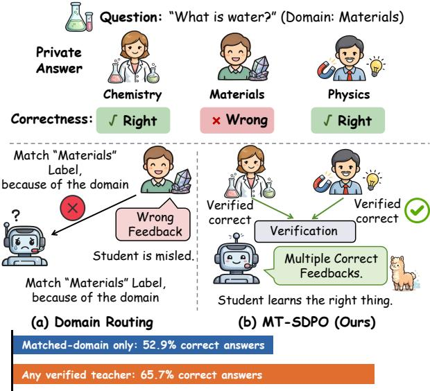  
Fi<sub>gure</sub> 1<sub>:</sub> S<sub>amp</sub>l<sub>e-</sub>L<sub>eve</sub>l T<sub>eac</sub>h<sub>er</sub> R<sub>e</sub>li<sub>a</sub>bilit<sub>y</sub> G<sub>ap.</sub> A d<sub>oma</sub>i<sub>n</sub> l<sub>a</sub>b<sub>e</sub>l <sub>ca</sub>n <sub>se</sub>l<sub>ec</sub>t <sub>a</sub> t<sub>eac</sub>h<sub>e</sub>r <sub>w</sub>r<sub>o</sub>n<sub>g</sub> <sub>o</sub>n th<sub>e</sub> <sub>sa</sub>m<sub>p</sub>l<sub>e;</sub> MT<sub>-</sub>SDPO <sub>ver</sub>ifi<sub>es pr</sub>i<sub>va</sub>t<sub>e answers an</sub>d <sub>uses a</sub>ll <sub>e</sub>li<sub>g</sub>ibl<sub>e</sub> f<sub>ee</sub>db<sub>ac</sub>k<sub>.</sub>

A<sub>mong</sub> th<sub>e</sub> <sub>rou</sub>t<sub>es</sub> t<sub>o</sub> thi<sub>s</sub> <sub>pro</sub>bl<sub>em,</sub> <sub>we</sub> <sub>s</sub>t<sub>u</sub>d<sub>y</sub> <sub>on-po</sub>li<sub>cy</sub> i<sub>n</sub>t<sub>egra</sub>ti<sub>on, w</sub>hi<sub>c</sub>h k<sub>eeps</sub> th<sub>e</sub> t<sub>eac</sub>h<sub>ers</sub> f<sub>rozen an</sub>d l<sub>e</sub>t<sub>s one</sub> <sub>s</sub>t<sub>u</sub>d<sub>en</sub>t l<sub>earn on</sub> it<sub>s own ro</sub>ll<sub>ou</sub>t<sub>s, so w</sub>h<sub>a</sub>t <sub>rema</sub>i<sub>ns open</sub> i<sub>s</sub> <sub>w</sub>hi<sub>c</sub>h t<sub>eac</sub>h<sub>er superv</sub>i<sub>ses w</sub>hi<sub>c</sub>h <sub>ro</sub>ll<sub>ou</sub>t<sub>.</sub> M<sub>u</sub>lti<sub>-</sub>T<sub>eac</sub>h<sub>er</sub> O<sub>n-</sub> Polic<sub>y</sub> Distillation (MOPD) (Ma et al. 2026) develo<sub>p</sub>s do-<sub>ma</sub>i<sub>n</sub> t<sub>eac</sub>h<sub>ers</sub> i<sub>n</sub>d<sub>epen</sub>d<sub>en</sub>tl<sub>y,</sub> th<sub>en rou</sub>t<sub>es eac</sub>h <sub>ro</sub>ll<sub>ou</sub>t t<sub>o</sub> th<sub>e</sub> t<sub>eac</sub>h<sub>er</sub> <sub>w</sub>h<sub>ose</sub> d<sub>oma</sub>i<sub>n</sub> <sub>ma</sub>t<sub>c</sub>h<sub>es</sub> th<sub>e</sub> <sub>promp</sub>t<sub>,</sub> <sub>assum</sub>i<sub>ng</sub> th<sub>a</sub>t t<sub>eac</sub>h<sub>er</sub> i<sub>s r</sub>i<sub>g</sub>ht f<sub>or every samp</sub>l<sub>e</sub> i<sub>n</sub> it<sub>s</sub> d<sub>oma</sub>i<sub>n.</sub>

<sup>D</sup>oma<sup>i</sup>n ex<sub>p</sub>ert<sup>i</sup>se, <sup>h</sup>owever, <sup>i</sup>s an avera<sub>g</sub>e-case <sub>p</sub>ro<sub>p</sub>ert<sub>y</sub>: d<sub>oma</sub>i<sub>n</sub> b<sub>oun</sub>d<sub>ar</sub>i<sub>es over</sub>l<sub>ap,</sub> t<sub>eac</sub>h<sub>ers</sub> t<sub>ra</sub>i<sub>ne</sub>d f<sub>rom a s</sub>h<sub>are</sub>d <sub>source</sub> <sub>repea</sub>t th<sub>e</sub> <sub>same</sub> <sub>errors,</sub> <sub>an</sub>d <sub>a</sub> t<sub>eac</sub>h<sub>er</sub> f<sub>rom</sub> <sub>ano</sub>th<sub>er</sub> d<sub>oma</sub>i<sub>n some</sub>ti<sub>mes succee</sub>d<sub>s anyway.</sub> Fi<sub>gure</sub> 1 <sub>quan</sub>tifi<sub>es</sub> thi<sub>s</sub> <sub>gap</sub> <sub>on</sub> <sub>our</sub> t<sub>ra</sub>i<sub>n</sub>i<sub>ng</sub> <sub>se</sub>t<sub>:</sub> th<sub>e</sub> <sub>ma</sub>t<sub>c</sub>h<sub>e</sub>d t<sub>eac</sub>h<sub>er</sub> i<sub>s</sub> <sub>correc</sub>t <sub>on</sub> <sub>on</sub>l<sub>y</sub> 52<sub>.</sub>9% <sub>o</sub>f <sub>samp</sub>l<sub>es, w</sub>hil<sub>e per-samp</sub>l<sub>e se</sub>l<sub>ec</sub>ti<sub>on ra</sub>i<sub>ses</sub> th<sub>e</sub> <sub>s</sub>h<sub>are w</sub>ith <sub>a</sub>t l<sub>eas</sub>t <sub>one correc</sub>t t<sub>eac</sub>h<sub>er</sub> t<sub>o</sub> 65<sub>.</sub>7%<sub>.</sub> Th<sub>e re</sub>li<sub>a</sub>bl<sub>e</sub> teacher therefore varies per sample, not per domain: whom should the student trust?

W<sub>e answer w</sub>ith <sub>an a</sub>ll<sub>oca</sub>ti<sub>on ru</sub>l<sub>e</sub> th<sub>a</sub>t d<sub>rops</sub> th<sub>e</sub> d<sub>oma</sub>i<sub>n</sub> l<sub>a</sub>b<sub>e</sub>l<sub>: on eac</sub>h <sub>samp</sub>l<sub>e, any source w</sub>h<sub>ose answer</sub> i<sub>s ver</sub>ifi<sub>e</sub>d <sub>correc</sub>t i<sub>s a</sub> l<sub>eg</sub>iti<sub>ma</sub>t<sub>e</sub> t<sub>eac</sub>h<sub>er, an</sub>d <sub>no unver</sub>ifi<sub>e</sub>d <sub>source</sub> i<sub>s.</sub> Th<sub>e s</sub>t<sub>u</sub>d<sub>en</sub>t <sub>coun</sub>t<sub>s as one suc</sub>h <sub>source:</sub> it<sub>s own correc</sub>t <sub>ro</sub>ll<sub>-</sub> <sub>ou</sub>t i<sub>s</sub> th<sub>e c</sub>h<sub>eapes</sub>t <sub>ver</sub>ifi<sub>e</sub>d t<sub>eac</sub>h<sub>er, so</sub> f<sub>rozen</sub> t<sub>eac</sub>h<sub>ers are</sub> <sub>consu</sub>lt<sub>e</sub>d <sub>on</sub>l<sub>y w</sub>h<sub>ere</sub> it f<sub>a</sub>il<sub>s.</sub> S<sub>uperv</sub>i<sub>s</sub>i<sub>on</sub> th<sub>en</sub> fl<sub>ows exac</sub>tl<sub>y</sub> <sub>w</sub>h<sub>ere someone</sub> i<sub>s</sub> k<sub>nown</sub> t<sub>o</sub> b<sub>e r</sub>i<sub>g</sub>ht<sub>.</sub>

We instantiate the rule as Multi-Teacher Self-Distillation Policy Optimization (MT-SDPO) on top ofSelf-Distillation Polic<sub>y</sub> O<sub>p</sub>timization (SDPO) (Hübotter et al. 2026), which t<sub>urns</sub> t<sub>ex</sub>t<sub>ua</sub>l f<sub>ee</sub>db<sub>ac</sub>k i<sub>n</sub>t<sub>o</sub> <sub>a</sub> d<sub>ense</sub> t<sub>o</sub>k<sub>en-</sub>l<sub>eve</sub>l <sub>s</sub>i<sub>gna</sub>l th<sub>roug</sub>h <sub>a</sub> <sub>pr</sub>i<sub>v</sub>il<sub>ege</sub>d <sub>se</sub>lf<sub>-</sub>t<sub>eac</sub>h<sub>er.</sub> Th<sub>ree</sub> t<sub>ec</sub>h<sub>n</sub>i<sub>ca</sub>l <sub>ques</sub>ti<sub>ons</sub> <sub>rema</sub>i<sub>n,</sub> <sub>an</sub>d <sub>one componen</sub>t <sub>answers eac</sub>h<sub>: anc</sub>h<sub>or</sub>i<sub>ng w</sub>h<sub>ere</sub> th<sub>e s</sub>t<sub>u-</sub> d<sub>en</sub>t i<sub>s a</sub>l<sub>rea</sub>d<sub>y r</sub>i<sub>g</sub>ht<sub>, coverage w</sub>h<sub>ere</sub> it i<sub>s no</sub>t <sub>an</sub>d th<sub>e anc</sub>h<sub>or</sub> i<sub>s m</sub>i<sub>ss</sub>i<sub>ng, an</sub>d <sub>merg</sub>i<sub>ng w</sub>h<sub>ere anc</sub>h<sub>or an</sub>d f<sub>ee</sub>db<sub>ac</sub>k <sub>mus</sub>t b<sub>ecome one s</sub>i<sub>gna</sub>l<sub>.</sub> Fi<sub>gure</sub> 2 t<sub>races one</sub> t<sub>ra</sub>i<sub>n</sub>i<sub>ng s</sub>t<sub>ep</sub> th<sub>roug</sub>h th<sub>e</sub> th<sub>ree componen</sub>t<sub>s.</sub> S<sub>e</sub>lf<sub>-anc</sub>h<sub>ors</sub> l<sub>e</sub>t <sub>a correc</sub>t <sub>ro</sub>ll<sub>ou</sub>t <sub>su-</sub> <sub>perv</sub>i<sub>se</sub> th<sub>e</sub> i<sub>ncorrec</sub>t <sub>peers o</sub>f it<sub>s own group.</sub> A<sub>nswer-ver</sub>ifi<sub>e</sub>d <sub>e</sub>li<sub>g</sub>ibilit<sub>y a</sub>d<sub>m</sub>it<sub>s a</sub> t<sub>eac</sub>h<sub>er</sub>’<sub>s</sub> f<sub>ee</sub>db<sub>ac</sub>k <sub>on</sub>l<sub>y w</sub>h<sub>en</sub> it<sub>s pr</sub>i<sub>va</sub>t<sub>e</sub> <sub>answer passes a ver</sub>ifi<sub>er</sub> th<sub>a</sub>t <sub>no mo</sub>d<sub>e</sub>l <sub>sees, an</sub>d t<sub>a</sub>k<sub>es ev-</sub> <sub>ery</sub> t<sub>eac</sub>h<sub>er</sub> th<sub>a</sub>t <sub>qua</sub>lifi<sub>es.</sub> P<sub>r</sub>i<sub>v</sub>il<sub>ege</sub>d di<sub>s</sub>till<sub>a</sub>ti<sub>on merges</sub> th<sub>e</sub> <sub>anc</sub>h<sub>or</sub> <sub>an</sub>d <sub>a</sub>ll <sub>ver</sub>ifi<sub>e</sub>d f<sub>ee</sub>db<sub>ac</sub>k i<sub>n</sub>t<sub>o</sub> <sub>one</sub> <sub>con</sub>t<sub>ex</sub>t th<sub>a</sub>t <sub>on</sub>l<sub>y</sub> an ex<sub>p</sub>onential movin<sub>g</sub> avera<sub>g</sub>e (EMA) self-teacher reads, <sub>an</sub>d di<sub>s</sub>till<sub>s</sub> th<sub>a</sub>t <sub>se</sub>lf<sub>-</sub>t<sub>eac</sub>h<sub>er</sub> i<sub>n</sub>t<sub>o</sub> th<sub>e s</sub>t<sub>u</sub>d<sub>en</sub>t t<sub>o</sub>k<sub>en</sub> b<sub>y</sub> t<sub>o</sub>k<sub>en.</sub> T<sub>ra</sub>i<sub>n</sub>i<sub>ng up</sub>d<sub>a</sub>t<sub>es on</sub>l<sub>y</sub> th<sub>e s</sub>t<sub>u</sub>d<sub>en</sub>t <sub>mo</sub>d<sub>e</sub>l<sub>, w</sub>hi<sub>c</sub>h i<sub>s a</sub>l<sub>so a</sub>ll th<sub>a</sub>t d<sub>ep</sub>l<sub>oymen</sub>t k<sub>eeps.</sub>

B<sub>u</sub>ilt <sub>on per-samp</sub>l<sub>e answer ver</sub>ifi<sub>ca</sub>ti<sub>on an</sub>d <sub>pr</sub>i<sub>v</sub>il<sub>ege</sub>d <sub>se</sub>lf<sub>-</sub>di<sub>s</sub>till<sub>a</sub>ti<sub>on,</sub> MT<sub>-</sub>SDPO <sub>no</sub>t <sub>on</sub>l<sub>y re</sub>di<sub>s</sub>t<sub>r</sub>ib<sub>u</sub>t<sub>es capa</sub>bil<sub>-</sub> it<sub>y</sub> t<sub>owar</sub>d th<sub>e wea</sub>k<sub>es</sub>t d<sub>oma</sub>i<sub>n,</sub> b<sub>u</sub>t <sub>can a</sub>l<sub>so ou</sub>t<sub>per</sub>f<sub>orm a</sub> th<sub>ree-mo</sub>d<sub>e</sub>l <sub>re</sub>f<sub>erence</sub> th<sub>a</sub>t <sub>serves</sub> <sub>one</sub> <sub>ma</sub>t<sub>c</sub>h<sub>e</sub>d t<sub>eac</sub>h<sub>er</sub> <sub>per</sub> d<sub>oma</sub>i<sub>n.</sub> W<sub>e eva</sub>l<sub>ua</sub>t<sub>e on</sub> th<sub>e c</sub>h<sub>em</sub>i<sub>s</sub>t<sub>ry, ma</sub>t<sub>er</sub>i<sub>a</sub>l<sub>s sc</sub>i<sub>ence, an</sub>d ph<sub>y</sub>sics domains of the Science Q&A subset in SciKnowEval L3 (Fen<sub>g</sub> et al. 2024) with five student models from three f<sub>am</sub>ili<sub>es, eac</sub>h <sub>un</sub>d<sub>er</sub> it<sub>s own mu</sub>lti<sub>-</sub>d<sub>oma</sub>i<sub>n</sub> i<sub>n</sub>iti<sub>a</sub>li<sub>za</sub>ti<sub>on.</sub> O<sub>n</sub> Qwen3-8B (Yan<sub>g</sub> et al. 2025), MT-SDPO <sub>g</sub>ains 4.64 <sub>p</sub>oints i<sub>n</sub> M<sub>acro accuracy an</sub>d 14<sub>.</sub>79 i<sub>n wors</sub>t<sub>-</sub>d<sub>oma</sub>i<sub>n accuracy, an</sub>d <sub>cu</sub>t<sub>s</sub> th<sub>e</sub> d<sub>oma</sub>i<sub>n gap</sub> f<sub>rom</sub> 20<sub>.</sub>96 t<sub>o</sub> 5<sub>.</sub>30<sub>.</sub> Th<sub>e ga</sub>i<sub>ns are no</sub>t ti<sub>e</sub>d to one model: ever<sub>y</sub> Qwen3 scale becomes more balanced, th<sub>oug</sub>h th<sub>e aggrega</sub>t<sub>e</sub> i<sub>mproves on</sub>l<sub>y a</sub>t 8B<sub>, an</sub>d <sub>a</sub>ll th<sub>ree me</sub>t<sub>-</sub> rics im<sub>p</sub>rove to<sub>g</sub>ether on OLMo-3-7B-Instruct (Team Olmo et al. 2025), a second famil<sub>y</sub> with a diferent teacher <sub>g</sub>enerator. On Llama-3.1-8B-Instruct (Grattafiori et al. 2024), <sub>w</sub>h<sub>ose</sub> i<sub>n</sub>iti<sub>a</sub>li<sub>za</sub>ti<sub>on</sub> i<sub>s a</sub>l<sub>rea</sub>d<sub>y</sub> b<sub>a</sub>l<sub>ance</sub>d <sub>an</sub>d l<sub>eaves</sub> littl<sub>e</sub> h<sub>ea</sub>d<sub>-</sub> <sub>room,</sub> <sub>no</sub> <sub>on</sub>li<sub>ne</sub> <sub>me</sub>th<sub>o</sub>d <sub>pays</sub> <sub>o</sub>f<sub>,</sub> <sub>a</sub> <sub>nega</sub>ti<sub>ve</sub> <sub>resu</sub>lt<sub>.</sub> O<sub>ur</sub> <sub>con-</sub> t<sub>r</sub>ib<sub>u</sub>ti<sub>ons are as</sub> f<sub>o</sub>ll<sub>ows:</sub>

• Sample-level diagnosis. We <sub>q</sub>uantif<sub>y</sub> the reliabilit<sub>y</sub> <sub>g</sub>a<sub>p</sub> b<sub>e</sub>t<sub>ween</sub> d<sub>oma</sub>i<sub>n-ma</sub>t<sub>c</sub>h<sub>e</sub>d <sub>an</sub>d <sub>per-samp</sub>l<sub>e</sub> t<sub>eac</sub>h<sub>er se</sub>l<sub>ec-</sub> ti<sub>on, separa</sub>ti<sub>ng ma</sub>t<sub>c</sub>h<sub>e</sub>d <sub>coverage, cross-</sub>d<sub>oma</sub>i<sub>n rescue,</sub> <sub>an</sub>d f<sub>a</sub>il<sub>ure across a</sub>ll t<sub>eac</sub>h<sub>ers.</sub>

• MT-SDPO. Answer-verified multi-teacher selfdi<sub>s</sub>till<sub>a</sub>ti<sub>on</sub> th<sub>a</sub>t <sub>gran</sub>t<sub>s</sub> <sub>e</sub>li<sub>g</sub>ibilit<sub>y</sub> <sub>per</sub> <sub>samp</sub>l<sub>e</sub> <sub>an</sub>d <sub>conso</sub>lid<sub>a</sub>t<sub>es</sub> <sub>a</sub>ll <sub>e</sub>li<sub>g</sub>ibl<sub>e</sub> t<sub>eac</sub>h<sub>ers</sub> <sub>w</sub>ith th<sub>e</sub> <sub>s</sub>t<sub>u</sub>d<sub>en</sub>t’<sub>s</sub> <sub>se</sub>lf<sub>-anc</sub>h<sub>or</sub> i<sub>n</sub>t<sub>o one pr</sub>i<sub>v</sub>il<sub>ege</sub>d <sub>se</sub>lf<sub>-</sub>t<sub>eac</sub>h<sub>er.</sub>

• Controlled evidence. Same-initialization ablations isol<sub>a</sub>ti<sub>ng</sub> <sub>answer</sub> <sub>ver</sub>ifi<sub>ca</sub>ti<sub>on,</sub> <sub>per-samp</sub>l<sub>e</sub> <sub>se</sub>l<sub>ec</sub>ti<sub>on,</sub> <sub>an</sub>d <sub>mu</sub>lti<sub>-</sub>t<sub>eac</sub>h<sub>er aggrega</sub>ti<sub>on.</sub>

## 2 Related Work

T<sub>urn</sub>i<sub>ng</sub> <sub>separa</sub>t<sub>e</sub>l<sub>y</sub> t<sub>ra</sub>i<sub>ne</sub>d d<sub>oma</sub>i<sub>n</sub> t<sub>eac</sub>h<sub>ers</sub> i<sub>n</sub>t<sub>o</sub> <sub>one</sub> d<sub>ep</sub>l<sub>oy-</sub> <sub>a</sub>bl<sub>e</sub> <sub>po</sub>li<sub>cy</sub> <sub>ra</sub>i<sub>ses</sub> th<sub>ree</sub> <sub>ques</sub>ti<sub>ons</sub> th<sub>a</sub>t <sub>organ</sub>i<sub>ze</sub> <sub>pr</sub>i<sub>or</sub> <sub>wor</sub>k<sub>:</sub> h<sub>ow</sub> th<sub>e</sub> t<sub>eac</sub>h<sub>ers are conso</sub>lid<sub>a</sub>t<sub>e</sub>d i<sub>n</sub>t<sub>o one mo</sub>d<sub>e</sub>l<sub>,</sub> h<sub>ow a s</sub>t<sub>u-</sub> d<sub>en</sub>t l<sub>earns on-po</sub>li<sub>cy</sub> f<sub>rom a</sub> t<sub>eac</sub>h<sub>er, an</sub>d h<sub>ow superv</sub>i<sub>s</sub>i<sub>on</sub> i<sub>s</sub> <sub>a</sub>ll<sub>oca</sub>t<sub>e</sub>d <sub>across</sub> t<sub>eac</sub>h<sub>ers on a s</sub>h<sub>are</sub>d <sub>samp</sub>l<sub>e.</sub>

(1) Capability Consolidation for Multi-Domain LLMs. P<sub>r</sub>i<sub>or</sub> <sub>rou</sub>t<sub>es</sub> b<sub>u</sub>ild <sub>or</sub> <sub>conso</sub>lid<sub>a</sub>t<sub>e</sub> <sub>mu</sub>lti<sub>-</sub>d<sub>oma</sub>i<sub>n</sub> <sub>capa</sub>biliti<sub>es</sub> b<sub>y</sub> 1) joint or cascaded multi-domain RL (Yan<sub>g</sub> et al. 2025; Wan<sub>g</sub> et al. 2025), 2) of-<sub>p</sub>olic<sub>y</sub> finetunin<sub>g</sub> on teacher com-<sub>p</sub>letions (Dee<sub>p</sub>Seek-AI et al. 2025), 3) wei<sub>g</sub>ht-s<sub>p</sub>ace mer<sub>g</sub>- in<sub>g</sub> (Wortsman et al. 2022; Ilharco et al. 2023), or 4) mixeddomain trainin<sub>g</sub> with ne<sub>g</sub>ative-transfer control (Yu et al. 2020; Cai et al. 2026; Yan<sub>g</sub> et al. 2026a; Ye et al. 2025). Closest to us is MOPD (Ma et al. 2026), which routes the <sub>s</sub>t<sub>u</sub>d<sub>en</sub>t’<sub>s own ro</sub>ll<sub>ou</sub>t<sub>s</sub> t<sub>o</sub> th<sub>e</sub> d<sub>oma</sub>i<sub>n-ma</sub>t<sub>c</sub>h<sub>e</sub>d f<sub>rozen</sub> t<sub>eac</sub>h<sub>er;</sub> we implement this rule as our Domain Routing baseline. It <sub>assumes</sub> th<sub>e ma</sub>t<sub>c</sub>h<sub>e</sub>d t<sub>eac</sub>h<sub>er</sub> i<sub>s</sub> th<sub>e r</sub>i<sub>g</sub>ht <sub>superv</sub>i<sub>sor</sub> f<sub>or every</sub> <sub>sa</sub>m<sub>p</sub>l<sub>e</sub> fr<sub>o</sub>m it<sub>s</sub> d<sub>o</sub>m<sub>a</sub>in<sub>, w</sub>h<sub>e</sub>r<sub>eas</sub> MT<sub>-</sub>SDPO k<sub>eeps</sub> MOPD’<sub>s</sub> t<sub>wo-s</sub>t<sub>age sp</sub>lit b<sub>u</sub>t <sub>se</sub>l<sub>ec</sub>t<sub>s</sub> th<sub>e superv</sub>i<sub>sor per samp</sub>l<sub>e</sub> b<sub>y ver</sub>i<sub>-</sub> fi<sub>ca</sub>ti<sub>on.</sub>

(2) On-Policy and Self-Distillation. Classical distillati<sub>on ma</sub>t<sub>c</sub>h<sub>es a</sub> t<sub>eac</sub>h<sub>er on a</sub> fi<sub>xe</sub>d <sub>corpus an</sub>d i<sub>s o</sub>f<sub>-po</sub>li<sub>cy,</sub> so the student can drift at inference (Hinton, Vin<sub>y</sub>als, and Dean 2015; Kim and Rush 2016). Ada<sub>p</sub>tive of-<sub>p</sub>olic<sub>y</sub> distillation instead reuses student-<sub>g</sub>enerated out<sub>p</sub>uts (Ko et al. 2024), while on-<sub>p</sub>olic<sub>y</sub> distillation scores the student’s current rollouts with a se<sub>p</sub>arate teacher (Gu et al. 2024; A<sub>g</sub>arwal et al. 2024). Self- and context-distillation let a model learn f<sub>rom s</sub>i<sub>gna</sub>l<sub>s pro</sub>d<sub>uce</sub>d b<sub>y</sub> it<sub>se</sub>lf <sub>or</sub> b<sub>y a con</sub>t<sub>ex</sub>t<sub>-pr</sub>i<sub>v</sub>il<sub>ege</sub>d co<sub>py</sub> (Hübotter et al. 2026; Zhao et al. 2026; Kim et al. 2026; Son<sub>g</sub> et al. 2026; Ye et al. 2026). Our baseline SDPO (Hübotter et al. 2026) anchors this self-teacher on the student’s own <sub>correc</sub>t <sub>ro</sub>ll<sub>ou</sub>t<sub>,</sub> <sub>an</sub>d <sub>g</sub>i<sub>ves</sub> <sub>no</sub> <sub>s</sub>i<sub>gna</sub>l <sub>w</sub>h<sub>ere</sub> th<sub>a</sub>t <sub>ro</sub>ll<sub>ou</sub>t i<sub>s</sub> <sub>m</sub>i<sub>ss</sub>i<sub>ng.</sub> MT<sub>-</sub>SDPO k<sub>eeps</sub> th<sub>e se</sub>lf<sub>-anc</sub>h<sub>or</sub> b<sub>u</sub>t <sub>a</sub>dd<sub>s ver</sub>ifi<sub>e</sub>d <sub>ex</sub>t<sub>erna</sub>l t<sub>eac</sub>h<sub>ers, so</sub> th<sub>ose unanc</sub>h<sub>ore</sub>d <sub>samp</sub>l<sub>es can s</sub>till b<sub>e</sub> <sub>superv</sub>i<sub>se</sub>d b<sub>y w</sub>hi<sub>c</sub>h<sub>ever</sub> t<sub>eac</sub>h<sub>er</sub> i<sub>s r</sub>i<sub>g</sub>ht<sub>.</sub>

(3) Multi-Teacher Distillation and Supervision Reliability. Distilling several teachers into one student (You et al. 2017) a<sub>pp</sub>ears in recent LLMs as out<sub>p</sub>ut mixin<sub>g</sub> or <sub>p</sub>er-sam<sub>p</sub>le routin<sub>g</sub> (Team et al. 2026; Yan<sub>g</sub> et al. 2026b), sometimes with ada<sub>p</sub>tive <sub>p</sub>er-instance teacher wei<sub>g</sub>hts (Liu, Zhan<sub>g</sub>, and Wan<sub>g</sub> 2020; Yuan et al. 2021). Se<sub>p</sub>aratel<sub>y</sub>, verifiable-reward RL <sub>an</sub>d <sub>genera</sub>ti<sub>ve ver</sub>ifi<sub>ers</sub> t<sub>urn correc</sub>t<sub>ness</sub> i<sub>n</sub>t<sub>o a</sub> t<sub>ra</sub>i<sub>n</sub>i<sub>ng</sub> si<sub>g</sub>nal that scores the student’s own out<sub>p</sub>ut (Lambert et al. 2024; Guo et al. 2025; Zhan<sub>g</sub> et al. 2025); MT-SDPO draws <sub>on</sub> th<sub>e same s</sub>i<sub>gna</sub>l b<sub>u</sub>t <sub>spen</sub>d<sub>s</sub> it <sub>on</sub> d<sub>ec</sub>idi<sub>ng w</sub>h<sub>om</sub> th<sub>e s</sub>t<sub>u-</sub> d<sub>en</sub>t <sub>s</sub>h<sub>ou</sub>ld t<sub>rus</sub>t<sub>.</sub> H<sub>owever,</sub> th<sub>e mu</sub>lti<sub>-</sub>t<sub>eac</sub>h<sub>er aggrega</sub>ti<sub>on</sub> <sub>an</sub>d <sub>rou</sub>ti<sub>ng me</sub>th<sub>o</sub>d<sub>s c</sub>it<sub>e</sub>d <sub>a</sub>b<sub>ove</sub> d<sub>o no</sub>t <sub>use</sub> th<sub>e correc</sub>t<sub>ness</sub> <sub>o</sub>f <sub>eac</sub>h t<sub>eac</sub>h<sub>er</sub>’<sub>s</sub> <sub>pr</sub>i<sub>va</sub>t<sub>e</sub> <sub>answer</sub> t<sub>o</sub> <sub>ga</sub>t<sub>e</sub> <sub>superv</sub>i<sub>s</sub>i<sub>on;</sub> <sub>an</sub> i<sub>n-</sub> <sub>correc</sub>t t<sub>eac</sub>h<sub>er can</sub> th<sub>ere</sub>f<sub>ore</sub> b<sub>e we</sub>i<sub>g</sub>ht<sub>e</sub>d <sub>or rou</sub>t<sub>e</sub>d lik<sub>e a</sub> <sub>correc</sub>t <sub>one.</sub> MT<sub>-</sub>SDPO <sub>c</sub>l<sub>oses</sub> thi<sub>s gap an</sub>d dif<sub>ers</sub> i<sub>n</sub> th<sub>ree</sub> wa<sub>y</sub>s: 1) a teacher ma<sub>y</sub> su<sub>p</sub>ervise a sam<sub>p</sub>le onl<sub>y</sub> if its own <sub>pr</sub>i<sub>va</sub>t<sub>e answer passes a ver</sub>ifi<sub>er, so e</sub>li<sub>g</sub>ibilit<sub>y re</sub>fl<sub>ec</sub>t<sub>s cor-</sub> rectness rather than a domain label or learned wei<sub>g</sub>ht; 2) <sub>e</sub>li<sub>g</sub>ibilit<sub>y</sub> i<sub>s</sub> d<sub>ec</sub>id<sub>e</sub>d <sub>per</sub> <sub>samp</sub>l<sub>e,</sub> <sub>so</sub> <sub>a</sub> <sub>cross-</sub>d<sub>oma</sub>i<sub>n</sub> t<sub>eac</sub>h<sub>er</sub> hel<sub>p</sub>s whenever it is ri<sub>g</sub>ht; 3) all verified teachers combine <sub>w</sub>ith th<sub>e s</sub>t<sub>u</sub>d<sub>en</sub>t’<sub>s se</sub>lf<sub>-anc</sub>h<sub>or</sub> i<sub>n</sub>t<sub>o a s</sub>i<sub>ng</sub>l<sub>e se</sub>lf<sub>-</sub>t<sub>eac</sub>h<sub>er.</sub>

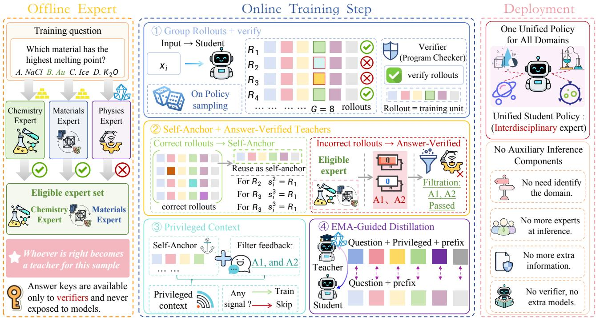  
Fi <sub>ure</sub> 2<sub>:</sub> O<sub>verv</sub>i<sub>ew o</sub>f MT<sub>-</sub>SDPO<sub>.</sub> Ofli<sub>ne answer ver</sub>ifi<sub>ca</sub>ti<sub>on</sub> b<sub>u</sub>ild<sub>s a sam</sub> l<sub>e-</sub>l<sub>eve</sub>l <sub>e</sub>li ibl<sub>e</sub> t<sub>eac</sub>h<sub>er se</sub>t<sub>.</sub> O<sub>n</sub>li<sub>ne, se</sub>lf<sub>-anc</sub>h<sub>ors</sub> <sub>an</sub>d <sub>san</sub>iti<sub>ze</sub>d t<sub>eac</sub>h<sub>er</sub> f<sub>ee</sub>db<sub>ac</sub>k <sub>con</sub>diti<sub>on an</sub> EMA <sub>se</sub>lf<sub>-</sub>t<sub>eac</sub>h<sub>er</sub> th<sub>a</sub>t di<sub>s</sub>till<sub>s</sub> i<sub>n</sub>t<sub>o</sub> th<sub>e s</sub>t<sub>u</sub>d<sub>en</sub>t <sub>mo</sub>d<sub>e</sub>l<sub>, a</sub>ll th<sub>a</sub>t d<sub>ep</sub>l<sub>oymen</sub>t <sub>re</sub>t<sub>a</sub>i<sub>ns.</sub>

## 3 Preliminaries

Self-Distillation Policy Optimization. Given a prompt $x \sim \mathcal { D }$ , SDPO (Hübotter et al. 2026) sam<sub>p</sub>les an on-<sub>p</sub>olic<sub>y</sub> <sub>ro</sub>ll<sub>ou</sub>t $y = ( y _ { 1 } , \dots , y _ { T } ) \sim \pi _ { \theta } ( \cdot \mid x )$ <sub>an</sub>d <sub>re-eva</sub>l<sub>ua</sub>t<sub>es</sub> it <sub>w</sub>ith <sub>a</sub> <sub>se</sub>lf<sub>-</sub>t<sub>eac</sub>h<sub>er</sub> th<sub>a</sub>t <sub>a</sub>dditi<sub>ona</sub>ll<sub>y</sub> <sub>o</sub>b<sub>serves</sub> <sub>pr</sub>i<sub>v</sub>il<sub>ege</sub>d i<sub>n</sub>f<sub>orma-</sub> tion c $\therefore { \mathrm { W r i t e ~ } } p _ { \theta , t } = \pi _ { \theta } ( \cdot \mid x , y _ { < t } )$ f<sub>or</sub> th<sub>e s</sub>t<sub>u</sub>d<sub>en</sub>t di<sub>s</sub>t<sub>r</sub>ib<sub>u</sub>ti<sub>on</sub> <sub>an</sub>d $q _ { \bar { \theta } , t } = \mathrm { s g } [ \pi _ { \bar { \theta } } ( \cdot \mid x , c , y _ { < t } ) ]$ f<sub>or</sub> th<sub>e se</sub>lf<sub>-</sub>t<sub>eac</sub>h<sub>er</sub> di<sub>s</sub>t<sub>r</sub>ib<sub>u-</sub> tion, where <sup>¯</sup>θ is a slowl<sub>y</sub> updated cop<sub>y</sub> of θ. The rollout-level objective is

$$
\mathcal { L } _ { \mathrm { S D P O } } ( x , y , c ) = \frac { 1 } { T } \sum _ { t = 1 } ^ { T } D \big ( p _ { \theta , t } \big | \big | q _ { \bar { \theta } , t } \big ) ,\tag{1}
$$

where D is a token-level divergence and sg blocks selfteacher gradients. The context c can contain environment f<sub>ee</sub>db<sub>ac</sub>k <sub>or</sub> <sub>ano</sub>th<sub>er</sub> <sub>ver</sub>ifi<sub>e</sub>d <sub>success</sub>f<sub>u</sub>l <sub>ro</sub>ll<sub>ou</sub>t<sub>;</sub> it <sub>c</sub>h<sub>anges</sub> th<sub>e se</sub>lf<sub>-</sub>t<sub>eac</sub>h<sub>er</sub> di<sub>s</sub>t<sub>r</sub>ib<sub>u</sub>ti<sub>on w</sub>ith<sub>ou</sub>t <sub>c</sub>h<sub>ang</sub>i<sub>ng</sub> th<sub>e ro</sub>ll<sub>ou</sub>t <sub>on</sub> <sub>w</sub>hi<sub>c</sub>h th<sub>e s</sub>t<sub>u</sub>d<sub>en</sub>t i<sub>s</sub> t<sub>ra</sub>i<sub>ne</sub>d<sub>.</sub>

Multi-Teacher Setting. Each training instance consists of <sup>a</sup> p<sup>rom</sup>p<sup>t</sup> $x _ { i } .$ <sub>, a ver</sub>ifi<sub>a</sub>bl<sub>e re</sub>f<sub>erence answer</sub> $a _ { i } ^ { * }$ <sub>, an</sub>d <sub>a</sub> d<sub>o-</sub> <sub>ma</sub>i<sub>n</sub> l<sub>a</sub>b<sub>e</sub>l $d _ { i }$ . We train one student model π with feedback from K frozen domain teachers $\{ E _ { k } \} _ { k = 1 } ^ { K } ,$ <sub>, eac</sub>h <sub>quer</sub>i<sub>e</sub>d <sub>e</sub>i<sub>-</sub> th<sub>er</sub> f<sub>or a pr</sub>i<sub>va</sub>t<sub>e answer, wr</sub>itt<sub>en</sub> $E _ { k } ^ { \mathrm { a n s } }$ <sub>, or</sub> f<sub>or a cr</sub>iti<sub>que</sub> <sub>o</sub>f <sub>a g</sub>i<sub>ven ro</sub>ll<sub>ou</sub>t<sub>, wr</sub>itt<sub>en</sub> $E _ { k } ^ { \mathrm { f b } }$ <sub>.</sub> A <sub>programma</sub>ti<sub>c ver</sub>ifi<sub>er</sub> $\mathbf { V } _ { \mathrm { E R I F Y } } ( \cdot , a _ { i } ^ { * } ) \in \{ 0 , 1 \}$ <sub>ex</sub>t<sub>rac</sub>t<sub>s</sub> th<sub>e answer</sub> f<sub>rom a comp</sub>l<sub>e-</sub> ti<sub>on an</sub>d <sub>compares</sub> it <sub>w</sub>ith $a _ { i } ^ { * } ;$ <sub>;</sub> th<sub>e re</sub>f<sub>erence answer reac</sub>h<sub>es</sub> thi<sub>s ver</sub>ifi<sub>er an</sub>d th<sub>e san</sub>iti<sub>zer on</sub>l<sub>y, an</sub>d <sub>never en</sub>t<sub>ers a s</sub>t<sub>u</sub>d<sub>en</sub>t <sub>o</sub>r t<sub>eac</sub>h<sub>e</sub>r <sub>p</sub>r<sub>o</sub>m<sub>p</sub>t <sub>a</sub>t <sub>a</sub>n<sub>y s</sub>t<sub>age o</sub>f MT<sub>-</sub>SDPO<sub>.</sub> O<sub>u</sub>r <sub>p</sub>r<sub>o</sub>bl<sub>e</sub>m i<sub>s</sub> t<sub>o</sub> d<sub>ec</sub>id<sub>e,</sub> f<sub>or eac</sub>h <sub>s</sub>t<sub>u</sub>d<sub>en</sub>t <sub>ro</sub>ll<sub>ou</sub>t<sub>, w</sub>hi<sub>c</sub>h t<sub>eac</sub>h<sub>ers may</sub> contribute to c and then consolidate their supervision into the single policy π that training retains.

## 4 Method

W<sub>e propose</sub> MT<sub>-</sub>SDPO<sub>, an answer-ver</sub>ifi<sub>e</sub>d <sub>mu</sub>lti<sub>-</sub>t<sub>eac</sub>h<sub>er</sub> di<sub>s-</sub> tillation framework that consolidates K frozen domain teach-<sub>ers</sub> i<sub>n</sub>t<sub>o one</sub> d<sub>ep</sub>l<sub>oya</sub>bl<sub>e po</sub>li<sub>cy.</sub> A <sub>s</sub>i<sub>ng</sub>l<sub>e a</sub>ll<sub>oca</sub>ti<sub>on ru</sub>l<sub>e gov-</sub> <sub>erns</sub> it<sub>:</sub> <sub>a</sub> t<sub>eac</sub>h<sub>er</sub> <sub>may</sub> <sub>superv</sub>i<sub>se</sub> <sub>a</sub> <sub>samp</sub>l<sub>e</sub> <sub>on</sub>l<sub>y</sub> if it<sub>s</sub> <sub>own</sub> <sub>pr</sub>i<sub>-</sub> <sub>va</sub>t<sub>e</sub> <sub>answer</sub> i<sub>s</sub> <sub>ver</sub>ifi<sub>e</sub>d <sub>correc</sub>t<sub>.</sub> MT<sub>-</sub>SDPO th<sub>ere</sub>f<sub>ore</sub> <sub>pa</sub>i<sub>rs</sub> <sub>a</sub> supervision source the student produces itself with a samplelevel eligible teacher set that replaces domain routing.

## 4.1 Framework Overview

Verification runs once, before training. As illustrated in Figure 2, MT-SDPO trains a single student model π with three auxiliary parts that all disappear at inference: K frozen d<sub>oma</sub>i<sub>n</sub> t<sub>eac</sub>h<sub>ers,</sub> <sub>a</sub> <sub>programma</sub>ti<sub>c</sub> <sub>ver</sub>ifi<sub>er,</sub> <sub>an</sub>d <sub>an</sub> EMA <sub>copy</sub> π¯ of the student that serves as the self-teacher. Every teacher fi<sub>rs</sub>t <sub>answers eac</sub>h <sub>ques</sub>ti<sub>on pr</sub>i<sub>va</sub>t<sub>e</sub>l<sub>y, an</sub>d th<sub>e ver</sub>ifi<sub>er cac</sub>h<sub>es</sub> th<sub>e correc</sub>t <sub>ones as</sub> th<sub>a</sub>t <sub>samp</sub>l<sub>e</sub>’<sub>s e</sub>li<sub>g</sub>ibl<sub>e se</sub>t<sub>, so</sub> t<sub>ra</sub>i<sub>n</sub>i<sub>ng pays</sub> no recurr<sup>i</sup>n<sub>g</sub> answer<sup>i</sup>n<sub>g</sub> cost.

Each online step aligns supervision to individual rollouts. Th<sub>e</sub> <sub>s</sub>t<sub>u</sub>d<sub>en</sub>t <sub>samp</sub>l<sub>es</sub> <sub>a</sub> <sub>group</sub> <sub>o</sub>f <sub>ro</sub>ll<sub>ou</sub>t<sub>s</sub> <sub>per</sub> <sub>promp</sub>t <sub>an</sub>d th<sub>e</sub> <sub>ver</sub>ifi<sub>er</sub> l<sub>a</sub>b<sub>e</sub>l<sub>s</sub> th<sub>em.</sub> A <sub>correc</sub>t <sub>ro</sub>ll<sub>ou</sub>t <sub>superv</sub>i<sub>ses</sub> th<sub>e rema</sub>i<sub>n-</sub> i<sub>ng</sub> <sub>ro</sub>ll<sub>ou</sub>t<sub>s</sub> <sub>o</sub>f it<sub>s</sub> <sub>group</sub> <sub>as</sub> th<sub>e</sub>i<sub>r</sub> <sub>se</sub>lf<sub>-anc</sub>h<sub>or,</sub> <sub>w</sub>h<sub>ereas</sub> <sub>an</sub> i<sub>ncorrec</sub>t <sub>one</sub> i<sub>s sen</sub>t t<sub>o</sub> th<sub>e e</sub>li<sub>g</sub>ibl<sub>e</sub> t<sub>eac</sub>h<sub>ers, w</sub>h<sub>ose san</sub>iti<sub>ze</sub>d feedback joins the anchor in a privileged context that only the <sub>se</sub>lf<sub>-</sub>t<sub>eac</sub>h<sub>er rea</sub>d<sub>s.</sub> Di<sub>s</sub>tilli<sub>ng</sub> th<sub>e se</sub>lf<sub>-</sub>t<sub>eac</sub>h<sub>er</sub> i<sub>n</sub>t<sub>o</sub> th<sub>e s</sub>t<sub>u</sub>d<sub>en</sub>t i<sub>s</sub> th<sub>e on</sub>l<sub>y parame</sub>t<sub>er up</sub>d<sub>a</sub>t<sub>e.</sub>

## 4.2 Rollout-Specific Self-Anchors

Th<sub>e</sub> fi<sub>rs</sub>t <sub>source o</sub>f <sub>pr</sub>i<sub>v</sub>il<sub>ege</sub>d i<sub>n</sub>f<sub>orma</sub>ti<sub>on</sub> i<sub>s</sub> th<sub>e s</sub>t<sub>u</sub>d<sub>en</sub>t it<sub>-</sub> self (Hübotter et al. 2026): a rollout <sub>g</sub>rou<sub>p</sub> usuall<sub>y</sub> mixes <sub>correc</sub>t <sub>an</sub>d i<sub>ncorrec</sub>t <sub>ro</sub>ll<sub>ou</sub>t<sub>s, an</sub>d <sub>a correc</sub>t <sub>one</sub> i<sub>s a so</sub>l<sub>u</sub>ti<sub>on</sub> th<sub>e</sub> <sub>curren</sub>t <sub>po</sub>li<sub>cy</sub> h<sub>as</sub> <sub>a</sub>l<sub>rea</sub>d<sub>y</sub> <sub>s</sub>h<sub>own</sub> it <sub>can</sub> <sub>pro</sub>d<sub>uce.</sub>

A programmatic check splits each rollout group. For p<sup>rom</sup>p<sup>t</sup> $x _ { i }$ <sub>,</sub> th<sub>e s</sub>t<sub>u</sub>d<sub>en</sub>t <sub>samp</sub>l<sub>es</sub> $G$ <sub>ro</sub>ll<sub>ou</sub>t<sub>s</sub> $\{ y _ { i } ^ { 1 } , \ldots , \bar { y } _ { i } ^ { G } \} \sim$ $\pi _ { \boldsymbol { \theta } } ( \cdot \mid x _ { i } )$ <sub>,</sub> <sub>an</sub>d

$$
S _ { i } = \left\{ j : \mathrm { V E R I F Y } ( y _ { i } ^ { j } , a _ { i } ^ { * } ) = 1 \right\}\tag{2}
$$

i<sub>n</sub>d<sub>exes</sub> th<sub>e correc</sub>t <sub>ones.</sub>

Each rollout takes its self-anchor from a correct peer. The self-anchor of rollout j is

$$
s _ { i } ^ { j } = \left\{ \begin{array} { l l } { \mathrm { T r u n c } \left( y _ { i } ^ { j ^ { \star } } \right) , } & { S _ { i } \setminus \{ j \} \ne \emptyset , } \\ { \emptyset , } & { \mathrm { o t h e r w i s e } , } \end{array} \right.\tag{3}
$$

<sub>w</sub>h<sub>ere</sub> $j ^ { \star } = \operatorname* { m i n } ( S _ { i } \setminus \{ j \} )$ i<sub>s</sub> th<sub>e ear</sub>li<sub>es</sub>t <sub>correc</sub>t <sub>ro</sub>ll<sub>ou</sub>t <sub>o</sub>f th<sub>e</sub> <sub>same</sub> <sub>group</sub> <sub>o</sub>th<sub>er</sub> th<sub>an</sub> $j ,$ , and Trunc keeps that rollout’s <sub>so</sub>l<sub>u</sub>ti<sub>on segmen</sub>t <sub>w</sub>ithi<sub>n</sub> th<sub>e anc</sub>h<sub>or</sub> t<sub>o</sub>k<sub>en</sub> b<sub>u</sub>d<sub>ge</sub>t<sub>.</sub>

Excluding the rollout itself prevents sequence leakage. $\textrm { I f } j$ <sub>were</sub> it<sub>s own anc</sub>h<sub>or,</sub> th<sub>e se</sub>lf<sub>-</sub>t<sub>eac</sub>h<sub>er wou</sub>ld <sub>o</sub>b<sub>serve a</sub> <sub>comp</sub>l<sub>e</sub>t<sub>e copy o</sub>f th<sub>e sequence w</sub>h<sub>ose pre</sub>fi<sub>xes</sub> it <sub>scores, an</sub>d th<sub>e</sub> <sub>superv</sub>i<sub>s</sub>i<sub>on</sub> <sub>wou</sub>ld d<sub>egenera</sub>t<sub>e</sub> i<sub>n</sub>t<sub>o</sub> <sub>copy</sub>i<sub>ng.</sub> A<sub>n</sub> i<sub>ncorrec</sub>t <sub>ro</sub>ll<sub>ou</sub>t <sub>can s</sub>till <sub>reuse a correc</sub>t <sub>peer, w</sub>h<sub>ereas a promp</sub>t th<sub>a</sub>t th<sub>e s</sub>t<sub>u</sub>d<sub>en</sub>t <sub>never so</sub>l<sub>ves</sub> h<sub>as no se</sub>lf<sub>-anc</sub>h<sub>or a</sub>t <sub>a</sub>ll<sub>.</sub>

## 4.3 Answer-Verified Teacher Eligibility

D<sub>oma</sub>i<sub>n ma</sub>t<sub>c</sub>h i<sub>n</sub>di<sub>ca</sub>t<sub>es w</sub>hi<sub>c</sub>h t<sub>eac</sub>h<sub>er</sub> i<sub>s s</sub>t<sub>ronger on aver-</sub> a<sub>g</sub>e, not which is correct on a <sub>g</sub>iven question (Ma et al. 2026). MT<sub>-</sub>SDPO r<sub>ep</sub>l<sub>aces</sub> thi<sub>s p</sub>r<sub>oxy w</sub>ith <sub>a pe</sub>r<sub>-sa</sub>m<sub>p</sub>l<sub>e c</sub>h<sub>ec</sub>k<sub>, a</sub>nd <sub>spen</sub>d<sub>s</sub> th<sub>e</sub> <sub>resu</sub>lti<sub>ng</sub> t<sub>eac</sub>h<sub>er</sub> <sub>quer</sub>i<sub>es</sub> <sub>on</sub>l<sub>y</sub> <sub>on</sub> <sub>ro</sub>ll<sub>ou</sub>t<sub>s</sub> th<sub>e</sub> <sub>ver-</sub> ifi<sub>er mar</sub>k<sub>e</sub>d i<sub>ncorrec</sub>t<sub>, w</sub>hi<sub>c</sub>h i<sub>s a</sub>l<sub>so w</sub>h<sub>ere</sub> th<sub>e se</sub>lf<sub>-anc</sub>h<sub>or</sub> <sub>may</sub> b<sub>e</sub> <sub>m</sub>i<sub>ss</sub>i<sub>ng.</sub>

A private answer decides eligibility before training starts. Teacher k independently produces a private completion $\hat { y } _ { i , k } = E _ { k } ^ { \mathrm { a n s } } ( x _ { i } )$ f<sub>rom</sub> th<sub>e</sub> <sub>ques</sub>ti<sub>on</sub> <sub>an</sub>d it<sub>s</sub> <sub>c</sub>h<sub>o</sub>i<sub>ce</sub> li<sub>s</sub>t<sub>,</sub> <sub>an</sub>d th<sub>e ver</sub>ifi<sub>er</sub> k<sub>eeps</sub> th<sub>e</sub> t<sub>eac</sub>h<sub>ers</sub> th<sub>a</sub>t <sub>are correc</sub>t<sub>:</sub>

$$
\mathcal { V } _ { i } = \left\{ k : \mathrm { V E R I F Y } \left( \hat { y } _ { i , k } , \boldsymbol { a } _ { i } ^ { * } \right) = 1 \right\} .\tag{4}
$$

Th<sub>e e</sub>li<sub>g</sub>ibl<sub>e se</sub>t i<sub>s samp</sub>l<sub>e-spec</sub>ifi<sub>c an</sub>d i<sub>gnores</sub> th<sub>e</sub> d<sub>oma</sub>i<sub>n</sub> l<sub>a</sub>b<sub>e</sub>l $d _ { i } \mathbf { : }$ <sub>a</sub> t<sub>eac</sub>h<sub>er</sub> f<sub>rom ano</sub>th<sub>er</sub> d<sub>oma</sub>i<sub>n en</sub>t<sub>ers</sub> $\nu _ { i }$ <sub>w</sub>h<sub>enever</sub> it <sub>answers</sub> <sub>correc</sub>tl<sub>y,</sub> <sub>an</sub>d th<sub>e</sub> <sub>nom</sub>i<sub>na</sub>l<sub>-</sub>d<sub>oma</sub>i<sub>n</sub> t<sub>eac</sub>h<sub>er</sub> d<sub>rops</sub> <sub>ou</sub>t <sub>w</sub>h<sub>enever</sub> it d<sub>oes no</sub>t<sub>.</sub>

Every eligible teacher is queried independently. Each $k \in \dot { \mathcal { V } } _ { i }$ <sub>rece</sub>i<sub>ves</sub> th<sub>e</sub> <sub>ques</sub>ti<sub>on,</sub> th<sub>e</sub> f<sub>u</sub>ll <sub>c</sub>h<sub>o</sub>i<sub>ce</sub> li<sub>s</sub>t<sub>,</sub> <sub>an</sub>d th<sub>e</sub> i<sub>ncorrec</sub>t <sub>ro</sub>ll<sub>ou</sub>t<sub>,</sub> b<sub>u</sub>t <sub>ne</sub>ith<sub>er</sub> $a _ { i } ^ { * }$ nor $\hat { y } _ { i , k }$ <sub>.</sub> Onl<sub>y</sub> th<sub>e</sub> m<sub>essages</sub> th<sub>a</sub>t <sub>surv</sub>i<sub>ve san</sub>iti<sub>za</sub>ti<sub>on reac</sub>h th<sub>e con</sub>t<sub>ex</sub>t<sub>, conca</sub>t<sub>ena</sub>t<sub>e</sub>d i<sub>n a</sub> fi<sub>xe</sub>d t<sub>eac</sub>h<sub>er or</sub>d<sub>er:</sub>

$$
F _ { i } ^ { j } = \left\{ \begin{array} { l l } { \mathrm { C o n c a t } _ { k \in \mathcal { V } _ { i } } \left[ \Gamma \Big ( E _ { k } ^ { \mathrm { f b } } ( x _ { i } , y _ { i } ^ { j } ) \Big ) \right] , } & { j \notin { \mathcal { S } _ { i } } , } \\ { \emptyset , } & { \mathrm { o t h e r w i s e } , } \end{array} \right.\tag{5}
$$

where the sanitizer Γ screens a message against $x _ { i }$ <sub>an</sub>d $a _ { i } ^ { * }$ <sub>an</sub>d <sub>re</sub>t<sub>urns</sub> <sub>e</sub>ith<sub>er</sub> th<sub>e</sub> <sub>accep</sub>t<sub>e</sub>d f<sub>ee</sub>db<sub>ac</sub>k <sub>or</sub> ∅<sub>,</sub> <sub>so</sub> th<sub>a</sub>t <sub>an</sub> <sub>emp</sub>t<sub>y</sub> $\nu _ { i }$ <sub>a</sub>l<sub>so</sub> l<sub>eaves</sub> $F _ { i } ^ { j }$ <sub>emp</sub>t<sub>y.</sub> Eli<sub>g</sub>ibilit<sub>y</sub> fi<sub>xes w</sub>h<sub>o</sub> i<sub>s as</sub>k<sub>e</sub>d <sub>ra</sub>th<sub>er</sub> th<sub>an w</sub>h<sub>o con</sub>t<sub>r</sub>ib<sub>u</sub>t<sub>es:</sub> $\left| \mathcal { V } _ { i } \right|$ <sub>e</sub>li<sub>g</sub>ibl<sub>e</sub> t<sub>eac</sub>h<sub>ers supp</sub>l<sub>y a</sub>t <sub>mos</sub>t $| \nu _ { i } |$ <sub>messages.</sub> U<sub>n</sub>lik<sub>e conven</sub>ti<sub>ona</sub>l <sub>mu</sub>lti<sub>-</sub>t<sub>eac</sub>h<sub>er aggrega-</sub> tion (You et al. 2017), MT-SDPO a<sub>pp</sub>lies neither a majorit<sub>y</sub> <sub>vo</sub>t<sub>e nor</sub> d<sub>oma</sub>i<sub>n-</sub>b<sub>ase</sub>d <sub>we</sub>i<sub>g</sub>hti<sub>ng over</sub> th<sub>ose messages.</sub>

The sanitizer bounds label leakage and topical drift. Γ rejects an entire message that reveals the correct label, <sub>w</sub>h<sub>e</sub>th<sub>er as a s</sub>t<sub>ruc</sub>t<sub>ure</sub>d <sub>answer pa</sub>tt<sub>ern, a</sub> t<sub>arge</sub>t<sub>e</sub>d l<sub>a</sub>b<sub>e</sub>l <sub>ex-</sub> <sub>press</sub>i<sub>on, or</sub> th<sub>e</sub> f<sub>u</sub>ll t<sub>ex</sub>t <sub>o</sub>f th<sub>e correc</sub>t <sub>op</sub>ti<sub>on.</sub> It <sub>a</sub>l<sub>so requ</sub>i<sub>res</sub> <sub>a s</sub>h<sub>or</sub>t <sub>concep</sub>t <sub>anc</sub>h<sub>or occurr</sub>i<sub>ng ver</sub>b<sub>a</sub>ti<sub>m</sub> i<sub>n</sub> th<sub>e ques</sub>ti<sub>on, so</sub> th<sub>a</sub>t th<sub>e cr</sub>iti<sub>que a</sub>dd<sub>resses</sub> th<sub>e spec</sub>ifi<sub>c error.</sub> B<sub>o</sub>th <sub>ga</sub>t<sub>es are</sub> l<sub>ex</sub>i<sub>ca</sub>l<sub>:</sub> th<sub>ey</sub> b<sub>oun</sub>d l<sub>ea</sub>k<sub>age an</sub>d d<sub>r</sub>ift<sub>,</sub> b<sub>u</sub>t <sub>ne</sub>ith<sub>er ca</sub>t<sub>c</sub>h <sub>every</sub> <sub>parap</sub>h<sub>rase o</sub>f th<sub>e</sub> l<sub>a</sub>b<sub>e</sub>l <sub>nor cer</sub>tif<sub>y</sub> th<sub>a</sub>t th<sub>e re</sub>t<sub>a</sub>i<sub>ne</sub>d f<sub>ee</sub>db<sub>ac</sub>k i<sub>s</sub> <sub>seman</sub>ti<sub>ca</sub>ll<sub>y</sub> <sub>va</sub>lid<sub>.</sub>

Verification is an allocation rule, not a correctness proof. Equation (4) tests one cached com<sub>p</sub>letion under a fixed <sub>promp</sub>t <sub>an</sub>d d<sub>eco</sub>di<sub>ng con</sub>fi<sub>gura</sub>ti<sub>on;</sub> it <sub>ne</sub>ith<sub>er</sub> t<sub>es</sub>t<sub>s</sub> th<sub>e cr</sub>i<sub>-</sub> ti<sub>que</sub> th<sub>a</sub>t th<sub>e</sub> t<sub>eac</sub>h<sub>er wr</sub>it<sub>es</sub> l<sub>a</sub>t<sub>er nor es</sub>t<sub>a</sub>bli<sub>s</sub>h<sub>es genera</sub>l competence on the question. We therefore justify it by its d<sub>owns</sub>t<sub>ream e</sub>f<sub>ec</sub>t<sub>, w</sub>hi<sub>c</sub>h S<sub>ec</sub>ti<sub>on</sub> 5<sub>.</sub>5 <sub>measures aga</sub>i<sub>ns</sub>t d<sub>o-</sub> <sub>ma</sub>i<sub>n rou</sub>ti<sub>ng an</sub>d <sub>aga</sub>i<sub>ns</sub>t <sub>unver</sub>ifi<sub>e</sub>d <sub>aggrega</sub>ti<sub>on.</sub>

## 4.4 Privileged Distillation and Student Update

MT<sub>-</sub>SDPO m<sub>e</sub>r<sub>ges</sub> th<sub>e</sub> t<sub>wo sou</sub>r<sub>ces</sub> int<sub>o o</sub>n<sub>e</sub> tr<sub>a</sub>inin<sub>g s</sub>i<sub>g</sub>n<sub>a</sub>l<sub>:</sub> it <sub>con</sub>diti<sub>ons</sub> th<sub>e</sub> EMA <sub>se</sub>lf<sub>-</sub>t<sub>eac</sub>h<sub>er on</sub> b<sub>o</sub>th <sub>an</sub>d t<sub>rans</sub>f<sub>ers</sub> th<sub>e</sub> <sub>resu</sub>lti<sub>ng</sub> t<sub>o</sub>k<sub>en</sub> di<sub>s</sub>t<sub>r</sub>ib<sub>u</sub>ti<sub>on</sub> t<sub>o</sub> th<sub>e s</sub>t<sub>u</sub>d<sub>en</sub>t<sub>, w</sub>hi<sub>c</sub>h <sub>o</sub>b<sub>serves</sub> <sub>ne</sub>ith<sub>er.</sub>

The privileged context combines the two sources under one mask. For each rollout, MT-SDPO forms the context $c _ { i } ^ { j } = [ s _ { i } ^ { j } ; F _ { i } ^ { j } ]$ <sub>,</sub> <sub>w</sub>hi<sub>c</sub>h th<sub>e</sub> <sub>se</sub>lf<sub>-</sub>t<sub>eac</sub>h<sub>er</sub> <sub>rea</sub>d<sub>s</sub> <sub>a</sub>ft<sub>er</sub> th<sub>e</sub> <sub>or</sub>i<sub>g</sub>i<sub>na</sub>l <sub>ques</sub>ti<sub>on un</sub>d<sub>er na</sub>t<sub>ura</sub>l<sub>-</sub>l<sub>anguage sec</sub>ti<sub>on</sub> h<sub>ea</sub>d<sub>ers,</sub> t<sub>oge</sub>th<sub>er</sub> <sub>w</sub>ith th<sub>e e</sub>li<sub>g</sub>ibilit<sub>y mas</sub>k

$$
m _ { i } ^ { j } = \mathbb { k } \Big [ c _ { i } ^ { j } \neq \emptyset \Big ] = \mathbb { k } \Big [ s _ { i } ^ { j } \neq \emptyset \ \vee \ F _ { i } ^ { j } \neq \emptyset \Big ] .\tag{6}
$$

Th<sub>e con</sub>t<sub>ex</sub>t h<sub>as</sub> f<sub>our cases:</sub> f<sub>u</sub>ll <sub>con</sub>diti<sub>on</sub>i<sub>ng w</sub>h<sub>en</sub> b<sub>o</sub>th sources exist, a fallback to self-anchor SDPO (Hübotter et al. 2026) when onl<sub>y</sub> $s _ { i } ^ { j }$ <sub>ex</sub>i<sub>s</sub>t<sub>s, an</sub>d t<sub>eac</sub>h<sub>er-on</sub>l<sub>y</sub> SDPO <sub>w</sub>h<sub>en on</sub>l<sub>y</sub> $F _ { i } ^ { j }$ <sub>ex</sub>i<sub>s</sub>t<sub>s.</sub> Th<sub>e mas</sub>k <sub>co</sub>ll<sub>apses</sub> th<sub>e</sub> f<sub>our</sub>th<sub>,</sub> i<sub>n w</sub>hi<sub>c</sub>h b<sub>o</sub>th <sub>are</sub> <sub>emp</sub>t<sub>y</sub> b<sub>ecause</sub> th<sub>e</sub> <sub>group</sub> h<sub>o</sub>ld<sub>s</sub> <sub>no</sub> <sub>o</sub>th<sub>er</sub> <sub>correc</sub>t <sub>ro</sub>ll<sub>ou</sub>t <sub>an</sub>d <sub>no message surv</sub>i<sub>ve</sub>d<sub>, so</sub> th<sub>a</sub>t <sub>suc</sub>h <sub>a ro</sub>ll<sub>ou</sub>t <sub>con</sub>t<sub>r</sub>ib<sub>u</sub>t<sub>es no</sub> di<sub>s</sub>till<sub>a</sub>ti<sub>on</sub> l<sub>oss</sub> i<sub>ns</sub>t<sub>ea</sub>d <sub>o</sub>f <sub>an</sub> <sub>un</sub>i<sub>n</sub>f<sub>orma</sub>ti<sub>ve</sub> <sub>one.</sub> A<sub>n</sub> <sub>emp</sub>t<sub>y</sub> <sub>source</sub> d<sub>e</sub>l<sub>e</sub>t<sub>es</sub> it<sub>s</sub> <sub>own</sub> bl<sub>oc</sub>k <sub>ra</sub>th<sub>er</sub> th<sub>an</sub> l<sub>eav</sub>i<sub>ng</sub> <sub>a</sub> <sub>p</sub>l<sub>ace-</sub> h<sub>o</sub>ld<sub>er,</sub> <sub>so</sub> th<sub>e</sub> <sub>con</sub>t<sub>ex</sub>t <sub>s</sub>t<sub>ays</sub> <sub>a</sub> <sub>s</sub>i<sub>ng</sub>l<sub>e</sub> <sub>na</sub>t<sub>ura</sub>l<sub>-</sub>l<sub>anguage</sub> <sub>promp</sub>t th<sub>roug</sub>h<sub>ou</sub>t<sub>.</sub> A<sub>ppen</sub>di<sub>x</sub> E <sub>repro</sub>d<sub>uces</sub> th<sub>e</sub> t<sub>emp</sub>l<sub>a</sub>t<sub>e.</sub>

The objective is a masked, importance-weighted tokenlevel divergence. At token t ofrollout $y _ { i } ^ { j }$ <sub>,</sub> th<sub>e s</sub>t<sub>u</sub>d<sub>en</sub>t <sub>scores</sub> th<sub>e samp</sub>l<sub>e</sub>d <sub>pre</sub>fi<sub>x</sub> f<sub>rom</sub> th<sub>e ques</sub>ti<sub>on a</sub>l<sub>one,</sub> $p _ { \theta , i , t } ^ { j } = \pi _ { \theta } ( \cdot \mid$ $x _ { i } , y _ { i , < t } ^ { j } )$ <sub>, w</sub>hil<sub>e</sub> th<sub>e se</sub>lf<sub>-</sub>t<sub>eac</sub>h<sub>er scores</sub> th<sub>e same pre</sub>fi<sub>x w</sub>ith th<sub>e con</sub>t<sub>ex</sub>t <sub>a</sub>tt<sub>ac</sub>h<sub>e</sub>d<sub>,</sub> $q _ { \bar { \theta } , i , t } ^ { j } = \mathrm { s g } [ \pi _ { \bar { \theta } } ( \cdot \mid x _ { i } , c _ { i } ^ { j } , y _ { i , < t } ^ { j } ) ]$ <sub>.</sub> Th<sub>e</sub> t<sub>eac</sub>h<sub>er</sub> b<sub>ranc</sub>h <sub>carr</sub>i<sub>es</sub> th<sub>e</sub> EMA <sub>parame</sub>t<sub>ers</sub> $\bar { \theta }$ <sub>ra</sub>th<sub>er</sub> th<sub>an</sub> th<sub>e curren</sub>t $\theta ,$ and sg only keeps the update out of that b<sub>ranc</sub>h<sub>.</sub> T<sub>eac</sub>h<sub>er</sub> f<sub>orc</sub>i<sub>ng on a s</sub>h<sub>are</sub>d <sub>pre</sub>fi<sub>x</sub> k<sub>eeps</sub> th<sub>e</sub> t<sub>wo</sub> branches token-ali<sub>g</sub>ned. Extendin<sub>g</sub> Eq. (1) from one rollout to a masked, importance-weighted batch objective and instantiating D as the symmetric Jensen–Shannon divergence <sub>g</sub><sup>i</sup>ves

$$
\mathcal { L } _ { \mathrm { M T - S D P O } } = \frac { 1 } { Z } \sum _ { i , j , t } m _ { i } ^ { j } M _ { i , t } ^ { j } w _ { i , t } ^ { j } D _ { \mathrm { J S D } } \left( p _ { \theta , i , t } ^ { j } \left| \right| q _ { \bar { \theta } , i , t } ^ { j } \right) ,\tag{7}
$$

<sub>w</sub>h<sub>ere</sub> $M _ { i . t } ^ { j }$ <sub>mas</sub>k<sub>s response</sub> t<sub>o</sub>k<sub>ens,</sub> $\boldsymbol { w _ { i , t } ^ { j } }$ i<sub>s a</sub> d<sub>e</sub>t<sub>ac</sub>h<sub>e</sub>d <sub>an</sub>d cli<sub>pp</sub>ed im<sub>p</sub>ortance wei<sub>g</sub>ht (Schulman et al. 2017) that cor-<sub>rec</sub>t<sub>s po</sub>li<sub>cy</sub> d<sub>r</sub>ift <sub>on</sub> th<sub>e samp</sub>l<sub>e</sub>d t<sub>o</sub>k<sub>en, an</sub>d $Z$ <sub>coun</sub>t<sub>s</sub> th<sub>e</sub> <sub>unmas</sub>k<sub>e</sub>d t<sub>o</sub>k<sub>ens.</sub> W<sub>e a</sub>d<sub>op</sub>t th<sub>e symme</sub>t<sub>r</sub>i<sub>c</sub> di<sub>vergence an</sub>d th<sub>e</sub> EMA <sub>se</sub>lf<sub>-</sub>t<sub>eac</sub>h<sub>er</sub> b<sub>ecause</sub> b<sub>o</sub>th <sub>s</sub>t<sub>a</sub>bili<sub>ze on-po</sub>li<sub>cy</sub> di<sub>s-</sub> tillation (A<sub>g</sub>arwal et al. 2024; Hübotter et al. 2026). Since $\pi _ { \bar { \theta } }$ i<sub>s</sub> b<sub>o</sub>th <sub>an</sub> EMA <sub>copy an</sub>d th<sub>e on</sub>l<sub>y</sub> b<sub>ranc</sub>h th<sub>a</sub>t <sub>rea</sub>d<sub>s</sub> $c _ { i } ^ { j } ,$ th<sub>e</sub> di<sub>vergence</sub> t<sub>rans</sub>f<sub>ers a con</sub>t<sub>ex</sub>t<sub>-con</sub>diti<sub>one</sub>d <sub>an</sub>d t<sub>em-</sub> <sub>pora</sub>ll<sub>y smoo</sub>th<sub>e</sub>d <sub>s</sub>hift <sub>ra</sub>th<sub>er</sub> th<sub>an</sub> th<sub>e</sub> i<sub>so</sub>l<sub>a</sub>t<sub>e</sub>d <sub>con</sub>t<sub>r</sub>ib<sub>u</sub>ti<sub>on</sub> <sub>o</sub>f $c _ { i } ^ { j }$ <sub>.</sub> A<sub>ppen</sub>di<sub>x</sub> B <sub>g</sub>i<sub>ves</sub> th<sub>e</sub> t<sub>runca</sub>t<sub>e</sub>d <sub>suppor</sub>t <sub>o</sub>f th<sub>e</sub> di<sub>ver-</sub> <sub>gence,</sub> th<sub>e</sub> t<sub>wo ra</sub>ti<sub>os</sub> b<sub>e</sub>hi<sub>n</sub>d $w _ { i , t } ^ { j }$ <sub>, an</sub>d th<sub>e per-m</sub>i<sub>cro-</sub>b<sub>a</sub>t<sub>c</sub>h <sub>norma</sub>li<sub>za</sub>ti<sub>on</sub> th<sub>a</sub>t <sub>rep</sub>l<sub>aces</sub> $Z .$

Only the student model is updated and deployed. Gradients reach θ alone: ever<sub>y</sub> $E _ { k }$ <sub>s</sub>t<sub>ays</sub> fr<sub>oze</sub>n<sub>, a</sub>nd th<sub>e</sub> EMA <sub>copy</sub> <sub>runs w</sub>ith<sub>ou</sub>t <sub>ra</sub>di<sub>en</sub>t<sub>s an</sub>d f<sub>o</sub>ll<sub>ows</sub> $\bar { \theta }  ( 1 - \tau ) \bar { \theta } + \tau \theta$ <sub>w</sub>ith EMA <sub>ra</sub>t<sub>e</sub> $\tau = 0 . 0 5$ <sub>once</sub> <sub>per</sub> <sub>co</sub>ll<sub>ec</sub>t<sub>e</sub>d <sub>ro</sub>ll<sub>ou</sub>t b<sub>a</sub>t<sub>c</sub>h<sub>.</sub> A <sub>s</sub>t<sub>ep</sub> <sub>samp</sub>l<sub>es ro</sub>ll<sub>ou</sub>t<sub>s</sub> f<sub>rom</sub> $\pi _ { \theta } .$ , com<sub>p</sub>utes ever<sub>y</sub> tar<sub>g</sub>et in Eq. (7) f<sub>rom</sub> <sub>one</sub> fi<sub>xe</sub>d ${ \bar { \theta } } ,$ t<sub>a</sub>k<sub>es</sub> th<sub>e</sub> <sub>m</sub>i<sub>n</sub>i<sub>-</sub>b<sub>a</sub>t<sub>c</sub>h <sub>up</sub>d<sub>a</sub>t<sub>es</sub> <sub>on</sub> $\theta ,$ <sub>an</sub>d <sub>re</sub>f<sub>res</sub>h<sub>es</sub> ¯θ l<sub>as</sub>t<sub>.</sub> Alth<sub>oug</sub>h th<sub>e</sub> t<sub>ra</sub>i<sub>ner reuses</sub> G<sub>roup</sub> R<sub>e</sub>l<sub>a</sub>ti<sub>ve</sub> Polic<sub>y</sub> O<sub>p</sub>timization (GRPO) (Shao et al. 2024) infrastructure to collect rollouts, no scalar advanta<sub>g</sub>e enters Eq. (7): th<sub>e</sub> bi<sub>nary c</sub>h<sub>ec</sub>k <sub>on</sub>l<sub>y mar</sub>k<sub>s success,</sub> b<sub>u</sub>ild<sub>s se</sub>lf<sub>-anc</sub>h<sub>ors, an</sub>d <sub>ga</sub>t<sub>es</sub> t<sub>eac</sub>h<sub>er quer</sub>i<sub>es.</sub> Al<sub>gor</sub>ith<sub>m</sub> 1 i<sub>n</sub> A<sub>ppen</sub>di<sub>x</sub> B <sub>s</sub>t<sub>a</sub>t<sub>es one</sub> f<sub>u</sub>ll t<sub>ra</sub>i<sub>n</sub>i<sub>ng s</sub>t<sub>ep.</sub> O<sub>nce</sub> t<sub>ra</sub>i<sub>n</sub>i<sub>ng</sub> fi<sub>n</sub>i<sub>s</sub>h<sub>es,</sub> MT<sub>-</sub>SDPO di<sub>scar</sub>d<sub>s</sub> th<sub>e</sub> EMA <sub>s</sub>t<sub>a</sub>t<sub>e an</sub>d th<sub>e</sub> t<sub>eac</sub>h<sub>er poo</sub>l<sub>.</sub>

## 5 Experiments

We ask three questions. Q1: Supervision allocation. Does a prompt’s domain identify a teacher correct on it? Q2: Capability integration. Can MT-SDPO produce one policy strong in aggregate and its weakest domain? Q3: Component effects. How much do answer verification, cross-domain reas-<sub>s</sub>i<sub>gnmen</sub>t<sub>,</sub> <sub>an</sub>d <sub>aggrega</sub>ti<sub>on</sub> <sub>eac</sub>h <sub>con</sub>t<sub>r</sub>ib<sub>u</sub>t<sub>e</sub>?

## 5.1 Experimental Setup

Datasets and Models. We use the Science Q&A subset of the L3 s<sub>p</sub>lit of SciKnowEval (Fen<sub>g</sub> et al. 2024), restricted t<sub>o</sub> it<sub>s</sub> <sub>c</sub>h<sub>em</sub>i<sub>s</sub>t<sub>ry,</sub> <sub>ma</sub>t<sub>er</sub>i<sub>a</sub>l<sub>s</sub> <sub>sc</sub>i<sub>ence,</sub> <sub>an</sub>d <sub>p</sub>h<sub>ys</sub>i<sub>cs</sub> d<sub>oma</sub>i<sub>ns,</sub> <sub>w</sub>h<sub>ose mu</sub>lti<sub>p</sub>l<sub>e-c</sub>h<sub>o</sub>i<sub>ce ques</sub>ti<sub>ons carry</sub> th<sub>e s</sub>i<sub>ng</sub>l<sub>e re</sub>f<sub>erence</sub> <sub>op</sub>ti<sub>on</sub> th<sub>a</sub>t th<sub>e ver</sub>ifi<sub>er c</sub>h<sub>ec</sub>k<sub>s.</sub> W<sub>e</sub> b<sub>a</sub>l<sub>ance</sub> th<sub>e</sub> th<sub>ree</sub> d<sub>o-</sub> <sub>ma</sub>i<sub>ns</sub> <sub>an</sub>d <sub>cons</sub>t<sub>ruc</sub>t <sub>an</sub> <sub>approx</sub>i<sub>ma</sub>t<sub>e</sub>l<sub>y</sub> 9<sub>:</sub>1 t<sub>ra</sub>i<sub>n–</sub>t<sub>es</sub>t <sub>sp</sub>lit<sub>.</sub> The students are Qwen3-1.7B, Qwen3-4B, Qwen3-8B (Yan<sub>g</sub> et al. 2025), Llama-3.1-8B-Instruct (Grattafiori et al. 2024), and OLMo-3-7B-Instruct (Team Olmo et al. 2025), each su-<sub>perv</sub>i<sub>se</sub>d <sub>on</sub> th<sub>e same promp</sub>t<sub>s</sub> b<sub>y a</sub> f<sub>am</sub>il<sub>y-ma</sub>t<sub>c</sub>h<sub>e</sub>d <sub>gener-</sub> ator: Qwen3-32B, Llama-3.1-70B-Instruct, or OLMo-3.1- 32B<sub>-</sub>In<sub>s</sub>tr<sub>uc</sub>t<sub>.</sub> D<sub>o</sub>m<sub>a</sub>in<sub>-spec</sub>ifi<sub>c</sub> <sub>pos</sub>t<sub>-</sub>tr<sub>a</sub>inin<sub>g</sub> <sub>g</sub>i<sub>ves</sub> <sub>eve</sub>r<sub>y</sub> <sub>s</sub>t<sub>u-</sub> d<sub>en</sub>t th<sub>ree</sub> f<sub>rozen</sub> t<sub>eac</sub>h<sub>ers; mu</sub>lti<sub>-</sub>d<sub>oma</sub>i<sub>n pos</sub>t<sub>-</sub>t<sub>ra</sub>i<sub>n</sub>i<sub>ng on</sub> th<sub>e</sub> <sub>un</sub>i<sub>on o</sub>f th<sub>e</sub> th<sub>ree</sub> t<sub>ra</sub>i<sub>n</sub>i<sub>ng se</sub>t<sub>s g</sub>i<sub>ves</sub> th<sub>e s</sub>h<sub>are</sub>d i<sub>n</sub>iti<sub>a</sub>li<sub>za</sub>ti<sub>on</sub> <sub>o</sub>f <sub>a</sub>ll <sub>con</sub>t<sub>ro</sub>ll<sub>e</sub>d <sub>on</sub>li<sub>ne me</sub>th<sub>o</sub>d<sub>s.</sub>

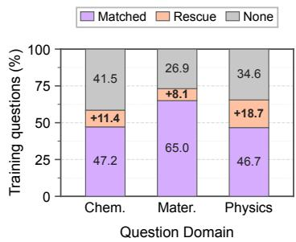  
(a) Teacher Covera<sub>g</sub>e

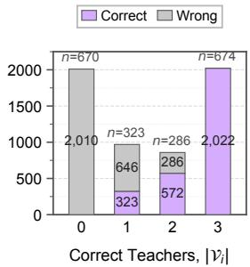  
(b) Answer Com<sub>p</sub>osition

Fi<sub>g</sub>ure 3: Teacher-Pool Dia<sub>g</sub>nosis on the Trainin<sub>g</sub> Set. (a) C<sub>overage</sub> f<sub>rom ma</sub>t<sub>c</sub>h<sub>e</sub>d t<sub>eac</sub>h<sub>ers, cross-</sub>d<sub>oma</sub>i<sub>n rescue, an</sub>d none correct. (b) Correct and wron<sub>g</sub> teacher answers <sub>p</sub>er <sub>correc</sub>t<sub>-</sub>t<sub>eac</sub>h<sub>er</sub> bi<sub>n;</sub> l<sub>a</sub>b<sub>e</sub>l<sub>s g</sub>i<sub>ve samp</sub>l<sub>e coun</sub>t<sub>s.</sub>  
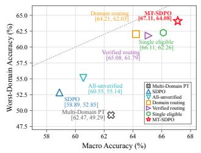

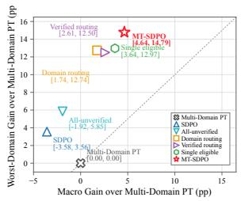  
(a) Absolute Accurac<sub>y</sub>  
(b) Accurac<sub>y</sub> Gain  
Fi<sub>g</sub>ure 4: Ste<sub>p</sub>-100 Ca<sub>p</sub>abilit<sub>y</sub> Inte<sub>g</sub>ration on Qwen3-8B. (a) Macro a<sub>g</sub>ainst Worst-domain accurac<sub>y</sub>. (b) Gains over Multi-D<sub>oma</sub>i<sub>n</sub> P<sub>os</sub>t<sub>-</sub>T<sub>ra</sub>i<sub>n</sub>i<sub>ng.</sub> D<sub>as</sub>h<sub>e</sub>d di<sub>agona</sub>l<sub>s mar</sub>k <sub>par</sub>it<sub>y.</sub>

Protocol and Metrics. Every controlled online method <sub>s</sub>t<sub>ar</sub>t<sub>s</sub> f<sub>rom</sub> th<sub>a</sub>t i<sub>n</sub>iti<sub>a</sub>li<sub>za</sub>ti<sub>on an</sub>d t<sub>ra</sub>i<sub>ns</sub> f<sub>or</sub> 100 <sub>s</sub>t<sub>eps w</sub>ith 8 <sub>o</sub>n<sub>-po</sub>li<sub>cy</sub> r<sub>o</sub>ll<sub>ou</sub>t<sub>s pe</sub>r <sub>p</sub>r<sub>o</sub>m<sub>p</sub>t <sub>o</sub>n 8 H100 80GB GPU<sub>s.</sub> E<sub>va</sub>l<sub>-</sub> <sub>ua</sub>ti<sub>on</sub> d<sub>raws</sub> 16 <sub>responses</sub> f<sub>or eac</sub>h <sub>o</sub>f th<sub>e</sub> 79 h<sub>e</sub>ld<sub>-ou</sub>t <sub>sam-</sub> <sub>p</sub>l<sub>es per</sub> d<sub>oma</sub>i<sub>n an</sub>d <sub>repor</sub>t<sub>s avg</sub>@16 d<sub>oma</sub>i<sub>n accuracy</sub> $A _ { d } ,$ f<sub>rom w</sub>hi<sub>c</sub>h M<sub>acro,</sub> W<sub>ors</sub>t<sub>, an</sub>d G<sub>ap are</sub> th<sub>e mean, m</sub>i<sub>n</sub>i<sub>mum,</sub> <sub>an</sub>d <sub>range over</sub> th<sub>e</sub> th<sub>ree</sub> d<sub>oma</sub>i<sub>ns.</sub> W<sub>e compare a</sub>ll <sub>me</sub>th<sub>o</sub>d<sub>s</sub> <sub>a</sub>t <sub>s</sub>t<sub>ep</sub> 100 <sub>an</sub>d <sub>measure</sub> <sub>every</sub> <sub>po</sub>i<sub>n</sub>t dif<sub>erence</sub> <sub>aga</sub>i<sub>ns</sub>t th<sub>e</sub> <sub>same-s</sub>t<sub>u</sub>d<sub>en</sub>t M<sub>u</sub>lti<sub>-</sub>D<sub>oma</sub>i<sub>n</sub> P<sub>os</sub>t<sub>-</sub>T<sub>ra</sub>i<sub>n</sub>i<sub>ng</sub> <sub>po</sub>li<sub>cy.</sub>

Main Baselines. SDPO (Hübotter et al. 2026) spends the <sub>same</sub> <sub>ver</sub>ifi<sub>er</sub> <sub>en</sub>ti<sub>re</sub>l<sub>y</sub> <sub>on</sub> th<sub>e</sub> <sub>s</sub>t<sub>u</sub>d<sub>en</sub>t’<sub>s</sub> <sub>own</sub> <sub>ro</sub>ll<sub>ou</sub>t<sub>s,</sub> <sub>pro-</sub> <sub>mo</sub>ti<sub>ng success</sub>f<sub>u</sub>l <sub>ones</sub> t<sub>o pr</sub>i<sub>v</sub>il<sub>ege</sub>d <sub>se</sub>lf<sub>-superv</sub>i<sub>s</sub>i<sub>on, so</sub> it i<sub>s</sub> th<sub>e</sub> t<sub>eac</sub>h<sub>er-</sub>f<sub>ree con</sub>t<sub>ro</sub>l f<sub>or w</sub>h<sub>a</sub>t <sub>ex</sub>t<sub>erna</sub>l f<sub>ee</sub>db<sub>ac</sub>k <sub>a</sub>dd<sub>s.</sub> Domain Routing implements MOPD’s domain-assignment rule (Ma et al. 2026), sendin<sub>g</sub> ever<sub>y</sub> failed rollout to its <sub>nom</sub>i<sub>na</sub>l<sub>-</sub>d<sub>oma</sub>i<sub>n</sub> t<sub>eac</sub>h<sub>er w</sub>ith<sub>ou</sub>t <sub>c</sub>h<sub>ec</sub>ki<sub>ng w</sub>h<sub>e</sub>th<sub>er</sub> it <sub>can</sub> <sub>so</sub>l<sub>ve</sub> th<sub>e samp</sub>l<sub>e.</sub> It i<sub>n</sub>h<sub>er</sub>it<sub>s</sub> th<sub>e se</sub>lf<sub>-anc</sub>h<sub>or, san</sub>iti<sub>zer, an</sub>d <sub>pr</sub>i<sub>v</sub>il<sub>ege</sub>d <sub>se</sub>lf<sub>-</sub>t<sub>eac</sub>h<sub>er, so on</sub>l<sub>y</sub> th<sub>e rou</sub>ti<sub>ng ru</sub>l<sub>e</sub> dif<sub>ers.</sub>

<table><tr><td>Model</td><td>Method</td><td>Chemistry</td><td>Materials</td><td>Physics</td><td>Macro ↑(∆)</td><td>Worst ↑(∆)</td><td>Gap ↓(∆)</td></tr><tr><td rowspan="5">Qwen3-1.7B</td><td>Base Matched Teachers (3)</td><td>37.10 45.33</td><td>41.14 65.59</td><td>46.52 50.24</td><td>41.59 53.72</td><td>37.10 45.33</td><td>9.41 20.25</td></tr><tr><td></td><td></td><td></td><td></td><td></td><td></td><td></td></tr><tr><td>Multi-Domain PT</td><td>42.33</td><td>63.05</td><td>51.66</td><td>52.35</td><td>42.33</td><td>20.73</td></tr><tr><td>SDPO</td><td>40.74</td><td>55.93</td><td>50.40</td><td>49.02 (−3.33)</td><td>40.74 (−1.59)</td><td>15.19 (−5.54)</td></tr><tr><td>Domain Routing MT-SDPO</td><td>45.33 46.52</td><td>55.46 56.65</td><td>44.78 46.20</td><td>48.52 (-3.83) 49.79 (−2.56)</td><td>44.78 (+2.45) 46.20 (+3.87)</td><td>10.68 (−10.05) 10.44(−10.29)</td></tr><tr><td rowspan="5"></td><td>Base</td><td>41.69</td><td>58.94</td><td>59.65</td><td>53.43</td><td>41.69</td><td>17.96</td></tr><tr><td>Matched Teachers (3)</td><td>51.27</td><td>69.38</td><td>66.06</td><td>62.24</td><td>51.27</td><td>18.12</td></tr><tr><td>Multi-Domain PT</td><td>48.66</td><td>71.36</td><td>68.67</td><td>62.90</td><td>48.66</td><td>22.71</td></tr><tr><td>SDPO</td><td>51.98</td><td>70.17</td><td>64.40</td><td>62.18 (−0.72)</td><td>51.98 (+3.32)</td><td>18.20 (−4.51)</td></tr><tr><td>Domain Routing MT-SDPO</td><td>47.78 50.63</td><td>63.77 62.26</td><td>65.27</td><td>58.94 (-3.96)</td><td>47.78 (−0.88)</td><td>17.48 (-5.23)</td></tr><tr><td rowspan="5">Qwen3-8B</td><td>Base Matched Teachers (3)</td><td>44.38</td><td>58.47</td><td>63.92 66.22</td><td>58.94(–3.96) 56.36</td><td>50.63 (+1.97) 44.38</td><td>13.29 (−9.42) 21.84</td></tr><tr><td>Multi-Domain PT</td><td>52.93 49.29</td><td>68.04 70.25</td><td>68.99 67.88</td><td>63.32 62.47</td><td>52.93 49.29</td><td>16.06 20.96</td></tr><tr><td>SDPO</td><td>54.11</td><td>69.70</td><td>52.85</td><td>58.89 (-3.58)</td><td>52.85 (+3.56)</td><td>16.85 (−4.11)</td></tr><tr><td>Domain Routing MT-SDPO</td><td>62.03</td><td>67.33</td><td>63.29</td><td>64.21 (+1.74)</td><td>62.03 (+12.74)</td><td>5.30 (−15.66)</td></tr><tr><td>Base</td><td>67.88</td><td>69.38</td><td>64.08</td><td>67.11 (+4.64)</td><td>64.08 (+14.79)</td><td>5.30 (-15.66)</td></tr><tr><td rowspan="5">Llama-3.1 8B-Instruct</td><td>Matched Teachers (3)</td><td>30.38</td><td>43.04</td><td>41.53</td><td>38.32</td><td>30.38</td><td>12.66</td></tr><tr><td>Multi-Domain PT</td><td>62.03 56.33</td><td>63.69</td><td>56.57</td><td>60.76</td><td>56.57</td><td>7.12</td></tr><tr><td>SDPO</td><td></td><td>59.57</td><td>51.42</td><td>55.78</td><td>51.42</td><td>8.15</td></tr><tr><td>Domain Routing</td><td>58.62</td><td>58.86</td><td>39.24</td><td>52.24 (−3.54)</td><td>39.24 (−12.18)</td><td>19.62 (+11.47)</td></tr><tr><td>MT-SDPO</td><td>57.20</td><td>53.96</td><td>43.43</td><td>51.53 (−4.25)</td><td>43.43 (−7.99)</td><td>13.77 (+5.62)</td></tr><tr><td rowspan="5">OLMo-3</td><td>Base</td><td>59.57</td><td>53.48</td><td>44.62</td><td>52.56 (–3.22)</td><td>44.62 (–6.80)</td><td>14.95 (+6.80)</td></tr><tr><td>Matched Teachers (3)</td><td>36.16</td><td>57.83</td><td>62.82</td><td>52.27</td><td>36.16</td><td>26.66</td></tr><tr><td>Multi-Domain PT</td><td>48.02</td><td>61.55</td><td>53.24</td><td>54.27</td><td>48.02</td><td>13.53</td></tr><tr><td></td><td>48.42</td><td>63.21</td><td>57.67</td><td>56.43</td><td>48.42</td><td>14.79</td></tr><tr><td></td><td>45.41</td><td>62.66</td><td>54.91</td><td>54.33 (−2.10)</td><td>45.41 (−3.01)</td><td>17.25 (+2.46)</td></tr><tr><td rowspan="5">7B-Instruct</td><td>SDPO</td><td></td><td></td><td></td><td></td><td></td><td></td></tr><tr><td>Domain Routing</td><td></td><td></td><td></td><td></td><td></td><td></td></tr><tr><td>MT-SDPO</td><td>51.90 55.69</td><td>64.56 65.82</td><td>63.29 64.55</td><td>59.92(+3.49) 62.02 (+5.59)</td><td>51.90 (+3.48) 55.69 (+7.27)</td><td>12.66 (−2.13)</td></tr><tr><td></td><td></td><td></td><td></td><td></td><td></td><td>10.13 (−4.66)</td></tr><tr><td></td><td></td><td></td><td></td><td></td><td></td><td></td></tr></table>

Table 1: Ca<sub>p</sub>abilit<sub>y</sub> Inte<sub>g</sub>ration Across Five Student Models. Per-domain columns are av<sub>g</sub>@16 accurac<sub>y</sub> (%) at ste<sub>p</sub> 100. Matched Teachers (3) is a <sub>p</sub>er-domain frozen-teacher reference, not a de<sub>p</sub>lo<sub>y</sub>able <sub>p</sub>olic<sub>y</sub>; Multi-Domain PT initializes the three online rows below it. ∆ is each online row minus its same-model initialization, and bold marks the best a<sub>gg</sub>re<sub>g</sub>ate <sub>p</sub>er block.

## 5.2 Domain Match Misses Correct Teachers

Domain match holds on average, not per sample. Before t<sub>ra</sub>i<sub>n</sub>i<sub>ng,</sub> <sub>we</sub> <sub>recor</sub>d th<sub>e</sub> <sub>e</sub>li<sub>g</sub>ibl<sub>e</sub> <sub>se</sub>t $\nu _ { i }$ of Eq. (4) on ever<sub>y</sub> t<sub>ra</sub>i<sub>n</sub>i<sub>ng samp</sub>l<sub>e.</sub> E<sub>ac</sub>h t<sub>eac</sub>h<sub>er</sub> d<sub>oes</sub> i<sub>mprove</sub> it<sub>s own</sub> h<sub>e</sub>ld<sub>-</sub> <sub>ou</sub>t d<sub>oma</sub>i<sub>n over</sub> th<sub>e s</sub>h<sub>are</sub>d b<sub>ase,</sub> b<sub>y</sub> 8<sub>.</sub>55<sub>,</sub> 9<sub>.</sub>57<sub>, an</sub>d 2<sub>.</sub>77 <sub>po</sub>i<sub>n</sub>t<sub>s.</sub> P<sub>er</sub> <sub>samp</sub>l<sub>e</sub> th<sub>ey</sub> <sub>are</sub> f<sub>ar</sub> l<sub>ess</sub> <sub>separa</sub>bl<sub>e:</sub> th<sub>e</sub> <sub>ma</sub>t<sub>c</sub>h<sub>e</sub>d t<sub>eac</sub>h<sub>er</sub> i<sub>s correc</sub>t <sub>on on</sub>l<sub>y</sub> 52<sub>.</sub>94% <sub>o</sub>f <sub>samp</sub>l<sub>es, an</sub>d <sub>on p</sub>h<sub>ys</sub>i<sub>cs</sub> <sub>samp</sub>l<sub>es</sub> th<sub>e</sub> <sub>c</sub>h<sub>em</sub>i<sub>s</sub>t<sub>ry</sub> t<sub>eac</sub>h<sub>er</sub> i<sub>s</sub> th<sub>e</sub> <sub>more</sub> <sub>accura</sub>t<sub>e</sub> <sub>o</sub>f th<sub>e</sub> t<sub>wo.</sub> T<sub>eac</sub>h<sub>ers</sub> <sub>s</sub>h<sub>ar</sub>i<sub>ng</sub> <sub>one</sub> b<sub>ase</sub> <sub>mo</sub>d<sub>e</sub>l <sub>an</sub>d <sub>one</sub> d<sub>a</sub>t<sub>a</sub> <sub>p</sub>i<sub>pe</sub>li<sub>ne</sub> <sub>over</sub>l<sub>ap</sub> i<sub>n</sub> <sub>compe</sub>t<sub>ence</sub> <sub>more</sub> th<sub>an</sub> th<sub>e</sub>i<sub>r</sub> l<sub>a</sub>b<sub>e</sub>l<sub>s</sub> <sub>sugges</sub>t<sub>.</sub>

Per-sample selection turns that overlap into coverage. Ad<sub>m</sub>itti<sub>ng any</sub> t<sub>eac</sub>h<sub>er w</sub>h<sub>ose pr</sub>i<sub>va</sub>t<sub>e answer</sub> i<sub>s ver</sub>ifi<sub>e</sub>d <sub>cor-</sub> <sub>rec</sub>t <sub>ra</sub>i<sub>ses coverage</sub> t<sub>o</sub> 65<sub>.</sub>69% <sub>an</sub>d <sub>recovers</sub> 27<sub>.</sub>09% <sub>o</sub>f <sub>w</sub>h<sub>a</sub>t the matched teacher misses. Fi<sub>g</sub>ure 3(a) breaks this rescue d<sub>own</sub> b<sub>y</sub> d<sub>oma</sub>i<sub>n:</sub> l<sub>arges</sub>t i<sub>n p</sub>h<sub>ys</sub>i<sub>cs, a</sub>t 18<sub>.</sub>74 <sub>po</sub>i<sub>n</sub>t<sub>s, w</sub>h<sub>ere</sub> domain match is weakest. Fi<sub>g</sub>ure 3(b) re<sub>g</sub>rou<sub>p</sub>s the sam-<sub>p</sub>l<sub>es</sub> b<sub>y num</sub>b<sub>er o</sub>f <sub>correc</sub>t t<sub>eac</sub>h<sub>ers: roug</sub>hl<sub>y</sub> h<sub>a</sub>lf <sub>a</sub>d<sub>m</sub>it t<sub>wo</sub> <sub>or</sub> th<sub>ree, ma</sub>ki<sub>ng aggrega</sub>ti<sub>on poss</sub>ibl<sub>e, w</sub>hil<sub>e</sub> 34<sub>.</sub>31% <sub>a</sub>d<sub>m</sub>it <sub>none</sub> <sub>an</sub>d b<sub>oun</sub>d <sub>any</sub> <sub>me</sub>th<sub>o</sub>d b<sub>u</sub>ilt <sub>on</sub> thi<sub>s</sub> <sub>poo</sub>l<sub>.</sub> Th<sub>a</sub>t <sub>group</sub> i<sub>s</sub> <sub>w</sub>h<sub>y</sub> MT<sub>-</sub>SDPO <sub>pa</sub>i<sub>rs ver</sub>ifi<sub>e</sub>d f<sub>ee</sub>db<sub>ac</sub>k <sub>w</sub>ith <sub>se</sub>lf<sub>-anc</sub>h<sub>ors.</sub>

## 5.3 Main Capability-Integration Results

MT-SDPO recovers the weakest domain of Qwen3-8B. T<sub>a</sub>bl<sub>e</sub> 1 <sub>an</sub>d Fi<sub>gure</sub> 4 <sub>repor</sub>t <sub>every me</sub>th<sub>o</sub>d <sub>a</sub>t <sub>s</sub>t<sub>ep</sub> 100<sub>.</sub> O<sub>n</sub> Qwen3-8B, MT-SDPO improves Macro and Worst-domain <sub>accuracy</sub> b<sub>y</sub> 4<sub>.</sub>64 <sub>an</sub>d 14<sub>.</sub>79 <sub>po</sub>i<sub>n</sub>t<sub>s over</sub> M<sub>u</sub>lti<sub>-</sub>D<sub>oma</sub>i<sub>n</sub> P<sub>os</sub>t<sub>-</sub> T<sub>ra</sub>i<sub>n</sub>i<sub>ng,</sub> <sub>an</sub>d <sub>narrows</sub> th<sub>e</sub> <sub>gap</sub> f<sub>rom</sub> 20<sub>.</sub>96 t<sub>o</sub> 5<sub>.</sub>30<sub>.</sub> Ch<sub>em</sub>i<sub>s</sub>t<sub>ry,</sub> th<sub>e</sub> <sub>wea</sub>k<sub>es</sub>t d<sub>oma</sub>i<sub>n,</sub> <sub>r</sub>i<sub>ses</sub> 18<sub>.</sub>59 <sub>po</sub>i<sub>n</sub>t<sub>s,</sub> <sub>w</sub>hil<sub>e</sub> <sub>ma</sub>t<sub>er</sub>i<sub>a</sub>l<sub>s</sub> <sub>an</sub>d <sub>p</sub>h<sub>ys</sub>i<sub>cs</sub> t<sub>oge</sub>th<sub>e</sub>r <sub>g</sub>i<sub>ve</sub> b<sub>ac</sub>k <sub>u</sub>nd<sub>e</sub>r fi<sub>ve.</sub> MT<sub>-</sub>SDPO int<sub>eg</sub>r<sub>a</sub>t<sub>es</sub> <sub>capa</sub>bilit<sub>y</sub> i<sub>ns</sub>t<sub>ea</sub>d <sub>o</sub>f i<sub>mprov</sub>i<sub>ng every</sub> d<sub>oma</sub>i<sub>n, w</sub>hi<sub>c</sub>h i<sub>s w</sub>h<sub>a</sub>t <sub>one</sub> d<sub>ep</sub>l<sub>oye</sub>d <sub>po</sub>li<sub>cy nee</sub>d<sub>s.</sub>

On Qwen3-8B, one integrated policy is more balanced than one matched teacher per domain. MT-SDPO im-<sub>proves on</sub> th<sub>e</sub> th<sub>ree-mo</sub>d<sub>e</sub>l <sub>ma</sub>t<sub>c</sub>h<sub>e</sub>d<sub>-</sub>t<sub>eac</sub>h<sub>er re</sub>f<sub>erence</sub> b<sub>y</sub> 3<sub>.</sub>79 M<sub>acro an</sub>d 11<sub>.</sub>15 W<sub>ors</sub>t<sub>-</sub>d<sub>oma</sub>i<sub>n po</sub>i<sub>n</sub>t<sub>s w</sub>ith <sub>a s</sub>i<sub>ng</sub>l<sub>e mo</sub>d<sub>e</sub>l <sub>a</sub>t i<sub>n</sub>f<sub>erence.</sub> D<sub>oma</sub>i<sub>n</sub> R<sub>ou</sub>ti<sub>ng reac</sub>h<sub>es</sub> th<sub>e same</sub> 5<sub>.</sub>30 <sub>gap</sub> b<sub>u</sub>t <sub>s</sub>t<sub>ays</sub> 2<sub>.</sub>90 <sub>an</sub>d 2<sub>.</sub>05 <sub>po</sub>i<sub>n</sub>t<sub>s</sub> l<sub>ower</sub> <sub>on</sub> th<sub>e</sub> t<sub>wo</sub> <sub>accuracy</sub> <sub>me</sub>t<sub>-</sub> <sub>r</sub>i<sub>cs: rou</sub>ti<sub>ng a</sub>l<sub>one recovers</sub> th<sub>e</sub> b<sub>a</sub>l<sub>ance, an</sub>d <sub>ver</sub>ifi<sub>ca</sub>ti<sub>on an</sub>d <sup>a</sup>gg<sup>re</sup>g<sup>ation</sup> <sup>s</sup>upp<sup>l</sup>y <sup>the</sup> <sup>acc</sup>u<sup>rac</sup>y.

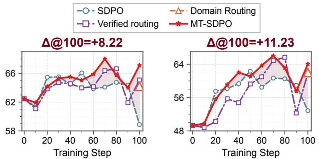  
(b) Worst-Domain Accurac<sub>y</sub> ↑

(a) Macro Accurac<sub>y</sub> ↑  
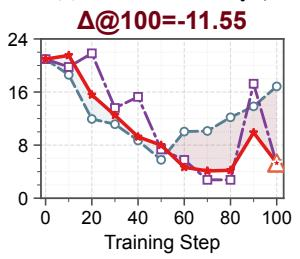

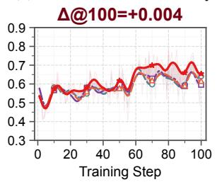  
(c) Domain Ga<sub>p</sub> ↓  
(d) Rollout Accurac<sub>y</sub> ↑  
Fi<sub>gure</sub> 5<sub>:</sub> H<sub>e</sub>ld<sub>-</sub>O<sub>u</sub>t D<sub>ynam</sub>i<sub>cs an</sub>d R<sub>o</sub>ll<sub>ou</sub>t A<sub>ccuracy.</sub> P<sub>ane</sub>l<sub>s</sub> (a)–(c) are held-out metrics; (d) is the verifier <sub>p</sub>ass rate on tr<sub>a</sub>inin<sub>g</sub> r<sub>o</sub>ll<sub>ou</sub>t<sub>s.</sub> Sh<sub>a</sub>din<sub>g</sub> i<sub>s</sub> th<sub>e s</sub>i<sub>g</sub>n<sub>e</sub>d MT<sub>-</sub>SDPO<sub>–</sub>SDPO dif<sub>erence,</sub> <sub>no</sub>t <sub>a</sub> <sub>con</sub>fid<sub>ence</sub> i<sub>n</sub>t<sub>erva</sub>l<sub>,</sub> <sub>an</sub>d D<sub>oma</sub>i<sub>n</sub> R<sub>ou</sub>ti<sub>ng</sub> a<sub>pp</sub>ears onl<sub>y</sub> at ste<sub>p</sub> 100 in (a)–(c).

Spending the verifier on allocation is what redistributes capability. Spent as a scalar reward instead, the signal varies the objective, not the allocation rule. On Qwen3-8B th<sub>a</sub>t GRPO <sub>re</sub>f<sub>erence</sub> <sub>w</sub>id<sub>ens</sub> th<sub>e</sub> <sub>gap</sub> f<sub>rom</sub> 20<sub>.</sub>96 t<sub>o</sub> 21<sub>.</sub>76<sub>,</sub> <sub>w</sub>h<sub>e</sub>r<sub>eas</sub> MT<sub>-</sub>SDPO brin<sub>gs</sub> th<sub>e sa</sub>m<sub>e s</sub>t<sub>a</sub>rt t<sub>o</sub> 5<sub>.</sub>30 <sub>a</sub>nd <sub>s</sub>t<sub>a</sub>nd<sub>s</sub> 9<sub>.</sub>17 <sub>po</sub>i<sub>n</sub>t<sub>s</sub> hi<sub>g</sub>h<sub>er</sub> i<sub>n</sub> it<sub>s wea</sub>k<sub>es</sub>t d<sub>oma</sub>i<sub>n.</sub> A<sub>ppen</sub>di<sub>x</sub> D<sub>.</sub>3 <sub>g</sub>i<sub>ves</sub> it<sub>s se</sub>t<sub>up an</sub>d <sub>per-</sub>d<sub>oma</sub>i<sub>n scores.</sub>

A flatter profile arises through two diferent mechanisms. All three Qwen3 scales cut the domain <sub>g</sub>ap, b<sub>y</sub> 49.6% at 1<sub>.</sub>7B<sub>,</sub> 41<sub>.</sub>5% <sub>a</sub>t 4B<sub>,</sub> <sub>an</sub>d 74<sub>.</sub>7% <sub>a</sub>t 8B<sub>,</sub> b<sub>u</sub>t M<sub>acro</sub> i<sub>mproves</sub> <sub>a</sub>t 8B <sub>a</sub>l<sub>one.</sub> At 1<sub>.</sub>7B <sub>an</sub>d 4B th<sub>e</sub> fl<sub>a</sub>tt<sub>en</sub>i<sub>ng</sub> <sub>comes</sub> <sub>mos</sub>tl<sub>y</sub> f<sub>rom</sub> th<sub>e</sub> <sub>s</sub>t<sub>rong</sub> d<sub>oma</sub>i<sub>ns</sub> f<sub>a</sub>lli<sub>ng:</sub> th<sub>e</sub> <sub>wea</sub>k<sub>es</sub>t d<sub>oma</sub>i<sub>n</sub> <sub>ga</sub>i<sub>ns</sub> 4<sub>.</sub>19 <sub>an</sub>d 1<sub>.</sub>97 <sub>po</sub>i<sub>n</sub>t<sub>s w</sub>hil<sub>e</sub> th<sub>e o</sub>th<sub>er</sub> t<sub>wo g</sub>i<sub>ve</sub> b<sub>ac</sub>k 11<sub>.</sub>86 <sub>a</sub>nd 13<sub>.</sub>85<sub>.</sub> At 8B <sub>a</sub>nd <sub>o</sub>n OLM<sub>o-</sub>3<sub>-</sub>7B<sub>-</sub>In<sub>s</sub>tr<sub>uc</sub>t<sub>,</sub> th<sub>e</sub> <sub>wea</sub>k<sub>es</sub>t d<sub>oma</sub>i<sub>n</sub> i<sub>ns</sub>t<sub>ea</sub>d <sub>r</sub>i<sub>ses</sub> b<sub>y</sub> 18<sub>.</sub>59 <sub>an</sub>d 7<sub>.</sub>27 <sub>po</sub>i<sub>n</sub>t<sub>s an</sub>d <sub>carr</sub>i<sub>es</sub> M<sub>acro</sub> <sub>w</sub>ith it<sub>,</sub> <sub>an</sub>d OLM<sub>o</sub> <sub>g</sub>i<sub>ves</sub> th<sub>e</sub> b<sub>es</sub>t M<sub>acro,</sub> W<sub>ors</sub>t<sub>,</sub> <sub>an</sub>d G<sub>ap o</sub>f it<sub>s</sub> bl<sub>oc</sub>k<sub>.</sub> V<sub>er</sub>ifi<sub>e</sub>d f<sub>ee</sub>db<sub>ac</sub>k th<sub>ere</sub>f<sub>ore</sub> l<sub>eve</sub>l<sub>s</sub> th<sub>e pro</sub>fil<sub>e</sub> <sub>w</sub>h<sub>erever</sub> h<sub>ea</sub>d<sub>room</sub> <sub>rema</sub>i<sub>ns,</sub> b<sub>u</sub>t <sub>y</sub>i<sub>e</sub>ld<sub>s</sub> <sub>an</sub> <sub>aggrega</sub>t<sub>e</sub> <sub>ga</sub>i<sub>n</sub> <sub>on</sub>l<sub>y</sub> <sub>w</sub>h<sub>ere</sub> th<sub>e</sub> <sub>wea</sub>k<sub>es</sub>t d<sub>oma</sub>i<sub>n</sub> it<sub>se</sub>lf i<sub>mproves.</sub>

Headroom in the weakest domain decides whether the online phase pays of. Multi-domain post-training alone lifts Ll<sub>ama-</sub>3<sub>.</sub>1<sub>-</sub>8B<sub>-</sub>I<sub>ns</sub>t<sub>ruc</sub>t b<sub>y</sub> 21<sub>.</sub>04 W<sub>ors</sub>t<sub>-</sub>d<sub>oma</sub>i<sub>n</sub> <sub>po</sub>i<sub>n</sub>t<sub>s</sub> <sub>an</sub>d l<sub>eaves</sub> it th<sub>e</sub> fl<sub>a</sub>tt<sub>es</sub>t i<sub>n</sub>iti<sub>a</sub>li<sub>za</sub>ti<sub>on o</sub>f th<sub>e</sub> fi<sub>ve, so</sub> th<sub>e wea</sub>k<sub>es</sub>t<sub>-</sub> d<sub>oma</sub>i<sub>n room</sub> th<sub>a</sub>t MT<sub>-</sub>SDPO <sub>exp</sub>l<sub>o</sub>it<sub>s e</sub>l<sub>sew</sub>h<sub>ere</sub> i<sub>s spen</sub>t b<sub>e</sub>f<sub>ore</sub> th<sub>e on</sub>li<sub>ne p</sub>h<sub>ase</sub> b<sub>eg</sub>i<sub>ns an</sub>d <sub>no con</sub>t<sub>ro</sub>ll<sub>e</sub>d <sub>me</sub>th<sub>o</sub>d i<sub>m-</sub> <sub>proves</sub> <sub>on</sub> it<sub>.</sub> Th<sub>e</sub> b<sub>oun</sub>d i<sub>s</sub> th<sub>e</sub> <sub>rema</sub>i<sub>n</sub>i<sub>ng</sub> h<sub>ea</sub>d<sub>room,</sub> <sub>no</sub>t <sub>an</sub> <sub>or</sub>d<sub>er</sub>i<sub>ng</sub> <sub>among</sub> <sub>me</sub>th<sub>o</sub>d<sub>s.</sub>

<table><tr><td>Method</td><td>Macro ↑(∆)</td><td>Worst ↑(∆)</td><td>Gap ↓(∆)</td></tr><tr><td>w/o Cross-Domain 65.08(+2.61)</td><td></td><td>61.79(+12.50)</td><td>5.14(−15.82)</td></tr><tr><td>w/o Aggregation</td><td>66.11(+3.64)</td><td>62.26(+12.97)</td><td>7.99(-12.97)</td></tr><tr><td>w/o Verification</td><td>60.55(-1.92)</td><td>55.14(+5.85)</td><td>10.92(-10.04)</td></tr><tr><td>MT-SDPO</td><td></td><td>67.11(+4.64) 64.08(+14.79)</td><td>5.30(−15.66)</td></tr></table>

Table 2: Ablation of Supervision Allocation on Qwen3-8B. ∆ is method minus the shared Multi-Domain PT initiali<sub>za</sub>ti<sub>on;</sub> b<sub>o</sub>ld <sub>an</sub>d <sub>un</sub>d<sub>er</sub>li<sub>ne mar</sub>k th<sub>e</sub> b<sub>es</sub>t <sub>an</sub>d <sub>secon</sub>d<sub>-</sub>b<sub>es</sub>t <sub>s</sub>t<sub>ep-</sub>100 <sub>va</sub>l<sub>ues</sub> <sub>pe</sub>r <sub>co</sub>l<sub>u</sub>mn<sub>.</sub>

## 5.4 Training Dynamics

Non-monotonic trajectories motivate the fixed step-100 comparison. Figure 5 places the held-out integration met-<sub>r</sub>i<sub>cs an</sub>d th<sub>e</sub> t<sub>ra</sub>i<sub>n</sub>i<sub>ng-</sub>ti<sub>me ro</sub>ll<sub>ou</sub>t <sub>accuracy</sub> i<sub>n one v</sub>i<sub>ew.</sub> SDPO <sub>pea</sub>k<sub>s</sub> <sub>a</sub>t <sub>s</sub>t<sub>ep</sub> 50 <sub>an</sub>d l<sub>oses</sub> <sub>more</sub> th<sub>an</sub> <sub>seven</sub> M<sub>acro</sub> <sub>po</sub>i<sub>n</sub>t<sub>s</sub> b<sub>y</sub> <sub>s</sub>t<sub>ep</sub> 100<sub>,</sub> <sub>w</sub>h<sub>e</sub>r<sub>eas</sub> MT<sub>-</sub>SDPO <sub>pea</sub>k<sub>s</sub> <sub>a</sub>t <sub>s</sub>t<sub>ep</sub> 70 <sub>a</sub>nd h<sub>o</sub>ld<sub>s</sub> <sub>mos</sub>t <sub>o</sub>f th<sub>a</sub>t <sub>pea</sub>k t<sub>o</sub> th<sub>e en</sub>d<sub>.</sub> B<sub>ecause no me</sub>th<sub>o</sub>d i<sub>mproves</sub> <sub>mono</sub>t<sub>on</sub>i<sub>ca</sub>ll<sub>y, we compare a</sub>t <sub>s</sub>t<sub>ep</sub> 100 <sub>ra</sub>th<sub>er</sub> th<sub>an a</sub>t <sub>eac</sub>h <sub>me</sub>th<sub>o</sub>d’<sub>s</sub> b<sub>es</sub>t i<sub>n</sub>t<sub>erme</sub>di<sub>a</sub>t<sub>e c</sub>h<sub>ec</sub>k<sub>po</sub>i<sub>n</sub>t<sub>.</sub>

## 5.5 Ablation Studies

Cross-domain reassignment and aggregation play complementary roles. Table 2 expresses each variant as a re-<sub>mova</sub>l f<sub>rom</sub> f<sub>u</sub>ll MT<sub>-</sub>SDPO<sub>,</sub> <sub>w</sub>ith th<sub>e</sub> <sub>se</sub>lf<sub>-anc</sub>h<sub>or,</sub> <sub>san</sub>iti<sub>zer,</sub> EMA <sub>se</sub>lf<sub>-</sub>t<sub>eac</sub>h<sub>er,</sub> i<sub>n</sub>iti<sub>a</sub>li<sub>za</sub>ti<sub>on, an</sub>d <sub>up</sub>d<sub>a</sub>t<sub>e</sub> b<sub>u</sub>d<sub>ge</sub>t fi<sub>xe</sub>d<sub>.</sub> R<sub>es</sub>t<sub>r</sub>i<sub>c</sub>ti<sub>ng</sub> f<sub>ee</sub>db<sub>ac</sub>k t<sub>o</sub> th<sub>e ver</sub>ifi<sub>e</sub>d d<sub>oma</sub>i<sub>n-ma</sub>t<sub>c</sub>h<sub>e</sub>d t<sub>eac</sub>h<sub>er</sub> (w/o Cross-Domain) starts the ladder; admittin<sub>g</sub> one sam<sub>p</sub>leeli<sub>g</sub>ible teacher instead (w/o A<sub>gg</sub>re<sub>g</sub>ation) adds 1.03 Macro <sub>an</sub>d 0<sub>.</sub>47 W<sub>ors</sub>t<sub>-</sub>d<sub>oma</sub>i<sub>n po</sub>i<sub>n</sub>t<sub>s</sub> b<sub>u</sub>t <sub>w</sub>id<sub>ens</sub> th<sub>e gap</sub> f<sub>rom</sub> 5<sub>.</sub>14 t<sub>o</sub> 7<sub>.</sub>99<sub>; agg</sub>r<sub>ega</sub>tin<sub>g eve</sub>r<sub>y e</sub>li<sub>g</sub>ibl<sub>e</sub> t<sub>eac</sub>h<sub>e</sub>r in f<sub>u</sub>ll MT<sub>-</sub>SDPO <sub>a</sub>dd<sub>s</sub> 1<sub>.</sub>00 <sub>an</sub>d 1<sub>.</sub>82 <sub>po</sub>i<sub>n</sub>t<sub>s</sub> <sub>more</sub> <sub>an</sub>d b<sub>r</sub>i<sub>ngs</sub> th<sub>e</sub> <sub>gap</sub> t<sub>o</sub> 5<sub>.</sub>30<sub>,</sub> <sub>recover</sub>i<sub>ng</sub> th<sub>e</sub> b<sub>a</sub>l<sub>ance.</sub>

Verification makes the larger teacher pool useful. Re-<sub>p</sub>lacin<sub>g</sub> the eli<sub>g</sub>ible set with all three unverified teachers (w/o Verification) loses 6.56 Macro and 8.94 Worst-domain <sub>p</sub>oints <sub>aga</sub>i<sub>ns</sub>t f<sub>u</sub>ll MT<sub>-</sub>SDPO<sub>,</sub> <sub>an</sub>d f<sub>a</sub>ll<sub>s</sub> 1<sub>.</sub>92 M<sub>acro</sub> <sub>po</sub>i<sub>n</sub>t<sub>s</sub> b<sub>e</sub>l<sub>ow</sub> th<sub>e</sub> <sub>s</sub>h<sub>are</sub>d i<sub>n</sub>iti<sub>a</sub>li<sub>za</sub>ti<sub>on.</sub> Th<sub>e</sub> <sub>o</sub>fli<sub>ne</sub> <sub>man</sub>if<sub>es</sub>t <sub>s</sub>h<sub>ows</sub> <sub>w</sub>h<sub>y:</sub> th<sub>e</sub> <sub>unver</sub>ifi<sub>e</sub>d <sub>ru</sub>l<sub>e</sub> d<sub>raws on an</sub> i<sub>ncorrec</sub>t <sub>answer</sub> i<sub>n</sub> 50<sub>.</sub>21% <sub>o</sub>f t<sub>eac</sub>h<sub>er–samp</sub>l<sub>e</sub> <sub>pa</sub>i<sub>rs,</sub> <sub>aga</sub>i<sub>ns</sub>t 47<sub>.</sub>06% <sub>un</sub>d<sub>er</sub> d<sub>oma</sub>i<sub>n</sub> <sub>rou</sub>ti<sub>ng.</sub>

## 6 Conclusion

W<sub>e s</sub>h<sub>owe</sub>d th<sub>a</sub>t <sub>a</sub> t<sub>eac</sub>h<sub>er poo</sub>l i<sub>s</sub> b<sub>e</sub>tt<sub>er a</sub>ll<sub>oca</sub>t<sub>e</sub>d <sub>per sam-</sub> <sub>p</sub>l<sub>e</sub> th<sub>an</sub> <sub>per</sub> d<sub>oma</sub>i<sub>n.</sub> S<sub>amp</sub>l<sub>e-</sub>l<sub>eve</sub>l <sub>ver</sub>ifi<sub>ca</sub>ti<sub>on</sub> <sub>recovers</sub> <sub>a</sub> <sub>quar</sub>t<sub>er</sub> <sub>o</sub>f th<sub>e</sub> <sub>samp</sub>l<sub>es</sub> d<sub>oma</sub>i<sub>n</sub> <sub>rou</sub>ti<sub>ng</sub> <sub>m</sub>i<sub>sses;</sub> <sub>cross-</sub>d<sub>oma</sub>i<sub>n</sub> <sub>reass</sub>i<sub>gnmen</sub>t th<sub>en</sub> b<sub>uys</sub> <sub>accuracy</sub> <sub>a</sub>t th<sub>e</sub> <sub>cos</sub>t <sub>o</sub>f b<sub>a</sub>l<sub>ance,</sub> <sub>an</sub>d <sub>aggrega</sub>ti<sub>ng every e</sub>li<sub>g</sub>ibl<sub>e</sub> t<sub>eac</sub>h<sub>er w</sub>i<sub>ns</sub> b<sub>o</sub>th b<sub>ac</sub>k<sub>.</sub> T<sub>wo</sub> li<sub>m-</sub> it<sub>s rema</sub>i<sub>n: a</sub> thi<sub>r</sub>d <sub>o</sub>f <sub>samp</sub>l<sub>es a</sub>d<sub>m</sub>it <sub>no correc</sub>t t<sub>eac</sub>h<sub>er, an</sub>d b<sub>a</sub>l<sub>ance</sub>d i<sub>n</sub>iti<sub>a</sub>li<sub>za</sub>ti<sub>ons</sub> l<sub>eave</sub> littl<sub>e</sub> h<sub>ea</sub>d<sub>room.</sub> E<sub>x</sub>t<sub>en</sub>di<sub>ng</sub> MT<sub>-</sub> SDPO b<sub>eyon</sub>d <sub>exac</sub>t<sub>-answer</sub> <sub>se</sub>tti<sub>ngs</sub> <sub>w</sub>ill <sub>requ</sub>i<sub>re</sub> <sub>a</sub> <sub>re</sub>li<sub>a</sub>bl<sub>e,</sub> t<sub>as</sub>k<sub>-appropr</sub>i<sub>a</sub>t<sub>e</sub> <sub>a</sub>lt<sub>erna</sub>ti<sub>ve</sub> t<sub>o</sub> <sub>exac</sub>t<sub>-ma</sub>t<sub>c</sub>h <sub>e</sub>li<sub>g</sub>ibilit<sub>y.</sub>

A<sub>ga</sub>r<sub>wa</sub>l<sub>,</sub> R<sub>.;</sub> Vi<sub>e</sub>ill<sub>a</sub>rd<sub>,</sub> N<sub>.;</sub> Zh<sub>ou,</sub> Y<sub>.;</sub> St<sub>a</sub>n<sub>czy</sub>k<sub>,</sub> P<sub>.;</sub> R<sub>a</sub>m<sub>os,</sub> S<sub>.;</sub> G<sub>e</sub>i<sub>s</sub>t<sub>,</sub> M<sub>.; an</sub>d B<sub>ac</sub>h<sub>em,</sub> O<sub>.</sub> 2024<sub>.</sub> O<sub>n-</sub>P<sub>o</sub>li<sub>cy</sub> Di<sub>s</sub>till<sub>a</sub>ti<sub>on</sub> <sub>o</sub>f L<sub>anguage</sub> M<sub>o</sub>d<sub>e</sub>l<sub>s:</sub> L<sub>earn</sub>i<sub>ng</sub> f<sub>rom</sub> S<sub>e</sub>lf<sub>-</sub>G<sub>enera</sub>t<sub>e</sub>d Mi<sub>s-</sub> takes. In The Twelfth International Conference on Learning Representations.

C<sub>a</sub>i<sub>,</sub> M<sub>.;</sub> Li<sub>ang,</sub> Y<sub>.;</sub> W<sub>ang,</sub> L<sub>.;</sub> W<sub>ang,</sub> Y<sub>.;</sub> Zh<sub>ang,</sub> Y<sub>.;</sub> Xi<sub>a,</sub> L<sub>.;</sub> S<sub>un,</sub> Z<sub>.;</sub> Y<sub>e,</sub> X<sub>.; an</sub>d Shi<sub>,</sub> D<sub>.</sub> 2026<sub>.</sub> Ad<sub>vanc</sub>i<sub>ng</sub> G<sub>enera</sub>l<sub>-</sub> P<sub>u</sub>r<sub>pose</sub> R<sub>easo</sub>nin<sub>g</sub> M<sub>o</sub>d<sub>e</sub>l<sub>s</sub> <sub>w</sub>ith M<sub>o</sub>d<sub>u</sub>l<sub>a</sub>r Gr<sub>a</sub>di<sub>e</sub>nt S<sub>u</sub>r<sub>ge</sub>r<sub>y.</sub> <sub>ar</sub>Xi<sub>v:</sub>2602<sub>.</sub>02301<sub>.</sub>

D<sub>eep</sub>S<sub>ee</sub>k<sub>-</sub>AI<sub>;</sub> Li<sub>u,</sub> A<sub>.;</sub> M<sub>e</sub>i<sub>,</sub> A<sub>.;</sub> Lin<sub>,</sub> B<sub>.;</sub> X<sub>ue,</sub> B<sub>.;</sub> W<sub>a</sub>n<sub>g,</sub> B<sub>.;</sub> X<sub>u,</sub> B<sub>.;</sub> W<sub>u,</sub> B<sub>.;</sub> Zh<sub>ang,</sub> B<sub>.;</sub> Li<sub>n,</sub> C<sub>.;</sub> D<sub>ong,</sub> C<sub>.;</sub> <sub>e</sub>t <sub>a</sub>l<sub>.</sub> 2025<sub>.</sub> D<sub>eep</sub>S<sub>ee</sub>k<sub>-</sub>V3<sub>.</sub>2<sub>:</sub> P<sub>us</sub>hin<sub>g</sub> th<sub>e</sub> Fr<sub>o</sub>nti<sub>e</sub>r <sub>o</sub>f O<sub>pe</sub>n L<sub>a</sub>r<sub>ge</sub> L<sub>anguage</sub> M<sub>o</sub>d<sub>e</sub>l<sub>s.</sub> <sub>ar</sub>Xi<sub>v:</sub>2512<sub>.</sub>02556<sub>.</sub>

F<sub>eng,</sub> K<sub>.;</sub> Sh<sub>en,</sub> X<sub>.;</sub> W<sub>ang,</sub> W<sub>.;</sub> Zh<sub>uang,</sub> X<sub>.;</sub> T<sub>ang,</sub> Y<sub>.;</sub> Zh<sub>ang,</sub> Q.; and Din<sub>g</sub>, K. 2024. SciKnowEval: Evaluatin<sub>g</sub> Multi-L<sub>eve</sub>l S<sub>c</sub>i<sub>en</sub>tifi<sub>c</sub> K<sub>now</sub>l<sub>e</sub>d<sub>ge</sub> <sub>o</sub>f L<sub>arge</sub> L<sub>anguage</sub> M<sub>o</sub>d<sub>e</sub>l<sub>s.</sub> <sub>a</sub>rXi<sub>v:</sub>2406<sub>.</sub>09098<sub>.</sub>

G<sub>ra</sub>tt<sub>a</sub>fi<sub>or</sub>i<sub>,</sub> A<sub>.;</sub> D<sub>u</sub>b<sub>ey,</sub> A<sub>.;</sub> J<sub>au</sub>h<sub>r</sub>i<sub>,</sub> A<sub>.;</sub> P<sub>an</sub>d<sub>ey,</sub> A<sub>.;</sub> K<sub>a</sub>di<sub>an,</sub> A<sub>.;</sub> Al<sub>-</sub>D<sub>a</sub>hl<sub>e,</sub> A<sub>.;</sub> L<sub>e</sub>t<sub>man,</sub> A<sub>.;</sub> M<sub>a</sub>th<sub>ur,</sub> A<sub>.;</sub> S<sub>c</sub>h<sub>e</sub>lt<sub>en,</sub> A<sub>.;</sub> V<sub>aug</sub>h<sub>an,</sub> A<sub>.; e</sub>t <sub>a</sub>l<sub>.</sub> 2024<sub>.</sub> Th<sub>e</sub> Ll<sub>ama</sub> 3 H<sub>er</sub>d <sub>o</sub>f M<sub>o</sub>d<sub>e</sub>l<sub>s.</sub> <sub>ar</sub>Xi<sub>v:</sub>2407<sub>.</sub>21783<sub>.</sub>

G<sub>u,</sub> Y<sub>.;</sub> D<sub>o</sub>n<sub>g,</sub> L<sub>.;</sub> W<sub>e</sub>i<sub>,</sub> F<sub>.; a</sub>nd H<sub>ua</sub>n<sub>g,</sub> M<sub>.</sub> 2024<sub>.</sub> MiniLLM<sub>:</sub> Knowledge Distillation of Large Language Models. In The Twelfth International Conference on Learning Representations.

Guo, D.; Yan<sub>g</sub>, D.; Zhan<sub>g</sub>, H.; Son<sub>g</sub>, J.; Wan<sub>g</sub>, P.; Zhu, Q.; X<sub>u,</sub> R<sub>.;</sub> Zh<sub>a</sub>n<sub>g,</sub> R<sub>.;</sub> M<sub>a,</sub> S<sub>.;</sub> Bi<sub>,</sub> X<sub>.; e</sub>t <sub>a</sub>l<sub>.</sub> 2025<sub>.</sub> D<sub>eep</sub>S<sub>ee</sub>k<sub>-</sub> R1 i<sub>ncen</sub>ti<sub>v</sub>i<sub>zes reason</sub>i<sub>ng</sub> i<sub>n</sub> LLM<sub>s</sub> th<sub>roug</sub>h <sub>re</sub>i<sub>n</sub>f<sub>orcemen</sub>t learning. Nature, 645(8081): 633–638.

Hi<sub>n</sub>t<sub>on,</sub> G<sub>.;</sub> Vi<sub>nya</sub>l<sub>s,</sub> O<sub>.;</sub> <sub>an</sub>d D<sub>ean,</sub> J<sub>.</sub> 2015<sub>.</sub> Di<sub>s</sub>tilli<sub>ng</sub> th<sub>e</sub> K<sub>now</sub>l<sub>e</sub>d<sub>ge</sub> i<sub>n a</sub> N<sub>eura</sub>l N<sub>e</sub>t<sub>wor</sub>k<sub>. ar</sub>Xi<sub>v:</sub>1503<sub>.</sub>02531<sub>.</sub>

Hüb<sub>o</sub>tt<sub>e</sub>r<sub>,</sub> J<sub>.;</sub> Lüb<sub>ec</sub>k<sub>,</sub> F<sub>.;</sub> B<sub>e</sub>hri<sub>c,</sub> L<sub>.;</sub> B<sub>au</sub>m<sub>a</sub>nn<sub>,</sub> A<sub>.;</sub> B<sub>aga</sub>t<sub>e</sub>ll<sub>a,</sub> M<sub>.;</sub> M<sub>a</sub>rt<sub>a,</sub> D<sub>.;</sub> H<sub>a</sub>kimi<sub>,</sub> I<sub>.;</sub> Sh<sub>e</sub>nf<sub>e</sub>ld<sub>,</sub> I<sub>.;</sub> Kl<sub>e</sub>in<sub>e</sub> B<sub>ue</sub>nin<sub>g,</sub> T<sub>.;</sub> G<sub>ues</sub>t<sub>r</sub>i<sub>n,</sub> C<sub>.; an</sub>d K<sub>rause,</sub> A<sub>.</sub> 2026<sub>.</sub> R<sub>e</sub>i<sub>n</sub>f<sub>orcemen</sub>t L<sub>earn</sub>i<sub>ng</sub> <sub>v</sub>i<sub>a</sub> S<sub>e</sub>lf<sub>-</sub>Di<sub>s</sub>till<sub>a</sub>ti<sub>on. ar</sub>Xi<sub>v:</sub>2601<sub>.</sub>20802<sub>.</sub>

Ilh<sub>a</sub>r<sub>co,</sub> G<sub>.;</sub> Rib<sub>e</sub>ir<sub>o,</sub> M<sub>.</sub> T<sub>.;</sub> W<sub>o</sub>rt<sub>s</sub>m<sub>a</sub>n<sub>,</sub> M<sub>.;</sub> G<sub>u</sub>r<sub>u</sub>r<sub>a</sub>n<sub>ga</sub>n<sub>,</sub> S<sub>.;</sub> Schmidt, L.; Hajishirzi, H.; and Farhadi, A. 2023. Editing Models with Task Arithmetic. In The Eleventh International Conference on Learning Representations.

J<sub>a</sub>in<sub>,</sub> N<sub>.;</sub> Sin<sub>g</sub>h<sub>,</sub> J<sub>.;</sub> Sh<sub>e</sub>tt<sub>y,</sub> M<sub>.;</sub> Zh<sub>e</sub>n<sub>g,</sub> L<sub>.;</sub> S<sub>e</sub>n<sub>,</sub> K<sub>.; a</sub>nd St<sub>o</sub>i<sub>ca,</sub> I<sub>.</sub> 2025<sub>.</sub> R2E<sub>-</sub>G<sub>ym:</sub> P<sub>roce</sub>d<sub>ura</sub>l E<sub>nv</sub>i<sub>ronmen</sub>t<sub>s an</sub>d H<sub>y</sub>b<sub>r</sub>id Verifiers for Scaling Open-Weights SWE Agents. In Second Conference on Language Modeling.

Jin<sub>,</sub> B<sub>.;</sub> Z<sub>e</sub>n<sub>g,</sub> H<sub>.;</sub> Y<sub>ue,</sub> Z<sub>.;</sub> Y<sub>oo</sub>n<sub>,</sub> J<sub>.;</sub> Arik<sub>,</sub> S<sub>.;</sub> W<sub>a</sub>n<sub>g,</sub> D<sub>.;</sub> Z<sub>aman</sub>i<sub>,</sub> H<sub>.; an</sub>d H<sub>an,</sub> J<sub>.</sub> 2025<sub>.</sub> S<sub>earc</sub>h<sub>-</sub>R1<sub>:</sub> T<sub>ra</sub>i<sub>n</sub>i<sub>ng</sub> LLM<sub>s</sub> t<sub>o</sub> R<sub>eason an</sub>d L<sub>everage</sub> S<sub>earc</sub>h E<sub>ng</sub>i<sub>nes w</sub>ith R<sub>e</sub>i<sub>n</sub>f<sub>orcemen</sub>t L<sub>earn</sub>i<sub>ng. ar</sub>Xi<sub>v:</sub>2503<sub>.</sub>09516<sub>.</sub>

Ki<sub>m,</sub> J<sub>.;</sub> J<sub>eon,</sub> J<sub>.;</sub> Li<sub>,</sub> D<sub>.; an</sub>d Y<sub>ang,</sub> Y<sub>.</sub> 2026<sub>.</sub> R<sub>e</sub>b<sub>e</sub>lli<sub>ous</sub> St<sub>u-</sub> d<sub>en</sub>t<sub>:</sub> R<sub>evers</sub>i<sub>ng</sub> T<sub>eac</sub>h<sub>er</sub> Si<sub>gna</sub>l<sub>s</sub> f<sub>or</sub> R<sub>eason</sub>i<sub>ng</sub> E<sub>xp</sub>l<sub>ora</sub>ti<sub>on</sub> <sub>w</sub>ith S<sub>e</sub>lf<sub>-</sub>Di<sub>s</sub>till<sub>e</sub>d RLVR<sub>. ar</sub>Xi<sub>v:</sub>2605<sub>.</sub>10781<sub>.</sub>

Ki<sub>m,</sub> Y<sub>.; an</sub>d R<sub>us</sub>h<sub>,</sub> A<sub>.</sub> M<sub>.</sub> 2016<sub>.</sub> S<sub>equence-</sub>L<sub>eve</sub>l K<sub>now</sub>l<sub>-</sub> edge Distillation. In Proceedings of the 2016 Conference on Empirical Methods in Natural Language Processing, 1317– 1327<sub>.</sub> A<sub>us</sub>ti<sub>n,</sub> T<sub>exas:</sub> A<sub>ssoc</sub>i<sub>a</sub>ti<sub>on</sub> f<sub>or</sub> C<sub>ompu</sub>t<sub>a</sub>ti<sub>ona</sub>l Li<sub>ngu</sub>i<sub>s-</sub> ti<sub>cs.</sub>

K<sub>o,</sub> J<sub>.;</sub> Ki<sub>m,</sub> S<sub>.;</sub> Ch<sub>en,</sub> T<sub>.; an</sub>d Y<sub>un,</sub> S<sub>.-</sub>Y<sub>.</sub> 2024<sub>.</sub> Di<sub>s</sub>tiLLM<sub>:</sub> T<sub>owar</sub>d<sub>s</sub> St<sub>ream</sub>li<sub>ne</sub>d Di<sub>s</sub>till<sub>a</sub>ti<sub>on</sub> f<sub>or</sub> L<sub>arge</sub> L<sub>anguage</sub> M<sub>o</sub>d<sub>-</sub> els. In Proceedings of the 41st International Conference on Machine Learning, volume 235 of Proceedings of Machine Learning Research, 24872–24895. PMLR.

L<sub>a</sub>mb<sub>e</sub>rt<sub>,</sub> N<sub>.;</sub> M<sub>o</sub>rri<sub>so</sub>n<sub>,</sub> J<sub>.;</sub> P<sub>ya</sub>tkin<sub>,</sub> V<sub>.;</sub> H<sub>ua</sub>n<sub>g,</sub> S<sub>.;</sub> I<sub>v</sub>i<sub>so</sub>n<sub>,</sub> H<sub>.;</sub> B<sub>ra</sub>h<sub>man,</sub> F<sub>.;</sub> Mi<sub>ran</sub>d<sub>a,</sub> L<sub>.</sub> J<sub>.</sub> V<sub>.;</sub> Li<sub>u,</sub> A<sub>.;</sub> D<sub>z</sub>i<sub>r</sub>i<sub>,</sub> N<sub>.;</sub> L<sub>yu,</sub> S<sub>.;</sub> G<sub>u,</sub> Y<sub>.;</sub> M<sub>a</sub>lik<sub>,</sub> S<sub>.;</sub> Gr<sub>a</sub>f<sub>,</sub> V<sub>.;</sub> H<sub>wa</sub>n<sub>g,</sub> J<sub>.</sub> D<sub>.;</sub> Y<sub>a</sub>n<sub>g,</sub> J<sub>.;</sub> Bras, R. L.; Tafjord, O.; Wilhelm, C.; Soldaini, L.; Smith, N. A.; Wang, Y.; Dasigi, P.; and Hajishirzi, H. 2024. Tulu 3: P<sub>us</sub>hin<sub>g</sub> Fr<sub>o</sub>nti<sub>e</sub>r<sub>s</sub> in O<sub>pe</sub>n L<sub>a</sub>n<sub>guage</sub> M<sub>o</sub>d<sub>e</sub>l P<sub>os</sub>t<sub>-</sub>Tr<sub>a</sub>inin<sub>g.</sub> <sub>ar</sub>Xi<sub>v:</sub>2411<sub>.</sub>15124<sub>.</sub>

Li<sub>u,</sub> Y<sub>.;</sub> Zh<sub>ang,</sub> W<sub>.; an</sub>d W<sub>ang,</sub> J<sub>.</sub> 2020<sub>.</sub> Ad<sub>ap</sub>ti<sub>ve</sub> M<sub>u</sub>lti<sub>-</sub> Teacher Multi-Level Knowledge Distillation. Neurocomputing, 415: 106–113.

M<sub>a,</sub> W<sub>.;</sub> W<sub>e</sub>i<sub>,</sub> J<sub>.;</sub> Zh<sub>ao,</sub> L<sub>.;</sub> Zh<sub>ang,</sub> H<sub>.;</sub> Xi<sub>ao,</sub> B<sub>.;</sub> Li<sub>,</sub> L<sub>.;</sub> Yan<sub>g</sub>, Q.; Gao, B.; Wan<sub>g</sub>, Y.; Li, R.; Don<sub>g</sub>, J.; Sui, Z.; <sub>an</sub>d L<sub>uo,</sub> F<sub>.</sub> 2026<sub>.</sub> MOPD<sub>:</sub> M<sub>u</sub>lti<sub>-</sub>T<sub>eac</sub>h<sub>er</sub> O<sub>n-</sub>P<sub>o</sub>li<sub>cy</sub> Di<sub>s-</sub> till<sub>a</sub>ti<sub>on</sub> f<sub>or</sub> C<sub>apa</sub>bilit<sub>y</sub> I<sub>n</sub>t<sub>egra</sub>ti<sub>on</sub> i<sub>n</sub> LLM P<sub>os</sub>t<sub>-</sub>T<sub>ra</sub>i<sub>n</sub>i<sub>ng.</sub> <sub>ar</sub>Xi<sub>v:</sub>2606<sub>.</sub>30406<sub>.</sub>

Nakano, R.; Hilton, J.; Balaji, S.; Wu, J.; Ouyang, L.; Kim, C.; Hesse, C.; Jain, S.; Kosaraju, V.; Saunders, W.; Ji<sub>a</sub>n<sub>g,</sub> X<sub>.;</sub> C<sub>o</sub>bb<sub>e,</sub> K<sub>.;</sub> El<sub>ou</sub>nd<sub>ou,</sub> T<sub>.;</sub> Kr<sub>uege</sub>r<sub>,</sub> G<sub>.;</sub> B<sub>u</sub>tt<sub>o</sub>n<sub>,</sub> K<sub>.;</sub> Kni<sub>g</sub>ht<sub>,</sub> M<sub>.;</sub> Ch<sub>ess,</sub> B<sub>.; a</sub>nd S<sub>c</sub>h<sub>u</sub>lm<sub>a</sub>n<sub>,</sub> J<sub>.</sub> 2021<sub>.</sub> W<sub>e</sub>bGPT<sub>:</sub> B<sub>rowser-ass</sub>i<sub>s</sub>t<sub>e</sub>d <sub>ques</sub>ti<sub>on-answer</sub>i<sub>ng w</sub>ith h<sub>uman</sub> f<sub>ee</sub>db<sub>ac</sub>k<sub>.</sub> <sub>ar</sub>Xi<sub>v:</sub>2112<sub>.</sub>09332<sub>.</sub>

M<sub>.;</sub> A<sub>s</sub>k<sub>e</sub>ll<sub>,</sub> A<sub>.;</sub> W<sub>e</sub>li<sub>n</sub>d<sub>er,</sub> P<sub>.;</sub> Ch<sub>r</sub>i<sub>s</sub>ti<sub>ano,</sub> P<sub>.</sub> F<sub>.;</sub> L<sub>e</sub>ik<sub>e,</sub> J<sub>.;</sub> <sub>an</sub>d L<sub>owe,</sub> R<sub>.</sub> 2022<sub>.</sub> T<sub>ra</sub>i<sub>n</sub>i<sub>ng</sub> l<sub>anguage mo</sub>d<sub>e</sub>l<sub>s</sub> t<sub>o</sub> f<sub>o</sub>ll<sub>ow</sub> instructions with human feedback. In Advances in Neural Information Processing Systems, volume 35, 27730–27744. C<sub>urran</sub> A<sub>ssoc</sub>i<sub>a</sub>t<sub>es,</sub> I<sub>nc.</sub>

S<sub>c</sub>h<sub>u</sub>l<sub>man,</sub> J<sub>.;</sub> W<sub>o</sub>l<sub>s</sub>ki<sub>,</sub> F<sub>.;</sub> Dh<sub>ar</sub>i<sub>wa</sub>l<sub>,</sub> P<sub>.;</sub> R<sub>a</sub>df<sub>or</sub>d<sub>,</sub> A<sub>.; an</sub>d Kli<sub>mov,</sub> O<sub>.</sub> 2017<sub>.</sub> P<sub>rox</sub>i<sub>ma</sub>l P<sub>o</sub>li<sub>cy</sub> O<sub>p</sub>ti<sub>m</sub>i<sub>za</sub>ti<sub>on</sub> Al<sub>gor</sub>ith<sub>ms.</sub> <sub>ar</sub>Xi<sub>v:</sub>1707<sub>.</sub>06347<sub>.</sub>

Shao, Z.; Wan<sub>g</sub>, P.; Zhu, Q.; Xu, R.; Son<sub>g</sub>, J.; Bi, X.; Zh<sub>a</sub>n<sub>g,</sub> H<sub>.;</sub> Zh<sub>a</sub>n<sub>g,</sub> M<sub>.;</sub> Li<sub>,</sub> Y<sub>.</sub> K<sub>.;</sub> W<sub>u,</sub> Y<sub>.; a</sub>nd G<sub>uo,</sub> D<sub>.</sub> 2024<sub>.</sub> D<sub>eep</sub>S<sub>ee</sub>kM<sub>a</sub>th<sub>:</sub> P<sub>us</sub>hi<sub>ng</sub> th<sub>e</sub> Li<sub>m</sub>it<sub>s o</sub>f M<sub>a</sub>th<sub>ema</sub>ti<sub>ca</sub>l R<sub>ea-</sub> <sub>so</sub>nin<sub>g</sub> in O<sub>pe</sub>n L<sub>a</sub>n<sub>guage</sub> M<sub>o</sub>d<sub>e</sub>l<sub>s. a</sub>rXi<sub>v:</sub>2402<sub>.</sub>03300<sub>.</sub>

Song, Y.; Chen, L.; Tajwar, F.; Munos, R.; Pathak, D.; Bag-<sub>ne</sub>ll<sub>,</sub> J<sub>.</sub> A<sub>.;</sub> Si<sub>ng</sub>h<sub>,</sub> A<sub>.; an</sub>d Z<sub>ane</sub>tt<sub>e,</sub> A<sub>.</sub> 2026<sub>.</sub> E<sub>xpan</sub>di<sub>ng</sub> th<sub>e</sub> C<sub>apa</sub>biliti<sub>es o</sub>f R<sub>e</sub>i<sub>n</sub>f<sub>orcemen</sub>t L<sub>earn</sub>i<sub>ng v</sub>i<sub>a</sub> T<sub>ex</sub>t F<sub>ee</sub>db<sub>ac</sub>k<sub>.</sub> <sub>ar</sub>Xi<sub>v:</sub>2602<sub>.</sub>02482<sub>.</sub>

T<sub>eam,</sub> C<sub>.;</sub> Xi<sub>ao,</sub> B<sub>.;</sub> Xi<sub>a,</sub> B<sub>.;</sub> Y<sub>ang,</sub> B<sub>.;</sub> G<sub>ao,</sub> B<sub>.;</sub> Sh<sub>en,</sub> B<sub>.;</sub> Zh<sub>ang,</sub> C<sub>.;</sub> H<sub>e,</sub> C<sub>.;</sub> L<sub>ou,</sub> C<sub>.;</sub> L<sub>uo,</sub> F<sub>.; e</sub>t <sub>a</sub>l<sub>.</sub> 2026<sub>.</sub> MiM<sub>o-</sub>V2<sub>-</sub> Fl<sub>as</sub>h T<sub>ec</sub>h<sub>n</sub>i<sub>ca</sub>l R<sub>epor</sub>t<sub>. ar</sub>Xi<sub>v:</sub>2601<sub>.</sub>02780<sub>.</sub>

T<sub>eam</sub> Ol<sub>mo;</sub> Etti<sub>nger,</sub> A<sub>.;</sub> B<sub>er</sub>t<sub>sc</sub>h<sub>,</sub> A<sub>.;</sub> K<sub>ue</sub>hl<sub>,</sub> B<sub>.;</sub> G<sub>ra</sub>h<sub>am,</sub> D<sub>.; e</sub>t <sub>a</sub>l<sub>.</sub> 2025<sub>.</sub> Ol<sub>mo</sub> 3<sub>. ar</sub>Xi<sub>v:</sub>2512<sub>.</sub>13961<sub>.</sub>

W<sub>ang,</sub> B<sub>.;</sub> L<sub>ee,</sub> C<sub>.;</sub> L<sub>ee,</sub> N<sub>.;</sub> Li<sub>n,</sub> S<sub>.-</sub>C<sub>.;</sub> D<sub>a</sub>i<sub>,</sub> W<sub>.;</sub> Ch<sub>en,</sub> Y<sub>.;</sub> Ch<sub>e</sub>n<sub>,</sub> Y<sub>.;</sub> Y<sub>a</sub>n<sub>g,</sub> Z<sub>.;</sub> Li<sub>u,</sub> Z<sub>.;</sub> Sh<sub>oey</sub>bi<sub>,</sub> M<sub>.;</sub> C<sub>a</sub>t<sub>a</sub>n<sub>za</sub>r<sub>o,</sub> B<sub>.;</sub> <sub>a</sub>nd Pi<sub>ng,</sub> W<sub>.</sub> 2025<sub>.</sub> N<sub>emo</sub>t<sub>ron-</sub>C<sub>asca</sub>d<sub>e:</sub> S<sub>ca</sub>li<sub>ng</sub> C<sub>asca</sub>d<sub>e</sub>d R<sub>e</sub>i<sub>n-</sub> f<sub>o</sub>r<sub>ce</sub>m<sub>e</sub>nt L<sub>ea</sub>rnin<sub>g</sub> f<sub>o</sub>r G<sub>e</sub>n<sub>e</sub>r<sub>a</sub>l<sub>-</sub>P<sub>u</sub>r<sub>pose</sub> R<sub>easo</sub>nin<sub>g</sub> M<sub>o</sub>d<sub>e</sub>l<sub>s.</sub> <sub>ar</sub>Xi<sub>v:</sub>2512<sub>.</sub>13607<sub>.</sub>

Wei, Y.; Duchenne, O.; Copet, J.; Carbonneaux, Q.; Zhan<sub>g</sub>, L<sub>.;</sub> Fri<sub>e</sub>d<sub>,</sub> D<sub>.;</sub> S<sub>y</sub>nn<sub>aeve,</sub> G<sub>.;</sub> Sin<sub>g</sub>h<sub>,</sub> R<sub>.; a</sub>nd W<sub>a</sub>n<sub>g,</sub> S<sub>.</sub> I<sub>.</sub> 2025<sub>.</sub>

SWE<sub>-</sub>RL<sub>:</sub> Ad<sub>va</sub>n<sub>c</sub>in<sub>g</sub> LLM R<sub>easo</sub>nin<sub>g v</sub>i<sub>a</sub> R<sub>e</sub>inf<sub>o</sub>r<sub>ce</sub>m<sub>e</sub>nt Learning on Open Software Evolution. InAdvances in Neural Information Processing Systems, volume 38, 78500–78525. C<sub>urran</sub> A<sub>ssoc</sub>i<sub>a</sub>t<sub>es,</sub> I<sub>nc.</sub>

W<sub>o</sub>rt<sub>s</sub>m<sub>a</sub>n<sub>,</sub> M<sub>.;</sub> Ilh<sub>a</sub>r<sub>co,</sub> G<sub>.;</sub> G<sub>a</sub>dr<sub>e,</sub> S<sub>.</sub> Y<sub>.;</sub> R<sub>oe</sub>l<sub>o</sub>f<sub>s,</sub> R<sub>.;</sub> Gontijo-Lopes, R.; Morcos, A. S.; Namkoong, H.; Farhadi, A<sub>.;</sub> C<sub>armon,</sub> Y<sub>.;</sub> K<sub>orn</sub>blith<sub>,</sub> S<sub>.; an</sub>d S<sub>c</sub>h<sub>m</sub>idt<sub>,</sub> L<sub>.</sub> 2022<sub>.</sub> M<sub>o</sub>d<sub>e</sub>l <sub>soups:</sub> <sub>averag</sub>i<sub>ng</sub> <sub>we</sub>i<sub>g</sub>ht<sub>s</sub> <sub>o</sub>f <sub>mu</sub>lti<sub>p</sub>l<sub>e</sub> fi<sub>ne-</sub>t<sub>une</sub>d <sub>mo</sub>d<sub>e</sub>l<sub>s</sub> i<sub>m-</sub> proves accuracy without increasing inference time. In Proceedings of the 39th International Conference on Machine Learning, volume 162 of Proceedings of Machine Learning Research, 23965–23998. PMLR.

Y<sub>ang,</sub> A<sub>.;</sub> Li<sub>,</sub> A<sub>.;</sub> Y<sub>ang,</sub> B<sub>.;</sub> Zh<sub>ang,</sub> B<sub>.;</sub> H<sub>u</sub>i<sub>,</sub> B<sub>.;</sub> Zh<sub>eng,</sub> B<sub>.;</sub> Y<sub>u,</sub> B.; Gao, C.; Huan<sub>g</sub>, C.; Lv, C.; et al. 2025. Qwen3 Technical R<sub>epo</sub>rt<sub>. a</sub>rXi<sub>v:</sub>2505<sub>.</sub>09388<sub>.</sub>

Y<sub>a</sub>n<sub>g,</sub> Z<sub>.;</sub> Ch<sub>e</sub>n<sub>,</sub> G<sub>.;</sub> Y<sub>a</sub>n<sub>g,</sub> Y<sub>.;</sub> Z<sub>e</sub>n<sub>g,</sub> A<sub>.; a</sub>nd Y<sub>a</sub>n<sub>g,</sub> X<sub>.</sub> 2026<sub>a.</sub> Di<sub>sen</sub>t<sub>ang</sub>li<sub>ng</sub> T<sub>as</sub>k C<sub>on</sub>fli<sub>c</sub>t<sub>s</sub> i<sub>n</sub> M<sub>u</sub>lti<sub>-</sub>T<sub>as</sub>k L<sub>o</sub>RA <sub>v</sub>i<sub>a</sub> O<sub>r-</sub> thogonal Gradient Projection. arXiv:2601.09684.

Y<sub>ang,</sub> Z<sub>.;</sub> Li<sub>u,</sub> Z<sub>.;</sub> Ch<sub>en,</sub> Y<sub>.;</sub> D<sub>a</sub>i<sub>,</sub> W<sub>.;</sub> W<sub>ang,</sub> B<sub>.;</sub> Li<sub>n,</sub> S<sub>.-</sub> C<sub>.;</sub> L<sub>ee,</sub> C<sub>.;</sub> Ch<sub>e</sub>n<sub>,</sub> Y<sub>.;</sub> Ji<sub>a</sub>n<sub>g,</sub> D<sub>.;</sub> H<sub>e,</sub> J<sub>.;</sub> Pi<sub>,</sub> R<sub>.;</sub> L<sub>a</sub>m<sub>,</sub> G<sub>.;</sub> L<sub>ee,</sub> N<sub>.;</sub> B<sub>u</sub>kh<sub>ar</sub>i<sub>n,</sub> A<sub>.;</sub> Sh<sub>oey</sub>bi<sub>,</sub> M<sub>.;</sub> C<sub>a</sub>t<sub>anzaro,</sub> B<sub>.; an</sub>d Pi<sub>ng,</sub> W<sub>.</sub> 2026b<sub>.</sub> N<sub>emo</sub>t<sub>ron-</sub>C<sub>asca</sub>d<sub>e</sub> 2<sub>:</sub> P<sub>os</sub>t<sub>-</sub>T<sub>ra</sub>i<sub>n</sub>i<sub>ng</sub> LLM<sub>s</sub> <sub>w</sub>ith C<sub>asca</sub>d<sub>e</sub> RL <sub>an</sub>d M<sub>u</sub>lti<sub>-</sub>D<sub>oma</sub>i<sub>n</sub> O<sub>n-</sub>P<sub>o</sub>li<sub>cy</sub> Di<sub>s</sub>till<sub>a</sub>ti<sub>on.</sub> <sub>ar</sub>Xi<sub>v:</sub>2603<sub>.</sub>19220<sub>.</sub>

Y<sub>e,</sub> H<sub>.;</sub> Ch<sub>e</sub>n<sub>,</sub> S<sub>.;</sub> Zh<sub>a</sub>n<sub>g,</sub> H<sub>.;</sub> L<sub>uo,</sub> W<sub>.;</sub> Li<sub>,</sub> Y<sub>.; a</sub>nd Zh<sub>a</sub>n<sub>g,</sub> X<sub>.</sub> 2025<sub>.</sub> S<sub>ynergy over</sub> Di<sub>screpancy:</sub> A P<sub>ar</sub>titi<sub>on-</sub>B<sub>ase</sub>d A<sub>p-</sub> proach to Multi-Domain LLM Fine-Tuning. In Advances in Neural Information Processing Systems, volume 38, 18893– 18923<sub>.</sub> C<sub>u</sub>rr<sub>a</sub>n A<sub>ssoc</sub>i<sub>a</sub>t<sub>es,</sub> In<sub>c.</sub>

Y<sub>e,</sub> T<sub>.;</sub> D<sub>ong,</sub> L<sub>.;</sub> W<sub>u,</sub> X<sub>.;</sub> H<sub>uang,</sub> S<sub>.;</sub> <sub>an</sub>d W<sub>e</sub>i<sub>,</sub> F<sub>.</sub> 2026<sub>.</sub> O<sub>n-po</sub>li<sub>cy</sub> <sub>con</sub>t<sub>ex</sub>t di<sub>s</sub>till<sub>a</sub>ti<sub>on</sub> f<sub>or</sub> l<sub>anguage</sub> <sub>mo</sub>d<sub>e</sub>l<sub>s.</sub> <sub>ar</sub>Xi<sub>v:</sub>2602<sub>.</sub>12275<sub>.</sub>

Y<sub>ou,</sub> S<sub>.;</sub> X<sub>u,</sub> C<sub>.;</sub> X<sub>u,</sub> C<sub>.; an</sub>d T<sub>ao,</sub> D<sub>.</sub> 2017<sub>.</sub> L<sub>earn</sub>i<sub>ng</sub> f<sub>rom</sub> Multiple Teacher Networks. In Proceedings ofthe 23rdACM SIGKDD International Conference on Knowledge Discovery and Data Mining, KDD ’17, 1285–1294. ACM.

Y<sub>u,</sub> T<sub>.;</sub> K<sub>u</sub>m<sub>a</sub>r<sub>,</sub> S<sub>.;</sub> G<sub>up</sub>t<sub>a,</sub> A<sub>.;</sub> L<sub>ev</sub>in<sub>e,</sub> S<sub>.;</sub> H<sub>aus</sub>m<sub>a</sub>n<sub>,</sub> K<sub>.; a</sub>nd Finn<sub>,</sub> C<sub>.</sub> 2020<sub>.</sub> Gr<sub>a</sub>di<sub>e</sub>nt S<sub>u</sub>r<sub>ge</sub>r<sub>y</sub> f<sub>o</sub>r M<sub>u</sub>lti<sub>-</sub>T<sub>as</sub>k L<sub>ea</sub>rnin<sub>g.</sub> In Advances in Neural Information Processing Systems, vol-<sub>ume</sub> 33<sub>,</sub> 5824<sub>–</sub>5836<sub>.</sub> C<sub>urran</sub> A<sub>ssoc</sub>i<sub>a</sub>t<sub>es,</sub> I<sub>nc.</sub>

Y<sub>uan,</sub> F<sub>.;</sub> Sh<sub>ou,</sub> L<sub>.;</sub> P<sub>e</sub>i<sub>,</sub> J<sub>.;</sub> Li<sub>n,</sub> W<sub>.;</sub> G<sub>ong,</sub> M<sub>.;</sub> F<sub>u,</sub> Y<sub>.;</sub> <sub>an</sub>d Ji<sub>ang,</sub> D<sub>.</sub> 2021<sub>.</sub> R<sub>e</sub>i<sub>n</sub>f<sub>orce</sub>d M<sub>u</sub>lti<sub>-</sub>T<sub>eac</sub>h<sub>er</sub> S<sub>e</sub>l<sub>ec</sub>ti<sub>on</sub> f<sub>or</sub> Knowledge Distillation. Proceedings oftheAAAIConference on Artificial Intelligence, 35(16): 14284–14291.

Zh<sub>ang,</sub> L<sub>.;</sub> H<sub>osse</sub>i<sub>n</sub>i<sub>,</sub> A<sub>.;</sub> B<sub>ansa</sub>l<sub>,</sub> H<sub>.;</sub> K<sub>azem</sub>i<sub>,</sub> M<sub>.;</sub> K<sub>umar,</sub> A<sub>.;</sub> <sub>an</sub>d A<sub>garwa</sub>l<sub>,</sub> R<sub>.</sub> 2025<sub>.</sub> G<sub>enera</sub>ti<sub>ve</sub> V<sub>er</sub>ifi<sub>ers:</sub> R<sub>ewar</sub>d M<sub>o</sub>d<sub>e</sub>l<sub>-</sub> ing as Next-Token Prediction. In The Thirteenth International Conference on Learning Representations.

Zh<sub>ao,</sub> S<sub>.;</sub> Xi<sub>e,</sub> Z<sub>.;</sub> Li<sub>u,</sub> M<sub>.;</sub> H<sub>ua</sub>n<sub>g,</sub> J<sub>.;</sub> P<sub>a</sub>n<sub>g,</sub> G<sub>.;</sub> Ch<sub>e</sub>n<sub>,</sub> F<sub>.; a</sub>nd G<sub>rover,</sub> A<sub>.</sub> 2026<sub>.</sub> S<sub>e</sub>lf<sub>-</sub>Di<sub>s</sub>till<sub>e</sub>d R<sub>easoner:</sub> O<sub>n-</sub>P<sub>o</sub>li<sub>cy</sub> S<sub>e</sub>lf<sub>-</sub> Di<sub>s</sub>till<sub>a</sub>ti<sub>on</sub> f<sub>or</sub> L<sub>arge</sub> L<sub>anguage</sub> M<sub>o</sub>d<sub>e</sub>l<sub>s.</sub> <sub>ar</sub>Xi<sub>v:</sub>2601<sub>.</sub>18734<sub>.</sub>

Thi<sub>s</sub> <sub>appen</sub>di<sub>x</sub> <sub>prov</sub>id<sub>es</sub> th<sub>e</sub> t<sub>ra</sub>i<sub>n</sub>i<sub>ng,</sub> <sub>eva</sub>l<sub>ua</sub>ti<sub>on,</sub> <sub>an</sub>d <sub>promp</sub>t d<sub>e</sub>t<sub>a</sub>il<sub>s</sub> b<sub>e</sub>hi<sub>n</sub>d th<sub>e ma</sub>i<sub>n</sub> t<sub>ex</sub>t<sub>,</sub> t<sub>oge</sub>th<sub>er w</sub>ith <sub>a</sub>dditi<sub>ona</sub>l <sub>resu</sub>lt<sub>s.</sub> It i<sub>s organ</sub>i<sub>ze</sub>d <sub>as</sub> f<sub>o</sub>ll<sub>ows.</sub>

A Post-Training and Initialization . . . . . 10   
B Online Optimization and Teacher Feedback. . . . . . 10   
B.1 Implemented Form of the Distillation Objective . . . <sub>. . . . . .</sub> 10   
B<sub>.</sub>2 P<sub>r</sub>i<sub>va</sub>t<sub>e-</sub>A<sub>nswer</sub> M<sub>an</sub>if<sub>es</sub>t<sub>. .</sub> <sub>.</sub>11   
B<sub>.</sub>3 R<sub>o</sub>ll<sub>ou</sub>t<sub>-</sub>S<sub>pec</sub>ifi<sub>c</sub> F<sub>ee</sub>db<sub>ac</sub>k <sub>.</sub> <sub>.</sub> 11   
C Evaluation Protocol . . . 11   
C<sub>.</sub>1 G<sub>uar</sub>d<sub>e</sub>d P<sub>ars</sub>i<sub>ng</sub> F<sub>a</sub>llb<sub>ac</sub>k <sub>. .</sub> <sub>.</sub> 11   
D Additional Results . . 12   
D<sub>.</sub>1 Cr<sub>oss-</sub>S<sub>ca</sub>l<sub>e</sub> Tr<sub>a</sub>inin<sub>g</sub> D<sub>y</sub>n<sub>a</sub>mi<sub>cs .</sub> <sub>.</sub> 12   
D<sub>.</sub>2 Additi<sub>ona</sub>l F<sub>ee</sub>db<sub>ac</sub>k Di<sub>agnos</sub>ti<sub>cs . . . .</sub> <sub>.</sub> 12   
D<sub>.</sub>3 V<sub>er</sub>ifi<sub>a</sub>bl<sub>e-</sub>R<sub>ewar</sub>d RL R<sub>e</sub>f<sub>erence .</sub> <sub>.</sub> 12   
E Prompt Templates . . 12   
E<sub>.</sub>1 SFT D<sub>a</sub>t<sub>a</sub> C<sub>ons</sub>t<sub>ruc</sub>ti<sub>on</sub> <sub>.</sub> 13   
E<sub>.</sub>2 St<sub>u</sub>d<sub>en</sub>t SFT <sub>an</sub>d I<sub>n</sub>iti<sub>a</sub>l R<sub>o</sub>ll<sub>ou</sub>t <sub>.</sub> <sub>. .</sub> 15   
E<sub>.</sub>3 Onlin<sub>e</sub> S<sub>e</sub>lf<sub>-</sub>T<sub>eac</sub>h<sub>e</sub>r R<sub>ep</sub>r<sub>o</sub>m<sub>p</sub>t<sub>s .</sub> <sub>. .</sub> 15   
E<sub>.</sub>4 Fr<sub>oze</sub>n T<sub>eac</sub>h<sub>e</sub>r Di<sub>ag</sub>n<sub>os</sub>ti<sub>c</sub> Pr<sub>o</sub>m<sub>p</sub>t <sub>. . . . . .</sub> <sub>. .</sub> 16   
E<sub>.</sub>5 E<sub>va</sub>l<sub>ua</sub>ti<sub>o</sub>n Pr<sub>o</sub>m<sub>p</sub>t<sub>s .</sub> <sub>.</sub> 16   
F Feedback Efectiveness . 17

## A Post-Training and Initialization

For five student backbones (Qwen3-1.7B, Qwen3- 4B, Qwen3-8B, Llama-3.1-8B-Instruct, and OLMo-3-7B-Instruct), we construct three domain teachers and one Multi-D<sub>oma</sub>i<sub>n</sub> P<sub>os</sub>t<sub>-</sub>T<sub>ra</sub>i<sub>n</sub>i<sub>ng po</sub>li<sub>cy</sub> f<sub>rom</sub> th<sub>e</sub> f<sub>am</sub>il<sub>y-ma</sub>t<sub>c</sub>h<sub>e</sub>d b<sub>ase</sub> <sub>mo</sub>d<sub>e</sub>l<sub>.</sub> Th<sub>e</sub> t<sub>eac</sub>h<sub>ers use separa</sub>t<sub>e</sub> d<sub>oma</sub>i<sub>n se</sub>t<sub>s;</sub> th<sub>e</sub> M<sub>u</sub>lti<sub>-</sub> D<sub>oma</sub>i<sub>n po</sub>li<sub>cy uses</sub> th<sub>e</sub>i<sub>r</sub> b<sub>a</sub>l<sub>ance</sub>d <sub>un</sub>i<sub>on.</sub> P<sub>os</sub>t<sub>-</sub>t<sub>ra</sub>i<sub>n</sub>i<sub>ng, con-</sub> t<sub>ro</sub>ll<sub>e</sub>d <sub>on</sub>li<sub>ne op</sub>ti<sub>m</sub>i<sub>za</sub>ti<sub>on, an</sub>d <sub>eva</sub>l<sub>ua</sub>ti<sub>on</sub> f<sub>o</sub>ll<sub>ow</sub> th<sub>e s</sub>h<sub>are</sub>d <sub>rec</sub>i<sub>pes</sub> i<sub>n</sub> T<sub>a</sub>bl<sub>es</sub> 3<sub>–</sub>5<sub>.</sub> Id<sub>en</sub>tifi<sub>ers</sub> <sub>are</sub> f<sub>am</sub>il<sub>y-spec</sub>ifi<sub>c,</sub> <sub>an</sub>d f<sub>am</sub>il<sub>y-ma</sub>t<sub>c</sub>h<sub>e</sub>d <sub>genera</sub>t<sub>ors</sub> <sub>an</sub>d <sub>va</sub>lid<sub>a</sub>ti<sub>on</sub>/<sub>recovery</sub> <sub>p</sub>i<sub>pe</sub>li<sub>nes</sub> <sub>pro</sub>d<sub>uce</sub> th<sub>e</sub> <sub>superv</sub>i<sub>s</sub>i<sub>on.</sub> Th<sub>e</sub> t<sub>eac</sub>h<sub>ers</sub> <sub>use</sub> th<sub>e</sub>i<sub>r</sub> fi<sub>na</sub>l th<sub>ree-</sub> <sub>epoc</sub>h <sub>we</sub>i<sub>g</sub>ht<sub>s an</sub>d <sub>rema</sub>i<sub>n</sub> f<sub>rozen.</sub> E<sub>very con</sub>t<sub>ro</sub>ll<sub>e</sub>d <sub>on</sub>li<sub>ne</sub> <sub>me</sub>th<sub>o</sub>d <sub>s</sub>t<sub>ar</sub>t<sub>s</sub> f<sub>rom</sub> th<sub>e correspon</sub>di<sub>ng epoc</sub>h<sub>-</sub>2 M<sub>u</sub>lti<sub>-</sub>D<sub>oma</sub>i<sub>n</sub> <sub>c</sub>h<sub>ec</sub>k<sub>po</sub>i<sub>n</sub>t<sub>; no me</sub>th<sub>o</sub>d<sub>-spec</sub>ifi<sub>c</sub> i<sub>n</sub>iti<sub>a</sub>li<sub>za</sub>ti<sub>on</sub> i<sub>s use</sub>d<sub>.</sub>

## B Online Optimization and Teacher Feedback

Al<sub>gor</sub>ith<sub>m</sub> 1 <sub>g</sub>i<sub>ves</sub> th<sub>e proce</sub>d<sub>ure</sub> d<sub>escr</sub>ib<sub>e</sub>d i<sub>n</sub> S<sub>ec</sub>ti<sub>on</sub> 4 <sub>o</sub>f th<sub>e ma</sub>i<sub>n</sub> t<sub>ex</sub>t<sub>.</sub> T<sub>a</sub>bl<sub>e</sub> 4 li<sub>s</sub>t<sub>s</sub> th<sub>e on</sub>li<sub>ne op</sub>ti<sub>m</sub>i<sub>za</sub>ti<sub>on</sub> b<sub>u</sub>d<sub>ge</sub>t <sub>an</sub>d di<sub>s</sub>till<sub>a</sub>ti<sub>on se</sub>tti<sub>ngs.</sub> E<sub>ac</sub>h <sub>con</sub>t<sub>ro</sub>ll<sub>e</sub>d <sub>me</sub>th<sub>o</sub>d <sub>processes</sub> <sup>32</sup> p<sup>rom</sup>p<sup>ts</sup> p<sup>er</sup> up<sup>date</sup>, <sup>dra</sup>w<sup>s</sup> <sup>ei</sup>g<sup>ht</sup> <sup>on-</sup>p<sup>olic</sup>y <sup>res</sup>p<sup>onses</sup> p<sup>er</sup> <sub>promp</sub>t<sub>,</sub> <sub>an</sub>d <sub>runs</sub> f<sub>or</sub> 100 <sub>up</sub>d<sub>a</sub>t<sub>es.</sub> Th<sub>e</sub> <sub>me</sub>th<sub>o</sub>d<sub>s</sub> <sub>use</sub> th<sub>e</sub> <sub>same</sub> <sub>promp</sub>t ID<sub>s,</sub> <sub>ro</sub>ll<sub>ou</sub>t<sub>-samp</sub>li<sub>ng</sub> <sub>con</sub>fi<sub>gura</sub>ti<sub>on,</sub> <sub>an</sub>d <sub>s</sub>t<sub>u</sub>d<sub>en</sub>t<sub>-</sub> <sub>up</sub>d<sub>a</sub>t<sub>e</sub> b<sub>u</sub>d<sub>ge</sub>t<sub>.</sub> E<sub>ac</sub>h r<sub>u</sub>n<sub>s o</sub>n <sub>e</sub>i<sub>g</sub>ht H100 80GB GPU<sub>s.</sub> SDPO <sub>a</sub>ll<sub>oca</sub>t<sub>es a</sub>ll <sub>e</sub>i<sub>g</sub>ht GPU<sub>s</sub> t<sub>o</sub> th<sub>e po</sub>li<sub>cy; me</sub>th<sub>o</sub>d<sub>s w</sub>ith <sub>ex</sub>t<sub>erna</sub>l t<sub>eac</sub>h<sub>ers sp</sub>lit f<sub>our</sub> f<sub>or po</sub>li<sub>cy</sub> t<sub>ra</sub>i<sub>n</sub>i<sub>ng an</sub>d f<sub>our</sub> f<sub>or serv</sub>i<sub>ng</sub> th<sub>e</sub> f<sub>rozen</sub> t<sub>eac</sub>h<sub>ers.</sub>

<table><tr><td>Parameter</td><td>Value</td></tr><tr><td>General</td><td></td></tr><tr><td>Model update</td><td>Full-parameter post-training</td></tr><tr><td>Optimizer</td><td>Fused AdamW</td></tr><tr><td>Learning rate</td><td> $1 \times 1 0 ^ { - 5 }$ </td></tr><tr><td>Schedule</td><td>Cosine, 5% warmup</td></tr><tr><td>Training epochs</td><td>3</td></tr><tr><td>Data</td><td></td></tr><tr><td>Global batch size</td><td>4</td></tr><tr><td>Maximum sequence length</td><td>8,192 tokens</td></tr><tr><td>Response handling</td><td>Response tokens only; no packing</td></tr><tr><td>Training</td><td></td></tr><tr><td>Weight decay / gradient</td><td>0.1 / 1.0</td></tr><tr><td>clipping Numeric precision</td><td>bfloat16</td></tr></table>

T<sub>a</sub>bl<sub>e</sub> 3<sub>:</sub> P<sub>os</sub>t<sub>-</sub>T<sub>ra</sub>i<sub>n</sub>i<sub>ng</sub> S<sub>e</sub>tti<sub>ngs</sub> Sh<sub>are</sub>d A<sub>cross</sub> All St<sub>u-</sub> d<sub>en</sub>t B<sub>ac</sub>kb<sub>ones.</sub> D<sub>oma</sub>i<sub>n-spec</sub>ifi<sub>c an</sub>d M<sub>u</sub>lti<sub>-</sub>D<sub>oma</sub>i<sub>n</sub> P<sub>os</sub>t<sub>-</sub> Trainin<sub>g</sub> use the same recipe for Qwen3, Llama-3.1, and OLM<sub>o-</sub>3<sub>.</sub>

## B.1 Implemented Form of the Distillation Objective

Equation (7) of the main text states the objective in its <sub>mas</sub>k<sub>e</sub>d<sub>,</sub> i<sub>mpor</sub>t<sub>ance-we</sub>i<sub>g</sub>ht<sub>e</sub>d f<sub>orm.</sub> Th<sub>ree</sub> d<sub>e</sub>t<sub>a</sub>il<sub>s are</sub> fi<sub>xe</sub>d b<sub>y</sub> th<sub>e</sub> i<sub>mp</sub>l<sub>emen</sub>t<sub>a</sub>ti<sub>on.</sub> Fi<sub>rs</sub>t<sub>,</sub> th<sub>e</sub> J<sub>ensen–</sub>Sh<sub>annon</sub> di<sub>ver-</sub> g<sup>ence</sup> $\begin{array} { r } { D _ { \mathrm { J S D } } ( p \| q ) \ = \ \frac { 1 } { 2 } D _ { \mathrm { K L } } ( p \| u ) + \frac { 1 } { 2 } D _ { \mathrm { K L } } ( q \| u ) } \end{array}$ <sub>, w</sub>h<sub>ere</sub> $u = { \textstyle \frac { 1 } { 2 } } ( p + q )$ <sub>,</sub> i<sub>s eva</sub>l<sub>ua</sub>t<sub>e</sub>d <sub>on a</sub> t<sub>runca</sub>t<sub>e</sub>d <sub>suppor</sub>t <sub>ra</sub>th<sub>er</sub> th<sub>an</sub> th<sub>e</sub> f<sub>u</sub>ll <sub>voca</sub>b<sub>u</sub>l<sub>ary.</sub> At <sub>eac</sub>h <sub>pos</sub>iti<sub>on,</sub> th<sub>e opera</sub>t<sub>or</sub> $\mathcal { T } _ { i , t } ^ { j } [ \cdot ]$ <sub>re</sub>t<sub>a</sub>i<sub>ns</sub> th<sub>e</sub> 100 t<sub>o</sub>k<sub>ens w</sub>ith th<sub>e</sub> hi<sub>g</sub>h<sub>es</sub>t <sub>s</sub>t<sub>u</sub>d<sub>en</sub>t <sub>pro</sub>b<sub>a</sub>bil<sub>-</sub> it<sub>y an</sub>d <sub>co</sub>ll<sub>ec</sub>t<sub>s</sub> th<sub>e rema</sub>i<sub>n</sub>i<sub>ng mass</sub> i<sub>n a</sub> t<sub>a</sub>il <sub>sym</sub>b<sub>o</sub>l<sub>.</sub> Th<sub>e</sub> <sub>s</sub>t<sub>u</sub>d<sub>en</sub>t d<sub>e</sub>fi<sub>nes</sub> th<sub>e suppor</sub>t<sub>, w</sub>hil<sub>e eac</sub>h b<sub>ranc</sub>h <sub>re</sub>t<sub>a</sub>i<sub>ns</sub> it<sub>s</sub> <sub>own</sub> t<sub>a</sub>il <sub>mass.</sub> S<sub>econ</sub>d<sub>,</sub> th<sub>e we</sub>i<sub>g</sub>ht $w _ { i , t } ^ { j } = \operatorname* { m i n } ( w _ { i , t } ^ { j , \mathrm { p r o x } } , \rho )$ min $( w _ { i , t } ^ { j , \mathrm { T I S } } , \rho )$ <sub>com</sub>bi<sub>nes</sub> th<sub>e</sub> PPO <sub>prox</sub>i<sub>ma</sub>l <sub>ra</sub>ti<sub>o</sub> $w _ { i , t } ^ { j , \mathrm { p r o x } } =$ $\pi _ { \boldsymbol { \theta } } ( y _ { i , t } ^ { j } ) / \pi _ { \boldsymbol { \theta } _ { \mathrm { o l d } } } ( y _ { i , t } ^ { j } )$ <sub>w</sub>ith th<sub>e</sub> t<sub>runca</sub>t<sub>e</sub>d<sub>-</sub>i<sub>mpor</sub>t<sub>ance-samp</sub>li<sub>ng</sub> <sub>ra</sub>ti<sub>o</sub> $w _ { i , t } ^ { j , \mathrm { T I S } } = \pi _ { \theta _ { \mathrm { o l d } } } ( y _ { i , t } ^ { j } ) / \pi _ { \theta _ { \mathrm { r o l l o u t } } } ( y _ { i , t } ^ { j } )$ <sub>.</sub> B<sub>o</sub>th <sub>ra</sub>ti<sub>os</sub> <sub>are</sub> <sub>con-</sub> diti<sub>one</sub>d <sub>on</sub> $( x _ { i } , y _ { i , < t } ^ { j } ) .$ d<sub>e</sub>t<sub>ac</sub>h<sub>e</sub>d<sub>, an</sub>d <sub>c</sub>li<sub>ppe</sub>d <sub>on</sub>l<sub>y</sub> f<sub>rom</sub> <sub>a</sub>b<sub>ove a</sub>t $\rho \ = \ 2 .$ <sub>.</sub> Thi<sub>r</sub>d<sub>,</sub> th<sub>e norma</sub>li<sub>zer</sub> i<sub>s app</sub>li<sub>e</sub>d <sub>per</sub> <sub>m</sub>i<sub>cro-</sub>b<sub>a</sub>t<sub>c</sub>h <sub>ra</sub>th<sub>er</sub> th<sub>an g</sub>l<sub>o</sub>b<sub>a</sub>ll<sub>y.</sub> F<sub>or</sub> d<sub>ynam</sub>i<sub>c m</sub>i<sub>cro-</sub>b<sub>a</sub>t<sub>c</sub>h<sub>es</sub> $\{ \mathcal { M } _ { b } \} _ { b = 1 } ^ { B _ { \mu } }$ <sub>,</sub> l<sub>e</sub>t $\begin{array} { r } { { n } _ { b } \ = \ | { \mathcal { M } } _ { b } | , \ N \ = \ \sum _ { b } { n } _ { b } . } \end{array}$ <sub>, an</sub>d $Z _ { b } \quad =$ max $\{ 1 , \textstyle \sum _ { ( i , j ) \in { \mathcal { M } } _ { b } , t } m _ { i } ^ { j } M _ { i , t } ^ { j } \}$ <sub>.</sub> Th<sub>e</sub> i<sub>mp</sub>l<sub>emen</sub>t<sub>e</sub>d l<sub>oss</sub> i<sub>s</sub> th<sub>e</sub> <sub>sequence-coun</sub>t<sub>-we</sub>i<sub>g</sub>ht<sub>e</sub>d <sub>average o</sub>f th<sub>e m</sub>i<sub>cro-</sub>b<sub>a</sub>t<sub>c</sub>h t<sub>o</sub>k<sub>en</sub> means:

$$
\mathcal { L } _ { \mathrm { M T - S D P O } } = \underset { b = 1 } { \sum _ { b = 1 } ^ { B _ { \mu } } } \frac { n _ { b } } { N } \frac { 1 } { Z _ { b } } \sum _ { ( i , j ) \in \mathcal { M } _ { b } \atop t } m _ { i } ^ { j } M _ { i , t } ^ { j } w _ { i , t } ^ { j }\tag{8}
$$

Algorithm 1 Answer-Verified MT-SDPO   
Input: data D; student π ; EMA self-teacher $\pi _ { \boldsymbol { \theta } } ;$ f<sub>rozen</sub> t<sub>eac</sub>h<sub>ers</sub>   
$\{ \bar { E } _ { k } \} _ { k = 1 } ^ { K } ;$ rollout count G; EMA rate τ   
Output: updated student model $\pi _ { \theta }$   
1: // Ofline: cache sample-level teacher eligibility   
2<sub>:</sub> $\mathcal { V } _ { i } \gets \{ k : \mathrm { V E R I F Y } \big ( \dot { E _ { k } ^ { \mathrm { a n s } } } ( x _ { i } ) , a _ { i } ^ { * } \big ) = 1 \} , \ \forall ( x _ { i } , \dot { a } _ { i } ^ { * } ) \in \mathcal { D }$   
3: // Online: align supervision to each rollout   
4: for each online training step do   
5<sub>:</sub> $\ B \sim { \mathcal { D } } ; y _ { i } ^ { 1 : G } \sim \pi _ { \theta } { \stackrel { \smile } { ( } } \cdot \mid x _ { i } )$ f<sub>or eac</sub>h $x _ { i } \in B$   
6<sub>:</sub> $\begin{array} { r } { S _ { i } \gets \{ j : \mathrm { V E R I F Y } ( y _ { i } ^ { j } , a _ { i } ^ { * } ) = 1 \} } \end{array}$   
7<sub>:</sub> for each rollout $y _ { i } ^ { j }$ in the batch do   
8<sub>:</sub> $s _ { i } ^ { j } \gets \mathrm { T r u n c } ($ (earliest rollout in $S _ { i } \setminus \{ j \} )$ , or ∅ ▷   
Eq. (3), main text   
9: $F _ { i } ^ { j } \gets \emptyset$   
10<sub>:</sub> $\mathbf { i f } \ j \notin { \mathcal { S } } _ { i }$ then   
11<sub>:</sub> for each $k \in \nu _ { i }$ do   
12<sub>:</sub> $F _ { i } ^ { j } \gets \operatorname { C o n c a t } \big [ F _ { i } ^ { j } , \Gamma ( E _ { k } ^ { \mathrm { f b } } ( x _ { i } , y _ { i } ^ { j } ) ) \big ]$   
13<sub>:</sub> end for   
14<sub>:</sub> end if   
15<sub>:</sub> $c _ { i } ^ { j }  [ s _ { i } ^ { j } ; F _ { i } ^ { j } ] ; m _ { i } ^ { j }  \nVdash [ c _ { i } ^ { j } \neq \emptyset ]$   
16<sub>:</sub> A<sub>ccumu</sub>l<sub>a</sub>t<sub>e</sub> th<sub>e</sub> $( i , j )$ terms of L<sub>MT-SDPO</sub> ▷ Eq. (7),   
<sub>ma</sub>i<sub>n</sub> t<sub>ex</sub>t   
17<sub>:</sub> end for   
18<sub>:</sub> Update θ over the collected batch   
19<sub>:</sub> $\bar { \theta } \overset { \cdot } {  } ( 1 - \tau ) \bar { \theta } + \tau \theta$   
20: end for   
21: return $\pi _ { \boldsymbol { \theta } } ;$ di<sub>scar</sub>d $\pi _ { \bar { \theta } }$ <sub>an</sub>d <sub>a</sub>ll t<sub>eac</sub>h<sub>ers</sub>

## B.2 Private-Answer Manifest

F<sub>or every s</sub>t<sub>u</sub>d<sub>en</sub>t f<sub>am</sub>il<sub>y, eac</sub>h f<sub>rozen</sub> t<sub>eac</sub>h<sub>er answers eac</sub>h <sub>o</sub>f th<sub>e</sub> 1<sub>,</sub>953 t<sub>ra</sub>i<sub>n</sub>i<sub>ng ques</sub>ti<sub>ons once</sub> b<sub>e</sub>f<sub>ore on</sub>li<sub>ne</sub> t<sub>ra</sub>i<sub>n</sub>i<sub>ng.</sub> Decoding is deterministic, with temperature 0, top-p = 1.0, <sub>an</sub>d <sub>a max</sub>i<sub>mum o</sub>f $6 ,$ 144 t<sub>o</sub>k<sub>ens.</sub> M<sub>an</sub>if<sub>es</sub>t <sub>cons</sub>t<sub>ruc</sub>ti<sub>on uses</sub> th<sub>e gener</sub>i<sub>c</sub> S<sub>c</sub>iK<sub>now</sub>E<sub>va</sub>l L3 <sub>ro</sub>ll<sub>ou</sub>t <sub>promp</sub>t <sub>repro</sub>d<sub>uce</sub>d i<sub>n</sub> S<sub>ec</sub>ti<sub>on</sub> E<sub>.</sub>2<sub>.</sub> Thi<sub>s</sub> <sub>promp</sub>t i<sub>s</sub> <sub>a</sub>l<sub>so</sub> <sub>use</sub>d f<sub>or</sub> <sub>on</sub>li<sub>ne</sub> t<sub>ra</sub>i<sub>n</sub>i<sub>ng</sub> <sub>an</sub>d <sub>eva</sub>l<sub>ua</sub>ti<sub>on.</sub> Th<sub>e programma</sub>ti<sub>c answer c</sub>h<sub>ec</sub>k<sub>er compares</sub> th<sub>e parse</sub>d <sub>answer w</sub>ith th<sub>e re</sub>f<sub>erence answer an</sub>d <sub>recor</sub>d<sub>s</sub> th<sub>e</sub> <sub>samp</sub>l<sub>e-</sub>l<sub>eve</sub>l <sub>e</sub>li<sub>g</sub>ibl<sub>e</sub> <sub>se</sub>t<sub>.</sub> N<sub>e</sub>ith<sub>er</sub> th<sub>e</sub> <sub>pr</sub>i<sub>va</sub>t<sub>e-answer</sub> <sub>promp</sub>t <sub>nor</sub> th<sub>e su</sub>b<sub>sequen</sub>t t<sub>eac</sub>h<sub>er-</sub>f<sub>ee</sub>db<sub>ac</sub>k <sub>promp</sub>t <sub>con</sub>t<sub>a</sub>i<sub>ns</sub> th<sub>e re</sub>f<sub>-</sub> <sub>e</sub>r<sub>e</sub>n<sub>ce a</sub>n<sub>swe</sub>r<sub>.</sub> MT<sub>-</sub>SDPO <sub>que</sub>ri<sub>es eve</sub>r<sub>y e</sub>li<sub>g</sub>ibl<sub>e</sub> t<sub>eac</sub>h<sub>e</sub>r<sub>.</sub> Th<sub>e</sub> w/o Cross-Domain control (verified domain routin<sub>g</sub>) restricts thi<sub>s se</sub>t t<sub>o</sub> th<sub>e nom</sub>i<sub>na</sub>l<sub>-</sub>d<sub>oma</sub>i<sub>n</sub> t<sub>eac</sub>h<sub>er.</sub> D<sub>oma</sub>i<sub>n</sub> R<sub>ou</sub>ti<sub>ng an</sub>d w/o Verification (the unverified all-teacher control) do not <sub>use</sub> th<sub>e man</sub>if<sub>es</sub>t f<sub>or e</sub>li<sub>g</sub>ibilit<sub>y.</sub>

## B.3 Rollout-Specific Feedback

E<sub>x</sub>t<sub>erna</sub>l f<sub>ee</sub>db<sub>ac</sub>k i<sub>s reques</sub>t<sub>e</sub>d <sub>on</sub>l<sub>y w</sub>h<sub>en</sub> th<sub>e s</sub>t<sub>u</sub>d<sub>en</sub>t <sub>ro</sub>ll<sub>ou</sub>t i<sub>s</sub> i<sub>ncorrec</sub>t<sub>.</sub> Eli<sub>g</sub>ibl<sub>e</sub> t<sub>eac</sub>h<sub>ers are quer</sub>i<sub>e</sub>d i<sub>n</sub>d<sub>epen</sub>d<sub>en</sub>tl<sub>y</sub> i<sub>n</sub> th<sub>e</sub> fi<sub>xe</sub>d <sub>or</sub>d<sub>er o</sub>f <sub>c</sub>h<sub>em</sub>i<sub>s</sub>t<sub>ry, ma</sub>t<sub>er</sub>i<sub>a</sub>l<sub>s sc</sub>i<sub>ence, an</sub>d <sub>p</sub>h<sub>ys</sub>i<sub>cs.</sub> Decoding uses temperature 0.2, top-p = 0.95, and a 256- t<sub>o</sub>k<sub>en ou</sub>t<sub>pu</sub>t li<sub>m</sub>it<sub>.</sub> A <sub>message</sub> i<sub>s re</sub>t<sub>a</sub>i<sub>ne</sub>d <sub>on</sub>l<sub>y</sub> if it h<sub>as a</sub> <sub>va</sub>lid <sub>concep</sub>t <sub>anc</sub>h<sub>or un</sub>d<sub>er</sub> th<sub>e</sub> l<sub>ex</sub>i<sub>ca</sub>l <sub>san</sub>iti<sub>zer an</sub>d <sub>passes</sub> the answer-leakage checks. Failed or rejected messages are d<sub>roppe</sub>d<sub>.</sub> Th<sub>e</sub> <sub>re</sub>t<sub>a</sub>i<sub>ne</sub>d <sub>messages</sub> <sub>are</sub> <sub>conca</sub>t<sub>ena</sub>t<sub>e</sub>d <sub>w</sub>ith th<sub>e</sub> <sub>ava</sub>il<sub>a</sub>bl<sub>e se</sub>lf<sub>-anc</sub>h<sub>or un</sub>d<sub>er</sub> th<sub>e</sub> t<sub>o</sub>k<sub>en</sub> b<sub>u</sub>d<sub>ge</sub>t<sub>s</sub> i<sub>n</sub> T<sub>a</sub>bl<sub>e</sub> 4<sub>.</sub>

<table><tr><td>Parameter</td><td>Value</td></tr><tr><td colspan="2">Training</td></tr><tr><td>Prompts per update / rollouts per prompt Number of updates</td><td>32 /8</td></tr><tr><td>Student learning rate Batching / Rollout</td><td>100  $1 \times 1 0 ^ { - 5 }$ </td></tr><tr><td>Rollout sampling Maximum prompt</td><td>Temperature 1.0, top-p = 1.0 2,048 tokens</td></tr><tr><td>length Maximum response</td><td>8,192 tokens</td></tr><tr><td>length Optimization mini-</td><td></td></tr><tr><td>batch Dynamic token cap</td><td>32, dynamic micro-batching</td></tr><tr><td>Distillation</td><td>18,944 tokens per GPU</td></tr><tr><td colspan="2">Distillation support Student top-100 tokens plus tail mass JSD mixture coeffi- Fixed at  $\tau = 0 . 0 5$  2.0 for both ratios</td></tr><tr><td colspan="2">cient EMA update rate Importance-ratio upper clip</td></tr></table>

T<sub>a</sub>bl<sub>e</sub> 4<sub>:</sub> O<sub>n</sub>li<sub>ne</sub> S<sub>e</sub>tti<sub>ngs</sub> Sh<sub>are</sub>d A<sub>cross</sub> St<sub>u</sub>d<sub>en</sub>t F<sub>am</sub>ili<sub>es</sub> <sub>an</sub>d C<sub>on</sub>t<sub>ro</sub>ll<sub>e</sub>d M<sub>e</sub>th<sub>o</sub>d<sub>s.</sub> Th<sub>e</sub> li<sub>s</sub>t<sub>e</sub>d <sub>se</sub>tti<sub>ngs</sub> <sub>are</sub> <sub>s</sub>h<sub>are</sub>d<sub>;</sub> th<sub>e</sub> <sub>me</sub>th<sub>o</sub>d<sub>s</sub> dif<sub>er</sub> i<sub>n</sub> th<sub>e</sub>i<sub>r ava</sub>il<sub>a</sub>bl<sub>e pr</sub>i<sub>v</sub>il<sub>ege</sub>d <sub>con</sub>t<sub>ex</sub>t <sub>as</sub> d<sub>e</sub>fi<sub>ne</sub>d i<sub>n</sub> th<sub>e ma</sub>i<sub>n</sub> t<sub>ex</sub>t<sub>.</sub>

## C Evaluation Protocol

All fi<sub>ve</sub> <sub>s</sub>t<sub>u</sub>d<sub>en</sub>t b<sub>ac</sub>kb<sub>ones</sub> <sub>an</sub>d <sub>a</sub>ll <sub>repor</sub>t<sub>e</sub>d <sub>c</sub>h<sub>ec</sub>k<sub>po</sub>i<sub>n</sub>t<sub>s</sub> <sub>use</sub> th<sub>e same</sub> f<sub>rozen eva</sub>l<sub>ua</sub>ti<sub>on pro</sub>t<sub>oco</sub>l<sub>.</sub> E<sub>ac</sub>h d<sub>oma</sub>i<sub>n con</sub>t<sub>a</sub>i<sub>ns</sub> 79 h<sub>e</sub>ld<sub>-ou</sub>t <sub>ques</sub>ti<sub>ons,</sub> <sub>an</sub>d <sub>eac</sub>h <sub>ques</sub>ti<sub>on</sub> <sub>rece</sub>i<sub>ves</sub> 16 i<sub>n</sub>d<sub>e-</sub> <sub>pen</sub>d<sub>en</sub>tl<sub>y</sub> <sub>samp</sub>l<sub>e</sub>d <sub>responses.</sub> T<sub>a</sub>bl<sub>e</sub> 5 <sub>recor</sub>d<sub>s</sub> th<sub>e</sub> <sub>se</sub>tti<sub>ngs</sub> th<sub>a</sub>t <sub>a</sub>f<sub>ec</sub>t th<sub>e repor</sub>t<sub>e</sub>d <sub>avg</sub>@16 <sub>resu</sub>lt<sub>s.</sub>

## C.1 Guarded Parsing Fallback

Wh<sub>en</sub> th<sub>e pr</sub>i<sub>mary parser</sub> d<sub>oes no</sub>t <sub>es</sub>t<sub>a</sub>bli<sub>s</sub>h <sub>a correc</sub>t <sub>answer,</sub> a fixed Qwen3-8B base model is queried as a deterministic binary judge (temperature 0, ${ \mathrm { t o p } } { \cdot } p = 1 . 0 ) $ <sub>.</sub> Th<sub>e</sub> f<sub>a</sub>llb<sub>ac</sub>k <sub>can-</sub> <sub>no</sub>t <sub>over</sub>t<sub>urn</sub> <sub>an</sub> <sub>exp</sub>li<sub>c</sub>itl<sub>y</sub> <sub>ex</sub>t<sub>rac</sub>t<sub>e</sub>d <sub>non-go</sub>ld <sub>answer,</sub> <sub>an</sub>d <sub>a</sub> judge parse failure is counted as incorrect. This rule handles ambiguous formatting without allowing the judge to replace th<sub>e</sub> <sub>answer</sub> k<sub>ey.</sub>

<table><tr><td>Parameter</td><td>Value</td></tr><tr><td>Sampling</td><td></td></tr><tr><td>Responses per question</td><td>16</td></tr><tr><td>Sampling Maximum new tokens Evaluation</td><td>Temperature 0.6, top-p = 0.95, top-k = 20 6,144</td></tr><tr><td>Primary parser</td><td>Last explicit answer field</td></tr><tr><td>Missing, in- valid, or trun-</td><td>Incorrect</td></tr><tr><td>cated answer Macro aggre- gation</td><td>Unweighted mean over three domains</td></tr></table>

T<sub>a</sub>bl<sub>e</sub> 5<sub>:</sub> F<sub>rozen</sub> E<sub>va</sub>l<sub>ua</sub>ti<sub>on</sub> S<sub>e</sub>tti<sub>ngs</sub> Sh<sub>are</sub>d A<sub>cross</sub> All St<sub>u-</sub> d<sub>en</sub>t B<sub>ac</sub>kb<sub>ones</sub>

## D Additional Results

## D.1 Cross-Scale Training Dynamics

Figure 6 reports the held-out Macro and Worst-domain trajectories for ever<sub>y</sub> completed Qwen3 student scale. Intermediate <sub>c</sub>h<sub>ec</sub>k<sub>po</sub>i<sub>n</sub>t<sub>s</sub> <sub>are</sub> di<sub>agnos</sub>ti<sub>c</sub> <sub>on</sub>l<sub>y:</sub> th<sub>e</sub> <sub>ma</sub>i<sub>n</sub> <sub>compar</sub>i<sub>son</sub> <sub>con-</sub> ti<sub>nues</sub> t<sub>o use</sub> th<sub>e common, pre-spec</sub>ifi<sub>e</sub>d <sub>s</sub>t<sub>ep-</sub>100 <sub>c</sub>h<sub>ec</sub>k<sub>po</sub>i<sub>n</sub>t f<sub>or every on</sub>li<sub>ne me</sub>th<sub>o</sub>d<sub>.</sub>

The trajectories difer across scales. At step 100, Qwen3- 1.7B and Qwen3-4B primaril<sub>y</sub> recover weakest-domain ca-<sub>pa</sub>bilit<sub>y</sub> <sub>ra</sub>th<sub>er</sub> th<sub>an</sub> i<sub>mprov</sub>i<sub>ng</sub> M<sub>acro</sub> <sub>accuracy</sub> <sub>over</sub> th<sub>e</sub>i<sub>r</sub> respective initializations. On Qwen3-8B, MT-SDPO finishes <sub>a</sub>b<sub>ove</sub> it<sub>s</sub> i<sub>n</sub>iti<sub>a</sub>li<sub>za</sub>ti<sub>on</sub> <sub>an</sub>d SDPO <sub>on</sub> b<sub>o</sub>th M<sub>acro</sub> <sub>an</sub>d W<sub>ors</sub>t<sub>-</sub> domain accuracy. The non-monotonic trajectories support th<sub>e use o</sub>f <sub>a common c</sub>h<sub>ec</sub>k<sub>po</sub>i<sub>n</sub>t <sub>ra</sub>th<sub>er</sub> th<sub>an me</sub>th<sub>o</sub>d<sub>-spec</sub>ifi<sub>c</sub> <sub>c</sub>h<sub>ec</sub>k<sub>po</sub>i<sub>n</sub>t <sub>se</sub>l<sub>ec</sub>ti<sub>on.</sub>

## D.2 Additional Feedback Diagnostics

Fi<sub>g</sub>ure 7 reports realized feedback exposure on Qwen3-8B. Th<sub>ese</sub> di<sub>agnos</sub>ti<sub>cs are</sub> di<sub>s</sub>ti<sub>nc</sub>t f<sub>rom</sub> th<sub>e o</sub>fli<sub>ne</sub> t<sub>eac</sub>h<sub>er-poo</sub>l <sub>coverage an</sub>d th<sub>e</sub> h<sub>e</sub>ld<sub>-ou</sub>t <sub>an</sub>d <sub>ro</sub>ll<sub>ou</sub>t<sub>-accuracy</sub> d<sub>ynam</sub>i<sub>cs</sub> i<sub>n</sub> th<sub>e ma</sub>i<sub>n</sub> t<sub>ex</sub>t<sub>.</sub> Ofli<sub>ne coverage as</sub>k<sub>s w</sub>h<sub>e</sub>th<sub>er a correc</sub>t t<sub>eac</sub>h<sub>er</sub> <sub>ex</sub>i<sub>s</sub>t<sub>s</sub> f<sub>or a</sub> t<sub>ra</sub>i<sub>n</sub>i<sub>ng ques</sub>ti<sub>on.</sub> H<sub>ere,</sub> f<sub>ee</sub>db<sub>ac</sub>k <sub>use</sub> i<sub>s measure</sub>d <sub>a</sub>ft<sub>er</sub> th<sub>e s</sub>t<sub>u</sub>d<sub>en</sub>t<sub>-error con</sub>diti<sub>on, eac</sub>h <sub>me</sub>th<sub>o</sub>d’<sub>s e</sub>li<sub>g</sub>ibilit<sub>y</sub> rule, feedback <sub>g</sub>eneration, and sanitization. Panel (a) uses centered Gaussian smoothing (σ = 2) only for visualization. Panels (b) and (c) re<sub>p</sub>ort em<sub>p</sub>irical distributions over all 100 <sub>recor</sub>d<sub>e</sub>d <sub>up</sub>d<sub>a</sub>t<sub>es.</sub>

A<sub>cross</sub> th<sub>e</sub> 100 <sub>up</sub>d<sub>a</sub>t<sub>es,</sub> D<sub>oma</sub>i<sub>n</sub> R<sub>ou</sub>ti<sub>ng an</sub>d <sub>w</sub>/<sub>o</sub> V<sub>er</sub>ifi<sub>ca-</sub> ti<sub>on use re</sub>t<sub>a</sub>i<sub>ne</sub>d t<sub>eac</sub>h<sub>er</sub> f<sub>ee</sub>db<sub>ac</sub>k <sub>on</sub> 23<sub>.</sub>07% <sub>an</sub>d 27<sub>.</sub>32% <sub>o</sub>f r<sub>o</sub>ll<sub>ou</sub>t<sub>s</sub> <sub>o</sub>n <sub>ave</sub>r<sub>age.</sub> Th<sub>e</sub> <sub>co</sub>rr<sub>espo</sub>ndin<sub>g</sub> <sub>ave</sub>r<sub>ages</sub> <sub>a</sub>r<sub>e</sub> 10<sub>.</sub>39% f<sub>o</sub>r <sub>w</sub>/<sub>o</sub> Cr<sub>oss-</sub>D<sub>o</sub>m<sub>a</sub>in<sub>,</sub> 9<sub>.</sub>63% f<sub>o</sub>r <sub>w</sub>/<sub>o</sub> A<sub>gg</sub>r<sub>ega</sub>ti<sub>o</sub>n<sub>, a</sub>nd 5<sub>.</sub>64% f<sub>or</sub> MT<sub>-</sub>SDPO<sub>.</sub> A<sub>verage</sub> t<sub>eac</sub>h<sub>er-on</sub>l<sub>y</sub> <sub>promp</sub>t <sub>cover-</sub> <sub>age</sub> f<sub>o</sub>ll<sub>ows</sub> th<sub>e same</sub> b<sub>roa</sub>d <sub>or</sub>d<sub>er</sub>i<sub>ng.</sub> D<sub>oma</sub>i<sub>n</sub> R<sub>ou</sub>ti<sub>ng an</sub>d <sub>w</sub>/<sub>o</sub> V<sub>er</sub>ifi<sub>ca</sub>ti<sub>on</sub> <sub>reac</sub>h 9<sub>.</sub>16% <sub>an</sub>d 11<sub>.</sub>66%<sub>,</sub> <sub>w</sub>hil<sub>e</sub> <sub>w</sub>/<sub>o</sub> C<sub>ross-</sub> D<sub>o</sub>m<sub>a</sub>in<sub>, w</sub>/<sub>o</sub> A<sub>gg</sub>r<sub>ega</sub>ti<sub>o</sub>n<sub>, a</sub>nd MT<sub>-</sub>SDPO r<sub>eac</sub>h 2<sub>.</sub>44%<sub>,</sub> 1<sub>.</sub>81%<sub>, an</sub>d 1<sub>.</sub>12%<sub>.</sub> Thi<sub>s exposure or</sub>d<sub>er</sub>i<sub>ng</sub> dif<sub>ers</sub> f<sub>rom</sub> th<sub>e</sub> <sub>s</sub>t<sub>ep-</sub>100 <sub>per</sub>f<sub>ormance</sub> <sub>or</sub>d<sub>er</sub>i<sub>ng</sub> i<sub>n</sub> th<sub>e</sub> <sub>ma</sub>i<sub>n</sub> t<sub>ex</sub>t<sub>.</sub> F<sub>ee</sub>db<sub>ac</sub>k <sub>vo</sub>l<sub>ume a</sub>l<sub>one</sub> th<sub>ere</sub>f<sub>ore</sub> d<sub>oes no</sub>t <sub>exp</sub>l<sub>a</sub>i<sub>n</sub> i<sub>n</sub>t<sub>egra</sub>ti<sub>on qua</sub>l<sub>-</sub> it<sub>y.</sub> I<sub>n</sub> th<sub>ese runs, answer ver</sub>ifi<sub>ca</sub>ti<sub>on</sub> i<sub>s assoc</sub>i<sub>a</sub>t<sub>e</sub>d <sub>w</sub>ith l<sub>ess</sub> f<sub>requen</sub>t<sub>, more se</sub>l<sub>ec</sub>ti<sub>ve ex</sub>t<sub>erna</sub>l <sub>superv</sub>i<sub>s</sub>i<sub>on.</sub>

Th<sub>e</sub> t<sub>eac</sub>h<sub>er-on</sub>l<sub>y me</sub>t<sub>r</sub>i<sub>c uses a</sub>ll <sub>promp</sub>t<sub>s as</sub> it<sub>s</sub> d<sub>enom</sub>i<sub>na-</sub> tor. It is the joint frequency of a missing successful student <sub>ro</sub>ll<sub>ou</sub>t <sub>an</sub>d <sub>ava</sub>il<sub>a</sub>bl<sub>e re</sub>t<sub>a</sub>i<sub>ne</sub>d t<sub>eac</sub>h<sub>er</sub> f<sub>ee</sub>db<sub>ac</sub>k<sub>.</sub> It i<sub>s no</sub>t th<sub>e</sub> <sub>con</sub>diti<sub>ona</sub>l <sub>pro</sub>b<sub>a</sub>bilit<sub>y</sub> <sub>o</sub>f <sub>rece</sub>i<sub>v</sub>i<sub>ng</sub> f<sub>ee</sub>db<sub>ac</sub>k <sub>g</sub>i<sub>ven</sub> <sub>a</sub> <sub>m</sub>i<sub>ss</sub>i<sub>ng</sub> <sub>se</sub>lf<sub>-anc</sub>h<sub>or.</sub> N<sub>e</sub>ith<sub>er me</sub>t<sub>r</sub>i<sub>c</sub> t<sub>es</sub>t<sub>s w</sub>h<sub>e</sub>th<sub>er</sub> th<sub>e re</sub>t<sub>a</sub>i<sub>ne</sub>d f<sub>ee</sub>d<sub>-</sub> b<sub>ac</sub>k i<sub>s seman</sub>ti<sub>ca</sub>ll<sub>y correc</sub>t <sub>or repa</sub>i<sub>rs</sub> th<sub>e s</sub>t<sub>u</sub>d<sub>en</sub>t’<sub>s answer.</sub> P<sub>er</sub>f<sub>ormance c</sub>l<sub>a</sub>i<sub>ms rema</sub>i<sub>n anc</sub>h<sub>ore</sub>d t<sub>o</sub> th<sub>e s</sub>t<sub>ep-</sub>100 <sub>c</sub>h<sub>ec</sub>k<sub>-</sub> point and exact held-out trajectories reported in the main text.

## D.3 Verifiable-Reward RL Reference

Th<sub>e ma</sub>i<sub>n</sub> t<sub>ex</sub>t’<sub>s a</sub>bl<sub>a</sub>ti<sub>on compar</sub>i<sub>son</sub> h<sub>o</sub>ld<sub>s</sub> th<sub>e</sub> t<sub>eac</sub>h<sub>er poo</sub>l<sub>,</sub> <sub>se</sub>lf<sub>-anc</sub>h<sub>or, san</sub>iti<sub>zer, pr</sub>i<sub>v</sub>il<sub>ege</sub>d <sub>se</sub>lf<sub>-</sub>t<sub>eac</sub>h<sub>er,</sub> i<sub>n</sub>iti<sub>a</sub>li<sub>za</sub>ti<sub>on,</sub> <sub>an</sub>d <sub>up</sub>d<sub>a</sub>t<sub>e</sub> b<sub>u</sub>d<sub>ge</sub>t fi<sub>xe</sub>d <sub>w</sub>hil<sub>e vary</sub>i<sub>ng</sub> th<sub>e superv</sub>i<sub>s</sub>i<sub>on-</sub> <sub>a</sub>ll<sub>oca</sub>ti<sub>on</sub> <sub>ru</sub>l<sub>e.</sub> GRPO i<sub>s</sub> <sub>ou</sub>t<sub>s</sub>id<sub>e</sub> th<sub>a</sub>t <sub>compar</sub>i<sub>son</sub> b<sub>ecause</sub> it changes the objective and uses no teacher pool. It replaces the token-level distillation objective of Eq. (7) with a <sub>p</sub>olic<sub>y</sub> <sub>gra</sub>di<sub>en</sub>t <sub>on a sca</sub>l<sub>ar rewar</sub>d<sub>.</sub> Th<sub>e programma</sub>ti<sub>c ver</sub>ifi<sub>er use</sub>d b<sub>y</sub> MT<sub>-</sub>SDPO <sub>as</sub> <sub>a</sub>n <sub>e</sub>li<sub>g</sub>ibilit<sub>y</sub> <sub>ga</sub>t<sub>e</sub> <sub>supp</sub>li<sub>es</sub> th<sub>a</sub>t r<sub>ewa</sub>rd<sub>.</sub> T<sub>a-</sub> ble 6 reports GRPO only as a separate objective reference <sub>un</sub>d<sub>er</sub> th<sub>e same up</sub>d<sub>a</sub>t<sub>e an</sub>d <sub>ro</sub>ll<sub>ou</sub>t b<sub>u</sub>d<sub>ge</sub>t<sub>.</sub>

E<sub>ac</sub>h GRPO r<sub>e</sub>f<sub>e</sub>r<sub>e</sub>n<sub>ce</sub> r<sub>u</sub>n <sub>s</sub>t<sub>a</sub>rt<sub>s</sub> fr<sub>o</sub>m th<sub>e co</sub>rr<sub>espo</sub>ndin<sub>g</sub> <sub>epoc</sub>h<sub>-</sub>2 M<sub>u</sub>lti<sub>-</sub>D<sub>oma</sub>i<sub>n</sub> P<sub>os</sub>t<sub>-</sub>T<sub>ra</sub>i<sub>n</sub>i<sub>ng c</sub>h<sub>ec</sub>k<sub>po</sub>i<sub>n</sub>t <sub>use</sub>d b<sub>y</sub> th<sub>e</sub> <sub>con</sub>t<sub>ro</sub>ll<sub>e</sub>d <sub>me</sub>th<sub>o</sub>d<sub>s.</sub> It <sub>runs</sub> f<sub>or</sub> 100 <sub>up</sub>d<sub>a</sub>t<sub>es</sub> <sub>w</sub>ith 8 <sub>on-po</sub>li<sub>cy</sub> r<sub>o</sub>ll<sub>ou</sub>t<sub>s pe</sub>r <sub>p</sub>r<sub>o</sub>m<sub>p</sub>t <sub>a</sub>nd <sub>uses e</sub>i<sub>g</sub>ht H100 80GB GPU<sub>s.</sub> Th<sub>e</sub> <sub>ver</sub>ifi<sub>er an</sub>d <sub>eva</sub>l<sub>ua</sub>ti<sub>on pro</sub>t<sub>oco</sub>l i<sub>n</sub> S<sub>ec</sub>ti<sub>on</sub> C <sub>rema</sub>i<sub>n</sub> th<sub>e same.</sub> N<sub>o</sub> t<sub>eac</sub>h<sub>er,</sub> f<sub>ee</sub>db<sub>ac</sub>k<sub>, or se</sub>lf<sub>-</sub>t<sub>eac</sub>h<sub>er componen</sub>t i<sub>s ac</sub>ti<sub>ve,</sub> <sub>an</sub>d th<sub>e rewar</sub>d i<sub>s</sub> th<sub>e</sub> bi<sub>nary ver</sub>ifi<sub>er ou</sub>t<sub>come on</sub> th<sub>e s</sub>t<sub>u</sub>d<sub>en</sub>t’<sub>s</sub> <sub>own ro</sub>ll<sub>ou</sub>t<sub>s.</sub>

Th<sub>e</sub> GRPO <sub>resu</sub>lt<sub>s</sub> <sub>are</sub> <sub>repor</sub>t<sub>e</sub>d d<sub>escr</sub>i<sub>p</sub>ti<sub>ve</sub>l<sub>y</sub> <sub>across</sub> <sub>a</sub>ll fi<sub>ve</sub> backbones. Because GRPO changes the training objective, th<sub>ese resu</sub>lt<sub>s are separa</sub>t<sub>e</sub> f<sub>rom</sub> th<sub>e ma</sub>i<sub>n</sub> t<sub>ex</sub>t’<sub>s con</sub>t<sub>ro</sub>ll<sub>e</sub>d <sub>superv</sub>i<sub>s</sub>i<sub>on-a</sub>ll<sub>oca</sub>ti<sub>on compar</sub>i<sub>son an</sub>d d<sub>o no</sub>t <sub>es</sub>t<sub>a</sub>bli<sub>s</sub>h <sub>a</sub> general ordering between the two objectives.

## E Prompt Templates

Thi<sub>s sec</sub>ti<sub>on repor</sub>t<sub>s</sub> th<sub>e exac</sub>t <sub>message</sub> t<sub>ex</sub>t <sub>use</sub>d f<sub>or</sub> S<sub>c</sub>iK<sub>now</sub>E<sub>va</sub>l L3 d<sub>a</sub>t<sub>a cons</sub>t<sub>ruc</sub>ti<sub>on, pos</sub>t<sub>-</sub>t<sub>ra</sub>i<sub>n</sub>i<sub>ng, on</sub>li<sub>ne</sub> t<sub>ra</sub>i<sub>n</sub>i<sub>ng, an</sub>d <sub>eva</sub>l<sub>ua</sub>ti<sub>on.</sub> Th<sub>e</sub> SFT <sub>cons</sub>t<sub>ruc</sub>ti<sub>on promp</sub>t<sub>s</sub> i<sub>n</sub> Section E.1 document the Qwen3 pipeline. Llama and OLMo <sub>use</sub> f<sub>am</sub>il<sub>y-ma</sub>t<sub>c</sub>h<sub>e</sub>d <sub>genera</sub>t<sub>ors an</sub>d th<sub>e</sub>i<sub>r correspon</sub>di<sub>ng va</sub>li<sub>-</sub> dation/retr<sub>y</sub> pipelines rather than reusin<sub>g</sub> Qwen3 responses. Th<sub>e s</sub>t<sub>u</sub>d<sub>en</sub>t <sub>ro</sub>ll<sub>ou</sub>t<sub>, on</sub>li<sub>ne se</sub>lf<sub>-</sub>t<sub>eac</sub>h<sub>er repromp</sub>t<sub>,</sub> t<sub>eac</sub>h<sub>er-</sub> f<sub>ee</sub>db<sub>ac</sub>k<sub>, an</sub>d <sub>eva</sub>l<sub>ua</sub>ti<sub>on</sub> i<sub>ns</sub>t<sub>ruc</sub>ti<sub>ons are s</sub>h<sub>are</sub>d <sub>across</sub> f<sub>am</sub>ili<sub>es a</sub>t th<sub>e na</sub>t<sub>ura</sub>l<sub>-</sub>l<sub>anguage</sub> l<sub>eve</sub>l<sub>.</sub> T<sub>o</sub>k<sub>en</sub>i<sub>za</sub>ti<sub>on an</sub>d <sub>c</sub>h<sub>a</sub>t<sub>-</sub>t<sub>emp</sub>l<sub>a</sub>t<sub>e</sub> h<sub>an</sub>dli<sub>ng</sub> <sub>rema</sub>i<sub>n</sub> <sub>mo</sub>d<sub>e</sub>l<sub>-spec</sub>ifi<sub>c.</sub> B<sub>race</sub>d fi<sub>e</sub>ld<sub>s</sub> d<sub>eno</sub>t<sub>e run</sub>ti<sub>me su</sub>b<sub>s</sub>tit<sub>u</sub>ti<sub>ons ra</sub>th<sub>er</sub> th<sub>an</sub> lit<sub>era</sub>l i<sub>npu</sub>t<sub>.</sub> Th<sub>e</sub> field {choices\_block} renders each o<sub>p</sub>tion in its ori<sub>g</sub>- inal order as {label}. {text}. The domain-s<sub>p</sub>ecific field {domain\_expert} is chemistry expert, materials science expert, or physics expert. The field {expert\_domain} is the cor-<sub>respon</sub>di<sub>ng</sub> di<sub>sp</sub>l<sub>ay</sub> <sub>name.</sub>

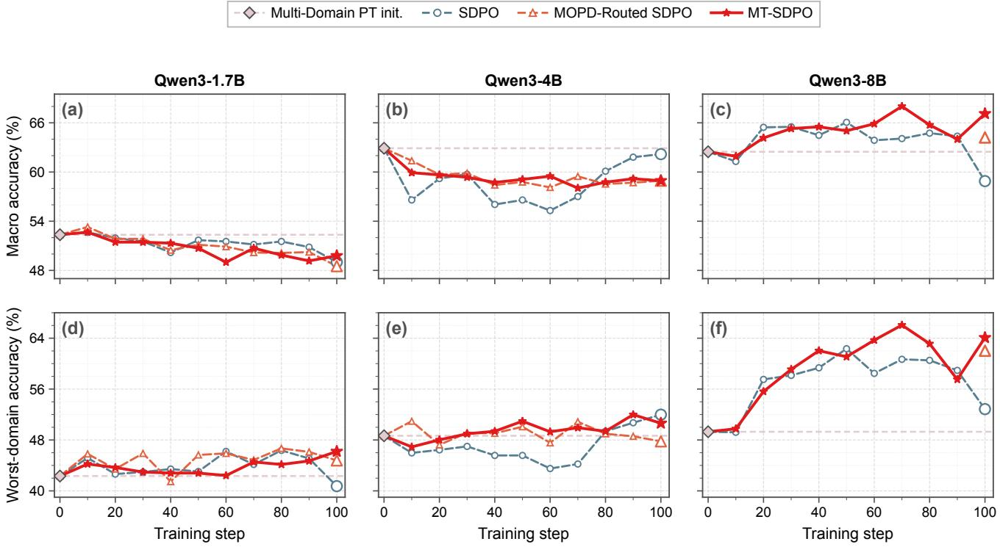  
Fi<sub>g</sub>ure 6: Cross-Scale Held-Out D<sub>y</sub>namics, Evaluated Ever<sub>y</sub> 10 Trainin<sub>g</sub> Steps. Columns are Qwen3-1.7B, Qwen3-4B, and Qwen3-8B, and the two rows report Macro and Worst-domain accurac<sub>y</sub>. The horizontal reference marks each student’s Multi D<sub>oma</sub>i<sub>n</sub> P<sub>os</sub>t<sub>-</sub>T<sub>ra</sub>i<sub>n</sub>i<sub>ng</sub> i<sub>n</sub>iti<sub>a</sub>li<sub>za</sub>ti<sub>on, an</sub>d li<sub>nes connec</sub>t <sub>eva</sub>l<sub>ua</sub>t<sub>e</sub>d <sub>c</sub>h<sub>ec</sub>k<sub>po</sub>i<sub>n</sub>t<sub>s w</sub>ith<sub>ou</sub>t <sub>smoo</sub>thi<sub>ng.</sub> D<sub>oma</sub>i<sub>n</sub> R<sub>ou</sub>ti<sub>ng</sub> h<sub>as a</sub> h<sub>e</sub>ld<sub>-ou</sub>t result onl at ste 100 on Qwen3-8B, so it a ears as a sin le ste -100 marker in (c) and (f). The le end label MOPD-Routed SDPO d<sub>e</sub>n<sub>o</sub>t<sub>es</sub> D<sub>o</sub>m<sub>a</sub>in R<sub>ou</sub>tin<sub>g</sub> in th<sub>e</sub> m<sub>a</sub>in t<sub>ex</sub>t<sub>.</sub>

## E.1 SFT Data Construction

Independent Generator Sampling Two independent candid<sub>a</sub>t<sub>es</sub> <sub>are</sub> <sub>samp</sub>l<sub>e</sub>d f<sub>or</sub> <sub>eac</sub>h t<sub>ra</sub>i<sub>n</sub>i<sub>ng</sub> <sub>recor</sub>d<sub>.</sub> Th<sub>e</sub> <sub>re</sub>f<sub>erence</sub> <sub>answer</sub> i<sub>s no</sub>t i<sub>nc</sub>l<sub>u</sub>d<sub>e</sub>d i<sub>n</sub> thi<sub>s promp</sub>t<sub>.</sub>

Independent generator sampling   
System:   
You are a knowledgeable and rigorous {   
domain\_expert}.   
User:   
Solve the following multiple-choice   
question. Give a concise, self-contained   
derivation using the relevant scientific   
principles, equations, calculations, or   
evidence. Include enough explicit   
reasoning for a reviewer to check, but   
avoid unnecessary background, repeated   
calculations, speculative alternatives,   
or restating the problem. Do not return   
only an answer.   
Question:   
{question}

Choices:   
{choices\_block}   
End your response with exactly one final   
line in this format: "answer": "C".   
Replace C with your selected choice   
letter. Do not add Markdown styling, a   
code fence, a heading, or any text after   
that final line.

Gold-Conditioned Fallback This fallback is used only if <sub>ne</sub>ith<sub>er</sub> i<sub>n</sub>d<sub>epen</sub>d<sub>en</sub>t <sub>can</sub>did<sub>a</sub>t<sub>e y</sub>i<sub>e</sub>ld<sub>s a parsea</sub>bl<sub>e correc</sub>t l<sub>a-</sub> b<sub>e</sub>l<sub>.</sub> F<sub>a</sub>il<sub>e</sub>d i<sub>n</sub>d<sub>epen</sub>d<sub>en</sub>t <sub>comp</sub>l<sub>e</sub>ti<sub>ons are no</sub>t i<sub>nser</sub>t<sub>e</sub>d i<sub>n</sub>t<sub>o</sub> th<sub>e</sub> f<sub>a</sub>llb<sub>ac</sub>k <sub>promp</sub>t<sub>.</sub>

Gold-conditioned fallback generation   
System:   
You are a knowledgeable and rigorous {   
domain\_expert}. You may receive a private   
correctness constraint. Use it only   
internally, and never mention or allude   
to its existence in your response.   
User:

Verified routing Single eligible MT-SDPO   
Domain Routing + w/o verification

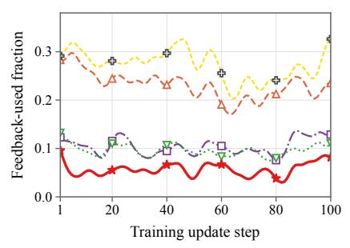  
(a) Feedback Use Trend

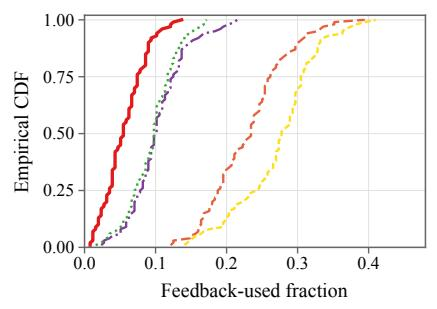  
(b) Feedback Use Distribution

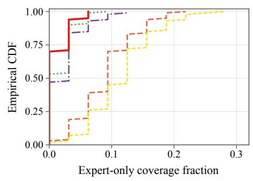  
(c) Teacher-Onl<sub>y</sub> Covera<sub>g</sub>e

Fi ure 7: Realized Teacher-Feedback Ex osure on Qwen3-8B over 100 Trainin U dates. (a) Smoothed fraction of rollouts that use retained teacher feedback. (b) Em<sub>p</sub>irical distribution of the corres<sub>p</sub>ondin<sub>g</sub> raw <sub>p</sub>er-u<sub>p</sub>date fractions. (c) Em<sub>p</sub>irical di<sub>s</sub>t<sub>r</sub>ib<sub>u</sub>ti<sub>on o</sub>f <sub>promp</sub>t<sub>s w</sub>ith <sub>no success</sub>f<sub>u</sub>l <sub>s</sub>t<sub>u</sub>d<sub>en</sub>t <sub>ro</sub>ll<sub>ou</sub>t b<sub>u</sub>t <sub>re</sub>t<sub>a</sub>i<sub>ne</sub>d t<sub>eac</sub>h<sub>er</sub> f<sub>ee</sub>db<sub>ac</sub>k<sub>.</sub> Hi<sub>g</sub>h<sub>er exposure a</sub>l<sub>one</sub> i<sub>mp</sub>li<sub>es ne</sub>ith<sub>er</sub> <sub>more accura</sub>t<sub>e</sub> f<sub>ee</sub>db<sub>ac</sub>k <sub>nor</sub> b<sub>e</sub>tt<sub>er</sub> h<sub>e</sub>ld<sub>-ou</sub>t <sub>per</sub>f<sub>ormance.</sub> I<sub>n</sub> th<sub>e</sub> l<sub>egen</sub>d<sub>,</sub> V<sub>er</sub>ifi<sub>e</sub>d <sub>rou</sub>ti<sub>ng,</sub> Si<sub>ng</sub>l<sub>e e</sub>li<sub>g</sub>ibl<sub>e, an</sub>d <sub>w</sub>/<sub>o ver</sub>ifi<sub>ca</sub>ti<sub>on</sub> <sub>correspon</sub>d t<sub>o w</sub>/<sub>o</sub> C<sub>ross-</sub>D<sub>oma</sub>i<sub>n, w</sub>/<sub>o</sub> A<sub>ggrega</sub>ti<sub>on, an</sub>d <sub>w</sub>/<sub>o</sub> V<sub>er</sub>ifi<sub>ca</sub>ti<sub>on</sub> i<sub>n</sub> th<sub>e ma</sub>i<sub>n</sub> t<sub>ex</sub>t<sub>, respec</sub>ti<sub>ve</sub>l<sub>y.</sub>

Construct a concise, self-contained   
solution to the following multiple-choice   
question. Use the private correctness   
constraint internally and build a   
scientifically valid derivation that   
genuinely supports it. Include enough   
explicit reasoning for a reviewer to   
check, but avoid unnecessary background,   
repeated calculations, speculative   
alternatives, or restating the problem.   
Do not return only an answer.   
Never mention or allude to the private   
constraint, an answer key, a hint, or any   
supplied answer. If the constraint   
cannot be scientifically justified,   
explain only the scientific inconsistency   
in the problem without disclosing that a   
constraint was supplied.   
Question:   
{question}   
Choices:   
{choices\_block}   
Private correctness constraint:   
{answer\_key}. {answer\_text}   
End your response with exactly one final   
line in this format: "answer": "C".   
Replace C with the constrained choice   
letter. Do not add Markdown styling, a   
code fence, a heading, or any text after

that final line.

Self-Verifier   
Self-verifier for generated reasoning   
System:   
You are a rigorous reviewer of scientific   
reasoning.   
User:   
Review the proposed solution to the   
following multiple-choice question.   
Check whether its scientific facts,   
equations, calculations, units, and   
logical steps are correct. A correct   
final choice is not sufficient: reject   
the solution if it reaches the correct   
answer through incorrect, unsupported,   
circular, or fabricated reasoning.   
Do not rewrite the solution. Briefly   
explain your judgment and finish with   
exactly one of the following plain-text   
lines. Do not apply Markdown styling to   
the verdict line.   
Verdict: ACCEPT   
Verdict: REJECT   
Verdict: REVIEW   
Question:   
{question}

```batch
System messages for SFT and rollout
Student SFT system:
```

<table><tr><td>Method</td><td>Chem.</td><td>Mat.</td><td>Phys.</td><td>Macro</td><td>Worst</td><td>Gap</td></tr><tr><td>Qwen3-1.7B</td><td></td><td></td><td></td><td></td><td></td><td></td></tr><tr><td>Multi-Domain PT</td><td>42.33</td><td>63.05</td><td>51.66</td><td>52.35</td><td>42.33</td><td>20.73</td></tr><tr><td>GRPO</td><td>45.73</td><td>64.08</td><td>54.43</td><td>54.75</td><td>45.73</td><td>18.35</td></tr><tr><td>MT-SDPO</td><td>46.52</td><td>56.65</td><td>46.20</td><td>49.79</td><td>46.20</td><td>10.44</td></tr><tr><td>Qwen3-4B</td><td></td><td></td><td></td><td></td><td></td><td></td></tr><tr><td>Multi-Domain PT</td><td>48.66</td><td>71.36</td><td>68.67</td><td>62.90</td><td>48.66</td><td>22.71</td></tr><tr><td>GRPO</td><td>52.53</td><td>74.53</td><td>66.22</td><td>64.43</td><td>52.53</td><td>21.99</td></tr><tr><td>MT-SDPO</td><td>50.63</td><td>62.26</td><td>63.92</td><td>58.94</td><td>50.63</td><td>13.29</td></tr><tr><td>Qwen3-8B</td><td></td><td></td><td></td><td></td><td></td><td></td></tr><tr><td>Multi-Domain PT</td><td>49.29</td><td>70.25</td><td>67.88</td><td>62.47</td><td>49.29</td><td>20.96</td></tr><tr><td>GRPO</td><td>54.91</td><td>76.66</td><td>70.25</td><td>67.27</td><td>54.91</td><td>21.76</td></tr><tr><td>MT-SDPO</td><td>67.88</td><td>69.38</td><td>64.08</td><td>67.11</td><td>64.08</td><td>5.30</td></tr><tr><td colspan="7">Llama-3.1-8B-Instruct</td></tr><tr><td>Multi-Domain PT</td><td>56.33</td><td>59.57</td><td>51.42</td><td>55.78</td><td>51.42</td><td>8.15</td></tr><tr><td>GRPO</td><td>70.65</td><td>66.46</td><td>64.16</td><td>67.09</td><td>64.16</td><td>6.49</td></tr><tr><td>MT-SDPO</td><td>59.57</td><td>53.48</td><td>44.62</td><td>52.56</td><td>44.62</td><td>14.95</td></tr><tr><td colspan="7">OLMo-3-7B-Instruct</td></tr><tr><td>Multi-Domain PT</td><td>48.42</td><td>63.21</td><td>57.67</td><td>56.43</td><td>48.42</td><td>14.79</td></tr><tr><td>GRPO</td><td>47.47</td><td>55.85</td><td>36.87</td><td>46.73</td><td>36.87</td><td>18.98</td></tr><tr><td>MT-SDPO</td><td>55.69</td><td>65.82</td><td>64.55</td><td>62.02</td><td>55.69</td><td>10.13</td></tr></table>

T<sub>a</sub>bl<sub>e</sub> 6<sub>:</sub> V<sub>er</sub>ifi<sub>a</sub>bl<sub>e-</sub>R<sub>ewar</sub>d RL R<sub>e</sub>f<sub>erence</sub> f<sub>rom</sub> th<sub>e</sub> Sh<sub>are</sub>d I<sub>n</sub>iti<sub>a</sub>li<sub>za</sub>ti<sub>on.</sub> C<sub>o</sub>l<sub>umns</sub> <sub>repor</sub>t <sub>s</sub>t<sub>ep-</sub>100 <sub>avg</sub>@16 <sub>accuracy</sub> (%) under the evaluation <sub>p</sub>rotocol of Section C. Within each bl<sub>oc</sub>k<sub>,</sub> M<sub>u</sub>lti<sub>-</sub>D<sub>oma</sub>i<sub>n</sub> P<sub>os</sub>t<sub>-</sub>T<sub>ra</sub>i<sub>n</sub>i<sub>n</sub> i<sub>s</sub> th<sub>e s</sub>h<sub>are</sub>d i<sub>n</sub>iti<sub>a</sub>li<sub>za-</sub> ti<sub>o</sub>n f<sub>o</sub>r GRPO <sub>a</sub>nd MT<sub>-</sub>SDPO<sub>.</sub> GRPO <sub>c</sub>h<sub>a</sub>n<sub>ges</sub> th<sub>e</sub> tr<sub>a</sub>inin<sub>g</sub> objective and is reported outside the main text’s controlled <sub>on</sub>li<sub>ne-</sub>di<sub>s</sub>till<sub>a</sub>ti<sub>on compar</sub>i<sub>son.</sub>

```yaml
Choices:
{choices_block}
Reference answer:
{answer_key}. {answer_text}
Proposed solution:
{cot_response}
```

For the Qwen3 data, the <sub>g</sub>enerator and verifier are both Qwen3-32B, so this sta<sub>g</sub>e is self-verification rather than ind<sub>epen</sub>d<sub>en</sub>t <sub>ver</sub>ifi<sub>ca</sub>ti<sub>on.</sub> Th<sub>e re</sub>t<sub>a</sub>i<sub>ne</sub>d <sub>comp</sub>l<sub>e</sub>ti<sub>on</sub> b<sub>ecomes</sub> th<sub>e</sub> SFT <sub>ass</sub>i<sub>s</sub>t<sub>an</sub>t t<sub>arge</sub>t <sub>w</sub>ith<sub>ou</sub>t <sub>summar</sub>i<sub>za</sub>ti<sub>on,</sub> <sub>rewr</sub>iti<sub>ng,</sub> <sub>or</sub> <sub>an-</sub> <sub>swer norma</sub>li<sub>za</sub>ti<sub>on.</sub>

## E.2 Student SFT and Initial Rollout

St<sub>u</sub>d<sub>e</sub>nt SFT <sub>uses a</sub> d<sub>o</sub>m<sub>a</sub>in<sub>-spec</sub>ifi<sub>c sys</sub>t<sub>e</sub>m m<sub>essage.</sub> On<sub>-</sub> li<sub>ne ro</sub>ll<sub>ou</sub>t<sub>, o</sub>fli<sub>ne pr</sub>i<sub>va</sub>t<sub>e-answer man</sub>if<sub>es</sub>t <sub>cons</sub>t<sub>ruc</sub>ti<sub>on, an</sub>d <sub>eva</sub>l<sub>ua</sub>ti<sub>on</sub> i<sub>ns</sub>t<sub>ea</sub>d <sub>use</sub> th<sub>e gener</sub>i<sub>c sys</sub>t<sub>em message</sub> b<sub>e</sub>l<sub>ow.</sub> Th<sub>e</sub>i<sub>r user message</sub> i<sub>s</sub> id<sub>en</sub>ti<sub>ca</sub>l<sub>.</sub>

You are a knowledgeable and rigorous {   
domain\_expert}.   
Online rollout, manifest, and evaluation   
system:   
You are a knowledgeable and rigorous   
scientific reasoning assistant.

## Shared multiple-choice user message

Solve the following multiple-choice question. Give a concise, self-contained derivation using the relevant scientific principles, equations, calculations, or evidence. Include enough explicit reasoning for a reviewer to check, but avoid unnecessary background, repeated calculations, speculative alternatives, or restating the problem. Do not return only an answer.

Question:   
{question}   
Choices:   
{choices\_block}   
Please show your choice in the answer   
field with only the choice letter, e.g.,   
"answer": "C".

## E.3 Online Self-Teacher Reprompts

Th<sub>e se</sub>lf<sub>-</sub>t<sub>eac</sub>h<sub>er repromp</sub>t i<sub>s assem</sub>bl<sub>e</sub>d f<sub>rom</sub> th<sub>e or</sub>i<sub>g</sub>i<sub>na</sub>l <sub>ro</sub>ll<sub>ou</sub>t <sub>promp</sub>t <sub>an</sub>d i<sub>n</sub>d<sub>epen</sub>d<sub>en</sub>tl<sub>y ava</sub>il<sub>a</sub>bl<sub>e con</sub>t<sub>ex</sub>t bl<sub>oc</sub>k<sub>s.</sub> A<sub>n</sub> <sub>unava</sub>il<sub>a</sub>bl<sub>e</sub> <sub>so</sub>l<sub>u</sub>ti<sub>on</sub> <sub>or</sub> f<sub>ee</sub>db<sub>ac</sub>k <sub>source</sub> <sub>con</sub>t<sub>r</sub>ib<sub>u</sub>t<sub>es</sub> <sub>an</sub> <sup>em</sup>p<sup>t</sup>y <sup>strin</sup>g.

SDPO   
SDPO self-teacher reprompt   
Main template:   
{prompt}{solution}{feedback}   
Correctly solve the original question.   
Successful solution section:   
Correct solution:   
{successful\_previous\_attempt}   
Environment feedback section:   
The following is feedback from your   
unsuccessful earlier attempt:   
{feedback\_raw}

Th<sub>e</sub> f<sub>orma</sub>l SDPO b<sub>ase</sub>li<sub>ne se</sub>t<sub>s env</sub>i<sub>ronmen</sub>t f<sub>ee</sub>db<sub>ac</sub>k t<sub>o</sub> di<sub>sa</sub>bl<sub>e</sub>d<sub>, so</sub> th<sub>e</sub> f<sub>ee</sub>db<sub>ac</sub>k <sub>sec</sub>ti<sub>on a</sub>b<sub>ove</sub> i<sub>s no</sub>t i<sub>nser</sub>t<sub>e</sub>d<sub>.</sub> Th<sub>e</sub> <sub>success</sub>f<sub>u</sub>l <sub>so</sub>l<sub>u</sub>ti<sub>on sec</sub>ti<sub>on</sub> i<sub>s</sub> i<sub>nser</sub>t<sub>e</sub>d <sub>on</sub>l<sub>y w</sub>h<sub>en a rewar</sub>d<sub>-</sub> <sub>ver</sub>ifi<sub>e</sub>d <sub>success</sub>f<sub>u</sub>l <sub>a</sub>tt<sub>emp</sub>t i<sub>s ava</sub>il<sub>a</sub>bl<sub>e.</sub>

MT-SDPO and Routed Variants   
MT-SDPO self-teacher reprompt   
Main template:   
{prompt}{solution}{feedback}   
Use the available information to   
reconsider the reasoning and correctly   
solve the original question. Follow the   
original response format and end   
with an answer field containing only the   
selected choice letter.   
Successful solution section:   
A reward-verified successful attempt   
previously generated by the current   
target policy is shown below:   
{successful\_previous\_attempt}   
Frozen-expert feedback section:   
The following diagnostic feedback was   
produced by frozen domain   
specialists for the current attempt:   
{feedback\_raw}

MT<sub>-</sub>SDPO<sub>,</sub> D<sub>o</sub>m<sub>a</sub>in R<sub>ou</sub>tin<sub>g, a</sub>nd th<sub>e w</sub>/<sub>o</sub> Cr<sub>oss-</sub>D<sub>o</sub>m<sub>a</sub>in<sub>,</sub> <sub>w</sub>/<sub>o</sub> A<sub>ggrega</sub>ti<sub>on, an</sub>d <sub>w</sub>/<sub>o</sub> V<sub>er</sub>ifi<sub>ca</sub>ti<sub>on var</sub>i<sub>an</sub>t<sub>s use</sub> th<sub>e same</sub> <sub>repromp</sub>t t<sub>ex</sub>t<sub>.</sub> Th<sub>e</sub> th<sub>ree a</sub>bl<sub>a</sub>ti<sub>ons correspon</sub>d t<sub>o ver</sub>ifi<sub>e</sub>d d<sub>o-</sub> <sub>ma</sub>i<sub>n</sub> <sub>rou</sub>ti<sub>ng,</sub> <sub>one</sub> <sub>e</sub>li<sub>g</sub>ibl<sub>e</sub> t<sub>eac</sub>h<sub>er,</sub> <sub>an</sub>d <sub>unver</sub>ifi<sub>e</sub>d <sub>a</sub>ll<sub>-</sub>t<sub>eac</sub>h<sub>er</sub> f<sub>ee</sub>db<sub>ac</sub>k<sub>, respec</sub>ti<sub>ve</sub>l<sub>y.</sub> Th<sub>ey</sub> dif<sub>er on</sub>l<sub>y</sub> i<sub>n</sub> t<sub>eac</sub>h<sub>er se</sub>l<sub>ec</sub>ti<sub>on</sub> <sub>an</sub>d <sub>correc</sub>t<sub>ness</sub> filt<sub>er</sub>i<sub>ng.</sub> Th<sub>e anc</sub>h<sub>or,</sub> f<sub>ee</sub>db<sub>ac</sub>k<sub>, an</sub>d t<sub>o</sub>t<sub>a</sub> <sub>repromp</sub>t b<sub>u</sub>d<sub>ge</sub>t<sub>s are</sub> 4<sub>,</sub>096<sub>,</sub> 1<sub>,</sub>024<sub>, an</sub>d 10<sub>,</sub>240 t<sub>o</sub>k<sub>ens, re-</sub> s<sub>p</sub>ect<sup>i</sup>ve<sup>l</sup><sub>y</sub>.

## E.4 Frozen Teacher Diagnostic Prompt

E<sub>ac</sub>h <sub>se</sub>l<sub>ec</sub>t<sub>e</sub>d t<sub>eac</sub>h<sub>er rece</sub>i<sub>ves</sub> th<sub>e ques</sub>ti<sub>on, a</sub>ll <sub>c</sub>h<sub>o</sub>i<sub>ces, an</sub>d th<sub>e curren</sub>t <sub>s</sub>t<sub>u</sub>d<sub>en</sub>t <sub>response.</sub> Th<sub>e concep</sub>t t<sub>ag</sub> i<sub>s use</sub>d f<sub>or</sub> <sub>anc</sub>h<sub>or</sub> filt<sub>er</sub>i<sub>ng</sub> <sub>an</sub>d i<sub>s</sub> <sub>remove</sub>d b<sub>e</sub>f<sub>ore</sub> <sub>re</sub>t<sub>a</sub>i<sub>ne</sub>d <sub>paragrap</sub>h<sub>s</sub> <sub>en</sub>t<sub>er</sub> th<sub>e se</sub>lf<sub>-</sub>t<sub>eac</sub>h<sub>er</sub>’<sub>s pr</sub>i<sub>v</sub>il<sub>ege</sub>d <sub>con</sub>t<sub>ex</sub>t<sub>.</sub> R<sub>e</sub>t<sub>a</sub>i<sub>ne</sub>d <sub>ou</sub>t<sub>pu</sub>t<sub>s</sub> <sub>are</sub> <sub>conca</sub>t<sub>ena</sub>t<sub>e</sub>d i<sub>n</sub> th<sub>e</sub> fi<sub>xe</sub>d <sub>or</sub>d<sub>er</sub> <sub>o</sub>f <sub>c</sub>h<sub>em</sub>i<sub>s</sub>t<sub>ry,</sub> <sub>ma</sub>t<sub>er</sub>i<sub>a</sub>l<sub>s</sub> <sub>sc</sub>i<sub>ence, an</sub>d <sub>p</sub>h<sub>ys</sub>i<sub>cs.</sub>

Frozen teacher diagnostic   
System:   
You are a knowledgeable and rigorous   
scientific reasoning assistant.   
User:   
You are acting as a frozen {expert\_domain   
} specialist. Diagnose one   
response produced by the target model   
without revealing the final answer.

Complete two steps.   
Step 1 — Problem anchor:   
Identify one technical term or short   
concept, containing 1–3 words, that   
is central to the question. Copy the   
wording directly from the question.   
Output it first inside <concept>...</   
concept>. Do not use generic words   
such as problem, question, answer, value,   
calculation, formula, model,   
student, expert, or response.   
Step 2 — Diagnostic feedback:   
After the concept tag, write a short   
paragraph of 3–5 sentences and no   
more than approximately 80 words. Focus   
on the aspects relevant to your   
{expert\_domain} expertise when useful.   
Identify the specific step,   
assumption, or concept in the target   
response that is correct, incorrect,   
or missing, and explain how the reasoning   
should be reconsidered.   
Do not solve the entire problem from   
scratch.   
Do not reveal the correct choice letter.   
Do not quote the correct option text.   
Do not write a final answer.   
Do not emit an "answer": "X" field.   
Do not mention that an answer key or   
verifier exists.   
Question:   
{question}   
Choices:   
{choices\_block}   
Target response:   
{response}   
Output:   
<concept>...</concept>

Decoding: temperature = 0.2, top-p = 0.95, and maximum new tokens = 256.

## E.5 Evaluation Prompts

C<sub>an</sub>did<sub>a</sub>t<sub>e</sub> <sub>genera</sub>ti<sub>on</sub> <sub>uses</sub> <sub>exac</sub>tl<sub>y</sub> th<sub>e</sub> <sub>gener</sub>i<sub>c</sub> <sub>sys</sub>t<sub>em</sub> <sub>mes-</sub> <sub>sage</sub> <sub>an</sub>d <sub>s</sub>h<sub>are</sub>d <sub>user</sub> <sub>message</sub> i<sub>n</sub> S<sub>ec</sub>ti<sub>on</sub> E<sub>.</sub>2<sub>.</sub> A<sub>ny</sub> <sub>opera</sub>ti<sub>ona</sub>l <sub>pre</sub>fi<sub>x</sub> i<sub>nser</sub>t<sub>e</sub>d b<sub>y</sub> <sub>a</sub> f<sub>am</sub>il<sub>y</sub>’<sub>s</sub> <sub>c</sub>h<sub>a</sub>t t<sub>emp</sub>l<sub>a</sub>t<sub>e</sub> i<sub>s</sub> <sub>no</sub>t <sub>par</sub>t <sub>o</sub>f th<sub>e</sub> <sub>na</sub>t<sub>ura</sub>l<sub>-</sub>l<sub>anguage</sub> i<sub>ns</sub>t<sub>ruc</sub>ti<sub>on or</sub> th<sub>e genera</sub>t<sub>e</sub>d <sub>comp</sub>l<sub>e</sub>ti<sub>on.</sub>

The fallback judge is called only when the primary regex <sub>parser</sub> h<sub>as</sub> <sub>no</sub>t <sub>es</sub>t<sub>a</sub>bli<sub>s</sub>h<sub>e</sub>d <sub>correc</sub>t<sub>ness.</sub> It <sub>canno</sub>t <sub>over</sub>t<sub>urn</sub> <sub>an</sub> <sub>exp</sub>li<sub>c</sub>itl<sub>y ex</sub>t<sub>rac</sub>t<sub>e</sub>d <sub>non-go</sub>ld <sub>answer or accep</sub>t <sub>a</sub> t<sub>runca</sub>t<sub>e</sub>d <sub>response w</sub>ith <sub>no answer.</sub>

Guarded fallback judge   
System:   
You are a strict multiple-choice answer   
verifier. Ignore all reasoning, compare   
only the candidate’s final selected   
option with the reference answer, and   
output only true or false.   
User:   
Candidate response:   
<candidate\_response>   
{candidate\_response}   
</candidate\_response>   
Reference answer:   
{answer\_key}. {answer\_text}   
The reference answer label is ‘{   
answer\_key}‘. Ignore all reasoning.   
Output exactly ‘true‘ only if the   
candidate’s last explicit ‘answer‘ field   
or ‘Final Answer‘ is also ‘{answer\_key}‘.   
Output exactly ‘false‘ for any other   
answer or no final answer. Do not output   
any explanation.

## F Feedback Efectiveness

W<sub>e separa</sub>t<sub>e</sub> f<sub>ee</sub>db<sub>ac</sub>k <sub>exposure</sub> f<sub>rom</sub> f<sub>ee</sub>db<sub>ac</sub>k <sub>e</sub>f<sub>ec</sub>ti<sub>veness.</sub> W<sub>e compare</sub> th<sub>e exposure s</sub>t<sub>a</sub>ti<sub>s</sub>ti<sub>cs</sub> i<sub>n</sub> Fi<sub>gure</sub> 7 <sub>w</sub>ith th<sub>e</sub> h<sub>e</sub>ld<sub>-</sub> <sub>ou</sub>t <sub>s</sub>t<sub>ep-</sub>100 <sub>resu</sub>lt<sub>s</sub> i<sub>n</sub> th<sub>e</sub> <sub>ma</sub>i<sub>n</sub> t<sub>ex</sub>t<sub>.</sub> M<sub>e</sub>th<sub>o</sub>d<sub>s</sub> <sub>us</sub>i<sub>ng</sub> <sub>more</sub> <sub>re</sub>t<sub>a</sub>i<sub>ne</sub>d f<sub>ee</sub>db<sub>ac</sub>k d<sub>o no</sub>t <sub>necessar</sub>il<sub>y score</sub> hi<sub>g</sub>h<sub>er.</sub> Thi<sub>s</sub> d<sub>e-</sub> <sub>scr</sub>i<sub>p</sub>ti<sub>ve m</sub>i<sub>sma</sub>t<sub>c</sub>h <sub>means</sub> th<sub>a</sub>t f<sub>ee</sub>db<sub>ac</sub>k <sub>vo</sub>l<sub>ume</sub> i<sub>s no</sub>t it<sub>se</sub>lf <sub>ev</sub>id<sub>ence o</sub>f <sub>u</sub>tilit<sub>y.</sub> Th<sub>e</sub> h<sub>e</sub>ld<sub>-ou</sub>t <sub>compar</sub>i<sub>sons</sub> i<sub>n</sub> th<sub>e ma</sub>i<sub>n</sub> t<sub>ex</sub>t <sub>measure</sub> th<sub>e en</sub>d<sub>-</sub>t<sub>o-en</sub>d <sub>ou</sub>t<sub>come o</sub>f <sub>eac</sub>h t<sub>ra</sub>i<sub>n</sub>i<sub>ng me</sub>th<sub>o</sub>d<sub>.</sub> Th<sub>ey</sub> d<sub>o no</sub>t i<sub>so</sub>l<sub>a</sub>t<sub>e</sub> th<sub>e causa</sub>l <sub>con</sub>t<sub>r</sub>ib<sub>u</sub>ti<sub>on o</sub>f <sub>an</sub> i<sub>n</sub>di<sub>v</sub>id<sub>ua</sub>l f<sub>ee</sub>db<sub>ac</sub>k <sub>message.</sub>

Th<sub>e</sub> fi<sub>xe</sub>d h<sub>e</sub>ld<sub>-ou</sub>t <sub>pro</sub>t<sub>oco</sub>l <sub>suppor</sub>t<sub>s a me</sub>th<sub>o</sub>d<sub>-</sub>l<sub>eve</sub>l <sub>com-</sub> <sub>par</sub>i<sub>son, no</sub>t <sub>a message-</sub>l<sub>eve</sub>l <sub>causa</sub>l <sub>repa</sub>i<sub>r ra</sub>t<sub>e.</sub> A di<sub>rec</sub>t <sub>es</sub>ti<sub>-</sub> <sub>ma</sub>t<sub>e requ</sub>i<sub>res pos</sub>t<sub>-</sub>f<sub>ee</sub>db<sub>ac</sub>k <sub>comp</sub>l<sub>e</sub>ti<sub>ons or pa</sub>i<sub>re</sub>d <sub>runs w</sub>ith <sub>an</sub>d <sub>w</sub>ith<sub>ou</sub>t f<sub>ee</sub>db<sub>ac</sub>k <sub>on</sub> th<sub>e same erroneous ro</sub>ll<sub>ou</sub>t<sub>s.</sub>