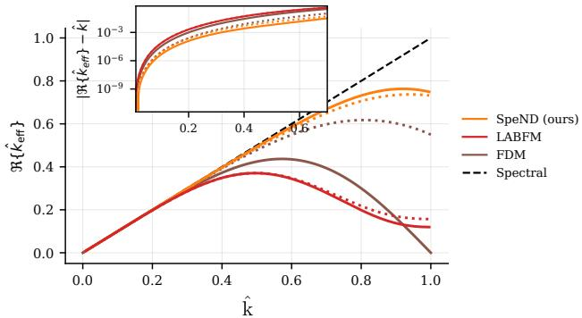
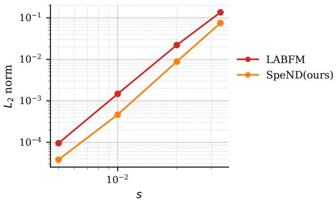

# Learning Spectral-Like Mesh-Free Discretisations

Lucas Gerken Starepravo, Henry Broadley, Jack King

School of Engineering, University of Manchester

Manchester, UK

lucas.gerkenstarepravo@postgrad.manchester.ac.uk

Steven Lind

School of Engineering, Cardiff University

Cardiff, UK

## I. INTRODUCTION

Meshfree and particle numerical methods—such as smoothedp particle hydrodynamics (SPH) [1], radial basis function-e generated finite differences (RBF-FD) [2], and the local anisotropic basis function method (LABFM) [3]—are frame-2 works that can be used to solve partial differential equations without requiring topological connectivity. In multi-scale prob-h lems, resolving both the large and the small scales admitted byp the discretisation is essential to obtaining accurate solutions. The resolving power—a measure of the accuracy of an operator as a function of the wavenumber—of traditional mesh-free operators is determined mainly by the kernel, the assembly algorithm usedc $\mathcal { P }$ construct the local linear systems, and the order of polynomial consistency imposed [4]. Ensuring polynomial consistencyc only constrains the operator in the low-wavenumber limit; nos mechanism selects for accuracy at the wavenumbers where finey scale content actually resides. Whilst spectral methods exactlyh represent all modes below the Nyquist limit [5], the wavenumber[ response of polynomial-reconstruction-based methods deviates from the ideal, with errors increasing with increasing wavenum-1 ber.v

$\mathsf { i } \mathsf { \Gamma }$ Compact (implicit) meshfree schemes [6], [7] can improve resolving power, but couple the derivative values across the8 domain, requiring the solution of a global linear system at2 every evaluation. Consequently, features such as dynamic hp-0 adaptivity and non-trivial boundary conditions are challenging to9 implement in compact schemes. More recently, multi-kernel ap-0 proaches to optimising resolving power have been proposed [9],6 improving over traditional explicit operators. These gains are: confined to a narrow band wavenumber, however, and thev formulation raises open questions: which kernel combination is optimal? How a framework demonstrated in practice with $K \approx 2$ behaves when extended to tens or hundreds of kernels?a

In this work we introduce Spectral-like Neural Discretisation (SpeND), a data-driven approach for obtaining explicit discretisations with spectral-like resolution on unstructured node distributions. We formulate the computation of discretisation weights as a learning problem: a hard-constrained projection layer guarantees that the network outputs satisfy polynomial consistency exactly, and the network learns, within the resulting constrained manifold, the weights that minimise operator error over a prescribed band-limited function space. Training is self-supervised and physics-agnostic, requiring no reference solutions, and the learned operator is invariant to resolution and translation. We present modified-wavenumber analyses demonstrating that the learned explicit operators achieve spectral-like resolution on significantly disordered node distributions.

## II. BACKGROUND

## A. Numerical Approximation of Differential Operators

Let $\mathcal { P } : = \{ \mathbf { x } _ { a } \} _ { a = 1 } ^ { P } \subset \Omega \subset \mathbb { R } ^ { d }$ be an unstructured point cloud sampling a field ϕ. We associate to each point $\mathbf { x } _ { a }$ the local neighbourhood $\mathcal { N } _ { a } : = \{ \mathbf { x } _ { b } \in \mathcal { P } : \| \mathbf { x } _ { b a } \| _ { 2 } \leq \dot { d } _ { a } ^ { ( N ) } \}$ , where $d _ { a } ^ { ( N ) }$ is the distance from $\mathbf { x } _ { a }$ to its N-th nearest neighbour, so that $| { \mathcal N } _ { a } | = N$ . Our objective is to construct, at each node, a discrete approximation $\dot { L } ^ { D }$ of a differential operator D acting on $\phi ,$ taking the form of the weighted sum (1) over $\textstyle { \mathcal { N } } _ { a }$ . The entire approximation is thus specified by the stencil weights $\{ w _ { b , a } ^ { D } \} _ { j \in \mathcal { N } _ { a } }$ , and constructing $\bar { L } ^ { D }$ reduces to choosing them.

$$
L ^ { D } [ \phi ( \mathbf { x } _ { a } ) ] = \sum _ { j \in \mathcal { N } _ { a } } \phi _ { b a } w _ { b , a } ^ { D } .\tag{1}
$$

Traditional consistent operators such as corrected SPH [8], RBF-FD [2] and LABFM [3] obtain $w _ { b , a } ^ { D }$ by imposing polynomial consistency: the discrete operator must reproduce the action of D exactly on a set of basis functions. Let $\{ p _ { m } \} _ { m = 1 } ^ { M }$ span the Taylor monomials of degree $: \leq q$ in d dimensions.

$$
\sum _ { b \in \mathcal { N } _ { i } } \left. p _ { m } ( \mathbf { x } _ { b a } ) w _ { b , a } ^ { D } = D [ p _ { m } ] \right| _ { \mathbf { x } = \mathbf { 0 } } , \qquad m = 1 , \ldots , M ,\tag{2}
$$

which is a linear system $\mathbf { C } _ { a } \mathbf { w } _ { a } \ = \ \mathbf { b }$ with $\mathbf { C } _ { a } ~ \in ~ \mathbb { R } ^ { M \times N }$ depending only on the local node geometry. For $N \ > \ M$ this system is underdetermined: its solution set is an affine subspace of dimension $N - M$ , and (2) alone does not determine the stencil. Traditional methods close the system implicitly — through the choice of smoothing kernel, basis preconditioning, or a minimum-norm condition. Consistency is therefore imposed with care, whilst the remaining $N - M$ degrees of freedom are fixed as a by-product of that closure. Nothing in this construction refers to the operator’s response at varying wavenumber, and the resolving power of the resulting stencil is whatever the choice of closure happens to deliver.

## B. Resolving Power

Resolving power [10] — the range of wavenumbers over which the discrete operator reproduces the continuous one — distinguishes two stencils of identical order at the resolutions actually used, and can be quantified by modal analysis. Since $L ^ { D }$ is linear, it acts on Fourier modes independently, so substituting $e ^ { i \mathbf { k } \cdot \mathbf { x } _ { b a } }$ into (1) with node a at the origin characterises the operator completely. Taking $D \ = \ \partial _ { x }$ , for which $\partial _ { x } e ^ { i { \bf k } \cdot { \bf x } _ { b a } } = i k _ { x } e ^ { i { \bf k } \cdot { \bf x } _ { b a } }$ , we define the effective wavenumber $k _ { \mathrm { e f f } } \equiv - i L ^ { \partial _ { x } } [ e ^ { i { \bf k } \cdot { \bf x } _ { b a } } ]$ , normalised so that the exact operator recovers $k _ { \mathrm { e f f } } = k _ { x } \mathrm { : }$

$$
\begin{array} { r l r } { k _ { \mathrm { e f f } } = \displaystyle \sum _ { b \in \mathcal { N } _ { a } } w _ { b , a } ^ { \partial _ { x } } \sin ( \mathbf { k } \cdot \mathbf { x } _ { b a } ) + } & { } & \\ { i \displaystyle \sum _ { b \in \mathcal { N } _ { a } } w _ { b , a } ^ { \partial _ { x } } \left[ 1 - \cos ( \mathbf { k } \cdot \mathbf { x } _ { b a } ) \right] . } & { } & \end{array}\tag{3}
$$

The deviation of $\Re \{ k _ { \mathrm { e f f } } \}$ from $k _ { x }$ is dispersion error, mispropagating under-resolved modes; $\Im \{ k _ { \mathrm { e f f } } \}$ is dissipation error, with positive values implying unconditional instability.

## III. METHOD

In SpeND, the discretisation weights are parametrised by a neural network conditioned on the local stencil geometry $\{ \hat { w } _ { b , a } ^ { D } \} _ { j \in \mathcal { N } _ { a } } ~ = ~ f _ { \theta } ( \{ \hat { \mathbf { x } } _ { b a } \} _ { b \in \mathcal { N } _ { a } } )$ , where $\theta$ are the network parameters and are shared across all stencils and trained once, and $\hat { \mathbf { x } } _ { b a } = \mathbf { x } _ { b a } / \operatorname* { m a x } _ { b \in \mathcal { N } _ { a } } \| \mathbf { x } _ { b a } \| _ { 2 }$ normalises each stencil to the unit ball, and $\hat { w } _ { b , a } ^ { D }$ represents weights normalised by the local stencil size, rendering $f _ { \theta }$ invariant to the physical scale of the cloud; the scale factor is reintroduced at inference.

## A. Training

The analysis of §II-B makes “spectrally accurate” concrete: for every k in the resolvable band, $k _ { \mathrm { e f f } }$ should coincide with the exact response, which for $D = \partial _ { x }$ is $\cos ( { \mathbf { k } } \cdot { \mathbf { x } } _ { b a } )$ . SpeND trains against this criterion directly, evaluating $( 3 )$ on the projected weights. Let $\kappa$ tile the half-disk $\{ \| \mathbf { k } \| \leq k _ { \mathrm { n y } } , k _ { x } \geq 0 \}$ ; the omitted half follows from the parity of (3). The per-stencil loss penalises dispersion and dissipation error,

$$
\mathcal { L } _ { i } = \frac { 1 } { | \mathcal { K } | } \sum _ { \mathbf { k } \in \mathcal { K } } \omega ( \mathbf { k } ) \left( \Re \{ k _ { \mathrm { e f f } } \} - k _ { x } \right) ^ { 2 } + \gamma \left( \omega _ { + } ( \mathbf { k } ) \Im \{ k _ { \mathrm { e f f } } \} \right) ^ { 2 } ,\tag{4}
$$

with the total objective $\mathcal { L } ( \boldsymbol { \theta } ) \ = \ \mathbb { E } _ { a \sim \mathcal { P } } [ \mathcal { L } _ { i } ]$ averaged over the stencils of a pre-generated set of disordered point clouds, and $\gamma > 0$ balancing resolving power against stability. Both weights are asymmetric: $\omega = \lambda _ { > } > 1$ where $\Re \{ k _ { \mathrm { e f f } } \} > k _ { x }$ and unity otherwise, since a phase speed below the exact one merely under-resolves a mode whereas one above it propagates energy ahead of the physical wavefront; likewise $\omega _ { + } = \lambda _ { + } > 1$ where $\Im \{ k _ { \mathrm { e f f } } \} > 0$ , improving stability of the discretisation weights.

## B. Hard Constraints

Rather than penalising consistency in the loss like in [11], SpeND enforces it exactly, so that every operator the network can express satisfies (2) by construction and the learned degrees of freedom are precisely the $N - M$ directions left free by it. Since $N > M$ and ${ \bf C } _ { a }$ has full row rank, the consistent weights form an affine subspace of dimension $N - M$ , and we map the raw network output $\tilde { \mathbf { w } } _ { a } ^ { D }$ onto its closest point,

$$
\begin{array} { r } { \hat { \mathbf { w } } _ { a } ^ { D } = \tilde { \mathbf { w } } _ { a } ^ { D } - \mathbf { C } _ { a } ^ { + } \left( \mathbf { C } _ { a } \tilde { \mathbf { w } } _ { a } ^ { D } - \mathbf { b } ^ { D } \right) , } \end{array}\tag{5}
$$

with ${ \bf C } _ { a } ^ { + }$ the Moore–Penrose pseudoinverse. Equation (5) is the minimum-norm correction onto the solution set of (2), reducing to the identity whenever $\tilde { \mathbf { w } } _ { a } ^ { D }$ is already consistent. The projection places no requirement on the architecture that computes $\tilde { \mathbf { w } } _ { a } ^ { D }$

## IV. RESULTS

We report preliminary results with $f _ { \theta }$ instantiated as a graph neural network. For each neighbourhood $\textstyle { \mathcal { N } } _ { a }$ we define a graph $\mathcal { G } _ { a } : = ( \nu _ { a } , \mathcal { E } _ { a } )$ , with node set $\mathcal { V } _ { a } \equiv \mathcal { N } _ { a }$ comprising particle a and its neighbours, and edge set $\mathcal { E } _ { a } : = \{ ( a , b ) , ( b , a ) : b \in \mathcal { N } _ { a } \ \backslash$ $\{ a \} \}$ giving star-shaped, bidirectional connectivity to the central particle. The network is trained on two-dimensional disordered node distributions, with a hard-constraint layer imposing fourthorder consistency for $\partial _ { x }$ (so $\mathbf { b } = [ 1 , 0 , \ldots , 0 ] ^ { \top } \in \overline { { \mathbb { R } } } ^ { 1 4 } )$ , and the modal target of (4) set to the exact response cos $\left( \mathbf { k } \cdot \mathbf { x } _ { b a } \right)$ over $\| \mathbf { k } \| \in ( 0 , k _ { \mathrm { n y } } )$

## A. Modal Analysis

Fig. 1 compares the effective wavenumber of the learned operator against explicit LABFM at equal stencil size $\vert \mathcal { N } _ { a } \vert = 3 0$ on the same node unstructured distribution, and against a 4thorder finite difference scheme on a structured grid. Two wave angles are shown, $k _ { y } = 0$ (solid) and $k _ { y } = k _ { x }$ (dotted), with wavenumbers normalised by $k _ { n y }$

SpeND follows the spectral response over a substantially wider range of wavenumbers than either LABFM or FDM at equal stencil size, departing only close to the Nyquist limit. The inset shows absolute error over $k / k _ { n y } \in ( 0 , 0 . 6 )$ : SpeND outperforms both methods across the full band, not only near the Nyquist limit. These results demonstrate: (i) the benefit of optimising the modal response directly, with SpeND resolving substantially more of the band than either baseline at equal stencil size; (ii) that this is achieved without sacrificing consistency — the hard-constrained layer leaves the fourth-order asymptotic behaviour intact, visible as the rapid decay of absolute error as $k  0$ , so the resolving power is not bought at the cost of formal order; (iii) the effectiveness of the asymmetric dispersion penalty, with no overshoot of the exact response anywhere in the band.

  
Fig. 1. Effective wavenumber $\Re \{ k _ { \mathrm { e f f } } \}$ of the $\partial _ { x }$ operator against $k ,$ both normalised by $k _ { n y } ,$ for $\mathrm { S p e N D }$ and explicit LABFM at $p = 4$ with $| \mathcal { N } _ { a } | = 3 0$ on disorder node distributions, and a 4th-order finite difference scheme on a structured grid. Solid lines denote $k _ { y } = 0$ , dotted $k _ { y } = k _ { x } ;$ ; the diagonal is the exact response. Inset: absolute error $| \Re \{ k _ { \mathrm { e f f } } \} - k _ { x } |$ over $k / k _ { n y } \in \mathsf { \bar { ( 0 , 0 . 6 ) } }$ .

## B. Convergence

Fig. 2 shows the $L _ { 2 }$ error of the $\partial _ { x }$ operator under refinement of the node spacing $s ,$ on unstructured node distributions, for the test field

$$
\phi ( x , y ) = \frac { 4 } { \pi } \sin ( 2 \pi y ) \sum _ { j = 1 \atop j \mathrm { ~ o d d } } ^ { 7 } \frac { 1 } { j } \sin \left( 2 \pi j \left( x - \textstyle \frac { 1 } { 4 } \right) \right) ,\tag{6}
$$

a four-term truncated square wave with harmonics up to $k =$ 14π. Both schemes recover the expected fourth-order rate once the highest harmonic is resolved, as guaranteed for SpeND by the hard-constrained layer of §III-B. SpeND is more accurate throughout, by a factor of approximately 2 at the coarsest resolution widening to 3 at the finest.

SpeND recovers the classical convergence behaviour of a $p =$ 4 discretisation whilst resolving substantially more of the band at practical resolutions. Note also that (6) is a superposition of harmonics with non-uniform amplitudes rather than a single mode of the form appearing in the training objective.

## V. CONCLUSIONS

We have presented SpeND, a framework for learning explicit mesh-free discretisation operators with spectral-like resolving power on unstructured node distributions. By enforcing polynomial consistency exactly through a hard-constrained projection layer, and optimising the modal response of the operator within the remaining degrees of freedom, SpeND resolves substantially more of the wavenumber band than explicit LABFM and fourthorder finite differences at equal stencil size, whilst retaining the fourth-order convergence rate of the imposed consistency.

  
Fig. 2. Convergence of the $\partial _ { x }$ operator under refinement of the node spacing s, for SpeND and explicit LABFM at $p = 4$ with $| { \mathcal N } _ { a } | = 3 0 ,$ , on unstructured node distributions. Error is the $L _ { 2 }$ norm over all nodes of the field (6). Both schemes attain fourth order; SpeND is a factor of 2–3 more accurate throughout.

The operator is explicit, and so requires no global solve at inference, unlike compact schemes. In Eulerian simulations the weights are computed once and reused, making SpeND identical in cost to SPH, LABFM or RBF-FD at run time; thus, the resolving power is obtained for no additional expense. This is particularly relevant for non-linear problems such as the Navier– Stokes equations, where the upper third of the spectrum must be dealiased regardless. Fig. 1 shows SpeND to be near-exact across the entire range of wavenumbers that survive dealiasing, whereas both baselines depart from the exact response well inside it.

Work in progress addresses the remaining validation: out-ofdistribution validation, and time-dependent solves demonstrating eigenvalue stability and sustained resolving power over long integration times.

## ACKNOWLEDGMENT

J. K. is funded by the Royal Society via a University Research Fellowship (URF\R1\221290). We would like to acknowledge the assistance given by Research IT and the use of the Computational Shared Facility at the University of Manchester.

## REFERENCES

[1] L. B. Lucy, “A Numerical Approach to the Testing of the Fission Hypothesis,” Astron. J., vol. 82, pp. 1013–1024, Dec. 1977.

[2] V. Shankar, G. B. Wright, R. M. Kirby, and A. L. Fogelson, “A Radial Basis Function (RBF)-Finite Difference (FD) Method for Diffusion and Reaction-Diffusion Equations on Surfaces,” arXiv preprint arXiv:1404.0812, April 2014.

[3] J. R. C. King, S. J. Lind, and A. M. A. Nasar, “High Order Difference Schemes Using the Local Anisotropic Basis Function Method,” J. Comput. Phys., vol. 415, p. 109549, Aug. 2020.

[4] J. R. C. King and S. J. Lind, “High-Order Simulations of Isothermal Flows Using the Local Anisotropic Basis Function Method (LABFM),” J. Comput. Phys., vol. 449, p. 110760, Jan. 2022.

[5] A. Brandenburg, “Computational aspects of astrophysical MHD and turbulence,” in Advances in Nonlinear Dynamos, CRC Press, 2003, pp. 269–344.

[6] N. Trask, M. Maxey, and X. Hu, “Compact moving least squares: An optimization framework for generating high-order compact meshless discretizations,” J. Comput. Phys., vol. 326, pp. 596–611, Dec. 2016.

[7] H. M. Broadley, S. J. Lind, and J. R. C. King, “Compact LABFM: a framework for meshless methods with spectral-like resolving power,” arXiv preprint arXiv:2603.11668, March 2026.

[8] J. Bonet and T.-S. L. Lok, “Variational and momentum preservation aspects of Smooth Particle Hydrodynamic formulations,” Comput. Methods Appl. Mech. Eng., vol. 180, no. 1, pp. 97–115, Dec. 1999.

[9] H. Broadley, J. R. C. King, and S. J. Lind, “Improving the accuracy of meshless methods via resolving power optimisation using multiple kernels,” arXiv preprint arXiv:2510.20365, Oct. 2025.

[10] S. K. Lele, “Compact finite difference schemes with spectral-like resolution,” J. Comput. Phys., vol. 103, no. 1, pp. 16–42, Nov. 1992.

[11] L. G. Starepravo, G. Fourtakas, S. Lind, A. B. Harish, T. Tang, and J. R. C. King, “Learning mesh-free discrete differential operators with self-supervised graph neural networks,” arXiv preprint arXiv:2603.24641, March 2026.