# Linear Fusion MultiDifusion for Fast Training-Free Spherical Panorama Generation

Akio Hayakawa1 , Yusuke Mukuta1,2 , and Tatsuya Harada1,2

1 The University of Tokyo RIKEN Center for Advanced Intelligence Project {hayakawa,mukuta,harada}@mi.t.u-tokyo.ac.jp

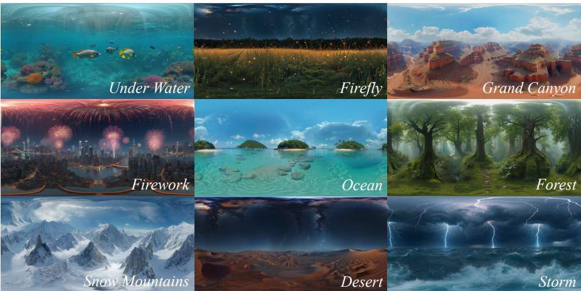  
Fig. 1: LF-MultiDifusion enables high-quality panorama generation using a pre-trained text-to-image generator in a training-free manner, achieving SOTA with faster runtime.

Abstract. We propose LF-MultiDifusion, a training-free panorama generation method that extends MultiDifusion to support linear projections between target and reference image spaces. Our key idea is to reformulate latent aggregation as a regularized least-squares problem and solve it eficiently with a Krylov-based iterative solver inside the denoising loop. This formulation enables denser and more natural mappings than prior training-free methods, yielding more stable generation with far fewer perspective views. As a result, LF-MultiDifusion reduces the number of image generator evaluations during denoising and significantly improves inference eficiency. Experiments show that LF-MultiDifusion achieves better visual quality, text alignment, and panoramic consistency than the strongest training-free baseline, while providing a 15.36× speedup. Our project page is available at: https://ahykw.github.io/lfmd.

Keywords: Training-free panorama generation · MultiDifusion · Latent optimization · Eficient inference

## 1 Introduction

Panoramic imagery has become a fundamental component of immersive digital experiences, including content for head-mounted displays (HMDs), real estate virtual tours, and street-level mapping. It represents a 360° scene in a single compact image, enabling users to look around seamlessly. As commercial HMDs have become widely available, the demand for panoramic content is growing not only for capturing and sharing real-world scenes but also for creating them.

Recent advances in generative modeling enable high-quality image synthesis [3, 6, 33], but most models are designed for a limited field of view. Several works [18, 28, 35, 42, 45] have extended image generation to panoramic image synthesis using text-ERP paired datasets, but their applicability remains limited to specific domains due to the scarcity of such datasets. Moreover, there is a substantial gap in domain coverage between general image generation models and panorama-specific models. For example, image generation models can be trained on diverse visual domains such as artistic or cartoon-style images, whereas such content is rarely available in panoramic datasets. These limitations make training-free approaches, which fully leverage the capability of pre-trained image generation models, particularly attractive for panoramic content creation.

A few prior works have explored this direction. DynamicScaler [26] proposes Panoramic Projecting Denoise, which generates panoramic images by optimizing panorama-domain noisy latents so that perspective patches obtained via equirectangular projection (ERP) follow the reverse difusion trajectories of a pre-trained image generator. SphereDif [30] instead parameterizes latents directly on the sphere surface to reduce distortion near the pole. While these methods achieve seamless and high-quality panorama generation, their optimization relies on MultiDifusion [2], which restricts the projection between the panorama and perspective spaces to direct pixel sampling (or bijective mapping) for each camera view. As a result, they require a large number of overlapping views (44 in DynamicScaler and 89 in SphereDif) to cover all pixels in the panorama and maintain seamlessness. Because a pre-trained image generator must be evaluated for every view at every denoising step, this incurs a high computational cost; generating a single panorama takes about 7 minutes with DynamicScaler and 32 minutes with SphereDif using FLUX [3].

To address this limitation, we propose Linear Fusion MultiDifusion (LF-MultiDifusion), an extension of MultiDifusion that supports arbitrary linear projections between the target and reference image spaces (Fig. 2). Our formulation casts latent aggregation as a regularized least-squares problem. Its solution is no longer a simple weighted average of reprojected denoised latents, and explicit inversion is computationally impractical. We therefore incorporate a Krylov-based iterative solver into the denoising loop. We empirically show that this iterative update is eficient, adding only 20% of the cost of the denoising step. By supporting arbitrary linear projections, our method enables denser and more natural mappings between panoramic and perspective views, which stabilizes generation even with far fewer perspective views. Experimental results show that LF-MultiDifusion achieves better visual quality, text alignment, and geometric consistency than existing training-free methods while achieving a 15.36× speedup over the best-performing baseline.

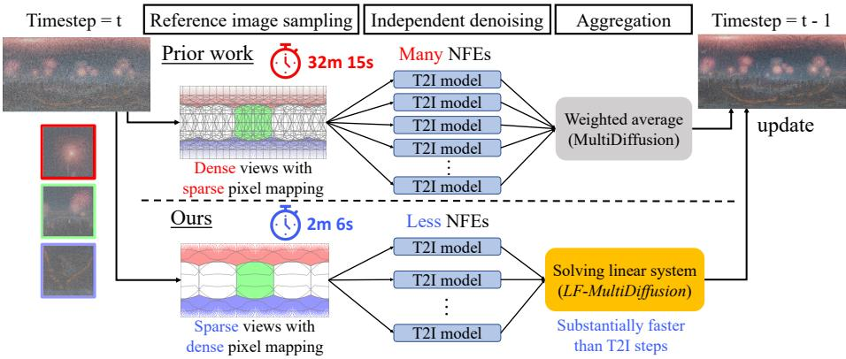  
Fig. 2: LF-MultiDifusion for fast training-free panorama generation. Prior methods are constrained to perform direct pixel sampling within the MultiDifusion framework [2], leading to many neural function evaluations (NFEs) and slow inference. Our method supports denser linear mappings, improving both generation quality and eficiency. Camera frustums and inference times for prior work are taken from SphereDif [30].

## 2 Related work

## 2.1 Difusion and flow-matching models for image generation

Difusion models [17] and flow-matching models [25,27] have become the dominant backbone for text-to-image generation [3, 7, 29, 33, 34]. However, these models are typically trained for a fixed aspect ratio or a narrow range of resolutions, and generation outside that regime often degrades layout and composition unless additional design choices are introduced.

To support flexible output sizes and aspect ratios, prior work has either adapted pre-trained text-to-image difusion models at inference time [16] or modified the architecture and training framework to natively support variable resolutions and aspect ratios [39]. MultiDifusion [2] and its variants [10,23,37,46] extend pre-trained text-to-image difusion models to larger canvases through region-wise denoising and fusion, enabling arbitrary aspect ratios and higher resolutions in a model-agnostic, zero-shot manner. However, these methods are primarily designed for planar imagery or wide-canvas images rather than geometrically consistent 360° panoramas and do not explicitly enforce loop consistency over 360° scenes.

## 2.2 Training-based text-conditional 360° panorama generation

Text2Light [4] pioneered text-driven panorama generation using a discrete VQ-VAE latent space and an autoregressive prior. Following the success of difusion models in text-to-image (T2I) generation, difusion-based methods have also become the dominant paradigm for panorama generation [18,28,35,42,45]. These methods rely on text-panorama paired datasets, which are challenging to collect at scale and, therefore, tend to have limited domain coverage and reduced robustness to diverse text prompts. For example, a model trained primarily on indoor panorama datasets typically generalizes poorly to outdoor scenes. CurvedDifusion [36] finetunes a pre-trained T2I latent difusion model using synthetically distorted images and demonstrates that panorama generation can emerge from such adaptation. However, the output aspect ratio is inherited from the base model, and it supports only a fixed resolution.

In contrast, our method directly uses pre-trained T2I models with their parameters fixed, thereby inheriting the base models’ prompt coverage. Moreover, it supports arbitrary aspect ratios and resolutions by adopting region-wise generation as in MultiDifusion-style methods.

## 2.3 Training-free text-conditional 360° panorama generation

A few prior works have explored training-free panorama generation. Dynamic-Scaler [26] optimizes panorama-domain noisy latents over difusion timesteps by applying MultiDifusion with equirectangular projection (ERP). SphereDif [30] similarly adopts a training-free formulation, but represents latents directly on the sphere to reduce the distortion near the poles. Because the original Mul tiDifusion formulation assumes one-to-one pixel correspondence between the large canvas and each local patch, these methods must use direct pixel sampling between panoramas to perspective views, such as nearest-neighbor sampling in DynamicScaler and the dynamic latent sampling specialized for the spherical latent in SphereDif. To cover the full panorama and maintain seamlessness, they require many overlapping camera views. As a result, they sufer from ineficient inference due to many neural function evaluations.

An orthogonal line of work studies training-free text-to-3D scene generation. WonderJouney [44], LucidDreamer [5], and WonderWorld [43] iteratively expand 3D scenes by optimizing 3D point clouds, 3D Gaussian splatting (3DGS) [20], and 3D Gaussian surfels, respectively, from inpainted views generated by a pretrained text-to-image generator. Because these methods progressively construct the scene through sequential view expansion and optimization, they often sufer from loop inconsistency and error accumulation. To mitigate these issues, Dream-Scene360 [48] first generates several 360° panoramas followed by VLM-based initial scene selection, and then lifts them into 3D representations. Our work focuses on 360° panorama generation and is complementary to these training-free text-to-3D scene generation methods, as exemplified in DreamScene360.

## 3 Method

In this section, we first briefly review MultiDifusion and discuss the challenges of applying it to 360° panoramic view synthesis. We then introduce

LF-MultiDifusion, an extension of MultiDifusion that supports arbitrary linear projections between the target and reference image spaces. Since most difusion models are latent difusion models [33], we use “image” and “pixel” to also refer to a latent tensor and its spatial components, respectively.

## 3.1 Preliminaries

Overview of MultiDifusion. MultiDifusion [2] enables the generation of images with arbitrary shapes using a pre-trained difusion model without additional training or finetuning. Let $\varPhi : \mathcal { T } \times \mathcal { y }  \mathcal { T }$ denote a pre-trained difusion model, where $\mathbf { \mathcal { I } } \subseteq \mathbb { R } ^ { M }$ is the reference image space, and $\mathcal { V }$ is the corresponding condition space. Starting from $I _ { T } \sim \mathcal { N } ( \mathbf { 0 } , \mathbf { I } )$ with condition $y \in \mathcal { V }$ , the reverse difusion process is written as

$$
I _ { T } , I _ { T - 1 } , \ldots , I _ { 0 } \quad { \mathrm { s . t . } } \quad I _ { t - 1 } = \varPhi ( I _ { t } \mid y ) ,\tag{1}
$$

which gradually transforms a noisy image $I _ { T }$ into a clean image $I _ { 0 }$ . MultiDifusion defines a reverse difusion process in a potentially diferent target image space $\mathcal { I } \subseteq \mathbb { R } ^ { M ^ { \prime } }$ with condition space $\mathcal { Z } .$ Starting from $J _ { T } \sim \mathcal { N } ( \mathbf { 0 } , \mathbf { I } )$ with condition $z \in { \mathcal { Z } }$ , the reverse MultiDifusion process is written as

$$
J _ { T } , J _ { T - 1 } , \ldots , J _ { 0 } \quad \mathrm { s . t . } \quad J _ { t - 1 } = \varPsi ( J _ { t } \mid z ) ,\tag{2}
$$

where $\varPsi : \mathcal I \times \mathcal Z  \mathcal I$ denotes a denoising operator at difusion step $t ,$ referred to as the MultiDifuser. In panoramic generation, the target image typically has a larger spatial extent than the reference image, i.e., $M ^ { \prime } \geq M$

The key idea of MultiDifusion is to construct Ψ so that it is as consistent as possible with the pre-trained difusion model Φ. Let $F _ { t , i } : \mathcal { I }  \mathcal { I }$ denote a mapping from the target image space to the reference image space, where $F _ { t , i } ( J )$ extracts a reference image from J by direct pixel sampling, such as cropping or nearest neighbor reprojection. Let $y _ { t , i } = \lambda _ { t , i } ( z )$ be the corresponding condition for the i-th reference image, where $\lambda _ { t , i } : \mathcal { Z }  \mathcal { V }$ maps the target condition to the reference condition $( e . g .$ , LLM-based conversion from global scene condition to that of each local patch). Then, the MultiDifuser is defined as

$$
\varPsi ( J _ { t } \mid z ) = \underset { J _ { t - 1 } \in \mathcal { I } } { \arg \operatorname* { m i n } } \sum _ { i = 1 } ^ { N } \| W _ { t , i } \odot [ F _ { t , i } ( J _ { t - 1 } ) - \varPhi ( F _ { t , i } ( J _ { t } ) \mid y _ { t , i } ) ] \| ^ { 2 } ,\tag{3}
$$

where $W _ { t , i } \in \mathbb { R } _ { > 0 } ^ { M }$ is a per-pixel weight and ⊙ is the Hadamard product. When $F _ { t , i }$ is a direct pixel-sampling operator, Eq. (3) admits the closed-form solution

$$
\varPsi ( J _ { t } \mid z ) = \sum _ { i = 1 } ^ { N } \frac { F _ { t , i } ^ { - 1 } ( W _ { t , i } ) } { \sum _ { j = 1 } ^ { N } F _ { t , j } ^ { - 1 } ( W _ { t , j } ) } \odot F _ { t , i } ^ { - 1 } ( \varPhi ( F _ { t , i } ( J _ { t } ) \mid y _ { t , i } ) ) .\tag{4}
$$

In practice, $W _ { t , i }$ is often set to $\mathbf { 1 } _ { M } \in \mathbb { R } ^ { M }$ so that all reference images contribute equally. We follow this setting and omit the weight term in the following sections for brevity.

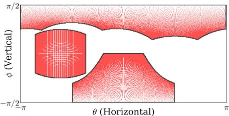  
(a) ERP + direct pixel sampling from perspective views to panorama.

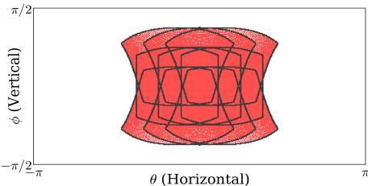  
(b) Covered pixels by nine camera positions near the center used in SphereDif [30].  
Fig. 3: Perspective-to-panorama mapping with direct pixel sampling. Panorama size: 256×512; perspective view: 128×128 with $\mathrm { F O V } = 9 0 ^ { \circ }$ . (a) Pixels covered by a single view projected onto the ERP panorama at diferent camera latitudes $\phi = [ 7 7 . 5 ^ { \circ } , 0 ^ { \circ } , - 4 5 ^ { \circ } ]$ (top to bottom). ERP-based direct sampling leaves many pixels uncovered (white pixels within the view frustum). (b) Existing methods mitigate this issue by densely sampling overlapping cameras, but they must run the difusion model for every view, increasing computational cost.

Challenges of applying MultiDifusion to 360° panoramas. Applying Eq. (4) to non-perspective 360° panoramas is challenging because the directsampling assumption makes it dificult to cover all panorama pixels. To use Eq. (4), every target pixel must be assigned to at least one pixel in some perspective view. However, when perspective views are projected onto an ERP panorama and then reprojected by direct pixel sampling through $F _ { t , i } ^ { - 1 }$ , many panorama pixels remain uncovered, as illustrated in Fig. 3a. Existing approaches [26, 30] address this issue by densely sampling camera views with substantial overlap (Fig. 3b). Since the pre-trained difusion model Φ must be evaluated for every perspective view at every difusion step, this dense sampling leads to high computational cost (e.g., SphereDif requires more than 30 minutes per panorama, as shown in Tab. 1).

A natural way to reduce the number of uncovered pixels is to use denser mappings, such as bilinear interpolation or pixel splatting from panoramas to perspective views. As shown in Figure 4a, bilinear mapping between a perspective image and the center of a panorama produces no uncovered pixels. One may therefore consider extending Eq. (4) by still averaging reprojected predictions pixel-wise under such dense mappings. However, this naive extension violates consistency with the pre-trained model and severely degrades the intermediate denoising latents. To demonstrate this, we generate only the center region of a panorama using MultiDifusion with bilinear mapping between the perspective image and the panorama. As shown in Fig. 4b, the naive extension produces noticeably degraded results.

## 3.2 MultiDifuser with arbitrary linear projections

To overcome this limitation, we propose Linear Fusion MultiDifusion (LF-MultiDifusion), an extension of MultiDifusion to the case where the targetto-reference mapping is an arbitrary linear operator. Let $\mathcal { S } \subset \mathbb { R } ^ { M \times M ^ { \prime } }$ denote a family of linear mappings from a target panorama vector $J \in \mathcal { I } \subseteq \mathbb { R } ^ { M ^ { \prime } }$ to a reference image vector in $\mathbb { R } ^ { M }$ . We replace the direct-sampling operators $\{ F _ { t , i } \} _ { i = 1 } ^ { N }$ with linear projection matrices $\{ S _ { t , i } \in S \} _ { i = 1 } ^ { N }$ . Then, the resulting linear-fusion MultiDifuser $\varPsi _ { \mathrm { L F } }$ is defined as

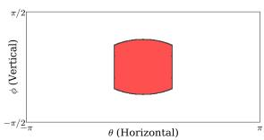  
(a) Bilinear mapping

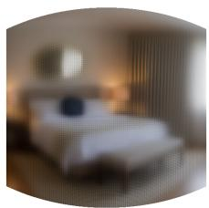  
(b) Naive extension of Eq. (4)

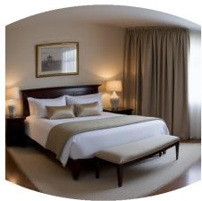  
(c) Ours  
Fig. 4: Panorama generation with bilinear mapping between the panorama and a perspective view, where the panoramic latent is optimized at each denoising step. We use FLUX [3] as the pre-trained difusion model with the text prompt "A room". (a) A perspective image is bilinearly mapped to the center of the panorama, leaving no pixels uncovered. (b) Naively extending Eq. (4) by pixel-wise averaging produces a blurry result. (c) Our method generates a high-quality image under the same bilinear mapping.

$$
\varPsi _ { \mathrm { L F } } ( J _ { t } \mid z ) = \underset { J _ { t - 1 } \in \mathcal { I } } { \arg \operatorname* { m i n } } \sum _ { i = 1 } ^ { N } \left. S _ { t , i } J _ { t - 1 } - \varPhi ( S _ { t , i } J _ { t } \mid y _ { t , i } ) \right. ^ { 2 } .\tag{5}
$$

Here, $S _ { t , i } J \in \mathbb { R } ^ { M }$ denotes the i-th reference image obtained from J by the corresponding linear projection.

Regularized formulation. Solving Eq. (5) in closed form would require explicitly forming and inverting the associated normal-equation matrix, which is computationally prohibitive for high-resolution panoramas. Instead, we introduce a quadratic regularizer and estimate $J _ { t - 1 }$ by solving the following regularized least-squares problem:

$$
J _ { t - 1 } = \underset { J \in \mathcal { I } } { \arg \operatorname* { m i n } } \sum _ { i = 1 } ^ { N } \| S _ { t , i } J - \phi ( S _ { t , i } J _ { t } \mid y _ { t , i } ) \| ^ { 2 } + \lambda \| L J \| ^ { 2 } ,\tag{6}
$$

where $\lambda \geq 0$ is a regularization coeficient, and $L = W ^ { 1 / 2 } D \in \mathbb { R } ^ { P \times M ^ { \prime } }$ is a weighted first-order regularizer with a discrete diference operator $D \in \mathbb { R } ^ { P \times M ^ { \prime } }$ and a diagonal weight matrix $W = \mathrm { d i a g } ( \mathbf { w } ) \in \mathbb { R } ^ { P \times P }$ for ${ \bf w } \in \mathbb { R } _ { \geq 0 } ^ { P }$ . This formulation includes, for example, ridge- or Laplacian-type regularization depending on the choice of D and $W$

LSMR convergence over time at different denoising steps

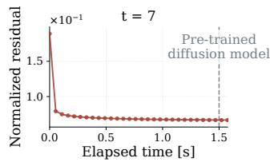

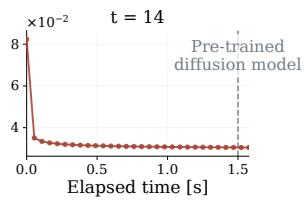

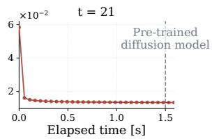  
Fig. 5: Runtime comparison between the LSMR [9] update and the total denoising cost of a full MultiDifusion step. We plot the normalized residual in Eq. (5) every 10 solver updates at denoising timestep $t \in \{ 7 , 1 4 , 2 1 \}$ . The total denoising cost for $N = 1 4$ using Flux [3] is shown as a gray dashed line. The Krylov solver update converges far more quickly than the denoising cost of the corresponding MultiDifusion step.

Augmented system. We rewrite $\mathrm { E q . ~ } ( 6 )$ in an equivalent augmented form. Define the stacked operator and target vector as

$$
\tilde { S } : = \left[ \begin{array} { c } { S _ { t , 1 } } \\ { \vdots } \\ { S _ { t , N } } \\ { \sqrt { \lambda } L } \end{array} \right] \in \mathbb { R } ^ { ( N M + P ) \times M ^ { \prime } } , \qquad \tilde { d } : = \left[ \begin{array} { c } { \Phi ( S _ { t , 1 } J _ { t } \mid y _ { t , 1 } ) } \\ { \vdots } \\ { \Phi ( S _ { t , N } J _ { t } \mid y _ { t , N } ) } \\ { \mathbf { 0 } } \end{array} \right] \in \mathbb { R } ^ { N M + P } .\tag{7}
$$

Then, Eq. (6) is equivalently written as

$$
J _ { t - 1 } = \underset { J \in \mathcal { T } } { \arg \operatorname* { m i n } } \ \| \tilde { S } J - \tilde { d } \| ^ { 2 } .\tag{8}
$$

We solve Eq. (8) using a matrix-free Krylov subspace method, either by applying preconditioned conjugate gradients (PCG) [13] to the corresponding normal equations or by directly applying LSMR [9]. In all cases, the solver requires only the operations $J \mapsto S _ { t , i } J , I \mapsto S _ { t , i } ^ { \top } I ,$ and $J \mapsto L ^ { \top } ( L J )$ , together with their stacked counterparts for ${ \tilde { S } } .$ . Therefore, the projection matrices need not be formed explicitly in memory during the iterative update.

Figure 5 compares the runtime of the LSMR update with the total denoising cost of one MultiDifusion step at diferent denoising steps. For this experiment, we used $N = 1 4$ , which is also the default setting in our main experiments. We plot the normalized residual $\textstyle \sum _ { i } \| S _ { t , i } J - \phi ( S _ { t , i } J _ { t } \mid \psi _ { t , i } ) \| ^ { 2 } / \sum _ { i } \| \varPhi ( S _ { t , i } J _ { t } \mid y _ { t , i } ) \| ^ { 2 }$ every 10 solver iterations. The residual decreases rapidly within a few tens of iterations, and the solver update requires less than 20% of the computational cost of a full MultiDifusion step. This overhead is substantially smaller than the additional cost incurred by increasing the number of views $N _ { \ast }$ which scales linearly with the number of difusion model evaluations. For reference, DynamicScaler and SphereDif use N = 44 and $N = 8 9$ , respectively, corresponding to roughly 3-7× longer denoising runtime. These results show that the proposed iterative update adapts the MultiDifusion to panoramic view synthesis in a computationally eficient manner.

## 3.3 Implementation of the target space and projection

Definition of the reference image space. We define the reference image space I as a rectangle of size $H \times W$ . The mapping operations $J \mapsto S _ { t , i } J$ and $I \mapsto S _ { t , i } ^ { \top } I$ are implemented using pixel correspondences in 3D space. To establish these correspondences, we assume that each pixel in the reference image corresponds to a point on the unit sphere. Specifically, for a pixel $\mathbf { u } \in [ 0 , W ) \times [ 0 , H )$ in $I _ { t , i } \in \mathcal { I }$ we define the corresponding 3D point $\mathbf { x } \in \mathbb { S } ^ { 2 }$ by back-projecting its viewing ray onto the unit sphere, where u and x satisfy

$$
\mathbf { u } \sim M _ { t , i } [ \mathbf { x ^ { \top } } , 1 ] ^ { \top } , \quad M _ { t , i } = K [ R _ { t , i } \mid \mathbf { c } ] ,\tag{9}
$$

where $M _ { t , i }$ i denotes the camera projection matrix, $K \in \mathbb { R } ^ { 3 \times 3 }$ is the intrinsic matrix, $R _ { t , i } \in \mathbb { R } ^ { 3 \times 3 }$ is the rotation matrix, and $\mathbf { c } \in \mathbb { R } ^ { 3 }$ is the translation vector.

The intrinsic matrix K and the translation vector c are shared across all views and timesteps. Unless otherwise noted, we set $\mathrm { F O V } _ { x } = \mathrm { F O V } _ { y } = 9 0 ^ { \circ }$ when computing $K ,$ and use ${ \bf c } = [ 0 , 0 , 0 ] ^ { \top }$ since all camera centers coincide with the origin. In contrast, the rotation matrix $R _ { t , i }$ depends on both the timestep and the view index. Following the Panoramic Projecting Denoising proposed in DynamicScaler [26], we sweep the viewing direction horizontally as the reverse difusion process proceeds, allowing the model to eficiently extract diferent subregions of the target image space over time. Specifically, let $\{ ( \theta _ { i } , \phi _ { i } ) \} _ { i = 1 } ^ { N }$ denote the initial longitude-latitude pairs with $\theta _ { i } \in ( - \pi , \pi ]$ and $\phi _ { i } \in ( - \pi / 2 , \pi / 2 ]$ At timestep $t ,$ we define the view angle as $( \theta _ { t , i } , \phi _ { t , i } ) \ : = \ : ( \theta _ { i } + s t , \phi _ { i } )$ , where $s \in ( - \pi , \pi )$ is a constant angular shift per timestep. We then construct the rotation matrix $R _ { t , i } ( \theta _ { t , i } , \phi _ { t , i } )$ such that its forward axis is aligned with the viewing direction $d ( \theta _ { t , i } , \phi _ { t , i } )$ defined by $d ( \theta , \phi ) = ( \cos \phi \sin \theta ;$ , sin ϕ, cos ϕ cos θ).

ERP latent space with bilinear projection. Inspired by DynamicScaler [26], we represent the target space $\mathcal { I }$ as an ERP latent. Specifically, we define $\mathcal { I }$ as a rectangle of size $H _ { p } \times W _ { p } ,$ , where each pixel $( i , j ) \in [ 0 , W _ { p } ) \times [ 0 , H _ { p } )$ corresponds to a point on the sphere with longitude θ and latitude ϕ as

$$
\theta = 2 \pi \cdot \frac { i } { W _ { p } } - \pi , \quad \phi = \pi \cdot \frac { j } { H _ { p } } - \frac { \pi } { 2 } .\tag{10}
$$

We define the mapping $J \mapsto S _ { t , i } J$ from the panorama to a perspective view by bilinear interpolation. Specifically, to compute the pixel value $I [ u , v ]$ at pixel position $\mathbf { u } = ( u , v )$ , we first back-project its viewing ray to a 3D point $( x _ { \mathbf { u } } , y _ { \mathbf { u } } , z _ { \mathbf { u } } )$ using Eq. (9), and then compute the corresponding longitude and latitude $( \theta _ { \mathbf { u } } , \phi _ { \mathbf { u } } ) \in \mathbb { R } ^ { 2 }$ as $\theta _ { \mathbf { u } } = \mathrm { a t a n 2 } ( x _ { \mathbf { u } } , z _ { \mathbf { u } } )$ and $\phi _ { \mathbf { u } } = \arcsin ( y _ { \mathbf { u } } )$ . The corresponding continuous panorama coordinate $( i _ { \mathbf { u } } , j _ { \mathbf { u } } )$ is then obtained by inverting Eq. (10). Using the 1D linear interpolation kernel $\kappa ( r ) = \operatorname* { m a x } ( 0 , 1 - | r | )$ , we compute I[u, v] as

$$
I [ u , v ] = \sum _ { ( i , j ) \in \mathcal { N } ( i _ { \mathbf { u } } , j _ { \mathbf { u } } ) } \kappa ( i - i _ { \mathbf { u } } ) \kappa ( j - j _ { \mathbf { u } } ) J [ i , j ] ,\tag{11}
$$

Algorithm 1 Panorama generation with LF-MultiDifusion   
Require: Pre-trained difusion model $\varPhi ,$ view conditions $\{ y _ { t , i } \} _ { i = 1 } ^ { N }$ , linear mappings   
$\bar { \{ S _ { t , i } \} } _ { i = 1 } ^ { N } ,$ number of views $N ,$ total number of difusion steps $T ,$ and $L F _ { - }$   
MultiDifusion stopping timestep $T _ { M }$   
1: $J _ { T } \sim \mathcal { N } ( \mathbf { 0 } , \mathbf { I } )$   
Phase 1: Panorama latent optimization (LF-MultiDifusion)   
2: for $t = T , T - 1 , \dots , T _ { M } + 1$ do   
3: $I _ { t , i } \gets S _ { t , i } J _ { t } \quad \forall i \in [ N ]$ \triangleright Render   
4: $\tilde { I } _ { t - 1 , i } \gets \phi ( I _ { t , i } , t , y _ { t , i } ) \dot { } \forall i \in [ N ]$ \triangleright Denoise   
5: J − ← KrylovSolve $\left( \{ S _ { t , i } \} _ { i = 1 } ^ { N } , \{ \tilde { I } _ { t - 1 , i } \} _ { i = 1 } ^ { N } \right)$ \triangleright Solve Eq. (8)   
6: end for   
Phase 2: View-wise post refinement   
7: $I _ { T _ { M } , i } \gets S _ { T _ { M } , i } J _ { T _ { M } } \quad \forall i \in [ N ]$ \triangleright Render   
8: for $t = T _ { M } , T _ { M } - 1 , \dots , 1$ do   
9: $I _ { t - 1 , i } \gets \varPhi ( I _ { t , i } , t , y _ { t , i } )$ $\forall i \in [ N ]$ \triangleright Denoise   
10: end for   
11: J0 ← DistortionAwareWeightedAveraging $\left( \{ S _ { T _ { M } , i } \} _ { i = 1 } ^ { N } , \{ I _ { 0 , i } \} _ { i = 1 } ^ { N } \right)$ \triangleright Aggregate   
12: return $J _ { 0 }$

where $\mathcal { N } ( i _ { \mathbf { u } } , j _ { \mathbf { u } } ) = \{ ( \lfloor i _ { \mathbf { u } } \rfloor + \delta _ { i } , ~ \lfloor j _ { \mathbf { u } } \rfloor + \delta _ { j } ) ~ \mid ~ \delta _ { i } , \delta _ { j } ~ \in ~ \{ 0 , 1 \} \}$ denotes the four neighboring panorama pixels of $( i _ { \mathbf { u } } , j _ { \mathbf { u } } )$ . The horizontal index is treated as periodic, whereas the vertical index is clipped to the valid range. For the reverse mapping $I \mapsto S _ { t , i } ^ { \top } I$ , we use the same correspondences and interpolation weights as in Eq. (11), and scatter each pixel value $I [ u , v ]$ onto the target ERP latent J.

## 3.4 View-wise post refinement

Although LF-MultiDifusion produces globally consistent panorama latents, the final decoded ERP images can still appear slightly blurry compared with images generated directly by the base model in its native perspective domain. We conjecture that this gap arises because the panorama is optimized in the VAE [21] latent space and decoded into the ERP format, where both latent-space compression and the geometric distortion inherent to ERP representations can weaken local details.

In practice, we stop the panorama optimization at an intermediate timestep $T _ { M } > 0$ and use the resulting latent $J _ { T _ { M } }$ for a view-wise post-refinement stage. Specifically, we first render a set of perspective-view latents $\{ I _ { i } \} _ { i = 1 } ^ { N _ { \mathrm { r e f } } }$ by applying the corresponding projections $S _ { T _ { M } , i } ^ { \prime }$ to $J _ { T _ { M } }$ . We then continue denoising each rendered view independently using the same pre-trained image generator Φ until the final step. Intuitively, this step brings each local view back to the native generation domain, allowing high-frequency details to be recovered while preserving the global structure established by $L F { \mathrm { - } } M u l t i D i f f u s i o n$

After denoising, each refined latent is decoded independently into an RGB image. We then project the refined perspective images back to the ERP image and aggregate them using Distortion-Aware Weighted Averaging from SphereDif [30], which accounts for the non-uniform distortion of ERP coordinates. Algorithm 1 summarizes an overview of the proposed generation process.

## 4 Experiments

## 4.1 Experimental setup

Implementation and inference details. We used FLUX [3] as the pre-trained image generator with the classifier-free guidance [14] scale set to 3.5. For text prompts, we followed SphereDif [30] and used their 20 prompt sets. For each prompt set, we generated 10 panorama images with diferent random seeds. The total number of denoising steps $T$ is set to 28, and the stopping step for LF-MultiDifusion $T _ { M }$ is set to 23.

To construct mappings between the panorama and perspective views, we used $N = 1 4$ initial view directions: two polar views $( \theta , \phi ) = ( 0 , \pm \frac { \pi } { 2 } )$ , eight tilted views $\begin{array} { r } { ( \theta , \phi ) = ( \frac { \pi } { 2 } i , \pm \frac { \pi } { 3 } ) } \end{array}$ for $i \in \{ 0 , 1 , 2 , 3 \}$ , and four equatorial views $\begin{array} { r } { ( \theta , \phi ) = ( \frac { \pi } { 2 } i , 0 ) } \end{array}$ for $i \in \{ \bar { 0 } , 1 , 2 , 3 \}$ . We set the per-step angular shift $\begin{array} { r } { s = \frac { \pi } { 1 8 } } \end{array}$ . We generated 2048 × 4096 ERP panoramas with $5 1 2 \times 5 1 2$ perspective views. All experiments were conducted on a single NVIDIA A100 GPU (40GB).

Baselines. We compared against DynamicScaler [26] and SphereDif [30] as training-free baselines. We set N = 44 for DynamicScaler and N = 89 for SphereDif, which are the default values. For a fair comparison, we used FLUX [3] as the base text-to-image generator. We additionally reported results for representative training-based models, Text2Light [4] and PanFusion [45].

Evaluation process and metrics. We followed the evaluation protocol of SphereDif [30]. Specifically, we rendered 14 perspective views from each generated panorama using $\mathrm { F O V } = 9 0 ^ { \circ }$ for evaluation. Inspired by VBench [15], we used MUSIQ [19] to assess imaging quality (e.g., exposure, noise, and blur), the LAION aesthetic predictor [22] to measure aesthetic preference, and CLIP [32] feature similarity between each view and the corresponding text prompt to evaluate text alignment. We also reported Q-Align [40], an LLM-based visual evaluator, as an additional measure of perceptual quality. Furthermore, we conducted the VLM-based evaluation [47] similar to SphereDif [30] to assess the panoramic distortion and continuity using Qwen-VL [1]. We use the text prompt proposed in SphereDif [30] with slight modifications tailored for Qwen-VL (see Section C in the supplementary material for the full evaluation prompt). For runtime, we measured the end-to-end generation time excluding I/O overhead.

Additional analyses in the supplementary material. Beyond the main experimental results presented in this section, we provide additional analyses in the supplementary material. They include experiments with SANA [41], an extension to text-to-panoramic video generation with LTX-Video [11], latent and projection variants, a sensitivity study on the post-refinement timestep, and additional generated samples.

Table 1: Comparison with baselines. 2048 × 4096 panoramas are generated except for PanFusion (which only supports 512 × 1024). For the training-free methods, Flux [3] is used as a base T2I model. Runtime denotes the mean wall-clock time measured on a single Nvidia A100 40GB GPU (lower is better). Higher is better for all other metrics. LF-MultiDifusion supports a dense mapping between panoramic and perspective views, thereby achieving higher generation quality with faster inference. \*: The runtime for PanFusion is shown for reference due to its small resolution.
<table><tr><td>Method</td><td>Runtime Aesthetic Imaging QAlign</td><td></td><td></td><td></td><td>CLIP</td><td>Distortion Continuity</td><td></td></tr><tr><td colspan="8">Training-based panorama generation</td></tr><tr><td>Text2Light</td><td> $5 6 \mathrm { s }$ </td><td>0.424</td><td>0.434</td><td>2.22</td><td>19.60</td><td>3.26</td><td>3.56</td></tr><tr><td>PanFusion</td><td> $2 7 \mathrm { s } ^ { \ast }$ </td><td>0.473</td><td>0.527</td><td>2.62</td><td>25.44</td><td>1.93</td><td>2.31</td></tr><tr><td colspan="8">Training-free panorama generation</td></tr><tr><td>DynamicScaler</td><td>7m 31s</td><td>0.463</td><td>0.516</td><td>3.11</td><td>26.32</td><td>3.15</td><td>3.83</td></tr><tr><td>SphereDiff</td><td>32m 15s</td><td>0.597</td><td>0.533</td><td>3.23</td><td>27.65</td><td>4.64</td><td>4.82</td></tr><tr><td>Ours</td><td>2m 6s</td><td>0.616</td><td>0.568</td><td>3.34</td><td>29.19</td><td>4.64</td><td>4.86</td></tr></table>

## 4.2 Comparison with baselines

Quantitative comparison. Table 1 compares our method with baselines. Training-based methods often struggle with out-of-domain prompts due to the limited coverage of the training data. For instance, for the prompt "Aurora", we observed that Text2Light tended to produce a collapsed black image, while PanFusion often generated an unrelated indoor scene. Among training-free approaches, LF-MultiDifusion outperforms DynamicScaler and SphereDif across all metrics. DynamicScaler applies an additional ofset-shifting denoising stage that treats the panorama as a wide-canvas perspective image, rather than enforcing a strictly spherical (ERP-consistent) representation throughout. This can introduce geo metric inconsistencies and degrade quality when evaluated via perspective-view rendering. In contrast, LF-MultiDifusion and SphereDif explicitly model curved panoramic geometry and mitigate these distortions, resulting in consistently higher scores across evaluation metrics. We attribute the improvement of LF-MultiDifusion over SphereDif to the use of denser linear projections, which stabilize optimization on curved representations and enable coherent panorama generation with substantially fewer views. Figure 6 subjectively compares the generated panorama and perspective views among training-free approaches.

Notably, LF-MultiDifusion achieves 3.58× and 15.36× speedup over DynamicScaler and SphereDif, respectively. The dominant cost in training-free panorama generation is the number of evaluations of the pre-trained image generator, which scales linearly with the number of perspective views. By removing the direct-sampling constraint and supporting dense projections between panoramas and perspective views, LF-MultiDifusion achieves better quality with significantly lower computational cost.

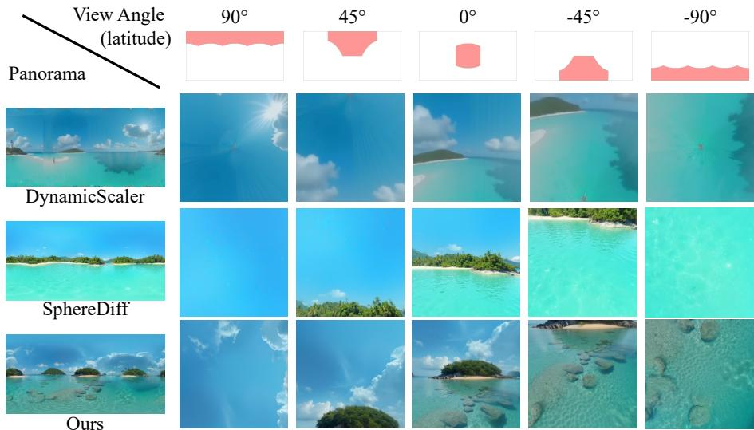  
Fig. 6: Subjective comparison. DynamicScaler often exhibits pole distortions $( \pm 9 0 ^ { \circ } )$ SphereDif and LF-MultiDifusion generate natural views across directions, and $L F _ { - }$ MultiDifusion achieves higher overall fidelity.

Table 2: User study results on subjective panorama quality. Participants rated each method on a 5-point Likert scale. Higher scores indicate better image quality, fewer perceived distortions, and better continuity. We report the mean rating with 95% confidence intervals.
<table><tr><td>Method</td><td>Image Quality ↑ Distortion ↑ Continuity ↑</td><td></td><td></td></tr><tr><td>DynamicScaler</td><td> $2 . 3 9 { \pm } 0 . 1 7$ </td><td> $2 . 3 6 { \pm } 0 . 1 6$ </td><td> $2 . 2 5 { \pm } 0 . 2 0 $ </td></tr><tr><td>SphereDiff</td><td> $3 . 6 4 { \pm } 0 . 1 4$ </td><td> $3 . 7 3 { \pm } 0 . 1 2 $ </td><td> $3 . 9 6 { \pm } 0 . 1 2$ </td></tr><tr><td> $L F { - } M u l t i D i f f u s i o n \ ( \mathrm { O u r s } )$ </td><td> ${ \bf 4 . 0 7 } { \scriptstyle \pm 0 . 1 0 }$ </td><td> $\mathbf { 3 . 7 5 { \pm } 0 . 1 6 }$ </td><td> ${ \bf 4 . 0 7 } \pm \mathrm { 0 . 1 1 }$ </td></tr></table>

User study. We further conducted a user study to evaluate the subjective quality of the generated panoramas. Participants rated samples from Dynamic-Scaler, SphereDif, and $L F { \mathrm { - } } M u l t i D i f f u s i o n$ in terms of image quality, geometric naturalness, and continuity on a 5-point Likert scale. As shown in Table 2, LF-MultiDifusion achieved the highest scores across all three aspects, indicating that our formulation improves perceived visual quality while preserving geometric naturalness and seamlessness. See the supplementary material for the setup details.

## 4.3 Ablation studies

Solver types and number of updates. Table 3 reports the efect of the solver choice and the number of solver iterations. We evaluated PCG [13] and LSMR [9] with iteration in {10, 30, 100}. For PCG, we used a diagonal preconditioner derived from the squared interpolation weights computed from $S _ { i , t } ^ { \top } S _ { i , t }$ . Overall, LSMR achieves better scores across all metrics. Increasing the number of iterations from 10 to 30 improved performance, whereas further increasing it to 100 yielded diminishing returns.

Table 3: Results when using diferent solvers and the number of solver iterations.  
Table 4: Results when using diferent regularizers and coeficients.
<table><tr><td colspan="3">Solver Iters QAlign↑ CLIP↑</td></tr><tr><td></td><td>10</td><td>3.00 28.94</td></tr><tr><td>PCG</td><td>30</td><td>3.04 28.85</td></tr><tr><td>100</td><td>2.97</td><td>28.95</td></tr><tr><td></td><td>10</td><td>3.27 29.07</td></tr><tr><td>LSMR 30</td><td>3.34</td><td>29.19</td></tr><tr><td>100</td><td>3.30</td><td>28.93</td></tr></table>

<table><tr><td>Regularizer</td><td>λ</td><td>QAlign↑ CLIP↑</td><td></td></tr><tr><td>一</td><td>0</td><td>3.282</td><td>29.02</td></tr><tr><td rowspan="3">Ridge</td><td> $1 0 ^ { - 3 }$ </td><td>3.330</td><td>29.10</td></tr><tr><td> $1 0 ^ { - 4 }$ </td><td>3.340</td><td>29.03</td></tr><tr><td> $1 0 ^ { - 5 }$ </td><td>3.336</td><td>28.99</td></tr><tr><td></td><td> $1 0 ^ { - 3 }$ </td><td>3.297</td><td>28.89</td></tr><tr><td>Laplacian</td><td> $1 0 ^ { - 4 }$ </td><td>3.341</td><td>29.19</td></tr><tr><td></td><td> $1 0 ^ { - 5 }$ </td><td>3.321</td><td>29.00</td></tr></table>

Table 5: Results when using a diferent number of perspective views N.
<table><tr><td>N Runtime↓ Aesthetic↑ Imaging↑ QAlign↑ CLIP↑ Distortion↑ Continuity↑</td><td></td><td></td><td></td><td></td><td></td><td></td></tr><tr><td>6</td><td>1m 15s</td><td>0.518</td><td>0.634</td><td>3.549</td><td>27.55</td><td>3.98</td><td>4.53</td></tr><tr><td>14</td><td>2m 6s</td><td>0.616</td><td>0.568</td><td>3.341</td><td>29.19</td><td>4.64</td><td>4.86</td></tr><tr><td>20</td><td>2m 42s</td><td>0.621</td><td>0.552</td><td>3.223</td><td>29.21</td><td>4.45</td><td>4.77</td></tr><tr><td>26</td><td>3m 18s</td><td>0.603</td><td>0.538</td><td>3.165</td><td>29.12</td><td>4.33</td><td>4.69</td></tr></table>

Regularizer and its coeficient. Table 4 reports an ablation on regularizer types and the coeficient λ. Using LSMR, we compared two regularizers: ridge and discrete Laplacian. For each regularizer, we tested $\lambda \in \{ 1 0 ^ { - 3 } , 1 0 ^ { - 4 } , 1 0 ^ { - 5 } \}$ Across these settings, both regularizers performed comparably. We therefore used the discrete Laplacian with $\lambda = 1 0 ^ { - 4 }$ as the default, as it provided consistently higher QAlign and CLIP scores.

Number of reference perspective views. Table 5 reports the efect of the number of reference perspective views, $N \in \{ 6 , 1 4 , 2 0 , 2 6 \}$ . For $N = 6$ , we used two polar views $( \theta , \phi ) = ( 0 , \pm \frac { \pi } { 2 } )$ and four equatorial views $\textstyle ( \theta , \phi ) = ( { \frac { \pi } { 2 } } i , 0 )$ for $i \in \{ 0 , 1 , 2 , 3 \}$ . For larger N, we used two polar views, 2L tilted views $\begin{array} { r } { ( \theta , \phi ) = ( \frac { 2 \pi } { L } i , \pm \frac { \pi } { 3 } ) } \end{array}$ , and L equatorial views $\begin{array} { r } { ( \theta , \phi ) = ( \frac { 2 \pi } { L } i , 0 ) } \end{array}$ with $L \in \{ 4 , 6 , 8 \}$ (corresponding to $N = 1 4 , 2 0 , 2 6 )$

Using N = 6 yields the highest scores for Imaging and QAlign, but substantially degrades geometric metrics such as Distortion and Continuity. In this setting, reference views have little to no overlap at each difusion step, so the optimization can produce high-fidelity local views while failing to enforce global seamlessness over the full panorama. Increasing the number of views to

N = 14 improves Distortion and Continuity while maintaining strong perceptual and text alignment scores, providing the best overall trade-of between quality, consistency, and runtime in our experiments. Further increasing N beyond 14 slightly improves some metrics but tends to degrade others, while incurring higher runtime. We conjecture that with heavier overlap, the least-squares fusion becomes more redundant and can make the iterative solve less well-conditioned, leading to diminishing returns under a fixed iteration budget.

## 5 Conclusion

We presented LF-MultiDifusion, a fast training-free framework for panoramic image synthesis that extends MultiDifusion to arbitrary linear projections between perspective views and ERP panoramas. By casting the update under linear mappings as a regularized least-squares problem and solving it with a matrix-free Krylov method, our approach removes the direct-sampling constraint of prior training-free baselines, enabling denser and more natural mappings between panorama and perspective views. This reduces the number of view evaluations during denoising. As a result, LF-MultiDifusion improves generation quality, text alignment, and geometric consistency while achieving about 15.36× faster inference than the best-performing training-free baseline.

Beyond panoramas, this formulation suggests a general recipe for optimizationbased synthesis on non-planar domains; future work includes extending it to other surface topologies (e.g., torus-like representations for walk-through content) and to texture optimization directly on mesh surfaces.

## Acknowledgment

This work was partially supported by JST Moonshot R&D Grant Number JPMJPS2011.

## References

1. Bai, S., Chen, K., Liu, X., Wang, J., Ge, W., Song, S., Dang, K., Wang, P., Wang, S., Tang, J., Zhong, H., Zhu, Y., Yang, M., Li, Z., Wan, J., Wang, P., Ding, W., Fu, Z., Xu, Y., Ye, J., Zhang, X., Xie, T., Cheng, Z., Zhang, H., Yang, Z., Xu, H., Lin, J.: Qwen2.5-vl technical report (2025)

2. Bar-Tal, O., Yariv, L., Lipman, Y., Dekel, T.: Multidifusion: fusing difusion paths for controlled image generation. In: ICML (2023)

3. Black Forest Labs: Flux. https://github.com/black-forest-labs/flux (2024)

4. Chen, Z., Wang, G., Liu, Z.: Text2light: Zero-shot text-driven hdr panorama generation. ACM Trans. Graph. (2022)

5. Chung, J., Lee, S., Nam, H., Lee, J., Lee, K.M.: Luciddreamer: Domain-free generation of 3d gaussian splatting scenes. IEEE TVCG (2025)

6. Esser, P., Kulal, S., Blattmann, A., Entezari, R., Müller, J., Saini, H., Levi, Y., Lorenz, D., Sauer, A., Boesel, F., Podell, D., Dockhorn, T., English, Z., Rombach, R.: Scaling rectified flow transformers for high-resolution image synthesis. In: ICML (2024)

7. Esser, P., Kulal, S., Blattmann, A., Entezari, R., Müller, J., Saini, H., Levi, Y., Lorenz, D., Sauer, A., Boesel, F., Podell, D., Dockhorn, T., English, Z., Rombach, R.: Scaling rectified flow transformers for high-resolution image synthesis. In: ICML (2024)

8. Fang, Z., Zhu, K., Liu, Z., Liu, Y., Zhai, W., Cao, Y., Zha, Z.J.: Viewpoint: Panoramic video generation with pretrained difusion models. In: NeurIPS (2025)

9. Fong, D.C.L., Saunders, M.: Lsmr: An iterative algorithm for sparse least-squares problems. SIAM J. Sci. Comput. (2011)

10. Frolov, S., Moser, B.B., Dengel, A.: Spotdifusion: A fast approach for seamless panorama generation over time. In: WACV (2025)

11. HaCohen, Y., Chiprut, N., Brazowski, B., Shalem, D., Moshe, D., Richardson, E., Levin, E., Shiran, G., Zabari, N., Gordon, O., Panet, P., Weissbuch, S., Kulikov, V., Bitterman, Y., Melumian, Z., Bibi, O.: Ltx-video: Realtime video latent difusion

12. Hardin, D.P., Michaels, T.J., Saf, E.B.: A comparison of popular point configurations on S2. Dolomites Research Notes on Approximation (2016)

13. Hestenes, M.R., Stiefel, E.: Methods of conjugate gradients for solving linear systems. J. Res. Natl. Bur. Stand. (1952)

14. Ho, J., Salimans, T.: Classifier-free difusion guidance. In: NeurIPSW on Deep Generative Models and Downstream Applications (2021)

15. Huang, Z., He, Y., Yu, J., Zhang, F., Si, C., Jiang, Y., Zhang, Y., Wu, T., Jin, Q., Chanpaisit, N., Wang, Y., Chen, X., Wang, L., Lin, D., Qiao, Y., Liu, Z.: VBench: Comprehensive benchmark suite for video generative models. In: CVPR (2024)

16. Jin, Z., Shen, X., Li, B., Xue, X.: Training-free difusion model adaptation for variable-sized text-to-image synthesis. In: NeurIPS (2023)

17. Jonathan Ho, Ajay N. Jain, P.A.: Denoising difusion probabilistic models. In: NeurIPS (2020)

18. Kalischek, N., Oechsle, M., Manhardt, F., Henzler, P., Schindler, K., Tombari, F.: Cubedif: Repurposing difusion-based image models for panorama generation. In: ICLR (2025)

19. Ke, J., Wang, Q., Wang, Y., Milanfar, P., Yang, F.: Musiq: Multi-scale image quality transformer. In: ICCV (2021)

20. Kerbl, B., Kopanas, G., Leimkuehler, T., Drettakis, G.: 3d gaussian splatting for real-time radiance field rendering. ACM TOG (2023)

21. Kingma, D.P., Welling, M.: Auto-encoding variational bayes. In: ICLR (2014)

22. LAION-AI: aesthetic-predictor. https : / / github . com / LAION - AI / aesthetic - predictor (2022)

23. Lee, Y., Kim, K., Kim, H., Sung, M.: Syncdifusion: Coherent montage via synchronized joint difusions. In: NeurIPS (2023)

24. Likert, R.: A technique for the measurement of attitudes. Archives of Psychology (1932)

25. Lipman, Y., Chen, R.T.Q., Ben-Hamu, H., Nickel, M., Le, M.: Flow matching for generative modeling. In: ICLR (2023)

26. Liu, J., Lin, S., Li, Y., Yang, M.H.: Dynamicscaler: Seamless and scalable video generation for panoramic scenes. In: CVPR (2025)

27. Liu, X., Gong, C., qiang liu: Flow straight and fast: Learning to generate and transfer data with rectified flow. In: ICLR (2023)

28. Ni, J., Zhang, C.B., Zhang, Q., Zhang, J.: What makes for text to 360-degree panorama generation with stable difusion? In: ICCV (2025)

29. Nichol, A.Q., Dhariwal, P., Ramesh, A., Shyam, P., Mishkin, P., Mcgrew, B., Sutskever, I., Chen, M.: GLIDE: Towards photorealistic image generation and editing with text-guided difusion models. In: ICML (2022)

30. Park, M., Kang, T., Yun, J., Hwang, S., Choo, J.: Spheredif: Tuning-free omnidirectional panoramic image and video generation via spherical latent representation. In: AAAI (2026)

31. Qwen Team: Qwen3.5: Towards native multimodal agents (February 2026), https: //qwen.ai/blog?id=qwen3.5

32. Radford, A., Kim, J.W., Hallacy, C., Ramesh, A., Goh, G., Agarwal, S., Sastry, G., Askell, A., Mishkin, P., Clark, J., Krueger, G., Sutskever, I.: Learning transferable visual models from natural language supervision. In: ICML (2021)

33. Rombach, R., Blattmann, A., Lorenz, D., Esser, P., Ommer, B.: High-resolution image synthesis with latent difusion models. In: CVPR (2022)

34. Saharia, C., Chan, W., Saxena, S., Li, L., Whang, J., Denton, E., Ghasemipour, S.K.S., Gontijo-Lopes, R., Ayan, B.K., Salimans, T., Ho, J., Fleet, D.J., Norouzi, M.: Photorealistic text-to-image difusion models with deep language understanding. In: NeurIPS (2022)

35. Tang, S., Zhang, F., Chen, J., Wang, P., Furukawa, Y.: MVDifusion: Enabling holistic multi-view image generation with correspondence-aware difusion. In: NeurIPS (2023)

36. Voynov, A., Hertz, A., Arar, M., Fruchter, S., Cohen-Or, D.: Curved difusion: A generative model with optical geometry control. In: ECCV (2024)

37. Wang, H., Xiang, X., Fan, Y., Xue, J.H.: Customizing 360-degree panoramas through text-to-image difusion models. In: WACV (2024)

38. Wang, Q., Li, W., Mou, C., Cheng, X., Zhang, J.: 360dvd: Controllable panorama video generation with 360-degree video difusion model. In: CVPR (2024)

39. Wang, Z., BAI, L., Yue, X., Ouyang, W., Zhang, Y.: Native-resolution image synthesis. In: NeurIPS (2025)

40. Wu, H., Zhang, Z., Zhang, W., Chen, C., Li, C., Liao, L., Wang, A., Zhang, E., Sun, W., Yan, Q., Min, X., Zhai, G., Lin, W.: Q-align: Teaching lmms for visual scoring via discrete text-defined levels. In: ICML (2024)

41. Xie, E., Chen, J., Chen, J., Cai, H., Tang, H., Lin, Y., Zhang, Z., Li, M., Zhu, L., Lu, Y., Han, S.: SANA: Eficient high-resolution text-to-image synthesis with linear difusion transformers. In: ICLR (2025)

42. Ye, W., Ji, C., Chen, Z., Gao, J., Huang, X., Zhang, S.H., Ouyang, W., He, T., Zhao, C., Zhang, G.: Difpano: Scalable and consistent text to panorama generation with spherical epipolar-aware difusion. In: NeurIPS (2024)

43. Yu, H.X., Duan, H., Herrmann, C., Freeman, W.T., Wu, J.: Wonderworld: Interactive 3d scene generation from a single image. In: CVPR (2025)

44. Yu, H.X., Duan, H., Hur, J., Sargent, K., Rubinstein, M., Freeman, W.T., Cole, F., Sun, D., Snavely, N., Wu, J., Herrmann, C.: Wonderjourney: Going from anywhere to everywhere. In: CVPR (2024)

45. Zhang, C., Wu, Q., Cruz Gambardella, C., Huang, X., Phung, D., Ouyang, W., Cai, J.: Taming stable difusion for text to 360◦ panorama image generation. In: CVPR (2024)

46. Zhang, X., Zhou, T., Zhang, X., Wei, J., Tang, Y.: Multi-scale difusion: Enhancing spatial layout in high-resolution panoramic image generation (2025)

47. Zhou, F., Gu, T., Huang, Z., Qiu, G.: Vision language modeling of content, distortion and appearance for image quality assessment. JSTSP (2024)

48. Zhou, S., Fan, Z., Xu, D., Chang, H., Chari, P., Bharadwaj, T., You, S., Wang, Z., Kadambi, A.: Dreamscene360: Unconstrained text-to-3d scene generation with panoramic gaussian splatting. In: ECCV (2024)

# Linear Fusion MultiDifusion for Fast Training-Free Spherical Panorama Generation Supplementary Material

## A Details of the user study

We conducted a user study to subjectively evaluate the visual quality and seamlessness of the generated panoramas. We randomly sampled four prompt sets from the dataset and generated panoramas using DynamicScaler [26], SphereDif [30], and LF-MultiDifusion. For each panorama, we also provided a 10-second video showing the scene from multiple viewing directions.

Each participant evaluated 12 panorama-video pairs in total (4 prompt sets × 3 methods) and rated every sample on the following three aspects using a 5-point Likert scale [24] (1: Poor, 2: Subpar, 3: Fair, 4: Good, 5: Excellent):

1. Image Quality: Rate the overall visual quality of the image. Lower scores should be assigned to images that are blurry, noisy, lacking detail, or exhibiting visible artifacts.

2. Distortion: Rate whether the image contains geometric distortions. Lower scores should be given if objects or scene structure look unnaturally stretched or deformed. Please focus on shape and structure, not on the content or style. Pay attention to regions away from the horizontal viewing direction, such as upward or downward views.

3. Continuity: Rate how smoothly and consistently the image is connected across diferent viewing directions. Lower scores should be assigned when visible seams, breaks, or structural misalignments are present.

We collected 132 ratings for each aspect from 11 participants. To assess statistical significance, we report 95% confidence intervals (CIs) based on the standard error. Table 2 in the main paper summarizes the user study results. LF-MultiDifusion achieves the highest Image Quality ratings while also obtaining comparable or slightly better Distortion and Continuity ratings than SphereDif with significantly faster inference.

## B Details of the Krylov solvers

We evaluated both PCG [13] and LSMR [9] for solving Eq. (8). Algorithms A1 and A2 summarize the update rules of the PCG and LSMR solvers, respectively. For PCG, we solve the regularized normal equation using the linear operator $\begin{array} { r } { H ( \cdot ) = S ^ { \top } S ( \cdot ) + \lambda L ^ { \top } L ( \cdot ) } \end{array}$ together with a diagonal preconditioner. The diagonal preconditioner is derived from the squared interpolation weights corresponding to $S ^ { \top } S$ . For LSMR, we instead solve the equivalent augmented least-squares problem. Here, S denotes the auxiliary recurrence state maintained by LSMR, including the rotation coeficients and search-direction-related variables. In both solvers, $\bar { S } , S ^ { \top } , \tilde { S } .$ , and $\tilde { S } ^ { \top }$ are implemented as matrix-free operators, avoiding explicit matrix instantiation in memory.

Algorithm A1 PCG solver for regularized least squares   
Require: Initial panorama feature $J ^ { ( 0 ) }$ , stacked denoised target $d ,$ stacked operator   
$S ,$ adjoint operator $S ^ { \top }$ , regularization operator $L ,$ diagonal preconditioner M,   
regularization weight $\lambda , \#$ of iterations $\tau ,$ and tolerance $\varepsilon$   
Phase 1: Initialization   
1: Define the linear operator $H ( \cdot ) : = S ^ { \top } S ( \cdot ) + \lambda L ^ { \top } L ( \cdot ) \ \triangleright$ Normal-equation operator   
2: $b \gets S ^ { \top } d , ~ J \gets J ^ { ( 0 ) } , ~ r \gets b - \ " H ( J )$   
$\mathfrak { Z } \colon z  M ^ { - 1 } r , \ \rho  \langle r , z \rangle , \ p  z$ \triangleright Preconditioner and search direction   
Phase 2: PCG iteration   
4: for $k = 1 , 2 , \ldots , \tau$ do   
5: $q  H ( p ) , \alpha  \rho / \langle p , q \rangle , J  J + \alpha p , r  r - \alpha q$ \triangleright PCG step   
6: $\mathbf { i f } \ \| r \| / \| b \| < \varepsilon$ then   
7: break \triangleright Stop if converged   
8: end if   
9: $z \gets M ^ { - 1 } r , ~ \beta \gets \langle r , z \rangle / \rho , ~ \rho \gets \langle r , z \rangle , ~ p \gets z + \beta p \qquad \triangleright$ Update search direction   
10: end for   
11: return J \triangleright Return the optimized panorama feature

## C Details of the VLM-based evaluation

To evaluate panoramic seamlessness, specifically Distortion and Continuity, we used Qwen2.5-VL [1], an open-source vision-language model. Table A1 shows the evaluation prompt. Our evaluation protocol follows the VLM-based procedure introduced in SphereDif [30]. However, we found that, when using the original prompt, the model tended to assign lower scores based on image content or artistic style rather than purely geometric criteria. We therefore explicitly instructed the model to ignore content and style, focusing only on geometric consistency.

## D Experiments with SANA

In addition to FLUX [3], we evaluated LF-MultiDifusion with SANA [41] and compared it against SphereDif. Table A2 presents the results for SANA used as the base T2I model. Because SANA is a computationally eficient text-to-image model with a highly compressed latent space and a linear difusion transformer, its inference is reported to be approximately 100× faster than FLUX. As a result, the cost of each MultiDifusion step is drastically reduced, increasing the relative runtime contribution of the linear solver. Even in this setting, LF-MultiDifusion achieves a substantial speedup (7.38×) while maintaining comparable performance.

Algorithm A2 LSMR solver in LF-MultiDifusion   
Require: Initial panorama feature J(0), augmented stacked denoised target d˜, aug  
mented operator S˜, adjoint operator S˜⊤, # of iterations T, and tolerance ε   
Phase 1: Initialization   
1: $J  J ^ { ( 0 ) } , r  \tilde { d } - \tilde { S } J$   
2: $\beta \gets \| r \| , \ u \gets r / \beta , \ \alpha \gets \| \tilde { S } ^ { \top } u \| , \ v \gets \tilde { S } ^ { \top } u / \alpha$ \triangleright Bidiagonalization   
3: S ← InitializeLSMRState(α, β) \triangleright LSMR auxiliary state   
Phase 2: LSMR iteration   
4: for $k = 1 , 2 , \dots , T$ do   
5: $\beta \gets \| \tilde { S } v - \alpha u \| , \ u \gets ( \tilde { S } v - \alpha u ) / \beta$   
6: $\alpha  \| \tilde { S } ^ { \top } u - \beta \dot { v } \| , \ v  ( \tilde { S } ^ { \top } u - \beta v ) / \alpha$   
7: (∆J, S) ← LSMRUpdate $( \mathcal { S } ; \ \alpha , \beta , v )$ \triangleright compute direction w/ state update   
8: $\dot { J }  \dot { J _ { + } } \Delta J , \ r  \tilde { d } - \tilde { S } \dot { J }$ \triangleright LSMR step   
9: if $\| r \| / \| \tilde { d } \| < \varepsilon$ then   
10: break \triangleright Stop if converged   
11: end if   
12: end for   
13: return J \triangleright Return the optimized panorama feature

Table A1: Evaluation Prompt for Qwen-VL. Evaluation prompt used with Qwen2.5-VL [1] for assessing distortion and continuity in generated panoramas. The prompt follows SphereDif [30] with slight modifications to better isolate geometric consistency from image content and style.  
You are an evaluator assessing an image generation model on a single-image basis.   
Your evaluation is based on the following two criteria:   
1. Distortion: Evaluate only geometric distortion (not content/style). High if it   
could pass as a normal camera photo; low if you notice stretching/warping/bending   
or inconsistent proportions.   
2. Continuity: Evaluate only continuity (not content/style). Score low if there is   
any visible break anywhere, including cut, misalignment, tearing, duplicated edges,   
or abrupt texture/lighting change.   
Each criterion is rated on a five-point scale: Excellent (5), Good (4), Fair (3),   
Subpar (2), and Poor (1). You will receive one image at a time. For each criterion,   
provide a concise reason for the score before listing the rating.   
Format your response as follows:   
Distortion: (Brief reason) → Score   
Continuity: (Brief reason) → Score

## E Panoramic Video Generation

In addition to static panorama generation, we adapted our method to textto-panoramic video generation. We used LTX-Video [11] as a pre-trained textto-video generator. For the baselines, we compared against 360DVD [38] and ViewPoint [8] as training-based baselines, and SphereDif, which uses the same video model, as a training-free baseline. Note that DynamicScaler was omitted because its oficial implementation only supports image-to-video generation (from static panorama to dynamic panorama) and does not support text-tovideo generation. Following each default setup, the output sizes are $1 6 \times 5 1 2 \times$ 1024 for 360DVD, $4 9 \times 5 1 2 \times 1 0 2 4$ for ViewPoint, and $1 2 1 \times 1 0 2 4 \times 2 0 4 8$ for SphereDif and ours. Thus, the training-based runtimes are only references due to their diferent output sizes, whereas the SphereDif vs. ours runtime comparison is direct. Table A3 shows that our method reduces the runtime over SphereDif from 25m 14s to 2m 44s, while achieving better scores on most metrics except comparable QAlign score. These results demonstrate that our training-free formulation transfers to panoramic video generation with a clear eficiency gain.

Table A2: Panorama generation results with SANA [41].
<table><tr><td>Method</td><td>Runtime Aesthetic</td><td></td><td>Imaging</td><td>QAlign</td><td>CLIP</td><td></td><td>Distortion Continuity</td></tr><tr><td>SphereDiff</td><td>4m 11s</td><td>0.550</td><td>0.531</td><td>2.985</td><td>27.42</td><td>3.62</td><td>4.15</td></tr><tr><td>Ours</td><td>34s</td><td>0.538</td><td>0.566</td><td>3.001</td><td>26.67</td><td>3.38</td><td>4.26</td></tr></table>

Table A3: Quantitative comparison on text-to-panoramic video generation. Motion denotes motion smoothness in VBench.
<table><tr><td>Method</td><td>Runtime↓ QAlign↑</td><td></td><td>CLIP↑</td><td></td><td>Distortion↑ Continuity↑ Motion↑</td><td></td></tr><tr><td colspan="7">Training-based panoramic video generation</td></tr><tr><td>360DVD</td><td>1m 31s</td><td>2.36</td><td>24.13</td><td>2.98</td><td>3.41</td><td>0.32</td></tr><tr><td>ViewPoint</td><td>2m 54s</td><td>1.61</td><td>24.39</td><td>1.89</td><td>2.07</td><td>0.66</td></tr><tr><td colspan="7">Training-free panoramic video generation</td></tr><tr><td>SphereDiff</td><td>25m 14s</td><td>2.67</td><td>27.72</td><td>2.70</td><td>3.13</td><td>0.43</td></tr><tr><td>Ours</td><td>2m 44s</td><td>2.36</td><td>28.19</td><td>3.01</td><td>3.37</td><td>0.44</td></tr></table>

## F Latent and projection variants

In this section, we present results with alternative latent representations and projection variants to demonstrate the generality of LF-MultiDifusion. In addition to the ERP latent and the bilinear projection between panorama and perspective views used in the main paper, we also evaluate a spherical latent representation and a splatting-based forward projection from 3D points to perspective views. For clarity, in this section, we refer to the bilinear projection used in the main paper as a backward projection (Bwd) when comparing it with the new forward-projection variant (Fwd), since the key diference lies in the projection direction.

Table A4: Panorama generation results with diferent latent and projection designs.
<table><tr><td colspan="3">Latent Projection Runtime Aesthetic Imaging</td><td colspan="3">QAlign</td><td colspan="3">CLIP Distortion Continuity</td></tr><tr><td>ERP</td><td>Fwd</td><td>4m 42s</td><td>0.609</td><td>0.555</td><td>3.22</td><td>28.72</td><td>4.47</td><td>4.77</td></tr><tr><td>ERP</td><td>Bwd</td><td>2m 6s</td><td>0.616</td><td>0.568</td><td>3.34</td><td>29.19</td><td>4.64</td><td>4.86</td></tr><tr><td>SPH</td><td>Fwd</td><td>5m 38s</td><td>0.605</td><td>0.552</td><td>3.24</td><td>28.78</td><td>4.36</td><td>4.71</td></tr><tr><td>SPH</td><td>Bwd</td><td>2m 20s</td><td>0.631</td><td>0.568</td><td>3.27</td><td>29.03</td><td>4.57</td><td>4.85</td></tr></table>

## F.1 Spherical latent representation

Inspired by SphereDif [30], we represent a 360-degree panoramic scene using points distributed on the surface of a unit sphere. Specifically, we define J as a set of $N _ { s }$ points on the unit sphere. Each point has a 3D position $( x _ { i } , y _ { i } , z _ { i } )$ and a c-dimensional feature vector, where c matches the latent dimension of the base model. We initialize the point positions using the Fibonacci lattice [12] to distribute them approximately uniformly over the sphere surface. We denote this spherical latent representation as SPH.

With SPH, we tested both the backward projection introduced in Eq. (11) of the main paper and the forward projection described in the following section. For the backward projection, we used the four neighboring points as $\mathcal { N } ( { i _ { \bf u } } , \ j _ { \bf u } )$ determined by the distances between the back-projected 3D point on the sphere corresponding to each perspective pixel $( i _ { \mathbf { u } } , j _ { \mathbf { u } } )$ and the $N _ { s }$ sphere points.

## F.2 Splatting-based forward projection from 3D points to perspective views

As a variant of the projection from a 360-degree scene to perspective views, we implement a forward projection (Fwd) by splatting all 3D points onto each perspective view and computing interpolation weights based on distances on the perspective image plane. Specifically, each 3D point $\mathbf { x } _ { p }$ is first projected onto a perspective view using Eq. (9), yielding a continuous pixel location $( u _ { p , M _ { t , i } } , v _ { p , M _ { t , i } } )$ . We then scatter its feature to the neighboring pixels

$$
\mathcal { N } _ { p } ( u _ { p , M _ { t , i } } , v _ { p , M _ { t , i } } ) = \{ ( \lfloor u _ { p , M _ { t , i } } \rfloor + \delta _ { u } , \lfloor v _ { p , M _ { t , i } } \rfloor + \delta _ { v } ) \ | \ \delta _ { u } , \delta _ { v } \in \{ 0 , 1 \} \}
$$

with weights defined by $\kappa ( u - u _ { p , M _ { t , i } } ) \kappa ( v - v _ { p , M _ { t , i } } )$ . This projection difers from the backward projection used in Sec. 3.3 in that every 3D point can contribute to perspective pixels, provided that the set of perspective views covers all directions.

In addition to the spherical latent representation, we evaluated this splattingbased forward projection with the ERP latent described in the main paper.

## F.3 Performance comparison of latent and projection variants

Table A4 compares the performance of diferent latent and projection variants. For the spherical latent representation, we used $N _ { s } = 1 0 0 \small { , } 0 0 0$ . Because forward projection requires projecting all $N _ { s }$ points into each perspective view at every update, it is slower than backward projection. It also slightly degrades all evaluation scores. We conjecture that forward projection induces denser overlap among neighboring pixels than backward projection, potentially causing excessive averaging that leads to overly smooth or blurred representations.

Table A5: Sensitivity study for the stopping time step $T _ { M }$
<table><tr><td> $T _ { M }$ </td><td>QAlign ↑</td><td>CLIP↑</td><td>Distortion ↑</td><td>Continuity ↑</td></tr><tr><td>0 (No LF-MultiDiffusion)</td><td>2.23</td><td>18.79</td><td>1.60</td><td>1.68</td></tr><tr><td>5</td><td>3.09</td><td>27.51</td><td>3.82</td><td>4.43</td></tr><tr><td>10</td><td>3.35</td><td>28.96</td><td>4.48</td><td>4.76</td></tr><tr><td>15</td><td>3.38</td><td>29.25</td><td>4.52</td><td>4.83</td></tr><tr><td>20</td><td>3.34</td><td>28.74</td><td>4.60</td><td>4.85</td></tr><tr><td>23</td><td>3.34</td><td>29.19</td><td>4.64</td><td>4.89</td></tr><tr><td>25</td><td>3.34</td><td>29.06</td><td>4.62</td><td>4.80</td></tr><tr><td>28 (No view-wise post refinement)</td><td>2.74</td><td>26.80</td><td>4.39</td><td>4.60</td></tr></table>

For the spherical latent representation, we observed improvement in the Aesthetic score while maintaining comparable performance on the other metrics. Considering both runtime and overall performance, we adopt ERP with backward projection as the default setting.

More importantly, these results show that LF-MultiDifusion generalizes across diferent latent representations and projection operators. In particular, it can be applied not only to the ERP latent used in DynamicScaler-like settings but also to the spherical latent representation introduced in SphereDif, providing a unified framework across these design choices. Also, our additional experiments suggest that using a larger $N _ { s }$ in SPH and a higher panorama resolution in ERP can further improve the overall scores. These results suggest that further gains may be obtained by making better choices of the latent representation and the projection operator, which we leave for future work.

## G Sensitivity study on the post-refinement timesteps

Table A5 shows a sensitivity study on the stopping timestep $T _ { M }$ . Panorama generation without LF-MultiDifusion $( T _ { M } = 0 )$ produces disconnected panoramas, while image quality and text alignment are degraded without view-wise post refinement $\left( T _ { M } = 2 8 \right)$ . Intermediate values perform better overall, and we choose $T _ { M } = 2 3$ for its balanced performance. This supports the importance of both the LF-MultiDifusion and the post-refinement stage.

## H Additional generated samples

Figure A1 presents additional panorama samples generated by LF-MultiDifusion. For the text prompts, we followed SphereDif [30] and prepared three prompts per scene, each describing the upper, horizontal, and lower parts of the scene. These text prompts are automatically generated using Qwen3.5-2B [31] based on the scene labels shown in the figure. We further provide a demo in the supplementary material for comparison with other baselines, including both panoramas and their corresponding perspective-view videos. A more detailed comparison is available on our project page: https://ahykw.github.io/lfmd/.

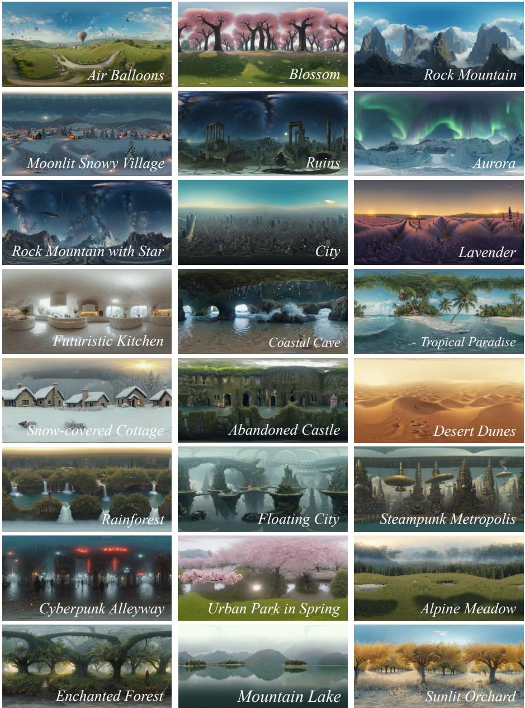  
Fig. A1: Generated panoramas by LF-MultiDifusion.