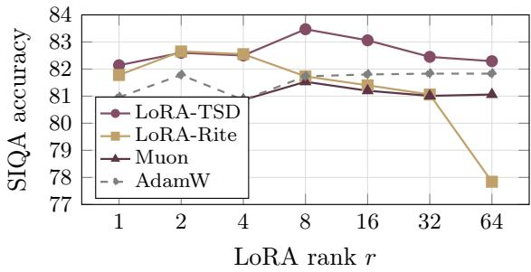
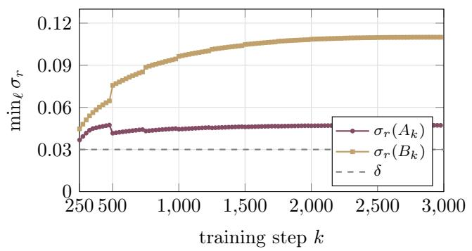
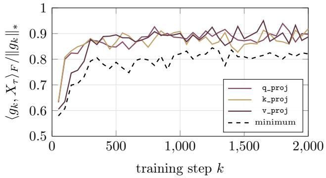
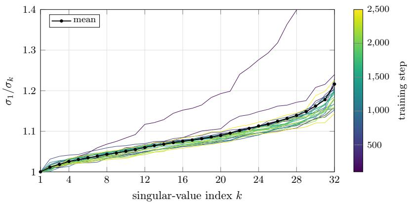

# LoRA-TSD: Tangent-Space Spectral Descent for LoRA via Muon-Style Updates

Dmitrii Andriianov<sup>1</sup>, Andrey Veprikov<sup>1,2</sup>, Aleksandr Beznosikov<sup>1,3</sup>

<sup>1</sup>Basic Research of Artificial Intelligence Laboratory (BRAIn Lab)

<sup>2</sup>SB AI Lab

<sup>3</sup>Innopolis University

Low-rank adaptation (LoRA) is the standard way to fine-tune large models, yet when its two factors are trained independently, the update ignores the geometry of the low-rank weight change it induces. We introduce LoRA-TSD, an optimizer that treats every LoRA step as a tangent vector of the fixed-rank matrix manifold and takes the spectral-norm steepest-descent step of Muon inside that tangent space, mapping the result back to the factors through a retraction native to the LoRA parametrization. The step avoids expensive operations on full weight matrices, and its retraction is up to 2.8× cheaper than the truncated-SVD retraction used by prior manifold methods. We prove that the Frobenius-norm version of our surrogate recovers LoRA-Pro, and we identify the tangent-projected gradient, the Riemannian gradient of the manifold, as the stationarity measure natural to LoRA training and computable from the factor gradients alone. Under this measure we give the first global convergence guarantees for both LoRA-Pro and LoRA-TSD, with rates that drive the factor-gradient norms to zero. Across six commonsense and natural-language-inference benchmarks with Llama-3.2-1B, Llama-3.1-8B and Qwen3-32B, LoRA-TSD outperforms every competing LoRA optimizer and stays robust to the adapter rank. Code is available at https://github.com/brain-lab-research/LoRA-TSD.

## 1 Introduction

Full fine-tuning adapts all parameters of a pretrained language model, but its memory and storage costs become prohibitive at scale. Training requires gradients and optimizer states for every parameter, and each downstream task produces a separate model copy. Parameter-eficient fine-tuning (PEFT) reduces these costs by updating a small set of parameters while keeping the pretrained weights frozen [Han et al., 2024]. Among PEFT methods, low-rank adaptation (LoRA) has become a common approach to adapting foundation models. Its compact task-specific updates can be merged into the backbone without additional inference latency, while multiple adapters can share the same frozen model [Hu et al., 2022]. This structure is also used in deployed systems, including multi-adapter serving and domain-specific language models for customer-facing applications [Nguyen et al., 2024; Scozzafava et al., 2025].

For a frozen weight $W _ { 0 } \in \mathbb { R } ^ { m \times n }$ , LoRA represents the update as $\Delta W = B A$ , where $B \in \mathbb { R } ^ { m \times r } , ~ A \in \mathbb { R } ^ { r \times n }$ and $r \ll \operatorname* { m i n } ( m , n )$ . This parameterization has motivated a broad line of subsequent work. Existing methods reduce training memory, allocate the rank budget adaptively, improve initialization, modify factor scaling or weight parameterization, and select the most useful adapters [Dettmers et al., 2023; Zhang et al., 2023; Meng et al., 2024; Hayou et al., 2024; Liu et al., 2024; Veprikov et al., 2026].

Despite this progress, the optimization of the LoRA factors remains less settled. Standard optimizers such as Adam [Kingma and Ba, 2015] update A and B as independent parameter blocks, even though the model depends on their product BA. Consequently, a well-scaled step in factor space can produce a poorly scaled or misaligned update in weight space. LoRA-specific optimizers address this mismatch by correcting the induced weight update, removing its dependence on the chosen factorization, or optimizing the low-rank weight directly through fixed-rank manifold geometry [Wang et al., 2025; Tastan et al., 2025; Yen et al., 2024; Bonnabel, 2013; Zhang and Pilanci, 2024; Bogachev et al., 2025; Cesista et al., 2026]. Section 2 reviews these approaches and explains why applying a full-matrix optimizer such as Muon within the LoRA parameterization remains nontrivial.

We propose LoRA-TSD (Tangent-Space Spectral Descent), which brings the spectral update of Muon [Jordan et al., 2024] to LoRA. Muon balances the singular directions of a matrix update instead of allowing a few directions to dominate. LoRA-TSD computes the corresponding update for the low-rank weight and maps it back to A and B. This mapping gives a factor-induced retraction that follows directly from the LoRA parametrization. Both our retraction and the truncated-SVD retraction used by prior manifold methods admit low-rank implementations. Ours avoids the truncated SVD and is faster in practice.

## Contributions.

• We develop LoRA-TSD, a LoRA-native extension of the tangent spectral iteration proposed by Riemannion [Bogachev et al., 2025]. It operates through standard LoRA factors and uses a factor-induced retraction without materializing m × n matrices.

• In the L-smooth setting, we prove convergence to stationarity for momentum-free LoRA-TSD.

• We identify LoRA-Pro [Wang et al., 2025] as the Frobenius counterpart of LoRA-TSD and prove its convergence to stationarity.

• Across the evaluated benchmarks, LoRA-TSD outperforms generic and LoRA-specific baselines and is the most stable method across adapter ranks.

## 2 Related Work

LoRA-specific optimizers. The induced weight update $\Delta ( B A ) = \Delta B A + B \Delta A$ is bilinear in the factors, so a step that is well-scaled for A and B can be misaligned in weight space: it depends on the factor norms and conditioning and generally difers from direct descent on BA. LoRA-specific optimizers address this mismatch. One line of work improves the parametrization or its initialization. LoRA+ [Hayou et al., 2024] assigns separate learning rates to the two factors, removing a width-dependent ineficiency of naive LoRA. DoRA [Liu et al., 2024] decomposes each pretrained weight into separately trainable magnitude and directional components, using LoRA to parameterize the directional update. PiSSA [Meng et al., 2024] and LoRA-GA [Wang et al., 2024] instead pick the initial factors from the leading singular directions of the weight or of its gradient, aligning the first LoRA step with full fine-tuning. A second line keeps the parametrization fixed and corrects the update itself. LoRA-Pro [Wang et al., 2025] is the central example. Let L denote the training loss. LoRA-Pro chooses the factor updates

$$
\left( \Delta A ^ { \star } , \Delta B ^ { \star } \right) = \underset { \Delta A , \Delta B } { \arg \operatorname* { m i n } } \big \| \nabla _ { W } \mathcal { L } - \left( B \Delta A + \Delta B A \right) \big \| _ { F } ^ { 2 } .\tag{1}
$$

LoFT [Tastan et al., 2025] pursues a related correction at the optimizer level by projecting the Adam moments into the low-rank subspace. The same factor ambiguity also creates an optimization problem: if two factorizations of the same adapter lead to diferent weight-space steps, training can become sensitive to the arbitrary scale and rotation of the LoRA factors, with one factor moving while the other stays nearly fixed [Yen et al., 2024]. LoRA-Rite formalizes the desired consistency as transformation invariance, meaning that replacing (B, A) by (BR<sup>−1</sup>, RA) for any invertible $R \in \mathbb { R } ^ { r \times r }$ does not change the induced update to BA. LoRA-TSD satisfies the same invariance, but chooses the target direction through spectral-norm tangent geometry. In the Frobenius-norm case, our formulation recovers the LoRA-Pro direction, with the step scale set by the optimizer learning rate.

Orthogonalized and spectral-norm optimizers. Muon [Jordan et al., 2024] orthogonalizes the momentum update before the step, which equalizes its singular values and prevents it from collapsing onto a few dominant directions. Bernstein and Newhouse [2024] identify this update as steepest descent under the spectral norm, placing Muon within a broader family of norm-constrained optimizers. Muon assumes access to the full weight matrix, so transferring its geometry to the low-rank setting is not immediate. LoRA-TSD does so by solving the spectral-norm oracle inside the tangent space of the fixed-rank manifold.

Riemannian optimization for LoRA. Riemannian SGD projects the Euclidean gradient onto the tangent space and retracts the resulting step back to the manifold [Bonnabel, 2013; Absil et al., 2008; Vandereycken, 2013]. Zhang and Pilanci [2024] keep this scheme but replace the Euclidean metric with an r × r preconditioner that rescales each factor update by the Gram matrix of the other factor. Both descend along the ordinary tangent gradient, whereas Riemannion and LoRA-Muon, like our method, orthogonalize this tangent step to obtain a spectral-norm update.

The closest work to ours is Riemannion [Bogachev et al., 2025], which applies Muon-like orthogonalized updates to low-rank adapters using the Riemannian geometry of fixed-rank matrices. We share the tangent-space motivation but difer in how the spectral-norm tangent update is approximated and how the tangent direction is mapped back to the factors. Section 3 makes this comparison precise.

A closely related optimizer, LoRA-Muon [Cesista et al., 2026], develops the same spectral steepest descent view of the LoRA tangent space, together with a gauge-invariance analysis and a matched split weight-decay rule. To make the tangent problem tractable in closed form, it decouples the two tangent components $\Delta B A$ and $B \Delta A$ splitting the trust region evenly between them and orthogonalizing each half with a single matrix sign step. The decoupling buys a closed form but discards the interaction between the two components, and the even split approximates the spectral-norm constraint only while the two stay aligned during training. The resulting step is a single closed-form expression with no mechanism to refine the direction toward the constrained spectral solution. LoRA-TSD retains the interaction through the tangent projector and reaches this solution by the alternating projection of Eq. (12).

Concurrently, PoLoRA [Ghosh et al., 2026] derives a product-aware LMO with a curvature-weighted spectral constraint. Like LoRA-Muon, it decouples the constraint on $B \Delta A + \Delta B A$ into two factorwise constraints, then adds curvature preconditioning and magnitude control. LoRA-TSD instead retains the coupled tangent update.

## 3 Method

## 3.1 Notation

We derive the update for a single adapted layer. Let $W \in \mathbb { R } ^ { m \times n }$ be its weight matrix, and let $\mathcal { L } ( W )$ denote the training loss with all other parameters fixed. The same update is applied independently to each adapted layer.

LoRA parametrization and gradients. LoRA keeps the pretrained matrix $W _ { 0 }$ fixed and trains a rank-r residual,

$$
W _ { k } = W _ { 0 } + B _ { k } A _ { k } ,\tag{2}
$$

where $B _ { k } \in \mathbb { R } ^ { m \times r } , A _ { k } \in \mathbb { R } ^ { r \times n }$ , and $r \ll \operatorname* { m i n } ( m , n )$ . At iteration $k ,$ write

$$
\begin{array} { r } { G _ { W } ^ { k } = \nabla _ { W } \mathcal { L } ( W _ { k } ) , \qquad G _ { A } ^ { k } = \nabla _ { A } \mathcal { L } ( W _ { k } ) , \qquad G _ { B } ^ { k } = \nabla _ { B } \mathcal { L } ( W _ { k } ) . } \end{array}\tag{3}
$$

The chain rule gives the relations between the full-space gradient and the observable factor gradients,

$$
G _ { A } ^ { k } = B _ { k } ^ { \top } G _ { W } ^ { k } , \qquad G _ { B } ^ { k } = G _ { W } ^ { k } A _ { k } ^ { \top } .\tag{4}
$$

The matrix $G _ { W } ^ { k }$ is the gradient we would obtain under full fine-tuning, but LoRA training exposes only $G _ { A } ^ { k }$ and $G _ { B } ^ { k }$

Spectral smoothness. Muon [Jordan et al., 2024] is steepest descent in the spectral-norm geometry [Bernstein and Newhouse, 2024], so we use the same norm for the local model. Assume that $\nabla _ { W } \mathcal { L } ( W )$ is 1/λ-Lipschitz continuous with respect to the spectral norm. Then, for any perturbation $\Delta W _ { k }$

$$
\mathcal { L } ( W _ { k } + \Delta W _ { k } ) \leq \mathcal { L } ( W _ { k } ) + \langle \nabla \mathcal { L } ( W _ { k } ) , \Delta W _ { k } \rangle + \frac { 1 } { 2 \lambda } \| \Delta W _ { k } \| _ { 2 } ^ { 2 } .\tag{5}
$$

First-order LoRA steps. A transition from $( B _ { k } , A _ { k } )$ to $\left( B _ { k } + \Delta B _ { k } , A _ { k } + \Delta A _ { k } \right)$ induces the weight change

$$
\Delta W _ { k } ^ { \mathrm { L o R A } } = \Delta B _ { k } A _ { k } + B _ { k } \Delta A _ { k } + \Delta B _ { k } \Delta A _ { k } .\tag{6}
$$

The first two terms are linear in the factor increments. The product $\Delta B _ { k } \Delta A _ { k }$ is second order. Following standard LoRA optimizer derivations [Wang et al., 2025; Tastan et al., 2025; Bogachev et al., 2025], we choose the direction from the first-order transition $\Delta B _ { k } A _ { k } + B _ { k } \Delta A _ { k }$

Fixed-rank manifold and tangent space. The reachable LoRA residuals BA have rank at most r. We work on the rank-exact stratum because every matrix of rank at most r can be approximated arbitrarily well by rank-r matrices. The residual then lies on the smooth fixed-rank manifold $\mathcal { M } _ { r } \subset \mathbb { R } ^ { m \times n }$ [Absil et al., 2008; Vandereycken, 2013]. The afine shift by $W _ { 0 }$ does not change the tangent geometry. The first-order LoRA updates at $W _ { k } = W _ { 0 } + B _ { k } A _ { k }$ form the tangent space

$$
\begin{array} { r } { \mathcal { T } _ { \boldsymbol { W _ { k } } } \mathcal { M } _ { r } = \big \{ \Delta B _ { k } A _ { k } + B _ { k } \Delta A _ { k } \ | \ \Delta B _ { k } \in \mathbb { R } ^ { m \times r } , \ \Delta A _ { k } \in \mathbb { R } ^ { r \times n } \big \} . } \end{array}\tag{7}
$$

After the second-order term is dropped, this is the exact search space of LoRA. It depends only on the column space of $B _ { k }$ and the row space of $A _ { k } .$ , not on a particular scaling of the factors. When the iteration index is clear, write $T = \mathcal { T } _ { W _ { k } } \mathcal { M } _ { \iota }$ and denote by $\mathcal { P } _ { T }$ the orthogonal projector onto this tangent space.

Linear minimization oracle. Bernstein and Newhouse [2024] derive connections between many optimizers and linear minimization oracles over norm balls. For a norm ball B and a gradient G, the oracle returns

$$
\operatorname { L M O } _ { B } ( G ) \in \operatorname { a r g m i n } _ { X \in { \mathcal { B } } } \langle G , X \rangle .
$$

For the spectral-norm ball, the oracle is the negative polar factor of $G ,$ which is the matrix-sign direction used by Muon.

## 3.2 Deriving the optimization problem

Apply the spectral smoothness bound in Eq. (5) to the first-order LoRA transition:

$$
\mathcal { L } \big ( W _ { k } + \Delta B _ { k } A _ { k } + B _ { k } \Delta A _ { k } \big ) \leq \mathcal { L } ( W _ { k } ) + \langle G _ { W } ^ { k } , \Delta B _ { k } A _ { k } + B _ { k } \Delta A _ { k } \rangle + \frac { 1 } { 2 \lambda } \| \Delta B _ { k } A _ { k } + B _ { k } \Delta A _ { k } \| _ { 2 } ^ { 2 } .\tag{8}
$$

This yields the local surrogate

$$
\operatorname* { m i n } _ { \Delta A _ { k } , \Delta B _ { k } } \left( \langle G _ { W } ^ { k } , \Delta B _ { k } A _ { k } + B _ { k } \Delta A _ { k } \rangle + \frac { 1 } { 2 \lambda } \| \Delta B _ { k } A _ { k } + B _ { k } \Delta A _ { k } \| _ { 2 } ^ { 2 } \right) .\tag{9}
$$

The factor increments are not unique. Diferent pairs $( \Delta B _ { k } , \Delta A _ { k } )$ can induce the same weight-space change, and the network only sees this change. We therefore optimize directly over $X = \Delta B _ { k } A _ { k } + B _ { k } \Delta A _ { k }$ . Using Eq. (7), Eq. (9) becomes

$$
\operatorname* { m i n } _ { X \in \mathcal { T } _ { W _ { k } } \mathcal { M } _ { r } } \left( \langle G _ { W } ^ { k } , X \rangle + \frac { 1 } { 2 \lambda } \| X \| _ { 2 } ^ { 2 } \right) .\tag{10}
$$

The tangent-space surrogate of Eq. (10) is the common formulation behind several LoRA optimizers. Its Frobenius-norm version recovers the LoRA-Pro direction, as proved in Section 5. LoRA-TSD instead retains the spectral norm, like Riemannion [Bogachev et al., 2025], and uses the LMO formulation from Section 3.1 to obtain a Muon-style tangent update.

## 3.3 Tangent-space spectral descent

We now solve Eq. (10) in the spectral norm, matching the geometry of Muon. The quadratic term sets the step scale, while the linear term sets the descent direction. Since the spectral norm is homogeneous, the direction of the penalized problem can be obtained from the corresponding trust-region form: for a fixed radius, minimize the same linear term over the spectral-norm ball. This direction-scale separation is standard in normalized deep-learning optimizers. Sign and matrix-sign methods first choose a norm-steepest direction and then set the step length with a learning rate. Bernstein and Newhouse [2024] derive this LMO view for a broad class of optimizers, including the spectral-norm update underlying Muon.

For LoRA, the trust region must also respect the tangent constraint $X \in \mathcal { T } _ { W _ { k } } \mathcal { M } _ { r }$ , giving

$$
\operatorname* { m i n } _ { X \in { \mathcal { T } } _ { W _ { k } } , M _ { r } } \langle G _ { W } ^ { k } , X \rangle .\tag{11}
$$

This move isolates the descent direction from the step scale. The scale is then set by the learning rate, while the convergence analysis only requires a positive descent margin for the direction returned by the constrained oracle. We approximate the constrained oracle with alternating projections [Bauschke and Borwein, 1996]: a tangent projection followed by an orthogonalization toward the spectral-norm ball,

$$
X _ { t + 1 } = { \mathcal { P } } _ { T } { \big ( } \mathrm { m s i g n } ( X _ { t } ) { \big ) } , \qquad X _ { 0 } = { \mathcal { P } } _ { T } ( G _ { W } ^ { k } ) .\tag{12}
$$

where msign $( Z ) = U V ^ { \top }$ for $Z = U \Sigma V ^ { \top }$ , the polar factor. The limit $X _ { \infty }$ is the flattest matrix in $T$ consistent with ${ \mathcal { P } } _ { T } ( G _ { W } ^ { k } )$ . This procedure is close to the tangent-space orthogonalization of Riemannion [Bogachev et al., 2025], but applies the projection iteratively as a refinement toward Eq. (11).

Appendix C analyzes the update spectrum and shows that its first 2r singular values are almost equalized. This is the analogue of Muon for the LoRA tangent space. Theorem 1 establishes convergence for this update under the stated assumptions.

Closed form for ${ \mathcal { P } } _ { T } ( G _ { W } ^ { k } )$ . We omit the iteration index k for brevity. For $P _ { B } = B ( B ^ { \top } B ) ^ { - 1 } B ^ { \top }$ and $P _ { A } = A ^ { \top } ( A A ^ { \top } ) ^ { - 1 } A$ the projector onto the tangent space is

$$
\mathcal { P } _ { T } ( Z ) = P _ { B } Z + Z P _ { A } - P _ { B } Z P _ { A } .\tag{13}
$$

Substituting $Z = G _ { W }$ , the unobserved full-space gradient cancels, and ${ \mathcal { P } } _ { T } ( G _ { W } )$ is expressed purely through the factor gradients $G _ { A } = B ^ { \top } G _ { W }$ and $G _ { B } = G _ { W } A ^ { \top }$ :

$$
\mathcal { P } _ { T } ( G _ { W } ) = B ( B ^ { \top } B ) ^ { - 1 } G _ { A } + G _ { B } ( A A ^ { \top } ) ^ { - 1 } A - B ( B ^ { \top } B ) ^ { - 1 } ( G _ { A } A ^ { \top } ) ( A A ^ { \top } ) ^ { - 1 } A .\tag{14}
$$

Thus ${ \mathcal { P } } _ { T } ( G _ { W } )$ can be computed without forming $G _ { W }$ , which LoRA does not expose (Section 3.1).

Reconstructing the LoRA factor updates. The alternating projections in Eq. (12) yield a full-space update $\Delta W = \Delta B A + B \Delta A \in T$ . To apply the update in the LoRA factors, we recover $\Delta A$ and $\Delta B$ . The split is not unique, so we use the following canonical choice. Let $P _ { A } = A ^ { \top } ( A A ^ { \top } ) ^ { - 1 }$ A be the orthogonal projector onto row(A). As row $( \Delta B A ) \subseteq \operatorname { r o w } ( A )$ we set

$$
\Delta B A = \Delta W P _ { A } = \Delta W A ^ { \top } ( A A ^ { \top } ) ^ { - 1 } A ,\tag{15}
$$

so that

$$
\Delta B = \Delta W A ^ { \top } ( A A ^ { \top } ) ^ { - 1 } .\tag{16}
$$

The residual is assigned to $B \Delta A$

$$
B \Delta A = \Delta W - \Delta B A ,\tag{17}
$$

and hence

$$
\begin{array} { r } { \Delta A = ( B ^ { \top } B ) ^ { - 1 } B ^ { \top } ( \Delta W - \Delta B A ) . } \end{array}\tag{18}
$$

Algorithm 1. Algorithm 1 gives the conceptual form of LoRA-TSD. It contains the full mathematical update: compute the tangentprojected gradient, refine it with the tangent spectral step, and map the resulting tangent update back to LoRA factors through Eqs. (16) and (18). It omits momentum and engineering details, but this is the form analyzed in Section 5.

Discussion. For $\tau = 1$ , Algorithm 1 recovers the tangent-direction part of Riemannion [Bogachev et al., 2025]. Table 4 shows that using τ from 3 to 5 improves average downstream accuracy over $\tau = 1$ . LoRA-TSD maps the resulting

Algorithm 1: LoRA-TSD (conceptual form)   
1: for $k = 0 , 1 , \ldots$ do   
2: $G _ { A } ^ { k } \gets \nabla _ { A } \mathcal { L } ( W _ { k } ) , G _ { B } ^ { k } \gets \nabla _ { B } \mathcal { L } ( W _ { k } )$   
3: $X _ { 0 }  \mathcal { P } _ { T } ( G _ { W } ^ { k } )$ ▷ Eq. (14)   
4: for $t = 0 , \ldots , \tau - 1$ do   
5: $X _ { t + 1 }  \mathcal { P } _ { T } \big ( \mathrm { m s i g n } ( X _ { t } ) \big )$ ▷ Eq. (12)   
6: end for   
7: $\Delta W _ { k } \gets - \eta X _ { \tau }$   
8: $\Delta B _ { k } \gets \Delta W _ { k } A _ { k } ^ { \top } ( A _ { k } A _ { k } ^ { \top } ) ^ { - 1 }$   
9: $\Delta A _ { k } \gets ( B _ { k } ^ { \top } B _ { k } ) ^ { - 1 } B _ { k } ^ { \top } \big ( \Delta W _ { k } - \Delta B _ { k } A _ { k } \big )$   
10: $A _ { k + 1 }  A _ { k } + \Delta A _ { k } , B _ { k + 1 }  B _ { k } + \Delta B _ { k }$   
11: end for

direction through a LoRA-native factor retraction rather than the truncated-SVD retraction, which keeps the update in the factor parametrization and avoids an expensive SVD. Appendix B compares the resulting iterates in detail.

Transformation invariance. Since the update is defined in weight space, it should not depend on which LoRA factorization represents the same adapter. Following LoRA-Rite [Yen et al., 2024], we call a LoRA optimizer transformation invariant as follows. Let $( B _ { k } , A _ { k } )$ be a pair of LoRA factors and let $B _ { k } ^ { \prime } = B _ { k } R ^ { - 1 }$ 2 $A _ { k } ^ { \prime } = R A _ { k }$ for some invertible $R \in \mathbb { R } ^ { r \times r }$ . If one optimizer step gives updates $( \Delta B _ { k } , \Delta A _ { k } )$ and $( \Delta B _ { k } ^ { \prime } , \Delta A _ { k } ^ { \prime } )$ , then the optimizer is transformation invariant if

$$
\begin{array} { r } { ( B _ { k } + \Delta B _ { k } ) ( A _ { k } + \Delta A _ { k } ) = ( B _ { k } ^ { \prime } + \Delta B _ { k } ^ { \prime } ) ( A _ { k } ^ { \prime } + \Delta A _ { k } ^ { \prime } ) : = B _ { k } A _ { k } + \Delta W _ { k } . } \end{array}
$$

## Proposition 1

LoRA-TSD (Algorithm 1) is transformation invariant.

This property is induced by the manifold view. The tangent projector, the projected gradient ${ \mathcal { P } } _ { T } ( G _ { W } ^ { k } )$ , and the spectral tangent step $X _ { \tau }$ depend only on the point $W _ { k } \in W _ { 0 } + \mathcal { M } _ { r }$ , not on the particular LoRA factors used to represent it.

We next show how to implement the same update in practice without expensive operations on $m \times n$ matrices.

Factorization trick. The closed form in Eq. (14) still appears to define an $m \times n$ matrix. In practice we never materialize it. Regrouping the tangent projector of Eq. (13) as

$$
\mathcal { P } _ { T } ( Z ) = P _ { B } Z ( I - P _ { A } ) + Z P _ { A }\tag{19}
$$

exhibits every tangent matrix as a sum of two rank-r terms, so it has rank at most 2r. We therefore store each iterate of Eq. (12) in a factored form $X _ { t } = L _ { t } R _ { t }$ with $\ b { L _ { t } } \in \mathbb { R } ^ { m \times 2 r }$ and $R _ { t } \in \mathbb { R } ^ { 2 r \times n }$ For the initialization $X _ { 0 } = { \mathcal { P } } _ { T } ( G _ { W } )$ , applying Eq. (19) with $Z = G _ { W }$ gives

$$
X _ { 0 } = L _ { 0 } R _ { 0 } ,\tag{20}
$$

where

$$
\begin{array} { r } { L _ { 0 } = \big [ B , G _ { B } ( A A ^ { \top } ) ^ { - 1 } \big ] , \qquad R _ { 0 } = \left[ { ( B ^ { \top } B ) ^ { - 1 } } G _ { A } ( I - P _ { A } ) \right] . } \end{array}\tag{21}
$$

Here $G _ { A } ( I - P _ { A } ) = G _ { A } - ( G _ { A } A ^ { \top } ) ( A A ^ { \top } ) ^ { - 1 } A$ stays $r \times n$ , so no m × n product is ever formed. The matrix sign step is also applied through small matrices. Given $X _ { t } = L _ { t } R _ { t }$ , compute thin QR decompositions $L _ { t } = Q _ { L } \widehat { R } _ { L }$ and $R _ { t } ^ { \top } = Q _ { R } \widehat { R } _ { R }$ . Then

$$
\mathrm { m s i g n } ( X _ { t } ) = Q _ { L } \mathrm { m s i g n } ( \widehat { R } _ { L } \widehat { R } _ { R } ^ { \top } ) Q _ { R } ^ { \top } ,\tag{22}
$$

so the matrix sign reduces to a single $2 r \times 2 r$ problem. In practice we compute msign $( \widehat { R } _ { L } \widehat { R } _ { R } ^ { \top } )$ with a Newton– Schulz iteration rather than an explicit SVD, as in Muon [Jordan et al., 2024]. Writing msign $( \widehat { R } _ { L } \widehat { R } _ { R } ^ { \top } ) = U V ^ { \top }$ ， we set $\widetilde { L } _ { t } = Q _ { L } U$ and $\widetilde { R } _ { t } = V ^ { \top } Q _ { R } ^ { \top }$

Finally, we project the msign output back onto the tangent space, again without forming the $m \times n$ product $\widetilde { L } _ { t } \widetilde { R } _ { t }$ . Using the two-term projector (19) and the small matrices

$$
\begin{array} { r } { C _ { t } = B ^ { \top } \widetilde { L } _ { t } \in \mathbb { R } ^ { r \times 2 r } , \qquad D _ { t } = \widetilde { R } _ { t } A ^ { \top } \in \mathbb { R } ^ { 2 r \times r } , } \end{array}
$$

the two projector terms become, with $Z = \widetilde { L } _ { t } \widetilde { R } _ { t }$

$$
\begin{array} { c } { { P _ { B } Z ( I - P _ { A } ) = B ( B ^ { \top } B ) ^ { - 1 } ( C _ { t } \widetilde { R } _ { t } ) ( I - P _ { A } ) , } } \\ { { Z P _ { A } = ( \widetilde { L } _ { t } D _ { t } ) ( A A ^ { \top } ) ^ { - 1 } A , } } \end{array}
$$

neither of which forms an $m \times n$ matrix. Collecting the shared factors gives the projection directly in factored form, $\mathcal { P } _ { T } ( \widetilde { L } _ { t } \widetilde { R } _ { t } ) = L _ { t + 1 } R _ { t + 1 }$ with

$$
\begin{array} { r } { L _ { t + 1 } = \big [ B , \widetilde { L } _ { t } D _ { t } ( A A ^ { \top } ) ^ { - 1 } \big ] , \qquad R _ { t + 1 } = \Big [ \big ( B ^ { \top } B ) ^ { - 1 } C _ { t } \widetilde { R } _ { t } ( I - P _ { A } ) \Big ] . } \end{array}\tag{23}
$$

This mirrors the block structure of the initialization $L _ { 0 } , R _ { 0 }$ in Eqs. (20)–(21). Hence the alternating projection loop reuses the Gram inverses $( B ^ { \top } B ) ^ { - 1 }$ and $( A A ^ { \top } ) ^ { - 1 }$ already formed for $X _ { 0 }$ , stores only the thin factors $L _ { t }$ and $R _ { t }$ of size $m \times 2 r$ and $2 r \times n$ together with the small $2 r \times 2 r$ matrix used for the msign step, and never allocates an m × n matrix.

Algorithm 2. Algorithm 2 is the practical implementation of LoRA-TSD. It adds momentum to Algorithm 1 and replaces each explicit tangent matrix by its factored representation $X _ { t } = L _ { t } R _ { t }$ from Eqs. (20)– (23). This factorization is only an implementation device: the underlying tangent update is unchanged, but all storage and multiplications stay in the thin factors, avoiding expensive operations on m × n matrices.

## 4 Experiments

Setup. We evaluate two models, Llama-3.2-1B-Instruct and Llama-3.1-8B, on BoolQ [Clark et al., 2019], PIQA [Bisk et al.,

Algorithm 2: LoRA-TSD with factorization trick   
1: $M _ { A } ^ { 0 } , M _ { B } ^ { 0 }  0 , 0$   
2: for $k = 1 , 2 , \dots$ do   
$G _ { A } ^ { k } \gets \nabla _ { A } \mathcal { L } ( W _ { k } ) , G _ { B } ^ { k } \gets \nabla _ { B } \mathcal { L } ( W _ { k } )$   
$\bar { M _ { A } ^ { k } }  \mu M _ { A } ^ { k - 1 } + ( 1 - \bar { \mu } ) G _ { A } ^ { k }$   
$M _ { B } ^ { k }  \mu M _ { B } ^ { k - 1 } + ( 1 - \mu ) G _ { B } ^ { k }$   
Factorized projection onto $\mathcal { T } _ { W _ { k } } \mathcal { M } _ { r }$   
6: $L _ { 0 } \gets \big [ B _ { k } , ~ M _ { B } ^ { k } ( A _ { k } A _ { k } ^ { \top } ) ^ { - 1 } \big ]$   
7: $R _ { 0 }  \bar { [ ( B _ { k } ^ { \top } B _ { k } ) ^ { - 1 } M _ { A } ^ { k } ( I - \bar { P } _ { A _ { k } } ) ; ~ A _ { k } ] }$   
8: for $t = 0 , \ldots , \tau - 1$ do   
Factorized msign   
9: $L _ { t } = Q _ { L } { \widehat { R _ { L } } } , R _ { t } ^ { \top } = Q _ { R } { \widehat { R } } _ { R }$   
10: $U V ^ { \top }  \operatorname* { m s i g n } \bigl ( \widehat { R } _ { L } \widehat { R } _ { R } ^ { \top } \bigr )$ ▷ Newton–Schulz   
11: $\widetilde { L } _ { t }  Q _ { L } U , \widetilde { R } _ { t }  V ^ { \top } Q _ { R } ^ { \top }$   
Factorized projection   
12: $\begin{array} { r } { C _ { t } \gets \mathbf { \bar { \boldsymbol { B } } } _ { k } ^ { \top } \tilde { \tilde { \boldsymbol { L } } } _ { t } , ~ D _ { t } \gets \widetilde { R } _ { t } \boldsymbol { A } _ { k } ^ { \top } } \end{array}$   
13: $L _ { t + 1 } \gets \left[ B _ { k } , \ \widetilde { L } _ { t } D _ { t } ( A _ { k } A _ { k } ^ { \top } ) ^ { - 1 } \right]$   
14: $R _ { t + 1 }  [ ( B _ { k } ^ { \top } B _ { k } ) ^ { - 1 } C _ { t } \widetilde { R } _ { t } ( I - P _ { A _ { k } } ) ; A _ { k } ]$   
15: end for   
Retraction   
16: $\Delta W _ { k } \gets - \eta L _ { \tau } R _ { \tau }$   
17: $\Delta B _ { k } \gets \Delta W _ { k } A _ { k } ^ { \top } ( A _ { k } A _ { k } ^ { \top } ) ^ { - 1 }$   
18: $\Delta A _ { k } \gets ( B _ { k } ^ { \top } B _ { k } \tilde { ) } ^ { - 1 } B _ { k } ^ { \top } \tilde { ( } \Delta W _ { k } - \Delta B _ { k } A _ { k } )$   
19: $A _ { k + 1 }  A _ { k } + \Delta A _ { k } , B _ { k + 1 }  B _ { k } + \Delta B _ { k }$   
20: end for

2020], SIQA [Sap et al., 2019], OBQA [Mihaylov et al., 2018], QNLI [Wang et al., 2019], and MultiNLI [Williams et al., 2018]. We also evaluate Qwen3-32B [Yang et al., 2025] on SIQA and OBQA. These benchmarks test natural-language understanding through classification and multiple-choice questions, covering reading comprehension, physical and social commonsense, elementary science, and textual entailment. Such classification-style benchmarks are standard in the LoRA literature [Yen et al., 2024; Tastan et al., 2025; Liu et al., 2024]. To isolate optimizer efects, all methods use Riemannion’s locally optimal initialization (LOI), which improves average accuracy over standard initialization [Bogachev et al., 2025]. Appendix C specifies the adapter placement, preprocessing, and hyperparameters.
<table><tr><td>Dataset</td><td>SGD</td><td>AdamW</td><td></td><td></td><td></td><td></td><td></td><td>Muon Riem-SGD LoRA-Rite Riemannion LoRA-Pro LoRA-Muon LoRA-TSD</td><td></td><td> $\mathrm { M u o n ~ F T }$ </td></tr><tr><td>BoolQ</td><td> $8 0 . 9 3 { \scriptstyle \pm 0 . 2 1 }$ </td><td> $8 0 . 9 0 { \scriptstyle \pm 0 . 8 0 }$ </td><td> $8 3 . 0 7 { \scriptstyle \pm 0 . 4 0 }$ </td><td> $7 9 . 7 0 { \scriptstyle \pm 0 . 3 5 }$ </td><td> $8 3 . 0 3 { \scriptstyle \pm 0 . 0 6 }$ </td><td> $8 1 . 7 3 { \scriptstyle \pm 0 . 2 1 }$ </td><td> $8 0 . 0 7 { \scriptstyle \pm 0 . 4 9 }$ </td><td> $8 3 . 4 7 { \scriptstyle \pm 0 . 5 9 }$ </td><td> $\mathbf { 8 4 . 6 3 _ { \pm 0 . 4 2 } }$ </td><td> $8 3 . 1 0 { \scriptstyle \pm 0 . 3 0 }$ </td></tr><tr><td>PIQA</td><td> $7 6 . 2 3 { \scriptstyle \pm 0 . 2 9 }$ </td><td> $7 5 . 7 7 { \scriptstyle \pm 0 . 3 5 }$ </td><td> $7 8 . 1 0 { \scriptstyle \pm 0 . 5 0 }$ </td><td> $6 4 . 4 3 _ { \pm 1 2 . 1 9 }$ </td><td> $7 8 . 8 0 { \scriptstyle \pm 0 . 3 5 }$ </td><td> $7 7 . 4 0 { \scriptstyle \pm 0 . 5 2 }$ </td><td> $7 4 . 2 3 { \scriptstyle \pm 0 . 2 3 }$ </td><td> $7 9 . 1 7 { \scriptstyle \pm 0 . 5 1 }$ </td><td> $\mathbf { 8 0 . 5 3 { \scriptstyle \pm 0 . 2 5 } }$ </td><td> $7 9 . 2 0 { \scriptstyle \pm 0 . 6 6 }$ </td></tr><tr><td>SIQA</td><td> $7 1 . 9 7 _ { \pm 0 . 3 5 }$ </td><td> $7 1 . 0 3 _ { \pm 0 . 3 2 }$ </td><td> $7 3 . 9 0 _ { \pm 0 . 5 0 }$ </td><td> $4 3 . 8 0 _ { \pm 2 . 2 6 }$ </td><td> $7 4 . 3 7 _ { \pm 0 . 3 2 }$ </td><td> $7 2 . 1 0 _ { \pm 0 . 3 0 }$ </td><td> $6 8 . 5 3 { \scriptstyle \pm 0 . 5 0 }$ </td><td> $7 3 . 9 3 _ { \pm 0 . 1 2 }$ </td><td> ${ \bf 7 5 . 4 0 _ { \pm 0 . 3 5 } }$ </td><td> $7 3 . 6 7 _ { \pm 0 . 4 6 }$ </td></tr><tr><td>OBQA</td><td> $7 0 . 8 7 { \scriptstyle \pm 0 . 5 0 }$ </td><td> $7 2 . 2 0 { \scriptstyle \pm 0 . 2 0 }$ </td><td> $7 1 . 8 7 { \scriptstyle \pm 0 . 7 6 }$ </td><td> $4 6 . 8 0 { \scriptstyle \pm 1 . 0 6 }$ </td><td> $\mathbf { 7 4 . 0 0 { \scriptstyle \pm 1 . 0 0 } }$ </td><td> $7 2 . 0 7 { \scriptstyle \pm 0 . 8 1 }$ </td><td> $7 1 . 3 3 { \scriptstyle \pm 0 . 4 2 }$ </td><td> $7 3 . 7 3 { \scriptstyle \pm 1 . 4 5 }$ </td><td> $\mathbf { 7 4 . 0 0 { \scriptstyle \pm 1 . 2 0 } }$ </td><td> $7 1 . 9 3 { \scriptstyle \pm 0 . 9 5 }$ </td></tr><tr><td>QNLI</td><td> $9 1 . 0 3 { \scriptstyle \pm 0 . 3 5 }$ </td><td> $9 0 . 8 0 { \scriptstyle \pm 0 . 4 4 }$ </td><td> $9 2 . 2 7 { \scriptstyle \pm 0 . 0 6 }$ </td><td> $8 2 . 3 0 { \scriptstyle \pm 4 . 1 2 }$ </td><td> $9 2 . 8 0 { \scriptstyle \pm 0 . 2 6 }$ </td><td> $9 1 . 5 7 { \scriptstyle \pm 0 . 2 3 }$ </td><td> $8 9 . 3 0 { \scriptstyle \pm 0 . 2 0 }$ </td><td> $9 2 . 9 3 { \scriptstyle \pm 0 . 2 1 }$ </td><td> $\mathbf { 9 3 . 0 7 _ { \pm 0 . 4 2 } }$ </td><td> $9 3 . 2 3 { \scriptstyle \pm 0 . 2 5 }$ </td></tr><tr><td>MultiNLI</td><td> $5 3 . 0 7 _ { \pm 2 7 . 3 1 }$ </td><td> $8 3 . 3 3 { \scriptstyle \pm 0 . 5 0 }$ </td><td> $8 5 . 9 0 _ { \pm 0 . 5 3 }$ </td><td> $7 4 . 7 0 { \scriptstyle \pm 5 . 1 9 }$ </td><td> $8 6 . 1 7 _ { \pm 0 . 4 0 }$ </td><td> $8 4 . 6 3 _ { \pm 0 . 3 1 }$ </td><td> $8 3 . 0 2 _ { \pm 1 . 1 4 }$ </td><td> $8 6 . 3 7 _ { \pm 0 . 0 6 }$ </td><td> $\mathbf { 8 7 . 3 3 _ { \pm 0 . 0 6 } }$ </td><td> $8 6 . 6 3 _ { \pm 0 . 0 6 }$ </td></tr><tr><td>AVG</td><td> $7 4 . 0 2 _ { \pm 4 . 4 2 }$ </td><td> $7 9 . 0 1 { \scriptstyle \pm 0 . 1 4 }$ </td><td> $8 0 . 8 5 { \scriptstyle \pm 0 . 0 9 }$ </td><td> $6 5 . 2 9 { \scriptstyle \pm 1 . 3 9 }$ </td><td> $8 1 . 5 3 { \scriptstyle \pm 0 . 2 5 }$ </td><td> $7 9 . 9 2 _ { \pm 0 . 2 7 }$ </td><td> $7 7 . 7 5 { \scriptstyle \pm 0 . 1 9 }$ </td><td> $8 1 . 6 0 { \scriptstyle \pm 0 . 3 2 }$ </td><td> $\mathbf { 8 2 . 4 9 _ { \pm 0 . 1 6 } }$ </td><td> $8 1 . 2 9 _ { \pm 0 . 2 4 }$ </td></tr></table>

Table 1: Accuracy on commonsense and NLI benchmarks with Llama-3.2-1B-Instruct, reported as mean ± standard deviation over three runs. Bold indicates the best LoRA result per dataset.

Baselines. We compare against standard factor-space optimizers, SGD, AdamW, and Muon applied independently to the two LoRA factors. We include three manifold methods, LoRA-Muon, Riemannian SGD, and Riemannion. LoRA-Rite and LoRA-Pro cover LoRA-specific optimizer designs. Together, these baselines cover much of the LoRA optimization design space, including direct factor-space updates, manifold optimization, gradient preconditioning, and weight-space correction. Finally, Muon FT fine-tunes the same adapted projections with Muon and serves as a full-tuning reference.
<table><tr><td>Dataset</td><td>SGD</td><td>AdamW</td><td>Muon</td><td>Riem-SGD</td><td>LoRA-Rite</td><td>Riemannion</td><td></td><td>LoRA-Pro LoRA-Muon</td><td>LoRA-TSD</td><td>Muon FT</td></tr><tr><td>BoolQ</td><td>88.6</td><td>89.6</td><td>89.1</td><td>88.8</td><td>88.9</td><td>88.5</td><td>88.3</td><td>89.8</td><td>90.0</td><td>89.3</td></tr><tr><td>PIQA</td><td>89.1</td><td>89.2</td><td>87.9</td><td>88.3</td><td>88.4</td><td>86.9</td><td>86.3</td><td>89.2</td><td>90.1</td><td>89.1</td></tr><tr><td>SIQA</td><td>82.2</td><td>81.8</td><td>81.2</td><td>34.1</td><td>81.4</td><td>79.4</td><td>77.9</td><td>81.8</td><td>82.7</td><td>80.8</td></tr><tr><td>OBQA</td><td>86.0</td><td>86.8</td><td>86.0</td><td>51.4</td><td>85.6</td><td>84.0</td><td>86.8</td><td>86.6</td><td>88.6</td><td>86.6</td></tr><tr><td>QNLI</td><td>94.8</td><td>94.3</td><td>94.8</td><td>93.7</td><td>95.0</td><td>93.5</td><td>90.2</td><td>95.1</td><td>96.1</td><td>95.1</td></tr><tr><td>MultiNLI</td><td>89.9</td><td>89.5</td><td>89.7</td><td>89.9</td><td>90.3</td><td>88.1</td><td>88.2</td><td>90.8</td><td>90.9</td><td>90.5</td></tr><tr><td>AVG</td><td>88.5</td><td>88.5</td><td>88.1</td><td>74.4</td><td>88.3</td><td>86.8</td><td>86.3</td><td>88.9</td><td>89.7</td><td>88.5</td></tr></table>

Table 2: Accuracy on commonsense and NLI benchmarks with Llama-3.1-8B. Bold indicates the best LoRA result per dataset.

Results. Tables 1, 2, and 3 report accuracy on the three models. Across the two Llama models, LoRA-TSD is best or tied for best among LoRA optimizers in all 12 model-dataset settings and achieves the highest average at both model scales. Notably, it also outperforms Muon $\mathrm { F u l l - F T }$ in 11 of the 12 settings, despite updating only low-rank adapters. Full parameter access therefore does not consistently translate into better downstream accuracy than a spectral update constrained to the LoRA tangent space. LoRA-Muon is the strongest competing LoRA method on average at both scales, although its average accuracy varies about twice as much across seeds as LoRA-TSD at the 1B scale. Both SGD baselines are less stable. Standard SGD has high variance on MultiNLI at the 1B scale. Riemannian SGD fails to converge reliably on SIQA and OBQA at both scales and is unstable on several additional 1B tasks. We tuned both with the same protocol as every other method, described in Appendix C, and report the measured results without additional tuning. Table 3

reports Qwen3-32B results on SIQA and OBQA, the two lowest-accuracy Llama-3.1-8B benchmarks in Table 2. Qwen3-32B uses the transferred 8B hyperparameters with minimal tuning, gradient clipping reduced from 1 to 0.25, a frozen FP8-E4M3FN backbone, and FP32 LoRA parameters and optimizer states. LoRA-TSD and LoRA-Rite are the two strongest methods on both tasks.
<table><tr><td>Dataset</td><td>AdamW</td><td>Muon</td><td>LoRA-Muon</td><td>LoRA-Rite</td><td>LoRA-TSD</td></tr><tr><td>SIQA</td><td>84.3</td><td>84.2</td><td>84.4</td><td>84.8</td><td>85.0</td></tr><tr><td>OBQA</td><td>94.6</td><td>94.4</td><td>95.0</td><td>95.6</td><td>96.0</td></tr></table>

Table 3: Accuracy on SIQA and OBQA with Qwen3-32B. Bold indicates the best result per dataset.

Number of inner iterations. Table 4 shows a trade-of between quality and training cost. With τ = 1, LoRA-TSD is 0.92 average accuracy points below τ = 3, but runs faster than Riemannion because its factor-induced retraction is cheaper than truncated SVD (Table 5). Increasing τ to 3 gives the best average accuracy at the cost of two additional inner projections per training step. Increasing τ further to 4 or 5 provides no noticeable performance gain.

Rank ablation. Figure 1 shows that LoRA-TSD maintains the most stable high-accuracy performance across ranks on SIQA. Appendix C provides a deeper comparison on BoolQ and SIQA.

  
Figure 1: Rank ablation on SIQA (Llama-3.1- 8B). LoRA-TSD maintains high accuracy across ranks.

<table><tr><td>T</td><td>BoolQ</td><td>PIQA</td><td>SIQA</td><td>AVG</td></tr><tr><td>1</td><td>84.16</td><td>79.05</td><td>75.59</td><td>79.60</td></tr><tr><td>2</td><td>84.40</td><td>79.65</td><td>74.51</td><td>79.52</td></tr><tr><td>3</td><td>84.89</td><td>80.20</td><td>76.46</td><td>80.52</td></tr><tr><td>4</td><td>84.68</td><td>80.14</td><td>75.90</td><td>80.24</td></tr><tr><td>5</td><td>85.08</td><td>79.87</td><td>76.46</td><td>80.47</td></tr></table>

Table 4: Accuracy with Llama-3.2-1B-Instruct for diferent numbers τ of alternating-projection steps. Bold marks the best result in each column.

## 5 Theory

## 5.1 Convergence guarantees

To our knowledge, LoRA-TSD is the first LoRA-specific optimizer with a stationary-point convergence guarantee for the nonconvex fixed-rank LoRA problem, expressed through the tangent-projected gradient. Existing convergence analyses of LoRA study standard gradient methods on the factorized objective. Mu and Klabjan [2026] establish a convergence rate for deterministic LoRA gradient descent, while Wang et al. [2026] derive guarantees for deterministic and stochastic variants. LoRA-RITE [Yen et al., 2024] provides a diferent result: an online-optimization bound on an averaged first-order term, strengthened under an additional smooth-change assumption on its preconditioners. Our analysis instead directly bounds the tangent-projected gradient, the natural stationarity measure for the fixed-rank problem. We next state the assumptions and define this measure formally.

Assumption 1 (Spectral smoothness and bounded gradients)   
The gradient $\nabla \mathcal { L }$ is Lipschitz continuous with respect to the spectral norm:   
∥∇L(W) − ∇L(W<sup>′</sup>)∥<sub>∗</sub> ≤ M∥W − W<sup>′</sup>∥<sub>2</sub>.   
Moreover, $\| \nabla \mathcal { L } ( W ) \| _ { 2 } \leq G _ { \mathrm { m a x } }$ along the trajectory.   
Assumption 2 (Lower-bounded objective)   
The objective is bounded from below: $\mathcal { L } \ge \mathcal { L } _ { * }$   
Assumption 3 (Uniform factor nondegeneracy)   
The LoRA factors remain full rank along the trajectory: there exists $\delta > 0$ such that   
σ<sub>r</sub>(A<sub>k</sub>), σ<sub>r</sub>(B<sub>k</sub>) ≥ δ > 0 ∀ k.   
Assumption 4 (Uniform descent alignment)   
For some $c _ { 0 } > 0 ,$   
⟨P<sub>T</sub> (G<sup>k</sup><sub>W</sub>), X<sub>τ</sub>⟩ ≥ c<sub>0</sub>∥P<sub>T</sub> (G<sup>k</sup><sub>W</sub>)∥<sub>∗</sub>,   
where $X _ { \tau }$ is the alternating-projection output.

Discussion of assumptions. Assumptions (A1) and (A2), together with the step-size bound, are standard in non-convex optimization [Ghadimi and Lan, 2013; Bottou et al., 2018]. Assumption (A3) keeps the LoRA factors away from rank deficiency. This condition must account for the gauge ambiguity because the same residual $B _ { k } A _ { k }$ can be represented with one factor arbitrarily small and the other arbitrarily large. We remove this artificial scale imbalance by periodically applying a gauge transformation that preserves $B _ { k } A _ { k }$ , and hence $W _ { k }$ , while rebalancing the factor norms:

$$
c _ { k } = \sqrt { \frac { \| B _ { k } \| _ { F } } { \| A _ { k } \| _ { F } } } , \qquad A _ { k }  c _ { k } A _ { k } , \qquad B _ { k }  c _ { k } ^ { - 1 } B _ { k } .
$$

We rescale the momentum bufers as $M _ { A } \gets c _ { k } ^ { - 1 } M _ { A }$ and $M _ { B } \gets c _ { k } M _ { B }$ to preserve the induced update direction. Figure 2a shows that the smallest singular values $\sigma _ { r } ( A _ { k } )$ and $\sigma _ { r } ( B _ { k } )$ remain above a positive δ throughout training, as required by (A3). The last condition, (A4), requires the approximate tangent oracle to retain a uniform descent component. For $\tau = 1$ , it holds with $c _ { 0 } = 1$ because $\mathcal { P } _ { T } = \mathcal { P } _ { T } ^ { * }$ and $\mathcal { P } _ { T } ( g ) = g$

$$
\langle g , X _ { 1 } \rangle = \langle g , { \mathcal { P } } _ { T } ( \operatorname { m s i g n } ( g ) ) \rangle = \langle { \mathcal { P } } _ { T } ( g ) , \operatorname { m s i g n } ( g ) \rangle = \langle g , \operatorname { m s i g n } ( g ) \rangle = \| g \| _ { * } .
$$

For $\tau > 1 , ( \mathbf { A } 4 )$ can be enforced by returning

$$
\widehat { X } _ { \tau } \in \mathop { \mathrm { a r g } } _ { 1 \leq t \leq \tau } \operatorname* { m a x } _ { \tau } \langle g , X _ { t } \rangle .
$$

Since $X _ { 1 }$ is included, this safeguard gives $c _ { 0 } = 1$ . It does not noticeably improve downstream performance, so we use $X _ { \tau }$ and verify (A4) empirically in Figure 2b.

  
(a) Minimum factor singular values across adapted layers. Both remain above δ.

  
(b) Descent ratio for selected projection types with $\tau =$ 3, where $g _ { k }$ denotes $\mathcal { P } _ { T _ { k } } \big ( G _ { W } ^ { k } \big )$ . The dashed curve is the minimum across all 96 adapted matrices.  
Figure 2: Empirical checks of Assumptions (A3) and (A4) during LoRA-TSD training on BoolQ with Llama-3.1-8B.

Stationarity in the LoRA setting. Because $W _ { k }$ is confined to the afine shift of the manifold $\textstyle { \mathcal { M } } _ { r } ,$ the relevant notion of a stationary point is not $G _ { W } ^ { k } = 0$ , which is generally unattainable under a rank constraint, but the vanishing of the gradient’s component tangent to $\mathcal { M } _ { r } , \mathrm { i . e . } \mathcal { P } _ { T } ( G _ { W } ^ { k } ) = 0$ . This tangential stationarity condition is the criterion used in the convergence bounds below.

Convergence rate. For LoRA-TSD, which operates in the spectral-norm geometry matching the Muon update, we have the following.

```latex
Theorem 1 (Convergence of LoRA-TSD)
Let $\{ W _ { k } \}$ be the iterates produced by Algorithm 1 (the momentum-free variant, Algorithm 2 difers only in
the addition of momentum). Under assumptions (A1)–(A4) and step sizes $0 < \bar { \eta _ { k } } \leq \operatorname* { m i n } \{ 1 , \delta ^ { 2 } / ( 2 \sqrt { 2 } ) \}$
for any $N \geq 1 { : }$
1. Constant step size. If $\eta _ { k } \equiv \eta ,$ , then
$\operatorname* { m i n } _ { 0 \leq k < N } \| \mathcal { P } _ { T _ { k } } ( G _ { W } ^ { k } ) \| _ { * } \leq \frac { \mathcal { L } ( W _ { 0 } ) - \mathcal { L } _ { * } } { c _ { 0 } \eta N } + \frac { C } { c _ { 0 } } \eta .$
and in particular, for $\eta = \sqrt { ( \mathcal { L } ( W _ { 0 } ) - \mathcal { L } _ { * } ) / ( C N ) }$
min $\| \mathcal { P } _ { T _ { k } } ( G _ { W } ^ { k } ) \| _ { * } \leq \frac { 2 } { c _ { 0 } } \sqrt { \frac { C ( \mathcal { L } ( W _ { 0 } ) - \mathcal { L } _ { * } ) } { N } } = O \big ( N ^ { - 1 / 2 } \big ) .$
0≤k<N
2. Diminishing step size. $\begin{array} { r } { \operatorname { I f } \sum _ { k } \eta _ { k } = \infty } \end{array}$ and $\textstyle \sum _ { k } \eta _ { k } ^ { 2 } < \infty$ , then $\begin{array} { r } { \sum _ { k } \eta _ { k } \| \mathcal { P } _ { T _ { k } } ( G _ { W } ^ { k } ) \| _ { * } < \infty } \end{array}$ , and consequently
lim $1 _ { k  \infty } \Vert \mathcal { P } _ { T _ { k } } ( G _ { W } ^ { k } ) \Vert _ { * } = 0$
```

## Remark 1

If the factor spectral norms are uniformly bounded, then the diminishing-step guarantee also implies $\| G _ { A } ^ { k } \| _ { * } , \| G _ { B } ^ { k } \| _ { * } \to 0$ . See Appendix A.

Directional equivalence with LoRA-Pro. LoRA-Pro is a popular and intuitive weight-space correction, so recovering it places our surrogate within an established LoRA optimization framework.

## Proposition 2 (Directional equivalence with LoRA-Pro)

Under the Frobenius norm, let $X _ { F }$ and $X _ { \mathrm { L o R A - P r o } }$ denote the weight-space directions induced by Eq. (10) and LoRA-Pro, respectively. Then

$$
X _ { \mathrm { L o R A - P r o } } = \frac { \eta } { \lambda } X _ { F } .
$$

The updates coincide when $\eta = \lambda$

This equivalence transfers the convergence analysis to LoRA-Pro, with $\| \cdot \| _ { F }$ replacing $\| \cdot \| _ { * }$ .

## Theorem 2 (Convergence of $_ { L o R A - P r o } )$

Under the Frobenius-norm analogues of assumptions $( \mathbf { A 1 } )  – ( \mathbf { A 3 } )$ , for the canonical $X = 0$ LoRA-Pro representative defined in Appendix $\mathrm { A } ,$ with step size $\eta \leq$ min $\{ 1 , 1 / ( 2 C ) \}$ and any $N \geq 1$

$$
\operatorname* { m i n } _ { 0 \le k < N } \| \mathcal { P } _ { T _ { k } } ( G _ { W } ^ { k } ) \| _ { F } = O \big ( N ^ { - 1 / 2 } \big ) .
$$

Moreover, for the constant step size $\eta = \mathrm { m i n } \{ 1 , 1 / ( 2 C ) \}$ , the iterates satisfy lim $\iota _ { k \to \infty } \| \mathcal { P } _ { T _ { k } } ( G _ { W } ^ { k } ) \| _ { F } = 0$

Proofs and constant definitions are given in Appendix A.

## 6 Conclusion

We presented LoRA-TSD, which performs Muon-style spectral descent in the LoRA tangent space through a factor-induced retraction. We established convergence to projected stationarity and recovered LoRA-Pro as the Frobenius counterpart with an analogous guarantee. Across six benchmarks and three model scales from 1B to 32B, LoRA-TSD outperforms generic and LoRA-specific optimizers and remains stable across adapter ranks. The approximate inner oracle remains the main limitation because it lacks an optimality guarantee. Controlled bounds and generative evaluation remain future work.

## References

Zeyu Han, Chao Gao, Jinyang Liu, Jef Zhang, and Sai Qian Zhang. Parameter-eficient fine-tuning for large models: A comprehensive survey, 2024. URL https://arxiv.org/abs/2403.14608.

Edward J. Hu, Yelong Shen, Phillip Wallis, Zeyuan Allen-Zhu, Yuanzhi Li, Shean Wang, Lu Wang, and Weizhu Chen. Lora: Low-rank adaptation of large language models. In International Conference on Learning Representations (ICLR), 2022. URL https://arxiv.org/abs/2106.09685.

Michael Nguyen, Dhawalkumar Patel, Qing Lan, and Vivek Gangasani. Eficient and cost-efective multi-tenant LoRA serving with Amazon SageMaker. AWS Machine Learning Blog, May 2024. Accessed September 2, 2026.

Nicholas Scozzafava, Deepam Mishra, Dmitry Soldatkin, Sam Sudakof, Vivek Gangasani, Tatia Tsmindashvili, Ana Kolkhidashvili, Guram Dentoshvili, and Dachi Choladze. Impel enhances automotive dealership customer experience with fine-tuned LLMs on Amazon SageMaker. AWS Machine Learning Blog, June 2025. Accessed September 2, 2026.

Tim Dettmers, Artidoro Pagnoni, Ari Holtzman, and Luke Zettlemoyer. Qlora: Eficient finetuning of quantized llms, 2023. URL https://arxiv.org/abs/2305.14314.

Qingru Zhang, Minshuo Chen, Alexander Bukharin, Nikos Karampatziakis, Pengcheng He, Yu Cheng, Weizhu Chen, and Tuo Zhao. Adalora: Adaptive budget allocation for parameter-eficient fine-tuning, 2023. URL https://arxiv.org/abs/2303.10512.

Fanxu Meng, Zhaohui Wang, and Muhan Zhang. Pissa: Principal singular values and singular vectors adaptation of large language models, 2024. URL https://arxiv.org/abs/2404.02948.

Soufiane Hayou, Nikhil Ghosh, and Bin Yu. Lora+: Eficient low rank adaptation of large models, 2024. URL https://arxiv.org/abs/2402.12354.

Shih-Yang Liu, Chien-Yi Wang, Hongxu Yin, Pavlo Molchanov, Yu-Chiang Frank Wang, Kwang-Ting Cheng, and Min-Hung Chen. Dora: Weight-decomposed low-rank adaptation, 2024. URL https://arxiv.org/abs/ 2402.09353.

Andrey Veprikov, Vladimir Solodkin, Alexander Zyl, Andrey V. Savchenko, and Aleksandr Beznosikov. Weightlora: Keep only necessary adapters. In Proceedings of the 64th Annual Meeting of the Association for Computational Linguistics (Volume 1: Long Papers), ACL 2026, San Diego, California, United States, July 2-7, 2026, pages 12419–12437. Association for Computational Linguistics, 2026. doi: 10.18653/V1/2026. ACL-LONG.566. URL https://doi.org/10.18653/v1/2026.acl-long.566.

Diederik P. Kingma and Jimmy Ba. Adam: A method for stochastic optimization. In International Conference on Learning Representations (ICLR), 2015. URL https://arxiv.org/abs/1412.6980.

Zhengbo Wang, Jian Liang, Ran He, Zilei Wang, and Tieniu Tan. Lora-pro: Are low-rank adapters properly optimized?, 2025. URL https://arxiv.org/abs/2407.18242.

Nurbek Tastan, Stefanos Laskaridis, Martin Takac, Karthik Nandakumar, and Samuel Horvath. Loft: Low-rank adaptation that behaves like full fine-tuning, 2025. URL https://arxiv.org/abs/2505.21289.

Jui-Nan Yen, Si Si, Zhao Meng, Felix Yu, Sai Surya Duvvuri, Inderjit S. Dhillon, Cho-Jui Hsieh, and Sanjiv Kumar. Lora done RITE: Robust invariant transformation equilibration for LoRA optimization, 2024. URL https://arxiv.org/abs/2410.20625.

Silv\`ere Bonnabel. Stochastic gradient descent on riemannian manifolds. IEEE Transactions on Automatic Control, 58(9):2217–2229, 2013. doi: 10.1109/TAC.2013.2254619.

Fangzhao Zhang and Mert Pilanci. Riemannian preconditioned lora for fine-tuning foundation models. In International Conference on Machine Learning (ICML), 2024. URL https://arxiv.org/abs/2402.02347.

Vladimir Bogachev, Vladimir Aletov, Alexander Molozhavenko, Denis Bobkov, Vera Soboleva, Aibek Alanov, and Maxim Rakhuba. Lora meets riemannion: Muon optimizer for parametrization-independent low-rank adapters, 2025. URL https://arxiv.org/abs/2507.12142.

Franz Louis Cesista, Katherine Crowson, C´edric Simal, and Stella Biderman. Lora-muon: Spectral steepest descent on the low-rank manifold, 2026. URL https://arxiv.org/abs/2606.12921.

Keller Jordan, Yuchen Jin, Vlado Boza, Jiacheng You, Franz Cesista, Laker Newhouse, and Jeremy Bernstein. Muon: An optimizer for hidden layers in neural networks. https://kellerjordan.github.io/posts/muon/, 2024.

Shaowen Wang, Linxi Yu, and Jian Li. Lora-ga: Low-rank adaptation with gradient approximation, 2024. URL https://arxiv.org/abs/2407.05000.

Jeremy Bernstein and Laker Newhouse. Old optimizer, new norm: An anthology, 2024. URL https://arxiv. org/abs/2409.20325.

P.-A. Absil, Robert Mahony, and Rodolphe Sepulchre. Optimization Algorithms on Matrix Manifolds. Princeton University Press, 2008.

Bart Vandereycken. Low-rank matrix completion by riemannian optimization. SIAM Journal on Optimization, 23(2):1214–1236, 2013. doi: 10.1137/110845768. URL https://arxiv.org/abs/1209.3834.

Nikhil Ghosh, Tetiana Parshakova, and Robert M. Gower. PoLoRA: A preconditioned orthogonalized LoRA optimizer, 2026. URL https://arxiv.org/abs/2607.17620.

Heinz H. Bauschke and Jonathan M. Borwein. On projection algorithms for solving convex feasibility problems. SIAM Review, 38(3):367–426, 1996. doi: 10.1137/S0036144593251710.

Christopher Clark, Kenton Lee, Ming-Wei Chang, Tom Kwiatkowski, Michael Collins, and Kristina Toutanova. Boolq: Exploring the surprising dificulty of natural yes/no questions. In Proceedings of the 2019 Conference of the North American Chapter of the Association for Computational Linguistics (NAACL), 2019. URL https://arxiv.org/abs/1905.10044.

Yonatan Bisk, Rowan Zellers, Ronan Le Bras, Jianfeng Gao, and Yejin Choi. Piqa: Reasoning about physical commonsense in natural language. In Proceedings of the AAAI Conference on Artificial Intelligence (AAAI), 2020. URL https://arxiv.org/abs/1911.11641.

Maarten Sap, Hannah Rashkin, Derek Chen, Ronan Le Bras, and Yejin Choi. Social iqa: Commonsense reasoning about social interactions. In Proceedings of the 2019 Conference on Empirical Methods in Natural Language Processing (EMNLP), 2019. URL https://arxiv.org/abs/1904.09728.

Todor Mihaylov, Peter Clark, Tushar Khot, and Ashish Sabharwal. Can a suit of armor conduct electricity? a new dataset for open book question answering. In Proceedings of the 2018 Conference on Empirical Methods in Natural Language Processing (EMNLP), 2018. URL https://arxiv.org/abs/1809.02789.

Alex Wang, Amanpreet Singh, Julian Michael, Felix Hill, Omer Levy, and Samuel R. Bowman. Glue: A multi-task benchmark and analysis platform for natural language understanding. In International Conference on Learning Representations (ICLR), 2019. URL https://arxiv.org/abs/1804.07461.

Adina Williams, Nikita Nangia, and Samuel R. Bowman. A broad-coverage challenge corpus for sentence understanding through inference. In Proceedings of the 2018 Conference of the North American Chapter of the Association for Computational Linguistics (NAACL), 2018. URL https://arxiv.org/abs/1704.05426.

An Yang, Anfeng Li, Baosong Yang, Beichen Zhang, Binyuan Hui, Bo Zheng, Bowen Yu, Chang Gao, Chengen Huang, Chenxu Lv, Chujie Zheng, Dayiheng Liu, Fan Zhou, Fei Huang, Feng Hu, Hao Ge, Haoran Wei, Huan Lin, Jialong Tang, Jian Yang, Jianhong Tu, Jianwei Zhang, Jianxin Yang, Jiaxi Yang, Jing Zhou, Jingren Zhou, Junyang Lin, Kai Dang, Keqin Bao, Kexin Yang, Le Yu, Lianghao Deng, Mei Li, Mingfeng Xue, Mingze Li, Pei Zhang, Peng Wang, Qin Zhu, Rui Men, Ruize Gao, Shixuan Liu, Shuang Luo, Tianhao Li, Tianyi Tang, Wenbiao Yin, Xingzhang Ren, Xinyu Wang, Xinyu Zhang, Xuancheng Ren, Yang Fan, Yang Su, Yichang Zhang, Yinger Zhang, Yu Wan, Yuqiong Liu, Zekun Wang, Zeyu Cui, Zhenru Zhang, Zhipeng Zhou, and Zihan Qiu. Qwen3 technical report, 2025. URL https://arxiv.org/abs/2505.09388.

Siqiao Mu and Diego Klabjan. On the convergence rate of lora gradient descent, 2026. URL https://arxiv. org/abs/2512.18248.

Ru Wang, Chengchang Liu, and John C. S. Lui. On the convergence of stochastic low-rank adaptation, 2026. URL https://arxiv.org/abs/2607.21975.

Saeed Ghadimi and Guanghui Lan. Stochastic first- and zeroth-order methods for nonconvex stochastic programming. SIAM Journal on Optimization, 23(4):2341–2368, 2013. doi: 10.1137/120880811.

L´eon Bottou, Frank E. Curtis, and Jorge Nocedal. Optimization methods for large-scale machine learning. SIAM Review, 60(2):223–311, 2018. doi: 10.1137/16M1080173.

Per-<sup>˚</sup>Ake Wedin. Perturbation bounds in connection with singular value decomposition. BIT Numerical Mathematics, 12(1):99–111, 1972. doi: 10.1007/BF01932678.

<sup>˚</sup>Ake Bj¨orck and Gene H. Golub. Numerical methods for computing angles between linear subspaces. Mathematics of Computation, 27(123):579–594, 1973. doi: 10.1090/S0025-5718-1973-0348991-3.

Pranav Rajpurkar, Jian Zhang, Konstantin Lopyrev, and Percy Liang. Squad: 100,000+ questions for machine comprehension of text. In Proceedings of the 2016 Conference on Empirical Methods in Natural Language Processing (EMNLP), 2016. URL https://arxiv.org/abs/1606.05250.

## Appendix

Supplementary Materials for LoRA-TSD: Tangent-Space Spectral Descent for LoRA via Muon-Style Updates

## A Proofs

## A.1 Preliminaries

We state two classical results used throughout the proofs. In both theorems $\hat { M } = M + E$

## Definition 1 (Principal angles)

Let $\mathcal { U } , \mathcal { V } \subseteq \mathbb { R } ^ { n }$ be subspaces of equal dimension r. The principal angles $0 \leq \theta _ { 1 } \leq \cdot \cdot \cdot \leq \theta _ { r } \leq \pi / 2$ between U and V are defined recursively by

$$
\begin{array} { r l } & { \cos \theta _ { k } = \underset { u \in \mathcal { U } , v \in \mathcal { V } } { \operatorname* { m a x } } u ^ { \top } v } \\ & { \qquad | | u | | = | | v | | = 1 } \\ & { \qquad \mathrm { s . t . } u \perp u _ { 1 } , \ldots , u _ { k - 1 } , v \perp v _ { 1 } , \ldots , v _ { k - 1 } . } \end{array}
$$

Equivalently, if $U , V \in \mathbb { R } ^ { n \times r }$ are orthonormal bases for $\mathcal { U }$ and $\nu ,$ then cos $\theta _ { k } = \sigma _ { k } ( U ^ { \top } V )$ . The largest principal angle θ<sub>r</sub> satisfies sin $\theta _ { r } = \| ( I - U U ^ { \top } ) V \| _ { 2 }$

## Theorem 3 (sin Θ theorem [Wedin, 1972])

Let M, $\hat { M } \in \mathbb { R } ^ { m \times n }$ with $\hat { M } = M + E$ . Let $U _ { 0 } , V _ { 0 } \ ( \mathrm { r e s p . } \ \hat { U } _ { 0 } , \hat { V } _ { 0 } )$ be orthonormal bases for the leading r left and right singular subspaces of M (resp. M<sup>ˆ</sup> ). Suppose $\sigma _ { r } ( M ) - \sigma _ { r + 1 } ( \hat { M } ) \geq \Delta > 0$ . Then

$$
\operatorname* { m a x } \{ \mathrm { d i s t } ( \hat { U } _ { 0 } , U _ { 0 } ) , \mathrm { d i s t } ( \hat { V } _ { 0 } , V _ { 0 } ) \} \leq \frac { \operatorname* { m a x } \{ \| E V _ { 0 } \| _ { 2 } , \| E ^ { \top } U _ { 0 } \| _ { 2 } \} } { \Delta } \leq \frac { \| E \| _ { 2 } } { \Delta } ,
$$

where dist $( \hat { X } _ { 0 } , X _ { 0 } ) : = \| ( I - X _ { 0 } { X } _ { 0 } ^ { \top } ) \hat { X } _ { 0 } \| _ { 2 }$ is the sine of the largest principal angle between the subspaces.

## Theorem 4 (Weyl’s inequality)

Let M, $\hat { M } \in \mathbb { R } ^ { m \times n }$ with $\hat { M } = M + E$ . Then

$$
| \sigma _ { i } ( M ) - \sigma _ { i } ( \hat { M } ) | \leq \| E \| _ { 2 } , \qquad \forall i = 1 , \ldots , \operatorname* { m i n } ( m , n ) .
$$

Consequently,

$$
\sigma _ { r } ( M ) - \sigma _ { r + 1 } ( \hat { M } ) \geq \sigma _ { r } ( M ) - \sigma _ { r + 1 } ( M ) - \| E \| _ { 2 } .
$$

Notation. At each outer iteration k the algorithm produces:

$G _ { W } ^ { k } : = \nabla \mathcal { L } ( W _ { k } )$ is the full-space gradient (never formed explicitly).

$G _ { A } ^ { k } : = B _ { k } ^ { \top } G _ { W } ^ { k }$ and $G _ { B } ^ { k } : = G _ { W } ^ { k } A _ { k } ^ { \top }$ are the factor gradients, i.e. $\partial \mathcal { L } / \partial A _ { k }$ and $\partial \mathcal { L } / \partial B _ { k }$

$g _ { k } : = \mathcal { P } _ { T _ { k } } ( G _ { W } ^ { k } )$ is the projection of the gradient onto the tangent space $T _ { k } = \mathcal { T } _ { W _ { k } } \mathcal { M } _ { r }$ , which serves as the stationarity measure.

$X _ { 0 } : = \mathcal { P } _ { T _ { k } } ( G _ { W } ^ { k } ) = g _ { k }$ initializes the inner loop.

$X _ { t } : = \mathcal { P } _ { T _ { k } } ( \operatorname { m s i g n } ( X _ { t - 1 } ) ) , t = 1 , \dots , \tau .$ , are the alternating-projection iterates, and $X _ { \tau }$ is the final inner-loop output used as the update direction.

$\Delta W _ { k } : = - \eta _ { k } X _ { \tau }$ is the full-space weight increment.

$\Delta B _ { k } , \Delta A _ { k }$ are the factor increments recovered from $\Delta W _ { k }$ via the canonical split (Eqs. (16)–(18)).

We also define the constants

$$
c _ { 1 } : = \frac { 1 } { \delta ^ { 2 } } , \quad c _ { 2 } : = 1 + \sqrt { 2 } c _ { 1 } , \quad C : = 2 G _ { \mathrm { m a x } } r c _ { 1 } + M c _ { 2 } ^ { 2 } .
$$

## A.2 Proof of Proposition 1

We track the state through one pass of Algorithm 1 and show that each step produces the same result for $( B , A )$ and for the reparametrized factors $( B ^ { \prime } , A ^ { \prime } ) = ( B R ^ { - 1 } , R A )$ , which by construction satisfy $B ^ { \prime } A ^ { \prime } = B A = W - W _ { 0 }$ We drop the iteration index k and write η for the step size.

The two factorizations describe the same weight $W$ , so $G _ { W } = \nabla _ { W } \mathcal { L } ( W )$ is identical for both. The factor gradients difer,

$$
G _ { A ^ { \prime } } = ( B ^ { \prime } ) ^ { \top } G _ { W } = R ^ { - \top } G _ { A } , \qquad G _ { B ^ { \prime } } = G _ { W } ( A ^ { \prime } ) ^ { \top } = G _ { B } R ^ { \top } ,
$$

but they enter the algorithm only through $G _ { W }$ , as we now use.

Consider the tangent projectors of Eq. (13) for the primed factors. Using $( A ^ { \prime } ( A ^ { \prime } ) ^ { \top } ) ^ { - 1 } = R ^ { - \top } ( A A ^ { \top } ) ^ { - 1 } R ^ { - 1 }$ and $( ( B ^ { \prime } ) ^ { \top } B ^ { \prime } ) ^ { - 1 } = R ( B ^ { \top } B ) ^ { - 1 } R ^ { \top }$

$$
\begin{array} { r l } & { P _ { A ^ { \prime } } = ( A ^ { \prime } ) ^ { \top } ( A ^ { \prime } ( A ^ { \prime } ) ^ { \top } ) ^ { - 1 } A ^ { \prime } } \\ & { \qquad = A ^ { \top } R ^ { \top } R ^ { - \top } ( A A ^ { \top } ) ^ { - 1 } R ^ { - 1 } R A = P _ { A } , } \\ & { P _ { B ^ { \prime } } = B ^ { \prime } ( ( B ^ { \prime } ) ^ { \top } B ^ { \prime } ) ^ { - 1 } ( B ^ { \prime } ) ^ { \top } } \\ & { \qquad = B R ^ { - 1 } R ( B ^ { \top } B ) ^ { - 1 } R ^ { \top } R ^ { - \top } B ^ { \top } = P _ { B } . } \end{array}
$$

Hence $\mathcal { P } _ { T ^ { \prime } } = \mathcal { P } _ { T } ;$ : the projector, and therefore the tangent space itself, depends only on $W .$

The inner loop is unafected as well. The initialization is $X _ { 0 } = { \mathcal { P } } _ { T } ( G _ { W } )$ , which is unchanged since both $\mathcal { P } _ { T }$ and G are. The iteration $X _ { t + 1 } = \mathcal { P } _ { T } ( \operatorname* { m s i g n } ( X _ { t } ) )$ applies the same operator $\mathcal { P } _ { T }$ and the reparametrization-free map msign, so by induction every $X _ { t } .$ , and in particular $X _ { \tau } ,$ is identical for both factorizations. Consequently the tangent update $\Delta W = - \eta X _ { \tau }$ is identical.

The reconstruction step transforms covariantly. With $A ^ { \dagger } = A ^ { \top } ( A A ^ { \top } ) ^ { - 1 }$ and $B ^ { \dagger } = ( B ^ { \top } B ) ^ { - 1 } B ^ { \top }$ , the same manipulations as above give $( A ^ { \prime } ) ^ { \dag } = A ^ { \dag } R ^ { - 1 }$ and $( B ^ { \prime } ) ^ { \dagger } = R B ^ { \dagger }$ . Hence

$$
\Delta B ^ { \prime } = \Delta W ( A ^ { \prime } ) ^ { \dagger } = \Delta B R ^ { - 1 } ,
$$

and, since $\Delta B ^ { \prime } A ^ { \prime } = \Delta B R ^ { - 1 } R A = \Delta B A$

$$
\Delta A ^ { \prime } = ( B ^ { \prime } ) ^ { \dagger } ( \Delta W - \Delta B ^ { \prime } A ^ { \prime } ) = R B ^ { \dagger } ( \Delta W - \Delta B A ) = R \Delta A .
$$

Finally, the updated factors are $B ^ { \prime } + \Delta B ^ { \prime } = ( B + \Delta B ) R ^ { - 1 }$ and $A ^ { \prime } + \Delta A ^ { \prime } = R ( A + \Delta A )$ , so

$$
( B ^ { \prime } + \Delta B ^ { \prime } ) ( A ^ { \prime } + \Delta A ^ { \prime } ) = ( B + \Delta B ) R ^ { - 1 } R ( A + \Delta A ) = ( B + \Delta B ) ( A + \Delta A ) .
$$

Adding $W _ { 0 }$ gives $W _ { k + 1 } ^ { \prime } = W _ { k + 1 }$ , which proves the claim.

## A.3 Proof of Proposition 2

Consider the Frobenius-norm version of the tangent surrogate Eq. (9):

$$
\operatorname* { m i n } _ { \Delta A , \Delta B } \bigg \{ \langle G _ { A } , \Delta A \rangle + \langle G _ { B } , \Delta B \rangle + \frac { 1 } { 2 \lambda } \| \Delta B A + B \Delta A \| _ { F } ^ { 2 } \bigg \} .
$$

The linear terms rewrite as

$$
\langle G _ { A } , \Delta A \rangle + \langle G _ { B } , \Delta B \rangle = \langle B ^ { \top } G _ { W } , \Delta A \rangle + \langle G _ { W } A ^ { \top } , \Delta B \rangle = \langle G _ { W } , \Delta B A + B \Delta A \rangle .
$$

Setting $\widetilde { G } : = \Delta B A + B \Delta A$ and completing the square,

$$
\langle G _ { W } , \widetilde { G } \rangle + \frac { 1 } { 2 \lambda } \Vert \widetilde { G } \Vert _ { F } ^ { 2 } = \frac { 1 } { 2 \lambda } \Vert \widetilde { G } + \lambda G _ { W } \Vert _ { F } ^ { 2 } - \frac { \lambda } { 2 } \Vert G _ { W } \Vert _ { F } ^ { 2 } .
$$

Dropping the constant, the problem reduces to

$$
\operatorname* { m i n } _ { \Delta A , \Delta B } \| \Delta B A + B \Delta A + \lambda G _ { W } \| _ { F } ^ { 2 } .
$$

Substituting $\widehat { G } _ { A } : = - \Delta A / \lambda$ and $\widehat { G } _ { B } : = - \Delta B / \lambda$ gives

$$
\| \Delta B A + B \Delta A + \lambda G _ { W } \| _ { F } ^ { 2 } = \lambda ^ { 2 } \| B \widehat { G } _ { A } + \widehat { G } _ { B } A - G _ { W } \| _ { F } ^ { 2 } .
$$

Since $\lambda ^ { 2 } > 0$ does not afect the minimizers, the problem is equivalent to

$$
\operatorname* { m i n } _ { \widehat { G } _ { A } , \widehat { G } _ { B } } \| B \widehat { G } _ { A } + \widehat { G } _ { B } A - G _ { W } \| _ { F } ^ { 2 } ,
$$

which is precisely the auxiliary problem solved by LoRA-Pro. Its induced weight-space direction is the orthogonal projection

$$
B \widehat { G } _ { A } ^ { \star } + \widehat { G } _ { B } ^ { \star } A = { \mathcal { P } } _ { T } ( G _ { W } ) .
$$

It follows from the substitution above that the surrogate solution is

$$
X ^ { \star } = - \lambda \mathcal { P } _ { T } ( G _ { W } ) .
$$

By contrast, a LoRA-Pro step with learning rate η induces $- \eta { \mathcal P } _ { T } ( G _ { W } ) = ( \eta / \lambda ) X ^ { \star }$ . Thus the directions agree for all positive η and λ, while the increments are equal when $\eta = \lambda$ □

## A.4 Setup for Theorem 1

Assumptions. We work under (A1)–(A4) and the theorem’s step-size condition, as stated in Section 5.1. For convenience we recall the problem-specific ones. (A3) requires the LoRA factors to stay full-rank: $\sigma _ { r } ( A _ { k } ) , \sigma _ { r } ( B _ { k } ) \geq \delta > 0$ . (A4) is the descent-margin condition on the alternating-projection output:

$$
\begin{array} { r } { \langle g _ { k } , X _ { \tau } \rangle \geq c _ { 0 } \| g _ { k } \| _ { * } , \qquad c _ { 0 } > 0 . } \end{array}
$$

The step-size condition requires $0 < \eta _ { k } \leq \operatorname* { m i n } \{ 1 , \delta ^ { 2 } / ( 2 \sqrt { 2 } ) \}$ The following lemmas are used in the proof of Theorem 1.

## Lemma 1 (Row-space projector perturbation)

Let $A \in \mathbb { R } ^ { r \times n }$ have rank r with $\sigma _ { r } ( A ) > 0 ;$ and let $A ^ { \prime } = A + E$ satisfy $\| E \| _ { 2 } \le \sigma _ { r } ( A ) / 2$ Denote by $P _ { A } = A ^ { \top } ( A A ^ { \top } ) ^ { - 1 } A$ and $P _ { A ^ { \prime } } = ( A ^ { \prime } ) ^ { \dagger } ( A ^ { \prime } ( A ^ { \prime } ) ^ { \top } ) ^ { - 1 } A ^ { \prime }$ the orthogonal projectors onto the row spaces of A and $A ^ { \prime } ,$ respectively. Then

$$
\| P _ { A ^ { \prime } } - P _ { A } \| _ { 2 } \leq { \frac { \| E \| _ { 2 } } { \sigma _ { r } ( A ) } } .
$$

Proof. Let $\theta _ { \mathrm { m a x } }$ denote the largest principal angle between the row spaces of A and A<sup>′</sup>. Write $P _ { A ^ { \prime } } - P _ { A } =$ $( I - P _ { A } ) P _ { A ^ { \prime } } - P _ { A } ( I - P _ { A ^ { \prime } } )$ . For any unit vector $x , ( I - P _ { A } ) P _ { A ^ { \prime } } x \in \mathrm { c o l } ( I - P _ { A } )$ and $P _ { A } ( I - P _ { A ^ { \prime } } ) x \in \operatorname { c o l } ( P _ { A } )$ are orthogonal, so

$$
\| ( P _ { A ^ { \prime } } - P _ { A } ) x \| ^ { 2 } = \| ( I - P _ { A } ) P _ { A ^ { \prime } } x \| ^ { 2 } + \| P _ { A } ( I - P _ { A ^ { \prime } } ) x \| ^ { 2 } .
$$

Let $Q _ { A ^ { \prime } }$ be any orthonormal basis for the row space of $A ^ { \prime } .$ By Bj¨orck and Golub [1973] $( \mathrm { e q . ~ 1 3 } ) , \parallel ( I - P _ { A } ) P _ { A ^ { \prime } } \parallel _ { 2 } =$ $\lVert ( I - P _ { A } ) Q _ { A ^ { \prime } } \rVert _ { 2 } = \sin { \theta _ { \operatorname* { m a x } } }$ , and by symmetry $\| P _ { A } ( I - P _ { A ^ { \prime } } ) \| _ { 2 } = \sin { \theta _ { \mathrm { m a x } } }$ . Bounding each term by the corresponding spectral norm,

$$
\begin{array} { r } { \| ( I - P _ { A } ) P _ { A ^ { \prime } } x \| ^ { 2 } \leq \| ( I - P _ { A } ) P _ { A ^ { \prime } } \| _ { 2 } ^ { 2 } \| P _ { A ^ { \prime } } x \| ^ { 2 } = \sin ^ { 2 } \theta _ { \operatorname* { m a x } } \| P _ { A ^ { \prime } } x \| ^ { 2 } , } \end{array}
$$

$$
\begin{array} { r } { \| P _ { A } ( I - P _ { A ^ { \prime } } ) x \| ^ { 2 } \leq \| P _ { A } ( I - P _ { A ^ { \prime } } ) \| _ { 2 } ^ { 2 } \| ( I - P _ { A ^ { \prime } } ) x \| ^ { 2 } = \sin ^ { 2 } \theta _ { \operatorname* { m a x } } \| ( I - P _ { A ^ { \prime } } ) x \| ^ { 2 } , } \end{array}
$$

and using $\| P _ { A ^ { \prime } } x \| ^ { 2 } + \| ( I - P _ { A ^ { \prime } } ) x \| ^ { 2 } = \| x \| ^ { 2 } = 1$

$$
\begin{array} { r } { \| ( P _ { A ^ { \prime } } - P _ { A } ) x \| ^ { 2 } \leq \sin ^ { 2 } \theta _ { \operatorname* { m a x } } \big ( \| P _ { A ^ { \prime } } x \| ^ { 2 } + \| ( I - P _ { A ^ { \prime } } ) x \| ^ { 2 } \big ) = \sin ^ { 2 } \theta _ { \operatorname* { m a x } } , } \end{array}
$$

with equality at the corresponding principal vector, so $\| P _ { A ^ { \prime } } - P _ { A } \| _ { 2 } = \sin { \theta _ { \mathrm { { m a x } } } }$

Apply Theorem 3 with $M = A , \hat { M } = A ^ { \prime }$ , taking $V _ { 0 }$ to be the orthonormal basis for the row space of A. Since dis $\lvert \hat { V } _ { 0 } , V _ { 0 } \rangle = \sin { \theta _ { \mathrm { m a x } } }$ and $\Delta = \sigma _ { r } ( A ) - \sigma _ { r + 1 } ( A ^ { \prime } ) = \sigma _ { r } ( A )$

$$
\sin \theta _ { \operatorname* { m a x } } \leq \frac { \| E \| _ { 2 } } { \Delta } = \frac { \| E \| _ { 2 } } { \sigma _ { r } ( A ) } .
$$

## Lemma 2 (Spectral norm of the alternating-projection output)

For every outer iteration k, $\sigma _ { 1 } ( X _ { \tau } ) \leq \sqrt { 2 } .$

Proof. For any unit vector x, the two components $P _ { B } Z x$ and $( I - P _ { B } ) Z P _ { A } x$ of $\mathcal { P } _ { T } ( Z ) x$ are orthogonal. Hence

$$
\begin{array} { r } { \| \mathcal { P } _ { T } ( Z ) x \| _ { 2 } ^ { 2 } = \| P _ { B } Z x \| _ { 2 } ^ { 2 } + \| ( I - P _ { B } ) Z P _ { A } x \| _ { 2 } ^ { 2 } \leq \| Z \| _ { 2 } ^ { 2 } ( 1 + \| P _ { A } x \| _ { 2 } ^ { 2 } ) \leq 2 \| Z \| _ { 2 } ^ { 2 } . } \end{array}
$$

Since $X _ { \tau } = \mathcal { P } _ { T _ { k } } ( \mathrm { m s i g n } ( X _ { \tau - 1 } ) )$ and $\| \mathrm { m s i g n } ( X _ { \tau - 1 } ) \| _ { 2 } = 1$ , we get $\sigma _ { 1 } ( X _ { \tau } ) \leq \sqrt { 2 } .$

## Lemma 3 (Factor-remainder bound)

Under (A3), the factor increments satisfy

$$
\| \Delta B _ { k } \| _ { 2 } \leq \frac { \sigma _ { 1 } ( \Delta W _ { k } ) } { \sigma _ { r } ( A _ { k } ) } , \qquad \| \Delta A _ { k } \| _ { 2 } \leq \frac { \sigma _ { 1 } ( \Delta W _ { k } ) } { \sigma _ { r } ( B _ { k } ) } ,
$$

and consequently

$$
\| \Delta B _ { k } \Delta A _ { k } \| _ { 2 } \le c _ { 1 } \sigma _ { 1 } ( \Delta W _ { k } ) ^ { 2 } \le 2 c _ { 1 } \eta _ { k } ^ { 2 } ,
$$

where $c _ { 1 } = 1 / \delta ^ { 2 }$

Proof. Recall the canonical factor-update split (Eqs. (16)–(18)):

$$
\Delta B _ { k } = \Delta W _ { k } A _ { k } ^ { \dagger } , \qquad \Delta A _ { k } = B _ { k } ^ { \dagger } ( \Delta W _ { k } - \Delta B _ { k } A _ { k } ) ,
$$

where $A _ { k } ^ { \dagger } = A _ { k } ^ { \top } ( A _ { k } A _ { k } ^ { \top } ) ^ { - 1 }$ and $B _ { k } ^ { \dagger } = ( B _ { k } ^ { \top } B _ { k } ) ^ { - 1 } B _ { k } ^ { \top }$ are the right and left Moore–Penrose pseudoinverses, satisfying $\| A _ { k } ^ { \dagger } \| _ { 2 } = 1 / \sigma _ { r } ( A _ { k } )$ and $\| B _ { k } ^ { \dagger } \| _ { 2 } = 1 / \sigma _ { r } ( B _ { k } )$

By submultiplicativity,

$$
\| \Delta B _ { k } \| _ { 2 } \leq \| \Delta W _ { k } \| _ { 2 } \| A _ { k } ^ { \dagger } \| _ { 2 } = \frac { \sigma _ { 1 } ( \Delta W _ { k } ) } { \sigma _ { r } ( A _ { k } ) } .
$$

Since $\Delta B _ { k } A _ { k } = \Delta W _ { k } P _ { A _ { k } }$ , the second increment satisfies $\Delta A _ { k } = B _ { k } ^ { \dagger } \Delta W _ { k } ( I - P _ { A _ { k } } )$ . Therefore,

$$
\| \Delta A _ { k } \| _ { 2 } \leq \| B _ { k } ^ { \dagger } \| _ { 2 } \| \Delta W _ { k } \| _ { 2 } \| I - P A _ { k } \| _ { 2 } \leq \frac { \sigma _ { 1 } ( \Delta W _ { k } ) } { \sigma _ { r } ( B _ { k } ) } .
$$

Multiplying the two bounds and using $\sigma _ { r } ( A _ { k } ) , \sigma _ { r } ( B _ { k } ) \geq \delta$

$$
\| \Delta B _ { k } \Delta A _ { k } \| _ { 2 } \le \| \Delta B _ { k } \| _ { 2 } \| \Delta A _ { k } \| _ { 2 } \le \frac { \sigma _ { 1 } ( \Delta W _ { k } ) ^ { 2 } } { \sigma _ { r } ( A _ { k } ) \sigma _ { r } ( B _ { k } ) } \le \frac { 1 } { \delta ^ { 2 } } \sigma _ { 1 } ( \Delta W _ { k } ) ^ { 2 } = c _ { 1 } \sigma _ { 1 } ( \Delta W _ { k } ) ^ { 2 } .
$$

Finally, $\sigma _ { 1 } ( \Delta W _ { k } ) = \eta _ { k } \sigma _ { 1 } ( X _ { \tau } ) \leq \sqrt { 2 } \eta _ { k }$ by Lemma 2, so $c _ { 1 } \sigma _ { 1 } ( \Delta W _ { k } ) ^ { 2 } \leq 2 c _ { 1 } \eta _ { k } ^ { 2 }$

## Lemma 4 (Lipschitz continuity of ∥g<sub>k</sub>∥<sub>∗</sub>)

Under (A1)–(A4) and the step-size condition,

$$
\left| \| g _ { k + 1 } \| _ { * } - \| g _ { k } \| _ { * } \right| \leq L ^ { \prime } \eta _ { k } ,
$$

where

$$
L ^ { \prime } = 4 r \Bigg ( 2 M c _ { 2 } + \frac { 2 \sqrt { 2 } G _ { \mathrm { m a x } } } { \delta ^ { 2 } } \Bigg ) .
$$

Proof. Decompose

$$
g _ { k + 1 } - g _ { k } = \mathcal { P } _ { T _ { k + 1 } } ( G _ { W } ^ { k + 1 } ) - \mathcal { P } _ { T _ { k } } ( G _ { W } ^ { k } ) = \mathcal { P } _ { T _ { k + 1 } } ( G _ { W } ^ { k + 1 } - G _ { W } ^ { k } ) + ( \mathcal { P } _ { T _ { k + 1 } } - \mathcal { P } _ { T _ { k } } ) ( G _ { W } ^ { k } ) .
$$

By Lemma 2 and spectral Lipschitz continuity of $\nabla \mathcal { L }$

$$
\begin{array} { r l } & { | \mathcal { P } _ { T _ { k + 1 } } ( G _ { W } ^ { k + 1 } - G _ { W } ^ { k } ) | | _ { 2 } \leq \sqrt { 2 } \| G _ { W } ^ { k + 1 } - G _ { W } ^ { k } \| _ { 2 } } \\ & { \qquad \leq \sqrt { 2 } M \| W _ { k + 1 } - W _ { k } \| _ { 2 } } \\ & { \qquad = \sqrt { 2 } M \| \Delta B _ { k } A _ { k } + B _ { k } \Delta A _ { k } + \Delta B _ { k } \Delta A _ { k } \| _ { 2 } } \\ & { \qquad \leq \sqrt { 2 } M \big ( \| \Delta W _ { k } \| _ { 2 } + \| \Delta B _ { k } \Delta A _ { k } \| _ { 2 } \big ) } \\ & { \qquad \leq \sqrt { 2 } M \big ( \sqrt { 2 } \eta _ { k } + 2 c _ { 1 } \eta _ { k } ^ { 2 } \big ) } \\ & { \qquad \leq 2 M \eta _ { k } ( 1 + \sqrt { 2 } c _ { 1 } ) = 2 M c _ { 2 } \eta _ { k } , } \end{array}
$$

where we used $\| \Delta W _ { k } \| _ { 2 } = \eta _ { k } \sigma _ { 1 } ( X _ { \tau } ) \le \sqrt { 2 } \eta _ { k }$ (Lemma 2), $\| \Delta B _ { k } \Delta A _ { k } \| _ { 2 } \le c _ { 1 } \sigma _ { 1 } ( \Delta W _ { k } ) ^ { 2 } \le 2 c _ { 1 } \eta _ { k } ^ { 2 }$ (Lemma 3), and $\eta _ { k } \leq 1$ (the step-size condition).

Recall $\mathcal { P } _ { T } ( Z ) = P _ { B } Z + Z P _ { A } - P _ { B } Z P _ { A }$ . Define $\Delta P _ { A } : = P _ { A _ { k + 1 } } - P _ { A _ { k } }$ and $\Delta P _ { B } : = P _ { B _ { k + 1 } } - P _ { B _ { k } }$ . Then

$$
\begin{array} { r l } & { ( \mathcal { P } _ { T _ { k + 1 } } - \mathcal { P } _ { T _ { k } } ) ( G _ { W } ^ { k } ) = \Delta P _ { B } G _ { W } ^ { k } + G _ { W } ^ { k } \Delta P _ { A } - \left( P _ { B _ { k + 1 } } G _ { W } ^ { k } P _ { A _ { k + 1 } } - P _ { B _ { k } } G _ { W } ^ { k } P _ { A _ { k } } \right) } \\ & { \qquad = \Delta P _ { B } G _ { W } ^ { k } ( I - P _ { A _ { k + 1 } } ) + ( I - P _ { B _ { k } } ) G _ { W } ^ { k } \Delta P _ { A } . } \end{array}
$$

Consequently,

$$
\begin{array} { r } { \left\| ( \mathcal { P } _ { T _ { k + 1 } } - \mathcal { P } _ { T _ { k } } ) ( G _ { W } ^ { k } ) \right\| _ { 2 } \leq \left\| \Delta P _ { B } G _ { W } ^ { k } ( I - P _ { A _ { k + 1 } } ) \right\| _ { 2 } + \left\| ( I - P _ { B _ { k } } ) G _ { W } ^ { k } \Delta P _ { A } \right\| _ { 2 } \leq \left( \| \Delta P _ { A } \| _ { 2 } + \| \Delta P _ { B } \| _ { 2 } \right) G _ { \operatorname* { m a x } } . } \end{array}
$$

By Lemma 1 (whose assumption $\| \Delta A _ { k } \| _ { 2 } \le \sigma _ { r } ( A _ { k } ) / 2$ is satisfied since $\| \Delta A _ { k } \| _ { 2 } \le \sqrt { 2 } \eta _ { k } / \delta \le \delta / 2$ by Lemma 3 and the step-size condition),

$$
\| \Delta P _ { A } \| _ { 2 } = \| P _ { A _ { k + 1 } } - P _ { A _ { k } } \| _ { 2 } \leq \frac { \| \Delta A _ { k } \| _ { 2 } } { \sigma _ { r } ( A _ { k } ) } .
$$

Using the factor-update bound $\| \Delta A _ { k } \| _ { 2 } \le \sqrt { 2 } \eta _ { k } / \delta$

$$
\| \Delta P _ { A } \| _ { 2 } \le \frac { \sqrt { 2 } } { \delta ^ { 2 } } \eta _ { k } .
$$

Similarly,

$$
\| \Delta P _ { B } \| _ { 2 } \leq \frac { \| \Delta B _ { k } \| _ { 2 } } { \sigma _ { r } ( B _ { k } ) } \leq \frac { \sqrt { 2 } } { \delta ^ { 2 } } \eta _ { k } .
$$

Therefore,

$$
\left\| ( \mathcal { P } _ { T _ { k + 1 } } - \mathcal { P } _ { T _ { k } } ) ( G _ { W } ^ { k } ) \right\| _ { 2 } \leq \frac { 2 \sqrt { 2 } G _ { \operatorname* { m a x } } } { \delta ^ { 2 } } \eta _ { k } .
$$

Combining the two contributions,

$$
\| g _ { k + 1 } - g _ { k } \| _ { 2 } \leq \left( 2 M c _ { 2 } + \frac { 2 \sqrt { 2 } G _ { \operatorname* { m a x } } } { \delta ^ { 2 } } \right) \eta _ { k } .
$$

Since rank $\left( g _ { k + 1 } - g _ { k } \right) \leq 4 r$

$$
\| g _ { k + 1 } - g _ { k } \| _ { * } \leq 4 r \| g _ { k + 1 } - g _ { k } \| _ { 2 } .
$$

Finally, by the reverse triangle inequality,

$$
\lvert \lvert g _ { k + 1 } \rvert \rvert _ { * } - \lvert \lvert g _ { k } \rvert \rvert _ { * } \rvert \leq \lvert \lvert g _ { k + 1 } - g _ { k } \rvert \rvert _ { * } \leq 4 r \left( 2 M c _ { 2 } + \frac { 2 \sqrt { 2 } G _ { \operatorname* { m a x } } } { \delta ^ { 2 } } \right) \eta _ { k } = L ^ { \prime } \eta _ { k } .
$$

## A.5 Proof of Theorem 1

Theorem (Convergence of LoRA-TSD, restated). Let $\{ W _ { k } \}$ be the iterates produced by Algorithm $\textit { 1 } ( t h e$ momentum-free variant, Algorithm 2 difers only in the addition of momentum) and let $g _ { k } = \mathcal { P } _ { T _ { k } } ( G _ { W } ^ { k } )$ . Under assumptions $( A 1 ) - ( A 4 )$ and the step-size condition, for any $N \geq 1$

1. Constant step size. $I f \eta _ { k } \equiv \eta$ , then

$$
\operatorname* { m i n } _ { 0 \leq k < N } \| g _ { k } \| _ { * } \leq \frac { { \mathcal { L } } ( W _ { 0 } ) - { \mathcal { L } } _ { * } } { c _ { 0 } \eta N } + \frac { C } { c _ { 0 } } \eta ,
$$

and for $\eta = \sqrt { ( \mathcal { L } ( W _ { 0 } ) - \mathcal { L } _ { * } ) / ( C N ) }$

$$
\operatorname* { m i n } _ { 0 \le k < N } \| g _ { k } \| _ { * } \le \frac { 2 } { c _ { 0 } } \sqrt { \frac { C ( \mathcal { L } ( W _ { 0 } ) - \mathcal { L } _ { * } ) } { N } } = O ( N ^ { - 1 / 2 } ) .
$$

2. Diminishing step size. $I f \textstyle \sum _ { k } \eta _ { k } = \infty$ and $\textstyle \sum _ { k } \eta _ { k } ^ { 2 } < \infty$ , then lim $1 _ { k \to \infty } \| g _ { k } \| _ { * } = 0$

Since $X _ { \tau } \in T _ { k }$ and $\mathcal { P } _ { T _ { k } } = \mathcal { P } _ { T _ { k } } ^ { * }$ 2

$$
\langle G _ { W } ^ { k } , \Delta W _ { k } \rangle = - \eta _ { k } \langle G _ { W } ^ { k } , X _ { \tau } \rangle = - \eta _ { k } \langle \mathcal { P } _ { T _ { k } } ( G _ { W } ^ { k } ) , X _ { \tau } \rangle = - \eta _ { k } \langle g _ { k } , X _ { \tau } \rangle \le - \eta _ { k } c _ { 0 } \| g _ { k } \| _ { * , * }
$$

where the last step uses (A4).

By Lemma 3, $\| \Delta B _ { k } \Delta A _ { k } \| _ { 2 } \le 2 c _ { 1 } \eta _ { k } ^ { 2 }$ . Combining with (A1) applied to the increment $W _ { k + 1 } - W _ { k } = \Delta W _ { k } +$ $\Delta B _ { k } \Delta A _ { k }$ , where $\Delta W _ { k } = \Delta B _ { k } A _ { k } + B _ { k } \Delta A _ { k } = - \eta _ { k } X _ { \tau }$ is the first-order factor increment,

$$
\mathcal { L } ( W _ { k + 1 } ) - \mathcal { L } ( W _ { k } ) \leq \langle G _ { W } ^ { k } , \Delta W _ { k } + \Delta B _ { k } \Delta A _ { k } \rangle + \frac { M } { 2 } \| \Delta W _ { k } + \Delta B _ { k } \Delta A _ { k } \| _ { 2 } ^ { 2 } .
$$

The three terms are bounded as follows.

$$
\begin{array} { r } { \langle G _ { W } ^ { k } , \Delta W _ { k } \rangle \leq - \eta _ { k } c _ { 0 } \| g _ { k } \| _ { * } , } \end{array}
$$

$$
| \langle G _ { W } ^ { k } , \Delta B _ { k } \Delta A _ { k } \rangle | \leq G _ { \operatorname* { m a x } } r \sigma _ { 1 } ( \Delta B _ { k } \Delta A _ { k } ) \leq 2 G _ { \operatorname* { m a x } } r c _ { 1 } \eta _ { k } ^ { 2 } ,
$$

$$
\| \Delta W _ { k } + \Delta B _ { k } \Delta A _ { k } \| _ { 2 } \le \sqrt { 2 } \eta _ { k } + 2 c _ { 1 } \eta _ { k } ^ { 2 } \le \sqrt { 2 } c _ { 2 } \eta _ { k } ,
$$

giving

$$
\mathcal { L } ( W _ { k + 1 } ) - \mathcal { L } ( W _ { k } ) \leq - \eta _ { k } c _ { 0 } \| g _ { k } \| _ { * } + C \eta _ { k } ^ { 2 } .
$$

Part (i): constant step size. Summing over $k = 0 , \ldots , N - 1$ and telescoping,

$$
c _ { 0 } \eta \sum _ { k = 0 } ^ { N - 1 } \| g _ { k } \| _ { * } \le \mathcal { L } ( W _ { 0 } ) - \mathcal { L } ( W _ { N } ) + C \eta ^ { 2 } N .
$$

Since $\begin{array} { r } { \mathcal { L } ( W _ { N } ) \ge \mathcal { L } , } \end{array}$ <sub>∗</sub> by (A2),

$$
c _ { 0 } \eta \sum _ { k = 0 } ^ { N - 1 } \| g _ { k } \| _ { * } \le \mathcal { L } ( W _ { 0 } ) - \mathcal { L } _ { * } + C \eta ^ { 2 } N .
$$

Dividing by $c _ { 0 } \eta N$ and using min $\leq \frac { 1 } { N } \sum$

$$
\operatorname* { m i n } _ { 0 \leq k < N } \| g _ { k } \| _ { * } \leq \frac { 1 } { N } \sum _ { k = 0 } ^ { N - 1 } \| g _ { k } \| _ { * } \leq \frac { \mathcal { L } ( W _ { 0 } ) - \mathcal { L } _ { * } } { c _ { 0 } \eta N } + \frac { C \eta } { c _ { 0 } } .
$$

The right-hand side is minimized over $\eta > 0$ at $\eta = \sqrt { ( \mathcal { L } ( W _ { 0 } ) - \mathcal { L } _ { * } ) / ( C N ) }$ , giving

$$
\operatorname* { m i n } _ { 0 \le k < N } \| g _ { k } \| _ { * } \le \frac { 2 } { c _ { 0 } } \sqrt { \frac { C ( \mathcal { L } ( W _ { 0 } ) - \mathcal { L } _ { * } ) } { N } } = O ( N ^ { - 1 / 2 } ) .
$$

Part (ii): diminishing step size. Summing the descent inequality over all $k ,$

$$
c _ { 0 } \sum _ { k = 0 } ^ { \infty } \eta _ { k } \| g _ { k } \| _ { * } \le \mathcal { L } ( W _ { 0 } ) - \mathcal { L } _ { * } + C \sum _ { k = 0 } ^ { \infty } \eta _ { k } ^ { 2 } < \infty ,
$$

so $\begin{array} { r } { \sum _ { k } \eta _ { k } \| g _ { k } \| _ { * } < \infty } \end{array}$ . If lim in $\mathrm { f } _ { k } \| g _ { k } \| _ { * } = 2 \varepsilon > 0$ , then $\| g _ { k } \| _ { * } > \varepsilon$ for all large $k ,$ and $\begin{array} { r } { \sum _ { k } \eta _ { k } \| g _ { k } \| _ { * } \ge \varepsilon \sum _ { k } \eta _ { k } = \infty } \end{array}$ a contradiction. Hence lim in $\boldsymbol { \mathrm { f } } _ { k } \left\| \boldsymbol { g } _ { k } \right\| _ { * } = 0$

To upgrade to lim<sub>k</sub> $\| g _ { k } \| _ { * } = 0$ , suppose for contradiction that lim sup $_ { k } \| g _ { k } \| _ { * } = s > 0$ and fix $0 < \varepsilon < s / 3$ . Since lim $\operatorname* { i n f } _ { k } \| g _ { k } \| _ { * } = 0$ , we can extract an infinite sequence of disjoint intervals $[ m _ { j } , \ell _ { j } ]$ defined as follows: let $m _ { j }$ be the last index before the $j \mathrm { - t h }$ exceedance of 2ε at which $\| g _ { m _ { j } } \| _ { * } \leq \varepsilon$ , and let $\ell _ { j }$ be the first subsequent index with $\| g _ { \ell _ { j } } \| _ { * } \geq 2 \varepsilon$ . By construction, $\| g _ { k } \| _ { * } \geq \varepsilon$ for all $k \in ( m _ { j } , \ell _ { j } ]$ . Applying the triangle inequality and Lemma 4,

$$
\varepsilon \leq \| g _ { \ell _ { j } } \| _ { * } - \| g _ { m _ { j } } \| _ { * } \leq \sum _ { k = m _ { j } } ^ { \ell _ { j } - 1 } \big | \| g _ { k + 1 } \| _ { * } - \| g _ { k } \| _ { * } \big | \leq L ^ { \prime } \sum _ { k = m _ { j } } ^ { \ell _ { j } - 1 } \eta _ { k } .
$$

Hence $\begin{array} { r } { \sum _ { k = m _ { j } } ^ { \ell _ { j } - 1 } \eta _ { k } \ge \varepsilon / L ^ { \prime } } \end{array}$ , and since $\| g _ { k } \| _ { * } \geq \varepsilon \mathrm { ~ o n ~ } ( m _ { j } , \ell _ { j } ]$

$$
\sum _ { k = m _ { j } } ^ { \ell _ { j } - 1 } \eta _ { k } \| g _ { k } \| _ { * } \ge \varepsilon \sum _ { k = m _ { j } + 1 } ^ { \ell _ { j } - 1 } \eta _ { k } \ge \frac { \varepsilon ^ { 2 } } { L ^ { \prime } } - \varepsilon \eta _ { m _ { j } } .
$$

Since $\eta _ { k }  0$ , the right-hand side exceeds $\varepsilon ^ { 2 } / ( 2 L ^ { \prime } )$ for all large $j .$ . Summing over the infinitely many disjoint intervals gives $\begin{array} { r } { \sum _ { k } \eta _ { k } \| g _ { k } \| _ { * } = \infty } \end{array}$ , contradicting the finiteness established above. Therefore lim<sub>k</sub> $\| g _ { k } \| _ { * } = 0$ □

Factor-gradient consequence. The chain rule gives $G _ { A } ^ { k } = B _ { k } ^ { \top } G _ { W } ^ { k }$ . Left-multiplying

$$
\mathcal { P } _ { T _ { k } } ( G _ { W } ^ { k } ) = P _ { B _ { k } } G _ { W } ^ { k } + G _ { W } ^ { k } P _ { A _ { k } } - P _ { B _ { k } } G _ { W } ^ { k } P _ { A _ { k } }
$$

by $B _ { k } ^ { \top }$ and using $B _ { k } ^ { \top } P _ { B _ { k } } = B _ { k } ^ { \top }$ yields

$$
\begin{array} { r } { B _ { k } ^ { \top } \mathcal { P } _ { T _ { k } } ( G _ { W } ^ { k } ) = B _ { k } ^ { \top } G _ { W } ^ { k } + G _ { A } ^ { k } P _ { A _ { k } } - G _ { A } ^ { k } P _ { A _ { k } } = G _ { A } ^ { k } . } \end{array}
$$

Analogously, $G _ { B } ^ { k } = { \mathcal { P } } _ { T _ { k } } ( G _ { W } ^ { k } ) A _ { k } ^ { \top } . \ \mathrm { I f } \ { \sigma } _ { 1 } ( A _ { k } ) , { \sigma } _ { 1 } ( B _ { k } ) \leq \Gamma$ , then

$$
\| G _ { A } ^ { k } \| _ { * } , \| G _ { B } ^ { k } \| _ { * } \leq \Gamma \| \mathcal { P } _ { T _ { k } } ( G _ { W } ^ { k } ) \| _ { * } ,
$$

which proves Remark 1.

## A.6 Setup for Theorem 2

Algorithm 3: LoRA-Pro   
1: for $k = 0 , 1 , \ldots$ do   
2: $G _ { A } ^ { k } \gets \nabla _ { A } \mathcal { L } ( W _ { k } ) , ~ G _ { B } ^ { k } \gets \nabla _ { B } \mathcal { L } ( W _ { k } )$   
3: $G _ { A _ { k } } ^ { * }  B _ { k } ^ { \dagger } G _ { W } ^ { k } , ~ G _ { B _ { k } } ^ { * }  ( I - P _ { B _ { k } } ) G _ { W } ^ { k } A _ { k } ^ { \dagger }$ ▷ canonical X = 0 minimizer   
4: $A _ { k + 1 } ^ { \ " }  A _ { k } - \eta _ { k } G _ { A _ { k } } ^ { * } , \ B _ { k + 1 }  B _ { k } - \eta _ { k } G _ { B _ { k } } ^ { * }$   
5: end for

Assumptions. The proof uses (A1)–(A3) and the step-size condition. The descent-margin condition (A4) is not needed because LoRA-Pro solves the inner problem exactly. For convenience we recall the relevant ones. (A1) requires Frobenius smoothness and gradient boundedness: $\| \nabla \mathcal { L } ( W ) \| _ { F } \leq G _ { \operatorname* { m a x } }$ . (A2) requires $\mathcal { L }$ to be bounded below. (A3) requires the factors to stay full-rank: $\sigma _ { r } ( A _ { k } ) , \sigma _ { r } ( B _ { k } ) \geq \delta > 0$ . Here the step-size condition specialises to $\eta _ { k } \leq \operatorname* { m i n } \{ 1 , 1 / ( 2 C ) \}$ with C as defined below.

Explicit solution of the inner problem. The following result from Wang et al. [2025] gives the closed-form minimizer of the LoRA-Pro inner problem.

Lemma 5 (Wang et al. 2025, Theorem 2.1)   
Let $B \in \mathbb { R } ^ { m \times r }$ and $A \in \mathbb { R } ^ { r \times n }$ be full-rank. The optimal solution of min $\mathsf { \mathsf { 1 } } _ { G _ { A } , G _ { B } } \| B G _ { A } + G _ { B } A - G _ { W } \| _ { F } ^ { 2 }$ is   
$G _ { A } ^ { * } = B ^ { \dagger } G _ { W } + X A , \qquad G _ { B } ^ { * } = ( I - P _ { B } ) G _ { W } A ^ { \dagger } - B X ,$   
where $X \in \mathbb { R } ^ { r \times r }$ is an arbitrary matrix, $\begin{array} { r } { B ^ { \dagger } = ( B ^ { \top } B ) ^ { - 1 } B ^ { \top } , A ^ { \dagger } = A ^ { \top } ( A A ^ { \top } ) ^ { - 1 } , \mathrm { a n d } P _ { B } = B ( B ^ { \top } B ) ^ { - 1 } B ^ { \top } . } \end{array}$

The free matrix X reflects a gauge ambiguity of the factor updates. Indeed, adding XA to $G _ { A } ^ { * }$ and subtracting BX from $G _ { B } ^ { * }$ leaves the induced tangent direction unchanged because the two terms BXA cancel. We fix this ambiguity by choosing $X = 0$ , which gives $G _ { A _ { k } } ^ { * } = B _ { k } ^ { \dagger } G _ { W } ^ { k }$ and $G _ { B _ { k } } ^ { * } = ( I - P _ { B _ { k } } ) G _ { W } ^ { k } A _ { k } ^ { \dagger }$ . This choice yields the canonical orthogonal split

$$
B _ { k } G _ { A _ { k } } ^ { * } = P _ { B _ { k } } G _ { W } ^ { k } , \qquad G _ { B _ { k } } ^ { * } A _ { k } = ( I - P _ { B _ { k } } ) G _ { W } ^ { k } P _ { A _ { k } } ,
$$

whose two components have orthogonal column spaces. Thus $X = 0$ removes only a cancelling factor-space component and preserves the LoRA-Pro update in weight space. Since the second-order product of the factor increments depends on the chosen representative, the convergence result below concerns this explicit canonical choice.

We also define

$$
C _ { 1 } : = \frac { 1 } { \delta ^ { 2 } } , \quad C _ { 3 } : = 1 + C _ { 1 } G _ { \operatorname* { m a x } } , \quad C : = C _ { 1 } G _ { \operatorname* { m a x } } + \frac { M } { 2 } C _ { 3 } ^ { 2 } .
$$

## A.7 Proof of Theorem 2

Let $G _ { W } ^ { k } : = \nabla \mathcal { L } ( W _ { k } )$ and $g _ { k } : = \mathcal { P } _ { T _ { k } } ( G _ { W } ^ { k } )$

By the LoRA-Pro update rule, $A _ { k + 1 } = A _ { k } - \eta G _ { A _ { k } } ^ { * }$ and $B _ { k + 1 } = B _ { k } - \eta G _ { B _ { k } } ^ { * }$ , where $( G _ { A _ { k } } ^ { * } , G _ { B _ { k } } ^ { * } )$ is the minimizer of $\| G _ { W } ^ { k } - ( B _ { k } G _ { A } + G _ { B } A _ { k } ) \| _ { F } ^ { 2 }$ . Since the feasible set is exactly the tangent space $T _ { k }$ , the minimizer satisfies

$$
B _ { k } G _ { A _ { k } } ^ { * } + G _ { B _ { k } } ^ { * } A _ { k } = \mathcal { P } _ { T _ { k } } ( G _ { W } ^ { k } ) = g _ { k } .
$$

Therefore the first-order inner product evaluates to

$$
\langle G _ { W } ^ { k } , - \eta ( B _ { k } G _ { A _ { k } } ^ { * } + G _ { B _ { k } } ^ { * } A _ { k } ) \rangle = - \eta \langle G _ { W } ^ { k } , g _ { k } \rangle = - \eta \langle \mathcal { P } _ { T _ { k } } ( G _ { W } ^ { k } ) , g _ { k } \rangle = - \eta \| g _ { k } \| _ { F } ^ { 2 } .
$$

By Lemma 5 with $X = 0 , G _ { A _ { k } } ^ { * } = B _ { k } ^ { \dagger } G _ { W } ^ { k }$ and $G _ { B _ { k } } ^ { * } = ( I - P _ { B _ { k } } ) G _ { W } ^ { k } A _ { k } ^ { \dagger }$ . We now show these can be expressed in terms of $g _ { k }$

For $G _ { A _ { k } } ^ { * } \mathrm { ; }$ : using $\mathcal { P } _ { T _ { k } } ( G _ { W } ^ { k } ) = P _ { B _ { k } } G _ { W } ^ { k } + ( I - P _ { B _ { k } } ) G _ { W } ^ { k } P _ { A _ { k } }$ and $\begin{array} { r } { B _ { k } ^ { \dagger } ( I - P _ { B _ { k } } ) = 0 } \end{array}$

$$
B _ { k } ^ { \dagger } g _ { k } = B _ { k } ^ { \dagger } P _ { B _ { k } } G _ { W } ^ { k } + B _ { k } ^ { \dagger } ( I - P _ { B _ { k } } ) G _ { W } ^ { k } P _ { A _ { k } } = B _ { k } ^ { \dagger } G _ { W } ^ { k } = G _ { A _ { k } } ^ { * } .
$$

Hence $G _ { A _ { k } } ^ { * } = B _ { k } ^ { \dag } g _ { k }$ , and

$$
\| G _ { A _ { k } } ^ { * } \| _ { F } = \| B _ { k } ^ { \dag } g _ { k } \| _ { F } \leq \| B _ { k } ^ { \dag } \| _ { 2 } \| g _ { k } \| _ { F } = \frac { \| g _ { k } \| _ { F } } { \sigma _ { r } ( B _ { k } ) } \leq \frac { \| g _ { k } \| _ { F } } { \delta } .
$$

Next, we estimate $G _ { B _ { k } } ^ { * }$

$$
\begin{array} { r l } & { G _ { W } ^ { k } - g _ { k } = G _ { W } ^ { k } - P _ { B _ { k } } G _ { W } ^ { k } - ( I - P _ { B _ { k } } ) G _ { W } ^ { k } P _ { A _ { k } } } \\ & { \qquad = ( I - P _ { B _ { k } } ) G _ { W } ^ { k } - ( I - P _ { B _ { k } } ) G _ { W } ^ { k } P _ { A _ { k } } = ( I - P _ { B _ { k } } ) G _ { W } ^ { k } ( I - P _ { A _ { k } } ) . } \end{array}
$$

Multiplying from the left by $I - P _ { B _ { k } }$ and from the right by $A _ { k } ^ { \dagger }$ ,

$$
( I - P _ { B _ { k } } ) ( G _ { W } ^ { k } - g _ { k } ) A _ { k } ^ { \dagger } = ( I - P _ { B _ { k } } ) ^ { 2 } G _ { W } ^ { k } ( I - P _ { A _ { k } } ) A _ { k } ^ { \dagger } .
$$

Since $( I - P _ { A _ { k } } ) A _ { k } ^ { \dagger } = 0$ , it follows that $( I - P _ { B _ { k } } ) ( G _ { W } ^ { k } - g _ { k } ) A _ { k } ^ { \dagger } = 0 \ /$ , i.e.

$$
( I - P _ { B _ { k } } ) G _ { W } ^ { k } A _ { k } ^ { \dagger } = ( I - P _ { B _ { k } } ) g _ { k } A _ { k } ^ { \dagger } .
$$

Hence $G _ { B _ { k } } ^ { * } = ( I - P _ { B _ { k } } ) G _ { W } ^ { k } A _ { k } ^ { \dagger } = ( I - P _ { B _ { k } } ) g _ { k } A _ { k } ^ { \dagger }$ and

$$
\begin{array} { r l r } {  { \| G _ { B _ { k } } ^ { * } \| _ { F } = \| ( I - P _ { B _ { k } } ) G _ { W } ^ { k } A _ { k } ^ { \dagger } \| _ { F } = \| ( I - P _ { B _ { k } } ) g _ { k } A _ { k } ^ { \dagger } \| _ { F } } } \\ & { } & { \leq \| I - P _ { B _ { k } } \| _ { 2 } \| g _ { k } \| _ { F } \| A _ { k } ^ { \dagger } \| _ { 2 } = \frac { \| g _ { k } \| _ { F } } { \sigma _ { r } ( A _ { k } ) } \leq \frac { \| g _ { k } \| _ { F } } { \delta } . } \end{array}
$$

It follows that

$$
\| \eta ^ { 2 } G _ { B _ { k } } ^ { * } G _ { A _ { k } } ^ { * } \| _ { F } \le \eta ^ { 2 } \| G _ { B _ { k } } ^ { * } \| _ { F } \| G _ { A _ { k } } ^ { * } \| _ { F } \le \frac { \eta ^ { 2 } } { \delta ^ { 2 } } \| g _ { k } \| _ { F } ^ { 2 } = C _ { 1 } \eta ^ { 2 } \| g _ { k } \| _ { F } ^ { 2 } .
$$

$$
\begin{array} { r l } & { W _ { k + 1 } - W _ { k } = ( B _ { k } - \eta G _ { B _ { k } } ^ { * } ) ( A _ { k } - \eta G _ { A _ { k } } ^ { * } ) - B _ { k } A _ { k } } \\ & { \qquad = - \eta ( G _ { B _ { k } } ^ { * } A _ { k } + B _ { k } G _ { A _ { k } } ^ { * } ) + \eta ^ { 2 } G _ { B _ { k } } ^ { * } G _ { A _ { k } } ^ { * } = - \eta g _ { k } + \eta ^ { 2 } G _ { B _ { k } } ^ { * } G _ { A _ { k } } ^ { * } . } \end{array}
$$

Since $\| g _ { k } \| _ { F } \leq \| G _ { W } ^ { k } \| _ { F } \leq G _ { \operatorname* { m a x } }$ and $\eta \leq 1$

$$
\| W _ { k + 1 } - W _ { k } \| _ { F } \leq \eta \| g _ { k } \| _ { F } + C _ { 1 } \eta ^ { 2 } \| g _ { k } \| _ { F } ^ { 2 } \leq \eta \| g _ { k } \| _ { F } ( 1 + C _ { 1 } G _ { \operatorname* { m a x } } ) = C _ { 3 } \eta \| g _ { k } \| _ { F } .
$$

By Frobenius smoothness (A1),

$$
\begin{array} { r l } & { \displaystyle \mathcal { L } ( W _ { k + 1 } ) - \mathcal { L } ( W _ { k } ) \leq \langle G _ { W } ^ { k } , W _ { k + 1 } - W _ { k } \rangle + \frac { M } { 2 } \| W _ { k + 1 } - W _ { k } \| _ { F } ^ { 2 } } \\ & { \displaystyle \quad \quad = - \eta \| g _ { k } \| _ { F } ^ { 2 } + \eta ^ { 2 } \langle G _ { W } ^ { k } , G _ { B _ { k } } ^ { * } G _ { A _ { k } } ^ { * } \rangle + \frac { M } { 2 } C _ { 3 } ^ { 2 } \eta ^ { 2 } \| g _ { k } \| _ { F } ^ { 2 } . } \end{array}
$$

Since

$$
| \langle G _ { W } ^ { k } , G _ { B _ { k } } ^ { * } G _ { A _ { k } } ^ { * } \rangle | \leq \| G _ { W } ^ { k } \| _ { F } \| G _ { B _ { k } } ^ { * } G _ { A _ { k } } ^ { * } \| _ { F } \leq C _ { 1 } G _ { \operatorname* { m a x } } \| g _ { k } \| _ { F } ^ { 2 } ,
$$

$$
\mathcal L ( W _ { k + 1 } ) - \mathcal L ( W _ { k } ) \leq - \eta \| g _ { k } \| _ { F } ^ { 2 } + C \eta ^ { 2 } \| g _ { k } \| _ { F } ^ { 2 } = - \eta ( 1 - C \eta ) \| g _ { k } \| _ { F } ^ { 2 } .
$$

For $\eta \le \operatorname* { m i n } \{ 1 , 1 / ( 2 C ) \} , 1 - C \eta \ge 1 / 2 ,$ so

$$
\mathcal { L } ( W _ { k + 1 } ) - \mathcal { L } ( W _ { k } ) \leq - \frac { \eta } { 2 } \| g _ { k } \| _ { F } ^ { 2 } .
$$

Summing over $k = 0 , \ldots , N - 1$ and using $\mathcal { L } ( W _ { N } ) \ge \mathcal { L } _ { * }$

$$
\frac { \eta } { 2 } \sum _ { k = 0 } ^ { N - 1 } \| g _ { k } \| _ { F } ^ { 2 } \le \mathcal { L } ( W _ { 0 } ) - \mathcal { L } _ { * } .
$$

Since min $\leq \frac { 1 } { N } \sum$ and min $\| g _ { k } \| _ { F } \le ( \operatorname* { m i n } \| g _ { k } \| _ { F } ^ { 2 } ) ^ { 1 / 2 }$

$$
\operatorname* { m i n } _ { 0 \le k < N } \| g _ { k } \| _ { F } \le \sqrt { \frac { 2 ( \mathcal { L } ( W _ { 0 } ) - \mathcal { L } _ { * } ) } { \eta N } } = O ( N ^ { - 1 / 2 } ) .
$$

Letting $N \to \infty$ gives $\begin{array} { r } { \sum _ { k = 0 } ^ { \infty } \| g _ { k } \| _ { F } ^ { 2 } < \infty } \end{array}$ , hence lim $\begin{array} { r } { \mathfrak { l } _ { k \to \infty } \| g _ { k } \| _ { F } = 0 } \end{array}$

## B Retraction Analysis

This appendix proves that the factor-induced map used by LoRA-TSD is a retraction on the fixed-rank manifold, and compares it with the truncated-SVD retraction of Riemannion.

We work on the fixed-rank manifold $\mathcal { M } _ { r } = \left\{ W \in \mathbb { R } ^ { m \times n } : \operatorname { r a n k } W = r \right\}$ . The constant afine shift $W _ { 0 }$ does not afect the tangent geometry, so we omit it. Fix a point $W = B A \in { \mathcal { M } } _ { \mathit { i } }$ with full-rank factors $B \in \mathbb { R } ^ { m \times r }$ and $A \in \mathbb { R } ^ { r \times n }$ , and recall the tangent space

$$
\begin{array} { r } { T _ { W } \mathcal { M } _ { r } = \{ \Delta B A + B \Delta A : \Delta B \in \mathbb { R } ^ { m \times r } , \ \Delta A \in \mathbb { R } ^ { r \times n } \} . } \end{array}
$$

We use the standard notion of a retraction [Absil et al., 2008]. A map $R _ { W } : T _ { W } \mathcal { M } _ { r } \to \mathcal { M } _ { \ i }$ that is smooth on a neighborhood of the origin is a retraction at W when

(i) $R _ { W } ( 0 ) = W$ (centering), and

(ii) $\begin{array} { r } { \frac { d } { d t } R _ { W } ( t \xi ) \big | _ { t = 0 } = \xi } \end{array}$ for every $\xi \in T _ { W } \mathcal { M } _ { r }$ (local rigidity).

<table><tr><td>m</td><td></td><td></td><td>n Factor-induced (LoRA-TSD) Truncated SVD [Bogachev et al., 2025] Speedup Layer</td><td></td><td></td></tr><tr><td>40964096</td><td></td><td>0.434</td><td>1.025</td><td>2.36×</td><td> $\mathsf { q \mathrm { - } p r } \mathsf { o } \dot { \mathsf { ] } }$ </td></tr><tr><td></td><td>1024 4096</td><td>0.434</td><td>0.911</td><td>2.10×</td><td> $\mathtt { k } / \mathtt { v } \_ { \mathtt { p r o j } }$ </td></tr><tr><td></td><td>143364096</td><td>0.431</td><td>1.215</td><td>2.82×</td><td>gate/up-proj</td></tr></table>

Table 5: Wall-clock time (ms) of a single retraction step, factor-induced (LoRA-TSD) versus truncated-SVD (Riemannion), at the weight shapes of Llama-3.1-8B, measured on an NVIDIA H200.

The factor-induced map. Given a tangent direction $\xi \in T _ { W } \mathcal { M } _ { r } ,$ , LoRA-TSD reconstructs the factor increments by the canonical split of Eqs. (16)–(18),

$$
\Delta B = \xi A ^ { \dagger } , \qquad \Delta A = B ^ { \dagger } \big ( \xi - \Delta B A \big ) ,
$$

with $A ^ { \dagger } = A ^ { \top } ( A A ^ { \top } ) ^ { - 1 }$ and $B ^ { \dagger } = ( B ^ { \top } B ) ^ { - 1 } B ^ { \top }$ . Both increments depend linearly on $\xi .$ LoRA-TSD then applies the update

$$
R _ { W } ( \xi ) : = \left( B + \Delta B \right) \left( A + \Delta A \right) .
$$

$$
R _ { W }
$$

$$
W = B A
$$

Proof. For smoothness, note that the increments $\Delta B$ and $\Delta A$ depend linearly, hence smoothly, on ξ. The full-rank matrices form an open set, so for small $\| \xi \| _ { 2 }$ both $B + \Delta B$ and $A + \Delta A$ remain full rank. Their product then has rank exactly r and lies in $\mathcal { M } _ { r }$ . Hence $R _ { W }$ is smooth from a neighborhood of $0 \in T _ { W } . M _ { r }$ into $\mathcal { M } _ { r }$

$$
\xi = 0
$$

$$
R _ { W } ( 0 ) = B A = W
$$

$$
R _ { W } ( \xi ) = B A + \left( \Delta B A + B \Delta A \right) + \Delta B \Delta A .
$$

The reconstructed increments satisfy $\Delta B A + B \Delta A = \xi P _ { A } + P _ { B } \xi ( I - P _ { A } ) = \mathcal { P } _ { T } ( \xi ) = \xi$ , using $A ^ { \dagger } A = P _ { A }$ $B B ^ { \dagger } = P _ { B }$ , the projector formula (13), and $\mathcal { P } _ { T } ( \xi ) = \xi \ \mathrm { f o r } \ \xi \in T _ { W } \mathcal { M } _ { r }$ . Hence $R _ { W } ( \xi ) = W + \xi + \Delta B \Delta A$ Because the increments are linear in $\xi ,$ the scaled direction $t \xi$ reconstructs to $t \Delta B$ and $t \Delta A .$ so

$$
R _ { W } ( t \xi ) = \left( B + t \Delta B \right) \left( A + t \Delta A \right) = W + t \xi + t ^ { 2 } \Delta B \Delta A .
$$

The second-order coeficient is finite. Since $\Delta B A = \xi P _ { A }$ , we have $\Delta A = B ^ { \dagger } \xi ( I - P _ { A } )$ . Therefore,

$$
\| \Delta B \| _ { 2 } \le \frac { \| \xi \| _ { 2 } } { \sigma _ { r } ( A ) } , \qquad \| \Delta A \| _ { 2 } \le \frac { \| \xi \| _ { 2 } } { \sigma _ { r } ( B ) } ,
$$

so that

$$
\| \Delta B \Delta A \| _ { 2 } \leq \frac { \| \xi \| _ { 2 } ^ { 2 } } { \sigma _ { r } ( A ) \sigma _ { r } ( B ) } ,
$$

the same estimate as Lemma 3. Hence $R _ { W } ( t \xi ) = W + t \xi + O ( t ^ { 2 } )$ , and $\begin{array} { r } { \frac { d } { d t } R _ { W } ( t \xi ) \big | _ { t = 0 } = \xi } \end{array}$ for every $\xi \in T _ { W } \mathcal { M } _ { r } ,$ which is condition (ii). □

Relation to the truncated-SVD retraction. The connection to Riemannion has two parts: the tangent direction and the retraction. For τ = 1, LoRA-TSD recovers the tangent-direction part of Riemannion, since both methods apply a matrix-sign orthogonalization to the tangent-projected gradient. For $\tau > 1$ LoRA-TSD repeats the tangent projection and matrix-sign steps as an alternating-projection refinement toward the constrained spectral oracle of Eq. (11). In our hyperparameter tuning, $\tau = 3$ to 5 performs markedly better than $\tau = 1$ , so this refinement accounts for part of the empirical gain.

Riemannion instead uses the metric-projection retraction $R _ { W } ^ { \mathrm { S V D } } ( \xi ) = \operatorname { S V D } _ { r } ( W + \xi )$ , the best rank-r approximation of $W + \xi .$ That this map is a smooth retraction on $\mathcal { M } _ { r }$ is standard [Vandereycken, 2013]. Being retractions, both $R _ { W }$ and $R _ { W } ^ { \mathrm { S V D } }$ satisfy $R _ { W } ( \xi ) = W + \xi + O ( \| \xi \| _ { 2 } ^ { 2 } )$ , so they agree to first order in ξ and can difer only at second order. For the factor-induced map the second-order term is exactly $\Delta B \Delta A$ , whereas for the truncated-SVD map it is the curvature correction of $\mathcal { M } _ { r }$ . The two therefore produce diferent iterates whenever $\xi \neq 0 ,$ , even though their tangent directions coincide. In particular, equal tangent directions at $\tau = 1$ do not make LoRA-TSD and Riemannion identical after retraction. The factor-induced retraction costs only the single product $\Delta B \Delta A$ and follows directly from the LoRA parameterization, while the truncated-SVD retraction requires an SVD at every step. Table 5 reports the wall-clock cost of a single retraction step at the attention and MLP weight shapes of Llama-3.1-8B. The factor-induced retraction is essentially independent of the layer size, whereas the truncated-SVD cost grows with it, so the gap widens for the larger projections.

## C Experimental Details and Additional Results

Datasets. We evaluate Llama-3.2-1B-Instruct and Llama-3.1-8B on six English benchmarks covering commonsense reasoning and natural language inference. We also evaluate Qwen3-32B on SIQA and OBQA. We report accuracy for every benchmark because each test example has a discrete target, making correctness unambiguous. The label distributions are suficiently balanced for accuracy to provide an appropriate summary of performance.

• BoolQ [Clark et al., 2019] is a reading-comprehension dataset of naturally occurring yes/no questions, each paired with a Wikipedia passage from which the model predicts a yes or no answer.

• PIQA [Bisk et al., 2020] tests physical commonsense: given a goal, the model chooses which of two candidate solutions is physically plausible.

• SIQA [Sap et al., 2019] (Social IQa) probes social and emotional commonsense, asking the model to reason about the motivations, reactions, and consequences of everyday social interactions.

• OBQA [Mihaylov et al., 2018] (OpenBookQA) is a multiple-choice science question-answering dataset modeled on open-book exams, requiring elementary science facts to be combined with broad commonsense.

• QNLI [Wang et al., 2019] is the question-answering natural-language-inference task of the GLUE benchmark, derived from SQuAD [Rajpurkar et al., 2016]. Each example pairs a question with a sentence, and the model decides whether the sentence contains the answer.

• MultiNLI [Williams et al., 2018] is a multi-genre natural-language-inference corpus in which the model classifies the relation between a premise and a hypothesis as entailment, contradiction, or neutral.

Hyperparameter tuning protocol. For each optimizer and model size, we first evaluated three or four learning rates on BoolQ. We then ran three additional trials around the best value from this coarse sweep. We selected the learning rate by the highest validation score reached at any point during training. The selected configuration was frozen and reused without further tuning on all remaining benchmarks. This protocol avoids per-dataset tuning and keeps the comparison focused on the optimizer. The selected values are reported in Tables 7 and 8. For Qwen3-32B, we transfer the Llama-3.1-8B settings with minimal tuning and reduce gradient clipping from 1 to 0.25 for training stability.

Rank ablation. Table 6 gives the full rank sweep on BoolQ and SIQA with Llama-3.1- 8B, extending the summary in Section 4. All hyperparameters other than the rank r are held fixed. LoRA-TSD achieves the best accuracy in 11 of 14 settings and stays within a narrow accuracy band as r varies. LoRA-Rite is competitive at small ranks but degrades at larger ranks, including a sharp drop at $r = 6 4 \ \mathrm { o n \ S I Q A }$

Spectrum of the update. Does the tangent-space update produce the balanced spectrum that motivates the spectral-norm geometry? Figure 3 plots the ratio $\sigma _ { 1 } / \sigma _ { k }$ of the LoRA-TSD update against the singularvalue index k for every recorded training step. The LoRA rank here is $r = 1 6 .$ , so $\sigma _ { 3 2 }$ is the

  
Figure 3: Per-step singular-value ratios $\sigma _ { 1 } / \sigma _ { k }$ of the LoRA-TSD update, colored by training step, with the mean highlighted. The spectrum stays close to flat across all steps, reflecting the spectral-norm geometry of the tangent-space update.

last nonzero singular value of the tangent update $\Delta B _ { k } A _ { k } + B _ { k } \Delta A _ { k } .$ , which has rank at most $2 r = 3 2$ . The ratio stays close to one along the whole spectrum, reaching only about 1.2 on average at the smallest singular value, and the per-step curves remain tightly clustered throughout training. The update is therefore almost equalized rather than dominated by a few leading directions, which is what the spectral-norm geometry inherited from Muon is meant to produce.
<table><tr><td colspan="5"></td><td colspan="4">SIQA</td></tr><tr><td>r</td><td>LoRA-TSD</td><td>Muon</td><td>LoRA-Rite</td><td>AdamW</td><td>LoRA-TSD</td><td>Muon</td><td>LoRA-Rite</td><td>AdamW</td></tr><tr><td>1</td><td>89.82</td><td>65.63</td><td>88.81</td><td>88.65</td><td>82.14</td><td>80.55</td><td>81.78</td><td>80.96</td></tr><tr><td>2</td><td>89.17</td><td>64.07</td><td>89.66</td><td>88.96</td><td>82.60</td><td>80.71</td><td>82.65</td><td>81.78</td></tr><tr><td>4</td><td>89.69</td><td>89.57</td><td>89.66</td><td>88.87</td><td>82.50</td><td>80.86</td><td>82.55</td><td>80.86</td></tr><tr><td>8</td><td>90.49</td><td>89.82</td><td>63.70</td><td>89.48</td><td>83.47</td><td>81.53</td><td>81.73</td><td>81.73</td></tr><tr><td>16</td><td>90.46</td><td>89.14</td><td>88.93</td><td>89.60</td><td>83.06</td><td>81.20</td><td>81.40</td><td>81.80</td></tr><tr><td>32</td><td>89.79</td><td>89.14</td><td>87.86</td><td>89.02</td><td>82.45</td><td>81.01</td><td>81.06</td><td>81.83</td></tr><tr><td>64</td><td>90.06</td><td>89.11</td><td>71.93</td><td>89.97</td><td>82.29</td><td>81.06</td><td>77.84</td><td>81.83</td></tr></table>

Table 6: Rank ablation on BoolQ and SIQA (Llama-3.1-8B). Accuracy versus LoRA rank r with all other hyperparameters fixed. Bold marks the best method per rank within each dataset.

<table><tr><td>Method</td><td>η</td><td>Method-specific hyperparameters</td></tr><tr><td>LoRA-SGD</td><td> $1 0 ^ { - 3 }$ </td><td>momentum 0.9</td></tr><tr><td>AdamW</td><td> $1 0 ^ { - 3 }$ </td><td> $\beta = ( 0 . 9 , 0 . 9 9 9 ) , \epsilon = 1 0 ^ { - 8 }$ </td></tr><tr><td>Muon</td><td> $1 0 ^ { - 2 }$ </td><td>momentum 0.95, Nesterov, NS steps 5</td></tr><tr><td>Riem-SGD</td><td> $2 { \cdot } 1 0 ^ { - 3 }$ </td><td>momentum 0.95</td></tr><tr><td>LoRA-Rite</td><td> $8 { \cdot } 1 0 ^ { - 5 }$ </td><td> $\beta = ( 0 . 9 , 0 . 9 9 9 ) , \epsilon = 1 0 ^ { - 6 }$ </td></tr><tr><td>LoRA-TSD</td><td> $5 { \cdot } 1 0 ^ { - 3 }$ </td><td> $\tau = 5 , \mathrm { N S ~ s t e p s ~ 5 }$ </td></tr><tr><td>Riemannion</td><td> $3 { \cdot } 1 0 ^ { - 5 }$ </td><td>momentum 0.95, NS steps 6</td></tr><tr><td>LoRA-Pro</td><td> $5 { \cdot } 1 0 ^ { - 4 }$ </td><td> $\epsilon _ { \mathrm { i n v } } = 1 0 ^ { - 6 }$ </td></tr><tr><td>Muon Full-FT</td><td> $3 { \cdot } 1 0 ^ { - 2 }$ </td><td>momentum 0.95, Nesterov, NS steps 5</td></tr></table>

Table 7: Selected hyperparameters for Llama-3.2-1B-Instruct, tuned on BoolQ. Common to all methods: rank $r =$ $1 6 , \alpha = 1 6$ , dropout 0.05, efective batch size 32, 3000 steps, linear schedule, adapters on q\_proj/k\_proj/v\_proj.

<table><tr><td>Method</td><td>η</td><td>Method-specific hyperparameters</td></tr><tr><td>LoRA-SGD</td><td> $5 { \cdot } 1 0 ^ { - 3 }$ </td><td>momentum 0.9</td></tr><tr><td>AdamW</td><td> $1 0 ^ { - 4 }$ </td><td> $\beta = ( 0 . 9 , 0 . 9 9 9 ) , \epsilon = 1 0 ^ { - 8 }$ </td></tr><tr><td>Muon</td><td> $1 0 ^ { - 4 }$ </td><td>momentum 0.95, Nesterov, NS steps 5</td></tr><tr><td>Riem-SGD</td><td> $2 { \cdot } 1 0 ^ { - 3 }$ </td><td>momentum 0.95</td></tr><tr><td>LoRA-Rite</td><td> $1 0 ^ { - 4 }$ </td><td> $\beta = ( 0 . 9 , 0 . 9 9 9 ) , \epsilon = 1 0 ^ { - 6 }$ </td></tr><tr><td>LoRA-TSD</td><td> $4 { \cdot } 1 0 ^ { - 3 }$ </td><td> $\tau = 5 , \mathrm { N S ~ s t e p s ~ 5 } ,$  rebalance every 250</td></tr><tr><td>Riemannion</td><td> $3 { \cdot } 1 0 ^ { - 5 }$ </td><td>momentum 0.95, NS steps 6</td></tr><tr><td> $\mathrm { L o R A  – P r o }$ </td><td> $5 { \cdot } 1 0 ^ { - 5 }$ </td><td> $\epsilon _ { \mathrm { i n v } } = 1 0 ^ { - 6 }$ </td></tr></table>

Table 8: Selected hyperparameters for Llama-3.1-8B, tuned on BoolQ. Common to all methods: rank $r = 1 6 .$ $\alpha = 1 6$ , dropout 0.05, efective batch size 32, 3000 steps, linear schedule, adapters on $\mathsf { q \mathrm { - } p r o j / k \mathrm { - } p r o j / v \mathrm { - } p r o j }$