# Momentum in large-batch training: Polyak enlarges the critical batch size, Nesterov improves data eficiency

Jia-Nan Wang1,∗ Zixun Huang3,∗ Kairui Li1,∗ Lei Wu1,2,†

1Peking University 2AI for Science Institute, Beijing 3University of Pennsylvania

jiananwang25@stu.pku.edu.cn, zixunh@wharton.upenn.edu kaisms@stu.pku.edu.cn, leiwu@math.pku.edu.cn

## Abstract

We study when and how momentum improves large-batch training in the one-pass regime, using power-law kernel regression as a tractable setting. We first characterize risk stability through the critical learning rate, defined as the largest learning rate for stable training, and obtain $\eta _ { \mathrm { s g d } } ^ { \mathrm { c r i t } } \approx 1 , \eta _ { \mathrm { p o l y a k } } ^ { \mathrm { c r i t } } \approx \mathrm { m i n } \{ 1 , B ( 1 - \rho ) \}$ , and $\eta _ { \mathrm { n e s t e r o v } } ^ { \mathrm { - r i t } } \approx \mathrm { m i n } \{ 1 , B ^ { \beta } ( 1 - \rho ) \}$ , where B is the batch size, $\rho$ is the momentum factor, and $\beta > 1$ is the capacity exponent. Within this admissible region, we derive scaling laws for the full risk dynamics, capturing the progression from an early transient, through power-law decay, to a noise floor. We then minimize the final-step risk over the admissible learning rates and momentum factors under a fixed data budget, yielding a three-regime batch-size phase diagram that reveals how the role of momentum changes with batch size. Notably, Polyak enlarges the critical batch size, the largest batch size preserving the best small-batch data-scaling exponent, thereby enabling greater parallelism without sacrificing data eficiency. In contrast, Nesterov achieves better data eficiency in the large batch regime because its look-ahead mechanism suppresses noise accumulation. Numerical experiments validate the predicted stability boundaries, risk dynamics, and batch-size phase diagram.

(a) Theory  
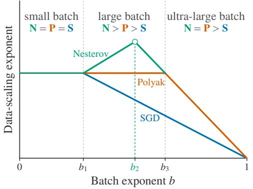

(b) Simulation  
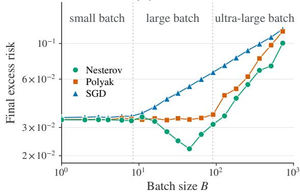  
Figure 1: Batch-size dependence of momentum benefits: Polyak enlarges the critical batch size, while Nesterov improves data eficiency. (a) Theoretical batch-size phase diagram from Theorem 6.3, showing the optimal data-scaling exponent as a function of the batch exponent $b ,$ defined by the scaling $B = D ^ { b + o ( 1 ) }$ . (b) Best-tuned final excess risk versus batch size B at fixed data budget $D = 2 ^ { 1 4 }$ and $( s , \beta ) = ( 0 . 3 , 4 )$ . The simulation recovers the same qualitative three-regime structure predicted by the theory. Experimental setup and additional results are provided in Section 7.

## 1 Introduction

Momentum has become a central mechanism in optimizer design for modern large-scale training, underlying popular optimizers such as Adam (Kingma & Ba, 2015) and Muon (Jordan et al., 2024; Liu et al., 2025). Classical theory views momentum primarily as an acceleration mechanism, quantified through reduced iteration complexity (Nesterov, 1983; Su et al., 2016; Wibisono et al., 2016; Wilson et al., 2021; Gitman et al., 2019; Velikanov et al., 2023; Wang et al., 2024; Liu & Belkin, 2018; Gupta et al., 2024). Yet iteration complexity alone does not fully capture the role of momentum in modern large-scale training, where the optimization regime itself changes as training resources, such as data and hardware memory, scale up.

Modern large-scale training, particularly language-model pretraining, often operates in a one-pass training regime (Brown et al., 2020). In this regime, the batch size B controls not only hardware parallelism but also the optimization horizon: under a fixed data budget D, the number of sequential updates is

$$
T = { \frac { D } { B } } .
$$

Larger batches improve hardware utilization and training throughput, but necessarily reduce the number of optimization steps available per data pass. This creates a fundamental tradeof between hardware eficiency and data eficiency. Indeed, recent language-model studies show that the relative advantages of diferent optimizers can change substantially with batch size, with some optimizers exhibiting markedly stronger data eficiency in the large-batch regime (Marek et al., 2026; Shah et al., 2025; Semenov et al., 2025). These observations motivate a systematic characterization of the role of momentum across batch sizes. We therefore ask:

## Question: Can momentum enable larger batches without sacrificing data eficiency, or even improve data eficiency itself ?

We address this question for two canonical momentum methods, Polyak (Polyak, 1964) and Nesterov (Nesterov, 1983), using power-law kernel (PLK) regression as a tractable learning problem. Its infinite-dimensional power-law spectrum spans a broad range of learning timescales, making the efects of momentum across spectral directions analytically accessible. The problem is characterized by two exponents: the capacity exponent $\beta > 1$ , which controls the decay of the feature spectrum, and the source exponent $s > 0 ,$ , which controls how the target-function energy is distributed across the spectrum. Related power-law settings have been widely used to understand scaling laws in large-scale training across a variety of settings (Lin et al., 2024; Bahri et al., 2024; Bordelon et al., 2025; Li et al., 2026a; Wang et al., 2026; Li et al., 2026b). Building on the functional scaling law (FSL) framework of Li et al. (2026a), we extend the analysis to momentum methods.

Our analysis of one-pass training follows the hierarchy

$$
\quad { \cal A } _ { B } \longrightarrow \mathcal { E } ( k , \eta , \rho , B ) \longrightarrow \operatorname* { m i n } _ { ( \eta , \rho ) \in \mathcal { A } _ { B } } \mathcal { E } { ( T , \eta , \rho , B ) } , \quad T = \frac { D } { B } .
$$

Here, $\mathcal { A } _ { B }$ denotes the admissible set of learning rates η and momentum factors $\rho$ at batch size $B ,$ and $\mathcal { E } ( k , \eta , \rho , B )$ denotes the expected excess risk. The three stages correspond, respectively, to 1) identifying the admissible hyperparameter region through stability analysis, 2) deriving scaling laws that characterize the risk dynamics, and 3) optimizing the final-step risk subject to both the admissibility constraint $( \eta , \rho ) \in \mathcal { A } _ { B }$ and the one-pass constraint $T = D / B$

Our contributions. Our main contributions are summarized as follows.

• Risk stability. We characterize risk stability through the critical learning rate $\eta ^ { \mathrm { c r i t } }$ , the largest learning rate for which the stochastic dynamics remain stable (Section 4). In the large-batch, high-momentum regime, we obtain the sharp scalings

$$
\eta _ { \mathrm { s g d } } ^ { \mathrm { c r i t } } \stackrel { } { \sim } 1 , \qquad \eta _ { \mathrm { p o l y a k } } ^ { \mathrm { c r i t } } \stackrel { } { \sim } \operatorname* { m i n } \{ 1 , B ( 1 - \rho ) \} , \qquad \eta _ { \mathrm { n e s t e r o v } } ^ { \mathrm { c r i t } } \stackrel { } { \sim } \operatorname* { m i n } \{ 1 , B ^ { \beta } ( 1 - \rho ) \} .\tag{1}
$$

Thus, stronger momentum requires a correspondingly larger batch to maintain stability. This compensation scales as $B$ for Polyak but as $B ^ { \beta }$ for Nesterov. Since $\beta > 1$ , Nesterov permits substantially higher momentum in large-batch training.

• Scaling laws for risk dynamics. Within the risk-stable region, we derive sharp scaling laws for the risk dynamics of Polyak and Nesterov (Section 5). In the high-momentum regime, the risk transitions from an early exponential transient to power-law decay and eventually saturates at a noise floor. Writing $\eta _ { \rho } : = \eta / ( 1 - \rho )$ , after the transient the dominant terms take the simple form

$$
\mathcal { E } _ { \mathrm { s g d } } ( \boldsymbol { k } ) \approx ( k \eta ) ^ { - s } + \frac { \sigma ^ { 2 } \eta } { B } , \qquad \mathcal { E } _ { \mathrm { p o l y a k } } ( \boldsymbol { k } ) \stackrel { } { \sim } ( k \eta _ { \rho } ) ^ { - s } + \frac { \sigma ^ { 2 } \eta _ { \rho } } { B } ,
$$

while Nesterov retains the same accelerated signal term but reduces the noise floor to

$$
\mathcal { E } _ { \mathrm { n e s t e r o v } } ( k ) \approx ( k \eta _ { \rho } ) ^ { - s } + \frac { \sigma ^ { 2 } } { B } \operatorname* { m i n } \{ \eta _ { \rho } , \eta _ { \rho } ^ { 1 / \beta } \} .
$$

Thus, Polyak preserves the SGD signal–noise tradeof while operating at the enlarged efective learning rate $\eta _ { \rho } ,$ whereas Nesterov further suppresses noise accumulation at large $\eta _ { \rho }$ through the curvature-adaptive damping induced by its look-ahead mechanism.

• Data scaling and batch-size phase diagram. Let $B = D ^ { b + o ( 1 ) }$ Optimizing the remaining hyperparameters yields three characteristic batch exponents $b _ { 1 } < b _ { 2 } < b _ { 3 }$ and a three-regime phase diagram (Section 6). For $b \leqslant b _ { 1 }$ , SGD, Polyak, and Nesterov achieve the same data-scaling exponent. For $b _ { 1 } < b < b _ { 3 }$ , Nesterov outperforms Polyak, which in turn outperforms SGD, with Nesterov attaining its best data-scaling rate at $b = b _ { 2 }$ . For $b \geqslant b _ { 3 }$ , Polyak and Nesterov again share the same exponent and both outperform SGD. Here $b _ { 1 }$ and $b _ { 3 }$ mark the critical batch exponents of SGD and Polyak, respectively, showing that Polyak preserves the best small-batch scaling over a substantially wider batch-size range, while Nesterov further improves the achievable data-scaling rate within the large batch regime. Figure 1 provides a complete view of how the relative advantage of the three methods evolves with batch size.

Finally, Section 7 empirically validates these theoretical predictions.

Why momentum helps large-batch training. The batch-size dependence of momentum can be understood through the per-sample efective learning rate (ELR),

$$
\eta _ { \mathrm { s a m p l e } } : = \frac { \eta _ { \mathrm { e f f } } } { B } , \qquad \eta _ { \mathrm { e f f } } = \left\{ \eta , \qquad \mathrm { S G D } , \qquad \right.
$$

Ignoring the early transient and using $T = D / B$ , SGD and Polyak obey the same data-level signal–noise tradeof,

$$
\mathscr { E } ( D ) \lesssim ( D \eta _ { \mathrm { s a m p l e } } ) ^ { - s } + \sigma ^ { 2 } \eta _ { \mathrm { s a m p l e } } .
$$

The diference is the admissible range of the per-sample ELR. Stability condition (1) gives $\eta _ { \mathrm { s a m p l e } } \lesssim 1 / B$ for SGD, whereas Polyak allows $\eta _ { \mathrm { s a m p l e } } \lesssim 1$ . Thus, as the batch size grows, the admissible per-sample ELR of SGD shrinks as $1 / B$ , while Polyak can keep it at order one by increasing $\eta _ { \rho }$ proportionally with B. Polyak therefore extends the SGD signal–noise tradeof to substantially larger batch sizes without changing its optimum, explaining both the enlarged critical batch size and the unchanged best data-scaling exponent.

Nesterov changes the picture more fundamentally. Its look-ahead mechanism suppresses noise accumulation at large efective learning rates, improving the signal–noise tradeof itself and thereby achieving better data eficiency in the large-batch regime. At ultra-large batch sizes, however, the limited number of sequential updates $T = D / B$ becomes the dominant bottleneck, and the two momentum methods recover the same signal-limited scaling.

## 2 Related work

Theory of momentum. Classical analyses explain momentum through accelerated convergence, Lyapunov functions, and continuous-time analysis (Nesterov, 1983; Su et al., 2016; Wibisono et al., 2016; Wilson et al., 2021; Shi et al., 2022; Kovachki & Stuart, 2021). Under stochastic training, subsequent work has studied convergence, stability, and asymptotic behavior (Vidyasagar, 2025; Liu et al., 2020; Yuan et al., 2016; Gitman et al., 2019; Velikanov et al., 2023; Zhang et al., 2024). However, existing theory does not characterize how the role of momentum changes with batch size under a fixed data budget. We instead treat batch size as a scaling variable and compare Polyak and Nesterov across the resulting training regimes.

Scaling-law theory. Scaling laws characterize how learning performance scales with resources such as data, model, and compute (Hestness et al., 2017; Kaplan et al., 2020; Hofmann et al., 2022; Grattafiori et al., 2024; DeepSeek-AI et al., 2026). A growing theoretical literature has derived such laws in linear, kernel, and related tractable models (Sharma & Kaplan, 2022; Hutter, 2021; Maloney et al., 2022; Wei et al., 2022; Jain et al., 2024; Michaud et al., 2023; Nam et al., 2024; Atanasov et al., 2026; Bahri et al., 2024; Dohmatob et al., 2024; Bordelon et al., 2024; Lin et al., 2024; Paquette et al., 2024; Bordelon et al., 2025; Yan et al., 2026; Lin et al., 2025; Sous & Winer, 2026; Li et al., 2026a; Zhang et al., 2025; Wang et al., 2026; Li et al., 2026b; Ding et al., 2025). Functional scaling laws further characterize risk dynamics through signal learning and noise accumulation (Li et al., 2026a). We extend this framework to momentum methods. Closely related, Ferbach et al. (2026a) study momentum scaling laws in noiseless power-law random features with fixed batch size, showing that Polyak preserves the SGD scaling exponents while dimension- and time-adapted Nesterov-type methods can improve them. We instead consider constant-order label noise and scale the batch size under a fixed data budget, obtaining a batch-size phase diagram for canonical Polyak and Nesterov momentum.

Stability of gradient-based methods. Stability characterizes the admissible hyperparameter region and has been studied extensively for gradient-based methods, with connections to implicit bias, generalization, and optimization geometry (Zhu et al., 2019; Wu et al., 2018; Nar & Sastry, 2018; Ma & Ying, 2021; Wu et al., 2022; Wu & Su, 2023; Chemnitz & Engel, 2025; Mulayof et al., 2021; Nacson et al., 2023; Qiao et al., 2024; Kaur et al., 2023; Wang & Wu, 2023). For momentum methods, its joint dependence on batch size and momentum remains less understood. We derive sharp risk stability boundaries for Polyak and Nesterov, revealing a much stronger batch-size compensation for high momentum in Nesterov.

Concurrent work. Morwani et al. (2026), which appeared while this manuscript was in preparation, studies batch-size tradeofs for stochastic momentum in finite-dimensional linear regression and derives lower bounds on contraction rates. These bounds suggest that heavy-ball may retain data eficiency over a larger batch-size range, but matching upper bounds are left open. In contrast, we derive sharp scaling laws for the full risk dynamics and, after optimizing the learning rate and momentum factor, obtain the data-scaling exponent as an explicit function of batch size. This yields a complete batch-size phase diagram, including a large-batch regime in which Nesterov outperforms Polyak.

## 3 Preliminaries

Notation. In this paper, we use ≂ to denote equivalence up to a constant factor, and $\lesssim$ (resp. ≳) indicates inequality up to a constant factor. For two non-negative functions $f , g .$ we write $f ( x ) \lesssim g ( x )$ (resp. $f ( x ) \gtrsim g ( x ) )$ ) if there exists a constant $C > 0$ such that $f ( x ) \leqslant C g ( x )$ (resp. $g ( x ) \leqslant C f ( x ) )$ for all x under consideration. We write $f ( x ) \stackrel { } { \sim } g ( x )$ if both $f ( x ) \lesssim g ( x )$ and $f ( x ) \gtrsim g ( x )$ hold. Throughout the paper, $\langle \cdot , \cdot \rangle$ and $\lVert \cdot \rVert _ { 2 }$ denote the standard inner product and the associated 2-norm, respectively.

## 3.1 Power-law kernel regression

We consider a power-law kernel (PLK) regression on a Hilbert space H with the input $\mathbf { x } \sim \mathcal { D }$ , and the observed label is $y = \langle \phi ( \mathbf { x } ) , \pmb \theta ^ { * } \rangle + \epsilon$ , where $\epsilon \sim \mathcal { N } ( 0 , \sigma ^ { 2 } )$ is independent of x. Here we assume the feature function $\phi ( \mathbf { x } )$ to be Gaussian: $\phi ( \mathbf { x } ) \sim \mathcal { N } ( 0 , \mathbf { H } )$ , where $\mathbf { H } = \mathbb { E } _ { \mathbf { x } \sim \mathcal { D } } [ \phi ( \mathbf { x } ) \otimes \phi ( \mathbf { x } ) ]$ denotes the feature covariance operator. Let $\{ \lambda _ { j } \} _ { j \geqslant 1 }$ denote the eigenvalues of H, arranged in decreasing order. We learn the target function using the linear student model $f ( \mathbf { x } ; \pmb \theta ) = \langle \phi ( \mathbf { x } ) , \pmb \theta \rangle$ by minimizing the population risk: $\begin{array} { r } { \mathcal { R } ( \pmb { \theta } ) = \frac { 1 } { 2 } \mathbb { E } _ { \mathbf { x } , y } \left[ ( f ( \mathbf { x } ; \pmb { \theta } ) - y ) ^ { 2 } \right] } \end{array}$ . A direct calculation gives $\begin{array} { r } { \mathcal { R } ( \pmb { \theta } ) = \mathcal { E } ( \pmb { \theta } ) + \frac { \sigma ^ { 2 } } { 2 } } \end{array}$ , where $\begin{array} { r } { \mathcal { E } ( \pmb { \theta } ) = \frac { 1 } { 2 } \langle \pmb { \theta } - \pmb { \theta } ^ { * } , \mathbf { H } ( \pmb { \theta } - \pmb { \theta } ^ { * } ) \rangle } \end{array}$ is the excess risk.

Since SGD, Polyak momentum, and Nesterov momentum are orthogonally equivariant, we work in the eigenbasis of the covariance operator without loss of generality; see Appendix A.2.

Assumption 3.1 (Diagonal covariance). The covariance operator is diagonal:

$$
{ \bf H } = \mathrm { d i a g } ( \lambda _ { 1 } , \lambda _ { 2 } , . . . . ) , \qquad \lambda _ { 1 } \geqslant \lambda _ { 2 } \geqslant \cdot \cdot \cdot > 0 .\tag{2}
$$

Throughout, we focus on the label-noise-dominated setting with a constant-order noise level.

Assumption 3.2 (Constant-order label noise). Assume $\sigma \stackrel { } { \sim } 1$

Assumption 3.3 (Source and capacity conditions). There exist $\beta > 1$ and $s > 0$ such that

$$
\lambda _ { j } \approx j ^ { - \beta } , \quad \lambda _ { j } | \theta _ { j } ^ { * } | ^ { 2 } \approx j ^ { - ( 1 + s \beta ) } .
$$

Here $\beta$ is the capacity exponent, which controls the decay rate of the feature spectrum, and s is the source exponent, which describes how the target energy decays across spectral directions. We also refer to s as the relative dificulty of the task: smaller s means that more target energy lies in low-curvature, small-eigenvalue directions, making the problem harder to learn. We remark that similar assumptions have been widely used in the analysis of kernel methods (Caponnetto & Vito, 2005; Caponnetto & De Vito, 2007; Spigler et al., 2020; Bordelon et al., 2020; Maloney et al., 2022). Our work builds upon and extends this line of research.

## 3.2 Optimization methods

At each step, we draw a fresh mini-batch $\mathcal { B } _ { k } ~ = ~ \{ ( \mathbf { x } _ { k , i } , y _ { k , i } ) \} _ { i = 1 } ^ { B }$ and denote the mini-batch gradient by $\begin{array} { r } { \mathbf { g } ( \pmb { \theta } ; \mathcal { B } _ { k } ) = \nabla _ { \pmb { \theta } } ( \frac { 1 } { 2 B } \sum _ { ( \mathbf { x } , y ) \in \mathcal { B } _ { k } } ( f ( \mathbf { x } ; \pmb { \theta } ) - y ) ^ { 2 } ) } \end{array}$ . SGD updates as follows

$$
\begin{array} { r l r } { \mathrm { S G D } \colon } & { { } } & { \pmb { \theta } _ { k + 1 } = \pmb { \theta } _ { k } - \eta \mathbf { g } ( \pmb { \theta } _ { k } ; \pmb { \mathcal { B } } _ { k } ) , } \end{array}\tag{3}
$$

where $\eta$ is the learning rate. Polyak momentum, also called the heavy-ball method, is given by

Polyak:

$$
\pmb { \theta } _ { k + 1 } = \pmb { \theta } _ { k } - \eta \mathbf { g } ( \pmb { \theta } _ { k } ; \pmb { \mathcal { B } } _ { k } ) + \rho ( \pmb { \theta } _ { k } - \pmb { \theta } _ { k - 1 } ) ,\tag{4}
$$

where $\rho \in [ 0 , 1 )$ is the momentum factor. Nesterov momentum difers from Polyak momentum by evaluating the gradient at a look-ahead point:

Nesterov:

$$
\pmb { \theta } _ { k } ^ { \mathrm { l a } } = \pmb { \theta } _ { k } + \rho ( \pmb { \theta } _ { k } - \pmb { \theta } _ { k - 1 } ) \qquad \mathrm { ( l o o k ~ a h e a d ) }
$$

$$
\pmb { \theta } _ { k + 1 } = \pmb { \theta } _ { k } - \eta \mathbf { g } ( \pmb { \theta } _ { k } ^ { \mathrm { l a } } ; \mathcal { B } _ { k } ) + \rho ( \pmb { \theta } _ { k } - \pmb { \theta } _ { k - 1 } ) ,\tag{5}
$$

where $\theta _ { k } ^ { \mathrm { l a } }$ is the look-ahead point obtained by extrapolating the current iterate along the previous update direction. This look-ahead mechanism distinguishes Nesterov from Polyak.

For clarity, we decompose $\mathbf { g } ( \pmb \theta ; \mathcal { B } _ { k } ) = \nabla \mathcal { R } ( \pmb \theta ) + \pmb \xi _ { k } ( \pmb \theta )$ , where $\nabla \mathcal { R } ( \theta )$ denotes the population gradient and $\xi _ { k } ( \theta )$ represents the stochastic gradient noise satisfying

$$
\mathbb { E } [ \pmb { \xi } _ { k } ( \pmb { \theta } ) \mid \pmb { \theta } ] = \mathbf { 0 } , \qquad \mathbb { E } [ \pmb { \xi } _ { k } ( \pmb { \theta } ) \otimes \pmb { \xi } _ { k } ( \pmb { \theta } ) \mid \pmb { \theta } ] = \frac { 1 } { B } \pmb { \Sigma } ( \pmb { \theta } ) ,
$$

where $\Sigma ( \pmb \theta )$ denotes the gradient-noise covariance of batch size 1. We next recall a noise–curvature alignment property that will be used throughout our analysis.

Proposition 3.4 (Noise–curvature alignment). For any unit vector $\nu \in \mathcal H$

$$
\mathbb { E } \Big [ | \langle \pmb { \xi } _ { k } ( \pmb { \theta } _ { k } ) , \pmb { \nu } \rangle | ^ { 2 } \Big | \pmb { \theta } _ { k } \Big ] \approx \frac { 1 } { B } \big ( \pmb { \xi } ( \pmb { \theta } _ { k } ) + \sigma ^ { 2 } \big ) \langle \pmb { \nu } , \mathbf { H } \pmb { \nu } \rangle .\tag{6}
$$

Here, $\langle \nu , \mathbf { H } \nu \rangle$ is the curvature along ν. The two terms in Proposition 3.4 have distinct origins and roles. The term proportional to $\mathcal { E } ( \pmb { \theta } _ { k } )$ arises from mini-batch sampling, depends on the current iterate, and vanishes at the optimum, acting as multiplicative noise. The term proportional to $\sigma ^ { 2 }$ arises from label noise and persists at the optimum, acting as additive noise. Both are curvature-aligned but afect the dynamics diferently: multiplicative noise feeds back into the dynamics and determines stability, whereas additive noise determines the asymptotic noise floor. This noise–curvature alignment has been observed in neural networks (Zhu et al., 2019; Wu et al., 2022) and established rigorously in toy models (Wang & Wu, 2023). We use this constitutive relation throughout our analysis; see Appendix A.4 for a proof.

## 3.3 Regime-dependent damping in momentum methods

Consider the full-batch Polyak on a one-dimensional quadratic function $f ( x ) = \lambda x ^ { 2 } / 2$ , where $\lambda > 0$ denotes the curvature. Since $\nabla f ( x ) = \lambda x$ , Polyak updates:

$$
x _ { k + 1 } = x _ { k } - \eta \lambda x _ { k } + \rho ( x _ { k } - x _ { k - 1 } ) .\tag{7}
$$

The corresponding characteristic polynomial is $r ^ { 2 } - ( 1 + \rho -$ $\eta \lambda ) r + \rho = 0$ . The relevant transition from real to complex roots occurs at $\eta \lambda = ( 1 - \sqrt { \rho } ) ^ { 2 }$

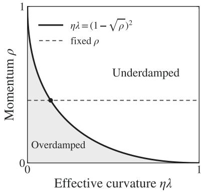

For fixed $\eta$ and $\rho ,$ diferent curvature directions can exhibit two qualitatively diferent damping behaviors.

• Overdamped regime: $\lambda \eta < ( 1 - \sqrt { \rho } ) ^ { 2 }$ . In this regime, the characteristic roots $r _ { \pm }$ are real with the dominant root satisfying $\begin{array} { r } { r _ { + } \approx 1 - \frac { \eta \lambda } { 1 - \rho } } \end{array}$ when $1 - \rho = o ( 1 )$ . Hence, for suficiently large $k ,$ it holds that

$$
x _ { k } = c _ { + } r _ { + } ^ { k } + c _ { - } r _ { - } ^ { k } \approx c _ { + } r _ { + } ^ { k } \approx c _ { + } \exp \left( - \frac { \eta \lambda } { 1 - \rho } k \right) ,
$$

where $c _ { \pm }$ depend on the initialization. Hence, its update behaves like gradient descent with the momentum-rescaled learning rate $\eta _ { \rho } = \eta / ( 1 - \rho )$

• Underdamped regime: λη $> ~ ( 1 ~ - ~ \sqrt { \rho } ) ^ { 2 }$ . In this regime, the characteristic roots form a complex-conjugate pair with modulus ${ \sqrt { \rho } } .$ . The iterate therefore has the form $x _ { k } = \rho ^ { k / 2 } \bigl [ c _ { 1 } \cos ( k \omega ) + c _ { 2 } \sin ( k \omega ) \bigr ]$ , where $c _ { 1 } , c _ { 2 }$ , and ω depend on the initialization and curvature. Thus, the iterate exhibits oscillatory convergence to zero, with the amplitude decaying as $\rho ^ { k / 2 }$

The key diference between the two regimes lies in how curvature afects the dynamics. In the overdamped regime, the decay rate $\eta \lambda / ( 1 - \rho )$ is proportional to the curvature, so flatter directions converge more slowly. In the underdamped regime, the oscillation frequency depends on the curvature, but the amplitude envelope $\rho ^ { k / \bar { 2 } }$ does not.

Nesterov look-ahead induces curvature-adaptive damping. On the same quadratic objective, Nesterov updates using the gradient at the look-ahead point $x _ { k } ^ { \mathrm { l a } } = x _ { k } + \rho ( x _ { k } - x _ { k - 1 } ) \mathrm { . }$

$$
\begin{array} { r l } & { x _ { k + 1 } = x _ { k } - \eta \lambda [ x _ { k } + \rho ( x _ { k } - x _ { k - 1 } ) ] + \rho ( x _ { k } - x _ { k - 1 } ) } \\ & { \qquad = x _ { k } - \eta \lambda x _ { k } + \rho ( 1 - \eta \lambda ) ( x _ { k } - x _ { k - 1 } ) , } \end{array}\tag{8}
$$

which is equivalent to Polyak with the momentum factor $\rho ( 1 - \eta \lambda )$ . For an underdamped direction, it accelerates convergence: $\rho ^ { k / 2 } \to [ \rho ( 1 - \eta \lambda ) ] ^ { k / 2 }$ , which damps sharper directions more rapidly. By contrast, in suficiently flat directions where $\eta \lambda \ll 1$ , we have $\rho ( 1 - \eta \lambda ) \approx \rho _ { ; }$ and Nesterov retains approximately the same dynamics as Polyak.

Remark 3.5 (Spectral decomposition into damping regimes). For a fixed pair $( \eta , \rho )$ , the damping threshold $\begin{array} { r } { \lambda _ { \mathrm { c u t } } : = \frac { ( 1 - \sqrt { \rho } ) ^ { 2 } } { \eta } } \end{array}$ partitions the spectrum into two parts. Directions with $\lambda _ { j } > \lambda _ { \mathrm { { c u t } } }$ are underdamped, whereas directions with $\lambda _ { j } < \lambda _ { \mathrm { c u t } }$ are overdamped. Hence, in PLK regression, the risk dynamics can be analyzed by treating the underdamped spectral head and overdamped spectral tail separately and then combining their contributions.

## 4 Risk stability and critical learning rates

In this section, we characterize the maximal learning rates that ensure stable training and study their dependence on the momentum factor and batch size. We measure stability directly through the population risk.

Definition 4.1 (Risk stability). Consider a stochastic optimization algorithm for minimizing a population risk $\mathcal { R } ( \cdot )$ , producing model parameters $\{ \theta _ { k } \} _ { k \geqslant 0 }$ . We say that the algorithm is risk stable if, for every admissible initialization with finite population risk,

$$
\operatorname* { s u p } _ { k \geq 0 } \mathbb { E } [ \mathcal { R } ( \theta _ { k } ) ] < \infty .
$$

Definition 4.2 (Critical learning rate). Consider a stochastic optimization algorithm A parameterized by a learning rate η and additional hyperparameters h. For fixed h, let

$$
\eta _ { \mathcal { A } } ^ { \mathrm { c r i t } } ( { \bf h } ) : = \operatorname* { s u p } \left\{ \eta > 0 : \mathcal { A } \mathrm { i s } \mathrm { r i s k } \mathrm { s t a b l e } \right\} .
$$

Hence, the critical learning rate is the largest learning rate compatible with risk stability. When the dependence on h is clear from context, we simply write $\eta _ { A } ^ { \mathrm { c r i t } }$ . In our setting, $\mathbf { h } = B$ for SGD and $\mathbf { h } = ( B , \rho )$ for Polyak and Nesterov. The following theorem characterizes how the critical learning rate scales with batch size and momentum; the proof is deferred to Appendix B.

Theorem 4.3 (Critical learning-rate scaling). For suficiently large B and suficiently small $1 - \rho ,$ the critical learning rates satisfy

$$
\eta _ { \mathrm { s g d } } ^ { \mathrm { c r i t } } \approx 1 ,\tag{9}
$$

$$
\eta _ { \mathrm { p o l y a k } } ^ { \mathrm { c r i t } } \approx \mathrm { m i n } \{ 1 , B ( 1 - \rho ) \} ,\tag{10}
$$

$$
\eta _ { \mathrm { n e s t e r o v } } ^ { \mathrm { c r i t } } \approx \operatorname* { m i n } \{ 1 , B ^ { \beta } ( 1 - \rho ) \} ,\tag{11}
$$

where the implicit constants are independent of B and $\rho .$

Joint dependence on momentum and batch size. Theorem 4.3 reveals a direct coupling among the learning rate, momentum factor, and batch size in determining training stability. Increasing $\rho$ toward one reduces the critical learning rate, whereas increasing the batch size enlarges it. In the high-momentum regime, $\eta _ { \mathrm { p o l y a k } } ^ { \mathrm { c r i t } } \approx B ( 1 - \rho ) , \eta _ { \mathrm { n e s t e r o v } } ^ { \mathrm { c r i t } } \approx B ^ { \beta } ( 1 - \rho )$ , before reaching their order-one ceilings. Thus, the batch-size efect on stability is substantially stronger for Nesterov, with a $B ^ { \beta }$ dependence rather than the B dependence of Polyak. This diference originates from the curvature adaptivity induced by Nesterov’s look-ahead mechanism.

Multiplicative-noise feedback governs stability through the renewal kernel. For all three methods, Appendix B shows that the risk dynamics admit, up to constant factors, a renewal equation $\begin{array} { r } { \ell _ { k } \approx h _ { k } + \sum _ { i = 0 } ^ { k - 1 } K _ { k - 1 - j } \big ( \ell _ { j } + \sigma ^ { 2 } \big ) } \end{array}$ , where $\ell _ { k }$ is the risk moment, $h _ { k }$ is the free response, and the renewal kernel K describes how stochastic perturbations propagate through the optimizer dynamics. Additive and multiplicative noise play diferent roles: additive label noise acts only as an external forcing, whereas multiplicative noise feeds the current risk back through the renewal kernel, producing the feedback term $K * \ell .$ Risk stability is therefore determined by the strength of this feedback, characterized by $\| K \| _ { 1 } < 1 ;$ see Appendix B.1. Since K is independent of the label-noise scale $\sigma _ { \mathrm { : } }$ , the stability condition in Theorem 4.3 is also independent of $\sigma .$

## 5 Scaling laws for risk dynamics across damping regimes

In this section, we derive sharp scaling laws for the full risk dynamics of Polyak and Nesterov, explicitly characterizing their joint dependence on the hyperparameters $( \eta , \rho , B )$ . The analysis follows how increasing $\rho$ drives transitions in damping and stability: from a fully overdamped regime with SGD-like dynamics, to a mixed-damping regime, and eventually to instability.

As discussed in Section 3.3, for a single eigendirection with curvature λ, the overdamped–underdamped transition occurs exactly at $( 1 - \sqrt { \rho } ) ^ { 2 } = \eta \lambda$ . For the scaling analysis below, where $\rho  1$ , we use the equivalent high-momentum form $\eta \lambda \gtrsim ( 1 - \rho ) ^ { 2 }$ . This motivates the curvature cutof

$$
\lambda _ { \mathrm { c u t } } = \frac { ( 1 - \rho ) ^ { 2 } } { \eta } , \qquad \mathbb { I } _ { \mathrm { o v e r } } = \{ j : \lambda _ { j } \leqslant \lambda _ { \mathrm { c u t } } \} , \qquad \mathbb { I } _ { \mathrm { u n d e r } } = \{ j : \lambda _ { j } \stackrel { } { \sim } \lambda _ { \mathrm { c u t } } \} .
$$

Hence, the sets $\mathbb { I } _ { \mathrm { o v e r } }$ and $\mathbb { I } _ { \mathrm { u n d e r } }$ consist of flat overdamped directions and sharp underdamped directions, respectively. Since the PLK spectrum contains arbitrarily small eigenvalues, overdamped directions always remain present.

As $\rho$ increases, the first underdamped directions appear when $\lambda _ { \mathrm { c u t } } \lesssim \lambda _ { 1 }$ , corresponding to

$$
1 - \rho \approx { \sqrt { \eta } } .
$$

Combining this damping threshold with the risk stability conditions from Section 4 yields three regimes:

fully overdamped:

mixed damping:

$$
\begin{array} { r l } & { 1 - \rho \gtrsim \sqrt { \eta } , } \\ & { \eta / B ^ { q } \lesssim 1 - \rho \lesssim \sqrt { \eta } , } \\ & { 1 - \rho \lesssim \eta / B ^ { q } , } \end{array} \quad \quad q = \left\{ \begin{array} { l l } { 1 , \quad \mathrm { P o l y a k } , } \\ { \beta , \quad \mathrm { N e s t e r o v } . } \end{array} \right.
$$

unstable:

Thus, the damping threshold $1 - \rho \stackrel { = } { \sim } \sqrt { \eta }$ and the risk stability threshold $1 - \rho \stackrel { } { \sim } \eta / B ^ { q }$ delimit the three regimes.

For reference, the SGD scaling law for PLK regression is

$$
\mathbb { E } [ \mathcal { E } ( \pmb { \theta } _ { k } ) ] \approx ( \eta k ) ^ { - s } + \frac { \sigma ^ { 2 } } { B } \eta , \qquad k \eta \gtrsim 1 .\tag{12}
$$

This follows from Li et al. (2026a, Theorem 5.2); see Appendix C for details. The first term, $( \eta k ) ^ { - s }$ , describes signal learning, with the decay rate determined by the source exponent s:

larger s corresponds to an easier target and faster learning. The second term, $\sigma ^ { 2 } \eta / B$ , captures stochastic noise accumulation and determines the asymptotic noise floor.

The overdamped modes evolve with the rescaled learning rate

$$
\eta _ { \rho } : = \frac { \eta } { 1 - \rho } ,
$$

which plays the role of the efective learning rate for momentum. The following theorem establishes the scaling law for Polyak momentum, whose proof is deferred to Appendix D.

Theorem 5.1 (Scaling law for Polyak). Assume $\eta \lesssim 1$ and $k \gtrsim$ max $( \eta _ { \rho } ^ { - 1 } , ( 1 - \rho ) ^ { - 1 } )$ . Then

$$
\begin{array} { r } { \mathbb { E } [ \mathcal { E } ( \theta _ { k } ) ] \stackrel { = } \left\{ \begin{array} { l l } { ( \eta _ { \rho } k ) ^ { - s } + \displaystyle \frac { \sigma ^ { 2 } } { B } \eta _ { \rho } , } & { 1 - \rho \gtrsim \sqrt { \eta } , } \\ { P ( k ) + ( \eta _ { \rho } k ) ^ { - s } + \displaystyle \frac { \sigma ^ { 2 } } { B } \eta _ { \rho } , } & { \displaystyle \frac { \eta } { B } \lesssim 1 - \rho \lesssim \sqrt { \eta } , } \end{array} \right. } \end{array}\tag{13}
$$

where $P ( k )$ denotes the underdamped transient and satisfies $0 \leqslant P ( k ) \leqslant \rho ^ { k } . { \mathrm { ~ I f ~ } } 1 - \rho \leqslant \eta / B$ the dynamics are not risk stable.

Theorem 5.1 identifies three regimes as $\rho$ increases: fully overdamped SGD-like dynamics with efective learning rate $\eta _ { \rho } .$ , mixed damping with an additional transient $P ( k )$ , and eventually risk instability. In the mixed-damping regime, the two risk contributions have a direct spectral interpretation. The power-law term $( \eta _ { \rho } k ) ^ { - s }$ arises from the overdamped flat modes in $\mathbb { I } _ { \mathrm { o v e r } } ,$ whereas $P ( k )$ comes from the underdamped sharp modes in $\mathbb { I } _ { \mathrm { u n d e r } }$ and decays with envelope $\rho ^ { k }$ Increasing $\rho$ therefore accelerates flat-mode learning through $\eta _ { \rho } ,$ while slowing the relaxation of sharp modes. Since $\rho ^ { k } \approx \exp ( - ( 1 - \rho ) k )$ , the latter occurs on the timescale

$$
\tau _ { \rho } : = \frac { 1 } { 1 - \rho } \log \left( \frac { \eta } { ( 1 - \rho ) ^ { 2 } } \right) .
$$

Once the underdamped transient becomes negligible, the Polyak risk law reduces to the SGD law under the replacement $\eta \mapsto \eta _ { \rho } .$ leaving the signal–noise tradeof unchanged. The distinction lies in the admissible efective learning rate. By Theorem 4.3, SGD requires $\eta \lesssim 1$ , whereas Polyak allows $\begin{array} { r } { \eta _ { \rho } \lesssim B , } \end{array}$ so its admissible range grows linearly with the batch size. As we show in Section 6, this enlarged range increases the critical batch size but does not improve the best data-scaling exponent.

For Nesterov, the same damping structure persists, but its look-ahead mechanism modifies both the underdamped transient and noise accumulation in the mixed-damping regime.

Theorem 5.2 (Scaling law for Nesterov). Assume $\eta < 1$ and $k \gtrsim \operatorname* { m a x } ( \eta _ { \rho } ^ { - 1 } , ( 1 - \rho ) ^ { - 1 } )$ . Then

$$
\mathbb { E } [ \mathcal { E } ( \pmb { \theta } _ { k } ) ] \approx \left\{ \begin{array} { l l } { \displaystyle ( \eta _ { \rho } k ) ^ { - s } + \frac { \sigma ^ { 2 } } { B } \eta _ { \rho } , } & { 1 - \rho \gtrsim \sqrt { \eta } , } \\ { \displaystyle N ( k ) + ( \eta _ { \rho } k ) ^ { - s } + \frac { \sigma ^ { 2 } } { B } \operatorname* { m i n } \{ \eta _ { \rho } , \eta _ { \rho } ^ { 1 / \beta } \} , } & { \displaystyle \frac { \eta } { B ^ { \beta } } \lesssim 1 - \rho \lesssim \sqrt { \eta } , } \end{array} \right.\tag{14}
$$

where $N ( k )$ denotes the underdamped transient and satisfies $0 \leqslant N ( k ) \leqslant \operatorname* { m i n } \{ 1 , ( \eta k ) ^ { - s } \} \rho ^ { k }$ If 1 − $\rho \lesssim \eta / B ^ { \beta }$ , the dynamics are not risk stable.

The proof is deferred to Appendix E. In the fully overdamped regime, Nesterov and Polyak obey the same scaling law, both behaving like SGD with efective learning rate $\eta _ { \rho } .$ Their diference in the mixed-damping regime stems from the curvature-adaptive damping induced by Nesterov’s look-ahead mechanism, which damps sharper directions more strongly; see Eq. (8).

This suppresses the underdamped transient from

$$
P ( k ) \lesssim \rho ^ { k } \qquad \mathrm { t o } \qquad N ( k ) \lesssim \mathrm { m i n } \{ 1 , ( \eta k ) ^ { - s } \} \rho ^ { k } ,
$$

while leaving the asymptotic power-law signal term unchanged at $( \eta _ { \rho } k ) ^ { - s }$ . The same mechanism also suppresses stochastic noise accumulation. When $\eta _ { \rho } \gg 1$ , the noise floor scales as

$$
\frac { \sigma ^ { 2 } } { B } \eta _ { \rho } \qquad \mathrm { f o r ~ P o l y a k , } \qquad \frac { \sigma ^ { 2 } } { B } \eta _ { \rho } ^ { 1 / \beta } \qquad \mathrm { f o r ~ N e s t e r o v . }
$$

For asymptotic data scaling, this reduction in noise accumulation is the key efect.

## 6 Optimal data scaling across batch-size regimes

We now optimize the final-step risk using the scaling laws derived above, subject to the one-pass constraint $T = D / B$ and the stability constraints. We focus on the large-batch setting, allowing B to grow with the data budget D rather than remain fixed.

Definition 6.1 (Batch-size exponent). For a sequence of training problems with $D \to \infty$ , the batch size has exponent $b \in [ 0 , 1 )$ if

$$
B = D ^ { b + o ( 1 ) } , \qquad \mathrm { e q u i v a l e n t l y } \qquad b = \operatorname* { l i m } _ { D \to \infty } \frac { \log B } { \log D } .
$$

Definition 6.2 (Batch-size-dependent data-scaling exponent). Fix $b \in \lbrack 0 , 1 )$ , so that $B =$ $D ^ { b + o ( 1 ) }$ and $T = D / B$ . For an optimization method with admissible hyperparameter region $\mathcal { A } _ { B }$ , define its optimal data-scaling exponent $r ( b )$ by

$$
\operatorname* { i n f } _ { ( \eta , \rho ) \in \mathcal { A } _ { B } } \mathbb { E } [ \mathcal { E } ( \pmb { \theta } _ { T } ) ] = D ^ { - r ( b ) + o ( 1 ) } .
$$

Here, $\rho$ is omitted for SGD. For the three methods considered, we write $r _ { \mathrm { s g d } } ( b ) , r _ { \mathrm { p o l y a k } } ( b )$ 2 and $r _ { \mathrm { n e s t e r o v } } ( b )$ . A larger $r ( b )$ indicates better data eficiency at batch-size exponent b.

Define the three transition exponents

$$
b _ { 1 } = \frac { s } { s + 1 } , \qquad b _ { 2 } = \frac { 2 s + 1 / \beta } { 2 s + 1 + 1 / \beta } , \qquad b _ { 3 } = \frac { 2 s + 1 } { 2 s + 2 } .\tag{15}
$$

Since $\beta > 1$ and $s > 0 , 0 < b _ { 1 } < b _ { 2 } < b _ { 3 } < 1$ . The following theorem gives the optimal data-scaling exponents across batch-size regimes; the proof is deferred to Appendix F.

Theorem 6.3 (Batch-size-dependent data scaling). For $B = D ^ { b + o ( 1 ) }$ with $b \in [ 0 , 1 )$ ,

$$
\begin{array} { r } { r _ { \mathrm { s g d } } ( b ) = \left\{ \begin{array} { l l } { \frac { s } { s + 1 } , } & { 0 \leqslant b < b _ { 1 } , } \\ { s ( 1 - b ) , } & { b _ { 1 } \leqslant b < 1 , } \end{array} \right. \quad \quad r _ { \mathrm { p o l y a k } } ( b ) = \left\{ \begin{array} { l l } { \frac { s } { s + 1 } , } & { 0 \leqslant b < b _ { 3 } , } \\ { 2 s ( 1 - b ) , } & { b _ { 3 } \leqslant b < 1 , } \end{array} \right. } \end{array}
$$

and

$$
r _ { \mathrm { n e s t e r o v } } ( b ) = \left\{ \begin{array} { l l } { \frac { s } { s + 1 } , } & { 0 \leqslant b < b _ { 1 } , } \\ { \frac { s ( 1 + ( \beta - 1 ) b ) } { s \beta + 1 } , } & { b _ { 1 } \leqslant b < b _ { 2 } , } \\ { 2 s ( 1 - b ) , } & { b _ { 2 } \leqslant b < 1 . } \end{array} \right.
$$

This theorem shows that the achievable data eficiency depends sharply on batch-size scaling. The resulting phase structure is most clearly seen in Figure 1 (left), which visualizes the three data-scaling exponents as functions of the batch exponent b and makes their relative ordering across regimes immediate. The three transition exponents play distinct roles: $b _ { 1 }$ is the critical batch exponent of SGD and marks the onset of Nesterov’s improvement, $b _ { 2 }$ maximizes the Nesterov data-scaling exponent, and $b _ { 3 }$ is the critical batch exponent of Polyak.

• Small batch $\left( b \leqslant b _ { 1 } \right)$ . All three methods achieve the same optimal data-scaling exponent:

$$
r _ { \mathrm { n e s t e r o v } } ( b ) = r _ { \mathrm { p o l y a k } } ( b ) = r _ { \mathrm { s g d } } ( b ) .
$$

• Large batch $\left( b _ { 1 } < b < b _ { 3 } \right)$ . The three methods separate:

$$
r _ { \mathrm { n e s t e r o v } } ( b ) > r _ { \mathrm { p o l y a k } } ( b ) > r _ { \mathrm { s g d } } ( b ) ,
$$

with Nesterov attaining its best data-scaling exponent at $b = b _ { 2 }$

• Ultra-large batch $\left( b \geqslant b _ { 3 } \right)$ . Polyak and Nesterov share the same exponent and outperform SGD:

$$
r _ { \mathrm { n e s t e r o v } } ( b ) = r _ { \mathrm { p o l y a k } } ( b ) > r _ { \mathrm { s g d } } ( b ) .
$$

Thus, Polyak enlarges the batch-size range over which the best small-batch data scaling is preserved, whereas Nesterov further improves the achievable data-scaling exponent in the large-batch regime.

## 7 Numerical validations

In this section, we numerically validate our theoretical predictions. Experimental details and additional results are provided in Appendix G.

Risk stability boundaries. We validate the stability predictions of Theorem 4.3 for $( s , \beta ) =$ $( 3 , 2 )$ . Figure 2 (left) fixes $\rho$ and varies $B ,$ confirming $\eta _ { \mathrm { p o l y a k } } ^ { \mathrm { c r i t } } \approx B$ and $\eta _ { \mathrm { n e s t e r o v } } ^ { \mathrm { c r i t } } \approx B ^ { \beta }$ before saturation, while $\eta _ { \mathrm { s g d } } ^ { \mathrm { c r i t } }$ remains order one. Figure 2 (middle) fixes $B = 3 2$ and varies $1 - \rho ,$ confirming the predicted linear dependence of both momentum stability boundaries on $1 - \rho .$ Additional results are provided in Appendix G.1.

Risk-dynamics scaling laws. We next test the full risk dynamics predicted by Theorems 5.1 and 5.2. For fixed $( \eta , \rho , B )$ and $( s , \beta ) = ( 0 . 3 , 4 )$ , Figure 2 (right) verifies three key predictions: an underdamped transient whose transition timescale has dominant $( 1 - \rho ) ^ { - 1 }$ dependence, a common power-law signal decay $( \eta _ { \rho } k ) ^ { - s }$ , and distinct asymptotic noise floors. In particular, once the transient becomes negligible, Polyak and Nesterov follow the same power law, while Nesterov saturates at a substantially lower noise floor. These are consistent with our theoretical predictions. Additional results across $( s , \beta )$ and hyperparameter settings are provided in Appendix G.2.

Batch-size phase diagram at a fixed data budget. We first test the three-regime structure predicted by Theorem 6.3 at a finite data budget. We fix $D = 2 ^ { 1 4 }$ and, for each batch size B, tune $( \eta , \rho )$ to minimize the final excess risk. Figure $1 \ \mathrm { ( r i g h t ) }$ exhibits a progression across the three regimes. At small batch sizes, SGD, Polyak, and Nesterov achieve identical risk. As B increases, SGD deteriorates first, while Polyak maintains the small-batch performance over a wider range, reflecting its enlarged critical batch size. Nesterov goes further: in the large-batch regime, its risk continues to decrease beyond the best level attained by SGD and Polyak, before eventually increasing at ultra-large batch sizes. Thus, Polyak enlarges the data-eficient batch-size range, while Nesterov further improves data eficiency.

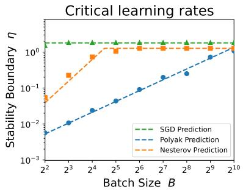

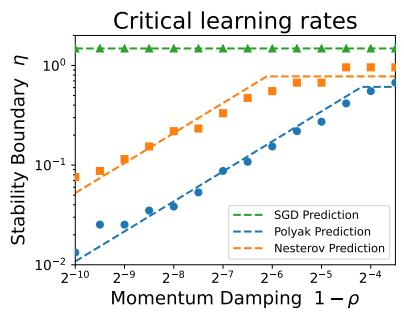

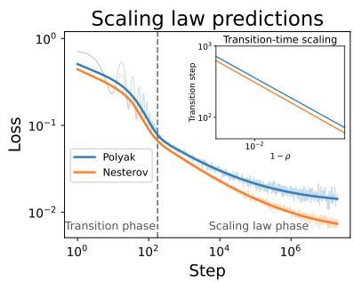  
Figure 2: Numerical validation of stability and risk-dynamics scaling laws. Left: Critical learning rate versus batch size at fixed momentum. Markers show numerical estimates and dashed curves the theoretical predictions. Middle: Critical learning rate versus $1 - \rho$ at fixed batch size, confirming the predicted linear scaling before the order-one ceiling. Right: Polyak and Nesterov risk dynamics, with empirical results shown by thin translucent lines and theoretical predictions by thick solid lines. The theory captures the underdamped transient, power-law decay, and noise floor. The inset confirms the dominant $( 1 - \rho ) ^ { - 1 }$ dependence of the predicted transition timescale $\tau _ { \rho } \approx ( 1 - \rho ) ^ { - 1 } \log \bigl ( \eta / ( 1 - \rho ) ^ { 2 } \bigr )$ with fitted log-log slopes −1.00 for Polyak and −1.01 for Nesterov.

Data-scaling exponents across batch-size regimes. Having verified the global phase structure, we next test the predicted data-scaling exponents at representative points in each regime. We continue with $( s , \beta ) \ : = \ : ( 0 . 3 , 4 )$ and choose $B \approx 1 , B \approx D ^ { 0 . 4 }$ , and $B \ \approx \ D ^ { 0 . 8 }$ representing small batch, large batch, and ultra-large batch, respectively. For each data budget D, we set $( \eta , \rho )$ according to the theoretically prescribed scalings. Figure 3 shows that the empirical slopes closely match Theorem 6.3: all three methods share the same exponent for small batch; for large batch, Nesterov outperforms Polyak, which outperforms SGD; and for ultra-large batch, Polyak and Nesterov again share the same exponent and both outperform SGD. These results quantitatively validate the batch-dependent data-scaling exponents underlying the phase diagram. Experimental details and additional settings are provided in Appendix G.4.

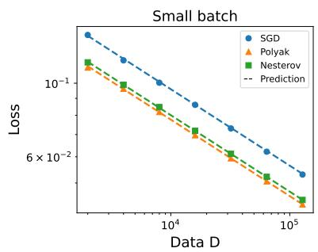

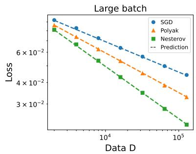

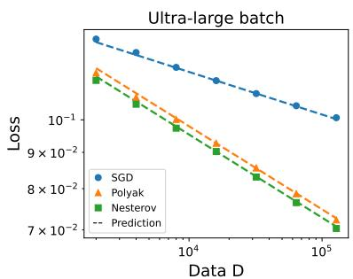  
Figure 3: Data-scaling exponents across the three batch-size regimes. We choose representative batch-size scalings $B \gtrsim 1$ (left), $B \lesssim D ^ { 0 . 4 }$ (middle), and $B \approx D ^ { 0 . 8 } \ ( \mathrm { r i g h t } )$ and vary the data budget D. Markers show empirical final excess risks, while dashed lines indicate the scaling exponents predicted by Theorem 6.3. For these representative choices, the predicted ordering is recovered: $\mathrm { N e s t e r o v } = \mathrm { P o l y a k } = \mathrm { S G D }$ at small batch, Nesterov > Polyak > SGD at large batch, and Nesterov = Polyak > SGD at ultra-large batch.

## 8 Conclusion and discussion

We developed a unified analysis of Polyak and Nesterov momentum in large-batch, one-pass training, characterizing their risk stability, risk dynamics, and optimal data scaling. A central conclusion is that the benefit of momentum depends critically on the batch size. At small batch sizes, neither method improves the data-scaling exponent of vanilla SGD. As the batch size grows, however, the two methods provide distinct benefits: Polyak preserves the small-batch optimal data-scaling exponent over a substantially wider range of batch sizes than SGD, whereas Nesterov further improves the data-scaling exponent in the large-batch regime. At ultra-large batch sizes, training becomes limited by the number of sequential updates, and the two momentum methods again exhibit the same signal-limited scaling.

Implications for momentum scheduling. Our scaling analysis allows the batch size $B ,$ learning rate η, and momentum factor $\rho$ to scale with the data budget $D ,$ while keeping them fixed within each training run. A complete theory of time-varying schedules is therefore beyond the present analysis. Nevertheless, our stability results already have direct implications for momentum scheduling. Recent work has increasingly explored time-varying momentum schedules, while also observing that increasing momentum during training can become unstable under stochastic gradients and may require warmup or additional damping (Pagliardini et al., 2025; Yarotsky & Velikanov, 2025; Yarotsky, 2026; Ferbach et al., 2026b). Our results provide a complementary quantitative perspective: for the classical Polyak and Nesterov updates, the stability boundary predicts how long an increasing-momentum schedule can remain stable and how this horizon scales with the batch size.

A particularly instructive example is the classical scaling $1 - \rho _ { k } \approx k ^ { - 1 }$ , which underlies Nesterov acceleration in deterministic optimization (Nesterov, 1983). Although Theorem 4.3 is derived for constant momentum, applying its stability boundary locally along this slowly varying schedule predicts

$$
\eta \lesssim \operatorname* { m i n } \left\{ 1 , \frac { B } { k } \right\} \quad \mathrm { f o r ~ P o l y a k } , \qquad \eta \lesssim \operatorname* { m i n } \left\{ 1 , \frac { B ^ { \beta } } { k } \right\} \quad \mathrm { f o r ~ N e s t e r o v } .\tag{16}
$$

Thus, for fixed $\eta$ and $B ,$ the schedule may remain stable for a substantial fraction of training but eventually cross the stochastic stability boundary as $\rho _ { k } \to 1$ . The corresponding instability horizons are predicted to scale as

$$
k _ { \mathrm { p o l y a k } } ^ { * } \approx \frac { B } { \eta } , \qquad k _ { \mathrm { n e s t e r o v } } ^ { * } \approx \frac { B ^ { \beta } } { \eta } .
$$

Prior work has observed that increasing the batch size can delay the instability of aggressive momentum schedules (Yarotsky & Velikanov, 2025); to our knowledge, the explicit batch-size scaling of this delayed-instability horizon, and its distinction between Polyak and Nesterov, has

The right panel illustrates this delayed-instability phenomenon for PLK regression with $( s , \beta ) ~ = ~ ( 0 . 3 , 4 )$ under the schedule $\rho _ { k } ~ = ~ 1 - 1 / ( k + 1 )$ ; experimental details are provided in Appendix G.5. Both methods remain stable and benefit from the increasing momentum before eventually becoming unstable. Consistent with the predicted horizons, Nesterov remains stable for substantially more iterations than Polyak because its stability horizon scales as $B ^ { \beta }$ rather than B. This allows Nesterov to exploit the increasing-momentum schedule over

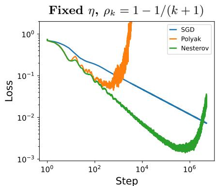

a longer training interval and reach a lower risk before instability occurs.

This example highlights a constraint on momentum scheduling that is absent from deterministic acceleration theory: the benefit of increasing momentum depends not only on how strongly it accelerates optimization, but also on how long the resulting trajectory remains inside the stochastic stability region. It also suggests a simple tuning principle. Momentum, learning rate, and batch size should be scheduled jointly so that $1 - \rho _ { k }$ remains above the stochastic stability scale, namely $1 - \rho _ { k } \gtrsim \eta _ { k } / B _ { k }$ for Polyak and $1 - \rho _ { k } \gtrsim \eta _ { k } / B _ { k } ^ { \beta }$ for Nesterov. Increasing momentum can therefore be supported either by increasing the batch size or by decreasing the learning rate, suggesting a direct route from the present stability theory to practical momentum-schedule design.

Outlook. Our results suggest that learning rate, batch size, and momentum should be designed jointly rather than tuned in isolation. The stability conditions determine how aggressively momentum can be increased at a given learning rate and batch size, while the scaling laws quantify the resulting tradeof between faster signal learning and stronger noise accumulation. Extending this framework to time-varying $\eta _ { k } , B _ { k }$ , and $\rho _ { k }$ could therefore provide principled guidance for jointly scaling and scheduling these hyperparameters in large-scale training (Li et al., 2026a,b; Wang et al., 2025, 2026). We expect such a theory to provide a practical route toward designing more stable and data-eficient training schedules, rather than relying primarily on empirical tuning.

## Use of AI

We used AI tools for drafting and language editing throughout the manuscript. In Sections B–F, they were also used to accelerate algebraic calculations and asymptotic estimates. The proof strategies and mathematical arguments were developed by the authors, who verified all AI-assisted calculations and estimates.

## Acknowledgement

Lei Wu is supported in part by the National Natural Science Foundation of China (NSFC12522120, NSFC92470122, and NSFC12288101). Kairui Li is partially supported by the elite undergraduate training program of School of Mathematical Sciences in Peking University. We thank Sanxing Cao, Zilin Wang, and Jinbo Wang for helpful discussions.

## References

Alexander Atanasov, Jacob A. Zavatone-Veth, and Cengiz Pehlevan. Scaling and renormalization in high-dimensional regression. Journal of Statistical Mechanics: Theory and Experiment, 2026. (cited on page 4)

Yasaman Bahri, Ethan Dyer, Jared Kaplan, Jaehoon Lee, and Utkarsh Sharma. Explaining neural scaling laws. Proceedings of the National Academy of Sciences, 121(27), 2024. doi: 10.1073/pnas.2311878121. (cited on pages 2 and 4)

Blake Bordelon, Abdulkadir Canatar, and Cengiz Pehlevan. Spectrum dependent learning curves in kernel regression and wide neural networks. In International Conference on Machine Learning, pp. 1024–1034. PMLR, 2020. (cited on page 5)

Blake Bordelon, Alexander Atanasov, and Cengiz Pehlevan. A dynamical model of neural scaling laws. In International Conference on Machine Learning, volume 235 of Proceedings of Machine Learning Research, pp. 4345–4382, 2024. (cited on page 4)

Blake Bordelon, Alexander Atanasov, and Cengiz Pehlevan. How feature learning can improve neural scaling laws. In International Conference on Learning Representations, 2025. (cited on pages 2 and 4)

Tom Brown, Benjamin Mann, Nick Ryder, Melanie Subbiah, Jared D Kaplan, Prafulla Dhariwal, Arvind Neelakantan, Pranav Shyam, Girish Sastry, Amanda Askell, et al. Language models are few-shot learners. Advances in Neural Information Processing Systems, 33:1877–1901, 2020. (cited on page 2)

Andrea Caponnetto and Ernesto De Vito. Optimal rates for the regularized least-squares algorithm. Foundations of Computational Mathematics, 7:331–368, 2007. (cited on page 5)

Andrea Caponnetto and Ernesto De Vito. Fast rates for regularized least-squares algorithm. 2005. (cited on page 5)

Dennis Chemnitz and Maximilian Engel. Characterizing dynamical stability of stochastic gradient descent in overparameterized learning. Journal of Machine Learning Research, 26 (134):1–46, 2025. (cited on page 4)

DeepSeek-AI, Anyi Xu, Bangcai Lin, Bing Xue, et al. DeepSeek-V4: Towards highly eficient million-token context intelligence. arXiv preprint arXiv:2606.19348, 2026. (cited on page 4)

Shihong Ding, Haihan Zhang, Hanzhen Zhao, and Cong Fang. Scaling law for stochastic gradient descent in quadratically parameterized linear regression. arXiv preprint arXiv:2502.09106, 2025. (cited on page 4)

Elvis Dohmatob, Yunzhen Feng, Pu Yang, Francois Charton, and Julia Kempe. A tale of tails: Model collapse as a change of scaling laws. In International Conference on Machine Learning, 2024. (cited on page 4)

William Feller. An introduction to probability theory and its applications, volume 2. John Wiley & Sons, 1991. (cited on page 23)

Damien Ferbach, Katie Everett, Gauthier Gidel, Elliot Paquette, and Courtney Paquette. Dimension-adapted momentum outscales sgd. Advances in Neural Information Processing Systems, 38:112780–112977, 2026a. (cited on page 4)

Damien Ferbach, Courtney Paquette, Gauthier Gidel, Katie Everett, and Elliot Paquette. Logarithmic-time schedules for scaling language models with momentum. arXiv preprint arXiv:2602.05298, 2026b. (cited on page 13)

Igor Gitman, Hunter Lang, Pengchuan Zhang, and Lin Xiao. Understanding the role of momentum in stochastic gradient methods. In Advances in Neural Information Processing Systems, volume 32, pp. 9633–9643, 2019. (cited on pages 2 and 4)

Aaron Grattafiori, Abhimanyu Dubey, Abhinav Jauhri, et al. The LLaMA 3 herd of models. arXiv preprint arXiv:2407.21783, 2024. (cited on page 4)

Kanan Gupta, Jonathan W. Siegel, and Stephan Wojtowytsch. Nesterov acceleration despite very noisy gradients. In Advances in Neural Information Processing Systems, volume 37, pp. 20694–20744, 2024. (cited on page 2)

Joel Hestness, Sharan Narang, Newsha Ardalani, Gregory Diamos, Heewoo Jun, Hassan Kianinejad, Mostofa Ali Patwary, Yang Yang, and Yanqi Zhou. Deep learning scaling is predictable, empirically. arXiv preprint arXiv:1712.00409, 2017. (cited on page 4)

Jordan Hofmann, Sebastian Borgeaud, Arthur Mensch, Elena Buchatskaya, Trevor Cai, Eliza Rutherford, Diego de Las Casas, Lisa Anne Hendricks, Johannes Welbl, Aidan Clark, Tom Hennigan, Eric Noland, Katie Millican, George van den Driessche, Bogdan Damoc, Aurelia Guy, Simon Osindero, Karen Simonyan, Erich Elsen, Oriol Vinyals, Jack W. Rae, and Laurent Sifre. Training compute-optimal large language models. In Advances in Neural Information Processing Systems, volume 35, pp. 30016–30030, 2022. (cited on page 4)

Marcus Hutter. Learning curve theory. arXiv preprint arXiv:2102.04074, 2021. (cited on page 4)

Ayush Jain, Andrea Montanari, and Eren Sasoglu. Scaling laws for learning with real and surrogate data. In Advances in Neural Information Processing Systems, volume 37, 2024. (cited on page 4)

Keller Jordan, Yuchen Jin, Vlado Boza, Jiacheng You, Franz Cesista, Laker Newhouse, and Jeremy Bernstein. Muon: An optimizer for hidden layers in neural networks, 2024. URL https://kellerjordan. github. io/posts/muon, 6(3):4, 2024. (cited on page 2)

Jared Kaplan, Sam McCandlish, Tom Henighan, Tom B. Brown, Benjamin Chess, Rewon Child, Scott Gray, Alec Radford, Jefrey Wu, and Dario Amodei. Scaling laws for neural language models. arXiv preprint arXiv:2001.08361, 2020. (cited on page 4)

Simran Kaur, Jeremy Cohen, and Zachary Chase Lipton. On the maximum Hessian eigenvalue and generalization. In Proceedings on “I Can’t Believe It’s Not Better! – Understanding Deep Learning Through Empirical Falsification” at NeurIPS 2022 Workshops, volume 187 of Proceedings of Machine Learning Research, pp. 51–65, 2023. (cited on page 4)

Diederik P. Kingma and Jimmy Ba. Adam: A method for stochastic optimization. In International Conference on Learning Representations, 2015. (cited on page 2)

Nikola B. Kovachki and Andrew M. Stuart. Continuous time analysis of momentum methods. Journal of Machine Learning Research, 22(17):1–40, 2021. (cited on page 4)

Binghui Li, Fengling Chen, Zixun Huang, Lean Wang, and Lei Wu. Functional scaling laws in kernel regression: Loss dynamics and learning rate schedules. Advances in Neural Information Processing Systems, 38:101211–101269, 2026a. (cited on pages 2, 4, 8, 14, 33, and 46)

Binghui Li, Zilin Wang, Fengling Chen, Shiyang Zhao, Ruiheng Zheng, and Lei Wu. Optimal learning-rate schedules under functional scaling laws: Power decay and warmup-stable-decay. arXiv preprint arXiv:2602.06797, 2026b. (cited on pages 2, 4, and 14)

Licong Lin, Jingfeng Wu, Sham M. Kakade, Peter L. Bartlett, and Jason D. Lee. Scaling laws in linear regression: Compute, parameters, and data. In Advances in Neural Information Processing Systems, volume 37, 2024. (cited on pages 2 and 4)

Licong Lin, Jingfeng Wu, and Peter L. Bartlett. Improved scaling laws in linear regression via data reuse. In Advances in Neural Information Processing Systems, volume 38, 2025. (cited on page 4)

Chaoyue Liu and Mikhail Belkin. Accelerating SGD with momentum for over-parameterized learning. arXiv preprint arXiv:1810.13395, 2018. (cited on page 2)

Jingyuan Liu, Jianlin Su, Xingcheng Yao, Zhejun Jiang, Guokun Lai, Yulun Du, Yidao Qin, Weixin Xu, Enzhe Lu, Junjie Yan, Yanru Chen, Huabin Zheng, Yibo Liu, Shaowei Liu, Bohong Yin, Weiran He, Han Zhu, Yuzhi Wang, Jianzhou Wang, Mengnan Dong, Zheng Zhang, Yongsheng Kang, Hao Zhang, Xinran Xu, Yutao Zhang, Yuxin Wu, Xinyu Zhou, and Zhilin Yang. Muon is scalable for LLM training. arXiv preprint arXiv:2502.16982, 2025. (cited on page 2)

Yanli Liu, Yuan Gao, and Wotao Yin. An improved analysis of stochastic gradient descent with momentum. In Advances in Neural Information Processing Systems, volume 33, 2020. (cited on page 4)

Chao Ma and Lexing Ying. On linear stability of SGD and input-smoothness of neural networks. In Advances in Neural Information Processing Systems, volume 34, 2021. (cited on page 4)

Alexander Maloney, Daniel A. Roberts, and James Sully. A solvable model of neural scaling laws. arXiv preprint arXiv:2210.16859, 2022. (cited on pages 4 and 5)

Martin Marek, Sanae Lotfi, Aditya Somasundaram, Andrew Wilson, and Micah Goldblum. Small batch size training for language models: When vanilla SGD works, and why gradient accumulation is wasteful. Advances in Neural Information Processing Systems, 38: 148837–148862, 2026. (cited on page 2)

Eric J. Michaud, Ziming Liu, Uzay Girit, and Max Tegmark. The quantization model of neural scaling. In Advances in Neural Information Processing Systems, volume 36, 2023. (cited on page 4)

Depen Morwani, Alexandru Meterez, Pranav Nair, and Sham Kakade. Compute eficiency and serial runtime tradeofs for stochastic momentum methods. arXiv preprint arXiv:2606.19179, 2026. (cited on page 4)

Rotem Mulayof, Tomer Michaeli, and Daniel Soudry. The implicit bias of minima stability: A view from function space. In Advances in Neural Information Processing Systems, volume 34, 2021. (cited on page 4)

Mor Shpigel Nacson, Rotem Mulayof, Greg Ongie, Tomer Michaeli, and Daniel Soudry. The implicit bias of minima stability in multivariate shallow ReLU networks. In International Conference on Learning Representations, 2023. (cited on page 4)

Yoonsoo Nam, Nayara Fonseca, Seok Hyeong Lee, and Ard Louis. An exactly solvable model for emergence and scaling laws in the multitask sparse parity problem. In Advances in Neural Information Processing Systems, volume 37, 2024. (cited on page 4)

Kamil Nar and S. Shankar Sastry. Step size matters in deep learning. In Advances in Neural Information Processing Systems, volume 31, pp. 3436–3444, 2018. (cited on page 4)

Yurii Nesterov. A method for solving the convex programming problem with convergence rate o (1/k2). In Dokl Akad Nauk SSSR, volume 269, pp. 543, 1983. (cited on pages 2, 4, and 13)

Matteo Pagliardini, Pierre Ablin, and David Grangier. The AdEMAMix optimizer: Better, faster, older. In International Conference on Learning Representations, volume 2025, pp. 64715–64757, 2025. (cited on page 13)

Elliot Paquette, Courtney Paquette, Lechao Xiao, and Jefrey Pennington. 4+3 phases of compute-optimal neural scaling laws. arXiv preprint arXiv:2405.15074, 2024. (cited on page 4)

Boris T Polyak. Some methods of speeding up the convergence of iteration methods. USSR computational mathematics and mathematical physics, 4(5):1–17, 1964. (cited on page 2)

Dan Qiao, Kaiqi Zhang, Esha Singh, Daniel Soudry, and Yu-Xiang Wang. Stable minima cannot overfit in univariate ReLU networks: Generalization by large step sizes. In Advances in Neural Information Processing Systems, volume 37, 2024. (cited on page 4)

Andrei Semenov, Matteo Pagliardini, and Martin Jaggi. Benchmarking optimizers for large language model pretraining. arXiv preprint arXiv:2509.01440, 2025. (cited on page 2)

Ishaan Shah, Anthony M Polloreno, Karl Stratos, Philip Monk, Adarsh Chaluvaraju, Andrew Hojel, Andrew Ma, Anil Thomas, Ashish Tanwer, Darsh J Shah, et al. Practical eficiency of Muon for pretraining. arXiv preprint arXiv:2505.02222, 2025. (cited on page 2)

Utkarsh Sharma and Jared Kaplan. Scaling laws from the data manifold dimension. Journal of Machine Learning Research, 23(9):1–34, 2022. (cited on page 4)

Bin Shi, Simon S. Du, Michael I. Jordan, and Weijie J. Su. Understanding the acceleration phenomenon via high-resolution diferential equations. Mathematical Programming, 195(1–2): 79–148, 2022. doi: 10.1007/s10107-021-01681-8. (cited on page 4)

John Sous and Michael Winer. Asymmetric scaling laws from sparse features. arXiv preprint arXiv:2605.23591, 2026. (cited on page 4)

Stefano Spigler, Mario Geiger, and Matthieu Wyart. Asymptotic learning curves of kernel methods: empirical data versus teacher–student paradigm. Journal of Statistical Mechanics: Theory and Experiment, 2020(12):124001, 2020. (cited on page 5)

Weijie Su, Stephen Boyd, and Emmanuel J. Cand\`es. A diferential equation for modeling Nesterov’s accelerated gradient method: Theory and insights. Journal of Machine Learning Research, 17(153):1–43, 2016. (cited on pages 2 and 4)

Maksim Velikanov, Denis Kuznedelev, and Dmitry Yarotsky. A view of mini-batch SGD via generating functions: Conditions of convergence, phase transitions, benefit from negative momenta. In International Conference on Learning Representations, 2023. (cited on pages 2 and 4)

Mathukumalli Vidyasagar. Convergence of momentum-based optimization algorithms with time-varying parameters. arXiv preprint arXiv:2506.11904, 2025. (cited on page 4)

Jinbo Wang, Mingze Wang, Zhanpeng Zhou, Junchi Yan, Lei Wu, et al. The sharpness disparity principle in transformers for accelerating language model pre-training. arXiv preprint arXiv:2502.19002, 2025. (cited on page 14)

Jinbo Wang, Binghui Li, Zhanpeng Zhou, Mingze Wang, Jiaqi Zhang, Xunliang Cai, and Lei Wu. Fast catch-up, late switching: Optimal batch size scheduling via functional scaling laws. In International Conference on Learning Representations, volume 2026, pp. 7310–7340, 2026. (cited on pages 2, 4, and 14)

Mingze Wang and Lei Wu. A theoretical analysis of noise geometry in stochastic gradient descent. arXiv preprint arXiv:2310.00692, 2023. (cited on pages 4 and 6)

Runzhe Wang, Sadhika Malladi, Tianhao Wang, Kaifeng Lyu, and Zhiyuan Li. The marginal value of momentum for small learning rate SGD. In International Conference on Learning Representations, 2024. (cited on page 2)

Alexander Wei, Wei Hu, and Jacob Steinhardt. More than a toy: Random matrix models predict how real-world neural representations generalize. In International Conference on Machine Learning, volume 162 of Proceedings of Machine Learning Research, pp. 23549–23588, 2022. (cited on page 4)

Andre Wibisono, Ashia C. Wilson, and Michael I. Jordan. A variational perspective on accelerated methods in optimization. Proceedings of the National Academy of Sciences, 113 (47):E7351–E7358, 2016. doi: 10.1073/pnas.1614734113. (cited on pages 2 and 4)

Ashia C. Wilson, Ben Recht, and Michael I. Jordan. A Lyapunov analysis of accelerated methods in optimization. Journal of Machine Learning Research, 22(113):1–34, 2021. (cited on pages 2 and 4)

Lei Wu and Weijie J. Su. The implicit regularization of dynamical stability in stochastic gradient descent. In International Conference on Machine Learning, volume 202 of Proceedings of Machine Learning Research, pp. 37656–37684, 2023. (cited on page 4)

Lei Wu, Chao Ma, and Weinan E. How SGD selects the global minima in over-parameterized learning: A dynamical stability perspective. In Advances in Neural Information Processing Systems, volume 31, pp. 8279–8288, 2018. (cited on page 4)

Lei Wu, Mingze Wang, and Weijie J. Su. The alignment property of SGD noise and how it helps select flat minima: A stability analysis. In Advances in Neural Information Processing Systems, volume 35, pp. 4680–4693, 2022. (cited on pages 4 and 6)

Tingkai Yan, Haodong Wen, Binghui Li, Kairong Luo, Wenguang Chen, and Kaifeng Lyu. Larger datasets can be repeated more: A theoretical analysis of multi-epoch scaling in linear regression. In International Conference on Learning Representations, 2026. (cited on page 4)

Dmitry Yarotsky. Corner gradient descent. In International Conference on Learning Representations, volume 2026, pp. 156292–156327, 2026. (cited on page 13)

Dmitry Yarotsky and Maksim Velikanov. SGD with memory: fundamental properties and stochastic acceleration. In International Conference on Learning Representations, volume 2025, pp. 79673–79715, 2025. (cited on page 13)

Kun Yuan, Bicheng Ying, and Ali H. Sayed. On the influence of momentum acceleration on online learning. Journal of Machine Learning Research, 17(192):1–66, 2016. (cited on page 4)

Haihan Zhang, Yuanshi Liu, Qianwen Chen, and Cong Fang. The optimality of (accelerated) SGD for high-dimensional quadratic optimization. arXiv preprint arXiv:2409.09745, 2024. (cited on page 4)

Hanlin Zhang, Depen Morwani, Nikhil Vyas, Jingfeng Wu, Difan Zou, Udaya Ghai, Dean Foster, and Sham M. Kakade. How does critical batch size scale in pre-training? In International Conference on Learning Representations, 2025. (cited on page 4)

Zhanxing Zhu, Jingfeng Wu, Bing Yu, Lei Wu, and Jinwen Ma. The anisotropic noise in stochastic gradient descent: Its behavior of escaping from sharp minima and regularization efects. In International Conference on Machine Learning, pp. 7654–7663, 2019. (cited on pages 4 and 6)

## Appendix

A Technical preliminaries 21   
A.1 Equivalence to kernel regression . 21   
A.2 Rotational equivariance of SGD and momentum methods 21   
A.3 Gaussian fourth-moment identities 22   
A.4 Noise–curvature alignment . 23   
B Risk stability analysis 23   
B.1 Renewal formulation of risk stability 23   
B.2 Risk stability of SGD . 24   
B.3 Risk stability of Polyak 26   
B.4 Risk stability of Nesterov 29   
C SGD scaling law 33   
D Polyak scaling law 33   
D.1 Signal–noise decomposition and risk recursion 33   
D.2 Overdamped and underdamped modes decomposition 36   
D.3 Label noise calculation . 37   
D.4 Uniform boundedness of expected risk 39   
D.5 Risk dynamics in the fully overdamped regime 40   
D.6 Risk dynamics in the mixed-damping regime 43   
E Nesterov scaling law 46   
E.1 Signal–noise decomposition and risk recursion 46   
E.2 Overdamped and underdamped modes decomposition 50   
E.3 Label noise calculation . 51   
E.4 Uniform boundedness of expected risk 53   
E.5 Risk dynamics in the fully overdamped regime 54   
E.6 Risk dynamics in the mixed-damping regime 57   
F Optimal data scaling across batch-size regimes 62   
F.1 SGD 62   
F.2 Polyak 63   
F.3 Nesterov 64   
G Experimental details and additional results 66   
G.1 Risk stability boundaries . 66   
G.2 Risk-dynamics scaling laws 67   
G.3 Batch-size phase diagram at a fixed data budget 68   
G.4 Data-scaling exponents across batch-size regimes 68   
G.5 Delayed instability under increasing momentum 69

## A Technical preliminaries

## A.1 Equivalence to kernel regression

We briefly relate the PLK regression in Section 3.1 to standard kernel regression. Given a positive semidefinite kernel $K : \mathcal { X } \times \mathcal { X } \  \ \mathbb { R }$ , kernel regression learns over its associated reproducing kernel Hilbert space (RKHS) $\mathcal { H } _ { K }$ . Given an input distribution $\mathcal { D } _ { : }$ , under mild conditions, Mercer’s theorem ensures that the kernel admits the following eigendecomposition

$$
K ( \mathbf { x } , \mathbf { x } ^ { \prime } ) = \sum _ { j = 1 } ^ { \infty } \lambda _ { j } e _ { j } ( \mathbf { x } ) e _ { j } ( \mathbf { x } ^ { \prime } ) ,
$$

where $\{ e _ { j } \} _ { j \geqslant 1 }$ are orthonormal in $L ^ { 2 } ( \mathcal { D } )$ . The standard capacity condition assumes $\lambda _ { j } \approx j ^ { - \beta }$ Target regularity is commonly described through the interpolation spaces

$$
\mathcal { H } _ { K } ^ { r } = \left\{ \sum _ { j = 1 } ^ { \infty } a _ { j } e _ { j } : \sum _ { j = 1 } ^ { \infty } \frac { a _ { j } ^ { 2 } } { \lambda _ { j } ^ { r } } < \infty \right\} ,
$$

with a source condition of the form $f ^ { * } \in \mathcal { H } _ { K } ^ { r }$

Our formulation is the corresponding feature-map representation. Under Assumption 3.1, define $e _ { j } : = \phi _ { j } / \lambda _ { j } ^ { 1 / 2 }$ . Then $\{ e _ { j } \} _ { j \geqslant 1 }$ is orthonormal in $L ^ { 2 } ( \mathcal { D } )$ , and

$$
K _ { \phi } ( { \bf x } , { \bf x } ^ { \prime } ) = \sum _ { j = 1 } ^ { \infty } \phi _ { j } ( { \bf x } ) \phi _ { j } ( { \bf x } ^ { \prime } ) = \sum _ { j = 1 } ^ { \infty } \lambda _ { j } e _ { j } ( { \bf x } ) e _ { j } ( { \bf x } ^ { \prime } ) .
$$

Thus, Assumption 3.3, $\lambda _ { j } \approx j ^ { - \beta }$ , is precisely the standard capacity condition.

For the target function,

$$
f ^ { * } = \sum _ { j = 1 } ^ { \infty } \theta _ { j } ^ { * } \phi _ { j } = \sum _ { j = 1 } ^ { \infty } a _ { j } ^ { * } e _ { j } , \qquad a _ { j } ^ { * } : = \lambda _ { j } ^ { 1 / 2 } \theta _ { j } ^ { * } .
$$

Our task-dificulty assumption gives $| a _ { j } ^ { * } | ^ { 2 } \overset { } { \sim } j ^ { - 1 } \lambda _ { j } ^ { s }$ . Hence, for any $\delta \in ( 0 , s )$

$$
\sum _ { j = 1 } ^ { \infty } { \frac { | a _ { j } ^ { * } | ^ { 2 } } { \lambda _ { j } ^ { s - \delta } } } \approx \sum _ { j = 1 } ^ { \infty } j ^ { - 1 } \lambda _ { j } ^ { \delta } \approx \sum _ { j = 1 } ^ { \infty } j ^ { - 1 - \beta \delta } < \infty .
$$

Therefore, $f ^ { * } \in \mathcal { H } _ { K _ { \phi } } ^ { s - \delta }$ for every $\delta \in \mathsf { \Gamma } ( 0 , s )$ . Thus, $\beta$ corresponds to the standard capacity exponent, while s characterizes the source regularity of the target.

## A.2 Rotational equivariance of SGD and momentum methods

We show that Assumption 3.1 is without loss of generality. Since $\mathbf { H } = \mathbb { E } [ \phi ( \mathbf { x } ) \otimes \phi ( \mathbf { x } ) ]$ is positive, self-adjoint, and trace class, it admits a spectral decomposition

$$
\mathbf { H } = U \Lambda U ^ { * } , \qquad \mathbf { \Lambda } \Lambda = \mathrm { d i a g } ( \lambda _ { 1 } , \lambda _ { 2 } , \ldots ) ,
$$

for some unitary operator U. Define the rotated variables

$$
\theta ^ { \prime } = U ^ { * } \theta , \qquad \theta ^ { * \prime } = U ^ { * } \theta ^ { * } , \qquad \phi ^ { \prime } ( { \bf x } ) = U ^ { * } \phi ( { \bf x } ) .
$$

Unitary invariance of the inner product gives

$$
f ^ { \prime } ( { \bf { x } } ; \pmb { \theta } ^ { \prime } ) = \langle { \phi ^ { \prime } ( { \bf { x } } ) , \pmb { \theta } ^ { \prime } } \rangle = \langle { \phi ( { \bf { x } } ) , \pmb { \theta } } \rangle = f ( { \bf { x } } ; \pmb { \theta } ) ,
$$

and hence, for every mini-batch $B _ { k }$

$$
\begin{array} { r } { \mathbf { g } ^ { \prime } ( \pmb { \theta } ^ { \prime } ; B _ { k } ) = \pmb { U } ^ { * } \mathbf { g } ( \pmb { \theta } ; B _ { k } ) . } \end{array}
$$

It follows immediately that the SGD and Polyak recursions are preserved under $\pmb { \theta } _ { k } ^ { \prime } = \pmb { U } ^ { * } \pmb { \theta } _ { k }$ For Nesterov, the look-ahead point transforms as

$$
\pmb { \theta } _ { k } ^ { \mathrm { l a } \prime } = \pmb { U } ^ { * } \pmb { \theta } _ { k } ^ { \mathrm { l a } } = \pmb { \theta } _ { k } ^ { \prime } + \rho ( \pmb { \theta } _ { k } ^ { \prime } - \pmb { \theta } _ { k - 1 } ^ { \prime } ) ,
$$

so its recursion is preserved as well. Finally,

$$
\mathbf { H } ^ { \prime } = \mathbb { E } [ \phi ^ { \prime } ( \mathbf { x } ) \otimes \phi ^ { \prime } ( \mathbf { x } ) ] = \pmb { U } ^ { * } \mathbf { H } \pmb { U } = \pmb { \Lambda } .
$$

Thus, SGD, Polyak, and Nesterov are equivariant under unitary changes of basis, while their predictions and risks are unchanged. We may therefore work in the eigenbasis of H, where the covariance operator is diagonal, without loss of generality.

## A.3 Gaussian fourth-moment identities

We record several Gaussian fourth-moment identities used repeatedly below.

Lemma A.1 (Gaussian fourth-moment identities). Let $\mathbf { x } \sim \mathcal { N } ( \mathbf { 0 } , \mathbf { H } )$ in a separable Hilbert space H, where H is a positive trace-class covariance operator. For any $\mathbf { u } , \mathbf { v } \in { \mathcal { H } }$

$$
\mathbb { E } \big [ \langle \mathbf { x } , \mathbf { u } \rangle ^ { 2 } \langle \mathbf { x } , \mathbf { v } \rangle ^ { 2 } \big ] = \langle \mathbf { u } , \mathbf { H } \mathbf { u } \rangle \langle \mathbf { v } , \mathbf { H } \mathbf { v } \rangle + 2 \langle \mathbf { u } , \mathbf { H } \mathbf { v } \rangle ^ { 2 } .\tag{17}
$$

Equivalently, for any self-adjoint trace-class operator A,

$$
\mathbb { E } [ ( \mathbf { x } \otimes \mathbf { x } ) \mathbf { A } ( \mathbf { x } \otimes \mathbf { x } ) ] = 2 \mathbf { H } \mathbf { A } \mathbf { H } + \mathbf { H } \mathrm { T r } ( \mathbf { H } \mathbf { A } ) .\tag{18}
$$

Proof. The directional identity follows directly from Isserlis’ formula. For any $\mathbf { u } , \mathbf { v } \in { \mathcal { H } } .$ , the random variables $\langle \mathbf { x } , \mathbf { u } \rangle$ and $\langle \mathbf { x } , \mathbf { v } \rangle$ are jointly Gaussian, and hence

$$
\mathbb { E } \big [ \langle \mathbf { x } , \mathbf { u } \rangle ^ { 2 } \langle \mathbf { x } , \mathbf { v } \rangle ^ { 2 } \big ] = \langle \mathbf { u } , \mathbf { H } \mathbf { u } \rangle \langle \mathbf { v } , \mathbf { H } \mathbf { v } \rangle + 2 \langle \mathbf { u } , \mathbf { H } \mathbf { v } \rangle ^ { 2 } .
$$

We next prove the operator identity. Let $\begin{array} { r } { \mathbf { A } = \sum _ { i } a _ { j } \mathbf { e } _ { j } \otimes \mathbf { e } _ { j } } \end{array}$ be the spectral decomposition of the self-adjoint trace-class operator A. For arbitrary u, $\mathbf { v } \in \mathcal { H }$ , Isserlis’ formula gives

$$
\begin{array} { r l } { { \displaystyle \langle { \bf u } , { \mathbb E } [ ( { \bf x } \otimes { \bf x } ) { \bf A } ( { \bf x } \otimes { \bf x } ) ] { \bf v } \rangle } } & { { } } \\ { { \displaystyle \quad = \sum _ { j } a _ { j } { \mathbb E } \big [ \langle { \bf u } , { \bf x } \rangle \langle { \bf e } _ { j } , { \bf x } \rangle ^ { 2 } \langle { \bf x } , { \bf v } \rangle \big ] } } & { { } } \\ { { \displaystyle \quad = 2 \sum _ { j } a _ { j } \langle { \bf u } , { \bf H } { \bf e } _ { j } \rangle \langle { \bf e } _ { j } , { \bf H } { \bf v } \rangle + \langle { \bf u } , { \bf H } { \bf v } \rangle \sum _ { j } a _ { j } \langle { \bf e } _ { j } , { \bf H } { \bf e } _ { j } \rangle } } & { { } } \\ { { \displaystyle \quad = 2 \langle { \bf u } , { \bf H } { \bf A } { \bf H } { \bf v } \rangle + \langle { \bf u } , { \bf H } { \bf v } \rangle \mathrm { T r } ( { \bf H } { \bf A } ) } . } & { { } } \end{array}
$$

Since this holds for all $\mathbf { u } , \mathbf { v } \in \mathcal { H }$

$$
\mathbb { E } [ ( \mathbf { x } \otimes \mathbf { x } ) \mathbf { A } ( \mathbf { x } \otimes \mathbf { x } ) ] = 2 \mathbf { H } \mathbf { A } \mathbf { H } + \mathbf { H } \mathrm { T r } ( \mathbf { H } \mathbf { A } ) .
$$

Corollary A.2 (Empirical covariance fluctuation). Let

$$
\widehat { \mathbf { H } } : = \frac { 1 } { B } \sum _ { b = 1 } ^ { B } \mathbf { x } _ { b } \otimes \mathbf { x } _ { b } , \qquad \Sigma : = \widehat { \mathbf { H } } - \mathbf { H } , \qquad \mathbf { x } _ { b } \overset { \mathrm { ~ i ~ i . d . ~ } } { \sim } \mathcal { N } ( \mathbf { 0 } , \mathbf { H } ) .
$$

Then, for any self-adjoint trace-class operator A,

$$
\mathbb { E } [ \Sigma \mathbf { A } \Sigma ] = \frac { 1 } { B } \left( \mathbf { H } \mathbf { A } \mathbf { H } + \mathbf { H } \mathrm { T r } ( \mathbf { H } \mathbf { A } ) \right) .\tag{19}
$$

Proof. Write $\begin{array} { r } { \Sigma = B ^ { - 1 } \sum _ { b = 1 } ^ { B } \mathbf { Z } _ { b } } \end{array}$ , where $\mathbf { Z } _ { b } : = \mathbf { x } _ { b } \otimes \mathbf { x } _ { b }$ − H are independent and centered. Hence

$$
\mathbb { E } [ \Sigma \mathbf { A } \Sigma ] = \frac { 1 } { B } \mathbb { E } [ \mathbf { Z } \mathbf { A } \mathbf { Z } ] = \frac { 1 } { B } \left( \mathbb { E } [ ( \mathbf { x } \otimes \mathbf { x } ) \mathbf { A } ( \mathbf { x } \otimes \mathbf { x } ) ] - \mathbf { H } \mathbf { A } \mathbf { H } \right) ,
$$

and the result follows from Lemma A.1.

## A.4 Noise–curvature alignment

We prove Proposition 3.4. For a mini-batch of size $B ,$ write $\begin{array} { r } { \xi _ { k } ( \pmb { \theta } ) = \frac { 1 } { B } \sum _ { i = 1 } ^ { B } \zeta _ { k , i } ( \pmb { \theta } ) } \end{array}$ , where $\zeta _ { k , i } ( \pmb \theta )$ are conditionally independent, centered single-sample gradient noises. Hence, for any unit vector $\nu \in \mathcal H$

$$
\mathbb { E } \big [ | \langle \pmb { \xi } _ { k } ( \pmb { \theta } ) , \pmb { \nu } \rangle | ^ { 2 } \big | \pmb { \theta } \big ] = \frac { 1 } { B } \mathbb { E } \big [ | \langle \pmb { \zeta } ( \pmb { \theta } ) , \pmb { \nu } \rangle | ^ { 2 } \big | \pmb { \theta } \big ] .
$$

Let $\delta : = \pmb { \theta } - \pmb { \theta } ^ { * }$ and $\phi : = \phi ( \mathbf { x } )$ . Since $y = \langle \phi , \pmb \theta ^ { * } \rangle + \epsilon .$ , the single-sample gradient is $\mathbf { g } _ { \mathbf { x } , y } ( \pmb { \theta } ) = \big ( \langle \pmb { \phi } , \pmb { \delta } \rangle - \epsilon \big ) \pmb { \phi } .$ , while $\nabla \mathcal { R } ( \theta ) = \mathbf { H } \delta$ . Therefore,

$$
\zeta ( \pmb { \theta } ) = \langle \phi , \delta \rangle \phi - \mathbf { H } \delta - \epsilon \phi .
$$

Using the independence of ϵ and $\phi , \mathbb { E } [ \epsilon ] = 0$ , and $\mathbb { E } [ \phi \phi ] = \mathbf { H }$ , we obtain

$$
\begin{array} { r } { \mathbb { E } \big [ | \langle \zeta ( \pmb { \theta } ) , \pmb { \nu } \rangle | ^ { 2 } \big | \pmb { \theta } \big ] = \mathbb { E } \big [ \langle \pmb { \phi } , \pmb { \delta } \rangle ^ { 2 } \langle \pmb { \phi } , \pmb { \nu } \rangle ^ { 2 } \big ] - \langle \pmb { \delta } , \mathbf { H } \pmb { \nu } \rangle ^ { 2 } + \sigma ^ { 2 } \langle \pmb { \nu } , \mathbf { H } \pmb { \nu } \rangle . } \end{array}
$$

Applying Lemma A.1 gives

$$
\mathbb { E } \big [ \langle \phi , \delta \rangle ^ { 2 } \langle \phi , \pmb { \nu } \rangle ^ { 2 } \big ] = \langle \delta , \mathbf { H } \delta \rangle \langle \nu , \mathbf { H } \nu \rangle + 2 \langle \delta , \mathbf { H } \nu \rangle ^ { 2 } .
$$

Thus,

$$
\mathbb { E } \big [ | \langle \zeta ( \pmb { \theta } ) , \pmb { \nu } \rangle | ^ { 2 } \big | \pmb { \theta } \big ] = \big ( \sigma ^ { 2 } + \langle \delta , \mathbf { H } \pmb { \delta } \rangle \big ) \langle \pmb { \nu } , \mathbf { H } \pmb { \nu } \rangle + \langle \pmb { \delta } , \mathbf { H } \pmb { \nu } \rangle ^ { 2 } .\tag{20}
$$

The last term is nonnegative and, by Cauchy–Schwarz in the H-inner product,

$$
\langle \delta , \mathbf { H } \nu \rangle ^ { 2 } \leqslant \langle \delta , \mathbf { H } \delta \rangle \langle \nu , \mathbf { H } \nu \rangle .
$$

Since $\begin{array} { r } { \mathcal { E } ( \pmb { \theta } ) = \frac { 1 } { 2 } \langle \delta , \mathbf { H } \delta \rangle } \end{array}$ , Eq. (20) implies

$$
\mathbb { E } \big [ | \langle \zeta ( \pmb { \theta } ) , \pmb { \nu } \rangle | ^ { 2 } \big | \pmb { \theta } \big ] \approx \big ( \mathcal { E } ( \pmb { \theta } ) + \sigma ^ { 2 } \big ) \langle \pmb { \nu } , \mathbf { H } \pmb { \nu } \rangle .
$$

Combining this with the $1 / B$ variance reduction from mini-batching and setting $\pmb \theta = \pmb \theta _ { k }$ yields

$$
\mathbb { E } \big [ | \langle \pmb { \xi } _ { k } ( \pmb { \theta } _ { k } ) , \pmb { \nu } \rangle | ^ { 2 } \big | \pmb { \theta } _ { k } \big ] \approx \frac { 1 } { B } \big ( \mathcal { E } ( \pmb { \theta } _ { k } ) + \sigma ^ { 2 } \big ) \langle \pmb { \nu } , \mathbf { H } \pmb { \nu } \rangle ,
$$

which proves Proposition 3.4.

## B Risk stability analysis

## B.1 Renewal formulation of risk stability

We first recall a general boundedness criterion for renewal equations (Feller, 1991). Consider a nonnegative sequence $( x _ { k } ) _ { k \geqslant 0 }$ satisfying

$$
x _ { k } = a _ { k } + \sum _ { j = 0 } ^ { k - 1 } K _ { k - 1 - j } x _ { j } ,
$$

where $a _ { k } \geqslant 0$ is the input and $K = ( K _ { k } ) _ { k \geqslant 0 }$ is the renewal kernel. Its total mass $\| K \| _ { 1 } : =$ $\textstyle \sum _ { k \geqslant 0 } K _ { k }$ measures the overall feedback strength of the recursion.

Lemma B.1 (Boundedness of a renewal equation). Suppose $\begin{array} { r } { 0 < \underline { { a } } : = \operatorname* { i n f } _ { k \geqslant 0 } a _ { k } \leqslant \operatorname* { s u p } _ { k \geqslant 0 } a _ { k } = : } \end{array}$ $\bar { a } < \infty$ . Then

$$
\operatorname* { s u p } _ { k \geqslant 0 } x _ { k } < \infty \quad \Longleftrightarrow \quad \| K \| _ { 1 } < 1 .
$$

Proof. Suppose first that $\| K \| _ { 1 } < 1$ , and let $M _ { k } : = \operatorname* { m a x } _ { 0 \leqslant j \leqslant k } x _ { j }$ . Then $x _ { k } \leqslant \bar { a } + \| K \| _ { 1 } M _ { k - 1 }$ 2 which implies

$$
\operatorname* { s u p } _ { k \geqslant 0 } x _ { k } \leqslant \operatorname* { m a x } \left\{ x _ { 0 } , \frac { \bar { a } } { 1 - \| K \| _ { 1 } } \right\} < \infty .
$$

Conversely, suppose that $( x _ { k } )$ is bounded and let $L : = \operatorname* { l i m } \operatorname* { i n f } _ { k \to \infty } x _ { k }$ . For every fixed $N$ nonnegativity gives

$$
x _ { k } \geqslant \underline { { a } } + \sum _ { m = 0 } ^ { N } K _ { m } x _ { k - 1 - m } .
$$

Taking lim $\operatorname { i n f } _ { k \to \infty } :$ yields $\begin{array} { r } { L \geqslant \underline { { a } } + L \sum _ { m = 0 } ^ { N } K _ { m } } \end{array}$ . Letting $N \to \infty$ , boundedness is impossible if $\begin{array} { r } { \sum _ { m \geq 0 } K _ { m } \geqslant 1 } \end{array}$ □

For each method $\mathcal { A } \in \mathrm { \{ s g d } $ , polyak, nesterov}, we will derive a nonnegative risk moment $\ell _ { k } ^ { ( \mathcal { A } ) }$ , equal to $2 \mathbb { E } [ \mathcal { E } ( \pmb { \theta } _ { k } ) ]$ for SGD and Polyak and comparable to it for Nesterov, satisfying

$$
\ell _ { k } ^ { ( A ) } = h _ { k } ^ { ( A ) } + \sum _ { j = 0 } ^ { k - 1 } K _ { k - 1 - j } ^ { ( A ) } \big ( \ell _ { j } ^ { ( A ) } + \sigma ^ { 2 } \big ) .\tag{21}
$$

Setting $x _ { k } = \ell _ { k } ^ { ( A ) } + \sigma ^ { 2 }$ and $a _ { k } = h _ { k } ^ { ( \mathcal { A } ) } + \sigma ^ { 2 }$ reduces (21) to the renewal equation above. Hence, once the coordinate-wise dynamics are stable and $h _ { k } ^ { ( \mathcal { A } ) }$ is bounded, Lemma B.1 gives the global feedback condition

$$
\kappa _ { \boldsymbol { \mathscr { A } } } ( \eta , \rho , \boldsymbol { B } ) : = \| \boldsymbol { K } ^ { ( \boldsymbol { A } ) } \| _ { 1 } = \sum _ { k \geqslant 0 } K _ { k } ^ { ( \boldsymbol { A } ) } < 1 .
$$

The kernel $K ^ { ( \mathcal { A } ) }$ describes how perturbations propagate through the optimizer dynamics and depends on the method and hyperparameters $( \eta , \rho , B )$ , but not on the label-noise variance $\sigma ^ { 2 }$ Additive label noise enters as the constant external forcing $\sigma ^ { 2 }$ , whereas multiplicative noise feeds the current risk back through $K ^ { ( \mathcal { A } ) }$ . The following subsections derive $K ^ { ( \mathcal { A } ) }$ , compute $\kappa _ { A }$ and combine $\kappa _ { \mathcal { A } } < 1$ with the corresponding coordinate-wise stability condition to obtain the critical learning rates.

## B.2 Risk stability of SGD

The SGD error recursion, including label noise, is

$$
\mathbf { e } _ { k + 1 } = ( \mathbf { I } - \eta \widehat { \mathbf { H } } _ { k } ) \mathbf { e } _ { k } + \eta \widehat { \zeta } _ { k } .\tag{22}
$$

Theorem B.2 (Risk stability of SGD). Let the Hessian be a positive trace-class operator with spectrum

$$
{ \bf H } = \mathrm { d i a g } ( \lambda _ { 1 } , \lambda _ { 2 } , \ldots ) , \qquad \lambda _ { 1 } = \lambda _ { \mathrm { m a x } } \geqslant \lambda _ { 2 } \geqslant \cdots > 0 ,
$$

and suppose $\sigma > 0$ . Then SGD is risk stable if and only if

$$
\eta < \frac { 2 B } { ( B + 1 ) \lambda _ { \operatorname* { m a x } } }\tag{23}
$$

and

$$
\kappa _ { \mathrm { s g d } } ( \eta ) : = \sum _ { i \geqslant 1 } \frac { \eta \lambda _ { i } } { 2 B - ( B + 1 ) \eta \lambda _ { i } } < 1 .\tag{24}
$$

Proof. Define the covariance operator by

$$
\mathbf { C } _ { k } : = \mathbb { E } [ \mathbf { e } _ { k } \otimes \mathbf { e } _ { k } ] .
$$

We work with its spectral coordinates. For every finite-risk initialization, the relevant risk moment is

$$
\ell _ { k } : = \mathrm { T r } ( \mathbf H \mathbf C _ { k } ) = \sum _ { i \geqslant 1 } \lambda _ { i } \mathbb { E } \big [ | \langle \mathbf e _ { i } , \mathbf e _ { k } \rangle | ^ { 2 } \big ] = 2 \mathbb { E } [ \mathcal { E } ( \pmb \theta _ { k } ) ] .
$$

In particular, $\ell _ { 0 } < \infty$ . The covariance identities below may be justified first on finite spectral truncations and then passed to the limit by monotone convergence. Expanding (22), using the vanishing cross terms, and applying Lemma A.1 gives

$$
\mathbf { C } _ { k + 1 } = \left( \mathbf { I } - \eta \mathbf { H } \right) \mathbf { C } _ { k } ( \mathbf { I } - \eta \mathbf { H } ) + \frac { \eta ^ { 2 } } { B } \left( \mathbf { H } \mathbf { C } _ { k } \mathbf { H } + \mathbf { H } \mathrm { T r } ( \mathbf { H } \mathbf { C } _ { k } ) + \sigma ^ { 2 } \mathbf { H } \right) .\tag{25}
$$

Define the coordinate variance by

$$
u _ { i , k } : = \langle \mathbf { e } _ { i } , \mathbf { C } _ { k } \mathbf { e } _ { i } \rangle .
$$

Taking the diagonal entries of (25) yields

$$
u _ { i , k + 1 } = a _ { i } u _ { i , k } + \frac { \eta ^ { 2 } } { B } \lambda _ { i } \bigl ( \ell _ { k } + \sigma ^ { 2 } \bigr ) , \qquad a _ { i } : = ( 1 - \eta \lambda _ { i } ) ^ { 2 } + \frac { \eta ^ { 2 } } { B } \lambda _ { i } ^ { 2 } .\tag{26}
$$

We first determine the local condition. Since

$$
1 - a _ { i } = \eta \lambda _ { i } \left[ 2 - \left( 1 + \frac { 1 } { B } \right) \eta \lambda _ { i } \right] ,
$$

the coordinatewise contraction condition

$$
a _ { i } < 1 \qquad \mathrm { f o r ~ e v e r y ~ } i
$$

is equivalent to (23). If this condition fails, then (26) contains an eigendirection satisfying

$$
u _ { i , k + 1 } \geqslant u _ { i , k } + \frac { \eta ^ { 2 } \sigma ^ { 2 } } { B } \lambda _ { i } ,
$$

and therefore the risk is unbounded. Hence the local condition is necessary.

Assume henceforth that (23) holds. Iterating (26), multiplying the i-th equation by $\lambda _ { i } ,$ and summing over all eigendirections gives

$$
\ell _ { k } = h _ { k } + \sum _ { s = 0 } ^ { k - 1 } K _ { k - 1 - s } { \big ( } \ell _ { s } + \sigma ^ { 2 } { \big ) } ,\tag{27}
$$

where

$$
h _ { k } : = \sum _ { i \geqslant 1 } \lambda _ { i } a _ { i } ^ { k } u _ { i , 0 } , \qquad K _ { m } : = \frac { \eta ^ { 2 } } { B } \sum _ { i \geqslant 1 } \lambda _ { i } ^ { 2 } a _ { i } ^ { m } .
$$

The local condition gives

$$
0 \leqslant a _ { i } < 1 , \qquad 0 \leqslant h _ { k } \leqslant \ell _ { 0 } .
$$

Moreover,

$$
\sum _ { m \geqslant 0 } K _ { m } = \frac { \eta ^ { 2 } } { B } \sum _ { i \geqslant 1 } \frac { \lambda _ { i } ^ { 2 } } { 1 - a _ { i } } = \sum _ { i \geqslant 1 } \frac { \eta \lambda _ { i } } { 2 B - ( B + 1 ) \eta \lambda _ { i } } = \kappa _ { \mathrm { s g d } } ( \eta ) .
$$

Lemma B.1 therefore gives

$$
\operatorname* { s u p } _ { k \geqslant 0 } \ell _ { k } < \infty \quad \Longleftrightarrow \quad \kappa _ { \mathrm { s g d } } ( \eta ) < 1 ,
$$

which completes the proof.

Corollary B.3 (Critical learning rate of SGD). There exists a unique critical learning rate satisfying

$$
0 < \eta _ { \mathrm { s g d } } ^ { \mathrm { c r i t } } < \frac { 2 B } { ( B + 1 ) \lambda _ { \operatorname* { m a x } } }
$$

and

$$
\sum _ { i \geq 1 } \frac { \eta _ { \mathrm { s g d } } ^ { \mathrm { c r i t } } \lambda _ { i } } { 2 B - ( B + 1 ) \eta _ { \mathrm { s g d } } ^ { \mathrm { c r i t } } \lambda _ { i } } = 1 .\tag{28}
$$

The SGD iteration is risk stable if and only if

$$
0 < \eta < \eta _ { \mathrm { s g d } } ^ { \mathrm { c r i t } } .
$$

Moreover,

$$
\frac { 2 B } { ( B + 1 ) \lambda _ { \operatorname* { m a x } } + \mathrm { T r } ( \mathbf { H } ) } \leqslant \eta _ { \mathrm { s g d } } ^ { \mathrm { c r i t } } \leqslant \operatorname* { m i n } \left\{ \frac { 2 B } { ( B + 1 ) \lambda _ { \operatorname* { m a x } } } , \frac { 2 B } { \mathrm { T r } ( \mathbf { H } ) } \right\} .\tag{29}
$$

Consequently, under the fixed-exponent power-law assumptions $\lambda _ { i } \stackrel { } { \sim } i ^ { - \beta } , \beta > 1$ , we have

$$
\eta _ { \mathrm { s g d } } ^ { \mathrm { c r i t } } \gtrsim 1 .
$$

Proof. The renewal mass $\kappa _ { \mathrm { s g d } } ( \eta )$ is continuous and strictly increasing on the local stability interval. It vanishes at $\eta = 0$ and diverges as η approaches the local boundary, because the denominator of the leading eigendirection tends to zero. Hence there is a unique solution of $\kappa _ { \mathrm { s g d } } ( \eta ) = 1$ , which gives the stated critical learning rate and stability interval.

At the critical point, every denominator in (28) is at most 2B. Therefore $1 \geqslant \frac { \eta _ { \mathrm { s g d } } ^ { \mathrm { c r i t } } } { 2 B } \mathrm { T r } ( \mathbf { H } )$ 2 which yields

$$
\eta _ { \mathrm { s g d } } ^ { \mathrm { c r i t } } \leqslant \frac { 2 B } { \mathrm { T r } ( \mathbf { H } ) } .
$$

The local condition $\mathrm { g i }$ ves the other upper bound in (29). Conversely, every denominator is at least

$$
2 B - ( B + 1 ) \eta _ { \mathrm { s g d } } ^ { \mathrm { c r i t } } \lambda _ { \mathrm { m a x } } .
$$

Using the critical equation then gives

$$
1 \leqslant \frac { \eta _ { \mathrm { s g d } } ^ { \mathrm { c r i t } } \mathrm { T r } ( \mathbf { H } ) } { 2 B - ( B + 1 ) \eta _ { \mathrm { s g d } } ^ { \mathrm { c r i t } } \lambda _ { \mathrm { m a x } } } ,
$$

and rearranging yields the lower bound in (29).

Finally, under $\lambda _ { i } \approx i ^ { - \beta }$ with $\beta > 1$ , we have $\lambda _ { \operatorname* { m a x } } \lesssim 1$ and $\mathrm { T r } ( \mathbf { H } ) \lsim 1$ . The two-sided bounds therefore imply $\eta _ { \mathrm { s g d } } ^ { \mathrm { c r i t } } \gtrsim 1$ □

## B.3 Risk stability of Polyak

The Polyak error recursion, including label noise, is

$$
\mathbf { e } _ { k + 1 } = ( \mathbf { I } - \eta \widehat { \mathbf { H } } _ { k } ) \mathbf { e } _ { k } + \rho ( \mathbf { e } _ { k } - \mathbf { e } _ { k - 1 } ) + \eta \widehat { \zeta } _ { k } .\tag{30}
$$

Writing $\mathbf { D } = ( 1 + \rho ) \mathbf { I } - \eta \mathbf { H }$ , Equation (30) becomes

$$
\mathbf { e } _ { k + 1 } = \mathbf { D e } _ { k } - \rho \mathbf { e } _ { k - 1 } - \eta ( \mathbf { H } _ { k } - \mathbf { H } ) \mathbf { e } _ { k } + \eta { \widehat { \zeta } } _ { k } .
$$

Theorem B.4 (Risk stability of Polyak). Let the Hessian be a positive trace-class operator and assume

$$
{ \bf H } = \mathrm { d i a g } ( \lambda _ { 1 } , \lambda _ { 2 } , \ldots ) , \qquad \lambda _ { 1 } = \lambda _ { \mathrm { m a x } } \geqslant \lambda _ { 2 } \geqslant \dots > 0 , \qquad 0 \leqslant \rho < 1 , \qquad \sigma > 0 .
$$

Then Polyak momentum is risk stable if and only if

$$
\eta < \frac { 2 B ( 1 - \rho ^ { 2 } ) } { \lambda _ { \operatorname* { m a x } } \left[ B ( 1 - \rho ) + ( 1 + \rho ) \right] }\tag{31}
$$

and

$$
\kappa _ { \mathrm { p o l y a k } } ( \eta , \rho ) : = \sum _ { i \geqslant 1 } \frac { \eta \lambda _ { i } ( 1 + \rho ) } { 2 B ( 1 - \rho ^ { 2 } ) - \eta \lambda _ { i } \left[ B ( 1 - \rho ) + ( 1 + \rho ) \right] } < 1 .\tag{32}
$$

Proof. Define the coordinate second moments

$$
\begin{array} { r l } & { \mathbf { U } _ { k } : = \mathbb { E } [ \mathbf { e } _ { k } \otimes \mathbf { e } _ { k } ] , ~ \mathbf { P } _ { k } : = \mathbb { E } [ \mathbf { e } _ { k } \otimes \mathbf { e } _ { k - 1 } ] , } \\ & { \mathbf { Q } _ { k } : = \mathbb { E } [ \mathbf { e } _ { k - 1 } \otimes \mathbf { e } _ { k } ] , ~ \mathbf { R } _ { k } : = \mathbb { E } [ \mathbf { e } _ { k - 1 } \otimes \mathbf { e } _ { k - 1 } ] . } \end{array}
$$

The risk moment relevant to risk stability is

$$
\ell _ { k } : = \mathrm { T r } ( { \bf H U } _ { k } ) = 2 { \mathbb E } [ { \mathcal E } ( \pmb { \theta } _ { k } ) ] .
$$

Expanding (30), using the vanishing cross terms, and applying Lemma A.1 gives

$$
\left\{ \begin{array} { l l } { \mathbf { U } _ { k + 1 } = \mathbf { D } \mathbf { U } _ { k } \mathbf { D } - \rho \mathbf { D } \mathbf { P } _ { k } - \rho \mathbf { Q } _ { k } \mathbf { D } + \rho ^ { 2 } \mathbf { R } _ { k } } \\ { \mathbf { \Phi } + \frac { \eta ^ { 2 } } { B } \left( \mathbf { H } \mathbf { U } _ { k } \mathbf { H } + \mathbf { H } \mathrm { T r } ( \mathbf { H } \mathbf { U } _ { k } ) + \sigma ^ { 2 } \mathbf { H } \right) , } \\ { \mathbf { P } _ { k + 1 } = \mathbf { D } \mathbf { U } _ { k } - \rho \mathbf { Q } _ { k } , } \\ { \mathbf { Q } _ { k + 1 } = \mathbf { U } _ { k } \mathbf { D } - \rho \mathbf { P } _ { k } , } \\ { \mathbf { R } _ { k + 1 } = \mathbf { U } _ { k } . } \end{array} \right.\tag{33}
$$

In the eigenbasis of the Hessian, define

$$
u _ { i , k } : = \langle \mathbf { e } _ { i } , \mathbf { U } _ { k } \mathbf { e } _ { i } \rangle , \qquad v _ { i , k } : = \langle \mathbf { e } _ { i } , \mathbf { P } _ { k } \mathbf { e } _ { i } \rangle , \qquad r _ { i , k } : = \langle \mathbf { e } _ { i } , \mathbf { R } _ { k } \mathbf { e } _ { i } \rangle .
$$

The diagonal entries of the two cross-covariance operators coincide because $\mathbf { Q } _ { k } = \mathbf { P } _ { k } ^ { * }$ . Set

$$
\begin{array} { r } { d _ { i } : = 1 + \rho - \eta \lambda _ { i } , \quad \quad \mathbf { X } _ { i , k } : = ( u _ { i , k } , v _ { i , k } , r _ { i , k } ) ^ { \top } , \quad \quad \mathbf { b } : = ( 1 , 0 , 0 ) ^ { \top } , } \end{array}
$$

and

$$
\mathbf { M } _ { i } : = \left( \begin{array} { c c c } { d _ { i } ^ { 2 } + \displaystyle \frac { \eta ^ { 2 } } { B } \lambda _ { i } ^ { 2 } } & { - 2 \rho d _ { i } } & { \rho ^ { 2 } } \\ { d _ { i } } & { - \rho } & { 0 } \\ { 1 } & { 0 } & { 0 } \end{array} \right) .
$$

Taking the diagonal entries of (33) yields

$$
{ \bf X } _ { i , k + 1 } = { \bf M } _ { i } { \bf X } _ { i , k } + \frac { { \eta } ^ { 2 } } { B } \lambda _ { i } { \bf b } \big ( \ell _ { k } + \sigma ^ { 2 } \big ) .\tag{34}
$$

After removing the global risk-coupling term, the characteristic polynomial of the isolated block is

$$
p _ { i } ( \mu ) = \mu ^ { 3 } + \left( \rho - d _ { i } ^ { 2 } - \frac { \eta ^ { 2 } } { B } \lambda _ { i } ^ { 2 } \right) \mu ^ { 2 } + \rho \left( d _ { i } ^ { 2 } - \frac { \eta ^ { 2 } } { B } \lambda _ { i } ^ { 2 } - \rho \right) \mu - \rho ^ { 3 } .
$$

The Jury stability criterion shows that all roots lie strictly inside the unit disk if and only if

$$
2 B ( 1 - \rho ^ { 2 } ) - \eta \lambda _ { i } \left[ B ( 1 - \rho ) + ( 1 + \rho ) \right] > 0 .
$$

Requiring this inequality in every eigendirection gives (31). If the local condition fails, the isolated second-moment system has a mode on or outside the unit circle. Because the label

noise forcing enters its current-error coordinate directly and has strictly positive variance, the corresponding coordinate risk is unbounded. Thus, the local condition is necessary.

Assume henceforth that the local condition holds, and define $g _ { i , m } : = \mathbf { b } ^ { \top } \mathbf { M } _ { i } ^ { m }$ b. This quantity is nonnegative. Iterating (34), taking the first component, multiplying by the corresponding eigenvalue, and summing over all eigendirections gives

$$
\ell _ { k } = h _ { k } + \sum _ { s = 0 } ^ { k - 1 } K _ { k - 1 - s } { \big ( } \ell _ { s } + \sigma ^ { 2 } { \big ) } ,\tag{35}
$$

where

$$
h _ { k } : = \sum _ { i \geqslant 1 } \lambda _ { i } \mathbf { b } ^ { \top } \mathbf { M } _ { i } ^ { k } \mathbf { X } _ { i , 0 } , \qquad K _ { m } : = \frac { \eta ^ { 2 } } { B } \sum _ { i \geqslant 1 } \lambda _ { i } ^ { 2 } g _ { i , m } .
$$

The strict local condition gives the uniform power bound $\mathrm { s u p } _ { i , k } \left\| \mathbf { M } _ { i } ^ { k } \right\| < \infty$ . Positivity of the initial coordinate covariance also gives $\begin{array} { r } { | v _ { i , 0 } | \leqslant \frac { u _ { i , 0 } + r _ { i , 0 } } { 2 } } \end{array}$ . Together, these estimates imply

$$
0 \leqslant h _ { k } \leqslant C \sum _ { i \geqslant 1 } \lambda _ { i } ( u _ { i , 0 } + r _ { i , 0 } ) < \infty .
$$

A direct calculation $\mathrm { g i }$ ves

$$
\mathbf { b } ^ { \top } ( \mathbf { I } - \mathbf { M } _ { i } ) ^ { - 1 } = \frac { B \left( 1 + \rho , - 2 \rho d _ { i } , \rho ^ { 2 } ( 1 + \rho ) \right) } { \eta \lambda _ { i } \left\{ 2 B ( 1 - \rho ^ { 2 } ) - \eta \lambda _ { i } \left[ B ( 1 - \rho ) + ( 1 + \rho ) \right] \right\} } .\tag{36}
$$

Consequently,

$$
\sum _ { m \geqslant 0 } K _ { m } = \frac { \eta ^ { 2 } } { B } \sum _ { i \geqslant 1 } \lambda _ { i } ^ { 2 } \mathbf { b } ^ { \top } ( \mathbf { I } - \mathbf { M } _ { i } ) ^ { - 1 } \mathbf { b } = \kappa _ { \mathrm { p o l y a k } } ( \eta , \rho ) .
$$

Lemma B.1 therefore gives

$$
\operatorname* { s u p } _ { k \geqslant 0 } \ell _ { k } < \infty \iff \operatorname { \varepsilon } \kappa _ { \mathrm { p o l y a k } } ( \eta , \rho ) < 1 ,
$$

which completes the proof.

Corollary B.5 (Critical learning rate of Polyak). There exists a unique critical learning rate satisfying

$$
0 < \eta _ { \mathrm { p o l y a k } } ^ { \mathrm { c r i t } } < \frac { 2 B ( 1 - \rho ^ { 2 } ) } { \lambda _ { \mathrm { m a x } } \left[ B ( 1 - \rho ) + ( 1 + \rho ) \right] }
$$

and the critical equation

$$
\sum _ { i \geqslant 1 } \frac { \eta _ { \mathrm { p o l y a k } } ^ { \mathrm { c r i t } } \lambda _ { i } ( 1 + \rho ) } { 2 B ( 1 - \rho ^ { 2 } ) - \eta _ { \mathrm { p o l y a k } } ^ { \mathrm { c r i t } } \lambda _ { i } \left[ B ( 1 - \rho ) + ( 1 + \rho ) \right] } = 1 .\tag{37}
$$

The Polyak iteration is risk stable if and only if

$$
0 < \eta < \eta _ { \mathrm { p o l y a k } } ^ { \mathrm { c r i t } } .
$$

Moreover,

$$
\begin{array} { r l r } & { } & { \frac { 2 B ( 1 - \rho ^ { 2 } ) } { \lambda _ { \mathrm { m a x } } \left[ B ( 1 - \rho ) + ( 1 + \rho ) \right] + ( 1 + \rho ) \mathrm { T r } ( \mathbf { H } ) } \leqslant \eta _ { \mathrm { p o l y a k } } ^ { \mathrm { c r i t } } , } \\ & { } & { \eta _ { \mathrm { p o l y a k } } ^ { \mathrm { c r i t } } \leqslant \operatorname* { m i n } \left\{ \frac { 2 B ( 1 - \rho ^ { 2 } ) } { \lambda _ { \mathrm { m a x } } \left[ B ( 1 - \rho ) + ( 1 + \rho ) \right] } , \frac { 2 B ( 1 - \rho ) } { \mathrm { T r } ( \mathbf { H } ) } \right\} . } \end{array}\tag{38}
$$

Under the power-law assumption $\lambda _ { i } \stackrel { } { \sim } i ^ { - \beta } , \beta > 1$ , when $B \gg 1 , 1 - \rho \ll 1$ , we have

$$
\eta _ { \mathrm { p o l y a k } } ^ { \mathrm { c r i t } } \approx \mathrm { m i n } \{ 1 , B ( 1 - \rho ) \} .
$$

Proof. The renewal mass $\kappa _ { \mathrm { p o l y a k } } ( \eta , \rho )$ is continuous and strictly increasing throughout the local stability interval. It vanishes at the origin and diverges at the local boundary. Theorem B.4 therefore gives a unique critical learning rate and the stated stability interval.

At the critical point, every denominator in (37) is at most $2 B ( 1 - \rho ^ { 2 } )$ and hence

$$
\eta _ { \mathrm { p o l y a k } } ^ { \mathrm { c r i t } } \leqslant \frac { 2 B ( 1 - \rho ) } { \mathrm { T r } ( \mathbf { H } ) } ,
$$

while the local condition gives the other upper bound in (38). Conversely, every denominator is at least $2 B ( 1 - \rho ^ { 2 } ) - \eta _ { \mathrm { p o l v a k } } ^ { \mathrm { c r i t } } \lambda _ { \mathrm { m a x } } \left[ B ( 1 - \rho ) + ( 1 + \rho ) \right]$ . Substitution into the critical equation gives

$$
1 \leqslant \frac { \eta _ { \mathrm { p o l y a k } } ^ { \mathrm { c r i t } } ( 1 + \rho ) \mathrm { T r } ( \mathbf { H } ) } { 2 B ( 1 - \rho ^ { 2 } ) - \eta _ { \mathrm { p o l y a k } } ^ { \mathrm { c r i t } } \lambda _ { \mathrm { m a x } } \left[ B ( 1 - \rho ) + ( 1 + \rho ) \right] } .
$$

Rearranging this inequality gives the lower bound in (38).

Finally, the power-law spectrum and the high-momentum regime give

$$
\lambda _ { \mathrm { m a x } } = 1 , \qquad \mathrm { T r } ( { \bf H } ) \ltimes 1 , \qquad 1 - \rho ^ { 2 } \lsim 1 - \rho .
$$

Consequently, both sides of (38) scale as

$$
\frac { B ( 1 - \rho ) } { B ( 1 - \rho ) + 1 } \approx \operatorname* { m i n } \{ 1 , B ( 1 - \rho ) \} .
$$

## B.4 Risk stability of Nesterov

Define the look-ahead error

$$
\mathbf { e } _ { k } ^ { \mathrm { l a } } : = ( 1 + \rho ) \mathbf { e } _ { k } - \rho \mathbf { e } _ { k - 1 } .
$$

The Nesterov error recursion, including label noise, is

$$
\mathbf { e } _ { k + 1 } = ( \mathbf { I } - \eta \widehat { \mathbf { H } } _ { k } ) \mathbf { e } _ { k } ^ { \mathrm { l a } } + \eta \widehat { \zeta } _ { k } .\tag{39}
$$

With the deterministic transition $\boldsymbol { \mathbf { D } } = \boldsymbol { \mathbf { I } } - \eta \boldsymbol { \mathbf { H } }$ , the recursion becomes

$$
\mathbf { e } _ { k + 1 } = \mathbf { D e } _ { k } ^ { \mathrm { l a } } - \eta ( \mathbf { H } _ { k } - \mathbf { H } ) \mathbf { e } _ { k } ^ { \mathrm { l a } } + \eta \widehat { \zeta } _ { k } .
$$

Theorem B.6 (Risk stability of Nesterov). Let the Hessian be a positive trace-class operator and assume

$$
{ \bf H } = \mathrm { d i a g } ( \lambda _ { 1 } , \lambda _ { 2 } , \ldots ) , \qquad \lambda _ { 1 } = \lambda _ { \mathrm { m a x } } \geqslant \lambda _ { 2 } \geqslant \dots > 0 , \qquad 0 \leqslant \rho < 1 , \qquad \sigma > 0 .
$$

Define

$$
\Delta _ { \mathrm { n e s t e r o v } } ( x ) : = 2 B ( 1 - \rho ^ { 2 } ) + \left[ 4 B \rho ^ { 2 } + ( B - 1 ) \rho - ( B + 1 ) \right] x - ( B + 1 ) \rho ( 1 + 2 \rho ) x ^ { 2 } .
$$

Then Nesterov momentum is risk stable if and only if

$$
\Delta _ { \mathrm { n e s t e r o v } } ( \eta \lambda _ { \mathrm { m a x } } ) > 0\tag{40}
$$

and

$$
\kappa _ { \mathrm { n e s t e r o v } } ( \eta , \rho ) : = \sum _ { i \geqslant 1 } \frac { \eta \lambda _ { i } \left[ 1 + \rho + \rho ( 1 + 2 \rho ) \eta \lambda _ { i } \right] } { \Delta _ { \mathrm { n e s t e r o v } } ( \eta \lambda _ { i } ) } < 1 .\tag{41}
$$

Proof. Define

$$
\begin{array} { r } { \begin{array} { r l } & { \mathbf { U } _ { k } : = \mathbb { E } [ \mathbf { e } _ { k } \otimes \mathbf { e } _ { k } ] , \qquad \mathbf { V } _ { k } : = \mathbb { E } [ \mathbf { e } _ { k } ^ { \mathrm { l a } } \otimes \mathbf { e } _ { k } ^ { \mathrm { l a } } ] , \qquad \mathbf { P } _ { k } : = \mathbb { E } [ \mathbf { e } _ { k } \otimes \mathbf { e } _ { k - 1 } ] , } \\ & { \qquad \mathbf { Q } _ { k } : = \mathbb { E } [ \mathbf { e } _ { k - 1 } \otimes \mathbf { e } _ { k } ] , \qquad \mathbf { R } _ { k } : = \mathbb { E } [ \mathbf { e } _ { k - 1 } \otimes \mathbf { e } _ { k - 1 } ] . } \end{array} } \end{array}
$$

Expanding (39), using the vanishing cross terms, and applying Lemma A.1 gives

$$
\left\{ \begin{array} { l l } { \displaystyle \mathbf { U } _ { k + 1 } = \mathbf { D } \mathbf { V } _ { k } \mathbf { D } + \frac { \eta ^ { 2 } } { B } \left( \mathbf { H } \mathbf { V } _ { k } \mathbf { H } + \mathbf { H } \mathrm { T r } ( \mathbf { H } \mathbf { V } _ { k } ) + \sigma ^ { 2 } \mathbf { H } \right) , } \\ { \displaystyle \mathbf { V } _ { k } = ( 1 + \rho ) ^ { 2 } \mathbf { U } _ { k } - \rho ( 1 + \rho ) ( \mathbf { P } _ { k } + \mathbf { Q } _ { k } ) + \rho ^ { 2 } \mathbf { R } _ { k } , } \\ { \displaystyle \mathbf { P } _ { k + 1 } = \mathbf { D } \big ( ( 1 + \rho ) \mathbf { U } _ { k } - \rho \mathbf { Q } _ { k } \big ) , } \\ { \displaystyle \mathbf { Q } _ { k + 1 } = \big ( ( 1 + \rho ) \mathbf { U } _ { k } - \rho \mathbf { P } _ { k } \big ) \mathbf { D } , } \\ { \displaystyle \mathbf { R } _ { k + 1 } = \mathbf { U } _ { k } . } \end{array} \right.\tag{42}
$$

The renewal equation below naturally controls the look-ahead loss moment

$$
\ell _ { k } ^ { \mathrm { l a } } : = \mathrm { T r } ( \mathbf { H } \mathbf { V } _ { k } ) = \mathbb { E } \| \mathbf { e } _ { k } ^ { \mathrm { l a } } \| _ { \mathbf { H } } ^ { 2 } .
$$

This is equivalent to controlling the risk at the actual iterate. Define its loss moment by

$$
\ell _ { k } : = \mathrm { T r } ( { \bf H U } _ { k } ) = 2 { \mathbb E } [ { \mathcal E } ( \pmb { \theta } _ { k } ) ] .
$$

Then

$$
\ell _ { k } ^ { \mathrm { l a } } \leqslant 2 ( 1 + \rho ) ^ { 2 } \ell _ { k } + 2 \rho ^ { 2 } \ell _ { k - 1 } .\tag{43}
$$

Conversely, since D commutes with H and H is trace class, the first equation in (42) gives

$$
\ell _ { k + 1 } \leqslant C _ { \eta , \rho , \mathbf { H } , B } \bigl ( \ell _ { k } ^ { \mathrm { l a } } + \sigma ^ { 2 } \bigr ) .\tag{44}
$$

Therefore

$$
\operatorname* { s u p } _ { k } \ell _ { k } ^ { \mathrm { l a } } < \infty \iff \operatorname* { s u p } _ { k } \mathbb { E } [ \mathcal { E } ( \pmb { \theta } _ { k } ) ] < \infty .
$$

Let

$$
u _ { i , k } : = \langle \mathbf { e } _ { i } , \mathbf { U } _ { k } \mathbf { e } _ { i } \rangle , \qquad p _ { i , k } : = \langle \mathbf { e } _ { i } , \mathbf { P } _ { k } \mathbf { e } _ { i } \rangle , \qquad r _ { i , k } : = \langle \mathbf { e } _ { i } , \mathbf { R } _ { k } \mathbf { e } _ { i } \rangle ,
$$

and

$$
v _ { i , k } : = \langle \mathbf { e } _ { i } , \mathbf { V } _ { k } \mathbf { e } _ { i } \rangle .
$$

The cross-covariance operators satisfy

$$
\mathbf { Q } _ { k } = \mathbf { P } _ { k } ^ { * } .
$$

Therefore,

$$
\boldsymbol { v } _ { i , k } = ( 1 + \rho ) ^ { 2 } u _ { i , k } - 2 \rho ( 1 + \rho ) p _ { i , k } + \rho ^ { 2 } \boldsymbol { r } _ { i , k } .
$$

Set

$$
\begin{array} { r l r } {  { d _ { i } : = 1 - \eta \lambda _ { i } , \qquad a _ { i } : = d _ { i } ^ { 2 } + \frac { \eta ^ { 2 } } { B } \lambda _ { i } ^ { 2 } , \qquad \mathbf { X } _ { i , k } : = ( u _ { i , k } , p _ { i , k } , r _ { i , k } ) ^ { \top } , } } \\ & { } & { \quad \mathbf { b } : = ( 1 , 0 , 0 ) ^ { \top } , \qquad \mathbf { c } : = \big ( ( 1 + \rho ) ^ { 2 } , - 2 \rho ( 1 + \rho ) , \rho ^ { 2 } \big ) ^ { \top } , \quad \quad } \end{array}
$$

and

$$
\mathbf { M } _ { i } : = \left( \begin{array} { c c c } { a _ { i } ( 1 + \rho ) ^ { 2 } } & { - 2 a _ { i } \rho ( 1 + \rho ) } & { a _ { i } \rho ^ { 2 } } \\ { d _ { i } ( 1 + \rho ) } & { - d _ { i } \rho } & { 0 } \\ { 1 } & { 0 } & { 0 } \end{array} \right) .
$$

Then

$$
v _ { i , k } = \mathbf { c } ^ { \top } \mathbf { X } _ { i , k } , \qquad \ell _ { k } ^ { \mathrm { l a } } = \sum _ { i \geqslant 1 } \lambda _ { i } \mathbf { c } ^ { \top } \mathbf { X } _ { i , k } ,
$$

and the diagonal part of (42) becomes

$$
{ \bf X } _ { i , k + 1 } = { \bf M } _ { i } { \bf X } _ { i , k } + \frac { { \eta } ^ { 2 } } { B } \lambda _ { i } { \bf b } \big ( \ell _ { k } ^ { \mathrm { l a } } + \sigma ^ { 2 } \big ) .\tag{45}
$$

The characteristic polynomial of the isolated block is

$$
p _ { i } ( \mu ) = \mu ^ { 3 } - \left[ a _ { i } ( 1 + \rho ) ^ { 2 } - d _ { i } \rho \right] \mu ^ { 2 } + a _ { i } \rho \left[ d _ { i } ( 1 + \rho ) ^ { 2 } - \rho \right] \mu - a _ { i } d _ { i } \rho ^ { 3 } .
$$

The Jury stability criterion shows that all roots lie strictly inside the unit disk if and only if

$$
\Delta _ { \mathrm { n e s t e r o v } } ( \eta \lambda _ { i } ) > 0 .
$$

The polynomial is a concave quadratic satisfying

$$
\Delta _ { \mathrm { n e s t e r o v } } ( 0 ) = 2 B ( 1 - \rho ^ { 2 } ) > 0 ,
$$

and it has exactly one positive root. Imposing the coordinate condition in every eigendirection is therefore equivalent to (40). If it fails, the nondegenerate label-noise forcing excites a nonstable isolated mode, and the corresponding coordinate risk is unbounded.

Assume henceforth that the local condition holds. Iterating (45), multiplying the i-th coordinate contribution by $\lambda _ { i }$ , and summing over all eigendirections gives

$$
\ell _ { k } ^ { \mathrm { l a } } = h _ { k } + \sum _ { s = 0 } ^ { k - 1 } K _ { k - 1 - s } \big ( \ell _ { s } ^ { \mathrm { l a } } + \sigma ^ { 2 } \big ) ,\tag{46}
$$

where

$$
h _ { k } : = \sum _ { i \geqslant 1 } \lambda _ { i } \mathbf { c } ^ { \top } \mathbf { M } _ { i } ^ { k } \mathbf { X } _ { i , 0 } , \qquad K _ { m } : = \frac { \eta ^ { 2 } } { B } \sum _ { i \geqslant 1 } \lambda _ { i } ^ { 2 } \mathbf { c } ^ { \top } \mathbf { M } _ { i } ^ { m } \mathbf { b } .
$$

Both sequences are nonnegative: their summands are look-ahead variances generated by isolated coordinate systems. The local blocks are uniformly power bounded, and positivity of the initial coordinate covariance $\mathrm { g i }$ ves

$$
0 \leqslant h _ { k } \leqslant C \sum _ { i \geqslant 1 } \lambda _ { i } ( u _ { i , 0 } + r _ { i , 0 } ) < \infty .
$$

A direct calculation gives

$$
\mathbf { c } ^ { \top } ( \mathbf { I } - \mathbf { M } _ { i } ) ^ { - 1 } = \frac { B \left( 1 + \rho + \rho ( 1 + 2 \rho ) \eta \lambda _ { i } , - 2 \rho ( 1 + \rho ) , \rho ^ { 2 } [ 1 + \rho ( 1 - \eta \lambda _ { i } ) ] \right) } { \eta \lambda _ { i } \Delta _ { \mathrm { n e s t e r o v } } ( \eta \lambda _ { i } ) } .\tag{47}
$$

Its first entry yields

$$
\sum _ { m \geqslant 0 } K _ { m } = \frac { \eta ^ { 2 } } { B } \sum _ { i \geqslant 1 } \lambda _ { i } ^ { 2 } \mathbf { c } ^ { \top } ( \mathbf { I } - \mathbf { M } _ { i } ) ^ { - 1 } \mathbf { b } = \kappa _ { \mathrm { n e s t e r o v } } ( \eta , \rho ) .
$$

Lemma B.1, together with (43)– (44), gives

$$
\operatorname* { s u p } _ { k \geqslant 0 } \mathbb { E } [ \mathcal { E } ( \pmb { \theta } _ { k } ) ] < \infty \quad \Longleftrightarrow \quad \kappa _ { \mathrm { n e s t e r o v } } ( \eta , \rho ) < 1 ,
$$

which completes the proof.

Corollary B.7 (Critical learning rate of Nesterov). There exists a unique critical learning rate satisfying

$$
\kappa _ { \mathrm { n e s t e r o v } } ( \eta _ { \mathrm { n e s t e r o v } } ^ { \mathrm { c r i t } } , \rho ) = 1
$$

before the local stability boundary. The Nesterov iteration is risk stable if and only if

$$
0 < \eta < \eta _ { \mathrm { n e s t e r o v } } ^ { \mathrm { c r i t } } .
$$

Under the power-law and high-momentum assumptions $\lambda _ { i } \approx i ^ { - \beta } , \beta > 1 , B \gg 1 , 1 - \rho \ll 1$

$$
\eta _ { \mathrm { n e s t e r o v } } ^ { \mathrm { c r i t } } \approx \operatorname* { m i n } \{ 1 , B ^ { \beta } ( 1 - \rho ) \} .\tag{48}
$$

Proof. First consider the local condition. The polynomial is concave and satisfies

$$
\Delta _ { \mathrm { n e s t e r o v } } ( 0 ) > 0 .
$$

It has a unique positive root, denoted by $x _ { + } ( B , \rho )$ , and hence the local condition is equivalent to

$$
\eta \lambda _ { \mathrm { m a x } } < x _ { + } ( B , \rho ) .
$$

In the high-momentum regime,

$$
B \gg 1 , \qquad \rho  1 ^ { - } ,
$$

the root remains of constant order. Indeed,

$$
x _ { + } ( B , \rho ) \stackrel { } { \sim } 1 , \qquad x _ { + } ( B , 1 ) = { \frac { 4 B - 2 } { 3 ( B + 1 ) } } \longrightarrow \frac 4 3 .
$$

Together with the power-law normalization $\lambda _ { \operatorname* { m a x } } \lesssim 1$ , this gives the order-one local ceiling

$$
\eta \lesssim 1 .
$$

We next consider the global renewal mass $\kappa _ { \mathrm { n e s t e r o v } } ( \eta , \rho )$ . Each summand is continuous and strictly increasing up to the local boundary, and the leading eigendirection diverges at that boundary. Hence Theorem B.6 gives a unique solution of the critical equation and the stated stability interval.

On every fixed subinterval strictly inside the local stability region,

$$
\kappa _ { \mathrm { n e s t e r o v } } ( \eta , \rho ) \stackrel { } { \sim } \frac { 1 } { B } \sum _ { i \geqslant 1 } \frac { \eta \lambda _ { i } } { 1 - \rho + \eta \lambda _ { i } } .
$$

For the power-law spectrum, the spectral sum satisfies

$$
\sum _ { i \geqslant 1 } \frac { \eta \lambda _ { i } } { 1 - \rho + \eta \lambda _ { i } } \asymp \left\{ \begin{array} { l l } { \displaystyle \frac { \eta } { 1 - \rho } , } & { \displaystyle \eta \lesssim 1 - \rho , } \\ { \displaystyle \left( \frac { \eta } { 1 - \rho } \right) ^ { 1 / \beta } , } & { \displaystyle \eta \gtrsim 1 - \rho . } \end{array} \right.
$$

At a global critical point, the first regime would require $\begin{array} { r } { \frac { \eta } { 1 - \rho } \approx B } \end{array}$ , contradicting $\frac { \eta } { 1 - \rho } \lesssim 1$ when the batch size is large. Therefore the global critical point lies in the second regime, where

$$
\left( \frac { \eta } { 1 - \rho } \right) ^ { 1 / \beta } \approx B .
$$

Thus the global condition permits learning rates up to

$$
\eta \lesssim B ^ { \beta } ( 1 - \rho ) .
$$

Combining this scale with the order-one local ceiling yields (48).

## C SGD scaling law

Theorem C.1 (SGD scaling law (Li et al., 2026a)). Under Assumptions 3.1 and 3.3, if the stability condition $\eta \lesssim 1$ holds, then for $k \gtrsim 1 / \eta$ , the expected excess risk satisfies:

$$
\mathbb { E } [ \mathcal { E } ( \pmb { \theta } _ { k } ) ] \approx ( \eta k ) ^ { - s } + \frac { \eta \sigma ^ { 2 } } { B } .\tag{49}
$$

Proof. Li et al. (2026a, Theorem 5.2) establishes that for a finite-width model of capacity M, the expected excess risk under constant learning rate η and batch size $B$ scales as:

$$
\mathbb { E } [ \mathcal { E } ( \pmb { \theta } _ { k } ) ] \approx M ^ { - s \beta } + ( \eta k ) ^ { - s } + \frac { \eta \sigma ^ { 2 } } { B } .
$$

Our formulation (Section 3.1) considers the infinite-dimensional Hilbert space $\mathcal { H } .$ . Taking the limit $M  \infty$ , the approximation error $M ^ { - s \beta }  0$ . Under the matching noise covariance structure (Proposition 3.4), the result immediately follows. □

## D Polyak scaling law

In this section, we establish Theorem 5.1 using the Functional Scaling Law (FSL) framework of Li et al. (2026a). Our starting point is the following expected excess risk:

$$
\begin{array} { r l } { \mathbb { E } [ \mathcal { E } ( \theta _ { k } ) ] \sim \underbrace { S _ { \mathrm { p o l y a k } } ( k ) } _ { \mathrm { s i g n a l ~ l e a r n i n g } } + \underbrace { \sum _ { \tau = 0 } ^ { k - 1 } \underbrace { K _ { \mathrm { p o l y a k } } ( \tau ) } _ { \mathrm { f o r g e t t i n g ~ k e r n e l } } \left( \sigma ^ { 2 } + \mathbb { E } [ \mathcal { E } ( \theta _ { k - 1 - \tau } ) ] \right) \frac { \eta ^ { 2 } } { B } } _ { \mathrm { n o i s e ~ a c c u m u l a t i o n } } } & { } \\ { \quad \quad \approx S _ { \mathrm { p o l y a k } } ( k ) + \underbrace { \eta ^ { 2 } \sigma ^ { 2 } \displaystyle \sum _ { \tau = 0 } ^ { k - 1 } K _ { \mathrm { p o l y a k } } ( \tau ) } _ { \mathrm { a d d i t i v e l a b e l ~ n o i s e } } + \underbrace { \frac { \eta ^ { 2 } } { B } \displaystyle \sum _ { \tau = 0 } ^ { k - 1 } K _ { \mathrm { p o l y a k } } ( \tau ) \mathbb { E } [ \mathcal { E } ( \theta _ { k - 1 - \tau } ) ] } _ { \mathrm { m u l t i p l i c a t i v e ~ n o i s e } } . } \end{array}\tag{50}
$$

(51)

Our analysis proceeds in three steps:

• First, Section D.1 derives the general discrete risk recursion (51) from an exact coordinate-wise impulse-response representation. Section D.2 then analyzes the characteristic roots of the second-order dynamics and separates the spectrum into overdamped and underdamped modes.

• Second, Sections D.3 and D.4 deal with the stochastic terms in the recursion. Section D.3 computes the additive label noise, while Section D.4 shows that, under the risk stability condition, the multiplicative noise contribution can be absorbed into the label noise term up to constant factors.

• Finally, Sections D.5 and D.6 characterize the deterministic signal learning term $S _ { \mathrm { p o l y a k } } ( k )$ in the fully overdamped and mixed-damping regimes, and therefore derive the scaling law expression.

## D.1 Signal–noise decomposition and risk recursion

Recall the parameter error

$$
\mathbf { e } _ { k } : = \pmb { \theta } _ { k } - \pmb { \theta } ^ { * } .
$$

Substituting the gradient decomposition into the Polyak update (4), we obtain the error recursion:

$$
\mathbf { e } _ { k + 1 } = \big ( ( 1 + \rho ) \mathbf { I } - \eta \mathbf { H } \big ) \mathbf { e } _ { k } - \rho \mathbf { e } _ { k - 1 } - \eta \pmb { \xi } _ { k } ( \pmb { \theta } _ { k } ) .
$$

In the diagonal eigenbasis of the population Hessian $\textbf { H } = \mathrm { \ d i a g } ( \lambda _ { 1 } , \lambda _ { 2 } , . . . )$ , the $j \mathrm { - t h }$ coordinate of the parameter error, denoted as $e _ { k } ( j )$ , obeys the following second-order scalar diference equation:

$$
e _ { k + 1 } ( j ) = ( 1 + \rho - \eta \lambda _ { j } ) e _ { k } ( j ) - \rho e _ { k - 1 } ( j ) - \eta \xi _ { k } ( j ) ,
$$

where $\xi _ { k } ( j )$ is the j-th coordinate of the stochastic gradient noise vector $\xi _ { k } ( \theta _ { k } )$

The homogeneous characteristic polynomial associated with the deterministic part of this coordinate-wise recursion is

$$
y ^ { 2 } - ( 1 + \rho - \eta \lambda _ { j } ) y + \rho = 0 .
$$

For each coordinate $j ,$ let $y _ { j , + }$ and $y _ { j , \ l }$ ,− denote the two roots of this polynomial.

We define the discrete Green function (impulse response) for the j-th coordinate as

$$
G _ { k } ( j ) : = \frac { y _ { j , + } ^ { k + 1 } - y _ { j , - } ^ { k + 1 } } { y _ { j , + } - y _ { j , - } } , \qquad k \geqslant 0 ,
$$

with the natural continuous limiting definition when $y _ { j , + } = y _ { j , - } \ ( \mathrm { i . e . }$ , critical damping).

By viewing the stochastic noise sequence $- \eta \xi _ { k } ( j )$ as an external forcing term, the stochastic parameter error trajectory can be decomposed exactly into a deterministic signal trajectory and a discrete convolution of the gradient noise. This exact impulse-response representation is formalized in the following proposition.

Proposition D.1 (Impulse-response representation). For any step $k \geqslant 0$ , the coordinate-wise error trajectory of Polyak satisfies:

$$
e _ { k } ( j ) = e _ { k } ^ { \mathrm { d e t } } ( j ) - \eta \sum _ { m = 0 } ^ { k - 1 } G _ { k - 1 - m } ( j ) \xi _ { m } ( j ) ,\tag{52}
$$

where $e _ { k } ^ { \mathrm { d e t } } ( j )$ is the unperturbed deterministic trajectory solving:

$$
e _ { k + 1 } ^ { \mathrm { d e t } } ( j ) = ( 1 + \rho - \eta \lambda _ { j } ) e _ { k } ^ { \mathrm { d e t } } ( j ) - \rho e _ { k - 1 } ^ { \mathrm { d e t } } ( j ) ,
$$

with initializations $e _ { 0 } ^ { \mathrm { d e t } } ( j ) = e _ { 0 } ( j ) = - \theta _ { j } ^ { * }$ and $e _ { - 1 } ^ { \mathrm { d e t } } ( j ) = e _ { - 1 } ( j ) = - \theta _ { j } ^ { * }$ (assuming ${ \pmb \theta } _ { 0 } = { \pmb \theta } _ { - 1 } = { \bf 0 } )$

Proof. Define the stochastic residual error $\tilde { e } _ { k } ( j ) : = e _ { k } ( j ) - e _ { k } ^ { \mathrm { d e t } } ( j )$ . Subtracting the deterministic trajectory from the stochastic parameter error yields the inhomogeneous system:

$$
\tilde { e } _ { k + 1 } ( j ) - ( 1 + \rho - \eta \lambda _ { j } ) \tilde { e } _ { k } ( j ) + \rho \tilde { e } _ { k - 1 } ( j ) = - \eta \xi _ { k } ( j ) ,\tag{53}
$$

subject to the initial conditions:

$$
\tilde { e } _ { 0 } ( j ) = \tilde { e } _ { - 1 } ( j ) = 0 .
$$

We introduce the discrete linear diference operator $\mathcal { L } _ { j } \mathrm { : }$

$$
( \mathcal { L } _ { j } u ) _ { k } : = u _ { k + 1 } - ( 1 + \rho - \eta \lambda _ { j } ) u _ { k } + \rho u _ { k - 1 } .
$$

By the definition of the discrete Green function $G _ { k } ( j )$ :

$$
( { \mathcal L } _ { j } G ( j ) ) _ { k } = 0 \quad ( \forall k \geqslant 0 ) , \qquad \mathrm { w i t h } \quad G _ { - 1 } ( j ) = 0 , \quad G _ { 0 } ( j ) = 1 .
$$

Let the impulse response to a point source at step m $\geqslant ~ 0$ be defined as $H _ { k } ( j ; m ) : =$ $G _ { k - 1 - m } ( j )$ , which satisfies:

$$
( { \mathcal L } _ { j } H ( j ; m ) ) _ { k } = \delta _ { k , m } , \qquad \mathrm { w h e r e } \quad \delta _ { k , m } = \left\{ 1 , \quad k = m , \right.
$$

Applying the superposition principle to the linear operator ${ \mathcal { L } } _ { j }$ under the forcing term − $\cdot \eta \xi _ { k } ( j )$ in (53) yields:

$$
\begin{array} { r l r } {  { \tilde { e } _ { k } ( j ) = \sum _ { m = 0 } ^ { k - 1 } \big ( - \eta \xi _ { m } ( j ) \big ) H _ { k } ( j ; m ) } } \\ & { } & { = - \eta \sum _ { m = 0 } ^ { k - 1 } G _ { k - 1 - m } ( j ) \xi _ { m } ( j ) . } \end{array}
$$

Substituting the definition of $\tilde { e } _ { k } ( j )$ back into the equation completes the proof:

$$
e _ { k } ( j ) = e _ { k } ^ { \mathrm { d e t } } ( j ) - \eta \sum _ { m = 0 } ^ { k - 1 } G _ { k - 1 - m } ( j ) \xi _ { m } ( j ) .
$$

To quantify the excess risk, we define the deterministic bias (the signal component) and the convolution kernel as follows:

$$
S _ { \mathrm { p o l y a k } } ( k ) : = \frac { 1 } { 2 } \sum _ { j \geqslant 1 } \lambda _ { j } e _ { k } ^ { \operatorname * { d e t } } ( j ) ^ { 2 } = \mathcal { E } ( \theta _ { k } ^ { \operatorname * { d e t } } ) , \qquad K _ { \mathrm { p o l y a k } } ( k ) : = \sum _ { j \geqslant 1 } \lambda _ { j } ^ { 2 } G _ { k } ( j ) ^ { 2 } .
$$

The following proposition establishes that the expected excess risk decomposes, up to constant factors, into the deterministic signal bias, the accumulated additive label noise, and the accumulated multiplicative gradient noise.

Proposition D.2 (Risk recursion for Polyak). Under the gradient-noise covariance assumption, the expected excess risk obeys the two-sided recursion:

$$
\mathbb { E } [ \mathcal { E } ( \pmb { \theta } _ { k } ) ] \approx S _ { \mathrm { p o l y a k } } ( k ) + \frac { \eta ^ { 2 } \sigma ^ { 2 } } { B } \sum _ { \tau = 0 } ^ { k - 1 } K _ { \mathrm { p o l y a k } } ( \tau ) + \frac { \eta ^ { 2 } } { B } \sum _ { \tau = 0 } ^ { k - 1 } K _ { \mathrm { p o l y a k } } ( \tau ) \mathbb { E } [ \mathcal { E } ( \pmb { \theta } _ { k - 1 - \tau } ) ] .\tag{54}
$$

Equivalently, the right-hand side provides both rigorous upper and lower bounds for the expected excess risk up to universal constant factors.

Proof. By substituting the Green function representation (52) into the definition of the excess risk, we analyze the second moment for each error coordinate:

$$
e _ { k } ( j ) ^ { 2 } = \left( e _ { k } ^ { \mathrm { d e t } } ( j ) - \eta \sum _ { m = 0 } ^ { k - 1 } G _ { k - 1 - m } ( j ) \xi _ { m } ( j ) \right) ^ { 2 } .
$$

Because the stochastic gradient noise is conditionally mean-zero $( \mathbb { E } [ \xi _ { m } ( j ) \mid \pmb { \theta } _ { m } ] = 0 )$ and independent across distinct time steps, all cross-terms between the deterministic trajectory and the noise, as well as cross-time noise products, vanish upon taking the expectation. Hence,

$$
\mathbb { E } [ e _ { k } ( j ) ^ { 2 } ] = e _ { k } ^ { \operatorname* { d e t } } ( j ) ^ { 2 } + \eta ^ { 2 } \sum _ { m = 0 } ^ { k - 1 } G _ { k - 1 - m } ( j ) ^ { 2 } \mathbb { E } [ \xi _ { m } ( j ) ^ { 2 } ] .
$$

Multiplying by $\frac { 1 } { 2 } \lambda _ { j }$ and summing over all coordinates $j \geqslant 1$ gives the expected excess risk:

$$
\mathbb { E } [ \mathcal { E } ( \pmb { \theta } _ { k } ) ] \approx \frac { 1 } { 2 } \sum _ { j \geqslant 1 } \lambda _ { j } e _ { k } ^ { \operatorname* { d e t } } ( j ) ^ { 2 } + \frac { \eta ^ { 2 } } { 2 } \sum _ { m = 0 } ^ { k - 1 } \sum _ { j \geqslant 1 } \lambda _ { j } G _ { k - 1 - m } ( j ) ^ { 2 } \mathbb { E } [ \xi _ { m } ( j ) ^ { 2 } ] .
$$

According to the property of curvature-aligned noise defined in $\mathrm { E q . ~ } ( 6 )$ , for the coordinate basis $\mathbf { \Delta } \mathbf { u } _ { j }$ , the variance satisfies the following:

$$
\mathbb { E } [ \xi _ { m } ( j ) ^ { 2 } ] \approx \frac { 1 } { B } \lambda _ { j } \big ( \mathbb { E } [ \mathcal { E } ( \pmb { \theta } _ { m } ) ] + \sigma ^ { 2 } \big ) ,
$$

where the factor $1 / B$ accounts for the mini-batching variance reduction.

Substituting this into the previous equation yields:

$$
\begin{array} { r l r } {  { \mathbb { E } [ \mathcal { E } ( \theta _ { k } ) ] \approx \frac { 1 } { 2 } \sum _ { j \geqslant 1 } \lambda _ { j } e _ { k } ^ { \operatorname* { d e t } } ( j ) ^ { 2 } + \frac { \eta ^ { 2 } } { B } \sum _ { m = 0 } ^ { k - 1 } \big ( \sigma ^ { 2 } + \mathbb { E } [ \mathcal { E } ( \theta _ { m } ) ] \big ) \sum _ { j \geqslant 1 } \lambda _ { j } ^ { 2 } G _ { k - 1 - m } ( j ) ^ { 2 } } } \\ & { } & { = S _ { \mathrm { p o l y a k } } ( k ) + \frac { \eta ^ { 2 } \sigma ^ { 2 } } { B } \sum _ { m = 0 } ^ { k - 1 } K _ { \mathrm { p o l y a k } } ( k - 1 - m ) + \frac { \eta ^ { 2 } } { B } \sum _ { m = 0 } ^ { k - 1 } K _ { \mathrm { p o l y a k } } ( k - 1 - m ) \mathbb { E } [ \mathcal { E } ( \theta _ { m } ) ] . } \end{array}
$$

Finally, performing a change of variables by setting $\tau = k - 1 - m$ yields:

$$
\mathbb { E } [ \mathcal { E } ( \pmb { \theta } _ { k } ) ] \approx S _ { \mathrm { p o l y a k } } ( k ) + \frac { \eta ^ { 2 } \sigma ^ { 2 } } { B } \sum _ { \tau = 0 } ^ { k - 1 } K _ { \mathrm { p o l y a k } } ( \tau ) + \frac { \eta ^ { 2 } } { B } \sum _ { \tau = 0 } ^ { k - 1 } K _ { \mathrm { p o l y a k } } ( \tau ) \mathbb { E } [ \mathcal { E } ( \pmb { \theta } _ { k - 1 - \tau } ) ] .
$$

The two-sided equivalence follows directly from the two-sided comparability in the noise covariance assumption and the non-negativity of $S _ { \mathrm { p o l y a k } } ( k )$ and $\mathcal { K } _ { \mathrm { p o l y a k } } ( k )$ □

## D.2 Overdamped and underdamped modes decomposition

Since both the deterministic error signal $e _ { k } ^ { \mathrm { d e t } } ( j )$ and the discrete Green function $G _ { k } ( j )$ obey the same homogeneous diference equation, their dynamic behaviors are simultaneously dictated by the same characteristic roots. Depending on the sign of the corresponding discriminant, these roots transition from real to complex conjugate pairs, driving the system from monotonic decay to oscillatory transients. The following proposition rigorously establishes the damping threshold, defines the crossover index $J _ { \mathrm { m a x } }$ , and partitions the spectrum into two distinct global regimes.

Proposition D.3 (Exact spectral decomposition and crossover boundary). For each coordinate j, the characteristic roots of the Polyak recursion are given by

$$
y _ { j , \pm } = \frac { ( 1 + \rho - \eta \lambda _ { j } ) \pm \sqrt { \Delta _ { j } } } { 2 } ,
$$

where the discriminant is $\Delta _ { j } : = ( 1 + \rho - \eta \lambda _ { j } ) ^ { 2 } - 4 \rho .$

The critical transition $\Delta _ { j } = 0$ corresponds exactly to the spectral threshold $\eta \lambda _ { j } = ( 1 - \sqrt { \rho } ) ^ { 2 }$ which is asymptotically equivalent to $\eta \lambda _ { j } \ : \lesssim \ : ( 1 - \rho ) ^ { 2 }$ . This threshold classifies the individual eigen-directions into:

1. Overdamped Modes $( \eta \lambda _ { j } < ( 1 - \sqrt { \rho } ) ^ { 2 } , \ : i . e . , \ : \Delta _ { j } > 0 )$ : The roots are strictly real.

2. Underdamped Modes $( \eta \lambda _ { j } > ( 1 - \sqrt { \rho } ) ^ { 2 } , i . e . , \Delta _ { j } < 0 )$ : The roots are complex conjugates.

In the mixed-damping regime, the boundary index $J _ { \mathrm { m a x } }$ separating the underdamped modes from the overdamped modes is defined as the crossover index satisfying $\eta \lambda _ { J _ { \mathrm { m a x } } } \gtrsim ( 1 - \rho ) ^ { 2 }$

$$
J _ { \mathrm { m a x } } \approx \left( \frac { \eta } { ( 1 - \rho ) ^ { 2 } } \right) ^ { 1 / \beta } .\tag{55}
$$

Consequently, based on the maximum eigenvalue $\lambda _ { \mathrm { m a x } }$ of the population Hessian H, the algorithm globally operates in one of two regimes:

• Fully Overdamped Regime $( \eta \lambda _ { \operatorname* { m a x } } \lesssim ( 1 - \rho ) ^ { 2 } )$ : All spectral modes are overdamped.

• Mixed-Damping Regime $\begin{array} { r l r } { ( \eta \lambda _ { \operatorname* { m a x } } } & { { } \gtrsim } & { ( 1 \textrm { -- } \rho ) ^ { 2 } ) } \end{array}$ : The spectrum bifurcates into high-curvature underdamped modes $( j \leqslant J _ { \operatorname* { m a x } } )$ and flat overdamped modes $( j > J _ { \operatorname* { m a x } } )$

Proof. The phase transition between real and complex roots occurs exactly at the boundary where the discriminant vanishes $( \Delta _ { j } = 0 )$ . Solving the quadratic equation $( 1 + \rho - \eta \lambda _ { j } ) ^ { 2 } = 4 \rho$ for the relevant stable branch yields the exact threshold:

$$
\eta \lambda _ { j } = 1 + \rho - 2 \sqrt { \rho } = ( 1 - \sqrt { \rho } ) ^ { 2 } .
$$

By multiplying the numerator and denominator by $( 1 + { \sqrt { \rho } } ) ^ { 2 }$ , we can rewrite this exact threshold as: $\begin{array} { r } { \eta \lambda _ { j } ~ = ~ \frac { ( 1 - \rho ) ^ { 2 } } { ( 1 + \sqrt { \rho } ) ^ { 2 } } } \end{array}$ . Since $1 + { \sqrt { \rho } } \lesssim 2$ for all $\rho \in \left( 0 , 1 \right)$ , we obtain the fundamental scaling equivalence for the damping boundary:

$$
\begin{array} { r } { \eta \lambda _ { j } \lesssim ( 1 - \rho ) ^ { 2 } . } \end{array}
$$

To locate the exact crossover boundary in the mixed-damping regime, we apply the power-law spectrum $\lambda _ { j } \approx j ^ { - \beta }$ . Setting the critical damping boundary condition $\eta \lambda _ { J _ { \mathrm { m a x } } } \approx ( 1 - \rho ) ^ { 2 }$ , we obtain: $\begin{array} { r } { \eta \bar { J _ { \operatorname* { m a x } } ^ { - \beta } } \stackrel { - } { \sim } ( 1 - \rho ) ^ { 2 } \Longleftrightarrow J _ { \operatorname* { m a x } } ^ { - \beta } \stackrel { } { \sim } \frac { ( 1 - \rho ) ^ { 2 } } { \eta } } \end{array}$ . Taking the − $\cdot 1 / \beta \mathrm { - t h }$ power of both sides yields:

$$
J _ { \mathrm { m a x } } \approx \left( \frac { \eta } { ( 1 - \rho ) ^ { 2 } } \right) ^ { 1 / \beta } ,
$$

which establishes that the underdamped modes are exactly indexed by $j \ \leqslant \ J _ { \mathrm { m a x } }$ and the overdamped modes by $j > J _ { \mathrm { m a x } }$

For an overdamped mode where $\eta \lambda _ { j } ~ < ~ ( 1 - \sqrt { \rho } ) ^ { 2 }$ , the discriminant is strictly positive $( \Delta _ { j } > 0 )$ , and the roots $y _ { j , + }$ and $y _ { j , - }$ are real and distinct.

For an underdamped mode where $\eta \lambda _ { j } > ( 1 - \sqrt { \rho } ) ^ { 2 }$ , the discriminant is strictly negative $( \Delta _ { j } < 0 )$ . The roots become a complex conjugate pair $y _ { j , \pm } = \sqrt { \rho } e ^ { \pm i \omega _ { j } }$ , where the exact phase angle $\omega _ { j } \in ( 0 , \pi )$ satisfies: cos $\begin{array} { r } { \omega _ { j } = \frac { 1 + \rho - \eta \lambda _ { j } } { 2 \sqrt { \rho } } } \end{array}$

Finally, to determine the global behavior of the system, we examine the maximum eigenvalue $\lambda _ { \mathrm { m a x } }$ . I $\mathrm { ~ f ~ } \eta \lambda _ { \operatorname* { m a x } } \lesssim ( 1 - \rho ) ^ { 2 }$ , then every coordinate satisfies $\Delta _ { j } \geqslant 0$ in the scaling sense, placing the system entirely in the Fully Overdamped Regime. If $\eta \lambda _ { \mathrm { m a x } } \gtrsim ( 1 - \rho ) ^ { 2 }$ , the spectral modes with $\lambda _ { j } \gtrsim ( 1 - \rho ) ^ { 2 } / \eta$ form a non-empty underdamped subset, while the remaining tail $\lambda _ { j } \lesssim ( 1 - \rho ) ^ { 2 } / \eta$ remains overdamped, placing the system globally in the mixed-damping regime. □

## D.3 Label noise calculation

Before bounding the full multiplicative risk, we must isolate the purely additive label-noise contribution, which establishes the noise floor for both regimes.

Lemma D.4 (Label-noise contribution). There exist constants $C , c _ { - } , c _ { + } > 0$ such that if

$$
k \geqslant C \operatorname* { m a x } \left\{ \frac { 1 } { 1 - \rho } , \frac { 1 - \rho } { \eta } \right\} ,\tag{56}
$$

then the finite-time label-noise contribution satisfies

$$
c _ { - } \frac { \sigma ^ { 2 } \eta } { B ( 1 - \rho ) } \leqslant \frac { \eta ^ { 2 } \sigma ^ { 2 } } { B } \sum _ { \tau = 0 } ^ { k - 1 } K _ { \mathrm { p o l y a k } } ( \tau ) \leqslant c _ { + } \frac { \sigma ^ { 2 } \eta } { B ( 1 - \rho ) } .\tag{57}
$$

In particular,

$$
\frac { \eta ^ { 2 } \sigma ^ { 2 } } { B } \sum _ { \tau = 0 } ^ { k - 1 } \kappa _ { \mathrm { p o l y a k } } ( \tau ) \approx \frac { \sigma ^ { 2 } } { B } \frac { \eta } { 1 - \rho } .
$$

Proof. We first compute the saturated coordinate Green energy exactly. Fix a coordinate $j$ and write

$$
x _ { j } : = \eta \lambda _ { j } , \qquad A _ { j } : = 1 + \rho - x _ { j } .
$$

The Green function satisfies

$$
G _ { k + 1 } ( j ) = A _ { j } G _ { k } ( j ) - \rho G _ { k - 1 } ( j ) , \qquad G _ { 0 } ( j ) = 1 , \qquad G _ { - 1 } ( j ) = 0 .
$$

Assume the coordinate is stable. Define

$$
S _ { j } : = \sum _ { \tau = 0 } ^ { \infty } G _ { \tau } ( j ) ^ { 2 } , \qquad C _ { j } : = \sum _ { \tau = 0 } ^ { \infty } G _ { \tau } ( j ) G _ { \tau - 1 } ( j ) ,
$$

where $G _ { - 1 } ( j ) = 0$ . Multiplying the recursion by $G _ { k } ( j )$ and summing over $k \geqslant 0$ gives $C _ { j } =$ $A _ { j } S _ { j } - \rho C _ { j }$ , hence $\begin{array} { r } { C _ { j } = \frac { A _ { j } } { 1 + \rho } S _ { j } } \end{array}$

Next square the recursion and sum over $k \geqslant 0$

$$
\begin{array} { r } { S _ { j } - 1 = \left( A _ { j } ^ { 2 } + \rho ^ { 2 } \right) S _ { j } - 2 A _ { j } \rho C _ { j } . } \end{array}
$$

Substituting $C _ { j } = A _ { j } S _ { j } / ( 1 + \rho )$ gives

$$
\begin{array} { l } { \displaystyle 1 = S _ { j } \left[ 1 - A _ { j } ^ { 2 } - \rho ^ { 2 } + \frac { 2 A _ { j } ^ { 2 } \rho } { 1 + \rho } \right] } \\ { \displaystyle = S _ { j } \frac { 1 - \rho } { 1 + \rho } \left[ ( 1 + \rho ) ^ { 2 } - ( 1 + \rho - x _ { j } ) ^ { 2 } \right] } \\ { \displaystyle = S _ { j } \frac { 1 - \rho } { 1 + \rho } x _ { j } \left( 2 ( 1 + \rho ) - x _ { j } \right) . } \end{array}
$$

Therefore

$$
\sum _ { \tau = 0 } ^ { \infty } G _ { \tau } ( j ) ^ { 2 } = \frac { 1 + \rho } { ( 1 - \rho ) \eta \lambda _ { j } \left( 2 ( 1 + \rho ) - \eta \lambda _ { j } \right) } .\tag{58}
$$

We now pass from the saturated sum to the finite-time sum. The root formula for $G _ { k } ( j )$ implies the following tail bound: there exist universal constants $C _ { G } , c _ { G } > 0$ such that

$$
\sum _ { \tau = k } ^ { \infty } G _ { \tau } ( j ) ^ { 2 } \leqslant C _ { G } \exp \left\{ - c _ { G } k \operatorname* { m i n } \left( 1 - \rho , \frac { \eta \lambda _ { j } } { 1 - \rho } \right) \right\} \sum _ { \tau = 0 } ^ { \infty } G _ { \tau } ( j ) ^ { 2 } .\tag{59}
$$

This is the standard Polyak relaxation estimate.

Because $\lambda _ { j } \approx j ^ { - \beta }$ and $\beta > 1$ , the spectral mass is finite: $\textstyle \sum _ { j \geq 1 } \lambda _ { j } < \infty$

Choose a fixed integer $J _ { * }$ , depending only on the spectrum constants and $\beta _ { i }$ such that $\sum _ { j = 1 } ^ { J _ { * } } \lambda _ { j } \geqslant$ $\begin{array} { r } { { \frac { 1 } { 2 } } \sum _ { j \geq 1 } \lambda _ { j } } \end{array}$

Since $J _ { * }$ is fixed, $\lambda _ { J _ { * } }$ is a positive constant independent of $\eta , \rho , k , B$ . Thus, after increasing the universal constant $C$ in (56) if necessary, condition (56) implies that for every $1 \leqslant j \leqslant J _ { * }$ ，

$$
k \operatorname* { m i n } \left( 1 - \rho , \frac { \eta \lambda _ { j } } { 1 - \rho } \right) \geqslant \frac { \log ( 2 C _ { G } ) } { c _ { G } } .
$$

By (59), for all $j \leqslant J _ { * }$

$$
\sum _ { \tau = k } ^ { \infty } G _ { \tau } ( j ) ^ { 2 } \leqslant \frac { 1 } { 2 } \sum _ { \tau = 0 } ^ { \infty } G _ { \tau } ( j ) ^ { 2 } .
$$

Therefore

$$
\sum _ { \tau = 0 } ^ { k - 1 } G _ { \tau } ( j ) ^ { 2 } \geqslant \frac { 1 } { 2 } \sum _ { \tau = 0 } ^ { \infty } G _ { \tau } ( j ) ^ { 2 } , \qquad 1 \leqslant j \leqslant J _ { * } .\tag{60}
$$

For all $j ,$ the trivial upper bound

$$
\sum _ { \tau = 0 } ^ { k - 1 } G _ { \tau } ( j ) ^ { 2 } \leqslant \sum _ { \tau = 0 } ^ { \infty } G _ { \tau } ( j ) ^ { 2 }\tag{61}
$$

holds.

We now insert these bounds into the finite-time label-noise term. Since all terms are nonnegative, we can exchange the $\tau -$ and j-sums:

$$
\frac { \eta ^ { 2 } \sigma ^ { 2 } } { B } \sum _ { \tau = 0 } ^ { k - 1 } \boldsymbol { K } _ { \mathrm { p o l y a k } } ( \tau ) = \frac { \eta ^ { 2 } \sigma ^ { 2 } } { B } \sum _ { j \geqslant 1 } \lambda _ { j } ^ { 2 } \sum _ { \tau = 0 } ^ { k - 1 } \boldsymbol { G } _ { \tau } ( j ) ^ { 2 } .
$$

For the lower bound, use (60) and (58) on the first $J _ { * }$ modes:

$$
\begin{array} { r l } & { \displaystyle \frac { \eta ^ { 2 } \sigma ^ { 2 } } { B } \sum _ { \tau = 0 } ^ { k - 1 } { K } _ { \mathrm { p o l y a k } } ( \tau ) \geqslant \frac { 1 } { 2 } \frac { \eta ^ { 2 } \sigma ^ { 2 } } { B } \sum _ { j = 1 } ^ { J _ { \ast } } \lambda _ { j } ^ { 2 } \frac { 1 + \rho } { ( 1 - \rho ) \eta \lambda _ { j } ( 2 ( 1 + \rho ) - \eta \lambda _ { j } ) } } \\ & { \quad \quad \quad \quad \quad \quad = \frac { 1 } { 2 } \frac { \eta \sigma ^ { 2 } ( 1 + \rho ) } { B ( 1 - \rho ) } \sum _ { j = 1 } ^ { J _ { \ast } } \frac { \lambda _ { j } } { 2 ( 1 + \rho ) - \eta \lambda _ { j } } . } \end{array}
$$

Since $2 ( 1 + \rho ) - \eta \lambda _ { j } \leqslant 2 ( 1 + \rho )$ ，

$$
\frac { 1 + \rho } { 2 ( 1 + \rho ) - \eta \lambda _ { j } } \geqslant \frac { 1 } { 2 } .
$$

Thus

$$
\frac { \eta ^ { 2 } \sigma ^ { 2 } } { B } \sum _ { \tau = 0 } ^ { k - 1 } { \cal K } _ { \mathrm { p o l y a k } } ( \tau ) \geqslant \frac { 1 } { 4 } \frac { \eta \sigma ^ { 2 } } { B ( 1 - \rho ) } \sum _ { j = 1 } ^ { J _ { * } } \lambda _ { j } .
$$

The finite sum $\textstyle \sum _ { j = 1 } ^ { J _ { * } } \lambda _ { j }$ is a positive constant, so this gives the lower bound in (57) for a suitable constant $c _ { - } > 0$

For the upper bound, use (61) and (58) over all modes:

$$
\begin{array} { r l r } {  { \frac { \eta ^ { 2 } \sigma ^ { 2 } } { B } \sum _ { \tau = 0 } ^ { k - 1 } \mathcal { K } _ { \mathrm { p o l y a k } } ( \tau ) \leqslant \frac { \eta \sigma ^ { 2 } ( 1 + \rho ) } { B ( 1 - \rho ) } \sum _ { j \ge 1 } \frac { \lambda _ { j } } { 2 ( 1 + \rho ) - \eta \lambda _ { j } } } } \\ & { } & { \displaystyle \leqslant \frac { \eta \sigma ^ { 2 } ( 1 + \rho ) } { B ( 1 - \rho ) } \frac { 1 } { 2 ( 1 + \rho ) - \eta \lambda _ { 1 } } \sum _ { j \ge 1 } \lambda _ { j } . } \end{array}
$$

The last factor is finite, and the denominator is bounded below by the stability margin. Hence the upper bound in (57) holds for a suitable constant $c _ { + } > 0$ □

## D.4 Uniform boundedness of expected risk

As long as the additive label noise is strictly positive $( \sigma > 0 )$ , the scaling law derivation can be simplified. We can prove that the expected risk is uniformly bounded, which allows the multiplicative gradient noise to be completely absorbed by the additive label noise floor.

Lemma D.5 (Uniform boundedness of expected risk). Suppose $\sigma > 0$ . Under the stability condition $\eta \lesssim 1$ and $\eta \leqslant c B ( 1 - \rho )$ for a suficiently small universal constant $c > 0$ , the expected excess risk of Polyak is uniformly bounded for all $k \geqslant 0 .$

$$
\mathbb { E } [ \mathcal { E } ( \pmb { \theta } _ { k } ) ] \leqslant M ,
$$

where $M > 0$ is a constant independent of k, η, B, and $\rho .$

Proof. We proceed by induction on k. By Proposition D.2, there exist universal constants $C _ { 1 } , C _ { 2 } , C _ { 3 } > 0$ such that for any $k \geqslant$ 1:

$$
\mathbb { E } [ \mathcal { E } ( \pmb { \theta } _ { k } ) ] \leqslant C _ { 1 } S _ { \mathrm { p o l y a k } } ( k ) + C _ { 2 } \frac { \eta ^ { 2 } \sigma ^ { 2 } } { B } \sum _ { \tau = 0 } ^ { k - 1 } K _ { \mathrm { p o l y a k } } ( \tau ) + C _ { 3 } \frac { \eta ^ { 2 } } { B } \sum _ { \tau = 0 } ^ { k - 1 } K _ { \mathrm { p o l y a k } } ( \tau ) \mathbb { E } [ \mathcal { E } ( \pmb { \theta } _ { k - 1 - \tau } ) ] .\tag{62}
$$

First, Propositions D.7 and D.9 in the following subsections establish that the deterministic bias monotonically decays or is uniformly bounded by its initialization across all regimes. Thus:

$$
S _ { \mathrm { p o l y a k } } ( k ) \leqslant C _ { h } ^ { 2 } \mathcal { E } ( \pmb \theta _ { 0 } ) = : M _ { 1 } .
$$

Second, applying $\begin{array} { r } { \sum _ { \tau = 0 } ^ { \infty } \mathcal { K } _ { \mathrm { p o l y a k } } ( \tau ) \leqslant \frac { C _ { K } } { \eta ( 1 - \rho ) } } \end{array}$ from Lemma D.4 bounds the label noise:

$$
C _ { 2 } \frac { \eta ^ { 2 } \sigma ^ { 2 } } { B } \sum _ { \tau = 0 } ^ { k - 1 } { \cal K } _ { \mathrm { p o l y a k } } ( \tau ) \leqslant C _ { 2 } \sigma ^ { 2 } \frac { C _ { K } \eta } { B ( 1 - \rho ) } .
$$

Under $\eta \leqslant c B ( 1 - \rho )$ , this is uniformly bounded by $C _ { 2 } \sigma ^ { 2 } C _ { K } c = : M _ { 2 }$

Assuming inductively $\mathbb { E } [ \mathcal { E } ( \pmb { \theta } _ { m } ) ] \leqslant M$ for $m < k$ , the multiplicative noise term yields:

$$
C _ { 3 } \frac { \eta ^ { 2 } } { B } \sum _ { \tau = 0 } ^ { k - 1 } \bar { K } _ { \mathrm { p o l y a k } } ( \tau ) \mathbb { E } [ \mathcal { E } ( \theta _ { k - 1 - \tau } ) ] \leqslant C _ { 3 } \frac { \eta ^ { 2 } } { B } \left( \frac { C _ { K } } { \eta ( 1 - \rho ) } \right) M = C _ { 3 } C _ { K } \frac { \eta } { B ( 1 - \rho ) } M \leqslant C _ { 3 } C _ { K } c M .
$$

Choosing $\begin{array} { r } { c \leqslant \frac { 1 } { 2 C _ { 3 } C _ { K } } } \end{array}$ limits this term to $M / 2$ . Substituting into (62) yields:

$$
\mathbb { E } [ \mathcal { E } ( \pmb { \theta } _ { k } ) ] \leqslant M _ { 1 } + M _ { 2 } + \frac { M } { 2 } .
$$

Setting $M = 2 ( M _ { 1 } + M _ { 2 } )$ guarantees $\mathbb { E } [ \mathcal { E } ( \pmb { \theta } _ { k } ) ] \leqslant M$ . The base case $k = 0$ holds trivially since $\mathbb { E } [ \mathcal { E } ( \pmb { \theta } _ { 0 } ) ] = S _ { \mathrm { p o l y a k } } ( 0 ) \leqslant M _ { 1 } \leqslant M$ . This completes the induction. □

Corollary D.6 (Absorption of multiplicative noise). For $\sigma > 0$ , under the stability condition $\eta \lesssim \operatorname* { m i n } \{ 1 , B ( 1 - \rho ) \}$ , the multiplicative gradient noise is strictly bounded by the additive label noise up to a constant factor:

$$
\frac { \eta ^ { 2 } } { B } \sum _ { \tau = 0 } ^ { k - 1 } { K } _ { \mathrm { p o l y a k } } ( \tau ) \mathbb { E } [ \mathcal { E } ( \pmb { \theta } _ { k - 1 - \tau } ) ] \leqslant \frac { M } { \sigma ^ { 2 } } \left( \frac { \eta ^ { 2 } \sigma ^ { 2 } } { B } \sum _ { \tau = 0 } ^ { k - 1 } { K } _ { \mathrm { p o l y a k } } ( \tau ) \right) .
$$

Consequently, the multiplicative noise can be absorbed, and the expected excess risk is asymptotically equivalent to the sum of the deterministic bias and the label noise:

$$
\mathbb { E } [ \mathcal { E } ( \pmb { \theta } _ { k } ) ] \approx S _ { \mathrm { p o l y a k } } ( k ) + \frac { \eta ^ { 2 } \sigma ^ { 2 } } { B } \sum _ { \tau = 0 } ^ { k - 1 } \mathcal { K } _ { \mathrm { p o l y a k } } ( \tau ) .
$$

## D.5 Risk dynamics in the fully overdamped regime

In the fully overdamped regime, the deterministic error trajectory decays monotonically, yielding a polynomial bias.

Proposition D.7 (Deterministic risk, fully overdamped regime). Under Assumptions 3.1 and 3.3, in the fully overdamped regime $\eta \lesssim ( 1 - \rho ) ^ { 2 }$ , we have:

$$
S _ { \mathrm { p o l y a k } } ( k ) \approx \left\{ \begin{array} { l l } { 1 , \qquad } & { k \lesssim \frac { 1 - \rho } { \eta } , } \\ { \left( \frac { 1 - \rho } { \eta k } \right) ^ { s } , \qquad } & { k \gtrsim \frac { 1 - \rho } { \eta } . } \end{array} \right.
$$

Proof. In the fully overdamped regime, we can assume: $\eta \lambda _ { 1 } \leqslant c _ { 0 } ( 1 - \rho ) ^ { 2 }$ , with a suficiently small universal constant $c _ { 0 } > 0$

Let the deterministic coordinate multiplier $h _ { k } ( j ) : = e _ { k } ^ { \mathrm { d e t } } ( j ) / e _ { 0 } ^ { \mathrm { d e t } } ( j ) = - e _ { k } ^ { \mathrm { d e t } } ( j ) / \theta _ { j } ^ { * }$ satisfy

$$
h _ { k + 1 } ( j ) = ( 1 + \rho - \eta \lambda _ { j } ) h _ { k } ( j ) - \rho h _ { k - 1 } ( j ) , \qquad h _ { 0 } ( j ) = 1 , \qquad h _ { 1 } ( j ) = 1 - \eta \lambda _ { j } .
$$

The characteristic roots are

$$
r _ { j , + } , r _ { j , - } = \frac { 1 + \rho - \eta \lambda _ { j } \pm \sqrt { ( 1 + \rho - \eta \lambda _ { j } ) ^ { 2 } - 4 \rho } } { 2 } .
$$

We first give explicit root bounds. Since $\begin{array} { r } { \eta \leqslant \frac { c _ { 0 } } { \lambda _ { 1 } } ( 1 - \rho ) ^ { 2 } } \end{array}$ and $\lambda _ { j } \leqslant \lambda _ { 1 }$ , we have $0 \leqslant \eta \lambda _ { j } \leqslant c _ { 0 } ( 1 - \rho ) ^ { 2 }$ for all j. Put $r = 1 - u$ . The characteristic polynomial evaluated at $1 - u$ is

$$
( 1 - u ) ^ { 2 } - ( 1 + \rho - \eta \lambda _ { j } ) ( 1 - u ) + \rho = \eta \lambda _ { j } - ( 1 - \rho + \eta \lambda _ { j } ) u + u ^ { 2 } .
$$

Choosing $c _ { 0 } > 0$ suficiently small, the two evaluations

$$
\eta \lambda _ { j } - ( 1 - \rho + \eta \lambda _ { j } ) \frac { \eta \lambda _ { j } } { 2 ( 1 - \rho ) } + \left( \frac { \eta \lambda _ { j } } { 2 ( 1 - \rho ) } \right) ^ { 2 } > 0 ,
$$

and

$$
\eta \lambda _ { j } - ( 1 - \rho + \eta \lambda _ { j } ) \frac { 2 \eta \lambda _ { j } } { 1 - \rho } + \left( \frac { 2 \eta \lambda _ { j } } { 1 - \rho } \right) ^ { 2 } < 0
$$

hold uniformly for $0 < \eta \lambda _ { j } \leqslant c _ { 0 } ( 1 - \rho ) ^ { 2 }$ . Therefore the slow root satisfies

$$
1 - \frac { 2 \eta \lambda _ { j } } { 1 - \rho } \leqslant r _ { j , + } \leqslant 1 - \frac { \eta \lambda _ { j } } { 2 ( 1 - \rho ) } .\tag{63}
$$

The fast root satisfies ${ r } _ { j , + } { r } _ { j , - } = { \rho } = 1 - ( 1 - \rho )$ . Since $r _ { j , + } \geqslant 1 - 2 c _ { 0 } ( 1 - \rho )$ , after decreasing $c _ { 0 }$ if needed,

$$
0 \leqslant r _ { j , - } \leqslant 1 - \frac { 1 - \rho } { 2 } .\tag{64}
$$

Now write the solution as

$$
h _ { k } ( j ) = A _ { j } r _ { j , + } ^ { k } + B _ { j } r _ { j , - } ^ { k } .
$$

From $h _ { 0 } = 1$ and $h _ { 1 } = 1 - \eta \lambda _ { j }$ , we obtain the coeficients

$$
A _ { j } = \frac { 1 - \eta \lambda _ { j } - r _ { j , - } } { r _ { j , + } - r _ { j , - } } , \qquad B _ { j } = 1 - A _ { j } = \frac { r _ { j , + } - \left( 1 - \eta \lambda _ { j } \right) } { r _ { j , + } - r _ { j , - } } .
$$

Using (63)–(64), and taking $c _ { 0 }$ suficiently small, these coeficients obey uniform bounds:

$$
\frac 1 2 \leqslant A _ { j } \leqslant 2 , \qquad | B _ { j } | \leqslant 2 .\tag{65}
$$

Equivalently, applying the initial conditions, the exact solution can be expressed in the fractional form:

$$
h _ { k } ( j ) = \frac { r _ { j , + } r _ { j , - } \left( - r _ { j , + } ^ { k - 1 } + r _ { j , - } ^ { k - 1 } \right) + \left( 1 - \eta \lambda _ { j } \right) \left( r _ { j , + } ^ { k } - r _ { j , - } ^ { k } \right) } { \infty } .\tag{66}
$$

To evaluate the deterministic bias $\begin{array} { r } { S _ { \mathrm { p o l y a k } } ( k ) = \sum _ { j \geqslant 1 } \lambda _ { j } ( \theta _ { j } ^ { * } ) ^ { 2 } h _ { k } ( j ) ^ { 2 } } \end{array}$ , we divide the time $k$ into three successive stages.

Stage 1: $\begin{array} { r } { k \lesssim \frac { 1 } { 1 - \rho } . } \end{array}$

In this extremely short-time regime, taking the limits $r _ { j , + } \approx r _ { j , - } \approx r \approx 1$ and using $r ^ { 2 } \approx \rho$ in (66) yields the heuristic trajectory:

$$
h _ { k } ( j ) \simeq - \rho ( k - 1 ) r ^ { k - 2 } + ( 1 - \eta \lambda _ { j } ) k r ^ { k - 1 } = k \left( ( 1 - \eta \lambda _ { j } ) r - \rho \right) r ^ { k - 2 } + \rho r ^ { k - 2 } .
$$

Since $( 1 - \eta \lambda _ { j } ) r - \rho = \mathcal { O } ( 1 - \rho )$ , the first term is bounded by $\mathcal { O } ( k ( 1 - \rho ) ) \lesssim 1$ , yielding $h _ { k } ( j ) \simeq 1$ Rigorously, for the leading modes $( j = \mathcal { O } ( 1 ) )$ , since $\eta \lambda _ { j } \leqslant c _ { 0 } ( 1 - \rho ) ^ { 2 }$ , the slow root satisfies $r _ { j , + } \geqslant 1 - 2 c _ { 0 } ( 1 - \rho )$ . For $\begin{array} { r } { k \lesssim \frac { 1 } { 1 - \rho } , } \end{array}$ we have

$$
\begin{array} { r } { r _ { j , + } ^ { k } \geqslant ( 1 - 2 c _ { 0 } ( 1 - \rho ) ) ^ { \frac { C } { 1 - \rho } } \asymp 1 . } \end{array}
$$

Since the dynamics are unconditionally stable $( h _ { k } ( j ) \leqslant 1 )$ , it follows that $h _ { k } ( j ) \lesssim 1$ for the leading modes. Consequently, the bias is dominated by these non-decayed modes:

$$
S _ { \mathrm { p o l y a k } } ( k ) \approx \sum _ { j \geqslant 1 } \lambda _ { j } ( \theta _ { j } ^ { * } ) ^ { 2 } \approx 1 .
$$

Stage 2: $\begin{array} { r } { \frac { 1 } { 1 - \rho } \lesssim k \lesssim \frac { 1 - \rho } { \eta } } \end{array}$

For $\begin{array} { r } { k \gtrsim \frac { 1 } { 1 - \rho } . } \end{array}$ , the fast root decays exponentially since $\begin{array} { r } { r _ { j , - } ^ { k } \leqslant \left( 1 - \frac { 1 - \rho } { 2 } \right) ^ { k } \leqslant 1 } \end{array}$ . The multiplier is dominated by the slow root:

$$
h _ { k } ( j ) \simeq \frac { 1 - \eta \lambda _ { j } - r _ { j , - } } { r _ { j , + } - r _ { j , - } } r _ { j , + } ^ { k } \simeq r _ { j , + } ^ { k } .
$$

For the leading modes with $\lambda _ { j } = \Theta ( 1 )$ , within the time window $k \lesssim \frac { 1 - \rho } { \eta }$ , the exponent is bounded by:

$$
r _ { j , + } ^ { k } \approx \left( 1 - c \frac { \eta \lambda _ { j } } { 1 - \rho } \right) ^ { k } \approx \exp \left( - c \frac { \eta \lambda _ { j } } { 1 - \rho } k \right) \approx 1 ,
$$

where we used the condition $\begin{array} { r } { \frac { \eta \lambda _ { j } } { 1 - \rho } k \lesssim \lambda _ { j } \leqslant \lambda _ { 1 } = \mathcal { O } ( 1 ) } \end{array}$ . Thus, the leading modes have not yet experienced significant exponential decay, preserving $h _ { k } ( j ) \lesssim 1$ . As a result, the deterministic bias remains unchanged:

$$
S _ { \mathrm { p o l y a k } } ( k ) \stackrel { } { \sim } 1 .
$$

Stage 3: $\begin{array} { r } { k \gtrsim \frac { 1 - \rho } { \eta } . } \end{array}$

In this long-time regime, the exponential decay of the slow root becomes significant across the spectrum. Combining (63), (64), and (65), there are universal constants $c _ { 1 } , c _ { 2 } , c _ { 3 } , C _ { 1 } > 0$ such that, for all $k \geqslant C _ { 1 } ( 1 - \rho ) ^ { - 1 }$ 2

$$
c _ { 1 } \exp \left( - c _ { 2 } \frac { \eta \lambda _ { j } } { 1 - \rho } k \right) \leqslant | h _ { k } ( j ) | \leqslant C _ { 1 } \exp \left( - c _ { 3 } \frac { \eta \lambda _ { j } } { 1 - \rho } k \right) .\tag{67}
$$

Substituting (67) into the deterministic bias gives

$$
c \sum _ { j \geqslant 1 } \lambda _ { j } ( \theta _ { j } ^ { * } ) ^ { 2 } \exp \left( - C \frac { \eta \lambda _ { j } } { 1 - \rho } k \right) \leqslant S _ { \mathrm { p o l y a k } } ( k ) \leqslant C \sum _ { j \geqslant 1 } \lambda _ { j } ( \theta _ { j } ^ { * } ) ^ { 2 } \exp \left( - c \frac { \eta \lambda _ { j } } { 1 - \rho } k \right) .\tag{68}
$$

By Assumption 3.3,

$$
\lambda _ { j } ( \theta _ { j } ^ { \ast } ) ^ { 2 } \approx j ^ { - 1 - \beta s } , \qquad \lambda _ { j } \approx j ^ { - \beta } .
$$

Thus it remains to bound sums of the form

$$
\sum _ { j \geqslant 1 } j ^ { - 1 - \beta s } \exp \left( - c { \frac { \eta k } { 1 - \rho } } j ^ { - \beta } \right) .
$$

The condition on k implies $\begin{array} { r } { \frac { \eta k } { 1 - \rho } \geqslant C . } \end{array}$

For the lower bound, set $\begin{array} { r l } { J : = } & { { } \bigg \lceil \left( \frac { \eta k } { 1 - \rho } \right) ^ { 1 / \beta } \bigg \rceil } \end{array}$ . For $j \geqslant J ,$ we have $\frac { \eta k } { 1 - \rho } j ^ { - \beta } \leqslant 1$ , so $\exp ( - C \frac { \eta k } { 1 - \rho } j ^ { - \beta } ) \geqslant e ^ { - C }$ . Therefore,

$$
\sum _ { j \geqslant 1 } j ^ { - 1 - \beta s } \exp \left( - C \frac { \eta k } { 1 - \rho } j ^ { - \beta } \right) \geqslant e ^ { - C } \sum _ { j \geqslant J } j ^ { - 1 - \beta s } \geqslant c \left( \frac { \eta k } { 1 - \rho } \right) ^ { - s } .
$$

For the upper bound, the integral comparison with $\begin{array} { r } { u = c \frac { \eta k } { 1 - \rho } x ^ { - \beta } } \end{array}$ gives

$$
\begin{array} { r l } & { \displaystyle \sum _ { j \geqslant 1 } j ^ { - 1 - \beta s } \exp \left( - c \frac { \eta k } { 1 - \rho } j ^ { - \beta } \right) \leqslant C \int _ { 1 } ^ { \infty } x ^ { - 1 - \beta s } \exp \left( - c \frac { \eta k } { 1 - \rho } x ^ { - \beta } \right) d x } \\ & { \qquad \quad = C \left( \displaystyle \frac { \eta k } { 1 - \rho } \right) ^ { - s } \int _ { 0 } ^ { c \frac { \eta k } { 1 - \rho } } u ^ { s - 1 } e ^ { - u } d u \leqslant C \left( \frac { \eta k } { 1 - \rho } \right) ^ { - s } . } \end{array}
$$

Combining the upper and lower bounds in (68) yields

$$
S _ { \mathrm { p o l y a k } } ( k ) \stackrel { \_ } { \sim } \left( \frac { 1 - \rho } { \eta k } \right) ^ { s } .
$$

Synthesizing the three stages completes the proof.

Theorem D.8 (Scaling law, fully overdamped regime). Under Assumptions 3.1 and ${ \it 3 . 3 , }$ and the stability condition $\eta \lesssim \operatorname* { m i n } \{ 1 , B ( 1 - \rho ) \}$ , for the fully overdamped regime $\eta \lesssim ( 1 - \rho ) ^ { 2 }$ , when $\begin{array} { r } { k \gtrsim \frac { 1 - \rho } { \eta } } \end{array}$ , the expected excess risk satisfies:

$$
\mathbb { E } [ \mathcal { E } ( \pmb { \theta } _ { k } ) ] \approx \left( \frac { 1 - \rho } { \eta k } \right) ^ { s } + \frac { \sigma ^ { 2 } \eta } { B ( 1 - \rho ) } .
$$

Proof. By Corollary D.6, the expected risk is completely determined by the deterministic bias and the label noise:

$$
\mathbb { E } [ \mathcal { E } ( \pmb { \theta } _ { k } ) ] \approx S _ { \mathrm { p o l y a k } } ( k ) + \frac { \eta ^ { 2 } \sigma ^ { 2 } } { B } \sum _ { \tau = 0 } ^ { k - 1 } { K } _ { \mathrm { p o l y a k } } ( \tau ) .
$$

For $\begin{array} { r } { k \gtrsim \frac { 1 - \rho } { \eta } } \end{array}$ , we substitute the deterministic bias from Proposition D.7:

$$
S _ { \mathrm { p o l y a k } } ( k ) \stackrel { \_ } { \sim } \left( \frac { 1 - \rho } { \eta k } \right) ^ { s } .
$$

We substitute the label noise floor from Lemma D.4:

$$
\frac { \eta ^ { 2 } \sigma ^ { 2 } } { B } \sum _ { \tau = 0 } ^ { k - 1 } { \cal K } _ { \mathrm { p o l y a k } } ( \tau ) \approx \frac { \sigma ^ { 2 } \eta } { B ( 1 - \rho ) } .
$$

Summing these two terms directly yields the scaling law.

## D.6 Risk dynamics in the mixed-damping regime

In the mixed-damping regime, the spectrum is partitioned into underdamped and overdamped modes by the crossover index $\begin{array} { r } { J _ { \mathrm { m a x } } ~ \mathrm { ~ \stackrel { ~ } { ~ } } \left( \frac { \eta } { ( 1 - \rho ) ^ { 2 } } \right) ^ { 1 / \beta } } \end{array}$ . Consequently, the deterministic bias decomposes into an overdamped polynomial tail and an underdamped oscillatory transient, denoted by $S _ { \mathrm { o v e r } } ( k )$ and $S _ { \mathrm { u n d e r } } ( k )$ . Due to destructive interference among the underdamped modes, $S _ { \mathrm { u n d e r } } ( k )$ lacks a strictly positive pointwise lower bound.

Proposition D.9 (Deterministic bias, mixed-damping regime). Under Assumptions 3.1 and 3.3, for the mixed-damping regime $\eta \gtrsim ( 1 - \rho ) ^ { 2 }$ , the deterministic bias decomposes into $S _ { \mathrm { p o l y a k } } ( k ) = S _ { \mathrm { o v e r } } ( k ) + S _ { \mathrm { u n d e r } } ( k )$ , where the overdamped tail satisfies the two-sided bounds:

$$
S _ { \mathrm { o v e r } } ( k ) \approx \left\{ \begin{array} { l l } { \left( \frac { ( 1 - \rho ) ^ { 2 } } { \eta } \right) ^ { s } , \qquad } & { k \lesssim \frac { 1 } { 1 - \rho } , } \\ { \left( \frac { 1 - \rho } { \eta k } \right) ^ { s } , \qquad } & { k \gtrsim \frac { 1 } { 1 - \rho } , } \end{array} \right.
$$

and $S _ { \mathrm { u n d e r } } ( k )$ represents the underdamped transient whose properties are formally established in Lemma D.10.

Proof. Let the coordinate multiplier $h _ { k } ( j ) : = - e _ { k } ^ { \mathrm { d e t } } ( j ) / \theta _ { j } ^ { * }$ . Then it satisfies

$$
h _ { k + 1 } ( j ) = ( 1 + \rho - \eta \lambda _ { j } ) h _ { k } ( j ) - \rho h _ { k - 1 } ( j ) , \qquad h _ { 0 } ( j ) = 1 , \qquad h _ { 1 } ( j ) = 1 - \eta \lambda _ { j } .
$$

The characteristic discriminant is negative precisely when

$$
( 1 - \sqrt { \rho } ) ^ { 2 } < \eta \lambda _ { j } < ( 1 + \sqrt { \rho } ) ^ { 2 } .
$$

Thus the comparison between η and $( 1 - \rho ) ^ { 2 }$ determines whether a coordinate is overdamped or underdamped. In the mixed-damping regime $\eta \gtrsim ( 1 - \rho ) ^ { 2 }$ , the crossover index is defined by $\eta \lambda _ { J _ { \mathrm { m a x } } } \approx ( 1 - \rho ) ^ { 2 }$ . We decompose the deterministic bias into the overdamped tail $( j > J _ { \operatorname* { m a x } } )$ and the underdamped leading block $( j \leqslant J _ { \mathrm { m a x } } )$

For overdamped coordinates $( j > J _ { \operatorname* { m a x } } )$ in the stable small-step range, the root comparison used in Proposition D.7 gives constants $c _ { 1 } , C _ { 1 } > 0$ such that

$$
\vert h _ { k } ( j ) \vert \leqslant C _ { 1 } \exp \left( - c _ { 1 } \frac { \eta \lambda _ { j } } { 1 - \rho } k \right) .\tag{69}
$$

Moreover, if $\eta \lambda _ { j } \leqslant c _ { 1 } ( 1 - \rho ) ^ { 2 }$ and $k \geqslant C _ { 1 } ( 1 - \rho ) ^ { - 1 }$ , the slow root dominates the fast root and

$$
\vert h _ { k } ( j ) \vert \geqslant c _ { 1 } \exp \left( - C _ { 1 } \frac { \eta \lambda _ { j } } { 1 - \rho } k \right) .
$$

To evaluate the overdamped contribution $\begin{array} { r } { S _ { \mathrm { o v e r } } ( k ) = \frac { 1 } { 2 } \sum _ { j > J _ { \operatorname* { m a x } } } \lambda _ { j } ( \theta _ { j } ^ { * } ) ^ { 2 } h _ { k } ( j ) ^ { 2 } } \end{array}$ , we discuss two cases for k:

Case $\begin{array} { r } { \mathbf { 1 } \colon k \lesssim \frac { 1 } { 1 - \rho } . } \end{array}$

In this regime, for all overdamped modes $j > J _ { \mathrm { m a x } } ,$ , we have $\eta \lambda _ { j } \lesssim ( 1 - \rho ) ^ { 2 }$ . Consequently, the exponent satisfies $\begin{array} { r } { \frac { \eta \lambda _ { j } } { 1 - \rho } k \lesssim \frac { ( 1 - \rho ) ^ { 2 } } { 1 - \rho } \frac { 1 } { 1 - \rho } = 1 } \end{array}$ . The exponential decay is bounded away from zero, so $| h _ { k } ( j ) | \gtrsim 1$ . Therefore, the sum is dominated by its lower limit:

$$
S _ { \mathrm { o v e r } } ( k ) \approx \sum _ { j > J _ { \mathrm { m a x } } } j ^ { - 1 - \beta s } \asymp ( J _ { \mathrm { m a x } } ) ^ { - \beta s } \asymp \left( \frac { ( 1 - \rho ) ^ { 2 } } \eta \right) ^ { s } .
$$

Case 2: $\begin{array} { r } { k \gtrsim \frac { 1 } { 1 - \rho } . } \end{array}$

Since $\lambda _ { j } \approx j ^ { - \beta }$ , the time condition implies that every $\begin{array} { r } { j \geqslant \left( \frac { C \eta k } { 1 - \rho } \right) ^ { 1 / \beta } } \end{array}$ satisfies $\eta \lambda _ { j } \leqslant c _ { 1 } ( 1 - \rho ) ^ { 2 }$ 9 after increasing C if necessary. Using $\lambda _ { j } ( \theta _ { j } ^ { * } ) ^ { 2 } \gtrsim j ^ { - 1 - \beta s }$ , we get

$$
S _ { \mathrm { o v e r } } ( k ) \geqslant c \sum _ { \substack { j \geqslant ( C \eta k / ( 1 - \rho ) ) ^ { 1 / \beta } } } j ^ { - 1 - \beta s } \geqslant c \left( \frac { 1 - \rho } { \eta k } \right) ^ { s } .\tag{70}
$$

Conversely, by (69) and the integral comparison,

$$
S _ { \mathrm { o v e r } } ( k ) \leqslant C \sum _ { j \geqslant 1 } j ^ { - 1 - \beta s } \exp \left( - c _ { 1 } { \frac { \eta k } { 1 - \rho } } j ^ { - \beta } \right) \leqslant C \left( { \frac { 1 - \rho } { \eta k } } \right) ^ { s } .
$$

Therefore the overdamped tail contributes exactly the polynomial term, up to constants.

The remaining deterministic bias comes from the underdamped modes, defined as $\begin{array} { r } { S _ { \mathrm { u n d e r } } ( k ) : = \frac { 1 } { 2 } \sum _ { j \leqslant J _ { \mathrm { m a x } } } \lambda _ { j } ( \theta _ { j } ^ { * } ) ^ { 2 } h _ { k } ( j ) ^ { 2 } } \end{array}$ , which will be analyzed in Lemma D.10. □

Lemma D.10 (Properties of the underdamped transient). Let $S _ { \mathrm { u n d e r } } ( k )$ denote the deterministic bias contributed by the underdamped modes $( j \leqslant J _ { \operatorname* { m a x } } )$ . Under the conditions of Proposition D.9, for every step $k \geqslant 0$ , we have:

$$
0 \leqslant S _ { \mathrm { u n d e r } } ( k ) \leqslant C \rho ^ { k } .
$$

Proof. For $j \leqslant J _ { \mathrm { m a x } }$ , write the two roots as

$$
\sqrt { \rho } e ^ { i \omega _ { j } } , \quad \sqrt { \rho } e ^ { - i \omega _ { j } } , \qquad \mathrm { w h e r e } \quad \cos \omega _ { j } = \frac { 1 + \rho - \eta \lambda _ { j } } { 2 \sqrt { \rho } } .
$$

Solving the two initial conditions gives the exact identity

$$
h _ { k } ( j ) = \rho ^ { k / 2 } \left[ \cos ( k \omega _ { j } ) + \frac { 1 - \rho - \eta \lambda _ { j } } { 2 \sqrt { \rho } \sin \omega _ { j } } \sin ( k \omega _ { j } ) \right] .\tag{71}
$$

Set

$$
A _ { j } : = \frac { 1 - \rho - \eta \lambda _ { j } } { 2 \sqrt { \rho } \sin \omega _ { j } } .
$$

On the separated underdamped band

$$
C _ { \mathrm { m o m } } ( 1 - \rho ) ^ { 2 } \leqslant \eta \lambda _ { j } \leqslant c _ { \mathrm { s t } } / 2 ,
$$

one has

$$
4 \rho \sin ^ { 2 } \omega _ { j } = \left( \eta \lambda _ { j } - \left( 1 - \sqrt { \rho } \right) ^ { 2 } \right) \left( ( 1 + \sqrt { \rho } ) ^ { 2 } - \eta \lambda _ { j } \right) \geqslant c \eta \lambda _ { j } ,
$$

and

$$
( 1 - \rho - \eta \lambda _ { j } ) ^ { 2 } \leqslant ( 1 - \rho ) ^ { 2 } ,
$$

hence $| A _ { j } | \leqslant C$ . Thus (71) immediately gives the upper bound

$$
S _ { \mathrm { u n d e r } } ( k ) = \frac { 1 } { 2 } \sum _ { j \leqslant J _ { \mathrm { m a x } } } \lambda _ { j } ( \theta _ { j } ^ { * } ) ^ { 2 } h _ { k } ( j ) ^ { 2 } \leqslant C \rho ^ { k } ,
$$

because $\begin{array} { r } { \sum _ { j \geq 1 } \lambda _ { j } ( \theta _ { j } ^ { * } ) ^ { 2 } < \infty } \end{array}$ . The lower bound is trivially zero due to the potential for destructive interference of the oscillatory terms at specific iterations. □

Theorem D.11 (Scaling law, mixed-damping regime). Under Assumptions 3.1 and 3.3, and the stability condition $\eta \lesssim$ min $\{ 1 , B ( 1 - \rho ) \}$ , for the mixed-damping regime $\eta \gtrsim ( 1 - \rho ) ^ { 2 }$ with $k \gtrsim$ max $\textstyle \left\{ { \frac { 1 } { 1 - \rho } } , { \frac { 1 - \rho } { \eta } } \right\}$ , the expected excess risk satisfies:

$$
\mathbb { E } [ \mathcal { E } ( \pmb { \theta } _ { k } ) ] \approx S _ { \mathrm { u n d e r } } ( k ) + \left( \frac { 1 - \rho } { \eta k } \right) ^ { s } + \frac { \sigma ^ { 2 } \eta } { B ( 1 - \rho ) } ,\tag{72}
$$

where the properties of the underdamped transient $S _ { \mathrm { u n d e r } } ( k )$ are established in Lemma $D . 1 0 .$

Proof. By Corollary D.6, the multiplicative noise is absorbed by the additive label noise floor, yielding:

$$
\mathbb { E } [ \mathcal { E } ( \pmb { \theta } _ { k } ) ] \approx S _ { \mathrm { u n d e r } } ( k ) + S _ { \mathrm { o v e r } } ( k ) + \frac { \eta ^ { 2 } \sigma ^ { 2 } } { B } \sum _ { \tau = 0 } ^ { k - 1 } { K } _ { \mathrm { p o l y a k } } ( \tau ) .\tag{73}
$$

By Lemma D.4, for $k \gtrsim$ max $\textstyle \left\{ { \frac { 1 } { 1 - \rho } } , { \frac { 1 - \rho } { \eta } } \right\}$ , the label noise summation captures the saturated floor:

$$
\frac { \eta ^ { 2 } \sigma ^ { 2 } } { B } \sum _ { \tau = 0 } ^ { k - 1 } { \cal K } _ { \mathrm { p o l y a k } } ( \tau ) \approx \frac { \sigma ^ { 2 } \eta } { B ( 1 - \rho ) } .
$$

By Proposition D.9, since $\begin{array} { r } { k \gtrsim \frac { 1 } { 1 - \rho } } \end{array}$ , the overdamped tail reaches its terminal polynomial decay phase:

$$
S _ { \mathrm { o v e r } } ( k ) \approx \left( \frac { 1 - \rho } { \eta k } \right) ^ { s } .
$$

Substituting these components directly into (73) establishes the equivalence (72). □

## E Nesterov scaling law

As for Polyak momentum, we establish Theorem 5.2 using the Functional Scaling Law (FSL) framework of Li et al. (2026a). Our starting point is the following expected excess risk:

$$
\begin{array} { r l } & { \mathbb { E } [ \mathcal { E } ( \theta _ { k } ) ] \approx \underbrace { S _ { \mathrm { n e s t e r o v } } ( k ) } _ { \mathrm { s i g n a l ~ l e a r n i n g } } + \underbrace { \sum _ { \tau = 0 } ^ { k - 1 } \underbrace { K _ { \mathrm { n e s t e r o v } } ( \tau ) } _ { \mathrm { f o r g e t t i n g ~ k e r n e l } } \left( \sigma ^ { 2 } + \mathbb { E } [ \mathcal { E } ( \theta _ { k - \tau } ) ] \right) \frac { \eta ^ { 2 } } { B } } _ { \mathrm { n o i s e ~ a c c u m u l a t i o n } } } \\ & { \qquad \approx S _ { \mathrm { n e s t e r o v } } ( k ) + \underbrace { \frac { \eta ^ { 2 } \sigma ^ { 2 } } { B } \sum _ { \tau = 0 } ^ { k - 1 } K _ { \mathrm { n e s t e r o v } } ( \tau ) } _ { \mathrm { a d d i t i v e ~ l a b e l ~ n o i s e } } + \underbrace { \frac { \eta ^ { 2 } } { B } \sum _ { \tau = 0 } ^ { k - 1 } K _ { \mathrm { n e s t e r o v } } ( \tau ) \mathbb { E } [ \mathcal { E } ( \theta _ { k - \tau } ) ] } _ { \mathrm { m u l t i p l i c a t i v e ~ n o i s e } } . } \end{array}\tag{74}
$$

(75)

Our analysis proceeds in three steps.

First, Section E.1 derives the general discrete risk recursion (75) from an exact coordinate-wise impulse-response representation. Section E.2 then analyzes the characteristic roots of the second-order dynamics and separates the spectrum into overdamped and underdamped modes.

Second, Sections E.3 and E.4 deal with the stochastic terms in the recursion. Section E.3 computes the additive label-noise contribution, which yields a lower noise floor than Polyak; Section E.4 shows that, under the risk stability condition, the multiplicative noise contribution can be absorbed into the label noise term up to constant factors.

Finally, Sections E.5 and E.6 characterize the deterministic signal learning term $S _ { \mathrm { n e s t e r o v } } ( k )$ in the fully overdamped and mixed-damping regimes, and therefore derive the scaling law expression.

## E.1 Signal–noise decomposition and risk recursion

Recall the parameter error

$$
\mathbf { e } _ { k } : = \pmb { \theta } _ { k } - \pmb { \theta } ^ { * } .
$$

For Nesterov, the gradient is evaluated at the look-ahead point $\pmb { \theta } _ { k } ^ { \mathrm { l a } } = \pmb { \theta } _ { k } + \rho ( \pmb { \theta } _ { k } - \pmb { \theta } _ { k - 1 } )$ . Let

$$
\mathbf { e } _ { k } ^ { \mathrm { { l a } } } : = \pmb { \theta } _ { k } ^ { \mathrm { { l a } } } - \pmb { \theta } ^ { \ast }
$$

denote the look-ahead error. Substituting the gradient decomposition into the Nesterov update (5), the error recursion in vector form is:

$$
\mathbf { e } _ { k + 1 } = ( \mathbf { I } - \eta \mathbf { H } ) \mathbf { e } _ { k } ^ { \mathrm { l a } } - \eta \pmb { \xi } _ { k } ( \pmb { \theta } _ { k } ^ { \mathrm { l a } } ) .
$$

In the diagonal eigenbasis of H, since $\mathbf { e } _ { k } ^ { \mathrm { l a } } = ( 1 + \rho ) \mathbf { e } _ { k } - \rho \mathbf { e } _ { k - 1 }$ , the j-th coordinate of the Nesterov error recursion satisfies:

$$
\begin{array} { r } { e _ { k + 1 } ( j ) = ( 1 + \rho ) ( 1 - \eta \lambda _ { j } ) e _ { k } ( j ) - \rho ( 1 - \eta \lambda _ { j } ) e _ { k - 1 } ( j ) - \eta \xi _ { k } ^ { \mathrm { l a } } ( j ) , } \end{array}
$$

where $\xi _ { k } ^ { \mathrm { l a } } ( j )$ is the j-th coordinate of the stochastic gradient noise $\xi _ { k } ( \theta _ { k } ^ { \mathrm { l a } } )$ evaluated at the look-ahead point.

Its homogeneous characteristic polynomial is

$$
y ^ { 2 } - ( 1 + \rho ) ( 1 - \eta \lambda _ { j } ) y + \rho ( 1 - \eta \lambda _ { j } ) = 0 .
$$

Let $y _ { j , + }$ and $y _ { j } .$ ,− be the two roots of

$$
y ^ { 2 } - ( 1 + \rho ) ( 1 - \eta \lambda _ { j } ) y + \rho ( 1 - \eta \lambda _ { j } ) = 0 .
$$

Define

$$
G _ { k } ^ { \mathrm { n e s t e r o v } } ( j ) : = \frac { y _ { j , + } ^ { k + 1 } - y _ { j , - } ^ { k + 1 } } { y _ { j , + } - y _ { j , - } } , \qquad k \geqslant 0 ,
$$

with the usual limiting definition at a repeated root. Then

$$
e _ { k } ( j ) = e _ { k } ^ { \mathrm { d e t } } ( j ) - \eta \sum _ { m = 0 } ^ { k - 1 } G _ { k - 1 - m } ^ { \mathrm { n e s t e r o v } } ( j ) \xi _ { m } ^ { \mathrm { l a } } ( j ) ,\tag{76}
$$

where $e _ { k } ^ { \mathrm { d e t } } ( j )$ is the deterministic Nesterov error trajectory.

Proposition E.1 (Impulse-response representation). The Green function is the unique solution $o f$

$$
G _ { k + 1 } ^ { \mathrm { n e s t e r o v } } ( j ) = ( 1 + \rho ) ( 1 - \eta \lambda _ { j } ) G _ { k } ^ { \mathrm { n e s t e r o v } } ( j ) - \rho ( 1 - \eta \lambda _ { j } ) G _ { k - 1 } ^ { \mathrm { n e s t e r o v } } ( j ) , \qquad G _ { 0 } ^ { \mathrm { n e s t e r o v } } ( j ) = 1 , \qquad G _ { - 1 } ^ { \mathrm { n e s t e r o v } } ( j ) = 0 .
$$

Moreover, $i f e _ { 0 } ^ { \mathrm { d e t } } ( j ) = - \theta _ { j } ^ { * }$ and $e _ { 1 } ^ { \mathrm { d e t } } ( j ) = - ( 1 - \eta \lambda _ { j } ) \theta _ { j } ^ { * }$ , then

$$
e _ { k } ^ { \mathrm { d e t } } ( j ) = - \frac { ( 1 - \eta \lambda _ { j } - y _ { j , - } ) y _ { j , + } ^ { k } - ( 1 - \eta \lambda _ { j } - y _ { j , + } ) y _ { j , - } ^ { k } } { y _ { j , + } - y _ { j , - } } \theta _ { j } ^ { * } .
$$

Proof. Fix a coordinate $j .$ . The inhomogeneous scalar recursion is

$$
\begin{array} { r } { e _ { k + 1 } ( j ) = ( 1 + \rho ) ( 1 - \eta \lambda _ { j } ) e _ { k } ( j ) - \rho ( 1 - \eta \lambda _ { j } ) e _ { k - 1 } ( j ) - \eta \xi _ { k } ^ { \mathrm { l a } } ( j ) . } \end{array}
$$

The impulse response for this second-order recursion is the sequence $G _ { k } ^ { \mathrm { n e s t e r o v } } ( j )$ satisfying

$$
G _ { k + 1 } ^ { \mathrm { n e s t e r o v } } ( j ) = ( 1 + \rho ) ( 1 - \eta \lambda _ { j } ) G _ { k } ^ { \mathrm { n e s t e r o v } } ( j ) - \rho ( 1 - \eta \lambda _ { j } ) G _ { k - 1 } ^ { \mathrm { n e s t e r o v } } ( j ) , \qquad G _ { 0 } ^ { \mathrm { n e s t e r o v } } ( j ) = 1 , \qquad G _ { - 1 } ^ { \mathrm { n e s t e r o v } } ( j ) = 0 .
$$

Indeed, if an impulse $- \eta \xi _ { m } ^ { \mathrm { l a } } ( j )$ is inserted at time m, then its contribution to $e _ { m + 1 } ( j ) \mathrm { i s } - \eta \xi _ { m } ^ { \mathrm { l a } } ( j )$ its contribution to $e _ { m + 2 } ( j ) \ \mathrm { i s } \ - \eta ( 1 + \rho ) ( 1 - \eta \lambda _ { j } ) \xi _ { m } ^ { \mathrm { l a } } ( j )$ , and subsequent contributions obey the same homogeneous recursion. Hence the contribution at time k is $- \eta G _ { k - 1 - m } ^ { \mathrm { n e s t e r o v } } ( j ) \xi _ { m } ^ { \mathrm { l a } } ( j )$ for $0 \leqslant m \leqslant k - 1$ . Summing over all previous impulses gives

$$
e _ { k } ( j ) = e _ { k } ^ { \mathrm { d e t } } ( j ) - \eta \sum _ { m = 0 } ^ { k - 1 } G _ { k - 1 - m } ^ { \mathrm { n e s t e r o v } } ( j ) \xi _ { m } ^ { \mathrm { l a } } ( j ) ,
$$

where $e _ { k } ^ { \mathrm { d e t } } ( j )$ solves the homogeneous recursion with the same initialization.

It remains to compute the closed form of $G _ { k } ^ { \mathrm { n e s t e r o v } } ( j )$ . If $y _ { j , + } \neq y _ { j , - } ,$ then the general solution of the homogeneous recurrence is a linear combination of $y _ { j , + } ^ { k }$ and $y _ { j , - } ^ { k } .$ . The initial conditions $G _ { - 1 } ^ { \mathrm { n e s t e r o v } } ( j ) = 0$ and $G _ { 0 } ^ { \mathrm { n e s t e r o v } } ( j ) = 1$ give

$$
G _ { k } ^ { \mathrm { n e s t e r o v } } ( j ) = \frac { y _ { j , + } ^ { k + 1 } - y _ { j , - } ^ { k + 1 } } { y _ { j , + } - y _ { j , - } } , \qquad k \geqslant 0 .
$$

If $y _ { j , + } = y _ { j , }$ −, this formula is interpreted by continuity, giving $G _ { k } ^ { \mathrm { n e s t e r o v } } ( j ) = ( k + 1 ) y _ { j , + } ^ { k }$ . Thus the displayed formula is exactly the unique Green function of the Nesterov coordinate recursion.

Now consider the deterministic trajectory. It satisfies

$$
c _ { k + 1 } ^ { \mathrm { d e t } } ( j ) = ( 1 + \rho ) ( 1 - \eta \lambda _ { j } ) c _ { k } ^ { \mathrm { d e t } } ( j ) - \rho ( 1 - \eta \lambda _ { j } ) c _ { k - 1 } ^ { \mathrm { d e t } } ( j ) , \qquad c _ { 0 } ^ { \mathrm { d e t } } ( j ) = - \theta _ { j } ^ { * } , \qquad c _ { 1 } ^ { \mathrm { d e t } } ( j ) = - ( 1 - \eta \lambda _ { j } ) \theta _ { j } ^ { * } .
$$

For $y _ { j , + } \neq y _ { j , - }$ , write the deterministic solution as a linear combination of $y _ { j , + } ^ { k }$ and $y _ { j , . } ^ { k }$ . Solving the two-by-two linear system determined by the two displayed initial conditions gives

$$
e _ { k } ^ { \mathrm { d e t } } ( j ) = - \frac { ( 1 - \eta \lambda _ { j } - y _ { j , - } ) y _ { j , + } ^ { k } - ( 1 - \eta \lambda _ { j } - y _ { j , + } ) y _ { j , - } ^ { k } } { y _ { j , + } - y _ { j , - } } \theta _ { j } ^ { * } .
$$

The repeated-root case follows by taking the same continuous limit. This proves the claim.

To quantify the excess risk, we define the deterministic bias (the signal component) and the convolution kernel as follows:

$$
S _ { \mathrm { n e s t e r o v } } ( k ) : = \frac { 1 } { 2 } \sum _ { j \geqslant 1 } \lambda _ { j } \big ( e _ { k } ^ { \operatorname* { d e t } } ( j ) \big ) ^ { 2 } , \qquad K _ { \mathrm { n e s t e r o v } } ( k ) : = \sum _ { j \geqslant 1 } \lambda _ { j } ^ { 2 } \big ( G _ { k } ^ { \mathrm { n e s t e r o v } } ( j ) \big ) ^ { 2 } .
$$

Because the stochastic gradient is evaluated at the look-ahead point, define

$$
\mathbf { e } _ { k } ^ { \mathrm { l a } } : = \mathbf { e } _ { k } + \rho ( \mathbf { e } _ { k } - \mathbf { e } _ { k - 1 } ) , \qquad \mathscr { L } _ { k } : = \frac { 1 } { 2 } \| \mathbf { e } _ { k } ^ { \mathrm { l a } } \| _ { \mathbf { H } } ^ { 2 } .
$$

Lemma E.2 (Nesterov look-ahead risk control). Assume the stable small-step condition $\eta \lambda _ { 1 } \leqslant$ $c _ { \mathrm { s t } }$ , where $c _ { \mathrm { s t } } > 0$ is suficiently small. Then the look-ahead risk admits the coordinate expansion

$$
\mathcal { L } _ { m } = \frac { 1 } { 2 } \sum _ { j \geqslant 1 } \lambda _ { j } \left( ( 1 + \rho ) e _ { m } ( j ) - \rho e _ { m - 1 } ( j ) \right) ^ { 2 } .
$$

Moreover, the deterministic look-ahead risk is comparable to the next deterministic Nesterov risk:

$$
\frac { 1 } { 2 } \sum _ { j \geqslant 1 } \lambda _ { j } \left( ( 1 + \rho ) e _ { m } ^ { \operatorname* { d e t } } ( j ) - \rho e _ { m - 1 } ^ { \operatorname* { d e t } } ( j ) \right) ^ { 2 } \asymp S _ { \mathrm { n e s t e r o v } } ( m + 1 ) .
$$

For the stochastic iterates, the corresponding expectation-level control is

$$
c \mathbb { E } \mathcal { E } _ { m + 1 } - C \frac { \eta ^ { 2 } \sigma ^ { 2 } } { B } \leqslant \mathbb { E } \mathcal { L } _ { m } \leqslant C \mathbb { E } \mathcal { E } _ { m + 1 } ,
$$

where the constants are independent of $m , \eta , \rho , B$

Proof. The coordinate expansion follows directly from $\mathbf { e } _ { m } ^ { \mathrm { { l a } } } = ( 1 + \rho ) \mathbf { e } _ { m } - \rho \mathbf { e } _ { m - 1 }$ and the definition of the H-norm.

For the deterministic comparison, the deterministic Nesterov update gives, for each coordinate $j ,$

$$
e _ { m + 1 } ^ { \mathrm { d e t } } ( j ) = ( 1 - \eta \lambda _ { j } ) \left( ( 1 + \rho ) e _ { m } ^ { \mathrm { d e t } } ( j ) - \rho e _ { m - 1 } ^ { \mathrm { d e t } } ( j ) \right) .
$$

Since $0 < 1 - \eta \lambda _ { j } \leqslant 1$ and $1 - \eta \lambda _ { j } \geqslant 1 - c _ { \mathrm { s t } }$ , we have

$$
\Big ( ( 1 + \rho ) e _ { m } ^ { \mathrm { d e t } } ( j ) - \rho e _ { m - 1 } ^ { \mathrm { d e t } } ( j ) \Big ) ^ { 2 } \asymp \bigl ( e _ { m + 1 } ^ { \mathrm { d e t } } ( j ) \bigr ) ^ { 2 } .
$$

Multiplying by $\lambda _ { j }$ and summing over $j \geqslant 1$ yields the deterministic claim.

For the stochastic comparison, the actual Nesterov update in coordinate $j$ is

$$
e _ { m + 1 } ( j ) = ( 1 - \eta \lambda _ { j } ) \left( ( 1 + \rho ) e _ { m } ( j ) - \rho e _ { m - 1 } ( j ) \right) - \eta \xi _ { m } ^ { \mathrm { l a } } ( j ) .
$$

Conditioning on the past, the noise is mean zero at the look-ahead point. Therefore the mixed term vanishes and

$$
\begin{array} { r l } & { \mathbb { E } \mathcal { E } _ { m + 1 } \asymp \displaystyle \sum _ { j \geq 1 } \lambda _ { j } ( 1 - \eta \lambda _ { j } ) ^ { 2 } \mathbb { E } \left( ( 1 + \rho ) e _ { m } ( j ) - \rho e _ { m - 1 } ( j ) \right) ^ { 2 } } \\ & { \quad \quad \quad + \eta ^ { 2 } \displaystyle \sum _ { j \geqslant 1 } \lambda _ { j } \mathbb { E } \bigl ( \xi _ { m } ^ { \mathrm { l a } } ( j ) \bigr ) ^ { 2 } . } \end{array}
$$

The first term is comparable to $\mathbb { E } \mathcal { L } _ { m }$ , because $1 - \eta \lambda _ { j }$ is bounded above and below by positive constants. For the second term, Proposition 3.4 gives

$$
\sum _ { j \ge 1 } \lambda _ { j } \mathbb { E } \big ( \xi _ { m } ^ { \mathrm { l a } } ( j ) \big ) ^ { 2 } \lesssim \frac { 1 } { B } \big ( \sigma ^ { 2 } + \mathbb { E } \mathcal { L } _ { m } \big ) \sum _ { j \ge 1 } \lambda _ { j } ^ { 2 } .
$$

Since $\textstyle \sum _ { j \geq 1 } \lambda _ { j } ^ { 2 } < \infty$ and $c _ { \mathrm { s t } }$ is chosen small, the term proportional to $\eta ^ { 2 } \mathbb { E } \mathcal { L } _ { m } / B$ is absorbed into the comparable first term. Thus

$$
\mathbb { E } \mathcal { E } _ { m + 1 } \asymp \mathbb { E } \mathcal { L } _ { m } + O \left( \frac { \eta ^ { 2 } \sigma ^ { 2 } } { B } \right) ,
$$

which gives

$$
c \mathbb { E } \mathcal { E } _ { m + 1 } - C \frac { \eta ^ { 2 } \sigma ^ { 2 } } { B } \leqslant \mathbb { E } \mathcal { L } _ { m } \leqslant C \mathbb { E } \mathcal { E } _ { m + 1 } .
$$

This proves the lemma.

Proposition E.3 (Nesterov risk recursion). Under the covariance relation in Proposition 3.4, the expected excess risk satisfies the two-sided recursion

$$
\mathbb { E } \mathcal { E } _ { k } \asymp S _ { \mathrm { n e s t e r o v } } ( k ) + \frac { \eta ^ { 2 } \sigma ^ { 2 } } { B } \sum _ { \tau = 0 } ^ { k - 1 } K _ { \mathrm { n e s t e r o v } } ( \tau ) + \frac { \eta ^ { 2 } } { B } \sum _ { \tau = 0 } ^ { k - 1 } K _ { \mathrm { n e s t e r o v } } ( \tau ) \mathbb { E } \mathcal { L } _ { k - 1 - \tau } .\tag{77}
$$

Moreover, Lemma E.2 gives the required control of the look-ahead risk by the next-step risk. In particular, under the stable small-step condition,

$$
c \mathbb { E } \mathcal { E } _ { m + 1 } - C \frac { \eta ^ { 2 } \sigma ^ { 2 } } { B } \leqslant \mathbb { E } \mathcal { L } _ { m } \leqslant C \mathbb { E } \mathcal { E } _ { m + 1 } .
$$

Proof. Substitute the Nesterov impulse-response representation (76) into the coordinate-wise excess risk. For every coordinate $j ,$

$$
e _ { k } ( j ) = e _ { k } ^ { \mathrm { d e t } } ( j ) - \eta \sum _ { m = 0 } ^ { k - 1 } G _ { k - 1 - m } ^ { \mathrm { n e s t e r o v } } ( j ) \xi _ { m } ^ { \mathrm { l a } } ( j ) .
$$

The noise $\xi _ { m } ^ { \mathrm { l a } } ( j )$ is conditionally mean zero given the past and the look-ahead point ${ \bf e } _ { m } ^ { \mathrm { l a } }$ , and the fresh mini-batches are independent across time. Therefore all mixed deterministic–stochastic and cross-time stochastic terms vanish after taking expectation. Hence

$$
\mathbb { E } [ e _ { k } ( j ) ^ { 2 } ] = \big ( e _ { k } ^ { \operatorname* { d e t } } ( j ) \big ) ^ { 2 } + \eta ^ { 2 } \sum _ { m = 0 } ^ { k - 1 } \big ( G _ { k - 1 - m } ^ { \mathrm { n e s t e r o v } } ( j ) \big ) ^ { 2 } \mathbb { E } \big ( \xi _ { m } ^ { \mathrm { l a } } ( j ) \big ) ^ { 2 } ,
$$

up to the same universal constants in the covariance comparison of Proposition 3.4. Multiplying by $\lambda _ { j }$ and summing over $j \geqslant 1$ gives

$$
\mathbb { E } \mathcal { E } _ { k } \sim \sum _ { j \geqslant 1 } \lambda _ { j } \big ( e _ { k } ^ { \mathrm { d e t } } ( j ) \big ) ^ { 2 } + \eta ^ { 2 } \sum _ { m = 0 } ^ { k - 1 } \sum _ { j \geqslant 1 } \lambda _ { j } \big ( G _ { k - 1 - m } ^ { \scriptscriptstyle \mathrm { n e s t e r o v } } ( j ) \big ) ^ { 2 } \mathbb { E } \big ( \xi _ { m } ^ { \mathrm { l a } } ( j ) \big ) ^ { 2 } .
$$

Since Nesterov evaluates the stochastic gradient at the look-ahead point $\mathbf { e } _ { m } ^ { \mathrm { { l a } } }$ , Proposition 3.4 gives the coordinate-wise variance relation

$$
\mathbb { E } \bigl ( \xi _ { m } ^ { \mathrm { l a } } ( j ) \bigr ) ^ { 2 } \lesssim \frac { 1 } { B } \lambda _ { j } \bigl ( \sigma ^ { 2 } + \mathbb { E } \mathcal { L } _ { m } \bigr ) .
$$

Substituting this into the previous display yields

$$
\mathbb { E } \mathcal { E } _ { k } \asymp \sum _ { j \geqslant 1 } \lambda _ { j } \big ( e _ { k } ^ { \mathrm { d e t } } ( j ) \big ) ^ { 2 } + \frac { \eta ^ { 2 } } { B } \sum _ { m = 0 } ^ { k - 1 } \bigl ( \sigma ^ { 2 } + \mathbb { E } \mathcal { L } _ { m } \bigr ) \sum _ { j \geqslant 1 } \lambda _ { j } ^ { 2 } \big ( G _ { k - 1 - m } ^ { \mathrm { n e s t e r o v } } ( j ) \big ) ^ { 2 } .
$$

Using the definitions of $S _ { \mathrm { n e s t e r o v } }$ and $\scriptstyle { \mathcal { K } } _ { \mathrm { n e s t e r o v } }$ , and then changing variables $\tau = k - 1 - m$ , we obtain

$$
\mathbb { E } \mathcal { E } _ { k } \asymp S _ { \mathrm { n e s t e r o v } } ( k ) + \frac { \eta ^ { 2 } \sigma ^ { 2 } } { B } \sum _ { \tau = 0 } ^ { k - 1 } K _ { \mathrm { n e s t e r o v } } ( \tau ) + \frac { \eta ^ { 2 } } { B } \sum _ { \tau = 0 } ^ { k - 1 } K _ { \mathrm { n e s t e r o v } } ( \tau ) \mathbb { E } \mathcal { L } _ { k - 1 - \tau } .
$$

This proves the claimed two-sided recursion.

It remains to control the look-ahead risk. This is exactly Lemma E.2, which expands ${ \mathcal { L } } _ { m }$ in coordinates and then uses the Nesterov update from step m to step $m + 1$ to compare the look-ahead risk with the next-step risk. □

## E.2 Overdamped and underdamped modes decomposition

Since both the deterministic error signal $e _ { k } ^ { \mathrm { d e t } } ( j )$ and the discrete Green function $G _ { k } ^ { \mathrm { n e s t e r o v } } ( j )$ obey the same homogeneous diference equation, their behavior is dictated by the same characteristic roots. Depending on the sign of the discriminant, these roots transition from real roots to a complex-conjugate pair. The following proposition establishes the exact Nesterov damping threshold, defines the crossover index $J _ { \mathrm { m a x } }$ , and partitions the spectrum into the two global regimes.

Proposition E.4 (Exact spectral decomposition and crossover boundary). For each coordinate j, the characteristic roots of the Nesterov recursion are

$$
y _ { j , \pm } = \frac { ( 1 + \rho ) ( 1 - \eta \lambda _ { j } ) \pm \sqrt { \Delta _ { j } ^ { \mathrm { n e s t e r o v } } } } { 2 } ,
$$

where

$$
\Delta _ { j } ^ { \mathrm { n e s t e r o v } } : = ( 1 + \rho ) ^ { 2 } ( 1 - \eta \lambda _ { j } ) ^ { 2 } - 4 \rho ( 1 - \eta \lambda _ { j } ) .
$$

In the stable small-step range $0 < \eta \lambda _ { j } < 1$ , the critical transition $\Delta _ { j } ^ { \mathrm { n e s t e r o v } } = 0$ corresponds exactly to

$$
\eta \lambda _ { j } = \frac { ( 1 - \rho ) ^ { 2 } } { ( 1 + \rho ) ^ { 2 } } ,
$$

which is asymptotically equivalent to $\eta \lambda _ { j } \lesssim ( 1 - \rho ) ^ { 2 }$ . Thus the individual eigen-directions are classified as follows:

1. Overdamped Modes $\left( \eta \lambda _ { j } < ( 1 - \rho ) ^ { 2 } / ( 1 + \rho ) ^ { 2 } \right)$ : the roots are real.

2. Underdamped Modes $\left( \eta \lambda _ { j } > ( 1 - \rho ) ^ { 2 } / ( 1 + \rho ) ^ { 2 } \right)$ : the roots form a complex-conjugate pair.

In the mixed-damping regime, the boundary index $J _ { \mathrm { m a x } }$ separating the underdamped modes from the overdamped modes is defined by the crossover relation $\eta \lambda _ { J _ { \mathrm { m a x } } } \approx ( 1 - \rho ) ^ { 2 }$ :

$$
J _ { \mathrm { m a x } } \approx \left( \frac { \eta } { ( 1 - \rho ) ^ { 2 } } \right) ^ { 1 / \beta } .\tag{78}
$$

Consequently, based on the maximum eigenvalue $\lambda _ { \mathrm { m a x } }$ , Nesterov operates in one of two global regimes:

• Fully Overdamped Regime $\left( \eta \lambda _ { \mathrm { m a x } } \lesssim ( 1 - \rho ) ^ { 2 } \right)$ : all spectral modes are overdamped.

• Mixed-Damping Regime $\left( \eta \lambda _ { \operatorname* { m a x } } \gtrsim ( 1 - \rho ) ^ { 2 } \right)$ : the high-curvature modes $j \leqslant J _ { \mathrm { m a x } }$ are underdamped, whereas the flat modes $j > J _ { \mathrm { m a x } }$ are overdamped.

Proof. In the stable small-step range, $1 - \eta \lambda _ { j } \in ( 0 , 1 )$ . The condition $\Delta _ { j } ^ { \mathrm { n e s t e r o v } } < 0$ is

$$
( 1 + \rho ) ^ { 2 } ( 1 - \eta \lambda _ { j } ) ^ { 2 } - 4 \rho ( 1 - \eta \lambda _ { j } ) < 0 .
$$

Since $1 - \eta \lambda _ { j } > 0$ , this is equivalent to $\begin{array} { r } { 1 - \eta \lambda _ { j } < \frac { 4 \rho } { ( 1 + \rho ) ^ { 2 } } } \end{array}$ , and hence $\begin{array} { r } { \eta \lambda _ { j } > 1 - \frac { 4 \rho } { ( 1 + \rho ) ^ { 2 } } = \frac { ( 1 - \rho ) ^ { 2 } } { ( 1 + \rho ) ^ { 2 } } } \end{array}$ Therefore the equality case gives the exact damping boundary. Since $( 1 + \rho ) ^ { 2 } \lesssim \mathrm { { i } }$ for $0 \leqslant \rho < 1$ this boundary has the scaling form $\eta \lambda _ { j } \lesssim ( 1 - \rho ) ^ { 2 }$

To locate the crossover index in the mixed-damping regime, use $\lambda _ { j } \approx j ^ { - \beta }$ and impose $\eta \lambda _ { J _ { \mathrm { m a x } } } \approx ( 1 - \rho ) ^ { 2 }$ . Then $\eta J _ { \mathrm { m a x } } ^ { - \beta } \approx ( 1 - \rho ) ^ { 2 }$ , which gives

$$
J _ { \mathrm { m a x } } \approx \left( \frac { \eta } { ( 1 - \rho ) ^ { 2 } } \right) ^ { 1 / \beta } .
$$

Because the eigenvalues are non-increasing, the modes $j \leqslant J _ { \mathrm { m a x } }$ lie above the damping threshold and are underdamped, while the modes $j > J _ { \mathrm { m a x } }$ lie below the threshold and are overdamped. Examining whether this crossover occurs below the leading eigenvalue yields the two global regimes stated above. □

## E.3 Label noise calculation

The convolution estimates in Appendix D.3 will be used throughout this section. It remains to identify the Nesterov label-noise floor and to replace the look-ahead risk in the multiplicative-noise recursion.

Lemma E.5 (Nesterov label-noise contribution). Assume the stable small-step condition $\eta \lambda _ { 1 } \leqslant$ $c _ { \mathrm { s t } }$ , where $c _ { \mathrm { s t } } > 0$ is a suficiently small universal constant. There exist constants $C , c _ { - } , c _ { + } > 0$ such that if

$$
k \geqslant C \operatorname* { m a x } \left\{ \frac { 1 } { 1 - \rho } , \frac { 1 - \rho } { \eta } \right\} ,
$$

then

$$
c _ { - } \frac { \sigma ^ { 2 } } { B } \operatorname* { m i n } \left\{ \left( \frac { \eta } { 1 - \rho } \right) ^ { \frac { 1 } { \beta } } , \frac { \eta } { 1 - \rho } \right\} \leqslant \frac { \eta ^ { 2 } \sigma ^ { 2 } } { B } \sum _ { \tau = 0 } ^ { k - 1 } K _ { \mathrm { n e s t e r o v } } ( \tau ) \leqslant c _ { + } \frac { \sigma ^ { 2 } } { B } \operatorname* { m i n } \left\{ \left( \frac { \eta } { 1 - \rho } \right) ^ { \frac { 1 } { \beta } } , \frac { \eta } { 1 - \rho } \right\} .
$$

Hence the Nesterov label-noise floor is

$$
\frac { \eta ^ { 2 } \sigma ^ { 2 } } { B } \sum _ { \tau = 0 } ^ { k - 1 } { K _ { \mathrm { n e s t e r o v } } ( \tau ) } \approx \frac { \sigma ^ { 2 } } { B } \operatorname* { m i n } \left\{ \left( \frac { \eta } { 1 - \rho } \right) ^ { \frac { 1 } { \beta } } , \frac { \eta } { 1 - \rho } \right\} .
$$

Proof. We first compute the saturated Green energy in one eigendirection. The Nesterov Green function satisfies

$$
G _ { k + 1 } ^ { \mathrm { n e s t e r o v } } ( j ) = ( 1 + \rho ) ( 1 - \eta \lambda _ { j } ) G _ { k } ^ { \mathrm { n e s t e r o v } } ( j ) - \rho ( 1 - \eta \lambda _ { j } ) G _ { k - 1 } ^ { \mathrm { n e s t e r o v } } ( j ) , \qquad G _ { 0 } ^ { \mathrm { n e s t e r o v } } ( j ) = 1 , \qquad G _ { - 1 } ^ { \mathrm { n e s t e r o v } } ( j ) = 0 .
$$

Multiplying this recursion by $G _ { k } ^ { \mathrm { n e s t e r o v } } ( j )$ , summing over $k \geqslant 0$ , and then squaring the recursion and summing over $k \geqslant 0$ gives the standard second-order energy identity

$$
\sum _ { k = 0 } ^ { \infty } \bigl ( G _ { k } ^ { \mathrm { n e s t e r o v } } ( j ) \bigr ) ^ { 2 } = \frac { 1 + \rho ( 1 - \eta \lambda _ { j } ) } { \bigl ( 1 - \rho ( 1 - \eta \lambda _ { j } ) \bigr ) \Bigl ( \bigl ( 1 + \rho ( 1 - \eta \lambda _ { j } ) \bigr ) ^ { 2 } - ( 1 + \rho ) ^ { 2 } ( 1 - \eta \lambda _ { j } ) ^ { 2 } \Bigr ) } .
$$

The second factor in the denominator simplifies as

$$
\left( 1 + \rho ( 1 - \eta \lambda _ { j } ) \right) ^ { 2 } - ( 1 + \rho ) ^ { 2 } ( 1 - \eta \lambda _ { j } ) ^ { 2 } = \eta \lambda _ { j } \left( 1 + ( 1 + 2 \rho ) ( 1 - \eta \lambda _ { j } ) \right) .
$$

Under $\eta \lambda _ { 1 } \leqslant c _ { \mathrm { s t } }$ , the remaining factors are bounded above and below by constants except for $1 - \rho + \eta \lambda _ { j }$ and $\eta \lambda _ { j }$ . Therefore

$$
\sum _ { k = 0 } ^ { \infty } \bigl ( G _ { k } ^ { \mathrm { n e s t e r o v } } ( j ) \bigr ) ^ { 2 } \approx \frac { 1 } { \eta \lambda _ { j } ( 1 - \rho + \eta \lambda _ { j } ) } .
$$

Consequently the saturated label-noise contribution is

$$
\begin{array} { c } { { \displaystyle { \frac { \eta ^ { 2 } \sigma ^ { 2 } } { B } \sum _ { j \geqslant 1 } \lambda _ { j } ^ { 2 } \sum _ { k = 0 } ^ { \infty } \bigl ( G _ { k } ^ { \mathrm { n e s t e r o v } } ( j ) \bigr ) ^ { 2 } \asymp \frac { \eta \sigma ^ { 2 } } { B } \sum _ { j \geqslant 1 } \frac { \lambda _ { j } } { 1 - \rho + \eta \lambda _ { j } } } } } \\ { { \displaystyle { = \frac { \sigma ^ { 2 } } { B } \sum _ { j \geqslant 1 } \frac { \lambda _ { j } } { \lambda _ { j } + \frac { 1 - \rho } { \eta } } . } } } \end{array}
$$

Here Nesterov difers from Polyak: the efective root product is $\rho ( 1 - \eta \lambda _ { j } )$ , so the saturated spectral weight contains $\lambda _ { j } / ( \lambda _ { j } + ( 1 - \rho ) / \eta )$ , rather than simply $\lambda _ { j }$

We next estimate the spectral sum. If $\eta / ( 1 - \rho ) \leqslant 1$ , then $( 1 - \rho ) / \eta \gtrsim 1$ , and hence

$$
\sum _ { j \geqslant 1 } \frac { \lambda _ { j } } { \lambda _ { j } + \frac { 1 - \rho } { \eta } } \asymp \frac { \eta } { 1 - \rho } \sum _ { j \geqslant 1 } \lambda _ { j } \asymp \frac { \eta } { 1 - \rho } .
$$

If $\eta / ( 1 - \rho ) \geqslant 1$ , then the spectral cutof is $\begin{array} { r } { \lambda _ { j } \stackrel { } { \sim } \frac { 1 - \rho } { \eta } } \end{array}$ . Since $\lambda _ { j } \approx j ^ { - \beta }$ , the number of indices above this cutof is $\left( \frac { \eta } { 1 - \rho } \right) ^ { \frac { 1 } { \beta } }$ . The modes above the cutof each contribute a constant amount to the summand, while the tail below the cutof contributes the same order:

$$
\sum _ { \lambda _ { j } < \frac { 1 - \rho } { \eta } } \frac { \lambda _ { j } } { \frac { 1 - \rho } { \eta } } \approx \left( \frac { \eta } { 1 - \rho } \right) ^ { \frac { 1 } { \beta } } .
$$

Thus, in all cases,

$$
\sum _ { j \geqslant 1 } \frac { \lambda _ { j } } { \lambda _ { j } + \frac { 1 - \rho } { \eta } } \asymp \operatorname* { m i n } \left\{ \left( \frac { \eta } { 1 - \rho } \right) ^ { \frac { 1 } { \beta } } , \frac { \eta } { 1 - \rho } \right\} .
$$

It remains to pass from the saturated energy to the finite-time sum. The root formula for $G _ { k } ^ { \mathrm { n e s t e r o v } } ( j )$ gives a uniform tail estimate: after increasing C if necessary, the time condition

$$
k \geqslant C \operatorname* { m a x } \left\{ \frac { 1 } { 1 - \rho } , \frac { 1 - \rho } { \eta } \right\}
$$

ensures that the finite partial sum captures a fixed positive fraction of the saturated Green energy on the spectral region responsible for the lower bounds above. When $\eta / ( 1 - \rho ) \leqslant 1$ , this region may be taken to be a fixed finite block of leading eigendirections, whose relaxation time is of order $( 1 - \rho ) / \eta$ . When $\eta / ( 1 - \rho ) \geqslant 1$ , it may be taken to be the block $\lambda _ { j } \gtrsim ( 1 - \rho ) / \eta$ whose relaxation time is at most of order $( 1 - \rho ) ^ { - 1 }$ . Therefore

$$
\sum _ { \tau = 0 } ^ { k - 1 } { K _ { \mathrm { n e s t e r o v } } ( \tau ) } \approx \sum _ { j \geqslant 1 } { \lambda _ { j } ^ { 2 } } \sum _ { \tau = 0 } ^ { \infty } { \bigl ( } G _ { \tau } ^ { \mathrm { n e s t e r o v } } ( j ) { \bigr ) } ^ { 2 }
$$

up to constants for the purpose of the two-sided label-noise estimate. Combining this finite-time comparison with the saturated computation above proves the lemma. □

## E.4 Uniform boundedness of expected risk

As long as the additive label noise is strictly positive $( \sigma > 0 )$ , we can prove that the expected risk is uniformly bounded, which allows the multiplicative gradient noise to be completely absorbed by the additive label noise floor.

Lemma E.6 (Uniform boundedness of expected risk). Suppose $\sigma > 0$ . Under the stability condition $\eta \lesssim 1$ and $\eta \leqslant c B ^ { \beta } ( 1 - \rho )$ for a suficiently small universal constant $c > 0$ , the expected excess risk of Nesterov is uniformly bounded for all k $\geqslant 0$ :

$$
\mathbb { E } [ \mathcal { E } ( \pmb { \theta } _ { k } ) ] \leqslant M ,
$$

where $M > 0$ is a constant independent of $k , \eta , B$ , and $\rho .$

Proof. We proceed by induction on k. By Proposition E.3, there exist universal constants $C _ { 1 } , C _ { 2 } , C _ { 3 } > 0$ such that for any $k \geqslant 1$ :

$$
\mathbb { E } [ \mathcal { E } ( \pmb { \theta } _ { k } ) ] \leqslant C _ { 1 } S _ { \mathrm { n e s t e r o v } } ( k ) + C _ { 2 } \frac { \eta ^ { 2 } \sigma ^ { 2 } } { B } \sum _ { \tau = 0 } ^ { k - 1 } K _ { \mathrm { n e s t e r o v } } ( \tau ) + C _ { 3 } \frac { \eta ^ { 2 } } { B } \sum _ { \tau = 0 } ^ { k - 1 } K _ { \mathrm { n e s t e r o v } } ( \tau ) \mathbb { E } [ \mathcal { E } ( \pmb { \theta } _ { k - \tau } ) ] .\tag{79}
$$

First, Propositions E.8 and E.10 establish that the deterministic bias monotonically decays or is uniformly bounded by its initialization across all regimes. Thus:

$$
S _ { \mathrm { n e s t e r o v } } ( k ) \leqslant C _ { h } ^ { 2 } \mathcal { E } ( \pmb \theta _ { 0 } ) = : M _ { 1 } .
$$

Second, applying Lemma E.5, the infinite sum of the convolution kernel satisfies:

$$
\frac { \eta ^ { 2 } } { B } \sum _ { \tau = 0 } ^ { \infty } { K } _ { \mathrm { n e s t e r o v } } ( \tau ) \leqslant \frac { C _ { K } } { B } \operatorname* { m i n } \left\{ \left( \frac { \eta } { 1 - \rho } \right) ^ { \frac { 1 } { \beta } } , \frac { \eta } { 1 - \rho } \right\} .
$$

Therefore, the label noise contribution is universally bounded by:

$$
C _ { 2 } \frac { \eta ^ { 2 } \sigma ^ { 2 } } { B } \sum _ { \tau = 0 } ^ { k - 1 } \mathcal { K } _ { \mathrm { n e s t e r o v } } ( \tau ) \leqslant C _ { 2 } \sigma ^ { 2 } \frac { C _ { K } } { B } \left( \frac { \eta } { 1 - \rho } \right) ^ { \frac { 1 } { \beta } } .
$$

Under the stability condition $\eta \leqslant c B ^ { \beta } ( 1 - \rho )$ , we have $\left( \frac { \eta } { 1 - \rho } \right) ^ { 1 / \beta } \leqslant c ^ { 1 / \beta } B$ . Thus, the label noise is bounded by

$$
C _ { 2 } \sigma ^ { 2 } C _ { K } c ^ { 1 / \beta } = : M _ { 2 } .
$$

To handle the multiplicative noise term, we must first isolate the $\tau = 0$ component, which contains the current step $\mathbb { E } [ \mathcal { E } ( \pmb { \theta } _ { k } ) ]$ . Note that

$$
{ \cal K } _ { \mathrm { n e s t e r o v } } ( 0 ) = \sum _ { j \geqslant 1 } \lambda _ { j } ^ { 2 } \big ( G _ { 0 } ^ { \mathrm { n e s t e r o v } } ( j ) \big ) ^ { 2 } = \sum _ { j \geqslant 1 } \lambda _ { j } ^ { 2 } \leqslant \kappa _ { 0 } < \infty .
$$

The $\tau = 0$ term is therefore bounded by $\begin{array} { r } { C _ { 3 } \frac { \eta ^ { 2 } } { B } \kappa _ { 0 } \mathbb { E } [ \mathcal { E } ( \pmb { \theta } _ { k } ) ] } \end{array}$ . Since the local stability condition implies $\eta \lesssim 1$ , we can choose the learning rate prefactor suficiently small such that $\begin{array} { r } { C _ { 3 } \frac { \eta ^ { 2 } } { B } \kappa _ { 0 } \leqslant \frac { 1 } { 2 } } \end{array}$ Subtracting this term from both sides of (79) gives:

$$
\frac { 1 } { 2 } \mathbb { E } [ \mathcal { E } ( \theta _ { k } ) ] \leqslant C _ { 1 } S _ { \mathrm { n e s t e r o v } } ( k ) + C _ { 2 } \frac { \eta ^ { 2 } \sigma ^ { 2 } } { B } \sum _ { \tau = 0 } ^ { k - 1 } K _ { \mathrm { n e s t e r o v } } ( \tau ) + C _ { 3 } \frac { \eta ^ { 2 } } { B } \sum _ { \tau = 1 } ^ { k - 1 } K _ { \mathrm { n e s t e r o v } } ( \tau ) \mathbb { E } [ \mathcal { E } ( \theta _ { k - \tau } ) ] .\tag{80}
$$

Now, we assume inductively that $\mathbb { E } [ \mathcal { E } ( \pmb { \theta } _ { m } ) ] \ \leqslant \ M$ for all $m \ < \ k$ . For the remaining multiplicative noise summation $( \tau \geqslant 1 \Longrightarrow k - \tau < k )$ , we can apply the induction hypothesis:

$$
\begin{array} { r l } & { C _ { 3 } \displaystyle \frac { \eta ^ { 2 } } { B } \sum _ { \tau = 1 } ^ { k - 1 } { K } _ { \mathrm { n e s t e r o v } } ( \tau ) \mathbb { E } [ \mathcal { E } ( \pmb { \theta } _ { k - \tau } ) ] \leqslant C _ { 3 } \left( \displaystyle \frac { \eta ^ { 2 } } { B } \sum _ { \tau = 0 } ^ { \infty } { K } _ { \mathrm { n e s t e r o v } } ( \tau ) \right) M } \\ & { \qquad \leqslant C _ { 3 } C _ { K } \displaystyle \frac { 1 } { B } \left( \displaystyle \frac { \eta } { 1 - \rho } \right) ^ { \frac { 1 } { \beta } } M } \\ & { \qquad \leqslant C _ { 3 } C _ { K } c ^ { 1 / \beta } M . } \end{array}
$$

By choosing c suficiently small such that $c ^ { 1 / \beta } ~ \leqslant ~ \frac { 1 } { 4 C _ { 3 } C _ { K } }$ , this term is limited to $M / 4$ Substituting the bounds $M _ { 1 } , M _ { 2 }$ , and $M / 4$ into (80) yields:

$$
\frac { 1 } { 2 } \mathbb { E } [ \mathcal { E } ( \pmb { \theta } _ { k } ) ] \leqslant M _ { 1 } + M _ { 2 } + \frac { M } { 4 } .
$$

Setting $M = 4 ( M _ { 1 } + M _ { 2 } )$ guarantees that

$$
\frac 1 2 \mathbb { E } [ \mathcal { E } ( \pmb { \theta } _ { k } ) ] \leqslant \frac { M } { 4 } + \frac { M } { 4 } = \frac { M } { 2 } \implies \mathbb { E } [ \mathcal { E } ( \pmb { \theta } _ { k } ) ] \leqslant M .
$$

The base case $k = 0$ holds trivially since $\mathbb { E } [ \mathcal { E } ( \pmb { \theta } _ { 0 } ) ] = S _ { \mathrm { n e s t e r o v } } ( 0 ) \leqslant M _ { 1 } < M$ . This completes the induction. □

Corollary E.7 (Absorption of multiplicative noise). For $\sigma > 0$ , under the stability condition $\eta \lesssim \operatorname* { m i n } \{ 1 , B ^ { \beta } ( 1 - \rho ) \}$ , the multiplicative gradient noise is strictly bounded by the additive label noise up to a constant factor:

$$
\frac { \eta ^ { 2 } } { B } \sum _ { \tau = 0 } ^ { k - 1 } { K } _ { \mathrm { n e s t e r o v } } ( \tau ) \mathbb { E } [ \mathcal { E } ( \pmb { \theta } _ { k - \tau } ) ] \leqslant \frac { M } { \sigma ^ { 2 } } \left( \frac { \eta ^ { 2 } \sigma ^ { 2 } } { B } \sum _ { \tau = 0 } ^ { k - 1 } { K } _ { \mathrm { n e s t e r o v } } ( \tau ) \right) .
$$

Consequently, the multiplicative noise can be absorbed, and the expected excess risk is asymptotically equivalent to the sum of the deterministic bias and the label noise:

$$
\mathbb { E } [ \mathcal { E } ( \pmb { \theta } _ { k } ) ] \approx S _ { \mathrm { n e s t e r o v } } ( k ) + \frac { \eta ^ { 2 } \sigma ^ { 2 } } { B } \sum _ { \tau = 0 } ^ { k - 1 } \mathcal { K } _ { \mathrm { n e s t e r o v } } ( \tau ) .
$$

## E.5 Risk dynamics in the fully overdamped regime

In the fully overdamped regime, every characteristic root is real and the deterministic bias has no oscillatory component.

Proposition E.8 (Deterministic bias, fully overdamped regime). Under Assumptions 3.1 and 3.3, in the $f u l l y$ overdamped regime ηλ1 $\leqslant c _ { 0 } ( 1 - \rho ) ^ { 2 }$ with a suficiently small universal constant $c _ { 0 } > 0$ , we have:

$$
S _ { \mathrm { n e s t e r o v } } ( k ) \approx \left\{ \begin{array} { l l } { 1 , \qquad } & { k \lesssim \frac { 1 - \rho } { \eta } , } \\ { \left( \frac { 1 - \rho } { \eta k } \right) ^ { s } , \qquad } & { k \gtrsim \frac { 1 - \rho } { \eta } . } \end{array} \right.
$$

Proof. For each coordinate, write the deterministic multiplier as

$$
\begin{array} { r } { e _ { k } ^ { \mathrm { d e t } } ( j ) = - h _ { k } ^ { \mathrm { n e s t e r o v } } ( j ) \theta _ { j } ^ { * } . } \end{array}
$$

The deterministic Nesterov coordinate recursion gives

$$
h _ { k + 1 } ^ { \mathrm { n e s t e r o v } } ( j ) = ( 1 + \rho ) ( 1 - \eta \lambda _ { j } ) h _ { k } ^ { \mathrm { n e s t e r o v } } ( j ) - \rho ( 1 - \eta \lambda _ { j } ) h _ { k - 1 } ^ { \mathrm { n e s t e r o v } } ( j ) , \qquad h _ { 0 } ^ { \mathrm { n e s t e r o v } } ( j ) = 1 , \qquad h _ { 1 } ^ { \mathrm { n e s t e r o v } } ( j ) = 1 - \eta \lambda _ { j } .
$$

Its characteristic roots are

$$
y _ { j , + } , y _ { j , - } = \frac { ( 1 + \rho ) ( 1 - \eta \lambda _ { j } ) \pm \sqrt { ( 1 + \rho ) ^ { 2 } ( 1 - \eta \lambda _ { j } ) ^ { 2 } - 4 \rho ( 1 - \eta \lambda _ { j } ) } } { 2 } .
$$

In the fully overdamped regime, $\eta \lambda _ { j } \leqslant c _ { 0 } ( 1 - \rho ) ^ { 2 }$ for every $j .$ To locate the two roots, evaluate the characteristic polynomial at $1 - u . \mathrm { ~ A ~ }$ direct expansion gives

$$
\begin{array} { c } { { ( 1 - u ) ^ { 2 } - ( 1 + \rho ) ( 1 - \eta \lambda _ { j } ) ( 1 - u ) + \rho ( 1 - \eta \lambda _ { j } ) } } \\ { { { } } } \\ { { = \eta \lambda _ { j } - \bigl ( 1 - \rho + ( 1 + \rho ) \eta \lambda _ { j } \bigr ) u + u ^ { 2 } . } } \end{array}
$$

Taking $c _ { 0 } > 0$ suficiently small, the two evaluations

$$
\eta \lambda _ { j } - \bigl ( 1 - \rho + ( 1 + \rho ) \eta \lambda _ { j } \bigr ) \frac { \eta \lambda _ { j } } { 2 ( 1 - \rho ) } + \biggl ( \frac { \eta \lambda _ { j } } { 2 ( 1 - \rho ) } \biggr ) ^ { 2 } > 0
$$

and

$$
\eta \lambda _ { j } - \left( 1 - \rho + ( 1 + \rho ) \eta \lambda _ { j } \right) \frac { 2 \eta \lambda _ { j } } { 1 - \rho } + \left( \frac { 2 \eta \lambda _ { j } } { 1 - \rho } \right) ^ { 2 } < 0
$$

hold uniformly for all $0 < \eta \lambda _ { j } \leqslant c _ { 0 } ( 1 - \rho ) ^ { 2 }$ . Hence the slow root satisfies

$$
1 - \frac { 2 \eta \lambda _ { j } } { 1 - \rho } \leqslant y _ { j , + } \leqslant 1 - \frac { \eta \lambda _ { j } } { 2 ( 1 - \rho ) } .
$$

Moreover,

$$
y _ { j , + } y _ { j , - } = \rho ( 1 - \eta \lambda _ { j } ) .
$$

Using the lower bound on $y _ { j , + }$ , and decreasing $c _ { 0 }$ if necessary, the fast root obeys

$$
0 \leqslant y _ { j , - } \leqslant 1 - \frac { 1 - \rho } { 2 } .
$$

The solution of the two-point initial value problem is

$$
h _ { k } ^ { \mathrm { n e s t e r o v } } ( j ) = \frac { 1 - \eta \lambda _ { j } - y _ { j , - } } { y _ { j , + } - y _ { j , - } } y _ { j , + } ^ { k } + \frac { y _ { j , + } - { \left( 1 - \eta \lambda _ { j } \right) } } { y _ { j , + } - y _ { j , - } } y _ { j , - } ^ { k } .
$$

The root bounds above imply

$$
\frac { 1 } { 2 } \leqslant \frac { 1 - \eta \lambda _ { j } - y _ { j , - } } { y _ { j , + } - y _ { j , - } } \leqslant 2 , \qquad \left| \frac { y _ { j , + } - ( 1 - \eta \lambda _ { j } ) } { y _ { j , + } - y _ { j , - } } \right| \leqslant C c _ { 0 } .
$$

Indeed, $y _ { j , + } - y _ { j , - } \approx 1 - \rho ,$ while $1 - \eta \lambda _ { j } - y _ { j , - } \approx 1 - \rho ,$ and

$$
| y _ { j , + } - ( 1 - \eta \lambda _ { j } ) | \stackrel { < } { \sim } \frac { \eta \lambda _ { j } } { 1 - \rho } \leqslant c _ { 0 } ( 1 - \rho ) .
$$

Thus the slow component has a uniformly positive coeficient and the fast component has a coeficient of order $c _ { 0 }$

To evaluate the deterministic bias $\begin{array} { r } { S _ { \mathrm { n e s t e r o v } } ( k ) = \frac { 1 } { 2 } \sum _ { j \geq 1 } \lambda _ { j } ( \theta _ { j } ^ { * } ) ^ { 2 } \left( h _ { k } ^ { \mathrm { n e s t e r o v } } ( j ) \right) ^ { 2 } } \end{array}$ , we divide the time k into three successive stages.

Stage 1: $\begin{array} { r } { k \lesssim \frac { 1 } { 1 - \rho } . } \end{array}$

In this extremely short-time regime, for the leading modes $( j = \mathcal { O } ( 1 ) )$ , since $\eta \lambda _ { j } \leqslant c _ { 0 } ( 1 - \rho ) ^ { 2 }$ 2 the slow root satisfies $y _ { j , + } \geqslant 1 - 2 c _ { 0 } ( 1 - \rho )$ . For $\begin{array} { r } { k \lesssim \frac { 1 } { 1 - \rho } } \end{array}$ , we have

$$
\begin{array} { r } { y _ { j , + } ^ { k } \geqslant ( 1 - 2 c _ { 0 } ( 1 - \rho ) ) ^ { \frac { C } { 1 - \rho } } \asymp 1 . } \end{array}
$$

Since the dynamics are unconditionally stable $( h _ { k } ^ { \mathrm { n e s t e r o v } } ( j ) \leqslant 1 )$ , it follows that $h _ { k } ^ { \mathrm { n e s t e r o v } } ( j ) \asymp 1$ for the leading modes. Consequently, the bias is dominated by these non-decayed modes:

$$
S _ { \mathrm { n e s t e r o v } } ( k ) \approx \sum _ { j \geqslant 1 } \lambda _ { j } ( \theta _ { j } ^ { * } ) ^ { 2 } \asymp 1 .
$$

Stage 2: $\begin{array} { r } { \frac { 1 } { 1 - \rho } \lesssim k \lesssim \frac { 1 - \rho } { \eta } } \end{array}$

For $\begin{array} { r } { k \gtrsim \frac { 1 } { 1 - \rho } } \end{array}$ , the fast root decays exponentially since $\begin{array} { r } { y _ { j , - } ^ { k } \leqslant \left( 1 - \frac { 1 - \rho } { 2 } \right) ^ { k } \leqslant 1 } \end{array}$ . The multiplier is dominated by the slow root:

$$
h _ { k } ^ { \mathrm { n e s t e r o v } } ( j ) \simeq \frac { 1 - \eta \lambda _ { j } - y _ { j , - } } { y _ { j , + } - y _ { j , - } } y _ { j , + } ^ { k } \simeq y _ { j , + } ^ { k } .
$$

For the leading modes with $\lambda _ { j } = \Theta ( 1 )$ , within the time window $k \lesssim \frac { 1 - \rho } { \eta }$ , the exponent is bounded by:

$$
y _ { j , + } ^ { k } \approx \left( 1 - c \frac { \eta \lambda _ { j } } { 1 - \rho } \right) ^ { k } \approx \exp \left( - c \frac { \eta \lambda _ { j } } { 1 - \rho } k \right) \approx 1 ,
$$

where we used the condition $\begin{array} { r } { \frac { \eta \lambda _ { j } } { 1 - \rho } k \lesssim \lambda _ { j } \leqslant \lambda _ { 1 } = \mathcal { O } ( 1 ) } \end{array}$ . Thus, the leading modes have not yet experienced significant exponential decay, preserving $h _ { k } ^ { \mathrm { n e s t e r o v } } ( j ) ~ \stackrel { } { \sim } ~ 1$ . As a result, the deterministic bias remains unchanged:

$$
S _ { \mathrm { n e s t e r o v } } ( k ) \stackrel { } { \sim } 1 .
$$

Stage 3: $\begin{array} { r } { k \gtrsim \frac { 1 - \rho } { \eta } } \end{array}$

In this long-time regime, the exponential decay of the slow root becomes significant across the spectrum. For the slow root, the preceding bounds give

$$
\exp \left( - C \frac { \eta \lambda _ { j } } { 1 - \rho } k \right) \leqslant y _ { j , + } ^ { k } \leqslant \exp \left( - c \frac { \eta \lambda _ { j } } { 1 - \rho } k \right) .
$$

For the fast root, since $\eta \lambda _ { j } / ( 1 - \rho ) \leqslant c _ { 0 } ( 1 - \rho )$ , the ratio of the fast component to the slow component is bounded by

$$
C c _ { 0 } \exp \left( - c ( 1 - \rho ) k + C \frac { \eta \lambda _ { j } } { 1 - \rho } k \right) \leqslant C c _ { 0 } \exp \left( - c ( 1 - \rho ) k \right) ,
$$

after decreasing $c _ { 0 }$ . Therefore, for all $k \geqslant C ( 1 - \rho ) ^ { - 1 }$ , the fast component is at most a fixed fraction of the slow component. Consequently there exist constants $c , C > 0$ such that

$$
c \exp \left( - C \frac { \eta \lambda _ { j } } { 1 - \rho } k \right) \leqslant \left| h _ { k } ^ { \mathrm { n e s t e r o v } } ( j ) \right| \leqslant C \exp \left( - c \frac { \eta \lambda _ { j } } { 1 - \rho } k \right) .
$$

Substituting this coordinate estimate into the deterministic bias gives

$$
c \sum _ { j \geqslant 1 } \lambda _ { j } ( \theta _ { j } ^ { * } ) ^ { 2 } \exp \left( - C \frac { \eta \lambda _ { j } } { 1 - \rho } k \right) \leqslant S _ { \mathrm { n e s t e r o v } } ( k ) \leqslant C \sum _ { j \geqslant 1 } \lambda _ { j } ( \theta _ { j } ^ { * } ) ^ { 2 } \exp \left( - c \frac { \eta \lambda _ { j } } { 1 - \rho } k \right) .
$$

By Assumption 3.3,

$$
\lambda _ { j } ( \theta _ { j } ^ { \ast } ) ^ { 2 } \approx j ^ { - 1 - \beta s } , \qquad \lambda _ { j } \approx j ^ { - \beta } .
$$

It remains to estimate

$$
\sum _ { j \geqslant 1 } j ^ { - 1 - \beta s } \exp \left( - c { \frac { \eta k } { 1 - \rho } } j ^ { - \beta } \right) .
$$

The condition $\begin{array} { r } { k \gtrsim \frac { 1 - \rho } { \eta } } \end{array}$ gives $\begin{array} { r } { \frac { \eta k } { 1 - \rho } \geqslant C } \end{array}$

For the lower bound, take the tail $\begin{array} { r } { j \geqslant \left\lceil \left( \frac { \eta k } { 1 - \rho } \right) ^ { 1 / \beta } \right\rceil } \end{array}$ . On this tail the exponential factor is bounded below by a positive constant, hence

$$
\sum _ { j \geqslant 1 } j ^ { - 1 - \beta s } \exp \left( - C \frac { \eta k } { 1 - \rho } j ^ { - \beta } \right) \geqslant c \left( \frac { \eta k } { 1 - \rho } \right) ^ { - s } .
$$

For the upper bound, an integral comparison gives

$$
\sum _ { j \geqslant 1 } j ^ { - 1 - \beta s } \exp \left( - c { \frac { \eta k } { 1 - \rho } } j ^ { - \beta } \right) \leqslant C \int _ { 1 } ^ { \infty } x ^ { - 1 - \beta s } \exp \left( - c { \frac { \eta k } { 1 - \rho } } x ^ { - \beta } \right) d x
$$

$$
\leqslant C \left( \frac { \eta k } { 1 - \rho } \right) ^ { - s } .
$$

Combining the spectral upper and lower bounds yields

$$
S _ { \mathrm { n e s t e r o v } } ( k ) \approx \left( \frac { 1 - \rho } { \eta k } \right) ^ { s } .
$$

Synthesizing the three stages completes the proof.

Theorem E.9 (Scaling law, fully overdamped regime). Under Assumptions 3.1 and 3.3, assume the $s t a b i l i t y$ condition $\eta \lesssim \operatorname* { m i n } \{ 1 , B ^ { \beta } ( 1 - \rho ) \}$ holds. For the fully overdamped regime $\eta \lesssim ( 1 - \rho ) ^ { 2 }$ with $\begin{array} { r } { k \gtrsim \frac { 1 - \rho } { \eta } } \end{array}$ , the expected excess risk satisfies:

$$
\mathbb { E } \mathcal { E } _ { k } \asymp \left( \frac { 1 - \rho } { \eta k } \right) ^ { s } + \frac { \sigma ^ { 2 } \eta } { B ( 1 - \rho ) } .
$$

Proof. By Corollary E.7, the expected risk is completely determined by the deterministic bias and the label noise:

$$
\mathbb { E } [ \mathcal { E } ( \pmb { \theta } _ { k } ) ] \approx S _ { \mathrm { n e s t e r o v } } ( k ) + \frac { \eta ^ { 2 } \sigma ^ { 2 } } { B } \sum _ { \tau = 0 } ^ { k - 1 } \mathcal { K } _ { \mathrm { n e s t e r o v } } ( \tau ) .
$$

For $\begin{array} { r } { k \gtrsim \frac { 1 - \rho } { \eta } } \end{array}$ , we substitute the deterministic bias from Proposition E.8:

$$
S _ { \mathrm { n e s t e r o v } } ( k ) \approx \left( \frac { 1 - \rho } { \eta k } \right) ^ { s } .
$$

We substitute the label noise floor from Lemma E.5. In the fully overdamped regime $\eta \lesssim ( 1 - \rho ) ^ { 2 }$ 2 we have $\begin{array} { r } { \frac { \eta } { 1 - \rho } \lesssim 1 - \rho \ll 1 } \end{array}$ . Since $\beta > 1$ , the minimum is attained by the linear term:

$$
\frac { \eta ^ { 2 } \sigma ^ { 2 } } { B } \sum _ { \tau = 0 } ^ { k - 1 } { \cal K } _ { \mathrm { n e s t e r o v } } ( \tau ) \approx \frac { \sigma ^ { 2 } } { B } \operatorname* { m i n } \left\{ \left( \frac { \eta } { 1 - \rho } \right) ^ { \frac { 1 } { \beta } } , \frac { \eta } { 1 - \rho } \right\} = \frac { \sigma ^ { 2 } \eta } { B ( 1 - \rho ) } .
$$

Summing these two terms directly yields the exact scaling law.

## E.6 Risk dynamics in the mixed-damping regime

In the mixed-damping regime, the spectrum is partitioned into underdamped and overdamped modes by the crossover index $\begin{array} { r } { J _ { \mathrm { m a x } } ~ \mathrm { ~ \stackrel { ~ } { ~ } } \left( \frac { \eta } { ( 1 - \rho ) ^ { 2 } } \right) ^ { 1 / \beta } } \end{array}$ . Consequently, the deterministic bias decomposes into an overdamped polynomial tail and an underdamped oscillatory transient, denoted by $S _ { \mathrm { o v e r } } ( k )$ and $S _ { \mathrm { u n d e r } } ( k )$ . Due to destructive interference among the underdamped modes, $S _ { \mathrm { u n d e r } } ( k )$ lacks a strictly positive pointwise lower bound.

Proposition E.10 (Deterministic bias, mixed-damping regime). Under Assumptions 3.1 and 3.3, for the mixed-damping regime $\eta \gtrsim ( 1 - \rho ) ^ { 2 }$ , the deterministic bias decomposes into $S _ { \mathrm { n e s t e r o v } } ( k ) = S _ { \mathrm { o v e r } } ( k ) + S _ { \mathrm { u n d e r } } ( k )$ , where the overdamped tail satisfies the two-sided bounds:

$$
S _ { \mathrm { o v e r } } ( k ) \approx \left\{ \begin{array} { l l } { \left( \frac { ( 1 - \rho ) ^ { 2 } } { \eta } \right) ^ { s } , \qquad } & { k \lesssim \frac { 1 } { 1 - \rho } , } \\ { \left( \frac { 1 - \rho } { \eta k } \right) ^ { s } , \qquad } & { k \gtrsim \frac { 1 } { 1 - \rho } , } \end{array} \right.
$$

and $S _ { \mathrm { u n d e r } } ( k )$ represents the underdamped transient whose properties are formally established in Lemma E.11.

Proof. For each coordinate, write $e _ { k } ^ { \mathrm { d e t } } ( j ) = - h _ { k } ^ { \mathrm { n e s t e r o v } } ( j ) \theta _ { j } ^ { * }$ . The multiplier satisfies

$$
h _ { k + 1 } ^ { \mathrm { n e s t e r o v } } ( j ) = ( 1 + \rho ) ( 1 - \eta \lambda _ { j } ) h _ { k } ^ { \mathrm { n e s t e r o v } } ( j ) - \rho ( 1 - \eta \lambda _ { j } ) h _ { k - 1 } ^ { \mathrm { n e s t e r o v } } ( j ) , \quad h _ { 0 } ^ { \mathrm { n e s t e r o v } } ( j ) = 1 , \ h _ { 1 } ^ { \mathrm { n e s t e r o v } } ( j ) = 1 - \eta \lambda _ { j } .
$$

The roots are

$$
y _ { j , + } , y _ { j , - } = \frac { ( 1 + \rho ) ( 1 - \eta \lambda _ { j } ) \pm \sqrt { ( 1 + \rho ) ^ { 2 } ( 1 - \eta \lambda _ { j } ) ^ { 2 } - 4 \rho ( 1 - \eta \lambda _ { j } ) } } { 2 } .
$$

The discriminant is negative precisely when

$$
\eta \lambda _ { j } > \frac { ( 1 - \rho ) ^ { 2 } } { ( 1 + \rho ) ^ { 2 } } .
$$

Thus the comparison between η and $( 1 - \rho ) ^ { 2 }$ determines whether a coordinate is overdamped or underdamped. In the mixed-damping regime $\eta \gtrsim ( 1 - \rho ) ^ { 2 }$ , the crossover index is defined by $\eta \lambda _ { J _ { \mathrm { m a x } } } \approx ( 1 - \rho ) ^ { 2 }$ . We decompose the deterministic bias into the overdamped tail $( j > J _ { \operatorname* { m a x } } )$ and the underdamped leading block $( j \leqslant J _ { \mathrm { m a x } } )$

For overdamped coordinates in the stable small-step range, the root comparison used in Proposition E.8 gives constants $c _ { 1 } , C _ { 1 } > 0$ such that

$$
| h _ { k } ^ { \mathrm { n e s t e r o v } } ( j ) | \leqslant C _ { 1 } \exp \left( - c _ { 1 } \frac { \eta \lambda _ { j } } { 1 - \rho } k \right) .
$$

Moreover, if $\eta \lambda _ { j } \leqslant c _ { 1 } ( 1 - \rho ) ^ { 2 }$ and $k \geqslant C _ { 1 } ( 1 - \rho ) ^ { - 1 }$ , the slow root dominates the fast root and

$$
| h _ { k } ^ { \mathrm { n e s t e r o v } } ( j ) | \geqslant c _ { 1 } \exp \left( - C _ { 1 } \frac { \eta \lambda _ { j } } { 1 - \rho } k \right) .
$$

For $k \lesssim \frac { 1 } { 1 - \rho }$ , the exponent satisfies $\begin{array} { r } { \frac { \eta \lambda _ { j } } { 1 - \rho } k \lesssim \frac { ( 1 - \rho ) ^ { 2 } } { 1 - \rho } \frac { 1 } { 1 - \rho } = 1 } \end{array}$ . The exponential decay is bounded away from zero, so $| h _ { k } ^ { \mathrm { n e s t e r o v } } ( j ) | \asymp \dot { 1 }$ . The sum is dominated by its lower limit at the crossover:

$$
S _ { \mathrm { o v e r } } ( k ) = \sum _ { j > J _ { \mathrm { m a x } } } \lambda _ { j } ( \theta _ { j } ^ { * } ) ^ { 2 } h _ { k } ^ { \mathrm { n e s t e r o v } } ( j ) ^ { 2 } \gtrsim \sum _ { j > J _ { \mathrm { m a x } } } j ^ { - 1 - \beta s } \asymp ( J _ { \mathrm { m a x } } ) ^ { - \beta s } \asymp \Big ( \frac { ( 1 - \rho ) ^ { 2 } } { \eta } \Big ) ^ { s } .
$$

For $\begin{array} { r } { k \gtrsim \frac { 1 } { 1 - \rho } } \end{array}$ , applying $\lambda _ { j } \approx j ^ { - \beta }$ , the integral comparison yields the strict upper bound:

$$
S _ { \mathrm { o v e r } } ( k ) \leqslant C \sum _ { j > J _ { \mathrm { m a x } } } j ^ { - 1 - \beta s } \exp \left( - 2 c _ { 1 } \frac { \eta k } { 1 - \rho } j ^ { - \beta } \right) \leqslant C \left( \frac { 1 - \rho } { \eta k } \right) ^ { s } .
$$

By restricting the sum to $\begin{array} { r } { j \geqslant ( C \frac { \eta k } { 1 - \rho } ) ^ { 1 / \beta } } \end{array}$ , we obtain the matching lower bound $\begin{array} { r } { c \left( \frac { 1 - \rho } { \eta k } \right) ^ { s } } \end{array}$

The remaining deterministic bias comes from the underdamped modes, defined as $\begin{array} { r } { S _ { \mathrm { u n d e r } } ( k ) : = \frac { 1 } { 2 } \sum _ { j \leqslant J _ { \mathrm { m a x } } } \lambda _ { j } ( \theta _ { j } ^ { * } ) ^ { 2 } h _ { k } ^ { \mathrm { n e s t e r o v } } ( j ) ^ { 2 } } \end{array}$ , which is analyzed in Lemma E.11. □

Lemma E.11 (Properties of the underdamped transient). Let $S _ { \mathrm { u n d e r } } ( k )$ denote the deterministic bias contributed by the underdamped modes $( j \leqslant J _ { \operatorname* { m a x } } )$ . Under the conditions of Proposition $E . 1 0 ,$ define the piecewise envelope ${ \mathcal { E } } _ { \mathrm { e n v } } ( k )$ by:

$$
\mathcal { E } _ { \mathrm { e n v } } ( k ) : = \left\{ \begin{array} { l l } { \rho ^ { k } , \quad } & { k \lesssim \frac { 1 } { \eta } , } \\ { \frac { \rho ^ { k } } { ( \eta k ) ^ { s } } , \quad } & { \frac { 1 } { \eta } \lesssim k \lesssim \frac { 1 } { ( 1 - \rho ) ^ { 2 } } , } \\ { \frac { 1 } { \eta k } \left( \frac { ( 1 - \rho ) ^ { 2 } } { \eta } \right) ^ { s - 1 } p _ { \mathrm { n e s t e r o v } } ^ { k } , \quad } & { \frac { 1 } { ( 1 - \rho ) ^ { 2 } } \lesssim k \lesssim \eta ^ { 1 / \beta } ( 1 - \rho ) ^ { - 2 - \frac { 2 } { \beta } } , } \\ { \left( \frac { ( 1 - \rho ) ^ { 2 } } { \eta } \right) ^ { s + \frac { 1 } { \beta } } p _ { \mathrm { n e s t e r o v } } ^ { k } , \quad } & { k \gtrsim \eta ^ { 1 / \beta } ( 1 - \rho ) ^ { - 2 - \frac { 2 } { \beta } } , } \end{array} \right.
$$

where pnesterov $\begin{array} { r } { : = \rho \left( 1 - \frac { ( 1 - \rho ) ^ { 2 } } { ( 1 + \rho ) ^ { 2 } } \right) = \frac { 4 \rho ^ { 2 } } { ( 1 + \rho ) ^ { 2 } } < \rho . } \end{array}$ . Then for every step $k \geqslant 0 , S _ { \mathrm { u n d e r } } ( k )$ satisfies:

$$
0 \leqslant S _ { \mathrm { u n d e r } } ( k ) \leqslant C \mathcal { E } _ { \mathrm { e n v } } ( k ) .
$$

Proof. For $j \leqslant J _ { \mathrm { m a x } }$ , write the two characteristic roots as:

$$
\sqrt { \rho ( 1 - \eta \lambda _ { j } ) } e ^ { i \omega _ { j } } , \sqrt { \rho ( 1 - \eta \lambda _ { j } ) } e ^ { - i \omega _ { j } } , 
$$

Solving the initial conditions gives the exact identity for the coordinate multiplier:

$$
h _ { k } ^ { \mathrm { n e s t e r o v } } ( j ) = \left( \rho ( 1 - \eta \lambda _ { j } ) \right) ^ { k / 2 } \left[ \cos ( k \omega _ { j } ) + \frac { ( 1 - \rho ) \sqrt { 1 - \eta \lambda _ { j } } } { 2 \sqrt { \rho } \sin \omega _ { j } } \sin ( k \omega _ { j } ) \right] .
$$

Set $\begin{array} { r } { A _ { j } : = \frac { ( 1 - \rho ) \sqrt { 1 - \eta \lambda _ { j } } } { 2 \sqrt { \rho } \sin \omega _ { j } } } \end{array}$ and define tan $\psi _ { j } = A _ { j }$ . The squared multiplier is bounded by the envelope:

$$
\begin{array} { r } { \big ( h _ { k } ^ { \mathrm { n e s t e r o v } } ( j ) \big ) ^ { 2 } = \big ( \rho ( 1 - \eta \lambda _ { j } ) \big ) ^ { k } ( 1 + A _ { j } ^ { 2 } ) \cos ^ { 2 } ( k \omega _ { j } - \psi _ { j } ) . } \end{array}
$$

On the separated underdamped band $\begin{array} { r } { \eta \lambda _ { j } \geqslant \frac { ( 1 - \rho ) ^ { 2 } } { ( 1 + \rho ) ^ { 2 } } } \end{array}$ , we have $4 \rho \sin ^ { 2 } \omega _ { j } \approx \eta \lambda _ { j }$ , which guarantees $| A _ { j } | \leqslant C$

Defining the positive spectral weights:

$$
w _ { j } ( k ) : = \frac 1 2 \lambda _ { j } ( \theta _ { j } ^ { * } ) ^ { 2 } \big ( \rho ( 1 - \eta \lambda _ { j } ) \big ) ^ { k } ( 1 + A _ { j } ^ { 2 } ) ,
$$

the total underdamped bias decomposes into:

$$
S _ { \mathrm { u n d e r } } ( k ) = \sum _ { j \leqslant J _ { \mathrm { m a x } } } w _ { j } ( k ) \cos ^ { 2 } ( k \omega _ { j } - \psi _ { j } ) .
$$

Evaluation of the static mass envelope $M _ { w } ( k )$

We define the static mass:

$$
M _ { w } ( k ) : = \frac 1 2 \sum _ { j = 1 } ^ { J _ { \operatorname* { m a x } } } \lambda _ { j } ( \theta _ { j } ^ { * } ) ^ { 2 } \big ( \rho ( 1 - \eta \lambda _ { j } ) \big ) ^ { k } ( 1 + A _ { j } ^ { 2 } ) .
$$

Since $| A _ { j } | \leqslant C$ , we have $1 + A _ { j } ^ { 2 } \approx 1$ . Substituting $\lambda _ { j } ( \theta _ { j } ^ { * } ) ^ { 2 } \approx j ^ { - 1 - \beta s }$ and $\lambda _ { j } \approx j ^ { - \beta }$ , the static mass is asymptotically equivalent to:

$$
M _ { w } ( k ) \stackrel { \textstyle - } { \sim } \rho ^ { k } \sum _ { j = 1 } ^ { J _ { \operatorname* { m a x } } } j ^ { - 1 - \beta s } ( 1 - \eta \lambda _ { j } ) ^ { k } .
$$

We evaluate $M _ { w } ( k )$ across four distinct temporal stages:

Stage 1 $\begin{array} { r } { ( k \lesssim \frac { 1 } { \eta } ) } \end{array}$ : For all modes $j \in [ 1 , J _ { \operatorname* { m a x } } ]$ , we have $\eta \lambda _ { j } \leqslant \eta \lambda _ { 1 } \lesssim \eta$ . Since $k \lesssim \frac { 1 } { \eta }$ , the product satisfies $k \eta \lambda _ { j } \lesssim 1$ , which implies:

$$
( 1 - \eta \lambda _ { j } ) ^ { k } \approx 1 , \qquad \forall j \in [ 1 , J _ { \operatorname* { m a x } } ] .
$$

Consequently, the summation is dominated by the leading indices $( j \sim 1 )$ :

$$
M _ { w } ( k ) \approx \rho ^ { k } \sum _ { j = 1 } ^ { J _ { \operatorname* { m a x } } } j ^ { - 1 - \beta s } \approx \rho ^ { k } \sum _ { j = 1 } ^ { \infty } j ^ { - 1 - \beta s } \approx \rho ^ { k } .
$$

Stage 2 $\begin{array} { r } { \big ( \frac { 1 } { \eta } \lesssim k \lesssim \frac { 1 } { ( 1 - \rho ) ^ { 2 } } \big ) } \end{array}$ : In this regime, kη $\gtrsim 1$ , and $( 1 - \eta \lambda _ { j } ) ^ { k } \overset { } { \underset { } { \sim } } \exp \bigl ( - c k \eta j ^ { - \beta } \bigr )$ suppresses the leading modes. The dominant spectral mass is concentrated at the continuous peak $j _ { k } \approx$ $( \eta k ) ^ { 1 / \beta }$ . Since $\begin{array} { r } { k \lesssim \frac { 1 } { ( 1 - \rho ) ^ { 2 } } } \end{array}$ , this peak lies strictly within the summation range:

$$
j _ { k } \approx ( \eta k ) ^ { 1 / \beta } \lesssim \left( \frac { \eta } { ( 1 - \rho ) ^ { 2 } } \right) ^ { 1 / \beta } \lesssim J _ { \operatorname* { m a x } } .
$$

Applying Euler–Maclaurin integral comparison with the change of variables $u = c k \eta x ^ { - \beta } ;$

$$
\begin{array} { l } { { \displaystyle M _ { w } ( k ) \stackrel { } { \sim } \rho ^ { k } \int _ { 1 } ^ { J _ { \operatorname* { m a x } } } x ^ { - 1 - \beta s } \exp \left( - c k \eta x ^ { - \beta } \right) d x } } \\ { { \displaystyle \qquad = \frac { \rho ^ { k } } { \beta ( c k \eta ) ^ { s } } \int _ { c k \eta J _ { \operatorname* { m a x } } ^ { - \beta } } ^ { c k \eta } u ^ { s - 1 } e ^ { - u } d u } . } \end{array}
$$

Since the integration limits satisfy ckη $J _ { \operatorname* { m a x } } ^ { - \beta } \approx k ( 1 - \rho ) ^ { 2 } \lesssim 1$ and ckη $\gtrsim 1$ , the integral is bounded above and below by universal positive constants:

$$
\int _ { c k \eta J _ { \mathrm { m a x } } ^ { - \beta } } ^ { c k \eta } u ^ { s - 1 } e ^ { - u } d u \approx \int _ { 0 } ^ { \infty } u ^ { s - 1 } e ^ { - u } d u = \Gamma ( s ) \stackrel { \_ } { \sim } 1 .
$$

Therefore, we obtain:

$$
M _ { w } ( k ) \approx \frac { \rho ^ { k } } { ( \eta k ) ^ { s } } .
$$

Stage 3 & $\begin{array} { r } { \textbf { 4 } ( k \gtrsim \frac { 1 } { ( 1 - \rho ) ^ { 2 } } ) } \end{array}$ : When $\begin{array} { r } { k \gtrsim \frac { 1 } { ( 1 - \rho ) ^ { 2 } } } \end{array}$ , the continuous peak $( \eta k ) ^ { 1 / \beta }$ moves past $J _ { \mathrm { m a x } }$ Inside the summation interval $j \leqslant J _ { \mathrm { m a x } }$ , the decay factor $( 1 - \eta \lambda _ { j } ) ^ { k }$ is slowest at the boundary $j = J _ { \mathrm { m a x } }$ , where $\begin{array} { r } { \eta \lambda _ { J _ { \mathrm { m a x } } } = \frac { ( 1 - \rho ) ^ { 2 } } { ( 1 + \rho ) ^ { 2 } } = : u _ { c } } \end{array}$ . We define the boundary decay factor:

$$
p _ { \mathrm { n e s t e r o v } } : = \rho ( 1 - u _ { c } ) = \rho \left( 1 - \frac { ( 1 - \rho ) ^ { 2 } } { ( 1 + \rho ) ^ { 2 } } \right) = \frac { 4 \rho ^ { 2 } } { ( 1 + \rho ) ^ { 2 } } .
$$

Let $m : = J _ { \mathrm { m a x } } - j \geq 0$ . Linearizing the eigenvalues near the boundary gives:

$$
\eta \lambda _ { j } - u _ { c } = \eta \bigl ( \lambda _ { J _ { \operatorname* { m a x } } - m } - \lambda _ { J _ { \operatorname* { m a x } } } \bigr ) = \Delta _ { x } m + \mathcal { O } \bigl ( \eta J _ { \operatorname* { m a x } } ^ { - \beta - 2 } m ^ { 2 } \bigr ) ,
$$

where the discrete frequency spacing is:

$$
\Delta _ { x } : = \eta \beta J _ { \mathrm { m a x } } ^ { - \beta - 1 } \stackrel { } { \sim } \eta \left( \frac { ( 1 - \rho ) ^ { 2 } } { \eta } \right) ^ { 1 + \frac { 1 } { \beta } } = ( 1 - \rho ) ^ { 2 + \frac { 2 } { \beta } } \eta ^ { - \frac { 1 } { \beta } } .
$$

Factoring out the boundary coeficient $\begin{array} { r } { J _ { \mathrm { m a x } } ^ { - 1 - \beta s } \approx \left( \frac { ( 1 - \rho ) ^ { 2 } } { \eta } \right) ^ { s + \frac { 1 } { \beta } } } \end{array}$ , the sum is governed by the geometric series over m:

$$
\begin{array} { l } { { \displaystyle M _ { w } ( k ) \equiv \left( \frac { ( 1 - \rho ) ^ { 2 } } { \eta } \right) ^ { s + \frac { 1 } { \beta } } p _ { \mathrm { n e s t e r o v } } ^ { k } \sum _ { m = 0 } ^ { J _ { \mathrm { m a x } } - 1 } \exp ( - c k \Delta _ { x } m ) } } \\ { { \displaystyle \qquad = \left( \frac { ( 1 - \rho ) ^ { 2 } } { \eta } \right) ^ { s + \frac { 1 } { \beta } } p _ { \mathrm { n e s t e r o v } } ^ { k } \left( \frac { 1 - \exp \left( - c k \Delta _ { x } J _ { \mathrm { m a x } } \right) } { 1 - \exp \left( - c k \Delta _ { x } \right) } \right) . } } \end{array}
$$

Since $k \Delta _ { x } J _ { \operatorname* { m a x } } \approx k u _ { c } \approx k ( 1 - \rho ) ^ { 2 } \gtrsim 1$ , the numerator satisfies $1 - \exp \left( - c k \Delta _ { x } J _ { \operatorname* { m a x } } \right) \asymp 1$ yielding:

$$
M _ { w } ( k ) \approx \left( \frac { ( 1 - \rho ) ^ { 2 } } { \eta } \right) ^ { s + \frac { 1 } { \beta } } p _ { \mathrm { n e s t e r o v } } ^ { k } \left( \frac { 1 } { 1 - \exp \left( - c k \Delta _ { x } \right) } \right) .\tag{81}
$$

Stage 3 $\begin{array} { r } { ( \frac { 1 } { ( 1 - \rho ) ^ { 2 } } \lesssim k \lesssim \eta ^ { 1 / \beta } ( 1 - \rho ) ^ { - 2 - \frac { 2 } { \beta } } ) } \end{array}$ : In this regime, the exponent in the denominator of (81) is small: $k \Delta _ { x } = k \left( 1 - \rho \right) ^ { 2 + \frac { 2 } { \beta } } \eta ^ { - \frac { 1 } { \beta } } \lesssim 1$ . Using the Taylor expansion $1 - e ^ { - u } \lesssim u$ for $u \in ( 0 , 1 ]$ :

$$
\begin{array} { r l } & { M _ { w } ( k ) \bumpeq \left( \frac { ( 1 - \rho ) ^ { 2 } } { \eta } \right) ^ { s + \frac { 1 } { \beta } } p _ { \mathrm { n e s t e r o v } } ^ { k } \left( \frac { 1 } { c k \Delta _ { x } } \right) } \\ & { \qquad \bumpeq \left( \frac { ( 1 - \rho ) ^ { 2 } } { \eta } \right) ^ { s + \frac { 1 } { \beta } } p _ { \mathrm { n e s t e r o v } } ^ { k } \left( \frac { \eta ^ { \frac { 1 } { \beta } } } { k \left( 1 - \rho \right) ^ { 2 + \frac { 2 } { \beta } } } \right) } \\ & { \qquad = \frac { 1 } { \eta k } \left( \frac { ( 1 - \rho ) ^ { 2 } } { \eta } \right) ^ { s - 1 } p _ { \mathrm { n e s t e r o v } } ^ { k } . } \end{array}
$$

Stage 4 $( k \gtrsim \eta ^ { 1 / \beta } ( 1 - \rho ) ^ { - 2 - \frac { 2 } { \beta } } )$ : Here, the exponent is large: $k \Delta _ { x } = k { ( 1 - \rho ) ^ { 2 + \frac { 2 } { \beta } } } { \eta ^ { - \frac { 1 } { \beta } } } \gtrsim 1$ Thus, the denominator in (81) is bounded away from zero: $1 - \exp \left( - c k \Delta _ { x } \right) \approx 1$ . The discrete mode $j = J _ { \mathrm { m a x } } \ ( m = 0 )$ dominates the sum:

$$
M _ { w } ( k ) \approx \left( \frac { ( 1 - \rho ) ^ { 2 } } { \eta } \right) ^ { s + \frac { 1 } { \beta } } p _ { \mathrm { n e s t e r o v } } ^ { k } .
$$

Combining the four stages establishes that $M _ { w } ( k ) \stackrel { } { \sim } \mathcal { E } _ { \mathrm { e n v } } ( k )$ uniformly across all $k \geqslant 0$

Since $\cos ^ { 2 } ( \cdot ) \leqslant 1$ , we immediately obtain the pointwise upper bound:

$$
S _ { \mathrm { u n d e r } } ( k ) \leqslant \sum _ { j \leqslant J _ { \mathrm { m a x } } } w _ { j } ( k ) = M _ { w } ( k ) \leqslant C \mathcal { E } _ { \mathrm { e n v } } ( k ) .
$$

The lower bound is trivially zero due to the potential for destructive interference of the oscillatory terms at specific iterations. □

Theorem E.12 (Scaling law, mixed-damping regime). Under Assumptions 3.1 and 3.3, assuming the stability condition $\eta \ \lesssim$ min $\{ 1 , B ^ { \beta } ( 1 ~ - ~ \rho ) \}$ , for the mixed-damping regime $\eta \gtrsim ( 1 - \rho ) ^ { 2 }$ with $k \gtrsim$ max $\textstyle \left\{ { \frac { 1 } { 1 - \rho } } , { \frac { 1 - \rho } { \eta } } \right\}$ , the expected excess risk satisfies:

$$
\mathbb { E } [ \mathcal { E } ( \theta _ { k } ) ] \approx S _ { \mathrm { u n d e r } } ( k ) + \bigg ( \frac { 1 - \rho } { \eta k } \bigg ) ^ { s } + \frac { \sigma ^ { 2 } } { B } \operatorname* { m i n } \left\{ \bigg ( \frac { \eta } { 1 - \rho } \bigg ) ^ { \frac { 1 } { \beta } } , \frac { \eta } { 1 - \rho } \right\} ,\tag{82}
$$

where the properties of the underdamped transient $S _ { \mathrm { u n d e r } } ( k )$ are established in Lemma $E . 1 1 .$

Proof. By Corollary E.7, the multiplicative noise is absorbed by the additive label noise floor, yielding:

$$
\mathbb { E } [ \mathcal { E } ( \pmb { \theta } _ { k } ) ] \approx S _ { \mathrm { u n d e r } } ( k ) + S _ { \mathrm { o v e r } } ( k ) + \frac { \eta ^ { 2 } \sigma ^ { 2 } } { B } \sum _ { \tau = 0 } ^ { k - 1 } \mathcal { K } _ { \mathrm { n e s t e r o v } } ( \tau ) .\tag{83}
$$

By Lemma E.5, for $\begin{array} { r } { k \gtrsim \operatorname* { m a x } \left\{ \frac { 1 } { 1 - \rho } , \frac { 1 - \rho } { \eta } \right\} } \end{array}$ , the label noise summation captures the saturated floor:

$$
\frac { \eta ^ { 2 } \sigma ^ { 2 } } { B } \sum _ { \tau = 0 } ^ { k - 1 } \mathcal { K } _ { \mathrm { n e s t e r o v } } ( \tau ) \approx \frac { \sigma ^ { 2 } } { B } \operatorname* { m i n } \left\{ \left( \frac { \eta } { 1 - \rho } \right) ^ { \frac { 1 } { \beta } } , \frac { \eta } { 1 - \rho } \right\} .
$$

$\mathrm { B y }$ Proposition E.10, since $\begin{array} { r } { k \gtrsim \frac { 1 } { 1 - \rho } } \end{array}$ , the overdamped tail reaches its terminal polynomial decay phase:

$$
S _ { \mathrm { o v e r } } ( k ) \approx \left( \frac { 1 - \rho } { \eta k } \right) ^ { s } .
$$

Substituting these components explicitly into (83) establishes the equivalence (82). □

## F Optimal data scaling across batch-size regimes

This appendix proves the batch-size-dependent scaling laws stated in Theorem 6.3. Throughout this appendix, we work in the noisy setting $\sigma > 0$ considered in Section 6 and impose the data-budget constraint

$$
B \approx D ^ { b } , \qquad T = \frac { D } { B } \approx D ^ { 1 - b } , \qquad 0 \leqslant b < 1 .
$$

Thus, the batch exponent b is prescribed, and only the remaining hyperparameters are optimized. We use the transition exponents defined in Section 6:

$$
b _ { 1 } = \frac { s } { s + 1 } , \qquad b _ { 2 } = \frac { 2 s + 1 / \beta } { 2 s + 1 + 1 / \beta } = \frac { 2 s \beta + 1 } { 2 s \beta + \beta + 1 } , \qquad b _ { 3 } = \frac { 2 s + 1 } { 2 s + 2 } .
$$

For the momentum methods, we parameterize the momentum gap and learning rate by $1 - \rho \lesssim$ $D ^ { - m }$ and $\eta \gtrsim D ^ { - c }$ , where $m , c \geqslant 0$

## F.1 SGD

For SGD, write $\eta \gtrsim D ^ { - c }$ , where $c \geqslant 0$ . By the SGD risk scaling law in Section $5 ,$

$$
\mathbb { E } [ \mathcal { E } ( \pmb { \theta } _ { T } ) ] \approx ( \eta T ) ^ { - s } + \frac { \sigma ^ { 2 } \eta } { B } \approx D ^ { - s ( 1 - b - c ) } + D ^ { - ( b + c ) } .
$$

Therefore, for a fixed batch exponent $b ,$ the achievable decay exponent is min $\{ s ( 1 - b - c ) , b + c \}$ If $0 \leqslant b < b _ { 1 }$ , the two terms can be balanced by taking $c = b _ { 1 } - b \geqslant 0$ . Since $b _ { 1 } = s / ( s + 1 )$ ), this gives

$$
s ( 1 - b - c ) = b + c = b _ { 1 } = { \frac { s } { s + 1 } } .
$$

Hence $r _ { \mathrm { s g d } } ( b ) = s / ( s + 1 )$ for $0 \leqslant b < b _ { 1 }$

If $b \geqslant b _ { 1 }$ , the unconstrained balancing choice would require $c = b _ { 1 } - b \leqslant 0$ . Because the learning rate is not allowed to grow polynomially with $D$ , we must have $c \geqslant 0$ . Moreover, $b + c \geqslant b \geqslant b _ { 1 }$ , so the signal term is the slower-decaying term. It is optimized by taking $c = 0$ which yields $r _ { \mathrm { s g d } } ( b ) = s ( 1 - b )$ for $b _ { 1 } \leqslant b < 1$

Consequently,

$$
r _ { \mathrm { s g d } } ( b ) = \left\{ \frac { s } { s + 1 } , \quad 0 \leqslant b < b _ { 1 } , \right.
$$

Thus, $b _ { 1 }$ is precisely the largest batch exponent for which SGD preserves the data-optimal rate $s / ( s + 1 )$ .

## F.2 Polyak

We next prove the Polyak part of Theorem 6.3. We retain $T \gtrsim D ^ { 1 - b } , 1 - \rho \gtrsim D ^ { - m }$ , and $\eta \gtrsim D ^ { - c }$ where $m , c \geqslant 0$ . We require $b + m < 1$ , so that $\rho ^ { T } \leqslant \exp \bigl ( - ( 1 - \rho ) T \bigr ) = \exp \bigl ( - \Theta \bigl ( D ^ { 1 - b - m } \bigr ) \bigr )$ is smaller than any polynomial power of D. The stability condition $\eta \lesssim B ( 1 - \rho )$ becomes $b + c - m \geqslant 0$ . Moreover,

$$
\eta _ { \rho } T = \frac { \eta T } { 1 - \rho } \stackrel { } { \sim } D ^ { 1 - b - c + m } , \qquad \frac { \eta _ { \rho } } { B } = \frac { \eta } { B ( 1 - \rho ) } \stackrel { } { \sim } D ^ { - ( b + c - m ) } .
$$

The damping threshold $\eta \gtrsim ( 1 - \rho ) ^ { 2 }$ corresponds to $c = 2 m$ . We consider the fully overdamped and mixed-damping regimes separately.

Fully overdamped regime. If $c \geqslant 2 m$ , Theorem 5.1 gives

$$
\mathbb { E } [ \mathcal { E } ( \pmb { \theta } _ { T } ) ] \approx ( \eta _ { \rho } T ) ^ { - s } + \frac { \sigma ^ { 2 } \eta _ { \rho } } { B } \approx D ^ { - s ( 1 - b - c + m ) } + D ^ { - ( b + c - m ) } .
$$

Therefore, the polynomial decay exponent in the fully overdamped regime is min $\{ s ( 1 - b - c +$ $m ) , b + c - m \}$

Mixed-damping regime. If $c \leqslant 2 m$ , Theorem 5.1 gives

$$
\mathbb { E } [ \mathcal { E } ( \pmb { \theta } _ { T } ) ] \approx P ( T ) + ( \eta _ { \rho } T ) ^ { - s } + \frac { \sigma ^ { 2 } \eta _ { \rho } } { B } .
$$

Since $b + m < 1$ , the transient $P ( T ) \lesssim \rho ^ { T } \leqslant \exp \bigl ( - ( 1 - \rho ) T \bigr ) = \exp \bigl ( - \Theta ( D ^ { 1 - b - m } ) \bigr )$ is smaller than any polynomial power of D. Hence

$$
\begin{array} { r } { \mathbb { E } [ \mathcal { E } ( \pmb { \theta } _ { T } ) ] \approx D ^ { - s ( 1 - b - c + m ) } + D ^ { - ( b + c - m ) } , } \end{array}
$$

and the polynomial decay exponent is again min $\{ s ( 1 - b - c + m ) , b + c - m \}$ . Thus, although the two regimes have diferent transient dynamics, they lead to the same polynomial optimization problem. The signal and additive-noise powers are balanced when

$$
s ( 1 - b - c + m ) = b + c - m \quad \Longleftrightarrow \quad b + c - m = { \frac { s } { s + 1 } } = b _ { 1 } .
$$

If $0 \leqslant b < b _ { 1 }$ , this balance is attained by taking $m = 0$ and $c = b _ { 1 } - b _ { \cdot }$ . Since $c \geqslant 2 m$ , this choice lies in the fully overdamped regime and yields $r _ { \mathrm { p o l y a k } } ( b ) = s / ( s + 1 )$

If $b _ { 1 } \leqslant b < b _ { 3 }$ , the same balance is attained by taking $c = 0$ and $m = b - b _ { 1 }$ . For $b > b _ { 1 }$ , this choice satisfies $c \leqslant$ 2m and therefore lies in the mixed-damping regime. Moreover, $b + c - m = b _ { 1 }$ 2 while the transient condition becomes $b + m = 2 b - b _ { 1 } < 1$ . Since $( 1 + b _ { 1 } ) / 2 = ( 2 s + 1 ) / ( 2 s + 2 ) =$ $b _ { 3 }$ , this condition holds precisely when $b < b _ { 3 }$ . Hence $r _ { \mathrm { p o l y a k } } ( b ) = s / ( s + 1 )$ for $0 \leqslant b < b _ { 3 }$

Now suppose that $b \geqslant b _ { 3 }$ . Since $c \geqslant 0$ and m $< 1 - b$ , every admissible choice satisfies $b + c - m > 2 b - 1 \geqslant b _ { 1 }$ , so the signal term is the slower-decaying term and $s ( 1 - b - c + m ) <$ $2 s ( 1 - b )$ . This upper bound is approached by taking $c = 0$ and $m \uparrow 1 - b $ , which lies in the mixed-damping regime and gives

$$
s ( 1 - b - c + m ) \uparrow 2 s ( 1 - b ) , \qquad b + c - m \downarrow 2 b - 1 .
$$

Moreover, $2 b - 1 \geqslant 2 s ( 1 - b )$ holds exactly when $b \geqslant b _ { 3 }$ , so the signal term is indeed dominant. Consequently, $r _ { \mathrm { p o l y a k } } ( b ) = 2 s ( 1 - b )$ for $b _ { 3 } \leqslant b < 1$ , where the endpoint value is understood in the supremal sense represented by the $o ( 1 )$ term in Definition 6.2. Combining the two regimes gives

$$
r _ { \mathrm { p o l y a k } } ( b ) = \left\{ \begin{array} { l l } { \displaystyle \frac { s } { s + 1 } , } & { 0 \leqslant b < b _ { 3 } , } \\ { \displaystyle 2 s ( 1 - b ) , } & { b _ { 3 } \leqslant b < 1 . } \end{array} \right.
$$

Thus, Polyak preserves the optimal data-scaling exponent $s / ( s + 1 )$ up to the critical batch exponent $b _ { 3 }$ . Compared with SGD, it extends the critical batch size from $D ^ { b _ { 1 } }$ to $D ^ { b _ { 3 } }$ , while leaving the optimal small-batch exponent unchanged.

## F.3 Nesterov

We finally prove the Nesterov part of Theorem 6.3. We retain $B \approx D ^ { b } , T \approx D ^ { 1 - b } , 1 - \rho \approx D ^ { - m }$ and $\eta \approx D ^ { - c }$ , where $m , c \geqslant 0$ . We require $b + m < 1$ , so that the Nesterov transient $N ( T )$ is smaller than any polynomial power of D. The stability condition $\eta \lesssim B ^ { \beta } ( 1 - \rho )$ becomes $\beta b + c - m \geqslant 0$ , while the damping threshold $\eta \gtrsim ( 1 - \rho ) ^ { 2 }$ corresponds to $c = 2 m$ . We optimize the fully overdamped and mixed-damping regimes separately and then compare their optimal decay exponents.

Fully overdamped regime. If $c \geqslant 2 m$ , Theorem 5.2 gives

$$
\mathbb { E } [ \mathcal { E } ( \pmb { \theta } _ { T } ) ] \approx ( \eta _ { \rho } T ) ^ { - s } + \frac { \sigma ^ { 2 } \eta _ { \rho } } { B } \approx D ^ { - s ( 1 - b - c + m ) } + D ^ { - ( b + c - m ) } .
$$

Thus, the decay exponent is min $\{ s ( 1 - b - c + m ) , b + c - m \}$ . Since $c \geqslant$ 2m implies $c - m \geqslant 0$ we have $b + c - m \geqslant b .$ . If $0 \leqslant b < b _ { 1 }$ , the signal and additive-noise powers can be balanced by taking $m = 0$ and $c = b _ { 1 } - b _ { ; }$ which gives $b + c - m = b _ { 1 }$ and decay exponent $s / ( s + 1 )$ . If $b \geqslant b _ { 1 }$ then $b + c - m \geqslant b \geqslant b _ { 1 }$ , so the signal term is limiting. Its exponent is maximized by taking $m = c = 0 $ , which gives $s ( 1 - b )$ . Therefore, the optimal exponent in the fully overdamped regime is

$$
r _ { \mathrm { n e s t e r o v } } ^ { \mathrm { f u l l } } ( b ) = \left\{ \begin{array} { l l } { \displaystyle \frac { s } { s + 1 } , } & { 0 \leqslant b < b _ { 1 } , } \\ { s ( 1 - b ) , } & { b _ { 1 } \leqslant b < 1 . } \end{array} \right.
$$

In particular, the fully overdamped Nesterov dynamics have the same batch-size-dependent scaling exponent as SGD.

Mixed-damping regime. If $c \leqslant 2 m$ , Theorem 5.2 gives

$$
\mathbb { E } [ \mathcal { E } ( \theta _ { T } ) ] \approx N ( T ) + ( \eta _ { \rho } T ) ^ { - s } + \frac { \sigma ^ { 2 } } { B } \operatorname* { m i n } \left\{ \eta _ { \rho } , \eta _ { \rho } ^ { 1 / \beta } \right\} .
$$

Since $b + \ m \ < \ 1$ , the first term $N ( T ) \ \lesssim \ \operatorname * { m i n } \{ 1 , ( \eta T ) ^ { - s } \} \rho ^ { T } \ \leqslant \ \exp \bigl ( - ( 1 - \rho ) T \bigr ) \ =$ $\exp \left( - \Theta ( D ^ { 1 - b - m } ) \right)$ is smaller than any polynomial power of D. Hence

$$
\mathbb { E } [ \mathcal { E } ( \pmb { \theta } _ { T } ) ] \approx D ^ { - s ( 1 - b - c + m ) } + \frac { \sigma ^ { 2 } } { B } \operatorname* { m i n } \left\{ \frac { \eta } { 1 - \rho } , \left( \frac { \eta } { 1 - \rho } \right) ^ { 1 / \beta } \right\} .
$$

The signal term has decay power $s ( 1 - b - c + m )$ . Since $\eta / ( 1 - \rho ) \gtrsim D ^ { m - c }$ , the additive-noise decay power is

$$
\left\{ { \begin{array} { l l } { b + c - m , } & { c \geqslant m , } \\ { b + { \frac { c - m } { \beta } } , } & { c \leqslant m . } \end{array} } \right.
$$

We optimize these two branches separately.

The branch $c \geqslant m$ . In this branch, the decay exponent is

$$
\operatorname* { m i n } \{ s ( 1 - b - c + m ) , b + c - m \} .
$$

Because $c - m \geqslant 0$ , the same argument as in the fully overdamped regime applies. For $0 \leqslant b < b _ { 1 }$ 2 the balance $b + c - m = b _ { 1 }$ is feasible in the mixed-damping regime. For example, one may take $m = b _ { 1 } - b$ and $c = 2 ( b _ { 1 } - b )$ , for which $b + m = b _ { 1 } < 1$ . For $b \geqslant b _ { 1 }$ , the optimal choice satisfies $c - m = 0$ and gives exponent $s ( 1 - b )$ . Therefore,

$$
r _ { \mathrm { n e s t e r o v } } ^ { \mathrm { m i x e d , c \geqslant m } } ( b ) = \left\{ \begin{array} { l l } { \frac { s } { s + 1 } , } & { 0 \leqslant b < b _ { 1 } , } \\ { s ( 1 - b ) , } & { b _ { 1 } \leqslant b < 1 . } \end{array} \right.
$$

The branch $c \leqslant m$ . In this branch, the decay exponent is

$$
\operatorname* { m i n } \left\{ s ( 1 - b - c + m ) , b + { \frac { c - m } { \beta } } \right\} .
$$

If $0 \leqslant b < b _ { 1 }$ , then at $m - c = 0$ we have $b < s ( 1 - b )$ . Increasing $m - c$ increases the signal power but decreases the additive-noise power, so the optimal choice is $m - c = 0$ , which gives decay exponent b. If $b \geqslant b _ { 1 }$ , balancing the signal and additive-noise powers gives

$$
s ( 1 - b - c + m ) = b + \frac { c - m } { \beta } , \qquad m - c = \frac { \beta \bigl ( ( s + 1 ) b - s \bigr ) } { s \beta + 1 } .
$$

For a fixed value of $m - c ,$ the least restrictive choice for the transient condition is $c = 0$ , so we take

$$
c = 0 , \qquad m = { \frac { \beta \bigl ( ( s + 1 ) b - s \bigr ) } { s \beta + 1 } } .
$$

This choice satisfies the stability condition because

$$
\beta b + c - m = \frac { \beta s \big ( 1 + ( \beta - 1 ) b \big ) } { s \beta + 1 } > 0 .
$$

The signal and additive-noise powers are then equal to

$$
s ( 1 - b + m ) = b - \frac { m } { \beta } = \frac { s \bigl ( 1 + ( \beta - 1 ) b \bigr ) } { s \beta + 1 } .
$$

The transient condition holds precisely when

$$
b + m < 1 \quad \Longleftrightarrow \quad b < { \frac { 2 s \beta + 1 } { 2 s \beta + \beta + 1 } } = { \frac { 2 s + 1 / \beta } { 2 s + 1 + 1 / \beta } } = b _ { 2 } .
$$

Therefore, for $b _ { 1 } \leqslant b < b _ { 2 }$ , the optimal exponent on the branch $c \leqslant$ m is

$$
{ \frac { s ( 1 + ( \beta - 1 ) b ) } { s \beta + 1 } } .
$$

If $b \geqslant b _ { 2 } .$ , the preceding balance is no longer compatible with $b + m < 1$ . Since $c \geqslant 0$ and $m < 1 - b$ , every admissible choice satisfies

$$
s ( 1 - b - c + m ) < 2 s ( 1 - b ) .
$$

This upper bound is approached by taking $c = 0$ and $m \uparrow 1 - b$ . Under this choice,

$$
s ( 1 - b + m ) \uparrow 2 s ( 1 - b ) , \qquad b - \frac { m } { \beta } \to \frac { ( \beta + 1 ) b - 1 } { \beta } .
$$

At $b = b _ { 2 }$ , the two limiting powers agree, while for $b > b _ { 2 }$

$$
\frac { ( \beta + 1 ) b - 1 } { \beta } > 2 s ( 1 - b ) .
$$

Thus, the signal term is limiting and the supremal decay exponent is $2 s ( 1 - b )$ . Consequently,

$$
r _ { \mathrm { n e s t e r o v } } ^ { \mathrm { m i x e d , c \leqslant m } } ( b ) = \left\{ \begin{array} { l l } { b , } & { 0 \leqslant b < b _ { 1 } , } \\ { \frac { s \left( 1 + ( \beta - 1 ) b \right) } { s \beta + 1 } , } & { b _ { 1 } \leqslant b < b _ { 2 } , } \\ { 2 s ( 1 - b ) , } & { b _ { 2 } \leqslant b < 1 . } \end{array} \right.
$$

Taking the larger exponent between the two additive-noise branches gives the optimal exponent in the mixed-damping regime:

$$
r _ { \mathrm { n e s t e r o v } } ^ { \mathrm { m i x e d } } ( b ) = \left\{ \begin{array} { l l } { \displaystyle \frac { s } { s + 1 } , } & { 0 \leqslant b < b _ { 1 } , } \\ { \displaystyle \frac { s \left( 1 + ( \beta - 1 ) b \right) } { s \beta + 1 } , } & { b _ { 1 } \leqslant b < b _ { 2 } , } \\ { 2 s ( 1 - b ) , } & { b _ { 2 } \leqslant b < 1 . } \end{array} \right.
$$

Indeed, the branch $c \geqslant$ m is optimal for $b < b _ { 1 }$ , whereas the branch $c \leqslant$ m is optimal for $b > b _ { 1 }$ Finally, optimizing over the fully overdamped and mixed-damping regimes gives

$$
r _ { \mathrm { n e s t e r o v } } ( b ) = \operatorname* { m a x } \left\{ r _ { \mathrm { n e s t e r o v } } ^ { \mathrm { f u l l } } ( b ) , r _ { \mathrm { n e s t e r o v } } ^ { \mathrm { m i x e d } } ( b ) \right\} .
$$

For $0 ~ \leqslant ~ b ~ < ~ b _ { 1 }$ , the two regimes attain the same exponent $s / ( s + 1 )$ . For $b _ { 1 } < b < b _ { 2 }$ the mixed-damping regime exponent $s ( 1 + ( \beta - 1 ) b ) / ( s \beta + 1 )$ is strictly larger than the fully overdamped exponent $s ( 1 - b )$ . For $b \geqslant b _ { 2 } .$ , the mixed-damping regime exponent $2 s ( 1 - b )$ is also larger than the fully overdamped exponent $s ( 1 - b )$ . We therefore obtain

$$
r _ { \mathrm { n e s t e r o v } } ( b ) = \left\{ \begin{array} { l l } { \displaystyle \frac { s } { s + 1 } , } & { 0 \leqslant b < b _ { 1 } , } \\ { \displaystyle \frac { s \left( 1 + ( \beta - 1 ) b \right) } { s \beta + 1 } , } & { b _ { 1 } \leqslant b < b _ { 2 } , } \\ { 2 s ( 1 - b ) , } & { b _ { 2 } \leqslant b < 1 . } \end{array} \right.
$$

Thus, Nesterov agrees with SGD and Polyak in the small-batch regime, improves its data-scaling exponent once b exceeds $b _ { 1 }$ , and reaches its maximal exponent at $b = b _ { 2 }$ . For $b \geqslant b _ { 2 }$ , its exponent becomes $2 s ( 1 - b )$ , which coincides with the Polyak exponent in the ultra-large-batch regime.

## G Experimental details and additional results

Our theoretical analysis is formulated in the infinite-dimensional PLK setting. For numerical experiments, we truncate the system to the first $d = 4 0 9 6$ eigendirections, so that, for example, $\mathbf { H } = \mathrm { d i a g } ( \lambda _ { 1 } , \ldots , \lambda _ { d } ) \in \mathbb { R } ^ { d \times d }$ . Unless otherwise stated, all experiments use $d = 4 0 9 6$

## G.1 Risk stability boundaries

Simulation setup. We run with $\pmb { \theta } _ { - 1 } = \pmb { \theta } _ { 0 } = 0$ for $T = 2 0 0 0$ iterations. A run is classified as stable if its average risk over the final 20 iterations is below 1; it is classified as unstable if the risk blows up or exceeds $1 0 ^ { 1 2 }$ . For each setting and random seed, the empirical stability boundary is the largest stable learning rate on the search grid. We repeat each scan over five independent seeds and report the mean boundary.

• Stability versus batch size. For Figure $2 \ ( \mathrm { l e f t } )$ , we use $( s , \beta ) = ( 3 , 2 )$ , fix $1 - \rho = 2$ −24 for the momentum methods, and scan $B \in \{ 2 ^ { 0 } , 2 ^ { 1 } , \ldots , 2 ^ { 1 2 } \}$ and 50 logarithmically spaced learning rates between $2 ^ { - 1 0 }$ and 8. The dashed curves are post-hoc fits to the predicted scalings: a constant for SGD, $B ( 1 - \rho )$ for Polyak, and $B ^ { \beta } ( 1 - \rho )$ followed by a constant plateau for Nesterov. The dotted line marks the split used for the Nesterov fit.

• Stability versus momentum damping. For Figure 2 (middle), we use $( s , \beta ) = ( 3 , 2 )$ $\sigma = 0 ,$ , and $B = 3 2 .$ vary $1 - \rho \in \{ 2 ^ { - 2 4 } , 2 ^ { - 2 2 } , \dots , 2 ^ { - 2 } \}$ , and scan 50 logarithmically spaced learning rates between $2 ^ { - 2 2 }$ and 8. Since SGD is independent of $\rho ,$ its boundary is constant across the damping grid. The dashed curves are post-hoc fits to the predicted form $\eta ^ { \mathrm { c r i t } } = \operatorname* { m i n } \{ L , c ( 1 - \rho ) \}$ for Polyak and Nesterov, and to a constant for SGD.

Additional results. Figure 4 shows additional results for diferent choices of $( s , \beta )$

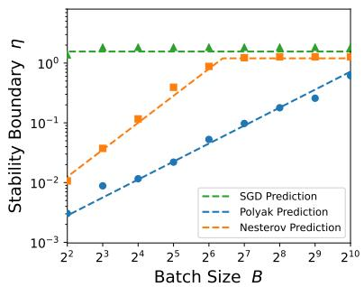  
(a) $s = 0 . 5 , \beta = 1 . 5$

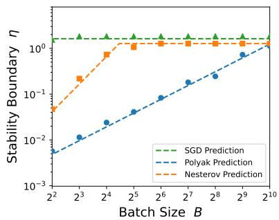  
(b) $s = 0 . 2 , \beta = 2$

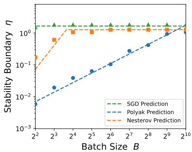  
(c) $s = 0 . 5 , \beta = 2 . 5$  
Figure 4: Additional stability boundaries across $( s , \beta )$

## G.2 Risk-dynamics scaling laws

Simulation setup. We simulate PLK regression initialized with $\pmb { \theta } _ { - 1 } = \pmb { \theta } _ { 0 } = 0$ . For Figure 2 (right), we set $( s , \beta ) = ( 0 . 3 , 4 ) , \sigma = 1 , B = 3 2 , \eta = 0 . 0 3 ,$ and $\rho = 0 . 9 8$ . Each method is run for $2 \times 1 0 ^ { 7 }$ iterations. Let $\overline { { \mathcal { E } } } ( k )$ denote the population excess risk averaged over the 100 runs.

Scaling-law fits. Theorems 5.1 and 5.2 determine the functional forms of the risk dynamics up to multiplicative constants. We therefore introduce $\Theta = ( C _ { 1 } , C _ { 2 } , C _ { 3 } ) \in \mathbb { R } _ { + } ^ { 3 }$ and fit the following ansatz separately for each method. For Polyak,

$$
F _ { \mathrm { p o l y a k } } ( k ; \Theta ) = C _ { 1 } \rho ^ { k } + C _ { 2 } ( \eta _ { \rho } k ) ^ { - s } + C _ { 3 } \frac { \sigma ^ { 2 } } { B } \eta _ { \rho } , \qquad \eta _ { \rho } : = \frac { \eta } { 1 - \rho } ,
$$

while for Nesterov,

$$
F _ { \mathrm { n e s t e r o v } } ( k ; \Theta ) = C _ { 1 } \operatorname* { m i n } \{ 1 , ( \eta k ) ^ { - s } \} \rho ^ { k } + C _ { 2 } ( \eta _ { \rho } k ) ^ { - s } + C _ { 3 } \frac { \sigma ^ { 2 } } { B } \operatorname* { m i n } \{ \eta _ { \rho } , \eta _ { \rho } ^ { 1 / \beta } \} .
$$

The first terms use the transient envelopes from Theorems 5.1 and 5.2, so the fits test the predicted scaling forms rather than their multiplicative constants. For each method, the coeficients are fitted by minimizing the mean squared relative error:

$$
\operatorname* { m i n } _ { \Theta \in \mathbb { R } _ { + } ^ { 3 } } \frac { 1 } { | \mathcal { T } _ { \mathrm { f i t } } | } \sum _ { k \in \mathcal { T } _ { \mathrm { f i t } } } \bigg ( \frac { F ( k ; \Theta ) - \overline { { \mathcal { E } } } ( k ) } { \overline { { \mathcal { E } } } ( k ) } \bigg ) ^ { 2 } , \qquad \mathcal { T } _ { \mathrm { f i t } } : = \{ k \geqslant 1 : \eta _ { \rho } k \geqslant 1 \} ,
$$

where $F = F _ { \mathrm { p o l y a k } }$ or $F _ { \mathrm { n e s t e r o v } }$ for the corresponding method.

Additional results. We repeat the same experiment for $( s , \beta ) \in \{ ( 0 . 3 , 6 ) , ( 0 . 5 , 4 ) , ( 0 . 5 , 6 ) \}$ keeping $\sigma = 1 , B = 3 2 , \eta = 0 . 0 3$ , and $\rho = 0 . 9 8$ . Each run uses $5 \times 1 0 ^ { 5 }$ iterations, and the reported risk is averaged over 100 independent runs. Figure 5 shows that the predicted scaling forms consistently track the empirical risk dynamics across these choices of $( s , \beta )$

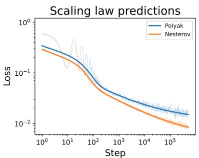  
(a) (s, β) = (0.3, 6)

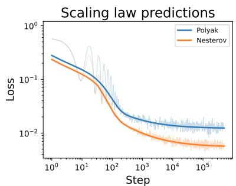  
(b) (s, β) = (0.5, 4)

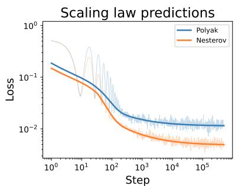  
(c) (s, β) = (0.5, 6)  
Figure 5: Additional validation of the risk-dynamics scaling laws for Polyak and Nesterov. Thin translucent lines show empirical excess risks, while thick solid curves show the fitted scaling-law predictions. All experiments use $\sigma = 1 , B = 3 2 , \eta = 0 . 0 3$ , and $\rho = 0 . 9 8$ , run for $5 \times 1 0 ^ { 5 }$ iterations, and report averages over 100 independent runs.

## G.3 Batch-size phase diagram at a fixed data budget

We simulate PLK regression with $( s , \beta ) = ( 0 . 3 , 4 )$ and $\sigma = 0 . 1$ , with all methods initialized at $\pmb { \theta } _ { - 1 } = \pmb { \theta } _ { 0 } = 0$ . We fix the total data budget at $D = 2 ^ { 1 4 }$ . For each batch size, we search locally around the hyperparameter scalings predicted by Theorem 6.3. Each candidate is evaluated over 50 independent runs. Let $W = \mathrm { m a x } \{ 1 , \lceil 0 . 0 1 T \rceil \}$ . We score each candidate by the mean excess risk over the final W iterations and across runs:

$$
\overline { { \mathcal { E } } } = \frac { 1 } { 5 0 } \sum _ { r = 1 } ^ { 5 0 } \frac { 1 } { W } \sum _ { k = T - W + 1 } ^ { T } \mathcal { E } ( \pmb { \theta } _ { k } ^ { ( r ) } ) .
$$

For each method and batch size, Figure 1 (right) reports the minimum $\overline { { \mathcal { E } } }$ over the corresponding search $\mathrm { g r i d } .$

Figure 6 shows additional results on the batch-size phase diagram across $( s , \beta )$

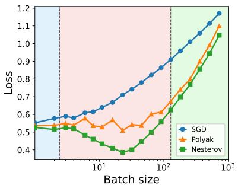  
(a) s = 0.1, β = 2

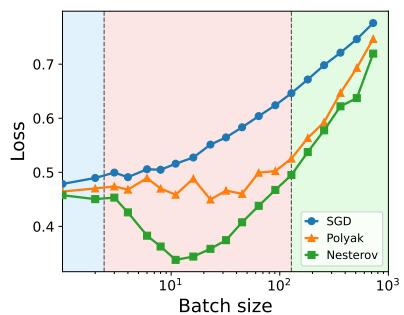  
(b) s = 0.1, β = 4

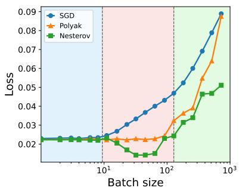  
(c) $s = 0 . 3 , \beta = 6$  
Figure 6: Additional experiments on the batch-size phase diagram under diferent $( s , \beta )$

## G.4 Data-scaling exponents across batch-size regimes

In Figure 3, we simulate PLK regression with $( s , \beta ) = ( 0 . 3 , 4 ) , \sigma = 0 . 1$ , and ${ \pmb \theta } _ { - 1 } = { \pmb \theta } _ { 0 } = 0 .$ , using data budgets $D \in \{ 2 0 0 0 , 4 0 0 0 , 8 0 0 0 , 1 6 0 0 0 , 3 2 0 0 0 , 6 4 0 0 0 , 1 2 8 0 0 0 \}$ . For a prescribed batch-size exponent $b ,$ we set $B = { \mathrm { r o u n d } } ( C _ { B } D ^ { b } )$ and $T = \lfloor D / B \rfloor$ , where $C _ { B }$ is an order-one constant.

For each method and D, we tune the multiplicative constants around the learning-rate and momentum scalings prescribed by Theorem 6.3, and report the best stable configuration. Each run is evaluated by averaging the risk over the final 1% of optimization steps, and each point is averaged over 10 independent runs.

We evaluate one representative batch-size exponent from each of the three regimes.

• Small batch. We take $b _ { \mathrm { s m a l l } } = 0$ . For all three methods, we search around $\eta \stackrel { } { \sim } D ^ { - s / ( s + 1 ) }$ ; for Polyak and Nesterov, we additionally use $1 - \rho \lesssim 1$

• Large batch. We take $b _ { \mathrm { l a r g e } } = b _ { \mathrm { 2 } } - \delta$ , where $\begin{array} { r } { b _ { 2 } = \frac { 2 s \beta + 1 } { 2 s \beta + \beta + 1 } } \end{array}$ and $\delta > 0$ is small. SGD uses $\eta \lesssim 1$ . For Polyak, we search around $\eta \lesssim 1$ and $1 - \rho \stackrel { } { \sim } D ^ { - ( b _ { \mathrm { l a r g e } } - s / ( s + 1 ) ) }$ . For Nesterov, we search around $\eta \lesssim 1$ and

$$
1 - \rho \approx D ^ { - c _ { \mathrm { n e s t e r o v } } } , \qquad c _ { \mathrm { n e s t e r o v } } = b _ { \mathrm { l a r g e } } - \frac { s \beta - ( \beta - 1 ) b _ { \mathrm { l a r g e } } } { s \beta + 1 } .
$$

• Ultra-large batch. We choose $b _ { 3 } ~ < ~ b _ { \mathrm { u l t r a } } ~ < ~ 1$ . SGD uses $\eta \ : \approx \ : 1$ , while for both momentum methods we search around $\eta \lesssim 1$ and $1 - \rho \stackrel { \textstyle = } { \sim } D ^ { - ( 1 - b _ { \mathrm { u l t r a } } - \delta ) }$ , with $\delta > 0$ chosen so that $T ( 1 - \rho ) \to \infty$

Additional results. Figures 7 and 8 show additional data-scaling results across $( s , \beta )$

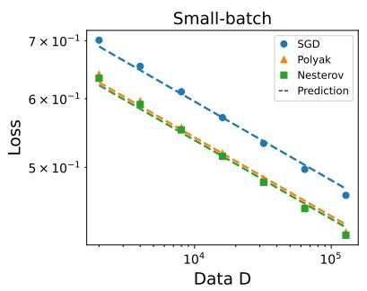

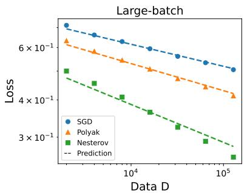

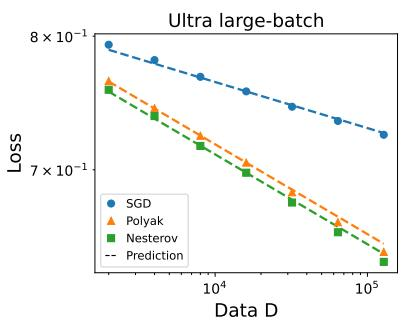  
Figure 7: Data scaling with $( s , \beta ) = ( 0 . 1 , 4 )$

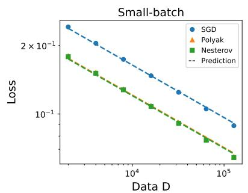

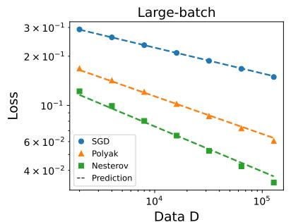  
Figure 8: Data scaling with $( s , \beta ) = ( 0 . 3 , 2 )$

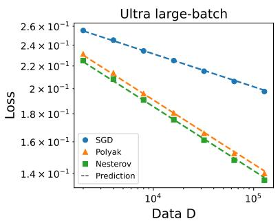

## G.5 Delayed instability under increasing momentum

We simulate PLK regression with $( s = 0 . 3 , \beta = 4 )$ . We set the learning rate to $\eta = 0 . 0 5$ and the batch size to $B = 4$ . To isolate the efect of multiplicative noise, we set the additive noise to $\sigma = 0$ . For Polyak and Nesterov, we use the time-varying momentum schedule

$$
\rho _ { k } = 1 - \frac { 1 } { k + 1 } .
$$

Each method is run for at most $5 \times 1 0 ^ { 5 }$ iterations over 50 independent runs, and the figure reports the median risk.