# NEURAL OPERATORS APPROXIMATE STRONGLY CONTINUOUSCONVEX MONOTONE SEMIGROUPS

JONAS BLESSING, PHILIPP SCHMOCKER, AND ALESSANDRO SGARABOTTOLO

Abstract. We approximate strongly continuous convex monotone semigroups by learning their Chernof-type one-step operators with neural operators. First, we introduce the general class of so-called Chernof-neural operators and show in a universal approximation theorem that they can approximate the Chernof one-step operators arbitrarily well. By using stability estimates between weighted Hölder spaces, the one-step approximation error can be propagated through the iterations which yields universal approximation of the corresponding semigroup. Second, we introduce the more specialized class of envelope-neural operators for envelope semigroups which allows us to derive quantitative approximation rates. Finally, we illustrate the efectiveness of these neural operators in several numerical examples arising from non-linear partial diferential equations, stochastic optimal control and stochastic processes under model uncertainty.

## Contents

1. Introduction 2   
2. Setup and notation 3   
2.1. Strongly continuous convex monotone semigroups 5   
3. Chernof-neural operators 7   
3.1. Universal approximation 7   
3.2. Qualitative approximation of the semigroup 10   
4. Envelope-neural operators 12   
4.1. Universal approximation 13   
4.2. Quantitative approximation of the semigroup 17   
5. Numerical experiments 18   
5.1. Splitting schemes for semilinear PDEs 18   
5.2. Stochastic optimal control 20   
5.3. Stochastic processes under model uncertainty 22   
Appendix A. Weighted Hölder spaces 25   
Appendix B. Weighted Stone-Weierstrass theorems for Banach scales 29   
Appendix C. Proof of Lemmas 5.1–5.4 33   
C.1. Proof of Lemma 5.1 33   
C.2. Proof of Lemma 5.2 34   
C.3. Proof of Lemma 5.3 34   
C.4. Proof of Lemma 5.4 35   
References 36

## 1. Introduction

In this article, we show that strongly continuous convex monotone semigroups on spaces of continuous functions can be approximated by iterating a sequence of neural operators. Strongly continuous convex monotone semigroups have been studied in a series of articles [8–12,21,27,54]. Starting from a sequence $( I _ { n } ) _ { n \in \mathbb { N } }$ of Chernof-type one-step operators $I _ { n } \colon \mathrm { C } _ { \kappa } \to \mathrm { C } _ { \kappa }$ and a sequence $( h _ { n } ) _ { n \in \mathbb { N } } \subset ( 0 , \infty )$ with $h _ { n } \to 0$ , one can construct a semigroup

$$
S ( t ) f : = \operatorname* { l i m } _ { n \to \infty } I _ { n } ^ { k _ { n } ^ { t } } f = \operatorname* { l i m } _ { n \to \infty } \underbrace { \left( I _ { n } \circ \cdot \cdot \cdot \circ I _ { n } \right) } _ { k _ { n } ^ { t } \mathrm { ~ t i m e s } } f ,\tag{1.1}
$$

with $k _ { n } ^ { t } : = \operatorname* { m a x } \{ k \in \mathbb { N } _ { 0 } \colon k h _ { n } \leq t \}$ , whose infinitesimal generator is given by

$$
A f = I ^ { \prime } ( 0 ) f : = \operatorname* { l i m } _ { n \to \infty } { \frac { I _ { n } f - f } { h _ { n } } } \quad { \mathrm { f o r ~ a l l ~ } } f \in \mathrm { C } _ { \mathrm { b } } ^ { \infty } .\tag{1.2}
$$

The comparison principle in [8] guarantees that the semigroup $( S ( t ) ) _ { t \geq 0 }$ is uniquely determined by the infinitesimal behavior of the one-step operators in equation (1.2).

The framework of strongly continuous convex monotone semigroups covers various applications such as stochastic optimal control, Hamilton–Jacobi–Bellman (HJB) equations, large deviations and stochastic processes under model uncertainty, see [5,11–13,21,25,27,41,42,54]. It is also worth mentioning that convex monotone semigroups do not rely on the theory of viscosity solutions [17, 18, 47] but are consistent with ${ \mathrm { i t } } , { \mathrm { i . e . , } } u ( t ) : = S ( t ) f$ is a viscosity solution of the HJB equation

$$
\left\{ \begin{array} { l l } { \partial _ { t } u ( t ) = A u ( t ) , \quad t \in ( 0 , \infty ) , } \\ { \quad u ( 0 ) = f , } \end{array} \right.\tag{1.3}
$$

see $[ 2 7 ,$ Theorem 6.3]. In particular, if the viscosity solution is unique, the Chernof-type approximation (1.1) can be seen as a monotone approximation scheme $[ 1 \mathrm { - 3 , 1 4 , 2 2 , 3 4 , 3 9 } ]$ for the solution operator $f \mapsto u ( t ) : = S ( t ) f$ of the HJB equation (1.3).

In this paper, we approximate the strongly continuous convex monotone semigroup $( S ( t ) ) _ { t \geq 0 }$ by learning, for suficiently large $n \in \mathbb N$ , the Chernof-type one-step operator $I _ { n }$ with a neural operator $\Phi _ { n }$ on a suficiently rich subset of $\mathrm { C } _ { \kappa } ^ { \alpha }$ so that equation (1.1) yields

$$
S ( t ) f \approx I _ { n } ^ { k _ { n } ^ { t } } f \approx \Phi _ { n } ^ { k _ { n } ^ { t } } f \quad \mathrm { f o r ~ a l l ~ } f \in \mathrm { C } _ { \kappa } ^ { \alpha } ,\tag{1.4}
$$

where $\mathrm { C } _ { \kappa } ^ { \alpha }$ is a weighted Hölder space. First, we introduce the general class of so-called Chernofneural operators, which are based on the infinite-dimensional generalization of neural networks on weighted spaces in [19]. These neural operators map the infinite-dimensional input $f \in \mathrm { C } _ { \kappa } ^ { \alpha }$ via suitable hidden layer maps to the real hidden layer space, on which a scalar non-linear activation function is applied, followed by the multiplication with linear readout functions to obtain an output in $\mathrm { C } _ { \kappa } ^ { \alpha }$ . By generalizing the weighted Stone–Weierstrass theorem of [19] to the scale of weighted Hölder spaces, we establish a universal approximation theorem for the one-step operators $( I _ { n } ) _ { n \in \mathbb { N } } ,$ see Theorem 3.5. The approximation error can then be propagated through the iterations to derive the approximation of the semigroup in equation (1.4), see Theorem 3.6.

Second, we introduce the more specialized but structure-preserving class of so-called envelopeneural operators if the sequence of one-step operators $( I _ { n } ) _ { n \in \mathbb { N } }$ is of the form

$$
( I _ { n } f ) ( x ) = \operatorname* { s u p } _ { \lambda \in \Lambda } { \big ( } ( I _ { n , \lambda } f ) ( x ) - \eta _ { n } ( \lambda ) h _ { n } { \big ) } ,\tag{1.5}
$$

where Λ is a parameter set, $I _ { n , \lambda }$ are linear operators and $\eta _ { n } \colon \Lambda \to [ 0 , \infty ]$ are penalization functions. This framework covers, for instance, stochastic optimal control problems, HJB equations and transition semigroups of stochastic processes under model uncertainty. To make the supremum on the right-hand side of equation (1.5) tractable, we replace the supremum over Λ by a maximum over finitely many trainable parameters $\lambda _ { 1 } , \dots , \lambda _ { M } \in \Lambda$ . Since finite maxima can be represented by ReLU networks, we define envelope-neural operators as compositions of ReLU networks with finite subcollections of the operators $( I _ { n , \lambda } ) _ { \lambda \in \Lambda }$ . Under suitable regularity assumptions on the parameter dependence, we show that envelope-neural operators can approximate the one-step operators $( I _ { n } ) _ { n \in \mathbb { N } }$ arbitrarily well and subsequently propagate the resulting one-step approximation error through the iterations, see Theorem 4.6 and Theorem 4.7. Moreover, we derive explicit approximation rates in terms of the size of the neural operator and combine them with the convergence rates of the one-step operator in [12] to obtain quantitative error bounds for the approximation of the strongly continuous convex monotone semigroup, see Theorem 4.9 and Theorem 4.12.

Compared to the literature, our approach difers both from deep learning methods that approximate the solution of a partial diferential equation (PDE) for fixed initial data and from operator-learning methods that approximate the full solution operator of the underlying PDE. For fixed initial data, our approach is closely related to deep splitting schemes [6, 58] and, more broadly, to neural PDE solvers such as the deep BSDE method [31], the deep Galerkin method [65], the deep Ritz method [23], physics-informed neural networks [62], deep backward dynamic programming [33] and random-feature models [28, 52, 56], see also [15, 29, 30, 51, 60, 69] in the context of HJB equations. For varying initial data, our approach is related to operator-learning methods for PDEs such as Fourier neural operators [46], neural integral operators [35], DeepONets [43,48], generative equilibrium operators [38] and kernel methods [32], see also [44] for HJB equations. These results rely on universal approximation theorems for neural operators between infinitedimensional function spaces starting with [16, 50] and followed by results, e.g., on non-Euclidean domains [26, 36, 37], Fréchet spaces [7], and weighted infinite-dimensional spaces [19, 63].

In contrast to these approaches, we do not approximate the solution operator $f \mapsto S ( t ) f$ directly but instead learn the Chernof-type one-step operator $I _ { n }$ with a neural operator $\Phi _ { n }$ and recover S(t) by iteration. Hence, the training of $\Phi _ { n }$ only requires evaluations of $I _ { n } ,$ often available in closed form, instead of supervised PDE solution data. We illustrate our approach in three numerical examples from non-linear partial diferential equations, stochastic optimal control, and stochastic processes under model uncertainty. While the Chernof-neural operator provides a more general architecture and is straightforward to evaluate, the envelope-neural operator is particularly eficient in training, achieving accurate approximations with small architecture.

The rest of the article is organized as follows. In Section 2, we introduce strongly continuous convex monotone semigroups. In Section 3, we establish a universal approximation theorem for Chernof-neural operators followed by the one for envelope-neural operators and their approximation rates in Section 4. Finally, we present several numerical experiments in Section 5 while some proofs are given in Appendices $\mathrm { A - C }$

## 2. Setup and notation

Let $\kappa \colon  { \mathbb { R } ^ { d } } \to ( 0 , \infty )$ be a bounded continuous function satisfying

$$
\operatorname* { s u p } _ { x \in \mathbb { R } ^ { d } } \operatorname* { s u p } _ { | y | \leq 1 } \frac { \kappa ( x ) } { \kappa ( x - y ) } < \infty .\tag{2.1}
$$

Typical examples that we have in mind are polynomial weights $\kappa ( x ) : = ( 1 + | x | ^ { q } ) ^ { - 1 }$ with $q \geq 0$ We define $\mathrm { C } _ { \kappa }$ as the space of all continuous functions $f \colon  { \mathbb { R } ^ { d } } \to  { \mathbb { R } }$ satisfying

$$
\| f \| _ { \kappa } : = \operatorname* { s u p } _ { x \in \mathbb { R } ^ { d } } | f ( x ) | \kappa ( x ) < \infty .
$$

An operator $S \colon \mathrm { C } _ { \kappa }  \mathrm { C } _ { \kappa }$ is called convex if $S ( \lambda f + ( 1 - \lambda ) g ) \leq \lambda S f + ( 1 - \lambda ) S g$ for all $\lambda \in [ 0 , 1 ]$ and $f , g \in \mathrm { C } _ { \kappa }$ and monotone if $S f \le S g$ for all $f , g \in \mathrm { C } _ { \kappa }$ with $f \leq g ,$ where $f \leq g$ means that $f ( x ) \leq g ( x )$ for all $x \in \mathbb { R } ^ { d }$ . Furthermore, we write $f _ { n } \downarrow f$ if a sequence $( f _ { n } ) _ { n \in \mathbb { N } } \subset \mathrm { C } _ { \kappa }$ decreases pointwise to another function $f \in \mathrm { C } _ { \kappa }$ and define $B _ { \mathrm { C } _ { \kappa } } ( r ) : = \{ f \in \mathrm { C } _ { \kappa } \colon \| f \| _ { \kappa } \leq r \}$ . Let $\operatorname { L i p } _ { \mathrm { { b } } }$ be the space of all bounded Lipschitz functions $f \colon  { \mathbb { R } ^ { d } } \to  { \mathbb { R } }$ and denote by $\operatorname { L i p } _ { \mathrm { { b } } } ( r )$ the set of all r-Lipschitz functions $f \colon  { \mathbb { R } ^ { d } } \to  { \mathbb { R } }$ with $\| f \| _ { \infty } \leq r$ . Moreover, the space $\mathrm { C } _ { b } ^ { 1 } ~ ( \mathrm { r e s p . , \tilde { C } _ { b } ^ { \infty } }$ ; resp. $\mathrm { C } _ { \mathrm { c } } ^ { \infty } )$ consists of all bounded diferentiable (resp., infinitely diferentiable; resp. compactly supported infinitely diferentiable) functions $f \colon  { \mathbb { R } ^ { d } } \to$ R such that all existing derivatives are bounded.

Throughout this article, we endow $\mathrm { C } _ { \kappa }$ with the mixed topology between $\| \cdot \| _ { \kappa }$ and the topology of uniform convergence on compact sets, i.e., the strongest locally convex topology on $\mathrm { C } _ { \kappa }$ that coincides on $\| \cdot \| _ { \kappa } { \mathrm { - b o u n d e d } }$ sets with the topology of uniform convergence on compact subsets, see [68] for a detailed introduction. Choosing the mixed topology rather than the norm topology is crucial for the analysis of strongly continuous convex monotone semigroups, see [8, 11, 12]. Although the mixed topology is not metrizable, for convex monotone operators $S \colon \mathrm { C } _ { \kappa }  \mathrm { C } _ { \kappa } ,$ continuity w.r.t. the mixed topology is equivalent to sequential continuity and to continuity from above, see [20, 53]. Moreover, a sequence $( f _ { n } ) _ { n \in \mathbb { N } } \subset \mathrm { C } _ { \kappa }$ converges to $f \in \mathrm { C } _ { \kappa }$ if and only if

$$
\operatorname* { s u p } _ { n \in \mathbb { N } } \| f _ { n } \| _ { \kappa } < \infty \quad { \mathrm { a n d } } \quad \operatorname* { l i m } _ { n \to \infty } \| f - f _ { n } \| _ { \infty , K } = 0
$$

for all compact subsets $K \Subset \mathbb { R } ^ { d }$ , where $\| f \| _ { \infty , K } : = \operatorname* { s u p } _ { x \in K } | f ( x ) |$ |, see $[ 2 7 ,$ , Proposition $\mathrm { A . 4 l } .$ . If not stated otherwise, all limits in $\mathrm { C } _ { \kappa }$ are taken w.r.t. the mixed topology and compact subsets are denoted by $K \Subset \mathbb { R } ^ { d }$ . The mixed topology can also be seen as a strict topology, see [24, 40, 64].

In order to derive a universal approximation result, we further introduce weighted Hölder spaces as follows. For every $\alpha \in [ 0 , 1 ]$ , we denote by $\mathrm { C } _ { \kappa } ^ { \alpha }$ the space of all functions $f \colon  { \mathbb { R } ^ { d } } \to$ R satisfying

$$
\| f \| _ { \alpha , \kappa } : = \operatorname* { m a x } \left\{ \operatorname* { s u p } _ { x \in \mathbb { R } ^ { d } } | f ( x ) | \kappa ( x ) , \operatorname* { s u p } _ { x \neq y } \frac { | f ( x ) - f ( y ) | } { | x - y | ^ { \alpha } } \bar { \kappa } ( x , y ) \right\} < \infty ,
$$

where $\begin{array} { r } { \bar { \kappa } ( x , y ) : = \frac { 2 \kappa ( x ) \kappa ( y ) } { \kappa ( x ) + \kappa ( y ) } = \frac { 2 } { \kappa ( x ) ^ { - 1 } + \kappa ( y ) ^ { - 1 } } } \end{array}$ satisfies min $( \kappa ( x ) , \kappa ( y ) ) \leq \bar { \kappa } ( x , y ) \leq 2 \operatorname* { m i n } ( \kappa ( x ) , \kappa ( y ) )$ By Theorem $\mathrm { A . 1 }$ , the space $\bigl ( \mathrm { C } _ { \kappa } ^ { \alpha } , \| \cdot \| _ { \alpha , \kappa } \bigr )$ is a Banach space satisfying $\mathrm { C } _ { \kappa } ^ { 1 } = \mathrm { L i p } _ { \mathrm { b } } \ \mathrm { i f } \ \kappa \equiv 1$ . Moreover, since the norms $\| \cdot \| _ { 0 , \kappa }$ and $\| \cdot \| _ { \kappa }$ are equivalent, we have $\mathrm { C } _ { \kappa } ^ { 0 } = \mathrm { C } _ { \kappa }$ as sets, but we keep the notation $\mathrm { C } _ { \kappa } ^ { 0 }$ to distinguish the norm topology from the mixed topology on $\mathrm { C } _ { \kappa }$ . In addition, Proposition A.2 guarantees that the embedding $\mathrm { C } _ { \kappa } ^ { \alpha } \hookrightarrow \mathrm { C } _ { \kappa ^ { \prime } } ^ { \alpha ^ { \prime } }$ is continuous if $0 \leq \alpha ^ { \prime } \leq \alpha \leq 1$ and $\kappa ^ { \prime } \lesssim \kappa ,$ where $\kappa ^ { \prime } \lesssim$ κ means that $\kappa ^ { \prime } \leq c \kappa$ for some constant $c \geq 0$ . By Theorem A.3, the embedding $\mathrm { C } _ { \kappa } ^ { \alpha } \hookrightarrow \mathrm { C } _ { \kappa ^ { \prime } } ^ { \alpha ^ { \prime } }$ is even compact if $0 \leq \alpha ^ { \prime } < \alpha \leq 1$ and $\kappa ^ { \prime } \ll \kappa$ , where $\kappa ^ { \prime } \lesssim$ κ means that $\begin{array} { r } { \operatorname* { l i m } _ { | x | \to \infty } \frac { \kappa ^ { \prime } ( x ) } { \kappa ( x ) } = 0 } \end{array}$ Moreover, we denote by ${ \mathrm { c } } _ { \kappa } ^ { \alpha }$ the little weighted Hölder space consisting of all functions $f \in \dot { \mathrm { C } } _ { \kappa } ^ { \alpha }$ with

$$
\operatorname* { l i m } _ { | x | \to \infty } | f ( x ) | \kappa ( x ) = 0 \quad { \mathrm { a n d } } \quad \operatorname* { l i m } _ { \delta \to 0 } \ \operatorname* { s u p } _ { | x - y | < \delta } \ { \frac { | f ( x ) - f ( y ) | } { | x - y | ^ { \alpha } } } { \bar { \kappa } } ( x , y ) = 0 .
$$

Note that $\mathrm { c } _ { \kappa } ^ { \alpha } \subset \mathrm { C } _ { \kappa } ^ { \alpha }$ is a closed linear subspace and therefore itself a Banach space. In particular, the embedding $\mathrm { C } _ { \kappa } ^ { \ddot { \alpha } } \hookrightarrow \mathrm { c } _ { \kappa ^ { \prime } } ^ { \alpha ^ { \prime } }$ is continuous and dense if $0 \leq \alpha ^ { \prime } < \alpha \leq 1$ and $\kappa ^ { \prime } \lessapprox \kappa ,$ see Theorem A.2 and Theorem A.4. We define $B _ { \mathrm { C } _ { \kappa } ^ { \alpha } } ( r ) : = \{ f \in \mathrm { C } _ { \kappa } ^ { \alpha } \colon \| f \| _ { \alpha , \kappa } \leq r \}$ for all $r \geq 0$

Throughout this article, we also use the following notations. Let $\mathbb { R } _ { + } : = \{ x \in \mathbb { R } : x \geq 0 \}$ We define $B _ { \mathbb { R } ^ { d } } ( r ) : = \{ x \in \mathbb { R } ^ { d } \colon | x | \leq r \}$ for all $r \geq 0$ , where $| \cdot |$ is the Euclidean norm. The transpose of a vector $x \in \mathbb { R } ^ { d }$ is denoted by $x ^ { \top }$ , compact subsets are denoted by $K \Subset \mathbb { R } ^ { d }$ and the translation of a function $f \colon  { \mathbb { R } ^ { d } } \to  { \mathbb { R } }$ by a vector $x \in \mathbb { R } ^ { d }$ is denoted by $( \tau _ { x } f ) ( y ) : = f ( x + y )$ for all $\boldsymbol { y } \in \mathbb { R } ^ { d }$ . The set $\mathcal { M } _ { \kappa }$ consists of all signed Borel measures $\mu$ with $\begin{array} { r } { \int _ { \mathbb { R } ^ { d } } \frac { 1 } { \kappa ( x ) } \vert \mu \vert ( \mathrm { d } x ) < \infty } \end{array}$ . Moreover, for topological spaces $X , Y$ , the space $\mathrm { C } _ { \mathrm { b } } ( X ; Y )$ consists of all uniformly bounded continuous functions $f \colon X \to Y$ , while $\operatorname { C } ( X )$ consists of all continuous functions $f \colon X \to \mathbb { R }$ . For a Banach space $X$ , we denote by $\mathrm { C } ^ { 1 } ( X )$ the space of all continuously diferentiable functions $f \colon X \to \mathbb { R }$ If $( X , d )$ is a metric space, we define $\mathring { B } _ { d } ( x , r ) : = \{ y \in X \colon d ( x , y ) < r \}$ for all $r > 0$ and $x \in X$ Finally, the set $\mathbb { S } _ { + } ^ { d } \subset \mathbb { R } ^ { d \times d }$ consists of all symmetric positive semi-definite matrices.

2.1. Strongly continuous convex monotone semigroups. In this section, we recall the results from [8, Section 5] and [12, Section 2] about Chernof-type approximations of strongly continuous convex monotone semigroups.

Definition 2.1. A family $( S ( t ) ) _ { t \geq 0 }$ of operators $S ( t ) \colon \mathrm { C } _ { \kappa }  \mathrm { C } _ { \kappa }$ is called strongly continuous convex monotone semigroup if the following conditions are satisfied:

(i) $S ( t )$ is convex and monotone with $S ( t ) f _ { n } \downarrow 0$ for all $t \geq 0$ and $f _ { n } \downarrow 0$

(ii) $S ( 0 ) f = f$ and $S ( s + t ) f = S ( s ) S ( t ) f$ for all $s , t \geq 0$ and $f \in \mathrm { C } _ { \kappa }$

(iii) $\mathrm { s u p } _ { t \in [ 0 , T ] } \| S ( t ) \frac { r } { \kappa } \| _ { \kappa } <$ ∞ for all $r , T \geq 0 .$

(iv) $f = \mathrm { l i m } _ { t \downarrow 0 } S ( t ) f$ for all $f \in \mathrm { C } _ { \kappa }$

Furthermore, the generator of the semigroup is defined by

$$
A \colon D ( A ) \to \mathrm { C } _ { \kappa } , \ f \mapsto \operatorname* { l i m } _ { h \downarrow 0 } { \frac { S ( h ) f - f } { h } } ,
$$

where the domain consists of all $f \in \mathrm { C } _ { \kappa }$ such that the previous limit exists.

Let $( I _ { n } ) _ { n \in \mathbb { N } }$ be a sequence of operators $I _ { n } \colon \mathrm { C } _ { \kappa } \to \mathrm { C } _ { \kappa }$ and $( h _ { n } ) _ { n \in \mathbb { N } } \subset ( 0 , \infty )$ be a sequence with $h _ { n } \to 0$ . For every $t \geq 0 , n \in \mathbb { N }$ and $f \in \mathrm { C } _ { \kappa } .$ we define

$$
I ( \pi _ { n } ^ { t } ) f : = I _ { n } ^ { k _ { n } ^ { t } } f = \underbrace { \left( I _ { n } \circ \cdot \cdot \cdot \circ I _ { n } \right) } _ { k _ { n } ^ { t } { \mathrm { ~ t i m e s } } } f ,
$$

where $k _ { n } ^ { t } : = \operatorname* { m a x } \{ k \in \mathbb { N } _ { 0 } \colon k h _ { n } \leq t \}$ and $\pi _ { n } ^ { t } : = \{ 0 , h _ { n } , \ldots , k _ { n } ^ { t } h _ { n } \}$ . In addition, for every $f \in \mathrm { C } _ { \kappa }$ such that the following limit exists, we define

$$
I ^ { \prime } ( 0 ) f : = \operatorname* { l i m } _ { n \to \infty } \frac { I _ { n } f - f } { h _ { n } } \in \mathrm { C } _ { \kappa } .
$$

The following conditions guarantee that the sequence of iterated operators converges to a strongly continuous convex monotone semigroup which is uniquely determined by the infinitesimal behavior of the one-step operators.

Assumption 2.2. Suppose that the following conditions are satisfied:

(i) $I _ { n }$ is convex and monotone with $I _ { n } 0 = 0$ for all $n \in \mathbb { N }$

(ii) There exists $\omega \geq 0$ with $\| I _ { n } f - I _ { n } g \| _ { \kappa } \leq e ^ { \omega h _ { n } } \| f - g \| _ { r }$ κ for all $f , g \in \mathrm { C } _ { \kappa }$ and $n \in \mathbb { N } .$

(iii) For every $\varepsilon > 0 , r , T \geq 0$ , and $K \Subset \mathbb { R } ^ { d }$ there exist $c \geq 0$ and $K ^ { \prime } \Subset \mathbb { R } ^ { d }$ with

$$
\| I ( \pi _ { n } ^ { t } ) f - I ( \pi _ { n } ^ { t } ) g \| _ { \infty , K } \leq c \| f - g \| _ { \infty , K ^ { \prime } } + \varepsilon
$$

for all $t \in [ 0 , T ] , n \in \mathbb { N } { \mathrm { ~ a n d ~ } } f , g \in B _ { \mathrm { C } _ { \kappa } } ( r )$

(iv) For every $\varepsilon > 0$ , there exists $\delta > 0$ and $n _ { 0 } \in \mathbb { N }$ with

$$
I _ { n } ( \tau _ { x } f ) \leq \tau _ { x } I _ { n } f + \frac { r \varepsilon h _ { n } } { \kappa }
$$

for all $r \geq 0 , f \in \mathrm { L i p } _ { \mathrm { b } } ( r ) , x \in B _ { \mathbb { R } ^ { d } } ( \delta )$ and $n \geq n _ { 0 }$

(v) It holds $I _ { n } \colon \mathrm { L i p } _ { \mathrm { b } } ( r ) \to \mathrm { L i p } _ { \mathrm { b } } ( e ^ { \omega h _ { n } } r )$ for all $r \geq 0$ and $n \in \mathbb { N }$

(vi) The limit $I ^ { \prime } ( 0 ) f \in \mathrm { C } _ { \kappa }$ exists for all $f \in \mathrm { C _ { b } ^ { \infty } }$

It follows from [8, Lemma C.2] that condition (iii) is equivalent to the following: for every $T \geq 0 , K \Subset \mathbb { R } ^ { d }$ and $( f _ { k } ) _ { k \in \mathbb { N } } \subset \mathrm { C } _ { \kappa }$ with $f _ { k } \downarrow 0$ , it holds

$$
\operatorname* { s u p } _ { ( t , x ) \in [ 0 , T ] \times K } \operatorname* { s u p } _ { n \in \mathbb { N } } \big ( I ( \pi _ { n } ^ { t } ) f _ { k } \big ) ( x ) \downarrow 0 .
$$

Moreover, we refer to [12, Section 2.4] for suficient conditions on the one-step operators $I _ { n }$ which guarantee that condition (vi) is satisfied and which can easily be verified in applications. The next theorem follows immediately from [12, Theorem 2.11 and Corollary 2.15].

Theorem 2.3. Suppose that Assumption 2.2 is satisfied. Then, there exists a strongly continuous convex monotone semigroup $( S ( t ) ) _ { t \geq 0 }$ on $\mathrm { C } _ { \kappa }$ with generator $A \colon D ( A ) \to \mathrm { C } _ { \kappa }$ given by

$$
S ( t ) f : = \operatorname* { l i m } _ { n \to \infty } I ( \pi _ { n } ^ { t } ) f \quad f o r \ a l l t \geq 0 \ a n d \ f \in \mathrm { C } _ { \kappa } .
$$

In addition, the following statements are true:

(i) It holds $f \in D ( A )$ and $A f = I ^ { \prime } ( 0 ) f$ for all $f \in \mathrm { C } _ { \kappa }$ such that $I ^ { \prime } ( 0 ) f \in \mathrm { C } _ { \kappa }$ exists. $I n$ particular, this is valid for all $f \in \mathrm { C } _ { \mathrm { b } } ^ { \infty }$

(ii) It holds $\| S ( t ) f - S ( t ) g \| _ { \kappa } \leq e ^ { \omega t } \| f - g \| _ { \kappa }$ for all $t \geq 0$ and $f , g \in \mathrm { C } _ { \kappa }$

(iii) For every $\varepsilon > 0 , r , T \geq 0$ and $K \Subset \mathbb { R } ^ { d }$ , there exists $c \geq 0$ and $K ^ { \prime } \Subset \mathbb { R } ^ { d }$ with

$$
\| S ( t ) f - S ( t ) g \| _ { \infty , K } \leq c \| f - g \| _ { \infty , K ^ { \prime } } + \varepsilon
$$

for all $t \in [ 0 , T ]$ and $f , g \in B _ { \mathrm { C } _ { \kappa } } ( r )$

(iv) For every $\varepsilon > 0$ , there exists $\delta > 0$ with

$$
S ( t ) ( \tau _ { x } f ) \leq \tau _ { x } S ( t ) f + \frac { e ^ { \omega t } r \varepsilon t } { \kappa }
$$

for all $r , t \geq 0 , f \in \mathrm { L i p } _ { \mathrm { b } } ( r ) \ a n d \ x \in B _ { \mathbb { R } ^ { d } } ( \delta )$

(v) It holds $S ( t ) \colon \mathrm { L i p } _ { \mathrm { b } } ( r ) \to \mathrm { L i p } _ { \mathrm { b } } ( e ^ { \omega t } r )$ for all $r , t \geq 0$

Furthermore, let $( T ( t ) ) _ { t \geq 0 }$ be another strongly continuous convex monotone semigroup on $\mathrm { C } _ { \kappa }$ with generator $B \colon D ( B ) \to \mathrm { C } _ { \kappa }$ satisfying the conditions $( i v )$ and $( v ) , \mathrm { C } _ { \mathrm { b } } ^ { \infty } \subset D ( B )$ and

$$
A f = B f \quad f o r \ a l l \ f \in \mathrm { C _ { b } ^ { \infty } } .
$$

Then, it holds $S ( t ) f = T ( t ) f$ for all $t \geq 0$ and $f \in \mathrm { C } _ { \kappa }$

Corollary 2.4. Let Assumption 2.2 be satisfied and denote by $( S ( t ) ) _ { t \geq 0 }$ the strongly continuous convex monotone semigroup from Theorem 2.3. Assume that there exists $\alpha \in ( 0 , 1 ]$ and $\tilde { \omega } \geq 0$ with

$$
\| I _ { n } f \| _ { \alpha , \kappa } \leq e ^ { \tilde { \omega } h _ { n } } \| f \| _ { \alpha , \kappa } \quad f o r \ a l l \ n \in \mathbb { N } \ a n d \ f \in \mathrm { C } _ { \kappa } ^ { \alpha } .
$$

Then, it holds $\| S ( t ) f \| _ { \alpha , \kappa } \leq e ^ { \tilde { \omega } t } \| f \| _ { \alpha , \kappa }$ for all $t \geq 0$ and $f \in \mathrm { C } _ { \kappa } ^ { \alpha }$ . Furthermore,

$$
\operatorname* { l i m } _ { n \to \infty } \operatorname* { s u p } _ { f \in B _ { \mathrm { C } _ { \kappa } ^ { \alpha } } ( r ) } \operatorname* { s u p } _ { t \in [ 0 , T ] } \| S ( t ) f - I ( \pi _ { n } ^ { t } ) f \| _ { \alpha ^ { \prime } , \kappa ^ { \prime } } = 0
$$

for all $r , T \geq 0 , \alpha ^ { \prime } \in [ 0 , \alpha )$ and $\kappa ^ { \prime } \lessapprox \kappa$

Proof. For every $t \geq 0$ and $f \in \mathrm { C } _ { \kappa } ^ { \alpha }$ , it follows by induction that

$$
\| I ( \pi _ { n } ^ { t } ) f \| _ { \alpha , \kappa } \leq e ^ { \tilde { \omega } t } \| f \| _ { \alpha , \kappa } \quad \mathrm { f o r ~ a l l } \ n \in \mathbb { N } ,\tag{2.2}
$$

which, by taking the limit, implies

$$
\| S ( t ) f \| _ { \alpha , \kappa } \leq e ^ { \tilde { \omega } t } \| f \| _ { \alpha , \kappa } .\tag{2.3}
$$

Now, let $r , T \geq 0 , \alpha ^ { \prime } \in [ 0 , \alpha ) , \kappa ^ { \prime } \ll \kappa$ and $\varepsilon ^ { \prime } > 0$ . Since $\kappa ^ { \prime } \ \lesssim \ \kappa ,$ , Assumption 2.2(iii) and Theorem 2.3(iii) imply that there exists $\delta > 0$ with

$$
\begin{array} { r } { \| S ( t ) f - S ( t ) g \| _ { \kappa ^ { \prime } } < \frac { \varepsilon ^ { \prime } } { 5 } \quad \mathrm { a n d } \quad \| I ( \pi _ { n } ^ { t } ) f - I ( \pi _ { n } ^ { t } ) g \| _ { \kappa ^ { \prime } } < \frac { \varepsilon ^ { \prime } } { 5 } } \end{array}\tag{2.4}
$$

for all $t \in [ 0 , T ] , n \in \mathbb { N }$ and $f , g \in B _ { \mathrm { C } _ { \kappa } } ( r )$ with $\| f - g \| _ { \kappa ^ { \prime } } < \delta$ . By Theorem A.3, there exist $f _ { 1 } , \dots , f _ { N } \in B _ { \mathrm { C } _ { \kappa } ^ { \alpha } } ( r )$ such that, for every $f \in B _ { \mathrm { C } _ { \kappa } ^ { \alpha } } ( r )$ , there exists $j \in \{ 1 , \ldots , N \}$ with

$$
\| f - f _ { j } \| _ { \kappa ^ { \prime } } < \delta .\tag{2.5}
$$

In addition, by using $\kappa ^ { \prime } \lesssim$ κ and the strong continuity, there exist $t _ { 1 } , \dots , t _ { M } \in [ 0 , T ]$ such that, for every $t \in [ 0 , T ]$ , there exists $i \in \{ 1 , \ldots , M \}$ with

$$
\begin{array} { r } { \| S ( t ) f _ { j } - S ( t _ { i } ) f _ { j } \| _ { \kappa ^ { \prime } } < \frac { \varepsilon ^ { \prime } } { 5 } \quad \mathrm { a n d } \quad \| I ( \pi _ { n } ^ { t } ) f _ { j } - I ( \pi _ { n } ^ { t _ { i } } ) f _ { j } \| _ { \kappa ^ { \prime } } < \frac { \varepsilon ^ { \prime } } { 5 } \quad \mathrm { f o r ~ a l l ~ } j \in \lbrace 1 , \ldots , N \rbrace . } \end{array}\tag{2.6}
$$

Theorem A.3 yields the existence of a subsequence $( n _ { l } ) _ { l \in \mathbb { N } } \subset \mathbb { N }$ and functions $g _ { i j } \in \mathrm { C } _ { \kappa } ^ { \alpha }$ with

$$
\operatorname* { l i m } _ { l \to \infty } \| I ( \pi _ { n _ { l } } ^ { t _ { i } } ) f _ { j } - g _ { i j } \| _ { \kappa ^ { \prime } } = 0 \quad \mathrm { f o r ~ a l l ~ } i \in \{ 1 , . . . , M \} \mathrm { ~ a n d ~ } j \in \{ 1 , . . . , N \} .
$$

Since $I ( \pi _ { n _ { l } } ^ { t _ { i } } ) f _ { j }  S ( t _ { i } ) f _ { j }$ in the mixed topology, we obtain $g _ { i j } = S ( t _ { i } ) f _ { j }$ . In particular, the limit does not depend on the choice of the convergent subsequence, whence there exists $n _ { 0 } \in \mathbb { N }$ with

$$
\begin{array} { r } { \| I ( \pi _ { n } ^ { t _ { i } } ) f _ { j } - S ( t _ { i } ) f _ { j } \| _ { \kappa ^ { \prime } } < \frac { \varepsilon ^ { \prime } } { 5 } \quad \mathrm { f o r ~ a l l ~ } i \in \{ 1 , \dots , M \} , \ j \in \{ 1 , \dots , N \} \mathrm { ~ a n d ~ } n \geq n _ { 0 } . } \end{array}\tag{2.7}
$$

For every $t \in [ 0 , T ] , f \in B _ { \mathrm { C } _ { \kappa } ^ { \alpha } } ( r )$ and $n \geq n _ { 0 }$ , the inequalities (2.4)-(2.7) imply

$$
\begin{array} { r l } & { \| I ( \pi _ { n } ^ { t } ) f - S ( t ) f \| _ { \kappa ^ { \prime } } \leq \| I ( \pi _ { n } ^ { t } ) f - I ( \pi _ { n } ^ { t } ) f _ { j } \| _ { \kappa ^ { \prime } } + \| I ( \pi _ { n } ^ { t } ) f _ { j } - I ( \pi _ { n } ^ { t _ { i } } ) f _ { j } \| _ { \kappa ^ { \prime } } } \\ & { \qquad + \| I ( \pi _ { n } ^ { t _ { i } } ) f _ { j } - S ( t _ { i } ) f _ { j } \| _ { \kappa ^ { \prime } } + \| S ( t _ { i } ) f _ { j } - S ( t ) f _ { j } \| _ { \kappa ^ { \prime } } } \\ & { \qquad + \| S ( t ) f _ { j } - S ( t ) f \| _ { \kappa ^ { \prime } } } \\ & { \qquad < \varepsilon ^ { \prime } . } \end{array}
$$

In order to derive the convergence $\mathrm { w . r . t . } \parallel \cdot \parallel _ { \alpha ^ { \prime } , \kappa ^ { \prime } }$ , we observe that

$$
\mathcal { F } : = \overline { { \mathcal { E } } } ^ { \| \cdot \| _ { \alpha ^ { \prime } , \kappa ^ { \prime } } } \cup \{ 0 \} \quad \mathrm { w i t h } \quad \mathcal { E } : = \left\{ I ( \pi _ { n } ^ { t } ) f - S ( t ) f \colon t \in [ 0 , T ] , n \in \mathbb { N } , f \in B _ { \mathrm { C } _ { \kappa } ^ { \alpha } } ( r ) \right\}
$$

is bounded in $\mathrm { C } _ { \kappa } ^ { \alpha }$ due to the inequalities (2.2) and (2.3) and therefore compact in $\mathrm { C } _ { \kappa ^ { \prime } } ^ { \alpha ^ { \prime } }$ by Theorem A.3. Since $( { \mathcal { F } } , \| \cdot \| _ { \alpha ^ { \prime } , \kappa ^ { \prime } } ) \hookrightarrow ( { \mathcal { F } } , \| \cdot \| _ { \kappa ^ { \prime } } )$ is a continuous bijection from a compact space into a Hausdorf space, it is a homeomorphism. Hence, for every $\varepsilon > 0$ , there exists $\varepsilon ^ { \prime } > 0$ such that, for every $g \in { \mathcal { F } }$ , we have

$$
\begin{array} { r } { \| g \| _ { \kappa ^ { \prime } } < \varepsilon ^ { \prime } \quad \Rightarrow \quad \| g \| _ { \alpha ^ { \prime } , \kappa ^ { \prime } } < \varepsilon . } \end{array}
$$

Combining this estimate with the first part of the proof yields the claim.

## 3. Chernoff-neural operators

In this section, we introduce a very general neural operator architecture to approximate the onestep operators $( I _ { n } ) _ { n \in \mathbb { N } }$ from the previous section. In particular, by learning the one-step operators uniformly over diferent functions, we can then iterate the neural operators to approximate the corresponding strongly continuous convex monotone semigroup $( S ( t ) ) _ { t \geq 0 }$

3.1. Universal approximation. Let $\alpha \in ( 0 , 1 ] , p \in ( 1 , \infty )$ and $\kappa , \kappa _ { 0 } \colon  { \mathbb { R } } ^ { d } \to ( 0 , \infty )$ be bounded continuous functions satisfying $\kappa _ { 0 } \ \lesssim \ \kappa .$ . Furthermore, we fix a sequence $( I _ { n } ) _ { n \in \mathbb { N } }$ of operators $I _ { n } \colon \mathrm { C } _ { \kappa } \to \mathrm { C } _ { \kappa }$ and a sequence $( h _ { n } ) _ { n \in \mathbb { N } } \subset ( 0 , \infty )$ with $h _ { n } \to 0$ such that Assumption 2.2 is valid.

Assumption 3.1. The operators $( I _ { n } ) _ { n \in \mathbb { N } }$ can be extended to operators $I _ { n } \colon \mathrm { C } _ { \kappa _ { 0 } } \to \mathrm { C } _ { \kappa _ { 0 } }$ . Furthermore, there exists a set K of bounded continuous functions $\kappa ^ { \prime } \colon  { \mathbb { R } ^ { d } } \to ( 0 , \infty )$ with κ0 $\lesssim \kappa ^ { \prime } \lesssim \kappa$ such that $\kappa \in { \mathcal { K } }$ and the following conditions are satisfied:

(i) For every $\kappa _ { 1 } , \kappa _ { 2 } \in \mathcal { K }$ with $\kappa _ { 1 } \lesssim \kappa _ { 2 }$ , there exists $\kappa _ { 3 } \in \mathcal { K }$ with $\kappa _ { 1 } \lesssim \kappa _ { 3 } \lesssim \kappa _ { 2 }$

(ii) It holds $\| I _ { n } f \| _ { \alpha ^ { \prime } , \kappa ^ { \prime } } \leq e ^ { \omega h _ { n } } \| f \| _ { \alpha ^ { \prime } , \kappa ^ { \prime } }$ for all $\alpha ^ { \prime } \in ( 0 , \alpha ] , \kappa ^ { \prime } \in \mathcal { K } , n \in \mathbb { N }$ and $f \in \mathrm { C } _ { \kappa ^ { \prime } } ^ { \alpha ^ { \prime } }$

(iii) For every $\alpha ^ { \prime } \in [ 0 , \alpha ) , \ : \mathcal { K } \ni \kappa ^ { \prime } \lesssim$ κ and $n \in \mathbb { N }$ , there exists $c \geq 0$ with

$$
\begin{array} { r } { \| I _ { n } f - I _ { n } g \| _ { \alpha ^ { \prime } , \kappa ^ { \prime } } \leq c \| f - g \| _ { \alpha ^ { \prime } , \kappa ^ { \prime } } \quad \mathrm { f o r ~ a l l } ~ f , g \in \mathrm { C } _ { \kappa ^ { \prime } } ^ { \alpha ^ { \prime } } . } \end{array}
$$

In order to approximate the operators $( I _ { n } ) _ { n \in \mathbb { N } }$ on $\mathrm { C } _ { \kappa } ^ { \alpha }$ , we follow the infinite-dimensional generalization of neural networks over weighted spaces in [19]. For every $\alpha ^ { \prime } \in [ 0 , \alpha )$ and $\begin{array} { r } { K \ni \kappa ^ { \prime } \lesssim \kappa . } \end{array}$ we consider the normed vector space $\mathrm { C } _ { \kappa , \kappa ^ { \prime } } ^ { \alpha , \alpha ^ { \prime } } : = (  { \mathrm { C } } _ { \kappa } ^ { \alpha } , \| \cdot \| _ { \alpha ^ { \prime } , \kappa ^ { \prime } } )$ and define the weight function

$$
\psi _ { \alpha ^ { \prime } , \kappa ^ { \prime } , p } \colon \mathrm { C } _ { \kappa , \kappa ^ { \prime } } ^ { \alpha , \alpha ^ { \prime } } \to ( 0 , \infty ) , \ f \mapsto ( 1 + \| f \| _ { \alpha , \kappa } ) ^ { p } .
$$

By Theorem A.3, the set $K _ { R } : = \psi _ { \alpha ^ { \prime } , \kappa ^ { \prime } , p } ^ { - 1 } ( ( 0 , R ] ) \subset \mathrm { C } _ { \kappa , \kappa ^ { \prime } } ^ { \alpha , \alpha ^ { \prime } }$ is compact and thus $\psi _ { \alpha ^ { \prime } , \kappa ^ { \prime } , p }$ is an admissible weight in the sense of [19, Definition 2.1]. For a normed space $Y .$ , we denote by $B _ { p } ( \mathrm { C } _ { \kappa , \kappa ^ { \prime } } ^ { \alpha , \alpha ^ { \prime } } ; Y )$ the completion of the space of all uniformly bounded continuous operators $T \colon \mathrm { C } _ { \kappa , \kappa ^ { \prime } } ^ { \alpha , \alpha ^ { \prime } } \to Y$ w.r.t.

$$
\| T \| _ { \mathfrak { B } _ { p } ( \mathrm { C } _ { \kappa , \kappa ^ { \prime } } ^ { \alpha , \alpha ^ { \prime } } ; Y ) } : = \operatorname* { s u p } _ { f \in \mathrm { C } _ { \kappa } ^ { \alpha } } \frac { \| T f \| _ { Y } } { ( 1 + \| f \| _ { \alpha , \kappa } ) ^ { p } } .
$$

Here, an operator $T \colon \mathrm { C } _ { \kappa , \kappa ^ { \prime } } ^ { \alpha , \alpha ^ { \prime } } \to Y$ is called uniformly bounded if sup $\{ \| T f \| _ { Y } \colon f \in  { \mathrm { C } } _ { \kappa , \kappa ^ { \prime } } ^ { \alpha , \alpha ^ { \prime } } \} < \infty$ . In the case of $Y : = \mathbb { R } .$ , it follows from [19, Lemma 2.7] that $T \in { \cal B } _ { p } ( \mathrm { C } _ { \kappa , \kappa ^ { \prime } } ^ { \alpha , \alpha ^ { \prime } } ; \mathbb { R } )$ if and only if $T | _ { K _ { R } }$ is continuous for all $R > 0$ and lim $\begin{array} { r } { . }  \begin{array} { r } { \frac { - \infty \operatorname* { s u p } _ { f \in \mathrm { C } _ { \kappa } ^ { \alpha } \backslash K _ { R } } \frac { | T f | } { \psi _ { \alpha ^ { \prime } , \kappa ^ { \prime } , p } ( f ) } = 0 , } \end{array} } \end{array}$

Now, we introduce Chernof-neural operators mapping the input $f \in \mathrm { C } _ { \kappa } ^ { \alpha }$ via some mappings $h \in \mathcal H$ to the real hidden layer space, on which a non-linear activation function $\rho \in \operatorname { C } ( \mathbb { R } )$ is applied, and then return the output via some linear readouts $\mathcal { L } \subset \mathrm { C } _ { \kappa } ^ { \alpha }$ into $\mathrm { C } _ { \kappa } ^ { \alpha }$ , see Figure 1.

Definition 3.2. For a set H consisting of mappings h: $\mathrm { C } _ { \kappa _ { 0 } } \to \mathbb { R } , \rho \in \mathrm { C } ( \mathbb { R } )$ and a subset $\mathcal { L } \subset \mathrm { C } _ { \kappa } ^ { \alpha }$ a Chernof-neural operator is a mapping of the form

$$
\Phi \colon \mathrm { C } _ { \kappa _ { 0 } } \to \mathrm { C } _ { \kappa } ^ { \alpha } , \ f \mapsto \sum _ { m = 1 } ^ { M } y _ { m } \rho ( h _ { m } ( f ) ) ,
$$

where $M \in \mathbb { N }$ is the number of neurons, $h _ { 1 } , \hdots , h _ { M } \in \mathcal { H }$ are hidden layer maps and $y _ { 1 } , \dotsc , y _ { M } \in { \mathcal { L } }$ are linear readouts. We collect all operators of this form in the set ${ \mathcal { C N } } _ { \mathrm { C } _ { \kappa _ { 0 } } , \mathrm { C } _ { \kappa } ^ { \alpha } } ^ { \mathcal { H } , \rho , \bar { \mathcal { L } } }$

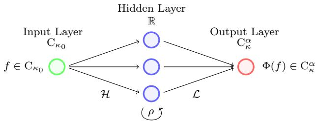  
Figure 1. A Chernof-neural operator $\Phi \colon \mathrm { C } _ { \kappa _ { 0 } }  \mathrm { C } _ { \kappa } ^ { \alpha }$ with additive family $\mathcal { H } ,$ activation function $\rho \in \operatorname { C } ( \mathbb { R } )$ , linear readout $\mathcal { L } \subset \mathrm { C } _ { \kappa } ^ { \alpha }$ and $M = 3$ neurons.

Assumption 3.3. Suppose that the following conditions are satisfied:

(i) The set H is a vector space, contains all constant mappings and is point separating on $\mathrm { C } _ { \kappa _ { 0 } } ,$ i.e., for every $f , g \in \mathrm { C } _ { \kappa _ { 0 } }$ with $f \neq g$ there exists $h \in \mathcal H$ with $h ( f ) \neq h ( g )$ . Moreover, for every $0 \leq \alpha ^ { \prime } < \alpha ^ { \prime \prime } \leq \alpha , \kappa ^ { \prime } \ll \kappa ^ { \prime \prime } \in \mathcal { K }$ and $h \in { \mathcal { H } }$ , the mapping $h \colon \mathrm { C } _ { \kappa ^ { \prime \prime } , \kappa ^ { \prime } } ^ { \alpha ^ { \prime \prime } , \alpha ^ { \prime } } \ \to \ \mathbb { R }$ is continuous and satisfies

$$
c _ { \alpha ^ { \prime \prime } , \kappa ^ { \prime \prime } , h } : = \operatorname* { s u p } _ { f \in \mathrm { C } _ { \kappa ^ { \prime \prime } } ^ { \alpha ^ { \prime \prime } } } \frac { 1 + | h ( f ) | } { 1 + \| f \| _ { \alpha ^ { \prime \prime } , \kappa ^ { \prime \prime } } } < \infty .
$$

(ii) The function $\rho \in \operatorname { C } ( \mathbb { R } )$ is non-polynomial with lim $\begin{array} { r } { \mathfrak { l } | \boldsymbol { x } | \to \infty \frac { | \rho ( \boldsymbol { x } ) | } { ( 1 + | \boldsymbol { x } | ) ^ { p } } = 0 . } \end{array}$

(iii) The set $\mathcal { L } \subset \mathrm { C } _ { \kappa } ^ { \alpha }$ is a dense linear subspace of $\mathrm { c } _ { \kappa ^ { \prime } } ^ { \alpha ^ { \prime } }$ for all $0 \leq \alpha ^ { \prime } < \alpha$ and $\begin{array} { r } { K \ni \kappa ^ { \prime } \lesssim \kappa . } \end{array}$

Example 3.4. As an example for Assumption 3.3(i), we consider the set

$$
\mathcal { H } : = \{ \mathrm { C } _ { \kappa _ { 0 } }  \mathbb { R } , \ f \mapsto \int _ { \mathbb { R } ^ { d } } f ( x ) \nu ( \mathrm { d } x ) + b \colon \nu \in \mathcal { M } _ { \kappa _ { 0 } } , b \in \mathbb { R } \} .
$$

Since H contains the Dirac measures $\{ \delta _ { x } \colon x \in  { \mathbb { R } } ^ { d } \}$ , it is point separating. Moreover, for every $h \in \mathcal H$ of the form $\begin{array} { r } { h ( f ) : = \int _ { \mathbb { R } ^ { d } } f ( x ) \nu ( \mathrm { d } x ) + b , \alpha ^ { \prime \prime } \in [ 0 , \alpha ] } \end{array}$ and $\kappa ^ { \prime \prime } \in \mathcal { K }$ , it holds

$$
\operatorname* { s u p } _ { f \in \mathbb C _ { \kappa ^ { \prime \prime } } ^ { \alpha ^ { \prime \prime } } } \frac { 1 + | h ( f ) | } { 1 + \| f \| _ { \alpha ^ { \prime \prime } , \kappa ^ { \prime \prime } } } \leq \operatorname* { s u p } _ { f \in \mathbb C _ { \kappa ^ { \prime \prime } } ^ { \alpha ^ { \prime \prime } } } \frac { 1 + \| f \| _ { \kappa _ { 0 } } c _ { \nu } + | b | } { 1 + \| f \| _ { \alpha ^ { \prime \prime } , \kappa ^ { \prime \prime } } } \leq \operatorname* { s u p } _ { f \in \mathbb C _ { \kappa ^ { \prime \prime } } ^ { \alpha ^ { \prime \prime } } } \frac { 1 + c _ { \alpha ^ { \prime \prime } , \kappa ^ { \prime \prime } } \| f \| _ { \alpha ^ { \prime \prime } , \kappa ^ { \prime \prime } } c _ { \nu } + | b | } { 1 + \| f \| _ { \alpha ^ { \prime \prime } , \kappa ^ { \prime \prime } } } < \infty ,
$$

where $\begin{array} { r } { c _ { \nu } : = \int _ { \mathbb { R } ^ { d } } \frac { 1 } { \kappa _ { 0 } ( x ) } | \nu | ( \mathrm { d } x ) } \end{array}$ and $c _ { \alpha ^ { \prime \prime } , \kappa ^ { \prime \prime } }$ is the operator norm of the embedding $\mathrm { C } _ { \kappa ^ { \prime \prime } } ^ { \alpha ^ { \prime \prime } } \hookrightarrow \mathrm { C } _ { \kappa _ { 0 } }$

We further observe that, for a bounded and non-polynomial $\tilde { \rho } \in \operatorname { C } ( \mathbb { R } )$ and a fixed probability measure $\tilde { \nu } \in \mathcal { M } _ { \kappa _ { 0 } }$ having full support, the subset

$$
\tilde { { \mathcal { H } } } : = \{ \mathrm { C } _ { \kappa _ { 0 } }  \mathbb { R } , f \mapsto \int _ { \mathbb { R } ^ { d } } f ( x ) \varphi ( x ) \tilde { \nu } ( \mathrm { d } x ) + b \colon \varphi \in  { \mathcal { N } } _ { \mathbb { R } ^ { d } , \mathbb { R } } ^ { \tilde { \rho } } \}
$$

also satisfies Assumption 3.3(i). Note that $\tilde { \mathcal { H } }$ can be implemented on a computer by approximating the integral with samples from ν˜. Here, the space $\mathcal { N } _ { \mathbb { R } ^ { d } , \mathbb { R } } ^ { \tilde { \rho } }$ consists of all neural networks

$$
\varphi \colon \mathbb { R } ^ { d } \to \mathbb { R } , \ x \mapsto \sum _ { k = 1 } ^ { K } y _ { k } \tilde { \rho } \left( a _ { k } ^ { \top } x + b _ { k } \right) ,
$$

where $K \in \mathbb N$ is the number of neurons, $a _ { 1 } , \dots , a _ { K } \in  { \mathbb { R } } ^ { d }$ are weights, $b _ { 1 } , \dots , b _ { K } \in \mathbb { R }$ are biases, $y _ { 1 } , \dotsc , y _ { K } \in \mathbb { R }$ are linear readouts and $\tilde { \rho }$ is a (bounded) activation function. Indeed, for every $f , g \in \mathrm { C } _ { \kappa _ { 0 } }$ with $f \neq g ,$ we define $\begin{array} { r } { u : = f - g \neq 0 , c : = \int _ { \mathbb { R } ^ { d } } | u | { \mathrm { d } } \tilde { \nu } > 0 } \end{array}$ and $\begin{array} { r } { \mathrm { d } \mu : = \frac { | \boldsymbol { u } | } { c } \mathrm { d } { \tilde { \nu } } . } \end{array}$ Since $\mathcal { N } _ { \mathbb { R } ^ { d } , \mathbb { R } } ^ { \tilde { \rho } }$ is dense in $L ^ { 1 } ( \mu )$ by [45, Proposition 1], there is $\varphi \in \mathcal { N } _ { \mathbb { R } ^ { d } , \mathbb { R } } ^ { \tilde { \rho } }$ with $\| \varphi - \mathrm { s g n } ( u ( \cdot ) ) \| _ { L ^ { 1 } ( \mu ) } < 1$ . Hence,

$$
\left| \frac { 1 } { c } \int _ { \mathbb { R } ^ { d } } u ( x ) \varphi ( x ) \tilde { \nu } ( \mathrm { d } x ) - 1 \right| = \left| \int _ { \mathbb { R } ^ { d } } \operatorname { s g n } ( u ( x ) ) ( \varphi ( x ) - \operatorname { s g n } ( u ( x ) ) ) \mu ( \mathrm { d } x ) \right| \leq \| \varphi - \operatorname { s g n } ( u ( \cdot ) ) \| _ { L ^ { 1 } ( \mu ) } < 1
$$

and therefore $\begin{array} { r } { \int _ { \mathbb { R } ^ { d } } f ( x ) \varphi ( x ) \tilde { \nu } ( \mathrm { d } x ) \neq \int _ { \mathbb { R } ^ { d } } g ( x ) \varphi ( x ) \tilde { \nu } ( \mathrm { d } x ) . } \end{array}$

As an example for Assumption $3 . 3 ( \mathrm { i i i } )$ , we can choose $\mathcal { L } : = \mathcal { N } _ { \mathbb { R } ^ { d } , \mathbb { R } } ^ { \tilde { \rho } } \subset \mathrm { C } _ { \kappa } ^ { \alpha }$ . For instance, if $\alpha = 1$ $\kappa ( x ) = ( 1 + | x | ^ { q } ) ^ { - 1 }$ with $q > 0$ and $\tilde { \rho } \in \operatorname { C } ^ { 1 } ( \mathbb { R } )$ is non-polynomial with lim $| x | {  } \infty \ \frac { | { \tilde { \rho } } ( x ) | } { ( 1 { + } | x | ) ^ { q } } = 0$ , the set $\mathcal { N } _ { \mathbb { R } ^ { d } , \mathbb { R } } ^ { \tilde { \rho } }$ is dense in $\mathrm { C } _ { \kappa } ^ { 1 }$ by [57, Theorem 2.7] and therefore also dense in $\mathrm { c } _ { \kappa ^ { \prime } } ^ { \alpha ^ { \prime } }$ for all $0 \leq \alpha ^ { \prime } < 1$ and $\begin{array} { r } { \kappa \ni \kappa ^ { \prime } \lesssim \kappa , } \end{array}$ see Theorem A.4.

In order to obtain the following universal approximation result, we adapt the arguments from [19, Theorem 4.13] to establish the universality of Chernof-neural operators.

Theorem 3.5. Suppose that the Assumptions 3.1 and 3.3 are satisfied. Then, for every $k , n \in \mathbb { N }$ $0 \leq \alpha _ { l } ^ { \prime } < \alpha _ { l } \leq \alpha$ and $\kappa _ { l } ^ { \prime } \ll \kappa _ { l } \in \mathcal { K } f o r l = 1 , . . . ,$ k and $\varepsilon > 0$ , there exists $\Phi _ { n } \in \mathcal { C N } _ { \mathrm { C } _ { \kappa _ { 0 } } , \mathrm { C } _ { \kappa } ^ { \alpha } } ^ { \mathcal { H } , \rho , \tilde { \mathcal { L } } }$ with

$$
\operatorname* { m a x } _ { l = 1 , \dots , k } \operatorname* { s u p } _ { f \in \mathrm { C } _ { \kappa _ { l } } ^ { \alpha _ { l } } } \frac { \| I _ { n } f - \Phi _ { n } f \| _ { \alpha _ { l } ^ { \prime } , \kappa _ { l } ^ { \prime } } } { ( 1 + \| f \| _ { \alpha _ { l } , \kappa _ { l } } ) ^ { p } } < \varepsilon .
$$

Proof. First, we show that $I _ { n } \in { \cal B } _ { p } ( \mathrm { C } _ { \kappa _ { l } , \kappa _ { l } ^ { \prime } } ^ { \alpha _ { l } , \alpha _ { l } ^ { \prime } } ; \mathrm { c } _ { \kappa _ { l } ^ { \prime } } ^ { \alpha _ { l } ^ { \prime } } )$ for all $n \in \mathbb { N }$ and $l = 1 , \ldots , k$ . To do so, for every $R \in \mathbb N$ , we define $I _ { n } ^ { ( R ) } : = T ^ { ( R ) } \circ I _ { n } \colon \mathrm { C } _ { \kappa _ { l } , \kappa _ { l } ^ { \prime } } ^ { \alpha _ { l } , \alpha _ { l } ^ { \prime } } \to \mathrm { c } _ { \kappa _ { l } ^ { \prime } } ^ { \alpha _ { l } ^ { \prime } }$ , where

$$
\begin{array} { r } { T ^ { ( R ) } \colon \mathbf { c } _ { \kappa _ { l } ^ { \prime } } ^ { \alpha _ { l } ^ { \prime } } \to \mathbf { c } _ { \kappa _ { l } ^ { \prime } } ^ { \alpha _ { l } ^ { \prime } } , \ g \mapsto \left\{ \begin{array} { l l } { g } & { \mathrm { i f } \ \| g \| _ { \alpha _ { l } ^ { \prime } , \kappa _ { l } ^ { \prime } } \leq R , } \\ { \frac { R } { \| g \\| _ { \alpha _ { l } ^ { \prime } , \kappa _ { l } ^ { \prime } } } g } & { \mathrm { i f } \ \| g \| _ { \alpha _ { l } ^ { \prime } , \kappa _ { l } ^ { \prime } } > R . } \end{array} \right. } \end{array}
$$

Assumption 3.1(iii) and Theorem A.2 imply that $I _ { n } ^ { ( R ) } : = T ^ { ( R ) } \circ I _ { n } \colon \mathrm { C } _ { \kappa _ { l } , \kappa _ { l } ^ { \prime } } ^ { \alpha _ { l } , \alpha _ { l } ^ { \prime } } \to \mathrm { c } _ { \kappa _ { l } ^ { \prime } } ^ { \alpha _ { l } ^ { \prime } }$ is well-defined and continuous, while the definition of $T ^ { ( R ) }$ ensures that $I _ { n } ^ { ( R ) }$ is uniformly bounded on $\mathrm { C } _ { \kappa _ { l } , \kappa _ { l } ^ { \prime } } ^ { \alpha _ { l } , \alpha _ { l } ^ { \prime } }$

which implies that $I _ { n } ^ { ( R ) } \in \mathrm { C } _ { \mathrm { b } } \big ( \mathrm { C } _ { \kappa _ { l } , \kappa _ { l } ^ { \prime } } ^ { \alpha _ { l } , \alpha _ { l } ^ { \prime } } ; \mathrm { c } _ { \kappa _ { l } ^ { \prime } } ^ { \alpha _ { l } ^ { \prime } } \big )$ . Moreover, we use Assumption 3.1(ii), Theorem A.2 with $c \geq 0$ denoting the operator norm of the embedding $\mathrm { C } _ { \kappa _ { l } } ^ { \alpha _ { l } } \hookrightarrow \mathrm { C } _ { \kappa _ { l } ^ { \prime } } ^ { \alpha _ { l } ^ { \prime } }$ and $p > 1$ to obtain

$$
\begin{array} { r l } { \underset { R  \infty } { \operatorname* { l i m } } \Vert I _ { n } - I _ { n } ^ { ( R ) } \Vert _ { B _ { p } ( \mathrm { C } _ { n , r _ { i } ^ { * } } ^ { \sigma _ { i } , \sigma _ { i } ^ { * } } \mathrm { e } _ { n } ^ { t } ) } = } & { \underset { R  \infty } { \operatorname* { l i m } } \underset { f \in \mathrm { C } _ { n _ { i } ^ { * } } ^ { \sigma _ { i } } } { \operatorname* { s u p } } \frac { \Vert I _ { n } f - I _ { n } ^ { ( R ) } f \Vert _ { \alpha _ { i } ^ { * } , \kappa _ { i } ^ { * } } } { ( 1 + \Vert f \Vert _ { \alpha _ { i } , \kappa _ { i } } ) ^ { p } } } \\ { \leq } & { \underset { R  \infty } { \operatorname* { l i m } } \underset { \Vert I _ { n } f \Vert _ { \alpha _ { i } ^ { * } , \kappa _ { i } ^ { * } } \geq R } { \operatorname* { s u p } } \frac { \Vert I _ { n } f \Vert _ { \alpha _ { i } ^ { * } , \kappa _ { i } ^ { * } } + \Vert I _ { n } ^ { ( R ) } f \Vert _ { \alpha _ { i } ^ { * } , \kappa _ { i } ^ { * } } } { ( 1 + \Vert f \Vert _ { \alpha _ { i } , \kappa _ { i } } ) ^ { p } } } \\ { \leq } & { \underset { R  \infty } { \operatorname* { l i m } } \underset { \Vert f \Vert _ { \alpha _ { i } ^ { * } , \kappa _ { i } ^ { * } } \geq R } { \operatorname* { s u p } } \frac { e ^ { i \alpha _ { h } } \Vert f \Vert _ { \alpha _ { i } ^ { * } , \kappa _ { i } ^ { * } } + R } { ( 1 + \Vert f \Vert _ { \alpha _ { i } , \kappa _ { i } } ) ^ { p } } } \\ { \leq } &  \underset { R  \infty } { \operatorname* { l i m } } \underset { t  \infty } { \operatorname* { s u p } } \frac { \underset { R  \infty } { \operatorname* { s u p } } } { \operatorname* { s u p } } \frac  \Vert f \Vert _  \end{array}
$$

This shows that $I _ { n } \in { \cal B } _ { p } ( \mathrm { C } _ { \kappa _ { l } , \kappa _ { l } ^ { \prime } } ^ { \alpha _ { l } , \alpha _ { l } ^ { \prime } } ; \mathrm { c } _ { \kappa _ { l } ^ { \prime } } ^ { \alpha _ { l } ^ { \prime } } )$ . Following the arguments in the proof of [19, Theorem 4.13], one can further show that $y \rho ( h ( \cdot ) ) \in B _ { p } ( \mathrm { C } _ { \kappa _ { l } , \kappa _ { l } ^ { \prime } } ^ { \alpha _ { l } , \alpha _ { l } ^ { \prime } } ; \mathrm { c } _ { \kappa _ { l } ^ { \prime } } ^ { \alpha _ { l } ^ { \prime } } )$ to obtain $\mathcal { C N } _ { \mathrm { C } _ { \kappa _ { 0 } } , \mathrm { C } _ { \kappa } ^ { \alpha } } ^ { \mathcal { H } , \rho , \mathcal { L } } \subset B _ { p } ( \mathrm { C } _ { \kappa _ { l } , \kappa _ { l } ^ { \prime } } ^ { \alpha _ { l } , \alpha _ { l } ^ { \prime } } ; \mathrm { c } _ { \kappa _ { l } ^ { \prime } } ^ { \alpha _ { l } ^ { \prime } } )$

Second, we define $\mathcal { A } : = \mathrm { s p a n } ( \{ \cos ( h ( \cdot ) ) : h \in \mathcal { H } \} \cup \{ \sin ( h ( \cdot ) ) : h \in \tilde { \mathcal { H } } \} )$ and show that the vector space $\mathcal { W } : = \mathrm { s p a n } ( \{ y a ( \cdot ) : a \in \mathcal { A } , y \in \mathcal { L } \} )$ is contained in the closure of $\mathcal { C N } _ { \mathrm { C } _ { \kappa _ { 0 } } , \mathrm { C } _ { \kappa } ^ { \alpha } } ^ { \mathcal { H } , \rho , \mathcal { L } } \mathrm { ~ w . r . t ~ }$

$$
\operatorname* { m a x } _ { l = 1 , \dots , k } \| T \| _ { \mathcal B _ { p } ( \mathbb C _ { \kappa _ { l } , \kappa _ { l } ^ { \prime } } ^ { \alpha _ { l } , \alpha _ { l } ^ { \prime } } ; \mathbb c _ { \kappa _ { l } ^ { \prime } } ^ { \alpha _ { l } ^ { \prime } } ) } : = \operatorname* { m a x } _ { l = 1 , \dots , k } \operatorname* { s u p } _ { f \in \mathbb C _ { \kappa _ { l } } ^ { \alpha _ { l } } } \frac { \| T f \| _ { \alpha _ { l } ^ { \prime } , \kappa _ { l } ^ { \prime } } } { ( 1 + \| f \| _ { \alpha _ { l } , \kappa _ { l } } ) ^ { p } } .\tag{3.1}
$$

For $y \in \mathcal { L } , h \in \mathcal { H } .$ , and $\varepsilon > 0$ , we define $c _ { h } : = \mathrm { m a x } _ { l = 1 , \ldots , k } c _ { \alpha _ { l } , \kappa _ { l } , h }$ and $c _ { y } : = \operatorname* { m a x } _ { l = 1 , \ldots , k } \| y \| _ { \alpha _ { l } ^ { \prime } , \kappa _ { l } ^ { \prime } } .$ Then, by [19, Proposition $4 . 4 ( \mathrm { A 3 } ) ]$ or [57, Theorem 2.7], there exists $\varphi _ { 1 } \in \mathcal { N N } _ { \mathbb { R } , \mathbb { R } } ^ { \rho }$ with

$$
\operatorname* { s u p } _ { t \in \mathbb { R } } \frac { | \cos ( t ) - \varphi _ { 1 } ( t ) | } { ( 1 + | t | ) ^ { p } } < \frac { \varepsilon } { \operatorname* { m a x } ( 1 , c _ { h } ^ { p } c _ { y } ) } .
$$

Hence, the Chernof-neural operator $\varphi : = y \varphi _ { 1 } ( h ( \cdot ) ) \in \mathcal { C N } _ { \mathrm { C } _ { \kappa _ { 0 } } , \mathrm { C } _ { \kappa } ^ { \alpha } } ^ { \mathcal { H } , \rho , \mathcal { L } }$ satisfies

$$
\begin{array} { r l } & { \underset { l = 1 , \ldots , k } { \operatorname* { m a x } } \left\| y \cos ( h ( \cdot ) ) - \varphi ( \cdot ) \right\| _ { B _ { p } ( \mathbf { C } _ { r , t } ^ { \alpha _ { l } , \alpha _ { l } ^ { \prime } } \times \alpha _ { l } ^ { \prime } ) } = \underset { l = 1 , \ldots , k } { \operatorname* { m a x } } \underset { f \in \mathbf { C } _ { \kappa _ { l } } ^ { \alpha _ { l } } } { \operatorname* { s u p } } \frac { \left\| y \cos ( h ( f ) ) - y \varphi _ { 1 } ( h ( f ) ) \right\| _ { \alpha _ { l } ^ { \prime } , \kappa _ { l } ^ { \prime } } } { ( 1 + \left\| f \right\| _ { \alpha _ { l } , \kappa _ { l } } ) ^ { p } } } \\ & { \leq \Big ( \underset { l = 1 , \ldots , k } { \operatorname* { m a x } } \left\| y \right\| _ { \alpha _ { l } ^ { \prime } , \kappa _ { l } ^ { \prime } } \Big ) \Bigg ( \underset { l = 1 , \ldots , k } { \operatorname* { m a x } } \underset { f \in \mathbf { C } _ { \kappa _ { l } } ^ { \alpha _ { l } } } { \operatorname* { s u p } } \frac { \left( 1 + \left\| h ( f ) \right\| \right) ^ { p } } { ( 1 + \left\| f \right\| _ { \alpha _ { l } , \kappa _ { l } } ) ^ { p } } { \operatorname* { s u p } } \frac { \left\| \cos ( t ) - \varphi _ { 1 } ( t ) \right\| } { { t } \in \mathbb R } + \frac { c _ { y } c _ { h } ^ { p } \varepsilon } { \operatorname* { m a x } ( 1 , c _ { h } ^ { p } c _ { y } ) } \leq \varepsilon . } \end{array}
$$

Since the same estimate holds true for y sin(h(·)), the set W is contained in the closure of ${ \mathcal { C N } } _ { \mathrm { C } _ { \kappa _ { 0 } } , \mathrm { C } _ { \kappa } ^ { \alpha } } ^ { \mathcal { H } , \rho , \mathcal { L } }$ w.r.t. the norm defined in equation (3.1).

Third, due to some fundamental trigonometric identities, see [19, Equation 4.3], the set A is an algebra. By definition, the set W is an A-submodule. Since H is point separating and contains all constant mappings, the set A is point separating and nowhere vanishing. Finally, by Assumption 3.3(iii), the set $\mathcal { W } ( f ) : = \{ w ( f ) \colon w \in \mathcal { W } \} = \mathcal { L }$ is dense in $\mathrm { c } _ { \kappa ^ { \prime } } ^ { \alpha ^ { \prime } }$ for all $0 \leq \alpha ^ { \prime } < \alpha ^ { \prime \prime } \leq \alpha$ $\kappa ^ { \prime } \ll \kappa ^ { \prime \prime } \in \mathcal { K }$ and $f \in \mathrm { C } _ { \kappa ^ { \prime \prime } } ^ { \alpha ^ { \prime \prime } }$ . Hence, the claim follows from Theorem B.3. □

3.2. Qualitative approximation of the semigroup. We now present the main result of this article which shows that iterations of Chernof-neural operators $\dot { \Phi _ { n } } \in \mathcal { C N } _ { \mathrm { C } _ { \kappa _ { 0 } } , \mathrm { C } _ { \kappa } ^ { \alpha } } ^ { \mathcal { H } , \rho , \mathcal { L } }$ are able to approximate the strongly continuous convex monotone semigroup $( S ( t ) ) _ { t \geq 0 }$

Theorem 3.6. Suppose that the Assumptions 3.1 and 3.3 are satisfied. Then, for every $\alpha ^ { \prime } \in [ 0 , \alpha )$ $\mathcal { K } \ni \mathcal { \kappa } ^ { \prime } \ll \kappa , T \ge 0 , n \in \mathbb { N }$ and $\varepsilon > 0$ , there exists $\Phi _ { n } \in \mathcal { C N } _ { \mathrm { C } _ { \kappa _ { 0 } } , \mathrm { C } _ { \kappa } ^ { \alpha } } ^ { \mathcal { H } , \rho , \mathcal { L } }$ with

$$
\begin{array} { r l } { \| I ( \pi _ { n } ^ { t } ) f - \Phi ( \pi _ { n } ^ { t } ) f \| _ { \alpha ^ { \prime } , \kappa ^ { \prime } } \leq ( 1 + \| f \| _ { \alpha , \kappa } ) ^ { p ^ { k _ { n } ^ { t } } } \varepsilon } & { f o r \ a l l \ t \in [ 0 , T ] \ a n d \ f \in \mathrm { C } _ { \kappa } ^ { \alpha } . } \end{array}
$$

Moreover, let Assumption 2.2 be valid and let $( S ( t ) ) _ { t \geq 0 }$ be the semigroup from Theorem 2.3. Then, for every $r , T \geq 0 , \alpha ^ { \prime } \in [ 0 , \alpha ) , \kappa \ni \kappa ^ { \prime } \ll \kappa$ and $\varepsilon > 0$ , there exist $n \in \mathbb { N }$ and $\Phi _ { n } \in \mathcal { C N } _ { \mathrm { C } _ { \kappa _ { 0 } } , \mathrm { C } _ { \kappa } ^ { \alpha } } ^ { \mathcal { H } , \rho , \mathcal { L } }$ with

$$
\operatorname* { s u p } _ { f \in B _ { \mathrm { C } _ { \kappa } ^ { \alpha } } ( r ) } \operatorname* { s u p } _ { t \in [ 0 , T ] } \| S ( t ) f - \Phi ( \pi _ { n } ^ { t } ) f \| _ { \alpha ^ { \prime } , \kappa ^ { \prime } } < \varepsilon .
$$

Proof. Let $\alpha ^ { \prime } \in [ 0 , \alpha ) , \kappa ^ { \prime } \lessapprox \kappa \in \mathcal { K } , p \in ( 1 , \infty ) , T \geq 0 , n \in \mathbb { N }$ and $\varepsilon > 0$ . By Assumption 3.1(i), there exist $\alpha ^ { \prime } = \alpha _ { k _ { \alpha } ^ { T } } < . . . < \alpha _ { 0 } = \alpha$ and $\kappa ^ { \prime } = \kappa _ { k _ { n } ^ { T } } \ll . . . \ll \kappa _ { 0 } = \kappa$ . Since Assumption 3.1(ii) guarantees that $I _ { n } ^ { k } f \in { \mathrm { C } } _ { \kappa } ^ { \alpha }$ for all $k \in \mathbb N$ and $f \in \mathrm { C } _ { \kappa } ^ { \alpha }$ , we can further apply Assumption 3.1(ii)–(iii) and Theorem A.2 to obtain a constant $c \geq 1$ with

$$
\begin{array} { r } { \| I _ { n } f \| _ { \alpha _ { l } , \kappa _ { l } } \leq c \| f \| _ { \alpha _ { l - 1 } , \kappa _ { l - 1 } } , } \end{array}\tag{3.2}
$$

$$
\| I _ { n } ^ { k } f - I _ { n } ^ { k } g \| _ { \alpha _ { l } , \kappa _ { l } } \leq c \| f - g \| _ { \alpha _ { l } , \kappa _ { l } }\tag{3.3}
$$

for all $f , g \in \mathrm { C } _ { \kappa } ^ { \alpha }$ and $k , l \in \{ 1 , \dots , k _ { n } ^ { T } \}$ . By Theorem 3.5, there exists $\Phi _ { n } \in \mathcal { C N } _ { \mathrm { C } _ { \kappa _ { 0 } } , \mathrm { C } _ { \kappa } ^ { \alpha } } ^ { \mathcal { H } , \rho , \mathcal { L } }$ with

$$
\operatorname* { m a x } _ { 1 \leq l \leq k _ { n } ^ { T } } \operatorname* { s u p } _ { f \in \operatorname { C } _ { \kappa _ { l - 1 } } ^ { \alpha _ { l - 1 } } } \frac { \Vert I _ { n } f - \Phi _ { n } f \Vert _ { \alpha _ { l } , \kappa _ { l } } } { ( 1 + \Vert f \Vert _ { \alpha _ { l - 1 } , \kappa _ { l - 1 } } ) ^ { p } } < \operatorname* { m i n } \left\{ 1 , \frac { \varepsilon } { C } \right\} ,\tag{3.4}
$$

where $\begin{array} { r } { C : = c \sum _ { l = 1 } ^ { k _ { n } ^ { T } } ( 2 c ) ^ { \frac { p ( p ^ { l } - 1 ) } { p - 1 } } } \end{array}$ . We use $\Phi _ { n } ^ { l - 1 } f \in \mathrm { C } _ { \kappa } ^ { \alpha }$ , inequality (3.2) and inequality (3.4) to obtain

$$
\begin{array} { r l } & { 1 + \| \Phi _ { n } ^ { l } f \| _ { \alpha _ { l } , \kappa _ { l } } = 1 + \| \Phi _ { n } \Phi _ { n } ^ { l - 1 } f \| _ { \alpha _ { l } , \kappa _ { l } } } \\ & { \qquad \leq 1 + \| I _ { n } \Phi _ { n } ^ { l - 1 } f \| _ { \alpha _ { l } , \kappa _ { l } } + \| I _ { n } \Phi _ { n } ^ { l - 1 } f - \Phi _ { n } \Phi _ { n } ^ { l - 1 } f \| _ { \alpha _ { l } , \kappa _ { l } } } \\ & { \qquad \leq 1 + c \| \Phi _ { n } ^ { l - 1 } f \| _ { \alpha _ { l - 1 } , \kappa _ { l - 1 } } + ( 1 + \| \Phi _ { n } ^ { l - 1 } f \| _ { \alpha _ { l - 1 } , \kappa _ { l - 1 } } ) ^ { p } } \\ & { \qquad \leq 2 c ( 1 + \| \Phi _ { n } ^ { l - 1 } f \| _ { \alpha _ { l - 1 } , \kappa _ { l - 1 } } ) ^ { p } } \end{array}
$$

for all $l \in \{ 1 , \ldots , k _ { n } ^ { T } \}$ and $f \in \mathrm { C } _ { \kappa } ^ { \alpha }$ . Hence, by induction on $l \in \{ 1 , \ldots , k _ { n } ^ { T } \}$ , it follows that

$$
1 + \| \Phi _ { n } ^ { l } f \| _ { \alpha _ { l } , \kappa _ { l } } \leq ( 2 c ) ^ { \frac { p ^ { l } - 1 } { p - 1 } } ( 1 + \| f \| _ { \alpha , \kappa } ) ^ { p ^ { l } } \quad \mathrm { f o r ~ a l l ~ } f \in \mathrm { C } _ { \kappa } ^ { \alpha } .\tag{3.5}
$$

For every $t \in [ 0 , T ]$ and $f \in \mathrm { C } _ { \kappa } ^ { \alpha }$ , we use $\Phi _ { n } ^ { l - 1 } f \in { \mathrm { C } } _ { \kappa } ^ { \alpha }$ and the inequalities (3.3)–(3.5) to obtain

$$
\begin{array} { r l } & { \displaystyle \| I ( \pi _ { n } ^ { t } ) f - \Phi ( \pi _ { n } ^ { t } ) f \| _ { \alpha ^ { \prime } , \kappa ^ { \prime } } = \big \| I _ { n } ^ { k _ { n } ^ { t } } f - \Phi _ { n } ^ { k _ { n } ^ { t } } f \big \| _ { \alpha ^ { \prime } , \kappa ^ { \prime } } \leq \displaystyle \sum _ { l = 1 } ^ { k _ { n } ^ { t } } \| I _ { n } ^ { k _ { n } ^ { t } - l } I _ { n } \Phi _ { n } ^ { l - 1 } f - I _ { n } ^ { k _ { n } ^ { t } - l } \Phi _ { n } \Phi _ { n } ^ { l - 1 } f \big \| _ { \alpha ^ { \prime } , \kappa ^ { \prime } } } \\ & { \qquad \leq c \displaystyle \sum _ { l = 1 } ^ { k _ { n } ^ { t } } \| I _ { n } \Phi _ { n } ^ { l - 1 } f - \Phi _ { n } \Phi _ { n } ^ { l - 1 } f \| _ { \alpha , \kappa _ { l } } \leq \displaystyle \frac { c \varepsilon } { C } \sum _ { l = 1 } ^ { k _ { n } ^ { t } } ( 1 + \| \Phi _ { n } ^ { l - 1 } f \| _ { \alpha _ { l - 1 } , \kappa _ { l - 1 } } ) ^ { p } } \\ & { \qquad \leq \displaystyle \frac { c \varepsilon } { C } \sum _ { l = 1 } ^ { k _ { n } ^ { t } } ( 2 c ) ^ { \frac { p ( r ^ { l } - 1 ) } { p - 1 } } ( 1 + \| f \| _ { \alpha , \kappa } ) ^ { p ^ { l } } \leq ( 1 + \| f \| _ { \alpha , \kappa } ) ^ { p ^ { k _ { n } ^ { t } } } \varepsilon . } \end{array}
$$

The second part follows from the first part and Corollary 2.4.

## 4. Envelope-neural operators

We now introduce a more specific neural operator architecture for the case that the one-step operators are given as the supremum over a family of linear operators. This covers, for instance, the important class of Nisio semigroups which have originally been introduced in [59] and adapted to transition semigroups of stochastic processes under model uncertainty in [21, 54]. In the sequel, we fix $\alpha \in ( 0 , 1 ]$ , a bounded continuous function $\kappa \colon  { \mathbb { R } ^ { d } } \to ( 0 , \infty )$ satisfying inequality (2.1), an index set $\Lambda ,$ a family $\{ I _ { n , \lambda } \colon n \in \mathbb { N } , \lambda \in \Lambda \}$ of operators $I _ { n , \lambda } \colon { \mathrm { C } } _ { \kappa } \to { \mathrm { C } } _ { \kappa } .$ , penalization functions $\eta , \eta _ { n } \colon \Lambda \to [ 0 , \infty ]$ and a sequence $( h _ { n } ) _ { n \in \mathbb { N } } \subset ( 0 , \infty )$ with $h _ { n } \to 0$ . We define

$$
( I _ { n } f ) ( x ) : = \operatorname* { s u p } _ { \lambda \in \Lambda } { \big ( } ( I _ { n , \lambda } f ) ( x ) - \eta _ { n } ( \lambda ) h _ { n } { \big ) }\tag{4.1}
$$

for all $n \in \mathbb { N } , f \in \mathrm { C } _ { \kappa }$ and $x \in \mathbb { R } ^ { d }$ . Moreover, for every $\lambda \in \Lambda$ , we define

$$
A _ { \lambda } \colon D ( A _ { \lambda } ) \to \mathrm { C } _ { \kappa } , \ f \mapsto \operatorname* { l i m } _ { n \to \infty } \frac { I _ { n , \lambda } f - f } { h _ { n } } ,
$$

where the domain $D ( A _ { \lambda } )$ consists of all $f \in \mathrm { C } _ { \kappa }$ such that the previous limit exists. To guarantee that $I _ { n } \colon \mathrm { C } _ { \kappa } \to \mathrm { C } _ { \kappa }$ and that Assumption 2.2 is satisfied, we impose the following conditions.

Assumption 4.1. Suppose that the conditions $( \mathrm { i } ) { - } ( \mathrm { v i i } )$ or that the conditions $( \mathrm { i } ) { - } ( \mathrm { v i } )$ and (vii’) of the following list are satisfied:

(i) For every $n \in \mathbb { N }$ , there exists $\lambda _ { 0 , n } \in \Lambda$ with $\eta _ { n } ( \lambda _ { 0 , n } ) = 0$

(ii) The operators $I _ { n , \lambda }$ are linear and monotone for all $n \in \mathbb N$ and $\lambda \in \Lambda$

(iii) There exists ω $\geq 0$ with $\| I _ { n , \lambda } f \| _ { \kappa } \leq e ^ { \omega h _ { n } } \| f \| _ { \kappa }$ for all $n \in \mathbb { N } , \lambda \in \Lambda$ and $f \in \mathrm { C } _ { \kappa }$

(iv) For every $\varepsilon > 0$ , there exists $\delta > 0$ and $n _ { 0 } \in \mathbb { N }$ with

$$
I _ { n , \lambda } ( \tau _ { x } f ) \leq \tau _ { x } ( I _ { n , \lambda } f ) + \frac { r \varepsilon h _ { n } } \kappa
$$

for all $n \geq n _ { 0 } , r \geq 0 , f \in \mathrm { L i p } _ { \mathrm { b } } ( r ) , x \in B _ { \mathbb { R } ^ { d } } ( \delta ) { \mathrm { ~ a n d ~ } } \lambda \in \Lambda$

(v) For every $\varepsilon > 0 , r , T \geq 0$ and $K \Subset \mathbb { R } ^ { d }$ , there exist $c \geq 0$ and $K ^ { \prime } \Subset \mathbb { R } ^ { d }$ with

$$
\| I ( \pi _ { n } ^ { t } ) f - I ( \pi _ { n } ^ { t } ) g \| _ { \infty , K } \leq c \| f - g \| _ { \infty , K ^ { \prime } } + \varepsilon
$$

for all $t \in [ 0 , T ] , n \in \mathbb { N }$ and $f , g \in B _ { \mathrm { C } _ { \kappa } } ( r )$

(vi) It holds $I _ { n , \lambda } \colon \mathrm { L i p } _ { \mathrm { b } } ( r ) \to \mathrm { L i p } _ { \mathrm { b } } ( e ^ { \omega h _ { n } } r )$ for all $n \in \mathbb { N } , \lambda \in \Lambda$ and $r \geq 0 .$

(vii) The limit $I ^ { \prime } ( 0 ) f \in \mathrm { C } _ { \kappa }$ exists for all $f \in \mathrm { C _ { b } ^ { \infty } }$

(vii’) It holds $\mathrm { C } _ { \mathrm { b } } ^ { \infty } \subset D ( A _ { \lambda } )$ for all $\lambda \in \Lambda$ . In addition, for every $f \in \mathrm { C } _ { \mathrm { b } } ^ { \infty }$ , there exist $c \geq 0$ $n _ { 0 } \in \mathbb { N }$ and $\Lambda _ { 0 } \subset \Lambda$ such that the following statements are true:

(a) $\begin{array} { r } { \operatorname* { s u p } _ { \lambda \in \Lambda } ( I _ { n , \lambda } f - \eta _ { n } ( \lambda ) h _ { n } ) = \operatorname* { s u p } _ { \lambda \in \Lambda _ { 0 } } ( I _ { n , \lambda } f - \eta _ { n } ( \lambda ) h _ { n } ) } \end{array}$ for all $n \geq n _ { 0 }$

$$
\begin{array} { r } { \operatorname* { s u p } _ { \lambda \in \Lambda } ( A _ { \lambda } f - \eta ( \lambda ) ) = \operatorname* { s u p } _ { \lambda \in \Lambda _ { 0 } } ( A _ { \lambda } f - \eta ( \lambda ) ) , } \end{array}
$$

(c) $\begin{array} { r } { \operatorname* { s u p } _ { n \in \mathbb { N } } \operatorname* { s u p } _ { \lambda \in \Lambda _ { 0 } } \eta _ { n } ( \lambda ) < \infty , \operatorname* { s u p } _ { \lambda \in \Lambda _ { 0 } } \| I _ { n , \lambda } f - f \| _ { \kappa } \leq c h _ { n } } \end{array}$ for all $n \geq n _ { 0 }$ and

$$
\operatorname* { l i m } _ { n \to \infty } \operatorname* { s u p } _ { \lambda \in \Lambda _ { 0 } } \left\| { \frac { I _ { n , \lambda } f - f } { h _ { n } } } - A _ { \lambda } f \right\| _ { \infty , K } = 0 \quad { \mathrm { f o r ~ a l l ~ } } K \in \mathbb { R } ^ { d } .
$$

Furthermore, it holds li $\begin{array} { r } { \mathrm { { n } } _ { n  \infty } \mathrm { { s u p } } _ { \lambda \in \Lambda _ { 0 } } | \eta _ { n } ( \lambda ) - \eta ( \lambda ) | = 0 . } \end{array}$

Note that condition (vii’) immediately implies condition (vii).

Theorem 4.2. Suppose that the Assumptions $\it 4 . 1 ( i ) - ( v i i )$ are valid. Then, there exists a strongly continuous convex monotone semigroup $( S ( t ) ) _ { t \geq 0 }$ on $\mathrm { C } _ { \kappa }$ given by

$$
S ( t ) f : = \operatorname* { l i m } _ { n \to \infty } I ( \pi _ { n } ^ { t } ) f \quad f o r \ a l l \ t \geq 0 \ a n d \ f \in \mathrm { C } _ { \kappa }
$$

whose generator satisfies $A f = I ^ { \prime } ( 0 ) f$ for all $f \in \mathrm { C _ { b } ^ { \infty } }$ . If the Assumption $4 { \cdot } 1 ( i ) { - } ( v i )$ and $( v i i ^ { \prime } )$ are valid, we further obtain

$$
A f = \operatorname* { s u p } _ { \lambda \in \Lambda } \left( A _ { \lambda } f - \eta ( \lambda ) \right) \quad f o r \ a l l \ f \in \mathrm { C } _ { \mathrm { b } } ^ { \infty } .
$$

Proof. This is a particular case of Theorem 2.3.

Corollary 4.3. Let Assumption 4.1 be satisfied and denote by $( S ( t ) ) _ { t \geq 0 }$ the strongly continuous convex monotone semigroup from Theorem $4 . 2 .$ Assume that there exists $\tilde { \omega } \geq 0$ with

$$
\begin{array} { r } { \| I _ { n , \lambda } f \| _ { \alpha , \kappa } \leq e ^ { \tilde { \omega } h _ { n } } \| f \| _ { \alpha , \kappa } \quad f o r \ a l l \ n \in \mathbb { N } , \lambda \in \Lambda \ a n d \ f \in \mathbb { C } _ { \kappa } ^ { \alpha } . } \end{array}
$$

Then, it holds $\| S ( t ) f \| _ { \alpha , \kappa } \leq e ^ { \tilde { \omega } t } \| f \| _ { \alpha , \kappa }$ for all $t \geq 0$ and $f \in \mathrm { C } _ { \kappa } ^ { \alpha }$ . Furthermore,

$$
\operatorname* { l i m } _ { n \to \infty } \operatorname* { s u p } _ { f \in B _ { \mathrm { C } _ { \kappa } ^ { \alpha } } ( r ) } \operatorname* { s u p } _ { t \in [ 0 , T ] } \| S ( t ) f - I ( \pi _ { n } ^ { t } ) f \| _ { \alpha ^ { \prime } , \kappa ^ { \prime } } = 0
$$

for all $r , T \geq 0 , \alpha ^ { \prime } \in [ 0 , \alpha )$ and $\kappa ^ { \prime } \lessapprox \kappa$

Proof. This is a particular case of Corollary 2.4.

4.1. Universal approximation. In order to approximate the operators $( I _ { n } ) _ { n \in \mathbb { N } }$ defined by equation (4.1), we replace the supremum over $\lambda \in \Lambda$ by the maximum over finitely many trainable parameters $\lambda _ { 0 } , \dots , \lambda _ { M } \in \Lambda$ which can be implemented using a ReLU-neural network, see Figure 2.

Definition 4.4. For every $n \in \mathbb { N } .$ , an envelope-neural operator is a mapping of the form

$$
\Phi _ { n } \colon \mathrm { C } _ { \kappa } \to \mathrm { C } _ { \kappa } , \ f \mapsto \varphi \bigl ( ( I _ { n , \lambda _ { 0 } } f ) ( \cdot ) , ( I _ { n , \lambda _ { 1 } } f ) ( \cdot ) , \ldots , ( I _ { n , \lambda _ { M } } f ) ( \cdot ) \bigr ) ,
$$

where $\lambda _ { 0 } : = \lambda _ { 0 , n } \in \Lambda$ is the fixed parameter from Assumption $4 . 1 ( \mathrm { i } ) , \lambda _ { 1 } , \dots , \lambda _ { M } \in \Lambda$ are the (hidden-layer) parameters and $\varphi \in \mathcal { N N } _ { \mathbb { R } ^ { M + 1 } , \mathbb { R } } ^ { \mathrm { R e L U } }$ is a ReLU-neural network. We collect all operators of this form in the set $\varepsilon \mathcal { N } _ { \mathrm { C } _ { \kappa } , \mathrm { C } _ { \kappa } } ^ { \mathrm { R e L U } }$

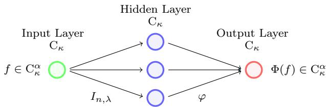

Figure 2. An envelope-neural operator $\Phi _ { n } \colon { \mathrm { C } } _ { \kappa } \to { \mathrm { C } } _ { \kappa }$ with hidden-layer maps from the family $( I _ { n , \lambda } ) _ { \lambda \in \Lambda }$ , ReLU-neural network $\varphi \in \mathcal { N N } _ { \mathbb { R } ^ { 3 } , \mathbb { R } } ^ { \mathrm { R e L U } }$ as linear readout and $M + 1 = 3$ neurons.

Assumption 4.5. Suppose that the following conditions are satisfied:

(i) It holds $\| I _ { n , \lambda } f \| _ { \alpha , \kappa } \leq e ^ { \omega h _ { n } } \| f \| _ { \alpha , \kappa }$ for all $n \in \mathbb { N } , \lambda \in \Lambda$ and $f \in \mathrm { C } _ { \kappa } ^ { \alpha }$

(ii) For every $r \geq 0$ , there exists a totally bounded metric space $( \Lambda _ { r } , d _ { r } )$ with $\Lambda _ { r } \subset \Lambda$ such that the set $\Lambda _ { r , n } : = \Lambda _ { r } \cap \{ \eta _ { n } < \infty \}$ satisfies

sup $( I _ { n , \lambda } f - \eta _ { n } ( \lambda ) h _ { n } ) = \operatorname* { s u p } _ { \lambda \in \Lambda _ { r , n } } { ( I _ { n , \lambda } f - \eta _ { n } ( \lambda ) h _ { n } ) }$ for all $n \in \mathbb { N }$ and $f \in B _ { \mathrm { C } _ { \kappa } ^ { \alpha } } ( r )$ λ∈Λ

In addition, for every $r \geq 0$ and $\varepsilon > 0$ , there exists $\delta > 0$ such that

$$
\| ( I _ { n , \lambda _ { 1 } } f - \eta _ { n } ( \lambda _ { 1 } ) h _ { n } ) - ( I _ { n , \lambda _ { 2 } } f - \eta _ { n } ( \lambda _ { 2 } ) h _ { n } ) \| _ { \kappa } < \varepsilon
$$

for all $n \in \mathbb { N } , f \in B _ { \mathrm { C } _ { \kappa } ^ { \alpha } } ( r )$ and $\lambda _ { 1 } , \lambda _ { 2 } \in \Lambda _ { r , n }$ with $d _ { r } ( \lambda _ { 1 } , \lambda _ { 2 } ) < \delta$ . Finally, the element $\lambda _ { 0 , n }$ from Assumption $4 . 1 ( \mathrm { i } )$ satisfies $\lambda _ { 0 , n } \in \Lambda _ { r }$ for all $n \in \mathbb { N } .$

Theorem 4.6. Suppose that the Assumptions $\it 4 . 1$ and $4 . 5$ are satisfied. Then, for every $n \in \mathbb N$ $r \geq 0 , \alpha ^ { \prime } \in [ 0 , \alpha )$ and $\varepsilon > 0$ , there exists $\Phi _ { n } \in \mathcal { E } \mathcal { N } _ { \mathrm { C } _ { \kappa } , \mathrm { C } _ { \kappa } } ^ { \mathrm { R e L U } }$ with

$$
\operatorname* { s u p } _ { f \in B _ { \mathrm { C } _ { \kappa } ^ { \alpha } } ( r ) } \| I _ { n } f - \Phi _ { n } f \| _ { \alpha ^ { \prime } , \kappa } < \varepsilon .
$$

Proof. Let $\varepsilon > 0$ and $\varepsilon ^ { \prime } \in ( 0 , \varepsilon )$ with $( 2 e ^ { \omega h _ { n } } r ) ^ { \alpha ^ { \prime } / \alpha } ( 2 \varepsilon ^ { \prime } ) ^ { 1 - \alpha ^ { \prime } / \alpha } < \varepsilon / 2$ . Moreover, let $\Lambda _ { r , n }$ and $\delta > 0$ satisfy Assumption 4.5(ii) with $\varepsilon ^ { \prime } .$ . Since $\Lambda _ { r , n }$ is also totally bounded, there exist $\lambda _ { 1 } , \dots , \lambda _ { M } \in \Lambda _ { r , n }$ with $\textstyle \Lambda _ { r , n } \subset \bigcup _ { m = 1 } ^ { M } \mathring { B } _ { d _ { r } } ( \lambda _ { m } , \delta )$ . In particular, choosing $\begin{array} { r } { m ( \lambda ) \in \arg \operatorname* { m i n } _ { m = 1 , \dots , M } d _ { r } ( \lambda , \lambda _ { m } ) } \end{array}$ yields

$$
\begin{array} { r } { \big \| \big ( I _ { n , \lambda } f - \eta _ { n } ( \lambda ) h _ { n } \big ) - \big ( I _ { n , \lambda _ { m ( \lambda ) } } f - \eta _ { n } ( \lambda _ { m ( \lambda ) } ) h _ { n } \big ) \big \| _ { \kappa } < \varepsilon ^ { \prime } < \varepsilon \quad \mathrm { f o r ~ a l l ~ } f \in B _ { \mathrm { C } _ { \kappa } ^ { \alpha } } ( r ) . } \end{array}
$$

We implement the function R $\begin{array} { r } { \begin{array} { r } { M + 1 \  \ \mathbb { R } , \ y \mapsto \operatorname* { m a x } _ { m = 0 , \ldots , M } ( y _ { m } - \eta _ { n } ( \lambda _ { m } ) h _ { n } ) } \end{array} } \end{array}$ with $\lambda _ { 0 } : = \lambda _ { 0 , n }$ as ReLU-neural network $\varphi \in \mathcal { N N } _ { \mathbb { R } ^ { M + 1 } , \mathbb { R } } ^ { \mathrm { R e L U } }$ and define $\Phi _ { n } \in \mathcal { E } \mathcal { N } _ { \mathrm { C } _ { \kappa } , \mathrm { C } _ { \kappa } } ^ { \mathrm { R e L U } }$ by $\Phi _ { n } ( f ) : = \varphi \circ I _ { n , \lambda _ { 0 : M } } f ,$ where $I _ { n , \lambda _ { 0 : M } } f : = ( ( I _ { n , \lambda _ { 0 } } f ) ( \cdot ) , \ldots , ( I _ { n , \lambda _ { M } } f ) ( \cdot ) )$ . Then, for every $f \in B _ { \mathrm { C } _ { \kappa } ^ { \alpha } } ( r )$ , it holds

$$
\| I _ { n } f - \Phi _ { n } f \| _ { \kappa } = \Big \| \operatorname* { s u p } _ { \lambda \in \Lambda _ { r , n } } \left( I _ { n , \lambda } f - \eta _ { n } ( \lambda ) h _ { n } \right) - \operatorname* { m a x } _ { m = 0 , \ldots , M } \left( I _ { n , \lambda _ { m } } f - \eta _ { n } ( \lambda _ { m } ) h _ { n } \right) \Big \| _ { \kappa } < \varepsilon ^ { \prime } < \varepsilon .\tag{4.2}
$$

Let $f \in B _ { \mathrm { C } _ { \kappa } ^ { \alpha } } ( r )$ and define $g _ { n } : = I _ { n } f - \varphi \circ I _ { n , \lambda _ { 0 : M } } f$ . Assumption 4.5(i) implies

$$
\operatorname* { s u p } _ { x \neq y } \frac { | g _ { n } ( x ) - g _ { n } ( y ) | } { | x - y | ^ { \alpha } } \bar { \kappa } ( x , y ) \leq \operatorname* { s u p } _ { \lambda \in \Lambda } \| I _ { n , \lambda } f \| _ { \alpha , \kappa } + \operatorname* { m a x } _ { m = 0 , \ldots , M } \| I _ { n , \lambda _ { m } } f \| _ { \alpha , \kappa } \leq 2 e ^ { \omega h _ { n } } \| f \| _ { \alpha , \kappa } \leq 2 e ^ { \omega h _ { n } } r .
$$

Hence, it follows from inequality (4.2) and $\bar { \kappa } ( x , y ) \leq 2 \operatorname* { m i n } ( \kappa ( x ) , \kappa ( y ) )$ that

$$
\begin{array} { l } { \displaystyle \operatorname* { s u p } _ { x \neq y } \frac { \left| g _ { n } ( x ) - g _ { n } ( y ) \right| } { | x - y | ^ { \alpha ^ { \prime } } } \bar { \kappa } ( x , y ) \leq \displaystyle \operatorname* { s u p } _ { x \neq y } \left( \frac { \left| g _ { n } ( x ) - g _ { n } ( y ) \right| } { | x - y | ^ { \alpha } } \bar { \kappa } ( x , y ) \right) ^ { \frac { \alpha ^ { \prime } } { \alpha } } \left( | g _ { n } ( x ) - g _ { n } ( y ) | \bar { \kappa } ( x , y ) \right) ^ { 1 - \frac { \alpha ^ { \prime } } { \alpha } } } \\ { \leq \big ( 2 e ^ { \omega h _ { n } } r \big ) ^ { \frac { \alpha ^ { \prime } } { \alpha } } \big ( 2 \varepsilon ^ { \prime } \big ) ^ { 1 - \frac { \alpha ^ { \prime } } { \alpha } } < \varepsilon . } \end{array}
$$

The following theorem states that iterations of an envelope-neural operator $\Phi _ { n }$ are able to approximate the strongly continuous convex monotone semigroup $( S ( t ) ) _ { t \geq 0 }$

Theorem 4.7. Suppose that the Assumptions 4.1 and $4 . 5$ are satisfied. Then, for every $r , T \geq 0$ $n \in  { \mathbb { N } } , \alpha ^ { \prime } \in [ 0 , \alpha )$ and $\varepsilon > 0$ , there exists $\Phi _ { n } \in \mathcal { E } \mathcal { N } _ { \mathrm { C } _ { \kappa } , \mathrm { C } _ { r } } ^ { \mathrm { R e L U } }$ with

$$
\operatorname* { s u p } _ { f \in B _ { \mathbb { C } _ { \kappa } ^ { \alpha } } ( r ) } \operatorname* { s u p } _ { t \in [ 0 , T ] } \| I ( \pi _ { n } ^ { t } ) f - \Phi ( \pi _ { n } ^ { t } ) f \| _ { \alpha ^ { \prime } , \kappa } < \varepsilon .
$$

Denote by $( S ( t ) ) _ { t \geq 0 }$ the semigroup from Theorem $4 . 2 .$ Then, for every r $, T \geq 0 , \alpha ^ { \prime } \in [ 0 , \alpha ) , \kappa ^ { \prime } \ll$ κ and $\varepsilon > 0$ , there exist $n \in \mathbb { N }$ and $\Phi _ { n } \in \mathcal { E N } _ { \mathrm { C } _ { \kappa } , \mathrm { C } _ { r } } ^ { \mathrm { R e L U } }$ with

$$
\operatorname* { s u p } _ { f \in B _ { \mathbb { C } _ { \kappa } ^ { \alpha } } ( r ) } \operatorname* { s u p } _ { t \in [ 0 , T ] } \| S ( t ) f - \Phi ( \pi _ { n } ^ { t } ) f \| _ { \alpha ^ { \prime } , \kappa ^ { \prime } } < \varepsilon .
$$

Proof. Let $r , T \geq 0 , n \in \mathbb { N } , \alpha ^ { \prime } \in [ 0 , \alpha ) , \varepsilon > 0$ and $\varepsilon ^ { \prime } \in ( 0 , \varepsilon )$ with $( 2 e ^ { \omega T } r ) ^ { \alpha ^ { \prime } / \alpha } ( 2 \varepsilon ^ { \prime } ) ^ { 1 - \alpha ^ { \prime } / \alpha } < \varepsilon$ Assumption 4.1(iii) guarantees that

$$
\begin{array} { r } { \| I _ { n , \lambda } f \| _ { \kappa } \leq e ^ { \omega h _ { n } } \| f \| _ { \kappa } \quad \mathrm { a n d } \quad \| I _ { n } ^ { k } f - I _ { n } ^ { k } g \| _ { \kappa } \leq e ^ { \omega k h _ { n } } \| f - g \| _ { \kappa } } \end{array}
$$

for all $f , g \in \mathrm { C } _ { \kappa } ^ { \alpha } , k \in \{ 1 , . . . , k _ { n } ^ { T } \}$ and $\lambda \in \Lambda$ . By Theorem 4.6, there exists $\Phi _ { n } \in \mathcal { E } \mathcal { N } _ { \mathrm { C } _ { \kappa } , \mathrm { C } _ { r } } ^ { \mathrm { R e L U } }$ with

$$
\| I _ { n } f - \Phi _ { n } f \| _ { \kappa } < \frac { \varepsilon ^ { \prime } } { e ^ { \omega T } k _ { n } ^ { T } } \quad \mathrm { f o r ~ a l l ~ } f \in B _ { \mathrm { C } _ { \kappa } ^ { \alpha } } ( e ^ { \omega T } r ) ,
$$

where $\begin{array} { r } { \Phi _ { n } f : = \operatorname* { m a x } _ { m = 0 , \ldots , M } ( I _ { n , \lambda _ { m } } f - \eta _ { n } ( \lambda _ { m } ) h _ { n } ) } \end{array}$ with $\lambda _ { 0 } : = \lambda _ { 0 , n }$ and some $\lambda _ { 1 } , \dots , \lambda _ { M } \in \Lambda$ . For every $t \in [ 0 , T ]$ and $f \in B _ { \mathrm { C } _ { \kappa } ^ { \alpha } } ( r )$ , we use $\| \Phi _ { n } ^ { l - 1 } f \| _ { \kappa } \leq \| \Phi _ { n } ^ { l - 1 } f \| _ { \alpha , \kappa } \leq e ^ { \omega ( l - 1 ) h _ { n } } r \leq e ^ { \omega T } r$ to obtain

$$
\big \| I ( \pi _ { n } ^ { t } ) f - \Phi ( \pi _ { n } ^ { t } ) f \big \| _ { \kappa } = \big \| I _ { n } ^ { k _ { n } ^ { t } } f - \Phi _ { n } ^ { k _ { n } ^ { t } } f \big \| _ { \kappa } \leq \sum _ { l = 1 } ^ { k _ { n } ^ { t } } \big \| I _ { n } ^ { k _ { n } ^ { t } - l } I _ { n } \Phi _ { n } ^ { l - 1 } f - I _ { n } ^ { k _ { n } ^ { t } - l } \Phi _ { n } \Phi _ { n } ^ { l - 1 } f \big \| _ { \kappa }
$$

$$
\leq e ^ { \omega T } \sum _ { l = 1 } ^ { k _ { n } ^ { t } } \| I _ { n } \Phi _ { n } ^ { l - 1 } f - \Phi _ { n } \Phi _ { n } ^ { l - 1 } f \| _ { \kappa } < \frac { e ^ { \omega T } k _ { n } ^ { t } \varepsilon ^ { \prime } } { e ^ { \omega T } k _ { n } ^ { T } } \leq \varepsilon ^ { \prime } .\tag{4.3}
$$

Let $f \in B _ { \mathrm { C } _ { \kappa } ^ { \alpha } } ( r )$ and define $g _ { n } ^ { t } : = I ( \pi _ { n } ^ { t } ) f - \Phi ( \pi _ { n } ^ { t } ) f .$ . It holds

$$
\operatorname* { s u p } _ { x \neq y } \frac { \vert g _ { n } ^ { t } ( x ) - g _ { n } ^ { t } ( y ) \vert } { \vert x - y \vert ^ { \alpha } } \bar { \kappa } ( x , y ) \leq \Vert I ( \pi _ { n } ^ { t } ) f \Vert _ { \alpha , \kappa } + \Vert \Phi ( \pi _ { n } ^ { t } ) f \Vert _ { \alpha , \kappa } \leq 2 e ^ { \omega k _ { n } ^ { t } h _ { n } } \Vert f \Vert _ { \alpha , \kappa } \leq 2 e ^ { \omega T } r .
$$

Hence, it follows from inequality (4.3) and $\bar { \kappa } ( x , y ) \leq 2 \operatorname* { m i n } ( \kappa ( x ) , \kappa ( y ) )$ that

$$
\begin{array} { l } { \displaystyle \operatorname* { s u p } _ { x \neq y } \frac { \left| g _ { n } ^ { t } ( x ) - g _ { n } ^ { t } ( y ) \right| } { | x - y | ^ { \alpha ^ { \prime } } } \bar { \kappa } ( x , y ) \leq \operatorname* { s u p } _ { x \neq y } \left( \frac { | g _ { n } ^ { t } ( x ) - g _ { n } ^ { t } ( y ) | } { | x - y | ^ { \alpha } } \bar { \kappa } ( x , y ) \right) ^ { \frac { \alpha ^ { \prime } } { \alpha } } \left( | g _ { n } ^ { t } ( x ) - g _ { n } ^ { t } ( y ) | \bar { \kappa } ( x , y ) \right) ^ { 1 - \frac { \alpha ^ { \prime } } { \alpha } } } \\ { \leq ( 2 e ^ { \omega T } r ) ^ { \frac { \alpha ^ { \prime } } { \alpha } } ( 2 \varepsilon ^ { \prime } ) ^ { 1 - \frac { \alpha ^ { \prime } } { \alpha } } < \varepsilon . } \end{array}
$$

This shows the first part of the claim and the second part follows from Corollary 4.3. □

It remains to quantify the approximation error in terms of the number of neurons $M \in \mathbb { N } ,$

Assumption 4.8. For every $r \geq 0$ , there exists a totally bounded metric space $( \Lambda _ { r } , d _ { r } )$ with $\Lambda _ { r } \subset \Lambda$ such that the set $\Lambda _ { r , n } : = \Lambda _ { r } \cap \{ \eta _ { n } < \infty \}$ satisfies

$$
\operatorname* { s u p } _ { \lambda \in \Lambda } \left( I _ { n , \lambda } f - \eta _ { n } ( \lambda ) h _ { n } \right) = \operatorname* { s u p } _ { \lambda \in \Lambda _ { r , n } } \left( I _ { n , \lambda } f - \eta _ { n } ( \lambda ) h _ { n } \right) \quad \mathrm { f o r ~ a l l ~ } n \in \mathbb { N } \mathrm { ~ a n d ~ } f \in B _ { \mathrm { C } _ { \kappa } ^ { \alpha } } ( r ) .
$$

In addition, for every $r \geq 0$ , there exist $L _ { r } , \beta _ { r } \geq 0$ with

$$
\| ( I _ { n , \lambda _ { 1 } } f - \eta _ { n } ( \lambda _ { 1 } ) h _ { n } ) - ( I _ { n , \lambda _ { 2 } } f - \eta _ { n } ( \lambda _ { 2 } ) h _ { n } ) \| _ { \kappa } \leq L _ { r } d _ { r } ( \lambda _ { 1 } , \lambda _ { 2 } ) ^ { \beta _ { r } }
$$

for all $n \in \mathbb { N } , f \in B _ { \mathrm { C } _ { \epsilon } ^ { \alpha } } ( r )$ and $\lambda _ { 1 } , \lambda _ { 2 } \in \Lambda _ { r , n }$ . Finally, the element $\lambda _ { 0 , n }$ from Assumption 4.1(i) satisfies $\lambda _ { 0 , n } \in \Lambda _ { : }$ r for all $n \in \mathbb { N }$

For every $M \in \mathbb { N }$ and $r \geq 0$ , the fill-in distance of $( \Lambda _ { r } , d _ { r } )$ is defined by

$$
\delta _ { r } ( M ) : = \operatorname* { i n f } _ { \lambda _ { 1 } , \ldots , \lambda _ { M } \in \Lambda _ { r } } \operatorname* { s u p } _ { \lambda \in \Lambda _ { r } } \operatorname* { m i n } _ { m = 1 , \ldots , M } d _ { r } ( \lambda , \lambda _ { m } ) .
$$

For example, if $\Lambda _ { r } \subset \mathbb { R } ^ { m }$ and $d _ { r }$ is equivalent to the Euclidean metric, then $\delta _ { r } ( M ) \asymp M ^ { - 1 / m }$

Theorem 4.9. Suppose that the Assumptions $4 . 1 , \ 4 . 5 ( i )$ and 4.8 are satisfied. Then, for every $r \geq 0 , \alpha ^ { \prime } \in [ 0 , \alpha )$ and $M , n \in \mathbb { N }$ , there exists $\Phi _ { n , M } \in \mathcal { E N } _ { \mathrm { C } _ { \kappa } , \mathrm { C } _ { \kappa } } ^ { \mathrm { R e L U } }$ with $M + 1$ neurons such that

$$
\begin{array} { r } { \| I _ { n } f - \Phi _ { n , M } f \| _ { \alpha ^ { \prime } , \kappa } \leq \operatorname* { m a x } \left\{ L _ { r } ( 4 \delta _ { r } ( M ) ) ^ { \beta _ { \kappa } } , \left( C _ { r , \alpha ^ { \prime } , \kappa } ( 4 \delta _ { r } ( M ) ) ^ { \beta _ { r } } \right) ^ { 1 - \frac { \alpha ^ { \prime } } { \alpha } } \right\} \quad f o r \ a l l \ f \in B _ { C _ { \kappa } ^ { \alpha } } ( r ) , } \end{array}
$$

where $C _ { r , \alpha ^ { \prime } , \kappa } > 0$ is a constant depending only on $r , \alpha ^ { \prime }$ and κ. Furthermore, the output ReLUneural network $o f \Phi _ { n , M }$ has depth $\mathcal { O } ( \log _ { 2 } ( M ) )$ and width $\mathcal { O } ( M )$

Proof. Since $( \Lambda _ { r } , d _ { r } )$ is totally bounded, by definition of the infimum in $\delta _ { r } ( M )$ , there exist some $\widetilde { \lambda } _ { 1 } , \dots , \widetilde { \lambda } _ { M } \in \Lambda ,$ with $\begin{array} { r } { \operatorname* { s u p } _ { \lambda \in \Lambda _ { r } } \operatorname* { m i n } _ { m = 1 , \ldots , M } d _ { r } ( \lambda , \tilde { \lambda } _ { m } ) \leq 2 \delta _ { r } ( M ) } \end{array}$ . For every m $\in \{ 1 , . . . , M \}$ with $\Lambda _ { r , n } \cap B _ { d _ { r } } ( \tilde { \lambda } _ { m } , 2 \delta _ { r } ( M ) ) \neq \emptyset$ , choose some $\lambda _ { m } \in \Lambda _ { r , n } \cap B _ { d _ { r } } ( \tilde { \lambda } _ { m } , 2 \delta _ { r } ( M ) )$ . By repeating selected points if necessary, we obtain $\lambda _ { 1 } , . . . , \lambda _ { M } \in \Lambda _ { r , n } ,$ for which the triangle inequality ensures

$$
\operatorname* { s u p } _ { \lambda \in \Lambda _ { r , n } } \operatorname* { m i n } _ { m = 1 , \ldots , M } d _ { r } ( \lambda , \lambda _ { m } ) \leq 4 \delta _ { r } ( M ) .
$$

By [61, Lemma 5.11], we can implement $\begin{array} { r } { \sharp ^ { M + 1 } \to \mathbb { R } , \ y \mapsto \operatorname* { m a x } _ { m = 0 , \ldots , M } \bigl ( y _ { m } - \eta _ { n } ( \lambda _ { m } ) h _ { n } \bigr ) } \end{array}$ with $\lambda _ { 0 } : = \lambda _ { 0 , n }$ as ReLU network $\varphi \in \mathcal { N N } _ { \mathbb { R } ^ { M + 1 } , \mathbb { R } } ^ { \mathrm { R e L U } }$ of depth $\mathcal { O } ( \log _ { 2 } ( M ) )$ and width $\mathcal O ( M )$ . We define $\Phi _ { n , M } \in \mathcal { E N } _ { \mathrm { C } _ { \kappa } , \mathrm { C } _ { \kappa } } ^ { \mathrm { R e L U } }$ by $\Phi _ { n , M } f : = \varphi ( ( I _ { n , \lambda _ { 0 } } f ) ( \cdot ) , \dots , ( I _ { n , \lambda _ { M } } f ) ( \cdot ) )$ and use Assumption 4.8 to obtain

$$
\begin{array} { r l } {  { \| I _ { n } f - \Phi _ { n , M } f \| _ { \kappa } = \Big \| \displaystyle \operatorname* { s u p } _ { \lambda \in \Lambda _ { r , n } } ( I _ { n , \lambda } f - \eta _ { n } ( \lambda ) h _ { n } ) - \operatorname* { m a x } _ { m = 0 , \ldots , M } \bigl ( I _ { n , \lambda _ { m } } f - \eta _ { n } ( \lambda _ { m } ) h _ { n } \bigr ) \Big \| _ { \kappa } } } \\ & { \leq \operatorname* { s u p } _ { \lambda \in \Lambda _ { r , n } } \| \bigl ( I _ { n , \lambda } f - \eta _ { n } ( \lambda ) h _ { n } \bigr ) - \bigl ( I _ { n , \lambda _ { m ( \lambda ) } } f - \eta _ { n } ( \lambda _ { m ( \lambda ) } ) h _ { n } \bigr ) \| _ { \kappa } } \\ & { \leq L _ { r } \operatorname* { s u p } _ { \lambda \in \Lambda _ { r , n } } d _ { r } \bigl ( \lambda , \lambda _ { m ( \lambda ) } \bigr ) ^ { \beta _ { r } } \leq L _ { r } ( 4 \delta _ { r } ( M ) ) ^ { \beta _ { r } } } \end{array}
$$

for all $f \in B _ { \mathrm { C } _ { \kappa } ^ { \alpha } } ( r )$ , where $m ( \lambda ) \in \mathrm { a r g } \operatorname* { m i n } _ { m = 1 , \ldots , M } d _ { r } ( \lambda , \lambda _ { m } )$ . Estimating the Hölder seminorm similarly to the proof of Theorem 4.6 yields the claim. □

Finally, by scaling the number of neurons $( M _ { n } ) _ { n \in \mathbb { N } }$ depending on the step-size $( h _ { n } ) _ { n \in \mathbb { N } }$ , we obtain a sequence $\left( \Phi _ { n , M _ { n } } \right) _ { n \in \mathbb { N } }$ of neural operators which generate the same strongly continuous convex monotone semigroup $( S ( t ) ) _ { t \geq 0 }$ as the Chernof one-step operators $( I _ { n } ) _ { n \in \mathbb { N } }$ . To this end, we recall that the covering number of $\Lambda _ { r }$ is defined by

$$
\mathfrak { N } _ { r } ( \varepsilon ) : = \operatorname* { m i n } \left\{ M \in \mathbb { N } \colon \exists \lambda _ { 1 } , \ldots , \lambda _ { M } \in \Lambda _ { r } \ \mathrm { s . t . } \ \bigcup _ { m = 1 } ^ { M } \mathring { B } _ { d _ { r } } ( \lambda _ { m } , \varepsilon ) = \Lambda _ { r } \right\} \quad \mathrm { f o r ~ a l l } \ \varepsilon > 0 .
$$

It holds $\mathfrak { N } _ { r } ( \varepsilon ) = \operatorname* { m i n } \{ M \in \mathbb { N } \colon \delta _ { r } ( M ) < \varepsilon \}$ and δr(M) = inf{ε > 0 : Nr(ε) ≤ M}.

Proposition 4.10. Suppose that the Assumptions 4.1 and 4.8 are satisfied and denote by $( S ( t ) ) _ { t \geq 0 }$ the semigroup from Theorem 4.2. Let $( r _ { n } ) _ { n \in \mathbb { N } } \subset ( 0 , \infty )$ be a sequence with $r _ { n }  \infty$ . Choose $\varepsilon _ { n } > 0$ with $L _ { r _ { n } } \varepsilon _ { n } ^ { \beta _ { r _ { n } } } = o ( h _ { n } )$ and $M _ { n } \geq \mathfrak { N } _ { r _ { n } } ( \varepsilon _ { n } / 4 )$ . Then, there exists a sequence $\left( \Phi _ { n , M _ { n } } \right) _ { n \in \mathbb { N } }$ of envelope-neural operators $\Phi _ { n , M _ { n } } \in \mathcal { E N } _ { \mathrm { C } _ { \kappa } , \mathrm { C } _ { r } } ^ { \mathrm { R e L U } }$ with $M _ { n } + 1$ neurons such that

$$
S ( t ) f = \operatorname* { l i m } _ { n \to \infty } \Phi _ { n , M _ { n } } ^ { k _ { n } ^ { t } } f \quad f o r \ a l l t \geq 0 \ a n d \ f \in \mathrm { C } _ { \kappa } .
$$

Proof. For every $f \in \mathrm { C _ { b } ^ { \infty } }$ and $K \Subset \mathbb { R } ^ { d }$ , Assumption 4.1(vii) and Theorem 4.9 imply

$$
\begin{array} { r l } { \displaystyle \operatorname* { l i m } _ { n \to \infty } \left\| \frac { \Phi _ { n , M _ { n } } f - f } { h _ { n } } - A f \right\| _ { \infty , K } \leq c \displaystyle \operatorname* { l i m } _ { n \to \infty } \frac { \left\| \Phi _ { n , M _ { n } } f - I _ { n } f \right\| _ { \kappa } } { h _ { n } } + \displaystyle \operatorname* { l i m } _ { n \to \infty } \left\| \frac { I _ { n } f - f } { h _ { n } } - A f \right\| _ { \infty , K } } & { } \\ { \leq c \displaystyle \operatorname* { l i m } _ { n \to \infty } \frac { L _ { r _ { n } } ( 4 \delta _ { r _ { n } } ( M _ { n } ) ) ^ { \beta _ { r _ { n } } } } { h _ { n } } \leq c \displaystyle \operatorname* { l i m } _ { n \to \infty } \frac { L _ { r _ { n } } \varepsilon _ { n } ^ { \beta _ { r _ { n } } } } { h _ { n } } = 0 , } & { } \end{array}
$$

where $\begin{array} { r } { c : = \operatorname* { s u p } _ { x \in K } \frac { 1 } { \kappa ( x ) } } \end{array}$ . Furthermore, Assumption 4.1 guarantees that $\left( \Phi _ { n , M _ { n } } \right) _ { n \in \mathbb { N } }$ is a family of one-step operators $\dot { \Phi } _ { n , M _ { n } } \colon \mathrm { C } _ { \kappa }  \mathrm { C } _ { \kappa }$ satisfying Assumption 2.2. By Theorem $2 . 3$ , there exists another strongly continuous convex monotone semigroup $( T ( t ) ) _ { t \geq 0 }$ on $\mathrm { C } _ { \kappa }$ given by

$$
T ( t ) f : = \operatorname* { l i m } _ { n \to \infty } \Phi _ { n , M _ { n } } ^ { k _ { n } ^ { t } } f \quad { \mathrm { f o r ~ a l l ~ } } t \geq 0 { \mathrm { ~ a n d ~ } } f \in \mathrm { C } _ { \kappa }
$$

with generator $B \colon D ( B ) \to \mathrm { C } _ { \kappa }$ satisfying (iv) and (v) of Theorem 2.3, $\mathrm { C } _ { \mathrm { b } } ^ { \infty } \subset D ( B )$ and

$$
A f = B f \quad { \mathrm { f o r ~ a l l ~ } } f \in \mathrm { C } _ { \mathrm { b } } ^ { \infty } .
$$

Consequently, we obtain $S ( t ) f = T ( t ) f$ for all $t \geq 0$ and $f \in \mathrm { C } _ { \kappa }$

4.2. Quantitative approximation of the semigroup. Finally, by combining Theorem 4.9 with the convergence rates in [9], we obtain an explicit error bound for the approximation of the strongly continuous convex monotone semigroup $( S ( t ) ) _ { t \geq 0 }$ by the envelope-neural operators. The next assumption is a particular case of [9, Assumption 2.5 and 2.7]. Let $\zeta \colon  { \mathbb { R } } _ { + } \times  { \mathbb { R } } ^ { d } \to  { \mathbb { R } }$ be an infinitely diferentiable function satisfying

$$
\operatorname { s u p p } ( \zeta ) \subset [ 0 , 1 ] \times B _ { \mathbb { R } ^ { d } } ( 1 ) \quad \mathrm { a n d } \quad \int _ { \mathbb { R } _ { + } \times \mathbb { R } ^ { d } } \zeta ( t , x ) \mathrm { d } t \mathrm { d } x = 1 .
$$

For every locally bounded measurable function u: $\mathbb { R } _ { + } \times \mathbb { R } ^ { d }  \mathbb { R } , \varepsilon = ( \varepsilon _ { 1 } , \varepsilon _ { 2 } ) \in ( 0 , \infty ) ^ { 2 } , t \geq 0$ and $\boldsymbol { x } \in \mathbb { R } ^ { d }$ , we define $\zeta ^ { \varepsilon } ( t , x ) : = \varepsilon _ { 1 } ^ { - 1 } \varepsilon _ { 2 } ^ { - d } \zeta ( \varepsilon _ { 1 } ^ { - 1 } t , \varepsilon _ { 2 } ^ { - 1 } x )$ and

$$
u ^ { \varepsilon } ( t , x ) : = ( u \ast \zeta ^ { \varepsilon } ) ( t , x ) : = \int _ { \mathbb { R } _ { + } \times \mathbb { R } ^ { d } } u ( s + t , x + y ) \zeta ^ { \varepsilon } ( s , y ) \mathrm { d } s \mathrm { d } y .
$$

Assumption 4.11. Suppose that the following conditions are satisfied:

(i) There exist $c \geq 0$ and $\varepsilon _ { 0 } \in ( 0 , 1 ]$ with

$$
\| I _ { n } ( \tau _ { x } f ) - \tau _ { x } I _ { n } f \| _ { \kappa } \leq c r h _ { n } | x |
$$

for all $x \in B _ { \mathbb { R } ^ { d } } ( \varepsilon _ { 0 } ) , r \geq 0 , f \in \mathrm { L i p } _ { \mathrm { b } } ( r ) \ \mathrm { a n d } \ n \in \mathbb { N } .$

(ii) There exist a function $a _ { 1 } \colon \mathbb { R } _ { + } \to \mathbb { R } _ { + }$ and constants $a _ { 2 } , p \geq 0$ with

$$
\begin{array} { r } { \| I _ { n } f - f \| _ { \kappa } \leq \left( a _ { 1 } \big ( d ^ { - \frac 1 2 } \| \nabla f \| _ { \infty } \big ) + a _ { 2 } \big ( d ^ { - 1 } \| \nabla ^ { 2 } f \| _ { \infty } \big ) ^ { p } \right) h _ { n } \quad \mathrm { f o r ~ a l l ~ } n \in \mathbb { N } \mathrm { ~ a n d ~ } f \in \mathrm { C _ { \mathrm { b } } ^ { \infty } ~ } . } \end{array}
$$

(iii) There exist a function $\theta \colon \mathbb { R } _ { + } ^ { 2 } \to \mathbb { R } _ { + }$ and constants $\gamma _ { 1 } ^ { \pm } \ldots , \gamma _ { N } ^ { \pm } \geq 0$ with

$$
\begin{array} { r l } & { \partial _ { t } u ^ { \varepsilon } ( t ) - A u ^ { \varepsilon } ( t ) - \frac { u ^ { \varepsilon } ( t ) - I _ { n } u ^ { \varepsilon } ( t - h _ { n } ) } { h _ { n } } \leq \frac { \theta ( r , t ) } { \kappa } \underset { i = 1 , \dots , N } { \operatorname* { m a x } } h _ { n } ^ { \gamma _ { i } ^ { + } } \varepsilon _ { 2 } ^ { - \gamma _ { i } ^ { - } } , } \\ & { \partial _ { t } u _ { n } ^ { \varepsilon } ( t ) - A u _ { n } ^ { \varepsilon } ( t ) - \frac { u _ { n } ^ { \varepsilon } ( t ) - I _ { n } u _ { n } ^ { \varepsilon } ( t - h _ { n } ) } { h _ { n } } \geq - \frac { \theta ( r , t ) } { \kappa } \underset { i = 1 , \dots , N } { \operatorname* { m a x } } h _ { n } ^ { \gamma _ { i } ^ { + } } \varepsilon _ { 2 } ^ { - \gamma _ { i } ^ { - } } } \end{array}
$$

for all $n \in  { \mathbb { N } } , r \geq 0 , f \in  { \mathrm { L i p } _ { \mathrm { b } } } ( r ) , t \geq h _ { n }$ and $\varepsilon = ( \varepsilon _ { 1 } , \varepsilon _ { 2 } ) \in ( 0 , \varepsilon _ { 0 } ] ^ { 2 }$ with $\varepsilon _ { 1 } = \varepsilon _ { 2 } ^ { 1 + p } \geq h _ { n }$ where $u ( t ) : = S ( t ) f$ and $u _ { n } ( t ) : = I ( \pi _ { n } ^ { t } ) f$

Theorem 4.12. Let the Assumptions $\it 4 . 1 , \ 4 . 5 ( i ) , \it 4 . 8$ and 4.11 be satisfied and denote $b y \left( S ( t ) \right) _ { t \geq 0 }$ the semigroup from Theorem 4.2. Then, for every $r , T \geq 0 .$ , there exists $c _ { r , T } \geq 0$ such that, $f o r$ every $M _ { n } \ge \mathfrak { N } _ { e ^ { \omega T } r } ( \varepsilon _ { n } / 4 )$ with $\varepsilon _ { n } ^ { \beta _ { e } \omega T _ { r } } = \mathcal { O } ( h _ { n } ^ { \gamma } / k _ { n } ^ { T } )$ , there exists $\Phi _ { n , M _ { n } } \in \mathcal { E N } _ { \mathrm { C } _ { \kappa } , \mathrm { C } _ { \kappa } } ^ { \mathrm { R e L U } }$ with $M _ { n } + 1$ neurons such that

$$
\left\| S ( t ) f - \Phi _ { n , M _ { n } } ^ { k _ { n } ^ { t } } f \right\| _ { \kappa } \leq c _ { r , T } h _ { n } ^ { \gamma } \quad f o r \ a l l \ t \in [ 0 , T ] \ a n d \ f \in \mathrm { L i p _ { b } } ( r ) ,
$$

where $\begin{array} { r } { \gamma : = \operatorname* { m i n } \left. \frac { 1 } { 1 + p } , \frac { \gamma _ { 1 } ^ { + } } { 1 + \gamma _ { 1 } ^ { - } } , \dots , \frac { \gamma _ { N } ^ { + } } { 1 + \gamma _ { N } ^ { - } } \right. , } \end{array}$

Proof. We use [9, Theorem 2.9], argue similarly as in the proof of Theorem 4.7 and apply Theorem 4.9 to obtain constants $\tilde { c } _ { r , T } , c _ { r , T } \geq 0$ with

$$
\begin{array} { l } { \displaystyle \left\| S ( t ) f - \Phi _ { n , M _ { n } } ^ { k _ { n } ^ { \prime } } f \right\| _ { \kappa } \leq \| S ( t ) f - I ( \pi _ { n } ^ { \prime } ) f \| _ { \kappa } + \left\| I _ { n } ^ { k _ { n } ^ { \prime } } f - \Phi _ { n , M _ { n } } ^ { k _ { n } ^ { \prime } } f \right\| _ { \kappa } } \\ { \leq \tilde { c } _ { r , T } h _ { n } ^ { \gamma } + \displaystyle \sum _ { l = 1 } ^ { k _ { n } ^ { \prime } } \left\| I _ { n } ^ { k _ { n } ^ { \prime } - l } I _ { n } \Phi _ { n , M _ { n } } ^ { l - 1 } f - I _ { n } ^ { k _ { n } ^ { \prime } - l } \Phi _ { n , M _ { n } } \Phi _ { n , M _ { n } } ^ { l - 1 } f \right\| _ { \kappa } } \\ { \leq \tilde { c } _ { r , T } h _ { n } ^ { \gamma } + e ^ { \omega T } \displaystyle \sum _ { l = 1 } ^ { k _ { n } ^ { \prime } } \| I _ { n } \Phi _ { n , M _ { n } } ^ { l - 1 } f - \Phi _ { n , M _ { n } } \Phi _ { n , M _ { n } } ^ { l - 1 } f \| _ { \kappa } } \\ { \leq \tilde { c } _ { r , T } h _ { n } ^ { \gamma } + e ^ { \omega T } k _ { n } ^ { \prime } L _ { e ^ { \prime } } \tau ( 4 \tilde { \delta } _ { e ^ { \prime } } { } _ { r } ( M _ { n } ) ) ^ { \beta _ { o } \omega T } } \\ { \leq \tilde { c } _ { r , T } h _ { n } ^ { \gamma } + e ^ { \omega T } k _ { n } ^ { \prime } L _ { e ^ { \prime } } \tau _ { n } ( \Delta _ { \mathrm { e } ^ { \prime } } { } _ { r } ( M _ { n } ) ) ^ { \beta _ { o } \omega T } } \\  \leq \tilde { c } _ { r , T } h _ { n } ^ { \gamma } + e ^ { \omega T } k _ { n } ^ { \prime } L _ { e ^ { \prime } } \tau _  \end{array}
$$

The previous theorem might seem very abstract at first, but in many applications verifying the assumptions and deriving explicit convergence rates is rather straightforward, see [9, Section 4]. For instance, in case of the optimal control problem studied in Subsection 5.2 below, it follows from [9, Theorem 4.3] that $\begin{array} { r } { \gamma = \frac { 1 } { 4 } } \end{array}$ . Furthermore, it holds $\beta _ { r } = \alpha$ and $\Lambda \subset \mathbb { R } ^ { d } \times \mathbb { S } _ { + } ^ { d } \cong \mathbb { R } ^ { \frac { d ( d + 3 ) } { 2 } }$ Consequently, one should choose

$$
M _ { n } + 1 \geq \mathfrak { N } _ { e ^ { \infty T } r } ( \varepsilon _ { n } ) + 1 \asymp \varepsilon _ { n } ^ { - \frac { d ( d + 3 ) } { 2 } } \asymp \left( \frac { h _ { n } ^ { \gamma } } { k _ { n } ^ { T } } \right) ^ { - \frac { d ( d + 3 ) } { 2 \alpha } } \asymp h _ { n } ^ { - \frac { d ( d + 3 ) ( \gamma + 1 ) } { 2 \alpha } } = h _ { n } ^ { - \frac { 5 d ( d + 3 ) } { 8 \alpha } }
$$

neurons in the envelope-neural operator.

## 5. Numerical experiments

In this section, we illustrate with three numerical examples1 how Chernof-neural operators and envelope-neural operators can be efectively used to learn the Chernof one-step operators $( I _ { n } ) _ { n \in \mathbb { N } }$ and therefore the corresponding strongly continuous convex monotone semigroup $( S ( t ) ) _ { t \geq 0 }$ . The examples follow an increasing level of abstraction and are carefully chosen to highlight the key aspects of our approach.

5.1. Splitting schemes for semilinear PDEs. In the first example, we approximate the solution operator $f \mapsto S ( t ) f : = u ( t , \cdot )$ of the semilinear partial diferential equation (PDE)

$$
\begin{array} { r } { \left\{ \begin{array} { l l } { \partial _ { t } u ( t , x ) = \frac { 1 } { 2 } \Delta u ( t , x ) + H \big ( \nabla u ( t , x ) \big ) , } & { ( t , x ) \in ( 0 , \infty ) \times \mathbb { R } ^ { d } , } \\ { u ( 0 , x ) = f ( x ) , } & { x \in \mathbb { R } ^ { d } , } \end{array} \right. } \end{array}\tag{5.1}
$$

where $\Delta$ denotes the Laplacian, ∇ represents the gradient and $H \colon  { \mathbb { R } ^ { d } } \to  { \mathbb { R } }$ is a convex Hamiltonian whose convex conjugate is given by

$$
H ^ { \ast } ( y ) : = \operatorname* { s u p } _ { x \in \mathbb { R } ^ { d } } \left( y ^ { \top } x - H ( x ) \right) \quad { \mathrm { f o r ~ a l l ~ } } y \in \mathbb { R } ^ { d } .
$$

We split the diferential operator in equation (5.1) into the linear difusion part $A ^ { \mathrm { d i f f } } f : = { \textstyle \frac { 1 } { 2 } } \Delta f$ and the non-linear first-order part $A ^ { \mathrm { h a m } } f : = H ( \nabla f )$ . For a fixed sequence $( h _ { n } ) _ { n \in \mathbb { N } } \subset ( 0 , \infty )$ with $h _ { n } \to 0$ , the corresponding Chernof one-step operators are given by

$$
( J _ { n } ^ { \mathrm { d i f f } } f ) ( x ) : = \mathbb { E } [ f ( x + W _ { h _ { n } } ) ] \quad \mathrm { a n d } \quad ( J _ { n } ^ { \mathrm { h a m } } f ) ( x ) : = \operatorname* { s u p } _ { \lambda \in \Lambda } { \big ( } f ( x + \lambda h _ { n } ) - H ^ { * } ( \lambda ) h _ { n } { \big ) }
$$

for all $n \in \mathbb { N } , f \in \mathrm { C _ { b } }$ and $x \in \mathbb { R } ^ { d } .$ , where $( W _ { t } ) _ { t \geq 0 }$ is a d-dimensional Brownian motion satisfying $\operatorname { c o v } ( W _ { 1 } ) = I _ { d }$ and $\Lambda : = \{ H ^ { * } < \infty \}$ . For every $f \in \mathrm { C _ { b } ^ { \infty } }$ , Itô’s and Taylor’s formula imply

$$
\operatorname* { l i m } _ { n \to \infty } \frac { J _ { n } ^ { \mathrm { d i f f } } f - f } { h _ { n } } = A ^ { \mathrm { d i f f } } f : = \frac 1 2 \Delta f \quad \mathrm { a n d } \quad \operatorname* { l i m } _ { n \to \infty } \frac { J _ { n } ^ { \mathrm { h a m } } f - f } { h _ { n } } = A ^ { \mathrm { h a m } } f : = H ( \nabla f ) .
$$

For every $n \in \mathbb { N } , f \in \mathrm { C _ { b } }$ and $\boldsymbol { x } \in \mathbb { R } ^ { d }$ , we define

$$
\begin{array} { r } { ( I _ { n } f ) ( x ) : = ( J _ { n } ^ { \mathrm { h a m } } J _ { n } ^ { \mathrm { d i f f } } f ) ( x ) = \underset { \lambda \in \Lambda } { \operatorname* { s u p } } \big ( \mathbb { E } [ f ( x + \lambda h _ { n } + W _ { h _ { n } } ) ] - H ^ { * } ( \lambda ) h _ { n } \big ) . } \end{array}\tag{5.2}
$$

It follows from [12, Theorem 3.6] that there exists a strongly continuous convex monotone semigroup $( S ( t ) ) _ { t \geq 0 }$ on $\mathrm { C _ { b } }$ given by

$$
S ( t ) f : = \operatorname* { l i m } _ { n \to \infty } I ( \pi _ { n } ^ { t } ) f \quad { \mathrm { f o r ~ a l l ~ } } t \geq 0 { \mathrm { ~ a n d ~ } } f \in \operatorname { C } _ { \mathrm { b } }
$$

whose generator is given by

$$
A f = { \frac { 1 } { 2 } } \Delta f + H ( \nabla f ) \quad { \mathrm { f o r ~ a l l ~ } } f \in \mathrm { C _ { b } ^ { \infty } } .
$$

Furthermore, the unique (viscosity) solution of equation (5.1) is given by $u ( t , \cdot ) : = S ( t ) f$ for all $t \geq 0 .$ . In the following, we implement the splitting scheme $u ( t , \cdot ) \approx I _ { n } ^ { k _ { n } ^ { t } } f .$ , where each difusion step is followed by a non-linear transport step. We will approximate the one-step operator $I _ { n }$ both with a Chernof-neural operator $\Phi _ { n } \overset { \cdot } { \in } \mathcal { C } \mathcal { N } _ { \mathrm { C } _ { \kappa _ { 0 } } , \mathrm { C } _ { \kappa } ^ { \alpha } } ^ { \mathcal { H } , \overset { \cdot } { \rho } , \mathcal { L } }$ and an envelope-neural operator $\Phi _ { n } \in \mathcal { E N } _ { \mathrm { C } _ { \kappa } , \mathrm { C } _ { \kappa } } ^ { \mathrm { R e L U } }$

Lemma 5.1. Let Λ be bounded and $H ^ { * } | _ { \Lambda }$ Lipschitz continuous. Furthermore, let $\alpha : = 1 , \kappa \equiv 1$ $\kappa _ { 0 } ( x ) : = ( 1 + | x | ^ { q _ { 0 } } ) ^ { - 1 }$ and $\mathcal { K } : = \{ \kappa \} \cup \{ ( 1 + | \cdot | ^ { q ^ { \prime } } ) ^ { - 1 } : q ^ { \prime } \in ( 2 , q _ { 0 } ] \}$ for some $q _ { 0 } \in ( 2 , \infty )$ . Then, the operators $( I _ { n } ) _ { n \in \mathbb { N } }$ defined by equation (5.2) satisfy the Assumptions ${ \it 2 . 2 , ~ 3 . 1 , ~ 4 . 1 , ~ 4 . 5 }$ and $4 . 8 .$

Proof. See Appendix C.1.

For the numerical experiment, we choose $d = 1$ , a bounded time horizon $\textstyle T = 1 , n = 3 0 , h _ { n } = { \frac { 1 } { 3 0 } }$ and $H ( p ) = | p |$ which implies $\Lambda = [ - 1 , 1 ]$ and $H ^ { * } = + { \infty } \mathbb { 1 } _ { [ - 1 , 1 ] ^ { c } }$ . Furthermore, we independently sample the parameters

$$
a _ { i } \sim \mathcal { U } ( 0 . 5 , 1 . 5 ) , \quad \sigma _ { i } \sim \mathcal { U } ( 0 . 5 , 1 . 5 ) , \quad b _ { i } \sim \mathcal { U } ( - 2 , 2 ) \quad \mathrm { a n d } \quad c _ { i } \sim \mathcal { U } ( - 1 , 1 )
$$

for $i = 1 , \dots , I$ with $I : = 2 0 0 0$ according to uniform distributions. Using these parameters, we define the functions

$$
f _ { i , 1 } ( x ) : = c _ { i } + a _ { i } \left( \Gamma \left( \frac { x - b _ { i } } { \sigma _ { i } } \right) - \frac 1 2 \right) \quad \mathrm { a n d } \quad f _ { i , 2 } ( x ) : = c _ { i } - a _ { i } \left( \Gamma \left( \frac { x - b _ { i } } { \sigma _ { i } } \right) - \frac 1 2 \right)\tag{5.3}
$$

which are split up into $9 0 \% / 1 0 \%$ for training and testing, where Γ denotes the cumulative distribution function of the standard normal distribution $\mathcal { N } ( 0 , 1 )$ . Since

$$
\mathbb { E } \left[ \Gamma \left( \frac { x + h _ { n } \lambda + W _ { h _ { n } } - b _ { i } } { \sigma _ { i } } \right) \right] = \Gamma \left( \frac { x + h _ { n } \lambda - b _ { i } } { \sqrt { \sigma _ { i } ^ { 2 } + h _ { n } } } \right)
$$

and $f _ { i , 1 }$ and $f _ { i , 2 }$ are increasing and decreasing, respectively, the supremum over $\lambda \in [ - 1 , 1 ]$ is attained at $\lambda _ { i , 1 } ^ { \star } = 1$ and ${ \lambda } _ { i , 2 } ^ { \star } = - 1$ such that

$$
\begin{array} { l } { { ( I _ { n } f _ { i , 1 } ) ( x ) = c _ { i } + a _ { i } \left( \Gamma \left( \displaystyle \frac { x + h _ { n } - b _ { i } } { \sqrt { \sigma _ { i } ^ { 2 } + h _ { n } } } \right) - \displaystyle \frac { 1 } { 2 } \right) , } } \\ { { ( I _ { n } f _ { i , 2 } ) ( x ) = c _ { i } - a _ { i } \left( \Gamma \left( \displaystyle \frac { x - h _ { n } - b _ { i } } { \sqrt { \sigma _ { i } ^ { 2 } + h _ { n } } } \right) - \displaystyle \frac { 1 } { 2 } \right) . } } \end{array}\tag{5.4}
$$

In particular, the class of functions defined by equation (5.3) is preserved under iteration of $I _ { n }$ Then, we learn the neural operators $\Phi _ { n }$ by minimizing the mean squared error (MSE)

$$
{ \frac { 1 } { 2 | { \mathcal { Z } } | L } } \sum _ { i \in { \mathcal { T } } } \sum _ { j = 1 } ^ { 2 } \sum _ { l = 1 } ^ { L } | ( I _ { n } f _ { i , j } ) ( x _ { l } ) - ( \Phi _ { n } f _ { i , j } ) ( x _ { l } ) | ^ { 2 }\tag{5.5}
$$

over the training set $\mathcal { T } ,$ , where $( x _ { l } ) _ { l = 1 , \ldots , L } \sim { \mathcal { N } } ( 0 , \sigma ^ { 2 } )$ are $L : = 2 0 0$ independent and identically distributed (i.i.d.) evaluation points with $\sigma : = 3$ . In order to assess the out-of-sample performance of the trained operators, we evaluate them on the hyperbolic tangent function

$$
f ^ { \mathrm { t h } } ( x ) : = \frac { 1 } { 2 } \operatorname { t a n h } ( x )
$$

which does not belong to the class of training functions defined by equation (5.3). As reference solutions, we use an explicit representation for $S ( t ) f _ { i , j }$ which is similar to equation (5.4). Moreover, since $f ^ { \mathrm { t h } }$ is increasing, it holds $\begin{array} { r } { ( S ( t ) f ^ { \mathrm { t h } } ) ( x ) = \frac { 1 } { 2 } \mathbb { E } [ \operatorname { t a n h } ( x + t + W _ { t } ) ] } \end{array}$ which we approximate with Gauss–Hermite quadrature. For the Chernof-neural operator $\Phi _ { n } \in \mathcal { C N } _ { \mathrm { C } _ { \kappa _ { 0 } } , \mathrm { C } _ { \kappa } ^ { \alpha } } ^ { \mathcal { H } , \rho , \mathcal { L } }$ , we use $M = 1 0 0$ neurons and tanh as activation function, where H and L consist of neural networks with 20 neurons and tanh as activation function, and apply the Adam algorithm over $1 0 ^ { 4 }$ epochs with learning rate $1 0 ^ { - 5 }$ and batchsize 200 per type $j = 1 , 2$ . For the envelope-neural operator $\Phi _ { n } \in \mathcal { E } \mathcal { N } _ { \mathrm { C } _ { \kappa } , \mathrm { C } _ { \kappa } } ^ { \mathrm { R e L U } }$ we choose $M = 6 4$ , a ReLU-neural network $\varphi \colon \mathbb { R } ^ { M } \to \mathbb { R }$ with 2 hidden layers of size 64 and 32 and apply the Adam algorithm over $1 0 ^ { 4 }$ epochs with learning rate $1 0 ^ { - 5 }$ and batchsize 500. The results are reported in Figure 3.

## 5.2. Stochastic optimal control. In the second example, we approximate the value function

$$
( S ( t ) f ) ( x ) : = \operatorname* { s u p } _ { ( \mu _ { s } ) _ { s } \subset \Xi , \atop ( \sigma _ { s } ) _ { s } \subset \Sigma } \mathbb { E } \left[ f \left( x + \int _ { 0 } ^ { t } \mu _ { s } \mathrm { d } s + \int _ { 0 } ^ { t } \sigma _ { s } \mathrm { d } W _ { s } \right) \right]\tag{5.6}
$$

of a stochastic optimal control problem, where $( \mu _ { s } ) _ { s \in [ 0 , T ] }$ and $( \sigma _ { s } ) _ { s \in [ 0 , T ] }$ are predictable processes taking values in bounded subsets $\Xi \subset \mathbb { R } ^ { d }$ and $\Sigma \subset \mathbb { S } _ { + } ^ { d }$ , respectively. By [8, Theorem 6.2], the family $( S ( t ) ) _ { t \geq 0 }$ is a strongly continuous convex monotone semigroup on $\mathrm { C } _ { \kappa }$ with $\kappa : = ( 1 + | \cdot | ^ { q } ) ^ { - 1 }$ for any $q \geq 2$ whose generator is given by

$$
A f = \operatorname* { s u p } _ { ( \mu , \sigma ) \in \Xi \times \Sigma } \left( { \frac { 1 } { 2 } } \operatorname { t r } \left( \sigma ^ { 2 } \nabla ^ { 2 } f \right) + \mu ^ { \top } \nabla f \right) \quad { \mathrm { f o r ~ a l l ~ } } f \in \mathrm { C _ { b } ^ { \infty } } .
$$

Furthermore, it holds $\begin{array} { r } { S ( t ) f = \operatorname* { l i m } _ { n  \infty } I ( \pi _ { n } ^ { t } ) f } \end{array}$ for all $t \geq 0$ and $f \in \mathrm { C } _ { \kappa } .$ , where

$$
( I _ { n } f ) ( x ) : = \operatorname* { s u p } _ { ( \mu , \sigma ) \in { \Xi } \times { \Sigma } } \mathbb { E } [ f ( x + \mu h _ { n } + \sigma W _ { h _ { n } } ) ]\tag{5.7}
$$

and $( h _ { n } ) _ { n \in \mathbb { N } } \subset ( 0 , \infty )$ is a fixed sequence with $h _ { n } \to 0$ . We learn this Chernof one-step operator by a Chernof-neural operator $\Phi _ { n } \in \mathcal { C N } _ { \mathrm { C } _ { \kappa _ { 0 } } , \mathrm { C } _ { \kappa } ^ { \alpha } } ^ { \mathcal { H } , \rho , \mathcal { L } }$ and an envelope-neural operator $\Phi _ { n } \in \mathcal { E } \mathcal { N } _ { \mathrm { C } _ { \kappa } , \mathrm { C } _ { \kappa } } ^ { \mathrm { R e L U } }$

Lemma 5.2. Let $\alpha \in ( 0 , 1 ] , 2 \le q < q _ { 0 } < \infty , \kappa ( x ) : = ( 1 + | x | ^ { q } ) ^ { - 1 } , \kappa _ { 0 } ( x ) : = ( 1 + | x | ^ { q _ { 0 } } ) ^ { - 1 }$ and $\mathcal { K } : = \{ ( 1 + | \cdot | ^ { q ^ { \prime } } ) ^ { - 1 } : q ^ { \prime } \in [ q , q _ { 0 } ] \}$ . Then, the family $( I _ { n } ) _ { n \in \mathbb { N } }$ defined by equation (5.7) satisfies the Assumptions 2.2, 3.1, $\it 4 . 1 , \ 4 . 5$ and 4.8.

## Proof. See Appendix C.2.

For the numerical experiment, we choose $d = 1 , \mathrm { ~ a ~ }$ finite time horizon $\begin{array} { r } { T = 1 , n = 3 0 , h _ { n } = \frac { 1 } { 3 0 } . } \end{array}$ $\Xi : = [ \underline { { \mu } } , \overline { { \mu } } ] : = [ - 0 . 2 5 , 0 . 2 5 ] , \Sigma : = [ \underline { { \sigma } } , \overline { { \sigma } } ] : = [ 1 . 5 , 2 . 0 ]$ and generate $I : = 1 0 0 0 \ \mathrm { i . i . d }$ . strike prices

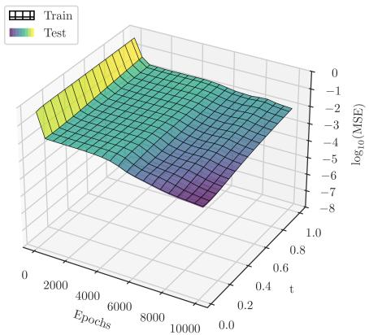  
(C1) MSE (5.5) between Φ $) _ { n } ^ { k _ { n } ^ { t } } f _ { i , j }$ and $S ( t ) f _ { i , j }$ along training epochs and time.

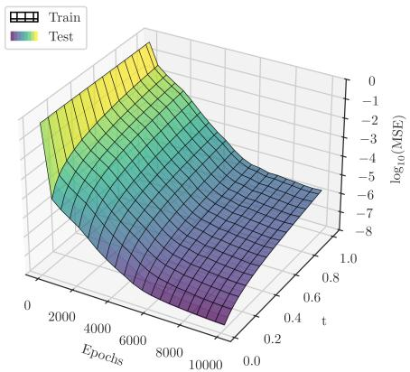  
(E1) MSE (5.5) between $\Phi _ { n } ^ { k _ { n } ^ { t } } f _ { i , j }$ and $S ( t ) f _ { i , j }$ along training epochs and time.

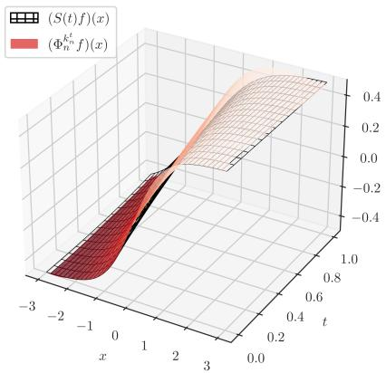  
(C2) Approximation of $S ( t ) f ^ { \mathrm { t h } }$ by $\Phi _ { n } ^ { k _ { n } ^ { t } } f ^ { \mathrm { t h } }$

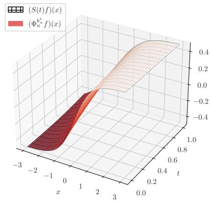  
(E2) Approximation of $S ( t ) f ^ { \mathrm { t h } }$ by $\Phi _ { n } ^ { k _ { n } ^ { t } } f ^ { \mathrm { t h } }$  
Figure 3. Approximation of the solution operator $f \mapsto S ( t ) f : = u ( t , \cdot )$ of the PDE (5.1) by using the Chernof one-step operator $I _ { n }$ defined in equation (5.2) which is learned with a Chernof-neural operator $\Phi _ { n } \in \mathcal { C N } _ { \mathrm { C } _ { \kappa _ { 0 } } , \mathrm { C } _ { \kappa } ^ { \alpha } } ^ { \mathcal { H } , \rho , \mathcal { L } }$ in (C1)–(C2) and an envelope-neural operator $\Phi _ { n } \in \mathcal { E } \mathcal { N } _ { \mathrm { C } _ { \kappa } , \mathrm { C } _ { \kappa } } ^ { \mathrm { R e L U } }$ in (E1)–(E2). In $( { \mathcal { C } } 1 ) \div ( { \mathcal { E } } 1 )$ , the MSE (5.5) on the train/test set is evaluated. In (C2)+(E2), the approximation of $S ( t ) f ^ { \mathrm { t h } }$ by $\Phi _ { n } ^ { k _ { n } ^ { t } } f ^ { \mathrm { t h } }$ is shown.

$( K _ { i } ) _ { i = 1 , \dots , I } \sim { \mathcal { N } } ( 0 , \sigma ^ { 2 } )$ with $\sigma = 2$ . We use these parameters to define the functions

$$
\begin{array} { l l } { { f _ { i , 1 } ( x ) = ( x - K _ { i } ) _ { + } , } } & { { f _ { i , 2 } ( x ) = ( K _ { i } - x ) _ { + } , } } \\ { { { } } } & { { { } } } \\ { { f _ { i , 3 } ( x ) = - ( x - K _ { i } ) _ { + } , } } & { { f _ { i , 4 } ( x ) = - ( K _ { i } - x ) _ { + } , } } \end{array}\tag{5.8}
$$

where $s _ { + } : = \operatorname* { m a x } ( s , 0 )$ , which are split up into $9 0 \% / 1 0 \%$ for training and testing equally among the diferent types. Note that the operators $I _ { n , ( \mu , \sigma ) }$ applied to call/put functions are given by

$$
\begin{array} { l } { \displaystyle \big ( I _ { n , ( \mu , \sigma ) } ( \cdot - K ) _ { + } \big ) ( x ) = \mathbb { E } [ ( x + \mu h _ { n } + \sigma W _ { h _ { n } } - K ) _ { + } ] } \\ { = ( x + \mu h _ { n } - K ) \Gamma \left( \frac { x + \mu h _ { n } - K } { \sigma \sqrt { h _ { n } } } \right) + \sigma \sqrt { h _ { n } } \gamma \left( \frac { x + \mu h _ { n } - K } { \sigma \sqrt { h _ { n } } } \right) , } \end{array}\tag{5.9}
$$

$$
\begin{array} { r l } & { \bigl ( I _ { n , ( \mu , \sigma ) } ( K - \cdot ) _ { + } \bigr ) ( x ) = \mathbb { E } [ ( K - x - \mu h _ { n } - \sigma W _ { h _ { n } } ) _ { + } ] } \\ & { \qquad = ( K - x - \mu h _ { n } ) \Gamma \left( \frac { K - x - \mu h _ { n } } { \sigma \sqrt { h _ { n } } } \right) + \sigma \sqrt { h _ { n } } \gamma \left( \frac { K - x - \mu h _ { n } } { \sigma \sqrt { h _ { n } } } \right) , } \end{array}\tag{5.10}
$$

where $\Gamma \left( \mathrm { r e s p . , } \gamma \right)$ denotes the cumulative distribution (resp., probability density) function of the standard normal distribution $\mathcal { N } ( 0 , 1 )$ . Consequently, the functions $I _ { n } f _ { i , j }$ are explicitly given by the equations (5.9) and (5.10), where the supremum over $( \mu , \sigma )$ is attained at the following values: $\begin{array} { r } { ( \mu , \sigma ) = ( \overline { { \mu } } , \overline { { \sigma } } ) \mathrm { ~ i f ~ } j = 1 , ( \mu , \sigma ) = ( \underline { { \mu } } , \overline { { \sigma } } ) \mathrm { ~ i f ~ } j = 2 , ( \mu , \sigma ) : = ( \underline { { \mu } } , \underline { { \sigma } } ) \mathrm { ~ i f ~ } j = 3 } \end{array}$ and $( \mu , \sigma ) = ( { \bar { \mu } } , \underline { { \sigma } } ) { \mathrm { ~ i f ~ } } j = 4$ In order to assess the out-of-sample performance of the trained operators, we evaluate them on the absolute value function

$$
f ^ { \mathrm { a b } } ( x ) : = | x |
$$

which does not belong to the training functions given by equation (5.8). As reference solution, we compute $S ( t ) f _ { i , j }$ and $S ( t ) f ^ { \mathrm { a b } }$ using a finite diference scheme for the corresponding fully nonlinear HJB equation. We learn the neural operators by minimizing the mean squared error (MSE) defined in equation (5.5) over the training set, where $( x _ { l } ) _ { l = 1 , \dots , L } \sim { \mathcal { N } } ( 0 , \sigma ^ { 2 } )$ are $L = 2 0 0$ i.i.d. evaluation points with $\sigma = 3$ . The other parameters are chosen as in Section 5.1, except that the Chernofneural operator has ReLU activation functions and learning rate $2 \cdot 1 0 ^ { - 5 }$ and the envelope-neural operator has $M = 8$ neurons and learning rate $1 0 ^ { - 5 }$ with the ReLU-neural network $\varphi : \mathbb { R } ^ { M } \to$ R having two hidden layers of 8 and 4 neurons. Both operators are trained with batchsize 100 per type $j = 1 , \dots , 4$ . The results are reported in Figure 4.

5.3. Stochastic processes under model uncertainty. In the third example, we follow [5, 25] to study strongly continuous convex monotone semigroups arising from Wasserstein perturbations of the transition probabilities of Lévy processes. To that end, let $p > 1$ and $( X _ { t } ) _ { t \geq 0 }$ be a Lévy process with transition probabilities

$$
p _ { t } ( x , B ) : = \varpi _ { t } ( \{ y \in \mathbb R ^ { d } \colon x + y \in B \} ) \quad { \mathrm { f o r ~ a l l ~ } } t \geq 0 , x \in \mathbb R ^ { d } { \mathrm { ~ a n d ~ } } B \in \mathcal { B } ( \mathbb R ^ { d } ) ,
$$

where $( \varpi _ { t } ) _ { t \geq 0 }$ is a family of probability measures with finite p-th moment such that

$$
\operatorname* { l i m } _ { t \to 0 } \int _ { \mathbb { R } ^ { d } } | y | ^ { p } \varpi _ { t } ( \mathrm { d } y ) = 0 .\tag{5.11}
$$

In addition, let $\eta \colon  { \mathbb { R } } _ { + } \to [ 0 , \infty ]$ be a convex non-decreasing function with $\eta ( 0 ) = 0$ and $\eta \not \equiv 0$ which is locally Lipschitz continuous on $\{ \eta < \infty \}$ . Moreover, the function $\mathbb { R } _ { + } \to [ 0 , \infty ]$ $v \mapsto \eta ( v ^ { 1 / p } )$ is supposed to be convex which implies lim in $\begin{array} { r } { \ell _ { v \to \infty } \frac { \eta ( v ) } { v ^ { p } } > 0 } \end{array}$ . For every $n \in \mathbb { N } , ~ f \in \mathrm { C _ { b } }$ and $x \in \mathbb { R } ^ { d }$ we define

$$
( I _ { n } f ) ( x ) : = \operatorname* { s u p } _ { \nu \in \mathcal { P } _ { p } ( \mathbb { R } ^ { d } ) } \left( \int _ { \mathbb { R } ^ { d } } f ( x + z ) \nu ( \mathrm { d } z ) - \eta \left( \frac { \mathcal { W } _ { p } ( \varpi _ { h _ { n } } , \nu ) } { h _ { n } } \right) h _ { n } \right) ,\tag{5.12}
$$

where $\mathcal { P } _ { p } ( \mathbb { R } ^ { d } )$ consists of all probability measures on $B ( \mathbb { R } ^ { d } )$ with finite p-th moment, $\mathcal { W } _ { p }$ denotes the p-Wasserstein distance on $\mathcal { P } _ { p } ( \mathbb { R } ^ { d } )$ and $( h _ { n } ) _ { n \in \mathbb { N } } \subset ( 0 , \infty )$ is a fixed sequence with $h _ { n } \to 0$ This Chernof one-step operator incorporates nonparametric model uncertainty by taking the fixed transition probabilities of the Lévy process $( X _ { t } ) _ { t \geq 0 }$ as reference model and weighting all other probability measures according to their distance to the reference model. For instance, in case that $\eta : = + { \infty } \mathbb { 1 } _ { \{ 0 \} ^ { c } }$ , the Chernof one-step operators coincide with the linear transition semigroup

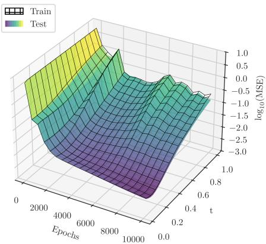  
(C1) MSE (5.5) between Φ $) _ { n } ^ { k _ { n } ^ { t } } f _ { i , j }$ and $S ( t ) f _ { i , j }$ along training epochs and time.

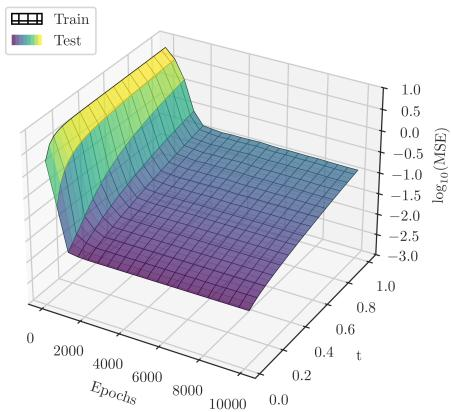  
(E1) MSE (5.5) between $\Phi _ { n } ^ { k _ { n } ^ { t } } f _ { i , j }$ and $S ( t ) f _ { i , j }$ along training epochs and time.

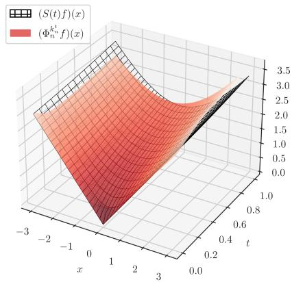  
(C2) Approximation of $S ( t ) f ^ { \mathrm { a b } }$ by $\Phi _ { n } ^ { k _ { n } ^ { t } } f ^ { \mathrm { a b } }$

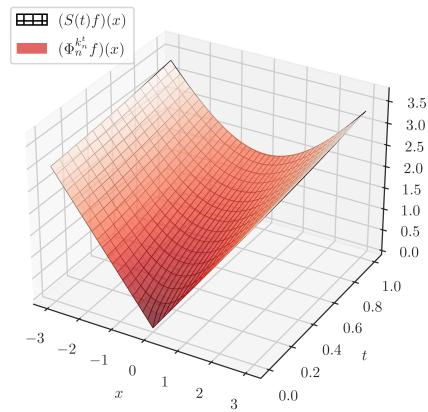  
(E2) Approximation of $S ( t ) f ^ { \mathrm { a b } }$ by $\Phi _ { n } ^ { k _ { n } ^ { t } } f ^ { \mathrm { a b } }$  
Figure 4. Approximating the stochastic control problem $f \mapsto S ( t ) f$ in (5.6) by the Chernof one-step operator $I _ { n } f$ in (5.7) which is learned with a Chernofneural operator $\Phi _ { n } \in \mathcal { C N } _ { \mathrm { C } _ { \kappa _ { 0 } } , \mathrm { C } _ { \kappa } ^ { \alpha } } ^ { \mathcal { H } , \rho , \mathcal { L } }$ in (C1)–(C2) and an envelope-neural operator $\Phi _ { n } \in \mathcal { E } \mathcal { N } _ { \mathrm { C } _ { \kappa } , \mathrm { C } _ { \kappa } } ^ { \mathrm { R e L U } }$ in (E1)–(E2). In (C1)+(E1), the MSE (5.5) on the train/test set is evaluated. In $( { \mathcal { C } } 2 ) + ( { \mathcal { E } } 2 )$ , the approximation of $S ( t ) f ^ { \mathrm { a b } }$ by $\Phi _ { n } ^ { k _ { n } ^ { t } } f ^ { \mathrm { a b } }$ is shown.

$$
( T ( t ) f ) ( x ) : = \int _ { \mathbb { R } ^ { d } } f ( x + y ) \varpi _ { t } ( \mathrm { d } y )
$$

of the Lévy process. Following [25], it is possible to generalize the framework to reference dynamics of the form $X _ { t } ^ { x } = \psi _ { t } ( x ) + Y _ { t }$ with a Lévy process $( Y _ { t } ) _ { t \geq 0 }$ and a deterministic drift $( \psi _ { t } ) _ { t \geq 0 }$ which covers, for instance, Ornstein–Uhlenbeck processes. It follows from [25, Theorem 3.14] that there exists a strongly continuous convex monotone semigroup $( S ( t ) ) _ { t \geq 0 }$ on $\mathrm { C _ { b } }$ given by

$$
S ( t ) f : = \operatorname* { l i m } _ { n \to \infty } I ( \pi _ { n } ^ { t } ) f \quad { \mathrm { f o r ~ a l l ~ } } t \geq 0 { \mathrm { ~ a n d ~ } } f \in \operatorname { C } _ { \mathrm { b } } .
$$

Furthermore, the generator of $( S ( t ) ) _ { t \geq 0 }$ is given by

$$
A f = B f + \eta ^ { * } { \big ( } | \nabla f | { \big ) } \quad { \mathrm { f o r ~ a l l ~ } } f \in D ( B ) \cap \mathrm { C } _ { b } ^ { 1 } ,\tag{5.13}
$$

where $\begin{array} { r } { \eta ^ { \ast } ( w ) : = \operatorname* { s u p } _ { v > 0 } ( v w - \eta ( v ) ) } \end{array}$ for all $w \geq 0$ and B denotes the generator of $( T ( t ) ) _ { t \geq 0 }$

Lemma 5.3. Let $\alpha : = 1 , \kappa \equiv 1$ and assume $\mathrm { C } _ { \mathrm { b } } ^ { \infty } \subset D ( B )$ . Then, the operators $( I _ { n } ) _ { n \in \mathbb { N } }$ defined by equation (5.12) satisfy the Assumptions $\it 4 . 1 ( i ) - ( v i i ) , \ 4 . 5$ and 4.8.

Proof. See Appendix C.3.

Looking at the generator in equation (5.13), it becomes apparent that the same semigroup can be constructed by only taking parametric drift uncertainty into consideration. Indeed, let

$$
( J _ { n } f ) ( x ) : = \operatorname* { s u p } _ { \lambda \in \mathbb { R } ^ { d } } \left( \int _ { \mathbb { R } ^ { d } } f ( x + \lambda h _ { n } + y ) \varpi _ { h _ { n } } ( \mathrm { d } y ) - \eta ( | \lambda | ) h _ { n } \right)\tag{5.14}
$$

for all $n \in \mathbb { N } , f \in \mathrm { C _ { b } }$ and $x \in \mathbb { R } ^ { d }$ . By [25, Section 4.5], there exists another strongly continuous convex monotone semigroup $( \tilde { S } ( t ) ) _ { t \geq 0 }$ on $\mathrm { C _ { b } }$ given by

$$
{ \tilde { S } } ( t ) f : = \operatorname* { l i m } _ { n \to \infty } J ( \pi _ { n } ^ { t } ) f \quad { \mathrm { f o r ~ a l l ~ } } t \geq 0 { \mathrm { ~ a n d ~ } } f \in \operatorname { C } _ { \mathrm { b } }
$$

whose generator is given by

$$
{ \tilde { A } } f = \operatorname* { s u p } _ { \lambda \in \mathbb { R } ^ { d } } \left( B f + \lambda ^ { T } \nabla f - \eta ( | \lambda | ) \right) = B f + \eta ^ { * } ( | \nabla f | ) \quad { \mathrm { f o r ~ a l l ~ } } f \in D ( B ) \cap \mathbb { C } _ { b } ^ { 1 } .
$$

Lemma 5.4. Let $\alpha : = 1 , \kappa \equiv 1$ and assume $\mathrm { C } _ { \mathrm { b } } ^ { \infty } \subset D ( B )$ . Then, the operators $( J _ { n } ) _ { n \in \mathbb { N } }$ defined by equation (5.14) satisfy the Assumptions $\it 4 . 1 , \ 4 . 5$ and 4.8. In particular,

$$
S ( t ) f = \tilde { S } ( t ) f f o r a l l t \geq 0 a n d f \in \mathrm { C } _ { \mathrm { b } } .
$$

Proof. See Appendix C.4.

By choosing $\nu = \varpi _ { h _ { n } } * \delta _ { \lambda h _ { r } }$ for all $\lambda \in \mathbb { R } ^ { d }$ , we see that $J _ { n } f \leq I _ { n } f$ for all $n \in \mathbb N$ and $f \in \mathrm { C } _ { \mathrm { b } }$ It has further been shown in [25, Lemma 3.10 and Section 4.5] that the iterated operators satisfy

$$
J _ { n } ^ { k _ { n } ^ { t } } f \leq S ( t ) f \leq I _ { n } ^ { k _ { n } ^ { t } } f \quad { \mathrm { f o r ~ a l l ~ } } t \geq 0 , n \in \mathbb { N } { \mathrm { ~ a n d ~ } } f \in \mathrm { C _ { b } } .
$$

In addition, if $( h _ { n } ) _ { n \in \mathbb { N } }$ defines a sequence of refining partitions, e.g., for $h _ { n } : = 2 ^ { - n }$ , it holds

$$
I ( \pi _ { n } ^ { t } ) f \downarrow S ( t ) f \quad { \mathrm { a n d } } \quad J ( \pi _ { n } ^ { t } ) f \uparrow S ( t ) f \quad { \mathrm { f o r ~ a l l ~ } } t \geq 0 { \mathrm { ~ a n d ~ } } f \in \mathrm { C _ { b } }
$$

meaning that the first sequence is decreasing and the second one is increasing.

For our numerical example, we choose $d = 1$ , a bounded time horizon $\textstyle T = 1 , n = 3 0 , h _ { n } = { \frac { 1 } { 3 0 } }$ and consider $( X _ { t } ) _ { t \geq 0 } = ( W _ { t } ) _ { t \geq 0 }$ . Furthermore, let $p = 2$ and $\begin{array} { r } { \eta ( v ) = \frac { 1 } { 6 } v ^ { 6 } } \end{array}$ with convex conjugate $\eta ^ { * } ( w ) = \textstyle \frac { 5 } { 6 } w ^ { 6 / 5 }$ . Note that the mapping $\begin{array} { r } { v \mapsto \eta ( v ^ { 1 / 2 } ) = \frac { v ^ { 3 } } { 6 } } \end{array}$ is convex and $\begin{array} { r } { \operatorname* { l i m } _ { v \to \infty } \frac { \eta ( v ) } { v ^ { 2 } } = \infty } \end{array}$ Since the rescaled penalty heavily penalizes all measures $\overset { \cdot } { \nu } \in \mathcal { P } _ { p } ( \mathbb { R } ^ { d } )$ with $\mathcal { W } _ { p } ( \varpi _ { h _ { n } } , \nu ) > h _ { n } .$ the supremum in equation (5.12) can be seen as a smoothed version of the supremum over a Wasserstein ball. We therefore proceed as in Section 5.2. To that end, we generate $I : = 1 0 0 0 \mathrm { i . i . d }$ midpoints $( c _ { i } ) _ { i = 1 , \dots , I } \sim { \mathcal { N } } ( 0 , 1 )$ and half-widths $( w _ { i } ) _ { i = 1 , \dots , I } \sim \mathcal { U } ( \frac { 1 } { 4 } , \frac { 3 } { 2 } )$ , set $K _ { i , 1 } : = c _ { i } - w _ { i }$ and $K _ { i , 2 } : = c _ { i } + w _ { i }$ and define the bull and bear spread functions

$$
\begin{array} { r l } & { f _ { i , 1 } ( x ) = ( x - K _ { i , 1 } ) _ { + } - ( x - K _ { i , 2 } ) _ { + } , \quad f _ { i , 2 } ( x ) = ( K _ { i , 2 } - x ) _ { + } - ( K _ { i , 1 } - x ) _ { + } , } \\ & { f _ { i , 3 } ( x ) = - f _ { i , 1 } ( x ) , } \end{array}\tag{5.15}
$$

which are split up into $9 0 \% / 1 0 \%$ for training and testing equally among the diferent types.

We implement $I _ { n }$ as an envelope-neural operator using the parametric representation of [55], where the supremum in equation (5.12) is restricted to measures of the form $\varpi _ { h _ { n } } \circ ( \operatorname { i d } + h _ { n } a ) ^ { - 1 }$ with vector fields $a \in L ^ { p } ( \varpi _ { h _ { n } } ; \mathbb { R } )$ . Restricting the supremum yields the envelope-neural operator

$$
( \Phi _ { n } ^ { I } f ) ( x ) : = \operatorname* { m a x } _ { m = 1 , \ldots , M } \left( \int _ { \mathbb { R } } f ( x + y + a _ { m } ( y ) ) \varpi _ { h _ { n } } ( \mathrm { d } y ) - h _ { n } \eta \left( { \frac { \| a _ { m } \| _ { L ^ { p } ( \varpi _ { h _ { n } } ; \mathbb { R } ) } } { h _ { n } } } \right) \right)\tag{5.16}
$$

with finitely many trainable neurons $( a _ { m } ) _ { m = 1 , \ldots , M } \subset L ^ { p } ( \varpi _ { h _ { n } } ; \mathbb { R } )$ . For the implementation, we choose afine functions $a _ { ( \varrho , \beta ) } ( y ) : = \varrho + \beta y$ with $\varrho , \beta \in$ R for which the transported measure is given by $\varpi _ { h _ { n } } \circ ( \mathrm { i d } + a _ { ( \varrho , \beta ) } ) ^ { - 1 } = \mathcal { N } ( \varrho , ( 1 + \beta ) ^ { 2 } h _ { n } )$ . Hence, for the piecewise linear payofs defined by equation (5.15) the inner integral in equation (5.16) is a Bachelier price and therefore available in closed form. Moreover, the penalization term is explicitly given by $\| a _ { ( \varrho , \beta ) } \| _ { L ^ { 2 } ( \varpi _ { h _ { n } } ) } ^ { 2 } = | \varrho | ^ { 2 } + \beta ^ { 2 } h _ { n }$ For the operator $J _ { n }$ defined by equation (5.14), the envelope-neural operator is given by

$$
( \Phi _ { n } ^ { J } f ) ( x ) : = \operatorname* { m a x } _ { m = 1 , \ldots , M } \left( \int _ { \mathbb { R } } f ( x + \lambda _ { m } h _ { n } + y ) \varpi _ { h _ { n } } ( \mathrm { d } y ) - \eta ( | \lambda _ { m } | ) h _ { n } \right)\tag{5.17}
$$

with finitely many trainable neurons $( \lambda _ { m } ) _ { m = 1 , \ldots , M } \subset \mathbb { R } .$

The neural operators are trained by minimizing the MSE (5.5) over $L = 1 0 0 \ \mathrm { i . i . d }$ . evaluation points $( x _ { l } ) _ { l = 1 , \ldots , L } \sim { \mathcal { N } } ( 0 , \sigma ^ { 2 } )$ with $\sigma = 3$ . Both envelope-neural operators use $M = 3 2$ neurons and the maximum readouts of the equations (5.16) and (5.17), respectively, so that $\Phi _ { n } ^ { I }$ has 64 and $\Phi _ { n } ^ { J }$ has 32 trainable parameters. Both are trained by applying the Adam algorithm over $1 0 ^ { 4 }$ epochs with learning rate $1 0 ^ { - 5 }$ and batchsize 100 per type $j = 1 , \dots , 4$ . The training labels $I _ { n } f _ { i , j }$ of the envelope-neural operator $\Phi _ { n } ^ { I }$ are computed from the dual representation

$$
( I _ { n } f ) ( x ) = \operatorname* { m i n } _ { \lambda \geq 0 } \left( \int _ { \mathbb { R } } \operatorname* { s u p } _ { w \in \mathbb { R } } \left( f ( x + y + w ) - \lambda | w | ^ { p } \right) \varpi _ { h _ { n } } ( \mathrm { d } y ) + G ^ { * } ( \lambda ) \right) ,\tag{5.18}
$$

see [4, Theorem $2 . 4 ]$ , where $G ^ { * }$ denotes the convex conjugate of $G ( \delta ) : = h _ { n } \eta ( \delta ^ { 1 / p } / h _ { n } )$ . In our case, we have $\begin{array} { r } { G ( \delta ) = \frac { \delta ^ { 3 } } { 6 h _ { n } ^ { 5 } } } \end{array}$ and $\begin{array} { r } { G ^ { * } ( \lambda ) = \frac { 2 } { 3 } \sqrt { 2 h _ { n } ^ { 5 } } \lambda ^ { 3 / 2 } } \end{array}$ . Note that, for a one-dimensional piecewise linear payof, the computation of the inner supremum in equation (5.18) reduces to maximizing over a finite set of points and the integral can be computed with a one-dimensional quadrature. The training labels $J _ { n } f _ { i , j }$ of the envelope-neural operator $\Phi _ { n } ^ { J }$ are obtained by evaluating the supremum in equation (5.14) over a discretized grid of drifts $\lambda \in \mathbb { R }$

In order to assess the out-of-sample performance of the trained operators, we evaluate them on the butterfly option

$$
f ^ { \mathrm { b f } } ( x ) : = ( x - K _ { 1 } ) _ { + } - 2 ( x - K _ { 2 } ) _ { + } + ( x - K _ { 3 } ) _ { + } \quad { \mathrm { w i t h } } \quad K _ { 1 } : = - 1 , K _ { 2 } : = 0 { \mathrm { ~ a n d ~ } } K _ { 3 } : = 1\tag{5.19}
$$

which is not monotone and therefore does not belong to any of the four classes of training functions defined in (5.15). As reference solution, we compute $S ( t ) f ^ { \mathrm { b f } }$ using a finite diference scheme for the corresponding HJB equation.

The results of the training are reported in Figure 5. In Figure 6, we repeat the training of both neural operators for diferent numbers of steps n with step size $h _ { n } = T / n$ and display the two terminal values $( \Phi _ { n } ^ { I } ) ^ { k _ { n } ^ { T } } f ^ { \mathrm { b f } }$ and $( \Phi _ { n } ^ { J } ) ^ { k _ { n } ^ { T } } f ^ { \mathrm { b f } }$ together with the finite diference solution $S ( T ) f ^ { \mathrm { b f } }$ at the final time T. The gap between the iterated envelope-neural operators is decreasing in n which illustrates how the nonparametric Wasserstein uncertainty and the parametric drift uncertainty lead to the same continuous time limit in accordance with Lemma 5.4.

## Appendix A. Weighted Hölder spaces

We prove some basic properties of the weighted Hölder spaces from Section 2. Recall that, for bounded continuous functions $\kappa ^ { \prime } , \kappa \colon  { \mathbb { R } ^ { d } } \to ( 0 , \infty )$ , we write $\kappa ^ { \prime } \lesssim \kappa$ if and only if $\kappa ^ { \prime } \leq c \kappa$ for some

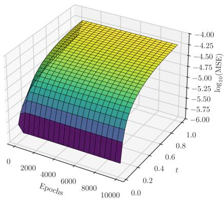  
(I1) MSE between $( \Phi _ { n } ^ { I } ) ^ { k _ { n } ^ { t } } f ^ { \mathrm { b f } }$ and $S ( t ) f ^ { \mathrm { b f } }$ along training epochs and time.

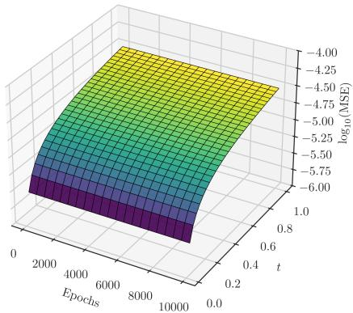  
(J 1) MSE between $( \Phi _ { n } ^ { J } ) ^ { k _ { n } ^ { t } } f ^ { \mathrm { b f } }$ and $S ( t ) f ^ { \mathrm { b f } }$ along training epochs and time.

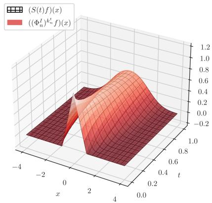  
(I2) Approximation of $S ( t ) f ^ { \mathrm { b f } }$ by $( \Phi _ { n } ^ { I } ) ^ { k _ { n } ^ { t } } f ^ { \mathrm { b f } } .$

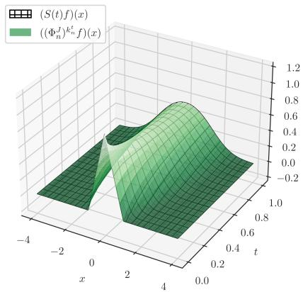  
(J 2) Approximation of $S ( t ) f ^ { \mathrm { b f } }$ by $( \Phi _ { n } ^ { J } ) ^ { k _ { n } ^ { t } } f ^ { \mathrm { b f } }$  
Figure 5. Approximating the Wasserstein-perturbation semigroup $f \mapsto S ( t ) f$ with two envelope-neural operators, evaluated on the out-of-sample butterfly $f ^ { \mathrm { b f } }$ in (5.19). The operator $\Phi _ { n } ^ { I }$ in (5.16) in $( \mathcal { T } 1 ) \ – ( \mathcal { T } 2 )$ , and the operator $\Phi _ { n } ^ { J }$ in (5.17) in $( \mathcal { I } 1 ) \ – ( \mathcal { I } 2 )$ . In $( \pmb { \mathscr { T } } 1 ) + ( \pmb { \mathscr { T } } 1 )$ , the MSE between the iterations $( \Phi _ { n } ^ { I } ) ^ { k _ { n } ^ { t } } f ^ { \mathrm { b f } }$ , respectively $( \Phi _ { n } ^ { J } ) ^ { k _ { n } ^ { t } } f ^ { \mathrm { b f } }$ , and $S ( t ) f ^ { \mathrm { b f } }$ is displayed along the training epochs and the time $t = k h _ { n } , k = 1 , \ldots , n$ . In $( \mathscr { T } 2 ) + ( \mathscr { T } 2 )$ , the approximation of $S ( t ) f ^ { \mathrm { b f } }$ by the two iterated neural operators is compared with the finite diference solution of the corresponding HJB equation over [0, T].

constant $c \geq 0$ , and $\kappa ^ { \prime } \lesssim \kappa$ if and only if lim $. | x | \substack {  \infty } \frac { \kappa ^ { \prime } ( x ) } { \kappa ( x ) } = 0$ . Furthermore, we define

$$
\bar { \kappa } ( x , y ) : = \frac { 2 \kappa ( x ) \kappa ( y ) } { \kappa ( x ) + \kappa ( y ) } = \frac { 2 } { \kappa ( x ) ^ { - 1 } + \kappa ( y ) ^ { - 1 } } \quad \mathrm { f o r ~ a l l ~ } x , y \in \mathbb { R } ^ { d } .
$$

Proposition A.1. Let $\alpha \in [ 0 , 1 ]$ and $\kappa \colon  { \mathbb { R } } ^ { d } \to ( 0 , \infty )$ be a bounded continuous function. Then, the space $( \mathrm { C } _ { \kappa } ^ { \alpha } , \| \cdot \| _ { \alpha , \kappa } )$ is complete.

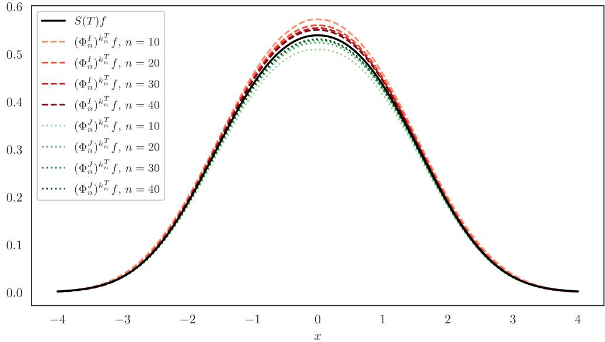  
Figure 6. Terminal values $( \Phi _ { n } ^ { I } ) ^ { k _ { n } ^ { T } } f ^ { \mathrm { b f } }$ and $( \Phi _ { n } ^ { J } ) ^ { k _ { n } ^ { T } } f ^ { \mathrm { b f } }$ of the two envelope-neural operators of Section 5.3, evaluated on the out-of-sample butterfly $f ^ { \mathrm { b f } }$ in (5.19) and compared with the finite diference solution $S ( T ) f ^ { \mathrm { b f } }$ at the terminal time T. Both operators are retrained for each number of steps $n \in \{ 1 0 , 2 0 , 3 0 , 4 0 \}$ , with step size $h _ { n } = T / n$ . The shades run from light to dark as n grows.

Proof. Let $( f _ { n } ) _ { n \in \mathbb { N } } \subset \mathrm { C } _ { \kappa } ^ { \alpha }$ be a Cauchy sequence. Since $( f _ { n } ) _ { n \in \mathbb { N } }$ is also a Cauchy sequence in the Banach space $\mathrm { C } _ { \kappa } .$ there exists $f \in \mathrm { C } _ { \kappa }$ with $\| f - f _ { n } \| _ { \kappa } \to 0 .$ . By definition of the norm, we obtain

$$
\| f \| _ { \alpha , \kappa } \leq \operatorname* { s u p } _ { n \in \mathbb { N } } \| f _ { n } \| _ { \alpha , \kappa } < \infty .
$$

Moreover, for every $\varepsilon > 0$ , there exist $n _ { 0 } \in \mathbb { N }$ with $\| f _ { m } - f _ { n } \| _ { \alpha , \kappa } < \varepsilon$ for all $m , n \geq n _ { 0 }$ . Hence, for every $x , y \in \mathbb { R } ^ { d }$ with $x \neq y$ and $n \geq n _ { 0 }$ , we obtain

$$
\frac { | ( f - f _ { n } ) ( x ) - ( f - f _ { n } ) ( y ) | } { | x - y | ^ { \alpha } } \bar { \kappa } ( x , y ) = \operatorname* { l i m } _ { m  \infty } \frac { | ( f _ { m } - f _ { n } ) ( x ) - ( f _ { m } - f _ { n } ) ( y ) | } { | x - y | ^ { \alpha } } \bar { \kappa } ( x , y )
$$

Theorem A.2. Let $0 \leq \alpha ^ { \prime } \leq \alpha \leq 1$ and $\kappa ^ { \prime } \lesssim \kappa \colon  { \mathbb { R } } ^ { d } \to ( 0 , \infty )$ be bounded continuous functions. Then, the embedding $\mathrm { C } _ { \kappa } ^ { \alpha } \hookrightarrow \mathrm { C } _ { \kappa ^ { \prime } } ^ { \alpha ^ { \prime } }$ is continuous. Moreover, i ${ \mathfrak { r } } _ { \alpha ^ { \prime } } < \alpha$ and $\kappa ^ { \prime } \lesssim \kappa ,$ then $\mathrm { C } _ { \kappa } ^ { \alpha } \hookrightarrow \mathrm { c } _ { \kappa ^ { \prime } } ^ { \alpha ^ { \prime } }$

$$
f \in \mathrm { C } _ { \kappa } ^ { \alpha }
$$

$$
\boldsymbol { y } \in \mathbb { R } ^ { d }
$$

$$
| x - y | \le 1
$$

$$
\alpha ^ { \prime } \leq \alpha
$$

$$
\kappa ^ { \prime } \leq c \kappa
$$

$$
\begin{array} { r } { \bar { \kappa } ^ { \prime } ( x , y ) = \frac { 2 } { \kappa ^ { \prime } ( x ) ^ { - 1 } + \kappa ^ { \prime } ( y ) ^ { - 1 } } \leq c \frac { 2 } { \kappa ( x ) ^ { - 1 } + \kappa ( y ) ^ { - 1 } } \leq c \bar { \kappa } ( x , y ) } \end{array}
$$

$$
{ \frac { | f ( x ) - f ( y ) | } { | x - y | ^ { \alpha ^ { \prime } } } } \bar { \kappa } ^ { \prime } ( x , y ) \leq c { \frac { | f ( x ) - f ( y ) | } { | x - y | ^ { \alpha } } } \bar { \kappa } ( x , y ) .
$$

Moreover, for every $x , y \in \mathbb { R } ^ { d }$ with $| x - y | > 1$ , the inequality $\bar { \kappa } ^ { \prime } ( x , y ) \leq 2 \operatorname* { m i n } ( \kappa ^ { \prime } ( x ) , \kappa ^ { \prime } ( y ) )$ implies

$$
\frac { | f ( x ) - f ( y ) | } { | x - y | ^ { \alpha ^ { \prime } } } \bar { \kappa } ^ { \prime } ( x , y ) \le 2 | f ( x ) - f ( y ) | \operatorname* { m i n } ( \kappa ^ { \prime } ( x ) , \kappa ^ { \prime } ( y ) ) \le 2 ( | f ( x ) | \kappa ^ { \prime } ( x ) + | f ( y ) | \kappa ^ { \prime } ( y ) ) .
$$

Hence, it holds $\| f \| _ { \alpha ^ { \prime } , \kappa ^ { \prime } } \leq 4 c \| f \| _ { \alpha , \kappa }$ for all $f \in \mathrm { C } _ { \kappa } ^ { \alpha }$

Now, let $\alpha ^ { \prime } < \alpha$ and $\kappa ^ { \prime } \lesssim \kappa .$ . For every $f \in \mathrm { C } _ { \kappa } ^ { \alpha }$ , it holds

$$
\operatorname* { l i m } _ { | x | \to \infty } | f ( x ) | \kappa ^ { \prime } ( x ) \leq \| f \| _ { \alpha , \kappa } \operatorname* { l i m } _ { | x | \to \infty } \frac { \kappa ^ { \prime } ( x ) } { \kappa ( x ) } = 0 .
$$

In addition, by using that $\kappa ^ { \prime } \leq c \kappa$ implies $\bar { \kappa } ^ { \prime } ( x , y ) \leq c \bar { \kappa } ( x , y )$ , we obtain

$$
\begin{array} { r l } & { \underset { \delta \to 0 } { \operatorname* { l i m } } \ \underset { | x - y | < \delta } { \operatorname* { s u p } } \ \frac { | f ( x ) - f ( y ) | } { | x - y | ^ { \alpha ^ { \prime } } } \bar { \kappa } ^ { \prime } ( x , y ) \leq c \underset { \delta \to 0 } { \operatorname* { l i m } } \left( \delta ^ { \alpha - \alpha ^ { \prime } } \ \underset { | x - y | < \delta } { \operatorname* { s u p } } \ \frac { | f ( x ) - f ( y ) | } { | x - y | ^ { \alpha } } \bar { \kappa } ( x , y ) \right) } \\ & { \qquad \leq c \| f \| _ { \alpha , \kappa } \underset { \delta \to 0 } { \operatorname* { l i m } } \delta ^ { \alpha - \alpha ^ { \prime } } = 0 . } \end{array}
$$

Theorem A.3. Let $0 \leq \alpha ^ { \prime } < \alpha \leq 1$ and $\kappa ^ { \prime } \lessapprox \kappa \colon \mathbb { R } ^ { d }  ( 0 , \infty )$ be bounded continuous functions.   
Then, the embedding $\mathrm { C } _ { \kappa } ^ { \alpha } \hookrightarrow \mathrm { C } _ { \kappa ^ { \prime } } ^ { \alpha ^ { \prime } }$ is compact.

Proof. Let $( f _ { n } ) _ { n \in \mathbb { N } } \subset \mathrm { C } _ { \kappa } ^ { \alpha }$ be bounded and $C : = \mathrm { s u p } _ { n \in \mathbb { N } } \| f _ { n } \| _ { \alpha , \kappa }$ . By Arzelà-Ascoli’s theorem, there exists a diagonal sequence, which is again denoted by $( f _ { n } ) _ { n \in \mathbb { N } } ,$ , and $f \in \mathbf { C } (  { \mathbb { R } } ^ { d } )$ such that

$$
\operatorname* { l i m } _ { n \to \infty } \| f - f _ { n } \| _ { \infty , K } = 0 \quad { \mathrm { f o r ~ a l l ~ } } K \in \mathbb { R } ^ { d } .
$$

For every $x , y \in \mathbb { R } ^ { d }$ , we use $\| f _ { n } \| _ { \alpha , \kappa } \leq C$ to obtain

$$
\begin{array} { c } { | f ( x ) | \kappa ( x ) = \underset { n  \infty } { \operatorname* { l i m } } | f _ { n } ( x ) | \kappa ( x ) \leq C , } \\ { | f ( x ) - f ( y ) | \bar { \kappa } ( x , y ) = \underset { n  \infty } { \operatorname* { l i m } } | f _ { n } ( x ) - f _ { n } ( y ) | \bar { \kappa } ( x , y ) \leq C | x - y | ^ { \alpha } } \end{array}
$$

which guarantees that $f \in \mathrm { C } _ { \kappa } ^ { \alpha }$ and $\| f - f _ { n } \| _ { \alpha , \kappa } \leq 2 C$ . It remains to show that $\| f - f _ { n } \| _ { \alpha ^ { \prime } , \kappa ^ { \prime } } \to 0$ Let $\varepsilon > 0$ . We choose $r > 0$ with $\begin{array} { r } { \operatorname* { s u p } _ { | x | > r } \frac { \kappa ^ { \prime } ( x ) } { \kappa ( x ) } < \frac { \varepsilon } { 4 C } } \end{array}$ and $n _ { 0 } \in \mathbb { N }$ with $\begin{array} { r } { \| f - f _ { n } \| _ { \infty , B _ { \mathbb { R } ^ { d } } ( r ) } < \frac { \varepsilon } { 2 \| \kappa ^ { \prime } \| _ { \infty } } , } \end{array}$ Then, for every $n \geq n _ { 0 }$ , we obtain

$$
\| f - f _ { n } \| _ { \kappa ^ { \prime } } \leq \| \kappa ^ { \prime } \| _ { \infty } \operatorname* { s u p } _ { x \in B _ { \mathrm { g } ^ { d } } ( r ) } \vert ( f - f _ { n } ) ( x ) \vert + 2 C \operatorname* { s u p } _ { | x | > r } \frac { \kappa ^ { \prime } ( x ) } { \kappa ( x ) } < \| \kappa ^ { \prime } \| _ { \infty } \frac { \varepsilon } { 2 \| \kappa ^ { \prime } \| _ { \infty } } + 2 C \frac { \varepsilon } { 4 C } = \varepsilon .\tag{A.1}
$$

Furthermore, the estimates $\kappa ^ { \prime } \leq c \kappa$ and $\bar { \kappa } ^ { \prime } ( x , y ) \leq 2 \operatorname* { m i n } ( \kappa ^ { \prime } ( x ) , \kappa ^ { \prime } ( y ) )$ imply

$$
\begin{array} { l } { \displaystyle \operatorname* { s u p } _ { x \neq y } \frac { \big | ( f - f _ { n } ) ( x ) - ( f - f _ { n } ) ( y ) \big | } { | x - y | ^ { \alpha ^ { \prime } } } \bar { \kappa } ^ { \prime } ( x , y ) } \\ { \leq \bigg ( \displaystyle \operatorname* { s u p } _ { x \neq y } \frac { | ( f - f _ { n } ) ( x ) - ( f - f _ { n } ) ( y ) | } { | x - y | ^ { \alpha } } \bar { \kappa } ^ { \prime } ( x , y ) \bigg ) ^ { \frac { \alpha ^ { \prime } } { \alpha } } \bigg ( \displaystyle \operatorname* { s u p } _ { x \neq y } | ( f - f _ { n } ) ( x ) - ( f - f _ { n } ) ( y ) | \bar { \kappa } ^ { \prime } ( x , y ) \bigg ) ^ { 1 - \frac { \alpha ^ { \prime } } { \alpha } } } \\ { \leq \bigg ( \displaystyle \operatorname* { c u p } _ { x \neq y } \frac { | ( f - f _ { n } ) ( x ) - ( f - f _ { n } ) ( y ) | } { | x - y | ^ { \alpha } } \bar { \kappa } ( x , y ) \bigg ) ^ { \frac { \alpha ^ { \prime } } { \alpha } } \bigg ( \displaystyle \operatorname* { s u p } _ { x \in \mathbb { R } ^ { d } } | ( f - f _ { n } ) ( x ) | \kappa ^ { \prime } ( x ) \bigg ) ^ { 1 - \frac { \alpha ^ { \prime } } { \alpha } } } \\ { \leq ( 2 C c ) ^ { \frac { \alpha ^ { \prime } } { \alpha } } ( 2 \| f - f _ { n } \| _ { \kappa ^ { \prime } } ) ^ { 1 - \frac { \alpha ^ { \prime } } { \alpha } } . } \end{array}
$$

Combining the previous estimate with inequality (A.1) yields $\| f - f _ { n } \| _ { \alpha ^ { \prime } , \kappa ^ { \prime } } \to 0 .$

Theorem A.4. Let $\alpha \in [ 0 , 1 )$ and $\kappa \colon  { \mathbb { R } ^ { d } } \to ( 0 , \infty )$ be a bounded continuous function. Then, the set $\mathrm { C } _ { \mathrm { c } } ^ { \infty } \subset \mathrm { c } _ { \kappa } ^ { \alpha }$ is dense.

Proof. First, we show that every $f \in \mathrm { c } _ { \kappa } ^ { \alpha }$ can be approximated by a sequence of compactly supported functions. To do so, let $\chi \in \mathrm { C _ { b } ^ { \infty } }$ with $0 \leq \chi \leq 1 , \chi \equiv 1$ on $B _ { \mathbb { R } ^ { d } } ( 1 )$ and $\chi \equiv 0 \mathrm { o n } B _ { \mathbb { R } ^ { d } } ( 2 ) ^ { c }$ We define $\chi _ { r } ( x ) : = \chi ( x / r ) , f _ { r } ( x ) : = \chi _ { r } ( x ) f ( x )$ and $h _ { r } ( x ) : = f ( x ) - f _ { r } ( x ) = ( 1 - \chi _ { r } ( x ) ) f ( x )$ for

all $r > 0$ and $x \in \mathbb { R } ^ { d }$ . It holds $f _ { r } , h _ { r } \in \mathrm { c } _ { \kappa } ^ { \alpha }$ for all $r > 0$ . Since $f \in \mathrm { c } _ { \kappa } ^ { \alpha }$ , we have

$$
m _ { f } ( r ) : = \operatorname* { s u p } _ { | x | > r } | f ( x ) | \kappa ( x ) \to 0 \quad { \mathrm { ~ a s ~ } } r \to \infty ,\tag{A.2}
$$

$$
\omega _ { f } ( \delta ) : = \operatorname* { s u p } _ { \stackrel { x \neq y , } { | x - y | < \delta } } \frac { | f ( x ) - f ( y ) | } { | x - y | ^ { \alpha } } \bar { \kappa } ( x , y )  0 \quad \mathrm { a s ~ } \delta  0 .\tag{A.3}
$$

It follows from equation (A.2) that $\| h _ { r } \| _ { \kappa } = \| f - f _ { r } \| _ { \kappa } \leq m _ { f } ( r )  0$ as $r  \infty$ . Moreover, there exists $L \geq 0$ with $\| \nabla \chi _ { r } \| _ { \infty } \leq L / r$ for all $r > 0$ . For every $x , y \in \mathbb { R } ^ { d }$ with $0 < | x - y | < \delta$ , we use equation $( \mathrm { A } . 3 ) , \ \chi _ { r } ( x ) = \chi _ { r } ( y ) = 1$ in case that $| y | \le r - \delta$ and $\bar { \kappa } ( x , y ) \leq 2 \kappa ( y )$ to estimate

$$
\begin{array} { r l } & { | h _ { r } ( x ) - h _ { r } ( y ) | \bar { \kappa } ( x , y ) \leq ( 1 - \chi _ { r } ( x ) ) | f ( x ) - f ( y ) | \bar { \kappa } ( x , y ) + 2 | \chi _ { r } ( x ) - \chi _ { r } ( y ) | \cdot | f ( y ) | \kappa ( y ) } \\ & { \qquad \leq \omega _ { f } ( \delta ) | x - y | ^ { \alpha } + \displaystyle \frac { 2 L } { r } | x - y | m _ { f } ( r - \delta ) } \end{array}
$$

which implies that

$$
\operatorname* { s u p } _ { x \neq y , \atop | x - y | < \delta } \frac { | h _ { r } ( x ) - h _ { r } ( y ) | } { | x - y | ^ { \alpha } } \bar { \kappa } ( x , y ) \leq \omega _ { f } ( \delta ) + \frac { 2 L } { r } \delta ^ { 1 - \alpha } m _ { f } ( r - \delta ) .
$$

On the other hand, for every $x , y \in \mathbb { R } ^ { d }$ with $| x - y | \geq \delta$ , it holds

$$
\operatorname* { s u p } _ { | x \neq y , \atop | x - y | \geq \delta } \frac { | h _ { r } ( x ) - h _ { r } ( y ) | } { | x - y | ^ { \alpha } } \bar { \kappa } ( x , y ) \leq \frac { 2 \operatorname* { s u p } _ { x \in \mathbb { R } ^ { d } } | h _ { r } ( x ) | \kappa ( x ) } { \delta ^ { \alpha } } \leq \frac { 2 m _ { f } ( r ) } { \delta ^ { \alpha } } .
$$

Letting first $r  \infty$ and then $\delta  0$ yields $\| f - f _ { r } \| _ { \alpha , \kappa } = \| h _ { r } \| _ { \alpha , \kappa } \to 0 .$

Second, we show that every $f \in \mathrm { c } _ { \kappa } ^ { \alpha }$ with compact support can be approximated by a sequence of functions in $\mathrm { C } _ { \mathrm { c } } ^ { \infty }$ . Since κ is bounded away from zero on compact subsets, the weighted Hölder norm is equivalent to the classical Hölder norm on supp(f), whence a standard mollification argument yields a sequence $( f _ { n } ) _ { n \in \mathbb { N } } \subset \mathrm { C } _ { \mathrm { c } } ^ { \infty }$ with $\| f - f _ { n } \| _ { \alpha , \kappa } \to 0$ , see, e.g., [49, Proposition 0.2.1]. □

## Appendix B. Weighted Stone-Weierstrass theorems for Banach scales

Let $( \Theta , \preceq )$ be a pre-ordered set equipped with an additional relation ≺ satisfying $\theta _ { 1 } \prec \theta _ { 2 } \Rightarrow$ $\theta _ { 1 } ~ \preceq ~ \theta _ { 2 }$ such that, for every $k \in \mathbb N$ and $\theta _ { 1 } , \ldots , \theta _ { k } \ \in \ \Theta$ , there exist $l _ { \star } , l ^ { \star } \in \{ 1 , \ldots , k \}$ with $\theta _ { l _ { \star } } \preceq \theta _ { l } \preceq \theta _ { l } .$ ⋆ for all $l \in \{ 1 , \ldots , k \}$ . Let X be a Banach space and $( X _ { \theta } , \parallel \cdot \parallel _ { \theta } )$ θ∈Θ be a family of Banach spaces such that, for every $\theta ^ { \prime } \preceq \theta .$ , it holds that $X _ { \theta } \subset X _ { \theta ^ { \prime } } \subset X$ and the inclusion $\iota _ { X _ { \theta } , X _ { \theta ^ { \prime } } } \colon X _ { \theta } \hookrightarrow X _ { \theta ^ { \prime } }$ is continuous, and for every $\theta ^ { \prime } \prec \theta .$ the set $B _ { X _ { \theta } } ( r ) : = \{ u \in X _ { \theta } \colon \| u \| _ { \theta } \leq r \}$ is compact in Xθ′ . Moreover, for a strictly increasing continuous function $\psi \colon [ 0 , \infty )  ( 0 , \infty )$ with lim $_ { \ell \to \infty } \psi ( R ) = \infty$ , we define the weight functions

$$
\psi _ { \theta } \colon X _ { \theta } \to ( 0 , \infty ) , u \mapsto \psi ( \left\| u \right\| _ { \theta } ) \quad { \mathrm { f o r ~ a l l ~ } } \theta \in \Theta .
$$

Then, for every $\theta ^ { \prime } \prec \theta$ and $R > 0 ,$ , the pre-image $\psi _ { \boldsymbol \theta } ^ { - 1 } ( \left( 0 , R \right] ) = B _ { X _ { \boldsymbol \theta } } ( \psi ^ { - 1 } ( R ) ) \subset X _ { \boldsymbol \theta , \boldsymbol \theta ^ { \prime } }$ is compact and therefore ψ is an admissible weight on $X _ { \theta , \theta ^ { \prime } } : = ( X _ { \theta } , \| \cdot \| _ { \theta ^ { \prime } } )$ in the sense of [19, Definition 2.1]. Furthermore, let Y be a vector space and $( Y _ { \theta } , \parallel \cdot \parallel _ { \theta } ) _ { \theta \in \Theta }$ be a family of Banach spaces such that, for every $\theta ^ { \prime } \preceq \theta$ , it holds $Y _ { \theta } \subset Y _ { \theta ^ { \prime } } \subset Y$ and the inclusion $\iota _ { Y _ { \theta } , Y _ { \theta ^ { \prime } } } \colon Y _ { \theta } \hookrightarrow Y _ { \theta ^ { \prime } }$ is continuous.

Remark B.1. In the proof of Theorem 3.5, we consider $\Theta : = ( \beta _ { q } , \eta _ { q } ) _ { q \in Q } \subset [ 0 , \alpha ] \times \mathcal { K }$ , with totally ordered $( Q , \leq )$ satisfying $\beta _ { q ^ { \prime } } < \beta _ { q }$ and $\eta _ { q ^ { \prime } } \lesssim \eta _ { q }$ for all $q ^ { \prime } < q$ . We equip Θ with

$$
( \beta _ { q ^ { \prime } } , \eta _ { q ^ { \prime } } ) \preceq ( \beta _ { q } , \eta _ { q } ) : \Leftrightarrow q ^ { \prime } \leq q \quad \mathrm { a n d } \quad ( \beta _ { q ^ { \prime } } , \eta _ { q ^ { \prime } } ) \prec ( \beta _ { q } , \eta _ { q } ) : \Leftrightarrow q ^ { \prime } < q .
$$

Moreover, we set $X _ { \theta , \theta ^ { \prime } } : = \textstyle { \operatorname { C } _ { \eta _ { q } , \eta _ { q } ^ { \prime } } ^ { \beta _ { q } , \beta _ { q } ^ { \prime } } } = ( \textstyle { \operatorname { C } _ { \eta _ { q } } ^ { \beta _ { q } } } , \| \cdot \| _ { \beta _ { q } ^ { \prime } , \eta _ { q } ^ { \prime } } ) \mathrm { ~ a n d ~ } Y _ { \theta ^ { \prime } } : = \displaystyle { \operatorname { c } _ { \eta _ { q } ^ { \prime } } ^ { \beta _ { q } ^ { \prime } } } \mathrm { ~ f o r ~ } \theta ^ { \prime } : = ( \beta _ { q } ^ { \prime } , \eta _ { q } ^ { \prime } ) \prec \theta : = ( \beta _ { q } , \eta _ { q } ) .$

We further introduce the intersection mapping spaces

$$
\begin{array} { r l } & { \bigcap _ { \theta ^ { \prime } \prec \theta } \mathcal { B } _ { \psi } ( X _ { \theta , \theta ^ { \prime } } ; Y _ { \theta ^ { \prime } } ) : = \{ f \colon X \to Y \colon f | _ { X _ { \theta } } \in \mathcal { B } _ { \psi } ( X _ { \theta , \theta ^ { \prime } } ; Y _ { \theta ^ { \prime } } ) \mathrm { ~ f o r ~ a l l ~ } \theta ^ { \prime } \prec \theta \in \Theta \} , } \\ & { \bigcap _ { \theta ^ { \prime } \prec \theta } \mathrm { C } _ { \mathrm { b } } ( X _ { \theta , \theta ^ { \prime } } ; Y _ { \theta ^ { \prime } } ) : = \{ f \colon X \to Y \colon f | _ { X _ { \theta } } \in \mathrm { C } _ { \mathrm { b } } ( X _ { \theta , \theta ^ { \prime } } ; Y _ { \theta ^ { \prime } } ) \mathrm { ~ f o r ~ a l l ~ } \theta ^ { \prime } \prec \theta \in \Theta \} } \end{array}
$$

which satisfy $\begin{array} { r } { \bigcap _ { \theta ^ { \prime } \prec \theta } \operatorname { C } _ { \mathrm { b } } ( X _ { \theta , \theta ^ { \prime } } ; Y _ { \theta ^ { \prime } } ) \subset \bigcap _ { \theta ^ { \prime } \prec \theta } \mathcal { B } _ { \psi } ( X _ { \theta , \theta ^ { \prime } } ; Y _ { \theta ^ { \prime } } ) } \end{array}$ since $\mathrm { C } _ { b } ( X _ { \theta , \theta ^ { \prime } } ; Y _ { \theta ^ { \prime } } ) \subset \mathcal { B } _ { \psi } ( X _ { \theta , \theta ^ { \prime } } ; Y _ { \theta ^ { \prime } } )$ We equip $\begin{array} { r } { \bigcap _ { \theta ^ { \prime } \prec \theta } B _ { \psi } ( X _ { \theta , \theta ^ { \prime } } ; Y _ { \theta ^ { \prime } } ) } \end{array}$ with the locally convex topology generated by the seminorms

$$
\Vert f \Vert _ { \mathcal { B } _ { \psi } ( X _ { \theta , \theta ^ { \prime } } ; Y _ { \theta ^ { \prime } } ) } : = \operatorname* { s u p } _ { u \in X _ { \theta } } \frac { \Vert f ( u ) \Vert _ { \theta ^ { \prime } } } { \psi ( \Vert u \Vert _ { \theta } ) } \quad \mathrm { f o r ~ a l l ~ } \theta ^ { \prime } \prec \theta \in \Theta .
$$

A zero-neighborhood basis of $\begin{array} { r } { \bigcap _ { \theta ^ { \prime } \prec \theta } B _ { \psi } ( X _ { \theta , \theta ^ { \prime } } ; Y _ { \theta ^ { \prime } } ) } \end{array}$ is given by sets of the form

$$
\Biggl \{ f \in \bigcap _ { \theta ^ { \prime } \prec \theta } \mathcal { B } _ { \psi } ( X _ { \theta , \theta ^ { \prime } } ; Y _ { \theta ^ { \prime } } ) \colon \operatorname* { m a x } _ { l = 1 , \ldots , k } \| f \| _ { \mathcal { B } _ { \psi _ { \theta _ { l } } } ( X _ { \theta _ { l } , \theta _ { l } ^ { \prime } } ; Y _ { \theta _ { l } ^ { \prime } } ) } < \varepsilon \Biggr \} ,
$$

where $\varepsilon > 0 , k \in \mathbb { N }$ and $\theta _ { l } ^ { \prime } \prec \theta _ { l } \in \Theta , l = 1 , \ldots , k$ . Recall that a vector space A of mappings $a \colon X \to \mathbb { R }$ is a subalgebra if $a _ { 1 } \cdot a _ { 2 } \in { \mathcal { A } }$ for all $a _ { 1 } , a _ { 2 } \in { \mathcal { A } }$ , where $( a _ { 1 } \cdot a _ { 2 } ) ( u ) : = a _ { 1 } ( u ) a _ { 2 } ( u )$ . The set A is point separating if, for every $u _ { 1 } , u _ { 2 } \in X$ with $u _ { 1 } \neq u _ { 2 }$ , there is $a \in { \mathcal { A } }$ with $a ( u _ { 1 } ) \neq a ( u _ { 2 } )$ Finally, A is called nowhere vanishing if, for every $u \in X$ , there is $a \in { \mathcal { A } }$ with $a ( u ) \neq 0$

Theorem B.2 (R-valued weighted Stone-Weierstrass). Let $\begin{array} { r } { A \subset \bigcap _ { \theta ^ { \prime } \prec \theta } \operatorname { C } _ { \mathrm { b } } ( X _ { \theta , \theta ^ { \prime } } ; \mathbb { R } ) } \end{array}$ be a point separating nowhere vanishing subalgebra. Then, the set A is dense in $\begin{array} { r } { \bigcap _ { \theta ^ { \prime } \prec \theta } B _ { \psi } ( X _ { \theta , \theta ^ { \prime } } ; \mathbb { R } ) } \end{array}$

Proof. We follow the proof of [19, Theorem 3.9]. Let $\begin{array} { r } { f \in \bigcap _ { \theta ^ { \prime } \prec \theta } B _ { \psi } ( X _ { \theta , \theta ^ { \prime } } ; \mathbb { R } ) , \varepsilon > 0 , k \in \mathbb { N } } \end{array}$ and $\theta _ { l } ^ { \prime } \prec \theta _ { l } \in \Theta$ for $l = 1 , \ldots , k .$ . By [19, Lemma 2.7(i)], there exists $R _ { 1 } > 0$ with

$$
\operatorname* { m a x } _ { l = 1 , \dots , k } \operatorname* { s u p } _ { u \in X _ { \theta _ { l } } \setminus K _ { l , R _ { 1 } } } \frac { 1 + | f ( u ) | } { \psi ( \| u \| _ { \theta _ { l } } ) } < \frac { \varepsilon } { 5 } ,\tag{B.1}
$$

where $K _ { l , R _ { 1 } } : = \psi _ { \theta _ { l } } ^ { - 1 } ( ( 0 , R _ { 1 } ] )$ denotes the compact pre-image of $\psi _ { \theta _ { l } } ( \cdot ) : = \psi ( \| \cdot \| _ { \theta _ { l } } )$ . Moreover, we define $\begin{array} { r } { M : = ( \dot { \operatorname* { m i n } } _ { l = 1 , \dots , k } \operatorname* { i n f } _ { u \in X _ { \theta _ { l } } } \psi ( \| u \| _ { \theta _ { l } } ) ) ^ { - 1 } } \end{array}$ , let $b : = 1 + \operatorname* { m a x } _ { l = 1 , \ldots , k } \operatorname* { s u p } _ { u \in K _ { l , R _ { 1 } } } | f ( u ) |$ and choose $R _ { 2 } \geq \operatorname* { m a x } \{ R _ { 1 } , { \frac { 5 b } { \varepsilon } } \}$ . Furthermore, there exists $\theta ^ { \prime } \in \Theta$ with $\theta ^ { \prime } \preceq \theta _ { l } ^ { \prime }$ for all $l \in \{ 1 , \ldots , k \}$ Since the set $\begin{array} { r } { K _ { 2 } : = \bigcup _ { l = 1 } ^ { k } K _ { l , R _ { 2 } } \subset X _ { \theta ^ { \prime } } } \end{array}$ is compact, we can apply the classical Stone–Weierstrass theorem [66] to $\mathcal { A } | _ { K _ { 2 } } \subset \mathbf { C } ( K _ { 2 } , \| \cdot \| _ { \theta ^ { \prime } } )$ to obtain $a \in { \mathcal { A } }$ with

$$
\operatorname* { s u p } _ { u \in K _ { 2 } } | f ( u ) - a ( u ) | < \operatorname* { m i n } \left\{ 1 , { \frac { \varepsilon } { 5 M } } \right\} .\tag{B.2}
$$

We use that $g ( s ) : = \operatorname* { m a x } \{ \operatorname* { m i n } ( s , b ) , - b \}$ satisfies $g ( a ( u ) ) = a ( u )$ for all $u \in K _ { 1 } : = \bigcup _ { l = 1 } ^ { k } K _ { l , R _ { 1 } }$ , the inequality $| a ( u ) | \leq 1 + | f ( u ) |$ for all $u \in K _ { 2 }$ and the inequalities (B.1)–(B.2) to estimate

$$
\begin{array} { r l } & { \underset { \ell = 1 , \ldots , k \in \mathcal K _ { n } , \{ K _ { 1 } , \ldots , K _ { n } \} } { \operatorname* { m a x } } \| f - g \circ \alpha \| _ { S _ { \sigma _ { i } } ( X _ { \ell , \varphi } ; 2 ) } = \underset { \ell = 1 , \ldots , k \in \mathcal K _ { n } ; \mathcal K _ { n } ; \mathcal K _ { n } } { \operatorname* { m a x } } \frac { | f | ( \overline { { u } } ) - g ( a ( \boldsymbol u ) ) | } { \forall ( \| u \| _ { \mathcal B _ { 1 } } ) } } \\ & { \leq \underset { \ell = 1 , \ldots , k \in \mathcal K _ { n } ; \mathcal K _ { n , \ell } ; \mathcal K _ { n , i } } { \operatorname* { m a x } } \frac { | f | ( \boldsymbol u ) | } { \forall ( \| u \| _ { \mathcal B _ { 1 } } ) } + \underset { \ell = 1 , \ldots , k \in \mathcal K _ { n } ; \mathcal K _ { n } ; \mathcal K _ { n } } { \operatorname* { m a x } } \frac { | f | ( \overline { { u } } ) - g ( a ( \boldsymbol u ) ) | } { \forall ( \| u \| _ { \mathcal B _ { 1 } } ) } } \\ & { \quad + \underset { \ell = 1 , \ldots , k \in \mathcal K _ { n } ; \mathcal K _ { n , \ell } ; \mathcal K _ { n , \ell } ; \mathcal K _ { n , \ell } } { \operatorname* { m a x } } \frac { | g ( \boldsymbol \ell ( \boldsymbol u ) ) | } { \forall ( \| u \| _ { \mathcal B _ { 1 } } ) } + \underset { \ell = 1 , \ldots , k \in \mathcal K _ { n } ; \mathcal K _ { n , \ell } ; \mathcal K _ { n , \ell } ; \mathcal P } { \operatorname* { m a x } } \frac { | g ( \boldsymbol \ell ( \boldsymbol u ) ) | } { \forall ( \| u \| _ { \mathcal B _ { 2 } } ) } } \\ &  \leq \underset { \ell = 1 , \ldots , k \in \mathcal K _ { n } ; \mathcal K _ { n , \ell } ; \mathcal K _ { n , \ell } } { \operatorname* { m a x } } \frac { 1 } { \forall ( \| \mathcal I ( \boldsymbol u ) \| _ { \mathcal I } ) } + M _ { \mathrm { ~ s } } \underset  \end{array}\tag{B.3}
$$

Moreover, by the Weierstrass theorem [67], there exists a polynomial p on R with

$$
| g ( s ) - p ( s ) | < \frac { \varepsilon } { 5 M } \quad \mathrm { f o r ~ a l l ~ } | s | \leq c : = \operatorname* { m a x } _ { l = 1 , \dots , k } \operatorname* { s u p } _ { u \in X _ { \theta _ { l } } } | a ( u ) | .
$$

Without loss of generality, we assume $p ( 0 ) = 0$ , implying

$$
\begin{array} { r l } & { \underset { l = 1 , \ldots , k } { \operatorname* { m a x } } \ : \| g \circ a - p \circ a \| _ { \mathcal { B } _ { \psi _ { \theta _ { l } } } ( X _ { \theta _ { l } , \theta _ { l } ^ { \prime } } ; \mathbb { R } ) } = \underset { l = 1 , \ldots , k } { \operatorname* { m a x } } \underset { u \in X _ { \theta _ { l } } } { \operatorname* { s u p } } \frac { | g ( a ( u ) ) - p ( a ( u ) ) | } { \psi ( \| u \| _ { \theta _ { l } } ) } } \\ & { \leq M \underset { l = 1 , \ldots , k } { \operatorname* { m a x } } \underset { u \in X _ { \theta _ { l } } } { \operatorname* { s u p } } | g ( a ( u ) ) - p ( a ( u ) ) | \leq M \underset { | s | \leq c } { \operatorname* { s u p } } | g ( s ) - p ( s ) | < \frac { M \varepsilon } { 5 M } = \frac { \varepsilon } { 5 } . } \end{array}\tag{B.4}
$$

Combining the inequalities (B.3) and (B.4) yields $\begin{array} { r } { \operatorname* { m a x } _ { l = 1 , \ldots , k } \| f - p \circ a \| _ { \mathcal { B } _ { \psi } ( X _ { \theta _ { l } , \theta _ { \ r } ^ { \prime } } ; \mathbb { R } ) } < \varepsilon } \end{array}$ . Since A is an algebra, it holds that $p \circ a \in { \mathcal { A } }$ and the claim follows. □

Following [19, Section 3.2], Theorem B.2 can be generalized to $\begin{array} { r } { A \subset \bigcap _ { \theta ^ { \prime } \prec \theta } B _ { \psi } ( X _ { \theta , \theta ^ { \prime } } ; \mathbb { R } ) } \end{array}$ consisting of unbounded mappings. Given a vector space A of mappings $a \colon X \to$ R, a vector space W of mappings w : $X  Y$ is an A-submodule if $a \cdot w \in \mathcal { W }$ for all $a \in { \mathcal { A } }$ and $w \in \mathcal { W }$ , where $( a \cdot w ) ( u ) : = a ( u ) w ( u )$

Theorem B.3 (Vector-valued weighted Stone–Weierstrass). Let A $\begin{array} { r l } { \textsf { C } \bigcap _ { \theta ^ { \prime } \prec \theta } \operatorname { C } _ { \mathrm { b } } ( X _ { \theta , \theta ^ { \prime } } ; \mathbb { R } ) } \end{array}$ be a point separating nowhere vanishing subalgebra and let $\begin{array} { r } { \mathcal { W } \subset \bigcap _ { \theta ^ { \prime } \prec \theta } \operatorname { C } _ { \mathrm { b } } ( X _ { \theta , \theta ^ { \prime } } ; Y _ { \theta ^ { \prime } } ) } \end{array}$ be an A-submodule such that $\mathcal { W } ( u ) : = \{ w ( u ) : w \in \mathcal { W } \}$ is a dense subset of Y ′ for all $u \in X _ { \theta }$ and $\theta ^ { \prime } , \theta \in \Theta$ with $\theta ^ { \prime } \prec \theta$ . Then, the set W is dense in $\begin{array} { r } { \bigcap _ { \theta ^ { \prime } \prec \theta } B _ { \psi } ( X _ { \theta , \theta ^ { \prime } } ; Y _ { \theta ^ { \prime } } ) } \end{array}$

Proof. Let $\begin{array} { r } { f \in \bigcap _ { \theta ^ { \prime } \prec \theta } \mathcal { B } _ { \psi } ( X _ { \theta , \theta ^ { \prime } } ; Y _ { \theta ^ { \prime } } ) , \varepsilon > 0 , \ : k \in \mathbb { N } } \end{array}$ and $\theta _ { l } ^ { \prime } \prec \theta _ { l } \in \Theta$ for $l = 1 , \ldots , k$ . It follows from [19, Lemma 2.7(i)] that there exists $R _ { 1 } > 0$ with

$$
\operatorname* { m a x } _ { l = 1 , \dots , k } \operatorname* { s u p } _ { u \in X _ { \theta _ { l } } \setminus K _ { l , R _ { 1 } } } \frac { 1 + \| f ( u ) \| _ { \theta _ { l } ^ { \prime } } } { \psi ( \| u \| _ { \theta _ { l } } ) } < \frac { \varepsilon } { 4 } ,\tag{B.5}
$$

where $K _ { l , R _ { 1 } } : = \psi _ { \theta _ { l } } ^ { - 1 } ( ( 0 , R _ { 1 } ] )$ . Let $\begin{array} { r } { M : = ( \operatorname* { m i n } _ { l = 1 , \dots , k } \operatorname* { i n f } _ { u \in X _ { \theta _ { l } } } \psi ( \| u \| _ { \theta _ { l } } ) ) ^ { - 1 } } \end{array}$ . We choose $\theta ^ { \prime } \in \Theta$ with $\theta ^ { \prime } \preceq \theta _ { l } ^ { \prime }$ for all $l \in \{ 1 , \ldots , k \}$ and observe that $K _ { 1 } : = \bigcup _ { l = 1 } ^ { k } K _ { l , R _ { 1 } }$ is compact in $X _ { \theta ^ { \prime } }$ . Moreover, for

every $u \in K _ { 1 }$ , we define $L _ { u } : = \{ l \in \{ 1 , \ldots , k \} : u \in X _ { \theta _ { l } } \}$ and choose $l _ { u } \in L _ { u }$ with $\theta _ { l } ^ { \prime } \preceq \theta _ { l _ { \tau } } ^ { \prime }$ for all $l \in L _ { u }$ . Since $\mathcal { W } ( u )$ is a dense subset of $Y _ { \theta _ { l _ { u } } ^ { \prime } }$ , there exists $w _ { u } \in \mathcal { W }$ with

$$
\Vert f ( u ) - w _ { u } ( u ) \Vert _ { \theta _ { l _ { u } } ^ { \prime } } < \frac { \varepsilon } { 4 c _ { u } M } ,
$$

where $\begin{array} { r } { { c _ { u } } : = 1 + \operatorname* { m a x } _ { l \in L _ { u } } \left\| { \iota _ { \theta _ { l _ { u } } ^ { \prime } } } , \theta _ { l } ^ { \prime } \right\| _ { L \left( Y _ { \theta _ { l _ { u } } ^ { \prime } } ; Y _ { \theta _ { l } ^ { \prime } } \right) } } \end{array}$ . Consequently, for every $l \in L _ { u }$ , it holds that

$$
\Vert f ( u ) - w _ { u } ( u ) \Vert _ { \theta _ { l } ^ { \prime } } \leq \Vert \iota _ { \theta _ { l _ { u } } ^ { \prime } , \theta _ { l } ^ { \prime } } \Vert _ { L ( Y _ { \theta _ { l _ { u } } ^ { \prime } } ; Y _ { \theta _ { l } ^ { \prime } } ) } \Vert f ( u ) - w _ { u } ( u ) \Vert _ { \theta _ { l _ { u } } ^ { \prime } } < c _ { u } \frac { \varepsilon } { 4 c _ { u } M } = \frac { \varepsilon } { 4 M }
$$

and therefore

$$
\frac { \| f ( u ) - w _ { u } ( u ) \| _ { \theta _ { l } ^ { \prime } } } { \psi ( \| u \| _ { \theta _ { l } } ) } < M \frac { \varepsilon } { 4 M } = \frac { \varepsilon } { 4 } .
$$

In addition, for every $u \in K _ { 1 }$ and $l \in \{ 1 , \ldots , k \}$ , the set

$$
F _ { u , l } : = \left\{ v \in X _ { \theta _ { l } } : \frac { \Vert f ( v ) - w _ { u } ( v ) \Vert _ { \theta _ { l } ^ { \prime } } } { \psi ( \Vert v \Vert _ { \theta _ { l } } ) } \geq \frac { \varepsilon } { 4 } \right\}
$$

is compact in $X _ { \theta ^ { \prime } }$ . Indeed, by applying [19, Lemma 2.7(i)] to $f$ and using that $w _ { u }$ is uniformly bounded, we obtain

$$
\operatorname* { l i m } _ { R \to \infty } \operatorname* { s u p } _ { v \in X _ { \theta _ { l } } \setminus K _ { l , R } } { \frac { \| f ( v ) - w _ { u } ( v ) \| _ { \theta _ { l } ^ { \prime } } } { \psi ( \| v \| _ { \theta _ { l } } ) } } = 0
$$

which implies that $F _ { u , l } \subset K _ { l , R }$ for suficiently large $R > 0$ . Since $K _ { l , R }$ is compact and $F _ { u , l }$ is closed, the set $F _ { u , l }$ is compact. In particular, it follows from $u \notin F _ { u , l }$ that $\begin{array} { r } { U _ { u } : = X _ { \theta ^ { \prime } } \setminus \bigcup _ { l = 1 } ^ { k } F _ { u , l } } \end{array}$ is an open neighborhood of u in $X _ { \theta ^ { \prime } }$ satisfying

$$
\frac { \| f ( v ) - w _ { u } ( v ) \| _ { \theta _ { l } ^ { \prime } } } { \psi ( \| v \| _ { \theta _ { l } } ) } < \frac { \varepsilon } { 4 } \quad \mathrm { f o r ~ a l l ~ } v \in U _ { u } \cap X _ { \theta _ { l } } .\tag{B.6}
$$

Since $( U _ { u } ) _ { u \in K _ { 1 } }$ is an open cover of the compact set $K _ { 1 }$ , there exist $u _ { 1 } , \dotsc , u _ { N } \in K _ { 1 }$ satisfying $K _ { 1 } \subset \bigcup _ { n = 1 } ^ { N } U _ { u _ { n } }$ and a partition of unity $( g _ { n } ) _ { n = 1 , \dots , N } \subset \mathrm { C } ( K _ { 1 } )$ subordinate to $( U _ { u _ { n } } ) _ { n = 1 , . . . , N }$ which means that $\begin{array} { r } { 0 \leq g _ { n } \leq 1 , \sum _ { n = 1 } ^ { N } g _ { n } = 1 } \end{array}$ and $\operatorname { s u p p } ( g _ { n } ) \subset U _ { u _ { n } } . \mathrm { ~ B y ~ }$ using again that $K _ { 1 }$ is compact and supp $\ d U _ { \ d u } ( g _ { n } ) \subset U _ { \ d u _ { n } }$ , we can extend each $g _ { n } \in \mathrm { C } ( K _ { 1 } )$ to some $\tilde { g } _ { n } \in \operatorname { C } ( X _ { \theta ^ { \prime } } )$ with $0 \leq \tilde { g } _ { n } \leq 1$ $\tilde { g } _ { n } | _ { K _ { 1 } } = g _ { n }$ and $\mathrm { s u p p } ( \tilde { g } _ { n } ) \subset U _ { u _ { n } }$ . By further choosing g˜0 $\in \operatorname { C } ( X _ { \theta ^ { \prime } } )$ with $0 \leq \tilde { g } _ { 0 } \leq 1 , \tilde { g } _ { 0 } | _ { K _ { 1 } } = 0$ and $\tilde { g } _ { 0 } | _ { X _ { \theta ^ { \prime } } \backslash K _ { 1 } } > 0$ , the normalized functions $\begin{array} { r } { \bar { g } _ { n } : = \frac { \tilde { g } _ { n } } { G } } \end{array}$ with $\begin{array} { r } { G : = \sum _ { n = 0 } ^ { N } \tilde { g } _ { n } } \end{array}$ for $n = 0 , \ldots , N$ form a partition of unity on $X _ { \theta ^ { \prime } }$ satisfying $\bar { g } _ { 0 } | _ { K _ { 1 } } = 0 , \bar { g } _ { n } | _ { K _ { 1 } } = g _ { n }$ and su $\mathrm { p p } ( \bar { g } _ { n } ) \subset U _ { u }$ for $n = 1 , \ldots , N$ Let $w _ { n } : = w _ { u _ { r } }$ for $n = 1 , \ldots , N$ . Since $\bar { g } _ { 0 } ( u ) > 0$ implies u /∈ $K _ { 1 }$ and therefore u $, \in X _ { \theta _ { l } } \setminus K _ { l , R _ { 1 } }$ and $\bar { g } _ { n } ( u ) > 0$ implies $u \in U _ { u _ { n } }$ , it follows from inequality (B.5) and inequality (B.6) that

$$
\begin{array} { l } { \displaystyle \operatorname* { m a x } _ { l = 1 , \dots , k } \displaystyle \operatorname* { s u p } _ { u \in \bar { X } _ { \theta _ { l } } } \frac { \displaystyle \left\| f ( u ) - \sum _ { n = 1 } ^ { N } \bar { g } _ { n } ( u ) w _ { n } ( u ) \right\| _ { \theta _ { l } ^ { \prime } } } { \displaystyle \psi ( \| u \| _ { \theta _ { l } } ) } } \\ { \leq \displaystyle \operatorname* { m a x } _ { l = 1 , \dots , k } \displaystyle \operatorname* { s u p } _ { u \in \bar { X } _ { \theta _ { l } } } \frac { \displaystyle \| f ( u ) \| _ { \theta _ { l } ^ { \prime } } } { \displaystyle \psi ( \| u \| _ { \theta _ { l } } ) } + \displaystyle \operatorname* { m a x } _ { l = 1 , \dots , k } \displaystyle \operatorname* { s u p } _ { u \in \bar { X } _ { \theta _ { l } } } \sum _ { n = 1 } ^ { N } \bar { g } _ { n } ( u ) \frac { \| f ( u ) - w _ { n } ( u ) \| _ { \theta _ { l } ^ { \prime } } } { \displaystyle \psi ( \| u \| _ { \theta _ { l } } ) } } \\ { < \displaystyle \frac { \varepsilon } { 4 } + \frac { \varepsilon } { 4 } = \frac { \varepsilon } { 2 } } \end{array}\tag{B.7}
$$

Moreover, for every $n \in \{ 1 , \ldots , N \}$ , we apply Theorem B.2 to obtain $a _ { n } \in { \mathcal { A } }$ with

$$
\operatorname* { m a x } _ { l = 1 , \dots , k } \| \bar { g } _ { n } - a _ { n } \| _ { \mathcal { B } _ { \psi } ( X _ { \theta _ { l } , \theta _ { l } ^ { \prime } } ; \mathbb { R } ) } < \frac { \varepsilon } { 2 c _ { w _ { n } } N } ,\tag{B.8}
$$

where $\begin{array} { r } { c _ { \boldsymbol { w } _ { n } } : = 1 + \operatorname* { m a x } _ { l = 1 , \dots , k } \operatorname* { s u p } _ { \boldsymbol { u } \in { \boldsymbol { X } } _ { \boldsymbol { \theta } _ { l } } } \| \boldsymbol { w } _ { n } ( \boldsymbol { u } ) \| _ { Y _ { \boldsymbol { \theta } _ { l } ^ { \prime } } } } \end{array}$ . Finally, the inequalities (B.7) and (B.8) imply

$$
\begin{array} { l } { \displaystyle \operatorname* { m a x } _ { l = 1 , \ldots , k } \left\| f - \sum _ { n = 1 } ^ { N } a _ { n } w _ { n } \right\| _ { B _ { \psi } ( X _ { \theta _ { l } , \theta _ { l } ^ { \prime } } ; Y _ { \theta _ { l } ^ { \prime } } ) } } \\ { \displaystyle \leq \operatorname* { m a x } _ { l = 1 , \ldots , k } \left\| f - \sum _ { n = 1 } ^ { N } \bar { g } _ { n } w _ { n } \right\| _ { B _ { \psi } ( X _ { \theta _ { l } , \theta _ { l } ^ { \prime } } ; Y _ { \theta _ { l } ^ { \prime } } ) } + \sum _ { n = 1 } ^ { N } \displaystyle \operatorname* { m a x } _ { l = 1 , \ldots , k } \| \bar { g } _ { n } - a _ { n } \| _ { B _ { \psi } ( X _ { \theta _ { l } , \theta _ { l } ^ { \prime } } ; \mathbb { R } ) } \operatorname* { s u p } _ { u \in X _ { \theta _ { l } } } \| w _ { n } ( u ) \| _ { Y _ { \theta _ { l } ^ { \prime } } } } \\ { \displaystyle < \frac { \varepsilon } { 2 } + \sum _ { n = 1 } ^ { N } \frac { \varepsilon } { 2 c _ { w _ { n } } N } \varepsilon _ { w _ { n } } = \varepsilon . } \end{array}
$$

Since W is an A-submodule, it holds that $\textstyle \sum _ { n = 1 } ^ { N } a _ { n } \cdot w _ { n } \in \mathcal { W }$ and the claim follows. □

Following [19, Section 3.3], Theorem B.3 can be generalized to $\begin{array} { r } { \mathcal { W } \subset \bigcap _ { \theta ^ { \prime } \prec \theta } B _ { \psi } ( X _ { \theta , \theta ^ { \prime } } ; Y _ { \theta ^ { \prime } } ) } \end{array}$ and $\begin{array} { r } { A \subset \bigcap _ { \theta ^ { \prime } \prec \theta } B _ { \psi } ( X _ { \theta , \theta ^ { \prime } } ; \mathbb { R } ) } \end{array}$ consisting of unbounded mappings.

## Appendix C. Proof of Lemmas 5.1–5.4

Lemma C.1. Let $q \geq 2 , \mu \in \mathbb { R } ^ { d } , \sigma \in \mathbb { R } ^ { d \times m } , \Sigma : = \sigma \sigma ^ { \top } \in \mathbb { S } _ { + } ^ { d }$ and $( W _ { t } ) _ { t \geq 0 }$ be a m-dimensional Brownian motion. Define $X _ { t } : = \mu t + \sigma W _ { t }$ for all $t \geq 0$ and $\begin{array} { r } { \omega _ { q } : = q | \mu | + \frac { q } { 2 } \operatorname { t r } ( \Sigma ) + \frac { q ( q - 2 ) } { 2 } | \Sigma | } \end{array}$ . Then,

$$
\begin{array} { r } { \mathbb { E } [ 1 + | x + X _ { t } | ^ { q } ] \leq e ^ { \omega _ { q } t } ( 1 + | x | ^ { q } ) \quad f o r \ a l l \ t \geq 0 \ a n d \ x \in \mathbb { R } ^ { d } . } \end{array}
$$

Proof. Define $V _ { q } ( x ) : = 1 + | x | ^ { q }$ . The generator of the Itô process $( X _ { t } ) _ { t \geq 0 }$ is given by

$$
( { \mathcal { L } } f ) ( x ) : = \mu ^ { \top } \nabla f ( x ) + { \frac { 1 } { 2 } } \operatorname { t r } \left( \Sigma \nabla ^ { 2 } f ( x ) \right) .
$$

Since $\nabla V _ { q } ( x ) = q | x | ^ { q - 2 } x$ and $\nabla ^ { 2 } V _ { q } ( x ) = q | x | ^ { q - 2 } I _ { d } + q ( q - 2 ) | x | ^ { q - 4 } x x ^ { \top }$ for all $x \neq 0 ,$ , which can be continuously extended to zero, we can use $| x | ^ { q - 1 } \leq 1 + | x | ^ { q }$ and $| x | ^ { q - 2 } \leq 1 + | x | ^ { q }$ to obtain

$$
\begin{array} { r l r } {  { ( \mathcal L V _ { q } ) ( x ) = q | x | ^ { q - 2 } \mu ^ { \top } x + \frac { q } { 2 } | x | ^ { q - 2 } \operatorname { t r } ( \Sigma ) + \frac { q ( q - 2 ) } { 2 } | x | ^ { q - 4 } x ^ { \top } \Sigma x } } \\ & { } & \\ & { \leq q | \mu | \cdot | x | ^ { q - 1 } + \frac { q } { 2 } \big ( \operatorname { t r } ( \Sigma ) + ( q - 2 ) | \Sigma | \big ) | x | ^ { q - 2 } \leq \omega _ { q } V _ { q } ( x ) . } & \end{array}
$$

For every $t \geq 0$ and $x \in \mathbb { R } ^ { d }$ , it follows from Itô’s formula that

$$
\begin{array} { r } { \mathbb { E } [ V _ { q } ( x + X _ { t } ) ] = V _ { q } ( x ) + \displaystyle \int _ { 0 } ^ { t } \mathbb { E } [ \mathcal { L } V _ { q } ( x + X _ { s } ) ] \mathrm { d } s \leq V _ { q } ( x ) + \omega _ { q } \displaystyle \int _ { 0 } ^ { t } \mathbb { E } [ V _ { q } ( x + X _ { s } ) ] \mathrm { d } s . } \end{array}
$$

Finally, Gronwall’s lemma implies $\mathbb { E } [ V _ { q } ( x + X _ { t } ) ] \le e ^ { \omega _ { q } t } V _ { q } ( x )$ for all $t \geq 0$ and $x \in \mathbb { R } ^ { d }$ □

C.1. Proof of Lemma 5.1. Regarding the verification of the Assumptions 2.2 and 4.1 as well as the extension $I _ { n } \colon \mathrm { C } _ { \kappa _ { 0 } } \to \mathrm { C } _ { \kappa _ { 0 } }$ , we refer to [12, Theorem 3.6], whereas Assumption 3.1(i) is clearly satisfied. Furthermore, by Lemma C.1, there exists a constant $\omega \ge 0$ with

$$
\begin{array} { r l } & { \| I _ { n , \lambda } f \| _ { \alpha ^ { \prime } , \kappa ^ { \prime } } \leq \operatorname* { m a x } \Bigg \{ \underset { x \in \mathbb { R } ^ { d } } { \operatorname* { s u p } } \mathbb { E } [ | f ( x + Z _ { n , \lambda } ) | ] \kappa ^ { \prime } ( x ) , \underset { x \neq y } { \operatorname* { s u p } } \frac { \mathbb { E } [ | f ( x + Z _ { n , \lambda } ) - f ( y + Z _ { n , \lambda } ) | ] } { | x - y | ^ { \alpha ^ { \prime } } } \bar { \kappa } ^ { \prime } ( x , y ) \Bigg \} } \\ & { \quad \quad \leq \| f \| _ { \alpha ^ { \prime } , \kappa ^ { \prime } } \operatorname* { m a x } \Bigg \{ \underset { x \in \mathbb { R } ^ { d } } { \operatorname* { s u p } } \mathbb { E } \left[ \frac { \kappa ^ { \prime } ( x ) } { \kappa ^ { \prime } ( x + Z _ { n , \lambda } ) } \right] , \underset { x \neq y } { \operatorname* { s u p } } \mathbb { E } \left[ \frac { \bar { \kappa } ^ { \prime } ( x , y ) } { \bar { \kappa } ^ { \prime } ( x + Z _ { n , \lambda } , y + Z _ { n , \lambda } ) } \right] \Bigg \} } \\ & { \quad \quad \leq e ^ { \omega h _ { n } } \| f \| _ { \alpha ^ { \prime } , \kappa ^ { \prime } } } \end{array}
$$

for all $n \in \mathbb { N } , ~ \lambda \in \Lambda , ~ \alpha ^ { \prime } \in [ 0 , \alpha ] , ~ \kappa ^ { \prime } \in \mathcal { K }$ and $f \in \mathrm { C } _ { \kappa ^ { \prime } } ^ { \alpha ^ { \prime } } .$ where $( I _ { n , \lambda } f ) ( x ) : = \mathbb { E } [ f ( x + Z _ { n , \lambda } ) ]$ and $Z _ { n , \lambda } : = \lambda h _ { n } + W _ { h _ { n } }$ . Indeed, for $\kappa ^ { \prime } ( x ) = ( 1 + | x | ^ { q ^ { \prime } } ) ^ { - 1 }$ , it holds $\kappa ^ { \prime } ( x ) ^ { - 1 } = 1 + | x | ^ { q ^ { \prime } }$ and

$\begin{array} { r } { \bar { \kappa } ^ { \prime } ( x , y ) ^ { - 1 } = \frac { \kappa ^ { \prime } ( x ) ^ { - 1 } + \kappa ^ { \prime } ( y ) ^ { - 1 } } { 2 } = \frac { 2 + | x | ^ { q ^ { \prime } } + | y | ^ { q ^ { \prime } } } { 2 } } \end{array}$ . Using the linearity of $I _ { n , \lambda }$ and taking the supremum over $\lambda \in \Lambda$ , this shows that the Assumptions 3.1(ii)–(iii) and 4.5(i) are valid. Denoting by $c \geq 0$ the Lipschitz constant of $H ^ { * } | _ { \Lambda }$ , for every $n \in \mathbb { N } , \ \lambda _ { 1 } , \lambda _ { 2 } \in \Lambda$ and $f \in \mathrm { C } _ { \kappa } ^ { \alpha } = \mathrm { L i p } _ { \mathrm { b } } .$ , it holds

$$
\begin{array} { r l } & { \| \big ( I _ { n , \lambda _ { 1 } } f - \eta ( \lambda _ { 1 } ) \big ) - \big ( ( I _ { n , \lambda _ { 2 } } f ) - \eta ( \lambda _ { 2 } ) h _ { n } \big ) \| _ { \kappa } } \\ & { \leq \underset { x \in \mathbb { R } ^ { d } } { \operatorname* { s u p } } \mathbb { E } [ | f ( x + Z _ { n , \lambda _ { 1 } } ) - f ( x + Z _ { n , \lambda _ { 2 } } ) | ] + | H ^ { * } ( \lambda _ { 1 } ) - H ^ { * } ( \lambda _ { 2 } ) | h _ { n } } \\ & { \leq \big ( \| f \| _ { \alpha , \kappa } + c \big ) | \lambda _ { 1 } - \lambda _ { 2 } | h _ { n } . } \end{array}
$$

Hence, Assumption 4.8 is valid with $\begin{array} { r } { L _ { r } : = ( c + r ) \operatorname* { s u p } _ { n \in \mathbb { N } } h _ { n } , d _ { r } : = | \cdot | } \end{array}$ and $\beta _ { r } : = 1$ for all $r \geq 0$

C.2. Proof of Lemma 5.2. Regarding the verification of the Assumptions 2.2 and 4.1 as well as the extension $I _ { n } \colon \mathrm { C } _ { \kappa _ { 0 } } \to \mathrm { C } _ { \kappa _ { 0 } }$ , we refer to [8, Theorem 6.2], whereas Assumption 3.1(i) is clearly satisfied. Furthermore, by Lemma C.1, there exists a constant $\omega \ge 0$ with

$$
\begin{array} { r l } & { \| I _ { n , ( \mu , \sigma ) } f \| _ { \alpha ^ { \prime } , \kappa ^ { \prime } } } \\ & { \leq \operatorname* { m a x } \Bigg \{ \underset { x \in \mathbb { R } ^ { d } } { \operatorname* { s u p } } \mathbb { E } [ | f ( x + Z _ { n , ( \mu , \sigma ) } ) | | \kappa ^ { \prime } ( x ) , \underset { x \neq y } { \operatorname* { s u p } } \frac { \mathbb { E } [ | f ( x + Z _ { n , ( \mu , \sigma ) } ) - f ( y + Z _ { n , ( \mu , \sigma ) } ) | ] } { | x - y | ^ { \alpha ^ { \prime } } } \bar { \kappa } ^ { \prime } ( x , y ) \Bigg \} } \\ & { \leq \| f \| _ { \alpha ^ { \prime } , \kappa ^ { \prime } } \operatorname* { m a x } \Bigg \{ \underset { x \in \mathbb { R } ^ { d } } { \operatorname* { s u p } } \mathbb { E } \left[ \frac { \kappa ^ { \prime } ( x ) } { \kappa ^ { \prime } ( x + Z _ { n , ( \mu , \sigma ) } ) } \right] , \underset { x \neq y } { \operatorname* { s u p } } \mathbb { E } \left[ \frac { \bar { \kappa } ^ { \prime } ( x , y ) } { \bar { \kappa } ^ { \prime } ( x + Z _ { n , ( \mu , \sigma ) } , y + Z _ { n , ( \mu , \sigma ) } ) } \right] \Bigg \} } \\ & { \leq e ^ { \omega _ { h } } \| f \| _ { \alpha ^ { \prime } , \kappa ^ { \prime } } } \end{array}
$$

for all $n \in \mathbb { N } , ( \mu , \sigma ) \in \Xi \times \Sigma , \alpha ^ { \prime } \in [ 0 , \alpha ] , \kappa ^ { \prime } \in \mathcal { K }$ and $f \in \mathrm { C } _ { \kappa ^ { \prime } } ^ { \alpha ^ { \prime } } .$ , where $Z _ { n , ( \mu , \sigma ) } : = \mu h _ { n } + \sigma W _ { h _ { r } }$ and $( I _ { n , ( \mu , \sigma ) } f ) ( x ) : = \mathbb { E } [ f ( x + Z _ { n , ( \mu , \sigma ) } ) ]$ . Using the linearity of $I _ { n , ( \mu , \sigma ) }$ and taking the supremum over $( \mu , \sigma ) \in \Xi \times \Sigma$ yields that the Assumptions 3.1(ii)–(iii) and 4.5(i) are satisfied. Finally, for every $n \in \mathbb { N } , ( \mu _ { 1 } , \sigma _ { 1 } ) , ( \mu _ { 2 } , \sigma _ { 2 } ) \in \Xi \times \Sigma$ and $f \in \mathrm { C } _ { \kappa } ^ { \alpha }$ , it follows from $\begin{array} { r } { \frac { 1 + | x + z | ^ { q } } { 1 + | x | ^ { q } } \leq 2 ^ { q - 1 } ( 1 + | z | ^ { q } ) } \end{array}$ Lemma C.1, Hölder’s inequality and Jensen’s inequality that

$$
\begin{array} { r l } & { \| I _ { n , ( \mu _ { 1 } , \sigma _ { 1 } ) } f - I _ { n , ( \mu _ { 2 } , \sigma _ { 2 } ) } f \| _ { \kappa } \leq \underset { x \in \mathbb { R } ^ { d } } { \operatorname* { s u p } } \mathbb { E } \big [ | f ( x + Z _ { n , ( \mu _ { 1 } , \sigma _ { 1 } ) } ) - f ( x + Z _ { n , ( \mu _ { 2 } , \sigma _ { 2 } ) } ) | \big ] \kappa ( x ) } \\ & { \leq \underset { x \in \mathbb { R } ^ { d } } { \operatorname* { s u p } } \| f \| _ { \alpha , \kappa } \mathbb { E } \left[ \frac { | Z _ { n , ( \mu _ { 1 } , \sigma _ { 1 } ) } - Z _ { n , ( \mu _ { 2 } , \sigma _ { 2 } ) } | ^ { \alpha } } { \bar { \kappa } ( x + Z _ { n , ( \mu _ { 1 } , \sigma _ { 1 } ) } , x + Z _ { n , ( \mu _ { 2 } , \sigma _ { 2 } ) } ) } \right] \kappa ( x ) } \\ & { \leq 2 ^ { q - 2 } \| f \| _ { \alpha , \kappa } \mathbb { E } \big [ \big [ Z _ { n , ( \mu _ { 1 } , \sigma _ { 1 } ) } - Z _ { n , ( \mu _ { 2 } , \sigma _ { 2 } ) } | ^ { \alpha } ( 2 + | Z _ { n , ( \mu _ { 1 } , \sigma _ { 1 } ) } | ^ { q } + | Z _ { n , ( \mu _ { 2 } , \sigma _ { 2 } ) } | ^ { q } \big ] \big ] } \\ &  \leq 2 ^ { q - 2 } \| f \| _ { \alpha , \kappa } \mathbb { E } \big [ | Z _ { n , ( \mu _ { 1 } , \sigma _ { 1 } ) } - Z _ { n , ( \mu _ { 2 } , \sigma _ { 2 } ) } | ^ { 2 \alpha } \big ] ^ { \frac { 1 } { 2 } } \mathbb { E } \big [ ( 2 + | Z _ { n , ( \mu _ { 1 } , \sigma _ { 1 } ) } | ^ { q } + | Z _ { n , ( \mu _ { 2 } , \sigma _ { 2 } ) } | ^ { q } ) ^ { 2 } \ \end{array}
$$

where $d ( ( \mu _ { 1 } , \sigma _ { 1 } ) , ( \mu _ { 2 } , \sigma _ { 2 } ) ) : = \sqrt { | \mu _ { 1 } - \mu _ { 2 } | ^ { 2 } + | \sigma _ { 1 } - \sigma _ { 2 } | ^ { 2 } }$ and

$$
C : = \operatorname* { s u p } _ { n \in \mathbb { N } } \operatorname* { s u p } _ { ( \mu _ { 1 } , \sigma _ { 1 } ) , ( \mu _ { 2 } , \sigma _ { 2 } ) \in \Xi \times \Sigma } \mathbb { E } \big [ ( 2 + | Z _ { n , ( \mu _ { 1 } , \sigma _ { 1 } ) } | ^ { q } + | Z _ { n , ( \mu _ { 2 } , \sigma _ { 2 } ) } | ^ { q } ) ^ { 2 } \big ] ^ { \frac { 1 } { 2 } } ( h _ { n } ^ { 2 } + h _ { n } ) ^ { \frac { \alpha } { 2 } } .
$$

Hence, Assumption 4.8 is valid with $L _ { r } : = 2 ^ { q - 2 } C r , d _ { r } : = d$ and $\beta _ { r } : = \alpha$ for all $r \geq 0$

C.3. Proof of Lemma 5.3. Regarding the verification of the Assumptions $4 . 1 ( \mathrm { i } ) { - } ( \mathrm { v i i } )$ , we refer to [25]. Since the function $\eta \colon  { \mathbb { R } } _ { + } \to [ 0 , \infty ]$ is non-decreasing, it holds

$$
I _ { n } f = \operatorname* { s u p } _ { ( \nu , a ) \in \Lambda } \left( I _ { n , ( \nu , a ) } f - \eta _ { n } ( \nu , a ) h _ { n } \right)
$$

for all $n \in \mathbb { N }$ and $f \in \operatorname { C } _ { \mathrm { b } } .$ , where $\Lambda : = \mathcal { P } _ { p } ( \mathbb { R } ^ { d } ) \times \mathbb { R } _ { + }$ and

$$
\eta _ { n } ( \nu , a ) : = \left\{ \begin{array} { l l } { \eta ( a ) , } & { \mathrm { i f } \ \mathcal { W } _ { p } ( \varpi _ { h _ { n } } , \nu ) \leq a h _ { n } , } \\ { \infty , } & { \mathrm { o t h e r w i s e } . } \end{array} \right.
$$

Using $\alpha = 1$ and $\kappa \equiv 1$ , it holds for every $n \in \mathbb { N } , ( \nu , a ) \in \Lambda$ and $f \in \operatorname { L i p } _ { \mathrm { b } }$ that

$$
\begin{array} { r l } & { \| I _ { n , ( \nu , a ) } f \| _ { \alpha , \kappa } \leq \operatorname* { m a x } \left\{ \underset { x \in \mathbb { R } ^ { d } } { \operatorname* { s u p } } \int _ { \mathbb { R } ^ { d } } | f ( x + z ) | \nu ( \mathrm { d } z ) , \underset { x \neq y } { \operatorname* { s u p } } \frac { \int _ { \mathbb { R } ^ { d } } | f ( x + z ) - f ( y + z ) | \nu ( \mathrm { d } z ) } { | x - y | } \right\} } \\ & { \qquad \leq \operatorname* { m a x } \left\{ \| f \| _ { \infty } , \| f \| _ { \infty } , \underset { x \neq y } { \operatorname* { s u p } } \frac { | ( x + z ) - ( y + z ) | } { | x - y | } \right\} = \| f \| _ { \alpha , \kappa } . } \end{array}
$$

This shows that Assumption $4 . 5 ( \mathrm { i } )$ is valid. Moreover, for every $r \geq 0$ , there exists $R _ { r } \geq 0$ with

$$
( I _ { n } f ) ( x ) = \operatorname* { s u p } _ { \{ \nu : \mathcal { W } _ { p } ( \varpi _ { h _ { n } } , \nu ) \leq R _ { r } h _ { n } \} } \left( \int _ { \mathbb { R } ^ { d } } f ( x + z ) \nu ( \mathrm { d } z ) - \eta \left( \frac { \mathcal { W } _ { p } ( \varpi _ { h _ { n } } , \nu ) } { h _ { n } } \right) h _ { n } \right)
$$

for all $n \in  { \mathbb { N } } , f \in \mathrm { L i p } _ { \mathrm { b } } ( r )$ and $\boldsymbol { x } \in \mathbb { R } ^ { d }$ , see [25, Lemma 3.3], where

$$
\Lambda _ { r } : = \{ \nu \in \mathcal { P } _ { p } ( \mathbb { R } ^ { d } ) \colon \mathcal { W } _ { p } ( \nu , \delta _ { 0 } ) \leq C _ { r } \} \times [ 0 , R _ { r } ] \quad \mathrm { w i t h } \quad C _ { r } : = \operatorname* { s u p } _ { n \in \mathbb { N } } \big ( R _ { r } h _ { n } + \mathcal { W } _ { p } ( \varpi _ { h _ { n } } , \delta _ { 0 } ) \big ) .
$$

Equation (5.11) guarantees that $C _ { r } < \infty$ and $p > 1$ implies that $\Lambda _ { r }$ is compact w.r.t. the metric

$$
d ( ( \nu _ { 1 } , a _ { 1 } ) , ( \nu _ { 2 } , a _ { 2 } ) ) : = \mathcal { W } _ { 1 } ( \nu _ { 1 } , \nu _ { 2 } ) + | a _ { 1 } - a _ { 2 } | .
$$

We use the Kantorovich–Rubinstein inequality, that $\eta \colon [ 0 , R _ { r } ] \cap \{ \eta < \infty \} \to \mathbb { R } _ { + }$ is Lipschitz continuous with some constant $c _ { r } \geq 0$ and $h : = \operatorname* { s u p } _ { n \in \mathbb { N } } h _ { n } < \infty$ to estimate

$$
\begin{array} { l l } {  { \big \| \big ( I _ { n , ( \nu _ { 1 } , a _ { 1 } ) } f - \eta _ { n } ( \nu _ { 1 } , a _ { 1 } ) h _ { n } \big ) - \big ( I _ { n , ( \nu _ { 2 } , a _ { 2 } ) } f - \eta _ { n } ( \nu _ { 2 } , a _ { 2 } ) h _ { n } \big ) \big \| _ { \infty } } } \\ & { \leq \underset { x \in \mathbb { R } ^ { d } } { \operatorname* { s u p } } \bigg | \int _ { \mathbb { R } ^ { d } } f ( x + z ) \nu _ { 1 } ( \mathrm { d } z ) - \int _ { \mathbb { R } ^ { d } } f ( x + z ) \nu _ { 2 } ( \mathrm { d } z ) \bigg | + | \eta ( a _ { 1 } ) - \eta ( a _ { 2 } ) | h _ { n } } \\ & { \leq r \mathcal { W } _ { 1 } ( \nu _ { 1 } , \nu _ { 2 } ) + \bar { h } c _ { r } | a _ { 1 } - a _ { 2 } | } \\ & { \leq \operatorname* { m a x } \{ r , \bar { h } c _ { r } \} d ( ( \nu _ { 1 } , a _ { 1 } ) , ( \nu _ { 2 } , a _ { 2 } ) ) } \end{array}
$$

for all $n \in  { \mathbb { N } } , r \geq 0 , f \in \mathrm { L i p } _ { \mathrm { b } } ( r )$ and $( \nu _ { 1 } , a _ { 1 } ) , ( \nu _ { 2 } , a _ { 2 } ) \in \Lambda _ { r , n } : = \Lambda _ { r } \cap \{ \eta _ { n } < \infty \}$ . This shows that Assumption 4.8 is valid with $L _ { r } : = \operatorname* { m a x } \{ r , \bar { h } c _ { r } \} , d _ { r } : = d$ and $\beta _ { r } : = 1$ for all $r \geq 0$

C.4. Proof of Lemma 5.4. Regarding the verification of Assumption 4.1, we refer to [25], and the verification of Assumption 4.5(i) is the same as in the proof of Lemma 5.3. Furthermore, we use $\eta ( 0 ) = 0$ to obtain

$$
\begin{array} { r l } {  { \big ( ( J _ { n , \lambda } f ) ( x ) - \eta ( | \lambda | ) h _ { n } \big ) - \big ( ( J _ { n , 0 } f ) ( x ) - \eta ( 0 ) h _ { n } \big ) } \quad } & { } \\ { \quad } & { = \int _ { \mathbb R ^ { d } } f ( x + \lambda h _ { n } + y ) - f ( x + y ) \varpi _ { h _ { n } } ( \mathrm { d } y ) - \eta ( | \lambda | ) h _ { n } \le \big ( r | \lambda | - \eta ( | \lambda | ) \big ) h _ { n } } \end{array}
$$

for all $n \in  { \mathbb { N } } , r \geq 0 , f \in \mathrm { L i p } _ { \mathrm { b } } ( r )$ and $\lambda , x \in \mathbb { R } ^ { d }$ , where

$$
( J _ { n , \lambda } f ) ( x ) : = \int _ { \mathbb { R } ^ { d } } f ( x + \lambda h _ { n } + y ) \varpi _ { h _ { n } } ( \mathrm { d } y ) .
$$

Since lim in $\mathrm { f } _ { v \to \infty } { \frac { \eta ( v ) } { v ^ { p } } } > 0$ with $p > 1$ , there exists a totally bounded set $\Lambda _ { r } \subset \mathbb { R } ^ { d }$ with

$$
J _ { n } f = \operatorname* { s u p } _ { \lambda \in \Lambda _ { r } } \left( J _ { n , \lambda } f - \eta ( | \lambda | ) h _ { n } \right)
$$

for all $n \in \mathbb { N } , r \geq 0$ and $f \in \mathrm { L i p } _ { \mathrm { b } } ( r )$ . We use that $\eta ( | \cdot | ) \colon \Lambda _ { r } \to \mathbb { R } _ { + }$ is Lipschitz continuous with some constant $c _ { r } \geq 0$ and ${ \bar { h } } : = \operatorname* { s u p } _ { n \in \mathbb { N } } h _ { n } < \infty$ to estimate

$$
\begin{array} { r l } & { \big \| \big ( ( J _ { n , \lambda _ { 1 } } f ) - \eta ( | \lambda _ { 1 } | ) h _ { n } \big ) - \big ( J _ { n , \lambda _ { 2 } } f - \eta ( | \lambda _ { 2 } | ) h _ { n } \big ) \big \| _ { \infty } } \\ & { \leq \underset { x \in \mathbb R ^ { d } } { \operatorname* { s u p } } \left| \int _ { \mathbb R ^ { d } } f ( x + \lambda _ { 1 } h _ { n } + y ) \varpi _ { h _ { n } } ( \mathrm { d } y ) - \int _ { \mathbb R ^ { d } } f ( x + \lambda _ { 2 } h _ { n } + y ) \varpi _ { h _ { n } } ( \mathrm { d } y ) \right| + \left| \eta ( | \lambda _ { 1 } | ) - \eta ( | \lambda _ { 2 } | ) \right| h _ { n } } \\ & { \leq \bar { h } ( r + c _ { r } ) | \lambda _ { 1 } - \lambda _ { 2 } | } \end{array}
$$

for all $n \in  { \mathbb { N } } , r \geq 0 , f \in \mathrm { L i p } _ { \mathrm { b } } ( r )$ and $\lambda _ { 1 } , \lambda _ { 2 } \in \Lambda _ { r }$ . This shows that Assumption 4.8 is valid with $L _ { r } : = \bar { h } ( r + c _ { r } ) , d _ { r } : = | \cdot |$ and $\beta _ { r } : = 1$ for all $r \geq 0$

Acknowledgments. P. Schmocker is partly supported by the FinsureTech Hub of ETH Zurich.

## References

[1] G. Barles and E. R. Jakobsen. Error bounds for monotone approximation schemes for Hamilton-Jacobi-Bellman equations. SIAM Journal on Numerical Analysis, 43(2):540–558, 2005.

[2] G. Barles and E. R. Jakobsen. Error bounds for monotone approximation schemes for parabolic Hamilton-Jacobi-Bellman equations. Mathematics of Computation, 76(260):1861–1893, 2007.

[3] G. Barles and P. E. Souganidis. Convergence of approximation schemes for fully nonlinear second order equations. Asymptotic Analysis, 4:271–283, 1991.

[4] D. Bartl, S. Drapeau, and L. Tangpi. Computational aspects of robust optimized certainty equivalents and option pricing. Mathematical Finance, 30(1):287–309, 2020.

[5] D. Bartl, S. Eckstein, and M. Kupper. Limits of random walks with distributionally robust transition probabilities. Electronic Communications in Probability, 26:13, 2021. Id/No 28.

[6] C. Beck, S. Becker, P. Cheridito, A. Jentzen, and A. Neufeld. Deep splitting method for parabolic PDEs. SIAM Journal on Scientific Computing, 43(5):A3135–A3154, 2021.

[7] F. E. Benth, N. Detering, and L. Galimberti. Neural networks in Fréchet spaces. Annals of Mathematics and Artificial Intelligence, 91:75–103, 2023.

[8] J. Blessing, R. Denk, M. Kupper, and M. Nendel. Convex monotone semigroups and their generators with respect to Γ-convergence. Journal of Functional Analysis, 288(8):110841, 2025.

[9] J. Blessing, L. Jiang, M. Kupper, and G. Liang. Convergence rates for Chernof-type approximations of convex monotone semigroups. Stochastic Processes and their Applications, 189:104700, 2025.

[10] J. Blessing and M. Kupper. Nonlinear semigroups built on generating families and their Lipschitz sets. Potential Analysis, 59:857–895, 2023.

[11] J. Blessing and M. Kupper. Nonlinear semigroups and limit theorems for convex expectations. The Annals of Applied Probability, 35(2):779–821, 2025.

[12] J. Blessing, M. Kupper, and M. Nendel. Convergence of infinitesimal generators and stability of convex monotone semigroups. forthcoming in SIAM Journal on Mathematical Analysis, 2026.

[13] J. Blessing, M. Kupper, and A. Sgarabottolo. Discrete approximation of risk-based prices under volatility uncertainty. Preprint arXiv:2411.00713, 2024.

[14] L. A. Cafarelli and P. E. Souganidis. A rate of convergence for monotone finite diference approximations to fully nonlinear, uniformly elliptic PDEs. Communications on Pure and Applied Mathematics, 61(1):1–17, 2008.

[15] W. Cai, S. Fang, and T. Zhou. SOC-MartNet: A martingale neural network for the Hamilton–Jacobi–Bellman equation without explicit ${ \mathrm { i n f } } _ { u \in U } .$ H in stochastic optimal controls. SIAM Journal on Scientific Computing, 47(4):C795–C819, 2025.

[16] T. Chen and H. Chen. Approximation capability to functions of several variables, nonlinear functionals, and operators by radial basis function neural networks. IEEE Transactions on Neural Networks, 6(4):904–910, 1995.

[17] M. G. Crandall, H. Ishii, and P.-L. Lions. User’s guide to viscosity solutions of second order partial diferential equations. American Mathematical Society. Bulletin. New Series, 27(1):1–67, 1992.

[18] M. G. Crandall and P.-L. Lions. Viscosity solutions of Hamilton-Jacobi equations. Transactions of the American Mathematical Society, 277(1):1–42, 1983.

[19] C. Cuchiero, P. Schmocker, and J. Teichmann. Global universal approximation of functional input maps on weighted spaces. Constructive Approximation, 63:537–612, 2026.

[20] F. Delbaen. Convex increasing functionals on $C _ { b } ( X )$ spaces. Studia Mathematica, 271(1):107–120, 2023.

[21] R. Denk, M. Kupper, and M. Nendel. A semigroup approach to nonlinear Lévy processes. Stochastic Processes and their Applications, 130:1616–1642, 2020.

[22] H. Dong and N. V. Krylov. Rate of convergence of finite-diference approximations for degenerate linear parabolic equations with $C ^ { 1 }$ and $C ^ { 2 }$ coeficients. Electronic Journal of Diferential Equations, pages No. 102, 25, 2005.

[23] W. E and B. Yu. The deep Ritz method: A deep learning-based numerical algorithm for solving variational problems. Communications in Mathematics and Statistics, 6:1–12, 2018.

[24] D. H. Fremlin, D. J. H. Garling, and R. G. Haydon. Bounded measures on topological spaces. Proceedings of the London Mathematical Society, s3-25(1):115–136, 1972.

[25] S. Fuhrmann, M. Kupper, and M. Nendel. Wasserstein perturbations of Markovian transition semigroups. Annales de l’Institut Henri Poincaré. Probabilités et Statistiques, 59(2):904–932, 2023.

[26] L. Galimberti, A. Kratsios, and G. Livieri. Designing universal causal deep learning models: The case of infinite-dimensional dynamical systems from stochastic analysis. forthcoming in Constructive Approximation, 2026.

[27] B. Goldys, M. Nendel, and M. Röckner. Operator semigroups in the mixed topology and the infinitesimal description of Markov processes. Journal of Diferential Equations, 412:23–86, 2024.

[28] L. Gonon, L. Grigoryeva, and J.-P. Ortega. Approximation bounds for random neural networks and reservoir systems. The Annals of Applied Probability, 33(1):28–69, 2023.

[29] P. Grohs and L. Herrmann. Deep neural network approximation for high-dimensional parabolic Hamilton– Jacobi–Bellman equations. Preprint arXiv:2103.05744, 2021.

[30] J. Han and W. E. Deep learning approximation for stochastic control problems. Preprint arXiv:1611.07422, 2016.

[31] J. Han, A. Jentzen, and W. E. Solving high-dimensional partial diferential equations using deep learning. Proceedings of the National Academy of Sciences, 115(34):8505–8510, 2018.

[32] J. Hu and J.-P. Ortega. Kernel learning of PDE solution operators. Preprint arXiv:2605.09643, 2026.

[33] C. Huré, H. Pham, and X. Warin. Deep backward schemes for high-dimensional nonlinear PDEs. Mathematics of Computation, 89(324):1547–1579, 2020.

[34] L. Jiang. Discrete-time approximation for stochastic optimal control problems under the G-expectation framework. Optimal Control Applications & Methods, 43(2):418–434, 2022.

[35] N. Kovachki, Z. Li, B. Liu, K. Azizzadenesheli, K. Bhattacharya, A. Stuart, and A. Anandkumar. Neural operator: Learning maps between function spaces with applications to PDEs. Journal of Machine Learning Research, 24(89):1–97, 2023.

[36] A. Kratsios and I. Bilokopytov. Non-Euclidean universal approximation. Advances in Neural Information Processing Systems, 33:10635–10646, 2020.

[37] A. Kratsios, C. Liu, M. Lassas, M. V. de Hoop, and I. Dokmanić. An approximation theory for metric spacevalued functions with a view towards deep learning. Preprint arXiv:2304.12231, 2023.

[38] A. Kratsios, A. Neufeld, and P. Schmocker. Generative neural operators of log-complexity can simultaneously solve infinitely many convex programs. Preprint arXiv:2508.14995, 2025.

[39] N. V. Krylov. On the rate of convergence of finite-diference approximations for Bellman’s equations with variable coeficients. Probability Theory and Related Fields, 117(1):1–16, 2000.

[40] M. Kunze. Continuity and equicontinuity of semigroups on norming dual pairs. Semigroup Forum, 79(3):540– 560, 2009.

[41] M. Kupper, M. Nendel, and A. Sgarabottolo. Risk measures based on weak optimal transport. Quantitative Finance, 25(2):163–180, 2025.

[42] M. Kupper, M. Nendel, and A. Sgarabottolo. Hopf-Lax approximation for value functions of Lévy optimal control problems. Proceedings of the American Mathematical Society, 154(1):243–254, 2026.

[43] S. Lanthaler, S. Mishra, and G. E. Karniadakis. Error estimates for DeepONets: a deep learning framework in infinite dimensions. Transactions of Mathematics and Its Applications, 6(1), 2022.

[44] S. Lanthaler and A. M. Stuart. The parametric complexity of operator learning. IMA Journal of Numerical Analysis, 46(2):647–712, 2026.

[45] M. Leshno, Vladimir Ya. Lin, A. Pinkus, and S. Schocken. Multilayer feedforward networks with a nonpoly nomial activation function can approximate any function. Neural Networks, 6(6):861–867, 1993.

[46] Z. Li, N. Kovachki, K. Azizzadenesheli, B. Liu, K. Bhattacharya, A. Stuart, and A. Anandkumar. Fourier neural operator for parametric partial diferential equations. Preprint arXiv:2010.08895, 2020.

[47] P.-L. Lions. Generalized solutions of Hamilton-Jacobi equations, volume 69 of Research Notes in Mathematics. Pitman (Advanced Publishing Program), Boston, Mass.-London, 1982.

[48] L. Lu, P. Jin, G. Pang, Z. Zhang, and G. E. Karniadakis. Learning nonlinear operators via DeepONet based on the universal approximation theorem of operators. Nature Machine Intelligence, 3:218–229, 2021.

[49] A. Lunardi. Analytic semigroups and optimal regularity in parabolic problems. Progress in nonlinear diferential equations and their applications, vol. 16. Birkhäuser, Boston, 1995.

[50] H. N. Mhaskar and N. Hahm. Neural networks for functional approximation and system identification. Neural Computation, 9:143–159, 1997.

[51] T. Nakamura-Zimmerer, Q. Gong, and W. Kang. Adaptive deep learning for high-dimensional Hamilton– Jacobi–Bellman equations. SIAM Journal on Scientific Computing, 43(2):A1221–A1247, 2021.

[52] N. H. Nelsen and A. M. Stuart. The random feature model for input-output maps between Banach spaces. SIAM Journal on Scientific Computing, 43(5):A3212–A3243, 2021.

[53] M. Nendel. Lower semicontinuity of monotone functionals in the mixed topology on $C _ { b } .$ Finance and Stochastics, 29:261–287, 2025.

[54] M. Nendel and M. Röckner. Upper envelopes of families of Feller semigroups and viscosity solutions to a class of nonlinear Cauchy problems. SIAM Journal on Control and Optimization, 59(6):4400–4428, 2021.

[55] M. Nendel and A. Sgarabottolo. A parametric approach to the estimation of convex risk functionals based on Wasserstein distance. Applied Mathematics and Optimization, 93(8):44, 2026.

[56] A. Neufeld and P. Schmocker. Universal approximation property of Banach space-valued random feature models including random neural networks. forthcoming in The Annals of Applied Probability, 2026.

[57] A. Neufeld and P. Schmocker. Universal approximation results for neural networks with non-polynomial activation function over non-compact domains. Analysis and Applications, 24(05):1123–1173, 2026.

[58] A. Neufeld, P. Schmocker, and S. Wu. Full error analysis of the random deep splitting method for nonlinear parabolic PDEs and PIDEs. Communications in Nonlinear Science and Numerical Simulation, 143:108556, 2025.

[59] M. Nisio. On a non-linear semi-group attached to stochastic optimal control. Kyoto University. Research Institute for Mathematical Sciences. Publications, 12(2):513–537, 1976/77.

[60] N. Nüsken and L. Richter. Solving high-dimensional Hamilton–Jacobi–Bellman PDEs using neural networks: perspectives from the theory of controlled difusions and measures on path space. Partial Diferential Equations and Applications, 2:48, 2021.

[61] P. Petersen and J. Zech. Mathematical theory of deep learning. Preprint arXiv:2407.18384, 2024.

[62] M. Raissi, P. Perdikaris, and G. Karniadakis. Physics-informed neural networks: A deep learning framework for solving forward and inverse problems involving nonlinear partial diferential equations. Journal of Computational Physics, 378:686–707, 2019.

[63] P. Schmocker and J. Teichmann. Weighted universal approximation of diferentiable maps on infinitedimensional manifolds. Preprint arXiv:2606.09820, 2026.

[64] F. D. Sentilles. Bounded continuous functions on a completely regular space. Transactions of the American Mathematical Society, 168:311–336, 1972.

[65] J. Sirignano and K. Spiliopoulos. DGM: A deep learning algorithm for solving partial diferential equations. Journal of Computational Physics, 375:1339–1364, 2018.

[66] M. H. Stone. The generalized Weierstrass approximation theorem. Mathematics Magazine, 21(4):167–184, 1948.

[67] K. Weierstrass. Über die analytische Darstellbarkeit sogenannter willkürlicher Functionen einer reellen Veränderlichen. Sitzungsberichte der Königlich Preussischen Akademie der Wissenschaften zu Berlin, II, 1885.

[68] A. Wiweger. Linear spaces with mixed topology. Polska Akademia Nauk. Instytut Matematyczny. Studia Mathematica, 20:47–68, 1961.

[69] M. Zhou, J. Han, and J. Lu. Actor-critic method for high dimensional static Hamilton–Jacobi–Bellman partial diferential equations based on neural networks. SIAM Journal on Scientific Computing, 43(6):A4043–A4066, 2021.

Department of Mathematics, ETH Zurich, Switzerland Email address: jonas.blessing@math.ethz.ch