# Online Reinforcement Learning in the Met Office Unified Model through Distributed Model–Agent Coupling

Pritthijit Nath1 Sebastian Schemm1 Peter Haynes1

Emily Shuckburgh2 Mark Webb3

1 Department of Applied Mathematics and Theoretical Physics, University of Cambridge 2 Department of Computer Science and Technology, University of Cambridge 3 Met Office Hadley Centre {pn341,ss3299,phh1,efs20}@cam.ac.uk; mark.webb@metoffice.gov.uk

## Abstract

Machine-learnt corrections can complement numerical weather prediction only if they adapt to the evolving model state while preserving dynamical consistency and numerical stability. To test this within a global forecasting model, we couple the Met Office (UKMO) Unified Model (UM) with distributed RL agents through ranklocal tensors. A DDPG actor shares weights across the 70 vertical model levels of each atmospheric column and applies bounded potential-temperature corrections to the model tendencies. Across ten nudged training forecasts, nudging calculations towards the UKMO operational analysis provides an immediate counterfactual target. The frozen policy is then evaluated in a non-nudged forecast for inference. The coupled workflow successfully completes training and remains numerically stable in the evaluated case. Relative to a matched native UM forecast at +6 h, the learnt policy reduces Z MAE in four of six latitude bands, including reductions of 45.8% and 40.8% in the northern and southern tropics. MSLP error too decreases in three bands, with a maximum reduction of 27.3% at 0–30◦N. This single-case experiment demonstrates significant promise and feasibility of distributed online learning followed by non-nudged inference, laying the groundwork for RL-based bias correction and parametrisations within operational systems.

## 1 Introduction

Artificial intelligence (AI) is increasingly used to accelerate weather prediction and represent processes that are difficult to resolve explicitly. Data-driven forecasting systems such as Aurora [1], ESFM [2], FourCastNet [3], Pangu-Weather [4], and GraphCast [5] produce skilful forecasts at substantially lower inference cost than conventional numerical weather prediction (NWP) methods. Hybrid systems instead embed machine-learning (ML) components within NWP, retaining the resolved dynamics while learning selected unresolved tendencies. NeuralGCM [6], for example, demonstrates that learnt components can operate stably within evolving weather and climate model dynamics, with similar stability demonstrated in multi-week ICON aquaplanet integrations under appropriate physical constraints [7]. Such approaches could make kilometre-scale simulations and larger ensembles more affordable while improving the representation of unresolved processes. However, their credibility ultimately depends on remaining stable and physically consistent as external forcing pushes the climate beyond the training distribution.

Most ML-based corrections are learnt offline from fixed datasets and subsequently inserted into the numerical model without further adaptation. Strong offline performance therefore does not guarantee reliable coupled behaviour, and learnt corrections can destabilise the resolved state [7–9], although physical constraints and targeted treatments can improve coupled stability [7, 10]. Online learning therefore offers a promising alternative, allowing corrections to adapt continually to the evolving model state and to regimes under-represented in the original training data while remaining embedded within the physical constraints of the numerical model.

Reinforcement Learning (RL) provides one potential route to online learning because a policy (a learnt mapping from the current model state to an action) can act on the evolving model and optimise feedback from the resulting state. Idealised weather and climate experiments [11] show that RL can learn state-dependent corrections and parametrisation controls. Extending this approach to an established global model creates a design challenge where MPI/OpenMP Fortran code must synchronise with Python agents, exchange distributed three-dimensional fields, and transfer a learnt policy from analysis-informed training to non-nudged operational inference where future analyses are unavailable. We address this challenge by coupling the Met Office (UKMO) Unified Model (UM) [12], an operational forecasting system, to Python-based RL agents through SmartSim [13], an in-memory interface between simulations and ML services at high-performance-computing scale.

To the best of our knowledge, this work demonstrates the first execution of online RL within the distributed execution of an operational global NWP model. The key contributions of this work are:

1. An MPI rank-local online coupling that exchanges UM state, actions, and rewards with distributed RL agents through SmartSim while respecting the model’s domain decomposition.

2. A train-to-inference formulation in which operational analysis nudging provides an immediate counterfactual target during training while the frozen policy is subsequently deployed without analysis nudging during inference.

3. A coupled feasibility evaluation using learning progression, numerical stability, and standard meteorological verification metrics: latitude-weighted mean absolute error (MAE) in near-surface temperature, mean sea-level pressure, and 500-hPa temperature and geopotential height.

## 2 Coupled-learning method

## 2.1 Distributed model–agent exchange

We use an atmosphere-only UM N320 configuration with 40 km (approximate) horizontal resolution, 70 vertical model levels, and a 720-s timestep that also sets the model–agent exchange interval. The $6 4 0 \times 4 8 0$ horizontal grid is decomposed over a $1 2 \times 1 6 = 1 9 2$ tile layout, with each tile contained within a single MPI rank (shown in Figure A.1). Each tile contains $3 0 \times 5 4 = 1$ , 620 atmospheric grid-cell columns. A matching set of Python agents mirrors this decomposition, with one agent assigned to each tile/rank and the corresponding grid-cell columns represented as vectorised environments. This 1-to-1 mapping avoids gathering distributed tiles onto a single process, since each UM rank exchanges only its local tile with the corresponding agent.

At each exchange, a UM rank writes its local state tensor to Redis through SmartRedis, the client library within SmartSim. The corresponding Python rank evaluates the shared policy for every column and returns an action tensor with the same shape. The UM applies the action (corresponding to a temperature tendency), advances the forecast, and later publishes the reward diagnostics (defined in Section 2.3). Cylc [14] coordinates the entire workflow (Figure B.1) including the Redis server, the UM and agent tasks, ten training forecasts, checkpoint persistence, and the final inference forecast, with the associated model–agent exchange overheads quantified in Appendix C.

## 2.2 RL setup

For a grid-cell column, the state at level k contains normalised potential temperature $\widehat { \theta } _ { k }$ , its normalised one-step tendency $\widehat { \Delta \theta _ { k } }$ , normalised model level $\hat { k } ,$ vertical gradient $g _ { k } ^ { \theta } ,$ , and normalised pressure pˆk. Concatenating these five 70-level profiles gives a 350-element column state. The shared DDPG actor [15] reshapes this state into 70 five-feature vectors and applies the same network to every level, producing a fraction $a _ { k } \in [ - 1 , 1 ]$ . Levels 1 and 70 are inactive, while levels 2–69 receive the increment:

$$
\delta \theta _ { k } ^ { \mathrm { R L } } = \theta _ { k } f _ { \theta } a _ { k } , \qquad f _ { \theta } = 2 . 5 \times 1 0 ^ { - 5 } .\tag{1}
$$

Figure 1 assesses the RL correction by comparing the nudging required before and after the policy action. The native increment $n _ { k } = \Delta \dot { \theta } _ { k } ^ { \mathrm { n a t i v e } }$ represents the correction from the uncorrected forecast towards the analysis-nudged state, while the residual increment $e _ { k } = \Delta \theta _ { k } ^ { \mathrm { r e s i d u a l } }$ shows the correction still required after applying $\delta \theta _ { k } ^ { \mathrm { R I } }$ . The policy is therefore evaluated by how much it reduces the remaining nudging requirement, rather than by reproducing the analysis state directly.

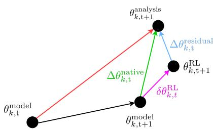  
Figure 1: Potential-temperature increments at level k and exchange time t. Black nodes denote the model states $\theta _ { k , t } ^ { \mathrm { m o d e l } }$ and $\theta _ { k , t + 1 } ^ { \mathrm { m o d e l } }$ , the RL-adjusted state $\theta _ { k , t + 1 } ^ { \mathrm { R L } }$ , and the analysis $\theta _ { k , t + 1 } ^ { \mathrm { a n a l y s i s } }$ The black and red arrows show the uncorrected model evolution and total model-to-analysis displacement respectively. The green native increment $\Delta \theta _ { k , t } ^ { \mathrm { { \mathrm { { n a t i v e } } } } }$ provides the counterfactual target. The magenta RL correction $\delta \theta _ { k , t } ^ { \mathrm { R L } }$ changes the model state before nudg ing, leaving the blue residual increment $\Delta \theta _ { k , t } ^ { \mathrm { r e s i d u a l } }$ . Arrow lengths and directions are illustrative.

Each MPI-matched agent rank holds its own actor, critic, target networks, and replay buffer. The actor and critic share their respective weights across all active levels and columns on that rank, and each has two 512-unit hidden layers. Level-wise transitions are assigned to five pressure strata separated at 200, 400, 600, and 850 hPa, from which each batch draws approximately equal numbers of samples. Because the target HPC partition is CPU-only, the agent tasks run on CPUs. The replay capacity is 500,000 transitions, the batch size is 256, and each eligible exchange performs 16 gradient updates. Table A.1 gives the complete numerical configuration, while Algorithm 1 describes the update sequence.

## 2.3 Analysis-informed reward and non-nudged inference

For active levels $A = \{ 2 , \ldots , 6 9 \}$ , we define the layer mass $m _ { k } = \Delta p _ { k } / g$ , where $\Delta p _ { k }$ is the layerpressure thickness and g is gravitational acceleration. The mean-normalised value is $\widetilde { m } _ { k } = m _ { k } / \overline { { m } } _ { A }$ with $\begin{array} { r } { \overline { { m } } _ { A } = | A | ^ { - 1 } \sum _ { k \in A } \overline { { m _ { k } } } } \end{array}$ being the mean layer mass. The level score and column reward are:

$$
s _ { k } = \frac { n _ { k } ^ { 2 } - e _ { k } ^ { 2 } } { n _ { k } ^ { 2 } + e _ { k } ^ { 2 } + \epsilon _ { 3 2 } } , \qquad r = \frac { 1 } { | A | } \sum _ { k \in A } w _ { k } s _ { k } , \quad w _ { k } = c _ { u } + c _ { m } \widetilde { m } _ { k } , \quad c _ { u } = 0 . 7 5 , \quad c _ { m } = 0 . 2 5 .\tag{2}
$$

The constant $\epsilon _ { 3 2 }$ prevents division by zero in single-precision arithmetic. As $| n _ { k } ^ { 2 } - e _ { k } ^ { 2 } | \leq n _ { k } ^ { 2 } + e _ { k } ^ { 2 }$ (nk and $e _ { k }$ defined in Section 2.2) and the denominator is larger by $\epsilon _ { 3 2 } , | s _ { k } | < 1 .$ A positive score means that the RL action reduces the squared residual correction at that level. For no-RL situations, $n _ { k } = e _ { k }$ resulting in $s _ { k } = 0$ . The coefficients $c _ { u }$ and $c _ { m }$ combine a predominantly uniform vertical mean (75%) with a smaller layer-mass-weighted contribution (25%). A positive column reward therefore indicates a weighted improvement across the column without requiring every level to improve.

During training, the UM applies the RL correction before nudging, as shown in Figure B.1. By contrast during inference, nudging is disabled, although the same counterfactual target is diagnosed for evaluation. The analysis is neither supplied to the actor nor applied to the prognostic state. Exploration, replay insertion, and weight updates are likewise disabled, leaving only the frozen actor to modify the forecast.

## 3 Results

## 3.1 Transfer to non-nudged execution

The coupled workflow completed ten nudged training forecasts and one frozen non-nudged inference forecast, all initialised at 00 UTC on 12 December 2021 and run to a lead time of 6 hr 12 min. Each forecast contained 31 model–agent exchanges at 12-min intervals. Aggregating one value from each of the 192 ranks at every exchange therefore generated $1 9 2 \times 3 1 = 5 { , } 9 5 2$ rank-time reward summaries per forecast. As Figure 2 shows, the mean reward, averaged over all agents and exchange times, increased overall from $2 . 4 5 \times 1 0 ^ { - 4 }$ in the first training forecast to $1 . 4 7 \times 1 0 ^ { - 3 }$ in the tenth, and remained close to the final training value at $1 . 2 8 \times 1 0 ^ { - 3 }$ during inference. Restoring the distributed checkpoint with nudging, exploration, and learning disabled demonstrated successful transfer and short-horizon stability under interactive feedback.

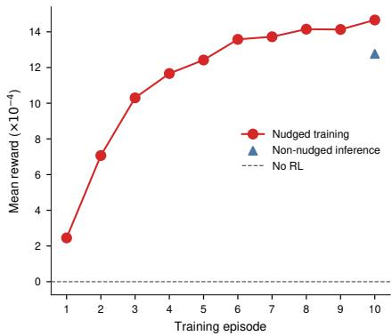  
Figure 2: Learning progression curve. The ordinate is the rank-time mean reward r¯ expressed as $\bar { r } / 1 0 ^ { - 4 }$ . Red circles denote the ten connected nudged training episodes, the blue triangle denotes frozen non-nudged inference from the episode-10 checkpoint, and the dashed line denotes the no-RL reward of zero.

Table 1: Latitude-band forecast-error changes relative to the native no-RL control. Each cell reports latitude-weighted MAE at +6 h against UKMO analysis, with absolute and percentage changes relative to native MAE. Negative values indicate lower error in the coupled RL forecast. Latitude bands are area-weighted grid-cell aggregates.
<table><tr><td rowspan="3">Latitude</td><td colspan="4">Near-surface diagnostics</td><td colspan="4">500-hPa diagnostics</td></tr><tr><td colspan="2"> $T _ { 1 . 5 \mathrm { m } } ( ^ { \circ } \mathrm { C } )$ </td><td colspan="2">MSLP (hPa)</td><td colspan="2"> $T _ { 5 0 0 } ( ^ { \circ } \mathrm { C } )$ </td><td colspan="2"> $Z _ { 5 0 0 } ~ \mathrm { ( m ) }$ </td></tr><tr><td>∆MAE</td><td>Change (%)</td><td>∆MAE</td><td>Change (%)</td><td>∆MAE</td><td>Change (%)</td><td>∆MAE</td><td>Change (%)</td></tr><tr><td>60-90°N</td><td>+0.002</td><td>+0.1%</td><td>+0.051</td><td>+12.7%</td><td>+0.013</td><td>+2.2%</td><td>+0.402</td><td>+19.4%</td></tr><tr><td>30-60°N</td><td>+0.051</td><td>+7.4%</td><td>-0.015</td><td>-2.7%</td><td>+0.005</td><td>+0.8%</td><td>-0.335</td><td>-10.9%</td></tr><tr><td>0-30°N</td><td>+0.029</td><td>+6.9%</td><td>-0.129</td><td>-27.3%</td><td>+0.025</td><td>+3.4%</td><td>-1.822</td><td>-45.8%</td></tr><tr><td>0-30°S</td><td>+0.024</td><td>+7.1%</td><td>-0.035</td><td>-7.8%</td><td>+0.038</td><td>+4.9%</td><td>-1.578</td><td>-40.8%</td></tr><tr><td>30-60°S</td><td>+0.024</td><td>+10.3%</td><td>+0.012</td><td>+3.5%</td><td>+0.002</td><td>+0.4%</td><td>-0.266</td><td>-8.5%</td></tr><tr><td>60-90°S</td><td>+0.013</td><td>+3.0%</td><td>+0.043</td><td>+6.6%</td><td>+0.015</td><td>+2.5%</td><td>+0.772</td><td>+18.9%</td></tr></table>

## 3.2 Forecast comparison across variables and latitude

As the scalar reward does not necessarily reflect forecast quality across all variables, we also evaluate 1.5-m air temperature $( T _ { 1 . 5 \mathrm { m } } ) _ { : }$ , mean sea-level pressure (MSLP), 500-hPa temperature $( T _ { 5 0 0 } )$ , and 500-hPa geopotential height $( Z _ { 5 0 0 } )$ . We compare the +6 h coupled RL forecast with a native nonnudged UM control from the same initial state, using UKMO analysis as the reference. Table 1 reports latitude-weighted changes in MAE, while Appendix D shows the corresponding spatial fields, absolute errors, and biases. The $Z _ { 5 0 0 }$ MAE decreases throughout $6 0 ^ { \circ } \mathrm { N } \mathrm { - } 6 0 ^ { \circ } \dot { \mathrm { S } }$ , with reductions of 1.822 m (45.8%) and 1.578 m (40.8%) in the northern and southern tropics. The MSLP MAE decreases in three bands, with the largest reduction of 0.129 hPa (27.3%) at 0–30◦N.

## 4 Discussion and conclusion

Building on Nath et al. [11], this study demonstrates the first execution of online RL within a global NWP model. Fortran UM ranks and RL agents exchanged decomposed tensors, preserved learning state across forecasts, and restored the final checkpoint for frozen, non-nudged inference. The diagnosed analysis increment retains the same counterfactual meaning in both phases, with inference using the analysis only for diagnostics and verification. The multivariable response is mixed: polar $Z _ { 5 0 0 }$ MAE increases by 0.402 m (19.4%) in the north and 0.772 m (18.9%) in the south, while $T _ { 1 . 5 \mathrm { m } }$ and $T _ { 5 0 0 }$ MAE increase in every band. These opposing regional responses motivate regionally specialised agents, although this single case cannot establish transfer across regimes.

The local reward uses MSE while verification uses MAE, so reducing a few large errors can improve reward despite broader absolute-error degradation. A positive local reward therefore does not imply broader forecast improvement, and the potential-temperature objective may leave other fields unconstrained. With one initialisation and no seed ensemble, these effects cannot be separated from case-specific variability. Future work would span seasons and seeds with matched native and nudging controls, overhead measurements, and energy and mass budgets. Within the current evidence boundary, the successful transfer of a state-dependent online policy to non-nudged inference in a distributed NWP setting demonstrates significant promise and provides a practical basis for evaluating RL-derived bias correction and parametrisations of unresolved sub-grid processes.

## Acknowledgements and Disclosure of Funding

P. Nath was supported by the UKRI Centre for Doctoral Training in Application of Artificial Intelligence to the study of Environmental Risks [EP/S022961/1]. Mark Webb was supported by the Met Office Hadley Centre Climate Programme funded by DSIT. The authors thank the Met Office for providing access to the Unified Model, analysis data, and the Met Office EX computing platform under a CASE studentship agreement with the University of Cambridge. We thank Andrew Shao and Alessandro Rigazzi (HPE) for their valuable assistance with setting up SmartSim.

## References

[1] Bodnar C, Bruinsma WP, Lucic A, et al. A foundation model for the Earth system. Nature. 2025;641:1180-7. Available from: https://doi.org/10.1038/s41586-025-09005-y.

[2] Ozdemir F, Cheng Y, Mohebi S, Lehmann F, Adamov S, Zhang Z, et al. Earth System Foundation Model (ESFM): A unified framework for heterogeneous data integration and forecasting. arXiv preprint arXiv:260500850. 2026. Available from: https://arxiv.org/abs/2605.00850.

[3] Pathak J, Subramanian S, Harrington P, et al. FourCastNet: A global data-driven high-resolution weather model using adaptive Fourier neural operators. arXiv preprint arXiv:220211214. 2022. Available from: https://arxiv.org/abs/2202.11214.

[4] Bi K, Xie L, Zhang H, Chen X, Gu X, Tian Q. Accurate medium-range global weather forecasting with 3D neural networks. Nature. 2023;619:533-8. Available from: https://doi.org/10.1038/ s41586-023-06185-3.

[5] Lam R, Sanchez-Gonzalez A, Willson M, et al. Learning skillful medium-range global weather forecasting. Science. 2023;382:1416-21. Available from: https://doi.org/10.1126/science.adi2336.

[6] Kochkov D, Yuval J, Langmore I, et al. Neural general circulation models for weather and climate. Nature. 2024;632:1060-6. Available from: https://doi.org/10.1038/s41586-024-07744-y.

[7] Bertoli G, Mohebi S, Ozdemir F, Jucker J, Rüdisühli S, Perez-Cruz F, et al. Revisiting machine learning approaches for short- and longwave radiation inference in weather and climate models. Journal of Advances in Modeling Earth Systems. 2025;17(9):e2025MS004956. Available from: https://doi.org/10.1029/ 2025MS004956.

[8] Rasp S, Pritchard MS, Gentine P. Deep learning to represent subgrid processes in climate models. Proceedings of the National Academy of Sciences. 2018;115:9684-9. Available from: https://doi. org/10.1073/pnas.1810286115.

[9] Brenowitz ND, Bretherton CS. Spatially extended tests of a neural network parametrization trained by coarse-graining. Journal of Advances in Modeling Earth Systems. 2019;11:2728-44. Available from: https://doi.org/10.1029/2019MS001711.

[10] Yuval J, O’Gorman PA. Use of neural networks for stable, accurate and physically consistent parameterization of subgrid atmospheric processes with good performance at reduced precision. Geophysical Research Letters. 2021;48:e2020GL091363. Available from: https://doi.org/10.1029/2020GL091363.

[11] Nath P, Schemm S, Moss H, Haynes P, Shuckburgh E, Webb MJ. Replacing tunable parameters in weather and climate models with state-dependent functions using reinforcement learning. Journal of Advances in Modeling Earth Systems. 2026;18(8):e2026MS005745. Available from: https://doi.org/10.1029/ 2026MS005745.

[12] Brown A, Milton S, Cullen M, Golding B, Mitchell J, Shelly A. Unified modeling and prediction of weather and climate: A 25-year journey. Bulletin of the American Meteorological Society. 2012;93:1865-77. Available from: https://doi.org/10.1175/BAMS-D-12-00018.1.

[13] Partee S, Ellis M, Rigazzi A, et al. Using machine learning at scale in HPC simulations with SmartSim: An application to ocean climate modeling. Journal of Computational Science. 2022;62:101707. Available from: https://doi.org/10.1016/j.jocs.2022.101707.

[14] Oliver H, Shin M, Matthews D, Sanders O, Bartholomew S, Clark A, et al. Workflow automation for cycling systems. Computing in Science & Engineering. 2019;21(4):7-21. Available from: https: //doi.org/10.1109/MCSE.2019.2906593.

[15] Lillicrap TP, Hunt JJ, Pritzel A, et al. Continuous control with deep reinforcement learning. International Conference on Learning Representations. 2016. Available from: https://arxiv.org/abs/1509. 02971.

[16] Saarinen S, Hamrud M, Salmond D, Hague J. Dr. Hook instrumentation tool. Tech. Rep., European Centre for Medium-Range Weather Forecasts; 2005. Available from: https://www.umr-cnrm.fr/surfex/ IMG/pdf/DrHook.pdf.

## Appendix A Implementation details

Algorithm 1 summarises the DDPG updates used to train the actor and critic shared across the active levels and columns on each agent rank. Table A.1 collects the associated state transformations, action range, and learning settings. The state comprises potential temperature $\theta _ { k }$ , one-step tendency $\Delta \theta _ { k }$ model level $k ,$ pressure $p _ { k } ,$ and vertical gradient $g _ { k } ^ { \dot { \theta } } \mathrm { . }$ , from which the actor returns action $a _ { k }$ . Potential temperature is mapped logarithmically, while tendency, model level, pressure, and vertical gradient use linear transformations. Pressure is bounded by $p _ { \mathrm { r e f } } = 1 , 1 0 0 \ : \mathrm { h P a }$ , which lies above standard sea-level pressure and provides a fixed upper bound for the model-level pressure. The same reference defines the dimensionless upward coordinate $- \log ( p / p _ { \mathrm { r e f } } )$ used to calculate the vertical gradient from normalised potential temperature. This coordinate is zero at $p _ { \mathrm { r e f } }$ and increases as pressure decreases, while a 0.01-hPa floor keeps the logarithm finite at the model top.

Table A.1: State transformations, action range, and DDPG settings. All five state profiles contain 70 model levels.
<table><tr><td>Quantity</td><td>Physical or numerical range</td><td>Agent representation</td></tr><tr><td>Potential temperature  $\theta _ { k }$ </td><td>150–6000 K</td><td>logarithmically mapped to  $[ - 1 , 1 ]$ </td></tr><tr><td>One-step tendency  $\Delta \theta _ { k }$ </td><td>-10-10 K</td><td>linearly mapped to  $[ - 1 , 1 ]$ </td></tr><tr><td>Model level k</td><td>1-70</td><td>linearly mapped to [—1, 1]</td></tr><tr><td>Pressure pk</td><td>0-1,100 hPa</td><td>linearly mapped to [−1, 1]</td></tr><tr><td>Vertical gradient  $g _ { k } ^ { \theta }$ </td><td>clipped to [−1, 1]</td><td>unchanged after clipping</td></tr><tr><td>Action ak</td><td>[−1,1]</td><td>levels  $2 \mathrm { - } 6 9$  active</td></tr><tr><td>Actor and critic</td><td>two hidden layers each</td><td>512 units per layer</td></tr><tr><td>Replay and updates</td><td>capacity 500,000</td><td>batch 256, 16 updates</td></tr></table>

The coupling follows the UM domain decomposition shown in Figure A.1. Each agent rank operates on the atmospheric columns owned by one UM rank, so policy evaluation and reward construction remain local and no process assembles a global field. This arrangement preserves the model’s distributed-memory layout while exposing every column in a tile as a member of the agent’s synchronous vector environment.

Algorithm 1 Level-wise DDPG training with a shared actor and critic   
1: Input: active levels A, pressure strata P, discount $\gamma _ { : }$ , target coefficient τ, batch size B, update   
count G, and exploration noise ϵ   
2: Initialise: shared actor $\pi _ { \theta } : \mathbb { R } ^ { 5 }  [ - 1 , 1 ] .$ , shared critic $Q _ { \phi } : \mathbb { R } ^ { 5 } \times \mathbb { R }  \mathbb { R }$ , target networks πθ′   
and $Q _ { \phi ^ { \prime } }$ , and pressure-stratified replay $\{ { \dot { D } } _ { j } \} _ { j \in P }$   
3: for each model–agent exchange t do   
4: Receive column states $\boldsymbol { x } _ { c } \in \mathbb { R } ^ { 5 \times 7 0 }$ for all local columns c   
5: for all c and k $\in { \cal A }$ do   
6: Select $a _ { c , k } = \pi _ { \theta } ( x _ { c , k } ) + \epsilon _ { c , k }$ and apply all level actions together   
7: Observe $\mathit { x } _ { c , k } ^ { \prime } ,$ level reward $r _ { c , k } .$ , and termination flag $d _ { c }$   
8: Store $( x _ { c , k } , a _ { c , k } , r _ { c , k } , x _ { c , k } ^ { \prime } , d _ { c } )$ in the stratum $\mathcal { D } _ { j }$ selected by $p _ { c , k }$   
9: end for   
10: if $t >$ learning\_starts then   
11: for $g = 1$ to G do   
12: Sample B transitions approximately equally across populated strata   
13: $y _ { i } \mathbin { \stackrel { . . . } {  } } r _ { i } + \gamma ( 1 - d _ { i } ) Q _ { \phi ^ { \prime } } ^ { \mathbin { \cdot } } ( x _ { i } ^ { \prime } , \pi _ { \theta ^ { \prime } } ( x _ { i } ^ { \bar { \prime } } ) )$   
14: Update ϕ by minimising $\begin{array} { r } { B ^ { - 1 } \sum _ { i } ( \dot { Q } _ { \phi } ( x _ { i } , a _ { i } ) - y _ { i } ) ^ { 2 } } \end{array}$   
15: Update θ by maximising $\begin{array} { r } { B ^ { - 1 } \overline { { \sum } } _ { i } Q _ { \phi } ( x _ { i } , \pi _ { \theta } ( x _ { i } ) ) } \end{array}$ at the policy-update frequency   
16: Soft-update each target $\psi ^ { \prime }  \overline { { \tau \psi } } + ( 1 - \tau ) \psi ^ { \prime }$ for $\psi \in \{ { \bar { \boldsymbol { \theta } } } , \phi \}$   
17: end for   
18: end if   
19: end for

U M Atm osph e ric M P I Deco m pos iti o n | 1 2 × 1 6 ( 1 92 Ran ks)  
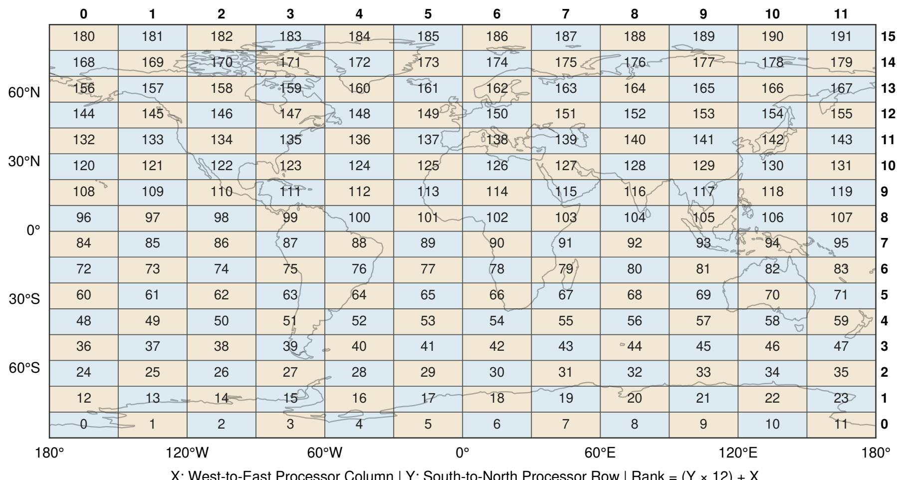  
X : West-to- East P rocesso r Co l u m n | Y : So uth -to- N o rth P rocesso r Row | Ran k = (Y × 1 2) + X  
Figure A. 1 : Horizontal MPI decomposition of the 640 × 480 N320 atmosphere grid. The 1 2 × 1 6 processor layout contains 1 92 ranks numbered from south to north and west to east. Each rank owns 30 rows and either 5 3 or 54 columns giving 1 590 or 1 620 atmospheric columns . A single Python agent rank manages the vectorised environments for the each tile

## Appendix B Coupling workflow

Figure B.1 shows how the workflow separates forecast orchestration, timestep communication, and learning-state persistence. Cylc controls forecast-level task dependencies, Redis handles timesteplevel tensor exchange between the UM and agents, and checkpoints carry the learnt state between successive forecasts.

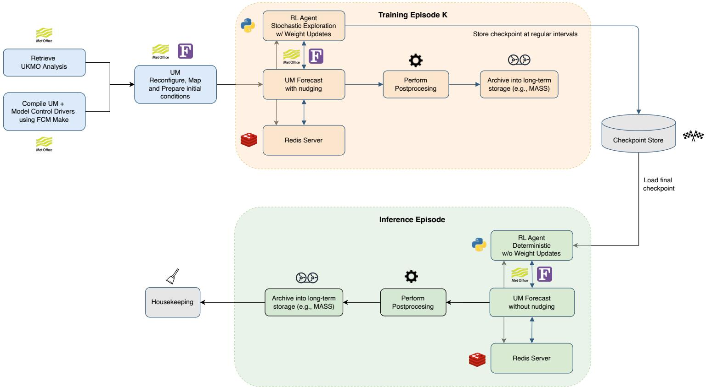  
Figure B.1: Cylc workflow for training and inference. Each nudged training forecast runs the UM, Redis server, and RL-agent tasks together and writes the learning state to the checkpoint store. The inference branch restores the final checkpoint, disables exploration and weight updates, and runs the UM without applying nudging. Post-processing and archival remain outside the model–agent exchange.

The PBS scheduler can place the Redis service on a different host for each forecast. To avoid embedding a database address in either coupled component, the workflow records the assigned host and port in the shared SSDB mapping. The UM and agent then resolve the address independently using the current task name. The task name changes between training and inference, but service discovery and the tensor protocol do not (Figure B.2).

Communication is synchronised at two timescales. Within each forecast, exchanges follow a state– action–diagnostic sequence: every UM rank blocks until its matching agent consumes the rank-local state and returns an action, after which the UM publishes the native and residual increments used to evaluate that action. Rank-qualified keys identify each field and its owning rank, while delete-afterconsumption polling prevents actions or diagnostics from being reused at later timesteps. Together, these mechanisms form a barrier that prevents the UM from advancing with a stale action and prevents the agent from associating diagnostics with the wrong state. Figure B.4 illustrates the general protocol for tensor exchange; the theta-nudging experiment uses different variables while preserving the same ordering and rank-local ownership.

Across forecasts, the workflow persists the actor, critic, target networks, optimiser, replay buffer, metadata, and global step, as shown in Figure B.3. Subsequent training forecasts therefore resume the accumulated optimisation trajectory rather than restarting, whereas inference restores the final actor with exploration, replay insertion, and gradient updates disabled, making each action a deterministic function of the saved policy and current UM state.

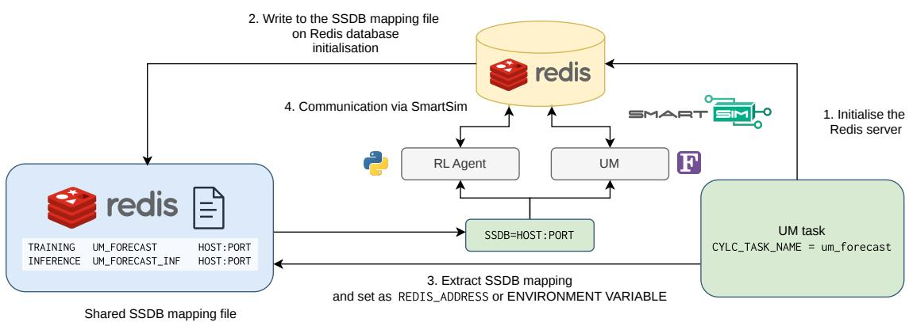  
Figure B.2: Redis discovery through the shared SSDB mapping. The workflow starts the Redis server and writes its host and port to the mapping file under the current Cylc task name. The UM and RL-agent tasks read this mapping, set the Redis address, and then communicate through SmartSim. Separate task names distinguish training from inference without changing the tensor protocol. The SSDB mapping prevents the UM and agents from depending on a fixed database address. This indirection is required because the scheduler can place the Redis service on a different host for each workflow execution.

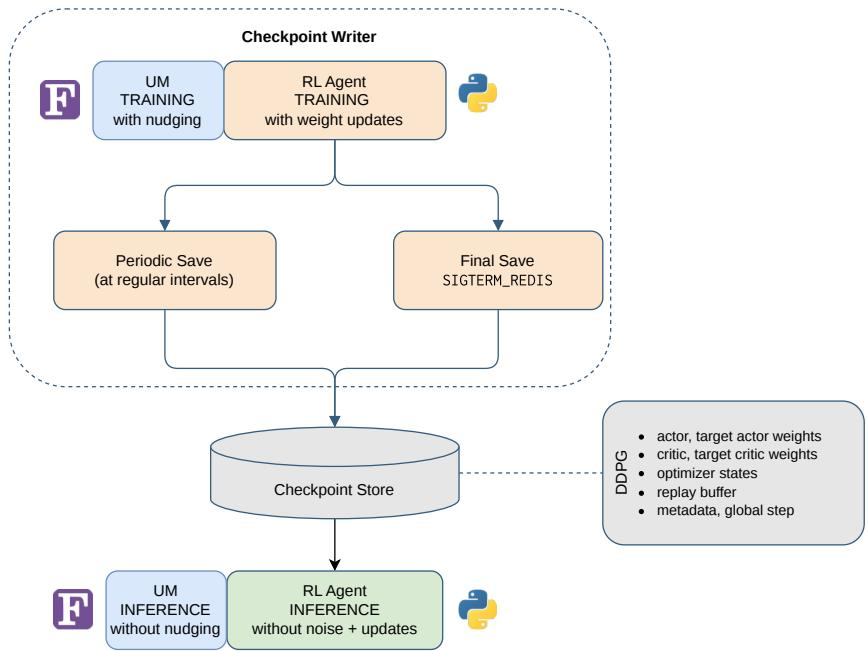  
Figure B.3: Checkpoint transfer between training and inference. During training, the writer saves the actor, critic, target networks, optimiser state, replay buffer, metadata, and global step. The final training checkpoint is restored for inference, where exploration and parameter updates are disabled. The complete checkpoint allows learning to continue across training forecasts and makes inference a deterministic evaluation of the frozen policy rather than a newly initialised agent.

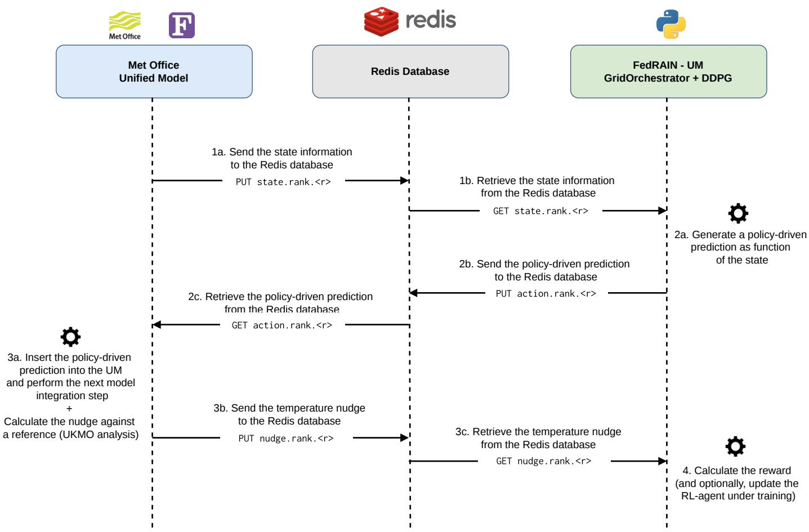  
Figure B.4: Rank-local UM–agent exchange and reward sequence for MPI rank ⟨r⟩. (1) The UM publishes its local state which the matching DDPG agent retrieves. (2) The agent evaluates the policy and returns the predicted correction. (3) The UM retrieves and applies this action, advances the model by one integration step, diagnoses the temperature-nudging increment relative to the UKMO analysis, and publishes it. (4) The agent retrieves the increment to calculate the reward and, during training, optionally updates the policy. Redis mediates each PUT–GET transfer; rank-qualified keys preserve the UM domain decomposition and keep state, action, and reward diagnostics associated with the same model step.

## Appendix C Coupling profiling metrics

For profiling purposes, the experiment was instrumented at the Python model–agent boundary and within the UM. Table C.1 reports the mean and population standard deviation of those rank-local means across all 192 ranks. The final training and inference agent tasks used 4x Genoa nodes and took 242 and 198 seconds, respectively. The corresponding UM tasks used 192 MPI ranks with 2x OpenMP threads per rank on 2x Genoa nodes and took 237 and 197 seconds. These task durations include initialisation and shutdown but exclude scheduler queueing, post-processing, and archival.

Table C.1: Rank-local Python wall-clock timings for the final nudged training forecast and frozen non-nudged inference. Values are the mean ± population standard deviation across 192 rank means, in seconds per invocation.
<table><tr><td>Component</td><td>Final training  $\mathrm { \Delta M e a n \pm \ s p r e a d { \Sigma } ( s ) }$ </td><td>Inference Mean ± spread (s)</td></tr><tr><td>Full agent exchange</td><td> $5 . 8 8 7 ~ \pm 0 . 0 3 1$ </td><td> $4 . 7 9 2 \ \pm 0 . 0 7 0$ </td></tr><tr><td>State retrieval including synchronisation</td><td> $3 . 8 9 8 \ \pm 0 . 0 8 2$ </td><td> $3 . 3 2 6 \ \pm 0 . 0 7 9$ </td></tr><tr><td>State tensor GET</td><td> $0 . 0 2 5 8 \pm 0 . 0 0 4 0$ </td><td> $0 . 0 2 4 1 \pm 0 . 0 0 3 3$ </td></tr><tr><td>Policy evaluation</td><td> $0 . 9 7 2 \ \pm 0 . 0 1 4$ </td><td> $0 . 9 9 9 \ \pm 0 . 0 1 3$ </td></tr><tr><td>Action tensor PUT</td><td> $0 . 0 2 2 5 \pm 0 . 0 0 9 7$ </td><td> $0 . 0 2 6 3 \pm 0 . 0 1 1 9$ </td></tr><tr><td>Environment and reward step</td><td> $0 . 0 6 1 7 \pm 0 . 0 0 1 0$ </td><td> $0 . 0 6 1 8 \pm 0 . 0 0 0 9$ </td></tr><tr><td>16 gradient updates</td><td> $0 . 3 7 7 \pm 0 . 0 7 0$ </td><td></td></tr></table>

Figure C.5 partitions the complete agent-task wall time into mutually exclusive components. State retrieval and synchronisation account for 49.9% of final-training wall time and 52.1% of inference wall time. Policy evaluation contributes 12.5% and 15.6%, respectively, while the 16 gradient updates contribute 4.7% during training. The remaining agent categories are each below 8%, apart from the 18.1% residual outside the profiled exchange in both tasks. On a specific UM rank, waiting for the inference action accounts for 28.9% of the 197-s UM task, while state publication, action retrieval, and reward publication contribute 2.9%, 0.3%, and 2.2%. Other UM activity outside these four instrumented SmartRedis regions accounts for the remaining 65.7%.

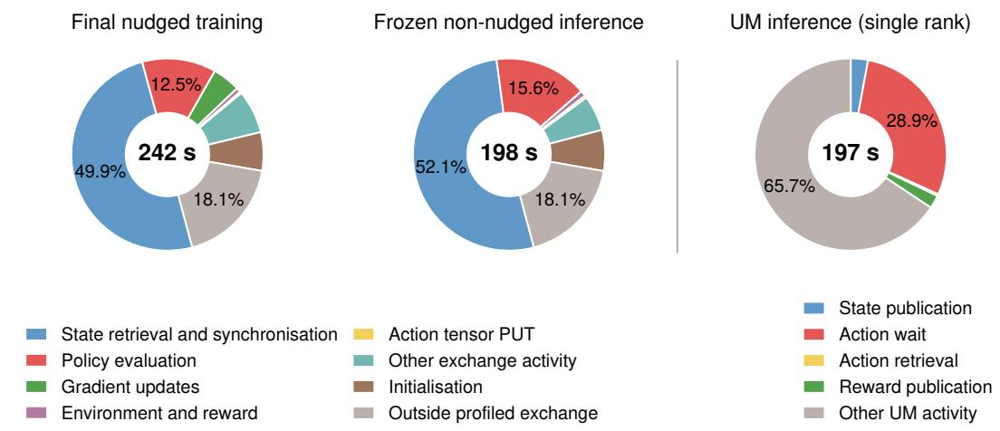

Figure C.5: Share of complete task wall time for the final nudged training agent task, frozen nonnudged inference agent task, and inference UM task on rank PE96. Agent component durations are rank-mean cumulative timings, calculated as the mean time per invocation multiplied by the mean invocation count. Nested agent timers are not counted twice. The PE96 panel multiplies the Dr Hook mean by 31 state, wait, and action-retrieval calls and by 30 reward-publication calls. Other UM activity is the residual of the 197-s UM task.

The inclusive state-retrieval timer is much larger than the raw tensor GET because it includes waiting for the next UM state. Similarly, the full agent-exchange timer covers synchronisation, policy evaluation, tensor operations, reward construction, and training when enabled. The inference exchange is 1.095 s shorter on average. Inference omits gradient updates, while much of the remaining difference occurs in the inclusive state-retrieval wait and the policy-evaluation cost remains similar. The small standard deviations for the full exchange and policy evaluation show that these costs are balanced across the horizontal decomposition in this case.

The profiling tool Dr. Hook [16] separately measures the Fortran side on UM rank 96. Table C.2 reports the mean time per invocation for the four instrumented SmartRedis regions during final training and inference.

Table C.2: Dr. Hook wall-clock timings on UM rank 96 for the final nudged training forecast and frozen non-nudged inference. Component values are mean seconds per invocation; the final row gives the instrumentation overhead reported by Dr. Hook.
<table><tr><td>Component</td><td>Final training Mean time (s)</td><td>Inference Mean time (s)</td></tr><tr><td>State publication</td><td>0.193</td><td>0.185</td></tr><tr><td>Wait for agent action</td><td>2.652</td><td>1.835</td></tr><tr><td>Action retrieval</td><td>0.0169</td><td>0.0199</td></tr><tr><td>Reward-diagnostic publication</td><td>0.138</td><td>0.145</td></tr><tr><td>Dr. Hook overhead (%)</td><td>1.12</td><td>1.34</td></tr></table>

This selected-rank trace identifies where the synchronous UM process waits, but it does not quantify variation among UM ranks. Consequently, the measurements characterise the coupled execution boundary rather than providing a matched estimate of overhead relative to an uninstrumented native forecast.

## Appendix D Additional spatial verification

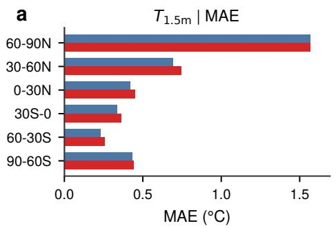

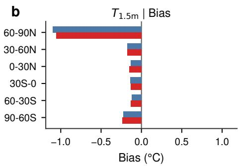

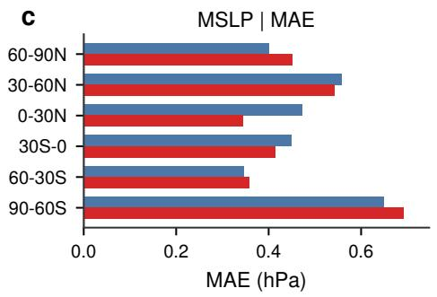

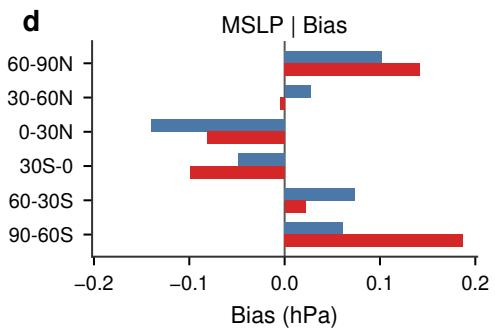

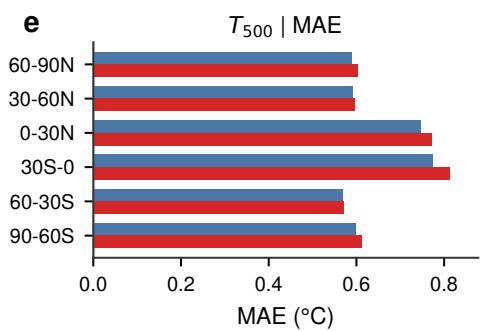

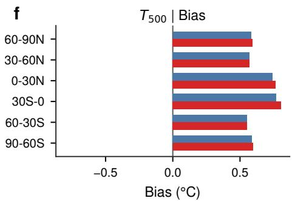

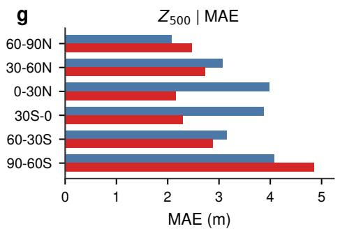

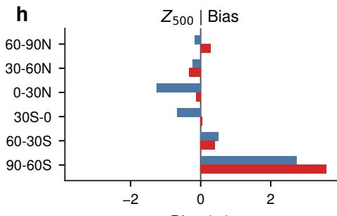  
Figure D.1: Latitude-weighted zonal verification at +6 h. Panels a, c, e, and g compare native and RL mean absolute error (MAE) for $T _ { 1 . 5 \mathrm { m } } .$ , MSLP, $T _ { 5 0 0 } .$ and $Z _ { 5 0 0 }$ , respectively. Panels b, $\mathrm { d } , \mathrm { f } ,$ and h show the corresponding signed biases. Each bar is an area-weighted grid-cell aggregate within one latitude band. The coupled response is mixed across variables and regions: $Z _ { 5 0 0 }$ MAE decreases in the four latitude bands between 60◦N and $6 0 ^ { \circ } { \bf S } ,$ whereas $T _ { 1 . 5 \mathrm { m } }$ and $T _ { 5 0 0 }$ MAE increase in every band. These zonal summaries describe one forecast initialisation and are not independent samples.

Z500 | Lead time: +06h  
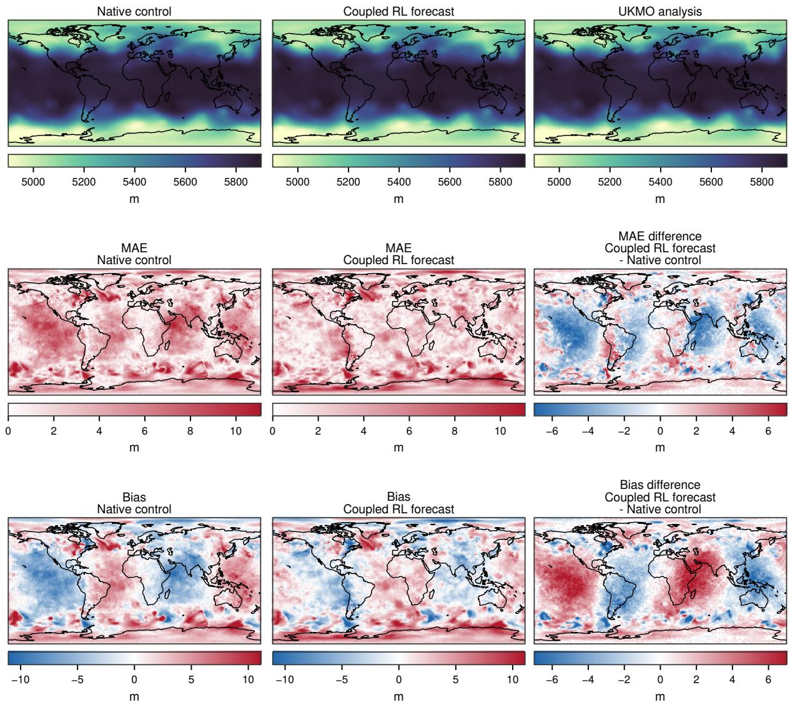  
Figure D.2: $Z _ { 5 0 0 }$ verification at +6 h. (a) The first row compares the native control, coupled RL forecast, and UKMO analysis. (b) The second row shows absolute error for each forecast and the RLminus-native absolute-error difference. (c) The third row shows forecast bias and the corresponding RL-minus-native bias difference. Blue values in the right-hand difference panels indicate a reduction relative to the native control, while red values indicate an increase. The $Z _ { 5 0 0 }$ MAE decreases through the four latitude bands between $6 0 ^ { \circ } \mathrm { N }$ and $6 0 ^ { \circ } \mathbf { S } .$ , while both polar bands deteriorate. The spatial pattern provides context for the latitude-weighted summary, but it represents only one forecast initialisation.

T500 | Lead time: +06h  
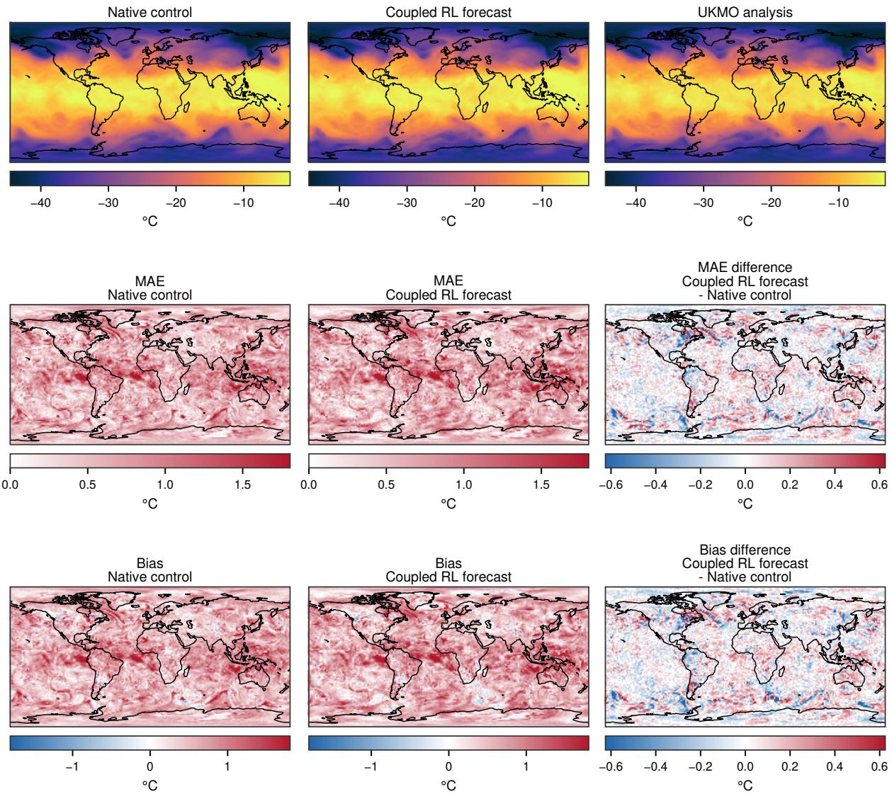  
Figure D.3: $T _ { 5 0 0 }$ verification at +6 h. (a) The first row compares the native control, coupled RL forecast, and UKMO analysis. (b) The second row shows absolute error and its RL-minus-native difference. (c) The third row shows bias and its RL-minus-native difference. Blue values in the right-hand difference panels indicate a reduction relative to the native control, while red values indicate an increase. The $T _ { 5 0 0 }$ MAE increases in every latitude band, so this diagnostic provides an important counterexample to the $Z _ { 5 0 0 }$ improvement. Better geopotential-height verification therefore does not necessarily imply a corresponding improvement in temperature at the same pressure level.

MSLP | Lead time: +06h  
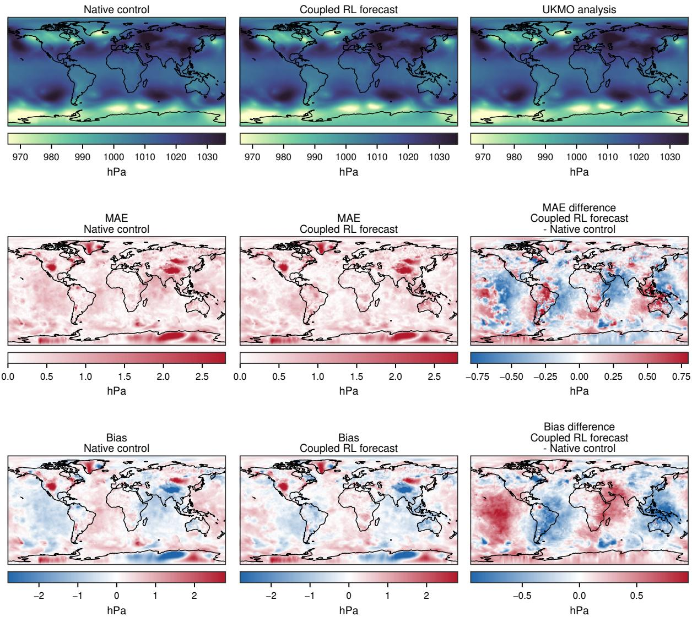  
Figure D.4: MSLP verification at +6 h. (a) The first row compares the native control, coupled RL forecast, and UKMO analysis. (b) The second row shows absolute error and its RL-minus-native difference. (c) The third row shows bias and its RL-minus-native difference. Blue values in the right-hand difference panels indicate a reduction relative to the native control, while red values indicate an increase. MSLP changes are spatially heterogeneous, consistent with the latitude-band improvements in three of six regions and degradation in the remaining three. The map describes this single initialisation and does not provide independent spatial samples.

T1.5m | Lead time: +06h  
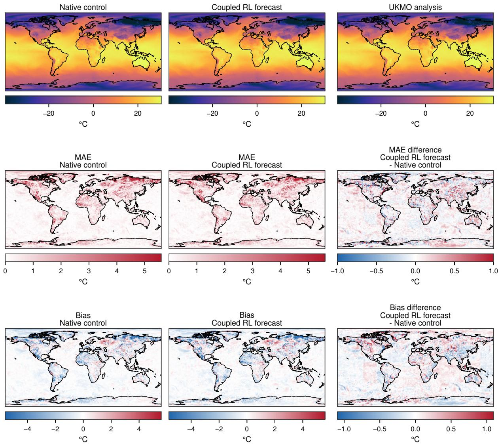  
Figure D.5: $T _ { 1 . 5 \mathrm { m } }$ verification at +6 h. (a) The first row compares the native control, coupled RL forecast, and UKMO analysis. (b) The second row shows absolute error and its RL-minus-native difference. (c) The third row shows bias and its RL-minus-native difference. Blue values in the right-hand difference panels indicate a reduction relative to the native control, while red values indicate an increase. The $T _ { 1 . 5 \mathrm { m } }$ response is also spatially mixed, yet latitude-band MAE increases in all six regions. Despite the gains in $Z _ { 5 0 0 }$ accuracy, near-surface degradation highlights a persistent misalignment between immediate rewards and overall multivariable forecast skill.