# Orthogonal Ensembles and Tested Explanations for Performer-Independent Body-Motion Emotion Recognition

Naoto Nishida

The University of Tokyo

Tokyo, Japan

nawta@g.ecc.u-tokyo.ac.jp

Yoshio Ishiguro

The University of Tokyo

Tokyo, Japan

ishiy@acm.org

Abstract—We study body-only, 12-class acted-emotion classification from skeleton motion under leave-performer-out (LPO) evaluation, a hard, underdetermined setting: chance is 8.3%, and a protocol-matched reproduced STGCN++ baseline reaches only 25.73 ± 4.03% Macro-F1. We show that reliable gains come not from a new architecture but from combining eleven models with orthogonal error modes: under 10-fold LPO crossvalidation on the labeled training performers, an equal-weight logit-mean ensemble reaches 36.80±4.00% per-fold Macro-F1, a protocol-matched +11.07 pp (+43% relative) over the same-split reproduced baseline. Our central contribution is a tested explanation suite: for a strong ensemble member, part-masking and counterfactual edits show (rather than assert) that its decisions depend on motion-grounded body-region evidence, and this region saliency aligns with rule-based Laban Movement Analysis (LMA) attributes far more than with classical kinematics: region-level saliency–LMA Spearman $\rho = + 0 . 5 0 0$ versus +0.033, roughly 15×, and the alignment holds for the submitted 11-way ensemble itself at $\rho = + 0 . 5 1 7 ;$ the audit is post hoc and needs no retraining. The same suite faithfully reports a negative: within-window temporal saliency is diffuse rather than localized.

Index Terms—affective computing, emotion recognition, body movement, skeleton motion, model ensemble, explainability, faithfulness, Laban Movement Analysis

## I. INTRODUCTION

The DIEM-A challenge [1] asks for 12-class acted emotion recognition from body motion alone: no face, no audio, no scene, evaluated across disjoint performers. Together these make it underdetermined: chance is 8.3%, and a strong skeleton baseline (STGCN++) reaches only ∼25% Macro-F1 under leave-performer-out (LPO) evaluation. Semantically related emotions share kinematic signatures (e.g. jealousy/contempt, shame/guilt) and each performer carries a movement idiolect, so cross-performer within-class variance can rival withinperformer cross-class variance.

Within this setting, intuitive single-model improvements largely do not transfer: supervised-contrastive heads, VLM distillation, post-hoc calibration, and other single-model upgrades failed or regressed under the protocol (§IV, Table I); these negatives shaped a deliberately conservative system.

What did transfer was diversity. Because four inductive-bias families (graph, attention, hybrid/MLP, external pretraining) make different mistakes, averaging their raw logits cancels errors that any single family repeats. This equal-weight logitmean ensemble, with skeleton self-supervised pretraining, yields $3 6 . 8 0 \pm 4 . 0 0 \%$ per-fold Macro-F1 under our study protocol, a protocol-matched +11.07 pp over the same 74- performer reproduced STGCN++ baseline, and the gain tracks the measured orthogonality of member errors, not any one architecture (§V).

Our central methodological contribution: we test attributions rather than assert them. For a strong ensemble member, partmasking and counterfactual edits show its decisions depend on motion-grounded body-region evidence, and this region saliency aligns with rule-based Laban Movement Analysis (LMA) attributes far more than with classical kinematics, at saliency–LMA $\rho = + 0 . 5 0 0 \ \mathrm { v s } \ + 0 . 0 3 3$ , a post-hoc audit needing no retraining; the same alignment holds for the submitted 11-way ensemble itself. The suite returns six explicit verdicts, five positive and one deliberately reported negative, plus a deterministic 0/50-audited narrator (§VI).

## Contributions.

• A tested explanation suite for skeleton emotion models (part-masking faithfulness, perturbation stability, semantic LMA alignment, counterfactual edits, and a narration audit), returning six explicit verdicts: five positive, one reported negative. Part-masking shows a strong ensemble member’s decisions depend on motion-grounded bodyregion evidence, and that region saliency aligns with rulebased LMA attributes (saliency–LMA $\rho ~ = ~ + 0 . 5 0 0$ vs +0.033), a post-hoc audit needing no retraining (§VI).

• The same suite faithfully reports a negative (diffuse temporal saliency) and a deterministic, audited motion→rationale narrator; we contribute the method and audit, not a dataset release (held pending consent/license review).

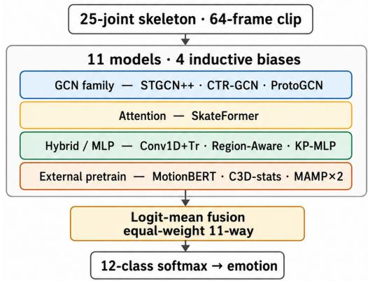  
Fig. 1. The DIEM-A 12-emotion body-motion challenge (74 train / 18 test performer-disjoint performers; BVH/FBX/C3D + text scenarios) and the proposed pipeline: eleven models spanning four inductive biases (GCN, attention, hybrid/MLP, external pretraining) fused by equal-weight logit-mean, reaching 36.80 ± 4.00% per-fold Macro-F1 versus the same-split reproduced STGCN++ baseline (25.73 ± 4.03%). Protocol: 10-fold leave-performer-out on the 74-performer training split; per-fold mean ± SD throughout.

• A protocol-matched performance result: an orthogonalerror 11-way logit-mean ensemble, +11.07 pp / +43% over the same-split reproduced baseline, with the gain explained by measured error-space orthogonality (§V).

• A documented catalog of negative results (Table I) that motivated the conservative design.

Fig. 1 sketches the task and pipeline; the paper develops the two headlines above.

## II. RELATED WORK

Skeleton-based recognition and body emotion. Graphconvolutional and attention architectures dominate skeleton action recognition (ST-GCN [2], CTR-GCN [3], STGCN++ and pose-heatmap variants [4], SkateFormer [5]); body-emotion datasets and emotion-from-motion analyses extend the action setting to acted affect [6]–[9]. These models set the singlenetwork state of the art we build on but are typically evaluated within-performer; we report the harder leave-performer-out (LPO) regime.

Self-supervised skeleton pretraining. Masked motion prediction [10] and contrastive skeleton self-supervision [11], [12] transfer representations across datasets, and unified motion encoders pretrained on heterogeneous corpora [13] extend this transfer beyond single-task supervision. We treat frozen external pretraining as one orthogonal inductive-bias family within an ensemble, and report when such transfer does not help (Table I).

Explainability for motion models. Prior work explains motion and skeleton classifiers through perturbation and occlusion [14], gradient-based saliency [15], counterfactual edits [16], and semantic motion attributes (e.g. Laban Movement Analysis [9]); a parallel line studies attribution faithfulness and stability [17], [18]. Most motion-domain studies assert that attributions are meaningful; few test whether the cited evidence actually drives predictions, and fewer still under performer shift. We contribute a validated audit protocol rather than a new attribution method: the probes above, screened for faithfulness and stability and reported together with the negatives they return.

## III. TASK, DATA AND EVALUATION

Task and data. DIEM-A [1] is acted body-motion emotion recognition over 12 classes (anger, contempt, disgust, fear, joy, sadness, surprise, jealousy, shame, guilt, gratitude, pride). Each clip is a 24-joint skeleton sequence (BVH/FBX/C3D) with a text scenario; models consume a 25-node tensor (the 24 joints plus a virtual root node carrying global position), the resolution at which our part-masking and saliency analyses are reported. Performers are split 74 train / 18 test and are disjoint across the split [19]. The training split contains 7,992 clips from 40 Japanese and 34 Taiwanese performers (666 per emotion, balanced across classes) and the test split 1,944 clips from 18 disjoint performers (9 JP, 9 TW); recordings are at 120 Hz with median sequence length ≈ 845 frames, of which we feed every model a fixed 64-frame window (≈ 7.5% of the median, ≈ 0.53 s) for protocol parity with the official baseline. Capture provenance. The corpus was recorded with two motion-capture systems: the five earliest Japanese performers (JP 01–JP 05) were captured with a 41-marker OptiTrack rig, and all remaining recordings use the production 57-marker Vicon system [1]. None of the five OptiTrack performers is in the 74-performer training split, so capture hardware is uniform within our cross-validation; the residual capture-era stratum is checked in §V by excluding the seven earliest-captured Japanese training performers (JP 06–JP 12).

Evaluation. We evaluate with 10-fold leave-performer-out (LPO) cross-validation on the 74-performer training split and report Macro-F1 (primary) and Accuracy. We fix one reporting convention and use it everywhere: scores combine member predictions by logit-mean (mean of raw logits, the canonical convention) and are reported as the per-fold mean ± SD across the 10 LPO folds; pooled out-of-fold (OOF) values appear only as a clearly labelled descriptive secondary. This convention is restated in every table and figure caption (Table II).1

Protocol distinction (stated here, not deferred). The official STGCN++ baseline [19] is a 92-performer full-LPO result (25.21 ± 4.49% Macro-F1). Our development numbers use the 74-performer training split (test labels are withheld by the challenge). Within the same 74-performer protocol our reproduced STGCN++ baseline is 25.73 ± 4.03% (within one SD of the official 25.21 ± 4.49%), so we treat the official number as an external anchor and report all improvements against the protocol-matched reproduction; the held-out test score is pending the challenge leaderboard. Consequently the headline improvement is the protocol-matched +11.07 pp (36.80−25.73, same split, same logit-mean × per-fold convention), never a comparison to the 92-performer official figure.

## IV. METHOD

## A. Model pool: four inductive-bias families

The pool has eleven members spanning four families with deliberately different inductive biases, so their errors are unlikely to coincide: (i) graph-convolutional (STGCN++ [4], CTR-GCN [3], ProtoGCN [20], a Region-Aware ConvTr); (ii) attention (SkateFormer [5]); (iii) hybrid/MLP (Conv1D+Transformer, Keypoint-Pool-MLP); (iv) frozen external pretraining (MotionBERT-Lite [13], C3D-marker-stats, MAMP NTU60-xsub and NTU120-xset [10]). ProtoGCN is a CTR-GCN backbone with a learned per-body-part prototype-matching head; Region-Aware ConvTr and the hybrid/MLP family are part-aware variants of the same Conv1D+Transformer template. The four families encode complementary priors: kinematic-chain locality, long-range position-insensitive co-occurrence, pooled spatiotemporal statistics, and transferred representations from generic-motion corpora. The explained model in §VI (Region-Aware, strongest single at $3 0 . 0 5 \pm 3 . 4 8 \%$ is itself a member of the submitted ensemble.

## B. Fusion: equal-weight logit-mean

Given per-member logits $z _ { m } \in \mathbb { R } ^ { 1 2 }$ for M members, the prediction is the argmax of the equal-weight mean of raw logits:

$$
\hat { y } \ = \ \arg \operatorname* { m a x } _ { c } \ \frac { 1 } { M } \sum _ { m = 1 } ^ { M } z _ { m } ^ { ( c ) } .\tag{1}
$$

Averaging raw logits before normalisation (a log-domain geometric mean of class scores) keeps confidently-wrong members from dominating. Empirically logit-mean fusion is +1.15 pp Macro-F1 over the probability-averaging variant at no cost; we therefore fix logit-mean as the canonical convention (§V).

## C. Pretraining and protocol discipline

One family uses skeleton self-supervised pretraining (masked-motion, MAMP style) transferred frozen: two MAMP backbones pretrained on NTU60-xsub and NTU120-xset respectively, joined by a frozen MotionBERT-Lite encoder and a C3D-marker-statistics encoder. Training and selection follow a strict protocol: 10-fold LPO, fixed seed, fold-wise out-offold (OOF) prediction, model selection within the training split only, and no access to test labels (withheld by design); ensemble weights are equal (no fitted weighting). In-domain members share the data split, batch size 128, clip length 64 and seed 42, but use model-tuned optimisers: STGCN++, CTR-GCN and ProtoGCN train with SGD at lr 0.2 for 65 epochs without warmup; SkateFormer with AdamW at lr $5 \times 1 0 ^ { - 4 }$ for 65 epochs with a 5-epoch cosine warmup; Region-Aware ConvTr, Conv1D+Transformer and Keypoint-Pool-MLP with AdamW at lr $\in \{ 1 , 4 \} \times 1 0 ^ { - 3 }$ for 80 epochs with the same warmup. The four frozen externals contribute features and add $< ~ 0 . 0 1$ M trainable parameters per branch (a linear classification head only). Each fold writes per-clip raw-logit out-of-fold (OOF) arrays in the canonical (n, 12) shape that feeds Eq. 1.

Computational cost and reproducibility. The system is deliberately cheap for an eleven-member ensemble. Seven members are trained in-domain; the four external branches stay frozen with a linear head each, so the total trainable footprint is 12.98 M parameters (Table II), roughly the sevenmodel sum. Inference is eleven forward passes over a 64-frame clip followed by the parameter-free logit mean of Eq. 1; there are no fitted fusion weights, and a single GPU suffices for training any member and for inference. The explanation suite runs post hoc, at zero accuracy cost and with no retraining. Every number, table, and figure in this paper is produced by a single deterministic regeneration script over the stored permember OOF arrays.

## D. Negatives as design constraints

The conservative design above is what survived a broad search; the approaches that did not are reported as constraints, not omitted (Table I): supervised-contrastive, mixture-of-experts, scenario-text alignment and VLM zeroshot/distillation, multi-crop window inference, and posthoc calibration each failed or regressed; C3D late fusion (−0.59 pp) was associated with a 69.8% country-leakage signal. Effect sizes and CIs live in the table.

## V. PERFORMANCE RESULTS

Main result. Table II reports all systems under the single canonical convention defined in §III: logit-mean fusion, perfold mean ± SD, 10-fold LPO on the 74-performer split. The submitted 11-way ensemble reaches $3 6 . 8 0 \pm 4 . 0 0 \%$ perfold Macro-F1, a protocol-matched +11.07 pp (+43% relative) over the same-split reproduced STGCN++ baseline of $2 5 . 7 3 \pm 4 . 0 3 \% ;$ the pooled-OOF value 36.94% appears in Table II as a descriptive secondary. The bootstrap 95% CI [35.90, 37.94] clears the 7-way ensemble CI, and the paired-fold improvement excludes zero in $1 0 / 1 0$ folds with a bootstrap 95% CI of [9.86, 12.33] pp. Resampling whole performers rather than folds widens this interval only to [9.14, 12.17] pp, so the gain is neither within ensemble noise nor an artifact of within-performer clip correlation.

Lift path and ablations. Fig. 3 traces the lift, under the one convention, as four stages: $2 5 . 7  3 0 . 1  3 3 . 9  3 6 . 8 \%$ (baseline → best single → 7-way → final 11-way logitmean). The intermediate +0.7 pp from frozen external pretraining (MotionBERT-Lite, C3D-marker-stats) and +2.2 pp from two MAMP variants are absorbed into the final stage, justified by member-level orthogonality (quantified below). Two ablations matter. First, ensembling beats the best single model, 30.05 ± 3.48%, by +6.8 pp. Second, logit-mean beats probability-averaging by a free +1.15 pp; the absolute value of the probability-averaging convention serves only for internal ranking and is not reported. This +1.15 pp is not a logit-scale artifact: z-scoring each member to unit variance neutralises any single high-norm member yet retains +0.99 pp, and rank-only Borda fusion retains +0.69 pp. All 12 classes improve over the baseline, the weakest (sadness) by +6.1 pp (progression figure in the supplementary material).

TABLE I  
APPROACHES THAT DID NOT IMPROVE THE SYSTEM, EACH PAIRED WITH ITS METHODOLOGICAL LESSON (NON-CAUSAL WORDING: ASSOCIATED WITH / REGRESSES / DOES NOT IMPROVE). ∆F1 IS THE PAIRED CHANGE VERSUS THE MATCHED BASELINE. THE FULL CATALOGUE IS IN THE SUPPLEMENTARY MATERIAL.
<table><tr><td>Approach</td><td>Configuration</td><td>Outcome (∆F1)</td><td>Methodological lesson</td></tr><tr><td>Supervised contrastive head</td><td>pairwise SupCon, λ=0.05, batch 128</td><td>-11.53 pp, significant</td><td>12 classes at batch 128 give too few posi- tives per class, suggesting a per-class center loss may fit better at this scale</td></tr><tr><td>Mixture-of-experts fusion</td><td>K=4, hand-crafted gradient-free routing</td><td>collapses to 6.55% F1</td><td>a shared head with random init and 21-D routing is associated with backbone col- lapse, suggesting a feature adapter, learned</td></tr><tr><td>Scenario-text alignment</td><td>global InfoNCE, 3- fold</td><td>-1.42 pp</td><td>routing, and zero-init are needed the projection collapses to performer iden- tity (cross-group retrieval 10.6%)</td></tr><tr><td>Part-rationale alignment</td><td>cosine text alignment, 3-fold</td><td>-0.64 pp, CI [-1.30, - 0.09]</td><td>the text bottleneck is associated with an F1 ceiling of 9–12%; shortcut-breaking works but yields no F1 lift</td></tr><tr><td>VLM zero-shot distillation</td><td>12-class, a recent VLM, preliminary</td><td>failed in preliminary zero-shot ranking</td><td>the true class ranked last (12/12); a vision- language model did not infer emotion re- liably from faceless, scene-free skeleton</td></tr><tr><td>Contact-marker late fusion</td><td>C3D 22-D contact stats, 3-fold</td><td>-0.59 pp</td><td>renderings the contact features carry a 69.8% country signal, so some performers go out of dis- tribution under LPO, suggesting a domain- invariance objective is needed</td></tr><tr><td>Multi-crop window inference</td><td>24-setting sweep</td><td>window -12 to -17 pp</td><td>the model is trained on full-span subsam- ples, so compact windows are a distribution shift</td></tr><tr><td>Post-hoc calibration</td><td>nested-LPO, 7-way ensemble</td><td>0 to -0.14 pp, not sig- nificant</td><td>equal-weight argmax is already near- optimal; bias-style calibration did not ex- ceed it in this search</td></tr></table>

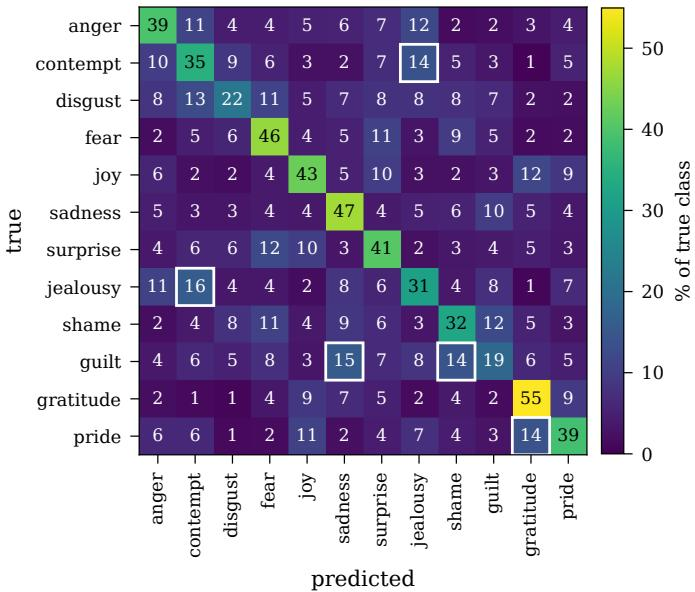  
Fig. 2. 12 × 12 row-normalised pooled-OOF confusion of the 11-way logitmean ensemble (n = 7,992 clips, 74-performer split; rows = true class, rows sum to 100%); the five strongest off-diagonal confusions are boxed. The perclass-by-country companion panel appears in the supplementary material.

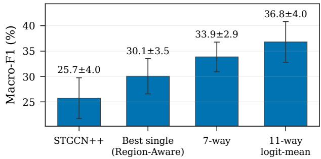  
Fig. 3. Diversity across the four families builds the gain: stage-by-stage Macro-F1 over the 11-model lift path (10-fold LPO mean ± SD), baseline → best single (Region-Aware) → 7-way → 11-way logit-mean. Per-class progression and paired-bootstrap CIs are in the supplementary material.

Why diversity helps: error-space orthogonality. The gain comes from disagreement, not from added capacity: the eleven members rarely fail on the same clip. Their pairwise persample error correlations are low, all off-diagonal values inside [0.15, 0.43] and lowest for the frozen external-pretraining column, so averaging their logits cancels errors that a single family would share (correlation matrix in the supplementary material). The most-redundant pair, Conv1D+Tr ↔ Keypoint-Pool-MLP, and the elevated MAMP-NTU60 ↔ MAMP-NTU120 pair are consistent with the small or negative return of further homogeneous additions (Table I). A leave-one-out (LOO) check on the pooled-OOF logit-mean base of 36.94% confirms no member dominates the lift and no member is redundant: all eleven per-member deltas are strictly negative, from −0.84 pp for MAMP-NTU60 down to −0.09 pp for CTR-GCN, and all within the $^ { 7 } \to 1 1 \mathrm { - w a y }$ lift margin; the full per-member table (with per-stratum versions) appears in the supplementary material. The smallest losses come from graph-convolutional members whose errors a same-family sibling largely covers (CTR-GCN −0.09, ProtoGCN −0.15 pp), yet the moderately correlated MAMP pair still includes the single largest contribution, −0.84 pp, with −0.61 pp for its sibling; moderate error correlation therefore does not imply redundancy. Removing the entire frozen external-pretraining block at once costs −2.91 pp, so the externals jointly supply essentially the whole 7 → 11-way lift, distributed across branches rather than carried by one.

Error structure and strata. Fig. 2 shows where the residual errors go: they fall between semantically confusable emotions; the five strongest off-diagonal confusions, boxed, include jealousy → contempt and guilt → sadness/shame. This pattern is consistent with the model’s low maximum confidence (∼62%) and the disagreement structure the ensemble exploits. Perclass F1 by performer country is charted in the supplementary material. The JP–TW macro gap (35.3 vs 38.9%) is a dataset stratum, not a cultural finding: it is entangled with capture era and performer idiolect. The five OptiTrackcaptured performers are absent from the training split (§III), so capture hardware cannot explain the cross-validation gap; as a capture-era check, excluding the seven earliest-captured Japanese training performers shifts pooled-OOF Macro-F1 by only −0.44 pp (36.50 vs 36.94%), so neither the headline nor the stratum hinges on the earliest recordings.

## VI. EXPLAINABILITY RESULTS

We do not just visualize what the model attends to; we test it. For every claim that the model uses a body region, we mask it, perturb it, or edit its motion and check that the prediction moves. The suite runs on the Region-Aware member of the submitted ensemble and its key tests re-run on the ensemble itself; Table III collects every value with its CI or null and a plain-language reading. Six verdicts, five positive and one deliberately negative: faithful (masking the parts ranked important degrades Macro-F1, §VI-A); stable (the ranking survives input noise, §VI-B); semantically grounded (region saliency matches the Laban vocabulary, for the member and the submitted ensemble alike, §VI-C, §VI-D); behaviourally corroborated (motion edits shift predictions in the same part ranking, §VI-E); grounded narration (no unsupported claims in the 50 audited cards, §VI-G); and one reported negative (within-window temporal saliency is diffuse, §VI-F). The suite is post hoc and adds no accuracy cost; its load-bearing LMA headline rests on the faithfulness and stability verdicts that precede it.

## A. Faithfulness: masking the cited regions lowers accuracy

Positive. Masking the parts an attribution calls important degrades Macro-F1 more than masking the same number of “unimportant” parts: the important−reverse AUC gap is $+ 0 . 1 2 4 \pm 0 . 0 3 1$ over 6 body parts (+0.199 at 25-joint resolution), positive in every fold. Nothing downstream would matter if attributions were decorative; this establishes they are not.

## B. Stability: the ranking survives input noise

Positive. Under input noise the attribution ranking is preserved (Spearman $\rho = + 0 . 9 8 3 \pm 0 . 0 3 9$ at $\sigma = 0 . 0 2 ;$ the top part never flips), converting §VI-A from a possible artifact into a property.

## C. What the model reads: body motion in Laban terms

Positive: the load-bearing result. The model reads body motion the way a movement analyst would name it. Regionlevel saliency aligns with rule-based Laban Movement Analysis (LMA) attributes far more than with classical kinematics (Spearman $\rho = + 0 . 5 0 0 \ \mathrm { v s } \ + 0 . 0 3 3$ , roughly 15× stronger); for sadness, the salient regions track a bowed, sunken posture. The +0.500 is computed over the 48 emotion×region pairs. These pairs share a repeated $1 2 \times 4$ structure and are not 48 independent observations, so the interval estimate treats emotions as the resampling unit: the 95% CI of $[ + 0 . 1 5 0 , + 0 . 7 3 3 ]$ is an emotion-block bootstrap over the 12 emotion clusters, and the permutation null itself respects the structure, shuffling the four region scores within each emotion $( p ~ < ~ 0 . 0 0 1$ null mean $\rho ~ \approx ~ 0 )$ . A cluster-level check agrees: the per-emotion alignment is positive for 10 of the 12 emotions, with median per-emotion $\rho ~ = ~ + 0 . 7 0$ (exact sign test over emotions, two-sided $p \ = \ 0 . 0 3 9 )$ . The rule-based export needs no model retraining, so the Macro-F1 cost is 0 pp by construction (the bold row of Table III); peremotion LMA z-scores and the counterfactual deltas appear in the supplementary material. The order-of-magnitude gap over the classical-kinematics comparator anchors the body evidence in an established movement vocabulary rather than leaving it merely self-consistent.

How the per-emotion signature is built. Each clip yields a rule-based LMA attribute vector $a \in \mathbb { R } ^ { 3 2 }$ over the four Laban axes (Body, Effort, Shape, Space; the full 32-attribute schema is tabulated in the supplementary material). Each attribute k is standardised against the whole training pool and averaged within an emotion, giving a per-emotion signature: for emotion $c ,$

$$
z _ { c , k } = \frac { \bar { a } _ { c , k } - \mu _ { k } } { \sigma _ { k } } , \qquad \bar { a } _ { c , k } = \frac { 1 } { \vert C _ { c } \vert } \sum _ { i \in C _ { c } } a _ { i , k } ,\tag{2}
$$

where $\mu _ { k } , \sigma _ { k }$ are the global mean and SD of attribute k over all clips and $C _ { c }$ is the set of clips of emotion c, so $z _ { c , k }$ is how many SD attribute k departs from the corpus norm for that emotion. Grouping the 32 attributes into four body regions (head, arms, legs, torso; index sets $R _ { r } )$ gives a region-importance vector $\begin{array} { r } { \ell _ { c , r } = \frac { 1 } { | R _ { r } | } \sum _ { k \in R _ { r } } | z _ { c , k } | . } \end{array}$ The headline $\rho ~ = ~ + 0 . 5 0 0$ is computed by flattening the 12 emotion × 4 region pairs and measuring the Spearman rank correlation between the LMA region score and the model’s region saliency; the classical-kinematics control (per-joint speed, acceleration, range of motion, and energy)

TABLE II  
MAIN RESULTS ON DIEM-A (10-FOLD LPO, 74-PERFORMER TRAIN SPLIT). FINAL ROW = SUBMITTED MODEL. MACRO-F1 / ACCURACY = 10-FOLD LPO PER-FOLD MEAN ± SD (THE OFFICIAL CONVENTION); FUSION = LOGIT-MEAN (MEAN OF RAW LOGITS); 95% CI = SAMPLE-LEVEL PAIRED BOOTSTRAP, 1000 ITER, SEED 42, ON POOLED OOF. POOLED-OOF F1 IS A DESCRIPTIVE SECONDARY: 7-WAY 34.03%, 11-WAY LOGIT-MEAN 36.94%.
<table><tr><td>System</td><td>Trainable params (M)‡</td><td>Macro-F1 (mean ± SD)</td><td>Macro-F1 95%CI</td><td>Accuracy (mean ± SD)</td></tr><tr><td>STGCN++ official baseline</td><td>1.40*</td><td> $2 5 . 2 1 \pm 4 . 4 9 \star$ </td><td>n/a*</td><td> $2 7 . 1 1 \pm 3 . 6 7 \star$ </td></tr><tr><td>STGCN++ reproduced</td><td>1.41</td><td> $2 5 . 7 3 \pm 4 . 0 3$ </td><td>[25.37, 27.23]</td><td> $2 7 . 5 4 \pm 3 . 9 2$ </td></tr><tr><td>Best single (Region-Aware)</td><td>1.03</td><td> $3 0 . 0 5 \pm 3 . 4 8$ </td><td>[29.32, 31.15]</td><td> $3 0 . 8 7 \pm 3 . 4 3$ </td></tr><tr><td>7-way ensemble</td><td>12.98</td><td> $3 3 . 8 6 \pm 2 . 9 2$ </td><td>[33.01, 35.04]</td><td> $3 4 . 6 8 \pm 3 . 0 0$ </td></tr><tr><td>11-way logit-mean (submitted)</td><td>12.98</td><td> ${ \bf 3 6 . 8 0 \pm 4 . 0 0 }$ </td><td>[35.90, 37.94]</td><td> ${ \bf 3 7 . 4 0 \pm 4 . 0 6 }$ </td></tr></table>

⋆ Challenge-reported (92-performer full LPO, official $2 5 . 2 \ \% \pm 4 . 5 \ \%$ , no bootstrap CI), NOT re-evaluated with our script; our reproduction (25.73 ± 4.03) is within SD of the official number, so the official baseline serves only as an external anchor and all improvement numbers are same-split comparisons . ‡ The table reports trainable parameters; frozen external branches add fewer than 0.01 M trainable parameters each.

TABLE III  
EXPLAINABILITY METRICS, WITH A PLAIN READING OF EACH ROW IN THE LAST COLUMN. SIX ROWS ARE POSITIVE EVIDENCE (FAITHFULNESS, STABILITY, COUNTERFACTUAL, NARRATOR, SUBMITTED ENSEMBLE, LMA); TEMPORAL SALIENCY IS A DELIBERATELY REPORTED NEGATIVE. ALL VALUES ARE RECOMPUTED ON THE SAME 10 LPO FOLDS AND OUT-OF-FOLD PREDICTIONS UNLESS OTHERWISE STATED (1O/10 FOLDS FOR PART-MASKING/STABILITY). BOLD = HEADLINE CONTRAST
<table><tr><td>Component</td><td>Metric</td><td>Value</td><td>95% CI / null</td><td>What it shows</td></tr><tr><td>Part-masking</td><td>Faithfulness AUC gap (important-reverse), zero-mask</td><td> $+ 0 . 1 2 4 \pm 0 . 0 3 1$ </td><td>10-fold SD; posi- tive in all folds</td><td>Masking important parts lowers F1: attributions are faithful</td></tr><tr><td>Temporal saliency</td><td>AUC gap (salient- reverse), negative result</td><td>+0.002 (≈0)</td><td>entropy 98.7% of log T (≈uniform)†</td><td>Frame importance is diffuse (a re- ported negative)</td></tr><tr><td>Stability</td><td>Spearman ρ vs σ=0 ref at σ=0.02</td><td>+0.983 ± 0.039</td><td>10-fold SD; top part never flips</td><td>Attribution ranking is stable under input noise</td></tr><tr><td>Counterfactual</td><td>Most-disruptive edit ∆p(true): head+freeze</td><td>-0.0164</td><td>mean over 864 val × 10 folds</td><td>Perturbing motion changes predic- tions: motion-dependent</td></tr><tr><td>Narrator grounding</td><td>Unsupported claims in audited cards</td><td>0/50 cards</td><td>deterministic audit</td><td>No unsupported claims in the 50 audited cards</td></tr><tr><td>F1 cost</td><td>∆F1: baseline → with post-hoc saliency/LMA export</td><td>0.0 pp</td><td>post-hoc; no re- training</td><td>Explanations add no accuracy cost</td></tr><tr><td>Submitted ensemble</td><td>Part-masking + LMA under a shuffle (permutation- importance) mask</td><td>part gap +7.85 ± 1.76 pp;  $\rho = + 0 . 5 1 7$ </td><td>part gap 10-fold SD; ρ 95% CI [+0.333, +0.700]; permutation  $p =$  0.001</td><td>Part-masking faithfulness and LMA alignment also hold for the submitted 11-way logit-mean ensemble (baseline Macro-F1 34.65 ± 4.29%), not just one</td></tr><tr><td>LMA correlation</td><td>Region-level saliency-LMA Spearman ρ</td><td> ${ \boldsymbol \rho } = + { \bf 0 . 5 0 0 } ;$  kinematics control  $\mathbf { \rho } _ { \rho } = + \mathbf { 0 . 0 3 } 3$ </td><td>permutation  $p <$  0.001</td><td>model Semantic alignment with the La- ban vocabulary</td></tr></table>

† Per-sample entropy; the per-emotion class-mean is 99.5% of log T — two aggregations of the same near-uniform distribution.

under the identical pipeline reaches only +0.033. The signature is human-readable: sadness loads on head\_bow+, head\_height−, and trunk\_lean+, a bowed, sunken posture that the model’s salient regions track. We treat this LMA correlation as semantic alignment, not causal evidence by itself; dependence is tested separately through part-masking and counterfactual perturbations (§VI-A, §VI-E).

## D. The finding holds for the submitted ensemble

Positive, for the submitted system. Because these probes target a single member, we re-run the part-masking and LMA-alignment tests on the submitted 11-way logit-mean ensemble itself, using permutation-importance shuffling (zeromasking collapses members that lack per-part gates). The important−reverse faithfulness gap stays positive in $1 0 / 1 0$ folds (+8.5 pp partial-AUC at single-part resolution), and region-level part importance aligns with the rule-based LMA attributes at Spearman $\rho = + 0 . 5 1 7 .$ , with an emotion-block bootstrap 95% CI of $[ + 0 . 3 3 3 , + 0 . 7 0 0 ]$ and permutation $p =$ 0.001, exceeding the single-member +0.500; at the cluster level the per-emotion alignment is positive for 11 of the 12 emotions and negative for none (exact sign test, two-sided $p = 0 . 0 0 1 )$ . The gap is smaller than the member’s +12.4 pp, since six of the seven skeleton members lack per-part gates, but it is consistently positive and above null: the body-evidence finding describes the system we submit, not one component.

## E. Counterfactual edits move predictions as predicted

Positive, as observational corroboration. Pose-preserving, motion-perturbing edits shift logits in the same part ranking as masking: a head-freeze edit is the most disruptive, shifting the true-class probability by $\overline { { \Delta p _ { \mathrm { t r u e } } } } ~ = ~ - 0 . 0 1 6 4$ on average over 864 validation clips × 10 folds and flipping 41% of predictions, and an arm-amplify edit flips 23.1%. This is convergent observational evidence (not causal identification) that the model relies on motion dynamics. The per-part saliencyvs-disruption agreement is positive but modest, at $\rho = + 0 . 4 9$ with $n \ = \ 6$ and $p \ = \ 0 . 3 3$ , and we treat it as suggestive corroboration; the load-bearing cross-method result remains the $\rho = + 0 . 5 0 0 \ \mathrm { v s } + 0 . 0 3 3$ contrast with its real n.

## F. What the explanations correctly refuse to claim

Negative: reported, by design. Temporal saliency is nearuniform for all 12 emotions (per-sample entropy ≈ 98.7% of log T; the class-mean is 99.5%, two aggregations of the same near-uniform distribution, reconciled in Table III), with an important−reverse AUC gap of only $\approx + 0 . 0 0 2 \colon$ : the model’s strongest evidence is spatial, in that within-window frame importance is diffuse (no single frame dominates). We report this frame-localization negative rather than hide it; it does not claim that temporal order carries no signal (saliency grids are in the supplementary material). Reverse/random masking separates cleanly from important-first. A faithfulness suite that only ever returned positive results would be unfalsifiable; reporting these negatives is what makes it a test. Per-row CIs/markers live in Table III and Table I.

One fused thesis: why diversity helps, explained. Interperformer F1 varies ∼4× and decomposes into roughly half intrinsic difficulty and half architecture-specific error, the same disagreement structure the ensemble exploits (§V): one mechanism behind both headlines.

## G. Scoped qualitative cards (decoupled from the audit)

Qualitative narration is used only as a scoped interface to the audited saliency and LMA channels; no quantitative claim relies on it. A label-field audit of the narration cards is in the supplementary material.

## VII. DISCUSSION AND LIMITATIONS

The following limitations are central to interpreting the benchmark; each carries the reason the load-bearing claim still stands. The system is a research probe under a fixed protocol, not a deployable affect recognizer.

Absolute accuracy. Macro-F1 is ∼37%, but the task is 12- way body-only LPO acted-emotion recognition (chance 8.3%; official baseline only 25%); the contribution is a protocolmatched +43% relative gain with all 12 classes improving (weakest +6.1 pp), not saturation.

Protocol gap. Our $3 6 . 8 0 \pm 4 . 0 0 \%$ is a 74-performer crossvalidation result; within the same 74-performer protocol our reproduced baseline is $2 5 . 7 3 \pm 4 . 0 3 \%$ , within one SD of the official 92-performer figure (§III), so the +11.07 pp lift is protocol-matched and the held-out test score is pending the leaderboard (§III).

Temporal scope. Every model sees a fixed 64-frame window for parity with the official baseline (§III); longer and multiwindow inference regressed under our protocol (Table I), so our claims concern this official short-window LPO setting and the within-window evidence it exposes, not full-sequence affect understanding.

Variance and confidence. Per-fold SD is $\approx 4 ~ \mathrm { p p }$ , but the bootstrap 95% CIs (Table II) show the ensemble interval clearing the 7-way interval, so the gain is not within ensemble noise; the low maximum confidence $( \sim 6 2 \% )$ is the sensible response to semantically confusable emotions, and is what the ensemble exploits.

Inter-performer range. Inter-performer F1 varies ∼4×; this bounds further homogeneous additions but does not threaten the result, since the external-pretraining column still lifts the ensemble (§V).

No human upper bound. No human or inter-rater ceiling exists for body-only 12-emotion acted recognition; the official STGCN++ result is the de-facto reference, against which the protocol-matched +11.07 pp lift remains the testable claim.

Country strata. JP/TW differences are not interpretable as cultural effects; we report them as a dataset stratum entangled with capture era and performer idiolect. The five OptiTrackcaptured performers are absent from the training split (§III), and excluding the seven earliest-captured Japanese training performers moves the overall ensemble Macro-F1 by only −0.44 pp, 36.50 vs 36.94% pooled OOF, bounding the capture-era effect.

Triangulation and the held dataset. The saliency– counterfactual agreement is $n = 6 , p = 0 . 3 3 ;$ ; the load-bearing cross-method result is the ρ = +0.500 vs +0.033 contrast over the 48 emotion–region pairs, interval-estimated with emotionblock resampling $( p < 0 . 0 0 1 ; \ S \nabla \mathrm { I } )$ , and it reproduces on the submitted 11-way ensemble $( \rho = + 0 . 5 1 7 , \ p = 0 . 0 0 1 )$ . We built an anonymized motion→rationale dataset but withhold release pending performer-consent/license review and because skeleton renders retain residual re-identifiability; we release the narrator method and audit so the results are reproducible.

## VIII. CONCLUSION

Under performer-held-out evaluation of body-only 12-class acted-emotion recognition, reliable gains came not from a new architecture but from combining models with orthogonal error modes, a protocol-matched +11.07 pp over the same-split reproduced baseline. The harder contribution: part-masking, stability, and counterfactual tests showed that a strong member’s decisions, and those of the submitted ensemble, depend on motion-grounded body-region evidence, and that this saliency aligns with rule-based Laban attributes, while the suite faithfully reported a negative and a $0 / 5 0 \cdot$ -audited narrator. The gain is cross-validated on the labeled training performers; the hidden-test leaderboard result is pending. Generalisation under performer shift needs both complementary predictions and faithful explanations of the motion evidence behind them.

Consent and approval. The DIEM-A corpus was collected by the dataset holder under their own ethics approval and explicit performer consent, as described in the dataset publication [1]. This work uses only the data released to MMAC challenge participants; we did not collect new recordings, identifiers, or auxiliary biometric attributes, and we did not contact or reidentify any performer.

Bias and limited generalizability. DIEM-A includes 40 Japanese and 34 Taiwanese performers in our LPO split, so the reported findings are bounded by an East-Asian actedaffect distribution; intercultural generalization beyond these two populations is not tested and should not be assumed. Acted emotion further differs from spontaneous expression along intensity, duration, and self-monitoring axes, which leaves an acted–spontaneous gap that limits transfer to in-thewild affect inference. We inherit whatever demographic gaps (gender, age) exist in the source corpus. The JP–TW Macro-F1 difference reported in §V is a confounded dataset stratum, entangled with capture era and performer idiolect, and is not interpreted as a cultural effect; the dataset’s five OptiTrackcaptured performers are absent from our training split (§III). Potential misuse and mitigation. Body-only affect classifiers could be misused for affect surveillance or unconsented employment screening. We therefore release method and audit artifacts only, not a deployable affect detector, and the corpus is licensed for research use. As an additional disclosure to downstream users, the same skeleton features that yield 36.80% emotion Macro-F1 also support roughly 69.8% performer-country classification from the same inputs; that is, country identity is substantially more decodable than the target emotion. This exposes a re-identification and over-fitting risk for any deployment built on similar body-only features and motivates the held-data decision below.

Generalizability limits. The performer ceiling is small (n = 92 across the DIEM-A challenge subset, of which n = 74 are used in our LPO split). Inputs are skeleton-only (no face, audio, or scene cues), and the 64-frame analysis window covers about 7.5% of the median sequence. Macro-F1 of 36.80% on a 12-way task (chance 8.3%) remains far below any plausible threshold for human-usable affect inference. The ensemble is reported as a research probe of when ensemble diversity helps for body-only acted affect, not as a deployable emotion recognizer.

Held rationale dataset and residual re-identifiability. The anonymized motion-to-rationale natural-language dataset prepared alongside the explainability suite is deliberately withheld pending performer-consent and license review with the data holder. Skeleton renderings are derived motion: the data holder can in principle re-link a rendered clip back to its source identity, so full unlinkability is not achievable from artifacts in our pipeline. We therefore release only the narrator method and the audit needed to reproduce the explainability findings; the rationale dataset itself is held until the consent/license review is complete.

[1] M. Cheng, C.-h. Tseng, K. Fujiwara, V. Schneider, and Y. Kitamura, “Asian emotional body movement database: Diverse intercultural Emotion database of asian performers (DIEM-A),” in Proc. Int. Conf. Affective Computing and Intelligent Interaction (ACII), 2025.

[2] S. Yan, Y. Xiong, and D. Lin, “Spatial temporal graph convolutional networks for skeleton-based action recognition,” in Proc. AAAI Conf. Artificial Intelligence, 2018, pp. 7444–7452.

[3] Y. Chen, Z. Zhang, C. Yuan, B. Li, Y. Deng, and W. Hu, “Channelwise topology refinement graph convolution for skeleton-based action recognition,” in Proc. IEEE/CVF Int. Conf. Computer Vision (ICCV), 2021, pp. 13 359–13 368.

[4] H. Duan, J. Wang, K. Chen, and D. Lin, “PYSKL: Towards good practices for skeleton action recognition,” in Proc. 30th ACM Int. Conf. Multimedia (MM), 2022, pp. 7351–7354.

[5] J. Do and M. Kim, “SkateFormer: Skeletal-temporal transformer for human action recognition,” in Proc. European Conf. Computer Vision (ECCV), 2024, pp. 401–420.

[6] H. Liu, Z. Zhu, N. Iwamoto, Y. Peng, Z. Li, Y. Zhou, E. Bozkurt, and B. Zheng, “BEAT: A large-scale semantic and emotional multi-modal dataset for conversational gestures synthesis,” in Proc. European Conf. Computer Vision (ECCV), 2022, pp. 612–630.

[7] N. Fourati and C. Pelachaud, “Emilya: Emotional body expression in daily actions database,” in Proc. Int. Conf. Language Resources and Evaluation (LREC), 2014, pp. 3486–3493.

[8] M. Karg, A.-A. Samadani, R. Gorbet, K. Kuhnlenz, J. Hoey, and¨ D. Kulic, “Body movements for affective expression: A survey of au-´ tomatic recognition and generation,” IEEE Trans. Affective Computing, vol. 4, no. 4, pp. 341–359, 2013.

[9] A. Aristidou, P. Charalambous, and Y. Chrysanthou, “Emotion analysis and classification: Understanding the performers’ emotions using the LMA entities,” Computer Graphics Forum, vol. 34, no. 6, pp. 262–276, 2015.

[10] Y. Mao, J. Deng, W. Zhou, Y. Fang, W. Ouyang, and H. Li, “Masked motion predictors are strong 3D action representation learners,” in Proc. IEEE/CVF Int. Conf. Computer Vision (ICCV), 2023, pp. 10 181–10 191.

[11] W. Wu, Y. Hua, C. Zheng, S. Wu, C. Chen, and A. Lu, “SkeletonMAE: Spatial–temporal masked autoencoders for self-supervised skeleton action recognition,” in Proc. IEEE Int. Conf. Multimedia and Expo Workshops (ICMEW), 2023, pp. 224–229.

[12] F. M. Thoker, H. Doughty, and C. G. M. Snoek, “Skeleton-contrastive 3D action representation learning,” in Proc. 29th ACM Int. Conf. Multimedia (MM), 2021, pp. 1655–1663.

[13] W. Zhu, X. Ma, Z. Liu, L. Liu, W. Wu, and Y. Wang, “MotionBERT: A unified perspective on learning human motion representations,” in Proc. IEEE/CVF Int. Conf. Computer Vision (ICCV), 2023, pp. 15 085–15 099.

[14] M. D. Zeiler and R. Fergus, “Visualizing and understanding convolutional networks,” in Proc. European Conf. Computer Vision (ECCV), 2014, pp. 818–833.

[15] R. R. Selvaraju, M. Cogswell, A. Das, R. Vedantam, D. Parikh, and D. Batra, “Grad-CAM: Visual explanations from deep networks via gradient-based localization,” in Proc. IEEE Int. Conf. Computer Vision (ICCV), 2017, pp. 618–626.

[16] S. Wachter, B. Mittelstadt, and C. Russell, “Counterfactual explanations without opening the black box: Automated decisions and the GDPR,” Harvard Journal of Law & Technology, vol. 31, no. 2, pp. 841–887, 2018.

[17] S. Hooker, D. Erhan, P.-J. Kindermans, and B. Kim, “A benchmark for interpretability methods in deep neural networks,” in Advances in Neural Information Processing Systems (NeurIPS), 2019, pp. 9734–9745.

[18] J. Adebayo, J. Gilmer, M. Muelly, I. Goodfellow, M. Hardt, and B. Kim, “Sanity checks for saliency maps,” in Advances in Neural Information Processing Systems (NeurIPS), 2018, pp. 9525–9536.

[19] “MMAC challenge: Cross-cultural emotion recognition from body movements — DIEM-A benchmark and baselines,” Official challenge benchmark (online resource), Int. Conf. Affective Computing and Intelligent Interaction (ACII), 2026, provides the DIEM-A challenge split and the official STGCN++ baseline.

[20] H. Liu, Y. Liu, M. Ren, H. Wang, Y. Wang, and Z. Sun, “Revealing key details to see differences: A novel prototypical perspective for skeletonbased action recognition,” in Proc. IEEE/CVF Conf. Computer Vision and Pattern Recognition (CVPR), 2025, pp. 29 248–29 257.

TABLE S1  
(A) Stage-by-stage lift (10-fold LPO mean ± SD)  
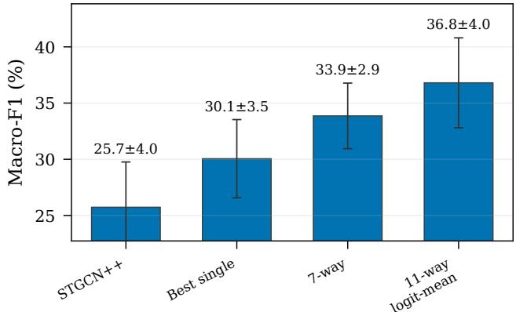

(B) Per-class F1 progression (pooled OOF)  
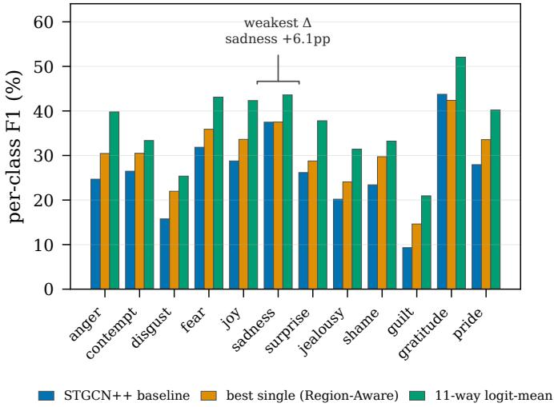

Fig. S1. (A) Stage-by-stage Macro-F1 over the 11-model lift path (bars = 10-fold LPO mean ± SD; sample-level paired bootstrap 95% CIs, B=1000, seed 42), every stage recomputed under the canonical logit-mean convention. (B) Per-class F1 progression (pooled OOF): STGCN++ → best single (Region-Aware) → 11-way logit-mean; all 12 classes improve, weakest sadness (+6.1 pp).

SUPPLEMENTARY MATERIAL   
S1. LIFT PATH   
S2. CONFUSION AND COUNTRY STRATA   
S3. LEAVE-ONE-OUT ABLATIONS   
S4. LMA SCHEMA   
S5. SALIENCY   
S6. LMA AND COUNTERFACTUALS   
S7. QUALITATIVE CARDS   
S8. FULL NEGATIVE-RESULTS CATALOGUE   
S9. MEMBER ERROR CORRELATION

LEAVE-ONE-OUT ABLATION OF THE 11-MEMBER ENSEMBLE: CHANGE IN POOLED-OOF MACRO-F1 (PP, n = 7,992, 74-PERFORMER SPLIT) WHEN ONE MEMBER IS REMOVED FROM THE LOGIT-MEAN FUSION (LAST ROW: THE WHOLE FROZEN EXTERNAL BLOCK). POOLED-OOF BASE 36.94% (PER-FOLD HEADLINE: 36.80 ± 4.00%). ALL DELTAS ARE NEGATIVE.

<table><tr><td>Member</td><td>Family</td><td>∆ Macro-F1 (pp)</td></tr><tr><td>MAMP-NTU60</td><td>External (frozen)</td><td>-0.84</td></tr><tr><td>SkateFormer</td><td>Attention</td><td>-0.68</td></tr><tr><td>MAMP-NTU120</td><td>External (frozen)</td><td>-0.61</td></tr><tr><td>Region-Aware ConvTr</td><td>Graph-conv.</td><td>-0.59</td></tr><tr><td>C3D-marker-stats</td><td>External (frozen)</td><td>-0.52</td></tr><tr><td>MotionBERT-Lite</td><td>External (frozen)</td><td>-0.47</td></tr><tr><td>Keypoint-Pool-MLP</td><td>Hybrid/MLP</td><td>-0.45</td></tr><tr><td>STGCN++</td><td>Graph-conv.</td><td>-0.42</td></tr><tr><td>Conv1D+Transformer</td><td>Hybrid/MLP</td><td>-0.30</td></tr><tr><td>ProtoGCN</td><td>Graph-conv.</td><td>-0.15</td></tr><tr><td>CTR-GCN</td><td>Graph-conv.</td><td>-0.09</td></tr><tr><td>All frozen externals (4)</td><td>External (frozen)</td><td>-2.91</td></tr></table>

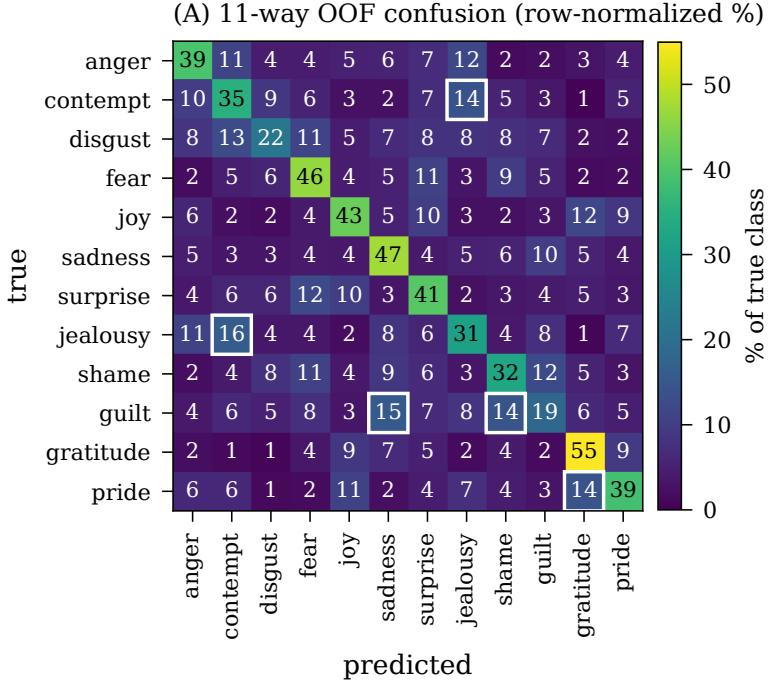

(B) Per-class F1 by performer country  
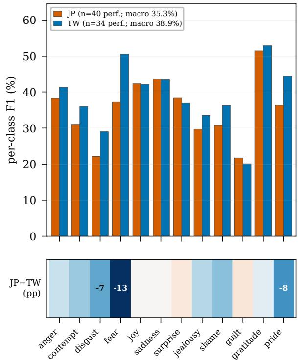  
Fig. S2. (A) 12 × 12 row-normalised pooled-OOF confusion of the 11-way logit-mean ensemble (n = 7,992 clips; rows = true class, rows sum to 100%); the five strongest off-diagonal confusions are boxed. (B) 11-way per-class F1 by performer country (JP n=40, TW n=34 training performers) with the signed JP−TW per-class strip in percentage points. The JP–TW macro gap (35.3 vs 38.9%) is a dataset stratum: the five OptiTrack-captured performers are absent from the training split, and excluding the seven earliest-captured Japanese training performers shifts pooled-OOF Macro-F1 by only −0.44 pp.

TABLE S2  
PER-STRATUM LEAVE-ONE-OUT DELTAS (PP, POOLED OOF) FOR THE 11-MEMBER LOGIT-MEAN ENSEMBLE. ‘EXCL. EARLIEST JP’ SCORES AFTER REMOVING THE SEVEN EARLIEST-CAPTURED JAPANESE TRAINING PERFORMERS (JP 06–JP 12).
<table><tr><td>Member</td><td>Family</td><td>All</td><td>JP</td><td>TW</td><td>Excl. earliest JP</td></tr><tr><td>MAMP-NTU60</td><td>External (frozen)</td><td>-0.84</td><td>-1.65</td><td>-0.01</td><td>-0.84</td></tr><tr><td>SkateFormer</td><td>Attention</td><td>-0.68</td><td>-0.48</td><td>-0.93</td><td>-0.78</td></tr><tr><td>MAMP-NTU120</td><td>External (frozen)</td><td>-0.61</td><td>-0.90</td><td>-0.30</td><td>-0.62</td></tr><tr><td>Region-Aware ConvTr</td><td>Graph-conv.</td><td>-0.59</td><td>-0.62</td><td>-0.57</td><td>-0.65</td></tr><tr><td>C3D-marker-stats</td><td>External (frozen)</td><td>-0.52</td><td>-0.64</td><td>-0.42</td><td>-0.54</td></tr><tr><td>MotionBERT-Lite</td><td>External (frozen)</td><td>-0.47</td><td>-0.72</td><td>-0.23</td><td>-0.49</td></tr><tr><td>Keypoint-Pool-MLP</td><td>Hybrid/MLP</td><td>-0.45</td><td>-0.62</td><td>-0.28</td><td>-0.44</td></tr><tr><td>STGCN++</td><td>Graph-conv.</td><td>-0.42</td><td>-0.67</td><td>-0.14</td><td>-0.44</td></tr><tr><td>Conv1D+Transformer</td><td>Hybrid/MLP</td><td>-0.30</td><td>-0.40</td><td>-0.17</td><td>-0.27</td></tr><tr><td>ProtoGCN</td><td>Graph-conv.</td><td>-0.15</td><td>-0.10</td><td>-0.19</td><td>-0.20</td></tr><tr><td>CTR-GCN</td><td>Graph-conv.</td><td>-0.09</td><td>-0.15</td><td>-0.05</td><td>-0.05</td></tr><tr><td>All frozen externals (4)</td><td>External (frozen)</td><td>-2.91</td><td>-3.11</td><td>-2.75</td><td>-2.74</td></tr></table>

TABLE S3  
RULE-BASED LABAN MOVEMENT ANALYSIS (LMA) ATTRIBUTE SCHEMA: 32 CLIP-LEVEL FEATURES ACROSS THE FOUR LABAN AXES, COMPUTED FROM BVH-24 FORWARD KINEMATICS. THE PER-EMOTION Z-SCORE SIGNATURE AND THE REGION AGGREGATION $\ell _ { c , r }$ ARE DEFINED IN THE MAIN PAPER; THIS IS THE ESTABLISHED MOVEMENT VOCABULARY THE SALIENCY ALIGNMENT IS MEASURED AGAINST.
<table><tr><td>Laban axis</td><td>What it captures</td><td>Attributes (8 per axis)</td></tr><tr><td>Body</td><td>posture and bilateral form</td><td>head bow, trunk lean, arm openness, left-right speed asymmetry, left-right position asymmetry, stillness ratio, head lateral tilt, shoulder drop</td></tr><tr><td>Effort</td><td>motion quality (time/weight/flow)</td><td>suddenness, sustainedness, strong energy, light energy, bound flow, free flow, intensity peak, intensity variance</td></tr><tr><td>Shape</td><td>body volume and its change</td><td>body volume, shoulder width, head height, contraction change, rise/sink, spread change, arm enclosure, advance/recede</td></tr><tr><td>Space</td><td>trajectory and locomotion</td><td>directness, path curvature, horizontal root displacement, vertical root displacement, lateral sway, cumulative turn, dominant direction, locomotion ratio</td></tr></table>

Region importance is computed from the per-emotion z-scores defined in the main paper as the within-region mean of |zc,k|; Spearman correlation over the $1 2 \times 4$ emotion-region pairs gives $\rho = + 0 . 5 0 0 \ \mathrm { v s . } + 0 . 0 3 3$ for classical kinematics.

Supplementary Fig. 5: joint×frame saliency, all 12 emotions (joints grouped by body part)  
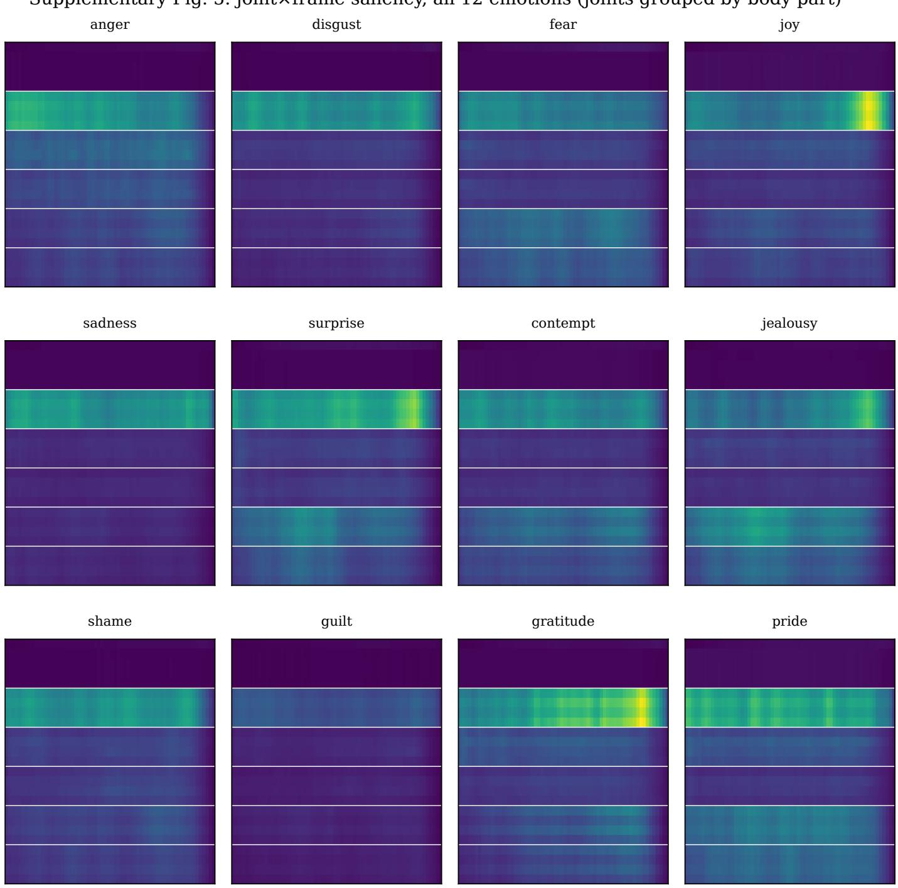  
Fig. S3. Per-emotion temporal and spatial saliency, full grid (companion to the temporal-saliency negative reported in the main paper).

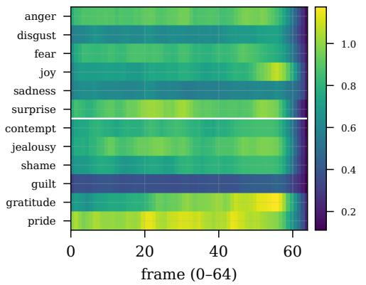  
(A) Temporal saliency — near-uniform

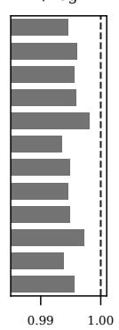  
H / log T

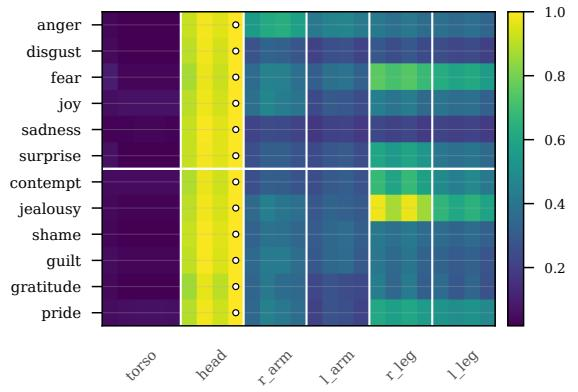  
(B) Spatial saliency (row-norm.; •=top-1 joint)

(C) Joint×frame saliency — surprise (least-uniform, H/logT=0.994): local structure survives class-averaged uniformity  
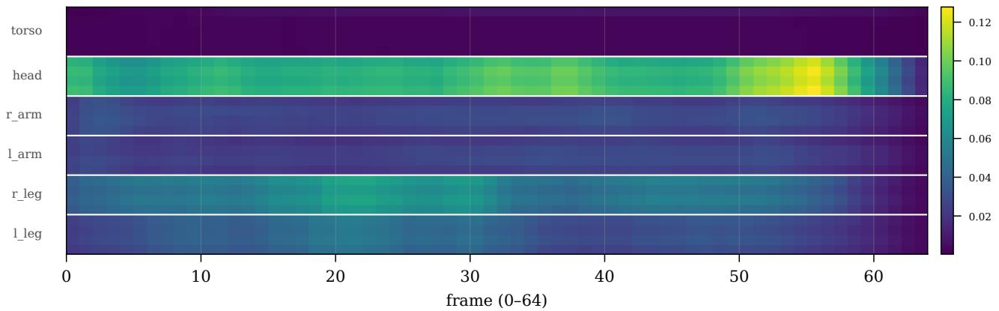  
Fig. S4. (A) Temporal saliency (mean over joints) is near-uniform for all 12 emotions; per-sample entropy ≈ 98.7% of log(64) (class-mean 99.5%), the load-bearing negative. (B) Spatial saliency (row-normalised, joints in 6 body parts): Head is the top-1 joint for all 12 emotions (Head/Neck/Neck1 dominate) (C) For surprise (least-uniform), a joint×frame burst shows local structure survives class-averaged temporal uniformity. Colourblind-safe (viridis).

(A) LMA z-score per emotion (Body·Effort·Shape·Space) saliency–LMA  
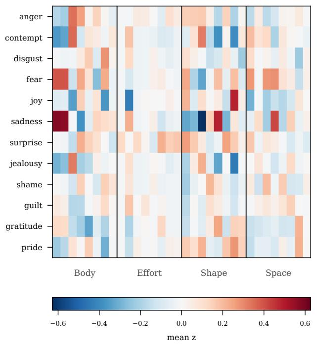

(B) Counterfactual edits — Δp(true)  
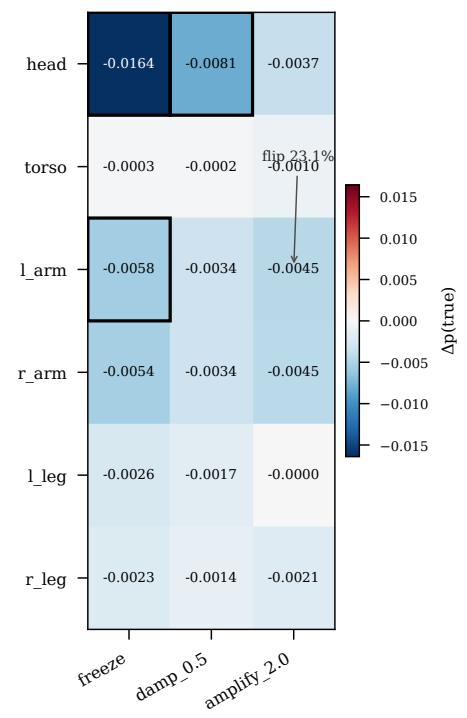  
region saliency–LMA Spearman ρ = +0.500 (classical kinematics: +0.033, 15× weaker) triangulation: per-part saliency vs counterfactual disruption Spearman ρ = +0.49 (p=0.33, n=6)

Fig. S5. (A) Mean LMA z-score per emotion (32 attrs: Body/Effort/Shape/Space); right strip = per-emotion saliency–LMA Spearman. Region saliency–LMA $\rho = + 0 . 5 0 0$ vs +0.033 for classical kinematics (15× weaker). (B) Counterfactual motion edits (observational perturbations, not causal): mean $\Delta p _ { \mathrm { t r u e } }$ over 864 val $\times \ 1 0$ folds; head-freeze most disruptive (−0.0164, 41% flip), l arm+amplify 23.1% flip. Per-part saliency vs disruption Spearman $\rho = + 0 . 4 9$ $( n = 6 , p = 0 . 3 3 )$ , a positive but modest triangulation.

SUPPLEMENTARY: FULL CATALOGUE OF NEGATIVE RESULTS (EXTENDS TABLE 2).  
TABLE S4
<table><tr><td>Approach</td><td>Configuration</td><td>Outcome (∆F1)</td><td>Methodological lesson</td></tr><tr><td>Supervised contrastive head</td><td>pairwise SupCon, λ=0.05, batch 128</td><td>-11.53 pp, significant</td><td>12 classes at batch 128 give too few posi- tives per class, suggesting a per-class center loss may fit better at this scale</td></tr><tr><td>Mixture-of-experts fusion</td><td>K=4, hand-crafted gradient-free routing</td><td>collapses to 6.55% F1</td><td>a shared head with random init and 21-D routing is associated with backbone col- lapse, suggesting a feature adapter, learned</td></tr><tr><td>Scenario-text alignment</td><td>global InfoNCE, 3- fold</td><td>-1.42 pp</td><td>routing, and zero-init are needed the projection collapses to performer iden- tity (cross-group retrieval 10.6%)</td></tr><tr><td>Part-rationale alignment</td><td>cosine text alignment, 3-fold</td><td>-0.64 pp, CI [-1.30, - 0.09]</td><td>the text bottleneck is associated with an F1 ceiling of 9–12%; shortcut-breaking works</td></tr><tr><td>VLM zero-shot distillation</td><td>12-class, a recent VLM, preliminary</td><td>failed in preliminary zero-shot ranking</td><td>but yields no F1 lift the true class ranked last (12/12); a vision- language model did not infer emotion re- liably from faceless, scene-free skeleton</td></tr><tr><td>Contact-marker late fusion</td><td>C3D 22-D contact stats, 3-fold</td><td>-0.59 pp</td><td>renderings the contact features carry a 69.8% country signal, so some performers go out of dis- tribution under LPO, suggesting a domain-</td></tr><tr><td>Multi-crop window inference</td><td>24-setting window sweep</td><td>-12 to -17 pp</td><td>invariance objective is needed the model is trained on full-span subsam- ples, so compact windows are a distribution</td></tr><tr><td>Post-hoc calibration</td><td>nested-LPO, 7-way ensemble</td><td>0 to -0.14 pp, not sig- nificant</td><td>shift equal-weight argmax is already near- optimal; bias-style calibration did not ex-</td></tr><tr><td>Same-architecture stacking</td><td>8-way (six models + two ConvTr variants)</td><td>-0.29 pp</td><td>ceed it in this search diversity saturates when stacking variants of a single architecture</td></tr><tr><td>Over-stacked SSL ensemble</td><td>13-way, three-plus MAMP checkpoints</td><td>-0.88 pp</td><td>one SSL family over-stacked dilutes the production members; two MAMP check-</td></tr><tr><td>Arithmetic-mean averaging</td><td>probability-domain av- eraging</td><td>-1.15 pp (forgone)</td><td>points is the sweet spot the canonical convention is logit-mean (raw-logit averaging); the arithmetic alter-</td></tr><tr><td>PoseC3D heatmap 3D-CNN</td><td>preliminary evaluation</td><td>20.26% (below the 24% threshold)</td><td>native leaves -1.15 pp on the table architectural novelty is not error-space or- thogonality; measure the contribution in</td></tr><tr><td>Joint-masking sparse model</td><td>options A/B, 3-fold</td><td>-0.33 pp (B); collapse (A)</td><td>error space attribution-driven sparse models are not ensemble-additive (the 7-way already sees</td></tr><tr><td>Joint-subset training</td><td>top-N joints only, 3-</td><td>top-4 19.83%, CI</td><td>those joints) input-driven sparsity converges to the same</td></tr><tr><td>Heavy regularisation, short horizon</td><td>fold Conv1D+Transformer,</td><td>[17.67, 21.99] -1.34 pp standalone, CI</td><td>negative as joint-masking heavy regularisation needs a long horizon;</td></tr><tr><td>Focal loss</td><td>40 epochs single-model variant</td><td>[-0.32, +0.35] -0.48 F1 / -0.99 Acc</td><td>it under-fits at 40 epochs the class-balanced DIEM-A does not ben-</td></tr><tr><td>SkateFormer with SGD (lr=0.2)</td><td>single-model variant</td><td>chance-level collapse</td><td>efit from focal loss transformer backbones require AdamW</td></tr><tr><td>Joint dropout (0.1)</td><td>single-model variant</td><td>seed-dependent fold collapse</td><td>some folds collapse under some seeds; not adoptable</td></tr><tr><td>Long clip length (128)</td><td>STGCN++, clip 128 vs</td><td>regresses</td><td>the emotion signal concentrates in a short temporal window</td></tr><tr><td>Content/style dual head</td><td>64 GRL + style loss, de- fault weights</td><td>-2.65 pp</td><td>GRL and a style loss obstruct backbone learning at default weights</td></tr><tr><td>Gradient temporal saliency</td><td>explainability probe</td><td>AUC gap +0.003 (≈0), not significant</td><td>within-window frame importance is near- uniform (entropy: per-sample 98.7%, class- mean 99.5% of log T); use the body-part</td></tr></table>

Full negative-results catalogue (supplementary); the main paper shows the curated eight (Table 2).

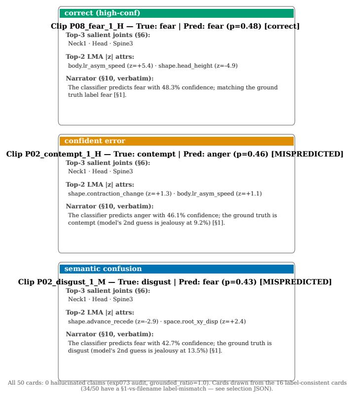

Fig. S6. Three explanation cards (correct / confident-error / semanticconfusion) from the 16 label-consistent cards; each cites source channels (salient joints, top-2 LMA |z|, verbatim deterministic narrator). All 50 cards pass the grounding audit (0 hallucinated claims, grounded-ratio = 1.0). Qualitative; per-card correctness is excluded pending a card-generator fix.  
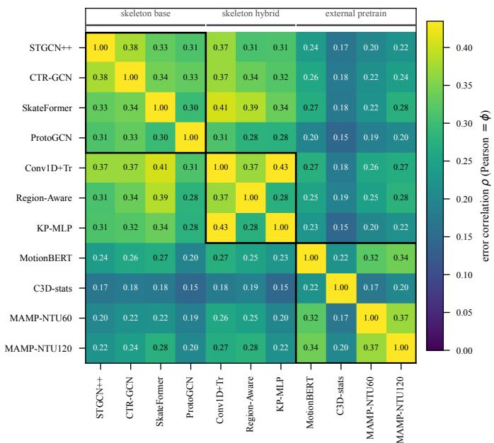  
Fig. S7. Members make largely independent errors, the diversity the ensemble converts into its gain: off-diagonal error correlations stay in [0.15, 0.43], lowest for the external-pretrain C3D-stats column (ρ ≈ 0.15–0.19 to skeleton models); most-redundant pair Conv1D+Tr ↔ KP-MLP $( \rho = 0 . 4 3 )$ . Pairwise Pearson (= ϕ), OOF n = 7,992; the diagonal is 1 by definition and the colour scale is capped at the off-diagonal maximum. KP-MLP = Keypoint-Pool-MLP; C3D-stats = C3D marker statistics, not a 3D CNN.