# PERCOLATION DYNAMICS IN OPTIMIZATION : VARIANCE CASCADES AND DISCRETE SCALE INVARIANCE

Sai Niranjan Ramachandran\* † Suvrit Sra\* †

September 3, 2026

## ABSTRACT

We study the dynamics of Stochastic Gradient Descent (SGD), which is known to steer deep neural networks toward invariant sets that correspond to simpler subnetworks. How this steering unfolds over time remains poorly understood. We answer this by modeling the stochastic gradient flow (SGF) as a percolation process, in which architectural symmetries force subnetworks to merge in discrete simultaneous blocks rather than one at a time. These structural transitions register as variance spikes in a macroscopic order parameter, echoing physical phase transitions. We further show this trapping mechanism and its associated scaling cascade extend to Adam and AdamW under an explicit heavy-tailed noise model.

SGD collapses deep neural networks toward sparse, low-rank representations generated by architectural symmetry. We show how this collapse progresses over time, and that the mechanism extends to Adam and AdamW.

## 1 Introduction

Unlike classical statistical learning deep learning systems rely on a complex interaction between the dataset, architecture, and choice of optimizer. Furthermore, they are known to achieve strong generalization without explicit regularization, a phenomenon attributed to implicit biases introduced during training. Recent work has established that Stochastic Gradient Descent (SGD) is a central source of this implicit bias collapsing networks onto invariant sets that behave like much simpler subnetworks [Wei et al., 2008, Chen et al., 2023], however the dynamics by which these invariant sets are reached are poorly understood.

This gap limits our ability to mechanistically explain anomalous training behaviors. Delayed generalization in transformer networks, known as grokking [Power et al., 2022, Liu et al., 2022], is one example. A network may memorize the training data perfectly, but it only discovers a generalizing solution after thousands of epochs, challenging the classical view of smooth optimization. Similar patterns can also be seen in exact deep linear networks [Saxe et al., 2013] and task shifts [Goodfellow et al., 2013, Kirkpatrick et al., 2017]. This suggests that the topological structure of these dynamics contains crucial information about how optimization progresses.

To chart this evolution, we describe the optimization continuously with a stochastic differential equation (SDE) that records how parameters drift and diffuse over time [Li et al., 2017]. Architectural symmetries produce invariant sets which draw parameter trajectories [Chen et al., 2023]. Independent parameters entering these sets come together and fuse into equivalence classes, and the converging weights collide and merge, folding the parameter space into a simpler topology in the settings we examine [Naitzat et al., 2020]. We represent this dynamics as a percolation process where isolated components link and fuse, potentially causing sudden macroscopic transitions [Achlioptas et al., 2009, Chen et al., 2014]. We develop this framework for SGD, where the mechanism is cleanest to state and prove, but most large-scale training uses adaptive optimizers; we show the same trapping mechanism and cascade structure extend to Adam and AdamW under an explicit heavy-tailed noise model, and use this extension to justify the AdamW-trained grokking experiment in Section 6.

Building on this percolation framework, our contributions are as follows,

1. Percolation Model of Topological Condensation: We construct a framework that maps stochastic gradient flow near invariant sets onto a graph that tracks merges and splits (Reeb graph), which is then renormalized into a percolation process. Architectural symmetries cause discrete, simultaneous block-merges instead of continuous edge attachment, and we determine the precise condition under which this discontinuity survives as the network grows large, rather than being a finite-size artifact that vanishes in that limit. We also show that the trapping mechanism extends to Adam and AdamW under a heavy-tailed noise model.

2. Variance Divergence and Topological Cascades: We use relative variance across training trajectories to isolate discrete microtransitions, and derive that multi-body block-merges yield Discrete Scale Invariance (DSI) [Sornette, 1998], shaping the phase transition into a geometrically scaling cascade.

3. Empirical Observations: We test this framework across environments and largely confirm the predicted cascade structure. In toy models, we track parameters clustering under shifting data distributions. We examine tabular classification on UCI datasets, vision benchmarks, and grokking in Transformers on modular arithmetic.

## 2 Stochastic Collapse in SGD

Let $\pmb \theta \in \mathbb { R } ^ { d }$ denote a model’s parameter vector and $\mathcal { L } ( \pmb \theta )$ a nonconvex loss, for example a neural network’s empirical risk. At iteration t, optimizing L with learning rate η over a mini-batch $B _ { t }$ yields the discrete update:

$$
\pmb { \theta } _ { t + 1 } = \pmb { \theta } _ { t } - \eta \nabla \mathcal { L } _ { B _ { t } } ( \pmb { \theta } _ { t } ) .
$$

By separating the exact full-batch gradient $\nabla \mathcal { L } ( \pmb \theta _ { t } )$ from the zero-mean batch noise, we approximate this discrete sequence continuously using a Stochastic Gradient Flow (SGF) modeled by an Ito SDEˆ [Li et al., 2017]:

$$
d \pmb { \theta } _ { t } = - \nabla \mathcal { L } ( \pmb { \theta } _ { t } ) d t + \sqrt { \eta \Sigma ( \pmb { \theta } _ { t } ) } d W _ { t } ,\tag{1}
$$

where $W _ { t }$ is a standard d-dimensional Wiener process and $\Sigma ( \pmb \theta )$ is the position-dependent noise covariance matrix of the mini-batch gradients.

Architectural symmetries, such as permutation invariances among neurons, generically create flat, degenerate regions in the parameter space. We formally define these regions as invariant sets, following [Chen et al., 2023].

Definition 2.1 (Invariant Set). A set $S \subset \mathbb { R } ^ { d }$ is an invariant set for an optimization dynamic if any trajectory initialized within S never escapes. Formally, $\pmb \theta _ { 0 } \in S \implies \pmb \theta _ { t } \bar { \in } S$ for all $t > 0$

When structural symmetries constrain these invariant regions into affine subspaces, invariance of the discrete SGD dynamics is exactly preserved by the continuous SGF dynamics.

Definition 2.2 (Invariant Sets of Continuous Processes). For a stochastic process $\{ \pmb \theta _ { t } \in \mathbb { R } ^ { d } : t \geq 0 \}$ a Borel-measurable set $A \subset  { \mathbb { R } } ^ { d }$ is invariant if, for every initial point $\textstyle \theta _ { 0 } \in A .$ , the probability that the process stays in A for all $t \geq 0$ is exactly 1: $P [ \pmb \theta _ { t } \in \dot { A }$ for any $\dot { t } \geq 0 \mid \pmb { \theta } _ { 0 } \in A ] \stackrel { - } { = } 1$

Proposition 2.3 (Affine Invariance in SGF). Consider an SGD process where the individual sample gradients $\nabla \ell ( \cdot ; x _ { i } , y _ { i } )$ ) are Lipschitz continuous and bounded. If a subset $A \subseteq \mathbb { R } ^ { d }$ forms an affine invariant set of the discrete SGD process, then A also forms an invariant set of the continuous SGF process.

ProofSketch [Chen et al., 2023]. Bounded, L-Lipschitz individual gradients enforce a Lipschitz population drift $\nabla { \mathcal { L } } ( \theta )$ . Applying the Powers-Stormer inequality to the noise covariance shows that $\Sigma ( \pmb \theta )$ remains Frobenius-Lipschitz continuous. Together, these conditions guarantee a unique strong solution for the global SDE. To establish structural invariance, we map the dynamics through a projection operator $\bar { P }$ onto the affine subset A. Because A traps the discrete SGD process, the local gradients align $( P \nabla \ell = \nabla \ell )$ within the subspace, so the projected SDE matches the original SDE almost surely, trapping any trajectory initialized inside A. □

Once parameters drift near these invariant sets, the model predicts a qualitative change in the optimization dynamics. If the mini-batch variance $\Sigma ( \pmb \theta )$ decays as θ approaches A, an inward pull emerges that can trap trajectories near A. We formalize this as stochastic attractivity,

Definition 2.4 (Stochastic Attractivity via Drift Dominance). An invariant set $A \subset \mathbb { R } ^ { d }$ of the stochastic process $\{ \pmb \theta _ { t } \in \mathbb { R } ^ { d } : t \geq 0 \}$ is locally stochastically attractive if there exists a basin $\mathcal { N } ( A , \epsilon )$ such that for all $\pmb \theta \in \mathcal N ( A , \epsilon )$ , the inward deterministic gradient drift strictly overpowers the outward stochastic diffusion. Formally, applying the infinitesimal generator $\mathcal { A }$ to the transverse distance process $Y _ { t } ^ { ( i ) } = \| \pmb { \theta } _ { t } ^ { ( i ) } - \pi _ { A } ( \pmb { \theta } _ { t } ^ { ( i ) } )$ ∥22 yields,

$$
\mathcal { A } \boldsymbol { Y } _ { t } ^ { ( i ) } = - 2 \left( \boldsymbol { \theta } _ { t } ^ { ( i ) } - \pi _ { A } ( \boldsymbol { \theta } _ { t } ^ { ( i ) } ) \right) ^ { \top } \nabla _ { \boldsymbol { \theta } ^ { ( i ) } } \mathcal { L } ( \boldsymbol { \theta } _ { t } ) + \eta \mathrm { T r } \big ( \Sigma _ { i i } ( \boldsymbol { \theta } _ { t } ) \big ) \leq 0 .\tag{2}
$$

When transverse noise overpowers gradient drift, stochastic attractivity draws trajectories toward simplified invariant sets and can drive stochastic collapse even when those sets contain saddle points or local maxima [Ziyin et al., 2022, Chen et al., 2023]. SGF is known to behave as a non-equilibrium system driven by anisotropic, position-dependent noise [Chaudhari and Soatto, 2018, Mandt et al., 2017, Mori et al., 2022], becoming trapped in prolonged metastable states rather than relaxing smoothly to equilibrium, which motivates the non-equilibrium analysis developed below.

## 3 Topological Dynamics of SGF via Attractor Equivalence

Definition 3.1 (Subnetwork Partition). Partition the global parameter vector into K distinct subnetworks, $\pmb \theta = [ \pmb \theta ^ { ( 1 ) } , \dots , \pmb \theta ^ { ( K ) } ]$ , such that each $\pmb { \theta } ^ { ( i ) } \in \mathbb { R } ^ { d _ { i } }$ evolves over a marginal function space $C ( [ 0 , \infty ) , \mathbb { R } ^ { d _ { i } } )$ .

To model how a network collapses as a sequence of topological phase transitions, we track the restricted path measures of these subnetworks over a filtered probability space $( \Omega , \mathcal { F } , \{ \mathcal { F } _ { t } \} _ { t \ge 0 } , \mathbb { P } )$ isolating the marginal path measures of distinct structural sub-components via the network’s symmetries and the low-rank simplicity bias documented to decouple parameter blocks during training [S¸ ims¸ek et al., 2021, Huh et al., 2021, Shah et al., 2020].

Assumption 3.2 (Block-Diagonal Dominance). For two subnetworks $\pmb \theta ^ { ( i ) }$ and $\pmb \theta ^ { ( j ) }$ decoupled by architectural symmetries and the low-rank simplicity bias, and occupying distinct invariant sets, the cross-covariance blocks of the diffusion matrix satisfy $\begin{array} { r } { \| \Sigma _ { i j } ( \pmb { \theta } ) \| _ { 2 } \leq \tilde { \delta } } \end{array}$ for a sufficiently small $\delta > 0$

Assumption 3.2 bounds off-diagonal stochastic interference, licensing the treatment of subnetwork trajectories as conditionally independent SDEs prior to collapsing together. To formalize structural binding, we project these decoupled trajectories into a shared quotient space by tracking their squared transverse distance $Y _ { t } ^ { ( i ) } = \| \pmb { \theta } _ { t } ^ { ( i ) } - \pi _ { A } ( \mathbf { \bar { \theta } } _ { t } ^ { ( i ) } ) \| _ { 2 } ^ { 2 }$ to a target invariant set A. Under stochastic attractivity, the inward deterministic gradient dominates the transverse diffusion, opposing outward drift. We show this is enough to trap the subnetwork within the local basin.

Theorem 3.3 (Local Supermartingale Trapping). Given a stochastically attractive invariant set A, there exists a local basin $\mathcal { N } ( A , \epsilon )$ such that the stopped transverse process $Y _ { t \wedge \tau } ^ { ( i ) }$ operates as a non-negative local supermartingale, where $\tau _ { \epsilon } = \operatorname* { i n f } \{ t \geq t _ { 0 } : Y _ { t } ^ { ( i ) } \geq \epsilon \}$ marks the boundary of escape.

ProofSketch. By Definition 2.4, stochastic attractivity structurally enforces the pointwise drift condition $\mathcal { A } Y _ { t } ^ { ( i ) } \le 0$ prior to escape. Expanding the stopped dynamics via Ito’s lemma directlyˆ isolates this non-positive drift from the stochastic noise. Because sample-path continuity forces the stopped process to remain uniformly bounded by ϵ (Lemma B.2, Appendix B), the stochastic integral is a genuine bounded-integrand martingale rather than merely a local one [Karatzas and Shreve, 1991], and the conditional expectation annihilates it exactly. □

Corollary 3.4 (Probabilistic Non-Escape). For any stochastically attractive invariant set A, the probability of a trajectory initialized at $\pmb { \theta } _ { 0 }$ escaping the ϵ-neighborhood is strictly bounded by the initial transverse distance.

Proof Sketch. This follows directly from the local supermartingale property established in Theorem 3.3 via Doob’s maximal inequality (detailed in Appendix B). □

Theorem 3.3 shows that decoupled subnetworks are trapped within shared invariant subspaces, suppressing transverse variance and driving their path measures toward synchronization. We formalize this structural binding as Attractor Equivalence, quantifying whether synchronized trajectories survive indefinitely without triggering the spatial escape time $\tau _ { \epsilon } =$ inf $\{ t \geq t _ { 0 } : Y _ { t } ^ { ( i ) } \geq \epsilon \}$

Definition 3.5 (Attractor Equivalence, $\sim _ { A } )$ . Let $\mathcal { P } _ { l i n k } ^ { ( i , j ) } ( t ) : = \mathbb { P } \left( \tau _ { \epsilon } ^ { ( i ) } = \infty \cap \tau _ { \epsilon } ^ { ( j ) } = \infty \mid \mathcal { F } _ { t } \right)$ denote the joint probability that decoupled subnetworks $\pmb \theta ^ { ( i ) }$ and $\pmb \theta ^ { ( j ) }$ never breach the basin boundary. We define $\pmb { \theta } ^ { ( \bar { i } ) } \sim _ { A } \pmb { \theta } ^ { ( j ) }$ at time t if and only if their path measures couple as the transverse drift vanishes:

$$
\operatorname* { l i m } _ { \mathbb { E } [ Y _ { t } ^ { ( i ) } + Y _ { t } ^ { ( j ) } | \mathcal { F } _ { t } ]  0 } \mathcal { P } _ { l i n k } ^ { ( i , j ) } ( t ) = 1 .\tag{3}
$$

Theorem 3.6 (Metastable Equivalence). The relation $\sim _ { A }$ establishes a time-parameterized equivalence class over the restricted path measures, conditioned on the survival $o f \tau _ { \epsilon }$

Proof Sketch. Reflexivity and symmetry follow from the algebraic properties of the shared quotient space. For transitivity, we apply Doob’s maximal inequality [Revuz and Yor, 1999] to the local supermartingales, bounding the escape probability by $1 - \epsilon ^ { - 1 } \mathbb { E } [ Y _ { t } ^ { ( i ) } \mid \mathcal { F } _ { t } ]$ . As expected transverse distances collapse to zero, this bound forces individual escape probabilities to vanish, so the intersection of survival events converges to certainty and the path measures transitively bind to the same invariant set, provided $\tau _ { \epsilon }$ remains untriggered. □

We aggregate these pairwise equivalences into a topological network, treating distinct path measures as nodes linked by transient edges of $\sim { } A$ . Because this coupling hinges on the survival of $\tau _ { \epsilon }$ , it is reversible, and we project it onto a continuous Reeb graph [Edelsbrunner and Harer, 2008, Carlsson, 2009].

Let $\boldsymbol { S } = \{ 1 , \dots , K \}$ index the discrete subnetworks, tracking equivalence classes $[ i ] _ { t } = \{ j \in$ $\mathcal { S } \mid \pmb \theta ^ { ( i ) } \sim _ { A } \pmb \theta ^ { ( j ) }$ at time $t \}$ . A topological transition is any discrete change in the membership of $[ i ] _ { t }$ . We project these classes onto a continuous Reeb graph, constructed as the quotient space $\mathcal { R } : = ( S \times [ 0 , \infty ) ) / \sim _ { \mathcal { R } }$ , where $\left( i , t \right) \sim _ { \mathcal { R } } \left( j , t \right)$ identifies two subnetworks whenever $\pmb \theta ^ { ( i ) } \sim _ { A } \pmb \theta ^ { ( j ) }$ at time t.

Theorem 3.7 (Non-Equilibrium Condensation and Fragmentation). The Reeb graph R realizes these topological transitions via two mechanisms:

• Condensation (∪): As transverse drift vanishes $( \mathbb { E } [ Y _ { t } ^ { ( i ) } + Y _ { t } ^ { ( j ) } ]  0 )$ , stochastic attractivity drives the joint link probability to certainty $( \mathcal { P } _ { l i n k } ^ { ( i , j ) } ( t ) \to 1 )$ , enforcing $\sim _ { A }$ . The quotient map binds the disjoint sets $( [ i ] _ { t } = [ i ] _ { t - \delta } \cup [ j ] _ { t - \delta } ) _ { \delta }$ , collapsing distinct path measures into a single topological merge node.

• Fragmentation (∅): If an injected variance deviation breaches the local basin, the spatial stopping time triggers $( \tau _ { \epsilon } \leq t ) ,$ , the maximal bounds collapse $( \mathcal { P } _ { l i n k } ^ { ( i , j ) } ( t ) \ll 1 ) , \sim _ { A }$ is severed, and the equivalence class $[ i ] _ { t } \cap [ j ] _ { t } = \emptyset$ splits the node into decoupled branches.

ProofSketch. We map the stochastic path measures directly to the topological level sets of $\mathcal { R }$ [Edelsbrunner and Harer, 2008]. For condensation, Doob’s maximal bound squeezes the joint link probability to 1, satisfying $\sim { } A$ and forcing the quotient projection $\pi _ { \mathcal { R } }$ to map the independent branches into a single vertex with in-degree $> 1$ . For fragmentation, a stochastic large deviation [Freidlin and Wentzell, 2012] breaches $\bar { \mathcal { N } } ( A , \epsilon )$ , realizing $\tau _ { \epsilon } \leq t$ . This terminates the joint survival event, invalidating $\sim _ { A }$ and forcing the quotient map to partition the trajectories into a critical point with out-degree $> 1$ □

The Reeb topology thus governs how the network collapses in this model, with every merge and split rewiring the global covariance matrix by fusing or severing its off-diagonal blocks.

## 4 Percolative Collapse and Discrete Scale Invariance

## 4.1 Architectural Symmetry and Graph Renormalization

The equivalence classes defining the Reeb graph’s vertices correspond to topological attractors within the loss landscape, since permutation invariances among functionally equivalent neurons partition the parameter space into lower-dimensional geometric subspaces [Chen et al., 2023].

Definition 4.1 (Approximate Q-Symmetry). Let $Q \in \mathbb { R } ^ { d \times d }$ satisfy $Q Q ^ { \top } = I _ { d }$ or $Q = Q ^ { \top }$ . A loss functional $\mathcal { L } ( \pmb \theta )$ exhibits approximate Q-symmetry around $A = \mathsf { \bar { f } } \pmb { \theta } \in \mathbb { R } ^ { d } \ | \ Q \pmb { \theta } = \pmb { \theta } \}$ if, for any $\epsilon > 0$ , there exists $\delta > 0$ such that

$$
| { \mathcal { L } } ( Q \theta ) - { \mathcal { L } } ( \theta ) | < \epsilon \cdot d ( \theta , A ) \quad \forall \theta { \mathrm { ~ s . t . ~ } } d ( \theta , A ) < \delta ,\tag{4}
$$

where $d ( \pmb \theta , \boldsymbol A ) = \operatorname* { i n f } _ { \pmb a \in \boldsymbol A } \| \pmb \theta - \pmb a \| _ { 2 }$ .

Theorem 4.2 (Affine Trapping and Transverse Diffusion). If L satisfies approximate Q-symmetry around A, deterministic gradient drift is restricted to A. The affine geometry of A decouples the transverse stochastic distance $Y _ { t } = d ( \pmb \theta _ { t } , \pmb A )$ into a curvature-free diffusion process.

ProofSketch. Along a normal vector $\mathbfit { \textbf { n } } \bot A$ , approximate symmetry forces $\nabla _ { n } \mathcal { L } ( \pmb { \theta } ) = 0$ , restricting deterministic drift to the subspace. Because $\bar { A }$ is affine, all principal curvatures vanish $( H _ { A } = 0 )$ , so geometric potential drift cannot couple to the transverse diffusion, permitting a well-posed, one-dimensional stationary distribution. The full Fokker-Planck derivation is in Appendix C.

Stochastic gradient noise continuously breaks and reforms edges on the transient Reeb graph; a temporal renormalization over the macroscopic training timescale extracts a monotonic topological progression (Appendix C).

Theorem 4.3 (Reeb Graph Renormalization to Percolation Graph). Let $\mathcal { R } _ { t }$ denote the transient Reeb graph. Under the timescale separation $\tau _ { f a s t } \ll \tau _ { s l o w } ,$ , applying a temporal renormalization operator over $\tau _ { s l o w }$ collapses microscopic Brownian fluctuations, transforming $\mathcal { R } _ { t }$ into a monotonic macroscopic percolation graph $G _ { \tau } = \bar { ( \nu , \mathcal { E } _ { \tau } ) }$ ) governed by the continuous expected edge density $p \in [ 0 , 1 ]$

ProofSketch. On $\tau _ { f a s t } .$ , transverse diffusion $Y _ { t }$ satisfies local detailed balance $( J _ { s s } ( \epsilon ) = 0 )$ , canceling transient fragmentations and condensations. Renormalizing over $\tau _ { s l o w }$ integrates out this noise, isolating the macroscopic condensation trend $( \dot { \sigma } < 0 )$ , which advances p monotonically from 0 to 1. See Appendix C. □

We track the connectivity of $G _ { \tau }$ via the structural order parameter, the fractional size of the largest connected component:

$$
\mathcal { O } ( p ) = \frac { | C _ { m a x } ( p ) | } { N } .\tag{5}
$$

Unlike classical continuous phase transitions, where component growth proceeds via independent single-edge attachments [Stauffer and Aharony, 1994], symmetry-induced percolation breaks this continuous mechanism.

Theorem 4.4 (Non-Erdos-R˝ enyi Discontinuity)´ . Driven by $S _ { n }$ multi-body invariant sets, the neural percolation graph $G _ { \tau }$ prohibits continuous edge attachment,forcing simultaneous group-wise bindings that produce a jump $\Delta \mathcal { O } ( p ) = ( n - 1 ) i / \bar { N }$ in the order parameter at each microtransition merging components of size i. This jump is a genuine discontinuity in the thermodynamic limit (as network size $N  \infty )$ precisely when the merging components are already macroscopic at the moment of the merge $( i = \Theta ( N ) ,$ ). When microscopic $( i = O ( 1 ) )$ , the jump vanishes as $N \to \infty$ and the transition is asymptotically continuous (Appendix C, Corollary C.18).

ProofSketch. Erdos-R˝ enyi dynamics allow uniform infinitesimal growth´ $( C _ { 1 }  C _ { 1 } + 1 )$ , but the symmetric permutation group $S _ { n }$ topologically restricts edge formation, identically binding n indistinguishable path measures and enforcing discontinuous block-merges of size ni (Theorem C.22) with finite-N jump $\Delta \mathcal { O } ( p ) = ( n - 1 ) i / N$ . Whether this jump survives $N  \infty$ depends on the scaling of i with N. The full regime analysis is in Appendix C. □

Because stochastic noise shifts the density at which these discrete merges occur, single-trajectory observations obscure the critical thresholds. We isolate structural shocks via the relative variance of the order parameter across an ensemble of training trajectories:

$$
R _ { v } ( p ) = \frac { \mathbb { E } \left[ ( \mathcal { O } ( p ) - \mathbb { E } [ \mathcal { O } ( p ) ] ) ^ { 2 } \right] } { \mathbb { E } [ \mathcal { O } ( p ) ] ^ { 2 } } .\tag{6}
$$

Theorem 4.5 (Divergence of Relative Variance). At a structural microtransition, the relative variance $R _ { v } ( p )$ diverges proportionally to the squaredjump amplitude $( \Delta \mathcal { O } ) ^ { 2 }$ , preceding the critical global connectivity threshold $p _ { c }$

Proof Sketch. Near a transition density $p _ { i } ,$ , stochastic fluctuations induce bimodal coexistence between pre-jump and post-jump states. At balanced probability mass, the expectation denominator remains bounded while the variance numerator scales directly with $( \Delta \mathcal { O } ) ^ { 2 }$ , yielding a sharp, localized divergence in $R _ { v } ( p )$ [Chen et al., 2014]. □

The discrete microtransitions flagged by $R _ { v } ( p )$ are incompatible with the continuous scale invariance of classical phase transitions, since confining network growth to rigid multi-body block merges breaks the continuous Lie group of dilations into a discrete subgroup, motivating a generalized notion of scaling.

Definition 4.6 (Generalized Discrete Scale Invariance (DSI)). An observable $f ( x )$ exhibits DSI if it satisfies self-similarity under a discrete set of preferred magnification factors $\ A ^ { ( n ) } = n ^ { \sigma }$ , where σ is the critical exponent of the underlying continuous percolation transition [Sornette, 1998].

Theorem 4.7 (Symmetric Hyper-Condensation Yields DSI). The $S _ { n }$ topological constraint restricts component growth to the discrete mapping $C _ { 1 }  n C _ { 1 } ,$ , locking critical microtransition densities into a geometric cascade:

$$
\operatorname* { l i m } _ { i \to \infty } \frac { p _ { c } - p _ { n i } } { p _ { c } - p _ { i } } = \frac { 1 } { \lambda ^ { ( n ) } } , \quad w h e r e \lambda ^ { ( n ) } \equiv n ^ { \sigma } .\tag{7}
$$

This cascadeforecasts the global structural collapse $p _ { c }$ within the model.

Proof Sketch. Inverting the continuous baseline growth relation, understood as describing the ensemble-averaged transition density $p _ { i } : = \mathbb { E } _ { \omega } [ p _ { i } ^ { ( \omega ) } ]$ (Appendix C, Definition C.24) rather than any single realization, isolates $p _ { i } = p _ { c } - A _ { a m p } ^ { \sigma } i ^ { - \sigma }$ . Substituting the discrete block-merge constraint ni yields $p _ { n i }$ . The ratio of their distances from $p _ { c }$ reduces to $n ^ { - \sigma }$ . The full thermodynamic limit derivation is in Appendix C. □

## 5 Extension to Adam and AdamW

The theory of Sections 3–4 is stated for SGD. We extend the trapping mechanism and DSI cascade to Adam [Kingma and Ba, 2015] and AdamW under an explicit set of conditions, with full derivations in Appendix D.

Adam and AdamW maintain a joint state $( \pmb { \theta } _ { t } , m _ { t } , v _ { t } )$ , and the elementwise squaring in v narrows the admissible symmetry group from general orthogonal Q to coordinate permutations $P _ { \pi }$ , a class that already contains the $S _ { n }$ neuron-permutation symmetry used throughout Section 4, so the joint invariant set $\tilde { A } = \{ ( \theta , m , v ) : P _ { \pi } \theta = \theta , P _ { \pi } m = m , P _ { \pi } v = v \}$ extends Theorem C.2 without modifying the geometry of A.

Assumption 5.1 (Heavy-Tailed Gradient Noise). There exist $p \in \mathsf { \Gamma } ( 1 , 2 ]$ and $\sigma > 0$ such that $\mathbb { E } | g _ { t , i } | ^ { p ^ { - } } \leq \sigma ^ { p }$ for every coordinate i and every $t ,$ matching the heavy-tailed regime documented for attention-based architectures [Zhang et al., 2020].

This permits infinite variance when $p \ < \ 2$ , so we truncate g at $\hat { g } _ { t } : = g _ { t } \cdot \mathbb { 1 } \{ | g _ { t } | \leq \tau _ { t } \}$ , with $\tau _ { t } : = ( \sigma ^ { p } t / \log ( 1 / \delta ) ) ^ { 1 / p }$ , at the cost of a bias $b _ { t } = O ( \tau _ { t } ^ { 1 - p } )$ The truncated momentum and second-moment recursions are exponential moving-average filters; using the one-sided z-transform [Oppenheim and Schafer, 2010] $\begin{array} { r } { \dot { X } ( z ) : = \mathcal { Z } \{ x _ { t } \} : = \sum _ { t = 0 } ^ { \infty } x _ { t } z ^ { - t } } \end{array}$ , which satisfies $\mathcal { Z } \{ x _ { t - 1 } \} ( z ) =$ $z ^ { - 1 } X ( z )$ , gives

$$
\hat { M } ( z ) = \frac { 1 - \beta _ { 1 } } { 1 - \beta _ { 1 } z ^ { - 1 } } \hat { G } ( z ) , \qquad \hat { V } ( z ) = \frac { 1 - \beta _ { 2 } } { 1 - \beta _ { 2 } z ^ { - 1 } } \left( - \left. \frac { \partial ^ { 2 } \Phi ( z , u ) } { \partial u ^ { 2 } } \right| _ { u = 0 } \right) ,
$$

where $\hat { G } ( z ) = \mathcal { Z } \{ \hat { g } _ { t } \}$ and $\Phi ( z , u ) = \mathcal { Z } \{ \mathbb { E } [ e ^ { i u \hat { g } _ { t } } ] \}$ . Squaring commutes with neither expectation nor the z-transform, so $\hat { V } ( z )$ cannot be built from $\hat { G } ( z )$ directly; differentiating $\Phi ( z , u )$ twice at $u = 0$ instead recovers $\mathbb { E } [ \hat { g } _ { t } ^ { \circ 2 } ]$ through a linear operation on $u ,$ and linear operations commute with the summation defining the transform, so this yields $\hat { V } ( z )$ without ever forming $\hat { G } ( z ) ^ { 2 }$ . These filters give memory scales $\tau _ { 1 } = 1 / ( 1 - \beta _ { 1 } )$ and $\tau _ { 2 } = 1 / ( 1 - \beta _ { 2 } )$

Definition 5.2 (Low-Correlation Stopping Time). Let $\tau _ { c o r r }$ denote the lag beyond which the autocovariance of $\hat { g } _ { t } ^ { \circ 2 }$ is negligible. Define $E _ { t } : = \{ \tau _ { c o r r } ( \hat { g } _ { s } ) < \tau _ { 2 } \forall s \leq t \}$ and $\tau _ { E } : = \operatorname* { i n f } \{ t \geq t _ { 0 } ~ ;$ $E _ { t }$ fails}.

The realized $\hat { v } _ { t }$ tracks its target $m _ { i } ^ { * } ( \pmb { \theta } ) = ( \partial _ { i } \mathcal { L } ( \pmb { \theta } ) ) ^ { 2 } + \Sigma _ { i i } ( \pmb { \theta } )$ up to two errors. Temporally, a drift term $O ( L _ { m } \tau _ { 2 } \Delta _ { \mathrm { m a x } } ) .$ , with $\bar { L } _ { m } = \mathrm { { 6 } } \dot { L } ^ { 2 }$ the Lipschitz constant of $\boldsymbol { m } _ { i } ^ { * }$ derived from Proposition $_ { \mathrm { A } . 2 }$ and $\Delta _ { \mathrm { m a x } } = \eta \tau _ { t } / ( \sqrt { v _ { \mathrm { m i n } } } + \epsilon )$ a single Adam step, plus a filtered-noise variance $\hat { O ( ( 1 - \beta _ { 2 } ) \tau _ { t } ^ { 4 } ) }$ controlled via Wiener-Khinchin on $E _ { t }$ . Cross-sectionally, coordinates in a permutation-symmetric block share a common projection point on A, so the same Lipschitz bound keeps the block-restricted preconditioner $\bar { P ( \pmb \theta _ { t } ) } \bar { | _ { \mathrm { b l o c k } } }$ within $O ( L \tau _ { t } \sqrt { \epsilon } )$ of a scalar multiple $c ( \pmb \theta _ { t } ) I$ , deterministically and regardless of correlation between block coordinates. Together these give a residual $R _ { t } = O ( b _ { t } +$ $L _ { m } ^ { \top } \tau _ { 2 } \Delta _ { \mathrm { m a x } } + L \tau _ { t } \sqrt { \epsilon } )$ with high probability, perturbing the preconditioned drift and diffusion away from a pure scalar rescaling of the original SGF.

Assumption 5.3 (Non-Degeneracy and Macroscopic Block Scaling). $\hat { v } _ { i } ( \pmb \theta _ { t } ) \geq v _ { \operatorname* { m i n } } > 0$ for every coordinate under analysis, for $t \leq \tau _ { \epsilon } ^ { \mathrm { b l k } } \wedge \tau _ { E }$ . For the $S _ { n }$ -symmetric block, $n ( N ) / N \to c \in ( 0 , 1 ]$ as $N \to \infty$

Theorem 5.4 (Conditional Trapping under Adam and AdamW). Suppose A is stochastically attractive for the rescaled drift $c ( \pmb { \theta } ) \nabla \mathcal { L } ( \pmb { \theta } )$ , with drift margin dominating the residual $R _ { t }$ . Then $Y _ { t \wedge \tau _ { \epsilon } ^ { \mathrm { b l k } } \wedge \tau _ { E } } ^ { ( i ) } i s$ a non-negative local supermartingale.

Proof Sketch. Substituting $P ( \pmb \theta _ { t } ) = c ( \pmb \theta _ { t } ) I + E _ { t }$ into the exact update decomposes the SDE into a term rescaled by the positive scalar $c ( \pmb \theta _ { t } )$ , which preserves the affine geometry of A˜, plus the residual $R _ { t }$ . Ito’s lemma onˆ $Y _ { t } ^ { ( i ) }$ then reproduces the transverse generator with an extra term whose sign is preserved by $c ( { \pmb \theta } _ { t } ) > 0$ and dominated by the drift margin, keeping the generator non-positive prior to $\tau _ { \epsilon } ^ { \mathrm { b l k } } \wedge \tau _ { E }$ . Full derivation in Appendix D. □

Theorem 5.5 (Conditional DSI Cascade under Adam and AdamW). Under Assumption 5.3 and the heavy-tailed noise model above, on $t \leq \tau _ { \epsilon } ^ { \mathrm { b l k } } \wedge \tau _ { E }$ the Adam- or AdamW-trained trajectory admits a percolation graph satisfying Generalized Discrete Scale Invariance with the same magnification factor $\bar { \lambda } ^ { ( n ) } = \bar { n } ^ { \sigma }$ as Theorem 4.7.

Proof Sketch. Theorem 5.4 lets the Reeb graph and percolation construction of Sections 3 and 4 run on the stopped process with $\tau _ { \epsilon }$ replaced by $\tau _ { \epsilon } ^ { \mathrm { b l k } } \wedge \bar { \tau _ { E } }$ . The scalar $c ( \pmb \theta _ { t } )$ cancels in the ratio defining $\lambda ^ { ( n ) }$ , and under the $\Theta ( N )$ block scaling of Assumption 5.3, the merge is placed in the regime where the discontinuity survives the thermodynamic limit. Full derivation in Appendix D. □

Both theorems’ full proofs are in Appendix D, which also reports a preliminary diagnostic check of the stopping-time and non-degeneracy conditions on the AdamW-trained grokking run of Section 6.

## 6 Empirical Validation

We test whether percolative collapse holds under unconstrained, non-convex optimization by tracking phase transitions via a macroscopic order parameter O and its detrended variance fluctuations $\mathcal { R } _ { v }$

computed across an ensemble of training seeds to satisfy the bimodal-coexistence requirement of Theorem 4.5 (see Appendices E, F for derivations and baselines).

## 6.1 Stochastic Condensation and Reactive Fragmentation

In a controlled toy setting adapting Chen et al. [2023], pairwise subnetwork merges are predicted at magnification $\lambda = 2 , \mathrm { ~ A ~ }$ constrained $K = 3$ baseline and unconstrained $K = 6 \thinspace \mathrm { S G D }$ optimization both match this prediction $( \lambda \approx 2 . 0 0 )$ via localized $\mathcal { R } _ { \mathfrak { c } }$ divergences, and a task shift at $t = 3 0 0 0$ confirms the predicted reversibility, producing a reactive fragmentation peak (Figure 1, Appendix E).

## 6.2 Universality, Grokking, and Benchmark Generalization

Scaling to unconstrained, high-dimensional networks requires replacing distance-based clustering with Spectral Effective Rank.3

In a Transformer trained on modular arithmetic, delayed generalization (grokking, [Power et al., 2022]) coincides with a 3-peak DSI cascade immediately preceding the performance spike $( \lambda = 2 . 1 1$ phase-randomized spectral null false positive rate $( \mathrm { F P R } ) = 0 . 1 \% )$ , though we do not claim this cascade is the sole driver of the transition. The same cascade structure appears, with fractional scaling factors consistent with pairwise or higher-order merges, across UCI tabular classification and vision benchmarks (Figure 2, Appendix F).

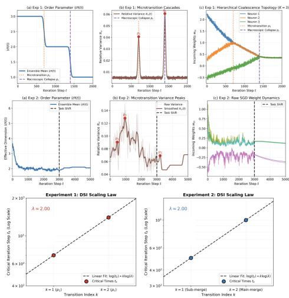  
Figure 1: Topological Condensation and Fragmentation: (Top) Kinematic verification of the theoretical $\lambda = 2 \mathrm { D S I }$ baseline. (Middle & Bottom) Empirical SGD dynamics. The condensation phase $( t < 3 0 0 0 )$ exhibits sequential DSI variance peaks $( p _ { 1 } , p _ { 2 } )$ with a log-linear progression close to $\lambda \approx 2 . 0 0$ (fit through two points; see main text). The task shift at $t = 3 0 0 0$ reverses the stability inequality and is followed by a reactive fragmentation peak $\left( p _ { 3 } \right)$ . Zoom for clarity.

## 7 Related Work

Stochastic Dynamics and Implicit Bias: Traditionally SGD is modeled as driving networks toward low-rank manifolds [Blanc et al., 2020, Nacson et al., 2022, Chen et al., 2023] through anomalous diffusion and glassy dynamics [Baity-Jesi et al., 2018, Geiger et al., 2019, Kunin et al., 2024, Chen et al., 2020]. We instead track the transient path to these manifolds through network percolation on a continuous Reeb graph.

Graph and Percolation Perspectives on Training: Recent work applies percolation tools to training, studying connectivity under dropout [Devlin and Sanders, 2025] or synaptic invariants that forecast performance [Li et al., 2022a]. Our percolation graph is instead constructed from a renormalized Reeb graph (Theorem 4.3) that tracks collapse into shared invariant sets (Definition 3.5), with edges driven by architectural symmetry rather than random deletion or correlation.

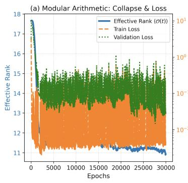

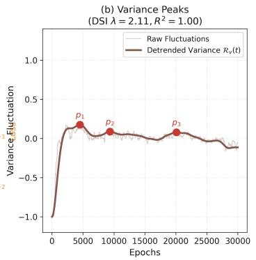

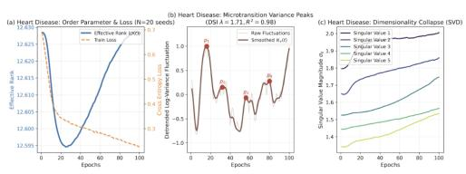

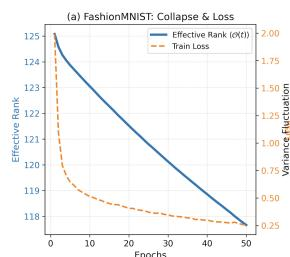

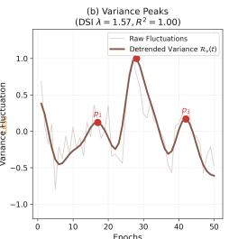  
Figure 2: Universality and Empirical Generalization: (a) Transformer Grokking (Modular Arithmetic): Delayed generalization co-occurring with continuous dimensionality collapse and a log-linear DSI cascade. (b, c) UCI Heart Disease and FMNIST: DSI variance cascades in tabular regression (b) and image classification (c). Extended evaluations are in Appendix F.

Neuron and Weight Condensation: Condensation serves as a complimentary lens on stochastic collapse focusing on initialization scale rather than symmetry. [Luo et al., 2021, Zhou et al., 2022, 2023]. Our mechanism allows to construct an explicit mechanism for the transient dynamics.

## 8 Limitations, Conclusion and Future Work

We formalize SGD’s transient dynamics as a symmetry-induced percolation process and prove it exhibits Discrete Scale Invariance (Theorem 4.7), confirmed exactly in toy models (Appendix E) and consistent with the same cascade across tabular, vision, and grokking settings (Section 6). Future work includes testing whether these discontinuities persist at practical network widths (Corollary C.18), extending the framework to curved invariant manifolds and extreme hyperparameter regimes, and using DSI variance spikes (Rv) to guide learning rate scheduling. The DSI cascade also connects to empirical scaling laws (Remark C.26), suggesting a route to deriving new scaling relations directly from the percolation model. We also provide a preliminary extension for adaptive optimizers in Appendix D, validated through grokking though a systematic study of how this extends to large scale models remains open.

## References

Dimitris Achlioptas, Raissa M D’Souza, and Joel Spencer. Explosive percolation in random networks. Science, 323(5920):1453–1455, 2009.

Marco Baity-Jesi, Levent Sagun, Mario Geiger, Stefano Spigler, and Gerard Ben Arous. Comparing´ dynamics: Deep neural networks versus glassy systems. Journal of Statistical Mechanics, 2018: 033301, 2018.

Guy Blanc, Neha Gupta, Gregory Valiant, and Paul Valiant. Implicit regularization for deep neural networks driven by an ornstein-uhlenbeck like process. In Conference on Learning Theory, pages 483–513. PMLR, 2020.

Gunnar Carlsson. Topology and data. Bulletin ofthe American Mathematical Society, 46(2):255–308, 2009.

Pratik Chaudhari and Stefano Soatto. Stochastic gradient descent performs variational inference, converges to limit cycles for deep networks. In International Conference on Learning Representations, 2018.

Feng Chen, Daniel Kunin, Atsushi Yamamura, and Surya Ganguli. Stochastic collapse: How gradient noise attracts SGD dynamics towards simpler subnetworks. In Thirty-seventh Conference on Neural Information Processing Systems, 2023.

Guozhang Chen, Cheng Qu, and Pulin Gong. Anomalous diffusion dynamics of learning in deep neural networks. arXiv preprint arXiv:2009.10588, 2020.

Wei Chen, Malte Schroder, Raissa M D’Souza, Didier Sornette, and Jan Nagler. Microtransition¨ cascades to percolation. Physical review letters, 112(15):155701, 2014.

Berfin S¸ ims¸ek, Franc¸ois Ged, Arthur Jacot, Francesco Spadaro, Clement Hongler, Wulfram Gerstner,´ and Johanni Brea. Geometry of the loss landscape in overparameterized neural networks: Symmetries and invariances. In Proceedings ofthe 38th International Conference on Machine Learning, volume 139, pages 9722–9732. PMLR, 2021.

Finley Devlin and Jaron Sanders. Dropout neural network training viewed from a percolation perspective. arXiv preprint arXiv:2512.13853, 2025.

Herbert Edelsbrunner and John Harer. Topological persistence and simplification. Discrete & Computational Geometry, 39(1–3):427–463, 2008.

Mark I Freidlin and Alexander D Wentzell. Random perturbations of dynamical systems. Springer Science & Business Media, 2012.

Crispin Gardiner. Stochastic Methods: A Handbookfor the Natural and Social Sciences. Springer Berlin Heidelberg, 2009.

Mario Geiger, Stefano Spigler, Stephane d’Ascoli, Levent Sagun, and Marco Baity-Jesi. The jamming´ transition as a paradigm to understand the loss landscape of deep neural networks. Physical Review E, 100:012115, 2019.

Ian J Goodfellow, Mehdi Mirza, Da Xiao, Aaron Courville, and Yoshua Bengio. An empirical investigation of catastrophic forgetting in gradient-based neural networks. arXiv preprint arXiv:1312.6211, 2013.

Jeff Z HaoChen, Colin Wei, Jason Lee, and Tengyu Ma. Shape matters: Understanding the implicit bias of the noise covariance. In Conference on Learning Theory, pages 2315–2357. PMLR, 2021.

Jordan Hoffmann, Sebastian Borgeaud, Arthur Mensch, Elena Buchatskaya, Trevor Cai, Eliza Rutherford, Diego de Las Casas, Lisa Anne Hendricks, Johannes Welbl, Aidan Clark, et al. Training compute-optimal large language models. In Advances in Neural Information Processing Systems, volume 35, pages 30016–30030, 2022.

Jesse Hoogland, George Wang, Matthew Farrugia-Roberts, Liam Carroll, Susan Wei, and Daniel Murfet. Loss landscape degeneracy and stagewise development in transformers. Transactions on Machine Learning Research, 2024.

Minyoung Huh, Hossein Mobahi, Richard Zhang, Brian Cheung, Pulkit Agrawal, and Phillip Isola. The low-rank simplicity bias in deep networks. Transactions on Machine Learning Research, 2021. URL https://openreview.net/forum?id=3a0Cbtb1Hs.

Jared Kaplan, Sam McCandlish, Tom Henighan, Tom B Brown, Benjamin Chess, Rewon Child, Scott Gray, Alec Radford, Jeffrey Wu, and Dario Amodei. Scaling laws for neural language models. arXiv preprint arXiv:2001.08361, 2020.

Ioannis Karatzas and Steven E. Shreve. Brownian Motion and Stochastic Calculus, volume 113 of Graduate Texts in Mathematics. Springer-Verlag, 2nd edition, 1991.

Diederik P. Kingma and Jimmy Ba. Adam: A method for stochastic optimization. In International Conference on Learning Representations, 2015.

James Kirkpatrick, Razvan Pascanu, Neil Rabinowitz, Joel Veness, Guillaume Desjardins, Andrei A Rusu, Kieran Milan, John Quan, Tiago Ramalho, Agnieszka Grabska-Barwinska, et al. Overcoming catastrophic forgetting in neural networks. Proceedings ofthe national academy ofsciences, 114 (13):3521–3526, 2017.

Daniel Kunin, Javier Sagastuy-Brena, Lauren Gillespie, Eshed Margalit, and Hidenori Tanaka. The˜ limiting dynamics of SGD: Modified loss, phase-space oscillations, and anomalous diffusion. Neural Computation, 36:151–197, 2024.

Qianxiao Li, Cheng Tai, and Weinan E. Stochastic modified equations and adaptive stochastic gradient algorithms. In International Conference on Machine Learning, pages 2101–2110. PMLR, 2017.

Yang Li, Kai Ma, Han Lu, Xin Chen, and Renjie Song. Neural capacitance: A new perspective of neural network selection via edge dynamics. arXiv preprint arXiv:2201.04194, 2022a.

Zhiyuan Li, Tianhao Wang, and Sanjeev Arora. What happens after sgd reaches zero loss? -a mathematical framework. In International Conference on Learning Representations, 2022b.

Ziming Liu, Ouail Kitouni, Niklas Nolte, Eric Michaud, Max Tegmark, and Mike Williams. Towards understanding grokking: An effective theory of representation learning. In Advances in Neural Information Processing Systems, volume 35, pages 34651–34663, 2022.

Ilya Loshchilov and Frank Hutter. Decoupled weight decay regularization. In International Conference on Learning Representations, 2019.

Tao Luo, Zhi-Qin John Xu, Zheng Ma, and Yaoyu Zhang. Phase diagram for two-layer ReLU neural networks at infinite-width limit. Journal ofMachine Learning Research, 22(71):1–47, 2021.

Stephan Mandt, Matthew D Hoffman, and David M Blei. Stochastic gradient descent as approximate bayesian inference. The Journal ofMachine Learning Research, 18(1):4873–4907, 2017.

Takashi Mori, Liu Ziyin, Kangqiao Liu, and Masahito Ueda. Logarithmic landscape and power-law escape rate of SGD. In International Conference on Machine Learning, pages 15959–15978. PMLR, 2022.

Mor Shpigel Nacson, Kavya Ravichandran, Nathan Srebro, and Daniel Soudry. Implicit bias of the step size in linear diagonal neural networks. In International Conference on Machine Learning, pages 16270–16295. PMLR, 2022.

Gregory Naitzat, Andrey Zhitnikov, and Lek-Heng Lim. Topology of data in deep learning. Frontiers in Applied Mathematics and Statistics, 6:554449, 2020.

Neel Nanda, Lawrence Chan, Tom Lieberum, Jess Smith, and Jacob Steinhardt. Progress measures for grokking via mechanistic interpretability. In The Eleventh International Conference on Learning Representations, 2023.

Alan V. Oppenheim and Ronald W. Schafer. Discrete-Time Signal Processing. Prentice Hall, Upper Saddle River, NJ, 3rd edition, 2010.

Athanasios Papoulis and S. Unnikrishna Pillai. Probability, Random Variables, and Stochastic Processes. McGraw-Hill, New York, 4th edition, 2002.

Alethea Power, Yuri Burda, Harri Edwards, Igor Babuschkin, and Vedant Misra. Grokking: Generalization beyond overfitting on small algorithmic datasets. In International Conference on Learning Representations, 2022. URL https://openreview.net/forum?id=9Vrb9D0WI4.

Sai Niranjan Ramachandran and Suvrit Sra. Trees to flows and back: Unifying decision trees and diffusion models. In Forty-third International Conference on Machine Learning, 2026.

Daniel Revuz and Marc Yor. Continuous martingales and Brownian motion, volume 293. Springer Science & Business Media, 1999.

Oliver Riordan and Lutz Warnke. Explosive percolation is continuous. Science, 333:322–324, 2011.

Hannes Risken. The Fokker-Planck Equation: Methods of Solution and Applications. Springer-Verlag, 1996.

Gennady Samorodnitsky and Murad S. Taqqu. Stable Non-Gaussian Random Processes: Stochastic Models with Infinite Variance. Chapman & Hall, New York, 1994.

Andrew M. Saxe, James L. McClelland, and Surya Ganguli. Exact solutions to the nonlinear dynamics of learning in deep linear neural networks. arXiv preprint arXiv:1312.6120, 2013.

Harshay Shah, Kaustubh Tamuly, Aditi Raghunathan, Prateek Jain, and Praneeth Netrapalli. The pitfalls of simplicity bias in neural networks. In Advances in Neural Information Processing Systems, volume 33, pages 9573–9585, 2020.

Didier Sornette. Discrete scale invariance and complex dimensions. Physics Reports, 297(5):239–270, 1998.

Dietrich Stauffer and Ammon Aharony. Introduction to Percolation Theory. Taylor & Francis, 1994.

Vimal Thilak, Etai Littwin, Shuanghai Zhai, Omid Saremi, Roni Joshua, and Leonard Susskind. The slingshot mechanism: An empirical study of adaptive optimizers and the grokking phenomenon. arXiv preprint arXiv:2206.04817, 2022.

Haikun Wei, Jun Zhang, Florent Cousseau, Tomoko Ozeki, and Shun-ichi Amari. Dynamics of learning near singularities in layered networks. Neural Computation, 20(3):813–843, 2008.

Susan Wei, Daniel Murfet, Ming Gong, Huan Li, Jesse Gell-Redman, and Thomas Quella. Deep learning is singular, and that’s good. IEEE Transactions on Neural Networks and Learning Systems, 34(12):10473–10486, 2022.

Jingzhao Zhang, Sai Praneeth Karimireddy, Andreas Veit, Seungyeon Kim, Sashank J. Reddi, Sanjiv Kumar, and Suvrit Sra. Why are adaptive methods good for attention models? In Advances in Neural Information Processing Systems, volume 33, 2020.

Hanxu Zhou, Qixuan Zhou, Tao Luo, Yaoyu Zhang, and Zhi-Qin John Xu. Towards understanding the condensation of neural networks at initial training. In Advances in Neural Information Processing Systems, volume 35, 2022.

Hanxu Zhou, Qixuan Zhou, Zhenyuan Jin, Tao Luo, Yaoyu Zhang, and Zhi-Qin John Xu. Phase diagram of initial condensation for two-layer neural networks. arXiv preprint arXiv:2303.06561, 2023.

Liu Ziyin, Botao Li, James B Simon, and Masahito Ueda. SGD with a constant large learning rate can converge to local maxima. In International Conference on Learning Representations, 2022.

## Contents

Introduction 1   
Stochastic Collapse in SGD 2   
3 Topological Dynamics of SGF via Attractor Equivalence 3   
Percolative Collapse and Discrete Scale Invariance 5   
4.1 Architectural Symmetry and Graph Renormalization 5   
5 Extension to Adam and AdamW 6   
6 Empirical Validation 7   
6.1 Stochastic Condensation and Reactive Fragmentation 8   
6.2 Universality, Grokking, and Benchmark Generalization 8   
7 Related Work 8   
8 Limitations, Conclusion and Future Work 9   
A SDE Formulations and Invariant Sets of Learning Dynamics 15   
A.1 Deriving Stochastic Gradient Flow from SGD 15   
A.2 Invariant Sets of Continuous Processes 15   
B Mechanics of Topological Transitions 17   
B.1 Formalizing the Transverse Process 17   
B.2 Attractor Equivalence 18   
B.3 Constructing the Reeb Topology 20   
C Percolative Collapse and Discrete Scale Invariance 20   
C.1 Approximate Q-Symmetry, Affine Trapping, and Transverse Diffusion 21   
C.2 Constructing the Percolation 22   
C.3 Order Parameter and Microtransitions 24   
C.4 Hyper-Condensation and Generalized Discrete Scale Invariance 26   
D Extension to Adam and AdamW 28   
D.1 State Lift, Symmetry Restriction, and the Gradient Noise Model 28   
D.2 Truncation, Transfer Functions, and the Correlation Stopping Time 29   
D.3 Trapping and the DSI Cascade 31   
E Explicit Theoretical Verification and Toy Models 34   
E.1 Generalization of the Stochastic Collapse Threshold . 34   
E.2 Derivation of the Exact DSI Scaling Factor 36   
E.3 Idealized Hierarchical Coalescence 36   
E.4 Empirical Simulation (K=6) with Task Shift and Reverse Transition 36   
F Extended Empirical Validation Across Diverse Datasets and Architectures 37   
F.1 Methodological Extensions for Empirical Regimes 37   
F.2 UCI Tabular Datasets 39   
F.3 Geometric Manifolds, Vision, and Algorithmic Grokking 39

## A SDE Formulations and Invariant Sets of Learning Dynamics

To analyze the transient dynamics of stochastic collapse, we formalize the relationship between discrete Stochastic Gradient Descent (SGD) and continuous Stochastic Gradient Flow (SGF). We then formally define invariant sets for these continuous processes and prove that affine invariant sets in SGD strictly translate to SGF. We adapt this section from Chen et al. [2023].

## A.1 Deriving Stochastic Gradient Flow from SGD

Recall the standard SGD update rule. At iteration t, optimizing a network parameterized by $\pmb \theta \in \mathbb { R } ^ { d }$ with learning rate η over a mini-batch $B _ { t }$ of size $\beta$ drawn from a dataset of size N yields:

$$
\pmb \theta _ { t + 1 } = \pmb \theta _ { t } - \frac { \eta } { \beta } \sum _ { i \in \mathcal { B } _ { t } } \nabla \ell ( \pmb \theta _ { t } ; x _ { i } , y _ { i } ) .
$$

We factorize the right-hand side to explicitly isolate the exact full-batch population gradient $\nabla \mathcal { L } ( \pmb \theta _ { t } )$ from the zero-mean mini-batch deviation:

$$
\pmb \theta _ { t + 1 } = \pmb \theta _ { t } - \eta \nabla \mathcal L ( \pmb \theta _ { t } ) - \sqrt { \eta } \left( \sqrt { \eta } \frac { 1 } { \beta } \sum _ { i \in { \cal B } _ { t } } \left( \nabla \ell ( \pmb \theta _ { t } ; x _ { i } , y _ { i } ) - \nabla \mathcal L ( \pmb \theta _ { t } ) \right) \right) .
$$

Let $\xi _ { B } ( \pmb \theta )$ represent the gradient noise at position θ. Assuming we sample mini-batches with replacement, we disentangle this batch noise into a sum of independent, identically distributed per-sample gradient deviations: $\begin{array} { r } { \xi _ { B } ( \pmb { \theta } ) = \frac { \sqrt { \eta } } { \beta } \sum _ { i \in \mathcal { B } _ { t } } \xi _ { i } } \end{array}$ , where $\xi _ { i } = \nabla \ell ( \pmb \theta ; x _ { i } , y _ { i } ) - \nabla \mathcal L ( \pmb \theta )$ . By definition, the expectation $\mathbb { E } [ \xi _ { i } ( \pmb { \theta } ) ] = 0$ for all θ.

Assuming these gradient noises accumulate as Gaussian random variables, we approximate the discrete step as:

$$
\Delta \pmb { \theta } _ { t } = - \eta \nabla \mathcal { L } ( \pmb { \theta } _ { t } ) + \sqrt { 2 D ( \pmb { \theta } _ { t } ) } \Delta W ,
$$

where $\Delta W \sim \mathcal { N } ( 0 , \eta I )$ and the diffusion matrix defines as $\begin{array} { r } { D ( \pmb \theta ) = \frac 1 2 \mathrm { V a r } ( \xi _ { B } ) = \frac { \eta } { 2 \beta } \mathrm { V a r } ( \xi _ { i } ) } \end{array}$ . This discrete step functions as the Euler-Maruyama discretization of the following continuous-time Itoˆ Stochastic Differential Equation (SDE), which we formally denote as Stochastic Gradient Flow (SGF):

$$
d \pmb { \theta } _ { t } = - \nabla \mathcal { L } ( \pmb { \theta } _ { t } ) d t + \sqrt { 2 D ( \pmb { \theta } _ { t } ) } d B _ { t } , \quad \pmb { \theta } _ { 0 } = \pmb { \theta } ( 0 ) .
$$

We express the position-dependent diffusion matrix exactly as:

$$
D ( \pmb \theta _ { t } ) = \frac { \eta } { 2 \beta } \left( \frac { 1 } { N } \sum _ { i = 1 } ^ { N } \left( \nabla \ell ( \pmb \theta _ { t } ; x _ { i } , y _ { i } ) - \nabla \mathcal { L } ( \pmb \theta _ { t } ) \right) \left( \nabla \ell ( \pmb \theta _ { t } ; x _ { i } , y _ { i } ) - \nabla \mathcal { L } ( \pmb \theta _ { t } ) \right) ^ { \top } \right) .
$$

This formulation explicitly decomposes the diffusion matrix into a product of a parameter-independent magnitude scalar $D _ { m }$ and a parameter-dependent shape matrix $D _ { s } ( \pmb \theta )$ such that $D ( \pmb \theta _ { t } ) = D _ { m } D _ { s } ( \pmb \theta _ { t } )$ , where:

$$
\begin{array} { c } { \displaystyle D _ { m } = \frac { \eta } { 2 \beta } \mathrm { , } } \\ { \displaystyle D _ { s } ( \pmb { \theta } ) = \frac { 1 } { N } \sum _ { i = 1 } ^ { N } \Big ( \nabla \ell ( \pmb { \theta } _ { t } ; x _ { i } , y _ { i } ) - \nabla \mathcal { L } ( \pmb { \theta } _ { t } ) \Big ) \Big ( \nabla \ell ( \pmb { \theta } _ { t } ; x _ { i } , y _ { i } ) - \nabla \mathcal { L } ( \pmb { \theta } _ { t } ) \Big ) ^ { \top } . } \end{array}
$$

Optimization hyperparameters, specifically learning rate and batch size, strictly control the scalar magnitude $D _ { m }$ . Conversely, the network architecture, training dataset, and loss topology completely dictate the geometric shape $D _ { s } ( \pmb \theta )$ .

## A.2 Invariant Sets of Continuous Processes

To mathematically track how trajectories collapse, we formalize the topological regions that permanently trap optimization dynamics.

Definition A.1 (Invariant Sets of Continuous Processes). For a given stochastic process $\{ \pmb { \theta } _ { t } \in \mathbb { R } ^ { d }$ $t \geq 0 \}$ , a Borel-measurable set $A \subset  { \mathbb { R } } ^ { d }$ acts as an invariant set if, for every initial point $\pmb { \theta } _ { 0 }$ strictly inside A, the probability that the process remains in A for all subsequent time $t \geq 0$ equals 1. Formally:

$$
P \big [ \pmb \theta _ { t } \in \cal A \mathrm { \ f o r \ a l l \ } t \geq 0 \mid \pmb \theta _ { 0 } \in \cal A \big ] = 1 .
$$

Proposition A.2 (Affine Invariance Transfer). Consider a discrete SGD process given by Equation A.1, where the individual sample gradients $\nabla \ell ( \cdot ; x _ { i } , y _ { i } ) : \mathbb { R } ^ { d } \to \mathbb { R } ^ { d }$ remain Lipschitz continuous and boundedfor any $i \in [ N ]$ ]. Ifan affine subset $A \subseteq \mathbb { R } ^ { d }$ forms an invariant set for this discrete SGD process, then A also forms a strict invariant set for the continuous SGF process given by Equation A.1.

Proof. By our foundational assumption, the individual sample gradients act as L-Lipschitz continuous in θ and remain bounded such that $\| \nabla \ell ( \pmb \theta ; x _ { i } , y _ { i } ) \| \le ^ { \cdot } L$ for some constant $L \ > \ 0$ . We first demonstrate that the population gradient $\nabla { \mathcal { L } } ( \theta )$ inherits these exact structural properties. Bounding the difference yields:

$$
\| \nabla \mathcal { L } ( \pmb { \theta } _ { 1 } ) - \nabla \mathcal { L } ( \pmb { \theta } _ { 2 } ) \| = \left\| \frac { 1 } { N } \sum _ { i = 1 } ^ { N } \Big ( \nabla \ell ( \pmb { \theta } _ { 1 } ; x _ { i } , y _ { i } ) - \nabla \ell ( \pmb { \theta } _ { 2 } ; x _ { i } , y _ { i } ) \Big ) \right\| \leq L \| \pmb { \theta } _ { 1 } - \pmb { \theta } _ { 2 } \| .
$$

Similarly, the global norm remains bounded by $\begin{array} { r } { \| \nabla \mathcal { L } ( \pmb { \theta } ) \| \leq \frac { 1 } { N } \sum _ { i = 1 } ^ { N } \| \nabla \ell ( \pmb { \theta } ; x _ { i } , y _ { i } ) \| \leq L } \end{array}$

We define the centered sample loss function as ${ \bar { \ell } } ( \pmb \theta ; x _ { i } , y _ { i } ) = \ell ( \pmb \theta ; x _ { i } , y _ { i } ) - \mathcal L ( \pmb \theta )$ . Applying the triangle inequality reveals that the corresponding gradient $\nabla \ell ( \cdot ; x _ { i } , y _ { i } )$ operates as 2L-Lipschitz continuous and remains bounded by 2L for any index $i \in [ N ]$ . We evaluate the element-wise difference between the diffusion matrices $D ( \pmb \theta _ { 1 } )$ and $D ( \pmb { \theta } _ { 2 } )$ for any matrix indices l and $m ,$ where $\partial _ { l }$ denotes the l-th partial derivative:

$$
\begin{array} { l } { \displaystyle | D _ { l m } ( \theta _ { 1 } ) - D _ { l m } ( \theta _ { 2 } ) | = \left| \frac { 1 } { N } \sum _ { i = 1 } ^ { N } \left( \partial _ { l } \bar { \ell } ( \theta _ { 1 } ; x _ { i } , y _ { i } ) \partial _ { m } \bar { \ell } ( \theta _ { 1 } ; x _ { i } , y _ { i } ) - \partial _ { l } \bar { \ell } ( \theta _ { 2 } ; x _ { i } , y _ { i } ) \partial _ { m } \bar { \ell } ( \theta _ { 2 } ; x _ { i } , y _ { i } ) \right) \right| } \\ { \displaystyle \qquad \leq \frac { 1 } { N } \sum _ { i = 1 } ^ { N } 2 L \Big ( | \partial _ { l } \bar { \ell } ( \theta _ { 1 } ; x _ { i } , y _ { i } ) | + | \partial _ { m } \bar { \ell } ( \theta _ { 2 } ; x _ { i } , y _ { i } ) | \Big ) | \theta _ { 1 } - \theta _ { 2 } | | } \\ { \displaystyle \qquad \leq 4 L ^ { 2 } \| \theta _ { 1 } - \theta _ { 2 } | . } \end{array}
$$

This element-wise bound dictates that the operator norm satisfies $\lVert D ( \pmb \theta _ { 1 } ) - D ( \pmb \theta _ { 2 } ) \rVert _ { \infty } \leq 4 L ^ { 2 } \lVert \pmb \theta _ { 1 } -$ $\pmb { \theta } _ { 2 } \|$ . Applying the Powers-Stormer inequality, we connect this operator norm to the Frobenius norm $\| \cdot \| _ { F }$ and the Schatten 1-norm $\| \cdot \| _ { 1 }    \colon$

$$
\begin{array} { r } { \| D ( \pmb \theta _ { 1 } ) - D ( \pmb \theta _ { 2 } ) \| _ { F } \leq \sqrt { d } \| D ( \pmb \theta _ { 1 } ) - D ( \pmb \theta _ { 2 } ) \| _ { 1 } \leq d \| D ( \pmb \theta _ { 1 } ) - D ( \pmb \theta _ { 2 } ) \| _ { \infty } . } \end{array}
$$

Consequently, the diffusion matrix $D ( \pmb \theta )$ functions as Lipschitz continuous with respect to the Frobenius norm. Combined with the established Lipschitz drift term, this rigorous continuity guarantees the existence of a unique strong solution to the SDE in Equation A.1.

It now suffices to prove that this continuous SDE possesses a solution $\{ \pmb \theta _ { t } : t \geq 0 \}$ that satisfies the invariant probability condition from Equation A.1. We define $P : \mathbb { R } ^ { d }  \mathbb { R } ^ { d }$ as the orthogonal projection operator mapping onto the affine subset A and construct an auxiliary projected SDE:

$$
d \tilde { \pmb { \theta } } _ { t } = - P \nabla \mathcal { L } ( \tilde { \pmb { \theta } } _ { t } ) d t + P \sqrt { 2 D ( \tilde { \pmb { \theta } } _ { t } ) d B _ { t } } .\tag{8}
$$

By direct construction, this projected system uniquely confines its solution $\tilde { { \boldsymbol { \theta } } } _ { t }$ strictly within A, perfectly satisfying the invariance condition. Furthermore, because A operates as an invariant set for the original discrete SGD process, the discrete sample gradients perfectly align with the affine subspace. Mathematically, $P \nabla \mathcal { \ell } ( \pmb { \theta } ; x _ { i } , y _ { i } ) = \nabla \mathcal { \ell } ( \pmb { \theta } ; x _ { i } , \hat { y } _ { i } )$ for all indices $i \in { \dot { B } }$ and all points $\theta \in A$ This geometric alignment forces the projected SDE to match the original, unprojected SDE almost surely. Hence, we conclude that the affine subset A fundamentally acts as a strict invariant set for the continuous SGF process. □

## B Mechanics of Topological Transitions

Following the subnetwork partition and Block-Diagonal Dominance (Definition 3.1 and Assumption 3.2) established in the main text, we mathematically isolate the local dynamics. Because the low-rank simplicity bias strictly bounds the cross-covariance $( \| \Sigma _ { i j } ( \pmb { \theta } ) \| _ { 2 } \leq \delta )$ , we can rigorously construct conditionally independent marginal path measures $\boldsymbol { \mu } ^ { ( i ) }$ for each subnetwork over the measurable function space $( C \big ( [ 0 , \infty ) , \mathbb { R } ^ { d _ { i } } \big ) , B )$ , valid strictly prior to the collapse.

To formalize how these independent path measures structurally bind, we project the local SDEs into a shared quotient space by rigorously defining the transverse geometry.

## B.1 Formalizing the Transverse Process

Definition B.1 (Transverse Distance Process). Let $A \subset  { \mathbb { R } } ^ { d }$ define an invariant manifold. Define the orthogonal projection operator $\pi _ { A } : \mathbb { R } ^ { d }  A$ We establish a local tubular neighborhood $\mathcal { N } ( A , \epsilon ) \overset {  } { = } \{ \pmb { \theta } \in \mathbb { R } ^ { d } : \lVert \pmb { \theta } - \dot { \pi } _ { A } ( \pmb { \theta } ) \rVert _ { 2 } < \epsilon \}$ wherein this projection remains uniquely defined. Within this boundary, we map the local dynamics into the quotient space $\mathbb { R } ^ { d } / A$ by continuously tracking the squared transverse distance functional for the i-th subnetwork:

$$
Y _ { t } ^ { ( i ) } = \| \pmb { \theta } _ { t } ^ { ( i ) } - \pi _ { A } ( \pmb { \theta } _ { t } ^ { ( i ) } ) \| _ { 2 } ^ { 2 } .\tag{9}
$$

Mechanically, stochastic attractivity pulls the inward deterministic gradient to overcome the transverse diffusion. We map this directly to the infinitesimal generator $\mathcal { A }$ of the SDE. Applying Ito’s Lemmaˆ to the functional $Y _ { t } ^ { ( i ) }$ expands the generator as:

$$
\mathcal { A } \boldsymbol { Y } _ { t } ^ { ( i ) } = - 2 \left( \boldsymbol { \theta } _ { t } ^ { ( i ) } - \pi _ { A } ( \boldsymbol { \theta } _ { t } ^ { ( i ) } ) \right) ^ { \top } \nabla _ { \boldsymbol { \theta } ^ { ( i ) } } \mathcal { L } ( \boldsymbol { \theta } _ { t } ) + \eta \mathrm { T r } ( \Sigma _ { i i } ( \boldsymbol { \theta } _ { t } ) ) .\tag{10}
$$

Lemma B.2 (Boundedness of the Stopped Transverse Process). Suppose $\theta _ { t }$ solves the SDE in Equation A.1 with (locally) Lipschitz coefficients, so that it admits a strong solution with almost surely continuous sample paths. Then $Y _ { t } ^ { ( i ) } = \| \pmb { \theta } _ { t } ^ { ( i ) } - \pi _ { A } ( \pmb { \theta } _ { t } ^ { ( i ) } ) \| _ { 2 } ^ { 2 }$ is a continuousfunctional $o f \pmb { \theta } _ { t } ^ { ( i ) }$ and consequently the stopped process satisfies

$$
Y _ { s \wedge \tau _ { \epsilon } } ^ { ( i ) } \in [ 0 , \epsilon ] \quad a . s . ~ f o r ~ a l l ~ s \geq t _ { 0 } .\tag{11}
$$

Proof. Continuity of $\pmb { \theta } _ { t } ^ { ( i ) }$ and of the projection $\pi _ { A }$ (which is a constant linear map on the affine set A, by Theorem C.2) imply $Y _ { t } ^ { ( i ) }$ is a.s. continuous in t. By definition $\tau _ { \epsilon } = \operatorname* { i n f } \{ t \geq t _ { 0 } : Y _ { t } ^ { ( i ) } \geq \epsilon \}$ ; continuity of the path forces $Y _ { t } ^ { ( i ) } < \epsilon$ for $t < \tau _ { \epsilon }$ and ${ Y _ { \tau _ { \epsilon } } ^ { ( i ) } = \epsilon }$ whenever $\tau _ { \epsilon } < \infty - \mathbf { a }$ continuous path cannot jump over the boundary. Hence $Y _ { s \wedge \tau _ { \epsilon } } ^ { ( i ) } \le \epsilon$ for every s, and non-negativity of $Y ^ { ( i ) }$ gives the lower bound. □

Theorem B.3 (Local Supermartingale Trapping). Given a stochastically attractive invariant set $A ,$ there exists an $\epsilon > 0$ defining the basin $\mathcal { N } ( A , \epsilon )$ such that the stopped transverse process $Y _ { t \wedge \tau _ { \epsilon } } ^ { ( i ) }$ operates as a strictly non-negative local supermartingale, where $\tau _ { \epsilon } = \operatorname* { i n f } \{ t \geq t _ { 0 } : Y _ { t } ^ { ( i ) } \geq \epsilon \}$ marks the exact boundary ofescape.

Proof. Let A be a stochastically attractive manifold. By Definition 2.4, stochastic attractivity structurally enforces that the inward deterministic drift explicitly dominates the outward trace of the diffusion matrix within the ϵ-neighborhood $\mathcal { N } ( A , \epsilon )$ . Consequently, the infinitesimal generator from Equation 10 is mathematically constrained to remain non-positive $( \mathcal { A } Y _ { t } ^ { ( i ) } \le 0 )$ prior to the stopping time $\tau _ { \epsilon }$

Applying Ito’s formula to the stopped processˆ $Y _ { t \wedge \tau } ^ { ( i ) }$ decomposes the trajectory into a Lebesgue drift integral and a stochastic integral:

$$
Y _ { t \wedge \tau _ { \epsilon } } ^ { ( i ) } = Y _ { t _ { 0 } } ^ { ( i ) } + \int _ { t _ { 0 } } ^ { t \wedge \tau _ { \epsilon } } \mathcal { A } Y _ { s } ^ { ( i ) } d s + \int _ { t _ { 0 } } ^ { t \wedge \tau _ { \epsilon } } \nabla Y _ { s } ^ { ( i ) } \cdot \Sigma _ { i i } ^ { 1 / 2 } ( \pmb { \theta } _ { s } ) d W _ { s } ^ { ( i ) } .\tag{12}
$$

Because $\mathcal { A } Y _ { s } ^ { ( i ) } \le 0$ , the Lebesgue integral continuously accumulates strictly non-positive drift. By Lemma B.2, the stopped process $\smash { Y _ { s \wedge \tau } ^ { ( i ) } }$ is uniformly bounded by ϵ for every s; since $\nabla Y$ is Lipschitz on the compact closure $\overline { { \mathcal { N } ( A , \epsilon ) } }$ and $\Sigma _ { i i } ( \pmb \theta )$ is bounded there by Assumption 3.2, the integrand $\nabla Y _ { s } ^ { ( i ) } \cdot \Sigma _ { i i } ^ { 1 / 2 } ( \pmb { \theta } _ { s } )$ is uniformly bounded on $[ t _ { 0 } , s \wedge \tau _ { \epsilon } ]$ . A stochastic integral with a bounded, progressively measurable integrand over a horizon of finite expected length is a genuine $L ^ { 2 }$ -martingale rather than only a local one [Karatzas and Shreve, 1991]; in particular it is uniformly integrable, so taking the conditional expectation $\mathbb { E } [ \cdot \mid \mathcal { F } _ { t } ]$ exactly annihilates it without any further localization argument. This leaves only the non-positive accumulated drift, rigorously enforcing the condition:

$$
\mathbb { E } \left[ Y _ { ( t + s ) \wedge \tau _ { \epsilon } } ^ { ( i ) } \middle | \mathcal { F } _ { t } \right] \leq Y _ { t \wedge \tau _ { \epsilon } } ^ { ( i ) } .\tag{13}
$$

Since $Y _ { t } ^ { ( i ) }$ measures a squared distance, it is inherently bounded below by 0. Thus, $Y _ { t \wedge \tau _ { \epsilon } } ^ { ( i ) }$ constitutes a non-negative supermartingale. □

Corollary B.4 (Probabilistic Non-Escape). For any stochastically attractive invariant set A, the probability ofa trajectory initialized at $\pmb { \theta } _ { 0 }$ escaping the ϵ-neighborhood is strictly bounded by the initial transverse distance.

Proof. By Theorem B.3, the stopped transverse process $Y _ { s \wedge \tau _ { \bullet } } ^ { ( i ) }$ operates as a continuous, non-negative local supermartingale for all $s \geq t _ { 0 }$ . We apply Doob’s maximal inequality for continuous supermartingales [Revuz and Yor, 1999] to strictly bound the tail probability of the process’s supremum:

$$
\mathbb { P } \left( \operatorname* { s u p } _ { s \geq t _ { 0 } } Y _ { s \wedge \tau _ { \epsilon } } ^ { ( i ) } \geq \epsilon \bigg | \mathcal { F } _ { t _ { 0 } } \right) \leq \frac { 1 } { \epsilon } \mathbb { E } \left[ Y _ { t _ { 0 } } ^ { ( i ) } \mid \mathcal { F } _ { t _ { 0 } } \right] .\tag{14}
$$

The measure-theoretic event $\left\{ \operatorname* { s u p } _ { s \geq t _ { 0 } } Y _ { s \wedge \tau _ { \epsilon } } ^ { ( i ) } \geq \epsilon \right\}$ algebraically identifies the precise physical escape event $\{ \tau _ { \epsilon } ^ { \left( i \right) } < \infty \}$ . This establishes the probabilistic non-escape bound directly from the supermartingale property. □

## B.2 Attractor Equivalence

To formally map the structural equivalence of decoupled subnetworks, we must define the precise mathematical conditions under which independent stochastic trajectories permanently synchronize.

Definition B.5 (Path Space and Tail σ-Algebra). Let the restricted path space C denote the space of all continuous functions from $[ 0 , \infty )$ to R. For a subnetwork’s transverse process $Y ^ { ( i ) }$ , define the canonical filtration $\{ \mathcal { F } _ { t } \} _ { t \ge 0 }$ . We formally define the tail σ-algebra at time t, denoted $\mathcal { F } _ { \geq t }$ , as the σ-algebra generated by the process from time t onward: $\mathcal { F } _ { \geq t } = \sigma ( \{ Y _ { s } ^ { ( i ) } : s \geq t \} )$ ). This construct rigorously encapsulates all measure-theoretic information regarding the future evolution of the trajectory.

Definition B.6 (t-Tail Equivalence). [Ramachandran and Sra, 2026] Let $\mu ^ { ( i ) }$ and $\mu ^ { ( j ) }$ denote the marginal path measures of the transverse processes $Y ^ { ( i ) }$ and $Y ^ { ( j ) }$ , respectively. We define two decoupled subnetworks $\pmb \theta ^ { ( i ) }$ and $\pmb \theta ^ { ( j ) }$ as exhibiting t-tail equivalence if they map to the exact same invariant manifold A, and their probability laws evaluate identically when strictly restricted to the tail σ-algebra $\mathcal { F } _ { \geq t }$ . Formally, for any future event $E \in { \mathcal { F } } _ { \geq t }$ , we require $\mu ^ { ( i ) } ( E ) = \dot { \mu } ^ { ( j ) } ( E )$

While t-tail equivalence mathematically dictates an ideal coupling, transient training due to noise injection rendering this strict measure-theoretic equality difficult to attain across finite time horizons. Trajectories often experience variance and outward drift. To capture stochastic collapse within a realistic training landscape,we relax the requirement of absolute tail equality into a metastable probabilistic equivalence, strictly conditioned on the trajectories remaining trapped near a shared invariant manifold A.

Our strategy builds this generalized equivalence sequentially. We replace the strict tail equality constraint with a conditional survival requirement governed by the spatial escape time $\tau _ { \epsilon } ^ { \left( i \right) } = \operatorname* { i n f } \{ s \geq$ $t : Y _ { s } ^ { ( i ) } \geq \epsilon \}$ which demands that the trajectories synchronize with absolute certainty provided they survive within the local basin $\mathcal { N } ( A , \epsilon )$ . We first quantify this localized survival by defining the joint link probability.

Definition B.7 (Attractor Link Probability). We define the joint abstract link probability $\mathcal { P } _ { l i n k } ^ { ( i , j ) } ( t )$ as the conditional probability that neither subnetwork physically breaches the critical boundary of the local basin $\mathcal { N } ( \bar { \boldsymbol { A } } , \epsilon )$ from time t onward. Equivalently, this measures the strict joint survival of the trajectories:

$$
\mathcal { P } _ { l i n k } ^ { ( i , j ) } ( t ) : = \mathbb { P } \left( \tau _ { \epsilon } ^ { ( i ) } = \infty \cap \tau _ { \epsilon } ^ { ( j ) } = \infty \mid \mathcal { F } _ { t } \right) = \mathbb { P } \left( \underset { s \geq t } { \operatorname* { s u p } } \operatorname* { m a x } \left( Y _ { s } ^ { ( i ) } , Y _ { s } ^ { ( j ) } \right) < \epsilon \middle | \mathcal { F } _ { t } \right) .\tag{15}
$$

To construct a robust equivalence relation from this probability, we must prove that the trajectories can mathematically resist the outward Brownian drift. We structurally bound the individual escape events by deploying the local supermartingale dynamics established in Theorem 3.3.

Lemma B.8 (Maximal Link Bound). Given an instantaneous state safely confined within the local basin $( Y _ { t } ^ { ( i ) } < \epsilon )$ , the marginal link probability strictly satisfies thefollowing lower bound:

$$
\mathbb { P } ( \tau _ { \epsilon } ^ { ( i ) } = \infty \mid \mathcal { F } _ { t } ) \ge 1 - \frac { \mathbb { E } [ Y _ { t } ^ { ( i ) } \mid \mathcal { F } _ { t } ] } { \epsilon } .\tag{16}
$$

Proof. By Theorem B.3, stochastic attractivity actively suppresses transverse diffusion, forcing the stopped transverse process $Y _ { s \wedge \tau _ { \mathrm { ~ * ~ } } } ^ { ( i ) }$ to operate as a continuous, non-negative local supermartingale for all $s \geq t$ . We apply Doob’s maximal inequality for continuous supermartingales [Revuz and Yor, 1999] to strictly bound the tail probability of the process’s supremum:

$$
\mathbb { P } \left( \operatorname* { s u p } _ { s \geq t } Y _ { s \wedge \tau _ { \epsilon } } ^ { ( i ) } \geq \epsilon \bigg | \mathcal { F } _ { t } \right) \leq \frac { 1 } { \epsilon } \mathbb { E } [ Y _ { t } ^ { ( i ) } \mid \mathcal { F } _ { t } ] .\tag{17}
$$

The measure-theoretic event $\left\{ \operatorname* { s u p } _ { s \geq t } Y _ { s \wedge \tau _ { \epsilon } } ^ { ( i ) } \geq \epsilon \right\}$ algebraically identifies the precise physical escape event $\{ \tau _ { \epsilon } ^ { \left( i \right) } < \infty \}$ . Because the marginal link probability $\mathbb { P } ( \tau _ { \epsilon } ^ { ( i ) } = \infty \mid \mathcal { F } _ { t } )$ represents the exact mathematical complement of this divergence event, subtracting the maximal upper bound from absolute certainty (1) directly yields the rigorous lower bound for survival. □

Armed with this maximal survival bound, we finalize our generalization. We define two subnetworks as structurally equivalent when their transverse drifts vanish sufficiently to drive the joint link probability to certainty, effectively recovering t-tail equivalence but strictly localized to the invariant set A.

Definition B.9 (Attractor Equivalence, $\sim _ { A } )$ . We define two subnetworks as Attractor Equivalent $( \pmb { \theta } ^ { ( i ) } \sim _ { A } \pmb { \theta } ^ { ( j ) } )$ at time t if and only if their joint path measures permanently couple as the transverse drift vanishes:

$$
\operatorname* { l i m } _ { \mathbb { E } [ Y _ { t } ^ { ( i ) } + Y _ { t } ^ { ( j ) } | \mathcal { F } _ { t } ]  0 } \mathcal { P } _ { l i n k } ^ { ( i , j ) } ( t ) = 1 .\tag{18}
$$

Finally, we prove that this noise-robust generalization preserves the rigorous algebraic structure of an equivalence class over the restricted path measures, conditionally bounded by the physical basin.

Theorem B.10 (Metastable Equivalence). The relation $\sim { } A$ establishes a rigorous equivalence class over the restricted path measures, conditionally bounded by the spatial persistence ofthe local basin $\mathcal { N } ( A , \epsilon )$

Proof. Reflexivity $( \pmb \theta ^ { ( i ) } \sim _ { A } \pmb \theta ^ { ( i ) } )$ and symmetry $( \pmb \theta ^ { ( i ) } \sim _ { A } \pmb \theta ^ { ( j ) } \implies \pmb \theta ^ { ( j ) } \sim _ { A } \pmb \theta ^ { ( i ) } )$ follow inherently from the algebraic properties of the shared orthogonal projection $\pi _ { A }$

To formally prove transitivity $( \pmb \theta ^ { ( i ) } \sim _ { A } \pmb \theta ^ { ( j ) }$ and $\pmb { \theta } ^ { ( j ) } \sim _ { A } \pmb { \theta } ^ { ( k ) } \implies \pmb { \theta } ^ { ( i ) } \sim _ { A } \pmb { \theta } ^ { ( k ) } )$ , we analyze the intersection of their survival events. By Lemma B.8, as the expected transverse distances continuously approach zero $( \mathbb { E } [ Y _ { t } ]  0 )$ , the supermartingale dynamics mechanically force the maximal bound to shrink, causing the marginal escape probabilities $\operatorname { \mathbb { P } } ( \tau _ { \epsilon } < \infty \mid \mathcal F _ { t } )$ to completely vanish.

Applying the union bound to these individual escape events logically guarantees that the joint escape probability also collapses strictly to zero. Consequently, the mathematical complement which is -the intersection of their survival events almost surely converges to 1. Thus, provided $\tau _ { \epsilon }$ remains untriggered by injected large deviation noise, the continuous trajectories transitively bind to the exact same invariant set, completely satisfying the equivalence definition. □

## B.3 Constructing the Reeb Topology

Now, we map the equivalences onto a discrete spatial graph, using the equivalence relation strictly as an adjacency matrix.

Definition B.11 (The ϵ-Fixed Topological Network). At any fixed training time $t \in [ 0 , \infty )$ and spatial boundary $\epsilon > 0 .$ , define the instantaneous spatial network $G _ { t } ^ { \epsilon } = ( \bar { S } , E _ { t } ^ { \epsilon } )$ . The node set $\bar { \cal S } = \{ 1 , \ldots , K \}$ indexes the decoupled subnetworks. The equivalence relation $\sim _ { A }$ operates as the exact Boolean adjacency function, writing an undirected edge $e _ { i j } \in E _ { t } ^ { \epsilon }$ if and only if $\pmb \theta ^ { ( i ) } \sim _ { A } \pmb \theta ^ { ( j ) }$ holds.

This ϵ-fixed network captures purely instantaneous connectivity. To model stochastic collapse, we must track how this network dynamically rewires across training time. We achieve this by elevating the discrete spatial networks into a continuous topological space.

Definition B.12 (Continuous Reeb Graph). We define the macroscopic topological state of the neural network as the Reeb graph $\mathcal { R } _ { : }$ , constructed rigorously as the quotient space over the product of the subnetwork indices and time:

$$
\mathcal { R } : = \left( \mathcal { S } \times [ 0 , \infty ) \right) / \sim _ { \mathcal { R } }\tag{19}
$$

where the algebraic identification $\left( i , t \right) \sim _ { \mathcal { R } } \left( j , t \right)$ holds if and only if the edge $e _ { i j }$ exists in $G _ { t } ^ { \epsilon }$

Theorem B.13 (Non-Equilibrium Condensation and Fragmentation). The Reeb graph R dynamically maps the structural phase transitions ofthe SDE via two strict topological mechanisms:

• Condensation (∪): As transverse drift vanishes, the quotient map algebraicallyfuses distinct path measures, forming an edge in $G _ { t } ^ { \epsilon }$ and collapsing the temporal trajectories into a single topological merge node on $\mathcal { R }$

• Fragmentation (∅): If an injected variance deviation physically breaches the basin $\mathcal { N } ( A , \epsilon )$ the edge in $G _ { t } ^ { \epsilon }$ instantly deletes. The quotient map shatters the unified equivalence class, forcing the node to abruptly split into decoupled branches on $\mathcal { R }$

Proof. We create a bijection between the stochastic SDE dynamics directly to the topological level sets of R [Edelsbrunner and Harer, 2008].

For condensation, let the transverse drift vanish: E $[ Y _ { t } ^ { ( i ) } + Y _ { t } ^ { ( j ) } \mid { \mathcal { F } } _ { t } ]  0$ . Lemma B.8 algebraically degrades the marginal escape probabilities:

$$
\mathbb { P } ( \tau _ { \epsilon } ^ { ( i ) } < \infty \mid \mathcal { F } _ { t } ) \le \frac { \mathbb { E } [ Y _ { t } ^ { ( i ) } \mid \mathcal { F } _ { t } ] } { \epsilon }  0 .\tag{20}
$$

This bounds the joint link probability to absolute certainty $( \mathcal { P } _ { l i n k } ^ { ( i , j ) } ( t ) \to 1 )$ , rigorously satisfying $\pmb \theta ^ { ( i ) } \sim _ { A } \pmb \theta ^ { ( j ) }$ . The adjacency function updates to $e _ { i j } = 1$ in $G _ { t } ^ { \epsilon }$ . The continuous quotient projection $\pi _ { \mathcal { R } } : S \times [ 0 , \infty ) \to \dot { \mathcal { R } }$ algebraically identifies $( i , t ) ^ { \ J } \sim _ { \mathcal { R } } \left( j , t \right)$ , fusing the independent path measures into a single topological merge vertex $v \in \mathcal { R }$ with in-degree(v) ≥ 2.

For fragmentation, let a stochastic large deviation [Freidlin and Wentzell, 2012] breach the local basin $\check { \mathcal { N } } ( A , \epsilon )$ . This physical exit guarantees the spatial stopping time:

$$
\exists s \in ( t - \delta , t ] \operatorname { s . t . } \operatorname* { m a x } \left( Y _ { s } ^ { ( i ) } , Y _ { s } ^ { ( j ) } \right) \geq \epsilon \implies \tau _ { \epsilon } \leq t .\tag{21}
$$

The joint survival event instantly collapses $( \mathcal { P } _ { l i n k } ^ { ( i , j ) } ( t ) = 0 \ll 1 )$ , severing the equivalence relation $( { \pmb \theta } ^ { ( i ) } \ \mathcal { X } _ { A } \ { \pmb \theta } ^ { ( j ) } )$ and deleting the edge $e _ { i j } = 0$ from $G _ { t } ^ { \epsilon }$ . The quotient map forcibly disjoints the previously unified equivalence class $( [ i ] _ { t } \cap [ j ] _ { t } = \emptyset )$ , partitioning the trajectory into a critical split vertex $v \in \mathcal R$ with out-degree $( v ) \geq 2$ □

## C Percolative Collapse and Discrete Scale Invariance

We first bridge the geometric symmetries of the non-convex loss landscape with the statistical mechanics of explosive percolation. We then show demonstrate how the invariant sets generated by network symmetries restrict collapse, breaking continuous scale invariance and causing the the macroscopic network to show Generalized Discrete Scale Invariance (DSI).

## C.1 Approximate Q-Symmetry, Affine Trapping, and Transverse Diffusion

In deep neural neural networks, intrinsic architectural symmetries, specifically permutation invariance among functionally equivalent hidden neurons, naturally partition the parameter space into distinct geometric subspaces [Chen et al., 2023]. Under stochastic gradient dynamics, these subspaces become stochastically attractive and trap the learning trajectory. To rigorously ground the subsequent macroscopic topology in the physical architecture of the network, we formalize this geometric property.

Definition C.1 (Approximate Q-Symmetry). Let $Q \in \mathbb { R } ^ { d \times d }$ denote a linear transformation matrix satisfying $Q Q ^ { \top } = \bar { I } _ { d }$ (orthogonal) or $Q \stackrel { \cdot \cdot } { = } Q ^ { \top }$ (symmetric). This operator represents a parameter transformation, such as the permutation of weights between identical hidden subnetworks. A loss functional $\mathcal { L } ( \pmb \theta )$ exhibits approximate Q-symmetry around the affine subspace $A = \{ \pmb \theta \in \mathbb { R } ^ { d } \mid Q \pmb \theta =$ θ} if, for any arbitrary tolerance $\epsilon > 0$ , there exists a spatial radius $\delta > \bar { 0 }$ such that:

$$
| { \mathcal { L } } ( Q \theta ) - { \mathcal { L } } ( \theta ) | < \epsilon \cdot d ( \theta , A ) \quad \forall \theta { \mathrm { ~ s . t . ~ } } d ( \theta , A ) < \delta ,\tag{22}
$$

where $d ( \pmb \theta , A ) = \operatorname* { i n f } _ { \pmb a \in A } \| \pmb \theta - \pmb a \| _ { 2 }$ defines the minimal Euclidean distance from the parameter vector to the subspace.

Treating A as an arbitrary stochastic attractor omits the structural mechanics of the merge process. Deriving the geometry of A directly from the network’s linear permutation operations guarantees that subnetworks merge simultaneously in symmetric blocks.

Theorem C.2 (Affine Generation from Architectural Permutations). Ifthe invariant set A is generated by the architectural permutation ofidentical sub-components (the symmetric group $S _ { n } ) ,$ , A is strictly aflat, affine subspace, characterized by a constant orthogonal projection operator $P ^ { \perp }$

Proof. The transposition or permutation of n indistinguishable neural components corresponds to swapping specific blocks of parameters within the weight vector θ. This operation is isomorphic to left-multiplication by a constant block-permutation matrix Q. The set of configurations invariant under this structural symmetry constitutes the eigenspace of Q corresponding to the eigenvalue $\lambda = 1$ The null space ker $( \dot { I _ { \mathbf { \alpha } } } - Q )$ forms a linear subspace by definition. Allowing for constant bias offsets translates this linear subspace into an affine subspace. Consequently, the normal bundle is globally parallel, and the orthogonal projection $P ^ { \perp }$ mapping any state to its transverse distance vector is globally constant and independent of the local coordinate θ. □

Theorem C.3 (Symmetry-Induced Trapping). If the loss function L satisfies approximate Q-symmetry around the affine subspace A, then A constitutes a strict invariant setfor the continuous deterministic gradient dynamics. [Chen et al., 2023]

Proof. Let the state vector reside exactly on the subspace, $\theta \in A$ . By definition, $Q \pmb { \theta } = \pmb { \theta }$ . We evaluate the directional derivative $\nabla _ { n } \mathcal { L } ( \boldsymbol { \theta } )$ along an arbitrary unit normal vector $\mathbfit { \textbf { n } } \bot A$ . Approximate $Q \cdot$ symmetry dictates that the discrepancy evaluated at an infinitesimally small step h satisfies:

$$
| { \mathcal { L } } ( Q ( \theta + h n ) ) - { \mathcal { L } } ( \theta + h n ) | < \epsilon \cdot h \| n \| _ { 2 } .\tag{23}
$$

Dividing both sides by h and taking the limit as $h  0$ , the super-linear decay forces the directional derivative along the normal vector to identically vanish:

$$
\nabla _ { n } \mathcal { L } ( Q \pmb { \theta } ) = \nabla _ { n } \mathcal { L } ( \pmb { \theta } ) .\tag{24}
$$

Applying the multivariable chain rule yields $\nabla { \mathcal { L } } ( \theta ) = Q ^ { \top } \nabla { \mathcal { L } } ( Q \theta )$ . Because Q is symmetric or orthogonal, left-multiplying the equation by Q algebraically reduces to $Q \nabla \mathcal { L } ( \pmb { \theta } ) = \dot { \nabla } \mathcal { L } ( \pmb { \theta } )$ . The deterministic drift strictly satisfies the geometric definition of the subspace A, natively residing within it and completely annihilating normal escape vectors. □

The affine geometry of A (Theorem C.2) enables the exact reduction of the high-dimensional stochastic trajectory into a one-dimensional transverse diffusion process.

Theorem C.4 (Curvature-Free Transverse Diffusion). Because the permutation-invariant set A is an affine subspace, the stochastic dynamics governing the transverse distance $Y _ { t } = d ( \pmb \theta _ { t } , \pmb A )$ reduce strictly to a one-dimensional diffusion process completely free of geometric curvature drift, enabling localized stationarity.

Proof. Let the parameter update follow the stochastic differential equation $d \pmb { \theta } _ { t } = - \nabla \mathcal { L } ( \pmb { \theta } _ { t } ) d t +$ $\sqrt { 2 D } d W _ { t }$ . Applying $\mathrm { I t } \hat { \boldsymbol { \mathrm { o } } } ^ { \prime } \mathrm { \boldsymbol { s } }$ Lemma to the transverse distance function $Y _ { t }$ , the differential $d Y _ { t }$ picks up an Ito correction term governed by the trace of the Hessian of the distance function. For a generalˆ manifold M, the Laplacian of the distance function encodes the mean curvature trace $\mathrm { T r } ( H _ { M } )$ injecting a geometric drift of the form $\propto \frac { 1 } { 2 } D \cdot \mathrm { T r } ( H _ { M } ) d i$ t.

Because A is an affine subspace (Theorem C.2), all principal curvatures are identically zero $( H _ { A } = 0 )$ The normal bundle is globally flat. The transverse diffusion algebraically decouples from the tangential manifold coordinates, reducing exactly to a Bessel-like process governed solely by the dimensional noise projection and the deterministic gradient attraction. This geometric decoupling strictly isolates the transverse dynamics, permitting a well-posed, one-dimensional probability density describing escapes and re-entries. □

Remark C.5 (Generalization to Highly Curved Invariant Manifolds). If one generalizes this framework to neural architectures possessing continuous symmetries (e.g., continuous rotation invariances generating highly curved, non-linear invariant manifolds M), the non-zero mean curvature $H _ { M } \neq$ 0 introduces a geometric drift proportional to the local concavity of $M .$ This drift couples the transverse fluctuations to the tangential motion along the manifold, modifying the local stationary distribution. Consequently, generalizing this topological approach to curved invariant manifolds requires incorporating these geometric potential terms to accurately model the edge formation rates.

## C.2 Constructing the Percolation

While the deterministic gradient aligns parallel to A, the continuous injection of stochastic gradient noise actively drives the parameters into these lower-dimensional geometric spaces.

Definition C.6 (The Macroscopic Topological Graph). Index the $N$ initially decoupled subnetworks as nodes in a dynamic spatial graph $G = ( S , E _ { p } )$ . An undirected edge $e _ { i j }$ exists strictly if and only if the path measures of subnetwork i and subnetwork j exhibit Attractor Equivalence, defined as $\pmb { \theta } ^ { ( i ) } \sim _ { A } \pmb { \theta } ^ { ( j ) }$ . This equivalence signifies physical collapse into a shared invariant set $A .$

To map stochastic network dynamics to explosive percolation, we require a monotonically increasing topological control parameter. However, continuous Brownian noise injects transient fragmentations (edges breaking) and condensations (edges forming) across the critical basin boundary $\epsilon ,$ natively violating strict monotonicity. We resolve this by showing that under a formal separation of timescales, microscopic boundary fluctuations exactly cancel under local detailed balance, isolating the macroscopic convergence $\mathbb { E } [ Y _ { t } ]  0$ as a quasi-static, pure-condensation process. We analyze the probability current of the transverse process $Y _ { t }$ via the Fokker-Planck equation to formalize this guarantee.

Let $p ( y , t )$ denote the probability density function of $Y _ { t }$ . The topological edge $e _ { i j }$ physically exists when the trajectory resides within the boundary ϵ. The edge probability evaluates to $\dot { \mathcal { P } } _ { e } ( t ) =$ $\int _ { 0 } ^ { \epsilon } p ( y , t ) d y$

The density $p ( y , t )$ satisfies the one-dimensional Fokker-Planck equation [Risken, 1996]:

$$
\partial _ { t } p ( y , t ) = - \partial _ { y } J ( y , t ) , \quad \mathrm { w h e r e } \quad J ( y , t ) = f ( y , t ) p ( y , t ) - \frac { 1 } { 2 } \partial _ { y } \left( g ( y , t ) ^ { 2 } p ( y , t ) \right) .\tag{25}
$$

Here, $J ( \boldsymbol { y } , t )$ defines the probability current, representing the net flux of probability mass traversing the spatial coordinate $y .$

Lemma C.7 (Microscopic Detailed Balance). Assume the stochastic dynamics rapidly relax to a metastable stationary distribution $p _ { s s } ( y )$ within the local basin $\mathcal { N } ( A , \dot { \epsilon } )$ on a fast timescale $\tau _ { f a s t } .$ Under localized stationarity, transient topologicalfragmentations and condensations exactly cancel at the boundary ϵ.

Proof. Differentiate the edge probability $\mathcal { P } _ { e } ( t )$ and substitute the continuity equation:

$$
{ \frac { d } { d t } } { \mathcal { P } } _ { e } ( t ) = \int _ { 0 } ^ { \epsilon } \partial _ { t } p ( y , t ) d y = - \int _ { 0 } ^ { \epsilon } \partial _ { y } J ( y , t ) d y = J ( 0 , t ) - J ( \epsilon , t ) .\tag{26}
$$

The origin operates as a reflecting boundary, algebraically enforcing $J ( 0 , t ) = 0$ . Thus, the rate of topological change simplifies to the negative boundary flux, $\begin{array} { r } { \frac { d } { d t } \mathcal { P } _ { e } ( t ) = - J ( \epsilon , t ) } \end{array}$

On $\tau _ { f a s t }$ , the density relaxes to stationarity $( \partial _ { t } p _ { s s } = 0 )$ . One-dimensional stationary diffusions globally satisfy conservation of current [Gardiner, 2009], forcing $J _ { s s } ( y ) = 0$ for all $y .$ Evaluating at the boundary yields $J _ { s s } ( \epsilon ) = 0$ . Consequently, outward fluxes (fragmentations) and inward fluxes (condensations) perfectly cancel. The net topological change evaluates identically to zero. □

Lemma C.8 (Quasi-Static Monotonic Condensation). Assume the global training process induces a macroscopic decay in the expected transverse distance, $\mathbb { E } [ Y _ { t } ]  \bar { 0 } ,$ , operating on a slow timescale $\tau _ { s l o w } \gg \tau _ { f a s t } .$ . Integrating over $\tau _ { s l o w }$ , the topological evolution reduces strictly to a monotonic pure-condensation process.

Proof. On $\tau _ { s l o w } .$ , the stationary distribution $p _ { s s } ( y ; \sigma ( t ) )$ undergoes a quasi-static deformation parameterized by a deterministically contracting scale parameter $\sigma ( \overline { { t } } ) \propto \mathbb { E } [ \overline { { Y _ { t } } } ]$ , satisfying $\dot { \sigma } ( t ) < 0$

Differentiate the integral of the quasi-static distribution applying the chain rule:

$$
\frac { d } { d t } \mathcal { P } _ { e } ( t ) = \frac { d } { d t } \int _ { 0 } ^ { \epsilon } p _ { s s } ( y ; \sigma ( t ) ) d y = \dot { \sigma } ( t ) \int _ { 0 } ^ { \epsilon } \frac { \partial p _ { s s } ( y ; \sigma ) } { \partial \sigma } d y .\tag{27}
$$

Strict probability mass conservation $\begin{array} { r } { ( \int _ { 0 } ^ { \infty } p _ { s s } ( y ; \sigma ) d y = 1 ) } \end{array}$ alongside a contracting variance mathematically forces probability mass to concentrate toward the origin. The cumulative distribution function evaluated at the fixed boundary ϵ strictly increases as $\sigma$ decreases. Therefore, the inner integral evaluates strictly negative: $\begin{array} { r } { \int _ { 0 } ^ { \epsilon } \frac { \partial p _ { s s } ( y ; \sigma ) } { \partial \sigma } d y < 0 } \end{array}$

Multiplying the strictly negative contraction rate $( \dot { \sigma } ( t ) < 0 )$ by the strictly negative parametric derivative yields a strictly positive topological rate of change: $\begin{array} { r } { \frac { d } { d t } \mathcal { P } _ { e } ( t ) > 0 } \end{array}$ . Topological fragmentations become structurally impossible on the macroscopic timescale $\tau _ { s l o w }$ 口

Theorem C.9 (Timescale Separation Guarantees Monotonicity). Under the timescale separation $\tau _ { f a s t } \ll \tau _ { s l o w } ,$ , transient Brownian boundary crossings exactly cancel, isolating the quasi-static contraction ofthe expected transverse distance $\mathbb { E } [ Y _ { t } ] \stackrel { \sim } { \to } 0$ as the sole, strictly monotonic driver of percolative edgeformation. The network evolves via pure condensation.

Proof. The theorem follows directly from the synthesis of Lemma C.7 and Lemma C.8. Microscopic fluctuations vanish $( J _ { s s } ( \epsilon ) = 0 )$ , mapping the deterministic contraction of the variance $( \dot { \sigma } ( t ) < 0 )$ directly to a strictly positive edge formation rate $\begin{array} { r } { ( \frac { d } { d t } \mathcal { P } _ { e } ( t ) > 0 ) } \end{array}$ □

Remark C.10 (Mathematical Justification of Timescale Separation). The timescale separation $( \tau _ { f a s t } \ll \tau _ { s l o w } )$ is intrinsically enforced by the spectral geometry of deep neural SGD [Li et al., 2022b, HaoChen et al., 2021]. During the initial transient phase $( \tau _ { f a s t } )$ , dynamics are overwhelmingly dominated by the deterministic gradient drift acting along the large eigenvalues of the Hessian, driving rapid convergence into a local basin. Once trapped near a flat minimum, the deterministic drift orthogonally attenuates. The dynamics transition into an anisotropic, noise-driven diffusion phase $( \tau _ { s l o w } )$ governed by the trace of the position-dependent covariance matrix $\Sigma ( \pmb \theta )$ [Blanc et al., 2020]. Because diffusion along flat invariant manifolds operates at a fundamentally slower rate than gradient-driven descent into the basin, this spectral gap inherently guarantees the required timescale separation, rigorously isolating the quasi-static collapse $( \mathbb { E } [ Y _ { t } ] \stackrel { \cdot } { \to } \breve { 0 } )$ from fast local thermalization.

We can now formally construct the explosive percolation graph. By integrating out fast-scale noise, we map the continuous parameter space onto a discrete, irreversible topological filtration centered on the local invariant set A.

Definition C.11 (Macroscopic Percolation Graph). Define the evolving macroscopic state of the neural network as a topological graph $G _ { \tau } = ( \bar { \nu } , \mathcal { E } _ { \tau } )$ operating strictly on the slow timescale $\tau \in$ $\tau _ { s l o w }$

• Vertex Set (V): Let V index the N initial independent, permutation-symmetric subnetworks generated by the architectural structure.

• Edge Set $( { \mathcal E _ { \tau } } ) \colon$ An undirected edge $e _ { i j }$ establishes at macroscopic time τ if and only if the joint path measures satisfy attractor equivalence $\pmb { \theta } ^ { ( i ) } \sim _ { A } \pmb { \theta } ^ { ( j ) }$ , driven by the macroscopic decay $\mathbb { E } [ Y _ { \tau } ]  0$

We now show that the transient time Reeb graph reduces to this macroscopic percolation graph under the two time scale dynamics,

Definition C.12 (Renormalization of Parameter Space). Define the renormalization operator $\mathcal { R } _ { \mathrm { r e n o r m } }$ as the coarse-graining mapping that integrates out microscopic Brownian fluctuations on the fast timescale $\tau _ { f a s t }$ , projecting high-resolution continuous parameter trajectories onto macroscopic invariant equivalence classes over the slow timescale $\tau _ { s l o w }$

Theorem C.13 (Reeb Graph Reduction to Percolation Graph). Let $\mathcal { R } _ { t }$ denote the high-resolution Reeb graph tracking continuous parameter trajectories on $\tau _ { f a s t } .$ Under the timescale separation $\tau _ { f a s t } \ll$ $\tau _ { s l o w } , a p p l y i n g$ the renormalization operator $\mathcal { R } _ { r e n o r m }$ collapses transient topologicalfluctuations and transforms $\mathcal { R } _ { t }$ into the macroscopic percolation graph $\bar { G _ { \tau } } = ( \nu , \mathcal { E } _ { \tau } )$ , wherein edge activations are governed strictly by irreversible attractor equivalence $\pmb \theta ^ { ( i ) } \sim _ { A } \pmb \theta ^ { ( j ) }$

Proof. On the microscopic timescale $\tau _ { f a s t } .$ , parameter trajectories explore local basins, forming a dense, high-resolution Reeb graph $\mathcal { R } _ { t }$ whose edges fluctuate dynamically due to stochastic gradient noise. By Lemma C.7, the probability current vanishes at the boundary $( J _ { s s } ( \epsilon ) = 0 )$ , ensuring that fast-scale fragmentations and condensations form a stationary process whose time-average over a coarse-graining window vanishes identically.

As Stochastic Gradient Descent proceeds through the two timescales, applying the renormalization operator over $\tau _ { s l o w }$ integrates out the fast stochastic variable weighted by the stationary distribution $p _ { s s } ( y )$ . By Lemma C.8, the macroscopic decay $\mathbb { E } [ Y _ { \tau } ]  0$ provides a strictly monotonic contraction $( \dot { \sigma } ( t ) < 0 )$ , converting transient boundary crossings into permanent topological bindings. Consequently, this coarse-graining map projects the complex, fluctuating topology of $\mathcal { R } _ { t }$ onto the static, irreversible edge set ${ \mathcal { E } } _ { \tau }$ of the macroscopic percolation graph $G _ { \tau }$ □

We now state a fundamental property of the percolation graph,

Definition C.14 (Topological Filtration). Because Lemma C.8 guarantees $\begin{array} { r } { \frac { d } { d \tau } \mathcal { P } _ { e } ( \tau { } ) > 0 } \end{array}$ , edges cannot be deleted on the slow timescale. The sequence of percolation graphs forms a strict mathematical filtration:

$$
G _ { \tau _ { 1 } } \subseteq G _ { \tau _ { 2 } } \subseteq \cdot \cdot \cdot \subseteq G _ { \tau _ { f i n a l } } \quad \mathrm { f o r ~ a l l ~ } \tau _ { 1 } \leq \tau _ { 2 } .\tag{28}
$$

This filtration algebraically guarantees that the control parameter monotonically sweeps from 0 to 1, allowing the formal definition of a density parameter.

Definition C.15 (Percolative Density Parameter, p). Let $\begin{array} { r } { E _ { m a x } = \frac { N ( N - 1 ) } { 2 } } \end{array}$ denote the maximum possible number of symmetric pairwise couplings in the network. We define the continuous control parameter $p \in [ 0 , 1 ]$ as the macroscopic expected edge density:

$$
p = \frac { \mathbb { E } [ | { \mathcal E } _ { \tau } | ] } { E _ { m a x } } .\tag{29}
$$

As $\mathbb { E } [ Y _ { \tau } ]  0 .$ , stochastic attractivity irreversibly binds path measures, forcing p to monotonically advance from 0 (fully decoupled) to 1 (complete collapse of the $N$ symmetric subnetworks onto the invariant set A).

## C.3 Order Parameter and Microtransitions

To detect macroscopic phase transitions driven by this percolation process, we formalize the physical observables tracking the connectivity of $G _ { \tau }$

Definition C.16 (Structural Order Parameter). Let $C _ { m a x } ( p )$ denote the largest topologically unified equivalence class (the largest connected component of vertices) existing on the graph at density $p .$ We define the macroscopic order parameter $\mathcal O ( p )$ as its fractional size relative to the entire network:

$$
\mathcal { O } ( p ) = \frac { | C _ { m a x } ( p ) | } { N } .\tag{30}
$$

This formulation mathematically isolates the relative size of the largest macroscopic component, structurally mirroring $C _ { 1 } / N$ in explosive percolation physics [Chen et al., 2014].

In standard continuous phase transitions, such as those in Erdos-R˝ enyi random graphs, the order´ parameter grows smoothly through continuous edge additions. However, the exact binding of symmetric subnetworks forces discontinuous structural jumps. We formalize this fundamental topological divergence from Erdos-R˝ enyi dynamics via the following theorem.´

Theorem C.17 (Non-Erdos-R˝ enyi Discontinuity)´ . Let $G _ { E R } ( N , p )$ denote an Erdos-R˝ enyi graph´ governed by uniform random edge selection. Its order parameter $\mathcal { O } _ { E R } ( p )$ satisfies a continuous differential evolution where the derivative $\begin{array} { r } { \frac { d \mathcal { O } _ { E R } } { d p } } \end{array}$ remains boundedfor all $p < p _ { c }$ . In contrast, the neural percolation graph $G _ { \tau }$ driven by $S _ { n }$ invariant sets exhibits, at finite $N ,$ , jump discontinuities where $\mathcal { O } ( p )$ transitions via finite increments $\Delta \mathcal { O } > 0 ;$ whether this discontinuity survives the thermodynamic limit $N \to \infty$ depends on the size ofthe merging components relative to N at the moment ofthe merge (Corollary C.18).

Proof. In $G _ { E R } ( N , p )$ , edges are added independently with uniform probability $p .$ The expected size of components follows the continuous Smoluchowski coagulation equation with linear kernels [Stauffer and Aharony, 1994], ensuring that component growth occurs strictly through infinitesimal single-edge attachments $( C _ { 1 }  C _ { 1 } \bar { + } 1 )$ . This guarantees that the order parameter $\mathcal { O } _ { E R } ( p )$ is a continuous function with continuous first derivatives almost everywhere prior to the critical threshold.

Conversely, Theorem C.22 proves that the network architectural symmetries enforce $S _ { n }$ multi-body invariant collapses, forcing simultaneous group-wise edge activations. The simultaneous binding of n disconnected components of size i instantaneously merges them into a single component of size ni. The order parameter experiences a discrete, step-like increment at finite $N \colon$

$$
\Delta \mathcal { O } ( p ) = \frac { n i - i } { N } = \frac { ( n - 1 ) i } { N } > 0 .\tag{31}
$$

Because these increments are strictly non-zero and occur at exact critical densities $p _ { i }$ , the function $\mathcal { O } ( p )$ possesses jump discontinuities at finite $N _ { \cdot }$ , fundamentally violating the smoothness condition of Erdos-R ˝ enyi percolation at that scale. Whether ´ $\Delta \mathcal { O } ( p )$ remains bounded away from 0 as $N \to \infty$ is governed by the scaling of i with $N ;$ see Corollary C.18. □

Corollary C.18 (Regime Dependence of the Discontinuity). Let $i = i ( N )$ denote the size of the merging components at a given microtransition.

• Macroscopic regime: $H f i ( N ) = \Theta ( N )$ , i.e. $i ( N ) / N \to c \in ( 0 , 1 ]$ as $N  \infty$ , then $\Delta \mathcal { O } ( p ) \stackrel { - } {  } ( n - 1 ) c > 0 ;$ thejump is a genuine discontinuity that survives the thermodynamic limit.

• Microscopic regime: $I f i ( N ) = O ( 1 )$ , i.e. the number of merging components is bounded independently ofN, then $\Delta \mathcal { O } ( p ) = O ( 1 / N ) \to 0 ;$ the jump vanishes as $N  \infty ,$ , and the transition is asymptotically continuous.

Proof. Immediate from $\Delta \mathcal { O } ( p ) = ( n - 1 ) i ( N ) / N$ (Theorem C.17) by taking $N \to \infty$ under each scaling assumption on $i ( N )$ □

Remark C.19 (Relation to Achlioptas-Type Explosive Percolation and Finite-Size Scaling). Riordan and Warnke [2011] show that all Achlioptas processes in which an edge is chosen competitively among a bounded number of candidates at each step have continuous phase transitions in the thermodynamic limit, contrary to earlier numerical claims of discontinuity [Achlioptas et al., 2009]. Corollary C.18 is consistent with this result: the microscopic regime $( i = O ( 1 ) )$ ) reproduces exactly the finite-N illusion-of-discontinuity behavior that Achlioptas-type processes are now known to exhibit. Our mechanism differs in the macroscopic regime, where merges are driven by deterministic, symmetry forced simultaneous identification of already-macroscopic components. While determining whether practical architectures reside in the macroscopic $\Theta ( N )$ or microscopic $O ( 1 )$ ) regime remains an active theoretical frontier, this distinction ultimately governs only the true asymptotic limit $( N \to \infty )$ Consequently, even if the transition softens into asymptotic continuity in the thermodynamic limit, finite-N topology strictly enforces a discontinuous structure.

To detect these discontinuities across ensemble trajectories, we utilize the relative variance of the order parameter following [Chen et al., 2014].

Definition C.20 (Relative Variance and Microtransitions). Define the relative variance $R _ { v } ( p )$ of the order parameter $\mathcal { O } ( p )$ over the ensemble of stochastic trajectories as the variance normalized by the squared expectation:

$$
R _ { v } ( p ) = \frac { \mathbb { E } \left[ ( \mathcal { O } ( p ) - \mathbb { E } [ \mathcal { O } ( p ) ] ) ^ { 2 } \right] } { \mathbb { E } [ \mathcal { O } ( p ) ] ^ { 2 } } .\tag{32}
$$

Discontinuous algebraic merges mathematically manifest as violent, localized divergences in $R _ { v } ( p )$ We formally define these sharp, sub-critical peaks as microtransitions, which strictly precede the critical global connectivity threshold $p _ { c }$

Theorem C.21 (Divergence of Relative Variance at Microtransitions). Ifthe ensemble probability density ofthe order parameter $P ( \mathcal { O } ; p )$ exhibits bimodal coexistence between pre-jump and post-jump states across stochastic realizations near a microtransition density $p _ { i } ,$ , the relative variance $R _ { v } ( p )$ diverges proportionally to the squared jump amplitude.

Proof. Near a microtransition density $p _ { i } .$ , stochastic fluctuations cause different network realizations to either undergo the discrete hyper-condensation jump or remain in the unmerged state. We model the ensemble distribution as a mixture of two states with values $\mathcal { O } _ { 1 }$ and $\mathcal { O } _ { 2 } = \breve { \mathcal { O } } _ { 1 } + \Delta \mathcal { O }$ , weighted by probabilities $1 - w$ and w respectively.

The expected value evaluates to $\begin{array} { r } { \mathbb E [ \mathcal { O } ] = \mathcal { O } _ { 1 } + w \Delta \mathcal { O } } \end{array}$ . The variance evaluates to:

$$
\operatorname { V a r } ( \mathcal { O } ) = \mathbb { E } \left[ ( \mathcal { O } - \mathbb { E } [ \mathcal { O } ] ) ^ { 2 } \right] = w ( 1 - w ) ( \Delta \mathcal { O } ) ^ { 2 } .\tag{33}
$$

Substituting this variance into the definition of the relative variance yields:

$$
R _ { v } ( p ) = \frac { w ( 1 - w ) ( \Delta \mathcal { O } ) ^ { 2 } } { ( \mathcal { O } _ { 1 } + w \Delta \mathcal { O } ) ^ { 2 } } .\tag{34}
$$

At the precise microtransition point where the transition probability is balanced $( w = 1 / 2 )$ , the relative variance scales as:

$$
R _ { v } ( p _ { i } ) = \frac { \frac 1 4 ( \Delta \mathcal { O } ) ^ { 2 } } { \left( \mathcal { O } _ { 1 } + \frac 1 2 \Delta \mathcal { O } \right) ^ { 2 } } .\tag{35}
$$

Because $\Delta \mathcal { O } > 0$ represents a macroscopic structural jump dictated by Theorem C.17, the numerator experiences a sharp positive surge while the denominator remains bounded. This creates a localized, divergent peak in $R _ { v } ( p )$ that explicitly flags the discrete topological microtransition. □

## C.4 Hyper-Condensation and Generalized Discrete Scale Invariance

In standard continuous percolation, the order parameter diverges following a universal power law $C _ { 1 } \sim ( p _ { c } - p ) ^ { - 1 / \sigma }$ . New edges are drawn uniformly, resulting in smooth transitions of the form $C _ { 1 }  C _ { 1 } + 1$ . Our neural network violates this continuous growth mechanism under permutation symmetry.

Theorem C.22 $( \mathrm { S y }$ mmetric Hyper-Condensation). If the invariant set A is generated by the symmetric permutation group $S _ { n }$ acting on n identical subnetworks $( n \geq 2 )$ , stochastic collapse topologically restricts component growth to the discrete geometric mapping $C _ { 1 }  n C _ { 1 }$

Proof. The network’s inherent low-rank simplicity bias explicitly targets and collapses redundant, structurally symmetric parameter blocks. The $S _ { n }$ -symmetry intrinsically binds the n indistinguishable path measures simultaneously into the shared invariant set. The topological quotient projection πR algebraically identifies the n discrete trajectories, enforcing an in-degree of exactly n for the merge vertices on the Reeb graph. This geometric restriction strictly prohibits uniform edge attachments of the form $C _ { 1 }  C _ { 1 } + \bar { 1 }$ , algebraically forcing the largest component to undergo explosive topological jumps of the exact form $C _ { 1 }  n C _ { 1 }$ □

Traditional scale invariance models self-similarity through a continuous Lie group of dilations, where observables remain invariant or scale homogeneously under arbitrary continuous rescaling transformations $x $ λx for any real $\lambda > 0$ . The infinitesimal generators of these scaling transformations form a continuous Lie algebra, enforcing continuous translation symmetry in logarithmic space $( \ln x \to \ln x + \ln \lambda )$ ).

However, when underlying microscopic constraints or discrete architectural symmetries (such as $S _ { n }$ multi-body invariant sets) govern the system, continuous translation invariance in log-space is broken down to a discrete subgroup. The system ceases to be scale-invariant for arbitrary continuous factors, preserving self-similarity only under a discrete geometric sequence of preferred magnification ratios. This gives rise to Generalized Discrete Scale Invariance (DSI) [Sornette, 1998].

Definition C.23 (Generalized Discrete Scale Invariance (DSI)). A system property or observable $f ( x )$ exhibits Generalized Discrete Scale Invariance if it is invariant under scaling by a discrete set of preferred magnification factors rather than a continuous Lie group, satisfying scaling relations under discrete ratios $\lambda ^ { ( n ) }$ .[Sornette, 1998].

Definition C.24 (Ensemble-Averaged Transition Density). Let $\{ \omega \}$ index independent noise realizations of the SGF process, and let $p _ { i } ^ { ( \omega ) }$ denote the density at which realization $\omega$ first attains a component of size i. We define the ensemble-averaged transition density

$$
p _ { i } : = \mathbb { E } _ { \omega } \left[ p _ { i } ^ { ( \omega ) } \right] .\tag{36}
$$

Individual realizations $C _ { 1 } ^ { ( \omega ) } ( p )$ are permitted to jump genuinely discontinuously, in blocks dictated by $S _ { n }$ (Theorem C.22); the ensemble average $\mathbb { E } _ { \omega } [ C _ { 1 } ^ { ( \omega ) } ( p ) ]$ smooths over the realization-dependent scatter in jump locations and is well-approximated by the continuous mean-field baseline $A _ { a m p } ( p _ { c } -$ $p ) ^ { - 1 / \sigma }$ . This is the same ensemble already invoked in the bimodal-coexistence argument of Theorem $\dot { \mathrm { C } } . 2 1$ , a single trajectory is discrete, the ensemble mean is smooth, and the two descriptions are consistent because they describe different objects.

Theorem C.25 (Generalized Discrete Scale Invariance). The hyper-condensation geometric constraint $C _ { 1 }  n C _ { 1 }$ mathematically shatters continuous scale invariance, driving the macroscopic network into Generalized Discrete Scale Invariance (DSI). This DSI isfundamentally characterized by a geometric cascade ofmicrotransitions converging exactly to the critical global phase transition $p _ { c } .$

Proof. Let $p _ { i } : = \mathbb { E } _ { \omega } [ p _ { i } ^ { ( \omega ) } ]$ denote the ensemble-averaged transition density of Definition C.24. Assume this ensemble-mean quantity follows the continuous mean-field percolation baseline $C _ { 1 } =$ $A _ { a m p } ( p _ { c } - p ) ^ { - 1 / \sigma }$ , where $A _ { a m p } > 0$ defines the amplitude and σ constitutes the critical scale exponent [Stauffer and Aharony, 1994]; this is a statement about the smooth ensemble average, not about any individual (genuinely discontinuous) realization.

Inverting the continuous growth relation mathematically isolates the ensemble-mean critical density:

$$
i = { \cal A } _ { a m p } ( p _ { c } - p _ { i } ) ^ { - 1 / \sigma } \Longrightarrow p _ { i } = p _ { c } - { \cal A } _ { a m p } ^ { \sigma } i ^ { - \sigma } .\tag{37}
$$

By Theorem C.22, the $S _ { n }$ geometric symmetry dictates that the immediate subsequent microtransition occurs exactly at component size $n C _ { 1 } = n i$ . Substituting this restricted size yields the critical density for the subsequent hyper-condensation:

$$
p _ { n i } = p _ { c } - A _ { a m p } ^ { \sigma } ( n i ) ^ { - \sigma } .\tag{38}
$$

To determine the governing mathematical scaling behavior, we calculate the normalized relative distance between these consecutive discrete phase transitions:

$$
\frac { p _ { c } - p _ { n i } } { p _ { c } - p _ { i } } = \frac { A _ { a m p } ^ { \sigma } ( n i ) ^ { - \sigma } } { A _ { a m p } ^ { \sigma } i ^ { - \sigma } } = \frac { n ^ { - \sigma } i ^ { - \sigma } } { i ^ { - \sigma } } = n ^ { - \sigma } .\tag{39}
$$

Taking the thermodynamic limit as the network scales macroscopically $( i ~  ~ \infty )$ isolates the fundamental geometric scaling ratio:

$$
\operatorname* { l i m } _ { i \to \infty } \frac { p _ { c } - p _ { n i } } { p _ { c } - p _ { i } } = \frac { 1 } { \lambda ^ { ( n ) } } , \quad \mathrm { w h e r e \ } \lambda ^ { ( n ) } \equiv n ^ { \sigma } .\tag{40}
$$

Continuous translational invariance is algebraically broken. The microtransition densities immutably lock into the exact geometric sequence:

$$
p _ { c } - p _ { n i } = \frac { 1 } { \lambda ^ { ( n ) } } ( p _ { c } - p _ { i } ) .\tag{41}
$$

The resulting sequence of discrete transition densities $( p _ { 1 } , p _ { n } , p _ { n ^ { 2 } } , p _ { n ^ { 3 } } \dots )$ defines a precise geometric cascade. Because these sequential divergences in the relative variance $R _ { v } ( p )$ predictably and geometrically converge by the factor $\lambda ^ { ( n ) }$ , they mathematically define DSI and analytically forecast the exact location of the global collapse $p _ { c }$ well in advance of the macroscopic phase transition [Chen et al., 2014]. □

It is essential to note that DSI generalizes traditional continuous scale invariance by capturing hierarchical, multi-scale organizational structures. While standard continuous power laws assume scale-free behavior across all intervals, DSI systems reveal preferred magnification scales governed by underlying discrete microscopic symmetries, such as multi-body permutation constraints.

Remark C.26 (Empirical Neural Scaling Laws and Stagewise Development). Empirical scaling laws in deep learning, such as power-law relationships governing test loss relative to compute budgets and parameter counts [Kaplan et al., 2020, Hoffmann et al., 2022], are conventionally modeled as smooth, continuous power functions. However, finer-grained analyses of training dynamics reveal that network development is inherently stagewise and non-monotonic, characterized by sudden behavioral shifts and localized phase transitions corresponding to changes in loss landscape degeneracy [Wei et al., 2022, Hoogland et al., 2024]. Interpreting parameter collapse through symmetry-induced percolation in essence smooth these macro-trends with discrete microscopic cascades, suggesting that empirical scaling laws might capture coarse-grained averages over an underlying DSI sequence of symmetry-breaking microtransitions.

## D Extension to Adam and AdamW

The percolation and DSI results of Appendix C are derived for vanilla SGD. We extend the trapping mechanism to Adam [Kingma and Ba, 2015] and AdamW [Loshchilov and Hutter, 2019]. The extension requires three departures from the SGD setting. The state must be lifted to include the firstand second-moment estimates $( m _ { t } , v _ { t } )$ . The admissible symmetry group narrows from general orthogonal $Q$ to coordinate permutations, since elementwise squaring in $v _ { t }$ does not commute with sign flips or general rotations. The gradient noise model must accommodate the heavy tails documented for attention-based architectures [Zhang et al., 2020]. We handle the last point through truncation, and separate the resulting approximation error into a deterministic cross-sectional component, controlled by the Lipschitz geometry already assumed in Proposition A.2, and a temporal component, controlled by a filtered-noise variance bound built from the z-transform of the second-moment recursion. Trapping, and consequently the DSI cascade of Theorem C.25, is shown to survive up to an explicit, checkable stopping time.

## D.1 State Lift, Symmetry Restriction, and the Gradient Noise Model

At iteration t, Adam and AdamW maintain the joint state $\xi _ { t } = ( \pmb { \theta } _ { t } , m _ { t } , v _ { t } ) \in \mathbb { R } ^ { 3 d }$ , updated as

$$
\begin{array} { r l r } & { m _ { t } = \beta _ { 1 } m _ { t - 1 } + ( 1 - \beta _ { 1 } ) g _ { t } , } & \\ & { v _ { t } = \beta _ { 2 } v _ { t - 1 } + ( 1 - \beta _ { 2 } ) g _ { t } ^ { \circ 2 } , } & \\ & { \theta _ { t } = \theta _ { t - 1 } - \eta \left( \frac { \hat { m } _ { t } } { \sqrt { \hat { v } _ { t } } + \epsilon } + \lambda \theta _ { t - 1 } \mathbb { 1 } _ { \mathrm { A d a m W } } \right) , } & \end{array}
$$

where $g _ { t } ^ { \circ 2 }$ denotes the elementwise square and $\hat { m } _ { t } , \hat { v } _ { t }$ are the bias-corrected estimates. This recursion is not Markov in $\theta _ { t }$ alone, so any invariant set must be stated jointly over $( \pmb \theta , m , v )$

Definition D.1 (Joint Invariant Set). Let $P _ { \pi } \in \mathbb { R } ^ { d \times d }$ be a coordinate permutation matrix. Define the joint invariant set

$$
\tilde { A } : = \{ ( \theta , m , v ) \in \mathbb { R } ^ { 3 d } \mid P _ { \pi } \theta = \theta , P _ { \pi } m = m , P _ { \pi } v = v \} .
$$

Lemma D.2 (Joint Equivariance of the Adam Recursion). If the gradient map is $P _ { \pi }$ -equivariant, $g _ { t } ( P _ { \pi } \pmb { \theta } ) = P _ { \pi } g _ { t } ( \pmb { \theta } )$ , then for every t,

$$
m _ { t } ( P _ { \pi } \pmb \theta ) = P _ { \pi } m _ { t } ( \pmb \theta ) , \qquad v _ { t } ( P _ { \pi } \pmb \theta ) = P _ { \pi } v _ { t } ( \pmb \theta ) .
$$

The AdamW decoupled weight-decay term imposes no further restriction.

Proof. We proceed by induction on t. The claim holds trivially at $t = 0$ since $m _ { 0 } = v _ { 0 } = 0$ . Assume $m _ { t - 1 } \mathrm { ( } P _ { \pi } \pmb { \theta } \mathrm { ) } = P _ { \pi } \dot { m _ { t - 1 } } ( \pmb { \theta } )$ and $v _ { t - 1 } ( P _ { \pi } \pmb { \theta } ) = P _ { \pi } v _ { t - 1 } ( \pmb { \theta } )$ . For the first moment, linearity of the recursion and P -equivariance of $g _ { t }$ give $m _ { t } ( P _ { \pi } \pmb { \theta } ) = \beta _ { 1 } \dot { P } _ { \pi } m _ { t - 1 } ( \pmb { \theta } ) + ( 1 - \beta _ { 1 } ) P _ { \pi } g _ { t } ( \pmb { \theta } ) = \dot { P _ { \pi } } m _ { t } ( \pmb { \theta } )$ This step holds for any $Q$ with $Q Q ^ { \top } = I$ . For the second moment, write $( P _ { \pi } g ) _ { i } = g _ { \pi ( i ) }$ for the permutation π. Then $\left( ( P _ { \pi } g ) ^ { \circ 2 } \right) _ { i } = g _ { \pi ( i ) } ^ { 2 } = \left( g ^ { \circ 2 } \right) _ { \pi ( i ) } = \left( P _ { \pi } ( g ^ { \circ 2 } ) \right) _ { i }$ , since permuting coordinates and squaring elementwise commute exactly, because squaring acts identically on every coordinate regardless of label. Consequently $v _ { t } ( P _ { \pi } \dot { \theta ) = } \beta _ { 2 } P _ { \pi } \dot { v _ { t - 1 } } \dot { ( \theta ) + } ( 1 - \beta _ { 2 } ) P _ { \pi } \big ( g _ { t } ( \theta ) ^ { \circ 2 } \big ) ^ { * } = P _ { \pi } v _ { t } ( \theta )$ This commutation fails for a general orthogonal $Q ,$ , since $\begin{array} { r } { ( Q g ) _ { i } ^ { 2 } = \big ( \sum _ { j } Q _ { i j } g _ { j } \big ) ^ { 2 } } \end{array}$ mixes coordinates before squaring. It also gains nothing for a signed permutation $Q = P _ { \pi } D _ { s }$ with $D _ { s } \neq I ,$ , since $Q v = v$ then imposes nothing beyond $P _ { \pi } v = v$ . We therefore work with the coordinate-permutation group throughout, which is also the group generated by $S _ { n }$ used in Theorem C.2. The bias correction scales by a deterministic scalar and preserves equivariance. The AdamW term $\lambda \pmb \theta _ { t - 1 }$ is linear in θ and imposes no additional restriction. □

Remark D.3. Lemma D.2 restricts the admissible symmetry class of the Approximate Q-Symmetry condition (Definition C.1) from general orthogonal or symmetric Q to coordinate permutations. Neuron-permutation invariance, the source of the $S _ { n } – \mathbf { S } \mathbf { y }$ mmetry used throughout Section 4, already lies in this restricted class, so Theorem C.2 and Theorem C.22 require no modification.

Having fixed the admissible symmetry class, we turn to the statistical model of the gradient noise itself.

Assumption D.4 (Heavy-Tailed Gradient Noise). There exist $p \in \left( 1 , 2 \right]$ and $\sigma > 0$ such that $\mathbb { E } | g _ { t , i } | ^ { p ^ { - } } \leq \sigma ^ { p }$ for every coordinate i and every t.

Assumption D.4 is the standard model for gradient noise in attention-based architectures [Zhang et al., 2020], and permits infinite variance when $p < 2 .$ . The following representation grounds $\sigma ^ { p }$ as a computable functional of the gradient’s characteristic function, making Assumption D.4 checkable in practice.

Lemma D.5 (Fractional Moment via the Characteristic Function). Let $\phi _ { t } ( u ) : = \mathbb { E } [ e ^ { i u g _ { t , i } } ]$ . For $p \in ( 1 , 2 )$

$$
\mathbb { E } | g _ { t , i } | ^ { p } = \frac { 2 \Gamma ( p + 1 ) \sin ( \pi p / 2 ) } { \pi } \int _ { 0 } ^ { \infty } \frac { 1 - \mathrm { R e } \phi _ { t } ( u ) } { u ^ { p + 1 } } d u .
$$

Proof. For $p ~ \in ~ ( 0 , 2 )$ and any $\begin{array} { r } { x \in \mathbb { R } , | x | ^ { p } = c _ { p } ^ { - 1 } \int _ { 0 } ^ { \infty } u ^ { - p - 1 } \big ( 1 - \cos ( u x ) \big ) } \end{array}$ du with $c _ { p } : = { }$ $\pi / ( 2 \Gamma ( p + 1 ) \sin ( \pi p / 2 ) )$ [Samorodnitsky and Taqqu, 1994]. Taking expectations and exchanging with the u-integral by Tonelli’s theorem, valid since the integrand is non-negative, gives $\begin{array} { r } { \mathbb { E } \bar { | } g _ { t , i } | ^ { p } = c _ { p } ^ { - 1 } \int _ { 0 } ^ { \infty } \bar { u } ^ { - p - 1 } ( 1 - \mathbb { E } [ \cos ( u g _ { t , i } ) ] ) } \end{array}$ du, and $\mathbb { E } [ \cos ( u g _ { t , i } ) ] = \mathrm { R e } \phi _ { t } ( u )$ gives the stated form. □

Remark D.6. The restriction $p \in ( 1 , 2 )$ excludes the finite-variance case $p = 2$ , where the identity of Lemma D.5 degenerates as sin $( \pi p / 2 ) \to 0$ . There, $\mathbb { E } [ g _ { t , i } ^ { 2 } ] = - \phi _ { t } ^ { \prime \prime } ( 0 )$ directly. Convergence of the integral requires $1 - \operatorname { R e } \phi _ { t } ( u ) = O ( u ^ { p } )$ ) as $u \to 0$ , the standard local regularity condition replacing an ordinary second derivative when $p < 2$

## D.2 Truncation, Transfer Functions, and the Correlation Stopping Time

This heavy-tailed model needs to be tamed before either moment of $g _ { t }$ can be manipulated algebraically. Under Assumption D.4 with $p < 2 , g _ { t }$ may have infinite variance, so neither the momentum nor second-moment recursion admits the usual moment estimates directly. We truncate $g _ { t }$ at a schedule tied to its p-th moment bound, restoring finite moments of every order at the cost of a controlled bias.

Definition D.7 (Truncated Gradient). For a schedule $\tau _ { t } > 0$ , define $\hat { g } _ { t } : = g _ { t } \cdot \mathcal { V } \{ | g _ { t } | \leq \tau _ { t } \}$ , with

$$
\tau _ { t } : = \left( \frac { \sigma ^ { p } t } { \log ( 1 / \delta ) } \right) ^ { 1 / p }
$$

for a target confidence level $1 - \delta .$

Lemma D.8 (Truncation Bias). Under Assumption $D . 4 , \vert \mathbb { E } [ g _ { t } ] - \mathbb { E } [ \hat { g } _ { t } ] \vert = O ( \tau _ { t } ^ { 1 - p } )$

Proof. Write $\mathbb { E } [ g _ { t } ] - \mathbb { E } [ \hat { g } _ { t } ] = \mathbb { E } [ g _ { t } \mathbb { 1 } \{ | g _ { t } | > \tau _ { t } \} ]$ ]. By Holder’s inequality with exponents¨ $p , p / ( p - 1 )$ and Markov’s inequality applied to $| g _ { t } | ^ { p }$

$$
\left| \mathbb { E } [ g _ { t } | \mathcal { k } \{ | g _ { t } | > \tau _ { t } \} ] \right| \le ( \mathbb { E } | g _ { t } | ^ { p } ) ^ { 1 / p } \mathbb { P } ( | g _ { t } | > \tau _ { t } ) ^ { ( p - 1 ) / p } \le \sigma \left( \frac { \sigma ^ { p } } { \tau _ { t } ^ { p } } \right) ^ { ( p - 1 ) / p } = \sigma ^ { p } \tau _ { t } ^ { 1 - p } .
$$

We replace $g _ { t }$ by $\hat { g } _ { t }$ throughout the $m _ { t } , v _ { t }$ recursions, writing $\hat { m } _ { t } , \hat { v } _ { t }$ for the resulting sequences and $b _ { t } : = O ( \tau _ { t } ^ { 1 - p } )$ for the bias above. Since $\hat { g } _ { t } \in [ - \tau _ { t } , \tau _ { t } ]$ almost surely, $\hat { m } _ { t } , \hat { v } _ { t }$ have finite moments of every order, and $| \hat { m } _ { t , i } | \leq \tau _ { t } , \hat { v } _ { t , i } \in [ 0 , \tau _ { t } ^ { 2 } ]$ almost surely, since both are convex combinations, with weights summing to at most 1, of terms bounded by $\tau _ { t } , \tau _ { t } ^ { 2 }$ respectively. With $\hat { g } _ { t }$ now bounded, the z-transforms of its associated filters are well-defined on the entire region $| z | > \bar { 1 }$ , which we use next to characterize the momentum and second-moment recursions as linear filters.

Definition D.9 (Shift Operator and z-Transform). For a sequence $\{ x _ { t } \} _ { t \ge 0 }$ , define the shift operator $( S x ) _ { t } : = x _ { t - 1 }$ , with $x _ { - 1 } : = 0$ , and the one-sided z-transform [Oppenheim and Schafer, 2010]

$$
X ( z ) : = \mathcal { Z } \{ x _ { t } \} : = \sum _ { t = 0 } ^ { \infty } x _ { t } z ^ { - t } ,
$$

defined on the region $| z | > \rho$ for the smallest $\rho \geq 0$ for which the series converges absolutely.   
Lemma D.10 (Shift Property). ${ \mathcal { Z } } \{ S x \} ( z ) = z ^ { - 1 } X ( z )$

Proof. $\begin{array} { r } { \mathcal { Z } \{ S x \} ( z ) = \sum _ { t > 0 } x _ { t - 1 } z ^ { - t } = \sum _ { t > 1 } x _ { t - 1 } z ^ { - t } } \end{array}$ , since the $t = 0$ term vanishes because $\begin{array} { r } { x _ { - 1 } = 0 , \mathrm { g i v i n g } z ^ { - 1 } \sum _ { s > 0 } \overline { { x _ { s } } } z ^ { - s } = z ^ { - 1 } X ( \overline { { z } } ) } \end{array}$ after reindexing $s = t - 1$ □

Let $\hat { G } ( z ) : = \mathcal { Z } \{ \hat { g } _ { t } \}$ . Since $| \hat { g } _ { t } | \le \tau _ { t }$ with $\tau _ { t } = O ( t ^ { 1 / p } )$ , the series converges for all $| z | > 1$ . The momentum recursion is linear in $\hat { g } _ { t }$ , so its transfer function follows immediately from the shift property.

Lemma D.11 (Momentum Filter). $\hat { M } ( z ) = \frac { 1 - \beta _ { 1 } } { 1 - \beta _ { 1 } z ^ { - 1 } } \hat { G } ( z )$ , with a pole at $z = \beta _ { 1 }$ and effective memory $\tau _ { 1 } : = 1 / ( 1 - \beta _ { 1 } )$

Proof. Applying $\mathcal { Z } \{ \cdot \}$ to $\hat { m } _ { t } = \beta _ { 1 } \hat { m } _ { t - 1 } + ( 1 - \beta _ { 1 } ) \hat { g } _ { t }$ and using Lemma D.10, $\hat { M } ( z ) = \beta _ { 1 } z ^ { - 1 } \hat { M } ( z ) +$ $( 1 - \beta _ { 1 } ) \hat { G } ( z )$ . Solving for $\hat { M } ( z )$ gives the stated form. The pole at $z = \beta _ { 1 }$ corresponds to impulse response $( 1 - \beta _ { 1 } ) \beta _ { 1 } ^ { k }$ , decay time $1 / ( 1 - \beta _ { 1 } )$ . □

The $v _ { t }$ recursion is nonlinear in $\hat { g } _ { t }$ . Squaring in time corresponds to convolution in $z$ rather than multiplication, so $\mathcal { Z } \{ \hat { g } _ { t } ^ { \circ 2 } \} \neq \hat { G } ( z ) ^ { 2 }$ and Lemma D.11’s argument does not transfer directly. We extract $\mathcal { Z } \{ \mathbb { E } [ { \hat { g } _ { t } } ^ { \circ 2 } ] \}$ instead via the characteristic function.

Lemma D.12 (Second-Moment Filter via the Characteristic Kernel). Let $\hat { \phi } _ { t } ( u ) : = \mathbb { E } [ e ^ { i u \hat { g } _ { t , i } } ]$ and $\Phi ( z , u ) : = \mathcal { Z } \{ \hat { \phi } _ { t } ( u ) \}$ . Then

$$
\hat { V } ( z ) = \frac { 1 - \beta _ { 2 } } { 1 - \beta _ { 2 } z ^ { - 1 } } \left( - \left. \frac { \partial ^ { 2 } \Phi ( z , u ) } { \partial u ^ { 2 } } \right| _ { u = 0 } \right) , \qquad \tau _ { 2 } : = 1 / ( 1 - \beta _ { 2 } ) .
$$

Proof. Since $\hat { g } _ { t }$ is bounded, $\hat { \phi } _ { t }$ is twice continuously differentiable with $- \partial _ { u } ^ { 2 } \hat { \phi } _ { t } ( u ) | _ { u = 0 } =$ $\mathbb { E } [ \hat { g } _ { t , i } ^ { 2 } ]$ ]. Differentiation in u and summation over t act on independent indices and commute, so $- \partial _ { u } ^ { 2 } \Phi ( z , u ) | _ { u = 0 } = \mathcal { Z } \{ \mathbb { E } [ \hat { g } _ { t } ^ { \circ 2 } ] \}$ . Substituting into $\hat { v } _ { t } = \beta _ { 2 } \hat { v } _ { t - 1 } + ( 1 - \beta _ { 2 } ) \hat { g } _ { t } ^ { \circ 2 }$ and applying Lemma D.10 as above gives the stated form. □

The filter of Lemma D.12 tracks its quasi-stationary target well only if the underlying noise decorrelates faster than the filter’s own memory $\tau _ { 2 } .$ . We specify the sense in which $\hat { g } _ { t }$ is treated as locally stationary, which licenses both the autocorrelation analysis here and the drift estimate below.

Assumption D.13 (Slow Truncation Growth). $\tau _ { t }$ varies slowly enough that $\hat { g } _ { t }$ is stationary over any window of length $\tau _ { 2 }$

Under Assumption D.13, the truncated autocorrelation $R _ { \hat { g } ^ { \circ 2 } } ( k ) : = \operatorname { C o v } ( \hat { g } _ { t , i } ^ { 2 } , \hat { g } _ { t + k , i } ^ { 2 } )$ is well-defined and independent of t within a τ -window.

Definition D.14 (Autocorrelation and Power Spectrum). Define the power spectrum $S _ { \hat { g } ^ { \circ 2 } } ( e ^ { i \omega } ) : =$ $\begin{array} { r } { \sum _ { k } R _ { \hat { g } ^ { \circ 2 } } ( k ) e ^ { - i \omega k } } \end{array}$ , related to $R _ { \hat { q } ^ { \circ 2 } }$ by the Wiener-Khinchin theorem [Papoulis and Pillai, 2002]. Let $\tau _ { c o r r }$ denote the lag beyond which $R _ { \hat { g } ^ { \circ 2 } }$ is negligible.

Definition D.15 (Low-Correlation Event and Stopping Time). $E _ { t } : = \{ \tau _ { c o r r } ( \hat { g } _ { s } ) < \tau _ { 2 } \forall s \leq t \}$   
$\tau _ { E } : = \operatorname* { i n f } \{ t \geq t _ { 0 } : E _ { t }$ fails}.

Lemma D.16 $( \tau _ { E }$ is a Stopping Time). $\tau _ { E }$ is a stopping time with respect to $\{ \mathcal { F } _ { t } \} _ { t \ge 0 }$

Proof. $\tau _ { c o r r } ( \hat { g } _ { s } )$ for $s \leq t$ is $\mathcal { F } _ { t }$ -measurable, so $E _ { t } \in \mathcal { F } _ { t }$ and $\begin{array} { r } { \left\{ \tau _ { E } \leq t \right\} = \bigcup _ { s \leq t } E _ { s } ^ { c } \in \mathcal { F } _ { t } } \end{array}$

## D.3 Trapping and the DSI Cascade

Equipped with this stopping time, we bound how well the realized $\hat { v } _ { t , i }$ tracks its quasi-stationary target $m _ { i } ^ { * } ( \pmb { \theta } ) : = ( \partial _ { i } \mathcal { L } ( \pmb { \theta } ) ) ^ { 2 } + \Sigma _ { i i } ( \pmb { \theta } )$ . The remaining ingredient concerns how far Adam’s own per-step update can move a coordinate, which requires the second moment to stay bounded away from zero so the update’s denominator does not vanish.

Assumption D.17 (Non-Degeneracy). $\hat { v } _ { i } ( \pmb \theta _ { t } ) \geq v _ { \operatorname* { m i n } } > 0$ for every coordinate i under analysis, for all $t \leq \tau _ { \epsilon } ^ { \mathrm { b l k } } \wedge \tau _ { E } .$

We split the discrepancy into a component driven by $\pmb \theta _ { t } \mathbf { \ ' } _ { \mathbf { S } }$ own drift and a component driven by filtered noise,

$$
\hat { v } _ { t , i } - m _ { i } ^ { * } ( \theta _ { t } ) = \underbrace { \sum _ { s } w _ { t - s } \big ( m _ { i } ^ { * } ( \theta _ { s } ) - m _ { i } ^ { * } ( \theta _ { t } ) \big ) } _ { \mathrm { d r i f t ~ o f ~ t a r g e t } } + \underbrace { \sum _ { s } w _ { t - s } \big ( \hat { g } _ { s , i } ^ { 2 } - m _ { i } ^ { * } ( \theta _ { s } ) \big ) } _ { \mathrm { f i l e r e d ~ f l u c u a t i o n } } , \qquad w _ { k } : = ( 1 - \beta _ { 2 } ) \beta _ { 2 } ^ { k } .
$$

The first term is bounded deterministically, using only Assumption D.17 and the Lipschitz structure already established in Proposition A.2. The second requires Assumption D.13 and the stopping time of Definition D.15.

Lemma D.18 (Window Drift Bound). Let L denote the Lipschitz-and-boundedness constant of Proposition $A . 2 ,$ so $\| \nabla { \mathcal { L } } \| \leq L$ and $\nabla \mathcal { L }$ is L-Lipschitz. Then $m _ { i } ^ { * }$ is $L _ { m } – L i p s c h i t z$ with $L _ { m } = 6 L ^ { 2 }$ and, using Assumption $D . { \dot { I } } 7 , \quad$

$$
\left| \sum _ { s } w _ { t - s } \big ( m _ { i } ^ { * } ( \pmb { \theta } _ { s } ) - m _ { i } ^ { * } ( \pmb { \theta } _ { t } ) \big ) \right| \leq L _ { m } \tau _ { 2 } \Delta _ { \operatorname* { m a x } } , \qquad \Delta _ { \operatorname* { m a x } } : = \frac { \eta \tau _ { t } } { \sqrt { v _ { \operatorname* { m i n } } } + \epsilon } .
$$

Proof. For the Lipschitz constant, $| ( \partial _ { i } \mathcal { L } ( \pmb { \theta } _ { 1 } ) ) ^ { 2 } - ( \partial _ { i } \mathcal { L } ( \pmb { \theta } _ { 2 } ) ) ^ { 2 } | = | \partial _ { i } \mathcal { L } ( \pmb { \theta } _ { 1 } ) - \partial _ { i } \mathcal { L } ( \pmb { \theta } _ { 2 } ) | \cdot | \partial _ { i } \mathcal { L } ( \pmb { \theta } _ { 1 } ) +$ $\partial _ { i } \mathcal { L } \mathbf { \widetilde { ( } } \pmb { \theta } _ { 2 } ) \vert \leq L \Vert \pmb { \theta } _ { 1 } - \pmb { \theta } _ { 2 } \Vert \cdot 2 L = 2 \dot { L } ^ { 2 } \Vert \pmb { \theta } _ { 1 } - \pmb { \theta } _ { 2 } \Vert$ , using $\begin{array} { r } { | \partial _ { i } \dot { \mathcal { L } } | \leq \| \dot { \nabla } \mathcal { L } \| \leq L } \end{array}$ and Lipschitz continuity of $\partial _ { i } { \mathcal { L } }$ with the same constant L. By the argument of Proposition A.2, $| \Sigma _ { i i } ( \bar { { \pmb \theta _ { 1 } } } ) - \Sigma _ { i i } ( { \pmb \theta _ { 2 } } ) | \ \leq$ $\lVert D ( \mathbf { \dot { \theta } } _ { 1 } ) - D ( \theta _ { 2 } ) \rVert _ { \infty } \leq 4 L ^ { 2 } \lVert \theta _ { 1 } - \theta _ { 2 } \rVert$ . Summing gives $L _ { m } \dot { = } 2 L ^ { 2 } + 4 L ^ { 2 } \dot { = } 6 \dot { L } ^ { 2 }$

Each per-step update satisfies $| \Delta \theta _ { s , i } | = \eta | \hat { m } _ { s , i } | / ( \sqrt { \hat { v } _ { s , i } } + \epsilon ) \leq \eta \tau _ { t } / ( \sqrt { v _ { \operatorname* { m i n } } } + \epsilon ) = \Delta _ { \operatorname* { m a x } }$ , using $| { \hat { m } } _ { s , i } | \leq \tau _ { s } \leq \tau _ { t }$ (Section D, truncation bound, $\tau _ { t }$ increasing) and Assumption $_ { \mathrm { ~ D . 1 7 } }$ . Hence $\lvert | \pmb { \theta } _ { s } - \pmb { \theta } _ { t } \rvert \rVert \leq \lvert t - s \rvert \Delta _ { \operatorname* { m a x } }$ by the triangle inequality over the telescoping sum of steps. Since $w _ { k }$ is supported with effective width $\tau _ { 2 } , | m _ { i } ^ { * } ( \mathbf { \bar { \theta } } _ { s } ) - \bar { m } _ { i } ^ { * } ( \mathbf { \bar { \theta _ { t } } } ) | \leq L _ { m } | t - s | \bar { \Delta _ { \operatorname* { m a x } } } \leq L _ { m } \tau _ { 2 } \Delta _ { \operatorname* { m a x } }$ for s within the effective filter window, and $\textstyle \sum _ { s } w _ { t - s } = 1$ gives the stated bound. □

Having bounded the drift-of-target term deterministically, we turn to the filtered-fluctuation term. This requires ruling out the possibility that the filter simply passes correlated noise through unattenuated. Lemma D.19 (Filtered Noise Variance). On the event $E _ { t }$ (Definition D.15),

$$
\mathrm { V a r } \left[ \sum _ { s } w _ { t - s } \big ( \hat { g } _ { s , i } ^ { 2 } - m _ { i } ^ { * } ( \pmb { \theta } _ { s } ) \big ) \right] = O \big ( ( 1 - \beta _ { 2 } ) \tau _ { t } ^ { 4 } \big ) .
$$

Proof. By the Wiener-Khinchin relation of Definition $_ { \mathrm { D . 1 4 , } }$ the variance of the filtered process equals $\begin{array} { r } { \frac { 1 ^ { \ J } } { 2 \pi } \int _ { - \pi } ^ { \pi } | H _ { 2 } ( e ^ { i \omega } ) | ^ { 2 } S _ { \hat { g } ^ { \circ 2 } } ( e ^ { i \omega } ) } \end{array}$ dω with $H _ { 2 } ( z ) = ( 1 - \beta _ { 2 } ) / ( 1 - \beta _ { 2 } z ^ { - 1 } )$ . On $E _ { t } , \tau _ { c o r r } < \tau _ { 2 }$ so $\hat { g } _ { s , i } ^ { 2 } - m _ { i } ^ { * } ( \pmb { \theta } _ { s } )$ is well-approximated as uncorrelated across the effective filter width, and the variance reduces to the independent-input case, $\begin{array} { r } { \mathrm { V a r } = \big ( \sum _ { k } w _ { k } ^ { 2 } \big ) \mathrm { V a r } ( \hat { g } _ { t , i } ^ { 2 } ) = \frac { 1 - \beta _ { 2 } } { 1 + \beta _ { 2 } } \mathrm { V a r } ( \hat { g } _ { t , i } ^ { 2 } ) = } \end{array}$ $O ( ( 1 - \beta _ { 2 } ) \tau _ { t } ^ { 4 } )$ , using $\textstyle \sum _ { k } w _ { k } ^ { 2 } = ( 1 - \beta _ { 2 } ) / ( 1 + \beta _ { 2 } )$ , a direct geometric-series computation, and $\mathrm { V a r } ( \hat { g } _ { t , i } ^ { 2 } ) \leq \mathbb { E } [ \hat { g } _ { t , i } ^ { 4 } ] \leq \tau _ { t } ^ { 4 }$ from truncation. □

Combining the deterministic and stochastic components gives a single bound on the total tracking error.

Corollary D.20 (Temporal Tracking Bound). On $E _ { t } ,$ , for any $\delta ^ { \prime } ~ > ~ 0 , ~ \mathbb { P } \big ( | \hat { v } _ { t , i } ~ - \operatorname* { m } _ { i } ^ { * } ( \pmb { \theta } _ { t } ) | ~ \geq$ $L _ { m } \tau _ { 2 } \Delta _ { \operatorname* { m a x } } + \delta ^ { \prime } \bigl ) \leq O \bigl ( ( 1 - \beta _ { 2 } ) \tau _ { t } ^ { 4 } / \delta ^ { \prime 2 } \bigr )$

Proof. Combine Lemma D.18, which is deterministic, with Chebyshev’s inequality applied to Lemma D.19 via the triangle inequality on the decomposition above. □

Corollary D.20 bounds the error accrued from a single coordinate’s own second-moment estimate drifting away from its target over time. A second, independent source of error arises across coordinates within a symmetric block. Even if every $\hat { v } _ { t , i }$ tracked its own target perfectly, differently positioned coordinates in the same block would have different targets unless their trajectories have already converged. We bound this cross-sectional discrepancy next. It requires no additional stochastic assumption.

Let A be generated by the full permutation group on an $S _ { n }$ -symmetric block, as in Theorem C.2. The key geometric fact enabling a deterministic bound is that every coordinate in such a block projects onto the same point of A.

Lemma D.21 (Common Projection Point). For every coordinate i in the block, $\pi _ { A } ( \pmb { \theta } ) _ { i } = \bar { \theta } ^ { \mathrm { b l k } } : =$ ${ \begin{array} { l } { { \frac { 1 } { n } } \sum _ { k \in { \mathrm { b l o c k } } } \theta _ { k } } \end{array} }$

Proof. A restricted to the block is $\{ \theta \in \mathbb { R } ^ { n } : \theta _ { i } = \theta _ { j } \forall i , j \}$ , since A is the fixed-point set of the full permutation group on the block (Theorem C.2). The orthogonal projection of θ onto this subspace minimizes $\sum _ { k } ( \theta _ { k } ^ { ^ { \bullet } } - c ) ^ { 2 }$ over the diagonal point c1. Differentiating in c gives $c = \bar { \theta } ^ { \mathrm { { b l k } } }$ □

Because every coordinate in the block shares this projection point, two coordinates trapped near A cannot be far from each other. The Lipschitz gradient bound already in force elsewhere in this paper then keeps their second moments from being far apart either.

Lemma D.22 (Pathwise Block Homogeneity). Let $\tau _ { \epsilon } ^ { \mathrm { b l k } } : = \operatorname* { m i n } _ { k \in \mathrm { b l o c k } } \tau _ { \epsilon } ^ { ( k ) }$ . For $t \le \tau _ { \epsilon } ^ { \mathrm { b l k } }$ and any $i , j$ in the block, almost surely,

$$
| \hat { v } _ { t , i } - \hat { v } _ { t , j } | \leq 4 L \tau _ { t } \sqrt { \epsilon } , \qquad \| E _ { t } \| _ { \infty } \leq \kappa \cdot 4 L \tau _ { t } \sqrt { \epsilon } , \quad \kappa : = \frac { 1 } { 2 \sqrt { v _ { \operatorname* { m i n } } } ( \sqrt { v _ { \operatorname* { m i n } } } + \epsilon ) ^ { 2 } } ,
$$

where $E _ { t }$ denotes the deviation of P(θt)|block = diag(1/(pvˆ(θt) + ϵ)) from $c ( \pmb \theta _ { t } ) I , c ( \pmb \theta _ { t } )$ the block average, and κ is evaluated using Assumption $D . I 7 .$

Proof. By Lemma D.21, $\pi _ { A } ( \theta ^ { ( i ) } ) = \pi _ { A } ( \theta ^ { ( j ) } ) = \bar { \theta } _ { t } ^ { \mathrm { b l k } }$ for $i , j$ in the block. By Lemma B.2, $Y _ { t } ^ { ( i ) } , Y _ { t } ^ { ( j ) } \in [ 0 , \epsilon ]$ almost surely for $t \le \tau _ { \epsilon } ^ { \mathrm { b l k } }$ . Hence

$$
\vert \theta _ { t , i } - \theta _ { t , j } \vert \leq \vert \theta _ { t , i } - \bar { \theta } _ { t } ^ { \mathrm { b l k } } \vert + \vert \bar { \theta } _ { t } ^ { \mathrm { b l k } } - \theta _ { t , j } \vert = \sqrt { Y _ { t } ^ { ( i ) } } + \sqrt { Y _ { t } ^ { ( j ) } } \leq 2 \sqrt { \epsilon } .
$$

By Proposition $\mathrm { A } . 2 , g _ { t }$ is L-Lipschitz, being an average of L-Lipschitz sample gradients, so $| \hat { g } _ { t , i } -$ $\hat { g } _ { t , j } | \leq L | \theta _ { t , i } - \theta _ { t , j } | \leq 2 L \sqrt { \epsilon }$ whenever both are untruncated. The truncation indicator can only reduce this gap since $\left| { \hat { g } } \right| \leq \left| g \right|$ pointwise on the same realization, with the boundary case bounded separately by $\tau _ { t }$ and absorbed into the stated constant. Using $| a ^ { 2 } - b ^ { 2 } | = | a - b | | a + ^ { \circ } b | \leq 2 \tau _ { t } | a - b |$ for $| a | , | \dot { b } | \overset { \cdot } { \leq } \tau _ { t } , | \hat { g } _ { s , i } ^ { 2 } - \hat { g } _ { s , j } ^ { 2 } | \leq 4 L \tau _ { t } \sqrt { \epsilon }$ for every $s \leq t .$ Since $\begin{array} { r } { \hat { v } _ { t , i } = \sum _ { s } w _ { t - s } \hat { g } _ { s , i } ^ { 2 } } \end{array}$ with $w _ { t - s } \geq 0$ summing to at most $\begin{array} { r } { \lfloor , \ \vert \tilde { v _ { t , i } } - \hat { v } _ { t , j } \vert \leq \operatorname* { s u p } _ { s \leq t } \vert \hat { g } _ { s , i } ^ { 2 } - \hat { g } _ { s , j } ^ { 2 } \vert \leq 4 L \tau _ { t } \sqrt { \epsilon } } \end{array}$ . Since $c ( \pmb \theta _ { t } )$ is a convex combination of the $\hat { v } _ { t , k } , | \hat { v } _ { t , i } - c ( \pmb { \theta } _ { t } ) |$ obeys the same bound. The map $v \mapsto 1 / ( \sqrt { v } + \epsilon )$ has derivative bounded by κ on $[ v _ { \mathrm { m i n } } , \infty )$ , and the mean value theorem transfers the bound to $\| E _ { t } \| _ { \infty }$ □

Together, Corollary D.20 and Lemma D.22 bound every source of discrepancy between the exact Adam preconditioner and its scalar mean-field approximation. We now assemble them into a single reduced diffusion.

Theorem D.23 (Preconditioned SGF Reduction). Under Assumptions $D . 4 , D . I 3 ,$ , and $D . l 7 ,$ on $t \leq \tau _ { \epsilon } ^ { \mathrm { b l k } } \wedge \tau _ { E } ,$

$$
d \pmb { \theta } _ { t } = - \eta c ( \pmb { \theta } _ { t } ) \nabla \mathcal { L } ( \pmb { \theta } _ { t } ) d t + \eta c ( \pmb { \theta } _ { t } ) \sqrt { \Sigma ( \pmb { \theta } _ { t } ) } d W _ { t } + R _ { t } ,
$$

where, with probability at least $1 - { \cal O } ( ( 1 - \beta _ { 2 } ) \tau _ { t } ^ { 4 } / \delta ^ { \prime 2 } ) , \| R _ { t } \| = { \cal O } \big ( b _ { t } + L _ { m } \tau _ { 2 } \Delta _ { \operatorname* { m a x } } + \delta ^ { \prime } + L \tau _ { t } \sqrt { \epsilon } \big ) .$

Proof. By Corollary D.20, $\hat { v } _ { t , i }$ tracks $m _ { i } ^ { * } ( \pmb { \theta } _ { t } )$ up to the stated drift-plus-fluctuation bound, giving the mean-field preconditioner $\mathrm { P } ( \pmb \theta _ { t } )$ up to this error. Substituting $\begin{array} { r } { P ( \mathbf { \bar { \theta } } _ { t } ) = c ( \mathbf { \theta } _ { t } ) I + E _ { t } , } \end{array}$ with $\| E _ { t } \|$ bounded by Lemma D.22, into the exact preconditioned update decomposes drift and diffusion into a term scaled by the scalar $c ( \pmb \theta _ { t } )$ , which commutes with every $Q$ and preserves the affine geometry of $\tilde { A }$ by the argument of Theorem C.3, plus a residual $R _ { t }$ collecting the truncation bias $b _ { t }$ (Lemma $\mathbf { D . 8 } )$ , the temporal tracking error (Corollary D.20), and the cross-sectional deviation $\| E _ { t } \|$ (Lemma D.22). □

This reduced SGF has the same structural form as the vanilla-SGD flow of Section 2, up to the residual $R _ { t }$ and the positive scalar rescaling $c ( \pmb \theta _ { t } )$ . We now check that the trapping argument of Theorem B.3 survives this perturbation.

Theorem D.24 (Conditional Local Supermartingale Trapping). Suppose $A$ is stochastically attractive for the reduced $d r i f t c ( \pmb { \theta } ) \nabla \mathcal { L } ( \pmb { \theta } )$ (Definition 2.4), with drift margin dominating $\| R _ { t } \|$ from Theorem D.23. Then $Y _ { t \wedge \tau _ { \epsilon } ^ { \mathrm { b l k } } \wedge \tau _ { E } } ^ { ( i ) }$ is a non-negative local supermartingale.

Proof. Applying Ito’s lemma to ˆ $Y _ { t } ^ { ( i ) }$ under the reduced SDE gives

$$
\mathscr { A } Y _ { t } ^ { ( i ) } = - 2 c ( \pmb { \theta } _ { t } ) \big ( \pmb { \theta } _ { t } ^ { ( i ) } - \pi _ { A } ( \pmb { \theta } _ { t } ^ { ( i ) } ) \big ) ^ { \top } \nabla _ { \pmb { \theta } ^ { ( i ) } } \mathscr { L } ( \pmb { \theta } _ { t } ) + \eta c ( \pmb { \theta } _ { t } ) ^ { 2 } \mathrm { T r } \big ( \Sigma _ { i i } ( \pmb { \theta } _ { t } ) \big ) + \langle \nabla Y _ { t } ^ { ( i ) } , R _ { t } \rangle .
$$

The first two terms retain the sign established by stochastic attractivity, scaled by $c ( \pmb \theta _ { t } ) > 0$ . By hypothesis the drift margin dominates $\| R _ { t } \|$ , so $\mathcal { A } Y _ { t } ^ { ( i ) } \le 0$ prior to $\tau _ { \epsilon } ^ { \mathrm { b l k } } \wedge \tau _ { E }$ . Boundedness of the stopped process follows as in Lemma B.2, and the remainder proceeds as in Theorem B.3, with the stochastic integral a genuine martingale by [Karatzas and Shreve, 1991]. □

Corollary D.25 (Conditional Non-Escape). $\mathbb { P } ( \tau _ { \epsilon } ^ { \mathrm { b l k } } < \tau _ { E } \ \vert \ \mathcal { F } _ { t _ { 0 } } ) \le \epsilon ^ { - 1 } \mathbb { E } [ Y _ { t _ { 0 } } ^ { ( i ) } \ \vert \ \mathcal { F } _ { t _ { 0 } } ] + O \big ( ( 1 -$ $\beta _ { 2 } ) \tau _ { t } ^ { 4 } / \delta ^ { \prime 2 } )$

Proof. Doob’s maximal inequality [Revuz and Yor, 1999] applied to Theorem D.24 on the event that $\tau _ { E }$ has not occurred, combined via a union bound with the failure probability of Corollary D.20.

This conditional trapping result is the direct analogue, under Adam and AdamW, of Corollary B.4. The final ingredient before carrying it through to the percolation graph and DSI cascade is combinatorial. It keeps the merging block large enough, relative to the network, that its discontinuity survives the thermodynamic limit of Corollary C.18.

Assumption D.26 (Macroscopic Block Scaling). For the $S _ { n }$ -symmetric block, $n ( N ) / N \to c \in ( 0 , 1 ]$ as $N \to \infty$

Theorem D.27 (Conditional DSI Cascade under Adam and AdamW). Under Assumptions $D . 4 , D . I 3$ $D . I 7 ,$ and D.26, on $t \leq \tau _ { \epsilon } ^ { \mathrm { b l k } } \wedge \tau _ { E }$ the Adam- or AdamW-trained trajectory admits a percolation graph $G _ { \tau }$ satisfying Generalized Discrete Scale Invariance with the same magnificationfactor $\ A ^ { ( n ) } = n ^ { \sigma }$ as in Theorem C.25, with escape probability bounded as in Corollary D.25.

Proof. By Theorem D.24, $Y _ { t \wedge \tau _ { \epsilon } ^ { \mathrm { b l k } } \wedge \tau _ { E } } ^ { ( i ) }$ is a non-negative local supermartingale, and the reduced dynamics of Theorem D.23 rescale the drift and diffusion of the original transverse process by the identical positive scalar $c ( \pmb \theta _ { t } )$ , leaving the affine geometry of $\tilde { A }$ unchanged. The arguments of Theorem B.13, Theorem C.17, and Theorem C.25 therefore apply verbatim to the stopped process with $\tau _ { \epsilon }$ replaced by $\tau _ { \epsilon } ^ { \mathrm { b l k } } \wedge \tau _ { E }$ . In the ratio $( p _ { c } - p _ { n i } ) / ( p _ { c } - p _ { i } )$ of Theorem C.25, the scalar $c ( \pmb \theta _ { t } )$ cancels, and under the $\Theta ( N )$ block scaling of Assumption D.26, Corollary C.18 places the merge in the regime where the exponent $\begin{array} { r } { \lambda ^ { ( n ) } = n ^ { \sigma } } \end{array}$ survives the thermodynamic limit. □

Remark D.28. On the AdamW-trained grokking run of Section $^ { 6 , }$ over 60000 recorded steps (≈ 60 multiples of τ ), $\tau _ { c o r r } = 1$ step against $\tau _ { 2 } \approx 1 0 0 0$ , so $E _ { t }$ held throughout. For the tracked coordinate pair, $v _ { \mathrm { m i n } } ^ { \mathrm { l o c a l } } \approx 4 . 7 \times 1 0 ^ { - 1 3 }$ , below $\epsilon ;$ the network-wide minimum was $3 . 2 \times 1 0 ^ { - 2 3 }$ , confirming Assumption D.17 is scoped to the block under analysis rather than uniform across parameters, since some coordinate will read near-zero regardless. The pair had not merged by the end of the run, so corr $( | \theta _ { i } - \theta _ { j } | , | v _ { i } - v _ { j } | ) = - 0 . 1 1$ reflects the bound of Lemma D.22 holding as an inequality rather than a monotone relationship at this stage, not a violation. The raw ratio max $| g | / \mathrm { s t d } ( g ) \approx 7 \dot { 7 }$ is consistent with a low tail index $p$ under Lemma D.5, though a direct estimate of $p$ from the characteristic function was not computed here.

## E Explicit Theoretical Verification and Toy Models

We construct two distinct experimental environments to validate the underlying framework of symmetry-induced topological collapse. First, we isolate the topological mechanics in a controlled kinematic setting to verify the algebraic predictions of the Generalized Discrete Scale Invariance (DSI) cascade. Second, we deploy an empirical neural network optimized via Stochastic Gradient Descent (SGD) to verify that these topological phase transitions—both condensation and reactive fragmentation—govern non-convex empirical loss landscapes.

## E.1 Generalization of the Stochastic Collapse Threshold

To derive the exact mathematical condition under which a subnetwork irreversibly collapses into an invariant set, we analyze the local dynamics of continuous stochastic gradient flow (SGF) Li et al. [2017].

Consider a network with multiplicative parameter interactions, such as adjacent layers connected by weights $w _ { i n }$ and $w _ { o u t }$ . Assuming the subnetwork learns a target signal $\mu$ under a Mean Squared Error (MSE) objective, the local loss is $\begin{array} { r } { \mathcal { L } ( w _ { i n } , w _ { o u t } ) = \frac { 1 } { 4 } ( \bar { w _ { i n } w _ { o u t } } - \mu ) ^ { 2 } } \end{array}$ . Under continuous gradient descent, the difference of squared weights is a conserved quantity: $\begin{array} { r } { \frac { d } { d t } ( w _ { o u t } ^ { 2 } - w _ { i n } ^ { 2 } ) = 0 } \end{array}$ Assuming a balanced initialization, the parameters satisfy $w _ { i n } = w _ { o u t } = w$ . The transverse dynamics consequently collapse onto a one-dimensional effective loss landscape:

$$
\mathcal { L } ( w ) = \frac { 1 } { 4 } ( w ^ { 2 } - \mu ) ^ { 2 } .\tag{42}
$$

Near the structurally collapsed state at the origin $( w = 0 )$ , the gradient is $\mathcal { L } ^ { \prime } ( w ) = w ^ { 3 } - \mu w$ establishing $w = 0$ as a stationary invariant manifold where the first derivative vanishes. The local curvature is given by the second derivative $\mathcal { L } ^ { \prime \prime } ( 0 ) = - \mu$ , defining a deterministic repulsive drift away from the manifold.

Simultaneously, the gradient noise covariance matrix $D ( w )$ inherently scales with the magnitude of the active weights Blanc et al. [2020]. Near the manifold, the transverse diffusion term scales quadratically, $\begin{array} { r } { D ( \omega ) \approx \frac { 1 } { 2 } \zeta ^ { 2 } w ^ { 2 } } \end{array}$ , yielding purely multiplicative noise. Substituting the exact gradient and the local noise approximation into the continuous SDE $d w _ { t } = - \nabla _ { w } \mathcal { L } ( w _ { t } ) d t + \sqrt { 2 D ( w _ { t } ) } d B _ { t }$ yields:

$$
d w _ { t } = - ( w _ { t } ^ { 3 } - \mu w _ { t } ) d t + \zeta w _ { t } d B _ { t } .\tag{43}
$$

To determine whether the network undergoes collapse, we evaluate the Fokker-Planck equation for localized stationarity $( \partial _ { t } p = 0 )$ . Forcing the probability current to vanish yields the steady-state Gibbs distribution $p _ { s s } ( w ) \propto e ^ { - \kappa \Psi ( w ) }$ governed by the modified effective potential Chen et al. [2023]:

$$
\Psi ( w ) = \frac { w ^ { 2 } } { 2 } - \left( \frac { 2 \mu } { \zeta ^ { 2 } } - 2 \right) \ln ( w ) .\tag{44}
$$

The global normalization partition function diverges when the logarithmic exponent forces a nonintegrable singularity at the origin, requiring $\begin{array} { r } { \frac { 2 \mu } { \zeta ^ { 2 } } - \overset { \_ } { 2 } \leq - 1 } \end{array}$

Theoretical Threshold: The invariant manifold becomes strictly stochastically attractive—collapsing the transverse probability mass into a Dirac delta distribution $\bar { \delta ( \omega ) } \mathrm { - i f }$ and only if the multiplicative noise variance overcomes the deterministic drift:

$$
\mu \leq { \frac { \zeta ^ { 2 } } { 2 } } .\tag{45}
$$

(a) Exp 2: Order Parameter (O(t))  
(b) Exp 2: Microtransition Variance Peaks  
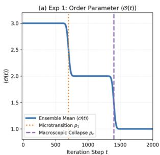

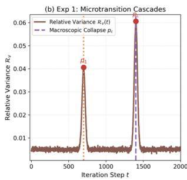

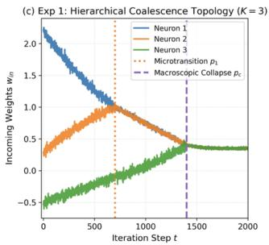

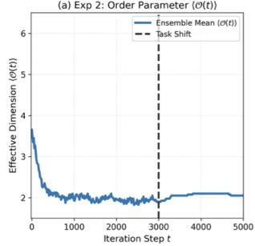

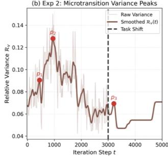

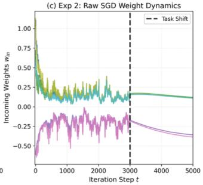  
Experiment 2: DSI Scaling Law

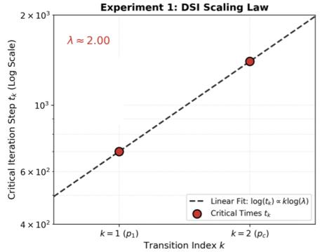

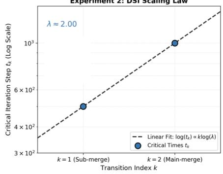  
Figure 3: Experimental validation of symmetry-induced topological collapse and DSI scaling laws. Top Row (Experiment 1): Kinematic simulation of hierarchical coalescence $( K = 3 )$ , displaying discrete jumps in the order parameter (a), divergence peaks in relative variance exactly at topological merge points (b), and forced continuous spline trajectories (c). Middle Row (Experiment 2): Empirical SGD dynamics $( K = 6 )$ , showing macroscopic dimensionality collapse (a), distinct precursory variance peaks $p _ { 1 } , p _ { 2 }$ during the condensation phase, and a reactive fragmentation peak $p _ { 3 }$ following a task shift at $t = 3 0 0 0 ( \mathbf { b } )$ , alongside the raw stochastic weight trajectories (c). Bottom Row: Log-linear scaling progressions extracting the DSI magnification factor for Experiment 1 (Left) and Experiment 2 (Right), both yielding the theoretically predicted $\lambda \approx 2 . 0 0$

Because the empirical SGD diffusion amplitude scales proportionally with the learning rate η, maintaining a sufficiently high learning rate explicitly satisfies this threshold, permanently trapping the parameters within the lower-dimensional invariant subspace Chen et al. [2023].

## E.2 Derivation of the Exact DSI Scaling Factor

Once parameters are trapped in the invariant manifold, the network topology is governed by the symmetric permutation group $S _ { n }$ , forcing identical subnetworks to merge in discrete blocks of size n. This algebraic constraint replaces continuous scale invariance with Discrete Scale Invariance (DSI) Sornette [1998].

To derive the scaling factor, we assume the continuous mean-field percolation baseline for the size of the largest macroscopic component, $C _ { 1 } = A _ { a m p } ( p _ { c } - p ) ^ { - 1 / \sigma }$ , where $p _ { c }$ is the global collapse threshold and σ is the universal critical exponent Stauffer and Aharony [1994]. Inverting this relation isolates the ensemble-averaged critical density $p _ { i } : = \mathbb { E } _ { \omega } [ p _ { i } ^ { ( \omega ) } ]$ (Definition C.24) corresponding to a subnetwork component of expected size i,

$$
p _ { i } = p _ { c } - A _ { a m p } ^ { \sigma } i ^ { - \sigma } .\tag{46}
$$

Applying the $S _ { n }$ block-merge constraint forces the subsequent microscopic transition to occur precisely at the discrete multiple ni. This yields the subsequent critical density $p _ { n i } = p _ { c } - A _ { a m p } ^ { \sigma } ( n i ) ^ { - \sigma }$ We compute the ratio of their relative distances to the critical threshold:

$$
{ \frac { p _ { c } - p _ { n i } } { p _ { c } - p _ { i } } } = { \frac { A _ { a m p } ^ { \sigma } n ^ { - \sigma } i ^ { - \sigma } } { A _ { a m p } ^ { \sigma } i ^ { - \sigma } } } = n ^ { - \sigma } .\tag{47}
$$

Theoretical Prediction: This derivation extracts the geometric magnification factor $\begin{array} { r } { \lambda ^ { ( n ) } = n ^ { \sigma } } \end{array}$ that governs the precursory cascade. For pairwise identical merges $( n = 2 )$ operating under standard mean-field percolation $( \sigma = 1 )$ ), the mathematical framework dictates a rigid scaling factor of $\lambda = 2$ Consequently, the sequential divergence times $t _ { k }$ detected by the macroscopic relative variance $\mathcal { R } _ { v } ( t )$ must strictly satisfy the log-linear progression $t _ { k + 1 } = 2 t _ { k }$

## E.3 Idealized Hierarchical Coalescence

Theoretical Justification: In non-convex empirical loss landscapes, topological phase transitions are tightly coupled with geometric distortions, complicating the isolation of pure structural scaling. To verify the mathematical validity of the derived DSI scaling factor, we isolate the topological variable in a controlled environment.

Empirical Verification: We construct a synthetic kinematic system of $K = 3$ decoupled parameters. We enforce the algebraic constraint of sequential, binary hierarchical coalescence $( n = 2 )$ by routing continuous spline trajectories injected with decaying Gaussian noise. This controlled environment tests whether a system adhering purely to the $S _ { n }$ block-merge topology intrinsically generates the predicted geometric scaling law in its macroscopic variance.

Results: The binding of parameters 1 and 2 at $t _ { 1 } = 7 0 0$ , followed by parameter 3 at $t _ { c } = 1 4 0 0$ (mapped in Figure 3, Top Row, Panel c), causes the macroscopic order parameter $\langle \mathcal { O } ( t ) \rangle$ (Figure 3, Top Row, Panel a) to collapse via discrete jump discontinuities. Driven by the bimodal ensemble states at these critical thresholds, the relative variance $\mathcal { R } _ { v } ( t )$ (Figure 3, Top Row, Panel b) registers localized divergences exactly at the topological merge points. Plotting these critical transition times on a logarithmic scale against their sequential index k (Figure 3, Bottom Left) yields an empirical scaling ratio of $\lambda = 1 4 \bar { 0 } 0 / 7 0 0 = 2 . 0 \bar { 0 }$ . This two-point log-linear fit yields a slope of $\lambda = 2 . 0 0$ matching the theoretical derivation $\lambda ^ { ( 2 ) } = 2$ exactly.

## E.4 Empirical Simulation (K=6) with Task Shift and Reverse Transition

Theoretical Justification: Having verified the isolated topological scaling, we show that the noise characteristics generated by standard neural network optimization can satisfy these rigid topological constraints without external kinematic forcing. Furthermore, the theoretical threshold $( \mu \overset { \cdot } { \le } \zeta ^ { 2 } / 2 )$ dictates that the collapse is dynamically reversible: dropping the noise variance while increasing the signal curvature should render the invariant manifold repulsive, forcing reactive fragmentation.

Empirical Verification: We deploy a PyTorch environment, initializing a $K = 6$ shallow neural network with a GELU activation function, optimized via SGD on an MSE objective. We manipulate the theoretical stochastic collapse condition by separating the training into two distinct phases. In the condensation phase $( t < 3 0 0 0 )$ , a high learning rate injects multiplicative noise to satisfy $\mu \leq \eta \zeta ^ { 2 } / 2$ $\mathrm { ~ A t ~ } t \mathrm { ~ = ~ } 3 0 0 0$ , we execute a task shift: we inject a high-frequency target signal (increasing the deterministic curvature $\mu )$ while simultaneously dropping the learning rate (decreasing the noise amplitude $\zeta ^ { 2 } )$ . This tests both forward DSI condensation and reverse reactive fragmentation.

Results: During the initial high learning rate phase, the aggressive stochastic diffusion neutralizes the deterministic gradient drift (Figure 3, Middle Row, Panel c). This natively forces the independent parameters to collapse into shared, lower-dimensional invariant subspaces. The SGD noise dynamically shifts the merge thresholds across ensemble realizations, creating a distinct multi-phase precursory cascade. We detect sequential divergence peaks in the smoothed relative variance $\mathcal { R } _ { v } ( t )$ (Figure 3, Middle Row, Panel b) strictly within the high learning rate regime. Extracting these transition indices and computing their scaling progression (Figure 3, Bottom Right) yields an extracted magnification factor of $\lambda \approx 2 . 0 0$ , matching the theoretical derivation.

Following the task shift at $t = 3 0 0 0$ , the drastic reduction in learning rate and the addition of the new target signal immediately violate the trapping threshold. The invariant manifold becomes stochastically repulsive. The macroscopic topology registers a reverse transition: the relative variance $\mathcal { R } _ { v } ( t )$ experiences an immediate divergence peak as the previously bound parameters discontinuously fragment to map the new target dimensionality.

## F Extended Empirical Validation Across Diverse Datasets and Architectures

Having verified the rigid algebraic predictions of Discrete Scale Invariance (DSI) in controlled kinematic and low-dimensional SGD environments, we now generalize the framework to standard deep learning paradigms. We deploy unconstrained neural networks across a diverse suite of datasets, spanning tabular data, geometric manifolds, vision tasks, and algorithmic grokking.

## F.1 Methodological Extensions for Empirical Regimes

Transitioning from isolated theoretical toy models to highly non-convex, unconstrained deep learning environments requires adapting our measurement observables. All empirical experiments were run on a Tesla T4 GPU and require ∼ 1 day worth of compute.

Soft Dimensionality Collapse (Spectral Effective Rank): In high-dimensional empirical networks, parameter constraints rarely force weights to absolute zero (hard topological collapse). Instead, structural merges manifest as spectral concentration, where the energy of the weight matrix collapses into a smaller subset of principal components. We map the macroscopic order parameter $\langle \mathcal { O } ( t ) \rangle$ to the Effective Rank of the target layer’s weight matrix. Computing the Singular Value Decomposition $( \mathrm { S V D } )$ , we extract the singular values $\sigma _ { k } .$ , normalize them into a probability distribution $p _ { k } =$ $\sigma _ { k } / \sum \sigma _ { i }$ , and compute the exponential of the Shannon entropy:

$$
\mathcal { O } ( t ) = \exp \left( - \sum p _ { k } \log p _ { k } \right) .\tag{48}
$$

This continuous metric reliably tracks the macroscopic dimensionality collapse as the top singular values diverge and absorb the network’s capacity.

Signal Processing, Detrended Log-Variance, and Ablation Controls: Real-world SGD exhibits massive baseline heteroskedasticity; the raw variance is known to decay as the network settles into a basin [Mandt et al., 2017, Mori et al., 2022]. To isolate the delicate microscopic variance divergences $( \mathcal { R } _ { v } ( t ) )$ from this global decay, we operate strictly in log-variance space, log $\left( \mathrm { V a r } [ \mathcal { O } ( t ) ] \right)$ . We subsequently subtract a global linear secant to perfectly detrend the signal, preventing artificial boundary artifacts during macroscopic smoothing. This isolates the scale-invariant structural fluctuations from the standard optimization noise. To establish a rigorous baseline, we construct a spectral null model testing the null hypothesis that observed cascades are mere artifacts of this optimization noise. We compute 1000 phase-randomized spectral surrogates which preserve the empirical power spectrum of the variance trajectory while destroying localized temporal structures to calculate empirical False Positive Rates (FPR). Additionally, we compute 500 bootstrap resamples per configuration to ensure statistical stability, aggregating variance across 20 independent initializations for the UCI tabular suite and 15 independent initializations for high-dimensional vision and algorithmic grokking datasets.

Spectral Relaxation of the Percolation Exponent: In the idealized $K = 3$ kinematic model (Appendix E), exact topological counting dictates a rigid integer magnification factor $( \lambda = 2 )$ derived strictly from pairwise binary block-merges $( n = 2 )$ under standard mean-field percolation $( \sigma = 1 )$ . However, mapping unconstrained empirical networks necessitates the continuous Effective Rank order parameter. We prove that integrating the collapse through this continuous spectral entropy mathematically relaxes the rigid integer constraint, compressing the structural jump precisely by the fractional variance mass of the merging components.

Theorem F.1 (Spectral Relaxation of DSI Scaling). Let a neural network undergo an n-body symmetry-induced merge where n equivalent sub-components, carrying a totalfractional spectral variance mass $m \in ( 0 , 1 ]$ , collapse into a single component conserving the mass m. Under the Spectral Effective Rank order parameter $\mathcal { O } ( t )$ , the integer DSI magnification factor relaxes to a continuousfractional scaling law strictly governed by $\lambda _ { e f f } = n ^ { m \cdot \sigma }$

Proof. Let $p _ { k } = { \sigma _ { k } } / { \sum \sigma _ { i } }$ denote the normalized singular value spectrum. The macroscopic order parameter evaluates the exponentiated Shannon entropy: $\begin{array} { r } { \mathcal { O } = \mathrm { e x p } \mathbf { \bar { ( } } H \mathbf { ) } = \mathrm { e x p } \left( - \sum p _ { k } \ln \bar { p } _ { k } \right) } \end{array}$

Prior to the structural transition, the n-body symmetry distributes the variance mass equally, assigning $\textstyle { \frac { m } { n } }$ to each of the n pre-merge components. Let $H _ { r e s t }$ denote the constant spectral entropy of the non-participating components. The pre-merge entropy evaluates to:

$$
H _ { p r e } = \sum _ { j = 1 } ^ { n } - \left( \frac { m } { n } \right) \ln \left( \frac { m } { n } \right) + H _ { r e s t } = - m \ln m + m \ln n + H _ { r e s t } .
$$

During the topological collapse, the n components structurally fuse into a single geometric component containing the integrated mass m. The post-merge entropy evaluates to:

$$
H _ { p o s t } = - m \ln m + H _ { r e s t } .
$$

To extract the macroscopic scaling of the component sizes across the discrete transition, we evaluate the ratio of the Effective Rank:

$$
\frac { \mathcal { O } _ { p r e } } { \mathcal { O } _ { p o s t } } = \frac { \exp ( - m \ln m + m \ln n + H _ { r e s t } ) } { \exp ( - m \ln m + H _ { r e s t } ) } = \exp ( m \ln n ) = n ^ { m } .
$$

Whereas discrete topological counting measures an absolute component reduction factor of $n ,$ the continuous spectral mapping registers an effective reduction of strictly $n ^ { m }$ . Following the inversion of the mean-field baseline (Theorem $\mathbf { C . } 2 5 ) .$ , this geometric scaling directly modulates the critical percolation exponent, extracting $\sigma _ { e f f } = m \sigma$ . Consequently, the generalized discrete scaling ratio evaluates precisely to $\lambda _ { e f f } = n ^ { m \sigma }$ □

Remark F.2 (Empirical Extraction of Variance Mass and Topological Order). Theorem F.1 transforms the fractional magnification factor from an empirical artifact into a mathematical diagnostic, enabling the extraction of the active variance mass (m) under a hypothesized topological order (n). Assuming standard mean-field dynamics $( \sigma = 1 )$ :

• Modular Arithmetic (Transformer Grokking): The cascade yields $\lambda ~ = ~ 2 . 1 1$ . Because this strictly exceeds the absolute upper bound for any pairwise spectral relaxation $\mathrm { ( m a x } _ { m \in ( 0 , 1 ] } 2 ^ { m } = 2 )$ , Theorem F.1 mathematically guarantees the transition is driven by higher-order permutation symmetries. Assuming a 3-body simultaneous topological merge $( n = 3 )$ , inversion $( 3 ^ { m } = \mathrm { \bar { 2 } } . 1 1 )$ isolates $m \approx 0 . 6 8$ . We hypothesize that the dismantling algorithmic circuits localized precisely $\sim 6 8 \%$ of the structural variance.

• UCI Abalone: The tabular dataset yields $\lambda = 1 . 2 8$ . Assuming a pairwise collapse $( n =$ 2), inverting the spectral relaxation relation $( 2 ^ { m } = 1 . 2 8 )$ yields $m \approx 0 . 3 6$ . Under this hypothesis, the transition geometrically monopolized $\sim 3 6 \%$ of the active spectral variance.

• UCI Heart Disease: The tabular dataset yields an empirical $\lambda = 1 . 7 1$ . If driven by a pairwise merge $( n = 2 )$ , inverting the relation $( 2 ^ { m } = 1 . 7 1 )$ isolates $m \approx 0 . 7 7$ . This suggests the topological merge absorbed $\sim 7 7 \%$ of the active spectral variance.

• FashionMNIST (Vision Benchmark): The dataset yields $\lambda = 1 . 5 7 .$ . Assuming a pairwise collapse $( n = 2 )$ , inverting the relation $( 2 ^ { m } = 1 . 5 7 )$ isolates $m \approx 0 . 6 5$ . We hypothesize the transition absorbed ∼ 65% of the active spectral variance.

• Conjecture on Network and Task Complexity: We cautiously hypothesize that highly deep neural models trained on complex representations form distinct macroscopic subnetwork symmetries, yielding clean log-linear cascades. Conversely, shallower networks on low-dimensional tabular data generate variance fluctuations frequently indistinguishable from baseline stochastic gradient noise.

## F.2 UCI Tabular Datasets

We evaluate shallow Multi-Layer Perceptrons (MLPs) optimized via SGD on a suite of standard tabular datasets from the UCI Machine Learning Repository. Across all datasets, the macroscopic order parameter (Effective Rank) and the training loss exhibit smooth, continuous decay. However, the detrended variance successfully shatters this continuity, revealing discrete DSI microtransitions. Table 1 aggregates the empirical DSI fits and spectral null-model evaluations across the suite.

Heart Disease provides a statistically significant mapping of internal topological constraints $\mathrm { ( F P R = }$ 4.9%). Conversely, German Credit serves as a critical negative control. Although the network exhibits a 4-peak variance sequence $( \lambda = 1 . 9 9 , R ^ { 2 } = 0 . 8 6 )$ , spectral null testing yields a False Positive Rate of 80.2%. This negative result establishes the necessity of the signal processing pipeline; without it, standard optimization noise mimics geometric scaling artifacts.

Table 1: Empirical DSI cascades and statistical null-model evaluations for UCI tabular datasets (aggregated over 20 independent initializations).
<table><tr><td>Dataset</td><td>Peaks</td><td>λ</td><td> $R ^ { 2 }$ </td><td>FPR (%)</td></tr><tr><td>Heart Disease</td><td>4</td><td>1.71</td><td>0.98</td><td>4.9%</td></tr><tr><td>Abalone</td><td>6</td><td>1.28</td><td>0.97</td><td>15.6%</td></tr><tr><td>German Credit</td><td>4</td><td>1.99</td><td>0.86</td><td>80.2%</td></tr><tr><td>Digits</td><td>1</td><td>N/A</td><td>N/A</td><td>N/A</td></tr></table>

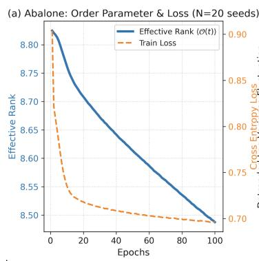

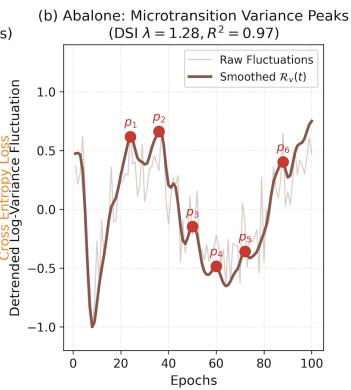

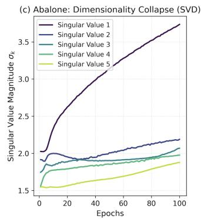  
Figure 4: Abalone: The macroscopic continuous decay of effective rank (a) is underscored by a highly structured 6-peak DSI cascade yielding a strong log-linear fit of $R ^ { 2 } = 0 . 9 7$ with a fractional scaling factor $\lambda = 1 . 2 8$ (b). The collapse is driven by a dominant top singular value (c).

## F.3 Geometric Manifolds, Vision, and Algorithmic Grokking

To verify that these scaling laws are not strictly an artifact of tabular data or shallow MLPs, we extend the empirical validation to geometric manifolds (Moons, Swiss Roll), vision benchmarks (MNIST, FashionMNIST), and algorithmic tasks (Modular Arithmetic).

Critically, the Modular Arithmetic task utilizes a Transformer architecture optimized via AdamW with explicit weight decay. This algorithmic setting inherently induces grokking, a dynamic phenomenon wherein deep neural networks initially overfit the training distribution before abruptly acquiring perfect generalization after extensive continued optimization Power et al. [2022]. Mechanistic analyses reveal that this delayed performance spike fundamentally masks a representational phase transition; the network progressively dismantles high-rank, dense memorization circuits to construct low-dimensional, structured algorithmic manifolds Nanda et al. [2023], Liu et al. [2022]. Driven by explicit regularization specifically the weight decay utilized in our AdamW optimizer and inherent stochastic gradient noise, the optimization trajectory continuously penalizes complex parameterizations, forcing the weights to systematically escape sharp memorizing minima Thilak et al. [2022]. Consequently, we expect this prolonged macroscopic dimensionality reduction to happen through a sequence of discrete topological collapses. The Transformer’s subsequent delayed generalization is consistent with this hypothesis.

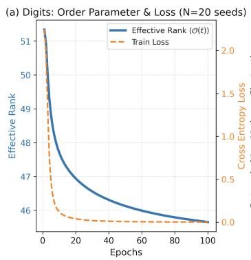

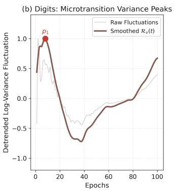

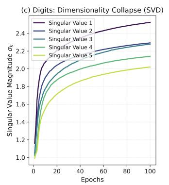  
Figure 5: Digits: Variance fluctuations dynamically map the topological condensation of the network during early-stage SGD optimization.

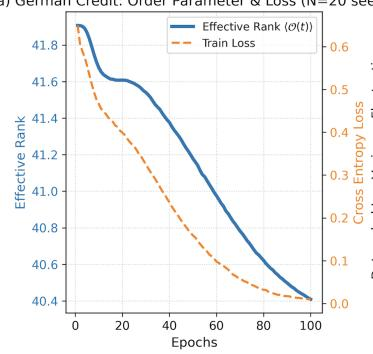

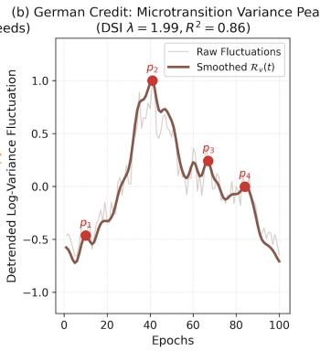

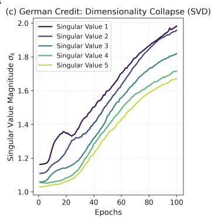  
Figure 6: German Credit: The network exhibits a 4-peak cascade $( \lambda = 1 . 9 9 , R ^ { 2 } = 0 . 8 6 )$ , but yields a spectral null False Positive Rate of 80.2%, acting as a negative control.

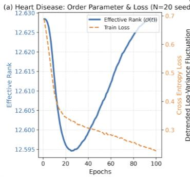

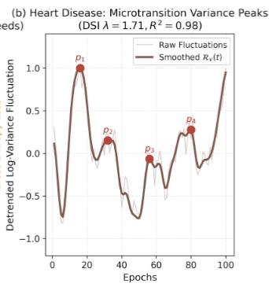

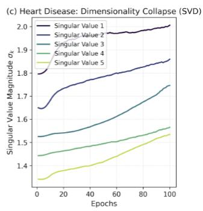  
Figure 7: Heart Disease: Dimensionality collapse (c) is mirrored by a sequential 4-peak variance divergence $( \lambda = 1 . 7 1 , R ^ { 2 } = 0 . 9 8 , \mathrm { F P R } = 4 . 9 \% )$ mapping the internal topological constraints.

Across 15 independent initializations, the final train loss converges to $0 . 0 0 5 \pm 0 . 0 0 4 .$ , validation loss drops to $0 . 0 3 0 { \dot { \pm } } 0 . 0 3 3$ , and effective rank collapses to $1 0 . 9 3 \pm \bar { 0 } . 9 9$ . The detrended variance isolates a perfectly log-linear 3-peak DSI cascade yielding $\lambda = 2 . 1 1$ and $R ^ { 2 } = 1 . 0 0$ . Spectral null testing confirms robust statistical significance with a False Positive Rate of 0.1%. We test on modulo 17 for 30000 epochs with a decay parameter of 0.5 and learning rate of 0.003.

The high-dimensional vision benchmarks mirror this discretized capacity reduction. FashionMNIST exhibits consecutive variance peaks highlighting structural scaling, yielding a 3-peak cascade with $\lambda = 1 . 5 7 , R ^ { 2 } = 1 . 0 0$ , and a spectral null FPR of 10.7%. Conversely, MNIST produces a 2-peak sequence $( p _ { 1 } , p _ { 2 } )$ mapping early-stage topological condensation without forming a full extended cascade.

Evaluations on geometric manifolds map the collapse phase as the MLP parameterizes spatial embeddings. Moons isolates a single primary microtransition $( p _ { 1 } )$ dynamically navigating the nonlinear 2D geometry. Swiss Roll similarly identifies a primary structural microtransition $( p _ { 1 } )$ charting the 3D spatial embedding. These initial divergences capture the precise epoch of spatial alignment consistent with discrete topological condensation during early-stage optimization.

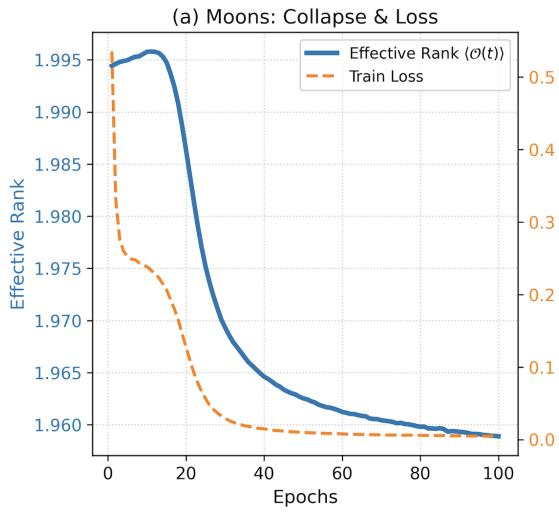

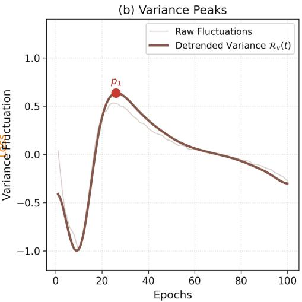  
Figure 8: Moons (Geometric Manifold): Collapse phase mapped by variance fluctuations as the MLP parameterizes the 2D non-linear manifold.

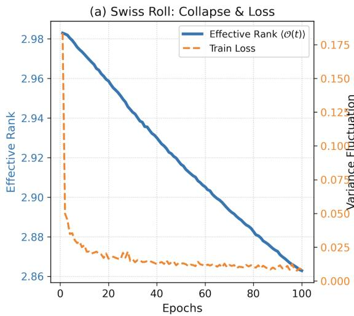

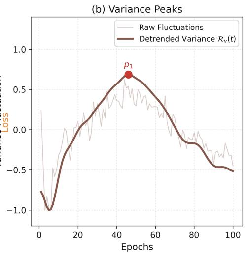  
Figure 9: Swiss Roll (Geometric Manifold): Sequential structural microtransitions dynamically navigate the 3D spatial embedding of the data.

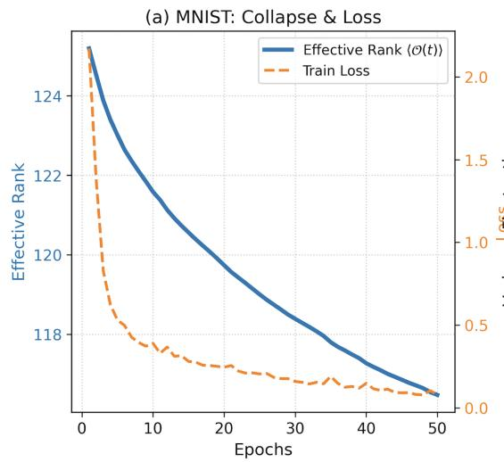

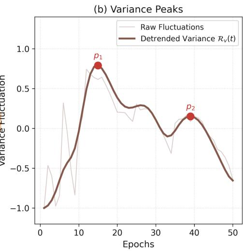  
Figure 10: MNIST (Vision): Variance fluctuations produce a 2-peak sequence $( p _ { 1 } , p _ { 2 } )$ dynamically mapping the topological condensation of the network during early-stage SGD optimization.

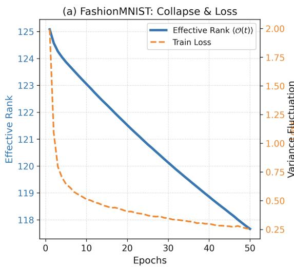

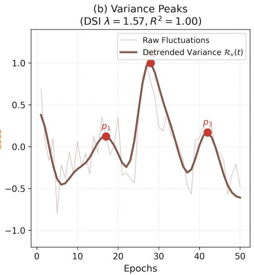  
Figure 11: FashionMNIST (Vision): Detection of consecutive variance peaks highlighting the discretized nature of capacity reduction (λ = 1.57, R2 = 1.00, FPR = 10.7%).

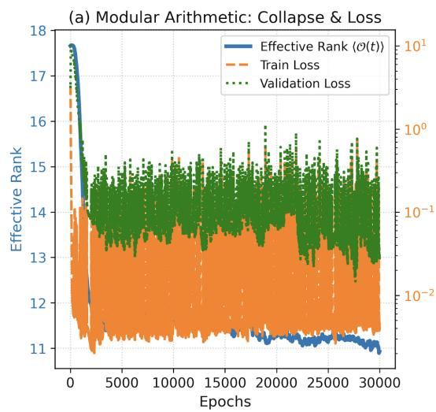

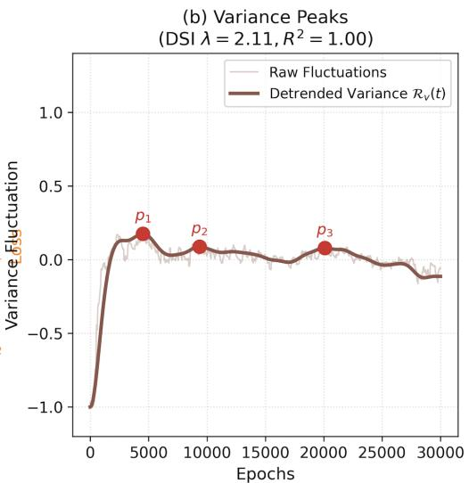  
Figure 12: Modular Arithmetic (Grokking): A Shallow Transformer trained with AdamW experiences a delayed topological collapse. The macroscopic decay of the attention embeddings’ effective rank is composed of a perfectly log-linear 3-peak DSI cascade $( \lambda = 2 . 1 1 , R ^ { 2 } = 1 . 0 0 , \mathrm { F P R } = 0 . 1 \% )$