# Perceptually Regularized Difusion Model for Image Super-Resolution

Chuxiangbo Wang1, Pavithra Venkatachalapathy2, Ying Liang3, Min Wang4, Jing Qin5,∗, Yifei Lou6, Weihong Guo3

1 Department of Mathematics, University of North Carolina, Chapel Hill, NC 27599, USA.

2 Department of Mathematics & Statistics, Texas Tech University, Lubbock, TX 79409, USA. 3 Department of Mathematics, Applied Mathematics and Statistics, Case Western Reserve University, Cleveland, OH 44106, USA.

4 Department of Mathematics, University of Houston, Houston, TX 77204, USA.

5 Department of Mathematics, University of Kentucky, Lexington, KY 40506, USA. 6 Department of Mathematics and School of Data Science and Society, University of North Carolina, Chapel Hill, NC 27599, USA.

## Abstract

Image super-resolution, which aims to reconstruct high-resolution images from their lowresolution observations, is fundamental to medical imaging, remote sensing, surveillance, microscopy, and scientific visualization. Traditional model-based methods formulate super-resolution as an inverse problem with hand-crafted regularization priors. While interpretable and theoretically grounded, they rely on fixed assumptions and require computationally intensive iterative solvers. Deep learning methods ofer data-driven flexibility by learning nonlinear mappings from low- to high-resolution images, among which difusion models have achieved particularly impressive perceptual quality. However, the standard difusion training objective is a pixeldomain noise-prediction loss that does not explicitly enforce perceptual fidelity, which can lead to oversmoothing and loss of fine image structure. To address these limitations, we propose a perceptually regularized difusion framework that incorporates prior knowledge through perceptualloss-based regularization, improving training convergence and encouraging the recovery of meaningful image features. Experiments on benchmark datasets demonstrate improved perceptual quality and competitive distortion metrics, highlighting the efectiveness of regularization for difusion-based super resolution.

Keywords: Difusion Model, Image Super-Resolution, Regularization, Perceptual loss, Visual Geometry Group (VGG)

## 1 Introduction

Single image super-resolution (SR) is a fundamental image restoration task that aims to reconstruct a high-resolution (HR) image from its low-resolution (LR) observation. By recovering missing high-frequency details and improving spatial resolution, SR plays an important role in a wide range of applications, including medical imaging, remote sensing, surveillance, microscopy, scientific visualization, and digital photography [1, 2]. In these domains, enhanced spatial detail can improve visual interpretation, support downstream quantitative analysis, and assist decision-making when direct acquisition of HR images is costly, time-consuming, or physically constrained.

Despite its practical importance, image super-resolution is an inherently ill-posed inverse problem: the image degradation process removes high-frequency information through downsampling, blurring, compression, and sensor noise. Thus, a single LR image may correspond to many plausible HR images. Traditional model-based methods address this ill-posedness by explicitly formulating the degradation process and incorporating hand-crafted regularization that encodes prior assumptions on image structure, such as sparsity in a transform domain, smoothness, or total variation [3]. These methods are interpretable and mathematically grounded, but their performance is often limited by simplified assumptions about natural images and image degradation. Moreover, many classical approaches require iterative optimization, which can be computationally expensive and dificult to scale to complex real-world settings.

Deep learning has substantially advanced single-image super-resolution by learning nonlinear mappings from LR to HR images directly from data. Convolutional neural networks, residual networks, and attention-based architectures have demonstrated remarkable performance in recovering sharper structures and more faithful textures than conventional interpolation methods such as bicubic interpolation [4, 5]. Generative adversarial networks (GANs)-based methods [6, 7] introduce adversarial training to encourage recovered images to lie on the manifold of natural HR images, but are susceptible to training instability, mode collapse [8, 9], and visual artifacts such as unnatural textures or hallucinated structures [7, 10]. More broadly, purely data-driven models may generalize poorly under unseen degradations, limited training data, or domain shifts.

Difusion-based image super-resolution [11] has recently emerged as a promising alternative to GAN-based methods. Difusion models [12, 13] generate images through a progressive denoising process that transforms random noise into structured image samples. When applied to SR, the reverse difusion process is conditioned on the LR image to gradually reconstruct an HR image that is both visually realistic and consistent with the observed LR input [14, 15, 16, 17]. Unlike deterministic regression methods, difusion models can represent the one-to-many nature of SR by sampling multiple plausible HR reconstructions for the same LR observation, and they synthesize photorealistic textures with fewer artifacts than GAN-based approaches [14, 7]. However, the standard difusion training objective is a pixel-domain noise-prediction loss that does not explicitly enforce perceptual fidelity, which can lead to oversmoothing and loss of fine image structure. Furthermore, the strong generative capability of difusion models can produce visually plausible but physically or semantically inaccurate details under severe degradation or out-of-distribution conditions [11], a hallucination risk that is especially problematic in fidelity-critical applications such as medical imaging and microscopy.

Although difusion-based SR methods have shown strong generative capability, key challenges remain. First, the noise-prediction objective does not explicitly enforce perceptual fidelity, which can lead to oversmoothing and loss of fine image structure despite visually plausible outputs. Second, difusion models typically require many training iterations to learn a stable denoising trajectory, and convergence to perceptually faithful reconstructions can be slow without explicit perceptual supervision. Third, the strong generative capability can produce physically or semantically inaccurate details under severe degradation or out-of-distribution conditions [11], a hallucination risk that is particularly problematic in fidelity-critical applications such as medical imaging and microscopy. Fourth, difusion models may be sensitive to training data distribution, degradation mismatch, and noise levels, though this limitation is not the focus of the present work. These challenges motivate the development of perceptually regularized difusion frameworks that address fidelity and convergence while preserving the generative strength of the difusion process.

In this work, we propose a perceptually regularized difusion framework for single-image superresolution, built on the Image Super-Resolution via Iterative Refinement (SR3) backbone [14]. Specifically, we augment the SR3 training objective with a perceptual regularization term that penalizes feature-space discrepancy between the reconstructed and ground-truth HR images, encouraging the recovery of perceptually meaningful structures without modifying the difusion architecture or inference procedure. As a concrete instantiation, we adopt a VGG perceptual loss [18] to extract feature representations that capture perceptually meaningful image structures. Specifically, we use a pretrained VGG-19 network as a fixed feature extractor, which has been widely used in image restoration tasks [19, 6, 7]. While the inference cost of the difusion process is unchanged, the proposed regularization substantially reduces the number of training epochs required to reach competitive performance, ofering a practical advantage in training eficiency. We further provide a gradient-based interpretation showing that the perceptual term introduces anisotropic curvature and SNR-dependent gradient scaling, ofering a theoretical interpretation consistent with the accelerated early-stage convergence observed empirically. Experiments on benchmark datasets demonstrate improved perceptual quality and competitive distortion metrics, confirming the efectiveness of perceptual regularization for difusion-based super-resolution.

The rest of the paper is organized as follows. In Section 2, a brief overview of difusion methods for SR is provided. Section 3 presents the proposed perceptually regularized difusion model, including the VGG-based perceptual regularization term and a gradient-based interpretation of the accelerated convergence observed in training. In Section 4, we provide a variety of numerical experiments to showcase the performance of the proposed method on various datasets, including grayscale and color images.

## 2 Related Work

## 2.1 Denoising Difusion Probabilistic Models

Difusion models (DMs) [20, 12, 21] have emerged as a powerful class of deep generative models [8, 22, 23] for image restoration, formulating these tasks as the reversal of a gradual noise-corruption process. Specifically, the forward difusion process defines a joint distribution over the full trajectory $( { \bf z } _ { 0 } , { \bf z } _ { 1 } , \cdots , { \bf z } _ { T } )$ , i.e.,

$$
q ( \mathbf { z } _ { 0 } , \mathbf { z } _ { 1 } , \cdot \cdot \cdot , \mathbf { z } _ { T } ) = q ( \mathbf { z } _ { 0 } ) \prod _ { t = 1 } ^ { T } q ( \mathbf { z } _ { t } | \mathbf { z } _ { t - 1 } ) .\tag{1}
$$

Here, $q ( \mathbf { z } _ { 0 } )$ (usually unknown) is the data distribution of a clean image $\mathbf { z } _ { 0 }$ , and each Markov transition kernel $q ( \mathbf { z } _ { t } | \mathbf { z } _ { t - 1 } )$ progressively corrupts $\mathbf { z } _ { 0 }$ by adding Gaussian noise,

$$
\small q ( \mathbf { z } _ { t } | \mathbf { z } _ { t - 1 } ) = \mathcal { N } \big ( \mathbf { z } _ { t } \mid \sqrt { 1 - \alpha _ { t } } \mathbf { z } _ { t - 1 } , \alpha _ { t } I \big ) ,\tag{2}
$$

where $\alpha _ { t } \in ( 0 , 1 )$ is a fixed, monotonically decreasing noise schedule and I denotes the identity matrix. The scaling factor $\sqrt { 1 - \alpha _ { t } }$ is chosen to satisfy the variance-preserving constraint [12, 21]: since the signal and noise contributions have squared coeficients $\left( 1 - \alpha _ { t } \right)$ and $\alpha _ { t }$ that sum to unity, $\mathbf { z } _ { t }$ retains unit variance at every timestep provided $\mathbf { z } _ { 0 }$ is unit-variance. By marginalizing over intermediate steps, the noisy sample at any arbitrary time step t can be written in closed form as

$$
\boldsymbol { q } ( \mathbf { z } _ { t } | \mathbf { z } _ { 0 } ) = \mathcal { N } ( \mathbf { z } _ { t } \mid \sqrt { \gamma _ { t } } \mathbf { z } _ { 0 } , ( 1 - \gamma _ { t } ) I ) , \qquad \gamma _ { t } = \prod _ { i = 1 } ^ { t } ( 1 - \alpha _ { i } ) ,
$$

or equivalently via the reparameterization trick,

$$
\mathbf { z } _ { t } = \sqrt { \gamma _ { t } } \mathbf { z } _ { 0 } + \sqrt { 1 - \gamma _ { t } } \epsilon , \qquad \epsilon \sim \mathcal { N } ( \mathbf { 0 } , I ) .\tag{3}
$$

For suficiently large $T ,$ , the accumulated noise destroys most image structure and the marginal distribution of $\mathbf { z } _ { T }$ approaches a standard Gaussian, i.e., $\mathbf { z } _ { T } \sim \mathcal { N } ( \mathbf { 0 } , I )$

In principle, given the true reverse $q ( \mathbf { z } _ { t - 1 } | \mathbf { z } _ { t } )$ , one could recover a clean sample by initializing ${ \bf z } _ { T } \sim \mathcal { N } ( { \bf 0 } , I )$ and iteratively sampling $\mathbf { z } _ { t - 1 } \sim q ( \mathbf { z } _ { t - 1 } | \mathbf { z } _ { t } )$ for $t = T , T - 1 , \cdots , 1$ , yielding ${ \bf z } _ { 0 } \sim { \boldsymbol q } ( { \bf z } _ { 0 } )$ However, the true reverse $q ( \mathbf { z } _ { t - 1 } | \mathbf { z } _ { t } )$ is intractable, but conditioning additionally on $\mathbf { z } _ { 0 }$ yields an explicit Gaussian posterior via Bayes’ rule:

$$
q ( \mathbf { z } _ { t - 1 } | \mathbf { z } _ { t } , \mathbf { z } _ { 0 } ) = \mathcal { N } \Big ( \mathbf { z } _ { t - 1 } \mid \tilde { \mu } _ { t } ( \mathbf { z } _ { t } , \mathbf { z } _ { 0 } ) , \tilde { \beta } _ { t } I \Big ) ,
$$

where the posterior variance $\begin{array} { r } { \tilde { \beta } _ { t } = \frac { \alpha _ { t } \left( 1 - \gamma _ { t - 1 } \right) } { 1 - \gamma _ { t } } } \end{array}$ is fully determined by the noise schedule, and the posterior mean is

$$
\tilde { \mu } _ { t } ( \mathbf { z } _ { t } , \mathbf { z } _ { 0 } ) = \frac { 1 } { \sqrt { 1 - \alpha _ { t } } } \bigg ( \mathbf { z } _ { t } - \frac { \alpha _ { t } } { \sqrt { 1 - \gamma _ { t } } } \epsilon \bigg ) ,\tag{4}
$$

with $\epsilon$ being the noise used to construct $\mathbf { z } _ { t }$ via the reparameterization (3).

Denoising Difusion Probabilistic Model (DDPM) [12] approximates the true reverse with a learned Gaussian reverse process,

$$
p _ { \boldsymbol \theta } ( \mathbf { z } _ { 0 } , \mathbf { z } _ { 1 } , \cdot \cdot \cdot , \mathbf { z } _ { T } ) = p ( \mathbf { z } _ { T } ) \prod _ { t = 1 } ^ { T } p _ { \boldsymbol \theta } ( \mathbf { z } _ { t - 1 } | \mathbf { z } _ { t } ) .\tag{5}
$$

Here $p ( \mathbf { z } _ { T } ) = \mathcal { N } ( \mathbf { 0 } , I )$ , and each reverse transition is parameterized as

$$
p _ { \theta } ( \mathbf { z } _ { t - 1 } \vert \mathbf { z } _ { t } ) = \mathcal { N } \big ( \mathbf { z } _ { t - 1 } \mid \mu _ { \theta } ( \mathbf { z } _ { t } , \boldsymbol { \gamma } _ { t } ) , \boldsymbol { \Sigma } _ { \theta } ( \mathbf { z } _ { t } , \boldsymbol { \gamma } _ { t } ) \big ) ,\tag{6}
$$

where $\mu _ { \boldsymbol { \theta } } ( \mathbf { z } _ { t } , \gamma _ { t } )$ is predicted by a neural network with learnable parameters $\theta$ and $\Sigma _ { \theta }$ is a fixed, time-dependent scalar multiple of I. The reverse process is then optimized by maximum likelihood. Ideally, the training is guided by minimizing the expected negative log-likelihood of the clean data under the learned model,

$$
\mathbb { E } _ { q ( \mathbf { z } _ { 0 } ) } [ - \log p _ { \theta } ( \mathbf { z } _ { 0 } ) ] , \qquad p _ { \theta } ( \mathbf { z } _ { 0 } ) = \int p _ { \theta } ( \mathbf { z } _ { 0 } , \mathbf { z } _ { 1 } , \cdots , \mathbf { z } _ { T } ) \mathrm { d } \mathbf { z } _ { 1 } \cdot \cdot \cdot \mathrm { d } \mathbf { z } _ { T } .\tag{7}
$$

This marginalization is intractable, so we bound $( 7 )$ from above. Introducing the forward process as an importance distribution and applying Jensen’s inequality to the concave function log(·) gives

$$
\begin{array} { r } { - \log p _ { \theta } ( \mathbf { z } _ { 0 } ) = - \log \mathbb { E } _ { q ( \mathbf { z } _ { 1 } , \cdots , \mathbf { z } _ { T } | \mathbf { z } _ { 0 } ) } \left[ \frac { p _ { \theta } ( \mathbf { z } _ { 0 } , \mathbf { z } _ { 1 } , \cdots , \mathbf { z } _ { T } ) } { q ( \mathbf { z } _ { 1 } , \cdots , \mathbf { z } _ { T } | \mathbf { z } _ { 0 } ) } \right] } \\ { \leq \mathbb { E } _ { q ( \mathbf { z } _ { 1 } , \cdots , \mathbf { z } _ { T } | \mathbf { z } _ { 0 } ) } \left[ - \log \frac { p _ { \theta } ( \mathbf { z } _ { 0 } , \mathbf { z } _ { 1 } , \cdots , \mathbf { z } _ { T } ) } { q ( \mathbf { z } _ { 1 } , \cdots , \mathbf { z } _ { T } | \mathbf { z } _ { 0 } ) } \right] . } \end{array}\tag{8}
$$

Substituting the factorizations (1) and (5) into the KL divergence, then taking the expectation over ${ \bf z } _ { 0 } \sim { \boldsymbol q } ( { \bf z } _ { 0 } )$ , yields the variational bound

$$
\mathbb { E } _ { q ( \mathbf { z } _ { 0 } ) } [ - \log p _ { \theta } ( \mathbf { z } _ { 0 } ) ] \ \leq \ \underbrace { \mathbb { E } _ { q ( \mathbf { z } _ { 0 } , \cdots , \mathbf { z } _ { T } ) } \left[ - \log p ( \mathbf { z } _ { T } ) - \sum _ { t = 1 } ^ { T } \log \frac { p _ { \theta } ( \mathbf { z } _ { t - 1 } | \mathbf { z } _ { t } ) } { q ( \mathbf { z } _ { t } | \mathbf { z } _ { t - 1 } ) } \right] } _ { = : \mathcal { L } _ { \mathrm { V B } } ( \theta ) } ,\tag{9}
$$

so minimizing $\mathcal { L } _ { \mathrm { V B } }$ over $\theta$ maximizes a lower bound on the log-likelihood of clean images $\mathbf { z } _ { 0 }$ under the learned reverse process. We now decompose $\mathcal { L } _ { \mathrm { V B } }$ into per-timestep terms. The decomposition is expressed through the Kullback–Leibler (KL) divergence

$$
\mathrm { K L } ( q \| p ) = \mathbb { E } _ { q } \left[ \log \frac { q ( \mathbf { u } ) } { p ( \mathbf { u } ) } \right] ,
$$

a nonnegative measure of the discrepancy between two distributions $q$ and $p$ that vanishes if and only if $q = p$ . Separating the $t = 1$ summand and applying Bayes’ rule to the remaining ones, the Markov property $q ( \mathbf { z } _ { t } | \mathbf { z } _ { t - 1 } ) = q ( \mathbf { z } _ { t } | \mathbf { z } _ { t - 1 } , \mathbf { z } _ { 0 } )$ gives, for $t \geq 2$

$$
\log \frac { p _ { \theta } ( \mathbf { z } _ { t - 1 } | \mathbf { z } _ { t } ) } { q ( \mathbf { z } _ { t } | \mathbf { z } _ { t - 1 } ) } = \log \frac { p _ { \theta } ( \mathbf { z } _ { t - 1 } | \mathbf { z } _ { t } ) } { q ( \mathbf { z } _ { t - 1 } | \mathbf { z } _ { t } , \mathbf { z } _ { 0 } ) } + \log \frac { q ( \mathbf { z } _ { t - 1 } | \mathbf { z } _ { 0 } ) } { q ( \mathbf { z } _ { t } | \mathbf { z } _ { 0 } ) } .\tag{10}
$$

The second logarithm telescopes over $t = 2 , \dots , T$ to log $\big ( q ( \mathbf { z } _ { 1 } | \mathbf { z } _ { 0 } ) / q ( \mathbf { z } _ { T } | \mathbf { z } _ { 0 } ) \big )$ , whose numerator cancels the $- \log q ( \mathbf { z } _ { 1 } | \mathbf { z } _ { 0 } )$ contributed by the $t = 1$ summand. Collecting the remaining pieces,

$$
\begin{array} { r l } & { \mathcal { L } _ { \mathrm { V B } } ( \boldsymbol { \theta } ) = \underbrace { \mathbb { E } _ { \boldsymbol { q } } \mathrm { K L } \big ( \boldsymbol { q } \big ( \mathbf { z } _ { T } | \mathbf { z } _ { 0 } \big ) \| \boldsymbol { p } ( \mathbf { z } _ { T } ) \big ) } _ { \mathrm { p r i o r ~ m a t c h i n g } } + \underset { t = 2 } { \overset { T } { \sum } } \underbrace { \mathbb { E } _ { \boldsymbol { q } } \mathrm { K L } \big ( \boldsymbol { q } \big ( \mathbf { z } _ { t - 1 } | \mathbf { z } _ { t } , \mathbf { z } _ { 0 } \big ) \| \boldsymbol { p } _ { \boldsymbol { \theta } } \big ( \mathbf { z } _ { t - 1 } | \mathbf { z } _ { t } \big ) \big ) } _ { \mathrm { d e n o i s i n g ~ m a t c h i n g } } } \\ & { \qquad - \underbrace { \mathbb { E } _ { \boldsymbol { q } } \big [ \mathrm { l o g } \boldsymbol { p } _ { \boldsymbol { \theta } } \big ( \mathbf { z } _ { 0 } | \mathbf { z } _ { 1 } \big ) \big ] } _ { \mathrm { r e c o n s t r u c t i o n } } . } \end{array}\tag{11}
$$

The prior matching term compares the endpoint of the forward process with the Gaussian prior $p ( \mathbf { z } _ { T } )$ and contains no learnable parameters, so it is discarded. The reconstruction term is absorbed into the denoising matching terms by letting the sum run from $t = 1$ , following [12]. Training is therefore governed by the denoising matching terms, which involve $\operatorname { K L } ( q ( \mathbf { z } _ { t - 1 } | \mathbf { z } _ { t } , \mathbf { z } _ { 0 } ) \parallel p _ { \theta } ( \mathbf { z } _ { t - 1 } | \mathbf { z } _ { t } ) )$ at each timestep. Since both distributions are Gaussian with the same fixed variance $\tilde { \beta } _ { t } I$ , the KL divergence at each step reduces up to a constant factor to the squared Euclidean distance between their mean vectors:

$$
\mathrm { K L } \bigg ( q ( \mathbf { z } _ { t - 1 } | \mathbf { z } _ { t } , \mathbf { z } _ { 0 } ) \| p _ { \theta } ( \mathbf { z } _ { t - 1 } | \mathbf { z } _ { t } ) \bigg ) \propto \| \tilde { \mu } _ { t } ( \mathbf { z } _ { t } , \mathbf { z } _ { 0 } ) - \mu _ { \theta } ( \mathbf { z } _ { t } , \gamma _ { t } ) \| _ { 2 } ^ { 2 } .
$$

Here $\| \cdot \| _ { 2 }$ denotes the $\ell _ { 2 } { \mathrm { - n o r m } }$ of a vector and $\| \mathbf { x } - \mathbf { y } \| _ { 2 }$ denotes the Euclidean distance between the vectors x and $\mathbf { y }$ . We parameterize $\mu \theta$ in the same functional form as the posterior mean $\tilde { \mu } _ { t }$ in (4), with ϵ replaced by the network prediction $\epsilon _ { \theta }$ , thus leading to

$$
\mu _ { \boldsymbol \theta } ( \mathbf { z } _ { t } , \gamma _ { t } ) = \frac { 1 } { \sqrt { 1 - \alpha _ { t } } } \biggl ( \mathbf { z } _ { t } - \frac { \alpha _ { t } } { \sqrt { 1 - \gamma _ { t } } } \epsilon _ { \boldsymbol \theta } ( \mathbf { z } _ { t } , \gamma _ { t } ) \biggr ) .\tag{12}
$$

Substituting $\tilde { \mu } _ { t }$ and $\epsilon _ { \theta }$ into the squared diference of means gives

$$
\| \tilde { \mu } _ { t } ( \mathbf { z } _ { t } , \mathbf { z } _ { 0 } ) - \mu _ { \theta } ( \mathbf { z } _ { t } , \gamma _ { t } ) \| _ { 2 } ^ { 2 } = \frac { \alpha _ { t } ^ { 2 } } { ( 1 - \alpha _ { t } ) ( 1 - \gamma _ { t } ) } \| \epsilon - \epsilon _ { \theta } ( \mathbf { z } _ { t } , \gamma _ { t } ) \| _ { 2 } ^ { 2 } .
$$

Let $\lambda ( t )$ absorb the scalar prefactor $\frac { \alpha _ { t } ^ { 2 } } { ( 1 - \alpha _ { t } ) ( 1 - \gamma _ { t } ) }$ , and let $\mathcal { U } ( 1 , T )$ denote the uniform distribution over timesteps $\{ 1 , 2 , \ldots , T \}$ . Taking the expectation of the per-step loss over $t \sim \mathcal { U } ( 1 , T ) , \mathbf { z } _ { 0 } \sim q ( \mathbf { z } _ { 0 } )$ and $\mathbf { \epsilon } \epsilon \sim \mathcal { N } ( \mathbf { 0 } , \mathbf { I } )$ yields the noise-prediction objective:

$$
\begin{array} { r l } & { \mathbb { E } _ { t \sim \mathcal { U } ( 1 , T ) } \left[ \lambda ( t ) \left| \left| \epsilon - \epsilon _ { \theta } ( \mathbf { z } _ { t } , \gamma _ { t } ) \right| \right| _ { 2 } ^ { 2 } \right] , } \\ & { \quad \mathbf { z } _ { 0 } { \sim } q ( \mathbf { z } _ { 0 } ) } \\ & { \quad \epsilon { \sim } \mathcal { N } ( \mathbf { 0 } , \mathbf { I } ) } \end{array}\tag{13}
$$

where $\epsilon _ { \theta } ( \mathbf { z } _ { t } , \gamma _ { t } )$ predicts the Gaussian noise used to construct $\mathbf { z } _ { t }$ . Note that $\mathbf { z } _ { t }$ depends implicitly on $\mathbf { z } _ { 0 }$ and ϵ through $\mathbf { z } _ { t }$ via (3), which is why the expectation in (13) is taken over all three random variables $t , \ \mathbf { z } _ { 0 }$ , and ϵ. In practice, following [12], the weighting is set to $\lambda ( t ) = 1$ , leading to the simplified objective

$$
\begin{array} { r l } & { \mathbb { E } _ { t \sim \mathcal { U } ( 1 , T ) } \left[ \| \epsilon - \epsilon _ { \theta } ( \mathbf { z } _ { t } , \gamma _ { t } ) \| _ { 2 } ^ { 2 } \right] . } \\ & { \quad \mathbf { z } _ { 0 } { \sim } { q } ( \mathbf { z } _ { 0 } ) } \\ & { \quad \epsilon { \sim } \mathcal { N } ( \mathbf { 0 } , \mathbf { I } ) } \end{array}\tag{14}
$$

After minimizing (14) with respect to $\theta ,$ the trained noise predictor $\epsilon _ { \theta }$ is used to iteratively sample the reverse process from $\mathbf { z } _ { T } \sim \mathcal { N } ( \mathbf { 0 } , I )$ to $\mathbf { z } _ { 0 }$ by progressively denoising at each timestep: compute mean $\mu _ { \theta }$ by formula (12), and then sample with fixed $\Sigma _ { \theta }$ based on (6) for $t = T , T { - } 1 , \ldots , 1$ progressively denoising $\mathbf { z } _ { T }$ to obtain a clean sample $\mathbf { z } _ { 0 }$ . DDPM sampling is therefore an iterative denoising procedure: at each step, the model estimates the noise component in $\mathbf { z } _ { t } ,$ removes part of it, and injects calibrated Gaussian uncertainty through $\Sigma _ { \theta }$

## 2.2 Difusion Models for Super-Resolution

SR3 [14] extends DDPM to the conditional SR setting by incorporating a LR observation x to guide the reverse process. Without such conditioning, the learned reverse process $p _ { \theta } ( \mathbf { z } _ { t - 1 } | \mathbf { z } _ { t } )$ generates arbitrary natural images consistent with the learned data distribution, but with no guarantee of fidelity to any specific LR input. SR3 addresses this by conditioning each reverse transition on $\textbf { x : }$

$$
\begin{array} { r } { p _ { \theta } ( \mathbf { z } _ { t - 1 } \vert \mathbf { z } _ { t } , \mathbf { x } ) = \mathcal { N } ( \mathbf { z } _ { t - 1 } \mid \mu _ { \theta } ( \mathbf { x } , \mathbf { z } _ { t } , \gamma _ { t } ) , \boldsymbol { \Sigma } _ { \theta } ( \mathbf { x } , \mathbf { z } _ { t } , \gamma _ { t } ) ) , } \end{array}\tag{15}
$$

where $\mu _ { \boldsymbol { \theta } } ( \mathbf { x } , \mathbf { z } _ { t } , \gamma _ { t } )$ and $\begin{array} { r } { \sum _ { \theta } ( \mathbf { x } , \mathbf { z } _ { t } , \gamma _ { t } ) } \end{array}$ denote the mean and covariance of the learned reverse transition, extending the DDPM parameterization (6) to incorporate the LR conditioning image x.

In practice, x is first upsampled once to the target resolution by bicubic interpolation; this upsampled image is then fixed and concatenated with the noisy image $\mathbf { z } _ { t }$ along the channel dimension at every denoising step, providing x as a persistent conditioning input throughout the reverse process. The noise predictor therefore takes the form $\epsilon _ { \theta } ( \mathbf { x } , \mathbf { z } _ { t } , \gamma _ { t } )$ , and the role of the two inputs is complementary: x provides low-frequency structural information that constrains the global content of the output, while $\mathbf { z } _ { t }$ carries the stochastic high-frequency component that the reverse process progressively refines into realistic HR details. The DDPM objective (14) thus extends naturally to the conditional setting

$$
\begin{array} { r } { \mathcal { L } _ { \mathrm { d i f f } } ( \epsilon _ { \theta } ) : = \mathbb { E } _ { t \sim \mathcal { U } ( 1 , T ) } \left[ \big \| \epsilon - \epsilon _ { \theta } ( \mathbf { x } , \mathbf { z } _ { t } , \gamma _ { t } ) \big \| _ { 2 } ^ { 2 } \right] , } \\ { \mathbf { z } _ { 0 } { \sim } q ( \mathbf { z } _ { 0 } ) \begin{array} { r l } { \epsilon \sim \mathcal { N } ( \mathbf { 0 , I } ) \ } & { { } } \end{array} } \end{array}\tag{16}
$$

where the subscript “dif” stems from difusion. For later use, we define $\mathbf { z } _ { \theta , t }$ as the reconstructed image at timestep t induced by the noise predictor.

After minimizing (16) with respect to $\theta ,$ the trained noise predictor $\epsilon _ { \theta }$ is used to iteratively sample the reverse process following (15) from ${ \bf z } _ { T } \sim \mathcal { N } ( { \bf 0 } , I )$ to $\mathbf { z } _ { 0 }$ by progressively denoising at each timestep. SR3 forms the foundation of our proposed method described in Section 3. Other notable difusion-based SR methods include SRDif [15], which trains the difusion model to generate the residual between the HR and upsampled LR images rather than the full HR image, using a residual-in-residual dense block [7] as the conditioning encoder. Subsequent works such as ResShift [16] and ResDif [17] further explore residual difusion and eficient sampling strategies to improve reconstruction quality and reduce computational cost.

## 3 Proposed Regularized Difusion Methods

The standard difusion objective ${ \mathcal { L } } _ { \mathrm { d i f f } }$ in (16) is formulated as a noise-prediction loss in the pixel domain, which encourages the model to reverse the forward noise-corruption process but does not explicitly enforce the preservation of perceptually meaningful image features. As a result, reconstructed images may exhibit oversmoothing, loss of semantic structures, or visually inconsistent textures despite achieving favorable pixel-wise error metrics [6, 7]. To overcome this limitation, we incorporate a perceptual regularization term into the difusion training objective, guiding the reconstruction toward perceptually faithful HR images by measuring discrepancy in a learned feature space rather than the pixel domain. Our proposed method augments the SR3 framework with such a term, leading to the total training objective

$$
\mathcal { L } _ { \mathrm { t o t a l } } = \mathcal { L } _ { \mathrm { d i f f } } + \mathcal { L } _ { \mathrm { V G G } } ,\tag{17}
$$

where ${ \mathcal { L } } _ { \mathrm { d i f f } }$ is the conditional difusion loss defined in (16) and $\mathcal { L } _ { \mathrm { V G G } }$ is the perceptual regularization term defined in Section 3.1. An overview of the proposed training framework is provided in Figure 1.

## 3.1 VGG Perceptual Regularization

Unlike conventional pixel-wise losses, perceptual losses measure the discrepancy between images in a feature space learned by a deep neural network. These feature representations capture higherlevel image characteristics, such as edges, textures, shapes, and semantic content, which pixel-wise metrics fail to reflect. Perceptual regularization therefore encourages reconstructed images to be visually closer to the ground-truth HR image, improving texture fidelity and visual quality while preserving the generative capability of the difusion process [19, 6, 7].

The Visual Geometry Group (VGG) network [18] is one of the most widely used perceptual feature extractors in image restoration. Its deep hierarchy of convolutional layers progressively encodes low-level image details and high-level semantic information, and pretrained VGG networks have been extensively adopted as fixed feature extractors for perceptual image reconstruction tasks [19, 6, 7]. In this work, we use a pretrained VGG-19 network as a fixed perceptual feature extractor; its parameters remain frozen throughout training, introducing no additional trainable variables into the difusion model.

Let ϕ(·) denote the feature mapping defined by a pretrained VGG network, and $\mathbf { z } _ { 0 }$ the corresponding ground-truth HR image. To define the perceptual loss, by rearranging the forward noising relation (3), the predicted noise $\epsilon _ { \theta } ( \mathbf { x } , \mathbf { z } _ { t } , \gamma _ { t } )$ gives an estimate of the HR image at each t:

$$
\mathbf { z } _ { \theta , t } : = \frac { \mathbf { z } _ { t } - \sqrt { 1 - \gamma _ { t } } \epsilon _ { \theta } ( \mathbf { x } , \mathbf { z } _ { t } , \gamma _ { t } ) } { \sqrt { \gamma _ { t } } } .\tag{18}
$$

The resulting training pipeline is illustrated in Figure 1. Given a clean HR image $\mathbf { z } _ { 0 }$ , the forward difusion process adds noise ϵ to produce the noisy image $\mathbf { z } _ { t }$ . The denoiser predicts $\epsilon _ { \theta }$ from the upsampled LR condition and the noisy image $\mathbf { z } _ { t }$ . The predicted noise is used both to compute the difusion loss ${ \mathcal { L } } _ { \mathrm { d i f f } }$ and, through (18), to obtain the reconstructed HR image $\mathbf { z } _ { \theta , t }$ . The perceptual loss $\mathcal { L } _ { \mathrm { V G G } }$ then measures the discrepancy between the VGG feature representations of $\mathbf { z } _ { \theta , t }$ and the ground-truth image $\mathbf { z } _ { 0 }$

We consider two forms of perceptual regularization term $\mathcal { L } _ { \mathrm { V G G } }$ , based on the $\ell _ { 1 }$ and squared $\ell _ { 2 }$ norm of the diference between VGG feature representations, respectively. We denote these two variants by $\mathcal { L } _ { \mathrm { V G G } } ^ { ( 1 ) }$ and $\mathcal { L } _ { \mathrm { V G G } } ^ { ( 2 ) }$ . The $L ^ { 1 }$ variant is

$$
\begin{array} { r } { \mathcal { L } _ { \mathrm { V G G } } ^ { ( 1 ) } ( \epsilon _ { \theta } ) : = \omega _ { \mathrm { V G G } } \mathbb { E } _ { t \sim \mathcal { U } ( 1 , T ) } \left[ \| \phi ( \mathbf { z } _ { \theta , t } ) - \phi ( \mathbf { z } _ { 0 } ) \| _ { 1 } \right] , } \\ { \mathbf { z } _ { 0 } { \sim } \boldsymbol { q } ( \mathbf { z } _ { 0 } ) \qquad } \\ { \epsilon ^ { \sim } \mathcal { N } ( \mathbf { 0 } , \mathbf { I } ) \qquad } \end{array}\tag{19}
$$

where $\| \cdot \| _ { 1 }$ denotes the $\ell _ { 1 } { \mathrm { - n o r m } }$ and $\omega _ { \mathrm { V G G } } > 0$ is a weighting parameter controlling the strength of perceptual regularization. We distinguish the $L ^ { 1 }$ distance between functions (or distributions) from the $\ell _ { 1 }$ norm of finite-dimensional vectors. The second one uses the squared $L ^ { 2 }$ distance between VGG feature maps,

$$
\begin{array} { r } { \mathcal { L } _ { \mathrm { V G G } } ^ { ( 2 ) } ( \epsilon _ { \theta } ) : = \omega _ { \mathrm { V G G } } \mathbb { E } _ { t \sim \mathcal { U } ( 1 , T ) } \left[ \| \phi ( \mathbf { z } _ { \theta , t } ) - \phi ( \mathbf { z } _ { 0 } ) \| _ { 2 } ^ { 2 } \right] . } \\ { \mathbf { z } _ { 0 } { \sim } q ( \mathbf { z } _ { 0 } ) \quad \quad \quad } \\ { \epsilon { \sim } \mathcal { N } ( \mathbf { 0 } , \mathbf { I } ) \quad \quad \quad } \end{array}\tag{20}
$$

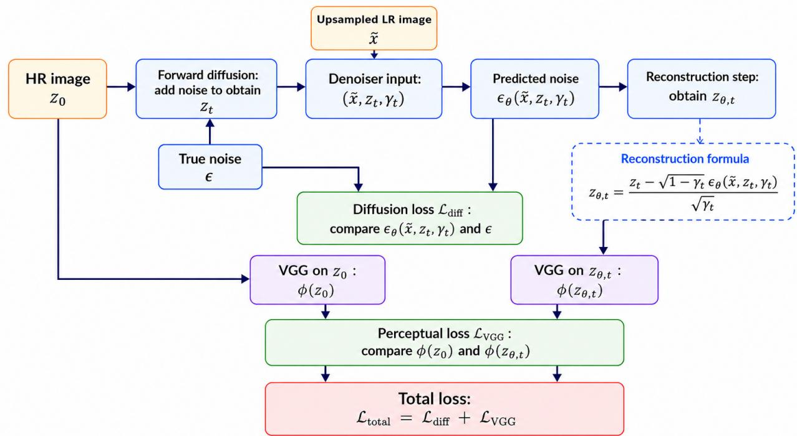  
Figure 1: Overview of the proposed difusion-based super-resolution framework with perceptual learning.

The $L ^ { 1 }$ formulation is less sensitive to large feature discrepancies, whereas the squared- $L ^ { 2 }$ formulation penalizes large feature discrepancies more strongly. Their empirical efects on reconstruction quality and convergence are compared in Section 4. In practice, the choice between the two formulations depends on the desired balance between perceptual sharpness and reconstruction stability.

The idea of augmenting difusion model training with perceptual supervision has been explored in recent work. Berrada et al. [24] introduced a latent perceptual loss defined over the internal features of the autoencoder decoder, showing that feature-space supervision improves sharpness and realism in latent difusion models without increasing inference cost. Our work pursues a similar motivation but difers in three respects: we operate within the SR3 conditional difusion framework for image super-resolution rather than latent difusion for general image synthesis; we use a pretrained VGG-19 as a simple, fixed external feature extractor rather than a decoder-internal loss; and we study both $L ^ { 1 }$ and $L ^ { 2 }$ variants of the perceptual loss, providing empirical guidance for the choice of perceptual regularization in difusion-based SR.

## 3.2 A Gradient-Based Interpretation of the Perceptual Loss

Evaluating the perceptual loss on the induced reconstruction endows the training signal with two properties: an anisotropic gradient geometry and an implicit, SNR-dependent timestep emphasis. Together, these two properties ofer a geometric interpretation consistent with the accelerated convergence and improved perceptual fidelity observed empirically.

Anisotropic gradient geometry. Since gradient and expectation commute, the geometric structure derived below for the per-sample loss applies directly to the full training objective (20). The per-sample squared $L ^ { 2 }$ perceptual loss takes the form

$$
\mathcal { L } ( \mathbf { z } _ { \theta , t } ) : = \omega _ { \mathrm { V G G } } \big | \big | \phi ( \mathbf { z } _ { \theta , t } ) - \phi ( \mathbf { z } _ { 0 } ) \big | \big | _ { 2 } ^ { 2 } ,\tag{21}
$$

whose Euclidean gradient with respect to $\mathbf { z } _ { \theta , t }$ is

$$
\nabla _ { \mathbf { z } _ { \theta , t } } \mathcal { L } ( \mathbf { z } _ { \theta , t } ) = 2 \omega _ { \mathrm { V G G } } J ( \mathbf { z } _ { \theta , t } ) ^ { \top } \big ( \phi ( \mathbf { z } _ { \theta , t } ) - \phi ( \mathbf { z } _ { 0 } ) \big ) ,\tag{22}
$$

with $\begin{array} { r } { J ( \mathbf { z } _ { \theta , t } ) = \frac { \partial \phi } { \partial \mathbf { z } _ { \theta , t } } } \end{array}$ . The Jacobian $J$ in (22) pulls the Euclidean metric on feature space back to pixel space, and yields a position-dependent positive-semidefinite pullback metric

$$
G ( \mathbf { z } _ { \theta , t } ) = 2 \omega _ { \mathrm { V G G } } J ( \mathbf { z } _ { \theta , t } ) ^ { \top } J ( \mathbf { z } _ { \theta , t } ) ,\tag{23}
$$

which is the Gauss–Newton approximation of the Hessian of $\mathcal { L } ( \mathbf { z } _ { \theta , t } )$ . Thus, the perceptual loss induces a position-dependent and anisotropic local geometry in reconstruction space through $G ( \mathbf { z } _ { \theta , t } )$ Directions that produce larger changes in the VGG feature representation, potentially corresponding to perceptually meaningful structures such as edges, local contrast, and texture boundaries, receive greater curvature, whereas directions to which the feature representation is relatively insensitive correspond to smaller singular values of J and therefore contribute less strongly to the perceptual loss. As the reconstruction $\mathbf { z } _ { \theta , t }$ evolves during training, $G ( \mathbf { z } _ { \theta , t } )$ changes accordingly, yielding an adaptive local geometry that weights reconstruction directions according to their sensitivity in the VGG feature space.

Minimizing $\mathcal { L } ( \mathbf { z } _ { \theta , t } )$ by (stochastic) gradient descent therefore behaves locally, like descent on a quadratic whose curvature is concentrated along perceptually salient directions: the loss landscape itself encodes a data-driven geometry on image space. By contrast, the standard difusion objective (16) applies an isotropic Euclidean penalty to the noise-prediction error, without explicitly weighting directions according to their perceptual relevance. Adding the perceptual term to the training objective (17) thus introduces anisotropic curvature into the composite loss precisely along structurally informative directions. This efect is visible in local structure rather than in aggregate pixel error: the zoomed comparisons at one million iterations (Figures 4, 9 and 12 for grayscale images and Figure 15 for color images) show better-separated adjacent structures, more continuous thin filaments, and sharper edge contrast, while the peak PSNR/SSIM values remain essentially unchanged. The $L ^ { 1 }$ variant (19) induces a similar property in its (sub)gradient field, as the two variants difer in how feature discrepancies are weighted, and we compare them empirically in Section 4.3.1.

Implicit timestep reweighting and accelerated early convergence. The perceptual loss is evaluated not directly on the network output $\epsilon _ { \theta }$ , but on the induced reconstruction $\mathbf { z } _ { \theta , t }$ defined in (18). By the chain rule, the gradient of L in (21) with respect to the network output factorizes as

$$
\frac { \partial \mathcal { L } } { \partial \epsilon _ { \theta } } = \frac { \partial \mathcal { L } } { \partial \mathbf { z } _ { \theta , t } } \cdot \frac { \partial \mathbf { z } _ { \theta , t } } { \partial \epsilon _ { \theta } } , \qquad \frac { \partial \mathbf { z } _ { \theta , t } } { \partial \epsilon _ { \theta } } = - \frac { \sqrt { 1 - \gamma _ { t } } } { \sqrt { \gamma _ { t } } } I = - \frac { 1 } { \sqrt { \mathrm { S N R } ( t ) } } I ,\tag{24}
$$

where I is the identity matrix of appropriate dimension, and $\mathrm { S N R } ( t ) = \gamma _ { t } / ( 1 - \gamma _ { t } )$ is the signal-tonoise ratio (SNR) of the forward process.

Low noise. When $\gamma _ { t }$ is close to one, the scalar factor $\mathrm { S N R } ( t ) ^ { - 1 / 2 }$ is small, so the perceptual gradient propagated to $\epsilon _ { \theta }$ is attenuated. When the noise prediction is reasonably accurate, the induced reconstruction $\mathbf { z } _ { \theta , t }$ is also close to $\mathbf { z } _ { 0 }$ , further reducing the perceptual residual and its contribution to the training gradient.

High noise. As $\gamma _ { t }$ decreases, the scalar factor $\mathrm { S N R } ( t ) ^ { - 1 / 2 }$ increases, amplifying the perceptual gradient propagated from $\mathbf { z } _ { \theta , t }$ to $\epsilon _ { \theta }$ . Moreover, higher-noise timesteps generally correspond to more challenging reconstruction conditions, under which the perceptual residual may also be larger. Thus, the perceptual term tends to exert a stronger influence at noisier timesteps, although its exact gradient magnitude also depends on the current reconstruction and the local VGG Jacobian.

Because the schedule keeps $\gamma _ { t }$ bounded away from zero, the SNR-dependent scaling factor remains finite throughout training. The perceptual regularizer therefore induces an implicit, timestepdependent scaling of the perceptual gradient that is related to SNR-based loss reweighting, arising from the reconstruction mapping rather than from an explicitly prescribed timestep weight.

Structure of the signal. Over the range of noise levels for which $\mathbf { z } _ { \theta , t }$ remains a plausible image, this gradient is not merely larger in magnitude but structured: as established by the metric (23), it guides $\mathbf { z } _ { \theta , t }$ toward the ground truth along directions to which the VGG features are most sensitive. Early in training, $\epsilon _ { \theta }$ is still an inaccurate predictor of the injected noise, and the resulting denoising trajectory may therefore remain poorly structured. This is the regime in which the empirical gap is largest: across all four experimental settings the convergence curves separate most at the first evaluation checkpoint (see Figures 2, 5, 7 and 10), and the corresponding reconstructions at 100K iterations (see Figures 3, 6, 8 and 11) show the baseline still dominated by noise while the regularized model has already recovered coherent structure.

The following remark summarizes the gradient-level explanation for the accelerated convergence and improved perceptual fidelity observed empirically in Section 4.

Remark 1. The anisotropic geometry in (23) and the SNR-dependent scaling in (24) together show that the perceptual term introduces structured, timestep-dependent gradient modulation. This mechanism is consistent with the faster early-stage convergence and better-preserved local structures observed empirically relative to the unregularized baseline.

## 4 Numerical Examples

We evaluate the efect of the proposed VGG-regularized SR3 variants $\mathcal { L } _ { \mathrm { V G G } } ^ { ( 1 ) } , \mathcal { L } _ { \mathrm { V G G } } ^ { ( 2 ) }$ and compare them with the baseline SR3 model without perceptual regularization across both grayscale medical images and RGB facial images. The numerical experiments include evaluations on the BrainWeb MRI dataset1 [25, 26, 27, 28] at multiple scale factors, experiments on the Brain Tumor MRI dataset2, and a cross-dataset facial-image experiment in which the models are trained on $\mathrm { F F H Q ^ { 3 } }$ [29] and evaluated on CelebA-HQ4 [30, 31]. An overview of all of the datasets, super-resolution tasks, and VGG configurations is provided in Table 1.

<table><tr><td rowspan=1 colspan=1>Experiment</td><td rowspan=1 colspan=1>Training data</td><td rowspan=1 colspan=1>Evaluation data</td><td rowspan=1 colspan=1>Scale</td></tr><tr><td rowspan=1 colspan=1>Grayscale</td><td rowspan=1 colspan=1>BrainWeb MRI (3001)</td><td rowspan=1 colspan=1>Held-out BrainWeb MRI (100)</td><td rowspan=1 colspan=1> $2 \times , 4 \times , 8 \times$ </td></tr><tr><td rowspan=1 colspan=1>Grayscale</td><td rowspan=1 colspan=1>Brain Tumor MRI (4712)</td><td rowspan=1 colspan=1>Held-out Brain Tumor MRI (100)</td><td rowspan=1 colspan=1>4×</td></tr><tr><td rowspan=1 colspan=1>Facial images</td><td rowspan=1 colspan=1>FFHQ (2585)</td><td rowspan=1 colspan=1>CelebA-HQ (100 of 500)</td><td rowspan=1 colspan=1>4×</td></tr></table>

Table 1: Overview of the dataset description and configuration used in the numerical experiments. Here, “held-out” means the evaluation dataset is disjoint from the training set, although both sets are obtained from the same source. The values in parentheses indicate the number of images used in each training or evaluation set.

All models are trained for one million iterations, optimized with Adam (learning rate $1 \times 1 0 ^ { - 4 }$ batch size 2) using a 2000-step difusion process with a linear beta schedule. Reconstruction quality is evaluated using peak signal-to-noise ratio (PSNR) and structural similarity index measure (SSIM). In addition to evaluating the reconstructions at the end of the one million iterations, we examine early convergence as well as quantitative and qualitative metrics. For selected experiments, we also evaluate the stability of the results through multiple independent training runs. All grayscale MRI experiments are performed on an NVIDIA A100 GPU with target HR image size $1 2 8 \times 1 2 8$ , whereas the RGB facial image experiments are performed on an NVIDIA V100 GPU with target HR size $1 2 8 \times 1 2 8$

## 4.1 Grayscale MRI Super-Resolution

We first present the grayscale MRI results. BrainWeb MRI is evaluated at scale factors 2×, 4×, and 8×, with the 4× task serving as the main setting. The 2× and 8× tasks examine the behavior of VGG regularization under diferent degradation levels, while the Brain Tumor MRI 4× task evaluates its performance on a diferent medical image dataset. The parameter sensitivity is presented separately in Section 4.3.1.

## 4.1.1 BrainWeb MRI: detailed study on the 4× task

The BrainWeb MRI 4× task is examined in detail as the primary experimental setting. Since the weight yielding the best final reconstruction quality does not necessarily provide the fastest early convergence, we report the models selected according to these two criteria separately.

The comparison of the selected VGG weights is summarized in Table 2. For final PSNR, the baseline SR3 model achieves a slightly better value. For SSIM, the $\mathcal { L } _ { \mathrm { V G G } } ^ { ( 2 ) }$ model with $\omega _ { \mathrm { V G G } } = 1$ slightly outperforms SR3.

<table><tr><td>Model</td><td>Selected weight (quality)</td><td>Selected weight (convergence)</td><td>Peak PSNR</td><td>Peak SSIM</td></tr><tr><td> $\overline { { \mathcal { L } _ { \mathrm { V G G } } ^ { ( 2 ) } } }$   $\mathcal { L } _ { \mathrm { V G G } } ^ { ( 2 ) }$  SR3</td><td>1</td><td>10</td><td>25.753 25.660 25.837</td><td>0.8436 0.8365 0.8406</td></tr></table>

Table 2: Comparison of the proposed VGG-regularized model and the baseline SR3 model. For the proposed method, we report the weights selected based on peak reconstruction quality and convergence, respectively.

Although the peak PSNR and SSIM values are close, we observed that one of the selected VGGregularized models $( \mathcal { L } _ { \mathrm { V G G } } ^ { ( 2 ) } , \omega _ { \mathrm { V G G } } = 1 0 )$ has a clear advantage during the early stage of training. As shown in Figure 2, PSNR and SSIM values of the proposed method increase more rapidly than those of the baseline SR3 model, with the largest diference occurring at the first evaluation checkpoint.

To illustrate this diference, we compare the reconstructed images at the early training stage. Figure 3 shows the results after 100K iterations, which correspond to the first evaluation point (67 epochs) in the convergence curves in Figure 2. At this stage, the SR3 model is still far from producing a stable reconstruction. In contrast, the VGG-regularized model already recovers a much clearer brain structure, consistent with the faster convergence observed in Figure 2.

We also compare the final reconstruction results after one million iterations, shown in Figure 4. This corresponds to the last evaluation point (667 epochs) in the convergence curves in Figure 2. We observe both models can reconstruct the main brain structure, but the zoomed regions show that the VGG-regularized model preserves local shapes more accurately. In the baseline SR3 reconstruction, some nearby structures that should remain separated become visually connected.

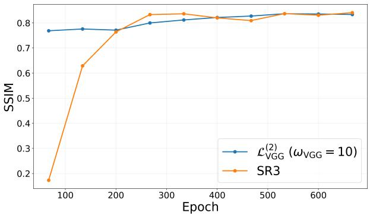  
(a) SSIM

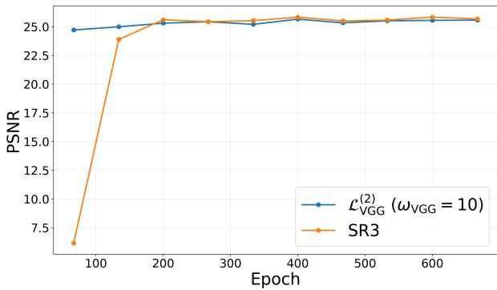  
(b) PSNR

Figure 2: Convergence comparison between the proposed method $( \mathcal { L } _ { \mathrm { V G G } } ^ { ( 2 ) } , \omega _ { \mathrm { V G G } } = 1 0 ;$ blue) and the baseline SR3 model (orange).  
LR  
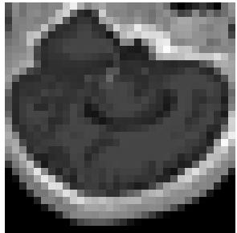

HR  
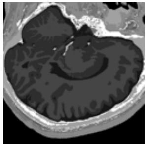

SR3  
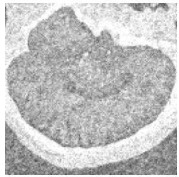

Proposed  
  
Figure 3: BrainWeb MRI 4× reconstruction after 100K iterations. This corresponds to the first evaluation point (67 epochs) in Figure 2. Our proposed method, shown in the rightmost panel, is obtained using $\mathcal { L } _ { \mathrm { V G G } } ^ { ( 2 ) }$ with $\omega _ { \mathrm { V G G } } = 1 0$

By contrast, the proposed VGG-regularized SR3 reconstruction keeps these structures more clearly separated, suggesting that although the proposed method achieves similar final PSNR/SSIM as SR3, it improves perceptual quality and preserves fine details more efectively.

## 4.1.2 BrainWeb MRI: results for the 2× and 8× tasks

We next examine whether the early-convergence behavior observed in the 4× task (Section 4.1.1) persists at lower and higher super-resolution scale factors. The corresponding parameter sensitivities are discussed in Section 4.3.1 as well.

For the 2× task, the $\mathcal { L } _ { \mathrm { V G G } } ^ { ( 2 ) }$ model with $\omega _ { \mathrm { V G G } } = 1 0 0$ is selected to compare with the baseline SR3 model. As shown in Figure 5, the two models eventually reach similar PSNR and SSIM levels, but the VGG-regularized model performs much better at the first evaluation checkpoint. The diference is especially clear in the reconstruction at 100K iterations shown in Figure 6: the SR3 output stil contains noticeable noise, whereas the proposed VGG-regularized output is already close to the HR image.

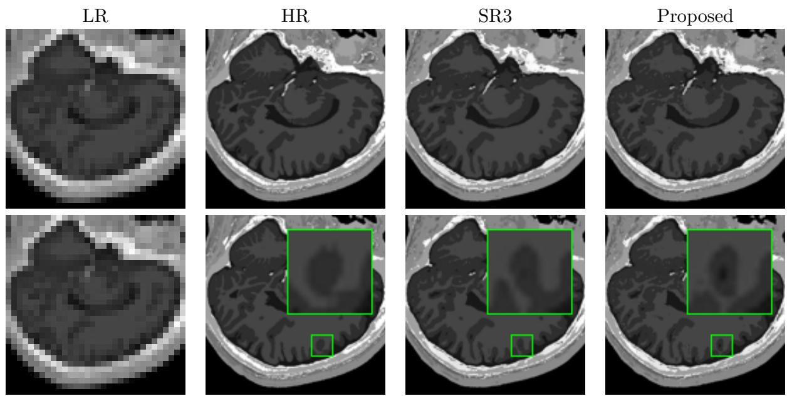  
Figure 4: BrainWeb MRI reconstruction after one million iterations, corresponding to the last evaluation point (667 epochs) in Figure 2. The two rightmost panels show the reconstruction from the proposed method $( \mathcal { L } _ { \mathrm { V G G } } ^ { ( 2 ) } , \ \omega _ { \mathrm { V G G } } = 1 0 )$ . The zoomed regions show that the proposed method better preserves local structures and avoids connecting regions that should remain separated.

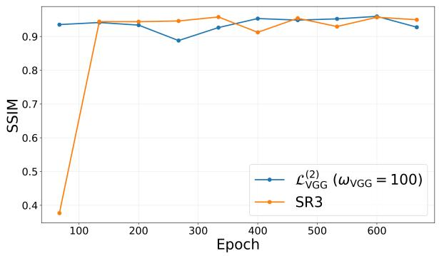  
(a) SSIM

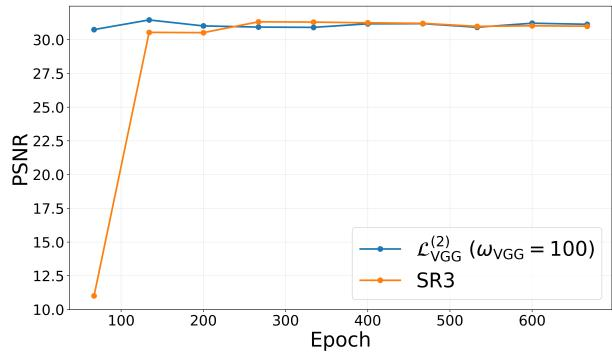  
(b) PSNR  
Figure 5: Convergence comparison between the proposed method $( \mathcal { L } _ { \mathrm { V G G } } ^ { ( 2 ) } , \omega _ { \mathrm { V G G } } = 1 0 0 )$ ; blue) and the baseline SR3 model (orange) on the BrainWeb 2× task in terms of SSIM (left) and PSNR (right). The proposed method converges faster than SR3 and the two methods eventually reach similar SSIM and PSNR.

For this 2× setting, we omit the visual comparison at the final checkpoint of one million iterations. Since the $2 \times \ \mathrm { S R }$ task is relatively easy, the final reconstructions from SR3 and VGG-regularized SR3 are visually almost indistinguishable, and no clear structural diference is observed. This is diferent from the previous 4× experiment and the next 8× experiment, where the task is more challenging and the final zoomed comparisons still reveal visible diferences in local details.

For the more challenging 8× task, the convergence curves in Figure 7 again show that VGGregularized models have faster early convergence. At the first evaluation checkpoint (100K iterations, 67 epochs), both selected VGG models already achieve higher PSNR and SSIM than SR3.

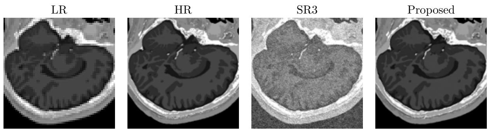  
Figure 6: BrainWeb MRI 2× reconstruction after 100K iterations, corresponding to the first evaluation point (67 epochs) in Figure 5. The rightmost panel shows the reconstruction produced by the proposed method $\mathcal { L } _ { \mathrm { V G G } } ^ { ( 2 ) }$ with $\omega _ { \mathrm { V G G } } = 1 0 0$

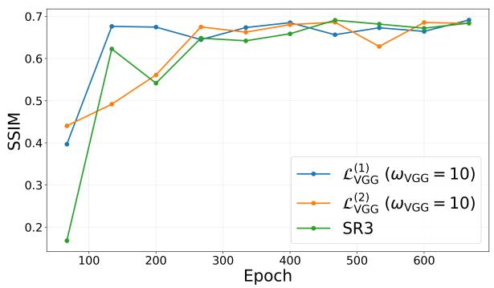  
(a) SSIM

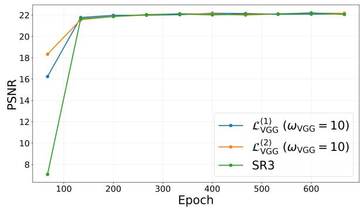  
(b) PSNR  
Figure 7: Convergence comparison among the proposed VGG-regularized models using $\mathcal { L } _ { \mathrm { V G G } } ^ { ( 1 ) }$ with $\omega _ { \mathrm { V G G } } = 1 0 ~ ( \mathrm { b l u e } )$ $\mathcal { L } _ { \mathrm { V G G } } ^ { ( 2 ) }$ with $\omega _ { \mathrm { V G G } } = 1 0 $ (orange), and the baseline SR3 model (green) on the BrainWeb $8 \times$ task. A faster convergence of the proposed models is observed.

The image comparisons in Figures 8 and 9 further illustrate the efect of VGG regularization on this challenging ${ \mathrm { 8 } } \times { \mathrm { S R } }$ task. After 100K iterations (Figure 8), the baseline SR3 output still contains a significant amount of noise. In contrast, the VGG-regularized $( \mathcal { L } _ { \mathrm { V G G } } ^ { ( 2 ) } , \omega _ { \mathrm { V G G } } = 1 0 )$ reconstruction already shows a more recognizable brain boundary and much clearer details, which is consistent with its faster early convergence result. After one million iterations (Figure 9), both models recover the main structure, but the zoomed region shows that VGG-regularized SR3 $( \mathcal { L } _ { \mathrm { V G G } } ^ { ( 2 ) } , \omega _ { \mathrm { V G G } } = 1 0 )$ gives a cleaner reconstruction of the thin local structure. The baseline SR3 result is slightly more irregular in this region, while the VGG-regularized result better follows the shape of the HR image.

## 4.1.3 Brain Tumor MRI: Results on the 4× Task

We further evaluate the proposed VGG-regularized SR3 models on the Brain Tumor MRI 4× task. The parameter-sensitivity results are discussed in Table 6, Section 4.3.1. For the convergence comparison, we use the $\mathcal { L } _ { \mathrm { V G G } } ^ { ( 1 ) }$ model with $\omega _ { \mathrm { V G G } } = 1 0 0$ , which provides the fastest early convergence among the tested parameters. As shown in Figure 10, the VGG-regularized model achieves much higher PSNR and SSIM at the first evaluation checkpoint. The diference gradually decreases as training proceeds, and the two models eventually reach similar PSNR/SSIM levels. This behavior is consistent with the BrainWeb experiments and suggests that the early-convergence benefit of

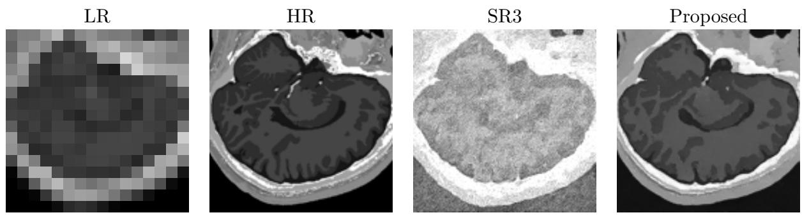  
Figure 8: BrainWeb MRI 8× reconstruction after 100K iterations, corresponding to the first evaluation point (67 epochs) in Figure 7. The rightmost panel shows the reconstruction produced by the proposed method using $\mathcal { L } _ { \mathrm { V G G } } ^ { ( 2 ) }$ with $\omega _ { \mathrm { V G G } } = 1 0$

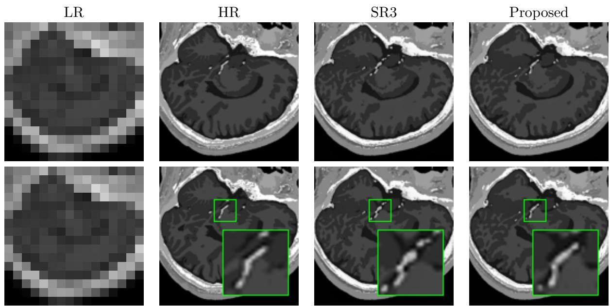  
Figure 9: BrainWeb MRI 8× reconstruction after one million iterations. This corresponds to the last evaluation point (667 epochs) in Figure 7. The rightmost panels show the reconstruction produced by the proposed method using $\mathcal { L } _ { \mathrm { V G G } } ^ { ( 2 ) }$ with $\omega _ { \mathrm { V G G } } = 1 0$ . The zoomed-in region highlights that our method reconstructs the local structure more smoothly and continuously, more closely matching the HR reference, whereas the baseline SR3 reconstruction has a partially disconnected and irregular thickening appearance.

VGG regularization is not specific to a single MRI dataset.

The visual comparison for Brain Tumor MRI SR task shows a similar early-stage advantage of VGG regularization to that observed for the Brainweb MRI. After 100K iterations, the SR3 reconstruction is still dominated by noise. The proposed VGG-regularized SR3, however, already reconstructs a much more stable image, with clearer brain contours and a more clearly defined local boundary, see Figure 11. After one million iterations (Figure 12), the global reconstructions from SR3 and proposed VGG-regularized SR3 become very close, but the zoomed regions show remaining local diferences. In particular, the proposed VGG-regularized SR3 better preserves the edge contrast, while the baseline SR3 result appears slightly more blurred and misses some local

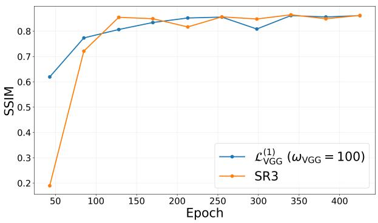  
(a) SSIM

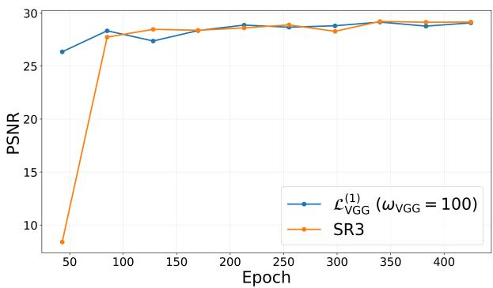  
(b) PSNR  
Figure 10: Convergence comparison between the proposed method $( \mathcal { L } _ { \mathrm { V G G } } ^ { ( 1 ) } , \omega _ { \mathrm { V G G } } = 1 0 0 ;$ blue) and the baseline SR3 model (orange) on the Brain Tumor MRI 4× task. The proposed method exhibits faster convergence.

structural details.

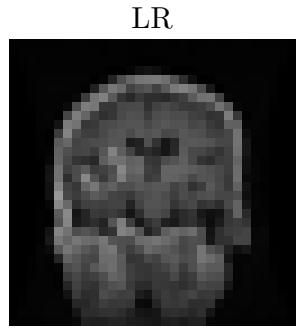

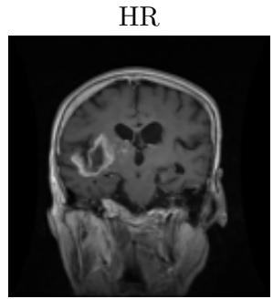

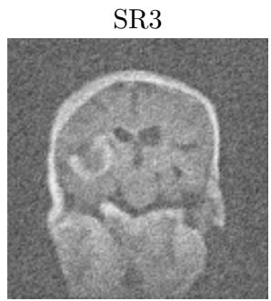

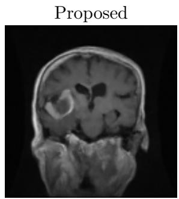  
Figure 11: Brain Tumor MRI 4× reconstruction after 100K iterations, corresponding to the first evaluation point (43 epochs) in Figure 10. The rightmost panel shows the reconstruction produced by the proposed method using $\mathcal { L } _ { \mathrm { V G G } } ^ { ( 1 ) }$ with $\omega _ { \mathrm { V G G } } = 1 0 0$

Together with the BrainWeb results, these comparisons indicate that for grayscale MRI images, VGG regularization consistently improves early-stage reconstruction and can also preserve local structural details in the final reconstruction.

## 4.2 Color Face Image Super-Resolution

We next test the generalizability of the proposed method on color image super-resolution with training and testing done on diferent datasets. All color RGB configurations evaluate the superresolution task at a single scale factor (4×) using the proposed VGG-regularized SR3 model $\mathcal { L } _ { V G G } ^ { ( 1 ) } .$ The training is done on the FFHQ dataset and the testing is done on the CelebA-HQ dataset. The sensitivity analysis used to select the optimal VGG loss weight is detailed separately in Section 4.3.1. As in the grayscale MRI experiments in Section 4.1, the weight ofering the fastest early convergence does not necessarily yield the best final reconstruction quality. Figures 13– 15 use ωVGG = 0.05 to illustrate the convergence advantage of perceptual regularization; the finer-grained sweep in Section 4.3.1 identifies $\omega _ { \mathrm { V G G } } = 0 . 0 4$ as the setting with the best overall final PSNR and SSIM.

Figure 13 illustrates the evaluation metrics across 800 training epochs. Incorporating the perceptual loss $( \omega _ { \mathrm { V G G } } = 0 . 0 5 )$ significantly accelerates convergence relative to the standard SR3 baseline. At epoch 230, the VGG-regularized model achieves a PSNR of approximately 26.6 dB and an SSIM of 0.81, closely approaching its asymptotic performance. In contrast, the baseline requires roughly 390 epochs to reach an equivalent performance threshold, representing an approximate 40% reduction in necessary training iterations to achieve stability. Beyond convergence velocity, the perceptual weight stabilizes early-stage optimization. Between epochs 75 and 150, the baseline exhibits a distinct performance degradation in both metrics, indicating unstable early-stage optimization before identifying a viable optimization path. The VGG variant mitigates this issue, maintaining a monotonic upward trajectory from the onset of training. This particular weight trades some final-epoch quality for faster convergence.

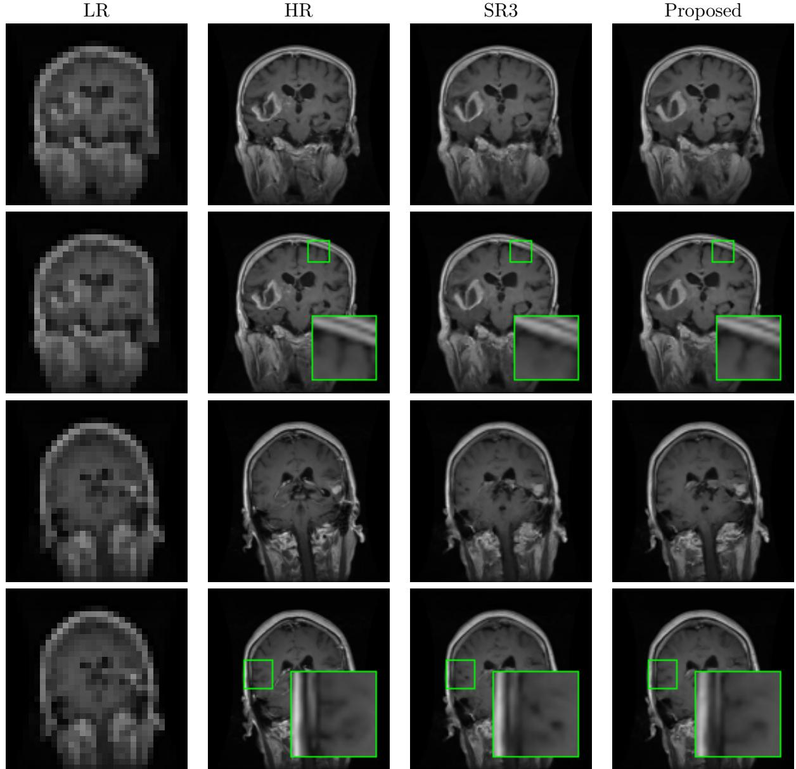  
Figure 12: Brain Tumor MRI reconstruction after one million iterations, corresponding to the last evaluation point (425 epochs) in Figure 10. The rightmost panels show the reconstructions produced by the proposed method using $\mathcal { L } _ { \mathrm { V G G } } ^ { ( 1 ) }$ with $\omega _ { \mathrm { V G G } } = 1 0 0 $ . The zoomed-in regions show that the proposed method better preserves local boundaries and structural contrast.

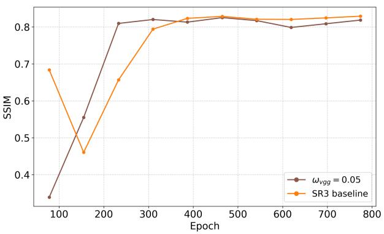  
(a) SSIM

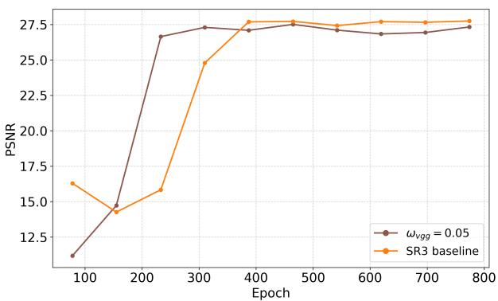  
(b) PSNR  
Figure 13: Comparison of PSNR and SSIM values between the SR3 baseline (orange) and the proposed method using $\mathcal { L } _ { \mathrm { V G G } } ^ { ( 1 ) }$ with $\omega _ { \mathrm { V G G } } = 0 . 0 5$ (brown). Our method reaches a stable performance level by approximately epoch 233, substantially earlier than the SR3 baseline. This indicates that VGG loss stabilizes early training and accelerates optimization, though this weight’s peak PSNR/SSIM trails the baseline slightly, even as it yields cleaner visual reconstructions (Figure 15).

LR  
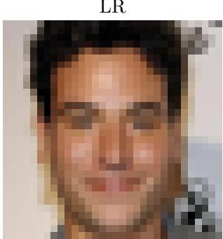

HR  
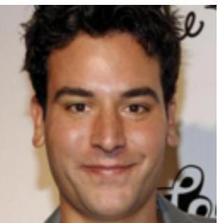

SR3  
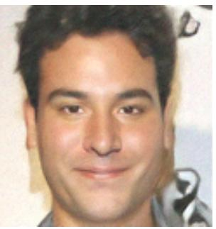

Proposed  
  
Figure 14: Visual comparison of 4× facial reconstruction on CelebA-HQ at epoch 233 in Fig. 13. From left to right: Low-Resolution (LR) input, High-Resolution (HR) ground truth, the SR3 baseline, and our proposed method. The SR3 baseline exhibits a washed-out, overexposed artifact that distorts natural skin tones. In contrast, the proposed VGG variant maintains proper color depth, contrast, and structural definition early in the training cycle.

A qualitative analysis in Figure 14 reveals distinct advantages in the color and contrast preservation of the proposed method over the baseline at epoch 233. While the standard SR3 baseline yields a severely washed-out reconstruction with overexposed, unnaturally pale skin tones, the VGG-regularized model maintains proper color depth and contrast. By anchoring optimization within a perceptual feature space, the proposed method efectively mitigates early-stage luminance degradation and chalky artifacts, yielding a much closer match to the natural color profile of the target domain (HR).

Figure 15 visually compares the models at the final evaluation checkpoint. In the first row, the zoomed region highlights the hairline. The standard SR3 baseline generates severe high-frequency noise and unnatural checkerboard textures across the skin and hair strands. In contrast, our proposed model $( \omega _ { \mathrm { V G G } } = 0 . 0 5 )$ completely suppresses these noisy artifacts, producing smooth skin surfaces and realistic hair shading that closely match the high-resolution ground truth. In the second row, the zoomed region focuses on the sharp edge of the neck. The SR3 baseline fails to form a clean boundary, creating jagged, blurred edges and visible pixel noise. Our proposed framework successfully removes these distortions, restoring a sharp, smooth edge transition. These visual results confirm that regularizing the model with a VGG loss efectively corrects localized structural artifacts that standard pixel-level training fails to fix.

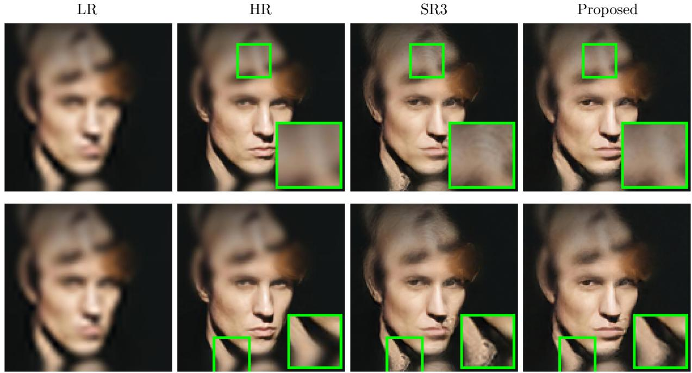  
Figure 15: Visual comparison of 4× facial reconstruction on CelebA-HQ at the last evaluation point in Fig. 13. From left to right: Low-Resolution (LR) input, High-Resolution (HR) ground truth, SR3 baseline, and our proposed model (ωVGG = 0.05). Green boxes show zoomed details of the neck/collar boundary (top row) and the hairline and cheek region (bottom row). The proposed model produces smoother, more continuous boundaries at the collar than the SR3 baseline, and shows a more modest reduction in fine-texture noise around the hairline.

## 4.3 Discussions

## 4.3.1 Sensitivity and Parameter Selection

We discuss the sensitivity of the numerical results to the VGG regularization parameters. Because the grayscale MRI and RGB facial-image experiments use diferent datasets, loss formulations, and values of ωVGG, their numerical results are not compared directly. Instead, parameter sensitivity is analyzed separately within each experimental setting, followed by a discussion of the trends shared across the two image domains.

Grayscale MRI experiments. The efect of VGG regularization depends on both the perceptual loss type and the weight assigned to it. The following sensitivity discussion of the grayscale MRI experiments highlights three main observations. First, the VGG regularization parameters that yield the fastest early-stage convergence in Section 4.1 usually do not produce the highest peak PSNR or SSIM. Second, the preferred parameters are not directly transferable across different super-resolution scale factors, even when the same dataset is used. Third, the preferred parameters are also not directly transferable across datasets, even when both datasets contain brain MRI images, as in our BrainWeb MRI and Brain Tumor MRI experiments.

For each grayscale MRI task, we evaluate the $\mathcal { L } _ { \mathrm { V G G } } ^ { ( 1 ) }$ loss (19) and the $\mathcal { L } _ { \mathrm { V G G } } ^ { ( 2 ) }$ loss (20) using

$$
\omega _ { \mathrm { V G G } } \in \{ 0 . 1 , 1 , 1 0 , 1 0 0 , 1 0 0 0 \} .\tag{25}
$$

This sensitivity analysis focuses on parameter selection according to the peak PSNR and SSIM attained. As shown in Section 4.1, the setting with the highest peak PSNR/SSIM does not necessarily yield the fastest early convergence. We demonstrate this distinction using the BrainWeb 4× task below. For the remaining grayscale MRI tasks, we will focus only on the peak PSNR and SSIM used for parameter selection, as their early-convergence behavior and corresponding configurations selected have already been presented in Section 4.1.

We begin with the BrainWeb 4× task, which provides the most detailed sensitivity analysis. For the $\mathcal { L } _ { \mathrm { V G G } } ^ { ( \mathrm { i } ) }$ loss, the convergence curves in Figure 16 show $\omega _ { \mathrm { V G G } } = 1 0 0$ reaches a stable PSNR and SSIM level fastest in the early epochs.

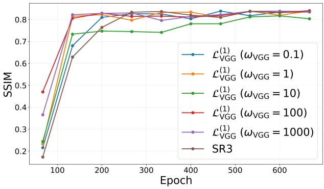  
(a) SSIM

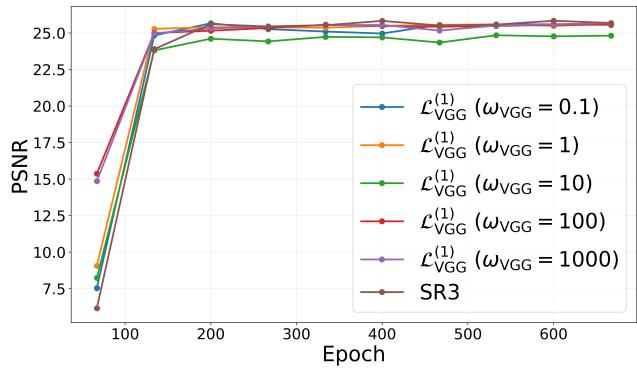  
(b) PSNR  
Figure 16: Parameter tuning results for $\mathcal { L } _ { \mathrm { V G G } } ^ { ( 1 ) }$ loss on BrainWeb MRI $4 \times \ \mathrm { S R }$ . The model with $\omega _ { \mathrm { V G G } } = 1 0 0$ shows the fastest early convergence.

However, Table 3 shows that the best overall performance is obtained when ωVGG = 0.1. Therefore, for the $\mathcal { L } _ { \mathrm { V G G } } ^ { ( 1 ) }$ loss, $\omega _ { \mathrm { V G G } } = 1 0 0$ is the best choice from the perspective of early convergence, while $\omega _ { \mathrm { V G G } } = 0 . 1$ gives the slightly better final reconstruction quality.

<table><tr><td rowspan="2">WVGG</td><td colspan="2"> $\overline { { \mathcal { L } _ { \mathrm { V G G } } ^ { ( 1 ) } } }$ </td><td colspan="2"> $\overline { { \mathcal { L } _ { \mathrm { V G G } } ^ { ( 2 ) } } }$ </td></tr><tr><td>Peak PSNR</td><td>Peak SSIM</td><td>Peak PSNR</td><td>Peak SSIM</td></tr><tr><td>0.1</td><td>25.665</td><td>0.8384</td><td>25.452</td><td>0.8365</td></tr><tr><td>1</td><td>25.632</td><td>0.8390</td><td>25.753</td><td>0.8436</td></tr><tr><td>10</td><td>24.844</td><td>0.8166</td><td>25.660</td><td>0.8365</td></tr><tr><td>100</td><td>25.569</td><td>0.8364</td><td>25.601</td><td>0.8366</td></tr><tr><td>1000</td><td>25.665</td><td>0.8380</td><td>24.900</td><td>0.8169</td></tr></table>

Table 3: Parameter tuning of the VGG perceptual-loss weight $\omega _ { \mathrm { V G G } }$ on BrainWeb MRI 4× superresolution. Results are reported for $\mathcal { L } _ { \mathrm { V G G } } ^ { ( 1 ) }$ (left) and $\mathcal { L } _ { \mathrm { V G G } } ^ { ( 2 ) }$ (right). The best values for each metric are highlighted in boldface.

The $\mathcal { L } _ { \mathrm { V G G } } ^ { ( 2 ) }$ loss exhibits a similar separation between the two criteria. As shown in Figure 17 and Table $3 , \ \omega _ { \mathrm { V G G } } = 1 0 $ gives the fastest early convergence in terms of both PSNR and SSIM. On the other hand, the best final reconstruction performance is achieved when $\omega _ { \mathrm { V G G } } = 1$ . We also observe that an overly large VGG weight, such as $\omega _ { \mathrm { V G G } } = 1 0 0 0$ , leads to a clear drop in both PSNR and SSIM, suggesting that too much emphasis on the perceptual loss term can hurt the reconstruction quality.

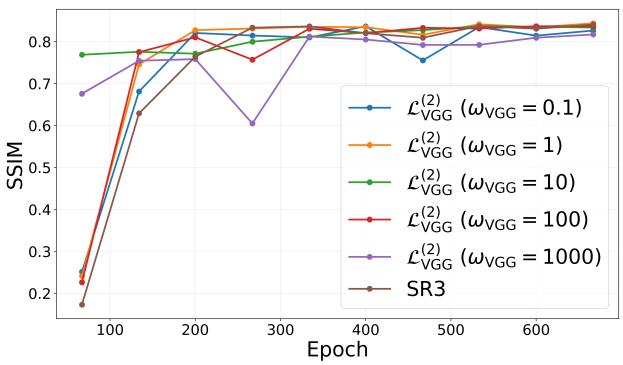  
(a) SSIM

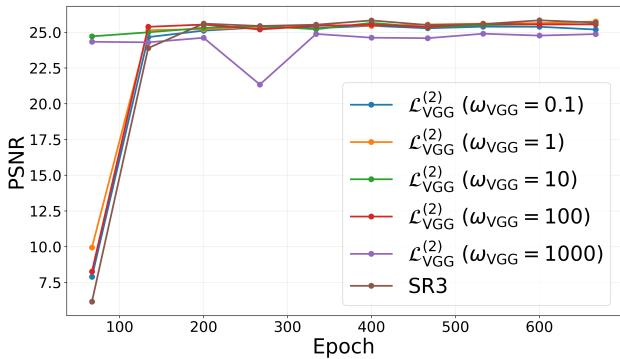  
(b) PSNR  
Figure 17: Parameter tuning results for $\mathcal { L } _ { \mathrm { V G G } } ^ { ( 2 ) }$ loss on BrainWeb MRI $4 \times \ \mathrm { S R }$ $\omega _ { \mathrm { V G G } } = 1 0$ shows the fastest early convergence in both PSNR and SSIM.

The results for the remaining BrainWeb $2 \times$ and $8 \times$ tasks show that the preferred VGG configuration depends on the super-resolution scale factor. Although all three tasks use the same BrainWeb dataset, the parameters selected for the $2 \times$ and $8 \times$ tasks difer from those selected for the 4× task. For the easier BrainWeb $2 \times \ \mathrm { S R }$ task, we repeat the same sensitivity study as the above 4× SR task. The results are summarized in Table 4. Since the $2 \times$ task is less challenging than the 4× and 8× cases, all models achieve high PSNR and SSIM values. In particular, the $\mathcal { L } _ { \mathrm { V G G } } ^ { ( 1 ) }$ model with $\omega _ { \mathrm { V G G } } = 1 0 0$ gives the best PSNR, while the $\mathcal { L } _ { \mathrm { V G G } } ^ { ( 2 ) }$ model with $\omega _ { \mathrm { V G G } } = 1 0 0$ gives the best SSIM.

<table><tr><td rowspan="2">WVGG</td><td colspan="2"> $\mathcal { L } _ { \mathrm { V G G } } ^ { ( 1 ) }$ </td><td colspan="2"> $\mathcal { L } _ { \mathrm { V G G } } ^ { ( 2 ) }$ </td></tr><tr><td>Peak PSNR</td><td>Peak SSIM</td><td>Peak PSNR</td><td>Peak SSIM</td></tr><tr><td>0.1</td><td>31.367</td><td>0.9584</td><td>31.216</td><td>0.9574</td></tr><tr><td>1</td><td>31.226</td><td>0.9591</td><td>31.434</td><td>0.9595</td></tr><tr><td>10</td><td>31.284</td><td>0.9581</td><td>31.269</td><td>0.9591</td></tr><tr><td>100</td><td>31.605</td><td>0.9596</td><td>31.463</td><td>0.9597</td></tr><tr><td>1000</td><td>31.245</td><td>0.9579</td><td>31.392</td><td>0.9583</td></tr><tr><td>SR3</td><td>31.324</td><td>0.9579</td><td>31.324</td><td>0.9579</td></tr></table>

Table 4: Sensitivity study of the VGG loss weight on the BrainWeb $2 \times$ task. The $\mathcal { L } _ { \mathrm { V G G } } ^ { ( 1 ) }$ model with $\omega _ { \mathrm { V G G } } = 1 0 0 $ achieves the best PSNR, while the $\mathcal { L } _ { \mathrm { V G G } } ^ { ( 2 ) }$ model with $\omega _ { \mathrm { V G G } } = 1 0 0$ achieves the best SSIM.

For the more challenging BrainWeb 8× task, Table 5 shows VGG-regularized models achieve better numerical performance in terms of both PSNR and SSIM. In particular, the $\mathcal { L } _ { \mathrm { V G G } } ^ { ( 1 ) }$ model with $\omega _ { \mathrm { V G G } } = 1 0 0 $ gives the highest PSNR, while the $\mathcal { L } _ { \mathrm { V G G } } ^ { ( 2 ) }$ model with $\omega _ { \mathrm { V G G } } = 1 0 0 $ gives the highest SSIM.

<table><tr><td rowspan="2">WVGG</td><td colspan="2"> $\overline { { \mathcal { L } _ { \mathrm { V G G } } ^ { ( 1 ) } } }$ </td><td colspan="2"> $\overline { { \mathcal { L } _ { \mathrm { V G G } } ^ { ( 2 ) } } }$ </td></tr><tr><td>Peak PSNR</td><td>Peak SSIM</td><td>Peak PSNR</td><td>Peak SSIM</td></tr><tr><td>0.1</td><td>22.174</td><td>0.6919</td><td>22.161</td><td>0.6869</td></tr><tr><td>1</td><td>22.220</td><td>0.6898</td><td>22.201</td><td>0.6931</td></tr><tr><td>10</td><td>22.174</td><td>0.6916</td><td>22.184</td><td>0.6863</td></tr><tr><td>100</td><td>22.274</td><td>0.6895</td><td>22.221</td><td>0.6937</td></tr><tr><td>1000</td><td>22.202</td><td>0.6847</td><td>21.413</td><td>0.6444</td></tr><tr><td>SR3</td><td>22.211</td><td>0.6910</td><td>22.211</td><td>0.6910</td></tr></table>

Table 5: Sensitivity study of the VGG loss weight on the BrainWeb 8× task. The $\mathcal { L } _ { \mathrm { V G G } } ^ { ( 1 ) }$ model with $\omega _ { \mathrm { V G G } } = 1 0 0$ achieves the best peak PSNR, while the $\mathcal { L } _ { \mathrm { V G G } } ^ { ( 2 ) }$ model with $\omega _ { \mathrm { V G G } } = 1 0 0$ achieves the best peak SSIM.

The Brain Tumor MRI 4× results in Table 6 further show that the configuration selected on BrainWeb does not transfer directly to another MRI dataset. The $\mathrm { s q u a r e d } { \mathrm { - } } L ^ { 2 }$ model with ω = 10 attains the highest peak PSNR, while the $L ^ { 1 }$ model with $\omega _ { \mathrm { V G G } } ~ = ~ 0 . 1$ attains the highest peak SSIM.
<table><tr><td rowspan="2">WVGG</td><td colspan="2"> $\overline { { \mathcal { L } _ { \mathrm { V G G } } ^ { ( 1 ) } } }$ </td><td colspan="2"> $\overline { { \mathcal { L } _ { \mathrm { V G G } } ^ { ( 2 ) } } }$ </td></tr><tr><td>Peak PSNR</td><td>Peak SSIM</td><td>Peak PSNR</td><td>Peak SSIM</td></tr><tr><td>0.1</td><td>29.166</td><td>0.8662</td><td>29.120</td><td>0.8633</td></tr><tr><td>1</td><td>28.945</td><td>0.8624</td><td>29.064</td><td>0.8605</td></tr><tr><td>10</td><td>29.090</td><td>0.8604</td><td>29.391</td><td>0.8645</td></tr><tr><td>100</td><td>29.160</td><td>0.8616</td><td>27.385</td><td>0.8204</td></tr><tr><td>1000</td><td>27.748</td><td>0.8334</td><td>27.414</td><td>0.8246</td></tr><tr><td>SR3</td><td>29.217</td><td>0.8647</td><td>29.217</td><td>0.8647</td></tr></table>

Table 6: Sensitivity study of the VGG loss weight on the Brain Tumor MRI 4× task. The $\mathcal { L } _ { \mathrm { V G G } } ^ { ( 2 ) }$ model with $\omega _ { \mathrm { V G G } } = 1 0$ achieves the best PSNR, while the $\mathcal { L } _ { \mathrm { V G G } } ^ { ( 1 ) }$ model with $\omega _ { \mathrm { V G G } } = 0 . 1$ achieves the best SSIM.

Overall, this sensitivity discussion suggests that at the current stage, both the VGG loss type and the regularization weight $\omega _ { \mathrm { V G G } }$ need to be tuned manually for each experimental setting. The preferred configuration depends not only on the dataset and SR scale factor, but also on the optimization objective. One parameter setting may be preferred when faster early-stage convergence is desired, whereas another may yield better final reconstruction quality in terms of PSNR/SSIM. We note, however, that the present study considers only five relatively widely spaced values of ω , namely 0.1, 1, 10, 100, 1000. A finer search around the most promising values may identify configurations with further improvements in convergence or final reconstruction quality.

RGB facial-image experiments In this section, we evaluate the efect of adding a VGG perceptual loss to the SR3 framework on face image super-resolution $( 4 \times )$ . Models are trained on the FFHQ dataset and evaluated cross-dataset on the CelebA-HQ evaluation set. Unlike the grayscale MRI experiments where both the $\mathcal { L } _ { \mathrm { V G G } } ^ { ( 1 ) }$ and $\mathcal { L } _ { \mathrm { V G G } } ^ { ( 2 ) }$ losses were compared, only the $\mathcal { L } _ { \mathrm { V G G } } ^ { ( 1 ) }$ loss is evaluated for CelebA-HQ; we leave the evaluation of the squared- $L ^ { 2 }$ variant on color datasets to future work.

To systematically determine the optimal regularizing weight, we perform a parameter sensitivity study. We structure our search by first sweeping across a coarse range of broad magnitudes, followed by a fine-grained evaluation of tight local increments:

$$
\begin{array} { r } { \omega _ { \mathrm { V G G } } \in \{ 0 . 0 0 1 , 0 . 0 1 , 0 . 0 2 , 0 . 0 3 , 0 . 0 4 , 0 . 0 5 , 0 . 1 , 1 , 1 0 \} . } \end{array}\tag{26}
$$

This sweep focuses on finding the general useful range of the parameter space and identifying the configurations that ofer the best balance between training speed and final image reconstruction metrics.
<table><tr><td rowspan=1 colspan=1>WVGG</td><td rowspan=1 colspan=1>Peak PSNR</td><td rowspan=1 colspan=1>Epoch</td><td rowspan=1 colspan=1>Peak SSIM</td><td rowspan=1 colspan=1>Epoch</td></tr><tr><td rowspan=1 colspan=1>0.001</td><td rowspan=1 colspan=1>27.907</td><td rowspan=1 colspan=1>542</td><td rowspan=1 colspan=1>0.8352</td><td rowspan=1 colspan=1>619</td></tr><tr><td rowspan=1 colspan=1>0.01</td><td rowspan=1 colspan=1>27.842</td><td rowspan=1 colspan=1>465</td><td rowspan=1 colspan=1>0.8355</td><td rowspan=1 colspan=1>465</td></tr><tr><td rowspan=1 colspan=1>0.02</td><td rowspan=1 colspan=1>27.885</td><td rowspan=1 colspan=1>697</td><td rowspan=1 colspan=1>0.8309</td><td rowspan=1 colspan=1>542</td></tr><tr><td rowspan=1 colspan=1>0.03</td><td rowspan=1 colspan=1>28.146</td><td rowspan=1 colspan=1>619</td><td rowspan=1 colspan=1>0.8410</td><td rowspan=1 colspan=1>619</td></tr><tr><td rowspan=2 colspan=1>0.040.05</td><td rowspan=1 colspan=1>28.170</td><td rowspan=1 colspan=1>465</td><td rowspan=1 colspan=1>0.8427</td><td rowspan=1 colspan=1>465</td></tr><tr><td rowspan=1 colspan=1>27.506</td><td rowspan=1 colspan=1>465</td><td rowspan=1 colspan=1>0.8253</td><td rowspan=1 colspan=1>465</td></tr><tr><td rowspan=3 colspan=1>0.1110</td><td rowspan=1 colspan=1>27.892</td><td rowspan=1 colspan=1>542</td><td rowspan=1 colspan=1>0.8347</td><td rowspan=1 colspan=1>387</td></tr><tr><td rowspan=1 colspan=1>27.925</td><td rowspan=1 colspan=1>465</td><td rowspan=1 colspan=1>0.8298</td><td rowspan=1 colspan=1>465</td></tr><tr><td rowspan=1 colspan=1>27.963</td><td rowspan=1 colspan=1>774</td><td rowspan=1 colspan=1>0.8331</td><td rowspan=1 colspan=1>774</td></tr><tr><td rowspan=1 colspan=1>SR3(baseline)</td><td rowspan=1 colspan=1>27.747</td><td rowspan=1 colspan=1>774</td><td rowspan=1 colspan=1>0.8292</td><td rowspan=1 colspan=1>774</td></tr></table>

Table 7: Peak PSNR/SSIM for each ωVGG vs. the SR3 baseline on CelebA-HQ. Nearly every weight beats the baseline; the exception is $\omega _ { \mathrm { V G G } } = 0 . 0 5$ , which trades final quality for faster convergence (Section 4.2). $\omega _ { \mathrm { V G G } } = 0 . 0 4$ gives the best scores while saving over 300 epochs.

Table 7 summarizes the peak quantitative metrics and their corresponding training epochs. The results show that perceptual regularization generally improves the final reconstruction performance over the SR3 baseline. Nearly all tested configurations outperform the baseline peak values of 27.747 dB PSNR and 0.8292 SSIM, demonstrating the efectiveness of the proposed perceptual regularization.

Larger weights, such as $\omega _ { \mathrm { V G G } } \geq 1$ , show diminishing returns relative to the optimal setting, although they still outperform the baseline in both metrics. Looking closely at the fine-grained settings, a critical trade-of emerges between early training acceleration and final peak quality. Specifically, the higher weight configuration of $\omega _ { \mathrm { V G G } } = 0 . 0 5$ demonstrates very strong early convergence capabilities, allowing the network to quickly climb and plateau at epoch 465. However, this heavy regularization ultimately restricts the model’s final capacity, causing the peak scores to drop significantly below the baseline to 27.506 dB.

Among the tested settings, $\omega _ { \mathrm { V G G } } = 0 . 0 4$ provides the best balance between early convergence and final reconstruction quality. Although its early convergence is more moderate than that of the ωVGG = 0.05 variant, it achieves the highest peak PSNR of 28.170 dB and peak SSIM of 0.8427 at epoch 465. Compared with SR3, whose peak performance is reached at epoch 774, this setting achieves improved reconstruction quality while reaching its peak performance more than 300 epochs earlier.

In conclusion, integrating the VGG perceptual loss generally improves final image reconstruction quality while accelerating convergence compared to the baseline. Although over-regularization or insuficient weight leads to minimal performance gains or localized degradation, our evaluation successfully establishes the efective operational range of the parameter space. Ultimately, ωVGG =

0.04 provides the optimal balance, delivering peak quantitative fidelity while maximizing training eficiency.

## 5 Conclusion and Future Work

Image super-resolution remains a challenging inverse problem because image degradations often remove high-frequency information that cannot be recovered directly in many real applications. In this work, we propose a perceptually regularized difusion framework for single-image superresolution, built on the SR3 backbone, that augments the standard noise-prediction objective with a VGG-based perceptual regularization term. By penalizing feature-space discrepancy between the reconstructed and ground-truth HR images, the regularization encourages the recovery of perceptually meaningful structures without modifying the difusion architecture or inference procedure. Numerical experiments on benchmark datasets, including grayscale MRI and color facial images, have shown that the proposed regularization accelerates training convergence and yields more accurate recovery of fine features and textures than the baseline SR3 method. These empirical findings are consistent with the gradient flow interpretation, developed in Section 3.2, which shows that the perceptual term introduces anisotropic curvature into the training objective along structurally informative directions. In addition, studies on the parameter selection and stability further confirm the robustness and reproducibility of the proposed framework. Future work includes the development of learnable and multiscale regularization strategies, transfer learning, methods for reducing color shifts, and extensions to other image restoration problems such as denoising and inpainting.

## Acknowledgments

The authors would like to thank the NSF grant DMS-2520375 that supported the Research Collaboration Workshop in Science of Data and Mathematics (WiSDM) at the University of North Carolina, Chapel Hill, during August 4–8, 2025.

## Author Contributions

Conceptualization, JQ & WG; Methodology, JQ & WG; Software, CW & PV & MW; Validation, CW & PV & MW; Formal Analysis, MW & YL; Investigation, CW & MW; Data Curation, CW & PV; Writing – Original Draft Preparation, CW & YL & JQ & YL & WG; Writing – Review & Editing, CW & PV & YL & JQ & YL & WG; Supervision - JQ & YL & WG; Project Administration - JQ & WG.

## Competing Interests

The authors declare no competing interests.

## References

[1] Zhihao Wang, Jian Chen, and Steven CH Hoi. Deep learning for image super-resolution: A survey. IEEE transactions on pattern analysis and machine intelligence, 43(10):3365–3387, 2020.

[2] Honggang Chen, Xiaohai He, Linbo Qing, Yuanyuan Wu, Chao Ren, Ray E Sherif, and Ce Zhu. Real-world single image super-resolution: A brief review. Information Fusion, 79:124–145, 2022.

[3] Leonid I Rudin, Stanley Osher, and Emad Fatemi. Nonlinear total variation based noise removal algorithms. Physica D: nonlinear phenomena, 60(1-4):259–268, 1992.

[4] Donya Khaledyan, Abdolah Amirany, Kian Jafari, Mohammad Hossein Moaiyeri, Abolfazl Zargari Khuzani, and Najmeh Mashhadi. Low-cost implementation of bilinear and bicubic image interpolation for real-time image super-resolution. In 2020 IEEE Global Humanitarian Technology Conference (GHTC), pages 1–5. IEEE, 2020.

[5] Jing Liu, Zongliang Gan, and Xiuchang Zhu. Directional bicubic interpolation—a new method of image super-resolution. In 3rd International Conference on Multimedia Technology (ICMT-13), pages 463–470. Atlantis Press, 2013.

[6] Christian Ledig, Lucas Theis, Ferenc Husz´ar, Jose Caballero, Andrew Cunningham, Alejandro Acosta, Andrew Aitken, Alykhan Tejani, Johannes Totz, Zehan Wang, et al. Photo-realistic single image super-resolution using a generative adversarial network. In Proceedings of the IEEE conference on computer vision and pattern recognition, pages 4681–4690, 2017.

[7] Xintao Wang, Ke Yu, Shixiang Wu, Jinjin Gu, Yihao Liu, Chao Dong, Yu Qiao, and Chen Change Loy. ESRGAN: Enhanced super-resolution generative adversarial networks. In Proceedings of the European conference on computer vision (ECCV) workshops, pages 0–0, 2018.

[8] Ian Goodfellow, Jean Pouget-Abadie, Mehdi Mirza, Bing Xu, David Warde-Farley, Sherjil Ozair, Aaron Courville, and Yoshua Bengio. Generative adversarial nets. In Advances in Neural Information Processing Systems, 2014.

[9] Maciej Wiatrak, Stefano V Albrecht, and Andrew Nystrom. Stabilizing generative adversarial networks: A survey. arXiv preprint arXiv:1910.00927, 2019.

[10] Liangbin Xie, Xintao Wang, Xiangyu Chen, Gen Li, Ying Shan, Jiantao Zhou, and Chao Dong. DeSRA: Detect and delete the artifacts of GAN-based real-world super-resolution models. In International Conference on Machine Learning, pages 38204–38226. PMLR, 2023.

[11] Brian B Moser, Arundhati S Shanbhag, Federico Raue, Stanislav Frolov, Sebastian Palacio, and Andreas Dengel. Difusion models, image super-resolution, and everything: A survey. IEEE Transactions on Neural Networks and Learning Systems, 2024.

[12] Jonathan Ho, Ajay Jain, and Pieter Abbeel. Denoising difusion probabilistic models. Advances in neural information processing systems, 33:6840–6851, 2020.

[13] Ling Yang, Zhilong Zhang, Yang Song, Shenda Hong, Runsheng Xu, Yue Zhao, Wentao Zhang, Bin Cui, and Ming-Hsuan Yang. Difusion models: A comprehensive survey of methods and applications. ACM computing surveys, 56(4):1–39, 2023.

[14] Chitwan Saharia, Jonathan Ho, William Chan, Tim Salimans, David J Fleet, and Mohammad Norouzi. Image super-resolution via iterative refinement. IEEE transactions on pattern analysis and machine intelligence, 45(4):4713–4726, 2022.

[15] Haoying Li, Yifan Yang, Meng Chang, Shiqi Chen, Huajun Feng, Zhihai Xu, Qi Li, and Yueting Chen. SRDif: Single image super-resolution with difusion probabilistic models. Neurocomputing, 479:47–59, 2022.

[16] Zongsheng Yue, Jianyi Wang, and Chen Change Loy. Resshift: Eficient difusion model for image super-resolution by residual shifting. Advances in Neural Information Processing Systems, 36:13294–13307, 2023.

[17] Shuyao Shang, Zhengyang Shan, Guangxing Liu, LunQian Wang, XingHua Wang, Zekai Zhang, and Jinglin Zhang. Resdif: Combining cnn and difusion model for image superresolution. In Proceedings of the AAAI Conference on Artificial Intelligence, volume 38, pages 8975–8983, 2024.

[18] Karen Simonyan and Andrew Zisserman. Very deep convolutional networks for large-scale image recognition. 3rd International Conference on Learning Representations, ICLR 2015 - Conference Track Proceedings, pages 1–14, 2015.

[19] Justin Johnson, Alexandre Alahi, and Li Fei-Fei. Perceptual losses for real-time style transfer and super-resolution. In European conference on computer vision, pages 694–711. Springer, 2016.

[20] Jascha Sohl-Dickstein, Eric Weiss, Niru Maheswaranathan, and Surya Ganguli. Deep unsupervised learning using nonequilibrium thermodynamics. In International Conference on Machine Learning, 2015.

[21] Yang Song, Jascha Sohl-Dickstein, Diederik P. Kingma, Abhishek Kumar, Stefano Ermon, and Ben Poole. Score-based generative modeling through stochastic diferential equations. In International Conference on Learning Representations, 2021.

[22] Diederik P Kingma and Max Welling. Auto-encoding variational Bayes. In International Conference on Learning Representations, 2014.

[23] Danilo Rezende and Shakir Mohamed. Variational inference with normalizing flows. In International Conference on Machine Learning, 2015.

[24] Tariq Berrada, Pietro Astolfi, Melissa Hall, Marton Havasi, Yohann Benchetrit, Adriana Romero-Soriano, Karteek Alahari, Michal Drozdzal, and Jakob Verbeek. Boosting latent diffusion with perceptual objectives. In International Conference on Learning Representations, 2025.

[25] Chris A. Cocosco, Vasken Kollokian, Remi K.-S. Kwan, and Alan C. Evans. BrainWeb: Online interface to a 3D MRI simulated brain database. NeuroImage, 1997.

[26] R.K.-S. Kwan, A.C. Evans, and G.B. Pike. MRI simulation-based evaluation of imageprocessing and classification methods. IEEE Transactions on Medical Imaging, 18(11):1085– 1097, 1999.

[27] Remi K-S Kwan, Alan C Evans, and G Bruce Pike. An extensible MRI simulator for postprocessing evaluation. In International conference on visualization in biomedical computing, pages 135–140. Springer, 1996.

[28] D. Louis Collins, Alex P. Zijdenbos, Vasken Kollokian, John G. Sled, Noor Jehan Kabani, Colin J. Holmes, and Alan C. Evans. Design and construction of a realistic digital brain phantom. IEEE Transactions on Medical Imaging, 17:463–468, 1998.

[29] Tero Karras, Samuli Laine, and Timo Aila. A style-based generator architecture for generative adversarial networks. In Proceedings of the IEEE/CVF Conference on Computer Vision and Pattern Recognition, pages 4401–4410, 2019.

[30] Ziwei Liu, Ping Luo, Xiaogang Wang, and Xiaoou Tang. Deep learning face attributes in the wild. In Proceedings of International Conference on Computer Vision (ICCV), 2015.

[31] Tero Karras, Timo Aila, Samuli Laine, and Jaakko Lehtinen. Progressive growing of GANs for improved quality, stability, and variation. 2018.