# Post-Training Language Models for Gold-Medal Performance in Coding Competitions

Aleksander Ficek∗, Sean Narenthiran∗, Mehrzad Samadi, Somshubra Majumdar, Boris Ginsburg

Abstract. Competitive programming has become a key test of large language model reasoning, with international competitions such as IOI and ICPC representing its most challenging settings. We present an end-to-end specialization pipeline combining large-scale problem curation, synthetic reasoning traces, supervised fine-tuning (SFT), and reinforcement learning (RL). Using 22,000 curated problems, we train Nemotron-3-Nano-CC (30B-A3B) with SFT and RL and Nemotron-3-Ultra-CC (550B-A55B) with SFT alone. We further introduce GenCorrect, a feedback-driven test-time compute strategy that iteratively generates, evaluates, and refines diverse solutions. On IOI 2025, Nano-CC improves from 130 points to 291 after post-training and to 468 with GenCorrect, exceeding the gold threshold of 438.3 while Ultra-CC reaches 502. Guided by these results, we develop a competition-specific Ultra-CC system and evaluate it prospectively during IOI 2026. Under the same time, internet-access, and submission constraints as human contestants, it scores 535.4 out of 600, exceeding both the gold threshold of 361.12 and the top human score of 498.27. To our knowledge, this is the first AI system to outscore the highest-scoring human contestant on an IOI problem set.

## 1. Introduction

Competitive programming has emerged as a challenging domain for evaluating the reasoning capabilities of large language models (LLMs). Unlike conventional coding benchmarks, competitive programming requires models to synthesize novel algorithms, reason over complex constraints, and produce implementations that pass hidden tests under time and memory limits. Performance on competitive programming has become a strong indicator of a model’s reasoning and coding ability (Li et al., 2022; Jain et al., 2024; Zheng et al., 2025). Recent years have seen progress on these tasks, with proprietary and open-weight models achieving gold-medal performance in competitions such as the International Olympiad in Informatics (IOI) and the International Collegiate Programming Contest (ICPC) (OpenAI et al., 2025; DeepSeek-AI, 2025; Samadi et al., 2026; Yang et al., 2026). Despite this progress, the contributions of components required to reach gold-medal performance remain dificult to isolate. Existing systems are often closed, rely on specialized models, or combine changes in training data, post-training, model scale, and inference-time compute.

We present a competitive-programming pipeline combining large-scale problem curation, synthetic data generation, supervised fine-tuning (SFT), reinforcement learning (RL), and iterative testtime refinement. We curate 22,000 problems and use DeepSeek-V4-Flash (DeepSeek-AI, 2026) to generate 1.2 million reasoning traces for our compact model and 477,642 traces for our larger model, excluding and deduplicating all evaluation problems from training. Starting from Nemotron-3- Nano-30B-A3B (NVIDIA, 2025), we apply SFT and RL to produce Nemotron-3-Nano-CC, a 30B-parameter mixture-of-experts model with 3B active parameters. Starting from Nemotron-3- Ultra-550B-A55B (NVIDIA, 2026), we apply SFT without code-specific RL to produce Nemotron-3- Ultra-CC, a 550B-parameter model with 55B active parameters. Both models use GenCorrect, our

IOI 2025 Capability Progression

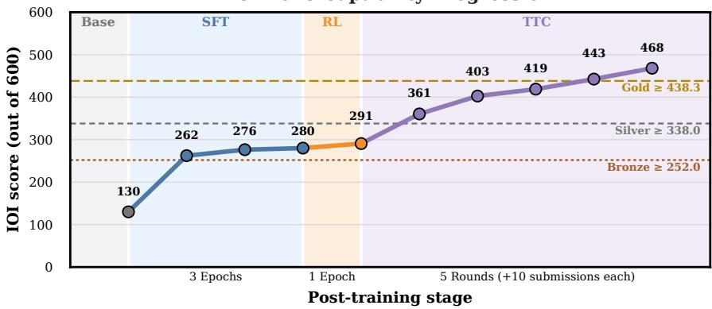  
(a) General Nano-CC on IOI 2025: SFT and RL improve Score@1, while GenCorrect achieves gold-medal performance with 50 submissions.

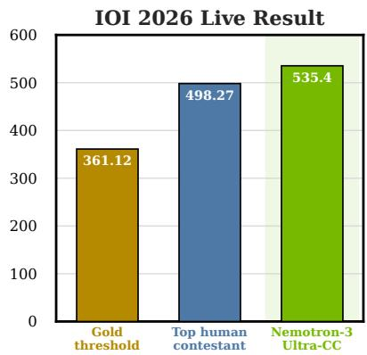  
(b) Competition Ultra-CC surpasses highest human score.  
Figure 1 | Performance of our pipeline and models on IOI 2025 and IOI 2026.

iterative inference strategy that refines diverse solutions using feedback from previous submissions. Figure 1a summarizes the progression of Nemotron-3-Nano-CC on IOI 2025. Its Score@1 increases from 130 to 280 after SFT and 291 after RL, while five GenCorrect rounds raise its score to 468, exceeding the gold threshold of 438.3 under the oficial 50-submission limit (International Olympiad in Informatics, 2025). Our general Nemotron-3-Ultra-CC reaches 304 without code-specific RL and 502.0 after five rounds of GenCorrect.

After completing these general-pipeline experiments, we apply their insights to develop a competitionspecific model and inference pipeline for IOI 2026. We use IOI 2025 as a development benchmark to select the training and inference adaptations used by this system. We then evaluate the resulting system live on the IOI 2026 problem set under competition time and submission, before the problems are publicly released.† Under matched competition time, internet-access, and submission constraints, Competition Ultra-CC scores 535.4/600, exceeding the gold threshold of 361.12 and the top oficial contestant score of 498.27, as shown in Figure 1b (International Olympiad in Informatics, 2026). We plan to release our competition Nemotron-3-Ultra-CC checkpoint together with runnable inference and evaluation recipes in NeMo-Skills.‡ To summarize, our main contributions are:

• We develop an end-to-end specialization pipeline for competitive programming, including large-scale problem curation, synthetic reasoning data, long-context supervised fine-tuning, and reinforcement learning with executable rewards.

• We introduce GenCorrect, a closed-loop test-time compute strategy that iteratively generates diverse solutions, incorporates evaluator feedback, and refines subsequent generations under a constrained submission budget.

• We provide a comprehensive empirical analysis of how synthetic data, SFT, RL, model scale, and test-time compute contribute to competitive-programming performance.

• We apply our pipeline to develop a competition-specific system evaluated live during IOI 2026. Under the same time limits, submission platform, and internet restrictions as human contestants, it scored 535.4/600, surpassing the highest-scoring human contestant. To our knowledge, this is the first time an AI system has done so on any IOI problem set.

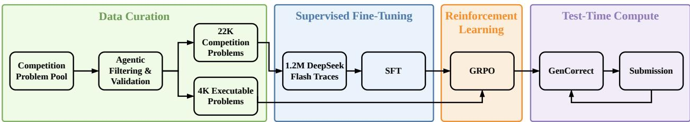  
Figure 2 | Our competitive-programming pipeline. Nemotron-3-Nano-CC undergoes supervised fine-tuning and reinforcement learning, while Nemotron-3-Ultra-CC uses supervised fine-tuning only. Both models use GenCorrect at inference time.

## 2. Competition Settings

## 2.1. International Olympiad in Informatics.

IOI is an individual programming competition conducted over two contest days (IOI 2026 Organizing Committee, 2026). At IOI 2025, contestants were presented with six problems, each worth up to 100 points and divided into subtasks covering diferent input constraints. A submission received credit for each subtask whose test cases it passed, allowing partially correct or less eficient algorithms to earn partial scores. Contestants could submit at most 50 solutions per problem, and the six problem scores were summed to produce a maximum score of 600 (International Olympiad in Informatics, 2025; OpenAI et al., 2025). Medal thresholds were determined from the final score distribution, with approximately the top 1/12 of contestants receiving gold, the next 1/6 receiving silver, and the next 1/4 receiving bronze (IOI 2026 Organizing Committee, 2026).

## 2.2. International Collegiate Programming Contest.

At the ICPC 2025 World Finals, teams of three contestants competed for five hours using a single shared computer. The contest contained 12 algorithmic problems evaluated using binary scoring: a problem was solved only when a submission passed all hidden test cases. Teams were ranked primarily by the number of problems solved, with ties broken by total penalty time. For each solved problem, penalty time consisted of the elapsed contest time before acceptance plus 20 minutes for each preceding incorrect submission (International Collegiate Programming Contest, 2025c). The top four teams received gold medals, teams placing 5th–8th received silver medals, and teams placing 9th–12th received bronze medals (International Collegiate Programming Contest, 2025b).

## 3. Method

Our pipeline, summarized in Figure 2, combines supervised fine-tuning (SFT), reinforcement learning (RL), and iterative test-time compute. Modifications used for our live IOI 2026 benchmark run are described in Section 5.

## 3.1. Data Curation

We curate 22,000 problems from 16 regional and international competition families spanning the last two decades, together with problems from online programming platforms. An automated pipeline packages each problem into an executable evaluation environment containing its statement, constraints, test cases, auxiliary files, and reference solutions. We retain only environments that produce consistent verdicts across reference and generated solutions. We exclude all IOI 2025, ICPC 2025, and LiveCodeBench Pro problems from the SFT and RL data and deduplicate the training corpus against these evaluations. IOI 2026 is a strictly prospective evaluation because our system was run before the problems were publicly released. Appendix A provides the complete construction and filtering procedure.

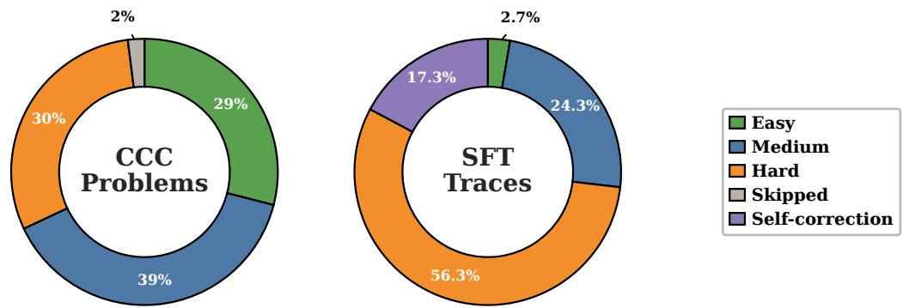  
Figure 3 | Composition of the curated competitive-programming corpus (left) and SFT traces (right).

## 3.2. Supervised Fine-Tuning

We use DeepSeek-V4-Flash to generate 1.2 million reasoning traces for Nemotron-3-Nano-30B-A3B and 477,642 traces for NVIDIA-Nemotron-3-Ultra-550B-A55B (DeepSeek-AI, 2026; NVIDIA, 2025, 2026). As shown in Figure 3, we allocate more generations to dificult problems and include selfimprovement traces in which the teacher refines a previously generated solution. These traces expose the models to the iterative refinement behavior used by GenCorrect. We fine-tune Nano for three epochs and Ultra for one epoch, using a global batch size of 64 and sequence packing up to 262K tokens. Ultra is initialized from its RLVR-teacher checkpoint (NVIDIA, 2026). Complete optimization, parallelism, and compute settings are provided in Appendix B.

## 3.3. Reinforcement Learning

We apply RL only to Nemotron-3-Nano-30B-A3B. After filtering for reliable and suficiently fast executable environments, the RL corpus contains 3,219 problems, split into 2,847 training and 372 validation problems. We split at the parent-problem level to prevent subtasks from the same problem appearing in both sets. We train using NeMo RL (NVIDIA, 2025) with Group Relative Policy Optimization (GRPO) (Shao et al., 2024). Each step samples 16 rollouts for each of 64 prompts at temperature 1.0, yielding 1,024 rollouts. Generated C++17 solutions are compiled and executed, receiving a terminal reward of 1 for full credit and 0 otherwise. We optimize a token-level clipped policy-gradient objective with no reference-policy KL penalty (Yu et al., 2025) and select the final checkpoint using held-out validation performance. Further details are provided in Appendix B.

## 3.4. Test-Time Compute

We introduce GenCorrect, an iterative test-time compute strategy applied for up to five rounds (Figure 4). GenCorrect combines large-scale sampling and behavior-based clustering for competitive programming (Li et al., 2022; Leblond et al., 2023), iterative self-critique and test-based refinement (Ahmad et al., 2025a; Ridnik et al., 2024), and execution-grounded test-time selection (Samadi et al., 2026; Li et al., 2025). Each round consists of:

• Generation. We generate up to 200 candidate solutions in parallel and compile them locally. The first round uses only the problem statement; subsequent rounds additionally use solutions and evaluator feedback from earlier rounds.

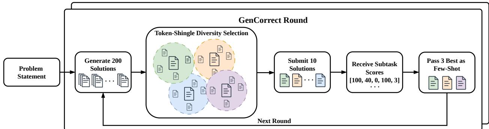  
Figure 4 | GenCorrect iteratively generates candidate solutions, selects a diverse subset for evaluation, and uses evaluator feedback to guide the next round.

• Diversity selection. After filtering invalid outputs, we initialize a center set $C$ using a score-blind local heuristic �(�) and iteratively select the candidate farthest from the existing centers:

$$
c _ { \mathrm { n e x t } } \in \arg \operatorname* { m a x } _ { c \notin C } \operatorname* { m i n } _ { z \in C } \left[ 1 - \sin ( c , z ) \right] .\tag{1}
$$

Here, $\sin ( c , z )$ denotes the candidate similarity score. We select up to � = 10 centers, assign every candidate to its most similar center, and choose the candidate with the highest $Q ( c )$ as the representative of each cluster.

• Execution. We submit the 10 representatives to the evaluator. For IOI, feedback consists of subtask scores. All filtering and selection for the current round occur before these scores are observed.

• Refinement. We accumulate the best score observed for each subtask:

$$
\begin{array} { r l } & { A _ { r } ( t ) = \operatorname* { m a x } \left( A _ { r - 1 } ( t ) , \underset { c \in S _ { r } } { \operatorname* { m a x } } s _ { t } ( c ) \right) , } \\ & { A _ { 0 } ( t ) = 0 , } \end{array}\tag{2}
$$

where $S _ { r }$ denotes the solutions submitted in round �. The next round is conditioned on the accumulated per-subtask score vector (��) and three complementary references selected to preserve solved subtasks, target remaining gaps, and maintain diversity.

For IOI, we perform five rounds of 10 submissions, matching the oficial limit of 50 submissions per problem. Previous works divide problems into subtasks while our approach provides all subtasks to the model and lets it decide which to work on, leading to substantially fewer necessary generations per problem (OpenAI et al., 2025; Samadi et al., 2026; Yang et al., 2026). For ICPC, where feedback is binary, we continue until the problem is solved or performance plateaus. Complete filtering, ranking, tie-breaking, and carry-forward rules along with the necessary prompts are provided in Appendix C.

## 4. Experiments

## 4.1. Evaluation Setup

We evaluate on IOI 2025, ICPC 2025, and LiveCodeBench Pro (LCB Pro) (International Olympiad in Informatics, 2025; International Collegiate Programming Contest, 2025b; Zheng et al., 2025), ensuring that all evaluation problems are excluded and deduplicated from our SFT and RL data. For IOI, Score@� is computed by grouping generated solutions into independent runs. Within each run, we retain the highest score achieved on each subtask, sum across all subtasks and problems, and then average the resulting totals across runs. We report Score@1 for single-sample performance and Score@200 for parallel sampling. For ICPC and LCB Pro, Pass@1 is the fraction of problems solved by one sampled solution. IOI results are reported either as raw scores out of 600 or as normalized percentages, as indicated; ICPC Pass@1 is the percentage of the 12 problems solved. Final IOI and ICPC results are averaged over 1,000 runs, intermediate checkpoints over 50 runs, Score@200 over five runs, and LCB Pro over eight runs. Checkpoints are selected exclusively using the held-out validation set. We compare against gpt-oss-120b (OpenAI, 2025), Qwen3.6-35B-A3B (Qwen Team, 2026), Nemotron-Cascade 2 (Yang et al., 2026), the base Nemotron-3 Nano and Ultra models (NVIDIA, 2025, 2026), DeepSeek-V4-Flash and DeepSeek-V4-Pro (DeepSeek-AI, 2026) (Max thinking), and GLM-5.2 (GLM-5-Team, 2026). All reported competition results are obtained using our evaluation harness rather than copied from the corresponding model reports.

<table><tr><td>Model</td><td>IOI 2025 Score@1</td><td>ICPC 2025 Pass@1</td><td>LCB Pro Pass@1</td></tr><tr><td>Nemotron-3-Nano-30B-A3B</td><td>21.7%</td><td>16.9%</td><td>17.6%</td></tr><tr><td>Nemotron-Cascade-2-30B-A3B</td><td>37.2%</td><td>42.0%</td><td>45.6%</td></tr><tr><td>gpt-oss-120b</td><td>40.7%</td><td>45.8%</td><td>66.4%</td></tr><tr><td>Qwen3.6-35B-A3B</td><td>40.8%</td><td>32.0%</td><td>58.4%</td></tr><tr><td>Nemotron-3-Ultra-550B-A55B</td><td>45.5%</td><td>54.0%</td><td>72.6%</td></tr><tr><td>DSV4 Flash</td><td>55.3%</td><td>65.8%</td><td>69.5%</td></tr><tr><td>DSV4 Pro</td><td>56.8%</td><td>69.6%</td><td>78.2%</td></tr><tr><td>GLM 5.2</td><td>66.0%</td><td>65.7%</td><td>83.8%</td></tr><tr><td>Nemotron-3-Nano-CC</td><td>48.5%</td><td>51.0%</td><td>71.6%</td></tr><tr><td>Nemotron-3-Ultra-CC</td><td>50.7%</td><td>57.4%</td><td>74.5%</td></tr></table>

Table 1 | Main single-sample results on IOI 2025, ICPC 2025, and LiveCodeBench Pro. IOI Score@1 is reported as a normalized percentage, while ICPC and LiveCodeBench Pro report Pass@1.

## 4.2. Main Results

Figure 5 and Table 1 summarize the main results while Figure 1 shows our Nano-CC progression with each pipeline stage. On IOI 2025, Nemotron-3-Nano-CC improves over its base model from 130 (21.7%) to 291 (48.5%) at Score@1 and from 272 to 461 at Score@200. Despite having only 3B active parameters, Nano-CC exceeds the base Nemotron-3-Ultra model at both sampling budgets. At Score@1, it outperforms all evaluated baselines except DeepSeek-V4-Flash, DeepSeek-V4-Pro, and GLM-5.2. The gains transfer beyond IOI: Nano-CC reaches 51.0% Pass@1 on ICPC 2025 and 71.6% on LCB Pro, compared with 16.9% and 17.6% for the base model. On LCB Pro, Nemotron-3-Nano-CC also exceeds gpt-oss-120b, Qwen3.6-35B-A3B, Nemotron-Cascade-2-30B-A3B, and DeepSeek-V4-Flash.

Nemotron-3-Ultra-CC, trained with SFT but without the CC RL stage, improves over the Ultra base model from 45.5% to 50.7% on IOI, 54.0% to 57.4% on ICPC, and 72.6% to 74.5% on LCB Pro. It exceeds Nano-CC by 2.2, 6.4, and 2.9 percentage points, respectively, and achieves the strongest results among our models on all three benchmarks. At its operating scale, Nano-CC is the strongest evaluated model with a comparable active parameter count, whereas Ultra-CC provides the highest absolute performance among our models even though it uses substantially less SFT training and does not feature RL.

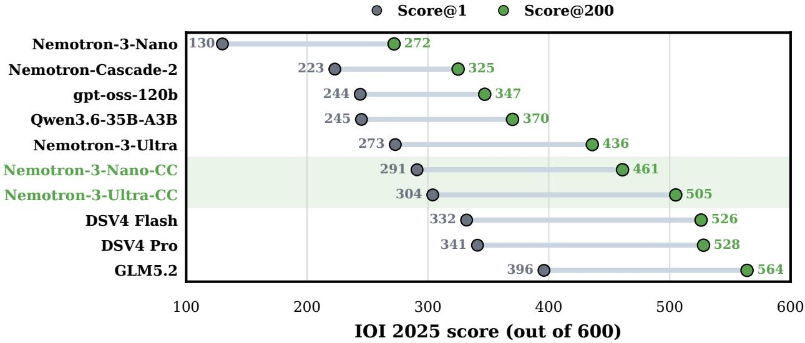  
Figure 5 | IOI 2025 Score@1 (grey) and Score@200 (green) across evaluated models with the grey line representing Score@k in between. Our submitted general Nemotron-3-Nano-CC and Nemotron-3-Ultra-CC is highlighted.

## 4.3. Efect of Supervised Fine-Tuning

Figure 6 shows that SFT produces most of Nano-CC’s improvement. Over three epochs, IOI 2025 Score@1 increases from 21.7% to 47.3%, ICPC 2025 Pass@1 from 16.9% to 46.7%, and LCB Pro Pass@1 from 17.6% to 70.7%. Most gains occur during the first epoch, with performance beginning to saturate by the third. Ultra-CC receives a single SFT epoch over 477,642 examples, improving IOI from 45.5% to 50.7%, ICPC from 54.0% to 57.4%, and LCB Pro from 72.6% to 74.5%. These gains are smaller than Nano’s SFT improvements of 24.8, 29.8, and 53.1 percentage points, respectively, reflecting the substantially stronger Ultra initialization. Nevertheless, the SFT-only Ultra-

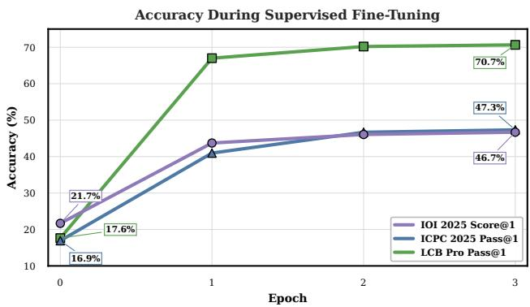  
Figure 6 | Normalized IOI 2025 Score@1, ICPC 2025 Pass@1, and LCB Pro Pass@1 before and during supervised fine-tuning of Nano-CC.

CC model outperforms the final Nano-CC model on all three benchmarks after roughly 478k SFT samples, whereas Nano-CC receives three SFT epochs 1.2M samples each, followed by RL. Thus, when model size and inference cost are not primary constraints, adapting a stronger base model with limited SFT can outperform extensive post-training of a smaller model.

## 4.4. Efect of Reinforcement Learning

We apply RL only to Nano-CC, in part because of the substantial computational cost of running RL at Ultra’s scale. As shown in Figure 7a, starting from the third-epoch SFT checkpoint, RL improves IOI 2025 Score@1 from 46.7% to 48.5%, ICPC 2025 Pass@1 from 47.3% to 51.0%, and LCB Pro Pass@1 from 70.7% to 71.6%. Although smaller than the SFT gains, the improvements occur across all three benchmarks and we select step 39 exclusively using the held-out validation set.

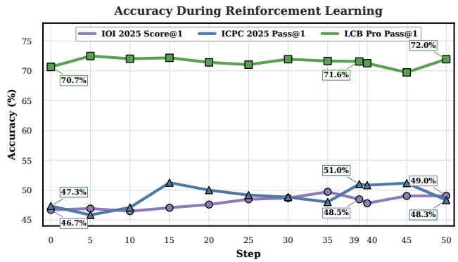

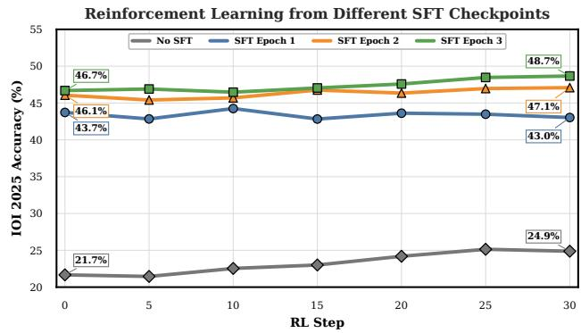  
(a) Performance during GRPO training. Step 39 is (b) IOI 2025 Score@1 during RL when initialized from selected using held-out validation performance. diferent SFT checkpoints.  
Figure 7 | Normalized performance during reinforcement learning of Nano-CC on multiple benchmarks and when initializing RL from diferent SFT checkpoints.

We hypothesize that the modest gains reflect both the strong SFT initialization and the challenging optimization setting. With binary-reward GRPO, a problem provides a relative learning signal only when its rollout group contains both successful and unsuccessful solutions (Shao et al., 2024), so RL primarily targets capabilities near the model’s frontier. Furthermore, rollouts of up to 255K tokens receive only a terminal execution reward, creating a long-horizon credit-assignment problem. These long trajectories and sparse relative rewards may limit the magnitude and stability of the RL improvement.

Figure 7b compares RL initialized from the base Nano checkpoint and from checkpoints after each SFT epoch. Without SFT, RL improves IOI 2025 Score@1 from 21.7% to 24.9% after 30 steps, demonstrating that executable-reward RL can produce measurable gains directly from the base model. However, RL does not recover the substantially larger gains provided by SFT due to the strength of the teacher models used: after 30 steps, models initialized from SFT epochs one, two, and three achieve 43.0%, 47.1%, and 48.7%, respectively. Thus, under our training budget, RL can improve performance without prior SFT but does not substitute for the capabilities acquired through supervised fine-tuning, with the strongest final performance obtained from the third-epoch SFT checkpoint.

## 4.5. Efect of Test-Time Compute

Score@200 measures gains from parallel sampling, while GenCorrect additionally uses evaluator feedback to refine solutions across successive rounds and concentrate improvements from 200 generations into 10 submissions per round. As shown in Figure 8a, Nano-CC’s mean IOI 2025 score increases from 360.6 after the first round to 468.2 after five rounds, a gain of 107.6 points. Ultra-CC improves from 343.9 to 502.0, a substantially larger gain of 158.1 points. Although Ultra-CC begins below Nano-CC in the first round, it finishes 33.8 points ahead after five rounds. Relative to the oficial IOI 2025 thresholds, Ultra-CC exceeds the gold threshold after three rounds, while Nano-CC does so after four (International Olympiad in Informatics, 2025).

The larger GenCorrect improvement is consistent with a broader diference in how the two models benefit from test-time compute. At Score@1, Ultra-CC exceeds Nano-CC by only 2.2 percentage points, corresponding to approximately 13 raw IOI points. At Score@200, however, Ultra-CC reaches 505 compared with 461 for Nano-CC, widening the gap to 44 points. Thus, Ultra-CC’s advantage grows substantially under parallel sampling and then is magnified by the iterative correction from

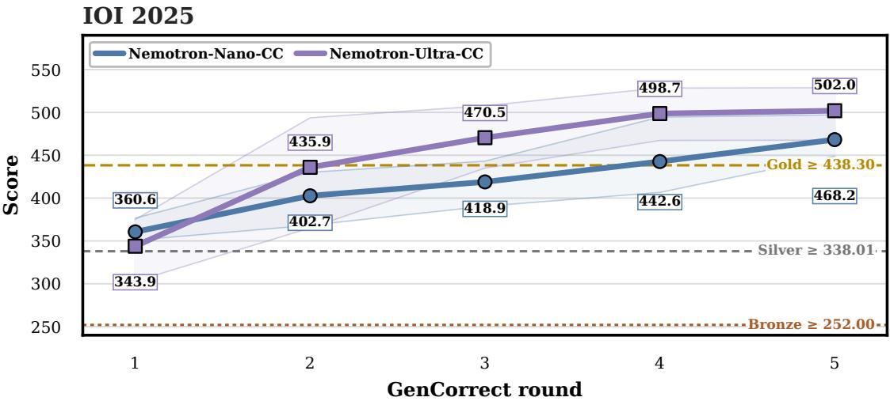  
(a) Mean IOI 2025 score across successive GenCorrect rounds for Nano-CC and Ultra-CC. Dashed lines indicate the medal thresholds, and shaded regions show the min–max range from 5 runs per round.

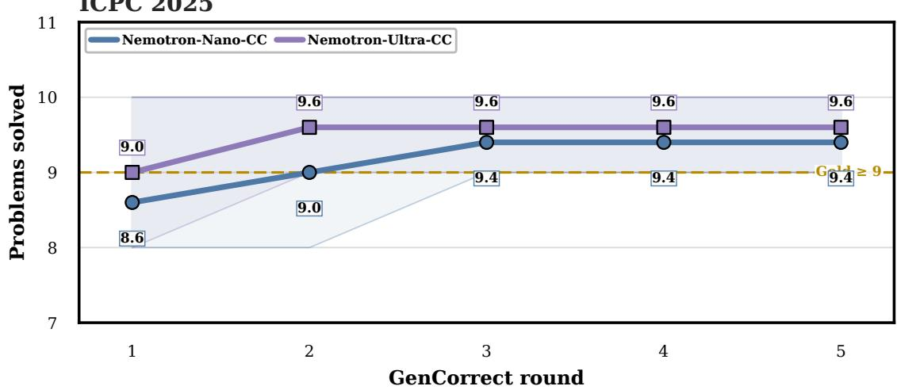  
(b) Mean ICPC 2025 problems solved across successive GenCorrect rounds for Nano-CC and Ultra-CC. Dashed line indicates the gold-medal threshold, and shaded regions show the min–max range from 5 runs per round.  
Figure 8 | Performance across successive GenCorrect rounds on (a) IOI 2025 and (b) ICPC 2025.

GenCorrect. Together with its larger improvement across GenCorrect rounds, this suggests that Ultra-CC benefits both from stronger pool of candidate solutions from parallel sampling and from more efective use of evaluator feedback.

On ICPC 2025, Figure 8b shows that the mean number of problems solved by Nano-CC increases from 8.6 to 9.4, reaching nine solved problems after two rounds and beginning to plateau after the third where nine solved problems match the result of the fourth-place gold-medal team (International Collegiate Programming Contest, 2025b). Ultra-CC starts at 9.0 problems solved and reaches 9.6 after two rounds, maintaining this performance through round five. It therefore reaches nine solved problems one round earlier than Nano-CC and remains ahead throughout the correction process. Both models plateau more quickly than on IOI, suggesting that ICPC’s binary feedback provides less information for continued refinement than IOI’s subtask-level scores.

## 5. IOI 2026

## 5.1. Competition Setting

We evaluate our system prospectively on the IOI 2026 problem set during the oficial competition and before the problems were publicly available. The competition comprised two five-hour sessions held over two days, with three problems released in each session. We operated under the same time, internet-access, and submission constraints as human contestants: internet access was prohibited, local code execution was permitted, and each problem allowed up to 50 submissions with one submission allowed per minute (IOI 2026 Organizing Committee, 2026). During the live inference deployment, we used a peak allocation of up to 760 NVIDIA GB300 GPUs.

## 5.2. Competition-Specific Adaptations

Having completed the general-pipeline experiments, we use IOI 2025 as a development benchmark and make several competition specific adaptations to maximize the score of a single live run within the oficial time and submission limits.

Ultra SFT with GLM-5.2 data. Our previous results show that adapting the stronger Ultra model with limited SFT can outperform extensive post-training of the smaller Nano model, particularly in later GenCorrect rounds. We therefore focus on fine-tuning Ultra for the live IOI 2026 run. We use SFT rather than RL because SFT provides most of the post-training gains in our experiments, while RL at Ultra scale exceeds our available compute budget. We evaluate GLM-5.2 and DeepSeek-V4-Flash (GLM-5-Team, 2026; DeepSeek-AI, 2026) on IOI 2025 as candidate SFT teachers. GLM-5.2 achieves a higher score with shorter outputs than DeepSeek-V4-Flash, as shown in Table 2. This advantage transfers after SFT, with the GLM-5.2-trained Ultra-CC variant achieving both higher Score@1 and shorter average outputs than the DeepSeek-V4-Flash-trained variant. We therefore select GLM-5.2 training data for the live run.

<table><tr><td>System</td><td>IOI 2025 Score@1</td><td>Mean Generation Length</td></tr><tr><td>GLM-5.2</td><td>66.0%</td><td>85,927</td></tr><tr><td>DeepSeek-V4-Flash</td><td>55.3%</td><td>120,456</td></tr><tr><td>Ultra-CC (GLM-5.2)</td><td>59.4%</td><td>84,244</td></tr><tr><td>Ultra-CC (DeepSeek-V4-Flash)</td><td>50.7%</td><td>89,626</td></tr></table>

Table 2 | IOI 2025 score and average number of generation tokens for the teacher models and corresponding Ultra-CC variants. Lower output length permits more candidates to be generated within a fixed inference window.

Expanded final-round selection. For the first four GenCorrect rounds, we generate 200 solutions and submit 10 selected candidates per problem as described in Section 3.4. In the final round, we increase the generation budget to 1,000 solutions while retaining the final 10-submission limit. Inspired by GenCluster (Samadi et al., 2026), we use an execution-based selection procedure to rank this larger candidate pool:

1. We prompt the model to produce 50 problem-specific test-input generators and validators.

2. We execute and filter the generators using the validators until we obtain 100 valid test inputs.

3. We execute every compiled candidate solution on the generated inputs.

4. We prompt the model to produce a scoring script based on the problem’s subtask criteria.

5. We use this script to rank the candidates and submit the 10 highest-ranked solutions.

Because we have only a single live attempt, our objective is to maximize the score of that run using all available inference compute. Our IOI 2025 and ICPC 2025 results show that Ultra-CC begins to saturate over successive rounds of the general GenCorrect pipeline, suggesting limited benefit from using the standard 200-generation procedure again in the fifth round. We therefore use our available compute to expand the final-round candidate pool to 1,000 solutions. The execution-based selection procedure, adapted from GenCluster, enables us to select the most promising 10 submissions from this substantially larger pool and thereby make better use of the additional generation budget.

NVFP4 quantization. To increase inference throughput, we apply post-training quantization to Nemotron-3-Ultra (NVIDIA, 2026) using the NVIDIA Model Optimizer NVFP4 recipe (NVIDIA Corporation, 2024–2026). We calibrate the model on 1,000 sequences of 32,768 tokens sampled from our SFT mixture and use the resulting activation statistics to determine the quantization scales. The calibrated model is then exported to NVFP4 for live inference. Table 3 reports the resulting trade-of between IOI 2025 performance and generation throughput. Across the evaluated NVFP4 configurations, IOI 2025 Score@1 remains within a narrow range of 52.7%–53.5%. In the matched BF16 KV-cache and prefix-enabled comparison, setting MTP to 5 nearly doubles throughput, from 345.9 to 698.5 tokens/s/GPU, while reducing Score@1 by only 0.6 percentage points, from 53.5% to 52.9%. For the live run, we select NVFP4 with an FP8 KV cache, prefix caching disabled, and MTP 5, which achieves 52.8% Score@1 at 736.8 tokens/s/GPU. Relative to the BF16 baseline, this configuration sacrifices 6.6 percentage points of Score@1 for a 3.7× increase in throughput, enabling the large candidate batches required by GenCorrect within the competition window.

<table><tr><td>Precision</td><td>KV Cache</td><td>Prefx</td><td>MTP</td><td>IOI 2025 Score@1</td><td>Throughput</td></tr><tr><td>BF16</td><td></td><td></td><td></td><td>59.4%</td><td>199.1</td></tr><tr><td>NVFP4</td><td>FP8</td><td>Off</td><td>5</td><td>52.8%</td><td>736.8</td></tr><tr><td>NVFP4</td><td>BF16</td><td>Off</td><td>5</td><td>52.7%</td><td>741.9</td></tr><tr><td>NVFP4</td><td>BF16</td><td>On</td><td>5</td><td>52.9%</td><td>698.5</td></tr><tr><td>NVFP4</td><td>BF16</td><td>On</td><td>Off</td><td>53.5%</td><td>345.9</td></tr></table>

Table 3 | Efect of NVFP4 quantization and runtime configuration on IOI 2025 Score@1 performance and inference throughput. Throughput is normalized by the number of GPUs (tokens/s/GPU).

## 5.3. Final Results

Table 4 summarizes our IOI 2026 results, and Figure 1b visualizes the live result. Ultra-CC scores 535.4 during the competition window, exceeding the gold-medal threshold by 174.3 points and the top human contestant by 37.1 points (International Olympiad in Informatics, 2026). This result is obtained from a single prospective run using the competition-specific adaptations described above. To the best of our knowledge, this is the first time an AI system has outscored the highest-scoring human contestant on any IOI problem set. Moreover, our result was achieved live during IOI 2026, under the same time limits, submission platform, and internet restrictions as the human contestants.

To contextualize it against our general approach, we additionally conduct independent postcompetition runs using the standard five-round GenCorrect pipeline. This pipeline achieves a

mean score of 521.72, with an observed range of 495.0–545.8. The live result is 13.68 points above this mean, consistent with the intended benefit of the competition-specific adaptations, while remaining within the observed range. The general GenCorrect pipeline also achieves a mean score that exceeds both the gold-medal threshold and the highest human score.
<table><tr><td>System</td><td>Score</td><td>Medal Level</td></tr><tr><td>Top Human Contestant</td><td>498.27</td><td>Gold</td></tr><tr><td>Gold Medal Threshold</td><td>361.12</td><td>Gold</td></tr><tr><td>Ultra-CC Live Competition Run</td><td>535.40</td><td>Gold</td></tr><tr><td>Ultra-CC General GenCorrect Pipeline</td><td>521.72 (495.0–545.8)</td><td>Gold</td></tr></table>

Table 4 | Performance on IOI 2026. The live competition result was obtained under the same time and submission constraints as human contestants. For the General GenCorrect Pipeline, we report the mean score followed by the observed minimum–maximum range across 5 independent runs.

## 6. Related Work

Early work established competitive programming as a challenging evaluation setting for language models. AlphaCode combined domain-specific training with large-scale sampling, filtering, and behavioral clustering (Li et al., 2022), while AlphaCode 2 improved this approach using stronger models, additional fine-tuning, and learned reranking (Leblond et al., 2023). LiveCodeBench and LiveCodeBench Pro subsequently introduced temporally separated and olympiad-level evaluations for measuring coding and reasoning performance (Jain et al., 2024; Zheng et al., 2025).

More recently, several systems have reported medal-level performance on international competitions. OpenAI’s specialized o1-ioi system combined coding-focused reinforcement learning with a handengineered inference pipeline for IOI 2024, while o3 later exceeded the gold-medal threshold under the oficial submission limit (OpenAI et al., 2025). OpenAI and Google DeepMind also reported gold-medal performance at ICPC 2025 (International Collegiate Programming Contest, 2025a; Lin & Cheng, 2025). Among open-weight models, GenCluster achieved IOI gold with an open-source model for the first time using large-scale generation and selection (Samadi et al., 2026), DeepSeek-V3.2- Speciale reported gold on IOI 2025 and ICPC 2025 (DeepSeek-AI, 2025), and Nemotron-Cascade 2 achieved gold-level performance with only 3B active parameters (Yang et al., 2026).

Our work also builds on research in synthetic reasoning data, execution-based reinforcement learning, and test-time scaling (Snell et al., 2024). OpenCodeReasoning demonstrated the efectiveness of synthetic reasoning traces for competitive programming (Ahmad et al., 2025b), while OpenCodeReasoning-II extended this direction with self-critique and iterative refinement (Ahmad et al., 2025a). Related approaches improve code generation at inference time through test-based iterative refinement (Ridnik et al., 2024) and hybrid parallel and sequential scaling with executiongrounded selection (Li et al., 2025). Prior work has also shown that self-correction without external feedback can be unreliable (Huang et al., 2024), motivating the use of execution-grounded feedback during refinement. DeepSeek-R1 and DAPO established scalable reinforcement-learning recipes using verifiable rewards (Guo et al., 2025; Yu et al., 2025). Building on these directions, we study an end-to-end pipeline connecting synthetic data generation, supervised fine-tuning, reinforcement learning, and iterative test-time refinement.

## 7. Conclusion

We presented an end-to-end competitive-programming pipeline combining synthetic data, SFT, RL, and GenCorrect. Our experiments show that SFT provides the largest single-sample gains, RL provides smaller additional improvements, and GenCorrect substantially improves performance through feedback-driven refinement. On IOI 2025, Nano-CC improves from 130 to 468 points after post-training and GenCorrect, exceeding the gold threshold with 3B active parameters, while Ultra-CC reaches 502. Guided by these findings, we use IOI 2025 as a development benchmark to construct a competition-specific Ultra-CC system. The resulting system scored 535.4 out of 600 on the IOI 2026 problem set, exceeding both the gold threshold and the highest human score. To the best of our knowledge, this is the first time an AI system has outscored the highest-scoring human contestant on any IOI problem set. Moreover, our result was achieved live during IOI 2026, under the same time limits, submission platform, and internet restrictions as the human contestants.

## Limitations

Our approach requires substantial training and test-time compute. The live IOI result should therefore be interpreted as a system-level comparison under the same time and submission limits, rather than an equal-resource comparison with human contestants. Compute constraints also prevented RL training of Ultra-CC and exhaustive ablations across model scales and training stages. Our findings may not generalize beyond competitive programming. We plan to release our checkpoints and distributable inference and evaluation components through NeMo Skills. We cannot release the full training corpus because of third-party redistribution restrictions, but provide detailed data, training, and evaluation procedures.

## Acknowledgments

We are especially grateful to George Armstrong, Wei Du, and Igor Gitman for sharing their insights from IMO and contributing to our system, and to the IOI organization for their time and support.

## References

Wasi Uddin Ahmad, Somshubra Majumdar, Aleksander Ficek, Sean Narenthiran, Mehrzad Samadi, Jocelyn Huang, Siddhartha Jain, Vahid Noroozi, and Boris Ginsburg. OpenCodeReasoning-II: A Simple Test Time Scaling Approach via Self-Critique, 2025a. URL https://arxiv.org/abs/2507.09075.

Wasi Uddin Ahmad, Sean Narenthiran, Somshubra Majumdar, Aleksander Ficek, Siddhartha Jain, Jocelyn Huang, Vahid Noroozi, and Boris Ginsburg. Opencodereasoning: Advancing data distillation for competitive coding, 2025b. URL https://arxiv.org/abs/2504.01943.

Arash Ahmadian, Chris Cremer, Matthias Gallé, Marzieh Fadaee, Julia Kreutzer, Olivier Pietquin, Ahmet Üstün, and Sara Hooker. Back to basics: Revisiting reinforce style optimization for learning from human feedback in llms, 2024. URL https://arxiv.org/abs/2402.14740.

DeepSeek-AI. DeepSeek-V3.2: Pushing the Frontier of Open Large Language Models, 2025. URL https: //arxiv.org/abs/2512.02556.

DeepSeek-AI. DeepSeek-V4: Towards highly eficient million-token context intelligence, 2026. URL https: //arxiv.org/abs/2606.19348.

GLM-5-Team. Glm-5: from vibe coding to agentic engineering, 2026. URL https://arxiv.org/abs/2602. 15763.

Daya Guo, Dejian Yang, Haowei Zhang, Junxiao Song, Ruoyu Zhang, Runxin Xu, Qihao Zhu, Shirong Ma, Peiyi Wang, Xiao Bi, et al. DeepSeek-R1: Incentivizing Reasoning Capability in LLMs via Reinforcement Learning. arXiv preprint arXiv:2501.12948, 2025.

Jie Huang, Xinyun Chen, Swaroop Mishra, Huaixiu Steven Zheng, Adams Wei Yu, Xinying Song, and Denny Zhou. Large Language Models Cannot Self-Correct Reasoning Yet, 2024. URL https://arxiv.org/abs/ 2310.01798.

International Collegiate Programming Contest. OpenAI at the 2025 ICPC World Finals. ICPC World Finals, 2025a. URL https://worldfinals.icpc.global/2025/openai.html.

International Collegiate Programming Contest. 49th ICPC world finals baku: Final scoreboard, 2025b. URL https://wf.icpc.global/scoreboard/2025/finals/index.html. Accessed: 2026-08-28.

International Collegiate Programming Contest. ICPC world finals rules, 2025c. URL https://icpc.global/ worldfinals/rules. Accessed: 2026-08-28.

International Olympiad in Informatics. IOI 2025: Results, 2025. URL https://stats.ioinformatics.org/ results/2025. Accessed: 2026-08-28.

International Olympiad in Informatics. IOI 2026: Results, 2026. URL https://stats.ioinformatics.org/ results/2026. Accessed: 2026-08-28.

IOI 2026 Organizing Committee. IOI 2026 Contest Rules, 2026. URL https://www.ioi2026.uz/contestrules. Accessed: 2026-08-28.

Naman Jain, King Han, Alex Gu, Wen-Ding Li, Fanjia Yan, Tianjun Zhang, Sida Wang, Armando Solar-Lezama, Koushik Sen, and Ion Stoica. Livecodebench: Holistic and contamination free evaluation of large language models for code, 2024. URL https://arxiv.org/abs/2403.07974.

Rémi Leblond et al. AlphaCode 2 technical report. Technical report, Google DeepMind, 2023. URL https://storage.googleapis.com/deepmind-media/AlphaCode2/AlphaCode2\_Tech\_Report.pdf.

Dacheng Li, Shiyi Cao, Chengkun Cao, Xiuyu Li, Shangyin Tan, Kurt Keutzer, Jiarong Xing, Joseph E. Gonzalez, and Ion Stoica. S\*: Test time scaling for code generation, 2025. URL https://arxiv.org/abs/ 2502.14382.

Yujia Li, David Choi, Junyoung Chung, Nate Kushman, Julian Schrittwieser, Rémi Leblond, Tom Eccles, James Keeling, Felix Gimeno, Agustin Dal Lago, Thomas Hubert, Peter Choy, Cyprien de Masson d’Autume, Igor Babuschkin, Xinyun Chen, Po-Sen Huang, Johannes Welbl, Sven Gowal, Alexey Cherepanov, James Molloy, Daniel J. Mankowitz, Esme Sutherland Robson, Pushmeet Kohli, Nando de Freitas, Koray Kavukcuoglu, and Oriol Vinyals. Competition-level code generation with alphacode. Science, 378(6624):1092–1097, December 2022. ISSN 1095-9203. doi: 10.1126/science.abq1158. URL http://dx.doi.org/10.1126/ science.abq1158.

Hanzhao Lin and Heng-Tze Cheng. Gemini Achieves Gold-Medal Level at the International Collegiate Programming Contest World Finals. Google DeepMind, 2025. URL https://deepmind.google/blog/geminiachieves-gold-medal-level-at-the-international-collegiate-programming-contest-worldfinals/.

NVIDIA. NeMo RL: A Scalable and Eficient Post-Training Library. https://github.com/NVIDIA-NeMo/RL, 2025. GitHub repository.

NVIDIA. Nemotron 3 nano: Open, eficient mixture-of-experts hybrid mamba-transformer model for agentic reasoning, 2025. URL https://arxiv.org/abs/2512.20848.

NVIDIA. Nemotron 3 ultra: Open, eficient mixture-of-experts hybrid mamba-transformer model for agentic reasoning, 2026. URL https://arxiv.org/abs/2606.15007.

NVIDIA Corporation. NVIDIA Model Optimizer. https://github.com/NVIDIA/Model-Optimizer, 2024– 2026. GitHub repository.

OpenAI. gpt-oss-120b & gpt-oss-20b model card, 2025. URL https://arxiv.org/abs/2508.10925.

OpenAI, :, Ahmed El-Kishky, Alexander Wei, Andre Saraiva, Borys Minaiev, Daniel Selsam, David Dohan, Francis Song, Hunter Lightman, Ignasi Clavera, Jakub Pachocki, Jerry Tworek, Lorenz Kuhn, Lukasz Kaiser, Mark Chen, Max Schwarzer, Mostafa Rohaninejad, Nat McAleese, o3 contributors, Oleg Mürk, Rhythm Garg, Rui Shu, Szymon Sidor, Vineet Kosaraju, and Wenda Zhou. Competitive programming with large reasoning models, 2025. URL https://arxiv.org/abs/2502.06807.

Qwen Team. Qwen3.6-35B-A3B, 2026. URL https://huggingface.co/Qwen/Qwen3.6-35B-A3B. Model card.

Tal Ridnik, Dedy Kredo, and Itamar Friedman. Code generation with alphacodium: From prompt engineering to flow engineering, 2024. URL https://arxiv.org/abs/2401.08500.

Mehrzad Samadi, Aleksander Ficek, Sean Narenthiran, Siddhartha Jain, Wasi Uddin Ahmad, Somshubra Majumdar, Vahid Noroozi, and Boris Ginsburg. Scaling test-time compute to achieve ioi gold medal with open-weight models, 2026. URL https://arxiv.org/abs/2510.14232.

Zhihong Shao, Peiyi Wang, Qihao Zhu, Runxin Xu, Junxiao Song, Xiao Bi, Haowei Zhang, Mingchuan Zhang, Y. K. Li, Y. Wu, and Daya Guo. Deepseekmath: Pushing the limits of mathematical reasoning in open language models, 2024. URL https://arxiv.org/abs/2402.03300.

Charlie Snell, Jaehoon Lee, Kelvin Xu, and Aviral Kumar. Scaling llm test-time compute optimally can be more efective than scaling model parameters, 2024. URL https://arxiv.org/abs/2408.03314.

Zhuolin Yang, Zihan Liu, Yang Chen, Wenliang Dai, Boxin Wang, Sheng-Chieh Lin, Chankyu Lee, Yangyi Chen, Dongfu Jiang, Jiafan He, Renjie Pi, Grace Lam, Nayeon Lee, Alexander Bukharin, Mohammad Shoeybi, Bryan Catanzaro, and Wei Ping. Nemotron-cascade 2: Post-training llms with cascade rl and multi-domain on-policy distillation, 2026. URL https://arxiv.org/abs/2603.19220.

Qiying Yu, Zheng Zhang, Ruofei Zhu, Yufeng Yuan, Xiaochen Zuo, Yu Yue, Weinan Dai, Tiantian Fan, Gaohong Liu, Lingjun Liu, et al. DAPO: An Open-Source LLM Reinforcement Learning System at Scale. arXiv preprint arXiv:2503.14476, 2025.

Zihan Zheng, Zerui Cheng, Zeyu Shen, Shang Zhou, Kaiyuan Liu, Hansen He, Dongruixuan Li, Stanley Wei, Hangyi Hao, Jianzhu Yao, Peiyao Sheng, Zixuan Wang, Wenhao Chai, Aleksandra Korolova, Peter Henderson, Sanjeev Arora, Pramod Viswanath, Jingbo Shang, and Saining Xie. Livecodebench pro: How do olympiad medalists judge llms in competitive programming?, 2025. URL https://arxiv.org/abs/2506.11928.

## A. Data Curation Details

Problem collection. We collect 22,000 problems from 16 regional and international competition families spanning the last two decades, together with problems from online programming platforms. For each competition-year pair, an automated agentic pipeline retrieves the problem statement, time and memory limits, available oficial test cases, auxiliary files, and reference solutions. These components are packaged into a standardized executable evaluation environment.

Environment validation. We validate each environment by requiring known correct solutions to receive the expected score and known incorrect solutions to fail. As an additional validation step, we use gpt-oss-120b to generate candidate solutions, which are compiled and executed against the packaged test suite. This identifies malformed statements, missing auxiliary files, compiler incompatibilities, and inconsistent test harnesses that may not be exposed by the available reference solutions.

<table><tr><td>Setting</td><td>Nano-CC</td><td>Ultra-CC</td></tr><tr><td>Initialization</td><td>Nemotron-3-Nano-30B-A3B</td><td>RLVR-teacher checkpoint</td></tr><tr><td>Teacher model</td><td>DeepSeek-V4-Flash</td><td>DeepSeek-V4-Flash</td></tr><tr><td>Training examples</td><td>1,200,000</td><td>477,642</td></tr><tr><td>Epochs</td><td>3</td><td>1</td></tr><tr><td>Optimizer</td><td>AdamW</td><td>AdamW</td></tr><tr><td>Global batch size</td><td>64</td><td>64</td></tr><tr><td>Learning rate</td><td>5 × 10−5</td><td>1.5 × 10−5 peak</td></tr><tr><td>Learning-rate schedule</td><td>Constant</td><td>Cosine</td></tr><tr><td>Warmup ratio</td><td>0</td><td>0.1</td></tr><tr><td>Maximum packed sequence length</td><td>262K</td><td>262K</td></tr><tr><td>Tensor parallelism</td><td>4</td><td>8</td></tr><tr><td>Context parallelism</td><td>4</td><td></td></tr><tr><td colspan="3">Hardware 64 NVIDIA GB300-288GB GPUs</td></tr></table>

Table 5 | Supervised fine-tuning configurations for Nano-CC and Ultra-CC.

We remove problems whose environments produce inconsistent verdicts, whose reference solutions fail, or whose provided solutions do not compile. For the RL corpus, we additionally remove problems whose evaluation consistently requires more than 300 seconds when executed sequentially.

Evaluation contamination. We exclude all IOI 2025, ICPC 2025, and LiveCodeBench Pro problems from both the SFT and RL corpora and deduplicate the remaining training problems against these evaluations. IOI 2026 requires no retrospective contamination filtering because our system was executed during the live competition before the problems were publicly available.

## B. Training Details

## B.1. Supervised Fine-Tuning

We use DeepSeek-V4-Flash to generate 1.2 million reasoning traces for Nemotron-3-Nano-30B-A3B and 477,642 traces for NVIDIA-Nemotron-3-Ultra-550B-A55B. We categorize problems as easy, medium, or hard and allocate additional generations to more dificult problems.

The SFT mixture also contains self-improvement traces in which the teacher receives a problem and a previously generated solution and is instructed to produce an improved solution. These examples expose the student models to the iterative refinement behavior used by GenCorrect at inference time.

Table 5 reports the complete SFT configurations.

Nano-CC achieves an average training throughput of 397.2 TFLOPs/s/GPU. Ultra-CC is initialized from its RLVR-teacher checkpoint, which was previously used to distill strong reasoning capabilities into the general-purpose model.

## B.2. Reinforcement Learning

Training and validation data. We apply RL only to Nemotron-3-Nano-30B-A3B. From the curated corpus, we initially identify 4,000 problems with reliable executable test cases. We remove problems whose evaluation consistently requires more than 300 seconds when executed sequentially, leaving 3,219 problems.

<table><tr><td>Setting</td><td>Value</td></tr><tr><td>Training problems</td><td>2,847</td></tr><tr><td>Validation problems</td><td>372</td></tr><tr><td>Algorithm</td><td>GRPO</td></tr><tr><td>Prompts per step</td><td>64</td></tr><tr><td>Rollouts per prompt</td><td>16</td></tr><tr><td>Rollouts per step</td><td>1,024</td></tr><tr><td>Sampling temperature</td><td>1.0</td></tr><tr><td>Maximum sequence length</td><td>262,144</td></tr><tr><td>Maximum generation length</td><td>255,144</td></tr><tr><td>Reward</td><td>Binary full credit</td></tr><tr><td>Optimizer</td><td>Adam</td></tr><tr><td>Learning rate</td><td> $3 \times 1 0 ^ { - 6 }$ </td></tr><tr><td>Learning-rate schedule</td><td></td></tr><tr><td></td><td>Constant</td></tr><tr><td>Weight decay</td><td>0</td></tr><tr><td>Reference-policy KL</td><td>None</td></tr></table>

Table 6 | Reinforcement-learning configuration for Nano-CC.

We divide these into 2,847 training and 372 validation problems. The split is performed at the parent-problem level so that subtasks derived from the same original problem cannot appear in both sets. To promote coverage across competitions, we target approximately one validation problem from each competition-year pair.

Rollout and reward configuration. We use Group Relative Policy Optimization (GRPO) (Guo et al., 2025) with a maximum sequence length of 262,144 tokens, including up to 255,144 generated tokens. At each optimization step, we sample 16 rollouts at temperature 1.0 for each of 64 prompts, producing a global batch of 1,024 rollouts.

Each rollout generates a C++17 solution that is compiled and executed against the target problem or subtask. We assign a terminal reward of 1 when the solution receives full credit and 0 otherwise; partial scores do not produce intermediate rewards. Rewards are normalized within each rollout group, and relative advantages are computed using a leave-one-out baseline (Ahmadian et al., 2024).

Optimization. We optimize a token-level clipped policy-gradient objective using Adam with a constant learning rate of $3 \times 1 0 ^ { - 6 }$ , zero weight decay, and no reference-policy KL penalty (Yu et al., 2025). Generations truncated at the maximum context length are excluded from the policy loss.

The full RL configuration is summarized in Table 6.

Checkpoint selection. We evaluate intermediate checkpoints on the held-out validation set. The checkpoint at step 39 achieves the highest validation performance and is used for all subsequent evaluations.

## C. Additional GenCorrect Details

Candidate filtering. We extract and normalize the C++ program from each model response before computing program features or similarities. Before clustering, we retain candidates that compile, contain nonempty normalized code with at least 40 tokens, and have a nonnegative structural-feature score. If no candidates satisfy all requirements, we progressively relax them until the candidate pool is nonempty.

Similarity and clustering. The similarity function sim(�, �) in Equation 1 compares token shingles extracted from the normalized programs. We initialize the center set with the highest-ranked candidate under the score-blind heuristic �(�). Subsequent centers are selected using Equation 1, with ties broken by �(�). After selecting � = 10 centers, each remaining candidate is assigned to its most similar center. Equal-similarity ties are assigned to the smaller cluster, with any remaining ties resolved by center-selection order.

Score-blind ranking. The heuristic used for center initialization, tie-breaking, and representative selection is

$$
\begin{array} { r l } & { Q ( c ) = \big ( \mathrm { C o m p i l e s } ( c ) , \mathrm { F e a t u r e S c o r e } ( c ) , \lfloor \mathrm { C o d e L e n g t h } ( c ) / 8 0 0 \rfloor , } \\ & { \qquad \mathrm { E x a c t F r e q u e n c y } ( c ) , \mathrm { C o d e L e n g t h } ( c ) , - \mathrm { G e n e r a t e d T o k e n s } ( c ) , - \mathrm { R u n I d } ( c ) \big ) , } \end{array}\tag{3}
$$

with entries compared lexicographically and larger values preferred. Here, ExactFrequency(�) is the number of candidates with the same normalized code, GeneratedTokens(�) is the length of the original model output, and RunId(�) is its deterministic generation index.

The feature score rewards indicators of complete C++ programs, including headers, a main function, input/output operations, and a return statement, while penalizing unfinished placeholders. Neither �(�) nor the clustering procedure uses competition scores.

Representative selection. We select the highest-ranked candidate under �(�) from each cluster. If this produces fewer than 10 representatives, the remaining submission slots are filled with the highest-ranked unselected candidates. Thus, cluster membership promotes diversity, while �(�) selects a locally well-formed representative from each cluster. All filtering, clustering, and representative selection for a round are completed before its evaluator feedback is observed.

Feedback and carry-forward. The accumulated subtask scores � (�) in Equation 2 form an internal feedback state used to guide subsequent generations; they do not alter the evaluator’s oficial scoring procedure.

After each round, the highest-total-scoring submission from that round becomes the primary solution. Ties are resolved using the score-blind heuristic. We then select three complementary references from the current submissions and solutions retained from previous rounds:

1. the strongest overall candidate across the available solutions;

2. a candidate addressing the largest remaining subtask gap; and

3. a candidate with strong aggregate coverage of the remaining gaps.

Subtask gaps are determined from the accumulated feedback state ��. Similarity and $Q ( c )$ are used as tie-breakers to avoid redundant references and prefer locally well-formed programs. The next round is conditioned on the problem statement, the accumulated subtask feedback, the primary solution, and these three references.

## C.1. Test-Time Compute Prompts

First Gencorrect Round   
system: |-   
Your response must use the following format:   
Explanation: <your explanation for the final answer>   
C fid fid b 0% d 100%   
Answer:   
‘‘‘cpp   
<your complete C++20 implementation>   
  
The Answer must contain exactly one complete C++20 code block, and that   
code block must be the final content in your response. Do not write   
anything after its closing fence.   
user: |-   
You are an expert competitive programmer. You will be given a problem   
statement, test case constraints, and example test inputs and outputs.   
Please reason step by step about the solution, then provide a complete   
implementation in C++20.   
You should correctly implement the routine(s) described in the   
Implementation Details, without reading or writing anything directly   
from stdin or to stdout, as input and output are passed through the   
implemented routines.   
Assume your code will be run on the OFFICIAL grader, and do not add a   
main function, a sample grader, or any other functionality unless it   
has been explicitly requested.   
If multiple subtasks are listed, first choose one subtask to target,   
state that choice briefly in your reasoning, and focus on an approach   
that is sufficient for that chosen subtask rather than trying to solve   
every listed subtask.   
Put your final solution within a single code block:   
‘‘‘cpp   
<your code here>   
CCC   
{problem}

Next Gencorrect Round   
system: |-   
Your response must use the following format:   
Explanation: <your explanation for the final answer>   
Confidence: <your confidence score between 0% and 100%>   
Answer:   
‘‘‘cpp   
<your complete C++20 implementation>   
CcCC   
The Answer must contain exactly one complete C++20 code block, and that   
code block must be the final content in your response. Do not write   
anything after its closing fence.   
user: |-   
You are an expert competitive programmer.   
You will be given:   
\* the problem statement   
\* multiple candidate solutions from previous evaluated generations   
\* each candidate solution’s subtask scores   
\* the best achieved subtask scores so far across rounds   
\* the maximum subtask scores   
The candidate solutions are provided only as inspiration.   
They may solve different subtasks, may contain bugs, and may be   
incomplete. There is no main candidate solution; treat all candidate   
solutions as peer references. You may discard them completely and   
write a new solution from scratch.   
Choose one target subtask using the best achieved scores so far:   
\* a subtask is eligible only if   
achieved\_subtask\_scores[subtask] < max\_subtask\_scores[subtask]   
\* choose exactly one eligible target subtask and focus on solving   
that target better   
\* prefer the eligible target with the largest remaining score gap,   
unless another eligible target is clearly easier to improve   
\* do not spend effort on subtasks that are already fully achieved   
Use the candidate solutions to identify useful ideas, edge cases, or   
implementation patterns. Do not simply concatenate candidate solutions.   
Do not spend time reconciling differences between candidate solution   
scores and best achieved scores so far. Do not choose a target based on   
any single candidate’s scores alone.

If all candidate solutions mainly solve already-achieved subtasks,   
ignore them and design a fresh approach for the chosen unsolved target.   
In your reasoning:   
1. identify which subtasks are still globally unsolved or partially   
solved using achieved\_subtask\_scores and max\_subtask\_scores   
2. choose exactly one target subtask   
3. briefly identify any useful ideas from the candidate solutions, if any   
4. explain an approach sufficient for the chosen target   
5. then provide a complete C++20 implementation   
You should correctly implement the routine(s) described in   
Implementation Details, without reading or writing anything directly   
from stdin or to stdout, as input and output are passed through the   
implemented routines.   
Assume your code will be run on the OFFICIAL grader, and do not add a   
main function, a sample grader, or any other functionality unless it   
has been explicitly requested.   
Put your final solution within a single code block:   
‘‘‘cpp   
<your code here>   
  
## Problem   
{problem}   
## Candidate Solutions From Previous Evaluated Generations   
{candidate\_solutions}   
## Best Achieved Subtask Scores So Far   
{achieved\_subtask\_scores}   
## Maximum Subtask Scores   
{max\_subtask\_scores}