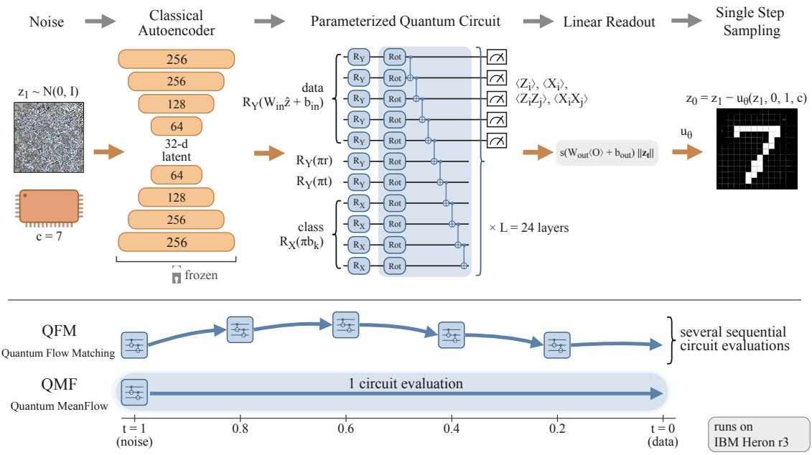
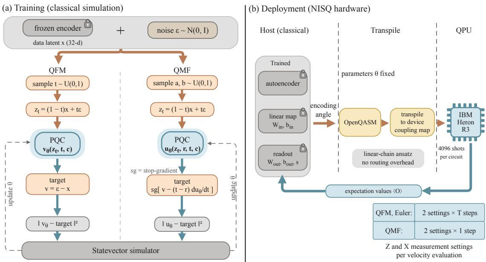
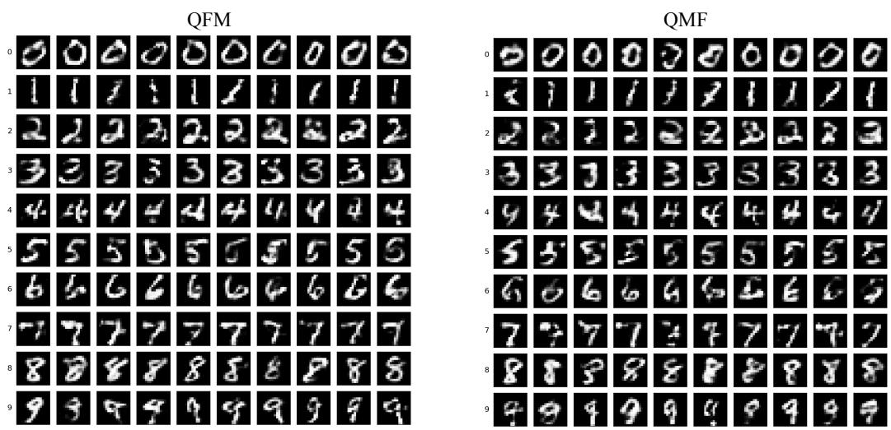
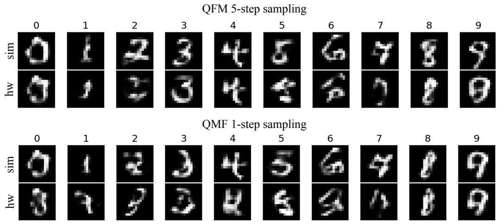
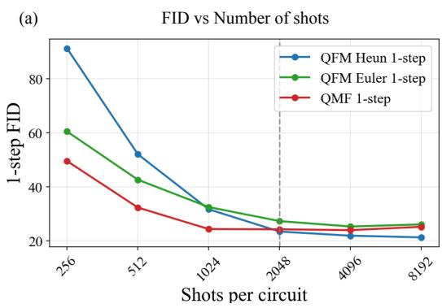
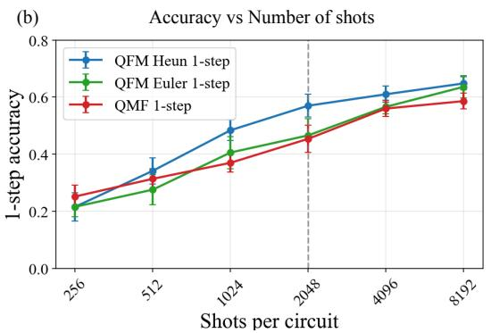
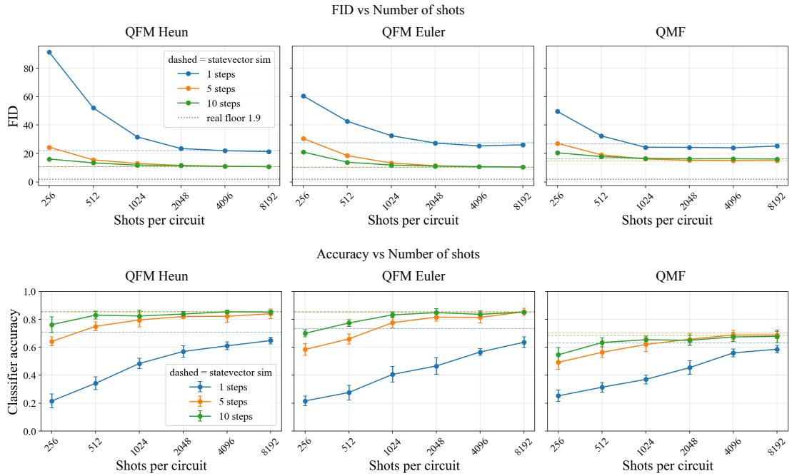

# Quantum MeanFlow: single-shot generative sampling on NISQ hardware

Ashish Joshi1,2, Eshaan Mistry1,3, and Takahiko Koyama∗1,2

1Human Biology-Microbiome-Quantum Research Center (WPI-Bio2Q), Keio University, Tokyo, Japan

2Keio University Sustainable Quantum Artificial Intelligence Center (KSQAIC), Keio University, Tokyo, Japan

3University of California, Berkeley, CA, USA

## Abstract

Quantum generative models ofer a promising framework for exploring whether quantum computation can enhance generative machine learning. Flow matching is a generative method in which samples are generated by transporting a simple, known distribution to the target data distribution with a learned velocity field. Its quantum counterpart, known as quantum flow matching (QFM), was introduced recently, and, like its classical counterpart, requires integrating an ordinary diferential equation over many time steps during inference. As each step requires the output from the previous step, the circuit submission is sequential and a drawback on quantum computers as they have high input/output costs. To alleviate this problem, we introduce Quantum MeanFlow (QMF), the quantum analogue of the MeanFlow formulation, which allows single-step sample generation. While the QFM learns an instantaneous velocity field at each time step, QMF learns the average velocity over a time interval. We use a parameterized quantum circuit to learn these velocity fields and benchmark the two methods on the MNIST dataset. We show that while single-step QMF has lower image quality compared to multi-step QFM, it performs better than the single-step QFM sampling at every shot count. Both of our models are executed on IBM quantum computers and best-of-N rejection sampling recovers most of the accuracy lost to device noise without modifying the circuit. This is especially advantageous for QMF which has only one circuit evaluation per image. Here, We establish QMF as a viable method for single-step quantum generative sampling, saving on quantum circuit evaluations per generated sample.

## 1 Introduction

Generative machine learning attempts to learn the underlying probability distribution from a dataset and generate samples from the learned distribution. The modern landscape of gerenerative machine learning started with variational autoencoders (VAEs) [1], generative adversarial networks (GANs) [2] and auto-regressive models [3]. Difusion models [4, 5, 6] improved on several aspects of the previous methods, providing training stability and the ability to generate high-quality data [7]. Difusion models learn to denoise the data step-by-step and can be described by stochastic diferential equations [6]. An equivalent but mathematically simpler formalism is flow matching, which is instead described by ordinary diferential equations [8, 9, 10, 11]. The model learns the probability flow between the noise and data distribution, and once trained, inference is much faster because a simple ordinary diferential equation (ODE) is integrated to generate samples.

Alongside the developments described above, the disparate field of quantum computing is getting much attention. Quantum computing uses the principles of quantum mechanics as the basis of computation [12] and has the potential to provide speedups over classical algorithms for specific classes of problems [13, 14]. Since machine learning and deep learning methods often have high computational costs, it is natural to consider if quantum computing can provide any benefits for these methods. The relatively new subfield of quantum machine learning (QML) [15, 16] aims to explore the potential of quantum computing in machine learning, with many interesting results over the past few years. Even without an established quantum advantage, implementing generative models on quantum hardware provides a framework for investigating whether quantum circuits can ofer useful alternative representations of complex data distributions. Quantum models for generative machine learning have been gaining interest recently, with models for quantum GAN [17, 18, 19, 20], quantum VAE [21, 22], quantum difusion [23, 24, 25, 26, 27] and quantum flow matching [28, 29]. While quantum difusion models are being explored for both quantum and classical data, quantum flow matching (QFM) has only been explored in the context of quantum data. The closest work on classical data is a hybrid quantum-classical normalizing flow [30], which learns an invertible map rather than a velocity field. Here, we fill this gap by focusing on QFM for generating classical data.

As we are still far from the era of fault-tolerant quantum computers, most of the QML models are implemented either in simulations or on the currently available noisy intermediate scale quantum (NISQ) devices [31]. However, training a quantum circuit on NISQ devices is not feasible because of high rate of errors, in addition to the vanishing gradients that afect deep variational circuits [32]. Instead, we perform training classically and use the trained quantum models to generate samples on a real device. This still requires sampling for several time steps on a quantum computer, with the output of one step being the input for the next. As data input and output on a quantum computer is expensive [33, 16], the cost of doing this increases with number of steps, which is often required to generate good quality images. Recent work has tackled this problem by proposing single shot sampling in classical flow matching. This method is called MeanFlow [34] and it was shown that it outperforms all the other single and few shot sampling methods [35, 36, 37].

In this work, we present the first QFM model with MeanFlow for classical image generation. We call this Quantum MeanFlow (QMF). We train both QFM and QMF models on the MNIST dataset in simulation and perform inference on quantum hardware. We show that the QMF model can perform single-step sampling on the hardware, requiring only one circuit evaluation to generate one image. We also observed that at lower number of shots, multi-step sampling in both QFM and QMF models can alleviate the efects of sampling noise. Our results establish single-step QMF as a viable approach for quantum generative sampling that eliminates the sequential circuit evaluations required by multi-step QFM, making it better suited to the constraints of current NISQ hardware.

The paper is organized as follows. In section 2, we give the background of classical flow matching and MeanFlow formulations. In section 3, we present our QMF formulation, with data processing steps and classical methods in section 3.1, the quantum ansatz for learning the velocity fields in section 3.2 and training and sampling procedure in section 3.3. The results are presented in section 4 with discussion in section 5.

## 2 Background

## 2.1 Classical flow matching

Flow matching is a framework for generative modelling in which samples are generated by transporting a simple, known distribution onto the unknown data distribution [8, 9]. The object being learned is a time-dependent velocity field $v _ { \theta } ( \cdot , t )$ , where θ are the parameters to be learned. This velocity field defines a flow between the reference distribution and the data distribution through the ordinary diferential equation

$$
\begin{array} { r } { \frac { \mathrm { d } } { \mathrm { d } t } \psi _ { t } ( z ) = v _ { \theta } ( \psi _ { t } ( z ) , t ) , } \end{array}\tag{1}
$$

where z are the samples and $\psi _ { 0 } ( z ) = z .$ . The solution to the above ODE is defined by the trajectory $\psi _ { t } ( z )$ , which gives the sample at time t. Throughout this paper we follow the convention of [34], in which $t = 0$ denotes data and $t = 1 ~ \mathrm { n o i s e ^ { 1 } }$ . Usually, the reference distribution is a Gaussian $\mathcal { N } ( 0 , I )$ . Let $p _ { t } ( z )$ be the probability density of the samples at time t, so that $p _ { 0 }$ is the data distribution and $p _ { 1 } = \mathcal { N } ( 0 , I )$ is the reference distribution. These marginal densities interpolate between the two endpoints and evolve according to the continuity equation [11],

$$
\frac { \partial p _ { t } ( z ) } { \partial t } + \nabla _ { z } \cdot \left( p _ { t } ( z ) \ : v ( z , t ) \right) = 0 ,\tag{2}
$$

where $\nabla _ { z }$ denotes the divergence with respect to z. This equation expresses conservation of probability mass transported by the velocity field $v ( z , t )$ . During inference, the ODE is solved in the reverse direction from t = 1 to $t = 0$ to generate samples. However, the velocity describing the required interpolation between the two distributions is not known. In flow matching, this is overcome by fixing the interpolation and then learning the velocity field that might generate it. The velocity field can then be obtained by regression on individual pairs of a data sample and a noise sample for which the target velocity is known exactly. Thus, the velocity field is learned without ever simulating the ODE. We follow the method as described in [11] and refer the readers to the same for more details.

We use the linear interpolation in which a data sample x and a noise sample $\varepsilon \sim \mathcal { N } ( 0 , I )$ are joined by the straight segment

$$
z _ { t } = ( 1 - t ) x + t \varepsilon ,\tag{3}
$$

with a constant velocity $\varepsilon - x$ . Introducing conditioning to the class label $c$ in the velocity field and sampling $t \sim \mathcal { U } ( 0 , 1 )$ , the flow matching loss ${ \mathcal { L } } _ { \mathrm { F M } } ( \theta )$ can be written as

$$
\begin{array} { r } { \mathcal { L } _ { \mathrm { F M } } ( \theta ) = \mathbb { E } _ { t , x , \varepsilon } \big \| v _ { \theta } ( z _ { t } , t , c ) - ( \varepsilon - x ) \big \| ^ { 2 } . } \end{array}\tag{4}
$$

Since the data samples $x$ and the noise samples ε are drawn independently, many of these pairs may pass through the same point $z _ { t }$ with diferent velocities. The trained velocity field may only represent their average, which makes curved trajectories during generation. Thus, the ODE must be integrated in several small time steps. This makes generation sequential, as the output of the current step is used as the input for the next step, and the cost of generating samples grows with number of steps. To reduce this sampling cost, recent works have proposed some modifications of the vanilla flow matching in rectified flow, shortcut models and few-shot models [9, 35, 36, 34]. In the next section, we describe the MeanFlow model, that attempts to generate data in a single step.

## 2.2 Classical MeanFlow

Flow matching, as described above, learns instantaneous velocity at each time step. MeanFlow (MF) replaces this by learning an average velocity over a time interval. This makes single-step sampling possible. We use the same notation as in the previous section: $z _ { t } = ( 1 - t ) x + t \varepsilon$ with $t = 0$ at the data sample x and $t = 1$ at the noise sample $\varepsilon ,$ with the instantaneous velocity along that segment as $v = \varepsilon - x$ For two time points $r$ and t, with $r \leq t$ , the average velocity u over the interval [r, t] is given by

$$
u ( z _ { t } , r , t ) = \frac { 1 } { t - r } \int _ { r } ^ { t } v ( z _ { \tau } , \tau ) \mathrm { d } \tau .\tag{5}
$$

The relationship between the average velocity, initial time, final time and displacement $z _ { t } - z _ { r }$ is given by

$$
\left( t - r \right) u ( z _ { t } , r , t ) = z _ { t } - z _ { r } .\tag{6}
$$

This equation is exact for all interval lengths. Therefore, if u is learned correctly, the model can move from one end of the trajectory to the other in a single evaluation. In other words, during generation, $z _ { 1 } \sim \mathcal { N } ( 0 , I )$ is drawn and $z _ { 0 } = z _ { 1 } - u _ { \theta } ( z _ { 1 } , 0 , 1 , c )$ is produced, $u _ { \theta }$ is the learned average velocity field and $c$ is the class label. Thus, the many small steps of Sec. 2.1 are replaced by one large jump.

Since $z _ { r }$ is not known in advance during generation, Eq. (6) cannot be used directly for training. Diferentiating Eq. (6) with respect to $t$

$$
u ( z _ { t } , r , t ) = v ( z _ { t } , t ) - ( t - r ) \frac { \mathrm { d } } { \mathrm { d } t } u ( z _ { t } , r , t ) , \qquad \frac { \mathrm { d } u } { \mathrm { d } t } = v \cdot \partial _ { z } u + \partial _ { t } u ,\tag{7}
$$

where the second expression is the total derivative of u along the trajectory. This equation is known as the MeanFlow identity and can be used to write down the $\mathrm { M F }$ loss ${ \mathcal { L } } _ { \mathrm { M F } } ( \theta )$

$$
\begin{array} { r } { \mathcal { L } _ { \mathrm { M F } } ( \theta ) = \mathbb { E } _ { x , \varepsilon , r , t } \big \| u _ { \theta } ( z _ { t } , r , t , c ) - \mathrm { s g } \big [ v - ( t - r ) \frac { \mathrm { d } } { \mathrm { d } t } u _ { \theta } \big ] \big \| ^ { 2 } , } \end{array}\tag{8}
$$

  
Figure 1: Overview of the quantum flow matching (QFM) and quantum MeanFlow (QMF) models. We train both models on the MNIST dataset. A classical autoencoder provides the data latent vectors, which are the inputs for a parameterized quantum circuit. This circuit learns the velocity fields between the noise and data distribution. QFM requires many sequential evaluations of the trained circuit for sampling while QMF is designed to sample with a single circuit evaluation per measurement basis.

where sg[·] denotes a stop-gradient, meaning the expression inside the brackets is not diferentiated when updating θ.

## 3 Quantum MeanFlow (QMF)

In this section, we present the quantum implementations of flow matching and Mean-Flow, termed as quantum flow matching (QFM) and quantum MeanFlow (QMF). For benchmarking, we use the MNIST dataset. The goal was to generate 16 × 16 MNIST digits conditioned by class label. In the classical case, the velocity field is learned by a neural network. Here, we used a parameterized quantum circuit (PQC) to describe the velocity fields. We use a classical autoencoder to assist with the input to the quantum circuit, so our models work not directly on the pixel space but on the latent space. We use the same architecture for both QMF and QFM, with QMF having an extra qubit to define the time interval, which means that most of the reported metrics can be attributed to the QMF formulation rather than the diferences between architectures and hyperparameters. An overview of the method is depicted in Fig. 1, with the details in the following sections.

## 3.1 Data processing and classical methods

We worked on the standard MNIST handwritten digits dataset, with ten classes for digits 0 − 9 and 60 000 training and 10 000 test images. The original dataset has each image of $2 8 \times 2 8$ pixels. This size is too large for encoding into a quantum computer, especially if we want to avoid amplitude encoding (see section 3.2). We downsampled the original images to $1 6 \times 1 6$ by bicubic anti-aliased interpolation, obtaining grayscale images with pixel values in [0, 1].

We used a classical autoencoder to obtain the latent space representation of the images, which is then encoded into the quantum circuit. The autoencoder is a multi layer perceptron (MLP), which takes the flattened 256-dimensional image and converts it to a 32-dimensional latent vector. It is comprised of 4 layers: 256 → $2 5 6  1 2 8  6 4  3 2$ encoder with a mirrored decoder. It uses SiLU activation functions and a tanh output activation, with $\approx 2 . 2 \times 1 0 ^ { 5 }$ total parameters. It was trained for 60 epochs with the AdamW optimizer (using a learning rate of $2 \times 1 0 ^ { - 3 }$ , weight decay $1 0 ^ { - 5 }$ and cosine-annealing). The encoder latent vectors were standardized to zero mean and unit variance. Latent vectors sampled by the PQC were destandardized before entering the decoder. We also trained a separate MLP classifier which was used for measuring the class accuracy of generated samples and for best-of-N sampling. It has 3 layers: $2 5 6 \to 2 5 6 \to 1 2 8 \to 1 0$ , with SiLU activation and achieved 98.2% test accuracy. The classical machinery is shared across the both QFM and QMF models and is fixed during the quantum training and sampling.

## 3.2 Quantum ansatz

To learn the velocity field, we use a parameterized quantum circuit (PQC), also known as a variational quantum circuit or variational ansatz [33, 16]. A PQC is composed of parameterized single-qubit rotation gates interleaved with entangling gates and imposes a diferentiable map on a quantum state. The output is read out as a set of expectation values of chosen observables. The gates can be tuned to minimize some function, similar to how artificial neural networks are trained to minimize the loss function. Here, the PQC is sandwiched between the classical scaffolding described above (see Fig. 1). We designed a hardware-eficient ansatz [38], with repeating trainable single-qubit rotations and a sparse entanglement, for which sampling can be executed on the current NISQ devices. The QMF circuit, depicted in Fig. 1, learns the average velocity $u _ { \theta } ( z _ { t } , r , t , c )$ . It uses 11 qubits, with first 5 qubits encoding the data, one qubit for interval initial time r, one qubit for interval final time t and 4 qubits for the class labels. The QFM circuit is otherwise identical except that it does not contain the qubit corresponding to time r and learns the instantaneous velocity $v _ { \theta } ( z _ { t } , t , c )$

We chose diferent encoding schemes for the data and class labels. The 32- dimensional latent vector obtained from the classical encoder was used as the input for the PQC. Since this latent is a continuous-valued vector, we chose angle encoding to encode it into the qubits. The latent vector was first normalized as $\hat { z } = z _ { t } / \| z _ { t } \|$ 2 and its magnitude $\left\| z _ { t } \right\|$ is retained for the output. We trained a linear map $W _ { \mathrm { i n } } \hat { z } + b _ { \mathrm { i n } }$ $( W _ { \mathrm { i n } } \in \mathbb { R } ^ { 5 \times 3 2 } )$ producing five angles which were encoded as $R _ { Y }$ rotations into the 5 data qubits. The class labels, being discrete variables, use basis encoding. The label $c \in \{ 0 , \ldots , 9 \}$ is expressed in the binary form as $\begin{array} { r } { c = \sum _ { k = 0 } ^ { 3 } b _ { k } 2 ^ { k } } \end{array}$ with bits $b _ { k } \in \{ 0 , 1 \}$ Each class qubit is prepared with a rotation $R _ { X } ( \pi b _ { k } )$ , so that the qubit k stays |0⟩ when $b _ { k } = 0$ and flipped to |1⟩ when $b _ { k } = 1$ . The four class qubits, therefore, can be represented by the computational basis state $\left| b _ { 3 } b _ { 2 } b _ { 1 } b _ { 0 } \right.$ . This maps each class to a distinct, mutually orthogonal state, giving a clean and maximally distinguishable conditioning input. Finally, the two time points are encoded as rotations $R _ { Y } ( \pi t )$ and $R _ { Y } ( \pi r )$ . For the QFM model, the wire corresponding to time $r$ is dropped. In all cases, we avoided using amplitude encoding as it uses several entangling gates which causes the state-preparation depth to grow exponentially with the number of qubits, making a NISQ implementation dificult. Furthermore, empirically, we found, in simulations, that amplitude encoding resulted in poorer results than the current encoding scheme.

The trainable block of the circuit is composed of $L = 2 4$ layers, designed in a linear-chain topology so that it maps directly onto the IBM Heron R3 devices without routing overhead. Each layer consists of a single-qubit rotation gate on every qubit followed by a nearest neighbor CNOT chain, resulting into 10 CNOTs per layer for the QMF circuit (240 two-qubit gates) and 9 CNOTs per layer for the QFM circuit (216 two-qubit gates). The output is obtained as Pauli expectation values on the five data qubits in the $Z$ and X basis. We used the single qubit expectation values $\left. Z _ { i } \right.$ and $\left. X _ { i } \right.$ as well as the pairwise expectation values $\langle Z _ { i } Z _ { j } \rangle$ and $\langle X _ { i } X _ { j } \rangle$ , resulting in a 30-dimensional vector. This is mapped to a 32-dimensional latent space using a trainable classical linear readout (weights and biases as $W _ { \mathrm { o u t } }$ and $b _ { \mathrm { o u t } }$ , respectively), scaled by a single trainable scalar s. After multiplying with the magnitude $\| z _ { t } \|$ , the full forward map for the QMF model is obtained as

$$
u _ { \theta } ( z _ { t } , r , t , c ) = \| z _ { t } \| s \big ( W _ { \mathrm { o u t } } \langle \mathbf { O } \rangle ( \hat { z } , r , t , c ; \theta ) + b _ { \mathrm { o u t } } \big ) ,\tag{9}
$$

where ⟨O⟩ denotes the measured expectation values. Note that s serves to scale the output so that the PQC supplies the direction of the velocity in the latent space, while its magnitude is carried by $\left\| z _ { t } \right\|$ classically. This results in more stable training. The trainable parameters in the quantum circuits are $L \times 3 \times n _ { \mathrm { q u b i t s } } $ , i.e, 792 for QMF and 720 for QFM.

## 3.3 Training and sampling

Both models were trained classically using PennyLane’s default.qubit simulator [39]. We used a statevector simulator as training on real hardware for these models is still not feasible due to high error rates. We used the AdamW optimizer with a learning rate of $3 \times 1 0 ^ { - 3 }$ , weight decay of $1 0 ^ { - 5 }$ and cosine annealing. We also used gradient-norm clipping at 1.0 and trained for 30 epochs. For the QFM model, we minimized the conditional FM loss given in Eq. (4). That is, for a data latent vector x and noise $\varepsilon \sim \mathcal { N } ( 0 , I )$ , we sampled $t \sim \mathcal { U } ( 0 , 1 )$ and formed $z _ { t } = ( 1 - t ) x + t \varepsilon$ . The network output is then regressed against the target velocity $v = \varepsilon - x$

For the QMF model, we minimized the MF identity loss given in Eq. (8). Here, for each data latent vector x and noise sample $\varepsilon \sim \mathcal { N } ( 0 , I )$ , we sampled two independent quantities $a , b \ \sim \ \mathcal { U } ( 0 , 1 )$ and set $r ~ = ~ \operatorname* { m i n } ( a , b )$ and $t ~ = ~ \operatorname* { m a x } ( a , b )$ Then, forming $z _ { t } = ( 1 - t ) x + t \varepsilon$ , we regress the network output against the target sg[ $v - ( t - r ) \mathrm { d } u _ { \theta } / \mathrm { d } t ]$ . To calculate the target, the total time derivative of $u _ { \theta }$ along the whole trajectory is required. This is obtained using a single Jacobian-vector product of $u _ { \theta }$ at $( z _ { t } , r , t )$ with the tangent $( v , 0 , 1 )$ . Compared to the original formulation in [34] we simplified our training in two ways. First, we drew r and t as the minimum and maximum of the two uniforms rather than having a large fraction at r = t, and second, we used an unweighted square error instead of their adaptive weighting. These choices are based on their superior empirical performance in the QMF model.

  
Figure 2: Training and sampling pipeline. (a) Training procedure for the QFM and QMF models. Both models share the same classical backbone, with an autoencoder providing the data latent vector. The quantum circuit in QFM learns the instantaneous velocity while in QMF, it learns the average velocity. (b) Once the models are trained, sampling can be performed on QPU.

Once the models are trained, new samples can be generated by producing new latent vectors that are decoded using the frozen autoencoder. For the QFM model, generation is carried out by integrating the instantaneous velocity field from noise $z \sim \mathcal { N } ( 0 , I )$ to data via an integrator of choice. In section 4 we compare the Euler and Heun integrators for several time steps. For the QMF model, single step sampling is achieved by drawing $z _ { 1 } \sim \mathcal { N } ( 0 , I )$ and using the average velocity to obtain $z _ { 0 } = z _ { 1 } - u _ { \theta } ( z _ { 1 } , r = 0 , t = 1 , c )$

One of the main objectives of this study is to create a quantum generative model that can be implemented on the current NISQ devices. While training the two models on hardware is still not feasible, inference using the trained models is possible. The classical machinery is executed on the host device and each velocity evaluation takes place on the QPU. For each sampling step, the trained circuit is instantiated with the encoding angles, exported to OpenQASM and transpiled to the specific device’s coupling map. As the measurements are in two diferent bases, for the QFM model, two jobs (four jobs) are required per Euler step (Heun step), which makes total circuit evaluations scale with number of steps. For the QMF model, two jobs is required to generate one image. We found that at this circuit depth, error mitigation techniques like zero-noise extrapolation do not provide any gain.

  
Figure 3: Samples generated by the QFM model (left) and the QMF model (right) with statevector simulation. For QFM sampling, we used 60 time steps and Heun integrator, while the QMF sampling is done with a single step.

## 4 Results

In this section, we present the results for both the QFM and QMF models. After training, the samples can be generated either on a simulator or on a quantum processing unit (QPU). In statevector simulations, the QFM model (with 60 time steps and Heun integrator) generates the correct digit for a given condition with an accuracy of 0.85, while the QMF model (single-step) has an accuracy of 0.63. Since single draws vary in quality because of stochastic noise seed and approximate velocity field, a cheap classifier-based rejection sampling, known as best-of-N (BoN) sampling, can be used to recover accuracy and generate high quality samples without modifying the model. Under the BoN sampling, with N = 8, both models saturate to an accuracy of 1.0. The samples generated under BoN sampling for both models are shown in Fig. 3. The quality of the generated images is characterized using the Fr´echet distance (referred to as FID from now) between the real and generated image distributions, evaluated in the feature space of the trained classifier rather than of the usual Inception network. Let $\left( \mu _ { r } , \Sigma _ { r } \right)$ and $( \mu _ { g } , \Sigma _ { g } )$ denote the mean and covariance of the classifier features of the real and generated images, respectively. The FID score is defined as

$$
\mathrm { F I D } = \Vert \mu _ { r } - \mu _ { g } \Vert ^ { 2 } + \mathrm { T r } \Big ( \Sigma _ { r } + \Sigma _ { g } - 2 \left( \Sigma _ { r } \Sigma _ { g } \right) ^ { 1 / 2 } \Big ) .\tag{10}
$$

We have used 2000 samples for each FID calculation. Using classifier features for real images only gives us an FID floor at 1.89. The single-sample, before BoN rejection sampling, FID of the images generated by the QFM model is 10.62 while that of the QMF is 28.26. For reference, the respective FIDs before training was 125.6 and 150.3. This shows that training of the quantum circuit substantially improves the generated image quality. The lower single-sample FID for the QMF model is the trade of made to achieve single-step sampling.

  
Figure 4: Samples generated on QPU compared with those obtained from the simulator. (a) QFM samples with 5 time steps and Euler integrator. (b) QMF single-step sampling. In both (a) and (b), top row shows samples generated on the simulator (sim) and the bottom row shows samples generated on the quantum hardware (hw).

We next demonstrate inference on a QPU. We evaluated the trained models on two IBM machines: Heron r2 ibm pittsburgh and Heron r3 ibm boston machine with 4096 shots per measurement basis. For the QFM model, each time step requires one circuit evaluation per measurement basis as the output of the current step is used as the input to the next step. This makes the QPU cost very high. To avoid this, we used only 5 time steps and changed the integrator from Heun to Euler to halve the circuit evaluations per time step. The Pearson correlation between the hardware output and ideal values for ibm boston (ibm pittsburgh) is 0.57 (0.26) for QFM and 0.23 (0.10) for QMF. This is because of higher gate errors in the Heron r2 machine. For the rest of this section, we report only Heron r3 results. Fig. 4 shows the samples generated on the ibm boston QPU and compares them with those generated on the simulator for both the models. As expected, due to gate and readout noise, the quality of hardware generated images is poorer than that of simulator. The single-sample accuracy also falls to 0.30 and 0.20 for QFM and QMF, respectively. BoN sampling strategy, with N = 8, raises these numbers to 0.80 for QFM and 0.60 for QMF on the QPU, and brings them close to the singlesample accuracy on the simulator. This shows the advantage of the BoN strategy on hardware: without changing the models and circuits we can obtain accurate samples from several independent noisy trajectories. It masks the hardware error with the tradeof of N independent runs per image.

Classically, the main advantage of using a QMF model is the single-step sampling, which saves on the cost of integrating an ODE over several time steps. Although the QMF model generates lower quality images compared to the QFM model (28.26 vs 10.62 FID), under a finite shot budget we have a diferent picture. Here, we compare single step FIDs and accuracies for the two models with number of shots, shown in Fig 5. For the QFM model, we compare both integrators. These experiments were performed in simulations. In all cases, the quality and accuracy gets better with number of shots, as expected because of decreasing sampling noise. For low number of shots, the QMF model has better single-step FID than the QFM model for both integrators. At 2048 shots, Heun integrator starts performing better. However, Heun integrator is a two-step method for each time step and raises the cost of inference two times. The QMF model always outperformed the QFM with Euler integrator, which has one circuit evaluation per time step. For accuracy (5 seeds × 100 samples), QFM Euler and QMF agree within error bars, while QFM Heun generally performs better.

  
Figure 5: Single-step sampling performance as a function of the number of shots. (a) FID and (b) accuracy of both the QFM and QMF models. The dashed vertical line indicates the number of shots when single-step QFM using Heun’s method (two circuit evaluation per step per measurement basis) begins to generate higher quality images than single-step QMF sampling.

If we relax the condition of single-step generation, we can obtain higher quality images. Here, we study the tradeof between the image quality and number of sampling steps. Fig. 6 shows FID and accuracies for multi-step sampling of the both models with number of shots. Increasing the number of time steps results in an increase in performance not only for the QFM model but also for the model QMF. This is possible if the average velocity is not learned properly by the QMF model, see Sec. 5. However, the most interesting behavior across all plots is that increasing the number of time steps increases the quality and accuracy even at very small number of shots. For example, for the QFM model with Heun integrator, FID at 256 shots falls from 91.2 at 1 step to 16.1 at 10 steps. This means that an increase in integrator time steps buys robustness to sampling noise. For all models, moderately high shots give similar performance as in the statevector simulations. Furthermore, for the QFM model at moderately high shots, 5 and 10 time steps have almost the same performance (FID ≈ 10.5), which is never reached by QFM single step sampling. Finally, the QMF model, even at multiple steps, does not reach the same accuracy or FID as the QFM model.

## 5 Discussion

Here, we demonstrate the first application of the MeanFlow formulation, which enables high-quality single-step sampling in classical flow matching, for quantum flow matching (QFM), which we termed quantum MeanFlow (QMF). We achieved this by using a parameterized quantum circuit in place of a neural network used in the classical scheme, which learns the velocity field between the two probability distributions. We tested our method on the MNIST database, comparing the performance of the QMF model against the baseline QFM model. QMF is a viable single-step generator and delivers better performance than QFM for single-step sampling. This performance is especially pronounced at lower number of shots, where the QFM performance degrades sharply. This can be advantageous for tasks that prioritize fast sampling over per-sample fidelity, such as rapid previewing, large-scale candidate generation for downstream filtering, or latency-constrained settings where each additional circuit submission incurs queue and readout overhead. We further observed that at lower number of shots we can obtain quality samples by sampling QFM with multiple time steps: 5-step sampling with the Heun integrator at 256 shots (total shots $5 \times 2 \times 2 5 6 = 2 5 6 0 )$ gives similar quality and accuracy as single-step Heun sampling at 8192 shots (total shots $2 \times 8 1 9 2 = 1 6 3 8 4 )$ . This property should be seen as robustness to shot noise and does not necessarily mean a reduction in hardware cost. This is because each additional step adds a sequential submission to the hardware which has some fixed overhead and latency, typically outweighing the cost of extra shots on the current NISQ devices. Thus, using a larger shot budget for a single circuit would be preferable over distributing a smaller shot budget across many sequential circuits. This is precisely the regime in which single-step sampling can be advantageous.

  
Figure 6: Multi-step sampling performance metrics with number of shots. Top row shows the FID and bottom row shows the accuracy. The colored horizontal lines show the FID and accuracy values obtained on the statevector simulator and the dashed grey line shows the minimum value possible for FID.

The QMF model learns the average velocity over a time interval, while the QFM model learns the instantaneous velocity at a single time step. The former is substantially harder to learn because of several reasons. First, the average velocity $u _ { \theta } ( z _ { t } , r , t )$ is higher dimensional than the instantaneous velocity $v _ { \theta } ( z _ { t } , t )$ . Second, the loss function of QMF, $v - ( t - r ) \mathrm { d } u _ { \theta } / \mathrm { d } t .$ , is self-referential, i.e., it depends on the model’s own derivative, which is more complex than the loss function of QFM, ε−x, which is a fixed vector. Finally, QMF generates the whole trajectory at once, which is more demanding than QFM where many small steps are integrated by a classical ODE solver. The multi-step sampling plot in Fig. 6 shows that the performance of the QMF model increases with number of time steps. This implies that the model did not learn the average velocity exactly, because otherwise the single-step and multi-step sampling would have the same performance. We attribute this performance gap to the limited capacity of the quantum circuit. The QMF model may benefit from a more expressive quantum circuit, such as circuits with greater depth, richer entanglement, additional data or time re-uploads. However, such quantum circuits may not be executable on the current hardware reliably. Thus, a more capable QMF model that can still run on the current NISQ devices is an important direction for future work. Another interesting observation was that the QFM performance saturates just at 10 integrator time steps. This is potentially due to the MNIST dataset being a comparatively easy target for which few integration steps sufice. Testing both models for more complex and larger datasets will also be an important direction for the future. Lastly, as we found with our experiments with the IBM machines, hardware with better fidelity and deeper circuits would enable generation of higher quality data from these quantum generative models.

## 6 Conclusion

In this study, we have introduced Quantum MeanFlow (QMF), the first application of the classical MeanFlow formulation to quantum flow matching (QFM). In QFM, a parameterized quantum circuit (PQC) is trained to learn the instantaneous velocity field which is integrated over several time steps by an ODE solver for sampling. QMF enables single-step sampling as the PQC learns the average velocity over a time interval instead. We benchmarked both models on the MNIST handwritten digits database. Both of our models were trained in simulations, though inference was performed on real quantum hardware. QFM requires several steps for sampling which results in increased hardware costs due to sequential input and output. QMF ofers a viable alternative for single-step sampling as it consistently performs better than single-step QFM sampling. When executed on a QPU, QMF requires only a single circuit evaluation (per measurement basis) for an image, and the loss in accuracy caused by device noise can be mitigated using best-of-N rejection sampling. The main limitation of the current QMF model is that the average velocity is an intrinsically harder target to learn than the instantaneous velocity and the single-step sample quality is capped by the capacity of quantum circuit executable on NISQ devices. Development of more expressive circuits that can fit on the NISQ devices and extending these models to more complex data are directions for future work. Taken together, our results show that QMF can substantially reduce the quantum computational cost of generative sampling while maintaining competitive performance on current quantum hardware. More broadly, this work demonstrates that reformulating the generative process itself, rather than relying solely on improvements in hardware or error mitigation, can make quantum generative models more viable under the constraints of near-term devices. This provides a path toward increasingly practical and scalable quantum generative modeling as quantum hardware continues to improve.

## 7 Acknowledgements

Human Biology-Microbiome-Quantum Research Center (Bio2Q) is supported by World Premier International Research Center Initiative (WPI), MEXT, Japan. This work was also supported by the Center of Innovation for Sustainable Quantum AI (JST Grant Number JPMJPF2221). The authors are grateful to Scott Behie for valuable discussions and comments on the manuscript.

## References

[1] Diederik P. Kingma and Max Welling. Auto-encoding variational Bayes. In International Conference on Learning Representations (ICLR), 2014.

[2] Ian J. Goodfellow, Jean Pouget-Abadie, Mehdi Mirza, Bing Xu, David Warde-Farley, Sherjil Ozair, Aaron Courville, and Yoshua Bengio. Generative adversarial nets. In Advances in Neural Information Processing Systems (NeurIPS), volume 27, pages 2672–2680, 2014.

[3] A¨aron van den Oord, Nal Kalchbrenner, and Koray Kavukcuoglu. Pixel recurrent neural networks. In International Conference on Machine Learning (ICML), pages 1747–1756, 2016.

[4] Jascha Sohl-Dickstein, Eric A. Weiss, Niru Maheswaranathan, and Surya Ganguli. Deep unsupervised learning using nonequilibrium thermodynamics. In International Conference on Machine Learning (ICML), pages 2256–2265, 2015.

[5] Jonathan Ho, Ajay Jain, and Pieter Abbeel. Denoising difusion probabilistic models. In Advances in Neural Information Processing Systems (NeurIPS), volume 33, pages 6840–6851, 2020.

[6] Yang Song, Jascha Sohl-Dickstein, Diederik P. Kingma, Abhishek Kumar, Stefano Ermon, and Ben Poole. Score-based generative modeling through stochastic diferential equations. In International Conference on Learning Representations (ICLR), 2021.

[7] Prafulla Dhariwal and Alexander Nichol. Difusion models beat GANs on image synthesis. In Advances in Neural Information Processing Systems (NeurIPS), volume 34, pages 8780–8794, 2021.

[8] Yaron Lipman, Ricky T. Q. Chen, Heli Ben-Hamu, Maximilian Nickel, and Matthew Le. Flow matching for generative modeling. In International Conference on Learning Representations (ICLR), 2023.

[9] Xingchao Liu, Chengyue Gong, and Qiang Liu. Flow straight and fast: Learning to generate and transfer data with rectified flow. In International Conference on Learning Representations (ICLR), 2023.

[10] Michael S. Albergo and Eric Vanden-Eijnden. Building normalizing flows with stochastic interpolants. In International Conference on Learning Representations (ICLR), 2023.

[11] Peter Holderrieth and Ezra Erives. An introduction to flow matching and difusion models. arXiv preprint arXiv:2506.02070, 2025.

[12] Michael A. Nielsen and Isaac L. Chuang. Quantum Computation and Quantum Information. Cambridge University Press, 10th anniversary edition, 2010.

[13] Peter W. Shor. Polynomial-time algorithms for prime factorization and discrete logarithms on a quantum computer. SIAM Journal on Computing, 26(5):1484– 1509, 1997.

[14] Lov K. Grover. A fast quantum mechanical algorithm for database search. In Proceedings of the 28th Annual ACM Symposium on Theory of Computing (STOC), pages 212–219, 1996.

[15] Jacob Biamonte, Peter Wittek, Nicola Pancotti, Patrick Rebentrost, Nathan Wiebe, and Seth Lloyd. Quantum machine learning. Nature, 549(7671):195– 202, 2017.

[16] M. Cerezo, Andrew Arrasmith, Ryan Babbush, Simon C. Benjamin, Suguru Endo, Keisuke Fujii, Jarrod R. McClean, Kosuke Mitarai, Xiao Yuan, Lukasz Cincio, and Patrick J. Coles. Variational quantum algorithms. Nature Reviews Physics, 3(9):625–644, 2021.

[17] Seth Lloyd and Christian Weedbrook. Quantum generative adversarial learning. Physical Review Letters, 121(4):040502, 2018.

[18] Pierre-Luc Dallaire-Demers and Nathan Killoran. Quantum generative adversarial networks. Physical Review A, 98(1):012324, 2018.

[19] Christa Zoufal, Aur´elien Lucchi, and Stefan Woerner. Quantum generative adversarial networks for learning and loading random distributions. npj Quantum Information, 5(1):103, 2019.

[20] He-Liang Huang, Yuxuan Du, Ming Gong, Youwei Zhao, Yulin Wu, Chaoyue Wang, Shaowei Li, Futian Liang, Jin Lin, Yu Xu, Rui Yang, Tongliang Liu, Min-Hsiu Hsieh, Hui Deng, Hao Rong, Cheng-Zhi Peng, Chao-Yang Lu, Yu-Ao Chen, Dacheng Tao, Xiaobo Zhu, and Jian-Wei Pan. Experimental quantum generative adversarial networks for image generation. Physical Review Applied, 16(2):024051, 2021.

[21] Amir Khoshaman, Walter Vinci, Brandon Denis, Evgeny Andriyash, Hossein Sadeghi, and Mohammad H. Amin. Quantum variational autoencoder. Quantum Science and Technology, 4(1):014001, 2019.

[22] Jonathan Romero, Jonathan P. Olson, and Alan Aspuru-Guzik. Quantum autoencoders for eficient compression of quantum data. Quantum Science and Technology, 2(4):045001, 2017.

[23] Bingzhi Zhang, Peng Xu, Xiaohui Chen, and Quntao Zhuang. Generative quantum machine learning via denoising difusion probabilistic models. Physical Review Letters, 132(10):100602, 2024.

[24] Michael K¨olle, Gerhard Stenzel, Jonas Stein, Sebastian Zielinski, Bj¨orn Ommer, and Claudia Linnhof-Popien. Quantum denoising difusion models. In IEEE International Conference on Quantum Software (QSW), pages 88–98, 2024.

[25] Andrea Cacioppo, Lorenzo Colantonio, Simone Bordoni, and Stefano Giagu. Quantum difusion models. arXiv preprint arXiv:2311.15444, 2023.

[26] Francesca De Falco, Andrea Ceschini, Alessandro Sebastianelli, Bertrand Le Saux, and Massimo Panella. Quantum latent difusion models. Quantum Machine Intelligence, 6(2):85, 2024.

[27] Gino Kwun, Bingzhi Zhang, and Quntao Zhuang. Mixed-state quantum denoising difusion probabilistic model. Physical Review A, 111(3):032610, 2025.

[28] Zidong Cui, Pan Zhang, and Ying Tang. Quantum flow matching. PRX Intelligence, 2026. arXiv:2508.12413.

[29] Jaehoon Hahm, Tak Hur, Joonseok Lee, and Daniel K. Park. Generative modeling of quantum distribution with functional flow matching. In Quantum Techniques in Machine Learning (QTML), 2024. arXiv:2607.00301.

[30] Anlei Zhang and Wei Cui. Hybrid quantum-classical normalizing flow. arXiv preprint arXiv:2405.13808, 2024.

[31] John Preskill. Quantum computing in the NISQ era and beyond. Quantum, 2:79, 2018.

[32] Jarrod R. McClean, Sergio Boixo, Vadim N. Smelyanskiy, Ryan Babbush, and Hartmut Neven. Barren plateaus in quantum neural network training landscapes. Nature Communications, 9(1):4812, 2018.

[33] Marcello Benedetti, Erika Lloyd, Stefan Sack, and Mattia Fiorentini. Parameterized quantum circuits as machine learning models. Quantum Science and Technology, 4(4):043001, 2019.

[34] Zhengyang Geng, Mingyang Deng, Xingjian Bai, J. Zico Kolter, and Kaiming He. Mean flows for one-step generative modeling. In Advances in Neural Information Processing Systems (NeurIPS), 2025. Oral presentation.

[35] Yang Song, Prafulla Dhariwal, Mark Chen, and Ilya Sutskever. Consistency models. In International Conference on Machine Learning (ICML), 2023.

[36] Kevin Frans, Danijar Hafner, Sergey Levine, and Pieter Abbeel. One step difusion via shortcut models. In International Conference on Learning Representations (ICLR), 2025.

[37] Tim Salimans and Jonathan Ho. Progressive distillation for fast sampling of difusion models. In International Conference on Learning Representations (ICLR), 2022.

[38] Abhinav Kandala, Antonio Mezzacapo, Kristan Temme, Maika Takita, Markus Brink, Jerry M. Chow, and Jay M. Gambetta. Hardware-eficient variational quantum eigensolver for small molecules and quantum magnets. Nature, 549(7671):242–246, 2017.

[39] Ville Bergholm, Josh Izaac, Maria Schuld, Christian Gogolin, Shahnawaz Ahmed, Vishnu Ajith, M. Sohaib Alam, Guillermo Alonso-Linaje, B. Akash-Narayanan, Ali Asadi, Juan Miguel Arrazola, Utkarsh Azad, Sam Banning, Carsten Blank, Thomas R. Bromley, Benjamin A. Cordier, Jack Ceroni, Alain Delgado, Olivia Di Matteo, Amintor Dusko, Tanya Garg, Diego Guala, Anthony Hayes, Ryan Hill, Aroosa Ijaz, Theodor Isacsson, David Ittah, Soran Jahangiri, Prateek Jain, Edward Jiang, Ankit Khandelwal, Korbinian Kottmann, Robert A. Lang, Christina Lee, Thomas Loke, Angus Lowe, Keri McKiernan, Johannes Jakob Meyer, J. A. Monta˜nez-Barrera, Romain Moyard, Zeyue Niu, Lee James O’Riordan, Steven Oud, Ashish Panigrahi, Chae-Yeun Park, Daniel Polatajko, Nicol´as Quesada, Chase Roberts, Nahum S´a, Isidor Schoch, Borun Shi, Shuli Shu, Sukin Sim, Arshpreet Singh, Ingrid Strandberg, Jay Soni, Antal Sz´ava, Slimane Thabet, Rodrigo A. Vargas-Hern´andez, Trevor Vincent, Nicola Vitucci, Maurice Weber, David Wierichs, Roeland Wiersema, Moritz Willmann, Vincent Wong, Shaoming Zhang, and Nathan Killoran. PennyLane: Automatic diferentiation of hybrid quantum-classical computations, July 2022.