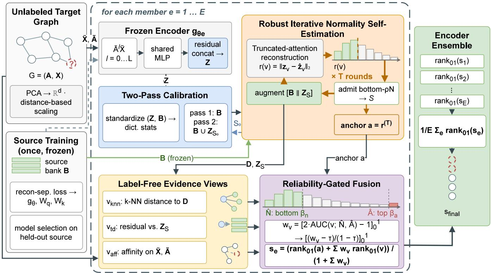
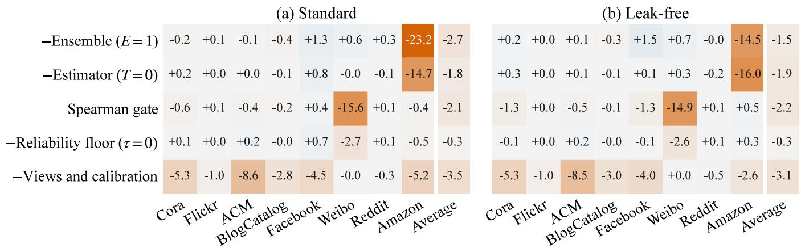
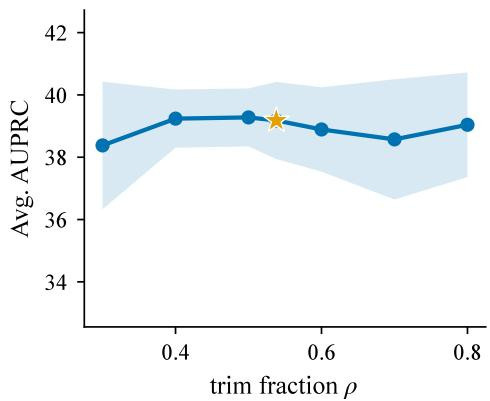
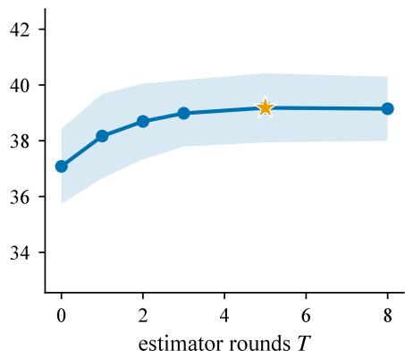
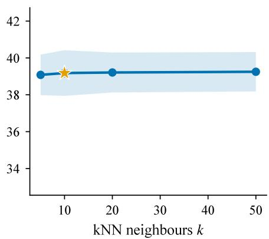
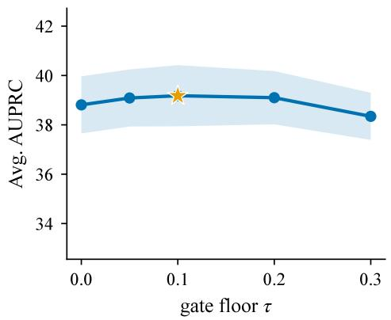
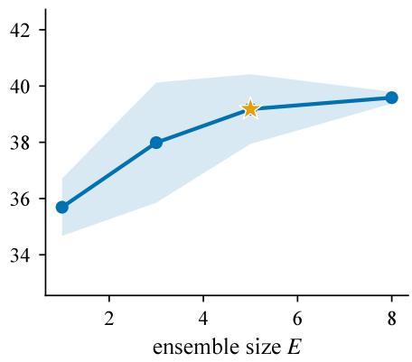
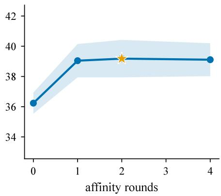

# RINSE: Robust Target-Time Normality Estimation for Zero-Shot Graph Anomaly Detection

Taufikur Rahman Fuad1, Md Abrar Jahin2, Amir Hussain3

1Islamic University of Technology

2University of Southern California

3King Fahd University of Petroleum & Minerals

taufikur@iut-dhaka.edu, jahin@usc.edu, amir.hussain@kfupm.edu.sa

## Abstract

Zero-shot graph anomaly detection seeks to deploy a detector trained on source graphs to unseen, unlabeled targets, yet do- main shift can make source-derived notions of normality unre- liable. We introduce RINSE (Robust Iterative Normality Self-Estimation), a gradient-free target-time framework that keeps the source-trained detector fixed while sequentially estimating target normality, representation calibration, and evidence reli- ability from the target graph. Its core idea is to identify a reli- able subset of low-residual target nodes, use them to construct a trimmed target-aware normality model, and combine com- plementary anomaly evidence through reliability-gated rank fusion and encoder ensembling. Across eight unseen target graphs, RINSE achieves the highest average AUPRC among the evaluated methods under two separate preprocessing pro- tocols, while block ablations and sensitivity analyses support the combined design. These results support robust target-time estimation as a practical approach to generalist graph anomaly detection without target labels, gradients, or per-target tuning.

## 1 Introduction

Graph anomaly detection (GAD) identifies nodes in graphs whose attributes or connectivity deviate from normality. It supports fraud detection in financial and e-commerce net- works, spam and bot detection on social platforms, and re- view manipulation detection (Ding et al. 2019; Tang et al. 2022; Gao et al. 2023). Because anomalies are less frequent and node-level labels are costly, the paradigm is often unsu- pervised, with a detector trained on each scored graph (Qiao et al. 2025b). Reconstruction methods flag nodes reconstructed poorly by graph autoencoders (Ding et al. 2019; He et al. 2024); contrastive methods detect nodes inconsistent with sampled contextual views (Liu et al. 2022; Zheng et al. 2023); and afinity methods score disagreement with local neighborhoods (Qiao and Pang 2023; Zheng et al. 2025).

Per-graph training incur structural costs. Each graph re- quires a separate training run, yet hyperparameters and stop- ping criteria cannot be validated without labels; label-free model selection remains an open problem (Zhao, Rossi, and Akoglu 2021; Goswami et al. 2023; Ma et al. 2023). Unsupervised objectives are also optimized on contaminated data, allowing autoencoders to absorb the anomalies they aim to detect (He et al. 2024; Kim et al. 2024). Generalist GAD reduces these costs by training one model on labeled source graphs and applying it to unseen targets (Liu et al. 2024; Pan et al. 2025). In the zero-shot setting, the model ranks nodes in unseen target graphs without labels, fine-tuning, or target- specific configuration (Niu et al. 2025; Qiao et al. 2025a; Zhang et al. 2025a; Zheng et al. 2026). This is the setting we study.

Zero-shot generalists encode anomaly criteria during source training as neighborhood prompts, graph-agnostic prototypes, or normal-pattern dictionaries, then apply them to unlabeled targets (Niu et al. 2025; Qiao et al. 2025a; Zheng et al. 2026). ARC uses labeled normal context at inference (Liu et al. 2024), while $\mathrm { { A R C } _ { \mathrm { { z e r o } } } }$ extends this direction by selecting pseudo-normal target context for label-free in- ference (Liu et al. 2026). RINSE jointly estimates a trimmed target-normality dictionary, embedding calibration, and evi- dence reliability around a frozen detector.

Test-time adaptation ofers a related route. Existing ap- proaches optimize entropy, self-supervised objectives, graph transformations, or graph-level aligners using unlabeled test data (Wang et al. 2021; Sun et al. 2020; Jin et al. 2023; Pan et al. 2026). RINSE instead follows a gradient-free route: it estimates target normality from low-residual nodes and excludes high-residual candidates from subsequent calibra- tion and dictionary updates. This connects zero-shot GAD with robust estimation under contaminated target data (Di-akonikolas et al. 2024; Wang and Tan 2023; Diakonikolas et al. 2025).

We ask whether a frozen zero-shot detector can estimate target normality, embedding scale, and evidence reliability from a contaminated, unlabeled target graph, without gra- dients or per-target tuning. We hypothesize that a robust, gradient-free estimator can estimate these quantities while limiting the influence of suspected anomalies. We present RINSE (Robust Iterative Normality Self-Estimation), a testtime framework for a frozen truncated-attention detector. RINSE iteratively builds a target normality dictionary from low-residual nodes, calibrates embeddings to its statistics, and gates complementary evidence views by their agreement at the anchor ranking’s extremes. Rank averaging across in- dependently initialized encoders improves mean AUPRC un- der the evaluated protocol.

Our contributions are: (i) We cast zero-shot GAD around a frozen reconstruction scorer as contamination-controlled target-time normality estimation and develop a residual- trimmed iterative estimator without target labels or target- time gradients. (ii) We combine two-pass dictionary-statistics calibration with a label-free reliability gate over complemen- tary reconstruction-based, distance-based, and afinity-based views, followed by rank-based encoder ensembling. (iii) We evaluate one shared configuration across eight unseen target graphs under both the standard and source-referenced pre- processing protocols, block ablations under both protocols, sensitivity analysis, and estimator diagnostics.

## 2 Related Work

Graph Anomaly Detection. Most deep GAD methods train a detector on the graph it scores (Qiao et al. 2025b). Reconstruction methods flag poorly reconstructed nodes (Ding et al. 2019; He et al. 2024); contrastive methods com-pare nodes with sampled contexts (Liu et al. 2022; Zheng et al. 2023); afinity methods model neighborhood agreement (Qiao and Pang 2023; Zheng et al. 2025); and super-vised spectral methods capture the high-frequency patterns of anomalies (Tang et al. 2022; Gao et al. 2023). This target-specific paradigm requires label-free hyperparameter and stopping selection (Zhao, Rossi, and Akoglu 2021; Goswami et al. 2023; Ma et al. 2023) and learns from contaminated graphs, exposing reconstruction models to anomaly overfit- ting (He et al. 2024) and afinity models to violations of one-class homophily (Qiao and Pang 2023; Tang et al. 2022; Gao et al. 2023). RINSE performs no target training: it treats contamination as a test-time estimation problem and limits suspected anomalies’ influence on normality estimation.

Generalist and Zero-Shot Cross-Domain GAD. Earlier cross-domain GAD methods adapt source knowledge to a given target through adversarial (Ding et al. 2022) or anomaly-aware contrastive alignment (Wang et al. 2023), with later transfer-based variants (Huang et al. 2025). They access the target graph during training and learn a separate model for each target. Broader graph-transfer methods use language-encoded attributes (Li et al. 2024; Wang et al. 2025) or few-shot prompt learning (Yu et al. 2024; Fu et al. 2025), and thus address diferent input or supervision settings.

ARC established the generalist GAD setting by training once on labeled source graphs and scoring unseen targets without retraining, using a few labeled normal nodes at in- ference (Liu et al. 2024). $\mathrm { { A R C } _ { \mathrm { { z e r o } } } }$ later enables label-free inference by selecting representative pseudo-normal target context (Liu et al. 2026). Other zero-shot methods learn neighborhood prompts (Niu et al. 2025), align graph-agnostic prototypes with residual features (Qiao et al. 2025a), combine invariant representations with afinity learning (Zhang et al. 2025a), or reconstruct target nodes through truncated attention over a source-trained normality dictionary (Zheng et al. 2026). RINSE difers by jointly estimating target normality, embedding calibration, and evidence reliability through a gradient-free procedure around a fixed source-trained scorer.

Test-Time Adaptation and Unsupervised Model Selection. Test-time adaptation updates deployed systems using unlabeled test data. Test-time training optimizes self- supervised losses (Sun et al. 2020; Liu et al. 2021), Tent minimizes prediction entropy through normalization param- eters (Wang et al. 2021), and GTrans adapts target features and graph structure (Jin et al. 2023). TUNE adapts pretrained graph anomaly detectors to unseen normal patterns by optimizing a graph-level aligner (Pan et al. 2026). Recent backpropagation-free approaches align target subspaces or feature statistics (Wang et al. 2024; Dong et al. 2025; Zhang et al. 2025b) or select informative tokens (Yazdan-panah et al. 2025). RINSE requires no target-time optimization and instead performs forward-only estimation for con- taminated one-class ranking.

Label-free model selection uses meta-learning (Zhao, Rossi, and Akoglu 2021), surrogate metrics (Goswami et al. 2023), or internal evaluation criteria (Ma et al. 2023), while uncertainty-aware view rejection has been studied for supervised multi-view classification (Liu, Chen, and Yue 2025). RINSE separates these roles: held-out source validation se- lects the checkpoint, while the unlabeled target graph deter- mines view reliability at inference.

## 3 Preliminaries

Let $G = ( \nu , \mathcal { E } , \mathbf { X } )$ be an attributed graph with $N = | \nu |$ nodes, adjacency matrix $\mathbf { A } \in \{ 0 , 1 \} ^ { \bigcup ^ { \bullet } N \times N }$ , and attributes $\mathbf { X } \in \mathbb { R } ^ { N \times d _ { G } }$ . Each node has a latent label $y _ { v } ~ \in ~ \{ 0 , 1 \}$ $( 1 = \mathrm { a n o m a l o u s } )$ , with $\textstyle \sum _ { v } y _ { v } \ll N$ . In zero-shot generalist graph anomaly detection (Liu et al. 2024; Niu et al. 2025), a model is trained once on labeled source graphs ${ \mathcal { D } } _ { \mathrm { s r c } } = \{ G ^ { ( 1 ) } , . . . , G ^ { ( M ) } \}$ and applied to unlabeled target graphs from unseen domains. For each target, it produces scores $s : \mathcal { V } \to \mathbb { R }$ that rank anomalous nodes above nor- mal ones, without target labels, fine-tuning, or target-specific configuration. Because feature spaces difer across domains, each graph is projected to a shared dimension d using $\mathrm { P C A } ,$ preceded by Gaussian random projection when $d _ { G } \ < \ d ,$ and rescaled by distance-based normalization following (Liu et al. 2024; Zheng et al. 2026). We denote the processed attributes and normalized adjacency by $\tilde { \mathbf { X } }$ and A˜ .

## 4 Methodology

RINSE performs robust target-time estimation around a frozen detector. For each ensemble member e, it encodes the target graph with $g _ { \theta _ { e } }$ , calibrates target and source-bank embeddings in two passes using provisional low-residual nor- mals, iteratively augments the source bank with trimmed tar- get normals to obtain an anchor score and admitted set, com- putes three complementary evidence views, and fuses their rank-normalized scores with label-free reliability weights. The final prediction averages score ranks across E independently initialized members. All target-time steps use only the unlabeled target graph, require no gradients, and share one configuration across targets. Figure 1 shows the pipeline, and Algorithm 1 summarizes inference.

## 4.1 Frozen Truncated-Attention Scorer

RINSE uses a source-trained scorer without target-time up- dates. A shared MLP $g _ { \theta }$ encodes propagated attributes, $\begin{array} { r } { { \bf Z } ^ { [ l ] } = g _ { \theta } ( \tilde { \bf A } ^ { l } \tilde { \bf X } ) } \end{array}$ , and forms

$$
\mathbf { Z } = \left[ \mathbf { Z } ^ { [ 1 ] } - \mathbf { Z } ^ { [ 0 ] } \parallel \cdots \parallel \mathbf { Z } ^ { [ L ] } - \mathbf { Z } ^ { [ 0 ] } \right] \in \mathbb { R } ^ { N \times L h } .\tag{1}
$$

  
Figure 1: Overview of RINSE. For each ensemble member, the encoder $g _ { \theta _ { e } }$ , attention projections $\mathbf { W } _ { q } , \mathbf { W } _ { k }$ , and source bank $\mathbf { B } _ { e }$ are learned or constructed from source graphs and then frozen. All target-time components operate independently on the unlabeled target graph, without labels, gradients, or per-target tuning. The blue dashed path supplies provisional normals $S _ { 0 }$ to the second calibration pass; red dashed nodes denote suspected anomalies ranked highest at output.

Given a normality dictionary $\mathbf { P } = [ \mathbf { p } _ { 1 } ; \ldots ; \mathbf { p } _ { m } ] ,$ , let ${ \bf q } _ { v } =$ $\sigma ( \mathbf { W } _ { q } \mathbf { z } _ { v } ) , ~ \mathbf { k } _ { j } ~ = ~ \sigma ( \mathbf { W } _ { k } \mathbf { p } _ { j } )$ , and $e _ { v j } ~ = ~ \langle { \bf q } _ { v } , { \bf k } _ { j } \rangle / \sqrt { L h }$ where $\sigma$ is LeakyReLU. After masking the smallest $\lfloor \eta m \rfloor$ logits,

$$
\hat { \mathbf { z } } _ { v } = \sum _ { j } \alpha _ { v j } \mathbf { p } _ { j } , \qquad \alpha _ { v j } = \mathrm { s o f t m a x } _ { j } ( e _ { v j } / \gamma ) ,\tag{2}
$$

and the reconstruction residual is

$$
r ( v ; \mathbf { P } ) = \| \mathbf { z } _ { v } - \hat { \mathbf { z } } _ { v } \| _ { 2 } .\tag{3}
$$

A query’s own dictionary entry is masked when present. RINSE freezes this scorer and estimates its target-time dic- tionary, calibration, and evidence weights.

## 4.2 Robust Iterative Normality Self-Estimation

For one ensemble member, let B be its frozen source bank, with the member index suppressed. To adapt source normal- ity to the target while limiting anomaly influence, RINSE repeatedly admits low-residual target nodes. Starting from $r ^ { ( 0 ) } ( v ) = r ( v ; { \bf B } )$ , for $t = 1 , \dots , T$ it computes

$$
\begin{array} { c } { { \mathcal { S } ^ { ( t ) } = \arg \log \log \tan { r ^ { ( t - 1 ) } } } } \\ { { \rho N } } \\ { { r ^ { ( t ) } ( v ) = r ( v ; [ \mathbf { B } \parallel \mathbf { Z } _ { S ( t ) } ] ) } } \end{array}\tag{4}
$$

Each round combines the $\rho N$ lowest-residual target embed- dings with B and rescores all nodes with self-masking.

The final anchor is $\boldsymbol a ( \boldsymbol v ) ~ = ~ \boldsymbol r ^ { ( T ) } ( \boldsymbol v )$ ; its admitted set ${ \mathcal { S } } = \arg$ bottom a defines the target-aware dictionary $\mathbf { D } = \left[ \mathbf { B } \parallel \mathbf { Z } _ { S } \right]$ . Thus, $\rho$ trims the highest-residual $1 - \rho$ fraction from each update. The admitted sets remain approx- imately 97–99% normal across targets and rounds.

## 4.3 Two-Pass Dictionary-Statistics Calibration

Embedding-scale shift afects attention, distance, and resid- ual scores. For reference matrix C, let $\mu _ { \mathrm { { C } } }$ and $\pmb { \sigma } _ { \mathbf { C } }$ be its coordinate-wise moments, and define

$$
\operatorname { C a l } _ { \mathbf { C } } ( \mathbf { X } ) = c \left( \mathbf { X } - \pmb { \mu } _ { \mathbf { C } } \right) \oslash \left( \pmb { \sigma } _ { \mathbf { C } } + \varepsilon { \bar { \boldsymbol { \sigma } } } _ { \mathbf { C } } \right) ,\tag{5}
$$

where $\bar { \sigma } _ { \mathbf { C } }$ is the mean coordinate standard deviation and c restores the source bank’s mean row norm. The same trans- formation is applied to Z and B.

Calibration uses two passes. First, $\mathbf { C } = \mathbf { B }$ yields provi- sional normals $ { \boldsymbol { S } } _ { 0 }$ through Section 4.2. The original embed- dings are then recalibrated with $\mathbf { C } = [ \mathbf { B } \parallel \mathbf { Z } \bar { s } _ { 0 } ]$ , allowing low-residual target patterns to refine the statistics without exposing them to high-residual nodes.

## 4.4 Label-Free Multi-View Evidence

The anchor reflects attention-reconstruction geometry; RINSE adds three complementary label-free views.

kNN distance. The mean distance to the k nearest patterns

Algorithm 1: RINSE inference. Estimate implements $\operatorname { E q . 4 ; }$   
Calibrate applies Eq. 5 to target and bank embeddings using   
reference C; rank01(·) maps scores to $[ 0 , 1 ]$ , and $[ \breve { \cdot } ] _ { 0 } ^ { 1 }$ clips   
to this interval.   
Input: target graph $G ;$ frozen members $\{ \mathcal { M } _ { e } \} _ { e = 1 } ^ { E }$ with   
source banks $\{ { \bf \breve { B } } _ { e } \} ;$ parameters $\rho , T , k , R , \tilde { \beta _ { n } } , \beta _ { a } , \tau , \bar { \tau }$   
Output: $s _ { \mathrm { f i n a l } } \mathbf { \bar { \Pi } } \in [ \mathbf { \bar { 0 } } , \mathbf { \bar { 1 } } ] ^ { N }$   
1: for $e = 1$ to E do   
2: $\mathbf { Z }  g _ { \theta _ { e } } ( G ) ; \quad \mathbf { B }  \mathbf { B } _ { e }$   
3: $\begin{array} { r } { ( \mathbf { Z } ^ { \prime } , \dot { \mathbf { B } ^ { \prime } } ) \  \ \mathrm { C } _ { \mathrm { A L I B R A T E } } ( \mathbf { Z } , \mathbf { B } ; \mathbf { B } , \varepsilon ) ; \quad ( \mathbf { \Omega } _ { - } , S _ { 0 } ) \  ( \mathbf { \Omega } _ { - } , \mathbf { B } , \varepsilon ) } \end{array}$   
Estimate $( \mathbf { Z } ^ { \prime } , \mathbf { B } ^ { \prime } ; \rho , T )$   
4: $( \mathbf { Z } , \mathbf { B } ) \longleftarrow \mathrm { C a L I B R A T E } \big ( \mathbf { Z } , \mathbf { B } ; [ \mathbf { B } \parallel \mathbf { Z } _ { S _ { 0 } } ] , \varepsilon \big )$   
5: $( a , S )  \mathrm { E s r I M A T E } ( \mathbf { Z } , \mathbf { B } ; \rho , \mathbf { \tilde { \Gamma } } T ) ; \mathbf { D }  [ \mathbf { B } \mid ] \mathbf { Z } _ { S } ]$   
6: $\hat { \mathcal { N } }  \{ u : \mathrm { r a n k 0 1 } ( a ) ( u ) < \beta _ { n } \} ; \hat { \mathcal { A } }  \{ u :$   
rank0 $1 ( \tilde { a } ) ( u ) \geq 1 - \operatorname* { m a x } ( \beta _ { a } , 1 0 / N ) \}$   
7: compute $\mathcal { V } = \{ v _ { \mathrm { k n n } } , v _ { \mathrm { t d } } , v _ { \mathrm { a f f } } \}$ from $\mathbf { \Delta D } , \mathbf { Z } _ { S } , G$ using   
$k , R { \bar { \mathbf { \theta } } }$   
8: for all $v \in \mathcal V$ do   
9: $w _ { v }  [ \frac { [ 2 \operatorname { A U C } ( v ; \hat { \mathcal { N } } , \hat { A } ) - 1 ] _ { 0 } ^ { 1 } - \tau } { 1 - \tau } ] _ { 0 } ^ { 1 }$   
10: end for   
11: $\begin{array} { r } { s \gets \frac { \mathrm { r a n k 0 1 } ( a ) + \sum _ { v \in \mathcal { V } } w _ { v } \mathrm { r a n k 0 1 } ( v ) } { \mathrm { ~ \sum ~ } w _ { v } \mathrm { r a n k 0 1 } ( a ) + \sum _ { v \in \mathcal { V } } w _ { v } \mathrm { r a n k 0 1 } ( v ) } } \end{array}$ $s _ { e } \gets$   
$\overline { { 1 + \sum _ { v \in \mathcal { V } } w _ { v } } }$   
12: end for   
13: return $s _ { \mathrm { f i n a l } } = \frac { 1 } { E } \sum _ { e = 1 } ^ { E } \mathrm { r a n k } 0 1 ( s _ { e } )$

in the target-aware dictionary is

$$
v _ { \mathrm { k n n } } ( u ) = \frac { 1 } { k } \sum _ { \mathbf { p } \in \mathcal { N } _ { k } ( \mathbf { z } _ { u } ; \mathbf { D } ) } \lVert \mathbf { z } _ { u } - \mathbf { p } \rVert _ { 2 } ,\tag{6}
$$

excluding the query’s own entry when present. This view measures proximity to individual normal patterns rather than their attention-weighted combination.

Target-dictionary residual. The target-only score $v _ { \mathrm { t d } } \bar { ( u ) ^ { } } = r ( u ; { \bf Z } _ { S } )$ reconstructs each node from admitted target normals, with self-masking, and removes dependence on the source bank.

Raw-attribute afinity. Let X¯ be the row-normalized pro-cessed attributes. Initialize $v _ { \mathrm { a f f } } ^ { ( 0 ) } ( u ) = 1 - \cos \left( \bar { \bf x } _ { u } , ( \tilde { \bf A } \bar { \bf X } ) _ { u } \right)$ For $q = 0 , \ldots , R - 1$ , set $\omega ^ { ( q ) } = 1 - \mathrm { r a n k 0 } 1 ( v _ { \mathrm { a f f } } ^ { ( q ) } )$ and update

$$
v _ { \mathrm { a f f } } ^ { ( q + 1 ) } ( u ) = 1 - \cos \left( \bar { \mathbf { x } } _ { u } , \frac { \left( \tilde { \mathbf { A } } ( \omega ^ { ( q ) } \odot \bar { \mathbf { X } } ) \right) _ { u } } { ( \tilde { \mathbf { A } } \omega ^ { ( q ) } ) _ { u } } \right) .\tag{7}
$$

The final view is $v _ { \mathrm { a f f } } = v _ { \mathrm { a f f } } ^ { ( R ) }$ . Rank weighting reduces the influence of high-scoring neighbors, while operating outside the encoder provides complementary attribute-structural ev- idence.

## 4.5 Reliability-Gated Fusion and Encoder Ensembling

For each ensemble member, RINSE estimates view reliability from agreement with the anchor at its ranking extremes.

Suppressing the member index, define

$$
\begin{array} { l } { \hat { \mathcal { N } } = \{ u : \mathrm { r a n k 0 1 } ( a ) ( u ) < \beta _ { n } \} } \\ { \quad \hat { \mathcal { A } } = \{ u : \mathrm { r a n k 0 1 } ( a ) ( u ) \geq 1 - \operatorname* { m a x } ( \beta _ { a } , 1 0 / N ) \} } \end{array}
$$

For each $v \in \mathcal { V } = \{ v _ { \mathrm { k n n } } , v _ { \mathrm { t d } } , v _ { \mathrm { a f f } } \}$

$$
w _ { v } = \left[ \frac { \left[ 2 \mathrm { A U C } ( v ; \hat { \mathcal { N } } , \hat { \mathcal { A } } ) - 1 \right] _ { 0 } ^ { 1 } - \tau } { 1 - \tau } \right] _ { 0 } ^ { 1 } ,\tag{8}
$$

where $[ \cdot ] _ { 0 } ^ { 1 }$ clips to [0, 1]. The resulting per-member score is

$$
s ( u ) = \frac { \mathrm { r a n k 0 1 } ( a ) ( u ) + \sum _ { v \in \mathcal { V } } w _ { v } \mathrm { r a n k 0 1 } ( v ) ( u ) } { 1 + \sum _ { v \in \mathcal { V } } w _ { v } } .\tag{9}
$$

The anchor retains unit weight, so unreliable views can be suppressed without replacing the primary score.

RINSE runs this pipeline independently for E members and averages their normalized ranks:

$$
s _ { \mathrm { f i n a l } } ( u ) = \frac { 1 } { E } \sum _ { e = 1 } ^ { E } \mathrm { r a n k } 0 1 ( s _ { e } ) ( u ) .\tag{10}
$$

Rank normalization makes member scores comparable be- fore averaging.

## 4.6 Source Training and Model Selection

We train $g _ { \boldsymbol { \theta } } , \mathbf { W } _ { q } , \mathbf { W } _ { k }$ on labeled source graphs using the reconstruction-separation objective of Zheng et al. (2026). Sampled normal embeddings form the reconstruction dic- tionary. For normal and anomalous queries $\mathbf { z } _ { n } , \mathbf { z } _ { a } .$ , the loss is

$$
\begin{array} { r l } & { \mathcal { L } = 1 - \cos ( { \mathbf { z } } _ { n } , \hat { \mathbf { z } } _ { n } ) + \big [ \cos ( { \mathbf { z } } _ { a } , \hat { \mathbf { z } } _ { a } ) \big ] _ { + } } \\ & { \quad \quad \quad + \big [ \| \hat { \mathbf { z } } _ { n } - { \mathbf { z } } _ { n } \| _ { 2 } - \| \hat { \mathbf { z } } _ { n } - { \mathbf { z } } _ { a } \| _ { 2 } + \delta \big ] _ { + } , } \end{array}\tag{11}
$$

where δ is the separation margin.

Checkpoint selection uses a fixed held-out source domain. For each ensemble member, we train on PubMed, Questions, and YelpChi, evaluate the full single-member inference pipeline on CiteSeer after each epoch, and retain the check- point with the highest AUPRC. We then freeze the scorer and rebuild its source bank from all four source graphs. No target graph enters training, checkpoint selection, or bank construction, and all targets share one configuration.

## 5 Experiments

## 5.1 Experimental Setup

Datasets. We follow the experimental and evaluation protocol of Zheng et al. (2026). RINSE and the onefor-all baselines use four source graphs and are eval- uated on eight disjoint target graphs. The source set $\mathcal { T } _ { \mathrm { t r a i n } } ~ = ~ \mathrm { \{ P u b M e d } $ , CiteSeer, Questions, YelpChi} covers citation, question-answering, and co-review networks with injected or organic anomalies. The target set $\mathcal { T } _ { \mathrm { t e s t } } = \{ \mathrm { C o r a }$ Flickr, ACM, BlogCatalog, Facebook, Weibo, Reddit, Amazon} contains graphs not used for training or model selection.

<table><tr><td>Method</td><td>Cora</td><td>Flickr</td><td>ACM</td><td>BlogCatalog</td><td>Facebook</td><td>Weibo</td><td>Reddit</td><td>Amazon</td><td>Average</td></tr><tr><td colspan="10">Supervised (10-shot)</td></tr><tr><td>BWGNN</td><td> $9 . 5 7 { \pm } 2 . 4 0 $ </td><td> $1 2 . 3 9 { \pm } 2 . 6 8$ </td><td> $1 3 . 3 7 { \pm 6 . 0 3 }$ </td><td> $1 2 . 9 7 { \pm } 3 . 1 5 $ </td><td> $5 . 8 1 { \pm } 1 . 1 7$ </td><td> $9 . 5 5 { \pm } 2 . 1 2$ </td><td> $3 . 2 1 \pm 2 . 3 2$ </td><td> $1 2 . 4 0 { \pm } 1 . 8 6 $ </td><td>9.91</td></tr><tr><td>GHRN</td><td> $1 4 . 0 4 { \pm } 0 . 7 3 $ </td><td> $1 6 . 4 5 { \pm } 2 . 5 9$ </td><td> $1 6 . 2 9 { \pm } 1 . 4 1 $ </td><td> $1 3 . 5 8 { \pm } 2 . 1 9$ </td><td> $6 . 2 4 { \pm } 1 . 1 2$ </td><td> $1 7 . 5 1 { \pm } 1 . 5 2 $ </td><td> $\underline { { 4 . 4 4 \pm 1 . 1 5 } }$ </td><td> $1 3 . 8 4 \pm 2 . 6 3$ </td><td>12.80</td></tr><tr><td colspan="10"> $U n s u p e r \nu i s e d$ </td></tr><tr><td>DOMINANT</td><td> $3 1 . 7 7 { \scriptstyle \pm 0 . 3 4 }$ </td><td> $2 8 . 7 6 { \pm } 1 . 5 2 $ </td><td> $3 2 . 4 9 { \pm } 4 . 9 7$ </td><td> $2 9 . 5 1 { \pm } \dot { 3 } . 4 4$ </td><td> $3 . 4 2 { \pm } 0 . 8 6$ </td><td> $2 9 . 6 3 { \pm } 0 . 8 6$ </td><td> $3 . 2 8 { \pm } 0 . 3 7$ </td><td> $3 6 . 8 0 { \pm } 8 . 3 7$ </td><td>24.46</td></tr><tr><td>SL-GAD</td><td> $1 8 . 2 7 { \pm } 1 . 0 1 $ </td><td> $1 6 . 9 3 { \pm } 8 . 2 0 $ </td><td> $1 . 3 3 { \pm } 0 . 2 3 $ </td><td> $9 . 4 7 { \pm } 3 . 0 0$ </td><td> $0 . 9 3 { \pm } 0 . 2 3$ </td><td> $3 5 . 8 0 { \pm } 1 . 4 1 $ </td><td> $4 . 0 0 { \pm } 2 . 2 7 \ $ </td><td> $5 . 3 3 { \pm } 2 . 2 0 $ </td><td>11.51</td></tr><tr><td>TAM CARE</td><td> $9 . 4 3 { \pm } 0 . 2 7$ </td><td> $2 3 . 3 4 { \pm } 1 . 4 2$ </td><td> $4 0 . 6 8 { \pm } 2 . 5 8 $ </td><td> $2 5 . 5 9 2 4 . 7 6$ </td><td> ${ \bf 1 2 . 1 8 } { \pm } 3 . 1 4$ </td><td> $2 3 . 0 1 { \pm } 1 5 . 1 4$ </td><td> $4 . 2 2 { \pm } 0 . 2 2$ </td><td> $4 5 . 2 6 { \pm } 4 . 3 4$ </td><td>22.96</td></tr><tr><td></td><td> $3 5 . 1 2 { \pm } 0 . 2 3 $ </td><td> $2 5 . 6 4 { \pm } 0 . 1 6$ </td><td> $3 7 . 7 6 { \pm } 0 . 3 5$ </td><td> $2 5 . 0 6 { \pm } 0 . 1 0$ </td><td> $5 . 5 2 { \pm } 0 . 3 4$ </td><td> $4 0 . 7 0 { \scriptstyle \pm 0 . 7 4 }$ </td><td> $3 . 1 7 { \pm } 0 . 1 7$ </td><td> $5 6 . 7 6 { \pm } 1 . 4 4$ </td><td>28.72</td></tr><tr><td colspan="10">One-for-all _</td></tr><tr><td>ARC</td><td> $4 5 . 2 0 { \pm } 1 . 0 8 $ </td><td> $3 5 . 1 3 { \pm } 0 . 2 0 $ </td><td> $3 9 . 0 2 { \pm } 0 . 0 8 $ </td><td> $3 3 . 4 3 { \pm } 0 . 1 5 $ </td><td> $4 . 2 5 { \pm } 0 . 4 7$ </td><td> $\mathbf { 6 4 . 1 8 { \pm } 0 . 6 8 }$ </td><td> $4 . 2 0 { \pm } 0 . 2 5 $ </td><td> $2 0 . 4 8 { \scriptstyle \pm 6 . 8 9 }$ </td><td>30.74</td></tr><tr><td>UNPrompt OWLEYE</td><td> $\overline { { 9 . 8 4 \pm 2 . 9 0 } }$ </td><td> $2 5 . 2 1 { \pm } 1 . 8 4 $ </td><td> $1 1 . 1 8 { \pm } 1 . 6 7$ </td><td> $1 8 . 2 4 \pm 1 3 . 0 5$ </td><td> $4 . 3 2 { \pm } 0 . 5 5 $ </td><td> $2 0 . 5 8 { \pm } 5 . 6 2$ </td><td> $3 . 7 7 \pm 0 . 3 2$ </td><td> $9 . 4 1 \pm 2 . 6 9$ </td><td>12.82</td></tr><tr><td></td><td> $4 3 . 9 4 { \pm } 0 . 4 6$ </td><td> $\underline { { 3 7 . 6 9 \pm 0 . 2 5 } }$ </td><td> $3 9 . 7 5 { \pm } 0 . 1 3 $ </td><td> $\underline { { 3 4 . 9 9 \pm 0 . 3 1 } }$  _</td><td> $5 . 6 2 { \pm } 1 . 1 7$ </td><td> $6 0 . 9 0 { \scriptstyle \pm 0 . 2 1 }$ </td><td> $4 . 2 5 { \pm } 0 . 1 1$ </td><td> ${ \bf 6 2 . 2 0 } \pm 3 . 1 8$ </td><td>36.17</td></tr><tr><td>RINSE</td><td> ${ \pm \bf 0 . 4 4 { \pm 0 . 4 5 } }$ </td><td> ${ \bf 3 8 . 6 4 } \pm { \bf 0 . 1 } 2$ </td><td> $\mathbf { 4 8 . 3 2 \pm 0 . 0 4 }$ </td><td> ${ \bf 3 8 . 1 2 \pm 0 . 1 6 }$ </td><td> $\underline { { 9 . 8 9 \pm 1 . 3 4 } }$ </td><td> $\underline { { 6 3 . 6 9 \pm 0 . 2 3 } }$ </td><td> ${ \bf 4 . 8 0 { \pm } 0 . 1 6 }$ </td><td> ${ \underline { { 5 9 . 5 7 } } } { \pm 7 . 3 8 } $ </td><td>39.18</td></tr></table>

Table 1: AUPRC (%) under the standard normalization protocol, reported as mean±standard deviation. The final column averages the eight target graphs. Best results are highlighted in bold and second-best results are underlined.
<table><tr><td>Method</td><td>Cora</td><td>Flickr</td><td>ACM</td><td>BlogCatalog</td><td>Facebook</td><td>Weibo</td><td>Reddit</td><td>Amazon</td><td>Average</td></tr><tr><td>ARC</td><td> $4 4 . 9 0 { \pm } 0 . 5 1 $ </td><td> $3 8 . 0 4 { \scriptstyle \pm 0 . 2 6 }$ </td><td> $4 0 . 8 0 { \pm } 0 . 1 2 \ $ </td><td> $3 5 . 7 1 { \scriptstyle \pm 0 . 2 2 }$ </td><td> $6 . 9 5 { \pm } 2 . 0 3$ </td><td> $6 2 . 3 9 { \pm } 0 . 4 5 $ </td><td> $4 . 0 4 { \pm } 0 . 1 8$ </td><td> $2 2 . 5 4 { \pm } 7 . 2 1 $ </td><td>31.92</td></tr><tr><td>UNPrompt</td><td> $7 . 3 2 { \pm } 0 . 8 5 $ </td><td> $2 2 . 4 2 { \pm } 1 . 4 5$ </td><td> $\overline { { 1 2 . 9 8 { \pm } 0 . 8 0 } }$ </td><td> $\overline { { 2 8 . 9 3 { \pm } 0 . 6 5 } }$ </td><td> $\overline { { 6 . 2 4 \pm 1 . 5 0 } }$ </td><td> $\overline { { 2 3 . 6 7 \pm 2 . 2 1 } }$ </td><td> $4 . 7 9 \pm 0 . 2 9$ </td><td> $2 8 . 1 9 { \pm } 1 1 . 7 7$ </td><td>16.82</td></tr><tr><td>OWLEYE</td><td> $4 4 . 1 8 { \pm } 1 . 2 0 $ </td><td> $3 7 . 7 7 { \scriptstyle \pm 0 . 4 9 }$ </td><td> $3 9 . 8 7 { \pm } 0 . 1 7 $ </td><td> $3 4 . 8 8 { \pm } 0 . 2 0 $ </td><td> $4 . 5 7 { \pm } 0 . 5 6 $ </td><td> $6 1 . 1 5 { \pm } 0 . 5 6$ </td><td> $\overline { { 4 . 1 0 { \pm } 0 . 0 9 } }$ </td><td> $5 9 . 8 3 { \pm } 1 . 2 4 $ </td><td>35.79</td></tr><tr><td>RINSE</td><td> ${ \bf 4 9 . 8 7 \pm 1 . 7 2 }$ </td><td> ${ \bf 3 8 . 6 2 { \pm 0 . 0 5 } }$ </td><td> $\mathbf { 4 8 . 2 8 { \scriptstyle \pm 0 . 3 0 } }$ </td><td> ${ \bf 3 8 . 2 9 } \pm { \bf 0 . 3 7 }$ </td><td> $\mathbf { 9 . 2 1 } { \pm } 2 . 2 \mathbf { 9 }$ </td><td> $\mathbf { 6 3 . 2 3 { \scriptstyle \pm 0 . 3 4 } }$ </td><td> ${ \bf 5 . 0 4 } \pm { \bf 0 . 3 1 }$ </td><td> ${ \bf 6 3 . 8 9 } \pm 2 . 4 8 $ </td><td>39.55</td></tr></table>

Table 2: AUPRC (%) under the leak-free normalization protocol, reported as mean±standard deviation. The final column averages the eight target graphs. Best results are highlighted in bold and second-best results are underlined.

Baselines. We compare RINSE with supervised, unsuper-vised, and one-for-all GAD methods. The supervised base- lines, BWGNN (Tang et al. 2022) and GHRN (Gao et al. 2023), use the 10-shot protocol, with five labeled normal and five labeled anomalous nodes per target graph. The un- supervised baselines are DOMINANT (Ding et al. 2019), SL-GAD (Zheng et al. 2023), TAM (Qiao and Pang 2023), and CARE (Zheng et al. 2025); the one-for-all baselines are ARC (Liu et al. 2024), UNPrompt (Niu et al. 2025), and OWLEYE (Zheng et al. 2026).

Implementation Details. Each ensemble member trains $g _ { \boldsymbol { \theta } } , \mathbf { W } _ { q } , \mathbf { W } _ { k }$ on PubMed, Questions, and YelpChi, using CiteSeer for checkpoint selection as described in Section 4.6. After restoring the best checkpoint from 10 epochs, its source bank is rebuilt from all four source graphs. Target graphs provide neither training nor selection labels. All graphs use processed attribute dimension $d = 6 4$ . The encoder is a two- layer MLP over $L = 4$ propagation hops, with hidden width 384, ELU activation, and dropout 0.1. Truncated attention uses a bank of 2048 labeled-normal embeddings, truncation ratio $\eta = 0 . 7$ , temperature $\gamma = 0 . 0 3 1$ , and up to 1024 normal dictionary embeddings per source graph during training.

At inference, RINSE uses $\rho = 0 . 5 4 , T = 5 , k = 1 0 ,$ and $R = 2$ afinity refinements. The reliability gate uses $\beta _ { n } ~ = ~ 0 . 5 , ~ \beta _ { a } ~ = ~ 0 . 0 5$ , and $\tau \ = \ 0 . 1 ;$ calibration uses $\varepsilon = 0 . 0 5$ . We rank-average $E = 5$ independently initialized members. Each member is optimized with Adam using learn- ing rate $1 . 1 4 \times 1 0 ^ { - 3 }$ , weight decay $9 . 4 \times 1 0 ^ { - 5 }$ , and source- loss margin $\delta = 0 . 2 .$ Hyperparameters were selected using held-out source validation, without inspecting target labels or target performance, and the resulting shared configuration was fixed for all target graphs. We report five independent runs; member e in run t uses seed $1 0 0 t + e .$ . Source training is repeated for each member, while the complete target-time pipeline is gradient-free. We report AUROC and AUPRC, using AUPRC as the primary metric because anomalies are rare and it emphasizes performance on the minority class.

## 5.2 Results

Main Results. Table 1 shows that RINSE achieves the highest mean average precision among the evaluated meth- ods, reaching 39.18 and improving over the matched one-forall baseline OWLEYE by 3.01 points. RINSE ranks first on five targets and second on the remaining three. It increases performance over OWLEYE on seven of eight targets, with a median paired gain of 2.96 points, and attains the best mean rank among the ten evaluated methods (1.38 versus 2.75 for OWLEYE). Treating the eight target datasets as blocks, a Friedman test indicates significant diferences across the evaluated methods $( p = 3 . 6 \times 1 0 ^ { - 6 } )$ . In the matched compar- ison with OWLEYE, an exact two-sided Wilcoxon signed- rank test gives $p = 0 . 0 3 9$

Leak-Free Evaluation. We use leak-free as shorthand for the source-referenced normalization path, in which cross- graph reference statistics are computed only from the source graphs and each target is preprocessed independently of the other target graphs. Under this protocol, RINSE ranks first among the four evaluated one-for-all methods on all eight targets and achieves a mean average precision of 39.55 (Table 2). Its margin over OWLEYE increases from 3.01 points under standard normalization to 3.76 points, showing that the matched-protocol improvement persists under source- referenced preprocessing. Because this preprocessing com- parison is defined for the one-for-all pipeline, supervised and conventional unsupervised baselines are not repeated in Ta- ble 2.

  
Figure 2: Component ablation under the (a) standard and (b) leak-free protocols. Each cell reports the AUPRC change relative to full RINSE when a component is removed or replaced; the final column averages the eight target graphs. Both panels use the same scale.

Ablation Study. Figure 2 evaluates the contribution of each target-time component under both normalization proto- cols. The evidence views and dictionary-statistics calibration provide the largest average gain, improving AUPRC by 3.5 and 3.1 points under the standard and leak-free protocols, respectively, with particularly strong contributions on Cora, ACM, and Facebook. Ensembling and iterative normality estimation contribute up to 2.7 and 1.9 average points and yield their largest gains on Amazon. The anchor-based reli- ability gate improves Weibo by 15.6/14.9 points over global Spearman weighting, while the reliability floor adds 2.7/2.6 points on the same target. Together, the components provide complementary gains across target graphs and support the full RINSE configuration.

Analysis of Reliability Gating. The gate estimates each view’s reliability from its pseudo-AUC on the anchor’s rank- ing extremes (Section 4.5). Replacing the anchored gate with global Spearman weighting reduces Weibo AUPRC by 15.6/14.9 points under the standard/leak-free protocols, while removing the reliability floor reduces it by 2.7/2.6 points (Figure 2). These results show that extreme-rank agreement can preserve aligned views while suppressing less reliable evidence.

Sensitivity Analysis. Figure 3 varies six inference settings around their fixed defaults. In these one-at-a-time sweeps, mean AUPRC across the eight targets changes by less than one point for $\rho \in [ 0 . 4 , 0 . 8 ] , k \in [ 5 , 5 0 ]$ , and $\tau { \stackrel { \cdot } { \in } } [ 0 , 0 . 2 ]$

This supports using one fixed configuration across all targets without per-target tuning.

Increasing the estimator rounds from T = 0 to the performance plateau adds 2.1 AUPRC points; increasing the ensemble from E = 1 to E = 5 adds 3.5 points; and using two afinity-refinement rounds adds 2.9 points over no refine-ment. Further increases provide smaller gains. In particular, E = 8 adds 0.4 point over E = 5, supporting E = 5 as the default compute-performance trade-of.

## 6 Conclusion

We presented RINSE, a robust, gradient-free target-time framework for zero-shot graph anomaly detection. Around a frozen source-trained scorer, RINSE estimates target normal- ity through trimmed iteration, calibrates embedding statis- tics, weights complementary evidence by label-free reli- ability, and rank-averages independently trained encoders. Across eight unseen target graphs, RINSE achieves the high- est mean average precision among the evaluated methods under both preprocessing protocols, while the ablation and sensitivity analyses support its individual components. The present study focuses on attributed node-level graphs and a truncated-attention scorer; extending the framework to larger graphs, alternative frozen detectors, and other anomaly set- tings is a natural direction. Overall, the results support robust target-time estimation as a practical approach to generalist graph anomaly detection.

## Ethical Statement

RINSE is evaluated on established benchmark datasets and does not collect new human-subject data. It may support the review of potentially fraudulent, spam-related, or ma- nipulative activity without requiring target-domain labels. However, anomaly rankings can contain false positives and may afect users or groups unevenly. They should there- fore assist human review rather than trigger automatic puni- tive decisions. Practical deployment should include domain- specific validation, appropriate threshold selection, privacy safeguards, and subgroup auditing where relevant. RINSE reduces dependence on labeled target data but provides no causal guarantees. Its use should follow applicable laws, plat- form policies, and data-governance requirements.

  
Figure 3: Sensitivity of RINSE to six inference settings. Each panel varies one setting while fixing the others at their defaults, marked by an orange star. Curves report mean AUPRC across the eight target graphs, with shading for one standard deviation over five independent runs.

## References

Diakonikolas, I.; Iakovidis, G.; Kane, D.; and Pittas, T. 2025. Eficient Multivariate Robust Mean Estimation Under Mean- Shift Contamination. In Singh, A.; Fazel, M.; Hsu, D.; Lacoste-Julien, S.; Berkenkamp, F.; Maharaj, T.; Wagstaf, K.; and Zhu, J., eds., Forty-second International Conference on Machine Learning, ICML 2025, Vancouver, BC, Canada, July 13-19, 2025, volume 267 of Proceedings of Machine Learning Research. PMLR / O enReview.net.

Diakonikolas, I.; Kane, D.; Karmalkar, S.; Pensia, A.; and Pittas, T. 2024. Robust Sparse Estimation for Gaussians with Optimal Error under Huber Contamination. In Salakhut- dinov, R.; Kolter, Z.; Heller, K. A.; Weller, A.; Oliver, N.; Scarlett, J.; and Berkenkamp, F., eds., Forty-first International Conference on Machine Learning, ICML 2024, Vienna, Austria, July 21-27, 2024, volume 235 of Proceedings ofMachine Learning Research, 10811–10840. PMLR / OpenReview.net.

Ding, K.; Li, J.; Bhanushali, R.; and Liu, H. 2019. Deep anomaly detection on attributed networks. In Berger-Wolf, T. Y.; and Chawla, N. V., eds., Proceedings of the 2019

SIAM international conference on data mining, SDM 2019, calgary, alberta, canada, may 2-4, 2019, 594–602. SIAM.

Ding, K.; Shu, K.; Shan, X.; Li, J.; and Liu, H. 2022. Cross- Domain Graph Anomaly Detection. IEEE Trans. Neural Networks Learn. Syst., 33(6): 2406–2415.

Dong, J.; Jia, H.; Chatterjee, S.; Ghosh, A.; Bailey, J.; and Dang, T. 2025. E-BATS: Eficient Backpropagation-Free Test-Time Adaptation for Speech Foundation Models. In Belgrave, D.; Zhang, C.; Montoya, L. N.; Lin, H.-T.; Pas- canu, R.; Koniusz, P.; Ghassemi, M.; Chen, N.; Ruíz, I. V. M.; and Loaiza-Bonilla, A., eds., Advances in Neural Information Processing Systems 38: Annual Conference on Neural Information Processing Systems 2025, NeurIPS 2025, San Diego, CA, USA, December 2-7, 2025 / Mexico City, Mexico, November 30 - December 5, 2025.

Fu, X.; Wang, Z.; Chen, Z.; Li, J.; Zhu, Y.; Lei, Z.; Shen, C.; Ye, Y.; Zhang, C.; and Li, J. 2025. Graph Prompting for Graph Learning Models: Recent Advances and Future Directions. In Antonie, L.; Pei, J.; Yu, X.; Chierichetti, F.; Lauw, H. W.; Sun, Y.; and Parthasarathy, S., eds., Proceedings of the 31st ACM SIGKDD Conference on Knowledge Discovery and Data Mining, V.2, KDD 2025, Toronto ON, Canada, August 3-7, 2025, 6010–6020. ACM.

Gao, Y.; Wang, X.; He, X.; Liu, Z.; Feng, H.; and Zhang, Y. 2023. Addressing heterophily in graph anomaly detection: A perspective of graph spectrum. In Ding, Y.; Tang, J.;

Sequeda, J. F.; Aroyo, L.; Castillo, C.; and Houben, G.-J., eds., Proceedings of the ACM web conference 2023, WWW 2023, austin, TX, USA, 30 april 2023 - 4 may 2023, 1528– 1538. ACM.

Goswami, M.; Challu, C. I.; Callot, L.; Minorics, L.; and Kan, A. 2023. Unsupervised Model Selection for Time Se- ries Anomaly Detection. In The Eleventh International Conference on Learning Representations, ICLR 2023, Kigali, Rwanda, May 1-5, 2023. OpenReview.net.

He, J.; Xu, Q.; Jiang, Y.; Wang, Z.; and Huang, Q. 2024. ADA-GAD: Anomaly-Denoised Autoencoders for Graph Anomaly Detection. In Wooldridge, M. J.; Dy, J. G.; and Natarajan, S., eds., Thirty-Eighth AAAI Conference on Artificial Intelligence, AAAI 2024, Thirty-Sixth Conference on Innovative Applications ofArtificial Intelligence, IAAI 2024, Fourteenth Symposium on EducationalAdvances inArtificial Intelligence, EAAI 2024, February 20-27, 2024, Vancouver, Canada, 8481–8489. AAAI Press.

Huang, C.; Shi, X.; Gao, C.; Hu, Q.; Huang, X.; Huang, Q.; and Anaissi, A. 2025. Cross-Domain Graph Anomaly Detection via Graph Transfer and Graph Decouple. CAAI Trans. Intell. Technol., 10(4): 1089–1103.

Jin, W.; Zhao, T.; Ding, J.; Liu, Y.; Tang, J.; and Shah, N. 2023. Empowering Graph Representation Learning with Test-Time Graph Transformation. In The Eleventh International Conference on Learning Representations, ICLR 2023, Kigali, Rwanda, May 1-5, 2023. OpenReview.net.

Kim, S.; Lee, S. Y.; Bu, F.; Kang, S.; Kim, K.; Yoo, J.; and Shin, K. 2024. Rethinking Reconstruction-based Graph- Level Anomaly Detection: Limitations and a Simple Rem- edy. In Globerson, A.; Mackey, L.; Belgrave, D.; Fan, A.; Paquet, U.; Tomczak, J. M.; and Zhang, C., eds., Advances in Neural Information Processing Systems 37: Annual Conference on Neural Information Processing Systems 2024, NeurIPS 2024, Vancouver, BC, Canada, December 10 - 15, 2024.

Li, Y.; Wang, P.; Li, Z.; Yu, J. X.; and Li, J. 2024. Ze- roG: Investigating Cross-dataset Zero-shot Transferability in Graphs. In Baeza-Yates, R.; and Bonchi, F., eds., Proceedings of the 30th ACM SIGKDD Conference on Knowledge Discovery and Data Mining, KDD 2024, Barcelona, Spain, August 25-29, 2024, 1725–1735. ACM.

Liu, W.; Chen, Y.; and Yue, X. 2025. Enhancing multi-view classification reliability with adaptive rejection. In Proceedings of the AAAI Conference on Artificial Intelligence, vol-ume 39, 18969–18977. Number: 18.

Liu, Y.; Kothari, P.; Delft, B. v.; Bellot-Gurlet, B.; Mordan, T.; and Alahi, A. 2021. TTT++: When Does Self-Supervised Test-Time Training Fail or Thrive? In Ranzato, M.; Beygelz- imer, A.; Dauphin, Y. N.; Liang, P.; and Vaughan, J. W., eds., Advances in Neural Information Processing Systems 34: Annual Conference on Neural Information Processing Systems 2021, NeurIPS 2021, December 6-14, 2021, virtual, 21808–21820.

Liu, Y.; Li, S.; Zheng, Y.; Chen, Q.; Zhang, C.; and Pan, S. 2024. ARC: A generalist graph anomaly detector with in-context learning. In Globerson, A.; Mackey, L.; Belgrave,

D.; Fan, A.; Paquet, U.; Tomczak, J. M.; and Zhang, C., eds., Advances in neural information processing systems 37: Annual conference on neural information processing systems 2024, NeurIPS 2024, vancouver, BC, canada, december 10 - 15, 2024.

Liu, Y.; Li, S.; Zheng, Y.; Chen, Q.; Zhang, C.; Yu, P. S.; and Pan, S. 2026. From Few-Shot to Zero-Shot: Towards Generalist Graph Anomaly Detection. IEEE Trans. Knowl. Data Eng., 38(7): 4357–4372.

Liu, Y.; Li, Z.; Pan, S.; Gong, C.; Zhou, C.; and Karypis, G. 2022. Anomaly detection on attributed networks via con- trastive self-supervised learning. IEEE Trans. Neural Networks Learn. Syst., 33(6): 2378–2392.

Ma, M. Q.; Zhao, Y.; Zhang, X.; and Akoglu, L. 2023. The Need for Unsupervised Outlier Model Selection: A Review and Evaluation of Internal Evaluation Strategies. SIGKDD Explor., 25(1): 19–35.

Niu, C.; Qiao, H.; Chen, C.; Chen, L.; and Pang, G. 2025. Zero-shot generalist graph anomaly detection with unified neighborhood prompts. In Proceedings of the thirty-fourth international joint conference on artificial intelligence, IJ-CAI 2025, montreal, canada, august 16-22, 2025, 3226– 3234. ijcai.org.

Pan, J.; Liu, Y.; Zhou, C.; Xiong, F.; Liew, A. W.; and Pan, S. 2026. Correcting False Alarms from Unseen: Adapting Graph Anomaly Detectors at Test Time. In Koenig, S.; Jenk- ins, C.; and Taylor, M. E., eds., Fortieth AAAI Conference on Artificial Intelligence, Thirty-Eighth Conference on Innovative Applications ofArtificial Intelligence, Sixteenth Sym posium on Educational Advances in Artificial Intelligence, AAAI 2026, Singapore, January 20-27, 2026, 24691–24699. AAAI Press.

Pan, J.; Zheng, Y.; Tan, Y.; and Liu, Y. 2025. A Survey of Generalization of Graph Anomaly Detection: From Transfer Learning to Foundation Models. In 2025 IEEE International Conference on Knowledge Graph (ICKG), Limassol, Cyprus, November 13-14, 2025, 316–323. IEEE.

Qiao, H.; Niu, C.; Chen, L.; and Pang, G. 2025a. AnomalyGFM: Graph Foundation Model for Zero/Few- shot Anomaly Detection. In Antonie, L.; Pei, J.; Yu, X.; Chierichetti, F.; Lauw, H. W.; Sun, Y.; and Parthasarathy, S., eds., Proceedings ofthe 31st ACM SIGKDD Conference on Knowledge Discovery and Data Mining, V.2, KDD 2025, Toronto ON, Canada, August 3-7, 2025, 2326–2337. ACM.

Qiao, H.; and Pang, G. 2023. Truncated afinity maximization: One-class homophily modeling for graph anomaly de- tection. In Oh, A.; Naumann, T.; Globerson, A.; Saenko, K.; Hardt, M.; and Levine, S., eds., Advances in neural information processing systems 36: Annual conference on neural information processing systems 2023, NeurIPS 2023, new orleans, LA, USA, december 10 - 16, 2023.

Qiao, H.; Tong, H.; An, B.; King, I.; Aggarwal, C.; and Pang, G. 2025b. Deep Graph Anomaly Detection: A Survey and New Perspectives. IEEE Transactions on Knowledge and Data Engineering, 37(9): 5106–5126.

Sun, Y.; Wang, X.; Liu, Z.; Miller, J.; Efros, A. A.; and Hardt, M. 2020. Test-Time Training with Self-Supervision

for Generalization under Distribution Shifts. In Proceedings of the 37th International Conference on Machine Learning, ICML 2020, 13-18 July 2020, Virtual Event, volume 119 of Proceedings of Machine Learning Research, 9229–9248. PMLR.

Tang, J.; Li, J.; Gao, Z.; and Li, J. 2022. Rethinking graph neural networks for anomaly detection. In Chaudhuri, K.; Jegelka, S.; Song, L.; Szepesvári, C.; Niu, G.; and Sabato, S., eds., International conference on machine learning, ICML 2022, 17-23 july 2022, baltimore, maryland, USA, volume 162 of Proceedings of machine learning research, 21076– 21089. PMLR.

Wang, D.; Shelhamer, E.; Liu, S.; Olshausen, B. A.; and Dar- rell, T. 2021. Tent: Fully Test-Time Adaptation by Entropy Minimization. In 9th International Conference on Learning Representations, ICLR 2021, Virtual Event, Austria, May 3-7, 2021. OpenReview.net.

Wang, D.; Zuo, Y.; Lu, G.; and Wu, J. 2025. UniGTE: Unified Graph-Text Encoding for Zero-Shot Generalization across Graph Tasks and Domains. In Belgrave, D.; Zhang, C.; Montoya, L. N.; Lin, H.-T.; Pascanu, R.; Koniusz, P.; Ghas- semi, M.; Chen, N.; Ruíz, I. V. M.; and Loaiza-Bonilla, A., eds., Advances in Neural Information Processing Systems 38: Annual Conference on Neural Information Processing Systems 2025, NeurIPS 2025, San Diego, CA, USA, December 2-7, 2025 / Mexico City, Mexico, November 30 - December 5, 2025.

Wang, Q.; Pang, G.; Salehi, M.; Buntine, W. L.; and Leckie, C. 2023. Cross-Domain Graph Anomaly Detection via Anomaly-Aware Contrastive Alignment. In Williams, B.; Chen, Y.; and Neville, J., eds., Thirty-Seventh AAAI Conference on Artificial Intelligence, AAAI 2023, Thirty-Fifth Conference on Innovative Applications of Artificial Intelligence, IAAI 2023, Thirteenth Symposium on Educational Advances in Artificial Intelligence, EAAI 2023, Washington, DC, USA, February 7-14, 2023, 4676–4684. AAAI Press.

Wang, Y.; Cheraghian, A.; Hayder, Z.; Hong, J.; Ramasinghe, S.; Rahman, S.; Ahmedt-Aristizabal, D.; Li, X.; Petersson, L.; and Harandi, M. 2024. Backpropagation-free Network for 3D Test-time Adaptation. In IEEE/CVF Conference on Computer Vision and Pattern Recognition, CVPR 2024, Seattle, WA, USA, June 16-22, 2024, 23231–23241. IEEE.

Wang, Z.; and Tan, Z. 2023. Tractable and Near-Optimal Ad- versarial Algorithms for Robust Estimation in Contaminated Gaussian Models. Journal of Machine Learning Research, 24: 235:1–235:112.

Yazdanpanah, M.; Bahri, A.; Noori, M.; Dastani, S.; Hakim, G. A. V.; Osowiechi, D.; Ayed, I. B.; and Desrosiers, C. 2025. Purge-Gate: Backpropagation-Free Test-Time Adaptation for Point Clouds Classification via Token Purging. In IEEE/CVF International Conference on Computer Vision, ICCV 2025, Honolulu, HI, USA, October 19-25, 2025, 27640–27649. IEEE.

Yu, X.; Fang, Y.; Liu, Z.; and Zhang, X. 2024. HGPrompt: Bridging Homogeneous and Heterogeneous Graphs for Few- Shot Prompt Learning. In Wooldridge, M. J.; Dy, J. G.; and Natarajan, S., eds., Thirty-Eighth AAAI Conference on

Artificial Intelligence, AAAI 2024, Thirty-Sixth Conference on Innovative Applications of Artificial Intelligence, IAAI 2024, Fourteenth Symposium on Educational Advances in Artificial Intelligence, EAAI 2024, February 20-27, 2024, Vancouver, Canada, 16578–16586. AAAI Press.

Zhang, X.; He, Z.; Fu, C.; and Xie, C. 2025a. IA-GGAD: Zero-shot Generalist Graph Anomaly Detection via Invariant and Afinity Learning. In Belgrave, D.; Zhang, C.; Montoya, L. N.; Lin, H.-T.; Pascanu, R.; Koniusz, P.; Ghassemi, M.; Chen, N.; Ruíz, I. V. M.; and Loaiza-Bonilla, A., eds., Advances in Neural Information Processing Systems 38:Annual Conference on Neural Information Processing Systems 2025, NeurIPS 2025, San Diego, CA, USA, December 2-7, 2025 / Mexico City, Mexico, November 30 - December 5, 2025.

Zhang, Y.; Kim, Y.; Choi, Y.-G.; Kim, H.; Liu, H.; and Hong, S. 2025b. Backpropagation-Free Test-Time Adaptation via Probabilistic Gaussian Alignment. In Belgrave, D.; Zhang, C.; Montoya, L. N.; Lin, H.-T.; Pascanu, R.; Koniusz, P.; Ghassemi, M.; Chen, N.; Ruíz, I. V. M.; and Loaiza-Bonilla, A., eds., Advances in Neural Information Processing Systems 38: Annual Conference on Neural Information Processing Systems 2025, NeurIPS 2025, San Diego, CA, USA, December 2-7, 2025 / Mexico City, Mexico, November 30 - December 5, 2025.

Zhao, Y.; Rossi, R. A.; and Akoglu, L. 2021. Automatic Unsupervised Outlier Model Selection. In Ranzato, M.; Beygelzimer, A.; Dauphin, Y. N.; Liang, P.; and Vaughan, J. W., eds., Advances in Neural Information Processing Systems 34: Annual Conference on Neural Information Processing Systems 2021, NeurIPS 2021, December 6-14, 2021, virtual, 4489–4502.

Zheng, L.; Birge, J. R.; Wu, H.; Zhang, Y.; and He, J. 2025. Cluster aware graph anomaly detection. In Long, G.; Blumestein, M.; Chang, Y.; Lewin-Eytan, L.; Huang, Z. H.; and Yom-Tov, E., eds., Proceedings of the ACM on web conference 2025, WWW 2025, sydney, NSW, australia, 28 april 2025- 2 may 2025, 1771–1782. ACM.

Zheng, L.; Fu, D.; Li, Z.; and He, J. 2026. OwlEye: Zero-shot learner for cross-domain graph data anomaly detection. In The fourteenth international conference on learning representations.

Zheng, Y.; Jin, M.; Liu, Y.; Chi, L.; Phan, K. T.; and Chen, Y.-P. P. 2023. Generative and contrastive self-supervised learning for graph anomaly detection. IEEE Transactions on Knowledge and Data Engineering, 35(12): 12220–12233.