# Recursive Value Learning for Long-Horizon Ofline Goal-Conditioned RL

Hyeonseong Jeon1 and Youngwoon Lee2

1Yonsei University, 2Seoul National University yeonsumia@snu.ac.kr, youngwoon@snu.ac.kr

Scaling ofline goal-conditioned reinforcement learning (GCRL) to long-horizon tasks is dificult because (1) long-range value learning depends on shorter-range estimates that may still be inaccurate, and (2) max-based value backups can amplify overestimation through repeated propagation. We propose DCRL (Divide-and-Conquer RL), which recursively decomposes each trajectory segment into a balanced binary tree and trains the values from leaves to root. Each parent is therefore updated only after its children, using an exact factorization of the observed route rather than selecting among noisy alternatives. Since this objective learns values along demonstrated routes that are not necessarily optimal, DCRL jointly propagates values across trajectories to discover shorter routes. Thanks to the balanced binary tree, DCRL reduces worst-case bootstrap depth from linear to logarithmic, and this shorter dependency structure empirically corresponds to much slower error accumulation. Across diverse goal-reaching tasks, DCRL substantially outperforms prior flat ofline GCRL methods, and on the five most challenging long-horizon OGBench tasks, it improves the best prior average score from 55 to 64, surpassing all flat and hierarchical baselines.

Project page: yeonsumia.github.io/dcrl

## 1. Introduction

Standard GCRL

DCRL

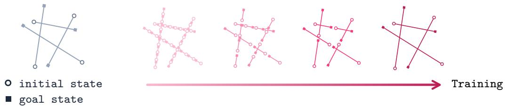  
Figure 1. DCRL (right) learns short segments first, then uses them to learn longer ones, whereas standard GCRL (left) randomly samples pairs of all lengths in no particular order.

Long-horizon goal-conditioned value learning has a natural dependency structure: the value of a long trajectory segment is built from the values of its shorter constituent segments. Yet most ofline goalconditioned reinforcement learning (GCRL) methods form bootstrapped targets from independently sampled transitions or subgoals, without ensuring that shorter-horizon values are learned before the longer-horizon values that depend on them. A long-range estimate may therefore bootstrap from shorter-range values that are themselves still inaccurate. Moreover, standard Bellman-style and transitive value backups choose optimistically among actions or intermediate states (Bellman, 1966; Floyd, 1962). With finite ofline data, this selection can favor overestimated candidates and propagate their errors through repeated backups, turning small local errors into large global inconsistencies.

We propose DCRL (Divide-and-Conquer RL), which makes this dependency explicit and enforces it through bottom-up training. The key idea is simple: learn shorter-range values (children) before the longer-range values (parents) that depend on them (Figure 1). Given a sampled trajectory segment, Divide recursively splits it at its midpoint until reaching single-step segments. Conquer then trains aTRL humanoidgiant-maze value function by processing the resulting segments from leaves to root. Thus, each parent is updatedˆd 8080 only after its children. A horizon-� segment therefore produces a balanced binary tree with60e 70ˆd70ˆd $O ( H )$ nodes but only $O ( \log _ { 2 } H )$ sequential composition levels. This gives DCRL logarithmic bootstrap depth50an 60e60e in the horizon, whereas standard backups have linear worst-case depth.40is 5an

At each internal node of the tree, DCRL applies an exact trajectory factorization along the observede D D route. For any intermediate state � on a trajectory segment from � toa $^ { g , }$ the corresponding behaviore value $V _ { \tau }$ satisfies

$$
V _ { \tau } ( s , g ) = V _ { \tau } ( s , w ) \cdot V _ { \tau } ( w , g ) .
$$

Unlike standard max-based backups, this factorization evaluates a single route supported by theTRL GT Distance dú  GT Distance dú dataset. DCRL thus addresses the two sources of long-horizon error directly: bottom-up schedulingDCRL TRL imposes the dependency order among value estimates, while exact route factorization avoids optimistic   DCRL selection among noisy alternatives. We empirically show that DCRL accumulates less long-range errorOptimal (d  dú) than standard max-based backups.

Explicit tree construction distinguishes DCRL from Transitive RL (TRL) (Park et al., 2026). TRL independently samples a trajectory segment and a random in-trajectory split at each update, thereby learning from isolated transitive decompositions. DCRL instead instantiates each sampled trajectory segment as a balanced binary tree, preserves its parent–child dependencies, and learns the value function on its segments from leaves to root. Thus, TRL samples individual transitive relations, whereas DCRL explicitly constructs and executes a divide-andconquer computation. As illustrated in Figure 2, this structured learning order produces substantially more precise long-range value estimates than TRL.

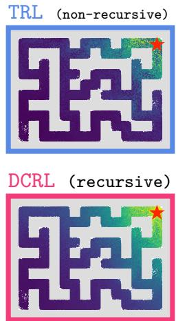

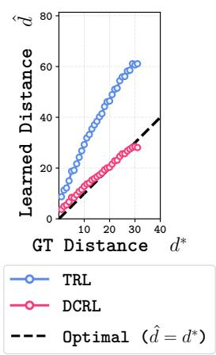  
Figure 2. In humanoidmaze-giant, DCRL learns near-optimal distance estimates. We measure the distances predicted by DCRL and TRL from each state to a fixed goal (red star).

To preserve the ordering while maintaining diverse minibatches, DCRL interleaves multiple recursive trees through slot scheduling, which processes each tree bottom-up while mixing segment lengths within each minibatch.

Although recursive divide-and-conquer value learning mitigates error accumulation over the horizon, it recovers only behavior values. To recover optimal values, DCRL jointly trains the value function using multistep value propagation with goals globally relabeled from the dataset (Andrychowicz et al., 2017; Sutton and Barto, 2018). This propagation objective identifies shorter routes by combining segments from diferent trajectories. Thus, DCRL’s two objectives serve complementary roles: recursive divideand-conquer value learning provides reliable behavior routes, while multistep propagation recovers optimal routes by composing cross-trajectory routes.

In summary, our main contributions are threefold:

• Algorithm. We introduce DCRL, which explicitly instantiates divide-and-conquer value learning as a balanced binary tree over in-trajectory segments, trains each tree bottom-up using value factorization, and processes multiple trees in parallel through slot scheduling.

• Analysis. We prove that DCRL reduces worst-case bootstrap depth from linear to logarithmic in the horizon. In a controlled experiment, we show that this shorter dependency structure corresponds

to substantially slower error accumulation.

• Performance. DCRL substantially outperforms prior flat ofline GCRL algorithms across diverse goalreaching tasks spanning diferent domains, horizons, and observation modalities, and surpasses hierarchical approaches on several challenging long-horizon tasks.

## 2. Related Work

Goal-conditioned RL. Goal-conditioned RL aims to learn a policy that takes the optimal action from any state to reach a goal. We focus on the ofline setting, which learns purely from a fixed dataset without online interaction. Prior work can be broadly categorized into Temporal Diference (TD) methods (Sutton and Barto, 2018; Haarnoja et al., 2018; Kostrikov et al., 2022; Park et al., 2025b), Monte Carlo (MC) methods (Sutton and Barto, 2018; Eysenbach et al., 2021, 2022), hierarchical methods (Barto and Mahadevan, 2003; Lynch et al., 2019; Park et al., 2023, 2025b), probabilistic methods (Eysenbach et al., 2021; Zheng et al., 2024), and quasimetric methods (Kaelbling, 1993; Dhiman et al., 2018; Jurgenson et al., 2020; Wang et al., 2023; Piękos et al., 2023; Myers et al., 2024, 2025; Park et al., 2026). DCRL builds on the quasimetric family, which we discuss next.

Quasimetrics in GCRL. In deterministic environments, GCRL reduces to learning a value function that estimates the shortest-path distance from any state to a goal. The induced optimal distance is a quasimetric (i.e., an asymmetric distance obeying the triangle inequality), a property that GCRL algorithms exploit in three ways. “Explicit” methods impose the triangle inequality through quasimetric-constrained value networks (Wang et al., 2023; Myers et al., 2024, 2025). “Implicit” methods enforce it through triangle-inequality value backups (Kaelbling, 1993; Dhiman et al., 2018; Jurgenson et al., 2020; Piękos et al., 2023; Park et al., 2026). “Planning”-based methods use it to compose shortest paths at inference time (Eysenbach et al., 2019; Parascandolo et al., 2020; Jurgenson et al., 2020).

DCRL is most closely related to two “implicit” methods: Sub-goal tree dynamic programming (TDP) (Jurgenson et al., 2020) and Transitive RL (TRL) (Park et al., 2026). TDP recursively predicts intermediate subgoals to minimize decomposition cost and learns top-down. Greedy selection can overestimate the chosen decomposition. DCRL instead fixes the subgoal to the trajectory midpoint and learns bottom-up. TRL uses a similar in-trajectory backup, favoring optimistic splits via an upper-expectile loss. Because TRL learns values in no particular order, these optimistic updates rely on noisy estimates, amplifying overestimation through repeated propagation. This non-recursive update has linear worst-case bootstrap depth over long horizons. DCRL instead schedules a recursive midpoint decomposition with exact factorization, yielding logarithmic bootstrap depth and much slower empirical error growth.

## 3. Preliminaries

Problem Setting. We study GCRL in a deterministic controlled Markov process $\mathcal { M } = ( \mathcal { S } , \mathcal { A } , \mu , p , \gamma )$ comprising the state space, action space, initial-state distribution, deterministic transition function, and discount factor. Any state can be a goal. We are given an unlabeled dataset $\mathcal { D } = \{ \tau ^ { ( i ) } \} _ { i = 1 } ^ { N }$ , where the �-th trajectory $\tau ^ { ( i ) } = ( s _ { 0 } ^ { ( i ) } , a _ { 0 } ^ { ( i ) } , s _ { 1 } ^ { ( i ) } , \ldots , s _ { H _ { i } } ^ { ( i ) } )$ has length $H _ { i }$

Following prior work (Wang et al., 2023; Park et al., 2026), we adopt the hitting-time formulation of the goal-conditioned value function: the agent receives a reward of 1 upon first reaching $g$ and enters an absorbing state, so $V ^ { \pi } ( s , g ) = \mathbb { E } _ { \pi } \lceil \gamma ^ { T _ { g } } \rceil s _ { 0 } = s \rceil$ , where $T _ { g }$ is the first hitting time of $g$ under a goal-conditioned policy � and $\gamma \in ( 0 , 1 )$ is the discount factor. The optimal value function is $V ^ { * } : = \operatorname* { m a x } _ { \pi } V ^ { \pi }$ . In deterministic environments, learning $V ^ { * }$ is equivalent to learning the optimal distance $d ^ { * } : = \log _ { \gamma } V ^ { * }$ , since $V ^ { * } = \gamma ^ { d ^ { * } }$ . Here $d ^ { * } ( s , g )$ is the minimum number of steps to reach $g$ from � (i.e., the shortest-path distance).

Triangle Inequality in GCRL. The optimal distance $d ^ { * }$ satisfies the triangle inequality for all states $s , w , g \in { \mathcal { S } }$

$$
d ^ { * } ( s , g ) \leq d ^ { * } ( s , w ) + d ^ { * } ( w , g ) ,\tag{1}
$$

with equality when � lies on a shortest path from � to $g .$ . Through the relation $V ^ { * } = \gamma ^ { d ^ { * } }$ , this is equivalent to a multiplicative triangle inequality on values:

$$
V ^ { * } ( s , g ) ~ \geq ~ V ^ { * } ( s , w ) \cdot V ^ { * } ( w , g ) .\tag{2}
$$

Prior methods turn this property into a transitive backup $V ( s , g )  \operatorname* { m a x } _ { w } V ( s , w ) \cdot V ( w , g )$ to learn the value function by maximizing over intermediate states � (Kaelbling, 1993; Dhiman et al., 2018; Jurgenson et al., 2020; Piękos et al., 2023; Park et al., 2026).

## 4. Recursive Value Learning for Long-Horizon Ofline GCRL

Goal-conditioned value learning with standard max-based backups $( e . g .$ , TD and transitive backups) sufers from error accumulation. While every long-range value inherently depends on shorter-range values, standard GCRL methods do not leverage this dependency structure. We address this by framing goal-conditioned value learning as a divide-and-conquer problem. We propose DCRL (Divide-and-Conquer RL), which recursively splits a trajectory segment and learns values from shorter segments to longer ones. Thus, DCRL exhibits far slower empirical error accumulation than standard backups and achieves strong goal-reaching performance.

In Section 4.1, we introduce recursive goal-conditioned value learning, which learns shorter-horizon (child) values before longer-horizon (parent) values. In Section 4.2, we describe the selection-free update rule of recursive value learning, which avoids maximizing over noisy intermediate states. Since this update rule is restricted to observed routes, it recovers only behavior values. To learn optimal values, DCRL also trains the same value function to compose segments across trajectories (Section 4.3). In Sections 4.4 and 4.5, we detail the practical implementation of DCRL.

## 4.1. Recursive Divide-and-Conquer Value Learning

We introduce a recursive divide-and-conquer strategy to enforce child-to-parent ordering in goalconditioned value learning. DCRL recursively splits each trajectory segment (Divide) and learns values from leaves to root (Conquer). For a trajectory segment between randomly sampled states $s _ { i }$ and $s _ { j } ,$ where $i < j$ , we recursively bisect the segment at the midpoint $k = \lfloor ( i + j ) / 2 \rfloor$ to build a balanced binary tree (Figure 3). By splitting at the midpoint, a horizon-� segment yields $O ( H )$ tree nodes but only $O ( \log _ { 2 } H )$ sequential composition levels.

Divide. For a root segment $( s _ { i } , s _ { j } )$ , we recursively split each segment into two children, $( s _ { i } , s _ { k } )$ and $( s _ { k } , s _ { j } )$ , where $k = \lfloor ( i + j ) / 2 \rfloor$ , until reaching single-step leaves $( e . g . , ( s _ { i } , s _ { i + 1 } ) )$ .

Conquer. We train child segments before their parents. Single-step leaves are grounded $( i . e .$ $V ( s _ { i } , s _ { i + 1 } ) = \gamma )$ , and each parent is then updated from its previously trained children.

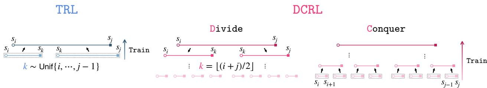  
Figure 3. DCRL explicitly implements divide-and-conquer. Divide: Split a root segment $( s _ { i } , s _ { j } )$ at its midpoint, then recursively split each half until reaching single-step leaves. Conquer: Train the value function on leaves first and then on their parents, proceeding up to the root. In contrast, TRL backs up from a single random subgoal $s _ { k } .$ , where $k \in \{ i , \ldots , j - 1 \}$

## 4.2. Update Rule for Recursive Value Learning

For recursive value learning, we seek a selection-free update that avoids amplifying errors through maximization over noisy intermediate states. Unlike max-based backups, our update rule factorizes the value of a trajectory segment between � and � at its midpoint �:

$$
V _ { \tau } ( s , g ) = V _ { \tau } ( s , w ) \cdot V _ { \tau } ( w , g ) .\tag{3}
$$

Because Eq. (3) uses a fixed intermediate state without maximization, � learns behavior values (Gulcehre et al., 2021). The corresponding distance ${ d _ { \tau } ( s , g ) = d _ { \tau } ( s , w ) + d _ { \tau } ( w , g ) }$ is the length of the trajectory’s own route through �. It upper-bounds $d ^ { * } \colon$ the trajectory’s route need not be the shortest path, but it is supported by the data. This behavior value function $V _ { \tau }$ admits a useful route-suboptimality decomposition. We prove the following:

Property 1. Let $d _ { \tau } : = \log _ { \gamma } V _ { \tau }$ , with �� satisfying the exact factorization in Eq. (3), and define the route suboptimality $e ( s , g ) \dot { : } = d _ { \tau } ( s , g ) - d ^ { \ast } ( s , g )$ . Then,

$$
\begin{array} { r } { e ( s , g ) \geq e ( s , w ) + e ( w , g ) , } \end{array}
$$

for any intermediate state � on a trajectory segment from � to � (proof in Appendix A.1).

Property 1 shows that route suboptimality can grow under composition: a parent route is at least as suboptimal as its two children combined. This motivates learning long-horizon behavior values recursively from shorter, less-suboptimal constituents. We therefore learn child values $( V _ { \tau } ( s , w ) , V _ { \tau } ( w , g ) )$ before using them to update their parent $( V _ { \tau } ( s , g ) )$ , avoiding bootstrapping from unconverged child estimates. For recursive value learning (Section 4.1), we choose � as the segment midpoint, yielding a balanced binary tree.

## 4.3. Value Propagation for Optimality

Recursive divide-and-conquer value learning yields only in-trajectory behavior values (� ). To recover optimal values $( V ^ { * } )$ , we additionally train the value function with multistep value-propagation. Figure 4 illustrates a didactic example of the discrepancy between $V _ { \tau }$ and $V ^ { * }$ , confirming that the optimal value often requires composing segments across trajectories. Furthermore, the distribution of recursive tree samples is heavily skewed toward short segments. Decomposing a horizon-� root segment yields $2 H - 1$ tree nodes, of which � are leaves. Models trained only on this distribution generalize poorly to distant relabeled goals.

Thus, we optimize our value function with an additional objective using i.i.d. samples with globally relabeled goals. Starting from the original triangle inequality (Eq. (2)), we fix the intermediate subgoal � to a future in-trajectory state $s _ { i + n }$ with propagation horizon �:

$$
V ^ { * } ( s _ { i } , g ) \geq \gamma ^ { n } \cdot V ^ { * } ( s _ { i + n } , g ) .\tag{4}
$$

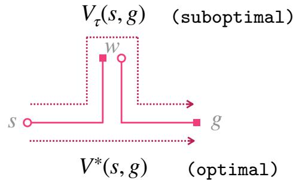

Because $s _ { i + n }$ lies � steps ahead on a demonstrated trajectory, $V ^ { * } ( s _ { i } , s _ { i + n } ) \geq \gamma ^ { n }$ . Eq. (4) motivates pushing $V ( s _ { i } , g )$ up toward $\gamma ^ { n } \cdot V ( s _ { i + n } , g )$ , which is equivalent to multistep propagation (Sutton and Barto, 2018). We optimize this objective using an upper-expectile loss because we seek the shortest route connecting �� to �.CRL

Figure 4. Optimal values require composing segments across trajectories. Given $s $ � and $w  g _ { \mathrm { : } }$ , the optimal route from � to � cannot be recovered from $V _ { \tau }$ alone.

Importantly, divide-and-conquer supports �-step propagation by quickly learning long-range behavior values through a shallow dependency path. For a horizon-� segment, divide-and-conquer has $O ( \log _ { 2 } H )$ bootstrap depth, whereas �-step propagation has $O ( H / n )$ depth. Long-range behavior values therefore emerge through fewer stages, giving a reliable basis for propagation. ⋮ Train

Division of Labor. The divide-and-conquer (Section 4.1) and propagation (Section 4.3) objectivessi si+1 sj−1 sj train a shared value function but serve complementary roles: the former learns behavior values for within-trajectory pairs through a shallow dependency structure, whereas the latter composes segments across trajectories to recover optimal values. In Table 3, removing either objective degrades performance, confirming both roles are essential to DCRL.

## 4.4. Implementation: Parallel Slot Scheduling

We introduce slot scheduling to eficiently execute recursive divide-and-conquer value learning.s Training on one tree at a time would be slow and produce highly correlated batches with limited trajectory and horizon diversity. To process multiple root segments concurrently, we maintain multiple independent slots. As illustrated in Figure 5 and Algorithm 1, each slot manages the recursive tree of a single root segment. A slot $\tau$ is initialized as a sequence of recursive samples ordered from leaves to root. Samples drawn via  .pop() are therefore processed from leaves to root, enforcing our principle: every child is trained before its parent.

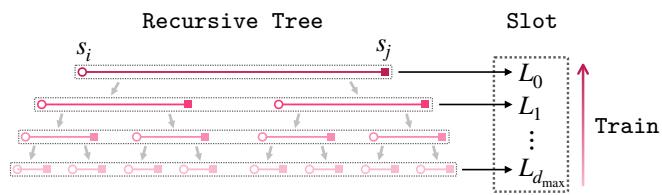

Figure 5. A recursive tree is flattened into a slot, ordered from leaves $( L _ { d _ { \mathrm { m a x } } } )$ to the root $\left( L _ { 0 } \right)$ , so every child is learned before its parent.  
Algorithm 1 SampleSlot( )   
1: Initialize per-depth lists $\{ L _ { d } \} _ { d = 0 } ^ { d _ { \mathrm { m a x } } }$   
2: Sample $\tau = ( s _ { 0 } , a _ { 0 } , s _ { 1 } , \dots , s _ { H } ) \sim \mathcal { D }$   
3: Sample $i < j \sim \operatorname { U n i f } \{ 0 , \dots , H \}$   
4: Build a recursive tree with $( s _ { i } , \ldots , s _ { j } )$   
5: return concat $\left( L _ { d _ { \operatorname* { m a x } } } , \ldots , L _ { 0 } \right)$

During training, we maintain $S = 1 2 8$ slots $\{ \mathcal { T } _ { \ell } \} _ { \ell = 1 } ^ { S }$ (for batch size 1024), drawing samples uniformly ⋯d0d2 d2 d2 d1across them at each step. Because slots drain and refill independently, they become desynchronized, so later batches span a range of lengths while preserving child-to-parent ordering within each slot. P 01P 11 P 1223 P 24We study how the number of slots (�) afects DCRL’s performance in Appendix H.3 and compare DCRL with other divide-and-conquer strategies in Section 5.3.

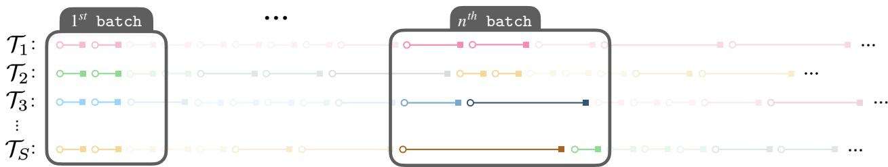  
Figure 6. Maintaining � independent slots $( \mathcal { T } _ { 1 } , \dots , \mathcal { T } _ { S } )$ enables (i) learning child segments before their parents and (ii) mixing diverse sample lengths within batches. Each slot begins by emitting single-step leaves, as illustrated by the $1 ^ { \mathsf { s t } }$ batch; as slots drain and refill at diferent rates, they become desynchronized, mixing short-horizon and long-horizon segments, as in the $n ^ { \mathrm { t h } }$ batch. Each slot schedules a new tree once its current one is consumed.

## 4.5. Implementation: Critic Learning

In practice, we train the action-value function $Q ( s , a , g ) : \mathcal { S } \times \mathcal { A } \times \mathcal { S } \to [ 0 , 1 ]$ by minimizing a divide-and-conquer loss and a propagation loss simultaneously:

$$
\begin{array} { r } { \begin{array} { r } { \mathcal { L } ^ { \mathrm { D C R L } } ( Q ) = \mathcal { L } ^ { \mathrm { d c } } ( Q ) + \mathcal { L } ^ { \mathrm { p r o p } } ( Q ) . } \end{array} } \end{array}\tag{5}
$$

Divide-and-Conquer Loss. ${ \mathcal { L } } ^ { \mathtt { d c } } ( Q )$ learns behavior values from recursive tree samples $\tau _ { \mathrm { D C } }$ using the exact value factorization:

$$
\begin{array} { r } { \mathcal { L } ^ { \mathsf { d c } } ( Q ) = \mathbb { E } _ { \tau _ { \mathrm { D C } } \sim \mathcal { T } } \Big [ \mathcal { L } _ { \mathrm { B C E } } \big ( Q ( s _ { i } , a _ { i } , s _ { j } ) , \mathsf { s g } [ Q ( s _ { i } , a _ { i } , s _ { k } ) ] \bar { Q } ( s _ { k } , a _ { k } , s _ { j } ) \big ) \Big ] , } \end{array}\tag{6}
$$

where $k = \lfloor ( i + j ) / 2 \rfloor$ , sg denotes stop-gradient, $\bar { Q }$ is the EMA target critic, and $\mathcal { L } _ { \mathrm { B C E } }$ is the binary cross-entropy loss. To obtain each divide-and-conquer sample � , we uniformly select a slot $\tau \in$ $\{ \mathcal { T } _ { 1 } , \ldots , \mathcal { T } _ { S } \}$ and pop its next sample. We evaluate the first child value $Q ( s _ { i } , a _ { i } , s _ { k } )$ using the online critic and the second child value $\bar { Q } ( s _ { k } , a _ { k } , s _ { j } )$ using the EMA critic. Either child value is replaced by � when its segment is a single step. In Appendix H.1, we ablate the critic used for each child value (online or EMA) and find that using the online critic for the first and the EMA critic for the second (i.e., sg[�]  �¯) performs best.

Propagation Loss. $\mathcal { L } ^ { \mathsf { p r o p } } ( Q )$ learns optimal values from globally relabeled samples $\tau _ { \mathrm { p r o p } }$ using multistep propagation:

$$
\begin{array} { r } { \mathcal { L } ^ { \mathtt { p r o p } } ( Q ) = \mathbb { E } _ { \tau _ { \mathtt { p r o p } } \sim \mathcal { D } } \Big [ \mathcal { L } _ { \mathtt { B C E } } ^ { \kappa _ { \mathtt { p r o p } } } \big ( Q ( s _ { i } , a _ { i } , g ) , \ \gamma ^ { n } \cdot \bar { Q } ( s _ { i + n } , a _ { i + n } , g ) \big ) \Big ] , } \end{array}\tag{7}
$$

where $\mathcal { L } _ { \mathrm { B C E } } ^ { \kappa _ { \mathrm { p r o p } } }$ is the BCE loss with expectile $\kappa _ { \tt p r o p } \in ( 0 . 5 , 1 )$ , and � is a future, random, or current state. For an in-trajectory goal $g = s _ { j }$ within � steps of $s _ { i } ( j - i \leq n )$ , we use $\gamma ^ { j - i }$ instead of $\gamma ^ { n } \cdot \bar { Q }$ The propagation horizon � is task-specific and studied in Section 5.2.

The two losses difer by design: $\mathcal { L } ^ { \mathrm { d c } }$ learns behavior routes with plain BCE $( \kappa _ { \mathsf { d c } } = 0 . 5 )$ , whereas $\mathcal { L } ^ { \mathtt { p r o p } }$ favors shorter routes through upper-expectile BCE $( \kappa _ { \tt P r o p } > 0 . 5 )$ , since the optimal value requires the shortest of many routes. We ablate $\kappa _ { \mathtt { d c } }$ and $\kappa _ { \tt p r o p }$ in Appendix H.2; performance peaks at $\kappa _ { \mathtt { d c } } = 0 . 5 ,$ consistent with optimistic weighting introducing bias when learning behavior routes. Appendix B summarizes the full training procedure for DCRL.

## 5. Experiments

Our experiments and analysis address three questions:

• Q1: How does DCRL compare with prior ofline GCRL methods across diverse task domains, horizons, dataset scales, and observation modalities? ( Section 5.1)

• Q2: How does DCRL scale with the propagation horizon � and the task horizon � compared with standard Bellman-style and transitive backups? ( Section 5.2)

• Q3: How does DCRL compare with alternative divide-and-conquer strategies in terms of goalreaching performance and training eficiency? ( Section 5.3)

We compare DCRL against prior ofline GCRL algorithms spanning four value-learning families:

• Temporal Diference: IQL (Kostrikov et al., 2022), SAC+BC (Haarnoja et al., 2018; Park et al., 2025b), TD, TD-n (Sutton and Barto, 2018)

• Monte Carlo: CRL (Eysenbach et al., 2022), MC (Tian et al., 2021; Shah et al., 2021)

• Hierarchical: POR (Xu et al., 2022), HIQL (Park et al., 2023), SHARSA (Park et al., 2025b)

• Triangle Inequality: QRL (Wang et al., 2023), TMD (Myers et al., 2025), TDP (Kaelbling, 1993; Jurgenson et al., 2020), COE (Piękos et al., 2023), TRL (Park et al., 2026)

We present 95% confidence intervals in plots and standard deviations in tables. In tables, any values within 95% of the best performance are marked in red. Descriptions of each baseline, experimental details, and full results are provided in Appendices C, E, and J, respectively.

## 5.1. How Well Does DCRL Compare with Prior Ofline GCRL Methods?

We evaluate DCRL and prior ofline GCRL methods on goal-reaching tasks spanning diverse domains, horizons, dataset scales, and observation modalities (state and pixel). First, Table 1 compares these methods on the five most challenging long-horizon tasks from OGBench (Park et al., 2025a). DCRL achieves the best average score, outperforming all flat and hierarchical baselines. Notably, DCRL is the only flat method to achieve nonzero success on cube-octuple, while attaining the highest scores on humanoidmaze-giant and both puzzle tasks.

Table 1. DCRL achieves the best average performance on long-horizon tasks.
<table><tr><td></td><td></td><td colspan="4">Temporal Difference</td><td colspan="2">Monte Carlo</td><td colspan="2">Hierarchical</td><td colspan="5">Triangle Inequality</td></tr><tr><td>Environment</td><td>FBC</td><td>IQL</td><td>SAC+BC</td><td>TD</td><td>TD-n</td><td>CRL</td><td>MC</td><td>HIQL</td><td>SHARSA</td><td></td><td>QRL</td><td>TDP</td><td>COE</td><td>TRL</td><td>DCRL</td></tr><tr><td>humanoidmaze-giant-1B</td><td>0 ± 0</td><td>3 ± 4</td><td>5 ± 0</td><td>3 ± 2</td><td>78 ± 4</td><td>62 ± 42</td><td>79</td><td>± 4 25</td><td>± 6 42 ± 3</td><td></td><td>3 ± 2 2</td><td>± 0 2</td><td>± 1 79</td><td>± 2</td><td>93 ± 3</td></tr><tr><td>puzzle-4x5-1B</td><td>0 ± 0</td><td>20 ± 0</td><td>19 ± 1</td><td>19 ± 1</td><td>92 ± 8</td><td>1 ± 1</td><td>47 ± 7</td><td>12</td><td>± 5 90</td><td>± 4</td><td>0 ± 0 0</td><td>± 0 0</td><td>± 0 97</td><td>± 1</td><td>100 ± 0</td></tr><tr><td>puzzle-4x6-1B</td><td>0 ± 0</td><td>17 ± 2</td><td>11 ± 8</td><td>13 ± 3</td><td>53 ± 11</td><td>0 ± 0</td><td>37 ± 4</td><td>4 ± 3</td><td>55</td><td>± 3 0</td><td>± 0 0</td><td>± 0 0</td><td>± 0</td><td>51 ± 5</td><td>87 ± 5</td></tr><tr><td>cube-quadruple-100M</td><td>1 ± 0</td><td>41 ± 3</td><td>39 ± 4</td><td>20 ± 2</td><td>21 ± 6</td><td>22 ± 2</td><td>1 ± 1</td><td>62</td><td>± 6 74 ± 2</td><td></td><td>0 ± 0 0</td><td>± 0 0</td><td>± 0</td><td> $0 ~ \pm ~ 0$ </td><td>37 ± 4</td></tr><tr><td>cube-octuple-1B</td><td>0 ± 0</td><td>0 ± 0</td><td>0 ± 0</td><td>0 ± 0</td><td>0 ± 0</td><td>0 ± 0</td><td>0 ± 0</td><td>0 ± 0</td><td>15 ± 1</td><td></td><td>0 ± 0 0</td><td>± 0 0</td><td>± 0</td><td>0 ± 0</td><td>5 ± 1</td></tr><tr><td>Average</td><td>0</td><td>16</td><td>15</td><td>11</td><td>49</td><td>17</td><td>33</td><td>21</td><td>55</td><td></td><td>1</td><td>0</td><td></td><td>45</td><td>64</td></tr></table>

Next, Figure 7 compares aggregate performance on standard-horizon OGBench tasks (10 state-based and 10 pixel-based). DCRL performs best in both modalities.

Finally, we test DCRL and prior methods on CALVIN (Mees et al., 2022), a compositional, long-horizon manipulation environment. We use the in-domain setup, where four subtasks must be solved in sequence using 1,239 task-agnostic trajectories spanning 34 subtasks. Figure 8 reports Return (subtasks completed), Completion (full-task success), and task progress. Notably, DCRL is the only flat method that completes all four subtasks consecutively.

## 5.2. Is DCRL Better Than TD and TRL Across Propagation and Task Horizons?

We first study how the propagation horizon � afects DCRL’s performance. While DCRL relies on value propagation to recover optimal values, this mechanism can also be applied to TRL. We therefore compare DCRL-n against TD-n and TRL-n (TRL with �-step propagation) across a range of horizons �, isolating the efect of DCRL’s recursive value learning.

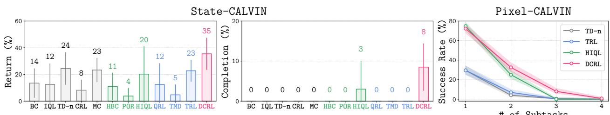

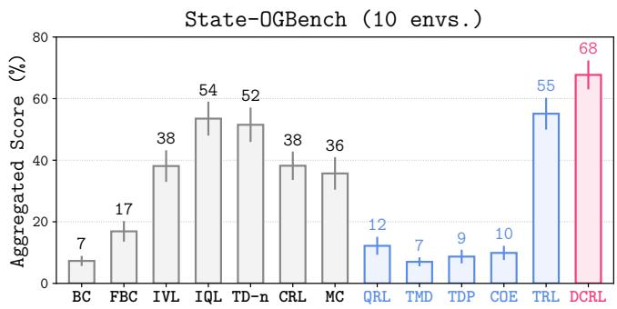

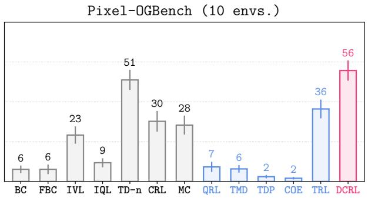  
Figure 7. DCRL achieves state-of-the-art performance on standard OGBench tasks across diverse task domains and observation modalities. Full results are in Tables 15 and 16.  
Figure 8. DCRL achieves the highest four-subtask completion rate on state-based CALVIN (8%), versus 3% for the best hierarchical baseline and 0% for all flat baselines. On pixel-based CALVIN, which excludes privileged object poses, DCRL reaches at least three subtasks in 8% of rollouts and all four in 1%, whereas all three baselines remain at 0% beyond two subtasks.

Figure 9 (left) shows the results on two long-horizon tasks across $n \in \{ 1 , 5 , 1 0 , 2 5 , 5 0 , 1 0 0 \}$ . DCRL-n achieves the best performance at larger � $\left( \geq 2 5 \right)$ on both tasks, while TD-n performs especially poorly on the puzzle task and TRL-n struggles on the cube-manipulation task.

At $n \in \{ 1 , 5 \}$ , DCRL-n performs similarly to TD-n and worse than TRL-n. With small $n ,$ DCRL-n’s propagation chain is long $( O ( H / n ) )$ , so it cannot fully leverage its recursively learned long-horizon behavior values to recover optimal values. For $n \geq 2 5$ , DCRL-n maintains a clear margin over both baselines. See Figure 12 for the full comparison.

To understand how error accumulation scales with task horizon �, we analyze each method’s bootstrap depth. In Appendix A.2.1, we prove that DCRL-n has logarithmic bootstrap depth in �, whereas TD-n and TRL-n have linear worst-case depth. We then test whether this shallower dependency structure yields slower error growth under a fixed training budget.

For this controlled comparison, we use a discrete environment (combination-lock) (Park et al., 2025b) to measure error accumulation. In Figure 9 (right), we report mean long-range Q-error $( | \hat { Q } - Q ^ { * } | )$ across task horizons $H \in \{ 2 5 6 , \dots , 2 0 4 8 \}$ at a fixed $n = 6 4$ . DCRL-n remains relatively flat while TD-n and TRL-n accumulate error rapidly. Appendix $\mathrm { A } . 2 . 2$ further separates the efects of �-step propagation, expectile selection, and recursive scheduling.

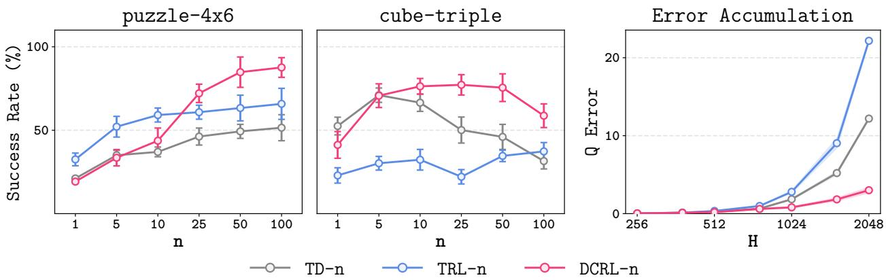  
Figure 9. Left: DCRL-n surpasses TD-n and TRL-n at long propagation horizons $\left( n \ge 2 5 \right)$ . Right: Q-error in DCRL-n grows far more slowly with task horizon � than in the others.

## 5.3. Comparison with Alternative Divide-and-Conquer Strategies

We compare DCRL with alternative strategies for organizing or modifying divide-and-conquer value learning. Descriptions and more experiments are in Appendices D and I, respectively.

• Curriculum (Δ): learns values on short segments first using $H / \Delta$ stages.

• TRL (�): up-weights short state–goal pairs and down-weights long ones in the value loss.

• DCRL (w/ random split): uses a random in-trajectory subgoal rather than the midpoint.

• DCRL (w/ reverse order): learns recursive values in reverse (parent-to-child) order.

• DCRL (w/o recursion): replaces recursion with i.i.d. sampling and adds one-step grounding.

• DCRL (w/o propagation): uses recursive value learning alone to recover optimal values.

• DCRL (w/ max-based backup): uses $V ( s , g )  \operatorname* { m a x } _ { w } V ( s , w ) \cdot V ( w , g )$ to select subgoals.

Table 2. Comparison of divide-and-conquer strategies in humanoidmaze-giant.
<table><tr><td>Method</td><td>Success ↑ Throughput ↑</td><td></td></tr><tr><td>Curriculum (∆ = 25)</td><td> $2 8 ~ \pm ~ 7$ </td><td> $9 6 ~ \pm ~ 2$ </td></tr><tr><td>Curriculum (∆ = 50)</td><td> $3 9 ~ \pm ~ 8$ </td><td> $9 9 ~ \pm ~ 4$ </td></tr><tr><td>Curriculum (∆ = 100)</td><td> $2 9 \pm 5$ </td><td> $9 9 ~ \pm ~ 2$ </td></tr><tr><td>TRL (λ = 0)</td><td> $5 4 ~ \pm ~ 5$ </td><td> $1 1 0 ~ \pm ~ 1$ </td></tr><tr><td>TRL (λ = 0.01)</td><td> $5 3 ~ \pm ~ 2$ </td><td> $1 0 7 ~ \pm ~ 1$ </td></tr><tr><td>TRL (λ = 0.1)</td><td> $5 2 \ \pm \ 3$ </td><td> $1 0 6 ~ \pm ~ 2$ </td></tr><tr><td>DCRL (w/ random split)</td><td> $9 2 \ \pm \ 1$ </td><td> $6 6 ~ \pm ~ 1$ </td></tr><tr><td>DCRL (w/ reverse order)</td><td> $1 8 ~ \pm ~ 6$ </td><td> $8 2 ~ \pm ~ 4$ </td></tr><tr><td>DCRL</td><td> $9 3 \ \pm \ 3$ </td><td> $8 4 \pm \ : 3$ </td></tr></table>

Table 2 reports success and throughput (gradient steps per second) at a fixed batch size of 1024. DCRL achieves over 1.7 TRL’s success rate at 24% lower throughput. Random splitting creates deeper, less balanced trees and has lower throughput, but performance remains unchanged, likely because exact factorization and child-to-parent scheduling are retained. Reversing the learning order reduces success from 93% to 18%, consistent with parents bootstrapping from not-yet-updated child estimates. Curriculum learning is highly sensitive to $\Delta ,$ and its best performance trails DCRL and TRL. Finally, TRL’s distance re-weighting does not improve the unweighted baseline.

Table 3. Ablation studies of DCRL on state-based OGBench (10 environments).
<table><tr><td>Method</td><td>Success ↑ Throughput ↑</td></tr><tr><td>DCRL  $6 8 ~ \pm ~ 2$ </td><td> $1 9 3 ~ \pm ~ 3$ </td></tr><tr><td>DCRL (w/o recursion)</td><td> $3 9 \ \pm \ 3$   $1 7 3 \ \pm \ 1$ </td></tr><tr><td>DCRL (w/o propagation)</td><td> $4 5 \ \pm \ 2$   $2 0 1 ~ \pm ~ 5$ </td></tr><tr><td>DCRL (w/ max-backup)</td><td> $6 2 \pm 2$   $1 5 7 ~ \pm ~ 2$ </td></tr></table>

Table 3 ablates DCRL’s recursion, propagation, and value-update rule. Removing recursion causes the largest performance drop, highlighting the recursive tree’s central role. Removing propagation sharply degrades performance, showing that one optimistic divide-and-conquer objective cannot replace separate behavior-value learning and optimal-value propagation. Max-based backups underperform exact factorization, consistent with

selection-induced overestimation, and lower throughput due to subgoal-search overhead. Overall, these ablations validate DCRL’s division of labor: recursive factorization learns reliable behavior values, while propagation recovers optimality.

## 6. Conclusion

We introduce DCRL, which exploits a natural dependency structure in goal-conditioned value learning: longer-segment values are built from shorter ones. DCRL realizes recursive value learning through a balanced binary tree over in-trajectory segments, learns behavior values from leaves to root, and propagates them across trajectories toward optimality.

Across ofline GCRL benchmarks, DCRL substantially outperforms prior flat methods and surpasses hierarchical methods on several challenging long-horizon tasks. By mitigating horizon-induced error accumulation, DCRL provides a foundation for scaling GCRL to longer horizons.

Limitations. Like other triangle-inequality methods, DCRL assumes deterministic dynamics. Under stochastic dynamics, exact factorization generally fails because the expectation of a product need not factorize $( i . e . , \mathbb { E } [ X Y ] \neq \mathbb { E } [ X ] \cdot \mathbb { E } [ Y ] )$ . Additionally, hierarchical approaches outperform DCRL on cube-manipulation tasks, despite these tasks having shorter horizons than humanoidmaze-giant, where DCRL excels. Thus, their dificulty does not stem solely from horizon length. Extending recursive sampling to stochastic dynamics and understanding when hierarchy remains beneficial are important directions for future work.

## References

Marcin Andrychowicz, Filip Wolski, Alex Ray, Jonas Schneider, Rachel Fong, Peter Welinder, Bob McGrew, Josh Tobin, Pieter Abbeel, and Wojciech Zaremba. Hindsight experience replay. In Neural Information Processing Systems (NeurIPS), 2017.

Andrew G Barto and Sridhar Mahadevan. Recent advances in hierarchical reinforcement learning. Discrete Event Dynamic Systems, 13(4):341–379, 2003.

Richard Bellman. Dynamic programming. Science, 153(3731):34–37, 1966.

Yoshua Bengio, Jérôme Louradour, Ronan Collobert, and Jason Weston. Curriculum learning. In International Conference on Machine Learning (ICML), 2009.

Huayu Chen, Cheng Lu, Chengyang Ying, Hang Su, and Jun Zhu. Ofline reinforcement learning via high-fidelity generative behavior modeling. In International Conference on Learning Representations (ICLR), 2023.

Cheng Chi, Zhenjia Xu, Siyuan Feng, Eric Cousineau, Yilun Du, Benjamin Burchfiel, Russ Tedrake, and Shuran Song. Difusion policy: Visuomotor policy learning via action difusion. In Robotics: Science and Systems (RSS), 2023.

Luc Devroye. A note on the height of binary search trees. Journal of the ACM, 33(3):489–498, 1986.

Vikas Dhiman, Shurjo Banerjee, Jefrey M Siskind, and Jason J Corso. Floyd-warshall reinforcement learning: Learning from past experiences to reach new goals. arXiv preprint arXiv:1809.09318, 2018.

Lasse Espeholt, Hubert Soyer, Remi Munos, Karen Simonyan, Vlad Mnih, Tom Ward, Yotam Doron, Vlad Firoiu, Tim Harley, Iain Dunning, et al. Impala: Scalable distributed deep-rl with importance weighted actor-learner architectures. In International Conference on Machine Learning (ICML), 2018.

Ben Eysenbach, Russ R Salakhutdinov, and Sergey Levine. Search on the replay bufer: Bridging planning and reinforcement learning. In Neural Information Processing Systems (NeurIPS), 2019.

Benjamin Eysenbach, Ruslan Salakhutdinov, and Sergey Levine. C-learning: Learning to achieve goals via recursive classification. In International Conference on Learning Representations (ICLR), 2021.

Benjamin Eysenbach, Tianjun Zhang, Sergey Levine, and Russ R Salakhutdinov. Contrastive learning as goal-conditioned reinforcement learning. In Neural Information Processing Systems (NeurIPS), 2022.

Carlos Florensa, David Held, Xinyang Geng, and Pieter Abbeel. Automatic goal generation for reinforcement learning agents. In International Conference on Machine Learning (ICML), 2018.

Robert W Floyd. Algorithm 97: shortest path. Communications of the ACM, 5(6):345–345, 1962.

Scott Fujimoto and Shixiang Shane Gu. A minimalist approach to ofline reinforcement learning. In Neural Information Processing Systems (NeurIPS), 2021.

Alex Graves, Marc G Bellemare, Jacob Menick, Remi Munos, and Koray Kavukcuoglu. Automated curriculum learning for neural networks. In International Conference on Machine Learning (ICML), 2017.

Caglar Gulcehre, Sergio Gómez Colmenarejo, Ziyu Wang, Jakub Sygnowski, Thomas Paine, Konrad Zolna, Yutian Chen, Matthew Hofman, Razvan Pascanu, and Nando de Freitas. Regularized behavior value estimation. arXiv preprint arXiv:2103.09575, 2021.

Abhishek Gupta, Vikash Kumar, Corey Lynch, Sergey Levine, and Karol Hausman. Relay policy learning: Solving long-horizon tasks via imitation and reinforcement learning. In Conference on Robot Learning (CoRL), 2019.

Tuomas Haarnoja, Aurick Zhou, Pieter Abbeel, and Sergey Levine. Soft actor-critic: Of-policy maximum entropy deep reinforcement learning with a stochastic actor. In International Conference on Machine Learning (ICML), 2018.

Philippe Hansen-Estruch, Ilya Kostrikov, Michael Janner, Jakub Grudzien Kuba, and Sergey Levine. Idql: Implicit q-learning as an actor-critic method with difusion policies. arXiv preprint arXiv:2304.10573, 2023.

Dan Hendrycks and Kevin Gimpel. Gaussian error linear units (gelus). arXiv preprint arXiv:1606.08415, 2016.

Tom Jurgenson, Or Avner, Edward Groshev, and Aviv Tamar. Sub-goal trees – a framework for goal-based reinforcement learning. In International Conference on Machine Learning (ICML), 2020.

Leslie Pack Kaelbling. Learning to achieve goals. In International Joint Conference on Artificial Intelligence (IJCAI), 1993.

Diederik P Kingma and Jimmy Ba. Adam: A method for stochastic optimization. In International Conference on Learning Representations (ICLR), 2015.

Ilya Kostrikov, Ashvin Nair, and Sergey Levine. Ofline reinforcement learning with implicit q-learning. In International Conference on Learning Representations (ICLR), 2022.

Timothy P Lillicrap, Jonathan J Hunt, Alexander Pritzel, Nicolas Heess, Tom Erez, Yuval Tassa, David Silver, and Daan Wierstra. Continuous control with deep reinforcement learning. In International Conference on Learning Representations (ICLR), 2016.

Corey Lynch, Mohi Khansari, Ted Xiao, Vikash Kumar, Jonathan Tompson, Sergey Levine, and Pierre Sermanet. Learning latent plans from play. In Conference on Robot Learning (CoRL), 2019.

Oier Mees, Lukas Hermann, Erick Rosete-Beas, and Wolfram Burgard. Calvin: A benchmark for language-conditioned policy learning for long-horizon robot manipulation tasks. IEEE Robotics and Automation Letters (RA-L), 7(3):7327–7334, 2022.

Vivek Myers, Chongyi Zheng, Anca Dragan, Sergey Levine, and Benjamin Eysenbach. Learning temporal distances: Contrastive successor features can provide a metric structure for decisionmaking. In International Conference on Machine Learning (ICML), 2024.

Vivek Myers, Bill Zheng, Benjamin Eysenbach, and Sergey Levine. Ofline goal-conditioned reinforcement learning with quasimetric representations. In Neural Information Processing Systems (NeurIPS), 2025.

Giambattista Parascandolo, Lars Buesing, Josh Merel, Leonard Hasenclever, John Aslanides, Jessica B Hamrick, Nicolas Heess, Alexander Neitz, and Theophane Weber. Divide-and-conquer monte carlo tree search for goal-directed planning. arXiv preprint arXiv:2004.11410, 2020.

Seohong Park, Dibya Ghosh, Benjamin Eysenbach, and Sergey Levine. Hiql: Ofline goal-conditioned rl with latent states as actions. In Neural Information Processing Systems (NeurIPS), 2023.

Seohong Park, Kevin Frans, Benjamin Eysenbach, and Sergey Levine. Ogbench: Benchmarking ofline goal-conditioned rl. In International Conference on Learning Representations (ICLR), 2025a.

Seohong Park, Kevin Frans, Deepinder Mann, Benjamin Eysenbach, Aviral Kumar, and Sergey Levine. Horizon reduction makes rl scalable. In Neural Information Processing Systems (NeurIPS), 2025b.

Seohong Park, Aditya Oberai, Pranav Atreya, and Sergey Levine. Transitive rl: Value learning via divide and conquer. In International Conference on Learning Representations (ICLR), 2026.

Piotr Piękos, Aditya Ramesh, Francesco Faccio, and Jürgen Schmidhuber. Eficient value propagation with the compositional optimality equation. In NeurIPS 2023 Workshop on Goal-Conditioned Reinforcement Learning, 2023.

Dhruv Shah, Benjamin Eysenbach, Gregory Kahn, Nicholas Rhinehart, and Sergey Levine. Rapid exploration for open-world navigation with latent goal models. In Conference on Robot Learning (CoRL), 2021.

Lucy Xiaoyang Shi, Joseph J Lim, and Youngwoon Lee. Skill-based model-based reinforcement learning. In Conference on Robot Learning (CoRL), 2022.

Richard S. Sutton and Andrew G. Barto. Reinforcement Learning: An Introduction. MIT Press, second edition, 2018.

Stephen Tian, Suraj Nair, Frederik Ebert, Sudeep Dasari, Benjamin Eysenbach, Chelsea Finn, and Sergey Levine. Model-based visual planning with self-supervised functional distances. In International Conference on Learning Representations (ICLR), 2021.

Tongzhou Wang, Antonio Torralba, Phillip Isola, and Amy Zhang. Optimal goal-reaching reinforcement learning via quasimetric learning. In International Conference on Machine Learning (ICML), 2023.

Haoran Xu, Li Jiang, Li Jianxiong, and Xianyuan Zhan. A policy-guided imitation approach for ofline reinforcement learning. In Neural Information Processing Systems (NeurIPS), 2022.

Chongyi Zheng, Ruslan Salakhutdinov, and Benjamin Eysenbach. Contrastive diference predictive coding. In International Conference on Learning Representations (ICLR), 2024.

## A. Theoretical Analysis

## A.1. Proof of Property 1

Proof.

$$
\begin{array} { r l } & { d ^ { * } ( s , g ) + e ( s , g ) = d _ { \tau } ( s , g ) } \\ & { \qquad = d _ { \tau } ( s , w ) + d _ { \tau } ( w , g ) } \\ & { \qquad = [ d ^ { * } ( s , w ) + e ( s , w ) ] + [ d ^ { * } ( w , g ) + e ( w , g ) ] } \\ & { \qquad = [ d ^ { * } ( s , w ) + d ^ { * } ( w , g ) ] + [ e ( s , w ) + e ( w , g ) ] } \\ & { \qquad \geq d ^ { * } ( s , g ) + e ( s , w ) + e ( w , g ) } \end{array}
$$

Therefore, we have $e ( s , g ) \geq e ( s , w ) + e ( w , g )$

## A.2. Error Accumulation Analysis

We analyze error accumulation theoretically and empirically. The theoretical subsection (Appendix A.2.1) formalizes backup dependencies through bootstrap depth and derives upper error bounds for $\mathtt { T D - n }$ $\mathtt { T R L - n }$ , and DCRL-n, highlighting the efects of selection-free factorization and child-to-parent scheduling. The empirical subsection (Appendix A.2.2) tests these predictions in a controlled combination-lock environment by measuring long-range error across horizons and ablating the recursive schedule.

## A.2.1. Theoretical Validation

We compare DCRL-n with Bellman-style and transitive-backup methods $( \mathrm { T D - n } , \mathrm { T R L - n } )$ . Both DCRL-n and TRL-n include the same additional �-step propagation objective, whereas vanilla TRL uses only its transitive objective.

For the dependency analysis, each sample $\boldsymbol { p } ~ = ~ ( s _ { i } , s _ { j } )$ denotes the critic value associated with $( s _ { i } , a _ { i } , s _ { j } )$ , where $a _ { i }$ is the dataset action at $s _ { i }$ . We suppress this action argument and write $Q _ { \bullet } ( p ) : =$ $Q _ { \bullet } ( s _ { i } , a _ { i } , s _ { j } )$ . For $\gamma \in ( 0 , 1 )$ , define the corresponding distance estimate

$$
\hat { d } _ { \bullet } ( p ) : = \log _ { \gamma } Q _ { \bullet } ( p ) , \qquad e _ { \bullet } ( p ) : = \hat { d } _ { \bullet } ( p ) - d ^ { \ast } ( p ) ,
$$

where $d ^ { * } ( p ) : = \log _ { \gamma } Q ^ { * } ( s _ { i } , a _ { i } , s _ { j } )$ is the optimal distance conditioned on first taking the dataset action $a _ { i }$ . Let $\mathcal { P } = \{ ( s _ { i } , \dot { s _ { j } } ) : 0 \leq i \leq j \leq T \}$ be the set of in-trajectory pairs and let $\mathcal { P } _ { \circ } \subset \mathcal { P }$ denote the grounded pairs. For the structural analysis, pairs within � steps are treated as grounded because their targets require no further bootstrapping: TD-n grounds them through �-step returns, while the shared propagation objective provides the same grounding to DCRL-n and TRL-n. Vanilla TRL grounds only one-step pairs. The error bounds below additionally idealize these grounded targets as exact relative to $d ^ { * } ;$ the bootstrap-depth results require only that recursion terminates at them.

A possibly stochastic backup operator $B : \mathcal { P } \setminus \mathcal { P } _ { \circ } \to 2 ^ { \mathcal { P } }$ maps each non-grounded sample $p = ( s , g )$ to the learned constituents in its bootstrap target:

$$
B _ { \mathrm { T D - n } } ( s _ { i } , g ) = \{ ( s _ { i + n } , g ) \} , \qquad B _ { \mathrm { D C R L - n } } ( s _ { i } , s _ { j } ) = B _ { \mathrm { T R L - n } } ( s _ { i } , s _ { j } ) = \{ ( s _ { i } , s _ { k } ) , ( s _ { k } , s _ { j } ) \} ,
$$

where $k = \lfloor ( i + j ) / 2 \rfloor$ for DCRL-n and $k \sim \mathrm { U n i f } \{ i + 1 , \dots , j - 1 \}$ for TRL-n. TRL’s original sampling also permits $k = i ;$ because this yields an identity decomposition that does not advance the dependency graph, we condition on the efective nontrivial backup $i < k < j$

Definition 1. For a root sample $p$ and a realization � of all stochastic backup choices, the realized dependency graph $G _ { B } ( p ; \omega )$ is obtained by recursively adding an edge $( p ^ { \prime } , q )$ for every $q \in B ( p ^ { \prime } ; \omega ) .$ stopping when $q \in \mathcal { P } _ { \circ }$ . For $\mathrm { T R L - n } ,$ this graph represents the recursive unrolling of successive random backups, not an explicitly stored tree.

Definition 2. The realized bootstrap depth $\mathrm { D } _ { B } ( p ; \omega )$ is the longest path from � to a grounded leaf in $G _ { B } ( p ; \omega )$ . For a stochastic operator, define

$$
\mathrm { D } _ { B } ^ { \mathrm { a v g } } ( p ) : = \mathbb { E } _ { \omega } [ \mathrm { D } _ { B } ( p ; \omega ) ] , \qquad \mathrm { D } _ { B } ^ { \mathrm { m a x } } ( p ) : = \operatorname* { s u p } _ { \omega } \mathrm { D } _ { B } ( p ; \omega ) .
$$

For deterministic operators, we simply write $\mathrm { D } _ { B } ( \boldsymbol { p } )$

Proposition 1. Given a non-grounded sample $p = ( s _ { i } , s _ { j } )$ with $H : = j - i$ and fixed $n ,$

$$
\begin{array} { r l } { \mathrm { D } _ { \mathtt { T D } - \mathtt { n } } ( p ) = \lceil H / n \rceil - 1 , } & { \qquad } \\ { \mathrm { D } _ { \mathtt { D C R L - n } } ( p ) = \lceil \log _ { 2 } ( H / n ) \rceil , } & { \qquad } \\ { \mathrm { D } _ { \mathtt { T R L - n } } ^ { \mathtt { a v g } } ( p ) = \Theta ( \log ( H / n ) ) , } & { \qquad } \\ { \mathrm { D } _ { \mathtt { T R L } } ^ { \mathtt { a v g } } ( p ) = \Theta ( \log H ) , } & { \qquad } \end{array} \qquad \begin{array} { r l } & { \mathrm { D } _ { \mathtt { T R L - n } } ^ { \mathtt { m a x } } ( p ) = \Theta ( H - n ) , } \\ & { \mathrm { D } _ { \mathtt { T R L } } ^ { \mathtt { m a x } } ( p ) = \Theta ( H ) . } \end{array}
$$

Proof sketch. Let $D _ { \bullet } ( L )$ denote the bootstrap depth of a segment of length $L ,$ with $D _ { \bullet } ( L ) = 0$ for $L \leq n$

For $\mathtt { T D - n }$ , each backup reduces the remaining length by $n ,$ so

$$
D _ { \mathtt { T D - n } } ( L ) = 1 + D _ { \mathtt { T D - n } } ( L - n ) ,
$$

which gives $D _ { \mathrm { T D - n } } ( H ) = \lceil H / n \rceil - 1$

For $\mathtt { D C R L - n } .$ , midpoint splitting yields

$$
\begin{array} { r } { D _ { \mathtt { D C R L - n } } ( L ) = 1 + \operatorname* { m a x } \{ D _ { \mathtt { D C R L - n } } ( \lfloor L / 2 \rfloor ) , D _ { \mathtt { D C R L - n } } ( \lceil L / 2 \rceil ) \} . } \end{array}
$$

After � levels, the longest remaining segment has length $\lceil H / 2 ^ { d } \rceil$ . The smallest � for which this length is at most � is $d = \lceil \log _ { 2 } ( H / n ) \rceil$

For TRL-n, recursively choosing uniformly random splits yields the same partition structure as a random binary search tree, stopped when every segment has length at most $n .$ For fixed $n ,$ this truncation does not change the asymptotic height, so standard random-tree results give expected depth $\Theta ( \log ( H / n ) )$ (Devroye, 1986). In the worst case, every split is adjacent to an endpoint, reducing the longest remaining segment by one per level. Hence, the maximum depth is $H - n = \Theta ( H - n )$ Vanilla TRL stops only at one-step segments; setting $n = 1$ gives expected depth $\Theta ( \log H )$ and maximum depth $H - 1 = \Theta ( H )$ □

The midpoint split halves the longest remaining segment at each level. Recursive uniform splitting has the structure of a random binary search tree, giving logarithmic average depth, whereas repeatedly splitting next to an endpoint gives linear worst-case depth. Accordingly, TD-n has $\Theta ( H / n )$ sequential propagation levels, DCRL-n has $\Theta ( \log ( H / n ) )$ , and TRL-n lies between these cases depending on its realized splits. The transitive branch of vanilla TRL has the same random-split structure but stops only at one-step leaves.

Error transmission. We characterize how each backup transmits the error of its children.

Assumption 1. For each method $\bullet ,$ there exist $\epsilon \geq 0$ and $\zeta _ { \bullet } \geq 1$ such that, for every non-grounded $p$ and backup realization $\omega ,$

$$
| e _ { \bullet } ( p ) | \leq \epsilon + \zeta _ { \bullet } \sum _ { q \in B _ { \bullet } ( p ; \omega ) } | e _ { \bullet } ( q ) | , \qquad e _ { \bullet } ( p ) = 0 \quad f o r p \in \mathcal { P } _ { \circ } .
$$

We use $\zeta = 1$ for nonselective symmetric backups and $\zeta > 1$ to model amplification from optimistic selection. In TRL-n, an upper expectile $( \kappa > 0 . 5 )$ can preferentially weight overestimated transitive targets; we model this efect with $\zeta _ { \mathrm { T R L - n } } > 1 . \mathrm { A t } \kappa = 0 . 5$ , the regression is symmetric, and we set $\zeta _ { \tt T R L - n } = 1$ . Vanilla TRL uses the same transitive backup but has no additional �-step propagation objective and therefore only one-step grounding. DCRL-n instead uses the deterministic midpoint $k = \lfloor ( i + j ) / 2 \rfloor$ and the factorized distance target $\hat { d } ( s _ { i } , s _ { k } ) + \hat { d } ( s _ { k } , s _ { j } )$ under a symmetric loss. Because there is no candidate set to select from, we model this nonselective backup with $\zeta _ { \tt D C R L - n } = 1$ . This objective cannot itself discover shortcuts, which is why DCRL-n pairs it with a separate multistep propagation objective. TD-n’s expectile $\left( \kappa > 0 . 5 \right)$ is applied across the sample distribution and therefore acts as an implicit maximum over the �-step continuations available from $( s _ { i } , g )$ in the data, in the manner of IQL (Kostrikov et al., 2022). Where several continuations of difering value are supported, this selection can amplify child error, which we model with $\zeta _ { \mathrm { T D - n } } > 1 ;$ ; when the continuation is efectively unique, we use $\zeta _ { \mathtt { T D - n } } = 1$

Upper bounds. First, we discuss upper error bounds for $\mathrm { T D - n , } \ \mathrm { T R L - n } .$ , and DCRL-n. Applying Assumption 1 repeatedly, from a sample to the grounded leaves on which it ultimately rests, bounds that sample’s error. Doing so for each method gives the following.

$\mathsf { A t } \ \boldsymbol { \zeta } \ = \ 1$ , TD-n forms a chain of $d _ { \mathrm { T D - n } } ~ = ~ \left\lceil H / n \right\rceil - 1$ backups, giving $| e | \le \epsilon d _ { \mathrm { T D - n } } = O ( \epsilon H / n )$ DCRL-n forms a binary tree of depth $d = \lceil \log _ { 2 } ( H / n ) \rceil$ . Unrolling Assumption 1 over this tree gives $| e | \le \epsilon ( 2 ^ { d } - 1 ) = O ( \epsilon H / n )$ . Thus, both methods admit the same asymptotic upper bound, despite having diferent sequential depths. For TRL-n with $\kappa > 0 . 5$ , consider a realized decomposition of depth $d _ { \omega } = \mathrm { D } _ { \mathtt { T R L - n } } ( p ; \omega )$ . Let $E _ { r }$ bound the error at depth �, with $E _ { 0 } = 0$ . Its selection gain $\zeta _ { \mathtt { T R L - n } } > 1$ gives

$$
\begin{array} { r } { E _ { r } \leq 2 \zeta _ { \mathrm { T R L - n } } E _ { r - 1 } + \epsilon , } \end{array}
$$

and therefore

$$
E _ { d _ { \omega } } \leq \epsilon \frac { ( 2 \zeta _ { \tt T R L - n } ) ^ { d _ { \omega } } - 1 } { 2 \zeta _ { \tt T R L - n } - 1 } = O \left( \epsilon ( 2 \zeta _ { \tt T R L - n } ) ^ { d _ { \omega } } \right) .
$$

Thus, logarithmic-depth realizations yield a polynomial error bound in $H / n _ { z }$ , whereas highly unbalanced realizations can produce a much looser bound. Selection amplification therefore compounds with decomposition depth.

The upper bound cannot separate TD-n from DCRL, since a horizon-� value ultimately depends on the same $H / n$ grounded segments. However, their dependency structures have diferent sequential depths.

Propagation depth. The static upper bounds above do not account for the order in which grounded information propagates through learned targets. Consider an idealized local backup process in which information traverses at most one dependency edge per update stage. By definition, information from a grounded leaf requires at least $\mathrm { D } _ { B } ( p )$ sequential stages to reach a sample $p .$ Therefore,

$$
\mathrm { T D - n } : \quad \Theta ( H / n ) \mathrm { s t a g e s } ,
$$

$$
\begin{array} { r l } { \mathrm { D C R L : } } & { { } \Theta ( \log ( H / n ) ) \ \mathrm { s t a g e s } . } \end{array}
$$

Thus, DCRL has an asymptotically shorter propagation path from grounded segments to long-horizon values. Bootstrap depth alone does not determine estimation error; however, a shorter path requires fewer sequential stages for grounded information to reach long-horizon values. We empirically test whether this structural advantage corresponds to lower finite-budget error in Appendix A.2.2.

Two mechanisms. The analysis highlights two complementary mechanisms:

1. Fixed-split factorization. The exact factorization in Eq. (3) avoids the selection bias introduced by upper-expectile transitive backups such as TRL and TRL-n (� > 0.5).

2. Recursive scheduling. Balanced recursion reduces the dependency depth from linear to logarithmic, while the leaf-first schedule trains child values before using them in parent updates.

The first mechanism avoids maximization-induced selection error, whereas the second shortens and explicitly orders the propagation path from grounded to long-horizon values.

## A.2.2. Empirical Validation

In this section, we empirically test how bootstrap depth and recursive scheduling afect finite-budget error accumulation. We examine whether (i) shallower dependency structures correspond to slower long-range error growth and (ii) the depth advantage is realized when children are trained before their parents.

Didactic environment. Measuring error accumulation in benchmarks (e.g., OGBench) is confounded because the optimal value $d ^ { * } ( s , g )$ is unavailable in closed form and any proxy introduces a discretization error that itself grows with the horizon. We therefore use the combination-lock environment of Park et al. (2025b), introduced for exactly this purpose. It consists of � states in a line and two discrete actions; each state has one answer action, fixed by a random seed, that advances one step, while the other returns the agent to state 0. States are encoded as $\lceil \log _ { 2 } H \rceil$ -dimensional binary vectors under a random permutation of indices, so the ordering cannot be read of the representation. Following Park et al. (2025b), we use the undiscounted step-cost setting $( \gamma = 1 )$ and learn distances directly rather than through $\log _ { \gamma } Q$ , which is defined only for $\gamma \in ( 0 , 1 )$ . Across environments of increasing horizon, distances and errors are therefore not capped by the discounted value range. Under this convention, $Q ^ { * } ( s , g ) = - d ^ { * } ( s , g )$ and $\hat { Q } ( s , g ) = - \hat { d } ( \bar { s } , \bar { g } )$ , giving $| \hat { Q } - Q ^ { * } | = | \hat { d } - d ^ { * } |$ . Thus, Q-error and distance error have identical magnitudes and units.

We adapt the task to the goal-conditioned setting required by DCRL and TRL because their backups factor through an intermediate state and therefore require values for state–goal pairs rather than a single fixed goal. Along the forward path, the optimal distance is available exactly, $d ^ { * } ( s , g ) = g - s _ { \mathrm { . } }$ giving ground truth at every horizon.

All variants learn $\hat { d } ( s , g )$ by MSE regression in distance space and use the same network ([512, 512, 512] MLP with LayerNorm and GELU), optimizer (Adam, $3 \times 1 0 ^ { - 4 }$ , batch 512, target-update rate 0.005), gradient budget (5M steps), and uniform sampling of $( s , g )$ . Let $h : = g - s$ and set $n = 6 4$

We compare five variants. TD-n, both TRL-n variants, and DCRL-n use $n = 6 4$ . Each TRL-n variant retains TRL’s transitive objective and adds the same �-step propagation objective used by DCRL-n; vanilla TRL uses only the transitive objective. $\mathtt { T R L - n } \left( \kappa = 0 . 7 \right)$ uses an upper-expectile transitive loss, whereas $\mathtt { T R L - n } \left( \kappa = 0 . 5 \right)$ uses symmetric transitive regression. Here, � applies only to the transitive objective; the added �-step propagation objective is unchanged.

Measuring error accumulation. Let $e ( h ) : = \mathbb { E } _ { g - s = h } | \hat { d } ( s , g ) - d ^ { * } ( s , g ) |$ be the mean absolute distance error at horizon ℎ. As � increases, the number of state–goal pairs grows as $H ^ { 2 }$ , making the value function increasingly dificult to fit. We capture the resulting total long-range error directly, defining error accumulation as the mean error on pairs spanning at least half of the environment horizon:

$$
\begin{array} { r } { A ( H ) : = \mathbb { E } _ { ( s , g ) : g - s \geq H / 2 } \left[ | \hat { d } ( s , g ) - d ^ { * } ( s , g ) | \right] . } \end{array}\tag{8}
$$

This metric reports long-range error in the original distance units without normalization by shortrange fitting error. All variants use the same architecture and optimization budget, while the four �-step variants also receive identical exact supervision for $h \leq n$ . Diferences among these four therefore isolate their backup mechanisms and schedules; vanilla TRL additionally measures the efect of omitting �-step propagation.

Separating propagation, selection, and recursion. Figure 10 reports $A ( H )$ over seven horizons spanning 256–2,048. At long horizons, error follows TRL> TRL-n (� = 0.7) > TRL-n $( \kappa = 0 . 5 ) \approx \mathrm { T D - n }$ > DCRL-n. Adding �-step propagation substantially reduces TRL’s error. With this propagation fixed, lowering the transitive expectile from $\kappa = 0 . 7$ to 0.5 further reduces error, showing that optimistic subgoal selection amplifies estimation noise. TRL-n $( \kappa = 0 . 5 )$ performs similarly to $\mathtt { T D - n }$ , whereas DCRL-n remains relatively flat and achieves the lowest error. Since TRL-n $( \kappa = 0 . 5 )$ and DCRL-n both use symmetric regression and the same �-step propagation, the remaining gap reflects DCRL’s fixed-midpoint recursion and child-to-parent scheduling.

Child-to-parent scheduling realizes the depth advantage. Figure 11 isolates the second mechanism by holding the backup operator fixed and varying only the schedule. The benefit of scheduling grows with the horizon. Up to $H \approx 1 0 2 4 ,$ , the two variants perform comparably (DCRL $( \mu / \rho$ sched.): $\mathcal { A } = 1 . 6 1$ versus DCRL: 1.78 at $H = 1 0 2 4 )$ , suggesting that both can adequately learn relatively shallow dependencies. Beyond this point, DCRL $( \mu / \rho$ sched.) degrades sharply—reaching 3.72 at $H = 1 5 3 6$ and 9.14 at $H = 2 0 4 8$ , nearly matching TD-n (9.10)—while DCRL remains flat. This result suggests that unordered sampling becomes increasingly prone to bootstrapping from unconverged child estimates as the horizon grows. The ablation therefore supports the practical importance of child-to-parent scheduling for long-horizon value learning.

Scope. This experiment isolates errors induced by backup mechanisms and scheduling and difers from our full implementation in three respects. First, values are regressed directly in distance space with squared loss, whereas the deployed agents parameterize $Q \in ( 0 , 1 )$ and use multiplicative factorization under binary cross-entropy loss. Distance regression leaves error unbounded and therefore observable. Second, the didactic variants optimize only the backup objectives: TRL uses its transitive objective, TRL-n adds �-step propagation, and DCRL-n combines recursive factorization with the same propagation objective. They omit policy learning and implementation details of the full agents. Third, action and intermediate-state selection behave diferently in combination-lock. Over actions, the correct successor and reset state difer in value by $\Theta ( s )$ , far exceeding approximation noise; hence, TD-n’s expectile has no ambiguous choice and $\zeta _ { \tt T D - n } = 1$ . The experiment does not measure action-selection amplification under the multimodal benchmark data. Over intermediate states, every split is exactly tied, $d ^ { * } ( s , k ) + d ^ { * } ( k , g ) = g - s .$ , so upper-expectile transitive regression favors estimation noise. Accordingly, the gap between TRL and $\mathtt { T R L - n } \left( \kappa = 0 . 7 \right)$ reflects the addition of �-step propagation, while the gap between the two TRL-n variants isolates transitive selection amplification. The gap between TRL-n $( \kappa = 0 . 5 )$ and DCRL-n reflects fixed-midpoint recursion and child-to-parent scheduling. These conclusions concern backup mechanisms and scheduling rather than end-to-end performance, which Section 5 evaluates separately.

End-to-end propagation-horizon comparison. Figure 12 complements the controlled error analysis with benchmark success rates across propagation horizons. DCRL-n performs best for $n \geq 2 5$ on all three tasks. The two TRL-n variants perform similarly overall, with neither consistently outperforming the other. Thus, although symmetric transitive regression reduces error in the controlled environment, this benefit does not consistently translate into higher benchmark performance.

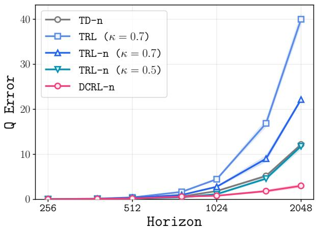

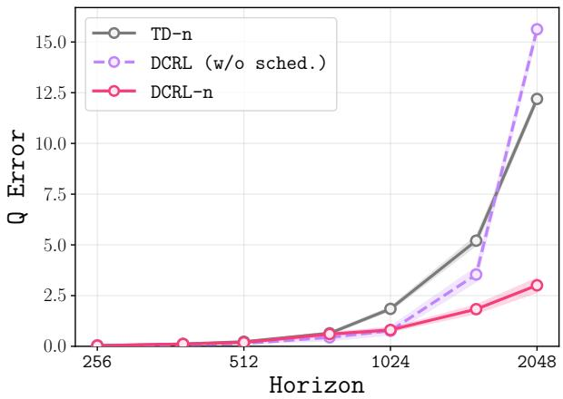  
Figure 10. On combination-lock, accumulated error $\mathcal A ( H )$ from Eq. (8) (3 seeds; shad-$\operatorname { i n g } \colon \pm 1 \ : s . \mathrm { d } . )$ . Adding �-step propagation reduces TRL’s error, while symmetric transitive regression $( \kappa = 0 . 5 )$ further lowers $\mathtt { T R L - n ^ { \prime } s }$ error to the TD-n level. DCRL-n remains lowest and grows slowest, consistent with its logarithmic bootstrap depth and child-to-parent scheduling.  
Figure 11. On combination-lock, we isolate child-to-parent scheduling while holding the factorized backup and �-step propagation fixed (3 seeds; shading: 1 s.d.). I.i.d. sampling performs comparably for $H \lesssim 1 0 2 4$ , but its error rises sharply at longer horizons and approaches $\mathtt { T D - n } ^ { \prime } s$ . DCRL-n remains flat, showing that ordering becomes important as dependency chains deepen.

## B. Full Algorithm

Algorithm 2 Divide-and-Conquer Reinforcement Learning (DCRL)   
1: Input: Dataset , number of slots �, propagation horizon �   
2: Initialize critic $Q ( s , a , g )$ , slots SampleSlot $( \mathcal { D } ) \} _ { \ell = 1 } ^ { S }$   
3: while not converged do   
4: ◁ Divide-and-Conquer   
5: Sample $\ell \sim \operatorname { U n i f } ( \{ 1 , \dots , S \} )$   
6: Sample $\tau _ { \mathrm { D C } } = ( s _ { i } , a _ { i } , s _ { k } , a _ { k } , s _ { j } ) \gets \tau _ { \ell } . 9 9 9 ( )$   
7: if $\mathcal { T } _ { \ell } = \varnothing$ then   
8: ℓ SampleSlot( )   
9: end if   
10: ◁ Propagation   
11: Sample $\tau _ { \mathrm { p r o p } } = ( s _ { i } , a _ { i } , s _ { i + n } , a _ { i + n } , g ) \sim \mathcal { D }$   
12: Train � by minimizing $\mathcal L ^ { \mathrm { d c } } ( Q ) + \mathcal L ^ { \mathrm { p r o p } } ( Q )$ (Eqs. 6, 7)   
13: end while

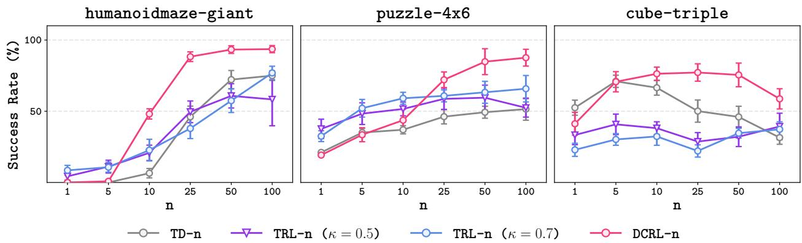  
Figure 12. Exhaustive comparison across propagation horizons � on three long-horizon environments. We report success rate across $n \in \{ 1 , 5 , 1 0 , 2 5 , 5 0 , 1 0 0 \}$ . DCRL-n performs best for $n \geq 2 5$ on all tasks, while the two TRL-n variants perform similarly overall.

## C. Baselines

Ofline GCRL methods generally comprise two components: goal-conditioned value estimation and policy extraction. We describe the main value-learning mechanism of each baseline below and note its policy-extraction mechanism when it is essential to the method. Our implementations of TD, TD-n, TDP, COE, and TRL follow Park et al. (2026).

Temporal-diference methods. IQL (Kostrikov et al., 2022) fits a goal-conditioned state-value function by asymmetric expectile regression over dataset actions and trains its critic with Bellman backups. The expectile approximates action maximization without evaluating out-of-distribution actions; at $\kappa = 0 . 5 ;$ , the objective reduces to behavioral SARSA value estimation. SAC+BC (Haarnoja et al., 2018; Park et al., 2025b) extracts a stochastic policy by maximizing the learned critic through reparameterized gradients while adding an entropy or behavior-cloning term that constrains the policy toward dataset actions. TD is a one-step, IQL-style goal-conditioned TD baseline, whereas TD-n replaces the one-step bootstrap with an �-step return and clips � when the sampled goal occurs sooner (Sutton and Barto, 2018). DCRL uses the same � as its propagation horizon on each task; we report these values in Appendix E.

Monte Carlo methods. CRL (Eysenbach et al., 2022) learns a goal-conditioned critic by contrastively distinguishing future states from independently sampled states and derives the policy from this learned reachability signal. MC learns a behavioral goal-conditioned value by directly regressing $Q ( s _ { i } , a _ { i } , s _ { j } )$ onto the empirical trajectory return $\gamma ^ { j - i }$ , avoiding bootstrapping (Tian et al., 2021; Shah et al., 2021). This estimator is simple and stable but recovers behavior rather than optimal values under suboptimal data and can have high variance under stochastic dynamics.

Hierarchical methods. POR (Xu et al., 2022) is a policy-guided imitation method that uses a learned policy to select useful intermediate targets from the ofline data and imitates the resulting improved decisions. HIQL (Park et al., 2023) treats latent future states as high-level actions: a high-level policy proposes a waypoint and a low-level goal-conditioned policy reaches it, with both policies extracted by advantage-weighted regression. SHARSA (Park et al., 2025b) reduces the efective decision horizon by training a high-level subgoal policy together with a low-level policy that executes each temporally extended subgoal.

Triangle-inequality methods. QRL (Wang et al., 2023) parameterizes the goal-reaching value as a quasimetric, architecturally imposing non-negativity, asymmetry, and the triangle inequality. TMD (Myers et al., 2025) learns an asymmetric temporal-distance representation from ofline data while enforcing quasimetric structure, then uses this distance to extract a goal-conditioned policy. TDP (Kaelbling, 1993; Jurgenson et al., 2020) applies a Floyd–Warshall-style backup that chooses the best intermediate subgoal; in continuous domains, we approximate the hard maximum over the state space using subgoal candidates sampled from the dataset. COE (Piękos et al., 2023) enforces the compositional optimality equation with a separate generator that proposes the maximizing intermediate state; for ofline training, the generator is regularized toward in-distribution states. TRL (Park et al., 2026) propagates reachability by composing two shorter goal-conditioned values through an intermediate state using a transitive backup, yielding an implicit divide-and-conquer structure.

Policy-only methods. We additionally include behavior cloning (BC), hierarchical behavior cloning (HBC) (Gupta et al., 2019), and flow-matching behavior cloning (FBC) (Chi et al., 2023). BC directly imitates dataset actions, HBC separately imitates high-level waypoints and low-level actions, and FBC uses an expressive flow-matching policy to model potentially multimodal behavior distributions.

## D. Alternative Divide-and-Conquer Strategies

Here we describe alternative divide-and-conquer strategies that we compare with DCRL in Section 5.3.

Curriculum learning. The simplest divide-and-conquer approach learns values on short trajectories first, gradually increasing their length via a manual curriculum. For length-� trajectories with curriculum step $\Delta ,$ the �-th stage $( i = 1 , \dots , T / \Delta )$ learns values for sub-trajectories of length $( i - 1 )$ $\Delta + 1 \mathrm { t o          \it { i \cdot \Delta } }$ , sampled uniformly from full trajectories.

Distance re-weighting. Park et al. (2026) implement divide-and-conquer implicitly by downweighting distant pairs in the loss. Each sample is weighted by $w ( s _ { i } , s _ { j } ) : = \big ( 1 + \log _ { \gamma } Q ( s _ { i } , a _ { i } , s _ { j } ) \big ) ^ { - \lambda }$ , where $\log _ { \gamma } Q$ is the learned distance. The weight decays with distance, so short pairs dominate; � controls the decay rate, and $\lambda = 0$ recovers uniform weighting.

Random subgoal sampling. While DCRL splits each problem at the trajectory midpoint, an alternative samples a random in-trajectory subgoal. We implement DCRL (w/ random split), which is identical to Algorithm 2 but uses a random split $k \sim \mathrm { U n i f } ( i + 1 , j - 1 )$ instead of the midpoint during recursive tree construction (Algorithm 1).

Max-based backup. DCRL backs up each node through the trajectory midpoint with an exact factorization, $Q ( s _ { i } , a _ { i } , s _ { j } ) \gets Q ( s _ { i } , a _ { i } , s _ { k } ) Q ( s _ { k } , a _ { k } , s _ { j } )$ with $k = \lfloor ( i + j ) / 2 \rfloor$ . A natural alternative replaces this fixed split with a learned one: at each node we sample $M = 1 0$ in-trajectory subgoal candidates $m \sim \mathrm { U n i f } ( i + 1 , j - 1 )$ and both split and back up at the candidate maximizing the factorized value under the current critic,

$$
m ^ { \star } = \arg \operatorname* { m a x } _ { m } ~ Q ( s _ { i } , a _ { i } , s _ { m } ) Q ( s _ { m } , a _ { m } , s _ { j } ) , \qquad Q ( s _ { i } , a _ { i } , s _ { j } ) \ \gets \ Q ( s _ { i } , a _ { i } , s _ { m ^ { \star } } ) Q ( s _ { m ^ { \star } } , a _ { m ^ { \star } } , s _ { j } ) .\tag{9}
$$

When a segment has fewer than � interior states, we simply enumerate all of them. We implement DCRL $( \mathrm { w } / $ max-based backup), identical to Algorithm 2 except that the midpoint split � in the recursive tree construction (Algorithm 1) is replaced by $m ^ { \star }$ . Because the split now depends on $Q$ and determines the node’s children, the tree is constructed top-down using the current critic, and the schedule is rebuilt every 5000 steps so the splits track the critic as it improves; the recursion, the base-case grounding $Q ( s _ { i } , a _ { i } , s _ { i + 1 } ) \gets \gamma$ , and the value-propagation loss are all unchanged from DCRL. For the demonstrated route, the factorized target $\gamma ^ { m - i } \gamma ^ { \bar { j } - \bar { m } } = \gamma ^ { j - i }$ is independent of $m$ . Maximizing learned values may nevertheless favor either shortcuts introduced by propagation or estimation error. This ablation tests whether adaptive split selection improves upon the fixed midpoint.

Without recursive scheduling. To test whether the depth-stratified, child-to-parent schedule is necessary, we ablate the recursion entirely while retaining the factorization backup. Instead of recursively decomposing each trajectory into a tree (Algorithm 1), we sample pairs $( s _ { i } , s _ { j } )$ i.i.d. per batch with $j - i \sim { \tt G e o m } ( 1 - \gamma )$ , split once at the midpoint $k = \lfloor ( i + j ) / 2 \rfloor$ , and apply the same backup $Q ( s _ { i } , a _ { i } , s _ { j } ) \gets Q ( s _ { i } , a _ { i } , s _ { k } ) Q ( s _ { k } , a _ { k } , s _ { j } )$

Without recursion, the sub-problems $Q ( s _ { i } , a _ { i } , s _ { k } )$ and $Q ( s _ { k } , a _ { k } , s _ { j } )$ are no longer guaranteed to have been trained before their parent. Moreover, i.i.d. sampling does not explicitly provide the one-step leaves that ground each recursive tree. Without reliable base-case supervision, the factorization target becomes self-referential and the critic collapses $( \bar { Q } \to 0 )$ . We therefore add an explicit one-step loss on adjacent transitions,

$$
\begin{array} { r } { \mathcal { L } _ { 1 } ( Q ) = \mathbb { E } _ { ( s , a , s ^ { \prime } ) \sim \mathcal { D } } \big [ \mathcal { L } _ { \mathrm { B C E } } ( Q ( s , a , s ^ { \prime } ) , \gamma ) \big ] , } \end{array}\tag{10}
$$

which restores the exact $\gamma ^ { 1 }$ base case that the recursion supplies implicitly. We implement DCRL (w/o recursion) with this grounding term and the unchanged value-propagation loss. This construction isolates the absence of recursive scheduling while retaining the same factorization and propagation objectives with equivalent one-step grounding.

Without propagation. To test whether divide-and-conquer alone can recover optimal values, we remove $\mathcal { L } ^ { \mathtt { p r o p } }$ and increase the divide-and-conquer expectile from $\kappa _ { \mathtt { d c } } = 0 . 5$ to 0.7. The upper expectile favors higher-valued routes across samples, tasking the recursive objective with learning optimal values rather than behavior values. All other components remain unchanged.

Reverse scheduling. We implement DCRL (w/ reverse order) by retaining the same midpoint tree, factorized backup, one-step groundings, and propagation loss as DCRL, but reversing each slot’s traversal order so that parents are emitted before their children. This ablation isolates traversal direction while preserving the recursive tree structure.

## E. Experimental Setup

Policy Extraction. After training the action-value function $Q ( s , a , g )$ , we extract a goal-conditioned policy $\pi ( s , g ) : \cal { S } \times \cal { S }  { \mathcal { A } }$ that takes the highest-� action. Policy extraction can be performed either during or after value training. We describe policy extraction procedures in Appendix F.

Evaluation. To evaluate ofline goal-conditioned RL algorithms, we use a suite of environments from OGBench (Park et al., 2025a) and CALVIN (Mees et al., 2022).

For OGBench, each environment is evaluated on five test-time tasks corresponding to distinct start–goal pairs, with 15 rollouts per state-based task and 50 rollouts per pixel-based task.

For CALVIN, we use the in-domain Task D Task D setup and the dataset provided by Shi et al. (2022). We evaluate the target sequence of four consecutive subtasks—opening the drawer, turning on the lightbulb, moving the slider to the left, and turning on the LED—using 50 rollouts for the state-based variant and 100 for the pixel-based variant.

Pixel-based CALVIN. The dataset of Shi et al. (2022) provides proprioceptive and scene states but no images, so we re-render it: every transition is replayed in the CALVIN simulator and an image is captured by the static third-person camera, yielding 128 128 3 RGB observations. Rendering is done once ofline and cached, so all methods consume identical pixel trajectories. Each observation comprises the image and a 15-dimensional proprioceptive vector and is normalized using dataset statistics; the goal is the rendered image of the target scene, in which all four subtasks are complete. The evaluation protocol is otherwise unchanged from the state-based variant: we use a single fixed far goal, and a rollout succeeds at level � if at least � of the four subtasks are completed in the prescribed order.

Visual encoder. For pixel-based CALVIN, we use a smaller version of the Impala CNN (Espeholt et al., 2018), matching the encoder used for the pixel-based OGBench environments, so that architecture is not a confounding factor across benchmarks. Observations and goals are encoded by separate encoder instances, both of which are trained end-to-end with the rest of the network at the same learning rate. We apply random-crop augmentation with probability 0.5. The padding is increased from 3 to 6 pixels: OGBench’s pixel observations are 64 64, whereas ours are 128 128, so a 3-pixel pad would shift the image by half the relative amount and cover a correspondingly smaller fraction of the receptive field. Scaling the padding with the resolution keeps the efective augmentation strength, in units of the CNN’s coverage, comparable to the OGBench setting.

Long-horizon OGBench tasks. For large-scale, long-horizon tasks (Table 1), we report the mean performance over four random seeds, averaged across checkpoints at 800k, 900k, and 1M training steps. For DCRL’s value propagation, we use � = 100 on humanoidmaze-giant-1B and puzzle-{4x5,4x6}-1B, and � = 25 on cube-quadruple-100M and cube-octuple-1B. Cube tasks decompose into single-block pick-and-place subtasks, so a smaller � sufices even when the full task is long. Full long-horizon results are reported in Table 8.

Table 4. Long-horizon environment specifications.
<table><tr><td>Environment</td><td>State Dim. (S)</td><td>Goal Domain (G)</td><td>Action Dim. (A)</td><td>Episode length</td></tr><tr><td>humanoidmaze-giant</td><td>69</td><td>R²</td><td>21</td><td>4000</td></tr><tr><td>puzzle-4x5</td><td>99</td><td>{0, 1}20</td><td>5</td><td>1000</td></tr><tr><td>puzzle-4x6</td><td>115</td><td>{0, 1}24</td><td>5</td><td>1000</td></tr><tr><td>cube-quadruple</td><td>55</td><td>R12</td><td>5</td><td>1000</td></tr><tr><td>cube-octuple</td><td>91</td><td>R24</td><td>5</td><td>1500</td></tr></table>

Standard OGBench tasks. For state-based tasks (Figure 7 (left)), we report mean performance over four random seeds, averaged across the 800k, 900k, and 1M checkpoints. We use � = 25 for DCRL’s value propagation on all standard OGBench tasks, both state-based and pixel-based. The state-based environments include:

• antmaze-large, antsoccer-arena, pointmaze-large, scene

• cube-{single,double}

• humanoidmaze-{medium,large}

• puzzle-{3x3,4x4}

For pixel-based tasks (Figure 7 (right)), we report mean performance over four random seeds, averaged across the 300k, 400k, and 500k checkpoints. The pixel-based environments include:

• visual-scene

• visual-antmaze-{medium,large,giant}

• visual-cube-{single,double,triple}

• visual-puzzle-{3x3,4x4,4x5}

Full state-based results and pixel-based results are reported in Table 15 and Table 16.

CALVIN benchmark. In Figure 8, we report mean performance over eight random seeds at the 500k checkpoint for state-based CALVIN, and over four random seeds at the 200k checkpoint for pixel-based CALVIN. On state-based CALVIN, we train HIQL without a latent representation, so its high-level policy predicts subgoals directly in the 21-dimensional observation space and is therefore comparable to the other value-learning methods, none of which learn a separate goal representation. On pixel-based CALVIN, this choice is not viable: a representation-free high-level policy would have to regress the full goal image under an isotropic Gaussian, so the BC term dominates the advantage weighting and the high-level objective degenerates into pixel reconstruction. We therefore retain HIQL’s latent subgoal representation in the pixel setting, with the high-level policy predicting �(�) in the space produced by the goal encoder. To keep the comparison as close as possible to the state-based setting, � is trained solely by the value objective rather than by an auxiliary representation loss, so HIQL learns no goal representation beyond what its value function induces. We use � = 25 for DCRL’s value propagation. Full CALVIN results are reported in Table 6 and Table 7.

�-step comparison. For the �-step comparison (Figure 9), we use 10 random seeds and report mean performance at the 1M checkpoint for each $n \in \{ 1 , 5 , 1 0 , 2 5 , 5 0 , 1 0 0 \}$ . We use humanoidmaze-giant-1B, puzzle-4x6-1B, and cube-triple-100M. Full task-level results for TD-n, TRL-n (� = 0.7), and DCRL-n are reported in Appendix J.3.

## F. Policy Extraction

We consider the following two standard policy-extraction techniques.

Reparameterized gradients (Fujimoto and Gu, 2021) extract a Gaussian policy by maximizing the following combined DDPG (Lillicrap et al., 2016) and behavioral cloning (BC) objective:

$$
J _ { \mathrm { D D P G + B C } } ( \pi ) = \mathbb { E } _ { ( s , a , g ) \sim \mathcal { D } , a ^ { \pi } \sim \pi ( \cdot | s , g ) } \left[ Q ( s , a ^ { \pi } , g ) + \alpha \log \pi ( a | s , g ) \right] ,\tag{11}
$$

where $a ^ { \pi }$ is a reparameterized action from the policy, � is a dataset action, and � determines the strength of the BC regularization. This objective maximizes the predicted value while penalizing deviation from the dataset distribution to prevent out-of-distribution exploitation.

Rejection sampling (Chen et al., 2023; Hansen-Estruch et al., 2023) defines a nonparametric policy by drawing � action candidates and selecting the candidate with the highest value:

$$
\pi ( s , g ) \stackrel { d } { = } \arg \operatorname* { m a x } _ { \{ a _ { i } \} _ { i = 1 } ^ { N } } \operatorname* { m a x } _ { s . \mathrm { t } . ~ a _ { i } \sim \pi _ { \beta } ( \cdot | s , g ) } Q ( s , a _ { i } , g ) ,\tag{12}
$$

where � denotes the number of candidates, $\underline { { \underline { { d } } } }$ denotes equality in distribution, and $\pi _ { \beta }$ is a goalconditioned BC policy. In practice, the BC policy is parameterized as an expressive difusion or flow-matching model to capture multimodal behavior distributions efectively.

In our experiments, we use both reparameterized gradients and rejection sampling, depending on the environment. We report the exact extraction method and hyperparameters (e.g., � and �) in Appendix K.

## G. Additional Related Work

Curriculum Learning. Our recursive schedule, which learns shorter samples before longer ones, resembles a curriculum over horizon length. Curriculum learning orders tasks by dificulty (Bengio et al., 2009; Graves et al., 2017; Florensa et al., 2018), requiring a task space and dificulty estimates. In contrast, DCRL decomposes purely by horizon: it recursively bisects each trajectory at its temporal midpoint, independent of the task or its dificulty. The short-to-long ordering thus emerges from the decomposition, and all lengths are trained concurrently across parallel slots rather than in sequential stages.

## H. Ablation Studies

In this section, we present ablation studies on the key components of DCRL.

## H.1. Target Value Sources for the Divide-and-Conquer Loss

In our divide-and-conquer loss (Eq. (6)), DCRL computes the target value by multiplying two critic estimates corresponding to the first child and the second child. We investigate the efect of using either the online network (�) or the EMA target network (�¯) for each child estimate. As shown in Figure 13, we evaluate all four combinations: $Q \cdot { \bar { Q } } , { \bar { Q } } \cdot { \bar { Q } } , Q \cdot Q .$ , and ${ \bar { Q } } \cdot Q .$ . Across the humanoidmaze-giant and puzzl $\cdot \mathtt { e } ^ { - 4 \mathtt { x } 6 }$ environments, the combination of the online first child and the EMA second child $( Q \cdot { \bar { Q } } )$ achieves the best success rate. Relying entirely on the online network $\left( Q \cdot Q \right)$ causes value estimates to collapse, while the other configurations $( \bar { Q } \cdot \bar { Q }$ and $\bar { Q } \cdot Q )$ degrade performance on at least one task.

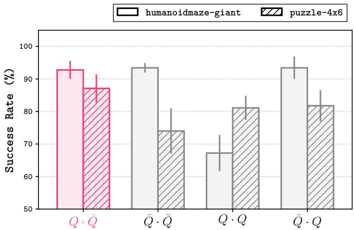  
Figure 13. Using the online first child and the EMA second child $( Q \cdot { \bar { Q } } )$ yields the most robust performance on humanoidmaze-giant and puzzle-4x6.

## H.2. Expectile Parameters

We evaluate the sensitivity of DCRL to the expectile parameters $\kappa _ { \mathtt { d c } }$ (divide-and-conquer loss) and $\kappa _ { \tt p r o p }$ (propagation loss). As shown in Figure 14 and Figure 15, DCRL achieves the best performance with $\kappa _ { \mathsf { d c } } = 0 . 5$ and $\kappa _ { \tt P r o p } = 0 . 7$ on both humanoidmaze-giant and cube-triple. Deviating from these values generally degrades performance.

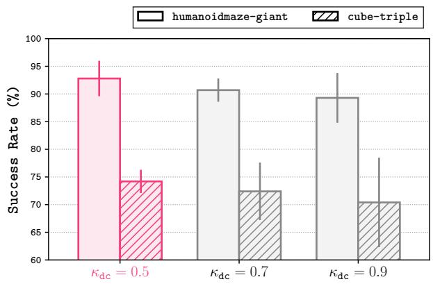

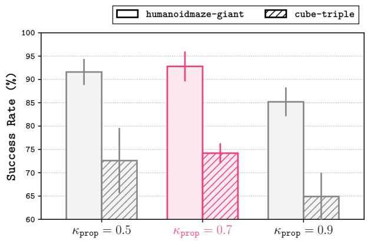  
Figure 14. Ablation of the expectile parameter $\kappa _ { \mathtt { d c } }$ for the divide-and-conquer loss $\mathcal { L } ^ { \mathrm { d c } }$ . Performance peaks at $\kappa _ { \mathsf { d c } } = 0 . 5$ (our default).  
Figure 15. Ablation of the expectile parameter $\kappa _ { \tt P ^ { \tt T } } \circ \tt p$ for the propagation loss $\mathcal { L } ^ { \mathsf { p r o p } }$ . Performance peaks at $\kappa _ { \tt p r o p } = 0 . 7$ (our default).

## H.3. Number of Slots

We study how the number of slots afects DCRL’s performance and training time. Larger numbers of slots incur greater CPU overhead because they must be maintained concurrently, increasing training time. Figures 16 and 17 provide a Pareto analysis of DCRL and TRL (� = 0) in humanoidmaze-giant and cube-triple. In humanoidmaze-giant, DCRL reaches 90% success in under 3 hours, whereas TRL remains below 80% even after 8 hours. In cube-triple, DCRL reaches 70% success in under 2 hours, whereas TRL stalls below 50% and does not improve with a larger training budget. We measure training time on the same GPU (NVIDIA L40S).

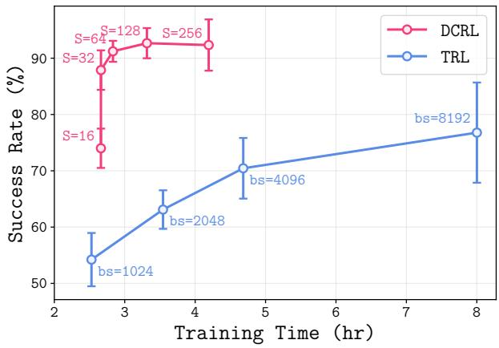  
Figure 16. Across training budgets, DCRL outperforms TRL. In humanoidmaze-giant, we plot success rate (%) against training time (hours), while varying the number of slots (S=16,32,64,128,256) for DCRL at a fixed batch size (1024), and varying the batch size (bs=1024,2048,4096,8192) for TRL.

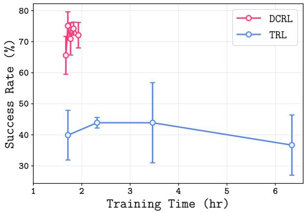  
Figure 17. Same Pareto analysis as Fig. 16 in cube-triple. DCRL consistently achieves a better trade-of between performance and training eficiency than TRL. DCRL is trained with varying numbers of slots (S) and a fixed batch size (1024), while TRL is trained with varying batch sizes (bs).

## I. Divide-and-Conquer Strategies on Cube Manipulation

We provide additional comparisons of divide-and-conquer strategies on cube-triple. As shown in Table 5, the results are mostly consistent with our findings on humanoidmaze-giant (Table 2). DCRL achieves performance comparable to random splitting and about 1.7 the success rate of the best TRL variant, with approximately 7% lower throughput. The same pattern holds for the ablations: the random split performs no better while cutting throughput by 43%, curriculum learning remains highly sensitive to $\Delta ,$ and distance re-weighting fails to improve upon TRL. We measure training throughput for Tables 2, 3, and 5 on the same GPU (NVIDIA L40S).

Table 5. Comparison of divide-and-conquer strategies on cube-triple using the same batch size (1024). We report success rate (%) and training throughput (gradient steps per second).
<table><tr><td>Method</td><td>Success ↑ Throughput ↑</td><td></td></tr><tr><td rowspan="3">Curriculum (∆ = 25) Curriculum (∆ = 50)</td><td> $7 \pm 4$ </td><td> $1 5 5 ~ \pm ~ 2$ </td></tr><tr><td> $3 5 ~ \pm ~ 5$ </td><td> $1 5 4 ~ \pm ~ 2$ </td></tr><tr><td>Curriculum (∆ = 100)  $1 5 ~ \pm ~ 6$ </td><td> $1 5 5 ~ \pm ~ 2$ </td></tr><tr><td rowspan="3">TRL (λ = 0) TRL (λ = 0.01)</td><td> $3 7 \pm 8$ </td><td> $1 6 1 ~ \pm ~ 2$ </td></tr><tr><td> $4 2 \pm 3$ </td><td> $1 6 3 ~ \pm ~ 2$ </td></tr><tr><td> $3 4 ~ \pm ~ 4$ </td><td> $1 6 0 ~ \pm ~ 1$ </td></tr><tr><td>TRL  $( \lambda = 0 . 1 )$  DCRL (w/ random split)</td><td> $7 2 \ \pm \ 4$ </td><td> $8 6 ~ \pm ~ 1$ </td></tr><tr><td>DCRL (w/ midpoint split)</td><td> $7 1 \pm 3$ </td><td> $1 5 2 ~ \pm ~ 1$ </td></tr></table>

## J. Full Experimental Results

## J.1. CALVIN Benchmark

Table 6. Full results on state-based CALVIN.
<table><tr><td></td><td></td><td colspan="2">Temporal Difference</td><td colspan="2">Monte Carlo</td><td colspan="3">Hierarchical</td><td colspan="4">Triangle Inequality</td></tr><tr><td>Metric</td><td>BC</td><td>IQL</td><td>TD-n</td><td>MC</td><td>CRL</td><td>HBC</td><td>POR</td><td>HIQL</td><td>QRL</td><td>TMD</td><td>TRL</td><td>DCRL</td></tr><tr><td>Return</td><td> $1 3 . 5 ~ \pm ~ 1 3 . 2$ </td><td> $1 2 . 5 ~ \pm ~ 1 8 . 9$ </td><td> $2 4 . 4 \ \pm \ 1 4 . 6$ </td><td> $2 3 . 3 ~ \pm ~ 1 0 . 9$ </td><td> $8 . 2 ~ \pm ~ 9 . 5$ </td><td> $1 1 . 0 ~ \pm ~ 1 2 . 3$ </td><td> $3 . 8 ~ \pm 7 . 2$ </td><td> $2 0 . 2 \ \pm \ 2 4 . 8$ </td><td> $1 2 . 5 ~ \pm ~ 1 8 . 9$ </td><td> $4 . 8 ~ \pm ~ 9 . 3$ </td><td> $2 2 . 8 \ \pm \ 9 . 7$ </td><td> $3 5 , 4 \ \pm \ 1 4 , 4$ </td></tr><tr><td>Completion</td><td> $0 . 0 ~ \pm \ : 0 . 0$ </td><td> $0 . 0 \ \pm \ 0 . 0$ </td><td>0.0 ± 0.0</td><td>0.0 ± 0.0</td><td>0.0 ± 0.0</td><td>0.0 ± 0.0</td><td>0.0 ± 0.0 3.0 ± 8.5</td><td></td><td> $0 . 0 ~ \pm \ : 0 . 0$ </td><td> $0 . 0 ~ \pm \ : 0 . 0$ </td><td> $0 . 0 ~ \pm \ : 0 . 0$ </td><td> $8 . 5 \ \pm \ 7 . 1$ </td></tr></table>

Table 7. Full results on pixel-based CALVIN. We report the success rate (%) of completing at least � consecutive subtasks, together with the average number of subtasks completed per rollout.
<table><tr><td></td><td colspan="8"># of Subtasks</td></tr><tr><td>Method</td><td>1</td><td></td><td></td><td>2</td><td>3</td><td></td><td>4</td><td>Avg. Subtasks</td></tr><tr><td>TD-n</td><td></td><td> $3 0 ~ \pm ~ 2 2$ </td><td></td><td> $4 \pm 3$ </td><td> $0 ~ \pm ~ 1$ </td><td></td><td> $0 ~ \pm ~ 0$ </td><td> $0 . 3 4 ~ \pm ~ 0 . 2 4$ </td></tr><tr><td>TRL</td><td></td><td> $3 0 ~ \pm ~ 3 0$ </td><td></td><td> $7 \pm { \mathfrak { s } }$ </td><td> $0 ~ \pm ~ 0$ </td><td></td><td> $0 ~ \pm ~ 0$ </td><td> $0 . 3 7 ~ \pm ~ 0 . 3 9$ </td></tr><tr><td>HIQL</td><td></td><td> $7 5 ~ \pm ~ 5 0$ </td><td></td><td> $2 5 ~ \pm ~ 5 0$ </td><td> $0 ~ \pm ~ 0$ </td><td></td><td> $0 ~ \pm ~ 0$ </td><td> $1 . 0 0 ~ \pm \ : 0 . 8 2$ </td></tr><tr><td>DCRL</td><td></td><td> $7 2 ~ \pm ~ 2 6$ </td><td></td><td> $3 2 ~ \pm ~ 2 2$ </td><td> $8 ~ \pm ~ 7$ </td><td></td><td> $1 ~ \pm ~ 2$ </td><td> $1 . 1 4 \ \pm \ 0 . 5 4$ </td></tr></table>

## J.2. Long-Horizon OGBench Tasks

Table 8. Full results on large-scale, long-horizon OGBench tasks.
<table><tr><td></td><td></td><td></td><td colspan="4">Temporal Difference</td><td colspan="2">Monte Carlo</td><td colspan="2">Hierarchical</td><td colspan="2"></td><td colspan="4">Triangle Inequality</td></tr><tr><td>Environment</td><td>Task</td><td>FBC</td><td>IQL</td><td>SAC+BC</td><td>TD</td><td>TD-n</td><td>MC</td><td></td><td>CRL</td><td>HIQL</td><td>SHARSA</td><td>QRL</td><td>TDP</td><td>COE</td><td>TRL</td><td>DCRL</td></tr><tr><td rowspan="6">humanoidmaze-giant-1B</td><td>task1</td><td>0 ± 0</td><td>0 ± 0</td><td>5 ± 3 ± 3</td><td>2 ± 4</td><td>68 ± 14</td><td>64 ± 9 ± 5</td><td>52 ± 38 63</td><td>16 ± 8</td><td>23 46</td><td>± 8 1 2</td><td>± 1 0 3</td><td>± 0 1 2</td><td>± 1 71</td><td>± 15 ± 6</td><td>91 ± 6 97 ± 3</td></tr><tr><td>task2</td><td>0 ± 0</td><td>3 ± 7 ± 6</td><td>12</td><td>8 ± 4</td><td>90 ± 13</td><td>87</td><td></td><td>± 46</td><td>38 ± 12</td><td>± 14</td><td>± 2</td><td>± 3 3</td><td>± 2 4</td><td>87 44</td><td></td></tr><tr><td>task3</td><td>0 ± 0</td><td>5</td><td>8 ± 6</td><td>1 ± 1</td><td>65 ± 12</td><td>83 ± 8</td><td>68</td><td>± 46 12</td><td>26 ± 14</td><td>± 3 2 0</td><td>± 3</td><td>± 2</td><td>± 2</td><td>± 8</td><td>90 ± 5</td></tr><tr><td>task4</td><td>0 ± 0</td><td>2 ± 3</td><td>2 ± 3</td><td>2 ± 2</td><td>78 ± 14</td><td>78 ± 8</td><td>57</td><td>± 41</td><td>± 6</td><td>± 7</td><td>± 0</td><td>0 ± 0</td><td>± 2</td><td>94 ± 4</td><td>96 ± 4</td></tr><tr><td>task5</td><td>0 ± 0</td><td>3 ± 4</td><td>0 ± 0</td><td>3 ± 1</td><td>89 ± 10</td><td>84 ± 11</td><td>68</td><td>± 46 32</td><td>± 7</td><td>± 3 8</td><td>± 8</td><td>4 ± 2</td><td>± 2</td><td>99 ± 1</td><td>94 ± 6</td></tr><tr><td>overall</td><td>0 ± 0</td><td>3 ± 4</td><td>5 ± 0</td><td>3 ± 2</td><td>78 ± 4</td><td>79 ± 4</td><td>62</td><td>± 42 25</td><td>± 6</td><td>± 3 3</td><td>± 2</td><td>2 ± 0</td><td>2 ± 1</td><td>79 ± 2</td><td>93 ± 3</td></tr><tr><td rowspan="6">puzzle-4x5-1B</td><td>task1</td><td>0 ± 0</td><td>100 ± 0</td><td>95 ± 3</td><td>84 ± 7</td><td>100 ± 0</td><td>100 ± 0</td><td>7 ± 5</td><td>58</td><td>± 25 100</td><td>± 0 0</td><td>± 0 0</td><td>± 0 0 0</td><td>± 0 100</td><td>± 0</td><td>100 ± 0</td></tr><tr><td>task2</td><td>0 ± 0 0</td><td>0 ± 0</td><td>0 ± 0</td><td>4 ± 3</td><td>98 ± 4</td><td>67 ± 12</td><td>0 ± 0</td><td>0</td><td>± 0 99</td><td>± 1 0</td><td>± 0 0</td><td>± 0</td><td>± 0</td><td>99 ± 1</td><td>100 ± 0</td></tr><tr><td>task3</td><td>± 0</td><td>0 ± 0</td><td>0 ± 0</td><td>2 ± 2</td><td>84 ± 28</td><td>8 ± 10</td><td>0 ± 0</td><td>0 0</td><td>± 0 93 87</td><td>± 5 0</td><td>± 0 0 0</td><td>± 0 0 0</td><td>± 0</td><td>100 ± 0</td><td>100 ± 0</td></tr><tr><td>task4</td><td>0 ± 0</td><td>0 ± 0</td><td>0 ± 0</td><td>2 ± 2</td><td>98 ± 3</td><td>50 ± 9</td><td>0</td><td>± 0</td><td>± 0</td><td>± 5 0</td><td>± 0</td><td>± 0</td><td>± 0</td><td>99 ± 1</td><td>99 ± 1</td></tr><tr><td>task5</td><td>0 ± 0 0</td><td>0 ± 0</td><td>0 ± 0</td><td>2 ± 2</td><td>81 ± 17</td><td>8 ± 11</td><td>0</td><td>± 0</td><td>± 0</td><td>± 11 0</td><td>± 0</td><td>± 0</td><td>± 0</td><td>88 ± 8</td><td>99 ± 1</td></tr><tr><td>overall</td><td>± 0</td><td>20 ± 0</td><td>19 ± 1</td><td>19 ± 1</td><td>92 ± 8</td><td>47 ± 7</td><td>1</td><td>± 1 12</td><td>± 5</td><td>± 4 0</td><td>± 0</td><td>± 0 0</td><td>± 0</td><td>97 ± 1</td><td>100 ± 0</td></tr><tr><td rowspan="7">puzzle-4x6-1B</td><td>task1</td><td>0 ± 0</td><td>87 ± 9</td><td>48 ± 39</td><td>61 ± 16</td><td>100 ± 0</td><td>98 ± 4</td><td>0 ± 0</td><td>17 ± 12</td><td>99</td><td>± 1 0</td><td>± 0 0</td><td>± 0 0 0</td><td>± 0 100</td><td>± 0</td><td>100 ± 0</td></tr><tr><td>task2</td><td>0 ± 0</td><td>0 ± 0</td><td>5 ± 10</td><td>2 ± 2</td><td>39 ± 21</td><td>46 ± 30</td><td>0 ± 0</td><td>4 ± 2</td><td>61</td><td>± 13 0</td><td>± 0 0</td><td>± 0 0</td><td>± 0</td><td>66 ± 13</td><td>99 ± 2</td></tr><tr><td>task3</td><td>0 ± 0</td><td>0 ± 0</td><td>0 ± 0</td><td>0 ± 0</td><td>81 ± 21</td><td>34 ± 10</td><td>0</td><td>± 0 0</td><td>± 0 71</td><td>± 15 0</td><td>± 0 0</td><td>± 0</td><td>± 0</td><td>67 ± 21</td><td>100 ± 0</td></tr><tr><td>task4</td><td>0 ± 0</td><td>0 ± 0</td><td>0 ± 0</td><td>1 ± 1</td><td>46 ± 28</td><td>5 ± 6</td><td>0</td><td>± 0 0</td><td>± 0 45</td><td>± 7 0</td><td>± 0 0</td><td>± 0 0 0</td><td>± 0</td><td>23 ± 7</td><td>100 ± 0</td></tr><tr><td>task5</td><td>0 ± 0</td><td>0 ± 0</td><td>0 ± 0</td><td>0 ± 0</td><td>0 ± 0</td><td>0 ± 0</td><td>0</td><td>± 0 0</td><td>± 0</td><td>± 2 0</td><td>± 0</td><td>± 0</td><td>± 0</td><td>0 ± 0</td><td>37 ± 24</td></tr><tr><td>overall</td><td>0 ± 0</td><td>17 ± 2</td><td>11 ± 8</td><td>13 ± 3</td><td>53 ± 11</td><td>37 ± 4</td><td>0</td><td>± 0 4</td><td>± 3 55</td><td>± 3 0</td><td>± 0 0</td><td>± 0 0</td><td>± 0</td><td>51 ± 5</td><td>87 ± 5</td></tr><tr><td>task1</td><td>3 ± 2</td><td>94 ± 3</td><td>59 ± 13</td><td>66 ± 6</td><td>51 ± 10</td><td>5 ± 4</td><td>56</td><td>± 6 88</td><td>± 7</td><td>± 0 0</td><td>± 0</td><td>± 0</td><td>± 0</td><td>1 ± 1</td><td>59 ± 7</td></tr><tr><td rowspan="6">cube-quadruple-100M</td><td>task2</td><td>0 ± 1</td><td>39 ± 4</td><td>77 ± 8</td><td>25 ± 9</td><td>44 ± 9</td><td>0 ± 0</td><td>46 ± 8</td><td>79 ± 1</td><td>100 100 ± 0</td><td>0 ± 0</td><td>0 0 ± 0</td><td>0 0 ± 0</td><td>0</td><td>69</td><td>± 8</td></tr><tr><td>task3</td><td>0 ± 0</td><td>63 ± 5</td><td>34 ± 9</td><td>8 ± 3</td><td>9 ± 4</td><td>0 ± 0</td><td>2 ± 1</td><td>69</td><td>± 13 77</td><td>± 3 0</td><td>± 0 0</td><td>± 0 0</td><td>± 0</td><td>± 0 0 ± 0</td><td>25 ± 12</td></tr><tr><td>task4</td><td>0 ± 0</td><td>5 ± 2</td><td>5 ± 2</td><td>1 ± 1</td><td>4 ± 3</td><td>0 ± 0</td><td>1 ± 0</td><td>32</td><td>± 9 34</td><td>± 4 0</td><td>± 0 0</td><td>± 0 0</td><td>± 0</td><td>0 ± 0</td><td>7 ± 4</td></tr><tr><td>task5</td><td>0 ± 0</td><td>1 ± 1</td><td>21 ± 8</td><td>1 ± 1</td><td>12 ± 7</td><td>0 ± 0</td><td>2 ± 2</td><td>38</td><td>± 5 61</td><td>± 6 0</td><td>± 0 0</td><td>0 ± 0</td><td>± 0</td><td>0 ± 0</td><td>27 ± 3</td></tr><tr><td>overall</td><td>1 ± 0</td><td>41 ± 3</td><td>39 ± 4</td><td>20 ± 2</td><td>21 ± 6</td><td>1 ± 1</td><td>22</td><td>± 2 62</td><td>± 6 74</td><td>± 2 0</td><td>± 0 0</td><td>± 0 0</td><td>± 0</td><td>0 ± 0</td><td>37 ± 4</td></tr><tr><td>task1</td><td>0 ± 0</td><td>0 ± 0</td><td>0 ± 0</td><td>0 ± 0</td></table>

## J.3. Propagation Horizon Comparison

Table 9. Results with � = 1.  
Table 10. Results with � = 5.
<table><tr><td>Environment</td><td>Task</td><td>TD-1</td><td>TRL-1</td><td></td><td>DCRL-1</td><td></td></tr><tr><td rowspan="6">humanoidmaze-giant-1B</td><td>task1</td><td>0 ± 0</td><td>0 ± 0</td><td></td><td> $0 ~ \pm ~ 0$ </td><td></td></tr><tr><td>task2</td><td>0 ± 0</td><td>0 ± 0</td><td></td><td></td><td>0 ± 0</td></tr><tr><td>task3</td><td> $0 ~ \pm ~ 0$ </td><td> $0 ~ \pm ~ 0$ </td><td></td><td></td><td> $0 ~ \pm ~ 0$ </td></tr><tr><td>task4</td><td>0 ± 0</td><td> $0 ~ \pm ~ 0$ </td><td></td><td></td><td> $0 ~ \pm ~ 0$ </td></tr><tr><td>task5</td><td>0 ± 0</td><td> $4 2 ~ \pm ~ 1 8$ </td><td></td><td></td><td> $0 ~ \pm ~ 0$ </td></tr><tr><td>overall</td><td>0 ± 0</td><td> $8 ~ \pm ~ 4$ </td><td></td><td></td><td> $0 ~ \pm ~ 0$ </td></tr><tr><td rowspan="6">puzzle-4x5-1B</td><td>task1</td><td> $\mathrm { ~ 1 0 0 ~ \pm ~ 0 ~ }$ </td><td> $\begin{array} { l } { 1 0 0 ~ \pm ~ 1 } \end{array}$ </td><td></td><td></td><td> $1 0 0 ~ \pm ~ 0$ </td></tr><tr><td>task2</td><td> ${ \mathrm { ~ 1 ~ } } \pm { \mathrm { ~ 2 ~ } }$ </td><td> $8 5 ~ \pm ~ 1 6$ </td><td></td><td></td><td> $0 ~ \pm ~ 0$ </td></tr><tr><td>task3</td><td>0 ± 0</td><td>67 ± 29 0 ± 0</td><td></td><td></td><td></td></tr><tr><td>task4</td><td>0 ± 0</td><td>96 ± 6 0 ± 0</td><td></td><td></td><td></td></tr><tr><td>task5 overall</td><td>0 ± 0 20 ± 0</td><td>63 ± 24</td><td></td><td></td><td> $0 ~ \pm ~ 0$ </td></tr><tr><td></td><td></td><td>82 ± 15</td><td></td><td></td><td> $2 0 ~ \pm ~ 0 ~$ </td></tr><tr><td rowspan="6">puzzle-4x6-1B</td><td>task1</td><td>99 ± 1 99 ± 2</td><td></td><td></td><td></td><td> $9 9 ~ \pm ~ 2$ </td><td></td></tr><tr><td>task2</td><td>6 ± 5 28 ± 10</td><td></td><td></td><td></td><td></td><td> $3 \pm 4$ </td></tr><tr><td>task3</td><td>0 ± 0</td><td></td><td>23 ± 13</td><td></td><td></td><td> $0 ~ \pm ~ 0$ </td></tr><tr><td>task4</td><td>0 ± 0</td><td></td><td>13 ± 12</td><td></td><td></td><td> $0 ~ \pm ~ 0$ </td></tr><tr><td>task5</td><td>0 ± 0</td><td></td><td>0 ± 0</td><td></td><td></td><td> $0 ~ \pm ~ 0$ </td></tr><tr><td>overall</td><td>21 ± 1</td><td></td><td> $3 3 ~ \pm ~ 4$ </td><td></td><td></td><td> $2 0 ~ \pm ~ 1$ </td></tr><tr><td rowspan="6">cube-triple-100M</td><td>single_pnp</td><td> $9 5 ~ \pm ~ 7 ~$ </td><td></td><td> $6 8 ~ \pm ~ 1 4$ </td><td></td><td></td><td> $8 9 ~ \pm ~ 8$ </td></tr><tr><td>triple_pnp</td><td>61 ± 14</td><td></td><td> $1 5 ~ \pm ~ 8$ </td><td></td><td></td><td> $4 2 ~ \pm ~ 1 3$ </td></tr><tr><td>from_stack</td><td> $5 4 ~ \pm ~ 9$ </td><td></td><td> $2 7 ~ \pm ~ 1 1$ </td><td></td><td></td><td>30 ± 11</td></tr><tr><td>cycle</td><td>26 ± 8</td><td></td><td> $2 \pm 2$ </td><td></td><td></td><td> ${ \textsf { 5 } } \pm 2$ </td></tr><tr><td>stack</td><td>26 ± 9</td><td></td><td> $2 \pm 3$ </td><td></td><td></td><td> $3 6 ~ \pm ~ 6$ </td></tr><tr><td>overall</td><td>52 ± 5</td><td></td><td> $2 3 \pm 5$ </td><td></td><td> $4 0 ~ \pm ~ 5$ </td><td></td></tr></table>

Table 11. Results with $n = 1 0 .$  
Table 12. Results with $n = 2 5 .$
<table><tr><td>Environment</td><td>Task</td><td>TD-10</td><td>TRL-10</td><td></td><td>DCRL-10</td><td></td></tr><tr><td></td><td>task1</td><td> ${ \bf 1 } 2 { \bf \ t } \ni { \bf 2 }$ </td><td> $3 \pm 4$ </td><td></td><td> $5 9 ~ \pm ~ 1 0$ </td><td></td></tr><tr><td></td><td>task2</td><td> $4 \ \pm \ 7$ </td><td> $2 0 ~ \pm ~ 2 1$ </td><td></td><td> $8 4 ~ \pm ~ 7$ </td><td></td></tr><tr><td>humanoidmaze-giant-1B</td><td>task3</td><td>2 ± 3</td><td>2 ± 4</td><td></td><td>45 ± 8</td><td></td></tr><tr><td></td><td>task4</td><td>13 ± 10 14 ± 18</td><td></td><td></td><td> $4 7 ~ \pm ~ 1 0$ </td><td></td></tr><tr><td></td><td>task5</td><td>2 ± 4</td><td> $7 4 ~ \pm ~ 1 7$ </td><td></td><td> $5 \pm 4$ </td><td></td></tr><tr><td></td><td>overall</td><td>6 ± 3</td><td>23 ± 8</td><td></td><td>48 ± 4</td><td></td></tr><tr><td></td><td>task1</td><td>100 ± 0 100 ± 0 100 ± 0</td><td></td><td></td><td></td><td></td></tr><tr><td></td><td>task2</td><td>99 ± 2 99 ± 4 100 ± 0</td><td></td><td></td><td></td><td></td></tr><tr><td>puzzle-4x5-1B</td><td>task3</td><td>95 ± 7 95 ± 7 100 ± 0</td><td></td><td></td><td></td><td></td></tr><tr><td></td><td>task4</td><td>96 ± 4</td><td>99 ± 2</td><td></td><td>95 ± 8</td><td></td></tr><tr><td>task5</td><td></td><td>48 ± 12</td><td>91 ± 10</td><td></td><td>94 ± 6</td><td></td></tr><tr><td>overall</td><td></td><td>88 ± 3</td><td>97 ± 4</td><td></td><td>98 ± 2</td><td></td></tr><tr><td></td><td>task1 task2</td><td></td><td>100 ± 0 100 ± 1 100 ± 0</td><td></td><td></td><td></td></tr><tr><td>puzzle-4x6-1B</td><td></td><td></td><td>72 ± 9 32 ± 20 58 ± 24</td><td></td><td></td><td></td></tr><tr><td>task3</td><td></td><td></td><td>13 ± 12 81 ± 20 55 ± 22</td><td></td><td></td><td></td></tr><tr><td>task4</td><td></td><td>0 ± 1</td><td>83 ± 11</td><td></td><td>14 ± 11</td><td></td></tr><tr><td>task5</td><td>0 ± 0</td><td></td><td> $0 ~ \pm ~ 0$ </td><td></td><td> $0 ~ \pm ~ 0$ </td><td></td></tr><tr><td>overall</td><td>37 ± 3</td><td></td><td> $5 9 ~ \pm ~ 4$ </td><td></td><td> $4 5 \pm 8$ </td><td></td></tr><tr><td></td><td>single_pnp</td><td>77 ± 9</td><td> $7 0 ~ \pm ~ 9$ </td><td></td><td> $8 6 ~ \pm ~ 7$ </td><td></td></tr><tr><td>triple_pnp</td><td>69 ± 8</td><td></td><td> $3 4 ~ \pm ~ 1 4$ </td><td></td><td> $8 8 ~ \pm ~ 8$ </td><td></td></tr><tr><td>from_stack</td><td>67 ± 9</td><td></td><td> $3 2 \ \pm \ 9$ </td><td></td><td> $8 6 ~ \pm ~ 8$ </td><td></td></tr><tr><td>cycle</td><td>42 ± 14</td><td></td><td> $4 \pm 4$ </td><td></td><td> $4 2 ~ \pm ~ 1 1$ </td><td></td></tr><tr><td>stack</td><td></td><td>78 ± 7</td><td> $2 1 ~ \pm ~ 6$ </td><td></td><td> $8 3 ~ \pm ~ 9$ </td><td></td></tr><tr><td>overall</td><td></td><td>67 ± 5</td><td> $3 2 ~ \pm ~ 6$ </td><td></td><td> $7 7 \pm 5$ </td><td></td></tr></table>

<table><tr><td>Environment</td><td>Task</td><td>TD-5</td><td>TRL-5</td><td></td><td>DCRL-5</td><td></td><td></td></tr><tr><td></td><td>task1</td><td>0 ± 0</td><td></td><td>0 ± 0</td><td></td><td>0 ± 0</td><td></td></tr><tr><td></td><td>task2</td><td>0 ± 0</td><td></td><td>0 ± 0</td><td></td><td>2 ± 2</td><td></td></tr><tr><td>humanoidmaze-giant-1B</td><td>task3</td><td>0 ± 0</td><td></td><td>0 ± 0</td><td></td><td>1 ± 2</td><td></td></tr><tr><td></td><td>task4</td><td>0 ± 0</td><td></td><td>0 ± 0</td><td></td><td>1 ± 2</td><td></td></tr><tr><td></td><td>task5</td><td>0 ± 0</td><td> $5 4 ~ \pm ~ 1 8$ </td><td></td><td></td><td>0 ± 0</td><td></td></tr><tr><td></td><td>overall</td><td>0 ± 0</td><td>11 ± 4</td><td></td><td></td><td>1 ± 1</td><td></td></tr><tr><td></td><td>task1</td><td> $\mathrm { ~ 1 0 0 ~ \pm ~ 0 ~ }$ </td><td></td><td>100 ± 0 100 ± 0</td><td></td><td></td><td></td></tr><tr><td></td><td>task2</td><td> $8 0 ~ \pm ~ 1 2$ </td><td>95 ± 6 82 ± 12</td><td></td><td></td><td></td><td></td></tr><tr><td>puzzle-4x5-1B</td><td>task3</td><td> $3 4 ~ \pm ~ 1 7$ </td><td>87 ± 14</td><td></td><td></td><td> $2 7 ~ \pm ~ 1 7$ </td><td></td></tr><tr><td></td><td>task4</td><td> $6 7 ~ \pm ~ 1 4$ </td><td>97 ± 5 42 ± 17</td><td></td><td></td><td></td><td></td></tr><tr><td></td><td>task5</td><td> $1 5 ~ \pm ~ 1 0$ </td><td>75 ± 21</td><td></td><td>10 ± 9</td><td></td><td></td></tr><tr><td></td><td>overall</td><td>59 ± 9</td><td>91 ± 9</td><td></td><td></td><td> $5 2 \ \pm \ 8$ </td><td></td></tr><tr><td></td><td>task1</td><td> $\mathrm { ~ 1 0 0 ~ \pm ~ 0 ~ }$ </td><td></td><td>96 ± 6</td><td></td><td> $\mathrm { ~ 1 0 0 ~ \pm ~ 0 ~ }$ </td><td></td></tr><tr><td></td><td>task2</td><td>70 ± 13 31 ± 17 </td><td></td><td></td><td></td><td></td><td>61 ± 14</td></tr><tr><td>puzzle-4x6-1B</td><td>task3</td><td> ${ \textsf { 5 } } \pm { \textsf { 4 } }$ </td><td></td><td>76 ± 17</td><td></td><td></td><td>4 ± 5</td></tr><tr><td></td><td>task4</td><td> $0 ~ \pm ~ 0$ </td><td></td><td> $5 8 ~ \pm ~ 2 0$ </td><td></td><td></td><td>0 ± 0</td></tr><tr><td></td><td>task5</td><td> $0 ~ \pm ~ 0$ </td><td></td><td> $0 ~ \pm ~ 0$ </td><td></td><td>0 ± 0</td><td></td></tr><tr><td></td><td>overall</td><td> $3 5 \pm 3$ </td><td></td><td> $5 2 ~ \pm ~ 6$ </td><td></td><td> $3 3 \ \pm \ 2$ </td><td></td></tr><tr><td>cube-triple-100M</td><td>single_pnp</td><td> $8 5 ~ \pm ~ 8$ </td><td></td><td> $7 5 \ \pm \ 8$ </td><td></td><td> $8 2 \ \pm \ 8$ </td><td></td></tr><tr><td></td><td>triple_pnp</td><td> $7 7 \pm 1 0$ </td><td></td><td>31 ± 10</td><td></td><td> $7 9 \ \pm \ 9$ </td><td></td></tr><tr><td>from_stack</td><td></td><td> $6 9 ~ \pm ~ 9$ </td><td></td><td> $2 4 ~ \pm ~ 1 0$ </td><td></td><td> $7 3 ~ \pm ~ 1 0$ </td><td></td></tr><tr><td>cycle</td><td></td><td> $4 7 ~ \pm ~ 1 1$ </td><td></td><td> $4 \pm 4$ </td><td></td><td> $4 0 ~ \pm ~ 1 0$ </td><td></td></tr><tr><td>stack</td><td></td><td> $^ \mathrm { ~ 7 7 ~ } \pm \mathrm { ~ 8 ~ }$ </td><td></td><td> $^ \textrm { \scriptsize 1 7 } \pm \textrm { \scriptsize 8 }$ </td><td></td><td> $6 5 ~ \pm ~ 1 0$ </td><td></td></tr><tr><td>overall</td><td></td><td> $7 1 \ \pm \ 4$ </td><td></td><td>30 ± 4</td><td></td><td> $6 8 ~ \pm ~ 6$ </td><td></td></tr></table>

<table><tr><td>Environment</td><td>Task</td><td>TD-25</td><td>TRL-25</td><td></td><td>DCRL-25</td><td></td><td></td></tr><tr><td></td><td>task1</td><td>41 ± 14</td><td></td><td> $1 5 ~ \pm ~ 1 3$ </td><td>89 ± 5</td><td></td><td></td></tr><tr><td></td><td>task2</td><td>54 ± 16</td><td></td><td>52 ± 12</td><td></td><td>97 ± 3</td><td></td></tr><tr><td>humanoidmaze-giant-1B</td><td>task3</td><td>42 ± 11</td><td></td><td>12 ± 12</td><td></td><td>80 ± 11</td><td></td></tr><tr><td></td><td>task4</td><td>43 ± 16 27 ± 18</td><td></td><td></td><td></td><td>88 ± 8</td><td></td></tr><tr><td></td><td>task5</td><td>50 ± 21</td><td></td><td>83 ± 6</td><td></td><td>88 ± 14</td><td></td></tr><tr><td></td><td>overall</td><td>46 ± 7</td><td></td><td>38 ± 7</td><td></td><td>88 ± 3</td><td></td></tr><tr><td></td><td>task1</td><td>100 ± 0 100 ± 0 100 ± 0</td><td></td><td></td><td></td><td></td><td></td></tr><tr><td></td><td>task2</td><td>99 ± 2 98 ± 3</td><td></td><td></td><td></td><td>100 ± 0</td><td></td></tr><tr><td>puzzle-4x5-1B</td><td>task3</td><td>99 ± 2 91 ± 16 100 ± 1</td><td></td><td></td><td></td><td></td><td></td></tr><tr><td></td><td>task4</td><td>98 ± 2</td><td></td><td>97 ± 2</td><td></td><td>99 ± 2</td><td></td></tr><tr><td></td><td>task5</td><td>92 ± 6</td><td></td><td>93 ± 12</td><td></td><td>100 ± 1</td><td></td></tr><tr><td></td><td>overall</td><td>98 ± 2</td><td></td><td>96 ± 6</td><td></td><td>100 ± 1</td><td></td></tr><tr><td></td><td>task1</td><td>100 ± 0 99 ± 2</td><td></td><td></td><td></td><td>100 ± 0</td><td></td></tr><tr><td></td><td>task2</td><td>63 ± 16 33 ± 16</td><td></td><td></td><td></td><td>62 ± 28</td><td></td></tr><tr><td>puzzle-4x6-1B</td><td>task3</td><td>56 ± 17</td><td></td><td>89 ± 4</td><td></td><td>99 ± 2</td><td></td></tr><tr><td></td><td>task4</td><td>12 ± 11</td><td></td><td>83 ± 14</td><td></td><td>88 ± 11</td><td></td></tr><tr><td>task5</td><td></td><td>0 ± 0</td><td></td><td>0 ± 0</td><td></td><td>6 ± 7</td><td></td></tr><tr><td></td><td>overall</td><td>46 ± 5</td><td></td><td> $6 1 ~ \pm ~ 4$ </td><td></td><td> $7 1 ~ \pm ~ 7$ </td><td></td></tr><tr><td></td><td>single_pnp</td><td>65 ± 15</td><td></td><td> $5 7 ~ \pm ~ 1 4$ </td><td></td><td> $8 2 ~ \pm ~ 1 5$ </td><td></td></tr><tr><td>cube-triple-100M</td><td>triple_pnp</td><td>44 ± 15</td><td></td><td>22 ± 7</td><td></td><td> $^ { 7 3 \pm 8 }$ </td><td></td></tr><tr><td>from_stack</td><td></td><td>49 ± 11</td><td></td><td> $1 9 ~ \pm ~ 1 1$ </td><td></td><td> $7 6 ~ \pm ~ 6$ </td><td></td></tr><tr><td>cycle</td><td></td><td>20 ± 10</td><td></td><td>2 ± 2</td><td></td><td> $4 1 ~ \pm ~ 1 0$ </td><td></td></tr><tr><td>stack</td><td></td><td>72 ± 5</td><td></td><td>12 ± 4</td><td></td><td> $8 3 ~ \pm ~ 8$ </td><td></td></tr><tr><td>overall</td><td></td><td>50 ± 8</td><td></td><td>22 ± 4</td><td></td><td> $7 1 \pm 5$ </td><td></td></tr></table>

Table 13. Results with $n = 5 0 .$  
Table 14. Results with � = 100.
<table><tr><td>Environment</td><td>Task</td><td>TD-50</td><td>TRL-50</td><td></td><td>DCRL-50</td><td></td></tr><tr><td></td><td>task1</td><td> $6 0 ~ \pm ~ 9$ </td><td> $3 8 ~ \pm ~ 1 6$ </td><td></td><td> $8 9 ~ \pm ~ 8$ </td><td></td></tr><tr><td></td><td>task2</td><td> $8 0 ~ \pm ~ 1 6$ </td><td> $7 5 ~ \pm ~ 1 1$ </td><td></td><td> $9 7 \pm 3$ </td><td></td></tr><tr><td>humanoidmaze-giant-1B</td><td>task3</td><td> $6 0 ~ \pm ~ 1 9$ </td><td> $3 5 ~ \pm ~ 9$ </td><td></td><td> $8 9 ~ \pm ~ 6$ </td><td></td></tr><tr><td></td><td>task4</td><td> $6 4 ~ \pm ~ 2 2$ </td><td> $4 6 ~ \pm ~ 1 9$ </td><td></td><td> $9 5 \ \pm \ 3$ </td><td></td></tr><tr><td></td><td>task5</td><td> $9 6 ~ \pm ~ 5$ </td><td> $9 3 ~ \pm ~ 6$ </td><td></td><td> $9 6 ~ \pm ~ 3$ </td><td></td></tr><tr><td></td><td>overall</td><td> $7 2 \ \pm \ 6$ </td><td> $5 7 \pm 8$ </td><td></td><td> $9 3 \pm 3$ </td><td></td></tr><tr><td></td><td>task1</td><td> $\mathrm { ~ 1 0 0 ~ \pm ~ 0 ~ }$ </td><td> $9 9 ~ \pm ~ 1$ </td><td></td><td> $\mathrm { ~  ~ { ~ 1 ~ 0 ~ 0 ~ } ~ } \pm \mathrm { ~ \Theta ~ } 0$ </td><td></td></tr><tr><td></td><td>task2</td><td>100 ± 0 97 ± 5</td><td></td><td></td><td>100 ± 0</td><td></td></tr><tr><td>puzzle-4x5-1B</td><td>task3</td><td>93 ± 20</td><td>98 ± 4</td><td></td><td>100 ± 1</td><td></td></tr><tr><td></td><td>task4</td><td>97 ± 4</td><td>98 ± 4</td><td></td><td>100 ± 1</td><td></td></tr><tr><td></td><td>task5</td><td>83 ± 28</td><td>91 ± 8</td><td></td><td>100 ± 1</td><td></td></tr><tr><td></td><td>overall</td><td> $9 5 ~ \pm ~ 1 0 $ </td><td> $9 7 \pm 2$ </td><td></td><td>100 ± 0</td><td></td></tr><tr><td></td><td>task1</td><td>100 ± 0 98 ± 3</td><td></td><td></td><td> $\mathrm { ~  ~ { ~ 1 ~ 0 ~ 0 ~ } ~ } \pm \mathrm { ~ \Theta ~ } 0$ </td><td></td></tr><tr><td></td><td>task2</td><td>27 ± 8 35 ± 28</td><td></td><td></td><td>90 ± 11</td><td></td></tr><tr><td>puzzle-4x6-1B</td><td>task3 task4</td><td> $6 8 ~ \pm ~ 1 6$ </td><td> $9 1 ~ \pm ~ 9$ </td><td></td><td> $\mathrm { ~  ~ { ~ 1 ~ 0 ~ 0 ~ } ~ } \pm \mathrm { ~ \Theta ~ } 0$ </td><td></td></tr><tr><td></td><td></td><td> $5 2 ~ \pm ~ 1 4$ </td><td> $9 2 ~ \pm ~ 6$ </td><td></td><td> $9 6 ~ \pm ~ 2$ </td><td></td></tr><tr><td>task5</td><td></td><td> $0 ~ \pm ~ 0$ </td><td> $0 ~ \pm ~ 1$ </td><td></td><td> $3 0 ~ \pm ~ 1 1$ </td><td></td></tr><tr><td></td><td>overall</td><td> $4 9 \ \pm \ 4$ </td><td>63 ± 8</td><td></td><td> $8 3 ~ \pm ~ 4$ </td><td></td></tr><tr><td></td><td>single_pnp</td><td> $6 5 ~ \pm ~ 1 2$ </td><td>76 ± 8</td><td></td><td> $8 7 \pm 6$ </td><td></td></tr><tr><td>triple_pnp</td><td></td><td> $4 5 ~ \pm ~ 1 9$ </td><td> $3 2 ~ \pm ~ 1 2$ </td><td></td><td> $8 1 ~ \pm ~ 7$ </td><td></td></tr><tr><td>from_stack</td><td> $4 2 ~ \pm ~ 1 0$ </td><td></td><td> $3 2 ~ \pm ~ 1 0$ </td><td></td><td> $7 3 \pm 9$ </td><td></td></tr><tr><td>cycle</td><td></td><td> $1 6 ~ \pm ~ 7$ </td><td> $6 ~ \pm ~ 6$ </td><td></td><td> $3 9 ~ \pm ~ 1 0$ </td><td></td></tr><tr><td>stack</td><td></td><td> $6 1 ~ \pm ~ 1 4$ </td><td> $2 7 \pm 8$ </td><td></td><td> $7 0 ~ \pm ~ 1 1$ </td><td></td></tr><tr><td>overall</td><td></td><td>46 ± 7</td><td>35 ± 3</td><td></td><td> $7 0 ~ \pm ~ 5$ </td><td></td></tr></table>

<table><tr><td>Environment</td><td>Task</td><td>TD-100</td><td>TRL-100</td><td></td><td>DCRL-100</td><td></td></tr><tr><td rowspan="6">humanoidmaze-giant-1B</td><td>task1</td><td> $5 9 ~ \pm ~ 1 2$ </td><td> $6 8 ~ \pm ~ 1 0$ </td><td></td><td> $^ { 8 7 } \pm 8$ </td><td></td></tr><tr><td>task2</td><td> $8 9 ~ \pm ~ 6$ </td><td> $9 5 ~ \pm ~ 4$ </td><td></td><td> $9 7 \pm 3$ </td><td></td></tr><tr><td>task3</td><td> $5 7 ~ \pm ~ 1 1$ </td><td> $5 2 ~ \pm ~ 1 2$ </td><td></td><td> $9 2 ~ \pm ~ 5$ </td><td></td></tr><tr><td>task4</td><td> $7 9 ~ \pm ~ 1 1$ </td><td> $7 4 ~ \pm ~ 1 5$ </td><td></td><td> $9 4 ~ \pm ~ 6$ </td><td></td></tr><tr><td>task5</td><td> $9 0 ~ \pm ~ 7$ </td><td> $9 5 ~ \pm ~ 7 ~$ </td><td></td><td> $9 7 \pm 4$ </td><td></td></tr><tr><td>overall</td><td> $7 5 \ \pm \ 3$ </td><td> $7 7 \pm 5$ </td><td></td><td> $9 4 ~ \pm ~ 2$ </td><td></td></tr><tr><td rowspan="6">puzzle-4x5-1B</td><td>task1</td><td> $1 0 0 ~ \pm ~ 0$ </td><td></td><td>98 ± 3</td><td>100 ± 0</td><td></td><td></td></tr><tr><td>task2</td><td>96 ± 6</td><td></td><td>99 ± 2</td><td></td><td> $1 0 0 ~ \pm ~ 1$ </td><td></td></tr><tr><td>task3</td><td></td><td> $7 8 \pm 2 8$ </td><td>96 ± 6</td><td></td><td>100 ± 1</td><td></td></tr><tr><td>task4</td><td> $9 7 \pm 2$ </td><td></td><td> $9 8 ~ \pm ~ 2$ </td><td></td><td> $9 9 \ \pm \ 3$ </td><td></td></tr><tr><td>task5</td><td> $7 4 ~ \pm ~ 2 1$ </td><td></td><td> $9 1 ~ \pm ~ 9$ </td><td></td><td> $9 7 \pm 3$ </td><td></td></tr><tr><td>overall</td><td> $8 9 ~ \pm ~ 1 1$ </td><td></td><td> $9 6 ~ \pm ~ 3$ </td><td></td><td> $9 9 ~ \pm ~ 1$ </td><td></td></tr><tr><td rowspan="7">puzzle-4x6-1B</td><td>task1</td><td> $1 0 0 ~ \pm ~ 0$ </td><td></td><td> $9 9 ~ \pm ~ 2$ </td><td></td><td> $\mathrm { ~ 1 0 0 ~ \pm ~ 0 ~ }$ </td><td></td></tr><tr><td>task2</td><td> $4 2 ~ \pm ~ 1 9$ </td><td></td><td> $5 4 ~ \pm ~ 2 9$ </td><td></td><td> $9 1 ~ \pm ~ 1 5$ </td><td></td></tr><tr><td>task3</td><td> $7 4 ~ \pm ~ 2 0$ </td><td></td><td> $9 2 ~ \pm ~ 6$ </td><td></td><td> $\mathrm { ~ 1 0 0 ~ \pm ~ 0 ~ }$ </td><td></td></tr><tr><td>task4</td><td> $4 2 ~ \pm ~ 1 8$ </td><td></td><td> $8 1 ~ \pm ~ 1 6$ </td><td></td><td> $9 9 ~ \pm ~ 2$ </td><td></td></tr><tr><td>task5</td><td> $0 ~ \pm ~ 0$ </td><td></td><td> $\textsf { 3 } \pm \textsf { 4 }$ </td><td></td><td> $3 1 ~ \pm ~ 1 6$ </td><td></td></tr><tr><td>overall</td><td> $5 1 ~ \pm ~ 8$ </td><td></td><td> $6 6 ~ \pm ~ 9$ </td><td></td><td> $8 4 ~ \pm ~ 6$ </td><td></td></tr><tr><td>single_pnp</td><td></td><td> $6 0 ~ \pm ~ 1 0$ </td><td> $7 9 \pm 9$ </td><td></td><td> $8 3 ~ \pm ~ 9$ </td><td></td><td></td></tr><tr><td rowspan="5">cube-triple-100M</td><td>triple_pnp</td><td>29 ± 10</td><td></td><td> $4 4 ~ \pm ~ 7$ </td><td></td><td> $5 7 ~ \pm ~ 1 1$ </td><td></td></tr><tr><td>from_stack</td><td>27 ± 13</td><td></td><td>38 ± 9</td><td></td><td> $5 1 ~ \pm ~ 6$ </td><td></td></tr><tr><td>cycle</td><td></td><td>3 ± 4</td><td> $7 \pm 2$ </td><td></td><td> $1 6 ~ \pm ~ 7$ </td><td></td></tr><tr><td>stack</td><td></td><td>37 ± 12</td><td> $1 8 ~ \pm ~ 1 2$ </td><td></td><td> $5 3 ~ \pm ~ 1 3$ </td><td></td></tr><tr><td>overall</td><td></td><td>31 ± 5</td><td> $3 7 \pm 5$ </td><td></td><td> $5 2 ~ \pm ~ 5$ </td><td></td></tr></table>

## J.4. Standard OGBench Tasks

Table 15. Full results on state-based OGBench tasks.
<table><tr><td rowspan=1 colspan=18></td></tr><tr><td rowspan=1 colspan=6></td><td rowspan=1 colspan=2>92 ± 9 74 ± 13</td><td rowspan=1 colspan=10></td></tr><tr><td rowspan=1 colspan=5></td><td rowspan=1 colspan=1>0 ± 0</td><td rowspan=1 colspan=1>0 ± 0</td><td rowspan=1 colspan=1>0 ± 0</td><td rowspan=1 colspan=1>42 ± 28</td><td rowspan=1 colspan=2>0 ± 0 5 ± 6</td><td rowspan=1 colspan=1>4 ± 9</td><td rowspan=1 colspan=4>0 ± 0 0 ± o</td><td rowspan=1 colspan=2></td></tr><tr><td rowspan=2 colspan=5>pointmaze-large task3 23 ± 10 79 ± 11</td><td rowspan=1 colspan=1>100 ± 0</td><td rowspan=1 colspan=1>76 ± 13</td><td rowspan=1 colspan=1>40 ± 13</td><td rowspan=1 colspan=1>67 ± 14</td><td rowspan=1 colspan=2>3 ± 4 0 ± 0</td><td rowspan=1 colspan=1>8 ± 9</td><td rowspan=1 colspan=4>4 ± 4 12 ± 8</td><td rowspan=1 colspan=1>7 ± 5</td><td rowspan=1 colspan=1>53 ± 16</td></tr><tr><td rowspan=1 colspan=1>3 ± 5</td><td rowspan=1 colspan=1>0 ± 0</td><td rowspan=1 colspan=1>9 ± 9</td><td rowspan=1 colspan=1>13 ± 18</td><td rowspan=1 colspan=2>3 ± 6 1 ± 2</td><td rowspan=1 colspan=1>12 ± 10</td><td rowspan=1 colspan=4>56 ± 12 44 ± 27</td><td rowspan=1 colspan=1>41 ± 13</td><td rowspan=1 colspan=1>42 ± 27</td></tr><tr><td rowspan=1 colspan=5></td><td rowspan=1 colspan=1>44 ± 39</td><td rowspan=1 colspan=1>0 ± 0</td><td rowspan=1 colspan=1>31 ± 8</td><td rowspan=1 colspan=1>21 ± 8</td><td rowspan=1 colspan=2>0 ± 0 0 ± 0</td><td rowspan=1 colspan=1>12 ± 15</td><td rowspan=1 colspan=4>49 ± 16 48 ± 16</td><td rowspan=1 colspan=1>64 ± 14</td><td rowspan=1 colspan=1>74 ± 9</td></tr><tr><td rowspan=1 colspan=5></td><td rowspan=1 colspan=1>48 ± 10</td><td rowspan=1 colspan=1>34 ± 3</td><td rowspan=1 colspan=1>31 ± 7</td><td rowspan=1 colspan=4>33 ± 7 4 ± 4 7 ± 7 11 ± 8</td><td rowspan=1 colspan=6>30 ± 5 34 ± 7 33 ± 5 50 ± 6</td></tr><tr><td rowspan=1 colspan=5></td><td rowspan=1 colspan=1>11 ± 13</td><td rowspan=1 colspan=1>23 ± 13</td><td rowspan=1 colspan=1>63 ± 16</td><td rowspan=1 colspan=4>87 ± 9 30 ± 8 51 ± 15 7 ± 2</td><td rowspan=1 colspan=6>6 ± 5 6 ± 6 57 ± 13 73 ± 11</td></tr><tr><td rowspan=1 colspan=4></td><td rowspan=1 colspan=1>24 ± 8</td><td rowspan=1 colspan=1>19 ± 5</td><td rowspan=1 colspan=1>44 ± 20</td><td rowspan=1 colspan=1>76 ± 5</td><td rowspan=1 colspan=1>64 ± 25</td><td rowspan=1 colspan=2>47 ± 8 69 ± 12</td><td rowspan=1 colspan=1>20 ± 6</td><td rowspan=1 colspan=4>23 ± 6 26 ± 11</td><td rowspan=1 colspan=1>66 ± 4</td><td rowspan=1 colspan=1></td></tr><tr><td rowspan=1 colspan=2></td><td rowspan=1 colspan=2>task3 53 ± 10</td><td rowspan=1 colspan=1>48 ± 6</td><td rowspan=1 colspan=1>55 ± 6</td><td rowspan=1 colspan=1>82 ± 6</td><td rowspan=1 colspan=1>87 ± 6</td><td rowspan=1 colspan=1></td><td rowspan=1 colspan=1>86 ± 6</td><td rowspan=1 colspan=1>96 ± 3</td><td rowspan=1 colspan=1>64 ± 16</td><td rowspan=1 colspan=2>69 ± 9</td><td rowspan=1 colspan=2>67 ± 4</td><td rowspan=1 colspan=1>80 ± 4</td><td rowspan=1 colspan=1>90 ± 5</td></tr><tr><td rowspan=2 colspan=2></td><td rowspan=1 colspan=2>task417 ± 9</td><td rowspan=1 colspan=1>7 ± 3</td><td rowspan=1 colspan=1>4 ± 3</td><td rowspan=1 colspan=1>15 ± 7</td><td rowspan=1 colspan=1>21 ± 8</td><td rowspan=1 colspan=1>92 ± 4</td><td rowspan=1 colspan=1>17 ± 10</td><td rowspan=1 colspan=1>57 ± 16</td><td rowspan=1 colspan=1>14 ± 2</td><td rowspan=1 colspan=2>17 ± 10</td><td rowspan=1 colspan=2>14 ± 1</td><td rowspan=1 colspan=1>8 ± 8</td><td rowspan=1 colspan=1>24 ± 14</td></tr><tr><td rowspan=1 colspan=2>task517 ± 5</td><td rowspan=1 colspan=1>16 ± 4</td><td rowspan=1 colspan=1>18 ± 12</td><td rowspan=1 colspan=1>20 ± 7</td><td rowspan=1 colspan=1>28 ± 6</td><td rowspan=1 colspan=1>90 ± 6</td><td rowspan=1 colspan=1>13 ± 5</td><td rowspan=1 colspan=1>61 ± 12</td><td rowspan=1 colspan=1>23 ± 13</td><td rowspan=1 colspan=2>17 ± 4</td><td rowspan=1 colspan=2>18 ± 5</td><td rowspan=1 colspan=1>18 ± 11</td><td rowspan=1 colspan=1>31 ± 14</td></tr><tr><td rowspan=1 colspan=2></td><td rowspan=1 colspan=2>overall 22 ± 4</td><td rowspan=1 colspan=1>22 ± 4</td><td rowspan=1 colspan=1>21 ± 6</td><td rowspan=1 colspan=1>37 ± 8</td><td rowspan=1 colspan=1>55 ± 6</td><td rowspan=1 colspan=1></td><td rowspan=1 colspan=2>39 ± 5 67 ± 8</td><td rowspan=1 colspan=1>26 ± 4</td><td rowspan=1 colspan=5>27 ± 3 26 ± 3 46 ± 5</td><td rowspan=1 colspan=1>60 ± 6</td></tr><tr><td rowspan=1 colspan=2></td><td rowspan=1 colspan=2>task1 10 ± 7</td><td rowspan=1 colspan=1></td><td rowspan=1 colspan=1>29 ± 4</td><td rowspan=1 colspan=1>31 ± 9</td><td rowspan=1 colspan=1></td><td rowspan=1 colspan=1>91 ± 8</td><td rowspan=1 colspan=1>79 ± 13</td><td rowspan=1 colspan=1>8 ± 12</td><td rowspan=1 colspan=1></td><td rowspan=1 colspan=4></td><td rowspan=1 colspan=1>76 ± 6</td><td rowspan=1 colspan=1></td></tr><tr><td rowspan=1 colspan=2></td><td rowspan=1 colspan=2>task2 6 ± 4</td><td rowspan=1 colspan=1>8 ± 5</td><td rowspan=1 colspan=1>37 ± 12</td><td rowspan=1 colspan=1>82 ± 9</td><td rowspan=1 colspan=1>94 ± 1</td><td rowspan=1 colspan=1>96 ± 1</td><td rowspan=1 colspan=1>88 ± 5</td><td rowspan=1 colspan=1>22 ± 29</td><td rowspan=1 colspan=1>11 ± 6</td><td rowspan=1 colspan=4>7 ± 3 9 ± 2</td><td rowspan=1 colspan=1>96 ± 2</td><td rowspan=1 colspan=1>96 ± 1</td></tr><tr><td rowspan=1 colspan=2></td><td rowspan=1 colspan=2>task3 8 ± 5</td><td rowspan=1 colspan=1>15 ± 5</td><td rowspan=1 colspan=1>16 ± 7</td><td rowspan=1 colspan=1>6 ± 6</td><td rowspan=1 colspan=1>8 ± 7</td><td rowspan=1 colspan=1>72 ± 17</td><td rowspan=1 colspan=1></td><td rowspan=1 colspan=1>30 ± 21</td><td rowspan=1 colspan=1>15 ± 5</td><td rowspan=1 colspan=4>12 ± 3 13 ± 3</td><td rowspan=1 colspan=1>8 ± 8</td><td rowspan=1 colspan=1>21 ± 14</td></tr><tr><td rowspan=2 colspan=2></td><td rowspan=1 colspan=2>task42± 1</td><td rowspan=1 colspan=1>3 ± 3</td><td rowspan=1 colspan=1>0 ± 0</td><td rowspan=1 colspan=1>0 ± 0</td><td rowspan=1 colspan=1>8 ± 12</td><td rowspan=1 colspan=1></td><td rowspan=1 colspan=1>2 ± 3</td><td rowspan=1 colspan=1>9 ± 9</td><td rowspan=1 colspan=1>1 ± 2</td><td rowspan=1 colspan=4>0 ± 0 1 ± 1</td><td rowspan=1 colspan=1>11 ± 3</td><td rowspan=1 colspan=1>2 ± 2</td></tr><tr><td rowspan=1 colspan=2>task5 11 ± 5</td><td rowspan=1 colspan=1>12 ± 2</td><td rowspan=1 colspan=1>39 ± 16</td><td rowspan=1 colspan=1>63 ± 12</td><td rowspan=1 colspan=1>97 ± 3</td><td rowspan=1 colspan=1>93 ± 4</td><td rowspan=1 colspan=1>76 ± 7</td><td rowspan=1 colspan=1>20 ± 19</td><td rowspan=1 colspan=1>14 ± 10</td><td rowspan=1 colspan=4>14 ± 4 14 ± 7</td><td rowspan=1 colspan=1>92 ± 3</td><td rowspan=1 colspan=1>98 ± 2</td></tr><tr><td rowspan=1 colspan=2></td><td rowspan=1 colspan=2>overall 7 ± 2</td><td rowspan=1 colspan=1>9 ± 3</td><td rowspan=1 colspan=1>24 ± 4</td><td rowspan=1 colspan=1>36 ± 3</td><td rowspan=1 colspan=1>60 ± 3</td><td rowspan=1 colspan=1></td><td rowspan=1 colspan=1>49 ± 3</td><td rowspan=1 colspan=1>18 ± 17</td><td rowspan=1 colspan=1>9 ± 2</td><td rowspan=1 colspan=4></td><td rowspan=1 colspan=1>57 ± 1</td><td rowspan=1 colspan=1>63 ± 3</td></tr><tr><td rowspan=1 colspan=2></td><td rowspan=1 colspan=2>task1 1 ± 1</td><td rowspan=1 colspan=1></td><td rowspan=1 colspan=1>9 ± 3</td><td rowspan=1 colspan=1>10 ± 1</td><td rowspan=1 colspan=1>34 ± 14</td><td rowspan=1 colspan=1></td><td rowspan=1 colspan=1>6 ± 5</td><td rowspan=1 colspan=1>3 ± 3</td><td rowspan=1 colspan=1></td><td rowspan=1 colspan=4></td><td rowspan=1 colspan=1>9 ± 6</td><td rowspan=1 colspan=1>39 ± 6</td></tr><tr><td rowspan=1 colspan=2></td><td rowspan=1 colspan=2>task2 0 ± 0</td><td rowspan=1 colspan=1>0 ± 0</td><td rowspan=1 colspan=1>0 ± 0</td><td rowspan=1 colspan=1>0 ± 0</td><td rowspan=1 colspan=1>0 ± 0</td><td rowspan=1 colspan=1>1 ± 1</td><td rowspan=1 colspan=1>0 ± 0</td><td rowspan=1 colspan=1>0 ± 0</td><td rowspan=1 colspan=1>0 ± 0</td><td rowspan=1 colspan=4>0 ± 0 0 ± 0</td><td rowspan=1 colspan=1>0 ± 0</td><td rowspan=1 colspan=1></td></tr><tr><td rowspan=1 colspan=2>bumaneidmaze=large.</td><td rowspan=1 colspan=2>task3 3 ± 1</td><td rowspan=1 colspan=1>2 ± 1</td><td rowspan=1 colspan=1>3 ± 2</td><td rowspan=1 colspan=1>11 ± 6</td><td rowspan=1 colspan=1>64 ± 14</td><td rowspan=1 colspan=1>63 ± 25</td><td rowspan=1 colspan=1>22 ± 11</td><td rowspan=1 colspan=1>9 ± 6</td><td rowspan=1 colspan=1>3 ± 3</td><td rowspan=1 colspan=4>3 ± 4 4 ± 3</td><td rowspan=1 colspan=1>29 ± 9</td><td rowspan=1 colspan=1>66 ± 13</td></tr><tr><td rowspan=1 colspan=2></td><td rowspan=1 colspan=2>task43 ± 3</td><td rowspan=1 colspan=1></td><td rowspan=1 colspan=1>1 ± 1</td><td rowspan=1 colspan=1>2 ± 1</td><td rowspan=1 colspan=1>0 ± 0</td><td rowspan=1 colspan=1></td><td rowspan=1 colspan=1></td><td rowspan=1 colspan=1>0 ± 0</td><td rowspan=1 colspan=1>2 ± 2</td><td rowspan=1 colspan=4>2 ± 2 4 ± 2</td><td rowspan=1 colspan=1>4 ± 4</td><td rowspan=1 colspan=1>5 ± 6</td></tr><tr><td rowspan=1 colspan=2></td><td rowspan=1 colspan=2>task5 2 ± 2</td><td rowspan=1 colspan=1>2 ± 1</td><td rowspan=1 colspan=1>2 ± 1</td><td rowspan=1 colspan=1>0 ± 0</td><td rowspan=1 colspan=1>0 ± 0</td><td rowspan=1 colspan=1>20 ± 17</td><td rowspan=1 colspan=1>0 ± 0</td><td rowspan=1 colspan=1></td><td rowspan=1 colspan=1>0 ± 0</td><td rowspan=1 colspan=4>0 ± 0 2 ± 2</td><td rowspan=1 colspan=1>0 ± 0</td><td rowspan=1 colspan=1></td></tr><tr><td rowspan=1 colspan=2></td><td rowspan=1 colspan=2>overall 2 ± 1</td><td rowspan=1 colspan=1></td><td rowspan=1 colspan=1></td><td rowspan=1 colspan=1></td><td rowspan=1 colspan=1>20 ± 2</td><td rowspan=1 colspan=1></td><td rowspan=1 colspan=1>6 ± 2</td><td rowspan=1 colspan=1>3 ± 2</td><td rowspan=1 colspan=1></td><td rowspan=1 colspan=4></td><td rowspan=1 colspan=1>8 ± 1</td><td rowspan=1 colspan=1>22 ± 2</td></tr><tr><td rowspan=1 colspan=2></td><td rowspan=1 colspan=2>task1     ± 4</td><td rowspan=1 colspan=1>30± 4</td><td rowspan=1 colspan=1>76± 5</td><td rowspan=1 colspan=1>86± 6</td><td rowspan=1 colspan=1>78± 8</td><td rowspan=1 colspan=1>52± 11</td><td rowspan=1 colspan=1>71± 4</td><td rowspan=1 colspan=1>20±5</td><td rowspan=1 colspan=1>6± 4</td><td rowspan=1 colspan=4>12± 1  6± 5</td><td rowspan=1 colspan=1>89± 3</td><td rowspan=1 colspan=1>92± 6</td></tr><tr><td rowspan=1 colspan=2></td><td rowspan=1 colspan=2>task2   6± 3</td><td rowspan=1 colspan=1>24± 7</td><td rowspan=1 colspan=1>62± 5</td><td rowspan=1 colspan=1>92± 4</td><td rowspan=1 colspan=1>69± 9</td><td rowspan=1 colspan=1>36± 4</td><td rowspan=1 colspan=1>49± 11</td><td rowspan=1 colspan=1>21± 3</td><td rowspan=1 colspan=1>8±3</td><td rowspan=1 colspan=4>7± 6  11± 2</td><td rowspan=1 colspan=1>85± 5</td><td rowspan=1 colspan=1>78± 14</td></tr><tr><td rowspan=2 colspan=2>antsoccer-arena</td><td rowspan=1 colspan=2>task3   2± 3</td><td rowspan=1 colspan=1>14± 6</td><td rowspan=1 colspan=1>82± 8</td><td rowspan=1 colspan=1>87± 5</td><td rowspan=1 colspan=1>87± 5</td><td rowspan=1 colspan=1>49± 10</td><td rowspan=1 colspan=1>55± 6</td><td rowspan=1 colspan=1>13± 6</td><td rowspan=1 colspan=1>3± 4</td><td rowspan=1 colspan=4>1± 2  4± 3</td><td rowspan=1 colspan=1>89± 5</td><td rowspan=1 colspan=1>86± 6</td></tr><tr><td rowspan=1 colspan=2>task4   2± 1</td><td rowspan=1 colspan=1>11± 7</td><td rowspan=1 colspan=1>34± 6</td><td rowspan=1 colspan=1>59± 2</td><td rowspan=1 colspan=1>35± 11</td><td rowspan=1 colspan=1>13± 7</td><td rowspan=1 colspan=1>22± 7</td><td rowspan=1 colspan=1>3± 3</td><td rowspan=1 colspan=1>2±2</td><td rowspan=1 colspan=4>3± 1  2± 1</td><td rowspan=1 colspan=1>48± 12</td><td rowspan=1 colspan=1>41±10</td></tr><tr><td rowspan=1 colspan=2></td><td rowspan=1 colspan=2>task5   1± 1</td><td rowspan=1 colspan=1>6± 3</td><td rowspan=1 colspan=1>54± 4</td><td rowspan=1 colspan=1>63± 7</td><td rowspan=1 colspan=1>52± 12</td><td rowspan=1 colspan=1>22± 8</td><td rowspan=1 colspan=1>12± 5</td><td rowspan=1 colspan=1>8± 3</td><td rowspan=1 colspan=1>1± 1</td><td rowspan=1 colspan=4>3± 1  3± 1</td><td rowspan=1 colspan=1>53± 3</td><td rowspan=1 colspan=1>68± 15</td></tr><tr><td rowspan=1 colspan=2></td><td rowspan=1 colspan=1>overall</td><td rowspan=1 colspan=1>3± 1</td><td rowspan=1 colspan=1>17± 2</td><td rowspan=1 colspan=1>62± 2</td><td rowspan=1 colspan=1>77± 3</td><td rowspan=1 colspan=1>64± 4</td><td rowspan=1 colspan=1>35± 5</td><td rowspan=1 colspan=1>42± 3</td><td rowspan=1 colspan=1>13± 1</td><td rowspan=1 colspan=1>4± 2</td><td rowspan=1 colspan=4>5± 1  5± 2</td><td rowspan=1 colspan=1>73± 4</td><td rowspan=1 colspan=1>73± 2</td></tr><tr><td rowspan=1 colspan=2></td><td rowspan=1 colspan=1>task1</td><td rowspan=1 colspan=1>7± 9</td><td rowspan=1 colspan=1>17± 5</td><td rowspan=1 colspan=1>87± 3</td><td rowspan=1 colspan=1>97± 3</td><td rowspan=1 colspan=1>91± 5</td><td rowspan=1 colspan=1>64± 6</td><td rowspan=1 colspan=1>98± 2</td><td rowspan=1 colspan=1>6± 7</td><td rowspan=1 colspan=1>13± 8</td><td rowspan=1 colspan=4>4± 3  7± 7</td><td rowspan=1 colspan=1>98± 2</td><td rowspan=1 colspan=1>97± 2</td></tr><tr><td rowspan=1 colspan=2></td><td rowspan=1 colspan=1>task2</td><td rowspan=1 colspan=1>8± 6</td><td rowspan=1 colspan=1>18± 12</td><td rowspan=1 colspan=1>93± 4</td><td rowspan=1 colspan=1>96± 3</td><td rowspan=1 colspan=1>96± 4</td><td rowspan=1 colspan=1>61± 8</td><td rowspan=1 colspan=1>99± 1</td><td rowspan=1 colspan=1>8± 4</td><td rowspan=1 colspan=1>9± 5</td><td rowspan=1 colspan=4>5± 4  6± 12</td><td rowspan=1 colspan=1>97± 3</td><td rowspan=1 colspan=1>97± 4</td></tr><tr><td rowspan=1 colspan=2>cube-single</td><td rowspan=1 colspan=1>task3</td><td rowspan=1 colspan=1>9± 6</td><td rowspan=1 colspan=1>22± 5</td><td rowspan=1 colspan=1>93± 2</td><td rowspan=1 colspan=1>99± 1</td><td rowspan=1 colspan=1>98± 1</td><td rowspan=1 colspan=1>69± 9</td><td rowspan=1 colspan=1>98± 2</td><td rowspan=1 colspan=1>9± 3</td><td rowspan=1 colspan=1>14± 4</td><td rowspan=1 colspan=4>1± 2  2± 3</td><td rowspan=1 colspan=1>99± 1</td><td rowspan=1 colspan=1>98± 1</td></tr><tr><td></td><td rowspan=1 colspan=1></td><td rowspan=1 colspan=1>task4</td><td rowspan=1 colspan=1>6± 2</td><td rowspan=1 colspan=1>20± 6</td><td rowspan=1 colspan=1>85± 7</td><td rowspan=1 colspan=1>92± 4</td><td rowspan=1 colspan=1>93± 2</td><td rowspan=1 colspan=1>56± 10</td><td rowspan=1 colspan=1>97± 1</td><td rowspan=1 colspan=1>2± 2</td><td rowspan=1 colspan=1>4± 3</td><td rowspan=1 colspan=4>3± 2 27± 17</td><td rowspan=1 colspan=1>93± 6</td><td rowspan=1 colspan=1>94± 5</td></tr><tr><td rowspan=1 colspan=2></td><td rowspan=1 colspan=1>task5</td><td rowspan=1 colspan=1>5±5</td><td rowspan=1 colspan=1>14± 7</td><td rowspan=1 colspan=1>82± 4</td><td rowspan=1 colspan=1>89± 5</td><td rowspan=1 colspan=1>94± 3</td><td rowspan=1 colspan=1>66± 18</td><td rowspan=1 colspan=1>98± 3</td><td rowspan=1 colspan=1>3± 2</td><td rowspan=1 colspan=1>3± 3</td><td rowspan=1 colspan=4>0± 0 24± 21</td><td rowspan=1 colspan=1>87± 7</td><td rowspan=1 colspan=1>94± 7</td></tr><tr><td rowspan=1 colspan=2></td><td rowspan=1 colspan=1>overall</td><td rowspan=1 colspan=1>7± 2</td><td rowspan=1 colspan=1>18± 5</td><td rowspan=1 colspan=1>88± 2</td><td rowspan=1 colspan=1>95± 1</td><td rowspan=1 colspan=1>95± 2</td><td rowspan=1 colspan=1>63± 5</td><td rowspan=1 colspan=1>98± 1</td><td rowspan=1 colspan=1>6± 3</td><td rowspan=1 colspan=1>9± 3</td><td rowspan=1 colspan=4>3± 1  13± 8</td><td rowspan=1 colspan=1>95± 2</td><td rowspan=1 colspan=1>96± 3</td></tr><tr><td rowspan=1 colspan=2></td><td rowspan=1 colspan=1>task1</td><td rowspan=1 colspan=1>6± 5</td><td rowspan=1 colspan=1>17± 8</td><td rowspan=1 colspan=1>88± 4</td><td rowspan=1 colspan=1>92± 6</td><td rowspan=1 colspan=1>48± 10</td><td rowspan=1 colspan=1>77± 8</td><td rowspan=1 colspan=1>40± 8</td><td rowspan=1 colspan=1>7± 4</td><td rowspan=1 colspan=1>8± 2</td><td rowspan=1 colspan=4>6± 2  1± 2</td><td rowspan=1 colspan=1>73± 5</td><td rowspan=1 colspan=1>84± 14</td></tr><tr><td rowspan=1 colspan=2></td><td rowspan=1 colspan=1>task2</td><td rowspan=1 colspan=1>0± 0</td><td rowspan=1 colspan=1>1± 1</td><td rowspan=1 colspan=1>78± 5</td><td rowspan=1 colspan=1>84± 7</td><td rowspan=1 colspan=1>0± 0</td><td rowspan=1 colspan=1>42± 9</td><td rowspan=1 colspan=1>0± 0</td><td rowspan=1 colspan=1>0± 0</td><td rowspan=1 colspan=1>0± 0</td><td rowspan=1 colspan=4>0± 0  0± 0</td><td rowspan=1 colspan=1>23± 7</td><td rowspan=1 colspan=1>81± 8</td></tr><tr><td rowspan=1 colspan=2>cube-double</td><td rowspan=1 colspan=1>task3</td><td rowspan=1 colspan=1>0± 0</td><td rowspan=1 colspan=1>0± 0</td><td rowspan=1 colspan=1>75± 6</td><td rowspan=1 colspan=1>85± 2</td><td rowspan=1 colspan=1>0± 0</td><td rowspan=1 colspan=1>39± 10</td><td rowspan=1 colspan=1>0± 0</td><td rowspan=1 colspan=1>0± 0</td><td rowspan=1 colspan=1>0± 0</td><td rowspan=1 colspan=4>0± 0  0± 0</td><td rowspan=1 colspan=1>30± 11</td><td rowspan=1 colspan=1>73± 5</td></tr><tr><td rowspan=1 colspan=2>cabe double</td><td rowspan=1 colspan=1>task4</td><td rowspan=1 colspan=1>0± 0</td><td rowspan=1 colspan=1>1± 2</td><td rowspan=1 colspan=1>8± 5</td><td rowspan=1 colspan=1>12± 9</td><td rowspan=1 colspan=1>0± 0</td><td rowspan=1 colspan=1>1± 1</td><td rowspan=1 colspan=1>0± 0</td><td rowspan=1 colspan=1>0± 0</td><td rowspan=1 colspan=1>1± 1</td><td rowspan=1 colspan=4>0± 0  0± 0</td><td rowspan=1 colspan=1>3± 3</td><td rowspan=1 colspan=1>2± 3</td></tr><tr><td rowspan=1 colspan=2></td><td rowspan=1 colspan=1>task5</td><td rowspan=1 colspan=1>0± 0</td><td rowspan=1 colspan=1>2± 2</td><td rowspan=1 colspan=1>47± 14</td><td rowspan=1 colspan=1>45± 8</td><td rowspan=1 colspan=1>1± 1</td><td rowspan=1 colspan=1>17± 4</td><td rowspan=1 colspan=1>0± 0</td><td rowspan=1 colspan=1>0± 0</td><td rowspan=1 colspan=1>0± 0</td><td rowspan=1 colspan=4>0± 0  0± 0</td><td rowspan=1 colspan=1>18± 7</td><td rowspan=1 colspan=1>29± 8</td></tr><tr><td rowspan=1 colspan=2></td><td rowspan=1 colspan=1>overall</td><td rowspan=1 colspan=1>1± 1</td><td rowspan=1 colspan=1>4± 2</td><td rowspan=1 colspan=1>59± 2</td><td rowspan=1 colspan=1>64± 4</td><td rowspan=1 colspan=1>10± 2</td><td rowspan=1 colspan=1>35± 3</td><td rowspan=1 colspan=1>8± 2</td><td rowspan=1 colspan=1>1± 1</td><td rowspan=1 colspan=1>2± 0</td><td rowspan=1 colspan=4>1± 0  0± 0</td><td rowspan=1 colspan=1>30± 5</td><td rowspan=1 colspan=1>54± 4</td></tr><tr><td rowspan=1 colspan=2></td><td rowspan=1 colspan=1>task1</td><td rowspan=1 colspan=1>14± 8</td><td rowspan=1 colspan=1>60± 6</td><td rowspan=1 colspan=1>97± 3</td><td rowspan=1 colspan=1>99± 1</td><td rowspan=1 colspan=1>96± 4</td><td rowspan=1 colspan=1>71± 13</td><td rowspan=1 colspan=1>72± 14</td><td rowspan=1 colspan=1>19± 8</td><td rowspan=1 colspan=1>13± 3</td><td rowspan=1 colspan=4>43± 4 32± 8</td><td rowspan=1 colspan=1>97± 2</td><td rowspan=1 colspan=1>98± 4</td></tr><tr><td rowspan=1 colspan=2></td><td rowspan=1 colspan=1>task2</td><td rowspan=1 colspan=1>2± 1</td><td rowspan=1 colspan=1>13± 3</td><td rowspan=1 colspan=1>92± 4</td><td rowspan=1 colspan=1>96± 2</td><td rowspan=1 colspan=1>94± 2</td><td rowspan=1 colspan=1>14± 4</td><td rowspan=1 colspan=1>26± 8</td><td rowspan=1 colspan=1>2± 2</td><td rowspan=1 colspan=1>1± 2</td><td rowspan=1 colspan=4>9± 2  2± 2</td><td rowspan=1 colspan=1>95± 3</td><td rowspan=1 colspan=1>94± 7</td></tr><tr><td rowspan=1 colspan=2>scene</td><td rowspan=1 colspan=1>task3</td><td rowspan=1 colspan=1>2± 3</td><td rowspan=1 colspan=1>21± 9</td><td rowspan=1 colspan=1>83± 8</td><td rowspan=1 colspan=1>89± 8</td><td rowspan=1 colspan=1>78± 6</td><td rowspan=1 colspan=1>33± 9</td><td rowspan=1 colspan=1>25± 15</td><td rowspan=1 colspan=1>1± 1</td><td rowspan=1 colspan=1>0± 0</td><td rowspan=1 colspan=4>3± 4  2± 3</td><td rowspan=1 colspan=1>97± 3</td><td rowspan=1 colspan=1>96± 3</td></tr><tr><td rowspan=1 colspan=2></td><td rowspan=1 colspan=1>task4</td><td rowspan=1 colspan=1>3± 1</td><td rowspan=1 colspan=1>19± 8</td><td rowspan=1 colspan=1>43± 28</td><td rowspan=1 colspan=1>13± 11</td><td rowspan=1 colspan=1>79± 7</td><td rowspan=1 colspan=1>12± 3</td><td rowspan=1 colspan=1>4± 3</td><td rowspan=1 colspan=1>6± 3</td><td rowspan=1 colspan=1>5± 5</td><td rowspan=1 colspan=4>2± 2  3± 1</td><td rowspan=1 colspan=1>76± 17</td><td rowspan=1 colspan=1>88± 4</td></tr><tr><td rowspan=1 colspan=2></td><td rowspan=1 colspan=1>task5</td><td rowspan=1 colspan=1>± 0</td><td rowspan=1 colspan=1>3± 4</td><td rowspan=1 colspan=1>23± 16</td><td rowspan=1 colspan=1>10± 9</td><td rowspan=1 colspan=1>31± 13</td><td rowspan=1 colspan=1>2± 2</td><td rowspan=1 colspan=1>1± 1</td><td rowspan=1 colspan=1>1± 1</td><td rowspan=1 colspan=1>0± 0</td><td rowspan=1 colspan=3>0± 0</td><td rowspan=1 colspan=1>± 0</td><td rowspan=1 colspan=1>18± 9</td><td rowspan=1 colspan=1>57± 4</td></tr><tr><td rowspan=1 colspan=2></td><td rowspan=1 colspan=1>overall</td><td rowspan=1 colspan=1>4± 2</td><td rowspan=1 colspan=1>23± 2</td><td rowspan=1 colspan=1>68± 10</td><td rowspan=1 colspan=1>61± 3</td><td rowspan=1 colspan=1>75± 3</td><td rowspan=1 colspan=1>26± 5</td><td rowspan=1 colspan=1>25± 5</td><td rowspan=1 colspan=1>6± 2</td><td rowspan=1 colspan=1>4± 1</td><td rowspan=1 colspan=3>12± 1  8</td><td rowspan=1 colspan=1>± 2</td><td rowspan=1 colspan=1>77± 2</td><td rowspan=1 colspan=1>87± 3</td></tr><tr><td rowspan=1 colspan=2></td><td rowspan=1 colspan=1>task1</td><td rowspan=1 colspan=1>4± 4</td><td rowspan=1 colspan=1>10± 1</td><td rowspan=1 colspan=1>4± 2</td><td rowspan=1 colspan=1>99± 1</td><td rowspan=1 colspan=1>99± 1</td><td rowspan=1 colspan=1>15± 8</td><td rowspan=1 colspan=1>93± 12</td><td rowspan=1 colspan=1>3± 3</td><td rowspan=1 colspan=1>8± 2</td><td rowspan=1 colspan=3>5± 1  7</td><td rowspan=1 colspan=1>± 3</td><td rowspan=1 colspan=1>99± 1</td><td rowspan=1 colspan=1>99± 2</td></tr><tr><td rowspan=1 colspan=2></td><td rowspan=1 colspan=1>task2</td><td rowspan=1 colspan=1>1± 2</td><td rowspan=1 colspan=1>1± 1</td><td rowspan=1 colspan=1>2± 2</td><td rowspan=1 colspan=1>99± 1</td><td rowspan=1 colspan=1>99± 1</td><td rowspan=1 colspan=1>6± 3</td><td rowspan=1 colspan=1>90± 10</td><td rowspan=1 colspan=1>0± 0</td><td rowspan=1 colspan=1>2± 2</td><td rowspan=1 colspan=3>1± 1</td><td rowspan=1 colspan=1>± 2</td><td rowspan=1 colspan=1>99± 1</td><td rowspan=1 colspan=1>96± 4</td></tr><tr><td rowspan=1 colspan=2>puzzle-3x3</td><td rowspan=1 colspan=1>task3</td><td rowspan=1 colspan=1>1±1</td><td rowspan=1 colspan=1>1± 1</td><td rowspan=1 colspan=1>2± 1</td><td rowspan=1 colspan=1>99± 1</td><td rowspan=1 colspan=1>99± 1</td><td rowspan=1 colspan=1>1± 1</td><td rowspan=1 colspan=1>69± 15</td><td rowspan=1 colspan=1>0± 0</td><td rowspan=1 colspan=1>1± 2</td><td rowspan=1 colspan=3>0± 0</td><td rowspan=1 colspan=1>± 2</td><td rowspan=1 colspan=1>100± 0</td><td rowspan=1 colspan=1>98± 2</td></tr><tr><td rowspan=1 colspan=2>puzz1e oxo</td><td rowspan=1 colspan=1>task4</td><td rowspan=1 colspan=1>0± 0</td><td rowspan=1 colspan=1>1± 1</td><td rowspan=1 colspan=1>1± 1</td><td rowspan=1 colspan=1>98± 2</td><td rowspan=1 colspan=1>99± 1</td><td rowspan=1 colspan=1>1± 1</td><td rowspan=1 colspan=1>67± 15</td><td rowspan=1 colspan=1>0± 0</td><td rowspan=1 colspan=1>1± 1</td><td rowspan=1 colspan=3>2± 3  1</td><td rowspan=1 colspan=1>± 1</td><td rowspan=1 colspan=1>98± 1</td><td rowspan=1 colspan=1>98± 2</td></tr><tr><td rowspan=1 colspan=2></td><td rowspan=1 colspan=1>task5</td><td rowspan=1 colspan=1>1± 1</td><td rowspan=1 colspan=1>2± 2</td><td rowspan=1 colspan=1>1± 1</td><td rowspan=1 colspan=1>95± 2</td><td rowspan=1 colspan=1>99± 1</td><td rowspan=1 colspan=1>2± 2</td><td rowspan=1 colspan=1>83± 14</td><td rowspan=1 colspan=1>0± 0</td><td rowspan=1 colspan=1>1± 1</td><td rowspan=1 colspan=3>1± 1</td><td rowspan=1 colspan=1>± 0</td><td rowspan=1 colspan=1>99± 1</td><td rowspan=1 colspan=1>98± 2</td></tr><tr><td rowspan=1 colspan=2></td><td rowspan=1 colspan=1>overall</td><td rowspan=1 colspan=1>± 1</td><td rowspan=1 colspan=1>3± 1</td><td rowspan=1 colspan=1>2± 1</td><td rowspan=1 colspan=1>98± 0</td><td rowspan=1 colspan=1>99± 0</td><td rowspan=1 colspan=1>5± 1</td><td rowspan=1 colspan=1>81± 12</td><td rowspan=1 colspan=1>1± 1</td><td rowspan=1 colspan=4>3± 1  2± 0</td><td rowspan=1 colspan=1>± 0</td><td rowspan=1 colspan=1>99± 0</td><td rowspan=1 colspan=1>98± 1</td></tr><tr><td rowspan=2 colspan=2></td><td rowspan=1 colspan=2>task1   1± 1</td><td rowspan=1 colspan=2>1± 1  6± 4</td><td rowspan=1 colspan=1>33± 14</td><td rowspan=1 colspan=1>9± 7</td><td rowspan=1 colspan=1>1± 1</td><td rowspan=1 colspan=1>7± 2</td><td rowspan=1 colspan=1>0± 0</td><td rowspan=1 colspan=4>0± 0  1± 1</td><td rowspan=1 colspan=1>± 0</td><td rowspan=1 colspan=1>47± 5</td><td rowspan=1 colspan=1>94± 1</td></tr><tr><td rowspan=1 colspan=2>task2   0± 0</td><td rowspan=1 colspan=2>1± 1  4± 4</td><td rowspan=1 colspan=1>0± 0</td><td rowspan=1 colspan=1>6± 3</td><td rowspan=1 colspan=1>0± 0</td><td rowspan=1 colspan=1>3± 4</td><td rowspan=1 colspan=1>0± 0</td><td rowspan=1 colspan=4>0± 0  0± 0</td><td rowspan=1 colspan=1>± 1</td><td rowspan=1 colspan=1>17± 5</td><td rowspan=1 colspan=1>34± 4</td></tr><tr><td rowspan=2 colspan=2>puzzle-4x4</td><td rowspan=1 colspan=1>task3</td><td rowspan=1 colspan=1>± 0</td><td rowspan=1 colspan=1>1± 1</td><td rowspan=1 colspan=1>6± 1</td><td rowspan=1 colspan=1>58± 10</td><td rowspan=1 colspan=1>4± 4</td><td rowspan=1 colspan=1>1± 1</td><td rowspan=1 colspan=1>4± 3</td><td rowspan=1 colspan=1>0± 0</td><td rowspan=1 colspan=2>0± 0</td><td rowspan=1 colspan=2>± 1</td><td rowspan=1 colspan=1>± 0</td><td rowspan=1 colspan=1>38± 13</td><td rowspan=1 colspan=1>85± 2</td></tr><tr><td rowspan=1 colspan=1>task4</td><td rowspan=1 colspan=1>± 1</td><td rowspan=1 colspan=1>1± 1</td><td rowspan=1 colspan=1>6± 6</td><td rowspan=1 colspan=1>22± 5</td><td rowspan=1 colspan=1>8± 4</td><td rowspan=1 colspan=1>1± 1</td><td rowspan=1 colspan=1>4± 3</td><td rowspan=1 colspan=1>0± 0</td><td rowspan=1 colspan=2>0± 0</td><td rowspan=1 colspan=2>± 0</td><td rowspan=1 colspan=1>± 0</td><td rowspan=1 colspan=1>34± 2</td><td rowspan=1 colspan=1>77± 2</td></tr><tr><td rowspan=1 colspan=2></td><td rowspan=1 colspan=1>task5</td><td rowspan=1 colspan=1>± 0</td><td rowspan=1 colspan=1>0± 0</td><td rowspan=1 colspan=1>6± 1</td><td rowspan=1 colspan=1>29± 9</td><td rowspan=1 colspan=1>3± 3</td><td rowspan=1 colspan=1>0± 0</td><td rowspan=1 colspan=1>7± 4</td><td rowspan=1 colspan=1>0± 0</td><td rowspan=1 colspan=2>0± 0</td><td rowspan=1 colspan=2>± 1</td><td rowspan=1 colspan=1>0± 0</td><td rowspan=1 colspan=1>32± 6</td><td rowspan=1 colspan=1>76± 3</td></tr><tr><td rowspan=1 colspan=2></td><td rowspan=1 colspan=2>overall  0± 0</td><td rowspan=1 colspan=2>1± 0  5± 2</td><td rowspan=1 colspan=1>28± 4</td><td rowspan=1 colspan=1>6± 3</td><td rowspan=1 colspan=1>0± 0</td><td rowspan=1 colspan=1>5± 2</td><td rowspan=1 colspan=1>0± 0</td><td rowspan=1 colspan=4>0± 0  0± 0</td><td rowspan=1 colspan=1>0± 0</td><td rowspan=1 colspan=1>34± 4</td><td rowspan=1 colspan=1>73± 1</td></tr></table>

Table 16. Full results on pixel-based OGBench tasks.
<table><tr><td rowspan=1 colspan=17></td></tr><tr><td rowspan=2 colspan=4></td><td rowspan=1 colspan=3>70 ± 3 42 ± 12</td><td rowspan=1 colspan=1>73 ± 13</td><td rowspan=1 colspan=1>47 ± 20</td><td rowspan=1 colspan=1>52 ± 7</td><td rowspan=1 colspan=7></td></tr><tr><td rowspan=1 colspan=2>task2 4 ± 4</td><td rowspan=1 colspan=1>5 ± 3</td><td rowspan=1 colspan=2>65 ± 9</td><td rowspan=1 colspan=1>44 ± 11</td><td rowspan=1 colspan=1>64 ± 16</td><td rowspan=1 colspan=1>40 ± 20</td><td rowspan=1 colspan=1>55 ± 11</td><td rowspan=1 colspan=2>35 ± 34</td><td rowspan=1 colspan=2>5 ± 1 1 ± 1</td><td rowspan=1 colspan=1>0 ± 0</td><td rowspan=1 colspan=1>67 ± 12</td><td rowspan=1 colspan=1>68 ± 11</td></tr><tr><td rowspan=1 colspan=1></td><td rowspan=1 colspan=2>task3 6 ± 5</td><td rowspan=1 colspan=1>4 ± 4</td><td rowspan=1 colspan=2>49 ± 2</td><td rowspan=1 colspan=1>24 ± 9</td><td rowspan=1 colspan=1>60 ± 11</td><td rowspan=1 colspan=1>33 ± 17</td><td rowspan=1 colspan=1>57 ± 5</td><td rowspan=1 colspan=2>41 ± 27</td><td rowspan=1 colspan=2>10 ± 3 2 ± 1</td><td rowspan=1 colspan=1>0 ± 0</td><td rowspan=1 colspan=1>78 ± 9</td><td rowspan=1 colspan=1>62 ± 11</td></tr><tr><td rowspan=2 colspan=1></td><td rowspan=1 colspan=2>task4 0 ± 0</td><td rowspan=1 colspan=1>0 ± 1</td><td rowspan=1 colspan=2>60 ± 13</td><td rowspan=1 colspan=1>21 ± 6</td><td rowspan=1 colspan=1>52 ± 15</td><td rowspan=1 colspan=1>18 ± 16</td><td rowspan=1 colspan=1>39 ± 6</td><td rowspan=1 colspan=2>32 ± 10</td><td rowspan=1 colspan=2>0 ± 1 0 ± 0</td><td rowspan=1 colspan=1>0 ± 0</td><td rowspan=1 colspan=1>67 ± 11</td><td rowspan=1 colspan=1>48 ± 10</td></tr><tr><td rowspan=1 colspan=2>task5 0 ± 0</td><td rowspan=1 colspan=1>2 ± 2</td><td rowspan=1 colspan=2>55 ± 6</td><td rowspan=1 colspan=1>20 ± 7</td><td rowspan=1 colspan=1>56 ± 15</td><td rowspan=1 colspan=1>16 ± 10</td><td rowspan=1 colspan=1>39 ± 11</td><td rowspan=1 colspan=2>30 ± 8</td><td rowspan=1 colspan=2>0 ± 1 0 ± 0</td><td rowspan=1 colspan=1>0 ± 0</td><td rowspan=1 colspan=1>67 ± 10</td><td rowspan=1 colspan=1>53 ± 13</td></tr><tr><td rowspan=1 colspan=1></td><td rowspan=1 colspan=3>overall 5 ± 1 5 ± 3</td><td rowspan=1 colspan=2>60 ± 5</td><td rowspan=1 colspan=1>30 ± 5</td><td rowspan=1 colspan=1>61 ± 12</td><td rowspan=1 colspan=1>31 ± 15</td><td rowspan=1 colspan=1>48 ± 2</td><td rowspan=1 colspan=2>41 ± 15</td><td rowspan=1 colspan=5>5 ± 1 1 ± 0 0 ± 0 72 ± 6 62 ± 8</td></tr><tr><td rowspan=1 colspan=4></td><td rowspan=1 colspan=3>44 ± 8 6 ± 4</td><td rowspan=1 colspan=1>47 ± 17</td><td rowspan=1 colspan=1></td><td rowspan=1 colspan=1>16 ± 3</td><td rowspan=1 colspan=2>20 ± 3</td><td rowspan=1 colspan=5>3 ± 2 0 ± 1 0 ± 0 50 ± 14 45 ± 16</td></tr><tr><td rowspan=1 colspan=4></td><td rowspan=1 colspan=2>0 ± 1</td><td rowspan=1 colspan=1>0 ± 0</td><td rowspan=1 colspan=1>9 ± 7</td><td rowspan=1 colspan=1>0 ± 0</td><td rowspan=1 colspan=1>0 ± 0</td><td rowspan=1 colspan=2>2 ± 2</td><td rowspan=1 colspan=5></td></tr><tr><td rowspan=1 colspan=1>visual-cube-double</td><td rowspan=1 colspan=2>task3 0 ± 1</td><td rowspan=1 colspan=1>2 ± 3</td><td rowspan=1 colspan=2>0 ± 0</td><td rowspan=1 colspan=1>0 ± 0</td><td rowspan=1 colspan=1></td><td rowspan=1 colspan=1>0 ± 0</td><td rowspan=1 colspan=1>0 ± 0</td><td rowspan=1 colspan=2>2 ± 0</td><td rowspan=1 colspan=3>0 ± 0 0 ± 0 0 ± 0</td><td rowspan=1 colspan=2>3 ± 4 10 ± 7</td></tr><tr><td rowspan=2 colspan=1></td><td rowspan=1 colspan=2>task40 ± 0</td><td rowspan=1 colspan=1>0 ± 0</td><td rowspan=1 colspan=2>0 ± 0</td><td rowspan=1 colspan=1>0 ± 0</td><td rowspan=1 colspan=1>0 ± 1</td><td rowspan=1 colspan=1>0 ± 0</td><td rowspan=1 colspan=1>0 ± 0</td><td rowspan=1 colspan=2>0 ± 0</td><td rowspan=1 colspan=3>0 ± 0 0 ± 0 0 ± 0</td><td rowspan=1 colspan=2></td></tr><tr><td rowspan=1 colspan=2>task5 0 ± 0</td><td rowspan=1 colspan=1>0 ± 0</td><td rowspan=1 colspan=2>4 ± 2</td><td rowspan=1 colspan=1>0 ± 0</td><td rowspan=1 colspan=1>3 ± 2</td><td rowspan=1 colspan=1>0 ± 0</td><td rowspan=1 colspan=1>0 ± 0</td><td rowspan=1 colspan=2>0 ± 0</td><td rowspan=1 colspan=3>0 ± 0 0 ± 0 0 ± 0</td><td rowspan=1 colspan=2></td></tr><tr><td rowspan=1 colspan=1></td><td rowspan=1 colspan=2>overall 1 ± 1</td><td rowspan=1 colspan=1>2 ± 0</td><td rowspan=1 colspan=3>10 ± 2 1 ± 1</td><td rowspan=1 colspan=1>14 ± 6</td><td rowspan=1 colspan=1></td><td rowspan=1 colspan=1>3 ± 0</td><td rowspan=1 colspan=2>5 ± 0</td><td rowspan=1 colspan=2></td><td rowspan=1 colspan=1>0 ± 0</td><td rowspan=1 colspan=2>12 ± 3 15 ± 6</td></tr><tr><td rowspan=1 colspan=1></td><td rowspan=1 colspan=2>task1 73 ± 8</td><td rowspan=1 colspan=1></td><td rowspan=1 colspan=2>68 ± 8</td><td rowspan=1 colspan=1>76 ± 6</td><td rowspan=1 colspan=1>92 ± 5</td><td rowspan=1 colspan=1>85 ± 12</td><td rowspan=1 colspan=1>64 ± 16</td><td rowspan=1 colspan=2>81 ± 3</td><td rowspan=1 colspan=2>66 ± 2 1 ± 0</td><td rowspan=1 colspan=1>0 ± 0</td><td rowspan=1 colspan=2>67 ± 7 94 ± 5</td></tr><tr><td rowspan=1 colspan=1></td><td rowspan=1 colspan=2>task2 0 ± 0</td><td rowspan=1 colspan=1>0 ± 0</td><td rowspan=1 colspan=2>0 ± 0</td><td rowspan=1 colspan=1>0 ± 0</td><td rowspan=1 colspan=1></td><td rowspan=1 colspan=1>0 ± 0</td><td rowspan=1 colspan=1>0 ± 0</td><td rowspan=1 colspan=2>0 ± 0</td><td rowspan=1 colspan=2>0 ± 0 0 ± 0</td><td rowspan=1 colspan=1>0 ± 0</td><td rowspan=1 colspan=2></td></tr><tr><td rowspan=1 colspan=1>viqual-suba-trinle</td><td rowspan=1 colspan=2>task3 0 ± 0</td><td rowspan=1 colspan=1>0 ± 0</td><td rowspan=1 colspan=2>0 ± 0</td><td rowspan=1 colspan=1>0 ± 0</td><td rowspan=1 colspan=1>2 ± 2</td><td rowspan=1 colspan=1>0 ± 0</td><td rowspan=1 colspan=1>0 ± 0</td><td rowspan=1 colspan=2>0 ± 0</td><td rowspan=1 colspan=1>0 ± 0</td><td rowspan=1 colspan=1>0 ± 0</td><td rowspan=1 colspan=1>0 ± 0</td><td rowspan=1 colspan=2>0 ± 0 4 ± 3</td></tr><tr><td rowspan=2 colspan=1></td><td rowspan=1 colspan=2>task40 ± 0</td><td rowspan=1 colspan=1>0 ± 0</td><td rowspan=1 colspan=2>0 ± 0</td><td rowspan=1 colspan=1>0 ± 0</td><td rowspan=1 colspan=1>0 ± 0</td><td rowspan=1 colspan=1>0 ± 0</td><td rowspan=1 colspan=1>0 ± 0</td><td rowspan=1 colspan=2>0 ± 0</td><td rowspan=1 colspan=1>0 ± 0</td><td rowspan=1 colspan=1>0 ± 0</td><td rowspan=1 colspan=1>0 ± 0</td><td rowspan=1 colspan=1>0 ± 0</td><td rowspan=1 colspan=1>0 ± 0</td></tr><tr><td rowspan=1 colspan=2>task5 0 ± 0</td><td rowspan=1 colspan=1>0 ± 0</td><td rowspan=1 colspan=2>0 ± 0</td><td rowspan=1 colspan=1>0 ± 0</td><td rowspan=1 colspan=1></td><td rowspan=1 colspan=1>0 ± 0</td><td rowspan=1 colspan=1>0 ± 0</td><td rowspan=1 colspan=2>0 ± 0</td><td rowspan=1 colspan=1>0 ± 0</td><td rowspan=1 colspan=1>0 ± 0</td><td rowspan=1 colspan=1>0 ± 0</td><td rowspan=1 colspan=1>0 ± 1</td><td rowspan=1 colspan=1></td></tr><tr><td rowspan=1 colspan=1></td><td rowspan=1 colspan=2>overall 15 ± 2</td><td rowspan=1 colspan=1></td><td rowspan=1 colspan=2>14 ± 2</td><td rowspan=1 colspan=1>15 ± 1</td><td rowspan=1 colspan=1></td><td rowspan=1 colspan=1>17 ± 2</td><td rowspan=1 colspan=1>13 ± 3</td><td rowspan=1 colspan=2>16 ± 1</td><td rowspan=1 colspan=2>13 ± 0 0 ± 0</td><td rowspan=1 colspan=1></td><td rowspan=1 colspan=1>13 ± 1</td><td rowspan=1 colspan=1></td></tr><tr><td rowspan=1 colspan=1></td><td rowspan=1 colspan=2>task1 59 ± 7</td><td rowspan=1 colspan=1>73 ± 6</td><td rowspan=1 colspan=2></td><td rowspan=1 colspan=1>56 ± 4</td><td rowspan=1 colspan=1></td><td rowspan=1 colspan=1>52 ± 6</td><td rowspan=1 colspan=1>62 ± 7</td><td rowspan=1 colspan=2>44 ± 6</td><td rowspan=1 colspan=2>58 ± 6 34 ± 6</td><td rowspan=1 colspan=1>0 ± 1</td><td rowspan=1 colspan=1>60 ± 11</td><td rowspan=1 colspan=1></td></tr><tr><td rowspan=1 colspan=1></td><td rowspan=1 colspan=2>task2 0 ± 0</td><td rowspan=1 colspan=1>6 ± 4</td><td rowspan=1 colspan=2>24 ± 8</td><td rowspan=1 colspan=1></td><td rowspan=1 colspan=1>51 ± 14</td><td rowspan=1 colspan=1></td><td rowspan=1 colspan=1>7 ± 4</td><td rowspan=1 colspan=2>2 ± 2</td><td rowspan=1 colspan=2>1 ± 0 0 ± 0</td><td rowspan=1 colspan=1>0 ± 0</td><td rowspan=1 colspan=1>17 ± 9</td><td rowspan=1 colspan=1>45 ± 14</td></tr><tr><td rowspan=3 colspan=1></td><td rowspan=1 colspan=2>task3 0 ± 0</td><td rowspan=1 colspan=1>0 ± 0</td><td rowspan=1 colspan=2>16 ± 8</td><td rowspan=1 colspan=1>0 ± 0</td><td rowspan=1 colspan=1>32 ± 15</td><td rowspan=1 colspan=1>0 ± 0</td><td rowspan=1 colspan=1>3 ± 1</td><td rowspan=1 colspan=2>0 ± 0</td><td rowspan=1 colspan=2>0 ± 0 0 ± 0</td><td rowspan=1 colspan=1>0 ± 0</td><td rowspan=1 colspan=1>14 ± 8</td><td rowspan=1 colspan=1>40 ± 14</td></tr><tr><td rowspan=1 colspan=2>task4 2 ± 1</td><td rowspan=1 colspan=1>4 ± 1</td><td rowspan=1 colspan=2>0 ± 0</td><td rowspan=1 colspan=1>3 ± 4</td><td rowspan=1 colspan=1>23 ± 10</td><td rowspan=1 colspan=1></td><td rowspan=1 colspan=1>6 ± 3</td><td rowspan=1 colspan=2>2 ± 1</td><td rowspan=1 colspan=2>3 ± 2 1 ± 1</td><td rowspan=1 colspan=1>0 ± 0</td><td rowspan=1 colspan=1>2 ± 3</td><td rowspan=1 colspan=1></td></tr><tr><td rowspan=1 colspan=2>task5 0 ± 0</td><td rowspan=1 colspan=1>0 ± 0</td><td rowspan=1 colspan=2>0 ± 0</td><td rowspan=1 colspan=1>0 ± 0</td><td rowspan=1 colspan=1>3 ± 3</td><td rowspan=1 colspan=1>0 ± 0</td><td rowspan=1 colspan=1>0 ± 0</td><td rowspan=1 colspan=2>0 ± 0</td><td rowspan=1 colspan=2>0 ± 0 0 ± 0</td><td rowspan=1 colspan=1>0 ± 0</td><td rowspan=1 colspan=1>0 ± 1</td><td rowspan=1 colspan=1></td></tr><tr><td rowspan=1 colspan=1></td><td rowspan=1 colspan=2>overall 12 ± 2</td><td rowspan=1 colspan=1>17 ± 1</td><td rowspan=1 colspan=2>25 ± 3</td><td rowspan=1 colspan=1>12 ± 2</td><td rowspan=1 colspan=1></td><td rowspan=1 colspan=1>11 ± 2</td><td rowspan=1 colspan=1>16 ± 2</td><td rowspan=1 colspan=2>10 ± 1</td><td rowspan=1 colspan=2>12 ± 1 7 ± 1</td><td rowspan=1 colspan=1></td><td rowspan=1 colspan=1>19 ± 3</td><td rowspan=1 colspan=1></td></tr><tr><td rowspan=1 colspan=1></td><td rowspan=1 colspan=2>task1 1 ± 1</td><td rowspan=1 colspan=1></td><td rowspan=1 colspan=2></td><td rowspan=1 colspan=1>5 ± 9</td><td rowspan=1 colspan=1></td><td rowspan=1 colspan=1>2 ± 1</td><td rowspan=1 colspan=1></td><td rowspan=1 colspan=2>3 ± 3</td><td rowspan=1 colspan=2>2 ± 1 1 ± 1</td><td rowspan=1 colspan=1>0 ± 0</td><td rowspan=1 colspan=1></td><td rowspan=1 colspan=1></td></tr><tr><td rowspan=1 colspan=1></td><td rowspan=1 colspan=2>task2 0 ± 0</td><td rowspan=1 colspan=1>0 ± 1</td><td rowspan=1 colspan=2></td><td rowspan=1 colspan=1>0 ± 0</td><td rowspan=1 colspan=1>94 ± 8</td><td rowspan=1 colspan=1>0 ± 0</td><td rowspan=1 colspan=1>49 ± 6</td><td rowspan=1 colspan=2>0 ± 0</td><td rowspan=1 colspan=2>0 ± 0 0 ± 0</td><td rowspan=1 colspan=1>0 ± 0</td><td rowspan=1 colspan=1>83 ± 10</td><td rowspan=1 colspan=1>95 ± 5</td></tr><tr><td rowspan=1 colspan=1>visual-puzzle-3x3</td><td rowspan=1 colspan=2>task3   0± 0</td><td rowspan=1 colspan=1>0± 0</td><td rowspan=1 colspan=1>0</td><td rowspan=1 colspan=1>±1</td><td rowspan=1 colspan=1>0± 0</td><td rowspan=1 colspan=1>89±10</td><td rowspan=1 colspan=1>0±0</td><td rowspan=1 colspan=1>12±3</td><td rowspan=1 colspan=2>0±0</td><td rowspan=1 colspan=2>0± 0  0± 0</td><td rowspan=1 colspan=1>0±0</td><td rowspan=1 colspan=1>61±16</td><td rowspan=1 colspan=1>87± 8</td></tr><tr><td rowspan=1 colspan=1>vibaal puzz1e oxo</td><td rowspan=1 colspan=2>task4   0± 0</td><td rowspan=1 colspan=1>0± 0</td><td rowspan=1 colspan=1>2</td><td rowspan=1 colspan=1>±3</td><td rowspan=1 colspan=1>0± 0</td><td rowspan=1 colspan=1>84412</td><td rowspan=1 colspan=1>0±0</td><td rowspan=1 colspan=1>8± 4</td><td rowspan=1 colspan=2>0±0</td><td rowspan=1 colspan=2>0± 0  0± 0</td><td rowspan=1 colspan=1>0±0</td><td rowspan=1 colspan=1>44421</td><td rowspan=1 colspan=1>85± 8</td></tr><tr><td rowspan=1 colspan=1></td><td rowspan=1 colspan=2>task5   0± 0</td><td rowspan=1 colspan=1>0± 0</td><td rowspan=1 colspan=2>3± 2</td><td rowspan=1 colspan=1>0± 0</td><td rowspan=1 colspan=1>93±6</td><td rowspan=1 colspan=1>0± 0</td><td rowspan=1 colspan=1>24±6</td><td rowspan=1 colspan=2>0± 0</td><td rowspan=1 colspan=2>0± 0  0± 0</td><td rowspan=1 colspan=1>0±0</td><td rowspan=1 colspan=1>78±10</td><td rowspan=1 colspan=1>93± 4</td></tr><tr><td rowspan=1 colspan=1></td><td rowspan=1 colspan=2>overall 0± 0</td><td rowspan=1 colspan=1>0± 0</td><td rowspan=1 colspan=2>21± 1</td><td rowspan=1 colspan=1>1± 2</td><td rowspan=1 colspan=1>92± 7</td><td rowspan=1 colspan=1>0± 0</td><td rowspan=1 colspan=1>37± 4</td><td rowspan=1 colspan=2>1± 1</td><td rowspan=1 colspan=2>0± 0  0± 0</td><td rowspan=1 colspan=1>0± 0</td><td rowspan=1 colspan=1>73± 10</td><td rowspan=1 colspan=1>91± 4</td></tr><tr><td rowspan=1 colspan=1></td><td rowspan=1 colspan=2>task1   11± 3</td><td rowspan=1 colspan=1>2± 2</td><td rowspan=1 colspan=2>86± 7</td><td rowspan=1 colspan=1>18± 5</td><td rowspan=1 colspan=1>94± 6</td><td rowspan=1 colspan=1>10± 7</td><td rowspan=1 colspan=1>17± 9</td><td rowspan=1 colspan=2>0± 0</td><td rowspan=1 colspan=2>11± 3 0± 0</td><td rowspan=1 colspan=1>0± 0</td><td rowspan=1 colspan=1>68± 9</td><td rowspan=1 colspan=1>96± 3</td></tr><tr><td rowspan=1 colspan=1></td><td rowspan=1 colspan=2>task2  19± 5</td><td rowspan=1 colspan=1>6± 7</td><td rowspan=1 colspan=2>8± 5</td><td rowspan=1 colspan=1>28± 12</td><td rowspan=1 colspan=1>82±9</td><td rowspan=1 colspan=1>19x13</td><td rowspan=1 colspan=1>4± 2</td><td rowspan=1 colspan=2>0± 0</td><td rowspan=1 colspan=2>18x6 0± 0</td><td rowspan=1 colspan=1>0±0</td><td rowspan=1 colspan=1>38± 8</td><td rowspan=1 colspan=1>91± 5</td></tr><tr><td rowspan=3 colspan=1>visual-puzzle-4x4</td><td rowspan=1 colspan=2>task3   8± 3</td><td rowspan=1 colspan=1>1± 2</td><td rowspan=1 colspan=2>80±4</td><td rowspan=1 colspan=1>15± 4</td><td rowspan=1 colspan=1>91± 5</td><td rowspan=1 colspan=1>8±7</td><td rowspan=1 colspan=1>5± 1</td><td rowspan=1 colspan=2>0± 0</td><td rowspan=1 colspan=2>9± 3  0± 0</td><td rowspan=1 colspan=1>0±0</td><td rowspan=1 colspan=1>56± 13</td><td rowspan=1 colspan=1>91±4</td></tr><tr><td rowspan=1 colspan=2>task4   6± 2</td><td rowspan=1 colspan=1>2± 1</td><td rowspan=1 colspan=2>65± 9</td><td rowspan=1 colspan=1>10± 5</td><td rowspan=1 colspan=1>92± 4</td><td rowspan=1 colspan=1>7± 5</td><td rowspan=1 colspan=1>3± 2</td><td rowspan=1 colspan=2>0± 0</td><td rowspan=1 colspan=2>6± 1 0 ± 0</td><td rowspan=1 colspan=1>0±0</td><td rowspan=1 colspan=1>48± 9</td><td rowspan=1 colspan=1>95± 3</td></tr><tr><td rowspan=1 colspan=2>task5   6± 2</td><td rowspan=1 colspan=1>2± 2</td><td rowspan=1 colspan=2>61± 8</td><td rowspan=1 colspan=1>9± 3</td><td rowspan=1 colspan=1>88± 6</td><td rowspan=1 colspan=1>4±4</td><td rowspan=1 colspan=1>2±1</td><td rowspan=1 colspan=2>0± 0</td><td rowspan=1 colspan=2>7± 2  0± 0</td><td rowspan=1 colspan=1>0±0</td><td rowspan=1 colspan=1>46± 13</td><td rowspan=1 colspan=1>90± 7</td></tr><tr><td rowspan=1 colspan=1></td><td rowspan=1 colspan=2>overall 10± 1</td><td rowspan=1 colspan=1>2± 2</td><td rowspan=1 colspan=2>60±5</td><td rowspan=1 colspan=1>16± 4</td><td rowspan=1 colspan=1>89±4</td><td rowspan=1 colspan=1>10±6</td><td rowspan=1 colspan=1>6± 2</td><td rowspan=1 colspan=2>0± 0</td><td rowspan=1 colspan=2>10± 1 0± 0</td><td rowspan=1 colspan=1>0±0</td><td rowspan=1 colspan=1>51± 8</td><td rowspan=1 colspan=1>93± 3</td></tr><tr><td rowspan=1 colspan=1></td><td rowspan=1 colspan=2>task1   22± 8</td><td rowspan=1 colspan=1>14± 4</td><td rowspan=1 colspan=2>86± 4</td><td rowspan=1 colspan=1>31± 8</td><td rowspan=1 colspan=1>99± 2</td><td rowspan=1 colspan=1>31± 6</td><td rowspan=1 colspan=1>17± 7</td><td rowspan=1 colspan=2>0± 0</td><td rowspan=1 colspan=2>36± 9 0± 0</td><td rowspan=1 colspan=1>0± 0</td><td rowspan=1 colspan=1>96± 5</td><td rowspan=1 colspan=1>99± 1</td></tr><tr><td rowspan=1 colspan=1></td><td rowspan=1 colspan=1>task2</td><td rowspan=1 colspan=1>1± 1</td><td rowspan=1 colspan=1>0± 1</td><td rowspan=1 colspan=2>0± 0</td><td rowspan=1 colspan=1>1± 1</td><td rowspan=1 colspan=1>55± 36</td><td rowspan=1 colspan=1>0± 1</td><td rowspan=1 colspan=1>0± 0</td><td rowspan=1 colspan=2>0± 0</td><td rowspan=1 colspan=2>0± 1 0 ± 0</td><td rowspan=1 colspan=1>0±0</td><td rowspan=1 colspan=1>19± 19</td><td rowspan=1 colspan=1>96± 5</td></tr><tr><td rowspan=1 colspan=1>visual-puzzle-4x5</td><td rowspan=1 colspan=1>task3</td><td rowspan=1 colspan=1>0± 0</td><td rowspan=1 colspan=1>0± 0</td><td rowspan=1 colspan=2>0± 0</td><td rowspan=1 colspan=1>0± 0</td><td rowspan=1 colspan=1>31± 25</td><td rowspan=1 colspan=1>0±0</td><td rowspan=1 colspan=1>0±0</td><td rowspan=1 colspan=2>0± 0</td><td rowspan=1 colspan=1>0± 0</td><td rowspan=1 colspan=1>0 ± 0</td><td rowspan=1 colspan=1>0±0</td><td rowspan=1 colspan=1>19±20</td><td rowspan=1 colspan=1>81± 16</td></tr><tr><td rowspan=1 colspan=1>vibaar pazzre ine</td><td rowspan=1 colspan=1>task4</td><td rowspan=1 colspan=1>0± 0</td><td rowspan=1 colspan=1>0± 0</td><td rowspan=1 colspan=2>0± 0</td><td rowspan=1 colspan=1>0± 0</td><td rowspan=1 colspan=1>33± 23</td><td rowspan=1 colspan=1>0± 0</td><td rowspan=1 colspan=1>0± 0</td><td rowspan=1 colspan=2>0± 0</td><td rowspan=1 colspan=1>0± 0</td><td rowspan=1 colspan=1>0± 0</td><td rowspan=1 colspan=1>0± 0</td><td rowspan=1 colspan=1>1± 2</td><td rowspan=1 colspan=1>64± 20</td></tr><tr><td rowspan=1 colspan=1></td><td rowspan=1 colspan=1>task5</td><td rowspan=1 colspan=1>0± 0</td><td rowspan=1 colspan=1>0± 0</td><td rowspan=1 colspan=2>0± 0</td><td rowspan=1 colspan=1>0± 0</td><td rowspan=1 colspan=1>20± 23</td><td rowspan=1 colspan=1>0± 0</td><td rowspan=1 colspan=1>0± 0</td><td rowspan=1 colspan=2>0± 0</td><td rowspan=1 colspan=1>0± 0</td><td rowspan=1 colspan=1>0± 0</td><td rowspan=1 colspan=1>0± 0</td><td rowspan=1 colspan=1>2± 3</td><td rowspan=1 colspan=1>73± 20</td></tr><tr><td rowspan=1 colspan=1></td><td rowspan=1 colspan=2>overall 5± 2</td><td rowspan=1 colspan=1>3± 1</td><td rowspan=1 colspan=2>17± 1</td><td rowspan=1 colspan=1>7± 2</td><td rowspan=1 colspan=1>48± 21</td><td rowspan=1 colspan=1>6± 1</td><td rowspan=1 colspan=1>3± 1</td><td rowspan=1 colspan=2>0± 0</td><td rowspan=1 colspan=1>7± 2</td><td rowspan=1 colspan=1>0± 0</td><td rowspan=1 colspan=1>0± 0</td><td rowspan=1 colspan=1>27± 9</td><td rowspan=1 colspan=1>83± 11</td></tr><tr><td rowspan=1 colspan=1></td><td rowspan=1 colspan=2>task1   17± 6</td><td rowspan=1 colspan=1>16± 4</td><td rowspan=1 colspan=2>30± 7</td><td rowspan=1 colspan=1>16± 3</td><td rowspan=1 colspan=1>89± 4</td><td rowspan=1 colspan=1>92± 2</td><td rowspan=1 colspan=1>89± 4</td><td rowspan=1 colspan=2>± 0</td><td rowspan=1 colspan=1>18± 4</td><td rowspan=1 colspan=1>18± 4</td><td rowspan=1 colspan=1>24± 4</td><td rowspan=1 colspan=1>80± 6</td><td rowspan=1 colspan=1>86± 6</td></tr><tr><td rowspan=1 colspan=1></td><td rowspan=1 colspan=2>task2   8± 2</td><td rowspan=1 colspan=1>2 ± 2</td><td rowspan=1 colspan=2>21± 6</td><td rowspan=1 colspan=1>7± 2</td><td rowspan=1 colspan=1>81± 11</td><td rowspan=1 colspan=1>94± 2</td><td rowspan=1 colspan=1>94± 3</td><td rowspan=1 colspan=2>0± 0</td><td rowspan=1 colspan=1>6± 3</td><td rowspan=1 colspan=1>4± 1</td><td rowspan=1 colspan=1>9± 3</td><td rowspan=1 colspan=1>80± 7</td><td rowspan=1 colspan=1>87± 7</td></tr><tr><td rowspan=1 colspan=1>visual-antmaze-medium</td><td rowspan=1 colspan=2>task3   17± 1</td><td rowspan=1 colspan=1>14± 4</td><td rowspan=1 colspan=2>24± 5</td><td rowspan=1 colspan=1>16± 4</td><td rowspan=1 colspan=1>90± 5</td><td rowspan=1 colspan=1>98± 1</td><td rowspan=1 colspan=1>93± 3</td><td rowspan=1 colspan=2>0±0</td><td rowspan=1 colspan=1>13± 2</td><td rowspan=1 colspan=1>16± 3</td><td rowspan=1 colspan=1>11± 1</td><td rowspan=1 colspan=1>82± 8</td><td rowspan=1 colspan=1>89± 4</td></tr><tr><td rowspan=2 colspan=1></td><td rowspan=1 colspan=2>task4  12± 2</td><td rowspan=1 colspan=1>8± 3</td><td rowspan=1 colspan=2>21± 3</td><td rowspan=1 colspan=1>9± 2</td><td rowspan=1 colspan=1>86± 6</td><td rowspan=1 colspan=1>94± 2</td><td rowspan=1 colspan=1>90± 4</td><td rowspan=1 colspan=1>0</td><td rowspan=1 colspan=1>± 0</td><td rowspan=1 colspan=1>14± 4</td><td rowspan=1 colspan=1>13± 4</td><td rowspan=1 colspan=1>11± 5</td><td rowspan=1 colspan=1>51± 14</td><td rowspan=1 colspan=1>84± 6</td></tr><tr><td rowspan=1 colspan=2>task5   4± 2</td><td rowspan=1 colspan=1>3± 1</td><td rowspan=1 colspan=2>16± 5</td><td rowspan=1 colspan=1>6± 2</td><td rowspan=1 colspan=1>86± 5</td><td rowspan=1 colspan=1>94± 2</td><td rowspan=1 colspan=1>96± 1</td><td rowspan=1 colspan=1>0</td><td rowspan=1 colspan=1>± 0</td><td rowspan=1 colspan=1>4± 1</td><td rowspan=1 colspan=1>6± 1</td><td rowspan=1 colspan=1>11± 2</td><td rowspan=1 colspan=1>74± 10</td><td rowspan=1 colspan=1>91± 6</td></tr><tr><td rowspan=1 colspan=1></td><td rowspan=1 colspan=2>overall 11± 2</td><td rowspan=1 colspan=1>9± 2</td><td rowspan=1 colspan=2>22± 2</td><td rowspan=1 colspan=1>11± 1</td><td rowspan=1 colspan=1>86± 4</td><td rowspan=1 colspan=1>94± 1</td><td rowspan=1 colspan=1>92± 0</td><td rowspan=1 colspan=1>0</td><td rowspan=1 colspan=1>± 0</td><td rowspan=1 colspan=1>11± 1</td><td rowspan=1 colspan=1>11± 1</td><td rowspan=1 colspan=1>13± 2</td><td rowspan=1 colspan=1>73± 4</td><td rowspan=1 colspan=1>87± 3</td></tr><tr><td rowspan=1 colspan=1></td><td rowspan=1 colspan=2>task1   3± 1</td><td rowspan=1 colspan=1>3± 1</td><td rowspan=1 colspan=2>7± 2</td><td rowspan=1 colspan=1>4± 3</td><td rowspan=1 colspan=1>70± 7</td><td rowspan=1 colspan=1>78± 5</td><td rowspan=1 colspan=1>64± 7</td><td rowspan=1 colspan=2>0± 0</td><td rowspan=1 colspan=3>5± 2 3± 1 4± 3</td><td rowspan=1 colspan=2>53± 8 73± 6</td></tr><tr><td rowspan=1 colspan=1></td><td rowspan=1 colspan=2>task2   4± 3</td><td rowspan=1 colspan=1>0± 1</td><td rowspan=1 colspan=2>4± 1</td><td rowspan=1 colspan=1>2± 1</td><td rowspan=1 colspan=1>18± 10</td><td rowspan=1 colspan=1>80± 3</td><td rowspan=1 colspan=1>35± 10</td><td rowspan=1 colspan=2>0± 0</td><td rowspan=1 colspan=3>2± 1  2± 1  2± 1</td><td rowspan=1 colspan=2>2± 2  22± 9</td></tr><tr><td rowspan=1 colspan=1>visual-antmaze-large</td><td rowspan=1 colspan=2>task3   4± 2</td><td rowspan=1 colspan=1>0± 0</td><td rowspan=1 colspan=2>6± 2</td><td rowspan=1 colspan=1>4±1</td><td rowspan=1 colspan=1>68± 11</td><td rowspan=1 colspan=1>90± 3</td><td rowspan=1 colspan=1>92±4</td><td rowspan=1 colspan=2>1±1</td><td rowspan=1 colspan=3>3± 2  2± 2  4±3</td><td rowspan=1 colspan=1>44± 12</td><td rowspan=1 colspan=1>64± 7</td></tr><tr><td rowspan=1 colspan=1>vibaar ansmazo iarg°</td><td rowspan=1 colspan=2>task4   4± 2</td><td rowspan=1 colspan=1>3± 0</td><td rowspan=1 colspan=2>5± 3</td><td rowspan=1 colspan=1>6± 1</td><td rowspan=1 colspan=1>59± 12</td><td rowspan=1 colspan=1>88± 3</td><td rowspan=1 colspan=1>61± 14</td><td rowspan=1 colspan=2>0± 1</td><td rowspan=1 colspan=3>3± 1  5± 1 3± 2</td><td rowspan=1 colspan=1>10± 8</td><td rowspan=1 colspan=1>59± 10</td></tr><tr><td rowspan=1 colspan=1></td><td rowspan=1 colspan=2>task5   4± 2</td><td rowspan=1 colspan=1>2± 1</td><td rowspan=1 colspan=2>5± 1</td><td rowspan=1 colspan=1>4± 2</td><td rowspan=1 colspan=1>56± 12</td><td rowspan=1 colspan=1>83± 2</td><td rowspan=1 colspan=1>49± 17</td><td rowspan=1 colspan=2>0± 0</td><td rowspan=1 colspan=3>4± 2 5± 2  4±2</td><td rowspan=1 colspan=1>13± 9</td><td rowspan=1 colspan=1>54± 11</td></tr><tr><td rowspan=1 colspan=1></td><td rowspan=1 colspan=3>overall 4± 0  2± 0</td><td rowspan=1 colspan=3>5± 1  4± 1</td><td rowspan=1 colspan=1>54± 6</td><td rowspan=1 colspan=1>84± 1</td><td rowspan=1 colspan=8>60± 4  0± 0  4± 1  3± 0  3± 2 25± 5 54± 4</td></tr><tr><td rowspan=1 colspan=1></td><td rowspan=1 colspan=3>task1   0± 0  0± 0</td><td rowspan=1 colspan=3>0± 0  0± 0</td><td rowspan=1 colspan=1>1± 1</td><td rowspan=1 colspan=1>17± 2</td><td rowspan=1 colspan=2>1± 0  0</td><td rowspan=1 colspan=6>± 0  0± 0  0± 0 0± 0  0± 1  0± 1</td></tr><tr><td rowspan=1 colspan=1></td><td rowspan=1 colspan=3>task2   1± 1  0± 0</td><td rowspan=1 colspan=2>2± 1</td><td rowspan=1 colspan=1>1± 1</td><td rowspan=1 colspan=1>14± 5</td><td rowspan=1 colspan=1>73± 9</td><td rowspan=1 colspan=2>16± 5  0</td><td rowspan=1 colspan=4>± 0  2± 1  1± 1 0± 0</td><td rowspan=1 colspan=2>2±2  14± 4</td></tr><tr><td rowspan=1 colspan=1>visual-antmaze-giant</td><td rowspan=1 colspan=3>task3   0± 0  0± 0</td><td rowspan=1 colspan=2>0± 0</td><td rowspan=1 colspan=1>0± 0</td><td rowspan=1 colspan=1>0± 1</td><td rowspan=1 colspan=1>22±6</td><td rowspan=1 colspan=2>0± 0  0</td><td rowspan=1 colspan=4>± 0  0± 0 0 ± 0 0± 0</td><td rowspan=1 colspan=2>0± 1  0± 1</td></tr><tr><td rowspan=2 colspan=1></td><td rowspan=1 colspan=3>task4   0± 1  0± 0</td><td rowspan=1 colspan=2>0±1</td><td rowspan=1 colspan=1>0± 0</td><td rowspan=1 colspan=1>2± 2</td><td rowspan=1 colspan=1>47±5</td><td rowspan=1 colspan=2>1±n   0</td><td rowspan=1 colspan=4>± 0  0± 1 0 ± 0 0±0</td><td rowspan=1 colspan=2>0± 0  3± 2</td></tr><tr><td rowspan=1 colspan=3>task5   1± 1  0± 0</td><td rowspan=1 colspan=2>2± 3</td><td rowspan=1 colspan=2>1± 1  28±10</td><td rowspan=1 colspan=1>77± 5</td><td rowspan=1 colspan=2>9± 5  0</td><td rowspan=1 colspan=4>± 1  1± 1  1± 1 0± 0</td><td rowspan=1 colspan=2>2± 2 35± 14</td></tr><tr><td rowspan=1 colspan=8>overall 0± 0  0± 0  1± 1  0± 0  9± 3</td><td rowspan=1 colspan=1>47± 2</td><td rowspan=1 colspan=8>5± 1  0± 0  1± 0  1± 0  0± 0  1± 1  11± 3</td></tr></table>

## K. Hyperparameters

Table 17. Common hyperparameters.
<table><tr><td>Hyperparameter</td><td>Value</td></tr><tr><td>Optimizer</td><td>Adam (Kingma and Ba, 2015)</td></tr><tr><td>Learning rate</td><td>0.0003</td></tr><tr><td>Batch size</td><td>1024 (state-based), 256 (pixel-based)</td></tr><tr><td>Number of slots</td><td>128 (state-based), 64 (pixel-based)</td></tr><tr><td>Nonlinearity</td><td>GELU (Hendrycks and Gimpel, 2016)</td></tr><tr><td>Target network update rate</td><td>0.005</td></tr><tr><td>Critic ensemble size Critic target</td><td>2</td></tr><tr><td>Number of flow steps</td><td> $\mathfrak { m i n } ( Q _ { 1 } , Q _ { 2 } )$  for cube-* and CALVIN, otherwise mean  $( Q _ { 1 } , Q _ { 2 } )$ </td></tr><tr><td></td><td>10</td></tr><tr><td>Policy extraction</td><td>Reparameterized gradients or rejection sampling (see Table 21)</td></tr></table>

Table 18. Hyperparameters for long-horizon OGBench tasks.
<table><tr><td>Hyperparameter</td><td>Value</td></tr><tr><td>Gradient steps</td><td> $1 0 ^ { 6 }$ </td></tr><tr><td>MLP size</td><td>[1024, 1024, 1024, 1024]</td></tr><tr><td>Discount factor γ</td><td>0.999</td></tr><tr><td>n-step length  $\mathbf { \mathit { \Omega } } ( n ) \mathbf { \Omega } ( \mathrm { T D - n } , \mathrm { D C R L } )$ </td><td>100 (humanoidmaze, puzzle), 25 (cube)</td></tr><tr><td>Policy  $( p _ { \mathrm { c u r r } } ^ { - } , p _ { \mathrm { g e o m } } ^ { - } , p _ { \mathrm { t r a j } } ^ { - } , p _ { \mathrm { r a n d } } ^ { - } )$  ratio</td><td>(0, 0, 1, 0) (humanoidmaze), (0, 0.5, 0, 0.5) (puzzle)</td></tr><tr><td>Value  $( p _ { \mathrm { c u r r } } ^ { \mathcal { D } } , p _ { \mathrm { g e o m } } ^ { \mathcal { \bar { D } } } , p _ { \mathrm { t r a j } } ^ { \mathcal { D } } , p _ { \mathrm { r a n d } } ^ { \mathcal { D } } )$  ratio (TRL, TD, MC)</td><td>(0,0,1,0)</td></tr><tr><td>Value  $( p _ { \mathrm { c u r r } } ^ { \mathcal { D } } , p _ { \mathrm { g e o m } } ^ { \mathcal { D } } , p _ { \mathrm { t r a j } } ^ { \mathcal { D } ^ { ' } } , p _ { \mathrm { r a n d } } ^ { \mathcal { D } } )$  ratio (CRL)</td><td>(0,1, 0,0)</td></tr><tr><td>Behavior Value  $( p _ { \mathrm { c u r r } } ^ { \mathcal { D } } , \dot { p } _ { \mathrm { g e o m } } ^ { \mathcal { D } } , p _ { \mathrm { t r a j } } ^ { \mathcal { D } } , p _ { \mathrm { r a n d } } ^ { \mathcal { D } } )$  ratio (DCRL)</td><td>(0,0, 1,0)</td></tr><tr><td>Optimal Value  $( p _ { \mathrm { c u r r } } ^ { \mathcal { D } } , p _ { \mathrm { g e o m } } ^ { \mathcal { \bar { D } } } , p _ { \mathrm { t r a j } } ^ { \mathcal { D } } , p _ { \mathrm { r a n d } } ^ { \mathcal { D } } )$  ratio (DCRL)</td><td>(0.2, 0.5, 0, 0.3)</td></tr><tr><td>Value  $( p _ { \mathrm { c u r r } } ^ { \mathcal { D } } , p _ { \mathrm { g e o m } } ^ { \mathcal { D } } , p _ { \mathrm { t r a j } } ^ { \mathcal { D } } , p _ { \mathrm { r a n d } } ^ { \mathcal { D } } )$  ratio (others)</td><td>(0.2, 0.5, 0, 0.3)</td></tr></table>

Table 19. Hyperparameters for standard OGBench tasks.
<table><tr><td>Hyperparameter</td><td>Value</td></tr><tr><td>Gradient steps</td><td> $1 0 ^ { 6 }$  (state-based),  $5 \times 1 0 ^ { 5 }$  (pixel-based)</td></tr><tr><td>MLP size</td><td>[512, 512, 512]</td></tr><tr><td>Discount factor  $\gamma$ </td><td>0.99 (default), 0.995 (humanoidmaze)</td></tr><tr><td>n-step length (n) (TD-n, DCRL)</td><td>25</td></tr><tr><td>Image augmentation probability (pixel-based)</td><td>0.5 (manipulation), 0.0 (locomotion)</td></tr><tr><td>Random-crop padding (pixel-based)</td><td>3</td></tr><tr><td>Policy  $( p _ { \mathrm { c u r r } } ^ { \mathcal { D } } , \bar { p } _ { \mathrm { g e o m } } ^ { \bar { \mathcal { D } } } , p _ { \mathrm { t r a j } } ^ { \bar { \mathcal { D } } } , \bar { p } _ { \mathrm { r a n d } } ^ { \mathcal { D } } )$  ratio Value</td><td>(0,0,1,0)</td></tr><tr><td> $( p _ { \mathrm { c u r r } } ^ { \mathcal { D } } , p _ { \mathrm { g e o m } } ^ { \mathcal { \bar { D } } } , p _ { \mathrm { t r a j } } ^ { \mathcal { D } } , p _ { \mathrm { r a n d } } ^ { \mathcal { D } } )$  ratio (TRL, CRL) Value</td><td>(0, 1, 0, 0)</td></tr><tr><td> $( p _ { \mathrm { c u r r } } ^ { \mathcal { D } } , p _ { \mathrm { g e o m } } ^ { \mathcal { D } } , p _ { \mathrm { t r a j } } ^ { \mathcal { D } } , p _ { \mathrm { r a n d } } ^ { \mathcal { D } } )$  ratio (TD, MC)</td><td>(0,0, 1, 0)</td></tr><tr><td>Behavior Value  $( p _ { \mathrm { c u r r } } ^ { \mathcal { D } } , \bar { p } _ { \mathrm { g e o m } } ^ { \mathcal { D } } , p _ { \mathrm { t r a j } } ^ { \mathcal { D } } , p _ { \mathrm { r a n d } } ^ { \mathcal { D } } )$  ratio (DCRL) Optimal Value</td><td>(0,0, 1, 0)</td></tr><tr><td> $( p _ { \mathrm { c u r r } } ^ { \mathcal { D } } , p _ { \mathrm { g e o m } } ^ { \mathcal { \tilde { D } } } , p _ { \mathrm { t r a j } } ^ { \mathcal { D } } , p _ { \mathrm { r a n d } } ^ { \mathcal { D } } )$  ratio (DCRL)</td><td>(0.2, 0.5, 0, 0.3)</td></tr><tr><td>Value  $( p _ { \mathrm { c u r r } } ^ { \mathcal { D } } , p _ { \mathrm { g e o m } } ^ { \mathcal { D } } , p _ { \mathrm { t r a j } } ^ { \mathcal { D } } , p _ { \mathrm { r a n d } } ^ { \mathcal { D } } )$  ratio (others)</td><td>(0.2, 0.5, 0, 0.3)</td></tr></table>

Table 20. Hyperparameters for CALVIN.
<table><tr><td>Hyperparameter</td><td>Value</td></tr><tr><td>Gradient steps</td><td> $5 \times 1 0 ^ { 5 }$  (state-based),  $2 \times 1 0 ^ { 5 }$  (pixel-based)</td></tr><tr><td>Learning rate</td><td> $3 \times 1 0 ^ { - 4 }$ </td></tr><tr><td>Actor MLP size</td><td>[256,256]</td></tr><tr><td>Value MLP size</td><td>[512, 512, 512]</td></tr><tr><td>Discount factor γ n-step length (n) (TD-n, DCRL)</td><td>0.99</td></tr><tr><td>Image augmentation probability (pixel-based)</td><td>25</td></tr><tr><td>Random-crop padding (pixel-based)</td><td>0.5</td></tr><tr><td>Policy  $( p _ { \mathrm { c u r r } } ^ { \mathcal { D } } , \dot { p } _ { \mathrm { g e o m } } ^ { \mathcal { \hat { D } } } , p _ { \mathrm { t r a j } } ^ { \mathcal { D } } , \dot { p } _ { \mathrm { r a n d } } ^ { \mathcal { D } } )$  ratio</td><td>6 (0, 0.5, 0, 0.5)</td></tr><tr><td>Value  $( p _ { \mathrm { c u r r } } ^ { \mathcal { D } } , p _ { \mathrm { g e o m } } ^ { \mathcal { \bar { D } } } , p _ { \mathrm { t r a j } } ^ { \mathcal { D } } , p _ { \mathrm { r a n d } } ^ { \mathcal { D } } )$  ratio (TRL, TD, MC, CRL)</td><td>(0,1,0,0)</td></tr><tr><td>Behavior Value  $( p _ { \mathrm { c u r r } } ^ { \mathcal { D } } , \stackrel { \cdot } { p _ { \mathrm { g e o m } } ^ { \mathcal { D } } } , p _ { \mathrm { t r a j } } ^ { \mathcal { D } } , p _ { \mathrm { r a n d } } ^ { \mathcal { D } } )$  ratio (DCRL)</td><td></td></tr><tr><td>Optimal Value  $( p _ { \mathrm { c u r r } } ^ { \mathcal { D } } , p _ { \mathrm { g e o m } } ^ { \mathcal { \bar { D } } } , p _ { \mathrm { t r a j } } ^ { \mathcal { D } } , p _ { \mathrm { r a n d } } ^ { \mathcal { D } } )$  ratio (DCRL)</td><td>(0,1, 0,0)</td></tr><tr><td>Value  $( p _ { \mathrm { c u r r } } ^ { \mathcal { D } } , p _ { \mathrm { g e o m } } ^ { \mathcal { D } } , p _ { \mathrm { t r a j } } ^ { \mathcal { D } } , p _ { \mathrm { r a n d } } ^ { \mathcal { D } } )$  ratio (others)</td><td>(0.2, 0.5, 0, 0.3)</td></tr><tr><td></td><td>(0.2, 0.5, 0, 0.3)</td></tr><tr><td>Gradient clipping norm</td><td>1.0</td></tr><tr><td>Subgoal (waypoint) steps (HIQL)</td><td>25</td></tr><tr><td>AWR temperature (low-level / high-level) (HIQL)</td><td>1/1</td></tr><tr><td>High-level random-goal probability (HIQL)</td><td>0.3</td></tr><tr><td>Latent subgoal representation (HIQL)</td><td>False (state-based), True (pixel-based)</td></tr><tr><td>High-level action dimension (HIQL)</td><td>21 (state-based), 527 (pixel-based)</td></tr></table>

Table 21. Task-specific hyperparameters for all methods. (�: BC coeficient for reparameterized gradients, �: sample count for rejection sampling, �: subgoal count, �: random goal distance, �: goal regularization weight, �: expectile, �: distance re-weighting factor.) For DCRL, � denotes �prop; we fix $\kappa _ { \mathrm { d c } } = 0 . 5$ . For hyperparameters not listed here, we adopt the default values from Eysenbach et al. (2022); Park et al. (2023, 2025a, 2026).
<table><tr><td>Environment</td><td>QRL α</td><td>TDP (α, N), M, P</td><td>COE (α), β</td><td>TD (α, N)</td><td>MC (α, N)</td><td>TMD α</td><td>{TD-n,TRL,DCRL} (α, N)</td><td>{TRL,DCRL} κ</td><td>TRL λ</td></tr><tr><td>humanoidmaze-giant-1B</td><td>0.001</td><td>(3, -), 8, 1000</td><td>1,0.5</td><td>(0.3, -)</td><td>(0.3, -)</td><td></td><td>TRL: (0.1, -) / DCRL: (-, 32)</td><td>0.7</td><td>0</td></tr><tr><td>puzzle-4x5-1B</td><td>3</td><td>(-, 32), 8, 1000</td><td>3,10</td><td>(-, 32)</td><td>(-,32)</td><td></td><td>(-, 32)</td><td>0.7</td><td>0</td></tr><tr><td>puzzle-4x6-1B</td><td>3</td><td>(-, 32), 8, 1000</td><td>3,10</td><td>(-, 32)</td><td>(-, 32)</td><td></td><td>(-, 32)</td><td>0.7</td><td>0</td></tr><tr><td>cube-quadruple-100M</td><td>3</td><td>(-, 4), 8, 1000</td><td>3,10</td><td>(-, 4)</td><td>(-,4)</td><td></td><td>(-, 4)</td><td>0.7</td><td>0</td></tr><tr><td>cube-octuple-1B</td><td>3</td><td>(-, 4), 8, 1000</td><td>3,10</td><td>(-,4)</td><td>(-,4)</td><td></td><td>(-,4)</td><td>0.7</td><td>0</td></tr><tr><td>pointmaze-large</td><td>0.0003</td><td>(5, -), 8, 500</td><td>1,1</td><td>(10, -)</td><td>(2, -)</td><td>0.03</td><td>(2,-)</td><td>0.7</td><td>0.7</td></tr><tr><td>antmaze-large</td><td>0.003</td><td>(10, -), 8, 100</td><td>3,10</td><td>(0.7, -)</td><td>(0.7, -)</td><td>0.1</td><td>(0.7, -)</td><td>0.7</td><td>0</td></tr><tr><td>antsoccer-arena</td><td>0.003</td><td>(10, -), 8, 200</td><td>0.3,1</td><td>(0.3, -)</td><td>(0.3, -)</td><td>0.3</td><td>(0.3,-)</td><td>0.7</td><td>0.5</td></tr><tr><td>humanoidmaze-medium</td><td>0.001</td><td>(5, -), 8, 500</td><td>0.1,3</td><td>(0.1, -)</td><td>(0.1, -)</td><td>0.1</td><td>(0.1, -)</td><td>0.7</td><td>0</td></tr><tr><td>humanoidmaze-large</td><td>0.001</td><td>(5, −), 8, 500</td><td>0.1,1</td><td>(0.1, -)</td><td>(0.1, -)</td><td>0.1</td><td>(0.1, −)</td><td>0.7</td><td>0.1</td></tr><tr><td>cube-single</td><td>0.3</td><td>(5, −), 8, 500</td><td>0.3,10</td><td>(1, -)</td><td>(1, -)</td><td>3.0</td><td>(1, -)</td><td>0.7</td><td>0.7</td></tr><tr><td>cube-double</td><td>0.3</td><td>(5, −), 8, 500</td><td>0.3,10</td><td>(10, -)</td><td>(2, -)</td><td>3.0</td><td>(2, -)</td><td>0.7</td><td>1</td></tr><tr><td>scene</td><td>0.3</td><td>(1, -), 16, 200</td><td>1,10</td><td>(1, -)</td><td>(1, -)</td><td>3.0</td><td>(1, -)</td><td>0.7</td><td>1</td></tr><tr><td>puzzle-3x3</td><td>0.3</td><td>(5, -), 8, 500</td><td>3,10</td><td>(2,-)</td><td>(2, -)</td><td>3.0</td><td>(2, -)</td><td>0.7</td><td>0.5</td></tr><tr><td>puzzle-4x4</td><td>0.3</td><td>(5, −), 8, 500</td><td>1,10</td><td>(2, -)</td><td>(1, -)</td><td>3.0</td><td>(1, -)</td><td>0.7</td><td>2</td></tr><tr><td>visual-cube-single</td><td>0.3</td><td>(5, -), 16, 500</td><td>0.3,10</td><td></td><td>(2,-)</td><td>3.0</td><td>(-,8)</td><td>0.7</td><td>0</td></tr><tr><td>visual-cube-double</td><td>0.3</td><td>(5, -), 16, 500</td><td>0.3,10</td><td></td><td>(0.7,-)</td><td>3.0</td><td>(-,8)</td><td>0.7</td><td>0</td></tr><tr><td>visual-cube-triple</td><td>0.3</td><td>(5, -), 16, 500</td><td>0.3,10</td><td></td><td>(0.7, -)</td><td>3.0</td><td>(-, 8)</td><td>0.7</td><td>0</td></tr><tr><td>visual-scene</td><td>0.3</td><td>(1, -), 16, 200</td><td>1,10</td><td></td><td>(1, −)</td><td>3.0</td><td>(-, 8)</td><td>0.7</td><td>0</td></tr><tr><td>visual-puzzle-3x3</td><td>0.3</td><td>(5, -), 16, 500</td><td>3,10</td><td></td><td>(2,-)</td><td>3.0</td><td>(-, 8)</td><td>0.7</td><td>0</td></tr><tr><td>visual-puzzle-4x4</td><td>0.3</td><td>(5, -), 16, 500</td><td>1,10</td><td></td><td>(1, -)</td><td>3.0</td><td>(-, 8)</td><td>0.7</td><td>0</td></tr><tr><td>visual-puzzle-4x5</td><td>0.3</td><td>(5, -), 16, 500</td><td>1,10</td><td></td><td>(0.5, -)</td><td>3.0</td><td>(-, 8)</td><td>0.7</td><td>0</td></tr><tr><td>visual-antmaze-medium</td><td>0.003</td><td>(10, -), 8, 100</td><td>3,10</td><td></td><td>(0.3, -)</td><td>0.1</td><td>(-, 8)</td><td>0.7</td><td>0</td></tr><tr><td>visual-antmaze-large</td><td>0.003</td><td>(10, -), 8, 100</td><td>3,10</td><td></td><td>(0.3, −)</td><td>0.1</td><td>(-, 8)</td><td>0.7</td><td>0</td></tr><tr><td>visual-antmaze-giant</td><td>0.003</td><td>(10, -), 8, 100</td><td>3,10</td><td></td><td>(0.3, -)</td><td>0.1</td><td>(-, 8)</td><td>0.7</td><td>0</td></tr><tr><td>CALVIN</td><td>0.003</td><td></td><td></td><td></td><td>(-,32)</td><td>1.0</td><td>(-, 32)</td><td>0.7</td><td>0</td></tr></table>