# SCHRODINGER ¨ BRIDGES ON LIE GROUP MANIFOLDS FOR PROBABILISTIC INTRINSIC GENERATION

Shizhe Zhang1,\* Mingyang Zhao2,\*,† Lei Ma1,†

1National Biomedical Imaging Center, College of Future Technology, Peking University, Beijing, China 2State Key Laboratory of Mathematical Sciences, Academy of Mathematics and Systems Science, Chinese Academy of Sciences, Beijing, China

szzhang25@stu.pku.edu.cn zhaomingyang@amss.ac.cn lei.ma@pku.edu.cn \*Equal contribution. †Corresponding authors.

## ABSTRACT

Generative modeling directly on geometric manifolds can avoid errors introduced by flattening non-Euclidean data, repeated ambient projection, and coordinate inconsistency in Euclidean representations. Schrodinger bridges provide a¨ probabilistic generative framework for entropy-regularized transport between prescribed endpoint distributions. We study Schrodinger bridges for kinetic dynam-¨ ics on Lie group manifolds with state X = (g , ξ ) ∈ G × g, allowing endpoint observations to constrain only the variables that are actually measured. In particular, the entropy projection determines the conditional law of the unobserved endpoint velocities. For the same observed endpoint bridge, we develop two computational realizations: Wrapped-Kernel Bridge Calibration (WKBC) uses an explicit periodized kinetic kernel on compact Abelian groups, whereas Reciprocal Conditional-Control Bridge Matching (RCCBM) handles compact non-Abelian groups through two-sided endpoint calibration and mollified conditional-control matching. The canonical teacher-mixture path law is itself a Markov reciprocal law, so forward generation uses a calibrated initial law and one learned Doob controller. Moreover, we establish a modular error bound in the bounded-Lipschitz path metric that provides a clean separation of errors due to endpoints, control regression, initialization, discretization, and related approximations. Experiments on multiple Lie group manifold datasets validate the feasibility and consistency of our proposed method, covering protein and RNA torsions, SO(3), U(n), and the Protein Conformational Transition Pathway Generation task using mdCATH trajectories in a compact reduced representation. The source code is publicly available at https://github.com/cafferyzhang12/Schr-dinger\_ Bridge\_on\_LieGroup.

Keywords: Schrodinger bridge, Lie group, Lie algebra, manifold generative modeling, stochastic¨ optimal control, Doob h-transform

## 1 INTRODUCTION

Many scientific data are intrinsically non-Euclidean: molecular torsions are periodic, orientations live on rotation groups, and rigid configurations are naturally described by Lie group variables (Falorsi et al., 2019; Rezende et al., 2020). Generative and transport models for such data should therefore preserve intrinsic geometry throughout their dynamics (Mathieu & Nickel, 2020; Lou et al., 2020; Bortoli et al., 2022).

Generative modeling aims to learn complex data distributions together with transformations that produce realistic samples (Ho et al., 2020; Song et al., 2021; Lipman et al., 2023) and, increasingly, meaningful stochastic paths between prescribed distributions (Bortoli et al., 2021; Shi et al., 2023; Liu et al., 2024). Standard diffusion and flow matching pipelines are commonly formulated by connecting a simple reference distribution to the data distribution (Ho et al., 2020; Song et al., 2021; Lipman et al., 2023); this prior-to-data setting is highly effective for unconditional generation, but it is less directly aligned with scientific problems in which both endpoint populations are observed and the stochastic evolution between them is itself of interest. Schrodinger bridges provide a natu-¨ ral alternative: they solve a stochastic optimal transport problem between two prescribed endpoint laws while remaining close, in relative entropy, to a chosen reference dynamics (Schrodinger¨ , 1931; Follmer¨ , 1988; Leonard´ , 2014; Chen et al., 2021). This distribution-to-distribution formulation supports generative modeling between prescribed endpoint distributions while retaining stochastic path information (Bortoli et al., 2021; Shi et al., 2023; Liu et al., 2024), making it well suited to scientific evolution and constrained stochastic generation.

To accommodate scientific data for which only part of the state is observed, let $Q \in { \mathcal { P } } ( C ( [ 0 , T ] , \times ) )$ be a reference path law, let $\mathcal { O } _ { i } : \mathsf { X } \to \mathsf { Y } _ { i } , i \in \{ 0 , T \}$ , be measurable endpoint observation maps, and let $\rho _ { i }$ be prescribed observed endpoint laws. We consider the observed endpoint Schrodinger¨ problem

$$
P ^ { \mathrm { S B } } = \operatorname * { a r g m i n } _ { P \in \mathcal { P } ( C ( [ 0 , T ] , \mathrm { X } ) ) } \left\{ \mathrm { K L } ( P \| Q ) : ( \mathcal { O } _ { 0 } ) _ { \# } P _ { 0 } = \rho _ { 0 } , \ ( \mathcal { O } _ { T } ) _ { \# } P _ { T } = \rho _ { T } \right\} .\tag{1.1}
$$

Under the endpoint kernel condition introduced in Section 3.1, the entropy projection is unique and admits the two-sided Schrodinger scaling¨

$$
\frac { \mathrm { d } P ^ { \mathrm { S B } } } { \mathrm { d } Q } = f _ { 0 } ( \mathcal { O } _ { 0 } ( X _ { 0 } ) ) g _ { T } ( \mathcal { O } _ { T } ( X _ { T } ) ) ,\tag{1.2}
$$

with positive endpoint factors $f _ { 0 }$ and $g _ { T }$ . The propagated terminal factor

$$
h _ { t } ( x ) = \mathbb { E } _ { Q } [ g _ { T } ( \mathcal { O } _ { T } ( X _ { T } ) ) \mid X _ { t } = x ]
$$

generates the forward Doob transform, whereas the source factor determines the entropy-optimal initial conditional law of any latent state variables. Thus the same two-sided entropy projection determines the endpoint coupling, latent endpoint conditionals, and the stochastic law of intermediate trajectories.

However, a direct Euclidean parameterization of the state space fails to respect the intrinsic geometry of manifold-valued observations. Periodic coordinates, rotations, and rigid configurations are not unconstrained vectors; hence, one is forced either to repeatedly project Euclidean updates onto the manifold or to transport learned features across location-dependent tangent spaces, both of which incur geometric overhead and compound numerical errors (Mathieu & Nickel, 2020; Lou et al., 2020; Bortoli et al., 2022). While intrinsic manifold models preserve the geometric support, they still leave the representation of stochastic velocities, scores, and controls complicated by spatially varying tangent spaces (Mathieu & Nickel, 2020; Bortoli et al., 2022; Chen & Lipman, 2024). For Lie group data, however, the group structure offers a natural way out: tangent vectors can be uniformly represented in a single fixed Lie algebra, while the configuration itself evolves intrinsically on the group (Kong & Tao, 2024; Zhu et al., 2025).

Let G be a finite-dimensional Lie group with Lie algebra ${ \mathfrak { g } } = T _ { e } { \mathsf { G } }$ . We specialize the state space in Eq. (1.1) to the kinetic Lie group state space

$$
{ \sf X } : = { \sf G } \times { \sf g } , \quad \quad X _ { t } = ( g _ { t } , \pmb { \xi } _ { t } ) ,
$$

where $g _ { t }$ is the geometric configuration and $\xi _ { t }$ is a Lie algebra velocity. A general reference process is

$$
\mathrm { d } g _ { t } = T _ { e } L _ { g _ { t } } ( \pmb { \xi } _ { t } ) \mathrm { d } t , \qquad \mathrm { d } \pmb { \xi } _ { t } = \pmb { b } ( t , g _ { t } , \pmb { \xi } _ { t } ) \mathrm { d } t + \alpha \mathrm { d } \mathbf { W } _ { t } .\tag{1.3}
$$

The group coordinate is therefore reconstructed intrinsically, while stochastic forcing and learned controls act in the fixed vector space g (Kong & Tao, 2024; Zhu et al., 2025). In this kinetic setting, the normalized forward Doob control and the corresponding bridge dynamics are

$$
\pmb { u } _ { t } ^ { * } ( x ) = \alpha \nabla _ { \pmb { \xi } } \log h _ { t } ( x ) ,\tag{1.4}
$$

$$
\mathrm { d } g _ { t } = T _ { e } L _ { g _ { t } } ( \pmb { \xi } _ { t } ) \mathrm { d } t , \qquad \mathrm { d } \pmb { \xi } _ { t } = \big [ \pmb { b } ( t , g _ { t } , \pmb { \xi } _ { t } ) + \alpha \pmb { u } _ { t } ^ { * } ( X _ { t } ) \big ] \mathrm { d } t + \alpha \mathrm { d } \mathbf { W } _ { t } .\tag{1.5}
$$

This representation keeps scores, momentum-like variables, and controls in a common Euclideantype coordinate space without relaxing the geometric constraint on $g _ { t }$ . When only the group coordinate is observed at the endpoints, the Lie algebra velocities remain latent, with their endpoint conditional law determined by the same entropy projection.

This viewpoint leads to a single observed-endpoint kinetic Schrodinger bridge, for which we devise¨ two computational realizations. When the kinetic transition kernel is known explicitly, as is the case on compact Abelian groups after periodization, Wrapped-Kernel Bridge Calibration (WKBC) directly furnishes the calibrated bridge. When the kernel is not explicitly available, notably on compact non-Abelian groups, Reciprocal Conditional-Control Bridge Matching (RCCBM) recovers the Doob field by fusing two-sided endpoint calibration with mollified finite-energy conditional teachers. For rigid frame data, we remove the global rotational component before learning, thereby restricting RCCBM to a compact reduced group. Both procedures target the same bridge, while their computational strategies are determined by the available geometric and kernel structure. Fig. 1 summarizes the observed-endpoint kinetic bridge and the two structure-adapted computational real izations developed in this paper.

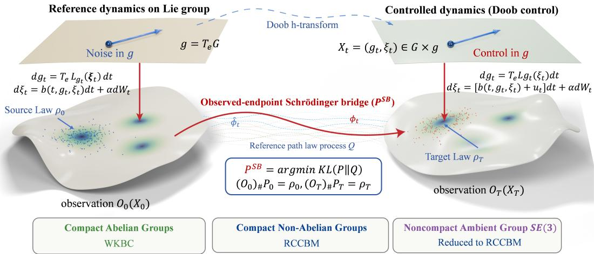  
Figure 1: Overview of the observed-endpoint kinetic Schrodinger bridge on ¨ G × g. The reference dynamics are transformed through the Doob control to match the prescribed endpoint observations. WKBC exploits an explicit wrapped kinetic kernel on compact Abelian groups, whereas RCCBM uses endpoint calibration and conditional-control matching on compact non-Abelian groups and on compact reductions of rigid frame data.

Contributions This work makes three main contributions.

(i) Observed-endpoint kinetic bridges. We develop Schrodinger bridges on Lie group mani-¨ folds under general endpoint observations, where latent velocities are selected through entropy projection. Subject to the endpoint-kernel condition, we prove two-sided scaling and derive the kinetic Doob representation.

(ii) Structure-adapted bridge computation. WKBC provides an explicit computational scheme for compact Abelian groups, while RCCBM addresses compact non-Abelian groups via endpoint calibration and reciprocal conditional-control matching. We further establish a bounded modular conditional path-law consistency bound and employ compact gauge reduction for rigid frame data.

(iii) Scientific validation. Experiments on protein and RNA torsions, SO(3), U(n), and the Protein Conformational Transition Pathway Generation task constructed from mdCATH trajectories provide quantitative validation across the evaluated settings. Ablation studies and numerical consistency checks further corroborate the model design and the predicted modular error behavior.

## 2 RELATED WORK

This section reviews the literature most closely related to ours, focusing on Schrodinger bridges and¨ reciprocal matching, generative modeling on manifolds and Lie groups, kinetic Lie group dynamics, and Schrodinger bridges on geometric state spaces.¨

Schrodinger bridges and reciprocal matching¨ The Schrodinger problem originated as an en-¨ tropy projection of a reference stochastic process onto prescribed endpoint laws (Schrodinger¨ , 1931; Follmer¨ , 1988), and was subsequently connected to optimal transport and stochastic control (Leonard ´ , 2014; Chen et al., 2021; Pavon & Wakolbinger, 1991). This viewpoint leads to computational formulations tailored to generative modeling: De Bortoli et al. (Bortoli et al., 2021) used iterative proportional fitting in Diffusion Schrodinger Bridge, Shi et al. (¨ Shi et al., 2023) developed simulation-based bridge matching, and Liu et al. (Liu et al., 2024) formulated generalized bridge matching through conditional stochastic optimal control. More recent approaches have studied adjoint/corrector constructions (Liu et al., 2025) and plug-in estimation of bridge drifts from entropic potentials (Pooladian & Niles-Weed, 2025). These developments progressively shift computation from explicit potential iteration toward learning conditional or controlled dynamics while retaining the same two-endpoint path-space objective. In parallel, kinetic formulations incorporate auxiliary velocity or momentum variables into the reference dynamics. Chiarini et al. (Chiarini et al., 2022) analyzed kinetic Schrodinger problems with prescribed position marginals and latent¨ velocities, while Chen et al. (Chen et al., 2023) developed a phase-space multi-marginal bridge that reconstructed latent momentum from position observations. Peluchetti (Peluchetti, 2023) connected conditioned bridge mixtures, reciprocal classes, and Markov transports. Together, these developments provide the probabilistic basis for our observed-endpoint kinetic formulation and for learning a Markov control from endpoint-conditioned bridge laws.

Manifold and Lie group generative modeling The development of intrinsic generative models has provided the geometric tools needed to model data whose support is not Euclidean. Falorsi et al. (Falorsi et al., 2019) introduced reparameterizable distributions on Lie groups, and Rezende et al. (Rezende et al., 2020) constructed normalizing flows on tori and spheres. Continuous time formulations then extended these ideas to general curved spaces: Mathieu and Nickel (Mathieu & Nickel, 2020) developed Riemannian continuous normalizing flows, while Lou et al. (Lou et al., 2020) formulated neural manifold ODEs. Diffusion and flow methods subsequently provided intrinsic stochastic and transport-based generative mechanisms. De Bortoli et al. (Bortoli et al., 2022) developed score-based generative modeling on Riemannian manifolds, Leach et al. (Leach et al., 2022) specialized diffusion modeling to rotational distributions on SO(3), and Chen and Lipman (Chen & Lipman, 2024) introduced Riemannian Flow Matching as a geometry-aware extension of flow matching (Lipman et al., 2023). Conforti et al. (Conforti et al., 2025) established KLconvergence guarantees for score-based diffusion models. For Lie group data, this paradigm renders rotations and periodic variables intrinsic to the model coordinates, as opposed to extrinsic quantities subject to repeated ambient projection (Zhu et al., 2025). These works establish complementary intrinsic regimes for probabilistic, diffusion, and flow-based modeling; our work, in turn, generalizes this principle while additionally incorporating a two-endpoint entropy projection on the kinetic Lie group state space.

Kinetic Lie group dynamics and Lie algebra auxiliary variables Kong and Tao (Kong & Tao, 2024) analyzed kinetic Langevin Monte Carlo on compact Lie groups, where the momentum evolves in the Lie algebra while the configuration is updated intrinsically on the group. Building on the same geometric separation, Zhu et al. (Zhu et al., 2025) introduced a trivialized momentum diffusion model, using a fixed Lie algebra auxiliary variable for one-marginal diffusion generative modeling. Bertolini et al. (Bertolini et al., 2025) developed generalized score matching on Lie groups for group-valued generation. These studies motivate the use of Lie algebra auxiliary coordinates for stochastic dynamics while preserving the group-valued configuration. By contrast, we develop a general framework that lifts Schrodinger bridges to Lie group manifolds, accommodating two-sided¨ endpoint observations and entropy-based velocity selection.

Schrodinger bridges on manifolds and position of this work¨ Thornton et al. (Thornton et al., 2022) developed Riemannian Diffusion Schrodinger Bridge for manifold-valued state spaces. More¨ recently, Mahmood et al. (Mahmood et al., 2026) formulated Schrodinger bridges for Brownian dif-¨ fusion directly on compact connected Lie groups and established existence and projective uniqueness of the associated Schrodinger system. Our formulation instead uses the ¨ kinetic state space G × g, with intrinsic group reconstruction and stochastic control acting through the Lie algebra velocity, and permits general endpoint observation maps so that unobserved endpoint velocities remain latent. Computationally, WKBC exploits explicit wrapped kinetic kernels on compact Abelian groups, whereas RCCBM uses reciprocal endpoint calibration and conditional-control matching when such kernels are unavailable on compact non-Abelian groups. The present work is therefore positioned as an observed-endpoint kinetic Lie group Schrodinger bridge framework with structure-¨ adapted computational realizations.

Table 1: Core notations shared by WKBC and RCCBM.
<table><tr><td>Symbol</td><td>Meaning</td></tr><tr><td> $x = ( g , \pmb { \xi } ) \in \mathsf { X }$ </td><td>Kinetic state on  ${ \mathsf { G } } \times { \mathfrak { g } } .$ </td></tr><tr><td> $Q , P ^ { \mathrm { S B } }$ </td><td>Reference law and the common observed-endpoint bridge targeted by both algorithms.</td></tr><tr><td> $f _ { 0 } , g _ { T }$ </td><td>Source and terminal endpoint scaling factors.</td></tr><tr><td> $h _ { t } , \widehat { h } _ { t }$ </td><td>Backward Doob factor and forward density factor.</td></tr><tr><td> $\beta = ( \beta _ { 0 } , \beta _ { T } )$ </td><td>Centered endpoint log-potentials used for RCCBM calibration.</td></tr><tr><td> $Q ^ { z } , Q ^ { z , \varepsilon } , P ^ { \beta , \varepsilon }$ </td><td>Exact conditional bridge, mollified conditional teacher law, and canonical Markov mixture.</td></tr><tr><td> ${ \pmb v } ^ { z , \varepsilon } , { \pmb u } ^ { \beta , \varepsilon } , { \pmb u } _ { \theta }$ </td><td>Conditional teacher control, its population Markov Doob control, and the learned forward control.</td></tr></table>

## 3 METHODOLOGY

In Section 1, we introduced the kinetic reference process, the observed-endpoint entropy projection, its two-sided path factorization, and the forward Doob dynamics. We now present the endpoint regularity underlying these objects, derive the remaining marginal and potential identities, and develop WKBC and RCCBM as two computational realizations of the same bridge. All auxiliary regularity conditions and complete theoretical proofs are provided in the Appendix; core notation conventions are summarized in Table 1.

## 3.1 KINETIC GENERATOR AND OBSERVED-ENDPOINT SCHRODINGER SYSTEM ¨

For the kinetic state space introduced in Section 1, assume that G is a finite-dimensional matrix Lie group of dimension d, choose an orthonormal basis $E _ { 1 } , \ldots , E _ { d }$ of ${ \mathfrak { g } } ,$ and let ${ \widetilde { E } } _ { i }$ be the associated left-invariant vector fields. Writing $\pmb { \xi } = \textstyle \sum _ { i } \xi _ { i } E _ { i }$ i, define

$$
A ( g , \pmb { \xi } ) = T _ { e } L _ { g } ( \pmb { \xi } ) , \qquad A F = \sum _ { i = 1 } ^ { d } \xi _ { i } \widetilde { E } _ { i } \pmb { F } .
$$

Then the generator of Eq. (1.3) is

$$
L _ { t } F = A F + \langle \pmb { b } _ { t } , \nabla _ { \pmb { \xi } } F \rangle + \frac { \alpha ^ { 2 } } { 2 } \Delta _ { \pmb { \xi } } F .
$$

The compact group experiments use the kinetic Ornstein–Uhlenbeck specialization

$$
{ \pmb b } ( t , g , { \pmb \xi } ) = - \gamma { \pmb \xi } , \qquad { \pmb \alpha } = \sqrt { 2 \gamma } , \qquad \gamma > 0 .\tag{3.1}
$$

Write

$$
\mathcal { R } _ { 0 T } = ( \mathcal { O } _ { 0 } ( X _ { 0 } ) , \mathcal { O } _ { T } ( X _ { T } ) ) _ { \# } Q .
$$

The exact scaling results use the following uniform endpoint kernel condition; its compact groupmarginal verification and the reference-compatible lift of a prescribed group marginal are deferred to Appendix B.1.

Assumption 3.1 (Observed endpoint kernel condition). The measure $\mathcal { R } _ { 0 T }$ is equivalent to the product measure $\rho _ { 0 } \otimes \rho _ { T }$ , and

$$
k = { \frac { \mathrm { d } { \mathcal { R } } _ { 0 T } } { \mathrm { d } ( \rho _ { 0 } \otimes \rho _ { T } ) } }
$$

satisfies $0 < m \le k \le M < \infty$ almost everywhere.

This endpoint condition turns the observed-endpoint entropy projection into a bounded two-sided scaling problem. We therefore obtain the following well-posedness result.

Theorem 3.2 (Observed endpoint Schrodinger system) ¨ . Under Assumption 3.1, the static endpoint problem

$$
\operatorname* { i n f } _ { \Gamma \in \Pi ( \rho _ { 0 } , \rho _ { T } ) } { \mathrm { K L } } ( \Gamma \| \mathcal { R } _ { 0 T } )
$$

has a unique minimizer $\Gamma ^ { * }$ There exist positive factors $f _ { 0 } , f _ { 0 } ^ { - 1 } \in L ^ { \infty } ( \rho _ { 0 } )$ and $g _ { T } , g _ { T } ^ { - 1 } \in$ $L ^ { \infty } ( \rho _ { T } )$ , unique up to reciprocal scaling, such that

$$
\Gamma ^ { * } ( \mathrm { d } y _ { 0 } \mathrm { d } y _ { T } ) = f _ { 0 } ( y _ { 0 } ) g _ { T } ( y _ { T } ) \mathcal { R } _ { 0 T } ( \mathrm { d } y _ { 0 } \mathrm { d } y _ { T } ) .
$$

With $\begin{array} { r } { \int g _ { T } \mathrm { d } \rho _ { T } = 1 } \end{array}$ , one may choose

$$
\frac { 1 } { M } \leq f _ { 0 } \leq \frac { 1 } { m } , \qquad \frac { m } { M } \leq g _ { T } \leq \frac { M } { m } .
$$

This theorem establishes the well-posed two-sided endpoint scaling used throughout the remainder of the paper. For compact connected G with observations restricted to the group coordinate and continuous strictly positive source, target, and reference group densities, Assumption 3.1 is verified in Lemma B.2. The two-sided bound is used for projective contraction and uniform factor control.

## 3.2 BRIDGE FACTORIZATION

The following result records the marginal and dual-potential identities used by both WKBC and RCCBM algorithms.

Theorem 3.3 (Bridge marginal and dual-potential factorization). Under Assumption 3.1 we have

$$
\begin{array} { r } { P _ { t } ^ { \mathrm { S B } } ( \mathrm { d } x ) = \mathbb { E } _ { Q } [ f _ { 0 } ( \mathcal { O } _ { 0 } ( X _ { 0 } ) ) \mid X _ { t } = x ] h _ { t } ( x ) Q _ { t } ( \mathrm { d } x ) . } \end{array}\tag{3.2}
$$

$$
J f Q _ { t } = q _ { t } \mu , d e f t n e ~ \widehat { h } _ { t } ( x ) = q _ { t } ( x ) \mathbb { E } _ { Q } [ f _ { 0 } ( \mathcal { O } _ { 0 } ( X _ { 0 } ) ) \mid X _ { t } = x ] . \ T h e n
$$

$$
p _ { t } ^ { \mathrm { S B } } = h _ { t } \widehat { h } _ { t } , \qquad \partial _ { t } h _ { t } + L _ { t } h _ { t } = 0 , \qquad \partial _ { t } \widehat { h } _ { t } = L _ { t } ^ { \dagger } \widehat { h } _ { t } ,\tag{3.3}
$$

with

$$
h _ { T } = g _ { T } \circ \mathscr { O } _ { T } , \qquad \widehat { h } _ { 0 } = q _ { 0 } ( f _ { 0 } \circ \mathscr { O } _ { 0 } ) .\tag{3.4}
$$

The regularity conditions and Doob transform calculation under Eqs. (1.4)–(1.5), together with pathstability identities, are collected in Appendix B.2.

## 3.3 TWO COMPUTATIONAL REGIMES

We now introduce the same Schrodinger bridge instantiated under two complementary kernel-access¨ settings: WKBC employs an explicit wrapped kinetic kernel, while RCCBM relies on endpoint calibration together with conditional reference bridges.

Compact Abelian groups: WKBC Let $\mathsf { G } = \mathbb { T } ^ { m } = \mathbb { R } ^ { m } / \Lambda$ , where $\Lambda \subset \mathbb { R } ^ { m }$ is a full-rank lattice defining the torus. The reference dynamics in Eq. (1.3) under the Ornstein–Uhlenbeck specialization (Eq. (3.1)) has a Gaussian lift in $\mathbf { \varmathbb { R } } ^ { m } \times \mathbf { \varmathbb { R } } ^ { m }$ , and periodization over Λ gives the exact kinetic kernel. The full covariance calculation, wrapped joint density, and group-marginal kernel are stated in Lemma B.7; in particular Eq. (B.2) is an explicit observation kernel when only the group coordinate is observed at the endpoints.

For a terminal log-factor $\beta ,$ define

$$
h _ { t } ^ { \beta } ( x ) = \int q _ { T - t } ^ { \mathcal { O } _ { T } } ( y \mid x ) e ^ { \beta ( y ) } \nu _ { T } ( \mathrm { d } y ) .
$$

The explicit wrapped kernel makes this propagated terminal factor computable, turning the abstract bridge factorization above into an explicit control representation. This yields the following corollary.

Corollary 3.4 (Exact WKBC representation). For $\beta ^ { * } = \log g _ { T } ,$ , differentiation under the wrappedkernel integral gives

$$
h _ { t } ^ { \beta ^ { * } } = h _ { t } , \qquad u _ { t } ^ { \mathrm { W K B C } } = \sqrt { 2 \gamma } \nabla _ { \xi } \log h _ { t } ^ { \beta ^ { * } } = \pmb { u } _ { t } ^ { * } .
$$

The forward process must be initialized from

$$
p _ { 0 } ^ { \mathrm { S B } } ( x ) = q _ { 0 } ( x ) f _ { 0 } ( \mathcal { O } _ { 0 } ( x ) ) h _ { 0 } ^ { \beta ^ { * } } ( x ) .
$$

When only the source group coordinate is observed,

$$
P _ { 0 } ^ { \mathrm { S B } } ( \mathrm { d } \pm \mid g ) = \frac { h _ { 0 } ^ { \beta ^ { * } } ( g , \pmb { \xi } ) Q _ { 0 } ( \mathrm { d } \pmb { \xi } \mid g ) } { \int h _ { 0 } ^ { \beta ^ { * } } ( g , \pmb { \eta } ) Q _ { 0 } ( \mathrm { d } \pmb { \eta } \mid g ) } .
$$

The wrapped kernel therefore provides an explicit numerical oracle for the same bridge characterized by Theorems 3.2–3.3. The bridge-weighted score-regression identity and the corresponding kernel/quadrature/Sinkhorn/interpolation error decomposition are provided in Appendix B.3; Proposition B.9 reports the population and numerical consistency statement without an additional occupation-density-ratio constant.

Likelihood-facing WKBC specialization For held-out likelihood evaluation, we use a prior-todata benchmark with the Haar-Gaussian stationary source employed by TDM (Zhu et al., 2025). Let $\nu _ { \mathsf { G } }$ denote the normalized Haar measure on the compact group and define

$$
\varphi _ { d } ( \pmb { \xi } ) = ( 2 \pi ) ^ { - d / 2 } \exp \left( - \frac { 1 } { 2 } \left\| \pmb { \xi } \right\| ^ { 2 } \right) , \qquad \pi ^ { \star } ( \mathrm { d } g \mathrm { d } \pmb { \xi } ) = \nu _ { \sf G } ( \mathrm { d } g ) \varphi _ { d } ( \pmb { \xi } ) \mathrm { d } \pmb { \xi } .
$$

The compact group component of $\pi ^ { \star }$ is Haar-distributed, and its Lie algebra component is standard Gaussian. Following the TDM benchmark data augmentation, each group-valued training datum g is paired independently with $\pmb { \xi } \sim \mathcal { N } ( 0 , I _ { d } )$ . Hence

$$
P _ { 0 } ^ { \mathrm { l i k } } = \pi ^ { \star } , \qquad P _ { T } ^ { \mathrm { l i k } } ( \mathrm { d } g \mathrm { d } \xi ) = \rho _ { \mathrm { t r a i n } } ( \mathrm { d } g ) \varphi _ { d } ( \xi ) \mathrm { d } \xi , \qquad \mathcal { O } _ { 0 } ^ { \mathrm { l i k } } ( g , \xi ) = \mathcal { O } _ { T } ^ { \mathrm { l i k } } ( g , \xi ) = ( g , \xi ) .
$$

This specification defines the likelihood protocol used in the benchmark tables. The scientific bridge experiments use the observed-endpoint formulation above, with latent velocity conditionals determined by the entropy projection.

WKBC obtains the full kinetic marginal score directly from the calibrated wrapped kernel. Besides the backward factor $h _ { t } .$ , the explicit wrapped joint kernel propagates the source factor as

$$
\widehat { h } _ { t } ( x ) = \int _ { \mathsf { X } } q _ { 0 , t } ( x \mid x _ { 0 } ) q _ { 0 } ( x _ { 0 } ) f _ { 0 } ( \mathcal { O } _ { 0 } ( x _ { 0 } ) ) \mu ( \mathrm { d } x _ { 0 } ) ,\tag{3.5}
$$

so that Theorem 3.3 gives

$$
\begin{array} { r } { s _ { t } ^ { \mathrm { W K B C } } ( x ) : = \nabla _ { \xi } \log p _ { t } ^ { \mathrm { S B } } ( x ) = \nabla _ { \xi } \log h _ { t } ( x ) + \nabla _ { \xi } \log \widehat { h } _ { t } ( x ) . } \end{array}\tag{3.6}
$$

Both terms are obtained from the calibrated factors and wrapped kernel. The likelihood evaluator uses this full marginal score, while stochastic WKBC generation uses the forward Doob control in Corollary 3.4. The probability-flow change-of-variables formula and its numerical implementation are given in Appendix A.4.

Compact non-Abelian groups: RCCBM Let G be compact, connected, and non-Abelian. RC-CBM targets the same $P ^ { \mathrm { \check { S } B } }$ without requiring a closed-form transition kernel. The construction has four stages:

1. calibrate the two-sided endpoint reciprocal law;

2. construct finite energy mollified conditional-control teachers;

3. regress one Markov forward control using the canonical teacher mixture and importance correction;

4. perform terminal refinement only under a matching-loss constraint.

The main text keeps the identities that connect these stages; empirical-process assumptions and implementation details are deferred to Appendix B.4.

Endpoint reciprocal calibration Set $Y = ( Y _ { 0 } , Y _ { T } ) = ( { \mathcal O } _ { 0 } ( X _ { 0 } ) , { \mathcal O } _ { T } ( X _ { T } ) )$ . For bounded $\beta =$ $( \beta _ { 0 } , \beta _ { T } )$ , define

$$
Z ( \beta ) = \mathbb { E } _ { \mathcal { R } _ { 0 T } } e ^ { \beta _ { 0 } ( Y _ { 0 } ) + \beta _ { T } ( Y _ { T } ) } ,\tag{3.7}
$$

$$
\frac { \mathrm { d } \Gamma ^ { \beta } } { \mathrm { d } \mathcal { R } _ { 0 T } } = Z ( \beta ) ^ { - 1 } e ^ { \beta _ { 0 } ( y _ { 0 } ) + \beta _ { T } ( y _ { T } ) } ,\tag{3.8}
$$

$$
\begin{array} { r } { \mathcal { D } ( \beta ) = \mathbb { E } _ { \rho _ { 0 } } \beta _ { 0 } + \mathbb { E } _ { \rho _ { T } } \beta _ { T } - \log Z ( \beta ) . } \end{array}\tag{3.9}
$$

We fix the gauge by

$$
\mathbb { E } _ { \rho _ { 0 } } \beta _ { 0 } = 0 , \qquad \mathbb { E } _ { \rho _ { T } } \beta _ { T } = 0 .\tag{3.10}
$$

Let $Q ^ { y }$ be the conditional reference law given $Y = y ,$ , and define $\begin{array} { r } { P _ { \Gamma } = \int Q ^ { y } \Gamma ( \mathrm { d } y ) ; } \end{array}$ ; the entropydisintegration justification is presented in Lemma B.11 in Appendix B.4. With the gauge fixed, the centered dual provides a direct parameterization of the reciprocal endpoint correction. Its relation to the Schrodinger bridge is given by the following theorem.¨

Theorem 3.5 (Endpoint dual and reciprocal correction). Under Assumption 3.1, D has a unique maximizer $\beta ^ { * }$ in the centered class, $\Gamma ^ { \beta ^ { * } } = \Gamma ^ { * }$ , and the endpoint tilt agrees with the Schrodinger¨ factors up to the fixed gauge. Moreover, for every bounded centered β, the following holds

$$
\begin{array} { r } { \mathcal { D } ( \beta ^ { * } ) - \mathcal { D } ( \beta ) = \mathrm { K L } \big ( \Gamma ^ { * } \| \Gamma ^ { \beta } \big ) = \mathrm { K L } ( P ^ { \mathrm { S B } } \| P ^ { \beta } ) , \qquad P ^ { \beta } : = P _ { \Gamma ^ { \beta } } . } \end{array}\tag{3.11}
$$

Hence endpoint calibration is not an auxiliary heuristic: its population dual gap is exactly a path-law KL error. The empirical dual, half-bridge interpretation, and calibration consistency bound are given in Appendix B.4.

Exact conditional-control identity Once the reciprocal endpoint law has been calibrated, the next step is to identify its Markov forward control from endpoint-conditioned reference bridges. Let $Z _ { c } \dot { = } ( X _ { 0 } , Y _ { T } ) , \dot { \bar { \Lambda } } ^ { \beta } = ( Z _ { c } ) _ { \# } P ^ { \beta }$ , and let $Q ^ { z }$ be the conditional reference law given $Z _ { c } =$ $z = ( x _ { 0 } , y )$ . Denoting the reference observation density by $r _ { t , T } ^ { \mathcal { O } _ { T } } ( y \mid x )$ , this leads to the following conditional-control identity.

Theorem 3.6 (Exact conditional-control matching). Under the conditional-kernel regularity in Assumption $B . I 5 ,$ , we have

$$
P ^ { \beta } = \int Q ^ { z } \Lambda ^ { \beta } ( \mathrm { d } z ) .\tag{3.12}
$$

Its backwardfactor and Markov Doob control are

$$
h _ { t } ^ { \beta } ( x ) = \int r _ { t , T } ^ { \mathcal { O } _ { T } } ( y \mid x ) e ^ { \beta _ { T } ( y ) } \nu _ { T } ( \mathrm { d } y ) ,\tag{3.13}
$$

$$
\begin{array} { r } { \pmb { u } _ { t } ^ { \beta } = \alpha \nabla _ { \xi } \log h _ { t } ^ { \beta } . } \end{array}\tag{3.14}
$$

For $z = ( x _ { 0 } , y )$ , the exact conditional bridge has preterminal control

$$
\pmb { v } _ { t } ^ { z } ( x ) = \alpha \nabla _ { \pmb { \xi } } \log r _ { t , T } ^ { \mathcal { O } _ { T } } ( y \mid x ) , \qquad t < T ,\tag{3.15}
$$

and

$$
\mathbb { E } [ { \pmb v } _ { t } ^ { Z _ { c } } ( X _ { t } ) \mid X _ { t } = x ] = { \pmb u } _ { t } ^ { \beta } ( x ) , \qquad P _ { t } ^ { \beta } { \ - } a . e .
$$

Equivalently, on every preterminal strip the conditional squared-error risk has excess risk

$$
\mathcal { L } _ { \beta , \tau } ( \boldsymbol { u } ) - \mathcal { L } _ { \beta , \tau } ( \boldsymbol { u } ^ { \beta } ) = \int _ { 0 } ^ { T - \tau } \lambda _ { \tau } ( t ) \int \left. \boldsymbol { u } - \boldsymbol { u } _ { t } ^ { \beta } \right. ^ { 2 } P _ { t } ^ { \beta } ( \mathrm { d } x ) \mathrm { d } t .\tag{3.16}
$$

The identity shows why conditional teachers can recover the Markov Doob field. Because pointpinned controls can become singular as $t  T$ , RCCBM uses the mollified terminal condition below to construct finite-energy teachers on the training horizon.

Canonical mollified teachers Let $\kappa _ { \varepsilon } ( y , y ^ { \prime } ) > 0$ be a continuous approximate identity and define, for $z = ( x _ { 0 } , y )$

$$
\frac { \mathrm { d } Q ^ { z , \varepsilon } } { \mathrm { d } Q ^ { x _ { 0 } } } = \frac { \kappa _ { \varepsilon } ( y , \mathcal { O } _ { T } ( X _ { T } ) ) } { Z _ { z , \varepsilon } } , \qquad Z _ { z , \varepsilon } = \mathbb { E } _ { Q ^ { x _ { 0 } } \kappa _ { \varepsilon } ( y , \mathcal { O } _ { T } ( X _ { T } ) ) . }\tag{3.17}
$$

With

$$
g _ { T , \varepsilon } ^ { \beta } ( y ^ { \prime } ) = \int \kappa _ { \varepsilon } ( y , y ^ { \prime } ) e ^ { \beta _ { T } ( y ) } \nu _ { T } ( \mathrm { d } y ) ,
$$

and

$$
Z _ { \varepsilon } ( \beta ) = \mathbb { E } _ { Q } \left[ e ^ { \beta _ { 0 } ( \mathcal { O } _ { 0 } ( X _ { 0 } ) ) } g _ { T , \varepsilon } ^ { \beta } ( \mathcal { O } _ { T } ( X _ { T } ) ) \right] ,
$$

define the canonical condition law

$$
\Lambda ^ { \beta , \varepsilon } ( \mathrm { d } x _ { 0 } \mathrm { d } y ) = \frac { e ^ { \beta _ { 0 } ( \mathcal { O } _ { 0 } ( x _ { 0 } ) ) + \beta _ { T } ( y ) } Z _ { ( x _ { 0 } , y ) , \varepsilon } } { Z _ { \varepsilon } ( \beta ) } Q _ { 0 } ( \mathrm { d } x _ { 0 } ) \nu _ { T } ( \mathrm { d } y ) .\tag{3.18}
$$

The $Z _ { ( x _ { 0 } , y ) , }$ factor is essential. Then, it gives

$$
P ^ { \beta , \varepsilon } : = \int Q ^ { z , \varepsilon } \Lambda ^ { \beta , \varepsilon } ( \mathrm { d } z ) , \qquad { \frac { \mathrm { d } P ^ { \beta , \varepsilon } } { \mathrm { d } Q } } = { \frac { e ^ { \beta _ { 0 } ( { \mathcal { O } } _ { 0 } ( X _ { 0 } ) ) } g _ { T , \varepsilon } ^ { \beta } ( { \mathcal { O } } _ { T } ( X _ { T } ) ) } { Z _ { \varepsilon } ( \beta ) } } .\tag{3.19}
$$

Thus the conditional teacher mixture is a Markov reciprocal law. Its Markov structure identifies the corresponding Doob control through conditional regression, leading to the following proposition.

Proposition 3.7 (Mollified population regression). Let $\mathbf { \boldsymbol { v } } ^ { z , \varepsilon }$ be the Doob control of $Q ^ { z , \varepsilon }$ , and let $\mathbf { \delta } _ { \pmb { u } } \beta , \bar { \varepsilon }$ be the Doob control of $\bar { \boldsymbol { P } } ^ { \bar { \beta } , \varepsilon }$ . Then

$$
\mathbb { E } [ { \pmb v } _ { t } ^ { Z , \varepsilon } ( X _ { t } ) \mid X _ { t } = x ] = { \pmb u } _ { t } ^ { \beta , \varepsilon } ( x ) .
$$

For any time density $\lambda _ { \mathrm { b m } } \geq \underline { { \lambda } } > 0$ , the population matching loss satisfies

$$
\mathcal { L } _ { \beta , \varepsilon } ( \boldsymbol { u } ) - \mathcal { L } _ { \beta , \varepsilon } ( \boldsymbol { u } ^ { \beta , \varepsilon } ) = \int _ { 0 } ^ { T } \lambda _ { \mathrm { b m } } ( t ) \int \left\| \boldsymbol { u } - \boldsymbol { u } _ { t } ^ { \beta , \varepsilon } \right\| ^ { 2 } P _ { t } ^ { \beta , \varepsilon } ( \mathrm { d } x ) \mathrm { d } t .\tag{3.20}
$$

The production time sampler is the explicit preterminal/terminal-window mixture specified in $\mathsf { A p - }$ pendix $\mathrm { A } . 2 .$ . Its density has a deterministic lower bound obtained directly from the two mixture components, so the constant entering Theorem 3.8 is derived from the sampling design rather than tuned independently.

This proposition is the central RCCBM learning identity: finite-energy conditional teachers can be pooled without changing the population target away from the Markov Doob control. Conditional Stochastic Optimal Control (CondSOC) (Liu et al., 2024), replay importance correction, clipping, constrained refinement, and the calibrated empirical initial law are implementation devices for approximating this population objective; their precise definitions are provided in Appendix B.4 and Algorithm 2.

Conditional path-law error propagation Let ${ \widehat { \beta } } _ { N }$ be the learned endpoint potential and define

$$
\begin{array} { r l } & { \varepsilon _ { \mathrm { e n d } , N } : = \mathrm { K L } ( \Gamma ^ { * } \| \Gamma ^ { \widehat \beta _ { N } } ) , \qquad \varepsilon _ { \mathrm { m o l } , N } : = d _ { \mathrm { B L } } \big ( P ^ { \widehat \beta _ { N } , \varepsilon _ { N } } , P ^ { \widehat \beta _ { N } } \big ) , } \\ & { \qquad \Delta _ { \mathrm { c t r l } , N } : = \mathcal { L } _ { \widehat \beta _ { N } , \varepsilon _ { N } } \big ( { \pmb u } _ { \theta _ { N } } \big ) - \mathcal { L } _ { \widehat \beta _ { N } , \varepsilon _ { N } } \big ( { \pmb u } ^ { \widehat \beta _ { N } , \varepsilon _ { N } } \big ) . } \end{array}
$$

The remaining assumptions are stated together in Appendix B.4: endpoint calibration, conditionalkernel regularity, teacher/empirical-risk approximation, uniform mollification, initial-law stability, and Lie-Trotter convergence. These conditions connect the preceding calibration and regression stages to the implemented generator, leading to the following path-law bound.

Theorem 3.8 (Conditional RCCBM path-law error propagation). Under Assumptions B.13, B.15, B.18, B.19, and B.22, we have

$$
\Delta _ { \mathrm { c t r l } , N } \leq \varepsilon _ { \mathrm { a p p } , N } + \varepsilon _ { \mathrm { o p t } , N } + 4 \varepsilon _ { \mathrm { g e n } , N } + 4 \varepsilon _ { \mathrm { t e a c h } , N } + 2 \varepsilon _ { \mathrm { i w } , N } + 2 \varepsilon _ { \mathrm { c l i p } , N } + \delta _ { \mathrm { r e f } , N } .\tag{3.21}
$$

$I f P _ { N , \Delta t } ^ { \theta _ { N } }$ is the implemented generator initialized from the calibrated empirical initial law in Eq. (B.13), then

$$
d _ { \mathrm { B L } } ( P ^ { \mathrm { S B } } , P _ { N , \Delta t } ^ { \theta _ { N } } ) \leq \sqrt { 2 \varepsilon _ { \mathrm { e n d } , N } } + \varepsilon _ { \mathrm { m o l } , N } + \sqrt { \frac { \Delta _ { \mathrm { c t r l } , N } } { \underline { { \lambda } } } }
$$

$$
+ C _ { \mathrm { i n i t } } \varepsilon _ { \mathrm { i n i t } , N } + \varepsilon _ { \mathrm { d i s c } , N } .\tag{3.22}
$$

Consequently, if the component errors specified in the Appendix vanish, then $P _ { N , \Delta t } ^ { \theta _ { N } } \Rightarrow P ^ { \mathrm { S B } } i n$ bounded-Lipschitz path distance in probability.

Theorem 3.8 propagates identifiable module-level errors through the RCCBM pipeline to the final path law under the stated consistency assumptions for the individual modules. At the population level, exact endpoint calibration and exact mollified regression recover $P ^ { \beta ^ { * } , \varepsilon }$ , and the mollification result in Proposition B.20 gives

$$
d _ { \mathrm { B L } } ( P ^ { \beta ^ { * } , \varepsilon } , P ^ { \mathrm { S B } } ) \to 0 \qquad ( \varepsilon \to 0 ) .
$$

The preceding theorem is stated at a high level because RCCBM is intended for non-Abelian settings in which the transition kernel is not explicitly available. The assumptions are nevertheless jointly realizable in a concrete model class. The following specialization uses the torus, where the wrapped kinetic kernel makes every population object explicit and permits a direct verification of the approximation chain.

Corollary 3.9 (Concrete torus sieve consistency). Let ${ \mathsf { G } } = \mathbb { T } ^ { m } , { \mathcal { O } } _ { 0 } = { \mathcal { O } } _ { T } = g _ { \mathsf { \Omega } }$ , and let the reference process be Eq. (1.3) with the Ornstein–Uhlenbeck specialization $( 3 . 1 )$ . Assume that the source, target, and reference group-marginal densities are $\hat { C } ^ { 2 }$ , strictly positive, and bounded above and below with respect to normalized Haar measure. Let $\kappa _ { \varepsilon }$ be the periodic heat kernel on $\mathbb { T } ^ { m }$ , with $\varepsilon _ { N }  0 .$

For endpoint calibration, let $\boldsymbol { B } _ { N }$ be the doubly centered trigonometric-polynomial sieve with frequencies $\| \boldsymbol { k } \| _ { \infty } \le K _ { N }$ , restricted to a fixed bounded Lipschitz ball containing the Fejer approxi-´ mants of the exact endpoint potentials. For direct control regression, let $\mathcal { U } _ { N }$ be a clipped tensorproduct sieve, restricted to a common Lipschitz/linear-growth envelope, builtfrom periodic trigonometric functions in $^ { g , }$ splines in t, and polynomials in $\boldsymbol { \xi }$ on $\{ \| \pmb { \xi } \| \le R _ { N } \}$ , with $R _ { N } , B _ { N } \to \infty .$ Denote

$$
d _ { N } = \dim ( { \cal B } _ { N } ) , \qquad p _ { N } = \dim ( { \cal U } _ { N } ) ,
$$

and let

$$
M _ { N } : = 1 + \mathbb { E } _ { \mathfrak { M } ^ { \beta ^ { * } , \varepsilon _ { N } } } \left[ \Vert \pmb { v } ^ { Z , \varepsilon _ { N } } \Vert ^ { 4 } \right] .
$$

Choose the sieve growth and mollification schedule slowly enough that

$$
\frac { d _ { N } \log N } { N } \to 0 , \qquad \frac { M _ { N } B _ { N } ^ { 4 } p _ { N } \log N } { N } \to 0 , \qquad B _ { N } ^ { 2 } e ^ { - c R _ { N } ^ { 2 } } \to 0
$$

for some $c > 0$ . Use the canonical mollified teacher law, available from the wrapped kernel, so that replay importance weights are identically one; use exact empirical optimization over the compactfinite-dimensional sieves; form the calibrated self-normalized initial pool from N independent reference samples; and let the Lie–Trotter step satisfy $\Delta t _ { N }  0 .$

Then Assumptions B.13, B.15, B.18, B.19, and B.22 hold for this torus sieve regime. Consequently,

$$
\begin{array} { r } { d _ { \mathrm { B L } } \Big ( P ^ { \mathrm { S B } } , P _ { N , \Delta t _ { N } } ^ { \theta _ { N } } \Big ) \longrightarrow 0 \qquad i n p r o b a b i l i t y . } \end{array}
$$

Corollary 3.9 provides a concrete torus specialization of the RCCBM error-propagation theorem. Its proof in Appendix B.10 verifies the endpoint, mollification, empirical-risk, initial-law, and discretization requirements using the explicit wrapped kernel and finite-dimensional sieve construction.

## 3.4 REDUCTION OF $S E ( 3 ) ^ { N }$ DATA

For rigid frames $h _ { i } = ( \mathbf { R } _ { i } , p _ { i } ) \in S E ( 3 )$ , gauge fixing by

$$
\widetilde { h } _ { i } = h _ { 1 } ^ { - 1 } h _ { i } , \qquad i = 2 , \dots , N ,\tag{3.23}
$$

removes the global rigid motion. Retained relative rotations and periodic internal coordinates define the compact learning group

$$
\mathsf { G } _ { \mathrm { r e d } } = { S O ( 3 ) } ^ { N - 1 } \times \mathbb { T } ^ { K } , \qquad \mathsf { g } _ { \mathrm { r e d } } = \mathfrak { s o } ( 3 ) ^ { N - 1 } \times \mathbb { R } ^ { K } ,
$$

with reduction

$$
\mathcal { R } _ { \mathrm { r e d } } ( h _ { 1 : N } ) = ( { \mathbf { R } _ { 1 } ^ { \top } \mathbf { R } _ { 2 } } , \ldots , { \mathbf { R } _ { 1 } ^ { \top } \mathbf { R } _ { N } } , \theta _ { 1 } , \ldots , \theta _ { K } ) .\tag{3.24}
$$

A deterministic reconstruction may use

$$
\pmb { p } _ { i + 1 } ( z ) = \pmb { p } _ { i } ( z ) + \mathbf { R } _ { i } ( z ) \pmb { b } _ { i } .\tag{3.25}
$$

The following proposition formalizes how this reduction transfers the path-law comparison between the reduced and reconstructed representations.

Proposition 3.10 (Compact reduction and path-law pushforward). Under the reducedrepresentation assumption in Appendix $B . 5 ,$ , the stochastic learning problem is an RCCBM problem on $\mathsf { G } _ { \mathrm { r e d } } .$ . If the reconstruction is a $C ^ { 2 } { - } d i f f$ eomorphism onto the modeled conformation manifold, the induced path map preserves relative entropy,

$$
\mathrm { K L } ( P _ { \mathrm { r e d } } ^ { \mathrm { S B } } \Vert \widehat { P } _ { \mathrm { r e d } } ) = \mathrm { K L } ( ( \Phi _ { \mathrm { r e d } } ) _ { \# } P _ { \mathrm { r e d } } ^ { \mathrm { S B } } \Vert ( \Phi _ { \mathrm { r e d } } ) _ { \# } \widehat { P } _ { \mathrm { r e d } } ) .\tag{3.26}
$$

Without injectivity, only the data-processing inequality

$$
\mathrm { K L } ( ( \mathcal { R } _ { \mathrm { r e d } } ) _ { \# } P \| ( \mathcal { R } _ { \mathrm { r e d } } ) _ { \# } Q ) \leq \mathrm { K L } ( P \| Q )\tag{3.27}
$$

is available.

Accordingly, the stochastic guarantee is a guarantee on the compact reduced state space. Cartesian reconstruction is postprocessing and must be evaluated separately whenever it is approximate.

## 4 EXPERIMENTS

In this section, we conduct extensive experiments to validate the two computational regimes separately: explicit-kernel WKBC and sample-based RCCBM. Each experiment specifies the ordered endpoint pair, observation maps, reference process, calibrated initial-state sampler, and integration grid. The compact Abelian benchmarks additionally report held-out Negative Log-Likelihood (NLL), while the $S O ( 3 )$ benchmark reports log-likelihood under the common Trivialized Momentum Diffusion Models (TDM) benchmark convention (Zhu et al., 2025). RCCBM is evaluated using intrinsic feature Maximum Mean Discrepancy (MMD), geodesic Wasserstein proxies, mode coverage, local precision and coverage radii, endpoint-calibration diagnostics, held-out teacher error, post-refinement matching error, normalized-control energy, and group-constraint error. For Protein Conformational Transition Pathway Generation on mdCATH trajectories, we additionally report target-aware tortuosity and normalized Lie algebra roughness to characterize path detour and local fluctuation in the reduced state space.

## 4.1 EXPERIMENTAL PROTOCOL

For the compact Abelian experiments, we use a common set of endpoint, path, and geometric diagnostics across methods, together with held-out Negative Log-Likelihood (NLL) for benchmark comparison. We compare WKBC with Riemannian Diffusion Models (RDM) (Huang et al., 2022), Riemannian Flow Matching (RFM) (Chen & Lipman, 2024), and TDM (Zhu et al., 2025). RDM extends continuous-time diffusion generative modeling to general Riemannian manifolds, RFM constructs geometry-aware flow-matching dynamics on manifolds, and TDM exploits the trivialization structure of Lie groups to perform diffusion generative modeling with auxiliary variables represented in a fixed Lie algebra. These baselines are selected because they are representative generative methods specifically designed for manifold- or Lie-group-valued data, thereby providing geometryaware comparisons with WKBC. For all compact Abelian benchmark experiments, WKBC and the RDM, RFM, and TDM baselines are trained from the same simple prior toward the same target data distribution.

For compact non-Abelian Lie groups, including $S O ( 3 )$ and $U ( n )$ , we evaluate the model using log-likelihood where a common likelihood protocol is available, together with intrinsic geometric and distributional diagnostics and qualitative visualizations. All production feature maps and other evaluation parameters are fixed before checkpoint selection to prevent the evaluation protocol from being influenced by model selection.

The final RCCBM checkpoint is selected by a fixed validation distribution objective. Endpoint dual, teacher, control matching, and sample quality diagnostics are recomputed after the terminal refinement stage so that all reported quantities correspond to the same final controller.

Table 2: Held-out negative log-likelihood (NLL) on the four two-dimensional protein torsion datasets and the seven-dimensional RNA torsion dataset. NLL is evaluated from the prior-to-data Haar-Gaussian benchmark specialization described in Section 4.1. Lower NLL indicates better likelihood fit. Boldface indicates the best-performing value.
<table><tr><td>Setting</td><td>General (2D)</td><td>Glycine (2D)</td><td>Proline (2D)</td><td>Pre-Pro (2D)</td><td>RNA (7D)</td></tr><tr><td> $\overbrace { \mathrm { \bf { M o d e l } } } ^ { \mathrm { D a t a s e t s i z e } }$ </td><td>138208</td><td>13283</td><td>7634</td><td>6910</td><td>9478</td></tr><tr><td>RDM (Huang et al., 2022)</td><td>1.04</td><td>1.97</td><td>0.12</td><td>1.24</td><td>-3.70</td></tr><tr><td>RFM (Chen &amp; Lipman, 2024)</td><td>1.01</td><td>1.90</td><td>0.15</td><td>1.18</td><td>-5.20</td></tr><tr><td>TDM (Zhu et al., 2025)</td><td>0.69</td><td>1.04</td><td>-0.60</td><td>0.52</td><td>-6.86</td></tr><tr><td>WKBC</td><td>0.59</td><td>0.84</td><td>-1.02</td><td>0.17</td><td>-8.86</td></tr></table>

Table 3: Endpoint and path diagnostics for the compact Abelian torsion tasks. ↓ (↑) indicates that lower (higher) values are better.
<table><tr><td>Setting</td><td>Method</td><td>GeoRMSE↓</td><td>Sinkhorn W2↓</td><td>Rama JSD↓</td><td>ValidRate ↑</td><td>Path energy ↓</td></tr><tr><td rowspan="2">General</td><td>TDM</td><td>1.504</td><td>0.282</td><td>0.277</td><td>0.595</td><td>2.944</td></tr><tr><td>WKBC</td><td>1.483</td><td>0.221</td><td>0.125</td><td>0.873</td><td>1.634</td></tr><tr><td rowspan="2">Glycine</td><td>TDM</td><td>1.915</td><td>0.384</td><td>0.481</td><td>0.300</td><td>2.883</td></tr><tr><td>WKBC</td><td>1.874</td><td>0.296</td><td>0.243</td><td>0.701</td><td>1.672</td></tr><tr><td rowspan="2">Proline</td><td>TDM</td><td>1.453</td><td>0.914</td><td>0.238</td><td>0.769</td><td>5.740</td></tr><tr><td>WKBC</td><td>1.421</td><td>0.221</td><td>0.102</td><td>0.907</td><td>2.395</td></tr><tr><td rowspan="2">Pre-Pro</td><td>TDM</td><td>1.123</td><td>0.324</td><td>0.484</td><td>0.311</td><td>2.280</td></tr><tr><td>WKBC</td><td>1.084</td><td>0.258</td><td>0.219</td><td>0.760</td><td>1.532</td></tr><tr><td rowspan="2">RNA</td><td>TDM</td><td>0.843</td><td>1.024</td><td>0.335</td><td>0.511</td><td>8.169</td></tr><tr><td>WKBC</td><td>0.854</td><td>0.627</td><td>0.201</td><td>0.733</td><td>5.134</td></tr></table>

The NLL/LL tables use the prior-to-data likelihood protocol defined in Section 3.3. Held-out likelihoods are evaluated by the intrinsic probability-flow change-of-variables construction used by TDM (Zhu et al., 2025), using the same auxiliary Gaussian variable and group-volume convention. We report

$$
\mathrm { L L } = \frac { 1 } { N _ { \mathrm { t e s t } } } \sum _ { i = 1 } ^ { N _ { \mathrm { t e s t } } } \widehat { \ell } ( g _ { i } ) , \qquad \mathrm { N L L } = - \mathrm { L L } .
$$

WKBC obtains the required full marginal score from Eq. (3.6); RCCBM obtains it from an auxiliary score estimator fitted to trajectories generated by the frozen final controller. Complete formulas and proofs are given in Appendix A.4.

## 4.2 COMPACT ABELIAN TORSION BRIDGES

Protein backbone torsion pairs are modeled on $S O ( 2 ) ^ { 2 } \ \simeq \ \mathbb { T } ^ { 2 } .$ , and RNA torsion profiles on $S O ( 2 ) ^ { 7 } \simeq  { \mathbb { T } } ^ { 7 }$ . We compare WKBC with other baselines under the same benchmark data split and report both held-out NLL and geometric diagnostics. Table 2 reports the held-out NLL values.

Table 2 uses the likelihood protocol defined in Section 4.1: WKBC is instantiated from $\pi ^ { \star }$ to the training torsion law, and held-out samples are scored with the TDM-aligned probability-flow evaluator in Appendix A.4. Table 3 reports the corresponding two-endpoint bridge diagnostics.

As shown in Table 2, WKBC attains the lowest NLL in every dataset column. Relative to TDM, the absolute NLL reductions are 0.10, 0.20, 0.42, 0.35, and 2.00 on General, Glycine, Proline, Pre-Pro, and RNA, respectively. The consistent likelihood improvement indicates that the explicit wrapped-kernel construction captures periodic endpoint densities without sacrificing the intrinsic torus geometry. This supports the advantage of WKBC when an explicit kinetic kernel is available, because the kernel provides a direct representation of the bridge on the torus.

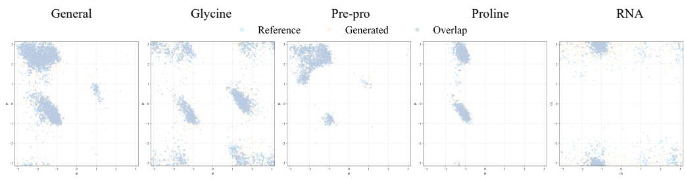  
Figure 2: Reference and WKBC-generated endpoint samples in wrapped angular coordinates for the General, Glycine, Pre-Pro, Proline, and RNA torsion tasks, together with their overlap. More overlap reflects improved generative performance. The two-dimensional views visualize the agreement of the dominant periodic support between the generated and reference distributions.

Table 3 separates distributional endpoint fidelity from paired path diagnostics. Geodesic Root-Mean-Square Error (GeoRMSE) is computed only from the pairing file fixed before training and released with the evaluator, which is a paired diagnostic. To ensure a fair comparison, all methods are evalu ated using the same reference process, diffusion coefficient, and other relevant experimental settings.

Table 3 shows that WKBC improves Sinkhorn distance, Ramachandran JSD, ValidRate, and path energy over TDM on all five reported tasks. GeoRMSE is also lower on the four protein subsets; on RNA it is slightly higher, 0.854 versus 0.843. Taken together, these metrics show that the likelihood gains are accompanied by improved target-distribution fidelity, geometrically valid trajectories, and lower control-induced path cost.

Fig. 2 provides the corresponding visualization of the generated and target torsion support. Across the five tasks, the generated samples closely overlap with the reference distributions in the dominant high-density regions and reproduce their principal multimodal structures, indicating that WKBC effectively captures the periodic endpoint geometry and the major modes of the target torsion distributions.

## 4.3 VERIFICATION AGAINST AN EXPLICIT WRAPPED BRIDGE

To verify whether RCCBM can recover the correct intermediate path distributions and approximate the optimal Doob control provided by WKBC, we perform the numerical consistency experiment. Since higher-order terms in the Magnus expansion generally do not vanish on non-Abelian groups, the RCCBM algorithm is developed for settings in which an explicit wrapped transition kernel is unavailable during training. Accordingly, this experiment applies RCCBM with endpoint calibration and conditional-control matching to recover the same Schrodinger bridge. We then compare¨ RCCBM with the explicit-kernel WKBC reference on a two-dimensional torus task, where such a high-accuracy reference bridge is available. The comparison evaluates source and target discrepancies, intermediate one-time marginals, and forward-control regression against the WKBC optimal control on a common WKBC path pool, which can be expressed as the following formulation:

$$
\widehat { \mathcal { E } } _ { \mathrm { F } } ( \boldsymbol { u } ) = \frac { 1 } { N _ { \mathrm { p a t h } } N _ { t } } \sum _ { n = 1 } ^ { N _ { \mathrm { p a t h } } } \sum _ { k = 1 } ^ { N _ { t } } \left. \boldsymbol { u } ( t _ { k } , \boldsymbol { X } _ { t _ { k } } ^ { ( n ) } ) - \boldsymbol { u } _ { \mathrm { W K B C } } ^ { \star } ( t _ { k } , \boldsymbol { X } _ { t _ { k } } ^ { ( n ) } ) \right. ^ { 2 } ,\tag{4.1}
$$

where $\pmb { u } _ { \mathrm { W K B C } } ^ { \star }$ is the high-accuracy wrapped-kernel control used as the common numerical teacher.   
Thus the WKBC row measures the error of its finite numerical realization.

As summarized in Table 4, WKBC achieves lower discrepancies across all four metrics. Nevertheless, RCCBM remains within the same numerical scale as the explicit reference, indicating that it can recover a reasonable approximation to the same Schrodinger bridge. In particular, the learned¨ RCCBM control provides a close approximation to the optimal Doob control induced by WKBC.

Table 4: Numerical verification of RCCBM against a high-accuracy WKBC reference bridge on $\mathbb { T } ^ { 2 }$ The comparison reports source and target Sinkhorn discrepancies, the mean intermediate-marginal Sinkhorn discrepancy, and the forward-control regression error $\widehat { E } _ { F } .$ . Lower values are better.
<table><tr><td>Method</td><td>Source Sinkhorn ↓</td><td>Target Sinkhorn ↓</td><td>Mean int. Sinkhorn ↓</td><td> $\widehat { \mathcal { E } } _ { \mathrm { F } } \downarrow$ </td></tr><tr><td>WKBC</td><td>0.104</td><td>0.111</td><td>0.108</td><td>0.086</td></tr><tr><td>RCCBM</td><td>0.158</td><td>0.159</td><td>0.160</td><td>0.122</td></tr></table>

Table 5: Log-likelihood comparison on the four $S O ( 3 )$ benchmarks under the common TDM evaluation protocol. RSGM, TDM, and RCCBM are evaluated using the same likelihood convention; higher values indicate better likelihood fit.
<table><tr><td>Experiment</td><td>RSGM (Bortoli et al., 2022)</td><td>TDM (Zhu et al., 2025)</td><td>RCCBM</td></tr><tr><td>SO(3)-GMM32</td><td>0.200</td><td>0.292</td><td>0.328</td></tr><tr><td>SO(3)-GMM64</td><td>0.185</td><td>0.174</td><td>0.378</td></tr><tr><td>SO(3)-GMM128</td><td>0.108</td><td>0.112</td><td>0.200</td></tr><tr><td>SO(3)-RingBand</td><td>0.401</td><td>0.428</td><td>0.834</td></tr></table>

## 4.4 COMPACT NON-ABELIAN SO(3) AND $U ( n )$ BRIDGES

For SO(3)-GMM32, the RSGM and TDM log-likelihood values in Table 5 are taken directly from the TDM study (Zhu et al., 2025), which reports the RSGM baseline of De Bortoli et al. (Bortoli et al., 2022) alongside TDM. Our SO(3)-GMM32 benchmark uses the same dataset realization as the released TDM experimental code, so the published values are evaluated on the same underlying rotation distribution. For SO(3)-GMM64, $S O ( 3 )$ -GMM128, and $S O ( 3 )$ -RingBand, the RSGM and TDM entries are our retrained and re-evaluated baselines using the corresponding methods (Bortoli et al., 2022; Zhu et al., 2025) under the same dataset construction and likelihood protocol used for RCCBM. Accordingly, Table 5 distinguishes the published GMM32 baseline values from the three reproduced baseline rows evaluated under the common protocol.

Next, we evaluate RCCBM on multimodal and narrow-support SO(3) distributions and on physically parameterized $U ( n )$ datasets. For SO(3), we consider synthetic rotation distributions of varying complexity. SO(3)-GMM32, SO(3)-GMM64, and SO(3)-GMM128 are multimodal mixture distributions with 32, 64, and 128 components, respectively, with increasing numbers of modes and distributional complexity across the three benchmarks. In contrast, SO(3)-RingBand has a narrow annular support and is designed to assess the ability of the model to capture structured rotation dis tributions concentrated on a geometrically restricted region of the group. For $U ( n )$ , each data point represents the unitary time-evolution operator $e ^ { - i t H }$ of a quantum system, where H denotes the Hamiltonian; thus, modeling $U ( n )$ amounts to learning a distribution over quantum dynamical processes. We consider two classes of quantum systems: quantum oscillators with random potentials and the Transverse Field Ising Model (TFIM) (Stinchcombe, 1973), whose Hamiltonian contains random coupling parameters and transverse-field strengths, thereby yielding an ensemble of unitary evolution operators. Table 5 compares the SO(3) log-likelihood scores of Riemannian score-based generative modeling (RSGM) (Bortoli et al., 2022), TDM, and RCCBM under the common TDM benchmark convention.

Table 5 leverages the prior-to-data likelihood protocol defined in Section 4.1. Following the TDM benchmark (Zhu et al., 2025), each $S O ( 3 )$ -valued training rotation is paired independently with a standard Gaussian Lie algebra velocity, giving the terminal law $\rho _ { \mathrm { t r a i n } } ( \mathrm { d } g ) \varphi _ { 3 } ( \pmb { \xi } ) \mathrm { d } \pmb { \xi }$ on $S O ( 3 ) \times { \mathfrak { s o } } ( 3 )$ . After training, fresh trajectories from the frozen benchmark RCCBM controller are used to fit the marginal velocity score required by the probability-flow evaluator in Appendix A.4. The SO(3)-GMM64-to-SO(3)-RingBand experiment below uses the two-observed-endpoint bridge formulation.

Under the common TDM evaluation protocol, RCCBM attains the highest log-likelihood in every row of Table 5. Its margins over the second best performer between RSGM and TDM are 0.036, 0.193, 0.088, and 0.406 for SO(3)-GMM32, SO(3)-GMM64, SO(3)-GMM128, and SO(3)-

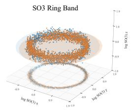

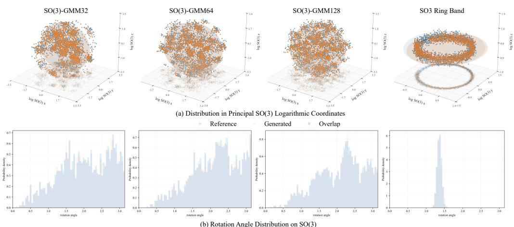  
(b) Rotation Angle Distribution on SO(3)

Figure 3: Terminal samples for the SO(3)-GMM32, SO(3)-GMM64, SO(3)-GMM128, and SO(3)-RingBand benchmarks. Top: principal-log-coordinate scatter plots comparing RCCBMgenerated samples with the corresponding reference distributions. Bottom: rotation-angle marginals for the same benchmarks. These complementary views assess the recovery of both multimodal distributions and the concentrated annular support of SO(3)-RingBand.  
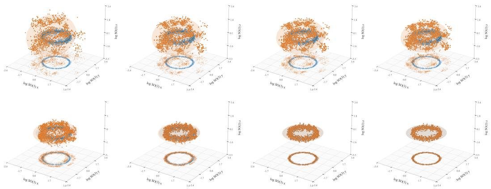  
Figure 4: Principal-log-coordinate projections of the RCCBM marginal evolution from SO(3)- GMM64 to SO(3)-RingBand. The snapshots illustrate the progressive reorganization of the multimodal source distribution toward the narrow annular support of the prescribed target distribution along the learned Schrodinger bridge.¨

RingBand, respectively. These results demonstrate that RCCBM can more effectively capture complex multimodal structure and highly concentrated geometric support on non-Abelian groups. The extremely small group-constraint errors reported below further indicate that this distributional fidelity is achieved while preserving the intrinsic group structure of SO(3).

Fig. 3 provides qualitative principal-log-coordinate projections of the generated terminal rotations. The generated samples reproduce both the multimodal structure of the GMM benchmarks and the concentrated annular support of SO(3)-RingBand, complementing the likelihood comparison in Table 5 and the intrinsic diagnostics reported below.

Distribution-to-distribution transport on SO(3) To further assess the distribution-todistribution transport capability of RCCBM, we construct a Schrodinger bridge from the¨ SO(3)- GMM64 source distribution to the SO(3)-RingBand target distribution. Both endpoint distributions are prescribed group-valued laws, and RCCBM learns the stochastic evolution between them under the observed-endpoint bridge formulation.

Table 6: Theory-facing RCCBM diagnostics on $S O ( 3 )$ and $U ( 4 )$ , assessing the consistency and numerical stability of the main RCCBM components.
<table><tr><td>Task</td><td>End. dual</td><td>ESS ↑</td><td> $\begin{array} { c } { { \mathrm { M a r g . } } } \\ { { \mathrm { e r r . ~ \downarrow ~ } } } \end{array}$ </td><td>Teach. err. ↓</td><td>Teach. energy ↓</td><td>Rel. MSE↓</td><td>Val. MMD↓</td><td>Group err.  $( \times 1 0 ^ { - 7 } ) \downarrow$ </td></tr><tr><td>SO(3)-GMM64</td><td>6.954</td><td>1359.900</td><td>0.001</td><td>0.010</td><td>17.930</td><td>0.157</td><td>0.014</td><td>2.880</td></tr><tr><td>SO(3)-RingBand</td><td>5.281</td><td>886.400</td><td>0.004</td><td>0.012</td><td>17.938</td><td>0.100</td><td>0.033</td><td>2.780</td></tr><tr><td>U(4) oscillator</td><td>6.499</td><td>592.000</td><td>0.030</td><td>0.052</td><td>100.616</td><td>0.038</td><td>0.087</td><td>5.260</td></tr><tr><td>U(4) TFIM</td><td>7.645</td><td>893.700</td><td>0.077</td><td>0.052</td><td>99.168</td><td>0.043</td><td>0.104</td><td>5.340</td></tr></table>

As shown in Fig. 4, the qualitative principal-log-coordinate projections reveal a progressive reorganization of the RCCBM intermediate marginals. Starting from the broad and multimodal support of SO(3)-GMM64, the generated distribution gradually concentrates toward the narrow annular support of SO(3)-RingBand, while samples away from the target ring progressively diminish. By the terminal stage, the generated marginal exhibits close qualitative agreement with the geometric structure of the target RingBand distribution.

This experiment shows that RCCBM matches the prescribed terminal law while realizing continuous stochastic transport between complex distributions on the non-Abelian group SO(3) and representing their intermediate evolution. It therefore highlights the distribution-to-distribution modeling capability of the Lie-group Schrodinger bridge beyond the conventional fixed-prior-to-data generative¨ paradigm. We provide a video to show the complete distributional evolution process in Appendix.

Theory-facing diagnostics Diagnostics aligned with the error components in Theorem 3.8 are reported separately. Endpoint dual and Effective Sample Size (ESS) characterize endpoint calibration; held-out endpoint error and energy assess CondSOC; final relative MSE assesses the post-refinement controller; validation MMD measures terminal distributional agreement; and group error verifies preservation of the matrix-group constraint.

Table 6 shows that the individual RCCBM modules remain numerically stable and consistent with their intended roles. The relatively high ESS values, together with the small marginal and teacher errors, indicate effective endpoint calibration and reliable CondSOC teacher construction, while the low post-refinement relative MSE and validation MMD further support accurate recovery of the final Markov controller and terminal distribution. Meanwhile, the group-constraint errors remain on the order of $1 0 ^ { - 7 }$ across all tasks, indicating that the distributional fitting and control learning are achieved while preserving the intrinsic matrix-group structure of $S O ( 3 )$ and $U ( 4 )$

## 4.5 PROTEIN CONFORMATIONAL TRANSITION PATHWAY GENERATION

We evaluate RCCBM on Protein Conformational Transition Pathway Generation, where source and target protein conformations define the endpoint states and the model generates stochastic transition pathways between them. In our formulation, this scientific task is represented as endpointconditioned conformational transport on the compact reduced Lie group state space, with observed molecular-dynamics (MD) segments used as reference pathways for evaluation.

Dataset mdCATH (Mirarchi et al., 2024) is a large-scale all-atom molecular-dynamics dataset containing 5,398 protein domains from the CATH classification, simulated across independent replicas and temperatures. We use the 320K trajectories and construct the benchmark from domain 1jvmB00. Source-target pairs are selected from persistent metastable conformational regions identified using structural-stability and slow-coordinate analyses, so that each endpoint frame represents a well-characterized conformational basin.

Residue frames are gauge-aligned by Eq. (3.23) and reduced by Eq. (3.24) to $\mathsf { G } _ { \mathrm { r e d } } = S O ( 3 ) ^ { N - 1 } \times$ $\mathbb { T } ^ { K }$ We evaluate $P \ = \ 1 5$ prespecified held-out transitions, each separated by 100 stored MD frames, and compare every observed MD segment with 32 stochastic RCCBM trajectories. Path quality is measured by target-aware path tortuosity and normalized Lie algebra path roughness, where lower values indicate more direct and less locally oscillatory pathways; complete definitions and aggregation rules are given in Appendix E.2.4.

Table 7: Pathway diagnostics for Protein Conformational Transition Pathway Generation on md-CATH domain 1jvmB00, including representative transitions and the aggregate over all $P = 1 5$ held-out cases. RCCBM tortuosity and roughness are reported as mean ± standard deviation over 32 stochastic trajectories for each representative transition.
<table><tr><td>Pair</td><td>MD tortuosity</td><td>RCCBM tortuosity</td><td>Directness gain</td><td>MD roughness</td><td>RCCBM roughness</td><td>Roughness reduction</td></tr><tr><td>1041</td><td>51.4241</td><td> $2 . 3 2 6 2 \pm 0 . 0 5 6 4$ </td><td>95.48%</td><td>2.7495</td><td> $0 . 0 2 4 0 9 \pm 0 . 0 0 1 3 1$ </td><td>99.12%</td></tr><tr><td>645</td><td>65.3731</td><td> $3 . 1 9 8 6 \pm 0 . 1 1 3 5$ </td><td>95.11%</td><td>2.8442</td><td> $0 . 0 2 1 5 9 \pm 0 . 0 0 1 2 1$ </td><td>99.24%</td></tr><tr><td>638</td><td>63.1760</td><td> $3 . 3 6 2 9 \pm 0 . 1 0 1 6$ </td><td>94.68%</td><td>2.8703</td><td> $0 . 0 2 1 5 3 \pm 0 . 0 0 1 0 3$ </td><td>99.25%</td></tr><tr><td>All 15</td><td></td><td></td><td>95.06%</td><td></td><td></td><td>99.21%</td></tr></table>

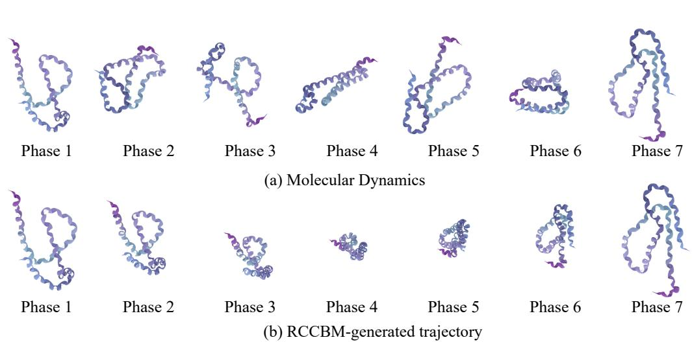  
Figure 5: Representative protein conformational transition pathways after the same gauge alignment used for quantitative evaluation. (a) Reference molecular-dynamics (MD) trajectory and (b) RCCBM-generated trajectory, each visualized at seven representative phases between the prescribed endpoint conformations.

Table 7 reports representative transitions together with the aggregate result over all P = 15 held-out cases. RCCBM achieves an overall directness gain of 95.06% and a roughness reduction of 99.21%, with small within-transition variability across the 32 stochastic realizations. These results show that the learned bridge connects the prescribed conformational states through substantially less tortuous and less locally oscillatory pathways than the reference MD segments in the reduced representation. Since the tortuosity metric explicitly penalizes terminal residual, the improvement reflects pathway geometry while retaining the endpoint constraint.

Fig. 5 visualizes representative reference MD and RCCBM transition pathways after the same gauge alignment used for the quantitative evaluation. Compared with the more pronounced inter-phase conformational rearrangements observed along the reference MD trajectory, the RCCBM-generated pathway exhibits a smoother and more continuous conformational evolution, progressively connecting the prescribed source and target conformations. This qualitative behavior is consistent with the reduced path tortuosity and roughness reported above, indicating that RCCBM satisfies the endpoint constraints and generates protein conformational transition pathways that are geometrically more direct and exhibit weaker local oscillations.

## 4.6 ABLATION AND NUMERICAL SENSITIVITY ANALYSIS

Ablations are evaluated at the validation-selected post-refinement checkpoint. Teacher, controlmatching, refinement, and validation diagnostics are taken from the same selected outer iteration, ensuring that component comparisons are made for a consistent final model state.

Table 8: WKBC modeling ablations on the General torsion task, comparing the full configuration with removal of endpoint smoothing and replacement of the production time-sampling scheme by uniform sampling.
<table><tr><td>Variant</td><td>NLL↓</td><td>Target Sink. ↓</td><td>Energy ↓</td><td>GeoRMSE↓</td><td>Rama JSD ↓</td><td>ValidRate ↑</td></tr><tr><td>Full WKBC</td><td>0.591</td><td>0.221</td><td>1.634</td><td>1.483</td><td>0.125</td><td>0.873</td></tr><tr><td>w/o endpoint smoothing</td><td>0.605</td><td>0.244</td><td>1.665</td><td>1.507</td><td>0.126</td><td>0.868</td></tr><tr><td>Uniform time sampling</td><td>0.618</td><td>0.231</td><td>1.657</td><td>1.505</td><td>0.128</td><td>0.870</td></tr></table>

Table 9: Component-wise RCCBM ablations on SO(3)-GMM64 and U(4)-TFIM under the common validation protocol. The variants isolate endpoint calibration, conditional-noise resampling, terminal replay, local-scale and distribution refinement, spectral conditioning, and calibrated initial state sampling.
<table><tr><td>Task</td><td>Variant</td><td>ESS ↑</td><td>Teacher err. ↓</td><td>Rel. MSE ↓</td><td>Val. MMD ↓</td><td>Local precision radius ↓</td></tr><tr><td rowspan="6">SO(3)-GMM64</td><td>Full RCCBM</td><td>1359.9</td><td>0.010</td><td>0.157</td><td>0.014</td><td>0.070</td></tr><tr><td>w/o endpoint calibration</td><td>一</td><td>0.011</td><td>0.229</td><td>0.023</td><td>0.155</td></tr><tr><td>Fixed common random numbers</td><td>1359.9</td><td>0.056</td><td>0.166</td><td>0.016</td><td>0.067</td></tr><tr><td>w/o terminal replay</td><td>1359.9</td><td>0.014</td><td>0.237</td><td>0.026</td><td>0.066</td></tr><tr><td>w/o local-scale term w/o distribution</td><td>1359.9</td><td>0.010</td><td>0.159</td><td>0.026</td><td>0.074</td></tr><tr><td>refinement</td><td>1359.9</td><td>0.011</td><td>0.168</td><td>0.025</td><td>0.088</td></tr><tr><td rowspan="3">U(4)-TFIM</td><td>Full RCCBM</td><td>893.7</td><td>0.052</td><td>0.043</td><td>0.104</td><td>0.544</td></tr><tr><td>w/o spectral features</td><td>540.3</td><td>0.066</td><td>0.057</td><td>0.532</td><td>0.711</td></tr><tr><td>w/o calibrated initial state</td><td>810.7</td><td>0.056</td><td>0.044</td><td>0.211</td><td>0.628</td></tr></table>

## 4.6.1 WKBC MODELING ABLATION

The General-task WKBC ablations use the same NLL reporting convention as Table 2 and the same endpoint and path diagnostic conventions as Table 3. As shown in Table 8, the full WKBC configuration attains the most favorable value for every metric. Omitting endpoint smoothing or replacing the production time-sampling distribution by uniform sampling increases the principal endpoint and path discrepancies, supporting both design choices in the wrapped-kernel implementation.

## 4.6.2 RCCBM COMPONENT ABLATION

The RCCBM ablations isolate endpoint calibration, conditional-noise resampling, terminal replay, local-scale refinement, distribution refinement, spectral conditioning, and calibrated initial-state sampling. The SO(3) experiments use 2,048 generated test samples and the U(4) experiments use 1,024. All variants are evaluated with the fixed production feature map and validation protocol.

Table 9 reports the component-wise RCCBM ablations under the common validation protocol. The ablation results support the complementary roles of the RCCBM components. Fixing the common random numbers markedly increases the held-out teacher error, indicating that stochastic resampling is important for conditional-noise generalization. Omitting endpoint calibration or terminal replay substantially increases the post-refinement relative MSE and validation MMD, while omitting local-scale or distribution refinement also degrades terminal-distribution accuracy. The smaller local precision radius obtained by the fixed-noise or no-replay variants reflects the local nature of this diagnostic, which measures generated-to-target neighborhood proximity; a smaller local radius can occur alongside weaker global distributional agreement or control accuracy. On U(4)-TFIM, both spectral conditioning and calibrated initial-state sampling improve the distributional and localprecision diagnostics. Taken together, the results indicate complementary and cooperative roles for endpoint correction, conditional-control learning, replay, refinement, and initialization.

Table 10: Numerical sensitivity of WKBC on the General torsion task with respect to lattice radius, Sinkhorn stopping tolerance, and the number of integration time steps. The ∆ columns report relative changes from the corresponding production settings (lattice radius 2, Sinkhorn tolerance $1 0 ^ { - 5 }$ and $N = 8 0 0$ time steps).
<table><tr><td>Component</td><td>Setting</td><td>NLL</td><td>Target Sink.</td><td>Path energy|</td><td>∆NLL</td><td>∆Sink.</td><td>∆energy</td></tr><tr><td rowspan="3">Lattice radius</td><td>2</td><td>0.591</td><td>0.221</td><td>1.634</td><td>0.000%</td><td>0.000%</td><td>0.000%</td></tr><tr><td>3</td><td>0.590</td><td>0.220</td><td>1.620</td><td>-0.169%</td><td>-0.452%</td><td>-0.857%</td></tr><tr><td>4</td><td>0.588</td><td>0.223</td><td>1.627</td><td>-0.508%</td><td>+0.905%</td><td>-0.428%</td></tr><tr><td rowspan="3">Sinkhorn tolerance</td><td>10−5</td><td>0.591</td><td>0.221</td><td>1.634</td><td>0.000%</td><td>0.000%</td><td>0.000%</td></tr><tr><td>10⁻7</td><td>0.592</td><td>0.214</td><td>1.632</td><td>+0.169%</td><td>-3.167%</td><td>-0.122%</td></tr><tr><td>10-9</td><td>0.590</td><td>0.223</td><td>1.639</td><td>-0.169%</td><td>+0.905%</td><td>+0.306%</td></tr><tr><td rowspan="4">Time steps N</td><td>200</td><td>0.860</td><td>0.753</td><td>2.685</td><td>+45.516%</td><td>+240.724%</td><td>+64.321%</td></tr><tr><td>400</td><td>0.674</td><td>0.332</td><td>1.885</td><td>+14.044%</td><td>+50.226%</td><td>+15.361%</td></tr><tr><td>600</td><td>0.593</td><td>0.230</td><td>1.642</td><td>+0.338%</td><td>+4.072%</td><td>+0.490%</td></tr><tr><td>800</td><td>0.591</td><td>0.221</td><td>1.634</td><td>0.000%</td><td>0.000%</td><td>0.000%</td></tr></table>

## 4.6.3 WKBC NUMERICAL SENSITIVITY

To assess whether the numerical settings used by WKBC provide an appropriate balance between computational cost and numerical accuracy, we examine the sensitivity of the General-task results to the lattice radius, the Sinkhorn stopping tolerance, and the number of integration time steps while keeping the trained model fixed. Stability is evaluated using NLL, Target Sinkhorn divergence, and normalized-control energy, with the NLL values following the same reporting convention as Table 2.

Table 10 shows that further refinement of either numerical parameter yields only marginal and nonuniform changes in the reported metrics. For the integration grid, the additional N = 600 evaluation gives an NLL of 0.593, only 0.338% above the production N = 800 value 0.591, indicating that the likelihood estimate is already close to its production-resolution value by N = 600. Increasing the lattice radius from 2 to 3 reduces NLL, Target Sinkhorn divergence, and path energy by only 0.169%, 0.452%, and 0.857%, respectively. Increasing the radius further to 4 produces a 0.508% reduction in NLL and a 0.428% reduction in path energy, while Target Sinkhorn divergence increases by 0.905%. Likewise, tightening the Sinkhorn tolerance from $1 0 ^ { - 5 }$ to $1 0 ^ { - 7 }$ changes NLL and path energy by +0.169% and −0.122%, respectively, while Target Sinkhorn divergence decreases by 3.167%; the $1 0 ^ { - 9 }$ setting yields mixed changes across the three metrics. These results indicate that the production settings already operate in a numerically stable regime in which additional lattice expansion or stricter Sinkhorn convergence provides limited and metric-dependent gains. Therefore, the adopted lattice radius and stopping tolerance constitute a practical choice that preserves the generation quality of WKBC while avoiding unnecessary computational overhead.

## 5 LIMITATIONS AND FUTURE WORK

Although the proposed framework has been validated across several Lie group regimes and scientific datasets, its current empirical evaluation remains concentrated on moderate-dimensional groups and selected molecular and geometric tasks; its behavior in substantially higher-dimensional groups, larger systems, and more heterogeneous scientific settings therefore remains to be characterized. More broadly, the present structure-adapted treatment focuses on compact Abelian groups, compact non-Abelian groups, and rigid frame problems after compact reduction, leaving genuinely noncompact Lie groups and more general geometric state spaces outside the current scope.

These limitations suggest several natural directions for further study. First, broader experiments on higher-dimensional groups, larger molecular systems, and more diverse scientific datasets could clarify the scalability and robustness of the framework. Second, extending the current analysis beyond compact or compact-reduced settings to genuinely noncompact Lie groups, quotient manifolds, and homogeneous spaces would substantially broaden its geometric applicability while retaining the observed-endpoint kinetic Schrodinger bridge formulation.¨

## 6 CONCLUSIONS

We developed an observed-endpoint Schrodinger bridge framework for kinetic dynamics on Lie¨ group state spaces ${ \mathsf { G } } \times { \mathfrak { g } } .$ . The formulation imposes endpoint constraints through the observed variables, and the entropy projection determines the conditional law of the latent Lie algebra velocities. Under the endpoint-kernel condition, the resulting bridge admits a two-sided Schrodinger factoriza-¨ tion and an associated kinetic Doob representation, providing a unified probabilistic foundation for distribution-to-distribution transport on Lie groups.

Building on this formulation, we designed two structure-adapted computational realizations. For compact Abelian groups, WKBC exploits the explicit wrapped kinetic kernel to perform endpoint calibration and recover the corresponding Doob control together with the entropy-optimal initialstate law. For compact non-Abelian groups, where such kernels are generally unavailable, RCCBM combines reciprocal endpoint calibration, mollified finite-energy conditional teachers, importancecorrected control regression, and constrained terminal refinement to learn a single Markov forward controller. The canonical teacher mixture remains within the reciprocal Markov class, which connects the conditional-control learning stage directly to the target Schrodinger bridge.¨

We further established a modular conditional consistency analysis that separates endpointcalibration, mollification, teacher-approximation, control-regression, initialization, and timediscretization errors in bounded-Lipschitz path distance. This decomposition links the individual computational stages to a single path-law convergence statement and clarifies the role of each approximation through numerical experiments.

Experiments on protein and RNA torsions, SO(3), U(n), and protein conformational transition pathways demonstrate the effectiveness of the proposed framework across both compact Abelian and compact non-Abelian settings. In addition, the ablation studies, theory-facing diagnostics, and numerical sensitivity analyses support the roles of the principal WKBC and RCCBM components and confirm that the adopted numerical settings provide a stable and computationally practical realization of the developed bridge constructions.

## REFERENCES

M. Bertolini, T. Le, and D.-A. Clevert. Generative modeling on Lie groups via Euclidean generalized score matching, 2025. arXiv:2502.02513. 4

V. De Bortoli, J. Thornton, J. Heng, and A. Doucet. Diffusion Schrodinger bridge with applications¨ to score-based generative modeling. In Proc. Int. Conf. Neural Inf. Process. Syst., volume 34, pp. 17695–17709, 2021. 1, 2, 4

V. De Bortoli, E. Mathieu, M. Hutchinson, J. Thornton, Y. W. Teh, and A. Doucet. Riemannian score-based generative modelling. In Proc. Int. Conf. Neural Inf. Process. Syst., volume 35, pp. 2406–2422, 2022. 1, 2, 4, 14

R. T. Q. Chen and Y. Lipman. Flow matching on general geometries. In Proc. Int. Conf. Learn. Represent., 2024. 2, 4, 11, 12

T. Chen, G.-H. Liu, M. Tao, and E. A. Theodorou. Deep momentum multi-marginal Schrodinger¨ bridge. In Proc. Int. Conf. Neural Inf. Process. Syst., volume 36, pp. 57058–57086, 2023. 4

Y. Chen, T. T. Georgiou, and M. Pavon. Stochastic control liaisons: Richard Sinkhorn meets Gaspard Monge on a Schrodinger bridge.¨ SIAM Rev., 63:249–313, 2021. 2, 4

A. Chiarini, G. Conforti, G. Greco, and Z. Ren. Entropic turnpike estimates for the kinetic Schrodinger problem.¨ Electron. J. Probab., 27(131):1–32, 2022. 4

G. Conforti, A. Durmus, and Marta Gentiloni Silveri. KL convergence guarantees for score diffusion models under minimal data assumptions. SIAM J. Math. Data Sci., 7:86–109, 2025. 4

Luca Falorsi, Pim De Haan, Tim R Davidson, and Patrick Forre. Reparameterizing distributions on´ Lie groups. In Int. Conf. Artif. Intell. Stat., pp. 3244–3253, 2019. 1, 4

H. Follmer. Random fields and diffusion processes. In¨ Ecole d’´ Et´ e de Probabilit´ es de Saint-Flour´ XV–XVII, 1985–1987, volume 1362, pp. 101–203. 1988. 2, 4

J. Ho, A. Jain, and P. Abbeel. Denoising diffusion probabilistic models. In Proc. Int. Conf. Neural Inf. Process. Syst., volume 33, pp. 6840–6851, 2020. 1

Chin-Wei Huang, Milad Aghajohari, Joey Bose, Prakash Panangaden, and Aaron Courville. Riemannian diffusion models. In Advances in Neural Information Processing Systems, volume 35, pp. 2750–2761, 2022. 11, 12

Lingkai Kong and Molei Tao. Convergence of kinetic Langevin Monte Carlo on Lie groups. In Annu. Conf. Learn. Theory., pp. 3011–3063, 2024. 2, 4

A. Leach, S. M. Schmon, M. T. Degiacomi, and C. G. Willcocks. Denoising diffusion probabilistic models on SO(3) for rotational alignment. In ICLR 2022 Workshop on Geometrical and Topological Representation Learning, 2022. 4

C. Leonard. A survey of the Schr´ odinger problem and some of its connections with optimal trans-¨ port. Discrete Contin. Dyn. Syst. Ser. A, 34:1533–1574, 2014. 2, 4

Y. Lipman, R. T. Q. Chen, H. Ben-Hamu, M. Nickel, and M. Le. Flow matching for generative modeling. In Proc. Int. Conf. Learn. Represent., 2023. 1, 4

G.-H. Liu, Y. Lipman, M. Nickel, B. Karrer, E. A. Theodorou, and R. T. Q. Chen. Generalized Schrodinger bridge matching. In¨ Proc. Int. Conf. Learn. Represent., 2024. 1, 2, 4, 9

Guan-Horng Liu, Jaemoo Choi, Yongxin Chen, Benjamin K Miller, and Ricky TQ Chen. Adjoint Schrodinger bridge sampler. ¨ Proc. Int. Conf. Neural Inf. Process. Syst., 38:15673–15708, 2025. 4

A. Lou, D. Lim, I. Katsman, L. Huang, Q. Jiang, S.-N. Lim, and C. M. De Sa. Neural manifold ordinary differential equations. In Proc. Int. Conf. Neural Inf. Process. Syst., volume 33, 2020. 1, 2, 4

H. Mahmood, A. Halder, and A. Akhtar. Schrodinger bridge over a compact connected Lie group.¨ IEEE Control Syst. Lett., 10:1141–1146, 2026. 4

Emile Mathieu and Maximilian Nickel. Riemannian continuous normalizing flows. Proc. Int. Conf. Neural Inf. Process. Syst., 33:2503–2515, 2020. 1, 2, 4

A. Mirarchi, T. Giorgino, and Gianni De Fabritiis. mdCATH: A large-scale MD dataset for datadriven computational biophysics. Sci. Data, 11:1299, 2024. 16

M. Pavon and A. Wakolbinger. On free energy, stochastic control, and Schrodinger processes. In ¨ Modeling, Estimation and Control ofSystems with Uncertainty, pp. 334–348. 1991. 4

S. Peluchetti. Diffusion bridge mixture transports, Schrodinger bridge problems and generative¨ modeling. J. Mach. Learn. Res., 24(374):1–51, 2023. 4

A.-A. Pooladian and J. Niles-Weed. Plug-in estimation of Schrodinger bridges. ¨ SIAM J. Math. Data Sci., 7:1315–1336, 2025. 4

Danilo Jimenez Rezende, George Papamakarios, Sebastien Racaniere, Michael Albergo, Gurtej´ Kanwar, Phiala Shanahan, and Kyle Cranmer. Normalizing flows on tori and spheres. In Proc. Int. Conf. Mach. Learn., pp. 8083–8092, 2020. 1, 4

E. Schrodinger.¨ Uber die umkehrung der naturgesetze.¨ Sitzungsber. Preuss. Akad. Wiss., Phys.-Math. Kl., pp. 144–153, 1931. 2, 4

Y. Shi, V. De Bortoli, A. Campbell, and A. Doucet. Diffusion Schrodinger bridge matching. In¨ Proc. Int. Conf. Neural Inf. Process. Syst., volume 36, pp. 62183–62223, 2023. 1, 2, 4

Y. Song, J. Sohl-Dickstein, D. P. Kingma, A. Kumar, S. Ermon, and B. Poole. Score-based generative modeling through stochastic differential equations. In Proc. Int. Conf. Learn. Represent., 2021. 1

R. B. Stinchcombe. Ising model in a transverse field. i. basic theory. Journal of Physics C: Solid State Physics, 6(15):2459–2483, 1973. 14

J. Thornton, M. Hutchinson, E. Mathieu, V. De Bortoli, Y. W. Teh, and A. Doucet. Riemannian diffusion Schrodinger bridge, 2022. arXiv:2207.03024.¨ 4

Y. Zhu, T. Chen, L. Kong, E. A. Theodorou, and M. Tao. Trivialized momentum facilitates diffusion generative modeling on Lie groups. In Proc. Int. Conf. Learn. Represent., 2025. 2, 4, 7, 11, 12, 14, 23, 26, 27

## APPENDIX

This appendix accompanies the main article and provides complete numerical algorithms, auxiliary assumptions and identities, proofs of all main theoretical results, additional visual diagnostics, and reproducibility details. It first reports the implementation details, then presents the technical results and proofs, and finally presents the additional experiments and the experimental settings used for the main-text results.

## A ALGORITHMS AND NUMERICAL APPROXIMATION

## A.1 OBSERVED-ENDPOINT WKBC

Choose positive quadrature rules

$$
\nu _ { 0 , M } = \sum _ { i = 1 } ^ { M _ { 0 } } \omega _ { i } ^ { 0 } \delta _ { y _ { i } ^ { 0 } } , \qquad \nu _ { T , M } = \sum _ { j = 1 } ^ { M _ { T } } \omega _ { j } ^ { T } \delta _ { y _ { j } ^ { T } } ,
$$

and discrete endpoint masses

$$
\rho _ { 0 , M } = \sum _ { i = 1 } ^ { M _ { 0 } } a _ { i } \delta _ { y _ { i } ^ { 0 } } , \qquad \rho _ { T , M } = \sum _ { j = 1 } ^ { M _ { T } } b _ { j } \delta _ { y _ { j } ^ { T } } .
$$

If $r _ { 0 T } = \mathrm { d } \mathcal { R } _ { 0 T } / \mathrm { d } ( \nu _ { 0 } \otimes \nu _ { T } )$ , form

$$
R _ { i j } ^ { M } = \frac { r _ { 0 T } ( y _ { i } ^ { 0 } , y _ { j } ^ { T } ) \omega _ { i } ^ { 0 } \omega _ { j } ^ { T } } { \sum _ { k , \ell } r _ { 0 T } ( y _ { k } ^ { 0 } , y _ { \ell } ^ { T } ) \omega _ { k } ^ { 0 } \omega _ { \ell } ^ { T } } .
$$

The discrete Schrodinger system is¨

$$
\Pi _ { i j } = f _ { i } R _ { i j } ^ { M } g _ { j } , \qquad \sum _ { j } \Pi _ { i j } = a _ { i } , \qquad \sum _ { i } \Pi _ { i j } = b _ { j } .
$$

Log-domain Sinkhorn updates are used. Positive interpolants $f _ { 0 , M } , g _ { T , M }$ define

$$
\begin{array} { r l } & { h _ { t , M } ( x ) = \displaystyle \sum _ { j = 1 } ^ { M _ { T } } q _ { T - t } ^ { \mathcal { O } _ { T } } ( y _ { j } ^ { T } \mid x ) g _ { j } \omega _ { j } ^ { T } , } \\ & { p _ { 0 , M } ( x ) = Z _ { 0 , M } ^ { - 1 } q _ { 0 } ( x ) f _ { 0 , M } ( \mathcal { O } _ { 0 } ( x ) ) h _ { 0 , M } ( x ) . } \end{array}
$$

For the prior-to-data likelihood specialization, the initial kinetic law is fixed to

$$
\pi ^ { \star } ( \mathrm { d } g \mathrm { d } \pmb { \xi } ) = \nu _ { \sf G } ( \mathrm { d } g ) \varphi _ { d } ( \pmb { \xi } ) \mathrm { d } \pmb { \xi } , \qquad \varphi _ { d } ( \pmb { \xi } ) = ( 2 \pi ) ^ { - d / 2 } \exp \left( - \frac { 1 } { 2 } \| \pmb { \xi } \| ^ { 2 } \right) ,\tag{A.1}
$$

where $\nu _ { \mathsf { G } }$ is a normalized Haar measure. Thus, the compact group coordinate is Haar-distributed, and the Lie algebra velocity is standard Gaussian, matching the stationary kinetic prior used by TDM (Zhu et al., 2025). For this benchmark we also initialize the reference law with $Q _ { 0 } = \pi ^ { \star }$ Following the TDM benchmark data augmentation, we use the full kinetic state at both benchmark endpoints:

$$
\begin{array} { r } { \mathcal { O } _ { 0 } ^ { \mathrm { l i k } } ( g , \pmb { \xi } ) = \mathcal { O } _ { T } ^ { \mathrm { l i k } } ( g , \pmb { \xi } ) = ( g , \pmb { \xi } ) , \qquad P _ { 0 } ^ { \mathrm { l i k } } = \pi ^ { \star } , \qquad P _ { T } ^ { \mathrm { l i k } } ( \mathrm { d } g \mathrm { d } \pmb { \xi } ) = \rho _ { \mathrm { t r a i n } } ( \mathrm { d } g ) \varphi _ { d } ( \pmb { \xi } ) \mathrm { d } \pmb { \xi } . } \end{array}
$$

Equivalently, every group-valued training datum is paired independently with $\pmb { \xi } \sim \mathcal { N } ( 0 , I _ { d } )$ . This specification defines the LL/NLL benchmark. The scientific observed-endpoint bridges retain their group-valued endpoint observations, with latent velocity conditionals determined by the entropy projection. The same Sinkhorn scaling applies after replacing both full-state endpoint integrals by positive quadrature or Monte Carlo rules on ${ \mathsf { G } } \times { \mathfrak { g } }$

The explicit wrapped joint kernel also propagates the calibrated source factor forward. If $\{ ( x _ { i } ^ { 0 } , \omega _ { i } ^ { 0 , x } ) \} _ { i = 1 } ^ { M _ { x } }$ is a positive quadrature rule for the base measure $\mu$ on $\mathsf { X } ,$ we can define

$$
\widehat { h } _ { t , M } ( \boldsymbol { x } ) = \sum _ { i = 1 } ^ { M _ { x } } q _ { 0 , t } ( \boldsymbol { x } \mid \boldsymbol { x } _ { i } ^ { 0 } ) q _ { 0 } ( \boldsymbol { x } _ { i } ^ { 0 } ) f _ { 0 , M } ( \boldsymbol { O } _ { 0 } ( \boldsymbol { x } _ { i } ^ { 0 } ) ) \omega _ { i } ^ { 0 , x } .\tag{A.2}
$$

With $p _ { t , M } ^ { \mathrm { W K B C } } : = h _ { t , M } \widehat { h } _ { t , M }$ , consequently,

$$
\begin{array} { r } { s _ { \mathrm { e v a l } , M } ^ { \mathrm { W K B C } } ( t , x ) = \nabla _ { \xi } \log h _ { t , M } ( x ) + \nabla _ { \xi } \log \widehat { h } _ { t , M } ( x ) = \nabla _ { \xi } \log p _ { t , M } ^ { \mathrm { W K B C } } ( x ) . } \end{array}\tag{A.3}
$$

Eq. (A.2) evaluates the forward factor deterministically from the calibrated source factor returned by Sinkhorn.

Sufficient approximation conditions For each $\tau > 0$ , assume: (i) the truncated wrapped kernels and their ξ-gradients converge uniformly on $[ 0 , T - \tau ]$ after lattice enlargement; (ii) the quadrature rules converge for the uniformly bounded equicontinuous kernel families; (iii) the discrete kernel matrices remain between common positive bounds; (iv) Sinkhorn residuals vanish; (v) the positive interpolants converge in the endpoint norms induced by the kernel operators; and (vi) the self-normalized bridge endpoint weights used by the regression proposal satisfy the usual law-oflarge-numbers consistency. Then projective contraction stability gives uniform convergence of the normalized scaling factors, while dominated differentiation gives convergence of $h _ { t , M }$ and its logarithmic gradient on preterminal strips. At the population level the bridge-weighted regression proposal is exactly the Schrodinger-bridge occupation law, so no separate domination constant between¨ an off-policy regression measure and the controlled occupation measure is required. These assumptions provide one sufficient set of approximation conditions.

Algorithm 1 Observed-Endpoint WKBC   
Require: endpoint quadratures $\{ ( y _ { i } ^ { 0 } , a _ { i } ) \} , \{ ( y _ { j } ^ { T } , b _ { j } ) \}$ , wrapped reference kernels, tolerance $\epsilon _ { \mathrm { s k } } .$   
regression model $\scriptstyle { s _ { \theta } }$   
1: Form the discrete reference matrix $R ^ { M } = ( R _ { i j } ^ { M } )$ and initialize $f _ { i } , g _ { j } > 0$   
2: repeat   
3: $f _ { i } \gets a _ { i } / \sum _ { j } R _ { i j } ^ { M } g _ { j }$ for all i   
4: $g _ { j }  b _ { j } / \sum _ { i } f _ { i } R _ { i j } ^ { M }$ for all $j$   
5: until both marginal residuals are below $\epsilon _ { \mathrm { s k } }$   
6: Interpolate $f _ { 0 , M } , g _ { T , M }$ and compute $\begin{array} { r } { h _ { t , M } ( x ) = \sum _ { j } q _ { T - t } ^ { \mathcal { O } _ { T } } ( y _ { j } ^ { T } \mid x ) g _ { j } \omega _ { j } ^ { T } } \end{array}$   
7: for each regression minibatch do   
8: Sample t ∼ Unif[0, T] and a reference-path tuple $( X _ { 0 } , X _ { t } , Y _ { T } )$   
9: Set $w _ { \mathrm { b r } } \propto f _ { 0 , M } ( \mathcal { O } _ { 0 } ( X _ { 0 } ) ) g _ { T , M } ( Y _ { T } )$ and $\boldsymbol { S } \gets \nabla _ { \boldsymbol { \xi } }$ log $q _ { T - t } ^ { \mathcal { O } _ { T } } ( Y _ { T } \mid X _ { t } )$   
10: Update θ by the self-normalized bridge-weighted loss $\sum { w _ { \mathrm { b r } } } \lVert s _ { \theta } ( t , X _ { t } ) - S \rVert ^ { 2 }$   
11: end for   
12: Define p0, ${ \cal M } \ : \propto \ : q _ { 0 } ( f _ { 0 , M } \circ { \mathcal O } _ { 0 } ) h _ { 0 , M }$ and sample $X _ { 0 } \sim p _ { 0 , M }$   
13: Set $\pmb { u } _ { \theta } = \sqrt { 2 \gamma } \pmb { s } _ { \theta }$ and propagate the controlled kinetic dynamics   
14: For the prior-to-data likelihood benchmark, use $P _ { 0 } = \pi ^ { \star }$ , compute $\widehat { h } _ { t , M }$ from Eq. (A.2), and   
set $s _ { \mathrm { e v a l } } ^ { \mathrm { W K B C } }$ by Eq. (A.3)   
15: Evaluate held-out LL/NLL with the probability-flow routine in Algorithm 5   
Return: bridge paths, scaling-factor interpolants, and the calibrated initial-state sampler

## A.2 RCCBM AND THE REDUCTION WRAPPER

For a learned endpoint pair ${ \widehat { \beta } } _ { N }$ and mollifier $\kappa _ { \varepsilon N }$ , the population teacher target is the canonical law $\Lambda ^ { \widehat { \beta } _ { N } , \varepsilon _ { N } }$ in Eq. (3.18). It can be sampled directly when $Z _ { z , \varepsilon }$ is available, or by an importance proposal over $( x _ { 0 } , y )$ with the exact Radon–Nikodym correction. Pair balancing, terminal-window oversampling, and teacher-quality proposals do not change the population risk after this correction.

Time-sampling density and its lower bound To retain a strictly positive density over the full horizon while allocating a prescribed fraction of samples to the terminal window, RCCBM uses the two-window mixture

$$
\lambda _ { \mathrm { b m } } ( t ) = \frac { 1 - r _ { \mathrm { t e r m } } } { a _ { \mathrm { t e r m } } T } \mathbf { 1 } _ { [ 0 , a _ { \mathrm { t e r m } } T ) } ( t ) + \frac { r _ { \mathrm { t e r m } } } { ( 1 - a _ { \mathrm { t e r m } } ) T } \mathbf { 1 } _ { [ a _ { \mathrm { t e r m } } T , T ] } ( t ) , \qquad 0 \le t \le T .\tag{A.4}
$$

Equivalently, with probability $1 - r _ { \mathrm { t e r m } }$ we draw $t \sim \mathrm { U n i f } [ 0 , a _ { \mathrm { t e r m } } T )$ , and with probability $r _ { \mathrm { t e r m } }$ we draw $t \sim \mathrm { U n i f } [ a _ { \mathrm { t e r m } } T , T ]$ . Thus $r _ { \mathrm { t e r m } }$ is exactly the terminal-window sampling fraction reported in

Table 11, and

$$
\ \lambda : = \operatorname* { i n f } _ { 0 \leq t \leq T } \lambda _ { \mathrm { b m } } ( t ) = \frac { 1 } { T } \operatorname* { m i n } \biggl \{ \frac { 1 - r _ { \mathrm { t e r m } } } { a _ { \mathrm { t e r m } } } , \frac { r _ { \mathrm { t e r m } } } { 1 - a _ { \mathrm { t e r m } } } \biggr \} .\tag{A.5}
$$

The quantity $\underline { { \lambda } }$ is therefore not an independently tuned hyperparameter. The production values $a _ { \mathrm { t e r m } } = 0 . 7 5 , r _ { \mathrm { t e r m } } = 0 . 5 5$ on $S O ( 3 )$ , and $r _ { \mathrm { t e r m } } = 0 . 6 5$ on $\bar { U } ( n )$ give $\underline { { { \lambda } } } T = \mathbf { \bar { 0 . 6 0 } }$ and $7 / 1 5$ ≈ $0 . 4 6 7 \cdot$ respectively; these values are recorded in Table 11.

We use two feature maps with distinct roles. The map $\Phi _ { \mathsf { G } } ^ { \mathrm { i d } }$ is the fixed continuous injective identification map used by the MMD term, while $\Phi _ { \mathsf { G } } ^ { \mathrm { n e t } }$ is the feature vector supplied to the controller and may additionally contain spectral or local descriptors that support finite-sample optimization. The explicit production choices and the injectivity argument are given in section B.12.

The direct control is a residual network

$$
h _ { 0 } = W _ { \mathrm { i n } } [ \Phi _ { \mathsf { G } } ^ { \mathrm { n e t } } ( g ) , \pmb { \xi } , \tau ( t ) ] , \qquad h _ { b + 1 } = \frac { h _ { b } + F _ { b } ( h _ { b } ) } { \sqrt { 2 } } , \qquad \pmb { u } _ { \theta } = W _ { \mathrm { o u t } } \pmb { h } _ { B } .
$$

The output clip $B _ { N }$ is a sieve parameter and increases with sample size; its tail bias is included in $\varepsilon _ { \mathrm { c l i p } , N } .$

Fresh-rollout refinement uses

$$
\begin{array} { r } { \mathcal { L } _ { \mathrm { d i s t } } = w _ { M } \mathrm { M M D } _ { k } ^ { 2 } \big ( ( \Phi _ { \mathsf { G } } ^ { \mathrm { i d } } ) _ { \# } \widehat { \rho } _ { T } , ( \Phi _ { \mathsf { G } } ^ { \mathrm { i d } } ) _ { \# } \rho _ { T } \big ) + w _ { \mu } \left. \widehat { \mu } _ { g } - \widehat { \mu } _ { t } \right. ^ { 2 } + w _ { \Sigma } \left. \widehat { \boldsymbol { \Sigma } } _ { g } - \widehat { \boldsymbol { \Sigma } } _ { t } \right. _ { \mathrm { F } } ^ { 2 } } \end{array}
$$

The local term acts as a finite-sample neighborhood regularizer.

Algorithm 2 Reciprocal Conditional-Control Bridge Matching   
Require: reference law $Q ,$ endpoint data, centered endpoint networks $( \beta _ { 0 } , \beta _ { T } )$ , direct control $\mathbf { \Delta } \mathbf { u } _ { \theta }$   
mollifier schedule $\varepsilon _ { N }$ , Lie group integrator   
1: Draw a reference endpoint pool and compute $\widehat { \beta } _ { N } \gets \arg \operatorname* { m a x } _ { \beta \in \mathcal { B } _ { N } } \widehat { \mathcal { D } } _ { N } ( \beta )$   
2: Build $g _ { T , \varepsilon _ { N } } ^ { \widehat { \beta } _ { N } } ,$ self-normalized initial weights, and $\widehat { P } _ { 0 , N } ^ { \varepsilon _ { N } }$   
3: for each outer epoch do   
4: Sample conditions $z = ( x _ { 0 } , y )$ from a proposal targeting $\Lambda ^ { \widehat { \beta } _ { N } , \varepsilon _ { N } }$   
5: Solve the mollified CondSOC problem for each $z ,$ sample replay times $t \sim \lambda _ { \mathrm { { b m } } }$ from   
Eq. (A.4), and generate independent-noise teacher tuples $( t , { \bar { X } } _ { t } , { v } _ { t } )$   
$_ 6 \colon$ Add teacher tuples to replay and attach the exact proposal-to-target importance weights   
7: Update θ by $\begin{array} { r } { \sum _ { j } ^ { \bullet } \widetilde { \omega } _ { j } \| \pmb { u } _ { \theta } \big ( \dot { t } _ { j } , \dot { X } _ { j } \big ) - \pmb { v } _ { j } \| ^ { 2 } } \end{array}$   
8: Save $\theta _ { \mathrm { p r e } } ;$ obtain $\theta _ { \mathrm { c a n d } }$ from fresh-rollout distribution refinement   
9: if $\widehat { \mathcal { L } } _ { \mathrm { m a t c h } } ( \theta _ { \mathrm { c a n d } } ) \leq \widehat { \mathcal { L } } _ { \mathrm { m a t c h } } ( \theta _ { \mathrm { p r e } } ) + \delta _ { \mathrm { r e f } }$ then   
10: $\theta  \theta _ { \mathrm { c a n d } }$   
11: else   
12: $\theta  \theta _ { \mathrm { p r e } }$   
13: end if   
14: end for   
15: Sample $X _ { 0 } \sim \widehat { P } _ { 0 , N } ^ { \varepsilon _ { N } }$ and generate with $\mathbf { \Delta } \mathbf { u } _ { \theta }$ using the Lie group integrator   
Return: learned forward controller, bridge samples, and separated calibration/teacher/control diag  
nostics

## A.3 EXACT-OU SPLITTING

For frozen $\pmb { u } _ { k } = \pmb { u } _ { \theta } ( t _ { k } , g _ { k } , \pmb { \xi } _ { k } )$ , set

$$
a = e ^ { - \gamma \Delta t } , \qquad c = { \frac { \alpha ( 1 - a ) } { \gamma } } , \qquad \sigma = \alpha \sqrt { \frac { 1 - e ^ { - 2 \gamma \Delta t } } { 2 \gamma } } .\tag{A.6}
$$

The step is

$$
\pmb { \xi } _ { k + 1 } = a \pmb { \xi } _ { k } + c \pmb { u } _ { k } + \sigma \pmb { \varepsilon } _ { k } , \qquad \pmb { g } _ { k + 1 } = g _ { k } \operatorname { E x p } _ { \mathbb { G } } ( \Delta t \pmb { \xi } _ { k + 1 } ) , \qquad \pmb { \varepsilon } _ { k } \sim \mathcal { N } ( 0 , I ) .
$$

Algorithm 3 Compact reduction wrapper for $S E ( 3 ) ^ { N }$ data   
Require: rigid frame endpoints $h _ { 1 : N }$ , reduction $\mathcal { R } _ { \mathrm { r e d } } .$ , reconstruction F, RCCBM routine   
1: Remove global rigid motion: $\widetilde { h } _ { i }  h _ { 1 } ^ { - 1 } h _ { i } , i = 2 , . . . , N$   
2: Extract reduced endpoints $z  \mathcal { R } _ { \mathrm { r e d } } ( h _ { 1 : N } ) \in { \sf G } _ { \mathrm { r e d } }$   
3: Train RCCBM on the kinetic state space $\mathsf { G } _ { \mathrm { r e d } } \times \mathsf { g } _ { \mathrm { r e d } }$ and generate reduced paths   
4: for each generated reduced state $z _ { t }$ do   
5: Reconstruct Cartesian coordinates with $F ( z _ { t } )$   
6: end for   
Return: reduced bridge paths and deterministic reconstructions, with diagnostics reported sepa  
rately

Proposition A.1 (Geometry and path-space discretization). Assume the Ornstein–Uhlenbeck specialization $\pmb { b } ( t , g , \pmb { \xi } ) = - \gamma \pmb { \xi }$ with $\gamma > 0 .$ . For $\mathsf { G } = S O ( 3 ) o r \mathsf { G } = U ( n )$ , take the metric $d _ { \mathsf { G } }$ used in the bounded-Lipschitz path distance to be the standard bi-invariant Riemannian distance induced by an Ad-invariant inner product on g. Let the feedback control u : $[ 0 , T ] \times { \mathsf { G } } \times { \mathfrak { g } } \to { \mathfrak { g } }$ satisfy, for constants $L _ { u } , K _ { u } < \infty$

$$
\begin{array} { r l } & { \| \pmb { u } ( t , g , \pmb { \xi } ) - \pmb { u } ( s , g ^ { \prime } , \pmb { \eta } ) \| \le L _ { u } \big ( | t - s | + d _ { \mathsf { G } } ( g , g ^ { \prime } ) + \| \pmb { \xi } - \pmb { \eta } \| \big ) , } \\ & { \qquad \| \pmb { u } ( t , g , \pmb { \xi } ) \| \le K _ { u } \big ( 1 + \| \pmb { \xi } \| \big ) , } \end{array}
$$

and assume ${ \mathbb E } \left\| \pmb { \xi } _ { 0 } \right\| ^ { 4 } < \infty$ . Then the update above preserves $S O ( 3 )$ for skew-symmetric algebra coordinates and $U ( n )$ for skew-Hermitian coordinates, and the velocity update is exact for the frozen-control OU substep. $I f P _ { \Delta t } ^ { u }$ denotes the law of the continuous piecewise OU/exponential interpolation defined in the proof and $P ^ { u }$ is the exact controlled path law with the same initial law, then

$$
d _ { \mathrm { B L } } ( P _ { \Delta t } ^ { \pmb { u } } , P ^ { \pmb { u } } ) \leq C _ { T } \Delta t ^ { 1 / 2 } .\tag{A.7}
$$

The constant $C _ { T }$ depends only on $T , \gamma , \alpha , L _ { u } , K _ { u } ,$ the fourth moment of the initial velocity, and the fixed group metric. In particular, it is uniform over any control sieve with common Lipschitz and linear-growth bounds.

## A.4 TDM-ALIGNED LIKELIHOOD EVALUATION

The likelihood tables use the prior-to-data benchmark specified in Appendix A.1. Its source is the Haar-Gaussian law $\pi ^ { \star }$ in Eq. (A.1), and its terminal law is the full-state augmentation $\rho _ { \mathrm { t r a i n } } ( \mathrm { d } \boldsymbol { g } ) \varphi _ { d } ( \boldsymbol { \xi } ) \mathrm { d } \boldsymbol { \xi }$ Each group-valued training datum is paired independently with a standard Gaussian Lie algebra velocity, following the TDM benchmark augmentation (Zhu et al., 2025). The main-text SO(3)-GMM64-to-SO(3)-RingBand experiment uses the two-prescribed-endpoint scientific bridge protocol. The likelihood construction below follows the intrinsic probability-flow change-of-variables principle used by TDM (Zhu et al., 2025).

Let $P _ { t }$ be the one-time law of a benchmark WKBC or RCCBM generator on ${ \mathsf { X } } = { \mathsf { G } } \times { \mathsf { g } } ,$ with density $p _ { t }$ relative to normalized Haar measure times Lebesgue measure. Under the Ornstein–Uhlenbeck specialization $\alpha = \sqrt { 2 \gamma }$ , write its stochastic dynamics as

$$
\mathrm { d } g _ { t } = T _ { e } L _ { g _ { t } } ( \pmb { \xi } _ { t } ) \mathrm { d } t , \qquad \mathrm { d } \pmb { \xi } _ { t } = \left[ - \gamma \pmb { \xi } _ { t } + \alpha \pmb { u } _ { t } ( g _ { t } , \pmb { \xi } _ { t } ) \right] \mathrm { d } t + \alpha \mathrm { d } \mathbf { W } _ { t } .\tag{A.8}
$$

If

$$
\begin{array} { r } { \pmb { \mathscr { s } } _ { t } ( x ) = \nabla _ { \pmb { \xi } } \log p _ { t } ( x ) , } \end{array}\tag{A.9}
$$

then the associated probability-flow vector field is

$$
\boldsymbol { F } _ { t } ( \boldsymbol { g } , \boldsymbol { \xi } ) = \left( T _ { e } L _ { g } ( \boldsymbol { \xi } ) , - \gamma \boldsymbol { \xi } + \alpha \boldsymbol { u } _ { t } ( \boldsymbol { g } , \boldsymbol { \xi } ) - \frac { \alpha ^ { 2 } } { 2 } \boldsymbol { s } _ { t } ( \boldsymbol { g } , \boldsymbol { \xi } ) \right) .\tag{A.10}
$$

Why Eq. (A.10) has the correct marginals The Fokker–Planck equation of Eq. (A.8) is

$$
\begin{array} { r } { \partial _ { t } p _ { t } = - \mathrm { d i v } _ { \mathsf { G } } ( p _ { t } T _ { e } L _ { g } ( \pmb { \xi } ) ) - \mathrm { d i v } _ { \pmb { \xi } } ( p _ { t } [ - \gamma \pmb { \xi } + \alpha \pmb { u } _ { t } ] ) + \frac { \alpha ^ { 2 } } { 2 } \Delta _ { \pmb { \xi } } p _ { t } } \\ { = - \mathrm { d i v } _ { \mathsf { G } } ( p _ { t } T _ { e } L _ { g } ( \pmb { \xi } ) ) - \mathrm { d i v } _ { \pmb { \xi } } \left( p _ { t } \left[ - \gamma \pmb { \xi } + \alpha \pmb { u } _ { t } - \frac { \alpha ^ { 2 } } { 2 } \pmb { s } _ { t } \right] \right) , } \end{array}\tag{A.11}
$$

where the second equality uses $\Delta _ { \xi } p _ { t } = \operatorname { d i v } _ { \xi } ( p _ { t } \nabla _ { \xi } \log p _ { t } )$ . Hence Eq. (A.11) is exactly the continuity equation

$$
\begin{array} { r } { \partial _ { t } p _ { t } + \mathrm { d i v } _ { \mu } ( p _ { t } \pmb { F } _ { t } ) = 0 . } \end{array}
$$

Therefore the ODE $\dot { Z } _ { t } = F _ { t } ( Z _ { t } )$ has the same one-time marginals as the stochastic benchmark generator whenever the score in Eq. (A.9) is exact.

For WKBC, the full score follows directly from the two propagated factors:

$$
\begin{array} { r } { \pmb { s } _ { t } ^ { \mathrm { W K B C } } = \nabla _ { \pmb { \xi } } \log h _ { t } + \nabla _ { \pmb { \xi } } \log \widehat { h } _ { t } , } \end{array}\tag{A.12}
$$

with the numerical realization given by Eq. (A.3). This follows directly from $p _ { t } ^ { \mathrm { S B } } = h _ { t } \widehat { h } _ { t }$

RCCBM marginal score for likelihood evaluation RCCBM generation uses the learned forward controller $\mathbf { \Delta } \mathbf { u } _ { \theta }$ . Probability-flow likelihood evaluation additionally requires the full marginal velocity score. We freeze the final prior-to-data RCCBM controller, generate fresh trajectories from $P _ { 0 } = \pi ^ { \star }$ and fit an auxiliary network $s _ { \psi } ( t , g , \xi )$ on these trajectories. With a time weight $\lambda ( t ) > 0$ , the population implicit score-matching objective is

$$
\mathcal { I } _ { \mathrm { e v a l } } ( \psi ) = \int _ { 0 } ^ { T } \lambda ( t ) \mathbb { E } _ { P _ { t } ^ { \theta } } \left[ \frac { 1 } { 2 } \left. \boldsymbol { s } _ { \psi } ( t , X _ { t } ) \right. ^ { 2 } + \mathrm { d i v } _ { \pmb { \xi } } \boldsymbol { s } _ { \psi } ( t , X _ { t } ) \right] \mathrm { d } t .\tag{A.13}
$$

Assume $p _ { t } ^ { \theta }$ is positive and $C ^ { 1 }$ in $\xi ,$ the score and candidate fields are square integrable, and the boundary term in the $\xi \cdot$ -integration by parts vanishes. Writing $\pmb { s } _ { t } ^ { \star } = \nabla _ { \pmb { \xi } } \log  { p _ { t } ^ { \theta } }$ , integration by parts yields

$$
\mathbb { E } _ { P _ { t } ^ { \theta } } \operatorname { d i v } _ { \xi } \pmb { s } _ { \psi } = - \mathbb { E } _ { P _ { t } ^ { \theta } } \left. \pmb { s } _ { \psi } , \pmb { s } _ { t } ^ { \star } \right. .
$$

Consequently,

$$
\mathcal { I } _ { \mathrm { e v a l } } ( \psi ) - \mathcal { I } _ { \mathrm { e v a l } } ( \pmb { s } ^ { \star } ) = \frac { 1 } { 2 } \int _ { 0 } ^ { T } \lambda ( t ) \mathbb { E } _ { P _ { t } ^ { \theta } } \| \pmb { s } _ { \psi } ( t , X _ { t } ) - \pmb { s } _ { t } ^ { \star } ( X _ { t } ) \| ^ { 2 } \ \mathrm { d } t .\tag{A.14}
$$

Thus the population minimizer of Eq. (A.13) is precisely the velocity score required by the probability-flow ODE. The fit is performed after the final RCCBM controller and checkpoint are fixed, and the resulting $s _ { \psi }$ supplies the velocity score used in held-out likelihood evaluation.

Algorithm 4 RCCBM likelihood-score fitting   
Require: frozen prior-to-data RCCBM controller ${ \mathbf { } } ^ { \mathbf { } } \mathbf { \Delta } \mathbf { u } _ { \theta } .$ , prior $\pi ^ { \star }$ , evaluation score $s _ { \psi } ,$ time sampler   
1: for each evaluation-score minibatch do   
2: Sample $X _ { 0 } \sim \pi ^ { \star }$ and generate a fresh RCCBM trajectory with the frozen $\mathbf { \Delta } \mathbf { u } _ { \theta }$   
3: Sample t and collect $\bar { X _ { t } } = ( g _ { t } , \pmb { \xi } _ { t } )$   
4: Update ψ using a Monte Carlo estimate of Eq. (A.13)   
5: end for   
6: Freeze $\psi$ and set $\pmb { s } _ { \mathrm { e v a l } } ^ { \mathrm { R C C B M } } = \pmb { s } _ { \psi }$   
Return: marginal-score estimator for held-out likelihood evaluation

Intrinsic change of variables and divergence TDM (Zhu et al., 2025) uses the intrinsic instantaneous change-of-variables identity

$$
\frac { \mathrm { d } } { \mathrm { d } t } \log p _ { t } ( Z _ { t } ) = - \mathrm { d i v } _ { \mu } { \cal F } _ { t } ( Z _ { t } ) .\tag{A.15}
$$

For the compact groups considered here, the left-invariant group field $T _ { e } L _ { g } ( \pmb { \xi } )$ is divergence free with respect to Haar measure. Hence

$$
\operatorname { d i v } _ { \mu } { F _ { t } } = - \gamma d + \operatorname { d i v } _ { \xi } \left( \alpha \pmb { u } _ { t } - \frac { \alpha ^ { 2 } } { 2 } \pmb { s } _ { t } \right) .\tag{A.16}
$$

This is the direct analogue of the Lie-group NLL formula in TDM, with the additional controlleddrift term required by the bridge generator. Following the stochastic-trace convention used in the

TDM-style evaluator, one Gaussian probe $\pmb { v } \sim \mathcal { N } ( 0 , I _ { d } )$ is drawn for each likelihood trajectory and held fixed along its time integration:

$$
\widehat { D } _ { t } = - \gamma d + \pmb { v } ^ { \top } \nabla _ { \pmb { \xi } } \left( \alpha \pmb { u } _ { t } - \frac { \alpha ^ { 2 } } { 2 } \pmb { s } _ { t } \right) \pmb { v } .\tag{A.17}
$$

Conditioned on $Z _ { t } , { \mathrm { E q . ~ } } ( \mathrm { A . 1 7 } )$ is an unbiased trace estimator of Eq. (A.16).

Let $z _ { T } = ( g , \zeta )$ , where the auxiliary terminal velocity is drawn independently as $\zeta \sim \mathcal { N } ( 0 , I _ { d } )$ Integrating the probability-flow ODE backward from zT to z0, or equivalently evaluating the forward characteristic joining them, gives

$$
\log p _ { T } ( z _ { T } ) = \log \pi ^ { \star } ( z _ { 0 } ) - \int _ { 0 } ^ { T } \mathrm { d i v } _ { \mu } F _ { t } ( Z _ { t } ) \mathrm { d } t .\tag{A.18}
$$

Because $\pi ^ { \star }$ has unit density in the group coordinate relative to normalized Haar measure,

$$
\log \pi ^ { \star } ( z _ { 0 } ) = \log \varphi _ { d } ( \pmb { \xi } _ { 0 } ) .
$$

Under the full-state likelihood target,

$$
p _ { T } ^ { \mathrm { l i k } } ( g , \pmb { \xi } ) = p _ { T , \mathsf { G } } ^ { \mathrm { l i k } } ( g ) \varphi _ { d } ( \pmb { \xi } ) ,
$$

so the auxiliary Gaussian factor can be removed directly. Following the TDM benchmark convention, the reported held-out group score is therefore

$$
\widehat { \ell } ( g ) = \log p _ { T } ^ { \mathrm { l i k } } ( g , \zeta ) - \log \varphi _ { d } ( \zeta ) - c _ { \mathsf { G } } ,\tag{A.19}
$$

where $\zeta \sim \mathcal { N } ( 0 , I _ { d } )$ is the independently augmented terminal velocity and $c _ { \mathsf { G } }$ converts normalized Haar density to the benchmark volume convention. For the experiments in the main text,

$$
c _ { \mathbb { T } ^ { d } } = d \log ( 2 \pi ) , \qquad c _ { S O ( 3 ) } = \log ( 8 \pi ^ { 2 } ) .\tag{A.20}
$$

The main tables use one independent auxiliary Gaussian draw per held-out sample, following the common benchmark evaluator. The reported quantities are

$$
\mathrm { L L } = \frac { 1 } { N _ { \mathrm { t e s t } } } \sum _ { i = 1 } ^ { N _ { \mathrm { t e s t } } } \widehat { \ell } ( g _ { i } ) , \qquad \mathrm { N L L } = - \mathrm { L L } .\tag{A.21}
$$

Accordingly, main-text Table 2 reports the negative sign of the same benchmark score for the torus tasks, while the $S O ( 3 )$ table reports its log-likelihood sign.

Algorithm 5 TDM-aligned held-out LL/NLL evaluation   
Require: Frozen benchmark generator u, evaluation score $\pmb { s } _ { \mathrm { e v a l } }$ , held-out group samples $\{ g _ { i } \} _ { i = 1 } ^ { N _ { \mathrm { t e s t } } }$   
prior $\pi ^ { \star } .$ , probability-flow grid   
1: for $i = 1 , \bar { , } . . . , N _ { \mathrm { t e s t } }$ do   
2: Draw $\zeta _ { i } \sim \mathcal { N } ( 0 , I _ { d } )$ and a fixed trace probe $\pmb { v } _ { i } \sim \mathcal { N } ( 0 , I _ { d } )$   
3: Set $z _ { i , T } = ( g _ { i } , \zeta _ { i } )$ and integrate Eq. (A.10) backward to $z _ { i , 0 }$   
4: Along the recovered characteristic, accumulate $\begin{array} { r } { \widehat { I } _ { i } \approx \int _ { 0 } ^ { T } \widehat { D } _ { t } } \end{array}$ dt using Eq. (A.17)   
5: $\widehat { \ell } _ { i } \gets \log \pi ^ { \star } ( z _ { i , 0 } ) - \widehat { I } _ { i } - \log \varphi _ { d } ( \zeta _ { i } ) - c _ { \mathsf { G } }$   
6: end for   
7: $\begin{array} { r } { \mathrm { L L }  N _ { \mathrm { t e s t } } ^ { - 1 } \sum _ { i } \widehat { \ell } _ { i } , \mathrm { N L L }  \mathrm { - L L } } \end{array}$   
Return: held-out LL and NLL under the common benchmark protocol   
For WKBC we use $s _ { \mathrm { e v a l } } = s _ { \mathrm { e v a l } } ^ { \mathrm { W K B C } }$ from Eq. (A.3); for RCCBM we use the frozen $s _ { \psi }$ returned   
by Algorithm 4. The full velocity score is obtained by explicit two-sided wrapped-kernel propaga  
tion for WKBC and by post hoc implicit score matching on fresh frozen-generator trajectories for   
RCCBM.

## B TECHNICAL DETAILS SUPPORTING THE MAIN TEXT

## B.1 ENDPOINT-KERNEL VERIFICATION AND LATENT-STATE LIFT

Remark B.1. The lower bound in Assumption 3.1 excludes inaccessible endpoint pairs, while the upper bound controls the endpoint likelihood ratio. These uniform bounds are used for Birkhoff– Hilbert contraction and $L ^ { \infty }$ control of the scaling factors; they are stronger than the minimal entropy conditions used in general Schrodinger existence theory. For observations restricted to the group¨ coordinate on a compact group, the velocity coordinate is integrated out before the condition is applied.

Lemma B.2 (Compact group-marginal verification). If G is compact and connected, $\mathcal { O } _ { 0 } ~ =$ $O _ { T } \ = \ g ,$ and the relevant source, target, and reference group densities are continuous and strictly positive, then Assumption 3.1 holds. The Hormander and positivity verification for¨ Eq. (1.3) under (3.1) is given in section C.2.

Remark B.3. Although ${ \mathsf { X } } = { \mathsf { G } } \times { \mathsf { g } }$ is noncompact, group coordinate only observations integrate out the velocity coordinate before the endpoint kernel is formed.

Lemma B.4 (Reference-compatible state lift). $I f Q _ { i } ( \mathrm { d } g \mathrm { d } \xi ) = Q _ { i } ^ { \mathsf { G } } ( \mathrm { d } g ) Q _ { i } ( \mathrm { d } \xi \mid g )$ and $\rho \ll Q _ { i } ^ { \mathsf { G } } ,$ then the unique state law with group marginal $\rho$ minimizing $\mathrm { K L } ( \cdot \| Q _ { i } )$ is

$$
\pi ^ { \circ } ( \mathrm { d } g \mathrm { d } \pmb { \xi } ) = \rho ( \mathrm { d } g ) Q _ { i } ( \mathrm { d } \pmb { \xi } | g ) .
$$

The proof is given in section C.3.

## B.2 AUXILIARY DOOB AND PATH-STABILITY IDENTITIES

Lemma B.5 (Control-law relative entropy). For controlled laws with the same initial law and diffusion coefficient,

$$
\mathrm { K L } ( P ^ { u } \| P ^ { v } ) = \frac { 1 } { 2 } \mathbb { E } _ { P ^ { u } } \int _ { 0 } ^ { T } \| u _ { t } - v _ { t } \| ^ { 2 } ~ \mathrm { d } t
$$

whenever the Girsanov exponentials are true martingales. In particular,

$$
\| P _ { t } ^ { u } - P _ { t } ^ { v } \| _ { \mathrm { T V } } \leq \frac { 1 } { 2 } \left( \mathbb { E } _ { P ^ { u } } \int _ { 0 } ^ { T } \| \pmb { u } _ { s } - \pmb { v } _ { s } \| ^ { 2 } ~ \mathrm { d } s \right) ^ { 1 / 2 } .
$$

The proof is given in section C.5.

Lemma B.6 (Residual-to-path estimate). For a positive approximate backward factor ${ \widetilde { h } } ,$ the Kolmogorov residual and endpoint log-factor mismatch control the path-law KL error of the induced Doob control. The exact identity and bound are Eqs. (B.16)–(B.17) in section B.7.

## B.3 WRAPPED KERNEL AND WKBC REGRESSION DETAILS

For $\mathsf { G } = \mathbb { T } ^ { m } = \mathbb { R } ^ { m } / \Lambda$ , define

$$
a _ { t } = e ^ { - \gamma t } , \quad r _ { t } = \frac { 1 - a _ { t } } { \gamma } , \quad \sigma _ { \xi , t } ^ { 2 } = 1 - a _ { t } ^ { 2 } , \quad \sigma _ { z \xi , t } = \frac { ( 1 - a _ { t } ) ^ { 2 } } { \gamma } ,
$$

$$
\sigma _ { z , t } ^ { 2 } = \frac { 2 t } { \gamma } - \frac { 4 ( 1 - a _ { t } ) } { \gamma ^ { 2 } } + \frac { 1 - a _ { t } ^ { 2 } } { \gamma ^ { 2 } } .
$$

Lemma B.7 (Wrapped kinetic kernels). For a $l i f t z \in \mathbb { R } ^ { m } o f g _ { 0 } ^ { - 1 } g ,$

$$
q _ { t } ( g , \xi \mid g _ { 0 } , \xi _ { 0 } ) = \mathrm { V o l } ( \Lambda ) \sum _ { \lambda \in \Lambda } \mathcal { N } _ { 2 m } \biggl ( \left[ \begin{array} { l } { z + \lambda } \\ { \xi } \end{array} \right] ; \left[ \begin{array} { l } { r _ { t } \pm _ { 0 } } \\ { a _ { t } \xi _ { 0 } } \end{array} \right] , \left[ \begin{array} { l l } { \sigma _ { z , t } ^ { 2 } I } & { \sigma _ { z \xi , t } I } \\ { \sigma _ { z \xi , t } I } & { \sigma _ { \xi , t } ^ { 2 } I } \end{array} \right] \biggr ) .\tag{B.1}
$$

$$
F o r  \mathcal { O } _ { T } ( g , \pmb { \xi } ) = g ,
$$

$$
\overline { { { q } } } _ { t } ( g \mid g _ { 0 } , \xi _ { 0 } ) = \mathrm { V o l } ( \Lambda ) \sum _ { \lambda \in \Lambda } { \cal N } _ { m } ( z + \lambda ; r _ { t } \pm _ { 0 } , \sigma _ { z , t } ^ { 2 } I ) .\tag{B.2}
$$

Both sums are independent of the selected lift.

Lemma B.8 (WKBC initial-state law). The formulas for $P _ { 0 } ^ { \mathrm { S B } }$ and $P _ { 0 } ^ { \mathrm { S B } } ( \mathrm { d } \xi | g )$ stated in Corollary 3.4 follow directly from Eq. (1.2) after conditioning on the group coordinate. In particular, the source factor cancels inside $\xi \mid g ;$ the terminal factor propagated to time zero is what tilts the reference velocity conditional.

Let $S _ { t , T } ( x , y ) = \nabla _ { \pm } \log q _ { T - t } ^ { \mathcal { O } _ { T } } ( y \mid x )$ . The calibrated bridge can be used directly as the regression design measure because

$$
\frac { \mathrm { d } P ^ { \mathrm { S B } } } { \mathrm { d } Q } = f _ { 0 } ( \mathcal { O } _ { 0 } ( X _ { 0 } ) ) g _ { T } ( \mathcal { O } _ { T } ( X _ { T } ) ) .
$$

Accordingly, with $Y _ { T } = \mathcal { O } _ { T } ( X _ { T } )$ , define the bridge-weighted population risk

$$
\mathcal { I } _ { \mathrm { W K B C } } ^ { \mathrm { b r } } ( s ) = \frac { 1 } { T } \int _ { 0 } ^ { T } \mathbb { E } _ { P ^ { \mathrm { S B } } } \Big [ \| s ( t , X _ { t } ) - S _ { t , T } ( X _ { t } , Y _ { T } ) \| ^ { 2 } \Big ] ~ \mathrm { d } t .
$$

The uniform time density $1 / T$ is fixed rather than tuned. Numerically, the same risk is implemented from a reference-path pool using the self-normalized endpoint weight $w _ { \mathrm { b r } } \propto$ $\bar { f _ { 0 , M } } ( \mathcal { O } _ { 0 } ( X _ { 0 } ) ) g _ { T , M } ( Y _ { T } )$ , so it requires only the factors already produced by WKBC.

Proposition B.9 (WKBC bridge-weighted regression and numerical consistency). The population minimizer is $s ^ { * } = \nabla _ { \xi } \log h _ { t } ^ { \beta ^ { * } }$ , and

$$
\mathcal { I } _ { \mathrm { W K B C } } ^ { \mathrm { b r } } ( s ) - \mathcal { I } _ { \mathrm { W K B C } } ^ { \mathrm { b r } } ( s ^ { * } ) = \frac { 1 } { T } \int _ { 0 } ^ { T } \int \| s ( t , x ) - s ^ { * } ( t , x ) \| ^ { 2 } P _ { t } ^ { \mathrm { S B } } ( \mathrm { d } x ) \mathrm { d } t .\tag{B.3}
$$

Let $P ^ { s , \pi _ { 0 } }$ denote the controlled law with normalized control $\sqrt { 2 \gamma }$ s and initial law $\pi _ { 0 } . ~ I f P _ { 0 } ^ { \mathrm { S B } } \ll \pi _ { 0 }$ and the relevant Girsanov exponentials are true martingales, then

$$
\mathrm { K L } ( P ^ { \mathrm { S B } } \| P ^ { s , \pi _ { 0 } } ) = \mathrm { K L } ( P _ { 0 } ^ { \mathrm { S B } } \| \pi _ { 0 } ) + \gamma T \big [ \mathcal { I } _ { \mathrm { W K B C } } ^ { \mathrm { b r } } ( s ) - \mathcal { I } _ { \mathrm { W K B C } } ^ { \mathrm { b r } } ( s ^ { * } ) \big ] .\tag{B.4}
$$

In particular, when $\pi _ { 0 } = P _ { 0 } ^ { \mathrm { S B } }$

$$
d _ { \mathrm { B L } } ( P ^ { \mathrm { S B } } , P ^ { s , P _ { 0 } ^ { \mathrm { S B } } } ) \leq \sqrt { 2 \gamma T [ \mathcal { I } _ { \mathrm { W K B C } } ^ { \mathrm { b r } } ( \pmb { s } ) - \mathcal { I } _ { \mathrm { W K B C } } ^ { \mathrm { b r } } ( \pmb { s } ^ { * } ) ] } .
$$

Thus the regression-to-path-law conversion has the explicit constant $\gamma T$ and requires no auxiliary occupation-density-ratio constant.

For positive numerical factors $\left( f _ { 0 , N } , g _ { T , N } \right)$ , the same reverse-KL argument applies to the corresponding numerical bridge and yields the path-space decomposition in $E q .$ . (B.18). Under the approximation conditions in section A.1, its numerical-bridge term tends to zero as the lattice, quadrature, Sinkhorn, interpolation, and initial-law approximations are refined, while its regression term vanishes with bridge-weighted risk consistency.

Remark B.10 (Why no $C _ { \mathrm { o c c } }$ is reported). An off-policy regression proposal would require a domination constant of the form $C _ { \mathrm { o c c } } = \| \mathrm { d } \nu ^ { s } / \mathrm { d } \mathfrak { m } \| _ { \infty } ,$ which is not a tunable hyperparameter and is difficult to certify reliably in high dimension. WKBC avoids this constant by exploiting its explicit calibrated bridge: endpoint reweighting of reference paths makes the population regression design measure equal to the bridge occupation law. The reverse-KL orientation in Eq. (B.4) then evaluates the control error under exactly that law. Hence the reported WKBC implementation does not select or estimate $C _ { \mathrm { o c c } }$

## B.4 DETAILED RCCBM CALIBRATION, TEACHERS, AND LEARNING ASSUMPTIONS

Lemma B.11 (Endpoint entropy disintegration). For $P \ll Q , \Gamma = Y _ { \# } P ,$ , and conditional laws $P ^ { y } , Q ^ { y }$

$$
\mathrm { K L } ( P \| Q ) = \mathrm { K L } ( \Gamma \| \mathcal { R } _ { 0 T } ) + \int \mathrm { K L } ( P ^ { y } \| Q ^ { y } ) \Gamma ( \mathrm { d } y ) .
$$

Hence, for fixed Γ, the unique minimizer is $\begin{array} { r } { P _ { \Gamma } = \int Q ^ { y } \Gamma ( \mathrm { d } y ) } \end{array}$ .

Define

$$
( \mathsf { K } a ) ( y _ { 0 } ) = \int k ( y _ { 0 } , y _ { T } ) a ( y _ { T } ) \rho _ { T } ( \mathrm { d } y _ { T } ) , \qquad ( \mathsf { K } ^ { \ast } c ) ( y _ { T } ) = \int k ( y _ { 0 } , y _ { T } ) c ( y _ { 0 } ) \rho _ { 0 } ( \mathrm { d } y _ { 0 } ) .
$$

Proposition B.12 (Half-bridge correction). The updates

$$
f _ { 0 } ^ { ( n + 1 ) } = ( { \mathsf { K } } g _ { T } ^ { ( n ) } ) ^ { - 1 } , \qquad g _ { T } ^ { ( n + 1 ) } = ( { \mathsf { K } } ^ { * } f _ { 0 } ^ { ( n + 1 ) } ) ^ { - 1 }\tag{B.5}
$$

are alternating KL projections onto the two marginal constraint sets and converge in Hilbert’s projective metric to $( f _ { 0 } , g _ { T } ) _ { : }$ , up to reciprocal gauge. The firstfactor is the source corrector omitted by a terminal-only construction.

The empirical endpoint dual is

$$
\begin{array} { r } { \displaystyle \widehat { \mathcal { D } } _ { N } ( \beta ) = \frac { 1 } { N _ { 0 } } \sum _ { j = 1 } ^ { N _ { 0 } } \beta _ { 0 } ( Y _ { 0 } ^ { ( j ) } ) + \frac { 1 } { N _ { T } } \sum _ { j = 1 } ^ { N _ { T } } \beta _ { T } ( Y _ { T } ^ { ( j ) } ) } \\ { \displaystyle - \log \left[ \frac { 1 } { N _ { Q } } \sum _ { i = 1 } ^ { N _ { Q } } e ^ { \beta _ { 0 } ( Y _ { 0 } ^ { Q , i } ) + \beta _ { T } ( Y _ { T } ^ { Q , i } ) } \right] . } \end{array}
$$

Assumption B.13 (Endpoint calibration). The doubly centered endpoint classes $\boldsymbol { B } _ { N }$ are uniformly bounded and satisfy uniform empirical-dual convergence, sieve approximation, and optimization consistency. Denote the corresponding errors by $\delta _ { \mathrm { e n d } , N } , \varepsilon _ { \mathrm { e n d } , \mathrm { a p p } , N } .$ , and $\varepsilon _ { \mathrm { e n d , o p t } , N } ;$ all converge to zero in probability. The precise definitions are Eqs. (B.19) and (B.20). Effective sample size provides a finite-sample diagnostic for the endpoint weights.

Proposition B.14 (Consistency of empirical endpoint calibration). Under Assumption B.13

$$
\varepsilon _ { \mathrm { e n d } , N } \leq \varepsilon _ { \mathrm { e n d } , \mathrm { a p p } , N } + 2 \delta _ { \mathrm { e n d } , N } + \varepsilon _ { \mathrm { e n d } , \mathrm { o p t } , N } ,\tag{B.6}
$$

and hence $\varepsilon _ { \mathrm { e n d } , N } \to 0$ in probability.

Assumption B.15 (Conditional-kernel regularity). For $t < T , r _ { t , T } ^ { \mathcal { O } _ { T } } ( y \mid x )$ is strictly positive and continuously differentiable in ξ. Differentiation under the endpoint integral is valid on every strip $[ 0 , T - \tau ]$ , and the relevant martingale problems and Girsanov exponentials are well posed. The exact pinned controls are required to be square-integrable only on such preterminal strips.

Corollary B.16 (Forward-control sufficiency). $I f P _ { 0 } ^ { \theta } = P _ { 0 } ^ { \mathrm { S B } } , \pmb { u } _ { \theta } = \pmb { u } ^ { * }$ in $L ^ { 2 } ( P _ { t } ^ { \mathrm { S B } } \mathrm { d } t )$ , and the Girsanov exponentials are true martingales, then $P ^ { \tilde { \theta } } = ^ { \prime } P ^ { \mathrm { S B } }$ . Propagatedfactor networks are therefore unnecessaryfor exactforward sampling once the initial law andforward control are identified.

Let $\ell _ { \varepsilon , y } ( x ) = - \log \kappa _ { \varepsilon } ( y , \mathcal { O } _ { T } ( x ) )$ . A normalized conditional control v acts through the same forced velocity coordinate as the reference process.

Proposition B.17 (CondSOC Gibbs identity). For a controlled law $P ^ { z , v }$ started at $x _ { 0 }$

$$
\mathcal { T } _ { z , \varepsilon } ( \pmb { v } ) = \mathbb { E } _ { P ^ { z , \pmb { v } } } \left[ \frac { 1 } { 2 } \int _ { 0 } ^ { T } \left. \pmb { v } _ { t } \right. ^ { 2 } \mathrm { d } t + \ell _ { \varepsilon , \upsilon } ( X _ { T } ) \right]
$$

satisfies

$$
\begin{array} { r } { \mathcal { T } _ { z , \varepsilon } ( \pmb { v } ) + \log Z _ { z , \varepsilon } = \mathrm { K L } ( P ^ { z , \pmb { v } } \| Q ^ { z , \varepsilon } ) . } \end{array}\tag{B.7}
$$

$H v ^ { z , \varepsilon }$ is the Doob control $o f Q ^ { z , \varepsilon }$ , then

$$
\mathcal { T } _ { z , \varepsilon } ( \pmb { v } ) - \mathcal { T } _ { z , \varepsilon } ( \pmb { v } ^ { z , \varepsilon } ) = \frac { 1 } { 2 } \mathbb { E } _ { P ^ { z , \upsilon } } \int _ { 0 } ^ { T } \left. \pmb { v } _ { t } - \pmb { v } _ { t } ^ { z , \varepsilon } ( X _ { t } ) \right. ^ { 2 } \mathrm { d } t .\tag{B.8}
$$

The finite teacher objective is

$$
\begin{array} { l } { \displaystyle \mathcal { T } _ { z , \varepsilon } ^ { K , S } ( \pmb { v } ) = \mathbb { E } \left[ \ell _ { \varepsilon , y } ( X _ { T } ) + \frac { 1 } { 2 } \sum _ { k = 0 } ^ { K - 1 } \Delta t \left. \pmb { v } _ { k } \right. ^ { 2 } \right] } \\ { \displaystyle + \lambda _ { S } \mathbb { E } \sum _ { k = 0 } ^ { K - 2 } \left. \pmb { v } _ { k + 1 } - \pmb { v } _ { k } \right. ^ { 2 } . } \end{array}\tag{B.9}
$$

The energy coefficient is fixed at $1 / 2 { : }$ ; the smoothness term is a numerical bias and is required to vanish in the asymptotic approximation regime.

Assumption B.18 (High-level teacher and empirical-risk approximation). For $\varepsilon _ { N } \ \to \ 0 .$ , the conditional solver, replay correction, direct-control sieve, clipping, empirical-risk optimization, and constrained refinement satisfy the approximation conditions in section B.9. In particular,

$$
\varepsilon _ { \mathrm { a p p } , N } , \varepsilon _ { \mathrm { o p t } , N } , \varepsilon _ { \mathrm { g e n } , N } , \varepsilon _ { \mathrm { t e a c h } , N } , \varepsilon _ { \mathrm { i w } , N } , \varepsilon _ { \mathrm { c l i p } , N } , \delta _ { \mathrm { r e f } , N } \longrightarrow 0
$$

in probability, and $\lambda _ { S , N } R _ { S , N }  0 .$

Assumption B.19 (Uniform mollification regularity). The endpoint-factor family generated by $\textstyle \bigcup _ { N } { B _ { N } } \cup \{ \beta ^ { * } \}$ is uniformly bounded and equicontinuous; $\kappa _ { \varepsilon }$ is a positive approximate identity uniformly over this family; and the reference observation kernels and their ξ-gradients admit the preterminal integrable envelope in section B.11. When $L ^ { 2 }$ control convergence is used, the squared controls are uniformly integrable.

Proposition B.20 (Mollification limit). Under Assumption B.19,

$$
\operatorname* { s u p } _ { \beta \in \mathcal { B } _ { \infty } } d _ { \mathrm { B L } } ( P ^ { \beta , \varepsilon } , P ^ { \beta } ) \longrightarrow 0 .\tag{B.10}
$$

Together with Assumption B.15, the envelope condition also yields $\pmb { u } ^ { \beta , \varepsilon }  \pmb { u } ^ { \beta }$ locally on every strip $[ 0 , T - \tau ]$ and in the corresponding uniformly integrable $L ^ { 2 }$ topology.

Replay, direct control, and refinement Let $\mathfrak { M } ^ { \beta , \varepsilon }$ be the canonical joint teacher measure. A replay proposal $\Pi _ { \mathrm { r e p } }$ is corrected by

$$
\omega _ { \mathrm { r e p } } = \frac { \mathrm { d } \mathfrak { M } ^ { \beta , \varepsilon } } { \mathrm { d } \Pi _ { \mathrm { r e p } } } .\tag{B.11}
$$

The empirical matching loss is

$$
\widehat { \mathcal { L } } _ { \mathrm { m a t c h } } ( \theta ) = \frac { 1 } { N _ { \mathrm { r e p } } } \sum _ { j = 1 } ^ { N _ { \mathrm { r e p } } } \widetilde { \omega } _ { j } \left. \boldsymbol { u } _ { \theta } ( t _ { j } , G _ { j } , \Xi _ { j } ) - \boldsymbol { v } _ { j } \right. ^ { 2 } .
$$

Refinement is accepted only if

$$
\widehat { \mathcal { L } } _ { \mathrm { m a t c h } } ( \theta ) \leq \widehat { \mathcal { L } } _ { \mathrm { m a t c h } } ( \theta _ { \mathrm { p r e } } ) + \delta _ { \mathrm { r e f } } .\tag{B.12}
$$

Proposition B.21 (Feature identification and refinement fixed point). For a continuous injective identification map $\Phi _ { \mathsf { G } } ^ { \mathrm { i d } }$ and a positive finite mixture of Gaussian kernels, feature-space MMD identifies weak convergence on $\mathsf { G } ;$ at the exact population minimizer, zero-tolerance constrained refinement preserves the same control equivalence class. The production identification maps for $S O ( 3 )$ $U ( n )$ , and the compact reduced product group are fixedfull-rank target-whitened embeddings and therefore satisfy the required injectivity condition. The MMD identification map is the fixed full rank target-whitened embedding, while spectral features enter as auxiliary controllerfeatures. The precise statement and verification are recorded in section B.12.

For reference samples $( X _ { 0 } ^ { ( i ) } , Y _ { 0 } ^ { Q , i } , Y _ { T } ^ { Q , i } )$ , define

$$
\overline { { { w } } } _ { i , N } ^ { \varepsilon } = \frac { e ^ { \widehat { \beta } _ { 0 , N } ( Y _ { 0 } ^ { Q , i } ) } g _ { T , \varepsilon } ^ { \widehat { \beta } _ { N } } ( Y _ { T } ^ { Q , i } ) } { \sum _ { \ell = 1 } ^ { N _ { Q } } e ^ { \widehat { \beta } _ { 0 , N } ( Y _ { 0 } ^ { Q , \ell } ) } g _ { T , \varepsilon } ^ { \widehat { \beta } _ { N } } ( Y _ { T } ^ { Q , \ell } ) } ,
$$

and

$$
\widehat { P } _ { 0 , N } ^ { \varepsilon } = \sum _ { i = 1 } ^ { N _ { Q } } \overline { { w } } _ { i , N } ^ { \varepsilon } \delta _ { X _ { 0 } ^ { ( i ) } } .\tag{B.13}
$$

This self-normalized empirical law estimates $P _ { 0 } ^ { \widehat { \beta } _ { N } , \varepsilon }$ , with its approximation error quantified by the bounded-Lipschitz distance in Assumption B.22.

Assumption B.22 (Statistical and dynamical stability). The weighted initial-law error $\varepsilon _ { \mathrm { i n i t } , N } : =$ $d _ { \mathrm { B L } } \big ( \widehat { P } _ { 0 , N } ^ { \varepsilon _ { N } } , P _ { 0 } ^ { \widehat { \beta } _ { N } , \varepsilon _ { N } } \big )$ and the Lie–Trotter path error $\varepsilon _ { \mathrm { d i s c } , N }$ vanish in probability. Uniformly over the learned control sieve,

$$
\begin{array} { r } { d _ { \mathrm { B L } } ( \mathsf { S } _ { u } ( \mu ) , \mathsf { S } _ { u } ( \nu ) ) \le C _ { \mathrm { i n i t } } d _ { \mathrm { B L } } ( \mu , \nu ) . } \end{array}\tag{B.14}
$$

Sufficient Lipschitz and growth conditions are given in section A.3.

## B.5 REDUCED-SPACE ASSUMPTIONS AND RECONSTRUCTION

The reduced endpoint laws are

$$
\begin{array} { r } { \rho _ { i } ^ { \mathrm { r e d } } = ( \mathcal { R } _ { \mathrm { r e d } } ) _ { \# } \rho _ { i } ^ { \mathrm { a m b } } . } \end{array}
$$

Assumption B.23 (Reduced representation). The modeled support is an embedded conformation manifold $\mathcal { S } \subset S E ( 3 ) ^ { N } / \Delta S E ( \bar { 3 } )$ , and for exact ambient statements the reconstruction $F : \mathsf { G } _ { \mathrm { r e d } } \to$ $s$ is a C2-diffeomorphism with inverse $\mathcal { R } _ { \mathrm { r e d } } | _ { \mathcal { S } }$ . Otherwise all stochastic claims are interpreted on the reduced state space.

Define

$$
\Phi _ { \mathrm { r e d } } ( z , \zeta ) = \left( F ( z ) , \mathrm { d } F _ { z } [ T _ { e } L _ { z } ( \zeta ) ] \right) .
$$

Under Assumption B.23, the induced state-path map used in Proposition 3.10 is a Borel isomorphism onto its image. Without injectivity, only the data-processing statement in Eq. (3.27) is asserted.

## B.6 PATH-SPACE TOPOLOGY AND ADJOINT CONVENTIONS

For $\mu = \mu _ { \mathsf { G } } \otimes \mathrm { d } \pmb { \xi }$ , define

$$
\chi _ { i } = \mathrm { d i v } _ { \mu _ { \mathsf { G } } } \widetilde { E } _ { i } , \qquad \chi ( g , \pmb { \xi } ) = \sum _ { i = 1 } ^ { d } \chi _ { i } ( g ) \xi _ { i } .
$$

Fix a complete metric $d _ { \mathsf { G } }$ compatible with the topology of $\mathsf { G } ,$ and set

$$
d \mathsf { x } \big ( ( g , \pmb { \xi } ) , ( g ^ { \prime } , \pmb { \eta } ) \big ) = d \mathsf { G } ( g , g ^ { \prime } ) + \| \pmb { \xi } - \pmb { \eta } \| , \qquad \overline { { d } } \mathsf { x } = 1 \wedge d \mathsf { x } .
$$

On $\Omega = C ( [ 0 , T ] , \mathsf { X } )$ , the bounded uniform path metric is

$$
d _ { \mathrm { p a t h } } ( \omega , \omega ^ { \prime } ) = \operatorname* { s u p } _ { 0 \leq t \leq T } \overline { { d } } _ { \mathsf { X } } ( \omega _ { t } , \omega _ { t } ^ { \prime } ) .
$$

For bounded $F : \Omega  \mathbb { R }$ , define

$$
\mathrm { L i p } _ { \mathrm { p a t h } } ( F ) = \operatorname* { s u p } _ { \omega \neq \omega ^ { \prime } } \frac { | F ( \omega ) - F ( \omega ^ { \prime } ) | } { d _ { \mathrm { p a t h } } ( \omega , \omega ^ { \prime } ) } , \qquad \| F \| _ { \mathrm { B L } } = \operatorname* { m a x } \{ \| F \| _ { \infty } , \mathrm { L i p } _ { \mathrm { p a t h } } ( F ) \} ,
$$

and

$$
d _ { \mathrm { B L } } ( P , R ) = \operatorname* { s u p } _ { \| F \| _ { \mathrm { B L } } \leq 1 } \left| \int F \mathrm { d } P - \int F \mathrm { d } R \right| .\tag{B.15}
$$

The bounded metric $d _ { \mathrm { p a t h } }$ is compatible with the Polish path-space topology, so $d _ { \mathrm { B L } }$ metrizes weak convergence and $d _ { \mathrm { B L } } \leq 2 \mathrm { T V }$ . The formal adjoint of the kinetic generator is

$$
L _ { t } ^ { \dagger } r = - A r - \chi r - \mathrm { { d i v } } \varepsilon ( b _ { t } r ) + { \frac { \alpha ^ { 2 } } { 2 } } \Delta _ { \xi } r .
$$

## B.7 RESIDUAL-TO-PATH IDENTITY

Let $h > 0$ be the exact backward factor, $\widetilde { h } > 0 \mathrm { ~ a ~ } C ^ { 1 , 2 }$ approximation,

$$
r _ { \mathrm { K } } = \frac { \partial _ { t } \widetilde { h } + L _ { t } \widetilde { h } } { \widetilde { h } } , \qquad \widetilde { \boldsymbol { u } } = \alpha \nabla _ { \xi } \log \widetilde { h } , \qquad \ell = \log ( \widetilde { h } / h ) .
$$

If the induced controlled laws have the same initial-state law and the required integrability holds, then

$$
\mathrm { K L } ( P ^ { \widetilde { u } } \| P ^ { \mathrm { S B } } ) = \mathbb { E } _ { P ^ { \widetilde { u } } } \left[ \ell _ { T } ( X _ { T } ) - \ell _ { 0 } ( X _ { 0 } ) - \int _ { 0 } ^ { T } r _ { \mathrm { K } } ( t , X _ { t } ) \mathrm { d } t \right] ,\tag{B.16}
$$

and hence

$$
\mathrm { K L } ( P ^ { \widetilde { u } } \| P ^ { \mathrm { S B } } ) \leq \mathbb { E } | \ell _ { T } ( X _ { T } ) | + \mathbb { E } | \ell _ { 0 } ( X _ { 0 } ) | + \mathbb { E } \int _ { 0 } ^ { T } | r _ { \mathrm { K } } ( t , X _ { t } ) | \mathrm { d } t .\tag{B.17}
$$

## B.8 WKBC NUMERICAL ERROR DECOMPOSITION

For positive numerical factors $\left( f _ { 0 , N } , g _ { T , N } \right)$ , let $P _ { N } ^ { * }$ be the calibrated numerical bridge, let $s _ { N } ^ { * } =$ $\nabla _ { \xi } \log h _ { t , N }$ , and let $\mathcal { T } _ { \mathrm { W K B C } , N } ^ { \mathrm { b r } }$ denote the bridge-weighted regression risk defined in Proposition B.9 with $P ^ { \mathrm { S B } }$ replaced by $P _ { N } ^ { * }$ . The triangle inequality and the reverse-KL regression bound give

$$
\begin{array} { r } { d _ { \mathrm { B L } } \big ( P _ { N } ^ { s } , P ^ { \mathrm { S B } } \big ) \leq d _ { \mathrm { B L } } \big ( P _ { N } ^ { * } , P ^ { \mathrm { S B } } \big ) + \sqrt { 2 \gamma T \big [ \mathcal { I } _ { \mathrm { W K B C } , N } ^ { \mathrm { b r } } ( s ) - \mathcal { I } _ { \mathrm { W K B C } , N } ^ { \mathrm { b r } } \big ( s _ { N } ^ { * } \big ) \big ] } . } \end{array}\tag{B.18}
$$

The first term collects the lattice, quadrature, Sinkhorn, factor-interpolation, and numerical initiallaw errors. Under the approximation conditions in section $\mathrm { A . 1 }$ , these approximations converge and therefore $d _ { \mathrm { B L } } ( P _ { N } ^ { * } , P ^ { \mathrm { S B } } ) \stackrel { * } { { } _ {  } } 0$ . The second term is the amortized-control regression error under the numerical bridge occupation law and vanishes under bridge-weighted risk consistency. No occupation-density-ratio constant is needed.

## B.9 RCCBM LEARNING ASSUMPTIONS

For endpoint calibration, let $\boldsymbol { B } _ { N }$ be the doubly centered endpoint class. Assume

$$
\operatorname* { s u p } _ { N } \operatorname* { s u p } _ { \beta \in \mathcal { B } _ { N } } \left( \left\| \beta _ { 0 } \right\| _ { \infty } + \left\| \beta _ { T } \right\| _ { \infty } \right) \leq C _ { \beta } ,
$$

together with

$$
\delta _ { \mathrm { e n d } , N } : = \operatorname* { s u p } _ { \beta \in { \cal B } _ { N } } \Big | \widehat { \mathcal { D } } _ { N } ( \beta ) - \mathcal { D } ( \beta ) \Big | \longrightarrow 0\tag{B.19}
$$

in probability. There exists $\beta _ { N } ^ { \circ } \in B _ { N }$ such that

$$
\varepsilon _ { \mathrm { e n d , a p p } , N } : = \mathcal { D } ( \beta ^ { * } ) - \mathcal { D } ( \beta _ { N } ^ { \circ } ) \longrightarrow 0 ,
$$

and the learned ${ \widehat { \beta } } _ { N }$ satisfies

$$
{ \widehat { \mathscr { D } } } _ { N } ( { \widehat { \beta } } _ { N } ) \geq \operatorname* { s u p } _ { \beta \in { \mathscr { B } } _ { N } } { \widehat { \mathscr { D } } } _ { N } ( \beta ) - \varepsilon _ { \mathrm { e n d , o p t } , N } , \qquad \varepsilon _ { \mathrm { e n d , o p t } , N } \longrightarrow 0\tag{B.20}
$$

in probability.

For teacher and empirical-risk approximation, the CondSOC knot classes are dense for the fixed- $\varepsilon _ { N }$ finite-energy problems; optimization and time-discretization errors vanish; and $\lambda _ { S , N } R _ { S , N } \  \ 0$ Replay proposals dominate the canonical mollified teacher law with uniformly integrable importance ratios. Direct-control classes form a sieve with clipping levels $B _ { N } \  \ \infty$ , vanishing clipping tails, and a uniform law of large numbers for the importance-weighted loss. Both the prerefinement empirical solution and every refinement checkpoint eligible for acceptance are required to lie in the same sieve $\mathcal { U } _ { N }$ , so the same uniform empirical-to-population risk bound applies to both sides of the refinement acceptance comparison. These conditions generate the separated errors $\varepsilon _ { \mathrm { a p p } , N } , \varepsilon _ { \mathrm { o p t } , N } , \varepsilon _ { \mathrm { g e n } , N } , \varepsilon _ { \mathrm { t e a c h } , N } , \varepsilon _ { \mathrm { i w } , N } , \varepsilon _ { \mathrm { c l i p } , N } , \delta _ { \mathrm { r e f } , N }$ used in Theorem 3.8.

## B.10 VERIFICATION OF THE RCCBM ASSUMPTIONS ON $\mathbb { T } ^ { m }$

This subsection proves Corollary 3.9. Its purpose is to exhibit one explicit, nonempty regime in which the high-level assumptions of Theorem 3.8 can be checked from primitive approximation conditions.

Proof of Corollary 3.9. We verify the assumptions in the order in which they enter Theorem 3.8.

1. Endpoint calibration For $\mathsf { G } = \mathbb { T } ^ { m }$ and the reference dynamics in Eq. (1.3) under the Ornstein– Uhlenbeck specialization (3.1), the observed group transition kernel is the wrapped Gaussian kernel in Eq. (B.2). On every positive time interval its lattice series and all derivatives converge absolutely and locally uniformly. Hence the observed endpoint density is $C ^ { \infty }$ and strictly positive. Because $\mathbb { T } ^ { m } \times \dot { \mathbb { T } } ^ { m }$ is compact and the assumed source, target, and reference group densities are strictly positive and continuous, the likelihood ratio in Assumption 3.1 is bounded above and below.

Theorem 3.2 therefore gives unique positive endpoint factors, up to the usual scalar gauge. The corresponding centered log-potentials $\beta _ { 0 } ^ { * } , \beta _ { T } ^ { * }$ are $\dot { C } ^ { 2 }$

Let $\sigma _ { K _ { N } } \beta _ { i } ^ { * }$ be the Fejer means of´ $\beta _ { i } ^ { * }$ . Fejer approximation on the torus gives´

$$
\| \sigma _ { K _ { N } } \beta _ { i } ^ { * } - \beta _ { i } ^ { * } \| _ { \infty } \longrightarrow 0 , \qquad i \in \{ 0 , T \} ,
$$

and the approximants can be centered without changing this convergence. Thus the endpoint approximation gap $\varepsilon _ { \mathrm { e n d } , \mathrm { a p p } , N }$ tends to zero. On the bounded finite-dimensional sieve $\boldsymbol { B } _ { N }$ , the empirical dual summands are uniformly bounded and Lipschitz in the coefficient vector. A standard covering argument gives

$$
\operatorname* { s u p } _ { \beta \in \mathcal { B } _ { N } } \Big | \widehat { \mathcal { D } } _ { N } ( \beta ) - \mathcal { D } ( \beta ) \Big | = o _ { \mathbb { P } } ( 1 )
$$

whenever $d _ { N }$ log $N / N \ \to \ 0$ Exact empirical maximization over the compact sieve gives $\varepsilon _ { \mathrm { e n d } , \mathrm { o p t } , N } = 0$ . Hence Assumption B.13 holds, and Proposition B.14 yields $\varepsilon _ { \mathrm { e n d } , N } \to 0$ in probability.

2. Conditional kernels The wrapped formulas in Lemma B.7 show that, for $t < T$ , the observed transition density and its ξ-derivatives are smooth. On any strip $0 \leq t \leq T - \tau$ , absolute convergence of the wrapped Gaussian series is uniform on compact $\xi - \mathrm { s e t s }$ . Since the endpoint variable y ranges over the compact torus, the required derivative envelope can be chosen integrable with respect to Haar measure. This verifies Assumption B.15.

The periodic heat kernels form a positive approximate identity. The endpoint sieve is contained in a common bounded Lipschitz ball, so the family $\{ e ^ { \beta _ { T } } : \bar { \beta ^ { * } } \in B _ { \infty } \}$ is uniformly bounded and equicontinuous. Therefore

$$
\operatorname* { s u p } _ { \beta \in \mathcal { B } _ { \infty } } \left\| \kappa _ { \varepsilon } * e ^ { \beta _ { T } } - e ^ { \beta _ { T } } \right\| _ { \infty } \longrightarrow 0 .
$$

The same wrapped-kernel bounds control the preterminal derivatives. For each fixed $\varepsilon > 0 .$ , the mollified conditional teacher has finite moments of every order needed below. The schedule $\varepsilon _ { N }  0$ is chosen diagonally slowly enough that the fourth-moment quantity $M _ { N }$ in Corollary 3.9 satisfies the displayed empirical-process rate. These facts verify Assumption B.19 and $\mathrm { g i v e } \varepsilon _ { \mathrm { m o l } , N } \to 0$

3. Teacher and direct-control approximation In this torus specialization the wrapped kernel makes $Z _ { z , \varepsilon _ { N } } , \ Q ^ { z , \varepsilon _ { N } }$ , and the corresponding mollified Doob teacher available at the population level. We therefore sample directly from the canonical teacher measure $\mathfrak { M } ^ { \beta , \varepsilon _ { N } }$ . The replay Radon– Nikodym ratio is then identically one, so $\varepsilon _ { \mathrm { i w } , N } ~ = ~ 0$ The auxiliary CondSOC discretization is not needed for this verification regime; equivalently one may take $\lambda _ { S , N } = 0 , R _ { S , N } = 0$ , and $\varepsilon _ { \mathrm { t e a c h } , N } = 0$

For fixed N, the mollified Markov regression target is smooth on $[ 0 , T ] \times \mathbb { T } ^ { m } \times \{ \| \pmb { \xi } \| \leq R _ { N } \}$ . Tensor products of trigonometric polynomials, splines, and ordinary polynomials are uniformly dense on this compact set. Hence the direct-control sieve can be chosen so that its population approximation error tends to zero. Outside the velocity truncation, the Ornstein–Uhlenbeck reference and its bounded endpoint tilts have Gaussian tails. Consequently, after choosing $R _ { N }  \infty$ and $B _ { N } \to \infty$ with $B _ { N } ^ { 2 } e ^ { - c R _ { N } ^ { 2 } } \to 0$ , both the truncation and clipping contributions vanish.

The squared matching loss over $\mathcal { U } _ { N }$ has a finite envelope controlled by $M _ { N } B _ { N } ^ { 4 }$ The coefficient parameterization is finite dimensional and has covering entropy of order $p _ { N } \log ( 1 / \eta )$ . Therefore

$$
\underset { { \pmb u } \in \mathcal { U } _ { N } } { \operatorname* { s u p } } \left| \widehat { \mathcal { L } } _ { N } ( { \pmb u } ) - \mathcal { L } _ { \beta , \varepsilon _ { N } } ( { \pmb u } ) \right| = o _ { \mathbb { P } } ( 1 )
$$

under $M _ { N } B _ { N } ^ { 4 } p _ { N }$ log $N / N \to 0$ . Exact empirical minimization gives $\varepsilon _ { \mathrm { o p t } , N } = 0 .$ , while the sieve approximation, generalization, and clipping terms tend to zero. Taking the refinement map to be the identity gives $\delta _ { \mathrm { r e f } , N } = 0$ . Thus Assumption B.18 is satisfied.

4. Calibrated initial law and dynamical stability Because the endpoint potentials are uniformly bounded and the periodic heat mollification is strictly positive, the self-normalized initial weights in Eq. (B.13) have finite moments and a nonzero normalizing limit. The bounded-weight law of large numbers therefore gives

$$
\begin{array} { r } { d _ { \mathrm { B L } } \Big ( \widehat { P } _ { 0 , N } ^ { \varepsilon _ { N } } , P _ { 0 } ^ { \widehat { \beta } _ { N } , \varepsilon _ { N } } \Big ) \longrightarrow 0 \qquad \mathrm { i n ~ p r o b a b i l i t y } . } \end{array}
$$

The direct-control sieves are restricted to a common Lipschitz/linear-growth envelope. Standard synchronous-coupling and Gronwall estimates for the kinetic SDE then give Eq. ( ¨ B.14) with a constant independent of $N$ . Finally, the Lie–Trotter approximation in Proposition A.1 converges in bounded-Lipschitz path distance when $\Delta t _ { N }  0$ . Hence $\varepsilon _ { \mathrm { i n i t } , N } \to 0$ and $\varepsilon _ { \mathrm { d i s c } , N } \to 0$ , proving Assumption B.22.

All terms on the right-hand side of Eq. (3.22) therefore vanish in probability. The stated bounded-Lipschitz path-law convergence follows from Theorem 3.8. □

## B.11 UNIFORM MOLLIFICATION CONDITIONS

Let

$$
\mathcal { B } _ { \infty } = \left( \bigcup _ { N \geq 1 } \mathcal { B } _ { N } \right) \cup \{ \beta ^ { * } \} , \qquad \mathcal { H } _ { T } ^ { \mathrm { e n d } } = \{ e ^ { \beta _ { T } } : \beta \in \mathcal { B } _ { \infty } \} .
$$

The family $\mathcal { H } _ { T } ^ { \mathrm { e n d } }$ is uniformly bounded and equicontinuous, and

$$
\delta _ { \varepsilon } ^ { \mathrm { m o l } } : = \operatorname* { s u p } _ { h \in \mathcal H _ { T } ^ { \mathrm { e n d } } } \operatorname* { s u p } _ { y ^ { \prime } \in \mathsf Y _ { T } } \left| \int \kappa _ { \varepsilon } ( y , y ^ { \prime } ) h ( y ) \nu _ { T } ( \mathrm { d } y ) - h ( y ^ { \prime } ) \right| \longrightarrow 0 .
$$

For every $\tau > 0$ and compact $K \subset \mathsf { X } ,$ , assume an envelope $H _ { \tau , K } \in L ^ { 1 } ( \nu _ { T } )$ such that

$$
\operatorname* { s u p } _ { 0 \leq t \leq T - \tau } \operatorname* { s u p } _ { x \in K } \left[ r _ { t , T } ^ { \mathcal { O } _ { T } } ( y \mid x ) + \left\| \nabla _ { \xi } r _ { t , T } ^ { \mathcal { O } _ { T } } ( y \mid x ) \right\| \right] \leq H _ { \tau , K } ( y ) \quad \mathrm { f o r } \nu _ { T ^ { - } } \mathrm { a . e . } \ y .\tag{B.21}
$$

When $L ^ { 2 }$ convergence of the mollified controls is invoked, their squared norms are assumed uni formly integrable with respect to the corresponding occupation measures.

## B.12 FEATURE IDENTIFICATION USED IN REFINEMENT

The theoretical identification argument requires only the feature map appearing in the MMD term to be continuous and injective. We therefore distinguish the identification feature $\Phi _ { \mathsf { G } } ^ { \mathrm { i d } }$ from any auxiliary feature $\Psi _ { \mathsf { G } } ^ { \mathrm { a u x } }$ used by the neural controller. The controller input may be written as

$$
\Phi _ { \mathsf { G } } ^ { \mathrm { n e t } } ( g ) = \left[ \Phi _ { \mathsf { G } } ^ { \mathrm { i d } } ( g ) , \Psi _ { \mathsf { G } } ^ { \mathrm { a u x } } ( g ) \right] .\tag{B.22}
$$

In particular, the spectral descriptors used in the $U ( n )$ experiments are included in $\Psi _ { \mathsf { G } } ^ { \mathrm { a u x } }$ , while the MMD identification result is established through the continuous injective map $\Phi _ { \mathsf { G } } ^ { \mathrm { i d } }$

For the production groups, define a raw embedding $E _ { \mathsf { G } }$ by

$$
E _ { 6 } ( g ) = \left\{ \begin{array} { l l } { \mathrm { v e c } ( \mathbf { R } ) , } & { \mathsf { G } = S O ( 3 ) , \quad g = \mathbf { R } , } \\ { \left[ \mathrm { v e c } ( \mathbf { R } \mathbf { e } U ) ^ { \top } , \mathrm { v e c } ( \mathbf { I m } U ) ^ { \top } \right] ^ { \top } , } & { \mathsf { G } = U ( n ) , \quad g = U , } \\ { \left[ \mathrm { v e c } ( \mathbf { R } _ { 2 } ) ^ { \top } , \hdots , \mathrm { v e c } ( \mathbf { R } _ { N } ) ^ { \top } , \cos \theta _ { 1 } , \sin \theta _ { 1 } , \hdots , \cos \theta _ { K } , \sin \theta _ { K } \right] ^ { \top } , } & { \mathsf { G } = S O ( 3 ) ^ { N - 1 } \times \mathbb { T } ^ { K } . } \end{array} \right.\tag{B.23}
$$

The last line uses the standard periodic embedding of each torus coordinate and is therefore independent of the choice of angle representative. Let $\pmb { \mu } _ { \sf G }$ and $\Sigma _ { \mathsf { G } }$ be fixed target statistics of $E _ { \mathsf { G } } ( g )$ computed before checkpoint selection, and choose a fixed $\lambda _ { \mathrm { w } } ~ > ~ 0$ . The production identification feature is

$$
\Phi _ { \mathsf { G } } ^ { \mathrm { i d } } ( g ) = W _ { \mathsf { G } } \big ( E _ { \mathsf { G } } ( g ) - \mu _ { \mathsf { G } } \big ) , \qquad W _ { \mathsf { G } } = \big ( \Sigma _ { \mathsf { G } } + \lambda _ { \mathrm { w } } I \big ) ^ { - 1 / 2 } .\tag{B.24}
$$

Thus the whitening step is a regularized full-dimensional linear transform. Since $\lambda _ { \mathrm { w } } > 0$ , the matrix $W _ { \mathsf { G } }$ is positive definite and invertible.

We now verify the identification condition used in Proposition B.21. The maps $R \mapsto { \mathrm { v e c } } ( R )$ and $U \mapsto [ \mathrm { v e c } ( \mathrm { R e } \mathbf { \bar {  { U } } } ) ^ { \top }$ , vec(Im $U ) ^ { \top } ] ^ { \top }$ are continuous and injective. For $S O ( 3 ) ^ { N ^ { \underline { { \cdot } } } 1 } \times \mathbb { T } ^ { K }$ , the product of the matrix-entry embeddings with $\theta \mapsto ( \cos \theta , \sin \theta )$ is likewise continuous and injective. Translation by $\pmb { \mu } _ { \sf G }$ and multiplication by the invertible matrix $W _ { \mathsf { G } }$ preserve both properties. Consequently, $\Phi _ { \mathsf { G } } ^ { \mathrm { i d } }$ is a continuous injective map for every production group considered above.

Because these groups are compact and Euclidean space is Hausdorff, $\Phi _ { \mathsf { G } } ^ { \mathrm { i d } }$ is a homeomorphism between G and its image. A positive finite mixture of Gaussian kernels is characteristic and metrizes weak convergence on this Euclidean image. Hence, for probability measures $\mu _ { n } , \rho \in \mathcal { P } ( \mathsf { G } )$

$$
\mathrm { M M D } _ { k } \bigl ( \bigl ( \Phi _ { \mathsf { G } } ^ { \mathrm { i d } } \bigr ) _ { \# } \mu _ { n } , \bigl ( \Phi _ { \mathsf { G } } ^ { \mathrm { i d } } \bigr ) _ { \# } \rho \bigr ) \to 0 \quad \Longleftrightarrow \quad \mu _ { n } \Rightarrow \rho .\tag{B.25}
$$

This establishes the feature-identification condition for the MMD term through $\Phi _ { \mathsf { G } } ^ { \mathrm { i d } }$ . At the exact population minimizer, Eq. (B.12) with $\delta _ { \mathrm { r e f } } = 0$ therefore preserves the same control equivalence class.

## C THEORETICAL PROOFS

## C.1 PROOF OF THEOREM 3.2

Let $\lambda = \rho _ { 0 } \otimes \rho _ { T }$ and $\mathcal { R } _ { 0 T } = k \lambda$ . Define

$$
( \mathsf { K } g ) ( y _ { 0 } ) = \int k ( y _ { 0 } , y _ { T } ) g ( y _ { T } ) \rho _ { T } ( \mathrm { d } y _ { T } ) , \qquad ( \mathsf { K } ^ { * } f ) ( y _ { T } ) = \int k ( y _ { 0 } , y _ { T } ) f ( y _ { 0 } ) \rho _ { 0 } ( \mathrm { d } y _ { 0 } ) .
$$

On the cone $L _ { + + } ^ { \infty }$ , use Hilbert’s projective metric

$$
d _ { \mathrm { H } } ( u , v ) = \mathrm { e s s } \operatorname* { s u p } \log \frac { u } { v } - \mathrm { e s s } \operatorname* { i n f } \log \frac { u } { v } .
$$

Reciprocal inversion is an isometry. Since

$$
\frac { k ( y _ { 0 } , y _ { T } ) k ( y _ { 0 } ^ { \prime } , y _ { T } ^ { \prime } ) } { k ( y _ { 0 } , y _ { T } ^ { \prime } ) k ( y _ { 0 } ^ { \prime } , y _ { T } ) } \leq ( M / m ) ^ { 2 } ,
$$

Birkhoff’s contraction theorem gives a coefficient

$$
\tau \leq \operatorname { t a n h } \left( { \frac { 1 } { 2 } } \log { \frac { M } { m } } \right) < 1
$$

for both K and $\mathsf { K } ^ { * }$ . Hence ${ \mathsf S } = I \circ { \mathsf K } ^ { * } \circ I \circ { \mathsf K }$ is a contraction on projective classes with coefficient at most $\tau ^ { 2 }$

Normalize by $\textstyle \int g \mathrm { d } \rho _ { T } = 1$ . The contraction makes the projective iterates Cauchy; after normalization, log $g _ { n }$ is Cauchy in $L ^ { \infty }$ . Banach’s fixed-point theorem therefore yields a unique projective fixed point $[ g _ { T } ]$ . Set $f _ { 0 } \overset { \cdot } { = } ( \mathsf { K } g _ { T } ) ^ { - 1 }$ . If $\mathsf { S } g _ { T } = c g _ { T }$ , then

$$
f _ { 0 } { \sf K } g _ { T } = 1 , \qquad g _ { T } { \sf K } ^ { \ast } f _ { 0 } = c ^ { - 1 } .
$$

Both sides define the total mass of $f _ { 0 } g _ { T } k \lambda$ , so $c = 1$ . Thus

$$
f _ { 0 } | \mathsf { K } g _ { T } = 1 , \qquad g _ { T } | \mathsf { K } ^ { * } f _ { 0 } = 1 .\tag{C.1}
$$

The normalization and $m \leq k \leq M$ give

$$
m \le \mathsf { K } g _ { T } \le M , \qquad M ^ { - 1 } \le f _ { 0 } \le m ^ { - 1 } .
$$

With $\begin{array} { r } { A = \int f _ { 0 } \mathrm { d } \rho _ { 0 } \in [ M ^ { - 1 } , m ^ { - 1 } ] } \end{array}$ , mA $\leq \mathsf { K } ^ { * } f _ { 0 } \leq M A$ , and therefore $m / M \le g _ { T } \le M / m$ Continuity on compact spaces follows because the integral operators map bounded functions to continuous functions.

Define $\Gamma ^ { * } = f _ { 0 } g _ { T } \mathcal { R } _ { 0 T }$ . Equation (C.1) gives the prescribed marginals. For any $\Gamma \in \Pi ( \rho _ { 0 } , \rho _ { T } )$ with finite entropy,

$$
\mathrm { K L } ( \Gamma \Vert \mathcal { R } _ { 0 T } ) = \mathrm { K L } ( \Gamma \Vert \Gamma ^ { * } ) + \int \log f _ { 0 } \mathrm { d } \rho _ { 0 } + \int \log g _ { T } \mathrm { d } \rho _ { T } .
$$

Thus $\Gamma ^ { * }$ is the unique minimizer. A second scaling pair gives a second projective fixed point, hence differs only by reciprocal gauge.

Finally, disintegrate path laws with respect to the observed endpoint map. For $P \ll Q$

$$
\mathrm { K L } ( P \| Q ) = \mathrm { K L } ( Y _ { \# } P \| { \mathcal R } _ { 0 T } ) + \int \mathrm { K L } ( P ^ { y } \| Q ^ { y } ) ( Y _ { \# } P ) ( \mathrm { d } y ) .
$$

The first term is uniquely minimized by $\Gamma ^ { * }$ , and the second by $P ^ { y } = Q ^ { y }$ . This gives Eq. (1.2) and path-law uniqueness.

## C.2 DERIVATION FOR LEMMA B.2

We first verify the strict positivity of the reference group transition density for the kinetic Ornstein– Uhlenbeck dynamics, and then use compactness to obtain the uniform endpoint-kernel bounds required by Assumption 3.1.

## Hormander bracket condition and smooth state density¨ Let

$$
\mu ( { \mathrm { d } } g { \mathrm { d } } \pmb { \xi } ) = { \mathrm { d } } g { \mathrm { d } } \pmb { \xi }
$$

be normalized Haar measure on $\sf G$ times Lebesgue measure on ${ \mathfrak { g } } \simeq \mathbb { R } ^ { d }$ , and let $p _ { t } ( x , x ^ { \prime } )$ denote the state transition density of the reference process with respect to $\mu ,$ whenever it exists. Under the Ornstein–Uhlenbeck specialization (3.1), write

$$
V _ { 0 } = A - \gamma \pmb { \xi } \cdot \nabla _ { \pmb { \xi } } , \qquad V _ { i } = \partial _ { \xi _ { i } } , \quad i = 1 , \dots , d .
$$

The constant factor $\alpha = \sqrt { 2 \gamma } > 0$ in the diffusion fields is immaterial for the generated Lie algebra. Since

$$
[ V _ { i } , V _ { 0 } ] = \widetilde { E } _ { i } - \gamma \partial _ { \xi _ { i } } , \qquad i = 1 , \ldots , d ,\tag{C.2}
$$

we have

$$
\partial _ { \xi _ { i } } = V _ { i } , \qquad { \widetilde E } _ { i } = [ V _ { i } , V _ { 0 } ] + \gamma V _ { i } .
$$

Hence

$$
\operatorname { s p a n } \{ V _ { i } , [ V _ { i } , V _ { 0 } ] : i = 1 , \dots , d \} = T _ { ( g , \pm ) } ( \mathsf { G } \times \mathfrak { g } )
$$

for every $( g , \pmb { \xi } ) \in \mathsf { G } \times \mathfrak { g }$ . Thus the parabolic Hormander bracket condition holds globally. The coef-¨ ficients are smooth, the group coordinate remains on the compact manifold $\mathsf { G } ,$ and the velocity drift is linear, so the reference diffusion is nonexplosive. Hormander hypoellipticity therefore gives, for¨ every $t > 0 ,$ , a transition density $p _ { t } ( x , x ^ { \prime } )$ that is smooth in the terminal state and jointly continuous in the state variables.

Fixed-time controllability Because the diffusion fields are constant in the velocity variables, the Ito–Stratonovich correction vanishes. The deterministic control system associated with the supportˆ theorem is therefore

$$
\dot { g } _ { s } = T _ { e } L _ { g _ { s } } ( \pmb { \xi } _ { s } ) , \qquad \dot { \pmb { \xi } } _ { s } = - \gamma \pmb { \xi } _ { s } + \alpha \pmb { u } _ { s } , \qquad \pmb { u } \in L ^ { 2 } ( [ 0 , t ] ; \mathfrak { g } ) .\tag{C.3}
$$

Fix $t > 0$ , an initial state $x _ { 0 } = ( g _ { 0 } , \pmb { \xi } _ { 0 } )$ , and an arbitrary terminal state $x _ { 1 } = ( g _ { 1 } , \pmb { \xi } _ { 1 } )$ . Since G is connected, it is smoothly path connected. Moreover, one may choose a $C ^ { 2 }$ curve $c : [ 0 , t ] \to { \mathsf { G } }$ satisfying

$$
c ( 0 ) = g _ { 0 } , \qquad c ( t ) = g _ { 1 } , \qquad \dot { c } ( 0 ) = T _ { e } L _ { g _ { 0 } } ( \xi _ { 0 } ) , \qquad \dot { c } ( t ) = T _ { e } L _ { g _ { 1 } } ( \xi _ { 1 } ) .\tag{C.4}
$$

Indeed, for sufficiently small $\delta > 0$ , use the short exponential arcs

$$
c _ { - } ( s ) = g _ { 0 } \exp ( s \pmb { \xi } _ { 0 } ) , \qquad 0 \leq s \leq \delta ,
$$

and

$$
c _ { + } ( s ) = g _ { 1 } \mathrm { E x p } ( ( s - t ) \pmb { \xi } _ { 1 } ) , \qquad t - \delta \leq s \leq t .
$$

Their inner endpoints lie in the same connected component of ${ \sf G } ,$ hence can be joined by a smooth interior curve. Smoothing the two interior concatenation points while keeping the endpoint arcs fixed gives a $C ^ { 2 }$ curve satisfying Eq. (C.4).

Define its left logarithmic velocity by

$$
\pmb { \xi } _ { c } ( s ) : = T _ { c ( s ) } L _ { c ( s ) ^ { - 1 } } \dot { c } ( s ) \in \mathfrak { g } .
$$

Then $\pmb { \xi } _ { c } \in C ^ { 1 } ( [ 0 , t ] ; \mathfrak { g } ) , \pmb { \xi } _ { c } ( 0 ) = \pmb { \xi } _ { 0 } , \mathrm { a n d } \pmb { \xi } _ { c } ( t ) = \pmb { \xi } _ { 1 }$ . Set

$$
{ \pmb u } _ { c } ( s ) : = \frac { 1 } { \alpha } \big ( \dot { \pmb \xi } _ { c } ( s ) + \gamma { \pmb \xi } _ { c } ( s ) \big ) .
$$

Then $\pmb { u } _ { c } \in L ^ { 2 } ( [ 0 , t ] ; \mathfrak { g } )$ , and the pair $( c ( s ) , \pmb { \xi } _ { c } ( s ) )$ solves Eq. (C.3) exactly. Consequently every state $x _ { 1 } \in { \mathsf { G } } \times { \mathsf { g } }$ is reachable from every state $x _ { 0 } \in { \mathsf { G } } \times { \mathfrak { g } }$ at every prescribed time $t > 0$ . In particular, the fixed-time reachable set satisfies

$$
\mathrm { R e a c h } _ { t } ( \boldsymbol x _ { 0 } ) = { \mathsf { G } } \times { \mathfrak { g } } .
$$

We also verify that the steering control can be taken to be a regular control for the endpoint map. Let $\mathcal { E } _ { t } : L ^ { 2 } ( [ 0 , t ] ; \mathfrak { g } ) \to \mathsf { G } \times \mathfrak { g }$ denote the endpoint map of $\mathrm { E q . } \left( \mathrm { C . } 3 \right)$ with initial state $x _ { 0 }$ . Linearize around the control ${ \bf u } _ { c }$ and left-trivialize the group perturbation. Writing $\eta _ { s } \in { \mathfrak { g } }$ for the group perturbation, $\zeta _ { s } \in { \mathfrak { g } }$ for the velocity perturbation, and ${ \pmb v } _ { s } \in { \mathfrak { g } }$ for the control variation, the variational equation is

$$
\dot { \eta } _ { s } = [ \eta _ { s } , \pmb { \xi } _ { c } ( s ) ] + \zeta _ { s } , \qquad \dot { \zeta } _ { s } = - \gamma \pmb { \zeta } _ { s } + \alpha \pmb { v } _ { s } , \qquad ( \eta _ { 0 } , \pmb { \zeta } _ { 0 } ) = ( 0 , 0 ) .\tag{C.5}
$$

Thus $D \mathscr { E } _ { t } ( { \boldsymbol { \mathbf { \mathit { u } } } } _ { c } ) { \boldsymbol { \mathbf { \mathit { v } } } } ~ = ~ ( \eta _ { t } , \zeta _ { t } )$ . To show that this derivative is onto, suppose a terminal covector $( { \pmb a } _ { t } , { \pmb b } _ { t } ) \in \mathfrak { g } ^ { * } \times \mathfrak { g } ^ { * }$ annihilates its range. Let $( \pmb { a } _ { s } , \pmb { b } _ { s } )$ solve the adjoint of Eq. (C.5) backward from this terminal covector. Duality for the linear control system gives

$$
0 = \langle ( a _ { t } , b _ { t } ) , ( \eta _ { t } , \zeta _ { t } ) \rangle = \alpha \int _ { 0 } ^ { t } \langle b _ { s } , v _ { s } \rangle \mathrm { d } s \qquad { \mathrm { f o r ~ e v e r y ~ } } v \in L ^ { 2 } ( [ 0 , t ] ; \mathfrak { g } ) .
$$

Hence $\boldsymbol { b } _ { s } = 0$ for every s. The second block of the adjoint equation is

$$
\begin{array} { r } { - \dot { \pmb b } _ { s } = { \pmb a } _ { s } - \gamma { \pmb b } _ { s } , } \end{array}
$$

so $\mathbf { \boldsymbol { a } } _ { s } = 0$ as well. Therefore the annihilator of Ran $D \mathcal { E } _ { t } ( { \boldsymbol { \mathbf { \mathit { u } } } _ { c } } )$ is trivial, and

$$
D \mathcal { E } _ { t } ( \boldsymbol { u } _ { c } ) : L ^ { 2 } ( [ 0 , t ] ; \mathfrak { g } ) \longrightarrow T _ { x _ { 1 } } ( \mathsf { G } \times \mathfrak { g } ) \quad \mathrm { i s ~ s u r j e c t i v e } .\tag{C.6}
$$

Thus every terminal state is reached by a control at which the fixed-time endpoint map is a submersion.

Strict positivity of the hypoelliptic kernel The Stroock–Varadhan support theorem identifies the support of the diffusion with the closure of trajectories of the associated control system, while the standard Ben Arous–Leandre positivity criterion states that, under the H´ ormander condition, a point¨ reached by a control at which the endpoint map is a submersion has strictly positive transition density. The global bracket condition in Eq. (C.2), the exact steering construction above, and the submersion property in Eq. (C.6) therefore give

$$
p _ { t } ( x _ { 0 } , x _ { 1 } ) > 0 \qquad { \mathrm { f o r ~ e v e r y ~ } } t > 0 { \mathrm { ~ a n d ~ e v e r y ~ } } x _ { 0 } , x _ { 1 } \in { \mathsf { G } } \times { \mathfrak { g } } .\tag{C.7}
$$

Thus there is no smaller communicating component for the kinetic Ornstein–Uhlenbeck process on a connected G.

Let $Q _ { 0 } ( \mathrm { d } \pmb { \xi } _ { 0 } | g _ { 0 } )$ be a regular conditional law of the initial velocity given the initial group coordinate. The observed group transition density is obtained by integrating out both latent velocities:

$$
r _ { t } ^ { Q } ( g _ { 1 } \mid g _ { 0 } ) = \int _ { \mathfrak { g } } Q _ { 0 } ( \mathrm { d } \pmb { \xi } _ { 0 } \mid g _ { 0 } ) \int _ { \mathfrak { g } } p _ { t } \big ( ( g _ { 0 } , \pmb { \xi } _ { 0 } ) , ( g _ { 1 } , \pmb { \eta } ) \big ) \mathrm { d } \pmb { \eta } .\tag{C.8}
$$

The integrand in Eq. (C.8) is strictly positive by Eq. (C.7); hence

$$
r _ { t } ^ { Q } ( g _ { 1 } \mid g _ { 0 } ) > 0 \qquad \mathrm { f o r ~ a l l } \ t > 0 \mathrm { ~ a n d ~ a l l ~ } g _ { 0 } , g _ { 1 } \in { \mathsf { G } } .\tag{C.9}
$$

The continuity of the group densities is part of the hypotheses of Lemma B.2. Therefore, because ${ \sf G } \times { \sf G }$ is compact, Eq. (C.9) upgrades to a uniform positive lower bound for the reference group transition density.

Uniform endpoint-kernel bounds For group observations write the reference group marginal and conditional transition densities as $r _ { 0 } ^ { Q } ( g _ { 0 } )$ and $r _ { T } ^ { Q } ( g _ { T } \mid g _ { 0 } )$ , and the requested endpoint densities as $r _ { 0 } ( g _ { 0 } )$ and $r _ { T } ( g _ { T } )$ , all with respect to normalized Haar measure. Then

$$
\mathscr { R } _ { 0 T } ( \mathrm { d } g _ { 0 } \mathrm { d } g _ { T } ) = r _ { 0 } ^ { Q } ( g _ { 0 } ) r _ { T } ^ { Q } ( g _ { T } \ | \ g _ { 0 } ) \mathrm { d } g _ { 0 } \mathrm { d } g _ { T } ,
$$

whereas

$$
( \rho _ { 0 } \otimes \rho _ { T } ) ( \mathrm { d } g _ { 0 } \mathrm { d } g _ { T } ) = r _ { 0 } ( g _ { 0 } ) r _ { T } ( g _ { T } ) \mathrm { d } g _ { 0 } \mathrm { d } g _ { T } .
$$

Hence

$$
k ( g _ { 0 } , g _ { T } ) = \frac { r _ { 0 } ^ { Q } ( g _ { 0 } ) r _ { T } ^ { Q } ( g _ { T } \mid g _ { 0 } ) } { r _ { 0 } ( g _ { 0 } ) r _ { T } ( g _ { T } ) } .\tag{C.10}
$$

By continuity, strict positivity, and compactness there are constants $0 < a _ { 0 } \leq A _ { 0 } , 0 < a _ { T } \leq A _ { T }$ $0 < b _ { 0 } \le B _ { 0 }$ , and $0 < b _ { T } \le B _ { T }$ such that

$$
a _ { 0 } \leq r _ { 0 } ^ { Q } \leq A _ { 0 } , \qquad a _ { T } \leq r _ { T } ^ { Q } \leq A _ { T } , \qquad b _ { 0 } \leq r _ { 0 } \leq B _ { 0 } , \qquad b _ { T } \leq r _ { T } \leq B _ { T } .
$$

Substituting these bounds into Eq. (C.10) gives

$$
0 < \frac { a _ { 0 } a _ { T } } { B _ { 0 } B _ { T } } \le k ( g _ { 0 } , g _ { T } ) \le \frac { A _ { 0 } A _ { T } } { b _ { 0 } b _ { T } } < \infty .
$$

Thus $\mathcal { R } _ { 0 T }$ and $\rho _ { 0 } \otimes \rho _ { T }$ are mutually absolutely continuous and the Radon–Nikodym derivative k satisfies the two-sided uniform bound in Assumption 3.1. This completes the proof of Lemma B.2.

## C.3 PROOF OF LEMMA B.4

For any state law $\pi ( \mathrm { d } { g } \mathrm { d } { \pmb { \xi } } ) = \rho ( \mathrm { d } { g } ) \pi ( \mathrm { d } { \pmb { \xi } } | g )$ , the entropy chain rule gives

$$
\operatorname { K L } ( \pi \| Q _ { i } ) = \operatorname { K L } ( \rho \| Q _ { i } ^ { \mathsf { G } } ) + \int \operatorname { K L } ( \pi ( \cdot \mid g ) \| Q _ { i } ( \cdot \mid g ) ) \rho ( \mathrm { d } g ) .
$$

The second term is nonnegative and vanishes uniquely when $\pi ( \mathrm { d } \pmb { \xi } | g ) = Q _ { i } ( \mathrm { d } \pmb { \xi } | g )$ for ρ-almost every g, proving the claim.

## C.4 PROOF OF THEOREM 3.3

Let $F _ { 0 } = f _ { 0 } ( \mathcal { O } _ { 0 } ( X _ { 0 } ) )$ and $G _ { T } = g _ { T } ( \mathcal { O } _ { T } ( X _ { T } ) )$ . By Theorem 3.2,

$$
\frac { \mathrm { d } P ^ { \mathrm { S B } } } { \mathrm { d } Q } = F _ { 0 } G _ { T } .
$$

For any bounded measurable test function $\psi ,$ conditioning on $X _ { t }$ and using the Markov property gives

$$
\begin{array} { r l } & { \mathbb { E } _ { P ^ { \mathrm { s B } } } [ \psi ( X _ { t } ) ] = \mathbb { E } _ { Q } [ F _ { 0 } G _ { T } \psi ( X _ { t } ) ] } \\ & { \quad \quad \quad = \mathbb { E } _ { Q } [ \mathbb { E } _ { Q } [ F _ { 0 } \mid X _ { t } ] \mathbb { E } _ { Q } [ G _ { T } \mid X _ { t } ] \psi ( X _ { t } ) ] } \\ & { \quad \quad \quad = \displaystyle \int \widehat { \varphi } _ { t } ( x ) \varphi _ { t } ( x ) \psi ( x ) Q _ { t } ( \mathrm { d } x ) . } \end{array}
$$

This proves Eq. (3.2). The terminal factor $\varphi _ { t } = P _ { t , T } ( g _ { T } \circ \mathcal { O } _ { T } )$ is a backward semigroup evaluation, hence

$$
( \partial _ { t } + L _ { t } ) \varphi _ { t } = 0 , \qquad \varphi _ { T } = g _ { T } \circ \mathcal { O } _ { T } .
$$

For a smooth test function $F .$ , expand the Doob transform:

$$
\begin{array} { r l } & { \varphi _ { t } ^ { - 1 } ( \partial _ { t } + L _ { t } ) ( \varphi _ { t } F ) = \varphi _ { t } ^ { - 1 } F ( \partial _ { t } + L _ { t } ) \varphi _ { t } + L _ { t } F + \alpha ^ { 2 } \left. \nabla _ { \xi } \log \varphi _ { t } , \nabla _ { \xi } F \right. } \\ & { \qquad = L _ { t } F + \alpha ^ { 2 } \left. \nabla _ { \xi } \log \varphi _ { t } , \nabla _ { \xi } F \right. . } \end{array}
$$

Thus only the forced ξ-drift changes, from $\mathbf { } _ { b _ { t } }$ to $\begin{array} { r } { b _ { t } + \alpha ^ { 2 } \nabla _ { \xi } \log \varphi _ { t } } \end{array}$ . Because the paper parameterizes the drift correction as $\alpha { \pmb u } _ { t } .$ , the normalized control is

$$
\begin{array} { r } { \pmb { u } _ { t } ^ { * } = \alpha \nabla _ { \pmb { \xi } } \log \varphi _ { t } , } \end{array}
$$

which proves Eqs. (1.4) and (1.5); substituting $\alpha ~ = ~ \sqrt { 2 \gamma }$ gives the corresponding Ornstein– Uhlenbeck specialization.

Assume now that $Q _ { t } = q _ { t } \mu .$ . From Eq. (3.2),

$$
p _ { t } ^ { \mathrm { S B } } = q _ { t } \widehat { \varphi } _ { t } \varphi _ { t } = h _ { t } \widehat { h } _ { t } .
$$

The backward equation for $h _ { t } \ = \ \varphi _ { t }$ was established above. To obtain the forward equation for $\widehat { h } _ { t } = q _ { t } \widehat { \varphi } _ { t }$ , test against a compactly supported smooth function $F \colon$

$$
\begin{array} { l } { \displaystyle \frac { \mathrm { d } } { \mathrm { d } t } \int F \widehat { h } _ { t } \mathrm { d } \mu = \frac { \mathrm { d } } { \mathrm { d } t } \mathbb { E } _ { Q } [ F ( X _ { t } ) F _ { 0 } ] } \\ { = \mathbb { E } _ { Q } [ ( L _ { t } F ) ( X _ { t } ) F _ { 0 } ] = \int ( L _ { t } F ) \widehat { h } _ { t } \mathrm { d } \mu } \\ { = \displaystyle \int F L _ { t } ^ { \dagger } \widehat { h } _ { t } \mathrm { d } \mu . } \end{array}
$$

Hence $\partial _ { t } \widehat { h } _ { t } = L _ { t } ^ { \dagger } \widehat { h } _ { t }$ in the weak sense, and the assumed regularity upgrades it to the displayed classical identity. $\mathbf { A } \mathbf { t } \ t = 0$ , conditioning is trivial and yields $\widehat { h } _ { 0 } = q _ { 0 } ( f _ { 0 } \circ \mathcal { O } _ { 0 } )$ ; at $t = T , h _ { T } =$ $g _ { T } \circ { \mathcal { O } } _ { T }$ . This proves Eqs. (3.3) and (3.4).

## C.5 PROOF OF LEMMA B.5

The relative-entropy form of Girsanov’s theorem gives

$$
\mathrm { K L } ( P ^ { u } \| P ^ { v } ) = \frac { 1 } { 2 } \mathbb { E } _ { P ^ { u } } \int _ { 0 } ^ { T } \| u _ { t } - v _ { t } \| ^ { 2 } ~ \mathrm { d } t .
$$

Pinsker’s inequality and contraction of total variation under the evaluation map $\omega \mapsto \omega _ { t }$ yield the marginal bound in Lemma B.5.

## C.6 DERIVATION FOR LEMMA B.6

Let $\ell = \log ( \widetilde { h } / h )$ and write $\pmb { u } ^ { * } = \alpha \nabla _ { \pmb { \xi } }$ log $h , \widetilde { { \boldsymbol u } } = \alpha \nabla _ { \xi } \log \widetilde { h } .$ . Then

$$
\alpha \nabla _ { \pmb { \xi } } \ell = \widetilde { \pmb { u } } - \pmb { u } ^ { * } .
$$

Using $( \partial _ { t } + L _ { t } ) h = 0$ and $( \partial _ { t } + L _ { t } ) \widetilde { h } = r _ { \mathrm { K } } \widetilde { h }$ , the logarithmic chain rule for a diffusion with covariance $\alpha ^ { 2 } I$ gives

$$
\left( \partial _ { t } + L _ { t } \right) \log h = - \frac { \alpha ^ { 2 } } { 2 } \left\| \nabla _ { \xi } \log h \right\| ^ { 2 } ,
$$

$$
\left( \partial _ { t } + L _ { t } \right) \log \widetilde { h } = r _ { \mathrm { K } } - \frac { \alpha ^ { 2 } } { 2 } \left\| \nabla _ { \xi } \log \widetilde { h } \right\| ^ { 2 } .
$$

Subtracting,

$$
( \partial _ { t } + L _ { t } ) \ell = r _ { \mathrm { { K } } } - \frac { 1 } { 2 } \left\| \widetilde { \pmb { u } } \right\| ^ { 2 } + \frac { 1 } { 2 } \left\| \pmb { u } ^ { * } \right\| ^ { 2 } .
$$

Under the $\widetilde { \mathbf { u } } -$ controlled law, the generator is $L _ { t } + \alpha \tilde { \mathbf { u } } \cdot \nabla _ { \xi }$ . Therefore

$$
\begin{array} { c } { \displaystyle { \big ( \partial _ { t } + L _ { t } + \alpha \widetilde { \pmb { u } } \cdot \nabla _ { \pmb { \xi } } \big ) \ell = r _ { \mathrm { K } } - \frac 1 2 \left\| \widetilde { \pmb { u } } \right\| ^ { 2 } + \frac 1 2 \left\| \pmb { u } ^ { * } \right\| ^ { 2 } + \big \langle \widetilde { \pmb { u } } , \widetilde { \pmb { u } } - \pmb { u } ^ { * } \big \rangle } } \\ { \displaystyle { = r _ { \mathrm { K } } + \frac 1 2 \left\| \widetilde { \pmb { u } } - \pmb { u } ^ { * } \right\| ^ { 2 } . } } \end{array}
$$

Ito’s formula thus yields, after localization,ˆ

$$
\mathrm { d } \ell _ { t } ( X _ { t } ) = \left[ r _ { \mathrm { K } } ( t , X _ { t } ) + \frac { 1 } { 2 } \left. \widetilde { \pmb { u } } _ { t } - \pmb { u } _ { t } ^ { * } \right. ^ { 2 } \right] \mathrm { d } t + \langle \widetilde { \pmb { u } } _ { t } - \pmb { u } _ { t } ^ { * } , \mathrm { d } \pmb { W } _ { t } \rangle .
$$

Integrating and taking expectations makes the localized martingale term vanish. Hence

$$
\frac { 1 } { 2 } \mathbb { E } _ { P ^ { \tilde { u } } } \int _ { 0 } ^ { T } \left\| \tilde { u } _ { t } - u _ { t } ^ { * } \right\| ^ { 2 } \mathrm { d } t = \mathbb { E } _ { P ^ { \tilde { u } } } \left[ \ell _ { T } ( X _ { T } ) - \ell _ { 0 } ( X _ { 0 } ) - \int _ { 0 } ^ { T } r _ { \mathrm { K } } ( t , X _ { t } ) \mathrm { d } t \right] .
$$

By the Girsanov identity in Lemma B.5, the left side equals $\mathrm { K L } ( P ^ { \widetilde { \mathbf { u } } } \| P ^ { \mathrm { S B } } )$ ), proving Eq. (B.16).   
Applying the triangle inequality inside the expectation gives Eq. (B.17).

## C.7 DERIVATION FOR LEMMA B.7

Work first on the Euclidean lift $( z _ { t } , \pmb { \xi } _ { t } ) \in \mathbb { R } ^ { m } \times \mathbb { R } ^ { m }$ , with $z _ { \mathrm { 0 } } = \mathrm { 0 }$ . Solving the Ornstein–Uhlenbeck equation gives

$$
\pmb { \xi } _ { t } = a _ { t } \pmb { \xi } _ { 0 } + \sqrt { 2 \gamma } \int _ { 0 } ^ { t } e ^ { - \gamma ( t - s ) } \mathrm { d } \mathbf { W } _ { s } , \qquad a _ { t } = e ^ { - \gamma t } .
$$

Integrating once more,

$$
\begin{array} { r l } & { z _ { t } = \displaystyle \int _ { 0 } ^ { t } \xi _ { s } \mathrm { d } s } \\ & { \quad = r _ { t } \xi _ { 0 } + \sqrt { 2 \gamma } \displaystyle \int _ { 0 } ^ { t } \left( \displaystyle \int _ { s } ^ { t } e ^ { - \gamma ( u - s ) } \mathrm { d } u \right) \mathrm { d } \mathbf { W } _ { s } } \\ & { \quad = r _ { t } \xi _ { 0 } + \sqrt { \frac { 2 } { \gamma } } \displaystyle \int _ { 0 } ^ { t } \left( 1 - e ^ { - \gamma ( t - s ) } \right) \mathrm { d } \mathbf { W } _ { s } , } \end{array}
$$

where $r _ { t } = ( 1 - a _ { t } ) / \gamma$ . Thus $\left( z _ { t } , \pmb { \xi } _ { t } \right)$ is jointly Gaussian with means $( r _ { t } \pmb { \xi } _ { 0 } , a _ { t } \pmb { \xi } _ { 0 } )$ . By Ito isometry, ˆ

$$
\mathrm { V a r } ( \pmb { \xi } _ { t } ) = 2 \gamma \int _ { 0 } ^ { t } e ^ { - 2 \gamma ( t - s ) } \mathrm { d } s I = ( 1 - a _ { t } ^ { 2 } ) I ,
$$

$$
\begin{array} { l } { \displaystyle \mathrm { C o v } ( z _ { t } , \xi _ { t } ) = 2 \int _ { 0 } ^ { t } \bigl ( 1 - e ^ { - \gamma ( t - s ) } \bigr ) e ^ { - \gamma ( t - s ) } \mathrm { d } s I } \\ { \displaystyle = \frac { ( 1 - a _ { t } ) ^ { 2 } } { \gamma } I , } \end{array}
$$

$$
\begin{array} { l } { \displaystyle \mathrm { V a r } ( z _ { t } ) = \frac { 2 } { \gamma } \int _ { 0 } ^ { t } \left( 1 - e ^ { - \gamma ( t - s ) } \right) ^ { 2 } \mathrm { d } s I } \\ { \displaystyle = \left[ \frac { 2 t } { \gamma } - \frac { 4 ( 1 - a _ { t } ) } { \gamma ^ { 2 } } + \frac { 1 - a _ { t } ^ { 2 } } { \gamma ^ { 2 } } \right] I . } \end{array}
$$

These are exactly $\sigma _ { \xi , t } ^ { 2 } , \sigma _ { z \xi , t }$ , and $\sigma _ { z , \mathrm { i } } ^ { 2 }$ t.

Passing from $\mathbb { R } ^ { m }$ to $\mathbb { T } ^ { m } \ = \ \mathbb { R } ^ { m } / \Lambda$ identifies lifts differing by $\lambda ~ \in ~ \Lambda$ Therefore the torus transition density is the periodization of the Euclidean Gaussian. If normalized Haar measure is $\mathrm { d } g = \mathrm { V o l } ( \Lambda ) ^ { - 1 } \mathbf { \bar { d } } z$ on a fundamental cell, conversion from Lebesgue density to Haar density contributes the factor $\mathrm { V o l } ( \Lambda )$ , giving Eq. (B.1). Replacing the chosen lift $z \ \mathbf { b y } \ z + \lambda _ { 0 }$ merely reindexes the lattice sum, so the result is lift independent. Finally, integrating the joint Gaussian over $\boldsymbol { \xi }$ leaves its z-marginal and yields Eq. (B.2).

## C.8 PROOF OF PROPOSITION B.9

Under the calibrated bridge law, the Markov property and the terminal factorization give

$$
P ^ { \mathrm { S B } } ( Y _ { T } \in \mathrm { d } y \mid X _ { t } = x ) = \frac { q _ { T - t } ^ { \mathcal { O } _ { T } } ( y \mid x ) e ^ { \beta ^ { * } ( y ) } \nu _ { T } ( \mathrm { d } y ) } { h _ { t } ^ { \beta ^ { * } } ( x ) } .
$$

Differentiation under the endpoint integral therefore yields

$$
\mathbb { E } _ { P ^ { \mathrm { S B } } } [ S _ { t , T } ( X _ { t } , Y _ { T } ) \mid X _ { t } = x ] = \nabla _ { \xi } \log h _ { t } ^ { \beta ^ { * } } ( x ) = s ^ { * } ( t , x ) .
$$

Applying the conditional-variance identity at each $( t , x )$ , followed by integration against the uniform time density and $P _ { t } ^ { \mathrm { S B } }$ , proves Eq. (B.3).

The normalized Doob controls of $P ^ { \mathrm { S B } }$ and $P ^ { s , \pi _ { 0 } }$ are $\sqrt { 2 \gamma } \ : s ^ { * }$ and ${ \sqrt { 2 \gamma } } s ,$ respectively. Applying the entropy chain rule at time zero and then Lemma B.5 in the reverse orientation gives

$$
\begin{array} { r l r } & { } & { \mathrm { K L } ( P ^ { \mathrm { S B } } \| P ^ { s , \pi _ { 0 } } ) = \mathrm { K L } ( P _ { 0 } ^ { \mathrm { S B } } \| \pi _ { 0 } ) + \displaystyle \frac { 1 } { 2 } \mathbb { E } _ { P ^ { \mathrm { S B } } } \int _ { 0 } ^ { T } \left\| \sqrt { 2 \gamma } ( s ^ { * } - s ) \right\| ^ { 2 } \mathrm { d } t } \\ & { } & { = \mathrm { K L } ( P _ { 0 } ^ { \mathrm { S B } } \| \pi _ { 0 } ) + \gamma T \big [ \mathcal { I } _ { \mathrm { W K B C } } ^ { \mathrm { b r } } ( s ) - \mathcal { I } _ { \mathrm { W K B C } } ^ { \mathrm { b r } } ( s ^ { * } ) \big ] , } \end{array}
$$

which proves Eq. (B.4). If the initial laws agree, Pinsker’s inequality together with $d _ { \mathrm { B L } } \leq 2 \mathrm { T V }$ gives the displayed bounded-Lipschitz estimate.

For the numerical statement, apply the same argument with the numerical calibrated bridge $P _ { N } ^ { * }$ , its control $\boldsymbol { s } _ { N } ^ { * }$ , and its own initial law. This yields

$$
\begin{array} { r } { d _ { \mathrm { B L } } ( P _ { N } ^ { s } , P _ { N } ^ { * } ) \leq \sqrt { 2 \gamma T \big [ \mathcal { I } _ { \mathrm { W K B C } , N } ^ { \mathrm { b r } } ( s ) - \mathcal { I } _ { \mathrm { W K B C } , N } ^ { \mathrm { b r } } ( s _ { N } ^ { * } ) \big ] } . } \end{array}
$$

The triangle inequality with $P ^ { \mathrm { S B } }$ proves $\mathrm { E q . ( B . 1 8 ) }$ . The common positive kernel bounds make the normalized Sinkhorn maps uniformly contractive in Hilbert metric. If the discrete/quadrature kernel operators $\mathsf { K } _ { N } , \mathsf { K } _ { N } ^ { * }$ converge uniformly on the normalized bounded cone, the fixed-point perturbation estimate gives

$$
d _ { \mathrm { H } } ( g _ { T , N } , g _ { T } ) \leq \frac { 1 } { 1 - \tau ^ { 2 } } \operatorname* { s u p } _ { g } d _ { \mathrm { H } } ( \mathsf { S } _ { N } g , \mathsf { S } g ) + o ( 1 ) ,
$$

so the normalized factors converge uniformly; the same follows for $f _ { 0 , N }$ . Lattice and quadrature assumptions then give $h _ { t , N } \to h _ { t }$ and $\nabla _ { \pmb { \xi } } h _ { t , N }  \nabla _ { \pmb { \xi } } h _ { t }$ on preterminal strips. Positivity converts these to logarithmic-gradient convergence, while normalization and dominated convergence give convergence of the numerical initial laws. Standard stability of the corresponding Doob laws then yields $\mathsf { \breve { d } } _ { \mathrm { B L } } ( P _ { N } ^ { * } , P ^ { \mathrm { S B } } ) \to 0$ . This proves the final assertion.

## C.9 PROOF OF LEMMA B.11

The entropy chain rule under the endpoint map Y gives

$$
\mathrm { K L } ( P \| Q ) = \mathrm { K L } ( Y _ { \# } P \| Y _ { \# } Q ) + \int \mathrm { K L } ( P ^ { y } \| Q ^ { y } ) ( Y _ { \# } P ) ( \mathrm { d } y ) .
$$

Since $Y _ { \# } Q = \mathcal { R } _ { 0 T }$ , the displayed identity in Lemma B.11 follows. For fixed endpoint law Γ, the conditional term is minimized uniquely by $P ^ { y } = Q ^ { y }$ for Γ-almost every $y ,$ hence $\begin{array} { r } { P _ { \Gamma } = \int Q ^ { y } \Gamma ( \mathrm { d } y ) } \end{array}$

## C.10 PROOF OF THEOREM 3.5

Let $\Gamma ^ { * } = f _ { 0 } g _ { T } \mathcal { R } _ { 0 T }$ . For any bounded $\beta ,$

$$
\begin{array} { l } { \displaystyle \mathrm { K L } ( \Gamma ^ { * } \| \Gamma ^ { \beta } ) = \int \log \frac { f _ { 0 } ( y _ { 0 } ) g _ { T } ( y _ { T } ) } { Z ( \beta ) ^ { - 1 } e ^ { \beta _ { 0 } ( y _ { 0 } ) + \beta _ { T } ( y _ { T } ) } } \Gamma ^ { * } ( \mathrm { d } y _ { 0 } \mathrm { d } y _ { T } ) } \\ { \displaystyle = \int \log f _ { 0 } \mathrm { d } \rho _ { 0 } + \int \log g _ { T } \mathrm { d } \rho _ { T } - \mathcal { D } ( \beta ) . } \end{array}
$$

The first two terms equal $\mathcal { D } ( \beta ^ { * } )$ for any normalized representative inducing $\Gamma ^ { * }$ , which proves the first equality in Eq. (3.11). Lemma B.11 proves the path-space equality.

The functional is concave. For a perturbation $\psi = ( \psi _ { 0 } , \psi _ { T } )$

$$
\frac { \mathrm { d } ^ { 2 } } { \mathrm { d } s ^ { 2 } } { \mathcal { D } } ( \beta + s \psi ) \bigg \vert _ { s = 0 } = - \operatorname { V a r } _ { \Gamma ^ { \beta } } [ \psi _ { 0 } ( Y _ { 0 } ) + \psi _ { T } ( Y _ { T } ) ] .
$$

If this variance is zero, equivalence $\Gamma ^ { \beta } \sim \rho _ { 0 } \otimes \rho _ { T }$ implies $\psi _ { 0 } ( y _ { 0 } ) + \psi _ { T } ( y _ { T } )$ is constant on the product almost everywhere. Fubini’s theorem then implies that each $\psi _ { i }$ is constant. On the doubly centered subspace both constants vanish, so the dual is strictly concave there. Existence follows from Theorem 3.2: choose constants $c _ { 0 } , c _ { T } > 0$ such that $\log ( c _ { 0 } f _ { 0 } )$ and $\log ( c _ { T } g _ { T } )$ are centered. Their normalized tilt is $\Gamma ^ { * }$ , and strict concavity gives uniqueness. Equality of the two factorized densities implies $e ^ { \beta _ { 0 } ^ { * } } / f _ { 0 } = c _ { 0 }$ and $e ^ { \beta _ { T } ^ { * } } / g _ { T } = c _ { T }$ almost everywhere, with $c _ { 0 } c _ { T } = Z ( \beta ^ { * } )$

## C.11 DERIVATION FOR PROPOSITION B.12

Let $\Gamma \ll \mathcal { R } _ { 0 T }$ have density $a ( y _ { 0 } , y _ { T } )$ . Its first marginal relative to $\rho _ { 0 }$ is

$$
m _ { 0 } ( y _ { 0 } ) = \int a ( y _ { 0 } , y _ { T } ) k ( y _ { 0 } , y _ { T } ) \rho _ { T } ( \mathrm { d } y _ { T } ) ,
$$

and the KL projection onto the affine set of couplings with first marginal $\rho _ { 0 }$ is obtained by multiplying the density by $m _ { 0 } ( y _ { 0 } ) ^ { - 1 }$ . Indeed, if $\Gamma ^ { \prime }$ has first marginal $\rho _ { 0 }$ , the entropy chain rule with respect to the projection $( y _ { 0 } , y _ { T } ) \mapsto y _ { 0 }$ gives

$$
\mathrm { K L } ( \Gamma ^ { \prime } | | \Gamma ) = \mathrm { K L } ( \Gamma ^ { \prime } | | \mathsf { P } _ { 0 } \Gamma ) + \mathrm { K L } ( \mathsf { P } _ { 0 } \Gamma | | \Gamma ) ,
$$

so $\mathsf { P } _ { 0 } \Gamma$ is the unique information projection. The terminal projection is analogous.

Starting from a factorized density $f _ { 0 } ^ { ( n ) } ( y _ { 0 } ) g _ { T } ^ { ( n ) } ( y _ { T } )$ relative to $\mathcal { R } _ { 0 T }$ , its first marginal density is

$$
f _ { 0 } ^ { ( n ) } ( y _ { 0 } ) ( \mathsf { K } g _ { T } ^ { ( n ) } ) ( y _ { 0 } ) .
$$

Renormalizing it to one cancels $f _ { 0 } ^ { ( n ) }$ and gives

$$
f _ { 0 } ^ { ( n + 1 ) } = ( \mathsf { K } g _ { T } ^ { ( n ) } ) ^ { - 1 } .
$$

The resulting terminal marginal density is $g _ { T } ^ { ( n ) } \mathsf { K } ^ { * } f _ { 0 } ^ { ( n + 1 ) }$ , and the second information projection gives

$$
g _ { T } ^ { ( n + 1 ) } = ( \mathsf { K } ^ { \ast } f _ { 0 } ^ { ( n + 1 ) } ) ^ { - 1 } .
$$

This proves Eq. (B.5). Under $m \leq k \leq M$ , the normalized scaling map is the same Hilbert-metric contraction used in Theorem 3.2; therefore the projective class converges geometrically to the unique Schrodinger scaling pair. Uniform positive bounds convert projective convergence into uniform¨ convergence after gauge normalization, and dominated convergence then yields convergence of the endpoint KL gap. Because the first projection changes the source factor, a terminal-only correction cannot in general reproduce the two-sided optimum.

## C.12 PROOF OF PROPOSITION B.14

By Theorem 3.5,

$$
\varepsilon _ { \mathrm { e n d } , N } = \mathcal { D } ( \beta ^ { * } ) - \mathcal { D } ( \widehat { \beta } _ { N } ) .
$$

Let $\beta _ { N } ^ { \circ } \in B _ { N }$ be the sieve approximant from Assumption B.13. Adding and subtracting the empirical dual gives

$$
\begin{array} { r l } & { \qquad \quad \mathcal { D } ( { \boldsymbol \beta } ^ { * } ) - \mathcal { D } ( \widehat { \boldsymbol \beta } _ { N } ) = \big [ \mathcal { D } ( { \boldsymbol \beta } ^ { * } ) - \mathcal { D } ( { \boldsymbol \beta } _ { N } ^ { \circ } ) \big ] + \big [ \mathcal { D } ( { \boldsymbol \beta } _ { N } ^ { \circ } ) - \widehat { \mathcal { D } } _ { N } ( { \boldsymbol \beta } _ { N } ^ { \circ } ) \big ] } \\ & { \qquad + \left[ \widehat { \mathcal { D } } _ { N } ( { \boldsymbol \beta } _ { N } ^ { \circ } ) - \widehat { \mathcal { D } } _ { N } ( \widehat { \boldsymbol \beta } _ { N } ) \right] + \big [ \widehat { \mathcal { D } } _ { N } ( \widehat { \boldsymbol \beta } _ { N } ) - \mathcal { D } ( \widehat { \boldsymbol \beta } _ { N } ) \big ] . } \end{array}
$$

The first term is at most $\varepsilon _ { \mathrm { e n d } , \mathrm { a p p } , N } ;$ the second and fourth are each bounded above by $\delta _ { \mathrm { e n d } , N }$ from Eq. (B.19); and Eq. (B.20) bounds the third by $\varepsilon _ { \mathrm { e n d } , \mathrm { o p t } , N }$ . This proves Eq. (B.6). The asserted convergence in probability follows from Assumption B.13.

## C.13 PROOF OF THEOREM 3.6

The density $\mathrm { d } P ^ { \beta } / \mathrm { d } Q$ is a function of $( X _ { 0 } , Y _ { T } )$ only. It is therefore constant on each fiber $Z _ { c } = z$ and the conditional path law of $P ^ { \beta }$ on that fiber equals $Q ^ { z }$ . This proves Eq. (3.12).

Using the Markov property of the reference law and the endpoint tilt defining $P ^ { \beta }$ , integrating the terminal factor gives the backward factor in Eq. (3.13), and the corresponding Doob transform gives Eq. (3.14). Given $X _ { t } = x .$ , the conditional density of $Y _ { T } = y$ under ${ \hat { P } } ^ { \beta }$ is

$$
\frac { r _ { t , T } ^ { \mathcal { O } _ { T } } ( y \mid x ) e ^ { \beta _ { T } ( y ) } } { h _ { t } ^ { \beta } ( x ) } \nu _ { T } ( \mathrm { d } y ) .
$$

The point-conditioned reference bridge has control in Eq. (3.15) on every strip before T. Therefore

$$
\begin{array} { r l } & { \mathbb { E } [ v _ { t } ^ { Z _ { c } } ( X _ { t } ) \mid X _ { t } = x ] = \displaystyle \frac { \alpha } { h _ { t } ^ { \beta } ( x ) } \int \nabla _ { \xi } \log r _ { t , T } ^ { \mathcal { O } _ { T } } ( y \mid x ) r _ { t , T } ^ { \mathcal { O } _ { T } } ( y \mid x ) e ^ { \beta _ { T } ( y ) } \nu _ { T } ( \mathrm { d } y ) } \\ & { \quad \quad \quad = \alpha \nabla _ { \xi } \log h _ { t } ^ { \beta } ( x ) . } \end{array}
$$

The domination assumption justifies differentiation under the integral. Finally, on $[ 0 , T - \tau ]$ , the random teacher is square-integrable. Orthogonal projection in the Hilbert space generated by the canonical joint law gives

$$
\operatorname { \mathbb { E } } \left\| u - v \right\| ^ { 2 } = \operatorname { \mathbb { E } } \left\| u - \operatorname { \mathbb { E } } [ v \mid X _ { t } ] \right\| ^ { 2 } + \operatorname { \mathbb { E } } \left\| v - \operatorname { \mathbb { E } } [ v \mid X _ { t } ] \right\| ^ { 2 } ,
$$

which yields Eq. (3.16). The restriction to preterminal strips is essential: exact point-pinned controls need not have finite energy on the closed interval.

## C.14 PROOF OF PROPOSITION B.17

By Eq. (3.17),

$$
\log \frac { \mathrm { d } Q ^ { z , \varepsilon } } { \mathrm { d } Q ^ { x _ { 0 } } } = \log \kappa _ { \varepsilon } ( y , \mathcal { O } _ { T } ( X _ { T } ) ) - \log Z _ { z , \varepsilon } = - \ell _ { \varepsilon , y } ( X _ { T } ) - \log Z _ { z , \varepsilon } .
$$

For any admissible controlled law $P ^ { z , v } \ll Q ^ { x _ { 0 } }$ , the Radon–Nikodym chain rule gives

$$
\begin{array} { r l } & { \mathrm { K L } ( P ^ { z , v } \| Q ^ { z , \varepsilon } ) = \operatorname { \mathbb { E } } _ { P ^ { z , v } } \log \displaystyle \frac { \mathrm { d } P ^ { z , v } } { \mathrm { d } Q ^ { x _ { 0 } } } - \operatorname { \mathbb { E } } _ { P ^ { z , v } } \log \displaystyle \frac { \mathrm { d } Q ^ { z , \varepsilon } } { \mathrm { d } Q ^ { x _ { 0 } } } } \\ & { \quad \quad \quad = \mathrm { K L } ( P ^ { z , v } \| Q ^ { x _ { 0 } } ) + \operatorname { \mathbb { E } } _ { P ^ { z , v } } \ell _ { \varepsilon , y } ( X _ { T } ) + \log Z _ { z , \varepsilon } . } \end{array}
$$

Since the control changes only the forced drift from $\boldsymbol { b } _ { t }$ to $\begin{array} { r } { \pmb { b } _ { t } + \alpha \pmb { v } _ { t } } \end{array}$ , Girsanov’s theorem yields

$$
\mathrm { K L } ( P ^ { z , v } \| Q ^ { x _ { 0 } } ) = \frac { 1 } { 2 } \mathbb { E } _ { P ^ { z , v } } \int _ { 0 } ^ { T } \| v _ { t } \| ^ { 2 } ~ \mathrm { d } t .
$$

Substitution gives Eq. (B.7). Because relative entropy is nonnegative and vanishes only when the two laws agree, the unique law-level minimizer is $Q ^ { \bar { z } , \bar { \varepsilon } }$

Let $\mathbf { \boldsymbol { v } } ^ { z , \varepsilon }$ denote its Doob control. Both $P ^ { z , v }$ and the Doob realization of $Q ^ { z , \varepsilon }$ start at the same $x _ { 0 }$ and have the same diffusion coefficient. A second Girsanov calculation therefore gives

$$
\begin{array} { r l r } {  { \mathrm { K L } ( P ^ { z , v } \| Q ^ { z , \varepsilon } ) = \frac { 1 } { 2 } \mathbb { E } _ { P ^ { z , v } } } } \\ & { } & { \qquad \times \int _ { 0 } ^ { T } \| \pmb { v } _ { t } - \pmb { v } _ { t } ^ { z , \varepsilon } ( X _ { t } ) \| ^ { 2 } ~ \mathrm { d } t . } \end{array}
$$

Subtracting the identity at the minimizer $\mathbf { \boldsymbol { v } } ^ { z , \varepsilon }$ from the identity at v proves eq. (B.8).

## C.15 PROOF OF PROPOSITION 3.7

For fixed $z = ( x _ { 0 } , y )$ , define

$$
h _ { t } ^ { y , \varepsilon } ( x ) = \int r _ { t , T } ^ { \mathcal { O } _ { T } } ( y ^ { \prime } \mid x ) \kappa _ { \varepsilon } ( y , y ^ { \prime } ) \nu _ { T } ( \mathrm { d } y ^ { \prime } ) .
$$

Then ${ \pmb v } _ { t } ^ { z , \varepsilon } ( x ) = \alpha \nabla _ { \pmb { \xi } }$ log $h _ { t } ^ { y , \varepsilon } ( x )$ . Multiplying Eq. (3.18) by Eq. (3.17), the factors $Z _ { z , \varepsilon }$ cancel, and integration in y gives

$$
\int Q ^ { z , \varepsilon } \Lambda ^ { \beta , \varepsilon } ( \mathrm { d } z ) = \frac { e ^ { \beta _ { 0 } ( \mathcal { O } _ { 0 } ( X _ { 0 } ) ) } g _ { T , \varepsilon } ^ { \beta } ( \mathcal { O } _ { T } ( X _ { T } ) ) } { Z _ { \varepsilon } ( \beta ) } Q ,
$$

proving Eq. (3.19). This endpoint-factorized law is Markov. Its backward factor is

$$
h _ { t } ^ { \beta , \varepsilon } ( x ) = \int r _ { t , T } ^ { { \cal O } _ { T } } ( y ^ { \prime } \mid x ) g _ { T , \varepsilon } ^ { \beta } ( y ^ { \prime } ) \nu _ { T } ( \mathrm { d } y ^ { \prime } ) = \int e ^ { \beta _ { T } ( y ) } h _ { t } ^ { y , \varepsilon } ( x ) \nu _ { T } ( \mathrm { d } y ) .
$$

Given $X _ { t } = x .$ , the canonical conditional density of the center y is proportional to $e ^ { \beta _ { T } ( y ) } h _ { t } ^ { y , \varepsilon } ( x )$ Hence

$$
\begin{array} { r l r } & { } & { \mathbb { E } [ { \pmb v } _ { t } ^ { Z , \varepsilon } ( X _ { t } ) \mid X _ { t } = x ] = \frac { \alpha \int e ^ { \beta _ { T } ( y ) } \nabla _ { \pmb \xi } h _ { t } ^ { y , \varepsilon } ( x ) \nu _ { T } ( \mathrm { d } y ) } { h _ { t } ^ { \beta , \varepsilon } ( x ) } } \\ & { } & { = \alpha \nabla _ { \pmb \xi } \log h _ { t } ^ { \beta , \varepsilon } ( x ) = \pmb u _ { t } ^ { \beta , \varepsilon } ( x ) . } \end{array}
$$

The conditional-variance identity, integrated against $\lambda _ { \mathrm { b m } } .$ , proves Eq. (3.20). Positivity and fixed $\varepsilon > 0$ remove the terminal point-pinning singularity.

## C.16 DERIVATION FOR PROPOSITION B.20

Write $g _ { T } ^ { \beta } = e ^ { \beta _ { T } }$ and

$$
g _ { T , \varepsilon } ^ { \beta } ( y ^ { \prime } ) = \int \kappa _ { \varepsilon } ( y , y ^ { \prime } ) g _ { T } ^ { \beta } ( y ) \nu _ { T } ( \mathrm { d } y ) .
$$

Assumption B.19 gives the uniform approximation

$$
\delta _ { \varepsilon } : = \operatorname* { s u p } _ { \beta \in \mathcal { B } _ { \infty } } \operatorname* { s u p } _ { y ^ { \prime } \in \mathsf { Y } _ { T } } | g _ { T , \varepsilon } ^ { \beta } ( y ^ { \prime } ) - g _ { T } ^ { \beta } ( y ^ { \prime } ) | \leq \delta _ { \varepsilon } ^ { \mathrm { m o l } } \longrightarrow 0 .\tag{C.11}
$$

Uniform boundedness of $\beta _ { 0 }$ and $\beta _ { T }$ implies constants $0 < c \le C <$ ∞ such that all endpoint factors lie in $\displaystyle [ c , C ]$ . Consequently the partition functions satisfy

$$
0 < c _ { Z } \leq Z _ { \varepsilon } ( \beta ) , Z ( \beta ) \leq C _ { Z } < \infty
$$

uniformly in $\beta ,$ and Eq. (C.11) implies

$$
\operatorname* { s u p } _ { \beta \in \mathcal { B } _ { \infty } }  Z _ { \varepsilon } ( \beta ) - Z ( \beta )  \leq C \delta _ { \varepsilon }  0 .
$$

The path-law densities relative to $Q$ are

$$
p _ { \varepsilon } ^ { \beta } = \frac { e ^ { \beta _ { 0 } ( \mathcal { O } _ { 0 } ( X _ { 0 } ) ) } g _ { T , \varepsilon } ^ { \beta } ( Y _ { T } ) } { Z _ { \varepsilon } ( \beta ) } , \qquad p ^ { \beta } = \frac { e ^ { \beta _ { 0 } ( \mathcal { O } _ { 0 } ( X _ { 0 } ) ) } g _ { T } ^ { \beta } ( Y _ { T } ) } { Z ( \beta ) } .
$$

The uniform bounds on denominators and numerators therefore yield

$$
\operatorname* { s u p } _ { \beta \in \mathcal { B } _ { \infty } } \left\| p _ { \varepsilon } ^ { \beta } - p ^ { \beta } \right\| _ { L ^ { \infty } ( Q ) } \leq C ^ { \prime } \delta _ { \varepsilon } \to 0 .
$$

Hence

$$
\operatorname* { s u p } _ { \beta \in \mathcal { B } _ { \infty } } \mathrm { T V } ( P ^ { \beta , \varepsilon } , P ^ { \beta } ) \leq \frac { 1 } { 2 } \operatorname* { s u p } _ { \beta \in \mathcal { B } _ { \infty } } \left\| p _ { \varepsilon } ^ { \beta } - p ^ { \beta } \right\| _ { L ^ { 1 } ( Q ) } \to 0 ,
$$

and $d _ { \mathrm { B L } } \leq 2 \mathrm { T V }$ proves Eq. (B.10).

For the controls, on any strip $[ 0 , T - \tau ]$

$$
h _ { t } ^ { \beta , \varepsilon } ( x ) = \int r _ { t , T } ^ { \mathcal { O } _ { T } } ( y ^ { \prime } \mid x ) g _ { T , \varepsilon } ^ { \beta } ( y ^ { \prime } ) \nu _ { T } ( \mathrm { d } y ^ { \prime } ) .
$$

The differentiation statement in Assumption B.15, together with the envelope in Eq. (B.21), permits dominated differentiation uniformly on compact preterminal sets. Equation (C.11) then gives local uniform convergence of both $h _ { t } ^ { \beta , \varepsilon }$ and $\nabla _ { \pmb { \xi } } h _ { t } ^ { \beta , \varepsilon }$ to their unmollified counterparts. Strict positivity on compact subsets provides a common lower bound, so

$$
\nabla _ { \xi } \log h _ { t } ^ { \beta , \varepsilon } \longrightarrow \nabla _ { \xi } \log h _ { t } ^ { \beta }
$$

locally uniformly. Multiplication by α gives local convergence of the controls. Finally, the assumed uniform integrability of the squared controls permits Vitali’s theorem (or dominated convergence under the stronger domination form) to upgrade local convergence to the stated $L ^ { 2 }$ convergence.

## C.17 PROOF OF THEOREM 3.8

Let $\mathcal { R } _ { N } ( \pmb { u } ) \ = \ \mathcal { L } _ { \widehat { \beta } _ { N } , \varepsilon _ { N } } ( \pmb { u } )$ be the exact population mollified matching risk and let $\widehat { \mathcal { R } } _ { N }$ be its importance-weighted empirical counterpart after teacher approximation and clipping. Define

$$
\eta _ { N } : = \varepsilon _ { \mathrm { g e n } , N } + \varepsilon _ { \mathrm { t e a c h } , N } + \frac { 1 } { 2 } \big ( \varepsilon _ { \mathrm { i w } , N } + \varepsilon _ { \mathrm { c l i p } , N } \big ) .
$$

On the declared uniform-convergence event,

$$
\operatorname* { s u p } _ { \boldsymbol { \boldsymbol { \boldsymbol { u } } } \in \mathcal { U } _ { N } } | \widehat { \mathcal { R } } _ { N } ( \boldsymbol { \boldsymbol { u } } ) - \mathcal { R } _ { N } ( \boldsymbol { \boldsymbol { u } } ) | \leq \eta _ { N } .\tag{C.12}
$$

All inequalities below are first established on this event. By the constrained-refinement condition in Assumption B.18 and the detailed sieve requirement in section B.9, both the pre-refinement control and every accepted refinement checkpoint belong to the same class $\mathcal { U } _ { N }$ , so Eq. (C.12) applies to each of them.

Choose $\pmb { u } _ { N } ^ { \circ } \in \mathcal { U } _ { N }$ such that

$$
\mathcal { R } _ { N } ( \boldsymbol { \mathbf { \mathit { u } } } _ { N } ^ { \circ } ) - \mathcal { R } _ { N } ( \boldsymbol { \mathbf { \mathit { u } } } ^ { \widehat { \beta } _ { N } , \varepsilon _ { N } } ) \leq \varepsilon _ { \mathrm { a p p } , N } .\tag{C.13}
$$

If u $N , \mathrm { p r e } \in \mathcal { U } _ { N }$ is the pre-refinement empirical solution, the optimization assumption gives

$$
\widehat { \mathcal { R } } _ { N } ( \boldsymbol { \mathbf { u } } _ { N , \mathrm { p r e } } ) \leq \operatorname* { i n f } _ { \boldsymbol { \mathbf { u } } \in \mathcal { U } _ { N } } \widehat { \mathcal { R } } _ { N } ( \boldsymbol { \mathbf { u } } ) + \varepsilon _ { \mathrm { o p t } , N } \leq \widehat { \mathcal { R } } _ { N } ( \boldsymbol { \mathbf { u } } _ { N } ^ { \circ } ) + \varepsilon _ { \mathrm { o p t } , N } .\tag{C.14}
$$

Using Eq. (C.12) at ${ \mathbf { } } _ { \pmb { u } _ { N , \mathrm { p r e } } }$ and $\pmb { u } _ { N } ^ { \circ }$ , followed by Eqs. (C.14) and (C.13), yields

$$
\begin{array} { r l } & { \mathcal { R } _ { N } \big ( { \pmb u } _ { N , \mathrm { p r e } } \big ) - \mathcal { R } _ { N } \big ( { \pmb u } ^ { \widehat \beta _ { N } , { \varepsilon } _ { N } } \big ) } \\ & { \quad = \big [ \mathcal { R } _ { N } \big ( { \pmb u } _ { N , \mathrm { p r e } } \big ) - \widehat { \mathcal { R } } _ { N } \big ( { \pmb u } _ { N , \mathrm { p r e } } \big ) \big ] + \big [ \widehat { \mathcal { R } } _ { N } \big ( { \pmb u } _ { N , \mathrm { p r e } } \big ) - \widehat { \mathcal { R } } _ { N } \big ( { \pmb u } _ { N } ^ { \circ } \big ) \big ] } \\ & { \quad \quad + \big [ \widehat { \mathcal { R } } _ { N } \big ( { \pmb u } _ { N } ^ { \circ } \big ) - \mathcal { R } _ { N } \big ( { \pmb u } _ { N } ^ { \circ } \big ) \big ] + \big [ \mathcal { R } _ { N } \big ( { \pmb u } _ { N } ^ { \circ } \big ) - \mathcal { R } _ { N } \big ( { \pmb u } ^ { \widehat \beta _ { N } , { \varepsilon } _ { N } } \big ) \big ] } \\ & { \quad \le 2 \eta _ { N } + \varepsilon _ { \mathrm { o p t } , N } + \varepsilon _ { \mathrm { a p p } , N } . } \end{array}\tag{C.15}
$$

This is the population excess-risk bound before refinement.

Let ${ \pmb u } _ { N , \mathrm { f i n a l } } : = { \pmb u } _ { \theta _ { N } } \in \mathcal { U } _ { N }$ denote the accepted final checkpoint. The refinement acceptance rule (B.12), written in the present notation, is

$$
\begin{array} { r } { \widehat { \mathcal { R } } _ { N } ( \pmb { u } _ { N , \mathrm { f n a l } } ) \leq \widehat { \mathcal { R } } _ { N } ( \pmb { u } _ { N , \mathrm { p r e } } ) + \delta _ { \mathrm { r e f } , N } . } \end{array}
$$

A second empirical-to-population comparison is necessary at this stage because the acceptance rule is empirical whereas $\Delta _ { \mathrm { c t r l } , N }$ is defined through the population risk. Applying Eq. (C.12) separately to the final and pre-refinement controls gives

$$
\begin{array} { r l } & { { \mathcal { R } } _ { N } ( \pmb { u } _ { N , \mathrm { f i n a l } } ) - { \mathcal { R } } _ { N } ( \pmb { u } _ { N , \mathrm { p r e } } ) = \left[ { \mathcal { R } } _ { N } ( \pmb { u } _ { N , \mathrm { f i n a l } } ) - { \widehat { \mathcal { R } } } _ { N } ( \pmb { u } _ { N , \mathrm { f i n a l } } ) \right] } \\ & { \quad \quad \quad \quad \quad + \left[ { \widehat { \mathcal { R } } } _ { N } ( \pmb { u } _ { N , \mathrm { f i n a l } } ) - { \widehat { \mathcal { R } } } _ { N } ( \pmb { u } _ { N , \mathrm { p r e } } ) \right] } \\ & { \quad \quad \quad \quad \quad \quad + \left[ { \widehat { \mathcal { R } } } _ { N } ( \pmb { u } _ { N , \mathrm { p r e } } ) - { \mathcal { R } } _ { N } ( \pmb { u } _ { N , \mathrm { p r e } } ) \right] } \\ & { \quad \quad \quad \quad \quad \leq 2 \eta _ { N } + \delta _ { \mathrm { r e f } , N } . } \end{array}\tag{C.16}
$$

Combining Eqs. (C.15) and (C.16), and recalling

$$
\Delta _ { \mathrm { c t r l } , N } = \mathcal { R } _ { N } ( { \boldsymbol u } _ { N , \mathrm { f n a l } } ) - \mathcal { R } _ { N } ( \boldsymbol { u } ^ { \widehat { \beta } _ { N } , \varepsilon _ { N } } ) ,
$$

we obtain

$$
\begin{array} { r l } & { \Delta _ { \mathrm { c t r l } , N } \leq \varepsilon _ { \mathrm { a p p } , N } + \varepsilon _ { \mathrm { o p t } , N } + 4 \eta _ { N } + \delta _ { \mathrm { r e f } , N } } \\ & { \qquad = \varepsilon _ { \mathrm { a p p } , N } + \varepsilon _ { \mathrm { o p t } , N } + 4 \varepsilon _ { \mathrm { g e n } , N } + 4 \varepsilon _ { \mathrm { t e a c h } , N } + 2 \varepsilon _ { \mathrm { i w } , N } + 2 \varepsilon _ { \mathrm { c l i p } , N } + \delta _ { \mathrm { r e f } , N } , } \end{array}
$$

which is Eq. (3.21). Because the uniform-convergence event has probability tending to one under Assumption B.18, this finite-sample inequality holds with probability tending to one. Under the stated assumptions, every component on the right-hand side converges to zero in probability.

We now convert control risk into path-law error. Proposition 3.7 and $\lambda _ { \mathrm { b m } } \geq \underline { { \lambda } }$ imply

$$
\mathbb { E } _ { P ^ { \widehat { \beta } _ { N } , \varepsilon _ { N } } } \int _ { 0 } ^ { T } \left\| { \pmb u } _ { \theta _ { N } } - { \pmb u } ^ { \widehat { \beta } _ { N } , \varepsilon _ { N } } \right\| ^ { 2 } \mathrm { d } t \leq \frac { \Delta _ { \mathrm { c t r l } , N } } { \underline { { \lambda } } } .\tag{C.17}
$$

Let $\widetilde { P } _ { N } ^ { \theta _ { N } }$ be the continuous controlled law with control $\mathbf { \Delta } \pmb { u } _ { \theta _ { N } }$ , initialized from the population law $P _ { 0 } ^ { \beta _ { N } , \varepsilon _ { N } }$ . We apply Girsanov between $P ^ { \widehat { \beta } _ { N } , \varepsilon _ { N } }$ and $\widetilde { P } _ { N } ^ { \theta _ { N } }$ , which share the same continuous population initial law. By Eq. (C.17),

$$
\mathrm { K L } ( P ^ { \widehat { \beta } _ { N } , \varepsilon _ { N } } \| \widetilde { P } _ { N } ^ { \theta _ { N } } ) \leq \frac { \Delta _ { \mathrm { c t r l } , N } } { 2 \underline { { \lambda } } } .
$$

Pinsker’s inequality and $d _ { \mathrm { B L } } \leq 2 \mathrm { T V }$ therefore give

$$
d _ { \mathrm { B L } } ( P ^ { \widehat { \beta } _ { N } , \varepsilon _ { N } } , \widetilde { P } _ { N } ^ { \theta _ { N } } ) \leq \sqrt { \frac { \Delta _ { \mathrm { c t r l } , N } } { \underline { { \lambda } } } } .\tag{C.18}
$$

The endpoint dual gap in Theorem 3.5 satisfies

$$
\mathrm { K L } ( P ^ { \mathrm { S B } } \| P ^ { \widehat { \beta } _ { N } } ) = \varepsilon _ { \mathrm { e n d } , N } ,
$$

so again by Pinsker,

$$
d _ { \mathrm { B L } } ( P ^ { \mathrm { S B } } , P ^ { \widehat { \beta } _ { N } } ) \leq \sqrt { 2 \varepsilon _ { \mathrm { e n d } , N } } .
$$

By Assumption B.19 and Proposition B.20,

$$
d _ { \mathrm { B L } } ( P ^ { \widehat { \beta } _ { N } } , P ^ { \widehat { \beta } _ { N } , \varepsilon _ { N } } ) = \varepsilon _ { \mathrm { m o l } , N } \longrightarrow 0 .
$$

The initial-law stability assumption yields

$$
\begin{array} { r } { d _ { \mathrm { B L } } ( \widetilde { P } _ { N } ^ { \theta _ { N } } , P _ { N } ^ { \theta _ { N } } ) \leq C _ { \mathrm { i n i t } } \varepsilon _ { \mathrm { i n i t } , N } , } \end{array}
$$

and the numerical integrator contributes

$$
d _ { \mathrm { B L } } ( P _ { N } ^ { \theta _ { N } } , P _ { N , \Delta t } ^ { \theta _ { N } } ) \leq \varepsilon _ { \mathrm { d i s c } , N } .\tag{C.19}
$$

Applying the triangle inequality along the chain

$$
P ^ { \mathrm { S B } } \to P ^ { \widehat { \beta } _ { N } } \to P ^ { \widehat { \beta } _ { N } , \varepsilon _ { N } } \to \widetilde { P } _ { N } ^ { \theta _ { N } } \to P _ { N } ^ { \theta _ { N } } \to P _ { N , \Delta t } ^ { \theta _ { N } }
$$

and using Eqs. (C.18)–(C.19) gives Eq. (3.22). Proposition B.14 gives $\varepsilon _ { \mathrm { e n d } , N } ~ \to ~ 0 ;$ Assumption B.19 and Proposition B.20 give $\varepsilon _ { \mathrm { m o l } , N } \to 0 ;$ Eq. (3.21) together with Assumption B.18 gives $\Delta _ { \mathrm { c t r l } , N }  0 ;$ and Assumption B.22 supplies the initial-law and discretization limits. Hence every term in Eq. (3.22) vanishes in probability, proving bounded-Lipschitz path-law convergence.

## C.18 PROOF OF PROPOSITION A.1

We separate geometry preservation, exact integration of the frozen velocity substep, and the pathspace error estimate.

Geometry preservation and exact frozen OU update For $S O ( 3 )$ , every Lie algebra element $\Omega \in { \mathfrak { s o } } ( 3 )$ is skew-symmetric. Hence

$$
\begin{array} { r } { \exp ( \Omega ) ^ { \top } \exp ( \Omega ) = I , \qquad \operatorname* { d e t } \exp ( \Omega ) = \exp ( \mathrm { t r } \Omega ) = 1 , } \end{array}
$$

so $\exp ( \Omega ) \in S O ( 3 )$ . For $U ( n )$ , every $H \in \mathfrak { u } ( n )$ is skew-Hermitian and therefore

$$
\exp ( H ) ^ { \dagger } \exp ( H ) = I ,
$$

so $\exp ( H ) \in U ( n )$ . Consequently, if $g _ { k } \in \mathsf { G }$ , then $g _ { k } \mathrm { E x p } _ { \mathsf { G } } ( \Delta t \pmb { \xi } _ { k + 1 } ) \in \mathsf { G } .$ ; the reconstruction step therefore preserves the matrix Lie group exactly.

On one interval $[ t _ { k } , t _ { k + 1 } ]$ , freeze $\pmb { u } _ { k } = \pmb { u } ( t _ { k } , g _ { k } , \pmb { \xi } _ { k } )$ . The velocity equation is the affine OU equation

$$
\mathrm { d } \pmb { \xi } _ { t } = - \gamma \pmb { \xi } _ { t } \mathrm { d } t + \alpha \pmb { u } _ { k } \mathrm { d } t + \alpha \mathrm { d } \mathbf { W } _ { t } .
$$

Variation of constants gives

$$
\pmb { \xi } _ { k + 1 } = e ^ { - \gamma \Delta t } \pmb { \xi } _ { k } + \alpha \frac { 1 - e ^ { - \gamma \Delta t } } { \gamma } \pmb { u } _ { k } + \alpha \int _ { t _ { k } } ^ { t _ { k + 1 } } e ^ { - \gamma \left( t _ { k + 1 } - s \right) } \mathrm { d } \mathbf { W } _ { s } .
$$

The stochastic integral is centered Gaussian with covariance

$$
\alpha ^ { 2 } \int _ { 0 } ^ { \Delta t } e ^ { - 2 \gamma r } \mathrm { d } r I = \alpha ^ { 2 } \frac { 1 - e ^ { - 2 \gamma \Delta t } } { 2 \gamma } I .
$$

This is exactly the velocity update with the coefficients in Eq. $\left( \mathrm { A } . 6 \right)$

Continuous interpolation and uniform moment estimates Write $h = \Delta t .$ assume first that $T =$ Nh, and let $\pi ( t ) = t _ { k } , \pi ^ { + } ( t ) = t _ { k + 1 } { \mathrm { ~ f o r ~ } } t \in [ t _ { k } , t _ { k + 1 } )$ . A final interval shorter than h is handled by the same estimates. Couple the exact and numerical processes by the same initial state and the same Brownian motion. Denote the numerical grid values by $( \bar { g } _ { k } , \bar { \xi } _ { k } )$ , and set $\bar { \mathbf { u } } _ { k } = \mathbf { u } ( t _ { k } , \bar { g } _ { k } , \pmb { \xi } _ { k } )$ On $[ t _ { k } , t _ { k + 1 } ]$ , define the continuous velocity interpolation by the exact frozen-control OU flow

$$
\bar { \xi } _ { t } = e ^ { - \gamma ( t - t _ { k } ) } \bar { \xi } _ { k } + \alpha \frac { 1 - e ^ { - \gamma ( t - t _ { k } ) } } { \gamma } \bar { u } _ { k } + \alpha \int _ { t _ { k } } ^ { t } e ^ { - \gamma ( t - s ) } \mathrm { d } \mathbf { W } _ { s } ,\tag{C.20}
$$

and define the piecewise exponential group interpolation by

$$
\begin{array} { r } { \bar { g } _ { t } = \bar { g } _ { k } \mathrm { E x p } _ { \mathsf { G } } \big ( ( t - t _ { k } ) \bar { \xi } _ { k + 1 } \big ) . } \end{array}\tag{C.21}
$$

Both interpolants are continuous and agree with the stated discrete update at the grid points. The group interpolation is the standard continuous exponential interpolation of the splitting path; it need not be adapted inside a step, whereas the grid-point scheme and the frozen controls $\bar { \pmb u } _ { k }$ are adapted.

We first record the moment and one-step increment estimates used below. Since G is compact and the control has linear growth in ξ, Ito’s formula applied toˆ $V ( \pmb { \xi } ) = ( 1 + \| \pmb { \xi } \| ^ { 2 } ) ^ { 2 }$ , followed by the Burkholder–Davis–Gundy and Young inequalities, gives for the exact controlled process

$$
\mathbb { E } \operatorname* { s u p } _ { 0 \leq t \leq T } V ( \pmb { \xi } _ { t } ) \leq C _ { T } \big ( 1 + \mathbb { E } \left. \pmb { \xi } _ { 0 } \right. ^ { 4 } \big ) .
$$

Indeed, the drift term satisfies

$$
\begin{array} { r } { \langle \pmb { \xi } , - \gamma \pmb { \xi } + \alpha \pmb { u } ( t , g , \pmb { \xi } ) \rangle \leq C \big ( 1 + \left. \pmb { \xi } \right. ^ { 2 } \big ) , } \end{array}
$$

and the first two derivatives of V have at most cubic and quadratic growth, respectively, so the finite-variation and quadratic-variation contributions are bounded by $C \int _ { 0 } ^ { T } V ( \xi _ { s } )$ ds after Young’s inequality. The same argument applies on each numerical interval because Eq. (C.20) solves

$$
\mathrm { d } \bar { \xi } _ { t } = - \gamma \bar { \xi } _ { t } \mathrm { d } t + \alpha \bar { \pmb { u } } _ { k } \mathrm { d } t + \alpha \mathrm { d } \mathbf { W } _ { t } ,
$$

with ${ \left\| \bar { \boldsymbol { u } } _ { k } \right\| } ^ { 4 } \le C ( 1 + \left\| \bar { \xi } _ { k } \right\| ^ { 4 } )$ . Conditional Ito/BDG estimates on one step and discrete Grˆ onwall¨ therefore yield

$$
\mathbb { E } \operatorname* { s u p } _ { 0 \leq t \leq T } \bigl ( 1 + \| \pmb { \xi } _ { t } \| ^ { 4 } + \big \| \bar { \pmb { \xi } } _ { t } \big \| ^ { 4 } \bigr ) \leq C _ { T } .\tag{C.22}
$$

More explicitly, on a numerical interval the conditional Ito estimate has the formˆ

$$
\mathbb { E } \left[ \operatorname* { s u p } _ { t _ { k } \leq r \leq t } V ( \bar { \xi } _ { r } ) \bigg | \mathcal { F } _ { t _ { k } } \right] \leq V ( \bar { \xi } _ { k } ) + C \int _ { t _ { k } } ^ { t } \mathbb { E } \left[ \operatorname* { s u p } _ { t _ { k } \leq q \leq r } V ( \bar { \xi } _ { q } ) \bigg | \mathcal { F } _ { t _ { k } } \right] \mathrm { d } r + C h \big ( 1 + \| \bar { \xi } _ { k } \| ^ { 4 } \big ) ,
$$

where the martingale term is absorbed by BDG and Young inequalities. Gronwall on the step gives¨

$$
\mathbb { E } \left[ \operatorname* { s u p } _ { t _ { k } \leq r \leq t _ { k + 1 } } V ( \bar { \xi } _ { r } ) \bigg | \mathcal { F } _ { t _ { k } } \right] \leq ( 1 + C h ) V ( \bar { \xi } _ { k } ) + C h ,
$$

and discrete Gronwall yields Eq. (¨ C.22). Thus all constants below can be chosen independently of $0 < h \leq h _ { 0 } \leq 1$

For completeness, the increment estimate follows directly from Eq. (C.20). If $r = t - t _ { k } \in [ 0 , h ]$ then

$$
\begin{array} { r l } & { \mathbb { E } \left\| \bar { \xi } _ { t } - \bar { \xi } _ { k } \right\| ^ { 2 } \leq 3 ( 1 - e ^ { - \gamma r } ) ^ { 2 } \mathbb { E } \left\| \bar { \xi } _ { k } \right\| ^ { 2 } + 3 \alpha ^ { 2 } \left( \displaystyle \frac { 1 - e ^ { - \gamma r } } { \gamma } \right) ^ { 2 } \mathbb { E } \left\| \bar { u } _ { k } \right\| ^ { 2 } } \\ & { \qquad + 3 \alpha ^ { 2 } \displaystyle \int _ { t _ { k } } ^ { t } e ^ { - 2 \gamma ( t - s ) } \mathrm { d } s \leq C r . } \end{array}
$$

Applying the same calculation to the frozen OU flow from time t to $t _ { k + 1 }$ gives $\mathbb { E } \left\| \bar { \xi } _ { k + 1 } - \bar { \xi } _ { t } \right\| ^ { 2 } \leq$ $C ( h - r )$ . Hence, uniformly for $t \in [ 0 , T ]$

$$
\begin{array} { r } { \mathbb { E } \left\| \bar { \xi } _ { t } - \bar { \xi } _ { \pi ( t ) } \right\| ^ { 2 } \leq C h , \qquad \mathbb { E } \left\| \bar { \xi } _ { \pi ^ { + } ( t ) } - \bar { \xi } _ { t } \right\| ^ { 2 } \leq C h . } \end{array}\tag{C.23}
$$

For the group interpolation, the one-parameter curve $r \mapsto { \bar { g } } _ { k } \operatorname { E x p } _ { \mathsf { G } } ( r { \bar { \xi } } _ { k + 1 } )$ has constant speed $\left\| \bar { \xi } _ { k + 1 } \right\|$ in the bi-invariant metric. Hence

$$
\begin{array} { r } { \mathbb { E } d _ { \mathsf { G } } ( \bar { g } _ { t } , \bar { g } _ { \pi ( t ) } ) ^ { 2 } \leq h ^ { 2 } \mathbb { E } \left\| \bar { \xi } _ { \pi ^ { + } ( t ) } \right\| ^ { 2 } \leq C h ^ { 2 } . } \end{array}\tag{C.24}
$$

Velocity error Let

$$
\delta { \pmb \xi } _ { t } = { \pmb \xi } _ { t } - { \bar { \pmb \xi } } _ { t } , \qquad \Delta { \pmb u } _ { t } = { \pmb u } ( t , g _ { t } , { \pmb \xi } _ { t } ) - { \pmb u } \big ( \pi ( t ) , { \bar { g } } _ { \pi ( t ) } , { \bar { \pmb \xi } } _ { \pi ( t ) } \big ) .
$$

Because the exact and interpolated velocity equations are driven by the same Brownian motion, the stochastic terms cancel. Variation of constants across successive intervals gives, for every $t \leq T$

$$
\delta \pmb { \xi } _ { t } = \alpha \int _ { 0 } ^ { t } e ^ { - \gamma ( t - s ) } \Delta \pmb { u } _ { s } \mathrm { d } s .\tag{C.25}
$$

The joint Lipschitz assumption, followed by the triangle inequality and Eqs. (C.23)–(C.24), yields

$$
\begin{array} { r l } & { \mathbb { E } \left\| \Delta \boldsymbol { u } _ { t } \right\| ^ { 2 } \leq C \Big ( h ^ { 2 } + \mathbb { E } d _ { \mathsf { G } } ( g _ { t } , \bar { g } _ { \pi ( t ) } ) ^ { 2 } + \mathbb { E } \left\| \pmb { \xi } _ { t } - \bar { \pmb { \xi } } _ { \pi ( t ) } \right\| ^ { 2 } \Big ) } \\ & { \qquad \leq C \Big ( h + \mathbb { E } d _ { \mathsf { G } } ( g _ { t } , \bar { g } _ { t } ) ^ { 2 } + \mathbb { E } \left\| \delta \pmb { \xi } _ { t } \right\| ^ { 2 } \Big ) . } \end{array}\tag{C.26}
$$

Using $e ^ { - \gamma ( t - s ) } \leq 1$ and Cauchy–Schwarz in Eq. (C.25), we obtain

$$
\mathbb { E } \operatorname* { s u p } _ { 0 \leq r \leq t } \| \delta \pmb { \xi } _ { r } \| ^ { 2 } \leq C \int _ { 0 } ^ { t } \Big ( h + \mathbb { E } d _ { \mathsf { G } } ( g _ { s } , \bar { g } _ { s } ) ^ { 2 } + \mathbb { E } \| \delta \pmb { \xi } _ { s } \| ^ { 2 } \Big ) \mathrm { d } s .\tag{C.27}
$$

Group error without a local logarithm A bi-invariant metric yields the following global pathwise comparison directly on the group. If two absolutely continuous group curves satisfy

$$
\dot { g } _ { t } = T _ { e } L _ { g _ { t } } ( \zeta _ { t } ) , \qquad \dot { q } _ { t } = T _ { e } L _ { q _ { t } } ( \eta _ { t } ) ,
$$

then, with $r _ { t } = g _ { t } q _ { t } ^ { - 1 }$ , the left-trivialized velocity of $r _ { t }$ is $\mathrm { A d } _ { q _ { t } } ( \zeta _ { t } - \eta _ { t } )$ . The norm is Ad-invariant, so the length bound for r gives the pathwise estimate

$$
d _ { \mathsf { G } } ( g _ { t } , q _ { t } ) \leq d _ { \mathsf { G } } ( g _ { 0 } , q _ { 0 } ) + \int _ { 0 } ^ { t } \| \zeta _ { s } - \eta _ { s } \| ~ \mathrm { d } s .\tag{C.28}
$$

For the numerical interpolation (C.21), the reconstruction velocity on $[ t _ { k } , t _ { k + 1 } ] { \mathrm { ~ i s ~ } } \widehat { \xi } _ { t } = \bar { \xi } _ { k + 1 } =$ $\bar { \xi } _ { \pi ^ { + } ( t ) }$ . Since the exact and numerical processes start from the same group state, Eq. (C.28) gives

$$
\begin{array} { l } { \displaystyle \operatorname* { s u p } _ { 0 \leq r \leq t } d _ { \mathsf { G } } \displaystyle ( g _ { r } , \bar { g } _ { r } ) \leq \int _ { 0 } ^ { t } \left\| \pmb { \xi } _ { s } - \widehat { \pmb { \xi } } _ { s } \right\| \mathrm { d } s } \\ { \displaystyle \leq \int _ { 0 } ^ { t } \| \delta \pmb { \xi } _ { s } \| \ \mathrm { d } s + \int _ { 0 } ^ { t } \left\| \bar { \pmb { \xi } } _ { s } - \bar { \pmb { \xi } } _ { \pi ^ { + } ( s ) } \right\| \ \mathrm { d } s . } \end{array}
$$

Therefore, by Cauchy–Schwarz and Eq. (C.23),

$$
\mathbb { E } \operatorname* { s u p } _ { 0 \leq r \leq t } d _ { \mathsf { G } } ( g _ { r } , \bar { g } _ { r } ) ^ { 2 } \leq C \int _ { 0 } ^ { t } \mathbb { E } \operatorname* { s u p } _ { 0 \leq q \leq s } \| \delta \pmb { \xi } _ { q } \| ^ { 2 } \ \mathrm { d } s + C _ { T } h .\tag{C.29}
$$

The second term is precisely the splitting/reconstruction defect: although the OU velocity varies inside the step, the Lie–Trotter reconstruction uses the endpoint velocity $\bar { \xi } _ { k + 1 }$ . Equation (C.23) shows that its mean-square contribution over the full horizon is $O ( h )$ . Thus the contribution associated with noncommutative group reconstruction is controlled at order $O ( h )$ in mean square over the full horizon.

Global strong error and bounded-Lipschitz path law Define

$$
A ( t ) = \mathbb { E } \operatorname* { s u p } _ { 0 \leq r \leq t } \left[ d _ { \mathsf { G } } ( g _ { r } , \bar { g } _ { r } ) ^ { 2 } + \left. \pmb { \xi } _ { r } - \bar { \pmb { \xi } } _ { r } \right. ^ { 2 } \right] .
$$

Combining Eqs. (C.26), (C.27), and (C.29) gives

$$
A ( t ) \leq C _ { T } h + C _ { T } \int _ { 0 } ^ { t } A ( s ) \mathrm { d } s .
$$

Gronwall’s inequality therefore yields the uniform strong path estimate¨

$$
\mathbb { E } \operatorname* { s u p } _ { 0 \leq t \leq T } \left[ d _ { \mathsf { G } } ( g _ { t } , \bar { g } _ { t } ) ^ { 2 } + \left. \pmb { \xi } _ { t } - \bar { \pmb { \xi } } _ { t } \right. ^ { 2 } \right] \leq C _ { T } h .\tag{C.30}
$$

Let $X = ( g , \pmb { \xi } )$ and $\bar { X } = ( \bar { g } , \bar { \xi } )$ . Since the path metric in Eq. (B.15) is built from $\overline { { d } } \mathsf { x } = 1 \wedge ( d _ { \mathsf { G } } + \| \cdot \| )$ Eq. (C.30) implies

$$
\mathbb { E } d _ { \mathrm { p a t h } } ( X , \bar { X } ) \le \left( \mathbb { E } \operatorname* { s u p } _ { 0 \le t \le T } \bigl [ d _ { \mathsf { G } } ( g _ { t } , \bar { g } _ { t } ) + \bigl \Vert \pmb { \xi } _ { t } - \bar { \pmb { \xi } } _ { t } \bigr \Vert \bigr ] ^ { 2 } \right) ^ { 1 / 2 } \le C _ { T } h ^ { 1 / 2 } .
$$

Hence, for every path functional $F$ with $\| F \| _ { \mathrm { B L } } \leq 1$

$$
\left| \mathbb { E } F ( X ) - \mathbb { E } F ( \bar { X } ) \right| \le \mathbb { E } d _ { \mathrm { p a t h } } ( X , \bar { X } ) \le C _ { T } h ^ { 1 / 2 } .
$$

Taking the supremum over such $F$ proves

$$
d _ { \mathrm { B L } } ( P _ { h } ^ { \boldsymbol { u } } , P ^ { \boldsymbol { u } } ) \leq C _ { T } h ^ { 1 / 2 } ,
$$

which is Eq. (A.7). Every constant used above depends on the controller only through the common bounds $L _ { u }$ and $K _ { u } ;$ consequently the estimate is uniform over a control sieve satisfying those bounds.

## C.19 PROOF OF PROPOSITION 3.10

Under Assumption B.23, $F : \mathsf { G } _ { \mathrm { r e d } } \to \mathcal { S }$ is a $C ^ { 2 } .$ -diffeomorphism. Hence its differential $1 F _ { z }$ : $T _ { z } \mathsf { G } _ { \mathrm { r e d } } \to T _ { F ( z ) } \bar { S }$ is a linear isomorphism at every z. The state lift

$$
\Phi _ { \mathrm { r e d } } ( z , \zeta ) = \left( F ( z ) , \mathrm { d } F _ { z } [ T _ { e } L _ { z } ( \zeta ) ] \right)
$$

is therefore continuous and injective, with continuous inverse obtained from $\mathcal { R } _ { \mathrm { r e d } } | _ { \mathcal { S } } = F ^ { - 1 }$ , the inverse differential, and the Lie algebra coordinate identification induced by left translation. In particular, it is a Borel isomorphism between the reduced kinetic state space and its image. Applying $\Phi _ { \mathrm { r e d } }$ pointwise to a continuous path defines a Borel isomorphism $\Phi _ { \mathrm { r e d } }$ of the corresponding continuous path spaces onto its image.

Let $P \ll Q$ be two reduced path laws and set $\widetilde { P } = ( \Phi _ { \mathrm { r e d } } ) _ { \# } P , \widetilde { Q } = ( \Phi _ { \mathrm { r e d } } ) _ { \# } Q$ . Because the map is bijective onto its image,

$$
\frac { \mathrm { d } \widetilde { P } } { \mathrm { d } \widetilde { Q } } \bigl ( \Phi _ { \mathrm { r e d } } ( \omega ) \bigr ) = \frac { \mathrm { d } P } { \mathrm { d } Q } ( \omega ) \qquad Q \mathrm { - a . e . }
$$

Thus, by change of variables,

$$
\begin{array} { r l r } {  { \mathrm { K L } ( \widetilde { P } \| \widetilde { Q } ) = \int \log \frac { \mathrm { d } \widetilde { P } } { \mathrm { d } \widetilde { Q } } \mathrm { d } \widetilde { P } } } \\ & { } & { = \int \log \frac { \mathrm { d } P } { \mathrm { d } Q } \mathrm { d } P = \mathrm { K L } ( P \| Q ) , } \end{array}
$$

which proves Eq. (3.26) with $P = P _ { \mathrm { r e d } } ^ { \mathrm { S B } }$ and $Q = \widehat { P } _ { \mathrm { r e d } }$

If the reconstruction is not injective, an inverse density transformation is unavailable. For any measurable map $T ,$ the variational representation of relative entropy gives

$$
\begin{array} { r l } & { \mathrm { K L } ( T _ { \# } P \Vert T _ { \# } Q ) = \underset { f } { \operatorname* { s u p } } \left\{ \mathbb { E } _ { P } [ f \circ T ] - \log \mathbb { E } _ { Q } [ e ^ { f \circ T } ] \right\} } \\ & { \qquad \leq \underset { \psi } { \operatorname* { s u p } } \left\{ \mathbb { E } _ { P } [ \psi ] - \log \mathbb { E } _ { Q } [ e ^ { \psi } ] \right\} = \mathrm { K L } ( P \Vert Q ) , } \end{array}
$$

which is the data-processing inequality in Eq. (3.27). Finally, $S O ( 3 ) ^ { N - 1 } \times \mathbb { T } ^ { K }$ is compact, and it is non-Abelian whenever at least one $S O ( 3 )$ factor is present. Therefore the reduced learning problem lies in the compact non-Abelian RCCBM regime, provided the endpoint and reference assumptions used earlier are verified for the reduced laws.

The preceding proof sequence establishes the main theoretical dependencies used in the article.

## D ADDITIONAL EXPERIMENTAL RESULTS

Fig. 6 provides one-dimensional protein torsion marginals as an additional diagnostic of the wrapped-coordinate experiments.

Fig. 7 shows strongly coordinate-dependent periodic marginals, ranging from sharply concentrated modes to broader asymmetric profiles. These heterogeneous shapes illustrate the non-Euclidean structure of the seven RNA torsions and complement the quantitative endpoint and path results in Table 3.

Fig. 8 shows the projected samples used for the qualitative comparison. Across the oscillatorinduced $U ( 4 ) , U ( { \bar { 6 } } )$ , and $U ( 8 )$ tasks and the TFIM-induced $U ( 4 )$ and $U ( 8 )$ tasks, the paired projections show close agreement in their dominant support geometry, including annular, spiral, crescentlike, and strongly anisotropic structures. The visual agreement complements the RCCBM diagnostics in Table 6 and supports the model’s ability to represent structured distributions on unitary groups of different dimensions.

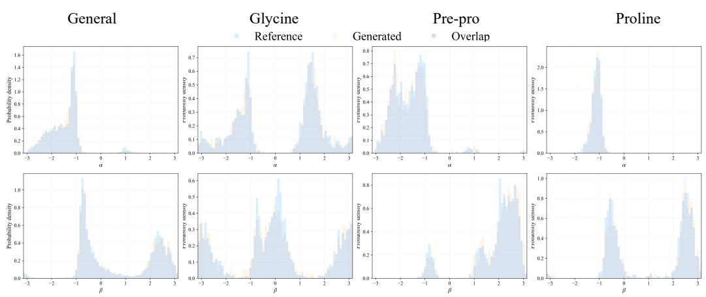  
Figure 6: One-dimensional protein torsion marginals for the General, Glycine, Pre-Pro, and Proline subsets, comparing the reference and WKBC-generated distributions. These coordinate-wise marginals complement the joint wrapped-coordinate endpoint visualization reported in the main text.

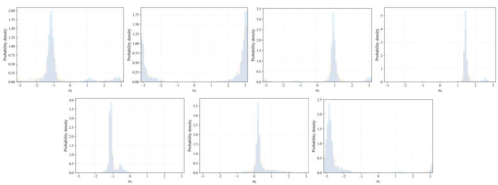  
Figure 7: Coordinate-wise RNA torsion marginals on $\mathbb { T } ^ { 7 } .$ , comparing the reference and WKBCgenerated distributions. The seven periodic coordinates exhibit heterogeneous marginal structures ranging from sharply concentrated modes to broader asymmetric profiles.

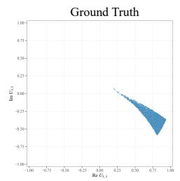

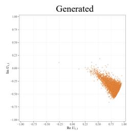

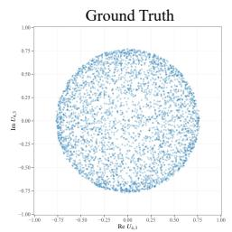  
(a) Quantum-oscillator-induced target distribution on U(4)

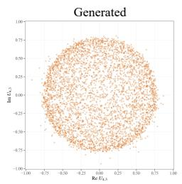

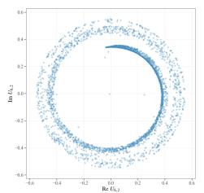

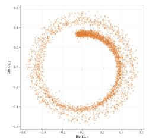  
(b) Quantum-oscillator-induced target distribution on U(6)

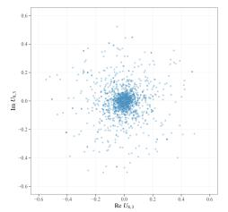

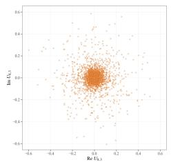  
(c) Quantum-oscillator-induced target distribution on U(8)

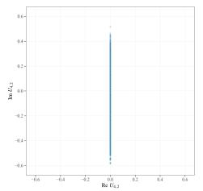

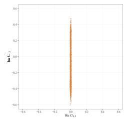  
(d) TFIM-induced target distribution on U(4)

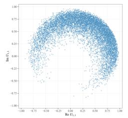

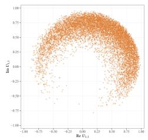  
(e) TFIM-induced target distribution on U(8)

Figure 8: Projected reference and RCCBM-generated samples for the oscillator- and TFIM-induced $U ( n )$ tasks. Panels (a)–(c) show the quantum-oscillator-induced distributions on U(4), U(6), and $U ( 8 )$ , respectively, while panels (d)–(e) show the TFIM-induced distributions on U(4) and U(8).

Table 11: Training and sampling settings used for the reported RCCBM experiments on $S O ( 3 )$ and $U ( n )$ . The table summarizes endpoint calibration, reciprocal training, control and refinement batches, network architecture, replay, integration, and calibrated-initial-state settings; the final column specifies the associated implementation or reporting convention.
<table><tr><td>Parameter</td><td>SO(3) v5</td><td> $U ( n ) \ : \mathrm { v } 5$ </td><td>Reporting convention</td></tr><tr><td>Endpoint calibration</td><td>600 steps; pool 4096</td><td>600 steps; pool 4096</td><td>bounded endpoint nets, width 192, 4 residual blocks each</td></tr><tr><td>Outer epochs</td><td>30</td><td>30</td><td>reciprocal outer epochs</td></tr><tr><td>Updates per epoch</td><td></td><td>1200 match + 300 refine 1100 match + 400 refine report stages separately</td><td></td></tr><tr><td>Control batch</td><td>4096</td><td>3072</td><td>replay control matching</td></tr><tr><td>Refinement batch</td><td>128</td><td>128</td><td>fresh stochastic rollouts</td></tr><tr><td>Coupling batch</td><td>512</td><td>256</td><td>reference-weighted triples</td></tr><tr><td>CondSOC smoothness λSE 0.5</td><td></td><td>0.5</td><td>empirical smoothness weight</td></tr><tr><td>Direct control net</td><td>width 512, 10 blocks</td><td>width 512, 18 blocks</td><td>LayerNorm-SiLU, resid- ual divided by √2</td></tr><tr><td>Time embedding</td><td>128</td><td>128</td><td>sinusoidal plus time-to- go</td></tr><tr><td>Terminal-window Aterm</td><td>start 0.75</td><td>0.75</td><td>terminal component sup- ported on  $[ a _ { \mathrm { t e r m } } T , T ]$ </td></tr><tr><td>Terminal replay fraction 0.55 Tterm</td><td></td><td>0.65</td><td>probability of terminal- window time draw</td></tr><tr><td>Derived density floor  $\underline { { \lambda T } }$ </td><td>0.600</td><td>0.467</td><td>Eq. (A.5); derived, not tuned</td></tr><tr><td>Generation</td><td>128 stochastic steps</td><td>128 stochastic steps</td><td>exact-OU Lie-Trotter</td></tr><tr><td>Calibrated initial state</td><td>enabled</td><td>enabled</td><td>same law for teacher, re- finement, generation</td></tr><tr><td>On-policy refresh</td><td>not applied</td><td>not applied</td><td>fixed reciprocal training schedule</td></tr></table>

## E EXPERIMENT SETTINGS

## E.1 ENDPOINT, REFERENCE, AND OPTIMIZATION SPECIFICATION

Every experiment specifies $( \mathcal { O } _ { 0 } , \rho _ { 0 } ) , ( \mathcal { O } _ { T } , \rho _ { T } )$ , the reference initial density $q _ { 0 } , ( \gamma , \alpha , T )$ , the endpoint mollifier $\kappa _ { \varepsilon }$ , and the integration grid. WKBC uses the wrapped-kernel implementation, whereas RCCBM uses two bounded endpoint-corrector networks and a DirectControlNet. The random seed is fixed to 1209 for the reported training and sampling configurations.

For RCCBM, Eq. (B.13) approximates the mollified population initial law and is used for refinement and generation; teacher conditions are sampled or importance-weighted toward Eq. (3.18). Replay balancing and terminal oversampling use the importance correction in Eq. (B.11). Refinement is accepted only if Eq. (B.12) holds. Endpoint calibration, CondSOC, importance-weighted control matching, constrained refinement, and validation are logged as distinct stages.

RCCBM ablations The active-component panel evaluates RCCBM variants w/o endpoint calibration, terminal replay, the local-scale term, distribution refinement, spectral features, or calibrated initial-state sampling, together with a fixed-common-random-number CondSOC variant. The calibrated-initial-state ablation directly probes the empirical initial-law consistency condition in Assumption B.22. The General-task WKBC ablation additionally varies endpoint smoothing and the time-sampling distribution.

Table 11 records the training and sampling settings used for the reported RCCBM experiments. The time-density lower bound is determined exactly by Eq. (A.5): the reported $S O ( 3 )$ and ${ \bf { \hat { U } } } ( n )$ mixtures give $\underline { { \lambda } } = \ : \dot { 0 . 6 0 } / T$ and $7 / ( 1 5 T ) \approx 0 . 4 6 7 / T$ , respectively. Thus $\underline { { \lambda } }$ is a derived theorem constant, whereas $a _ { \mathrm { t e r m } }$ and $r _ { \mathrm { t e r m } }$ are the actual sampling hyperparameters. For WKBC, the bridge-weighted regression of Proposition B.9 uses the fixed uniform time density $1 / T ;$ the former occupation-ratio constant $C _ { \mathrm { o c c } }$ is not used or tuned, as explained in Remark B.10.

The CondSOC terminal kernel uses the reported concentration parameters 600 on $S O ( 3 )$ and 800 on $U ( n )$ . The normalized control-energy coefficient in Eq. (B.9) is fixed at $1 / 2 .$ , and the empirical smoothness coefficient is $\lambda _ { \mathrm { S E } } = 0 . 5$ in all reported RCCBM runs. Independent noise is used during optimization and for the held-out teacher rollout, with antithetic sampling when configured. The final checkpoint is chosen by the fixed validation distribution objective. Final validation MSE, relative $\mathrm { M S E } ,$ and cosine are recomputed after distribution refinement.

Computational workload A generated RCCBM trajectory uses 128 direct-control evaluations. Training workload is reported as endpoint calibration plus matching and refinement updates; Cond-SOC inner iterations and teacher rollout counts are listed separately in the released configuration. WKBC workload reporting remains unchanged and includes lattice, quadrature, Sinkhorn, scoreregression, and integration costs.

Reproducibility record Every numerical row is indexed by a configuration file recording the seed, data split, reference pool, endpoint checkpoint rule, ESS threshold, CondSOC settings, replay sampler, refinement weights, validation panel, and evaluator settings. The manifest also records the calibrated-initial-state and on-policy-refresh settings used for each run.

## E.2 GEOMETRIC AND BRIDGE DIAGNOSTICS

## E.2.1 RCCBM ENDPOINT, TEACHER, CONTROL, AND STRUCTURE DIAGNOSTICS

For normalized pool weights $\overline { { w } } _ { i }$

$$
\mathrm { E S S } = \left( \sum _ { i } \overline { { w } } _ { i } ^ { 2 } \right) ^ { - 1 } , \qquad \mathrm { E S S } ( \% ) = 1 0 0 \frac { \mathrm { E S S } } { N _ { Q } } .
$$

Endpoint calibration reports the empirical dual, ESS, and held-out marginal feature error. CondSOC reports train and independent-noise terminal error, normalized teacher energy, and smoothness. Direct control matching reports MSE, relative MSE, and cosine on a fixed validation replay; all three are recomputed after terminal refinement.

For $S O ( 3 )$ , structure error reports $\left\| \boldsymbol { R } ^ { \top } \boldsymbol { R } - \boldsymbol { I } \right\| _ { \mathrm { F } }$ and $| \operatorname* { d e t } R - 1 |$ , with mean and maximum. For $U ( n )$ , it reports $\left\| U ^ { \dagger } U - I \right\| _ { \mathrm { F } } .$ . These quantities measure numerical preservation of the Lie group constraint under the exponential update.

## E.2.2 MMD, SLICED-WASSERSTEIN, LOCAL PRECISION/COVERAGE, AND INTRINSIC COSTS

The RCCBM feature MMD uses a positive finite mixture of Gaussian kernels on the fixed full-rank target-whitened identification features $\Phi _ { \mathsf { G } } ^ { \mathrm { i d } }$ defined in Eq. (B.24). For $S O ( 3 )$ , this map is obtained from all nine matrix entries; for $U ( n )$ , it uses all real and imaginary matrix entries; and for the compact reduced product group it additionally uses the standard $( \cos \theta , \sin \theta )$ embedding of each torus coordinate. The regularized whitening transform is invertible and full dimensional. Spectral features used in the $U ( n )$ controller serve as auxiliary optimization-facing features, while the fixed targetwhitened embedding $\Phi _ { \mathsf { G } } ^ { \mathrm { i d } }$ defines the MMD identification map. A target-versus-target split provides the finite-sample floor. The sliced-Wasserstein term uses a fixed bank of random directions. Local precision and coverage are reported separately from generated-to-target and target-to-generated kNN radii, and their combined local training term aggregates these complementary neighborhood diagnostics.

For empirical endpoint measures, the debiased Sinkhorn divergence is

$$
S _ { \varepsilon } ( \widehat { \rho } , \widehat { \nu } ) = \mathrm { O T } _ { \varepsilon } ( \widehat { \rho } , \widehat { \nu } ) - \frac { 1 } { 2 } \mathrm { O T } _ { \varepsilon } ( \widehat { \rho } , \widehat { \rho } ) - \frac { 1 } { 2 } \mathrm { O T } _ { \varepsilon } ( \widehat { \nu } , \widehat { \nu } ) ,
$$

using squared intrinsic torus or $S O ( 3 )$ cost. The regularization, sample count, and stopping rule are fixed across methods. We report the resulting finite-sample entropic geodesic Wasserstein quantity as a proxy for the population Wasserstein discrepancy.

For paired torus samples,

$$
\mathrm { G e o R M S E } = \left[ \frac { 1 } { N d } \sum _ { n = 1 } ^ { N } \sum _ { j = 1 } ^ { d } \mathrm { w r a p } ( \widehat { \theta } _ { n , j } - \theta _ { n , j } ) ^ { 2 } \right] ^ { 1 / 2 } .
$$

The pairing is fixed before training, so GeoRMSE measures geometric error under this predetermined evaluation correspondence. Ramachandran JSD and ValidRate use a common periodic partition and a validity region fixed without generated test samples.

## E.2.3 NORMALIZED-CONTROL ENERGY

If the velocity drift correction is $\alpha { \pmb u } _ { t } .$ , the reported energy is

$$
\mathcal { E } _ { \mathrm { p a t h } } = \frac { 1 } { 2 } \mathbb { E } \int _ { 0 } ^ { T } \left. \pmb { u } _ { t } \right. ^ { 2 } \mathrm { d } t .
$$

Cross-method comparison requires the same reference process, diffusion coefficient, time horizon, initial-state law, and integration grid.

## E.2.4 PROTEIN CONFORMATIONAL TRANSITION PATHWAY EVALUATION

The pathway diagnostics for the Protein Conformational Transition Pathway Generation task are evaluated in the same reduced state space used by the generator, using molecular-dynamics trajectories from mdCATH domain 1jvmB00. The production representation is

$$
\mathsf { G } _ { \mathrm { r e d } } = S O ( 3 ) ^ { 6 3 } \times \mathbb { T } ^ { 1 9 2 } .
$$

Write two reduced conformations as

$$
g = ( R _ { 1 } , \ldots , R _ { n _ { R } } , \theta _ { 1 } , \ldots , \theta _ { K } ) , \qquad h = ( S _ { 1 } , \ldots , S _ { n _ { R } } , \phi _ { 1 } , \ldots , \phi _ { K } ) ,
$$

with $n _ { R } = 6 3$ and $K = 1 9 2$ . For each rotation factor and torus coordinate, respectively, define

$$
\delta _ { i } ^ { R } ( g , h ) = \big ( \mathrm { L o g } ( R _ { i } ^ { \top } S _ { i } ) \big ) ^ { \vee } , \qquad \delta _ { j } ^ { \theta } ( g , h ) = \mathrm { w r a p } ( \phi _ { j } - \theta _ { j } ) \in ( - \pi , \pi ] .
$$

The intrinsic product distance used by the evaluator is

$$
\begin{array} { c } { { d _ { \mathrm { r e d } } ( g , h ) ^ { 2 } = \displaystyle \frac { 1 } { n _ { R } } \sum _ { i = 1 } ^ { n _ { R } } \left\| \delta _ { i } ^ { R } ( g , h ) \right\| ^ { 2 } + \lambda _ { \theta } \displaystyle \frac { 1 } { K } \sum _ { j = 1 } ^ { K } \left| \delta _ { j } ^ { \theta } ( g , h ) \right| ^ { 2 } , } } \\ { { \lambda _ { \theta } = \displaystyle \frac { K } { n _ { R } } = \displaystyle \frac { 1 9 2 } { 6 3 } \approx 3 . 0 4 7 6 1 9 . } } \end{array}
$$

This choice assigns the same coefficient to every Lie algebra coordinate after accounting for the three coordinates in each $\mathfrak { s o } ( 3 )$ factor. It agrees with the production geometry up to a common global scale; the two reported dimensionless diagnostics are unchanged by such a common scaling.

Common temporal grid Each MD pair contains the 101 stored states from the source frame through the target frame at lag 100. The RCCBM sampler uses 128 stochastic integration steps. To prevent the roughness statistic from being confounded by different temporal resolutions, both trajectories are evaluated on the same normalized-time grid $s _ { m } = m / 1 0 0 , m = 0 , \ldots , 1 0 0$ . RCCBM states are interpolated intrinsically: for $R _ { a } , R _ { b } \in S O ( 3 )$

$$
R ( \alpha ) = R _ { a } \mathrm { E x p } \big ( \alpha \mathrm { L o g } ( R _ { a } ^ { \top } R _ { b } ) \big ) , \qquad 0 \leq \alpha \leq 1 ,
$$

and each torus coordinate is interpolated along the wrapped angular difference.

Target-aware path tortuosity For a discrete trajectory ${ \boldsymbol { \gamma } } = ( g _ { 0 } , \dots , g _ { M } )$ with prescribed target $g _ { T } ^ { \star }$ , define its accumulated intrinsic length by

$$
L ( \gamma ) = \sum _ { k = 0 } ^ { M - 1 } d _ { \mathrm { r e d } } \bigl ( g _ { k } , g _ { k + 1 } \bigr ) .
$$

The target-aware tortuosity is

$$
\tau _ { T } ( \gamma ) = \frac { L ( \gamma ) + d _ { \mathrm { r e d } } ( g _ { M } , g _ { T } ^ { \star } ) } { d _ { \mathrm { r e d } } ( g _ { 0 } , g _ { T } ^ { \star } ) } .
$$

The terminal-residual term is essential for the generated trajectories: it prevents a path that fails to reach the prescribed target from receiving an artificially favorable score merely because it travels a shorter distance. For the observed MD segment, $g _ { M } = g _ { T } ^ { \star }$ and the residual vanishes. By the triangle inequality, $\tau _ { T } \geq 1 $ ; values closer to one indicate less geometric detour. For pair $p ,$ with one MD path and $S = 3 2 \mathrm { R C C B M }$ samples, the reported pairwise gain is

$$
\mathrm { D i r e c t n e s s G a i n } _ { p } = 1 0 0 \left( 1 - \frac { S ^ { - 1 } \sum _ { s = 1 } ^ { S } \tau _ { T } ( \gamma _ { p , s } ^ { \mathrm { S B } } ) } { \tau _ { T } ( \gamma _ { p } ^ { \mathrm { M D } } ) } \right) \mathcal { Y } _ { 0 } .
$$

Normalized Lie algebra path roughness For each adjacent pair of states, define the Lie algebra increment $\eta _ { k } \in { \mathfrak { g } } _ { \mathrm { r e d } }$ by

$$
\eta _ { k , i } ^ { R } = \big ( \mathrm { L o g } ( ( R _ { k , i } ) ^ { \top } R _ { k + 1 , i } ) \big ) ^ { \vee } , \qquad \eta _ { k , j } ^ { \theta } = \mathrm { w r a p } ( \theta _ { k + 1 , j } - \theta _ { k , j } ) .
$$

The squared norm is weighted consistently with the product distance,

$$
\left\| \eta _ { k } \right\| _ { W } ^ { 2 } = \frac { 1 } { n _ { R } } \sum _ { i = 1 } ^ { n _ { R } } \left\| \eta _ { k , i } ^ { R } \right\| ^ { 2 } + \lambda _ { \theta } \frac { 1 } { K } \sum _ { j = 1 } ^ { K } \left| \eta _ { k , j } ^ { \theta } \right| ^ { 2 } .
$$

The normalized roughness statistic is

$$
\begin{array} { r l } {  { \mathcal { R } ( \gamma ) = \frac { \displaystyle \sum _ { k = 0 } ^ { M - 2 } \| \eta _ { k + 1 } - \eta _ { k } \| _ { W } ^ { 2 } } { \displaystyle \sum _ { k = 0 } ^ { M - 1 } \| \eta _ { k } \| _ { W } ^ { 2 } + \varepsilon } , } \quad } & { \varepsilon = 1 0 ^ { - 1 2 } . } \end{array}
$$

The numerator measures changes in successive local displacement vectors, whereas the denominator normalizes by the total local motion. Thus a trajectory with approximately persistent local direction and amplitude has small roughness, while repeated reversals, abrupt directional changes, or local oscillations increase the statistic. The quantity is nonnegative but is not constrained to be below one. The pairwise relative reduction is

$$
\mathrm { R o u g h n e s s R e d u c t i o n } _ { p } = 1 0 0 \left( 1 - \frac { S ^ { - 1 } \sum _ { s = 1 } ^ { S } \mathcal { R } ( \gamma _ { p , s } ^ { \mathrm { S B } } ) } { \mathcal { R } ( \gamma _ { p } ^ { \mathrm { M D } } ) } \right) \mathcal { Y } _ { 0 } .
$$

Aggregation and evaluation protocol For each endpoint pair, the 32 stochastic trajectories are summarized by their mean and standard deviation. Aggregate percentages are computed from the ratio of the $P = 1 5$ pair-level means,

$$
1 0 0 \left( 1 - \frac { P ^ { - 1 } \sum _ { p = 1 } ^ { P } \overline { { \tau } } _ { p } ^ { \mathrm { S B } } } { P ^ { - 1 } \sum _ { p = 1 } ^ { P } \tau _ { p } ^ { \mathrm { M D } } } \right) = 9 5 . 0 6 \% \qquad 1 0 0 \left( 1 - \frac { P ^ { - 1 } \sum _ { p = 1 } ^ { P } \overline { { \mathcal { R } } } _ { p } ^ { \mathrm { S B } } } { P ^ { - 1 } \sum _ { p = 1 } ^ { P } \mathcal { R } _ { p } ^ { \mathrm { M D } } } \right) = 9 9 . 2 1 \% ,
$$

with $P = 1 5$ . The evaluation uses a prespecified held-out pair list, and target-aware tortuosity is computed from the prescribed target according to the rule defined above.