# SEAL: Reinforcing Global Safety in Mixture-of-Experts through Shared Expert ALignment

Qingyu Meng q.meng@vu.nl Vrije Universiteit Amsterdam Amsterdam, Netherlands

Koen Hindriks Vrije Universiteit Amsterdam Amsterdam, Netherlands

Yiwei Zha Vrije Universiteit Amsterdam Amsterdam, Netherlands

Herbert Bos Vrije Universiteit Amsterdam Amsterdam, Netherlands

Jiahuan Pei Vrije Universiteit Amsterdam Amsterdam, Netherlands

Min Chen∗ m.chen2@vu.nl Vrije Universiteit Amsterdam Amsterdam, Netherlands

## Abstract

Mixture-of-Experts (MoE) is a scaling architecture for large lan-guage models that activates only a small subset of expert modules per token, enabling massive parameter growth with nearly constant computation. Recent Hybrid MoE architecture adds shared experts to capture consistently useful representations, further improving stability and generalization. MoE now powers many flagship open-source and commercial models, yet remains vulnerable to adver- sarial attacks. Specifically, sparse routing introduces a structural vulnerability: MoE safety hinges on which experts are activated, and adversaries can subvert this selection through jailbreak prompts, malicious fine-tuning, and weight-level pruning of safety-critical neurons. Existing defenses primarily focus on hardening the router, but an adversary may still manipulate or bypass the routing trajectory due to the routing process’s nondeterministic nature, thereby collapsing the defense.

To cope with this problem, we first identify theoretically and empirically that shared expert, an always-activated component containing a small proportion of safety-critical neurons, can overcome the uncertainty of sparsely activated routing path and serve as a router-independent anchor to enhance global safety alignment. Based on this insight, we propose SEAL, a training-time parameter-eficient defense that produces a plug-and-play adapter attached to shared expert, and SEAL++, a variant that adds an orthogonal constraint preserving pre-existing safety subspaces during training. We evaluate SEAL and SEAL++ across six attack scenarios that combine three adversarial inputs (harmful prompting, jailbreak, malicious fine-tuning) with and without neuron pruning. SEAL reduces attack success rate (ASR) by up to 60%, at a capability cost of at most 1.4% on a five-benchmark average. Additionally, SEAL can seamlessly integrate with router-level defenses for stronger defense. Under this setting, we can further decrease the ASR to 4.8%, more than five times lower than router-level defense alone. More broadly, our work demonstrates that shared experts consti- tute a unique defense surface overlooked by prior work, ofering a complementary safety alignment pathway.

CCS Concepts   
• Security and privacy; • Computing methodologies → Artificial intelligence; • Information systems → Information retrieval;

## Keywords

Mixture-of-Experts, AI security, Safety Alignment, Shared Experts, LLM Defense.

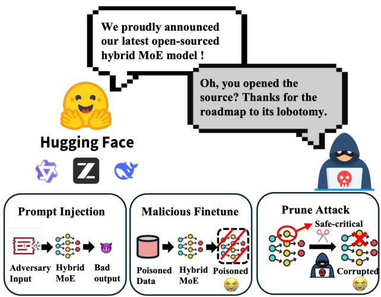  
Figure 1: Three attack surfaces of hybrid MoE-based models. A malicious user can download any open-source model and apply three types of safety misalignment to bypass its safety guardrails. Prompt injection, malicious fine-tuning, and neuron pruning all exploit the same structural weakness: safety behavior depends on the experts selected.

## 1 Introduction

Mixture-of-Experts (MoE) is a scaling strategy for large language models. It replaces selected feed-forward layers with parallel expert modules and a lightweight router that activates only a small subset of experts per input token. This design allows parameter counts to grow from billions to trillions while keeping per-token com- pute roughly constant. Currently, MoE architecture is the basis of many widely deployed language models, including GPT-OSS [43], Llama 4 [41], Qwen3.5 [48], Nemotron-3 [42], and Mixtral [25].

Classical MoE activates only the top-� of � experts per token [16], so every expert competes for specialization and there is no principled place for knowledge that every token needs. Re- cent hybrid MoE designs close this gap with shared experts, modules that execute on every token regardless of routing [9], recog- nizing that some knowledge is too universal to leave to a router that cannot guarantee delivery. Since its introduction, the shared expert design has propagated far beyond its original model demonstration and now appears in many frontier open-weight hybrid-MoE releases. Verified recent deployments include the DeepSeek V2/V3/R1/V4 family [11, 20], the shared-expert Qwen MoE releases (Qwen1.5-MoE, Qwen2-MoE, Qwen3-Next, and Qwen3.5) [62], the GLM-4.5/4.6/4.7-Flash series [17], Kimi-K2 [29], Hunyuan-Large and Hunyuan-TurboS [52, 55], Meta’s Llama 4 [41], and Google’s Gemma 4 26B-A4B [18]. Meta, Google, and Nvidia each adopted this pattern for their most recent frontier MoE releases, consolidat- ing the shared-expert design as the prevailing industrial choice for hybrid MoE and placing every modern open-weight deployment of this family within scope of a shared-expert-targeted defense.

Attacks on MoE Safety. Sparse routing exposes three distinct attack surfaces. An attacker can construct adversarial inputs $( \mathcal { A } _ { \mathrm { i n p u t } } )$ to elicit harmful outputs by exploiting model behavior and manipu- lating routing distributions to bypass safety-critical experts [31, 59]. An attacker with direct access to model weights $( \mathcal { A } _ { \mathrm { w e i g h t } } )$ can iden- tify and prune safety-critical experts or neurons, disabling safety at inference time [60, 61]. An attacker can launch malicious finetuning attacks $( \mathcal { R } _ { \mathrm { t r a i n } } )$ to misalign the model [47]. All of these attacks, described in Figure 1, exploit the same structural vulnerability of MoEs: safety depends on which experts are selected, and an attacker who controls that selection can degrade safety.

Defenses for MoEs. Two families of MoE-specific defense have emerged, but neither fully addresses the existing vulnerability. Router-level defenses [15, 28] harden the gating decision through KLregularized routing or inference-time logit steering, and so depend on the routing mechanism to be reliable. Routed-expert interventions [34] fine-tune the safety-critical routed experts themselves, but can only raise safety on tokens the router still delivers to those experts. In either case the router is the central guarded part of the defense, so neither family hardens against adversaries who can manipulate routing or ignore it.

Beyond the defense strategies discussed above, the inherent always-active nature of shared experts opens up a new defense sur- face in MoE architectures. Unlike routed experts, whose activation is controlled by the router and therefore subject to manipulation, shared experts remain consistently engaged regardless of how an attacker compromises the routing mechanism. Despite this natural advantage, no prior work has studied or explored the shared expert as a dedicated safety component, leaving a significant gap that our work is the first to address.

We systematically investigate the shared-expert parameter sub space as a safety surface across four hybrid MoE architectures, and find that shared experts carry safety-relevant neurons at per- parameter density comparable to routed experts (shared-to-routed density ratio between 0.63 and 0.89 across the four models), yet, unlike routed experts, they execute unconditionally on every to- ken, so their safety contribution is active on every forward pass regardless of routing state. Despite this combination of meaning- ful density and guaranteed execution, no existing defense targets the shared-expert subspace, leaving an architecturally guaranteed safety surface unexploited. On the basis of this finding, we propose SEAL (Shared Expert ALignment), a training-time framework that reinforces shared experts for router-independent safety enforce- ment. SEAL trains Direct Preference Optimization (DPO)-based Low-Rank Adaptation (LoRA) adapters restricted to shared-expert projections, modifying only ∼0.25% of model parameters. SEAL++ extends SEAL with an orthogonal constraint on the profiled safety subspace, which prevents DPO training from overwriting the preexisting safety-critical directions that make safety neurons robust to pruning. SEAL operates exclusively on shared-expert parameters, a subset distinct from the routing parameters targeted by existing router-level defenses [28, 34], so the two families do not interfere and can be directly composed. Deploying SEAL on top of routing-level protections therefore yields defense in depth, where router-level methods guard the routing mechanism and SEAL an- chors safety in a parameter region the router cannot reach.

Our contributions are as follows:

• We identify shared experts as a previously unexplored, routerindependent safety surface in hybrid MoE architectures. Empiri-cal analysis across four open-weight models shows that shared- expert parameters carry safety-relevant neurons at a per-parameter density comparable to routed experts while being activated on every token, establishing the concept of safety shared experts as dedicated defense anchors.

• We propose SEAL, a training-time defense that applies DPO-based LoRA adapters exclusively to shared expert projections, modifying only 0.06–0.25% of total model parameters and encod- ing router-independent safety representations.

• We extend SEAL with SEAL++, which adds an orthogonal con-straint that prevents DPO training from overwriting pre-existing safety-critical subspaces, further raising the cost ofpost-deployment neuron-level pruning attacks.

• We conduct a comprehensive evaluation of SEAL and SEAL++ against the three threat-model scenarios and compound attacks that combine prompt injection, malicious fine-tuning, and neuronlevel pruning, and additionally show that SEAL++ composes with router-level defenses to further strengthen pruning robustness at negligible capability cost.

## 2 Preliminaries

## 2.1 Transformer and MoE Architectures

A large language model (LLM) parameterized by � generates tokens autoregressively through a stack of � Transformer layers. At layer �, a self-attention sublayer captures inter-token dependencies, and a feed-forward network (FFN) sublayer transforms the resulting hidden state $\mathbf { h } ^ { ( l ) } \in \mathbb { R } ^ { d }$ . In dense Transformers, every FFN parameter participates in every forward pass, coupling the total parameter count directly to per-token compute.

Mixture-of-Experts (MoE) architectures decouple the parameters from the computation by replacing selected FFN sublayers with � parallel expert modules and a lightweight router (gating network) $\mathbf { \bar { \boldsymbol { R } } } : \mathbb { R } ^ { d } \to \mathbf { \bar { \boldsymbol { \{ 0 , 1 \} } } } ^ { E }$ . Given an input token representation $\textbf { x } \in \mathbb { R } ^ { d }$ the router assigns scores to all experts and activates only the top- $k ( k \ll E ,$ typically 2–8). The remaining experts stay dormant. This conditional activation allows parameter counts to scale from billions to trillions while keeping per-token FLOPs roughly constant. Crucially, diferent tokens traverse diferent subsets of parameters, making model behavior dependent on routing dynamics.

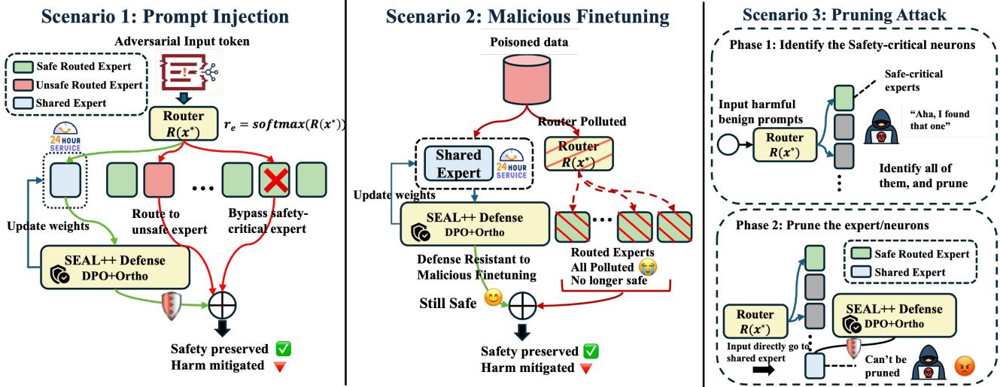  
Figure 2: Threat model. Three adversaries with escalating privileges $( \mathcal { A } _ { \mathrm { i n p u t } } , \mathcal { A } _ { \mathrm { t r a i n } } , \mathcal { A } _ { \mathrm { w e i g h t } } )$ target the MoE safety surface through prompt injection, malicious fine-tuning, and parameter-level pruning, respectively. SEAL restricts gradient updates to shared-expert parameters, producing a router-independent defense surface that persists across all three scenarios.

## 2.2 Hybrid MoE and Shared Experts

A Hybrid MoE layer at depth � partitions its FFN capacity into � shared experts (SE) $\{ g _ { s } \} _ { s = 1 } ^ { S }$ and � routed experts (RE) $\bar { \{ f _ { e } \} } _ { e = 1 } ^ { E }$ . Each expert implements a gated feed-forward network with three projection matrices (gate\_proj, up\_proj, down\_proj). For input hidden state $\mathbf { x } \in \mathbb { R } ^ { d }$ , the layer output is:

$$
h ( \mathbf { x } ) = \underbrace { \sum _ { s = 1 } ^ { S } g _ { s } ( \mathbf { x } ) } _ { \mathrm { s h a r e d : a l w a y s ~ a c t i v e } } + \underbrace { \sum _ { e = 1 } ^ { E } r _ { e } ( \mathbf { x } ) \cdot f _ { e } ( \mathbf { x } ) } _ { \mathrm { r o u t e d : c o n d i t i o n a l l y ~ a c t i v e } }\tag{1}
$$

where $r _ { e } ( \mathbf { x } ) \in \{ 0 , 1 \}$ denotes the binary top-� routing decision, satisfying $\begin{array} { r } { \sum _ { e = 1 } ^ { E } r _ { e } ( { \bf x } ) = k } \end{array}$ for a fixed $k \ll E$

Shared experts were introduced by Dai et al. [9] to aggregate common knowledge that would otherwise be repetitively encoded across multiple routed experts, thereby improving expert specialization and reducing inter-expert redundancy. Due to the fact that shared experts execute unconditionally on every token (Equation 1), their contribution to the layer output persists regardless of the router’s top-� selection. Routed experts, by contrast, only activate when selected by the router. This structural asymmetry between unconditional and conditional expert execution creates a unique defense surface in hybrid MoE architectures. This routing inde-pendence is the foundation for the approach. Table 8 provides a complete notation reference.

## 3 Threat Model

We formalize three adversarial scenarios in order of escalating attacker privileges, depicted in Figure 2. Let � denote model parameters and I denote the input interface.

Definition 3.1 (Adversary Capability).

Ainput Construct adversarial inputs $x \in \mathcal { I }$ to query model. Atrain Train model with attacker-controlled data. ${ \mathcal { A } } _ { \mathrm { w e i g h t } }$ Read and edit model parameters �.

Scenario A (Prompt Injection Attacks). Adversary with ${ \mathcal { A } } _ { \mathrm { i n p u t } }$ capability has black-box query access: the attacker can submit arbi- trary inputs � ∈ I and observe outputs, with limited knowledge of model architecture, weights, or internal routing decisions [51, 59]. The attacker constructs adversarial prompts, including template-based jailbreaks and human-crafted multi-turn manipulation, to steer model behavior toward harmful outputs. These prompts ex- ploit learned response patterns and may implicitly shift routing distributions away from safety-critical experts. A successful jail break causes the model to generate compliant responses to harmful instructions that its safety alignment would normally refuse. This scenario represents the most common real-world attack surface. Because shared-expert augmentation operates entirely at the pa-rameter level, it composes naturally with input-space defenses such as prompt classifiers and perplexity filters for layered protection.

Scenario B (Malicious Fine-Tuning). Adversary with $\mathcal { A } _ { \mathrm { t r a i n } }$ capa- bility has access to model weights and a training framework, en- abling supervised fine-tuning on attacker-controlled data [47]. This models a downstream user or supply-chain actor who weaponizes open weights models. The attacker fine-tunes the full model on harmful instruction-response pairs via standard supervised learning. Unlike Scenario A, the adversary can modify parameters through gradient updates, including routed expert weights which are not primarily targeted by shared-expert defense. Malicious fine-tuning overrides safety alignment by corrupting learned refusal behav- ior across the parameter space. This scenario reveals the extent to which safety encoding concentrated in shared experts persists under gradient-based attacks that modify the entire parameter space.

Scenario C (Pruning Attacks). Adversary with ${ \mathcal { A } } _ { \mathrm { w e i g h t } }$ capabil- ity obtains full model weights and can read and edit parameters directly, but cannot invoke gradient-based training [60, 61]. The key distinction from $\mathcal { A } _ { \mathrm { t r a i n } }$ is operational, as weight-level editing requires no training framework or curated fine-tuning data, and its GPU cost is limited to forward-pass activation profiling rather than full gradient-based training, making it feasible in inference- only deployments. The attacker profiles activations on harmful and benign datasets, identifies safety-critical neurons, and masks them at inference time. This covers a malicious operator performing targeted weight surgery on a locally hosted model, a red-team auditor probing safety boundaries via selective neuron ablation, or a compression pipeline that removes safety-critical neurons during post-training sparsification. Recent work has shown that modifying only a small fraction of neurons can substantially degrade safety behavior in MoE models [60, 61], making this scenario a practical and low-cost surface. Selective neuron pruning disables safety be havior at inference time while preserving general capability. This is a particularly low-cost attack, and forms the primary evalua- tion axis of this work. A shared-expert defense raises the pruning cost by concentrating and reinforcing safety representations in the always-active parameter subspace.

Design Oracle. Given the three scenarios depicted above, a satisfactory defense for hybrid MoE safety alignment should meet four requirements. (D1) Non-privileged runtime access. The defender operates at training time on a benign development infrastructure, with white-box access to the model, a curated preference dataset of safe-versus-unsafe responses, and the ability to attach lightweight parameter-eficient modules. (D2) Utility preservation. The defense must not measurably degrade general capability, with capability drift on standard benchmarks bounded to within a small tolerance (we target ≤ 5%). (D3) Robustness. The defense must remain efective under $\mathcal { A } _ { \mathrm { i n p u t } } , \mathcal { A } _ { \mathrm { t r a i n } } .$ , and ${ \mathcal { A } } _ { \mathrm { w e i g h t } } .$ (D4) Afordable cost with minimum pipeline modification. The defense must fit into standard MoE fine-tuning pipelines without altering the router, routed experts, or serving infrastructure. SEAL satisfies (D1) by restricting parameter updates to shared-expert parameters using DPO-based LoRA adapters, (D2) by showing about only 1% perturbation to model ca-pability, (D3) by anchoring safety in an always-active subspace that persists under prompt injection, malicious fine-tuning, and pruning attacks, and (D4) by leaving router and routed-expert weights untouched. SEAL thus provides resilience rather than integrity, complementing weight checksums: a checksum detects whether weights have changed, while shared-expert augmentation ensures the model remains safer even after modification, providing defense in depth when integrity checks are absent or bypassed. Algorithm 1 and Algorithm 2 formalise the two training variants.

## 4 Our Method

In this section, we first motivate the use of shared experts as a safety augmentation surface in Section 4.1. Then we perform a feasibility

analysis in Section 4.2. We propose shared-expert-based defense method in Section 4.4 and its variant in Section 4.5.

## 4.1 Motivation

Four complementary arguments support shared experts as a suitable target for safety augmentation in hybrid MoE architectures.

Property 1: Unconditional Execution Guarantee. By Equation 1, the shared expert term $\textstyle \sum _ { s = 1 } ^ { S } g _ { s } ( \mathbf { x } )$ executes for every input x regardless of the routing function �. Safety behavior encoded in shared expert parameters $\Theta _ { \mathrm { s h a r e d } } = \{ \theta _ { g _ { s } } \} _ { s = 1 } ^ { S }$ therefore activates on every token, even when the router is fully compromised. This guaran- tee is complementary to router-dependent defenses [28, 34] that strengthen safety when routing is intact : shared-expert augmentation provides an additional fallback that holds regardless of routing state, and combining both could yield a globally stronger defense than either alone.

Property 2: Attack Surface Reduction. The attacks discussed in Section 3 share a common pattern: they exploit the separation between safety-carrying parameters and the routing path. Pruning attacks [60, 61] show that disabling 1–5% of neurons sufices to collapse safety alignment, with shared experts carrying disproportionate safety impact relative to their size. Routing-level attacks [31] bypass safety-critical experts through distribution shifts. Placing safety augmentation in shared experts forces the attacker to target a component that is architecturally guaranteed to execute, miti-gating routing bypass as an attack and raising the efort required for safety removal. Figure 3 quantifies this asymmetry across four architectures. Safety neurons are present in both expert types, with a shared-to-routed per-module density ratio of 0.63 (Qwen1.5), 0.88 (DeepSeek), 0.89 (GLM), and 0.86 (Qwen3.5). Despite the slightly lower per-module density on shared experts, the guaranteed execu- tion from Property 1 ensures every safety neuron in this subspace contributes to every forward pass, making it a reliable anchor for safety augmentation.

Property 3: Defense Isolation. Shared experts constitute a small fraction of total model parameters (Table 1). Restricting updates to shared experts avoids modifying routing weights, ensuring the defense does not introduce new attack surface through routing perturbation. Routed experts, which encode the majority of task- specific knowledge [9], remain frozen during the parameter up- dating process (Table 1). In MoE architectures, unconstrained fullmodel alignment risks representation collapse [6] through routing destabilization, further motivating the restriction to shared experts.

Property 4: Representation Isolation. In MoE training, loss gradi-ents decompose into an unconditional component through shared experts and a routing-conditional component through routed ex-perts [9, 37]. This implicit decoupling means safety features injected into shared experts occupy a subspace partially isolated from task- specific knowledge in routed experts, reducing gradient conflict during alignment training [13, 36, 58].

## 4.2 Parameter Cost

We instantiate SEAL on four representative hybrid-MoE models that used throughout the paper, chosen to cover the core axes of the hybrid-MoE design space. For each of the chosen model, we restrict LoRA adaptation [23] to the three projection matrices $( \mathsf { g a t e \_ p r o j }$ up\_proj, down\_proj) in every shared expert across all MoE layers. For a projection matrix $\mathbf { W } \in \dot { \mathbb { R } ^ { d _ { \mathrm { o u t } } \times d _ { \mathrm { i n } } } }$ with LoRA rank $r ,$ the adapter introduces � × $: ( d _ { \mathrm { i n } } + d _ { \mathrm { o u t } } )$ trainable parameters (matrices $\mathbf { A } \in \mathbb { R } ^ { \bar { r } \times d _ { \mathrm { i n } } }$ and $\mathbf { B } \in \mathbb { R } ^ { d _ { \mathrm { o u t } } \times r } )$ . The total trainable parameter count is:

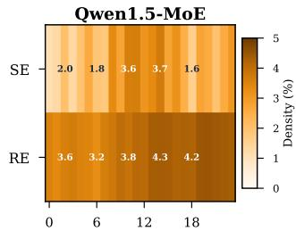

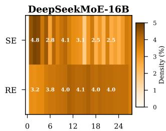

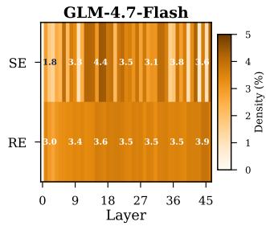

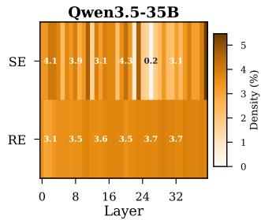  
Figure 3: Per-layer safety neuron density (%) distribution. Shared experts (SE) hold a relatively smaller absolute proportion, yet their unconditional execution makes each safety neuron active on every token, while routed-expert (RE) safety neurons contribute only when selected by the router.

Table 1: Parameter cost of shared expert training. Total: total parameter count; $L _ { \mathbf { M o E } } \colon$ number of MoE layers; � : shared experts per layer; �FFN: shared expert FFN dimension; Ratio: trainable fraction of total parameters.
<table><tr><td>Model</td><td>Total</td><td> $L _ { \mathbf { M o E } }$ </td><td>S</td><td>dFFN</td><td>Trainable 1 Ratio</td></tr><tr><td>Qwen1.5-MoE-A2.7B1</td><td>14.3B</td><td>24</td><td>1 5,632</td><td></td><td>35.4M 0.25%</td></tr><tr><td>DeepSeekMoE-16B</td><td>16.4B</td><td>27</td><td>21,408</td><td></td><td>35.8M 0.22%</td></tr><tr><td>GLM-4.7-Flash</td><td>30B</td><td>46</td><td></td><td>1 1,536</td><td>31.7M 0.11%</td></tr><tr><td>Qwen3.5-35B-  $\mathrm { A } 3 \mathrm { B } ^ { 2 }$ </td><td>35B</td><td>40</td><td>1</td><td>512</td><td>19.7M 0.06%</td></tr></table>

$$
\left| \Theta _ { \mathrm { t r a i n } } \right| = \underbrace { L _ { \mathrm { M o E } } } _ { \mathrm { M o E \ l a y e r s } } \times \underbrace { S } _ { \mathrm { s h a r e d \ e x p e r t s } } \times \underbrace { 3 } _ { \mathrm { p r o j e c t i o n s } } \times \underbrace { r \cdot ( d + d _ { \mathrm { F F N } } ) } _ { \mathrm { p e r \ a d a p t e r } }\tag{2}
$$

where � is the hidden dimension, �FFN the intermediate (FFN) di-mension of each shared expert, $L _ { \mathrm { M o E } }$ the number of MoE layers, and � the number of shared experts per layer. All three projections share the same LoRA rank $r = 6 4$ and scaling factor $\alpha = 1 2 8$

Table 1 reports the concrete costs. Across all models, the trainable budget remains below 36M parameters (at most 0.25% of total model size), with over 99.75% of parameters frozen throughout training.

The variation in trainable parameter count reflects diferences in shared expert FFN dimensions and counts across models.

The preceding analysis establishes that shared experts possess a unique combination of security properties: unconditional execution that survives routing compromise, a compact parameter count (0.06–0.25%) that lowers the defense’s cost, and representational isolation from task-specific knowledge in routed experts. Targeting shared experts for safety augmentation is therefore an architectural choice, one that converts a structural invariant of hybrid MoE design into a concrete defense mechanism. We now describe how SEAL exploits this surface. The framework comprises two variants: SEAL (Section 4.4), which trains DPO-based LoRA adapters restricted to shared experts, and SEAL++ (Section 4.5), which adds an orthogonal constraint that preserves existing safety-critical neuron subspaces during training. Both operate at training time and incur zero inference overhead. We begin with safety-critical neuron identification (Section 4.3), then present each method in turn.

## 4.3 Safety-critical Neurons Identification

We identify safety-critical neurons in shared experts and construct a protection mask that defines the constrained dimensions for $\mathrm { S E A L + + }$ . The procedure repurposes the activation diferential anal-ysis from neuron pruning attacks [60] for defense: the neurons identified by the attacker to locate safety-critical parameters are the same neuron sets we protect.

For shared expert module $( l , s )$ , we collect activations on harmful prompt dataset $\mathcal { D } _ { h }$ and benign prompt dataset $\mathcal { D } _ { b }$ at the interme- diate representation. The per-neuron activation diferential $\Delta a _ { i } ^ { ( l , s ) }$ (Equation 12 in Appendix E) quantifies each neuron’s preferential activation on harmful content. Safety-critical neurons are identified via �-score thresholding:

$$
N _ { \mathrm { s a f e } } ^ { ( l , s ) } = \left\{ j : \frac { | \Delta a _ { j } ^ { ( l , s ) } | - \mu _ { \Delta } } { \sigma _ { \Delta } } > \zeta \right\} , \quad \zeta = 2 . 0\tag{3}
$$

The safety module $\mathbf { C } _ { \mathrm { S E } } ^ { ( l , s ) }$ is a diagonal matrix that masks the identi- fied safety neurons:

$$
[ \mathbf { C } _ { \mathrm { S E } } ^ { ( l , s ) } ] _ { j j } = { \left\{ \begin{array} { l l } { 0 } & { { \mathrm { i f ~ } } j \in N _ { \mathrm { s a f e } } ^ { ( l , s ) } } \\ { 1 } & { { \mathrm { o t h e r w i s e } } } \end{array} \right. }\tag{4}
$$

By construction, $\mathbf { C } _ { \mathrm { S E } }$ is a binary diagonal mask satisfying $\mathbf { C } _ { \mathrm { S E } } ^ { 2 } = \mathbf { \Phi }$ $\mathbf { C } _ { \mathrm { S E } }$ (idempotent). The complementary matrix $\mathbf { I } - \mathbf { C } _ { \mathrm { S E } }$ selects precisely the safety-critical neuron dimensions. Since safety neurons typically constitute 1% to 3% of the intermediate representation [4, 60], the constraint removes a small fraction of the update space while protecting the most safety-relevant dimensions. The profiling requires approximately 300 harmful and 300 benign prompts [32] and runs once per model architecture. The resulting matrices are precomputed and frozen during all subsequent training.

## 4.4 SEAL: Shared Expert ALignment

SEAL applies low-rank adaptation [23] exclusively to shared expert projection layers, while all other parameters remain frozen. For shared expert projection matrix $\mathbf { W } ^ { \left( l , s \right) } \in \mathbb { R } ^ { d _ { \operatorname { o u t } } \times d }$ , we attach

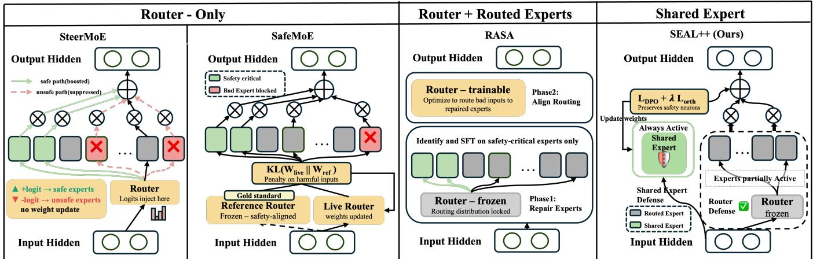  
Figure 4: Defense surfaces in MoE safety alignment. Router-only: SteerMoE [15] steers expert logits at inference; SafeMoE [28] regularizes the live router against a frozen safety-aligned reference. Router plus routed-expert: RASA [34] repairs safety-critical routed experts and re-aligns the router toward them. SEAL++ (ours) leaves both the router and routed experts untouched, training only the always-active shared expert with DPO plus an orthogonal constraint $\mathcal { L } _ { \mathbf { o r t h } } ,$ placing the defense on a parameter subset whose execution is router-independent.

Algorithm 1 SEAL Training Procedure   
Require: MoE architecture M with shared ex ert module set M   
Require: DPO training data $\mathcal { D } = \{ ( x _ { i } , y _ { w , i } , y _ { l , i } ) \} _ { i = 1 } ^ { N }$   
Ensure: Trained adapter �∗   
1: Attach LoRA adapters $\mathbf { A } ^ { ( l , s ) } \in \mathbb { R } ^ { r \times d } , \mathbf { B } ^ { ( l , s ) } \in \mathbb { R } ^ { d _ { \mathrm { o u t } } \times r }$ to each projection   
(gate\_proj, up\_proj, down\_proj) in every (�, �) ∈ M   
2: Freeze all parameters except $\theta = \{ ( \mathbf { A } ^ { ( l , s ) } , \mathbf { B } ^ { ( l , s ) } ) \} _ { ( l , s ) \in \mathcal { M } }$   
3: $\pi _ { \mathrm { r e f } }  \mathcal { M } \vert _ { \mathrm { B A } = 0 }$ {implicit: disable adapters}   
4: for each mini-batch $\mathcal { B } \subset \mathcal { D }$ do   
5: Compute LDPO on B using �� and $\pi _ { \mathrm { r e f } }$ {Equation 9}   
6: $\theta \gets \theta - \eta \nabla _ { \theta } \mathcal { L } _ { \mathrm { I } }$ DPO   
7: end for   
8: return $\theta ^ { * } \gets \theta$

adapters B $\mathrm { \bf { \tau } } \mathrm { \bf { \dot { \tau } } } \in \mathbb { R } ^ { d _ { \mathrm { o u t } } \times r }$ and $\mathbf { A } \in \mathbb { R } ^ { r \times d }$ with $r \ll \operatorname* { m i n } ( d _ { \mathrm { o u t } } , d )$ , producing efective weight:

$$
\mathbf { W } ^ { \prime } = \mathbf { W } + \mathbf { B } \mathbf { A }\tag{5}
$$

Training optimizes A and B via Direct Preference Optimization (DPO) [49] on safety preference data, which learns from human-annotated $( x , y _ { w } , y _ { l } )$ triples of prompt, chosen (safe) response, and rejected (unsafe/harmful) response (Equation 9 in Section 4.5). The low-rank parameterization serves two purposes beyond parameter eficiency: (1) it provides an implicit reference policy for DPO, since disabling the adapters $( \mathbf { B A } = \mathbf { 0 } )$ recovers the frozen base model $\pi _ { \mathrm { r e f } } ,$ eliminating the need for a separate model copy; (2) the explicit adapter matrices B and A expose the update ΔW in closed form, enabling the orthogonal constraint in SEAL++ (Equation 7). No orthogonality or safety-subspace constraint is imposed in SEAL. It provides a natural reference point for evaluating the additional efect of the orthogonal constraint in SEAL++.

While SEAL demonstrates that shared-expert DPO alone pro- vides substantial defense, unconstrained gradient updates may un- expectedly impair the pre-existing safety representations that make safety neurons identifiable and robust to pruning. SEAL++ seeks to address this gap by adding a geometric constraint that preserves these representations during training. Algorithm 1 summarizes the SEAL training procedure; the SEAL++ extension in Algorithm 2 adds the orthogonal-constraint step.

## 4.5 SEAL++: Shared Expert ALignment with Orthogonal Constraint

A growing body of work has shown that fine-tuning, even when intended to reinforce safety, can inadvertently disrupt a language model’s pre-existing safety alignment, overwriting the refusal-relevant subspace of the base model and leaving the resulting model behaviorally compliant but representationally fragile under down- stream attacks [22, 32, 47]. SEAL++ is designed to counter this potential side efect in the hybrid MoE setting.

SEAL++ extends SEAL with an orthogonal constraint that penalizes LoRA updates projecting onto the identified safety subspaces. The constraint prevents DPO training from overwriting the pre- existing safety representations that SEAL builds upon, so gradient updates that improve safety behavior no longer erode the geometric structure that makes safety neurons identifiable and robust to prun- ing. Preserving these safety-critical representations during training raises the cost of post-deployment neuron-level pruning attacks (Scenario C) and strengthens robustness to adversarial prompts (Scenario A).

4.5.1 Constrained Parameter Update. For each shared expert mod-ule $( l , s ) \in \mathcal { M }$ , the LoRA update $\Delta \mathbf { W } = \mathbf { B } ^ { ( l , s ) } \mathbf { A } ^ { ( l , s ) }$ decomposes into a safety-aligned component and a safety-orthogonal component:

$$
\mathbf { B A } = \underbrace { \left( \mathbf { B A } \right) \left( \mathbf { I } - \mathbf { C } _ { \mathrm { S E } } \right) } _ { \mathrm { s a f e t y - a l i g n e d ~ ( p e n a l i z e d ) } } + \underbrace { \left( \mathbf { B A } \right) \mathbf { C } _ { \mathrm { S E } } } _ { \mathrm { s a f e t y - o r t h o g o n a l ~ ( a l l o w e d ) } }\tag{6}
$$

Right-multiplication by I−CSE (Equation 4) retains only the columns of BA that correspond to safety neuron indices, projecting the update onto the safety-critical coordinate subspace. The orthogonal

constraint loss penalizes the safety-aligned component:

$$
\mathcal { L } _ { \mathrm { o r t h } } = \frac { 1 } { | \mathcal { M } | } \sum _ { ( l , s ) \in \mathcal { M } } \left\| \mathbf { B } ^ { ( l , s ) } \mathbf { A } ^ { ( l , s ) } \cdot ( \mathbf { I } - \mathbf { C } _ { \mathrm { S E } } ^ { ( l , s ) } ) \right\| _ { F } ^ { 2 }\tag{7}
$$

Minimizing ${ \mathcal { L } } _ { \mathrm { o r t h } }$ drives updates toward the $\left( d - r _ { s } \right)$ -dimensional safety-orthogonal subspace, where $r _ { s } = | N _ { \mathrm { s a f e } } ^ { ( l , s ) }$ denotes the number of safety neurons in layer �. The safety neurons typically constitute 1–3% of the intermediate dimension, imposing minimal restriction on task learning while protecting safety-critical directions.

4.5.2 Training Objective. The complete SEAL++ objective combines DPO [49] with the orthogonal constraint:

$$
\mathcal { L } _ { \mathrm { S E A L + + } } = \mathcal { L } _ { \mathrm { D P O } } + \lambda _ { \mathrm { o r t h } } \cdot \mathcal { L } _ { \mathrm { o r t h } }\tag{8}
$$

where $\lambda _ { \mathrm { o r t h } } > 0$ controls constraint strength (default $\lambda _ { \mathrm { o r t h } } = 0 . 1 )$ The DPO loss optimizes preference alignment on safety data:

$$
\mathcal { L } _ { \mathrm { D P O } } = - \mathbb { E } _ { ( x , y _ { w } , y _ { l } ) } \left[ \log \sigma \left( \beta \left( \log \frac { \pi _ { \theta } ( y _ { w } | x ) } { \pi _ { \mathrm { r e f } } ( y _ { w } | x ) } - \log \frac { \pi _ { \theta } ( y _ { l } | x ) } { \pi _ { \mathrm { r e f } } ( y _ { l } | x ) } \right) \right) \right] _ { \mathcal { K } _ { \mathrm { r e f } } ( y _ { w } | x ) } .\tag{9}
$$

Here $( x , y _ { w } , y _ { l } )$ is a preference triple consisting of prompt �, chosen response $y _ { w } ,$ and rejected response $y _ { l } . \ \pi _ { \theta }$ denotes the policy model (trainable LoRA parameters �); $\pi _ { \mathrm { r e f } }$ denotes the reference policy (frozen base model). The temperature $\beta > 0$ scales the implicit reward diference (default $\beta = 0 . 1 ) .$ 1

Why DPO on shared experts. DPO’s margin objective between safe and unsafe responses, applied only to shared-expert parameters, could sharpen the geometric separation between harmful and be- nign activations in the unconditional path. Unlike full-model DPO approaches [5] that target input-level defense across all parameters, restricting updates to shared experts encodes the safety signal in router-independent parameters, so the learned preference persists regardless of routing decisions. We choose DPO over PPO or KTO because it is reward-model-free, trains stably on static safety pref erence data, and integrates naturally with low-rank adapters [49].

Intuitively, because SEAL++ preserves the pre-existing safety neurons while allowing DPO to recruit additional ones, an attacker should prune a larger population to match the undefended ASR. We formalize this as a pruning cost-amplification factor $\gamma \geq 1$ (Appendix D, Equation 11) and measure it empirically in Section 5.6.

4.5.3 Algorithm Summary. Algorithm 2 consolidates the full SEAL++ training procedure and extends SEAL (Algorithm 1) with Steps 7–9, which realise the orthogonal constraint. The precomputed safety modules remain frozen throughout training; only the LoRA adapter parameters receive gradient updates. The orthogonal constraint (Step 7, corresponding to Equation 7) evaluates in closed form, re-quiring one matrix multiplication per module per optimization step, while the combined objective (Step 9, corresponding to Equation 8) adds negligible overhead relative to the DPO forward pass.

Practical deployment. For the models evaluated in this work, we release pre-trained plug-and-play shared-expert adapters of 75 to 135 MB that merge directly into the base checkpoint with zero additional inference cost. Applying the defense to a new backbone model involves two stages. First, the practitioner runs safety neuron profiling, an inference-only procedure that computes activation diferentials on a small paired dataset feasible on a single H100 GPU. Second, the practitioner trains the adapter on shared-expert parameters with DPO using any publicly available safety preference dataset. The entire pipeline is model-agnostic and touches neither the router, the inference path, nor the serving infrastructure.

Algorithm 2 SEAL++ Training Procedure   
Require: MoE architecture M with shared expert module set M,   
Safety modules $\{ \mathbf { C } _ { \mathrm { S E } } ^ { ( l , s ) } \} _ { ( l , s ) \in M }$ {Equation 4},   
DPO training data $\mathcal { D } = \{ ( x _ { i } , y _ { w , i } , y _ { l , i } ) \} _ { i = 1 } ^ { N }$   
Ensure: Trained adapter �∗   
1: Attach LoRA adapters $\mathbf { A } ^ { ( l , s ) } \in \mathbb { R } ^ { r \times d } , \mathbf { B } ^ { ( l , s ) } \in \mathbb { R } ^ { d _ { \mathrm { o u t } } \times r }$ to each projection   
in every $( l , s ) \in \mathcal { M }$   
2: Freeze all parameters except $\boldsymbol \theta = \{ ( \mathbf A ^ { ( l , s ) } , \mathbf B ^ { ( l , s ) } ) \}$ (�,�) ∈M   
3: $\pi _ { \mathrm { r e f } }  \mathcal { M } \vert _ { \mathrm { B A } = 0 }$ {implicit: disable adapters}   
4: for each mini-batch B $\textit {  } \subset \mathcal { D }$ do   
5: Compute LDPO on B using �� and $\pi _ { \mathrm { r e f } }$ {Equation 9}   
6: // Penalize LoRA updates that project onto safety subspace   
7: $\mathcal { L } _ { \mathrm { o r t h } }  \frac { 1 } { \vert \mathcal { M } \vert } \sum _ { \mathbf { \lambda } }  \mathbf { B } ^ { ( l , s ) } \mathbf { A } ^ { ( l , s ) } ( \mathbf { I } - \mathbf { C } _ { \mathrm { S E } } ^ { ( l , s ) } )  _ { F } ^ { 2 }$ {Equation 7}   
$( l , \overline { { s ) \in } } M ^ { \prime }$   
8: // Combined objective   
9: $\mathcal { L } \gets \mathcal { L } _ { \mathrm { D P O } } + \lambda _ { \mathrm { o r t h } } \cdot \mathcal { L } _ { \mathrm { o r t h } }$ {Equation 8}   
10: $\theta \gets \theta - \eta \nabla _ { \theta } \mathcal { L }$ {AdamW in practice}   
11: end for   
12: return $\theta ^ { * } \gets \theta$

## 5 Evaluation

In this section, we first illustrate the experimental setup, baselines, and evaluation metrics. Then, we evaluate SEAL and SEAL++ on diferent scenarios in Section 5.3 and Section 5.4. We evaluate multiple combination of shared expert and routed expert in Section 5.5. We add an explainability analysis to further explore the defense efectiveness and model utility preservation in Section 5.6.

## 5.1 Experimental Setup

Target Models. We evaluate on four hybrid MoE architectures that span diverse scales and shared expert configurations. The se- lection systematically covers the key dimensions of the hybrid MoE design space: (a) parameter scales from 14B to 35B, (b) shared expert counts from 1 to 2 (with Qwen1.5-MoE’s single bundled module acting as a 4× wide FFN), (c) both single-wide and multi-narrow shared expert designs, and (d) two distinct MoE families (Qwenstyle and DeepSeek-style routing), enabling generalizability claims across the dominant production architectures. Unless otherwise noted, we use the default chat or instruct version for all models throughout our workflows.

Safety Classifier. Each model response is independently classified twice by GPT-5-nano (OpenAI), producing ternary labels (RE-FUSAL, COMPLIANCE, or UNCLEAR for of-topic outputs). The two independent evaluation runs achieve 98.1% agreement across all conditions, confirming classification stability. For each attack scope, we report the worst-case ASR across the four conditions within that scope, representing the adversary’s optimal strategy.

Profiling Data. We collect 720 harmful prompts from AdvBench and HarmBench [39, 66] to compute activation gaps between harmful and benign inputs for safety neuron identification. For benign scenarios, 720 prompts from Alpaca-Cleaned [53] and MT-Bench [64] ensure a balanced ratio that prevents selection bias.

Training Data. We use the full PKU-SafeRLHF dataset (filtered for consistency) for DPO-based alignment, comprising 41251 humanannotated preference pairs over safety-critical instructions [10]. Following the LIMA principle [65], we favor human-annotated PKU data over larger but noisier alternatives.

Evaluation Data. We assess defense robustness via jailbreaks and neuron pruning attacks [60, 61], using the same harmful datasets along with 720 jailbreak prompts from WildJailbreak [26], Do-Not-Answer [57], and JailbreakBench [2] to measure ASR degradation.2 Capability evaluation uses oficial test splits from GSM8K [8] (1319 math problems), MMLU [21] (30 questions per subject across 57 subjects, 1710 samples total), ARC-Challenge [7], TruthfulQA [35], and PopQA (2000-sample subset) [38]. Strict train-test separation ensures reliable metrics. The full dataset details with per-phase sizes appears in Table 9.

Data Separation. To ensure generalizability of SEAL and reflect out-of-distribution robustness, we enforce distinct composition between profiling, training, and evaluation data. Safety neuron profiling uses AdvBench and HarmBench prompt pairs to locate safety neurons, while defense training uses the entirely separate PKU-SafeRLHF preference dataset. The defense is therefore trained on a single preference dataset, but evaluated against diverse attack sur- faces spanning direct harmful prompts (AdvBench, HarmBench), adversarial jailbreaks (WildJailbreak, Do-Not-Answer, Jailbreak-Bench), and unseen fine-tuning attacks.

## 5.1.1 Atack Configurations.

Attack Taxonomy. We organize attacks into two categories that map directly to the adversarial scenarios in Section 3. Basic attacks require no model parameter modification at inference time and correspond to Scenarios A and B: direct harmful prompts (prompt injection attacks) test the model’s refusal boundary (Scenario A), jailbreak prompts employ adversarial input crafting to bypass safety filters (Scenario A), and malicious fine-tuning corrupts safety alignment through gradient-based training (Scenario B). Compound attacks combine basic attacks with neuron pruning (Scenario C), and yields three compound conditions: harmful prompts + pruning, jailbreak prompts + pruning, and MFT + pruning. Table 2 reports basic attack results, while Table 3–Table 5 report compound attack results across three pruning scopes (shared, routed, both).

Prompt Injection/Jailbreak Attacks. For evaluation under this setting, we use the 720 harmful and jailbreak prompts described above (jailbreak drawn from WildJailbreak, Do-Not-Answer, and JailbreakBench).

Malicious Fine-Tuning Attack. We simulate an adversary who fine-tunes the defended model on harmful data using standard supervised fine-tuning (SFT). The attack dataset comprises 300 harmful instruction-response pairs extracted from BeaverTails [10]. Following Qi et al. [47], who showed that a handful of harmful ex-amples trained for only a few epochs sufices to break alignment, we train the attacker for 3 epochs with learning rate $5 \times 1 0 ^ { - 5 }$ , matching typical downstream fine-tuning conditions.

Neuron Pruning Attack. We evaluate robustness against activationdiferential-based neuron pruning [60, 61]. The attacker collects activations on both harmful and benign prompts, computes per-neuron activation diferentials, and identifies safety-critical neurons for zeroing at inference time. We adopt a factorial design spanning 13 evaluation setup combinations. The three influential factors are: (i) attack scope ∈ {shared, routed, both}, controlling whether the attacker targets shared expert neurons, routed expert neurons, or the union; (ii) identification method $\in \{ \mathrm { z s c o r e } _ { 2 . 0 } , \mathrm { g l o b a l } _ { 1 0 \% } \}$ , where the first selects neurons whose activation diferential exceeds �- score > 2.0 and the second selects the top 10% of neurons globally by diferential magnitude; and (iii) layer coverage ∈ {50%, 100%}, controlling the fraction of MoE layers attacked.

Crucially, the routed-scope conditions simulate a defense-aware adversary at the scope-selection level: An attacker who knows that shared experts are protected and concentrates the pruning budget entirely on unprotected routed experts. The both-scope conditions represent the strongest strategy that combines both attack surfaces.

## 5.2 Baselines and Defense Methods

We compare three methods across all four models. Original denotes the vendor-released instruction-tuned (chat) variant of each model (e.g., Qwen1.5-MoE-A2.7B-Chat) with no adapter applied. We choose the chat version rather than the base pretrained because the chat model carries the vendor’s own safety alignment, which is the realistic starting point for downstream deployment and the actual target an adversary would download and attack. This makes Original the undefended-but-aligned reference against which our shared-expert augmentation is measured. SEAL attaches LoRA adapters to shared expert projection layers and trains with DPO. SEAL++ extends SEAL by adding the orthogonal constraint, penalizing adapter updates that project onto safety-critical directions during training. All SEAL methods target shared expert parameters exclusively, preserving router independence by construction. Full implementation details are listed in Appendix C.

## 5.2.1 Evaluation Metrics.

Safety Metrics. We report the attack success rate (ASR) as the primary safety metric. Each model response is independently classified by GPT-5-nano into one of three labels: refusal, compliance, or unclear (anything outside of compliance or refusal; of-topic outputs). ASR is computed as:

$$
\mathrm { A S R } = { \frac { | \{ { \mathrm { r e s p o n s e s ~ c l a s s i f i e d ~ a s ~ c o M P L I A N C E } } \} | } { | \{ { \mathrm { t o t a l ~ p r o m p t s } } \} | } }\tag{10}
$$

This yields the compliance fraction over all evaluated prompts, treating both refusals and unclear outputs as non-compliance. This conservative definition avoids inflating ASR when attacks cause oftopic outputs rather than genuine compliance. Lower ASR indicates stronger safety.

Table 2: ASR under direct attacks (not combined with pruning), lower is better. Best ASR per model in bold.
<table><tr><td rowspan="2">Model</td><td rowspan="2"></td><td colspan="3">ASR (%↓)</td><td rowspan="2">Capability</td></tr><tr><td>Method Harmful</td><td>Jailbreak</td><td>MFT</td></tr><tr><td rowspan="3">Qwen1.5</td><td>Original</td><td>27.5</td><td>66.4</td><td>86.9</td><td>49.9</td></tr><tr><td>SEAL</td><td>15.6</td><td>57.5</td><td>74.3</td><td>49.5</td></tr><tr><td>SEAL++</td><td>13.1</td><td>56.5</td><td>72.5</td><td>48.9</td></tr><tr><td rowspan="3">DeepSeek</td><td>Original</td><td>61.3</td><td>70.1</td><td>94.1</td><td>43.9</td></tr><tr><td>SEAL</td><td>8.5</td><td>46.8</td><td>86.5</td><td>43.4</td></tr><tr><td>SEAL++</td><td>9.9</td><td>46.7</td><td>87.5</td><td>43.1</td></tr><tr><td rowspan="3">GLM</td><td>Original</td><td>20.7</td><td>53.6</td><td>77.8</td><td>61.5</td></tr><tr><td>SEAL</td><td>2.4</td><td>33.8</td><td>48.9</td><td>60.8</td></tr><tr><td>SEAL++</td><td>1.8</td><td>33.2</td><td>58.5</td><td>60.1</td></tr><tr><td rowspan="3">Qwen3.5</td><td>Original</td><td>5.8</td><td>31.9</td><td>53.2</td><td>69.6</td></tr><tr><td>SEAL</td><td>1.1</td><td>24.0</td><td>47.1</td><td>69.2</td></tr><tr><td>SEAL++</td><td>1.7</td><td>22.8</td><td>33.8</td><td>69.4</td></tr></table>

Capability Metrics. We quantify any alignment tax, namely the capability/utility drop induced by safety alignment, using five downstream benchmarks on their test split: GSM8K [8], MMLU [21], ARC-Challenge [7], TruthfulQA [35], and PopQA [38]. For every model and defense, we report per-benchmark accuracy and an un weighted average over the five benchmarks (higher is better). The Capability column in every results table is this five-benchmark average. Per-benchmark scores appear in Appendix H.

## 5.3 Safety Under Direct Attacks

Harmfulpromptresults. Shared-expert alignment lowers harmful-prompt ASR on every architecture (Table 2), with the magnitude potentially reflecting each architecture’s shared-expert safety share. First, DeepSeek shows the largest absolute reduction in the table, with SEAL dropping harmful ASR from 61.3% to 8.5% (−52.8%). Second, Qwen1.5 yields moderate gains (27.5% to 13.1%, −14.4%), and GLM lands between the two (20.7% to 1.8%, −18.9%). Third, Qwen3.5 is already comparatively safe (5.8%), and the defense drops it further to 1.1% (−4.7%), showing that even a small shared-expert capacity hardens an already-aligned model at near zero capability cost.

Jailbreak results. Table 2 also reports robustness under 720 adversarial prompts (Scenario A) drawn from WildJailbreak, Do-Not-Answer, and JailbreakBench, covering role-playing, payload splitting, and multi-turn manipulation. Unlike pruning, jailbreaks oper-ate at the input level without model access. Three findings emerge. First, DeepSeek and GLM show the largest absolute drops (70.1% to 46.7% and 53.6% to 33.2% under SEAL++, a 33% and 38% relative re- duction respectively), and the orthogonal-constraint variant further adds reductions on top ofSEAL. Second, Qwen1.5 and Qwen3.5 show smaller reductions (66.4% to 56.5% and 31.9% to 22.8%), reflecting the architecture-dependent defense depth discussed in Section 7. Third, SEAL and SEAL++ track closely on every architecture, so DPO on shared experts delivers the primary gain while the orthogonal constraint contributes marginally at the prompt level. Our evaluation covers template-based and human-crafted jailbreaks, and we additionally evaluate the optimisation-based attack GCG [66] on a 50-prompt AdvBench subset, where the undefended ASR rises from 28% to 40% while SEAL is unchanged at 8% and SEAL++ rises modestly from 6% to 14%, showing that parameter-space hardening blunts an input-space sufix attack it was never trained against.

Table 3: ASR under harmful prompt + pruning attacks, lower is better. Best ASR per model in bold.
<table><tr><td rowspan="2">Model</td><td rowspan="2">Method</td><td colspan="3">ASR (%↓)</td><td rowspan="2">Capability</td></tr><tr><td>Shared</td><td>Routed</td><td>Both</td></tr><tr><td rowspan="3">Qwen1.5</td><td>Original</td><td>32.4</td><td>39.4</td><td>26.3</td><td>49.8</td></tr><tr><td>SEAL</td><td>19.7</td><td>14.8</td><td>17.7</td><td>49.2</td></tr><tr><td>SEAL++</td><td>18.3</td><td>13.9</td><td>16.6</td><td>48.8</td></tr><tr><td rowspan="3">DeepSeek</td><td>Original</td><td>60.3</td><td>74.2</td><td>73.7</td><td>41.9</td></tr><tr><td>SEAL</td><td>21.1</td><td>13.8</td><td>18.2</td><td>43.1</td></tr><tr><td>SEAL++</td><td>21.5</td><td>14.0</td><td>17.3</td><td>42.9</td></tr><tr><td rowspan="3">GLM</td><td>Original</td><td>14.3</td><td>48.0</td><td>40.8</td><td>58.5</td></tr><tr><td>SEAL</td><td>2.9</td><td>25.5</td><td>21.5</td><td>60.3</td></tr><tr><td>SEAL++</td><td>2.8</td><td>21.7</td><td>21.1</td><td>59.1</td></tr><tr><td rowspan="3">Qwen3.5</td><td>Original</td><td>5.7</td><td>5.9</td><td>7.5</td><td>68.6</td></tr><tr><td>SEAL</td><td>1.1</td><td>13.2</td><td>13.6</td><td>69.4</td></tr><tr><td>SEAL++</td><td>2.3</td><td>15.3</td><td>15.2</td><td>69.3</td></tr></table>

Malicious fine-tuning results. The MFT column of Table 2 summarises the MFT stress test (Scenario B), where an adversary finetunes the model on 300 harmful examples. Because MFT modifies every unfrozen parameter (including routed experts, which SEAL does not control), it probes a fundamentally diferent attack surface than Scenarios A and C. Three findings emerge. First, behavioral ASR rises substantially on all four models, confirming that 300 examples sufice to break vendor alignment as reported by Qi et al. [47]. Second, defended models still achieve lower post-MFT ASR than the Original on every architecture (e.g., Qwen3.5 SEAL 47.1% vs. Original 53.2%; GLM SEAL++ 58.5% vs. Original 77.8%), showing that shared-expert augmentation survives gradient-based corruption at the behavioral level. Third, the recovery is consistent across the four architectures, with GLM and Qwen3.5 showing the largest reductions (−28.9% and −19.4% respectively) and Qwen1.5 and DeepSeek showing more moderate but same-direction efects.

## 5.4 Safety Under Pruning Attacks

Setting. Our evaluation design models a defense-aware adversary at the scope-selection level. The routed-scope condition simulates an attacker who knows shared experts are hardened and concen- trates pruning on unprotected routed experts; the both-scope condition combines both surfaces. This covers the most natural adaptive response (avoiding the hardened component) though it does not evaluate adversaries who exploit internal defense properties such as neurons near the �-score identification threshold. For each model we compare Original, SEAL, and SEAL++ at four scope settings (no attack, shared-only, routed-only, shared+routed) across three compound-attack families.

Table 4: ASR under jailbreak + pruning compound attack, lower is better. Best ASR per model in bold.
<table><tr><td colspan="6">Jailbreak + Pruning ASR (%↓)</td></tr><tr><td>Model</td><td>Method</td><td>Shared</td><td>Routed</td><td>Both</td><td>Capability</td></tr><tr><td rowspan="3">Qwen1.5</td><td>Original</td><td>67.8</td><td>67.1</td><td>54.1</td><td>49.8</td></tr><tr><td>SEAL</td><td>59.8</td><td>56.0</td><td>49.8</td><td>49.2</td></tr><tr><td>SEAL++</td><td>58.8</td><td>55.0</td><td>49.1</td><td>48.8</td></tr><tr><td rowspan="3">DeepSeek</td><td>Original</td><td>69.7</td><td>88.1</td><td>89.6</td><td>41.9</td></tr><tr><td>SEAL</td><td>47.2</td><td>54.9</td><td>53.4</td><td>43.1</td></tr><tr><td>SEAL++</td><td>47.7</td><td>54.6</td><td>54.0</td><td>42.9</td></tr><tr><td rowspan="3">GLM</td><td>Original</td><td>52.9</td><td>58.2</td><td>58.7</td><td>58.5</td></tr><tr><td>SEAL</td><td>34.2</td><td>62.1</td><td>56.1</td><td>60.3</td></tr><tr><td>SEAL++</td><td>31.8</td><td>60.0</td><td>55.4</td><td>59.1</td></tr><tr><td rowspan="3">Qwen3.5</td><td>Original</td><td>34.4</td><td>38.2</td><td>39.1</td><td>68.6</td></tr><tr><td>SEAL</td><td>23.4</td><td>49.1</td><td>49.2</td><td>69.4</td></tr><tr><td>SEAL++</td><td>23.3</td><td>49.2</td><td>49.1</td><td>69.3</td></tr></table>

Table 5: ASR under MFT + pruning compound attack, lower is better. Best ASR per model in bold.
<table><tr><td colspan="6">MFT + Pruning ASR (%↓)</td></tr><tr><td>Model</td><td>Method</td><td>Shared</td><td>Routed</td><td>Both</td><td>Capability</td></tr><tr><td rowspan="3">Qwen1.5</td><td>Original</td><td>85.2</td><td>87.5</td><td>94.1</td><td>49.7</td></tr><tr><td>SEAL</td><td>79.1</td><td>84.5</td><td>46.3</td><td>49.6</td></tr><tr><td>SEAL++</td><td>78.0</td><td>82.7</td><td>44.7</td><td>49.4</td></tr><tr><td rowspan="3">DeepSeek</td><td>Original</td><td>90.2</td><td>90.5</td><td>91.5</td><td>41.1</td></tr><tr><td>SEAL</td><td>88.5</td><td>82.1</td><td>81.7</td><td>40.1</td></tr><tr><td>SEAL++</td><td>88.3</td><td>82.6</td><td>81.9</td><td>40.0</td></tr><tr><td rowspan="3">GLM</td><td>Original</td><td>50.2</td><td>64.5</td><td>60.1</td><td>57.8</td></tr><tr><td>SEAL</td><td>32.3</td><td>46.6</td><td>35.8</td><td>57.7</td></tr><tr><td>SEAL++</td><td>38.9</td><td>59.3</td><td>40.0</td><td>56.9</td></tr><tr><td rowspan="3">Qwen3.5</td><td>Original</td><td>37.5</td><td>78.4</td><td>74.8</td><td>67.8</td></tr><tr><td>SEAL</td><td>34.3</td><td>77.4</td><td>70.6</td><td>66.8</td></tr><tr><td>SEAL++</td><td>25.5</td><td>68.8</td><td>67.2</td><td>67.2</td></tr></table>

Three patterns stand out in Table 3–Table 5. First, the defense benefit is substantial and scope-robust: on DeepSeek, the gap be- tween Original and SEAL++ is 51.4% at baseline and 56.4% at bothscope, and on Qwen1.5 it ranges from 14.4% at baseline to 25.5% at routed-scope, showing that the defense retains its edge even when the attacker concentrates the entire budget on unprotected components. Second, the scope profile exposes per-architecture vulnerability decomposition: on Original Qwen1.5 routed-scope ASR (39.4%) exceeds shared-scope (32.4%), while on Original DeepSeek the gap widens (routed 74.2% vs shared 60.3%), consistent with routed experts carrying the majority of safety-critical neurons in DeepSeek [60]; SEAL++ compresses every DeepSeek scope to 14– 22%, flattening this asymmetry. Third, the defense generalises to compound attacks: on harmful+pruning and jailbreak+pruning, DeepSeek and GLM keep the double-digit advantage observed un der pruning alone, and under MFT+pruning the defense halves Qwen1.5 both-scope ASR (94.1% → 44.7%) and reduces every Qwen3.5 scope below the Original (e.g. routed 78.4% → 68.8%). The mechanism underlying routed-scope improvement follows from guaranteed execution (Equation 1): even when the attacker prunes safety-critical neurons in routed experts, the augmented shared term $\begin{array} { r } { \sum _ { s } g _ { s } ( \mathbf { x } ) } \end{array}$ still injects a safety signal on every forward pass, partially compensating for the compromised routed component.

Cross-architecture scope analysis. GLM and Qwen3.5 extend the scope analysis to architectures at opposite ends ofthe safety concentration spectrum. On GLM, the defense pattern mirrors DeepSeek, with baseline ASR dropping from 20.7% to 2.4% and both-scope ASR dropping from 40.8% to 21.5% under SEAL, with all four scope levels improving. On Qwen3.5, where safety is predominantly encoded in routed experts, the defense produces a scope-dependent out-come. Shared-expert augmentation successfully hardens baseline and shared-scope safety (baseline from 5.8% to 1.1%, shared from 5.7% to 1.1%), demonstrating that the defense operates as intended within its target parameters. However, routed-scope vulnerability increases under defense (routed from 5.9% to 13.2%, +7.3%), and both-scope ASR also increases (from 7.5% to 13.6%, +6.1%). This scope-dependent pattern illustrates how safety concentration in shared experts predicts defense transferability. It is more likely that only a minority of safety-relevant activations concentrates in the shared-expert subspace on Qwen3.5, the majority of safety signal lives in routed experts that the defense does not target. Strength- ening shared experts may alter routing dynamics or activation patterns that previously supported routed safety, an efect that ar- chitectures with denser shared-expert safety representation absorb more readily. The practical implication is that practitioners could assess how safety distributes between shared and routed experts in advance, as architectures where safety is predominantly routed may require more complementary routed-expert interventions.

Cross-scope generalization from shared-expert training. Training only shared-expert parameters transfers across every attack scope we evaluated. First, on DeepSeek, routed-scope ASR drops from 74.2% to 14.0% under SEAL++ even though no routed-expert parameter receives a gradient update. Second, on GLM the same pattern holds, with routed-scope ASR decreasing from 48.0% to 21.7%. Third, the mechanism follows from guaranteed execution: the augmented shared term $\textstyle \sum _ { s } g _ { s } ( \mathbf { x } )$ injects a safety signal into every forward pass, partially compensating for compromised routed experts even when the attacker concentrates pruning entirely on routed parameters.

## 5.5 Ablation on Shared vs. Routed Expert

Would augmenting routed experts instead of shared experts yield comparable protection? We apply the identical training pipeline to routed experts on Qwen1.5, following RASA [34]. Experts are ranked by their cross-layer mean safety activation score, denoted by number �. At �=3 (three top-ranked routed experts), the adapted routed parameter count approximately matches the shared expert budget, providing a controlled comparison with matched parame- ters. At �=10, routed training receives roughly four to five times the shared expert budget, testing whether additional capacity compen-sates for the absence of unconditional execution. We also evaluate joint conditions (SE+R) that train shared and selected routed experts simultaneously, with all hyperparameters identical to SEAL++.

Table 6: ASR and capability comparison under diferent ex pert training compositions on Qwen1.5. RE-top� trains the � highest-scoring routed experts, SE trains shared experts only, and SE+RE-top� trains both. Best ASR in bold.
<table><tr><td colspan="5">ASR (%↓)</td></tr><tr><td>Condition</td><td>Base</td><td>Shared</td><td>Routed</td><td>1 Both Capability</td></tr><tr><td colspan="5">Harmful prompt</td></tr><tr><td>Original</td><td>27.5</td><td>32.4</td><td>39.4</td><td>26.3 49.8</td></tr><tr><td>RE-top3</td><td>22.2</td><td>31.0</td><td>27.3</td><td>25.9 48.8</td></tr><tr><td>RE-top10</td><td>18.8</td><td>26.8</td><td>24.9</td><td>27.0 49.0</td></tr><tr><td>SE+RE-top3</td><td>8.2</td><td>10.9</td><td>9.0 4.8</td><td>49.3</td></tr><tr><td>SE+RE-top10</td><td>8.9</td><td>11.5</td><td>9.8 4.9</td><td>49.6</td></tr><tr><td>SE (SEAL++)</td><td>13.1</td><td>18.3</td><td>13.9 16.6</td><td>48.8</td></tr><tr><td colspan="5">Jailbreak prompt</td></tr><tr><td>Original</td><td>66.4</td><td>67.8</td><td>67.1 54.1</td><td>49.8</td></tr><tr><td>RE-top3</td><td>66.0</td><td>65.4</td><td>67.1 49.4</td><td>48.8</td></tr><tr><td>RE-top10</td><td>63.7</td><td>63.7</td><td>65.2 50.0</td><td>49.0</td></tr><tr><td>SE+RE-top3</td><td>61.8</td><td>63.2</td><td>60.9 48.1</td><td>49.3</td></tr><tr><td>SE+RE-top10</td><td>62.8</td><td>63.0</td><td>60.0 49.9</td><td>49.6</td></tr><tr><td>SE (SEAL++)</td><td>56.5</td><td>58.8</td><td>55.0 50.1</td><td>48.8</td></tr></table>

Table 6 supports three conclusions across both attack types. First, shared-expert training is suficient: SE alone updates only 0.25% of Qwen1.5’s parameters (Table 1), yet it reduces harmful base-scope ASR from 27.5% to 13.1% (and jailbreak base-scope from 66.4% to 56.5%). Second, shared-expert training is also necessary: every condition that omits shared experts (R-top3, R-top10) fails to meaningfully reduce both-scope ASR, which remains near 26% under harmful and 50% under jailbreak even when routed training receives four to five times the shared-expert parameter budget (�=10). Third, shared and routed training compose but do not substitute: adding routed experts on top of SE yields further improvement (SE+R-top3 harmful both-scope 4.8% vs. SE 16.6%; jailbreak both-scope 48.1% vs. SE 50.1%), yet the indispensable component remains SE itself. Training-dynamics analysis (Appendix J) shows that routed experts receive noticeably weaker gradient signal during DPO, explaining why a small shared-expert intervention outperforms substantially larger routed investments. To confirm this location efect is not tied to DPO, we repeat the SE-vs-RE comparison with KTO [14], a binary-feedback alignment objective, where shared-expert training reaches 11.7% harmful ASR while matched-budget routed training stays at 24.6%, reproducing the same pattern.

## 5.6 Representational Preservation

We characterise the activation behavior of the defense with three standard probes (full setup in Appendix F): linear probing [1], a logistic-regression classifier trained on per-layer hidden states to test whether harmful-versus-benign content remains linearly de- codable; CKA [30] (Centered Kernel Alignment), a similarity score in [0, 1] comparing base and aligned hidden states; and UMAP [40] (Uniform Manifold Approximation and Projection), a non-linear 2D embedding for visualising cluster structure. Two properties of the defense follow. First, the update preserves safety separability: lin-ear probes recover harmful-versus-benign labels at more than 96% accuracy on every layer of every architecture, with post-training accurac drift below 0.2% (Section F). Second, the u date reserves representational structure selectively: CKA between base and aligned models is 0.97 on Qwen1.5 and DeepSeek, and 0.38–0.78 on GLM and Qwen3.5 where deeper representational restructuring occurs without degrading probe accuracy. The selective restructuring is also visible in neuron-set statistics: UMAP cluster structure is maintained or improved on all four architectures, absolute safety-neuron counts shift by at most ±2%, and pre/post Jaccard overlap on safety neuron identity ranges from 0.91 (Qwen1.5) and 0.83 (DeepSeek) down to 0.45–0.47 on Qwen3.5. Together these properties explain the negligible alignment tax, as the defense reorganises a small, architecturally identifiable subset of the activation space, without losing the safety separation it depends on.

Table 7: Comparison of most-related works. A1: MoE-specific design; A2: neuron-level granularity; A3: router-independent operation. ✓ = full; ◗ = partial; ✗ = no.
<table><tr><td>Method</td><td>Approach</td><td>A1</td><td>A2</td><td>A3</td></tr><tr><td>Attacks</td><td></td><td></td><td></td><td></td></tr><tr><td>SAFEx [31]</td><td>Expert masking via stability selection</td><td></td><td></td><td></td></tr><tr><td>BadMoE [56]</td><td>Routing-trigger backdoor</td><td></td><td></td><td></td></tr><tr><td>Steering [15]</td><td>Expert (de)activation</td><td></td><td></td><td></td></tr><tr><td>MoEcho [12]</td><td>Routing side-channel</td><td></td><td>X</td><td></td></tr><tr><td>GateBreaker [60]</td><td>Neuron pruning via activation differentials</td><td></td><td></td><td></td></tr><tr><td colspan="2">Defenses/Alignment</td><td></td><td></td><td></td></tr><tr><td>Safe LoRA [22]</td><td>Post-hoc subspace projection</td><td>X</td><td></td><td></td></tr><tr><td>Safety Layers [33]</td><td>Layer-level freeze</td><td>X</td><td></td><td></td></tr><tr><td>Safety Neurons [4]</td><td>Activation patching</td><td>X</td><td></td><td></td></tr><tr><td>SafeMoE [28]</td><td>Routing KL regularization</td><td></td><td></td><td></td></tr><tr><td>MoE-RBench [3]</td><td>Reliability benchmark</td><td></td><td></td><td></td></tr><tr><td>Adv. Robust. [46]</td><td>Input perturbation study</td><td></td><td></td><td></td></tr><tr><td>RASA [34]</td><td>Expert repair + routing align</td><td></td><td></td><td></td></tr><tr><td>SEAL</td><td>Shared-expert alignment</td><td></td><td></td><td></td></tr></table>

## 6 Related Work

MoE Safety Attacks. Existing attacks on MoE safety difer along three technical axes: attacker access, the mechanism they use to locate safety-relevant components, and the intervention they apply once located. Template-based jailbreaks [19, 50, 59] require only input access and rely on prompt-pattern design to elicit compliance; stability-based routing probes such as SAFEx [31] extend this with repeated sampling to identify safety-critical experts before masking them. At the routing level, BadMoE [56] jointly trains the router and a dormant expert to install a trigger-activated backdoor, while MoEcho [12] treats the top-� pattern as a timing side channel and therefore needs no weight access at all. At the neuron level, Gate- Breaker [60] and NeuroStrike [61] localize safety-critical neurons through activation-diferential �-scoring and zero them at infer- ence time, and expert-silencing [54] generalizes this to adaptive expert-level ablation. Concurrent work on unsafe routing paths [27] further confirms that router manipulation alone can elicit harmful outputs without parameter access. These techniques difer primarily in granularity (prompt, expert, or neuron), in whether gradient or weight access is required, and in whether the intervention hap- pens ofline or at inference time, so a defense that relies on a single locus (the router or a single parameter group) is trivially bypassed by an attacker who chooses a diferent locus.

MoE-Specific Defenses. Defenses tailored to MoE architectures remain limited but are evolving. Kim et al. [28] propose routing alignment via KL-divergence regularization to preserve safety ex-pert activation during fine-tuning. Addressing the risk of alignment shortcuts, RASA [34] selectively repairs safety-critical experts identified via adversarial activation discrepancies and enforces routing consistency to prevent unsafe routing bypasses. Regarding robustness, studies on the adversarial nature of MoEs [46] suggest that while the architecture’s sparsity ofers intrinsic resilience against certain perturbations, specific training protocols are required to mitigate vulnerabilities in the routing mechanism. Other works provide essential primitives and evaluation frameworks for future defenses: Expert steering [15] demonstrates that safety can be modulated via selective expert (de)activation, ofering a mechanism for inference-time defense. Concurrently, MoE-RBench [3] establishes reliability benchmarks to quantify these eforts, while studies on emergent misalignment [45] characterize the specific failure modes that such defenses must address during capability elicitation.

Modular MoE Fine-Tuning. A growing body ofwork studies selective fine-tuning of MoE subcomponents. ESFT [58] identifies task-relevant experts via activation frequency and fine-tunes only those, matching full-model performance at lower cost. PERFT [36] inserts parameter-eficient adapters into routed pathways. LoRAMoE [13] attaches MoE-style LoRA plugins to dense models to prevent world knowledge forgetting during instruction tuning. Lo et al. [37] pro-vide the first mechanistic analysis of shared expert representations, showing that shared experts specialize in high-frequency linguistic features while routed experts capture domain-specific knowledge. Recent joint scaling-law analysis of MoEs further identifies the shared-expert ratio as one offive first-order design variables with an architecture-independent optimum [63], underscoring that shared expert capacity is a principled axis of MoE design rather than an incidental choice. These studies establish the empirical foundation for modular MoE adaptation but do not address safety alignment. Our work extends this line by targeting shared experts specifically for safety augmentation with orthogonal subspace constraints.

Table 7 provides a systematic comparison across three aspects: MoE-specific design (A1), neuron-level granularity (A2), and routerindependent operation (A3).

## 7 Discussion

Cross-Scope Transfer ofShared-Expert Safety. Training only the shared expert lowers pruning attack success across every attack scope on DeepSeek, GLM, and Qwen1.5, typically by a factor of three to four, even when the attacker targets routed experts alone. Qwen3.5 is the limit case, with a shared expert of only $d _ { \mathrm { f f n } } { = } 5 1 2$ neurons, about one-tenth of Qwen1.5’s. Under direct attacks the defense still helps on every scope on Qwen3.5. Under prompt-level compound attacks that stack neuron pruning on harmful or jail break prompts, the small shared expert cannot ofset what pruning takes from the routed experts, and in the most extreme case on Qwen3.5 the defended model can even trail the undefended one at routed or both scopes, because shared-expert training nudges the router in a way that the partially pruned routed safety signal cannot absorb. Under MFT-based compound attacks, the defended models retain a consistent advantage over the undefended ones on all four architectures (Table 5). Shared-expert size thus serves as a practical signal for anticipating how far the defense will reach on a new architecture. The same restriction to shared-expert parameters also keeps the capability cost within one point on the five-benchmark average, because task-relevant knowledge in routed experts is never touched, a property that full-model alignment can hardly match.

Composability and Limitations. SEAL is architecturally compatible with router-hardening [28, 34], input filtering, and post-hoc projection [22] (shared-expert parameters are disjoint from routing parameters), though empirical validation of compositions is fu ture work. Models lacking shared experts (e.g., Mixtral) fall outside scope. On architectures where safety is distributed across routed ex- perts, shared-expert augmentation may provide limited protection (e.g., Qwen3.5 routed-scope ASR increases by 7.3% under SEAL). Absolute ASR values depend on classifier choice. Our dual-run GPT- 5-nano evaluation achieves 98.1% inter-run agreement, confirming classification stability. Our adaptive evaluation covers scope-level strategies but not mechanism-level adversaries exploiting the $\mathbf { C } _ { \mathrm { S E } }$ mask. Validation covers four architectures; broader validation and scaling beyond 35B remain open.

Future Work. Concurrent work by Orgad et al. [44] shows that harmful content generation concentrates in a compact weight set that can be pruned, complementary to our augmentation approach. This motivates dual-path shared experts, where a subset of shared experts is dedicated to safety while the rest retain general-purpose roles, enabling domain-specific safety policies without touching routing. Further directions include richer safety-neuron identification beyond activation �-scoring, broader empirical coverage across vendors and training recipes, mechanistic interpretability of shared experts themselves, alignment algorithms designed from the ground up for MoE-specific properties such as routing independence and shared-expert capacity, and, for extreme-sparsity architectures with under-provisioned shared experts, defenses that pair shared-expert augmentation with routing-stability constraints. Looking further ahead, the binary split between always-active shared and fully routed experts may evolve into a knowledge hierarchy of globally shared, domain-shared, and fully routed tiers, under which SEAL becomes one instance of a broader family of execution-coverage- aware MoE safety interventions that extend naturally to every stratum with suficient execution coverage.

## 8 Conclusion

We examine hybrid Mixture-of-Experts architectures from a defender’s perspective and identifies the shared expert, a component previously studied for knowledge aggregation but overlooked for safety, as a router-independent surface on which alignment can be anchored. Building on this identification, we proposed SEAL and its orthogonally constrained extension SEAL++, two training- time defenses that reinforce shared-expert parameters via light- weight LoRA adapters while leaving routing and routed experts untouched. Across four architectures spanning 14B to 35B parameters and the three mainstream safety-misalignment operations (prompt injection, malicious fine-tuning, and neuron-level pruning), our experiments confirm that SEAL provides consistent safety gains at negligible utility cost, and that it composes cleanly with router-level defenses for layered protection. Together, these results establish shared experts as a practical defense surface for enhancing MoE safety alignment.

## Acknowledgments

We thank our anonymous reviewers for their helpful comments. Qingyu Meng’s research is fully supported by the Sectorplan Bèta en Techniek 2 funding from the Dutch Ministry of Education, Cul ture and Science (OCW), equally acquired by Co-PIs Min Chen and Jiahuan Pei. Yiwei Zha, Herbert Bos, and Min Chen were funded/partly funded by the project CiCS of the research pro-gramme Gravitation which is (partly) financed by the Dutch Research Council (NWO) under Grant No. 024.006.037. We thank the Social AI Group (https://www.socialai.nl/) for supporting the ex-perimental costs. We thank SURF (www.surf.nl) for the support in using the National Supercomputer Snellius.

## References

[1] Guillaume Alain and Yoshua Bengio. 2017. Understanding intermediate layers using linear classifier probes.

[2] Patrick Chao, Edoardo Debenedetti, Alexander Robey, Maksym Andriushchenko, Francesco Croce, Vikash Sehwag, Edgar Dobriban, Nicolas Flammarion, George J. Pappas, Florian Tramèr, Hamed Hassani, and Eric Wong. 2024. JailbreakBench: An Open Robustness Benchmark for Jailbreaking Large Language Models. In NeurIPS. Curran Associates Inc., Vancouver, BC, Canada, 55005–55029.

[3] Guanjie Chen, Xinyu Zhao, Tianlong Chen, and Yu Cheng. 2024. MoE-RBench: Towards Building Reliable Language Models with Sparse Mixture-of-Experts. In ICML. JMLR.org, Vienna, Austria, 7792–7808.

[4] Jianhui Chen, Xiaozhi Wang, Zijun Yao, Yushi Bai, Lei Hou, and Juanzi Li. 2025. Towards Understanding Safety Alignment: A Mechanistic Perspective from Safety Neurons. In NeurIPS. Curran Associates Inc., San Diego, CA, USA, 29 pages.

[5] Sizhe Chen, Arman Zharmagambetov, Saeed Mahloujifar, Kamalika Chaudhuri, David Wagner, and Chuan Guo. 2025. SecAlign: Defending Against Prompt Injection with Preference Optimization. In CCS. Association for Computing Machinery, Taipei, Taiwan, 2833–2847.

[6] Zewen Chi, Li Dong, Shaohan Huang, Damai Dai, Shuming Ma, Barun Patra, Saksham Singhal, Payal Bajaj, Xia Song, Xian-Ling Mao, Heyan Huang, and Furu Wei. 2022. On the Representation Collapse of Sparse Mixture of Experts. In NeurIPS. Curran Associates Inc., New Orleans, LA, USA, 34600–34613.

[7] Peter Clark, Isaac Cowhey, Oren Etzioni, Tushar Khot, Ashish Sabharwal, Carissa Schoenick, and Oyvind Tafjord. 2018. Think you have Solved Question Answer ing? Try ARC, the AI2 Reasoning Challenge. arXiv:1803.0545

[8] Karl Cobbe, Vineet Kosaraju, Mohammad Bavarian, Mark Chen, Heewoo Jun, Lukasz Kaiser, Matthias Plappert, Jerry Tworek, Jacob Hilton, Reiichiro Nakano, Christopher Hesse, and John Schulman. 2021. Training Verifiers to Solve Math Word Problems. arXiv:2110.14168

[9] Damai Dai, Chengqi Deng, Chenggang Zhao, R.x. Xu, Huazuo Gao, Deli Chen, Jiashi Li, Wangding Zeng, Xingkai Yu, Y. Wu, Zhenda Xie, Y.k. Li, Panpan Huang, Fuli Luo, Chong Ruan, Zhifang Sui, and Wenfeng Liang. 2024. DeepSeekMoE: Towards Ultimate Expert Specialization in Mixture-of-Experts Language Models. In ACL. Association for Computational Linguistics, Bangkok, Thailand, 1280– 1297.

[10] Josef Dai, Xuehai Pan, Ruiyang Sun, Jiaming Ji, Xinbo Xu, Mickel Liu, Yizhou Wang, and Yaodong Yang. 2024. Safe RLHF: Safe Reinforcement Learning from Human Feedback. In ICLR. International Conference on Learning Representations, Vienna, Austria, 28 pages.

[11] DeepSeek-AI. 2026. DeepSeek-V4: Towards Highly Eficient Million-Token Context Intelligence. https://huggingface.co/deepseek-ai/DeepSeek-V4-Pro/blob/ main/DeepSeek\_V4.pdf.

[12] Ruyi Ding, Tianhong Xu, Xinyi Shen, Aidong Adam Ding, and Yunsi Fei. 2025. MoEcho: Exploiting Side-Channel Attacks to Compromise User Privacy in Mixture-of-Experts LLMs. In CCS. Association for Computing Machinery, Taipei, Taiwan, 2159–2173.

[13] Shihan Dou, Enyu Zhou, Yan Liu, Songyang Gao, Wei Shen, Limao Xiong, Yuhao Zhou, Xiao Wang, Zhiheng Xi, Xiaoran Fan, Shiliang Pu, Jiang Zhu, Rui Zheng, Tao Gui, Qi Zhang, and Xuanjing Huang. 2024. LoRAMoE: Alleviating World Knowledge Forgetting in Large Language Models via MoE-Style Plugin. In ACL. Association for Computational Linguistics, Bangkok, Thailand, 1932–1945.

[14] Kawin Ethayarajh, Winnie Xu, Niklas Muennighof, Dan Jurafsky, and Douwe Kiela. 2024. Model alignment as prospect theoretic optimization. In ICML (Vienna,

Austria) (ICML’24). JMLR.org, Article 504, 18 pages.

[15] Mohsen Fayyaz, Ali Modarressi, Hanieh Deilamsalehy, Franck Dernoncourt, Ryan Rossi, Trung Bui, Hinrich Schütze, and Nanyun Peng. 2026. Steering MoE LLMs via Expert (De)Activation. In ICLR. International Conference on Learning Representations, Rio de Janeiro, Brazil, 24 pages.

[16] William Fedus, Barret Zoph, and Noam Shazeer. 2022. Switch transformers: scaling to trillion parameter models with simple and eficient sparsity. JMLR 23, 1, Article 120 (2022), 39 pages.

[17] GLM-4.5 Team, Aohan Zeng, Xin Lv, Qinkai Zheng, et al. 2025. GLM-4.5: Agentic, Reasonin and Codin (ARC) Foundation Models. arXiv:2508.06471

[18] Google DeepMind. 2026. Gemma 4 Model Card. https://ai.google.dev/gemma/ docs/core/model\_card\_4.

[19] Kai Greshake, Sahar Abdelnabi, Shailesh Mishra, Christoph Endres, Thorsten Holz, and Mario Fritz. 2023. Not What You’ve Signed Up For: Compromising Real-World LLM-Integrated Applications with Indirect Prompt Injection. In AISec. Association for Computing Machinery, Copenhagen, Denmark, 79–90.

[20] Daya Guo, Dejian Yang, Haowei Zhang, et al. 2025. DeepSeek-R1 incentivizes reasoning in LLMs through reinforcement learning. Nature 645, 8081 (2025), 633–638.

[21] Dan Hendrycks, Collin Burns, Steven Basart, Andy Zou, Mantas Mazeika, Dawn Song, and Jacob Steinhardt. 2021. Measuring Massive Multitask Language Understanding. In ICLR. International Conference on Learning Representations, Virtual, 27 pages.

[22] Chia-Yi Hsu, Yu-Lin Tsai, Chih-Hsun Lin, Pin-Yu Chen, Chia-Mu Yu, and Chun-Ying Huang. 2024. Safe LoRA: The Silver Lining of Reducing Safety Risks when Finetuning Large Language Models. In NeurIPS. Curran Associates Inc., Vancouver, BC, Canada, 65072–65094.

[23] Edward J Hu, Yelong Shen, Phillip Wallis, Zeyuan Allen-Zhu, Yuanzhi Li, Shean Wang, Lu Wang, and Weizhu Chen. 2022. LoRA: Low-Rank Adaptation of Large Language Models. In ICLR. International Conference on Learning Representations, Virtual, 13 pages.

[24] Jiaming Ji, Mickel Liu, Juntao Dai, Xuehai Pan, Chi Zhang, Ce Bian, Boyuan Chen, Ruiyang Sun, Yizhou Wang, and Yaodong Yang. 2023. BeaverTails: Towards Improved Safety Alignment of LLM via a Human-Preference Dataset. In NeurIPS. Curran Associates Inc., New Orleans, LA, USA, 24678–24704.

[25] Albert Q. Jiang, Alexandre Sablayrolles, Antoine Roux, Arthur Mensch, Blanche Savary, Chris Bamford, Devendra Singh Chaplot, Diego de las Casas, Emma Bou Hanna, Florian Bressand, Gianna Lengyel, Guillaume Bour, Guillaume Lample, Lélio Renard Lavaud, Lucile Saulnier, Marie-Anne Lachaux, Pierre Stock, Sandeep Subramanian, Sophia Yang, Szymon Antoniak, Teven Le Scao, Théophile Gervet, Thibaut Lavril, Thomas Wang, Timothée Lacroix, and William El Sayed. 2024. Mixtral of Experts. arXiv:2401.04088

[26] Liwei Jiang, Kavel Rao, Seungju Han, Allyson Ettinger, Faeze Brahman, Sachin Kumar, Niloofar Mireshghallah, Ximing Lu, Maarten Sap, Yejin Choi, and Nouha Dziri. 2024. WildTeaming at Scale: From In-the-Wild Jailbreaks to (Adversarially) Safer Language Models. In NeurIPS. Curran Associates Inc., Vancouver, BC, Canada, 47094–47165.

[27] Yukun Jiang, Hai Huang, Mingjie Li, Yage Zhang, Michael Backes, and Yang Zhang. 2026. Sparse Models, Sparse Safety: Unsafe Routes in Mixture-of-Experts LLMs. arXiv:2602.08621

[28] Jaehan Kim, Minkyoo Song, Seungwon Shin, and Sooel Son. 2026. SafeMoE: Safe Fine-Tuning for MoE LLMs by Aligning Harmful Input Routing. In ICLR. International Conference on Learning Representations, Rio de Janeiro, Brazil, 22 pages.

[29] Kimi Team, Yifan Bai, Yiping Bao, Y. Charles, et al. 2026. Kimi K2: Open Agentic Intelli ence. arXiv:2507.20534

[30] Simon Kornblith, Mohammad Norouzi, Honglak Lee, and Geofrey Hinton. 2019. Similarity of Neural Network Representations Revisited. In ICML. PMLR, Long Beach, CA, USA, 3519–3529.

[31] ZhengLin Lai, Mengyao Liao, Bingzhe Wu, Dong Xu, Zebin Zhao, Zhihang Yuan, Chao Fan, and Jian ian Li. 2025. SAFEx: Anal zin Vulnerabilities of MoE Based LLMs via Stable Safety-critical Expert Identification. In NeurIPS. Curran Associates Inc., San Diego, CA, USA, 17 pages.

[32] Mingjie Li, Wai Man Si, Michael Backes, Yang Zhang, and Yisen Wang. 2025. Sa-LoRA: Safety-Alignment Preserved Low-Rank Adaptation. In ICLR. International Conference on Learning Representations, Singapore, 17 pages.

[33] Shen Li, Liuyi Yao, Lan Zhang, and Yaliang Li. 2025. Safety Layers in Aligned Large Language Models: The Key to LLM Security. In ICLR. International Conference on Learning Representations, Singapore, 27 pages.

[34] Jiacheng Liang, Yuhui Wang, Tanqiu Jiang, and Ting Wang. 2026. RASA: Routing- Aware Safet Ali nment for Mixture-of-Ex erts Models. arXiv:2602.0444

[35] Stephanie Lin, Jacob Hilton, and Owain Evans. 2022. TruthfulQA: Measuring How Models Mimic Human Falsehoods. In ACL. Association for Computational Linguistics, Dublin, Ireland, 3214–3252.

[36] Yilun Liu, Yunpu Ma, Shuo Chen, Zifeng Ding, Bailan He, Zhen Han, and Volker Tresp. 2024. PERFT: Parameter-Eficient Routed Fine-Tuning for Mixture-of Expert Model. arXiv:2411.08212

[37] Ka Man Lo, Zeyu Huang, Zihan Qiu, Zili Wang, and Jie Fu. 2025. A Closer Look into Mixture-of-Experts in Large Language Models. In Findings of NAACL. Association for Computational Linguistics, Albuquerque, NM, USA, 4427–4447.

[38] Alex Mallen, Akari Asai, Victor Zhong, Rajarshi Das, Daniel Khashabi, and Hannaneh Hajishirzi. 2023. When Not to Trust Language Models: Investigating Efectiveness of Parametric and Non-Parametric Memories. In ACL. Association for Computational Linguistics, Toronto, Canada, 9802–9822.

[39] Mantas Mazeika, Long Phan, Xuwang Yin, Andy Zou, Zifan Wang, Norman Mu, Elham Sakhaee, Nathaniel Li, Steven Basart, Bo Li, David Forsyth, and Dan Hendrycks. 2024. HarmBench: a standardized evaluation framework for automated red teaming and robust refusal. In ICML. PMLR, Vienna, Austria, Article 1431, 44 pages.

[40] Leland McInnes, John Healy, and James Melville. 2020. UMAP: Uniform Manifold Approximation and Projection for Dimension Reduction. arXiv:1802.03426

[41] Meta AI. 2025. The Llama 4 Herd: The Beginning of a New Era of Natively Multimodal AI Innovation. https://ai.meta.com/blog/llama-4-multimodalintelligence/.

[42] NVIDIA, Aaron Blakeman, Aaron Grattafiori, Aarti Basant, et al. 2025. NVIDIA Nemotron 3: Eficient and Open Intelligence. arXiv:2512.20856

[43] OpenAI, Sandhini Agarwal, Lama Ahmad, Jason Ai, et al. 2025. gpt-oss-120b & t-oss-20b Model Card. arXiv:2508.10925

[44] Hadas Orgad, Boyi Wei, Kaden Zheng, Martin Wattenberg, Peter Henderson, Seraphina Goldfarb-Tarrant, and Yonatan Belinkov. 2026. Large Language Models Generate Harmful Content Usin a Unified Mechanism. In ICLR. International Conference on Learning Representations, Rio de Janeiro, Brazil, 33 pages.

[45] Arnav Pallem, Daniel Doan, Andrew Y.S. Liao, Kevin Zhu, Sunishchal Dev, Ash-winee Panda, and Shreyas Sunil Kulkarni. 2025. Emergent Misalignment in Mixture-of-Ex erts Models. In NeurIPS SRFM Workshop. Neural Information Processing Systems Foundation, San Diego, CA, USA, 10 pages.

[46] Joan Puigcerver, Rodolphe Jenatton, Carlos Riquelme, Pranjal Awasthi, and Srinadh Bhojanapalli. 2022. On the adversarial robustness of mixture of experts. In NeurIPS. Curran Associates Inc., New Orleans, LA, USA, Article 702, 12 pages.

[47] Xiangyu Qi, Yi Zeng, Tinghao Xie, Pin-Yu Chen, Ruoxi Jia, Prateek Mittal, and Peter Henderson. 2024. Fine-tuning Aligned Language Models Compromises Safety, Even When Users Do Not Intend To!. In ICLR. International Conference on Learning Representations, Vienna, Austria, 56 pages.

[48] Qwen Team. 2026. Qwen3.5: Towards Native Multimodal Agents. https://qwen. ai/blog?id=qwen3.5

[49] Rafael Rafailov, Archit Sharma, Eric Mitchell, Stefano Ermon, Christopher D. Manning, and Chelsea Finn. 2023. Direct preference optimization: your language model is secretly a reward model. In NeurIPS. Curran Associates Inc., New Orleans, LA, USA, Article 2338, 14 pages.

[50] Sander Schulhof, Jeremy Pinto, Anaum Khan, Louis-François Bouchard, Chen-glei Si, Svetlina Anati, Valen Tagliabue, Anson Kost, Christopher Carnahan, and Jordan Boyd-Graber. 2023. Ignore This Title and HackAPrompt: Exposing Systemic Vulnerabilities of LLMs Through a Global Prompt Hacking Competition. In EMNLP. Association for Computational Linguistics, Singapore, 4945–4977.

[51] Xinyue Shen, Zeyuan Chen, Michael Backes, Yun Shen, and Yang Zhang. 2024. "Do Anything Now": Characterizing and Evaluating In-The-Wild Jailbreak Prompts on Large Language Models. In CCS. Association for Computing Ma chinery, Salt Lake City, UT, USA, 1671–1685.

[52] Xingwu Sun, Yanfeng Chen, Yiqing Huang, et al. 2024. Hunyuan-Large: An Open-Source MoE Model with 52 Billion Activated Parameters by Tencent. arXiv:2411.02265

[53] Rohan Taori, Ishaan Gulrajani, Tianyi Zhang, Yann Dubois, Xuechen Li, Carlos Guestrin, Percy Liang, and Tatsunori B. Hashimoto. 2023. Stanford Alpaca: An Instruction-following LLaMA model. https://github.com/tatsu-lab/stanford\_ alpaca.

[54] Jona te Lintelo, Lichao Wu, and Stjepan Picek. 2026. Large Language Lobotomy: Jailbreaking Mixture-of-Experts via Expert Silencing. arXiv:2602.08741

[55] Tencent Hunyuan Team, Ao Liu, Botong Zhou, Can Xu, et al. 2025. Hunyuan-TurboS: Advancing Large Language Models through Mamba-Transformer Synergy and Adaptive Chain-of-Thought. arXiv:2505.15431

[56] Qingyue Wang, Qi Pang, Xixun Lin, Shuai Wang, and Daoyuan Wu. 2025. Bad-MoE: Backdooring Mixture-of-Experts LLMs via Optimizing Routing Triggers and Infecting Dormant Experts. arXiv:2504.18598

[57] Yuxia Wang, Haonan Li, Xudong Han, Preslav Nakov, and Timothy Baldwin. 2024. Do-Not-Answer: Evaluating Safeguards in LLMs. In Findings ofEACL. Association for Computational Linguistics, St. Julians, Malta, 896–911.

[58] Zihan Wang, Deli Chen, Damai Dai, Runxin Xu, Zhuoshu Li, and Yu Wu. 2024. Let the Expert Stick to His Last: Expert-Specialized Fine-Tuning for Sparse Architectural Large Language Models. In EMNLP. Association for Computational Linguistics, Miami, Florida, USA, 784–801.

[59] Alexander Wei, Nika Haghtalab, and Jacob Steinhardt. 2023. Jailbroken: how does LLM safety training fail?. In NeurIPS. Curran Associates Inc., New Orleans, LA, USA, Article 3508, 32 pages.

[60] Lichao Wu, Sasha Behrouzi, Mohamadreza Rostami, Stjepan Picek, and Ahmad Reza Sadeghi. 2026. GateBreaker: Gate-Guided Attacks on Mixture-of-Expert

LLMs. In USENIX Security. USENIX Association, Baltimore, MD, USA, 19 pages.

[61] Lichao Wu, Sasha Behrouzi, Mohamadreza Rostami, Maximilian Thang, Stjepan Picek, and Ahmad-Reza Sadeghi. 2026. NeuroStrike: Neuron-Level Attacks on Aligned LLMs. In NDSS. Internet Society, San Diego, CA, USA, 20 pages.

[62] An Yang, Anfeng Li, Baosong Yang, et al. 2025. Qwen3 Technical Report. arXiv:2505.09388

[63] Guoliang Zhao, Yuhan Fu, Shuaipeng Li, Xingwu Sun, Ruobing Xie, An Wang, Weidong Han, Zhen Yang, Weixuan Sun, Yudong Zhang, Cheng zhong Xu, Di Wang, and Jie Jiang. 2025. Towards a Comprehensive Scaling Law of Mixture-of-Ex erts. arXiv:2509.23678

[64] Lianmin Zheng, Wei-Lin Chiang, Ying Sheng, Siyuan Zhuang, Zhanghao Wu, Yonghao Zhuang, Zi Lin, Zhuohan Li, Dacheng Li, Eric P. Xing, Hao Zhang, Joseph E. Gonzalez, and Ion Stoica. 2023. Judging LLM-as-a-judge with MTbench and Chatbot Arena. In NeurIPS. Curran Associates Inc., New Orleans, LA, USA, Article 2020, 29 pages.

[65] Chunting Zhou, Pengfei Liu, Puxin Xu, Srini Iyer, Jiao Sun, Yuning Mao, Xuezhe Ma, Avia Efrat, Ping Yu, Lili Yu, Susan Zhang, Gargi Ghosh, Mike Lewis, Luke Zettlemoyer, and Omer Levy. 2023. LIMA: less is more for alignment. In NeurIPS. Curran Associates Inc., New Orleans, LA, USA, Article 2400, 16 pages.

[66] Andy Zou, Zifan Wang, Nicholas Carlini, Milad Nasr, J. Zico Kolter, and Matt Fredrikson. 2023. Universal and Transferable Adversarial Attacks on Aligned Language Models. arXiv:2307.15043

## Ethical Considerations

This work studies adversarial attacks on language model safety to develop defenses. All attacks are drawn from published academic work and applied exclusively to our own models in controlled settings. Some of the adversarial contents may be ofensive in nature, but no harmful outputs were deployed. Profiling datasets (AdvBench, HarmBench) are used solely for activation analysis. Our framework aims to make open-weight MoE architectures more resistant to safety degradation, supporting responsible deployment.

## Open Science

To foster research transparency and reproducibility, we release our code, experimental scripts for all four evaluated architectures, and all profiling, training datasets at https://anonymous.4open.science/ r/SEAL-38AC/. All four base architectures used in this work are publicly available open-weight model releases. Training uses exclu- sively open-source data. Adversarial prompts used for evaluation are drawn from published benchmarks (AdvBench, HarmBench, WildJailbreak, Do-Not-Answer, JailbreakBench) with no proprietary data dependencies.

## A Notation Reference

Table 8 summarizes the notation used throughout the paper.

## B Dataset Summary

We organize all used datasets into four distinct phases: safety neu- ron identification (profiling), safety alignment training, attacking (evaluation), and capability/utility preservation (evaluation). Table 9 categorizes each with their corresponding sample size.

## C Implementation Details

All experiments use LoRA rank �=64 with scaling factor �=128. We train for 3 epochs with AdamW, learning rate 5×10−5, and batch size 16. The DPO temperature is �=0.1, the safety-subspace rank is $r _ { s } = 3 2$ (consistent with the profiling procedure in Section 4.3), and the orthogonal constraint weight for SEAL++ is $\lambda _ { \mathrm { o r t h } } { = } 0 . 1$ unless otherwise stated. We use mixed-precision training with bf16 on Qwen1.5-MoE-A2.7B, GLM-4.7-Flash, and Qwen3.5-35B-A3B, and fp32 on DeepSeekMoE-16B. Qwen1.5 and DeepSeek runs use 2× NVIDIA H100 94 GB GPUs; GLM and Qwen3.5 runs use 4× H100 on a regional HPC cluster.

Table 8: Notation summary.
<table><tr><td>Symbol</td><td>Meaning</td></tr><tr><td> $d$ </td><td>Hidden dimension of the model</td></tr><tr><td> $L$ </td><td>Number of Transformer layers</td></tr><tr><td> $S , E$ </td><td>Number of shared / routed experts</td></tr><tr><td> $k$ </td><td>Top-k routing parameter</td></tr><tr><td> $r$ </td><td>LoRA adapter rank</td></tr><tr><td> $r _ { s }$ </td><td>Safety subspace dimension (default: 32)</td></tr><tr><td> $\mathbf { W } ^ { ( l , s ) }$ </td><td>Projection matrix in shared expert (l, s)</td></tr><tr><td> $\mathbf { A } , \mathbf { B }$ </td><td>LoRA low-rank adapter matrices</td></tr><tr><td> $\mathbf { V } _ { \mathrm { ~ \bf ~ \alpha ~ } ^ { } } ^ { ( l , s ) }$  safe</td><td>Safety subspace basis  $( r _ { s } \times d$  matrix)</td></tr><tr><td> $\mathbf { P } _ { 1 } ^ { ( \tilde { l } , s ) }$ </td><td>Projector onto complement of  $\mathcal { V } _ { \mathrm { s a f e } } ^ { ( l , s ) }$ </td></tr><tr><td> $\bar { c ^ { ( l , s ) } }$   $\mathbf { \dot { c } } _ { \mathrm { \check { S E } } }$ </td><td>Safety module  $( = \mathbf { P } _ { \perp } ^ { \bar { ( l , s ) } }$  , implementation name)</td></tr><tr><td> $\mathcal { M }$ </td><td>Set of shared expert modules with LoRA adapters</td></tr><tr><td> $\mathcal { D } _ { h } , \mathcal { D } _ { b }$ </td><td>Harmful / benign prompt datasets</td></tr><tr><td> $\theta$ </td><td>Trainable LoRA parameters</td></tr><tr><td> $\pi _ { \theta } , \pi _ { \mathrm { r e f } }$ </td><td>Policy model / reference (frozen) model</td></tr><tr><td> $\lambda _ { \mathrm { o r t h } }$ </td><td>Orthogonal constraint weight (default: 0.1)</td></tr><tr><td> $R ( \mathbf { x } )$ </td><td>Router output (top-k expert selection)</td></tr><tr><td> $r _ { e } ( { \bf x } )$ </td><td>Binary routing decision for expert e</td></tr><tr><td> $N _ { \mathrm { s a f e } }$ </td><td>Set of safety-critical neurons</td></tr></table>

Table 9: Datasets used in profiling, training, and evaluation. Profiling and training draw from distinct sources; jailbreak and capability evaluation sets are fully disjoint from the training data.
<table><tr><td>Phase</td><td>Dataset</td><td>Size</td></tr><tr><td rowspan="2">Profiling (harmful)</td><td>AdvBench [66]</td><td>360</td></tr><tr><td>HarmBench [39]</td><td>360</td></tr><tr><td rowspan="2">Profiling (benign)</td><td>Alpaca-Cleaned [53]</td><td>360</td></tr><tr><td>MT-Bench [64]</td><td>360</td></tr><tr><td>Train</td><td>PKU-SafeRLHF [10]</td><td>41,251</td></tr><tr><td>Evaluation (harmful) Evaluation (jailbreak) Evaluation (MFT)</td><td>AdvBench + HarmBench WildJailbreak + DNA + JBB BeaverTails [24]</td><td>720 720</td></tr><tr><td></td><td>GSM8K [8] MMLU [21]</td><td>300 1,319</td></tr><tr><td>PopQA [38]</td><td></td><td>1,710</td></tr><tr><td rowspan="2"></td><td>Evaluation (capability) ARC-Challenge [7]</td><td>1,172</td></tr><tr><td>TruthfulQA [35]</td><td>817</td></tr></table>

## D Pruning Cost Amplification

We hypothesize that SEAL++ raises the cost of neuron-level pruning attacks [60, 61] through an indirect mechanism. By penalizing LoRA updates that modify safety-critical neuron dimensions (Equa tion 7), the constraint preserves the original safety neuron set while allowing the DPO objective to encode additional safety signal in unconstrained dimensions. If this mechanism operates as intended, the post-training model retains the original safety neurons and potentially recruits new ones, so an attacker must prune a larger population for equivalent ASR.

Let $\rho _ { \mathrm { o r i g } }$ and �def denote the pruning ratios required to achieve a target ASR� on the undefended and defended model respectively. We define the cost amplification factor as

$$
C _ { \mathrm { d e f } } ( \mathrm { A S R } _ { t } ) \geq \gamma \cdot C _ { \mathrm { o r i g } } ( \mathsf { A S R } _ { t } ) , \quad \gamma \geq 1 ,\tag{11}
$$

where larger � indicates higher required attacker efort.

In practice, SEAL++ on DeepSeek raises the cost-amplification factor to $\gamma \geq 4 . 3$ , so the defended model’s ASR under a fixed prun- ing budget is at most $1 / \gamma$ of the undefended model’s (17.3% vs. 73.7% at the both scope). On Qwen1.5 the same both-scope quantity drops from 26.3% to 16.6% $( \gamma \ge 1 . 6 )$ , and the dispersion analysis (Section 5.6) confirms that the original safety neurons survive training (Jaccard > 0.83 on Qwen1.5 and DeepSeek), so the augmented representations complement rather than replace the existing ones. Achieving the original attack success therefore requires substantially expanding the pruning scope, which also widens the detection window for integrity-monitoring systems.

## E Safety Encoding Analysis

Following [60], we quantify per-neuron safety involvement via activation diferentials. For neuron � in shared expert module (�, �):

$$
\Delta a _ { j } ^ { ( l , s ) } = \frac { 1 } { \vert \mathscr { D } _ { h } \vert } \sum _ { x \in \mathscr { D } _ { h } } a _ { j } ^ { ( l , s ) } ( x ) - \frac { 1 } { \vert \mathscr { D } _ { b } \vert } \sum _ { x \in \mathscr { D } _ { b } } a _ { j } ^ { ( l , s ) } ( x )\tag{12}
$$

where $a _ { i } ^ { ( l , s ) } ( x )$ is neuron $j ^ { \prime } s$ activation (after gate\_proj) for input $x ,$ and $\dot { \mathcal { D } } _ { h } , \mathcal { D } _ { b }$ are the harmful and benign prompt sets. Neurons with large positive $\Delta a _ { j }$ activate preferentially on harmful content.

Given a �-score threshold $\zeta > 0$ (default $\zeta = 2 . 0 )$ , the safety- critical neuron set can be defined as:

$$
N _ { \mathrm { s a f e } } ^ { ( l , s ) } = \left\{ j : \frac { \lvert \Delta a _ { j } ^ { ( l , s ) } \rvert - \mu _ { \Delta } } { \sigma _ { \Delta } } > \zeta \right\}\tag{13}
$$

where $\mu _ { \Delta }$ and $\sigma _ { \Delta }$ are the mean and standard deviation of $\{ | \Delta a _ { j } ^ { ( l , s ) } | \} _ { j = 1 } ^ { d } .$

Safety-critical neurons constitute a sparse subset (∼3%) of total neurons $[ 4 ,$ 60], creating a concrete vulnerability exploitable by pruning a small fraction of neurons.

## F Representational Analysis

As a supplement to Section 5.6, we verify that SEAL preserves representational structure through two complementary analyses across all four architectures.

Safety concept separability. Per-layer linear probes (logistic re-gression on hidden states) achieve >96% harmful-versus-benign classification accuracy across all layers and all conditions (Figure 5, top row). Average probe accuracy changes by less than 0.2% after SEAL training on every architecture, confirming that safety con-cepts remain linearly decodable from shared expert representations.

Representational similarity. CKA [30] between the base and aligned models (Figure 5, bottom row) remains high on Qwen1.5 (0.97) and DeepSeek (0.97). GLM (0.38–0.66) and Qwen3.5 (0.76–0.78) show lower CKA, reflecting more extensive representational restructuring on deeper architectures with concentrated safety encoding. Despite this drift, probe accuracy remains near-perfect, indicating that the defence reorganises the representational structure on these architectures without erasing the safety separation it depends on.

Table 10: Computational overhead of SEAL on Qwen1.5 and DeepSeek. GLM and Qwen3.5 overhead is proportional to their shared expert module count (Table 1).
<table><tr><td></td><td>Qwen1.5-MoE-A2.7B</td><td>DeepSeekMoE-16B</td></tr><tr><td>Total / active params</td><td>14.3B / 2.7B</td><td>16.4B / 2.8B</td></tr><tr><td>Trainable params</td><td>35.4M (0.25%)</td><td>35.8M (0.22%)</td></tr><tr><td>LoRA rank r / safety dim.  $r _ { s }$ </td><td>64/ 32</td><td>64 / 32</td></tr><tr><td>Modules |M|</td><td>72</td><td>162</td></tr><tr><td>Orth. constraint FLOPs/step</td><td>35 GFLOPs</td><td>20 GFLOPs</td></tr><tr><td>vs. DPO fwd+bwd</td><td>&lt;0.02%</td><td>&lt;0.02%</td></tr><tr><td>Adapter storage (BF16)</td><td>70.8MB</td><td>71.6MB</td></tr><tr><td>Safety subspace storage</td><td>9.4MB</td><td>21.2 MB</td></tr></table>

Embedding visualization. UMAP projections (Figure 8) show that harmful-benign cluster structure is maintained or improved after training across all four architectures (silhouette scores stable or increasing), confirming that defense training does not collapse the activation space.

Safety-neuron identity preservation. Beyond the UMAP cluster structure, we measure per-layerJaccard overlap between pre-training and post-training safety neuron sets across all four architectures (Figure 7). Qwen1.5 maintains the highest overlap (mean $J = 0 . 9 1 )$ followed by DeepSeek (� = 0.83) and GLM (� = 0.59–0.79, with SEAL preserving more neuron identity than SEAL++). Qwen3.5 shows the lowest overlap $( J = 0 . 4 5 – 0 . 4 7 )$

## G Computational Overhead

Table 10 reports the computational and storage costs of SEAL. The orthogonal constraint (Equation 7) adds roughly 35 GFLOPs per training step for Qwen1.5-MoE and 20 GFLOPs for DeepSeekMoE, under 0.02% of the DPO forward-backward pass. Trainable parame- ters constitute 0.22–0.25% of total model parameters. At inference time the merged adapter introduces zero additional FLOPs because LoRA weights are folded into the base parameters. The safety- subspace bases $\mathbf { V } _ { \mathrm { s a f e } } ^ { ( l , s ) } \in \mathbb { R } ^ { d \times r _ { s } }$ require at 21.2 MB of storage at most, enabling lightweight deployment alongside the adapter checkpoint.

## H Per-Benchmark Capability Results

Table 11 reports individual benchmark scores for all models and methods.

## I Sensitivity Analysis

We study the orthogonal-constraint weight $\lambda _ { \mathrm { o r t h } }$ from two com- plementary angles: a full-training ablation at two anchor values (0.1 vs 1.0) (Table 12), and a finer-grained sweep over seven val ues spanning three orders of magnitude (0.01–10.0) on a 500-step Qwen1.5-MoE training proxy (Figure 6).

Full-training ablation. Raising $\lambda _ { \mathrm { o r t h } }$ from 0.1 to 1.0 produces architecture-dependent efects. On DeepSeek, the stronger constraint substantially reduces shared-scope ASR (from 21.5% to 8.8%) with marginal changes on other scopes, suggesting that the orthogonal penalty helps concentrate safety representations in the shared-expert subspace. On Qwen1.5, changes across all scopes remain within 4% in either direction. Neither model shows meaningful capability impact.

Table 11: Per-benchmark capability (%↑) for all models and defense methods. TQA =TruthfulQA, PQA =PopQA. Average capability varies by at most 1.8% from Original.
<table><tr><td>Model</td><td>Method</td><td>GSM8K</td><td>MMLU</td><td>ARC</td><td>TQA</td><td>PQA</td><td>Avg</td></tr><tr><td rowspan="3">Qwen1.5</td><td>Original</td><td>50.3</td><td>63.2</td><td>77.5</td><td>33.2</td><td>24.7</td><td>49.8</td></tr><tr><td>SEAL</td><td>49.4</td><td>62.3</td><td>77.4</td><td>35.0</td><td>21.9</td><td>49.2</td></tr><tr><td>SEAL++</td><td>48.2</td><td>62.0</td><td>76.9</td><td>35.6</td><td>21.3</td><td>48.8</td></tr><tr><td rowspan="3">DeepSeek SEAL</td><td>Original</td><td>45.5</td><td>50.2</td><td>55.4</td><td>33.3</td><td>25.0</td><td>41.9</td></tr><tr><td></td><td>44.4</td><td>50.7</td><td>54.8</td><td>40.4</td><td>25.1</td><td>43.1</td></tr><tr><td>SEAL++</td><td>45.7</td><td>49.6</td><td>54.4</td><td>40.1</td><td>24.7</td><td>42.9</td></tr><tr><td rowspan="3">GLM</td><td>Original</td><td>77.8</td><td>70.7</td><td>81.0</td><td>35.7</td><td>27.1</td><td>58.5</td></tr><tr><td>SEAL</td><td>80.4</td><td>70.9</td><td>79.7</td><td>41.9</td><td>28.5</td><td>60.3</td></tr><tr><td>SEAL++</td><td>81.7</td><td>69.9</td><td>79.5</td><td>41.1</td><td>23.1</td><td>59.1</td></tr><tr><td rowspan="3">Qwen3.5</td><td>Original</td><td>95.1</td><td>84.3</td><td>94.7</td><td>36.5</td><td>32.5</td><td>68.6</td></tr><tr><td>SEAL</td><td>93.6</td><td>84.1</td><td>94.8</td><td>44.9</td><td>29.7</td><td>69.4</td></tr><tr><td>SEAL++</td><td>92.6</td><td>83.5</td><td>94.5</td><td>45.5</td><td>30.3</td><td>69.3</td></tr></table>

Table 12: Orthogonal constraint weight ablation $( \lambda _ { \mathbf { o r t h } } ) \colon$ worstcase ASR (%↓) and capability average (%↑). Reported for Qwen1.5 and DeepSeek.
<table><tr><td></td><td></td><td colspan="4">Pruning ASR (%↓)</td><td>Capability</td></tr><tr><td>Model</td><td>λ</td><td>Base</td><td></td><td>Shared Routed Both</td><td></td><td>Avg</td></tr><tr><td rowspan="2">Qwen1.5-MoE-A2.7B</td><td>0.1</td><td>13.1</td><td>18.3</td><td>13.9</td><td>16.6</td><td>48.8</td></tr><tr><td>1.0</td><td>14.3</td><td>22.3</td><td>13.3</td><td>19.7</td><td>49.1</td></tr><tr><td rowspan="2">DeepSeekMoE-16B</td><td>0.1</td><td>9.9</td><td>21.5</td><td>14.0</td><td>17.3</td><td>42.9</td></tr><tr><td>1.0</td><td>9.3</td><td>8.8</td><td>16.2</td><td>16.0</td><td>43.3</td></tr></table>

Fine-grained sweep. Figure 6 extends the ablation across seven values on Qwen1.5-MoE using a 500-step training proxy (26% of the full training run). The left panel plots per-configuration pruning- attack ASR across all three scopes, with the bold black line indicat- ing the cross-configuration mean. The right panel tracks MMLU accuracy. Both metrics remain efectively constant across the full range, confirming that the defense is insensitive to the constraint weight within the evaluated interval and supporting our default choice of $\lambda _ { \mathrm { o r t h } } = 0 . 1$

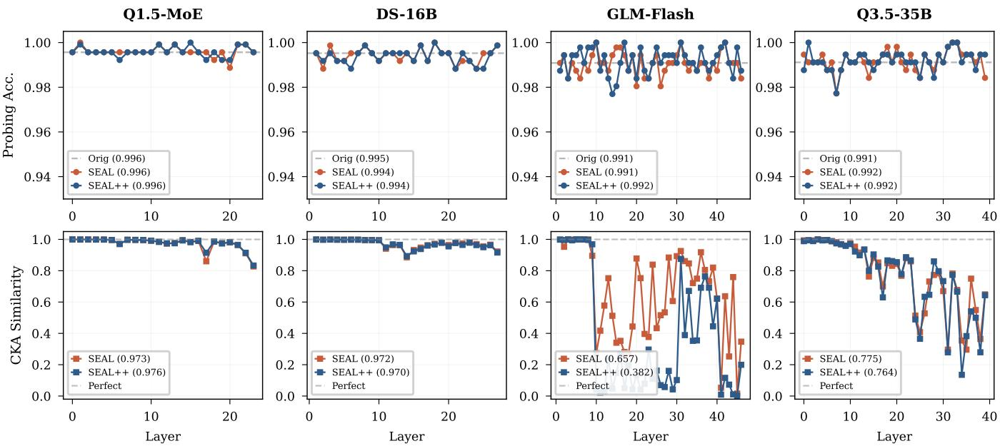  
Figure 5: Per-layer interpretability analysis across four architectures. Top: linear probing accuracy for harmful-versus-benign classification. Bottom: CKA similarity between base and aligned representations. All methods preserve safety concept separability.

## J Training Dynamics of Routed and Shared Experts

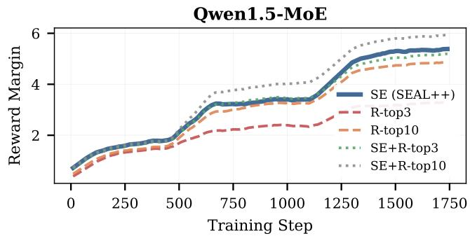

Figure 9: DPO reward margin during training on Qwen1.5. Conditions that include shared experts (SE, SE+R-top3, SE+Rtop10) achieve high margins (>5.0), while routed-only conditions (R-top3, R-top10) plateau much lower, consistent with their weaker defense in Table 6.

Figure 9 compares reward margin (the DPO preference gap between chosen and rejected responses) across shared-expert (SE) and routed-expert (RE) training conditions on Qwen1.5. SE maintains consistently higher margins throughout training, reaching a final value of 5.3 while R-top3 plateaus at 3.3. R-top3, which trains only routed experts with a matched parameter budget, develops margins 38% lower than SE, explaining its substantially weaker defense in Table 6. Joint SE+R conditions track SE closely, confirming that the shared expert component drives margin growth.

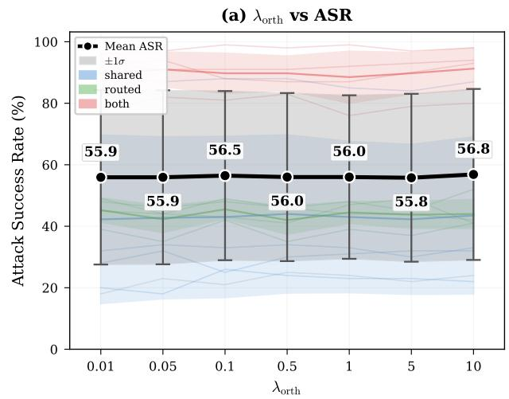

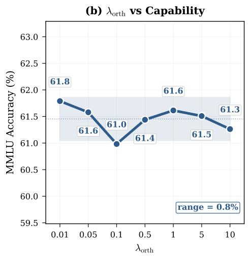

Figure 6: Sensitivity of pruning attack ASR and MMLU accuracy to $\lambda _ { \mathbf { o r t h } }$ on Qwen1.5-MoE (500-step proxy). Semi-transparent lines show individual attack configurations colored by scope. Bold black line with error bars indicates mean ±1�. Both metrics remain constant across three orders of magnitude, confirming low sensitivity.  
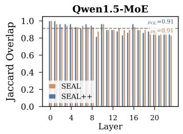

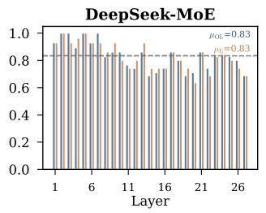

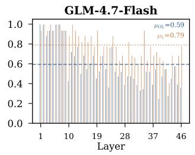

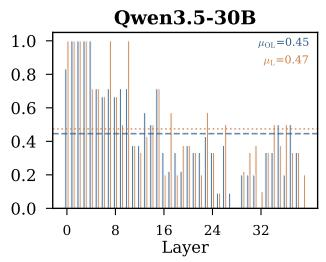  
Figure 7: Per-layer Jaccard overlap of safety neuron identity (pre- vs. post-training) across four architectures. Dashed lines indicate model-wide means. Models with concentrated shared-expert safety encoding (Qwen1.5, DeepSeek) preserve >80% of neuron identity; Qwen3.5 shows substantially more redistribution.

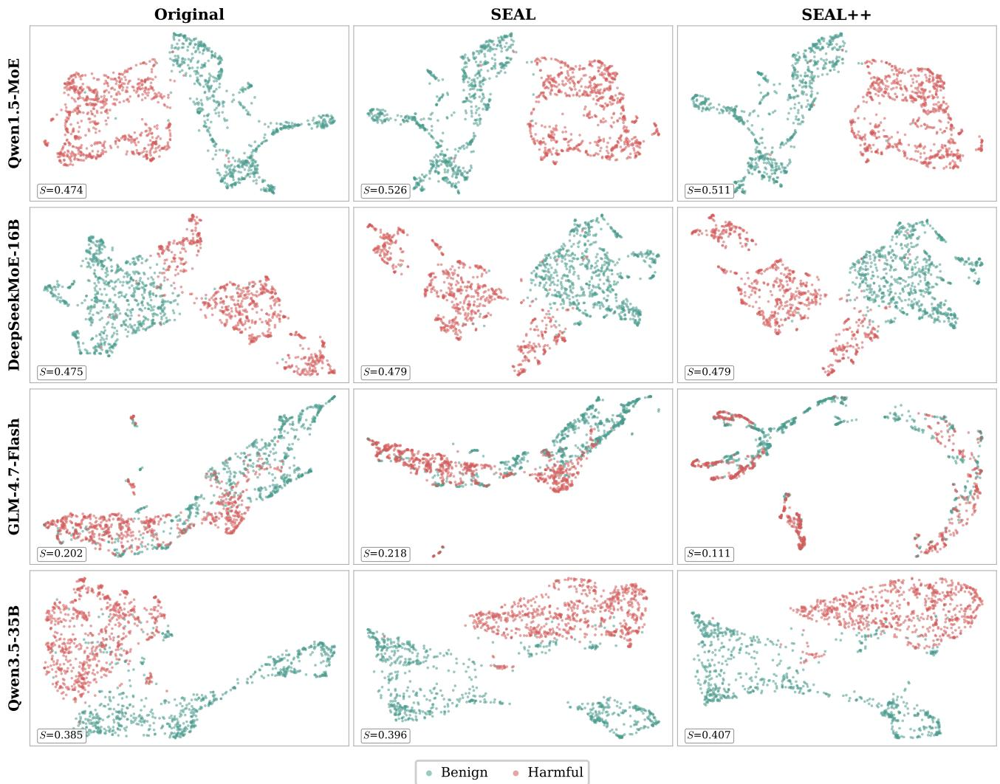  
Figure 8: UMAP projections of shared expert activations across four architectures and three conditions, � = silhouette score.