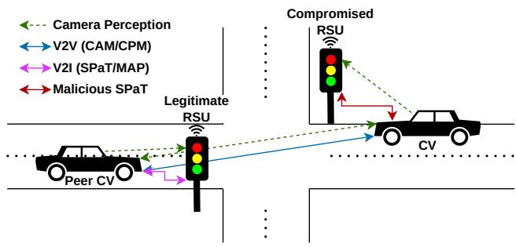
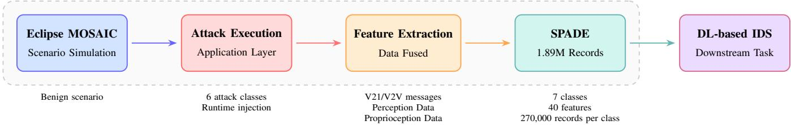
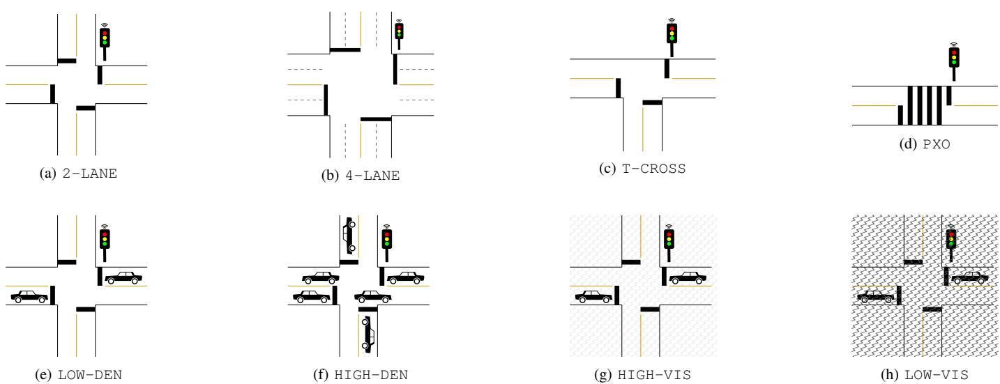

# SPADE: SPaT Attack Detection from the Connected Vehicle’s Perspective

James Di Novo1† , Graduate Student Member, IEEE, Hany Ragab2† , Member, IEEE, Sylvain P. Leblanc3† , Senior Member, IEEE

Abstract—Signal Phase and Timing (SPaT) messages are a cornerstone of connected vehicle (CV) safety, enabling CVs to perceive and respond to intersection state through Vehicle-to-Infrastructure (V2I) and Vehicle-to-Vehicle (V2V) communication. The integrity of these messages is threatened by a range of application-layer attacks that can bypass conventional authentication when a roadside unit or peer vehicle is compromised. Existing intrusion detection research either defends the infrastructure side or targets V2V Basic Safety Message (BSM) / Cooperative Awareness Message (CAM) misbehavior, leaving the onboard CV perspective on SPaT integrity unaddressed. To close this gap, we introduce SPADE — the SPaT Attack Detection and Evaluation dataset — a labelled, multi-modal, simulation-based dataset designed specifically for deep learning IDS research in this space. SPADE is generated through Eclipse MOSAIC using runtime attack injection at the SAE J2735 application layer across six attack classes and one benign class. By combining four intersection geometries, six operating conditions, and five independent random-seed repetitions, SPADE comprises 180 unique base scenario runs, yielding ∼1,890,000 labelled timestep records (270,000 per class). Each record fuses SPaT message fields, onboard camera confidence scores, and cooperative V2V peer data across 40 features, reflecting the multi-modal signal space required to distinguish deliberate attacks from environmental degradation. The dataset, generation code, and scenario configurations are released publicly to support reproducible and comparative IDS research in C-V2X security. The developed toolbox, instructions, and dataset link are publicly available on GitHub: https://github.com/jdinovo/SPADE.

Index Terms—Connected Vehicles, C-V2X, Signal Phase and Timing, Intrusion Detection, Deep Learning, Dataset, Simulation, Cross-modal fusion, Cybersecurity, SAE J2735.

## I. INTRODUCTION

Intelligent Transportation Systems (ITS) rely on Road Side Units (RSUs) embedded in Traffic Signal Control Systems (TSCS) to broadcast Signal Phase and Timing (SPaT) messages over Dedicated Short-Range Communication (DSRC) or Cellular Vehicle-To-Everything (C-V2X) channels [1]. These messages give Connected Vehicles (CVs) machine-readable awareness of intersection state, enabling on-the-fly signal timing optimization and safe traversal in conditions where visual signal perception is unreliable [2]. As C-V2X deployments mature under the SAE J2735 standard [3], SPaT becomes an increasingly critical input to automated driving functions, making its integrity a safety imperative.

The same connectivity that makes SPaT valuable also makes is an attack surface. A compromised RSU or peer CV can inject false phase states, replay stale messages, manipulate countdown timers, flood competing identities, suppress broadcasts, or impersonate a legitimate RSU [1]. In each case, the receiving CV has no way to detect the attack through cryptographic means alone, since valid credentials are assumed to be available on the compromised node. An IDS running onboard the CV and operating at the application message layer is therefore a necessary complement to the underlying public key infrastructure. Fig. 1 exemplifies a simplified scenario where a CV is receiving malicious SPaT data from a compromised TSCS which conflicts with perception and peer data.

  
Fig. 1. Overview of the SPADE dataset focal point.

Despite the recognized severity of these threats, the IDS literature has not produced a purpose-built, multi-modal dataset for this specific problem. Existing work addresses either traffic signal intrusion detection from the infrastructure perspective [2, 4–6] or V2V BSM misbehavior detection [7, 8]. To the best of our knowledge supported by a recent comprehensive survey, there exists no dataset that captures the onboard CV perspective of SPaT data integrity combined with onboard vehicle sensors and V2V communications [1].

SPADE addresses this gap directly. The dataset is generated in Eclipse MOSAIC [9] through runtime attack injection at the SAE J2735 application layer, ensuring the multimodal data streams — SPaT/MAP, camera perception, and CAM/Cooperative Perception Messages (CPM) — are internally consistent and reflect what an actual CV would observe under each attack condition. With 180 unique base scenario runs, each executed once per label class, SPADE comprises ∼1,890,000 records with 270,000 per class — a scale comparable to recent deep learning (DL) IDS work on vehicular datasets [10]. The main contributions are:

1) A publicly released labelled dataset of ∼1,890,000 multimodal records covering six SPaT attack classes and a benign class, generated across 180 unique scenario configurations in Eclipse MOSAIC.

2) A documented threat model mapping each attack type to its targeted SAE J2735 fields and observable multi-modal signatures.

3) A feature set combining SPaT message fields, camera confidence, and V2V cooperative data designed to support classical and deep learning IDS approaches, with a scenariolevel train/validate/test separation to prevent data leakage.

4) An extensible scenario configuration covering four intersection geometries, six operating conditions, and five randomseed repetitions, enabling controlled intra-class diversity.

The remainder of this paper details related work in Section II, defines the threat model in Section III, details the dataset generation and characteristics in Sections IV and V, discusses future work in Section VI, and concludes in Section VII.

## II. RELATED WORK AND DATASET GAP

## A. Traffic Signal Security

Feng et al. [2] provide a comprehensive treatment of TSCS cybersecurity with CVs, modeling attack scenarios in which adversarial vehicles feed false data to the infrastructure controller to manipulate signal timing. Chowdhury et al. [4] adopt an evidence-theoretic approach to traffic signal IDS, also from the infrastructure perspective, while Shen et al. [5] use infrastructure-side sensors and traffic invariants to detect data spoofing in connected vehicle-based signal control. Al Mallah et al. [6] target resilience at the adaptive multi-agent traffic controller level. In all four cases, detection is performed by infrastructure components, not by the receiving CV.

The General Motors patent (US 11,875,677 B2) [11] represents the prior work closest to what we propose, outlining a method for CVs to identify misbehavior in V2I communications. It does not produce a labelled dataset, does not employ machine learning, or incorporate cross-modal data. Abdel Hakeem and Kim [1] survey ML, federated learning, and edge AI for V2X IDS broadly, confirming that ML-based onboard detection of SPaT-specific attacks remains open and that no existing dataset addresses it.

## B. V2X and Automotive Datasets

The VeReMi [7] and VeReMi NextGen [8] datasets are the best-established labelled datasets for V2X misbehavior detection. Both target V2V BSM spoofing in VANETs across 180 scenario configurations spanning fifteen attack types, four scenarios, and three dataset splits; neither addresses SPaT messages or V2I attacks, and neither incorporates camera or crossmodal fusion data. The ROAD dataset [12] provides actual vehicular attack data including replay, jamming, and message falsification scenarios, but it is collected from the infrastructure perspective and does not include SPaT-specific attack classes. The Car-Hacking Dataset [13] and CICIoV2024 [14] cover intra-vehicle CAN bus attacks, an entirely different attack surface from V2X communications. Venkatasamy et al. [15] produce a labelled V2X IDS dataset using cryptographic protocol features, but target general VANET communications rather than SPaT-specific attack signatures at the CV receiver. Recent Deep-Learning work on the VeReMi Extension evaluates LSTM and BiLSTM architectures at dataset scales from 100K to 2M samples and demonstrates that 270,000 samples per class produces competitive F1 scores for 7-class classification [10], motivating SPADE’s per-class target.

## C. Simulation of Urban Mobility (SUMO) Scenarios

The Ingolstadt Traffic Scenario (InTAS) provides a detailed and accurate representation of Ingolstadt, Germany [16]. Lobo et al. [16] have meticulously ensured that each street and intersection adequately represents the topology of the city’s roads. Traffic includes public transport and vulnerable road users. InTAS provides an invaluable resource; however, there are significant differences between North American and European road networks and traffic. McKenney et al. [17] created a realistic traffic signal scenario, published in 2013, based on a section of downtown Ottawa, Canada. This scenario features 50 traffic signals spanning a variety of road types from low-volume, single lane, residential streets to multi-lane, high-volume, main arterial roadways [17]. Due to the nature of the primary objective this scenario was restricted to a relatively small section of downtown Ottawa which limits the amount of data which could be generated in order to train and test large models. The scenario was also created before SPaT was fully implemented.

## D. Gap Summary

Table I summarizes the gap across the most relevant prior work and datasets. SPADE is the first labelled dataset that combines CV-side perspective, SPaT specificity, onboard crossmodal fusion, and deep-learning-ready labelling at scale across seven balanced classes. SPADE will utilize a novel Simulation of Urban Mobility (SUMO) [18] scenario generated for the city of Ottawa, Canada. Ottawa presents a wide variety of North American road types with numerous complex signaled intersections making it an ideal city for a SPaT-centric dataset.

The six selected attack types, as explained in section III, are specifically applicable to SPaT messages. These attacks have been examined in other areas of research, such as against CAM and BSM, as well as TSCS from the perspective of the TSCS. They have yet to be applied to SPaT messages from the perspective of the CV.

## III. THREAT MODEL

## A. Assumptions

The threat model targets the SAE J2735 application message layer as seen by a receiving CV, consistent with the V2X attack taxonomy in Abdel Hakeem and Kim [1]. Three assumptions bound the scope of our work.

Attacker node. The attacker controls either a compromised RSU or a compromised peer CV holding valid PKI credentials (IEEE 1609.2 certificates [19]), so message authentication does not flag the transmissions. Detection must rely on message content and cross-modal consistency.

TABLE I  
COMPARISON OF RELATED DATASETS AND WORKS. ✓ = FULLY ADDRESSED, ˜ = PARTIALLY, ✗ = NOT ADDRESSED. “INFRA” = INFRASTRUCTURE-SIDE DETECTION.
<table><tr><td>Work / Dataset</td><td>Year</td><td>Perspective</td><td>SPaT- Specific</td><td>Cross-Modal Fusion</td><td>Labelled Dataset</td><td>DL- Ready</td><td>Attack Classes</td></tr><tr><td>Feng et al. [2]</td><td>2022</td><td>Infra.</td><td></td><td>x</td><td>x</td><td>x</td><td>3</td></tr><tr><td>Chowdhury et al. [4]</td><td>2023</td><td>Infra.</td><td>√</td><td>x</td><td>X</td><td>X</td><td>2</td></tr><tr><td>Shen et al. [5]</td><td>2023</td><td>Infra.</td><td>✓</td><td>N</td><td>x</td><td>X</td><td>1</td></tr><tr><td>Al Mallah et al. [6]</td><td>2023</td><td>Infra.</td><td>x</td><td>x</td><td>x</td><td>x</td><td>一</td></tr><tr><td>GM Patent [11]</td><td>2024</td><td>CV</td><td>✓</td><td>x</td><td>X</td><td>x</td><td>一</td></tr><tr><td>VeReMi [7]</td><td>2018</td><td>CV</td><td>x</td><td>x</td><td>√</td><td>√</td><td>15</td></tr><tr><td>VeReMi NextGen [8]</td><td>2026</td><td>CV</td><td>x</td><td>x</td><td>√</td><td>√</td><td>15</td></tr><tr><td>ROAD [12]</td><td>2024</td><td>Vehic.</td><td>x</td><td>x</td><td>√</td><td>√</td><td>4</td></tr><tr><td>Car-Hacking [13]</td><td>2018</td><td>CAN</td><td>x</td><td>x</td><td>√</td><td>J</td><td>4</td></tr><tr><td>CICIoV2024 [14]</td><td>2024</td><td>CAN</td><td>x</td><td>X</td><td>√</td><td>√</td><td>5</td></tr><tr><td>Venkatasamy et al. [15]</td><td>2024</td><td>CV</td><td>x</td><td>x</td><td>√</td><td>√</td><td>5</td></tr><tr><td>Lobo et al. [16]</td><td>2020</td><td>Infra.</td><td>x</td><td>x</td><td>x</td><td>x</td><td>=</td></tr><tr><td>SPADE (Ours)</td><td>2026</td><td>CV</td><td></td><td></td><td></td><td></td><td>6</td></tr></table>

˜ Shen et al. use infrastructure-side sensors alongside traffic invariants, not onboard CV cross-modal fusion. ROAD covers real-world vehicular attacks but does not address SPaT specifically.

Attacker goal. The attacker seeks to cause the CV to misinterpret intersection state, whether by inducing incorrect phase perception, triggering a premature or delayed stop, creating conflicting information across sources, or suppressing legitimate SPaT broadcasts.

Scope boundary. Physical-layer jamming, GPS spoofing, CAN bus attacks, and adversarial ML attacks on trained models are excluded. All six attack types are implemented as modifications to the SPaT message at the application layer, keeping the feature space coherent and avoiding a dependency on network-layer simulation.

We are focusing on the application layer from the CV’s perspective. There are numerous attack types that apply to other perspectives, such as the TSCS, or other network layers; however, the IDS we are considering will be applied at the application layer. The IDS will be reading unencrypted SPaT, MAP, CAM, and CPM transmitted from other CVs and TSCS. It will also have perception, proprioceptive, exteroceptive data gathered from inter-vehicle sensors. From the perspective of the CV, the TSCS could be seen as compromised from the onset of its interaction, or become compromised partially through the interaction.

## B. Attack Classes

Table II defines the six attack classes and the benign class which form the SPADE label schema. These are relevant attacks that would affect SPaT messages or CPMs received by a CV. Denial of Service (DoS) is modeled from the receiving CV’s perspective as message suppression rather than channel flooding, which would require network-layer simulation. Suppression is the application-layer observable effect of DoS and is detectable through the inter-message interval feature without requiring ns-3 or OMNeT++ integration.

TABLE II  
SPADE THREAT MODEL: ATTACK CLASSES, TARGETED SAE J2735 FIELDS, AND OBSERVABLE MULTI-MODAL SIGNATURES.
<table><tr><td>Class</td><td>J2735 Field(s)</td><td>Observable Signature</td></tr><tr><td>BENIGN</td><td>N/A</td><td>All streams consistent; camera-SPaT agreement holds</td></tr><tr><td>FALSE_STATE</td><td>MovementPhaseState</td><td>Reported phase contradicts camera detection</td></tr><tr><td>REPLAY</td><td>Full SPaT msg</td><td>Stale phase/timer; timestamp inconsistent with clock</td></tr><tr><td>TIMING_MANIP</td><td>MinEndTime, MaxEndTime</td><td>Phase matches camera; countdown deviates from elapsed time</td></tr><tr><td>SYBIL</td><td>Source ID, V2V msg</td><td>Peer consensus fails; conflicting phase perception reports</td></tr><tr><td>DOS</td><td>N/A (suppression)~</td><td>Inter-message interval exceeds expected broadcast period</td></tr><tr><td>IMPERSONATION IntersectionID,</td><td>source address</td><td>Source mismatch with known RSU identity</td></tr></table>

˜DoS is modeled as application-layer message suppression, observable as the absence of SPaT broadcasts within the expected reception window.

## IV. SPADE DATASET GENERATION

## A. Simulation Environment

SPADE is generated in Eclipse MOSAIC [9], an open cosimulation framework integrating traffic mobility, vehicle applications, and V2X network simulation. MOSAIC’s Application Simulator enables custom V2X applications to run on individual simulation objects, making it the appropriate layer for attack injection at the SAE J2735 level. Base intersection geometries are exported from OpenStreetMap (OSM) [20], ensuring road layouts reflect real-world configurations. Every CV in the scenario is an SAE level 4 and beyond autonomous vehicle which does not require human intervention. This futuristic approach, where all vehicles are autonomously driven with no human behind the wheel, means that all decisions are made based on what is perceived by sensors and received through the V2X network. This prevents vehicle decisions from being interrupted by a human, enabling predictable and consistent outcomes. Vehicles transmit Cooperative Awareness Messages (CAMs), receive full SPaT messages from the TSCS, and log SPaT content, V2V peer data, and onboard camera perception to per-vehicle CSV files. Fig. 2 illustrates the complete generation pipeline.

The perception of signals and vehicles is done through MOSAICs built-in methods, which do not make use of any confidence levels in the current version. Perceptual occlusion is taken into account, however only as far as full obstruction by objects such as other vehicles or buildings [9]. Occlusion due to weather or lens distortion is not a factor. Environmental degradation per scenario is captured by a visibility score $V _ { s } \in$ [0, 1], where $V _ { s } = 0 . 9 5$ denotes clear conditions and $V _ { s } = 0 . 2 0$ represents severe impairment like dense fog. Separately, camera confidence $C _ { \mathrm { { c a m } } }$ is modeled geometrically from the distance to the traffic light d (meters), angular offset α (degrees), maximum range R (meters), and field of view A (degrees) as:

$$
\begin{array} { r } { r _ { d } = \operatorname* { m i n } \left( \frac { d } { R } , 1 \right) , } \end{array}\tag{1}
$$

$$
\begin{array} { r } { r _ { \alpha } = \operatorname* { m i n } \Bigl ( \frac { | \alpha | } { A / 2 } , 1 \Bigr ) , } \end{array}\tag{2}
$$

$$
F _ { d } = \operatorname* { m a x } \left( 0 , 1 - r _ { d } ^ { 2 } \right) ,\tag{3}
$$

$$
F _ { \alpha } = \operatorname* { m a x } \left( 0 , 1 - r _ { \alpha } ^ { 2 } \right) ,\tag{4}
$$

$$
C _ { \mathrm { b a s e } } = 0 . 4 + 0 . 6 \cdot F _ { d } \cdot F _ { \alpha } ,\tag{5}
$$

$$
C _ { \mathrm { c a m } } = \mathrm { c l a m p } ( C _ { \mathrm { b a s e } } + \varepsilon , 0 , 1 ) , \quad \varepsilon \sim \mathcal { N } ( 0 , 0 . 0 3 ^ { 2 } ) ,\tag{6}
$$

where $\mathrm { c l a m p } ( x , 0 , 1 ) = \operatorname* { m a x } ( 0 , \operatorname* { m i n } ( 1 , x ) )$ . The quadratic factors $F _ { d }$ and $F _ { \alpha }$ decay detection quality with distance and off-axis angle; the floor of 0.4 models residual detectability at the geometric boundary of the camera’s field of view. Gaussian noise ε introduces per-sample variability and the result is bounded to [0, 1]. The observed phase and $C _ { \mathrm { { c a m } } }$ are broadcast to surrounding vehicles via CPM over the V2V channel.

## B. Scenario Configurations

SPADE is generated across ten scenario configuration types organized along three dimensions, as shown in Fig. 3. The four intersection geometries are a standard two-lane four-way crossing (Fig. 3a), a four-lane four-way crossing (Fig. 3b), a T-shaped intersection (Fig. 3c), and a pedestrian-actuated mid block crossing (PXO) (Fig. 3d). The three operating conditions are low traffic density (Fig. 3e), medium density, and high density (Fig. 3f). There are also visibility modifiers for high visibility (Fig. 3g), medium visibility, or low visibility (Fig. 3h) of the camera representing adverse weather occluding the lens.

The four geometry types and six operating conditions combine into 36 base scenario configurations. Each base configuration is then repeated with five independent random seeds to vary vehicle route assignments and inter-arrival times, yielding 180 unique scenario runs. Every run is executed seven times — once per label class — for a total of 1260 simulation executions. Each run generates a varied number of records between each unique scenario dependent on the density and proximity of traffic, and the specific attack being executed. Some attacks generate more records, such as replay and false state, while others, such as DOS, generate fewer. Records are recorded from each CVs perspective, so the number of CVs is proportional to the number of records generated for a given scenario. If the density is high and CVs are perceivable between each other, there would be more records generated as a result, due to camera perception and V2V communications. Road layout, vehicle density, and camera conditions are held constant across the seven label runs of each scenario, ensuring that differences in the exported data are attributable to the attack type rather than to scenario variation.

## C. Runtime Attack Injection

Attacks are injected at runtime rather than applied as posthoc modifications to exported CSV data. Each attack class is implemented as a custom V2X application on a malicious RSU or compromised peer CV node in MOSAIC. Simulating attacks within MOSAIC ensures that the multi-modal data sources remain synchronized and accurately reflect the scenario as excepted. The attack classes are as follows, corresponding to relevant classes in Abdel Hakeem and Kim [1]:

FALSE\_STATE: A MaliciousRSU application broadcasts modified MovementPhaseState values, equivalent to the falsified information attack category.

$$
\begin{array} { r } { \mathrm { R E P L } \mathrm { \mathbb { A } Y } \mathrm { : ~ A ~ R e p 1 a y } \mathrm { \mathbb { A } t } \mathrm { \tleftarrow } \mathrm { a c k e r ~ c a p t u r e s ~ S P a T ~ m e s s a g e s ~ i n } } \\ { \mathrm { a ~ f i r s t ~ b e n i g n ~ p a s s ~ a n d ~ r e - i n j e c t s ~ t h e m ~ w i t h ~ a ~ c o n f i g u r a b l e ~ d e l a y } } \\ { \mathrm { i n ~ a ~ s e c o n d ~ p a s s , ~ c o n s i s t e n t ~ w i t h ~ t h e ~ r e p l a y ~ a t t a c k ~ d e f i n i t i o n } . } \end{array}
$$

TIMING\_MANIP: The MaliciousRSU leaves MovementPhaseState correct while modifying MinEndTime and MaxEndTime in TimeChangeDetails, corresponding to the timing attack class.

SYBIL: Multiple phantom CV nodes transmit conflicting perceived signal state over V2V, creating the peer consensus failure described.

DOS: The legitimate RSU application is silenced for a defined interval, producing an SPaT absence detectable via inter-message interval.

IMPERSONATION: A rogue node transmits SPaT messages with a spoofed IntersectionID or source address, matching the impersonation attack description.

## D. Ground-Truth Labelling

The active attack class at each simulation timestep is logged to a file for easy corroboration with generated data. Groundtruth labels are an inherent byproduct of the simulation rather than a separate annotation step: labels are assigned by joining the scenario schedule to the exported CSV on timestamp, requiring no manual annotation.

  
Fig. 2. SPADE generation and usage pipeline. Attacks are injected at runtime, ensuring all separate data streams reflect a consistent scenario.

  
Fig. 3. The eight simulation scenario configuration types shown for SPADE. Note that there is a traffic signal for every stop line, however only one is shown in each configuration example. Row 1 (3a–3d): intersection and mid-block crossing geometry types derived from OSM exports. Row 2 (3e–3h): representative extremes of the two operating condition dimensions — traffic density (LOW-DEN and HIGH-DEN) and camera visibility (clear HIGH-VIS and heavily degraded LOW-VIS). The full configuration matrix also includes MED-DEN and MED-VIS as intermediate levels: $4 \times 3 \times 3 = 3 6$ base configurations, each repeated with five random seeds, yielding 180 unique scenario runs.

## V. DATASET DESCRIPTION

## A. Class Distribution, Split, and Balance Rationale

SPADE contains ∼1,890,000 records distributed equally across seven classes: approximately 270,000 records per class. Class balance reflects the primary use case of training deep learning IDS models, for which class imbalance suppresses minority-class gradient contributions and makes standard accuracy metrics misleading [1]. Researchers evaluating realworld deployment conditions should apply class-weighting or calibration strategies to reflect the benign-heavy distribution of operational SPaT traffic. The number of records generated per class run is correlated to the number of vehicles running in the simulation and the amount of time the simulation runs. As such, lower density classes are run for longer to ensure the number of records generated is kept similar.

The dataset is partitioned at the scenario-run level to prevent data leakage: records from the same simulation run appear in exactly one partition. Of the 180 unique base runs, 126 are assigned to training (70%), 27 to validation (15%), and 27 to testing (15%), giving 189,000 training, 40,500 validation, and

40,500 test records per class. This is fundamentally different from random record-level splitting, which would place windows from the same simulation run in both training and test sets and inflate reported detection rates.

## B. Feature Set

Records consist of a combined 40 features from six sources: the received SPaT and corresponding MAP message, the onboard camera perception, V2V peer CAM and shared perception message, and vehicle proprioceptive data. Table III describes the full feature set. The inclusion of both onboard and shared perception data enable the opportunity for a more robust IDS which does not solely rely on changes in SPaT data alone to determine legitimacy. Perceptive data can be referenced to identify discrepancies.

## C. Dataset Scale Justification

The 270,000 records per class target is motivated by empirical findings in vehicular DL IDS research. Recent work evaluating LSTM and BiLSTM architectures on the VeReMi Extension dataset across scales from 100K to 2M samples demonstrates that 270,000 samples per class falls within the range where competitive macro-F1 scores are achieved for multi-class vehicular IDS, and that performance gains above this scale are progressively diminishing [10]. The 40-feature input space is sufficiently compact that generalization risk is dominated by scenario diversity rather than raw sample count, which is why SPADE’s 180 unique base runs are the primary design lever.

TABLE III  
SPADE FEATURE SET: SPADE DATA RECORDS (40)
<table><tr><td>Feature</td><td>Description</td></tr><tr><td colspan="2">Vehicle Data Record (11)</td></tr><tr><td>vehicle_id</td><td>ID of the current vehicle</td></tr><tr><td>route_id</td><td>Route which the vehicle is traveling</td></tr><tr><td>lane_id</td><td>Current lane index of the vehicle</td></tr><tr><td>is_parked</td><td>Is the vehicle currently in a parked state</td></tr><tr><td>position</td><td>Latitude and longitude of the vehicle</td></tr><tr><td>heading</td><td>Vehicle&#x27;s current heading</td></tr><tr><td>speed</td><td>Current vehicle speed</td></tr><tr><td>throttle</td><td>Amount of throttle applied</td></tr><tr><td>brake</td><td>Amount of brake applied</td></tr><tr><td>longitudinal_accel</td><td>Amount of longitudinal acceleration Current slope the vehicle is on</td></tr><tr><td colspan="2">slope</td></tr><tr><td>CAM Data Record (5)</td><td></td></tr><tr><td>vehicle_id</td><td>ID of the transmitting vehicle</td></tr><tr><td>message_time position</td><td>Time the message was sent Current transmitting vehicle position</td></tr><tr><td>distance</td><td>Distance between vehicles</td></tr><tr><td>vehicle_awareness</td><td>Transmitting vehicle proprioceptive data points</td></tr><tr><td colspan="2">TL Perception Data Record (10)</td></tr><tr><td>signal_id</td><td>ID of the perceived traffic signal</td></tr><tr><td>incoming_lane</td><td>Lane which precedes the signal</td></tr><tr><td>distance</td><td>Distance from current vehicle to signal</td></tr><tr><td>angle_off_center</td><td>Angle off center of camera</td></tr><tr><td>signal_red</td><td>Red one hot</td></tr><tr><td>signal_yellow</td><td>Yellow one hot</td></tr><tr><td>signal_green</td><td>Green one hot</td></tr><tr><td>camera_conf</td><td>Perception confidence level</td></tr><tr><td>cur_vis_score</td><td>Current visibility score</td></tr><tr><td>conf_vis_weighted¹</td><td>Confidence level weighted with visibility</td></tr><tr><td colspan="2">Shared TL Perception Data Record (3)</td></tr><tr><td>vehicle_id</td><td>ID of the transmitting vehicle</td></tr><tr><td>vehicle_pos</td><td>Position of the transmitting vehicle</td></tr><tr><td>signal_perceptions</td><td>List of perceived signals (TL Percep. records)</td></tr><tr><td colspan="2">MAP Data Record (6)</td></tr><tr><td>message_time</td><td>Time the message was sent</td></tr><tr><td>intersection_id</td><td>ID of the intersection</td></tr><tr><td>lane_id</td><td>The intersection lane being referenced</td></tr><tr><td>lane_attributes</td><td>Lane properties (direction, type, shared)</td></tr><tr><td>lane_connections</td><td>Connected lanes (ex. u-turn, left, straight)</td></tr><tr><td>position</td><td>Latitude and longitude of the intersection</td></tr><tr><td colspan="2">SPaT Data Record (5)</td></tr><tr><td>signal_id</td><td>ID of this individual signal</td></tr><tr><td>message_time</td><td>Time the message was sent</td></tr><tr><td>signal_state</td><td>Current signal state</td></tr><tr><td>max_end_time</td><td>Maximum length of the current state</td></tr><tr><td>min_end_time</td><td>Minimum length of the current state</td></tr></table>

1conf\_vis\_weighted = camera\_conf × cur\_vis\_score

## VI. FUTURE WORK

SPADE is released as a dataset contribution; DL model training and comparative benchmarking represent ongoing work being tackled by the authors.

## A. Deep Learning

Based on the survey of DL methods for V2X IDS by Abdel Hakeem and Kim [1], three architecture families are natural baselines: a one-dimensional convolutional neural network (1D-CNN); a stacked LSTM network, which was shown effective by Youness et al. [10]; and transformer-based encoder with self-attention over the full input window, which has been successfully applied to other CV IDS such as Li et al. [21].

## B. Limitations and Future Directions

When making use of SPADE for training and validation of an IDS the following should be known. SPADE operates under a closed-world assumption: the seven label classes are exhaustive within the dataset, and models trained on SPADE may not detect hybrid or parametrically novel attacks outside the training distribution. This is a common limitation of simulation-based IDS datasets noted by Abdel Hakeem and Kim [1] and is inherent to the controlled labelling methodology. Potential follow-on work can address this through: (i) training and benchmarking the three baseline architectures on SPADE to establish a comparative leaderboard; (ii) evaluating detection under class-imbalanced conditions reflecting realistic benign-heavy deployment; (iii) extending scenarios to include adversarial ML attack variants targeting the trained IDS; and (iv) hardware-in-the-loop validation using physical C-V2X OBU hardware to assess sim-to-real transfer.

The SPaT data generated is on a fixed timing schedule, there are no dynamic SPaT timings which are adjusted based on traffic volume or other factors. The incorporation of such advanced SPaT data would create more difficult scenarios for an IDS to detect malicious messages.

Due to current SUMO limitations vehicles are unable to operate on the falsified malicious messages generated from attacks. Allowing them to do so requires also allowing collisions which would create noise in the dataset. To address this, the decision the vehicle would make based on it’s information is simply logged. The addition of CARLA [22] or similar to enable collision avoidance while allowing vehicles to act on incorrect information would be ideal. This limitation renders proprioceptive data less useful for training since it always aligns with ground-truth and will remain indistinguishable between attack and benign scenarios. Proprioceptive data still remains relevant in cases such as Sybil attacks, for potentially identifying vehicles which do not actually exist, by making use of CPMs in combination with claimed position.

## VII. CONCLUSION

SPADE is the first labelled, multi-modal dataset designed for deep learning-based intrusion detection of SPaT message attacks from the onboard perspective of a connected vehicle. It fills a documented gap in the C-V2X security literature, where existing work either defends the infrastructure side or targets V2V BSM misbehavior. With ∼1,890,000 balanced records (270,000 per class) drawn from 180 unique scenario runs, SPADE reaches a scale that is empirically sufficient for LSTM and Transformer-based IDS training while maintaining a scenario diversity comparable to the VeReMi benchmark. The scenario-run-level split prevents data leakage, and the 40-feature multi-modal design encodes the cross-stream consistency signals that distinguish deliberate attacks from environmental degradation. SPADE is released publicly alongside generation code and scenario configurations.

## REFERENCES

[1] S. A. Abdel Hakeem and H. Kim, “Advancing intrusion detection in V2X networks: A comprehensive survey on machine learning, federated learning, and edge AI for V2X security,” IEEE Transactions on Intelligent Transportation Systems, vol. 26, no. 8, pp. 11 137–11 205, 2025.

[2] Y. Feng, S. Huang, W. Wong, Q. Chen, Z. Mao, and H. Liu, “On the cybersecurity of traffic signal control system with connected vehicles,” IEEE Transactions on Intelligent Transportation Systems, vol. 23, pp. 16 267– 16 279, 2022.

[3] “J2735: V2X communications message set dictionary.” [Online]. Available: https://www.sae.org/standards/j2735 202409-v2x-communications-message-set-dictionary

[4] A. Chowdhury, G. Karmakar, J. Kamruzzaman, R. Das, and S. H. S. Newaz, “An evidence theoretic approach for traffic signal intrusion detection,” Sensors, vol. 23, pp. 4646–4667, 2023.

[5] J. Shen, Z. Wan, Y. Luo, Y. Feng, Z. M. Mao, and Q. A. Chen, “Detecting data spoofing in connected vehicle based intelligent traffic signal control using infrastructure-side sensors and traffic invariants,” in 2023 IEEE Intelligent Vehicles Symposium (IV), 2023, pp. 1–8.

[6] R. Al Mallah, T. Halabi, and B. Farooq, “Resilience-bydesign in adaptive multi-agent traffic control systems,” ACM Transactions on Privacy & Security, vol. 26, pp. 1–27, 2023.

[7] J. Kamel, M. R. Ansari, J. Petit, A. Kaiser, I. B. Jemaa, and P. Urien, “VeReMi: A dataset for comparable evaluation of misbehavior detection in VANETs,” in International Conference on Security and Privacy in Communication Networks (SecureComm), 2018, pp. 318– 337.

[8] VeReMi Dataset Consortium, “VeReMi nextgen: V2X message logs for misbehavior detection systems,” 2026. [Online]. Available: https://veremi-dataset.github.io

[9] S. Iqbal, P. Ball, M. H. Kamarudin, and A. Bradley, “Simulating malicious attacks on VANETs for connected and autonomous vehicle cybersecurity: A machine learning

dataset,” in 13th International Symposium on Communication Systems, Networks and Digital Signal Processing, 2022.

[10] N. Youness, A. Mostafa, M. A. Sobh, A. M. Bahaa, and K. Nagaty, “VeMisNet: Enhanced feature engineering for deep learning-based misbehavior detection in vehicular ad hoc networks,” Journal of Sensor and Actuator Networks, vol. 14, no. 5, p. 100.

[11] V. Vijaya Kumar, M. Naserian, K. E. Tepe, and H. Krishnan, “Detection and reporting of misbehavior in vehicle-to-infrastructure communication,” 2024, US Patent 11,875,677 B2, GM Global Technology Operations LLC, filed Feb. 2, 2021, issued Jan. 16, 2024. [Online]. Available: https://patents.google.com/patent/ US11875677B2/en

[12] M. E. Verma, R. A. Bridges et al., “A comprehensive guide to CAN IDS data and introduction of the ROAD dataset,” PLOS ONE, vol. 19, no. 1, p. e0296879.

[13] OCSLab, “Car-hacking dataset,” 2018. [Online]. Available: https://ocslab.hksecurity.net/Datasets/ car-hacking-dataset

[14] Canadian Institute for Cybersecurity, “CICIoV2024: Internet of vehicles dataset,” 2024. [Online]. Available: https://www.unb.ca/cic/datasets/iov-dataset-2024.html

[15] T. K. Venkatasamy, M. J. Hossen, G. Ramasamy, and N. H. B. A. Aziz, “Intrusion detection system for V2X communication in VANET networks using machine learning-based cryptographic protocols,” Scientific Reports, vol. 14, pp. 1–18, 2024.

[16] S. Lobo, S. Neumeier, E. M. G. Fernandez, and C. Facchi, “InTAS - the ingolstadt traffic scenario for SUMO,” SUMO Conference Proceedings, vol. 1, pp. 73–92, 2020.

[17] D. Mckenney and T. White, “Distributed and adaptive traffic signal control within a realistic traffic simulation,” Eng. Appl. Artif. Intell., vol. 26, no. 1, p. 574–583, Jan. 2013.

[18] P. A. Lopez et al., “Microscopic traffic simulation using SUMO,” in 2018 21st International Conference on Intelligent Transportation Systems (ITSC), pp. 2575– 2582, ISSN: 2153-0017.

[19] IEEE. IEEE standards association - 1609.2 standard. [Online]. Available: https://standards.ieee.org/ieee/1609.2/ 12070/

[20] OpenStreetMap. [Online]. Available: https://www. openstreetmap.org/

[21] H. Li, K. Kalogiannis, A. M. Hussain, and P. Papadimitratos, “AttentionGuard: Transformer-based misbehavior detection for secure vehicular platoons,” in Proceedings of the 2025 ACM Workshop on Wireless Security and Machine Learning, ser. WiseML ’25. Association for Computing Machinery, 2025, pp. 8–13.

[22] A. Dosovitskiy, G. Ros, F. Codevilla, A. Lopez, and V. Koltun, “CARLA: An open urban driving simulator,” in Proceedings of the 1st Annual Conference on Robot Learning. PMLR, pp. 1–16.