# Scalable Bayesian Optimization of Composite Functions for Image-Based Inverse Problems in Materials Characterization

Dasol Yoon1,2≠ Poompol Buathong3\* Chia-Hao Lee1 Yujia Zhang3 David A. Muller1,4† Peter I. Frazier5†

1School of Applied and Engineering Physics, Cornell University, Ithaca, NY 14853, USA 2Department of Materials Science and Engineering, Cornell University, Ithaca, NY 14853, USA 3Center for Applied Mathematics, Cornell University, Ithaca, NY 14853, USA

4Kavli Institute at Cornell for Nanoscale Science, Cornell University, Ithaca, NY 14853, USA 5School of Operations Research and Information Engineering, Cornell University, Ithaca, NY 14853, USA

dy327@cornell.edupb482@cornell.educhia-hao.lee@cornell.edu yz685@cornell.edudavid.a.muller@cornell.edupf98@cornell.edu

## Abstract

Estimating physical parameters from scientific images is a common inverse problem in materials characterization that often relies on expensive physics-based simulations. In electron microscopy, specimen thickness and crystal mistilt are critical parameters that govern how electrons scatter through the sample, and therefore the accuracy of any atomic-scale structure recovered from it. They are commonly inferred by matching experimental position-averaged convergent-beam electron diffraction (PACBED) patterns to simulated ones, but grid searches scale poorly and neural-network methods require extensive pretraining that may not transfer to new conditions. Here, we propose scalable Bayesian optimization of composite functions (SBOCF), a simulation-efficient method that exploits the known composite structure of the image-matching objective and the intermediate information contained in simulated images. By representing PACBED images with patch-level summaries and two correction terms, SBOCF preserves the original pixel-wise objective while reducing the number of modeled outputs from 24,649 to 11. Under a budget of 50 simulator evaluations, SBOCF outperformed standard Bayesian optimization with expected improvement on synthetic SrTiO3 benchmarks with thick and thin specimens, reducing the median final SSE by up to 290× in the thick-sample case. On experimental data, SBOCF produced parameter estimates consistent with previously reported values without task-specific pretraining. For a simulated mistilted specimen, using the SBOCF estimates in a downstream ptychographic reconstruction recovered sharp atoms that were otherwise blurred. These results establish SBOCF as a promising approach for inverse problems involving expensive simulators and high-dimensional structured outputs.

## 1 Introduction

Estimating unknown parameters by matching experimental measurements to physics-based simulations is a common inverse problem across scientific fields, where the cost of each simulation can limit characterization throughput. Electron microscopy is a representative instance: a beam of high-energy electrons is transmitted through a thin specimen, scattering off the atoms inside, and a detector records the electrons that emerge. Because the scattering depends on how the atoms are arranged, this signal encodes the atomic structure, but recovering the atomic positions requires a computational reconstruction. Such structural analysis depends on two quantities rarely known beforehand: the specimen thickness, which sets how many times electrons scatter; and the crystal mistilt, the angular deviation between the beam and the crystallographic zone axis, the direction along which the atoms line up into columns. Exact zone-axis alignment is difficult in practice, so a residual mistilt of a few milliradians is typical, and errors in either quantity propagate into the inferred atomic positions.

Both parameters can be estimated from the same measurement used for structural analysis. In four-dimensional scanning transmission electron microscopy (4D-STEM), a focused electron probe is scanned across the specimen and a two-dimensional diffraction pattern is recorded at each position, giving a four-dimensional dataset. Averaging these patterns over probe positions spanning at least one unit cell yields the position-averaged convergent-beam electron diffraction (PACBED) pattern, a single image whose fringe structure and symmetry depend sensitively on thickness and tilt [1] The mapping from a PACBED pattern back to the parameters that produced it is not available in closed form, but the forward direction is: for candidate values, a multislice simulation [2] propagates the electron wave through the specimen slice by slice and predicts the resulting pattern. Estimating thickness and mistilt is therefore an inverse problem solved by forward simulation: we seek the parameters whose simulated pattern best matches the measured one, and each simulation is expensive. These estimates are valuable on their own and also benefit downstream methods: multislice electron ptychography (MEP) [3] recovers an atomic-resolution, depth-resolved image from the same 4D-STEM dataset, but degrades when thickness and mistilt are inaccurate [4]; estimating them beforehand removes them from the reconstruction's variables.

Existing PACBED-based approaches face a trade-off between cost and generality. Conventional methods perform a grid search, exhaustively simulating patterns over a dense grid of thickness and tilt values and comparing them via least-squares metrics [5]. This scales poorly as the parameter space grows. More recent methods train convolutional neural networks to estimate parameters rapidly [6, 7, 8], but they are tied to specific material systems and imaging conditions, requiring large simulated libraries and retraining for new settings.

To address this challenge, we introduce scalable Bayesian optimization of composite functions (SBOCF), a data-efficient method that requires neither exhaustive search nor a task-specific training dataset. SBOCF builds on Bayesian optimization (BO) [9, 10], which models the final imagediscrepancy objective using a surrogate to guide the optimization and reduce the number of costly simulations, and Bayesian optimization of composite functions (BOCF) [11], which models the individual pixel intensities and exploits the known composite structure through which they are combined to form the objective. SBOCF instead partitions each image into patches and expresses the original image-discrepancy objective in a new composite form defined over lower-dimensional patch summaries and correction terms. This reduces the number of modeled outputs by more than 2,000-fold, retaining BOCF's ability to exploit the objective's composite structure while making it practical for high-resolution PACBED images. We validate SBOCF on synthetic and experimental $\mathrm { S r T i O _ { 3 } }$ PACBED benchmarks, where it yields more accurate parameter estimates than standard BO and random sampling without a large task-specific training set. We also demonstrate that SBOCF estimates improve downstream MEP quality. More broadly, SBOCF offers a promising approach for inverse problems involving expensive simulators and high-dimensional structured outputs.

Fig. 1 illustrates the complete workflow, from experimental 4D-STEM acquisition to PACBED-based specimen-parameter estimation using BO-based methods.

## 2 PACBED Parameter Estimation with Bayesian Optimization

## 2.1 Problem formulation

We consider a target PACBED image with $M \times M$ pixels. Let $\mathbf { y } ^ { \mathrm { t r u e } } \in \mathbb { R } ^ { M \times M }$ denote the experimental PACBED image, where $y _ { k , \ell } ^ { \mathrm { t r u e } }$ is the intensity at pixel $( k , \ell )$ . Let $\mathcal { X } \subseteq \mathbb { R } ^ { d }$ denote the specimen parameter space. In this work, we consider $d = 3$ parameters: specimen thickness and the tilt components along the x- and y-directions.

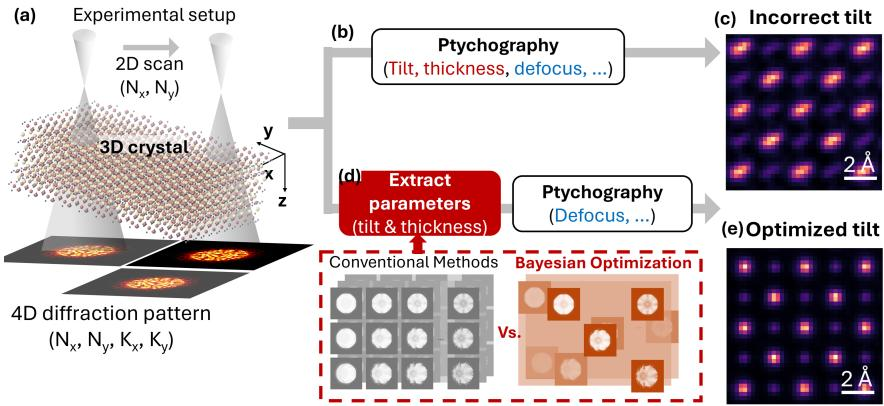  
Figure 1: Conceptual workflow for PACBED-based specimen-parameter estimation prior to MEP. (a) A 4D-STEM dataset is acquired from a specimen with unknown thickness and mistilt. (b) Conventionally these parameters are estimated jointly with the other reconstruction variables, and (c) uncorrected mistilt degrades the result. (d) In the proposed workflow they are estimated first, by comparing the experimental PACBED pattern with multislice simulations: conventional methods evaluate a predefined grid, whereas BO-based methods adaptively select candidates from previous results. (e) The improved reconstruction expected after correction.

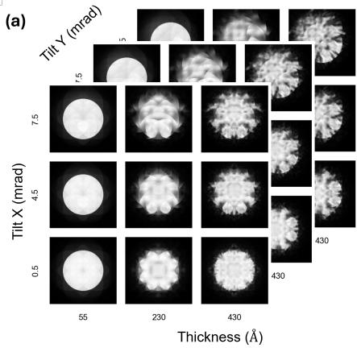

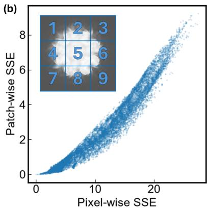  
Figure 2: (a) PACBED patterns simulated for $\mathrm { S r T i O _ { 3 } }$ across thickness (columns) and tilt along two orthogonal axes, tiltX (rows) and tiltY (offset diagonally). Thickness reorganizes the fringe structure non-monotonically, while tilt along either axis breaks the pattern's symmetry in a direction-dependent way. (b) Pixel-wise SSE $f ( \mathbf { x } )$ versus patch-level SSE $f ^ { \mathbf { \^ { p } } } ( \mathbf { x } )$ for simulated PACBED images; their systematic relationship motivates using the patch-level SSE with correction terms.

For a given parameter vector $\mathbf { x } \in { \mathcal { X } } .$ , a multislice simulation generates a PACBED image $\mathbf { y } ( \mathbf { x } ) \in$ $\mathbb { R } ^ { M \times \breve { M } }$ , where $y _ { k , \ell } ( \mathbf { x } )$ denotes the simulated intensity at pixel $( k , \ell )$ . We measure the discrepancy between the simulated and experimental PACBED patterns using the pixel-wise sum of squared errors (SSE),

$$
f ( \mathbf { x } ) : = \sum _ { k = 1 } ^ { M } \sum _ { \ell = 1 } ^ { M } \left( y _ { k , \ell } ( \mathbf { x } ) - y _ { k , \ell } ^ { \mathrm { t r u e } } \right) ^ { 2 } .\tag{1}
$$

The parameter estimation problem is then

$$
\mathbf { x } ^ { * } \in \arg \operatorname* { m i n } _ { \mathbf { x } \in \mathcal { X } } f ( \mathbf { x } ) .\tag{2}
$$

Fig. $2 ( \mathrm { a } )$ illustrates how the simulated pattern $\mathbf { y } ( \mathbf { x } )$ varies over the thickness and tilt ranges considered in this work.

## 2.2 Bayesian optimization

Bayesian optimization (BO) is a sequential approach for optimizing expensive black-box functions applied to problems such as hyperparameter tuning [12], materials design [13], and experimental optimization [14]. In electron microscopy it has been used to select reconstruction parameters for electron ptychography [15] and to align the microscope [16]. Both target the instrument or the reconstruction; we instead use BO to estimate specimen thickness and mistilt by matching simulated and experimental PACBED patterns, then supply the estimates to a subsequent reconstruction.

Standard BO places a Gaussian process (GP) prior on the scalar objective $f ( \mathbf { x } )$ . Given observations ${ \mathcal { D } } _ { n } = \{ ( \mathbf { x } _ { i } , { \dot { f ( \mathbf { x } _ { i } ) } } ) \} _ { i = 1 } ^ { n }$ , the GP posterior yields the predictive distribution

$$
f ( \mathbf { x } ) \mid { \mathcal { D } } _ { n } \sim { \mathcal { N } } { \big ( } \mu _ { n } ( \mathbf { x } ) , \sigma _ { n } ^ { 2 } ( \mathbf { x } ) { \big ) } , \qquad \mathbf { x } \in { \mathcal { X } } ,
$$

where $\mu _ { n } ( \mathbf { x } )$ and $\sigma _ { n } ^ { 2 } ( \mathbf { x } )$ are the posterior mean and variance, respectively; see Appendix A. An acquisition function uses this distribution to balance exploitation of inputs with promising predicted objective values and exploration of inputs with high posterior uncertainty.

We primarily use the expected improvement (EI) acquisition function [17],

$$
\alpha _ { n } ^ { \mathrm { E I } } ( \mathbf { x } ) = \mathbb { E } _ { n } \left[ \operatorname* { m a x } \left\{ f _ { n } ^ { \mathrm { m i n } } - f ( \mathbf { x } ) , 0 \right\} \right] ,\tag{3}
$$

where $f _ { n } ^ { \mathrm { m i n } } = \mathrm { m i n } _ { i = 1 , \dots , n } f ( \mathbf { x } _ { i } )$ is the best objective value observed so far. Under the Gaussian predictive distribution of $f ( \mathbf { x } )$ , EI admits a closed-form expression given in Appendix B. At each iteration, BO selects

$$
\mathbf { x } _ { n + 1 } \in \arg \operatorname* { m a x } _ { \mathbf { x } \in \mathcal { X } } \alpha _ { n } ^ { \mathrm { E I } } ( \mathbf { x } ) .\tag{4}
$$

A PACBED pattern is then simulated at $\mathbf { x } _ { n + 1 }$ , its SSE $f (  { \mathbf { x } } _ { n + 1 } )$ is evaluated, and the resulting observation is added to $\mathcal { D } _ { n }$ to form $\mathcal { D } _ { n + 1 }$ . This process is repeated until the evaluation budget is exhausted. We also consider the knowledge gradient (KG) [18, 19] as an additional BO baseline; its definition is provided in Appendix C.

While standard BO models $f ( \mathbf { x } )$ directly as a scalar black-box objective, the PACBED objective in Eq. (1) has additional known structure: the specimen parameters x are first mapped through the simulator to a PACBED image $\mathbf { y } ( \mathbf { x } )$ , and the resulting pixel intensities are then combined through the SSE function. We present how to exploit this structure to improve BO sampling efficiency in the next section.

## 2.3 Bayesian optimization of composite functions

The PACBED objective in Eq. (1) has the known composite form

$$
f ( \mathbf { x } ) = g ( \mathbf { y } ( \mathbf { x } ) ) ,\tag{5}
$$

where the known outer function $g$ computes the pixel-wise SSE:

$$
g ( \mathbf { y } ) = \sum _ { k = 1 } ^ { M } \sum _ { \ell = 1 } ^ { M } \left( y _ { k , \ell } - y _ { k , \ell } ^ { \mathrm { t r u e } } \right) ^ { 2 } .
$$

Bayesian optimization of composite functions (BOCF) [11] exploits this structure by modeling the intermediate output $\mathbf { y } ( \mathbf { x } )$ with a multi-output GP and propagating its predictive uncertainty through g to obtain a predictive distribution over $f ( \mathbf { x } )$ . This distribution is then used to evaluate EI and select the next candidate. Because applying the nonlinear function g to the Gaussian predictive distribution of $\mathbf { y } ( \mathbf { x } )$ generally produces a non-Gaussian distribution over $f ( \mathbf { x } )$ , EI in this case does not admit a closed-form expression and is instead estimated using Monte Carlo sampling [11].

Directly applying standard BOCF to PACBED requires modeling $M ^ { 2 }$ intermediate pixel intensities $\mathbf { y } ( \mathbf { x } )$ , which becomes computationally impractical for typical PACBED images with $\mathbf { \hat { \textit { M } } } \gtrsim 1 2 8$ . This computational challenge motivates our proposed method, presented in the next section, which uses a lower-dimensional intermediate representation.

## 3 Proposed Method: Scalable Bayesian Optimization of Composite Functions

To address the computational challenge of GP modeling in standard BOCF, we propose scalable Bayesian optimization of composite functions (SBOCF). SBOCF replaces the pixel-level intermediate output with lower-dimensional patch-level representations while retaining the original pixel-wise SSE as the optimization objective.

Patch-level representation. We partition an $M \times M$ PACBED image into $P$ disjoint patches $\mathcal { P } = \{ \mathcal { P } _ { 1 } , \ldots , \mathbf { \hat { \mathcal { P } } } _ { P } \}$ . For each patch $\mathcal { P } _ { j }$ , we define a scalar summary

$$
h _ { j } ( \mathbf { x } ) = A _ { j } ( \mathbf { y } ( \mathbf { x } ) ) , \qquad j = 1 , \dotsc , P ,
$$

where $A _ { j }$ is an aggregation operator applied to the pixels in $\mathcal { P } _ { j }$ . In our experiments, $A _ { j }$ sums the pixel intensities within each patch:

$$
A _ { j } ( \mathbf { y } ( \mathbf { x } ) ) = \sum _ { ( k , \ell ) \in \mathcal { P } _ { j } } y _ { k , \ell } ( \mathbf { x } ) .\tag{6}
$$

We similarly define the corresponding target summary as $h _ { j } ^ { \mathrm { t r u e } } = A _ { j } ( \mathbf { y } ^ { \mathrm { t r u e } } )$ . Collecting the patch summaries gives $\mathbf { h } ( \mathbf { x } ) = \left( h _ { 1 } ( \mathbf { x } ) , \ldots , h _ { P } ( \mathbf { x } ) \right) ^ { \top }$

Using these summaries, we define the patch-level SSE

$$
f ^ { P } ( { \bf x } ) = g ^ { P } ( { \bf h } ( { \bf x } ) ) = \sum _ { j = 1 } ^ { P } \left( h _ { j } ( { \bf x } ) - h _ { j } ^ { \mathrm { t r u e } } \right) ^ { 2 } .
$$

This representation reduces the number of intermediate quantities from $M ^ { 2 }$ pixel intensities to P patch summaries. However, aggregation discards spatial information within each patch, so the minimizers of $f ^ { P } ( { \bf x } )$ are generally not equal to those of the original pixel-wise objective $f ( \mathbf { x } )$

Correction for aggregation error. Although $f ^ { P } ( { \bf x } )$ does not exactly recover $f ( \mathbf { x } )$ , the two quantities exhibit a strong systematic relationship across simulated PACBED images, as shown in Fig. 2(b). We therefore represent the original objective as

$$
f ( { \bf { x } } ) = \epsilon ( { \bf { x } } ) f ^ { P } ( { \bf { x } } ) + \delta ( { \bf { x } } ) ,\tag{7}
$$

where $\epsilon ( \mathbf { x } )$ is an input-dependent multiplicative correction and $\delta ( \mathbf { x } )$ captures the remaining discrepancy. This decomposition is not unique. We therefore constrain the multiplicative correction to a prescribed range and select the decomposition with the smallest absolute residual:

$$
\begin{array} { r l } { \underset { \epsilon ( \mathbf { x } ) , \delta ( \mathbf { x } ) } { \mathrm { m i n } } } & { | \delta ( \mathbf { x } ) | } \\ { \mathrm { s . t . } } & { | \log _ { 1 0 } \epsilon ( \mathbf { x } ) | \leq c , } \\ & { f ( \mathbf { x } ) = \epsilon ( \mathbf { x } ) f ^ { P } ( \mathbf { x } ) + \delta ( \mathbf { x } ) , } \end{array}\tag{8}
$$

where $c > 0$ controls the allowable range of the multiplicative correction. This formulation assigns the systematic difference between $f ^ { P } ( \mathbf { x } )$ and $f ( \mathbf { x } )$ primarily to the bounded scaling term, while $\delta ( \mathbf { x } )$ captures the discrepancy that cannot be explained by this scaling. A closed-form solution of optimization problem (8) is provided in Appendix D.

Composite surrogate model. SBOCF models the reduced intermediate representation

$$
\tilde { \mathbf { h } } ( \mathbf { x } ) = \left( h _ { 1 } ( \mathbf { x } ) , \ldots , h _ { P } ( \mathbf { x } ) , \epsilon ( \mathbf { x } ) , \delta ( \mathbf { x } ) \right) ^ { \top }
$$

using independent GP surrogates for its $P + 2$ outputs. It then applies BOCF to this reduced representation rather than to the full pixel-level PACBED image. The original pixel-wise SSE is recovered through the known outer function

$$
f ( { \bf x } ) = \tilde { g } \Big ( \tilde { \bf h } ( { \bf x } ) \Big ) ,\tag{9}
$$

where $\tilde { g }$ takes the form:

$$
\tilde { g } ( \tilde { \mathbf { h } } ) = \tilde { h } _ { P + 1 } \sum _ { j = 1 } ^ { P } \left( \tilde { h } _ { j } - h _ { j } ^ { \mathrm { t r u e } } \right) ^ { 2 } + \tilde { h } _ { P + 2 } .
$$

Thus, SBOCF reduces the number of modeled intermediate outputs from $M ^ { 2 }$ to $P + 2$ while preserving the original pixel-wise SSE objective.

Sequential SBOCF procedure. The complete SBOCF procedure is summarized in Fig. 3. Starting from an initial set of parameter-image pairs, SBOCF constructs the reduced representations, fits independent GP surrogates for the $\bar { P } + \bar { 2 }$ outputs, and propagates posterior samples through the known outer function. It then maximizes EI to select and simulate the next candidate, appends the resulting parameter-image pair to the dataset, and repeats this process until the simulation budget is exhausted.

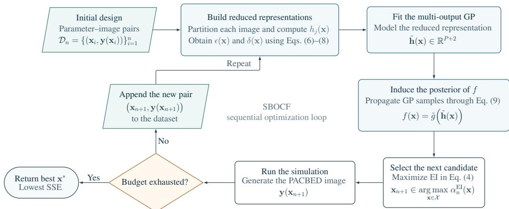  
Figure 3: Flowchart of the proposed SBOCF algorithm

Comparison of methods. Table 1 summarizes the differences among standard BO, BOCF, and SBOCF. Row (a) describes how each method processes the simulated PACBED image before GP modeling: standard BO reduces the image to a scalar SSE, BOCF retains all pixel intensities, and SBOCF partitions the image into patches. We use the $3 \times 3$ square partition shown in the table throughout the main experiments. Row (b) lists the quantities modeled by the GP surrogates, while Row (c) gives the corresponding numbers of GP outputs: 1 for standard BO, $M ^ { 2 }$ for BOCF, and P + 2 for SBOCF. Finally, Row (d) compares their objective representations: standard BO models $f ( \mathbf { x } )$ directly, BOCF uses the full composite form $g ( \mathbf { y } ( \mathbf { x } ) )$ ), and SBOCF uses the reduced composite form $\tilde { g } ( \tilde { \mathbf { h } } ( \mathbf { x } ) )$

Table 1: Comparison of standard BO, BOCF, and SBOCF for PACBED parameter estimation.
<table><tr><td>Aspect</td><td>BO</td><td>BOCF</td><td>SBOCF (Ours)</td></tr><tr><td>(a) Image pro- cessing before GP modeling</td><td>Compute scalar SSE</td><td>Use pixel intensities directly</td><td>Partition image into patches</td></tr><tr><td>(b) GP modeling unit</td><td>Scalar objective  $f ( \mathbf { x } )$ </td><td>Pixel intensities  $y _ { k , \ell } ( \mathbf { x } )$ </td><td>Patch-level summaries + corrections  $h _ { j } ( { \bf x } ) , \epsilon ( { \bf x } ) , \delta ( { \bf x } )$ </td></tr><tr><td>(c) Number of GP outputs</td><td>1 (scalar objective)</td><td> $M ^ { 2 }$  (all pixel intensities)</td><td> $P + 2$  (P patch summaries + €, δ)</td></tr><tr><td>(d) Objective rep- resentation</td><td>Direct (black-box) f(x)</td><td>Composite  $g ( \mathbf { y } ( \mathbf { x } ) )$  in Eq. (5)</td><td>Reduced composite  $\tilde { g } \big ( \tilde { \mathbf { h } } ( \mathbf { x } ) \big )$  in Eq. (9)</td></tr></table>

## 4 Numerical Experiments

In this section, we first present the comparison methods, optimization settings, and evaluation metric, followed by the simulated and experimental PACBED benchmarks used to evaluate SBOCF.

## 4.1 Comparison methods and experimental setup

We compare SBOCF with standard BO using a single-output GP with either expected improvement (BO(EI)) or knowledge gradient (BO(KG)), as well as with random sampling (Random). For all GP-based methods, we use a constant mean function and a Matérn-5/2 covariance kernel, with hyperparameters estimated by maximum likelihood estimation (MLE). Each algorithm is initialized with the same 7-point Sobol design and run for a total of 50 evaluations. We repeat each experiment over 20 independent trials with different initial designs. For SBOCF, we use the $3 \times 3$ square partition shown in Row (a) of Table 1 and set the parameter c in Eq. (8) to 1 for all problems considered.

We measure optimization performance by the best (lowest) pixel-wise SSE observed by each iteration, averaged over the 20 trials. We also quantify the performance gain of SBOCF using the ratio of the median baseline metric to the corresponding median SBOCF metric, considering both the final SSE and absolute parameter-estimation error. A ratio greater than one indicates an improvement over the baseline. In addition, we report the average acquisition-function optimization time per iteration, excluding the PACBED simulation time, which is common to all methods.

All methods are implemented in Python using PyTorch [20] and BoTorch [21]. The code is available at https://github.com/dasol-yoon/bott. Experiments are run on a single computing node with one NVIDIA GeForce RTX 3090 GPU and four CPU cores. Further optimization details are provided in Appendix E.

## 4.2 Benchmarks

Simulated $\mathbf { S r T i O _ { 3 } }$ PACBED. We first evaluate the methods on synthetic $\mathrm { S r T i O _ { 3 } }$ PACBED benchmarks, where the target PACBED images are generated by the same simulator used during optimization. This setting provides a controlled test case in which the ground-truth specimen parameters are known and, in the noiseless case, the global optimum corresponds to the parameter setting that exactly reproduces the target image.

PACBED patterns are simulated on-the-fly using the abTEM package [22] during the optimization process, with BO adaptively selecting the simulation variables. Each evaluation simulates a 4D-STEM scan over probe positions spanning a unit cell and averages the resulting diffraction patterns to form the PACBED pattern. We follow the forward simulation settings for $\mathrm { S r T i O _ { 3 } }$ considered in [6]. Specifically, we use a beam energy of 200 keV, a convergence semi-angle of 19.1 mrad, a defocus of 0 nm, a collection angle of 31 mrad, a scan step size of 0.3 Å, and a potential extent of 62.6 Å. Each PACBED pattern has a resolution of 157 × 157 pixels.

The unknown parameters are the specimen thickness and the beam tilts along the x- and y-axes, searched over [5, 500] Å and [—10, 10] mrad, respectively. We consider three simulated benchmarks: Sim380 and Sim100, thick and thin specimens with ground-truth thicknesses of 380 and 100 Å and tilts of $( 1 . 5 , - 1 . 5 )$ mrad; and Sim200, at 200 Å and $( 3 , - 5 )$ mrad. Results for Sim100 and Sim200 are deferred to Appendices F and G.

We additionally evaluate robustness to measurement noise by adding varying noise levels to the target images; see Appendix H. We also compare the $3 \times 3$ square partition with an alternative partition comprising a high-intensity circular center and four outer quadrants; see Appendix I.

Experimental $\mathbf { S r T i O _ { 3 } }$ PACBED. We next evaluate the methods on an experimental $\mathrm { S r T i O _ { 3 } }$ PACBED pattern from [6], using the same simulation setup, optimization variables, and search space as for the simulated benchmarks. Unlike the simulated targets, the experimental pattern cannot be reproduced exactly by the simulator, and its true specimen parameters are unknown. We therefore evaluate the parameter estimates using the reference values reported in [6]. Specifically, we use a thickness of 380 $\mathring \mathrm { A }$ and beam tilts of (1.5, —1.5) mrad. We refer to this benchmark as Exp380.

Downstream MEP reconstruction. We use Sim200 as a representative test case for downstream MEP reconstruction. The corresponding 4D-STEM dataset is generated using the same specimen parameters and microscope settings, and the SBOCF-estimated thickness and mistilt are then used in the reconstruction.

## 5 Results and discussion

Simulated SrTiO3PACBED: Fig. 4 summarizes the results for Sim380; result figures for Sim100 and Sim200 are provided in Appendices F and G, respectively. In each figure, Panel (a) shows the best observed pixel-wise SSE at each iteration; Panels (b)—(d) show the final thickness, tilt-X, and tilt-Y estimates; and Panel (e) compares the average acquisition runtime per iteration with the final SSE. Both standard BO baselines outperform random sampling, while SBOCF achieves the lowest final SSE and the most accurate and stable parameter estimates.

For Sim380, SBOCF achieves final-SSE improvement factors of 290× and 377× over BO(EI) and BO(KG), respectively. For thickness, tilt-X, and tilt-Y, the corresponding improvement factors are (24×, 26×, 35×) relative to BO(EI) and (23×, 22×, 51 ×) relative to BO(KG). For Sim100, the final-SSE improvement factors are 47× and 320×, with corresponding parameter-error improvements of (1.9×,9.4×, 14×) and $( 5 . 4 \times , 2 6 \times , 3 3 \times )$ relative to BO(EI) and BO(KG), respectively. For Sim200, the final-SSE improvement factors are 37× and 202×, with corresponding parameter-error improvements of $( 2 . 2 \times , \bar { 6 . 5 } \times , 6 . 0 \times )$ and (4.2×, 16×, 13×).

SBOCF is moderately more expensive per iteration than BO(EI) because it models 11 GP outputs rather than one, but achieves substantially lower final SSE. It is also faster and more accurate than BO(KG), whose fantasy-model construction and high-dimensional one-shot optimization incur greater computational cost. Thus, SBOCF provides a favorable trade-off between runtime and parameter-estimation accuracy.

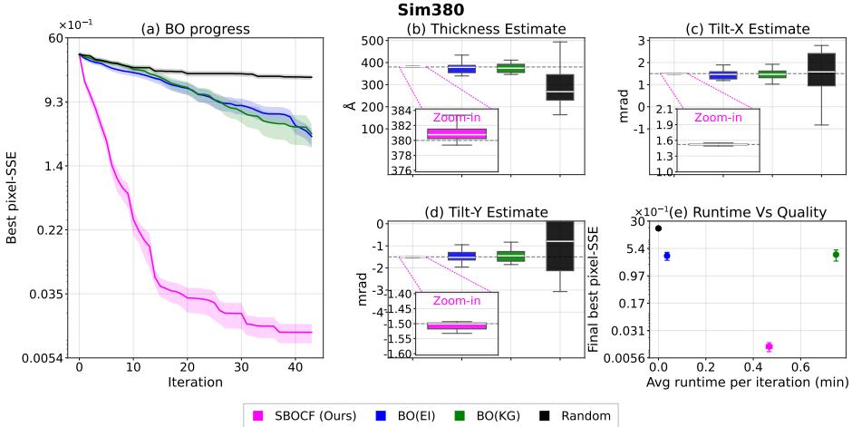  
Figure 4: Results for Sim380 with ground-truth thickness 380 Å and tilts (1.5, —1.5) mrad. Panels show (a) best observed pixel-wise SSE, final estimates of (b) thickness, (c) tilt-X, and (d) tilt-Y, and (e) acquisition runtime versus final SSE. Solid lines in Panel (a) show the mean across 20 trials, and the shaded regions indicate standard error. Dashed lines in Panels (b)–(d) indicate the ground truth.

Experimental SrTiO3 PACBED: Fig. 5 summarizes the Exp380 results using the same panel layout as Fig. 4. SBOCF achieves the lowest final SSE, with improvement factors of 1.08× and 1.13× over BO(EI) and BO(KG), respectively. These gains are less pronounced than in the synthetic cases, as measurement noise and simulation-experiment mismatch make the experimental problem more challenging. Nevertheless, SBOCF delivers the strongest overall performance, achieving the lowest final SSE and improving most parameter estimates while remaining competitive on the others.

For thickness, SBOCF achieves improvement factors of 2.4× and 3.0× relative to BO(EI) and BO(KG), respectively. The corresponding factors for tilt-X are 0.90× and 1.78×, while those for tilt-Y are 1.41 × and 1.26×. The resulting estimates are close to the reference thickness of 380 Å and the tilt values reported in [6].

Although SBOCF incurs greater acquisition-function overhead than BO(EI), it achieves a lower final SSE. SBOCF also achieves a lower final SSE than BO(KG) while incurring substantially less acquisition-function overhead. These results demonstrate that SBOCF can provide competitive experimental parameter estimates without problem-specific neural-network training or a large simulated training set.

Downstream MEP reconstruction: Fig. 6 illustrates the downstream consequence of accurate parameter estimates. For a simulated $\mathrm { S r T i O } _ { 3 }$ specimen of thickness 200 Å with tilts of 3 and —5 mrad, ignoring the tilt elongates the atomic columns—rows of atoms stacked along the beam direction, which appear as bright dots in a projected view—and tilts them with respect to the beam direction (a)–(c), whereas reconstructing with the SBOCF estimates recovers sharp, vertical columns (d)–(f). Those estimates match the ground truth to within 5 Å in thickness and 0.1 mrad in tilt.

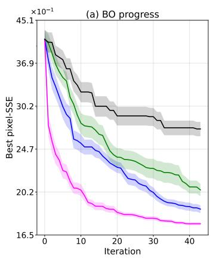

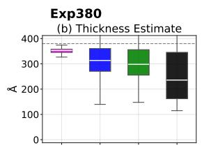

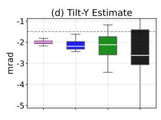

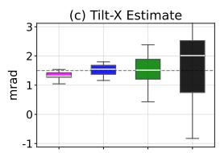

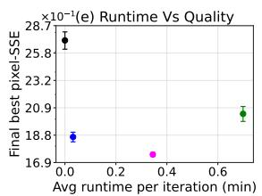

Figure 5: Results for the Exp380 experimental $\mathrm { S r T i O _ { 3 } }$ PACBED benchmark using the target image from [6]. Layout as in Fig. 4, except that dashed lines in Panels (b)–(d) indicate the reference estimates reported in [6].  
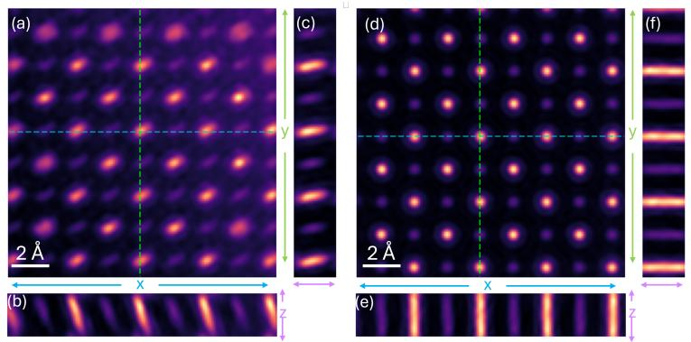  
Figure 6: Effect of specimen mistilt on multislice electron ptychography and its correction using SBOCF estimates, for a simulated $\mathrm { S r T i O } _ { 3 }$ specimen of thickness 200 Å with tilts of 3 mrad (tilt-X) and —5 mrad (tilt-Y). (a)–(c) Reconstruction of the dataset without accounting for the tilt: (a) projected view, (b) x-z and (c) y-z depth sections. (d)–(f) The corresponding reconstruction using the SBOCF-estimated parameters

## 6 Conclusion

We introduced scalable Bayesian optimization of composite functions (SBOCF) for simulation-based estimation of specimen thickness and mistilt from PACBED images. By representing each simulated image with patch-level outputs and two correction terms, SBOCF exploits image-level information while preserving the pixel-wise SSE objective and reducing the number of modeled outputs by a factor of approximately 2,000 relative to standard BOCF.

Under a limited simulation budget, SBOCF converged faster and achieved lower SSE than BO(EI) reducing the median final SSE by a factor of approximately 290 on the noise-free synthetic Sim380 dataset. On experimental data, SBOCF produced thickness and mistilt estimates consistent with previous neural-network-based estimates without requiring a large simulated training dataset.

Future work will extend SBOCF to additional PACBED-sensitive parameters, including probe aberrations and atomic-vibration amplitudes. More broadly, SBOCF provides a practical approach to inverse problems involving expensive simulations and high-dimensional structured outputs.

## Acknowledgments and Disclosure of Funding

This research was supported by the Center for Alkaline Based Energy Solutions (CABES), an Energy Frontier Research Center funded by the U.S. Department of Energy (DOE), Office of Science, Basic Energy Sciences (BES), under Award #DE-SC0019445. PB would like to thank the DPST scholarship program from IPST, Ministry of Education, Thailand, for providing financial support. CHL is supported by the Eric and Wendy Schmidt AI in Science Postdoctoral Fellowship, a program of Schmidt Sciences, LLC.

## References

[1] James M. LeBeau, Scott D. Findlay, Leslie J. Allen, and Susanne Stemmer. Position averaged convergent beam electron diffraction: Theory and applications. Ultramicroscopy, 110(2):118– 125, January 2010.

[2] Earl J. Kirkland. Advanced computing in electron microscopy: Second edition. 2010.

[3] Zhen Chen, Yi Jiang, Yu-Tsun Shao, Megan E. Holtz, Michal Odstrčil, Manuel Guizar-Sicairos, Isabelle Hanke, Steffen Ganschow, Darrell G. Schlom, and David A. Muller. Electron ptychography achieves atomic-resolution limits set by lattice vibrations. Science, 372(6544):826–831, May 2021.

[4] Haozhi Sha, Jizhe Cui, and Rong Yu. Deep sub-angstrom resolution imaging by electron ptychography with misorientation correction. Science Advances, 8(19):eabn2275, 2022.

[5] J.A. Pollock, M. Weyland, D.J. Taplin, L.J. Allen, and S.D. Findlay. Accuracy and precision of thickness determination from position-averaged convergent beam electron diffraction patterns using a single-parameter metric. Ultramicroscopy, 181:86–96, October 2017.

[6] W. Xu and J.M. LeBeau. A deep convolutional neural network to analyze position averaged convergent beam electron diffraction patterns. Ultramicroscopy, 188:59–69, May 2018.

[7] Chenyu Zhang, Jie Feng, Luis Rangel DaCosta, and Paul M. Voyles. Atomic resolution convergent beam electron diffraction analysis using convolutional neural networks. Ultramicroscopy, 210:112921, March 2020.

[8] Michael Oberaigner, Alexander Clausen, Dieter Weber, Gerald Kothleitner, Rafal E Dunin-Borkowski, and Daniel Knez. Online thickness determination with position averaged convergent beam electron diffraction using convolutional neural networks. Microscopy and Microanalysis, 29(1):427–436, February 2023.

[9] Jonas Močkus. On Bayesian methods for seeking the extremum. In Optimization Techniques IFIP Technical Conference: Novosibirsk, July 1–7, 1974, pages 400–404. Springer, 1975.

[10] Peter I. Frazier. A tutorial on Bayesian optimization, 2018.

[11] Raul Astudillo and Peter Frazier. Bayesian optimization of composite functions. In International Conference on Machine Learning, pages 354–363. PMLR, 2019.

[12] Jasper Snoek, Hugo Larochelle, and Ryan P Adams. Practical Bayesian optimization of machine learning algorithms. Advances in neural information processing systems, 25, 2012.

[13] Peter I Frazier and Jialei Wang. Bayesian optimization for materials design. In Information science for materials discovery and design, pages 45–75. Springer, 2015.

[14] Waritsara Khongkomolsakul, Poompol Buathong, Eunhye Yang, Younas Dadmohammadi, Yufeng Zhou, Peilong Li, Lixin Yang, Peter I. Frazier, and Alireza Abbaspourrad. Improving thermal and gastric stability of phytase via pH shifting and coacervation: A demonstration of Bayesian optimization for rapid process tuning. Food Hydrocolloids, 174:112296, 2026.

[15] Michael C Cao, Zhen Chen, Yi Jiang, and Yimo Han. Automatic parameter selection for electron ptychography via Bayesian optimization. Scientific Reports, 12(1):12284, 2022.

[16] Utkarsh Pratiush, Austin Houston, Richard Liu, Gerd Duscher, and Sergei Kalinin. Towards self-optimizing electron microscope: Robust tuning of aberration coefficients via physics-aware multi-objective Bayesian optimization. arXiv preprint arXiv:2601.18972, 2026.

[17] Donald R. Jones, Matthias Schonlau, and William J. Welch. Efficient global optimization of expensive black-box functions. Journal of Global Optimization, 13(4):455–492, December 1998.

[18] Peter I. Frazier, Warren B. Powell, and Savas Dayanik. A knowledge-gradient policy for sequential information collection. SIAM Journal on Control and Optimization, 47(5):2410– 2439, January 2008.

[19] Warren Scott, Peter Frazier, and Warren Powell. The correlated knowledge gradient for simulation optimization of continuous parameters using Gaussian process regression. SIAM Journal on Optimization, 21(3):996–1026, 2011.

[20] Adam Paszke, Sam Gross, Francisco Massa, Adam Lerer, James Bradbury, Gregory Chanan, Trevor Killeen, Zeming Lin, Natalia Gimelshein, Luca Antiga, et al. PyTorch: An imperative style, high-performance deep learning library. Advances in neural information processing systems, 32, 2019.

[21] Maximilian Balandat, Brian Karrer, Daniel R. Jiang, Samuel Daulton, Benjamin Letham, Andrew Gordon Wilson, and Eytan Bakshy. BoTorch: A framework for efficient Monte-Carlo Bayesian optimization. In Proceedings of the 34th International Conference on Neural Information Processing Systems, NIPS '20, pages 21524–21538, Red Hook, NY, USA, December 2020. Curran Associates Inc.

[22] Jacob Madsen and Toma Susi. The abTEM code: transmission electron microscopy from first principles. Open Research Europe, 1:24, 2021.

[23] Carl Edward Rasmussen and Christopher K. I. Williams. Gaussian Processes for Machine Learning. MIT Press, Cambridge, MA, 2006.

[24] Shuhei Watanabe. Derivation of closed form of expected improvement for Gaussian process trained on log-transformed objective. arXiv preprint arXiv:2411.18095, 2024.

[25] Sebastian Ament, Samuel Daulton, David Eriksson, Maximilian Balandat, and Eytan Bakshy. Unexpected improvements to expected improvement for Bayesian optimization. Advances in neural information processing systems, 36:20577–20612, 2023.

## Appendix

## A Gaussian process posterior distribution

Assume that

$$
f ( \cdot ) \sim \mathcal { G P } ( \mu _ { 0 } ( \cdot ) , k _ { 0 } ( \cdot , \cdot ) ) ,
$$

where $\mu _ { 0 } ( \cdot )$ is the prior mean function and $k _ { 0 } ( \cdot , \cdot )$ is the prior covariance function.

Given a dataset $\mathcal { D } _ { n } = \{ ( \mathbf { x } _ { i } , f ( \mathbf { x } _ { i } ) ) \} _ { i = 1 } ^ { n }$ , conditioning on this data set, the posterior distribution of $f ( \mathbf { x } )$ follows [23]:

$$
f ( \mathbf { x } ) | \mathcal { D } _ { n } \sim \mathcal { N } ( \mu _ { n } ( \mathbf { x } ) , \sigma _ { n } ^ { 2 } ( \mathbf { x } ) ) ,
$$

where $\mu _ { n } ( \mathbf { x } )$ and $\sigma _ { n } ^ { 2 } ( \mathbf { x } )$ are posterior mean and posterior variance given by

$$
\mu _ { n } ( { \bf x } ) = k _ { 0 } ( { \bf x } , { \bf X } ) ^ { T } K ( { \bf X } , { \bf X } ) ^ { - 1 } ( f ( { \bf X } ) - \mu _ { 0 } ( { \bf X } ) ) + \mu _ { 0 } ( { \bf x } )
$$

and

$$
\sigma _ { n } ^ { 2 } ( { \bf x } ) = k _ { 0 } ( { \bf x } , { \bf x } ) - k _ { 0 } ( { \bf x } , { \bf X } ) ^ { T } K ( { \bf X } , { \bf X } ) ^ { - 1 } k _ { 0 } ( { \bf x } , { \bf X } ) .
$$

Here, $\begin{array} { r l r } { { \bf X } } & { { } = } & { \left[ { \bf x } _ { 1 } \quad { \bf x } _ { 2 } \quad \ldots \quad { \bf x } _ { n } \right] } \end{array}$ is the matrix of n evaluated inputs, $\begin{array} { r l } { k _ { 0 } ( { \bf x } , { \bf X } ) ^ { T } } & { { } = } \end{array}$ $\begin{array} { r l } { [ k _ { 0 } ( \mathbf { x } , \mathbf { x } _ { 1 } ) } & { { } k _ { 0 } ( \mathbf { x } , \mathbf { x } _ { 2 } ) \quad \ldots \quad k _ { 0 } ( \mathbf { x } , { \bar { \mathbf { x } } } _ { n } ) ] } \end{array}$ is a kernel vector between the queried point x and evaluated points xi for $i = 1 , \ldots , n , K ( \mathbf { X } , \mathbf { X } )$ is a $n \times n$ kernel matrix between n evaluated points whose entries are given by $K ( \mathbf { X } , \mathbf { X } ) _ { i , j } = k _ { 0 } ( \mathbf { x } _ { i } , \mathbf { x } _ { j } ) . ~ \mu _ { 0 } ( \mathbf { X } ) ^ { T } = [ \mu _ { 0 } ( \mathbf { x } _ { 1 } ) ~ \mu _ { 0 } ( \mathbf { x } _ { 2 } ) ~ \dots ~ \mu _ { 0 } ( \mathbf { x } _ { n } ) ]$ is a mean vector and $f ( \mathbf { X } ) ^ { T } = [ f ( \mathbf { x } _ { 1 } ) \quad f ( \mathbf { x } _ { 2 } ) \quad \ldots \quad f ( \mathbf { x } _ { n } ) ]$ is an observation vector.

## B Closed-form expected improvement formula

Given the Gaussian posterior distribution

$$
f ( \mathbf { x } ) | \mathcal { D } _ { n } \sim \mathcal { N } ( \mu _ { n } ( \mathbf { x } ) , \sigma _ { n } ^ { 2 } ( \mathbf { x } ) ) ,
$$

EI admits the closed-form formula as follows:

$$
\alpha _ { n } ^ { \mathrm { E I } } ( \mathbf { x } ) = ( f _ { n } ^ { \mathrm { m i n } } - \mu _ { n } ( \mathbf { x } ) ) \Phi \left( \frac { f _ { n } ^ { \mathrm { m i n } } - \mu _ { n } ( \mathbf { x } ) } { \sigma _ { n } ( \mathbf { x } ) } \right) + \sigma _ { n } ( \mathbf { x } ) \phi \left( \frac { f _ { n } ^ { \mathrm { m i n } } - \mu _ { n } ( \mathbf { x } ) } { \sigma _ { n } ( \mathbf { x } ) } \right) ,\tag{B1}
$$

where $f _ { n } ^ { \mathrm { m i n } } = \mathrm { m i n } _ { i = 1 , \dots , n } f ( \mathbf { x } _ { i } )$ is the best objective value observed so far. $\Phi ( \cdot )$ and $\phi ( \cdot )$ denote the standard normal cumulative distribution function (CDF) and probability density function (PDF), respectively. Derivation can be found, for example, in [24].

## C Knowledge gradient formula

Given the Gaussian predictive distribution

$$
f ( \mathbf { x } ) | \mathcal { D } _ { n } \sim \mathcal { N } ( \mu _ { n } ( \mathbf { x } ) , \sigma _ { n } ^ { 2 } ( \mathbf { x } ) ) ,
$$

KG is constructed as follows:

$$
\alpha _ { n } ^ { \mathrm { K G } } ( \mathbf { x } ) = \underset { \mathbf { x } ^ { \prime } \in \mathcal { X } } { \mathrm { m i n } } \mu _ { n } ( \mathbf { x } ^ { \prime } ) - \mathbb { E } \left[ \underset { \mathbf { x } ^ { \prime } \in \mathcal { X } } { \mathrm { m i n } } \mu _ { n + 1 } ( \mathbf { x } ^ { \prime } ) \ \middle | \ \mathbf { x } _ { n + 1 } = \mathbf { x } \right] ,\tag{C1}
$$

where the first term is the current best inferred value, and the second term represents the expected future best inferred SSE after evaluating at x. Thus, $\alpha _ { n } ^ { \mathrm { K G } } ( \mathbf { x } )$ quantifies the expected reduction in the best inferred SSE resulting from the additional evaluation. Unlike EI, KG does not have an analytical formula and has to be evaluated using Monte Carlo approximation and optimized in a one-shot style [21].

## D Closed-form solution for $\epsilon ( \mathbf { x } )$ and $\delta ( \mathbf { x } )$ decomposition

For a fixed input x, consider the optimization problem

$$
\begin{array} { r l } { \underset { \epsilon ( \mathbf { x } ) , \delta ( \mathbf { x } ) } { \mathrm { m i n } } } & { | \delta ( \mathbf { x } ) | } \\ { \mathrm { s . t . } } & { | \log _ { 1 0 } \epsilon ( \mathbf { x } ) | \leq c , } \\ & { f ( \mathbf { x } ) = \epsilon ( \mathbf { x } ) f ^ { \mathcal { P } } ( \mathbf { x } ) + \delta ( \mathbf { x } ) , } \end{array}\tag{D1}
$$

where $c > 0$ is a user-specified constant.

We derive the closed-form solution below.

From the constraint

$$
| \log _ { 1 0 } \epsilon ( \mathbf { x } ) | \leq c ,
$$

we obtain

$$
1 0 ^ { - c } \le \epsilon ( \mathbf { x } ) \le 1 0 ^ { c } .
$$

Using the equality constraint in (D1), we can eliminate $\delta ( \mathbf { x } )$

$$
\delta ( \mathbf { x } ) = f ( \mathbf { x } ) - \epsilon ( \mathbf { x } ) f ^ { \mathcal { P } } ( \mathbf { x } ) .
$$

Substituting this into the objective gives the equivalent one-variable problem

$$
\operatorname* { m i n } _ { \epsilon ( \mathbf { x } ) \in [ 1 0 ^ { - c } , 1 0 ^ { c } ] } \left| f ( \mathbf { x } ) - \epsilon ( \mathbf { x } ) f ^ { \mathcal { P } } ( \mathbf { x } ) \right| .\tag{D2}
$$

We first consider the case $f ^ { \mathcal { P } } ( \mathbf { x } ) > 0$ In this case, minimizing

$$
| f ( \mathbf { x } ) - \epsilon ( \mathbf { x } ) f ^ { \mathcal { P } } ( \mathbf { x } ) |
$$

is equivalent to choosing $\epsilon ( \mathbf { x } )$ as close as possible to the unconstrained minimizer

$$
\epsilon ( { \bf x } ) = \frac { f ( { \bf x } ) } { f ^ { \mathcal { P } } ( { \bf x } ) } .
$$

Therefore, the constrained optimum is obtained by projecting $\begin{array} { r } { \frac { f ( \mathbf { x } ) } { f ^ { \mathcal { P } } ( \mathbf { x } ) } } \end{array}$ onto the interval $[ 1 0 ^ { - c } , 1 0 ^ { c } ]$ i.e.,

$$
\epsilon ^ { * } ( \mathbf { x } ) = \operatorname* { m i n } \left\{ 1 0 ^ { c } , \operatorname* { m a x } \left\{ 1 0 ^ { - c } , \frac { f ( \mathbf { x } ) } { f ^ { \mathcal { P } } ( \mathbf { x } ) } \right\} \right\} .
$$

The corresponding optimal $\delta ( \mathbf { x } )$ is then recovered from the equality constraint:

$$
\delta ^ { * } ( \mathbf { x } ) = f ( \mathbf { x } ) - \epsilon ^ { * } ( \mathbf { x } ) f ^ { \mathcal { P } } ( \mathbf { x } ) .
$$

Next, consider the case $f ^ { \mathcal { P } } ( \mathbf { x } ) = 0$ . Then the equality constraint reduces to

$$
f ( \mathbf { x } ) = \delta ( \mathbf { x } ) ,
$$

SO $\delta ( \mathbf { x } )$ is fixed and the objective no longer depends on $\epsilon ( \mathbf { x } )$ . In this case, any $\epsilon ( \mathbf { x } )$ satisfying $1 0 ^ { - c } \le \epsilon ( \mathbf { x } ) \le 1 0 ^ { c }$ is optimal. For convenience, we set

$$
\epsilon ( { \bf x } ) = 1 , \qquad \delta ( { \bf x } ) = f ( { \bf x } ) .
$$

## E Optimization details

In this section, we provide optimization details for each method. All Bayesian optimization methods are implemented in BoTorch [21].

For the EI acquisition function, we use the built-in analytical implementation of log Expected Improvement (logEI), which has been shown to be substantially more numerically stable than the standard EI formulation [25]. The acquisition function is optimized using the default multi-start optimization procedure in BoTorch with 20 restarts and 100 raw samples.

For the KG acquisition function, we follow the one-shot KG implementation in BoTorch. In particular, Eq. (C1) is approximated using 16 fantasy samples and optimized through a deterministic

sample-average approximation enabled by the reparameterization trick and automatic differentiation.   
The resulting optimization problem is solved using 20 restarts and 100 raw samples.

For SBOCF, we follow the implementation strategy from prior work on Bayesian optimization of composite functions [11]. Since the acquisition function does not admit a closed-form expression, we use Monte Carlo approximation with 512 samples drawn from a Sobol quasi-Monte Carlo (QMC) sampler together with the reparameterization trick and automatic differentiation to enable gradientbased optimization. The acquisition function is optimized with 50 restarts and 100 raw samples. Since the method involves compositions of Gaussian process models, the resulting acquisition landscape is substantially more complex, making the use of additional optimization effort reasonable.

## F Figure for Sim100

Fig. F1 shows the Sim100 results referred to in Section $5 ;$ the corresponding improvement factors are reported there.

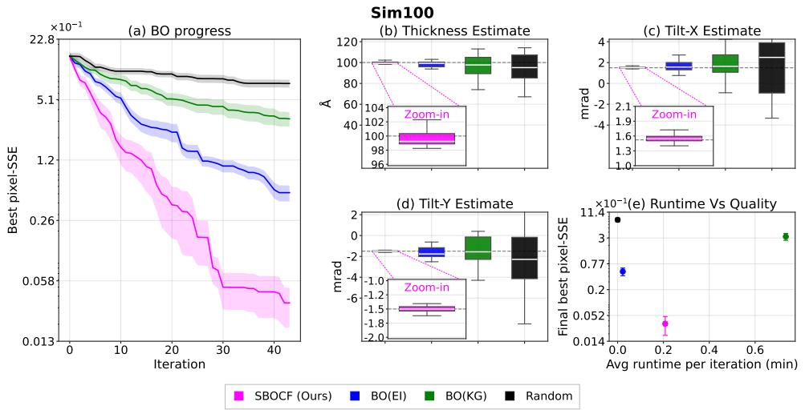  
Figure F1: Results for Sim100 with ground-truth thickness 100 $\mathring \mathrm { A }$ and tilts (1.5, –1.5) mrad. Layout and conventions as in Fig. 4.

## G Figure for Sim200

Fig. G1 shows the Sim200 results referred to in Section 5; the corresponding improvement factors are reported there. Since we use this problem as a representative case for the downstream ptychography application, we additionally note that SBOCF recovers the ground-truth parameters to within 5 Å in thickness and 0.1 mrad in tilt.

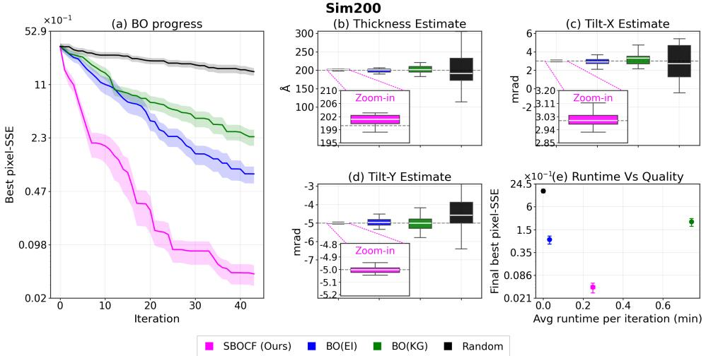  
Figure G1: Results for Sim200 with ground-truth thickness 200 Å and tilts (3, —5) mrad. Layout and conventions as in Fig. 4.

## H Ablation study: Simulated test cases with ground-truth noise

In this section, we consider the simulated benchmark problems introduced in the main paper, namely Sim380, Sim100 and Sim200. To better reflect realistic experimental conditions where measurements are corrupted by noise and the simulator cannot perfectly reproduce the observed image, we conduct an additional ablation study in which different levels of noise are added to the ground-truth PACBED images.

Specifically, we add Poisson noise to the ground-truth images after normalizing the image intensities and scaling them to simulated photon counts with a specified peak count parameter. Poisson-distributed counts are then sampled independently for each pixel before the noisy image is rescaled back to the original intensity range. For each problem, we consider three noise settings with peak photon count values of 150, 100, and 50, resulting in the benchmark problems Sim380-P150, Sim380-P100, Sim380-P50, Sim100-P150, Sim100-P100, Sim100-P50. Sim200-P150, Sim200-P100, and Sim200-P50. Smaller peak photon count values correspond to noisier observations due to larger relative Poisson fluctuations.

The original ground-truth PACBED patterns and their noisy counterparts under different Poisson noise levels are shown in Fig. H1 for Sim380 (380 Å), Fig. H2 for Sim100 (100 Å), and Fig. H3 for Sim200 (200 Å). Each figure presents the original noise-free ground truth image together with three noisy versions generated using peak photon count levels of P150, P100, and P50.

Figs. H4–H6, H7–H9, and H10–H12 summarize the noisy Sim380, Sim100, and Sim200 results, respectively, for peak photon counts of 150, 100, and 50. Each figure shows (a) the best observed pixel-wise SSE, (b)–(d) the final thickness, tilt-X, and tilt-Y estimates, and (e) acquisition runtime versus final SSE. Dashed lines in panels (b)–(d) indicate the ground-truth parameter values.

Overall, we observe that the benefits of leveraging composite structure become less pronounced as the observation noise increases. In particular, under the highest noise setting, the performance gap between SBOCF and standard BO methods narrows substantially, especially for the thinner-sample Sim100 problems. This behavior is expected since heavy pixel-level noise partially obscures the underlying composite structure exploited by SBOCF. Nevertheless, SBOCF remains consistently competitive across all noise levels and continues to provide accurate parameter estimates in many settings.

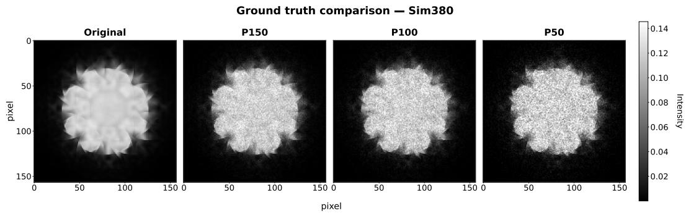  
Figure H1: Comparison between the original ground truth PACBED pattern and noisy observations for the Sim380 benchmark problem with a sample thickness of 380 Å. From left to right, the figure shows the original noise-free image and noisy versions generated using peak photon counts of P150, P100, and P50. Lower peak photon counts correspond to higher levels of Poisson noise.

  
Figure H2: Comparison between the original ground truth PACBED pattern and noisy observations for the Sim100 benchmark problem with a sample thickness of 100 Å. From left to right, the figure shows the original noise-free image and noisy versions generated using peak photon counts of P150, P100, and P50. Lower peak photon counts correspond to higher levels of Poisson noise.

  
Figure H3: Comparison between the original ground truth PACBED pattern and noisy observations for the Sim200 benchmark problem with a sample thickness of 200 Å. From left to right, the figure shows the original noise-free image and noisy versions generated using peak photon counts of P150, P100, and P50. Lower peak photon counts correspond to higher levels of Poisson noise.

We additionally observe that the thinner-sample cases are substantially more sensitive to noise than the thicker-sample cases. In the Sim380 experiments, SBOCF continues to provide clear improvements in both optimization performance and parameter estimation consistency even under noisy conditions. In contrast, for the thinner-sample Sim100 and Sim200 problems, the optimization quality and parameter estimation consistency degrade more noticeably as the noise level increases. This observation is consistent with a prior PACBED study [6], which suggests that PACBED patterns contain more reliable structural information for samples thicker than 200 $\mathring \mathrm { A } .$ leading to more stable parameter recovery.

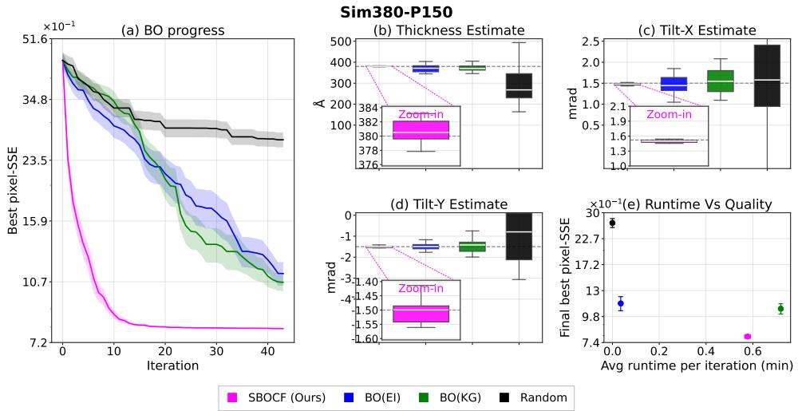  
Figure H4: Results for Sim380-P150 with ground-truth thickness 380 $\mathring { \mathrm { A } } ,$ tilts (1.5, −1.5) mrad. and Poisson noise with a peak photon count of 150. Panels show (a) best observed pixel-wise SSE, final estimates of (b) thickness, (c) tilt-X, and (d) tilt-Y, and (e) acquisition runtime versus final SSE. Solid lines in Panel (a) show the mean across 20 trials, and the shaded regions indicate standard error. Dashed lines in Panels (b)–(d) indicate the ground truth.

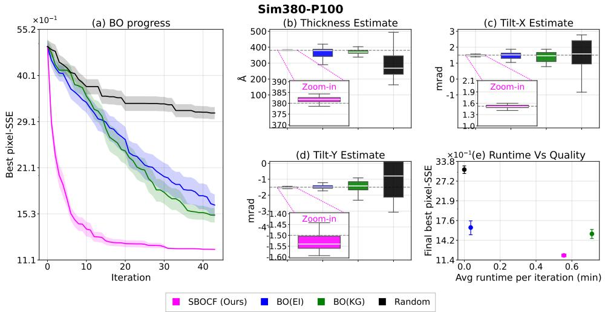  
Figure H5: Results for Sim380-P100 with ground-truth thickness 380 $\mathring { \mathrm { A } } ,$ tilts (1.5, –1.5) mrad, and Poisson noise with a peak photon count of 100. Panels show (a) best observed pixel-wise SSE, final estimates of (b) thickness, (c) tilt-X, and (d) tilt-Y, and (e) acquisition runtime versus final SSE. Solid lines in Panel (a) show the mean across 20 trials, and the shaded regions indicate standard error. Dashed lines in Panels (b)–(d) indicate the ground truth.

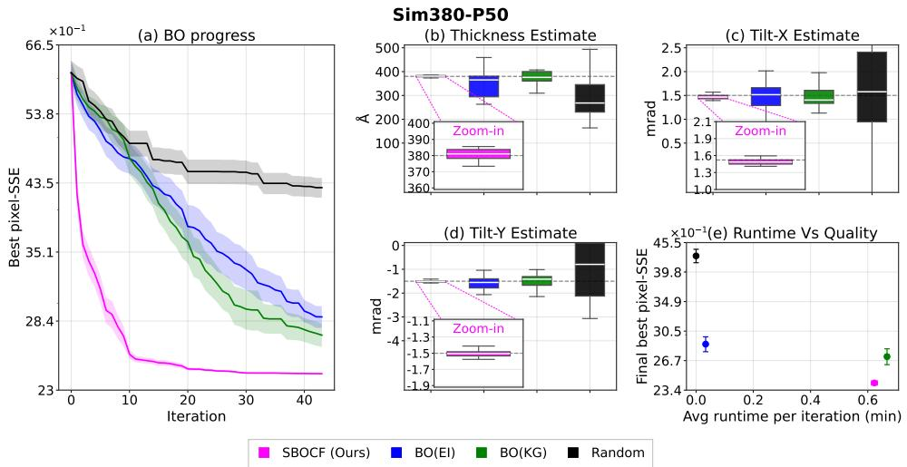  
Figure H6: Results for Sim380-P50 with ground-truth thickness 380 $\mathring { \mathrm { A } } ,$ tilts (1.5, —1.5) mrad, and Poisson noise with a peak photon count of 50. Panels show (a) best observed pixel-wise SSE, final estimates of (b) thickness, (c) tilt-X, and (d) tilt-Y, and (e) acquisition runtime versus final SSE. Solid lines in Panel (a) show the mean across 20 trials, and the shaded regions indicate standard error. Dashed lines in Panels (b)–(d) indicate the ground truth.

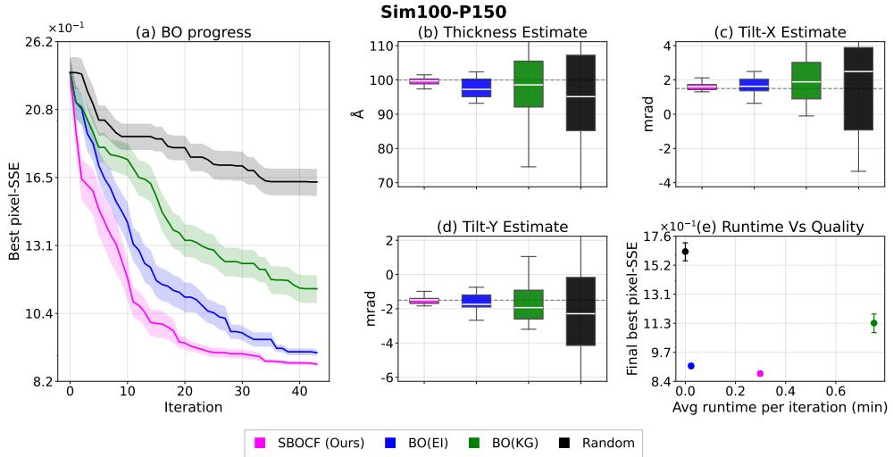  
Figure H7: Results for Sim100-P150 with ground-truth thickness 100 $\mathring { \mathrm { A } } ,$ tilts (1.5, −1.5) mrad. and Poisson noise with a peak photon count of 150. Panels show (a) best observed pixel-wise SSE, final estimates of (b) thickness, (c) tilt-X, and (d) tilt-Y, and (e) acquisition runtime versus final SSE. Solid lines in Panel (a) show the mean across 20 trials, and the shaded regions indicate standard error. Dashed lines in Panels (b)–(d) indicate the ground truth.

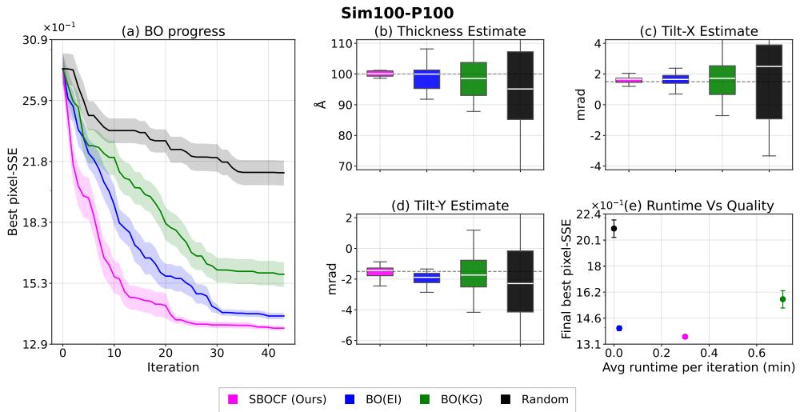  
Figure H8: Results for Sim100-P100 with ground-truth thickness 100 $\mathring { \mathrm { A } } ,$ tilts (1.5, −1.5) mrad. and Poisson noise with a peak photon count of 100. Panels show (a) best observed pixel-wise SSE, final estimates of (b) thickness, (c) tilt-X, and (d) tilt-Y, and (e) acquisition runtime versus final SSE. Solid lines in Panel (a) show the mean across 20 trials, and the shaded regions indicate standard error. Dashed lines in Panels (b)–(d) indicate the ground truth.

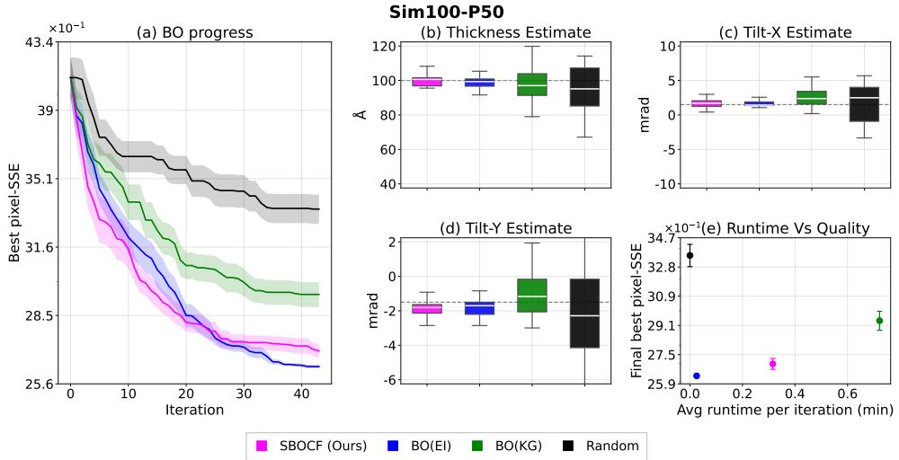  
Figure H9: Results for Sim100-P50 with ground-truth thickness 100 $\mathring { \mathrm { A } } ,$ tilts (1.5, -1.5) mrad, and Poisson noise with a peak photon count of 50. Panels show (a) best observed pixel-wise SSE, final estimates of (b) thickness, (c) tilt-X, and (d) tilt-Y, and (e) acquisition runtime versus final SSE. Solid lines in Panel (a) show the mean across 20 trials, and the shaded regions indicate standard error. Dashed lines in Panels (b)-(d) indicate the ground truth.

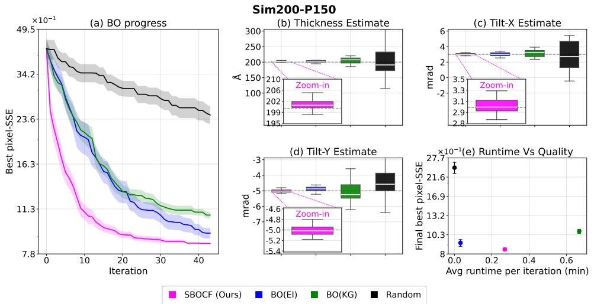  
Figure H10: Results for Sim200-P150 with ground-truth thickness 200 $\mathring { \mathrm { A } } ,$ tilts (3, —5) mrad, and Poisson noise with a peak photon count of 150. Panels show (a) best observed pixel-wise SSE, final estimates of (b) thickness, (c) tilt-X, and (d) tilt-Y, and (e) acquisition runtime versus final SSE. Solid lines in Panel (a) show the mean across 20 trials, and the shaded regions indicate standard error. Dashed lines in Panels (b)–(d) indicate the ground truth.

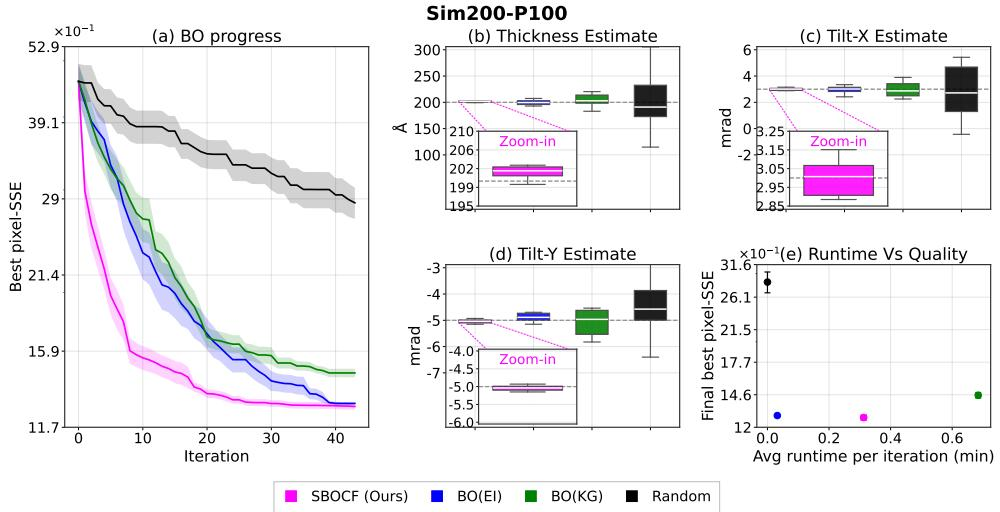  
Figure H11: Results for Sim200-P100 with ground-truth thickness 200 $\mathring { \mathrm { A } } ,$ tilts (3, —5) mrad, and Poisson noise with a peak photon count of 100. Panels show (a) best observed pixel-wise SSE, final estimates of (b) thickness, (c) tilt-X, and (d) tilt-Y, and (e) acquisition runtime versus final SSE. Solid lines in Panel (a) show the mean across 20 trials, and the shaded regions indicate standard error. Dashed lines in Panels (b)–(d) indicate the ground truth.

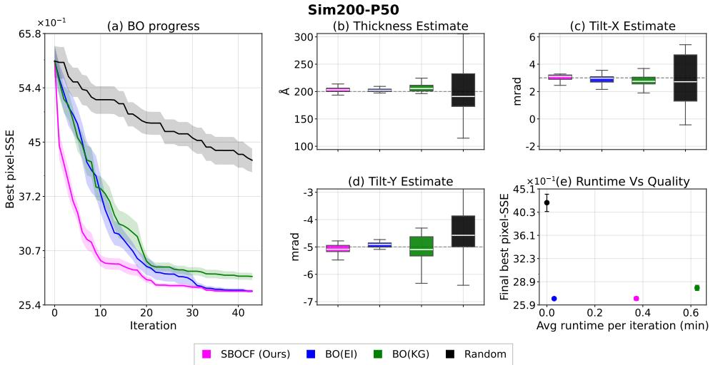  
Figure H12: Results for Sim200-P50 with ground-truth thickness 200 $\mathring { \mathrm { A } } ,$ tilts (3, —5) mrad, and Poisson noise with a peak photon count of 50. Panels show (a) best observed pixel-wise SSE, final estimates of (b) thickness, (c) tilt-X, and (d) tilt-Y, and (e) acquisition runtime versus final SSE. Solid lines in Panel (a) show the mean across 20 trials, and the shaded regions indicate standard error. Dashed lines in Panels (b)–(d) indicate the ground truth.

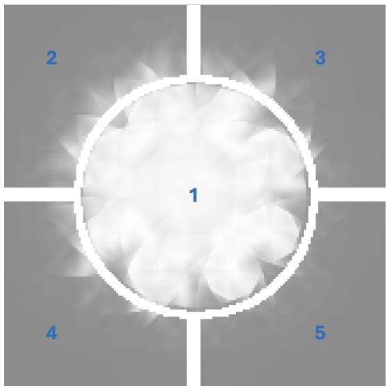  
Figure I1: Illustration of the domain PACBED segmentation pattern used in the ablation study. The image is partitioned into five regions: one central circular region containing high-intensity pixels and four surrounding quadrant regions containing lower-intensity pixels.

## I Ablation study: Alternative partition pattern

In this section, we conduct an additional ablation study to investigate the effect of the image partitioning pattern used in SBOCF. In the main experiments, we use the square pattern shown in Panel (b) of Fig. 2, where the PACBED image is divided into a regular grid of square patches. Here, we compare this choice with an alternative domain pattern motivated by the intensity structure of PACBED images.

The domain pattern partitions the PACBED image into five regions: one circular region containing the high-intensity pixels near the center of the image, and four outer quadrant regions containing lower-intensity pixels. This pattern is illustrated in Fig. I1. We refer to this partition as the domain pattern because it separates the image into broad intensity-based regions rather than regular spatial patches.

We perform this comparison on all three synthetic problems, Sim380, Sim100, and Sim200, under both noiseless and noisy settings. For the noisy cases, we consider peak photon counts P150, P100, and P50. Figs. I2–I5, I6–I9, and I10–I13 show the results for Sim380, Sim100, and Sim200, respectively. In each figure, Panel (a) shows the best observed pixel-wise SSE, while Panels (b)–(d) show the final thickness, tilt-X, and tilt-Y estimates.

Overall, the square pattern performs better than, or at least comparably to, the domain pattern across the tested settings. The advantage of the square pattern is especially clear for Sim380, where it achieves faster reduction in pixel-SSE and produces more stable final parameter estimates under both noiseless and noisy observations. For thinner problems, e.g. Sim100 and Sim200, the difference is smaller in some settings, but the square pattern still generally gives comparable or lower final pixel-SSE and more stable parameter estimates.

One possible explanation is that the domain pattern groups pixels primarily according to broad highand low-intensity regions. Although this choice is physically motivated, it may be too coarse for this parameter estimation problem and may discard spatial information that is useful for distinguishing thickness and tilt effects in PACBED images. In contrast, the square pattern preserves more local spatial information by dividing the image into smaller regular patches. These results suggest that the choice of partition pattern can affect the performance of SBOCF, and designing problem-adaptive partition patterns is worth further investigation.

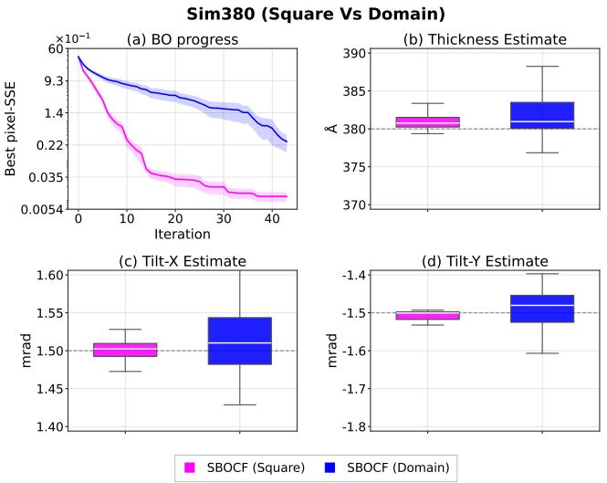  
Figure I2: Comparison of SBOCF using the square and domain partition patterns on the noiseless Sim380 problem with ground-truth thickness 380 Å and tilts (1.5, —1.5) mrad. Panels show (a) best observed pixel-wise SSE and final estimates of (b) thickness, (c) tilt-X, and (d) tilt-Y. Solid lines in Panel (a) show the mean across 20 trials, and the shaded regions indicate standard error. Dashed lines in Panels (b)–(d) indicate the ground truth.

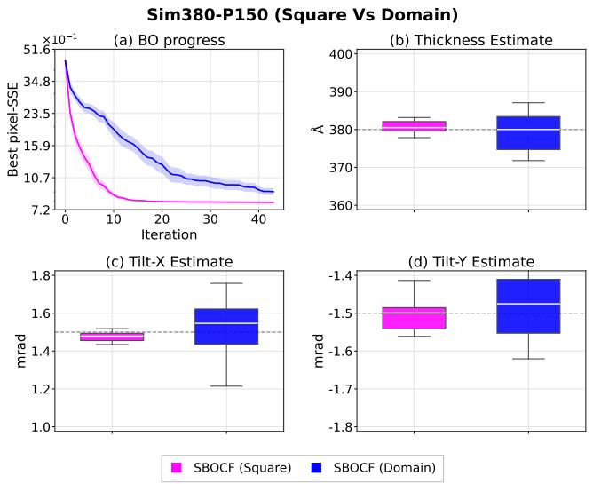  
Figure I3: Comparison of SBOCF using the square and domain partition patterns on the Sim380-P150 problem with ground-truth thickness 380 $\mathring { \mathrm { A } } ,$ tilts $( 1 . 5 , - 1 . 5 )$ mrad and Poisson noise with a peak photon count of 150. Panels show (a) best observed pixel-wise SSE and final estimates of (b) thickness, (c) tilt-X, and (d) tilt-Y. Solid lines in Panel (a) show the mean across 20 trials, and the shaded regions indicate standard error. Dashed lines in Panels (b)–(d) indicate the ground truth.

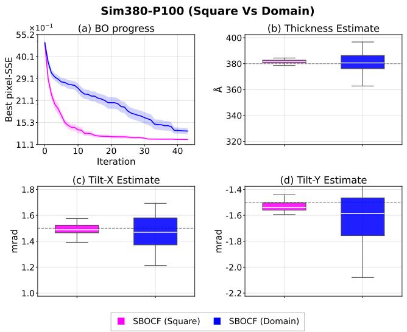  
Figure I4: Comparison of SBOCF using the square and domain partition patterns on the Sim380-P100 problem with ground-truth thickness 380 $\mathring { \mathrm { A } } ,$ tilts (1.5, —1.5) mrad and Poisson noise with a peak photon count of 100. Panels show (a) best observed pixel-wise SSE and final estimates of (b) thickness, (c) tilt-X, and (d) tilt-Y. Solid lines in Panel (a) show the mean across 20 trials, and the shaded regions indicate standard error. Dashed lines in Panels (b)–(d) indicate the ground truth.

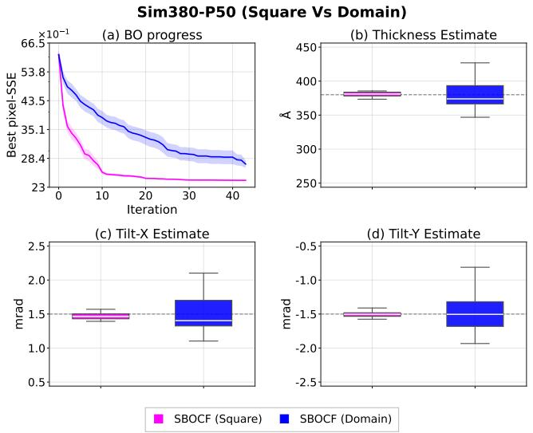  
Figure I5: Comparison of SBOCF using the square and domain partition patterns on the Sim380-P50 problem with ground-truth thickness 380 Å, tilts (1.5, —1.5) mrad and Poisson noise with a peak photon count of 50. Panels show (a) best observed pixel-wise SSE and final estimates of (b) thickness, (c) tilt-X, and (d) tilt-Y. Solid lines in Panel (a) show the mean across 20 trials, and the shaded regions indicate standard error. Dashed lines in Panels (b)–(d) indicate the ground truth.

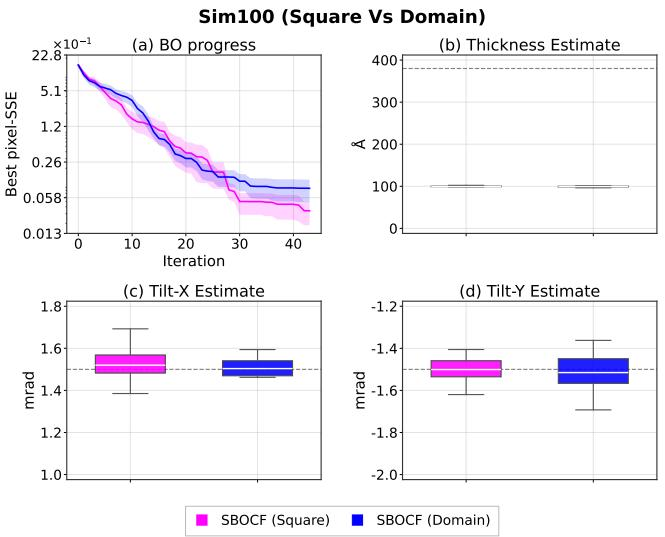  
Figure I6: Comparison of SBOCF using the square and domain partition patterns on the noiseless Sim100 problem with ground-truth thickness 100 Å and tilts (1.5, —1.5) mrad. Panels show (a) best observed pixel-wise SSE and final estimates of (b) thickness, (c) tilt-X, and (d) tilt-Y. Solid lines in Panel (a) show the mean across 20 trials, and the shaded regions indicate standard error. Dashed lines in Panels (b)–(d) indicate the ground truth.

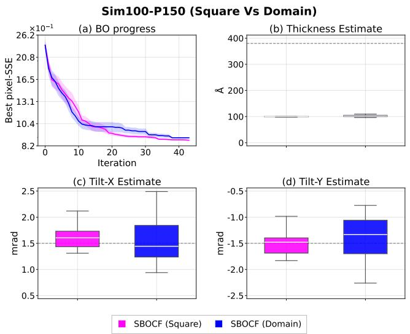  
Figure I7: Comparison of SBOCF using the square and domain partition patterns on the Sim100-P150 problem with ground-truth thickness 100 Å, tilts $( 1 . 5 , - 1 . 5 )$ mrad and Poisson noise with a peak photon count of 150. Panels show (a) best observed pixel-wise SSE and final estimates of (b) thickness, (c) tilt-X, and (d) tilt-Y. Solid lines in Panel (a) show the mean across 20 trials, and the shaded regions indicate standard error. Dashed lines in Panels (b)–(d) indicate the ground truth.

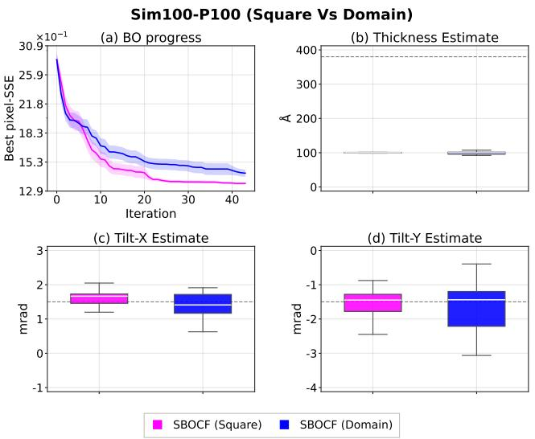  
Figure I8: Comparison of SBOCF using the square and domain partition patterns on the Sim100-P100 problem with ground-truth thickness 100 $\mathring { \mathrm { A } } ,$ tilts (1.5, —1.5) mrad and Poisson noise with a peak photon count of 100. Panels show (a) best observed pixel-wise SSE and final estimates of (b) thickness, (c) tilt-X, and (d) tilt-Y. Solid lines in Panel (a) show the mean across 20 trials, and the shaded regions indicate standard error. Dashed lines in Panels (b)–(d) indicate the ground truth.

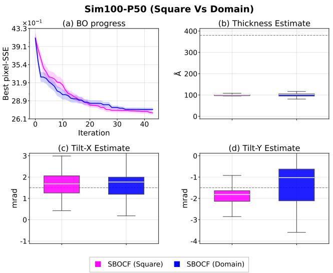  
Figure I9: Comparison of SBOCF using the square and domain partition patterns on the Sim100-P50 problem with ground-truth thickness 100 Å, tilts (1.5, —1.5) mrad and Poisson noise with a peak photon count of 50. Panels show (a) best observed pixel-wise SSE and final estimates of (b) thickness, (c) tilt-X, and (d) tilt-Y. Solid lines in Panel (a) show the mean across 20 trials, and the shaded regions indicate standard error. Dashed lines in Panels (b)–(d) indicate the ground truth.

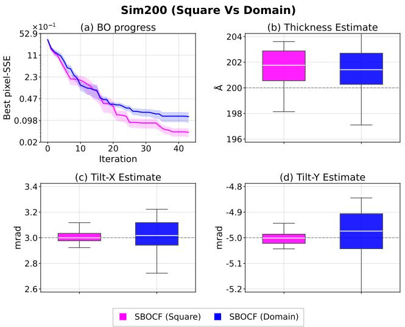  
Figure I10: Comparison of SBOCF using the square and domain partition patterns on the noiseless Sim200 problem with ground-truth thickness 200 Å and tilts (3, —5) mrad. Panels show (a) best observed pixel-wise SSE and final estimates of (b) thickness, (c) tilt-X, and (d) tilt-Y. Solid lines in Panel (a) show the mean across 20 trials, and the shaded regions indicate standard error. Dashed lines in Panels (b)–(d) indicate the ground truth.

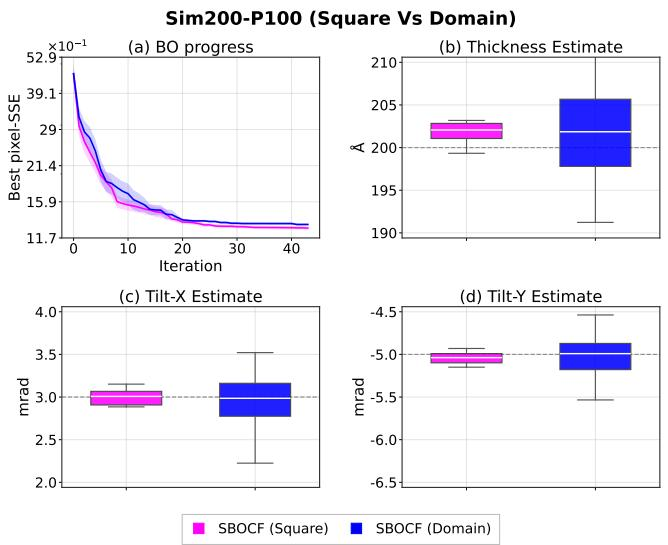  
Figure I11: Comparison of SBOCF using the square and domain partition patterns on the Sim200-P150 problem with ground-truth thickness 200 Å, tilts (3, —5) mrad and Poisson noise with a peak photon count of 150. Panels show (a) best observed pixel-wise SSE and final estimates of (b) thickness, (c) tilt-X, and (d) tilt-Y. Solid lines in Panel (a) show the mean across 20 trials, and the shaded regions indicate standard error. Dashed lines in Panels (b)–(d) indicate the ground truth.

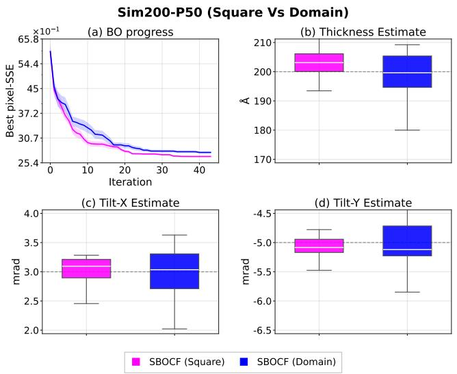  
Figure I12: Comparison of SBOCF using the square and domain partition patterns on the Sim200-P100 problem with ground-truth thickness 200 Å, tilts (3, —5) mrad and Poisson noise with a peak photon count of 100. Panels show (a) best observed pixel-wise SSE and final estimates of (b) thickness, (c) tilt-X, and (d) tilt-Y. Solid lines in Panel (a) show the mean across 20 trials, and the shaded regions indicate standard error. Dashed lines in Panels (b)–(d) indicate the ground truth.

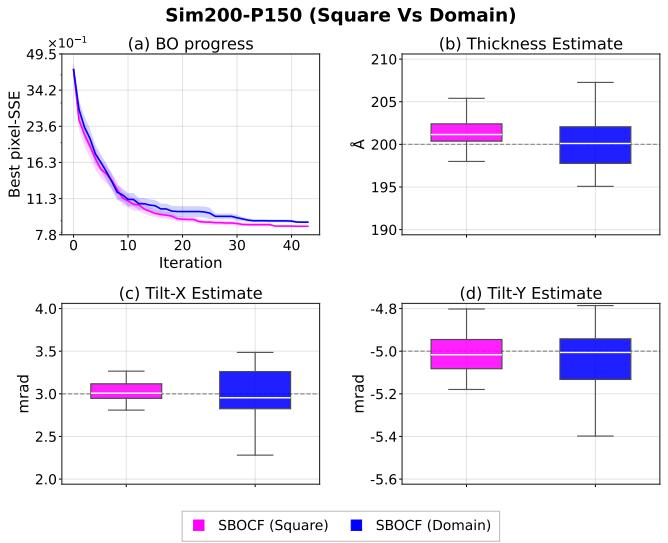  
Figure I13: Comparison of SBOCF using the square and domain partition patterns on the Sim200-P50 problem with ground-truth thickness 200 Å, tilts (3, —5) mrad and Poisson noise with a peak photon count of 50. Panels show (a) best observed pixel-wise SSE and final estimates of (b) thickness, (c) tilt-X, and (d) tilt-Y. Solid lines in Panel (a) show the mean across 20 trials, and the shaded regions indicate standard error. Dashed lines in Panels (b)–(d) indicate the ground truth.