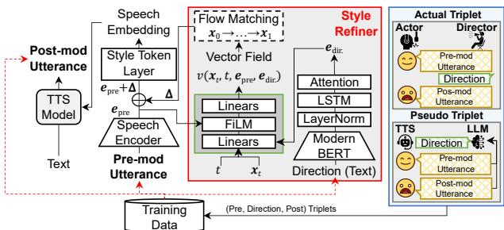
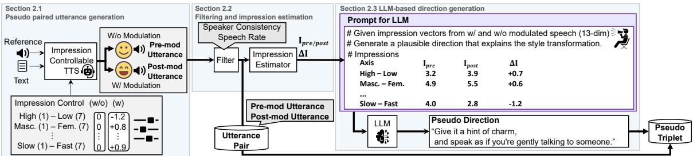
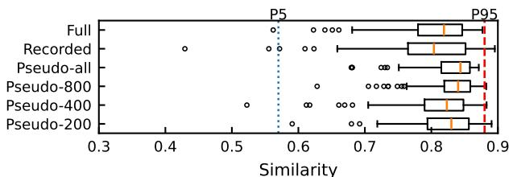
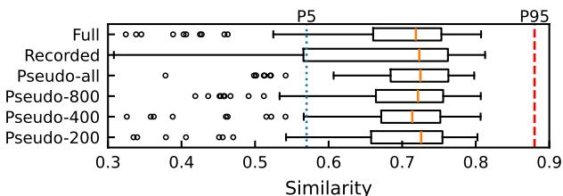

# Scalable Direction-Following TTS via Voice Impression-Guided Pseudo Triplet Construction

Kenichi Fujita, Yusuke Ijima

NTT, Inc., Japan kenichi.fujita@ntt.com

## Abstract

Voice actors often re-read the same script while modifying their delivery in response to performance directions. We study this setting as direction-following TTS, where a system generates a new utterance that reflects a given direction relative to a reference utterance while preserving speaker identity and linguistic content. A key challenge is the lack of training data capturing such relative modifications. To address this, we propose a scalable pseudo-triplet construction pipeline that generates (reference utterance, direction text, modified utterance) triplets. It generates controlled style variations using an impressioncontrollable TTS model and uses an LLM to produce natural language directions from estimated impression differences. Experimental results demonstrate that pseudo-triplets alone enable stable speaker-preserving modification, and that combining pseudo and recorded data further improves direction alignment while maintaining speaker similarity.

Index Terms: speech synthesis, zero-shot TTS, natural language control, speaking style

## 1. Introduction

Beyond linguistic content, speech conveys para- and nonlinguistic information such as speaking style and perceived voice impressions [1, 2]. In acting, performers adjust their delivery in response to performance directions from a director, rereading the same script with different speaking styles. Directors often provide feedback on the line, guiding voice actors to modify their speaking style relative to their previous take [3].

This scenario naturally motivates a text-to-speech synthesis (TTS) setting that models direction-driven re-reading of a fixed script [4]. In this setting, a user provides a script, a reference utterance, and a natural language direction describing how the performance should change. The system generates a new utterance that preserves speaker identity and content while reflecting the stylistic modification. We refer to this task as directionfollowing TTS. Unlike conventional style-conditioned TTS, this task models a direction-conditioned transformation of a reference utterance, requiring paired pre- and post-modification utterances with corresponding direction text. The reference utterance and its direction-modified counterpart are termed as the pre-modification utterance (pre-mod utterance) and the postmodification utterance (post-mod utterance), respectively.

A central challenge is the lack of training triplets consisting of a pre-mod utterance, a direction specifying the modification, and a corresponding post-mod utterance for the same script. Large-scale speech corpora used to train zero-shot TTS models [5, 6] typically contain only a single reading of each script and thus do not capture relative stylistic changes. Even when corpora with multiple recordings of the same script are available [7, 8], they are typically small and lack directions describing the intended modification. This scarcity hinders not only data-intensive generative models such as diffusion- and flowbased approaches [9, 10], but also robust speaker-preserving style transformation across diverse speakers.

  
Figure 1: Overview ofrefinement with direction and actual and pseudo training data.

To address this issue, we construct pseudo training triplets. An impression-controllable TTS model [11, 12] serves as a proxy performer to generate paired pre-mod and post-mod utterances. A large language model (LLM) produces natural language directions from estimated impression differences, forming pseudo triplets that capture direction-induced variation. Our approach learns a transformation from pre-mod to post-mod utterances (Fig. 1). This differs from conventional text-prompted TTS and speech editing systems [13–20], which focus on absolute style conditioning or prompt-based control. We demonstrate the effectiveness of this framework in a zero-shot TTS through objective and subjective evaluations, including an exploratory LLM-assisted evaluation framework. Audio examples are available on our demo page1.

## 2. Data design for direction-following

We use two complementary data sources: pseudo data generated by TTS and recorded data from interactive recordings. Pseudo data enables scalability, while recorded data captures authentic human responses. This section describes pseudo-triplet construction (Fig. 2); recorded data are described in Sect. 4.1.2.

## 2.1. Pseudo paired utterance generation (Fig. 2 left)

Pseudo paired speech generation requires fine-grained style control while preserving speaker identity. We therefore use an impression-controllable zero-shot TTS method [11, 12]. For each script and reference utterance, we synthesize a baseline utterance and a style-modified counterpart, treated as the pre-mod and post-mod utterances, respectively.

  
Figure 2: Overview of pseudo data generation.

Impression is controlled via a low-dimensional impression vector following prior work [11, 12]. The vector comprises 13 continuous dimensions representing the intensity of antonym-based voice impressions rated on a subjective 7-point Likert scale. Eleven dimensions follow validated impression axes [11,21,22]: high–low pitched, masculine–feminine, clear– hoarse, calm–restless, powerful–weak, youthful–elderly, thick– thin, tense–relaxed, dark–bright, cold–warm, and slow–fast. We extend this representation with two axes, fluent–hesitant and emotional–neutral, to better reflect performance directions.

## 2.2. Filtering and impression estimation (Fig. 2 center)

We filter out pairs with excessive speaker drift or abnormal speaking-rate differences. Speaker consistency is measured by cosine similarity between speaker embeddings and speakingrate differences. Pairs with near-identical speaker embeddings are also excluded as negligible variation provides little guidance for modeling direction-dependent modification.

For the remaining pairs, we estimate a 13-dimensional impression vector for each utterance using an impression estimator. The estimator predicts the same antonym-based dimensions defined above. Let $\mathbf { I } _ { p r e }$ and $\mathbf { I } _ { p o s t }$ denote the impression vectors of the pre-mod and post-mod utterances, respectively. The impression difference is $\Delta \mathbf { I } = \mathbf { I } _ { p o s t } - \mathbf { I } _ { p r e } .$

## 2.3. LLM-based direction generation (Fig. 2 right)

Given the estimated impression vectors $\mathbf { I } _ { p r e }$ and $\mathbf { I } _ { p o s t }$ and their difference ∆I, we generate a natural language performance direction using a LLM. Unlike conventional absolute labeling of a single utterance [15,20], our direction generation is conditioned on the relative difference between two utterances, enabling the LLM to describe the transformation from pre-mod to post-mod. The LLM is prompted to act as a voice director and infer a plausible direction that explains the impression change. Although guided by ∆I, the generated directions are not restricted to explicit axis-level descriptions but may include compositional or context-dependent acting instructions (e.g., “maintaining a restrained tone with subtle hesitation”). Thus, impression vectors serve only as intermediate cues rather than a target style representation. The resulting triplet (pre-mod utterance, pseudo direction, post-mod utterance) forms a pseudo training sample. A prompt example is available on our demo page1.

## 3. Direction-conditioned style refiner

We introduce a direction-conditioned style refiner that modifies the speech embedding (Fig. 1). The refiner operates in the speech embedding space, while the backbone TTS model remains fixed. This allows it to focus on direction-dependent style refinement. At inference, the predicted embedding modification is added to an embedding from the pre-mod utterance.

Let $e _ { \mathrm { p r e } }$ and $e _ { \mathrm { p o s t } }$ denote embeddings extracted from the premod and post-mod utterance, respectively. We define the target modification as $\Delta = e _ { \mathrm { p o s t } } - e _ { \mathrm { p r e } } ,$ , treating style refinement as a local additive approximation in the speech embedding space without assuming global linearity. In direction-following TTS, a given direction may correspond to multiple plausible embedding shifts depending on speaker characteristics. Deterministic regression would collapse such variability into a conditional mean, leading to conservative updates. We therefore adopt rectified flow matching [23] to model a direction-conditioned stochastic vector field in the embedding space. A noise vector x0 is sampled from a Gaussian distribution, and an intermediate state is constructed as

$$
x _ { t } = ( 1 - t ) x _ { 0 } + t \Delta , \quad t \in [ 0 , 1 ] .
$$

The refiner predicts the constant velocity field $v _ { \theta } ( x _ { t } , t , e _ { \mathrm { p r e } } , e _ { \mathrm { d i r } } ) ,$ conditioned on the pre-mod utterance $e _ { \mathrm { p r e } } .$ , direction representation $e _ { \mathrm { d i n } }$ and time $t ,$ and is trained to match the target velocity $\Delta - x _ { 0 }$ . Training minimizes a flow matching objective, with auxiliary losses encouraging directional consistency and magnitude alignment between the predicted and target modifications.

## 4. Experimental setup

## 4.1. Datasets

## 4.1.1. Pseudo data

For pseudo data generation, we used in-house Japanese speech data from 1,600 speakers. Ten recorded utterances were randomly selected per speaker, and for each selected utterance, ten paired utterances with different sentences were generated using an impression-controllable TTS model with and without impression control. Impression control was applied by randomly selecting three impression dimensions whose pairwise correlation coefficients (estimated on the impression estimator’s outputs) were below 0.7 and sampling control values in the range of −2 to +2 on the original 7-point scale. This resulted in 160,000 initially generated utterance pairs before filtering.

Pairs were filtered on the basis of speaker consistency (ECAPA-TDNN cosine similarity [24]: 0.80–0.95) and speaking rate ratios (0.85–1.15) to ensure stable speaker identity while retaining moderate style variation. After filtering, we obtained 74,619 utterance pairs.

For each utterance pair, up to five natural language perfor mance directions were generated to increase diversity per pair using Qwen3-Next-80B-A3B-Instruct2. Malformed directions (e.g., overly long text or abnormal symbols) were removed via simple text-filtering. Each valid direction combined with its corresponding speech pair formed a pseudo triplet (pre-mod utterance, direction, post-mod utterance).

  
(a) Resultsfor seen speakers

  
(b) Results for unseen speakers  
Figure 3: Speaker similarity to pre-mod utterances using ECAPA-TDNN embeddings. P5/P95 show reference statsfrom recorded pairs.

After text filtering, the final dataset consisted of 350,617 pseudo triplets corresponding to 127.6 hours of unique speech. The data were split into 346,488 triplets for training and 4,129 for validation using 30 held-out speakers. To investigate the effect of the pseudo-data scale, we constructed speaker-diversity subsets with 200, 400, and 800 speakers by sampling from the full 1,600-speaker pseudo dataset, comprising 43,131, 86,643, and 175,091 triplets, respectively.

## 4.1.2. Actual recording data

In addition to pseudo data, we collected a small dataset through interactive recording sessions with two professional voice actors (one male and one female), resulting in 8.9 hours of speech (6,899 utterance pairs). Performance directions were prepared in advance using a LLM following the protocol of Kanagawa et al. [4] to ensure consistency and scalability. During recording, the actor re-read the same script while modifying their performance according to the provided direction.

To increase linguistic variability, direction text augmentation was applied using the Easy, Medium, and Hard prompt templates proposed by Maini et al. [25], excluding the Q/A style. Augmented directions were generated using LLM2, with templates translated into Japanese. Although small, this dataset captures natural human responses to performance directions that are difficult to reproduce through synthesis alone.

## 4.2. Supporting models and components

Our framework has three main components: a voice impression estimator, an impression-controllable TTS model, and a direction-conditioned style refiner. The impression estimator is shared across pseudo data construction and impressioncontrollable TTS training to ensure consistent impressions.

The voice impression estimator maps speech to the 13- dimensional impression representation described in Sect. 2.1 and is trained on human subjective ratings. It generalizes to unseen speakers, achieving a root mean squared error of 0.40 on held-out utterances (5,481 utterances from 49 speakers), and is fixed for all stages of pseudo data construction, TTS training, and evaluation. Architecture and training details follow [11,12].

The impression-controllable TTS model is based on a Fast-Speech2 [26] backbone with a frozen HuBERT-based jointly trained speech encoder [27,28], trained under a GAN [29,30]. It was trained on 27,000 hours of multi-speaker in-house Japanese speech, followed by training an impression control module using impression vectors predicted by the impression estimator [11, 12]. Waveform generator is HiFi-GAN (V1) [31].

The style refiner is trained on top of the fixed backbone TTS model. For direction encoding, we use ModernBERT-Ja-310M [32]. The refiner is optimized with Adam [33] (learning rate 0.01, batch size 32) for up to 1M steps. To analyze the effects of data composition and speaker diversity, we train separate models using pseudo data only (Pseudo-all), actual recording data only (Recorded), their combination (Full), and pseudo data subsets with 200, 400, and 800 speakers (Pseudo-200/400/800). For each configuration, the model with the lowest validation loss is selected.

## 5. Results

## 5.1. Objective evaluation

We conducted objective evaluations of naturalness, speaker similarity, and direction alignment. We evaluated four speakers: two seen speakers from actual recording dataset and two unseen speakers not used to train the supporting models (refiner, impression estimator, and impression-controllable TTS), selected from the HiFi-CAPTAIN [34] test set. Each group had one male and one female speaker.

For objective evaluation, we generated 15,000 directionconditioned utterances per speaker. To isolate the effect of performance directions, pre-mod utterances were synthesized using the fixed backbone TTS model. For each speaker, 100 recorded utterances were selected as sources. For each source, three sentences were randomly selected from a fixed pool of ten sentences and synthesized as pre-mod utterances, resulting in 300 utterances per speaker. We then generated a fixed set of 50 directions using GPT-5.2 [35], prompting it to act as a voice director. The same 50 directions were applied to all speakers, and each pre-mod utterance was combined with all directions. To avoid potential bias from pseudo-data construction, we used a different LLM that used for pseudo direction generation.

We first evaluated speaker similarity using the cosine similarity of ECAPA-TDNN-based speaker embeddings between pre-mod and post-mod utterances. Reference statistics from actual recorded utterance pairs yielded 5th and 95th percentiles of 0.57 and 0.89, representing the typical range for intra-speaker variation. Figure 3 shows the results summarized per direction. For each speaker, similarity scores were averaged over the 300 reference utterances per direction, and the resulting 50 direction-level means were used to construct the box plots, mitigating utterance-level variability. For seen speakers, similarity scores were generally stable across conditions, with fewer instances falling below the 5th percentile threshold. Similar trends were observed for unseen speakers. For unseen speakers, the Recorded condition showed large variance, with similarity scores often falling below 0.57, indicating unstable identity preservation. In contrast, Pseudo conditions were more robust, and increasing speaker diversity reduced extreme speaker drift. The Full condition remained more stable than Recorded, balancing robustness and variability.

Next, we evaluated speech naturalness using UT-MOSv2 [36] (Table 1). Source recorded utterances scored 2.67 ± 0.01 (seen) and 2.97 ± 0.01 (unseen). Across all configurations, direction refinement did not noticeably degrade naturalness, with scores comparable to the recorded utterances.

We finally evaluated direction alignment automatically using an LLM2. While prior work on absolute style conditioning directly evaluates text–speech alignment [17], evaluating direction-following between two utterances is more challenging [37]. We therefore approximated alignment by comparing estimated impression changes with the semantic content of the direction. For each pre- and post-mod utterance pair, impression vectors were estimated and provided to the LLM with the direction text. The LLM then rated alignment on a 1–5 scale (1: Not aligned at all to 5: Perfectly aligned). A prompt example is available on our demo page.1 Since the same impression estimator is used in pseudo-data construction, this metric should be interpreted as a diagnostic proxy. To verify its validity, we conducted two sanity checks. Actual recorded direction-speech pairs yielded an alignment score of 3.12 ± 0.03 (95% CI). Replacing directions with semantically opposite or unrelated ones generated by a separate LLM3 reduced scores to 1.87 ± 0.02 and $1 . 9 1 \pm 0 . 0 2$ , confirming sensitivity to mismatches.

Table 1: Results of objective evaluations with 95% confidence interval. Bold shows best scores. Pre-mod represents UTMOS ofPre-mod utterances.
<table><tr><td></td><td colspan="2">Seen</td><td colspan="2">Unseen</td></tr><tr><td>Conditions</td><td>UTMOS</td><td>LLM</td><td>UTMOS</td><td>LLM</td></tr><tr><td>Pre-mod</td><td> $2 . 9 5 \pm 0 . 0 1$ </td><td></td><td> $2 . 9 7 \pm 0 . 0 1$ </td><td></td></tr><tr><td>Full</td><td> $2 . 9 6 \pm 0 . 0 1$ </td><td> ${ \bf 3 . 7 9 \pm 0 . 0 1 }$ </td><td> $2 . 9 7 \pm 0 . 0 1$ </td><td> $3 . 2 4 \pm 0 . 0 2$ </td></tr><tr><td>Recorded</td><td> $2 . 9 4 \pm 0 . 0 1$ </td><td> $3 . 7 8 \pm 0 . 0 1$ </td><td> $2 . 9 5 \pm 0 . 0 1$ </td><td> ${ \bf 3 . 3 7 \pm 0 . 0 2 }$ </td></tr><tr><td>Pseudo-all</td><td> $2 . 9 5 \pm 0 . 0 1$ </td><td> $3 . 6 7 \pm 0 . 0 1$ </td><td> $2 . 9 9 \pm 0 . 0 1$ </td><td> $3 . 1 2 \pm 0 . 0 2$ </td></tr><tr><td>Pseudo-800</td><td> $2 . 9 4 \pm 0 . 0 1$ </td><td> $3 . 6 4 \pm 0 . 0 1$ </td><td> $3 . 0 0 \pm 0 . 0 1$ </td><td> $3 . 1 5 \pm 0 . 0 2$ </td></tr><tr><td>Pseudo-400</td><td> $2 . 9 6 \pm 0 . 0 1$ </td><td> $3 . 6 6 \pm 0 . 0 1$ </td><td> $2 . 9 9 \pm 0 . 0 1$ </td><td> $3 . 1 9 \pm 0 . 0 2$ </td></tr><tr><td>Pseudo-200</td><td> $2 . 9 6 \pm 0 . 0 1$ </td><td> $3 . 6 7 \pm 0 . 0 1$ </td><td> $3 . 0 0 \pm 0 . 0 1$ </td><td> $3 . 1 7 \pm 0 . 0 2$ </td></tr></table>

Table 2: Results of subjective evaluation with 95% confidence interval. Bold shows best scores.
<table><tr><td rowspan="2">Conditions</td><td colspan="2">Seen</td><td colspan="2">Unseen</td></tr><tr><td>SMOS</td><td>AlignMOS</td><td>SMOS</td><td>AlignMOS</td></tr><tr><td>Full</td><td> $3 . 3 5 \pm 0 . 0 8$ </td><td> $3 . 2 2 \pm 0 . 0 7$ </td><td> $3 . 2 2 \pm 0 . 0 7$ </td><td> $3 . 3 2 \pm 0 . 0 7$ </td></tr><tr><td>Recorded</td><td> $2 . 6 7 \pm 0 . 0 8$ </td><td> ${ \bf 3 . 5 0 \pm 0 . 0 7 }$ </td><td> $2 . 6 3 \pm 0 . 0 8$ </td><td> ${ \bf 3 . 4 8 \pm 0 . 0 7 }$ </td></tr><tr><td>Pseudo-all</td><td> ${ \bf 3 . 5 4 \pm 0 . 0 8 }$ </td><td> $3 . 0 8 \pm 0 . 0 7$ </td><td> ${ \bf 3 . 2 4 \pm 0 . 0 7 }$ </td><td> $3 . 1 8 \pm 0 . 0 7$ </td></tr></table>

As shown in Table 1, Full and Recorded conditions achieved higher alignment, while Pseudo conditions exhibited more conservative modulation. Notably, Full attained alignment comparable to Recorded while maintaining improved speaker robustness, indicating complementary benefits of pseudo and recorded data. Increasing pseudo-data scale further stabilized speaker identity preservation without substantially degrading alignment.

## 5.2. Subjective evaluation

We conducted subjective evaluations of speaker similarity and direction alignment. The results are summarized in Table 2 as SMOS and AlignMOS. We compared three conditions: Full, Recorded, and Pseudo-all. The smaller pseudo-data variants (Pseudo-200/400/800) were excluded to limit evaluation burden, as objective results showed consistent trends across scales.

For each speaker, we evaluated 60 triplets. These were selected from the objective evaluation set by choosing three premod utterances and 20 representative directions, resulting in 3 × 20 combinations per speaker. The evaluation was conducted via crowdsourcing with 258 and 208 participants, respectively, and each sample was rated by at least ten listeners.

To evaluate speaker similarity, participants rated whether pre-mod and post-mod utterances were spoken by the same speaker using a 5-point Likert scale (1: not the same speaker, 5: definitely the same speaker; SMOS). The results in Table 2 are consistent with the objective evaluation for both seen and unseen speakers. Recorded exhibited lower speaker similarity, indicating unstable speaker identity preservation. In contrast, Full and Pseudo-all showed higher scores. Although Pseudo-all slightly outperformed Full, this likely reflects its more conservative style modulation, resulting in smaller changes between pre-mod and post-mod utterances and thus higher similarity.

For direction alignment, participants listened to pairs of pre-mod and post-mod utterances and rated how the change matched the given direction on a 5-point Likert scale (1: not aligned at all, 5: perfectly aligned; AlignMOS). Participants were also instructed to assign a score of 1 if speaker identity changed significantly ensuring alignment was judged under stable identity. From Table 2, Recorded achieved the highest alignment scores, followed by Full and Pseudo-all. Its higher scores likely reflect larger style variations, making changes more perceptible despite reduced speaker similarity. In contrast, Pseudoall exhibited slightly lower alignment, consistent with more conservative style modulation. Full lies between the two, suggesting that combining pseudo and recorded data balances expressive variation and identity stability.

To better understand the relatively conservative modulation observed in Pseudo-all, we analyzed the training data by measuring the absolute change in F0 between pre-mod and post-mod utterances. Utterance pairs from professional recordings (Recorded) showed larger absolute changes in mean ln F0 $( 0 . 1 4 \pm 0 . 1 5 ,$ , mean ± SD) than pseudo-generated pairs (Pseudo, $0 . 0 5 \pm 0 . 0 8 )$ A similar trend was observed for pitch variability: the absolute change in the standard deviation of ln F0 was also larger for Recorded $( 0 . 0 5 7 \pm 0 . 0 6 3 )$ than for Pseudo $( 0 . 0 2 4 \pm 0 . 0 4 1 )$ These results suggest that pseudo data exhibits smaller prosodic variation than professionally recorded performances, which may partly explain the more conservative style modulation in Pseudo-all. This difference likely reflects the broader expressive range of professional acting speech while still preserving speaker identity, rather than a limitation of the pseudo-triplet approach. Similar tendencies may arise in other TTS- and VC-based [18] pseudo data generation frameworks.

Overall, Full provides the most favorable trade-off between direction alignment and speaker identity preservation. Notably, Pseudo-all alone already enables stable identity-preserving refinement with reasonable direction alignment, demonstrating the effectiveness of the proposed pseudo-triplet construction.

The subjective alignment results are broadly consistent with the LLM-based evaluation in Sect. 5.1, lending support to the validity of the proposed objective metric. This agreement also provides indirect validation of the impression-difference representation as a meaningful basis for approximating direction speech alignment, consistent with recent work using LLMs as evaluators in other modalities [38, 39].

## 6. Conclusion

We proposed direction-following TTS to model relative performance modification. To address the scarcity of paired direction data, we constructed pseudo triplets via impressioncontrolled synthesis and LLM-based direction generation. Objective and subjective evaluations showed that pseudo data improves speaker robustness, recorded data enhances direction alignment, and their combination achieves the best balance between stability and expressiveness. Future work will investigate how to integrate human expressiveness with pseudo data.

## 7. Disclosure of generative AI use

During the preparation of this manuscript, the authors used ChatGPT (OpenAI) for language editing and refinement. All outputs were reviewed and revised as necessary by the authors, who take full responsibility for the content of this publication.

## 8. References

[1] B. Schuller, S. Steidl, A. Batliner, F. Burkhardt, L. Devillers, C. Muller, and S. Narayanan, “Paralinguistics in speech and¨ language–State-of-the-art and the challenge,” Computer Speech & Language, vol. 27, no. 1, pp. 4–39, 2013.

[2] A. S. Cowen, H. A. Elfenbein, P. Laukka, and D. Keltner, “Mapping 24 emotions conveyed by brief human vocalization.” American Psychologist, vol. 74, no. 6, p. 698, 2019.

[3] A. Schmidt and A. Deppermann, “Showing and telling–How directors combine embodied demonstrations and verbal descriptions to instruct in theater rehearsals,” Frontiers in Communication, vol. 7, 2023.

[4] H. Kanagawa, K. Fujita, A. Watanabe, and Y. Ijima, “Multiinteraction TTS toward professional recording reproduction,” in Proc. SSW, 2025, pp. 110–116.

[5] L. Ma, D. Guo, K. Song, Y. Jiang, S. Wang, L. Xue, W. Xu, H. Zhao, B. Zhang, and L. Xie, “WenetSpeech4TTS: A 12,800- hour Mandarin TTS Corpus for Large Speech Generation Model Benchmark,” in Proc. Interspeech, 2024, pp. 1840–1844.

[6] R. Langman, X. Yang, P. Neekhara, S. Hussain, E. Casanova, E. Bakhturina, and J. Li, “HiFiTTS-2: A Large-Scale High Bandwidth Speech Dataset,” in Proc. Interspeech, 2025, pp. 4778– 4782.

[7] K. Zhou, B. Sisman, R. Liu, and H. Li, “Emotional voice conversion: Theory, databases and ESD,” Speech Communication, vol. 137, pp. 1–18, 2022.

[8] J. Yamagishi, K. Onishi, T. Masuko, and T. Kobayashi, “Acoustic modeling of speaking styles and emotional expressions in HMMbased speech synthesis,” IEICE TRANSACTIONS on Information, vol. E88-D, no. 3, pp. 502–509, 2005.

[9] M. Le, A. Vyas, B. Shi, B. Karrer, L. Sari, R. Moritz, M. Williamson, V. Manohar, Y. Adi, J. Mahadeokar, and W.-N. Hsu, “Voicebox: Text-guided multilingual universal speech generation at scale,” in Proc. NeurIPS, vol. 36, 2023, pp. 14 005– 14 034.

[10] Y. Chen, Z. Niu, Z. Ma, K. Deng, C. Wang, J. JianZhao, K. Yu, and X. Chen, “F5-TTS: A fairytaler that fakes fluent and faithful speech with flow matching,” in Proc. ACL, 2025, pp. 6255–6271.

[11] K. Fujita, S. Horiguchi, and Y. Ijima, “Voice impression control in zero-shot TTS,” in Proc. Interspeech, 2025, pp. 4363–4367.

[12] J. Ohmura, Y. Ito, E. Tsunoo, T. Sekiya, and T. Kumakura, “LibriTTS-VI: A public corpus and novel methods for efficient voice impression control,” arXiv, 2025, arXiv:2509.15626.

[13] Y. Leng, Z. Guo, K. Shen, Z. Ju, X. Tan, E. Liu, Y. Liu, D. Yang, l. zhang, K. Song, L. He, X. Li, s. zhao, T. Qin, and J. Bian, “PromptTTS 2: Describing and generating voices with text prompt,” in Proc. ICLR, 2024, pp. 57 672–57 688.

[14] R. Huang, R. Hu, Y. Wang, Z. Wang, X. Cheng, Z. Jiang, Z. Ye, D. Yang, L. Liu, P. Gao, and Z. Zhao, “InstructSpeech: Following speech editing instructions via large language models,” in Proc. ICML, 2024.

[15] S. Ji, Q. Chen, W. Wang, J. Zuo, M. Fang, Z. Jiang, H. Huang, Z. Wang, X. Cheng, S. Zheng, and Z. Zhao, “ControlSpeech: Towards simultaneous and independent zero-shot speaker cloning and zero-shot language style control,” in Proc. ACL, 2025, pp. 6966–6981.

[16] Z. Jin, J. Jia, Q. Wang, K. Li, S. Zhou, S. Zhou, X. Qin, and Z. Wu, “SpeechCraft: A fine-grained expressive speech dataset with natural language description,” in Proc. ACM MM, 2024, p. 1255–1264.

[17] Y. Ren, J. Yi, J. Tao, H. Sun, Z. Wen, H. Gu, L. Xu, and Y. Bai, “OV-InstructTTS: Towards open-vocabulary instruct textto-speech,” in Proc. ICASSP, 2026, pp. 16 482–16 486.

[18] Y. Chen, Q. Chen, Z. Dai, A. Singh, P. J. Jackson, and M. D. Plumbley, “ISSE: An instruction-guided speech style editing dataset and benchmark,” in Proc. ICASSP, 2026, pp. 19 482– 19 486.

[19] J. Yao, Y. Yang, Y. Lei, Z. Ning, Y. Hu, Y. Pan, J. Yin, H. Zhou, H. Lu, and L. Xie, “PromptVC: Flexible stylistic voice conversion in latent space driven by natural language prompts,” in Proc. ICASSP, 2024, pp. 10 571–10 575.

[20] D. Chen, X. Zhang, Y. Wang, K. Dai, L. Ma, and Z. Wu, “FlexiVoice: Enabling flexible style control in zero-shot TTS with natural language instructions,” in Proc. ICLR, 2026.

[21] H. Kido and H. Kasuya, “Extraction of everyday expression associated with voice quality of normal utterance,” Journal of ASJ, vol. 55, no. 6, pp. 405–411, 1999, (In Japanese with English title).

[22] M. Nagano, Y. Ijima, and S. Hiroya, “The influence of semantic primitives in an emotion-mediated willingness to buy model from advertising speech,” Acoustical Science and Technology, vol. 46, no. 1, pp. 87–95, 2025.

[23] X. Liu, C. Gong, and qiang liu, “Flow straight and fast: Learning to generate and transfer data with rectified flow,” in Proc. NeurIPS Workshop on Score-Based Methods, 2022.

[24] M. Ravanelli, T. Parcollet, P. Plantinga, A. Rouhe, S. Cornell, L. Lugosch, C. Subakan, N. Dawalatabad, A. Heba, J. Zhong, J.-C. Chou, S.-L. Yeh, S.-W. Fu, C.-F. Liao, E. Rastorgueva, F. Grondin, W. Aris, H. Na, Y. Gao, R. D. Mori, and Y. Bengio, “SpeechBrain: A general-purpose speech toolkit,” arXiv, 2021, arXiv:2106.04624.

[25] P. Maini, S. Seto, H. Bai, D. Grangier, Y. Zhang, and N. Jaitly, “Rephrasing the Web: A recipe for compute and data-efficient language modeling,” in Proc. ICLR Workshop, 2024.

[26] Y. Ren, C. Hu, X. Tan, T. Qin, S. Zhao, Z. Zhao, and T.-Y. Liu, “FastSpeech 2: Fast and high-quality end-to-end text to speech,” in Proc. ICLR, 2020.

[27] W.-N. Hsu, B. Bolte, Y.-H. H. Tsai, K. Lakhotia, R. Salakhutdinov, and A. Mohamed, “HuBERT: Self-supervised speech representation learning by masked prediction of hidden units,” TASLP, vol. 29, pp. 3451–3460, 2021.

[28] K. Fujita, T. Ashihara, H. Kanagawa, T. Moriya, and Y. Ijima, “Zero-shot text-to-speech synthesis conditioned using selfsupervised speech representation model,” in Proc. ICASSP Workshops (ICASSPW), 2023.

[29] H. Kanagawa and Y. Ijima, “Multi-speaker modeling for DNNbased speech synthesis incorporating generative adversarial networks,” in Proc. SSW, 2019, pp. 40–44.

[30] X. B. Peng, A. Kanazawa, S. Toyer, P. Abbeel, and S. Levine, “Variational discriminator bottleneck: Improving imitation learning, inverse RL, and GANs by constraining information flow,” in Proc. ICLR, 2019.

[31] J. Kong, J. Kim, and J. Bae, “HiFi-GAN: Generative adversarial networks for efficient and high fidelity speech synthesis,” in Proc. NeurIPS, vol. 33, 2020, pp. 17 022–17 033.

[32] H. Tsukagoshi, S. Li, A. Fukuchi, and T. Shibata, “ModernBERT-Ja,” 2025. [Online]. Available: https://huggingface.co/collections/ sbintuitions/modernbert-ja-67b68fe891132877cf67aa0a

[33] D. P. Kingma and J. Ba, “Adam: A method for stochastic optimization,” in Proc. ICLR, 2015.

[34] “Hi-Fi-CAPTAIN: High-fidelity and high-capacity conversational speech synthesis corpus developed by NICT,” 2023. [Online]. Available: https://ast-astrec.nict.go.jp/en/release/hi-fi-captain/

[35] OpenAI, “Introducing GPT-5.2,” 2025, accessed:2026-02-09.

[36] K. Baba, W. Nakata, Y. Saito, and H. Saruwatari, “The T05 system for the VoiceMOS Challenge 2024: Transfer learning from deep image classifier to naturalness MOS prediction of high-quality synthetic speech,” in Proc. SLT, 2024, pp. 818–824.

[37] K. Fujita and Y. Ijima, “Investigation for relative voice impression estimation,” in Proc. Speech Prosody, 2026, pp. 486–490.

[38] D. Chen, R. Chen, S. Zhang, Y. Wang, Y. Liu, H. Zhou, Q. Zhang, Y. Wan, P. Zhou, and L. Sun, “MLLM-as-a-judge: Assessing multimodal LLM-as-a-judge with vision-language benchmark,” in Proc. ICML, 2024.

[39] D. Li, B. Jiang, L. Huang, A. Beigi, C. Zhao, Z. Tan, A. Bhattacharjee, Y. Jiang, C. Chen, T. Wu, K. Shu, L. Cheng, and H. Liu, “From generation to judgment: Opportunities and challenges of LLM-as-a-judge,” in Proc. EMNLP, 2025, pp. 2757–2791.