# Scalable Kronecker-Fisher Approximation: Eficient Hessian Analysis for Billion-Parameter Language Models Compression

Viacheslav Yusupov1∗, Daria Cherniuk 2, Evgeny Frolov2, 1

1HSE University

2AXXX

v.yusupov.lab@gmail.com

## Abstract

In this paper, we propose a scalable Kronecker-based approximation that captures cross-layer interactions without storing the entire Fisher matrix, enabling practical Hessian analysis for billion-parameter networks where full computation is infeasible. Our approach reveals consistent vulnerability patterns: value projection layers exhibit the highest sensitivity and strongest cross-layer correlations across multiple model families, while other components exhibit architecture-specific behaviors. Through extensive experiments on quantization, sparsification, inter-layer corruption, and post-corruption finetuning, we demonstrate that our approximation strongly correlates with both performance degradation and recovery. Our framework provides a practical, theoretically grounded tool for identifying fragile components in large models, opening new avenues for guided compression and optimization strategies, such as mixed-precision allocation, layer-wise sparsity, and adaptive low-rank decomposition across layers and even individual weight groups.

## 1 Introduction

Understanding the curvature of the loss landscape is fundamental to deep learning, underpinning principled advances in optimization (Izmailov and Solodov 2014; Zhao et al. 2025), model compression (Frantar et al. 2023), fine-tuning (Liu et al. 2024), and interpretability (Wu et al. 2025). This curvature is captured by the Hessian matrix and its expectation, the Fisher information matrix, which indicate which parameters matter most and how perturbations propagate through the model.

Due to complexity of computing and analyzing Hessian and Fisher matrix for large models, many practical models neglect cross-layer interactions and study and transform layers independently (Chekalina et al. 2025) or use only diagonal or block diagonal (Zhang et al. 2017) part of Hessian for further applications. Theoretical work that does study the full structure is instead restricted to small models on synthetic data (Dong et al. 2025) or small datasets (e.g. MNIST (LeCun and Cortes 1998)). Bridging this gap requires approximations that are both principled and scalable.

We propose such an approximation, based on the Kronecker factorization framework. We show that the Fisher matrix admits an exact decomposition into a sum of Kronecker products, and that truncating it, together with an exact diagonal and a matrix-free eigensolver, reduces memory complexity from quadratic to linear in model size while retaining substantially richer structure than diagonal and blockdiagonal methods. Using this approximation, we provide direct empirical evidence of non-diagonal Hessian structure in LLMs, confirming theoretical predictions (Dong et al. 2025) at a scale where the full matrix cannot be computed.

Our contributions are as follows:

• We propose a scalable Kronecker-based approximation of the Fisher matrix that reduces memory complexity from quadratic to linear in model size.

• We provide empirical evidence of non-diagonal Hessian structure in large language models, validated on four LLMs from 350M to 7B parameters.

• We demonstrate a strong correlation between layer-wise Hessian values and layer sensitivity to quantization and sparsification.

• We show that of-diagonal curvature predicts inter-layer efects: coupled layers sufer excess damage when compressed jointly, beyond the sum of their individual contributions, and fine-tuning the layers most strongly coupled to the corrupted ones recovers the most performance.

## 2 Related Work

Curvature approximation in deep learning. Exact second-order information is central to Newton-type optimization (Izmailov and Solodov 2014), and closed-form expressions for network Hessians are well understood (Naumov 2017; Botev, Ritter, and Barber 2017), but the full Hessian or Fisher information matrix (FIM) is quadratic in the parameter count and thus intractable beyond small models. Scalable methods therefore impose structure: Hessian-free optimization avoids materializing the matrix via Hessian–vector products (Martens 2010); K-FAC approximates the per-layer Fisher as a Kronecker product (Martens and Grosse 2015; Van Loan 2000); and block-diagonal schemes discard all inter-layer blocks (Collobert 2004; Zhang et al. 2017; Dangel, Harmeling, and Hennig 2020). At the largest scales, practice degrades further to diagonal curvature, either implicitly through adaptive first-order methods (Kingma and Ba 2015;

Das et al. 2024; Zhang et al. 2025) or explicitly through diagonal Hessian estimates (Yao et al. 2021; Liu et al. 2024), with low-rank preconditioners as a middle ground (Matveeva, Katrutsa, and Frolov 2025). Yet the structure these approximations discard is not negligible: transformer Hessians exhibit strong heterogeneity across parameter blocks (Zhang et al. 2024), and the prevailing near-block-diagonal picture is only approximate, with theory attributing it to architectural and output-dimension efects rather than to genuinely vanishing cross-layer terms (Dong et al. 2025). No existing estimator captures this cross-layer curvature at billion-parameter scale.

Curvature-guided compression. Second-order sensitivity underlies much of modern model compression. The optimal brain compression framework and its LLM-scale successor use the Hessian of a layer-wise reconstruction loss to decide which weights to prune or how to round them during quantization (Frantar and Alistarh 2022; Frantar et al. 2023), and related sensitivity estimates drive layerwise mixed-precision bit allocation (Zhao et al. 2026). In lowrank compression, Fisher information reweights the decomposition toward task-sensitive directions, progressing from diagonal approximations (Hsu et al. 2022) to a Kroneckerfactored approximation of the observed FIM within each layer (Chekalina et al. 2025). Curvature further informs recovery after compression via Hessian-guided zeroth-order fine-tuning (Zhao et al. 2025). Crucially, all of these methods treat each layer independently, even though compression errors demonstrably propagate and interact across layers (Arai and Ichikawa 2026) - precisely the structure a layer-local curvature estimate cannot see.

Our positioning. Across optimization and compression, a consistent pattern emerges: scalable methods estimate sensitivity independently per layer, and compression pipelines allocate precision, sparsity, or rank from layer-local proxies, even though errors demonstrably interact across layers (Arai and Ichikawa 2026). The closest work to ours, GFWSVD (Chekalina et al. 2025), captures intra-layer parameter correlations through a Kronecker-factored Fisher but remains a per-layer estimator tied to a single compression task. We extend Kronecker-based Fisher approximation to the crosslayer setting, yielding a tractable estimate of inter-layer curvature for billion-parameter models, and show that a single such estimate transfers across compression problems: quantization, sparsification, as well as predicting recovery under fine-tuning.

## 3 Hessian Kronecker Approximation

Let $W _ { 1 } , \ldots , W _ { k }$ be the weight matrices of a deep neural network. We collect their parameters into a single vector $w = [ w _ { 1 } , w _ { 2 } , \ldots , w _ { k } ] \in \bar { \mathbb { R } ^ { d } }$ , where $w _ { i } = \mathrm { v e c } ( W _ { i } )$ , vec(·) denotes the vectorization operation, and d is the total number of parameters. Let $\boldsymbol { g } ( w ; x ) \in \mathbb { R } ^ { d }$ denote the gradient of the loss with respect to w on a data sample x. We approximate the Hessian $\bar { H } ( w )$ of the loss by the empirical Fisher matrix $J ( w )$ , defined as the expected outer product of the gradients over the data distribution. This approximation holds under the assumption that the model weights lie near a local optimum of the loss, a condition that is typically satisfied by converged pre-trained models

$$
H ( w ) \approx J ( w ) = \mathbb { E } _ { x } \big [ g ( w ; x ) g ( w ; x ) ^ { \top } \big ] \in \mathbb { R } ^ { d \times d } .\tag{1}
$$

As can be observed, the number of parameters in both the Hessian and the Fisher information matrix scales quadratically with the number of model parameters. Consequently, storing and manipulating full matrices becomes infeasible even for moderately sized neural networks, due to prohibitive memory and computational requirements. To avoid full matrix construction we propose our Kronecker-based Fisher matrix approximation.

We first vectorize the Fisher matrix (1) and express it in terms of Kronecker products:

$$
\operatorname { v e c } ( J ( w ) ) = \mathbb { E } _ { x } [ \operatorname { v e c } ( g g ^ { \top } ) ] = \mathbb { E } _ { x } [ g \otimes g ] \in \mathbb { R } ^ { d ^ { 2 } } ,\tag{2}
$$

where ⊗ denotes the Kronecker product and we write $g = g ( w ; x )$ for brevity. Reshaping the gradient into a matrix $\bar { G } \in \mathbb { R } ^ { n \times m }$ with $g = \operatorname { v e c } ( G )$ , equation (2) becomes $\mathbb { E } _ { x } [ g \otimes g ] = \mathbb { E } _ { x } [ \mathrm { v e c } ( \bar { G } ) \otimes \mathrm { v e c } ( \bar { G } ) ]$ ]. The Kronecker product of vectorizations can be converted into the vectorization of a Kronecker product using the symmetric permutation matrix $P = I _ { n } \otimes K _ { n m } \otimes I _ { m } = P ^ { \top } \in \mathbb { R } ^ { n ^ { 2 } m ^ { 2 } \times n ^ { 2 } m ^ { 2 } }$ , where $K _ { n m }$ is the commutation matrix:

$$
\begin{array} { r l } & { \mathbb { E } _ { \boldsymbol { x } } [ \mathrm { v e c } ( G ) \otimes \mathrm { v e c } ( G ) ] = \mathbb { E } _ { \boldsymbol { x } } [ P ^ { \top } \mathrm { v e c } ( G \otimes G ) ] } \\ & { = P ^ { \top } \mathrm { v e c } ( \mathbb { E } _ { \boldsymbol { x } } [ G \otimes G ] ) = P ^ { \top } \mathrm { v e c } \Big ( \displaystyle \sum _ { i = 1 } ^ { R } \sigma _ { i } u _ { i } v _ { i } ^ { \top } \Big ) , } \end{array}\tag{3}
$$

where the last equality uses the full-rank SVD (Golub and Reinsch 1971) of $\mathbb { E } _ { x } [ \overline { { G } } \otimes G ]$ with rank R, singular values $\sigma _ { i } .$ , and singular vectors $u _ { i } \in \mathbb { R } ^ { n ^ { 2 } } , v _ { i } \in \mathbb { R } ^ { m ^ { 2 } }$ . Since $u _ { i }$ and v are themselves vectorizations of matrices $U _ { i } \in \mathbb { R } ^ { n \times n }$ and $\bar { V _ { i } } \in \mathbb { R } ^ { m \times m }$ , we can rewrite (3) as

$$
\begin{array} { r l } { P ^ { \top } \mathrm { v e c } \Big ( \displaystyle \sum _ { i = 1 } ^ { R } \sigma _ { i } u _ { i } v _ { i } ^ { \top } \Big ) = P ^ { \top } \displaystyle \sum _ { i = 1 } ^ { R } \sigma _ { i } \mathrm { v e c } ( U _ { i } ) \otimes \mathrm { v e c } ( V _ { i } ) } & { } \\ { \displaystyle } & { = \displaystyle \sum _ { i = 1 } ^ { R } \sigma _ { i } \mathrm { v e c } ( U _ { i } \otimes V _ { i } ) = \mathrm { v e c } ( J ( w ) ) , } \end{array}\tag{4}
$$

where the second equality uses the identity vec $( U _ { i } \otimes V _ { i } ) = ( I _ { n } \otimes K _ { n m } { \stackrel { \cdot } { \otimes } } I _ { m } ^ { \cdot } ) ( \mathrm { v e c } ( U _ { i } ) \otimes \mathrm { v e c } ( V _ { i } ) )$ Equation (4) yields an exact Kronecker decomposition of the Fisher matrix, $\begin{array} { r } { J ( w ) ~ = ~ \sum _ { i = 1 } ^ { R } \sigma _ { i } U _ { i } \otimes V _ { i } . } \end{array}$ , which we approximate by truncating the sum to the $r \ < \ R$ largest singular values:

$$
J ( w ) \approx \overline { { J } } ( w ) = \sum _ { i = 1 } ^ { r } \sigma _ { i } U _ { i } \otimes V _ { i } .\tag{5}
$$

By the Eckart–Young theorem, this truncation is the best rank-r approximation of $\mathbb { E } _ { x } [ G \otimes G ]$ in the Frobenius norm.

Computing the decomposition (4) directly is infeasible, since $\bar { \mathbb { E } _ { x } } [ G \overset { \cdot } { \otimes } G ] \in \mathbb { R } ^ { n ^ { 2 } \times m ^ { 2 } }$ is large. We therefore never form this matrix explicitly and instead obtain its leading singular values and vectors with an implicitly restarted Arnoldi method (Lehoucq, Sorensen, and Yang 1998), which accesses the matrix only through products with vectors. Exploiting the identity $( { \dot { G } } \otimes G ) { \mathrm { { \dot { v e c } } } } ( V ) = \operatorname { v e c } ( G V G ^ { \top } )$ , these products reduce to small dense multiplications with the reshaped gradients:

$$
\mathrm { m a t v e c } ( \boldsymbol { v } ) = \frac { 1 } { B } \sum _ { b = 1 } ^ { B } \mathrm { v e c } ( G _ { b } V G _ { b } ^ { \top } ) ,\tag{6}
$$

$$
\mathrm { r m a t v e c } ( \boldsymbol { u } ) = \frac { 1 } { B } \sum _ { b = 1 } ^ { B } \mathrm { v e c } ( G _ { b } ^ { \top } U G _ { b } ) ,
$$

where $G _ { b } \in \mathbb { R } ^ { n \times m }$ is the reshaped gradient accumulated over batch $b ,$ and $u = \operatorname { v e c } ( U )$ with $\breve { U } \in \mathbb { R } ^ { n \times n }$ and $v =$ vec(V) with $V \in \mathbb { R } ^ { m \times m }$ correspond to the two Kronecker factors.

To improve the approximation further, we compute the diagonal of the Fisher matrix exactly, diag $( J ( w ) ) = \bar { \mathbb { E } } _ { x } [ g \odot g ]$ , where ⊙ denotes the element-wise product, and substitute it into the low-rank decomposition. The final approximation is therefore $\begin{array} { r } { \overline { { J } } ( w ) = \sum _ { i = 1 } ^ { r } \overline { { \sigma } } _ { i } U _ { i } \otimes } \end{array}$ $V _ { i }$ with its diagonal replaced by $\mathbb { E } _ { x } [ g \odot g ]$ , which is exact. Table 1 shows that significantly improves the approximation.

Compressed Visualization Storing every entry of $\overline { { J } } ( w )$ for visualization would require $O ( d ^ { 2 } )$ memory, as much as the full Fisher matrix. We therefore display a compressed form, in which each m×m block of the matrix is summarized by a single value, yielding an $n \times n$ image:

$$
\begin{array} { l } { \displaystyle { \cal J } _ { \mathrm { v i s } } ( w ) = \sum _ { i = 1 } ^ { r } \sigma _ { i } U _ { i } \cdot \Big ( \frac { 1 } { m ^ { 2 } } \sum _ { p , q = 1 } ^ { m } ( V _ { i } ) _ { p q } \Big ) , } \\ { \displaystyle \big ( { \cal J } _ { \mathrm { v i s } } ( w ) \big ) _ { j j } = \frac { 1 } { m } \sum _ { t = ( j - 1 ) m + 1 } ^ { j m } \mathbb { E } _ { x } \big [ g _ { p } ^ { 2 } \big ] . } \end{array}\tag{7}
$$

The of-diagonal entries of $J _ { \mathrm { v i s } } ( w )$ are the mean values of the corresponding blocks, which follows from the block structure $( U _ { i } \otimes { \bf { \bar { V } } } _ { i } ) _ { j k } \stackrel { \bf { = } } { = } ( U _ { i } ) _ { j k } V _ { i }$ , while the diagonal entries average the exact diagonal of the Fisher matrix within each block. The resulting image requires only $O ( n ^ { 2 } )$ memory, and the Kronecker factors it is built from require $O ( r ( n ^ { \dot { 2 } } + m ^ { 2 } ) )$ which for $n \approx m \approx { \sqrt { d } }$ is comparable to the size of the model itself for small $r ,$ as opposed to $O ( d ^ { 2 } )$ for the full matrix.

Computational Complexity We now estimate the time and memory requirements of our method for a model, or a part of it, with $d = n m$ parameters, using B batches of $T$ tokens each. A backward pass costs $O ( T \bar { d } )$ per batch, so computing the gradients takes $O ( B T d ) ;$ accumulating the exact diagonal from the per-batch gradients adds $O ( B \bar { d } ) . \mathbf { A }$ single iteration of the Arnoldi method requires one product of the form (6) per batch, that is $O ( B ( \dot { n } ^ { 2 } m + n \dot { m } ^ { 2 } ) )$ = $O ( B d ( n + m ) )$ ) operations, and assembling the compressed visualization from the resulting factors takes $O ( r ( n ^ { 2 } { + } m ^ { 2 } ) )$ ). With $N _ { A }$ Arnoldi iterations, the total time complexity is

$$
\begin{array} { c } { O \big ( B T d + B d + N _ { A } B d ( n + m ) + r ( n ^ { 2 } + m ^ { 2 } ) \big ) } \\ { = O \big ( B d \left( T + N _ { A } ( n + m ) \right) \big ) , } \end{array}
$$

which for a balanced factorization n ≈ m ≈ $\sqrt { d }$ becomes $O ( B d ( T + N _ { A } { \sqrt { d } } ) )$ . The memory footprint consists of the gradient statistics, the diagonal, and the r pairs of Kronecker factors, $O ( d + r ( n ^ { 2 } + \bar { m ^ { 2 } } ) ) = O ( r d )$ , which is linear in the number of parameters for a fixed rank r, in contrast to the $O ( d ^ { 2 } )$ required to store the Fisher matrix explicitly. We provide the end-to-end Hessian approximation construction times in Section 4.5.

## 4 Experiments

## 4.1 Validating the Hessian Approximation

Following Dong et al. (2025), we first validate our Hessian approximation on a small model where the true Hessian can be computed exactly: a two-layer perceptron trained with binary cross-entropy loss and the AdamW optimizer (Loshchilov and Hutter 2017) on a synthetic dataset of 500 Gaussian clusters. The input and output dimensions are 500 and the hidden dimension is 8, for a total of 8k parameters.

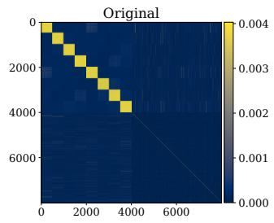

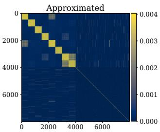  
Figure 1: The true Hessian H of the two-layer perceptron and its rank-16 Kronecker-based approximation J. Axes denote the parameter index.

As Figure 1 shows, the Kronecker-based approximation $\overline { J }$ recovers the structure of the true Hessian H. To quantify the agreement, we compute the coeficient of determination $\begin{array} { r } { R ^ { 2 } ( \bar { H } , \overline { { J } } ) = 1 - \frac { \| H - \bar { \overline { { J } } } \| _ { F } ^ { 2 } } { \| H \| _ { F } ^ { 2 } } } \end{array}$ , which reaches 42.3% with the explicit diagonal computation from (7) and 29.9% without it. Table 1 details how $R ^ { 2 }$ varies with the rank of our Fisher matrix approximation: the explicit diagonal consistently improves the fit, with the largest relative gains at low ranks.

<table><tr><td>rank r</td><td>1</td><td>2</td><td>4</td><td>8</td><td>16</td></tr><tr><td>w/o diag</td><td>3.2</td><td>9.8</td><td>15.6</td><td>24.5</td><td>29.9</td></tr><tr><td>w/ diag</td><td>17.8</td><td>26.3</td><td>32.7</td><td>36.1</td><td>42.3</td></tr></table>

Table 1: $R ^ { 2 }$ score $( \% )$ between the true Hessian and our approximation for diferent ranks r, with and without explicit diagonal computation.

All subsequent experiments are conducted on four large language models spanning diferent families and sizes: OPT-350M (Zhang et al. 2022), Qwen2-0.5B (Yang et al. 2024), OLMo2-1B (Team OLMo et al. 2024), and Qwen2.5-7B (Yang et al. 2024). For evaluation, we use text from the

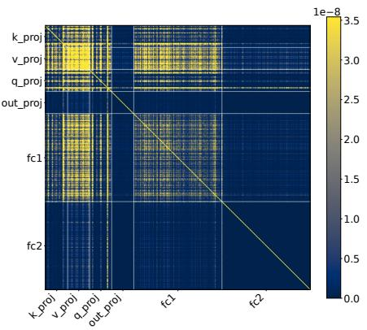  
(a) OPT-350M

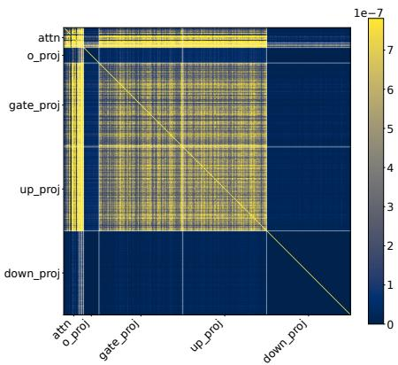  
(b) Qwen2.5-0.5B

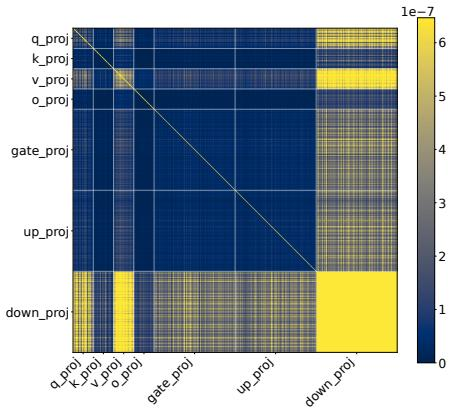  
(c) OLMo2-1B  
Figure 2: Kronecker-Fisher approximation of the Hessian (Fisher Information) for one Transformer block of OPT-350M, Qwen2.5-0.5B, and OLMo2-1B. For the Qwen2.5 architecture, where the K- and V-projections are very small and most of the Transformer block parameters belong to the MLP linear layers, we group the entire attention mechanism (Q, K, V ) under a single label attn rather than labeling each projection individually. We also observed that the Hessian structure of Qwen2.5-7B is the same as Qwen2.5-0.5B.

WikiText2 corpus (Merity et al. 2016). We first construct approximate Hessians over several batches of WikiText2, computing gradients over groups of full Transformer blocks with N parameters and visualizing the approximation in the compressed form (7), where we set $n \approx { \sqrt { N } } , n \in \mathbb { N }$

In the main paper, we restrict the Hessian visualizations to the level of individual Transformer blocks, as the full matrix is too large to display legibly even in the compressed form (7). Full-model and multi-block visualizations are provided in the Supplementary.

As our next step, we test whether the approximate Hessian predicts layer sensitivity to compression: first within groups of layers of the same type (query, value, up-projection, etc.; Figure 3), and second across layer types, by compressing layers of diferent types (Figure 4).

## 4.2 Compression within a Single Layer Type

To connect our Kronecker-based Fisher matrix approximation to practical model compression, we study how sensitive individual layer types are to weight corruption. In this section, we compress only one layer type at a time (e.g., only the V -projections or only the upscale layers); interactions between diferent layer types within the same Transformer block are studied in Section 4.3. In both settings, we compress the corresponding layers in all Transformer blocks except the first and last three, and measure the resulting increase in perplexity on WikiText2. We exclude these boundary blocks because they often exhibit out-of-distribution behavior, and our Hessian approximations indicate weaker correspondence between their parameters (see Supplementary).

Quantization. We first quantize the selected layers with 4-bit uniform quantization. As shown in the first row in Figure 3, the V -projection causes the highest perplexity increase in all models except OLMo2-1B, where the downscale projection is the most vulnerable. These results are consistent with the corresponding Hessian approximations (Figure 2): the largest values appear on the V-projection for the OPT (Figure 2a) and Qwen (Figure 2b) models, and on the downscale projection for OLMo2 (Figure 2c).

The remaining sensitive layers are model-specific, but in each case they match the layers our approximation highlights: quantizing the upscale layer causes a significant quality drop in OPT-350M, consistent with its high values in Figure 2a; the K-projection is vulnerable in Qwen2-0.5B and Qwen2.5- 7B, in line with Figure 2b; and in OLMo2-1B, quantizing the V - and Q-projections and the downscale layer leads to a substantial perplexity increase, matching the largest values of our Kronecker-Fisher approximation in Figure 2c.

Sparsification. We observe the same pattern under sparsification with ratio 0.5 (second row in Figure 3). The Vprojections exhibit the highest sensitivity in all models, in agreement with the Fisher matrix results in Figure 2. The only model whose vulnerability ranking difers between quantization and sparsification is OLMo2: the V-projection is the most sensitive to sparsification, with the downscale projection in second place, whereas for quantization their order is reversed. Both layers exhibit the highest values in the Hessian approximation for OLMo2 (Figure 2c), with the downscale projection being the more pronounced of the two. This discrepancy may stem from our normalization scheme: since we normalize the perplexity increase by the number of parameters in the compressed layer, and the V-projection is much smaller than the downscale projection, the per-parameter effect of the V-projection is amplified.

Overall, across both compression schemes, the layers assigned high values by our Fisher matrix approximation are exactly those whose corruption degrades model quality the most, with the V -projection being the most vulnerable layer type throughout.

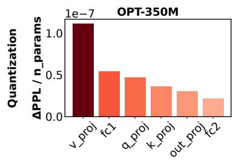

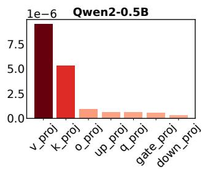

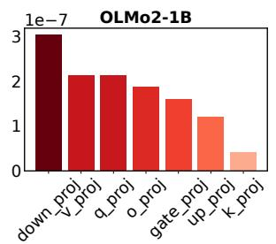

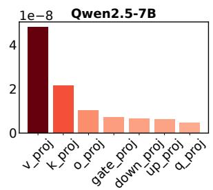

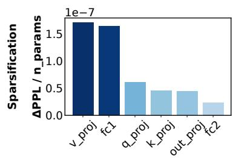

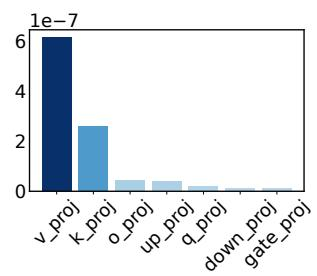

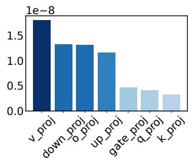

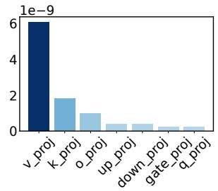  
Figure 3: Increase in Perplexity scores following 4-bit layer quantization (top row) and 50%-sparsification (bottom row) of various Transformer block components in the middle layers (excluding first 3 and last 3 transformer blocks) of the OPT-350M, Qwen2-0.5B, OLMo2-1B and Qwen 2.5-7B models. The scores are normalized by the number of parameters in the quantized layers to compare the relative efects of quantization across layers with diferent parameter counts. The layers are sorted in descending order based on the value of perplexity change.

## 4.3 Inter-Layer Quantization and Sparsification

To study inter-layer interactions in the Fisher matrices, we also quantize and sparsify pairs of layers, such as the V - projection together with the upscale layer. As in Section 4.2, we apply 4-bit quantization and sparsification with ratio 0.5 to all Transformer blocks except the first and last three, and evaluate the corrupted models on WikiText2 (Figures 4 and 5).

The greatest perplexity increase occurs for pairs involving the V-projection and for pairs combining the upscale and downscale layers. Note that Figures 4 and 5 are not normalized by the number of parameters, so pairs of large layers naturally appear brighter. What matters is which pairs stand out beyond this size efect, and these are precisely the pairs highlighted by our Hessian approximations: the V –FC1 pair for OPT, consistent with Figure 2a; the V –upscale pair for Qwen2.5, consistent with Figure 2b; and the V–downscale pair for OLMo2, consistent with Figure 2c. Therefore, the of-diagonal structure of our Kronecker-based Fisher matrix approximation predicts not only which individual layers are sensitive to compression, but also which pairs of layers interact most strongly when corrupted together.

A natural concern is that the highlighted pairs in Figures 4 and 5, such as V–upscale, merely reflect the accumulation of two independent errors: if quantizing V and quantizing FC1 each degrade the model on their own, their combination would stand out even without any genuine interaction between the layers. To rule out this explanation, we compute the interaction diference $D _ { I }$ for pairs of layers. Formally, for layers $P$ and $Q , \ D _ { I } ( P , Q ) \dot { = } \Delta ( \{ P , \dot { Q } \} ) - \Delta ( \{ P \} ) - \Delta ( \{ \dot { Q } \} )$ , where $\Delta ( S )$ denotes the perplexity increase after corrupting the layers in set $S .$ By construction, $D _ { I }$ removes the additive contribution of each layer and isolates the excess degradation caused by corrupting the two layers jointly. The largest interaction diferences between attention and MLP layers occur precisely for the pairs with the highest values in our Hessian approximations (Figure 2), which are the pairs involving the ${ \mathrm { ~ : ~ } } V .$ -projection. This confirms that the prominence of these pairs is a genuine interaction efect, captured by the of-diagonal structure of the Fisher matrix, rather than an artifact of cumulative independent errors.

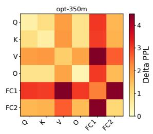

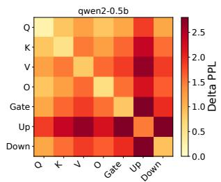

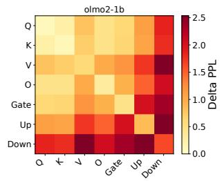

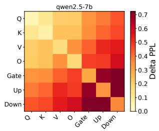  
Figure 4: The Perplexity growth following quantization in 4 bits the diferent pairs of layers in Transformer blocks in the middle of the LLM models. The value on crossing the row i and the column $j$ is the result of PPL growth after quantization of layers i and $j$

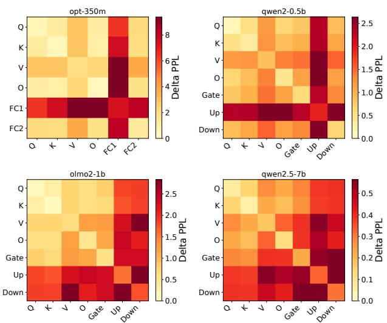

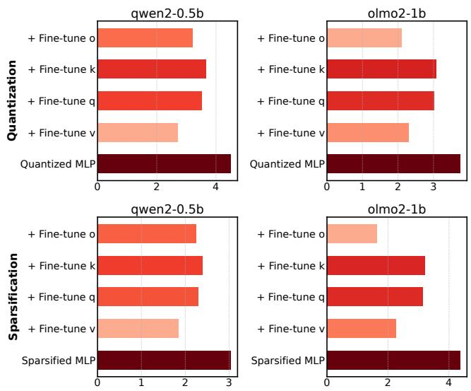  
Figure 5: The Perplexity growth following the sparsification with ratio 0.5 the diferent pairs of layers in Transformer blocks in the middle of the LLM models. The value on crossing the row i and the column $j$ is the result of PPL growth after sparsification of layers i and $j .$

An exception to the otherwise strong agreement between our Fisher matrix approximation and the empirical results is the O-projection. While the corresponding regions of the approximated Hessians show comparatively low values in all models, pairs involving the O-projection, particularly O–upscale, cause a notable perplexity increase under both quantization and sparsification (Figures 4 and 5). We hypothesize that the discrepancy arises from the local nature of the Fisher approximation. The O-projection writes the attention output directly into the residual stream, which is known to carry a small number of high-magnitude outlier channels that the MLP layers rely on. Near the trained optimum, gradients through the O-projection are small, yielding low Fisher values; however, the finite perturbations introduced by 4-bit quantization or 50% sparsification disturb these outlier channels, causing damage that a local quadratic model cannot capture. We discuss the further in the Future Research (Section 5).

We additionally evaluate the corrupted models on five zero-shot benchmarks (PIQA, WinoGrande, HellaSwag, ARC-Easy, ARC-Challenge), where the resulting layer rankings closely match those obtained from perplexity. Full pertask results are reported in Supplementary.

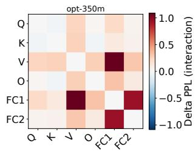

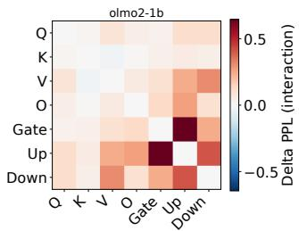  
Figure 6: Interaction diference $D _ { I }$ for 4-bit quantization in OPT-350M and OLMo2-1B. The cell at row i and column $j$ shows $D _ { I } ( i , j ) \colon$ : the perplexity increase after jointly quantizing layer types i and $j ,$ minus the sum of the perplexity increases after quantizing each layer type individually. Positive values indicate that the joint corruption is more damaging than the two individual corruptions combined.  
Figure 7: The Perplexity increase after corrupting all FFN layers, before and after fine-tuning individual attention layers. The top row shows results for 4-bit quantization and the bottom row for sparsification with ratio 0.5.

## 4.4 Finetuning

In modern model optimization pipelines, compressed models are typically fine-tuned to recover acceptable performance (Liao et al. 2024). We investigate whether our Fisher matrix approximation can predict which layers are most efective to fine-tune. To this end, we first corrupt all MLP layers (upscale, gate, and downscale) of each language model with 4-bit quantization or sparsification with ratio 0.5, and then fine-tune individual attention layers, one at a time (Figure 7). Fine-tuning the V-projection recovers the most performance, whereas fine-tuning the K- or Q-projections yields little improvement. This mirrors the of-diagonal structure of our Hessian approximations, where the V-projection exhibits the strongest coupling with the FFN layers.

We additionally repeat this experiment with low-rank adapters (LoRA) (Hu et al. 2022) in place of full fine-tuning.

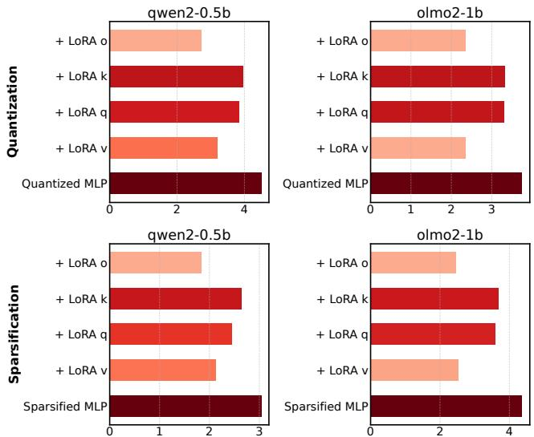  
Figure 8: The Perplexity increase after FFN corruption and the its values after LoRA application to various Attention layers. The top rows demonstrates the experiments with 4-bit quantization and the bottom one with sparsification.

LoRA adds a trainable low-rank correction to a frozen weight matrix: $W _ { \mathrm { n e w } } = W + A B ^ { T }$ , where $W \in \mathbb { R } ^ { n \times m }$ is frozen and $A \in \mathbb { R } ^ { n \times r } , B \in \mathbb { R } ^ { m \times r }$ are trainable matrices of rank r. As shown in Figure $^ { 8 , }$ applying the adapter to the $V \mathrm { - }$ projection is again substantially more efective than applying it to the $Q -$ or K-projections, in agreement with our Kronecker-based Hessian approximation of the Transformer block (Figures 2a, 2c, 2b).

Overall, the fine-tuning experiments show that adapting layers with high of-diagonal Hessian values with respect to the corrupted layers recovers substantially more performance than adapting weakly coupled layers. This further confirms that the of-diagonal values of our approximation reflect genuine inter-layer dependencies in large language models. Our method (Section 3) therefore ofers a practical criterion for selecting which layers to fine-tune in order to compensate for compression errors.

## 4.5 Hessian Computation Time

To support our claim that the proposed approximation is tractable at scale, we report the wall-clock time required to construct it. We use a rank-1 approximation, already suficient to reveal the Hessian structure, with 20 batches of 10 WikiText2 sequences on a single NVIDIA H100 GPU. As Table 2 shows, constructing the approximation for an entire model takes from a few minutes for OPT-125M to roughly 40 minutes for OLMo2-1B, so the full curvature structure of a billion-parameter model is obtainable within a single GPUhour. Gradient computation accounts for a decreasing share of the total as models grow, consistent with the complexity analysis of Section 3, where the Arnoldi iterations dominate the linear cost of backpropagation.

Table 2: Full-model Hessian approximation construction time over all Transformer blocks, using a rank-1 approximation. Gradient computation time is included in the total.
<table><tr><td>Model</td><td>Total time (s)</td><td>Gradient time (s)</td></tr><tr><td>OPT-125M</td><td>157.64</td><td>50.73</td></tr><tr><td>OPT-350M</td><td>1563.07</td><td>272.94</td></tr><tr><td>Qwen2-0.5B</td><td>1090.61</td><td>200.09</td></tr><tr><td>OLMo2-1B</td><td>2428.25</td><td>218.64</td></tr></table>

## 5 Conclusion

We introduced a scalable Kronecker-based Fisher approximation that enables practical Hessian analysis for billionparameter language models, reducing memory complexity from quadratic to linear in model size while preserving crosslayer interaction information. Our method bridges the gap between theoretical curvature studies and real-world model optimization, providing the first direct empirical evidence of non-diagonal Hessian structure in large LLMs.

Across four model families, we consistently found that value projection layers exhibit the highest sensitivity and strongest cross-layer correlations, while other components show architecture-specific behavior. Extensive experiments on quantization, sparsification, inter-layer corruption, and fine-tuning demonstrate that our approximation strongly correlates with performance degradation and recovery, outperforming diagonal estimates and uncovering non-additive joint efects. These insights enable principled identification of fragile layers, guiding mixed-precision compression, targeted fine-tuning, and LoRA adaptation without the prohibitive cost of full Hessian computation. Our framework ofers a practical, theoretically grounded tool for eficient model optimization, advancing both the understanding and compression of large-scale neural networks.

Future Work A promising direction for future work is to test whether the observed inter-layer interactions are mediated by outlier channels in the residual stream. Outliermitigation techniques such as AWQ (Lin et al. 2024) and rotation-based methods such as QuaRot (Ashkboos et al. 2024) redistribute or remove these outliers. If the strong interactions we observe, such as the V–upscale pairs, arise because corruption in one layer damages the few highmagnitude channels the other depends on, then applying these techniques before compression should disproportionately reduce $\bar { D } _ { I }$ for exactly these pairs. The same experiment would clarify the O-projection discrepancy: a sharp drop in its vulnerability after outlier removal would indicate that this vulnerability stems from finite perturbations of outlier channels rather than from local curvature.

## References

Arai, Y.; and Ichikawa, Y. 2026. Quantization error propagation: Revisiting layer-wise post-training quantization. Advances in Neural Information Processing Systems, 38: 151916–151951.

Ashkboos, S.; Mohtashami, A.; Croci, M. L.; Li, B.; Cameron, P.; Jaggi, M.; Alistarh, D.; Hoefler, T.; and Hens-

man, J. 2024. QuaRot: Outlier-Free 4-Bit Inference in Rotated LLMs. In The Thirty-eighth Annual Conference on Neural Information Processing Systems.

Botev, A.; Ritter, H.; and Barber, D. 2017. Practical Gauss-Newton optimisation for deep learning. In International Conference on Machine Learning (ICML), 557–565. PMLR.

Chekalina, V.; Moskovskiy, D.; Cherniuk, D.; Kurkin, M.; Kuznetsov, A.; and Frolov, E. 2025. Generalized Fisherweighted SVD: Scalable Kronecker-factored Fisher approximation for compressing large language models. arXiv preprint arXiv:2505.17974.

Collobert, R. 2004. Large scale machine learning. Technical Report RR-04-42, IDIAP.

Dangel, F.; Harmeling, S.; and Hennig, P. 2020. Modular block-diagonal curvature approximations for feedforward architectures. In International Conference on Artificial Intelligence and Statistics (AISTATS), 799–808. PMLR.

Das, R.; Agarwal, N.; Sanghavi, S.; and Dhillon, I. S. 2024. Towards quantifying the preconditioning efect of Adam. arXiv preprint arXiv:2402.07114.

Dong, Z.; Zhang, Y.; Yao, J.; and Sun, R. 2025. Towards quantifying the Hessian structure of neural networks. arXiv preprint arXiv:2505.02809.

Frantar, E.; and Alistarh, D. 2022. Optimal brain compression: A framework for accurate post-training quantization and pruning. Advances in Neural Information Processing Systems, 35: 4475–4488.

Frantar, E.; Ashkboos, S.; Hoefler, T.; and Alistarh, D. 2023. GPTQ: Accurate post-training quantization for generative pre-trained transformers. In International Conference on Learning Representations (ICLR). ArXiv:2210.17323.

Golub, G. H.; and Reinsch, C. 1971. Singular value decomposition and least squares solutions. In Linear algebra, 134–151. Springer.

Hsu, Y.-C.; Hua, T.; Chang, S.; Lou, Q.; Shen, Y.; and Jin, H. 2022. Language model compression with weighted lowrank factorization. In International Conference on Learning Representations.

Hu, E. J.; Shen, Y.; Wallis, P.; Allen-Zhu, Z.; Li, Y.; Wang, S.; and Chen, W. 2022. LoRA: Low-Rank Adaptation of Large Language Models. In Proceedings ofthe 10th International Conference on Learning Representations (ICLR).

Izmailov, A. F.; and Solodov, M. V. 2014. Newton-Type Methodsfor Optimization and Variational Problems. Springer.

Kingma, D. P.; and Ba, J. 2015. Adam: A method for stochastic optimization. In International Conference on Learning Representations (ICLR). ArXiv:1412.6980.

LeCun, Y.; and Cortes, C. 1998. The MNIST database of handwritten digits. Available: http://yann. lecun. com/exdb/mnist/, 24.

Lehoucq, R. B.; Sorensen, D. C.; and Yang, C. 1998. ARPACK Users’ Guide: Solution ofLarge-Scale Eigenvalue Problems with Implicitly Restarted Arnoldi Methods. SIAM.

Liao, B.; Herold, C.; Khadivi, S.; and Monz, C. 2024. ApiQ: Finetuning of2-Bit Quantized Large Language Model. In Al-Onaizan, Y.; Bansal, M.; and Chen, Y.-N., eds., Proceedings

of the 2024 Conference on Empirical Methods in Natural Language Processing, 20996–21020. Miami, Florida, USA: Association for Computational Linguistics.

Lin, J.; Tang, J.; Tang, H.; Yang, S.; Chen, W.-M.; Wang, W.- C.; Xiao, G.; Dang, X.; Gan, C.; and Han, S. 2024. AWQ: Activation-aware Weight Quantization for On-Device LLM Compression and Acceleration. In Gibbons, P.; Pekhimenko, G.; and Sa, C. D., eds., Proceedings of Machine Learning and Systems, volume 6, 87–100.

Liu, H.; Li, Z.; Hall, D.; Liang, P.; and Ma, T. 2024. Sophia: A scalable stochastic second-order optimizer for language model pre-training. In International Conference on Learning Representations (ICLR). ArXiv:2305.14342.

Loshchilov, I.; and Hutter, F. 2017. Decoupled weight decay regularization. arXiv preprint arXiv:1711.05101.

Martens, J. 2010. Deep learning via Hessian-free optimization. In Proceedings ofthe 27th International Conference on Machine Learning (ICML), 735–742.

Martens, J.; and Grosse, R. 2015. Optimizing neural networks with Kronecker-factored approximate curvature. In International Conference on Machine Learning (ICML), 2408– 2417. PMLR.

Matveeva, T.; Katrutsa, A.; and Frolov, E. 2025. Dynamic low-rank approximation of full-matrix preconditioner for training generalized linear models. arXiv preprint arXiv:2508.21106.

Merity, S.; Xiong, C.; Bradbury, J.; and Socher, R. 2016. Pointer sentinel mixture models. arXiv preprint arXiv:1609.07843.

Naumov, M. 2017. Feedforward and recurrent neural networks backward propagation and Hessian in matrix form. arXiv preprint arXiv:1709.06080.

Team OLMo; Walsh, P.; Soldaini, L.; Groeneveld, D.; Lo, K.; Arora, S.; Bhagia, A.; Gu, Y.; Huang, S.; Jordan, M.; et al. 2024. 2 OLMo 2 Furious. arXiv:2501.00656.

Van Loan, C. F. 2000. The ubiquitous Kronecker product. Journal of Computational and Applied Mathematics, 123(1- 2): 85–100.

Wu, Y.; Guo, W.; Liu, Z.; Ji, H.; Xu, Z.; and Zhang, D. 2025. How large language models encode theory-of-mind: A study on sparse parameter patterns. npj Artificial Intelligence, 1(1): 20.

Yang, A.; Yang, B.; Hui, B.; Zheng, B.; Yu, B.; Zhou, C.; Li, C.; Li, C.; Liu, D.; Huang, F.; et al. 2024. Qwen2 technical report. arXiv preprint arXiv:2407.10671.

Yao, Z.; Gholami, A.; Shen, S.; Mustafa, M.; Keutzer, K.; and Mahoney, M. 2021. AdaHessian: An adaptive second order optimizer for machine learning. In Proceedings of the AAAI Conference on Artificial Intelligence, volume 35, 10665–10673.

Zhang, H.; Xiong, C.; Bradbury, J.; and Socher, R. 2017. Block-diagonal Hessian-free optimization for training neural networks. arXiv preprint arXiv:1712.07296.

Zhang, S.; Roller, S.; Goyal, N.; Artetxe, M.; Chen, M.; Chen, S.; Dewan, C.; Diab, M.; Li, X.; Lin, X. V.; et al.

2022. OPT: Open pre-trained transformer language models. arXiv preprint arXiv:2205.01068.

Zhang, Y.; Chen, C.; Ding, T.; Li, Z.; Sun, R.; and Luo, Z.-Q. 2024. Why transformers need Adam: A Hessian perspective. Advances in Neural Information Processing Systems, 37: 131786–131823.

Zhang, Y.; Chen, C.; Li, Z.; Ding, T.; Wu, C.; Kingma, D. P.; Ye, Y.; Luo, Z.-Q.; and Sun, R. 2025. Adam-mini: Use fewer learning rates to gain more. In International Conference on Learning Representations (ICLR). ArXiv:2406.16793.

Zhao, J.; Derakhshan, A.; Hyman, J.; Dong, J.; Jyothi, S. A.; and Harris, I. 2026. CoopQ: Cooperative game inspired layerwise mixed precision quantization for LLMs. In Findings of the Association for Computational Linguistics: ACL 2026, 7566–7578.

Zhao, Y.; Dang, S.; Ye, H.; Dai, G.; Qian, Y.; and Tsang, I. 2025. Second-order fine-tuning without pain for LLMs: A Hessian informed zeroth-order optimizer. In International Conference on Learning Representations (ICLR).

## Supplementary Materials

## A Additional Hessian Visualizations

Figure 9 shows how the Hessian structure changes with depth. The earlier and middle groups contain more pronounced high-value regions and inter-layer correlations, whereas these values are substantially weaker in the final group of Transformer blocks.

Figure 10 provides a global view of the Hessian across all OPT-125M Transformer blocks. Because OPT-125M is small enough for the complete approximation to remain legible, the figure exposes both the repeated block structure along the diagonal and the correlations between layers in diferent blocks. For larger models, a full-model plot at the same scale would make the layer boundaries indistinguishable, which is why the main paper presents block-level and multi-block views instead.

## B Pairwise Quantization with Concrete Values

Figure 11 contains the same pairwise-quantization experiment as Figure 4, but places the measured values directly into the heatmaps. The annotations make it possible to compare particular layer pairs quantitatively, while the color scale makes the overall interaction pattern easier to see. As in the main-paper figure, pairs involving the V -projection and pairs combining the upscale and downscale layers produce some of the largest perplexity increases.

## C Additional Experimental Results

## C.1 Zero-Shot Results on Downstream Tasks

We additionally evaluate whether the layer sensitivities observed through WikiText-2 perplexity transfer to downstream tasks. For each model, we apply 90% sparsification to one layer type at a time in the middle Transformer blocks, following the setup in the main paper, and evaluate the resulting model without task-specific fine-tuning on PIQA, WinoGrande, HellaSwag, ARC-Easy, and ARC-Challenge. Table 3 reports the accuracy decrease relative to the dense baseline in percentage points; thus, larger positive values indicate worse performance and greater sensitivity. The baseline rows report absolute accuracy, also in percent, and the Avg. column is the unweighted mean over the five tasks.

The downstream results recover the principal sensitivity patterns found with perplexity. FC1 is the most damaging projection to sparsify in OPT-350M; the V -projection is the most damaging in Qwen2-0.5B; the upscale and downscale projections dominate in OLMo2-1B; and the gate projection is by far the most sensitive component in Qwen2.5-7B. The precise magnitude varies by task—in particular, HellaSwag and ARC-Easy often show the largest drops—but the most sensitive layer types remain consistent across evaluation criteria. Negative values for a few OPT-350M task– projection pairs denote small measured improvements and do not change the aggregate ranking.

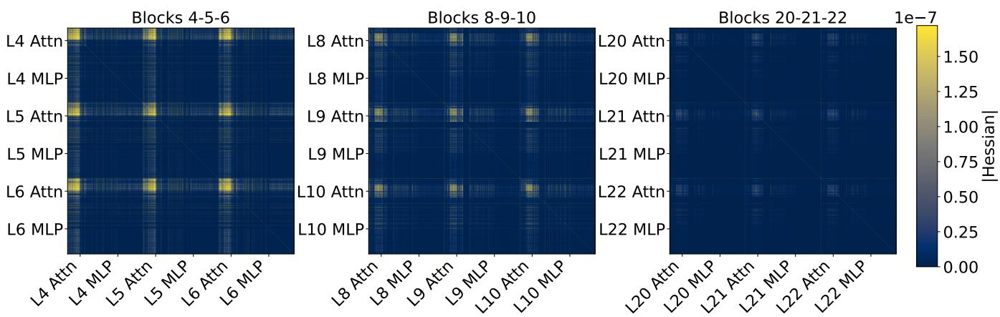  
Figure 9: Our Kronecker–Fisher approximations for groups of Transformer blocks 4–5–6 (left), 8–9–10 (middle), and 20–21–22 (right) of OPT-350M. Yellow denotes high Hessian values and blue denotes low values. While the Hessian values are high in the earlier Transformer blocks, they become significantly smaller in the later blocks.

Table 3: Zero-shot accuracy under layer-type-wise 90% sparsification. The baseline rows give dense-model accuracy (%), while all projection rows give the accuracy decrease from that baseline in percentage points. Larger values indicate worse performance. Bold values mark the largest average decrease for each model.
<table><tr><td>Model</td><td>Setting</td><td>PIQA</td><td>WinoGrande</td><td>HellaSwag</td><td>ARC-E</td><td>ARC-C</td><td>Avg.</td></tr><tr><td>OPT-350M</td><td>Baseline</td><td>64.25</td><td>52.33</td><td>36.80</td><td>40.11</td><td>23.72</td><td>43.44</td></tr><tr><td></td><td>Q</td><td>4.68</td><td>2.13</td><td>3.33</td><td>8.21</td><td>-1.45</td><td>3.38</td></tr><tr><td></td><td>K</td><td>2.34</td><td>-1.03</td><td>3.51</td><td>6.86</td><td>-0.09</td><td>2.32</td></tr><tr><td></td><td>V</td><td>0.60</td><td>1.34</td><td>2.88</td><td>1.14</td><td>0.09</td><td>1.21</td></tr><tr><td></td><td>0</td><td>0.05</td><td>0.95</td><td>2.68</td><td>1.73</td><td>0.17</td><td>1.12</td></tr><tr><td></td><td>FC1</td><td>10.72</td><td>1.82</td><td>10.38</td><td>10.52</td><td>0.51</td><td>6.79</td></tr><tr><td></td><td>FC2</td><td>3.59</td><td>-0.08</td><td>3.25</td><td>4.17</td><td>0.43</td><td>2.27</td></tr><tr><td>Qwen2-0.5B</td><td>Baseline</td><td>69.37</td><td>57.54</td><td>49.10</td><td>50.42</td><td>28.75</td><td>51.04</td></tr><tr><td></td><td>Q</td><td>3.05</td><td>4.66</td><td>7.68</td><td>4.17</td><td>4.01</td><td>4.71</td></tr><tr><td></td><td>K</td><td>4.08</td><td>4.58</td><td>9.26</td><td>7.03</td><td>3.24</td><td>5.64</td></tr><tr><td></td><td>V</td><td>11.15</td><td>7.81</td><td>17.90</td><td>14.44</td><td>7.25</td><td>11.71</td></tr><tr><td></td><td>0</td><td>3.21</td><td>4.42</td><td>7.28</td><td>4.29</td><td>3.67</td><td>4.57</td></tr><tr><td></td><td>Gate</td><td>2.77</td><td>4.89</td><td>7.72</td><td>2.78</td><td>1.54</td><td>3.94</td></tr><tr><td></td><td>Up</td><td>7.24</td><td>5.13</td><td>14.00</td><td>9.97</td><td>5.46</td><td>8.36</td></tr><tr><td></td><td>Down</td><td>6.31</td><td>3.63</td><td>9.60</td><td>7.95</td><td>4.52</td><td>6.40</td></tr><tr><td>OLMo2-1B</td><td>Baseline</td><td>74.81</td><td>63.85</td><td>66.61</td><td>72.60</td><td>40.96</td><td>63.77</td></tr><tr><td></td><td>Q</td><td>2.67</td><td>4.81</td><td>10.11</td><td>11.83</td><td>7.34</td><td>7.35</td></tr><tr><td></td><td>K</td><td>2.12</td><td>3.95</td><td>4.85</td><td>9.47</td><td>6.57</td><td>5.39</td></tr><tr><td></td><td>V</td><td>2.01</td><td>2.29</td><td>8.32</td><td>8.71</td><td>5.38</td><td>5.34</td></tr><tr><td></td><td>0</td><td>3.10</td><td>4.50</td><td>13.14</td><td>15.28</td><td>9.30</td><td>9.06</td></tr><tr><td></td><td>Gate</td><td>2.77</td><td>5.45</td><td>10.11</td><td>13.17</td><td>6.14</td><td>7.53</td></tr><tr><td></td><td>Up</td><td>8.76</td><td>10.89</td><td>22.11</td><td>26.89</td><td>12.37</td><td>16.20</td></tr><tr><td></td><td>Down</td><td>7.73</td><td>4.97</td><td>19.20</td><td>25.17</td><td>13.05</td><td>14.02</td></tr><tr><td>Qwen2.5-7B</td><td>Baseline</td><td>79.38</td><td>70.56</td><td>78.21</td><td>75.93</td><td>49.66</td><td>70.75</td></tr><tr><td></td><td>Q</td><td>1.80</td><td>4.89</td><td>3.87</td><td>1.26</td><td>1.79</td><td>2.72</td></tr><tr><td></td><td>K</td><td>1.09</td><td>4.81</td><td>6.84</td><td>7.37</td><td>3.16</td><td>4.65</td></tr><tr><td></td><td>V</td><td>1.09</td><td>1.82</td><td>5.93</td><td>3.32</td><td>3.75</td><td>3.18</td></tr><tr><td></td><td>0</td><td>1.25</td><td>4.66</td><td>7.71</td><td>5.85</td><td>4.01</td><td>4.70</td></tr><tr><td></td><td>Gate</td><td>25.35</td><td>21.70</td><td>49.16</td><td>47.01</td><td>27.39</td><td>34.12</td></tr><tr><td></td><td>Up</td><td>5.66</td><td>7.81</td><td>15.26</td><td>7.03</td><td>8.11</td><td>8.77</td></tr><tr><td></td><td>Down</td><td>3.92</td><td>5.13</td><td>10.71</td><td>5.43</td><td>7.42</td><td>6.52</td></tr></table>

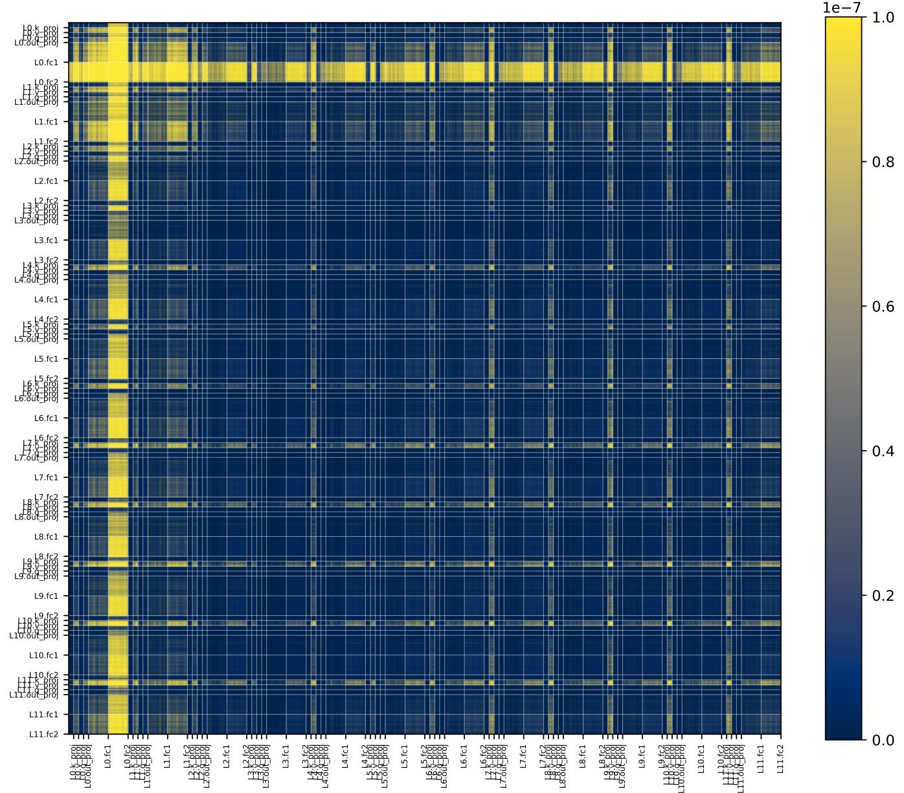  
Figure 10: Full-model Kronecker–Fisher Hessian approximation for OPT-125M. This is one of the few language-model Hessians that can be presented in full while keeping the individual Transformer layers distinguishable.

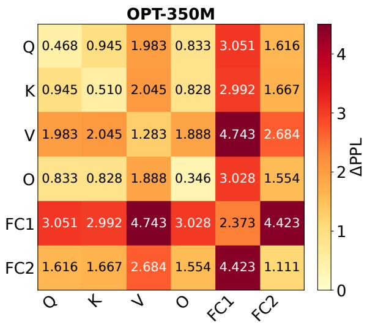

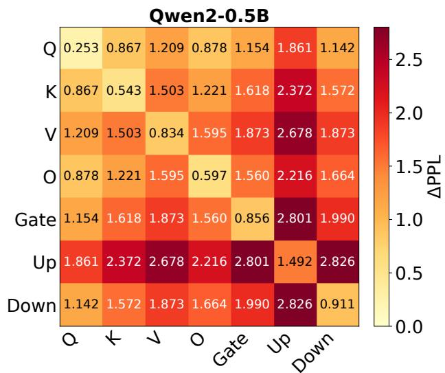

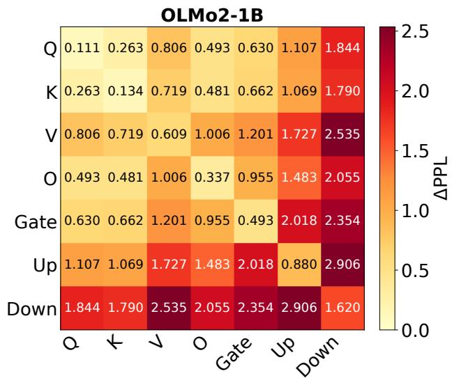

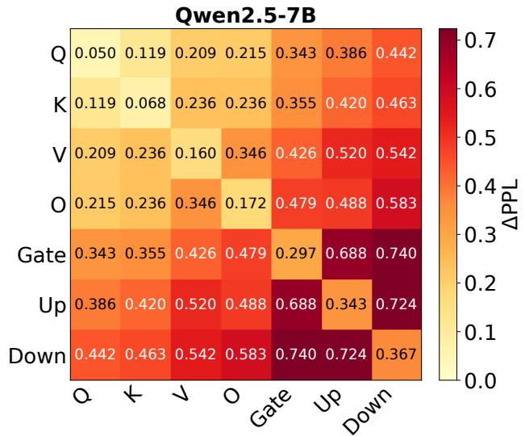  
Figure 11: Pairwise 4-bit quantization results with the concrete perplexity increases shown in every cell. This is the annotated version of Figure 4 in the main paper. Each cell at row i and column j reports the perplexity increase after jointly quantizing layer types i and j in the middle Transformer blocks.