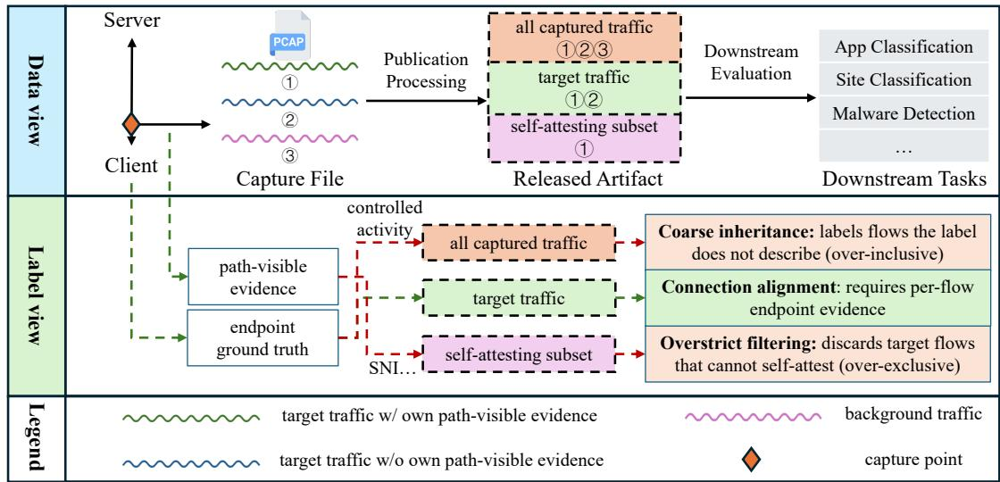
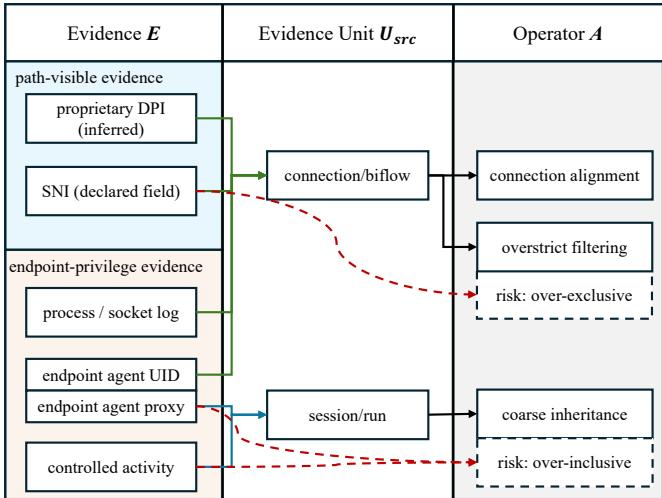
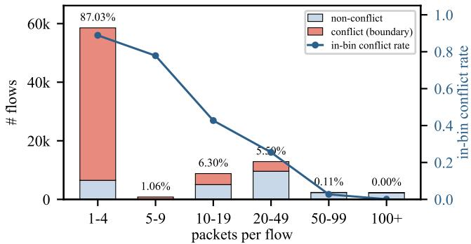
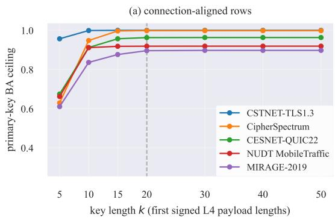
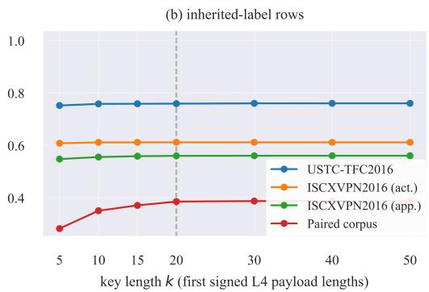

# SoK: Where Do Flow Labels Come From? Auditing Label Provenance in Encrypted Traffic Benchmarks

Sizhe Huang

Shujie Yang

## Abstract

Encrypted traffic classification infers semantics beyond the flow record from transport-layer observables, and supervised training rests on labels that hold for the individual flow they are attached to. Recent systematizations scrutinize model inputs and data splits; we systematize the complementary label side. Across 14 audited benchmark entries, we identify two recurring label-side strategies: coarse inheritance, which risks labelling flows the evidence does not cover, and overstrict filtering, which keeps only self-attesting flows and risks discarding relevant ones. No audited entry exposes a countable pre-selection population, and the task objects downstream papers attach to the same labels disagree with the recovered record in 8 of 23 referenced cells. Under strict side-channel features we derive a representation-relative ceiling on balanced accuracy for any classifier restricted to those features: on the public benchmarks that inherit, it ranges from 0.56 to 0.76. On the filtering side, only 24.95% of connections in our fully captured corpus carry an observable SNI of their own; yet the discarded connections raise macro accuracy from 0.44 to 0.65 through same-run co-occurrence features. We end with recommendations for benchmark builders and users.

## 1 Introduction

Encrypted traffic classification trains a model to infer a semantic fact about a flow from its transport-layer observables: which application produced it, which site it visits, which service it talks to. The task is supervised and scored per published sample: every training flow carries a label, and that label is only meaningful under per-sample scoring if it holds for the individual flow it is attached to. Establishing the fact flow-byflow requires endpoint instrumentation: a process, a socket, or a device agent that sees which application produced the traffic. The classifier at deployment time has none of this; it sees only the published transport-layer representation. The benchmark builder, however, does have instrumentation at collection time. Label evidence lives at layer seven or inside the endpoint, while the published artifact lives at layer four; the distance between these two vantage points is the object of this paper.

Recent systematizations of the field have scrutinized the input side of this pipeline: which fields classifiers exploit [46], how evaluation inflates reported accuracy [53], and how simple baselines match complex models once redundant samples and split leakage are removed [20]. All three conclude by closing channels such as identity fields, plaintext identifiers, and leaked duplicates. Once those channels are closed, a distinct question remains. A classifier that sees none of the excluded inputs can still be limited by the labels themselves: flows that are indistinguishable in the observation representation may carry different labels, and no classifier restricted to that repre sentation can resolve them. Jerabek et al. [20] quantify this symptom: identical packet sequences with conflicting labels cap achievable accuracy, and they attribute it to the redundancy inherent in network traffic. The conflict, however, has provenance: holding CipherSpectrum’s 123,000 sessions, key, and feature pipeline fixed, changing only the label-assignment construction from access-level inheritance to per-connection evidence moves the normalized conflict rate on the 73,373 non-first-party sessions from 0.4197 to 0.0169 (Section 4.2). What this rules out is a traffic-intrinsic account: identical flows carry a 25-fold conflict difference depending only on where the labels came from. The point is the joint dependence on representation and label construction, not a race between the two.

The disagreement is not hypothetical. The same published labels are read as applications, websites, and peer server domains by different papers (Section 2). We systematize label provenance across 14 audited benchmark entries and find that every audited benchmark attaches labels to published samples through one of four assignment operators, and the two labelside strategies fail in opposite directions. Coarse inheritance copies onto every flow the label of a coarser context in which that flow sits, such as a scripted run or an application session, which risks labelling flows the evidence does not cover. Overstrictfiltering keeps only flows that carry their own path visible evidence, which risks discarding flows that carry label information. The two failures have opposite security consequences: coarse inheritance overstates the adversary, attaching labels to flows an attacker could not in fact attribute and inflating reported attack success; overstrict filtering understates it, since an attacker who keeps the discarded neighbourhood is stronger than the benchmarked one (Section 4.3). Figure 1 traces how both arise along the path from capture to released artifact. No audited entry exposes a countable pre-selection population, and the claimed tasks attached to the same labels disagree with the recovered record in 8 of 23 referenced cells (Section 3.4, Gaps 1 and 2). And where label evidence survives into the published artifact, a deterministic rule captures most of its capacity: what survives acts as a shortcut (Gap 3).

We make the analysis precise with three quantities computable from any published artifact without training a model: a representation-relative ceiling on balanced accuracy, the boundary share, and a derived mixture weight. On the public benchmarks that inherit, the ceiling ranges from 0.56 to 0.76; rekeying CipherSpectrum’s fixed 123,000 sessions to perconnection evidence moves the normalized conflict rate on the non-first-party subset by $\Delta \rho = 0 . 4 0 2 8 ;$ and on the paired corpus, only 24.95% of connections carry an observable SNI of their own (36.4% excluding DNS resolutions, 78.2% over payload-carrying connections; the mechanism does not depend on the denominator), while adding the discarded context raises macro accuracy from 0.44 to 0.65. We conclude with recommendations for benchmark builders and users.

This paper makes four contributions:

• A systematization of label provenance. We introduce the Label Provenance Record (LPR), a ten-field taxonomy that records, for each benchmark, the evidence behind its labels, the unit at which that evidence holds, the operator that carries it to the published sample, and the claimed tasks that downstream papers attach to the result (Section 2). Applying it to 14 public benchmark entries exposes the three gaps above, which recur across the audited corpus (Section 3).

• Demonstrated consequences. The audit exposes the two label-side strategies and their opposite security consequences, and three artifact-computable quantities make both failures measurable before any model is trained (Sections 4.1–4.5).

• A paired corpus. 888 scripted browsing runs over 31 targets pairing raw traffic (85,732 connections) with browser request logs and per-connection SNI; the only corpus in this audit that retains the countable preselection population whose absence elsewhere is Gap 1 (Sections 4.2 and 4.3).

• Recommendations for benchmark builders and users (Section 5).

The paper proceeds as follows. Section 2 builds the taxonomy, Section 3 applies it to the 14 audited entries and states the three gaps, Section 4 answers the questions they pose, and Sections 5–7 discuss, position, and conclude.

## 2 Taxonomy and Classification

Consider CSTNET-TLS1.3, a widely used encrypted-traffic benchmark. Its release paper (ET-BERT, WWW’22) describes the task as “TLS 1.3 encrypted application classification” [27]; later work describes website fingerprinting and website identification on the same data [49, 55]; and the labels in the released artifact are server domains derived from SNI. The same labels admit three readings: applications, websites, or peer server domains. Each reading implies a different task and changes what a model trained on the data is actually learning to do.

Disagreements like this are not accidents of individual papers. A published label is a string, and the string carries none of the information needed to interpret it: what evidence produced the label, at which layer and unit that evidence holds, how the evidence was carried to each published flow, and what task the labeler had in mind. Benchmarks routinely report none of these facts, only the name of the label: “App X”, “site Y”, “malicious”. We make them explicit as a Label Provenance Record (LPR): a ten-field structure that records, for each benchmark, the evidence behind its labels, the unit at which that evidence holds, the operator that carries it to the published sample, and the claimed tasks that downstream papers attach to the result. Section 2.1 defines the record field by field; Sections 2.2 and 2.3 expand the two places where this pipeline can break: the layer at which the evidence lives, and what publication processing removes from the artifact; Section 2.4 fixes the scope of the audit.

## 2.1 The Label Provenance Record

We structure label provenance as a record with ten fields, written $L P R = \left. V , E , \Lambda , S , O _ { L } , U _ { \mathrm { s o u r c e } } , A , U _ { \mathrm { s a m p l e } } , L , G \right.$ :

• V: version and task identity: which release of the benchmark, and which task the release claims to support;

• E: evidence source: what produced the label (a controlled activity recorded by the collector, a process/socket log, a server-name indicator (declared by the client, re-parseable from the artifact), an endpoint agent, a proprietary DPI system (inferred on the path, not recomputable), labels reused from an upstream dataset);

• Λ: layer of evidence: whether the evidence is pathvisible application-layer state or endpoint privilege;

  
Figure 1: Label provenance from capture to task. Data view (top): at the capture point, target traffic mixes with background traffic; some target flows carry their own path-visible evidence, others do not. Publication processing selects what the released artifact keeps: all captured traffic, the target traffic, or only the self-attesting subset. Label view (bottom): the outcome follows the surviving evidence: coarse inheritance (over-inclusive), connection alignment, or overstrict filtering (over-exclusive).

• S: semantic object: what the label actually denotes (the generating application, the visited site, the peer server domain, a user activity, an encapsulation form, a benign/malicious attribute);

$O _ { L } \colon$ observation surface: where the evidence was observed (a capture point, a device, an endpoint agent, a server log);

$U _ { \mathrm { s o u r c e } }$ : evidence unit: the unit at which the evidence holds (a capture session, an application run, a single connection, a process);

• A: assignment operator: how the evidence reaches the published sample: connection alignment (evidence and sample share the same unit), coarse inheritance (evidence at a coarser unit is copied onto every contained flow), derived samples, or parent-label reuse;

$U _ { \mathrm { s a m p l e } } { \mathrm { . } }$ : published sample unit: the unit of the released samples (flow, session, connection, feature matrix);

• L: lineage: how the data was collected and processed before release;

• G: evidence-source tier: A for a released artifact, B for official material or the original paper, C for a downstream paper, D for an audit inference, and E when the field cannot be recovered from the audited public sources.

The record is a pipeline, not a list: evidence E observed at surface $O _ { L }$ holds at unit $U _ { \mathrm { s o u r c e } }$ and is carried to the published unit $U _ { \mathrm { s a m p l e } }$ by the operator A. The two extreme operators are both observed in practice: connection alignment, where the evidence unit equals the sample unit and each flow receives evidence that holds for that exact flow, and coarse inheritance, where the label of a coarser context such as a scripted run, an application session, or a capture window is copied onto every flow inside that context. The remaining two operators, derived samples and parent-label reuse, propagate an upstream pipeline’s choices rather than re-deriving evidence. A distinct practice, overstrictfiltering, keeps only those flows that carry an observable identifier of their own in path-visible protocol state, such as their own SNI or a plaintext application header, and discards the rest. Overstrict filtering acts on the population, changing which samples exist; per-entry filtering is therefore recorded by the P marker in Table 2, while the operator column of Table 1 records how evidence reaches each published sample.

These values are not freely chosen. The evidence unit constrains the operator: evidence that holds at the connection (biflow) level can be aligned flow-by-flow, while evidence that holds only at a session or run level cannot. Reaching per-flow samples from it requires copying, i.e., inheritance. Overstrict filtering is the one practice the evidence layer constrains directly. It requires path-visible evidence, since an endpoint-privilege identifier cannot be observed on the path and therefore cannot key a filter. Together the pair $( \Lambda , U _ { \mathrm { s o u r c e } } )$ constrains A to a partial map, not a free cross product (Figure 2).

Coarse inheritance and overstrict filtering are the two mainstream label-side strategies we audit, and they fail in opposite directions; connection alignment is their non-failing counterpart. Coarse inheritance risks labellingflows the evidence does not cover: every flow in a capture inherits the context label even when no evidence at the flow unit ties the flow to the labelled context (in the paired corpus, 87.0% of the boundary flows are 1–4 packet connections, and 31,392 of the 31,403 zero-payload connections are in the boundary, Section 4.2.2). Overstrict filtering risks discarding relevant flows: only 24.95% of connections in the same corpus carry an observable SNI of their own. These are the strategies we observe in the audited benchmarks, not a logical dichotomy: a benchmark could also publish at the coarse unit, use multiinstance or abstaining labels [9], or release the unlabelled superset alongside a verifiable subset.

  
Figure 2: How label evidence reaches published flows in the 14 audited entries. Evidence (left, grouped by layer Λ) holds at an evidence unit $U _ { \mathrm { s o u r c e } }$ (middle) and reaches published samples through an assignment operator A (right). Connection alignment is the non-failing counterpart; coarse inheritance risks over-inclusion; overstrict filtering risks over-exclusion by keying on a flow’s own path-visible identifier, bypassing the unit constraint.

## 2.2 Two kinds of label evidence

Label evidence comes in two kinds, and the kinds differ in where they can be observed. Path-visible evidence is carried in the protocol state itself: a server name indication, a TLS hand shake metadata field, a plaintext application header. Anyone on the path can see it, with no instrumentation. Endpointprivilege evidence lives inside the device: the process that opened a socket, the UID that owns a connection, the application run that produced a burst of traffic. Only endpoint instrumentation can observe it, and the instrumentation is typically available to the benchmark builder at collection time but not to a classifier trained on the published artifact. The consequence is usually framed as a capability gap: establishing a label that is not itself visible on the path, such as the generating application, requires endpoint-privilege evidence. The audited corpus refines the framing. Controlled captures could instrument the endpoint, yet per-connection endpoint evidence is the exception rather than the norm (Section 3.1); in-the-wild captures have no endpoint access to begin with. What constrains the published artifact is therefore not the privilege the builder held at collection time but the evidence actually exercised at the per-flow level. When the claimed object has no per-flow endpoint evidence behind it, the label reaches the published flow through one of the two label-side strategies of Section 2.1: coarse inheritance copies a coarse context label onto every contained flow, while overstrict filtering applies where the object is itself path-visible on some flows, as the peer domain named by an SNI is, and admits only flows that attest themselves, discarding the rest. The two failure modes are thus not two independent mistakes but two exits of the same deprivation.

## 2.3 Evidence can be removed from the artifact

Publication processing compounds the gap rather than closing it: payloads are truncated (e.g., NUDT MobileTraffic [52] keeps the first 1,500 payload bytes), identity fields are anonymized or stripped (e.g., CSTNET-TLS1.3 [27] randomizes addresses), and feature extraction replaces raw bytes with packet-size and direction sequences. An artifact can therefore ship with neither the label evidence nor the raw bytes it lived in, which is why the retention of a surviving channel varies across artifacts (Section 3).

## 2.4 What we audit

The object of this paper is the label side of the pipeline above: the evidence behind a label, the unit at which that evidence holds, the operator that carries it to the published sample, and the claimed tasks that downstream papers attach to the resulting labels. How trained models then use the published representation, including plaintext identifiers such as SNI, is the subject of input-side systematizations [46] and falls outside this analysis; the primary-key schemas used for our ceilings contain no identity fields (Section 4.1 and the artifact feature manifests). SNI and similar identifiers enter our analysis only where the audited benchmarks themselves use them as label evidence (Table 3): the identifier is a label channel whose capacity and retention we measure, not a model input whose exploitation we study.

## 3 Systematization

This section instantiates the Label Provenance Record on the audited corpus. Section 3.1 fixes the corpus and its recovery protocol; Section 3.1 presents the 14 records; Section 3.2 compares the records against the tasks downstream papers claim for the same labels; Section 3.3 measures the label-evidence channels that survive into the artifacts; and Section 3.4 draws out the cross-cutting patterns and states the three gaps that frame the rest of the paper.

## 3.1 Recovery protocol

The audit corpus comprises the 14 versioned entries enumerated in Table 1 (13 unique source papers, since CSTNET-TLS1.3 and the ET-BERT task suites [27] share one paper). Appendix A reports the search and screening protocol and the inclusion rules. All corpus-level claims are restricted to those entries. Source-paper citation counts span 20–1,691 (Google Scholar, 2026-08-08), descriptive rather than an inclusion criterion. Each LPR field is tied to its source tier and source location. Conflicting public values are retained side by side (e.g., CSTNET-TLS1.3: 46,369 flows in the artifact vs. 46,372 in the paper; CipherSpectrum: 41 classes/123,000 sessions in the artifact vs. 40/120,000 in the paper, and a downstream evaluation at a “42 (all)” scale, Table 15).

The Nbrhd. column is a derived annotation, not one of the ten record fields: whether the rows let a user rebuild a flow’s neighbourhood (native group ids, or timestamps to re-key on). The operator column splits the corpus into six inheriting, six aligned, one reusing, and one derived.

## 3.2 Claimed tasks vs. the record

A benchmark label means little until a downstream paper says what task it uses it for. We therefore compare the semantic object S recovered from each record against the task objects claimed by downstream papers, quoting the papers’ own sentences. We classify claimed task objects into six types: T-APP (the application generating the flow), T-SITE (the visited site), T-SERVER (the connected server or service), T-ACT (the user activity), T-ENCAP (the transport encapsulation form), and T-MAL (benign vs. malicious). Cells in the dataset × claimed-task matrix are marked ✓/◦/×/−/P (legend in Table 2).

The matrix contains 23 referenced cells: the claimed object matches the record and is well-defined at the published unit in 6 cells, matches but holds only at a coarser unit in 9, and differs from the record’s semantic object in 8. The P marker appears on nine of the 14 datasets. The counts are over cells, not papers, and over the sampled papers only (sampling and adjudication protocol in Appendix B). Each matrix cell cites its source papers; Appendix B reproduces the quoted task sentence, its page or section, and the codebook decision so that the classification and counts can be independently recomputed.

Three cells are walked from quoted task statement to LPR semantic object in Appendix B (CSTNET-TLS1.3, Cipher Spectrum, NUDT MobileTraffic), plus one unspecified cell (AN-Net: no task statement at all [8]).

## 3.3 Surviving evidence channels

Where a channel survives into the artifact, a deterministic rule captures most of its capacity. Table 3 reports, for the three surviving channels, the balanced accuracy of predicting the label from the channel value alone against its ceiling (Eq. (1)). SNI is near-saturated on CipherSpectrum (0.9512), and the MAC channel on USTC-TFC2016 and MIRAGE-2019 is saturated at 0.99996 and 1.0. Saturation is not high accuracy: MIRAGE has only two distinct MAC addresses, so 0.0659 is already the whole capacity of the field. Retention varies independently (SNI survives on 1.000 of CipherSpectrum rows but only 0.051 of CSTNET-TLS1.3 rows). Saturation runs 0.68–1.00 across the five cells, the low end being the missingvalue artifact of Table 3, so where a channel is retained at scale, it acts as a shortcut.

## 3.4 What the systematization reveals

Beyond the per-entry records, three cross-cutting patterns emerge from Table 1, and they convert the table from a registry into an analysis.

The published object follows the evidence unit, not the claimed task. Every aligned entry publishes exactly the object its connection-level evidence denotes: an SNI-derived server domain (D7, D12), a service behind an SNI-plusservice map (D9, D10), the application recorded by a process/socket log (D4) or by an endpoint UID (D14). Every inheriting entry publishes labels copied from a context at which the evidence actually holds: traffic types and user activities named at the session or run (D1, D2, D5, D6). Even where the object is named as an application (D3, D13), the perflow label is inherited from the scenario run or proxy session, not observed. The single reuse entry (D8) and the single derived entry (D11) simply propagate their upstream pipelines choices. What a benchmark’s labels denote is therefore settled by where its evidence lives, which lets downstream papers attach divergent claimed tasks to the same labels (Table 2).

The assignment operator separates the reachable ceilings. Where the ceiling of Section 4.1 is computable (Table 12), the operator column of Table 1 separates the entries cleanly: every aligned public benchmark sits at or above 0.8956, every inher iting one at or below 0.7589. The one cardinality-controlled pair survives the obvious confound: MIRAGE-2019 (aligned, 20 classes, 0.8956) versus USTC-TFC2016 (inheriting, 20 classes, 0.7589). The separation remains cross-sectional, not a per-dataset effect, since task difficulty otherwise co-varies with the operator. The within-dataset evidence ties the operator to the ceiling: rekeying one fixed artifact moves the conflict mass on identical flows (Table 5), and the paired corpus isolates the filtering side (Section 4.3).

<table><tr><td>Dataset</td><td>Form</td><td>Evidence E</td><td>Unit  $\overline { { U _ { s r c } } }$ </td><td>Operator A Sample</td><td> $\overline { { U _ { s m p } } }$ </td><td>Object S</td><td>Nbrhd.</td></tr><tr><td>D1 ISCXVPN2016 [10]</td><td>raw pcap [A]</td><td>controlled activity</td><td>session/run inherit</td><td></td><td>flow rec.</td><td>traffic type</td><td>native groups</td></tr><tr><td>D2 ISCXTor2016 [16]</td><td>raw pcap [A]</td><td>controlled activity</td><td>session/run inherit</td><td></td><td>flow rec.</td><td>traffic type</td><td>native groups</td></tr><tr><td>D3 USTC-TFC2016 [45]</td><td>raw pcap [A]</td><td>upstream + simulated</td><td>session/run inherit</td><td></td><td>raw pcap</td><td>application</td><td>native groups</td></tr><tr><td>D4 MIRAGE-2019 [1]</td><td>per-flow rec. [A]</td><td>process/socket log</td><td>connection align</td><td></td><td>per-flow rec.</td><td>application</td><td>n/a</td></tr><tr><td>D5 CIC-Darknet2020 [17]</td><td>per-flow rec. [B]</td><td>upstream dataset</td><td>session/run inherit</td><td></td><td>feature matrix</td><td>activity</td><td>n/a</td></tr><tr><td>D6 CIRA-CIC-DoHBrw [33]</td><td>raw pcap [B]</td><td>controlled activity</td><td>session/run inherit</td><td></td><td>flow rec.</td><td>DoH usage / malice native groups</td><td></td></tr><tr><td>D7 CSTNET-TLS1.3 [27]</td><td>per-flow pcap [A]</td><td>SNI</td><td>connection align</td><td></td><td>per-flow pcap</td><td>server domain</td><td>timestamps</td></tr><tr><td>D8 ET-BERT tasks [27]</td><td>per-flow pcap [A]</td><td>upstream labels</td><td>session/run reuse</td><td></td><td>per-flow pcap</td><td>app / activity</td><td>timestamps</td></tr><tr><td>D9 CESNET-TLS22 [30]</td><td>per-flow rec. [A]</td><td>SNI + service map</td><td>connection align</td><td></td><td>per-flow rec.</td><td>service</td><td>n/a</td></tr><tr><td>D10 CESNET-QUIC22 [29]</td><td>per-flow rec. [A]</td><td>SNI + service map</td><td>connection align</td><td></td><td>per-flow rec.</td><td>service</td><td>n/a</td></tr><tr><td>D11 AppClassNet [43]</td><td>feature matrix [A]</td><td>prop. DPI</td><td>connection derived</td><td></td><td>feature matrix</td><td>app ID</td><td>n/a</td></tr><tr><td>D12 CipherSpectrum [46]</td><td>per-flow pcap [A]</td><td>SNI</td><td>connection align</td><td></td><td>per-flow pcap</td><td>server domain</td><td>timestamps</td></tr><tr><td>D13 Cross-Platform [39]</td><td>unconfirmed [E]</td><td>endpoint proxy</td><td>session</td><td>inherit</td><td>req-level flows application</td><td></td><td></td></tr><tr><td>D14 NUDT MobileTraffic [52]</td><td></td><td>raw pcap, anon. [A] endpoint agent (UID) biflow</td><td></td><td>align</td><td>biflow</td><td>application</td><td>native groups</td></tr></table>

Table 1: Label provenance records for the 14 audited benchmark entries (fields per Section 2.1, grades per the G field of Section 2.1; n/a: not recoverable). Columns carry V (row identity), the release form with its G grade, $E , U _ { \mathrm { s o u r c e } } , A , U _ { \mathrm { s a m p l e } } .$ , and S; Λ and $O _ { L }$ are developed in Sections 2.1 and 2.2, and L is summarized per entry below. D3 is mixed-source: its malware classes rest on upstream public captures (CTU, 2011–2015), its benign classes on traffic generated with an IXIA BPS appliance. D5 and D8 re-issue upstream labels without new collection; their evidence units are inherited from the upstream entries. D8 comprises the ISCX-VPN-Service and ISCX-VPN-App task suites that the ET-BERT paper derives from ISCXVPN2016 (D1).
<table><tr><td>Dataset</td><td>T-APP</td><td>T-SITE</td><td>T-SERVER</td><td>T-ACT</td><td>T-ENCAP</td><td>T-MAL</td></tr><tr><td>D1 ISCXVPN2016</td><td>× [27,55]</td><td></td><td></td><td> [27,51,55]</td><td>[21]</td><td>一</td></tr><tr><td>D2 ISCXTor2016</td><td>× [18,27]</td><td></td><td></td><td> [51,54]</td><td></td><td>一</td></tr><tr><td>D3 USTC-TFC2016</td><td>√[27,55]</td><td></td><td></td><td></td><td></td><td>√[25]</td></tr><tr><td>D4 MIRAGE-2019</td><td> $\sqrt { \mathrm { P } \left[ 3 , 1 5 , 3 4 \right] }$ </td><td></td><td></td><td></td><td></td><td></td></tr><tr><td>D5 CIC-Darknet2020</td><td></td><td></td><td></td><td>[31,40]</td><td>[31]</td><td></td></tr><tr><td>D6 CIRA-CIC-DoHBrw</td><td></td><td></td><td></td><td></td><td></td><td>[37,38,48]</td></tr><tr><td>D7 CSTNET-TLS1.3</td><td>× P [27]</td><td>× [49,55]</td><td></td><td></td><td></td><td></td></tr><tr><td>D8 ET-BERT tasks</td><td>× P [53,55]</td><td></td><td></td><td> P [50,53,55]</td><td></td><td></td></tr><tr><td>D9 CESNET-TLS22</td><td></td><td></td><td>√P[6,7,36]</td><td></td><td></td><td></td></tr><tr><td>D10 CESNET-QUIC22</td><td></td><td></td><td>√P[22,28]</td><td></td><td></td><td></td></tr><tr><td>D11 AppClassNet</td><td>P [15]</td><td></td><td></td><td></td><td></td><td></td></tr><tr><td>D12 CipherSpectrum</td><td></td><td></td><td>√P[47]</td><td></td><td></td><td>× P [32]</td></tr><tr><td>D13 Cross-Platform</td><td> $\times \mathrm { ~ P ~ } [ 2 7 , 4 4 , 5 5 ]$ </td><td></td><td></td><td></td><td></td><td></td></tr><tr><td>D14 NUDT MobileTraffic</td><td> $\circ \mathrm { ~ P ~ } [ 2 6 , 4 9 ]$ </td><td>一</td><td> $\times \mathrm { ~ P ~ } [ 4 2 ]$ </td><td></td><td></td><td></td></tr></table>

Table 2: Dataset × claimed-task matrix. Cells are claims quoted from the sampled downstream papers (Appendix B); each cell cites the papers whose own sentences support it. $\checkmark :$ claimed object matches the record’s semantic object and is well-defined at the published sample unit; ◦: matches but only at a coarser unit; ×: object differs; P: the population evaluated in the cell’s cited papers was filtered without declaration, whoever introduced the filtering (combinable with ${ \checkmark } / { \circ } / { \times } ) ; - { \mathrel { \cdot } } $ not observed in our sample.

Provenance is recoverable mostly from artifacts, not papers. For 11 of the 14 entries the release form is verifiable from the released artifact itself (tier A); for two it rests on official material or the original paper (tier B); for one it cannot be confirmed (tier E). Auditing label provenance is possible today only where builders ship the artifact; documentation alone does not suffice.

Three gaps. Three facts across the two systematization tables frame the rest of this paper:

• Gap 1 (unauditable exclusion): none of the 14 audited entries exposes a countable observation population before filtering, so an exclusion rate cannot be recomputed from those materials (Appendix A).

• Gap 2 (task–record disagreement): the claimed tasks attached to the same labels disagree with the record in 8 of the 23 referenced cells, and nine of the 14 datasets carry the P marker (published population filtered without declaration, Table 2).

• Gap 3 (surviving channels are shortcuts): where label evidence survives into the artifact, a deterministic rule captures most of its capacity, acting as a shortcut wherever retained at scale (Table 3).

The sharpest instance for a security reader is D12’s T-MAL cell: Sieve injects CipherSpectrum, a browsing capture containing no malicious samples, as the unknown class of an open-set malicious-traffic detector, whose failure mode is then directly deployable.

<table><tr><td>Channel</td><td>Dataset</td><td>BA</td><td>Rnd.</td><td>Ceil.</td><td>Sat.</td></tr><tr><td>SNI</td><td>CipherSpectrum</td><td>0.9512</td><td>0.0244</td><td>1.0000</td><td>0.950</td></tr><tr><td>SNI</td><td>CSTNET</td><td>0.0428</td><td>0.0083</td><td>0.0594</td><td>0.675</td></tr><tr><td>MAC</td><td>USTC</td><td>0.4438</td><td>0.0500</td><td>0.4438</td><td>0.99996</td></tr><tr><td>MAC</td><td>MIRAGE</td><td>0.0659</td><td>0.0500</td><td>0.0659</td><td>1.000</td></tr><tr><td>Dest. IP</td><td>NUDT</td><td>0.6210</td><td>0.0029</td><td>0.6654</td><td>0.933</td></tr></table>

Table 3: Label-evidence channels surviving into published artifacts: balanced accuracy (BA) of the channel-only rule against its Eq. (1) ceiling, with random baseline Rnd. = 1/K and $S a t . = \mathrm { ( B A - R n d . ) / ( C e i l . - R n d . ) }$ (definitions in Sections 3.3 and 4.1). SNI rows: fixed identity rule on the full population. MAC and destination-IP rows: field-to-label dictionary, label-stratified 80/20 split, held-out BA. The CSTNET ceiling includes the 44,018 no-SNI rows as a missing-value bucket, which deflates that row’s ceiling and saturation together.

The gaps are not independent of the strategies: the two label-side strategies of Section 2 are exactly where the disagreements concentrate. Coarse inheritance is associated with the cells where the claimed object differs (×) or holds only at a coarser unit (◦), and overstrict filtering with the P marker.

## 4 Measuring Label Provenance

The three gaps of Section 3.4 raise three questions, answered in one empirical pass over two data objects: the public benchmarks of Table 1, and the paired corpus, the only population in this paper whose pre-selection superset is retained. Q1 (in heritance side): do inherited labels attach to flows unrelated to the labelled context? (Motivated by Gap 2; Section 4.2 relabels CipherSpectrum’s fixed 123,000 sessions under two label-provenance constructions and locates where the inherited labels land on the paired corpus.) Q2 (filtering side): does the filtering discard flows that carry label information? (Motivated by Gap 1; Section 4.3 measures, on the only population whose excluded flows can be inspected, what the excluded neighbourhood contributes to the retained labels.) Q3 (input side): how much of the observed conflict is an artifact of the declared observation representation rather than of the labels themselves? (Gap 3’s surviving shortcut channels make this pressing, since a coarse representation and a leaked identifier can produce the same inflated score; Section 4.4 separates the two on a representation ladder.)

Section 4.1 first defines the three quantities that make both failures measurable without model training, together with the statistical discipline under which they are estimated. Sections 4.2–4.4 then answer Q1–Q3, and Section 4.5 reads the consequences for comparing scores across benchmarks. Table 4 maps each question to its data object, its instruments, and its results.

<table><tr><td>Data object</td><td></td><td>Instruments</td><td>Results</td></tr><tr><td></td><td>Q1 CipherSpectrum paired corpus</td><td>ceiling, chain rela- Tab. 5; Fig. 3 123,000 fixed rows; belling, boundary share</td><td></td></tr><tr><td></td><td>Q2 paired corpus (888 exclusion compo- Tabs. 6-8, 9 runs)</td><td>sition, mixture w, probes, channel attribution</td><td></td></tr><tr><td></td><td>der; 7 public bench- binned timing marks (8 rows) + paired corpus evaluations</td><td>Q3 ISCXVPN2016 lad- representation ladder, Tabs. 10, 11</td><td></td></tr><tr><td></td><td>cross-benchmark comparison</td><td>operator vs. ceiling; Tabs. 12, 18 weight scan</td><td></td></tr><tr><td></td><td>CXVPN2016</td><td>3 published IS- ceiling diagnostic per Tab. 14 G6</td><td></td></tr></table>

Table 4: Experiment map: each question, the data object it is answered on, the instruments used, and where the results appear.

## 4.1 Metrics

Three quantities, computable from any published artifact before any model is trained, carry these answers: the reachable ceiling, the boundary share, and the derived mixture weight. We first define the observation representation and the notion of conflict it induces, then the three quantities (notation summarized in Appendix D).

## 4.1.1 Primary key and equivalence classes

We define a primary key over a flow as a tuple of transportlayer observables: the transport protocol, the true packet count (no truncation), the first 20 signed L4 payload lengths (sign encoding direction), and a mask. The key contains no timing fields and no identity fields. Lengths follow a single public L4 semantics: for TCP, the segment payload length; for UDP, the datagram payload length excluding the 8-byte header; retransmissions count as observed packets. Two flows with the same key are indistinguishable in the observation representation, and the key’s equivalence classes are the cells of that relation.

A class is conflicting if it contains more than one distinct label. Conflict is a functional relation, not a label-quality judgment: it records whether the label is determined by the published representation, and it can hold for perfectly correct labels. Two flows that are genuinely different applications are indistinguishable in the artifact, so no classifier restricted to that representation can ever be fully correct. The boundary domain (BND) is the set of samples that fall in con flicting classes; the positive domain (POS) is the remainder. Two summary quantities follow: $\mathbf { C M } = | \mathbf { B N D } | / N$ (conflict mass, reported as the boundary share in the result tables) and $\mathrm { R M } = | \{ i : | [ i ] | > 1 \} | / N$ (redundancy mass, the share of samples in classes of $\mathrm { s i z e } > 1 )$ . The conditional conflict rate satisfies $\mathbf { C M } = \mathbf { R M } \times \mathbf { C M } _ { \mathrm { c o n d } }$ . To compare conflict structure across vocabularies of different sizes, we also use the normalized conflict rate ρ, which divides CM by the median CM over 99 label permutations that preserve class margins (seed 20260720), and the normalized conditional entropy η, the conditional entropy of the label given the class partition divided by the label marginal entropy.

## 4.1.2 Reachable ceiling

For a fixed set of evaluation rows, let $n _ { k , c }$ be the number of rows in equivalence class k with label c, and $\begin{array} { r } { n _ { c } = \sum _ { k } n _ { k , c } . } \end{array}$ deterministic classifier that sees only the key assigns one label to each equivalence class, so its balanced accuracy is bounded by

$$
\mathrm { B A } _ { \mathrm { m a x } } = \frac { 1 } { \left| C _ { + } \right| } \sum _ { k } \operatorname* { m a x } _ { c \in C _ { + } } \frac { n _ { k , c } } { n _ { c } } ,\tag{1}
$$

where $C _ { + } = \{ c : n _ { c } > 0 \}$ . The optimal rule is the frequencyinverse-weighted mode, not the plain mode, and has a closed form; the weighted rule is monotone under key refinement, while the plain mode is not. This ceiling is the paper’s central diagnostic: it bounds, before any model is trained, how much balanced accuracy the published representation can support, so a reported score above it cannot have come from the declared input alone. A violation localizes which assumption failed; it is a diagnostic instrument, not an accusation (Section 4.5). The denominator follows the drop convention: classes absent from the evaluated rows are excluded from the average. A fixed-vocabulary zero convention coincides with drop on every population of Table 12, because every published class is observed in the analyzed rows; the analysis scripts record both conventions side by side. The ceiling is representation-relative: it is computed on the declared key, on the declared rows, and compared only against quantities on the same rows (Section 4.1.4).

We also report saturation for individual channels as the chance-adjusted ratio $( \mathrm { B A - R n d . } ) / ( \mathrm { C e i l . - R n d . } )$ , where the ceiling is computed from the field-value × label contingency under Eq. (1), not from cardinality alone. Saturation near 1 means the channel exhausts the capacity available to that field.

## 4.1.3 Mixture weight

The share of positive-domain samples, $w = 1 - \mathbf { C } \mathbf { M } .$ , is a derived quantity, not an independent third measure: it is the weight that decomposes any accuracy into its positive- and boundary-domain parts, $\operatorname { A c c } = w \cdot \operatorname { A c c } _ { \operatorname { P O S } } + ( 1 - w ) \cdot \operatorname { A c c } _ { \mathrm { B N D } }$ The decomposition for balanced accuracy uses per-class weights $w _ { c } = n _ { c } ^ { \mathrm { P O S } } / n _ { c }$ and cannot be reduced to a single weight.

## 4.1.4 Statistical discipline

Two accuracy metrics recur below. Balanced accuracy averages per-class recall over the classes present in the evaluated rows (the drop convention of Section 4.1). On the paired corpus, where every connection belongs to one scripted run of one target site, we report target/run macro accuracy: accuracy is computed within each (target, run) cell and macro-averaged over cells, so that a frequent target or a long run cannot dominate the estimate.

Record-random stratified five-fold cross-validation is the default split for the public-benchmark probes; datasets with a native grouping field additionally run a grouped split, reported separately. All paired-corpus evaluations in Section 4.3 use five-fold cross-validation grouped by browser run (runs stratified within each of the 31 targets), so every focal flow, its excluded connections, and its neighbourhood features stay inside the same fold; permutation controls are executed within each fold’s training and test partitions. Record-random splits are not used for those results. Intervals use 10,000 bootstrap resamples clustered by run for the paired corpus, label for CipherSpectrum, and capture session for MIRAGE, with seed 20260720. The analysis scripts instantiate one declared configuration per probe: multinomial-logistic regression, nearest neighbour, and a one-dimensional CNN. They expose all constants and feature-column lists in the artifact. The reported primary-key and default-feature schemas contain no destination IP, port, SNI, hostname, or MAC-address fields; the artifact scripts reject a feature matrix whose column list crosses from the audit-only schema into the model-feature schema.

## 4.2 Coarse inheritance: do inherited labels attach to unrelated flows?

Claim. Coarse inheritance attaches the context label to flows that the evidence does not coverflow-locally. The claim concerns evidence coverage, not factual correctness: an inherited label may still be factually true of a flow; where inherited labels factually land is directly measurable only on the paired corpus (Figure 3). We test this by comparing two labelprovenance constructions on CipherSpectrum’s fixed 123,000 sessions, holding the rows, the key, and the feature pipeline fixed; the two constructions differ in both the evidence unit and the semantic object, which is exactly the substitution coarse inheritance performs.

## 4.2.1 Fixed-row relabelling and the paired corpus

CipherSpectrum’s published 123,000 sessions [46] carry peraccess collection records and per-session SNI, so both labelprovenance constructions can be recovered on the same rows. Table 5 relabels them under the two constructions that coarse inheritance substitutes for one another: from access-level inheritance (the scripted target site of each access, projected onto every session of that access) to per-connection evidence (the SNI-derived domain of the session’s own handshake), and splitting sessions by whether the peer is the accessed site.

The second data object locates where inherited labels land (Section 4.2.2) and carries the filtering-side analysis (Section 4.3). The paired corpus contains 888 scripted Chromium browsing runs over 31 target sites. For each run it pairs the raw traffic observed at the capture interface (85,732 extracted connections) with browser request logs (access-level evidence) and per-connection SNI (connection-level evidence); the released manifest identifies the corresponding rows and files. It is the only corpus in this paper containing the original observed superset and both evidence levels.

Table 5 first shows B1=B2: on first-party sessions the two label sets coincide bit-for-bit $( \Delta \rho = 0 . 0 0 0 0 , \Delta \eta = 0 . 0 0 0 0 )$ providing a direct within-row control. The redundancy mass is identical within each A/B/C pair because it depends only on the fixed row set and key multiplicities, not the labels. The difference then concentrates in C1 vs. C2: when the session’s peer is not the accessed site, the access-level label inherits the site name while the per-connection label records the actual peer, and the normalized conflict rate moves from $\rho = 0 . 4 1 9 7$ to 0.0169 (conflict mass CM from 0.1142 to 0.0046; ∆ρ = 0.4028, $\Delta \mathfrak { n } = 0 . 0 2 3 7 )$ . Across the full population the two label sets differ by $\Delta \rho = 0 . 1 9 8 5$ and $\Delta \mathfrak { n } = 0 . 0 1 4 0$ The vocabulary itself differs: 19 of the 41 labels appear in the first-party subset, 27 in the non-first-party subset, and 14 labels never appear as a third-party resource. Both vocabularies are registrable domains: mapping each access class to the eTLD+1 of its declared target is the identity map (85 classes onto 85 distinct domains, Appendix C), so the size gap is realized coverage, not coarsening, and the $\Delta \rho$ contrast carries no vocabulary effect. Accuracy against the access-level label is accuracy at a different task, not degraded accuracy at the same one.

The A1 ceiling stays high (0.9731) despite $\rho = 0 . 2 1 3 8 \mathrm { : }$ a balanced-accuracy ceiling weights classes frequencyinversely, so conflict concentrated in small classes barely moves it; ρ is the measure sensitive to this structure.

## 4.2.2 Where inherited labels land

On the paired corpus under the inheritance construction, every connection labelled by its scripted run target, conflict concentrates in the shortest flows. Figure 3 bins all 85,732 connections by packet count (unified public L4 key): 58,539 (68.3%) have 1–4 packets, and 52,033 of those (87.0% of all conflict) are boundary flows; the in-bin conflict rate falls monotonically from 0.8889 (1–4 packets) to 0.0009 (100+ packets), and binned timing reduces it only to 0.8739. The dominant carrier is the zero-payload bucket: 31,392 of its 31,403 connections fall in the boundary domain (52.5% of all conflict), and 30,958 of those have 1–4 packets (59.5% of that bin’s conflict); they are mostly failed or incomplete TCP attempts (dissected in Section 4.3.1). The point is not that short connections “visited” the site; it is that run-level inheritance gives site labels to connection attempts that carry no per-connection evidence at all.

  
Figure 3: Boundary-domain flows by packet-count bin on the paired corpus under run-target labels (L4 key, 59,786 boundary flows). Stacked bars: conflict vs. non-conflict counts (linear axis), labelled with the share of all conflict; line (right axis): in-bin conflict rate.

## 4.3 Overstrict filtering: what does the filter discard?

Claim. Keying the published population on a per-connection identifier discards flows that carry recoverable label information. We test this on the paired corpus, the one corpus where the excluded population can be inspected (Gap 1, Section 3.4).

## 4.3.1 Scale and composition of the exclusion

Only 24.95% of connections carry an SNI of their own. This is itself a controlled-activity capture (Table 1), so the share characterizes browsing captures, not ambient noise: 90.7% of the excluded mass is the browsing itself, DNS resolutions and failed or incomplete connection attempts (Table 6). The share moves with the denominator: excluding DNS resolutions it is 36.4% (21,387/58,748); over established, payload-carrying connections, 78.2% (21,387/27,345). The mechanism of Section 4.3.2 does not depend on the denominator. The zero-L4-payload bucket (no observed SNI, zero payload bytes, no 53/853 hit) is not a TLS/QUIC state classification, since handshakes occupy payload; it reads as mostly failed or incomplete TCP attempts: of its 31,403 members, 99.3% are TCP connections that never complete the handshake (30,864) or complete it without exchanging payload (333). ECH removes the perconnection SNI outright, so wider ECH deployment shrinks the self-attesting subset further.

## 4.3.2 Information in the excluded neighbourhood

We measure whether the excluded neighbourhood carries label information by comparing real-pairing features against permuted-pairing features that preserve every per-slot marginal distribution but destroy the pairing between focus flows and their neighbourhood. Concretely,filling joins each focus flow with the aggregated features of its own observed neighbourhood, while permutation filling applies the same aggregation after permuting the focus–neighbourhood pairing across flows. Zeroing is no neutral control: a constant slot contributes zero pairwise distance for nearest-neighbour probes.

<table><tr><td>Row set</td><td></td><td>Evidence unit</td><td>Classes</td><td>RM</td><td> $\overline { { { \bf { C M } } _ { c o n d } } }$ </td><td>CM</td><td>ρ</td><td>η</td><td>BA ceiling</td></tr><tr><td>A1</td><td>all 123,000</td><td>access-level</td><td>85</td><td>0.3431</td><td>0.2122</td><td>0.0728</td><td>0.2138</td><td>0.0151</td><td>0.9731</td></tr><tr><td>A2</td><td>all 123,000</td><td>per-connection</td><td>41</td><td>0.3431</td><td>0.0152</td><td>0.0052</td><td>0.0153</td><td>0.0011</td><td>0.9980</td></tr><tr><td>B1</td><td>first-party 49,627</td><td>access-level</td><td>19</td><td>0.4408</td><td>0.0075</td><td>0.0033</td><td>0.0076</td><td>0.0006</td><td>0.9993</td></tr><tr><td>B2</td><td>first-party 49,627</td><td>per-connection</td><td>19</td><td>0.4408</td><td>0.0075</td><td>0.0033</td><td>0.0076</td><td>0.0006</td><td>0.9993</td></tr><tr><td>C1</td><td>non-first-party 73,373</td><td>access-level</td><td>80</td><td>0.2756</td><td>0.4143</td><td>0.1142</td><td>0.4197</td><td>0.0247</td><td>0.9668</td></tr><tr><td>C2</td><td>non-first-party 73,373</td><td>per-connection</td><td>27</td><td>0.2756</td><td>0.0167</td><td>0.0046</td><td>0.0169</td><td>0.0010</td><td>0.9984</td></tr></table>

Table 5: Chain decomposition on the same 123,000 sessions, same key, same feature pipeline: two label-provenance constructions are compared, access-level inheritance versus per-connection SNI evidence. ρ and η are used for comparison because the vocabulary sizes differ (85 vs. 41).

<table><tr><td>Population</td><td>Connections</td></tr><tr><td>All connections</td><td>85,732</td></tr><tr><td>with SNI (per-connection evidence)</td><td>21,387 (24.95%)</td></tr><tr><td>excluded</td><td>64,345 (75.05%)</td></tr><tr><td>– DNS resolution</td><td>26,984 (41.9%)</td></tr><tr><td>– zero-L4-payload transport flows</td><td>31,403 (48.8%)</td></tr><tr><td>– UDP without handshake evidence</td><td>396 (0.6%)</td></tr><tr><td>– unclassifiable (residual)</td><td>5,562 (8.6%)</td></tr></table>

Table 6: Scale of overstrict filtering on the paired corpus. The three named excluded classes are assigned in the priority order 53/853 resolution, zero L4 payload, then UDP-withouthandshake; “unclassifiable” is the arithmetic residual not captured by any of the three rules; a connection is a bidirectional tcp.stream/udp.stream with at least one assignable packet.
<table><tr><td rowspan="2"></td><td rowspan="2">Probe</td><td colspan="2">Focus → target</td></tr><tr><td>75 dim</td><td>89 dim</td></tr><tr><td>Focus with-SNI → domain (119)</td><td>linear</td><td>+0.0425</td><td>+0.0469</td></tr><tr><td rowspan="3">excluded → target (31)</td><td>1-NN</td><td>+0.0374</td><td>+0.0808</td></tr><tr><td>linear</td><td>+0.0789</td><td>+0.0850</td></tr><tr><td>1-NN</td><td>+0.1971</td><td>+0.2198</td></tr></table>

Table 7: Information contribution of the excluded neighbourhood (filled vs. permuted-filled features). Cells report the gain in balanced accuracy of filled over permuted-filled features. All eight cells have 95% bootstrap intervals strictly above zero.

## 4.3.3 Channel attribution

What carries this information? Table 8 builds co-occurrence features for the 21,387 with-SNI focus flows, targets their own server domains (119 classes, random 0.0084), and uses a symmetric ±5-second neighbourhood; alternative window widths are sensitivity analyses. The signal is consistent with plaintext DNS: the packet size of a resolution query correlates with the queried name’s length. By the same argument the channel should persist under encrypted DNS in deployments that do not normalize query sizes, and standardized padding should weaken it; neither is measured on this corpus. F1 counts four neighbour classes in both directions, F2 adds the volume of preceding resolution flows, and F3 adds the perflow bytes and packets of the last three resolutions.

<table><tr><td>Features</td><td>Dim</td><td>Linear</td><td></td><td>1-NN</td></tr><tr><td>F1</td><td>8</td><td></td><td>0.1340 [0.1193,0.1451]</td><td>0.1054 [0.0954,0.1155]</td></tr><tr><td>F2</td><td>12</td><td>0.2127 [0.1955,0.2237]</td><td></td><td>0.1915 [0.1772,0.2041]</td></tr><tr><td>F3</td><td>18</td><td></td><td>0.3038 [0.2891,0.3165]</td><td>0.2512 [0.2388,0.2659]</td></tr></table>

Table 8: Channel attribution: co-occurrence features alone predict the focus flow’s own server domain well above random (0.0084). Values are balanced accuracy with 95% bootstrap intervals. Focus: the 21,387 with-SNI flows; targets: their server domains; symmetric ±5-second window.

The excluded flows themselves are also not inert: with the excluded flows as focus and the run target (31 classes, random 0.0323) as target, their own features reach 0.1424 balanced accuracy (4.4× random) and adding with-SNI neighbours raises this to 0.4508.

## 4.3.4 Same-benchmark three-way comparison

Table 9 compares the three settings on the same 21,387 flows, run-grouped folds, and 119-class vocabulary, using target/run macro accuracy throughout. Note the metric switch: Tables 7 and 8 report balanced accuracy, so the context arm below (18 dim, the F3 features of Table 8) is comparable to the F3 row only in direction, not in magnitude. Cooccurrence alone is lower than focus-only by −0.2035 (paired 95% CI [−0.2165,−0.1902]), while adding co-occurrence to the focus representation raises accuracy by +0.2049 ([0.1963,0.2136]). Thus the neighbourhood is complementary context, not a stronger standalone substitute for the focus flow.

<table><tr><td>Setting</td><td>Target/run macro (95% CI)</td><td>Paired ∆ vs. focus (95% CI)</td></tr><tr><td>focus only (65 dim)</td><td>0.4419 [0.4327,0.4511]</td><td></td></tr><tr><td>context only (18 dim)</td><td>0.2384 [0.2290,0.2479]</td><td>-0.2035 [−0.2165,−0.1902]</td></tr><tr><td>focus + context (83 dim)</td><td>0.6468 [0.6382,0.6554]</td><td>+0.2049 [0.1963,0.2136]</td></tr></table>

Table 9: Same-benchmark three-way comparison using target/run macro accuracy. All arms use the same population, run-grouped folds, and 119-class vocabulary. Intervals use 10,000 run-cluster bootstrap replicates with runs resampled within target; difference intervals are paired.

## 4.3.5 Vocabulary relation: 31 targets vs. 119 server domains

The two label sides of Section 4.3.2 are different prediction objects: 31 scripted run targets versus 119 registrable server domains of the with-SNI connections. The frozen mapping contains 254 target–domain edges; each target fans out to 2–37 domains (median 5), and 37 of the 119 domains serve more than one target: many-to-many, not 31 sites split into disjoint CDN domains.

## 4.4 Input-side coarsening: is the conflict a representation artifact?

Claim. The published representation determines how much of the label-side conflict is visible, and refining the side-channel representation refines it only marginally. The ceiling of Eq. (1) is monotone under key refinement by construction; the question is which kind of information moves it.

## 4.4.1 Representation ladder

The boundary share drops 94.32 percentage points from R1 to R5-256, almost entirely on the identity-bearing side: the side-channel refinements (R2 timing, R3 headers) remove only 2.40 percentage points (2.5% of the total reduction), while addresses/ports and payload account for 91.92 (97.5%). The claim is not the trivial “more information raises the ceiling” but which information does the work: addresses and ports work as proxies for service identity, payload bytes work as application-layer content, and before processing $2 8 2 , 1 1 1 / 3 1 0 , 2 4 2 = 0 . 9 0 9 3$ of the flows carry a parseable plaintext application-layer protocol (independently, 98.9% of ISCXVPN2016 is unencrypted in [46]), so payload-byte keys have plaintext to bind to. Both are identity-bearing channels excluded from the primary key by construction. Two caveats bound the reading: high-cardinality fields also fragment equivalence classes individually (a near-unique random value would raise the ceiling the same way), so the R4/R5 magnitude is not by itself evidence of generalizable signal;

and the modest probe gains (linear 0.5082 at R5-64 vs. 0.2665 at R1) show the ceiling is not a performance predictor.

## 4.4.2 Timing resolution across datasets

Binned timing adds little on every dataset (largest gain USTC, 0.7589→0.8211), and raw inter-arrival times can exceed the binned ceiling only by fragmenting it toward the degenerate one-bin-per-flow limit. Bin widths are calibrated per dataset from their own inter-quartile ranges, so the +time column is not comparable across rows. Two datasets carry documented caveats and do not appear in the table: ISCXTor2016 (4 of 51 released captures fail to parse, leaving 1,312 flows that are not a full population) and CESNET-TLS22 (its TLS PPI drops zero-payload and retransmitted packets, so the key cannot be rebuilt). One included row carries a caveat: CESNET-QUIC22’s integer-millisecond timestamps push the calibrated bin to the published precision.

## 4.5 Consequences for benchmark comparison

Table 12 computes, on each published artifact and before any model is trained, the reachable ceiling (Eq. (1)), the boundary share, and the mixture weight w = 1 − CM (Section 4.1).

MIRAGE is aligned rather than inheriting (socket-level strace alignment, fallback majority rule explicitly marked); ISCXVPN2016 is computed on the post-processed representation; the paired-corpus row is our own capture. Coverage follows rebuildability: an entry enters the table when the primary key can be rebuilt from its released artifact over a full population. D5 and D11 publish feature matrices and D13 publishes no artifact, so no key can be rebuilt; D2 and D9 fail the full-population rebuild (Section 4.4.2). D8 re-issues D1’s flows with files identical to the pre-derivation captures, and D1 enters at both label granularities (activity, application). D6’s labels are keyed on destination IP [33], an identity channel the strict key removes by design, so its ceiling would measure that removal (Table 10, R4) rather than label provenance.

On the public benchmarks that inherit, the ceiling ranges from 0.56 to 0.76; on the aligned side, from 0.8956 to 0.9995. This separation is descriptive: task difficulty covaries with the operator across these nine rows, so the cross-benchmark gap does not by itself isolate the operator’s effect; the controlled evidence is the fixed-row relabeling of Table 5 and the same-benchmark comparison of Table 9. First, scores are not comparable across benchmarks: the same balanced accuracy can sit near a ceiling on one benchmark and far below it on another. In threat-model terms, claimed attack success rates against Tor and VPN traffic are incomparable across benchmarks, and defence evaluations built on them inherit that. Second, exceeding a benchmark’s ceiling means at least one assumption failed: the model used information outside the declared representation, the evaluation rows, label set, or metric differ, preprocessing used global information, or train/test leakage (Section 4.1). The check is relative to the declared representation: a model reading raw bytes or fine timing sits at R4/R5, where the ceiling approaches one [46,53], so the check governs evaluations declaring strict side-channel inputs. Its reach is also bounded by what the artifact retains: on payloadtruncated artifacts (NUDT, Section 2.3) finer keys cannot be rebuilt, and the primary-key ceiling is the only computable bound.

<table><tr><td>Representation</td><td>Eq. classes</td><td>Boundary</td><td>Boundary share</td><td>BA ceiling</td><td>Linear</td><td>1-NN</td></tr><tr><td>R1: primary key (lengths, direction, count, protocol)</td><td>6,813</td><td>297,549</td><td>0.9591</td><td>0.5597</td><td>0.2665</td><td>0.3671</td></tr><tr><td>R2: + binned timing</td><td>8,355</td><td>293,538</td><td>0.9462</td><td>0.5867</td><td>0.2873</td><td>0.4163</td></tr><tr><td>R3: + transport/network headers</td><td>10,511</td><td>290,118</td><td>0.9351</td><td>0.6139</td><td>0.3555</td><td>0.4342</td></tr><tr><td>R4: + addresses and ports</td><td>239,708</td><td>107,572</td><td>0.3467</td><td>0.9591</td><td>0.4539</td><td>0.4942</td></tr><tr><td>R5-64: + first 64 payload bytes</td><td>299,471</td><td>5,712</td><td>0.0184</td><td>0.9978</td><td>0.5082</td><td>0.5298</td></tr><tr><td>R5-256: + first 256 payload bytes</td><td>299,936</td><td>4,938</td><td>0.0159</td><td>0.9980</td><td>0.5149</td><td>0.5416</td></tr></table>

Table 10: Representation ladder on ISCXVPN2016 [10] (application task, 310,242 flows, 16 classes, random 0.0625). The ladder is nested, so increments depend on order; single dataset, observational, no cross-dataset extrapolation.

<table><tr><td>Dataset</td><td>Ceil.</td><td>+time</td><td>Surv.</td><td>Bin (s)</td></tr><tr><td>CSTNET</td><td>0.9995</td><td>0.9999</td><td>0.2241</td><td>0.1504</td></tr><tr><td>CipherSpectrum</td><td>0.9980</td><td>0.9998</td><td>0.1170</td><td>0.0529</td></tr><tr><td>QUIC22</td><td>0.9624</td><td>0.9690</td><td>0.7827</td><td>0.0518</td></tr><tr><td>NUDT</td><td>0.9185</td><td>0.9379</td><td>0.6429</td><td>0.8575</td></tr><tr><td>MIRAGE</td><td>0.8956</td><td>0.9143</td><td>0.8509</td><td>4.6780</td></tr><tr><td>USTC</td><td>0.7589</td><td>0.8211</td><td>0.9577</td><td>0.6086</td></tr><tr><td>ISCXVPN (act.)</td><td>0.6113</td><td>0.6227</td><td>0.9831</td><td>0.3447</td></tr><tr><td>ISCXVPN (app.)</td><td>0.5597</td><td>0.5867</td><td>0.9865</td><td>0.3447</td></tr><tr><td>Paired</td><td>0.3852</td><td>0.4205</td><td>0.9558</td><td>0.2093</td></tr></table>

Table 11: Timing resolution across datasets (ceiling under the drop convention). Surv.: conflict-mass ratio of the +time column against the Ceil. column. Bin widths are calibrated per dataset; the +time column is not comparable across rows.

Table 14 walks the check through three published IS-CXVPN2016 evaluations. ET-BERT reads datagram bytes (R5): no violation is detectable on the full-population row set; reading its macro-averaged accuracy 0.9962 as overall accuracy would falsely exceed the 0.9919 ceiling. Yu et al. declare header tokens without the 5-tuple (R3) and report 0.9874; rebuilding their packet-level 15-class row set raises the R3 accuracy ceiling from 0.4638 to 0.9038, the residual consistent with declared sequence/acknowledgement tokens acting as implicit flow identifiers under per-packet splits, an input side leak rather than a label-side one. Sugar’s headers-only declaration retains addresses and ports: at R4 its packet-level score exceeds the ceiling marginally, at R5 it is consistent; we record the cell as indeterminate, and the coarsest-match fallback behind it is an unresolved degree of freedom of the diagnostic. Across the three evaluations the diagnostic surfaces no label-side violation: the operative explanations are row-set mismatch, metric convention, and rung attribution. Isolating a label-side violation in the wild requires the declaration discipline of G6 and G8.

A second diagnostic reads the ceiling through the mixture weight w: total accuracy is affine in w, $\operatorname { A c c } ( w ) = w \operatorname { A c c } _ { P O S } +$ (1 − w)AccBND (balanced accuracy decomposes per class), and varying only w with component performances fixed (Table 18) from 0.995 to 0.303 moves total accuracy by 3.3 (linear) to 13.7 (1-NN) percentage points, a range the publishedpopulation weights of Table 12 span and exceed (0.04–1.00). On inheriting benchmarks, where w is small, totals are dominated by the boundary domain and should be read against label structure before model quality.

## 5 Discussion and applicability

Limitations. The filtering-side numbers come from one corpus (collection card in Appendix A) and are sensitive to traffic composition: the corpus establishes the mechanism, not universal constants, and the exclusion cost can only be fixed at release time (Gap 1). The primary key fixes the first 20 signed L4 payload lengths; the ceiling is monotone in key refinement, and every reported ceiling lies within 0.002 of its k=50 value already at k=20 (Appendix C, Figure 4). The paired corpus uses one browser, one network vantage, and a fixed site list; ceilings move with the row set, so crossbenchmark comparisons are not equal-sample comparisons (Table 12); the self-attesting share moves with ECH deployment (Section 4.3.1).

Guidelines for benchmark builders. G1. Publish the label provenance record with the artifact: evidence source, evidence unit, assignment operator, and semantic object (Section 2).

G2. Declare the observation population and the exclusion count before filtering: no audited entry permits recomputing either (Table 13).

G3. Publish the unlabelled superset, or a verifiable labelled subset alongside the derived artifact; the paired corpus shows both can coexist (raw traffic, request logs, per-connection SNI).

G4. If labels are inherited from a coarser context, publish at the coarse unit, or report the boundary share at the published unit: on the paired corpus, 87.0% of the boundary mass sits in 1–4-packet connections (Figure 3), where inheritance is most likely to attach labels the evidence does not cover. A coarse unit is legitimate when the claimed task is defined at that unit; the failure is claiming a finer task than the evidence covers.

G5. Document the retention of identifier channels (SNI,

<table><tr><td>Dataset (variant)</td><td>Operator</td><td>Population</td><td>Classes</td><td>Ceiling</td><td>Boundary share</td><td>W</td></tr><tr><td>CSTNET-TLS1.3 [27]</td><td>align</td><td>46,369</td><td>120</td><td>0.9995</td><td>0.0025</td><td>0.9975</td></tr><tr><td>CipherSpectrum [46]</td><td>align</td><td>123,000</td><td>41</td><td>0.9980</td><td>0.0052</td><td>0.9948</td></tr><tr><td>CÉSNET-QUIC22 [29]</td><td>align</td><td>153,226,273</td><td>105</td><td>0.9624</td><td>0.0963</td><td>0.9037</td></tr><tr><td>NUDT MobileTraffic† [52]</td><td>align</td><td>2,429,750</td><td>348</td><td>0.9185</td><td>0.1512</td><td>0.8488</td></tr><tr><td>MIRAGE-2019 [1]</td><td>align</td><td>122,007</td><td>20</td><td>0.8956</td><td>0.1500</td><td>0.8500</td></tr><tr><td>USTC-TFC2016 [45]</td><td>inherit</td><td>595,777</td><td>20</td><td>0.7589</td><td>0.5799</td><td>0.4201</td></tr><tr><td>ISCXVPN2016 (activity) [10]</td><td>inherit</td><td>310,242</td><td>6</td><td>0.6113</td><td>0.9572</td><td>0.0428</td></tr><tr><td>ISCXVPN2016 (application) [10]</td><td>inherit</td><td>310,242</td><td>16</td><td>0.5597</td><td>0.9591</td><td>0.0409</td></tr><tr><td>Paired corpus</td><td>inherit</td><td>85,732</td><td>31</td><td>0.3852</td><td>0.6974</td><td>0.3026</td></tr></table>

Table 12: The three quantities on published artifacts, sorted by ceiling; rows are not an equal-sample measurement. †NUDT: rows recoverable from the artifact (99.77% of 2,435,291 released).

MAC, addresses) and treat them as label evidence: where such a channel survives at scale, a deterministic rule captures most of its capacity (Table 3).

Guidelines for benchmark users. G6. Compute the ceiling per evaluation, on the same rows under that evaluation’s own declared feature list: for a strict side-channel declaration, a score above the ceiling indicates input from outside the declared channel, not model quality; for a richer declaration, recompute the ceiling at that representation first (Section 4.5, Table 10). Operationally, match the declared feature list to the coarsest containing rung; an ambiguous declaration falls back to that coarsest match.

G7. Check the claimed-task cell before citing a benchmark for a task: the claimed object disagrees with the record in 8 of 23 referenced cells (Table 2), so a dataset’s name is not evidence about what its labels denote.

G8. When evaluating an artifact, declare which fields the reported performance is attributable to and ask for the exclusion declaration: channel attribution is computable from the artifact (Table 8).

Future directions. The three quantities are computable without model training, so a release-time check can flag inheritance-heavy or shortcut-heavy artifacts before publication; semi-automated LPR extraction would extend the audit beyond the 14 entries. One falsifiable prediction: under encrypted DNS with standardized padding, the length channel collapses and the co-occurrence features should lose their predictive power (Section 4.3.3).

## 6 Related work

Input-side systematizations ask what trained models see. Wickramasinghe et al. systematize raw-information classifiers and their use of strong identifiers [46] (their CipherSpectrum release appears in our audited corpus as D12); Zhao et al. show that claimed gains of representation learning collapse once evaluation is corrected [53]; and Jerabek et al. show that a simple baseline matches complex models once redundant samples and split leakage are accounted for [20]. All three explain overestimation by closing input channels; this paper studies the label-side residue that remains after those channels are closed. The broader evaluation-pitfall line audits experimental design rather than labels [2, 19]: both stop short of asking where the labels came from. Neighbouring fields audit their own benchmarks: correcting CIC-IDS2017’s construction and labelling changes detector rankings [11, 24], and website fingerprinting has been re-evaluated under openworld conditions [23]. Those audits dissect single datasets or evaluation assumptions; we systematize label provenance across 14 traffic-classification benchmarks.

An older ground-truth line obtains per-flow truth by endhost instrumentation [5, 14] and calibrates the DPI tools later work inherits labels from [4]; it validates a label’s source at collection time, not the unit evidence holds at or the operator carrying it to published samples.

Dataset-documentation work argues that benchmarks should ship with their provenance [13, 41]. The LPR can be read as the provenance half of a datasheet for traffic benchmarks, specialized to the question generic schemas do not ask: at which unit does the label evidence hold, and which operator carries it to the published sample. Where those works ask builders to report provenance, Gap 1 shows that in this literature the excluded population is not even recoverable.

Label-noise work measures or repairs noisy labels [12], and a complementary line finds pervasive factual label errors in machine-learning test sets [35]; our conflict mass is a func tional relation that can hold for perfectly correct labels on a coarse representation (Section 4.1), not a label error rate: the distinction is evidence coverage, not correctness. Jerabek et al. [20] approach the same symptom from the redundancy side; we systematize where the conflicting labels come from.

## 7 Conclusion

Benchmark labels come from a pipeline of evidence, unit, and assignment that is almost never reported; its two mainstream constructions fail in opposite directions, both measurable before any model is trained. Scores are thus incomparable across benchmarks: a score above a declared side-channel ceiling signals information from outside it, not a better model.

## Ethical Considerations

This work audits publicly released benchmark artifacts and their source papers, and analyzes a paired browsing corpus collected by scripted Chromium runs over 31 web sites; no human participants were involved. The released corpus is deidentified: session cookies and any credential-bearing or identifying material observed during collection are stripped before release, and the de-identified raw capture is redistributable in full (Open Science). Per-connection SNI and similar identifiers enter the analysis only as label evidence under audit (Section 2.4), never as model inputs whose exploitation we study. The audit evaluates benchmark documentation and release practices; its findings concern artifacts, not the researchers who produced them. Table 14 re-measures three published evaluations; what is adjudicated there is consistency between a declared input and a computable bound, not research integrity. All quantities are recomputed from public artifacts, and every flagged verdict carries the row-set caveats of Appendix C.

## Open Science

The paired browsing corpus analyzed in this paper (raw traffic, browser request logs, per-connection SNI, and the partition and feature manifests) is released in full at https://anonymous-hf.com/a/cr4dhyy2n3q3/: after deidentification, all of the captured connections are redistributable. The frozen evidence worksheet behind Table 2 and the deterministic scripts computing the ceilings, the chain decomposition, and the channel attribution are released at https://anonymous.4open.science/r/ traffic\_dataset\_audit\_script-440B/. The 14 audited benchmarks are public artifacts cited in Table 1.

## Appendix A – Dataset selection

Search protocol. The audit corpus covers 2016-01-01 to 2026-07-31, a window opened at the 2016 release of IS-CXVPN2016, the earliest audited entry and a milestone of the NTC literature. Candidates were collected from the OpenAlex and Semantic Scholar APIs, forward-citation and keyword hits to exhaustion, and screened manually. Venue tiering used DBLP-style identifiers: tiers A and B unconditionally, a tier-C pool only to backfill datasets with fewer than three confirmed using papers. The frozen pool holds 3,131 unique papers and 4,977 dataset–paper pairs.

Inclusion rules. A dataset version enters the audited corpus when (i) at least three confirmed using papers for it appear in the screened pool, (ii) a labelled artifact is publicly released, and (iii) its using papers fall inside the window under the venue tiering above. One flagged exception: D13 is a technical report with no published artifact and is retained for completeness (Table 1).

Pre-selection population protocol. Gap 1 (Section 3.4) rests on a per-entry check: whether a countable pre-selection population (a row-level count of captured observations prior to any filtering) is stated in the source paper or recomputable from the released artifact. Table 13 records the outcome: no entry exposes it. Collection-side entries never state a captured population; derived entries (D5, D8, D11) inherit the upstream uncountability; D13 publishes no artifact. Per-entry release forms and tiers are the Form column of Table 1.

Paired-corpus collection card. The paired corpus analyzed in Sections 4.2 and 4.3 comprises 888 scripted browsing runs over 31 public targets spanning developer documentation, software distribution and code hosting, search, social media, and video hosting, whose pages exercise HTTP/1.1, HTTP/2, and HTTP/3, captured on 2026-05-18, 14:00–16:00 UTC, from a Vultr cloud VPS (Singapore) running Chromium 147.0.7727.15. Each run used a fresh browser profile, so DNS caches and connection state do not carry across runs. The vantage is a commercial datacenter IP; a residential vantage can see different third-party domain structure (CDN steering, anti-bot filtering), which this corpus does not measure. Each run pairs the raw capture with the browser’s request log and per-connection SNI; the released manifest (Open Science) enumerates the partitions and feature schemas.

Per-entry evidence. For each entry we record the quantity closest to a countable pre-selection population that the source paper states, and where the count stops short. Locations refer to the source paper.

• D1 ISCXVPN2016. A 28 GB capture total and the percategory application list are stated; flow counts exist only after ISCXFlowMeter processing.

• D2 ISCXTor2016. All flows in each Tor pcap are labelled as the executed application; flow counts exist only in the post-labelling per-type table (its Table 1).

• D3 USTC-TFC2016. 3.71 GB of pcaps and 752,040 generated records (its Table III); both are post-processing counts over representations, not a capture population.

• D4 MIRAGE-2019. 4,606 PCAP traces from 280+ experiments and 276,871 released biflow records are stated; captured biflows not attributable to the 40 scripted apps are never counted.

• D5 CIC-Darknet2020. The merged 158,659 records are stated; the entry inherits the upstream uncountability of D1 and D2.

<table><tr><td>Entry</td><td>Release form (tier)</td><td>Grade</td><td>Closest stated quantity</td></tr><tr><td>D1 ISCXVPN2016</td><td>raw pcap (A)</td><td>none</td><td>capture byte total (28 GB)</td></tr><tr><td>D2 ISCXTor2016</td><td>raw pcap (A)</td><td>none</td><td>post-labelling per-type counts</td></tr><tr><td>D3 USTC-TFC2016</td><td>raw pcap (A)</td><td>none</td><td>byte total; post-processing counts</td></tr><tr><td>D4 MIRAGE-2019</td><td>per-flow rec. (A)</td><td>none</td><td>trace count; released biflow count</td></tr><tr><td>D5 CIC-Darknet2020</td><td>per-flow rec. (B)</td><td>none</td><td>merged record count (158,659)</td></tr><tr><td>D6 CIRA-CIC-DoHBrw</td><td>raw pcap (B)</td><td>none</td><td>post-labelling per-class counts</td></tr><tr><td>D7 CSTNET-TLS1.3</td><td>per-flow pcap (A)</td><td>none</td><td>released task counts</td></tr><tr><td>D8 ET-BERT tasks</td><td>per-flow pcap (A)</td><td>none</td><td>per-task released counts</td></tr><tr><td>D9 CESNET-TLS22</td><td>per-flow rec. (A)</td><td>partial</td><td>exclusion chain documented</td></tr><tr><td>D10 CESNET-QUIC22</td><td>per-flow rec. (A)</td><td>none</td><td>released counts (153 M flows)</td></tr><tr><td>D11 AppClassNet</td><td>feature matrix (A)</td><td>partial</td><td>release-stage retention (98.9%)</td></tr><tr><td>D12 CipherSpectrum</td><td>per-flow pcap (A)</td><td>partial</td><td>domain funnel; trim to 120,000</td></tr><tr><td>D13 Cross-Platform</td><td>unconfirmed (E)</td><td>n/a</td><td>no published artifact</td></tr><tr><td>D14 NUDT MobileTraffic</td><td>raw pcap, anon. (A)</td><td>partial</td><td>exclusion in bytes/apps only</td></tr></table>

Table 13: Recoverability of a countable pre-selection population per audited entry (definition in text), graded none/partial/full: partial marks entries that document or quantify an exclusion without exposing the row-level population entering it. No entry reachesfull. Per-entry evidence follows this table.

• D6 CIRA-CIC-DoHBrw-2020. Post-labelling flow counts per resolver and class are stated (its Table II); the population entering per-tool capture is never stated.

• D7 CSTNET-TLS1.3. The released task set is counted (46,372 flows, 581,709 packets, 120 labels in its introducing paper’s Table 1); the captured CSTNET population behind it appears only as about 15 GB of pre-training traffic.

• D8 ET-BERT tasks. Per-task released counts are stated (its Table 1); the tasks re-split public datasets, so the relevant populations are those of D1, D2, D3, D7, and D13.

• D9 CESNET-TLS22. The exclusion chain is documented (TLS-handshake flows only, dynamic 1:15 sampling of top services, removal of sub-3-packet and unidirectional flows; its Sec. 2.1) alongside the released 140 M flows; the count entering the chain is never stated.

• D10 CESNET-QUIC22. 153 M released flows over 89 GB with per-week counts are stated; sampling ratios were updated during capture, so the pre-sampling population is not recoverable.

• D11 AppClassNet. The only entry that quantifies any cut: 10.1 M post-DPI flows over 3,073 labels, with the public top-500 release retaining 98.9% of flows (its Table 2); the step from “10 TB worth of real traffic” to per-flow logs is byte-level only.

• D12 CipherSpectrum. The domain funnel is stated (2,000 Cloudflare Radar domains narrowed to 132 domains and 660 URLs; its App. A.1.2), as is the capture loop (100 iterations over 3 cipher suites, 2 browsers, 660 URLs); the release is trimmed to exactly 120,000 sessions (40 × 3 × 1,000), and the captured session population before trimming is never counted.

• D13 Cross-Platform. Technical report analyzing 100 apps per country and platform; no published artifact and no capture-population count.

• D14 NUDT MobileTraffic. 636 GB collected from 785 apps, 611.23 GB labelled over the 350 retained head apps, non-TCP/DNS traffic discarded; exclusion is stated in bytes and app counts, never in flows.

## Appendix B – Claimed-task matrix and quoting protocol

The matrix in Table 2 is produced by the benchmark claimtrace codebook (CT-v0.3). Each audited claim is fixed in the order dataset version → label source and semantics → source unit and assigned sample unit → assignment rule → modelvisible input → split and evaluation scope → reported result → claim → contract status, so the classification is not formed by reverse-engineering a verdict.

Claimed-task object types. T-APP: the generating application; T-SITE: the visited site; T-SERVER: the connected server or service; T-ACT: the user activity; T-ENCAP: the transport encapsulation form; T-MAL: benign vs. malicious.

Cell markers. ✓: the claimed object matches the record’s semantic object and is well-defined at the published sample unit; ◦: it matches but is only well-defined at a coarser unit; ×: it differs from the record’s semantic object; P: the population evaluated in the cell’s cited papers was filtered without declaration, and the mark attaches to the cell rather than to the benchmark builder, since filtering can be introduced downstream (combinable with ✓/◦/×); −: not observed in the sampled papers.

Evidence-source tiers. A: released artifact; B: official ma terial or the original paper; C: downstream paper; D: audit inference; E: not recoverable from the audited public sources.

Downstream-paper sampling and adjudication. The quoted using papers form a per-dataset stratified sample of the screened pool (Appendix A), concentrated on tier-A security and networking venues (USENIX Security, IEEE S&P, ACM CCS, NDSS, AsiaCCS, SIGCOMM, IMC, ICNP, INFOCOM) and the Web (WWW), and rounded out by specialist journals (TDSC, Computer Networks, Computers & Security, Computer Communications, Cybersecurity) and smaller venues (TMA, CNSM, SBRC, MICS, BCCA, a CoNEXT workshop). Sampling for a dataset stopped when further papers added no new claimed object type. Borderline marks follow object distance at the published unit: ◦ when the claim names the record’s object at a coarser granularity, × when it names a different object that merely correlates with it (D7 T-SITE: SNIderived server domains claimed as visited sites, where one site is served by many domains and one domain serves many sites). D3’s T-APP cell rests on the multi-class structure of the quoted tasks (20 and 14 named-program labels in ET-BERT’s Table 1 and TrafficFormer’s Table 4), not on a binary malware/benign reading. The verdicts are mechanical given the quoted sentence and this rule, and the verbatim quote ledger below exposes every cell to independent re-adjudication.

Per-cell evidence. The codebook decision, the quoted task sentence, its page or section, and the LPR semantic-object source for each of the 23 referenced cells are recorded in the frozen evidence worksheet (lit/P2\_extracted.csv and lit/S2\_dataset\_claims.json); Table 15 reproduces the per-cell quote ledger so the cell counts are checkable without the evidence worksheet.

Worked examples. Three cells illustrate the mapping from quoted task statements to LPR semantic objects. CSTNET-TLS1.3: the release paper claims application classification, later papers claim website fingerprinting, and the labels are SNI-derived server domains. CipherSpectrum: one paper describes a server-domain task (✓); another (Sieve) injects it as the unknown class of an open-set malicious-detection task (×), although the dataset contains no malicious samples. The × attaches to usage-level object substitution: the cell’s paper does not claim the labels denote malice, but injecting benign browsing as the unknown class of a malicious-traffic detector substitutes the semantic object in use. NUDT MobileTraffic: two papers describe mobile application identification (◦); one describes identifying the application’s service (×). One further cell is unspecified rather than mismatched: AN-Net (WWW’24) uses ISCXVPN2016 and ISCXTor2016 but states only “a commonly used VPN traffic dataset” with no task statement at all [8].

Count check. The 6/9/8 split of Section 3.2 recomputes directly from Table 15: the ✓ cells are D3 T-APP, D3 T-MAL, D4 T-APP, D9 T-SERVER, D10 T-SERVER, and D12 T-SERVER (6); the ◦ cells are D1 T-ACT, D1 T-ENCAP, D2 T-ACT, D5 T-ACT, D5 T-ENCAP, D6 T-MAL, D8 T-ACT, D11 T-APP, and D14 T-APP (9); the × cells are D1 T-APP, D2 T-APP, D7 T-APP, D7 T-SITE, D8 T-APP, D12 T-MAL, D13 T-APP, and D14 T-SERVER (8). The P marker attaches to nine datasets: D4 and D7–D14. The AN-Net cell (Section 3.2) is unspecified rather than mismatched and is excluded from these counts. D8’s cells refer to the ISCX-VPN-Service and ISCX-VPN-App task suites derived from ISCXVPN2016 (D1): a quoted claim is attributed to D8 when it names these derived suites and to D1 when it addresses the original release, so one quoted sentence can support both a D1 and a D8 cell with the same mark. As a robustness check against double counting across the derived suite, merging D8 into D1 collapses the referenced cells from 23 to 21 and moves the ✓/◦/× distribution from 6/9/8 to 6/8/7; the disagreement pattern is unchanged.

## Appendix C – Key-length convergence, vocabulary control, and the worked example

Same-vocabulary control arm. To isolate the vocabulary difference between the two label arms of Table 5 (85 access-level classes versus 41 SNI-derived domains), we reexpressed the inheritance arm in the registrable-domain vocabulary: each access class was mapped to the eTLD+1 of its declared collection target, using only the target-domain token embedded in the released capture file names; sessionlevel SNI/access co-occurrence statistics were never used, avoiding circularity. All 85 classes parsed, mapping onto 85 distinct registrable domains: the projection is the identity, and recomputation under the unchanged key and permutation protocol reproduces Table 5 exactly. The inheritance arm’s excess conflict is therefore not a vocabulary artifact.

Mixture-weight decomposition. Table 18 reports the perprobe component accuracies behind the weight scan of Section 4.5.

The primary key’s length is swept from 5 to 50 on the nine computable rows of Table 12, all else identical; the k=20 slice (Table 17) reproduces that table exactly. CESNET-QUIC22’s PPI and MIRAGE-2019’s JSON truncate at 30 and 32 packets; those two curves plateau at the source’s limit, not the key’s.

<table><tr><td>Evaluation</td><td>Rung</td><td>Reported</td><td>Ceiling</td><td>Verdict</td></tr><tr><td>ET-BERT (WWW&#x27;22) [27]</td><td>R5-256</td><td>0.9938 (mRC)</td><td>0.9980 (BA)</td><td>no viol. detected*</td></tr><tr><td>Yu et al. (ComNet&#x27;24) [50]</td><td>R3</td><td>0.9874 (acc)</td><td>0.9038* (acc)</td><td>flagged</td></tr><tr><td>Sugar (SIGCOMM&#x27;25) [53]</td><td> $\mathtt { R 4 } ^ { \dagger }$ </td><td>0.835 (acc)</td><td>0.8235 (acc)</td><td>indeterminate</td></tr></table>

Table 14: Worked example: the ceiling diagnostic applied to three published ISCXVPN2016 evaluations (ET-BERT and Yu et al.: application task; Sugar: VPN-app), each compared with the ceiling at the matching metric and the coarsest rung containing its declared input. ∗Ceilings are computed on the full released population while the papers evaluate their own preprocessed subsets; for ET-BERT the reading is therefore “no violation detectable on these rows” rather than a positive consistency proof. For Yu et al. we rebuilt the packet-level 15-class row set, on which the R3 accuracy ceiling rises from 0.4638 to 0.9038, and the flag stands. †Rung-attribution-dependent: the declaration is internally contradictory (raw-packet input vs. “headers only”); read as raw bytes (R5) the same score is consistent, so the cell is indeterminate and the coarsest-match fallback is exposed as an unresolved degree of freedom.

  
Figure 4: Primary-key BA ceiling against key length k for the nine computable rows of Table 12, split by provenance strategy. The dashed line marks k=20, the length used in the main text; curves are flat by k=30.

<table><tr><td>Row</td><td>k=5</td><td>k=20</td><td>k=50</td><td>conv. k</td></tr><tr><td>CSTNET-TLS1.3</td><td>0.9564</td><td>0.9995</td><td>0.9995</td><td>15</td></tr><tr><td>CipherSpectrum</td><td>0.6293</td><td>0.9980</td><td>0.9981</td><td>20</td></tr><tr><td>CESNET-QUIC22</td><td>0.6741</td><td>0.9624</td><td>0.9628</td><td>20</td></tr><tr><td>NUDT MobileTraffic</td><td>0.6617</td><td>0.9185</td><td>0.9187</td><td>15</td></tr><tr><td>MIRAGE-2019</td><td>0.6101</td><td>0.8956</td><td>0.8971</td><td>30</td></tr><tr><td>USTC-TFC2016</td><td>0.7519</td><td>0.7589</td><td>0.7601</td><td>30</td></tr><tr><td>ISCXVPN2016 (act.)</td><td>0.6079</td><td>0.6113</td><td>0.6114</td><td>10</td></tr><tr><td>ISCXVPN2016 (app.)</td><td>0.5474</td><td>0.5597</td><td>0.5602</td><td>20</td></tr><tr><td>Paired corpus</td><td>0.2822</td><td>0.3852</td><td>0.3872</td><td>30</td></tr></table>

Table 17: Primary-key BA ceiling against key length k. Convergence k is the smallest k whose ceiling lies within 0.001 of the k=50 value.

Ceiling-diagnostic worked example. Table 14 applies the diagnostic to three published ISCXVPN2016 evaluations. Comparisons are metric-aligned: every rung is computed in both ordinary accuracy and balanced accuracy (Eq. (1)), and only like is compared with like; macro-F1 receives no verdict. Ceilings use the full released population (310,242 flows, 16 classes); all three papers evaluate their own preprocessed subsets, so a row-set mismatch cannot be excluded for any row, consistency readings included, and ambiguous declarations fall back to the coarsest matching rung.

Declared inputs (verbatim). ET-BERT [27]: “we removed the Ethernet header, the IP header, and protocol ports of the

TCP header” (§4.1.2, p. 6), datagram bytes otherwise retained; macro averaging per its §4.1.3. Yu et al. [50]: “By using only the header field information, excluding the 5-tuple and payload” (§1, p. 2); TCP sequence and acknowledgement numbers are retained as tokens “divided into 2-byte lengths with fixed sequences” (§3, p. 6). Sugar [53]: “extract information from the protocol headers only” (§3.4, pp. 299–300), while its ablation shows IP addresses carry the largest share (its Table 7); we map the retained information (headers including addresses and ports, no payload) to R4. The flagged number is Sugar’s own packet-level Pcap-Encoder result; the corrected flow-level evaluation for which Section 6 cites the paper is consistent at the same rung.

<table><tr><td>Probe</td><td>AccpOs</td><td>ACCBND</td><td>Slope</td></tr><tr><td>linear</td><td>0.6643</td><td>0.6162</td><td>+0.0481</td></tr><tr><td>1-NN</td><td>0.8143</td><td>0.6162</td><td>+0.1980</td></tr><tr><td>CNN</td><td>0.7604</td><td>0.6162</td><td>+0.1442</td></tr></table>

Table 18: Mixture-weight decomposition on CipherSpectrum (N=123,000; POS=122,359, BND=641 at the key-mode baseline).

Row-set alignment for Yu et al. We rebuilt the packet-level 15-class row set (same tshark filter and field semantics as the frozen pipeline; per class min(N,100,000) uniform without replacement, seed 20260720). On this row set the R3- key accuracy ceiling is 0.9038 (two label readings agree within 0.0004), against the reported 0.9874 (their Table 7): the row set explains most of the excess over the flow-level full-population ceiling (0.4638), and the residual 0.084 is consistent with the declared sequence/acknowledgement tokens, which are constant-range per connection and act as implicit flow identifiers under per-packet random splits. Reconstruction limits: Yu’s per-class packet counts exceed the released archives’ content by factors of $1 . 1 { - } 1 2 \times ( { \mathrm { e . g . } }$ , AIMchat 42,894 reported vs. 7,220 reconstructable), and the reconstructed subsample recovers 92.4% of their stated $N ;$ any preprocessing beyond the paper’s description is not recoverable.

## Appendix D – Notation

Section 4.1 and the result tables use the following symbols.

<table><tr><td>Symbol</td><td>Meaning</td></tr><tr><td>CM</td><td>boundary share  $\left| \mathrm { B N D } \right| / N$ </td></tr><tr><td>RM</td><td>redundancy mass: share of samples in classes of size &gt; 1</td></tr><tr><td> $\mathbf { C M } _ { \mathrm { { c o n d } } }$ </td><td>conditional conflict rate;  $\mathbf { C M } = \mathbf { R M } \times \mathbf { C M } _ { \mathrm { c o n d } }$ </td></tr><tr><td> $\rho$ </td><td>CM normalized by the median CM under 99 label permutations</td></tr><tr><td> $\boldsymbol { \mathsf { \Pi } } \boldsymbol { \mathsf { \Pi } }$ </td><td>label entropy given the class partition, normalized by the label marginal entropy</td></tr><tr><td> $\mathrm { B A } _ { \mathrm { m a x } }$   $\mathrm { S a t . }$ </td><td>reachable balanced-accuracy ceiling  $\left( \mathbf { E q . } \left( 1 \right) \right)$  chance-adjusted saturation  $( \mathbf { B A } - \mathbf { R n d . } ) / ( \mathbf { C e i l . } -$ </td></tr><tr><td></td><td>Rnd.)</td></tr><tr><td> $w$ </td><td>mixture weight 1 — CM (positive-domain share)</td></tr></table>

Table 19: Table of symbols

<table><tr><td>Cell</td><td>Mark</td><td>Papers</td><td>Quoted task statement(s) and page</td></tr><tr><td>D1 T-APP</td><td>×</td><td>ET-BERT, TrafficFormer</td><td>ET-BERT (PDF p. 5, §4.1.1): “To test ET-BERT on service and application, we further categorize the dataset by services and applications, forming the ISCX-VPN-Service dataset with 12 categories and the ISCX-VPN-App dataset with ..."; TrafficFormer (PDF p. 8. §4.2): “The ISCX-VPN (Service) and ISCX-VPN (App) datasets capture traffic associated with different behaviors of multiple applications within a Virtual Private Network (VPN),</td></tr><tr><td>D1 T-ACT</td><td>o</td><td>ET-BERT, TFE-GNN, TrafficFormer ET-BERT (PDF p. 5, §4.1.1): "To test ET-BERT on service and application, we further</td><td>allowing for classification .." categorize the dataset by services and applications, forming the ISCX-VPN-Service dataset with 12 categories and the ISCX-VPN-App dataset with ..."; TFE-GNN (PDF p. 5, §4.1.1): "For comparison, we use the ISCX VPN-nonVPN and ISCX Tor-nonTor datasets with six and eight user behaviour categories, respectively."; TrafficFormer (PDF p. 8,</td></tr><tr><td>D1 T-ENCAP</td><td>o</td><td>PANTS</td><td>with different behaviors of multiple applications within a Virtual Private Network (VPN), allowing for classification ... PANTS (PDF p. 9, §5.1): "VPN traffic detection aims at identifying flows that are VPN</td></tr><tr><td>D2 T-APP</td><td>×</td><td>mini-FlowPic. ET-BERT</td><td>among encrypted traffic flows [18, 21, 38, 43]." mini-FlowPic (PDF p. 3, §3.1.2): "Following [20], we create VoIP and Video Applica- tion Identification dataset, consists of 10 classes representing usage of VoIP application (Facebook, Hangouts, Skype, Buster) and video applications .. ."; ET-BERT (PDF p. 5, §4.1.1): “Task 4: Encrypted Application Classification on Tor (EACT) task aims to classify encrypted traffic that uses the Onion Router (Tor) for communication privacy</td></tr><tr><td>D2 T-ACT</td><td>o</td><td>TFE-GNN, Trident</td><td>enhancement." TFE-GNN (PDF p. 5, §4.1.1): "For comparison, we use the ISCX VPN-nonVPN and ISCX Tor-nonTor datasets with six and eight user behaviour categories, respectively."; Trident (PDF p. 6, §7.1): “ISCXTor2016 dataset [24] includes diverse classes of Tor</td></tr><tr><td>D3 T-APP</td><td>√</td><td>ET-BERT, TrafficFormer</td><td>network traffic such as Email, Chat, FTP, and so on." ET-BERT (PDF p. 5, §4.1.1 and Table 1): "Task 2: Encrypted Malware Classification (EMC) is a collection of encrypted traffic consisting of malware and benign applications [41]," listed with 20 labels in Table 1; TrafficFormer (PDF p. 8, §4.2 and Table 4): "The USTC-TFC dataset includes traffic generated by 10 normal software applications and 10</td></tr><tr><td>D3 T-MAL</td><td>√</td><td>Lian</td><td>malware samples," evaluated as a 14-class task (Table 4) Lian (PDF p. 6, §4.1): “USTC-TFC2016 [42] is malware traffic detection dataset with malicious traffic from public sources and normal traffic from eight application types."</td></tr><tr><td>D4 T-APP</td><td>√P</td><td>Bovenzi, Nascita, Guarino</td><td>Bovenzi (PDF p. 4, §III-B): “In this work we use the MIRAGE-2019 [11] dataset. It contains traffic related to 40 Android apps belonging to 16 different categories."; Nascita (PDF p. 4, §4.1): "In detail, leveraging the 40 apps of MIRAGE19, we train base models with 39 base apps and augment them with 1 new app."; Guarino (PDF p. 5, §III-B): “MIRAGE19 [37] encompasses per-biflow traffic logs of 40 Android apps collected at the</td></tr><tr><td>D5 T-ACT</td><td>O</td><td>Marim, Rust-Nguyen, Abusaqer</td><td>ARCLAB laboratories of the University of Napoli Federico II." Marim (PDF p. 4, §3): “A outra tarefa é referente a caracterização da aplicação do tráfego em oito categorias, cuja distribuição nos dados está representada na Figura 2, sendo elas: browsing, email, chat, audio-streaming, . . ."; Rust-Nguyen (PDF p. 1, Abstract): "This research aims to improve darknet traffic detection by assessing Support Vector Machines (SVM), Random Forest (RF), Convolutional Neural Networks (CNN), and Auxiliary- Classifier Generative ..."; Abusaqer (PDF p. 1, Abstract): “The study aims to classify</td></tr><tr><td>D5 T-ENCAP</td><td>o</td><td>Marim</td><td>darknet traffic into 8 categories - P2P, Audio-Streaming, Browsing, Video-Streaming, Chat, Email, File-Transfer, and VOIP - for accurate categorization of real-time . .." Marim (PDF p. 4, §3): “A primeira é a detecção do tráfego da rede como regular (Benign) ou como advindo da Darknet, tendo a distribuição dos rótulos da detecção descrita na</td></tr><tr><td>D6 T-MAL</td><td>o</td><td>Rosetta, Qing (NDSS), Qing (CCS)</td><td>Figura 1." Rosetta (PDF p. 4, §3.1.1): "CIRA-CIC-DoHBrw-2020 has 249,750 malicious flows and 917,300 benign flows."; Qing (NDSS) (PDF p. 7, §V-A): “CIRA-CIC-DoHBrw- 2020 (DoHBrw) [50] includes normal and malicious DNS-over-HTTPS (DoH) encrypted traffic."; Qing (CCS) (PDF p. 7, §5.1): "DoHBrw-NetEnv [64] is generated by replaying</td></tr><tr><td>D7 T-APP</td><td>×P</td><td>ET-BERT</td><td>the normal and malicious DNS over HTTPS (DoH) traffic, which is extracted from the CIRA-CIC-DoHBrw-2020 dataset [45], in three different network ..." ET-BERT (PDF p. 5, §4.1.1): "Task 5: Encrypted Application Classification on TLS 1.3 (EAC-1.3) task aims to classify encrypted traffic over new encryption protocol TLS 1.3."</td></tr><tr><td>D7 T-SITE</td><td>×</td><td>MM4flow, TrafficFormer</td><td>MM4flow (PDF p. 7, §4.1): "We evaluate our approach on 6 public datasets regarding different tasks, including ... CSTNET-TLS1.3 [42] (TLS 1.3 website identification)"; TrafficFormer (PDF p. 8, §4.2): “CSTNET-TLS 1.3 Dataset. The rightmost section of</td></tr><tr><td>D8 T-APP</td><td>× P</td><td>Sugar, TrafficFormer</td><td>Sugar (PDF p. 5, §4.1): "We define three tasks: determining whether traffic is VPN- encrypted or not (VPN-binary); Service classification (VPN-service); and application classification (VPN-app)."; TrafficFormer (PDF p. 8, §4.2): "The ISCX-VPN (Service) and ISCX-VPN (App) datasets capture traffic associated with different behaviors of multiple applications within a Virtual Private Network (VPN), allowing for classification ...</td></tr><tr><td>D8 T-ACT</td><td></td><td> P Yu, Sugar, TrafficFormer</td><td>Yu (PDF p. 7, §4.3): “The first experiment executed the classification of six types of VPN and five types of nonVPN, thus classifying a total of 11 types according to the service of encrypted traffic."; Sugar (PDF p. 5, §4.1): "We define three tasks: determining whether traffic is VPN-encrypted or not (VPN-binary); Service classification (VPN-service); and application classification (VPN-app)."; TrafficFormer (PDF p. 8, §4.2): "The ISCX-VPN (Service) and ISCX-VPN (App) datasets capture traffic associated with different behaviors of multiple applications within a Virtual Private Network (VPN), allowing for classification</td></tr><tr><td>D9 T-SERVER</td><td></td><td>√P Pei, Carillo (X-FedCIL), Carillo (FedIL) Pei (PDF p. 1, Abstract): "On the public CESNET-TLS22 dataset, this method achieved</td><td>an F1 score of 99.24% in the classification of five application services and an average F1 score of 98.74% in the 20-application .. ."; Carillo (X-FedCIL) (PDF p. 6, §4.1): “CESNET-TLS22 encompasses encrypted traffic data of 191 services belonging to distinct categories .. . it is labeled using TLS information derived from the TLS plugin, which extracts SNI domains from TLS handshakes."; Carillo (FedIL) (PDF p. 4, §IV-A): "For our experiments, we select the top-40 represented services of CESNET-TLS22, to focus</td></tr><tr><td>D10 T-SERVER √P Luxemburk, Jozsa</td><td></td><td></td><td>on the most impactful classes." Luxemburk (PDF p. 1, Abstract): "We selected three models: 1) multi-modal CNN, 2) LighGBM, and 3) IP-based classifier, and evaluated their properties using a large one- month CESNET-QUIC22 dataset with 102 web service labels."; Jozsa (PDF p. 1, §I): “This paper is the first to systematically identify and address this stability problem in the context of multi-class QUIC service classification."</td></tr><tr><td>D11 T-APP</td><td>oP</td><td>Guarino</td><td>Guarino (PDF p. 1, Abstract): "Using two publicly available datasets, namely MIRAGE19 (40 classes) and AppClassNet (500 classes), we show that . .."; (PDF p. 5, §III-B): “The dataset encompasses the traffic of 500 applications for a total of 10M biflows each represented by a time series of packet-size and direction of the first 20 packets and, most important, labeled by means of a commercial and proprietary DPI tool."</td></tr><tr><td>D12 T-SERVER</td><td>√P</td><td>Synecdoche</td><td>Synecdoche (PDF p. 6, §V-A): “CipherSpectrum [23] dataset includes network traffic encrypted with modern TLS 1.3 cipher suites for application domains, which we evaluate at four different scales: 5, 10, 20, and 42 (all) website .. ." Sieve (IEEE author manuscript, p. 10, Experimental Settings): “For the Mal TLS2023</td></tr><tr><td>D12 T-MAL D13 T-APP</td><td>×P ×P</td><td>Sieve ET-BERT, NetMamba, TrafficFormer</td><td>dataset, we use three randomly selected types of traffic from CipherSpectrum as open-set noise samples, and all categories in CipherSpectrum as unknown traffic." ET-BERT (PDF p. 5, §4.1.2): "This task aims to classify application traffic under stan- dard encryption protocols. We test on Cross-Platform (iOS) [37] and Cross-Platform</td></tr><tr><td></td><td></td><td></td><td>(Android) [37], which contain 196 and 215 applications .. ."; NetMamba (PDF pp. 6–7, §V-A): "Encrypted Application Classification: This task aims to classify application traffic under various encryption protocols. Specifically, the CrossPlatform (Android) [31] and CrossPlatform (iOS) [31] . . . "; TrafficFormer (PDF p. 9, §IV-C): “As shown in Table 4, six datasets are selected as fine-tuning datasets in this section, including Cross-Platform (Android), Cross-Platform (iOS), ISCX-VPN (Service), ISCX-VPN (App), CSTNET-TLS 1.3, ..." STI (Publisher full-text page, Introduction): “As the core component of STI, an en-</td></tr><tr><td></td><td></td><td></td><td>semble supervised identification model, capable of highly accurate application traffic classification and unknown traffic detection, is proposed."; MM4flow (PDF p. 7, §4.1): “We evaluate our approach on 6 public datasets regarding different tasks, including ... NUDT_MobileTraffic [90] (mobile application identification) ..."</td></tr><tr><td>D14 T-SERVER</td><td>× P MFSI</td><td></td><td>MFSI (Publisher full-text page, Introduction): “We propose MFSI, a multi-flow based method to identify services of applications."</td></tr></table>

Table 15: Per-cell quote ledger for the claimed-task matrix of Table 2 (part 1 of 2). Quotes are verbatim; page numbers refer to each paper’s PDF. A trailing . . . trims a sentence without changing its meaning.

Table 16: Per-cell quote ledger (part 2 of 2, continued from Table 15).

## References

[1] Giuseppe Aceto, Domenico Ciuonzo, Antonio Montieri, Valerio Persico, and Antonio Pescapé. MIRAGE: Mobile-app traffic capture and ground-truth creation. In International Conference on Computing, Communications and Security (ICCCS), 2019. doi:10.1109/CCCS. 2019.8888137.

[2] Daniel Arp, Erwin Quiring, Feargus Pendlebury, Alexander Warnecke, Fabio Pierazzi, Christian Wressnegger, Lorenzo Cavallaro, and Konrad Rieck. Dos and don’ts of machine learning in computer security. In 31st USENIX Security Symposium (USENIX Security), 2022.

[3] Giampaolo Bovenzi, Lixuan Yang, Alessandro Finamore, Giuseppe Aceto, Domenico Ciuonzo, Antonio Pescapè, and Dario Rossi. A first look at class incremental learning in deep learning mobile traffic classification. In IFIP/IEEE International Conference on Traffic Monitoring and Analysis (TMA), 2021.

[4] Tomasz Bujlow, Valentín Carela-Español, and Pere Barlet-Ros. Independent comparison of popular DPI tools for traffic classification. Computer Networks, 76:75–89, 2015. doi:10.1016/j.comnet.2014.11. 001.

[5] Marco Canini, Wei Li, Andrew W. Moore, and Raffaele Bolla. GTVS: Boosting the collection of application traffic ground truth. In International Workshop on Traffic Monitoring and Analysis (TMA), pages 54–63, 2009. doi:10.1007/978-3-642-01645-5\_7.

[6] Raffaele Carillo, Francesco Cerasuolo, Giampaolo Bovenzi, Domenico Ciuonzo, and Antonio Pescapè. Explainable federated class incremental learning for encrypted network traffic classification. Computer Networks, 2025. doi:10.1016/j.comnet.2025.111448.

[7] Raffaele Carillo, Francesco Cerasuolo, Antonio Pescapè, Eleni Kanaki, and Periklis Chatzimisios. Federated incremental learning for encrypted network traffic classification. In IEEE International Conference on Communications and Networking (BCCA), 2025. doi: 10.1109/BCCA66705.2025.11229593.

[8] Xianwen Deng, Yijun Wang, and Zhi Xue. An-net: an anti-noise network for anonymous traffic classification. In Proceedings of the ACM Web Conference (WWW), 2024. doi:10.1145/3589334.3645691.

[9] Thomas G. Dietterich, Richard H. Lathrop, and Tomás Lozano-Pérez. Solving the multiple instance problem with axis-parallel rectangles. Artificial Intelligence, 89(1–2):31–71, 1997. doi:10.1016/S0004-3702(96) 00034-3.

[10] Gerard Draper-Gil, Arash Habibi Lashkari, Mohammad Saiful Islam Mamun, and Ali A. Ghorbani. Characterization of encrypted and VPN traffic using timerelated features. In International Conference on Information Systems Security and Privacy (ICISSP), 2016. doi:10.5220/0005740704070414.

[11] Gijs Engelen, Vera Rimmer, and Wouter Joosen. Troubleshooting an intrusion detection dataset: the CI-CIDS2017 case study. In IEEE Security and Privacy Workshops (SPW), pages 7–12, 2021. doi:10.1109/ SPW53761.2021.00009.

[12] Benoît Frénay and Michel Verleysen. Classification in the presence of label noise: a survey. IEEE Transactions on Neural Networks and Learning Systems, 25(5), 2014. doi:10.1109/TNNLS.2013.2292894.

[13] Timnit Gebru, Jamie Morgenstern, Briana Vecchione, Jennifer Wortman Vaughan, Hanna Wallach, Hal Daumé III, and Kate Crawford. Datasheets for datasets. Communications of the ACM, 64(12), 2021. doi:10. 1145/3458723.

[14] Francesco Gringoli, Luca Salgarelli, Marco Dusi, Alessio Cascarano, Fulvio Risso, and kc claffy. GT: picking up the truth from the ground for Internet traffic. ACM SIGCOMM Computer Communication Review, 39(5):12–18, 2009. doi:10.1145/1629607.1629610.

[15] Idio Guarino, Chao Wang, Alessandro Finamore, Antonio Pescapè, and Dario Rossi. Many or few samples? comparing transfer, contrastive and meta-learning in encrypted traffic classification. In IFIP/IEEE International Conference on Traffic Monitoring and Analysis (TMA), 2023. doi:10.23919/TMA58422.2023.10198965.

[16] Arash Habibi Lashkari, Gerard Draper Gil, Mohammad Saiful Islam Mamun, and Ali A. Ghorbani. Characterization of Tor traffic using time based features. In International Conference on Information Systems Security and Privacy (ICISSP), 2017. doi:10.5220/ 0006105602530262.

[17] Arash Habibi Lashkari, Gurdip Kaur, and Abir Rahali. DIDarknet: A contemporary approach to detect and characterize the darknet traffic using deep image learning. In ACM International Conference on Communication and Network Security (ICCNS), 2020. doi: 10.1145/3442520.3442521.

[18] Eyal Horowicz, Tal Shapira, and Yuval Shavitt. A few shots traffic classification with mini-FlowPic augmentations. In ACM Internet Measurement Conference (IMC), 2022. doi:10.1145/3517745.3561436.

[19] Arthur S. Jacobs, Roman Beltiukov, Walter Willinger, Ronaldo A. Ferreira, Arpit Gupta, and Lisandro Z. Granville. Ai/ml for network security: The emperor has no clothes. In Proceedings ofthe 2022 ACM SIGSAC Conference on Computer and Communications Security (CCS), 2022.

[20] Kamil Jerabek, Jan Luxemburk, Richard Plny, Josef Koumar, Jaroslav Pesek, and Karel Hynek. When sim ple model just works: Is network traffic classification in crisis? arXiv preprint arXiv:2506.08655, 2025.

[21] Minhao Jin and Maria Apostolaki. Robustifying MLpowered network classifiers with PANTS. In USENIX Security Symposium, 2025.

[22] Richard Jozsa, Karel Hynek, and Adrian Pekar. Taming volatility: Stable and private QUIC classification with federated learning. In IEEE Conference on Network and Service Management (CNSM), 2025.

[23] Marc Juarez, Sadia Afroz, Gunes Acar, Claudia Diaz, and Rachel Greenstadt. A critical evaluation of website fingerprinting attacks. In ACM SIGSAC Conference on Computer and Communications Security (CCS), pages 263–274, 2014. doi:10.1145/2660267.2660368.

[24] Maxime Lanvin, Pierre-François Gimenez, Yufei Han, Frédéric Majorczyk, Ludovic Mé, and Eric Totel. Errors in the CICIDS2017 dataset and the significant differences in detection performances it makes. In 17th International Conference on Risks and Security of Internet and Systems (CRiSIS), volume 13857 of LNCS, pages 18–33. Springer, 2022.

[25] Xinglin Lian, Chengtai Cao, Yan Liu, Xovee Xu, Yu Zheng, and Fan Zhou. Facing anomalies headon: Network traffic anomaly detection via uncertaintyinspired inter-sample differences. In Proceedings ofthe ACM Web Conference (WWW), 2025. doi:10.1145/ 3696410.3714621.

[26] Yulong Liang, Fei Wang, Shuhui Chen, Beier Chen, and Yunjiao Bo. STI: a self-evolutive traffic identification system for unknown applications based on improved random forest. Computer Communications, 2024. doi: 10.1016/j.comcom.2024.02.010.

[27] Xinjie Lin, Gang Xiong, Gaopeng Gou, Zhen Li, Junzheng Shi, and Jing Yu. Et-bert: A contextualized datagram representation with pre-training transformers for encrypted traffic classification. In Proceedings ofthe ACM Web Conference (WWW), 2022. doi: 10.1145/3485447.3512217.

[28] Jan Luxemburk, Karel Hynek, and Tomáš Cejka. En-ˇ crypted traffic classification: the QUIC case. In

IFIP/IEEE International Conference on Traffic Monitoring and Analysis (TMA), 2023. doi:10.23919/ TMA58422.2023.10199052.

[29] Jan Luxemburk, Karel Hynek, Tomáš Cejka, Andrejˇ Lukacoviˇ c, and Pavel Šiška. CESNET-QUIC22: A largeˇ one-month QUIC network traffic dataset from backbone lines. Data in Brief, 46, 2023. doi:10.1016/j.dib. 2023.108888.

[30] Jan Luxemburk and Tomáš Cejka. Fine-grained TLS ˇ services classification with reject option. Computer Networks, 220, 2023. doi:10.1016/j.comnet.2022. 109467.

[31] Mateus Coutinho Marim, Paulo Vitor Barbosa Ramos, Roberto Massi de Oliveira, Alex B. Vieira, and Edelberto Franco Silva. Caracterização e classificação do tráfego da darknet com modelos baseados em árvores de decisão. In Simpósio Brasileiro de Redes de Computadores e Sistemas Distribuídos (SBRC), 2021. doi:10.5753/sbrc.2021.16716.

[32] Qianwei Meng, Qingjun Yuan, Meng Shen, Siqi Lu, Guangsong Li, Jing Tao, Yong Yu, and Yongjuan Wang. Fine-grained detection and analysis of unknown encrypted malicious traffic from mixed noisy labels. IEEE Transactions on Dependable and Secure Computing (TDSC), 2026. doi:10.1109/TDSC.2026.3697849.

[33] Mohammadreza MontazeriShatoori, Logan Davidson, Gurdip Kaur, and Arash Habibi Lashkari. Detection of DoH tunnels using time-series classification of encrypted traffic. In IEEE Intl Conf on Dependable, Autonomic and Secure Computing (DASC/PiCom/CBDCom/CyberSciTech), 2020. doi:10. 1109/DASC-PICom-CBDCom-CyberSciTech49142. 2020.00026.

[34] Alfredo Nascita, Francesco Cerasuolo, Giuseppe Aceto, Domenico Ciuonzo, Valerio Persico, and Antonio Pescapé. Explainable mobile traffic classification: the case of incremental learning. In ACM CoNEXT Workshop (SAFE), 2023. doi:10.1145/3630050.3630178.

[35] Curtis G. Northcutt, Anish Athalye, and Jonas Mueller. Pervasive label errors in test sets destabilize machine learning benchmarks. In NeurIPS Datasets and Benchmarks Track, 2021.

[36] Chenxu Pei, Huiying Du, and Xuan Sun. Classifying encrypted traffic using quad-directional convolution on pulse sequences. Cybersecurity, 2025. doi:10.1186/ s42400-025-00386-1.

[37] Yuqi Qing, Qilei Yin, Xinhao Deng, Yihao Chen, Zhuotao Liu, Kun Sun, Ke Xu, Jia Zhang, and Qi Li. Lowquality training data only? a robust framework for detecting encrypted malicious network traffic. In Network and Distributed System Security Symposium (NDSS), 2024. doi:10.14722/ndss.2024.23081.

[38] Yuqi Qing, Qilei Yin, Xinhao Deng, Xiaoli Zhang, Peiyang Li, Zhuotao Liu, Kun Sun, Ke Xu, and Qi Li. Training robust classifiers for classifying encrypted traffic under dynamic network conditions. In ACM Conference on Computer and Communications Security (CCS), 2025. doi:10.1145/3719027.3765073.

[39] Jingjing Ren, Daniel Dubois, and David Choffnes. An international view of privacy risks for mobile apps. Northeastern University, Tech. Rep., 2019.

[40] Nhien Rust-Nguyen, Shruti Sharma, and Mark Stamp. Darknet traffic classification and adversarial attacks using machine learning. Computers & Security, 2023. doi:10.1016/j.cose.2023.103098.

[41] Nithya Sambasivan, Shivani Kapania, Hannah Highfill, Diana Akrong, Praveen Paritosh, and Lora M. Aroyo. “everyone wants to do the model work, not the data work”: Data cascades in high-stakes AI. In ACM CHI Conference on Human Factors in Computing Systems, 2021. doi:10.1145/3411764.3445518.

[42] Biying Wang, Baosheng Wang, Ziling Wei, Shuang Zhao, Shuhui Chen, Zhengpeng Li, and Minxin Wang. MFSI: Multi-flow based service identification for encrypted network traffic. Computer Networks, 2025. doi:10.1016/j.comnet.2025.111283.

[43] Chao Wang, Alessandro Finamore, Lixuan Yang, Kevin Fauvel, and Dario Rossi. AppClassNet: a commercialgrade dataset for application identification research. ACM SIGCOMM Computer Communication Review, 52(3), 2022. doi:10.1145/3561954.3561958.

[44] Tongze Wang, Xiaohui Xie, Wenduo Wang, Chuyi Wang, Youjian Zhao, and Yong Cui. Netmamba: Ef ficient network traffic classification via pre-training unidirectional mamba. In IEEE International Conference on Network Protocols (ICNP), 2024. doi: 10.1109/ICNP61940.2024.10858569.

[45] Wei Wang, Ming Zhu, Xuewen Zeng, Xiaozhou Ye, and Yiqiang Sheng. Malware traffic classification using convolutional neural network for representation learning. In International Conference on Information Networking (ICOIN), 2017. doi:10.1109/ICOIN.2017.7899588.

[46] N. C. Wickramasinghe, Arash Shaghaghi, Gene Tsudik, and Sanjay Jha. Sok: Decoding the enigma of encrypted

network traffic classifiers. In IEEE Symposium on Security and Privacy (S&P), 2025. doi:10.1109/SP61157. 2025.00165.

[47] Minyuan Xiao, Yunchun Li, Yuchen Zhao, Tong Guan, Mingyuan Xia, and Wei Li. Synecdoche: Efficient and accurate in-network traffic classification via direct packet sequential pattern matching. In IEEE IN-FOCOM, 2026. doi:10.1109/INFOCOM59046.2026. 11571501.

[48] Renjie Xie, Jiahao Cao, Enhuan Dong, Mingwei Xu, Kun Sun, Qi Li, Licheng Shen, and Menghao Zhang. Rosetta: Enabling robust TLS encrypted traffic classification in diverse network environments with TCP-aware traffic augmentation. In USENIX Security Symposium, 2023.

[49] Luming Yang, Lin Liu, Junjie Huang, Zhuotao Liu, Shiyu Liang, Shaojing Fu, and Yongjun Wang. MM4flow: A pre-trained multi-modal model for versatile network traffic analysis. In ACM Conference on Computer and Communications Security (CCS), 2025. doi:10.1145/3719027.3744804.

[50] Jaehak Yu, Yangseo Choi, Kijong Koo, and Daesung Moon. A novel approach for application classification with encrypted traffic using BERT and packet headers. Computer Networks, 2024. doi:10.1016/j.comnet. 2024.110747.

[51] Haozhen Zhang, Le Yu, Xi Xiao, Qing Li, Francesco Mercaldo, Xiapu Luo, and Qixu Liu. Tfe-gnn: A temporal fusion encoder using graph neural networks for fine-grained encrypted traffic classification. In Proceedings of the ACM Web Conference (WWW), 2023. doi:10.1145/3543507.3583227.

[52] Shuang Zhao, Shuhui Chen, Fei Wang, Ziling Wei, Jincheng Zhong, and Jianbing Liang. A large-scale mobile traffic dataset for mobile application identification. The Computer Journal, 67(4), 2023. doi: 10.1093/comjnl/bxad076.

[53] Yuqi Zhao, Giovanni Dettori, Matteo Boffa, Luca Vassio, and Marco Mellia. The sweet danger of sugar: Debunking representation learning for encrypted traffic classification. In ACM SIGCOMM, 2025. doi: 10.1145/3718958.3750498.

[54] Ziming Zhao, Zhaoxuan Li, Zhuoxue Song, Wenhao Li, and Fan Zhang. Trident: A universal framework for finegrained and class-incremental unknown traffic detection. In Proceedings of the ACM Web Conference (WWW), 2024. doi:10.1145/3589334.3645407.

[55] Guangmeng Zhou, Xiongwen Guo, Zhuotao Liu, Tong Li, Qi Li, and Ke Xu. Trafficformer: An efficient pretrained model for traffic data. In IEEE Symposium on Security and Privacy (S&P), 2025. doi:10.1109/ SP61157.2025.00102.