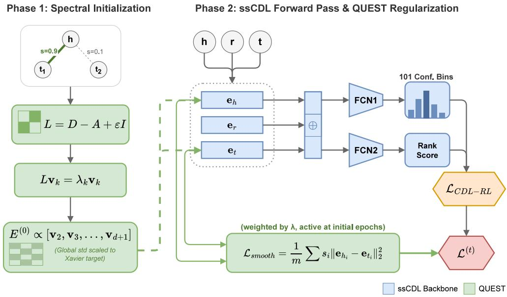
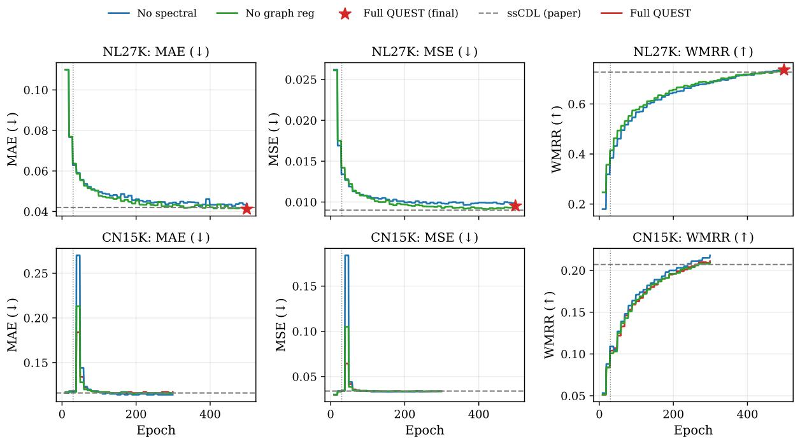
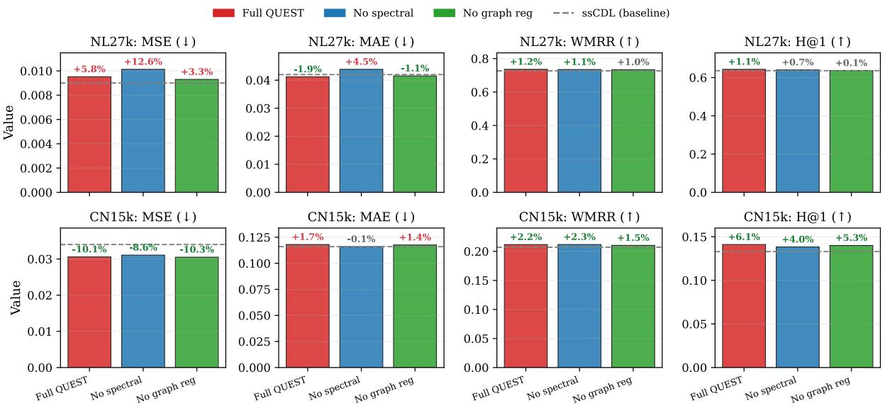

# Spectral Initialization and Scheduled Graph Smoothness for Uncertain Knowledge Graph Completion

Md Abrar Jahin1, Taufikur Rahman Fuad2, Jay Pujara1, Craig A. Knoblock1

1University of Southern California 2Islamic University of Technology

jahin@usc.edu, taufikur@iut-dhaka.edu,

jpujara@usc.edu, knoblock@isi.edu

## Abstract

Uncertain knowledge graphs (UKGs) extend knowledge graphs by assigning each triple a continuous confidence score. Since most possible triples lack observed confidences, recent methods rely on semi-supervised learning to generate pseudolabels. These methods initialize entity embeddings without using the confidence-weighted graph, discarding its global community and hub structure. We introduce QUEST, which adds no trainable parameters to the standard confidencedistribution learning pipeline. First, QUEST initializes entity embeddings using the smallest non-trivial eigenvectors of the confidence-weighted graph Laplacian, incorporating community and hub structure before training. Second, QUEST applies an unbiased mini-batch Dirichlet energy regularizer to enforce early-stage structural consistency. On two UKG datasets, QUEST improves confidence prediction and link prediction on six of eight metric–dataset pairs over prior methods and matches the previous best on the remaining two, while removing the instability spike observed on dense graphs. These results indicate that spectral structural priors combined with a graph Dirichlet energy regularizer improve accuracy, training stability, and checkpoint reliability in UKG completion.

## Introduction

Real-world Knowledge Graphs (KGs) are fundamental for data representation and automated reasoning, but their construction naturally introduces noise and varying degrees of certainty. To capture this ambiguity, Uncertain Knowledge Graphs (UKGs) annotate each relational triple with a continuous confidence score. Modeling uncertainty in KGs is necessary as embeddings are systematically uncalibrated, which reduces their reliability in downstream reasoning tasks (Tabacof and Costabello 2020). UKG completion aims to infer missing facts with their confidence levels. Because most possible triples lack observed confidences, recent works formulate UKG completion as a semi-supervised learning problem (Chen, Yeh, and Kuo 2021; Wu et al. 2025).

Foundational UKG completion methods adapt deterministic scoring functions to regress or bound confidence scores. UKGE (Chen et al. 2019) maps bilinear scores to confidence values through hand-designed transformations, while BEUrRE (Chen et al. 2021) models uncertainty through geometric box-intersection volumes. To address label sparsity, PASSLEAF (Chen, Yeh, and Kuo 2021) introduces a poolbased semi-supervised framework, and UPGAT (Tseng et al.

2023) extends graph attention to UKGs. The state-of-theart framework, ssCDL (Wu et al. 2025), models confidence as a distribution over discrete bins and introduces a metalearning stage that generates pseudo-labels for unobserved triples. Despite these advances, existing methods randomly initialize entity embeddings and process triples locally. By lifting discrete entities into a continuous vector space without structural priors, they discard the global community and hub topology.

This structural disconnect afects optimization stability and representational quality. In deterministic KGs, spectral methods and graph-smoothness regularization have long been used to encode community structure (Ng, Jordan, and Weiss 2001; Kipf and Welling 2017; Zhou et al. 2021). However, these ideas have not been transferred to the uncertain setting. Recent studies on self-training further show that topology-agnostic pseudo-labeling propagates errors through the graph (Wang et al. 2023; Liu et al. 2026). In UKG completion, meta-learning modules assign pseudoconfidence labels to uniformly corrupted entity pairs. Without a structural prior, the smoothness objective pulls entity pairs together while the ranking gradient for corrupted triples pushes them apart. On dense graphs, this gradient conflict induces training instability and causes sharp error spikes.

We address this disconnect with QUEST, a drop-in extension of ssCDL that introduces two parameter-free interventions. First, QUEST initializes entity embeddings using the k smallest non-trivial eigenvectors of the confidenceweighted graph Laplacian. This spectral initialization places entities from the same high-confidence communities near each other and centers high-degree hubs, grounding the embeddings in global topology before training begins. Second, QUEST imposes an unbiased mini-batch graph-smoothness regularizer derived from Dirichlet energy (Zhou et al. 2021; Li et al. 2024b). We find that this regularizer conflicts with meta-learned self-training on dense graphs. QUEST therefore uses a scheduling strategy that deactivates the smoothness penalty exactly when pseudo-labeling begins, yielding to meta-learned supervision while preserving the spectral prior.

Our main contributions are: (i) We identify a structural disconnect in UKG completion and analyze the gradient conflict between graph-smoothness regularization and uniform entity corruption. (ii) We propose a spectral initialization method with no additional trainable parameters that embeds globa community and hub structure from the confidence-weighted graph Laplacian into the initial entity representations. (iii) We formulate an unbiased mini-batch graph Dirichlet energy regularizer that enforces topological smoothness during early-stage confidence distribution learning, preserving structural integrity before self-training.

## Related Work

Uncertain knowledge graph completion. Foundational UKG embedding models adapt deterministic scoring functions. UKGE (Chen et al. 2019) introduces $\mathrm { U K G E _ { l o g i } ^ { - } }$ and UKGE that map bilinear scores to confidence values through logistic and rectified linear transformations, respectively. These hand-designed mappings produce point estimates and cannot capture distributional uncertainty. BEUrRE (Chen et al. 2021) represents entities as axis-aligned hyperrectangles and relations as afine maps, estimating confidence through box-intersection volumes. These computations scale with embedding dimension, increasing complexity. PASSLEAF (Chen, Yeh, and Kuo 2021) integrates multiple scoring functions with a semi-supervised sample pool to mitigate label sparsity, yet still treats triples independently without exploiting graph topology. UPGAT (Tseng et al. 2023) constructs an attention graph from predicted Knowledge Graph Embedding (KGE) scores rather than observed confidence weights, weakening the supervisory signal from annotated certainty values. UKGsE (Yang et al. 2022) combines embedding-based inference with an approximate logical framework but optimizes entity vectors without graph-smoothness constraints, allowing entities in the same high-confidence cluster to drift apart.

Probabilistic entity representations have also been proposed for multi-hop KG reasoning (Choudhary et al. 2021). Universal orthogonal parameterization further generalizes KGE models (Li et al. 2024a), while spectral clustering has been used to select anchor entities before propagation (Liang et al. 2024). KGE models are systematically uncalibrated, reducing reliability in downstream tasks (Tabacof and Costabello 2020). Neighborhood-intervention consistency has been proposed as a post-hoc confidence measure for KGE predictions (Wang, Liu, and Sheng 2021). ss-CDL (Wu et al. 2025) models confidence as a full distribution and couples it with PCDG, a MAML-style (Finn, Abbeel, and Levine 2017) meta-training stage that generates pseudoconfidence labels. Despite state-of-the-art results, ssCDL, like prior UKG methods, randomly initializes entity embeddings and uses graph structure only through triple corruption, discarding the global community and hub topology encoded in the confidence-weighted graph.

Semi-supervised and pseudo-confidence learning for UKGs. UKG completion is inherently semi-supervised because most triples lack observed confidences. Self-training and pseudo-labeling are used in graph representation learning to propagate supervision to unlabeled nodes (Liu et al. 2026; Wang et al. 2023), while meta-learning approaches have been developed for few-shot semi-supervised learning (Ding et al. 2022). In the UKG setting, ssCDL’s PCDG stage (Wu et al. 2025) is the first to integrate metalearning into pseudo-confidence generation. A dedicated meta-network produces soft targets for uniformly corrupted entity pairs and updates them through a one-step metagradient.

Noisy pseudo-labels propagate errors through graph and degrade performance as label noise increases (Wang et al. 2023). Topology-agnostic pseudo-label selection underperforms structure-aware alternatives (Liu et al. 2026). Structure-sensitive node selection outperforms uniform strategies in self-training (Wang et al. 2025). PCDG sufers from the same issue: uniformly corrupting entities ignores structural distance in the confidence-weighted graph. When a corrupted entity lies far from the original, the resulting pseudo-label opposes graph smoothness and introduces gradient interference.

Structural priors and spectral methods for KGE. In deterministic KGs, structure-aware architectures like CompGCN (Vashishth et al. 2020) and relational GCNs propagate information along typed edges, but they assume binary truth values and require graph access at inference time. Spectral methods provide a parameter-free alternative. Graph Laplacian eigenvectors encode community and hub structure and have been used for spectral clustering (Ng, Jordan, and Weiss 2001), positional encodings, and GNN pre-training (Dai et al. 2025). Graph convolution has been derived as a first-order approximation of spectral filtering through a normalized Laplacian (Kipf and Welling 2017), though this idea remained confined to GNNs rather than embedding-based completion.

Recent work exploits spectral structure through attention mechanisms (Chen, O’Bray, and Borgwardt 2022), graphsmoothness unrolling (Do et al. 2024), and graph-based structural priors (Sani 2026), but these approaches add trainable components and complexity. In contrast, QUEST initializes embeddings from the k smallest non-trivial eigenvectors of the confidence-weighted Laplacian, placing entities from the same communities near each other and positioning bridging hubs at structural centers without additional parameters or pre-training.

Graph smoothness and regularization. Regularizing embeddings to be smooth over a graph is classically formulated as minimizing the Dirichlet energy. In the GNN literature, Dirichlet energy has been used to prevent oversmoothing in deep networks (Zhou et al. 2021), support joint graph learning and data imputation (Xu et al. 2023; Zhang et al. 2024), and extend Laplacian regularization to negative weights (Li et al. 2024b). Label-smoothness regularization has also been applied to KG-aware recommendation (Wang et al. 2019), though these methods assume binary interaction labels and do not directly transfer to continuous UKG confidence values. Spectral regularization can also interfere with adaptive graph training when not carefully balanced (You et al. 2023).

Existing methods keep the regularizer active throughout training. QUEST difers in three ways: it regularizes entity embeddings through confidence-weighted Laplacian without GNN, estimates regularizer through unbiased mini-batch sampling, and deactivates when PCDG begins. This scheduling avoids gradient conflict between pseudo-label training and graph smoothness on dense graphs.

  
Figure 1: Overall architecture of QUEST

## Background and Preliminaries

## Uncertain Knowledge Graphs

A UKG is a tuple $\mathcal { G } = ( \nu , \mathcal { R } , \mathcal { E } )$ , where V is a set of entities, R a set of relation types, and ${ \mathcal { E } } \subseteq { \mathcal { V } } \times { \mathcal { R } } \times { \mathcal { V } } \times ( 0 , 1 ]$ is a set of confidence-annotated triples $( h , r , t , s )$ . Each triple states that relation r holds between head entity h and tail entity t with confidence $s \in ( 0 , 1 ]$

We study two tasks. Confidence prediction takes a query triple $( h , r , t )$ and predicts its confidence $s ;$ performance is measured by Mean Squared Error (MSE) and Mean Absolute Error (MAE). Link prediction takes a query pair $( h , r , \cdot )$ and ranks candidate tail entities $t ^ { \prime } \in \mathcal { V } ;$ performance is measured by confidence-weighted mean reciprocal rank (WMRR) and Hits@1 in the filtered setting (Chen et al. 2019). We let $n = | \mathcal { V } |$ , d denote the embedding dimension, and $B = 1 0 1$ the number of confidence bins.

ssCDL backbone. QUEST builds on ssCDL (Wu et al. 2025), which jointly learns confidence prediction and link prediction over uncertain triples. For each triple $( h , r , t )$ ssCDL learns entity and relation embeddings and constructs the feature vector

$$
\phi ( h , r , t ) = [ \mathbf { e } _ { h } \| \mathbf { e } _ { r } \| \mathbf { e } _ { t }  \in \mathbb { R } ^ { 3 d } . 
$$

A confidence distribution learner maps this feature vector to a categorical distribution over $B = \mathrm { \bar { 1 0 1 } }$ confidence bins in [0, 1], trained against a truncated Gaussian target centered at the observed confidence score s. The final predicted confidence $\hat { s } ( h , r , t )$ is obtained as the expected bin value and normalized to $[ 0 . 1 , 1 . 0 ]$

In parallel, ssCDL uses a second scoring network for link prediction, optimized with a confidence-weighted margin ranking loss over negatively corrupted triples. The confidence prediction loss and ranking loss are combined using Kendall uncertainty weighting (Kendall, Gal, and Cipolla 2018), yielding the joint objective

$$
\mathcal { L } _ { \mathrm { c d l } } = \frac { \mathcal { L } _ { \mathrm { c p } } } { 2 \sigma _ { 1 } ^ { 2 } } + \log \sigma _ { 1 } + \frac { \mathcal { L } _ { \mathrm { r l } } } { 2 0 \sigma _ { 2 } ^ { 2 } } + \log \sigma _ { 2 } ,
$$

where $\sigma _ { 1 }$ and $\sigma _ { 2 }$ are learnable task uncertainty parameters.

## QUEST

We propose QUEST, an extension of ssCDL (Wu et al. 2025) with two parameter-free additions targeting a weakness in UKG completion: the loss of structure once entities are lifted into embeddings. First, entity embeddings are initialized from the k smallest non-trivial eigenvectors of the confidence-weighted graph Laplacian $L = D - A$ , where $\begin{array} { r } { A _ { i j } = \sum _ { r } s _ { i j r } } \end{array}$ and $\begin{array} { r } { \bar { D _ { i i } } \bar { = } \sum _ { j } \bar { A _ { i j } } } \end{array}$ . This encodes community structure and hub topology at initialization. Second, QUEST adds a graph-smoothness regularizer $\mathcal { L } _ { \mathrm { s m o o t h } }$ to the CDL-RL objective, penalizing high-confidence neighbors that drift apart early in training. A stability analysis shows this regularizer conflicts with PCDG on dense graphs. QUEST therefore deactivates $\mathcal { L } _ { \mathrm { s m o o t h } }$ once PCDG begins at epoch 30, leaving spectral initialization as the structural prior. Figure 1 summarizes the pipeline.

## Confidence-Weighted Graph Laplacian

We construct a confidence-weighted undirected graph over V from training triples. For each ordered pair $( \bar { i } , \bar { j } ) \in \mathcal { V } ^ { 2 }$ the edge weight aggregates the confidence of triples linking $i , j$ in either direction:

$$
\begin{array} { c c c } { \displaystyle { A _ { i j } } } & { = } & { \displaystyle { \sum _ { \tiny { r : ( i , r , j , s ) \in \mathscr { E } } } s } } \\ { \displaystyle { } } & { \mathrm { ~ o r ~ } ( j , r , i , s ) \in \mathscr { E } } \end{array}\tag{1}
$$

Thus, A is symmetric. Treating directed KG edges as undirected is standard in structural KGE methods (Vashishth et al. 2020). The degree matrix is $D = \mathrm { d i a g } ( A \mathbf { 1 } )$ , and the unnormalized graph Laplacian is

$$
L = D - A\tag{2}
$$

Because A is symmetric and non-negative, L is symmetric positive semi-definite with real eigenvalues $0 = \lambda _ { 1 } \leq \lambda _ { 2 } \leq$ $\cdots \leq \lambda _ { n }$ . The smallest eigenvalue $\lambda _ { 1 } = 0$ corresponds to the constant eigenvector $\mathbf { 1 } / { \sqrt { n } }$ and is discarded. The remaining eigenvectors $\mathbf { v } _ { 2 } , \ldots , \mathbf { v } _ { n } .$ , ordered by increasing eigenvalue, form the graph spectral basis: small eigenvalues correspond to smooth community-scale signals, while large eigenvalues correspond to local high-frequency variations.

## Spectral Entity Initialization

Algorithm. Let d be the embedding dimension. We compute the $k = d$ smallest non-trivial eigenvectors of the Tikhonovregularized Laplacian

$$
L _ { \varepsilon } \ = \ L + \varepsilon I , \varepsilon = 1 0 ^ { - 5 }\tag{3}
$$

using the ARPACK shift-invert method (shift $\sigma _ { 0 } = 0 $ , tolerance $1 0 ^ { - 4 }$ , maximum 2000 Lanczos iterations). The perturbation $\varepsilon I$ removes exact singularity at $\sigma _ { 0 } = 0$ , improving numerical stability. Denote the resulting eigenpairs as $( \lambda _ { 2 } , \mathbf { v } _ { 2 } ) , \ldots , ( \lambda _ { d + 1 } , \mathbf { v } _ { d + 1 } )$ . Small eigenvalues $\bar { \lambda _ { i } } \approx 0$ indicate entities co-occurring in the same dense community. We assemble the spectral coordinate matrix

$$
U = \left[ \mathbf { v } _ { 2 } \mid \mathbf { v } _ { 3 } \mid \mathbf { \cdots } \mid \mathbf { v } _ { d + 1 } \right] \ \in \ \mathbb { R } ^ { n \times d }\tag{4}
$$

and rescale $U$ to target standard deviation $\tau = { \sqrt { 2 / \left( n + d \right) } } ;$

$$
U  { \frac { \tau } { \mathrm { s t d } ( U ) + \varepsilon } } U\tag{5}
$$

The entity embedding table is initialized as $E ^ { ( 0 ) } = U$ . Relation embeddings retain Xavier uniform initialization because relations do not appear in the Laplacian.

Interpretation. Spectral initialization places entities in the embedding space induced by normalized spectral clustering (Ng, Jordan, and Weiss 2001): entities within the same high-confidence community receive similar coordinates, while high-degree hubs bridging multiple communities occupy structurally central positions.

Complexity. Building A takes $O ( | \mathcal { E } | )$ time. The shiftinvert ARPACK call computes the d smallest eigenvectors in $O ( d \cdot \mathrm { n n z } ( L ) )$ time per Lanczos step, and typically $O ( d \cdot | \mathcal { E } | )$ overall for sparse real-world graphs, where nnz(L) denotes the number of non-zeros. This is a one-time pre-training cost with no efect on per-epoch training or inference.

## Graph-Smoothness Regularizer

Formulation. The graph Dirichlet energy of the entity embedding matrix E under the confidence-weighted graph is $\begin{array} { r } { \mathrm { t r } ( E ^ { \top } \breve { L } E ) = \sum _ { ( i , j ) } A _ { i j } \| { \bf e } _ { i } - { \bf e } _ { j } \| ^ { 2 } } \end{array}$ . We add a normalized version of this energy to the CDL-RL objective:

$$
\mathcal { L } _ { \mathrm { s m o o t h } } = \frac { 1 } { m } \sum _ { i = 1 } ^ { m } s _ { i } \| \mathbf { e } _ { h _ { i } } - \mathbf { e } _ { t _ { i } } \| ^ { 2 }\tag{6}
$$

where $( h _ { i } , r _ { i } , t _ { i } , s _ { i } ) _ { i = 1 } ^ { m }$ is a mini-batch of m = min $( 2 0 4 8 , | \mathcal { E } | )$ edges sampled uniformly with replacement from E at each training step. Eq. (6) is an unbiased Monte Carlo estimate of the full Dirichlet energy $( 1 / | \mathcal { E } | ) \mathrm { t r } ( E ^ { \top } L E )$ . Mini-batch sampling keeps the per-step overhead at $O ( m \cdot d )$ , negligible relative to the CDL-RL forward pass.

Augmented objective. During the pre-PCDG phase $( t <$ 30), the total training loss becomes

$$
{ \mathcal { L } } ^ { ( t ) } = { \mathcal { L } } _ { \mathrm { C D L - R L } } + \lambda { \mathcal { L } } _ { \mathrm { s m o o t h } } , \qquad t < 3 0\tag{7}
$$

with $\lambda = 0 . 0 1$ . Minimizing $\mathcal { L } _ { \mathrm { s m o o t h } }$ encourages entities connected by high-confidence edges to maintain similar embeddings, preserving the structural signal from spectral initialization during early training.

## PCDG-Aware Scheduling

Empirical observation. Leaving $\mathcal { L } _ { \mathrm { s m o o t h } }$ active after epoch 30 destabilizes training on CN15k. In a controlled experiment, MSE increased from 0.035 to 0.198 between epochs 29 and 39 with $\mathcal { L } _ { \mathrm { s m o o t h } }$ active. No comparable instability appeared on NL27k. The diference correlates with graph density: CN15k contains $\times 2 . 5$ more edges per entity than NL27k, giving $\mathcal { L } _ { \mathrm { s m o o t h } } \mathrm { ~ a ~ }$ stronger gradient signal.

Mechanistic explanation. PCDG constructs pseudolabels by replacing the head or tail entity in a training triple with a uniformly sampled entity. These synthetic entities are often distant from the original entity in the confidenceweighted graph. If $\mathcal { L } _ { \mathrm { s m o o t h } }$ remains active, it pulls distant entity embeddings together, opposing the CDL-RL gradient that assigns the synthetic entity a new confidence score. On dense graphs, the large number of high-confidence edges amplifies the $\mathcal { L } _ { \mathrm { s m o o t h } }$ gradient and produces persistent gradient conflict, causing the observed MSE spike.

Scheduling rule. We deactivate $\mathcal { L } _ { \mathrm { s m o o t h } }$ when PCDG begins its first meta-update:

$$
\lambda ^ { ( t ) } ~ = ~ \left\{ \begin{array} { l l } { { \lambda } } & { { t < 3 0 , } } \\ { { 0 } } & { { t \geq 3 0 } } \end{array} \right.\tag{8}
$$

The cutof at epoch 30 follows the fixed PCDG activation schedule; it is not tuned on the test set. After epoch 30, spectral initialization remains the persistent QUEST component. The structural prior in $E ^ { ( 0 ) }$ continues to shape optimization without further overhead.

## Experiments

## Datasets

We evaluate QUEST on NL27k and CN15k (Chen et al. 2019). NL27k is derived from the Never-Ending Language Learning (NELL) knowledge base (Mitchell et al. 2018), which extracts relational facts from web pages and assigns confidence scores. CN15k is derived from Concept-Net (Speer, Chin, and Havasi 2017), a multilingual semantic network encoding commonsense knowledge as weighted relations. Table 3 reports dataset statistics.

<table><tr><td rowspan="2">Dataset Metric</td><td colspan="2">NL27k</td><td colspan="2">CN15k</td></tr><tr><td>MSE</td><td>MAE</td><td>MSE</td><td>MAE</td></tr><tr><td> $\mathrm { U K G E } _ { l o g i }$ </td><td>0.029</td><td>0.060</td><td>0.246</td><td>0.409</td></tr><tr><td> $\mathrm { U K G E } _ { r e c t }$ </td><td>0.033</td><td>0.071</td><td>0.202</td><td>0.364</td></tr><tr><td>BEUrRE</td><td>0.089</td><td>0.222</td><td>0.117</td><td>0.283</td></tr><tr><td> $\mathrm { P A S S L E A F } _ { D i s t M u l t }$ </td><td>0.023</td><td>0.051</td><td>0.216</td><td>0.379</td></tr><tr><td> $\mathrm { P A S S L E A F } _ { C o m p l E x }$ </td><td>0.024</td><td>0.052</td><td>0.231</td><td>0.400</td></tr><tr><td> $\mathrm { P A S S L E A F } _ { R o t a t E }$ </td><td>0.019</td><td>0.063</td><td>0.094</td><td>0.248</td></tr><tr><td>UKGsE</td><td>0.122</td><td>0.271</td><td>0.103</td><td>0.256</td></tr><tr><td>UPGAT</td><td>0.029</td><td>0.101</td><td>0.149</td><td>0.308</td></tr><tr><td>ssCDL</td><td>0.009</td><td>0.042</td><td>0.034</td><td>0.116</td></tr><tr><td> $\mathbf { Q U E S T } _ { F u l l }$ </td><td> $\mathbf { 0 . 0 0 9 _ { \pm 0 . 0 0 0 1 } }$ </td><td> $\mathbf { 0 . 0 4 1 } _ { \pm 0 . 0 0 0 9 }$ </td><td> $0 . 0 3 1 { \scriptstyle \pm 0 . 0 0 0 2 }$ </td><td> $0 . 1 1 8 { \scriptstyle \pm 0 . 0 0 0 5 }$ </td></tr><tr><td> $\mathbf { Q U E S T } _ { \mathrm { w / o ~ s p e c t r a l ~ i n i t } }$ </td><td> $0 . 0 1 0 { \scriptstyle \pm 0 . 0 0 0 1 }$ </td><td> $0 . 0 4 4 _ { \pm 0 . 0 0 0 5 }$ </td><td> $\underline { { 0 . 0 3 1 } } \underline { { \pm } } 0 . 0 0 0 1$ </td><td> $\mathbf { 0 . 1 1 6 { \scriptstyle \pm 0 . 0 0 0 0 } }$ </td></tr><tr><td> $\mathbf { Q U E S T } _ { \mathrm { w / o g r a p h - r e g } }$ </td><td> $\mathbf { 0 . 0 0 9 _ { \pm 0 . 0 0 0 1 } }$ </td><td> $\underline { { 0 . 0 4 1 } } \pm \substack { 0 . 0 0 0 2 }$ </td><td> $\mathbf { 0 . 0 3 0 } _ { \pm 0 . 0 0 0 1 }$ </td><td> $0 . 1 1 8 { \scriptstyle \pm 0 . 0 0 0 4 }$ </td></tr><tr><td>∆</td><td></td><td> $+ 2 . 4 \%$ </td><td> $+ 1 1 . 8 \%$ </td><td></td></tr></table>

Table 1: Comparison of QUEST and baselines on NL27k and CN15k for Confidence Prediction. Best results are in bold, second best underlined. ∆ denotes percentage change relative to ssCDL; green indicates improvement and - - - indicates changes within ±1%.

<table><tr><td rowspan="2">Dataset Metric</td><td colspan="2">NL27k</td><td colspan="2">CN15k</td></tr><tr><td>WMRR</td><td>Hits@1</td><td>WMRR</td><td>Hits@1</td></tr><tr><td> $\mathrm { U K G E } _ { l o g i }$ </td><td>0.593</td><td>0.462</td><td>0.118</td><td>0.072</td></tr><tr><td> $\mathrm { U K G E } _ { r e c t }$ </td><td>0.580</td><td>0.452</td><td>0.127</td><td>0.060</td></tr><tr><td>BEUrRE</td><td>0.272</td><td>0.117</td><td>0.138</td><td>0.039</td></tr><tr><td> $\mathrm { P A S S L E A F } _ { D i s t M u l t }$ </td><td>0.676</td><td>0.553</td><td>0.170</td><td>0.078</td></tr><tr><td> $\mathrm { P A S S L E A F } _ { C o m p l E x }$ </td><td>0.708</td><td>0.586</td><td>0.196</td><td>0.086</td></tr><tr><td> $\mathrm { P A S S L E A F } _ { R o t a t E }$ </td><td>0.715</td><td>0.580</td><td>0.137</td><td>0.037</td></tr><tr><td>UKGsE</td><td>0.064</td><td>0.031</td><td>0.012</td><td>0.002</td></tr><tr><td>UPGAT</td><td>0.658</td><td>0.530</td><td>0.165</td><td>0.078</td></tr><tr><td>ssCDL</td><td>0.727</td><td>0.636</td><td>0.207</td><td>0.133</td></tr><tr><td> $\mathbf { Q U E S T } _ { F u l l }$ </td><td> $\mathbf { 0 . 7 3 6 _ { \pm 0 . 0 0 2 2 } }$ </td><td> $\mathbf { 0 . 6 4 3 _ { \pm 0 . 0 0 3 4 } }$ </td><td> $\mathbf { 0 . 2 1 } 2 _ { \pm 0 . 0 0 2 4 }$ </td><td> $\mathbf { 0 . 1 4 1 _ { \pm 0 . 0 0 2 0 } }$ </td></tr><tr><td> $\mathbf { Q U E S T } _ { \mathrm { w / o ~ s p e c t r a l ~ i n i t } }$ </td><td> $0 . 7 3 5 { \scriptstyle \pm 0 . 0 0 2 8 }$ </td><td> $\underline { { 0 . 6 4 0 _ { \pm 0 . 0 0 3 9 } } }$ </td><td> $\mathbf { 0 . 2 1 2 _ { \pm 0 . 0 0 2 8 } }$ </td><td> $0 . 1 3 8 _ { \pm 0 . 0 0 3 4 }$ </td></tr><tr><td> $\mathbf { Q U E S T } _ { \mathrm { w / o } \mathrm { g r a p h - r e g } }$ </td><td> $0 . 7 3 4 _ { \pm 0 . 0 0 2 8 }$ </td><td> $0 . 6 3 7 _ { \pm 0 . 0 0 4 3 }$ </td><td> $\underline { { 0 . 2 1 0 } } { \scriptstyle \pm 0 . 0 0 1 1 }$ </td><td> $\underline { { 0 . 1 4 0 _ { \pm 0 . 0 0 1 1 } } }$ </td></tr><tr><td> $\Delta$ </td><td> $+ 1 . 2 \%$ </td><td> $+ 1 . 1 \%$ </td><td> $+ 2 . 4 \%$ </td><td> $+ 6 . 0 \%$ </td></tr></table>

Table 2: Comparison of QUEST and baselines on NL27k and CN15k for Link Prediction. Best results are in bold, second-best underlined. ∆ denotes percentage improvement relative to ssCDL in green.

<table><tr><td>Dataset</td><td>#Entities</td><td>#Relations</td><td>#Quadruples</td></tr><tr><td>NL27k</td><td>27,221</td><td>404</td><td> $^ { 1 7 5 , 4 1 2 }$ </td></tr><tr><td>CN15k</td><td>15,000</td><td>36</td><td> $^ { 2 4 1 , 1 5 8 }$ </td></tr></table>

Table 3: Statistics of the UKG datasets.

## Evaluation Protocol

We evaluate QUEST on two standard UKG completion tasks: confidence prediction and link prediction. The evaluation protocol follows the unKR (Wang et al. 2024) benchmark.

Confidence Prediction. For confidence prediction, the model predicts a 101-bin confidence distribution pˆ over [0, 1]. The predicted confidence is the expected bin value:

## Baselines

We compare QUEST with prior UKG completion methods, including UKGE (Chen et al. 2019), PASSLEAF (Chen, Yeh, and Kuo 2021), UKGsE (Yang et al. 2022), BEUrRE (Chen et al. 2021), UPGAT (Tseng et al. 2023), and ssCDL (Wu et al. 2025), on confidence prediction and link prediction tasks.

$$
\tilde { s } \ = \ \sum _ { b = 0 } ^ { B - 1 } \frac { b } { B - 1 } \hat { p } _ { b }\tag{9}
$$

We normalize s˜ to [0.1, 1.0] using a linear transformation:

$$
\hat { s } ~ = ~ \frac { \tilde { s } - \ell _ { \sigma } } { u _ { \sigma } - \ell _ { \sigma } } 0 . 9 + 0 . 1\tag{10}
$$

where $\begin{array} { r } { \ell _ { \sigma } = \mathbb { E } _ { b \sim { \bf p } _ { 0 . 1 } } \left[ \frac { b } { B - 1 } \right] } \end{array}$ and $u _ { \sigma } = \mathbb { E } _ { b \sim { \mathbf { p } } _ { 1 . 0 } } \Big [ \frac { b } { B - 1 } \Big ]$ are expected bin values under Gaussians with bandwidth $\sigma = 0 . 6$

  
Figure 2: Training dynamics. Validation MAE, MSE, and WMRR across epochs for the three QUEST variants on NL27k (top) and CN15k (bottom). The vertical dotted line at epoch 30 marks the activation of ssCDL’s PCDG self-training stage. The ssCDL reference is shown as a dashed grey line.

We report MSE and MAE between predicted and groundtruth values.

Link Prediction. We perform tail-entity prediction in the filtered setting (Chen et al. 2019). For each $( h , r , t , s )$ , we score all candidate tails. We mask entities that form known true triples in the training, validation, or test set, except the ground-truth tail t, and compute the rank of t using the standard double-argsort method. We report two metrics:

$$
\mathrm { W M R R } \ = \ { \frac { \sum _ { i } { s _ { i } } \ { \frac { 1 } { \mathrm { { r a n k } } _ { i } } } } { \sum _ { i } { s _ { i } } } }\tag{11}
$$

$$
\mathrm { H i t s @ 1 } = { \frac { 1 } { | { \boldsymbol { \mathcal { Q } } } | } } \sum _ { i } \mathbb { I } [ \mathrm { r a n k } _ { i } = 1 ]\tag{12}
$$

where Q denotes the set of test queries. WMRR aggregates reciprocal ranks weighted by ground-truth confidence, while Hits@1 measures the fraction of queries where the groundtruth tail ranks first. We use the default confidence filter of 0, so all test triples contribute to LP evaluation.

## Main Results

Tables 1 and 2 report performance on NL27k and CN15k for two tasks. $\mathrm { Q U E S T _ { F u l l } }$ achieves the best result on six of eight metric-dataset combinations and ties ssCDL on the remaining two (CN15k MSE and MAE), where a QUEST ablation still outperforms every non-QUEST baseline. The gains on CN15k consistently exceed those on NL27k: +11.8% MSE and +6.0% Hits@1 on CN15k, compared with +2.4% MAE and +1.1% Hits@1 on NL27k. This pattern is consistent with the confidence-weighted Laplacian construction in Section Confidence-Weighted Graph Laplacian. CN15k contains roughly 2.5× more edges per entity than NL27k, producing a denser Laplacian whose low-frequency eigenvectors carry a stronger community signal. The same spectral initialization therefore induces a stronger structural prior. On NL27k, the prior is weaker because the graph itself is sparser, while the pre-PCDG phase where $\mathcal { L } _ { \mathrm { s m o o t h } }$ reinforces that prior remains fixed at 30 of 500 epochs.

PASSLEAF and UPGAT are the closest conceptual baselines: PASSLEAF introduces semi-supervised triples, while UPGAT introduces graph attention, but both score triples as scalars. Neither matches ssCDL on NL27k link prediction, and only PASSLEAFRotatE approaches ssCDL on CN15k MSE (0.094 vs. 0.034). QUEST further reduces this error from 0.094 to 0.031, a 67% reduction, without modifying the scoring function. This supports the claim in Section QUEST that initialization geometry, rather than scorer expressiveness, is the main bottleneck.

## Training Dynamics

Figure 2 shows that on NL27k, all three variants pass through epoch 30 smoothly. On CN15k, the two ablations spike to roughly 0.27 MAE and 0.18 MSE at epoch 30 and require 30–50 epochs to recover, while $\mathrm { Q U E S T _ { F u l l } }$ shows no visible discontinuity. This matches the gradient-conflict mechanism in Section PCDG-Aware Scheduling: when $\mathcal { L } _ { \mathrm { s m o o t h } }$ remains active after epoch 30, it pulls distant pseudo-corrupted entities together exactly when PCDG pushes them apart. The conflict scales with graph density, explaining why NL27k tolerates the same regularizer that destabilizes CN15k. A single scheduling rule, deactivating $\mathcal { L } _ { \mathrm { s m o o t h } }$ at the PCDG boundary, removes the spike on the dense graph without dataset-specific tuning.

  
Figure 3: Ablation study. Per-metric test-set values for full QUEST and the two single-component ablations across both datasets. Dashed lines mark the ssCDL baseline. Numbers above bars report ∆ vs. ssCDL in percentage points (green: improvement, red: regression, grey: $| \Delta | < 1 \% )$ .

Both ablations recover to within a few percent of $\mathrm { Q U E S T _ { F u l l } } .$ , so the final test scores understate the cost of leaving $\mathcal { L } _ { \mathrm { s m o o t h } }$ active. The practical issue appears during checkpoint selection: the MAE-minimizing checkpoint used by the ssCDL pipeline becomes biased toward pre-spike epochs whose representations have not yet incorporated PCDG supervision. Deactivating $\mathcal { L } _ { \mathrm { s m o o t h } }$ at epoch 30 removes this instability and improves reproducibility more than the small final-score gap itself.

## Ablation Study

Figure 3 compares $\mathrm { Q U E S T _ { F u l l } , ~ \mathrm { Q U E S T _ { w / o ~ s p e c t r a l } , } }$ and QUESTw/o graph-reg on both datasets. Removing spectral initialization causes a 4.5% MAE regression on NL27k versus baseline, though it still achieves a +1.1% WMRR gain. This confirms that spectral initialization is the main contributor to regression quality on the sparse graph. Removing the graph regularizer still yields a +3.3% MSE improvement on NL27k, indicating that spectral initialization is suficient for confidence prediction.

QUESTw/o graph-reg achieves the best CN15k MSE, outperforming $\mathrm { Q U E S T _ { F u l l } }$ on that metric alone. This is not an evidence against the schedule: the same configuration produces the spike in Figure 2, so the lower MSE is reached through an unstable trajectory and remains sensitive to checkpoint selection. No ablation Pareto-dominates $\mathrm { Q U E S T _ { F u l l } }$ across the eight evaluation cells. The two components address different failure modes: initialization geometry and early-stage structural drift. Combining them is the only configuration that wins or ties on all cases avoiding the epoch-30 spike.

## Conclusion

We introduced QUEST, a parameter-free extension of ss-CDL for uncertain knowledge graph completion. QUEST initializes entities from the confidence-weighted Laplacian and uses an unbiased mini-batch Dirichlet regularizer during early training. It then deactivates the regularizer when PCDG begins, avoiding the gradient conflict observed on dense graphs. Across NL27k and CN15k, QUEST improves most confidence and link prediction metrics while removing the epoch-30 instability spike.

Limitations. QUEST is evaluated on two UKG benchmarks and inherits ssCDL’s 101-bin confidence head and fixed PCDG schedule. Its one-time spectral step may become expensive on very large graphs, and its undirected Laplacian ignores relation direction and type.

Broader Impact. QUEST may improve systems that reason over uncertain facts, but UKGs can encode noise, bias, and coverage gaps. Predicted confidences should not be treated as ground truth in high-stakes settings without calibration checks and human oversight.

## References

Chen, D.; O’Bray, L.; and Borgwardt, K. M. 2022. Structure-Aware Transformer for Graph Representation Learning. In Chaudhuri, K.; Jegelka, S.; Song, L.; Szepesvári, C.; Niu, G.; and Sabato, S., eds., International Conference on Machine Learning, ICML 2022, 17-23 July 2022, Baltimore, Maryland, USA, Proceedings of Machine Learning Research, 3469–3489. PMLR.

Chen, X.; Boratko, M.; Chen, M.; Dasgupta, S. S.; Li, X. L.; and McCallum, A. 2021. Probabilistic Box Embeddings for Uncertain Knowledge Graph Reasoning. In Toutanova, K.;

Rumshisky, A.; Zettlemoyer, L.; Hakkani-Tür, D.; Beltagy, I.; Bethard, S.; Cotterell, R.; Chakraborty, T.; and Zhou, Y., eds., Proceedings of the 2021 Conference of the North American Chapter of the Association for Computational Linguistics: Human Language Technologies, NAACL-HLT 2021, Online, June 6-11, 2021, 882–893. Association for Computational Linguistics.

Chen, X.; Chen, M.; Shi, W.; Sun, Y.; and Zaniolo, C. 2019. Embedding Uncertain Knowledge Graphs. In The Thirty-ThirdAAAIConference onArtificial Intelligence,AAAI2019, The Thirty-First Innovative Applications ofArtificial Intelligence Conference, IAAI2019, The NinthAAAISymposium on Educational Advances in Artificial Intelligence, EAAI 2019, Honolulu, Hawaii, USA, January 27 - February 1, 2019, 3363–3370. AAAI Press.

Chen, Z.-M.; Yeh, M.-Y.; and Kuo, T.-W. 2021. PASSLEAF: A Pool-bAsed Semi-Supervised Learning Framework for Uncertain Knowledge Graph Embedding. Proceedings of the AAAI Conference on Artificial Intelligence, 35(5): 4019– 4026.

Choudhary, N.; Rao, N.; Katariya, S.; Subbian, K.; and Reddy, C. K. 2021. Probabilistic Entity Representation Model for Reasoning over Knowledge Graphs. In Ranzato, M.; Beygelzimer, A.; Dauphin, Y. N.; Liang, P.; and Vaughan, J. W., eds., Advances in Neural Information Processing Systems 34: Annual Conference on Neural Information Processing Systems 2021, NeurIPS 2021, December 6-14, 2021, Virtual, 23440–23451.

Dai, H.; Njenga, N.; Whitsett, B.; Ma, C.; Deng, D.; de Ángel, S.; Tassel, A. V.; Viswanath, S.; Pellico, R.; Adelstein, I.; and Krishnaswamy, S. 2025. Learning Laplacian Eigenvectors: A Pre-training Method for Graph Neural Networks. CoRR, abs/2509.02803.

Ding, K.; Wang, J.; Caverlee, J.; and Liu, H. 2022. Meta Propagation Networks for Graph Few-shot Semi-supervised Learning. In Thirty-Sixth AAAI Conference on Artificial Intelligence, AAAI 2022, Thirty-Fourth Conference on Innovative Applications of Artificial Intelligence, IAAI 2022, The Twelveth Symposium on Educational Advances in Artificial Intelligence, EAAI 2022 Virtual Event, February 22 - March 1, 2022, 6524–6531. AAAI Press.

Do, V. H. T. T.; Eftekhar, P.; Hosseini, S. A.; Cheung, G.; and Chou, P. A. 2024. Interpretable Lightweight Transformer via Unrolling of Learned Graph Smoothness Priors. In Globerson, A.; Mackey, L.; Belgrave, D.; Fan, A.; Paquet, U.; Tomczak, J. M.; and Zhang, C., eds., Advances in Neural Information Processing Systems 38: Annual Conference on Neural Information Processing Systems 2024, NeurIPS 2024, Vancouver, BC, Canada, December 10 - 15, 2024.

Finn, C.; Abbeel, P.; and Levine, S. 2017. Model-Agnostic Meta-Learning for Fast Adaptation of Deep Networks. In Precup, D.; and Teh, Y. W., eds., Proceedings of the 34th International Conference on Machine Learning, ICML 2017, Sydney, NSW, Australia, 6-11 August 2017, Proceedings of Machine Learning Research, 1126–1135. PMLR.

Kendall, A.; Gal, Y.; and Cipolla, R. 2018. Multi-Task Learning Using Uncertainty to Weigh Losses for Scene Geometry

and Semantics. In 2018 IEEE Conference on Computer Vision and Pattern Recognition, CVPR 2018, Salt Lake City, UT, USA, June 18-22, 2018, 7482–7491. Computer Vision Foundation / IEEE Computer Society.

Kipf, T. N.; and Welling, M. 2017. Semi-Supervised Classification with Graph Convolutional Networks. In 5th International Conference on Learning Representations, ICLR 2017, Toulon, France, April 24-26, 2017, Conference Track Proceedings. OpenReview.net.

Li, R.; Li, C.; Shen, Y.; Zhang, Z.; and Chen, X. 2024a. Generalizing Knowledge Graph Embedding with Universal Orthogonal Parameterization. In Salakhutdinov, R.; Kolter, Z.; Heller, K. A.; Weller, A.; Oliver, N.; Scarlett, J.; and Berkenkamp, F., eds., Forty-First International Conference on Machine Learning, ICML 2024, Vienna, Austria, July 21-27, 2024, Proceedings of Machine Learning Research, 28040–28059. PMLR / OpenReview.net.

Li, Z.; Jia, M.; Wei, Z.; and Wang, J. 2024b. Beyond Smoothness: A General Optimization Framework for Graph Neural Networks with Negative Laplacian Regularization. Neural Networks, 180: 106704.

Liang, K.; Liu, Y.; Li, H.; Meng, L.; Liu, S.; Wang, S.; Zhou, S.; and Liu, X. 2024. Clustering Then Propagation: Select Better Anchors for Knowledge Graph Embedding. In Globerson, A.; Mackey, L.; Belgrave, D.; Fan, A.; Paquet, U.; Tomczak, J. M.; and Zhang, C., eds., Advances in Neural Information Processing Systems 38: Annual Conference on Neural Information Processing Systems 2024, NeurIPS 2024, Vancouver, BC, Canada, December 10 - 15, 2024.

Liu, G.; Zhao, Z.; Zhou, H.; Li, C.; and Zeng, Q. 2026. Can Pseudo-Label Be More Reliable? A Simple yet Efective Topology-Aware Graph Self-Training Method. In Koenig, S.; Jenkins, C.; and Taylor, M. E., eds., Fortieth AAAI Conference on Artificial Intelligence, Thirty-Eighth Conference on Innovative Applications of Artificial Intelligence, Sixteenth Symposium on Educational Advances in Artificial Intelligence, AAAI 2026, Singapore, January 20-27, 2026, 23685– 23693. AAAI Press.

Mitchell, T.; Cohen, W.; Hruschka, E.; Talukdar, P.; Yang, B.; Betteridge, J.; Carlson, A.; Dalvi, B.; Gardner, M.; Kisiel, B.; Krishnamurthy, J.; Lao, N.; Mazaitis, K.; Mohamed, T.; Nakashole, N.; Platanios, E.; Ritter, A.; Samadi, M.; Settles, B.; Wang, R.; Wijaya, D.; Gupta, A.; Chen, X.; Saparov, A.; Greaves, M.; and Welling, J. 2018. Never-ending learning. Commun. ACM, 61(5): 103–115.

Ng, A. Y.; Jordan, M. I.; and Weiss, Y. 2001. On Spectral Clustering: Analysis and an Algorithm. In Dietterich, T. G.; Becker, S.; and Ghahramani, Z., eds., Advances in Neural Information Processing Systems 14 [Neural Information Processing Systems: Natural and Synthetic, NIPS 2001, December 3-8, 2001, Vancouver, British Columbia, Canada], 849–856. MIT Press.

Sani, D. 2026. Exploiting Graph-Based Structural Priors for Visual Recognition. In Koenig, S.; Jenkins, C.; and Taylor, M. E., eds., Fortieth AAAI Conference on Artificial Intelligence, Thirty-Eighth Conference on Innovative Applications

of Artificial Intelligence, Sixteenth Symposium on Educational Advances in Artificial Intelligence, AAAI 2026, Singapore, January 20-27, 2026, 41074–41075. AAAI Press.

Speer, R.; Chin, J.; and Havasi, C. 2017. ConceptNet 5.5: An Open Multilingual Graph of General Knowledge. In Singh, S.; and Markovitch, S., eds., Proceedings ofthe Thirty-First AAAI Conference on Artificial Intelligence, February 4-9, 2017, San Francisco, California, USA, 4444–4451. AAAI Press.

Tabacof, P.; and Costabello, L. 2020. Probability Calibration for Knowledge Graph Embedding Models. In 8th International Conference on Learning Representations, ICLR 2020, Addis Ababa, Ethiopia, April 26-30, 2020. OpenReview.net.

Tseng, Y.-C.; Chen, Z.-M.; Yeh, M.-Y.; and Lin, S.-D. 2023. UPGAT: Uncertainty-aware Pseudo-Neighbor Augmented Knowledge Graph Attention Network. In Kashima, H.; Idé, T.; and Peng, W.-C., eds., Advances in Knowledge Discovery and Data Mining - 27th Pacific-Asia Conference on Knowledge Discovery and Data Mining, PAKDD 2023, Osaka, Japan, May 25-28, 2023, Proceedings, Part II, Lecture Notes in Computer Science, 53–65. Springer.

Vashishth, S.; Sanyal, S.; Nitin, V.; and Talukdar, P. P. 2020. Composition-Based Multi-Relational Graph Convolutional Networks. In 8th International Conference on Learning Representations, ICLR 2020, Addis Ababa, Ethiopia, April 26-30, 2020. OpenReview.net.

Wang, B.; Li, J.; Liu, Y.; Cheng, J.; Rong, Y.; Wang, W.; and Tsung, F. 2023. Deep Insights into Noisy Pseudo Labeling on Graph Data. In Oh, A.; Naumann, T.; Globerson, A.; Saenko, K.; Hardt, M.; and Levine, S., eds., Advances in Neural Information Processing Systems 36: Annual Conference on Neural Information Processing Systems 2023, NeurIPS 2023, New Orleans, LA, USA, December 10 - 16, 2023.

Wang, F.; Liu, K.; Medya, S.; and Yu, P. S. 2025. BANGS: Game-theoretic Node Selection for Graph Self-Training. In The Thirteenth International Conference on Learning Representations, ICLR 2025, Singapore, April 24-28, 2025. Open-Review.net.

Wang, H.; Zhang, F.; Zhang, M.; Leskovec, J.; Zhao, M.; Li, W.; and Wang, Z. 2019. Knowledge-Aware Graph Neural Networks with Label Smoothness Regularization for Recommender Systems. In Teredesai, A.; Kumar, V.; Li, Y.; Rosales, R.; Terzi, E.; and Karypis, G., eds., Proceedings of the 25th ACM SIGKDD International Conference on Knowledge Discovery & Data Mining, KDD 2019, Anchorage, AK, USA, August 4-8, 2019, 968–977. ACM.

Wang, J.; Wu, T.; Chen, S.; Liu, Y.; Zhu, S.; Li, W.; Xu, J.; and Qi, G. 2024. unKR: A Python Library for Uncertain Knowledge Graph Reasoning by Representation Learning. In SIGIR, 2822–2826. ACM.

Wang, K.; Liu, Y.; and Sheng, Q. Z. 2021. Neighborhood Intervention Consistency: Measuring Confidence for Knowledge Graph Link Prediction. In Zhou, Z.-H., ed., Proceedings of the Thirtieth International Joint Conference on Artificial Intelligence, IJCAI 2021, Virtual Event / Montreal, Canada, 19-27 August 2021, 2090–2096. ijcai.org.

Wu, T.; Zhu, S.; Wang, J.; Xu, N.; Qi, G.; and Wang, H. 2025. Uncertain Knowledge Graph Completion via Semi-Supervised Confidence Distribution Learning. In The Thirty-Ninth Annual Conference on Neural Information Processing Systems.

Xu, L.; Chen, L.; Wang, R.; Nie, F.; and Li, X. 2023. Joint Feature and Diferentiable K-NN Graph Learning Using Dirichlet Energy. In Oh, A.; Naumann, T.; Globerson, A.; Saenko, K.; Hardt, M.; and Levine, S., eds., Advances in Neural Information Processing Systems 36: Annual Conference on Neural Information Processing Systems 2023, NeurIPS 2023, New Orleans, LA, USA, December 10 - 16, 2023.

Yang, S.; Zhang, W.; Tang, R.; Zhang, M.; and Huang, Z. 2022. Approximate Inferring with Confidence Predicting Based on Uncertain Knowledge Graph Embedding. Information Sciences, 609: 679–690.

You, Y.; Chen, T.; Wang, Z.; and Shen, Y. 2023. Graph Domain Adaptation via Theory-Grounded Spectral Regularization. In The Eleventh International Conference on Learning Representations, ICLR 2023, Kigali, Rwanda, May 1-5, 2023. OpenReview.net.

Zhang, W.; Li, G.; Tang, J.; Li, J.; and Tsung, F. 2024. Data Imputation from the Perspective of Graph Dirichlet Energy. In Serra, E.; and Spezzano, F., eds., Proceedings ofthe 33rd ACM International Conference on Information and Knowledge Management, CIKM 2024, Boise, ID, USA, October 21-25, 2024, 3237–3247. ACM.

Zhou, K.; Huang, X.; Zha, D.; Chen, R.; Li, L.; Choi, S.-H.; and Hu, X. 2021. Dirichlet Energy Constrained Learning for Deep Graph Neural Networks. In Ranzato, M.; Beygelzimer, A.; Dauphin, Y. N.; Liang, P.; and Vaughan, J. W., eds., Advances in Neural Information Processing Systems 34:Annual Conference on Neural Information Processing Systems 2021, NeurIPS 2021, December 6-14, 2021, Virtual, 21834–21846.