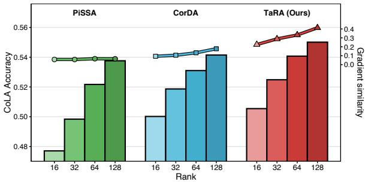
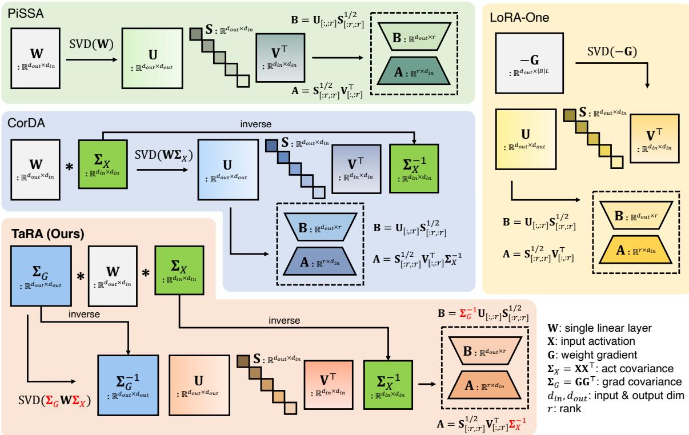
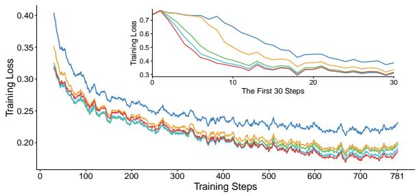
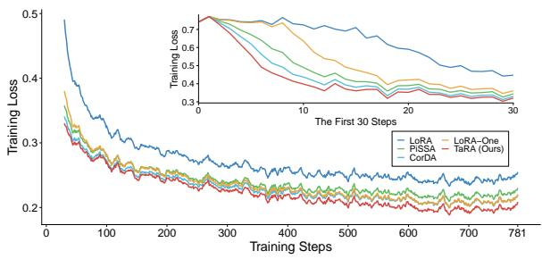
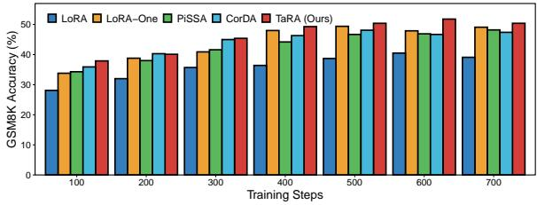
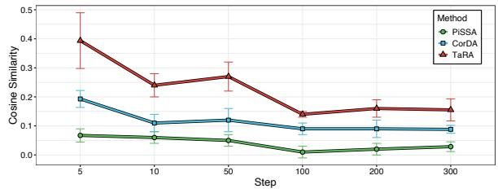
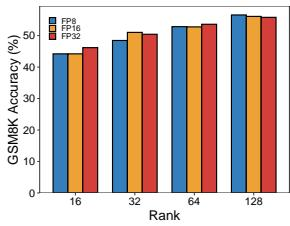
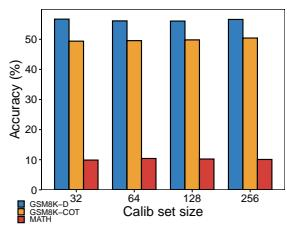
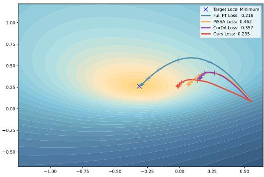
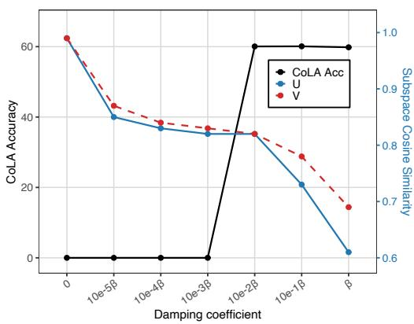

# TaRA: Training-Aware Low-Rank Adaptation Initialization

Taehyeon Kim<sup>1</sup> Eunhyeok Park<sup>2</sup>

<sup>1</sup>Department of Computer Science and Engineering <sup>2</sup>Graduate School of Artificial Intelligence Pohang University of Science and Technology (POSTECH) {taehyeonkim, eh.park}@postech.ac.kr

## Abstract

Low-Rank Adaptation (LoRA) has become a de facto standard for parameter-efficient finetuning (PEFT), yet its performance is highly sensitive to initialization due to the information bottleneck imposed by low-rank decomposition. Existing approaches attempt to construct high-quality LoRA initializations by exploiting principal components of pretrained weights, activations, or gradients. However, these methods do not directly account for the training dynamics of the full-rank model. In this paper, we propose Training-aware Low-Rank Adaptation Initialization (TaRA), a method that initializes LoRA such that the gradients induced by the low-rank factors closely approximate the gradient of the corresponding full-rank weight matrix. Derived from a mathematical formulation, TaRA improves gradient fidelity at the start of training while introducing negligible computational overhead. Across diverse and challenging fine-tuning tasks, TaRA consistently outperforms prior state-of-the-art methods, establishing a simple, robust, and scalable solution for effective LoRA initialization.

## 1 Introduction

Parameter-efficient fine-tuning (PEFT) has significantly reduced the cost of adapting large language models (LLMs), enabling their widespread deployment in practical applications (Houlsby et al., 2019; Li and Liang, 2021). Among PEFT methods, Low-Rank Adaptation (LoRA) (Hu et al., 2022) has emerged as the most widely adopted approach due to its simplicity, substantial reduction in fine-tuning resource requirements, and absence of inference-time overhead, as the learned updates can be merged into the base weights after training. These advantages have established LoRA as a de facto standard for efficient LLM fine-tuning.

Despite these benefits, LoRA introduces an inherent trade-off: the structured bottleneck imposed by low-rank decomposition alters the optimization trajectory relative to full-rank training, which can lead to suboptimal convergence even when model capacity is sufficient. Consequently, improving the effectiveness of LoRA without sacrificing its efficiency has become an important research direction (Meng et al., 2024; Buyukakyuz, 2024; Hayou et al., 2024).

  
Figure 1: Gradient similarity, measured as the cosine similarity between the one-step gradient of the combined LoRA adapter and that of the full weight, correlates with downstream accuracy.

One promising direction is to design more informed initialization strategies for the low-rank adapters. While the original LoRA initializes its adapters with random or zero values, subsequent studies have shown that low-rank initializations guided by pretrained weight distributions (e.g., PiSSA (Meng et al., 2024)), joint weight-data statistics (e.g., CorDA (Yang et al., 2024)), or gradients from a single forward-backward pass (e.g., LoRA-GA, LoRA-One (Wang et al., 2024; Zhang et al., 2025)) consistently yield improved fine-tuning performance. These methods preserve the practical advantages of LoRA while alleviating degradation caused by low-rank constraints.

To further address this limitation, we propose Training-aware Low-Rank Adaptation (TaRA), a new LoRA initialization method. Unlike prior approaches that approximate tensor statistics, TaRA is designed to preserve directions that are important to the local gradient behavior of full-weight training, allowing the low-rank parameterization to better reflect training-relevant information at initialization. Grounded in a mathematical formulation, TaRA derives a low-rank initialization that preserves training-relevant directions in the local gradient field by jointly leveraging activation covariance, gradient covariance, and pretrained weights from a single forward-backward pass. As illustrated in Figure 1, this initialization achieves substantially higher gradient alignment than prior methods at the same rank, leading to consistent downstream improvements. Extensive experiments on challenging reasoning tasks, including mathematical problem solving, code generation, and commonsense reasoning, demonstrate that TaRA outperforms existing approaches.

## 2 Prior Work on LoRA Initialization

In the original LoRA, the input-side factor matrix A is randomly initialized, while the output-side factor matrix B is set to zero. Although this design ensures that fine-tuning starts from the pretrained representations, the resulting initialization contains no meaningful task-related information, which can lead to slow early-stage optimization and suboptimal convergence (Wang et al., 2024).

Motivated by these limitations, numerous studies have explored improved initialization strategies for LoRA (Figure 2). Although the decomposed path produces a non-zero update, fine-tuning can still start from the pretrained weight $\mathbf { W } _ { 0 }$ by absorbing this modification into a frozen residual weight, defined as $\mathbf { W } _ { r e s } = \mathbf { W } _ { 0 } - \mathbf { B } \mathbf { A }$ . With an appropriate choice of A and B, a properly initialized model can accelerate training and typically converges to better solutions than random initialization.

A key early work in this line of research is PiSSA (Meng et al., 2024), which proposes a data-agnostic initialization that leverages the pretrained weight matrix $\mathbf { W } _ { 0 } \in \mathbb { R } ^ { d o u t \times \bar { d } _ { i n } }$ . Specifically, PiSSA performs singular value decomposition (SVD), $\mathbf { W } _ { 0 } = \mathbf { U S V } ^ { \top }$ , and initializes LoRA using the top-r singular components:

$$
\mathbf { B } = \mathbf { U } [ : , : r ] \mathbf { S } ^ { 1 / 2 } [ : r , : r ] \in \mathbb { R } ^ { d o u t \times r } ,\tag{1}
$$

$$
\begin{array} { r } { \mathbf { A } = \mathbf { S } ^ { 1 / 2 } [ : r , : r ] \mathbf { V } ^ { \top } [ : , : r ] \in \mathbb { R } ^ { r \times d _ { i n } } . } \end{array}\tag{2}
$$

More recently, CorDA (Yang et al., 2024) extends this idea by incorporating input statistics in addition to pretrained weights. CorDA first estimates the input activation covariance $\boldsymbol { \Sigma } _ { X } = \mathbf { X } \mathbf { X } ^ { \top }$ from input activations X, and then performs the following decomposition:

$$
\mathrm { S V D } ( \mathbf { W } _ { 0 } \pmb { \Sigma } _ { X } ) \pmb { \Sigma } _ { X } ^ { - 1 } = \bar { \mathbf { U } } \bar { \mathbf { S } } \bar { \mathbf { V } } ^ { \top } .\tag{3}
$$

The resulting components are used to initialize B, A, and $\mathbf { W } _ { r e s }$ in the same manner as PiSSA. Both PiSSA and CorDA align the LoRA subspace with principal components derived from pretrained weights or input-dependent statistics, resulting in faster convergence and improved accuracy.

Orthogonal to these approaches, LoRA-GA (Wang et al., 2024) and its successor, LoRA-One (Zhang et al., 2025), leverage gradient information. These methods are motivated by the observation that the fine-tuning quality of LoRA depends on the alignment of its update direction with the dominant singular subspace of the full fine-tuning gradient. Based on this insight, LoRA-One performs SVD of the one-step full gradient of weight G,

$$
\begin{array} { r } { \mathrm { S V D } ( - \mathbf G ) = \hat { \mathbf { U } } \hat { \mathbf { S } } \hat { \mathbf { V } } ^ { \top } , } \end{array}\tag{4}
$$

and use the top-r singular components to initialize the LoRA. By leveraging gradient information, these methods initialize the LoRA modules along directions that are partially informed by training signals, often leading to improved fine-tuning performance in practice.

However, despite utilizing internal tensor statistics of the pretrained model, prior approaches primarily focus on enhancing the representational capacity of the low-rank decomposition, rather than explicitly aligning it with the learning dynamics of full fine-tuning. Consequently, a performance gap remains, which cannot be effectively closed by merely increasing the rank or tuning hyperparameters.

## 3 Proposed Idea: TaRA

In this section, we introduce TaRA, a novel LoRA initialization method designed to enhance finetuning quality under a strict low-rank constraint. We begin by formalizing the objective, derive a low-rank solution, and then describe its practical implementation.

## 3.1 Motivation

The key motivation behind TaRA is simple yet fundamental: even under the low-rank bottleneck imposed by LoRA, we aim to construct a low-rank parameterization whose induced local gradient behavior closely approximates that of the corresponding full-rank weight. In other words, TaRA embeds training-relevant directions of the local gradient field into the low-rank structure. This perspective naturally leads to the following question: Under a rank-r constraint, how can we construct a lowrank parameterization that preserves the directions most relevant to the local gradient behavior of full fine-tuning?

  
Figure 2: Illustration of our single-layer procedure. We collect activations X and gradients G to form covariances $\Sigma _ { X }$ and $\Sigma _ { G }$ . PiSSA applies SVD to W; CorDA applies SVD to $\mathbf { W } \mathbf { \Sigma } _ { X }$ and maps back with $\Sigma _ { X } ^ { - 1 } ;$ LoRA-One applies SVD to −G. In contrast, TaRA applies SVD to $\pmb { \Sigma } _ { G } \mathbf { W } \pmb { \Sigma } _ { X }$ and maps back with $\Sigma _ { G } ^ { - 1 }$ and $\Sigma _ { X } ^ { - 1 }$

To formalize this intuition, we consider the following objective:

$$
\begin{array} { r } { \tilde { \theta } = \arg \underset { \theta } { \operatorname* { m i n } } \left\| \nabla \mathcal { L } ( \theta ) - \nabla \mathcal { L } ( \theta _ { 0 } ) \right\| _ { F } ^ { 2 } , } \\ { \mathrm { s . t . } \operatorname { r a n k } ( \theta ) \leq r , } \end{array}\tag{5}
$$

where $\mathcal { L }$ denotes the task loss. Intuitively, this objective seeks a rank-constrained parameterization that preserves the local gradient behavior of the corresponding full-rank parameter at $\theta _ { 0 }$

## 3.2 Training-Relevant Decomposition

To obtain a tractable formulation, we adopt a standard second-order view of the loss landscape around the initialization point. In particular, we focus on the one-step gradient at initialization (Wang et al., 2024), which captures the dominant training signal in the early stage of optimization. In practice, this approximation is sufficient to guide effective low-rank initialization, as demonstrated by the convergence results in Section 4.2.

Using a second-order Taylor expansion of the loss around $\theta _ { 0 }$ , we obtain

$$
\begin{array} { r } { \mathcal { L } ( \boldsymbol { \theta } ) \approx \mathcal { L } ( \boldsymbol { \theta } _ { 0 } ) + \nabla \mathcal { L } ( \boldsymbol { \theta } _ { 0 } ) ^ { \top } ( \boldsymbol { \theta } - \boldsymbol { \theta } _ { 0 } ) } \\ { + \frac { 1 } { 2 } ( \boldsymbol { \theta } - \boldsymbol { \theta } _ { 0 } ) ^ { \top } \mathbf { H } ( \boldsymbol { \theta } - \boldsymbol { \theta } _ { 0 } ) , } \end{array}\tag{6}
$$

where H denotes the Hessian evaluated at $\theta _ { 0 }$

In large models, directly computing the Hessian is infeasible. Following common practice, we instead use the Fisher information matrix $\mathcal { F }$ as a tractable surrogate for local curvature (Chekalina et al., 2025; Martens, 2020). Using the K-FAC factorization (Martens and Grosse, 2015), the Fisher matrix can be written as

$$
{ \mathcal { F } } \approx \Sigma _ { X } \otimes \Sigma _ { G } ,\tag{7}
$$

where $\pmb { \Sigma } _ { G } = \mathbf { G } \mathbf { G } ^ { \top }$ denotes the gradient covariance. Under this formulation, differentiating Eq. (6) with respect to θ yields (derivation is in Appendix):

$$
\nabla \mathcal { L } ( \theta ) - \nabla \mathcal { L } ( \theta _ { 0 } ) \approx \Sigma _ { G } ( \theta - \theta _ { 0 } ) \Sigma _ { X } .\tag{8}
$$

This relation reveals a key insight: the change in gradient induced by a parameter update is modulated by the curvature structure of the loss. Consequently, directions associated with large Fisher or Hessian values have a disproportionately large influence on the optimization trajectory. Preserving these directions is therefore crucial for faithfully approximating full fine-tuning under a low-rank space.

Empirically, the Hessian spectrum of modern neural networks is known to exhibit a highly structured form, consisting of a small set of prominent outlier eigenvectors and a near-zero bulk that is largely orthogonal to them (Gur-Ari et al., 2018; Sagun et al., 2017). Moreover, prior work shows that gradient descent effectively evolves within a small subspace spanned by the top Hessian eigenvectors (Gur-Ari et al., 2018). These observations suggest that dominant curvature directions provide a natural criterion for identifying effective low-rank training updates.

Motivated by this insight, we seek a rank-r approximation $\tilde { \theta }$ that minimizes the curvatureweighted gradient deviation in Eq. (8):

$$
\begin{array} { r } { \widetilde { \theta } \approx \underset { \theta } { \arg \operatorname* { m i n } } \Vert \Sigma _ { G } ( \theta - \theta _ { 0 } ) \Sigma _ { X } \Vert _ { F } ^ { 2 } , } \\ { \mathrm { s . t . } \operatorname { r a n k } ( \theta ) \leq r . } \end{array}\tag{9}
$$

This corresponds to a classical low-rank matrix approximation problem. By the Eckart–Young theorem (Eckart and Young, 1936; Golub and Van Loan, 2013), the optimal solution is obtained by retaining the top-r singular components of decomposition:

$$
\boldsymbol { \tilde { \theta } } \approx \boldsymbol { \Sigma } _ { \boldsymbol { G } } ^ { - 1 } \mathrm { S V D } _ { r } \big ( \boldsymbol { \Sigma } _ { \boldsymbol { G } } \boldsymbol { \theta } _ { 0 } \boldsymbol { \Sigma } _ { \boldsymbol { X } } \big ) \boldsymbol { \Sigma } _ { \boldsymbol { X } } ^ { - 1 } ,\tag{10}
$$

where $\mathrm { S V D } _ { r } ( \cdot )$ denotes the truncated SVD.<sup>1</sup>

This result shows that the optimal low-rank approximation corresponds to preserving the dominant curvature directions of the pretrained parameter $\theta _ { 0 }$

## 3.3 Implementation of TaRA

Based on the above formulation, TaRA can be implemented as an efficient layer-wise LoRA initialization procedure for linear layers, summarized in Algorithm 1. In the Collect stage, we gather task-dependent statistics using a small calibration dataset D. During the forward pass, we record input activations and concatenate them to form $\mathbf { X } \in \mathbb { R } ^ { d _ { \mathrm { i n } } \times | B | L }$ . During the backward pass, we collect the corresponding weight gradients to obtain $\mathbf { G } \in \mathbb { R } ^ { d _ { \mathrm { { o u t } } } \times | B | L }$ . These statistics are used to estimate the covariance matrices $\Sigma _ { X }$ and $\Sigma _ { G }$ . In the Init stage, we compute the SVD of $\boldsymbol { \Sigma } _ { G } \mathbf { W } _ { 0 } \boldsymbol { \Sigma } _ { X }$ and project the resulting components back to the original space using $\Sigma _ { G } ^ { - 1 }$ and $\Sigma _ { X } ^ { - 1 }$ . This produces singular components that capture the training-relevant directions under the Fisher-weighted metric.

```tcl
Algorithm 1 TaRA, init for single layer
Input: Pre-trained weight of single linear layer
$\mathbf { W } _ { 0 } \in \mathbb { R } ^ { d _ { o u t } \times d _ { i n } }$ , calibration dataset D, LoRA
rank $r \in \mathbb N$
Collect:
1: Collect input activations in forward pass
$\mathbf { X } \in \mathbb { R } ^ { d _ { i n } \times | B | L }$
2: Collect weight gradients in backward pass
$\mathbf { G } \in \mathbb { R } ^ { d _ { o u t } \times | B | L }$
3: Compute activation covariance
$\pmb { \Sigma } _ { X } \bar {  } \mathbf { X } \mathbf { X } ^ { \top } \in \mathbb { R } ^ { d _ { i n } \times d _ { i n } }$
4: Compute gradient covariance
$\pmb { \Sigma } _ { G } \dot {  } \mathbf { G } \dot { \mathbf { G } } ^ { \top } \in \mathbb { R } ^ { d _ { o u t } \times d _ { o u t } }$
Init:
1: $\tilde { \mathbf { U } } , \tilde { \mathbf { S } } , \tilde { \mathbf { V } } ^ { \top }  \mathbf { S V D } ( \pmb { \Sigma } _ { G } \mathbf { W } _ { 0 } \pmb { \Sigma } _ { X } )$
2: $\mathbf { B }  \Sigma _ { G } ^ { - 1 } \tilde { \mathbf { U } } _ { [ : , : r ] } \tilde { \mathbf { S } } _ { [ : r , : r ] } ^ { 1 / 2 } \in \mathbb { R } ^ { d _ { o u t } \times r }$
3: $\mathbf { A }  \tilde { \mathbf { S } } _ { [ : r , : r ] } ^ { 1 / 2 } \tilde { \mathbf { V } } _ { [ : , : r ] } ^ { \top } \dot { \mathbf { \Sigma } } _ { X } ^ { - \mathrm { i } } \in \mathbb { R } ^ { r \times d _ { i n } }$
4: ${ \bf W } _ { r e s }  \dot { { \bf W } } _ { 0 } - \dot { { \bf B } } { \bf A } \in \mathbb { R } ^ { d _ { o u t } \times d _ { i n } }$
```

In practice, the covariance matrices may be rankdeficient (Yankun et al., 2025; Zhao et al., 2024), which makes direct inversion unstable. To ensure numerical stability, we apply diagonal damping, $\pmb { \Sigma } _ { G } \gets \pmb { \Sigma } _ { G } + c \beta \mathbf { I }$ and $\pmb { \Sigma } _ { X }  \pmb { \Sigma } _ { X } + c \beta \mathbf { I }$ , a wellknown technique in second-order and Fisher-based optimization methods (Martens and Grosse, 2015; Ledoit and Wolf, 2012). Following (Yang et al., 2024), we set $\beta$ to the mean singular value of each covariance matrix and use $c = 1 0 ^ { - 2 }$ (see Appendix D for further analysis).

After computing the decomposition, we truncate it to rank r and construct the LoRA factors. The trainable matrices A and B are initialized from the top-r singular components, scaled by the inverse covariance matrices to align them with the curvature-weighted subspace. We then update the frozen residual weight so that the model initially preserves the pretrained function. Applying this procedure independently to each linear layer yields a training-friendly LoRA initialization.

## 4 Experiments

We evaluate the proposed method through extensive experiments across multiple LLMs and a diverse set of downstream tasks. We compare TaRA against full fine-tuning and several LoRA initialization baselines, including LoRA (Hu et al., 2022), PiSSA (Meng et al., 2024), CorDA (Yang et al., 2024), and LoRA-One (Zhang et al., 2025). We also include the state-of-the-art LoRA variants, MiSS (Kang and Yin) and LoRAM (Zhang et al., 2026) for comparison. Our evaluation covers two task categories: natural language generation (NLG) and natural language understanding (NLU), and systematically examines performance across different model and LoRA rank budgets.

<table><tr><td>Rank</td><td>Method</td><td>GSM8K-D</td><td>GSM8K-COT</td><td>MATH</td><td>HumanEval</td><td>MBPP</td><td>AVG</td></tr><tr><td></td><td>Full fine-tuning (lr=4e-5)</td><td> $5 4 . 7 1 \pm 0 . 2 0$ </td><td> $5 0 . 7 0 \pm 0 . 2 5$ </td><td> $1 0 . 1 5 \pm 0 . 0 4$ </td><td> $2 6 . 8 3 \pm 0 . 5 0$ </td><td> $2 6 . 2 0 \pm 0 . 6 5$ </td><td> $3 3 . 7 2 \pm 0 . 3 3$ </td></tr><tr><td rowspan="5">128</td><td> $\mathrm { L o R A } \ ( \mathrm { l r } { = } 4 \mathrm { e } { - } 5 )$ </td><td> $4 4 . 8 3 \pm 0 . 3 8$ </td><td> $3 7 . 2 3 \pm 0 . 5 5$ </td><td> $6 . 1 2 \pm 0 . 0 4$ </td><td> $2 1 . 1 4 \pm 0 . 2 9$ </td><td> $2 2 . 6 7 \pm 0 . 7 7$ </td><td> $2 6 . 4 0 \pm 0 . 4 1$ </td></tr><tr><td> $\mathrm { P i S S A } \ ( \mathrm { l r } { = } 4 \mathrm { e } { - } 5 )$ </td><td> $5 3 . 8 5 \pm 0 . 0 7$ </td><td> $4 7 . 4 2 \pm 0 . 1 4$ </td><td> $8 . 9 8 \pm 0 . 0 4$ </td><td> $2 3 . 4 6 \pm 0 . 6 4$ </td><td> $2 4 . 8 7 \pm 0 . 5 7$ </td><td> $3 1 . 7 2 \pm 0 . 2 9$ </td></tr><tr><td> $\mathrm { C o r D A } \left( \mathrm { l r } { = } 4 \mathrm { e } { - } 5 \right)$ </td><td> $5 5 . 5 4 \pm 0 . 5 4$ </td><td> $4 7 . 5 6 \pm 0 . 2 7$ </td><td> $9 . 4 1 \pm 0 . 1 1$ </td><td> $2 4 . 0 6 \pm 0 . 2 0$ </td><td> $2 4 . 1 0 \pm 0 . 2 2$ </td><td> $3 2 . 1 3 \pm 0 . 2 7$ </td></tr><tr><td> $\mathrm { L o R A - O n e } \ ( \mathrm { l r = } 2 \mathrm { e } { \mathrm { - } } 4 )$ </td><td> $5 2 . 9 2 \pm 0 . 4 9$ </td><td> $4 6 . 7 4 \pm 0 . 2 2$ </td><td> $9 . 2 8 \pm 0 . 0 7$ </td><td> $2 3 . 8 1 \pm 0 . 5 9$ </td><td> $2 4 . 8 3 \pm 0 . 4 7$ </td><td> $3 1 . 5 2 \pm 0 . 3 7$ </td></tr><tr><td> $\mathbf { T a R A } ( \mathrm { l r } { = } 4 \mathrm { e } { - } 5 )$ </td><td> ${ \bf 5 6 . 5 9 \pm 0 . 2 5 }$ </td><td> ${ \bf 5 0 . 4 2 \pm 0 . 1 3 }$ </td><td> ${ \bf 1 0 . 0 8 \pm 0 . 1 0 }$ </td><td> $2 2 . 5 9 \pm 0 . 5 8$ </td><td> $2 5 . 2 0 \pm 0 . 6 7$ </td><td> $3 2 . 9 8 \pm 0 . 3 4$ </td></tr><tr><td rowspan="5">64</td><td> $\mathrm { L o R A } \ ( \mathrm { l r } { = } 4 \mathrm { e } { - } 5 )$ </td><td> $4 0 . 3 1 \pm 0 . 1 8$ </td><td> $3 2 . 6 5 \pm 0 . 2 0$ </td><td> $5 . 2 7 \pm 0 . 0 5$ </td><td> $1 7 . 8 8 \pm 0 . 6 0$ </td><td> $2 1 . 4 0 \pm 0 . 5 9$ </td><td> $2 3 . 5 0 \pm 0 . 3 2$ </td></tr><tr><td> $\mathrm { P i S S A } \ ( \mathrm { l r } { = } 4 \mathrm { e } { - } 5 )$ </td><td> $4 9 . 0 5 \pm 0 . 8 6$ </td><td> $4 3 . 5 7 \pm 0 . 2 8$ </td><td> $7 . 2 9 \pm 0 . 1 6$ </td><td> $2 1 . 4 7 \pm 0 . 9 7$ </td><td> $2 3 . 7 3 \pm 0 . 6 2$ </td><td> $2 9 . 0 2 \pm 0 . 5 8$ </td></tr><tr><td> $\mathrm { C o r D A } \left( \mathrm { l r } { = } 4 \mathrm { e } { - } 5 \right)$ </td><td> $5 1 . 4 5 \pm 0 . 4 0$ </td><td> $4 2 . 7 7 \pm 0 . 3 3$ </td><td> $8 . 1 3 \pm 0 . 1 8$ </td><td> $2 1 . 1 4 \pm 0 . 7 6$ </td><td> $2 4 . 9 3 \pm 0 . 4 1$ </td><td> $2 9 . 6 8 \pm 0 . 4 2$ </td></tr><tr><td> $\mathrm { L o R A - O n e } \ ( \mathrm { l r = } 2 \mathrm { e } { \mathrm { - } } 4 )$ </td><td> $5 1 . 5 4 \pm 0 . 8 3$ </td><td> $4 2 . 8 4 \pm 0 . 4 3$ </td><td> $8 . 0 6 \pm 0 . 0 8$ </td><td> $2 4 . 3 9 \pm 0 . 8 6$ </td><td> $2 5 . 2 0 \pm 0 . 4 3$ </td><td> $3 0 . 4 1 \pm 0 . 5 3$ </td></tr><tr><td> $\mathbf { T a R A } ( \mathrm { l r } { = } 4 \mathrm { e } { - } 5 )$ </td><td> ${ \bar { 5 } } 4 . 1 2 \pm 0 . 9 3$ </td><td> $4 4 . 4 9 \pm 0 . 1 1$ </td><td> $9 . 2 3 \pm 0 . 0 7$ </td><td> $2 3 . 5 8 \pm 0 . 7 0$ </td><td> $2 5 . 4 0 \pm 0 . 3 6$ </td><td> $3 1 . 3 6 \pm 0 . 4 3$ </td></tr><tr><td rowspan="5">32</td><td> $\mathrm { L o R A } \ ( \mathrm { l r } { = } 4 \mathrm { e } { - } 5 )$ </td><td> $3 8 . 3 6 \pm 0 . 3 5$ </td><td> $3 1 . 5 1 \pm 0 . 2 2$ </td><td> $5 . 1 0 \pm 0 . 1 2$ </td><td> $1 8 . 9 0 \pm 0 . 6 8$ </td><td> $2 0 . 4 7 \pm 0 . 8 2$ </td><td> $2 2 . 8 7 \pm 0 . 4 4$ </td></tr><tr><td> $\mathrm { P i S S A } \ ( \mathrm { l r } { = } 4 \mathrm { e } { - } 5 )$ </td><td> $4 6 . 4 0 \pm 0 . 0 6$ </td><td> $3 6 . 6 4 \pm 0 . 2 9$ </td><td> $6 . 4 2 \pm 0 . 0 6$ </td><td> $2 0 . 7 3 \pm 0 . 5 0$ </td><td> $2 2 . 3 1 \pm 0 . 1 3$ </td><td> $2 6 . 5 0 \pm 0 . 2 1$ </td></tr><tr><td> $\mathrm { C o r D A } \left( \mathrm { l r } { = } 4 \mathrm { e } { - } 5 \right)$ </td><td> $4 8 . 0 9 \pm 0 . 2 2$ </td><td> $3 8 . 8 2 \pm 0 . 6 4$ </td><td> $6 . 9 6 \pm 0 . 0 6$ </td><td> $1 9 . 1 0 \pm 0 . 5 8$ </td><td> $2 4 . 3 3 \pm 0 . 8 2$ </td><td> $2 7 . 4 6 \pm 0 . 4 6$ </td></tr><tr><td> $\mathrm { L o R A - O n e } \ ( \mathrm { l r = } 2 \mathrm { e } { \mathrm { - } } 4 )$ </td><td> $4 7 . 4 4 \pm 0 . 3 0$ </td><td> $4 1 . 5 5 \pm 0 . 1 7$ </td><td> $7 . 4 9 \pm 0 . 1 1$ </td><td> $2 0 . 6 9 \pm 0 . 2 6$ </td><td> $2 4 . 6 0 \pm 0 . 4 3$ </td><td> $2 8 . 3 5 \pm 0 . 2 6$ </td></tr><tr><td> $\mathbf { T a R A } ( \mathrm { l r } { = } 4 \mathrm { e } { - } 5 )$ </td><td> ${ \bf 5 0 . 1 4 \pm 0 . 0 8 }$ </td><td> $4 1 . 7 0 \pm 0 . 2 7$ </td><td> $8 . 5 7 \pm 0 . 0 6$ </td><td> $2 1 . 5 3 \pm 0 . 2 9$ </td><td> $2 4 . 7 3 \pm 0 . 5 2$ </td><td> $2 9 . 3 3 \pm 0 . 2 4$ </td></tr></table>

Table 1: Comparison of LoRA, PiSSA, CorDA, LoRA-One, and TaRA on natural language generation tasks. Each result is the mean over three seeds, and the standard deviation is shown in small gray text. Red color indicates the best PEFT result within each model block, excluding Full FT.

## 4.1 Experimental Setup

Natural Language Understanding Tasks. For NLU, we focus on commonsense reasoning. Models are fine-tuned on the Commonsense-170K dataset (Hu et al., 2023). To evaluate scalability and generality, we conduct experiments on three base models—DeepSeek-R1-Distill-Qwen-1.5B (Guo et al., 2025), LLaMA-2-7b (Touvron et al., 2023), LLaMA-3.1-8B (Grattafiori et al., 2024), and Qwen-3-8B (Yang et al., 2025)—with a fixed LoRA rank of 128 (LoRA α is set equal to the rank).

Natural Language Generation Tasks. For NLG, we consider math problem solving and code generation. We fine-tune LLaMA-2-7B (Touvron et al., 2023) on 100K samples from MetaMathQA (Yu et al., 2023) for math and 100K samples from CodeFeedback-Filtered-Instruction (Zheng et al., 2024) for code. Models are trained with LoRA ranks of 128, 64 and 32 to assess robustness across rank budgets (LoRA α is set equal to the rank).

We evaluate performance on eight benchmarks: BoolQ (Clark et al., 2019), PIQA (Bisk et al., 2020), SIQA (Sap et al., 2019), HellaSwag (Zellers et al., 2019), WinoGrande (Sakaguchi et al., 2021), ARC-Challenge, ARC-Easy (Clark et al., 2018), and OBQA (Mihaylov et al., 2018).

For evaluation, math performance is measured on GSM8K-D (Cobbe et al., 2021) and MATH (Hendrycks et al., 2021) using direct prompting, as well as GSM8K-COT (Wei et al., 2022) under an 8-shot chain-of-thought setting with the Language Model Evaluation Harness (Biderman et al., 2024). Code generation is evaluated on HumanEval (Chen, 2021) and MBPP (Austin et al., 2021) using the BigCode Evaluation Harness (Ben Allal et al., 2022). All evaluation harnesses are used with their default configurations.

For full fine-tuning, LoRA, PiSSA, CorDA and TaRA, we follow the hyperparameter settings of CorDA (Yang et al., 2024) and select the best learning rate. For LoRA-One, which is sensitive to learning-rate choice, we use the optimal value reported in its original paper. For all methods that require calibration (CorDA, LoRA-One, and TaRA), we set the calibration set size to 256 and conducted all experiments under this setting. All results are obtained from the final training checkpoint and reported in terms of task accuracy. Additional details are provided in the Appendix. All experiments are conducted on A100 GPUs (80GB).

## 4.2 Natural Language Generation Task

Table 1 compares performance on natural language generation benchmarks across different LoRA ranks $( r \in \ 1 2 8 , 6 4 , 3 2 )$ . Overall, TaRA achieves the highest average performance at all ranks, consistently outperforming prior initialization methods such as PiSSA, CorDA, and LoRA-One. At $\begin{array} { r l r } { r } & { { } = } & { 1 2 8 } \end{array}$ TaRA attains the best results on GSM8K-D/GSM8K-COT, MATH, and MBPP, and also yields the highest average score. At r = 64, TaRA remains the top-performing method on GSM8K-D/GSM8K-COT, MATH, and MBPP, leading to the best average performance as well. Even at $ { r } \ = \ 3 2$ , TaRA exhibits a relatively small performance drop compared to other baselines, achieving the best performance across all tasks and demonstrating the most stable behavior across ranks. These results highlight the strength of the proposed initialization in efficiently capturing training-relevant directions under a constrained parameter budget.

  
(a) $r = 1 2 8$

  
(b) $r = 3 2$

Figure 3: Training loss over steps on $\mathbf { L L a M A } – 2 – 7 \mathbf { B }$ fine-tuned with MetaMathQA. We compare LoRA, PiSSA, CorDA, LoRA-One, and TaRA at (a) $r = 1 2 8$ and (b) $r = 3 2 ;$ insets show the first 30 steps.  
  
Figure 4: GSM8K-D accuracy over training steps when fine-tuning LLaMA-2-7B on the MetaMathQA dataset.

Notably, LoRA-One also underperforms PiSSA and CorDA at r = 128, suggesting that directly applying SVD to gradients is ineffective at higher ranks. Overall, these results indicate that neither simple SVD-based nor random initialization is sufficient to capture training-relevant directions under tight constraints, whereas TaRA does so effectively.

Figures 3a and 3b show the training loss curves on MetaMathQA for $r \ = \ 1 2 8$ and $r \ = \ 3 2 .$ . In both settings, TaRA converges more smoothly and reaches a lower loss than prior methods. This suggests that the proposed initialization provides a more effective update subspace at the early stage of training, enabling more efficient optimization, and that its benefit persists into later phases of training (Gur-Ari et al., 2018). This advantage persists throughout fine-tuning, as also reflected in GSM8K-D accuracy over training steps (Figure 4). While PiSSA and CorDA exhibit limited improvement and LoRA-One improves only in later stages, TaRA achieves rapid early gains and consistently attains the best performance at both intermediate and final stages.

<table><tr><td>Method</td><td>Rank</td><td>Trainable param.</td><td>GSM8K-D</td><td>GSM8K-COT</td></tr><tr><td>LoRAM</td><td>128</td><td> $3 1 9 . 8 \mathbf { M } \left( 4 . 5 3 \% \right)$ </td><td> $5 3 . 6 5 \pm 0 . 0 5$ </td><td> $4 7 . 4 6 \pm 0 . 0 5$ </td></tr><tr><td>MiSS</td><td>256</td><td>348.1M (4.91%)</td><td> $5 4 . 1 3 \pm 0 . 0 3$ </td><td> $4 8 . 6 7 \pm 0 . 0 2$ </td></tr><tr><td>TaRA</td><td>128</td><td>319.8M (4.53%)</td><td> ${ \bf 5 6 . 5 9 \pm 0 . 2 5 }$ </td><td> ${ \bf 5 0 . 4 2 \pm 0 . 1 3 }$ </td></tr></table>

Table 2: Comparison with LoRA variants on GSM8K-D and GSM8K-CoT. Baseline results report the mean and variance over three seeds. Red color indicates the best result in each task.

Comparison with Non-Initialization PEFT variants To compare TaRA with recent PEFT variants beyond LoRA initialization methods, we evaluated MiSS and LoRAM on mathematical reasoning tasks. For both MiSS and LoRAM, we used the same learning rate as TaRA, 4e-5. To approximately match the number of trainable parameters, we set the rank to 256 for MiSS and 128 for LoRAM. Table 2 presents the results. Overall, TaRA demonstrates that, even when using the standard LoRA parameterization, a well-designed initialization can outperform recent PEFT variants on mathematical reasoning tasks.

## 4.3 Natural Language Understanding Task

Table 3 compares performance on standard commonsense reasoning benchmarks across three models: DeepSeek-R1-Distill-Qwen-1.5B, LLaMA-2-7B LLaMA-3.1-8B, and Qwen-3-8B. Overall, TaRA achieves the best average performance on DeepSeek-R1-Distill-Qwen-1.5B, LLaMA-2-7B and LLaMA-3.1-8B, outperforming PiSSA, CorDA, and LoRA-One. On Qwen-3-8B, TaRA slightly underperforms LoRA-One in terms of average score but remains competitive, consistently outperforming LoRA, PiSSA, and CorDA. While fine-tuning performance is often distributiondependent and no method consistently dominates across all settings, a well-known phenomenon also observed in prior work, we evaluate methods based on their generality across diverse scenarios. Under this criterion, TaRA consistently performs well, achieving top-1 performance in 15 out of 32 cases and second-best in 11 more. In contrast, LoRA-One and CorDA achieve top-1 in only 8 and 5 cases, respectively, highlighting the robustness of TaRA beyond specific models or tasks.

<table><tr><td>Model</td><td>Method</td><td>BoolQ</td><td>PIQA</td><td>SIQA</td><td>HS</td><td>WG</td><td>ARC-c</td><td>ARC-e</td><td>OBQA</td><td>AVG</td></tr><tr><td rowspan="6">DeepSeek-R1 -Distill-Qwen</td><td>Full FT</td><td> $6 3 . 0 4 \pm 0 . 1 2$ </td><td> $6 1 . 4 1 \pm 0 . 3 8$ </td><td> $5 2 . 5 8 \pm 0 . 0 2$ </td><td> $2 7 . 4 0 \pm 0 . 1 0$ </td><td> $4 9 . 4 1 \pm 0 . 4 9$ </td><td> $4 5 . 2 2 \pm 0 . 3 6$ </td><td> $6 1 . 3 8 \pm 0 . 1 6$ </td><td> $4 2 . 4 7 \pm 0 . 6 2$ </td><td> $5 0 . 3 6 \pm 0 . 1 8$ </td></tr><tr><td>LoRA</td><td> $6 2 . 6 0 \pm 0 . 0 4$ </td><td> $6 1 . 6 4 \pm 0 . 3 8$ </td><td> $5 1 . 6 6 \pm 0 . 1 6$ </td><td> $2 5 . 7 7 \pm 0 . 2 4$ </td><td> $5 0 . 5 7 \pm 0 . 4 4$ </td><td> $4 6 . 3 3 \pm 0 . 3 0$ </td><td> $6 2 . 1 6 \pm 0 . 2 4$ </td><td> $4 2 . 7 3 \pm 0 . 5 2$ </td><td> $5 0 . 4 3 \pm 0 . 0 5$ </td></tr><tr><td>PiSSA</td><td> $6 4 . 6 8 \pm 0 . 1 1$ </td><td> $6 5 . 0 2 \pm 0 . 0 9$ </td><td> $6 3 . 1 5 \pm 0 . 2 7$ </td><td> $3 8 . 8 4 \pm 0 . 3 1$ </td><td> $5 7 . 7 5 \pm 0 . 1 6$ </td><td> $5 4 . 3 8 \pm 0 . 4 2$ </td><td> $6 9 . 3 2 \pm 0 . 0 3$ </td><td> $5 4 . 6 0 \pm 0 . 1 6$ </td><td> $5 8 . 4 7 \pm 0 . 0 3$ </td></tr><tr><td>CorDA</td><td> $6 4 . 8 9 \pm 0 . 1 3$ </td><td> $6 6 . 1 4 \pm 0 . 1 1$ </td><td> $6 5 . 5 1 \pm 0 . 1 1$ </td><td> $3 7 . 0 4 \pm 0 . 2 8$ </td><td> $5 8 . 2 7 \pm 0 . 2 3$ </td><td> $5 5 . 2 6 \pm 0 . 1 5$ </td><td> $6 8 . 6 2 \pm 0 . 1 9$ </td><td> $5 6 . 2 0 \pm 0 . 4 9$ </td><td> $5 8 . 9 9 \pm 0 . 0 9$ </td></tr><tr><td>LoRA-One</td><td> $6 3 . 7 7 \pm 0 . 1 8$ </td><td> $6 4 . 3 3 \pm 0 . 2 7$ </td><td> $6 5 . 0 1 \pm 0 . 3 4$ </td><td> $3 1 . 3 3 \pm 0 . 1 4$ </td><td> $5 8 . 8 2 \pm 0 . 2 9$ </td><td> $5 1 . 9 1 \pm 0 . 3 8$ </td><td> $6 9 . 4 6 \pm 0 . 1 4$ </td><td> $5 5 . 1 3 \pm 0 . 4 1$ </td><td> $5 7 . 4 7 \pm 0 . 1 2$ </td></tr><tr><td>TaRA</td><td> $6 4 . 7 7 \pm 0 . 2 0$ </td><td> ${ \bf 6 7 . 2 8 \pm 0 . 8 8 }$ </td><td> $6 5 . 5 2 \pm 0 . 1 1$ </td><td> $3 8 . 1 8 \pm 0 . 1 6$ </td><td> $6 0 . 2 2 \pm 0 . 7 0$ </td><td> $5 4 . 5 2 \pm 0 . 4 3$ </td><td> $6 8 . 4 3 \pm 0 . 1 6$ </td><td> ${ \bf 5 9 . 2 0 \pm 0 . 4 9 }$ </td><td> $5 9 . 7 7 \pm 0 . 3 6$ </td></tr><tr><td rowspan="6">LLaMA-2-7B</td><td>Full FT</td><td> $7 0 . 6 2 \pm 0 . 2 9$ </td><td> $8 1 . 1 8 \pm 0 . 0 9$ </td><td> $7 8 . 0 4 \pm 0 . 1 5$ </td><td> $7 6 . 0 4 \pm 0 . 0 9$ </td><td> $7 9 . 0 3 \pm 0 . 1 8$ </td><td> $6 6 . 6 1 \pm 0 . 0 4$ </td><td> $8 3 . 7 1 \pm 0 . 0 6$ </td><td> $7 7 . 8 0 \pm 0 . 0 0$ </td><td> $7 6 . 6 3 \pm 0 . 0 6$ </td></tr><tr><td>LoRA</td><td> $6 3 . 7 2 \pm 0 . 2 1$ </td><td> $7 7 . 2 4 \pm 0 . 0 9$ </td><td> $7 2 . 6 6 \pm 0 . 1 6$ </td><td> $5 6 . 5 0 \pm 0 . 1 0$ </td><td> $6 9 . 0 9 \pm 0 . 1 6$ </td><td> $6 1 . 6 6 \pm 0 . 1 0$ </td><td> $7 9 . 8 1 \pm 0 . 1 6$ </td><td> $6 4 . 3 3 \pm 0 . 3 4$ </td><td> $6 8 . 1 3 \pm 0 . 0 1$ </td></tr><tr><td>PiSSA</td><td> $7 0 . 3 4 \pm 0 . 1 5$ </td><td> $8 0 . 9 2 \pm 0 . 1 4$ </td><td> $7 8 . 2 2 \pm 0 . 0 5$ </td><td> $8 5 . 8 3 \pm 0 . 0 1$ </td><td> $7 8 . 6 1 \pm 0 . 0 7$ </td><td> $6 7 . 7 5 \pm 0 . 0 7$ </td><td> $8 3 . 6 7 \pm 0 . 0 6$ </td><td> $7 7 . 7 3 \pm 0 . 0 9$ </td><td> $7 7 . 8 9 \pm 0 . 0 1$ </td></tr><tr><td>CorDA</td><td> $7 0 . 4 2 \pm 0 . 2 4$ </td><td> $\mathbf { 8 0 . 9 4 \pm 0 . 2 0 }$ </td><td> $7 8 . 9 3 \pm 0 . 0 9$ </td><td> $8 3 . 4 3 \pm 0 . 1 2$ </td><td> $8 0 . 4 2 \pm 0 . 3 4$ </td><td> $6 6 . 9 5 \pm 0 . 2 0$ </td><td> $8 3 . 1 6 \pm 0 . 0 7$ </td><td> $7 7 . 6 0 \pm 0 . 2 8$ </td><td> $7 7 . 7 3 \pm 0 . 0 2$ </td></tr><tr><td>LoRA-One</td><td> $7 1 . 2 2 \pm 0 . 0 8$ </td><td> $8 0 . 8 8 \pm 0 . 0 8$ </td><td> $7 8 . 4 8 \pm 0 . 0 2$ </td><td> ${ \bf 8 9 . 1 9 \pm 0 . 0 0 }$ </td><td> $8 0 . 5 6 \pm 0 . 0 7$ </td><td> $6 7 . 1 2 \pm 0 . 0 4$ </td><td> $8 2 . 9 1 \pm 0 . 0 4$ </td><td> $7 9 . 4 0 \pm 0 . 0 0$ </td><td> $7 8 . 7 2 \pm 0 . 0 2$ </td></tr><tr><td>TaRA</td><td> $7 1 . 3 4 \pm 0 . 0 4$ </td><td> $8 0 . 4 9 \pm 0 . 0 9$ </td><td> $7 9 . 0 0 \pm 0 . 1 9$ </td><td> $8 8 . 8 4 \pm 0 . 0 3$ </td><td> $8 0 . 7 4 \pm 0 . 1 1$ </td><td> $6 6 . 9 8 \pm 0 . 1 4$ </td><td> $8 3 . 2 3 \pm 0 . 0 8$ </td><td> $\mathbf { 8 0 . 6 0 \pm 0 . 2 8 }$ </td><td> $7 8 . 9 0 \pm 0 . 0 4$ </td></tr><tr><td rowspan="6">LLaMA-3.1-8B</td><td>Full FT</td><td> $7 4 . 3 9 \pm 0 . 1 5$ </td><td> $8 8 . 4 5 \pm 0 . 0 7$ </td><td> $8 0 . 3 5 \pm 0 . 0 4$ </td><td> $9 5 . 5 2 \pm 0 . 0 0$ </td><td> $8 5 . 9 8 \pm 0 . 0 8$ </td><td> $8 2 . 1 7 \pm 0 . 0 7$ </td><td> $9 2 . 3 1 \pm 0 . 0 2$ </td><td> $8 4 . 6 0 \pm 0 . 1 6$ </td><td> $8 5 . 4 7 \pm 0 . 0 3$ </td></tr><tr><td>LoRA</td><td> $7 1 . 9 3 \pm 0 . 1 5$ </td><td> $8 5 . 9 1 \pm 0 . 0 4$ </td><td> $7 7 . 4 3 \pm 0 . 0 7$ </td><td> $9 2 . 6 3 \pm 0 . 0 8$ </td><td> $8 1 . 0 6 \pm 0 . 1 1$ </td><td> $7 8 . 2 4 \pm 0 . 0 7$ </td><td> $9 0 . 5 7 \pm 0 . 0 6$ </td><td> $7 9 . 4 7 \pm 0 . 0 9$ </td><td> $8 2 . 1 5 \pm 0 . 0 2$ </td></tr><tr><td>PiSSA</td><td> $7 4 . 3 0 \pm 0 . 2 3$ </td><td> $8 8 . 2 1 \pm 0 . 2 5$ </td><td> $7 9 . 9 7 \pm 0 . 0 8$ </td><td> $9 5 . 1 9 \pm 0 . 0 9$ </td><td> $8 5 . 7 4 \pm 0 . 3 0$ </td><td> $8 0 . 0 3 \pm 0 . 1 9$ </td><td> $9 1 . 3 8 \pm 0 . 4 4$ </td><td> $8 6 . 1 3 \pm 0 . 2 5$ </td><td> $8 5 . 1 3 \pm 0 . 0 2$ </td></tr><tr><td>CorDA</td><td> $7 4 . 5 6 \pm 0 . 2 3$ </td><td> $8 8 . 3 4 \pm 0 . 2 3$ </td><td> $8 0 . 1 6 \pm 0 . 2 6$ </td><td> $9 5 . 2 1 \pm 0 . 0 2$ </td><td> $8 5 . 3 7 \pm 0 . 2 4$ </td><td> ${ \bf 8 0 . 8 1 \pm 0 . 3 8 }$ </td><td> $9 1 . 7 4 \pm 0 . 0 7$ </td><td> $\mathbf { 8 6 . 6 0 \pm 0 . 1 6 }$ </td><td> $8 5 . 3 5 \pm 0 . 0 6$ </td></tr><tr><td>LoRA-One</td><td> $7 4 . 5 0 \pm 0 . 0 5$ </td><td> $8 8 . 0 3 \pm 0 . 0 2$ </td><td> $8 0 . 3 4 \pm 0 . 2 4$ </td><td> $9 6 . 0 4 \pm 0 . 0 1$ </td><td> $8 6 . 3 5 \pm 0 . 4 3$ </td><td> $8 0 . 6 6 \pm 0 . 1 5$ </td><td> $9 1 . 6 4 \pm 0 . 0 7$ </td><td> $8 6 . 3 3 \pm 0 . 0 9$ </td><td> $8 5 . 4 9 \pm 0 . 0 6$ </td></tr><tr><td>TaRA</td><td> $7 4 . 6 9 \pm 0 . 2 7$ </td><td> $8 8 . 7 3 \pm 0 . 0 6$ </td><td> $8 0 . 3 3 \pm 0 . 1 7$ </td><td> $9 5 . 3 5 \pm 0 . 0 5$ </td><td> $8 6 . 7 2 \pm 0 . 3 2$ </td><td> $8 0 . 4 9 \pm 0 . 2 9$ </td><td> $9 1 . 8 6 \pm 0 . 0 3$ </td><td> $8 6 . 4 0 \pm 0 . 1 6$ </td><td> $8 5 . 5 7 \pm 0 . 0 4$ </td></tr><tr><td rowspan="6">Qwen-3-8B</td><td>Full FT</td><td> $7 2 . 0 7 \pm 0 . 0 9$ </td><td> $8 9 . 7 4 \pm 0 . 0 9$ </td><td> $8 0 . 1 9 \pm 0 . 1 3$ </td><td> $9 3 . 1 9 \pm 0 . 0 2$ </td><td> $8 1 . 0 9 \pm 0 . 2 0$ </td><td> $9 1 . 8 6 \pm 0 . 1 1$ </td><td> $9 6 . 5 9 \pm 0 . 0 6$ </td><td> $8 8 . 8 7 \pm 0 . 5 0$ </td><td> $8 6 . 7 0 \pm 0 . 0 6$ </td></tr><tr><td>LoRA</td><td> $7 1 . 3 9 \pm 0 . 1 6$ </td><td> $8 8 . 6 8 \pm 0 . 1 3$ </td><td> $7 9 . 6 0 \pm 0 . 0 2$ </td><td> $9 1 . 7 7 \pm 0 . 0 1$ </td><td> $7 7 . 6 6 \pm 0 . 2 3$ </td><td> ${ \bf 9 1 . 5 3 \pm 0 . 0 8 }$ </td><td> $9 6 . 5 6 \pm 0 . 0 2$ </td><td> $8 8 . 1 3 \pm 0 . 0 9$ </td><td> $8 5 . 6 7 \pm 0 . 0 4$ </td></tr><tr><td> $\mathrm { P i S S A }$ </td><td> $7 1 . 3 4 \pm 0 . 3 0$ </td><td> $8 9 . 8 8 \pm 0 . 1 2$ </td><td> $8 0 . 0 9 \pm 0 . 1 8$ </td><td> $9 4 . 2 5 \pm 0 . 0 1$ </td><td> $8 2 . 9 5 \pm 0 . 1 3$ </td><td> $9 1 . 4 4 \pm 0 . 0 4$ </td><td> $9 6 . 8 6 \pm 0 . 0 4$ </td><td> $9 1 . 0 7 \pm 0 . 1 9$ </td><td> $8 7 . 2 4 \pm 0 . 0 3$ </td></tr><tr><td> $\mathrm { C o r D A }$ </td><td> $7 1 . 1 9 \pm 0 . 0 8$ </td><td> $8 9 . 4 6 \pm 0 . 1 0$ </td><td> $8 1 . 1 9 \pm 0 . 0 5$ </td><td> $9 4 . 1 0 \pm 0 . 0 1$ </td><td> $8 2 . 3 5 \pm 0 . 0 4$ </td><td> $8 8 . 8 8 \pm 0 . 0 8$ </td><td> $9 5 . 6 2 \pm 0 . 0 0$ </td><td> $9 0 . 8 0 \pm 0 . 0 0$ </td><td> $8 6 . 7 0 \pm 0 . 0 1$ </td></tr><tr><td> $_ \mathrm { L o R A - O n e }$ </td><td> $7 3 . 2 6 \pm 0 . 0 9$ </td><td> $8 9 . 4 1 \pm 0 . 1 4$ </td><td> $8 0 . 1 6 \pm 0 . 1 4$ </td><td> $9 4 . 5 7 \pm 0 . 0 1$ </td><td> $8 4 . 9 5 \pm 0 . 1 0$ </td><td> $9 1 . 1 3 \pm 0 . 0 7$ </td><td> $9 7 . 2 2 \pm 0 . 0 0$ </td><td> $9 0 . 4 0 \pm 0 . 2 8$ </td><td> $8 7 . 6 4 \pm 0 . 0 5$ </td></tr><tr><td>TaRA</td><td> $7 1 . 1 9 \pm 0 . 1 7$ </td><td> ${ \bf 8 9 . 9 0 \pm 0 . 0 7 }$ </td><td> ${ \bf 8 1 . 3 2 \pm 0 . 0 4 }$ </td><td> $9 4 . 3 8 \pm 0 . 0 3$ </td><td> $8 3 . 1 1 \pm 0 . 0 7$ </td><td> $8 9 . 8 5 \pm 0 . 1 9$ </td><td> $9 6 . 8 8 \pm 0 . 0 9$ </td><td> ${ \bf 9 1 . 4 0 \pm 0 . 0 0 }$ </td><td> $8 7 . 2 5 \pm 0 . 0 2$ </td></tr></table>

Table 3: Comparison of Full FT, LoRA, PiSSA, CorDA, LoRA-One, and TaRA on commonsense reasoning tasks. Results are averaged over three seeds, with standard deviations shown in gray text. Red and Orange color denote the best and second-best PEFT results in each model, excluding Full FT. Abbr. HS = HellaSwag, WG = WinoGrande.

  
Figure 5: Gradient similarity, measured as the cosine similarity between the n-step (5, 10, 50, 100, 200 and 300) gradient of the combined LoRA adapter and that of the full weight, correlates with downstream accuracy.

gradient of the corresponding full-rank weight to quantify their local gradient alignment.

We conduct this experiment on RoBERTa-base (Liu et al., 2019) trained for one step on the CoLA task (Warstadt et al., 2019) in the GLUE benchmark (Wang et al., 2018). Cosine similarities are computed for all linear layers over 100 random samples and averaged across layers.

## 4.4 Gradient Alignment Analysis

To verify whether the proposed method can effectively extract principal components that are important from a training perspective, we use the onestep gradient computed from the full-rank weight $\mathbf { W } _ { 0 }$ as a reference. We apply PiSSA, CorDA, and TaRA to obtain rank-r approximations, restore them to the original parameter shape, and compute the corresponding one-step gradients. We then measure the cosine similarity between the gradient induced by each low-rank parameterization and the

As shown in Figure 1, TaRA achieves substantially higher alignment with the full-rank gradient than PiSSA and CorDA across all ranks. PiSSA shows little improvement as the rank increases, while CorDA exhibits only modest gains due to its task-aware initialization. In contrast, TaRA demonstrates a sharp increase in cosine similarity with rank and consistently attains the highest alignment, resulting in better fine-tuning quality. These results indicate that TaRA more effectively preserves training-relevant principal components that are crit-

<table><tr><td rowspan="2">(r = 128)</td><td>Init Time</td><td colspan="2">Training Time</td></tr><tr><td></td><td>LoRA</td><td>TaRA</td></tr><tr><td>MetaMathQA CodeFeedback</td><td>18m 18m</td><td>6h01m 6h40m</td><td>6h20m (5%↑) 6h58m (4%↑)</td></tr></table>

Table 4: Initialization and training time comparison.

  
(a) init precision ablation

  
(b) calib size ablation  
Figure 6: (a) Ablation of the numeric precision used to collect covariance statistics for TaRA initialization (FP8/FP16/FP32), reporting GSM8K-D accuracy across ranks r ∈ 16, 32, 64, 128. (b) Ablation of the calibration set size (32, 64, 128, 256), reporting math reasoning tasks accuracy.

ical for optimization.

Additionally, we further analyzed the effect of initialization beyond the very early stage of training. Figure 5 presents the gradient alignment measured after n training steps (5, 10, 50, 100, 200, and 300) under the same setup as the one-step analysis above. We observe that TaRA maintains substantially higher alignment than the other methods even after multiple training steps. We also found an interesting trend in this experiment: although the gradient similarity decreases from its initial level as training progresses, after a certain point it no longer drops and instead maintains a consistent level of similarity to Full FT<sup>2</sup>. These results imply that, if the initialization induces gradients similar to those of Full FT at the beginning of training, its effect may persist throughout the training process.

## 4.5 Initialization Overhead Analysis

Table 4 reports the initialization time, including covariance collection and SVD computation. For LLaMA-2-7B on MetaMathQA and CodeFeedback, initialization accounts for only 4-5% of the total fine-tuning time, demonstrating that its computational overhead is affordable in practice.

Since TaRA requires collecting both activation and gradient covariances, its initialization can incur nontrivial memory overhead. To reduce this cost, we explore lower-precision accumulation of covariance statistics. Figure 6a shows the results in which covariances are collected in FP8, FP16, or FP32, followed by initialization and evaluation on LLaMA-2-7B for GSM8K-D across LoRA ranks. Lowering the precision results in only minor accuracy variations, with slight gains or losses depending on the rank. These results indicate that low-precision covariance collection is an effective alternative to reduce memory usage during initialization.

Additionally, we analyzed the performance variation with respect to the calibration set size. Figure 6b shows the performance trends across different calibration set sizes (32,64,128, and 256). The results show that TaRA achieves stable performance even with a small calibration set, with only minor variation in performance. This observation suggests that TaRA remains effective even when only a small calibration set is available.

## 5 Related Work

A wide range of PEFT methods have been proposed to reduce the cost of adapting large language models (Ding et al., 2023; Xu et al., 2023a). These methods span several paradigms, including adapterbased approaches (Houlsby et al., 2019; Lei et al., 2023; He et al., 2021; Rücklé et al., 2021; Zhao et al., 2022; Pfeiffer et al., 2021), prompt-based methods (Li and Liang, 2021; Hambardzumyan et al., 2021; Lester et al., 2021; Vu et al., 2022; Asai et al., 2022), and low-rank adaptation techniques (Hu et al., 2022; Zhang et al., 2023; Valipour et al., 2023). Adapter- and prompt-based methods introduce additional trainable components and optimize only these parameters, but they modify the model architecture and often incur inference overhead.

LoRA (Hu et al., 2022) addresses this limitation by freezing pretrained weights and learning a lowrank update parameterized by matrices A and B, which project activations into and out of a bottleneck space. LoRA is simple, computationally efficient, and allows the learned update to be merged into the base weights after training, enabling inference without additional overhead.

Building on LoRA, many extensions have been developed to further improve efficiency and performance. These efforts primarily focus on allocating update capacity across layers and enabling training under resource constraints, particularly memory limitations. Representative approaches include adaptive rank allocation (Zhang et al., 2023;

Valipour et al., 2023), redesigning low-rank update structures (Liu et al., 2024; Zhao et al., 2024; Qiu et al., 2023), and integrating LoRA with pruning (Zhang et al., 2024) or quantization (Dettmers et al., 2023; Xu et al., 2023b). Together, these methods mitigate the accuracy degradation caused by rank constraints while preserving LoRA’s core benefit.

Notably, these advances are largely orthogonal to the choice of LoRA initialization. As a result, they are complementary to the method proposed in this work, and combining them may yield further performance gains.

## 6 Conclusion

In this paper, we propose training-aware low-rank adaptation initialization (TaRA), a new PEFT approach that explicitly prioritizes training-relevant directions. TaRA performs a covariance-aware SVD that jointly incorporates activation and gradient statistics to identify directions that are most influential during optimization. Using the resulting low-rank approximation, we show that the induced one-step gradient closely matches that of full finetuning, indicating effective preservation of trainingrelevant information. When applied to LoRA initialization, TaRA consistently outperforms existing methods and achieves state-of-the-art performance across a wide range of benchmarks.

## 7 Limitations

First, TaRA is tailored to the calibration and training distribution, so its gains can be less stable under distribution shift. HumanEval and MBPP are out-of-distribution relative to the CodeFeedback training data, and their performance varies non-monotonically with rank across the compared methods (Appendix E). Although TaRA remains effective on in-distribution tasks, improving its robustness to unseen distributions is an important direction for future work.

Second, compared with calibration-free methods such as LoRA and PiSSA, TaRA requires a task-specific calibration stage to collect activation and gradient covariance statistics. This introduces additional data access and one-time computation and memory costs before fine-tuning. Our overhead and calibration size analyses show that these costs are manageable in practice, but reducing this calibration dependency would further improve the applicability of TaRA.

## Acknowledgements

This work was supported by IITP and NRF grant funded by the Korea government(MSIT) (RS-2024-00415602, RS-2023-00228970, RS-2019- II191906).

## References

Akari Asai, Mohammadreza Salehi, Matthew E Peters, and Hannaneh Hajishirzi. 2022. Attempt: Parameterefficient multi-task tuning via attentional mixtures of soft prompts. arXiv preprint arXiv:2205.11961.

Jacob Austin, Augustus Odena, Maxwell Nye, Maarten Bosma, Henryk Michalewski, David Dohan, Ellen Jiang, Carrie Cai, Michael Terry, Quoc Le, and 1 others. 2021. Program synthesis with large language models. arXiv preprint arXiv:2108.07732.

Loubna Ben Allal, Niklas Muennighoff, Logesh Kumar Umapathi, Ben Lipkin, and Leandro von Werra. 2022. A framework for the evaluation of code generation models. https://github.com/bigcode-project/ bigcode-evaluation-harness.

Stella Biderman, Hailey Schoelkopf, Lintang Sutawika, and 1 others. 2024. Lessons from the trenches on reproducible evaluation of language models. Preprint, arXiv:2405.14782.

Yonatan Bisk, Rowan Zellers, Jianfeng Gao, Yejin Choi, and 1 others. 2020. Piqa: Reasoning about physical commonsense in natural language. In Proceedings ofthe AAAI conference on artificial intelligence, volume 34, pages 7432–7439.

Buyukakyuz. 2024. Olora: Orthonormal low-rank adaptation of large language models. arxiv 2024. arXiv preprint arXiv:2406.01775.

Viktoriia Chekalina, Daniil Moskovskiy, Daria Cherniuk, Maxim Kurkin, Andrey Kuznetsov, and Evgeny Frolov. 2025. Generalized fisher-weighted svd: Scalable kronecker-factored fisher approximation for compressing large language models. arXiv preprint arXiv:2505.17974.

Mark Chen. 2021. Evaluating large language models trained on code. arXiv preprint arXiv:2107.03374.

Christopher Clark, Kenton Lee, Ming-Wei Chang, Tom Kwiatkowski, Michael Collins, and Kristina Toutanova. 2019. Boolq: Exploring the surprising difficulty of natural yes/no questions. arXiv preprint arXiv:1905.10044.

Peter Clark, Isaac Cowhey, Oren Etzioni, Tushar Khot, Ashish Sabharwal, Carissa Schoenick, and Oyvind Tafjord. 2018. Think you have solved question answering? try arc, the ai2 reasoning challenge. arXiv preprint arXiv:1803.05457.

Karl Cobbe, Vineet Kosaraju, Mohammad Bavarian, Mark Chen, Heewoo Jun, Lukasz Kaiser, Matthias Plappert, Jerry Tworek, Jacob Hilton, Reiichiro Nakano, and 1 others. 2021. Training verifiers to solve math word problems. arXiv preprint arXiv:2110.14168.

Tim Dettmers, Artidoro Pagnoni, Ari Holtzman, and Luke Zettlemoyer. 2023. Qlora: Efficient finetuning of quantized llms. Advances in neural information processing systems, 36:10088–10115.

Ning Ding, Yujia Qin, Guang Yang, Fuchao Wei, Zonghan Yang, Yusheng Su, Shengding Hu, Yulin Chen, Chi-Min Chan, Weize Chen, and 1 others. 2023. Parameter-efficient fine-tuning of large-scale pretrained language models. Nature machine intelligence, 5(3):220–235.

Carl Eckart and Gale Young. 1936. The approximation of one matrix by another of lower rank. Psychometrika, 1(3):211–218.

Gene H Golub and Charles F Van Loan. 2013. Matrix computations. JHU press.

Aaron Grattafiori, Abhimanyu Dubey, Abhinav Jauhri, Abhinav Pandey, Abhishek Kadian, Ahmad Al-Dahle, Aiesha Letman, Akhil Mathur, Alan Schelten, Alex Vaughan, and 1 others. 2024. The llama 3 herd of models. arXiv preprint arXiv:2407.21783.

Daya Guo, Dejian Yang, Haowei Zhang, Junxiao Song, Ruoyu Zhang, Runxin Xu, Qihao Zhu, Shirong Ma, Peiyi Wang, Xiao Bi, and 1 others. 2025. Deepseek-r1: Incentivizing reasoning capability in llms via reinforcement learning. arXiv preprint arXiv:2501.12948.

Guy Gur-Ari, Daniel A Roberts, and Ethan Dyer. 2018. Gradient descent happens in a tiny subspace. arXiv preprint arXiv:1812.04754.

Karen Hambardzumyan, Hrant Khachatrian, and Jonathan May. 2021. Warp: Word-level adversarial reprogramming. arXiv preprint arXiv:2101.00121.

Soufiane Hayou, Nikhil Ghosh, and Bin Yu. 2024. The impact of initialization on lora finetuning dynamics. Advances in Neural Information Processing Systems, 37:117015–117040.

Junxian He, Chunting Zhou, Xuezhe Ma, Taylor Berg-Kirkpatrick, and Graham Neubig. 2021. Towards a unified view of parameter-efficient transfer learning. arXiv preprint arXiv:2110.04366.

Dan Hendrycks, Collin Burns, Saurav Kadavath, Akul Arora, Steven Basart, Eric Tang, Dawn Song, and Jacob Steinhardt. 2021. Measuring mathematical problem solving with the math dataset. arXiv preprint arXiv:2103.03874.

Neil Houlsby, Andrei Giurgiu, Stanislaw Jastrzebski, Bruna Morrone, Quentin De Laroussilhe, Andrea Gesmundo, Mona Attariyan, and Sylvain Gelly. 2019.

Parameter-efficient transfer learning for nlp. In International conference on machine learning, pages 2790–2799. PMLR.

Yen-Chang Hsu, Ting Hua, Sungen Chang, Qian Lou, Yilin Shen, and Hongxia Jin. Language model compression with weighted low-rank factorization, 2022. URL https://arxiv. org/abs/2207.00112, 4.

Edward J Hu, Yelong Shen, Phillip Wallis, Zeyuan Allen-Zhu, Yuanzhi Li, Shean Wang, Lu Wang, Weizhu Chen, and 1 others. 2022. Lora: Low-rank adaptation of large language models. ICLR, 1(2):3.

Zhiqiang Hu, Lei Wang, Yihuai Lan, Wanyu Xu, Ee-Peng Lim, Lidong Bing, Xing Xu, Soujanya Poria, and Roy Lee. 2023. Llm-adapters: An adapter family for parameter-efficient fine-tuning of large language models. In Proceedings of the 2023 conference on empirical methods in natural language processing, pages 5254–5276.

Ting Hua, Yen-Chang Hsu, Felicity Wang, Qian Lou, Yilin Shen, and Hongxia Jin. 2022. Numerical optimizations for weighted low-rank estimation on language models. In Proceedings of the 2022 Conference on Empirical Methods in Natural Language Processing, pages 1404–1416.

Jiale Kang and Qingyu Yin. Miss: Revisiting the tradeoff in lora with an efficient shard-sharing structure, 2025. URL https://arxiv. org/abs/2409.15371.

Olivier Ledoit and Michael Wolf. 2003. Honey, i shrunk the sample covariance matrix.

Olivier Ledoit and Michael Wolf. 2012. Nonlinear shrinkage estimation of large-dimensional covariance matrices.

Tao Lei, Junwen Bai, Siddhartha Brahma, Joshua Ainslie, Kenton Lee, Yanqi Zhou, Nan Du, Vincent Zhao, Yuexin Wu, Bo Li, and 1 others. 2023. Conditional adapters: Parameter-efficient transfer learning with fast inference. Advances in Neural Information Processing Systems, 36:8152–8172.

Brian Lester, Rami Al-Rfou, and Noah Constant. 2021. The power of scale for parameter-efficient prompt tuning. arXiv preprint arXiv:2104.08691.

Xiang Lisa Li and Percy Liang. 2021. Prefix-tuning: Optimizing continuous prompts for generation. arXiv preprint arXiv:2101.00190.

Shih-Yang Liu, Chien-Yi Wang, Hongxu Yin, Pavlo Molchanov, Yu-Chiang Frank Wang, Kwang-Ting Cheng, and Min-Hung Chen. 2024. Dora: Weightdecomposed low-rank adaptation. In Forty-first International Conference on Machine Learning.

Yinhan Liu, Myle Ott, Naman Goyal, Jingfei Du, Mandar Joshi, Danqi Chen, Omer Levy, Mike Lewis, Luke Zettlemoyer, and Veselin Stoyanov. 2019. Roberta: A robustly optimized bert pretraining approach. arXiv preprint arXiv:1907.11692.

James Martens. 2020. New insights and perspectives on the natural gradient method. Journal ofMachine Learning Research, 21(146):1–76.

James Martens and Roger Grosse. 2015. Optimizing neural networks with kronecker-factored approximate curvature. In International conference on machine learning, pages 2408–2417. PMLR.

Fanxu Meng, Zhaohui Wang, and Muhan Zhang. 2024. Pissa: Principal singular values and singular vectors adaptation of large language models. Advances in Neural Information Processing Systems, 37:121038– 121072.

Todor Mihaylov, Peter Clark, Tushar Khot, and Ashish Sabharwal. 2018. Can a suit of armor conduct electricity? a new dataset for open book question answering. arXiv preprint arXiv:1809.02789.

Jonas Pfeiffer, Aishwarya Kamath, Andreas Rücklé, Kyunghyun Cho, and Iryna Gurevych. 2021. Adapterfusion: Non-destructive task composition for transfer learning. In Proceedings of the 16th conference of the European chapter of the association for computational linguistics: main volume, pages 487–503.

Zeju Qiu, Weiyang Liu, Haiwen Feng, Yuxuan Xue, Yao Feng, Zhen Liu, Dan Zhang, Adrian Weller, and Bernhard Schölkopf. 2023. Controlling text-to-image diffusion by orthogonal finetuning. Advances in Neural Information Processing Systems, 36:79320–79362.

Andreas Rücklé, Gregor Geigle, Max Glockner, Tilman Beck, Jonas Pfeiffer, Nils Reimers, and Iryna Gurevych. 2021. Adapterdrop: On the efficiency of adapters in transformers. In Proceedings ofthe 2021 conference on empirical methods in natural language processing, pages 7930–7946.

Levent Sagun, Utku Evci, V Ugur Guney, Yann Dauphin, and Leon Bottou. 2017. Empirical analysis of the hessian of over-parametrized neural networks. arXiv preprint arXiv:1706.04454.

Keisuke Sakaguchi, Ronan Le Bras, Chandra Bhagavatula, and Yejin Choi. 2021. Winogrande: An adversarial winograd schema challenge at scale. Communications of the ACM, 64(9):99–106.

Maarten Sap, Hannah Rashkin, Derek Chen, Ronan Le-Bras, and Yejin Choi. 2019. Socialiqa: Commonsense reasoning about social interactions. arXiv preprint arXiv:1904.09728.

Hugo Touvron, Louis Martin, Kevin Stone, Peter Albert, Amjad Almahairi, Yasmine Babaei, Nikolay Bashlykov, Soumya Batra, Prajjwal Bhargava, Shruti Bhosale, and 1 others. 2023. Llama 2: Open foundation and fine-tuned chat models. arXiv preprint arXiv:2307.09288.

Mojtaba Valipour, Mehdi Rezagholizadeh, Ivan Kobyzev, and Ali Ghodsi. 2023. Dylora: Parameterefficient tuning of pre-trained models using dynamic

search-free low-rank adaptation. In Proceedings of the 17th Conference of the European Chapter of the Association for Computational Linguistics, pages 3274–3287.

Tu Vu, Brian Lester, Noah Constant, Rami Al-Rfou, and Daniel Cer. 2022. Spot: Better frozen model adaptation through soft prompt transfer. In Proceedings ofthe 60th annual meeting ofthe associationfor computational linguistics, pages 5039–5059.

Alex Wang, Amanpreet Singh, Julian Michael, Felix Hill, Omer Levy, and Samuel Bowman. 2018. Glue: A multi-task benchmark and analysis platform for natural language understanding. In Proceedings of the 2018 EMNLP workshop BlackboxNLP: Analyzing and interpreting neural networks for NLP, pages 353– 355.

Shaowen Wang, Linxi Yu, and Jian Li. 2024. Lora-ga: Low-rank adaptation with gradient approximation. Advances in Neural Information Processing Systems, 37:54905–54931.

Alex Warstadt, Amanpreet Singh, and Samuel R Bowman. 2019. Neural network acceptability judgments. Transactions of the Association for Computational Linguistics, 7:625–641.

Jason Wei, Xuezhi Wang, Dale Schuurmans, Maarten Bosma, Fei Xia, Ed Chi, Quoc V Le, Denny Zhou, and 1 others. 2022. Chain-of-thought prompting elicits reasoning in large language models. Advances in neural information processing systems, 35:24824– 24837.

Lingling Xu, Haoran Xie, Si-Zhao Joe Qin, Xiaohui Tao, and Fu Lee Wang. 2023a. Parameter-efficient fine-tuning methods for pretrained language models: A critical review and assessment. arXiv preprint arXiv:2312.12148.

Yuhui Xu, Lingxi Xie, Xiaotao Gu, Xin Chen, Heng Chang, Hengheng Zhang, Zhengsu Chen, Xiaopeng Zhang, and Qi Tian. 2023b. Qa-lora: Quantizationaware low-rank adaptation of large language models. arXiv preprint arXiv:2309.14717.

An Yang, Anfeng Li, Baosong Yang, Beichen Zhang, Binyuan Hui, Bo Zheng, Bowen Yu, Chang Gao, Chengen Huang, Chenxu Lv, and 1 others. 2025. Qwen3 technical report. arXiv preprint arXiv:2505.09388.

Yibo Yang, Xiaojie Li, Zhongzhu Zhou, Shuaiwen Song, Jianlong Wu, Liqiang Nie, and Bernard Ghanem. 2024. Corda: Context-oriented decomposition adaptation of large language models for task-aware parameter-efficient fine-tuning. Advances in Neural Information Processing Systems, 37:71768–71791.

Hong Yankun, Li Xing, Zhen Hui-Ling, Yu Xianzhi, Liu Wulong, and Yuan Mingxuan. 2025. Svdq: 1.25-bit and 410x key cache compression for llm attention. arXiv preprint arXiv:2502.15304.

Longhui Yu, Weisen Jiang, Han Shi, Jincheng Yu, Zhengying Liu, Yu Zhang, James T Kwok, Zhenguo Li, Adrian Weller, and Weiyang Liu. 2023. Metamath: Bootstrap your own mathematical questions for large language models. arXiv preprint arXiv:2309.12284.

Rowan Zellers, Ari Holtzman, Yonatan Bisk, Ali Farhadi, and Yejin Choi. 2019. Hellaswag: Can a machine really finish your sentence? arXiv preprint arXiv:1905.07830.

Mingyang Zhang, Hao Chen, Chunhua Shen, Zhen Yang, Linlin Ou, Xinyi Yu, and Bohan Zhuang. 2024. Loraprune: Structured pruning meets low-rank parameter-efficient fine-tuning. In Findings ofthe Association for Computational Linguistics: ACL 2024, pages 3013–3026.

Qingru Zhang, Minshuo Chen, Alexander Bukharin, Nikos Karampatziakis, Pengcheng He, Yu Cheng, Weizhu Chen, and Tuo Zhao. 2023. Adalora: Adaptive budget allocation for parameter-efficient finetuning. arXiv preprint arXiv:2303.10512.

Yuanhe Zhang, Fanghui Liu, and Yudong Chen. 2025. Lora-one: One-step full gradient could suffice for fine-tuning large language models, provably and efficiently. arXiv preprint arXiv:2502.01235.

Zicheng Zhang, Haoran Li, Yifeng Zhang, Guoqiang Gong, Jiaxing Wang, Junxing Hu, Pengzhang Liu, and Qixia Jiang. 2026. The primacy of magnitude in low-rank adaptation. Advances in Neural Information Processing Systems, 38:39–69.

Hongyu Zhao, Hao Tan, and Hongyuan Mei. 2022. Tiny-attention adapter: Contexts are more important than the number of parameters. arXiv preprint arXiv:2211.01979.

Jiawei Zhao, Zhenyu Zhang, Beidi Chen, Zhangyang Wang, Anima Anandkumar, and Yuandong Tian. 2024. Galore: Memory-efficient llm training by gradient low-rank projection. arXiv preprint arXiv:2403.03507.

Tianyu Zheng, Ge Zhang, Tianhao Shen, Xueling Liu, Bill Yuchen Lin, Jie Fu, Wenhu Chen, and Xiang Yue. 2024. Opencodeinterpreter: Integrating code generation with execution and refinement. arXiv preprint arXiv:2402.14658.

## Appendix

## A Proof of Equation

Second-order Taylor expansion. Let $\mathcal { L }$ be the loss and $\theta$ the parameter matrix of a model, with reference point $\theta _ { 0 } . \mathrm { A }$ second-order Taylor expansion of $\mathcal { L } ( \boldsymbol { \theta } )$ around $\theta _ { 0 }$ gives

$$
\mathscr { L } ( \theta ) \approx \mathscr { L } ( \theta _ { 0 } ) + \nabla \mathscr { L } ( \theta _ { 0 } ) ^ { \top } ( \theta - \theta _ { 0 } ) + \frac { 1 } { 2 } ( \theta - \theta _ { 0 } ) ^ { \top } H ( \theta - \theta _ { 0 } ) , \qquad H : = \nabla ^ { 2 } \mathscr { L } ( \theta _ { 0 } ) .
$$

Hessian to Fisher curvature surrogate. Instead of explicitly forming the Hessian $H ,$ , we use the Fisher information matrix $\mathcal { F }$ as a curvature surrogate, and replace the quadratic curvature term by ${ \mathcal { F } } \colon$

$$
\mathcal { L } ( \boldsymbol { \theta } ) \approx \mathcal { L } ( \boldsymbol { \theta } _ { 0 } ) + \nabla \mathcal { L } ( \boldsymbol { \theta } _ { 0 } ) ^ { \top } ( \boldsymbol { \theta } - \boldsymbol { \theta } _ { 0 } ) + \frac { 1 } { 2 } ( \boldsymbol { \theta } - \boldsymbol { \theta } _ { 0 } ) ^ { \top } \mathcal { F } ( \boldsymbol { \theta } - \boldsymbol { \theta } _ { 0 } ) .
$$

Fisher to K-FAC approximation. Following the K-FAC approximation (Martens and Grosse, 2015), we factorize the Fisher matrix as

$$
\mathcal { F } \approx \Sigma _ { X } \otimes \Sigma _ { G } ,
$$

where $\Sigma _ { X }$ and $\Sigma _ { G }$ are the activation and gradient covariance matrices, respectively. Using standard Kronecker/vectorization identities, the quadratic form induced by $\mathcal { F }$ can be written as

$$
( \theta - \theta _ { 0 } ) ^ { \top } ( \Sigma _ { X } \otimes \Sigma _ { G } ) ( \theta - \theta _ { 0 } ) = \mathrm { t r } \Big ( ( \theta - \theta _ { 0 } ) ^ { \top } \Sigma _ { G } ( \theta - \theta _ { 0 } ) \Sigma _ { X } \Big ) .
$$

Quadratic term. We define the corresponding curvature-induced quadratic term as

$$
P ( \theta ) : = \frac { 1 } { 2 } \operatorname { t r } \Bigl ( \Sigma _ { G } ( \theta - \theta _ { 0 } ) \Sigma _ { X } ( \theta - \theta _ { 0 } ) ^ { \top } \Bigr ) .
$$

Then the Taylor model can be rewritten as

$$
\mathcal { L } ( \boldsymbol { \theta } ) \approx \mathcal { L } ( \boldsymbol { \theta } _ { 0 } ) + \nabla \mathcal { L } ( \boldsymbol { \theta } _ { 0 } ) ^ { \top } ( \boldsymbol { \theta } - \boldsymbol { \theta } _ { 0 } ) + P ( \boldsymbol { \theta } ) .
$$

Differential/trace computation of $\nabla P ( \theta )$ . Let $E : = \theta - \theta _ { 0 }$ . Then

$$
P ( \theta ) = { \frac { 1 } { 2 } } \operatorname { t r } \Bigl ( \Sigma _ { G } E \Sigma _ { X } E ^ { \top } \Bigr ) .
$$

Taking the differential yields

$$
d P ( \theta ) = \frac { 1 } { 2 } \mathrm { t r } \Big ( \Sigma _ { G } d E \Sigma _ { X } E ^ { \top } \Big ) + \frac { 1 } { 2 } \mathrm { t r } \Big ( \Sigma _ { G } E \Sigma _ { X } d E ^ { \top } \Big ) .
$$

Using cyclicity of trace and $\operatorname { t r } ( A d E ^ { \top } ) = \operatorname { t r } ( A ^ { \top } d E )$ , we obtain

$$
d P ( \theta ) = \frac { 1 } { 2 } \mathrm { t r } \Big ( \Sigma _ { X } E ^ { \top } \Sigma _ { G } d E \Big ) + \frac { 1 } { 2 } \mathrm { t r } \Big ( ( \Sigma _ { G } E \Sigma _ { X } ) ^ { \top } d E \Big ) .
$$

Since $\Sigma _ { X }$ and $\Sigma _ { G }$ are covariance matrices, we use symmetric estimates so that $\Sigma _ { X } ^ { \top } = \Sigma _ { X }$ and $\Sigma _ { G } ^ { \top } = \Sigma _ { G }$ which makes the two terms equal and yields

$$
d P ( \theta ) = \mathrm { t r } \Big ( ( \Sigma _ { G } E \Sigma _ { X } ) ^ { \top } d E \Big ) .
$$

Identifying the gradient and the final relation. By the defining relation for a scalar function,

$$
d P ( \boldsymbol { \theta } ) = \mathrm { t r } \Big ( ( \boldsymbol { \nabla } _ { E } P ( \boldsymbol { \theta } ) ) ^ { \top } d E \Big ) ,
$$

we identify

$$
\nabla _ { E } P ( \theta ) = \Sigma _ { G } E \Sigma _ { X } .
$$

Finally, since $E = \theta - \theta _ { 0 }$ implies $d E = d \theta .$ , we conclude

$$
\nabla P ( \theta ) = \Sigma _ { G } ( \theta - \theta _ { 0 } ) \Sigma _ { X } .
$$

Taking the gradient of the Taylor model $\mathcal { L } ( \boldsymbol { \theta } ) \approx \mathcal { L } ( \boldsymbol { \theta } _ { 0 } ) + \nabla \mathcal { L } ( \boldsymbol { \theta } _ { 0 } ) ^ { \top } ( \boldsymbol { \theta } - \boldsymbol { \theta } _ { 0 } ) + P ( \boldsymbol { \theta } )$ gives

$$
\nabla \mathcal { L } ( \boldsymbol { \theta } ) \approx \nabla \mathcal { L } ( \boldsymbol { \theta } _ { 0 } ) + \nabla P ( \boldsymbol { \theta } ) ,
$$

and therefore

$$
\nabla \mathcal { L } ( \theta ) - \nabla \mathcal { L } ( \theta _ { 0 } ) \approx \Sigma _ { G } ( \theta - \theta _ { 0 } ) \Sigma _ { X } .
$$

  
Figure 7: Loss landscape

<table><tr><td>Method CoLA SST-2 MRPC STS-B QNLI AVG</td></tr><tr><td>Full FT 58.67 93.97 89.61 89.80 92.23 84.86</td></tr><tr><td>LoRA 54.68 94.31 87.25 88.73 92.52 83.50</td></tr><tr><td>PiSSA 58.46 94.22 88.17 89.64 92.55 84.61</td></tr><tr><td>CorDA 58.68 92.82 89.07 89.49 92.13 84.44</td></tr><tr><td>TaRA 58.86 94.50 87.50 90.38 92.93 84.83</td></tr></table>

Table 5: Performance on the GLUE benchmark, averaged over five seeds. Red color indicates the best PEFT result in each column, excluding Full FT.

## B GLUE Benchmark Evaluation

This section evaluates TaRA on encoder-only language models using the GLUE benchmark.

We fine-tune RoBERTa-base (Liu et al., 2019) on five GLUE tasks (Wang et al., 2018)—CoLA, SST-2, MRPC, STS-B, and QNLI—and compare Full Fine-Tuning, LoRA, PiSSA, CorDA, and TaRA. Table 5 reports the mean performance over five random seeds. TaRA achieves the best results on CoLA, SST-2, STS-B, and QNLI, and also yields the strongest average performance across the five tasks. These results indicate that TaRA remains effective for encoder-only language models, not only decoder-centric LLMs.

For all PEFT methods, we use LoRA with $r =$ $\alpha = 1 2 8$ , and train for 3 epochs with batch size 32.

## C Loss-Landscape Analysis

Figure 7 visualizes the gradient trajectories of Full Fine-Tuning, PiSSA, CorDA, and TaRA in a toy setting. Full Fine-Tuning and PiSSA follow a noticeably curved trajectory, taking a relatively indirect route before converging toward a local minimum. CorDA exhibits a less circuitous early trajectory, suggesting improved initial alignment. In contrast, TaRA is initialized with a direction that heads more directly toward the local minimum and ultimately converges to a lower objective value than PiSSA and CorDA. This behavior is consistent with our hypothesis: by better preserving training-relevant components, TaRA facilitates faster and more effective optimization.

  
Figure 8: Damping coefficient ablation

This toy experiment follows the setup of PiSSA (Meng et al., 2024). We pre-train a three-linearlayer network on 10,000 MNIST samples from the odd-number classes, and then fine-tune on 2,000 samples from the even-number classes. We use LoRA with rank and scaling set to $r = \alpha = 1 6 .$ and adopt a learning rate of $5 \times 1 0 ^ { - 4 }$

## D Diagonal Damping Analysis

Figure 8 shows the results of our CoLA-task analysis on the effect of the diagonal damping coefficient c, including performance stabilization due to damping (left y-axis) and the change in the resulting SVD U and V spaces compared with the nodamping case (right y-axis). The results show that when c is smaller than 10<sup>−2</sup>, including $c = 0 ( = \mathrm { n o }$ damping), task accuracy collapses to 0.0, indicating a failure to stabilize training and complete training breakdown. In contrast, when $c \geq 1 0 ^ { - 2 }$ , the performance becomes stable and training proceeds normally. Since $1 0 ^ { - 2 }$ stabilizes the second-order information while preserving the original space in the no-damping case as much as possible, we choose $1 0 ^ { - 2 }$ as an appropriate damping coefficient.

## E Mitigating Accuracy Fluctuations on Out-of-Distribution Tasks

As shown in Table 1, the accuracies on HumanEval and MBPP do not exhibit a consistent trend as the LoRA rank increases. Unlike the mathematical reasoning tasks, these code generation benchmarks represent an out-of-distribution (OOD) setting, where the distributions of the training and evaluation datasets differ. Since TaRA estimates activation and gradient statistics from the training data, its initialization is explicitly tailored to the training distribution. While this can facilitate effective adaptation on the training data, the resulting initialization may not necessarily be optimal under a distribution shift at evaluation time.

<table><tr><td>Rank Method</td><td></td><td>HumanEval</td><td>MBPP</td></tr><tr><td>128</td><td>TaRA  $\mathbf { T a R A } + \mathrm { L W } \left( \lambda = 0 . 3 \right)$ </td><td> $2 2 . 5 9 \pm 0 . 5 8$   $2 6 . 4 2 \pm 0 . 8 8$ </td><td> $2 5 . 2 0 \pm 0 . 6 7$   $2 5 . 6 7 \pm 0 . 3 8$ </td></tr><tr><td>64</td><td>TaRA  $\mathbf { T a R A } + \mathrm { L W } \left( \lambda = 0 . 3 \right)$ </td><td> $2 3 . 5 8 \pm 0 . 7 0$   $2 3 . 9 8 \pm 0 . 7 5$ </td><td> $2 5 . 4 0 \pm 0 . 3 6$   $2 5 . 2 7 \pm 0 . 9 0$ </td></tr><tr><td>32</td><td>TaRA  $\mathbf { T a R A } + \mathrm { L W } \left( \lambda = 0 . 3 \right)$ </td><td> $2 1 . 5 3 \pm 0 . 2 9$   $2 2 . 1 5 \pm 0 . 7 6$ </td><td> $2 4 . 7 3 \pm 0 . 5 2$   $2 4 . 8 3 \pm 0 . 1 9$ </td></tr></table>

Table 6: Effect of Ledoit–Wolf (LW) shrinkage on code generation (OOD tasks) performance. LW results use $\lambda = 0 . 3 .$ Each result is the mean over three seeds, and the standard deviation is shown in small gray text. Red color indicates the best result within each rank block.

Ledoit–Wolf (LW) shrinkage (Ledoit and Wolf, 2003) has been widely used to stabilize covariance estimation when only a limited number of samples are available. In our setting, we apply shrinkage in the following form:

$$
\widetilde \Sigma = ( 1 - \lambda ) \widehat { \Sigma } _ { \mathrm { c a l i b } } + \lambda I ,
$$

where I denotes the identity matrix. The same shrinkage can be directly incorporated into the covariance estimation procedure of TaRA. The purpose of this experiment is to reduce the extent to which TaRA’s training-aware initialization is biased toward the calibration distribution. As λ increases, the estimated covariance becomes progressively less dependent on the calibration data. In the limit as λ approaches 1, the covariance becomes dataagnostic, and the resulting initialization coincides with PiSSA under our formulation.

Table 6 reports the code generation results obtained by estimating the covariance matrices with LW shrinkage, initializing the LoRA adapters using TaRA, and subsequently training them under the same setting. Compared with the results without shrinkage, incorporating LW shrinkage yields substantially more consistent and nearly monotonic performance across different ranks. These results suggest that regularizing the training-derived covariance statistics can improve the robustness of TaRA under distribution shift, particularly for OOD code generation tasks.

## F Why One-Step Gradient Alignment Persists Beyond Initialization

Although TaRA is derived from a one-step gradient matching objective, Figure 5 shows that its gradient alignment with Full FT remains substantially higher than those of the baselines even after multiple optimization steps. As a possible intuition, we consider an idealized setting in which Full FT and TaRA follow the same local training dynamics. We use the local quadratic approximation adopted in Section 3.2.

Let

$$
g _ { t } : = \nabla L ( \theta _ { t } ) ,
$$

and consider gradient descent with learning rate $\eta \colon$

$$
\theta _ { t + 1 } = \theta _ { t } - \eta g _ { t } .
$$

Under the local quadratic approximation around $\theta _ { 0 }$ in Eq. 6, the gradient can be approximated as

$$
\nabla L ( \theta ) \approx \nabla L ( \theta _ { 0 } ) + H ( \theta - \theta _ { 0 } ) ,
$$

where $H : = \nabla ^ { 2 } L ( \theta _ { 0 } )$ denotes the local Hessian. Therefore,

$$
\begin{array} { r l } & { g _ { t + 1 } = \nabla L ( \theta _ { t + 1 } ) } \\ & { \qquad \approx \nabla L ( \theta _ { 0 } ) + H ( \theta _ { t + 1 } - \theta _ { 0 } ) } \\ & { \qquad = \nabla L ( \theta _ { 0 } ) + H ( \theta _ { t } - \theta _ { 0 } ) - \eta H g _ { t } } \\ & { \qquad \approx g _ { t } - \eta H g _ { t } } \\ & { \qquad = ( I - \eta H ) g _ { t } , } \end{array}
$$

where I denotes the identity matrix. Repeatedly applying this relation gives

$$
g _ { t } \approx ( I - \eta H ) ^ { t } g _ { 0 } .
$$

This relation provides a simple interpretation of the empirical behavior in Figure 5. Under a locally stable curvature, later gradients are not generated along arbitrary, unrelated directions; instead, they are obtained by repeatedly applying a polynomial in the local Hessian to the initial gradient. This is consistent with prior observations that training gradients tend to concentrate in a small subspace associated with dominant Hessian directions, and that this subspace remains relatively stable during training (Gur-Ari et al., 2018).

Consequently, if an initialization captures training-relevant curvature directions at the beginning of optimization, these directions can remain relevant over subsequent steps. Since TaRA explicitly constructs its initialization using curvatureaware activation and gradient statistics, its high one-step gradient alignment can therefore provide a useful initialization bias beyond the first optimization step. This local analysis is intended as an intuitive explanation rather than a formal guarantee for the entire nonlinear training trajectory.

<table><tr><td>Calib Size</td><td>GSM8K-D</td><td>GSM8K-COT</td><td>MATH</td></tr><tr><td>32</td><td> ${ \bf 5 6 . 6 9 \pm 0 . 2 2 }$ </td><td> $4 9 . 3 8 \pm 0 . 1 1$ </td><td> $9 . 8 8 \pm 0 . 0 3$ </td></tr><tr><td>64</td><td> $5 6 . 1 1 \pm 0 . 3 3$ </td><td> $4 9 . 5 5 \pm 0 . 2 2$ </td><td> ${ \bf 1 0 . 4 1 \pm 0 . 0 4 }$ </td></tr><tr><td>128</td><td> $5 6 . 0 5 \pm 0 . 4 0$ </td><td> $4 9 . 8 0 \pm 0 . 1 8$ </td><td> $1 0 . 2 3 \pm 0 . 0 4$ </td></tr><tr><td>256</td><td> $5 6 . 5 9 \pm 0 . 2 5$ </td><td> ${ \bf 5 0 . 4 2 \pm 0 . 1 3 }$ </td><td> $1 0 . 0 8 \pm 0 . 1 0$ </td></tr></table>

Table 7: Ablation on calibration set size. Each result is the mean over three seeds, and the standard deviation is shown in small gray text. Red color indicates the best result in each column.

<table><tr><td>LoRA α</td><td>GSM8K-D</td><td>GSM8K-COT</td><td>MATH</td></tr><tr><td>64</td><td> $5 4 . 5 9 \pm 0 . 1 6$ </td><td> $4 7 . 3 4 \pm 0 . 1 4$ </td><td> $9 . 9 8 \pm 0 . 0 0$ </td></tr><tr><td>128</td><td> ${ \pm 6 . 5 9 \pm 0 . 2 5 }$ </td><td> ${ \bf 5 0 . 4 2 \pm 0 . 1 3 }$ </td><td> $1 0 . 0 8 \pm 0 . 1 0$ </td></tr><tr><td>256</td><td> $5 5 . 0 4 \pm 0 . 1 1$ </td><td> $4 9 . 5 3 \pm 0 . 2 0$ </td><td> ${ \bf 1 0 . 2 1 \pm 0 . 0 9 }$ </td></tr></table>

Table 8: Ablation on LoRA α. Each result is the mean over three seeds, and the standard deviation is shown in small gray text. Red color indicates the best result in each column.

## G Calibration Set Size and LoRA alpha Ablation

Table 7 shows the performance variation across different calibration set sizes at rank 128. The results indicate that TaRA remains stable even with small calibration sets, with only minor performance changes. This suggests that TaRA can still produce meaningful results even when the calibration set must be kept small due to limited available data.

Table 8 shows the performance variation across different LoRA α values at rank 128. The results show that TaRA achieves the best performance when LoRA α is set equal to the LoRA rank.

## H Difference between Fisher-based Model Compression and TaRA

Recent LLM compression methods perform compression using Fisher information (Hsu et al.; Hua et al., 2022; Chekalina et al., 2025). From the compression perspective, the following formulation is used:

<table><tr><td>Variant</td><td>GSM8K-DGSM8K-COT MATH</td><td></td></tr><tr><td>with sqrt</td><td> $5 3 . 1 2 \pm 0 . 3 0$   $4 8 . 2 8 \pm 0 . 1 9$ </td><td> $8 . 9 7 \pm 0 . 1 1$ </td></tr><tr><td>without sqrt  $( \mathbf { T a R A } ) 5 6 . 5 9 \pm 0 . 2 5$ </td><td> ${ \bf 5 0 . 4 2 \pm 0 . 1 3 }$ </td><td> ${ \bf 1 0 . 0 8 \pm 0 . 1 0 }$ </td></tr></table>

Table 9: Ablation on the square-root scaling term. Each result is the mean over three seeds, and the standard deviation is shown in small gray text. Red color indicates the best result in each column.

$$
\operatorname* { m i n } _ { \theta } \mathcal { L } ( \theta ) - \mathcal { L } ( \theta _ { 0 } ) \approx \operatorname* { m i n } _ { \theta } \left\| \mathcal { F } ^ { 1 / 2 } ( \theta - \theta _ { 0 } ) \right\| _ { F } ^ { 2 } .
$$

It uses a formulation that finds θ by minimizing the change in the loss function L. Specifically, it seeks θ that remains as close as possible to the original model $\theta _ { 0 }$ , weighted by the square-root Fisher information matrix $\mathcal { F } ^ { 1 / 2 }$

In contrast, TaRA uses a formulation that finds θ by minimizing the change in the gradient:

$$
\operatorname* { m i n } _ { \theta } \left\| \nabla \mathcal { L } ( \theta ) - \nabla \mathcal { L } ( \theta _ { 0 } ) \right\| \approx \operatorname* { m i n } _ { \theta } \left\| \mathcal { F } ( \theta - \theta _ { 0 } ) \right\| .
$$

It uses a formulation that finds θ by keeping it as close as possible to the original model $\theta _ { 0 }$ , weighted by the Fisher information matrix $\mathcal { F }$ without taking its square root.

Table 9 compares these two formulations for LoRA initialization on the MATH task at rank 128. The results show that applying LoRA initialization using the square-root formulation from the compression perspective leads to suboptimal performance. This supports the significance of the theoretical analysis of TaRA from the training perspective.

## I Hyperparameters

This section documents the hyperparameters used in Section 4. Table 10 lists the hyperparameters for the natural language generation experiments, while Table 11 reports those used for the natural language understanding experiments.

<table><tr><td>Section</td><td>Hyperparameter</td><td>Value</td></tr><tr><td>LoRA</td><td>Rank r (= Scaling α) Dropout</td><td>32, 64, 128 0.0</td></tr><tr><td>Training</td><td>Epochs Learning rate (except LoRA-One) Learning rate (for LoRA-One) Batch size Gradient accumulation steps</td><td>1  $4 \times 1 0 ^ { - 5 }$   $2 \times 1 0 ^ { - 4 }$  8 16</td></tr><tr><td>Model</td><td>Seed Model name Max sequence length</td><td>0,1,2 meta-1lama/Llama-2-7b-hf 512</td></tr><tr><td>Data</td><td>Dataset (for math) Dataset (for code) Dataset split</td><td>meta-math/MetaMathQA m-a-p/CodeFeedback-Filtered-Instruction train[:100000]</td></tr><tr><td>Optimization</td><td>Optimizer Weight decay Warmup ratio</td><td>adamw_torch 0.0</td></tr></table>

Table 10: Hyperparameters used to fine-tune models on the natural language generation tasks.

<table><tr><td>Section</td><td>Hyperparameter</td><td>Value</td></tr><tr><td rowspan="2">LoRA</td><td>Rank r (= Scaling α)</td><td>128</td></tr><tr><td>Dropout</td><td>0.0</td></tr><tr><td rowspan="6">Training</td><td>Epochs</td><td>1</td></tr><tr><td>Learning rate (except LoRA-One)</td><td> $2 \times 1 0 ^ { - 5 }$ </td></tr><tr><td>Learning rate (for LoRA-One)</td><td> $2 \times 1 0 ^ { - 4 }$ </td></tr><tr><td>Batch size</td><td></td></tr><tr><td>Gradient accumulation steps</td><td>8 16</td></tr><tr><td>Seed</td><td>0,1,2</td></tr><tr><td rowspan="5">Model</td><td>Model name 1</td><td>deepseek-ai/DeepSeek-R1-Distil1-Qwen-1.5B</td></tr><tr><td>Model name 2</td><td>meta-1lama/Llama-2-7b-hf</td></tr><tr><td>Model name 3</td><td>meta-1lama/Llama-3.1-8B</td></tr><tr><td>Model name 4</td><td>Qwen/Qwen3-8B</td></tr><tr><td>Max sequence length</td><td>256</td></tr><tr><td>Data</td><td>Dataset</td><td>zwhe99/commonsense_170k</td></tr><tr><td rowspan="4">Optimization</td><td>Optimizer</td><td>adamw_torch</td></tr><tr><td>Weight decay</td><td>0.0</td></tr><tr><td>Warmup ratio</td><td>0.03</td></tr><tr><td>LR scheduler</td><td>cosine</td></tr></table>

Table 11: Hyperparameters used to fine-tune models on the natural language understanding tasks.