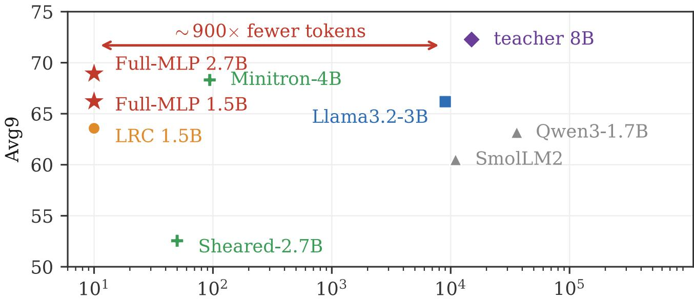
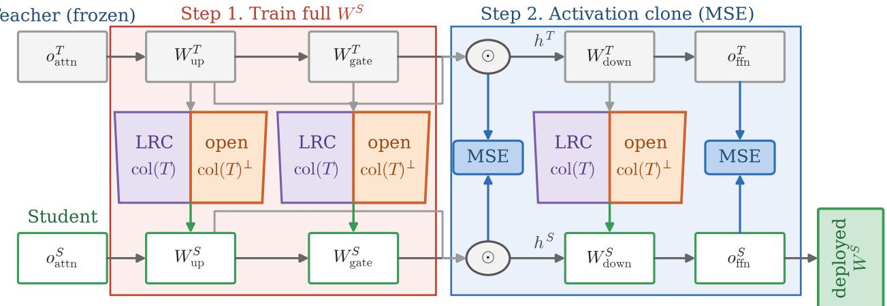
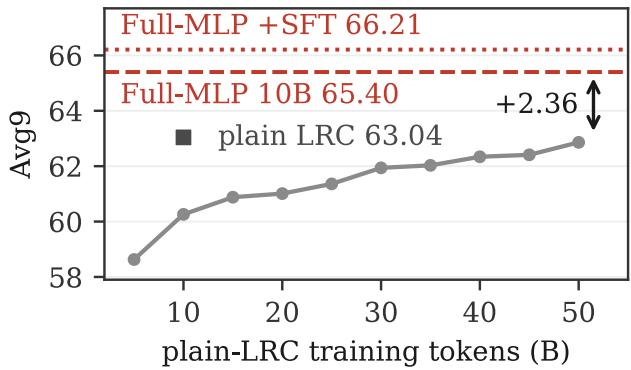
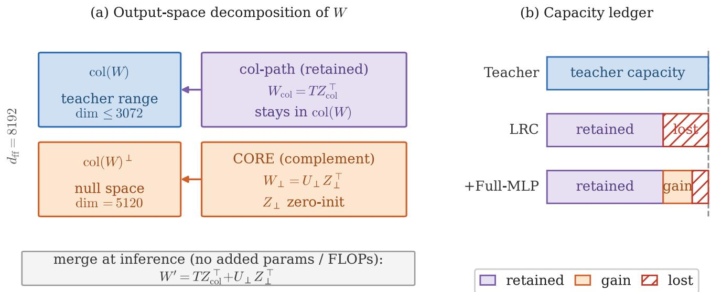
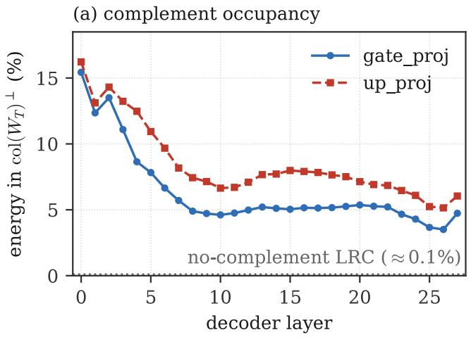
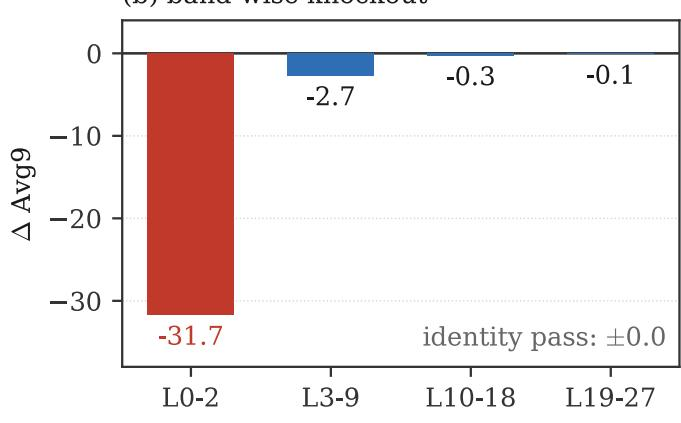

# Train What You Deploy: Closing the MLP Reachability Gap in Low-Rank Clone Distillation

Wenhui Chen1, Zhifeng Li1, Jie Zhou1, Navan Preet Singh1,2, Madalina Ciobanu1, Chenghua Wang1, Qingqing Mao1,2∗, Ritankar Das1,2

1Incept Labs, Houston, TX 2Titan Holdings, San Francisco, CA Correspondence to: Qingqing Mao <qmao@titanholdings.ai>

## Abstract

A compressed student has two shapes that need not agree: the weight it deploys at inference and the weight family its training can reach. We show that a state-of-the-art weightinheritance distiller, Low-Rank Clone (LRC), deploys a fullwidth student MLP but ties training to a teacher-induced slice, leaving 62.5–81.4% of each deployed matrix’s independent linear degrees of freedom unreachable—paid for at inference, never trainable. Our principle is one line: train what you deploy. From the identical LRC warm start, we make the training object the entire deployed matrix, with no change in deployed shape, deployed parameter count, or inference FLOPs, via two mergeable realizations (Dense-LRC and CORE-LRC) that both collapse to one deployed weight. This recovers stranded capacity: taking the stronger realization per teacher, +2.36/+2.71/+10.45 Avg9 over matchedbudget plain-LRC baselines across three teachers (Llama3.2- 3B, Llama3.1-8B, Qwen2.5-3B), with the largest gain on the widest teacher (Qwen), where it reaches the original recipe’s ∼20B-token accuracy at 10B tokens (2× token eficiency); there the strictly same-lineage arm still recovers +6.39, the fully controlled figure. Controls strongly support attributing the gain to the enlarged reachable set, rather than to added parameters or the recipe. From ∼10B distillation tokens plus a short SFT, a half-parameter 1.5B student matches its ∼9Ttoken teacher’s 9-task macro-average, within evaluation noise and with a residual MMLU deficit, and a 2.7B student beats Meta’s own oficial compression of Llama3.1-8B at ∼900× fewer compression tokens (a token count under unmatched recipes, not a compute claim). All results are from singleseed runs on the LRC backbone.

## 1 Introduction

A well-known discipline in systems is train/serve consistency: the pipeline you train should match the one you serve. This paper points out that a state-of-the-art weightinheritance distiller violates a weight-level version of the same discipline—and that fixing it recovers a large, free gain. A compressed student has two shapes that need not agree: the weight matrix it deploys at inference, and the family of matrices its training can actually reach. Low-Rank Clone (LRC) (Hao et al. 2025) deploys a full-width student MLP but ties its training to a teacher-induced subspace, so most of the deployed matrix’s independent degrees of freedom are served yet unreachable to the optimizer. Our fix is the corresponding principle—train what you deploy: make the training object the entire deployed matrix.

From the identical LRC warm start, at no change in deployed shape, this lets a half-parameter 1.5B student match its ∼9T-token teacher (Llama3.2-3B) on the 9-task macro-average, a 2.7B student beat Meta’s oficial samelineage compression at ∼900× fewer compression tokens (a compression-stage token count under unmatched recipes), and—on the widest teacher, where the constraint strands the most—a 1.7B student gain +10.45 Avg9 over the matched 10B-token baseline, reaching the original recipe’s ∼20Btoken accuracy at half the tokens; all at zero added inference cost (Figure 1).

An audit any compressor can fail. For a deployed weight, define its training utilization u as the ratio of its trainingreachable dimension to its deployed dimension. A gap (u < 1) is only justified if it buys something: LoRA-style adapters accept $u \ : < \ : 1$ to protect pretrained content; true structured pruning accepts it because the deleted dimensions are also removed from deployment. LRC’s MLP gap buys neither. It compresses only the hidden dimension and inherits the teacher’s MLP intermediate width df: it deploys a $d _ { \mathrm { f f } } \times d _ { \mathrm { m o d e l } } ^ { ( S ) }$ matrix but writes only into a $d _ { \mathrm { m o d e l } } ^ { ( T ) }$ -dimensional teacher column slice, so $u = d _ { \mathrm { m o d e l } } ^ { ( T ) } / d _ { \mathrm { f f } } = 1 / \rho .$ . Because a modern MLP is wide—our three teachers span $\rho = 2 . 6 7$ to 5.375—this leaves $1 - 1 / \rho = 6 2 . 5 – 8 1 . 4 \%$ of the deployed matrix’s independent linear degrees of freedom unreachable to training, at full deployment cost (what is stranded is independent directions, not fixed entries; formalized in §2). Recent spectral work (Jha and Reagen 2025) argues much of that nominal width is never efectively used; but “rarely used at initialization” and “useless once trained” are diferent claims, and only an intervention can tell them apart.

Train what you deploy. Acting on the principle is the simplest possible intervention: train the full deployed $d _ { \mathrm { f f } } \times d _ { \mathrm { m o d } } ^ { ( S ) }$ el matrix from the LRC warm start, initialized so the student starts exactly at the LRC model and merges back to the identical deployed shape (Figure 2). We realize it in two mergeable ways: a plain dense weight trained in full from the merged LRC warm start (Dense-LRC), and a teacher-spectral reparameterization of the same full matrix (CORE-LRC, §4)— both merging to the identical deployed weight at zero added inference cost. Controls (§6) place the cause on the reachable set itself: a canonical-dense arm, a random ambient completion, and the teacher-basis reparameterization all recover the gain on the narrow Llama teachers, and the merged weight keeps the standard deployed shape and deployed parameter count. A fully equal-parameter arm whose added coordinates are confined to the teacher slice—expanding no reachable set while adding the same trainable coordinates and optimizer state—recovers none of the gain (within noise of plain LRC); and the slice→full gain persists under a stripped generic recipe (logit-KL only, random initialization), so it is recipe-independent, not an artifact of the LRC objective. On the widest, most ill-conditioned teacher the two realizations separate: the teacher-spectral basis realizes far more of the same expansion at a fixed budget (+10.45 vs. +6.39 Avg9; §5), making CORE-LRC the realization of choice where compression is hardest (basis-conditioning analysis in the supplementary material).

  
Pre-training / compression tokens (B, log scale)  
Figure 1: Token eficiency of training LRC’s full deployed MLP matrix. Avg9 (0-shot) versus training tokens (log scale). From ∼10B distillation tokens (plus a short SFT), our students (stars; stronger realization per setting: teacher-spectral 66.21 at 1.5B, canonical dense 68.93 at 2.7B) reach their ∼9T-token teacher (Llama3.2-3B) and Meta’s oficial same-lineage compressions; the 2.7B student clears the oficial Llama3.2-3B at ∼900× fewer compression tokens (a token count under unmatched recipes; both pay the teacher’s own pre-training). From-scratch SLMs (Qwen3-1.7B, SmolLM2) are size context only; external points are published values under the same harness (§7).

## Contributions.

• A deployment–training reachable-set gap in LRC, made auditable. We frame a compressed weight by a training-utilization ratio u and show LRC’s MLP sits at $u = 1 / \rho \colon$ the deployed family $\{ T Z ^ { \top } \}$ is a strict subset of $\mathbb { R } ^ { d _ { \mathrm { f f } } \times \dot { r } }$ , stranding 62.5–81.4% of each deployed matrix’s independent degrees of freedom at full inference cost and no deployment saving—a gap that, unlike LoRA’s or a true prune’s, buys nothing (§2).

• Train what you deploy, with controlled attribution. Training the full deployed matrix from the identical warm start recovers the stranded capacity at zero added inference cost: +2.36/+2.71/+10.45 Avg9 over matched-budget plain-LRC baselines across three teachers (stronger realization per teacher, Table 1; the strictly same-lineage dense arm alone gives +2.23/+2.71/+6.39), reaching 2× token eficiency on the widest teacher, with a half-size 1.5B student matching its teacher’s macro-average. Controls place the cause on the enlarged set: full-matrix parameterizations recover it, the deployed shape and parameter count are unchanged (training-time trainables rise from rH to rd per projection—exactly matched by the equal-parameter control), a long-budget sweep argues against mere faster convergence, an equal-parameter slice-confined arm recovers none of it, the gain persists under a stripped generic recipe, and occupancy/knockout show the opened directions are used (§6).

## 2 The Inherited Width and Its Stranded Complement

LRC compresses only the hidden dimension $d _ { \mathrm { m o d e l } }$ and inherits the teacher’s full intermediate width $d _ { \mathrm { { f f } } } ,$ yet trains only a $d _ { \mathrm { m o d e l } } ^ { ( T ) }$ -dimensional teacher slice of each MLP projection. Our three teachers span $\rho = d _ { \mathrm { f f } } / d _ { \mathrm { m o d e l } }$ of 2.67,

Table 1: Training the deployed matrix vs. a matched plain-LRC baseline (10B PT, Avg9, 0-shot; Avg9 is the mean over 9 tasks including MMLU, excluding MathQA). Full-MLP LRC has two mergeable realizations—canonical Dense-LRC and teacher-spectral CORE-LRC—that merge to the identical deployed weight at zero added inference cost and tie on Llama (basis-independence); each row reports the stronger per teacher (teacher-spectral on Llama3.2-3B and Qwen, dense on Llama3.1-8B). On the widest teacher (Qwen) the teacher-spectral realization reaches 63.44, matching the original ∼20B-token baseline at half the tokens; it is a separate training lineage from the matched pair, whose same-lineage dense arm recovers +6.39 (59.38)—the fully controlled attribution evidence (§5).
<table><tr><td>Setting  $( \rho ^ { ( T ) } )$ </td><td></td><td>Plain LRC Full-MLP LRC</td><td> $\Delta$ </td></tr><tr><td>Llama3.2-3B→1.5B (2.67)</td><td>63.04</td><td>65.40</td><td>+2.36</td></tr><tr><td>Llama3.1-8B→2.7B (3.50)</td><td>65.55</td><td>68.26</td><td> $+ 2 . 7 1$ </td></tr><tr><td>Qwen2.5-3B→1.7B (5.375)</td><td>52.99</td><td>63.44</td><td> $+ 1 0 . 4 5$ </td></tr></table>

3.50, and 5.375, so the inherited-but-untrained part is large and teacher-dependent. For a gate/up projection $W ^ {  }$ Rdff×dmodel of full column rank, the training-inaccessible orthogonal complement has dimension $d _ { \perp } = d _ { \mathrm { f f } } - d _ { \mathrm { m o d e l } } .$ a fraction

$$
f _ { \perp } = \frac { d _ { \perp } } { d _ { \mathrm { f f } } } = 1 - \frac { 1 } { \rho }\tag{1}
$$

of the intermediate space: 62.5% at $\rho = 2 . 6 7 , 7 1 . 4 \% \mathrm { a t } 3 . 5 0 $ and 81.4% at 5.375. This bounds excluded matrix degrees of freedom of one non-square projection, not unused neurons (the SwiGLU product mixes gate and up outputs). Whether these directions are useless or unused-but-usable is settled only by opening them and measuring what is recovered—the intervention this paper makes.

Proposition 1 (Reachability gap) Let $\mathcal { H } _ { \mathrm { d e p l o y } } { = } \mathbb { R } ^ { d _ { \mathrm { f f } } \times r }$ be one student projection’s deployment hypothesis space $( r { = } d _ { \mathrm { m o d e l } } ^ { ( S ) } )$ and $\mathcal { R } _ { \mathrm { L R C } } { = } \{ T Z ^ { \top } \} \subsetneq \mathcal { H } _ { \mathrm { d e p l o y } }$ the reachable set ofthe $\bar { L } R C$ parameterization (Tfrozen). The reachability gap $\mathcal { G } { = } \mathcal { H } _ { \mathrm { d e p l o y } } \backslash \mathcal { R } _ { \mathrm { L R C } }$ is deterministic: fixed by the parameterization, for any initialization, objective, or optimizer.

Reachability concerns optimization accessibility, not representational capacity: the deployed shape carries any $W ^ { \top } \in$ ${ \mathcal { H } } _ { \mathrm { d e p l o y } }$ at identical inference cost, yet training only ever produces a member of $\mathcal { R } .$ . Membership in R is optimizerindependent; how much of R afinite-budget optimizer attains also depends on its coordinates (AdamW is not rotationinvariant; Zhang et al. 2025)—the first level carries the structural claim (§6), the second surfaces only on the widest teacher (§5.2).

## 3 Related Work

Compression-distillation and pruning. Knowledge distillation (Hinton, Vinyals, and Dean 2015) underlies DistilBERT (Sanh et al. 2019), TinyBERT (Jiao et al. 2020), MiniLM (Wang et al. 2020), and sequence-level objectives for generative LLMs (Gu et al. 2024; Agarwal et al. 2024).

Low-Rank Clone (Hao et al. 2025), the backbone we build on, jointly soft-prunes teacher weights by low-rank projection and clones teacher activations, matching trillion-tokentrained models with about 20B tokens. A complementary line removes capacity: structured pruning with distillationbased retraining cuts depth and width, including the MLP intermediate dimension, as in Minitron (Muralidharan et al. 2024) and Sheared LLaMA (Xia et al. 2024). This contrast is our starting point: where width pruning deletes the intermediate dimension, LRC inherits the teacher’s $d _ { \mathrm { f } }$ against a smaller $d _ { \mathrm { m o d e l } } ;$ we treat the resulting structural complement as a reserve to fill rather than waste.

Concurrent diagnoses, and the growth dual. RED (He et al. 2026) diagnoses a diferent failure in the same family of projection distillation: efective-rank collapse of hidden representations, repaired by an activation-aware channelselection initialization, after which training still proceeds within the projected family $\{ T Z ^ { \top } \}$ . We instead identify a deterministic parameterization gap (the $\mathcal { G }$ of §2) and remove the family constraint itself. The two axes are empirically separable in our data: an activation-aware channel-passthrough initialization of that flavor is worth +0.68 Avg9 on the Qwen target, whereas opening the reachable set at the same budget recovers +6.39 to +10.45 (§5.2); the representation-rank statistic dissociates from the gain (§6.4). Spectral scaling analyses (Jha and Reagen 2025, 2026) report that FFN width is under-utilized and usable capacity is optimizer-dependent; these are observational, and we supply the constructive counterpart by intervention. From the opposite direction, function-preserving growth (Samragh et al. 2024) expands a small model and relies on full training to activate initially unused directions; our setting is the compression dual.

Subspace and null-space adapters. Mechanically, the teacher-spectral realization (Eq. 2) is a constrained SVDdefined subspace update, as in PEFT methods (Meng, Wang, and Zhang 2024; Wang et al. 2024; Liu et al. 2024; Tang et al. 2025; Xiong and Xie 2026); we claim no novelty in the mechanism, and the gain does not depend on it: several full-matrix parameterizations recover it (§6.1). The setting difers: those methods avoid disturbing pretrained knowledge during finetuning, whereas we add usable capacity during distillation pre-training, targeting the structural left null space of a nonsquare inherited weight and merging back at inference.

Is low-rank enough for distillation? A concurrent line argues low-rank distillation is suficient, even optimal (Soarez et al. 2026; Kalyoncuoglu and Miftachov 2025; Shen et al. 2026). No conflict: those concern the rank of the trainable update within a fixed parameterization; our gap is the inherited $d _ { \mathrm { f } }$ that LRC retains but never opens, on which confining the update to the teacher subspace is demonstrably not suficient. We make no claim that low-rank is inferior in general.

## 4 Train What You Deploy

A non-square MLP weight splits its output space into the teacher-occupied range col(W) and a structural complement co $1 ( W ) ^ { \perp }$ that LRC’s projection never opens (for a gate/up weight this is the left orthogonal complement nul $1 ( W ^ { \top } )$ ; for the down projection, the right one). Training what we deploy opens it: we train the entire deployed $d _ { \mathbb { H } } \times r \ \mathbf { M } \mathbf { L } \mathbf { P }$ matrix from the plain-LRC warm start, at no change in deployed shape, parameter count, or FLOPs.

## 4.1 Dense-LRC: The Construction

Let $W \in \mathbb { R } ^ { d _ { \mathrm { f f } } \times H }$ be a teacher gate or up projection with $d _ { \mathrm { f f } } > H$ , where $H { = } d _ { \mathrm { m o d e l } } ^ { ( T ) }$ and $r { = } d _ { \mathrm { m o d e l } } ^ { ( S ) }$ is the (smaller) student width. Plain LRC parameterizes its compressed projection as $W _ { \mathrm { L R C } } = T Z _ { \mathrm { c o l } } ^ { \dagger }$ , with T an orthonormal basis of col(W) and only the $r \times H$ coordinates $Z _ { \mathrm { c o l } }$ trained, confining its column space to col(W) (the reachable set $\mathcal { R } _ { \mathrm { L R C } }$ of §2). Dense-LRC instead parameterizes the projection as a plain dense $d _ { \mathrm { { f } } } \times \boldsymbol { r }$ weight, initialized at the merged plain-LRC weight (the student is exactly the plain-LRC model at step zero), and trains every entry; its reachable column space is the full Rdff . At inference the trained weight is a single $d _ { \mathrm { f f } } \times r$ matrix of the plain-LRC shape—a structural reparameterization in the spirit of inference-time branch merging (Ding et al. 2021), with no added parameters or FLOPs. An equivalent teacher-spectral realization, CORE-LRC, opens the same complement in the teacher’s own SVD basis: with $U _ { \perp } \in \mathbb { R } ^ { d _ { \mathrm { f f } } \times ^ { \bullet } ( d _ { \mathrm { f f } } - H ) }$ an orthonormal basis of col(W)⊥,

$$
W _ { \mathrm { s t u d e n t } } = T Z _ { \mathrm { c o l } } ^ { \top } + U _ { \perp } Z _ { \perp } ^ { \top } ,\tag{2}
$$

with $Z _ { \perp } ~ \in ~ \mathbb { R } ^ { r \times ( d _ { \mathrm { f f } } - H ) }$ zero-initialized, so training also starts exactly at the plain-LRC model and merges to the same single $d _ { \mathrm { f f } } \times r$ weight (mergeability proposition in the supplementary material). Because $[ T \ \dot { U _ { \perp } } ]$ is a complete orthonormal basis of Rdff , CORE-LRC trains the same standard weight in a fixed teacher-aligned coordinate system— functionally equivalent to Dense-LRC, difering only in the coordinates AdamW optimizes in. On the matched Llama settings the two tie (§6.1); on the widest, most ill-conditioned teacher the teacher-spectral coordinates are decisively better (+10.45 vs. +6.39; §5). Training it removes LRC’s col(T) constraint rather than overwriting the cloned weight; the performance recovered then measures how much of the excluded capacity is usable, and on the Llama targets it is basis-independent (canonical-dense, random-completion, and teacher-basis endpoints within ∼0.64 Avg9; §6.1). Opening the complement is not a zero-forgetting guarantee: singlelayer orthogonality does not control the end-to-end Jacobian, and MMLU does drop relative to the teacher.

## 4.2 Instantiation and What We Claim

For Llama3.2-3B→1.5B each MLP weight is 8192 × 1536; Dense-LRC trains this full matrix from the merged warm start. We open the gate, up, and down projections only; all other LRC system switches are disabled in every reported run, so the measured gain is attributable to the MLP alone (the supplementary material). Training is distillation against the frozen teacher under a composite objective: temperaturescaled KL on logits (dominant), per-layer hidden-state and attention MSE alignment $( \lambda _ { \mathrm { a u x } } { = } 0 . 2 )$ , and a next-token crossentropy regularizer. Dense-LRC is warm-started dense continuation of the deployed MLP weight, so our contribution is not that it beats dense training; it is a diagnosis and repair of a reachable-set gap in LRC: (i) we formalize the gap; (ii) we show by intervention that opening it stably helps across three compressions; (iii) the fix is free at inference and never perturbs the warm start; and (iv) the teacher-aligned coordinate split makes “how much optimization leaves the inherited subspace” measurable (§6.4).

## 5 Experiments

## 5.1 Setup

We compress three teachers with LRC, then train the full deployed MLP matrix from the merged plain-LRC warm start during pre-training (PT). Realizations andpairing discipline: $\mathrm { ^ { * } F u l l - M L P L R C ^ { \mathrm { , } } }$ names the family; its two realizations merge to identical deployed weights and tie under matched conditions on the Llama teachers (§6.1). Headline deltas take the stronger of the two realizations minus the matched 10B plain-LRC baseline $( + 2 . 3 6 / + 2 . 7 1 / + 1 0 $ .45: teacher-spectral on Llama3.2-3B and Qwen, dense on Llama3.1-8B). The canonical dense arm alone gives +2.23/+2.71/+6.39; on Qwen the dense delta is the strictly same-lineage matched one (the CORE-Qwen arm is a separate lineage), so the controlled attribution never rests on a cross-lineage number. Both are reported and labeled wherever they appear. Evaluation uses nine standard tasks plus MathQA via the LM Evaluation Harness (Gao et al. 2024), all standard 0-shot (MMLU included), matching the LRC protocol; all models are oficial Instruct checkpoints under one harness. Matched deltas pair both arms at one stage (PT; also SFT for the 3B setting, +2.38 Dense); teacher and reference comparisons use the SFT student, matching the Instruct references. PT data follows the original LRC recipe (10B FineWeb-Edu (Penedo et al. 2024) + 0.35B OpenHermes tokens); an optional short SFT adds 0.62B tokens. Our pipeline is near-deterministic (deterministic data-aware SVD initialization; data order fixed by a shufle seed), and our plain-LRC baseline reproduces LRC’s published numbers. We report single-seed training runs (the field norm at this scale); run-to-run variation is bounded by the lm-eval Avg9 standard error (at most ≈0.55 across our settings, cleared ∼4–19× by the gains) and directional consistency across three teachers—though neither replaces a multi-seed sweep (§7). Code, configurations, and run logs are available from the corresponding author on request.

## 5.2 Gains on Three Teachers

Llama3.2-3B→1.5B (primary). The cleanest comparison fixes the paradigm and toggles only whether the MLP is unfrozen (Table 2). Our no-complement LRC baseline reproduces the published LRC numbers closely (63.04/63.57 PT/SFT vs. their 62.48/63.48), so the gain is measured against a faithful, same-data reproduction at the original recipe’s budget. Full-MLP LRC raises the 9-task average by +2.36 to +2.64 and MMLU by +4.02 (teacher-spectral realization; the matched Dense-LRC arm lands within noise at +2.23, Table 3); gains concentrate on knowledge/reasoning tasks (CSQA +6.30, MMLU +4.02). A long-budget nocomplement control shows this is not faster convergence (Figure 3): continuing the matched plain-LRC student past 10B does not improve it (63.04 → 63.04), and an independent plain-LRC run trained end-to-end under its own schedule to 50B tokens on a larger, more diverse corpus plateaus at 62.86—both ∼2.4–2.5 Avg9 below Full-MLP LRC’s 65.40 at 10B, and at no budget or corpus we tried did plain LRC reach it: a genuine capacity gain. After a short SFT the 1.5B student (teacher-spectral realization) reaches 66.21 Avg9, statistically indistinguishable from the 3B teacher’s 66.18 on this macro-average (+0.03, far inside this setting’s ≈0.4 Avg9 eval SE)—a match on the aggregate, not task by task. The match is not specific to that realization: a Dense-LRC student (independent seed-1234 control lineage) reaches 65.95 after the same short SFT, likewise within evaluation noise $( \Delta { = } - 0 . 2 3$ ; Table 2). The profile is diferentiated, not a uniform tax: the student exceeds its teacher on most commonsense/QA tasks (CSQA +7.21, ARC-E +2.49, BoolQ +1.62; WinoGrande −4.02 the exception) while the deficit concentrates in broad-knowledge MMLU (−5.70), which recovers only as $d _ { \mathrm { m o d e l } } ^ { ( S ) }$ grows (supplementary material).

  
Figure 2: The Full-MLP LRC framework. Full-MLP LRC trains the entire deployed MLP weight $W ^ { S }$ from the LRC warm start (Step 1): the teacher column space col(T) (purple), which LRC already trains (the warm start), plus the structural complement col $( T ) ^ { \perp }$ (orange, dim = $: d _ { \mathrm { f f } } - d _ { \mathrm { m o d e l } } ^ { ( T ) } )$ that unfreezing now opens. The student clones the teacher’s intermediate activations and FFN outputs by per-layer MSE (Step 2); $W ^ { S }$ keeps its original shape, so the deployed model adds no parameters or FLOPs over plain LRC. CORE-LRC opens the orange path as a zero-initialized, mergeable teacher-basis path (Eq. 2), functionally identical to the dense continuation. Training: teacher-guided distillation (temperature-scaled logit KL, per-layer hidden/attention MSE) with a next-token CE regularizer.

Llama3.1-8B→2.7B. The same matched comparison on a larger teacher confirms the gain is not specific to the 3B model: training the deployed matrix adds +2.71 Avg9 and +4.55 MMLU over the LRC baseline at 10B PT (65.55 → 68.26; Dense-LRC realization); after a short SFT the 2.7B student reaches 68.93 (per-task in Table S1). A sharper reading compares this student against Llama3.2-3B, Meta’s own prune–distill compression of this very teacher trained on up to ∼9T tokens (Grattafiori et al. 2024). Full-MLP LRC compresses the same Llama3.1-8B with only 10B PT tokens—roughly 900× fewer—into a slightly smaller student (≈2.7B vs. 3.21B). Since the reference is instructiontuned, the like-for-like comparison is our SFT student: 68.93 vs. 66.18 (+2.75; the PT student already leads at 68.26), trailing on MMLU (58.54 vs. 60.56) and WinoGrande while exceeding on the other seven tasks. Because the reference shares the teacher but not the recipe, data, or post-training, this is a same-lineage token-count comparison—not a controlled recipe comparison or a compute claim (only the compression-stage budget is counted, a convention both sides share; §7). In external context (Table S3), the 2.7B Dense-LRC student (68.93) also exceeds the same-size Sheared-LLaMA-2.7B (52.55) and the larger Minitron-4B (68.31) at ∼9× fewer tokens (published numbers, context only).

  
Figure 3: Plain LRC saturates below Full-MLP LRC. A no-complement LRC run swept to 50B tokens (grey; a larger, more diverse corpus) plateaus at 62.86 Avg9, and the matched plain-LRC point (63.04 at 10B) does not improve under continued training—both ∼2.4–2.5 below Full-MLP LRC at 10B (65.40 PT; 66.21 with SFT ≈ teacher 66.18). A genuine capacity gain, not faster convergence.

Table 2: Llama3.2-3B→1.5B: Full-MLP LRC vs. a matched no-complement LRC baseline, the original LRC paper, and the teacher (re-evaluated under our harness; all 0-shot; Avg9 excludes MathQA). Full-MLP rows: teacher-spectral realization; the matched Dense-LRC arm reaches 65.27 PT (+2.23, Table 3). §Dense-LRC+SFT from the independent seed-1234 lineage (§6.1): 65.95 vs. teacher 66.18 $( \Delta { = } - 0 . 2 3$ , inside eval SE)—the teacher match is carried by the canonical realization too. “nB” is always the PT budget; “+SFT” is the short 0.62B-token 8-dataset instruction stage (supp.).
<table><tr><td>Model</td><td>ARC-E</td><td>ARC-C</td><td>LogiQA</td><td>CSQA</td><td>PIQA</td><td>WinoG</td><td>BoolQ</td><td>SciQ</td><td>MMLU</td><td>Avg9</td><td>MathQA</td></tr><tr><td>Teacher Llama3.2-3B</td><td>73.86</td><td>46.25</td><td>29.65</td><td>67.97</td><td>75.56</td><td>68.03</td><td>78.53</td><td>95.30</td><td>60.56</td><td>66.18</td><td>34.84</td></tr><tr><td>LRC-1.5B PT (orig. LRC)</td><td>73.40</td><td>42.15</td><td>31.03</td><td>64.46</td><td>71.60</td><td>61.88</td><td>73.27</td><td>94.40</td><td>50.09</td><td>62.48</td><td></td></tr><tr><td>LRC-1.5B PT+SFT (orig. LRC)</td><td>74.75</td><td>44.97</td><td>30.72</td><td>65.77</td><td>73.07</td><td>62.25</td><td>75.78</td><td>94.60</td><td>49.42</td><td>63.48</td><td></td></tr><tr><td>LRC-1.5B 10B PT (ours)</td><td>74.12</td><td>42.66</td><td>31.34</td><td>65.36</td><td>71.93</td><td>62.43</td><td>73.73</td><td>95.10</td><td>50.65</td><td>63.04</td><td>28.84</td></tr><tr><td>LRC-1.5B 10B PT+SFT (ours)</td><td>74.87</td><td>43.69</td><td>30.41</td><td>67.32</td><td>73.01</td><td>61.09</td><td>75.69</td><td>95.20</td><td>50.82</td><td>63.57</td><td>29.75</td></tr><tr><td>Full-MLP LRC 1.5B 10B PT</td><td>76.43</td><td>46.08</td><td>30.41</td><td>71.66</td><td>74.10</td><td>64.56</td><td>75.57</td><td>95.10</td><td>54.67</td><td>65.40</td><td>30.42</td></tr><tr><td>Full-MLP LRC 1.5B 10B PT+SFT</td><td>76.35</td><td>45.31</td><td>30.26</td><td>75.18</td><td>74.65</td><td>64.01</td><td>80.15</td><td>95.10</td><td>54.86</td><td>66.21</td><td>31.86</td></tr><tr><td>Full-MLP LRC 1.5B 16.5B PT+SFT</td><td>75.72</td><td>44.11</td><td>30.88</td><td>75.10</td><td>74.32</td><td>63.69</td><td>82.11</td><td>95.20</td><td>55.38</td><td>66.28</td><td>32.46</td></tr><tr><td>Dense-LRC 1.5B 10B PT+SFT8</td><td>75.59</td><td>44.37</td><td>29.65</td><td>73.87</td><td>73.78</td><td>65.11</td><td>81.47</td><td>94.90</td><td>54.81</td><td>65.95</td><td>31.49</td></tr><tr><td>∆ (Full-MLP–LRC, 10B PT)</td><td>+2.31</td><td>+3.42</td><td>-0.93</td><td>+6.30</td><td>+2.17</td><td>+2.13</td><td>+1.84</td><td>0.00</td><td>+4.02</td><td>+2.36</td><td>+1.58</td></tr><tr><td>∆ (Full-MLP-LRC, 10B PT+SFT)</td><td>+1.48</td><td>+1.62</td><td>-0.15</td><td>+7.86</td><td>+1.64</td><td>+2.92</td><td>+4.46</td><td>-0.10</td><td>+4.04</td><td>+2.64</td><td>+2.11</td></tr></table>

The hard wide-MLP target: Qwen2.5-3B→1.7B. The Qwen2.5-3B teacher $( \rho ^ { ( T ) } { = } 5 . 3 7 \bar { 5 } )$ is a structurally harder compression target, visible before any full-matrix training: the original LRC recipe trains this student with ∼20B tokens, twice the Llama budget. Under a matched 10B budget our plain-LRC baseline reaches only Avg9 52.99 (MMLU 36.42), severely under-converged—and this widest MLP is where training what you deploy pays of most. The teacherspectral CORE-LRC realization reaches Avg9 63.44 at 10B PT (63.82 after SFT)—+10.45 over the matched baseline, matching LRC’s own ∼20B-token baseline (63.43) at half the tokens (2× token eficiency), with the gain landing where plain LRC most under-fits (CSQA +31.12, MMLU +17.03). The canonical Dense-LRC realization, trained in the strictly same lineage as the baseline (same seed, initialization, and data order), independently recovers +6.39 (59.38; CSQA +21.62, MMLU +13.71): the fully controlled comparison establishes the reachable-set gain on its own. As a control against an initialization-side account (He et al. 2026), an activation-aware channel-passthrough initialization is worth only +0.68 Avg9 here—an order of magnitude smaller than opening the reachable set, which it neither explains nor bounds. On this widest, most ill-conditioned target the teacher-spectral basis is the markedly better optimizer (≈4 above Dense; the two tie on Llama). The CORE-Qwen arm is a separate lineage from the seed-matched pair, so we read that margin qualitatively; the anchors needing no such reading are the matched +6.39 and CORE reaching the 20B recipe’s accuracy at 10B (the supplementary material).

## 6 Isolating the Reachable Set

Three alternatives must be excluded before attributing the gain to the enlarged reachable set—a privileged basis, a pure added-parameter efect, an LRC-recipe artifact. Each matched control toggles one ingredient of §2’s definition: basis controls change coordinates, not R; the equal-parameter arm adds trainable coordinates, not R; the cross-recipe 2 × 2 changes the objective, not the R contrast.

## 6.1 Basis Controls: Capacity, Not Coordinates

We re-train the primary Llama3.2-3B→1.5B student with each MLP projection as a plain dense weight (canonical basis), from the same merged warm start under the identical recipe (Table 3). The dense control reaches 65.27 Avg9 versus the teacher-spectral 65.40 (∆=−0.13, within run-to-run variation; under an independent data-shufle seed the two arms again land within noise, $\Delta \approx 0 . 1 5 ) \colon$ the basis is not privileged. A random ambient completion arm (random fullrank completion, not orthogonalized against col(T); reachable set again all of $\mathbb { R } ^ { d _ { \mathrm { f f } } \times \check { r } } )$ reaches 64.76 under the same recipe, seed, and data order. All three parameterizations of the same unlocked capacity recover the bulk of the gain (spread 0.64 Avg9, the non-orthogonalized random completion lowest): the capacity, not the coordinates, carries the gain. The trained weights corroborate this: the dense control ends with 7.1%/9.4% (gate/up) of its MLP weight energy in $\mathrm { c o l } ( W ) ^ { \perp }$ , matching the teacher-spectral student’s 6.2%/8.3%—the objective, not the parameterization, determines where the solution lives.

## 6.2 The Equal-Parameter Control: Capacity, Not Parameter Count

The decisive control adds the same rd trainable coordinates per projection as the full-matrix arm but confines them to the teacher slice: $W _ { \mathrm { r e d } } = T ( Z _ { \mathrm { c o l } } ^ { \top } + A Z _ { \mathrm { r e d } } ^ { \top } )$ with $Z _ { \mathrm { c o l } } ~ \in ~ \mathbb { R } ^ { r \times H } , ~ Z _ { \mathrm { r e d } } ~ \in ~ \mathbb { R } ^ { r \times ( d _ { \mathrm { f f } } - H ) }$ both trainable and $A \ { \stackrel {  } { \in } } \ \mathbb { R } ^ { H \times ( d _ { \mathrm { f f } } - H ) } \ { \stackrel {  } { \mathrm { a } } } { \hat { f } } x e d$ , unit-column random matrix. The count is exactly the full-matrix arm’s, with equal AdamW state, while co $( W _ { \mathrm { r e d } } ) \subseteq \mathrm { c o l } ( T )$ by construction. Trained from the same warm start under the identical recipe (matched seed-1234 lineage), it reaches Avg9 64.02—within noise of plain LRC (64.04 in this lineage) and ∼1.1 points below the full-matrix arm in the same lineage (65.16). The same coordinate and optimizer-state budget, absent reachable-set expansion, recovers essentially none of the gain, strongly supporting reachable-set expansion as the cause (“strongly supports,” not “decisively isolates”; caveats in §7).

Table 3: Capacity accounting for the basis controls (Llama3.2-3B→1.5B; H=3072, r=1536, d =8192, 28 layers). CORE and the dense control train the same standard weight from the same warm start and deploy identically, differing only in coordinates.
<table><tr><td></td><td>LRC</td><td>CORE</td><td>Dense</td></tr><tr><td>Train./proj.</td><td>rH</td><td>rdff</td><td>rdff</td></tr><tr><td>Total MLP train.</td><td>0.40B</td><td>1.06B</td><td>1.06B</td></tr><tr><td>Reachable set</td><td>col(T)</td><td> $\mathbb { R } ^ { d _ { \mathrm { f f } } }$ </td><td> $\mathbb { R } ^ { d _ { \mathrm { f f } } }$ </td></tr><tr><td>Warm start</td><td></td><td>LRC init =LRC init =LRC init</td><td></td></tr><tr><td>Avg9 @ 10B PT</td><td>63.04</td><td>65.40</td><td>65.27</td></tr></table>

Table 4: Recipe-independence of the reachable-set gain (Qwen2.5-3B→1.7B, matched 2B PT, seed 1234). “slice” trains only col(T); “full” trains the deployed matrix.
<table><tr><td>Recipe</td><td>slice</td><td>full</td><td>gap</td></tr><tr><td>LRC  $( \mathrm { a u x } + \mathrm { S V D  i n i t } )$ </td><td>58.64</td><td>60.46</td><td>+1.82</td></tr><tr><td>GPD  $( \mathrm { K L \ o n l y + r a n d } )$ </td><td>39.95</td><td>42.81</td><td> $+ 2 . 8 6$ </td></tr></table>

## 6.3 Recipe-Independence

The controls above hold the LRC recipe fixed (activation/attention alignment plus a data-aware SVD initialization), so a residual worry is that opening the matrix helps only in concert with those auxiliaries. $\textup { A 2 } \times 2$ factorial on the Qwen target (matched 2B PT tokens, seed 1234) crosses reachable set (slice vs. full) with recipe (LRC vs. GPD, a stripped generic recipe: logit-KL only, random-projection init, no activation alignment). Training the full matrix beats the slice under both recipes (Table 4): +1.82 under LRC and +2.86 under GPD. The gain is a property of which parameters are trained, not the surrounding recipe; absolute scores are low by design (one-fifth the tokens; GPD further strips the recipe) and are read only within this matched setting.

## 6.4 The Opened Coordinates Are Functionally Engaged

Decomposing each trained MLP weight against the teacher column space, the Full-MLP LRC student places 6.2% (gate) and 8.3% (up) of its weight energy in col $( W ) ^ { \perp }$ on average— 12–16% in the first three layers, decaying with depth—while a plain-LRC student measures ≈0.1%, zero up to numerics (the supplementary material). Surgically removing exactly the complement component (7.4% of weight energy) collapses the student to chance on all nine tasks; a plain-LRC student confined to co $\mathrm { l } ( W _ { T } )$ by construction performs normally, and an identity pass through the same pipeline is lossless. The dependence is depth-localized: removing the complement of only the first three layers reproduces most of the collapse (−31.74 Avg9); layers 3–9 cost −2.73; later layers are within noise. The collapse shows the trained solution is strongly co-adapted with the complement component, not that those directions independently encode capability. Separately, RED’s representation-rank statistic (He et al. 2026) dissociates from the gain: the dense and teacher-spectral arms difer 1.7× in early-layer efective rank yet tie on Avg9.

## 6.5 Which Comparisons Are Strictly Matched

The core reachable-set claims—the col(T)-vs-full gap on each teacher, the equal-parameter and basis controls, the cross-recipe $2 \times 2 \cdot$ —are strictly matched pairs (same warm start, recipe, data order, budget, seed; only the isolated factor difers). Two comparisons are cross-lineage, both on Qwen: teacher-spectral headline delta (+10.45) and implied COREvs-Dense margin; both flagged where they appear (§7).

## 7 Limitations

(1) No zero-forgetting claim. Single-layer orthogonality cannot control the end-to-end Jacobian; MMLU does drop. (2) Attribution strength. The equal-parameter control uses one fixed A, one seed; the $2 \times 2$ runs at 2B, single-seed (“strongly supports,” not “decisively isolates”); the Qwen headline +10.45 is cross-lineage, always paired with the strictly matched dense +6.39 that the controlled claim rests on. Training runs are single-seed (the field norm; LRC, Minitron, Sheared- $\mathbf { \cdot L L a M A } ) ;$ lm-eval SE bounds evaluation noise only, not run-to-run variance. (3) A single design axis. LRC compresses only the hidden dimension; we characterize the optimal $d _ { \mathrm { m o d e l } }$ under an inherited $d _ { \mathrm { f } }$ , not the optimal $d _ { \mathrm { { f f } } } \cdot \mathrm { { } }$ the hidden-width sweep lacks per-width no-complement baselines, so its MMLU reading is suggestive. (4) No MoE coverage. Per-expert expansion ratios sit near or below 1: little structural complement. (5) One compression backbone; evaluation scope. All students use the LRC backbone; external baselines are published numbers, context only—no distillation-SOTA claim; whether other prune–distill methods show the same reserve is untested. Evaluation is 0-shot multiple-choice/QA (no generative or long-chain reasoning suites). The ∼900× figure is a token count under unmatched recipes, not a compute claim.

## 8 Conclusion

Training the full deployed matrix from the identical LRC warm start recovers the stranded capacity at zero added inference cost $( + 2 . 3 6 / + 2 . 7 1 / + 1 0 . 4 5 \mathrm { A v g 9 } ; 2 \times$ token eficiency; a half-parameter student matching its teacher), and controls attribute the gain to the reachable set. The audit is not LRCspecific: for any compressed weight, compare the dimension training can reach against the dimension deployment pays for, then justify the gap or close it. Wherever a width is inherited rather than deleted, we expect a reserve of the same kind—testing that on other prune–distill backbones is the natural next step. So: a weight you deploy but never train is a gap to close—and closing it isfree at inference.

## References

Agarwal, R.; Vieillard, N.; Zhou, Y.; Stanczyk, P.; Ramos, S.; Geist, M.; and Bachem, O. 2024. On-Policy Distillation of Language Models: Learning from Self-Generated Mistakes. In International Conference on Learning Representations (ICLR).

Ding, X.; Zhang, X.; Ma, N.; Han, J.; Ding, G.; and Sun, J. 2021. RepVGG: Making VGG-style ConvNets Great Again. In IEEE/CVF Conference on Computer Vision and Pattern Recognition (CVPR).

Furlanello, T.; Lipton, Z. C.; Tschannen, M.; Itti, L.; and Anandkumar, A. 2018. Born-Again Neural Networks. In International Conference on Machine Learning (ICML).

Gao, L.; Tow, J.; Abbasi, B.; Biderman, S.; Black, S.; DiPofi, A.; Foster, C.; Golding, L.; Hsu, J.; et al. 2024. A Framework for Few-shot Language Model Evaluation. https://github.com/EleutherAI/lm-evaluation-harness. Version 0.4.8. Accessed: 2026-07-27.

Grattafiori, A.; Dubey, A.; Jauhri, A.; Pandey, A.; Kadian, A.; Al-Dahle, A.; Letman, A.; Mathur, A.; Schelten, A.; Yang, A.; et al. 2024. The Llama 3 Herd of Models. arXiv:2407.21783.

Gu, Y.; Dong, L.; Wei, F.; and Huang, M. 2024. MiniLLM: Knowledge Distillation of Large Language Models. In International Conference on Learning Representations (ICLR).

Hao, J.; Huang, Q.; Liu, H.; Xiao, X.; Ren, Z.; and Yu, J. 2025. A Token is Worth over 1,000 Tokens: Eficient Knowledge Distillation through Low-Rank Clone. In Advances in Neural Information Processing Systems (NeurIPS). Spotlight.

He, J.; Tang, Y.; Nie, T.; Li, G.; Yang, B.; Du, J.; Sun, L.; and Ma, W. 2026. Reasoning-preserved Eficient Distillation of Large Language Models via Activation-aware Initialization. arXiv:2605.29327.

Hinton, G.; Vinyals, O.; and Dean, J. 2015. Distilling the Knowledge in a Neural Network. arXiv:1503.02531.

Jha, N. K.; and Reagen, B. 2025. Spectral Scaling Laws in Language Models: How Efectively Do Feed-Forward Networks Use Their Latent Space? In Conference on Empirical Methods in Natural Language Processing (EMNLP).

Jha, N. K.; and Reagen, B. 2026. Same Architecture, Different Capacity: Optimizer-Induced Spectral Scaling Laws. arXiv:2605.21803.

Jiao, X.; Yin, Y.; Shang, L.; Jiang, X.; Chen, X.; Li, L.; Wang, F.; and Liu, Q. 2020. TinyBERT: Distilling BERT for Natural Language Understanding. In Findings of the Association for Computational Linguistics: EMNLP 2020.

Kalyoncuoglu, Y.; and Miftachov, R. 2025. High-Dimensional Search, Low-Dimensional Solution: Decoupling Optimization from Representation. arXiv:2512.23410.

Liu, S.-Y.; Wang, C.-Y.; Yin, H.; Molchanov, P.; Wang, Y.- C. F.; Cheng, K.-T.; and Chen, M.-H. 2024. DoRA: Weight-Decomposed Low-Rank Adaptation. In International Conference on Machine Learning (ICML).

Meng, F.; Wang, Z.; and Zhang, M. 2024. PiSSA: Principal Singular Values and Singular Vectors Adaptation of Large Language Models. arXiv:2404.02948.

Muralidharan, S.; Sreenivas, S. T.; Joshi, R.; Chochowski, M.; Patwary, M.; Shoeybi, M.; Catanzaro, B.; Kautz, J.; and Molchanov, P. 2024. Compact Language Models via Pruning and Knowledge Distillation. In Advances in Neural Information Processing Systems (NeurIPS).

Penedo, G.; Kydlíček, H.; Ben allal, L.; Lozhkov, A.; Mitchell, M.; Rafel, C.; Von Werra, L.; and Wolf, T. 2024. The FineWeb Datasets: Decanting the Web for the Finest Text Data at Scale. arXiv:2406.17557.

Samragh, M.; Mirzadeh, I.; Alizadeh-Vahid, K.; Faghri, F.; Cho, M.; Nabi, M.; Naik, D.; and Farajtabar, M. 2024. Scaling Smart: Accelerating Large Language Model Pre-training with Small Model Initialization. arXiv:2409.12903.

Sanh, V.; Debut, L.; Chaumond, J.; and Wolf, T. 2019. DistilBERT, a distilled version of BERT: smaller, faster, cheaper and lighter. arXiv:1910.01108.

Shen, Z.; Li, Y.; Yin, Q.; Leong, C. T.; Wang, Z.; Chen, Y.; Han, R.; Lee, S.; and Fung, Y. R. 2026. On the Geometry of On-Policy Distillation. arXiv:2606.07082.

Soarez, A. R.; Kim, D.; Costa, M.; and Torre, A. 2026. Demystifying Low-Rank Knowledge Distillation in Large Language Models: Convergence, Generalization, and Information-Theoretic Guarantees. arXiv:2603.22355.

Sun, M.; Chen, X.; Kolter, J. Z.; and Liu, Z. 2024. Massive Activations in Large Language Models. In Conference on Language Modeling (COLM).

Tang, P.; Liu, Y.; Zhang, D.; Wu, X.; and Zhang, D. 2025. LoRA-Null: Low-Rank Adaptation via Null Space for Large Language Models. arXiv:2503.02659.

Wang, H.; Li, Y.; Wang, S.; Chen, G.; and Chen, Y. 2024. MiLoRA: Harnessing Minor Singular Components for Parameter-Eficient LLM Finetuning. arXiv:2406.09044.

Wang, W.; Wei, F.; Dong, L.; Bao, H.; Yang, N.; and Zhou, M. 2020. MiniLM: Deep Self-Attention Distillation for Task-Agnostic Compression of Pre-Trained Transformers. In Advances in Neural Information Processing Systems (NeurIPS).

Xia, M.; Gao, T.; Zeng, Z.; and Chen, D. 2024. Sheared LLaMA: Accelerating Language Model Pre-training via Structured Pruning. In International Conference on Learning Representations (ICLR).

Xiong, Y.; and Xie, X. 2026. OPLoRA: Orthogonal Projection LoRA Prevents Catastrophic Forgetting during Parameter-Eficient Fine-Tuning. In Proceedings ofthe AAAI Conference on Artificial Intelligence (AAAI).

Zhang, T. H.; Maes, L.; Milligan, A.; Jolicoeur-Martineau, A.; Mitliagkas, I.; Scieur, D.; Lacoste-Julien, S.; and Guille-Escuret, C. 2025. Understanding Adam Requires Better Rotation Dependent Assumptions. In Advances in Neural Information Processing Systems (NeurIPS).

## Appendix: Supplementary Material

## A CORE-LRC: The Teacher-Spectral Realization

Train what you deploy has a canonical realization, Dense-LRC, and a teacher-spectral realization, CORE-LRC, which reaches the same full deployed matrix in the teacher’s own SVD basis, with the complement zero-initialized so training starts exactly at the plain-LRC model (main paper, Eq. 2). On the matched Llama settings the two tie; the main text reports whichever realization is stronger per teacher (teacher-spectral on Llama3.2-3B and on the widest Qwen target, where it carries the +10.45 headline and the 2× token-eficiency result; canonical dense on Llama3.1-8B). This section restates the construction, gives its mergeability proposition, and details the basis-conditioning analysis.

Construction. Let $T \in \mathbb { R } ^ { d _ { \mathrm { f f } } \times H }$ be an orthonormal basis of col(W) and $U _ { \mathrm { ~ l ~ } } \in \mathbb { R } ^ { d _ { \mathrm { f f } } \times ( d _ { \mathrm { f f } } - H ) }$ an orthonormal basis of the complement $\bar { \mathrm { c o l } } ( W ) ^ { \perp }$ (both read of the SVD of W), so $[ T U _ { \perp } ]$ is a complete orthonormal basis of $\mathbb { R } ^ { d _ { \mathrm { f f } } }$ . CORE-LRC augments the LRC column path with a complement path,

$$
W _ { \mathrm { s t u d e n t } } = T Z _ { \mathrm { c o l } } ^ { \top } + U _ { \perp } Z _ { \perp } ^ { \top } ,\tag{S1}
$$

with $Z _ { \mathrm { c o l } } ~ \in ~ \mathbb { R } ^ { r \times H }$ and $Z _ { \perp } ~ \in ~ \mathbb { R } ^ { r \times ( d _ { \mathrm { f f } } - H ) } ; ~ Z _ { \perp }$ is zeroinitialized, so the complement path vanishes at the start and the student is exactly the plain-LRC model. For the down projection the dual construction fills the right complement. At inference the weight merges to a single $d _ { \mathrm { f f } } \times r$ matrix of the plain-LRC shape: no added parameters or FLOPs (Figure S1).

Proposition S1 (Mergeability) Let $U _ { \perp } ^ { \top } T = \mathbf { 0 }$ with $[ T U _ { \perp } ]$ orthonormal. For the merged weight ofEq. (S1): (i) the two paths write to orthogonal output subspaces, and at $Z _ { \perp } = \mathbf { 0 }$ the perp path vanishes, so the student is unchanged at initialization; (ii) $W _ { \mathrm { s t u d e n t } }$ keeps the plain-LRC shape, so after merging the deployed model adds no parameters or $F L O P s ;$ (iii) the two path gradients read G in complementary coordinates $( G ^ { \mp } T$ and $G ^ { \top } U _ { \bot } )$ , so updating one path cannot change the other’s output.

All three claims follow from orthonormality; the proposition constrains only the single-layer MLP output (end-toend behavior through later layers is not controlled; Limitation 1). Because $[ \check { T } \ U _ { \perp } ]$ is complete, the two paths span the entire deployed weight space: with $Q { = } [ T ~ U _ { \perp } ]$ and $M { = } [ Z _ { \mathrm { c o l } } ^ { \top } ; Z _ { \perp } ^ { \top } ]$ , CORE-LRC is $W { = } Q M { - }$ —the standard student weight trained in a fixed teacher-aligned basis, functionally equivalent to Dense-LRC and difering only in the coordinate system AdamW optimizes in.

Basis conditioning: when the basis starts to matter. On the matched narrow-teacher settings Dense-LRC and CORE-LRC tie (65.27 vs. 65.40 Avg9)—basis-independence. The wide-MLP Qwen2.5-3B target, whose residual stream carries massive-activation channels (Sun et al. 2024), is where the two part company: the teacher-spectral basis realizes far more of the same expansion at a fixed 10B budget— Avg9 63.44 for CORE-LRC (+10.45 over the matched plain-LRC baseline) versus 59.38 for the canonical-dense arm (+6.39), with CORE-LRC matching the original recipe’s ∼20B-token baseline (63.43) at half the tokens (2× token eficiency). Because the CORE-Qwen arm comes from a different training run than the seed-matched Dense/LRC pair, we read the cross-realization margin (≈+4) qualitatively— consistent with AdamW’s coordinate dependence (Zhang et al. 2025)—while the same-lineage dense delta (+6.39) carries the strictly controlled reachable-set claim; a matched pair on a wide-MLP target is left to future work. The tokencount observation that CORE-LRC at 10B reaches plain LRC’s original-recipe ∼20B accuracy (63.44 vs. 63.43) is a token-count comparison, not a controlled compute-to-target estimate, and we do not report one.

## B Additional Result Tables

Recovering capacity along the hidden axis. Holding the teacher (Llama3.2-3B), data, budget (10B, one epoch), and losses fixed, we sweep the student hidden dimension $d _ { \mathrm { m o d e l } } ^ { ( S ) }$ from 1024 to 3072 with the MLP fully unfrozen (teacherspectral realization; Table S5). The 9-task average rises monotonically and crosses the teacher near $d _ { \mathrm { m o d e l } } ^ { ( S ) } { \approx } 2 0 4 8 ( \mathrm { a }$ standard distillation efect (Furlanello et al. 2018)); MMLU, stuck at 54.67 at $d _ { \mathrm { m o d e l } } ^ { ( S ) } { = } 1 5 3 6$ despite full-matrix training, climbs monotonically and reaches the teacher’s 60.56 only near the native width. This associates the residual MMLU gap with overall student width: with the full MLP complement already open, more MLP-tail capacity does not close it. Widening $d _ { \mathrm { m o d e l } } ^ { ( S ) }$ moves several capacity axes at once, so we read this as suggestive rather than a clean isolation; matched no-complement baselines at each width are future work.

## C Implementation Details

Student construction and initialization. The student is initialized by a greedy, calibration-data-aware SVD pass over a few hundred packed 2048-token sequences: an SVD of the (tied) embedding gives the master projection $\boldsymbol { P } \in \mathbb { R } ^ { r \times H }$ compressing the residual stream; the per-layer zoom matrices are initialized by ridge regression against teacher activations, propagating the student’s own compressed hidden states forward so each layer is fit on the distribution it will actually see. The Llama students use a plain SVD (k=0). Qwen2.5 carries a handful of massive-activation residual channels $( \sim 1 0 ^ { 3 } )$ (Sun et al. 2024); for the Qwen student an outlier-aware $P$ optionally preserves the top-k (k=48) outlier channels verbatim as identity rows and SVD-compresses the rest—an initialization-side conditioning option, orthogonal to the reachable-set intervention, worth +0.68 Avg9 (main paper). All other LRC system switches (KV-Direct, embedding/LM-head recovery, Wiener initialization) are disabled in every reported run.

Objective. The per-token loss is

$$
\begin{array} { r } { \mathcal { L } = w _ { \mathrm { K L } } T ^ { 2 } \mathrm { K L } \big ( \sigma ( z \tau / T ) \| \sigma ( z s / T ) \big ) } \\ { + w _ { \mathrm { N T P } } \mathrm { C E } ( y , z s ) + \lambda _ { \mathrm { a u x } } \mathcal { L } _ { \mathrm { a l i g n } } , } \end{array}
$$

  
Figure S1: CORE-LRC: a complement-coordinate reparameterization. (a) A non-square MLP weight decomposes into the teacher-occupied range and the structural complement; CORE-LRC restricts the update to the complement, zero-initialized and mergeable. (b) Capacity ledger: hidden-dimension compression loses capacity; opening the complement reclaims the unusedbut-usable part.

where $\mathcal { L } _ { \mathrm { a l i g n } }$ averages per-layer hidden-state MSE (mapped to teacher width via $\bar { P } )$ , per-head attention cosine alignment on $Q / K / V / O$ , and MLP-intermediate MSE on the post-SwiGLU product. All reported PT runs use $w _ { \mathrm { K L } } { = } w _ { \mathrm { N T P } } { = } 1 . 0 , T { = } 4 0 , \lambda _ { \mathrm { a u x } } { = } 0 . 2 ;$ ; these are held identical for plain LRC, Dense-LRC, and CORE-LRC, so they do not diferentiate any reported comparison.

Training and evaluation. AdamW (cosine schedule, 10% warmup, grad-clip 1.0), learning rate $1 \times 1 0 ^ { - 4 }$ (PT) and $1 \times 1 0 ^ { - 5 }$ (SFT), efective batch 32 sequences of length 2048, bf16, one epoch per budget. PT data: ≈10B FineWeb-Edu tokens (educational score ≥4) plus ≈0.35B OpenHermes tokens, tokenized with each teacher’s own tokenizer. SFT: ≈0.62B tokens over an 8-dataset general mixture. Evaluation: standard 0-shot accuracy via the LM Evaluation Harness for all models; Avg9 is the mean over ARC-Easy, ARC-Challenge, LogiQA, CommonsenseQA, PIQA, Wino-Grande, BoolQ, SciQ, and MMLU.

Training-time cost. Relative to plain LRC, both realizations roughly double the trainable parameter count (≈0.40B→≈1.06B for the 3B setting); the per-token MLP FLOPs are identical for plain LRC and Dense-LRC (same deployed shape), and the teacher-spectral realization adds a fixed-basis reconstruction measured at ≈12% step time over Dense-LRC on matched hardware, plus 7–28 GB of frozen bases in bf16. All of this is training-only: after merging, the deployed student has exactly the plain-LRC parameter count and FLOPs. We do not report a controlled compute-to-target estimate (Appendix A).

Table S1: Llama3.1-8B→2.7B: training the deployed matrix vs. a matched LRC baseline and the teacher. The matched fullmatrix arm (Dense-LRC realization) adds +2.71 Avg9 / +4.55 MMLU at 10B PT. The Ref. row is the oficial Llama3.2-3B (Meta’s own ∼9T-token prune–distill compression of the same teacher), which our 2.7B student exceeds on Avg9 at ∼900× less PT. ‡Teacher-spectral realization from a separate training lineage (Appendix A); context, not a matched pair. Avg9 excludes MathQA.
<table><tr><td>Model</td><td>ARC-E</td><td>ARC-C</td><td>LogiQA</td><td>CSQA</td><td>PIQA</td><td>WinoG</td><td>BoolQ</td><td>SciQ</td><td>MMLU</td><td>Avg9</td><td>MathQA</td></tr><tr><td>Teacher Llama3.1-8B</td><td>82.28</td><td>55.55</td><td>31.64</td><td>76.17</td><td>80.20</td><td>73.56</td><td>85.44</td><td>97.30</td><td>68.31</td><td>72.27</td><td>39.53</td></tr><tr><td>Ref. Llama3.2-3B-Instruct (~9T tok)</td><td>73.86</td><td>46.25</td><td>29.65</td><td>67.97</td><td>75.56</td><td>68.03</td><td>78.53</td><td>95.30</td><td>60.56</td><td>66.18</td><td>34.84</td></tr><tr><td>LRC-2.7B 10B PT</td><td>77.48</td><td>47.61</td><td>33.79</td><td>66.91</td><td>72.58</td><td>63.22</td><td>78.23</td><td>96.10</td><td>54.00</td><td>65.55</td><td>26.53</td></tr><tr><td>Dense-LRC 2.7B 10B PT</td><td>80.89</td><td>51.37</td><td>31.64</td><td>74.12</td><td>74.21</td><td>67.40</td><td>79.36</td><td>96.80</td><td>58.55</td><td>68.26</td><td>29.78</td></tr><tr><td>Dense-LRC 2.7B 10B PT+SFT</td><td>80.18</td><td>49.83</td><td>31.49</td><td>78.79</td><td>75.79</td><td>66.54</td><td>82.57</td><td>96.60</td><td>58.54</td><td>68.93</td><td>32.43</td></tr><tr><td>CORE-LRC‡ 2.7B 10B PT</td><td>79.59</td><td>50.09</td><td>31.49</td><td>74.20</td><td>73.01</td><td>64.64</td><td>79.57</td><td>95.90</td><td>58.65</td><td>67.46</td><td>29.82</td></tr><tr><td>CORE-LRC‡ 2.7B 10B PT+SFT</td><td>78.20</td><td>50.77</td><td>31.64</td><td>78.54</td><td>73.61</td><td>67.25</td><td>83.61</td><td>95.70</td><td>59.70</td><td>68.78</td><td>32.73</td></tr><tr><td>CORE-LRC‡ 2.7B 16.5B PT+SFT</td><td>78.32</td><td>50.34</td><td>32.10</td><td>78.87</td><td>74.65</td><td>67.17</td><td>83.94</td><td>95.40</td><td>60.20</td><td>69.00</td><td>33.60</td></tr><tr><td>∆ (Dense-LRC-LRC, 10B PT)</td><td>+3.41</td><td>+3.76</td><td>-2.15</td><td>+7.21</td><td>+1.63</td><td>+4.18</td><td>+1.13</td><td>+0.70</td><td>+4.55</td><td>+2.71</td><td>+3.25</td></tr></table>

Table S2: Qwen2.5-3B→1.7B: the widest MLP is where training what you deploy pays of most. Teacher-spectral CORE-LRC reaches 63.44 at 10B PT (+10.45 over the matched baseline)—matching the original ∼20B-token baseline (63.43) at half the tokens (2× token eficiency), 63.82 after SFT. Canonical Dense-LRC recovers +6.39 in a strictly matched same-lineage comparison—the fully controlled attribution evidence. On this widest, most ill-conditioned target the teacher-spectral basis is the markedly better optimizer (CORE ≈4 above Dense), in contrast to the Llama targets where the two tie. ‡The CORE-Qwen arm is a separate training lineage from the seed-matched Dense/LRC pair, so its ∆ row is read jointly with the matched Dense row. The short general SFT does not help the under-converged Dense arm (58.75 vs. PT 59.38); we read the Qwen result at PT. Avg9 excludes MathQA; “–” = not evaluated.
<table><tr><td>Model</td><td>ARC-E</td><td>ARC-C</td><td>LogiQA</td><td>CSQA</td><td>PIQA</td><td>WinoG</td><td>BoolQ</td><td>SciQ</td><td>MMLU</td><td>Avg9</td><td>MathQA</td></tr><tr><td>Teacher Qwen2.5-3B</td><td>77.06</td><td>47.95</td><td>31.49</td><td>78.71</td><td>77.37</td><td>69.22</td><td>80.15</td><td>94.70</td><td>65.38</td><td>69.11</td><td>35.51</td></tr><tr><td>LRC-1.7B 10B PT (matched)</td><td>64.48</td><td>38.48</td><td>28.88</td><td>38.66</td><td>67.52</td><td>50.91</td><td>67.19</td><td>84.40</td><td>36.42</td><td>52.99</td><td>25.46</td></tr><tr><td>LRC-1.7B ~20B PT (orig. budget)</td><td>69.49</td><td>42.75</td><td>33.26</td><td>70.27</td><td>71.38</td><td>63.85</td><td>75.78</td><td>89.00</td><td>55.13</td><td>63.43</td><td></td></tr><tr><td>Dense-LRC 1.7B 10B PT</td><td>72.90</td><td>42.32</td><td>27.96</td><td>60.28</td><td>69.48</td><td>55.09</td><td>69.63</td><td>86.60</td><td>50.13</td><td>59.38</td><td>27.71</td></tr><tr><td>Dense-LRC 1.7B 10B PT+SFT</td><td>71.55</td><td>40.87</td><td>28.11</td><td>58.72</td><td>68.99</td><td>55.33</td><td>74.31</td><td>84.40</td><td>46.43</td><td>58.75</td><td>29.15</td></tr><tr><td>CORE-LRC‡ 1.7B 10B PT</td><td>74.79</td><td>44.45</td><td>29.95</td><td>69.78</td><td>72.31</td><td>60.54</td><td>75.35</td><td>90.38</td><td>53.45</td><td>63.44</td><td>32.76</td></tr><tr><td>CORE-LRC‡ 1.7B 10B PT+SFT</td><td>75.04</td><td>44.97</td><td>29.03</td><td>69.86</td><td>73.29</td><td>60.62</td><td>76.15</td><td>91.70</td><td>53.68</td><td>63.82</td><td>33.23</td></tr><tr><td>∆ (Dense—LRC, 10B PT, matched)</td><td>+8.42</td><td>+3.84</td><td>-0.92</td><td>+21.62</td><td>+1.96</td><td>+4.18</td><td>+2.44</td><td>+2.20</td><td>+13.71</td><td>+6.39</td><td>+2.25</td></tr><tr><td>∆ (CORE-LRC, 10B PT)‡</td><td>+10.31</td><td>+5.97</td><td>+1.07</td><td>+31.12</td><td>+4.79</td><td>+9.63</td><td>+8.16</td><td>+5.98</td><td>+17.03</td><td>+10.45</td><td>+7.30</td></tr></table>

(b) band-wise knockout  
  
layers whose complement is removed  
Figure S2: The opened coordinates are functionally engaged. (a) Per-layer fraction of MLP weight energy in the teacherorthogonal complement (Llama3.2-3B→1.5B student): highest in the first three layers (12–16%), decaying with depth; a plain-LRC student measures ≈0.1% (dotted). (b) Surgically removing the complement component of only the layers in each band: the first three layers carry nearly the entire functional dependence (−31.74 Avg9, collapse to chance); an identity pass is lossless.

Table S3: External context (published values reported by LRC under the same 0-shot harness and nine tasks; teachers, budgets, and sizes difer—context, not a controlled comparison). Our two rows report the stronger realization per setting: teacher-spectral for the 1.5B student (66.21; Dense-LRC 65.95), canonical dense for the 2.7B student (68.93; teacher-spectral 69.00 at 16.5B). Our rows are 10B-PT+SFT students; the PT-tok column counts the PT budget only (the short SFT adds ≈0.62B tokens).
<table><tr><td>Model</td><td>Params</td><td>PT tok</td><td>Avg9</td><td>MMLU</td></tr><tr><td rowspan="2">Sheared-LLaMA Minitron</td><td>2.7B</td><td>50B</td><td>52.55</td><td>26.56</td></tr><tr><td>4B</td><td>94B</td><td>68.31</td><td>56.77</td></tr><tr><td rowspan="4">MiniCPM-1.2B InternLM2-1.8B SmolLM2-1.7B</td><td>1.2B</td><td>1T</td><td>60.42</td><td>44.23</td></tr><tr><td>1.8B</td><td>2T</td><td>62.60</td><td>43.75</td></tr><tr><td>1.7B</td><td>11T</td><td>60.50</td><td>48.50</td></tr><tr><td>1.7B</td><td>36T</td><td>63.17</td><td>55.44</td></tr><tr><td>LRC-1.5B (Llama3.2-3B)</td><td>1.5B</td><td>10B</td><td>63.48</td><td>49.42</td></tr><tr><td>LRC-1.7B (Qwen2.5-3B)</td><td>1.7B</td><td>20B</td><td>64.98</td><td>54.93</td></tr><tr><td>Full-MLP LRC 1.5B</td><td>1.5B</td><td>10B</td><td>66.21</td><td>54.86</td></tr><tr><td>Full-MLP LRC 2.7B</td><td>2.7B</td><td>10B</td><td>68.93</td><td>58.54</td></tr></table>

Table S4: PT-token saturation (Llama3.2-3B→1.5B; one epoch; teacher-spectral realization). The sweep flattens at about 10B; 16.5B is within noise of 10B.
<table><tr><td>PT tokens</td><td>1B</td><td>2B</td><td>3B</td><td>5B</td><td>8B</td><td>10B</td><td>16.5B</td></tr><tr><td>Avg9</td><td>60.02</td><td>62.75</td><td>63.20</td><td>64.11</td><td>64.53</td><td>65.40</td><td>65.35</td></tr></table>

Table S5: Full-MLP LRC across student hidden sizes (Llama3.2-3B teacher; 10B PT, one epoch; teacher-spectral realization). MMLU recovers toward the teacher only as $d _ { \mathrm { m o d e l } } ^ { ( S ) }$ grows.
<table><tr><td> $d _ { \mathrm { m o d e l } } ^ { ( S ) }$ </td><td> $\rho _ { \mathrm { e f f } }$ </td><td> $\mathbf { A v g 9 }$ </td><td>MMLU</td><td> $\Delta \mathrm { A v g 9 }$ </td><td>∆MMLU</td></tr><tr><td>1024</td><td>8.00</td><td>62.01</td><td>48.87</td><td>-4.17</td><td>-11.69</td></tr><tr><td>1536</td><td>5.33</td><td>65.40</td><td>54.67</td><td>-0.78</td><td>-5.89</td></tr><tr><td>2048</td><td>4.00</td><td>66.43</td><td>56.14</td><td>+0.25</td><td>-4.42</td></tr><tr><td>2560</td><td>3.20</td><td>67.76</td><td>58.87</td><td>+1.58</td><td>-1.69</td></tr><tr><td>3072</td><td>2.67</td><td>68.02</td><td>62.16</td><td>+1.84</td><td>+1.60</td></tr><tr><td>teacher</td><td>2.67</td><td>66.18</td><td>60.56</td><td>一</td><td>一</td></tr></table>