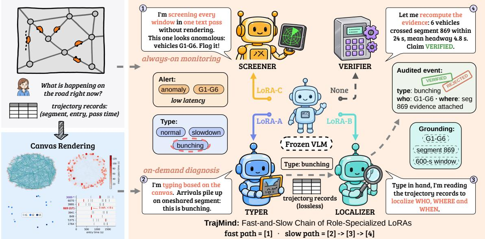
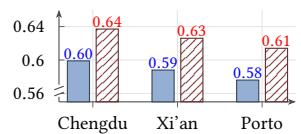
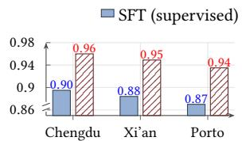
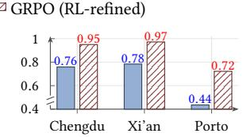
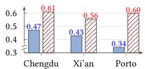
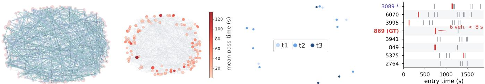

# TrajMind: Chaining Role-Specialized LoRAs for Fast-and-Slow Collective Trajectory Anomaly Diagnosis

Jiahao Wu jiahao.wu@connect.polyu.hk The Hong Kong Polytechnic University Hong Kong, China

Chen Jason Zhang jason-c.zhang@polyu.edu.hk The Hong Kong Polytechnic University Hong Kong, China

Zhen-qun Yang look.jessica@gmail.com The Hong Kong Polytechnic University Hong Kong, China

Qing Li csqli@comp.polyu.edu.hk The Hong Kong Polytechnic University Hong Kong, China

## Abstract

Diagnosing collective anomalies from urban trajectories is increasingly important for trafic governance, as it reveals what happened, who was involved, and where and when the event occurred. Exist- ing detectors eficiently produce scores or labels, whereas vision– language pipelines provide richer semantics; neither couples verifiable diagnosis with low-latency monitoring. The central chal- lenge is to recognize collective patterns and recover exact event details from the source trajectories without running the full diagnostic pipeline for every monitored window. We therefore separate always-on screening from on-demand diagnosis: screening raises alerts, while diagnosis releases only source-verified what– who–where–when records. We present TrajMind, a fast-and-slow framework that switches three role-specialized LoRA adapters over one frozen vision–language backbone. Its slow path, TrajMind , chains canvas-based typing, type-conditioned localization over serialized trajectories, and executable verification, yielding structured, evidence-backed diagnoses. Additionally, the fast path, TrajMind , screens each window in a single text-only pass, delivering eficient structured alerts. Extensive experiments show that, TrajMind l outperforms the strongest baselines by at least 15.3 percentage points in anomaly typing and 13.8 percentage points in localization. These gains persist under cross-city transfer, and TrajMindfast reduces latency by 41.1% and maintains binary balanced accuracy of at least 93.5%. Together, TrajMind delivers accurate, evidencebacked diagnoses across cities and eficient front-line monitoring.

## 1 Introduction

Collective trajectory anomaly detection and diagnosis are becoming indispensable to modern urban trafic governance. Developing efective anomaly detection and diagnosis methods is crucial for ensuring trafic safety, enhancing the overall eficiency of urban transportation systems and has become an increasingly important research topic [3, 9, 33]. However, turning the trajectories into operational evidence requires more than assigning an anomaly score to an isolated trip, which is far from what existing methods can accomplish [9, 18, 27, 33]. Given a window of map-matched trajectories, a collective anomaly system must reason over agent interactions to detect abnormal collective behavior and identify its type, participants, afected road segments, and duration. Op- erational systems must do so accurately while keeping pace with continuously arriving windows. Building a practical model capable of accurate diagnosis and eficient monitoring remains a fundamental challenge.

Classical trajectory anomaly detectors define normality through route similarity, density, or isolation [15, 33]. Although eficient, these detectors rely on route frequency, distance, or reference statis- tics that vary across locations and trafic conditions, and therefore generalize poorly without per-site recalibration. They also focus primarily on isolated trajectories rather than events produced by interactions among co-present road users. Deep sequence models capture time-dependent route distributions [9, 18], while graphbased approaches model social dependencies among nearby vehi- cles [3]. These richer representations improve the ability to recog- nize complex motion patterns, but they remain optimized mainly for producing an anomaly score or label. Therefore, these methods fails to identify the involved event participants, and ground the event in space and time with evidence.

Recently, vision-language models (VLMs) have introduced semantic reasoning into trajectory anomaly analysis [16, 32, 34]. For instance, Traj-MLLM renders an individual trajectory and its map context as interleaved multiview image–text inputs for training-free multimodal reasoning [16]. However, this paradigm remains limited for operational group anomaly diagnosis. By reasoning largely over one trajectory at a time, it may miss anomalies that emerge only from the timing and co-occurrence of multiple agents, and it does not explicitly identify the anomaly type, involved agents, afected road segments, and time span. Moreover, multiview rendering and repeated invocation of a large multimodal backbone introduce sub stantial latency, making always-on monitoring costly [21]. Thus, although VLMs enable richer semantic reasoning, existing VLM pipelines are neither suficiently group-aware nor eficient for continuous trajectory anomaly diagnosis.

To address these challenges, we propose TrajMind, a VLM framework with specialized roles for collective trajectory anomaly detection and diagnosis. Our key insight is that the task decomposes into three heterogeneous capabilities: scene-level understanding to determine what happened, precise grounding to recover who, where, and when, and eficient monitoring to decide whether an incoming window warrants attention. Supporting all three capabilities simultaneously entails conflicting representational requirements:

• Scene-level understanding benefits from a holistic yet lossy vi-sual rendering of the window, which captures the overall trafic pattern and context.

• Precise grounding requires lossless textual access to agent identities, coordinates, and timestamps, enabling accurate identifica tion of involved participants and their spatiotemporal details.

• Eficient monitoring must forgo visual processing to sustain throughput, requiring to quickly screen incoming windows.

These conflicting requirements motivate role specialization rather than a single shared objective. TrajMind therefore assigns each ca-pability to a lightweight role-specific LoRA adapter over a common frozen VLM backbone [10].

TrajMind composes these adapters into two operating modes. For in-depth diagnosis, $\mathrm { T r a j M i n d } _ { \mathrm { s l o w } }$ chains scene typing on a map- aligned canvas with grounding over lossless textual records to produce a complete, evidence-checked diagnosis. For monitoring, $\mathrm { T r a j M i n d } _ { \mathrm { f a s t } }$ invokes only the monitoring adapter, dropping visual processing and staged reasoning altogether and screening each window in a single text-only pass. Unlike generic multi-LoRA or adapter-composition schemes that route among interchangeable skills over a common input, TrajMind’s specialists deliberately con-sume diferent views of the same window. This division provides detailed, evidence-backed reasoning for in-depth investigation and an eficient screening path for always-on monitoring. Our contributions are threefold:

• Diagnosis formulation and evaluation protocol. We define structured what–who–where–when diagnoses. Our eval- uation protocol distinguishes alerts from evidence-backed di- agnoses. We evaluate this formulation on held-out trajectories from Chengdu, Xi’an, and Porto. Controlled collective anomalies provide type, participant, segment, and temporal ground truth.

• Framework. We propose TrajMind, which specializes a shared frozen VLM using role-specific LoRA adapters. The slow path supports anomaly typing and exact localization, while the fast path provides eficient monitoring. An executable verifier checks each diagnosis against the source trajectories.

• Results. Across the three cities, $\mathrm { T r a j M i n d _ { s l o w } }$ improves three-way balanced accuracy by 15.3–29.0% over the strongest non- TrajMind baseline. Under type-conditioned localization, it im-proves participant F1 by 13.8–23.2%. Results on Xi’an and Porto are zero-shot. $\mathrm { T r a j M i n d } _ { \mathrm { f a s t } }$ reduces latency from 9.026 to 5.315 seconds per window (41.1%) while retaining binary balanced accuracy of .960/.949/.935. The slow path remains stronger in fine-grained typing and participant localization.

## 2 Related Work

Trajectory Anomaly Detection. Trajectory anomaly detection identifies movement that departs from expected spatial, tempo- ral, or behavioral patterns [5]. At the individual level, an anomaly is an unusual trajectory or motion sequence. Classical methods detect such deviations through trajectory partitioning, geometric similarity, density, or trajectory frequency [15, 33], whereas deep representation models learn normal sequential behavior directly from data [9, 14, 18, 28]. At the group level, the anomaly instead lies in relations among co-present agents, even when each trajectory appears plausible in isolation. Recent methods therefore model so- cial and temporal dependencies using recurrent graph attention, transformers, graph Mamba, collective reconstruction, or difusion imputation [3, 11, 19, 24, 30]. Self-supervised encoders and newer trajectory foundation models further target transfer across tasks and regions [13, 29, 35]. The latest language-model approaches encode trajectories as tokens or multimodal inputs [16, 22], but still center on individual trajectories or task-specific predictions. Existing methods consequently fail to jointly recover a collective anomaly’s type, complete participant set, afected road segments, and temporal extent.

Vision–Language Models. General-purpose vision–language models couple visual perception with language generation and reasoning, providing adaptable backbones such as Qwen2.5-VL [2]. Their scope has expanded to map and trafic understanding [4], single-trajectory mining through interleaved map and text representations [16], and general video dialogue and temporal grounding [20, 25]. Video anomaly understanding has likewise advanced across temporal scales [21, 32, 34]. In parallel, parameter-eficient adaptation has enabled economical domain specialization and mod- ular reasoning through low-rank updates to frozen models [10, 12, 17]. However, extending these advances to collective trajectory diagnosis remains an open challenge. Existing systems focus on either a single trajectory or surveillance video. Trafic response instead requires a complete diagnosis of event type, participants, and spatiotemporal extent, with outputs that remain checkable against the source trajectories. Providing such diagnosis at the cost required for continuous monitoring remains largely unexplored.

## 3 Methodology

In this section, we elaborate on TrajMind and figure 1 provides an overview of this framework. Given a window of co-present agents, TrajMind uses two inference paths. A text-only LoRA screener monitors every window in one pass $( \mathrm { T r a j } \mathrm { M i n d } _ { \mathrm { f a s t } } )$ . For diagnosis, the slow path $\left( \mathrm { T r a j M i n d } _ { \mathrm { s l o w } } \right)$ applies a canvas-based anomaly typer, a type-conditioned trajectory localizer, and an executable verifier. This division assigns each role the representation suited to its objective. We first formalize the diagnosis and localization task and then describe the role-specialized adaptation, training objectives, and fast and slow inference paths.

## 3.1 Problem Formulation

Let $\mathcal { G } = ( \mathcal { V } , \mathcal { E } )$ be a directed road graph and let $\mathcal { W } = \{ \tau _ { i } \} _ { i = } ^ { N }$ denote a window of � co-present agents. Each map-matched trajectory is an ordered sequence

$$
\tau _ { i } = \left[ ( e _ { i j } , a _ { i j } , d _ { i j } ) \right] _ { j = 1 } ^ { L _ { i } } ,
$$

where $e _ { i j } \in \mathcal { E }$ is a traversed road segment, $a _ { i j }$ is its entry time, and $d _ { i j }$ is the corresponding pass time. We use the shared origin $t _ { 0 } =$ min $\mathsf { i } _ { i , j } \ : a _ { i j }$ and express all predicted times relative to $t _ { 0 } .$ This makes the output invariant to absolute clock time while retaining the ordering and duration signals For Porto, $e _ { i j }$ and the afected region below index 100 m grid cells, which occupy the same segment- identifier fields in our unified data interface.

The window label belongs to Y = {normal, anomaly\_bunching, collective\_slowdown}. For an anomalous window, the desired localized record is

$$
\boldsymbol { z } = \big ( \boldsymbol { y } , \boldsymbol { S } , \mathcal { R } , [ b , e ] , p \big ) ,
$$

where $y \in \boldsymbol { \mathcal { Y } } \mid$ {normal} is the anomaly type, S is the set of participating agent identifiers, ${ \mathcal { R } } \subseteq { \mathcal { E } }$ is the afected road region, [�, �] is the event interval in seconds from $t _ { 0 } ,$ and $p \in \left[ 0 , 1 \right]$ is model confidence. A normal prediction contains only its type and has empty localization fields. The learning problem therefore couples window-level discrimination with set-valued participant and seg- ment recovery and temporal localization. At inference, a diagnosis is actionable only if these model-proposed fields can be recomputed from W by the executable verifier. Accordingly, we use alert for the unverified fast-path output and reserve diagnosis for a slow-path record that passes executable verification.

  
Figure 1: Overview of TrajMind. A single frozen vision–language backbone is specialized by switching among role-specific LoRA adapters. The fast path is the screener alone (1): one text-only pass over serialized trajectory records, with no rendering, which flags a window and names its participants at low latency. The slow path chains three roles (2)→(3)→(4): the typer reads the rendered canvas, to decide what happened; the localizer reads that type and the serialized trajectory records to recover who, where, and when; and the verifier recomputes every claim from the raw trajectories as a deterministic program.

## 3.2 Proposed Approach

TrajMind realizes the two operating modes in Figure 1 with a frozen vision–language backbone and three separately trained, role- specialized LoRA adapters. The fast path activates LoRA-C once on a serialized trajectory window to jointly screen and localize an event. The slow path first activates LoRA-A on a diagnostic canvas to determine what happened, then switches to LoRA-B on the serialized trajectories to recover who, where, and when. Finally, a verifier audits the proposed record. This decomposition lets the fast path avoid rendering, while the slow path spends additional computation only when detailed diagnosis is needed.

3.2.1 Shared Backbone and Role-Specialized Adaptation. The three roles share the same frozen backbone within a model configuration, but do not share adapter parameters. For a selected linear projection $W \in \mathbb { R } ^ { d _ { \mathrm { o u t } } \times d _ { \mathrm { i n } } }$ , role $k \in \{ \mathrm { A } , \mathrm { B } , \mathrm { C } \}$ uses the low-rank update [10]

$$
W _ { k } = W + \frac { \alpha } { r } P _ { k } Q _ { k } , \qquad P _ { k } \in \mathbb { R } ^ { d _ { \mathrm { o u t } } \times r } , \quad Q _ { k } \in \mathbb { R } ^ { r \times d _ { \mathrm { i n } } } .
$$

All reported adapters for TrajMind use rank � = 16 and scaling $\alpha = 3 2$ . The original backbone parameters remain frozen. Thus, switching roles changes a small parameter set.

Each adapter is first optimized with teacher-forced supervised fine-tuning. I $\begin{array} { r } { \ d _ { \textrm { f } } \mathcal { D } _ { k } = \{ ( { x } _ { n } ^ { \top } , { z } _ { n } ^ { ( k ) } ) \} } \end{array}$ is the role-specific dataset and $\phi _ { k } = \{ P _ { k } , Q _ { k } \}$ denotes its trainable parameters, the objective is

$$
\mathcal { L } _ { \mathrm { S F T } } ^ { ( k ) } = - \sum _ { \left( x , z \right) \in \mathcal { D } _ { k } } \sum _ { t = 1 } ^ { \left| z \right| } \log \mathcal { P } \theta , \phi _ { k } \left( z _ { t } \mid x , z _ { < t } \right) ,
$$

with frozen backbone parameters �. The datasets and response schemas are intentionally diferent: LoRA-A learns a three-way type decision from canvases, LoRA-B learns type-conditioned lo-calization from anomalous text windows, and LoRA-C learns the unconditioned joint contract from both normal and anomalous text windows. LoRA-B is trained only on windows whose ground-truth localization is confirmable by the verifier, preventing the local- izer from being taught claims that the deployed audit program cannot verify. LoRA-C receives a second, group-relative policy- optimization stage described below.

3.2.2 Complementary Window Representations. Raw records pre-serve exact identities and times, but leave population-level structure implicit in a long sequence. A global canvas makes that structure visually explicit, but necessarily compresses fine-grained identifiers and timing. TrajMind assigns the representation according to the role instead of forcing one encoding to serve both tasks.

The canvas encoder C(W) deterministically renders four diagnostic panels: (A) all trajectories over the road-network layout together with shared-segment co-occurrence, (B) mean pass time on shared segments, (C) a three-frame temporal storyboard, and (D) entry-time strips for the busiest shared segments. Panels A–C expose spatial overlap, traversal delay, and temporal evolution for type recognition, while Panel D makes headway collapse directly visible. The renderer contains no learned parameters and no anom- aly label. The canvas instance is shown in case study (section 4.12).

The text encoder T(W) retains the map-matched records in two linked views. A shared-segment table lists co-present counts, relative entry times, and pass times, followed by each agent’s or- dered segment:entry/pass trajectory. LoRA-B and LoRA-C con sequently emit original agent and segment identifiers rather than canvas handles, and their start\_s and end\_s fields use the same $t _ { 0 }$ as the serialized input. This common contract allows the verifier to map every generated field back to the raw window.

3.2.3 TrajMindslow: Type, Localize, and Verify. The slow path factorizes diagnosis because the information useful for choosing an anomaly type is not identical to that needed for exact localization. Given a window, LoRA-A performs canvas-based typing,

$$
\hat { y } = \underset { y \in \cal { y } } { \arg \operatorname* { m a x } } p _ { \theta , \phi _ { \mathrm { A } } } ( y \mid \mathrm { C } ( \mathcal { W } ) ) ,
$$

and emits only $\{ " \} \mathsf { p e } ^ { \prime \prime } \colon \hat { y } \}$ . Training includes normal windows and both collective anomaly types, so this adapter owns the anomaly gate rather than receiving an oracle-positive window. $\mathrm { I f } \hat { y } = \mathsf { n o r m a l }$ the slow path terminates and produces no event hypothesis.

For a non-normal decision, LoRA-B receives the predicted type as an explicit condition and reads the text representation:

$$
\hat { g } = ( \hat { S } , \hat { \mathcal { R } } , [ \hat { b } , \hat { e } ] , \hat { p } ) \sim p _ { \theta , \phi _ { \mathrm { B } } } ( g \mid \mathsf { T } ( \mathcal { W } ) , \hat { y } ) .
$$

During SFT, the condition is the labeled anomaly type; at deploy- ment it is LoRA-A’s output. The response schema fixes the task boundary: LoRA-B predicts participants, segments, relative start and end times, and confidence, but is not allowed to revise the type.

Executable verification. Following work that grounds model reasoning through external actions and tool feedback [8, 31], the verifier treats $( \hat { y } , \hat { g } )$ as a hypothesis, never as evidence. It first rejects invalid identifiers and checks that the named agents are co-present and traverse the named region. For a slowdown claim, each named agent’s largest standardized delay on the region is computed from historical segment statistics,

$$
z _ { i } = \operatorname* { m a x } _ { e \in \hat { \mathcal { R } } \cap \tau _ { i } } \frac { d _ { i , e } - \mu _ { e } } { \sigma _ { e } } ,
$$

and the verifier measures the fraction of participants above the calibrated slowdown threshold. For a bunching claim, it sorts the participants’ entry times on the first named segment and computes

$$
h = \frac { a _ { ( m ) } - a _ { ( 1 ) } } { m - 1 } ,
$$

where � is the number of named agents observed on that segment; a small ℎ supports collapsed headway. These type-specific checks are accompanied by passed-through and regional-density checks, yielding for every tool � a support–contradiction–uncertainty tuple $( s _ { j } , c _ { j } , u _ { j } )$ and its measured evidence.

Let $w _ { j } ^ { ( \hat { y } ) }$ denote the type-specific tool weight and $q _ { j } = \operatorname* { m a x } ( s _ { j } , c _ { j } )$ its informativeness. Evidence is aggregated as

$$
s = \frac { \sum _ { j } w _ { j } ^ { ( \hat { y } ) } q _ { j } s _ { j } } { \sum _ { j } w _ { j } ^ { ( \hat { y } ) } q _ { j } } , \qquad c = \operatorname* { m a x } _ { j } c _ { j } , \qquad u = \operatorname* { m a x } \{ 0 , 1 - \operatorname* { m a x } ( s , c ) \} .
$$

Slowdown assigns weights $0 . 5 / 0 . 2 / 0 . 3$ to the slowdown, passed- through, and density checks; bunching uses $0 . 6 / 0 . 2 / 0 . 2$ for the corresponding three checks. A single strong contradiction can therefore veto several weakly supportive measurements. A hypothesis is released only when $s \geq 0 . 7 0$ and $c < 0 . 6 5 ; c \ge 0 . 6 5$ rejects it, and an intermediate case is withheld. For the retained record, model confidence is recalibrated by

$$
\begin{array} { r } { p _ { \mathrm { f i n a l } } = \sigma ( \log \mathrm { i t } ( \hat { p } ) + s - 1 . 5 c - 0 . 5 u ) . } \end{array}
$$

The retained diagnosis contains the raw measurements of each executed check in addition to $( s , c , u )$ , so the slow-path output is supported by recomputed evidence.

3.2.4 TrajMindf t: Single-Pass Monitoring. The slow factorization improves auditability but incurs rendering, two model passes, and symbolic verification. LoRA-C removes these dependencies from the latency-critical path. Only based on text representation, it decodes

$$
\hat { z } _ { \mathrm { f a s t } } \sim p \theta , _ { \phi _ { \mathrm { C } } } ( z \mid \mathsf { T } ( \mathcal { W } ) ) .
$$

A normal window returns only $\{ " \mathrm { t y p e " : " n o r m a l " } \}$ , while an anomalous window returns type, participants, segments, relative interval, and confidence in one JSON object. The real-time interface foregrounds the anomaly flag and participant list shown in Figure 1, while retaining the other structured fields for evaluation and downstream triage.

Pure SFT teaches the output grammar and the joint mapping, but it does not directly optimize the asymmetric costs of hallucinating events, missing true events, and partially localizing a correct deci-sion. We therefore continue LoRA-C with Group Relative Policy Optimization (GRPO) [26]. Let $F _ { S }$ and $F _ { \mathcal { R } }$ be set F1 for partici-pants and segments, respectively, let $I _ { t }$ be temporal IoU, and define $L = F _ { S } + F _ { \mathcal { R } } + 0 . 5 I _ { t }$ . The scalar reward is designed as

$$
\begin{array} { r } { R = \left\{ \begin{array} { l l } { - 1 , } & { \mathrm { i n v a l i d ~ o u t p u t } , } \\ { 0 . 3 + 1 , } & { y = \hat { y } = \mathsf { n o r m a l } , } \\ { 0 . 3 + 0 . 5 s - 0 . 8 c , } & { y = \mathsf { n o r m a l } , \ \hat { y } \neq \mathsf { n o r m a l } , } \\ { 0 . 3 , } & { y \neq \mathsf { n o r m a l } , \ \hat { y } = \mathsf { n o r m a l } , } \\ { 0 . 3 + 1 + L , } & { y = \hat { y } \neq \mathsf { n o r m a l } , } \\ { 0 . 3 + 0 . 2 + 0 . 2 5 L , } & { y , \hat { y } \neq \mathsf { n o r m a l } , \ y \neq \hat { y } . } \end{array} \right. } \end{array}
$$

Here the 0.3 term rewards a valid schema. On true anomalies, lo- calization credit is largest for a correct type but remains weakly informative after a wrong non-normal type, while abstaining re-ceives no detection or localization credit. On normal windows, a hallucinated anomaly is additionally scored by verifier support � and contradiction � for the named hypothesis. The verifier term is deliberately not used on true-anomaly rewards, so LoRA-C does not learn to imitate the verifier’s finite-coverage thresholds.

For each prompt �, GRPO samples a group of completions � and normalizes their rewards into

$$
\widehat { A } _ { i j } = \frac { R _ { i j } - \mathrm { m e a n } _ { j } R _ { i j } } { \mathrm { s t d } _ { j } R _ { i j } + \epsilon } .
$$

The policy update uses these within-prompt relative advantages with eight completions per group, temperature 1.15, and no KL penalty $\left( \beta \ = \ 0 \right)$ . This stage updates only $\phi _ { \mathrm { C } } ,$ , the parameter of adapter C. Consequently, the deployed system is a switchable family of compact role parameters: LoRA-C serves the always-on fast monitor, whereas an escalated window swaps in LoRA-A and then LoRA-B before deterministic verification.

3.2.5 Inference Procedure. Algorithm 1 summarizes the two inference modes. The trained adapters and frozen backbone remain fixed throughout inference. We write $( v , \Xi ) = \mathsf { V e r i f i e r } ( \mathcal { W } , \eta )$ for the verifier verdict and its supporting evidence for hypothesis �. The fast path returns after one decode; the slow path releases a diagnosis only after localization and verification.

Algorithm 1 TrajMind’s dual-path inference pipeline.   
1: Input: A trajectory window W and mode � ∈ {fast, slow}   
2: Output: A fast-path prediction or a slow-path diagnosis verdict   
3: if � = fast then   
4: �ˆfast ← Screener(T( W ) )   
5: return �ˆfast ⊲ normal verdict or structured alert   
6: end if   
7: �ˆ ← Typer(C(W) )   
8: if �ˆ = normal then   
9: return no diagnosis   
10: end if   
11: �ˆ ← Localizer(T(W), �ˆ)   
12: (�, Ξ) ← Verifier( W, (�,ˆ �ˆ) )   
13: if � = verified then   
14: return diagnosis (�,ˆ �,ˆ Ξ)   
15: end if   
16: return � ⊲ rejected or withheld

## 4 Experiments

We aim to answer the following research questions:

RQ1: How good TrajMind is at collective anomaly detection and typing? RQ2: How accurately does TrajMind localize the participants, road seg ments, and time of a collective anomaly?

RQ3: Is TrajMind robust to unseen cities and unseen anomaly strengths? RQ4: How eficient is TrajMindfast, and what does it trade away? RQ5: How do role specialization and RL refinement afect TrajMind? RQ6: Is the zero-shot ceiling of frozen VLMs a perception limit or a calibration limit?

## 4.1 Experimental Settings

In this section, we briefly introduce the datasets, tasks, evaluation metrics, and baselines.

Datasets. We use Chengdu and Xi’an from DiDi GAIA [6] and Porto from the ECML/PKDD-2015 challenge [23]. Chengdu and Xi’an retain map-matched road segments as shown in Table 1.

Table 1: Dataset statistics.
<table><tr><td>Dataset</td><td>Trajectories train/eval</td><td>Group windows train/eval</td></tr><tr><td>Chengdu</td><td>70k/14k</td><td>838/189</td></tr><tr><td>Xi&#x27;an</td><td>70k/14k</td><td>192/190</td></tr><tr><td>Porto</td><td>70k/14k</td><td>1,451/351</td></tr></table>

Windows are retained 900-s buckets with at least 3 agents.

Because no known public dataset provides real-world collective trafic anomaly labels, we synthetically inject anomalies into real trajectories, and the injection record supplies exact ground truth for the type, participants, segment, and interval: a collective slowdown inflates each participant’s pass time on a shared segment by a factor drawn from U[1.6, 2.6], and bunching compresses their arrivals there into U[10, 40] s. Each test window is assigned a label 1:1:1 over {normal, slowdown, bunching} and injected accordingly; for the ∼5% of windows where injection is infeasible, the window reverts to normal. Learned TrajMind components are optimized only on Chengdu. Xi’an and Porto therefore evaluate zero-shot transfer. Two held-out protocols with stronger (B) and weaker (C)

amplitudes and a timing-preserving structure-only control probe robustness.

Tasks and Evaluation Metrics. We evaluate four tasks. For detection and typing, every window receives one label from {normal, slowdown, bunching}, and we report balanced accuracy (chance .333) together with a binary view that merges the two anomaly classes (chance .500). For localization, a separate pass injects an anomaly into every test window (slowdown:bunching 1:1), and the windows where injection succeeds form the evaluation set (� = 179/189/347 for Chengdu/Xi’an/Porto) with no model- or verifierbased filtering. We report participant F1, segment F1, temporal IoU (tIoU), and response coverage for localization. The two F1 metrics score the participant and segment identifiers emitted by the model. For Porto, segment identifiers denote the 100 m grid cells described above. Abstentions score zero on both F1 metrics but are excluded from tIoU, so tIoU must be read jointly with coverage. For robustness, the same metrics are reported under city shift and protocols B/C, plus the false-positive rate on the structure-only control. For eficiency, we measure wall-clock latency per window on one NVIDIA H20 at batch size one.

Baselines. We compare against five kinds of methods: (i) a training-free statistical temporal rule over held-out per-segment pass-time statistics; (ii) the symbolic localizer Derive and the hybrid Cascade, which falls back to a VLM only where Derive abstains; (iii) DSAB [11], the published learned detector whose task unit matches ours, adapted to our data and reported in the binary panel only since it emits no type; (iv) Traj-MLLM [16], the closest trajectory-centric VLM, adapted from per-trajectory classification to group windows; and (v) zero-shot prompting of frozen VLMs on both the text se-rialization and the canvas rendering for four open-weight back- bones (Qwen3-VL-2B/8B [1] and Qwen2.5-VL-3B/7B [2]), and on the canvas alone for three API models (Qwen3-VL-Plus, Qwen3-VL-235B-A22B, and GLM-5V-Turbo1). Both TrajMind paths are LoRA adapters [10] over the same frozen backbones, and TrajMindfast is additionally refined from its supervised checkpoint with GRPO [26]. TrajMindslow’s typing adapter is reported at all four open-weight scales; all other learned arms use Qwen2.5-VL-3B-Instruct.

## 4.2 Anomaly Detection/Typing (RQ1, Table 2)

To answer RQ1, we compare TrajMind with statistical, graph-based, and trajectory-MLLM baselines, as well as text-only and canvasbased zero-shot VLMs. Results in table 2 yields three observations.

First, role-specialized adaptation is consistently more effective than the competing detection and typing paradigms. TrajMind l achieves the best three-way balanced accuracy in ev-ery city. With the 8B backbone, it reaches .983, .980, and .959 on Chengdu, Xi’an, and Porto, exceeding the strongest non-TrajMind result in each city by .313, .289, and .185, respectively. The ad-vantage does not rely on a large backbone: even the 2B specialist obtains .952/.942/.914, remaining above all baselines. The same ordering holds for binary detection, where the 8B slow specialist improves over DSAB by .307/.264/.425. These consistent gains indicate that adapting the model to the group-level trafic decision is more consequential than relying on a generic anomaly score or an individually oriented trajectory MLLM.

Table 2: Detection and anomaly-typing performance. Bold marks the best reported performance (balanced accuracy) and underlined values mark the strongest baseline.
<table><tr><td>Method and setting</td><td>Chengdu Xi&#x27;an Porto</td><td></td><td></td></tr><tr><td>Three-way anomaly typing</td><td></td><td></td><td></td></tr><tr><td>Statistical temporal rule</td><td>.573</td><td>.535</td><td>.533</td></tr><tr><td>Traj-MLLMb</td><td>.523</td><td>.415</td><td>.423</td></tr><tr><td>Text-only zero-shot</td><td></td><td></td><td></td></tr><tr><td>Qwen3-VL-2B-Instruct</td><td>.333</td><td>.333</td><td>.333</td></tr><tr><td>Qwen2.5-VL-3B-Instruct</td><td>.330</td><td>.335</td><td>.333</td></tr><tr><td>Qwen2.5-VL-7B-Instruct</td><td>.356</td><td>.369</td><td>.355</td></tr><tr><td>Qwen3-VL-8B-Instruct</td><td>.339</td><td>.351</td><td>.304</td></tr><tr><td>Canvas zero-shot: open-source</td><td></td><td></td><td></td></tr><tr><td>Qwen3-VL-2B-Instruct</td><td>.333</td><td>.333</td><td>.333</td></tr><tr><td>Qwen2.5-VL-3B-Instruct</td><td>.333</td><td>.333</td><td>.333</td></tr><tr><td>Qwen2.5-VL-7B-Instruct</td><td>.522</td><td>.681</td><td>.774</td></tr><tr><td>Qwen3-VL-8B-Instruct</td><td>.670</td><td>.691</td><td>.669</td></tr><tr><td>Canvas zero-shot: API</td><td></td><td></td><td></td></tr><tr><td>Qwen3-VL-Plus</td><td>.540</td><td>.420</td><td>.430</td></tr><tr><td>GLM-5V-Turbo</td><td>.574</td><td>.521</td><td>.540</td></tr><tr><td>Qwen3-VL-235B-A22B</td><td>.667</td><td>.670</td><td>.667</td></tr><tr><td>TrajMindfast (3B)</td><td>.637</td><td>.626</td><td>.614</td></tr><tr><td>TrajMindslow</td><td></td><td></td><td></td></tr><tr><td>Qwen3-VL-2B-Instruct</td><td>.952</td><td>.942</td><td>.914</td></tr><tr><td>Qwen2.5-VL-3B-Instruct</td><td>.960</td><td>.954</td><td>.927</td></tr><tr><td>Qwen2.5-VL-7B-Instruct</td><td>.972</td><td>.966</td><td>.945</td></tr><tr><td>Qwen3-VL-8B-Instruct</td><td>.983</td><td>.980</td><td>.959</td></tr><tr><td>Binary anomaly detectionc</td><td></td><td></td><td></td></tr><tr><td>DSABa</td><td>.680</td><td>.725</td><td>.552</td></tr><tr><td> $\mathrm { T r a j M i n d } _ { \mathrm { f a s t } } \left( 3 \mathrm { B } \right)$ </td><td>.960</td><td>.949</td><td>.935</td></tr><tr><td> $\mathrm { T r a j M i n d } _ { \mathrm { s l o w } }$ </td><td></td><td></td><td></td></tr><tr><td>Qwen3-VL-2B-Instruct</td><td>.968</td><td>.969</td><td>.955</td></tr><tr><td>Qwen2.5-VL-3B-Instruct</td><td>.974</td><td>.971</td><td>.963</td></tr><tr><td>Qwen2.5-VL-7B-Instruct</td><td>.984</td><td>.981</td><td>.975</td></tr><tr><td>Qwen3-VL-8B-Instruct</td><td>.987</td><td>.989</td><td>.977</td></tr></table>

�DSAB is a binary-only graph baseline adapted from individual anomaly detection, and it provides no anomaly type. � This is also adapted from individual anomaly detection and Qwen3-VL-Plus is the backbone. �The three-way label space is {normal, collective slowdown, bunching} (chance .333); the binary label space merges the two anomaly types (chance .500). TrajMind l uses a canvas typing adapter, whereas TrajMindf reports the single-pass text adapter.

Second, the input representation determines whether zeroshot scaling is useful. Text-only prompting remains close to the .333 chance level for all four local backbones and all three cities. Rendering the same task as a diagnostic canvas produces a clear scale-dependent improvement: the 7B and 8B models reach as high as .774, whereas the 2B and 3B models still collapse to chance. Nevertheless, scale alone does not close the gap. The 235B API model records only .667/.670/.667, comparable to the local 8B model and substantially below every adapted slow specialist. Thus, the canvas exposes the collective spatiotemporal pattern to suficiently capable VLMs, while trafic-specific adaptation is still required to place a reliable decision boundary.

Third, detection and fine-grained typing are distinct capabilities. $\mathrm { T r a j M i n d } _ { \mathrm { f a s t } }$ attains .960/.949/.935 on binary detection, outperforming DSAB by .280/.224/.383, but its corresponding threeway scores are .637/.626/.614. In contrast, $\mathrm { T r a j M i n d } _ { \mathrm { s l o w } }$ remains near ceiling in both panels. Together, these results expose a clear division of labor. The fast specialist therefore preserves strong anomaly screening while giving up partial semantic resolution needed to separate slowdown from bunching. However, the canvas specialist supplies the resolution. This result supports treating the two paths as complementary operating specialists.

## 4.3 Fine-Grained Localization (RQ2, Table 3)

To answer RQ2, we compare TrajMind with symbolic and hybrid localizers, Traj-MLLM, and frozen canvas-prompted VLMs. Table 3 yields three observations.

First, the type-conditioned slow specialist provides the most reliable participant localization. TrajMind l reaches subject F1 scores of .993/.995/.941 on Chengdu, Xi’an, and Porto, out-performing the strongest non-TrajMind baseline by .232/.201/.138, respectively. It also achieves full coverage. The best symbolic hybrid covers .991/.988/.979, whereas the fast path covers .951/.977/.730. Under this localization protocol, the slow path receives the ground- truth anomaly type, while the fast path types and localizes in one pass; the comparison therefore isolates the benefit of type- conditioned, lossless-text localization rather than claiming identical inference contracts.

Second, the two specialists are complementary across localization dimensions. The fast path obtains the highest tIoU on Chengdu and Porto (.791 and .717) and is only .009 behind the slow path on Xi’an. It also leads segment F1 on Chengdu (.609). In contrast, the slow path is strongest for segment localization after transfer, reaching .636 on Xi’an and .930 on Porto, gains of .081 and .333 over the fast path. Its lower Porto tIoU (.379) shows that accurate participants and segments do not automatically fix temporal boundaries. Conversely, the fast path’s .717 Porto tIoU is averaged only over the .730 of windows it answers. Reading tIoU jointly with coverage therefore reveals a precision–coverage trade-of, rather than uniform temporal superiority by either path.

Third, fine-grained localization requires task specialization, not merely larger models or more frequent answers. The frozen API VLMs respond on at least .959 of windows, yet their segment F1 remains between .002 and .035; similarly, Traj-MLLM covers .967–.992 but obtains zero segment F1 in all three cities. Scaling is also non-monotonic: within Qwen2.5-VL, moving from 3B to 7B improves subject F1 in every city, whereas the Qwen3-VL 8B model is worse than its 2B counterpart and abstains on roughly half the windows. Thus, response rate and parameter count do not substitute for a localization contract aligned with agent identities and trajectory structure. The large gap between the generic base-lines and both TrajMind specialists attributes the gain primarily to role-specific adaptation.

## 4.4 Cross-City Localization (RQ3, Table 4)

To answer RQ3, we apply the two Chengdu-trained localization specialists to Xi’an and Porto without target-city adaptation. Table 4 yields three observations.

First, the slow path preserves reliable participant localization across both unseen cities. It reaches subject F1 scores of .995 on Xi’an and .941 on Porto, improving over the fast path by .023 and .219, respectively. The paths are close on Xi’an, whereas the wider Porto gap shows that the type-conditioned, lossless-text localizer is more robust under this target-city shift. The slow path is evaluated with the ground-truth anomaly type and a forced re- sponse, so its 1.000 coverage reflects its diagnostic contract rather than an isolated localization gain. Nevertheless, the high subject F1 shows that its returned participants remain accurate after transfer.

Table 3: Unified localization comparison: participant F1 (subject F1), temporal IoU (tIoU), model-emitted segment F1, and response coverage across Chengdu (CD), Xi’an (XA), and Porto (PT). Coverage is the fraction of windows for which a method returns an answer. Bold marks the best, underlining marks the second-best, and \* marks the strongest non-TrajMind baseline.
<table><tr><td></td><td colspan="3">Subject F1</td><td colspan="3">tIoU</td><td colspan="3">Segment F1</td><td colspan="3">Response coverage</td></tr><tr><td>Method</td><td>CD</td><td>XA</td><td>PT</td><td>CD</td><td>XA</td><td>PT</td><td>CD</td><td>XA</td><td>PT</td><td>CD</td><td>XA</td><td>PT</td></tr><tr><td>Derive (symbolic heuristic)</td><td>.640</td><td>.526</td><td>.510</td><td>n/a</td><td>n/a</td><td>n/a</td><td>.337</td><td>.346</td><td>.500</td><td>.727</td><td>.648</td><td>.536</td></tr><tr><td>Cascade (Derive → VLM)</td><td>.761*</td><td>.794*</td><td>.803*</td><td>.019</td><td>.019</td><td>.024</td><td>.367*</td><td>.498*</td><td>.746*</td><td>.991</td><td>.988</td><td>.979</td></tr><tr><td>Traj-MLLM</td><td>.396</td><td>.395</td><td>.471</td><td>.220*</td><td>.234*</td><td>.240*</td><td>.000</td><td>.000</td><td>.000</td><td>.967</td><td>.992</td><td>.987</td></tr><tr><td>Canvas zero-shot: open-source</td><td></td><td></td><td></td><td></td><td></td><td></td><td></td><td></td><td></td><td></td><td></td><td></td></tr><tr><td>Qwen3-VL-2B-Instruct</td><td>.108</td><td>.158</td><td>.156</td><td>.009</td><td>.013</td><td>.012</td><td>.009</td><td>.058</td><td>.092</td><td>.886</td><td>.719</td><td>.795</td></tr><tr><td>Qwen2.5-VL-3B-Instruct</td><td>.113</td><td>.173</td><td>.171</td><td>.031</td><td>.028</td><td>.031</td><td>.002</td><td>.057</td><td>.122</td><td>.955</td><td>.954</td><td>.958</td></tr><tr><td>Qwen2.5-VL-7B-Instruct</td><td>.209</td><td>.314</td><td>.301</td><td>.037</td><td>.038</td><td>.046</td><td>.047</td><td>.196</td><td>.221</td><td>.940</td><td>.910</td><td>.886</td></tr><tr><td>Qwen3-VL-8B-Instruct</td><td>.102</td><td>.115</td><td>.132</td><td>.026</td><td>.039</td><td>.040</td><td>.006</td><td>.042</td><td>.088</td><td>.560</td><td>.457</td><td>.502</td></tr><tr><td>Canvas zero-shot: API</td><td></td><td></td><td></td><td></td><td></td><td></td><td></td><td></td><td></td><td></td><td></td><td></td></tr><tr><td>Qwen3-VL-Plus</td><td>.345</td><td>.435</td><td>.448</td><td>.026</td><td>.029</td><td>.021</td><td>.003</td><td>.002</td><td>.005</td><td>1.000*</td><td>1.000*</td><td>1.000*</td></tr><tr><td>GLM-5V-Turbo</td><td>.368</td><td>.498</td><td>.498</td><td>.035</td><td>.042</td><td>.040</td><td>.010</td><td>.024</td><td>.035</td><td>.979</td><td>.959</td><td>.970</td></tr><tr><td>Qwen3-VL-235B-A22B</td><td>.132</td><td>.220</td><td>.199</td><td>.029</td><td>.032</td><td>.039</td><td>.011</td><td>.022</td><td>.020</td><td>1.000*</td><td>.998</td><td>.999</td></tr><tr><td>TrajMindfast (3B)</td><td>.950</td><td>.972</td><td>.722</td><td>.791</td><td>.787</td><td>.717</td><td>.609</td><td>.555</td><td>.597</td><td>.951</td><td>.977</td><td>.730</td></tr><tr><td> $\mathrm { T r a j M i n d } _ { \mathrm { s l o w } } \left( 3 \mathrm { B } \right)$ </td><td>.993</td><td>.995</td><td>.941</td><td>.753</td><td>.796</td><td>.379</td><td>.502</td><td>.636</td><td>.930</td><td>1.000</td><td>1.000</td><td>1.000</td></tr></table>

• Metrics. Higher is better; tIoU is averaged over answered cases and should be read with response coverage; Derive emits no interval, so its tIoU is undefined and marked “n/a”. • Traj-MLLM. It uses Qwen3-VL-Plus with group adaptation through ten window renderings.

Table 4: Cross-city localization performance of TrajMind, trained on Chengdu and tested on Xi’an and Porto. Bold marks the best performance.
<table><tr><td></td><td colspan="2">Xi&#x27;an</td><td colspan="2">Porto</td></tr><tr><td>Metric</td><td>Fast</td><td>Slow</td><td>Fast</td><td>Slow</td></tr><tr><td>Subject F1</td><td>.972</td><td>.995</td><td>.722</td><td>.941</td></tr><tr><td>tIoU</td><td>.787</td><td>.796</td><td>.717</td><td>.379</td></tr><tr><td>Segment F1</td><td>.555</td><td>.636</td><td>.597</td><td>.930</td></tr><tr><td>Coverage</td><td>.977</td><td>1.000</td><td>.730</td><td>1.000</td></tr></table>

Second, spatial localization transfers even when the target spatial representation changes. The slow path improves segment F1 over the fast path by .081 on Xi’an and .333 on Porto, reaching .930 on Porto despite that corpus using 100 m grid cells in place of the road-segment identifiers available in Chengdu and Xi’an. The Porto score therefore evaluates whether the transferred model directly emits the correct grid-cell identifiers, rather than inferring location from participant predictions after generation.

Third, temporal localization remains city dependent and exposes a coverage–precision trade-of. On Xi’an, the two paths obtain nearly identical tIoU (.787 versus .796). On Porto, the fast path has the higher tIoU (.717 versus .379), but its score is computed only on the 73.0% of windows for which it returns an answer; the slow path returns an interval for all windows. The Porto tIoU gap therefore does not establish end-to-end temporal superiority for the fast path. Rather, it shows that complete cross-city localization does not by itself guarantee accurate temporal boundaries.

## 4.5 Analysis of Cross-Protocol Localization

To answer RQ3, we apply the same Chengdu Protocol-A localizer to two unseen anomaly-strength protocols and city shift (on Xi’an and Porto). Table 5 yields three observations.

Table 5: Cross-protocol anomaly localization (Subject-F1). TrajMind is trained on Chengdu with Protocol-A. Protocols B and C inject the same two anomaly structures more and less strongly than the training protocol A.
<table><tr><td>City</td><td>Protocol</td><td>Derive</td><td>Cascade</td><td> $\mathrm { T r a j M i n d } _ { \mathrm { s l o w } }$ </td></tr><tr><td rowspan="3">Chengdu</td><td>A (training)</td><td>.640</td><td>.761</td><td>.993</td></tr><tr><td>B (stronger)</td><td>.719</td><td>.805</td><td>.995</td></tr><tr><td>C (weaker)</td><td>.447</td><td>.614</td><td>.972</td></tr><tr><td rowspan="3">Xi&#x27;an</td><td>A (training)</td><td>.526</td><td>.794</td><td>.995</td></tr><tr><td>B (stronger)</td><td>.645</td><td>.842</td><td>.930</td></tr><tr><td>C (weaker)</td><td>.400</td><td>.708</td><td>.914</td></tr><tr><td rowspan="3">Porto</td><td>A (training)</td><td>.510</td><td>.803</td><td>.941</td></tr><tr><td>B (stronger)</td><td>.576</td><td>.838</td><td>.942</td></tr><tr><td>C (weaker)</td><td>.387</td><td>.709</td><td>.941</td></tr></table>

First, TrajMindslow consistently provides the most accurate participant localization. It ranks first in all nine settings: averages .958 Subject-F1, compared with .764 for Cascade and .539 for Derive. More notably, its lowest score, .914 on Xi’an under the weak Protocol C, remains .072 above the best score attained by either baseline in any setting (Cascade’s .842 on Xi’an under Protocol B).

Second, the symbolic methods are substantially more sensitive to anomaly strength. In every city, Derive and Cascade follow the strict order ${ \mathrm { ~ C ~ } } < { \mathrm { ~ A ~ } } < { \mathrm { ~ B } } :$ stronger perturbations make their fixed thresholds easier to trigger, whereas weaker perturba- tions sharply reduce localization accuracy. On Chengdu, where only the protocol changes, moving from Protocol B to C lowers Subject-F1 by .272 for Derive and .191 for Cascade, but by only .023 for $\mathrm { T r a j M i n d } _ { \mathrm { s l o w } } .$ . Consequently, the slow path’s average advantage over Cascade grows from .127 under the strong Protocol B to .265 under the weak Protocol C. This indicates that TrajMind is robust to anomaly-strength shifts, capturing the relational pattern.

Third, robustness to protocol shift persists under simultaneous city shift, although the interaction is city dependent. Relative to Protocol $\mathrm { A , T r a j M i n d _ { s l o w } }$ changes by only +.002/−.021 under Chengdu’s stronger/weaker protocols. Under the compound shift, it remains essentially unchanged on Porto (.941/.942/.941 for A/B/C), while Xi’an decreases from .995 to .930 and .914. Even in the latter case, it retains a clear lead over Cascade (.842 and .708). These results thus support transfer across unseen anomaly strengths and cities.

  
(a) Three-way anomaly typing

  
(b) Binary anomaly detection

  
(c) Participant identification

  
(d) Road-segment localization  
Figure 2: Ablation of TrajMindf . We compare the SFT initialization of TrajMindf with its GRPO refinement on (a) three-way anomaly typing (balanced accuracy), (b) binary anomaly detection (balanced accuracy), (c) participant identification (subject F1), and (d) road-segment localization (segment F1). GRPO improves all four metrics across three diferent cities.

Table 6: Anomaly typing robustness of the Chengdu-trained 3B TrajMindslow across cities and anomaly protocols.
<table><tr><td>Held-out condition</td><td> ${ \mathrm { S t a t . ~ r u l e } } ^ { a }$ </td><td>Slow (3B)</td></tr><tr><td>Balanced accuracy ↑</td><td></td><td></td></tr><tr><td>New city: Xi&#x27;an</td><td>.535</td><td>.954</td></tr><tr><td>New city: Porto</td><td>.533</td><td>.927</td></tr><tr><td>Stronger anomalies (B)</td><td>.712</td><td>.991</td></tr><tr><td>Weaker anomalies (C)</td><td>.413</td><td>.982</td></tr><tr><td>Xi’an + weaker (C)</td><td>.409</td><td>.940</td></tr><tr><td>Porto + weaker (C)</td><td>.392</td><td>.919</td></tr><tr><td>False-positive rate ↓</td><td></td><td></td></tr><tr><td>Structure-only controlb</td><td>76.7%</td><td>0.0%</td></tr></table>

�The statistical rule is training-free. The learned column uses Qwen2.5-VL-3B-Instruct throughout. �The structure-only control is measured on the Chengdu test split.

Table 7: Inference latency of TrajMind with Qwen2.5-VL-3B-Instruct on one NVIDIA H20, using 179 Chengdu windows.
<table><tr><td>Method</td><td>Latency (s/window)</td></tr><tr><td>End-to-end deployment</td><td></td></tr><tr><td> $\mathrm { T r a j M i n d } _ { \mathrm { f a s t } }$ </td><td>5.315</td></tr><tr><td> $\mathrm { T r a j M i n d } _ { \mathrm { s l o w } }$ </td><td>9.026</td></tr><tr><td>Slow-fast difference</td><td>3.711</td></tr><tr><td>Slow/fast ratio</td><td>1.70×</td></tr></table>

## 4.6 Analysis of Cross-City/Protocol Typing

To answer RQ3, Table 6 shows that the Chengdu-trained 3B typer reaches .954/.927 across cities, .991/.982 across anomaly strengths, and .940/.919 under their compound shift, versus .409/.392 for the statistical rule. Its 0.0% false-positive rate on structure-only controls, compared with 76.7% for the rule, confirms reliance on temporal evidence rather than co-routing.

## 4.7 Inference Time Comparison (RQ4, Table 7)

To answer RQ4, Table 7 compares the two deployed pipelines under the same batch-one generation budget. TrajMindfast requires 5.315 s per window, versus 9.026 s for TrajMindslow, saving 3.711 s (41.1%) by avoiding canvas construction and a separate localization pass. This saving largely preserves in-domain screening: on Chengdu, the fast and slow paths obtain .960 versus .974 binary balanced accuracy and .950 versus .993 subject F1, respectively, although the fast path is notably weaker at fine-grained typing (.637 versus .960). The trade-of widens under domain shift: on Porto, its subject F1 and coverage fall to .722 and .730, compared with .941 and

Table 8: Role-specialization ablation. Results follow CD/XA/PT. Bold marks the best result and SoLA denotes the shared LoRA baseline.
<table><tr><td>Variant</td><td>Three-way typing</td><td>Subject F1</td><td>Segment F1</td></tr><tr><td> $\mathrm { S o L A } _ { 3 \mathrm { B } , r = 1 6 }$ </td><td>.855/.836/.792</td><td>.925/.916/.852</td><td>.402/.486/.793</td></tr><tr><td> $\mathrm { S o L A } _ { 3 \mathrm { B } , r = 3 2 }$ </td><td>.873/.848/.843</td><td>.932/.935/.882</td><td>.415/.504/.825</td></tr><tr><td> $\mathrm { T r a j M i n d } _ { 3 \mathrm { B } , \mathrm { s l o w } }$ </td><td>.960/.954/.927</td><td>.993/.995/.941</td><td>.502/.636/.930</td></tr></table>

1.000 for the slow path (Tables 3 and 4). Therefore, the fast path is suited to latency-sensitive screening, whereas the slow path remains preferable for complete and fine-grained diagnosis.

## 4.8 Ablation on TrajMindfast (RQ5, Figure 2)

To answer RQ5, we compare the SFT initialization with its GRPO refinement in Figure 2. GRPO improves all four metrics across all three cities: three-way balanced accuracy rises by .038 and binary detection by .065 in each city, while participant F1 gains .191, .188, and .286, and segment F1 gains .139, .127, and .257, on Chengdu, Xi’an, and Porto, respectively. The larger detection gain suggests that reinforcement learning particularly strengthens the fast path’s primary role as a normal–anomaly screener. For struc- tured localization, coverage increases by .191, .187, and .290, closely tracking participant-F1 gains, whereas answered-case tIoU changes only from .800, .799, and .724 to .791, .787, and .717. Thus, GRPO mainly reduces missing or invalid outputs and improves spatial localization rather than sharpening the temporal boundaries of already answered cases. Porto obtains the largest localization gains, yet its final participant F1 and coverage remain .722 and .730, below Chengdu and Xi’an. Overall, reinforcement refinement makes $\mathrm { T r a j M i n d } _ { \mathrm { f a s t } }$ a more reliable cross-city front-line monitor, while the remaining fine-grained typing and transfer gaps still justify the slow path for complete diagnosis.

## 4.9 Ablation on Specialized Roles (RQ5, Table 8)

The two Shared LoRA baselines use one 3B backbone and one LoRA shared by canvas-typing and text-localization; �=32 matches the aggregate adapter budget of the two �=16 roles it replaces (the typer and the localizer). Raising the shared rank from 16 to 32 improves typing by .012–.051, subject F1 by .007–.030, and segment F1 by .013–.032, with the largest gains on Porto. Thus, capacity helps but only partially closes the gap. Under the parametermatched comparison, TrajMindslow still gains .087/.106/.084 in typ- ing, .061/.060/.059 in subject F1, and .087/.132/.105 in segment F1 on CD/XA/PT. These consistent cross-task and cross-city gains support reduced interference between global canvas recognition and exact lossless-text recovery, rather than merely allocating more rank. The largest parameter-matched segment gain occurs on Xi’an (.132), indicating that shared adaptation is especially limiting for exact spatial grounding under cross-city shift.

  
Figure 3: A Bunching Anomaly Instance. From left to right: (a) trajectories/co-occurrence, (b) mean pass time, (c) temporal group formation, and (d) busy-segment arrivals. In (d), the six injected vehicles (red) enter ground-truth segment 869 within 8 s; “\*” marks prediction 3089.

## 4.10 Analysis of Zero-Shot Failure: Perception or Calibration? (RQ6, Table 9)

Zero-shot canvas reading tops out well below the adapted model. Because the deployment argument rests on training a small adapter rather than prompting a larger model, it matters whether the zero- shot ceiling is a perceptual limit or a decision-boundary one. The zero-shot ceiling is primarily a calibration failure. Removing normal raises the capable frozen models to near-ceiling two-way accuracy (.983–1.000), whereas their three-way balanced accuracy remains between .522 and .670. Their class recalls reveal opposing biases: the 7B model nearly always predicts normal (.99 recall) and misses most slowdowns, while the 8B and 235B models reco nize both anomaly types but almost never predict normal. Thus, the collective patterns are perceptually available, but the normal–anomaly bound- ary is poorly calibrated; scaling from 8B to 235B does not resolve it. In contrast, TrajMind l reaches .960 three-way balanced ac curacy with balanced per-class recalls (.96/.95/.97). The opposing recall profiles further show that the zero-shot errors are systematic operating-point shifts rather than uniformly uncertain predictions. Consequently, aggregate accuracy alone can overstate diagnos- tic readiness unless normal-class recall is examined together with anomaly-subtype recall. The result supports adapting a compact canvas-typing role for learnable calibration, rather than claiming unrestricted generalization or merely scaling zero-shot VLMs.

## 4.11 Verifier Ablation (Table 10)

To isolate the contribution of verification, we compare the Chengdu slow path with the verifier disabled and enabled. Metrics for the verified configuration are computed over released diagnoses and should therefore be interpreted together with released coverage.

Table 10 shows a consistent improvement in the quality of released diagnoses. Verification raises three-way typing accuracy from .960 to .990 and participant F1 from .960 to .996. The largest relative gain appears in segment localization, where F1 increases from .480 to .530 (+10.4%), whereas answered-only tIoU improves more modestly from .750 to .760 (+1.3%). These gains reduce released coverage from .960 to .930, a three-percentage-point decrease. Thus, the verifier improves reliability by withholding a small addi tional subset of diagnoses, with a larger benefit for participant and segment selection than for temporal-boundary precision. Viewed as an operating-point trade-of, the .030 coverage loss is small relative to the .050 absolute gain in segment F1, suggesting that rejected cases are disproportionately spatially unreliable. Accordingly, the verification threshold can serve as a deployment control for balanc- ing answer availability against the cost of releasing an unsupported localization. Because it verifies or withholds model outputs rather than rewriting them, these improvements should be interpreted as selective release rather than error correction.

## 4.12 Case Study: A Bunching Anomaly Instance

Figure 3 traces a 900 s Chengdu window containing 54 trajectories. Panel (a) shows the dense route interactions, panel (b) summarizes mean pass time on the shared road segments, and panel (c) reveals how the candidate group forms over time. Panel (d) then exposes the decisive temporal signature: all six injected vehicles enter ground-truth segment 869 within 8.5 s. This compact arrival cluster supports bunching rather than a broad slowdown, while the remaining vehicles are dispersed over the window.

The stage outputs separate what, who, and where. The fast path recovers all six injected identities but labels the event as a slowdown and points to segment 3089. The slow canvas corrects the type to anomaly\_bunching with confidence 1.0 and retains the same six participants, yet its text localizer still selects segment 3089. Recomputing that claim against the lossless trajectories shows that only three of the six vehicles traverse 3089, whereas all six pass through segment 869. The passed\_through check therefore returns contra-diction .661, and the verifier rejects the diagnosis despite strong group-level consistency. It does not repair the segment or replace the hypothesis. Instead, it withholds an unsupported localization. The failed check also provides an explicit reason for abstention. The case consequently shows why correct event typing and participant recovery do not guarantee correct spatial grounding, which is also the main source of the remaining segment-F1 gap. More broadly, this disagreement localizes the remaining failure: the representation captures collective membership and temporal synchronization, but segment selection remains brittle. Verification prevents a correct high-level diagnosis from legitimizing an unsupported claim.

## 5 Conclusion

In this paper, we propose TrajMind, a fast-and-slow framework for collective trajectory anomaly detection and diagnosis. TrajMind specializes a shared frozen vision–language backbone with role- specific LoRA adapters. Its slow path combines canvas-based typing, lossless textual localization, and evidence verification, while its fast path provides single-pass text-only screening. Experiments on Chengdu, Xi’an, and Porto show that the slow path delivers accurate, evidence-backed diagnoses across cities and anomaly- severity levels. The fast path reduces latency while preserving detection and participant identification.

Table 9: Zero-shot canvas typing on Chengdu. Two-way excludes normal; three-way is the deployment task. Norm./slow./bunch. report per-class recall.
<table><tr><td>Model</td><td>3-way</td><td>2-way</td><td>norm.</td><td>slow.</td><td>bunch.</td></tr><tr><td>Qwen3-VL-2B</td><td>.333</td><td>.531</td><td>.00</td><td>.00</td><td>1.00</td></tr><tr><td>Qwen2.5-VL-3B</td><td>.333</td><td>.520</td><td>.00</td><td>.00</td><td>1.00</td></tr><tr><td>Qwen2.5-VL-7B</td><td>.522</td><td>.983</td><td>.99</td><td>.25</td><td>.33</td></tr><tr><td>Qwen3-VL-8B</td><td>.670</td><td>.994</td><td>.01</td><td>1.00</td><td>1.00</td></tr><tr><td>Qwen3-VL-235b-a22b</td><td>.667</td><td>1.000</td><td>.00</td><td>1.00</td><td>1.00</td></tr><tr><td>Qwen3-VL-plus</td><td>.540</td><td>.851</td><td>.00</td><td>.72</td><td>1.00</td></tr><tr><td>GLM-5V-Turbo</td><td>.574</td><td>1.000</td><td>.03</td><td>.72</td><td>1.00</td></tr><tr><td> $\mathrm { T r a j } \mathrm { M i n d } _ { \mathrm { s l o w } } \left( 3 \mathrm { B } \right)$ </td><td>.960</td><td>.972</td><td>.96</td><td>.95</td><td>.97</td></tr></table>

## 6 Ethical Considerations

Trajectory analysis can expose sensitive mobility patterns and can be misused for pervasive surveillance or automated enforcement. Although the present study addresses group-level trafic behavior rather than demographic profiling, participant identifiers and fine- grained spatiotemporal records may still enable re-identification when combined with external data. A deployment should therefore apply data minimization, pseudonymization, retention limits, access control, and auditing consistent with the governing privacy and transportation regulations.

## References

[1] Shuai Bai, Yuxuan Cai, Ruizhe Chen, Keqin Chen, Xionghui Chen, Zesen Cheng, Lianghao Deng, Wei Ding, Chang Gao, Chunjiang Ge, et al. 2025. Qwen3-VL Technical Report.

[2] Shuai Bai, Keqin Chen, Xuejing Liu, Jialin Wang, Wenbin Ge, Sibo Song, Kai Dang, Peng Wang, Shijie Wang, Jun Tang, Humen Zhong, Yuanzhi Zhu, Mingkun Yang, Zhaohai Li, Jianqiang Wan, Pengfei Wang, Wei Ding, Zheren Fu, Yiheng Xu, Jiabo Ye, Xi Zhang, Tianbao Xie, Zesen Cheng, Hang Zhang, Zhibo Yang, Haiyang Xu, and Junyang Lin. 2025. Qwen2.5-VL Technical Report.

[3] Yongfeng Bu, Haoxiang Liang, Huansheng Song, Shijie Sun, and Zhaoyang Zhang. 2025. Causally-guided Graph Mamba for Detecting Socially Abnormal Vehicle Trajectories. Neurocomputing 649 (2025), 130649.

[4] Xu Cao, Tong Zhou, Yunsheng Ma, Wenqian Ye, Can Cui, Kun Tang, Zhipeng Cao, Kaizhao Liang, Ziran Wang, James M. Rehg, and Chao Zheng. 2024. MAPLM: A Real-World Large-Scale Vision-Language Benchmark for Map and Trafic Scene Understanding. In Proceedings ofthe IEEE/CVF Conference on Computer Vision and Pattern Recognition. 21819–21830.

[5] Varun Chandola, Arindam Banerjee, and Vipin Kumar. 2009. Anomaly Detection: A Survey. Comput. Surveys 41, 3 (2009), 1–58.

[6] DiDi Chuxing. 2017. GAIA Open Dataset Initiative. https://outreach.didichuxing. com. Chengdu and Xi’an ride-hailing GPS trajectories;.

[7] GLM-V Team. 2025. GLM-4.1V-Thinking: Towards Versatile Multimodal Reasoning with Scalable Reinforcement Learning. Cited as the model-family report for the glm-5v-turbo endpoint.

[8] Zhibin Gou, Zhihong Shao, Yeyun Gong, Yelong Shen, Yujiu Yang, Nan Duan, and Weizhu Chen. 2024. CRITIC: Large Language Models Can Self-Correct with Tool Interactive Critiquing. In International Conference on Learning Representations.

[9] Xiaolin Han, Reynold Cheng, Chenhao Ma, and Tobias Grubenmann. 2022. DeepTEA: Efective and Eficient Online Time-dependent Trajectory Outlier Detection. Proceedings ofthe VLDB Endowment 15, 7 (2022), 1493–1505.

[10] Edward J. Hu, Yelong Shen, Phillip Wallis, Zeyuan Allen-Zhu, Yuanzhi Li, Shean Wang, Lu Wang, and Weizhu Chen. 2022. LoRA: Low-Rank Adaptation of Large Language Models. In International Conference on Learning Representations.

[11] Yue Hu, Yuhang Zhang, Yanbing Wang, and Daniel Work. 2023. Detecting Socially Abnormal Highway Driving Behaviors via Recurrent Graph Attention Networks. In Proceedings of the ACM Web Conference 2023. Association for Computing Machinery, 3086–3097.

[12] Chengsong Huang, Qian Liu, Bill Yuchen Lin, Tianyu Pang, Chao Du, and Min Lin. 2024. LoraHub: Eficient Cross-Task Generalization via Dynamic LoRA Composition. In Conference on Language Modeling.

[13] Jiawei Jiang, Dayan Pan, Houxing Ren, Xiaohan Jiang, Chao Li, and Jingyuan Wang. 2023. Self-Supervised Trajectory Representation Learning with Temporal

Table 10: Verifier ablation on Chengdu. w/o verifier releases every end-to-end claim, whereas TrajMind l releases only diagnoses that pass verification. Δ is relative to w/o verifier; bold marks the better performance among the two.
<table><tr><td>Metric</td><td>w/o verifier</td><td> $\mathrm { T r a j M i n d } _ { \mathrm { s l o w } }$ </td><td>∆(%)</td></tr><tr><td>Three-way typing accuracy</td><td>.960</td><td>.990</td><td>+3.1</td></tr><tr><td>Participant F1</td><td>.960</td><td>.996</td><td>+3.8</td></tr><tr><td>Segment F1</td><td>.480</td><td>.530</td><td>+10.4</td></tr><tr><td>tIoU (answered only)</td><td>.750</td><td>.760</td><td>+1.3</td></tr><tr><td>Released coverage</td><td>.960</td><td>.930</td><td>-3.1</td></tr></table>

Regularities and Travel Semantics. In 2023 IEEE 39th International Conference on Data Engineering. IEEE, 843–855.

[14] Ruochen Jiao, Juyang Bai, Xiangguo Liu, Takami Sato, Xiaowei Yuan, Qi Alfred Chen, and Qi Zhu. 2023. Learning Representation for Anomaly Detection of Vehicle Trajectories. In 2023 IEEE/RSJ International Conference on Intelligent Robots and Systems. IEEE, 9699–9706.

[15] Jae-Gil Lee, Jiawei Han, and Xiaolei Li. 2008. Trajectory Outlier Detection: A Partition-and-Detect Framework. In Proceedings ofthe 24th IEEE International Conference on Data Engineering. IEEE, 140–149.

[16] Shuo Liu, Di Yao, Yan Lin, Gao Cong, and Jingping Bi. 2026. Traj-MLLM: Can Multimodal Large Language Models Reform Trajectory Data Mining?. In Proceedings of the 32nd ACM SIGKDD Conference on Knowledge Discovery and Data Mining.

[17] Ye Liu, Kevin Qinghong Lin, Chang Wen Chen, and Mike Zheng Shou. 2026. VideoMind: A Chain-of-LoRA Agent for Temporal-Grounded Video Reasoning. In International Conference on Learning Representations.

[18] Yiding Liu, Kaiqi Zhao, Gao Cong, and Zhifeng Bao. 2020. Online Anomalous Trajectory Detection with Deep Generative Sequence Modeling. In 2020 IEEE 36th International Conference on Data Engineering. IEEE, 949–960.

[19] Andreas Lohrer, Darpan Malik, Claudius Zelenka, and Peer Kröger. 2024. GADformer: A Transparent Transformer Model for Group Anomaly Detection on Trajectories. In 2024 International Joint Conference on Neural Networks. IEEE, 1–8.

[20] Muhammad Maaz, Hanoona Rasheed, Salman Khan, and Fahad Khan. 2024. Video-ChatGPT: Towards Detailed Video Understanding via Large Vision and Language Models. In Proceedings of the 62nd Annual Meeting of the Association for Computational Linguistics (Volume 1: Long Papers). Association for Computational Linguistics, 12585–12602.

[21] Xiaowei Mao, Bowen Sui, Weijie Zhang, Yawen Yang, Shengnan Guo, Shilong Zhao,Jiaqi Lin, Tingrui Wu, Youfang Lin, and Huaiyu Wan. 2026. Zoom In, Reason Out: Eficient Far-field Anomaly Detection in Expressway Surveillance Videos via Focused VLM Reasoning Guided by Bayesian Inference. arXiv:2604.23724

[22] Jonathan Kabala Mbuya, Dieter Pfoser, and Antonios Anastasopoulos. 2024. Trajectory Anomaly Detection with Language Models. In Proceedings ofthe 32nd ACM International Conference on Advances in Geographic Information Systems. Association for Computing Machinery, 208–219.

[23] Luis Moreira-Matias, João Gama, Michel Ferreira, João Mendes-Moreira, and Luis Damas. 2015. Taxi Service Trajector – Prediction Challen e, ECML PKDD 2015. 442 taxis, Porto, Portu al, 2013-07-01 to 2014-06-30;.

[24] Qi Ouyang, Hongchang Chen, Shuxin Liu, Ran Li, Kai Wang, and Yingle Li. 2026. Difusion-Driven Group Anomaly Detection in Spatiotemporal Trajectories: Robust Masked Sequence Imputation for Enhanced Pattern Discovery. Information Processing & Management 63, 5 (2026), 104650.

[25] Shuhuai Ren, Linli Yao, Shicheng Li, Xu Sun, and Lu Hou. 2024. TimeChat: A Time-Sensitive Multimodal Large Language Model for Long Video Understanding. In Proceedings of the IEEE/CVF Conference on Computer Vision and Pattern Recognition. 14313–14323.

[26] Zhihong Shao, Peiyi Wang, Qihao Zhu, Runxin Xu, Junxiao Song, Xiao Bi, Haowei Zhang, Mingchuan Zhang, Y. K. Li, Y. Wu, and Daya Guo. 2024. DeepSeekMath: Pushing the Limits of Mathematical Reasoning in Open Language Models.

[27] Chenhao Wang, Lisi Chen, Shuo Shang, Christian S. Jensen, and Panos Kalnis. 2024. Multi-Scale Detection of Anomalous Spatio-Temporal Trajectories in Evolving Trajectory Datasets. In Proceedings of the 30th ACM SIGKDD Conference on Knowledge Discovery and Data Mining. ACM, 2980–2990.

[28] Chen Wang, Sarah Erfani, Tansu Alpcan, and Christopher Leckie. 2024. DeCoR-TAD: Difusion Based Conditional Representation Learning for Online Trajectory Anomaly Detection. In Proceedings ofthe 27th European Conference on Artificial Intelligence (Frontiers in Artificial Intelligence and Applications, Vol. 392). IOS Press, 2757–2764.

[29] Tonglong Wei, Yan Lin, Zeyu Zhou, Haomin Wen, Jilin Hu, Shengnan Guo, Youfang Lin, Gao Cong, and Huaiyu Wan. 2025. TransferTraj: A Vehicle Trajec tory Learning Model for Region and Task Transferability. In Advances in Neural Information Processing Systems, Vol. 38.

[30] Haomin Wen, Shurui Cao, and Leman Akoglu. 2025. CoBAD: Modeling Collective Behaviors for Human Mobilit Anomal Detection. In Proceedings ofthe 33rd ACM International Conference on Advances in Geographic Information Systems. Association for Computing Machinery, 197–209.

[31] Shunyu Yao, Jefrey Zhao, Dian Yu, Nan Du, Izhak Shafran, Karthik R. Narasimhan, and Yuan Cao. 2023. ReAct: Synergizing Reasoning and Acting in Language Models. In International Conference on Learning Representations.

[32] Luca Zanella, Willi Menapace, Massimiliano Mancini, Yiming Wang, and Elisa Ricci. 2024. Harnessing Large Language Models for Training-free Video Anomaly Detection. In Proceedings ofthe IEEE/CVF Conference on Computer Vision and Pattern Recognition. 18527–18536.

[33] Daqing Zhang, Nan Li, Zhi-Hua Zhou, Chao Chen, Lin Sun, and Shijian Li. 2011. iBAT: Detecting Anomalous Taxi Trajectories from GPS Traces. In Proceedings ofthe 13th International Conference on Ubiquitous Computing. ACM, 99–108.

[34] Huaxin Zhang, Xiaohao Xu, Xiang Wang, Jialong Zuo, Xiaonan Huang, Changxin Gao, Shanjun Zhang, Li Yu, and Nong Sang. 2025. Holmes-VAU: Towards Longterm Video Anomaly Understanding at Any Granularity. In Proceedings ofthe IEEE/CVF Conference on Computer Vision and Pattern Recognition. 13843–13853.

[35] Yuanshao Zhu, James Jianqiao Yu, Xiangyu Zhao, Xun Zhou, Liang Han, Xuetao Wei, and Yuxuan Liang. 2025. UniTraj: Learning a Universal Trajectory Foundation Model from Billion-Scale Worldwide Traces. In Advances in Neural Information Processing Systems, Vol. 38.