# UE5M3 FP4 Block Scaling for Stable Language Model Pretraining

A Simpler FP4 Pretraining Recipe with Delayed Tensor Scaling

## REPORT FOCUS

Wider block-scale range, a proposed FP4 pretraining recipe, and a software model of native NVFP4 GEMM outputs.

## Abstract

Stable 4-bit floating-point (FP4) pretraining is dificult because the E2M1 payload represents only a narrow range of magnitudes. NVIDIA’s Transformer Engine NVFP4 recipe addresses this with current-tensor scaling, a randomized Hadamard transform (RHT), and bfloat16 (BF16) final layers, adding work outside the FP4 matrix multiplications. We instead pair E2M1 payloads with unsigned E5M3 (UE5M3) block scales. Their wider range permits periodic tensor scaling, while our recipe applies selective stochastic rounding to backward gradients, omits RHT, and uses FP4 in all eligible internal linears.

We pretrain a Nemotron-H 8B model for nearly 190 billion tokens. Compared with Transformer Engine NVFP4, the proposed block-16 recipe finishes with lower final-window training loss and, under their respective quantized-inference policies, lower validation loss measured as held-out negative log-likelihood. Its quantized-inference downstream point estimates are also higher on all three reported aggregates. A native NVFP4 execution ablation that jointly removes RHT and the BF16 final-block exemption increases measured model-body token throughput by 21.2%. These results demonstrate end-to-end software-emulated UE5M3 FP4 pretraining with a simpler recipe and motivate native support for UE5M3 block scaling.

## 1 Introduction

On the GB200 platform evaluated here, supported FP4 Tensor Core operations have four times the theoretical peak throughput of BF16 [22]. This makes FP4 attractive for both inference and pretraining. Inference can quantize fixed weights and calibrate scales after training; pretraining must repeatedly quantize changing activations, weights, and gradients while preserving the optimization signal. This report focuses on the latter problem: stable end-to-end UE5M3 FP4 pretraining.

The use of FP4 can also reduce operand trafic because each payload element uses one quarter as many bits as BF16, although block- and tensor-scale metadata reduce the realized storage ratio. The small E2M1 codebook makes pretraining sensitive to scale selection, outliers, rounding, and accumulation. Current tensor-scale reductions, RHT operators, and BF16 final layers can stabilize optimization, but each adds work outside the FP4 matrix multiplications. We ask whether the use of a wider block-scale format can retain stability with a simpler recipe.

FP8 training is now well established [19]. FP4 is a harder target. The E2M1 FP4 payload used by MXFP4 and NVFP4 contains one sign bit, two exponent bits, and one fraction bit; its largest magnitude is only 6. Scaling is therefore required to represent the dynamic range of activations, weights, and gradients. Microscaling uses one scale per small block—typically 16 or 32 elements— rather than one scale for the entire tensor [11, 24, 28].

NVIDIA demonstrated end-to-end pretraining with NVFP4 by combining the format with RHT for the weight-gradient GEMM, two-dimensional (2D) weight scaling, SR for the back-propagated output gradient in both backward GEMMs, and BF16 final layers [22]. The Transformer Engine (TE) recipe also computes a tensor maximum before each quantization. These reductions, RHT operators, and BF16 final layers increase runtime work and implementation complexity. We therefore ask:

Can a block-scale format with more dynamic range make FP4 training stable with a simpler pretraining recipe?

UE5M3 FP4 combines 4-bit E2M1 payloads with 8-bit UE5M3 block scales. Because block scales are nonnegative, UE5M3 removes the unused sign bit from E4M3 and uses five exponent bits plus three fraction bits. Recent FP4-training studies evaluate diferentiable and mixed-precision quantization, MXFP4, native FP4 linear layers, and end-to-end NVFP4 pretraining [4, 6, 8, 10, 22, 26, 32, 33, 35]. Hu et al. and Fasoli et al. specifically examine UE5M3 as a block-scale format [13, 18]. We investigate the numerical recipe required for end-to-end UE5M3 FP4 pretraining.

We make four contributions:

• We introduce a UE5M3 FP4 recipe with per-operand, 50-step periodic sample-and-hold tensor scaling, 2D weight scaling, and SR only for the upstream-gradient operand in the two backward GEMMs. The recipe omits RHT and uses FP4 in all 112 eligible internal linears.

• We train one seed-42 Nemotron-H 8B trajectory per configuration for 188.7 billion tokens. Across 12 checkpoints per trajectory, with quantization active for every FP4 path, the proposed block-16 path finishes below native Transformer Engine NVFP4 in held-out NLL. A pinned 146-task likelihood evaluation provides downstream results for all seven final checkpoints.

• We derive a range bound that links the UE5M3 scale target to stale-maximum headroom and small-scale representation: the default target provides roughly 137× growth headroom, while the targeted T = 2048 override retains 30×.

• We identify a software FP4 GEMM output model that matches the tested native reduction and rounding behavior in deterministic full-model controls. A separate joint native NVFP4 execution ablation records 21.2% higher model-body token throughput after disabling RHT and using FP4 in the 16 otherwise BF16-exempt final-block projections.

## 2 Related Work

4-bit training predates native FP4 tensor cores: Sun et al. combined INT4 weights and activations with a radix-4 floating-point gradient format and adaptive gradient scaling [29], while Chmiel et al. combined logarithmic gradient quantization with unbiased rounding [7]. Both studies identify gradient range and quantization bias as central constraints on 4-bit training.

Large language model (LLM) studies subsequently tested diferent formats for weights, activations, and gradients. The initial microscaling experiments use MXFP4 weights with MXFP6 activations and gradients [11]. Wang et al. use simulated E2M1 weight and activation quantization with diferentiable gradient estimation and sparse outlier compensation, whereas Zhou et al. use diferent precisions across modules and training stages [33, 35]. Tseng et al. place the backward GEMMs in MXFP4 using SR and RHT [32]; TetraJet studies oscillation in MXFP4 vision-transformer training [5]; and Metis applies spectral-domain quantization to 4-bit weights, activations, and gradients (W4A4G4) in LLM training [3]. Complementary scaling-law experiments quantify the efects of exponent–fraction allocation, scale granularity, model size, and token budget [30].

Recent work increasingly targets FP4 across the major forward, data-gradient, and weight-gradient GEMMs. Quartet analyzes forward reconstruction and backward-estimator error; FP4 All the Way develops selective SR for fully quantized GEMMs; and Quartet II replaces conventional SR with a lower-error unbiased microscaling estimator [4, 8, 26]. NVIDIA’s long-horizon NVFP4 recipe combines RHT, 2D scaling, SR, and BF16 final layers [22]. Chmiel et al. simulate NVFP4 training of a 7B model on 256 Intel Gaudi2 accelerators. They use SR for the back-propagated gradient in both backward GEMMs and additionally for the saved forward activation used to form weight gradients;

weights and forward activations otherwise use nearest rounding [8]. To close the remaining loss gap, they add a short quantization-aware fine-tuning phase that keeps the forward pass in FP4 but runs the backward and update GEMMs in BF16. Our recipe instead uses UE5M3 block scales, rounds the saved activation to nearest-even, applies SR only to the back-propagated output gradient, uses periodic sample-and-hold tensor references, and completes without a BF16 backward/update phase. TetraJet-v2 adds oscillation suppression and outlier control, while Four Over Six selects between two block targets to reduce NVFP4 quantization error [6, 10]. Rahimifar et al. instead use transposition-invariant 2D blocks, with MXFP8 retained for sensitive query and key projections [27]. A unified study by Agrusa et al. compares these ingredients on dense and mixture-of-experts models at horizons up to 1 trillion tokens and reports that its evaluated 8B NVFP4 recipes still require BF16 final layers at long horizons [1], providing a longer-horizon comparison point for our 188.7-billion-token experiments.

Other hardware and scope extensions include native MXFP4 experiments on AMD hardware, which isolate weight-gradient quantization as a major failure source [9]; HiFloat4 training on Ascend neural processing units (NPUs) [31]; and FP4 quantization of optimizer and attention components [12]. Within this broader literature, Hu et al. identify UE5M3 as a range–precision compromise for FP4 training, and Fasoli et al. analyze its scale coverage using pretrained-model tensor distributions [13, 18]. Our study tests whether this wider unsigned block scale permits delayed tensor scaling without RHT or a BF16 exemption for final-block projections and extends software emulation beyond operand quantization to the observed native NVFP4 GEMM outputs.

## 3 Background: FP4 Microscaling

## 3.1 Low-precision floating-point formats

A floating-point number format stores a sign, an exponent, and a fraction field. Together with any implicit leading bit, the fraction field forms the significand:

$$
x \approx ( - 1 ) ^ { s } \times \mathrm { s i g n i f i c a n d } \times 2 ^ { \mathrm { e x p o n e n t } } .\tag{1}
$$

The notation EeMm means e exponent bits and m explicit fraction bits; a sign bit is normally separate. More exponent bits increase the range between very small and very large numbers. More fraction bits place more representable points inside that range.

Quantization maps a high-precision value to one of these representable points. Let $Q _ { F } ( x )$ denote rounding x into format F. Values with magnitude above the largest finite value can saturate or overflow, whereas nonzero values with magnitude below the smallest positive representable value can underflow to zero. Saturation clips an outlier’s magnitude, while underflow can remove a small component entirely, such as an element of a weight gradient.

## 3.2 Microscaling

Microscaling keeps the payload narrow but gives each block B a scale sB. We use $B = | \boldsymbol { B } |$ for the number of payload values in a block. For a tensor-level multiplier g, a value is reconstructed as

$$
\widehat { x } _ { i } = g \widehat { s } _ { B } q _ { i } , \qquad q _ { i } = Q _ { \mathrm { E 2 M 1 } } \left( \frac { x _ { i } } { g \widehat { s } _ { B } } \right) , \qquad i \in \mathcal { B } .\tag{2}
$$

Blockwise scaling lets the E2M1 codebook track each block’s local magnitude rather than the dynamic range of the full tensor.

Table 1 summarizes the relevant systems. MXFP4 is the Open Compute Project (OCP) standard: 32 E2M1 values share an E8M0 scale. E8M0 has a very wide exponent range, but no fraction bits, so its scales are powers of two. NVFP4 instead uses a block of 16 and a finer E4M3 scale. Because E4M3 has less range, NVFP4 adds a 32-bit floating-point (FP32) scale for the whole tensor [21]. The global scale aligns the tensor with the range of the local E4M3 scales.

Table 1: Summary of considered FP4 block formats. The payload is E2M1 in all three FP4 systems; the systems difer in how each block is scaled.
<table><tr><td>System</td><td>Block size</td><td>Scale format</td><td>Tensor-scale rule</td><td>Useful scale codes</td><td>Main tradeoff</td></tr><tr><td>MXFP4</td><td>32</td><td>unsigned E8M0</td><td>none</td><td>All codes are nonnegative; no fraction bits</td><td>Very wide range; coarse power-of-two steps</td></tr><tr><td>NVFP4</td><td>16</td><td>signed E4M3</td><td>FP32 global scale</td><td>Three fraction bits; negative codes are unusable for scales</td><td>Fine local spacing; narrower positive range</td></tr><tr><td>UE5M3 FP4</td><td>16</td><td>unsigned E5M3</td><td>optional; delayed</td><td>Three fraction bits; every code is nonnegative</td><td>Fine local spacing over a much wider useful range</td></tr></table>

## 3.3 The NVIDIA/Transformer Engine NVFP4 pretraining recipe

An outlier is much larger than the other values in its 16-value quantization block. It can determine the scale and leave few distinct E2M1 values for the remaining entries. Across blocks, the limited positive range of the E4M3 block scale constrains the ratio of local scales under one tensor scale. NVIDIA’s NVFP4 pretraining recipe uses the following techniques to manage these efects [22]:

• Randomized Hadamard transform (RHT). The recipe applies matched transforms only to the saved activation and output-gradient operands of the weight-gradient GEMM. The orthogonal transforms redistribute large coordinates before quantization while preserving the full-precision dot product. Similar rotations are widely used to suppress quantization outliers [2].

• Two-dimensional weight scaling. A 16 × 16 weight tile shares scale information so that the rowwise and columnwise views used in forward and backward GEMMs remain consistent.

• Stochastic rounding. The back-propagated output-gradient tensor is stochastically rounded when it is quantized for both backward GEMMs; weights and forward activations use nearest rounding.

• BF16 final layers. The published recipe leaves the eligible linear projections in its final eight hybrid blocks in BF16 rather than quantizing those projections to FP4.

• Tensor scaling. The maximum absolute value (amax) of a tensor sets the FP32 global scale. Current scaling requires finding that maximum before quantization. Transformer Engine’s documented FP8 DelayedScaling records an amax at every quantization and derives the next scale from an amax-history window [20].

Together, these operations define the Transformer Engine NVFP4 recipe used as the baseline in this report. We use D for the number of optimizer steps between tensor-maximum refreshes.

The evaluated baseline uses current-tensor scaling (D = 1); Transformer Engine’s documented DelayedScaling mechanism applies to FP8.

## 4 Unsigned E5M3 Block Scales

## 4.1 Reallocating the unused sign bit

A block scale is a magnitude, so it is never negative. Signed E4M3 reserves one of its eight bits for a sign that is always zero. UE5M3 reuses this bit as a fifth exponent bit:

E4M3 scale: [sign][4 exponent][3 fraction] UE5M3 scale: [5 exponent][3 fraction]

Hu et al. introduced UE5M3 as an FP4 scale-format choice; Fasoli et al. later analyzed its scale coverage over pretrained-model tensor distributions [13, 18]. At a fixed exponent, E4M3 and UE5M3 have the same spacing because both keep three fraction bits. UE5M3 does not create an extra fraction bit. Instead, it stops spending about half of the code space on negative values that a scale can never use. The result is roughly twice as many useful nonnegative scale encodings, which increases the range of the resulting floating-point format. In practice, UE5M3 ofers more usable nonnegative scale encodings over a wider range, although its relative spacing is not finer where the two formats overlap.

For the finite format used here, the largest UE5M3 value is

$$
U _ { \mathrm { m a x } } = \left( 1 + { \frac { 1 } { 2 } } + { \frac { 1 } { 4 } } + { \frac { 1 } { 8 } } \right) 2 ^ { 1 5 } = 1 . 8 7 5 \times 3 2 7 6 8 = 6 1 . 4 4 0 .\tag{3}
$$

Its smallest normal value is $2 ^ { - 1 4 }$ and its smallest subnormal is $2 ^ { - 1 7 }$ . Table 2 compares this with the finite E4M3 scale used by NVFP4. The maximum is about 137× larger, and the smallest nonzero value is 256× smaller.

Table 2: 8-bit block-scale formats. Both have three fraction bits, but UE5M3 uses every code for a nonnegative scale and spends the recovered sign bit on range.
<table><tr><td>Format</td><td></td><td></td><td></td><td>Sign bits Exponent bits Fraction bits Smallest subnormal Largest finite</td><td></td></tr><tr><td>E4M3</td><td>1</td><td>4</td><td>3</td><td>2-9</td><td>448</td></tr><tr><td>UE5M3</td><td>0</td><td>5</td><td>3</td><td>2-17</td><td>61,440</td></tr></table>

Under a shared tensor reference, one block may contain small values while another contains a large outlier. E4M3 can run out of block-scale range, forcing the tensor-wide scale to move and making small blocks less precise. UE5M3 can represent both block scales directly over a much wider interval. Fasoli et al. show that this can remove global scaling for weights and activations in their setting [13]. Our implementation instead retains a tensor reference and refreshes it once every 50 optimizer steps.

## 5 Training Method

## 5.1 Periodic refresh of tensor maxima

For an operand x at step t, define its current maximum magnitude as

$$
a _ { t } = \operatorname* { m a x } _ { i } | x _ { t , i } | .\tag{4}
$$

Current scaling uses $a _ { t }$ immediately. Our periodic-refresh implementation instead samples and caches $a _ { t }$ only on refresh steps. Let $\tau _ { t - 1 }$ be the most recent refresh step before step t. The reference used at step t is

$$
\widetilde { \boldsymbol { a } } _ { t } = \left\{ \begin{array} { l l } { \boldsymbol { a } _ { t } , } & { \mathrm { i f ~ n o ~ c a c h e ~ e x i s t s ~ o r ~ } t - \tau _ { t - 1 } \ge D , } \\ { \boldsymbol { a } _ { \tau _ { t - 1 } } , } & { \mathrm { o t h e r w i s e , } } \end{array} \right.\tag{5}
$$

On a refresh step, $\tau _ { t } = t ;$ otherwise $\tau _ { t } = \tau _ { t - 1 }$ and $\widetilde { \boldsymbol { a } } _ { t } = \widetilde { \boldsymbol { a } } _ { t - 1 } = \boldsymbol { a } _ { \tau _ { t - 1 } }$ . Thus $\widetilde { a } _ { t - 1 }$ is the cached amax from the most recent refresh, not a D-step window maximum (a sample-and-hold rule).

If r is a refresh step, the cache holds $a _ { r }$ for $r \leq t < r + D$ and replaces it with the newly sampled $a _ { r + D }$ at the next refresh.

This periodic-refresh rule is the implementation evaluated here. It difers from Transformer Engine’s history-based FP8 DelayedScaling, which records an amax at each iteration and uses the window maximum by default (or the most recent entry when configured) [20]. Each quantized activation, weight, and gradient operand has a separate cache. We use $D = 5 0$ with no additional multiplicative safety margin (factor 1). The block maximum is still computed when that block is quantized; the tensor-wide maximum reduction and cached-reference update occur only on refresh steps. The caches start empty at process launch and are not serialized in checkpoints, so a resumed training process starts a new periodic-refresh phase rather than restoring the previous held maxima.

Avoiding block-scale saturation requires the current tensor maximum to remain within the cached reference’s headroom. The next subsection quantifies that condition.

## 5.2 Treating NVIDIA’s fixed 448 scale as a tunable target

The NVIDIA recipe maps the tensor reference to a fixed scale target of 448, the largest positive finite E4M3 value. We retain 448 as our default, but the much wider UE5M3 codebook lets us ask what happens when this target is moved. We denote the chosen target by $T .$ . It is not an input clamp and does not change the 4-bit E2M1 payload; it only changes where the current tensor lands inside the block-scale codebook, whose largest UE5M3 value is 61,440.

The target moves the finite block-scale codebook over the real block maxima. On a refresh step, the encoder measures a tensor maximum $g .$ . For the next D − 1 steps it keeps that same reference, even if the tensor changes. The target T chooses where a block as large as $g$ lands in the codebook. Increasing T slides the representable real-value window downward, helping smaller block scales stay nonzero. Decreasing $T$ slides the window upward, leaving more room if the tensor grows before the next refresh. It does not add bits or change the spacing within an exponent band.

Let $F = 6$ be the largest E2M1 payload magnitude and let $g = \widetilde { a } _ { t }$ be the cached tensor reference. The encoder first forms the tensor multiplier

$$
G = { \frac { T F } { g } } .\tag{6}
$$

For a block with maximum magnitude $a _ { B } .$ , the ideal block-scale code before UE5M3 rounding is therefore

$$
u _ { B } = \frac { a _ { B } G } { F } = \frac { a _ { B } T } { g } , \qquad \widehat { s } _ { B } = Q _ { \mathrm { U E 5 M 3 } } ( u _ { B } ) .\tag{7}
$$

Thus, if $a _ { B } = g$ , the ideal block-scale code is exactly $T .$

Worked example. Suppose the last measured tensor maximum was $g = 1 0 0$ and is held fixed for 50 steps. Table 3 shows the real block-maximum window implied by the smallest nonzero UE5M3 code, $2 ^ { - 1 7 }$ , and the largest code, 61,440. A target of 2,048 maps the same block to a code that is $2 , 0 4 8 / 4 4 8 \approx 4 . 6$ times larger than a target of 448. This preserves smaller scales, but the largest block that fits before saturation falls by the same factor.

Table 3: Changing T slides one fixed UE5M3 codebook over the real block maxima. Values use $g = 1 0 0 ;$ ; “growth room” is the largest supported block maximum divided by the cached tensor maximum.
<table><tr><td>Target  $T$ </td><td>Code for  $a _ { B } = g$ </td><td>Smallest nonzero  $a _ { B }$ </td><td>Largest  $a _ { B }$ </td><td>Growth room</td></tr><tr><td>448</td><td>448</td><td> $1 . 7 \times 1 0 ^ { - 6 }$ </td><td>13,714</td><td>137×</td></tr><tr><td>2,048</td><td>2,048</td><td> $3 . 7 \times 1 0 ^ { - 7 }$ </td><td>3,000</td><td>30×</td></tr></table>

Proposition 1 (unsaturated delayed-scale range). Let $U$ be the largest finite block-scale code. Under Equation 7, block B avoids scale saturation exactly when

$$
a { \boldsymbol { B } } \leq { \frac { U g } { T } } .\tag{8}
$$

If $a _ { t }$ is the current tensor maximum and $\rho _ { t } = a _ { t } / g$ measures how stale the cache has become, then every block is unsaturated whenever

$$
T \rho _ { t } \leq U , \mathrm { o r ~ e q u i v a l e n t l y } T \leq \frac { U } { \rho _ { t } } .\tag{9}
$$

The proof is one substitution: saturation starts at $u _ { B } > U$ , and $u _ { B } = a _ { B } T / g$

This proposition formalizes the window in Table 3. A smaller $T$ leaves more overflow headroom when the current tensor grows above its cached reference. A larger $T$ keeps smaller block scales away from zero but leaves less room for growth. The delay D and target $T$ must therefore be chosen together: a longer delay allows a larger stale ratio $\rho _ { t }$ , which generally favors a smaller target.

For E4M3, NVIDIA’s fixed choice gives $U = T = 4 4 8$ . Under this mapping, a tensor already at its cached maximum has no additional stale-growth headroom. With UE5M3, $U = 6 1 { , } 4 4 0$ while the default target remains 448. At $T = 4 4 8$ , Equation 9 allows a stale ratio up to roughly 137× before block-scale saturation. Raising the target to 2,048 spends some of that headroom to map small block scales about 4.6× farther from zero. The extended range can be allocated between stale-maximum headroom and the representation of smaller block scales without changing the E2M1 payload.

For the 8B model, the proposed recipe uses $T = 4 4 8$ by default for all FP4 operands. We raise it to $T = 2 0 4 8$ only for $d Y$ in the weight-gradient GEMMs of the four final MLP mixer.down\_proj modules (zero-based layers 45, 47, 49, and 51). This moves their block-scale codes farther from zero, increasing the underflow margin for small gradient components while retaining $6 1 { , } 4 4 0 / 2 { , } 0 4 8 = 3 0 \times$ stale-growth headroom.

Checkpoint snapshot. Figure 1 compares the step-30,000 BF16 reference and proposed block-16 checkpoints. We load their stored BF16 master weights and run one fixed, zero-dropout BF16 training-mode forward/backward pass on the first 8,192-token sequence in the held-out order, without an optimizer update. Pooled over the four modules, the saved activation X is 96.35% zero for the BF16 checkpoint and 75.41% zero for the proposed checkpoint, with maxima of 1,408 and 48,384, respectively. The corresponding $d Y$ tensors are nearly dense (about 0.03% zeros in both), while the weights and block maxima formed from $d Y ^ { \mathsf { T } }$ contain no zeros.

## Step-30,000 late-layer value and scale-target distributions

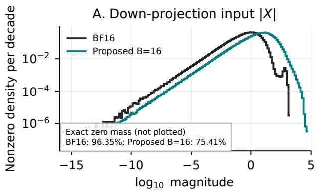

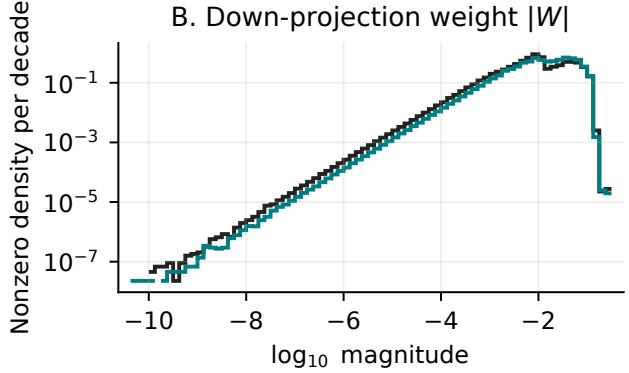

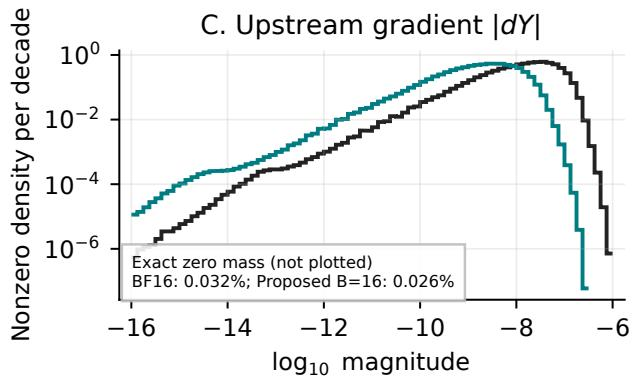

D. $d Y ^ { \top }$ block-scale code (current amax)  
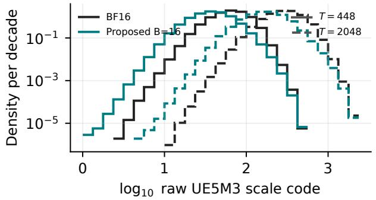  
One held-out 8,192-token sequence; BF16 execution of loaded master weights. Scale codes use each module's current dY amax.  
Figure 1: Step-30,000 checkpoint snapshot for the four final $\mathrm { M L P }$ mixer.down\_proj modules. Absolute-value histograms pool the saved activation X, stored BF16 master weight $W .$ , and upstream gradient $d Y$ over one fixed held-out sequence. The scale-code distributions map block-16 maxima of $d Y ^ { \top }$ in its weight-gradient GEMM layout to ideal pre-rounding UE5M3 scale codes under $T = 4 4 8$ and $T = 2 0 4 8$

Using each module’s current $d Y$ amax as $^ { g , }$ neither target produces a scale code that rounds to zero before repair or a saturated scale code in this snapshot. It therefore illustrates codebook placement rather than an observed underflow or saturation event. This is one held-out checkpoint snapshot, not a training-wide distribution or a replay of the $D = 5 0$ cache history. The $d Y$ histogram and its block maxima describe training-only quantities and have no inference analogue.

Matched smaller-model control. An earlier 350M experiment provides a concrete training example. Both runs used the same source revision, seed 42, 10,000 updates, and $D = 5 0$ . The control used $T \ = \ 4 4 8$ throughout; the comparison changed only the $d Y$ target to $T \ = \ 2 0 4 8$ in the feed\_forward.w2 weight-gradient GEMMs of the final four layers. Over the final 250 updates, the mean of the ten logged losses was 2.90904 at $T = 4 4 8$ and 2.90248 with the targeted $T = 2 0 4 8$ override, a diference of −0.00656 (Table 4).

Table 4: Matched 350M scale-target control. The final-window mean is the arithmetic mean of ten global-average training-loss values logged every 25 updates from steps 9,775 through 10,000; the step-10,000 column is the final logged value. Values are rounded to five decimal places, and each row is one seed-42 trajectory.
<table><tr><td>Wgrad-dY target in final four feed_forward.w2 layers</td><td>Final-window mean training loss</td><td>Step-10,000 training loss</td></tr><tr><td>T = 448 (default)</td><td>2.90904</td><td>2.86274</td></tr><tr><td> $T = 2 0 4 8$ </td><td>2.90248</td><td>2.85795</td></tr></table>

This smaller-model control motivated the targeted override. The 8B experiment evaluates the complete recipe rather than an isolated scale-target ablation.

## 5.3 Stochastic rounding preserves small gradients in expectation

Suppose z lies between adjacent representable values $q ^ { - }$ and $q ^ { + }$ . SR chooses

$$
Q _ { \mathrm { S R } } ( z ) = \left\{ \begin{array} { l l } { { q ^ { - } , } } & { { \mathrm { w i t h ~ p r o b a b i l i t y ~ } \frac { q ^ { + } - z } { q ^ { + } - q ^ { - } } , } } \\ { { q ^ { + } , } } & { { \mathrm { w i t h ~ p r o b a b i l i t y ~ } \frac { z - q ^ { - } } { q ^ { + } - q ^ { - } } . } } \end{array} \right.\tag{10}
$$

Then $\mathbb { E } [ Q _ { \mathrm { S R } } ( z ) ] = z$ . This construction is unbiased. Each draw introduces zero-mean rounding error instead of systematically removing values below a deterministic rounding threshold. Unbiased SR is widely used in low-precision training [16, 25]. Practical implementations must also handle randomness carefully: natural constructions that use only a few random bits can introduce bias even though the ideal rule in Equation 10 is unbiased [14].

For a linear $Y = X W ^ { \mathsf { T } }$ , the two backward GEMMs are $d X = d Y W$ and $d W = d Y ^ { \mathsf { T } } X$ . We use SR only for the E2M1 payload of the upstream-gradient operand dY in both GEMMs. The saved activation X, weight W, forward operands, and all block-scale codes use deterministic round-tonearest, ties-to-even. Transformer Engine likewise applies SR to the $d Y$ operand in these two backward GEMMs [21, 22]; the primary recipes difer in their scale format and lifecycle, RHT, and final-block precision rather than in which backward operand receives SR.

## 5.4 Recipe comparison

Table 5 compares the format, scale lifecycle, rounding, layer coverage, and GEMM path of the two primary recipes. “All eligible” means the converted feed-forward-network (FFN), attention, and Mamba-block input/output linear projections. The output projection is outside this set and evaluated in FP32 in both recipes.

Table 5: Detailed comparison of the Transformer Engine NVFP4 recipe and our proposed UE5M3 FP4 recipe.
<table><tr><td>Component</td><td>Transformer Engine NVFP4 recipe</td><td>Our proposed UE5M3 FP4 recipe</td></tr><tr><td>Payload / block scale</td><td>E2M1 payload, signed E4M3 scale, blocks of 16</td><td>E2M1 payload, unsigned E5M3 scale, blocks of 16</td></tr><tr><td>Tensor reference</td><td>Current amax (D = 1)</td><td>Separate cached activation, weight, and gradient maxima, refreshed every</td></tr><tr><td>Scale target T</td><td>Fixed at 448</td><td> $D = 5 0$  steps  $T = 4 4 8$  by default;  $T = 2 0 4 8$  only for  ${ \mathrm { W g r a d } } – d Y$  in the four final MLP mixer.down_proj modules (zero-based layers 45, 47, 49, and 51)</td></tr><tr><td>RHT</td><td>Saved-activation and output-gradient operands of the weight-gradient GEMM only</td><td>None</td></tr><tr><td>Weight scaling</td><td>2D, aligned with both GEMM views</td><td>2D, aligned with both GEMM views</td></tr><tr><td>Deterministic rounding</td><td>Transformer Engine nearest rounding on forward operands</td><td>Ties-to-even on activations, weights, and block scales; a block scale that rounds to zero is replaced with 1</td></tr><tr><td>Stochastic rounding</td><td>Upstream-gradient (dY) operand in  $d { \bar { X } } = d Y { \bar { W } }$  and  $d \dot { W } = \dot { d Y ^ { \top } } X$ </td><td>Upstream-gradient (dY) operand in  $d { \bar { X } } = d Y { \bar { W } }$  and  $d \dot { W } = \dot { d Y ^ { \top } } X$ </td></tr><tr><td>Eligible-linear coverage</td><td>96 use FP4; 16 projections in the final eight hybrid blocks remain BF16; output head in FP32</td><td>All 112 use FP4; no BF16 exemption; output head in FP32</td></tr><tr><td>Matrix-multiply path</td><td>Native Blackwell FP4 through Transformer Engine</td><td>Custom quantization plus a software FP4 GEMM model matched to native-output probes, described in Section 6</td></tr></table>

The proposed run uses a deterministic zero-scale rule: after UE5M3 rounding, any zero blockscale code is replaced with 1 before reciprocal computation and dequantization. This zero-scale replacement rule is separate from SR, which randomly chooses neighboring payload values to preserve their expectation.

Table 6 adds two controls for format–recipe interactions.

Table 6: Experimental recipe matrix. “Native” means Transformer Engine’s hardware FP4 path; “probe-matched” means a software FP4 GEMM model fitted to native-output probes and specified in Section 6. The table reports the efective tensor-scale refresh interval in optimizer steps.
<table><tr><td>Recipe</td><td>Block scale</td><td>D</td><td>RHT</td><td>Final blocks with BF16 linears</td><td>GEMM</td><td>Purpose</td></tr><tr><td>Transformer Engine NVFP4 recipe</td><td>E4M3</td><td>1</td><td>yes</td><td>8</td><td>native</td><td>Published baseline</td></tr><tr><td>Proposed UE5M3 FP4 recipe</td><td>UE5M3</td><td>50</td><td>no</td><td>0</td><td>probe-matched</td><td>Primary experiment</td></tr><tr><td>Native NVFP4 no-RHT/all-linears ablation</td><td>E4M3</td><td>1</td><td>no</td><td>0</td><td>native</td><td>Native execution ablation</td></tr><tr><td>UE5M3 FP4 with Transformer Engine settings</td><td>UE5M3</td><td>1</td><td>yes</td><td>8</td><td>probe-matched</td><td>Transformer Engine settings with UE5M3</td></tr></table>

The proposed recipe applies the T = 2048 override only to the Wgrad-dY operands in these four final MLP modules. Its default block size is 16; the block-size control changes only this value to 32 while retaining the same seed, data, optimizer, delayed-scaling controls, upstream-gradient SR, layer coverage, GEMM emulator, and 30,000-step schedule.

## 6 Modeling Observed Native NVFP4 GEMM Outputs

## 6.1 Accumulation-path sensitivity

A dot product computes

$$
y = \sum _ { k = 1 } ^ { K } a _ { k } b _ { k } .\tag{11}
$$

In exact arithmetic, the order of addition does not matter. In floating-point arithmetic, each intermediate sum is rounded, so changing the reduction order or rounding mode can change the answer. This means two systems can decode identical FP4 values and scales but still produce diferent GEMM outputs.

Our decoded-operand control reconstructs the FP4 operands as FP32 tensors and applies a standard Torch matrix multiplication before returning the result to BF16. Here, “FP32 tensors” describes operand storage; the matrix multiplication can still use the accelerated arithmetic selected by the Torch/CUDA runtime. This decoded-operand path can group products diferently and can round at diferent moments from an FP4 tensor core. In the first sensitive example, native Transformer Engine returned 0.1630859375 while the software path returned 0.162109375: one BF16 step apart. Although the discrepancy is only one BF16 step, it enters backpropagation and can afect later updates.

## 6.2 The observed reduction and product lattice

Targeted probes of the tested Blackwell/Transformer Engine path support an output model with three rules:

1. split the dot product into groups of 64 products;

2. make one FP32 partial sum per group, rounded to nearest-even;

3. add the group totals in physical order, choosing the FP32 value toward zero whenever an addition is inexact.

These empirical rules describe the outputs of the evaluated hardware and software stack. In equations, let

$$
p _ { j } = \mathrm { { R N E _ { 3 2 } } } \left( \sum _ { k = 6 4 j } ^ { 6 4 j + 6 3 } a _ { k } b _ { k } \right) ,\tag{12}
$$

where $\mathrm { R N E _ { 3 2 } }$ denotes FP32 round-to-nearest, ties-to-even. We write $\mathrm { R T Z _ { 3 2 } }$ for FP32 round-towardzero. Combine the partials in physical order using round-toward-zero on every inexact cross-group addition:

$$
c _ { 0 } = 0 , \qquad c _ { j + 1 } = \operatorname { R T Z } _ { 3 2 } ( c _ { j } + p _ { j } ) .\tag{13}
$$

The decisive permutation witness is built from decoded products that are already exact multiples of 1/1024. Our emulator therefore optionally canonicalizes the unscaled result on that product lattice with round-to-nearest, ties-to-even, and only then applies the scale product α:

$$
y = \alpha { \frac { \mathrm { R N E } ( 1 0 2 4 c _ { J } ) } { 1 0 2 4 } } .\tag{14}
$$

The emulator implements Equation 14 as torch.round(1024 \* c) / 1024. Thus an exact halfgrid case selects the grid point whose integer index is even; it is not rounded toward zero. The multiplication and division by 1,024 are power-of-two shifts, and the encoded tensor-scale product α is applied after this operation. No snap, 1/1024, and finer grids agree on all 258 permutation witnesses. We use ties-to-even 1/1024 canonicalization as the emulator’s explicit output rule.

Round-toward-zero does not mean that every result is rounded downward. A positive intermediate moves down, while a negative intermediate moves up, so both move slightly closer to zero. This sign-dependent rule is selected solely by native-output parity.

The implementation uses a Triton GEMM with one BF16 dot product per 64-wide slice, FP32 partial sums, round-toward-zero additions, and optional product-lattice canonicalization. We call this numerical model the probe-matched FP4 emulator.

## 6.3 Final-grid granularity and identifiability

We vary the final-grid denominator d. For $d > 0$ , the emulator computes

$$
Q _ { d } ( c ) = \frac { \mathrm { R N E } ( d c ) } { d } , \qquad | Q _ { d } ( c ) - c | \leq \frac { 1 } { 2 d } .\tag{15}
$$

A smaller denominator means a coarser grid: it has a larger worst-case error and maps the wider interval $[ - 1 / ( 2 d ) , + 1 / ( 2 d ) ]$ to zero. A larger denominator means a finer grid. Setting $d = 0$ disables the operation. We use powers of two so multiplication and division by d are exact binary exponent shifts before the rounding step.

Table 7 applies six choices to the same 258 native permutation labels used to identify the cross-group rule. Coarser grids destroy native bins: 1/512 loses all 37 occurrences of odd bin −3371, and 1/256 merges additional bins. In contrast, 1/1024, both finer grids, and no final snap are identical on this corpus because its decoded products already lie on the 1/1024 lattice.

Table 7: Final-grid denominator sweep on 258 native FP32 permutation witnesses. “None” means d = 0.
<table><tr><td>Grid</td><td>None</td><td>1/256</td><td>1/512</td><td>1/1024</td><td>1/2048</td><td>1/4096</td></tr><tr><td>Exact native bins</td><td>258</td><td>180</td><td>221</td><td>258</td><td>258</td><td>258</td></tr><tr><td>Match rate (%)</td><td>100.0</td><td>69.8</td><td>85.7</td><td>100.0</td><td>100.0</td><td>100.0</td></tr></table>

Among the tested denominators, d = 1024 is the coarsest canonicalization that preserves all 258 native matches, so we use it in the emulator.

## 6.4 End-to-end parity test

We compared native Transformer Engine NVFP4 against the custom quantizer plus the probematched emulator in the paper’s 1.2B model configuration. This configuration has 20 layers, width 2,048, vocabulary size 131,072, and exactly 1,291,929,600 trainable scalar parameters; “1.2B” is a rounded label. Both paths started from the same BF16 parameter tensors and used the same synthetic input and target (batch size 1, sequence length 64, model seed 1,234, and batch seed 5,678). Each path quantized the same 96 linear modules, kept the final four transformer layers in BF16, and kept the output projection in FP32. RHT and 2D weight scaling were enabled. SR was disabled so repeated values could be compared exactly rather than statistically.

The custom path used the probe-matched emulator in the forward GEMM, the data-gradient GEMM that propagates error to the preceding layer, and the weight-gradient GEMM that forms each parameter update direction. We then ran one cross-entropy forward and backward pass. The result was:

• logits exactly equal;

• loss diference exactly zero;

• every named parameter had a gradient in both paths, with no missing tensors;

• the compared gradient count was 1,291,929,600, exactly equal to the model’s parameter count; and

• gradient relative $L _ { 2 }$ error and maximum absolute error both zero.

The 1.29B comparison covers the complete parameter-gradient vector, including gradients for quantized modules and the high-precision embedding, BF16 final layers, and output modules. The global checker casts each BF16 gradient losslessly to FP32 before subtraction, establishing equality of every represented BF16 value. Appendix D extends this check through 100 complete AdamW updates and compares raw tensor storage rather than only represented gradient values. Appendix B gives the witness construction, group-width and rounding ablations, broader sampled-output comparisons, and final-grid identifiability results used to select the emulator.

## 7 Experiments

## 7.1 Setup

We use the Nemotron-H 8B configuration, a hybrid architecture in which most self-attention layers are replaced by Mamba layers [23]. We match the disclosed architecture, sequence length, global batch, optimizer, and schedule from Appendix A.2 of the NVFP4 paper, then substitute the data blend and train for 188.7 billion tokens. Table 8 records each match and substitution.

NVIDIA reports a 1T-token, two-phase blend, but the underlying 8B examples and mixture weights are unavailable. We instead use a fixed OLMo-family mixture containing 82% DataComp-LM and 18% other OLMo data.

Table 8: Comparison with NVIDIA’s 8B setup. “Exact” denotes a field-by-field match; “Partial” means that only the listed fields match; “Shortened” and “Substituted” identify the stated horizon and data changes.
<table><tr><td>Component</td><td>NVIDIA 8B setup</td><td>This study</td><td>Match</td></tr><tr><td>Hybrid blocks</td><td>52 total: 4 attention, 24 FFN, 24 Mamba-2</td><td>Same 52-block arrangement</td><td>Exact</td></tr><tr><td>Core widths</td><td>Hidden 4,096; FFN 21,504</td><td>Hidden 4,096; FFN 21,504</td><td>Exact</td></tr><tr><td>Attention</td><td>32 query heads; 4 key/value heads</td><td>32 query heads; 4 key/value heads</td><td>Exact</td></tr><tr><td>Mamba-2</td><td>8 groups; state 128; head 64; expansion 2; convolution width 4</td><td>Same five dimensions</td><td>Exact</td></tr><tr><td>Sequence / batch</td><td>8,192 tokens; global batch 768</td><td>8,192 tokens; global batch 768</td><td>Exact</td></tr><tr><td>Optimizer</td><td>AdamW, β1 = 0.9, β2 = 0.95, weight decay 0.1</td><td>Same optimizer and coefficients</td><td>Exact</td></tr><tr><td>Learning rate</td><td>Warmup-Stable-Decay (WSD): 8 × 10−4, decaying to 8 × 10−6 over the</td><td>Constant through 85%, then linear decay to 1% of peak</td><td>Exact</td></tr><tr><td>Training horizon</td><td>final 15% 1 trillion tokens</td><td>30,000 steps, or 30,000 × 768 × 8,192 = 188.7 billion</td><td>Shortened</td></tr><tr><td>Training data</td><td>Two blend phases; exact 8B examples and mixture unavailable</td><td>tokens Fixed internal 82/18 OLMo-family mixture</td><td>Substituted</td></tr><tr><td>Precision baselines</td><td>BF16; NVFP4 linears with eligible projections in the final eight blocks in</td><td>Same BF16 and Transformer Engine NVFP4 precision placement</td><td>Exact</td></tr><tr><td>Execution controls</td><td>BF16; output projection in FP32 Blackwell FP4; world size, seed, and clipping not disclosed</td><td>32 GB200 ranks; seed 42; global-norm clipping at 1.0</td><td>Partial</td></tr></table>

The architecture, optimizer, schedule, sequence and batch sizes, and precision placement—including the FP32 output projection—match the NVIDIA 8B setup. The deliberate diferences are the shorter training horizon and substituted data mixture; world size, seed, and clipping are reported as study-specific execution controls because the NVIDIA values are not disclosed.

All seven trajectories reach 30,000 optimizer steps. The Transformer Engine NVFP4 trajectory was resumed at step 15,000 with its model, optimizer, and schedule state restored; its data-order and random-number streams restarted from seed 42.

Each configuration has one seed-42 trajectory, so the reported loss and downstream-score diferences are descriptive comparisons rather than estimates of seed-to-seed variability or statistical significance.

## 7.2 Inference with delayed scaling

Delayed scaling introduces state during pretraining: the scale used at a given step depends on a maximum measured earlier. That state is an execution detail, not part of the learned model, so it is not available when a checkpoint is loaded for inference. We therefore initialize inference scales explicitly rather than attempting to reconstruct the final training cache.

Our main UE5M3 FP4 evaluations preserve the same design principle used in pretraining. We keep each weight tensor’s amax reference fixed because weights do not change during inference, while activation references refresh every 50 inference batches and remain fixed between refreshes. We start from an empty cache and use one fixed evaluation order, making this stateful policy deterministic and comparable across checkpoints. Table 9 lists this policy and two stateless sensitivity checks; calibration data are disjoint from validation.

Every UE5M3 FP4 result includes FP4 fake quantization of the eligible weights and activations; the native NVFP4 results execute those operations in Transformer Engine, and the BF16 control remains unquantized. Thus the evaluation measures FP4 weight and activation error under an explicitly defined inference-scale policy.

Table 9: Activation-scale choices used for quantized inference.
<table><tr><td>Policy</td><td>Scale rule</td><td>Role in this study</td></tr><tr><td></td><td>refreshes</td><td>Delayed, D = 50 Refresh every 50 batches and hold between Main evaluation for the proposed recipe</td></tr><tr><td>Current, D = 1</td><td>Recompute for every batch</td><td>Transformer Engine setting and sensitivity check</td></tr><tr><td></td><td>Calibrated frozen Estimate on separate calibration data, then hold fixed</td><td>Stateless sensitivity check</td></tr></table>

## 7.3 Pretraining quality and stability

Six trajectories descend smoothly after early training; the native NVFP4 no-RHT/all-linears ablation exhibits repeated loss spikes. Figure 2 shows the complete trajectories.

Nemotron-H 8B training on the internal OLMo mixture (seed 42)  
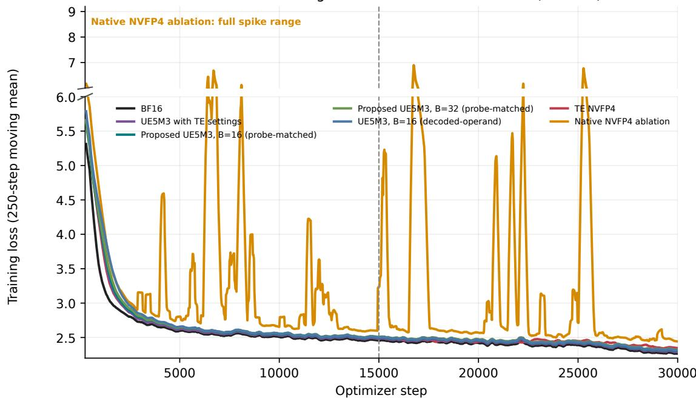  
Figure 2: Training loss for the completed 8B runs. Lower is better. The split vertical axis keeps the main trajectories readable while showing the full native-NVFP4 ablation spike range. The dashed line marks the Transformer Engine optimizer resume. Curves average 10 logged values, or 250 optimizer steps. B is the number of values in each microscaling block; “probe-matched” denotes the probe-matched GEMM output model.

During the final 5,000 steps, all four UE5M3 FP4 trajectories have lower final-window means and endpoint losses than the Transformer Engine NVFP4 trajectory (Figure 3).

Final 5,000 optimizer steps  
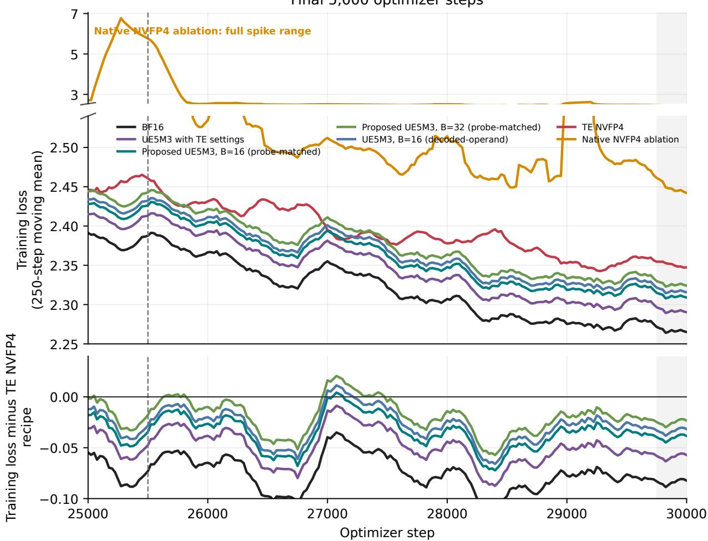  
Figure 3: The final 5,000 optimizer steps. Curves use the same 250-step moving mean as Figure 2. The split upper panels include the full native-NVFP4 ablation trajectory. The dashed line marks the start of linear decay; the gray band is the final reporting window. In the bottom panel, negative values indicate lower loss than the Transformer Engine NVFP4 recipe.  
Table 10 and Figure 4 summarize the final 250-step window and report the endpoint separately.

Table 10: Completed 30,000-step pretraining runs. Lower training loss is better. “Window mean” is the arithmetic mean of ten logged training losses with steps in (29,750, 30,000]; gradient norm is the pre-clipping global norm.
<table><tr><td>Run</td><td>Window-mean training loss</td><td>Endpoint training loss</td><td>Endpoint gradient norm</td></tr><tr><td>BF16</td><td>2.2651</td><td>2.2620</td><td>0.0544</td></tr><tr><td>UE5M3 FP4 with Transformer Engine</td><td>2.2902</td><td>2.2874</td><td>0.0352</td></tr><tr><td>settings Proposed UE5M3 FP4,</td><td>2.3090</td><td>2.3065</td><td>0.0417</td></tr><tr><td>B = 16, probe-matched Proposed UE5M3 FP4,</td><td>2.3241</td><td>2.3216</td><td>0.0374</td></tr><tr><td>B = 32, probe-matched Proposed UE5M3 FP4,</td><td>2.3157</td><td>2.3128</td><td>0.0396</td></tr><tr><td>B = 16, decoded-operand Torch</td><td></td><td></td><td></td></tr><tr><td>Transformer Engine NVFP4 recipe</td><td>2.3474</td><td>2.3349</td><td>0.0349</td></tr><tr><td>Native NVFP4 no-RHT/all-linears</td><td>2.4420</td><td>2.4391</td><td>0.4551</td></tr></table>

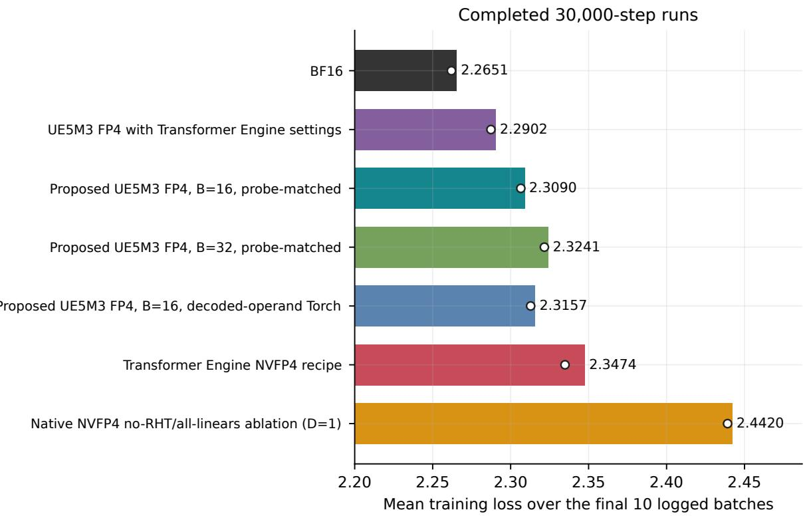  
Figure 4: Means of the ten logged training losses in the final 250-step window. The white marker is the exact endpoint training loss.

The lowest FP4 final-window loss is 2.2902 for UE5M3 FP4 with Transformer Engine settings, compared with 2.3474 for native Transformer Engine NVFP4. Our proposed block-16 recipe reaches 2.3090 while omitting RHT and applying FP4 to all 112 eligible internal linears. Its matched block-32 control reaches 2.3241, and its decoded-operand GEMM control reaches 2.3157. Within these single trajectories, the comparisons favor block size 16 and the probe-matched GEMM output model for the proposed recipe.

Stability with all eligible linears in FP4. Figure 5 compares the proposed UE5M3 FP4 recipe with a native NVFP4 ablation that also removes RHT and the BF16 exemption for the final-block projections. This is a comparison of complete recipes rather than an isolation of the scale format: the two runs also difer in scale lifecycle and GEMM numerics. After step 2,500, the proposed trajectory records no logged loss above 3 and no pre-clipping gradient norm above 1. The native NVFP4 ablation records 205 losses above 3 and 89 gradient norms above 1, and finishes with a final-window loss of 2.4420 versus 2.3090.

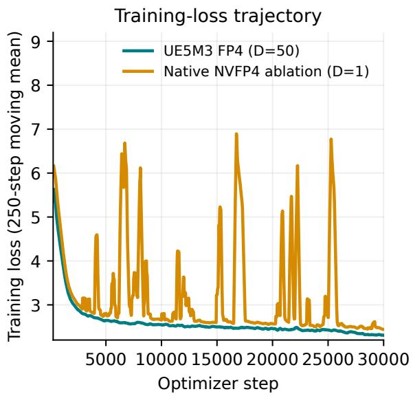

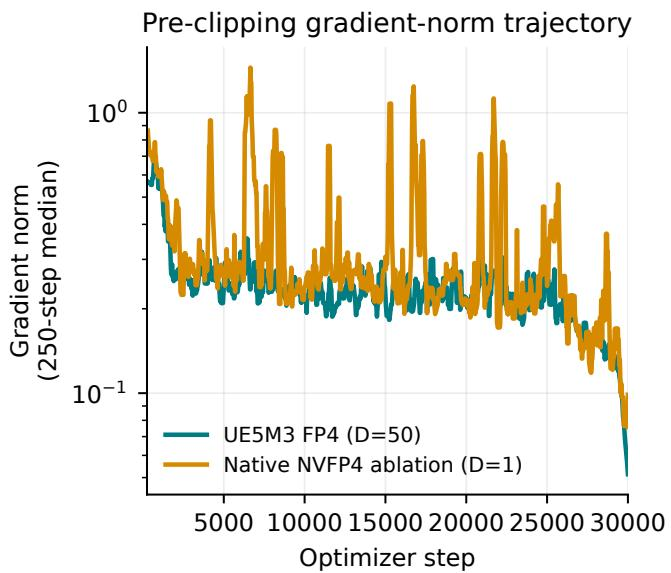  
Figure 5: Training stability when all 112 eligible internal linears use FP4. The proposed UE5M3 FP4 recipe uses periodic scaling with D = 50; the native NVFP4 ablation uses current-tensor scaling and otherwise removes RHT and the final-block BF16 exemption. Loss uses a 250-step moving mean and gradient norm a 250-step moving median.

Efect of the GEMM output model. A paired block-16 control changes only how the software GEMM models native FP4 reduction and output rounding. The probe-matched emulator reaches a final-window loss of 2.3090, compared with 2.3157 for a standard matrix multiplication on reconstructed operands; the endpoint has the same ordering. Figure 6 shows that this small diference persists through the final decay window. Section 6 and Appendix B define the two numerical models.

8B GEMM output-path comparison  
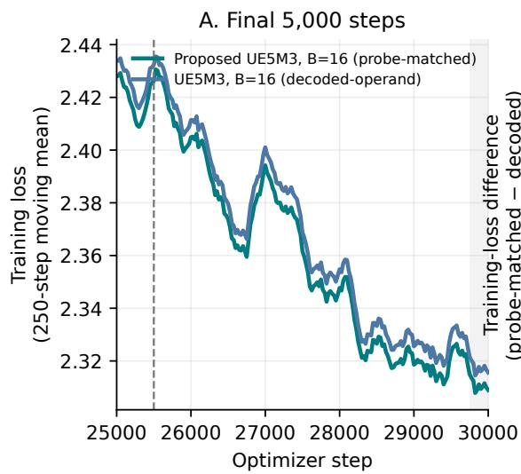

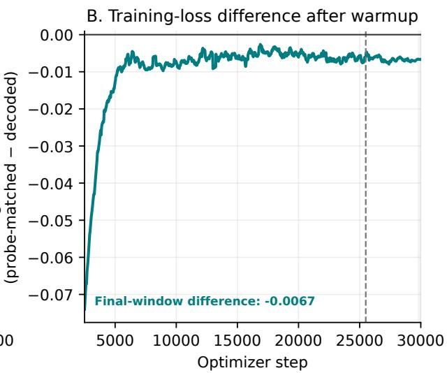  
Figure 6: Matched block-16 UE5M3 FP4 runs that difer only in their software GEMM output model. (A) Final 5,000 steps. (B) Probe-matched loss minus the decoded-operand control after warm-up; negative values favor the probe-matched emulator.

## 7.4 Quantized held-out validation across checkpoints

We evaluate 12 checkpoints from steps 2,500 through 30,000 for all seven trajectories on the same fixed validation stream of 768 ordered 8,192-token sequences (6,291,456 tokens), using the inference paths in Table 11.

A. Held-out validation under each inference recipe  
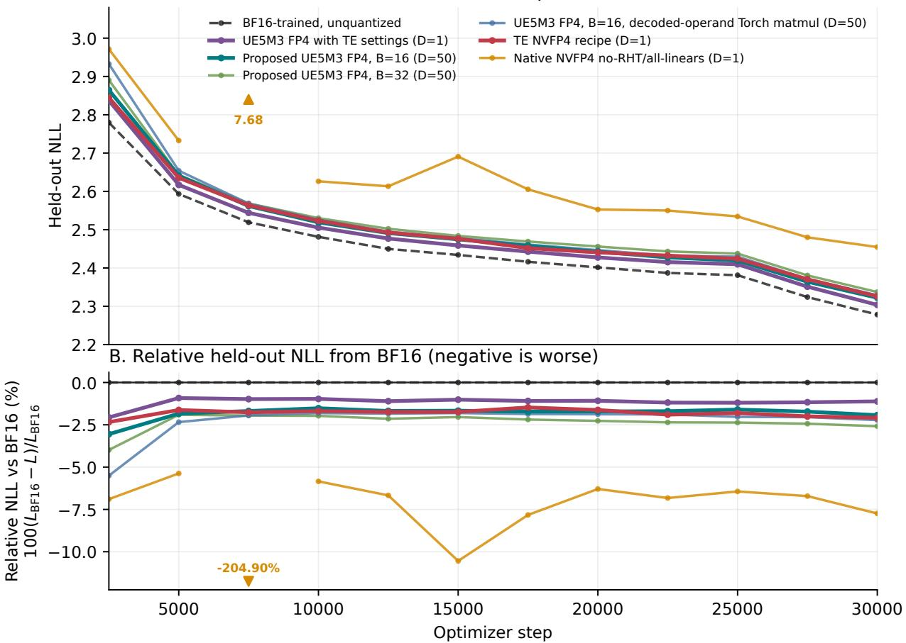  
Figure 7: Held-out NLL under quantized inference at 12 checkpoints; BF16 is unquantized. Panel A shows absolute NLL. Panel B follows NVIDIA et al. [22] and reports $1 0 0 ( L _ { \mathrm { B F 1 6 } } - L _ { \mathrm { r u n } } ) / L _ { \mathrm { B F 1 6 } } .$ , so negative is worse than BF16. Triangles mark the of-axis native ablation value at step 7,500; Table 11 lists each path’s activation-scale policy.

Table 11: Step-30,000 results on the fixed validation stream. Lower NLL is better. FP4 indicates whether the configured eligible linears execute with quantized weights and activations during inference. Bold marks the lowest FP4 NLL; BF16 is the unquantized control.
<table><tr><td>Path</td><td>Activation scaling</td><td>FP4</td><td>NLL</td></tr><tr><td>BF16-trained trajectory, unquantized inference</td><td>not applicable</td><td>no</td><td>2.27834</td></tr><tr><td>UE5M3 FP4 with Transformer Engine settings</td><td>current, D = 1</td><td>yes</td><td>2.30376</td></tr><tr><td>Proposed UE5M3 FP4, B = 16, probe-matched</td><td>delayed, D = 50</td><td>yes</td><td>2.32230</td></tr><tr><td>Transformer Engine NVFP4 recipe</td><td>current, D = 1</td><td>yes</td><td>2.32592</td></tr><tr><td>Proposed UE5M3 FP4, B = 16, decoded-operand Torch</td><td>delayed, D = 50</td><td>yes</td><td>2.32900</td></tr><tr><td>Proposed UE5M3 FP4, B = 32, probe-matched</td><td>delayed, D = 50</td><td>yes</td><td>2.33721</td></tr><tr><td>Native NVFP4 no-RHT/all-linears ablation</td><td>current, D = 1</td><td>yes</td><td>2.45468</td></tr></table>

Among the FP4 paths, the proposed block-16 UE5M3 FP4 path has lower NLL than the native Transformer Engine NVFP4 recipe at 8 of 12 checkpoints, including all four checkpoints from step

22,500 onward. At step 30,000 it reaches 2.32230 versus 2.32592, a diference of −0.00362 NLL. Its NLL decreases from 2.42755 at step 22,500 to 2.32230 at step 30,000. UE5M3 FP4 with Transformer Engine settings has lower NLL than native Transformer Engine NVFP4 at all 12 checkpoints and finishes at 2.30376, a diference of −0.02217 NLL.

Appendix A compares the three inference-scale choices for the proposed block-16 checkpoint. Their step-30,000 held-out NLLs difer by less than $9 . 0 \times 1 0 ^ { - 5 }$ , and all remain below the native Transformer Engine NVFP4 result.

## 7.5 Quantized downstream evaluation at step 30,000

We compare the seven final checkpoints on the OLMES likelihood-based multiple-choice suite [15].   
We report its Core 9 aggregate, MMLU [17], and MMLU-Pro multiple-choice accuracy [34].

Step-30,000 likelihood-based multiple-choice accuracy relative to BF16  
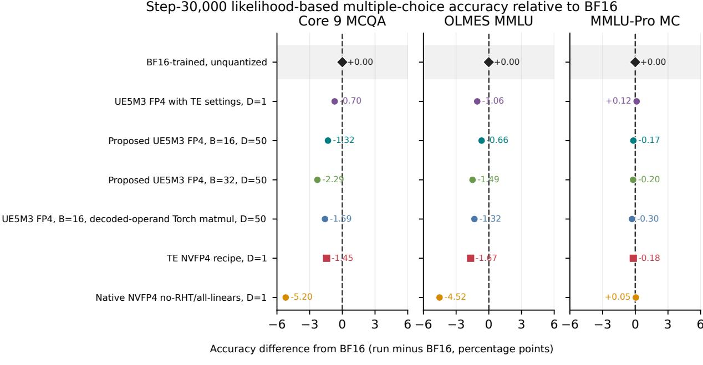  
Delayed-scale paths use one fixed evaluation order.

Figure 8: Step-30,000 likelihood-based multiple-choice accuracy relative to the separately trained BF16 control. Values are percentage-point diferences (run minus BF16), so positive values indicate higher accuracy. All quantized rows execute with their configured FP4 path active during inference. The D = 50 scores are fixed-order point estimates because delayed scale state depends on request order.

Table 12: Step-30,000 OLMES accuracy. Values are percentages; higher is better. Bold marks the highest FP4 result in each column. BF16 is the unquantized control.
<table><tr><td>Path</td><td>Inference precision</td><td>Scale policy</td><td>Core 9</td><td>MMLU</td><td>MMLU-Pro MC</td></tr><tr><td>BF16-trained trajectory</td><td>unquantized</td><td>not applicable</td><td>65.14</td><td>39.64</td><td>11.24</td></tr><tr><td>UE5M3 FP4 with Transformer Engine settings</td><td>fake FP4</td><td>current, D = 1</td><td>64.43</td><td>38.57</td><td>11.36</td></tr><tr><td>Proposed UE5M3 FP4, B = 16, probe-matched</td><td>fake FP4</td><td>delayed, D = 50</td><td>63.82</td><td>38.97</td><td>11.06</td></tr><tr><td>Proposed UE5M3 FP4, B = 32, probe-matched</td><td>fake FP4</td><td>delayed, D = 50</td><td>62.85</td><td>38.14</td><td>11.04</td></tr><tr><td>Proposed UE5M3 FP4, B = 16, decoded-operand</td><td>fake FP4</td><td>delayed, D = 50</td><td>63.54</td><td>38.32</td><td>10.94</td></tr><tr><td>Torch Transformer Engine NVFP4 recipe</td><td>native FP4</td><td>current, D = 1</td><td>63.69</td><td>37.96</td><td>11.05</td></tr><tr><td>Native NVFP4 no-RHT/all-linears ablation</td><td>native FP4</td><td>current, D = 1</td><td>59.94</td><td>35.11</td><td>11.29</td></tr></table>

Among the FP4 paths, relative to the native Transformer Engine NVFP4 checkpoint, proposed block-16 UE5M3 FP4 is higher by 0.13, 1.01, and 0.01 percentage points on Core 9, OLMES MMLU, and MMLU-Pro MC, respectively. UE5M3 FP4 with Transformer Engine settings is higher by 0.74, 0.61, and 0.31 percentage points.

## 7.6 Native NVFP4 execution ablation

The Blackwell/Transformer Engine FP4 path evaluated here exposes native NVFP4 with E4M3 block scales, not UE5M3 block scales [21]. We therefore measure the joint execution efect of removing RHT and moving 16 eligible final-block projections from BF16 to FP4. Both native NVFP4 configurations use Transformer Engine current-tensor scaling (D = 1), SR, and two-dimensional weight scaling.

We measure synchronized forward and backward execution of the 8B model body on one NVIDIA GB200 after warm-up. Data loading, optimization, distributed communication, and compilation are excluded from the timed region.

Table 13: Native-NVFP4 execution ablation. “100-step wall” is the sum of synchronized model-body forward/backward timings after warm-up.
<table><tr><td>Recipe executed with native NVFP4</td><td>FP4 linears</td><td>BF16 linears</td><td>100-step wall</td><td>Tokens/s</td></tr><tr><td>Transformer Engine: RHT; 16 final-block linears in BF16</td><td>96</td><td>16</td><td>31.877 s</td><td>3,212</td></tr><tr><td>No RHT; all 112 eligible linears in FP4</td><td>112</td><td>0</td><td>26.298 s</td><td>3,894</td></tr><tr><td>Relative change</td><td>+16</td><td>-16</td><td></td><td>+21.2%</td></tr></table>

The joint change raises measured model-body throughput from 3,212 to 3,894 tokens per second, an increase of 21.2%.

## 8 Conclusion

This work demonstrates end-to-end software-emulated UE5M3 FP4 pretraining on a Nemotron-H 8B model over 188.7 billion tokens. Our proposed recipe combines periodic sample-and-hold tensor scaling, two-dimensional weight scaling, and upstream-gradient SR while omitting RHT and applying FP4 to all 112 eligible internal linears instead of retaining a BF16 exemption for final-block projections. It achieves a lower final-window mean training loss than NVIDIA’s Transformer Engine NVFP4 recipe. UE5M3 FP4 with Transformer Engine settings produces the lowest final-window training loss among the completed FP4 trajectories.

Under their configured quantized-inference paths, the proposed block-16 UE5M3 FP4 path has lower held-out NLL on the fixed validation stream than native Transformer Engine NVFP4 at 8 of 12 checkpoints, including all four final checkpoints, and finishes at 2.32230 versus 2.32592. UE5M3 FP4 with Transformer Engine settings has lower NLL at all 12 checkpoints and finishes at 2.30376.

Among the FP4 paths at step 30,000, the proposed block-16 UE5M3 FP4 point estimates are higher than native Transformer Engine NVFP4 by 0.13, 1.01, and 0.01 percentage points on Core 9, OLMES MMLU, and MMLU-Pro MC, respectively. The UE5M3 FP4 path with Transformer Engine settings is higher by 0.74, 0.61, and 0.31 percentage points.

In the native NVFP4 execution ablation, the no-RHT/all-linears configuration records 21.2% higher measured model-body token throughput than the Transformer Engine configuration. The probematched emulator also reproduces native model behavior in deterministic controls, supporting its use for the UE5M3 FP4 experiments.

Because the evaluated Blackwell/Transformer Engine path supports E4M3 rather than UE5M3 block scales [21], these results motivate future accelerators to support UE5M3 block scaling directly and realize the UE5M3 FP4 recipe in hardware.

## Generative-AI Disclosure

OpenAI Codex was used extensively to assist with code development, experiment orchestration, analysis, programmatic figure generation, and drafting and editing this report. Each human author takes full responsibility for the code, experimental design and execution, analysis, numerical results, figures, citations, and text.

## References

[1] Anjulie Agrusa, Andrei Panferov, Elizabeth Wei, Keith Wyss, Paul Gibbons, Erik Schultheis, Tijmen Blankevoort, and Dan Alistarh. What matters for NVFP4 training? a scaling study of low-precision pre-training recipes. In Proceedings of the 43rd International Conference on Machine Learning, volume 306 of Proceedings of Machine Learning Research, 2026. URL https://openreview.net/forum?id=jlkIyaG32w.

[2] Saleh Ashkboos, Amirkeivan Mohtashami, Maximilian L. Croci, Bo Li, Pashmina Cameron, Martin Jaggi, Dan Alistarh, Torsten Hoefler, and James Hensman. QuaRot: Outlier-free 4-bit inference in rotated LLMs. arXiv preprint arXiv:2404.00456, 2024. doi: 10.48550/arXiv.2404. 00456. URL https://arxiv.org/abs/2404.00456.

[3] Hengjie Cao, Mengyi Chen, Yifeng Yang, Ruijun Huang, Fang Dong, Jixian Zhou, Anrui Chen, Mingzhi Dong, Yujiang Wang, Jinlong Hou, Yuan Cheng, Fan Wu, Fan Yang, Tun Lu, Ning Gu, and Li Shang. Metis: Training LLMs with FP4 quantization. In International Conference on Learning Representations, 2026. URL https://openreview.net/forum?id=I2ZrCi5O84.

[4] Roberto L. Castro, Andrei Panferov, Rush Tabesh, Oliver Sieberling, Jiale Chen, Mahdi Nikdan, Saleh Ashkboos, and Dan Alistarh. Quartet: Native FP4 training can be optimal for large language models. In Advances in Neural Information Processing Systems, volume 38, pages 43552–43572, 2025. doi: 10.52202/ 085713-1449. URL https://proceedings.neurips.cc/paper\_files/paper/2025/hash/ 3e11872d3bc9bfba34e1752fef87639c-Abstract-Conference.html.

[5] Yuxiang Chen, Haocheng Xi, Jun Zhu, and Jianfei Chen. Oscillation-reduced MXFP4 training for vision transformers. In Proceedings of the 42nd International Conference on Machine Learning, volume 267 of Proceedings of Machine Learning Research, pages 9400–9414, 2025. URL https://proceedings.mlr.press/v267/chen25bu.html.

[6] Yuxiang Chen, Yifan Liu, Xiaoming Xu, Pengle Zhang, Michael Beyer, Martin Rapp, Jun Zhu, and Jianfei Chen. TetraJet-v2: Accurate NVFP4 training for large language models with oscillation suppression and outlier control. In Proceedings of the 43rd International Conference on Machine Learning, volume 306 of Proceedings of Machine Learning Research, 2026. URL https://arxiv.org/abs/2510.27527.

[7] Brian Chmiel, Ron Banner, Elad Hofer, Hilla Ben Yaacov, and Daniel Soudry. Accurate neural training with 4-bit matrix multiplications at standard formats. In International Conference on Learning Representations, 2023. URL https://arxiv.org/abs/2112.10769.

[8] Brian Chmiel, Maxim Fishman, Ron Banner, and Daniel Soudry. FP4 all the way: Fully quantized training of large language models. In Advances in Neural Information Processing Systems, volume 38, pages 91130–91151. Curran Associates, Inc., 2025. doi: 10.52202/085713-3049. URL https://proceedings.neurips.cc/paper\_files/paper/2025/ file/8340b085045cf13f1f0b6c2c4cc0a89c-Paper-Conference.pdf.

[9] Musa Cim, Sarthak Arora, Poovaiah Palangappa, Miro Hodak, Ravi Dwivedula, Meena Arunachalam, and Mahmut Taylan Kandemir. Pretraining large language models with MXFP4 on native FP4 hardware. arXiv preprint arXiv:2605.09825, 2026. doi: 10.48550/arXiv.2605. 09825. URL https://arxiv.org/abs/2605.09825.

[10] Jack Cook, Junxian Guo, Guangxuan Xiao, Yujun Lin, Keith Wyss, Mahdi Nazemi, Asit Mishra, Carlo del Mundo, Tijmen Blankevoort, and Song Han. Four over six: More accurate NVFP4 quantization with adaptive block scaling. arXiv preprint arXiv:2512.02010, 2025. doi: 10.48550/arXiv.2512.02010. URL https://arxiv.org/abs/2512.02010.

[11] Bita Darvish Rouhani, Ritchie Zhao, Ankit More, Mathew Hall, Alireza Khodamoradi, Summer Deng, et al. Microscaling data formats for deep learning. arXiv preprint arXiv:2310.10537, 2023. doi: 10.48550/arXiv.2310.10537. URL https://arxiv.org/abs/2310.10537.

[12] Siyu Ding, Mingchuan Ma, Jiabo Tong, Xingrun Xing, Ziming Wang, and Guoqi Li. Full-stack FP4: Stable LLM pretraining with quantized projections, optimizers, and attention. arXiv preprint arXiv:2607.04422, 2026. doi: 10.48550/arXiv.2607.04422. URL https://arxiv.org/ abs/2607.04422.

[13] Andrea Fasoli, Monodeep Kar, Chi-Chun Liu, Swagath Venkataramani, Viji Srinivasan, Leland Chang, and Naigang Wang. Is finer better? the limits of microscaling formats in large language models. arXiv preprint arXiv:2601.19026, 2026. doi: 10.48550/arXiv.2601.19026. URL https://arxiv.org/abs/2601.19026.

[14] Andrew W. Fitzgibbon and Stephen Felix. On stochastic rounding with few random bits. In 2025 IEEE 32nd Symposium on Computer Arithmetic (ARITH), pages 133–140, 2025. doi: 10. 1109/ARITH64983.2025.00029. URL https://doi.org/10.1109/ARITH64983.2025.00029.

[15] Yuling Gu, Oyvind Tafjord, Bailey Kuehl, Dany Haddad, Jesse Dodge, and Hannaneh Hajishirzi. OLMES: A standard for language model evaluations. In Findings of the Association for Computational Linguistics: NAACL 2025, pages 5020–5048. Association for Computational Linguistics, 2025. doi: 10.18653/v1/2025.findings-naacl.282. URL https://aclanthology. org/2025.findings-naacl.282/.

[16] Suyog Gupta, Ankur Agrawal, Kailash Gopalakrishnan, and Pritish Narayanan. Deep learning with limited numerical precision. In Proceedings of the 32nd International Conference on Machine Learning, volume 37 of Proceedings of Machine Learning Research, pages 1737–1746, 2015. URL https://proceedings.mlr.press/v37/gupta15.html.

[17] Dan Hendrycks, Collin Burns, Steven Basart, Andy Zou, Mantas Mazeika, Dawn Song, and Jacob Steinhardt. Measuring massive multitask language understanding. In International Conference on Learning Representations, 2021. URL https://arxiv.org/abs/2009.03300.

[18] Robert Hu, Carlo Luschi, and Paul Balanca. Elucidating the design space of FP4 training. arXiv preprint arXiv:2509.17791, 2025. doi: 10.48550/arXiv.2509.17791. URL https://arxiv. org/abs/2509.17791.

[19] Paulius Micikevicius, Dusan Stosic, Neil Burgess, Marius Cornea, Pradeep Dubey, Richard Grisenthwaite, et al. FP8 formats for deep learning. arXiv preprint arXiv:2209.05433, 2022. doi: 10.48550/arXiv.2209.05433. URL https://arxiv.org/abs/2209.05433.

[20] NVIDIA. FP8 delayed scaling: Transformer engine documentation. Online documentation, 2026. URL https://docs.nvidia.com/deeplearning/transformer-engine/user-guide/ features/low\_precision\_training/fp8\_delayed\_scaling/fp8\_delayed\_scaling.html. Accessed 2026-07-16.

[21] NVIDIA. NVFP4: Transformer engine documentation. Online documentation, 2026. URL https://docs.nvidia.com/deeplearning/transformer-engine/user-guide/ features/low\_precision\_training/nvfp4/nvfp4.html. Accessed 2026-07-16.

[22] NVIDIA, Felix Abecassis, Anjulie Agrusa, Dong Ahn, Jonah Alben, Stefania Alborghetti, et al. Pretraining large language models with NVFP4. arXiv preprint arXiv:2509.25149, 2025. doi: 10.48550/arXiv.2509.25149. URL https://arxiv.org/abs/2509.25149.

[23] NVIDIA, Aaron Blakeman, Aarti Basant, Abhinav Khattar, Adithya Renduchintala, Akhiad Bercovich, et al. Nemotron-H: A family of accurate and eficient hybrid Mamba–Transformer models. arXiv preprint arXiv:2504.03624, 2025. doi: 10.48550/arXiv.2504.03624. URL https://arxiv.org/abs/2504.03624.

[24] Open Compute Project. OCP Microscaling Formats (MX) Specification, Version 1.0, September 2023. URL https://www.opencompute.org/documents/ ocp-microscaling-formats-mx-v1-0-spec-final-pdf.

[25] Kaan Ozkara, Tao Yu, and Youngsuk Park. Stochastic rounding for LLM training: Theory and practice. In Proceedings of the 28th International Conference on Artificial Intelligence and Statistics, volume 258 of Proceedings of Machine Learning Research, pages 4402–4410, 2025. URL https://proceedings.mlr.press/v258/ozkara25b.html.

[26] Andrei Panferov, Erik Schultheis, Soroush Tabesh, and Dan Alistarh. Quartet II: Accurate LLM pre-training in NVFP4 by improved unbiased gradient estimation. arXiv preprint arXiv:2601.22813, 2026. doi: 10.48550/arXiv.2601.22813. URL https://arxiv.org/abs/ 2601.22813.

[27] Mehdi Rahimifar, Amin Darabi, Mehran Taghian Jazi, Xing Huang, Yao Wang, Zhijun Tu, Yufei Cui, Yunke Peng, and Hongliang Li. Stable FP4 training via transposition-invariant block quantization. arXiv preprint arXiv:2607.24953, 2026. doi: 10.48550/arXiv.2607.24953. URL https://arxiv.org/abs/2607.24953.

[28] Bita Rouhani, Ritchie Zhao, Venmugil Elango, Rasoul Shafipour, Mathew Hall, Maral Mesmakhosroshahi, et al. With shared microexponents, a little shifting goes a long way. arXiv preprint arXiv:2302.08007, 2023. doi: 10.48550/arXiv.2302.08007. URL https: //arxiv.org/abs/2302.08007.

[29] Xiao Sun, Naigang Wang, Chia-Yu Chen, Jiamin Ni, Ankur Agrawal, Xiaodong Cui, Swagath Venkataramani, Kaoutar El Maghraoui, Vijayalakshmi (Viji) Srinivasan, and Kailash Gopalakrishnan. Ultra-low precision 4-bit training of deep neural networks. In Advances in Neural Information Processing Systems, volume 33, pages 1796– 1807, 2020. URL https://proceedings.neurips.cc/paper\_files/paper/2020/file/ 13b919438259814cd5be8cb45877d577-Paper.pdf.

[30] Xingwu Sun, Shuaipeng Li, Ruobing Xie, Weidong Han, Kan Wu, Zhen Yang, Yixing Li, An Wang, Shuai Li, Jinbao Xue, Yu Cheng, Yangyu Tao, Zhanhui Kang, Cheng-Zhong Xu, Di Wang, and Jie Jiang. Scaling laws for floating–point quantization training. In Proceedings of the 42nd International Conference on Machine Learning, volume 267 of Proceedings of Machine Learning Research, pages 57544–57570, 2025. URL https://proceedings.mlr.press/v267/ sun25j.html.

[31] Mehran Taghian, Yunke Peng, Xing Huang, Yao Wang, Yaoyuan Wang, Wei Guo, Yuanyong Luo, Tianchi Hu, et al. HiFloat4 format for language model pre-training on Ascend NPUs. arXiv preprint arXiv:2604.08826, 2026. doi: 10.48550/arXiv.2604.08826. URL https://arxiv. org/abs/2604.08826.

[32] Albert Tseng, Tao Yu, and Youngsuk Park. Training LLMs with MXFP4. In Proceedings of the 28th International Conference on Artificial Intelligence and Statistics, volume 258 of Proceedings of Machine Learning Research, pages 1630–1638, 2025. URL https://proceedings. mlr.press/v258/tseng25a.html.

[33] Ruizhe Wang, Yeyun Gong, Xiao Liu, Guoshuai Zhao, Ziyue Yang, Baining Guo, Zheng-Jun Zha, and Peng Cheng. Optimizing large language model training using FP4 quantization. In Proceedings of the 42nd International Conference on Machine Learning, volume 267 of Proceedings of Machine Learning Research, pages 62937–62957, 2025. URL https://proceedings.mlr.press/v267/wang25ae.html.

[34] Yubo Wang, Xueguang Ma, Ge Zhang, Yuansheng Ni, Abhranil Chandra, Shiguang Guo, Weiming Ren, Aaran Arulraj, Xuan He, Ziyan Jiang, Tianle Li, Max Ku, Kai Wang, Alex Zhuang, Rongqi Fan, Xiang Yue, and Wenhu Chen. MMLU-Pro: A more robust and challenging multi-task language understanding benchmark. In Advances in Neural Information Processing Systems, volume 37, pages 95266–95290, 2024. doi: 10.52202/ 079017-3018. URL https://proceedings.neurips.cc/paper\_files/paper/2024/hash ad236edc564f3e3156e1b2feafb99a24-Abstract-Datasets\_and\_Benchmarks\_Track.html.

[35] Jiecheng Zhou, Ding Tang, Rong Fu, Boni Hu, Haoran Xu, Yi Wang, Zhilin Pei, Zhongling Su, Liang Liu, Xingcheng Zhang, and Weiming Zhang. Towards eficient pre-training: Exploring FP4 precision in large language models. arXiv preprint arXiv:2502.11458, 2025. doi: 10.48550/ arXiv.2502.11458. URL https://arxiv.org/abs/2502.11458.

## A Inference-Scale Sensitivity

For the proposed block-16 checkpoint, we compare the three policies summarized in Table 9. In every case, each loaded weight tensor’s amax is measured once and its tensor-wide reference remains fixed. The delayed cache starts from the first inference batch rather than restoring training state. The calibrated-frozen policy uses the largest activation amax observed for each eligible linear over 64 calibration sequences that are disjoint from validation.

Delayed inference is order-dependent, so validation and downstream evaluation use fixed request orders. For the downstream suite, the scale state advances continuously rather than restarting at task boundaries.

Table 14: Held-out NLL under three activation-scale policies for the proposed block-16 checkpoint. Every populated cell uses fake-quantized FP4 weights and activations on the same validation stream. Lower is better; an em dash denotes a policy not evaluated at that checkpoint.
<table><tr><td>Checkpoint step</td><td>Current tensor, D = 1</td><td>Delayed,  $D = 5 0$ </td><td>Calibrated frozen</td></tr><tr><td>27,500</td><td></td><td>2.364080</td><td>2.364100</td></tr><tr><td>30,000</td><td>2.322215</td><td>2.322305</td><td>2.322243</td></tr></table>

At step 30,000, the largest diference among the three policies is only $8 . 9 9 \times 1 0 ^ { - 5 }$ NLL, and each remains below the native Transformer Engine NVFP4 result of 2.325921. The choice among them therefore does not change the point-estimate ordering at this checkpoint.

## B FP4 GEMM Simulation Details and Ablations

We infer the hardware addition behavior using several deliberately diferent probes, summarized in Table 16. Here an edge case means an output close to a rounding boundary, not a NaN, infinity, overflow, or zero-sized input.

The seven primary witnesses are real scalar outputs from full $8 1 9 2 \times 2 0 4 8 \times 6 1 4 4$ feed\_forward.w2 GEMMs in layers 2, 5, 7, 8, 9, and 11. They include five positive and two negative outputs with magnitudes from $1 . 5 \times 1 0 ^ { - 5 } \ \mathrm { t o } \ 1 . 1 6 \times 1 0 ^ { - 1 }$ . For every witness, the custom and TE paths had identical decoded FP4 operand values, used scale bytes, and global scale product. The decoded-operand Torch matmul nevertheless chose the adjacent BF16 value because its unrounded result lay only $2 . 3 \times 1 0 ^ { - 9 }$ to $2 . 2 \times 1 0 ^ { - 8 }$ from the midpoint between the two BF16 choices. These deliberately separating cells form a diagnostic witness set, on which the decoded-operand matmul matches $0 / 7$ outputs. Table 15 lists the complete set; coordinates are zero-based and “ofset” is the decoded-operand Torch result minus the BF16 midpoint.

Table 15: The seven real-model BF16-boundary witnesses. A positive midpoint ofset lies above the boundary and a negative ofset lies below it.
<table><tr><td>Module</td><td>Row</td><td>Column</td><td>Native BF16</td><td>Decoded-operand Torch BF16</td><td>Midpoint offset</td></tr><tr><td>L2.w2</td><td>4,143</td><td>11</td><td> $1 . 4 5 9 1 2 1 7 \times 1 0 ^ { - 4 }$ </td><td> $1 . 4 4 9 5 8 5 0 \times 1 0 ^ { - 4 }$ </td><td> $\phantom { 0 } { \cdot 1 . 6 7 9 3 } \times 1 0 ^ { - 8 }$ </td></tr><tr><td>L5.w2</td><td>7,919</td><td>240</td><td> $1 . 5 2 5 8 7 8 9 \times 1 0 ^ { - 5 }$ </td><td> $1 . 5 3 7 7 9 9 8 \times 1 0 ^ { - 5 }$ </td><td> $\phantom { 0 0 0 } { + 3 . 1 2 1 4 } \times 1 0 ^ { - 9 }$ </td></tr><tr><td>L7.w2</td><td>6,189</td><td>809</td><td> $2 . 2 0 9 4 7 2 7 \times 1 0 ^ { - 2 }$ </td><td> $2 . 1 9 7 2 6 5 6 \times 1 0 ^ { - 2 }$ </td><td> $- 1 . 8 6 2 6 \times 1 0 ^ { - 8 }$ </td></tr><tr><td>L7.w2</td><td>4,184</td><td>558</td><td> $- 2 . 4 1 9 9 4 8 6 \times 1 0 ^ { - 5 }$ </td><td> $- 2 . 4 3 1 8 6 9 5 \times 1 0 ^ { - 5 }$ </td><td> $- 9 . 7 3 1 6 \times 1 0 ^ { - 9 }$ </td></tr><tr><td>L8.w2</td><td>3,263</td><td>1,005</td><td> $7 . 3 9 0 9 7 6 0 \times 1 0 ^ { - 5 }$ </td><td> $7 . 4 3 8 6 5 9 7 \times 1 0 ^ { - 5 }$ </td><td> $\phantom { 0 } { + 1 . 3 7 8 8 } \times 1 0 ^ { - 8 }$ </td></tr><tr><td>L9.w2</td><td>1,141</td><td>252</td><td> $- 1 . 1 6 2 1 0 9 4 \times 1 0 ^ { - 1 }$ </td><td> $- 1 . 1 5 7 2 2 6 6 \times 1 0 ^ { - 1 }$ </td><td> $+ 2 . 2 3 5 2 \times 1 0 ^ { - 8 }$ </td></tr><tr><td>L11.w2</td><td>8,181</td><td>1,658</td><td> $7 . 6 5 9 9 1 2 1 \times 1 0 ^ { - 3 }$ </td><td> $7 . 6 2 9 3 9 4 5 \times 1 0 ^ { - 3 }$ </td><td> $- 2 . 3 2 8 3 \times 1 0 ^ { - 9 }$ </td></tr></table>

Table 16: Probe classes used to fit and test the output model. Each class isolates a distinct source of agreement.
<table><tr><td>Probe</td><td>Construction</td><td>What it isolates</td><td>Pass condition</td></tr><tr><td>Seven W2 witnesses</td><td>Real model cells whose decoded-operand Torch result is adjacent to native BF16; operands and scales already agree</td><td>Accumulation after quantization</td><td>Native final BF16 value and encoded product-lattice bin</td></tr><tr><td>258 order tests</td><td>Reorder the 384 K-blocks of the discrimi- nating 6,144-term witness while preserv- ing the same products and exact dot prod- uct</td><td>Product grouping, traversal order, and cross-group rounding</td><td>Native FP32 grid bin for every permutation</td></tr><tr><td>Same-sign thresholds</td><td>Construct positive-only and negative-only partial sums immediately around an FP32 rounding boundary</td><td>Nearest versus toward-zero addition without cancellation ambiguity</td><td>Correct side of every separating threshold</td></tr><tr><td>Broad 512-cell probes</td><td>Sample full 128 × 256 × 6144 packed- random and TE-quantized GEMMs</td><td>Behavior away from hand-selected BF16 boundaries</td><td>Exact native FP32 value and final BF16 value per sampled cell</td></tr><tr><td>1.29B model probe</td><td>One complete 1.2B-model forward and backward pass</td><td>Composition across forward, data-gradient, and weight-gradient GEMMs</td><td>Logits, loss, and complete parameter-gradient vector</td></tr></table>

The discriminating witness is the negative output at layer 7, row 4,184, column 558. Native TE returns $- 2 . 4 1 9 9 4 8 6 \times 1 0 ^ { - 5 }$ . An exact decoded sum followed by product-lattice canonicalization lands in bin −3371, and 64-product groups combined with nearest rounding land in bin −3372. The native result is bin −3370; only toward-zero combination reaches that bin. Permuting this same witness’s K-blocks produces the 258 order tests: the mathematical dot product remains fixed, while native rounded outputs change with physical order. This is the case that separates the $6 / 7$ and $7 / 7$ candidate output models.

Table 17 then builds the match one rule at a time.

Table 17: Output-model ladder against native Transformer Engine FP4 GEMM. Each row adds one probe-supported rule.
<table><tr><td>Software output model</td><td>Added rule</td><td>What it tests</td><td>Order tests</td><td>BF16 witnesses</td></tr><tr><td>Decoded-operand Torch matmul</td><td>Decode FP4 values to FP32, call a standard matrix multiply,</td><td>Quantization only; native addition ignored</td><td></td><td>0/7</td></tr><tr><td>Exact sum + canonicalization</td><td>Exact decoded dot product, then RNE-map to its 1/1024 product</td><td>Whether final product-lattice mapping alone explains TE</td><td></td><td>6/7</td></tr><tr><td>64-product groups + nearest</td><td>products; nearest rounding between groups</td><td>One partial per 64 Physical grouping alone</td><td>149/258</td><td>6/7</td></tr><tr><td>64-product groups + toward zero</td><td>Same groups; round inexact cross-group additions toward zero</td><td>Complete tested output rule</td><td>258/258</td><td>7/7</td></tr></table>

Figure 9 adds two broader checks. In panel A, rounding toward zero matches more cases at every tested group size; groups of 64 are the only 258/258 match. On 512 packed-random outputs in panel B, the complete model matches 366 native FP32 values versus 6 for the RNE accumulation baseline. On wide TE-quantized operands it matches all 512, versus 485. Both methods happen to agree after BF16 conversion in these broad samples. This is why a BF16-only output comparison can miss the diference and why the sensitive cases matter. On the seven selected witnesses, all $7 / 7$ modeled outputs match the native final BF16 values and encoded product-lattice bins; $5 / 7$ also match the native pre-BF16 FP32 value.

## Probe match to tested native Blackwell FP4 outputs

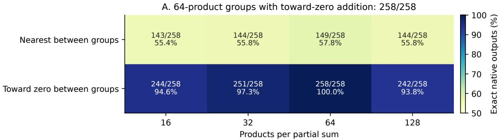

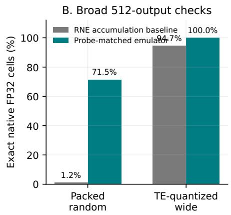

C. Seven BF16-boundary witnesses  
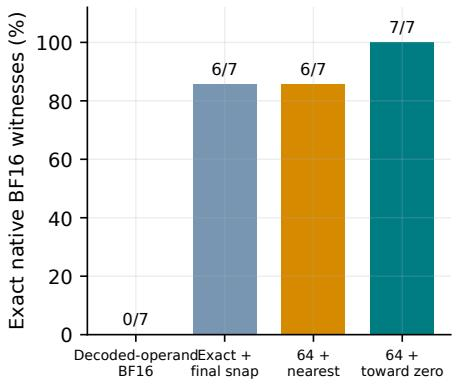  
Figure 9: Probe evidence for the tested native Blackwell FP4 outputs. (A) Reordering fixed products supports 64-product groups and toward-zero additions. (B) Broader samples compare exact native FP32 outputs. (C) Seven sensitive BF16-boundary cases show which rules are necessary. The final 1.2B check reproduces exact logits and loss and the complete 1,291,929,600-entry parameter-gradient vector in represented numerical value.

A third probe with TE quantization, RHT, and 2D weights gives 512/512 matches for both methods. In the denominator sweep of Table 7, 1/1024, finer grids, and no final canonicalization all match the 258 order tests, while the coarser grids fail. The 1.2B test then matches every represented parameter-gradient value across one complete model forward and backward pass.

## C Statistical Consequences of the Probe-Matched Emulator

We characterize the statistical consequences of the output model in Equations 12–14 by holding the products fixed and changing only two choices: how 64-product partial sums are combined and whether the final encoded accumulator is canonicalized on the 1/1024 product lattice. The public NVIDIA Parallel Thread Execution (PTX) instruction-set contract leaves E2M1 matrix-multiply-accumulate (MMA) order and rounding unspecified.

The main sweep uses 4,096 independent dot products of length 4,096. Inputs come from a unit Gaussian, a Gaussian with standard deviation 32, a variance-normalized Laplace distribution, a variance-normalized Student-t(3) distribution, and a contaminated Gaussian with 1% of values drawn with 25 times the base standard deviation. We test both uncorrelated operands and operands with correlation 0.25. Every case receives identical BF16 products under four accumulator variants:

<table><tr><td>Variant</td><td>Operation</td></tr><tr><td>RNE</td><td>Round-to-nearest-even FP32 cross-group additions</td></tr><tr><td></td><td>RNE + grid RNE, then nearest-even mapping to multiples of 1/1024</td></tr><tr><td>RTZ</td><td>Round-toward-zero FP32 cross-group additions</td></tr><tr><td>RTZ + grid</td><td>RTZ, then nearest-even mapping to multiples of 1/1024</td></tr></table>

For an exact addition result s, one toward-zero rounding error has the form

$$
\begin{array} { r } { e _ { \mathrm { R T Z } } = \mathrm { R T Z } _ { 3 2 } ( s ) - s = - \mathrm { s i g n } ( s ) \delta , \qquad 0 \leq \delta < \mathrm { u p } ( s ) . } \end{array}\tag{16}
$$

Here $\mathrm { { u l p } } ( s )$ is the spacing between adjacent FP32 values at $s ,$ or one unit in the last place. Thus an inexact positive addition moves downward and an inexact negative addition moves upward: both move toward zero. A symmetric distribution can still have almost zero unconditional signed error because its positive and negative conditional biases cancel. Magnitude bias and signal gain are therefore more informative than mean signed error.

Table 18 confirms this contraction. RNE accumulation is within approximately 0.004 parts per million (ppm) of zero magnitude/gain bias in the same cases. Increasing Gaussian variance does not remove the relative efect, and heavier tails make it slightly larger rather than changing its sign.

Table 18: Relative efect of RTZ for BF16 $K = 4 { , } 0 9 6$ dots. Magnitude bias uses uncorrelated operands; gain error uses correlation 0.25. Negative values mean contraction toward zero.
<table><tr><td>Distribution</td><td>Magnitude bias (ppm)</td><td>Gain error (ppm)</td></tr><tr><td>Gaussian</td><td>-1.169</td><td>-1.283</td></tr><tr><td>Gaussian,  $\sigma = 3 2$ </td><td>-1.136</td><td>-1.281</td></tr><tr><td>Laplace</td><td>-1.185</td><td>-1.285</td></tr><tr><td>Student-t(3)</td><td>-1.188</td><td>-1.311</td></tr><tr><td>1% contaminated Gaussian</td><td>-1.293</td><td>-1.350</td></tr></table>

A second probe uses linear regression with 2,048 examples and 2,048 features. The RTZ gradient retains cosine similarity of at least 0.999999999996 with the exact-accumulation gradient, but its gain errors are −1.065, −1.213, and −1.219 ppm for Gaussian, Student-t(3), and contaminated-Gaussian inputs, respectively. The corresponding RNE errors are +0.011, +0.013, and −0.004 ppm. RTZ therefore preserves direction while attenuating amplitude by roughly 1 ppm. In the correlated $( \rho = 0 . 2 5 )$ E2M1-plus-E4M3 controls, input quantization contributes 1.24–1.83% relative root-mean-square error, whereas changing RNE to RTZ afects only the sixth or seventh decimal place.

The product-lattice canonicalization behaves diferently. With d = 1024 and $\Delta = d ^ { - 1 } = 2 ^ { - 1 0 }$ ， Equation 15 becomes

$$
Q _ { \Delta } ( z ) = \Delta \mathrm { R N E } ( z / \Delta ) , \qquad | Q _ { \Delta } ( z ) - z | \le \Delta / 2 .\tag{17}
$$

It maps every encoded accumulator in $\left[ - 1 / 2 0 4 8 , + 1 / 2 0 4 8 \right]$ to zero. After the tensor decode factor $\alpha ,$ the corresponding real-value dead-zone interval is $[ - \alpha / 2 0 4 8 , + \alpha / 2 0 4 8 ]$ , with total width $\alpha / 1 0 2 4$ For 4,096 exact-cancellation trials at 64-product partial-sum scale 1, RNE accumulation leaves root-mean-square (RMS) path-rounding residue of $6 . 3 4 \times 1 0 ^ { - 7 }$ and RTZ leaves $5 . 4 0 \times 1 0 ^ { - 6 }$ ; either gridded variant returns exact zero in every trial. When a genuine residual has standard deviation 1/4096, however, the grid maps 95.4% of outputs to zero, lowers gain to approximately 0.44, and raises root-mean-square error (RMSE) to $2 . 2 6 \times 1 0 ^ { - 4 }$ . At 64-product partial-sum scale 32, even the RTZ path error can exceed half a grid cell.

We then repeat the near-cancellation probe while varying d. Each row in Table 19 uses the same 4,096 Gaussian partial-sum sequences and the same residual samples, so only the final grid changes. The true residual has standard deviation 1/4096, and the 64-product partial-sum scale is one. The expected tradeof is visible directly: coarser grids remove cancellation residue aggressively but also erase the intended signal; finer grids preserve gain and reduce RMSE.

Table 19: Efect of final-grid granularity on a genuine near-zero residual. “None” retains the RTZ result without final canonicalization.
<table><tr><td>Grid</td><td>Mapped to zero (%)</td><td>Signal gain</td><td>RMSE</td></tr><tr><td>None</td><td>0.02</td><td>1.0002</td><td> $5 . 4 2 \times 1 0 ^ { - 6 }$ </td></tr><tr><td>1/256</td><td>100.00</td><td>0.0000</td><td> $2 . 4 7 \times 1 0 ^ { - 4 }$ </td></tr><tr><td>1/512</td><td>99.98</td><td>0.0083</td><td> $2 . 4 6 \times 1 0 ^ { - 4 }$ </td></tr><tr><td>1/1024</td><td>95.43</td><td>0.4332</td><td> $2 . 2 7 \times 1 0 ^ { - 4 }$ </td></tr><tr><td>1/2048</td><td>67.68</td><td>0.9964</td><td> $1 . 4 1 \times 1 0 ^ { - 4 }$ </td></tr><tr><td>1/4096</td><td>37.92</td><td>1.0017</td><td> $7 . 0 8 \times 1 0 ^ { - 5 }$ </td></tr></table>

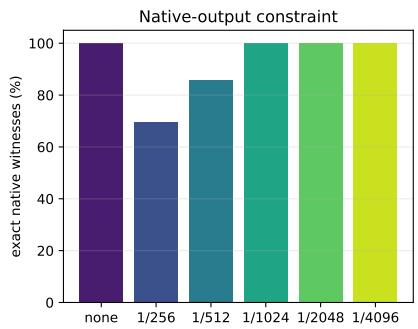

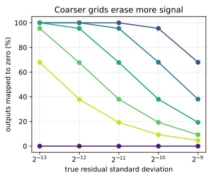

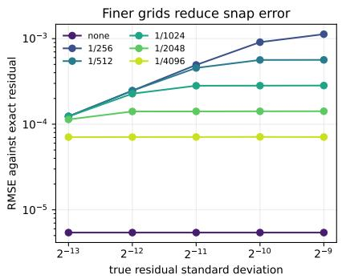  
Figure 10: Final-grid granularity sweep. Left: coarser $1 / 2 5 6$ and 1/512 grids fail native witnesses; 1/1024, finer grids, and no snap all match the 258 permutation witnesses. Center and right: coarser grids map more real near-zero residuals to zero and incur larger error.

## C.1 Optimizer-level regression control

We first test whether the final-grid denominator changes optimization in a compact two-layer teacher–student regression, 256 → 256 → 64, with 81,920 trainable parameters. It uses 2,048 fixed training examples, 1,024 fixed evaluation examples, minibatches of 128, and 500 AdamW updates. The student uses the same E2M1/E5M3 quantization and probe-matched GEMM as the main experiments for the forward, data-gradient, and weight-gradient matrix products. We set the scale target to 448, update delayed amax every 50 steps, disable RHT, and change only d.

For each of seeds 41, 42, and 43, all grid choices receive the same teacher, training set, initialization, minibatch order, and random stream. We run the experiment once with nearest-even gradient quantization and once with stochastic gradient quantization. In both cases, all 500 recorded losses, gradient norms, and zero-gradient rates are exactly equal to the no-grid trajectory. After the last update, all 81,920 parameter values are also bit exact. Table 20 counts the five nonzero denominators against no grid over three seeds, hence 15 comparisons per row.

Table 20: Tiny regression control. Final-evaluation mean-squared-error (MSE) values are means over three seeds; exactness compares each nonzero grid with d = 0.
<table><tr><td>Gradient rounding</td><td>BF16 final-eval MSE</td><td>Quantized final-eval MSE</td><td>Exact records</td><td>Exact states</td></tr><tr><td>Nearest-even</td><td>0.001956</td><td>0.027130</td><td>15/15</td><td>15/15</td></tr><tr><td>Stochastic</td><td>0.001956</td><td>0.027578</td><td>15/15</td><td>15/15</td></tr></table>

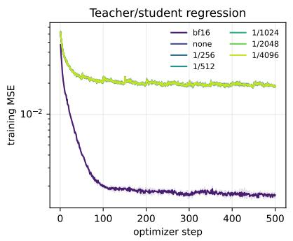

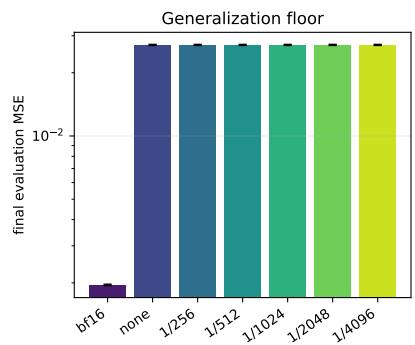

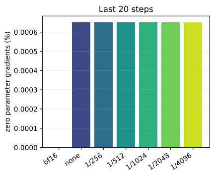  
Figure 11: The 81,920-parameter regression control with nearest-even gradient quantization. All six quantized curves and bars overlap exactly. Repeating the experiment with stochastic gradient quantization gives the same grid invariance.

At the BF16 interface of this regression control, all tested final grids produce identical values and optimizer trajectories through 500 updates.

A. Zero-mean dot products  
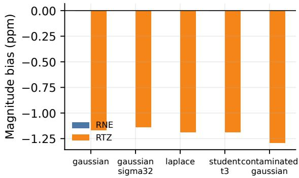

B. Correlated dot products  
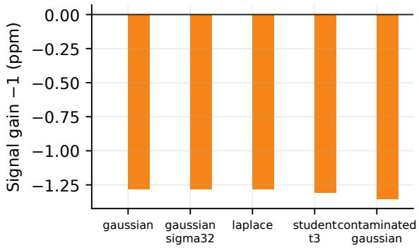

C. Linear-regression gradient gain  
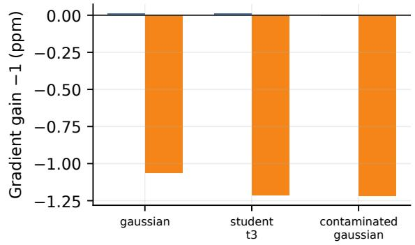

D. Near-cancellation residuals  
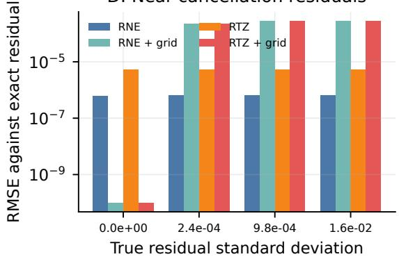  
Figure 12: Statistical efect of the probe-matched emulator. RTZ produces a small toward-zero gain contraction across Gaussian and heavy-tailed dot products and regression gradients. Optional product-lattice canonicalization can eliminate exact-cancellation residue, but it also suppresses genuine residuals below its scale-dependent threshold.

## D Hundred-Step Full-Model Native Parity

The one-step model check in Figure 9 establishes composed forward/backward equality. We extend the test through 100 AdamW updates to compare evolving parameters and optimizer state. The validator uses the exact 1,291,929,600-parameter model: 20 layers, width 2,048, vocabulary 131,072, 96 quantized linears, and the final four transformer layers kept in BF16. Both trajectories use BF16 model tensors, batch size 1, sequence length 64, RHT, 2D weight quantization, and no SR. AdamW uses learning rate $1 0 ^ { - 4 }$ , weight decay 0.1, and non-fused, non-foreach updates.

Native Transformer Engine and probe-matched trajectories run sequentially from one shared initial state. Step s deterministically constructs a new synthetic token batch from seed $5 6 7 8 + s - 1$ . Before each update, the validator compares the complete logits tensor and scalar loss. After 100 updates, it scans every gradient, parameter, and AdamW tensor state. The native Transformer Engine runtime is held fixed throughout the comparison.

Table 21: Raw-storage parity after 100 full 1.292B-model AdamW updates.
<table><tr><td>Object</td><td>Result</td><td>Compared values</td></tr><tr><td>Per-step logits</td><td>Byte-exact at every step</td><td>100/100 tensors</td></tr><tr><td>Per-step losses</td><td>Byte-exact at every step</td><td>100/100 scalars</td></tr><tr><td>Final parameters</td><td>Byte-exact</td><td>1,291,929,600</td></tr><tr><td>Final AdamW tensor states</td><td>Byte-exact</td><td>2,583,859,363</td></tr><tr><td>Final gradients</td><td>One BF16 element differs by two units in the last place (ULPs)</td><td>1,291,929,600</td></tr></table>

The complete gradient scan finds exactly one element that difers by two BF16 ULPs; the remaining 1,291,929,599 gradient elements are byte-exact. This transient diference does not alter the parameter update or either Adam moment: all final parameters and optimizer tensor-state values remain byte-exact.

## E Reproducibility Statement

Code and reproduction instructions for the portable UE5M3 FP4 reference implementation are available at https://github.com/MrHuff/ue5m3-fp4.