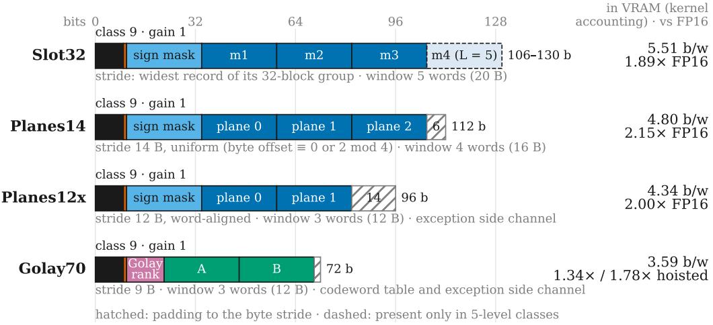
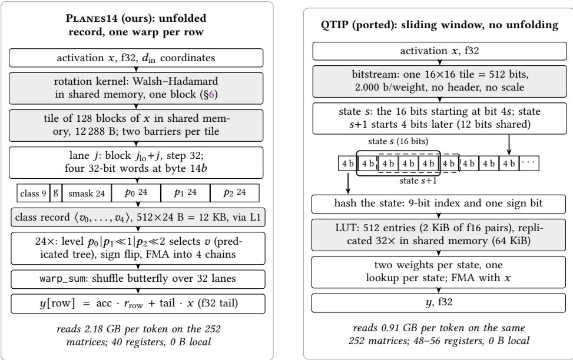
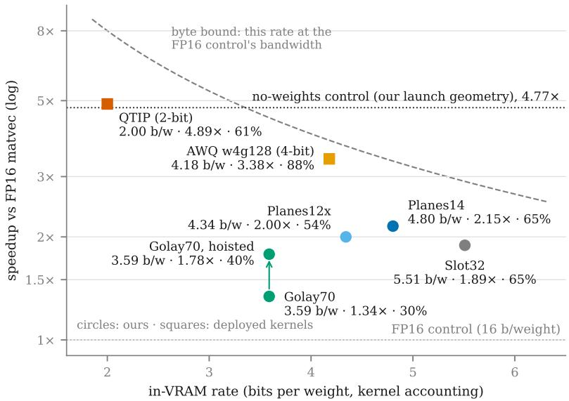
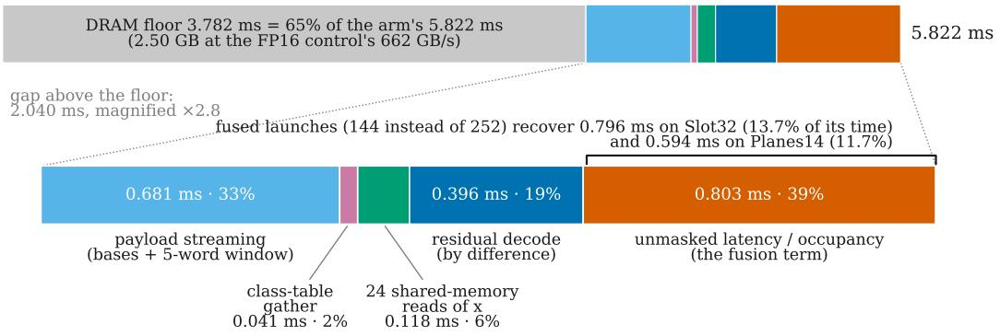
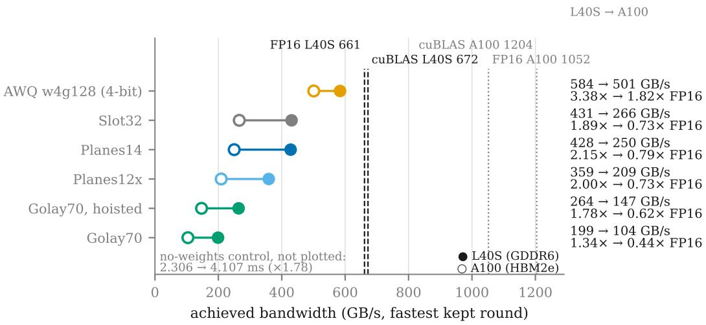
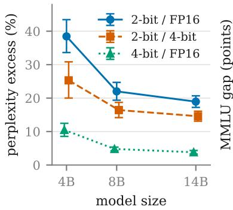
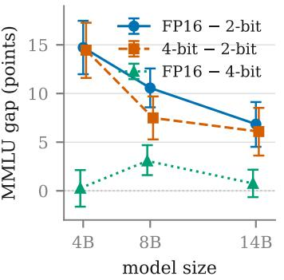
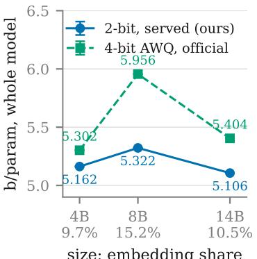

# Unfolding the Leech Latice: Fused Multi-Shell Decoding and VRAM Layouts for 2-Bit LLM Weights

What a combinatorial index costs to serve, measured against deployed 4-bit and 2-bit GEMV kernels

PIER-JEAN MALANDRINO, Scub, France

Leech-lattice vector quantization holds the strongest reported 2-bit quality under its own evaluation protocol. Its kernel decodes one shell; we found no implementation of the multi-shell decoder the rate requires. This paper supplies one and measures its serving cost for decode-phase GEMV at batch 1. First, a serving path for the full 301-class codebook: an ofline expansion into GPU layouts and a fused dequantize-plus-matvec kernel reading them without warp divergence, verified against f64. Second, the in-VRAM rate is a design axis distinct from the on-disk rate. Four bit-exact layouts timed in one process show binary bit planes beating one-hot masks on size and speed at constant bandwidth (4.80 bits per weight, 2.15× FP16). Below 4.3 bits a second, irregular stream enters; at 3.6 the decode stops being shifts and masks. Third, deployed four-bit (AWQ) and two-bit (QTIP) GEMV kernels run in the same process. The trellis kernel reads 2.40× fewer bytes than our served layout and runs 2.27× faster at near-equal fractions of their byte bounds: the time gap tracks the trafic gap, the price of unfolding a codebook too large for a lookup table. Fourth, the validity envelope: the trellis kernel outruns our no-wei hts control, so our launch eometr sets that floor, and on a second memory hierarchy every lattice arm falls below FP16. With the output head held identical across arms, the kernel-and-format path gains 1.11×, 1.29× and 1.41× end to end at 4B, 8B and 14B; with an int8 output head the served 4B reaches 87.0 tok/s in 2.60 GB. The quality cost, ×1.38 perplexity and 14.7 MMLU points at 4B, shrinks across the three sizes measured.

CCS Concepts: • Computing methodologies → Massively parallel algorithms; Machine learning; • Computer systems organization → Single instruction, multiple data.

Additional Key Words and Phrases: Post-training quantization, vector quantization, Leech lattice, GPU kernels, memory layout, GEMV, large language models, roofline

## 1 Introduction

The number of bits per weight is the only rate that changes the class of model a given machine can load. At 16 bits a 70B-parameter model needs 140 GB of weights; at 2 bits the same model occupies about 20 GB on disk and fits in the memory of a workstation. That figure is the on-disk rate. The rate served from VRAM is higher, because the kernel reads a format it can decode inside a matvec, and that rate is the subject of §3. For deployments whose constraint is sovereignty (capable models on hardware one owns), the 2-bit operating point decides whether the model loads at all.

The strongest reported 2-bit quality, under its own evaluation protocol, comes from Leech-lattice vector quantization (LLVQ) [29]: weights are grouped in blocks of 24, normalized, and snapped to the nearest point ofthe Leech lattice $\Lambda _ { 2 4 }$ . The systems halfofthat paper stops short. Its CUDA kernel decodes a single lattice shell $( m = 3 ,$ , “for simplicity”), is reported slower than QTIP’s kernel [26], and low-level optimization is deferred as “largely orthogonal” to the contribution. The decoder the 2-bit rate requires is a union of shells: 301 coordinate-permutation classes for the ball $\Lambda _ { 2 4 } ( 1 2 )$ whose 47-bit index names one of $1 . 1 \times 1 0 ^ { 1 4 }$ lattice points. A branch per class would diverge across every warp. We found no prior implementation of that decoder, the original work included.

This paper supplies it and measures, for decode-phase GEMV at batch 1, what a combinatorial lattice index costs to serve. Four contributions:

C1 The fused multi-shell decoder (§2): to our knowledge the first publicly documented serving implementation of the full multi-shell $\Lambda _ { 2 4 } ( 1 2 )$ codebook (301 classes): an ofline expansion into divergence-free GPU layouts, and a fused dequantize-plus-matvec kernel that reads them with shifts, masks and a predicated table lookup, the same instruction sequence on every lane whatever the class. The combinatorial index itself is never decoded inside the matvec. Every output row is verified against an f64 reference before any timing; on an L40S the kernel reaches 65% of its byte bound, measured against the FP16 control’s bandwidth (§3).

C2 The in-VRAM rate as a design axis (§3), distinct from the on-disk rate (2.07 efective, §5). Four bit-exact layouts timed in one process span 5.51, 4.80, 4.34 and 3.59 bits per weight. Binary bit planes beat one-hot masks on size and speed at constant bandwidth: Planes14, the served layout, reads 4.80 bits per weight at 2.15× an FP16 matvec. The curve turns between 4.8 and 4.3 bits per weight, where a second, irregular stream (the exception side channel) enters, and collapses at 3.6, where the decode stops being shifts and masks.

C3 The cost of a combinatorial index, located (§3.3): a same-process comparison with deployed 4-bit (AWQ w4g128) and 2-bit (QTIP) GEMV kernels. The trellis kernel reads 2.40× fewer bytes than Planes14 (0.91 against 2.18 GB) and runs 2.27× faster. Kernel eficiency is close (61% against 65% of bound); in this comparison the time gap tracks the byte ratio. As shipped, launch geometry is not equalized between the two kernels; §3.4 recovers 11.7% of Planes14’s time by fusion, so the byte-driven residual is somewhat under 2.27×. A codebook of $1 . 1 \times 1 0 ^ { 1 4 }$ points cannot live in a lookup table, where E8P- and IQ2-style codebooks hold at most $2 ^ { 1 6 }$ entries, so it is unfolded at load time into a 4.80-bit stream.

C4 The validity envelope, measured (§3.4, §3.5, §4). A no-weights control runs the same launches over the same shapes and reads no weight bytes; the trellis kernel outruns it, so our launch geometry and not the card sets that time. An attribution of the gap to the DRAM floor places 39% in launch geometry, and fusing $\mathbf { q } / \mathbf { k } / \mathbf { v }$ and gate/up (144 launches instead of 252) recovers 11.7% of the Planes14 kernel time and 1.061× end to end on the served path. On a second memory hierarchy (A100) every lattice arm falls below FP16. End-to-end serving is measured on three model sizes.

With the output head held identical in both arms, the kernel-and-format path gains 1.11×, 1.29× and 1.41× end to end at 4B, 8B and 14B; with an int8 output head the served 4B configuration reaches 87.0 tok/s in 2.60 GB of VRAM (§4). At 4B, two bits cost ×1.384 perplexity and 14.7 MMLU points where a 4-bit baseline keeps full quality; the deficit shrinks at 8B and 14B, and three points support no scaling law (§5, Appendix A). Every figure regenerates from CSV files committed with the source, and the tables are checked against those files on every build.

## 2 The Fused Multi-Shell Decoder

## 2.1 What a $\Lambda _ { 2 4 }$ index is

LLVQ quantizes weights in blocks of 24. Each block is normalized and its direction is snapped to the nearest point of the Leech lattice $\Lambda _ { 2 4 }$ inside the ball $\Lambda _ { 2 4 } ( 1 2 )$ (squared norm $\leq 2 \cdot 1 2$ in the standard scaling). The ball holds $N = 1 1 1 0 4 3 1 1 7 4 5 8 0 0 0$ points, so a direction index costs $\lceil \log _ { 2 } N \rceil = 4 7$ bits; one gain bit selects one of two per-tensor magnitude centroids. A block costs 48 bits, a code rate of 2.000 b/weight.

In $\sqrt { 8 } \Lambda _ { 2 4 } \subset \mathbb { Z } ^ { 2 4 }$ a lattice point satisfies three conditions tied to the binary Golay code $\mathcal { G } _ { 2 4 }$ [5]: all coordinates even or all odd, a codeword supported by the coordinates in a fixed residue class mod 4, and a sum condition mod 8. Every point of the ball falls in one of 301 classes, the orbits under coordinate permutation and admissible sign changes, each fixed by a codeword weight, a magnitude multiset and a coset. Format v1 enumerates classes, then arrangements and signs within a class, in a fixed order. The index is a bijection, and a test pins a fingerprint of the whole map down to its mixed-radix composition orders. Full multi-shell here means all 301 classes of the $\Lambda _ { 2 4 }$ (12) ball, not an enumeration of its $1 . 1 \times 1 0 ^ { 1 4 }$ points as a lookup table.

  
Fi . 1. The four decoded-field records to bit scale, with field widths, stride, and read window in 32-bit words. Slot32: 106 bits at � = 4 to 130 at � = 5, five-word window, a per-group base table as side channel. Planes14: 112 bits at a uniform 14-byte stride, four-word window, no side channel. Planes12x: 96 bits in three aligned words, plus a per-matrix exception table holding the exact Planes14 record of every five-level block (3.38% of blocks), a lied in the same launch. Golay70: 72 bits, a 16 KiB codeword table $( 4 0 9 6 \times 2 4 ~ \mathrm { b i t s } )$ , and an exception table for the blocks its in-class 2-bit code cannot hold (7.44%). Right: kernel b/weight and speed against $\mathsf { F P 1 6 } ;$ the Golay70 s eed is the hoisted decoder’s (Table 1). Data: echelle-formats.csv.

## 2.2 Unfolding at load time

The encoder (nearest-neighbor search over $1 . 1 \times 1 0 ^ { 1 4 }$ points) runs ofline, once per model, and may cost hours; the decoder runs inside every matvec. At the 2-bit rate the codebook spans eleven shells and 301 classes, and a per-class branch would diverge across every warp. The original paper’s kernel decodes a single shell $( m = 3 )$

Our design choice is that the 47-bit index is never decoded in the matvec. An ofline transcoder expands each block once, at load time, into a record of decoded fields: class identifier, gain bit, sign mask, and the magnitude level of each coordinate, as one-hot masks (Slot32) or as binary bit planes (Planes14). Figure 1 draws the four records of §3 to bit scale. The kernel reads a record with shifts and masks, the same instruction sequence for every lane whatever its class. That buys a divergence-free decode, and it costs the in-VRAM rate of $\ S 3 { : }$ the unfolded Planes14 record is 112 bits wide where the index it replaces is 48.

## 2.3 The kernel

Figure 2 (left) follows one warp through the Planes14 kernel. One warp computes one output row; a 256-thread CTA holds 8 rows and the grid holds $d _ { \mathrm { o u t } } / 8$ CTAs. A separate kernel rotates the activation first, a Walsh–Hadamard transform in the shared memory of a single block (the bound of §6). The matvec stages � in shared memory by tiles of 128 blocks (12 288 bytes), two barriers per tile; within a tile, lane � owns block $j _ { \mathrm { l o } } + j$ and steps by 32.

  
Fig. 2. Two decodes of a 2-bit weight stream on the same matvec shapes. Left: one warp of the Planes14 kernel, activation to output row; shaded boxes are memory-resident objects. Right: the QTIP kernel as ported, a 16-bit state sliding over the stored bits and a lookup in place of an unfolded record. Byte counts are one token over the 252 projections of Qwen3-4B; register counts are the compiler’s. Data: echelle-formats.csv.

A lane reads its record through a four-word window: the record starts at byte 14�, which is ≡ 0 or 2 (mod 4), so the in-word shift is 0 or 16 bits and 16 + 106 payload bits fit in 128 (Slot32 needs five words). The level of coordinate � is $p _ { 0 } \left[ i \right] \mid p _ { 1 } \left[ i \right] \ll 1 \mid p _ { 2 } \left[ i \right] \ll 2$ . It selects one of the class’s at most five values through a predicated tree rather than a dynamically indexed array, so the kernel uses no local memory. A sign flip and a fused multiply-add on �[�] follow, into one of four independent accumulator chains. After the last tile a shufle butterfly sums the warp, and lane 0 writes � = acc · � + tail · �, with � the row scale and the tail the columns past the last full block, kept in f32 (KeepExact).

The class table holds 512 records of 24 bytes (five f32 levels and a count), 12 KB, sized above the 301 classes so a 9-bit identifier cannot index out of bounds, and read through L1 as a const-qualified global pointer. Constant memory would serialize the 32 distinct addresses a warp issues; the gather costs 0.041 ms per token (§3.4). Every point of a shell has the same norm, so the normalization to a unit direction is a per-class constant folded into the stored levels, and the multi-shell rescaling of the original paper’s Appendix G is one multiply per block. The compiler reports 40 registers and no local memory for the kernel; the controls and competitors span 31–56 (Table 12).

The right panel of Figure 2 draws the 2-bit competitor’s decode. A 16-bit state slides over the bitstream by 4 bits per step, so consecutive states overlap by 12 bits; one hash and one lookup in a 512-entry table yield two weights. Nothing is unfolded, and on the same 252 matrices it reads 0.91 GB where Planes14 reads 2.18 (§3.3).

## 2.4 Verification

Lattice decoders fail silently: a wrong sign convention or a swapped enumeration order yields plausible weights and a ruined model. Three defenses:

• Bit-exact transcoding. The transcoder from format v1 to the four byte formats of $\ S 3$ is verified bit-exact on all 150 681 600 blocks of the artifact, its tests hardened by mutation testing (∼25 mutants killed).

• Every row against f64 before any timing. Each benchmark checks every output row of every arm (1 105 920 rows) against an independent f64 reference at $1 0 ^ { - 5 } \cdot \sum | w \cdot x | ;$ our arms measure 2.2 to $3 . 4 \times 1 0 ^ { - 8 }$ . The two arms storing a binary16 output (the 4-bit competitor and cuBLAS) are held to $1 0 ^ { - 3 }$ and measure $5 . 8 \times 1 0 ^ { - 5 }$ and $5 . 7 \times 1 0 ^ { - 5 }$

• Invariant locks upstream. The lattice code is pinned by exact combinatorial invariants: the kissing number 196 560, the theta-series coeficients, and the class-cardinality sum $N ( 1 3 ) = 2 8 0 9 7 4$ 212 784 720, which no incorrect enumeration constraint reproduces.

## 3 VRAM Layouts: the In-VRAM Rate as a Design Axis

The rate that decides which models fit on a GPU is the rate of the format the kernel reads. It is a diferent quantity from the on-disk rate (2.07 b/weight efective, §5). This section maps it on one card: four byte formats of ours read by five decoders, a deployed 4-bit and a deployed 2-bit kernel, FP16 and cuBLAS controls, and a control kernel that reads no weights. The ten arms share one process and one byte-accounting convention.

## 3.1 Protocol

All arms run in one process on one NVIDIA L40S: one token through the 252 projections of Qwen3- 4B (decode-phase GEMV, batch 1). The ten arms are interleaved in a fixed dispatch order over 7 rounds, the first 2 discarded. Every speedup is the median of per-round ratios against the FP16 control, with its min–max range. Every output row of every arm is verified against f64 before any timing (§2). Byte accounting is the kernel’s: what each arm streams per matrix (payload, exception side channels, f32 tail columns, per-row scales). The 4-bit competitor bills no tail, which understates our arms. Efects smaller than a range are not separated, and second decimals read as dispersion. Acceptance criteria for each layout were fixed and timestamped before measuring; their list, the run’s two phases, and a per-arm table of what is and is not held equal (payload provenance, grid, output type, billing, verification threshold) are in Appendix B (Table 12).

## 3.2 The layout scale

Table 1 carries the ten arms, and Figure 3 plots them against the byte bound, the speedup $1 6 / b$ that an arm at rate � would reach at the control’s bandwidth. Its ofbound column, achieved bandwidth as a fraction of the control’s, is the quantity that compares across rates.

Slot32 stores decoded fields at fixed ofsets in a byte-aligned record of $9 + 1 + 2 4 L$ bits: class identifier, gain bit, 24-bit sign mask and one 24-bit one-hot mask per non-zero magnitude level. The kernel reads a fixed five-word (20 B) window per block, an alignment the format guarantees. It is the simplest divergence-free format, at 1.89× over FP16. At 5.510 b/weight it occupies more memory than a 4-bit format.

Planes14 replaces the one-hot level masks by three binary bit planes: a block carries three to five magnitude levels, so three bits name each coordinate’s level where one-hot spent up to four 24-bit masks. The record is 112 bits at a uniform 14-byte stride, read through a four-word window, with no level cap and no base pointers. It shrinks to 4.804 b/weight and runs 1.14× faster than

<table><tr><td>Kernel</td><td>b/weight</td><td>GB</td><td>med. ms</td><td>GB/s of bound</td><td></td><td colspan="3">vs FP16 status</td></tr><tr><td>FP16 (control)</td><td>16.000</td><td>7.27</td><td>10.994</td><td>661</td><td></td><td></td><td>1.00×</td><td></td></tr><tr><td>FP16 via cuBLAS</td><td>16.000</td><td>7.27</td><td>10.830</td><td>672</td><td>102%</td><td></td><td>1.02× [1.02-1.02]</td><td>checks the control</td></tr><tr><td>SLOT32</td><td>5.510</td><td>2.50</td><td>5.820</td><td>431</td><td>65%</td><td></td><td>1.89× [1.89-1.89]</td><td>baseline layout</td></tr><tr><td>PLANES14</td><td></td><td>4.804 2.18</td><td>5.103</td><td>428</td><td>65%</td><td></td><td>2.15× [2.15-2.16]</td><td>served</td></tr><tr><td>PLANES12X</td><td>4.342</td><td>1.97</td><td>5.492</td><td>359</td><td></td><td>54%</td><td>2.00× [2.00-2.00]</td><td>best exact rate</td></tr><tr><td>GOLAY70</td><td>3.5891.63</td><td></td><td>8.187</td><td>199</td><td></td><td>30%</td><td>1.34× [1.34-1.34]</td><td>below criterion</td></tr><tr><td>GoLAY70, hoisted</td><td>3.589</td><td>1.63</td><td>6.182</td><td>264</td><td></td><td>40%</td><td>1.78× [1.77-1.78]</td><td>below criterion</td></tr><tr><td>AWQ w4g128</td><td>4.1791.90</td><td></td><td>3.252</td><td>584</td><td>88%</td><td></td><td>3.38× [3.37-3.38]</td><td>4-bit competitor</td></tr><tr><td>QTIP 2-bit</td><td>2.000</td><td>0.91</td><td>2.246</td><td>405</td><td></td><td>61%</td><td>4.89× [4.89-4.90]</td><td>2-bit competitor</td></tr><tr><td>No-weights control</td><td>0.159</td><td>0.07</td><td>2.306</td><td>31</td><td></td><td>5%</td><td>4.77× [4.76-4.77]</td><td>our launch geometry</td></tr></table>

Table 1. The layout scale: one token through the 252 projections of Qwen3-4B, one L40S, ten arms in one process, median of per-round ratios with min–max ranges. Ofbound is achieved bandwidth as a fraction of the control’s 661 GB/s; a ratio against FP16 is mechanically higher for the arm reading least. The control is our own FP16 matvec; cuBLAS on the same weights runs 1.02× it. The no-weights control runs the same 252 launches and reads no weight bytes; its 0.07 GB are the f32 tail columns and row scales the accounting bills on every arm of ours. Kernel accounting: whole-model bits per parameter (§5) are a diferent denominator. Data: echelle-formats.csv.

  
Fig. 3. Speedup over FP16 against in-VRAM rate; min–max ranges over kept rounds are smaller than the markers (Table 1). The dashed hyperbola is the byte bound: the speedup an arm at that rate would reach at the FP16 control’s bandwidth on the same shapes. An arm’s fraction of its byte bound is its height as a proportion of that curve, hence the log axis. The horizontal rule is the no-weights control, our launch geometry over the same 252 launches. The arrow is the hoisted Golay70 decoder at unchanged stored bytes. Data: echelle-formats.csv.

Slot32 at bit-identical decoded content [1.13–1.15 across jobs], 2.15× over FP16. Bandwidth is unchanged, 431 to 428 GB/s: time falls as bytes do, and the record is not what binds (§3.4).

Planes12x adds a sparse overlay. Blocks with at most four levels take a 12-byte two-plane record; the 3.38% of blocks with five levels keep their exact 14-byte Planes14 record in a per- matrix exception table, and extra CTAs of the same launch add the correction (exact − approx) · �. Reconstruction is bit-exact. The alternative is not free: hard-capping the level count at four (a plain 12-byte format at about 4.1 b/weight) costs +4.75% perplexity, enough to fall behind QTIP. The overlay reaches 4.342 b/weight at 2.00× with no quality change. Its fraction of the byte bound falls from 65% to 54%, and the record is still shifts and masks: the cost is the second, irregular stream, the exception table and the correction CTAs that apply it.

Golay70 removes the sign mask. Signs on the codeword support are determined up to the Golay coset, so a 12-bit codeword rank replaces the 24 sign bits: a 72-bit record at a 9-byte stride, 3.589 b/weight. Reconstruction is exact on all 150,681,600 blocks of the artifact, with an exception table for the 7.44% of blocks the in-class two-bit code cannot hold. Recovering the signs determines the coset per slot, and the kernel stops being bandwidth-bound: 199 GB/s, 30% of its byte bound, 1.34×, below the 1.6× criterion of Appendix B. A second decoder hoists the coset logic into a per-block prologue of about a dozen integer operations, leaving three mask tests and a negation per slot, at unchanged stored bytes. It reaches 264 GB/s, 40% of bound and 1.78×, below the 2.0× criterion of Appendix B (the speed of Planes12x). Both decoders remain points on the curve rather than served layouts.

The scale is nonlinear. Bits saved are time saved while the kernel is bandwidth-bound on this card (§3.5) and the decode that saves them stays shifts and masks over one stream. For lattice codes here the curve turns between 4.8 and 4.3 b/weight, where a second, irregular stream (the exception side channel) enters, and collapses at 3.6, where the decode stops being shifts and masks.

These four are the survivors of a wider swee , and the floor of the shifts-and-masks re ime is measured rather than assumed. A variable-width layout reaches 2.40 b/weight and reads 1.09 GB against Planes14’s 2.18 on the same matrices, half the trafic, its output bit-exact against the f64 reference on all 1,105,920 rows. In a separate run at a pinned commit its decode runs at 25 GB/s, 0.25× FP16, a factor 6.4 under the 1.6× floor: two binomial walks, a Golay word, a parity repair and three sign rules are the arithmetic the served layouts avoid. Two further routes below Planes14 stay closed for the decode rather than the bytes. Transposing the planes to a byte-sliced record removes the byte rounding but grows the record once warp-aligned. Decoding the on-disk index in the kernel (3.04 b/weight) reintroduces the data-dependent serial decode the load-time transcoder removes. The four served layouts occupy the rates where a byte saved is still time saved.

## 3.3 Where deployed 4-bit and 2-bit kernels sit

The 4-bit arm is the AWQ w4g128 GEMV kernel [16], ported unchanged into the harness with its own grid and its own binary16 output, and timed in the same rounds as ours. Its payload is synthesized from our weights requantized to w4g128: sound for timing, since the kernel has no data-dependent branch, and silent on quality. It reads 4.179 b/weight, less than three of our four formats, so its 3.38× against FP16 is not the comparable quantity. The fraction of the byte bound is: 88% for the 4-bit kernel against 65% for our best layout. w4g128 quantizes every column and bills no tail; billing Planes14 without tail and row scales gives 63% rather than 65%, widening the gap. We keep 65%, what the served format streams.

The 2-bit arm is the published QTIP inference kernel [26], fetched at a pinned commit (GPL v3, measured and not redistributed), run in its own launch geometry as shipped, nothing tuned in either direction. Its payload is pseudo-random, sound for a fixed-rate code read by a kernel without data-dependent branches, and it claims no quality. All 1 105 920 output rows pass the f64 check at our tolerance of ${ { 1 0 } ^ { - 5 } }$ , worst error $5 . 4 \times 1 0 ^ { - 8 }$ . In the same phase, process and shapes, the QTIP kernel runs 2.27× [2.27–2.28] faster than Planes14. This is the one cross-arm ratio in the paper:

the bench prints ratios against FP16, so it is formed from the two medians, with its range widened outward by both arms’ min–max.

The mechanism is bytes. Both formats store 2.000 bits of code per weight on disk, and they are comparable in quality in their respective harnesses at matched code rate (Table 7, §5). On the same matrices the trellis kernel reads 0.91 GB where Planes14 reads 2.18: a 2.40× byte ratio for a 2.27× time ratio, the two kernels converting 61% and 65% of their byte bounds. At near-equal eficiency the time gap tracks the trafic gap, and what sets the trafic is the load-time unfolding of §2. A codebook of $1 . 1 \times 1 0 ^ { 1 4 }$ points cannot sit in a lookup table, where a 16-bit trellis state can (a 2 KiB LUT; table codebooks such as $\mathrm { Q u I P } \# \boldsymbol { s }$ E8P hold $2 ^ { 1 6 }$ entries). The lattice index is therefore unfolded into a 4.80 b/weight stream of bit planes, and the kernel pays for those bytes at memory speed.

The no-weights control. The last row of Table 1 runs the same 252 launches over the same shapes and reads no weight bytes: 2.306 ms. The QTIP kernel finishes the same 252 projections, reading 0.91 GB, in 2.246 ms, 2.6% less against a 0.36% resolution. That control therefore bounds our launch geometry, one warp per output row across 252 launches; a diferently shaped kernel passes under it.

The fraction of the byte bound compares an arm to $1 6 / b$ times the control, and it is readable only while $1 6 / b$ stays below the no-weights control, that is while $b > 1 6 / 4 . 7 7 = 3 . 3 5$ b/weight. At 2.000 b/weight the QTIP byte bound is 8.00× against a control at 4.77×, so the metric saturates there, and at 2 bits the time is the comparable quantity.

## 3.4 Atribution to the DRAM floor

The instrumented job carries its own FP16 control, 7.27 GB at 662 GB/s (a rounding step from Table 1’s 661; floor and time come from one process). At that bandwidth the 2.50 GB that Slot32 reads put its DRAM floor at 3.78 ms, while the instrumented arm takes 5.82 ms. The 2.04 ms gap belongs to the kernel. Three control kernels, each adding one stage, and one occupancy experiment attribute it (Figure 4). Unmasked latency and occupancy take 0.803 ms (39%) and payload streaming through the five-word window 0.681 ms (33%); residual decode, the 24 shared-memory reads of � and the class-table gather take 0.396, 0.118 and 0.041 ms. The occupancy experiment shows the mechanism shape by shape. The L40S holds about 852 resident CTAs (142 SMs × 6). The � and � projections $( d _ { \mathrm { o u t } } = 1 0 2 4 )$ launch 128 of them, a 15% fill, and reach 157 GB/s against 469 for the best-filled shape $( d _ { \mathrm { o u t } } = 9 7 2 8 )$ , 1.06× FP16 on those two shapes.

The largest term is recovered by launch geometry alone. Fusing $q / k / v$ and gate/up into rowconcatenated launches takes the model from 252 kernels to 144, and returns 0.796 ms (13.7%) on Slot32 and 0.594 ms [0.586–0.596] (11.7%) on Planes14 in the process of Table 1. Output is bit-identical on the 921 600 rows the fusion touches (� and down are unchanged) and bytes read are identical. No ratio against FP16 is formed from it: the FP16 arm has no fused counterpart.

That geometry is on the served path, where it is worth 1.061× [1.050–1.069] end to end on the 4B. Both arms run in one process from one NVRTC translation unit, difering only in the launch count; the rotation hoist is held on in both, a fused group being one site. Correctness is the gate rather than a tolerance: the two arms emit the same 128 greedy tokens and diverge from the dense engine at the same token 89. The table naming each row’s gain centroids costs four bytes a fused row, 0.008 b/weight. Table 3 holds one configuration across the three sizes and reports the unfused path; only the 4B was re-timed fused.

The 2.15× of Table 1 is therefore not a bound set by the format. Its largest term is launch geometry, ortho onal to the record format, and 11.7% of the Planes14 time is alread recovered. (§3.3 reads the same from the two competitors.)

Fig. 4. Atribution of the 2.04 ms between Slot32 (5.82 ms) and its DRAM floor (3.78 ms at the control’s 662 GB/s): a decomposition by subtraction of control kernels rather than a hardware profile. The residualdecode term is by diference. CUDA events bound the host share at 0.1–0.2% of the wall on every arm, so the latency term is gaps on the stream rather than host submission. The marked segment is the term recovered by fusing �/�/� and gate/up. Data: attribution-slot32.csv.  
  
Fig. 5. Achieved GB/s per arm on the L40S (filled) and the A100 (hollow), joined; vertical rules mark FP16 and cuBLAS on each card. Ratios against FP16 are formed on each card against its own control. Data: echelle-formats.csv, echelle-formats-a100.csv.

## 3.5 A second memory hierarchy

A b te saved becomes time saved onl while the kernel is bandwidth-bound, so the scale of §3.2 is a statement about a air, format and memor hierarch . Nine of the arms were re-run from the same binary and artifact on an NVIDIA A100 (HBM2e, sm\_80) against the L40S of Table 1 (GDDR6, sm\_89); the 2-bit competitor has no A100 point. Kernels are compiled for the target at startup, nothing in their text changed, and the f64 check returns the same worst errors on both cards. Figure 5 joins each arm’s achieved bandwidth on the two cards.

Every lattice arm falls below FP16 on the A100. Planes14 runs at 0.79× where it ran at 2.15×, and the mechanism is visible in absolute terms. All lattice arms slow down on the card with more bandwidth, Planes14 from 428 to 250 GB/s, while FP16 converts the HBM, 661 to 1052 GB/s, and cuBLAS 672 to 1204. The no-weights control goes from 4.77× to 1.68× FP16, slowing by ×1.78 in absolute time (2.306 to 4.107 ms). SM clocks sampled once a second through the bench show why: both cards run pinned at their maximum boost, 2 520 MHz on the L40S and 1 410 on the A100, with no throttling and the only active clock-event reason being the idle gap between kernels; these equal the datasheet boost clocks [20, 21]. The ×1.78 slowdown is that 1.79 clock ratio: a one-warp-per-row geometry bound by instruction issue rather than by DRAM, its per-SM decode throughput unchanged while the memory ceiling rises. This is clock evidence, not the occupancy profile the platform’s disabled counters would have given. The 4-bit competitor stays above FP16, at 1.82× from 3.38×.

<table><tr><td>Phase (ms/token, median)</td><td>dense f16</td><td>fused, f16 head</td><td>fused, q8 head</td></tr><tr><td>embedding</td><td>0.026</td><td>0.025</td><td>0.017</td></tr><tr><td>transformer blocks</td><td>13.291</td><td>10.439</td><td>10.432</td></tr><tr><td>1m_head</td><td>26.672</td><td>25.886</td><td>0.598</td></tr><tr><td>argmax + misc</td><td>0.101</td><td>0.097</td><td>0.078</td></tr></table>

Table 2. Per-token phase atribution (sync-bounded medians; phases atribute time but their sum is not a throughput). Data: phases.csv.

What transfers is the ordering: Planes14 leads, the two Golay70 decoders trail, and the hoisted decoder beats the first on both cards. The headline is bounded to the bandwidth-bound regime. On an HBM-class card, expect Table 1’s ordering and none of its ratios.

## 4 End-to-End Integration

Setup. The served path is a decode-phase GEMV at batch size 1: a prompt of ℓ tokens is processed as ℓ matrix–vector products (no prefill GEMM), the activation rotation runs on CUDA only, and VRAM figures count weights only (§6). Decoding is greedy on a single L40S, on Qwen3-4B unless another size is named. The fused Planes14 kernel replaces the 252 linear projections of candle 0.9.2 [13], a Rust inference engine; a rotation kernel, verified bit-exact on device, precedes each projection because the stored wei hts are incoherence-rotated. The embeddin table (9.7% of the model, outside the 2-bit format) is int8 with per-group scales, measured free on both quality metrics (§5). Correctness gate, on top of the row-level f64 verification of §2: the two engines emit identical greedy tokens for 88 positions, then part at token 89 on a tie-break. That divergence is reproduced at the same position in every invocation, both continuations remain fluent after it, and a 32-token run shows none.

The output head. The dense arm spends 26.7 ms per token in the output head, twice the cost of its 36 transformer blocks (Table 2). The cause is a tensor primitive. The head applies ℎ�⊤ through the engine’s broadcast matmul, whose rank-2 right-hand-side path materializes a transposed copy of the vocabulary table on every token, roughly 0.8 GB at this vocabulary; the primitive’s own source marks the path as provisional. An int8 head kernel that reads its 413 MB in place brings the phase from 25.9 to 0.6 ms. The copy scales with the vocabulary projection: 1.24 GB per token on the 8B (hidden size 4096, untied head), where the same replacement doubles throughput (34.1 to 68.2 tok/s). The engine’s Linear layer folds leading dimensions into the row dimension and never takes this path, so its stock models do not pay the copy. Our dense baseline does, because it calls the primitive directly. The kernel statement below therefore holds the head identical in both arms.

Two formulations. Table 3 reports each size twice. End to end, the served 4B engine reaches 87.0 tok/s against the dense engine’s 43.5, a 2.00× gain. Most of it is the head replacement, which the dense arm could adopt as well; the fenced phases of Table 2 do not isolate its share, since synchronization serializes work the real decode overlaps. The second formulation holds the f16 head identical in both arms and measures the kernel plus format alone: 1.11× at 4B (48.3 against 43.5 tok/s), 1.29× at 8B and 1.41× at 14B. That series grows monotonically with model size. The served series (2.00, 2.57, 2.55) does not, because its denominator carries a head path whose cost changes with the vocabulary projection. The 14B is served only after raising the rotation kernel’s shared-memory bound by opt-in (§6); its 128 greedy tokens match the dense arm’s, and so do the 8B’s. Its memory ratio is direct, 3.14× less (9.39 against 29.54 GB, two host-side byte counts by the same runner), and the same reading lands 0.38% from the byte-exact whole-model rate of §5.

<table><tr><td></td><td></td><td colspan="2">same f16 head</td><td colspan="2">served (int8 head)</td><td colspan="2">VRAM (GB)</td></tr><tr><td>Size</td><td>dense tok/s</td><td>fused tok/s</td><td>gain</td><td>fused tok/s</td><td>gain</td><td>dense</td><td>served</td></tr><tr><td>4B</td><td>43.5 [43.4-43.6]</td><td>48.3 [48.1-48.3]</td><td>1.11×</td><td>87.0 [86.8-87.0]</td><td>2.00×</td><td>8.04</td><td>2.60</td></tr><tr><td>8B</td><td>26.5 [26.4–26.5]</td><td>34.1 [34.0-34.1]</td><td>1.29×</td><td>68.2 [68.2-68.3]</td><td>2.57×</td><td>16.38</td><td>5.45</td></tr><tr><td>14B</td><td>17.0 [17.0-17.0]</td><td>23.9 [23.8-24.0]</td><td>1.41×</td><td>43.3 [43.2-43.4]</td><td>2.55×</td><td>29.54</td><td>9.39</td></tr></table>

Table 3. End-to-end decode on one L40S, 128 greedy tokens, three model sizes. The bold same-head series is the kernel-and-format measurement; the served series includes the output-head replacement both arms could adopt. Medians of five timed generations with min–max ranges; ratios are quotients of medians (arms never coexist). The dense arm is re-timed in each invocation (medians within 0.1 tok/s); ratios form within one invocation. The 4B (2.60 GB) and 8B (5.45 GB) VRAM cells are the nvidia-smi card reading from the quality-campaign invocations; the 14B cell (9.39 GB) is a runner host byte count of weights only, from the serving run. The byte-exact host figures are 2.595 GB for the 4B (the 5.162 b/param of §5) and 5.41 GB for the 8B. Data: campagne-finale.csv, tableau-8b.csv, and the serving runs’ journal for the 14B row.

What quantization buys inside its own stack. We also timed the oficial 4-bit checkpoint in its engine (vLLM 0.26.0, same L40S, prompt token ids and 128-token protocol), with the f16 model as in-engine control. Quantization buys 2.413× there, [2.412, 2.414], against 1.11× here; the two f16 controls difer (83.09 against our 43.5 tok/s), so the two within-stack ratios are reported side by side and never divided.

## 5 Evaluation

Protocol. All quality numbers come from one harness on one machine (NVIDIA L40S), f16 on both sides, with token-level fingerprints required to match across arms. Perplexity is scored on WikiText-2 test [19] at context 4096 over its first 12 non-overlapping windows, 49 140 scored tokens. The 12 windows are a prefix of the test split. MMLU [12] uses 2 280 questions, 40 per subject from a fixed seed, micro-averaged as in the source paper. The two fingerprints are in Appendix B. The FP16 arm validates the harness: 70.32 ± 1.28 on Qwen3-4B [23] against the 70.2 the source paper reports [29]. The quantized weights are the sealed artifact: 47-bit indices plus one gain bit, from the error-propagating GPTQ loop with shape–gain coding and input rotation, calibrated on 131k tokens of C4 [24]. The source paper calibrates on 6 100 sequences of DCLM-edu, roughly two orders of magnitude more tokens. Every score is taken on the written file. Table 4 collects the five rates this paper uses with their denominators; no two are ever subtracted or divided against each other.

Columns 3 and 4 ofTable 5 serve the same quantized linears. The transcoding is a proven bijection of decoded content on all 150 681 600 blocks, every output row is verified against f64 before any timing (§2), and both engines emit identical greedy tokens up to a tie-break. The one lossy change on the served path is the int8 embedding, and the table shows it moving perplexity and MMLU within sampling noise. On the whole-model row of Table 4 the served 4B footprint is 5.162 b/param against 5.302 for the oficial AWQ checkpoint; on the kernel row the same competitor reads less than we do (4.18 against 4.80).

<table><tr><td>Rate</td><td>Denominator</td><td>Value (4B)</td><td>Includes</td></tr><tr><td>Code</td><td>quantized weights</td><td>2.000</td><td>47-bit index + 1 gain bit</td></tr><tr><td>Effective</td><td>quantized weights</td><td>2.07</td><td>+ f32 tail columns, row scales</td></tr><tr><td>File</td><td>quantized weights</td><td>2.17</td><td>as written: headers, f64 centroids</td></tr><tr><td>Kernel (served)</td><td>streamed projection weights</td><td>4.804</td><td>unfolded payload + tail + scales (§3)</td></tr><tr><td>Whole-model</td><td>all parameters</td><td>5.162</td><td>embedding and head included</td></tr></table>

Table 4. The five rates of this paper and their denominators; a comparison is valid only within one row (values: the published 4B).

<table><tr><td></td><td>FP16</td><td>AWQ 4-bit</td><td>LLVQ (no kernel)</td><td>LLVQ fused (ours)</td></tr><tr><td>disk</td><td>8.04 GB</td><td>2.67 GB</td><td>1.77 GB</td><td> $\mathbf { 1 . 4 1 G B ^ { \div } }$ </td></tr><tr><td>VRAM</td><td>8.04 GB</td><td>5.30 b/param†</td><td>8.04 GB</td><td>2.60 GB / 5.162 b/param$</td></tr><tr><td>throughput</td><td>43.5 [43.4-43.6]</td><td>_†</td><td>43.5 [43.4-43.6]</td><td>87.0 [86.8–87.0]</td></tr><tr><td>ppl (WikiText-2)</td><td>12.2369</td><td>13.5207 (×1.105)</td><td>16.9422 (×1.384)</td><td>16.9358 (×1.384)</td></tr><tr><td>MMLU micro (%)</td><td>70.32 ± 1.28</td><td>70.04 ± 1.25</td><td> $5 5 . 5 9 \pm 1 . 3 5$ </td><td> $5 5 . 7 0 \pm 1 . 3 5$ </td></tr></table>

Table 5. The 4B campaign: one harness, matching token fingerprints across arms. †AWQ runs in its own engine (speed incomparable, §4); its VRAM figure is that engine’s accounting. $^ { \ddagger } \mathrm { O u a l i t y }$ scored on the 1.41 GB pre-baked int8-embedding file; speed and VRAM measured from the 1.77 GB sealed file with the same quantization applied at load, verified bit-identical against those bytes. §VRAM provenance as in Table 3; the byte-exact host figure is 2.595 GB (the 5.162 b/param above). Data: campagne-finale.csv.

<table><tr><td></td><td>FP16</td><td>AWQ 4-bit</td><td>LLVQ fused, f16 heads</td><td>LLVQ fused, int8 heads (ours)</td></tr><tr><td>disk</td><td>16.38 GB</td><td>6.10 GB</td><td>4.32 GB</td><td>3.16 GB</td></tr><tr><td>VRAM</td><td>16.38 GB</td><td>6.10 GB / 5.96 b/param†</td><td>6.62 GB / 6.46 b/param</td><td>5.45 GB / 5.32 b/param</td></tr><tr><td>throughput</td><td>26.5 [26.4–26.5]</td><td>†</td><td>34.1 [34.0–34.1]</td><td>68.2 [68.2–68.3]</td></tr><tr><td>ppl (WikiText-2)</td><td>8.9899</td><td>9.4211 (×1.048)</td><td>10.9682 (×1.220)</td><td>10.9682 (×1.220)</td></tr><tr><td>MMLU micro (%)</td><td> $7 6 . 0 8 \pm 1 . 2 1$ </td><td> $7 3 . 0 1 \pm 1 . 2 6$ </td><td> $6 5 . 5 2 \pm 1 . 3 1$ </td><td> $6 5 . 6 3 \pm 1 . 3 1$ </td></tr></table>

Table 6. The 8B campaign: same harness, fingerprints, codebook and calibration as the 4B, so that model size is the only variable. Column 3 is the sealed artifact with f16 heads, the arm behind every paired statistic; column 4 is the served configuration. Qwen3-8B unties its embedding from its output head, so the served path stores both tables as int8, measured free: perplexity identical to four decimals. †As in Table $5 ;$ no vLLM timing exists for this checkpoint, which pins no revision. Data: tableau-8b.csv.

What 2 bits costs on this artifact. Against FP16 the 4B pays ×1.384 perplexity and −14.6 MMLU points on the served int8 arm, −14.73 on the sealed artifact; the two difer by less than either sampling error. The sealed artifact carries every paired statistic below, because its per-question dumps are the ones committed. Paired intervals are oriented FP16 minus the quantized arm (positive is loss), from subject-stratified paired bootstraps over the same 2 280 questions: +0.27 $\left[ - 1 . 6 3 , + 2 . 1 3 \right]$ for the 4-bit arm, containing zero, against +14.73 [+11.98, +17.47] for the 2-bit arm. The loss concentrates in reasoning-heavy subjects: abstract algebra and professional accounting fall to 25%, chance level, while European history, international law and high-school psychology stay at or above 80%. On a 4B model, 4 bits wins on every axis but disk and served footprint.

The scale point: three models. Table 6 is the second model; a third, Qwen3-14B, was quantized under the same configuration and scored in the same harness. Figure 6 sets the three side by side, with the cells in Table 10 (Appendix A). The direction holds on both axes. Perplexity degradation falls ×1.3845 → ×1.2201 → ×1.1894; the MMLU loss paired against FP16 falls 14.73, 10.57, 6.85 points; the paired gap to the 4-bit baseline falls 14.45, 7.49, 6.09 points, sealed-artifact arms throughout. Read as excess over FP16, perplexity falls by 42.8% [−51.8, −33.5] on the first step and 13.9% [−22.8, −4.9] on the second, the intervals from pairing the 12 windows across sizes. Whether the second step is smaller than the first is a question the intervals answer diferently per metric and that depends on the calibration draw (Appendix A); we publish no scaling law from three models.

  
Fig. 6. Three models, one configuration, one harness, matching token fingerprints on all nine arms. Left: perplexity excess over the reference with paired 95% intervals over the 12 windows. Middle: MMLU gaps in points, subject-stratified paired bootstraps over the same 2 280 questions. Right: whole-model b/param, embedding included, served configuration against the oficial AWQ checkpoint, with the embedding share annotated. Cells in Table 10. Data: ppl-appariee.csv, mmlu-appariee.csv, echelle-4b-8b.csv.

What one calibration draw is worth. Three requantizations of the 4B difering only in the calibration draw (same corpus, configuration and evaluation fingerprint) give perplexities of 16.74, 15.88 and 15.10, a range of 10.3% of the median. Every pairwise diference is separated from zero window by window (� = 4.5, 10.9, 7.7). The published artifact (16.94) sits above all three and is not a fourth draw of the same distribution: it was calibrated on a contiguous prefix, read from a diferent C4 shard. Absolute degradation figures at this calibration budget carry that variance; comparisons at fixed artifact do not.

Does the 4-bit baseline start paying? In the same orientation the 4-bit loss against FP16 is +3.07 points at 8B, [+1.61, +4.69], excluding zero; at 4B (+0.27, above) and at 14B (+0.76, [−0.65, +2.17]) the intervals contain zero. The finding is specific to the 8B, and no monotone tendency is implied.

Memory at three sizes. Whole-model b/param, embedding included, is below the oficial AWQ checkpoint at every size: 5.162, 5.322, 5.106 against 5.302, 5.956, 5.404, margins of 2.6%, 10.6% and 5.5% (Figure 6, right). The margin is not monotone and carries no trend: it tracks the embedding share (9.7%, 15.2%, 10.5%), a table AWQ leaves in FP16 and we store as int8. At 8B the trade is 7.49 MMLU points against 10.6% of VRAM and half the disk.

The served default is Planes14. Its sparse-overlay sibling Planes12x, wired into the same runner, serves the 4B at 85.0 tok/s [84.7–85.1] in 2.36 GB, a ×1.96 over the dense arm and 3.41× less card memory, greedy tokens identical to the dense arm through the same tie-break. It gives up about 2% of Planes14’s throughput for a smaller footprint, the most compact served configuration we measure.

Published 2-bit results, respective protocols. Table 7 places the sealed arms beside the source paper’s results at matched code rate, 48 bits per 24-weight block on every 2-bit row. At 4B our ×1.38 sits level with QTIP and the 0-gain-bit LLVQ line (×1.37) and behind the 2-gain-bit line (×1.25); at 8B (×1.22) we trail both LLVQ lines and lead QTIP (×1.24). The 4B MMLU shortfall (55.59 against 60.7, on a baseline our harness reproduces to 0.12 points) is wider than the perplexity suggests. No diference carries an error bar: the source paper publishes none, and question samples difer across papers.

<table><tr><td rowspan="2">Method, no fine-tuning</td><td rowspan="2">payload b/weight</td><td colspan="3">Qwen3-4B</td><td colspan="2">Qwen3-8B</td></tr><tr><td>ppl</td><td>X</td><td>MMLU</td><td>ppl</td><td>X</td></tr><tr><td>FP16 baseline, source paper</td><td>16</td><td>12.41</td><td></td><td>70.2</td><td>8.99</td><td></td></tr><tr><td>FP16 baseline, our harness</td><td>16</td><td>12.2369</td><td></td><td>70.32</td><td>8.9899</td><td></td></tr><tr><td>QuIP#/E8P12</td><td>2.000</td><td>21.15</td><td>1.70</td><td>48.6</td><td></td><td></td></tr><tr><td>QTIP (3INST)</td><td>2.000</td><td>17.04</td><td>1.37</td><td>57.4</td><td>11.17</td><td>1.24</td></tr><tr><td>LLVQ shape-gain, 0 gain bits</td><td>2.000</td><td>17.05</td><td>1.37</td><td>60.7</td><td>10.19</td><td>1.13</td></tr><tr><td>LLVQ shape-gain, 2 gain bits</td><td>2.000</td><td>15.54</td><td>1.25</td><td>59.3</td><td>10.82</td><td>1.20</td></tr><tr><td>Ours:  $\Lambda _ { 2 4 } ( 1 2 )$  , 1 gain bit</td><td>2.000</td><td>16.9422</td><td>1.38</td><td>55.59</td><td>10.9682</td><td>1.22</td></tr></table>

Table 7. Sealed-artifact arms beside the source paper’s 2-bit results on the same models (WikiText-2, context 4096, no fine-tuning). Rows 1 and 3–6 transcribed from its Table $6 ;$ rows 2 and 7 from Tables 5 and 6. Payload is the 2.000 code rate, 48 bits per 24-weight block; our efective rate is 2.07 (2.17 as writen in the file), see Protocol. × is against each harness’s FP16 baseline; it publishes no 8B MMLU and no error bars.

<table><tr><td>Dimension</td><td>Measured domain</td><td>Boundary</td></tr><tr><td>Phase, batch</td><td>decode-phase GEMV at batch 1; a prompt of l tokens costs l passes (five-token prompt end to end)</td><td>no prefill GEMM on the served path; time-to-first-token at long prompts unmeasured</td></tr><tr><td>Hardware</td><td>L40S: bandwidth-bound, byte savings convert to time</td><td>A100: every lattice arm below FP16 (§3.5)</td></tr><tr><td>Models</td><td>Qwen3 4B, 8B, 14B served end to end</td><td>32B: rotation exceeds the shared-memory bound (Table 9)</td></tr><tr><td>Load</td><td>unfolding at load: 84 s (Planes14) and 404 s (Planes12x) on</td><td>unfolded stream not persisted; the cost recurs per</td></tr><tr><td>Memory, platform</td><td>the 4B, 16 threads VRAM figures count weights only; rotation kernel is CUDA-only</td><td>process KV cache excluded; served path NVIDIA-only</td></tr></table>

Table 8. The validity envelope: the domain each result was measured in, and the boundary past which it is not claimed.

## 6 Limitations and Validity Envelope

The validity envelope. Table 8 states where the measurements hold and where they stop. Two rows deserve a word: quality is scored through the dense path, the served path’s equivalence resting on the bit-exact transcoding and row-level f64 checks of §2; and load-time unfolding is absorbed into a load that stays shorter than the dense arm’s: 122–131 s for the fused 4B, unfolding included, a ainst 186–188 s to read 8 GB of f16.

The MMLU deficit is unexplained. The deficit of §5 is reproduced at three sizes. Three suspects are bounded. Output-side rotation has a near-zero marginal efect in the original paper’s ablation. A free-magnitude variant with a closed-form scale solve costs ×1.99 perplexity on a 0.6B proxy. Calibration volume (131k tokens, about 100× below the original paper) is bounded on perplexity only: a contamination oracle recovers 1.6%, a ×13 volume curve 1.2%. The leading untested suspect is calibration composition, not volume: the source paper calibrates on DCLM-edu, an educationand reasoning-curated corpus, where ours uses C4. The perplexity excess reproduces the source (×1.38 against its ×1.37) while the MMLU shortfall does not, the signature a reasoning-curated calibration would leave, since the loss concentrates in reasoning-heavy subjects (§5). These data cannot separate a faithful reproduction of a method that loses reasoning quality at 2 bits from a bias introduced by C4 calibration; a source-matched requantization would settle it. Learned per-column scales and low-rank compensation remain untested.

<table><tr><td>Model</td><td>intermediate_size</td><td>shared bytes</td><td>vs. 49 152 default</td><td>vs. 101 376 opt-in</td></tr><tr><td>Qwen3-4B</td><td>9728</td><td>38 912</td><td>fits</td><td>fits</td></tr><tr><td>Qwen3-8B</td><td>12 288</td><td>49152</td><td>fits exactly</td><td>fits</td></tr><tr><td>Qwen3-14B</td><td>17408</td><td>69632</td><td>does not fit</td><td>fits</td></tr><tr><td>Qwen3-32B</td><td>25 600</td><td>102 400</td><td>does not fit</td><td>short by 1 024 bytes</td></tr></table>

Table 9. Shared memory required by the Walsh–Hadamard rotation of the down\_proj input (one f32 per coordinate) against the default and opt-in per-block bounds measured on the serving card.

The trellis kernel is faster. The 2-bit competitor’s kernel runs 2.27× faster than Planes14 in one process (§3.3). A tuning pass on either side could move the number; none was attempted. The same gap stands, unmeasured here, against Marlin’s batched 4-bit GEMM and the 2-bit vector-quantized systems of §7.

Batching. The kernel is bandwidth-bound at batch 1 because one activation amortizes each weight byte; a batched GEMM amortizes it across rows, where the deployed 4-bit kernels already operate. Larger models change the embedding share and the tail-column overhead, both of which enter the whole-model rate.

Three points, no law. The direction holds on three sizes and supports no scaling law (§5, Appendix A). The 70B class, the regime the memory argument targets, is measurable with this methodology and not measured here.

The rotated basis and the shared-memory wall. Weights are stored in the incoherence- rotated basis, so every consumer applies the activation rotation, a Walsh–Hadamard transform whose barrier ladder synchronizes one thread block. That block must hold the whole activation in shared memory, one f32 per coordinate, and the binding width is the down\_proj input (Table 9). The 14B re uired the o t-in 101 376-b te bound, measured on the servin card. The 32B needs 102 400 bytes and misses that bound by 1 024 bytes, which no host-side trimming reclaims; every layout of §3 calls the same rotation. Half-precision shared activations would halve the footprint, at an accumulation depth of order $\log _ { 2 } n \approx 1 4 . 6$ stages at $n = 2 5 6 0 0$ that we have not priced.

## 7 Related Work

Extreme low-bit weight quantization. GPTQ [8] established the error-propagating framework most post-training methods refine. At 2 bits, vector and trellis codes replaced scalar grids: QuIP [3] introduced incoherence processing, QuIP# [25] added E8-lattice codebooks, and QTIP [26] reached the previous state of the art with trellis codes. LLVQ [29] improved on $\mathrm { Q T I P } ^ { \mathrm { * } } { \mathbf { s } }$ quality with a spherical GPTQ variant on the Leech lattice. We implement its quantizer independently and supply the decoder it leaves open: its kernel decodes one shell. QTIP’s kernel is timed in our harness (§3.3). Lattice codebooks that fit a lookup table are the counterpart of ours. The E8P codebook of QuIP# holds $2 ^ { 1 6 }$ points; the IQ2\_XXS, IQ2\_XS and IQ2\_S formats of llama.cpp [10], software without a publication, use E8-derived grids of 256 to 1 024 points with fused kernels. Those codebooks decode by lookup; $\Lambda _ { 2 4 } ( 1 2 )$ holds $1 . 1 \times 1 0 ^ { 1 4 }$ points and must be unfolded (§2). The lattice and its Golay construction are classical [4, 5]; Leech nearest-neighbor search dates to Adoul and Barth [1].

SpQR [6] and SqueezeLLM [14] keep a scalar grid and isolate outlier weights into a sparse side-channel, the move our sparse overlay makes (§3) at the same price: a second irregular memory stream. AQLM [7] and VPTQ [17] run at our rate with released kernels; GPTVQ [28], from the group behind LLVQ, precedes that line. Among the released implementations of these systems we found none serving the multi-shell $\Lambda _ { 2 4 }$ codebook. We measure none of them (§6). Both are lookup-decoded, so they sit on the fits-a-lookup-table side of the frontier above that the E8P and IQ2 entry counts already mark; $\Lambda _ { 2 4 } ( 1 2 ) ^ { \prime } s 1 . 1 \times 1 0 ^ { 1 4 }$ points are the sole must-unfold member, and timing them would confirm that side rather than test the unfolding cost.

Rotations. QuaRot [2] and SpinQuant [18] made incoherence rotations practical at 4 bits; each applies a serving-time Hadamard transform and meets the shared-memory constraint of $\ S 6$ at some width, none removes it.

Kernels for quantized inference. Below 8 bits the decode sets the cost of a GEMV, the premise of §3. LUT-GEMM [22] and FLUTE [11] answer with lookup tables sized for fast memory, as our class table does; a Leech class is a permutation pattern rather than a value, so the table is read once per block rather than per weight. AWQ [16] is the deployed 4-bit reference we port unchanged into our harness; Marlin [9] shows what a mature mixed-precision kernel achieves at 4 bits, including batched regimes outside our scope. ExLlamaV2 [27] ships comparable formats without a publication; we cite it as software. We ask instead how far below 4 bits the in-VRAM rate can go before decode cost overtakes byte savings (§3.2).

Performance models. The quantity organizing §3, the fraction of its byte bound each layout converts into time, is a roofline argument [30] with two adaptations. First, the byte bound is the FP16 control’s measured bandwidth, and a no-weights control prices the launch geometry. Second, the same layouts run on two memory hierarchies (§3.5): on an L40S byte savings convert into time; on an A100 the ordering survives and the ratios do not. One machine’s roofline does not describe the other.

Serving engines. Our integration builds on candle [13]; the 4-bit throughput reference of $\ S 4$ was measured in vLLM [15], a diferent engine. The output-head materialization of $\ S 4$ belongs to the engine’s broadcast matmul primitive; candle’s served models reach their heads through Linear and avoid it.

## 8 Conclusion

We wrote a fused dequantize-plus-matvec kernel for the full 301-class $\Lambda _ { 2 4 } ( 1 2 )$ codebook, to our knowledge the first: divergence-free, verified against f64, 65% of its byte bound on an L40S. The in-VRAM rate is a distinct design axis: four bit-exact layouts span 5.51 to 3.59 b/weight, and bit planes beat one-hot masks on size and speed at constant bandwidth. The curve turns between 4.8 and 4.3 b/weight, where a second, irregular stream (the exception side channel) enters, and colla ses at 3.6, where the decode sto s bein shifts and masks. A ainst de lo ed 4-bit and 2-bit GEMV kernels in one process, the trellis kernel reads 2.40× fewer bytes and runs 2.27× faster at near-equal eficiency: the unfolding of a codebook no lookup table holds is paid in bytes. The validity envelope is measured: the trellis kernel outruns our no-weights control, launch geometry holds 39% of the gap to the DRAM floor, and fusing projections recovers 11.7% of the Planes14 kernel time and 1.061× end to end. On an A100 ever lattice arm falls below FP16, and same-head serving gains are 1.11×, 1.29× and 1.41×.

Two questions stay open: does the quality curve, whose direction holds on three sizes without a scaling law, reach the 70B class, and which untested lever (calibration composition, learned column scales, low-rank compensation) closes the reasoning-concentrated MMLU deficit? A successor should attack launch geometry and unfolding cost, not the factor against FP16.

## 9 Availability

Code, the CSVs behind every table and figure, and the paper source are at https://github.com/pjm alandrino/llvq (MIT or Apache-2.0); make in paper/ rejects a table that drifts from its CSV. The measurement campaign cost under \$100 of rented GPU time in total; per-job amounts, dates and logs are in the repository. The 2-bit competitor’s kernel is GPL v3: the benchmark fetches it at a pinned commit rather than redistributing it.

The quantized Qwen3-4B artifact (sealed, 1.77 GB, and with the int8 embedding pre-baked 1.41 GB; Table 5) is at https://huggingface.co/Pier-Jean/Qwen3-4B-LLVQ-2bit. The 8B and 14B artifacts are unpublished; a requantization would be a new calibration draw (§5) rather than the same object. The MMLU dumps and per-window log-likelihoods behind every paired statistic are committed raw. Serving needs the CUDA-only rotation kernel of §6.

Artifacts carry tokenizer and configuration; on an NVIDIA GPU the served configuration and both evaluations replay from the file alone:

LLVQ\_FUSED\_LAYOUT=planes14 LLVQ\_EMBED=q8 cargo run --release \

-p llvq-llm --features cuda --bin fusedrun -- <artifact>

LLVQ\_DTYPE=f16 cargo run --release \

-p llvq-llm --features cuda --bin ppl -- 4096 12 cuda <artifact>

cargo run --release \

-p llvq-llm --features cuda --bin mmlu -- <artifact> cuda 40

LLVQ\_FUSED\_LAYOUT selects the layout of §3 (planes14 default; anything unrecognised is an error), LLVQ\_EMBED the embedding precision, LLVQ\_DTYPE the evaluation dtype. Each binary prints a fingerprint of the scored tokens; numbers compare only when fingerprints match.

## Use of generative AI

Disclosed under ACM’s Policy on Authorship. Anthropic’s Claude, through the Claude Code CLI in 2026, drafted and revised this manuscript’s text, wrote the figure-generating and table-checking scripts, wrote portions of the CUDA kernels, Rust host code and tests, and recomputed statistics from the committed measurement journals. The author designed the study, authorized every measurement, verified each number against its source, and is responsible for the entire content.

## References

[1] Jean-Pierre Adoul and Michel Barth. 1988. Nearest neighbor algorithm for spherical codes from the Leech lattice. IEEE Transactions on Information Theory 34, 5 (1988), 1188–1202

[2] Saleh Ashkboos, Amirkeivan Mohtashami, Maximilian L. Croci, Bo Li, Pashmina Cameron, Martin Jaggi, Dan Alistarh, Torsten Hoefler, and James Hensman. 2024. QuaRot: Outlier-Free 4-Bit Inference in Rotated LLMs. In Advances in Neural Information Processing Systems (NeurIPS). arXiv:2404.00456.

[3] Jerry Chee, Yaohui Cai, Volodymyr Kuleshov, and Christopher De Sa. 2023. QuIP: 2-Bit Quantization of Large Language Models With Guarantees. In Advances in Neural Information Processing Systems (NeurIPS). arXiv:2307.13304.

[4] Henry Cohn, Abhinav Kumar, Stephen D. Miller, Danylo Radchenko, and Maryna Viazovska. 2017. The sphere packing problem in dimension 24. Annals ofMathematics 185, 3 (2017), 1017–1033.

[5] John H. Conway and Neil J. A. Sloane. 1999. Sphere Packings, Lattices and Groups (3rd ed.). Springer.

[6] Tim Dettmers, Ruslan Svirschevski, Vage Egiazarian, Denis Kuznedelev, Elias Frantar, Saleh Ashkboos, Alexander Borzunov, Torsten Hoefler, and Dan Alistarh. 2024. SpQR: A Sparse-Quantized Representation for Near-Lossless LLM Weight Compression. In International Conference on Learning Representations (ICLR). arXiv:2306.03078

[7] Vage Egiazarian, Andrei Panferov, Denis Kuznedelev, Elias Frantar, Artem Babenko, and Dan Alistarh. 2024. Extreme Compression of Large Language Models via Additive Quantization. In Proceedings ofthe 41st International Conference on Machine Learning (ICML). 12284–12303. arXiv:2401.06118.

[8] Elias Frantar, Saleh Ashkboos, Torsten Hoefler, and Dan Alistarh. 2023. GPTQ: Accurate Post-Training Quantization for Generative Pre-trained Transformers. In International Conference on Learning Representations (ICLR). arXiv:2210.17323.

[9] Elias Frantar, Roberto L. Castro, Jiale Chen, Torsten Hoefler, and Dan Alistarh. 2025. MARLIN: Mixed-Precision Auto-Regressive Parallel Inference on Large Language Models. In Proceedings of the 30th ACM SIGPLAN Annual Symposium on Principles and Practice ofParallel Programming (PPoPP). 239–251. arXiv:2408.11743.

[10] ggml-org. 2023. llama.cpp: LLM inference in C/C++. https://github.com/ggml-org/llama.cpp. Release v0.2.0, accessed 2026-08-22.

[11] Han Guo, William Brandon, Radostin Cholakov, Jonathan Ragan-Kelley, Eric P. Xing, and Yoon Kim. 2024. Fast Matrix Multiplications for Lookup Table-Quantized LLMs. In Findings ofthe Association for Computational Linguistics: EMNLP 2024. 12419–12433. arXiv:2407.10960.

[12] Dan Hendrycks, Collin Burns, Steven Basart, Andy Zou, Mantas Mazeika, Dawn Song, and Jacob Steinhardt. 2021. Measuring Massive Multitask Language Understanding. In International Conference on Learning Representations (ICLR). arXiv:2009.03300.

[13] Hugging Face. 2023. candle: Minimalist ML framework for Rust. https://github.com/huggingface/candle. Version 0.9.2.

[14] Sehoon Kim, Coleman Richard Charles Hooper, Amir Gholami, Zhen Dong, Xiuyu Li, Sheng Shen, Michael W. Mahoney, and Kurt Keutzer. 2024. SqueezeLLM: Dense-and-Sparse Quantization. In Proceedings of the 41st International Conference on Machine Learning (ICML). 23901–23923. arXiv:2306.07629.

[15] Woosuk Kwon, Zhuohan Li, Siyuan Zhuang, Ying Sheng, Lianmin Zheng, Cody Hao Yu, Joseph E. Gonzalez, Hao Zhang, and Ion Stoica. 2023. Eficient Memory Management for Large Language Model Serving with PagedAttention. In Proceedings of the 29th Symposium on Operating Systems Principles (SOSP). 611–626. arXiv:2309.06180.

[16] Ji Lin, Jiaming Tang, Haotian Tang, Shang Yang, Wei-Ming Chen, Wei-Chen Wang, Guangxuan Xiao, Xingyu Dang, Chuang Gan, and Song Han. 2024. AWQ: Activation-aware Weight Quantization for On-Device LLM Compression and Acceleration. In Proceedings ofMachine Learning and Systems (MLSys), Vol. 6. 87–100. arXiv:2306.00978.

[17] Yifei Liu, Jicheng Wen, Yang Wang, Shengyu Ye, Li Lyna Zhang, Ting Cao, Cheng Li, and Mao Yang. 2024. VPTQ: Extreme Low-bit Vector Post-Training Quantization for Large Language Models. In Proceedings ofthe 2024 Conference on Empirical Methods in Natural Language Processing (EMNLP). 8181–8196. arXiv:2409.17066.

[18] Zechun Liu, Changsheng Zhao, Igor Fedorov, Bilge Soran, Dhruv Choudhary, Raghuraman Krishnamoorthi, Vikas Chandra, Yuandong Tian, and Tijmen Blankevoort. 2025. SpinQuant: LLM Quantization with Learned Rotations. In International Conference on Learning Representations (ICLR). arXiv:2405.16406.

[19] Stephen Merity, Caiming Xiong, James Bradbury, and Richard Socher. 2017. Pointer Sentinel Mixture Models. In International Conference on Learning Representations (ICLR). arXiv:1609.07843.

[20] NVIDIA Corporation. 2020. NVIDIA A100 Tensor Core GPU datasheet. NVIDIA Corporation. Accessed 2026-08-22

[21] NVIDIA Corporation. 2023. NVIDIA L40S datasheet. NVIDIA Corporation. Accessed 2026-08-22.

[22] Gunho Park, Baeseong Park, Minsub Kim, Sungjae Lee, Jeonghoon Kim, Beomseok Kwon, Se Jung Kwon, Byeongwook Kim, Youngjoo Lee, and Dongsoo Lee. 2024. LUT-GEMM: Quantized Matrix Multiplication based on LUTs for Eficient Inference in Large-Scale Generative Language Models. In International Conference on Learning Representations (ICLR). arXiv:2206.09557.

[23] Qwen Team. 2025. Qwen3 Technical Report. arXiv preprint arXiv:2505.09388 (2025).

[24] Colin Rafel, Noam Shazeer, Adam Roberts, Katherine Lee, Sharan Narang, Michael Matena, Yanqi Zhou, Wei Li, and Peter J. Liu. 2020. Exploring the Limits of Transfer Learning with a Unified Text-to-Text Transformer. Journal of Machine Learning Research 21, 140 (2020), 1–67. arXiv:1910.10683.

[25] Albert Tseng, Jerry Chee, Qingyao Sun, Volodymyr Kuleshov, and Christopher De Sa. 2024. QuIP#: Even Better LLM Quantization with Hadamard Incoherence and Lattice Codebooks. In Proceedings of the 41st International Conference on Machine Learning (ICML). arXiv:2402.04396.

[26] Albert Tseng, Qingyao Sun, David Hou, and Christopher De Sa. 2024. QTIP: Quantization with Trellises and Incoherence Processing. In Advances in Neural Information Processing Systems (NeurIPS). arXiv:2406.11235.

[27] turboderp-org. 2023. ExLlamaV2: A fast inference library for running LLMs locally on modern consumer-class GPUs. https://github.com/turboderp-org/exllamav2. Version 0.3.2, accessed 2026-08-19.

[28] Mart van Baalen, Andrey Kuzmin, Ivan Koryakovskiy, Cedric Bastoul, Peter Couperus, Eric Mahurin, Tijmen Blankevoort, Markus Nagel, and Paul Whatmough. 2024. GPTVQ: The Blessing of Dimensionality for LLM Quantization. arXiv preprint arXiv:2402.15319 (2024).

[29] Tycho F. A. van der Ouderaa, Mart van Baalen, Paul Whatmough, and Markus Nagel. 2026. Leech Lattice Vector Quantization for Eficient LLM Compression. arXiv preprint arXiv:2603.11021 (2026).

[30] Samuel Williams, Andrew Waterman, and David A. Patterson. 2009. Roofline: An Insightful Visual Performance Mode for Multicore Architectures. Commun. ACM 52, 4 (2009), 65–76.

## A Statistical tests on the scale curve

This appendix carries the tests behind §5. Perplexity intervals are paired Student � intervals on the mean per-window NLL diference (12 windows, 11 d.f.), exponentiated; the shared fingerprint makes window � the same text at every size, so steps and the knee form window by window on the log ratio. MMLU deltas are subject-stratified paired bootstraps (10 000 draws) with exact McNemar over the same 2 280 questions; between-size steps compose two standard errors in quadrature (no cross-size pairing). All intervals cover the evaluation corpus, not the calibration draw, priced by Table 11.
<table><tr><td rowspan="2">Model</td><td colspan="5">WikiText-2 perplexity</td><td colspan="2">b/param</td><td colspan="2">MMLU, 4-bit − 2-bit</td></tr><tr><td>FP16</td><td>2-bit ×</td><td>excess</td><td></td><td>fall, %</td><td>2-bit</td><td>4-bit</td><td>gap, points</td><td></td></tr><tr><td>Qwen3-4B</td><td>12.2369</td><td>1.3845</td><td>0.3845</td><td></td><td></td><td>5.162</td><td>5.302</td><td></td><td>14.45 [11.60, 17.27]</td></tr><tr><td>Qwen3-8B</td><td>8.9899</td><td>1.2201</td><td>0.2201</td><td></td><td>-42.8[-51.8,-33.5]</td><td>5.322</td><td>5.956</td><td></td><td>7.49 [5.28, 9.70]</td></tr><tr><td>Qwen3-14B</td><td>7.9820</td><td>1.1894</td><td>0.1894</td><td></td><td>-13.9[-22.8,-4.9]</td><td>5.106</td><td>5.404</td><td></td><td>6.09 [3.62, 8.52]</td></tr></table>

Table 10. Three models, one configuration and harness, nine matching fingerprints. Excess is the perplexity ratio minus one; fall its relative drop from the row above (paired 95% CI); b/param is whole-model, embedding included; gap cells: paired bootstraps. Data: echelle-4b-8b.csv, mmlu-appariee.csv, ppl-genou.csv.

The nine paired perplexity intervals and MMLU deltas behind Figure 6’s error bars are in ppl-appariee.csv and mmlu-appariee.csv; no perplexity interval contains zero, all 108 windowlevel comparisons agree in sign, and two MMLU intervals (FP16 − 4-bit at 4B and 14B) contain zero.
<table><tr><td>4B arm</td><td>4B ppl</td><td>step 4B→8B (t)</td><td>step 8B→14B (t)</td><td>knee [95% CI] (t)</td><td></td><td>excludes zero</td></tr><tr><td>published</td><td>16.9422</td><td>-0.1265 (-9.62)</td><td>-0.0255 (-3.38)</td><td></td><td>-0.1010 [-0.1377, -0.0643] (-6.06)</td><td>yes</td></tr><tr><td>seed 1</td><td>16.7425</td><td>-0.1146 (-9.22)</td><td>-0.0255 (-3.38)</td><td></td><td>-0.0891 [−0.1274, -0.0509] (-5.13)</td><td>yes</td></tr><tr><td>seed 2</td><td>15.8836</td><td>-0.0619 (-5.47)</td><td>-0.0255 (-3.38)</td><td></td><td>−0.0365 [−0.0744, +0.0014] (-2.12)</td><td>no</td></tr><tr><td>seed 3</td><td>15.1027</td><td>-0.0115 (-0.93)</td><td>-0.0255 (-3.38)</td><td></td><td>+0.0139 [-0.0268, +0.0547](+0.75)</td><td>no</td></tr></table>

Table 11. The knee (first step minus second step, per window, in the log perplexity ratio against FP16) replayed with each 4B calibration re-draw in place of the published artifact. Conditional on the artifacts as built it excludes zero; one re-draw moves it from −0.10 to +0.01, and the third leaves the first step itself no longer separated from zero. Data: knee-seeds.csv.

On perplexity the knee of Table 11 excludes zero for the artifacts as built; on the MMLU gap to 4 bits the steps are 6.96 points (SE 1.82, � = 0.0001) and 1.40 (SE 1.68, � = 0.40), the second supporting neither a flattening nor a constant pace. Three diferences drive the divergence: power (49 140 paired tokens against 2 280 unpaired questions), skill dimension (2 bits damages reasoning more than recall, §5), and reference arm. Against AWQ the knee is −0.0576 [−0.1011, −0.0140], � = −2.91, and the 8B→14B step −1.58% [−3.14, −0.004], at the interval’s edge and not a closing. Neither supports extrapolation beyond three sizes.

## B Protocol, pre-registered criteria and provenance

Layout benchmark protocol. The ten arms of Table 1 run in one process on one L40S, interleaved each round in fixed dispatch order, seven rounds with two discarded. Speedups are medians of per-round ratios against the FP16 control, with ranges. Two phases (nine arms, then the same nine plus the 2-bit competitor) move the nine common ratios by at most 0.36%. Incumbents reproduce across jobs (Planes14 2.15× twice, hoisted Gola 70 1.77× and 1.78×). B te accountin is the kernel’s (payload, exception side-channels, f32 tail columns, row scales); class tables are excluded as resident constants. Three uncorrected asymmetries understate our arms: the FP16 control bills its tail at

f16, the competitors none. GB/s is each arm’s fastest kept round; medians leave every percentage unchanged. CUDA events bound the host share of wall time at 0.1–0.2%. Pre-registration fixes each criterion before its measurement; it disciplines the reading and is no substitute for the cross-job replications above. Runtime: candle 0.9.2, CUDA 12.4.1 images, NVRTC-compiled kernels for the target SM, drivers 580.178.04 (L40S) and 580.159.03 (A100 clock runs), the 2-bit competitor at its pinned upstream commit.
<table><tr><td></td><td>Ours (4 layouts)</td><td>FP16 / cuBLAS</td><td>AWQ w4g128</td><td>QTIP 2-bit</td><td>No-weights</td></tr><tr><td>Payload</td><td>sealed 4B transcoded bit-exact</td><td>artifact, same weights, de- our weights re- pseudo-random valid coded f16</td><td>quantized (timing</td><td>stream (timing only)</td><td>none</td></tr><tr><td>Grid</td><td>one warp per row, 252 launches</td><td>ours / library&#x27;s</td><td>only) own, as shipped</td><td>own, as shipped (1 024 threads, 64 KiB</td><td>ours</td></tr><tr><td>Output, accum.</td><td>f32, f32 FMA</td><td>f32 / binary16</td><td>binary16</td><td>smem) f32</td><td>f32</td></tr><tr><td>f64 check</td><td> $1 0 ^ { - 5 } \ ( \mathrm { w o r s t } \ 3 . 4 \times 1 0 ^ { - 8 } )$ </td><td> $1 0 ^ { - 5 } \ / \ 1 0 ^ { - 3 }$   $5 . 7 \times 1 0 ^ { - 5 } )$ </td><td>(worst 10−3 (worst 5.8 ×  $1 0 ^ { - 5 } )$ </td><td> $1 0 ^ { - 5 }$  (worst  $1 0 ^ { - 8 } )$ </td><td> $5 . 4 ~ \times ~ 1 0 ^ { - 5 } ~ ( \mathrm { e x a c t } )$ </td></tr><tr><td></td><td>Tail, scales billed f32 tail + f32 row scales</td><td>f16 tail in 16.000</td><td></td><td>none (all columns none (shapes divide)</td><td>tail + scales only</td></tr><tr><td>Registers, local</td><td>40,0 B</td><td>42, 0 B / n/a</td><td>quantized) 32, 0 B</td><td>48-56, 0 B</td><td>(0.159 b/w) 31, 0 B</td></tr><tr><td>Quality claim</td><td>the artifact&#x27;s (§5)</td><td>reference</td><td>none</td><td>none</td><td>none</td></tr></table>

Table 12. What the ten-arm comparison holds equal (matrices, shapes, process, rounds, f64 verification) and what it does not. Diferences are as shipped and uncorrected; the billing asymmetries understate our arms.

<table><tr><td>Criterion</td><td>Fixed before</td><td>Outcome</td></tr><tr><td>Golay70: kept only if ≥ 1.6× FP16</td><td>2026-08-07</td><td>1.31× [1.29–1.32]; 1.34× in the ten-arm run. Dis- carded.</td></tr><tr><td>Golay70 hoisted: adopted for the served path only if ≥ 2.0× FP16 2026-08-11 and ≥ 20% whole-model memory margin over the deployed 4-bit checkpoint</td><td></td><td>Memory margin 23.3% by arithmetic; speed 1.77× [1.76-1.78]. Not adopted.</td></tr><tr><td>QTIP ârm: r = t (Planes14) /t(QTIP) per round; verdict fixed for 2026-08-20 a range above 1 (inherited claim confirmed), below 1 (refuted), covering 1 (undecided)</td><td></td><td>2.27× [2.27–2.28], entirely above 1.</td></tr><tr><td>QTIP fraction of its byte bound ≤ 59.6% (the no-weights control's 2026-08-20 bound, 4.77×)</td><td></td><td>61.1%, 1.5 points above at a fixed 0.2 resolution: the control is a property of our launch geometry.</td></tr><tr><td>A100: order of the lattice arms (Planes14 &gt; Planes12x &gt; Slot32 2026-08-18 &gt; Golay70) preserved beyond range overlap, else published as a property of the format-card pair</td><td></td><td>Planes14 leads (0.79×), the Golay70 arms trail; Planes12x and Slot32 tie at 0.73×, so the ordering is published as a property of the format-card pair</td></tr><tr><td>14B served VRAM reproduces the byte-level 5.106 b/param within 2026-08-17 ±0.5%</td><td></td><td>(§3.5). 5.0866 b/param, -0.38%.</td></tr><tr><td>Fused served path: the two LLVQ_FUSE arms emit the same 128 tokens and diverge from the dense engine at the same position; launch counts 144 against 252; memory grows by exactly 4 bytes</td><td>2026-08-24</td><td>All met: same tokens, both diverging at token 89, 144/252, +3 686 400 bytes exactly, 1.061× [1.050– 1.069].</td></tr><tr><td>a fused row; end-to-end ratio in [1.00, 1.12] End-to-end ranges, anomalies A1-A4: divergence at or before 2026-08-18 token 5; tokens differing between rounds of one arm; median</td><td></td><td>None triggered: 4B divergence at token 89 (the tie- break of the earlier run), worst shift –1.6%, worst</td></tr><tr><td>Figure / Table</td><td>CSV (docs/data/)</td><td>Journal (docs/mesures/)</td></tr><tr><td> $\mathrm { F i g . } 1 , \mathrm { F i g . } 3 ,$  Table 1</td><td>echelle-formats.csv; field widths from the kernel headers (11vq-cuda/kernels/*.cuh)</td><td> $\mathsf { f } 2 \mathsf { - p } 3 \mathsf { - q t i p - b a n c - } 2 0 2 6 \mathsf { - } 0 8 \mathsf { - } 2 1 . \mathsf { t x t }$ </td></tr><tr><td>Fig. 2</td><td>— (kernel source,  $1 1 \mathsf { v q - c u d a / k e r n e l s / p l a n e s . c u } ,$ </td><td> $\mathbf { f } 2 \mathbf { - } \mathsf { p } 3 \mathbf { - } \mathsf { q t i p - b a n c - } 2 \mathsf { 0 } 2 \mathsf { 6 } \mathbf { - } \mathsf { \boldsymbol { \theta } } 8 \mathbf { - } 2 \mathsf { 1 } . \mathbf { t } \mathbf { x } \mathbf { t } \left( \mathbf { r e g i s t e r s } , \mathbf { s p i l l } \right)$ </td></tr><tr><td>Fig. 4</td><td> $\mathtt { l l v q \_ p l a n e s . c u h , q t i p \_ p r e l u d e . c u h } )$   $\mathsf { a t t r i b u t i o n { - } s l o t \dot { 3 } 2 . c s \dot { v } }$ </td><td> $\mathsf { a t t r i b u t i o n - c u d a - } 2 0 2 6 \mathsf { - } \theta 8 \mathsf { - } \theta 5 . \mathsf { t x t } ,$ </td></tr><tr><td>Fig. 5, §3.5</td><td>echelle-formats.csv,</td><td> $\mathsf { f u s i o n - q k v - c u d a - } 2 \theta 2 6 - \theta 8 - \theta 5 . \mathsf { t x t } ,$   $\mathsf { f } 2 \mathsf { - p 3 - q t i p - b a n c - } 2 \mathsf { 0 } 2 \mathsf { 6 } \mathsf { - } \mathsf { 0 } 8 \mathsf { - } 2 1 . \mathsf { t x t } \left( \mathsf { l } . 2 6 0 \mathrm { - } 2 9 5 \right)$   $f 4 - \dot { \bf a } 1 0 \dot { \theta } - 2 \dot { \theta } 2 6 - 0 . 8 - 1 8 . \dot { \bf t } \times \dot { \bf t } ,$ </td></tr><tr><td>clocks Planes12x</td><td>echelle-formats-a100.csv</td><td> $\mathsf { g } \mathsf { - h o r l o g e s - p l a n e s } 1 2 \mathsf { x } - 2 0 2 6 \mathsf { - } \theta 8 - 2 3 . \mathsf { t x t }$   $\mathsf { g } \mathsf { - h o r l o g e s - p l a n e s } 1 2 \mathsf { x } - 2 \mathsf { 0 } 2 6 \mathsf { - } \theta 8 \mathsf { - } 2 3 . \mathsf { t x t }$ </td></tr><tr><td>served (§5) Fused served</td><td></td><td> ${ \mathsf { d } } 1 - { \mathsf { f u s i o n } } - s e r v { \mathsf { i e } } - 2 { \mathsf { 0 } } 2 6 - { \mathsf { 0 } } 8 - 2 4 . { \mathsf { t x t } }$ </td></tr><tr><td>path (§3.4)</td><td></td><td></td></tr><tr><td>Fig. 6</td><td>ppl-appariee.csv,mmlu-appariee.csv</td><td> $\mathsf { p p l - a p p a r i e e - } 4 \mathsf { b } - 2 0 2 6 - 0 8 - 1 7 . \mathsf { t x t } ,$ </td></tr><tr><td></td><td>(interval cells), echelle-4b-8b.csv</td><td> $\mathsf { p p l - a p p a r i e e - 8 b - 1 4 b - 2 0 2 6 - } 0 8 - 1 7 . 6 \mathsf { x t } ,$ </td></tr><tr><td></td><td></td><td> $\mathfrak { m m l u p a i r - 4 b - 8 b - 2 0 2 6 - } \theta 8 - 1 3 . 6 \mathsf { x t } ,$ </td></tr><tr><td></td><td></td><td></td></tr><tr><td></td><td></td><td> $\mathfrak { m m l u p a i r - 1 4 b - 2 0 2 6 - 0 8 - 1 7 . t x t }$ </td></tr><tr><td>Table 2</td><td>phases.csv</td><td>phases-2026-08-07.txt</td></tr><tr><td>Table 3</td><td></td><td></td></tr><tr><td></td><td>campagne-finale.csv, tableau-8b.csv; the</td><td> $\mathsf { b } 2 \mathsf { - f u s e d r u n - p l a g e s - } 2 \mathsf { 0 } 2 6 \mathsf { - } \theta 8 \mathsf { - } 1 8 . \mathsf { t x t }$ </td></tr><tr><td></td><td>14B row from the journal</td><td></td></tr><tr><td>Tables 5, 6</td><td>campagne-finale.csv,tableau-8b.csv</td><td> $\mathsf { a 4 - c a m p a g n e - 2 0 2 6 - 0 8 - 0 6 . t x t } ,$ </td></tr><tr><td></td><td></td><td> $\mathtt { c a m p a g n e - f i n a l e - b r a s 4 - } 2 0 2 6 \mathrm { - } 0 8 \mathrm { - } 0 7 . \mathtt { t x t } ,$ </td></tr><tr><td></td><td></td><td> $\mathtt { c a m p a g n e - 8 b - q u a l i t e - } 2 \theta 2 6 \mathrm { - } \theta 8 \mathrm { - } \theta 8 \mathrm { . t x t , }$ </td></tr><tr><td></td><td></td><td></td></tr><tr><td></td><td></td><td> $\mathsf { c a m p a g n e - 8 b - q 8 - 2 0 2 6 - } \theta 8 - \theta 8 . \mathsf { t x t } ,$ </td></tr><tr><td>Table 7</td><td></td><td> $\mathsf { b 2 - f u s e d r u n - p 1 a g e s - 2 } 0 2 6 \mathsf { - } 0 8 \mathsf { - } 1 8 . \mathsf { t x t }$ </td></tr><tr><td></td><td></td><td>transcription of the original paper's tables</td></tr><tr><td>Table 9</td><td></td><td> $( \mathsf { d o c s } / \mathsf { 1 1 v q - p a p e r - n o t e s . m d } )$   $\mathsf { f u s e d r u n - i 4 b - 2 0 2 6 - 0 8 - 1 7 . t x t }$ </td></tr><tr><td>Table 10</td><td>echelle-4b-8b.csv,mmlu-appariee.csv,</td><td> $\mathsf { r t b i t s - p l a n e s - 8 b - } 2 0 2 6 \mathsf { - } \theta 8 \mathsf { - } \theta 9 . \mathsf { t x t } ,$ </td></tr><tr><td></td><td>ppl-genou.csv</td><td> $\boldsymbol { \ r t b i t s - 1 4 b - 2 0 2 6 - 0 8 - 1 7 . t x t } ,$ </td></tr><tr><td></td><td></td><td> $\mathtt { c a m p a g n e - 1 4 b - q u a l i t e - } 2 0 2 6 - 0 8 - 1 \theta . \mathtt { t x t }$ </td></tr><tr><td>Table 11</td><td>knee-seeds.csv</td><td></td></tr><tr><td></td><td></td><td> $\mathsf { f 5 - g r a i n e s - 4 b - } 2 0 2 6 - \theta 8 - 1 9 . \mathsf { t x t } ,$ </td></tr><tr><td></td><td></td><td> $a 4 - c a m p a \mathrm { g n e } - 4 \mathsf { b } - \mathsf { p p l } - \mathsf { B R U T } - 2 \theta \mathrm { 2 6 } - \theta \mathrm { 8 } - \theta \mathsf { 6 . t x t }$ </td></tr><tr><td></td><td></td><td></td></tr><tr><td>Table 13</td><td></td><td></td></tr><tr><td></td><td></td><td></td></tr><tr><td></td><td></td><td></td></tr><tr><td></td><td>一</td><td></td></tr><tr><td></td><td></td><td>proofs/preregistration-*.md</td></tr><tr><td></td><td></td><td></td></tr><tr><td></td><td></td><td></td></tr><tr><td></td><td></td><td></td></tr><tr><td></td><td></td><td></td></tr><tr><td></td><td></td><td></td></tr><tr><td></td><td></td><td></td></tr><tr><td></td><td></td><td></td></tr><tr><td></td><td></td><td></td></tr><tr><td></td><td></td><td></td></tr><tr><td></td><td></td><td></td></tr><tr><td></td><td></td><td></td></tr><tr><td></td><td></td><td></td></tr><tr><td></td><td></td><td></td></tr><tr><td></td><td></td><td></td></tr><tr><td></td><td></td><td></td></tr><tr><td></td><td></td><td></td></tr><tr><td></td><td></td><td></td></tr><tr><td></td><td></td><td></td></tr><tr><td></td><td></td><td></td></tr><tr><td></td><td></td><td></td></tr></table>

Table 13. Decision criteria and predictions fixed before the measurement that tested them. Dates are those of the commited pre-registration files, several with OpenTimestamps proofs; the first row predates that practice. Outcomes are read from the journals of Table 14.

Table 14. Where each figure and table comes from. Every CSV is commited; the build regenerates the figures and fails the checked tables on drift. Token fingerprints matched across quality arms (§5): 3f1baca9033bf251 (perplexity), 65dcd53655e8bfa5 (MMLU). Rented GPU time cost under \$100; per-job amounts are in jobs.csv.